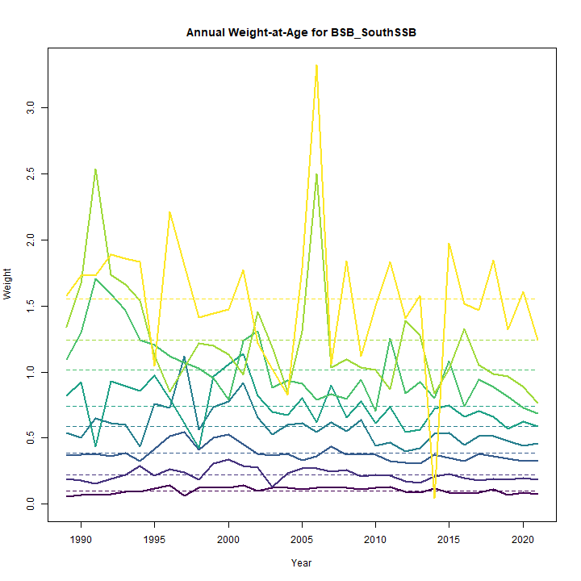
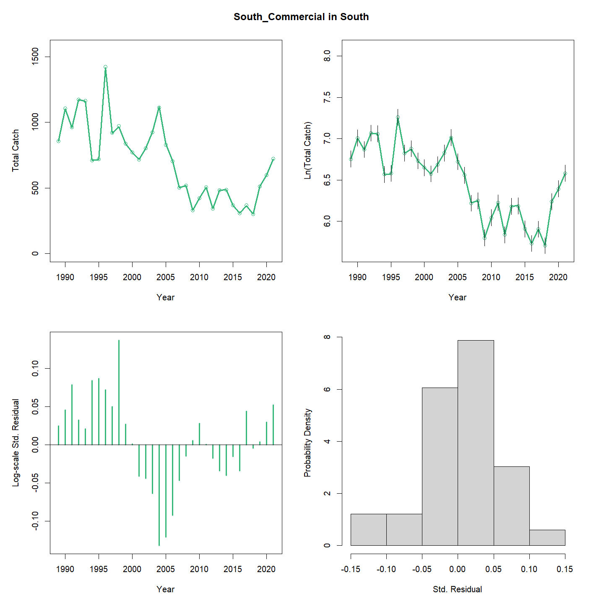
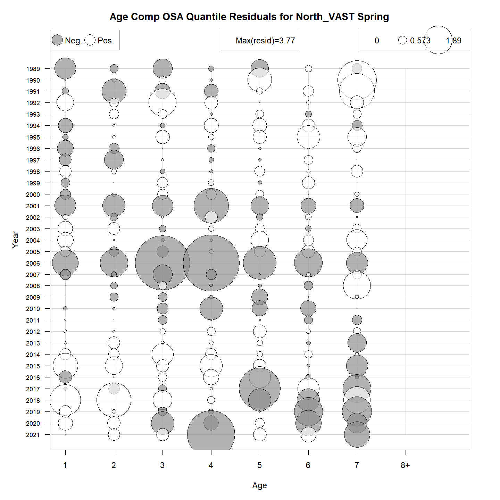
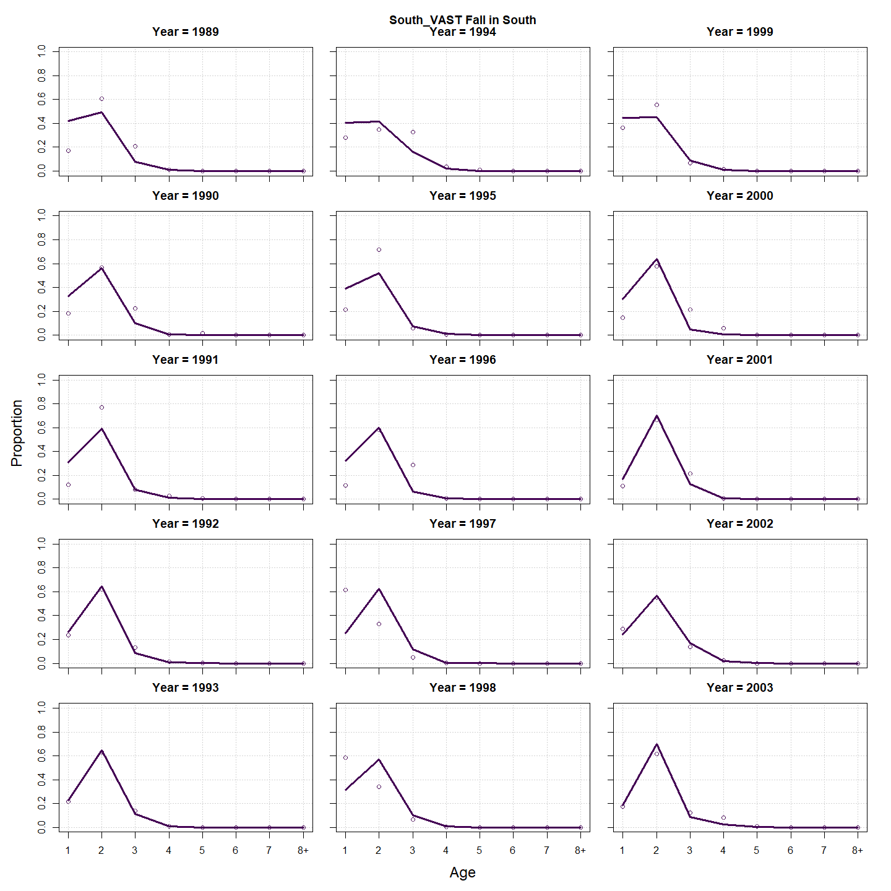
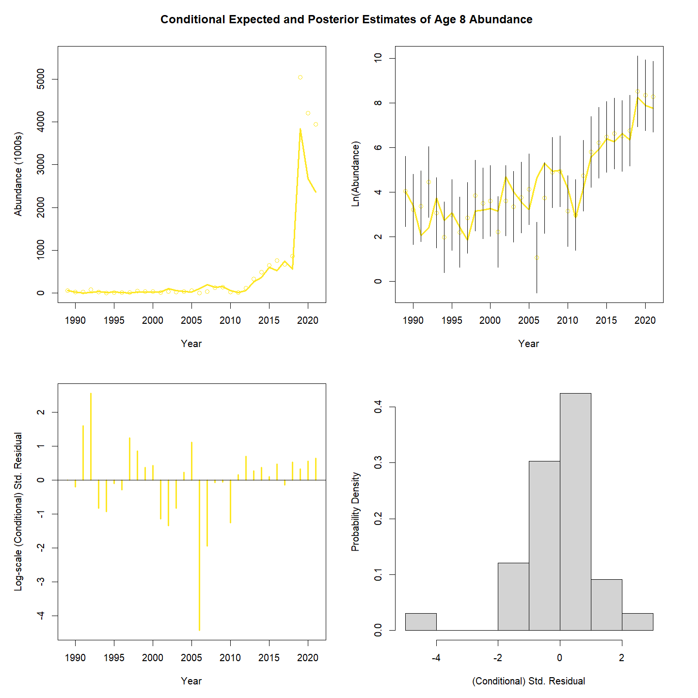
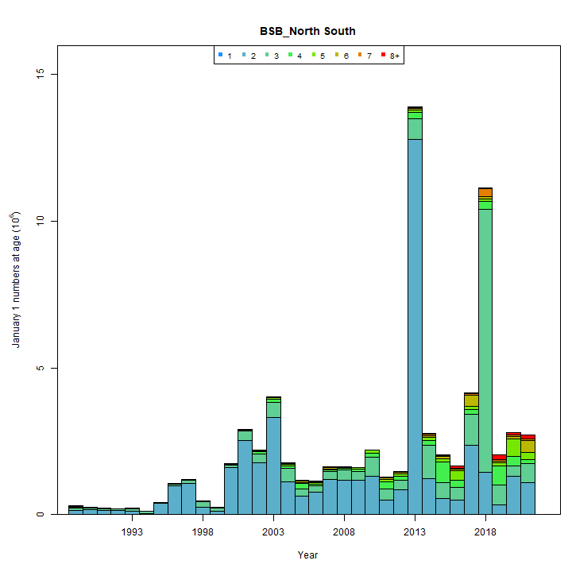
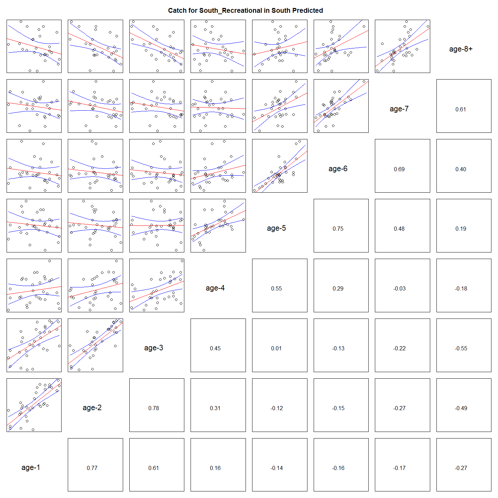

---
output:
  html_document:
    df_print: paged
    keep_md: yes
  word_document: default
  pdf_document:
    fig_caption: yes
    includes:
    keep_tex: yes
    number_sections: no
title: "WHAM figures and tables"
header-includes:
  - \usepackage{longtable}
  - \usepackage{booktabs}
  - \usepackage{caption,graphics}
  - \usepackage{makecell}
  - \usepackage{lscape}
  - \renewcommand\figurename{Fig.}
  - \captionsetup{labelsep=period, singlelinecheck=false}
  - \newcommand{\changesize}[1]{\fontsize{#1pt}{#1pt}\selectfont}
  - \renewcommand{\arraystretch}{1.5}
  - \renewcommand\theadfont{}
---

# {.tabset}

## Figures {.tabset}

### Input

### Diagnostics

### Results

### Retro

### Reference points

### Miscelaneous

## Tables {.tabset}

### Parameter estimates

<table class="table" style="margin-left: auto; margin-right: auto;">
<caption>Parameter estimates, standard errors, and confidence intervals. Rounded to 3 decimal places.</caption>
 <thead>
  <tr>
   <th style="text-align:left;">   </th>
   <th style="text-align:right;"> Estimate </th>
   <th style="text-align:right;"> Std. Error </th>
   <th style="text-align:right;"> 95\% CI lower </th>
   <th style="text-align:right;"> 95\% CI upper </th>
  </tr>
 </thead>
<tbody>
  <tr>
   <td style="text-align:left;"> BSB North Mean Recruitment </td>
   <td style="text-align:right;"> 19981.787 </td>
   <td style="text-align:right;"> 4983.191 </td>
   <td style="text-align:right;"> 12256.205 </td>
   <td style="text-align:right;"> 32577.116 </td>
  </tr>
  <tr>
   <td style="text-align:left;"> BSB North NAA $\sigma$ (age 1) </td>
   <td style="text-align:right;"> 1.002 </td>
   <td style="text-align:right;"> 0.133 </td>
   <td style="text-align:right;"> 0.772 </td>
   <td style="text-align:right;"> 1.301 </td>
  </tr>
  <tr>
   <td style="text-align:left;"> BSB North NAA $\sigma$ (age NA-) </td>
   <td style="text-align:right;"> -- </td>
   <td style="text-align:right;"> -- </td>
   <td style="text-align:right;"> -- </td>
   <td style="text-align:right;"> -- </td>
  </tr>
  <tr>
   <td style="text-align:left;"> BSB South Mean Recruitment </td>
   <td style="text-align:right;"> 17133.814 </td>
   <td style="text-align:right;"> 1855.966 </td>
   <td style="text-align:right;"> 13856.397 </td>
   <td style="text-align:right;"> 21186.429 </td>
  </tr>
  <tr>
   <td style="text-align:left;"> BSB South NAA $\sigma$ (age 1) </td>
   <td style="text-align:right;"> 0.273 </td>
   <td style="text-align:right;"> 0.074 </td>
   <td style="text-align:right;"> 0.161 </td>
   <td style="text-align:right;"> 0.463 </td>
  </tr>
  <tr>
   <td style="text-align:left;"> BSB South NAA $\sigma$ (age 2) </td>
   <td style="text-align:right;"> 0.415 </td>
   <td style="text-align:right;"> 0.046 </td>
   <td style="text-align:right;"> 0.335 </td>
   <td style="text-align:right;"> 0.515 </td>
  </tr>
  <tr>
   <td style="text-align:left;"> North REC CPA fully selected q </td>
   <td style="text-align:right;"> 0.000 </td>
   <td style="text-align:right;"> 0.000 </td>
   <td style="text-align:right;"> 0.000 </td>
   <td style="text-align:right;"> 0.000 </td>
  </tr>
  <tr>
   <td style="text-align:left;"> North VAST Spring fully selected q </td>
   <td style="text-align:right;"> 0.015 </td>
   <td style="text-align:right;"> 0.002 </td>
   <td style="text-align:right;"> 0.011 </td>
   <td style="text-align:right;"> 0.021 </td>
  </tr>
  <tr>
   <td style="text-align:left;"> North VAST Fall fully selected q </td>
   <td style="text-align:right;"> 0.020 </td>
   <td style="text-align:right;"> 0.004 </td>
   <td style="text-align:right;"> 0.014 </td>
   <td style="text-align:right;"> 0.029 </td>
  </tr>
  <tr>
   <td style="text-align:left;"> South REC CPA fully selected q </td>
   <td style="text-align:right;"> 0.000 </td>
   <td style="text-align:right;"> 0.000 </td>
   <td style="text-align:right;"> 0.000 </td>
   <td style="text-align:right;"> 0.000 </td>
  </tr>
  <tr>
   <td style="text-align:left;"> South VAST Spring fully selected q </td>
   <td style="text-align:right;"> 0.023 </td>
   <td style="text-align:right;"> 0.003 </td>
   <td style="text-align:right;"> 0.018 </td>
   <td style="text-align:right;"> 0.031 </td>
  </tr>
  <tr>
   <td style="text-align:left;"> South VAST Fall fully selected q </td>
   <td style="text-align:right;"> 0.001 </td>
   <td style="text-align:right;"> 0.000 </td>
   <td style="text-align:right;"> 0.000 </td>
   <td style="text-align:right;"> 0.001 </td>
  </tr>
  <tr>
   <td style="text-align:left;"> Block 1: $a_{50}$ </td>
   <td style="text-align:right;"> 1.730 </td>
   <td style="text-align:right;"> 0.226 </td>
   <td style="text-align:right;"> 1.327 </td>
   <td style="text-align:right;"> 2.215 </td>
  </tr>
  <tr>
   <td style="text-align:left;"> Block 1: 1/slope (increasing) </td>
   <td style="text-align:right;"> 0.222 </td>
   <td style="text-align:right;"> 0.070 </td>
   <td style="text-align:right;"> 0.120 </td>
   <td style="text-align:right;"> 0.407 </td>
  </tr>
  <tr>
   <td style="text-align:left;"> Block 2: $a_{50}$ </td>
   <td style="text-align:right;"> 2.485 </td>
   <td style="text-align:right;"> 0.153 </td>
   <td style="text-align:right;"> 2.195 </td>
   <td style="text-align:right;"> 2.795 </td>
  </tr>
  <tr>
   <td style="text-align:left;"> Block 2: 1/slope (increasing) </td>
   <td style="text-align:right;"> 0.287 </td>
   <td style="text-align:right;"> 0.036 </td>
   <td style="text-align:right;"> 0.225 </td>
   <td style="text-align:right;"> 0.366 </td>
  </tr>
  <tr>
   <td style="text-align:left;"> Block 3: $a_{50}$ </td>
   <td style="text-align:right;"> 2.238 </td>
   <td style="text-align:right;"> 0.102 </td>
   <td style="text-align:right;"> 2.043 </td>
   <td style="text-align:right;"> 2.444 </td>
  </tr>
  <tr>
   <td style="text-align:left;"> Block 3: 1/slope (increasing) </td>
   <td style="text-align:right;"> 0.373 </td>
   <td style="text-align:right;"> 0.026 </td>
   <td style="text-align:right;"> 0.325 </td>
   <td style="text-align:right;"> 0.427 </td>
  </tr>
  <tr>
   <td style="text-align:left;"> Block 4: $a_{50}$ </td>
   <td style="text-align:right;"> 3.117 </td>
   <td style="text-align:right;"> 0.149 </td>
   <td style="text-align:right;"> 2.830 </td>
   <td style="text-align:right;"> 3.414 </td>
  </tr>
  <tr>
   <td style="text-align:left;"> Block 4: 1/slope (increasing) </td>
   <td style="text-align:right;"> 0.618 </td>
   <td style="text-align:right;"> 0.049 </td>
   <td style="text-align:right;"> 0.528 </td>
   <td style="text-align:right;"> 0.721 </td>
  </tr>
  <tr>
   <td style="text-align:left;"> Block 5: Selectivity for age 1 </td>
   <td style="text-align:right;"> 0.069 </td>
   <td style="text-align:right;"> 0.023 </td>
   <td style="text-align:right;"> 0.035 </td>
   <td style="text-align:right;"> 0.131 </td>
  </tr>
  <tr>
   <td style="text-align:left;"> Block 5: Selectivity for age 2 </td>
   <td style="text-align:right;"> 1.000 </td>
   <td style="text-align:right;"> -- </td>
   <td style="text-align:right;"> -- </td>
   <td style="text-align:right;"> -- </td>
  </tr>
  <tr>
   <td style="text-align:left;"> Block 5: Selectivity for age 3 </td>
   <td style="text-align:right;"> 1.000 </td>
   <td style="text-align:right;"> -- </td>
   <td style="text-align:right;"> -- </td>
   <td style="text-align:right;"> -- </td>
  </tr>
  <tr>
   <td style="text-align:left;"> Block 5: Selectivity for age 4 </td>
   <td style="text-align:right;"> 1.000 </td>
   <td style="text-align:right;"> -- </td>
   <td style="text-align:right;"> -- </td>
   <td style="text-align:right;"> -- </td>
  </tr>
  <tr>
   <td style="text-align:left;"> Block 5: Selectivity for age 5 </td>
   <td style="text-align:right;"> 1.000 </td>
   <td style="text-align:right;"> -- </td>
   <td style="text-align:right;"> -- </td>
   <td style="text-align:right;"> -- </td>
  </tr>
  <tr>
   <td style="text-align:left;"> Block 5: Selectivity for age 6 </td>
   <td style="text-align:right;"> 1.000 </td>
   <td style="text-align:right;"> -- </td>
   <td style="text-align:right;"> -- </td>
   <td style="text-align:right;"> -- </td>
  </tr>
  <tr>
   <td style="text-align:left;"> Block 5: Selectivity for age 7 </td>
   <td style="text-align:right;"> 1.000 </td>
   <td style="text-align:right;"> -- </td>
   <td style="text-align:right;"> -- </td>
   <td style="text-align:right;"> -- </td>
  </tr>
  <tr>
   <td style="text-align:left;"> Block 5: Selectivity for age 8+ </td>
   <td style="text-align:right;"> 1.000 </td>
   <td style="text-align:right;"> -- </td>
   <td style="text-align:right;"> -- </td>
   <td style="text-align:right;"> -- </td>
  </tr>
  <tr>
   <td style="text-align:left;"> Block 6: $a_{50}$ </td>
   <td style="text-align:right;"> 3.187 </td>
   <td style="text-align:right;"> 0.179 </td>
   <td style="text-align:right;"> 2.843 </td>
   <td style="text-align:right;"> 3.543 </td>
  </tr>
  <tr>
   <td style="text-align:left;"> Block 6: 1/slope (increasing) </td>
   <td style="text-align:right;"> 0.536 </td>
   <td style="text-align:right;"> 0.055 </td>
   <td style="text-align:right;"> 0.437 </td>
   <td style="text-align:right;"> 0.655 </td>
  </tr>
  <tr>
   <td style="text-align:left;"> Block 7: $a_{50}$ </td>
   <td style="text-align:right;"> 2.098 </td>
   <td style="text-align:right;"> 0.208 </td>
   <td style="text-align:right;"> 1.716 </td>
   <td style="text-align:right;"> 2.531 </td>
  </tr>
  <tr>
   <td style="text-align:left;"> Block 7: 1/slope (increasing) </td>
   <td style="text-align:right;"> 0.590 </td>
   <td style="text-align:right;"> 0.130 </td>
   <td style="text-align:right;"> 0.380 </td>
   <td style="text-align:right;"> 0.902 </td>
  </tr>
  <tr>
   <td style="text-align:left;"> Block 8: $a_{50}$ </td>
   <td style="text-align:right;"> 4.283 </td>
   <td style="text-align:right;"> 0.372 </td>
   <td style="text-align:right;"> 3.553 </td>
   <td style="text-align:right;"> 4.994 </td>
  </tr>
  <tr>
   <td style="text-align:left;"> Block 8: 1/slope (increasing) </td>
   <td style="text-align:right;"> 1.101 </td>
   <td style="text-align:right;"> 0.155 </td>
   <td style="text-align:right;"> 0.830 </td>
   <td style="text-align:right;"> 1.442 </td>
  </tr>
  <tr>
   <td style="text-align:left;"> Block 9: Selectivity for age 1 </td>
   <td style="text-align:right;"> 0.127 </td>
   <td style="text-align:right;"> 0.019 </td>
   <td style="text-align:right;"> 0.095 </td>
   <td style="text-align:right;"> 0.169 </td>
  </tr>
  <tr>
   <td style="text-align:left;"> Block 9: Selectivity for age 2 </td>
   <td style="text-align:right;"> 0.649 </td>
   <td style="text-align:right;"> 0.070 </td>
   <td style="text-align:right;"> 0.504 </td>
   <td style="text-align:right;"> 0.771 </td>
  </tr>
  <tr>
   <td style="text-align:left;"> Block 9: Selectivity for age 3 </td>
   <td style="text-align:right;"> 1.000 </td>
   <td style="text-align:right;"> -- </td>
   <td style="text-align:right;"> -- </td>
   <td style="text-align:right;"> -- </td>
  </tr>
  <tr>
   <td style="text-align:left;"> Block 9: Selectivity for age 4 </td>
   <td style="text-align:right;"> 0.934 </td>
   <td style="text-align:right;"> 0.083 </td>
   <td style="text-align:right;"> 0.504 </td>
   <td style="text-align:right;"> 0.995 </td>
  </tr>
  <tr>
   <td style="text-align:left;"> Block 9: Selectivity for age 5 </td>
   <td style="text-align:right;"> 0.856 </td>
   <td style="text-align:right;"> 0.090 </td>
   <td style="text-align:right;"> 0.588 </td>
   <td style="text-align:right;"> 0.961 </td>
  </tr>
  <tr>
   <td style="text-align:left;"> Block 9: Selectivity for age 6 </td>
   <td style="text-align:right;"> 0.843 </td>
   <td style="text-align:right;"> 0.085 </td>
   <td style="text-align:right;"> 0.605 </td>
   <td style="text-align:right;"> 0.949 </td>
  </tr>
  <tr>
   <td style="text-align:left;"> Block 9: Selectivity for age 7 </td>
   <td style="text-align:right;"> 0.768 </td>
   <td style="text-align:right;"> 0.081 </td>
   <td style="text-align:right;"> 0.576 </td>
   <td style="text-align:right;"> 0.890 </td>
  </tr>
  <tr>
   <td style="text-align:left;"> Block 9: Selectivity for age 8+ </td>
   <td style="text-align:right;"> 0.729 </td>
   <td style="text-align:right;"> 0.069 </td>
   <td style="text-align:right;"> 0.576 </td>
   <td style="text-align:right;"> 0.842 </td>
  </tr>
  <tr>
   <td style="text-align:left;"> Block 10: Mean Selectivity for age 1 </td>
   <td style="text-align:right;"> 0.042 </td>
   <td style="text-align:right;"> 0.015 </td>
   <td style="text-align:right;"> 0.021 </td>
   <td style="text-align:right;"> 0.083 </td>
  </tr>
  <tr>
   <td style="text-align:left;"> Block 10: Mean Selectivity for age 2 </td>
   <td style="text-align:right;"> 0.284 </td>
   <td style="text-align:right;"> 0.085 </td>
   <td style="text-align:right;"> 0.148 </td>
   <td style="text-align:right;"> 0.474 </td>
  </tr>
  <tr>
   <td style="text-align:left;"> Block 10: Mean Selectivity for age 3 </td>
   <td style="text-align:right;"> 1.000 </td>
   <td style="text-align:right;"> -- </td>
   <td style="text-align:right;"> -- </td>
   <td style="text-align:right;"> -- </td>
  </tr>
  <tr>
   <td style="text-align:left;"> Block 10: Mean Selectivity for age 4 </td>
   <td style="text-align:right;"> 1.000 </td>
   <td style="text-align:right;"> -- </td>
   <td style="text-align:right;"> -- </td>
   <td style="text-align:right;"> -- </td>
  </tr>
  <tr>
   <td style="text-align:left;"> Block 10: Mean Selectivity for age 5 </td>
   <td style="text-align:right;"> 0.442 </td>
   <td style="text-align:right;"> 0.123 </td>
   <td style="text-align:right;"> 0.229 </td>
   <td style="text-align:right;"> 0.678 </td>
  </tr>
  <tr>
   <td style="text-align:left;"> Block 10: Mean Selectivity for age 6 </td>
   <td style="text-align:right;"> 0.353 </td>
   <td style="text-align:right;"> 0.104 </td>
   <td style="text-align:right;"> 0.182 </td>
   <td style="text-align:right;"> 0.572 </td>
  </tr>
  <tr>
   <td style="text-align:left;"> Block 10: Mean Selectivity for age 7 </td>
   <td style="text-align:right;"> 0.240 </td>
   <td style="text-align:right;"> 0.071 </td>
   <td style="text-align:right;"> 0.128 </td>
   <td style="text-align:right;"> 0.404 </td>
  </tr>
  <tr>
   <td style="text-align:left;"> Block 10: Mean Selectivity for age 8+ </td>
   <td style="text-align:right;"> 0.546 </td>
   <td style="text-align:right;"> 0.094 </td>
   <td style="text-align:right;"> 0.363 </td>
   <td style="text-align:right;"> 0.717 </td>
  </tr>
  <tr>
   <td style="text-align:left;"> Block 11: Mean Selectivity for age 1 </td>
   <td style="text-align:right;"> 0.364 </td>
   <td style="text-align:right;"> 0.092 </td>
   <td style="text-align:right;"> 0.208 </td>
   <td style="text-align:right;"> 0.554 </td>
  </tr>
  <tr>
   <td style="text-align:left;"> Block 11: Mean Selectivity for age 2 </td>
   <td style="text-align:right;"> 0.120 </td>
   <td style="text-align:right;"> 0.039 </td>
   <td style="text-align:right;"> 0.061 </td>
   <td style="text-align:right;"> 0.221 </td>
  </tr>
  <tr>
   <td style="text-align:left;"> Block 11: Mean Selectivity for age 3 </td>
   <td style="text-align:right;"> 1.000 </td>
   <td style="text-align:right;"> -- </td>
   <td style="text-align:right;"> -- </td>
   <td style="text-align:right;"> -- </td>
  </tr>
  <tr>
   <td style="text-align:left;"> Block 11: Mean Selectivity for age 4 </td>
   <td style="text-align:right;"> 0.505 </td>
   <td style="text-align:right;"> 0.156 </td>
   <td style="text-align:right;"> 0.231 </td>
   <td style="text-align:right;"> 0.776 </td>
  </tr>
  <tr>
   <td style="text-align:left;"> Block 11: Mean Selectivity for age 5 </td>
   <td style="text-align:right;"> 0.300 </td>
   <td style="text-align:right;"> 0.095 </td>
   <td style="text-align:right;"> 0.150 </td>
   <td style="text-align:right;"> 0.511 </td>
  </tr>
  <tr>
   <td style="text-align:left;"> Block 11: Mean Selectivity for age 6 </td>
   <td style="text-align:right;"> 0.236 </td>
   <td style="text-align:right;"> 0.074 </td>
   <td style="text-align:right;"> 0.121 </td>
   <td style="text-align:right;"> 0.408 </td>
  </tr>
  <tr>
   <td style="text-align:left;"> Block 11: Mean Selectivity for age 7 </td>
   <td style="text-align:right;"> 0.155 </td>
   <td style="text-align:right;"> 0.049 </td>
   <td style="text-align:right;"> 0.081 </td>
   <td style="text-align:right;"> 0.275 </td>
  </tr>
  <tr>
   <td style="text-align:left;"> Block 11: Mean Selectivity for age 8+ </td>
   <td style="text-align:right;"> 0.255 </td>
   <td style="text-align:right;"> 0.063 </td>
   <td style="text-align:right;"> 0.152 </td>
   <td style="text-align:right;"> 0.394 </td>
  </tr>
  <tr>
   <td style="text-align:left;"> Block 12: Selectivity for age 1 </td>
   <td style="text-align:right;"> 0.402 </td>
   <td style="text-align:right;"> 0.074 </td>
   <td style="text-align:right;"> 0.269 </td>
   <td style="text-align:right;"> 0.551 </td>
  </tr>
  <tr>
   <td style="text-align:left;"> Block 12: Selectivity for age 2 </td>
   <td style="text-align:right;"> 0.768 </td>
   <td style="text-align:right;"> 0.128 </td>
   <td style="text-align:right;"> 0.446 </td>
   <td style="text-align:right;"> 0.932 </td>
  </tr>
  <tr>
   <td style="text-align:left;"> Block 12: Selectivity for age 3 </td>
   <td style="text-align:right;"> 1.000 </td>
   <td style="text-align:right;"> -- </td>
   <td style="text-align:right;"> -- </td>
   <td style="text-align:right;"> -- </td>
  </tr>
  <tr>
   <td style="text-align:left;"> Block 12: Selectivity for age 4 </td>
   <td style="text-align:right;"> 0.758 </td>
   <td style="text-align:right;"> 0.123 </td>
   <td style="text-align:right;"> 0.457 </td>
   <td style="text-align:right;"> 0.921 </td>
  </tr>
  <tr>
   <td style="text-align:left;"> Block 12: Selectivity for age 5 </td>
   <td style="text-align:right;"> 0.816 </td>
   <td style="text-align:right;"> 0.140 </td>
   <td style="text-align:right;"> 0.415 </td>
   <td style="text-align:right;"> 0.965 </td>
  </tr>
  <tr>
   <td style="text-align:left;"> Block 12: Selectivity for age 6 </td>
   <td style="text-align:right;"> 0.911 </td>
   <td style="text-align:right;"> 0.141 </td>
   <td style="text-align:right;"> 0.250 </td>
   <td style="text-align:right;"> 0.997 </td>
  </tr>
  <tr>
   <td style="text-align:left;"> Block 12: Selectivity for age 7 </td>
   <td style="text-align:right;"> 0.872 </td>
   <td style="text-align:right;"> 0.132 </td>
   <td style="text-align:right;"> 0.401 </td>
   <td style="text-align:right;"> 0.986 </td>
  </tr>
  <tr>
   <td style="text-align:left;"> Block 12: Selectivity for age 8+ </td>
   <td style="text-align:right;"> 1.000 </td>
   <td style="text-align:right;"> 0.000 </td>
   <td style="text-align:right;"> 0.000 </td>
   <td style="text-align:right;"> 1.000 </td>
  </tr>
  <tr>
   <td style="text-align:left;"> Block 13: Selectivity for age 1 </td>
   <td style="text-align:right;"> 0.194 </td>
   <td style="text-align:right;"> 0.056 </td>
   <td style="text-align:right;"> 0.106 </td>
   <td style="text-align:right;"> 0.327 </td>
  </tr>
  <tr>
   <td style="text-align:left;"> Block 13: Selectivity for age 2 </td>
   <td style="text-align:right;"> 1.000 </td>
   <td style="text-align:right;"> -- </td>
   <td style="text-align:right;"> -- </td>
   <td style="text-align:right;"> -- </td>
  </tr>
  <tr>
   <td style="text-align:left;"> Block 13: Selectivity for age 3 </td>
   <td style="text-align:right;"> 0.822 </td>
   <td style="text-align:right;"> 0.278 </td>
   <td style="text-align:right;"> 0.100 </td>
   <td style="text-align:right;"> 0.995 </td>
  </tr>
  <tr>
   <td style="text-align:left;"> Block 13: Selectivity for age 4 </td>
   <td style="text-align:right;"> 0.455 </td>
   <td style="text-align:right;"> 0.147 </td>
   <td style="text-align:right;"> 0.207 </td>
   <td style="text-align:right;"> 0.728 </td>
  </tr>
  <tr>
   <td style="text-align:left;"> Block 13: Selectivity for age 5 </td>
   <td style="text-align:right;"> 0.191 </td>
   <td style="text-align:right;"> 0.061 </td>
   <td style="text-align:right;"> 0.098 </td>
   <td style="text-align:right;"> 0.339 </td>
  </tr>
  <tr>
   <td style="text-align:left;"> Block 13: Selectivity for age 6 </td>
   <td style="text-align:right;"> 0.188 </td>
   <td style="text-align:right;"> 0.060 </td>
   <td style="text-align:right;"> 0.096 </td>
   <td style="text-align:right;"> 0.334 </td>
  </tr>
  <tr>
   <td style="text-align:left;"> Block 13: Selectivity for age 7 </td>
   <td style="text-align:right;"> 0.118 </td>
   <td style="text-align:right;"> 0.038 </td>
   <td style="text-align:right;"> 0.061 </td>
   <td style="text-align:right;"> 0.215 </td>
  </tr>
  <tr>
   <td style="text-align:left;"> Block 13: Selectivity for age 8+ </td>
   <td style="text-align:right;"> 0.301 </td>
   <td style="text-align:right;"> 0.071 </td>
   <td style="text-align:right;"> 0.182 </td>
   <td style="text-align:right;"> 0.455 </td>
  </tr>
  <tr>
   <td style="text-align:left;"> Block 14: Selectivity for age 1 </td>
   <td style="text-align:right;"> 0.291 </td>
   <td style="text-align:right;"> 0.079 </td>
   <td style="text-align:right;"> 0.163 </td>
   <td style="text-align:right;"> 0.464 </td>
  </tr>
  <tr>
   <td style="text-align:left;"> Block 14: Selectivity for age 2 </td>
   <td style="text-align:right;"> 1.000 </td>
   <td style="text-align:right;"> -- </td>
   <td style="text-align:right;"> -- </td>
   <td style="text-align:right;"> -- </td>
  </tr>
  <tr>
   <td style="text-align:left;"> Block 14: Selectivity for age 3 </td>
   <td style="text-align:right;"> 0.436 </td>
   <td style="text-align:right;"> 0.117 </td>
   <td style="text-align:right;"> 0.233 </td>
   <td style="text-align:right;"> 0.663 </td>
  </tr>
  <tr>
   <td style="text-align:left;"> Block 14: Selectivity for age 4 </td>
   <td style="text-align:right;"> 0.155 </td>
   <td style="text-align:right;"> 0.043 </td>
   <td style="text-align:right;"> 0.088 </td>
   <td style="text-align:right;"> 0.257 </td>
  </tr>
  <tr>
   <td style="text-align:left;"> Block 14: Selectivity for age 5 </td>
   <td style="text-align:right;"> 0.058 </td>
   <td style="text-align:right;"> 0.016 </td>
   <td style="text-align:right;"> 0.033 </td>
   <td style="text-align:right;"> 0.099 </td>
  </tr>
  <tr>
   <td style="text-align:left;"> Block 14: Selectivity for age 6 </td>
   <td style="text-align:right;"> 0.025 </td>
   <td style="text-align:right;"> 0.007 </td>
   <td style="text-align:right;"> 0.014 </td>
   <td style="text-align:right;"> 0.043 </td>
  </tr>
  <tr>
   <td style="text-align:left;"> Block 14: Selectivity for age 7 </td>
   <td style="text-align:right;"> 0.023 </td>
   <td style="text-align:right;"> 0.007 </td>
   <td style="text-align:right;"> 0.013 </td>
   <td style="text-align:right;"> 0.040 </td>
  </tr>
  <tr>
   <td style="text-align:left;"> Block 14: Selectivity for age 8+ </td>
   <td style="text-align:right;"> 0.047 </td>
   <td style="text-align:right;"> 0.010 </td>
   <td style="text-align:right;"> 0.031 </td>
   <td style="text-align:right;"> 0.071 </td>
  </tr>
  <tr>
   <td style="text-align:left;"> Block 10: Selectivity RE $\sigma$ </td>
   <td style="text-align:right;"> 1.234 </td>
   <td style="text-align:right;"> 0.141 </td>
   <td style="text-align:right;"> 0.987 </td>
   <td style="text-align:right;"> 1.543 </td>
  </tr>
  <tr>
   <td style="text-align:left;"> Block 11: Selectivity RE $\sigma$ </td>
   <td style="text-align:right;"> 1.245 </td>
   <td style="text-align:right;"> 0.119 </td>
   <td style="text-align:right;"> 1.033 </td>
   <td style="text-align:right;"> 1.502 </td>
  </tr>
  <tr>
   <td style="text-align:left;"> North Commercial in North age comp, logistic-normal: $\sigma$ </td>
   <td style="text-align:right;"> 9.072 </td>
   <td style="text-align:right;"> 0.466 </td>
   <td style="text-align:right;"> 8.204 </td>
   <td style="text-align:right;"> 10.032 </td>
  </tr>
  <tr>
   <td style="text-align:left;"> North Recreational in North age comp, logistic-normal: $\sigma$ </td>
   <td style="text-align:right;"> 1.637 </td>
   <td style="text-align:right;"> 0.139 </td>
   <td style="text-align:right;"> 1.386 </td>
   <td style="text-align:right;"> 1.932 </td>
  </tr>
  <tr>
   <td style="text-align:left;"> South Commercial in South age comp, logistic-normal: $\sigma$ </td>
   <td style="text-align:right;"> 5.004 </td>
   <td style="text-align:right;"> 0.301 </td>
   <td style="text-align:right;"> 4.447 </td>
   <td style="text-align:right;"> 5.630 </td>
  </tr>
  <tr>
   <td style="text-align:left;"> South Recreational in South age comp, logistic-normal: $\sigma$ </td>
   <td style="text-align:right;"> 5.106 </td>
   <td style="text-align:right;"> 0.383 </td>
   <td style="text-align:right;"> 4.407 </td>
   <td style="text-align:right;"> 5.916 </td>
  </tr>
  <tr>
   <td style="text-align:left;"> North REC CPA in North age comp, logistic-normal: $\sigma$ </td>
   <td style="text-align:right;"> 1.450 </td>
   <td style="text-align:right;"> 0.152 </td>
   <td style="text-align:right;"> 1.180 </td>
   <td style="text-align:right;"> 1.781 </td>
  </tr>
  <tr>
   <td style="text-align:left;"> North VAST Spring in North age comp, logistic-normal: $\sigma$ </td>
   <td style="text-align:right;"> 7.732 </td>
   <td style="text-align:right;"> 0.573 </td>
   <td style="text-align:right;"> 6.686 </td>
   <td style="text-align:right;"> 8.941 </td>
  </tr>
  <tr>
   <td style="text-align:left;"> North VAST Fall in North age comp, logistic-normal: $\sigma$ </td>
   <td style="text-align:right;"> 7.147 </td>
   <td style="text-align:right;"> 0.584 </td>
   <td style="text-align:right;"> 6.089 </td>
   <td style="text-align:right;"> 8.389 </td>
  </tr>
  <tr>
   <td style="text-align:left;"> South REC CPA in South age comp, logistic-normal: $\sigma$ </td>
   <td style="text-align:right;"> 5.649 </td>
   <td style="text-align:right;"> 0.509 </td>
   <td style="text-align:right;"> 4.734 </td>
   <td style="text-align:right;"> 6.741 </td>
  </tr>
  <tr>
   <td style="text-align:left;"> South VAST Spring in South age comp, logistic-normal: $\sigma$ </td>
   <td style="text-align:right;"> 8.787 </td>
   <td style="text-align:right;"> 0.473 </td>
   <td style="text-align:right;"> 7.907 </td>
   <td style="text-align:right;"> 9.764 </td>
  </tr>
  <tr>
   <td style="text-align:left;"> South VAST Fall in South age comp, logistic-normal: $\sigma$ </td>
   <td style="text-align:right;"> 7.497 </td>
   <td style="text-align:right;"> 0.440 </td>
   <td style="text-align:right;"> 6.683 </td>
   <td style="text-align:right;"> 8.411 </td>
  </tr>
</tbody>
</table>

### Abundance at age

<table class="table" style="margin-left: auto; margin-right: auto;">
<caption>Abundance at age (1000s) for BSB North in North.</caption>
 <thead>
  <tr>
   <th style="text-align:left;">   </th>
   <th style="text-align:right;"> 1 </th>
   <th style="text-align:right;"> 2 </th>
   <th style="text-align:right;"> 3 </th>
   <th style="text-align:right;"> 4 </th>
   <th style="text-align:right;"> 5 </th>
   <th style="text-align:right;"> 6 </th>
   <th style="text-align:right;"> 7 </th>
   <th style="text-align:right;"> 8+ </th>
  </tr>
 </thead>
<tbody>
  <tr>
   <td style="text-align:left;"> 1989 </td>
   <td style="text-align:right;"> 4737 </td>
   <td style="text-align:right;"> 2518 </td>
   <td style="text-align:right;"> 1227 </td>
   <td style="text-align:right;"> 584 </td>
   <td style="text-align:right;"> 277 </td>
   <td style="text-align:right;"> 131 </td>
   <td style="text-align:right;"> 62 </td>
   <td style="text-align:right;"> 56 </td>
  </tr>
  <tr>
   <td style="text-align:left;"> 1990 </td>
   <td style="text-align:right;"> 4389 </td>
   <td style="text-align:right;"> 2450 </td>
   <td style="text-align:right;"> 1119 </td>
   <td style="text-align:right;"> 234 </td>
   <td style="text-align:right;"> 147 </td>
   <td style="text-align:right;"> 23 </td>
   <td style="text-align:right;"> 3 </td>
   <td style="text-align:right;"> 25 </td>
  </tr>
  <tr>
   <td style="text-align:left;"> 1991 </td>
   <td style="text-align:right;"> 3789 </td>
   <td style="text-align:right;"> 3683 </td>
   <td style="text-align:right;"> 374 </td>
   <td style="text-align:right;"> 491 </td>
   <td style="text-align:right;"> 91 </td>
   <td style="text-align:right;"> 21 </td>
   <td style="text-align:right;"> 1 </td>
   <td style="text-align:right;"> 29 </td>
  </tr>
  <tr>
   <td style="text-align:left;"> 1992 </td>
   <td style="text-align:right;"> 3717 </td>
   <td style="text-align:right;"> 4216 </td>
   <td style="text-align:right;"> 198 </td>
   <td style="text-align:right;"> 67 </td>
   <td style="text-align:right;"> 218 </td>
   <td style="text-align:right;"> 39 </td>
   <td style="text-align:right;"> 13 </td>
   <td style="text-align:right;"> 86 </td>
  </tr>
  <tr>
   <td style="text-align:left;"> 1993 </td>
   <td style="text-align:right;"> 1928 </td>
   <td style="text-align:right;"> 1932 </td>
   <td style="text-align:right;"> 303 </td>
   <td style="text-align:right;"> 254 </td>
   <td style="text-align:right;"> 40 </td>
   <td style="text-align:right;"> 240 </td>
   <td style="text-align:right;"> 19 </td>
   <td style="text-align:right;"> 22 </td>
  </tr>
  <tr>
   <td style="text-align:left;"> 1994 </td>
   <td style="text-align:right;"> 17959 </td>
   <td style="text-align:right;"> 451 </td>
   <td style="text-align:right;"> 963 </td>
   <td style="text-align:right;"> 97 </td>
   <td style="text-align:right;"> 115 </td>
   <td style="text-align:right;"> 11 </td>
   <td style="text-align:right;"> 66 </td>
   <td style="text-align:right;"> 7 </td>
  </tr>
  <tr>
   <td style="text-align:left;"> 1995 </td>
   <td style="text-align:right;"> 35737 </td>
   <td style="text-align:right;"> 1904 </td>
   <td style="text-align:right;"> 336 </td>
   <td style="text-align:right;"> 72 </td>
   <td style="text-align:right;"> 67 </td>
   <td style="text-align:right;"> 5 </td>
   <td style="text-align:right;"> 7 </td>
   <td style="text-align:right;"> 20 </td>
  </tr>
  <tr>
   <td style="text-align:left;"> 1996 </td>
   <td style="text-align:right;"> 41213 </td>
   <td style="text-align:right;"> 4041 </td>
   <td style="text-align:right;"> 423 </td>
   <td style="text-align:right;"> 116 </td>
   <td style="text-align:right;"> 30 </td>
   <td style="text-align:right;"> 54 </td>
   <td style="text-align:right;"> 6 </td>
   <td style="text-align:right;"> 9 </td>
  </tr>
  <tr>
   <td style="text-align:left;"> 1997 </td>
   <td style="text-align:right;"> 6157 </td>
   <td style="text-align:right;"> 10016 </td>
   <td style="text-align:right;"> 575 </td>
   <td style="text-align:right;"> 135 </td>
   <td style="text-align:right;"> 90 </td>
   <td style="text-align:right;"> 29 </td>
   <td style="text-align:right;"> 34 </td>
   <td style="text-align:right;"> 17 </td>
  </tr>
  <tr>
   <td style="text-align:left;"> 1998 </td>
   <td style="text-align:right;"> 3362 </td>
   <td style="text-align:right;"> 3169 </td>
   <td style="text-align:right;"> 631 </td>
   <td style="text-align:right;"> 464 </td>
   <td style="text-align:right;"> 87 </td>
   <td style="text-align:right;"> 117 </td>
   <td style="text-align:right;"> 23 </td>
   <td style="text-align:right;"> 47 </td>
  </tr>
  <tr>
   <td style="text-align:left;"> 1999 </td>
   <td style="text-align:right;"> 81543 </td>
   <td style="text-align:right;"> 3375 </td>
   <td style="text-align:right;"> 707 </td>
   <td style="text-align:right;"> 382 </td>
   <td style="text-align:right;"> 159 </td>
   <td style="text-align:right;"> 82 </td>
   <td style="text-align:right;"> 59 </td>
   <td style="text-align:right;"> 33 </td>
  </tr>
  <tr>
   <td style="text-align:left;"> 2000 </td>
   <td style="text-align:right;"> 82004 </td>
   <td style="text-align:right;"> 8158 </td>
   <td style="text-align:right;"> 861 </td>
   <td style="text-align:right;"> 765 </td>
   <td style="text-align:right;"> 170 </td>
   <td style="text-align:right;"> 196 </td>
   <td style="text-align:right;"> 21 </td>
   <td style="text-align:right;"> 37 </td>
  </tr>
  <tr>
   <td style="text-align:left;"> 2001 </td>
   <td style="text-align:right;"> 27707 </td>
   <td style="text-align:right;"> 5744 </td>
   <td style="text-align:right;"> 3089 </td>
   <td style="text-align:right;"> 818 </td>
   <td style="text-align:right;"> 524 </td>
   <td style="text-align:right;"> 201 </td>
   <td style="text-align:right;"> 277 </td>
   <td style="text-align:right;"> 9 </td>
  </tr>
  <tr>
   <td style="text-align:left;"> 2002 </td>
   <td style="text-align:right;"> 45533 </td>
   <td style="text-align:right;"> 9542 </td>
   <td style="text-align:right;"> 3888 </td>
   <td style="text-align:right;"> 2184 </td>
   <td style="text-align:right;"> 252 </td>
   <td style="text-align:right;"> 89 </td>
   <td style="text-align:right;"> 99 </td>
   <td style="text-align:right;"> 37 </td>
  </tr>
  <tr>
   <td style="text-align:left;"> 2003 </td>
   <td style="text-align:right;"> 26863 </td>
   <td style="text-align:right;"> 4322 </td>
   <td style="text-align:right;"> 2244 </td>
   <td style="text-align:right;"> 2499 </td>
   <td style="text-align:right;"> 1317 </td>
   <td style="text-align:right;"> 105 </td>
   <td style="text-align:right;"> 50 </td>
   <td style="text-align:right;"> 28 </td>
  </tr>
  <tr>
   <td style="text-align:left;"> 2004 </td>
   <td style="text-align:right;"> 12820 </td>
   <td style="text-align:right;"> 4662 </td>
   <td style="text-align:right;"> 5258 </td>
   <td style="text-align:right;"> 1133 </td>
   <td style="text-align:right;"> 2004 </td>
   <td style="text-align:right;"> 540 </td>
   <td style="text-align:right;"> 6 </td>
   <td style="text-align:right;"> 43 </td>
  </tr>
  <tr>
   <td style="text-align:left;"> 2005 </td>
   <td style="text-align:right;"> 21525 </td>
   <td style="text-align:right;"> 4661 </td>
   <td style="text-align:right;"> 1029 </td>
   <td style="text-align:right;"> 1899 </td>
   <td style="text-align:right;"> 953 </td>
   <td style="text-align:right;"> 773 </td>
   <td style="text-align:right;"> 157 </td>
   <td style="text-align:right;"> 62 </td>
  </tr>
  <tr>
   <td style="text-align:left;"> 2006 </td>
   <td style="text-align:right;"> 47478 </td>
   <td style="text-align:right;"> 7924 </td>
   <td style="text-align:right;"> 1436 </td>
   <td style="text-align:right;"> 1578 </td>
   <td style="text-align:right;"> 2093 </td>
   <td style="text-align:right;"> 326 </td>
   <td style="text-align:right;"> 422 </td>
   <td style="text-align:right;"> 3 </td>
  </tr>
  <tr>
   <td style="text-align:left;"> 2007 </td>
   <td style="text-align:right;"> 32406 </td>
   <td style="text-align:right;"> 8551 </td>
   <td style="text-align:right;"> 2661 </td>
   <td style="text-align:right;"> 807 </td>
   <td style="text-align:right;"> 578 </td>
   <td style="text-align:right;"> 619 </td>
   <td style="text-align:right;"> 298 </td>
   <td style="text-align:right;"> 42 </td>
  </tr>
  <tr>
   <td style="text-align:left;"> 2008 </td>
   <td style="text-align:right;"> 35352 </td>
   <td style="text-align:right;"> 8761 </td>
   <td style="text-align:right;"> 2956 </td>
   <td style="text-align:right;"> 1167 </td>
   <td style="text-align:right;"> 325 </td>
   <td style="text-align:right;"> 250 </td>
   <td style="text-align:right;"> 202 </td>
   <td style="text-align:right;"> 131 </td>
  </tr>
  <tr>
   <td style="text-align:left;"> 2009 </td>
   <td style="text-align:right;"> 27775 </td>
   <td style="text-align:right;"> 14398 </td>
   <td style="text-align:right;"> 4692 </td>
   <td style="text-align:right;"> 3165 </td>
   <td style="text-align:right;"> 783 </td>
   <td style="text-align:right;"> 58 </td>
   <td style="text-align:right;"> 25 </td>
   <td style="text-align:right;"> 140 </td>
  </tr>
  <tr>
   <td style="text-align:left;"> 2010 </td>
   <td style="text-align:right;"> 13013 </td>
   <td style="text-align:right;"> 10619 </td>
   <td style="text-align:right;"> 6706 </td>
   <td style="text-align:right;"> 3890 </td>
   <td style="text-align:right;"> 2522 </td>
   <td style="text-align:right;"> 359 </td>
   <td style="text-align:right;"> 20 </td>
   <td style="text-align:right;"> 23 </td>
  </tr>
  <tr>
   <td style="text-align:left;"> 2011 </td>
   <td style="text-align:right;"> 28260 </td>
   <td style="text-align:right;"> 9206 </td>
   <td style="text-align:right;"> 3752 </td>
   <td style="text-align:right;"> 3259 </td>
   <td style="text-align:right;"> 1355 </td>
   <td style="text-align:right;"> 858 </td>
   <td style="text-align:right;"> 121 </td>
   <td style="text-align:right;"> 20 </td>
  </tr>
  <tr>
   <td style="text-align:left;"> 2012 </td>
   <td style="text-align:right;"> 96352 </td>
   <td style="text-align:right;"> 21724 </td>
   <td style="text-align:right;"> 6747 </td>
   <td style="text-align:right;"> 3292 </td>
   <td style="text-align:right;"> 2717 </td>
   <td style="text-align:right;"> 1044 </td>
   <td style="text-align:right;"> 541 </td>
   <td style="text-align:right;"> 115 </td>
  </tr>
  <tr>
   <td style="text-align:left;"> 2013 </td>
   <td style="text-align:right;"> 43396 </td>
   <td style="text-align:right;"> 30256 </td>
   <td style="text-align:right;"> 4168 </td>
   <td style="text-align:right;"> 4001 </td>
   <td style="text-align:right;"> 2507 </td>
   <td style="text-align:right;"> 1622 </td>
   <td style="text-align:right;"> 492 </td>
   <td style="text-align:right;"> 331 </td>
  </tr>
  <tr>
   <td style="text-align:left;"> 2014 </td>
   <td style="text-align:right;"> 15483 </td>
   <td style="text-align:right;"> 14897 </td>
   <td style="text-align:right;"> 21694 </td>
   <td style="text-align:right;"> 3876 </td>
   <td style="text-align:right;"> 2325 </td>
   <td style="text-align:right;"> 1390 </td>
   <td style="text-align:right;"> 887 </td>
   <td style="text-align:right;"> 496 </td>
  </tr>
  <tr>
   <td style="text-align:left;"> 2015 </td>
   <td style="text-align:right;"> 16628 </td>
   <td style="text-align:right;"> 14475 </td>
   <td style="text-align:right;"> 7071 </td>
   <td style="text-align:right;"> 12838 </td>
   <td style="text-align:right;"> 2595 </td>
   <td style="text-align:right;"> 1212 </td>
   <td style="text-align:right;"> 633 </td>
   <td style="text-align:right;"> 652 </td>
  </tr>
  <tr>
   <td style="text-align:left;"> 2016 </td>
   <td style="text-align:right;"> 66710 </td>
   <td style="text-align:right;"> 25011 </td>
   <td style="text-align:right;"> 3797 </td>
   <td style="text-align:right;"> 4055 </td>
   <td style="text-align:right;"> 14017 </td>
   <td style="text-align:right;"> 1555 </td>
   <td style="text-align:right;"> 1042 </td>
   <td style="text-align:right;"> 762 </td>
  </tr>
  <tr>
   <td style="text-align:left;"> 2017 </td>
   <td style="text-align:right;"> 30471 </td>
   <td style="text-align:right;"> 56205 </td>
   <td style="text-align:right;"> 6053 </td>
   <td style="text-align:right;"> 2894 </td>
   <td style="text-align:right;"> 3250 </td>
   <td style="text-align:right;"> 10380 </td>
   <td style="text-align:right;"> 741 </td>
   <td style="text-align:right;"> 674 </td>
  </tr>
  <tr>
   <td style="text-align:left;"> 2018 </td>
   <td style="text-align:right;"> 8861 </td>
   <td style="text-align:right;"> 16918 </td>
   <td style="text-align:right;"> 9982 </td>
   <td style="text-align:right;"> 3354 </td>
   <td style="text-align:right;"> 1553 </td>
   <td style="text-align:right;"> 2103 </td>
   <td style="text-align:right;"> 7755 </td>
   <td style="text-align:right;"> 867 </td>
  </tr>
  <tr>
   <td style="text-align:left;"> 2019 </td>
   <td style="text-align:right;"> 25941 </td>
   <td style="text-align:right;"> 7291 </td>
   <td style="text-align:right;"> 8218 </td>
   <td style="text-align:right;"> 17371 </td>
   <td style="text-align:right;"> 3409 </td>
   <td style="text-align:right;"> 1294 </td>
   <td style="text-align:right;"> 1270 </td>
   <td style="text-align:right;"> 5042 </td>
  </tr>
  <tr>
   <td style="text-align:left;"> 2020 </td>
   <td style="text-align:right;"> 30512 </td>
   <td style="text-align:right;"> 17042 </td>
   <td style="text-align:right;"> 3536 </td>
   <td style="text-align:right;"> 7695 </td>
   <td style="text-align:right;"> 12137 </td>
   <td style="text-align:right;"> 2199 </td>
   <td style="text-align:right;"> 1172 </td>
   <td style="text-align:right;"> 4200 </td>
  </tr>
  <tr>
   <td style="text-align:left;"> 2021 </td>
   <td style="text-align:right;"> 25076 </td>
   <td style="text-align:right;"> 19735 </td>
   <td style="text-align:right;"> 10291 </td>
   <td style="text-align:right;"> 2444 </td>
   <td style="text-align:right;"> 5107 </td>
   <td style="text-align:right;"> 9293 </td>
   <td style="text-align:right;"> 1368 </td>
   <td style="text-align:right;"> 3950 </td>
  </tr>
</tbody>
</table>

<table class="table" style="margin-left: auto; margin-right: auto;">
<caption>Abundance at age (1000s) for BSB North in South.</caption>
 <thead>
  <tr>
   <th style="text-align:left;">   </th>
   <th style="text-align:right;"> 1 </th>
   <th style="text-align:right;"> 2 </th>
   <th style="text-align:right;"> 3 </th>
   <th style="text-align:right;"> 4 </th>
   <th style="text-align:right;"> 5 </th>
   <th style="text-align:right;"> 6 </th>
   <th style="text-align:right;"> 7 </th>
   <th style="text-align:right;"> 8+ </th>
  </tr>
 </thead>
<tbody>
  <tr>
   <td style="text-align:left;"> 1989 </td>
   <td style="text-align:right;"> 0 </td>
   <td style="text-align:right;"> 155 </td>
   <td style="text-align:right;"> 76 </td>
   <td style="text-align:right;"> 36 </td>
   <td style="text-align:right;"> 17 </td>
   <td style="text-align:right;"> 8 </td>
   <td style="text-align:right;"> 4 </td>
   <td style="text-align:right;"> 3 </td>
  </tr>
  <tr>
   <td style="text-align:left;"> 1990 </td>
   <td style="text-align:right;"> 0 </td>
   <td style="text-align:right;"> 164 </td>
   <td style="text-align:right;"> 62 </td>
   <td style="text-align:right;"> 21 </td>
   <td style="text-align:right;"> 9 </td>
   <td style="text-align:right;"> 4 </td>
   <td style="text-align:right;"> 2 </td>
   <td style="text-align:right;"> 2 </td>
  </tr>
  <tr>
   <td style="text-align:left;"> 1991 </td>
   <td style="text-align:right;"> 0 </td>
   <td style="text-align:right;"> 160 </td>
   <td style="text-align:right;"> 48 </td>
   <td style="text-align:right;"> 20 </td>
   <td style="text-align:right;"> 4 </td>
   <td style="text-align:right;"> 2 </td>
   <td style="text-align:right;"> 0 </td>
   <td style="text-align:right;"> 1 </td>
  </tr>
  <tr>
   <td style="text-align:left;"> 1992 </td>
   <td style="text-align:right;"> 0 </td>
   <td style="text-align:right;"> 140 </td>
   <td style="text-align:right;"> 53 </td>
   <td style="text-align:right;"> 8 </td>
   <td style="text-align:right;"> 10 </td>
   <td style="text-align:right;"> 2 </td>
   <td style="text-align:right;"> 0 </td>
   <td style="text-align:right;"> 1 </td>
  </tr>
  <tr>
   <td style="text-align:left;"> 1993 </td>
   <td style="text-align:right;"> 0 </td>
   <td style="text-align:right;"> 133 </td>
   <td style="text-align:right;"> 74 </td>
   <td style="text-align:right;"> 6 </td>
   <td style="text-align:right;"> 2 </td>
   <td style="text-align:right;"> 6 </td>
   <td style="text-align:right;"> 1 </td>
   <td style="text-align:right;"> 2 </td>
  </tr>
  <tr>
   <td style="text-align:left;"> 1994 </td>
   <td style="text-align:right;"> 0 </td>
   <td style="text-align:right;"> 53 </td>
   <td style="text-align:right;"> 57 </td>
   <td style="text-align:right;"> 8 </td>
   <td style="text-align:right;"> 5 </td>
   <td style="text-align:right;"> 1 </td>
   <td style="text-align:right;"> 5 </td>
   <td style="text-align:right;"> 1 </td>
  </tr>
  <tr>
   <td style="text-align:left;"> 1995 </td>
   <td style="text-align:right;"> 0 </td>
   <td style="text-align:right;"> 390 </td>
   <td style="text-align:right;"> 12 </td>
   <td style="text-align:right;"> 13 </td>
   <td style="text-align:right;"> 2 </td>
   <td style="text-align:right;"> 1 </td>
   <td style="text-align:right;"> 0 </td>
   <td style="text-align:right;"> 3 </td>
  </tr>
  <tr>
   <td style="text-align:left;"> 1996 </td>
   <td style="text-align:right;"> 0 </td>
   <td style="text-align:right;"> 994 </td>
   <td style="text-align:right;"> 54 </td>
   <td style="text-align:right;"> 8 </td>
   <td style="text-align:right;"> 2 </td>
   <td style="text-align:right;"> 2 </td>
   <td style="text-align:right;"> 0 </td>
   <td style="text-align:right;"> 1 </td>
  </tr>
  <tr>
   <td style="text-align:left;"> 1997 </td>
   <td style="text-align:right;"> 0 </td>
   <td style="text-align:right;"> 1077 </td>
   <td style="text-align:right;"> 99 </td>
   <td style="text-align:right;"> 9 </td>
   <td style="text-align:right;"> 3 </td>
   <td style="text-align:right;"> 1 </td>
   <td style="text-align:right;"> 1 </td>
   <td style="text-align:right;"> 0 </td>
  </tr>
  <tr>
   <td style="text-align:left;"> 1998 </td>
   <td style="text-align:right;"> 0 </td>
   <td style="text-align:right;"> 253 </td>
   <td style="text-align:right;"> 183 </td>
   <td style="text-align:right;"> 18 </td>
   <td style="text-align:right;"> 4 </td>
   <td style="text-align:right;"> 2 </td>
   <td style="text-align:right;"> 1 </td>
   <td style="text-align:right;"> 1 </td>
  </tr>
  <tr>
   <td style="text-align:left;"> 1999 </td>
   <td style="text-align:right;"> 0 </td>
   <td style="text-align:right;"> 127 </td>
   <td style="text-align:right;"> 95 </td>
   <td style="text-align:right;"> 18 </td>
   <td style="text-align:right;"> 10 </td>
   <td style="text-align:right;"> 2 </td>
   <td style="text-align:right;"> 2 </td>
   <td style="text-align:right;"> 1 </td>
  </tr>
  <tr>
   <td style="text-align:left;"> 2000 </td>
   <td style="text-align:right;"> 0 </td>
   <td style="text-align:right;"> 1599 </td>
   <td style="text-align:right;"> 104 </td>
   <td style="text-align:right;"> 16 </td>
   <td style="text-align:right;"> 7 </td>
   <td style="text-align:right;"> 3 </td>
   <td style="text-align:right;"> 1 </td>
   <td style="text-align:right;"> 2 </td>
  </tr>
  <tr>
   <td style="text-align:left;"> 2001 </td>
   <td style="text-align:right;"> 0 </td>
   <td style="text-align:right;"> 2534 </td>
   <td style="text-align:right;"> 306 </td>
   <td style="text-align:right;"> 25 </td>
   <td style="text-align:right;"> 18 </td>
   <td style="text-align:right;"> 4 </td>
   <td style="text-align:right;"> 5 </td>
   <td style="text-align:right;"> 1 </td>
  </tr>
  <tr>
   <td style="text-align:left;"> 2002 </td>
   <td style="text-align:right;"> 0 </td>
   <td style="text-align:right;"> 1768 </td>
   <td style="text-align:right;"> 308 </td>
   <td style="text-align:right;"> 84 </td>
   <td style="text-align:right;"> 18 </td>
   <td style="text-align:right;"> 11 </td>
   <td style="text-align:right;"> 5 </td>
   <td style="text-align:right;"> 5 </td>
  </tr>
  <tr>
   <td style="text-align:left;"> 2003 </td>
   <td style="text-align:right;"> 0 </td>
   <td style="text-align:right;"> 3319 </td>
   <td style="text-align:right;"> 510 </td>
   <td style="text-align:right;"> 113 </td>
   <td style="text-align:right;"> 57 </td>
   <td style="text-align:right;"> 6 </td>
   <td style="text-align:right;"> 2 </td>
   <td style="text-align:right;"> 3 </td>
  </tr>
  <tr>
   <td style="text-align:left;"> 2004 </td>
   <td style="text-align:right;"> 0 </td>
   <td style="text-align:right;"> 1125 </td>
   <td style="text-align:right;"> 445 </td>
   <td style="text-align:right;"> 79 </td>
   <td style="text-align:right;"> 69 </td>
   <td style="text-align:right;"> 35 </td>
   <td style="text-align:right;"> 2 </td>
   <td style="text-align:right;"> 2 </td>
  </tr>
  <tr>
   <td style="text-align:left;"> 2005 </td>
   <td style="text-align:right;"> 0 </td>
   <td style="text-align:right;"> 636 </td>
   <td style="text-align:right;"> 235 </td>
   <td style="text-align:right;"> 190 </td>
   <td style="text-align:right;"> 35 </td>
   <td style="text-align:right;"> 58 </td>
   <td style="text-align:right;"> 14 </td>
   <td style="text-align:right;"> 2 </td>
  </tr>
  <tr>
   <td style="text-align:left;"> 2006 </td>
   <td style="text-align:right;"> 0 </td>
   <td style="text-align:right;"> 780 </td>
   <td style="text-align:right;"> 215 </td>
   <td style="text-align:right;"> 38 </td>
   <td style="text-align:right;"> 59 </td>
   <td style="text-align:right;"> 27 </td>
   <td style="text-align:right;"> 20 </td>
   <td style="text-align:right;"> 1 </td>
  </tr>
  <tr>
   <td style="text-align:left;"> 2007 </td>
   <td style="text-align:right;"> 0 </td>
   <td style="text-align:right;"> 1190 </td>
   <td style="text-align:right;"> 283 </td>
   <td style="text-align:right;"> 48 </td>
   <td style="text-align:right;"> 43 </td>
   <td style="text-align:right;"> 55 </td>
   <td style="text-align:right;"> 10 </td>
   <td style="text-align:right;"> 7 </td>
  </tr>
  <tr>
   <td style="text-align:left;"> 2008 </td>
   <td style="text-align:right;"> 0 </td>
   <td style="text-align:right;"> 1188 </td>
   <td style="text-align:right;"> 328 </td>
   <td style="text-align:right;"> 75 </td>
   <td style="text-align:right;"> 20 </td>
   <td style="text-align:right;"> 14 </td>
   <td style="text-align:right;"> 15 </td>
   <td style="text-align:right;"> 9 </td>
  </tr>
  <tr>
   <td style="text-align:left;"> 2009 </td>
   <td style="text-align:right;"> 0 </td>
   <td style="text-align:right;"> 1179 </td>
   <td style="text-align:right;"> 301 </td>
   <td style="text-align:right;"> 87 </td>
   <td style="text-align:right;"> 30 </td>
   <td style="text-align:right;"> 7 </td>
   <td style="text-align:right;"> 5 </td>
   <td style="text-align:right;"> 12 </td>
  </tr>
  <tr>
   <td style="text-align:left;"> 2010 </td>
   <td style="text-align:right;"> 0 </td>
   <td style="text-align:right;"> 1308 </td>
   <td style="text-align:right;"> 638 </td>
   <td style="text-align:right;"> 159 </td>
   <td style="text-align:right;"> 86 </td>
   <td style="text-align:right;"> 21 </td>
   <td style="text-align:right;"> 1 </td>
   <td style="text-align:right;"> 4 </td>
  </tr>
  <tr>
   <td style="text-align:left;"> 2011 </td>
   <td style="text-align:right;"> 0 </td>
   <td style="text-align:right;"> 496 </td>
   <td style="text-align:right;"> 396 </td>
   <td style="text-align:right;"> 222 </td>
   <td style="text-align:right;"> 97 </td>
   <td style="text-align:right;"> 58 </td>
   <td style="text-align:right;"> 7 </td>
   <td style="text-align:right;"> 1 </td>
  </tr>
  <tr>
   <td style="text-align:left;"> 2012 </td>
   <td style="text-align:right;"> 0 </td>
   <td style="text-align:right;"> 852 </td>
   <td style="text-align:right;"> 327 </td>
   <td style="text-align:right;"> 126 </td>
   <td style="text-align:right;"> 94 </td>
   <td style="text-align:right;"> 39 </td>
   <td style="text-align:right;"> 26 </td>
   <td style="text-align:right;"> 6 </td>
  </tr>
  <tr>
   <td style="text-align:left;"> 2013 </td>
   <td style="text-align:right;"> 0 </td>
   <td style="text-align:right;"> 12761 </td>
   <td style="text-align:right;"> 712 </td>
   <td style="text-align:right;"> 213 </td>
   <td style="text-align:right;"> 88 </td>
   <td style="text-align:right;"> 66 </td>
   <td style="text-align:right;"> 25 </td>
   <td style="text-align:right;"> 14 </td>
  </tr>
  <tr>
   <td style="text-align:left;"> 2014 </td>
   <td style="text-align:right;"> 0 </td>
   <td style="text-align:right;"> 1232 </td>
   <td style="text-align:right;"> 1140 </td>
   <td style="text-align:right;"> 145 </td>
   <td style="text-align:right;"> 110 </td>
   <td style="text-align:right;"> 69 </td>
   <td style="text-align:right;"> 51 </td>
   <td style="text-align:right;"> 12 </td>
  </tr>
  <tr>
   <td style="text-align:left;"> 2015 </td>
   <td style="text-align:right;"> 0 </td>
   <td style="text-align:right;"> 542 </td>
   <td style="text-align:right;"> 562 </td>
   <td style="text-align:right;"> 685 </td>
   <td style="text-align:right;"> 129 </td>
   <td style="text-align:right;"> 66 </td>
   <td style="text-align:right;"> 28 </td>
   <td style="text-align:right;"> 17 </td>
  </tr>
  <tr>
   <td style="text-align:left;"> 2016 </td>
   <td style="text-align:right;"> 0 </td>
   <td style="text-align:right;"> 509 </td>
   <td style="text-align:right;"> 432 </td>
   <td style="text-align:right;"> 226 </td>
   <td style="text-align:right;"> 335 </td>
   <td style="text-align:right;"> 48 </td>
   <td style="text-align:right;"> 31 </td>
   <td style="text-align:right;"> 85 </td>
  </tr>
  <tr>
   <td style="text-align:left;"> 2017 </td>
   <td style="text-align:right;"> 0 </td>
   <td style="text-align:right;"> 2371 </td>
   <td style="text-align:right;"> 1057 </td>
   <td style="text-align:right;"> 150 </td>
   <td style="text-align:right;"> 114 </td>
   <td style="text-align:right;"> 390 </td>
   <td style="text-align:right;"> 37 </td>
   <td style="text-align:right;"> 42 </td>
  </tr>
  <tr>
   <td style="text-align:left;"> 2018 </td>
   <td style="text-align:right;"> 0 </td>
   <td style="text-align:right;"> 1456 </td>
   <td style="text-align:right;"> 8944 </td>
   <td style="text-align:right;"> 266 </td>
   <td style="text-align:right;"> 86 </td>
   <td style="text-align:right;"> 84 </td>
   <td style="text-align:right;"> 266 </td>
   <td style="text-align:right;"> 19 </td>
  </tr>
  <tr>
   <td style="text-align:left;"> 2019 </td>
   <td style="text-align:right;"> 0 </td>
   <td style="text-align:right;"> 333 </td>
   <td style="text-align:right;"> 690 </td>
   <td style="text-align:right;"> 642 </td>
   <td style="text-align:right;"> 107 </td>
   <td style="text-align:right;"> 45 </td>
   <td style="text-align:right;"> 55 </td>
   <td style="text-align:right;"> 167 </td>
  </tr>
  <tr>
   <td style="text-align:left;"> 2020 </td>
   <td style="text-align:right;"> 0 </td>
   <td style="text-align:right;"> 1324 </td>
   <td style="text-align:right;"> 327 </td>
   <td style="text-align:right;"> 323 </td>
   <td style="text-align:right;"> 606 </td>
   <td style="text-align:right;"> 95 </td>
   <td style="text-align:right;"> 36 </td>
   <td style="text-align:right;"> 89 </td>
  </tr>
  <tr>
   <td style="text-align:left;"> 2021 </td>
   <td style="text-align:right;"> 0 </td>
   <td style="text-align:right;"> 1094 </td>
   <td style="text-align:right;"> 659 </td>
   <td style="text-align:right;"> 138 </td>
   <td style="text-align:right;"> 242 </td>
   <td style="text-align:right;"> 386 </td>
   <td style="text-align:right;"> 65 </td>
   <td style="text-align:right;"> 122 </td>
  </tr>
</tbody>
</table>

<table class="table" style="margin-left: auto; margin-right: auto;">
<caption>Abundance at age (1000s) for BSB South in North.</caption>
 <thead>
  <tr>
   <th style="text-align:left;">   </th>
   <th style="text-align:right;"> 1 </th>
   <th style="text-align:right;"> 2 </th>
   <th style="text-align:right;"> 3 </th>
   <th style="text-align:right;"> 4 </th>
   <th style="text-align:right;"> 5 </th>
   <th style="text-align:right;"> 6 </th>
   <th style="text-align:right;"> 7 </th>
   <th style="text-align:right;"> 8+ </th>
  </tr>
 </thead>
<tbody>
  <tr>
   <td style="text-align:left;"> 1989 </td>
   <td style="text-align:right;"> 0 </td>
   <td style="text-align:right;"> 0 </td>
   <td style="text-align:right;"> 0 </td>
   <td style="text-align:right;"> 0 </td>
   <td style="text-align:right;"> 0 </td>
   <td style="text-align:right;"> 0 </td>
   <td style="text-align:right;"> 0 </td>
   <td style="text-align:right;"> 0 </td>
  </tr>
  <tr>
   <td style="text-align:left;"> 1990 </td>
   <td style="text-align:right;"> 0 </td>
   <td style="text-align:right;"> 0 </td>
   <td style="text-align:right;"> 0 </td>
   <td style="text-align:right;"> 0 </td>
   <td style="text-align:right;"> 0 </td>
   <td style="text-align:right;"> 0 </td>
   <td style="text-align:right;"> 0 </td>
   <td style="text-align:right;"> 0 </td>
  </tr>
  <tr>
   <td style="text-align:left;"> 1991 </td>
   <td style="text-align:right;"> 0 </td>
   <td style="text-align:right;"> 0 </td>
   <td style="text-align:right;"> 0 </td>
   <td style="text-align:right;"> 0 </td>
   <td style="text-align:right;"> 0 </td>
   <td style="text-align:right;"> 0 </td>
   <td style="text-align:right;"> 0 </td>
   <td style="text-align:right;"> 0 </td>
  </tr>
  <tr>
   <td style="text-align:left;"> 1992 </td>
   <td style="text-align:right;"> 0 </td>
   <td style="text-align:right;"> 0 </td>
   <td style="text-align:right;"> 0 </td>
   <td style="text-align:right;"> 0 </td>
   <td style="text-align:right;"> 0 </td>
   <td style="text-align:right;"> 0 </td>
   <td style="text-align:right;"> 0 </td>
   <td style="text-align:right;"> 0 </td>
  </tr>
  <tr>
   <td style="text-align:left;"> 1993 </td>
   <td style="text-align:right;"> 0 </td>
   <td style="text-align:right;"> 0 </td>
   <td style="text-align:right;"> 0 </td>
   <td style="text-align:right;"> 0 </td>
   <td style="text-align:right;"> 0 </td>
   <td style="text-align:right;"> 0 </td>
   <td style="text-align:right;"> 0 </td>
   <td style="text-align:right;"> 0 </td>
  </tr>
  <tr>
   <td style="text-align:left;"> 1994 </td>
   <td style="text-align:right;"> 0 </td>
   <td style="text-align:right;"> 0 </td>
   <td style="text-align:right;"> 0 </td>
   <td style="text-align:right;"> 0 </td>
   <td style="text-align:right;"> 0 </td>
   <td style="text-align:right;"> 0 </td>
   <td style="text-align:right;"> 0 </td>
   <td style="text-align:right;"> 0 </td>
  </tr>
  <tr>
   <td style="text-align:left;"> 1995 </td>
   <td style="text-align:right;"> 0 </td>
   <td style="text-align:right;"> 0 </td>
   <td style="text-align:right;"> 0 </td>
   <td style="text-align:right;"> 0 </td>
   <td style="text-align:right;"> 0 </td>
   <td style="text-align:right;"> 0 </td>
   <td style="text-align:right;"> 0 </td>
   <td style="text-align:right;"> 0 </td>
  </tr>
  <tr>
   <td style="text-align:left;"> 1996 </td>
   <td style="text-align:right;"> 0 </td>
   <td style="text-align:right;"> 0 </td>
   <td style="text-align:right;"> 0 </td>
   <td style="text-align:right;"> 0 </td>
   <td style="text-align:right;"> 0 </td>
   <td style="text-align:right;"> 0 </td>
   <td style="text-align:right;"> 0 </td>
   <td style="text-align:right;"> 0 </td>
  </tr>
  <tr>
   <td style="text-align:left;"> 1997 </td>
   <td style="text-align:right;"> 0 </td>
   <td style="text-align:right;"> 0 </td>
   <td style="text-align:right;"> 0 </td>
   <td style="text-align:right;"> 0 </td>
   <td style="text-align:right;"> 0 </td>
   <td style="text-align:right;"> 0 </td>
   <td style="text-align:right;"> 0 </td>
   <td style="text-align:right;"> 0 </td>
  </tr>
  <tr>
   <td style="text-align:left;"> 1998 </td>
   <td style="text-align:right;"> 0 </td>
   <td style="text-align:right;"> 0 </td>
   <td style="text-align:right;"> 0 </td>
   <td style="text-align:right;"> 0 </td>
   <td style="text-align:right;"> 0 </td>
   <td style="text-align:right;"> 0 </td>
   <td style="text-align:right;"> 0 </td>
   <td style="text-align:right;"> 0 </td>
  </tr>
  <tr>
   <td style="text-align:left;"> 1999 </td>
   <td style="text-align:right;"> 0 </td>
   <td style="text-align:right;"> 0 </td>
   <td style="text-align:right;"> 0 </td>
   <td style="text-align:right;"> 0 </td>
   <td style="text-align:right;"> 0 </td>
   <td style="text-align:right;"> 0 </td>
   <td style="text-align:right;"> 0 </td>
   <td style="text-align:right;"> 0 </td>
  </tr>
  <tr>
   <td style="text-align:left;"> 2000 </td>
   <td style="text-align:right;"> 0 </td>
   <td style="text-align:right;"> 0 </td>
   <td style="text-align:right;"> 0 </td>
   <td style="text-align:right;"> 0 </td>
   <td style="text-align:right;"> 0 </td>
   <td style="text-align:right;"> 0 </td>
   <td style="text-align:right;"> 0 </td>
   <td style="text-align:right;"> 0 </td>
  </tr>
  <tr>
   <td style="text-align:left;"> 2001 </td>
   <td style="text-align:right;"> 0 </td>
   <td style="text-align:right;"> 0 </td>
   <td style="text-align:right;"> 0 </td>
   <td style="text-align:right;"> 0 </td>
   <td style="text-align:right;"> 0 </td>
   <td style="text-align:right;"> 0 </td>
   <td style="text-align:right;"> 0 </td>
   <td style="text-align:right;"> 0 </td>
  </tr>
  <tr>
   <td style="text-align:left;"> 2002 </td>
   <td style="text-align:right;"> 0 </td>
   <td style="text-align:right;"> 0 </td>
   <td style="text-align:right;"> 0 </td>
   <td style="text-align:right;"> 0 </td>
   <td style="text-align:right;"> 0 </td>
   <td style="text-align:right;"> 0 </td>
   <td style="text-align:right;"> 0 </td>
   <td style="text-align:right;"> 0 </td>
  </tr>
  <tr>
   <td style="text-align:left;"> 2003 </td>
   <td style="text-align:right;"> 0 </td>
   <td style="text-align:right;"> 0 </td>
   <td style="text-align:right;"> 0 </td>
   <td style="text-align:right;"> 0 </td>
   <td style="text-align:right;"> 0 </td>
   <td style="text-align:right;"> 0 </td>
   <td style="text-align:right;"> 0 </td>
   <td style="text-align:right;"> 0 </td>
  </tr>
  <tr>
   <td style="text-align:left;"> 2004 </td>
   <td style="text-align:right;"> 0 </td>
   <td style="text-align:right;"> 0 </td>
   <td style="text-align:right;"> 0 </td>
   <td style="text-align:right;"> 0 </td>
   <td style="text-align:right;"> 0 </td>
   <td style="text-align:right;"> 0 </td>
   <td style="text-align:right;"> 0 </td>
   <td style="text-align:right;"> 0 </td>
  </tr>
  <tr>
   <td style="text-align:left;"> 2005 </td>
   <td style="text-align:right;"> 0 </td>
   <td style="text-align:right;"> 0 </td>
   <td style="text-align:right;"> 0 </td>
   <td style="text-align:right;"> 0 </td>
   <td style="text-align:right;"> 0 </td>
   <td style="text-align:right;"> 0 </td>
   <td style="text-align:right;"> 0 </td>
   <td style="text-align:right;"> 0 </td>
  </tr>
  <tr>
   <td style="text-align:left;"> 2006 </td>
   <td style="text-align:right;"> 0 </td>
   <td style="text-align:right;"> 0 </td>
   <td style="text-align:right;"> 0 </td>
   <td style="text-align:right;"> 0 </td>
   <td style="text-align:right;"> 0 </td>
   <td style="text-align:right;"> 0 </td>
   <td style="text-align:right;"> 0 </td>
   <td style="text-align:right;"> 0 </td>
  </tr>
  <tr>
   <td style="text-align:left;"> 2007 </td>
   <td style="text-align:right;"> 0 </td>
   <td style="text-align:right;"> 0 </td>
   <td style="text-align:right;"> 0 </td>
   <td style="text-align:right;"> 0 </td>
   <td style="text-align:right;"> 0 </td>
   <td style="text-align:right;"> 0 </td>
   <td style="text-align:right;"> 0 </td>
   <td style="text-align:right;"> 0 </td>
  </tr>
  <tr>
   <td style="text-align:left;"> 2008 </td>
   <td style="text-align:right;"> 0 </td>
   <td style="text-align:right;"> 0 </td>
   <td style="text-align:right;"> 0 </td>
   <td style="text-align:right;"> 0 </td>
   <td style="text-align:right;"> 0 </td>
   <td style="text-align:right;"> 0 </td>
   <td style="text-align:right;"> 0 </td>
   <td style="text-align:right;"> 0 </td>
  </tr>
  <tr>
   <td style="text-align:left;"> 2009 </td>
   <td style="text-align:right;"> 0 </td>
   <td style="text-align:right;"> 0 </td>
   <td style="text-align:right;"> 0 </td>
   <td style="text-align:right;"> 0 </td>
   <td style="text-align:right;"> 0 </td>
   <td style="text-align:right;"> 0 </td>
   <td style="text-align:right;"> 0 </td>
   <td style="text-align:right;"> 0 </td>
  </tr>
  <tr>
   <td style="text-align:left;"> 2010 </td>
   <td style="text-align:right;"> 0 </td>
   <td style="text-align:right;"> 0 </td>
   <td style="text-align:right;"> 0 </td>
   <td style="text-align:right;"> 0 </td>
   <td style="text-align:right;"> 0 </td>
   <td style="text-align:right;"> 0 </td>
   <td style="text-align:right;"> 0 </td>
   <td style="text-align:right;"> 0 </td>
  </tr>
  <tr>
   <td style="text-align:left;"> 2011 </td>
   <td style="text-align:right;"> 0 </td>
   <td style="text-align:right;"> 0 </td>
   <td style="text-align:right;"> 0 </td>
   <td style="text-align:right;"> 0 </td>
   <td style="text-align:right;"> 0 </td>
   <td style="text-align:right;"> 0 </td>
   <td style="text-align:right;"> 0 </td>
   <td style="text-align:right;"> 0 </td>
  </tr>
  <tr>
   <td style="text-align:left;"> 2012 </td>
   <td style="text-align:right;"> 0 </td>
   <td style="text-align:right;"> 0 </td>
   <td style="text-align:right;"> 0 </td>
   <td style="text-align:right;"> 0 </td>
   <td style="text-align:right;"> 0 </td>
   <td style="text-align:right;"> 0 </td>
   <td style="text-align:right;"> 0 </td>
   <td style="text-align:right;"> 0 </td>
  </tr>
  <tr>
   <td style="text-align:left;"> 2013 </td>
   <td style="text-align:right;"> 0 </td>
   <td style="text-align:right;"> 0 </td>
   <td style="text-align:right;"> 0 </td>
   <td style="text-align:right;"> 0 </td>
   <td style="text-align:right;"> 0 </td>
   <td style="text-align:right;"> 0 </td>
   <td style="text-align:right;"> 0 </td>
   <td style="text-align:right;"> 0 </td>
  </tr>
  <tr>
   <td style="text-align:left;"> 2014 </td>
   <td style="text-align:right;"> 0 </td>
   <td style="text-align:right;"> 0 </td>
   <td style="text-align:right;"> 0 </td>
   <td style="text-align:right;"> 0 </td>
   <td style="text-align:right;"> 0 </td>
   <td style="text-align:right;"> 0 </td>
   <td style="text-align:right;"> 0 </td>
   <td style="text-align:right;"> 0 </td>
  </tr>
  <tr>
   <td style="text-align:left;"> 2015 </td>
   <td style="text-align:right;"> 0 </td>
   <td style="text-align:right;"> 0 </td>
   <td style="text-align:right;"> 0 </td>
   <td style="text-align:right;"> 0 </td>
   <td style="text-align:right;"> 0 </td>
   <td style="text-align:right;"> 0 </td>
   <td style="text-align:right;"> 0 </td>
   <td style="text-align:right;"> 0 </td>
  </tr>
  <tr>
   <td style="text-align:left;"> 2016 </td>
   <td style="text-align:right;"> 0 </td>
   <td style="text-align:right;"> 0 </td>
   <td style="text-align:right;"> 0 </td>
   <td style="text-align:right;"> 0 </td>
   <td style="text-align:right;"> 0 </td>
   <td style="text-align:right;"> 0 </td>
   <td style="text-align:right;"> 0 </td>
   <td style="text-align:right;"> 0 </td>
  </tr>
  <tr>
   <td style="text-align:left;"> 2017 </td>
   <td style="text-align:right;"> 0 </td>
   <td style="text-align:right;"> 0 </td>
   <td style="text-align:right;"> 0 </td>
   <td style="text-align:right;"> 0 </td>
   <td style="text-align:right;"> 0 </td>
   <td style="text-align:right;"> 0 </td>
   <td style="text-align:right;"> 0 </td>
   <td style="text-align:right;"> 0 </td>
  </tr>
  <tr>
   <td style="text-align:left;"> 2018 </td>
   <td style="text-align:right;"> 0 </td>
   <td style="text-align:right;"> 0 </td>
   <td style="text-align:right;"> 0 </td>
   <td style="text-align:right;"> 0 </td>
   <td style="text-align:right;"> 0 </td>
   <td style="text-align:right;"> 0 </td>
   <td style="text-align:right;"> 0 </td>
   <td style="text-align:right;"> 0 </td>
  </tr>
  <tr>
   <td style="text-align:left;"> 2019 </td>
   <td style="text-align:right;"> 0 </td>
   <td style="text-align:right;"> 0 </td>
   <td style="text-align:right;"> 0 </td>
   <td style="text-align:right;"> 0 </td>
   <td style="text-align:right;"> 0 </td>
   <td style="text-align:right;"> 0 </td>
   <td style="text-align:right;"> 0 </td>
   <td style="text-align:right;"> 0 </td>
  </tr>
  <tr>
   <td style="text-align:left;"> 2020 </td>
   <td style="text-align:right;"> 0 </td>
   <td style="text-align:right;"> 0 </td>
   <td style="text-align:right;"> 0 </td>
   <td style="text-align:right;"> 0 </td>
   <td style="text-align:right;"> 0 </td>
   <td style="text-align:right;"> 0 </td>
   <td style="text-align:right;"> 0 </td>
   <td style="text-align:right;"> 0 </td>
  </tr>
  <tr>
   <td style="text-align:left;"> 2021 </td>
   <td style="text-align:right;"> 0 </td>
   <td style="text-align:right;"> 0 </td>
   <td style="text-align:right;"> 0 </td>
   <td style="text-align:right;"> 0 </td>
   <td style="text-align:right;"> 0 </td>
   <td style="text-align:right;"> 0 </td>
   <td style="text-align:right;"> 0 </td>
   <td style="text-align:right;"> 0 </td>
  </tr>
</tbody>
</table>

<table class="table" style="margin-left: auto; margin-right: auto;">
<caption>Abundance at age (1000s) for BSB South in South.</caption>
 <thead>
  <tr>
   <th style="text-align:left;">   </th>
   <th style="text-align:right;"> 1 </th>
   <th style="text-align:right;"> 2 </th>
   <th style="text-align:right;"> 3 </th>
   <th style="text-align:right;"> 4 </th>
   <th style="text-align:right;"> 5 </th>
   <th style="text-align:right;"> 6 </th>
   <th style="text-align:right;"> 7 </th>
   <th style="text-align:right;"> 8+ </th>
  </tr>
 </thead>
<tbody>
  <tr>
   <td style="text-align:left;"> 1989 </td>
   <td style="text-align:right;"> 20768 </td>
   <td style="text-align:right;"> 10126 </td>
   <td style="text-align:right;"> 4313 </td>
   <td style="text-align:right;"> 1744 </td>
   <td style="text-align:right;"> 697 </td>
   <td style="text-align:right;"> 278 </td>
   <td style="text-align:right;"> 111 </td>
   <td style="text-align:right;"> 73 </td>
  </tr>
  <tr>
   <td style="text-align:left;"> 1990 </td>
   <td style="text-align:right;"> 20447 </td>
   <td style="text-align:right;"> 14137 </td>
   <td style="text-align:right;"> 6585 </td>
   <td style="text-align:right;"> 1377 </td>
   <td style="text-align:right;"> 728 </td>
   <td style="text-align:right;"> 147 </td>
   <td style="text-align:right;"> 56 </td>
   <td style="text-align:right;"> 27 </td>
  </tr>
  <tr>
   <td style="text-align:left;"> 1991 </td>
   <td style="text-align:right;"> 17247 </td>
   <td style="text-align:right;"> 13627 </td>
   <td style="text-align:right;"> 5254 </td>
   <td style="text-align:right;"> 2695 </td>
   <td style="text-align:right;"> 594 </td>
   <td style="text-align:right;"> 186 </td>
   <td style="text-align:right;"> 40 </td>
   <td style="text-align:right;"> 30 </td>
  </tr>
  <tr>
   <td style="text-align:left;"> 1992 </td>
   <td style="text-align:right;"> 17304 </td>
   <td style="text-align:right;"> 17027 </td>
   <td style="text-align:right;"> 5971 </td>
   <td style="text-align:right;"> 1619 </td>
   <td style="text-align:right;"> 597 </td>
   <td style="text-align:right;"> 146 </td>
   <td style="text-align:right;"> 53 </td>
   <td style="text-align:right;"> 39 </td>
  </tr>
  <tr>
   <td style="text-align:left;"> 1993 </td>
   <td style="text-align:right;"> 13555 </td>
   <td style="text-align:right;"> 15729 </td>
   <td style="text-align:right;"> 7472 </td>
   <td style="text-align:right;"> 2044 </td>
   <td style="text-align:right;"> 571 </td>
   <td style="text-align:right;"> 167 </td>
   <td style="text-align:right;"> 44 </td>
   <td style="text-align:right;"> 29 </td>
  </tr>
  <tr>
   <td style="text-align:left;"> 1994 </td>
   <td style="text-align:right;"> 17161 </td>
   <td style="text-align:right;"> 6989 </td>
   <td style="text-align:right;"> 7066 </td>
   <td style="text-align:right;"> 2578 </td>
   <td style="text-align:right;"> 724 </td>
   <td style="text-align:right;"> 246 </td>
   <td style="text-align:right;"> 39 </td>
   <td style="text-align:right;"> 17 </td>
  </tr>
  <tr>
   <td style="text-align:left;"> 1995 </td>
   <td style="text-align:right;"> 27180 </td>
   <td style="text-align:right;"> 13832 </td>
   <td style="text-align:right;"> 5365 </td>
   <td style="text-align:right;"> 2429 </td>
   <td style="text-align:right;"> 915 </td>
   <td style="text-align:right;"> 171 </td>
   <td style="text-align:right;"> 155 </td>
   <td style="text-align:right;"> 21 </td>
  </tr>
  <tr>
   <td style="text-align:left;"> 1996 </td>
   <td style="text-align:right;"> 18869 </td>
   <td style="text-align:right;"> 17008 </td>
   <td style="text-align:right;"> 5438 </td>
   <td style="text-align:right;"> 2101 </td>
   <td style="text-align:right;"> 634 </td>
   <td style="text-align:right;"> 447 </td>
   <td style="text-align:right;"> 64 </td>
   <td style="text-align:right;"> 185 </td>
  </tr>
  <tr>
   <td style="text-align:left;"> 1997 </td>
   <td style="text-align:right;"> 14544 </td>
   <td style="text-align:right;"> 13685 </td>
   <td style="text-align:right;"> 7242 </td>
   <td style="text-align:right;"> 988 </td>
   <td style="text-align:right;"> 621 </td>
   <td style="text-align:right;"> 130 </td>
   <td style="text-align:right;"> 115 </td>
   <td style="text-align:right;"> 52 </td>
  </tr>
  <tr>
   <td style="text-align:left;"> 1998 </td>
   <td style="text-align:right;"> 16528 </td>
   <td style="text-align:right;"> 9693 </td>
   <td style="text-align:right;"> 5040 </td>
   <td style="text-align:right;"> 1971 </td>
   <td style="text-align:right;"> 324 </td>
   <td style="text-align:right;"> 305 </td>
   <td style="text-align:right;"> 35 </td>
   <td style="text-align:right;"> 71 </td>
  </tr>
  <tr>
   <td style="text-align:left;"> 1999 </td>
   <td style="text-align:right;"> 22046 </td>
   <td style="text-align:right;"> 7957 </td>
   <td style="text-align:right;"> 4384 </td>
   <td style="text-align:right;"> 1686 </td>
   <td style="text-align:right;"> 514 </td>
   <td style="text-align:right;"> 152 </td>
   <td style="text-align:right;"> 83 </td>
   <td style="text-align:right;"> 34 </td>
  </tr>
  <tr>
   <td style="text-align:left;"> 2000 </td>
   <td style="text-align:right;"> 27593 </td>
   <td style="text-align:right;"> 20492 </td>
   <td style="text-align:right;"> 4179 </td>
   <td style="text-align:right;"> 2041 </td>
   <td style="text-align:right;"> 534 </td>
   <td style="text-align:right;"> 144 </td>
   <td style="text-align:right;"> 53 </td>
   <td style="text-align:right;"> 41 </td>
  </tr>
  <tr>
   <td style="text-align:left;"> 2001 </td>
   <td style="text-align:right;"> 14405 </td>
   <td style="text-align:right;"> 20740 </td>
   <td style="text-align:right;"> 10202 </td>
   <td style="text-align:right;"> 1296 </td>
   <td style="text-align:right;"> 582 </td>
   <td style="text-align:right;"> 225 </td>
   <td style="text-align:right;"> 49 </td>
   <td style="text-align:right;"> 39 </td>
  </tr>
  <tr>
   <td style="text-align:left;"> 2002 </td>
   <td style="text-align:right;"> 21732 </td>
   <td style="text-align:right;"> 17210 </td>
   <td style="text-align:right;"> 13694 </td>
   <td style="text-align:right;"> 4761 </td>
   <td style="text-align:right;"> 333 </td>
   <td style="text-align:right;"> 205 </td>
   <td style="text-align:right;"> 61 </td>
   <td style="text-align:right;"> 16 </td>
  </tr>
  <tr>
   <td style="text-align:left;"> 2003 </td>
   <td style="text-align:right;"> 15876 </td>
   <td style="text-align:right;"> 20381 </td>
   <td style="text-align:right;"> 7076 </td>
   <td style="text-align:right;"> 5670 </td>
   <td style="text-align:right;"> 1860 </td>
   <td style="text-align:right;"> 107 </td>
   <td style="text-align:right;"> 131 </td>
   <td style="text-align:right;"> 22 </td>
  </tr>
  <tr>
   <td style="text-align:left;"> 2004 </td>
   <td style="text-align:right;"> 15714 </td>
   <td style="text-align:right;"> 10429 </td>
   <td style="text-align:right;"> 9476 </td>
   <td style="text-align:right;"> 2478 </td>
   <td style="text-align:right;"> 1895 </td>
   <td style="text-align:right;"> 419 </td>
   <td style="text-align:right;"> 23 </td>
   <td style="text-align:right;"> 53 </td>
  </tr>
  <tr>
   <td style="text-align:left;"> 2005 </td>
   <td style="text-align:right;"> 12445 </td>
   <td style="text-align:right;"> 9957 </td>
   <td style="text-align:right;"> 5759 </td>
   <td style="text-align:right;"> 4131 </td>
   <td style="text-align:right;"> 1173 </td>
   <td style="text-align:right;"> 512 </td>
   <td style="text-align:right;"> 87 </td>
   <td style="text-align:right;"> 12 </td>
  </tr>
  <tr>
   <td style="text-align:left;"> 2006 </td>
   <td style="text-align:right;"> 15946 </td>
   <td style="text-align:right;"> 7432 </td>
   <td style="text-align:right;"> 4029 </td>
   <td style="text-align:right;"> 2760 </td>
   <td style="text-align:right;"> 2150 </td>
   <td style="text-align:right;"> 487 </td>
   <td style="text-align:right;"> 94 </td>
   <td style="text-align:right;"> 15 </td>
  </tr>
  <tr>
   <td style="text-align:left;"> 2007 </td>
   <td style="text-align:right;"> 18372 </td>
   <td style="text-align:right;"> 8457 </td>
   <td style="text-align:right;"> 3355 </td>
   <td style="text-align:right;"> 1557 </td>
   <td style="text-align:right;"> 860 </td>
   <td style="text-align:right;"> 622 </td>
   <td style="text-align:right;"> 224 </td>
   <td style="text-align:right;"> 65 </td>
  </tr>
  <tr>
   <td style="text-align:left;"> 2008 </td>
   <td style="text-align:right;"> 18524 </td>
   <td style="text-align:right;"> 10346 </td>
   <td style="text-align:right;"> 5243 </td>
   <td style="text-align:right;"> 1633 </td>
   <td style="text-align:right;"> 579 </td>
   <td style="text-align:right;"> 325 </td>
   <td style="text-align:right;"> 232 </td>
   <td style="text-align:right;"> 67 </td>
  </tr>
  <tr>
   <td style="text-align:left;"> 2009 </td>
   <td style="text-align:right;"> 15740 </td>
   <td style="text-align:right;"> 10848 </td>
   <td style="text-align:right;"> 6172 </td>
   <td style="text-align:right;"> 2931 </td>
   <td style="text-align:right;"> 534 </td>
   <td style="text-align:right;"> 211 </td>
   <td style="text-align:right;"> 135 </td>
   <td style="text-align:right;"> 103 </td>
  </tr>
  <tr>
   <td style="text-align:left;"> 2010 </td>
   <td style="text-align:right;"> 14669 </td>
   <td style="text-align:right;"> 8922 </td>
   <td style="text-align:right;"> 6343 </td>
   <td style="text-align:right;"> 3263 </td>
   <td style="text-align:right;"> 1192 </td>
   <td style="text-align:right;"> 162 </td>
   <td style="text-align:right;"> 52 </td>
   <td style="text-align:right;"> 194 </td>
  </tr>
  <tr>
   <td style="text-align:left;"> 2011 </td>
   <td style="text-align:right;"> 14724 </td>
   <td style="text-align:right;"> 7374 </td>
   <td style="text-align:right;"> 4053 </td>
   <td style="text-align:right;"> 3201 </td>
   <td style="text-align:right;"> 1260 </td>
   <td style="text-align:right;"> 409 </td>
   <td style="text-align:right;"> 22 </td>
   <td style="text-align:right;"> 62 </td>
  </tr>
  <tr>
   <td style="text-align:left;"> 2012 </td>
   <td style="text-align:right;"> 20585 </td>
   <td style="text-align:right;"> 7621 </td>
   <td style="text-align:right;"> 4477 </td>
   <td style="text-align:right;"> 2079 </td>
   <td style="text-align:right;"> 1395 </td>
   <td style="text-align:right;"> 576 </td>
   <td style="text-align:right;"> 186 </td>
   <td style="text-align:right;"> 47 </td>
  </tr>
  <tr>
   <td style="text-align:left;"> 2013 </td>
   <td style="text-align:right;"> 13955 </td>
   <td style="text-align:right;"> 8415 </td>
   <td style="text-align:right;"> 3042 </td>
   <td style="text-align:right;"> 2091 </td>
   <td style="text-align:right;"> 914 </td>
   <td style="text-align:right;"> 564 </td>
   <td style="text-align:right;"> 114 </td>
   <td style="text-align:right;"> 22 </td>
  </tr>
  <tr>
   <td style="text-align:left;"> 2014 </td>
   <td style="text-align:right;"> 14897 </td>
   <td style="text-align:right;"> 6798 </td>
   <td style="text-align:right;"> 5697 </td>
   <td style="text-align:right;"> 1271 </td>
   <td style="text-align:right;"> 773 </td>
   <td style="text-align:right;"> 336 </td>
   <td style="text-align:right;"> 165 </td>
   <td style="text-align:right;"> 17 </td>
  </tr>
  <tr>
   <td style="text-align:left;"> 2015 </td>
   <td style="text-align:right;"> 16389 </td>
   <td style="text-align:right;"> 8059 </td>
   <td style="text-align:right;"> 3804 </td>
   <td style="text-align:right;"> 3778 </td>
   <td style="text-align:right;"> 509 </td>
   <td style="text-align:right;"> 307 </td>
   <td style="text-align:right;"> 91 </td>
   <td style="text-align:right;"> 19 </td>
  </tr>
  <tr>
   <td style="text-align:left;"> 2016 </td>
   <td style="text-align:right;"> 21079 </td>
   <td style="text-align:right;"> 7446 </td>
   <td style="text-align:right;"> 3591 </td>
   <td style="text-align:right;"> 1887 </td>
   <td style="text-align:right;"> 2554 </td>
   <td style="text-align:right;"> 121 </td>
   <td style="text-align:right;"> 108 </td>
   <td style="text-align:right;"> 88 </td>
  </tr>
  <tr>
   <td style="text-align:left;"> 2017 </td>
   <td style="text-align:right;"> 16571 </td>
   <td style="text-align:right;"> 12202 </td>
   <td style="text-align:right;"> 5039 </td>
   <td style="text-align:right;"> 1915 </td>
   <td style="text-align:right;"> 732 </td>
   <td style="text-align:right;"> 1652 </td>
   <td style="text-align:right;"> 64 </td>
   <td style="text-align:right;"> 70 </td>
  </tr>
  <tr>
   <td style="text-align:left;"> 2018 </td>
   <td style="text-align:right;"> 13038 </td>
   <td style="text-align:right;"> 12143 </td>
   <td style="text-align:right;"> 7408 </td>
   <td style="text-align:right;"> 2561 </td>
   <td style="text-align:right;"> 660 </td>
   <td style="text-align:right;"> 241 </td>
   <td style="text-align:right;"> 648 </td>
   <td style="text-align:right;"> 60 </td>
  </tr>
  <tr>
   <td style="text-align:left;"> 2019 </td>
   <td style="text-align:right;"> 22231 </td>
   <td style="text-align:right;"> 7073 </td>
   <td style="text-align:right;"> 8440 </td>
   <td style="text-align:right;"> 5247 </td>
   <td style="text-align:right;"> 1150 </td>
   <td style="text-align:right;"> 260 </td>
   <td style="text-align:right;"> 102 </td>
   <td style="text-align:right;"> 329 </td>
  </tr>
  <tr>
   <td style="text-align:left;"> 2020 </td>
   <td style="text-align:right;"> 19293 </td>
   <td style="text-align:right;"> 14977 </td>
   <td style="text-align:right;"> 3680 </td>
   <td style="text-align:right;"> 5092 </td>
   <td style="text-align:right;"> 2937 </td>
   <td style="text-align:right;"> 420 </td>
   <td style="text-align:right;"> 121 </td>
   <td style="text-align:right;"> 333 </td>
  </tr>
  <tr>
   <td style="text-align:left;"> 2021 </td>
   <td style="text-align:right;"> 14940 </td>
   <td style="text-align:right;"> 13616 </td>
   <td style="text-align:right;"> 9578 </td>
   <td style="text-align:right;"> 2002 </td>
   <td style="text-align:right;"> 2510 </td>
   <td style="text-align:right;"> 1569 </td>
   <td style="text-align:right;"> 179 </td>
   <td style="text-align:right;"> 278 </td>
  </tr>
</tbody>
</table>

### Fishing mortality at age by region

<table class="table" style="margin-left: auto; margin-right: auto;">
<caption>Total fishing mortality at age in North.</caption>
 <thead>
  <tr>
   <th style="text-align:left;">   </th>
   <th style="text-align:right;"> 1 </th>
   <th style="text-align:right;"> 2 </th>
   <th style="text-align:right;"> 3 </th>
   <th style="text-align:right;"> 4 </th>
   <th style="text-align:right;"> 5 </th>
   <th style="text-align:right;"> 6 </th>
   <th style="text-align:right;"> 7 </th>
   <th style="text-align:right;"> 8+ </th>
  </tr>
 </thead>
<tbody>
  <tr>
   <td style="text-align:left;"> 1989 </td>
   <td style="text-align:right;"> 0.013 </td>
   <td style="text-align:right;"> 0.271 </td>
   <td style="text-align:right;"> 0.350 </td>
   <td style="text-align:right;"> 0.351 </td>
   <td style="text-align:right;"> 0.351 </td>
   <td style="text-align:right;"> 0.351 </td>
   <td style="text-align:right;"> 0.351 </td>
   <td style="text-align:right;"> 0.351 </td>
  </tr>
  <tr>
   <td style="text-align:left;"> 1990 </td>
   <td style="text-align:right;"> 0.019 </td>
   <td style="text-align:right;"> 0.406 </td>
   <td style="text-align:right;"> 0.525 </td>
   <td style="text-align:right;"> 0.527 </td>
   <td style="text-align:right;"> 0.527 </td>
   <td style="text-align:right;"> 0.527 </td>
   <td style="text-align:right;"> 0.527 </td>
   <td style="text-align:right;"> 0.527 </td>
  </tr>
  <tr>
   <td style="text-align:left;"> 1991 </td>
   <td style="text-align:right;"> 0.011 </td>
   <td style="text-align:right;"> 0.247 </td>
   <td style="text-align:right;"> 0.319 </td>
   <td style="text-align:right;"> 0.320 </td>
   <td style="text-align:right;"> 0.320 </td>
   <td style="text-align:right;"> 0.320 </td>
   <td style="text-align:right;"> 0.320 </td>
   <td style="text-align:right;"> 0.320 </td>
  </tr>
  <tr>
   <td style="text-align:left;"> 1992 </td>
   <td style="text-align:right;"> 0.011 </td>
   <td style="text-align:right;"> 0.226 </td>
   <td style="text-align:right;"> 0.292 </td>
   <td style="text-align:right;"> 0.293 </td>
   <td style="text-align:right;"> 0.293 </td>
   <td style="text-align:right;"> 0.293 </td>
   <td style="text-align:right;"> 0.293 </td>
   <td style="text-align:right;"> 0.293 </td>
  </tr>
  <tr>
   <td style="text-align:left;"> 1993 </td>
   <td style="text-align:right;"> 0.010 </td>
   <td style="text-align:right;"> 0.214 </td>
   <td style="text-align:right;"> 0.277 </td>
   <td style="text-align:right;"> 0.278 </td>
   <td style="text-align:right;"> 0.278 </td>
   <td style="text-align:right;"> 0.278 </td>
   <td style="text-align:right;"> 0.278 </td>
   <td style="text-align:right;"> 0.278 </td>
  </tr>
  <tr>
   <td style="text-align:left;"> 1994 </td>
   <td style="text-align:right;"> 0.016 </td>
   <td style="text-align:right;"> 0.336 </td>
   <td style="text-align:right;"> 0.434 </td>
   <td style="text-align:right;"> 0.436 </td>
   <td style="text-align:right;"> 0.436 </td>
   <td style="text-align:right;"> 0.436 </td>
   <td style="text-align:right;"> 0.436 </td>
   <td style="text-align:right;"> 0.436 </td>
  </tr>
  <tr>
   <td style="text-align:left;"> 1995 </td>
   <td style="text-align:right;"> 0.012 </td>
   <td style="text-align:right;"> 0.252 </td>
   <td style="text-align:right;"> 0.325 </td>
   <td style="text-align:right;"> 0.326 </td>
   <td style="text-align:right;"> 0.326 </td>
   <td style="text-align:right;"> 0.326 </td>
   <td style="text-align:right;"> 0.326 </td>
   <td style="text-align:right;"> 0.326 </td>
  </tr>
  <tr>
   <td style="text-align:left;"> 1996 </td>
   <td style="text-align:right;"> 0.012 </td>
   <td style="text-align:right;"> 0.253 </td>
   <td style="text-align:right;"> 0.326 </td>
   <td style="text-align:right;"> 0.327 </td>
   <td style="text-align:right;"> 0.327 </td>
   <td style="text-align:right;"> 0.327 </td>
   <td style="text-align:right;"> 0.327 </td>
   <td style="text-align:right;"> 0.327 </td>
  </tr>
  <tr>
   <td style="text-align:left;"> 1997 </td>
   <td style="text-align:right;"> 0.007 </td>
   <td style="text-align:right;"> 0.141 </td>
   <td style="text-align:right;"> 0.182 </td>
   <td style="text-align:right;"> 0.183 </td>
   <td style="text-align:right;"> 0.183 </td>
   <td style="text-align:right;"> 0.183 </td>
   <td style="text-align:right;"> 0.183 </td>
   <td style="text-align:right;"> 0.183 </td>
  </tr>
  <tr>
   <td style="text-align:left;"> 1998 </td>
   <td style="text-align:right;"> 0.003 </td>
   <td style="text-align:right;"> 0.079 </td>
   <td style="text-align:right;"> 0.433 </td>
   <td style="text-align:right;"> 0.503 </td>
   <td style="text-align:right;"> 0.505 </td>
   <td style="text-align:right;"> 0.505 </td>
   <td style="text-align:right;"> 0.505 </td>
   <td style="text-align:right;"> 0.505 </td>
  </tr>
  <tr>
   <td style="text-align:left;"> 1999 </td>
   <td style="text-align:right;"> 0.004 </td>
   <td style="text-align:right;"> 0.101 </td>
   <td style="text-align:right;"> 0.557 </td>
   <td style="text-align:right;"> 0.646 </td>
   <td style="text-align:right;"> 0.650 </td>
   <td style="text-align:right;"> 0.650 </td>
   <td style="text-align:right;"> 0.650 </td>
   <td style="text-align:right;"> 0.650 </td>
  </tr>
  <tr>
   <td style="text-align:left;"> 2000 </td>
   <td style="text-align:right;"> 0.002 </td>
   <td style="text-align:right;"> 0.044 </td>
   <td style="text-align:right;"> 0.240 </td>
   <td style="text-align:right;"> 0.279 </td>
   <td style="text-align:right;"> 0.280 </td>
   <td style="text-align:right;"> 0.280 </td>
   <td style="text-align:right;"> 0.280 </td>
   <td style="text-align:right;"> 0.280 </td>
  </tr>
  <tr>
   <td style="text-align:left;"> 2001 </td>
   <td style="text-align:right;"> 0.002 </td>
   <td style="text-align:right;"> 0.048 </td>
   <td style="text-align:right;"> 0.262 </td>
   <td style="text-align:right;"> 0.304 </td>
   <td style="text-align:right;"> 0.305 </td>
   <td style="text-align:right;"> 0.305 </td>
   <td style="text-align:right;"> 0.305 </td>
   <td style="text-align:right;"> 0.305 </td>
  </tr>
  <tr>
   <td style="text-align:left;"> 2002 </td>
   <td style="text-align:right;"> 0.002 </td>
   <td style="text-align:right;"> 0.043 </td>
   <td style="text-align:right;"> 0.238 </td>
   <td style="text-align:right;"> 0.276 </td>
   <td style="text-align:right;"> 0.277 </td>
   <td style="text-align:right;"> 0.277 </td>
   <td style="text-align:right;"> 0.277 </td>
   <td style="text-align:right;"> 0.277 </td>
  </tr>
  <tr>
   <td style="text-align:left;"> 2003 </td>
   <td style="text-align:right;"> 0.001 </td>
   <td style="text-align:right;"> 0.027 </td>
   <td style="text-align:right;"> 0.148 </td>
   <td style="text-align:right;"> 0.172 </td>
   <td style="text-align:right;"> 0.173 </td>
   <td style="text-align:right;"> 0.173 </td>
   <td style="text-align:right;"> 0.173 </td>
   <td style="text-align:right;"> 0.173 </td>
  </tr>
  <tr>
   <td style="text-align:left;"> 2004 </td>
   <td style="text-align:right;"> 0.001 </td>
   <td style="text-align:right;"> 0.029 </td>
   <td style="text-align:right;"> 0.158 </td>
   <td style="text-align:right;"> 0.183 </td>
   <td style="text-align:right;"> 0.184 </td>
   <td style="text-align:right;"> 0.184 </td>
   <td style="text-align:right;"> 0.184 </td>
   <td style="text-align:right;"> 0.184 </td>
  </tr>
  <tr>
   <td style="text-align:left;"> 2005 </td>
   <td style="text-align:right;"> 0.001 </td>
   <td style="text-align:right;"> 0.028 </td>
   <td style="text-align:right;"> 0.152 </td>
   <td style="text-align:right;"> 0.176 </td>
   <td style="text-align:right;"> 0.177 </td>
   <td style="text-align:right;"> 0.177 </td>
   <td style="text-align:right;"> 0.177 </td>
   <td style="text-align:right;"> 0.177 </td>
  </tr>
  <tr>
   <td style="text-align:left;"> 2006 </td>
   <td style="text-align:right;"> 0.001 </td>
   <td style="text-align:right;"> 0.026 </td>
   <td style="text-align:right;"> 0.144 </td>
   <td style="text-align:right;"> 0.167 </td>
   <td style="text-align:right;"> 0.168 </td>
   <td style="text-align:right;"> 0.168 </td>
   <td style="text-align:right;"> 0.168 </td>
   <td style="text-align:right;"> 0.168 </td>
  </tr>
  <tr>
   <td style="text-align:left;"> 2007 </td>
   <td style="text-align:right;"> 0.001 </td>
   <td style="text-align:right;"> 0.038 </td>
   <td style="text-align:right;"> 0.208 </td>
   <td style="text-align:right;"> 0.241 </td>
   <td style="text-align:right;"> 0.243 </td>
   <td style="text-align:right;"> 0.243 </td>
   <td style="text-align:right;"> 0.243 </td>
   <td style="text-align:right;"> 0.243 </td>
  </tr>
  <tr>
   <td style="text-align:left;"> 2008 </td>
   <td style="text-align:right;"> 0.001 </td>
   <td style="text-align:right;"> 0.025 </td>
   <td style="text-align:right;"> 0.139 </td>
   <td style="text-align:right;"> 0.162 </td>
   <td style="text-align:right;"> 0.163 </td>
   <td style="text-align:right;"> 0.163 </td>
   <td style="text-align:right;"> 0.163 </td>
   <td style="text-align:right;"> 0.163 </td>
  </tr>
  <tr>
   <td style="text-align:left;"> 2009 </td>
   <td style="text-align:right;"> 0.000 </td>
   <td style="text-align:right;"> 0.013 </td>
   <td style="text-align:right;"> 0.072 </td>
   <td style="text-align:right;"> 0.083 </td>
   <td style="text-align:right;"> 0.084 </td>
   <td style="text-align:right;"> 0.084 </td>
   <td style="text-align:right;"> 0.084 </td>
   <td style="text-align:right;"> 0.084 </td>
  </tr>
  <tr>
   <td style="text-align:left;"> 2010 </td>
   <td style="text-align:right;"> 0.000 </td>
   <td style="text-align:right;"> 0.011 </td>
   <td style="text-align:right;"> 0.060 </td>
   <td style="text-align:right;"> 0.070 </td>
   <td style="text-align:right;"> 0.070 </td>
   <td style="text-align:right;"> 0.070 </td>
   <td style="text-align:right;"> 0.070 </td>
   <td style="text-align:right;"> 0.070 </td>
  </tr>
  <tr>
   <td style="text-align:left;"> 2011 </td>
   <td style="text-align:right;"> 0.001 </td>
   <td style="text-align:right;"> 0.015 </td>
   <td style="text-align:right;"> 0.083 </td>
   <td style="text-align:right;"> 0.097 </td>
   <td style="text-align:right;"> 0.097 </td>
   <td style="text-align:right;"> 0.097 </td>
   <td style="text-align:right;"> 0.097 </td>
   <td style="text-align:right;"> 0.097 </td>
  </tr>
  <tr>
   <td style="text-align:left;"> 2012 </td>
   <td style="text-align:right;"> 0.000 </td>
   <td style="text-align:right;"> 0.011 </td>
   <td style="text-align:right;"> 0.061 </td>
   <td style="text-align:right;"> 0.071 </td>
   <td style="text-align:right;"> 0.071 </td>
   <td style="text-align:right;"> 0.071 </td>
   <td style="text-align:right;"> 0.071 </td>
   <td style="text-align:right;"> 0.071 </td>
  </tr>
  <tr>
   <td style="text-align:left;"> 2013 </td>
   <td style="text-align:right;"> 0.000 </td>
   <td style="text-align:right;"> 0.013 </td>
   <td style="text-align:right;"> 0.074 </td>
   <td style="text-align:right;"> 0.086 </td>
   <td style="text-align:right;"> 0.086 </td>
   <td style="text-align:right;"> 0.086 </td>
   <td style="text-align:right;"> 0.086 </td>
   <td style="text-align:right;"> 0.086 </td>
  </tr>
  <tr>
   <td style="text-align:left;"> 2014 </td>
   <td style="text-align:right;"> 0.000 </td>
   <td style="text-align:right;"> 0.013 </td>
   <td style="text-align:right;"> 0.070 </td>
   <td style="text-align:right;"> 0.081 </td>
   <td style="text-align:right;"> 0.082 </td>
   <td style="text-align:right;"> 0.082 </td>
   <td style="text-align:right;"> 0.082 </td>
   <td style="text-align:right;"> 0.082 </td>
  </tr>
  <tr>
   <td style="text-align:left;"> 2015 </td>
   <td style="text-align:right;"> 0.000 </td>
   <td style="text-align:right;"> 0.014 </td>
   <td style="text-align:right;"> 0.075 </td>
   <td style="text-align:right;"> 0.087 </td>
   <td style="text-align:right;"> 0.087 </td>
   <td style="text-align:right;"> 0.087 </td>
   <td style="text-align:right;"> 0.087 </td>
   <td style="text-align:right;"> 0.087 </td>
  </tr>
  <tr>
   <td style="text-align:left;"> 2016 </td>
   <td style="text-align:right;"> 0.001 </td>
   <td style="text-align:right;"> 0.014 </td>
   <td style="text-align:right;"> 0.077 </td>
   <td style="text-align:right;"> 0.090 </td>
   <td style="text-align:right;"> 0.090 </td>
   <td style="text-align:right;"> 0.090 </td>
   <td style="text-align:right;"> 0.090 </td>
   <td style="text-align:right;"> 0.090 </td>
  </tr>
  <tr>
   <td style="text-align:left;"> 2017 </td>
   <td style="text-align:right;"> 0.001 </td>
   <td style="text-align:right;"> 0.025 </td>
   <td style="text-align:right;"> 0.136 </td>
   <td style="text-align:right;"> 0.158 </td>
   <td style="text-align:right;"> 0.159 </td>
   <td style="text-align:right;"> 0.159 </td>
   <td style="text-align:right;"> 0.159 </td>
   <td style="text-align:right;"> 0.159 </td>
  </tr>
  <tr>
   <td style="text-align:left;"> 2018 </td>
   <td style="text-align:right;"> 0.001 </td>
   <td style="text-align:right;"> 0.020 </td>
   <td style="text-align:right;"> 0.112 </td>
   <td style="text-align:right;"> 0.130 </td>
   <td style="text-align:right;"> 0.131 </td>
   <td style="text-align:right;"> 0.131 </td>
   <td style="text-align:right;"> 0.131 </td>
   <td style="text-align:right;"> 0.131 </td>
  </tr>
  <tr>
   <td style="text-align:left;"> 2019 </td>
   <td style="text-align:right;"> 0.001 </td>
   <td style="text-align:right;"> 0.020 </td>
   <td style="text-align:right;"> 0.112 </td>
   <td style="text-align:right;"> 0.129 </td>
   <td style="text-align:right;"> 0.130 </td>
   <td style="text-align:right;"> 0.130 </td>
   <td style="text-align:right;"> 0.130 </td>
   <td style="text-align:right;"> 0.130 </td>
  </tr>
  <tr>
   <td style="text-align:left;"> 2020 </td>
   <td style="text-align:right;"> 0.001 </td>
   <td style="text-align:right;"> 0.018 </td>
   <td style="text-align:right;"> 0.097 </td>
   <td style="text-align:right;"> 0.112 </td>
   <td style="text-align:right;"> 0.113 </td>
   <td style="text-align:right;"> 0.113 </td>
   <td style="text-align:right;"> 0.113 </td>
   <td style="text-align:right;"> 0.113 </td>
  </tr>
  <tr>
   <td style="text-align:left;"> 2021 </td>
   <td style="text-align:right;"> 0.001 </td>
   <td style="text-align:right;"> 0.019 </td>
   <td style="text-align:right;"> 0.105 </td>
   <td style="text-align:right;"> 0.122 </td>
   <td style="text-align:right;"> 0.122 </td>
   <td style="text-align:right;"> 0.122 </td>
   <td style="text-align:right;"> 0.122 </td>
   <td style="text-align:right;"> 0.122 </td>
  </tr>
</tbody>
</table>

<table class="table" style="margin-left: auto; margin-right: auto;">
<caption>Total fishing mortality at age in South.</caption>
 <thead>
  <tr>
   <th style="text-align:left;">   </th>
   <th style="text-align:right;"> 1 </th>
   <th style="text-align:right;"> 2 </th>
   <th style="text-align:right;"> 3 </th>
   <th style="text-align:right;"> 4 </th>
   <th style="text-align:right;"> 5 </th>
   <th style="text-align:right;"> 6 </th>
   <th style="text-align:right;"> 7 </th>
   <th style="text-align:right;"> 8+ </th>
  </tr>
 </thead>
<tbody>
  <tr>
   <td style="text-align:left;"> 1989 </td>
   <td style="text-align:right;"> 0.022 </td>
   <td style="text-align:right;"> 0.222 </td>
   <td style="text-align:right;"> 0.569 </td>
   <td style="text-align:right;"> 0.637 </td>
   <td style="text-align:right;"> 0.642 </td>
   <td style="text-align:right;"> 0.643 </td>
   <td style="text-align:right;"> 0.643 </td>
   <td style="text-align:right;"> 0.643 </td>
  </tr>
  <tr>
   <td style="text-align:left;"> 1990 </td>
   <td style="text-align:right;"> 0.013 </td>
   <td style="text-align:right;"> 0.132 </td>
   <td style="text-align:right;"> 0.338 </td>
   <td style="text-align:right;"> 0.378 </td>
   <td style="text-align:right;"> 0.382 </td>
   <td style="text-align:right;"> 0.382 </td>
   <td style="text-align:right;"> 0.382 </td>
   <td style="text-align:right;"> 0.382 </td>
  </tr>
  <tr>
   <td style="text-align:left;"> 1991 </td>
   <td style="text-align:right;"> 0.009 </td>
   <td style="text-align:right;"> 0.092 </td>
   <td style="text-align:right;"> 0.237 </td>
   <td style="text-align:right;"> 0.265 </td>
   <td style="text-align:right;"> 0.267 </td>
   <td style="text-align:right;"> 0.268 </td>
   <td style="text-align:right;"> 0.268 </td>
   <td style="text-align:right;"> 0.268 </td>
  </tr>
  <tr>
   <td style="text-align:left;"> 1992 </td>
   <td style="text-align:right;"> 0.004 </td>
   <td style="text-align:right;"> 0.039 </td>
   <td style="text-align:right;"> 0.100 </td>
   <td style="text-align:right;"> 0.112 </td>
   <td style="text-align:right;"> 0.113 </td>
   <td style="text-align:right;"> 0.113 </td>
   <td style="text-align:right;"> 0.113 </td>
   <td style="text-align:right;"> 0.113 </td>
  </tr>
  <tr>
   <td style="text-align:left;"> 1993 </td>
   <td style="text-align:right;"> 0.010 </td>
   <td style="text-align:right;"> 0.100 </td>
   <td style="text-align:right;"> 0.256 </td>
   <td style="text-align:right;"> 0.287 </td>
   <td style="text-align:right;"> 0.289 </td>
   <td style="text-align:right;"> 0.290 </td>
   <td style="text-align:right;"> 0.290 </td>
   <td style="text-align:right;"> 0.290 </td>
  </tr>
  <tr>
   <td style="text-align:left;"> 1994 </td>
   <td style="text-align:right;"> 0.014 </td>
   <td style="text-align:right;"> 0.142 </td>
   <td style="text-align:right;"> 0.364 </td>
   <td style="text-align:right;"> 0.408 </td>
   <td style="text-align:right;"> 0.411 </td>
   <td style="text-align:right;"> 0.412 </td>
   <td style="text-align:right;"> 0.412 </td>
   <td style="text-align:right;"> 0.412 </td>
  </tr>
  <tr>
   <td style="text-align:left;"> 1995 </td>
   <td style="text-align:right;"> 0.006 </td>
   <td style="text-align:right;"> 0.061 </td>
   <td style="text-align:right;"> 0.157 </td>
   <td style="text-align:right;"> 0.175 </td>
   <td style="text-align:right;"> 0.177 </td>
   <td style="text-align:right;"> 0.177 </td>
   <td style="text-align:right;"> 0.177 </td>
   <td style="text-align:right;"> 0.177 </td>
  </tr>
  <tr>
   <td style="text-align:left;"> 1996 </td>
   <td style="text-align:right;"> 0.005 </td>
   <td style="text-align:right;"> 0.046 </td>
   <td style="text-align:right;"> 0.117 </td>
   <td style="text-align:right;"> 0.131 </td>
   <td style="text-align:right;"> 0.132 </td>
   <td style="text-align:right;"> 0.132 </td>
   <td style="text-align:right;"> 0.132 </td>
   <td style="text-align:right;"> 0.132 </td>
  </tr>
  <tr>
   <td style="text-align:left;"> 1997 </td>
   <td style="text-align:right;"> 0.006 </td>
   <td style="text-align:right;"> 0.058 </td>
   <td style="text-align:right;"> 0.148 </td>
   <td style="text-align:right;"> 0.166 </td>
   <td style="text-align:right;"> 0.167 </td>
   <td style="text-align:right;"> 0.167 </td>
   <td style="text-align:right;"> 0.167 </td>
   <td style="text-align:right;"> 0.167 </td>
  </tr>
  <tr>
   <td style="text-align:left;"> 1998 </td>
   <td style="text-align:right;"> 0.004 </td>
   <td style="text-align:right;"> 0.039 </td>
   <td style="text-align:right;"> 0.101 </td>
   <td style="text-align:right;"> 0.113 </td>
   <td style="text-align:right;"> 0.114 </td>
   <td style="text-align:right;"> 0.114 </td>
   <td style="text-align:right;"> 0.114 </td>
   <td style="text-align:right;"> 0.114 </td>
  </tr>
  <tr>
   <td style="text-align:left;"> 1999 </td>
   <td style="text-align:right;"> 0.007 </td>
   <td style="text-align:right;"> 0.069 </td>
   <td style="text-align:right;"> 0.177 </td>
   <td style="text-align:right;"> 0.199 </td>
   <td style="text-align:right;"> 0.200 </td>
   <td style="text-align:right;"> 0.200 </td>
   <td style="text-align:right;"> 0.200 </td>
   <td style="text-align:right;"> 0.200 </td>
  </tr>
  <tr>
   <td style="text-align:left;"> 2000 </td>
   <td style="text-align:right;"> 0.008 </td>
   <td style="text-align:right;"> 0.075 </td>
   <td style="text-align:right;"> 0.192 </td>
   <td style="text-align:right;"> 0.215 </td>
   <td style="text-align:right;"> 0.217 </td>
   <td style="text-align:right;"> 0.217 </td>
   <td style="text-align:right;"> 0.217 </td>
   <td style="text-align:right;"> 0.217 </td>
  </tr>
  <tr>
   <td style="text-align:left;"> 2001 </td>
   <td style="text-align:right;"> 0.007 </td>
   <td style="text-align:right;"> 0.073 </td>
   <td style="text-align:right;"> 0.188 </td>
   <td style="text-align:right;"> 0.211 </td>
   <td style="text-align:right;"> 0.213 </td>
   <td style="text-align:right;"> 0.213 </td>
   <td style="text-align:right;"> 0.213 </td>
   <td style="text-align:right;"> 0.213 </td>
  </tr>
  <tr>
   <td style="text-align:left;"> 2002 </td>
   <td style="text-align:right;"> 0.008 </td>
   <td style="text-align:right;"> 0.082 </td>
   <td style="text-align:right;"> 0.211 </td>
   <td style="text-align:right;"> 0.236 </td>
   <td style="text-align:right;"> 0.238 </td>
   <td style="text-align:right;"> 0.238 </td>
   <td style="text-align:right;"> 0.238 </td>
   <td style="text-align:right;"> 0.238 </td>
  </tr>
  <tr>
   <td style="text-align:left;"> 2003 </td>
   <td style="text-align:right;"> 0.007 </td>
   <td style="text-align:right;"> 0.070 </td>
   <td style="text-align:right;"> 0.181 </td>
   <td style="text-align:right;"> 0.202 </td>
   <td style="text-align:right;"> 0.204 </td>
   <td style="text-align:right;"> 0.204 </td>
   <td style="text-align:right;"> 0.204 </td>
   <td style="text-align:right;"> 0.204 </td>
  </tr>
  <tr>
   <td style="text-align:left;"> 2004 </td>
   <td style="text-align:right;"> 0.003 </td>
   <td style="text-align:right;"> 0.032 </td>
   <td style="text-align:right;"> 0.082 </td>
   <td style="text-align:right;"> 0.092 </td>
   <td style="text-align:right;"> 0.093 </td>
   <td style="text-align:right;"> 0.093 </td>
   <td style="text-align:right;"> 0.093 </td>
   <td style="text-align:right;"> 0.093 </td>
  </tr>
  <tr>
   <td style="text-align:left;"> 2005 </td>
   <td style="text-align:right;"> 0.006 </td>
   <td style="text-align:right;"> 0.062 </td>
   <td style="text-align:right;"> 0.158 </td>
   <td style="text-align:right;"> 0.177 </td>
   <td style="text-align:right;"> 0.179 </td>
   <td style="text-align:right;"> 0.179 </td>
   <td style="text-align:right;"> 0.179 </td>
   <td style="text-align:right;"> 0.179 </td>
  </tr>
  <tr>
   <td style="text-align:left;"> 2006 </td>
   <td style="text-align:right;"> 0.006 </td>
   <td style="text-align:right;"> 0.057 </td>
   <td style="text-align:right;"> 0.147 </td>
   <td style="text-align:right;"> 0.165 </td>
   <td style="text-align:right;"> 0.166 </td>
   <td style="text-align:right;"> 0.166 </td>
   <td style="text-align:right;"> 0.166 </td>
   <td style="text-align:right;"> 0.166 </td>
  </tr>
  <tr>
   <td style="text-align:left;"> 2007 </td>
   <td style="text-align:right;"> 0.008 </td>
   <td style="text-align:right;"> 0.084 </td>
   <td style="text-align:right;"> 0.215 </td>
   <td style="text-align:right;"> 0.241 </td>
   <td style="text-align:right;"> 0.243 </td>
   <td style="text-align:right;"> 0.243 </td>
   <td style="text-align:right;"> 0.243 </td>
   <td style="text-align:right;"> 0.243 </td>
  </tr>
  <tr>
   <td style="text-align:left;"> 2008 </td>
   <td style="text-align:right;"> 0.009 </td>
   <td style="text-align:right;"> 0.093 </td>
   <td style="text-align:right;"> 0.238 </td>
   <td style="text-align:right;"> 0.266 </td>
   <td style="text-align:right;"> 0.268 </td>
   <td style="text-align:right;"> 0.268 </td>
   <td style="text-align:right;"> 0.268 </td>
   <td style="text-align:right;"> 0.268 </td>
  </tr>
  <tr>
   <td style="text-align:left;"> 2009 </td>
   <td style="text-align:right;"> 0.015 </td>
   <td style="text-align:right;"> 0.067 </td>
   <td style="text-align:right;"> 0.216 </td>
   <td style="text-align:right;"> 0.385 </td>
   <td style="text-align:right;"> 0.456 </td>
   <td style="text-align:right;"> 0.473 </td>
   <td style="text-align:right;"> 0.477 </td>
   <td style="text-align:right;"> 0.477 </td>
  </tr>
  <tr>
   <td style="text-align:left;"> 2010 </td>
   <td style="text-align:right;"> 0.015 </td>
   <td style="text-align:right;"> 0.067 </td>
   <td style="text-align:right;"> 0.214 </td>
   <td style="text-align:right;"> 0.381 </td>
   <td style="text-align:right;"> 0.451 </td>
   <td style="text-align:right;"> 0.468 </td>
   <td style="text-align:right;"> 0.472 </td>
   <td style="text-align:right;"> 0.473 </td>
  </tr>
  <tr>
   <td style="text-align:left;"> 2011 </td>
   <td style="text-align:right;"> 0.008 </td>
   <td style="text-align:right;"> 0.036 </td>
   <td style="text-align:right;"> 0.116 </td>
   <td style="text-align:right;"> 0.207 </td>
   <td style="text-align:right;"> 0.246 </td>
   <td style="text-align:right;"> 0.255 </td>
   <td style="text-align:right;"> 0.257 </td>
   <td style="text-align:right;"> 0.257 </td>
  </tr>
  <tr>
   <td style="text-align:left;"> 2012 </td>
   <td style="text-align:right;"> 0.013 </td>
   <td style="text-align:right;"> 0.056 </td>
   <td style="text-align:right;"> 0.181 </td>
   <td style="text-align:right;"> 0.322 </td>
   <td style="text-align:right;"> 0.381 </td>
   <td style="text-align:right;"> 0.395 </td>
   <td style="text-align:right;"> 0.398 </td>
   <td style="text-align:right;"> 0.399 </td>
  </tr>
  <tr>
   <td style="text-align:left;"> 2013 </td>
   <td style="text-align:right;"> 0.009 </td>
   <td style="text-align:right;"> 0.042 </td>
   <td style="text-align:right;"> 0.134 </td>
   <td style="text-align:right;"> 0.239 </td>
   <td style="text-align:right;"> 0.283 </td>
   <td style="text-align:right;"> 0.293 </td>
   <td style="text-align:right;"> 0.295 </td>
   <td style="text-align:right;"> 0.296 </td>
  </tr>
  <tr>
   <td style="text-align:left;"> 2014 </td>
   <td style="text-align:right;"> 0.010 </td>
   <td style="text-align:right;"> 0.047 </td>
   <td style="text-align:right;"> 0.150 </td>
   <td style="text-align:right;"> 0.266 </td>
   <td style="text-align:right;"> 0.315 </td>
   <td style="text-align:right;"> 0.327 </td>
   <td style="text-align:right;"> 0.330 </td>
   <td style="text-align:right;"> 0.330 </td>
  </tr>
  <tr>
   <td style="text-align:left;"> 2015 </td>
   <td style="text-align:right;"> 0.012 </td>
   <td style="text-align:right;"> 0.055 </td>
   <td style="text-align:right;"> 0.177 </td>
   <td style="text-align:right;"> 0.315 </td>
   <td style="text-align:right;"> 0.373 </td>
   <td style="text-align:right;"> 0.387 </td>
   <td style="text-align:right;"> 0.389 </td>
   <td style="text-align:right;"> 0.390 </td>
  </tr>
  <tr>
   <td style="text-align:left;"> 2016 </td>
   <td style="text-align:right;"> 0.012 </td>
   <td style="text-align:right;"> 0.054 </td>
   <td style="text-align:right;"> 0.174 </td>
   <td style="text-align:right;"> 0.310 </td>
   <td style="text-align:right;"> 0.366 </td>
   <td style="text-align:right;"> 0.380 </td>
   <td style="text-align:right;"> 0.383 </td>
   <td style="text-align:right;"> 0.384 </td>
  </tr>
  <tr>
   <td style="text-align:left;"> 2017 </td>
   <td style="text-align:right;"> 0.011 </td>
   <td style="text-align:right;"> 0.049 </td>
   <td style="text-align:right;"> 0.158 </td>
   <td style="text-align:right;"> 0.281 </td>
   <td style="text-align:right;"> 0.333 </td>
   <td style="text-align:right;"> 0.345 </td>
   <td style="text-align:right;"> 0.348 </td>
   <td style="text-align:right;"> 0.349 </td>
  </tr>
  <tr>
   <td style="text-align:left;"> 2018 </td>
   <td style="text-align:right;"> 0.008 </td>
   <td style="text-align:right;"> 0.035 </td>
   <td style="text-align:right;"> 0.112 </td>
   <td style="text-align:right;"> 0.200 </td>
   <td style="text-align:right;"> 0.236 </td>
   <td style="text-align:right;"> 0.245 </td>
   <td style="text-align:right;"> 0.247 </td>
   <td style="text-align:right;"> 0.247 </td>
  </tr>
  <tr>
   <td style="text-align:left;"> 2019 </td>
   <td style="text-align:right;"> 0.009 </td>
   <td style="text-align:right;"> 0.042 </td>
   <td style="text-align:right;"> 0.135 </td>
   <td style="text-align:right;"> 0.241 </td>
   <td style="text-align:right;"> 0.285 </td>
   <td style="text-align:right;"> 0.296 </td>
   <td style="text-align:right;"> 0.298 </td>
   <td style="text-align:right;"> 0.299 </td>
  </tr>
  <tr>
   <td style="text-align:left;"> 2020 </td>
   <td style="text-align:right;"> 0.009 </td>
   <td style="text-align:right;"> 0.038 </td>
   <td style="text-align:right;"> 0.123 </td>
   <td style="text-align:right;"> 0.219 </td>
   <td style="text-align:right;"> 0.259 </td>
   <td style="text-align:right;"> 0.269 </td>
   <td style="text-align:right;"> 0.271 </td>
   <td style="text-align:right;"> 0.271 </td>
  </tr>
  <tr>
   <td style="text-align:left;"> 2021 </td>
   <td style="text-align:right;"> 0.010 </td>
   <td style="text-align:right;"> 0.043 </td>
   <td style="text-align:right;"> 0.139 </td>
   <td style="text-align:right;"> 0.248 </td>
   <td style="text-align:right;"> 0.294 </td>
   <td style="text-align:right;"> 0.305 </td>
   <td style="text-align:right;"> 0.307 </td>
   <td style="text-align:right;"> 0.308 </td>
  </tr>
</tbody>
</table>

### Fishing mortality at age by fleet

<table class="table" style="margin-left: auto; margin-right: auto;">
<caption>Total fishing mortality at age in North Commercial.</caption>
 <thead>
  <tr>
   <th style="text-align:left;">   </th>
   <th style="text-align:right;"> 1 </th>
   <th style="text-align:right;"> 2 </th>
   <th style="text-align:right;"> 3 </th>
   <th style="text-align:right;"> 4 </th>
   <th style="text-align:right;"> 5 </th>
   <th style="text-align:right;"> 6 </th>
   <th style="text-align:right;"> 7 </th>
   <th style="text-align:right;"> 8+ </th>
  </tr>
 </thead>
<tbody>
  <tr>
   <td style="text-align:left;"> 1989 </td>
   <td style="text-align:right;"> 0.013 </td>
   <td style="text-align:right;"> 0.271 </td>
   <td style="text-align:right;"> 0.350 </td>
   <td style="text-align:right;"> 0.351 </td>
   <td style="text-align:right;"> 0.351 </td>
   <td style="text-align:right;"> 0.351 </td>
   <td style="text-align:right;"> 0.351 </td>
   <td style="text-align:right;"> 0.351 </td>
  </tr>
  <tr>
   <td style="text-align:left;"> 1990 </td>
   <td style="text-align:right;"> 0.019 </td>
   <td style="text-align:right;"> 0.406 </td>
   <td style="text-align:right;"> 0.525 </td>
   <td style="text-align:right;"> 0.527 </td>
   <td style="text-align:right;"> 0.527 </td>
   <td style="text-align:right;"> 0.527 </td>
   <td style="text-align:right;"> 0.527 </td>
   <td style="text-align:right;"> 0.527 </td>
  </tr>
  <tr>
   <td style="text-align:left;"> 1991 </td>
   <td style="text-align:right;"> 0.011 </td>
   <td style="text-align:right;"> 0.247 </td>
   <td style="text-align:right;"> 0.319 </td>
   <td style="text-align:right;"> 0.320 </td>
   <td style="text-align:right;"> 0.320 </td>
   <td style="text-align:right;"> 0.320 </td>
   <td style="text-align:right;"> 0.320 </td>
   <td style="text-align:right;"> 0.320 </td>
  </tr>
  <tr>
   <td style="text-align:left;"> 1992 </td>
   <td style="text-align:right;"> 0.011 </td>
   <td style="text-align:right;"> 0.226 </td>
   <td style="text-align:right;"> 0.292 </td>
   <td style="text-align:right;"> 0.293 </td>
   <td style="text-align:right;"> 0.293 </td>
   <td style="text-align:right;"> 0.293 </td>
   <td style="text-align:right;"> 0.293 </td>
   <td style="text-align:right;"> 0.293 </td>
  </tr>
  <tr>
   <td style="text-align:left;"> 1993 </td>
   <td style="text-align:right;"> 0.010 </td>
   <td style="text-align:right;"> 0.214 </td>
   <td style="text-align:right;"> 0.277 </td>
   <td style="text-align:right;"> 0.278 </td>
   <td style="text-align:right;"> 0.278 </td>
   <td style="text-align:right;"> 0.278 </td>
   <td style="text-align:right;"> 0.278 </td>
   <td style="text-align:right;"> 0.278 </td>
  </tr>
  <tr>
   <td style="text-align:left;"> 1994 </td>
   <td style="text-align:right;"> 0.016 </td>
   <td style="text-align:right;"> 0.336 </td>
   <td style="text-align:right;"> 0.434 </td>
   <td style="text-align:right;"> 0.436 </td>
   <td style="text-align:right;"> 0.436 </td>
   <td style="text-align:right;"> 0.436 </td>
   <td style="text-align:right;"> 0.436 </td>
   <td style="text-align:right;"> 0.436 </td>
  </tr>
  <tr>
   <td style="text-align:left;"> 1995 </td>
   <td style="text-align:right;"> 0.012 </td>
   <td style="text-align:right;"> 0.252 </td>
   <td style="text-align:right;"> 0.325 </td>
   <td style="text-align:right;"> 0.326 </td>
   <td style="text-align:right;"> 0.326 </td>
   <td style="text-align:right;"> 0.326 </td>
   <td style="text-align:right;"> 0.326 </td>
   <td style="text-align:right;"> 0.326 </td>
  </tr>
  <tr>
   <td style="text-align:left;"> 1996 </td>
   <td style="text-align:right;"> 0.012 </td>
   <td style="text-align:right;"> 0.253 </td>
   <td style="text-align:right;"> 0.326 </td>
   <td style="text-align:right;"> 0.327 </td>
   <td style="text-align:right;"> 0.327 </td>
   <td style="text-align:right;"> 0.327 </td>
   <td style="text-align:right;"> 0.327 </td>
   <td style="text-align:right;"> 0.327 </td>
  </tr>
  <tr>
   <td style="text-align:left;"> 1997 </td>
   <td style="text-align:right;"> 0.007 </td>
   <td style="text-align:right;"> 0.141 </td>
   <td style="text-align:right;"> 0.182 </td>
   <td style="text-align:right;"> 0.183 </td>
   <td style="text-align:right;"> 0.183 </td>
   <td style="text-align:right;"> 0.183 </td>
   <td style="text-align:right;"> 0.183 </td>
   <td style="text-align:right;"> 0.183 </td>
  </tr>
  <tr>
   <td style="text-align:left;"> 1998 </td>
   <td style="text-align:right;"> 0.003 </td>
   <td style="text-align:right;"> 0.079 </td>
   <td style="text-align:right;"> 0.433 </td>
   <td style="text-align:right;"> 0.503 </td>
   <td style="text-align:right;"> 0.505 </td>
   <td style="text-align:right;"> 0.505 </td>
   <td style="text-align:right;"> 0.505 </td>
   <td style="text-align:right;"> 0.505 </td>
  </tr>
  <tr>
   <td style="text-align:left;"> 1999 </td>
   <td style="text-align:right;"> 0.004 </td>
   <td style="text-align:right;"> 0.101 </td>
   <td style="text-align:right;"> 0.557 </td>
   <td style="text-align:right;"> 0.646 </td>
   <td style="text-align:right;"> 0.650 </td>
   <td style="text-align:right;"> 0.650 </td>
   <td style="text-align:right;"> 0.650 </td>
   <td style="text-align:right;"> 0.650 </td>
  </tr>
  <tr>
   <td style="text-align:left;"> 2000 </td>
   <td style="text-align:right;"> 0.002 </td>
   <td style="text-align:right;"> 0.044 </td>
   <td style="text-align:right;"> 0.240 </td>
   <td style="text-align:right;"> 0.279 </td>
   <td style="text-align:right;"> 0.280 </td>
   <td style="text-align:right;"> 0.280 </td>
   <td style="text-align:right;"> 0.280 </td>
   <td style="text-align:right;"> 0.280 </td>
  </tr>
  <tr>
   <td style="text-align:left;"> 2001 </td>
   <td style="text-align:right;"> 0.002 </td>
   <td style="text-align:right;"> 0.048 </td>
   <td style="text-align:right;"> 0.262 </td>
   <td style="text-align:right;"> 0.304 </td>
   <td style="text-align:right;"> 0.305 </td>
   <td style="text-align:right;"> 0.305 </td>
   <td style="text-align:right;"> 0.305 </td>
   <td style="text-align:right;"> 0.305 </td>
  </tr>
  <tr>
   <td style="text-align:left;"> 2002 </td>
   <td style="text-align:right;"> 0.002 </td>
   <td style="text-align:right;"> 0.043 </td>
   <td style="text-align:right;"> 0.238 </td>
   <td style="text-align:right;"> 0.276 </td>
   <td style="text-align:right;"> 0.277 </td>
   <td style="text-align:right;"> 0.277 </td>
   <td style="text-align:right;"> 0.277 </td>
   <td style="text-align:right;"> 0.277 </td>
  </tr>
  <tr>
   <td style="text-align:left;"> 2003 </td>
   <td style="text-align:right;"> 0.001 </td>
   <td style="text-align:right;"> 0.027 </td>
   <td style="text-align:right;"> 0.148 </td>
   <td style="text-align:right;"> 0.172 </td>
   <td style="text-align:right;"> 0.173 </td>
   <td style="text-align:right;"> 0.173 </td>
   <td style="text-align:right;"> 0.173 </td>
   <td style="text-align:right;"> 0.173 </td>
  </tr>
  <tr>
   <td style="text-align:left;"> 2004 </td>
   <td style="text-align:right;"> 0.001 </td>
   <td style="text-align:right;"> 0.029 </td>
   <td style="text-align:right;"> 0.158 </td>
   <td style="text-align:right;"> 0.183 </td>
   <td style="text-align:right;"> 0.184 </td>
   <td style="text-align:right;"> 0.184 </td>
   <td style="text-align:right;"> 0.184 </td>
   <td style="text-align:right;"> 0.184 </td>
  </tr>
  <tr>
   <td style="text-align:left;"> 2005 </td>
   <td style="text-align:right;"> 0.001 </td>
   <td style="text-align:right;"> 0.028 </td>
   <td style="text-align:right;"> 0.152 </td>
   <td style="text-align:right;"> 0.176 </td>
   <td style="text-align:right;"> 0.177 </td>
   <td style="text-align:right;"> 0.177 </td>
   <td style="text-align:right;"> 0.177 </td>
   <td style="text-align:right;"> 0.177 </td>
  </tr>
  <tr>
   <td style="text-align:left;"> 2006 </td>
   <td style="text-align:right;"> 0.001 </td>
   <td style="text-align:right;"> 0.026 </td>
   <td style="text-align:right;"> 0.144 </td>
   <td style="text-align:right;"> 0.167 </td>
   <td style="text-align:right;"> 0.168 </td>
   <td style="text-align:right;"> 0.168 </td>
   <td style="text-align:right;"> 0.168 </td>
   <td style="text-align:right;"> 0.168 </td>
  </tr>
  <tr>
   <td style="text-align:left;"> 2007 </td>
   <td style="text-align:right;"> 0.001 </td>
   <td style="text-align:right;"> 0.038 </td>
   <td style="text-align:right;"> 0.208 </td>
   <td style="text-align:right;"> 0.241 </td>
   <td style="text-align:right;"> 0.243 </td>
   <td style="text-align:right;"> 0.243 </td>
   <td style="text-align:right;"> 0.243 </td>
   <td style="text-align:right;"> 0.243 </td>
  </tr>
  <tr>
   <td style="text-align:left;"> 2008 </td>
   <td style="text-align:right;"> 0.001 </td>
   <td style="text-align:right;"> 0.025 </td>
   <td style="text-align:right;"> 0.139 </td>
   <td style="text-align:right;"> 0.162 </td>
   <td style="text-align:right;"> 0.163 </td>
   <td style="text-align:right;"> 0.163 </td>
   <td style="text-align:right;"> 0.163 </td>
   <td style="text-align:right;"> 0.163 </td>
  </tr>
  <tr>
   <td style="text-align:left;"> 2009 </td>
   <td style="text-align:right;"> 0.000 </td>
   <td style="text-align:right;"> 0.013 </td>
   <td style="text-align:right;"> 0.072 </td>
   <td style="text-align:right;"> 0.083 </td>
   <td style="text-align:right;"> 0.084 </td>
   <td style="text-align:right;"> 0.084 </td>
   <td style="text-align:right;"> 0.084 </td>
   <td style="text-align:right;"> 0.084 </td>
  </tr>
  <tr>
   <td style="text-align:left;"> 2010 </td>
   <td style="text-align:right;"> 0.000 </td>
   <td style="text-align:right;"> 0.011 </td>
   <td style="text-align:right;"> 0.060 </td>
   <td style="text-align:right;"> 0.070 </td>
   <td style="text-align:right;"> 0.070 </td>
   <td style="text-align:right;"> 0.070 </td>
   <td style="text-align:right;"> 0.070 </td>
   <td style="text-align:right;"> 0.070 </td>
  </tr>
  <tr>
   <td style="text-align:left;"> 2011 </td>
   <td style="text-align:right;"> 0.001 </td>
   <td style="text-align:right;"> 0.015 </td>
   <td style="text-align:right;"> 0.083 </td>
   <td style="text-align:right;"> 0.097 </td>
   <td style="text-align:right;"> 0.097 </td>
   <td style="text-align:right;"> 0.097 </td>
   <td style="text-align:right;"> 0.097 </td>
   <td style="text-align:right;"> 0.097 </td>
  </tr>
  <tr>
   <td style="text-align:left;"> 2012 </td>
   <td style="text-align:right;"> 0.000 </td>
   <td style="text-align:right;"> 0.011 </td>
   <td style="text-align:right;"> 0.061 </td>
   <td style="text-align:right;"> 0.071 </td>
   <td style="text-align:right;"> 0.071 </td>
   <td style="text-align:right;"> 0.071 </td>
   <td style="text-align:right;"> 0.071 </td>
   <td style="text-align:right;"> 0.071 </td>
  </tr>
  <tr>
   <td style="text-align:left;"> 2013 </td>
   <td style="text-align:right;"> 0.000 </td>
   <td style="text-align:right;"> 0.013 </td>
   <td style="text-align:right;"> 0.074 </td>
   <td style="text-align:right;"> 0.086 </td>
   <td style="text-align:right;"> 0.086 </td>
   <td style="text-align:right;"> 0.086 </td>
   <td style="text-align:right;"> 0.086 </td>
   <td style="text-align:right;"> 0.086 </td>
  </tr>
  <tr>
   <td style="text-align:left;"> 2014 </td>
   <td style="text-align:right;"> 0.000 </td>
   <td style="text-align:right;"> 0.013 </td>
   <td style="text-align:right;"> 0.070 </td>
   <td style="text-align:right;"> 0.081 </td>
   <td style="text-align:right;"> 0.082 </td>
   <td style="text-align:right;"> 0.082 </td>
   <td style="text-align:right;"> 0.082 </td>
   <td style="text-align:right;"> 0.082 </td>
  </tr>
  <tr>
   <td style="text-align:left;"> 2015 </td>
   <td style="text-align:right;"> 0.000 </td>
   <td style="text-align:right;"> 0.014 </td>
   <td style="text-align:right;"> 0.075 </td>
   <td style="text-align:right;"> 0.087 </td>
   <td style="text-align:right;"> 0.087 </td>
   <td style="text-align:right;"> 0.087 </td>
   <td style="text-align:right;"> 0.087 </td>
   <td style="text-align:right;"> 0.087 </td>
  </tr>
  <tr>
   <td style="text-align:left;"> 2016 </td>
   <td style="text-align:right;"> 0.001 </td>
   <td style="text-align:right;"> 0.014 </td>
   <td style="text-align:right;"> 0.077 </td>
   <td style="text-align:right;"> 0.090 </td>
   <td style="text-align:right;"> 0.090 </td>
   <td style="text-align:right;"> 0.090 </td>
   <td style="text-align:right;"> 0.090 </td>
   <td style="text-align:right;"> 0.090 </td>
  </tr>
  <tr>
   <td style="text-align:left;"> 2017 </td>
   <td style="text-align:right;"> 0.001 </td>
   <td style="text-align:right;"> 0.025 </td>
   <td style="text-align:right;"> 0.136 </td>
   <td style="text-align:right;"> 0.158 </td>
   <td style="text-align:right;"> 0.159 </td>
   <td style="text-align:right;"> 0.159 </td>
   <td style="text-align:right;"> 0.159 </td>
   <td style="text-align:right;"> 0.159 </td>
  </tr>
  <tr>
   <td style="text-align:left;"> 2018 </td>
   <td style="text-align:right;"> 0.001 </td>
   <td style="text-align:right;"> 0.020 </td>
   <td style="text-align:right;"> 0.112 </td>
   <td style="text-align:right;"> 0.130 </td>
   <td style="text-align:right;"> 0.131 </td>
   <td style="text-align:right;"> 0.131 </td>
   <td style="text-align:right;"> 0.131 </td>
   <td style="text-align:right;"> 0.131 </td>
  </tr>
  <tr>
   <td style="text-align:left;"> 2019 </td>
   <td style="text-align:right;"> 0.001 </td>
   <td style="text-align:right;"> 0.020 </td>
   <td style="text-align:right;"> 0.112 </td>
   <td style="text-align:right;"> 0.129 </td>
   <td style="text-align:right;"> 0.130 </td>
   <td style="text-align:right;"> 0.130 </td>
   <td style="text-align:right;"> 0.130 </td>
   <td style="text-align:right;"> 0.130 </td>
  </tr>
  <tr>
   <td style="text-align:left;"> 2020 </td>
   <td style="text-align:right;"> 0.001 </td>
   <td style="text-align:right;"> 0.018 </td>
   <td style="text-align:right;"> 0.097 </td>
   <td style="text-align:right;"> 0.112 </td>
   <td style="text-align:right;"> 0.113 </td>
   <td style="text-align:right;"> 0.113 </td>
   <td style="text-align:right;"> 0.113 </td>
   <td style="text-align:right;"> 0.113 </td>
  </tr>
  <tr>
   <td style="text-align:left;"> 2021 </td>
   <td style="text-align:right;"> 0.001 </td>
   <td style="text-align:right;"> 0.019 </td>
   <td style="text-align:right;"> 0.105 </td>
   <td style="text-align:right;"> 0.122 </td>
   <td style="text-align:right;"> 0.122 </td>
   <td style="text-align:right;"> 0.122 </td>
   <td style="text-align:right;"> 0.122 </td>
   <td style="text-align:right;"> 0.122 </td>
  </tr>
</tbody>
</table>

<table class="table" style="margin-left: auto; margin-right: auto;">
<caption>Total fishing mortality at age in North Recreational.</caption>
 <thead>
  <tr>
   <th style="text-align:left;">   </th>
   <th style="text-align:right;"> 1 </th>
   <th style="text-align:right;"> 2 </th>
   <th style="text-align:right;"> 3 </th>
   <th style="text-align:right;"> 4 </th>
   <th style="text-align:right;"> 5 </th>
   <th style="text-align:right;"> 6 </th>
   <th style="text-align:right;"> 7 </th>
   <th style="text-align:right;"> 8+ </th>
  </tr>
 </thead>
<tbody>
  <tr>
   <td style="text-align:left;"> 1989 </td>
   <td style="text-align:right;"> 0.022 </td>
   <td style="text-align:right;"> 0.222 </td>
   <td style="text-align:right;"> 0.569 </td>
   <td style="text-align:right;"> 0.637 </td>
   <td style="text-align:right;"> 0.642 </td>
   <td style="text-align:right;"> 0.643 </td>
   <td style="text-align:right;"> 0.643 </td>
   <td style="text-align:right;"> 0.643 </td>
  </tr>
  <tr>
   <td style="text-align:left;"> 1990 </td>
   <td style="text-align:right;"> 0.013 </td>
   <td style="text-align:right;"> 0.132 </td>
   <td style="text-align:right;"> 0.338 </td>
   <td style="text-align:right;"> 0.378 </td>
   <td style="text-align:right;"> 0.382 </td>
   <td style="text-align:right;"> 0.382 </td>
   <td style="text-align:right;"> 0.382 </td>
   <td style="text-align:right;"> 0.382 </td>
  </tr>
  <tr>
   <td style="text-align:left;"> 1991 </td>
   <td style="text-align:right;"> 0.009 </td>
   <td style="text-align:right;"> 0.092 </td>
   <td style="text-align:right;"> 0.237 </td>
   <td style="text-align:right;"> 0.265 </td>
   <td style="text-align:right;"> 0.267 </td>
   <td style="text-align:right;"> 0.268 </td>
   <td style="text-align:right;"> 0.268 </td>
   <td style="text-align:right;"> 0.268 </td>
  </tr>
  <tr>
   <td style="text-align:left;"> 1992 </td>
   <td style="text-align:right;"> 0.004 </td>
   <td style="text-align:right;"> 0.039 </td>
   <td style="text-align:right;"> 0.100 </td>
   <td style="text-align:right;"> 0.112 </td>
   <td style="text-align:right;"> 0.113 </td>
   <td style="text-align:right;"> 0.113 </td>
   <td style="text-align:right;"> 0.113 </td>
   <td style="text-align:right;"> 0.113 </td>
  </tr>
  <tr>
   <td style="text-align:left;"> 1993 </td>
   <td style="text-align:right;"> 0.010 </td>
   <td style="text-align:right;"> 0.100 </td>
   <td style="text-align:right;"> 0.256 </td>
   <td style="text-align:right;"> 0.287 </td>
   <td style="text-align:right;"> 0.289 </td>
   <td style="text-align:right;"> 0.290 </td>
   <td style="text-align:right;"> 0.290 </td>
   <td style="text-align:right;"> 0.290 </td>
  </tr>
  <tr>
   <td style="text-align:left;"> 1994 </td>
   <td style="text-align:right;"> 0.014 </td>
   <td style="text-align:right;"> 0.142 </td>
   <td style="text-align:right;"> 0.364 </td>
   <td style="text-align:right;"> 0.408 </td>
   <td style="text-align:right;"> 0.411 </td>
   <td style="text-align:right;"> 0.412 </td>
   <td style="text-align:right;"> 0.412 </td>
   <td style="text-align:right;"> 0.412 </td>
  </tr>
  <tr>
   <td style="text-align:left;"> 1995 </td>
   <td style="text-align:right;"> 0.006 </td>
   <td style="text-align:right;"> 0.061 </td>
   <td style="text-align:right;"> 0.157 </td>
   <td style="text-align:right;"> 0.175 </td>
   <td style="text-align:right;"> 0.177 </td>
   <td style="text-align:right;"> 0.177 </td>
   <td style="text-align:right;"> 0.177 </td>
   <td style="text-align:right;"> 0.177 </td>
  </tr>
  <tr>
   <td style="text-align:left;"> 1996 </td>
   <td style="text-align:right;"> 0.005 </td>
   <td style="text-align:right;"> 0.046 </td>
   <td style="text-align:right;"> 0.117 </td>
   <td style="text-align:right;"> 0.131 </td>
   <td style="text-align:right;"> 0.132 </td>
   <td style="text-align:right;"> 0.132 </td>
   <td style="text-align:right;"> 0.132 </td>
   <td style="text-align:right;"> 0.132 </td>
  </tr>
  <tr>
   <td style="text-align:left;"> 1997 </td>
   <td style="text-align:right;"> 0.006 </td>
   <td style="text-align:right;"> 0.058 </td>
   <td style="text-align:right;"> 0.148 </td>
   <td style="text-align:right;"> 0.166 </td>
   <td style="text-align:right;"> 0.167 </td>
   <td style="text-align:right;"> 0.167 </td>
   <td style="text-align:right;"> 0.167 </td>
   <td style="text-align:right;"> 0.167 </td>
  </tr>
  <tr>
   <td style="text-align:left;"> 1998 </td>
   <td style="text-align:right;"> 0.004 </td>
   <td style="text-align:right;"> 0.039 </td>
   <td style="text-align:right;"> 0.101 </td>
   <td style="text-align:right;"> 0.113 </td>
   <td style="text-align:right;"> 0.114 </td>
   <td style="text-align:right;"> 0.114 </td>
   <td style="text-align:right;"> 0.114 </td>
   <td style="text-align:right;"> 0.114 </td>
  </tr>
  <tr>
   <td style="text-align:left;"> 1999 </td>
   <td style="text-align:right;"> 0.007 </td>
   <td style="text-align:right;"> 0.069 </td>
   <td style="text-align:right;"> 0.177 </td>
   <td style="text-align:right;"> 0.199 </td>
   <td style="text-align:right;"> 0.200 </td>
   <td style="text-align:right;"> 0.200 </td>
   <td style="text-align:right;"> 0.200 </td>
   <td style="text-align:right;"> 0.200 </td>
  </tr>
  <tr>
   <td style="text-align:left;"> 2000 </td>
   <td style="text-align:right;"> 0.008 </td>
   <td style="text-align:right;"> 0.075 </td>
   <td style="text-align:right;"> 0.192 </td>
   <td style="text-align:right;"> 0.215 </td>
   <td style="text-align:right;"> 0.217 </td>
   <td style="text-align:right;"> 0.217 </td>
   <td style="text-align:right;"> 0.217 </td>
   <td style="text-align:right;"> 0.217 </td>
  </tr>
  <tr>
   <td style="text-align:left;"> 2001 </td>
   <td style="text-align:right;"> 0.007 </td>
   <td style="text-align:right;"> 0.073 </td>
   <td style="text-align:right;"> 0.188 </td>
   <td style="text-align:right;"> 0.211 </td>
   <td style="text-align:right;"> 0.213 </td>
   <td style="text-align:right;"> 0.213 </td>
   <td style="text-align:right;"> 0.213 </td>
   <td style="text-align:right;"> 0.213 </td>
  </tr>
  <tr>
   <td style="text-align:left;"> 2002 </td>
   <td style="text-align:right;"> 0.008 </td>
   <td style="text-align:right;"> 0.082 </td>
   <td style="text-align:right;"> 0.211 </td>
   <td style="text-align:right;"> 0.236 </td>
   <td style="text-align:right;"> 0.238 </td>
   <td style="text-align:right;"> 0.238 </td>
   <td style="text-align:right;"> 0.238 </td>
   <td style="text-align:right;"> 0.238 </td>
  </tr>
  <tr>
   <td style="text-align:left;"> 2003 </td>
   <td style="text-align:right;"> 0.007 </td>
   <td style="text-align:right;"> 0.070 </td>
   <td style="text-align:right;"> 0.181 </td>
   <td style="text-align:right;"> 0.202 </td>
   <td style="text-align:right;"> 0.204 </td>
   <td style="text-align:right;"> 0.204 </td>
   <td style="text-align:right;"> 0.204 </td>
   <td style="text-align:right;"> 0.204 </td>
  </tr>
  <tr>
   <td style="text-align:left;"> 2004 </td>
   <td style="text-align:right;"> 0.003 </td>
   <td style="text-align:right;"> 0.032 </td>
   <td style="text-align:right;"> 0.082 </td>
   <td style="text-align:right;"> 0.092 </td>
   <td style="text-align:right;"> 0.093 </td>
   <td style="text-align:right;"> 0.093 </td>
   <td style="text-align:right;"> 0.093 </td>
   <td style="text-align:right;"> 0.093 </td>
  </tr>
  <tr>
   <td style="text-align:left;"> 2005 </td>
   <td style="text-align:right;"> 0.006 </td>
   <td style="text-align:right;"> 0.062 </td>
   <td style="text-align:right;"> 0.158 </td>
   <td style="text-align:right;"> 0.177 </td>
   <td style="text-align:right;"> 0.179 </td>
   <td style="text-align:right;"> 0.179 </td>
   <td style="text-align:right;"> 0.179 </td>
   <td style="text-align:right;"> 0.179 </td>
  </tr>
  <tr>
   <td style="text-align:left;"> 2006 </td>
   <td style="text-align:right;"> 0.006 </td>
   <td style="text-align:right;"> 0.057 </td>
   <td style="text-align:right;"> 0.147 </td>
   <td style="text-align:right;"> 0.165 </td>
   <td style="text-align:right;"> 0.166 </td>
   <td style="text-align:right;"> 0.166 </td>
   <td style="text-align:right;"> 0.166 </td>
   <td style="text-align:right;"> 0.166 </td>
  </tr>
  <tr>
   <td style="text-align:left;"> 2007 </td>
   <td style="text-align:right;"> 0.008 </td>
   <td style="text-align:right;"> 0.084 </td>
   <td style="text-align:right;"> 0.215 </td>
   <td style="text-align:right;"> 0.241 </td>
   <td style="text-align:right;"> 0.243 </td>
   <td style="text-align:right;"> 0.243 </td>
   <td style="text-align:right;"> 0.243 </td>
   <td style="text-align:right;"> 0.243 </td>
  </tr>
  <tr>
   <td style="text-align:left;"> 2008 </td>
   <td style="text-align:right;"> 0.009 </td>
   <td style="text-align:right;"> 0.093 </td>
   <td style="text-align:right;"> 0.238 </td>
   <td style="text-align:right;"> 0.266 </td>
   <td style="text-align:right;"> 0.268 </td>
   <td style="text-align:right;"> 0.268 </td>
   <td style="text-align:right;"> 0.268 </td>
   <td style="text-align:right;"> 0.268 </td>
  </tr>
  <tr>
   <td style="text-align:left;"> 2009 </td>
   <td style="text-align:right;"> 0.015 </td>
   <td style="text-align:right;"> 0.067 </td>
   <td style="text-align:right;"> 0.216 </td>
   <td style="text-align:right;"> 0.385 </td>
   <td style="text-align:right;"> 0.456 </td>
   <td style="text-align:right;"> 0.473 </td>
   <td style="text-align:right;"> 0.477 </td>
   <td style="text-align:right;"> 0.477 </td>
  </tr>
  <tr>
   <td style="text-align:left;"> 2010 </td>
   <td style="text-align:right;"> 0.015 </td>
   <td style="text-align:right;"> 0.067 </td>
   <td style="text-align:right;"> 0.214 </td>
   <td style="text-align:right;"> 0.381 </td>
   <td style="text-align:right;"> 0.451 </td>
   <td style="text-align:right;"> 0.468 </td>
   <td style="text-align:right;"> 0.472 </td>
   <td style="text-align:right;"> 0.473 </td>
  </tr>
  <tr>
   <td style="text-align:left;"> 2011 </td>
   <td style="text-align:right;"> 0.008 </td>
   <td style="text-align:right;"> 0.036 </td>
   <td style="text-align:right;"> 0.116 </td>
   <td style="text-align:right;"> 0.207 </td>
   <td style="text-align:right;"> 0.246 </td>
   <td style="text-align:right;"> 0.255 </td>
   <td style="text-align:right;"> 0.257 </td>
   <td style="text-align:right;"> 0.257 </td>
  </tr>
  <tr>
   <td style="text-align:left;"> 2012 </td>
   <td style="text-align:right;"> 0.013 </td>
   <td style="text-align:right;"> 0.056 </td>
   <td style="text-align:right;"> 0.181 </td>
   <td style="text-align:right;"> 0.322 </td>
   <td style="text-align:right;"> 0.381 </td>
   <td style="text-align:right;"> 0.395 </td>
   <td style="text-align:right;"> 0.398 </td>
   <td style="text-align:right;"> 0.399 </td>
  </tr>
  <tr>
   <td style="text-align:left;"> 2013 </td>
   <td style="text-align:right;"> 0.009 </td>
   <td style="text-align:right;"> 0.042 </td>
   <td style="text-align:right;"> 0.134 </td>
   <td style="text-align:right;"> 0.239 </td>
   <td style="text-align:right;"> 0.283 </td>
   <td style="text-align:right;"> 0.293 </td>
   <td style="text-align:right;"> 0.295 </td>
   <td style="text-align:right;"> 0.296 </td>
  </tr>
  <tr>
   <td style="text-align:left;"> 2014 </td>
   <td style="text-align:right;"> 0.010 </td>
   <td style="text-align:right;"> 0.047 </td>
   <td style="text-align:right;"> 0.150 </td>
   <td style="text-align:right;"> 0.266 </td>
   <td style="text-align:right;"> 0.315 </td>
   <td style="text-align:right;"> 0.327 </td>
   <td style="text-align:right;"> 0.330 </td>
   <td style="text-align:right;"> 0.330 </td>
  </tr>
  <tr>
   <td style="text-align:left;"> 2015 </td>
   <td style="text-align:right;"> 0.012 </td>
   <td style="text-align:right;"> 0.055 </td>
   <td style="text-align:right;"> 0.177 </td>
   <td style="text-align:right;"> 0.315 </td>
   <td style="text-align:right;"> 0.373 </td>
   <td style="text-align:right;"> 0.387 </td>
   <td style="text-align:right;"> 0.389 </td>
   <td style="text-align:right;"> 0.390 </td>
  </tr>
  <tr>
   <td style="text-align:left;"> 2016 </td>
   <td style="text-align:right;"> 0.012 </td>
   <td style="text-align:right;"> 0.054 </td>
   <td style="text-align:right;"> 0.174 </td>
   <td style="text-align:right;"> 0.310 </td>
   <td style="text-align:right;"> 0.366 </td>
   <td style="text-align:right;"> 0.380 </td>
   <td style="text-align:right;"> 0.383 </td>
   <td style="text-align:right;"> 0.384 </td>
  </tr>
  <tr>
   <td style="text-align:left;"> 2017 </td>
   <td style="text-align:right;"> 0.011 </td>
   <td style="text-align:right;"> 0.049 </td>
   <td style="text-align:right;"> 0.158 </td>
   <td style="text-align:right;"> 0.281 </td>
   <td style="text-align:right;"> 0.333 </td>
   <td style="text-align:right;"> 0.345 </td>
   <td style="text-align:right;"> 0.348 </td>
   <td style="text-align:right;"> 0.349 </td>
  </tr>
  <tr>
   <td style="text-align:left;"> 2018 </td>
   <td style="text-align:right;"> 0.008 </td>
   <td style="text-align:right;"> 0.035 </td>
   <td style="text-align:right;"> 0.112 </td>
   <td style="text-align:right;"> 0.200 </td>
   <td style="text-align:right;"> 0.236 </td>
   <td style="text-align:right;"> 0.245 </td>
   <td style="text-align:right;"> 0.247 </td>
   <td style="text-align:right;"> 0.247 </td>
  </tr>
  <tr>
   <td style="text-align:left;"> 2019 </td>
   <td style="text-align:right;"> 0.009 </td>
   <td style="text-align:right;"> 0.042 </td>
   <td style="text-align:right;"> 0.135 </td>
   <td style="text-align:right;"> 0.241 </td>
   <td style="text-align:right;"> 0.285 </td>
   <td style="text-align:right;"> 0.296 </td>
   <td style="text-align:right;"> 0.298 </td>
   <td style="text-align:right;"> 0.299 </td>
  </tr>
  <tr>
   <td style="text-align:left;"> 2020 </td>
   <td style="text-align:right;"> 0.009 </td>
   <td style="text-align:right;"> 0.038 </td>
   <td style="text-align:right;"> 0.123 </td>
   <td style="text-align:right;"> 0.219 </td>
   <td style="text-align:right;"> 0.259 </td>
   <td style="text-align:right;"> 0.269 </td>
   <td style="text-align:right;"> 0.271 </td>
   <td style="text-align:right;"> 0.271 </td>
  </tr>
  <tr>
   <td style="text-align:left;"> 2021 </td>
   <td style="text-align:right;"> 0.010 </td>
   <td style="text-align:right;"> 0.043 </td>
   <td style="text-align:right;"> 0.139 </td>
   <td style="text-align:right;"> 0.248 </td>
   <td style="text-align:right;"> 0.294 </td>
   <td style="text-align:right;"> 0.305 </td>
   <td style="text-align:right;"> 0.307 </td>
   <td style="text-align:right;"> 0.308 </td>
  </tr>
</tbody>
</table>

<table class="table" style="margin-left: auto; margin-right: auto;">
<caption>Total fishing mortality at age in South Commercial.</caption>
 <thead>
  <tr>
   <th style="text-align:left;">   </th>
   <th style="text-align:right;"> 1 </th>
   <th style="text-align:right;"> 2 </th>
   <th style="text-align:right;"> 3 </th>
   <th style="text-align:right;"> 4 </th>
   <th style="text-align:right;"> 5 </th>
   <th style="text-align:right;"> 6 </th>
   <th style="text-align:right;"> 7 </th>
   <th style="text-align:right;"> 8+ </th>
  </tr>
 </thead>
<tbody>
  <tr>
   <td style="text-align:left;"> 1989 </td>
   <td style="text-align:right;"> 0.019 </td>
   <td style="text-align:right;"> 0.276 </td>
   <td style="text-align:right;"> 0.276 </td>
   <td style="text-align:right;"> 0.276 </td>
   <td style="text-align:right;"> 0.276 </td>
   <td style="text-align:right;"> 0.276 </td>
   <td style="text-align:right;"> 0.276 </td>
   <td style="text-align:right;"> 0.276 </td>
  </tr>
  <tr>
   <td style="text-align:left;"> 1990 </td>
   <td style="text-align:right;"> 0.020 </td>
   <td style="text-align:right;"> 0.284 </td>
   <td style="text-align:right;"> 0.284 </td>
   <td style="text-align:right;"> 0.284 </td>
   <td style="text-align:right;"> 0.284 </td>
   <td style="text-align:right;"> 0.284 </td>
   <td style="text-align:right;"> 0.284 </td>
   <td style="text-align:right;"> 0.284 </td>
  </tr>
  <tr>
   <td style="text-align:left;"> 1991 </td>
   <td style="text-align:right;"> 0.017 </td>
   <td style="text-align:right;"> 0.253 </td>
   <td style="text-align:right;"> 0.253 </td>
   <td style="text-align:right;"> 0.253 </td>
   <td style="text-align:right;"> 0.253 </td>
   <td style="text-align:right;"> 0.253 </td>
   <td style="text-align:right;"> 0.253 </td>
   <td style="text-align:right;"> 0.253 </td>
  </tr>
  <tr>
   <td style="text-align:left;"> 1992 </td>
   <td style="text-align:right;"> 0.019 </td>
   <td style="text-align:right;"> 0.281 </td>
   <td style="text-align:right;"> 0.281 </td>
   <td style="text-align:right;"> 0.281 </td>
   <td style="text-align:right;"> 0.281 </td>
   <td style="text-align:right;"> 0.281 </td>
   <td style="text-align:right;"> 0.281 </td>
   <td style="text-align:right;"> 0.281 </td>
  </tr>
  <tr>
   <td style="text-align:left;"> 1993 </td>
   <td style="text-align:right;"> 0.017 </td>
   <td style="text-align:right;"> 0.249 </td>
   <td style="text-align:right;"> 0.249 </td>
   <td style="text-align:right;"> 0.249 </td>
   <td style="text-align:right;"> 0.249 </td>
   <td style="text-align:right;"> 0.249 </td>
   <td style="text-align:right;"> 0.249 </td>
   <td style="text-align:right;"> 0.249 </td>
  </tr>
  <tr>
   <td style="text-align:left;"> 1994 </td>
   <td style="text-align:right;"> 0.015 </td>
   <td style="text-align:right;"> 0.224 </td>
   <td style="text-align:right;"> 0.224 </td>
   <td style="text-align:right;"> 0.224 </td>
   <td style="text-align:right;"> 0.224 </td>
   <td style="text-align:right;"> 0.224 </td>
   <td style="text-align:right;"> 0.224 </td>
   <td style="text-align:right;"> 0.224 </td>
  </tr>
  <tr>
   <td style="text-align:left;"> 1995 </td>
   <td style="text-align:right;"> 0.010 </td>
   <td style="text-align:right;"> 0.140 </td>
   <td style="text-align:right;"> 0.140 </td>
   <td style="text-align:right;"> 0.140 </td>
   <td style="text-align:right;"> 0.140 </td>
   <td style="text-align:right;"> 0.140 </td>
   <td style="text-align:right;"> 0.140 </td>
   <td style="text-align:right;"> 0.140 </td>
  </tr>
  <tr>
   <td style="text-align:left;"> 1996 </td>
   <td style="text-align:right;"> 0.025 </td>
   <td style="text-align:right;"> 0.364 </td>
   <td style="text-align:right;"> 0.364 </td>
   <td style="text-align:right;"> 0.364 </td>
   <td style="text-align:right;"> 0.364 </td>
   <td style="text-align:right;"> 0.364 </td>
   <td style="text-align:right;"> 0.364 </td>
   <td style="text-align:right;"> 0.364 </td>
  </tr>
  <tr>
   <td style="text-align:left;"> 1997 </td>
   <td style="text-align:right;"> 0.011 </td>
   <td style="text-align:right;"> 0.163 </td>
   <td style="text-align:right;"> 0.163 </td>
   <td style="text-align:right;"> 0.163 </td>
   <td style="text-align:right;"> 0.163 </td>
   <td style="text-align:right;"> 0.163 </td>
   <td style="text-align:right;"> 0.163 </td>
   <td style="text-align:right;"> 0.163 </td>
  </tr>
  <tr>
   <td style="text-align:left;"> 1998 </td>
   <td style="text-align:right;"> 0.010 </td>
   <td style="text-align:right;"> 0.061 </td>
   <td style="text-align:right;"> 0.255 </td>
   <td style="text-align:right;"> 0.506 </td>
   <td style="text-align:right;"> 0.596 </td>
   <td style="text-align:right;"> 0.613 </td>
   <td style="text-align:right;"> 0.616 </td>
   <td style="text-align:right;"> 0.616 </td>
  </tr>
  <tr>
   <td style="text-align:left;"> 1999 </td>
   <td style="text-align:right;"> 0.008 </td>
   <td style="text-align:right;"> 0.049 </td>
   <td style="text-align:right;"> 0.204 </td>
   <td style="text-align:right;"> 0.405 </td>
   <td style="text-align:right;"> 0.477 </td>
   <td style="text-align:right;"> 0.491 </td>
   <td style="text-align:right;"> 0.493 </td>
   <td style="text-align:right;"> 0.493 </td>
  </tr>
  <tr>
   <td style="text-align:left;"> 2000 </td>
   <td style="text-align:right;"> 0.005 </td>
   <td style="text-align:right;"> 0.030 </td>
   <td style="text-align:right;"> 0.126 </td>
   <td style="text-align:right;"> 0.250 </td>
   <td style="text-align:right;"> 0.295 </td>
   <td style="text-align:right;"> 0.303 </td>
   <td style="text-align:right;"> 0.304 </td>
   <td style="text-align:right;"> 0.305 </td>
  </tr>
  <tr>
   <td style="text-align:left;"> 2001 </td>
   <td style="text-align:right;"> 0.004 </td>
   <td style="text-align:right;"> 0.025 </td>
   <td style="text-align:right;"> 0.104 </td>
   <td style="text-align:right;"> 0.206 </td>
   <td style="text-align:right;"> 0.243 </td>
   <td style="text-align:right;"> 0.250 </td>
   <td style="text-align:right;"> 0.251 </td>
   <td style="text-align:right;"> 0.251 </td>
  </tr>
  <tr>
   <td style="text-align:left;"> 2002 </td>
   <td style="text-align:right;"> 0.003 </td>
   <td style="text-align:right;"> 0.017 </td>
   <td style="text-align:right;"> 0.073 </td>
   <td style="text-align:right;"> 0.144 </td>
   <td style="text-align:right;"> 0.169 </td>
   <td style="text-align:right;"> 0.174 </td>
   <td style="text-align:right;"> 0.175 </td>
   <td style="text-align:right;"> 0.175 </td>
  </tr>
  <tr>
   <td style="text-align:left;"> 2003 </td>
   <td style="text-align:right;"> 0.004 </td>
   <td style="text-align:right;"> 0.024 </td>
   <td style="text-align:right;"> 0.101 </td>
   <td style="text-align:right;"> 0.201 </td>
   <td style="text-align:right;"> 0.237 </td>
   <td style="text-align:right;"> 0.243 </td>
   <td style="text-align:right;"> 0.245 </td>
   <td style="text-align:right;"> 0.245 </td>
  </tr>
  <tr>
   <td style="text-align:left;"> 2004 </td>
   <td style="text-align:right;"> 0.006 </td>
   <td style="text-align:right;"> 0.033 </td>
   <td style="text-align:right;"> 0.140 </td>
   <td style="text-align:right;"> 0.278 </td>
   <td style="text-align:right;"> 0.328 </td>
   <td style="text-align:right;"> 0.338 </td>
   <td style="text-align:right;"> 0.339 </td>
   <td style="text-align:right;"> 0.339 </td>
  </tr>
  <tr>
   <td style="text-align:left;"> 2005 </td>
   <td style="text-align:right;"> 0.004 </td>
   <td style="text-align:right;"> 0.025 </td>
   <td style="text-align:right;"> 0.104 </td>
   <td style="text-align:right;"> 0.205 </td>
   <td style="text-align:right;"> 0.242 </td>
   <td style="text-align:right;"> 0.249 </td>
   <td style="text-align:right;"> 0.250 </td>
   <td style="text-align:right;"> 0.250 </td>
  </tr>
  <tr>
   <td style="text-align:left;"> 2006 </td>
   <td style="text-align:right;"> 0.004 </td>
   <td style="text-align:right;"> 0.023 </td>
   <td style="text-align:right;"> 0.095 </td>
   <td style="text-align:right;"> 0.188 </td>
   <td style="text-align:right;"> 0.222 </td>
   <td style="text-align:right;"> 0.228 </td>
   <td style="text-align:right;"> 0.229 </td>
   <td style="text-align:right;"> 0.229 </td>
  </tr>
  <tr>
   <td style="text-align:left;"> 2007 </td>
   <td style="text-align:right;"> 0.004 </td>
   <td style="text-align:right;"> 0.022 </td>
   <td style="text-align:right;"> 0.094 </td>
   <td style="text-align:right;"> 0.187 </td>
   <td style="text-align:right;"> 0.221 </td>
   <td style="text-align:right;"> 0.227 </td>
   <td style="text-align:right;"> 0.228 </td>
   <td style="text-align:right;"> 0.228 </td>
  </tr>
  <tr>
   <td style="text-align:left;"> 2008 </td>
   <td style="text-align:right;"> 0.004 </td>
   <td style="text-align:right;"> 0.025 </td>
   <td style="text-align:right;"> 0.103 </td>
   <td style="text-align:right;"> 0.205 </td>
   <td style="text-align:right;"> 0.242 </td>
   <td style="text-align:right;"> 0.249 </td>
   <td style="text-align:right;"> 0.250 </td>
   <td style="text-align:right;"> 0.250 </td>
  </tr>
  <tr>
   <td style="text-align:left;"> 2009 </td>
   <td style="text-align:right;"> 0.002 </td>
   <td style="text-align:right;"> 0.013 </td>
   <td style="text-align:right;"> 0.056 </td>
   <td style="text-align:right;"> 0.111 </td>
   <td style="text-align:right;"> 0.131 </td>
   <td style="text-align:right;"> 0.134 </td>
   <td style="text-align:right;"> 0.135 </td>
   <td style="text-align:right;"> 0.135 </td>
  </tr>
  <tr>
   <td style="text-align:left;"> 2010 </td>
   <td style="text-align:right;"> 0.003 </td>
   <td style="text-align:right;"> 0.016 </td>
   <td style="text-align:right;"> 0.066 </td>
   <td style="text-align:right;"> 0.130 </td>
   <td style="text-align:right;"> 0.153 </td>
   <td style="text-align:right;"> 0.158 </td>
   <td style="text-align:right;"> 0.158 </td>
   <td style="text-align:right;"> 0.158 </td>
  </tr>
  <tr>
   <td style="text-align:left;"> 2011 </td>
   <td style="text-align:right;"> 0.003 </td>
   <td style="text-align:right;"> 0.021 </td>
   <td style="text-align:right;"> 0.087 </td>
   <td style="text-align:right;"> 0.172 </td>
   <td style="text-align:right;"> 0.203 </td>
   <td style="text-align:right;"> 0.209 </td>
   <td style="text-align:right;"> 0.210 </td>
   <td style="text-align:right;"> 0.210 </td>
  </tr>
  <tr>
   <td style="text-align:left;"> 2012 </td>
   <td style="text-align:right;"> 0.003 </td>
   <td style="text-align:right;"> 0.017 </td>
   <td style="text-align:right;"> 0.070 </td>
   <td style="text-align:right;"> 0.140 </td>
   <td style="text-align:right;"> 0.165 </td>
   <td style="text-align:right;"> 0.169 </td>
   <td style="text-align:right;"> 0.170 </td>
   <td style="text-align:right;"> 0.170 </td>
  </tr>
  <tr>
   <td style="text-align:left;"> 2013 </td>
   <td style="text-align:right;"> 0.004 </td>
   <td style="text-align:right;"> 0.024 </td>
   <td style="text-align:right;"> 0.101 </td>
   <td style="text-align:right;"> 0.200 </td>
   <td style="text-align:right;"> 0.236 </td>
   <td style="text-align:right;"> 0.242 </td>
   <td style="text-align:right;"> 0.243 </td>
   <td style="text-align:right;"> 0.244 </td>
  </tr>
  <tr>
   <td style="text-align:left;"> 2014 </td>
   <td style="text-align:right;"> 0.004 </td>
   <td style="text-align:right;"> 0.021 </td>
   <td style="text-align:right;"> 0.087 </td>
   <td style="text-align:right;"> 0.173 </td>
   <td style="text-align:right;"> 0.204 </td>
   <td style="text-align:right;"> 0.210 </td>
   <td style="text-align:right;"> 0.211 </td>
   <td style="text-align:right;"> 0.211 </td>
  </tr>
  <tr>
   <td style="text-align:left;"> 2015 </td>
   <td style="text-align:right;"> 0.002 </td>
   <td style="text-align:right;"> 0.012 </td>
   <td style="text-align:right;"> 0.050 </td>
   <td style="text-align:right;"> 0.100 </td>
   <td style="text-align:right;"> 0.118 </td>
   <td style="text-align:right;"> 0.121 </td>
   <td style="text-align:right;"> 0.122 </td>
   <td style="text-align:right;"> 0.122 </td>
  </tr>
  <tr>
   <td style="text-align:left;"> 2016 </td>
   <td style="text-align:right;"> 0.002 </td>
   <td style="text-align:right;"> 0.010 </td>
   <td style="text-align:right;"> 0.044 </td>
   <td style="text-align:right;"> 0.087 </td>
   <td style="text-align:right;"> 0.103 </td>
   <td style="text-align:right;"> 0.106 </td>
   <td style="text-align:right;"> 0.106 </td>
   <td style="text-align:right;"> 0.106 </td>
  </tr>
  <tr>
   <td style="text-align:left;"> 2017 </td>
   <td style="text-align:right;"> 0.002 </td>
   <td style="text-align:right;"> 0.011 </td>
   <td style="text-align:right;"> 0.045 </td>
   <td style="text-align:right;"> 0.090 </td>
   <td style="text-align:right;"> 0.106 </td>
   <td style="text-align:right;"> 0.109 </td>
   <td style="text-align:right;"> 0.110 </td>
   <td style="text-align:right;"> 0.110 </td>
  </tr>
  <tr>
   <td style="text-align:left;"> 2018 </td>
   <td style="text-align:right;"> 0.001 </td>
   <td style="text-align:right;"> 0.008 </td>
   <td style="text-align:right;"> 0.034 </td>
   <td style="text-align:right;"> 0.067 </td>
   <td style="text-align:right;"> 0.079 </td>
   <td style="text-align:right;"> 0.081 </td>
   <td style="text-align:right;"> 0.081 </td>
   <td style="text-align:right;"> 0.081 </td>
  </tr>
  <tr>
   <td style="text-align:left;"> 2019 </td>
   <td style="text-align:right;"> 0.002 </td>
   <td style="text-align:right;"> 0.013 </td>
   <td style="text-align:right;"> 0.053 </td>
   <td style="text-align:right;"> 0.105 </td>
   <td style="text-align:right;"> 0.124 </td>
   <td style="text-align:right;"> 0.128 </td>
   <td style="text-align:right;"> 0.128 </td>
   <td style="text-align:right;"> 0.129 </td>
  </tr>
  <tr>
   <td style="text-align:left;"> 2020 </td>
   <td style="text-align:right;"> 0.002 </td>
   <td style="text-align:right;"> 0.014 </td>
   <td style="text-align:right;"> 0.058 </td>
   <td style="text-align:right;"> 0.114 </td>
   <td style="text-align:right;"> 0.135 </td>
   <td style="text-align:right;"> 0.139 </td>
   <td style="text-align:right;"> 0.139 </td>
   <td style="text-align:right;"> 0.139 </td>
  </tr>
  <tr>
   <td style="text-align:left;"> 2021 </td>
   <td style="text-align:right;"> 0.003 </td>
   <td style="text-align:right;"> 0.019 </td>
   <td style="text-align:right;"> 0.078 </td>
   <td style="text-align:right;"> 0.155 </td>
   <td style="text-align:right;"> 0.182 </td>
   <td style="text-align:right;"> 0.188 </td>
   <td style="text-align:right;"> 0.188 </td>
   <td style="text-align:right;"> 0.189 </td>
  </tr>
</tbody>
</table>

<table class="table" style="margin-left: auto; margin-right: auto;">
<caption>Total fishing mortality at age in South Recreational.</caption>
 <thead>
  <tr>
   <th style="text-align:left;">   </th>
   <th style="text-align:right;"> 1 </th>
   <th style="text-align:right;"> 2 </th>
   <th style="text-align:right;"> 3 </th>
   <th style="text-align:right;"> 4 </th>
   <th style="text-align:right;"> 5 </th>
   <th style="text-align:right;"> 6 </th>
   <th style="text-align:right;"> 7 </th>
   <th style="text-align:right;"> 8+ </th>
  </tr>
 </thead>
<tbody>
  <tr>
   <td style="text-align:left;"> 1989 </td>
   <td style="text-align:right;"> 0.094 </td>
   <td style="text-align:right;"> 0.320 </td>
   <td style="text-align:right;"> 0.573 </td>
   <td style="text-align:right;"> 0.671 </td>
   <td style="text-align:right;"> 0.692 </td>
   <td style="text-align:right;"> 0.696 </td>
   <td style="text-align:right;"> 0.697 </td>
   <td style="text-align:right;"> 0.697 </td>
  </tr>
  <tr>
   <td style="text-align:left;"> 1990 </td>
   <td style="text-align:right;"> 0.071 </td>
   <td style="text-align:right;"> 0.242 </td>
   <td style="text-align:right;"> 0.434 </td>
   <td style="text-align:right;"> 0.508 </td>
   <td style="text-align:right;"> 0.524 </td>
   <td style="text-align:right;"> 0.528 </td>
   <td style="text-align:right;"> 0.528 </td>
   <td style="text-align:right;"> 0.528 </td>
  </tr>
  <tr>
   <td style="text-align:left;"> 1991 </td>
   <td style="text-align:right;"> 0.093 </td>
   <td style="text-align:right;"> 0.315 </td>
   <td style="text-align:right;"> 0.565 </td>
   <td style="text-align:right;"> 0.661 </td>
   <td style="text-align:right;"> 0.682 </td>
   <td style="text-align:right;"> 0.687 </td>
   <td style="text-align:right;"> 0.687 </td>
   <td style="text-align:right;"> 0.687 </td>
  </tr>
  <tr>
   <td style="text-align:left;"> 1992 </td>
   <td style="text-align:right;"> 0.070 </td>
   <td style="text-align:right;"> 0.238 </td>
   <td style="text-align:right;"> 0.427 </td>
   <td style="text-align:right;"> 0.500 </td>
   <td style="text-align:right;"> 0.516 </td>
   <td style="text-align:right;"> 0.519 </td>
   <td style="text-align:right;"> 0.520 </td>
   <td style="text-align:right;"> 0.520 </td>
  </tr>
  <tr>
   <td style="text-align:left;"> 1993 </td>
   <td style="text-align:right;"> 0.088 </td>
   <td style="text-align:right;"> 0.299 </td>
   <td style="text-align:right;"> 0.536 </td>
   <td style="text-align:right;"> 0.627 </td>
   <td style="text-align:right;"> 0.647 </td>
   <td style="text-align:right;"> 0.651 </td>
   <td style="text-align:right;"> 0.652 </td>
   <td style="text-align:right;"> 0.652 </td>
  </tr>
  <tr>
   <td style="text-align:left;"> 1994 </td>
   <td style="text-align:right;"> 0.069 </td>
   <td style="text-align:right;"> 0.234 </td>
   <td style="text-align:right;"> 0.419 </td>
   <td style="text-align:right;"> 0.491 </td>
   <td style="text-align:right;"> 0.507 </td>
   <td style="text-align:right;"> 0.510 </td>
   <td style="text-align:right;"> 0.510 </td>
   <td style="text-align:right;"> 0.510 </td>
  </tr>
  <tr>
   <td style="text-align:left;"> 1995 </td>
   <td style="text-align:right;"> 0.073 </td>
   <td style="text-align:right;"> 0.249 </td>
   <td style="text-align:right;"> 0.445 </td>
   <td style="text-align:right;"> 0.521 </td>
   <td style="text-align:right;"> 0.538 </td>
   <td style="text-align:right;"> 0.541 </td>
   <td style="text-align:right;"> 0.542 </td>
   <td style="text-align:right;"> 0.542 </td>
  </tr>
  <tr>
   <td style="text-align:left;"> 1996 </td>
   <td style="text-align:right;"> 0.112 </td>
   <td style="text-align:right;"> 0.380 </td>
   <td style="text-align:right;"> 0.681 </td>
   <td style="text-align:right;"> 0.797 </td>
   <td style="text-align:right;"> 0.822 </td>
   <td style="text-align:right;"> 0.827 </td>
   <td style="text-align:right;"> 0.828 </td>
   <td style="text-align:right;"> 0.828 </td>
  </tr>
  <tr>
   <td style="text-align:left;"> 1997 </td>
   <td style="text-align:right;"> 0.090 </td>
   <td style="text-align:right;"> 0.308 </td>
   <td style="text-align:right;"> 0.552 </td>
   <td style="text-align:right;"> 0.646 </td>
   <td style="text-align:right;"> 0.666 </td>
   <td style="text-align:right;"> 0.670 </td>
   <td style="text-align:right;"> 0.671 </td>
   <td style="text-align:right;"> 0.671 </td>
  </tr>
  <tr>
   <td style="text-align:left;"> 1998 </td>
   <td style="text-align:right;"> 0.039 </td>
   <td style="text-align:right;"> 0.133 </td>
   <td style="text-align:right;"> 0.238 </td>
   <td style="text-align:right;"> 0.279 </td>
   <td style="text-align:right;"> 0.288 </td>
   <td style="text-align:right;"> 0.290 </td>
   <td style="text-align:right;"> 0.290 </td>
   <td style="text-align:right;"> 0.290 </td>
  </tr>
  <tr>
   <td style="text-align:left;"> 1999 </td>
   <td style="text-align:right;"> 0.036 </td>
   <td style="text-align:right;"> 0.124 </td>
   <td style="text-align:right;"> 0.221 </td>
   <td style="text-align:right;"> 0.259 </td>
   <td style="text-align:right;"> 0.268 </td>
   <td style="text-align:right;"> 0.269 </td>
   <td style="text-align:right;"> 0.269 </td>
   <td style="text-align:right;"> 0.269 </td>
  </tr>
  <tr>
   <td style="text-align:left;"> 2000 </td>
   <td style="text-align:right;"> 0.049 </td>
   <td style="text-align:right;"> 0.167 </td>
   <td style="text-align:right;"> 0.299 </td>
   <td style="text-align:right;"> 0.350 </td>
   <td style="text-align:right;"> 0.361 </td>
   <td style="text-align:right;"> 0.363 </td>
   <td style="text-align:right;"> 0.364 </td>
   <td style="text-align:right;"> 0.364 </td>
  </tr>
  <tr>
   <td style="text-align:left;"> 2001 </td>
   <td style="text-align:right;"> 0.056 </td>
   <td style="text-align:right;"> 0.190 </td>
   <td style="text-align:right;"> 0.341 </td>
   <td style="text-align:right;"> 0.399 </td>
   <td style="text-align:right;"> 0.411 </td>
   <td style="text-align:right;"> 0.414 </td>
   <td style="text-align:right;"> 0.414 </td>
   <td style="text-align:right;"> 0.414 </td>
  </tr>
  <tr>
   <td style="text-align:left;"> 2002 </td>
   <td style="text-align:right;"> 0.042 </td>
   <td style="text-align:right;"> 0.145 </td>
   <td style="text-align:right;"> 0.259 </td>
   <td style="text-align:right;"> 0.303 </td>
   <td style="text-align:right;"> 0.313 </td>
   <td style="text-align:right;"> 0.315 </td>
   <td style="text-align:right;"> 0.315 </td>
   <td style="text-align:right;"> 0.315 </td>
  </tr>
  <tr>
   <td style="text-align:left;"> 2003 </td>
   <td style="text-align:right;"> 0.057 </td>
   <td style="text-align:right;"> 0.194 </td>
   <td style="text-align:right;"> 0.348 </td>
   <td style="text-align:right;"> 0.408 </td>
   <td style="text-align:right;"> 0.421 </td>
   <td style="text-align:right;"> 0.423 </td>
   <td style="text-align:right;"> 0.424 </td>
   <td style="text-align:right;"> 0.424 </td>
  </tr>
  <tr>
   <td style="text-align:left;"> 2004 </td>
   <td style="text-align:right;"> 0.036 </td>
   <td style="text-align:right;"> 0.121 </td>
   <td style="text-align:right;"> 0.218 </td>
   <td style="text-align:right;"> 0.255 </td>
   <td style="text-align:right;"> 0.263 </td>
   <td style="text-align:right;"> 0.264 </td>
   <td style="text-align:right;"> 0.265 </td>
   <td style="text-align:right;"> 0.265 </td>
  </tr>
  <tr>
   <td style="text-align:left;"> 2005 </td>
   <td style="text-align:right;"> 0.033 </td>
   <td style="text-align:right;"> 0.113 </td>
   <td style="text-align:right;"> 0.202 </td>
   <td style="text-align:right;"> 0.236 </td>
   <td style="text-align:right;"> 0.244 </td>
   <td style="text-align:right;"> 0.245 </td>
   <td style="text-align:right;"> 0.245 </td>
   <td style="text-align:right;"> 0.245 </td>
  </tr>
  <tr>
   <td style="text-align:left;"> 2006 </td>
   <td style="text-align:right;"> 0.029 </td>
   <td style="text-align:right;"> 0.097 </td>
   <td style="text-align:right;"> 0.174 </td>
   <td style="text-align:right;"> 0.204 </td>
   <td style="text-align:right;"> 0.210 </td>
   <td style="text-align:right;"> 0.211 </td>
   <td style="text-align:right;"> 0.212 </td>
   <td style="text-align:right;"> 0.212 </td>
  </tr>
  <tr>
   <td style="text-align:left;"> 2007 </td>
   <td style="text-align:right;"> 0.040 </td>
   <td style="text-align:right;"> 0.138 </td>
   <td style="text-align:right;"> 0.247 </td>
   <td style="text-align:right;"> 0.289 </td>
   <td style="text-align:right;"> 0.298 </td>
   <td style="text-align:right;"> 0.300 </td>
   <td style="text-align:right;"> 0.300 </td>
   <td style="text-align:right;"> 0.300 </td>
  </tr>
  <tr>
   <td style="text-align:left;"> 2008 </td>
   <td style="text-align:right;"> 0.052 </td>
   <td style="text-align:right;"> 0.175 </td>
   <td style="text-align:right;"> 0.314 </td>
   <td style="text-align:right;"> 0.368 </td>
   <td style="text-align:right;"> 0.380 </td>
   <td style="text-align:right;"> 0.382 </td>
   <td style="text-align:right;"> 0.382 </td>
   <td style="text-align:right;"> 0.383 </td>
  </tr>
  <tr>
   <td style="text-align:left;"> 2009 </td>
   <td style="text-align:right;"> 0.044 </td>
   <td style="text-align:right;"> 0.102 </td>
   <td style="text-align:right;"> 0.218 </td>
   <td style="text-align:right;"> 0.400 </td>
   <td style="text-align:right;"> 0.602 </td>
   <td style="text-align:right;"> 0.757 </td>
   <td style="text-align:right;"> 0.845 </td>
   <td style="text-align:right;"> 0.886 </td>
  </tr>
  <tr>
   <td style="text-align:left;"> 2010 </td>
   <td style="text-align:right;"> 0.049 </td>
   <td style="text-align:right;"> 0.113 </td>
   <td style="text-align:right;"> 0.241 </td>
   <td style="text-align:right;"> 0.442 </td>
   <td style="text-align:right;"> 0.667 </td>
   <td style="text-align:right;"> 0.838 </td>
   <td style="text-align:right;"> 0.935 </td>
   <td style="text-align:right;"> 0.981 </td>
  </tr>
  <tr>
   <td style="text-align:left;"> 2011 </td>
   <td style="text-align:right;"> 0.018 </td>
   <td style="text-align:right;"> 0.041 </td>
   <td style="text-align:right;"> 0.087 </td>
   <td style="text-align:right;"> 0.160 </td>
   <td style="text-align:right;"> 0.242 </td>
   <td style="text-align:right;"> 0.304 </td>
   <td style="text-align:right;"> 0.339 </td>
   <td style="text-align:right;"> 0.356 </td>
  </tr>
  <tr>
   <td style="text-align:left;"> 2012 </td>
   <td style="text-align:right;"> 0.050 </td>
   <td style="text-align:right;"> 0.115 </td>
   <td style="text-align:right;"> 0.244 </td>
   <td style="text-align:right;"> 0.448 </td>
   <td style="text-align:right;"> 0.675 </td>
   <td style="text-align:right;"> 0.848 </td>
   <td style="text-align:right;"> 0.946 </td>
   <td style="text-align:right;"> 0.993 </td>
  </tr>
  <tr>
   <td style="text-align:left;"> 2013 </td>
   <td style="text-align:right;"> 0.039 </td>
   <td style="text-align:right;"> 0.090 </td>
   <td style="text-align:right;"> 0.191 </td>
   <td style="text-align:right;"> 0.350 </td>
   <td style="text-align:right;"> 0.527 </td>
   <td style="text-align:right;"> 0.663 </td>
   <td style="text-align:right;"> 0.739 </td>
   <td style="text-align:right;"> 0.775 </td>
  </tr>
  <tr>
   <td style="text-align:left;"> 2014 </td>
   <td style="text-align:right;"> 0.030 </td>
   <td style="text-align:right;"> 0.068 </td>
   <td style="text-align:right;"> 0.146 </td>
   <td style="text-align:right;"> 0.267 </td>
   <td style="text-align:right;"> 0.403 </td>
   <td style="text-align:right;"> 0.506 </td>
   <td style="text-align:right;"> 0.565 </td>
   <td style="text-align:right;"> 0.592 </td>
  </tr>
  <tr>
   <td style="text-align:left;"> 2015 </td>
   <td style="text-align:right;"> 0.017 </td>
   <td style="text-align:right;"> 0.040 </td>
   <td style="text-align:right;"> 0.085 </td>
   <td style="text-align:right;"> 0.156 </td>
   <td style="text-align:right;"> 0.235 </td>
   <td style="text-align:right;"> 0.296 </td>
   <td style="text-align:right;"> 0.330 </td>
   <td style="text-align:right;"> 0.346 </td>
  </tr>
  <tr>
   <td style="text-align:left;"> 2016 </td>
   <td style="text-align:right;"> 0.020 </td>
   <td style="text-align:right;"> 0.047 </td>
   <td style="text-align:right;"> 0.101 </td>
   <td style="text-align:right;"> 0.185 </td>
   <td style="text-align:right;"> 0.279 </td>
   <td style="text-align:right;"> 0.350 </td>
   <td style="text-align:right;"> 0.391 </td>
   <td style="text-align:right;"> 0.410 </td>
  </tr>
  <tr>
   <td style="text-align:left;"> 2017 </td>
   <td style="text-align:right;"> 0.032 </td>
   <td style="text-align:right;"> 0.074 </td>
   <td style="text-align:right;"> 0.157 </td>
   <td style="text-align:right;"> 0.288 </td>
   <td style="text-align:right;"> 0.435 </td>
   <td style="text-align:right;"> 0.547 </td>
   <td style="text-align:right;"> 0.610 </td>
   <td style="text-align:right;"> 0.640 </td>
  </tr>
  <tr>
   <td style="text-align:left;"> 2018 </td>
   <td style="text-align:right;"> 0.022 </td>
   <td style="text-align:right;"> 0.051 </td>
   <td style="text-align:right;"> 0.108 </td>
   <td style="text-align:right;"> 0.197 </td>
   <td style="text-align:right;"> 0.297 </td>
   <td style="text-align:right;"> 0.374 </td>
   <td style="text-align:right;"> 0.417 </td>
   <td style="text-align:right;"> 0.437 </td>
  </tr>
  <tr>
   <td style="text-align:left;"> 2019 </td>
   <td style="text-align:right;"> 0.020 </td>
   <td style="text-align:right;"> 0.045 </td>
   <td style="text-align:right;"> 0.097 </td>
   <td style="text-align:right;"> 0.177 </td>
   <td style="text-align:right;"> 0.267 </td>
   <td style="text-align:right;"> 0.336 </td>
   <td style="text-align:right;"> 0.375 </td>
   <td style="text-align:right;"> 0.393 </td>
  </tr>
  <tr>
   <td style="text-align:left;"> 2020 </td>
   <td style="text-align:right;"> 0.022 </td>
   <td style="text-align:right;"> 0.051 </td>
   <td style="text-align:right;"> 0.109 </td>
   <td style="text-align:right;"> 0.200 </td>
   <td style="text-align:right;"> 0.301 </td>
   <td style="text-align:right;"> 0.379 </td>
   <td style="text-align:right;"> 0.423 </td>
   <td style="text-align:right;"> 0.443 </td>
  </tr>
  <tr>
   <td style="text-align:left;"> 2021 </td>
   <td style="text-align:right;"> 0.044 </td>
   <td style="text-align:right;"> 0.102 </td>
   <td style="text-align:right;"> 0.216 </td>
   <td style="text-align:right;"> 0.397 </td>
   <td style="text-align:right;"> 0.599 </td>
   <td style="text-align:right;"> 0.753 </td>
   <td style="text-align:right;"> 0.840 </td>
   <td style="text-align:right;"> 0.881 </td>
  </tr>
</tbody>
</table>
