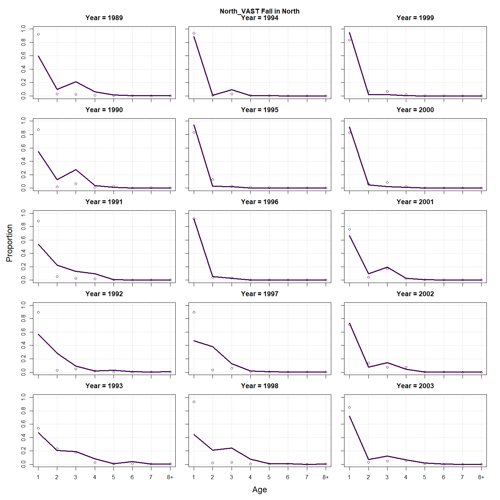
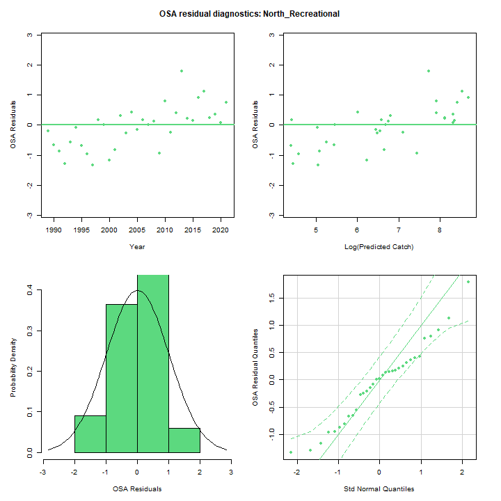
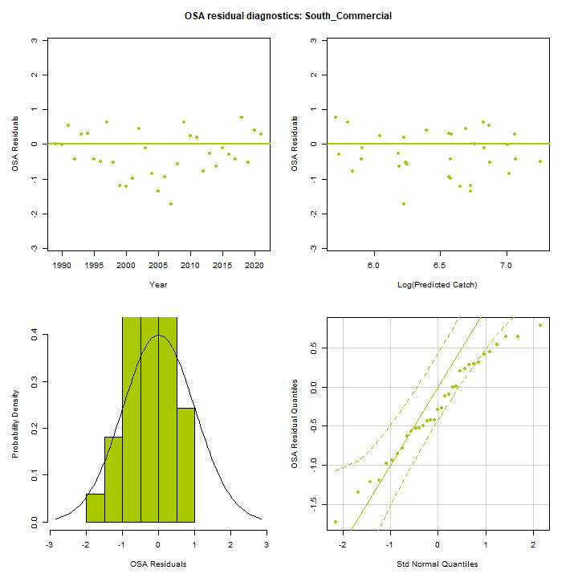
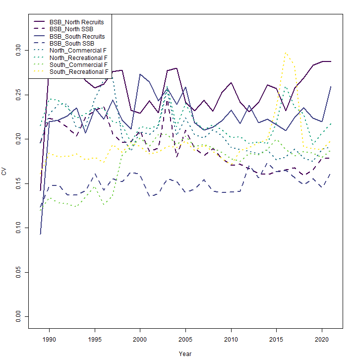
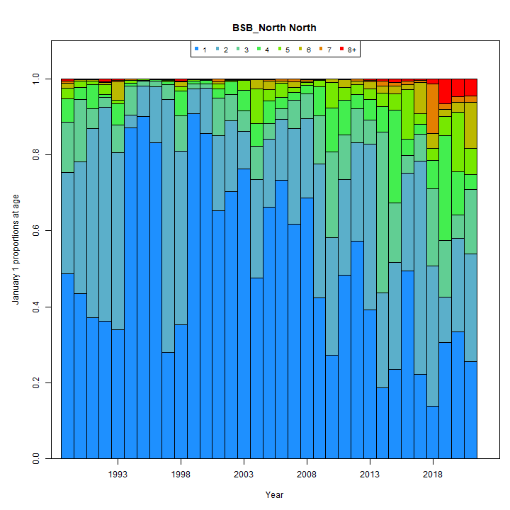
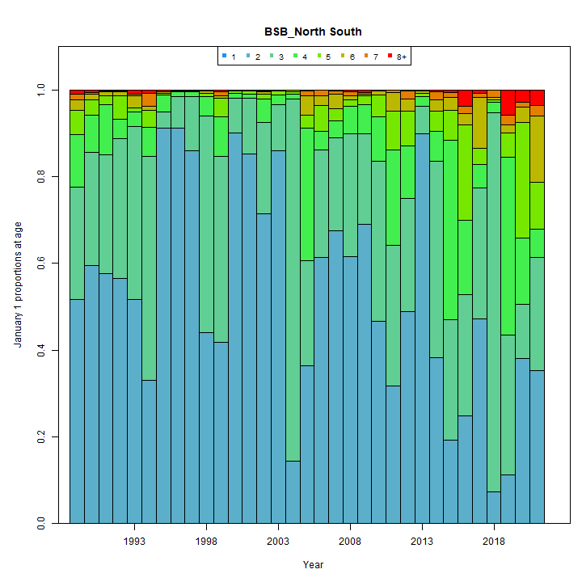
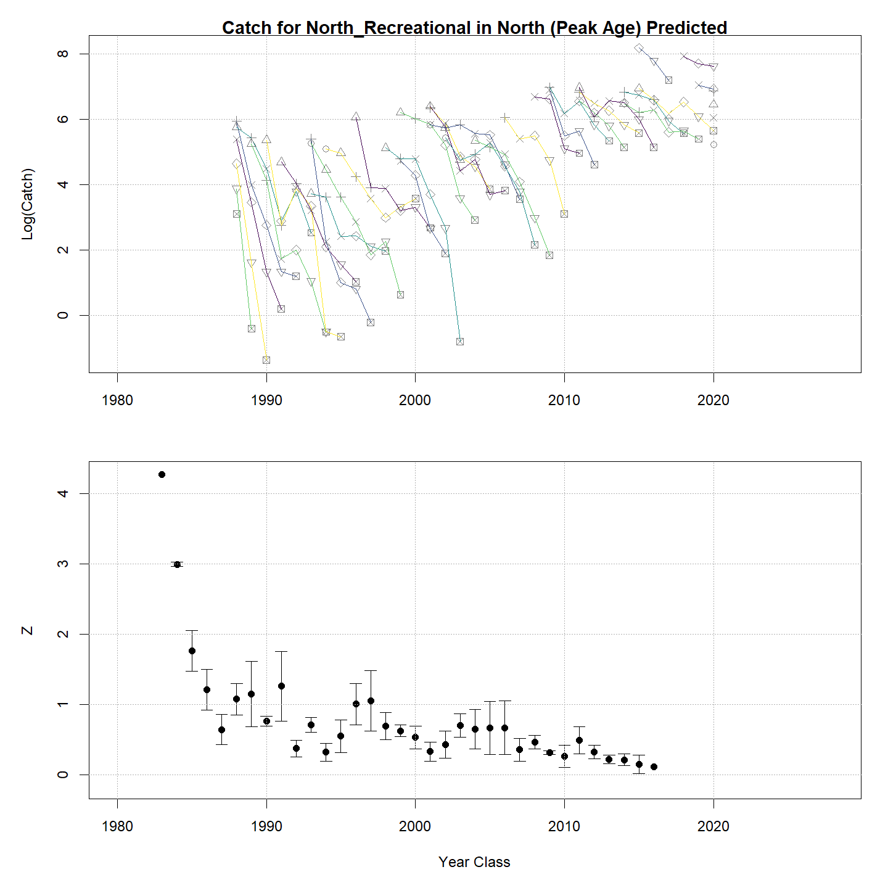

---
output:
  html_document:
    df_print: paged
    keep_md: yes
  word_document: default
  pdf_document:
    fig_caption: yes
    includes:
    keep_tex: yes
    number_sections: no
title: "WHAM figures and tables"
header-includes:
  - \usepackage{longtable}
  - \usepackage{booktabs}
  - \usepackage{caption,graphics}
  - \usepackage{makecell}
  - \usepackage{lscape}
  - \renewcommand\figurename{Fig.}
  - \captionsetup{labelsep=period, singlelinecheck=false}
  - \newcommand{\changesize}[1]{\fontsize{#1pt}{#1pt}\selectfont}
  - \renewcommand{\arraystretch}{1.5}
  - \renewcommand\theadfont{}
---

# {.tabset}

## Figures {.tabset}

### Input

### Diagnostics

### Results

### Retro

### Reference points

### Miscelaneous

## Tables {.tabset}

### Parameter estimates

<table class="table" style="margin-left: auto; margin-right: auto;">
<caption>Parameter estimates, standard errors, and confidence intervals. Rounded to 3 decimal places.</caption>
 <thead>
  <tr>
   <th style="text-align:left;">   </th>
   <th style="text-align:right;"> Estimate </th>
   <th style="text-align:right;"> Std. Error </th>
   <th style="text-align:right;"> 95\% CI lower </th>
   <th style="text-align:right;"> 95\% CI upper </th>
  </tr>
 </thead>
<tbody>
  <tr>
   <td style="text-align:left;"> BSB North Mean Recruitment </td>
   <td style="text-align:right;"> 17368.792 </td>
   <td style="text-align:right;"> 4454.650 </td>
   <td style="text-align:right;"> 10506.504 </td>
   <td style="text-align:right;"> 28713.159 </td>
  </tr>
  <tr>
   <td style="text-align:left;"> BSB North NAA $\sigma$ (age 1) </td>
   <td style="text-align:right;"> 1.045 </td>
   <td style="text-align:right;"> 0.137 </td>
   <td style="text-align:right;"> 0.808 </td>
   <td style="text-align:right;"> 1.353 </td>
  </tr>
  <tr>
   <td style="text-align:left;"> BSB North NAA $\sigma$ (age NA-) </td>
   <td style="text-align:right;"> -- </td>
   <td style="text-align:right;"> -- </td>
   <td style="text-align:right;"> -- </td>
   <td style="text-align:right;"> -- </td>
  </tr>
  <tr>
   <td style="text-align:left;"> BSB South Mean Recruitment </td>
   <td style="text-align:right;"> 17042.496 </td>
   <td style="text-align:right;"> 2161.310 </td>
   <td style="text-align:right;"> 13291.831 </td>
   <td style="text-align:right;"> 21851.517 </td>
  </tr>
  <tr>
   <td style="text-align:left;"> BSB South NAA $\sigma$ (age 1) </td>
   <td style="text-align:right;"> 0.292 </td>
   <td style="text-align:right;"> 0.071 </td>
   <td style="text-align:right;"> 0.181 </td>
   <td style="text-align:right;"> 0.472 </td>
  </tr>
  <tr>
   <td style="text-align:left;"> BSB South NAA $\sigma$ (age 2) </td>
   <td style="text-align:right;"> 0.512 </td>
   <td style="text-align:right;"> 0.066 </td>
   <td style="text-align:right;"> 0.398 </td>
   <td style="text-align:right;"> 0.658 </td>
  </tr>
  <tr>
   <td style="text-align:left;"> North REC CPA fully selected q </td>
   <td style="text-align:right;"> 0.000 </td>
   <td style="text-align:right;"> 0.000 </td>
   <td style="text-align:right;"> 0.000 </td>
   <td style="text-align:right;"> 0.000 </td>
  </tr>
  <tr>
   <td style="text-align:left;"> North VAST Spring fully selected q </td>
   <td style="text-align:right;"> 0.011 </td>
   <td style="text-align:right;"> 0.002 </td>
   <td style="text-align:right;"> 0.008 </td>
   <td style="text-align:right;"> 0.016 </td>
  </tr>
  <tr>
   <td style="text-align:left;"> North VAST Fall fully selected q </td>
   <td style="text-align:right;"> 0.014 </td>
   <td style="text-align:right;"> 0.003 </td>
   <td style="text-align:right;"> 0.010 </td>
   <td style="text-align:right;"> 0.022 </td>
  </tr>
  <tr>
   <td style="text-align:left;"> South REC CPA fully selected q </td>
   <td style="text-align:right;"> 0.000 </td>
   <td style="text-align:right;"> 0.000 </td>
   <td style="text-align:right;"> 0.000 </td>
   <td style="text-align:right;"> 0.000 </td>
  </tr>
  <tr>
   <td style="text-align:left;"> South VAST Spring fully selected q </td>
   <td style="text-align:right;"> 0.024 </td>
   <td style="text-align:right;"> 0.003 </td>
   <td style="text-align:right;"> 0.018 </td>
   <td style="text-align:right;"> 0.031 </td>
  </tr>
  <tr>
   <td style="text-align:left;"> South VAST Fall fully selected q </td>
   <td style="text-align:right;"> 0.001 </td>
   <td style="text-align:right;"> 0.000 </td>
   <td style="text-align:right;"> 0.000 </td>
   <td style="text-align:right;"> 0.001 </td>
  </tr>
  <tr>
   <td style="text-align:left;"> Block 1: $a_{50}$ </td>
   <td style="text-align:right;"> 1.797 </td>
   <td style="text-align:right;"> 0.200 </td>
   <td style="text-align:right;"> 1.435 </td>
   <td style="text-align:right;"> 2.219 </td>
  </tr>
  <tr>
   <td style="text-align:left;"> Block 1: 1/slope (increasing) </td>
   <td style="text-align:right;"> 0.261 </td>
   <td style="text-align:right;"> 0.070 </td>
   <td style="text-align:right;"> 0.154 </td>
   <td style="text-align:right;"> 0.438 </td>
  </tr>
  <tr>
   <td style="text-align:left;"> Block 2: $a_{50}$ </td>
   <td style="text-align:right;"> 2.745 </td>
   <td style="text-align:right;"> 0.176 </td>
   <td style="text-align:right;"> 2.410 </td>
   <td style="text-align:right;"> 3.100 </td>
  </tr>
  <tr>
   <td style="text-align:left;"> Block 2: 1/slope (increasing) </td>
   <td style="text-align:right;"> 0.347 </td>
   <td style="text-align:right;"> 0.045 </td>
   <td style="text-align:right;"> 0.269 </td>
   <td style="text-align:right;"> 0.446 </td>
  </tr>
  <tr>
   <td style="text-align:left;"> Block 3: $a_{50}$ </td>
   <td style="text-align:right;"> 2.511 </td>
   <td style="text-align:right;"> 0.113 </td>
   <td style="text-align:right;"> 2.294 </td>
   <td style="text-align:right;"> 2.738 </td>
  </tr>
  <tr>
   <td style="text-align:left;"> Block 3: 1/slope (increasing) </td>
   <td style="text-align:right;"> 0.473 </td>
   <td style="text-align:right;"> 0.035 </td>
   <td style="text-align:right;"> 0.410 </td>
   <td style="text-align:right;"> 0.546 </td>
  </tr>
  <tr>
   <td style="text-align:left;"> Block 4: $a_{50}$ </td>
   <td style="text-align:right;"> 3.782 </td>
   <td style="text-align:right;"> 0.129 </td>
   <td style="text-align:right;"> 3.530 </td>
   <td style="text-align:right;"> 4.037 </td>
  </tr>
  <tr>
   <td style="text-align:left;"> Block 4: 1/slope (increasing) </td>
   <td style="text-align:right;"> 0.837 </td>
   <td style="text-align:right;"> 0.061 </td>
   <td style="text-align:right;"> 0.725 </td>
   <td style="text-align:right;"> 0.965 </td>
  </tr>
  <tr>
   <td style="text-align:left;"> Block 5: Selectivity for age 1 </td>
   <td style="text-align:right;"> 0.057 </td>
   <td style="text-align:right;"> 0.020 </td>
   <td style="text-align:right;"> 0.029 </td>
   <td style="text-align:right;"> 0.111 </td>
  </tr>
  <tr>
   <td style="text-align:left;"> Block 5: Selectivity for age 2 </td>
   <td style="text-align:right;"> 1.000 </td>
   <td style="text-align:right;"> -- </td>
   <td style="text-align:right;"> -- </td>
   <td style="text-align:right;"> -- </td>
  </tr>
  <tr>
   <td style="text-align:left;"> Block 5: Selectivity for age 3 </td>
   <td style="text-align:right;"> 1.000 </td>
   <td style="text-align:right;"> -- </td>
   <td style="text-align:right;"> -- </td>
   <td style="text-align:right;"> -- </td>
  </tr>
  <tr>
   <td style="text-align:left;"> Block 5: Selectivity for age 4 </td>
   <td style="text-align:right;"> 1.000 </td>
   <td style="text-align:right;"> -- </td>
   <td style="text-align:right;"> -- </td>
   <td style="text-align:right;"> -- </td>
  </tr>
  <tr>
   <td style="text-align:left;"> Block 5: Selectivity for age 5 </td>
   <td style="text-align:right;"> 1.000 </td>
   <td style="text-align:right;"> -- </td>
   <td style="text-align:right;"> -- </td>
   <td style="text-align:right;"> -- </td>
  </tr>
  <tr>
   <td style="text-align:left;"> Block 5: Selectivity for age 6 </td>
   <td style="text-align:right;"> 1.000 </td>
   <td style="text-align:right;"> -- </td>
   <td style="text-align:right;"> -- </td>
   <td style="text-align:right;"> -- </td>
  </tr>
  <tr>
   <td style="text-align:left;"> Block 5: Selectivity for age 7 </td>
   <td style="text-align:right;"> 1.000 </td>
   <td style="text-align:right;"> -- </td>
   <td style="text-align:right;"> -- </td>
   <td style="text-align:right;"> -- </td>
  </tr>
  <tr>
   <td style="text-align:left;"> Block 5: Selectivity for age 8+ </td>
   <td style="text-align:right;"> 1.000 </td>
   <td style="text-align:right;"> -- </td>
   <td style="text-align:right;"> -- </td>
   <td style="text-align:right;"> -- </td>
  </tr>
  <tr>
   <td style="text-align:left;"> Block 6: $a_{50}$ </td>
   <td style="text-align:right;"> 3.461 </td>
   <td style="text-align:right;"> 0.223 </td>
   <td style="text-align:right;"> 3.033 </td>
   <td style="text-align:right;"> 3.903 </td>
  </tr>
  <tr>
   <td style="text-align:left;"> Block 6: 1/slope (increasing) </td>
   <td style="text-align:right;"> 0.591 </td>
   <td style="text-align:right;"> 0.063 </td>
   <td style="text-align:right;"> 0.478 </td>
   <td style="text-align:right;"> 0.728 </td>
  </tr>
  <tr>
   <td style="text-align:left;"> Block 7: $a_{50}$ </td>
   <td style="text-align:right;"> 2.546 </td>
   <td style="text-align:right;"> 0.291 </td>
   <td style="text-align:right;"> 2.012 </td>
   <td style="text-align:right;"> 3.147 </td>
  </tr>
  <tr>
   <td style="text-align:left;"> Block 7: 1/slope (increasing) </td>
   <td style="text-align:right;"> 0.763 </td>
   <td style="text-align:right;"> 0.154 </td>
   <td style="text-align:right;"> 0.510 </td>
   <td style="text-align:right;"> 1.122 </td>
  </tr>
  <tr>
   <td style="text-align:left;"> Block 8: $a_{50}$ </td>
   <td style="text-align:right;"> 4.447 </td>
   <td style="text-align:right;"> 0.356 </td>
   <td style="text-align:right;"> 3.744 </td>
   <td style="text-align:right;"> 5.124 </td>
  </tr>
  <tr>
   <td style="text-align:left;"> Block 8: 1/slope (increasing) </td>
   <td style="text-align:right;"> 1.101 </td>
   <td style="text-align:right;"> 0.136 </td>
   <td style="text-align:right;"> 0.860 </td>
   <td style="text-align:right;"> 1.395 </td>
  </tr>
  <tr>
   <td style="text-align:left;"> Block 9: $a_{50}$ </td>
   <td style="text-align:right;"> 1.674 </td>
   <td style="text-align:right;"> 0.151 </td>
   <td style="text-align:right;"> 1.398 </td>
   <td style="text-align:right;"> 1.989 </td>
  </tr>
  <tr>
   <td style="text-align:left;"> Block 9: 1/slope (increasing) </td>
   <td style="text-align:right;"> 0.458 </td>
   <td style="text-align:right;"> 0.065 </td>
   <td style="text-align:right;"> 0.346 </td>
   <td style="text-align:right;"> 0.604 </td>
  </tr>
  <tr>
   <td style="text-align:left;"> Block 10: Selectivity for age 1 </td>
   <td style="text-align:right;"> 0.079 </td>
   <td style="text-align:right;"> 0.022 </td>
   <td style="text-align:right;"> 0.045 </td>
   <td style="text-align:right;"> 0.136 </td>
  </tr>
  <tr>
   <td style="text-align:left;"> Block 10: Selectivity for age 2 </td>
   <td style="text-align:right;"> 0.310 </td>
   <td style="text-align:right;"> 0.092 </td>
   <td style="text-align:right;"> 0.161 </td>
   <td style="text-align:right;"> 0.511 </td>
  </tr>
  <tr>
   <td style="text-align:left;"> Block 10: Selectivity for age 3 </td>
   <td style="text-align:right;"> 1.000 </td>
   <td style="text-align:right;"> -- </td>
   <td style="text-align:right;"> -- </td>
   <td style="text-align:right;"> -- </td>
  </tr>
  <tr>
   <td style="text-align:left;"> Block 10: Selectivity for age 4 </td>
   <td style="text-align:right;"> 1.000 </td>
   <td style="text-align:right;"> -- </td>
   <td style="text-align:right;"> -- </td>
   <td style="text-align:right;"> -- </td>
  </tr>
  <tr>
   <td style="text-align:left;"> Block 10: Selectivity for age 5 </td>
   <td style="text-align:right;"> 0.767 </td>
   <td style="text-align:right;"> 0.137 </td>
   <td style="text-align:right;"> 0.422 </td>
   <td style="text-align:right;"> 0.937 </td>
  </tr>
  <tr>
   <td style="text-align:left;"> Block 10: Selectivity for age 6 </td>
   <td style="text-align:right;"> 0.767 </td>
   <td style="text-align:right;"> 0.137 </td>
   <td style="text-align:right;"> 0.422 </td>
   <td style="text-align:right;"> 0.937 </td>
  </tr>
  <tr>
   <td style="text-align:left;"> Block 10: Selectivity for age 7 </td>
   <td style="text-align:right;"> 0.767 </td>
   <td style="text-align:right;"> 0.137 </td>
   <td style="text-align:right;"> 0.422 </td>
   <td style="text-align:right;"> 0.937 </td>
  </tr>
  <tr>
   <td style="text-align:left;"> Block 10: Selectivity for age 8+ </td>
   <td style="text-align:right;"> 0.767 </td>
   <td style="text-align:right;"> 0.137 </td>
   <td style="text-align:right;"> 0.422 </td>
   <td style="text-align:right;"> 0.937 </td>
  </tr>
  <tr>
   <td style="text-align:left;"> Block 11: Selectivity for age 1 </td>
   <td style="text-align:right;"> 0.449 </td>
   <td style="text-align:right;"> 0.117 </td>
   <td style="text-align:right;"> 0.244 </td>
   <td style="text-align:right;"> 0.673 </td>
  </tr>
  <tr>
   <td style="text-align:left;"> Block 11: Selectivity for age 2 </td>
   <td style="text-align:right;"> 0.165 </td>
   <td style="text-align:right;"> 0.060 </td>
   <td style="text-align:right;"> 0.078 </td>
   <td style="text-align:right;"> 0.317 </td>
  </tr>
  <tr>
   <td style="text-align:left;"> Block 11: Selectivity for age 3 </td>
   <td style="text-align:right;"> 1.000 </td>
   <td style="text-align:right;"> -- </td>
   <td style="text-align:right;"> -- </td>
   <td style="text-align:right;"> -- </td>
  </tr>
  <tr>
   <td style="text-align:left;"> Block 11: Selectivity for age 4 </td>
   <td style="text-align:right;"> 0.693 </td>
   <td style="text-align:right;"> 0.256 </td>
   <td style="text-align:right;"> 0.176 </td>
   <td style="text-align:right;"> 0.960 </td>
  </tr>
  <tr>
   <td style="text-align:left;"> Block 11: Selectivity for age 5 </td>
   <td style="text-align:right;"> 0.400 </td>
   <td style="text-align:right;"> 0.100 </td>
   <td style="text-align:right;"> 0.227 </td>
   <td style="text-align:right;"> 0.602 </td>
  </tr>
  <tr>
   <td style="text-align:left;"> Block 11: Selectivity for age 6 </td>
   <td style="text-align:right;"> 0.400 </td>
   <td style="text-align:right;"> 0.100 </td>
   <td style="text-align:right;"> 0.227 </td>
   <td style="text-align:right;"> 0.602 </td>
  </tr>
  <tr>
   <td style="text-align:left;"> Block 11: Selectivity for age 7 </td>
   <td style="text-align:right;"> 0.400 </td>
   <td style="text-align:right;"> 0.100 </td>
   <td style="text-align:right;"> 0.227 </td>
   <td style="text-align:right;"> 0.602 </td>
  </tr>
  <tr>
   <td style="text-align:left;"> Block 11: Selectivity for age 8+ </td>
   <td style="text-align:right;"> 0.400 </td>
   <td style="text-align:right;"> 0.100 </td>
   <td style="text-align:right;"> 0.227 </td>
   <td style="text-align:right;"> 0.602 </td>
  </tr>
  <tr>
   <td style="text-align:left;"> Block 12: $a_{50}$ </td>
   <td style="text-align:right;"> 1.879 </td>
   <td style="text-align:right;"> 0.748 </td>
   <td style="text-align:right;"> 0.797 </td>
   <td style="text-align:right;"> 3.678 </td>
  </tr>
  <tr>
   <td style="text-align:left;"> Block 12: 1/slope (increasing) </td>
   <td style="text-align:right;"> 1.611 </td>
   <td style="text-align:right;"> 0.890 </td>
   <td style="text-align:right;"> 0.488 </td>
   <td style="text-align:right;"> 3.957 </td>
  </tr>
  <tr>
   <td style="text-align:left;"> Block 13: Selectivity for age 1 </td>
   <td style="text-align:right;"> 0.182 </td>
   <td style="text-align:right;"> 0.055 </td>
   <td style="text-align:right;"> 0.097 </td>
   <td style="text-align:right;"> 0.315 </td>
  </tr>
  <tr>
   <td style="text-align:left;"> Block 13: Selectivity for age 2 </td>
   <td style="text-align:right;"> 1.000 </td>
   <td style="text-align:right;"> -- </td>
   <td style="text-align:right;"> -- </td>
   <td style="text-align:right;"> -- </td>
  </tr>
  <tr>
   <td style="text-align:left;"> Block 13: Selectivity for age 3 </td>
   <td style="text-align:right;"> 0.599 </td>
   <td style="text-align:right;"> 0.194 </td>
   <td style="text-align:right;"> 0.234 </td>
   <td style="text-align:right;"> 0.879 </td>
  </tr>
  <tr>
   <td style="text-align:left;"> Block 13: Selectivity for age 4 </td>
   <td style="text-align:right;"> 0.314 </td>
   <td style="text-align:right;"> 0.079 </td>
   <td style="text-align:right;"> 0.182 </td>
   <td style="text-align:right;"> 0.484 </td>
  </tr>
  <tr>
   <td style="text-align:left;"> Block 13: Selectivity for age 5 </td>
   <td style="text-align:right;"> 0.314 </td>
   <td style="text-align:right;"> 0.079 </td>
   <td style="text-align:right;"> 0.182 </td>
   <td style="text-align:right;"> 0.484 </td>
  </tr>
  <tr>
   <td style="text-align:left;"> Block 13: Selectivity for age 6 </td>
   <td style="text-align:right;"> 0.314 </td>
   <td style="text-align:right;"> 0.079 </td>
   <td style="text-align:right;"> 0.182 </td>
   <td style="text-align:right;"> 0.484 </td>
  </tr>
  <tr>
   <td style="text-align:left;"> Block 13: Selectivity for age 7 </td>
   <td style="text-align:right;"> 0.314 </td>
   <td style="text-align:right;"> 0.079 </td>
   <td style="text-align:right;"> 0.182 </td>
   <td style="text-align:right;"> 0.484 </td>
  </tr>
  <tr>
   <td style="text-align:left;"> Block 13: Selectivity for age 8+ </td>
   <td style="text-align:right;"> 0.314 </td>
   <td style="text-align:right;"> 0.079 </td>
   <td style="text-align:right;"> 0.182 </td>
   <td style="text-align:right;"> 0.484 </td>
  </tr>
  <tr>
   <td style="text-align:left;"> Block 14: Selectivity for age 1 </td>
   <td style="text-align:right;"> 0.348 </td>
   <td style="text-align:right;"> 0.110 </td>
   <td style="text-align:right;"> 0.172 </td>
   <td style="text-align:right;"> 0.579 </td>
  </tr>
  <tr>
   <td style="text-align:left;"> Block 14: Selectivity for age 2 </td>
   <td style="text-align:right;"> 1.000 </td>
   <td style="text-align:right;"> -- </td>
   <td style="text-align:right;"> -- </td>
   <td style="text-align:right;"> -- </td>
  </tr>
  <tr>
   <td style="text-align:left;"> Block 14: Selectivity for age 3 </td>
   <td style="text-align:right;"> 0.459 </td>
   <td style="text-align:right;"> 0.143 </td>
   <td style="text-align:right;"> 0.215 </td>
   <td style="text-align:right;"> 0.724 </td>
  </tr>
  <tr>
   <td style="text-align:left;"> Block 14: Selectivity for age 4 </td>
   <td style="text-align:right;"> 0.062 </td>
   <td style="text-align:right;"> 0.016 </td>
   <td style="text-align:right;"> 0.037 </td>
   <td style="text-align:right;"> 0.104 </td>
  </tr>
  <tr>
   <td style="text-align:left;"> Block 14: Selectivity for age 5 </td>
   <td style="text-align:right;"> 0.062 </td>
   <td style="text-align:right;"> 0.016 </td>
   <td style="text-align:right;"> 0.037 </td>
   <td style="text-align:right;"> 0.104 </td>
  </tr>
  <tr>
   <td style="text-align:left;"> Block 14: Selectivity for age 6 </td>
   <td style="text-align:right;"> 0.062 </td>
   <td style="text-align:right;"> 0.016 </td>
   <td style="text-align:right;"> 0.037 </td>
   <td style="text-align:right;"> 0.104 </td>
  </tr>
  <tr>
   <td style="text-align:left;"> Block 14: Selectivity for age 7 </td>
   <td style="text-align:right;"> 0.062 </td>
   <td style="text-align:right;"> 0.016 </td>
   <td style="text-align:right;"> 0.037 </td>
   <td style="text-align:right;"> 0.104 </td>
  </tr>
  <tr>
   <td style="text-align:left;"> Block 14: Selectivity for age 8+ </td>
   <td style="text-align:right;"> 0.062 </td>
   <td style="text-align:right;"> 0.016 </td>
   <td style="text-align:right;"> 0.037 </td>
   <td style="text-align:right;"> 0.104 </td>
  </tr>
  <tr>
   <td style="text-align:left;"> North Commercial in North age comp, logistic-normal: $\sigma$ </td>
   <td style="text-align:right;"> 9.059 </td>
   <td style="text-align:right;"> 0.464 </td>
   <td style="text-align:right;"> 8.193 </td>
   <td style="text-align:right;"> 10.016 </td>
  </tr>
  <tr>
   <td style="text-align:left;"> North Recreational in North age comp, logistic-normal: $\sigma$ </td>
   <td style="text-align:right;"> 1.771 </td>
   <td style="text-align:right;"> 0.143 </td>
   <td style="text-align:right;"> 1.512 </td>
   <td style="text-align:right;"> 2.075 </td>
  </tr>
  <tr>
   <td style="text-align:left;"> South Commercial in South age comp, logistic-normal: $\sigma$ </td>
   <td style="text-align:right;"> 5.061 </td>
   <td style="text-align:right;"> 0.320 </td>
   <td style="text-align:right;"> 4.471 </td>
   <td style="text-align:right;"> 5.730 </td>
  </tr>
  <tr>
   <td style="text-align:left;"> South Recreational in South age comp, logistic-normal: $\sigma$ </td>
   <td style="text-align:right;"> 4.704 </td>
   <td style="text-align:right;"> 0.419 </td>
   <td style="text-align:right;"> 3.951 </td>
   <td style="text-align:right;"> 5.601 </td>
  </tr>
  <tr>
   <td style="text-align:left;"> North REC CPA in North age comp, logistic-normal: $\sigma$ </td>
   <td style="text-align:right;"> 1.512 </td>
   <td style="text-align:right;"> 0.142 </td>
   <td style="text-align:right;"> 1.258 </td>
   <td style="text-align:right;"> 1.816 </td>
  </tr>
  <tr>
   <td style="text-align:left;"> North VAST Spring in North age comp, logistic-normal: $\sigma$ </td>
   <td style="text-align:right;"> 11.223 </td>
   <td style="text-align:right;"> 0.543 </td>
   <td style="text-align:right;"> 10.209 </td>
   <td style="text-align:right;"> 12.339 </td>
  </tr>
  <tr>
   <td style="text-align:left;"> North VAST Fall in North age comp, logistic-normal: $\sigma$ </td>
   <td style="text-align:right;"> 11.996 </td>
   <td style="text-align:right;"> 0.581 </td>
   <td style="text-align:right;"> 10.910 </td>
   <td style="text-align:right;"> 13.191 </td>
  </tr>
  <tr>
   <td style="text-align:left;"> South REC CPA in South age comp, logistic-normal: $\sigma$ </td>
   <td style="text-align:right;"> 5.040 </td>
   <td style="text-align:right;"> 0.601 </td>
   <td style="text-align:right;"> 3.990 </td>
   <td style="text-align:right;"> 6.368 </td>
  </tr>
  <tr>
   <td style="text-align:left;"> South VAST Spring in South age comp, logistic-normal: $\sigma$ </td>
   <td style="text-align:right;"> 9.556 </td>
   <td style="text-align:right;"> 0.512 </td>
   <td style="text-align:right;"> 8.602 </td>
   <td style="text-align:right;"> 10.615 </td>
  </tr>
  <tr>
   <td style="text-align:left;"> South VAST Fall in South age comp, logistic-normal: $\sigma$ </td>
   <td style="text-align:right;"> 8.670 </td>
   <td style="text-align:right;"> 0.498 </td>
   <td style="text-align:right;"> 7.747 </td>
   <td style="text-align:right;"> 9.703 </td>
  </tr>
</tbody>
</table>

### Abundance at age

<table class="table" style="margin-left: auto; margin-right: auto;">
<caption>Abundance at age (1000s) for BSB North in North.</caption>
 <thead>
  <tr>
   <th style="text-align:left;">   </th>
   <th style="text-align:right;"> 1 </th>
   <th style="text-align:right;"> 2 </th>
   <th style="text-align:right;"> 3 </th>
   <th style="text-align:right;"> 4 </th>
   <th style="text-align:right;"> 5 </th>
   <th style="text-align:right;"> 6 </th>
   <th style="text-align:right;"> 7 </th>
   <th style="text-align:right;"> 8+ </th>
  </tr>
 </thead>
<tbody>
  <tr>
   <td style="text-align:left;"> 1989 </td>
   <td style="text-align:right;"> 4945 </td>
   <td style="text-align:right;"> 2694 </td>
   <td style="text-align:right;"> 1332 </td>
   <td style="text-align:right;"> 624 </td>
   <td style="text-align:right;"> 289 </td>
   <td style="text-align:right;"> 134 </td>
   <td style="text-align:right;"> 62 </td>
   <td style="text-align:right;"> 53 </td>
  </tr>
  <tr>
   <td style="text-align:left;"> 1990 </td>
   <td style="text-align:right;"> 3427 </td>
   <td style="text-align:right;"> 2730 </td>
   <td style="text-align:right;"> 1292 </td>
   <td style="text-align:right;"> 242 </td>
   <td style="text-align:right;"> 140 </td>
   <td style="text-align:right;"> 21 </td>
   <td style="text-align:right;"> 2 </td>
   <td style="text-align:right;"> 19 </td>
  </tr>
  <tr>
   <td style="text-align:left;"> 1991 </td>
   <td style="text-align:right;"> 3080 </td>
   <td style="text-align:right;"> 4139 </td>
   <td style="text-align:right;"> 437 </td>
   <td style="text-align:right;"> 513 </td>
   <td style="text-align:right;"> 89 </td>
   <td style="text-align:right;"> 21 </td>
   <td style="text-align:right;"> 1 </td>
   <td style="text-align:right;"> 23 </td>
  </tr>
  <tr>
   <td style="text-align:left;"> 1992 </td>
   <td style="text-align:right;"> 3054 </td>
   <td style="text-align:right;"> 4748 </td>
   <td style="text-align:right;"> 225 </td>
   <td style="text-align:right;"> 68 </td>
   <td style="text-align:right;"> 213 </td>
   <td style="text-align:right;"> 46 </td>
   <td style="text-align:right;"> 15 </td>
   <td style="text-align:right;"> 74 </td>
  </tr>
  <tr>
   <td style="text-align:left;"> 1993 </td>
   <td style="text-align:right;"> 1604 </td>
   <td style="text-align:right;"> 2186 </td>
   <td style="text-align:right;"> 345 </td>
   <td style="text-align:right;"> 263 </td>
   <td style="text-align:right;"> 38 </td>
   <td style="text-align:right;"> 230 </td>
   <td style="text-align:right;"> 17 </td>
   <td style="text-align:right;"> 22 </td>
  </tr>
  <tr>
   <td style="text-align:left;"> 1994 </td>
   <td style="text-align:right;"> 10948 </td>
   <td style="text-align:right;"> 429 </td>
   <td style="text-align:right;"> 950 </td>
   <td style="text-align:right;"> 86 </td>
   <td style="text-align:right;"> 97 </td>
   <td style="text-align:right;"> 9 </td>
   <td style="text-align:right;"> 42 </td>
   <td style="text-align:right;"> 7 </td>
  </tr>
  <tr>
   <td style="text-align:left;"> 1995 </td>
   <td style="text-align:right;"> 20955 </td>
   <td style="text-align:right;"> 1830 </td>
   <td style="text-align:right;"> 321 </td>
   <td style="text-align:right;"> 61 </td>
   <td style="text-align:right;"> 53 </td>
   <td style="text-align:right;"> 4 </td>
   <td style="text-align:right;"> 4 </td>
   <td style="text-align:right;"> 15 </td>
  </tr>
  <tr>
   <td style="text-align:left;"> 1996 </td>
   <td style="text-align:right;"> 22209 </td>
   <td style="text-align:right;"> 3943 </td>
   <td style="text-align:right;"> 395 </td>
   <td style="text-align:right;"> 96 </td>
   <td style="text-align:right;"> 23 </td>
   <td style="text-align:right;"> 40 </td>
   <td style="text-align:right;"> 4 </td>
   <td style="text-align:right;"> 7 </td>
  </tr>
  <tr>
   <td style="text-align:left;"> 1997 </td>
   <td style="text-align:right;"> 4414 </td>
   <td style="text-align:right;"> 10495 </td>
   <td style="text-align:right;"> 605 </td>
   <td style="text-align:right;"> 124 </td>
   <td style="text-align:right;"> 80 </td>
   <td style="text-align:right;"> 16 </td>
   <td style="text-align:right;"> 20 </td>
   <td style="text-align:right;"> 16 </td>
  </tr>
  <tr>
   <td style="text-align:left;"> 1998 </td>
   <td style="text-align:right;"> 2595 </td>
   <td style="text-align:right;"> 3360 </td>
   <td style="text-align:right;"> 696 </td>
   <td style="text-align:right;"> 471 </td>
   <td style="text-align:right;"> 81 </td>
   <td style="text-align:right;"> 107 </td>
   <td style="text-align:right;"> 10 </td>
   <td style="text-align:right;"> 41 </td>
  </tr>
  <tr>
   <td style="text-align:left;"> 1999 </td>
   <td style="text-align:right;"> 43555 </td>
   <td style="text-align:right;"> 3104 </td>
   <td style="text-align:right;"> 666 </td>
   <td style="text-align:right;"> 350 </td>
   <td style="text-align:right;"> 139 </td>
   <td style="text-align:right;"> 68 </td>
   <td style="text-align:right;"> 51 </td>
   <td style="text-align:right;"> 30 </td>
  </tr>
  <tr>
   <td style="text-align:left;"> 2000 </td>
   <td style="text-align:right;"> 83874 </td>
   <td style="text-align:right;"> 11660 </td>
   <td style="text-align:right;"> 1106 </td>
   <td style="text-align:right;"> 873 </td>
   <td style="text-align:right;"> 184 </td>
   <td style="text-align:right;"> 206 </td>
   <td style="text-align:right;"> 14 </td>
   <td style="text-align:right;"> 37 </td>
  </tr>
  <tr>
   <td style="text-align:left;"> 2001 </td>
   <td style="text-align:right;"> 24550 </td>
   <td style="text-align:right;"> 7445 </td>
   <td style="text-align:right;"> 3676 </td>
   <td style="text-align:right;"> 910 </td>
   <td style="text-align:right;"> 540 </td>
   <td style="text-align:right;"> 203 </td>
   <td style="text-align:right;"> 263 </td>
   <td style="text-align:right;"> 9 </td>
  </tr>
  <tr>
   <td style="text-align:left;"> 2002 </td>
   <td style="text-align:right;"> 56733 </td>
   <td style="text-align:right;"> 15025 </td>
   <td style="text-align:right;"> 5571 </td>
   <td style="text-align:right;"> 2764 </td>
   <td style="text-align:right;"> 310 </td>
   <td style="text-align:right;"> 107 </td>
   <td style="text-align:right;"> 113 </td>
   <td style="text-align:right;"> 43 </td>
  </tr>
  <tr>
   <td style="text-align:left;"> 2003 </td>
   <td style="text-align:right;"> 45688 </td>
   <td style="text-align:right;"> 5922 </td>
   <td style="text-align:right;"> 3221 </td>
   <td style="text-align:right;"> 3185 </td>
   <td style="text-align:right;"> 1601 </td>
   <td style="text-align:right;"> 126 </td>
   <td style="text-align:right;"> 59 </td>
   <td style="text-align:right;"> 31 </td>
  </tr>
  <tr>
   <td style="text-align:left;"> 2004 </td>
   <td style="text-align:right;"> 12621 </td>
   <td style="text-align:right;"> 6891 </td>
   <td style="text-align:right;"> 2325 </td>
   <td style="text-align:right;"> 1572 </td>
   <td style="text-align:right;"> 2414 </td>
   <td style="text-align:right;"> 665 </td>
   <td style="text-align:right;"> 7 </td>
   <td style="text-align:right;"> 51 </td>
  </tr>
  <tr>
   <td style="text-align:left;"> 2005 </td>
   <td style="text-align:right;"> 30264 </td>
   <td style="text-align:right;"> 8183 </td>
   <td style="text-align:right;"> 1816 </td>
   <td style="text-align:right;"> 2775 </td>
   <td style="text-align:right;"> 1307 </td>
   <td style="text-align:right;"> 1032 </td>
   <td style="text-align:right;"> 199 </td>
   <td style="text-align:right;"> 79 </td>
  </tr>
  <tr>
   <td style="text-align:left;"> 2006 </td>
   <td style="text-align:right;"> 40711 </td>
   <td style="text-align:right;"> 8869 </td>
   <td style="text-align:right;"> 1582 </td>
   <td style="text-align:right;"> 1633 </td>
   <td style="text-align:right;"> 2006 </td>
   <td style="text-align:right;"> 308 </td>
   <td style="text-align:right;"> 378 </td>
   <td style="text-align:right;"> 3 </td>
  </tr>
  <tr>
   <td style="text-align:left;"> 2007 </td>
   <td style="text-align:right;"> 26300 </td>
   <td style="text-align:right;"> 10686 </td>
   <td style="text-align:right;"> 3194 </td>
   <td style="text-align:right;"> 866 </td>
   <td style="text-align:right;"> 585 </td>
   <td style="text-align:right;"> 617 </td>
   <td style="text-align:right;"> 281 </td>
   <td style="text-align:right;"> 40 </td>
  </tr>
  <tr>
   <td style="text-align:left;"> 2008 </td>
   <td style="text-align:right;"> 45221 </td>
   <td style="text-align:right;"> 13740 </td>
   <td style="text-align:right;"> 4372 </td>
   <td style="text-align:right;"> 1516 </td>
   <td style="text-align:right;"> 396 </td>
   <td style="text-align:right;"> 296 </td>
   <td style="text-align:right;"> 231 </td>
   <td style="text-align:right;"> 151 </td>
  </tr>
  <tr>
   <td style="text-align:left;"> 2009 </td>
   <td style="text-align:right;"> 19999 </td>
   <td style="text-align:right;"> 16575 </td>
   <td style="text-align:right;"> 5979 </td>
   <td style="text-align:right;"> 3553 </td>
   <td style="text-align:right;"> 797 </td>
   <td style="text-align:right;"> 56 </td>
   <td style="text-align:right;"> 23 </td>
   <td style="text-align:right;"> 123 </td>
  </tr>
  <tr>
   <td style="text-align:left;"> 2010 </td>
   <td style="text-align:right;"> 9838 </td>
   <td style="text-align:right;"> 11087 </td>
   <td style="text-align:right;"> 8102 </td>
   <td style="text-align:right;"> 4200 </td>
   <td style="text-align:right;"> 2372 </td>
   <td style="text-align:right;"> 325 </td>
   <td style="text-align:right;"> 17 </td>
   <td style="text-align:right;"> 20 </td>
  </tr>
  <tr>
   <td style="text-align:left;"> 2011 </td>
   <td style="text-align:right;"> 16756 </td>
   <td style="text-align:right;"> 8649 </td>
   <td style="text-align:right;"> 4061 </td>
   <td style="text-align:right;"> 3156 </td>
   <td style="text-align:right;"> 1164 </td>
   <td style="text-align:right;"> 700 </td>
   <td style="text-align:right;"> 92 </td>
   <td style="text-align:right;"> 15 </td>
  </tr>
  <tr>
   <td style="text-align:left;"> 2012 </td>
   <td style="text-align:right;"> 57760 </td>
   <td style="text-align:right;"> 26097 </td>
   <td style="text-align:right;"> 8965 </td>
   <td style="text-align:right;"> 3721 </td>
   <td style="text-align:right;"> 2682 </td>
   <td style="text-align:right;"> 967 </td>
   <td style="text-align:right;"> 470 </td>
   <td style="text-align:right;"> 98 </td>
  </tr>
  <tr>
   <td style="text-align:left;"> 2013 </td>
   <td style="text-align:right;"> 38193 </td>
   <td style="text-align:right;"> 42439 </td>
   <td style="text-align:right;"> 6174 </td>
   <td style="text-align:right;"> 5156 </td>
   <td style="text-align:right;"> 2813 </td>
   <td style="text-align:right;"> 1727 </td>
   <td style="text-align:right;"> 487 </td>
   <td style="text-align:right;"> 326 </td>
  </tr>
  <tr>
   <td style="text-align:left;"> 2014 </td>
   <td style="text-align:right;"> 13495 </td>
   <td style="text-align:right;"> 18154 </td>
   <td style="text-align:right;"> 30544 </td>
   <td style="text-align:right;"> 4776 </td>
   <td style="text-align:right;"> 2565 </td>
   <td style="text-align:right;"> 1437 </td>
   <td style="text-align:right;"> 865 </td>
   <td style="text-align:right;"> 457 </td>
  </tr>
  <tr>
   <td style="text-align:left;"> 2015 </td>
   <td style="text-align:right;"> 15900 </td>
   <td style="text-align:right;"> 18857 </td>
   <td style="text-align:right;"> 10507 </td>
   <td style="text-align:right;"> 16440 </td>
   <td style="text-align:right;"> 2948 </td>
   <td style="text-align:right;"> 1332 </td>
   <td style="text-align:right;"> 648 </td>
   <td style="text-align:right;"> 643 </td>
  </tr>
  <tr>
   <td style="text-align:left;"> 2016 </td>
   <td style="text-align:right;"> 70337 </td>
   <td style="text-align:right;"> 36615 </td>
   <td style="text-align:right;"> 6674 </td>
   <td style="text-align:right;"> 6056 </td>
   <td style="text-align:right;"> 18788 </td>
   <td style="text-align:right;"> 1873 </td>
   <td style="text-align:right;"> 1179 </td>
   <td style="text-align:right;"> 871 </td>
  </tr>
  <tr>
   <td style="text-align:left;"> 2017 </td>
   <td style="text-align:right;"> 34770 </td>
   <td style="text-align:right;"> 87393 </td>
   <td style="text-align:right;"> 10813 </td>
   <td style="text-align:right;"> 4330 </td>
   <td style="text-align:right;"> 4287 </td>
   <td style="text-align:right;"> 12603 </td>
   <td style="text-align:right;"> 855 </td>
   <td style="text-align:right;"> 769 </td>
  </tr>
  <tr>
   <td style="text-align:left;"> 2018 </td>
   <td style="text-align:right;"> 8157 </td>
   <td style="text-align:right;"> 21520 </td>
   <td style="text-align:right;"> 11885 </td>
   <td style="text-align:right;"> 4346 </td>
   <td style="text-align:right;"> 1815 </td>
   <td style="text-align:right;"> 2288 </td>
   <td style="text-align:right;"> 7628 </td>
   <td style="text-align:right;"> 830 </td>
  </tr>
  <tr>
   <td style="text-align:left;"> 2019 </td>
   <td style="text-align:right;"> 23538 </td>
   <td style="text-align:right;"> 9099 </td>
   <td style="text-align:right;"> 11473 </td>
   <td style="text-align:right;"> 21168 </td>
   <td style="text-align:right;"> 3810 </td>
   <td style="text-align:right;"> 1396 </td>
   <td style="text-align:right;"> 1239 </td>
   <td style="text-align:right;"> 4991 </td>
  </tr>
  <tr>
   <td style="text-align:left;"> 2020 </td>
   <td style="text-align:right;"> 29477 </td>
   <td style="text-align:right;"> 21822 </td>
   <td style="text-align:right;"> 5350 </td>
   <td style="text-align:right;"> 10037 </td>
   <td style="text-align:right;"> 13817 </td>
   <td style="text-align:right;"> 2454 </td>
   <td style="text-align:right;"> 1185 </td>
   <td style="text-align:right;"> 4216 </td>
  </tr>
  <tr>
   <td style="text-align:left;"> 2021 </td>
   <td style="text-align:right;"> 22701 </td>
   <td style="text-align:right;"> 24958 </td>
   <td style="text-align:right;"> 14993 </td>
   <td style="text-align:right;"> 3484 </td>
   <td style="text-align:right;"> 6059 </td>
   <td style="text-align:right;"> 10758 </td>
   <td style="text-align:right;"> 1427 </td>
   <td style="text-align:right;"> 4011 </td>
  </tr>
</tbody>
</table>

<table class="table" style="margin-left: auto; margin-right: auto;">
<caption>Abundance at age (1000s) for BSB North in South.</caption>
 <thead>
  <tr>
   <th style="text-align:left;">   </th>
   <th style="text-align:right;"> 1 </th>
   <th style="text-align:right;"> 2 </th>
   <th style="text-align:right;"> 3 </th>
   <th style="text-align:right;"> 4 </th>
   <th style="text-align:right;"> 5 </th>
   <th style="text-align:right;"> 6 </th>
   <th style="text-align:right;"> 7 </th>
   <th style="text-align:right;"> 8+ </th>
  </tr>
 </thead>
<tbody>
  <tr>
   <td style="text-align:left;"> 1989 </td>
   <td style="text-align:right;"> 0 </td>
   <td style="text-align:right;"> 165 </td>
   <td style="text-align:right;"> 82 </td>
   <td style="text-align:right;"> 38 </td>
   <td style="text-align:right;"> 18 </td>
   <td style="text-align:right;"> 8 </td>
   <td style="text-align:right;"> 4 </td>
   <td style="text-align:right;"> 3 </td>
  </tr>
  <tr>
   <td style="text-align:left;"> 1990 </td>
   <td style="text-align:right;"> 0 </td>
   <td style="text-align:right;"> 171 </td>
   <td style="text-align:right;"> 75 </td>
   <td style="text-align:right;"> 25 </td>
   <td style="text-align:right;"> 10 </td>
   <td style="text-align:right;"> 4 </td>
   <td style="text-align:right;"> 1 </td>
   <td style="text-align:right;"> 2 </td>
  </tr>
  <tr>
   <td style="text-align:left;"> 1991 </td>
   <td style="text-align:right;"> 0 </td>
   <td style="text-align:right;"> 126 </td>
   <td style="text-align:right;"> 60 </td>
   <td style="text-align:right;"> 25 </td>
   <td style="text-align:right;"> 4 </td>
   <td style="text-align:right;"> 2 </td>
   <td style="text-align:right;"> 0 </td>
   <td style="text-align:right;"> 0 </td>
  </tr>
  <tr>
   <td style="text-align:left;"> 1992 </td>
   <td style="text-align:right;"> 0 </td>
   <td style="text-align:right;"> 116 </td>
   <td style="text-align:right;"> 66 </td>
   <td style="text-align:right;"> 9 </td>
   <td style="text-align:right;"> 11 </td>
   <td style="text-align:right;"> 2 </td>
   <td style="text-align:right;"> 0 </td>
   <td style="text-align:right;"> 1 </td>
  </tr>
  <tr>
   <td style="text-align:left;"> 1993 </td>
   <td style="text-align:right;"> 0 </td>
   <td style="text-align:right;"> 114 </td>
   <td style="text-align:right;"> 88 </td>
   <td style="text-align:right;"> 7 </td>
   <td style="text-align:right;"> 2 </td>
   <td style="text-align:right;"> 6 </td>
   <td style="text-align:right;"> 1 </td>
   <td style="text-align:right;"> 2 </td>
  </tr>
  <tr>
   <td style="text-align:left;"> 1994 </td>
   <td style="text-align:right;"> 0 </td>
   <td style="text-align:right;"> 45 </td>
   <td style="text-align:right;"> 69 </td>
   <td style="text-align:right;"> 9 </td>
   <td style="text-align:right;"> 5 </td>
   <td style="text-align:right;"> 1 </td>
   <td style="text-align:right;"> 4 </td>
   <td style="text-align:right;"> 1 </td>
  </tr>
  <tr>
   <td style="text-align:left;"> 1995 </td>
   <td style="text-align:right;"> 0 </td>
   <td style="text-align:right;"> 274 </td>
   <td style="text-align:right;"> 11 </td>
   <td style="text-align:right;"> 12 </td>
   <td style="text-align:right;"> 1 </td>
   <td style="text-align:right;"> 1 </td>
   <td style="text-align:right;"> 0 </td>
   <td style="text-align:right;"> 1 </td>
  </tr>
  <tr>
   <td style="text-align:left;"> 1996 </td>
   <td style="text-align:right;"> 0 </td>
   <td style="text-align:right;"> 627 </td>
   <td style="text-align:right;"> 51 </td>
   <td style="text-align:right;"> 7 </td>
   <td style="text-align:right;"> 1 </td>
   <td style="text-align:right;"> 1 </td>
   <td style="text-align:right;"> 0 </td>
   <td style="text-align:right;"> 0 </td>
  </tr>
  <tr>
   <td style="text-align:left;"> 1997 </td>
   <td style="text-align:right;"> 0 </td>
   <td style="text-align:right;"> 649 </td>
   <td style="text-align:right;"> 94 </td>
   <td style="text-align:right;"> 9 </td>
   <td style="text-align:right;"> 2 </td>
   <td style="text-align:right;"> 0 </td>
   <td style="text-align:right;"> 1 </td>
   <td style="text-align:right;"> 0 </td>
  </tr>
  <tr>
   <td style="text-align:left;"> 1998 </td>
   <td style="text-align:right;"> 0 </td>
   <td style="text-align:right;"> 184 </td>
   <td style="text-align:right;"> 209 </td>
   <td style="text-align:right;"> 18 </td>
   <td style="text-align:right;"> 3 </td>
   <td style="text-align:right;"> 2 </td>
   <td style="text-align:right;"> 0 </td>
   <td style="text-align:right;"> 1 </td>
  </tr>
  <tr>
   <td style="text-align:left;"> 1999 </td>
   <td style="text-align:right;"> 0 </td>
   <td style="text-align:right;"> 98 </td>
   <td style="text-align:right;"> 101 </td>
   <td style="text-align:right;"> 22 </td>
   <td style="text-align:right;"> 10 </td>
   <td style="text-align:right;"> 2 </td>
   <td style="text-align:right;"> 2 </td>
   <td style="text-align:right;"> 1 </td>
  </tr>
  <tr>
   <td style="text-align:left;"> 2000 </td>
   <td style="text-align:right;"> 0 </td>
   <td style="text-align:right;"> 1156 </td>
   <td style="text-align:right;"> 102 </td>
   <td style="text-align:right;"> 15 </td>
   <td style="text-align:right;"> 5 </td>
   <td style="text-align:right;"> 2 </td>
   <td style="text-align:right;"> 1 </td>
   <td style="text-align:right;"> 1 </td>
  </tr>
  <tr>
   <td style="text-align:left;"> 2001 </td>
   <td style="text-align:right;"> 0 </td>
   <td style="text-align:right;"> 2944 </td>
   <td style="text-align:right;"> 446 </td>
   <td style="text-align:right;"> 34 </td>
   <td style="text-align:right;"> 21 </td>
   <td style="text-align:right;"> 5 </td>
   <td style="text-align:right;"> 5 </td>
   <td style="text-align:right;"> 1 </td>
  </tr>
  <tr>
   <td style="text-align:left;"> 2002 </td>
   <td style="text-align:right;"> 0 </td>
   <td style="text-align:right;"> 1517 </td>
   <td style="text-align:right;"> 446 </td>
   <td style="text-align:right;"> 115 </td>
   <td style="text-align:right;"> 21 </td>
   <td style="text-align:right;"> 11 </td>
   <td style="text-align:right;"> 5 </td>
   <td style="text-align:right;"> 5 </td>
  </tr>
  <tr>
   <td style="text-align:left;"> 2003 </td>
   <td style="text-align:right;"> 0 </td>
   <td style="text-align:right;"> 7333 </td>
   <td style="text-align:right;"> 904 </td>
   <td style="text-align:right;"> 192 </td>
   <td style="text-align:right;"> 80 </td>
   <td style="text-align:right;"> 8 </td>
   <td style="text-align:right;"> 3 </td>
   <td style="text-align:right;"> 3 </td>
  </tr>
  <tr>
   <td style="text-align:left;"> 2004 </td>
   <td style="text-align:right;"> 0 </td>
   <td style="text-align:right;"> 2050 </td>
   <td style="text-align:right;"> 11891 </td>
   <td style="text-align:right;"> 135 </td>
   <td style="text-align:right;"> 100 </td>
   <td style="text-align:right;"> 47 </td>
   <td style="text-align:right;"> 2 </td>
   <td style="text-align:right;"> 2 </td>
  </tr>
  <tr>
   <td style="text-align:left;"> 2005 </td>
   <td style="text-align:right;"> 0 </td>
   <td style="text-align:right;"> 650 </td>
   <td style="text-align:right;"> 431 </td>
   <td style="text-align:right;"> 544 </td>
   <td style="text-align:right;"> 53 </td>
   <td style="text-align:right;"> 78 </td>
   <td style="text-align:right;"> 19 </td>
   <td style="text-align:right;"> 6 </td>
  </tr>
  <tr>
   <td style="text-align:left;"> 2006 </td>
   <td style="text-align:right;"> 0 </td>
   <td style="text-align:right;"> 1136 </td>
   <td style="text-align:right;"> 460 </td>
   <td style="text-align:right;"> 80 </td>
   <td style="text-align:right;"> 108 </td>
   <td style="text-align:right;"> 42 </td>
   <td style="text-align:right;"> 24 </td>
   <td style="text-align:right;"> 1 </td>
  </tr>
  <tr>
   <td style="text-align:left;"> 2007 </td>
   <td style="text-align:right;"> 0 </td>
   <td style="text-align:right;"> 1108 </td>
   <td style="text-align:right;"> 353 </td>
   <td style="text-align:right;"> 64 </td>
   <td style="text-align:right;"> 47 </td>
   <td style="text-align:right;"> 55 </td>
   <td style="text-align:right;"> 10 </td>
   <td style="text-align:right;"> 5 </td>
  </tr>
  <tr>
   <td style="text-align:left;"> 2008 </td>
   <td style="text-align:right;"> 0 </td>
   <td style="text-align:right;"> 973 </td>
   <td style="text-align:right;"> 447 </td>
   <td style="text-align:right;"> 99 </td>
   <td style="text-align:right;"> 22 </td>
   <td style="text-align:right;"> 14 </td>
   <td style="text-align:right;"> 15 </td>
   <td style="text-align:right;"> 8 </td>
  </tr>
  <tr>
   <td style="text-align:left;"> 2009 </td>
   <td style="text-align:right;"> 0 </td>
   <td style="text-align:right;"> 1435 </td>
   <td style="text-align:right;"> 436 </td>
   <td style="text-align:right;"> 139 </td>
   <td style="text-align:right;"> 41 </td>
   <td style="text-align:right;"> 9 </td>
   <td style="text-align:right;"> 6 </td>
   <td style="text-align:right;"> 14 </td>
  </tr>
  <tr>
   <td style="text-align:left;"> 2010 </td>
   <td style="text-align:right;"> 0 </td>
   <td style="text-align:right;"> 977 </td>
   <td style="text-align:right;"> 773 </td>
   <td style="text-align:right;"> 213 </td>
   <td style="text-align:right;"> 103 </td>
   <td style="text-align:right;"> 22 </td>
   <td style="text-align:right;"> 1 </td>
   <td style="text-align:right;"> 3 </td>
  </tr>
  <tr>
   <td style="text-align:left;"> 2011 </td>
   <td style="text-align:right;"> 0 </td>
   <td style="text-align:right;"> 382 </td>
   <td style="text-align:right;"> 387 </td>
   <td style="text-align:right;"> 266 </td>
   <td style="text-align:right;"> 106 </td>
   <td style="text-align:right;"> 53 </td>
   <td style="text-align:right;"> 5 </td>
   <td style="text-align:right;"> 1 </td>
  </tr>
  <tr>
   <td style="text-align:left;"> 2012 </td>
   <td style="text-align:right;"> 0 </td>
   <td style="text-align:right;"> 545 </td>
   <td style="text-align:right;"> 291 </td>
   <td style="text-align:right;"> 133 </td>
   <td style="text-align:right;"> 90 </td>
   <td style="text-align:right;"> 32 </td>
   <td style="text-align:right;"> 19 </td>
   <td style="text-align:right;"> 3 </td>
  </tr>
  <tr>
   <td style="text-align:left;"> 2013 </td>
   <td style="text-align:right;"> 0 </td>
   <td style="text-align:right;"> 11726 </td>
   <td style="text-align:right;"> 825 </td>
   <td style="text-align:right;"> 281 </td>
   <td style="text-align:right;"> 101 </td>
   <td style="text-align:right;"> 64 </td>
   <td style="text-align:right;"> 21 </td>
   <td style="text-align:right;"> 13 </td>
  </tr>
  <tr>
   <td style="text-align:left;"> 2014 </td>
   <td style="text-align:right;"> 0 </td>
   <td style="text-align:right;"> 1169 </td>
   <td style="text-align:right;"> 1381 </td>
   <td style="text-align:right;"> 212 </td>
   <td style="text-align:right;"> 144 </td>
   <td style="text-align:right;"> 81 </td>
   <td style="text-align:right;"> 54 </td>
   <td style="text-align:right;"> 13 </td>
  </tr>
  <tr>
   <td style="text-align:left;"> 2015 </td>
   <td style="text-align:right;"> 0 </td>
   <td style="text-align:right;"> 483 </td>
   <td style="text-align:right;"> 693 </td>
   <td style="text-align:right;"> 1029 </td>
   <td style="text-align:right;"> 172 </td>
   <td style="text-align:right;"> 75 </td>
   <td style="text-align:right;"> 27 </td>
   <td style="text-align:right;"> 16 </td>
  </tr>
  <tr>
   <td style="text-align:left;"> 2016 </td>
   <td style="text-align:right;"> 0 </td>
   <td style="text-align:right;"> 499 </td>
   <td style="text-align:right;"> 561 </td>
   <td style="text-align:right;"> 342 </td>
   <td style="text-align:right;"> 442 </td>
   <td style="text-align:right;"> 51 </td>
   <td style="text-align:right;"> 34 </td>
   <td style="text-align:right;"> 77 </td>
  </tr>
  <tr>
   <td style="text-align:left;"> 2017 </td>
   <td style="text-align:right;"> 0 </td>
   <td style="text-align:right;"> 2488 </td>
   <td style="text-align:right;"> 1587 </td>
   <td style="text-align:right;"> 286 </td>
   <td style="text-align:right;"> 188 </td>
   <td style="text-align:right;"> 621 </td>
   <td style="text-align:right;"> 46 </td>
   <td style="text-align:right;"> 46 </td>
  </tr>
  <tr>
   <td style="text-align:left;"> 2018 </td>
   <td style="text-align:right;"> 0 </td>
   <td style="text-align:right;"> 1633 </td>
   <td style="text-align:right;"> 19602 </td>
   <td style="text-align:right;"> 536 </td>
   <td style="text-align:right;"> 150 </td>
   <td style="text-align:right;"> 127 </td>
   <td style="text-align:right;"> 356 </td>
   <td style="text-align:right;"> 23 </td>
  </tr>
  <tr>
   <td style="text-align:left;"> 2019 </td>
   <td style="text-align:right;"> 0 </td>
   <td style="text-align:right;"> 313 </td>
   <td style="text-align:right;"> 894 </td>
   <td style="text-align:right;"> 1143 </td>
   <td style="text-align:right;"> 152 </td>
   <td style="text-align:right;"> 55 </td>
   <td style="text-align:right;"> 59 </td>
   <td style="text-align:right;"> 164 </td>
  </tr>
  <tr>
   <td style="text-align:left;"> 2020 </td>
   <td style="text-align:right;"> 0 </td>
   <td style="text-align:right;"> 1224 </td>
   <td style="text-align:right;"> 401 </td>
   <td style="text-align:right;"> 488 </td>
   <td style="text-align:right;"> 856 </td>
   <td style="text-align:right;"> 110 </td>
   <td style="text-align:right;"> 39 </td>
   <td style="text-align:right;"> 89 </td>
  </tr>
  <tr>
   <td style="text-align:left;"> 2021 </td>
   <td style="text-align:right;"> 0 </td>
   <td style="text-align:right;"> 1112 </td>
   <td style="text-align:right;"> 821 </td>
   <td style="text-align:right;"> 207 </td>
   <td style="text-align:right;"> 340 </td>
   <td style="text-align:right;"> 480 </td>
   <td style="text-align:right;"> 75 </td>
   <td style="text-align:right;"> 115 </td>
  </tr>
</tbody>
</table>

<table class="table" style="margin-left: auto; margin-right: auto;">
<caption>Abundance at age (1000s) for BSB South in North.</caption>
 <thead>
  <tr>
   <th style="text-align:left;">   </th>
   <th style="text-align:right;"> 1 </th>
   <th style="text-align:right;"> 2 </th>
   <th style="text-align:right;"> 3 </th>
   <th style="text-align:right;"> 4 </th>
   <th style="text-align:right;"> 5 </th>
   <th style="text-align:right;"> 6 </th>
   <th style="text-align:right;"> 7 </th>
   <th style="text-align:right;"> 8+ </th>
  </tr>
 </thead>
<tbody>
  <tr>
   <td style="text-align:left;"> 1989 </td>
   <td style="text-align:right;"> 0 </td>
   <td style="text-align:right;"> 0 </td>
   <td style="text-align:right;"> 0 </td>
   <td style="text-align:right;"> 0 </td>
   <td style="text-align:right;"> 0 </td>
   <td style="text-align:right;"> 0 </td>
   <td style="text-align:right;"> 0 </td>
   <td style="text-align:right;"> 0 </td>
  </tr>
  <tr>
   <td style="text-align:left;"> 1990 </td>
   <td style="text-align:right;"> 0 </td>
   <td style="text-align:right;"> 0 </td>
   <td style="text-align:right;"> 0 </td>
   <td style="text-align:right;"> 0 </td>
   <td style="text-align:right;"> 0 </td>
   <td style="text-align:right;"> 0 </td>
   <td style="text-align:right;"> 0 </td>
   <td style="text-align:right;"> 0 </td>
  </tr>
  <tr>
   <td style="text-align:left;"> 1991 </td>
   <td style="text-align:right;"> 0 </td>
   <td style="text-align:right;"> 0 </td>
   <td style="text-align:right;"> 0 </td>
   <td style="text-align:right;"> 0 </td>
   <td style="text-align:right;"> 0 </td>
   <td style="text-align:right;"> 0 </td>
   <td style="text-align:right;"> 0 </td>
   <td style="text-align:right;"> 0 </td>
  </tr>
  <tr>
   <td style="text-align:left;"> 1992 </td>
   <td style="text-align:right;"> 0 </td>
   <td style="text-align:right;"> 0 </td>
   <td style="text-align:right;"> 0 </td>
   <td style="text-align:right;"> 0 </td>
   <td style="text-align:right;"> 0 </td>
   <td style="text-align:right;"> 0 </td>
   <td style="text-align:right;"> 0 </td>
   <td style="text-align:right;"> 0 </td>
  </tr>
  <tr>
   <td style="text-align:left;"> 1993 </td>
   <td style="text-align:right;"> 0 </td>
   <td style="text-align:right;"> 0 </td>
   <td style="text-align:right;"> 0 </td>
   <td style="text-align:right;"> 0 </td>
   <td style="text-align:right;"> 0 </td>
   <td style="text-align:right;"> 0 </td>
   <td style="text-align:right;"> 0 </td>
   <td style="text-align:right;"> 0 </td>
  </tr>
  <tr>
   <td style="text-align:left;"> 1994 </td>
   <td style="text-align:right;"> 0 </td>
   <td style="text-align:right;"> 0 </td>
   <td style="text-align:right;"> 0 </td>
   <td style="text-align:right;"> 0 </td>
   <td style="text-align:right;"> 0 </td>
   <td style="text-align:right;"> 0 </td>
   <td style="text-align:right;"> 0 </td>
   <td style="text-align:right;"> 0 </td>
  </tr>
  <tr>
   <td style="text-align:left;"> 1995 </td>
   <td style="text-align:right;"> 0 </td>
   <td style="text-align:right;"> 0 </td>
   <td style="text-align:right;"> 0 </td>
   <td style="text-align:right;"> 0 </td>
   <td style="text-align:right;"> 0 </td>
   <td style="text-align:right;"> 0 </td>
   <td style="text-align:right;"> 0 </td>
   <td style="text-align:right;"> 0 </td>
  </tr>
  <tr>
   <td style="text-align:left;"> 1996 </td>
   <td style="text-align:right;"> 0 </td>
   <td style="text-align:right;"> 0 </td>
   <td style="text-align:right;"> 0 </td>
   <td style="text-align:right;"> 0 </td>
   <td style="text-align:right;"> 0 </td>
   <td style="text-align:right;"> 0 </td>
   <td style="text-align:right;"> 0 </td>
   <td style="text-align:right;"> 0 </td>
  </tr>
  <tr>
   <td style="text-align:left;"> 1997 </td>
   <td style="text-align:right;"> 0 </td>
   <td style="text-align:right;"> 0 </td>
   <td style="text-align:right;"> 0 </td>
   <td style="text-align:right;"> 0 </td>
   <td style="text-align:right;"> 0 </td>
   <td style="text-align:right;"> 0 </td>
   <td style="text-align:right;"> 0 </td>
   <td style="text-align:right;"> 0 </td>
  </tr>
  <tr>
   <td style="text-align:left;"> 1998 </td>
   <td style="text-align:right;"> 0 </td>
   <td style="text-align:right;"> 0 </td>
   <td style="text-align:right;"> 0 </td>
   <td style="text-align:right;"> 0 </td>
   <td style="text-align:right;"> 0 </td>
   <td style="text-align:right;"> 0 </td>
   <td style="text-align:right;"> 0 </td>
   <td style="text-align:right;"> 0 </td>
  </tr>
  <tr>
   <td style="text-align:left;"> 1999 </td>
   <td style="text-align:right;"> 0 </td>
   <td style="text-align:right;"> 0 </td>
   <td style="text-align:right;"> 0 </td>
   <td style="text-align:right;"> 0 </td>
   <td style="text-align:right;"> 0 </td>
   <td style="text-align:right;"> 0 </td>
   <td style="text-align:right;"> 0 </td>
   <td style="text-align:right;"> 0 </td>
  </tr>
  <tr>
   <td style="text-align:left;"> 2000 </td>
   <td style="text-align:right;"> 0 </td>
   <td style="text-align:right;"> 0 </td>
   <td style="text-align:right;"> 0 </td>
   <td style="text-align:right;"> 0 </td>
   <td style="text-align:right;"> 0 </td>
   <td style="text-align:right;"> 0 </td>
   <td style="text-align:right;"> 0 </td>
   <td style="text-align:right;"> 0 </td>
  </tr>
  <tr>
   <td style="text-align:left;"> 2001 </td>
   <td style="text-align:right;"> 0 </td>
   <td style="text-align:right;"> 0 </td>
   <td style="text-align:right;"> 0 </td>
   <td style="text-align:right;"> 0 </td>
   <td style="text-align:right;"> 0 </td>
   <td style="text-align:right;"> 0 </td>
   <td style="text-align:right;"> 0 </td>
   <td style="text-align:right;"> 0 </td>
  </tr>
  <tr>
   <td style="text-align:left;"> 2002 </td>
   <td style="text-align:right;"> 0 </td>
   <td style="text-align:right;"> 0 </td>
   <td style="text-align:right;"> 0 </td>
   <td style="text-align:right;"> 0 </td>
   <td style="text-align:right;"> 0 </td>
   <td style="text-align:right;"> 0 </td>
   <td style="text-align:right;"> 0 </td>
   <td style="text-align:right;"> 0 </td>
  </tr>
  <tr>
   <td style="text-align:left;"> 2003 </td>
   <td style="text-align:right;"> 0 </td>
   <td style="text-align:right;"> 0 </td>
   <td style="text-align:right;"> 0 </td>
   <td style="text-align:right;"> 0 </td>
   <td style="text-align:right;"> 0 </td>
   <td style="text-align:right;"> 0 </td>
   <td style="text-align:right;"> 0 </td>
   <td style="text-align:right;"> 0 </td>
  </tr>
  <tr>
   <td style="text-align:left;"> 2004 </td>
   <td style="text-align:right;"> 0 </td>
   <td style="text-align:right;"> 0 </td>
   <td style="text-align:right;"> 0 </td>
   <td style="text-align:right;"> 0 </td>
   <td style="text-align:right;"> 0 </td>
   <td style="text-align:right;"> 0 </td>
   <td style="text-align:right;"> 0 </td>
   <td style="text-align:right;"> 0 </td>
  </tr>
  <tr>
   <td style="text-align:left;"> 2005 </td>
   <td style="text-align:right;"> 0 </td>
   <td style="text-align:right;"> 0 </td>
   <td style="text-align:right;"> 0 </td>
   <td style="text-align:right;"> 0 </td>
   <td style="text-align:right;"> 0 </td>
   <td style="text-align:right;"> 0 </td>
   <td style="text-align:right;"> 0 </td>
   <td style="text-align:right;"> 0 </td>
  </tr>
  <tr>
   <td style="text-align:left;"> 2006 </td>
   <td style="text-align:right;"> 0 </td>
   <td style="text-align:right;"> 0 </td>
   <td style="text-align:right;"> 0 </td>
   <td style="text-align:right;"> 0 </td>
   <td style="text-align:right;"> 0 </td>
   <td style="text-align:right;"> 0 </td>
   <td style="text-align:right;"> 0 </td>
   <td style="text-align:right;"> 0 </td>
  </tr>
  <tr>
   <td style="text-align:left;"> 2007 </td>
   <td style="text-align:right;"> 0 </td>
   <td style="text-align:right;"> 0 </td>
   <td style="text-align:right;"> 0 </td>
   <td style="text-align:right;"> 0 </td>
   <td style="text-align:right;"> 0 </td>
   <td style="text-align:right;"> 0 </td>
   <td style="text-align:right;"> 0 </td>
   <td style="text-align:right;"> 0 </td>
  </tr>
  <tr>
   <td style="text-align:left;"> 2008 </td>
   <td style="text-align:right;"> 0 </td>
   <td style="text-align:right;"> 0 </td>
   <td style="text-align:right;"> 0 </td>
   <td style="text-align:right;"> 0 </td>
   <td style="text-align:right;"> 0 </td>
   <td style="text-align:right;"> 0 </td>
   <td style="text-align:right;"> 0 </td>
   <td style="text-align:right;"> 0 </td>
  </tr>
  <tr>
   <td style="text-align:left;"> 2009 </td>
   <td style="text-align:right;"> 0 </td>
   <td style="text-align:right;"> 0 </td>
   <td style="text-align:right;"> 0 </td>
   <td style="text-align:right;"> 0 </td>
   <td style="text-align:right;"> 0 </td>
   <td style="text-align:right;"> 0 </td>
   <td style="text-align:right;"> 0 </td>
   <td style="text-align:right;"> 0 </td>
  </tr>
  <tr>
   <td style="text-align:left;"> 2010 </td>
   <td style="text-align:right;"> 0 </td>
   <td style="text-align:right;"> 0 </td>
   <td style="text-align:right;"> 0 </td>
   <td style="text-align:right;"> 0 </td>
   <td style="text-align:right;"> 0 </td>
   <td style="text-align:right;"> 0 </td>
   <td style="text-align:right;"> 0 </td>
   <td style="text-align:right;"> 0 </td>
  </tr>
  <tr>
   <td style="text-align:left;"> 2011 </td>
   <td style="text-align:right;"> 0 </td>
   <td style="text-align:right;"> 0 </td>
   <td style="text-align:right;"> 0 </td>
   <td style="text-align:right;"> 0 </td>
   <td style="text-align:right;"> 0 </td>
   <td style="text-align:right;"> 0 </td>
   <td style="text-align:right;"> 0 </td>
   <td style="text-align:right;"> 0 </td>
  </tr>
  <tr>
   <td style="text-align:left;"> 2012 </td>
   <td style="text-align:right;"> 0 </td>
   <td style="text-align:right;"> 0 </td>
   <td style="text-align:right;"> 0 </td>
   <td style="text-align:right;"> 0 </td>
   <td style="text-align:right;"> 0 </td>
   <td style="text-align:right;"> 0 </td>
   <td style="text-align:right;"> 0 </td>
   <td style="text-align:right;"> 0 </td>
  </tr>
  <tr>
   <td style="text-align:left;"> 2013 </td>
   <td style="text-align:right;"> 0 </td>
   <td style="text-align:right;"> 0 </td>
   <td style="text-align:right;"> 0 </td>
   <td style="text-align:right;"> 0 </td>
   <td style="text-align:right;"> 0 </td>
   <td style="text-align:right;"> 0 </td>
   <td style="text-align:right;"> 0 </td>
   <td style="text-align:right;"> 0 </td>
  </tr>
  <tr>
   <td style="text-align:left;"> 2014 </td>
   <td style="text-align:right;"> 0 </td>
   <td style="text-align:right;"> 0 </td>
   <td style="text-align:right;"> 0 </td>
   <td style="text-align:right;"> 0 </td>
   <td style="text-align:right;"> 0 </td>
   <td style="text-align:right;"> 0 </td>
   <td style="text-align:right;"> 0 </td>
   <td style="text-align:right;"> 0 </td>
  </tr>
  <tr>
   <td style="text-align:left;"> 2015 </td>
   <td style="text-align:right;"> 0 </td>
   <td style="text-align:right;"> 0 </td>
   <td style="text-align:right;"> 0 </td>
   <td style="text-align:right;"> 0 </td>
   <td style="text-align:right;"> 0 </td>
   <td style="text-align:right;"> 0 </td>
   <td style="text-align:right;"> 0 </td>
   <td style="text-align:right;"> 0 </td>
  </tr>
  <tr>
   <td style="text-align:left;"> 2016 </td>
   <td style="text-align:right;"> 0 </td>
   <td style="text-align:right;"> 0 </td>
   <td style="text-align:right;"> 0 </td>
   <td style="text-align:right;"> 0 </td>
   <td style="text-align:right;"> 0 </td>
   <td style="text-align:right;"> 0 </td>
   <td style="text-align:right;"> 0 </td>
   <td style="text-align:right;"> 0 </td>
  </tr>
  <tr>
   <td style="text-align:left;"> 2017 </td>
   <td style="text-align:right;"> 0 </td>
   <td style="text-align:right;"> 0 </td>
   <td style="text-align:right;"> 0 </td>
   <td style="text-align:right;"> 0 </td>
   <td style="text-align:right;"> 0 </td>
   <td style="text-align:right;"> 0 </td>
   <td style="text-align:right;"> 0 </td>
   <td style="text-align:right;"> 0 </td>
  </tr>
  <tr>
   <td style="text-align:left;"> 2018 </td>
   <td style="text-align:right;"> 0 </td>
   <td style="text-align:right;"> 0 </td>
   <td style="text-align:right;"> 0 </td>
   <td style="text-align:right;"> 0 </td>
   <td style="text-align:right;"> 0 </td>
   <td style="text-align:right;"> 0 </td>
   <td style="text-align:right;"> 0 </td>
   <td style="text-align:right;"> 0 </td>
  </tr>
  <tr>
   <td style="text-align:left;"> 2019 </td>
   <td style="text-align:right;"> 0 </td>
   <td style="text-align:right;"> 0 </td>
   <td style="text-align:right;"> 0 </td>
   <td style="text-align:right;"> 0 </td>
   <td style="text-align:right;"> 0 </td>
   <td style="text-align:right;"> 0 </td>
   <td style="text-align:right;"> 0 </td>
   <td style="text-align:right;"> 0 </td>
  </tr>
  <tr>
   <td style="text-align:left;"> 2020 </td>
   <td style="text-align:right;"> 0 </td>
   <td style="text-align:right;"> 0 </td>
   <td style="text-align:right;"> 0 </td>
   <td style="text-align:right;"> 0 </td>
   <td style="text-align:right;"> 0 </td>
   <td style="text-align:right;"> 0 </td>
   <td style="text-align:right;"> 0 </td>
   <td style="text-align:right;"> 0 </td>
  </tr>
  <tr>
   <td style="text-align:left;"> 2021 </td>
   <td style="text-align:right;"> 0 </td>
   <td style="text-align:right;"> 0 </td>
   <td style="text-align:right;"> 0 </td>
   <td style="text-align:right;"> 0 </td>
   <td style="text-align:right;"> 0 </td>
   <td style="text-align:right;"> 0 </td>
   <td style="text-align:right;"> 0 </td>
   <td style="text-align:right;"> 0 </td>
  </tr>
</tbody>
</table>

<table class="table" style="margin-left: auto; margin-right: auto;">
<caption>Abundance at age (1000s) for BSB South in South.</caption>
 <thead>
  <tr>
   <th style="text-align:left;">   </th>
   <th style="text-align:right;"> 1 </th>
   <th style="text-align:right;"> 2 </th>
   <th style="text-align:right;"> 3 </th>
   <th style="text-align:right;"> 4 </th>
   <th style="text-align:right;"> 5 </th>
   <th style="text-align:right;"> 6 </th>
   <th style="text-align:right;"> 7 </th>
   <th style="text-align:right;"> 8+ </th>
  </tr>
 </thead>
<tbody>
  <tr>
   <td style="text-align:left;"> 1989 </td>
   <td style="text-align:right;"> 19357 </td>
   <td style="text-align:right;"> 9853 </td>
   <td style="text-align:right;"> 4395 </td>
   <td style="text-align:right;"> 1784 </td>
   <td style="text-align:right;"> 697 </td>
   <td style="text-align:right;"> 269 </td>
   <td style="text-align:right;"> 104 </td>
   <td style="text-align:right;"> 65 </td>
  </tr>
  <tr>
   <td style="text-align:left;"> 1990 </td>
   <td style="text-align:right;"> 20293 </td>
   <td style="text-align:right;"> 14978 </td>
   <td style="text-align:right;"> 6882 </td>
   <td style="text-align:right;"> 1284 </td>
   <td style="text-align:right;"> 634 </td>
   <td style="text-align:right;"> 124 </td>
   <td style="text-align:right;"> 44 </td>
   <td style="text-align:right;"> 24 </td>
  </tr>
  <tr>
   <td style="text-align:left;"> 1991 </td>
   <td style="text-align:right;"> 16956 </td>
   <td style="text-align:right;"> 14233 </td>
   <td style="text-align:right;"> 5493 </td>
   <td style="text-align:right;"> 2853 </td>
   <td style="text-align:right;"> 500 </td>
   <td style="text-align:right;"> 133 </td>
   <td style="text-align:right;"> 35 </td>
   <td style="text-align:right;"> 28 </td>
  </tr>
  <tr>
   <td style="text-align:left;"> 1992 </td>
   <td style="text-align:right;"> 16616 </td>
   <td style="text-align:right;"> 18922 </td>
   <td style="text-align:right;"> 6087 </td>
   <td style="text-align:right;"> 1630 </td>
   <td style="text-align:right;"> 547 </td>
   <td style="text-align:right;"> 100 </td>
   <td style="text-align:right;"> 33 </td>
   <td style="text-align:right;"> 38 </td>
  </tr>
  <tr>
   <td style="text-align:left;"> 1993 </td>
   <td style="text-align:right;"> 12606 </td>
   <td style="text-align:right;"> 17343 </td>
   <td style="text-align:right;"> 7355 </td>
   <td style="text-align:right;"> 1898 </td>
   <td style="text-align:right;"> 494 </td>
   <td style="text-align:right;"> 137 </td>
   <td style="text-align:right;"> 27 </td>
   <td style="text-align:right;"> 25 </td>
  </tr>
  <tr>
   <td style="text-align:left;"> 1994 </td>
   <td style="text-align:right;"> 16298 </td>
   <td style="text-align:right;"> 6569 </td>
   <td style="text-align:right;"> 7874 </td>
   <td style="text-align:right;"> 2407 </td>
   <td style="text-align:right;"> 628 </td>
   <td style="text-align:right;"> 184 </td>
   <td style="text-align:right;"> 26 </td>
   <td style="text-align:right;"> 13 </td>
  </tr>
  <tr>
   <td style="text-align:left;"> 1995 </td>
   <td style="text-align:right;"> 29396 </td>
   <td style="text-align:right;"> 13978 </td>
   <td style="text-align:right;"> 5842 </td>
   <td style="text-align:right;"> 2505 </td>
   <td style="text-align:right;"> 724 </td>
   <td style="text-align:right;"> 122 </td>
   <td style="text-align:right;"> 112 </td>
   <td style="text-align:right;"> 17 </td>
  </tr>
  <tr>
   <td style="text-align:left;"> 1996 </td>
   <td style="text-align:right;"> 18905 </td>
   <td style="text-align:right;"> 18497 </td>
   <td style="text-align:right;"> 5132 </td>
   <td style="text-align:right;"> 2084 </td>
   <td style="text-align:right;"> 519 </td>
   <td style="text-align:right;"> 374 </td>
   <td style="text-align:right;"> 47 </td>
   <td style="text-align:right;"> 196 </td>
  </tr>
  <tr>
   <td style="text-align:left;"> 1997 </td>
   <td style="text-align:right;"> 14769 </td>
   <td style="text-align:right;"> 14765 </td>
   <td style="text-align:right;"> 9229 </td>
   <td style="text-align:right;"> 833 </td>
   <td style="text-align:right;"> 555 </td>
   <td style="text-align:right;"> 79 </td>
   <td style="text-align:right;"> 75 </td>
   <td style="text-align:right;"> 47 </td>
  </tr>
  <tr>
   <td style="text-align:left;"> 1998 </td>
   <td style="text-align:right;"> 17183 </td>
   <td style="text-align:right;"> 10815 </td>
   <td style="text-align:right;"> 5510 </td>
   <td style="text-align:right;"> 2299 </td>
   <td style="text-align:right;"> 269 </td>
   <td style="text-align:right;"> 283 </td>
   <td style="text-align:right;"> 19 </td>
   <td style="text-align:right;"> 62 </td>
  </tr>
  <tr>
   <td style="text-align:left;"> 1999 </td>
   <td style="text-align:right;"> 22455 </td>
   <td style="text-align:right;"> 8408 </td>
   <td style="text-align:right;"> 4677 </td>
   <td style="text-align:right;"> 1724 </td>
   <td style="text-align:right;"> 500 </td>
   <td style="text-align:right;"> 134 </td>
   <td style="text-align:right;"> 68 </td>
   <td style="text-align:right;"> 31 </td>
  </tr>
  <tr>
   <td style="text-align:left;"> 2000 </td>
   <td style="text-align:right;"> 31404 </td>
   <td style="text-align:right;"> 21991 </td>
   <td style="text-align:right;"> 4719 </td>
   <td style="text-align:right;"> 2196 </td>
   <td style="text-align:right;"> 472 </td>
   <td style="text-align:right;"> 122 </td>
   <td style="text-align:right;"> 37 </td>
   <td style="text-align:right;"> 39 </td>
  </tr>
  <tr>
   <td style="text-align:left;"> 2001 </td>
   <td style="text-align:right;"> 13290 </td>
   <td style="text-align:right;"> 23892 </td>
   <td style="text-align:right;"> 10849 </td>
   <td style="text-align:right;"> 1445 </td>
   <td style="text-align:right;"> 519 </td>
   <td style="text-align:right;"> 197 </td>
   <td style="text-align:right;"> 41 </td>
   <td style="text-align:right;"> 35 </td>
  </tr>
  <tr>
   <td style="text-align:left;"> 2002 </td>
   <td style="text-align:right;"> 19129 </td>
   <td style="text-align:right;"> 20596 </td>
   <td style="text-align:right;"> 14147 </td>
   <td style="text-align:right;"> 4777 </td>
   <td style="text-align:right;"> 308 </td>
   <td style="text-align:right;"> 155 </td>
   <td style="text-align:right;"> 46 </td>
   <td style="text-align:right;"> 12 </td>
  </tr>
  <tr>
   <td style="text-align:left;"> 2003 </td>
   <td style="text-align:right;"> 15158 </td>
   <td style="text-align:right;"> 20691 </td>
   <td style="text-align:right;"> 7302 </td>
   <td style="text-align:right;"> 5542 </td>
   <td style="text-align:right;"> 1765 </td>
   <td style="text-align:right;"> 91 </td>
   <td style="text-align:right;"> 111 </td>
   <td style="text-align:right;"> 19 </td>
  </tr>
  <tr>
   <td style="text-align:left;"> 2004 </td>
   <td style="text-align:right;"> 16720 </td>
   <td style="text-align:right;"> 10606 </td>
   <td style="text-align:right;"> 9596 </td>
   <td style="text-align:right;"> 2455 </td>
   <td style="text-align:right;"> 1729 </td>
   <td style="text-align:right;"> 330 </td>
   <td style="text-align:right;"> 15 </td>
   <td style="text-align:right;"> 51 </td>
  </tr>
  <tr>
   <td style="text-align:left;"> 2005 </td>
   <td style="text-align:right;"> 11725 </td>
   <td style="text-align:right;"> 11792 </td>
   <td style="text-align:right;"> 6151 </td>
   <td style="text-align:right;"> 3976 </td>
   <td style="text-align:right;"> 1109 </td>
   <td style="text-align:right;"> 407 </td>
   <td style="text-align:right;"> 69 </td>
   <td style="text-align:right;"> 6 </td>
  </tr>
  <tr>
   <td style="text-align:left;"> 2006 </td>
   <td style="text-align:right;"> 15979 </td>
   <td style="text-align:right;"> 7940 </td>
   <td style="text-align:right;"> 4655 </td>
   <td style="text-align:right;"> 3046 </td>
   <td style="text-align:right;"> 1955 </td>
   <td style="text-align:right;"> 415 </td>
   <td style="text-align:right;"> 52 </td>
   <td style="text-align:right;"> 12 </td>
  </tr>
  <tr>
   <td style="text-align:left;"> 2007 </td>
   <td style="text-align:right;"> 19973 </td>
   <td style="text-align:right;"> 8632 </td>
   <td style="text-align:right;"> 3695 </td>
   <td style="text-align:right;"> 1661 </td>
   <td style="text-align:right;"> 752 </td>
   <td style="text-align:right;"> 458 </td>
   <td style="text-align:right;"> 198 </td>
   <td style="text-align:right;"> 64 </td>
  </tr>
  <tr>
   <td style="text-align:left;"> 2008 </td>
   <td style="text-align:right;"> 18586 </td>
   <td style="text-align:right;"> 11074 </td>
   <td style="text-align:right;"> 5448 </td>
   <td style="text-align:right;"> 1726 </td>
   <td style="text-align:right;"> 532 </td>
   <td style="text-align:right;"> 244 </td>
   <td style="text-align:right;"> 164 </td>
   <td style="text-align:right;"> 58 </td>
  </tr>
  <tr>
   <td style="text-align:left;"> 2009 </td>
   <td style="text-align:right;"> 15416 </td>
   <td style="text-align:right;"> 10960 </td>
   <td style="text-align:right;"> 6762 </td>
   <td style="text-align:right;"> 2974 </td>
   <td style="text-align:right;"> 478 </td>
   <td style="text-align:right;"> 174 </td>
   <td style="text-align:right;"> 85 </td>
   <td style="text-align:right;"> 92 </td>
  </tr>
  <tr>
   <td style="text-align:left;"> 2010 </td>
   <td style="text-align:right;"> 14295 </td>
   <td style="text-align:right;"> 10418 </td>
   <td style="text-align:right;"> 6102 </td>
   <td style="text-align:right;"> 3415 </td>
   <td style="text-align:right;"> 1069 </td>
   <td style="text-align:right;"> 146 </td>
   <td style="text-align:right;"> 39 </td>
   <td style="text-align:right;"> 205 </td>
  </tr>
  <tr>
   <td style="text-align:left;"> 2011 </td>
   <td style="text-align:right;"> 13921 </td>
   <td style="text-align:right;"> 7611 </td>
   <td style="text-align:right;"> 4350 </td>
   <td style="text-align:right;"> 3100 </td>
   <td style="text-align:right;"> 1205 </td>
   <td style="text-align:right;"> 364 </td>
   <td style="text-align:right;"> 14 </td>
   <td style="text-align:right;"> 61 </td>
  </tr>
  <tr>
   <td style="text-align:left;"> 2012 </td>
   <td style="text-align:right;"> 23690 </td>
   <td style="text-align:right;"> 7538 </td>
   <td style="text-align:right;"> 4893 </td>
   <td style="text-align:right;"> 2211 </td>
   <td style="text-align:right;"> 1227 </td>
   <td style="text-align:right;"> 591 </td>
   <td style="text-align:right;"> 190 </td>
   <td style="text-align:right;"> 50 </td>
  </tr>
  <tr>
   <td style="text-align:left;"> 2013 </td>
   <td style="text-align:right;"> 13518 </td>
   <td style="text-align:right;"> 8485 </td>
   <td style="text-align:right;"> 2953 </td>
   <td style="text-align:right;"> 2119 </td>
   <td style="text-align:right;"> 828 </td>
   <td style="text-align:right;"> 535 </td>
   <td style="text-align:right;"> 113 </td>
   <td style="text-align:right;"> 17 </td>
  </tr>
  <tr>
   <td style="text-align:left;"> 2014 </td>
   <td style="text-align:right;"> 15528 </td>
   <td style="text-align:right;"> 7192 </td>
   <td style="text-align:right;"> 6187 </td>
   <td style="text-align:right;"> 1249 </td>
   <td style="text-align:right;"> 705 </td>
   <td style="text-align:right;"> 283 </td>
   <td style="text-align:right;"> 151 </td>
   <td style="text-align:right;"> 14 </td>
  </tr>
  <tr>
   <td style="text-align:left;"> 2015 </td>
   <td style="text-align:right;"> 16081 </td>
   <td style="text-align:right;"> 8669 </td>
   <td style="text-align:right;"> 4251 </td>
   <td style="text-align:right;"> 3586 </td>
   <td style="text-align:right;"> 455 </td>
   <td style="text-align:right;"> 274 </td>
   <td style="text-align:right;"> 62 </td>
   <td style="text-align:right;"> 14 </td>
  </tr>
  <tr>
   <td style="text-align:left;"> 2016 </td>
   <td style="text-align:right;"> 21619 </td>
   <td style="text-align:right;"> 7276 </td>
   <td style="text-align:right;"> 4038 </td>
   <td style="text-align:right;"> 2138 </td>
   <td style="text-align:right;"> 2108 </td>
   <td style="text-align:right;"> 78 </td>
   <td style="text-align:right;"> 85 </td>
   <td style="text-align:right;"> 82 </td>
  </tr>
  <tr>
   <td style="text-align:left;"> 2017 </td>
   <td style="text-align:right;"> 16542 </td>
   <td style="text-align:right;"> 12129 </td>
   <td style="text-align:right;"> 5705 </td>
   <td style="text-align:right;"> 2153 </td>
   <td style="text-align:right;"> 694 </td>
   <td style="text-align:right;"> 1251 </td>
   <td style="text-align:right;"> 45 </td>
   <td style="text-align:right;"> 63 </td>
  </tr>
  <tr>
   <td style="text-align:left;"> 2018 </td>
   <td style="text-align:right;"> 12819 </td>
   <td style="text-align:right;"> 12910 </td>
   <td style="text-align:right;"> 6904 </td>
   <td style="text-align:right;"> 2661 </td>
   <td style="text-align:right;"> 603 </td>
   <td style="text-align:right;"> 193 </td>
   <td style="text-align:right;"> 443 </td>
   <td style="text-align:right;"> 60 </td>
  </tr>
  <tr>
   <td style="text-align:left;"> 2019 </td>
   <td style="text-align:right;"> 22020 </td>
   <td style="text-align:right;"> 7487 </td>
   <td style="text-align:right;"> 9146 </td>
   <td style="text-align:right;"> 4844 </td>
   <td style="text-align:right;"> 1070 </td>
   <td style="text-align:right;"> 207 </td>
   <td style="text-align:right;"> 77 </td>
   <td style="text-align:right;"> 260 </td>
  </tr>
  <tr>
   <td style="text-align:left;"> 2020 </td>
   <td style="text-align:right;"> 17663 </td>
   <td style="text-align:right;"> 15632 </td>
   <td style="text-align:right;"> 4105 </td>
   <td style="text-align:right;"> 4796 </td>
   <td style="text-align:right;"> 2312 </td>
   <td style="text-align:right;"> 339 </td>
   <td style="text-align:right;"> 88 </td>
   <td style="text-align:right;"> 313 </td>
  </tr>
  <tr>
   <td style="text-align:left;"> 2021 </td>
   <td style="text-align:right;"> 14052 </td>
   <td style="text-align:right;"> 13910 </td>
   <td style="text-align:right;"> 10912 </td>
   <td style="text-align:right;"> 2428 </td>
   <td style="text-align:right;"> 2196 </td>
   <td style="text-align:right;"> 1224 </td>
   <td style="text-align:right;"> 143 </td>
   <td style="text-align:right;"> 277 </td>
  </tr>
</tbody>
</table>

### Fishing mortality at age by region

<table class="table" style="margin-left: auto; margin-right: auto;">
<caption>Total fishing mortality at age in North.</caption>
 <thead>
  <tr>
   <th style="text-align:left;">   </th>
   <th style="text-align:right;"> 1 </th>
   <th style="text-align:right;"> 2 </th>
   <th style="text-align:right;"> 3 </th>
   <th style="text-align:right;"> 4 </th>
   <th style="text-align:right;"> 5 </th>
   <th style="text-align:right;"> 6 </th>
   <th style="text-align:right;"> 7 </th>
   <th style="text-align:right;"> 8+ </th>
  </tr>
 </thead>
<tbody>
  <tr>
   <td style="text-align:left;"> 1989 </td>
   <td style="text-align:right;"> 0.015 </td>
   <td style="text-align:right;"> 0.229 </td>
   <td style="text-align:right;"> 0.331 </td>
   <td style="text-align:right;"> 0.334 </td>
   <td style="text-align:right;"> 0.334 </td>
   <td style="text-align:right;"> 0.334 </td>
   <td style="text-align:right;"> 0.334 </td>
   <td style="text-align:right;"> 0.334 </td>
  </tr>
  <tr>
   <td style="text-align:left;"> 1990 </td>
   <td style="text-align:right;"> 0.022 </td>
   <td style="text-align:right;"> 0.339 </td>
   <td style="text-align:right;"> 0.490 </td>
   <td style="text-align:right;"> 0.495 </td>
   <td style="text-align:right;"> 0.495 </td>
   <td style="text-align:right;"> 0.495 </td>
   <td style="text-align:right;"> 0.495 </td>
   <td style="text-align:right;"> 0.495 </td>
  </tr>
  <tr>
   <td style="text-align:left;"> 1991 </td>
   <td style="text-align:right;"> 0.014 </td>
   <td style="text-align:right;"> 0.211 </td>
   <td style="text-align:right;"> 0.305 </td>
   <td style="text-align:right;"> 0.308 </td>
   <td style="text-align:right;"> 0.308 </td>
   <td style="text-align:right;"> 0.308 </td>
   <td style="text-align:right;"> 0.308 </td>
   <td style="text-align:right;"> 0.308 </td>
  </tr>
  <tr>
   <td style="text-align:left;"> 1992 </td>
   <td style="text-align:right;"> 0.013 </td>
   <td style="text-align:right;"> 0.200 </td>
   <td style="text-align:right;"> 0.289 </td>
   <td style="text-align:right;"> 0.291 </td>
   <td style="text-align:right;"> 0.291 </td>
   <td style="text-align:right;"> 0.291 </td>
   <td style="text-align:right;"> 0.291 </td>
   <td style="text-align:right;"> 0.291 </td>
  </tr>
  <tr>
   <td style="text-align:left;"> 1993 </td>
   <td style="text-align:right;"> 0.012 </td>
   <td style="text-align:right;"> 0.190 </td>
   <td style="text-align:right;"> 0.274 </td>
   <td style="text-align:right;"> 0.277 </td>
   <td style="text-align:right;"> 0.277 </td>
   <td style="text-align:right;"> 0.277 </td>
   <td style="text-align:right;"> 0.277 </td>
   <td style="text-align:right;"> 0.277 </td>
  </tr>
  <tr>
   <td style="text-align:left;"> 1994 </td>
   <td style="text-align:right;"> 0.024 </td>
   <td style="text-align:right;"> 0.372 </td>
   <td style="text-align:right;"> 0.537 </td>
   <td style="text-align:right;"> 0.542 </td>
   <td style="text-align:right;"> 0.542 </td>
   <td style="text-align:right;"> 0.542 </td>
   <td style="text-align:right;"> 0.542 </td>
   <td style="text-align:right;"> 0.542 </td>
  </tr>
  <tr>
   <td style="text-align:left;"> 1995 </td>
   <td style="text-align:right;"> 0.018 </td>
   <td style="text-align:right;"> 0.278 </td>
   <td style="text-align:right;"> 0.402 </td>
   <td style="text-align:right;"> 0.406 </td>
   <td style="text-align:right;"> 0.406 </td>
   <td style="text-align:right;"> 0.406 </td>
   <td style="text-align:right;"> 0.406 </td>
   <td style="text-align:right;"> 0.406 </td>
  </tr>
  <tr>
   <td style="text-align:left;"> 1996 </td>
   <td style="text-align:right;"> 0.019 </td>
   <td style="text-align:right;"> 0.282 </td>
   <td style="text-align:right;"> 0.407 </td>
   <td style="text-align:right;"> 0.411 </td>
   <td style="text-align:right;"> 0.411 </td>
   <td style="text-align:right;"> 0.411 </td>
   <td style="text-align:right;"> 0.411 </td>
   <td style="text-align:right;"> 0.411 </td>
  </tr>
  <tr>
   <td style="text-align:left;"> 1997 </td>
   <td style="text-align:right;"> 0.009 </td>
   <td style="text-align:right;"> 0.136 </td>
   <td style="text-align:right;"> 0.197 </td>
   <td style="text-align:right;"> 0.199 </td>
   <td style="text-align:right;"> 0.199 </td>
   <td style="text-align:right;"> 0.199 </td>
   <td style="text-align:right;"> 0.199 </td>
   <td style="text-align:right;"> 0.199 </td>
  </tr>
  <tr>
   <td style="text-align:left;"> 1998 </td>
   <td style="text-align:right;"> 0.004 </td>
   <td style="text-align:right;"> 0.061 </td>
   <td style="text-align:right;"> 0.392 </td>
   <td style="text-align:right;"> 0.564 </td>
   <td style="text-align:right;"> 0.578 </td>
   <td style="text-align:right;"> 0.579 </td>
   <td style="text-align:right;"> 0.579 </td>
   <td style="text-align:right;"> 0.579 </td>
  </tr>
  <tr>
   <td style="text-align:left;"> 1999 </td>
   <td style="text-align:right;"> 0.006 </td>
   <td style="text-align:right;"> 0.093 </td>
   <td style="text-align:right;"> 0.600 </td>
   <td style="text-align:right;"> 0.864 </td>
   <td style="text-align:right;"> 0.886 </td>
   <td style="text-align:right;"> 0.887 </td>
   <td style="text-align:right;"> 0.887 </td>
   <td style="text-align:right;"> 0.887 </td>
  </tr>
  <tr>
   <td style="text-align:left;"> 2000 </td>
   <td style="text-align:right;"> 0.002 </td>
   <td style="text-align:right;"> 0.028 </td>
   <td style="text-align:right;"> 0.181 </td>
   <td style="text-align:right;"> 0.260 </td>
   <td style="text-align:right;"> 0.267 </td>
   <td style="text-align:right;"> 0.267 </td>
   <td style="text-align:right;"> 0.267 </td>
   <td style="text-align:right;"> 0.267 </td>
  </tr>
  <tr>
   <td style="text-align:left;"> 2001 </td>
   <td style="text-align:right;"> 0.002 </td>
   <td style="text-align:right;"> 0.032 </td>
   <td style="text-align:right;"> 0.206 </td>
   <td style="text-align:right;"> 0.296 </td>
   <td style="text-align:right;"> 0.304 </td>
   <td style="text-align:right;"> 0.304 </td>
   <td style="text-align:right;"> 0.304 </td>
   <td style="text-align:right;"> 0.304 </td>
  </tr>
  <tr>
   <td style="text-align:left;"> 2002 </td>
   <td style="text-align:right;"> 0.001 </td>
   <td style="text-align:right;"> 0.023 </td>
   <td style="text-align:right;"> 0.152 </td>
   <td style="text-align:right;"> 0.219 </td>
   <td style="text-align:right;"> 0.224 </td>
   <td style="text-align:right;"> 0.225 </td>
   <td style="text-align:right;"> 0.225 </td>
   <td style="text-align:right;"> 0.225 </td>
  </tr>
  <tr>
   <td style="text-align:left;"> 2003 </td>
   <td style="text-align:right;"> 0.001 </td>
   <td style="text-align:right;"> 0.014 </td>
   <td style="text-align:right;"> 0.093 </td>
   <td style="text-align:right;"> 0.134 </td>
   <td style="text-align:right;"> 0.137 </td>
   <td style="text-align:right;"> 0.137 </td>
   <td style="text-align:right;"> 0.137 </td>
   <td style="text-align:right;"> 0.137 </td>
  </tr>
  <tr>
   <td style="text-align:left;"> 2004 </td>
   <td style="text-align:right;"> 0.001 </td>
   <td style="text-align:right;"> 0.015 </td>
   <td style="text-align:right;"> 0.098 </td>
   <td style="text-align:right;"> 0.141 </td>
   <td style="text-align:right;"> 0.145 </td>
   <td style="text-align:right;"> 0.145 </td>
   <td style="text-align:right;"> 0.145 </td>
   <td style="text-align:right;"> 0.145 </td>
  </tr>
  <tr>
   <td style="text-align:left;"> 2005 </td>
   <td style="text-align:right;"> 0.001 </td>
   <td style="text-align:right;"> 0.013 </td>
   <td style="text-align:right;"> 0.083 </td>
   <td style="text-align:right;"> 0.119 </td>
   <td style="text-align:right;"> 0.122 </td>
   <td style="text-align:right;"> 0.122 </td>
   <td style="text-align:right;"> 0.122 </td>
   <td style="text-align:right;"> 0.122 </td>
  </tr>
  <tr>
   <td style="text-align:left;"> 2006 </td>
   <td style="text-align:right;"> 0.001 </td>
   <td style="text-align:right;"> 0.019 </td>
   <td style="text-align:right;"> 0.120 </td>
   <td style="text-align:right;"> 0.173 </td>
   <td style="text-align:right;"> 0.178 </td>
   <td style="text-align:right;"> 0.178 </td>
   <td style="text-align:right;"> 0.178 </td>
   <td style="text-align:right;"> 0.178 </td>
  </tr>
  <tr>
   <td style="text-align:left;"> 2007 </td>
   <td style="text-align:right;"> 0.002 </td>
   <td style="text-align:right;"> 0.026 </td>
   <td style="text-align:right;"> 0.168 </td>
   <td style="text-align:right;"> 0.242 </td>
   <td style="text-align:right;"> 0.248 </td>
   <td style="text-align:right;"> 0.248 </td>
   <td style="text-align:right;"> 0.248 </td>
   <td style="text-align:right;"> 0.248 </td>
  </tr>
  <tr>
   <td style="text-align:left;"> 2008 </td>
   <td style="text-align:right;"> 0.001 </td>
   <td style="text-align:right;"> 0.014 </td>
   <td style="text-align:right;"> 0.090 </td>
   <td style="text-align:right;"> 0.129 </td>
   <td style="text-align:right;"> 0.133 </td>
   <td style="text-align:right;"> 0.133 </td>
   <td style="text-align:right;"> 0.133 </td>
   <td style="text-align:right;"> 0.133 </td>
  </tr>
  <tr>
   <td style="text-align:left;"> 2009 </td>
   <td style="text-align:right;"> 0.001 </td>
   <td style="text-align:right;"> 0.008 </td>
   <td style="text-align:right;"> 0.055 </td>
   <td style="text-align:right;"> 0.079 </td>
   <td style="text-align:right;"> 0.081 </td>
   <td style="text-align:right;"> 0.081 </td>
   <td style="text-align:right;"> 0.081 </td>
   <td style="text-align:right;"> 0.081 </td>
  </tr>
  <tr>
   <td style="text-align:left;"> 2010 </td>
   <td style="text-align:right;"> 0.000 </td>
   <td style="text-align:right;"> 0.008 </td>
   <td style="text-align:right;"> 0.049 </td>
   <td style="text-align:right;"> 0.071 </td>
   <td style="text-align:right;"> 0.072 </td>
   <td style="text-align:right;"> 0.073 </td>
   <td style="text-align:right;"> 0.073 </td>
   <td style="text-align:right;"> 0.073 </td>
  </tr>
  <tr>
   <td style="text-align:left;"> 2011 </td>
   <td style="text-align:right;"> 0.001 </td>
   <td style="text-align:right;"> 0.012 </td>
   <td style="text-align:right;"> 0.077 </td>
   <td style="text-align:right;"> 0.111 </td>
   <td style="text-align:right;"> 0.114 </td>
   <td style="text-align:right;"> 0.114 </td>
   <td style="text-align:right;"> 0.114 </td>
   <td style="text-align:right;"> 0.114 </td>
  </tr>
  <tr>
   <td style="text-align:left;"> 2012 </td>
   <td style="text-align:right;"> 0.000 </td>
   <td style="text-align:right;"> 0.008 </td>
   <td style="text-align:right;"> 0.049 </td>
   <td style="text-align:right;"> 0.070 </td>
   <td style="text-align:right;"> 0.072 </td>
   <td style="text-align:right;"> 0.072 </td>
   <td style="text-align:right;"> 0.072 </td>
   <td style="text-align:right;"> 0.072 </td>
  </tr>
  <tr>
   <td style="text-align:left;"> 2013 </td>
   <td style="text-align:right;"> 0.000 </td>
   <td style="text-align:right;"> 0.008 </td>
   <td style="text-align:right;"> 0.052 </td>
   <td style="text-align:right;"> 0.075 </td>
   <td style="text-align:right;"> 0.077 </td>
   <td style="text-align:right;"> 0.077 </td>
   <td style="text-align:right;"> 0.077 </td>
   <td style="text-align:right;"> 0.077 </td>
  </tr>
  <tr>
   <td style="text-align:left;"> 2014 </td>
   <td style="text-align:right;"> 0.000 </td>
   <td style="text-align:right;"> 0.008 </td>
   <td style="text-align:right;"> 0.050 </td>
   <td style="text-align:right;"> 0.072 </td>
   <td style="text-align:right;"> 0.073 </td>
   <td style="text-align:right;"> 0.073 </td>
   <td style="text-align:right;"> 0.074 </td>
   <td style="text-align:right;"> 0.074 </td>
  </tr>
  <tr>
   <td style="text-align:left;"> 2015 </td>
   <td style="text-align:right;"> 0.000 </td>
   <td style="text-align:right;"> 0.008 </td>
   <td style="text-align:right;"> 0.049 </td>
   <td style="text-align:right;"> 0.070 </td>
   <td style="text-align:right;"> 0.072 </td>
   <td style="text-align:right;"> 0.072 </td>
   <td style="text-align:right;"> 0.072 </td>
   <td style="text-align:right;"> 0.072 </td>
  </tr>
  <tr>
   <td style="text-align:left;"> 2016 </td>
   <td style="text-align:right;"> 0.000 </td>
   <td style="text-align:right;"> 0.007 </td>
   <td style="text-align:right;"> 0.045 </td>
   <td style="text-align:right;"> 0.064 </td>
   <td style="text-align:right;"> 0.066 </td>
   <td style="text-align:right;"> 0.066 </td>
   <td style="text-align:right;"> 0.066 </td>
   <td style="text-align:right;"> 0.066 </td>
  </tr>
  <tr>
   <td style="text-align:left;"> 2017 </td>
   <td style="text-align:right;"> 0.001 </td>
   <td style="text-align:right;"> 0.013 </td>
   <td style="text-align:right;"> 0.082 </td>
   <td style="text-align:right;"> 0.118 </td>
   <td style="text-align:right;"> 0.121 </td>
   <td style="text-align:right;"> 0.121 </td>
   <td style="text-align:right;"> 0.121 </td>
   <td style="text-align:right;"> 0.121 </td>
  </tr>
  <tr>
   <td style="text-align:left;"> 2018 </td>
   <td style="text-align:right;"> 0.001 </td>
   <td style="text-align:right;"> 0.012 </td>
   <td style="text-align:right;"> 0.080 </td>
   <td style="text-align:right;"> 0.116 </td>
   <td style="text-align:right;"> 0.118 </td>
   <td style="text-align:right;"> 0.119 </td>
   <td style="text-align:right;"> 0.119 </td>
   <td style="text-align:right;"> 0.119 </td>
  </tr>
  <tr>
   <td style="text-align:left;"> 2019 </td>
   <td style="text-align:right;"> 0.001 </td>
   <td style="text-align:right;"> 0.012 </td>
   <td style="text-align:right;"> 0.079 </td>
   <td style="text-align:right;"> 0.113 </td>
   <td style="text-align:right;"> 0.116 </td>
   <td style="text-align:right;"> 0.116 </td>
   <td style="text-align:right;"> 0.116 </td>
   <td style="text-align:right;"> 0.116 </td>
  </tr>
  <tr>
   <td style="text-align:left;"> 2020 </td>
   <td style="text-align:right;"> 0.001 </td>
   <td style="text-align:right;"> 0.010 </td>
   <td style="text-align:right;"> 0.067 </td>
   <td style="text-align:right;"> 0.096 </td>
   <td style="text-align:right;"> 0.099 </td>
   <td style="text-align:right;"> 0.099 </td>
   <td style="text-align:right;"> 0.099 </td>
   <td style="text-align:right;"> 0.099 </td>
  </tr>
  <tr>
   <td style="text-align:left;"> 2021 </td>
   <td style="text-align:right;"> 0.001 </td>
   <td style="text-align:right;"> 0.011 </td>
   <td style="text-align:right;"> 0.072 </td>
   <td style="text-align:right;"> 0.103 </td>
   <td style="text-align:right;"> 0.106 </td>
   <td style="text-align:right;"> 0.106 </td>
   <td style="text-align:right;"> 0.106 </td>
   <td style="text-align:right;"> 0.106 </td>
  </tr>
</tbody>
</table>

<table class="table" style="margin-left: auto; margin-right: auto;">
<caption>Total fishing mortality at age in South.</caption>
 <thead>
  <tr>
   <th style="text-align:left;">   </th>
   <th style="text-align:right;"> 1 </th>
   <th style="text-align:right;"> 2 </th>
   <th style="text-align:right;"> 3 </th>
   <th style="text-align:right;"> 4 </th>
   <th style="text-align:right;"> 5 </th>
   <th style="text-align:right;"> 6 </th>
   <th style="text-align:right;"> 7 </th>
   <th style="text-align:right;"> 8+ </th>
  </tr>
 </thead>
<tbody>
  <tr>
   <td style="text-align:left;"> 1989 </td>
   <td style="text-align:right;"> 0.026 </td>
   <td style="text-align:right;"> 0.168 </td>
   <td style="text-align:right;"> 0.489 </td>
   <td style="text-align:right;"> 0.636 </td>
   <td style="text-align:right;"> 0.659 </td>
   <td style="text-align:right;"> 0.662 </td>
   <td style="text-align:right;"> 0.663 </td>
   <td style="text-align:right;"> 0.663 </td>
  </tr>
  <tr>
   <td style="text-align:left;"> 1990 </td>
   <td style="text-align:right;"> 0.016 </td>
   <td style="text-align:right;"> 0.102 </td>
   <td style="text-align:right;"> 0.296 </td>
   <td style="text-align:right;"> 0.385 </td>
   <td style="text-align:right;"> 0.399 </td>
   <td style="text-align:right;"> 0.401 </td>
   <td style="text-align:right;"> 0.401 </td>
   <td style="text-align:right;"> 0.402 </td>
  </tr>
  <tr>
   <td style="text-align:left;"> 1991 </td>
   <td style="text-align:right;"> 0.011 </td>
   <td style="text-align:right;"> 0.071 </td>
   <td style="text-align:right;"> 0.207 </td>
   <td style="text-align:right;"> 0.269 </td>
   <td style="text-align:right;"> 0.279 </td>
   <td style="text-align:right;"> 0.280 </td>
   <td style="text-align:right;"> 0.281 </td>
   <td style="text-align:right;"> 0.281 </td>
  </tr>
  <tr>
   <td style="text-align:left;"> 1992 </td>
   <td style="text-align:right;"> 0.005 </td>
   <td style="text-align:right;"> 0.031 </td>
   <td style="text-align:right;"> 0.090 </td>
   <td style="text-align:right;"> 0.118 </td>
   <td style="text-align:right;"> 0.122 </td>
   <td style="text-align:right;"> 0.123 </td>
   <td style="text-align:right;"> 0.123 </td>
   <td style="text-align:right;"> 0.123 </td>
  </tr>
  <tr>
   <td style="text-align:left;"> 1993 </td>
   <td style="text-align:right;"> 0.012 </td>
   <td style="text-align:right;"> 0.078 </td>
   <td style="text-align:right;"> 0.226 </td>
   <td style="text-align:right;"> 0.294 </td>
   <td style="text-align:right;"> 0.305 </td>
   <td style="text-align:right;"> 0.306 </td>
   <td style="text-align:right;"> 0.306 </td>
   <td style="text-align:right;"> 0.306 </td>
  </tr>
  <tr>
   <td style="text-align:left;"> 1994 </td>
   <td style="text-align:right;"> 0.022 </td>
   <td style="text-align:right;"> 0.142 </td>
   <td style="text-align:right;"> 0.414 </td>
   <td style="text-align:right;"> 0.538 </td>
   <td style="text-align:right;"> 0.558 </td>
   <td style="text-align:right;"> 0.560 </td>
   <td style="text-align:right;"> 0.561 </td>
   <td style="text-align:right;"> 0.561 </td>
  </tr>
  <tr>
   <td style="text-align:left;"> 1995 </td>
   <td style="text-align:right;"> 0.010 </td>
   <td style="text-align:right;"> 0.063 </td>
   <td style="text-align:right;"> 0.183 </td>
   <td style="text-align:right;"> 0.238 </td>
   <td style="text-align:right;"> 0.247 </td>
   <td style="text-align:right;"> 0.248 </td>
   <td style="text-align:right;"> 0.248 </td>
   <td style="text-align:right;"> 0.248 </td>
  </tr>
  <tr>
   <td style="text-align:left;"> 1996 </td>
   <td style="text-align:right;"> 0.008 </td>
   <td style="text-align:right;"> 0.049 </td>
   <td style="text-align:right;"> 0.141 </td>
   <td style="text-align:right;"> 0.184 </td>
   <td style="text-align:right;"> 0.191 </td>
   <td style="text-align:right;"> 0.192 </td>
   <td style="text-align:right;"> 0.192 </td>
   <td style="text-align:right;"> 0.192 </td>
  </tr>
  <tr>
   <td style="text-align:left;"> 1997 </td>
   <td style="text-align:right;"> 0.008 </td>
   <td style="text-align:right;"> 0.053 </td>
   <td style="text-align:right;"> 0.155 </td>
   <td style="text-align:right;"> 0.202 </td>
   <td style="text-align:right;"> 0.209 </td>
   <td style="text-align:right;"> 0.210 </td>
   <td style="text-align:right;"> 0.210 </td>
   <td style="text-align:right;"> 0.210 </td>
  </tr>
  <tr>
   <td style="text-align:left;"> 1998 </td>
   <td style="text-align:right;"> 0.005 </td>
   <td style="text-align:right;"> 0.033 </td>
   <td style="text-align:right;"> 0.096 </td>
   <td style="text-align:right;"> 0.124 </td>
   <td style="text-align:right;"> 0.129 </td>
   <td style="text-align:right;"> 0.129 </td>
   <td style="text-align:right;"> 0.130 </td>
   <td style="text-align:right;"> 0.130 </td>
  </tr>
  <tr>
   <td style="text-align:left;"> 1999 </td>
   <td style="text-align:right;"> 0.011 </td>
   <td style="text-align:right;"> 0.071 </td>
   <td style="text-align:right;"> 0.205 </td>
   <td style="text-align:right;"> 0.267 </td>
   <td style="text-align:right;"> 0.277 </td>
   <td style="text-align:right;"> 0.278 </td>
   <td style="text-align:right;"> 0.279 </td>
   <td style="text-align:right;"> 0.279 </td>
  </tr>
  <tr>
   <td style="text-align:left;"> 2000 </td>
   <td style="text-align:right;"> 0.008 </td>
   <td style="text-align:right;"> 0.051 </td>
   <td style="text-align:right;"> 0.150 </td>
   <td style="text-align:right;"> 0.194 </td>
   <td style="text-align:right;"> 0.202 </td>
   <td style="text-align:right;"> 0.203 </td>
   <td style="text-align:right;"> 0.203 </td>
   <td style="text-align:right;"> 0.203 </td>
  </tr>
  <tr>
   <td style="text-align:left;"> 2001 </td>
   <td style="text-align:right;"> 0.008 </td>
   <td style="text-align:right;"> 0.053 </td>
   <td style="text-align:right;"> 0.153 </td>
   <td style="text-align:right;"> 0.199 </td>
   <td style="text-align:right;"> 0.206 </td>
   <td style="text-align:right;"> 0.207 </td>
   <td style="text-align:right;"> 0.207 </td>
   <td style="text-align:right;"> 0.207 </td>
  </tr>
  <tr>
   <td style="text-align:left;"> 2002 </td>
   <td style="text-align:right;"> 0.007 </td>
   <td style="text-align:right;"> 0.048 </td>
   <td style="text-align:right;"> 0.139 </td>
   <td style="text-align:right;"> 0.181 </td>
   <td style="text-align:right;"> 0.188 </td>
   <td style="text-align:right;"> 0.189 </td>
   <td style="text-align:right;"> 0.189 </td>
   <td style="text-align:right;"> 0.189 </td>
  </tr>
  <tr>
   <td style="text-align:left;"> 2003 </td>
   <td style="text-align:right;"> 0.006 </td>
   <td style="text-align:right;"> 0.040 </td>
   <td style="text-align:right;"> 0.117 </td>
   <td style="text-align:right;"> 0.152 </td>
   <td style="text-align:right;"> 0.158 </td>
   <td style="text-align:right;"> 0.158 </td>
   <td style="text-align:right;"> 0.158 </td>
   <td style="text-align:right;"> 0.159 </td>
  </tr>
  <tr>
   <td style="text-align:left;"> 2004 </td>
   <td style="text-align:right;"> 0.003 </td>
   <td style="text-align:right;"> 0.018 </td>
   <td style="text-align:right;"> 0.053 </td>
   <td style="text-align:right;"> 0.069 </td>
   <td style="text-align:right;"> 0.072 </td>
   <td style="text-align:right;"> 0.072 </td>
   <td style="text-align:right;"> 0.072 </td>
   <td style="text-align:right;"> 0.072 </td>
  </tr>
  <tr>
   <td style="text-align:left;"> 2005 </td>
   <td style="text-align:right;"> 0.005 </td>
   <td style="text-align:right;"> 0.031 </td>
   <td style="text-align:right;"> 0.090 </td>
   <td style="text-align:right;"> 0.117 </td>
   <td style="text-align:right;"> 0.122 </td>
   <td style="text-align:right;"> 0.122 </td>
   <td style="text-align:right;"> 0.122 </td>
   <td style="text-align:right;"> 0.122 </td>
  </tr>
  <tr>
   <td style="text-align:left;"> 2006 </td>
   <td style="text-align:right;"> 0.007 </td>
   <td style="text-align:right;"> 0.045 </td>
   <td style="text-align:right;"> 0.130 </td>
   <td style="text-align:right;"> 0.169 </td>
   <td style="text-align:right;"> 0.176 </td>
   <td style="text-align:right;"> 0.176 </td>
   <td style="text-align:right;"> 0.177 </td>
   <td style="text-align:right;"> 0.177 </td>
  </tr>
  <tr>
   <td style="text-align:left;"> 2007 </td>
   <td style="text-align:right;"> 0.010 </td>
   <td style="text-align:right;"> 0.062 </td>
   <td style="text-align:right;"> 0.180 </td>
   <td style="text-align:right;"> 0.234 </td>
   <td style="text-align:right;"> 0.243 </td>
   <td style="text-align:right;"> 0.244 </td>
   <td style="text-align:right;"> 0.244 </td>
   <td style="text-align:right;"> 0.244 </td>
  </tr>
  <tr>
   <td style="text-align:left;"> 2008 </td>
   <td style="text-align:right;"> 0.008 </td>
   <td style="text-align:right;"> 0.054 </td>
   <td style="text-align:right;"> 0.157 </td>
   <td style="text-align:right;"> 0.204 </td>
   <td style="text-align:right;"> 0.212 </td>
   <td style="text-align:right;"> 0.213 </td>
   <td style="text-align:right;"> 0.213 </td>
   <td style="text-align:right;"> 0.213 </td>
  </tr>
  <tr>
   <td style="text-align:left;"> 2009 </td>
   <td style="text-align:right;"> 0.020 </td>
   <td style="text-align:right;"> 0.062 </td>
   <td style="text-align:right;"> 0.163 </td>
   <td style="text-align:right;"> 0.327 </td>
   <td style="text-align:right;"> 0.470 </td>
   <td style="text-align:right;"> 0.541 </td>
   <td style="text-align:right;"> 0.567 </td>
   <td style="text-align:right;"> 0.576 </td>
  </tr>
  <tr>
   <td style="text-align:left;"> 2010 </td>
   <td style="text-align:right;"> 0.021 </td>
   <td style="text-align:right;"> 0.065 </td>
   <td style="text-align:right;"> 0.171 </td>
   <td style="text-align:right;"> 0.343 </td>
   <td style="text-align:right;"> 0.492 </td>
   <td style="text-align:right;"> 0.567 </td>
   <td style="text-align:right;"> 0.594 </td>
   <td style="text-align:right;"> 0.603 </td>
  </tr>
  <tr>
   <td style="text-align:left;"> 2011 </td>
   <td style="text-align:right;"> 0.013 </td>
   <td style="text-align:right;"> 0.039 </td>
   <td style="text-align:right;"> 0.103 </td>
   <td style="text-align:right;"> 0.207 </td>
   <td style="text-align:right;"> 0.297 </td>
   <td style="text-align:right;"> 0.342 </td>
   <td style="text-align:right;"> 0.359 </td>
   <td style="text-align:right;"> 0.364 </td>
  </tr>
  <tr>
   <td style="text-align:left;"> 2012 </td>
   <td style="text-align:right;"> 0.017 </td>
   <td style="text-align:right;"> 0.051 </td>
   <td style="text-align:right;"> 0.136 </td>
   <td style="text-align:right;"> 0.272 </td>
   <td style="text-align:right;"> 0.390 </td>
   <td style="text-align:right;"> 0.449 </td>
   <td style="text-align:right;"> 0.471 </td>
   <td style="text-align:right;"> 0.478 </td>
  </tr>
  <tr>
   <td style="text-align:left;"> 2013 </td>
   <td style="text-align:right;"> 0.011 </td>
   <td style="text-align:right;"> 0.032 </td>
   <td style="text-align:right;"> 0.086 </td>
   <td style="text-align:right;"> 0.172 </td>
   <td style="text-align:right;"> 0.247 </td>
   <td style="text-align:right;"> 0.285 </td>
   <td style="text-align:right;"> 0.298 </td>
   <td style="text-align:right;"> 0.303 </td>
  </tr>
  <tr>
   <td style="text-align:left;"> 2014 </td>
   <td style="text-align:right;"> 0.012 </td>
   <td style="text-align:right;"> 0.038 </td>
   <td style="text-align:right;"> 0.101 </td>
   <td style="text-align:right;"> 0.202 </td>
   <td style="text-align:right;"> 0.290 </td>
   <td style="text-align:right;"> 0.334 </td>
   <td style="text-align:right;"> 0.350 </td>
   <td style="text-align:right;"> 0.355 </td>
  </tr>
  <tr>
   <td style="text-align:left;"> 2015 </td>
   <td style="text-align:right;"> 0.014 </td>
   <td style="text-align:right;"> 0.042 </td>
   <td style="text-align:right;"> 0.113 </td>
   <td style="text-align:right;"> 0.225 </td>
   <td style="text-align:right;"> 0.323 </td>
   <td style="text-align:right;"> 0.373 </td>
   <td style="text-align:right;"> 0.391 </td>
   <td style="text-align:right;"> 0.396 </td>
  </tr>
  <tr>
   <td style="text-align:left;"> 2016 </td>
   <td style="text-align:right;"> 0.012 </td>
   <td style="text-align:right;"> 0.035 </td>
   <td style="text-align:right;"> 0.093 </td>
   <td style="text-align:right;"> 0.187 </td>
   <td style="text-align:right;"> 0.269 </td>
   <td style="text-align:right;"> 0.309 </td>
   <td style="text-align:right;"> 0.324 </td>
   <td style="text-align:right;"> 0.329 </td>
  </tr>
  <tr>
   <td style="text-align:left;"> 2017 </td>
   <td style="text-align:right;"> 0.010 </td>
   <td style="text-align:right;"> 0.032 </td>
   <td style="text-align:right;"> 0.084 </td>
   <td style="text-align:right;"> 0.167 </td>
   <td style="text-align:right;"> 0.240 </td>
   <td style="text-align:right;"> 0.277 </td>
   <td style="text-align:right;"> 0.290 </td>
   <td style="text-align:right;"> 0.295 </td>
  </tr>
  <tr>
   <td style="text-align:left;"> 2018 </td>
   <td style="text-align:right;"> 0.009 </td>
   <td style="text-align:right;"> 0.027 </td>
   <td style="text-align:right;"> 0.071 </td>
   <td style="text-align:right;"> 0.143 </td>
   <td style="text-align:right;"> 0.205 </td>
   <td style="text-align:right;"> 0.236 </td>
   <td style="text-align:right;"> 0.247 </td>
   <td style="text-align:right;"> 0.251 </td>
  </tr>
  <tr>
   <td style="text-align:left;"> 2019 </td>
   <td style="text-align:right;"> 0.011 </td>
   <td style="text-align:right;"> 0.034 </td>
   <td style="text-align:right;"> 0.089 </td>
   <td style="text-align:right;"> 0.179 </td>
   <td style="text-align:right;"> 0.257 </td>
   <td style="text-align:right;"> 0.296 </td>
   <td style="text-align:right;"> 0.310 </td>
   <td style="text-align:right;"> 0.315 </td>
  </tr>
  <tr>
   <td style="text-align:left;"> 2020 </td>
   <td style="text-align:right;"> 0.009 </td>
   <td style="text-align:right;"> 0.029 </td>
   <td style="text-align:right;"> 0.077 </td>
   <td style="text-align:right;"> 0.154 </td>
   <td style="text-align:right;"> 0.221 </td>
   <td style="text-align:right;"> 0.255 </td>
   <td style="text-align:right;"> 0.267 </td>
   <td style="text-align:right;"> 0.271 </td>
  </tr>
  <tr>
   <td style="text-align:left;"> 2021 </td>
   <td style="text-align:right;"> 0.010 </td>
   <td style="text-align:right;"> 0.031 </td>
   <td style="text-align:right;"> 0.083 </td>
   <td style="text-align:right;"> 0.165 </td>
   <td style="text-align:right;"> 0.237 </td>
   <td style="text-align:right;"> 0.273 </td>
   <td style="text-align:right;"> 0.286 </td>
   <td style="text-align:right;"> 0.291 </td>
  </tr>
</tbody>
</table>

### Fishing mortality at age by fleet

<table class="table" style="margin-left: auto; margin-right: auto;">
<caption>Total fishing mortality at age in North Commercial.</caption>
 <thead>
  <tr>
   <th style="text-align:left;">   </th>
   <th style="text-align:right;"> 1 </th>
   <th style="text-align:right;"> 2 </th>
   <th style="text-align:right;"> 3 </th>
   <th style="text-align:right;"> 4 </th>
   <th style="text-align:right;"> 5 </th>
   <th style="text-align:right;"> 6 </th>
   <th style="text-align:right;"> 7 </th>
   <th style="text-align:right;"> 8+ </th>
  </tr>
 </thead>
<tbody>
  <tr>
   <td style="text-align:left;"> 1989 </td>
   <td style="text-align:right;"> 0.015 </td>
   <td style="text-align:right;"> 0.229 </td>
   <td style="text-align:right;"> 0.331 </td>
   <td style="text-align:right;"> 0.334 </td>
   <td style="text-align:right;"> 0.334 </td>
   <td style="text-align:right;"> 0.334 </td>
   <td style="text-align:right;"> 0.334 </td>
   <td style="text-align:right;"> 0.334 </td>
  </tr>
  <tr>
   <td style="text-align:left;"> 1990 </td>
   <td style="text-align:right;"> 0.022 </td>
   <td style="text-align:right;"> 0.339 </td>
   <td style="text-align:right;"> 0.490 </td>
   <td style="text-align:right;"> 0.495 </td>
   <td style="text-align:right;"> 0.495 </td>
   <td style="text-align:right;"> 0.495 </td>
   <td style="text-align:right;"> 0.495 </td>
   <td style="text-align:right;"> 0.495 </td>
  </tr>
  <tr>
   <td style="text-align:left;"> 1991 </td>
   <td style="text-align:right;"> 0.014 </td>
   <td style="text-align:right;"> 0.211 </td>
   <td style="text-align:right;"> 0.305 </td>
   <td style="text-align:right;"> 0.308 </td>
   <td style="text-align:right;"> 0.308 </td>
   <td style="text-align:right;"> 0.308 </td>
   <td style="text-align:right;"> 0.308 </td>
   <td style="text-align:right;"> 0.308 </td>
  </tr>
  <tr>
   <td style="text-align:left;"> 1992 </td>
   <td style="text-align:right;"> 0.013 </td>
   <td style="text-align:right;"> 0.200 </td>
   <td style="text-align:right;"> 0.289 </td>
   <td style="text-align:right;"> 0.291 </td>
   <td style="text-align:right;"> 0.291 </td>
   <td style="text-align:right;"> 0.291 </td>
   <td style="text-align:right;"> 0.291 </td>
   <td style="text-align:right;"> 0.291 </td>
  </tr>
  <tr>
   <td style="text-align:left;"> 1993 </td>
   <td style="text-align:right;"> 0.012 </td>
   <td style="text-align:right;"> 0.190 </td>
   <td style="text-align:right;"> 0.274 </td>
   <td style="text-align:right;"> 0.277 </td>
   <td style="text-align:right;"> 0.277 </td>
   <td style="text-align:right;"> 0.277 </td>
   <td style="text-align:right;"> 0.277 </td>
   <td style="text-align:right;"> 0.277 </td>
  </tr>
  <tr>
   <td style="text-align:left;"> 1994 </td>
   <td style="text-align:right;"> 0.024 </td>
   <td style="text-align:right;"> 0.372 </td>
   <td style="text-align:right;"> 0.537 </td>
   <td style="text-align:right;"> 0.542 </td>
   <td style="text-align:right;"> 0.542 </td>
   <td style="text-align:right;"> 0.542 </td>
   <td style="text-align:right;"> 0.542 </td>
   <td style="text-align:right;"> 0.542 </td>
  </tr>
  <tr>
   <td style="text-align:left;"> 1995 </td>
   <td style="text-align:right;"> 0.018 </td>
   <td style="text-align:right;"> 0.278 </td>
   <td style="text-align:right;"> 0.402 </td>
   <td style="text-align:right;"> 0.406 </td>
   <td style="text-align:right;"> 0.406 </td>
   <td style="text-align:right;"> 0.406 </td>
   <td style="text-align:right;"> 0.406 </td>
   <td style="text-align:right;"> 0.406 </td>
  </tr>
  <tr>
   <td style="text-align:left;"> 1996 </td>
   <td style="text-align:right;"> 0.019 </td>
   <td style="text-align:right;"> 0.282 </td>
   <td style="text-align:right;"> 0.407 </td>
   <td style="text-align:right;"> 0.411 </td>
   <td style="text-align:right;"> 0.411 </td>
   <td style="text-align:right;"> 0.411 </td>
   <td style="text-align:right;"> 0.411 </td>
   <td style="text-align:right;"> 0.411 </td>
  </tr>
  <tr>
   <td style="text-align:left;"> 1997 </td>
   <td style="text-align:right;"> 0.009 </td>
   <td style="text-align:right;"> 0.136 </td>
   <td style="text-align:right;"> 0.197 </td>
   <td style="text-align:right;"> 0.199 </td>
   <td style="text-align:right;"> 0.199 </td>
   <td style="text-align:right;"> 0.199 </td>
   <td style="text-align:right;"> 0.199 </td>
   <td style="text-align:right;"> 0.199 </td>
  </tr>
  <tr>
   <td style="text-align:left;"> 1998 </td>
   <td style="text-align:right;"> 0.004 </td>
   <td style="text-align:right;"> 0.061 </td>
   <td style="text-align:right;"> 0.392 </td>
   <td style="text-align:right;"> 0.564 </td>
   <td style="text-align:right;"> 0.578 </td>
   <td style="text-align:right;"> 0.579 </td>
   <td style="text-align:right;"> 0.579 </td>
   <td style="text-align:right;"> 0.579 </td>
  </tr>
  <tr>
   <td style="text-align:left;"> 1999 </td>
   <td style="text-align:right;"> 0.006 </td>
   <td style="text-align:right;"> 0.093 </td>
   <td style="text-align:right;"> 0.600 </td>
   <td style="text-align:right;"> 0.864 </td>
   <td style="text-align:right;"> 0.886 </td>
   <td style="text-align:right;"> 0.887 </td>
   <td style="text-align:right;"> 0.887 </td>
   <td style="text-align:right;"> 0.887 </td>
  </tr>
  <tr>
   <td style="text-align:left;"> 2000 </td>
   <td style="text-align:right;"> 0.002 </td>
   <td style="text-align:right;"> 0.028 </td>
   <td style="text-align:right;"> 0.181 </td>
   <td style="text-align:right;"> 0.260 </td>
   <td style="text-align:right;"> 0.267 </td>
   <td style="text-align:right;"> 0.267 </td>
   <td style="text-align:right;"> 0.267 </td>
   <td style="text-align:right;"> 0.267 </td>
  </tr>
  <tr>
   <td style="text-align:left;"> 2001 </td>
   <td style="text-align:right;"> 0.002 </td>
   <td style="text-align:right;"> 0.032 </td>
   <td style="text-align:right;"> 0.206 </td>
   <td style="text-align:right;"> 0.296 </td>
   <td style="text-align:right;"> 0.304 </td>
   <td style="text-align:right;"> 0.304 </td>
   <td style="text-align:right;"> 0.304 </td>
   <td style="text-align:right;"> 0.304 </td>
  </tr>
  <tr>
   <td style="text-align:left;"> 2002 </td>
   <td style="text-align:right;"> 0.001 </td>
   <td style="text-align:right;"> 0.023 </td>
   <td style="text-align:right;"> 0.152 </td>
   <td style="text-align:right;"> 0.219 </td>
   <td style="text-align:right;"> 0.224 </td>
   <td style="text-align:right;"> 0.225 </td>
   <td style="text-align:right;"> 0.225 </td>
   <td style="text-align:right;"> 0.225 </td>
  </tr>
  <tr>
   <td style="text-align:left;"> 2003 </td>
   <td style="text-align:right;"> 0.001 </td>
   <td style="text-align:right;"> 0.014 </td>
   <td style="text-align:right;"> 0.093 </td>
   <td style="text-align:right;"> 0.134 </td>
   <td style="text-align:right;"> 0.137 </td>
   <td style="text-align:right;"> 0.137 </td>
   <td style="text-align:right;"> 0.137 </td>
   <td style="text-align:right;"> 0.137 </td>
  </tr>
  <tr>
   <td style="text-align:left;"> 2004 </td>
   <td style="text-align:right;"> 0.001 </td>
   <td style="text-align:right;"> 0.015 </td>
   <td style="text-align:right;"> 0.098 </td>
   <td style="text-align:right;"> 0.141 </td>
   <td style="text-align:right;"> 0.145 </td>
   <td style="text-align:right;"> 0.145 </td>
   <td style="text-align:right;"> 0.145 </td>
   <td style="text-align:right;"> 0.145 </td>
  </tr>
  <tr>
   <td style="text-align:left;"> 2005 </td>
   <td style="text-align:right;"> 0.001 </td>
   <td style="text-align:right;"> 0.013 </td>
   <td style="text-align:right;"> 0.083 </td>
   <td style="text-align:right;"> 0.119 </td>
   <td style="text-align:right;"> 0.122 </td>
   <td style="text-align:right;"> 0.122 </td>
   <td style="text-align:right;"> 0.122 </td>
   <td style="text-align:right;"> 0.122 </td>
  </tr>
  <tr>
   <td style="text-align:left;"> 2006 </td>
   <td style="text-align:right;"> 0.001 </td>
   <td style="text-align:right;"> 0.019 </td>
   <td style="text-align:right;"> 0.120 </td>
   <td style="text-align:right;"> 0.173 </td>
   <td style="text-align:right;"> 0.178 </td>
   <td style="text-align:right;"> 0.178 </td>
   <td style="text-align:right;"> 0.178 </td>
   <td style="text-align:right;"> 0.178 </td>
  </tr>
  <tr>
   <td style="text-align:left;"> 2007 </td>
   <td style="text-align:right;"> 0.002 </td>
   <td style="text-align:right;"> 0.026 </td>
   <td style="text-align:right;"> 0.168 </td>
   <td style="text-align:right;"> 0.242 </td>
   <td style="text-align:right;"> 0.248 </td>
   <td style="text-align:right;"> 0.248 </td>
   <td style="text-align:right;"> 0.248 </td>
   <td style="text-align:right;"> 0.248 </td>
  </tr>
  <tr>
   <td style="text-align:left;"> 2008 </td>
   <td style="text-align:right;"> 0.001 </td>
   <td style="text-align:right;"> 0.014 </td>
   <td style="text-align:right;"> 0.090 </td>
   <td style="text-align:right;"> 0.129 </td>
   <td style="text-align:right;"> 0.133 </td>
   <td style="text-align:right;"> 0.133 </td>
   <td style="text-align:right;"> 0.133 </td>
   <td style="text-align:right;"> 0.133 </td>
  </tr>
  <tr>
   <td style="text-align:left;"> 2009 </td>
   <td style="text-align:right;"> 0.001 </td>
   <td style="text-align:right;"> 0.008 </td>
   <td style="text-align:right;"> 0.055 </td>
   <td style="text-align:right;"> 0.079 </td>
   <td style="text-align:right;"> 0.081 </td>
   <td style="text-align:right;"> 0.081 </td>
   <td style="text-align:right;"> 0.081 </td>
   <td style="text-align:right;"> 0.081 </td>
  </tr>
  <tr>
   <td style="text-align:left;"> 2010 </td>
   <td style="text-align:right;"> 0.000 </td>
   <td style="text-align:right;"> 0.008 </td>
   <td style="text-align:right;"> 0.049 </td>
   <td style="text-align:right;"> 0.071 </td>
   <td style="text-align:right;"> 0.072 </td>
   <td style="text-align:right;"> 0.073 </td>
   <td style="text-align:right;"> 0.073 </td>
   <td style="text-align:right;"> 0.073 </td>
  </tr>
  <tr>
   <td style="text-align:left;"> 2011 </td>
   <td style="text-align:right;"> 0.001 </td>
   <td style="text-align:right;"> 0.012 </td>
   <td style="text-align:right;"> 0.077 </td>
   <td style="text-align:right;"> 0.111 </td>
   <td style="text-align:right;"> 0.114 </td>
   <td style="text-align:right;"> 0.114 </td>
   <td style="text-align:right;"> 0.114 </td>
   <td style="text-align:right;"> 0.114 </td>
  </tr>
  <tr>
   <td style="text-align:left;"> 2012 </td>
   <td style="text-align:right;"> 0.000 </td>
   <td style="text-align:right;"> 0.008 </td>
   <td style="text-align:right;"> 0.049 </td>
   <td style="text-align:right;"> 0.070 </td>
   <td style="text-align:right;"> 0.072 </td>
   <td style="text-align:right;"> 0.072 </td>
   <td style="text-align:right;"> 0.072 </td>
   <td style="text-align:right;"> 0.072 </td>
  </tr>
  <tr>
   <td style="text-align:left;"> 2013 </td>
   <td style="text-align:right;"> 0.000 </td>
   <td style="text-align:right;"> 0.008 </td>
   <td style="text-align:right;"> 0.052 </td>
   <td style="text-align:right;"> 0.075 </td>
   <td style="text-align:right;"> 0.077 </td>
   <td style="text-align:right;"> 0.077 </td>
   <td style="text-align:right;"> 0.077 </td>
   <td style="text-align:right;"> 0.077 </td>
  </tr>
  <tr>
   <td style="text-align:left;"> 2014 </td>
   <td style="text-align:right;"> 0.000 </td>
   <td style="text-align:right;"> 0.008 </td>
   <td style="text-align:right;"> 0.050 </td>
   <td style="text-align:right;"> 0.072 </td>
   <td style="text-align:right;"> 0.073 </td>
   <td style="text-align:right;"> 0.073 </td>
   <td style="text-align:right;"> 0.074 </td>
   <td style="text-align:right;"> 0.074 </td>
  </tr>
  <tr>
   <td style="text-align:left;"> 2015 </td>
   <td style="text-align:right;"> 0.000 </td>
   <td style="text-align:right;"> 0.008 </td>
   <td style="text-align:right;"> 0.049 </td>
   <td style="text-align:right;"> 0.070 </td>
   <td style="text-align:right;"> 0.072 </td>
   <td style="text-align:right;"> 0.072 </td>
   <td style="text-align:right;"> 0.072 </td>
   <td style="text-align:right;"> 0.072 </td>
  </tr>
  <tr>
   <td style="text-align:left;"> 2016 </td>
   <td style="text-align:right;"> 0.000 </td>
   <td style="text-align:right;"> 0.007 </td>
   <td style="text-align:right;"> 0.045 </td>
   <td style="text-align:right;"> 0.064 </td>
   <td style="text-align:right;"> 0.066 </td>
   <td style="text-align:right;"> 0.066 </td>
   <td style="text-align:right;"> 0.066 </td>
   <td style="text-align:right;"> 0.066 </td>
  </tr>
  <tr>
   <td style="text-align:left;"> 2017 </td>
   <td style="text-align:right;"> 0.001 </td>
   <td style="text-align:right;"> 0.013 </td>
   <td style="text-align:right;"> 0.082 </td>
   <td style="text-align:right;"> 0.118 </td>
   <td style="text-align:right;"> 0.121 </td>
   <td style="text-align:right;"> 0.121 </td>
   <td style="text-align:right;"> 0.121 </td>
   <td style="text-align:right;"> 0.121 </td>
  </tr>
  <tr>
   <td style="text-align:left;"> 2018 </td>
   <td style="text-align:right;"> 0.001 </td>
   <td style="text-align:right;"> 0.012 </td>
   <td style="text-align:right;"> 0.080 </td>
   <td style="text-align:right;"> 0.116 </td>
   <td style="text-align:right;"> 0.118 </td>
   <td style="text-align:right;"> 0.119 </td>
   <td style="text-align:right;"> 0.119 </td>
   <td style="text-align:right;"> 0.119 </td>
  </tr>
  <tr>
   <td style="text-align:left;"> 2019 </td>
   <td style="text-align:right;"> 0.001 </td>
   <td style="text-align:right;"> 0.012 </td>
   <td style="text-align:right;"> 0.079 </td>
   <td style="text-align:right;"> 0.113 </td>
   <td style="text-align:right;"> 0.116 </td>
   <td style="text-align:right;"> 0.116 </td>
   <td style="text-align:right;"> 0.116 </td>
   <td style="text-align:right;"> 0.116 </td>
  </tr>
  <tr>
   <td style="text-align:left;"> 2020 </td>
   <td style="text-align:right;"> 0.001 </td>
   <td style="text-align:right;"> 0.010 </td>
   <td style="text-align:right;"> 0.067 </td>
   <td style="text-align:right;"> 0.096 </td>
   <td style="text-align:right;"> 0.099 </td>
   <td style="text-align:right;"> 0.099 </td>
   <td style="text-align:right;"> 0.099 </td>
   <td style="text-align:right;"> 0.099 </td>
  </tr>
  <tr>
   <td style="text-align:left;"> 2021 </td>
   <td style="text-align:right;"> 0.001 </td>
   <td style="text-align:right;"> 0.011 </td>
   <td style="text-align:right;"> 0.072 </td>
   <td style="text-align:right;"> 0.103 </td>
   <td style="text-align:right;"> 0.106 </td>
   <td style="text-align:right;"> 0.106 </td>
   <td style="text-align:right;"> 0.106 </td>
   <td style="text-align:right;"> 0.106 </td>
  </tr>
</tbody>
</table>

<table class="table" style="margin-left: auto; margin-right: auto;">
<caption>Total fishing mortality at age in North Recreational.</caption>
 <thead>
  <tr>
   <th style="text-align:left;">   </th>
   <th style="text-align:right;"> 1 </th>
   <th style="text-align:right;"> 2 </th>
   <th style="text-align:right;"> 3 </th>
   <th style="text-align:right;"> 4 </th>
   <th style="text-align:right;"> 5 </th>
   <th style="text-align:right;"> 6 </th>
   <th style="text-align:right;"> 7 </th>
   <th style="text-align:right;"> 8+ </th>
  </tr>
 </thead>
<tbody>
  <tr>
   <td style="text-align:left;"> 1989 </td>
   <td style="text-align:right;"> 0.026 </td>
   <td style="text-align:right;"> 0.168 </td>
   <td style="text-align:right;"> 0.489 </td>
   <td style="text-align:right;"> 0.636 </td>
   <td style="text-align:right;"> 0.659 </td>
   <td style="text-align:right;"> 0.662 </td>
   <td style="text-align:right;"> 0.663 </td>
   <td style="text-align:right;"> 0.663 </td>
  </tr>
  <tr>
   <td style="text-align:left;"> 1990 </td>
   <td style="text-align:right;"> 0.016 </td>
   <td style="text-align:right;"> 0.102 </td>
   <td style="text-align:right;"> 0.296 </td>
   <td style="text-align:right;"> 0.385 </td>
   <td style="text-align:right;"> 0.399 </td>
   <td style="text-align:right;"> 0.401 </td>
   <td style="text-align:right;"> 0.401 </td>
   <td style="text-align:right;"> 0.402 </td>
  </tr>
  <tr>
   <td style="text-align:left;"> 1991 </td>
   <td style="text-align:right;"> 0.011 </td>
   <td style="text-align:right;"> 0.071 </td>
   <td style="text-align:right;"> 0.207 </td>
   <td style="text-align:right;"> 0.269 </td>
   <td style="text-align:right;"> 0.279 </td>
   <td style="text-align:right;"> 0.280 </td>
   <td style="text-align:right;"> 0.281 </td>
   <td style="text-align:right;"> 0.281 </td>
  </tr>
  <tr>
   <td style="text-align:left;"> 1992 </td>
   <td style="text-align:right;"> 0.005 </td>
   <td style="text-align:right;"> 0.031 </td>
   <td style="text-align:right;"> 0.090 </td>
   <td style="text-align:right;"> 0.118 </td>
   <td style="text-align:right;"> 0.122 </td>
   <td style="text-align:right;"> 0.123 </td>
   <td style="text-align:right;"> 0.123 </td>
   <td style="text-align:right;"> 0.123 </td>
  </tr>
  <tr>
   <td style="text-align:left;"> 1993 </td>
   <td style="text-align:right;"> 0.012 </td>
   <td style="text-align:right;"> 0.078 </td>
   <td style="text-align:right;"> 0.226 </td>
   <td style="text-align:right;"> 0.294 </td>
   <td style="text-align:right;"> 0.305 </td>
   <td style="text-align:right;"> 0.306 </td>
   <td style="text-align:right;"> 0.306 </td>
   <td style="text-align:right;"> 0.306 </td>
  </tr>
  <tr>
   <td style="text-align:left;"> 1994 </td>
   <td style="text-align:right;"> 0.022 </td>
   <td style="text-align:right;"> 0.142 </td>
   <td style="text-align:right;"> 0.414 </td>
   <td style="text-align:right;"> 0.538 </td>
   <td style="text-align:right;"> 0.558 </td>
   <td style="text-align:right;"> 0.560 </td>
   <td style="text-align:right;"> 0.561 </td>
   <td style="text-align:right;"> 0.561 </td>
  </tr>
  <tr>
   <td style="text-align:left;"> 1995 </td>
   <td style="text-align:right;"> 0.010 </td>
   <td style="text-align:right;"> 0.063 </td>
   <td style="text-align:right;"> 0.183 </td>
   <td style="text-align:right;"> 0.238 </td>
   <td style="text-align:right;"> 0.247 </td>
   <td style="text-align:right;"> 0.248 </td>
   <td style="text-align:right;"> 0.248 </td>
   <td style="text-align:right;"> 0.248 </td>
  </tr>
  <tr>
   <td style="text-align:left;"> 1996 </td>
   <td style="text-align:right;"> 0.008 </td>
   <td style="text-align:right;"> 0.049 </td>
   <td style="text-align:right;"> 0.141 </td>
   <td style="text-align:right;"> 0.184 </td>
   <td style="text-align:right;"> 0.191 </td>
   <td style="text-align:right;"> 0.192 </td>
   <td style="text-align:right;"> 0.192 </td>
   <td style="text-align:right;"> 0.192 </td>
  </tr>
  <tr>
   <td style="text-align:left;"> 1997 </td>
   <td style="text-align:right;"> 0.008 </td>
   <td style="text-align:right;"> 0.053 </td>
   <td style="text-align:right;"> 0.155 </td>
   <td style="text-align:right;"> 0.202 </td>
   <td style="text-align:right;"> 0.209 </td>
   <td style="text-align:right;"> 0.210 </td>
   <td style="text-align:right;"> 0.210 </td>
   <td style="text-align:right;"> 0.210 </td>
  </tr>
  <tr>
   <td style="text-align:left;"> 1998 </td>
   <td style="text-align:right;"> 0.005 </td>
   <td style="text-align:right;"> 0.033 </td>
   <td style="text-align:right;"> 0.096 </td>
   <td style="text-align:right;"> 0.124 </td>
   <td style="text-align:right;"> 0.129 </td>
   <td style="text-align:right;"> 0.129 </td>
   <td style="text-align:right;"> 0.130 </td>
   <td style="text-align:right;"> 0.130 </td>
  </tr>
  <tr>
   <td style="text-align:left;"> 1999 </td>
   <td style="text-align:right;"> 0.011 </td>
   <td style="text-align:right;"> 0.071 </td>
   <td style="text-align:right;"> 0.205 </td>
   <td style="text-align:right;"> 0.267 </td>
   <td style="text-align:right;"> 0.277 </td>
   <td style="text-align:right;"> 0.278 </td>
   <td style="text-align:right;"> 0.279 </td>
   <td style="text-align:right;"> 0.279 </td>
  </tr>
  <tr>
   <td style="text-align:left;"> 2000 </td>
   <td style="text-align:right;"> 0.008 </td>
   <td style="text-align:right;"> 0.051 </td>
   <td style="text-align:right;"> 0.150 </td>
   <td style="text-align:right;"> 0.194 </td>
   <td style="text-align:right;"> 0.202 </td>
   <td style="text-align:right;"> 0.203 </td>
   <td style="text-align:right;"> 0.203 </td>
   <td style="text-align:right;"> 0.203 </td>
  </tr>
  <tr>
   <td style="text-align:left;"> 2001 </td>
   <td style="text-align:right;"> 0.008 </td>
   <td style="text-align:right;"> 0.053 </td>
   <td style="text-align:right;"> 0.153 </td>
   <td style="text-align:right;"> 0.199 </td>
   <td style="text-align:right;"> 0.206 </td>
   <td style="text-align:right;"> 0.207 </td>
   <td style="text-align:right;"> 0.207 </td>
   <td style="text-align:right;"> 0.207 </td>
  </tr>
  <tr>
   <td style="text-align:left;"> 2002 </td>
   <td style="text-align:right;"> 0.007 </td>
   <td style="text-align:right;"> 0.048 </td>
   <td style="text-align:right;"> 0.139 </td>
   <td style="text-align:right;"> 0.181 </td>
   <td style="text-align:right;"> 0.188 </td>
   <td style="text-align:right;"> 0.189 </td>
   <td style="text-align:right;"> 0.189 </td>
   <td style="text-align:right;"> 0.189 </td>
  </tr>
  <tr>
   <td style="text-align:left;"> 2003 </td>
   <td style="text-align:right;"> 0.006 </td>
   <td style="text-align:right;"> 0.040 </td>
   <td style="text-align:right;"> 0.117 </td>
   <td style="text-align:right;"> 0.152 </td>
   <td style="text-align:right;"> 0.158 </td>
   <td style="text-align:right;"> 0.158 </td>
   <td style="text-align:right;"> 0.158 </td>
   <td style="text-align:right;"> 0.159 </td>
  </tr>
  <tr>
   <td style="text-align:left;"> 2004 </td>
   <td style="text-align:right;"> 0.003 </td>
   <td style="text-align:right;"> 0.018 </td>
   <td style="text-align:right;"> 0.053 </td>
   <td style="text-align:right;"> 0.069 </td>
   <td style="text-align:right;"> 0.072 </td>
   <td style="text-align:right;"> 0.072 </td>
   <td style="text-align:right;"> 0.072 </td>
   <td style="text-align:right;"> 0.072 </td>
  </tr>
  <tr>
   <td style="text-align:left;"> 2005 </td>
   <td style="text-align:right;"> 0.005 </td>
   <td style="text-align:right;"> 0.031 </td>
   <td style="text-align:right;"> 0.090 </td>
   <td style="text-align:right;"> 0.117 </td>
   <td style="text-align:right;"> 0.122 </td>
   <td style="text-align:right;"> 0.122 </td>
   <td style="text-align:right;"> 0.122 </td>
   <td style="text-align:right;"> 0.122 </td>
  </tr>
  <tr>
   <td style="text-align:left;"> 2006 </td>
   <td style="text-align:right;"> 0.007 </td>
   <td style="text-align:right;"> 0.045 </td>
   <td style="text-align:right;"> 0.130 </td>
   <td style="text-align:right;"> 0.169 </td>
   <td style="text-align:right;"> 0.176 </td>
   <td style="text-align:right;"> 0.176 </td>
   <td style="text-align:right;"> 0.177 </td>
   <td style="text-align:right;"> 0.177 </td>
  </tr>
  <tr>
   <td style="text-align:left;"> 2007 </td>
   <td style="text-align:right;"> 0.010 </td>
   <td style="text-align:right;"> 0.062 </td>
   <td style="text-align:right;"> 0.180 </td>
   <td style="text-align:right;"> 0.234 </td>
   <td style="text-align:right;"> 0.243 </td>
   <td style="text-align:right;"> 0.244 </td>
   <td style="text-align:right;"> 0.244 </td>
   <td style="text-align:right;"> 0.244 </td>
  </tr>
  <tr>
   <td style="text-align:left;"> 2008 </td>
   <td style="text-align:right;"> 0.008 </td>
   <td style="text-align:right;"> 0.054 </td>
   <td style="text-align:right;"> 0.157 </td>
   <td style="text-align:right;"> 0.204 </td>
   <td style="text-align:right;"> 0.212 </td>
   <td style="text-align:right;"> 0.213 </td>
   <td style="text-align:right;"> 0.213 </td>
   <td style="text-align:right;"> 0.213 </td>
  </tr>
  <tr>
   <td style="text-align:left;"> 2009 </td>
   <td style="text-align:right;"> 0.020 </td>
   <td style="text-align:right;"> 0.062 </td>
   <td style="text-align:right;"> 0.163 </td>
   <td style="text-align:right;"> 0.327 </td>
   <td style="text-align:right;"> 0.470 </td>
   <td style="text-align:right;"> 0.541 </td>
   <td style="text-align:right;"> 0.567 </td>
   <td style="text-align:right;"> 0.576 </td>
  </tr>
  <tr>
   <td style="text-align:left;"> 2010 </td>
   <td style="text-align:right;"> 0.021 </td>
   <td style="text-align:right;"> 0.065 </td>
   <td style="text-align:right;"> 0.171 </td>
   <td style="text-align:right;"> 0.343 </td>
   <td style="text-align:right;"> 0.492 </td>
   <td style="text-align:right;"> 0.567 </td>
   <td style="text-align:right;"> 0.594 </td>
   <td style="text-align:right;"> 0.603 </td>
  </tr>
  <tr>
   <td style="text-align:left;"> 2011 </td>
   <td style="text-align:right;"> 0.013 </td>
   <td style="text-align:right;"> 0.039 </td>
   <td style="text-align:right;"> 0.103 </td>
   <td style="text-align:right;"> 0.207 </td>
   <td style="text-align:right;"> 0.297 </td>
   <td style="text-align:right;"> 0.342 </td>
   <td style="text-align:right;"> 0.359 </td>
   <td style="text-align:right;"> 0.364 </td>
  </tr>
  <tr>
   <td style="text-align:left;"> 2012 </td>
   <td style="text-align:right;"> 0.017 </td>
   <td style="text-align:right;"> 0.051 </td>
   <td style="text-align:right;"> 0.136 </td>
   <td style="text-align:right;"> 0.272 </td>
   <td style="text-align:right;"> 0.390 </td>
   <td style="text-align:right;"> 0.449 </td>
   <td style="text-align:right;"> 0.471 </td>
   <td style="text-align:right;"> 0.478 </td>
  </tr>
  <tr>
   <td style="text-align:left;"> 2013 </td>
   <td style="text-align:right;"> 0.011 </td>
   <td style="text-align:right;"> 0.032 </td>
   <td style="text-align:right;"> 0.086 </td>
   <td style="text-align:right;"> 0.172 </td>
   <td style="text-align:right;"> 0.247 </td>
   <td style="text-align:right;"> 0.285 </td>
   <td style="text-align:right;"> 0.298 </td>
   <td style="text-align:right;"> 0.303 </td>
  </tr>
  <tr>
   <td style="text-align:left;"> 2014 </td>
   <td style="text-align:right;"> 0.012 </td>
   <td style="text-align:right;"> 0.038 </td>
   <td style="text-align:right;"> 0.101 </td>
   <td style="text-align:right;"> 0.202 </td>
   <td style="text-align:right;"> 0.290 </td>
   <td style="text-align:right;"> 0.334 </td>
   <td style="text-align:right;"> 0.350 </td>
   <td style="text-align:right;"> 0.355 </td>
  </tr>
  <tr>
   <td style="text-align:left;"> 2015 </td>
   <td style="text-align:right;"> 0.014 </td>
   <td style="text-align:right;"> 0.042 </td>
   <td style="text-align:right;"> 0.113 </td>
   <td style="text-align:right;"> 0.225 </td>
   <td style="text-align:right;"> 0.323 </td>
   <td style="text-align:right;"> 0.373 </td>
   <td style="text-align:right;"> 0.391 </td>
   <td style="text-align:right;"> 0.396 </td>
  </tr>
  <tr>
   <td style="text-align:left;"> 2016 </td>
   <td style="text-align:right;"> 0.012 </td>
   <td style="text-align:right;"> 0.035 </td>
   <td style="text-align:right;"> 0.093 </td>
   <td style="text-align:right;"> 0.187 </td>
   <td style="text-align:right;"> 0.269 </td>
   <td style="text-align:right;"> 0.309 </td>
   <td style="text-align:right;"> 0.324 </td>
   <td style="text-align:right;"> 0.329 </td>
  </tr>
  <tr>
   <td style="text-align:left;"> 2017 </td>
   <td style="text-align:right;"> 0.010 </td>
   <td style="text-align:right;"> 0.032 </td>
   <td style="text-align:right;"> 0.084 </td>
   <td style="text-align:right;"> 0.167 </td>
   <td style="text-align:right;"> 0.240 </td>
   <td style="text-align:right;"> 0.277 </td>
   <td style="text-align:right;"> 0.290 </td>
   <td style="text-align:right;"> 0.295 </td>
  </tr>
  <tr>
   <td style="text-align:left;"> 2018 </td>
   <td style="text-align:right;"> 0.009 </td>
   <td style="text-align:right;"> 0.027 </td>
   <td style="text-align:right;"> 0.071 </td>
   <td style="text-align:right;"> 0.143 </td>
   <td style="text-align:right;"> 0.205 </td>
   <td style="text-align:right;"> 0.236 </td>
   <td style="text-align:right;"> 0.247 </td>
   <td style="text-align:right;"> 0.251 </td>
  </tr>
  <tr>
   <td style="text-align:left;"> 2019 </td>
   <td style="text-align:right;"> 0.011 </td>
   <td style="text-align:right;"> 0.034 </td>
   <td style="text-align:right;"> 0.089 </td>
   <td style="text-align:right;"> 0.179 </td>
   <td style="text-align:right;"> 0.257 </td>
   <td style="text-align:right;"> 0.296 </td>
   <td style="text-align:right;"> 0.310 </td>
   <td style="text-align:right;"> 0.315 </td>
  </tr>
  <tr>
   <td style="text-align:left;"> 2020 </td>
   <td style="text-align:right;"> 0.009 </td>
   <td style="text-align:right;"> 0.029 </td>
   <td style="text-align:right;"> 0.077 </td>
   <td style="text-align:right;"> 0.154 </td>
   <td style="text-align:right;"> 0.221 </td>
   <td style="text-align:right;"> 0.255 </td>
   <td style="text-align:right;"> 0.267 </td>
   <td style="text-align:right;"> 0.271 </td>
  </tr>
  <tr>
   <td style="text-align:left;"> 2021 </td>
   <td style="text-align:right;"> 0.010 </td>
   <td style="text-align:right;"> 0.031 </td>
   <td style="text-align:right;"> 0.083 </td>
   <td style="text-align:right;"> 0.165 </td>
   <td style="text-align:right;"> 0.237 </td>
   <td style="text-align:right;"> 0.273 </td>
   <td style="text-align:right;"> 0.286 </td>
   <td style="text-align:right;"> 0.291 </td>
  </tr>
</tbody>
</table>

<table class="table" style="margin-left: auto; margin-right: auto;">
<caption>Total fishing mortality at age in South Commercial.</caption>
 <thead>
  <tr>
   <th style="text-align:left;">   </th>
   <th style="text-align:right;"> 1 </th>
   <th style="text-align:right;"> 2 </th>
   <th style="text-align:right;"> 3 </th>
   <th style="text-align:right;"> 4 </th>
   <th style="text-align:right;"> 5 </th>
   <th style="text-align:right;"> 6 </th>
   <th style="text-align:right;"> 7 </th>
   <th style="text-align:right;"> 8+ </th>
  </tr>
 </thead>
<tbody>
  <tr>
   <td style="text-align:left;"> 1989 </td>
   <td style="text-align:right;"> 0.016 </td>
   <td style="text-align:right;"> 0.282 </td>
   <td style="text-align:right;"> 0.282 </td>
   <td style="text-align:right;"> 0.282 </td>
   <td style="text-align:right;"> 0.282 </td>
   <td style="text-align:right;"> 0.282 </td>
   <td style="text-align:right;"> 0.282 </td>
   <td style="text-align:right;"> 0.282 </td>
  </tr>
  <tr>
   <td style="text-align:left;"> 1990 </td>
   <td style="text-align:right;"> 0.016 </td>
   <td style="text-align:right;"> 0.281 </td>
   <td style="text-align:right;"> 0.281 </td>
   <td style="text-align:right;"> 0.281 </td>
   <td style="text-align:right;"> 0.281 </td>
   <td style="text-align:right;"> 0.281 </td>
   <td style="text-align:right;"> 0.281 </td>
   <td style="text-align:right;"> 0.281 </td>
  </tr>
  <tr>
   <td style="text-align:left;"> 1991 </td>
   <td style="text-align:right;"> 0.014 </td>
   <td style="text-align:right;"> 0.248 </td>
   <td style="text-align:right;"> 0.248 </td>
   <td style="text-align:right;"> 0.248 </td>
   <td style="text-align:right;"> 0.248 </td>
   <td style="text-align:right;"> 0.248 </td>
   <td style="text-align:right;"> 0.248 </td>
   <td style="text-align:right;"> 0.248 </td>
  </tr>
  <tr>
   <td style="text-align:left;"> 1992 </td>
   <td style="text-align:right;"> 0.015 </td>
   <td style="text-align:right;"> 0.271 </td>
   <td style="text-align:right;"> 0.271 </td>
   <td style="text-align:right;"> 0.271 </td>
   <td style="text-align:right;"> 0.271 </td>
   <td style="text-align:right;"> 0.271 </td>
   <td style="text-align:right;"> 0.271 </td>
   <td style="text-align:right;"> 0.271 </td>
  </tr>
  <tr>
   <td style="text-align:left;"> 1993 </td>
   <td style="text-align:right;"> 0.014 </td>
   <td style="text-align:right;"> 0.248 </td>
   <td style="text-align:right;"> 0.248 </td>
   <td style="text-align:right;"> 0.248 </td>
   <td style="text-align:right;"> 0.248 </td>
   <td style="text-align:right;"> 0.248 </td>
   <td style="text-align:right;"> 0.248 </td>
   <td style="text-align:right;"> 0.248 </td>
  </tr>
  <tr>
   <td style="text-align:left;"> 1994 </td>
   <td style="text-align:right;"> 0.013 </td>
   <td style="text-align:right;"> 0.234 </td>
   <td style="text-align:right;"> 0.234 </td>
   <td style="text-align:right;"> 0.234 </td>
   <td style="text-align:right;"> 0.234 </td>
   <td style="text-align:right;"> 0.234 </td>
   <td style="text-align:right;"> 0.234 </td>
   <td style="text-align:right;"> 0.234 </td>
  </tr>
  <tr>
   <td style="text-align:left;"> 1995 </td>
   <td style="text-align:right;"> 0.008 </td>
   <td style="text-align:right;"> 0.141 </td>
   <td style="text-align:right;"> 0.141 </td>
   <td style="text-align:right;"> 0.141 </td>
   <td style="text-align:right;"> 0.141 </td>
   <td style="text-align:right;"> 0.141 </td>
   <td style="text-align:right;"> 0.141 </td>
   <td style="text-align:right;"> 0.141 </td>
  </tr>
  <tr>
   <td style="text-align:left;"> 1996 </td>
   <td style="text-align:right;"> 0.021 </td>
   <td style="text-align:right;"> 0.368 </td>
   <td style="text-align:right;"> 0.368 </td>
   <td style="text-align:right;"> 0.368 </td>
   <td style="text-align:right;"> 0.368 </td>
   <td style="text-align:right;"> 0.368 </td>
   <td style="text-align:right;"> 0.368 </td>
   <td style="text-align:right;"> 0.368 </td>
  </tr>
  <tr>
   <td style="text-align:left;"> 1997 </td>
   <td style="text-align:right;"> 0.008 </td>
   <td style="text-align:right;"> 0.145 </td>
   <td style="text-align:right;"> 0.145 </td>
   <td style="text-align:right;"> 0.145 </td>
   <td style="text-align:right;"> 0.145 </td>
   <td style="text-align:right;"> 0.145 </td>
   <td style="text-align:right;"> 0.145 </td>
   <td style="text-align:right;"> 0.145 </td>
  </tr>
  <tr>
   <td style="text-align:left;"> 1998 </td>
   <td style="text-align:right;"> 0.010 </td>
   <td style="text-align:right;"> 0.053 </td>
   <td style="text-align:right;"> 0.213 </td>
   <td style="text-align:right;"> 0.484 </td>
   <td style="text-align:right;"> 0.632 </td>
   <td style="text-align:right;"> 0.669 </td>
   <td style="text-align:right;"> 0.677 </td>
   <td style="text-align:right;"> 0.678 </td>
  </tr>
  <tr>
   <td style="text-align:left;"> 1999 </td>
   <td style="text-align:right;"> 0.009 </td>
   <td style="text-align:right;"> 0.045 </td>
   <td style="text-align:right;"> 0.181 </td>
   <td style="text-align:right;"> 0.412 </td>
   <td style="text-align:right;"> 0.537 </td>
   <td style="text-align:right;"> 0.569 </td>
   <td style="text-align:right;"> 0.575 </td>
   <td style="text-align:right;"> 0.577 </td>
  </tr>
  <tr>
   <td style="text-align:left;"> 2000 </td>
   <td style="text-align:right;"> 0.005 </td>
   <td style="text-align:right;"> 0.027 </td>
   <td style="text-align:right;"> 0.109 </td>
   <td style="text-align:right;"> 0.247 </td>
   <td style="text-align:right;"> 0.322 </td>
   <td style="text-align:right;"> 0.342 </td>
   <td style="text-align:right;"> 0.345 </td>
   <td style="text-align:right;"> 0.346 </td>
  </tr>
  <tr>
   <td style="text-align:left;"> 2001 </td>
   <td style="text-align:right;"> 0.004 </td>
   <td style="text-align:right;"> 0.022 </td>
   <td style="text-align:right;"> 0.091 </td>
   <td style="text-align:right;"> 0.206 </td>
   <td style="text-align:right;"> 0.269 </td>
   <td style="text-align:right;"> 0.285 </td>
   <td style="text-align:right;"> 0.288 </td>
   <td style="text-align:right;"> 0.289 </td>
  </tr>
  <tr>
   <td style="text-align:left;"> 2002 </td>
   <td style="text-align:right;"> 0.003 </td>
   <td style="text-align:right;"> 0.016 </td>
   <td style="text-align:right;"> 0.065 </td>
   <td style="text-align:right;"> 0.148 </td>
   <td style="text-align:right;"> 0.193 </td>
   <td style="text-align:right;"> 0.205 </td>
   <td style="text-align:right;"> 0.207 </td>
   <td style="text-align:right;"> 0.208 </td>
  </tr>
  <tr>
   <td style="text-align:left;"> 2003 </td>
   <td style="text-align:right;"> 0.004 </td>
   <td style="text-align:right;"> 0.022 </td>
   <td style="text-align:right;"> 0.090 </td>
   <td style="text-align:right;"> 0.203 </td>
   <td style="text-align:right;"> 0.266 </td>
   <td style="text-align:right;"> 0.281 </td>
   <td style="text-align:right;"> 0.284 </td>
   <td style="text-align:right;"> 0.285 </td>
  </tr>
  <tr>
   <td style="text-align:left;"> 2004 </td>
   <td style="text-align:right;"> 0.005 </td>
   <td style="text-align:right;"> 0.027 </td>
   <td style="text-align:right;"> 0.107 </td>
   <td style="text-align:right;"> 0.244 </td>
   <td style="text-align:right;"> 0.318 </td>
   <td style="text-align:right;"> 0.337 </td>
   <td style="text-align:right;"> 0.341 </td>
   <td style="text-align:right;"> 0.342 </td>
  </tr>
  <tr>
   <td style="text-align:left;"> 2005 </td>
   <td style="text-align:right;"> 0.004 </td>
   <td style="text-align:right;"> 0.022 </td>
   <td style="text-align:right;"> 0.090 </td>
   <td style="text-align:right;"> 0.205 </td>
   <td style="text-align:right;"> 0.267 </td>
   <td style="text-align:right;"> 0.283 </td>
   <td style="text-align:right;"> 0.286 </td>
   <td style="text-align:right;"> 0.287 </td>
  </tr>
  <tr>
   <td style="text-align:left;"> 2006 </td>
   <td style="text-align:right;"> 0.004 </td>
   <td style="text-align:right;"> 0.020 </td>
   <td style="text-align:right;"> 0.081 </td>
   <td style="text-align:right;"> 0.184 </td>
   <td style="text-align:right;"> 0.240 </td>
   <td style="text-align:right;"> 0.255 </td>
   <td style="text-align:right;"> 0.258 </td>
   <td style="text-align:right;"> 0.258 </td>
  </tr>
  <tr>
   <td style="text-align:left;"> 2007 </td>
   <td style="text-align:right;"> 0.004 </td>
   <td style="text-align:right;"> 0.021 </td>
   <td style="text-align:right;"> 0.085 </td>
   <td style="text-align:right;"> 0.193 </td>
   <td style="text-align:right;"> 0.252 </td>
   <td style="text-align:right;"> 0.267 </td>
   <td style="text-align:right;"> 0.270 </td>
   <td style="text-align:right;"> 0.271 </td>
  </tr>
  <tr>
   <td style="text-align:left;"> 2008 </td>
   <td style="text-align:right;"> 0.005 </td>
   <td style="text-align:right;"> 0.023 </td>
   <td style="text-align:right;"> 0.095 </td>
   <td style="text-align:right;"> 0.215 </td>
   <td style="text-align:right;"> 0.280 </td>
   <td style="text-align:right;"> 0.297 </td>
   <td style="text-align:right;"> 0.300 </td>
   <td style="text-align:right;"> 0.301 </td>
  </tr>
  <tr>
   <td style="text-align:left;"> 2009 </td>
   <td style="text-align:right;"> 0.002 </td>
   <td style="text-align:right;"> 0.012 </td>
   <td style="text-align:right;"> 0.050 </td>
   <td style="text-align:right;"> 0.113 </td>
   <td style="text-align:right;"> 0.147 </td>
   <td style="text-align:right;"> 0.156 </td>
   <td style="text-align:right;"> 0.158 </td>
   <td style="text-align:right;"> 0.158 </td>
  </tr>
  <tr>
   <td style="text-align:left;"> 2010 </td>
   <td style="text-align:right;"> 0.003 </td>
   <td style="text-align:right;"> 0.014 </td>
   <td style="text-align:right;"> 0.058 </td>
   <td style="text-align:right;"> 0.132 </td>
   <td style="text-align:right;"> 0.172 </td>
   <td style="text-align:right;"> 0.182 </td>
   <td style="text-align:right;"> 0.184 </td>
   <td style="text-align:right;"> 0.185 </td>
  </tr>
  <tr>
   <td style="text-align:left;"> 2011 </td>
   <td style="text-align:right;"> 0.004 </td>
   <td style="text-align:right;"> 0.019 </td>
   <td style="text-align:right;"> 0.077 </td>
   <td style="text-align:right;"> 0.175 </td>
   <td style="text-align:right;"> 0.228 </td>
   <td style="text-align:right;"> 0.242 </td>
   <td style="text-align:right;"> 0.244 </td>
   <td style="text-align:right;"> 0.245 </td>
  </tr>
  <tr>
   <td style="text-align:left;"> 2012 </td>
   <td style="text-align:right;"> 0.003 </td>
   <td style="text-align:right;"> 0.015 </td>
   <td style="text-align:right;"> 0.060 </td>
   <td style="text-align:right;"> 0.136 </td>
   <td style="text-align:right;"> 0.177 </td>
   <td style="text-align:right;"> 0.188 </td>
   <td style="text-align:right;"> 0.190 </td>
   <td style="text-align:right;"> 0.190 </td>
  </tr>
  <tr>
   <td style="text-align:left;"> 2013 </td>
   <td style="text-align:right;"> 0.004 </td>
   <td style="text-align:right;"> 0.022 </td>
   <td style="text-align:right;"> 0.089 </td>
   <td style="text-align:right;"> 0.202 </td>
   <td style="text-align:right;"> 0.263 </td>
   <td style="text-align:right;"> 0.279 </td>
   <td style="text-align:right;"> 0.282 </td>
   <td style="text-align:right;"> 0.283 </td>
  </tr>
  <tr>
   <td style="text-align:left;"> 2014 </td>
   <td style="text-align:right;"> 0.004 </td>
   <td style="text-align:right;"> 0.019 </td>
   <td style="text-align:right;"> 0.075 </td>
   <td style="text-align:right;"> 0.171 </td>
   <td style="text-align:right;"> 0.224 </td>
   <td style="text-align:right;"> 0.237 </td>
   <td style="text-align:right;"> 0.240 </td>
   <td style="text-align:right;"> 0.240 </td>
  </tr>
  <tr>
   <td style="text-align:left;"> 2015 </td>
   <td style="text-align:right;"> 0.002 </td>
   <td style="text-align:right;"> 0.011 </td>
   <td style="text-align:right;"> 0.043 </td>
   <td style="text-align:right;"> 0.099 </td>
   <td style="text-align:right;"> 0.129 </td>
   <td style="text-align:right;"> 0.137 </td>
   <td style="text-align:right;"> 0.138 </td>
   <td style="text-align:right;"> 0.138 </td>
  </tr>
  <tr>
   <td style="text-align:left;"> 2016 </td>
   <td style="text-align:right;"> 0.002 </td>
   <td style="text-align:right;"> 0.009 </td>
   <td style="text-align:right;"> 0.038 </td>
   <td style="text-align:right;"> 0.085 </td>
   <td style="text-align:right;"> 0.111 </td>
   <td style="text-align:right;"> 0.118 </td>
   <td style="text-align:right;"> 0.119 </td>
   <td style="text-align:right;"> 0.119 </td>
  </tr>
  <tr>
   <td style="text-align:left;"> 2017 </td>
   <td style="text-align:right;"> 0.002 </td>
   <td style="text-align:right;"> 0.009 </td>
   <td style="text-align:right;"> 0.037 </td>
   <td style="text-align:right;"> 0.085 </td>
   <td style="text-align:right;"> 0.111 </td>
   <td style="text-align:right;"> 0.117 </td>
   <td style="text-align:right;"> 0.119 </td>
   <td style="text-align:right;"> 0.119 </td>
  </tr>
  <tr>
   <td style="text-align:left;"> 2018 </td>
   <td style="text-align:right;"> 0.001 </td>
   <td style="text-align:right;"> 0.007 </td>
   <td style="text-align:right;"> 0.026 </td>
   <td style="text-align:right;"> 0.060 </td>
   <td style="text-align:right;"> 0.078 </td>
   <td style="text-align:right;"> 0.083 </td>
   <td style="text-align:right;"> 0.084 </td>
   <td style="text-align:right;"> 0.084 </td>
  </tr>
  <tr>
   <td style="text-align:left;"> 2019 </td>
   <td style="text-align:right;"> 0.002 </td>
   <td style="text-align:right;"> 0.012 </td>
   <td style="text-align:right;"> 0.047 </td>
   <td style="text-align:right;"> 0.107 </td>
   <td style="text-align:right;"> 0.140 </td>
   <td style="text-align:right;"> 0.148 </td>
   <td style="text-align:right;"> 0.150 </td>
   <td style="text-align:right;"> 0.150 </td>
  </tr>
  <tr>
   <td style="text-align:left;"> 2020 </td>
   <td style="text-align:right;"> 0.003 </td>
   <td style="text-align:right;"> 0.013 </td>
   <td style="text-align:right;"> 0.052 </td>
   <td style="text-align:right;"> 0.118 </td>
   <td style="text-align:right;"> 0.154 </td>
   <td style="text-align:right;"> 0.163 </td>
   <td style="text-align:right;"> 0.165 </td>
   <td style="text-align:right;"> 0.165 </td>
  </tr>
  <tr>
   <td style="text-align:left;"> 2021 </td>
   <td style="text-align:right;"> 0.003 </td>
   <td style="text-align:right;"> 0.016 </td>
   <td style="text-align:right;"> 0.066 </td>
   <td style="text-align:right;"> 0.149 </td>
   <td style="text-align:right;"> 0.194 </td>
   <td style="text-align:right;"> 0.206 </td>
   <td style="text-align:right;"> 0.208 </td>
   <td style="text-align:right;"> 0.208 </td>
  </tr>
</tbody>
</table>

<table class="table" style="margin-left: auto; margin-right: auto;">
<caption>Total fishing mortality at age in South Recreational.</caption>
 <thead>
  <tr>
   <th style="text-align:left;">   </th>
   <th style="text-align:right;"> 1 </th>
   <th style="text-align:right;"> 2 </th>
   <th style="text-align:right;"> 3 </th>
   <th style="text-align:right;"> 4 </th>
   <th style="text-align:right;"> 5 </th>
   <th style="text-align:right;"> 6 </th>
   <th style="text-align:right;"> 7 </th>
   <th style="text-align:right;"> 8+ </th>
  </tr>
 </thead>
<tbody>
  <tr>
   <td style="text-align:left;"> 1989 </td>
   <td style="text-align:right;"> 0.099 </td>
   <td style="text-align:right;"> 0.280 </td>
   <td style="text-align:right;"> 0.549 </td>
   <td style="text-align:right;"> 0.741 </td>
   <td style="text-align:right;"> 0.819 </td>
   <td style="text-align:right;"> 0.843 </td>
   <td style="text-align:right;"> 0.849 </td>
   <td style="text-align:right;"> 0.851 </td>
  </tr>
  <tr>
   <td style="text-align:left;"> 1990 </td>
   <td style="text-align:right;"> 0.076 </td>
   <td style="text-align:right;"> 0.215 </td>
   <td style="text-align:right;"> 0.421 </td>
   <td style="text-align:right;"> 0.569 </td>
   <td style="text-align:right;"> 0.628 </td>
   <td style="text-align:right;"> 0.646 </td>
   <td style="text-align:right;"> 0.651 </td>
   <td style="text-align:right;"> 0.653 </td>
  </tr>
  <tr>
   <td style="text-align:left;"> 1991 </td>
   <td style="text-align:right;"> 0.095 </td>
   <td style="text-align:right;"> 0.269 </td>
   <td style="text-align:right;"> 0.529 </td>
   <td style="text-align:right;"> 0.714 </td>
   <td style="text-align:right;"> 0.788 </td>
   <td style="text-align:right;"> 0.811 </td>
   <td style="text-align:right;"> 0.818 </td>
   <td style="text-align:right;"> 0.819 </td>
  </tr>
  <tr>
   <td style="text-align:left;"> 1992 </td>
   <td style="text-align:right;"> 0.074 </td>
   <td style="text-align:right;"> 0.209 </td>
   <td style="text-align:right;"> 0.409 </td>
   <td style="text-align:right;"> 0.553 </td>
   <td style="text-align:right;"> 0.611 </td>
   <td style="text-align:right;"> 0.628 </td>
   <td style="text-align:right;"> 0.633 </td>
   <td style="text-align:right;"> 0.635 </td>
  </tr>
  <tr>
   <td style="text-align:left;"> 1993 </td>
   <td style="text-align:right;"> 0.097 </td>
   <td style="text-align:right;"> 0.272 </td>
   <td style="text-align:right;"> 0.534 </td>
   <td style="text-align:right;"> 0.722 </td>
   <td style="text-align:right;"> 0.797 </td>
   <td style="text-align:right;"> 0.820 </td>
   <td style="text-align:right;"> 0.826 </td>
   <td style="text-align:right;"> 0.828 </td>
  </tr>
  <tr>
   <td style="text-align:left;"> 1994 </td>
   <td style="text-align:right;"> 0.074 </td>
   <td style="text-align:right;"> 0.209 </td>
   <td style="text-align:right;"> 0.411 </td>
   <td style="text-align:right;"> 0.555 </td>
   <td style="text-align:right;"> 0.613 </td>
   <td style="text-align:right;"> 0.631 </td>
   <td style="text-align:right;"> 0.636 </td>
   <td style="text-align:right;"> 0.637 </td>
  </tr>
  <tr>
   <td style="text-align:left;"> 1995 </td>
   <td style="text-align:right;"> 0.077 </td>
   <td style="text-align:right;"> 0.216 </td>
   <td style="text-align:right;"> 0.425 </td>
   <td style="text-align:right;"> 0.573 </td>
   <td style="text-align:right;"> 0.633 </td>
   <td style="text-align:right;"> 0.652 </td>
   <td style="text-align:right;"> 0.657 </td>
   <td style="text-align:right;"> 0.658 </td>
  </tr>
  <tr>
   <td style="text-align:left;"> 1996 </td>
   <td style="text-align:right;"> 0.122 </td>
   <td style="text-align:right;"> 0.343 </td>
   <td style="text-align:right;"> 0.674 </td>
   <td style="text-align:right;"> 0.911 </td>
   <td style="text-align:right;"> 1.006 </td>
   <td style="text-align:right;"> 1.035 </td>
   <td style="text-align:right;"> 1.043 </td>
   <td style="text-align:right;"> 1.045 </td>
  </tr>
  <tr>
   <td style="text-align:left;"> 1997 </td>
   <td style="text-align:right;"> 0.087 </td>
   <td style="text-align:right;"> 0.246 </td>
   <td style="text-align:right;"> 0.483 </td>
   <td style="text-align:right;"> 0.652 </td>
   <td style="text-align:right;"> 0.720 </td>
   <td style="text-align:right;"> 0.741 </td>
   <td style="text-align:right;"> 0.747 </td>
   <td style="text-align:right;"> 0.748 </td>
  </tr>
  <tr>
   <td style="text-align:left;"> 1998 </td>
   <td style="text-align:right;"> 0.037 </td>
   <td style="text-align:right;"> 0.106 </td>
   <td style="text-align:right;"> 0.207 </td>
   <td style="text-align:right;"> 0.280 </td>
   <td style="text-align:right;"> 0.309 </td>
   <td style="text-align:right;"> 0.318 </td>
   <td style="text-align:right;"> 0.321 </td>
   <td style="text-align:right;"> 0.321 </td>
  </tr>
  <tr>
   <td style="text-align:left;"> 1999 </td>
   <td style="text-align:right;"> 0.037 </td>
   <td style="text-align:right;"> 0.105 </td>
   <td style="text-align:right;"> 0.205 </td>
   <td style="text-align:right;"> 0.277 </td>
   <td style="text-align:right;"> 0.306 </td>
   <td style="text-align:right;"> 0.315 </td>
   <td style="text-align:right;"> 0.318 </td>
   <td style="text-align:right;"> 0.318 </td>
  </tr>
  <tr>
   <td style="text-align:left;"> 2000 </td>
   <td style="text-align:right;"> 0.049 </td>
   <td style="text-align:right;"> 0.140 </td>
   <td style="text-align:right;"> 0.274 </td>
   <td style="text-align:right;"> 0.370 </td>
   <td style="text-align:right;"> 0.409 </td>
   <td style="text-align:right;"> 0.420 </td>
   <td style="text-align:right;"> 0.424 </td>
   <td style="text-align:right;"> 0.425 </td>
  </tr>
  <tr>
   <td style="text-align:left;"> 2001 </td>
   <td style="text-align:right;"> 0.056 </td>
   <td style="text-align:right;"> 0.157 </td>
   <td style="text-align:right;"> 0.309 </td>
   <td style="text-align:right;"> 0.417 </td>
   <td style="text-align:right;"> 0.461 </td>
   <td style="text-align:right;"> 0.474 </td>
   <td style="text-align:right;"> 0.478 </td>
   <td style="text-align:right;"> 0.479 </td>
  </tr>
  <tr>
   <td style="text-align:left;"> 2002 </td>
   <td style="text-align:right;"> 0.043 </td>
   <td style="text-align:right;"> 0.121 </td>
   <td style="text-align:right;"> 0.238 </td>
   <td style="text-align:right;"> 0.321 </td>
   <td style="text-align:right;"> 0.355 </td>
   <td style="text-align:right;"> 0.365 </td>
   <td style="text-align:right;"> 0.368 </td>
   <td style="text-align:right;"> 0.369 </td>
  </tr>
  <tr>
   <td style="text-align:left;"> 2003 </td>
   <td style="text-align:right;"> 0.057 </td>
   <td style="text-align:right;"> 0.160 </td>
   <td style="text-align:right;"> 0.314 </td>
   <td style="text-align:right;"> 0.424 </td>
   <td style="text-align:right;"> 0.468 </td>
   <td style="text-align:right;"> 0.482 </td>
   <td style="text-align:right;"> 0.486 </td>
   <td style="text-align:right;"> 0.487 </td>
  </tr>
  <tr>
   <td style="text-align:left;"> 2004 </td>
   <td style="text-align:right;"> 0.030 </td>
   <td style="text-align:right;"> 0.084 </td>
   <td style="text-align:right;"> 0.164 </td>
   <td style="text-align:right;"> 0.222 </td>
   <td style="text-align:right;"> 0.245 </td>
   <td style="text-align:right;"> 0.252 </td>
   <td style="text-align:right;"> 0.254 </td>
   <td style="text-align:right;"> 0.255 </td>
  </tr>
  <tr>
   <td style="text-align:left;"> 2005 </td>
   <td style="text-align:right;"> 0.032 </td>
   <td style="text-align:right;"> 0.091 </td>
   <td style="text-align:right;"> 0.179 </td>
   <td style="text-align:right;"> 0.242 </td>
   <td style="text-align:right;"> 0.267 </td>
   <td style="text-align:right;"> 0.275 </td>
   <td style="text-align:right;"> 0.277 </td>
   <td style="text-align:right;"> 0.278 </td>
  </tr>
  <tr>
   <td style="text-align:left;"> 2006 </td>
   <td style="text-align:right;"> 0.028 </td>
   <td style="text-align:right;"> 0.078 </td>
   <td style="text-align:right;"> 0.152 </td>
   <td style="text-align:right;"> 0.206 </td>
   <td style="text-align:right;"> 0.227 </td>
   <td style="text-align:right;"> 0.234 </td>
   <td style="text-align:right;"> 0.236 </td>
   <td style="text-align:right;"> 0.236 </td>
  </tr>
  <tr>
   <td style="text-align:left;"> 2007 </td>
   <td style="text-align:right;"> 0.041 </td>
   <td style="text-align:right;"> 0.116 </td>
   <td style="text-align:right;"> 0.229 </td>
   <td style="text-align:right;"> 0.309 </td>
   <td style="text-align:right;"> 0.341 </td>
   <td style="text-align:right;"> 0.351 </td>
   <td style="text-align:right;"> 0.354 </td>
   <td style="text-align:right;"> 0.354 </td>
  </tr>
  <tr>
   <td style="text-align:left;"> 2008 </td>
   <td style="text-align:right;"> 0.054 </td>
   <td style="text-align:right;"> 0.151 </td>
   <td style="text-align:right;"> 0.297 </td>
   <td style="text-align:right;"> 0.401 </td>
   <td style="text-align:right;"> 0.443 </td>
   <td style="text-align:right;"> 0.456 </td>
   <td style="text-align:right;"> 0.460 </td>
   <td style="text-align:right;"> 0.461 </td>
  </tr>
  <tr>
   <td style="text-align:left;"> 2009 </td>
   <td style="text-align:right;"> 0.042 </td>
   <td style="text-align:right;"> 0.098 </td>
   <td style="text-align:right;"> 0.213 </td>
   <td style="text-align:right;"> 0.403 </td>
   <td style="text-align:right;"> 0.628 </td>
   <td style="text-align:right;"> 0.810 </td>
   <td style="text-align:right;"> 0.918 </td>
   <td style="text-align:right;"> 0.969 </td>
  </tr>
  <tr>
   <td style="text-align:left;"> 2010 </td>
   <td style="text-align:right;"> 0.047 </td>
   <td style="text-align:right;"> 0.109 </td>
   <td style="text-align:right;"> 0.236 </td>
   <td style="text-align:right;"> 0.445 </td>
   <td style="text-align:right;"> 0.694 </td>
   <td style="text-align:right;"> 0.895 </td>
   <td style="text-align:right;"> 1.014 </td>
   <td style="text-align:right;"> 1.071 </td>
  </tr>
  <tr>
   <td style="text-align:left;"> 2011 </td>
   <td style="text-align:right;"> 0.017 </td>
   <td style="text-align:right;"> 0.040 </td>
   <td style="text-align:right;"> 0.087 </td>
   <td style="text-align:right;"> 0.165 </td>
   <td style="text-align:right;"> 0.257 </td>
   <td style="text-align:right;"> 0.332 </td>
   <td style="text-align:right;"> 0.376 </td>
   <td style="text-align:right;"> 0.397 </td>
  </tr>
  <tr>
   <td style="text-align:left;"> 2012 </td>
   <td style="text-align:right;"> 0.046 </td>
   <td style="text-align:right;"> 0.107 </td>
   <td style="text-align:right;"> 0.231 </td>
   <td style="text-align:right;"> 0.437 </td>
   <td style="text-align:right;"> 0.681 </td>
   <td style="text-align:right;"> 0.879 </td>
   <td style="text-align:right;"> 0.996 </td>
   <td style="text-align:right;"> 1.052 </td>
  </tr>
  <tr>
   <td style="text-align:left;"> 2013 </td>
   <td style="text-align:right;"> 0.037 </td>
   <td style="text-align:right;"> 0.087 </td>
   <td style="text-align:right;"> 0.189 </td>
   <td style="text-align:right;"> 0.358 </td>
   <td style="text-align:right;"> 0.558 </td>
   <td style="text-align:right;"> 0.719 </td>
   <td style="text-align:right;"> 0.815 </td>
   <td style="text-align:right;"> 0.861 </td>
  </tr>
  <tr>
   <td style="text-align:left;"> 2014 </td>
   <td style="text-align:right;"> 0.027 </td>
   <td style="text-align:right;"> 0.064 </td>
   <td style="text-align:right;"> 0.138 </td>
   <td style="text-align:right;"> 0.261 </td>
   <td style="text-align:right;"> 0.407 </td>
   <td style="text-align:right;"> 0.525 </td>
   <td style="text-align:right;"> 0.595 </td>
   <td style="text-align:right;"> 0.628 </td>
  </tr>
  <tr>
   <td style="text-align:left;"> 2015 </td>
   <td style="text-align:right;"> 0.016 </td>
   <td style="text-align:right;"> 0.038 </td>
   <td style="text-align:right;"> 0.082 </td>
   <td style="text-align:right;"> 0.155 </td>
   <td style="text-align:right;"> 0.242 </td>
   <td style="text-align:right;"> 0.312 </td>
   <td style="text-align:right;"> 0.353 </td>
   <td style="text-align:right;"> 0.373 </td>
  </tr>
  <tr>
   <td style="text-align:left;"> 2016 </td>
   <td style="text-align:right;"> 0.020 </td>
   <td style="text-align:right;"> 0.046 </td>
   <td style="text-align:right;"> 0.099 </td>
   <td style="text-align:right;"> 0.187 </td>
   <td style="text-align:right;"> 0.291 </td>
   <td style="text-align:right;"> 0.376 </td>
   <td style="text-align:right;"> 0.426 </td>
   <td style="text-align:right;"> 0.450 </td>
  </tr>
  <tr>
   <td style="text-align:left;"> 2017 </td>
   <td style="text-align:right;"> 0.029 </td>
   <td style="text-align:right;"> 0.069 </td>
   <td style="text-align:right;"> 0.149 </td>
   <td style="text-align:right;"> 0.282 </td>
   <td style="text-align:right;"> 0.439 </td>
   <td style="text-align:right;"> 0.566 </td>
   <td style="text-align:right;"> 0.642 </td>
   <td style="text-align:right;"> 0.678 </td>
  </tr>
  <tr>
   <td style="text-align:left;"> 2018 </td>
   <td style="text-align:right;"> 0.019 </td>
   <td style="text-align:right;"> 0.044 </td>
   <td style="text-align:right;"> 0.094 </td>
   <td style="text-align:right;"> 0.178 </td>
   <td style="text-align:right;"> 0.278 </td>
   <td style="text-align:right;"> 0.359 </td>
   <td style="text-align:right;"> 0.406 </td>
   <td style="text-align:right;"> 0.429 </td>
  </tr>
  <tr>
   <td style="text-align:left;"> 2019 </td>
   <td style="text-align:right;"> 0.019 </td>
   <td style="text-align:right;"> 0.044 </td>
   <td style="text-align:right;"> 0.096 </td>
   <td style="text-align:right;"> 0.181 </td>
   <td style="text-align:right;"> 0.282 </td>
   <td style="text-align:right;"> 0.364 </td>
   <td style="text-align:right;"> 0.412 </td>
   <td style="text-align:right;"> 0.435 </td>
  </tr>
  <tr>
   <td style="text-align:left;"> 2020 </td>
   <td style="text-align:right;"> 0.022 </td>
   <td style="text-align:right;"> 0.052 </td>
   <td style="text-align:right;"> 0.112 </td>
   <td style="text-align:right;"> 0.211 </td>
   <td style="text-align:right;"> 0.329 </td>
   <td style="text-align:right;"> 0.424 </td>
   <td style="text-align:right;"> 0.480 </td>
   <td style="text-align:right;"> 0.508 </td>
  </tr>
  <tr>
   <td style="text-align:left;"> 2021 </td>
   <td style="text-align:right;"> 0.041 </td>
   <td style="text-align:right;"> 0.095 </td>
   <td style="text-align:right;"> 0.207 </td>
   <td style="text-align:right;"> 0.391 </td>
   <td style="text-align:right;"> 0.609 </td>
   <td style="text-align:right;"> 0.786 </td>
   <td style="text-align:right;"> 0.890 </td>
   <td style="text-align:right;"> 0.940 </td>
  </tr>
</tbody>
</table>
