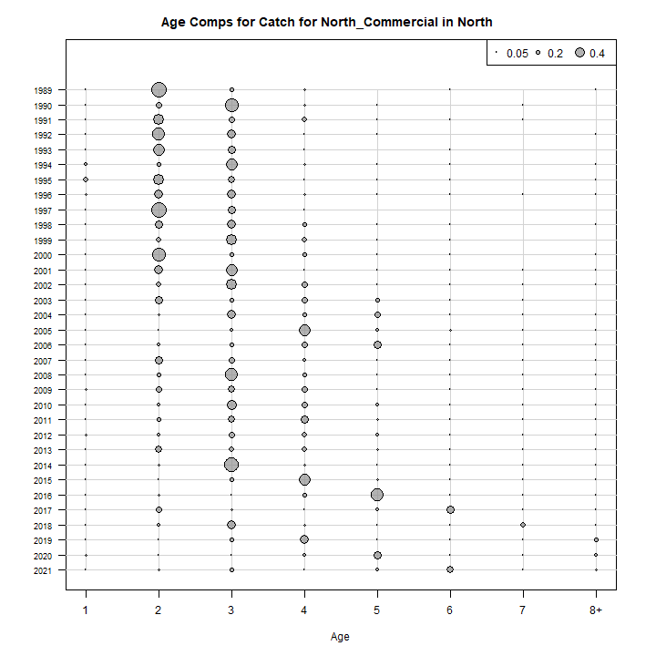
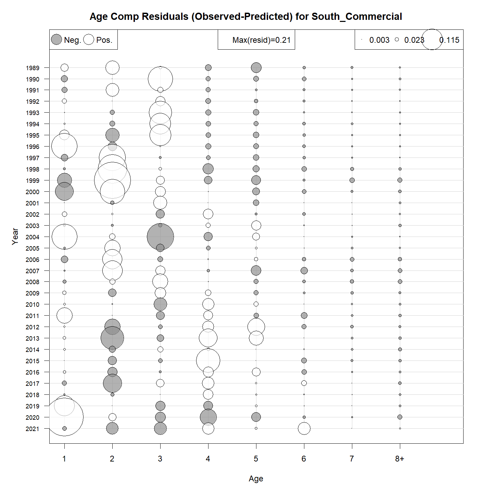
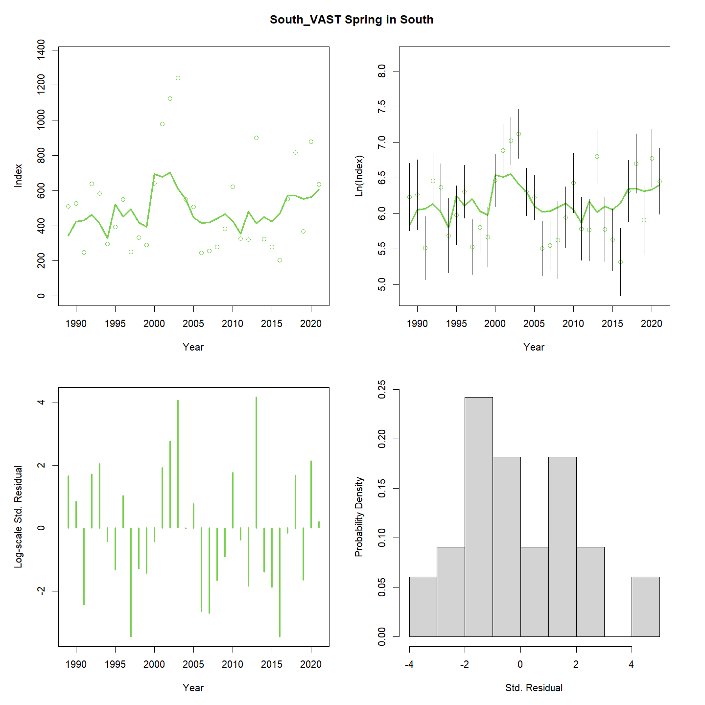
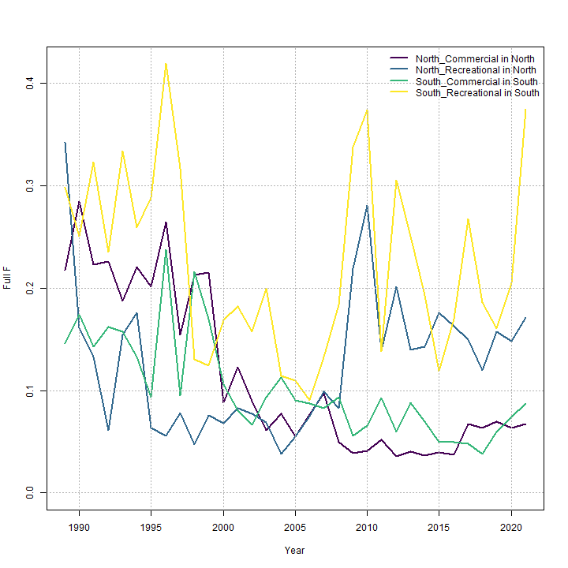
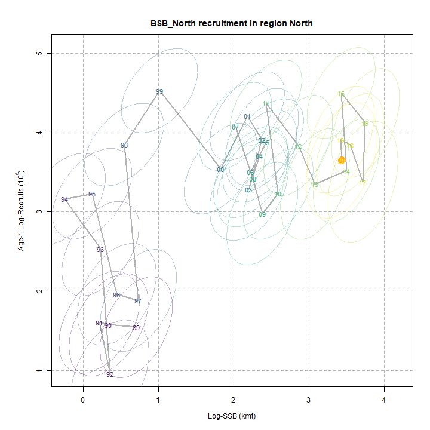
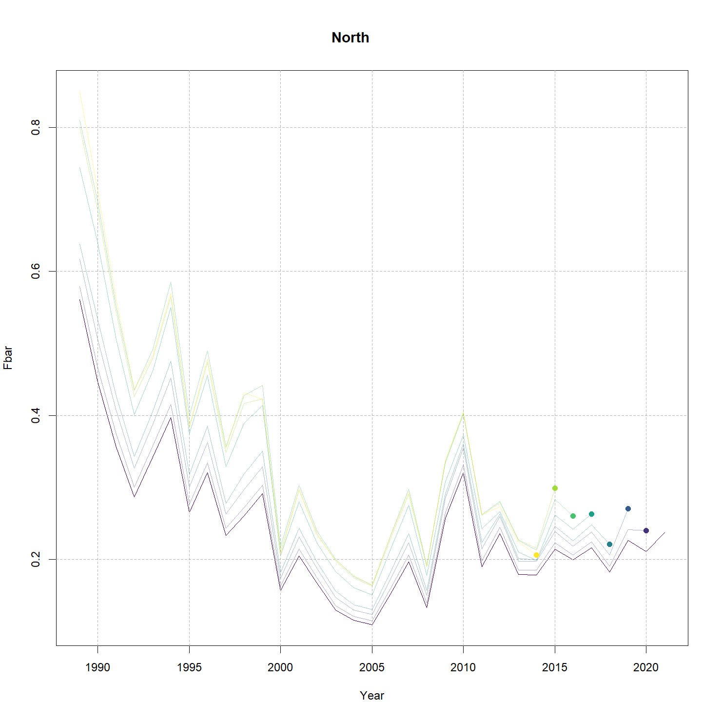
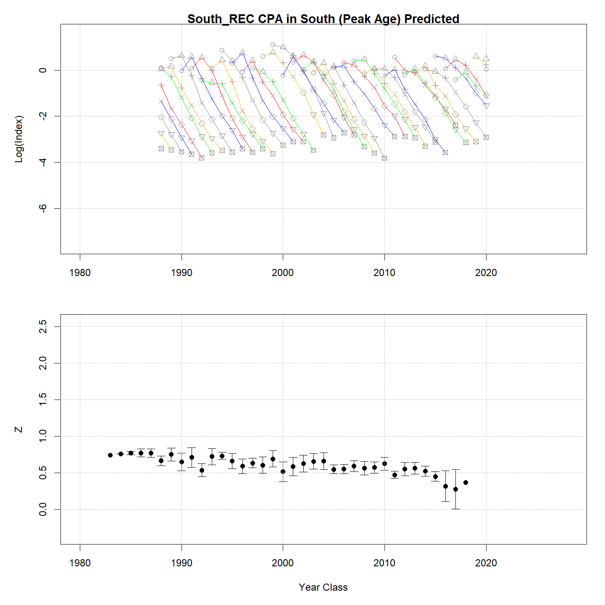

---
output:
  html_document:
    df_print: paged
    keep_md: yes
  word_document: default
  pdf_document:
    fig_caption: yes
    includes:
    keep_tex: yes
    number_sections: no
title: "WHAM figures and tables"
header-includes:
  - \usepackage{longtable}
  - \usepackage{booktabs}
  - \usepackage{caption,graphics}
  - \usepackage{makecell}
  - \usepackage{lscape}
  - \renewcommand\figurename{Fig.}
  - \captionsetup{labelsep=period, singlelinecheck=false}
  - \newcommand{\changesize}[1]{\fontsize{#1pt}{#1pt}\selectfont}
  - \renewcommand{\arraystretch}{1.5}
  - \renewcommand\theadfont{}
---

# {.tabset}

## Figures {.tabset}

### Input

### Diagnostics

### Results

### Retro

### Reference points

### Miscelaneous

## Tables {.tabset}

### Parameter estimates

<table class="table" style="margin-left: auto; margin-right: auto;">
<caption>Parameter estimates, standard errors, and confidence intervals. Rounded to 3 decimal places.</caption>
 <thead>
  <tr>
   <th style="text-align:left;">   </th>
   <th style="text-align:right;"> Estimate </th>
   <th style="text-align:right;"> Std. Error </th>
   <th style="text-align:right;"> 95\% CI lower </th>
   <th style="text-align:right;"> 95\% CI upper </th>
  </tr>
 </thead>
<tbody>
  <tr>
   <td style="text-align:left;"> BSB North Mean Recruitment </td>
   <td style="text-align:right;"> 26359.635 </td>
   <td style="text-align:right;"> 6363.152 </td>
   <td style="text-align:right;"> 16423.337 </td>
   <td style="text-align:right;"> 42307.501 </td>
  </tr>
  <tr>
   <td style="text-align:left;"> BSB North NAA $\sigma$ (age 1) </td>
   <td style="text-align:right;"> 0.942 </td>
   <td style="text-align:right;"> 0.126 </td>
   <td style="text-align:right;"> 0.726 </td>
   <td style="text-align:right;"> 1.224 </td>
  </tr>
  <tr>
   <td style="text-align:left;"> BSB North NAA $\sigma$ (age 2) </td>
   <td style="text-align:right;"> 0.488 </td>
   <td style="text-align:right;"> 0.046 </td>
   <td style="text-align:right;"> 0.406 </td>
   <td style="text-align:right;"> 0.587 </td>
  </tr>
  <tr>
   <td style="text-align:left;"> BSB South Mean Recruitment </td>
   <td style="text-align:right;"> 22102.627 </td>
   <td style="text-align:right;"> 2352.966 </td>
   <td style="text-align:right;"> 17940.231 </td>
   <td style="text-align:right;"> 27230.759 </td>
  </tr>
  <tr>
   <td style="text-align:left;"> BSB South NAA $\sigma$ (age 1) </td>
   <td style="text-align:right;"> 0.378 </td>
   <td style="text-align:right;"> 0.052 </td>
   <td style="text-align:right;"> 0.288 </td>
   <td style="text-align:right;"> 0.496 </td>
  </tr>
  <tr>
   <td style="text-align:left;"> BSB South NAA $\sigma$ (age 2) </td>
   <td style="text-align:right;"> 0.277 </td>
   <td style="text-align:right;"> 0.026 </td>
   <td style="text-align:right;"> 0.231 </td>
   <td style="text-align:right;"> 0.332 </td>
  </tr>
  <tr>
   <td style="text-align:left;"> North REC CPA fully selected q </td>
   <td style="text-align:right;"> 0.000 </td>
   <td style="text-align:right;"> 0.000 </td>
   <td style="text-align:right;"> 0.000 </td>
   <td style="text-align:right;"> 0.000 </td>
  </tr>
  <tr>
   <td style="text-align:left;"> North VAST Spring fully selected q </td>
   <td style="text-align:right;"> 0.008 </td>
   <td style="text-align:right;"> 0.001 </td>
   <td style="text-align:right;"> 0.006 </td>
   <td style="text-align:right;"> 0.011 </td>
  </tr>
  <tr>
   <td style="text-align:left;"> North VAST Fall fully selected q </td>
   <td style="text-align:right;"> 0.007 </td>
   <td style="text-align:right;"> 0.001 </td>
   <td style="text-align:right;"> 0.005 </td>
   <td style="text-align:right;"> 0.009 </td>
  </tr>
  <tr>
   <td style="text-align:left;"> South REC CPA fully selected q </td>
   <td style="text-align:right;"> 0.000 </td>
   <td style="text-align:right;"> 0.000 </td>
   <td style="text-align:right;"> 0.000 </td>
   <td style="text-align:right;"> 0.000 </td>
  </tr>
  <tr>
   <td style="text-align:left;"> South VAST Spring fully selected q </td>
   <td style="text-align:right;"> 0.015 </td>
   <td style="text-align:right;"> 0.001 </td>
   <td style="text-align:right;"> 0.013 </td>
   <td style="text-align:right;"> 0.018 </td>
  </tr>
  <tr>
   <td style="text-align:left;"> South VAST Fall fully selected q </td>
   <td style="text-align:right;"> 0.001 </td>
   <td style="text-align:right;"> 0.000 </td>
   <td style="text-align:right;"> 0.000 </td>
   <td style="text-align:right;"> 0.001 </td>
  </tr>
  <tr>
   <td style="text-align:left;"> Block 1: $a_{50}$ </td>
   <td style="text-align:right;"> 1.863 </td>
   <td style="text-align:right;"> 0.077 </td>
   <td style="text-align:right;"> 1.716 </td>
   <td style="text-align:right;"> 2.018 </td>
  </tr>
  <tr>
   <td style="text-align:left;"> Block 1: 1/slope (increasing) </td>
   <td style="text-align:right;"> 0.240 </td>
   <td style="text-align:right;"> 0.020 </td>
   <td style="text-align:right;"> 0.204 </td>
   <td style="text-align:right;"> 0.283 </td>
  </tr>
  <tr>
   <td style="text-align:left;"> Block 2: $a_{50}$ </td>
   <td style="text-align:right;"> 2.263 </td>
   <td style="text-align:right;"> 0.049 </td>
   <td style="text-align:right;"> 2.169 </td>
   <td style="text-align:right;"> 2.361 </td>
  </tr>
  <tr>
   <td style="text-align:left;"> Block 2: 1/slope (increasing) </td>
   <td style="text-align:right;"> 0.275 </td>
   <td style="text-align:right;"> 0.018 </td>
   <td style="text-align:right;"> 0.242 </td>
   <td style="text-align:right;"> 0.313 </td>
  </tr>
  <tr>
   <td style="text-align:left;"> Block 3: $a_{50}$ </td>
   <td style="text-align:right;"> 1.798 </td>
   <td style="text-align:right;"> 0.077 </td>
   <td style="text-align:right;"> 1.651 </td>
   <td style="text-align:right;"> 1.953 </td>
  </tr>
  <tr>
   <td style="text-align:left;"> Block 3: 1/slope (increasing) </td>
   <td style="text-align:right;"> 0.332 </td>
   <td style="text-align:right;"> 0.029 </td>
   <td style="text-align:right;"> 0.279 </td>
   <td style="text-align:right;"> 0.395 </td>
  </tr>
  <tr>
   <td style="text-align:left;"> Block 4: $a_{50}$ </td>
   <td style="text-align:right;"> 2.917 </td>
   <td style="text-align:right;"> 0.209 </td>
   <td style="text-align:right;"> 2.521 </td>
   <td style="text-align:right;"> 3.338 </td>
  </tr>
  <tr>
   <td style="text-align:left;"> Block 4: 1/slope (increasing) </td>
   <td style="text-align:right;"> 0.700 </td>
   <td style="text-align:right;"> 0.084 </td>
   <td style="text-align:right;"> 0.552 </td>
   <td style="text-align:right;"> 0.884 </td>
  </tr>
  <tr>
   <td style="text-align:left;"> Block 5: Selectivity for age 1 </td>
   <td style="text-align:right;"> 0.068 </td>
   <td style="text-align:right;"> 0.015 </td>
   <td style="text-align:right;"> 0.044 </td>
   <td style="text-align:right;"> 0.102 </td>
  </tr>
  <tr>
   <td style="text-align:left;"> Block 5: Selectivity for age 2 </td>
   <td style="text-align:right;"> 1.000 </td>
   <td style="text-align:right;"> -- </td>
   <td style="text-align:right;"> -- </td>
   <td style="text-align:right;"> -- </td>
  </tr>
  <tr>
   <td style="text-align:left;"> Block 5: Selectivity for age 3 </td>
   <td style="text-align:right;"> 1.000 </td>
   <td style="text-align:right;"> -- </td>
   <td style="text-align:right;"> -- </td>
   <td style="text-align:right;"> -- </td>
  </tr>
  <tr>
   <td style="text-align:left;"> Block 5: Selectivity for age 4 </td>
   <td style="text-align:right;"> 1.000 </td>
   <td style="text-align:right;"> -- </td>
   <td style="text-align:right;"> -- </td>
   <td style="text-align:right;"> -- </td>
  </tr>
  <tr>
   <td style="text-align:left;"> Block 5: Selectivity for age 5 </td>
   <td style="text-align:right;"> 1.000 </td>
   <td style="text-align:right;"> -- </td>
   <td style="text-align:right;"> -- </td>
   <td style="text-align:right;"> -- </td>
  </tr>
  <tr>
   <td style="text-align:left;"> Block 5: Selectivity for age 6 </td>
   <td style="text-align:right;"> 1.000 </td>
   <td style="text-align:right;"> -- </td>
   <td style="text-align:right;"> -- </td>
   <td style="text-align:right;"> -- </td>
  </tr>
  <tr>
   <td style="text-align:left;"> Block 5: Selectivity for age 7 </td>
   <td style="text-align:right;"> 1.000 </td>
   <td style="text-align:right;"> -- </td>
   <td style="text-align:right;"> -- </td>
   <td style="text-align:right;"> -- </td>
  </tr>
  <tr>
   <td style="text-align:left;"> Block 5: Selectivity for age 8+ </td>
   <td style="text-align:right;"> 1.000 </td>
   <td style="text-align:right;"> -- </td>
   <td style="text-align:right;"> -- </td>
   <td style="text-align:right;"> -- </td>
  </tr>
  <tr>
   <td style="text-align:left;"> Block 6: $a_{50}$ </td>
   <td style="text-align:right;"> 2.584 </td>
   <td style="text-align:right;"> 0.091 </td>
   <td style="text-align:right;"> 2.409 </td>
   <td style="text-align:right;"> 2.766 </td>
  </tr>
  <tr>
   <td style="text-align:left;"> Block 6: 1/slope (increasing) </td>
   <td style="text-align:right;"> 0.463 </td>
   <td style="text-align:right;"> 0.031 </td>
   <td style="text-align:right;"> 0.405 </td>
   <td style="text-align:right;"> 0.529 </td>
  </tr>
  <tr>
   <td style="text-align:left;"> Block 7: $a_{50}$ </td>
   <td style="text-align:right;"> 1.557 </td>
   <td style="text-align:right;"> 0.095 </td>
   <td style="text-align:right;"> 1.380 </td>
   <td style="text-align:right;"> 1.752 </td>
  </tr>
  <tr>
   <td style="text-align:left;"> Block 7: 1/slope (increasing) </td>
   <td style="text-align:right;"> 0.422 </td>
   <td style="text-align:right;"> 0.053 </td>
   <td style="text-align:right;"> 0.329 </td>
   <td style="text-align:right;"> 0.540 </td>
  </tr>
  <tr>
   <td style="text-align:left;"> Block 8: $a_{50}$ </td>
   <td style="text-align:right;"> 3.363 </td>
   <td style="text-align:right;"> 0.318 </td>
   <td style="text-align:right;"> 2.761 </td>
   <td style="text-align:right;"> 3.996 </td>
  </tr>
  <tr>
   <td style="text-align:left;"> Block 8: 1/slope (increasing) </td>
   <td style="text-align:right;"> 1.106 </td>
   <td style="text-align:right;"> 0.121 </td>
   <td style="text-align:right;"> 0.889 </td>
   <td style="text-align:right;"> 1.366 </td>
  </tr>
  <tr>
   <td style="text-align:left;"> Block 9: Selectivity for age 1 </td>
   <td style="text-align:right;"> 0.218 </td>
   <td style="text-align:right;"> 0.027 </td>
   <td style="text-align:right;"> 0.169 </td>
   <td style="text-align:right;"> 0.277 </td>
  </tr>
  <tr>
   <td style="text-align:left;"> Block 9: Selectivity for age 2 </td>
   <td style="text-align:right;"> 1.000 </td>
   <td style="text-align:right;"> -- </td>
   <td style="text-align:right;"> -- </td>
   <td style="text-align:right;"> -- </td>
  </tr>
  <tr>
   <td style="text-align:left;"> Block 9: Selectivity for age 3 </td>
   <td style="text-align:right;"> 1.000 </td>
   <td style="text-align:right;"> -- </td>
   <td style="text-align:right;"> -- </td>
   <td style="text-align:right;"> -- </td>
  </tr>
  <tr>
   <td style="text-align:left;"> Block 9: Selectivity for age 4 </td>
   <td style="text-align:right;"> 1.000 </td>
   <td style="text-align:right;"> -- </td>
   <td style="text-align:right;"> -- </td>
   <td style="text-align:right;"> -- </td>
  </tr>
  <tr>
   <td style="text-align:left;"> Block 9: Selectivity for age 5 </td>
   <td style="text-align:right;"> 1.000 </td>
   <td style="text-align:right;"> -- </td>
   <td style="text-align:right;"> -- </td>
   <td style="text-align:right;"> -- </td>
  </tr>
  <tr>
   <td style="text-align:left;"> Block 9: Selectivity for age 6 </td>
   <td style="text-align:right;"> 1.000 </td>
   <td style="text-align:right;"> -- </td>
   <td style="text-align:right;"> -- </td>
   <td style="text-align:right;"> -- </td>
  </tr>
  <tr>
   <td style="text-align:left;"> Block 9: Selectivity for age 7 </td>
   <td style="text-align:right;"> 1.000 </td>
   <td style="text-align:right;"> -- </td>
   <td style="text-align:right;"> -- </td>
   <td style="text-align:right;"> -- </td>
  </tr>
  <tr>
   <td style="text-align:left;"> Block 9: Selectivity for age 8+ </td>
   <td style="text-align:right;"> 1.000 </td>
   <td style="text-align:right;"> -- </td>
   <td style="text-align:right;"> -- </td>
   <td style="text-align:right;"> -- </td>
  </tr>
  <tr>
   <td style="text-align:left;"> Block 10: Selectivity for age 1 </td>
   <td style="text-align:right;"> 0.065 </td>
   <td style="text-align:right;"> 0.011 </td>
   <td style="text-align:right;"> 0.047 </td>
   <td style="text-align:right;"> 0.090 </td>
  </tr>
  <tr>
   <td style="text-align:left;"> Block 10: Selectivity for age 2 </td>
   <td style="text-align:right;"> 0.432 </td>
   <td style="text-align:right;"> 0.042 </td>
   <td style="text-align:right;"> 0.352 </td>
   <td style="text-align:right;"> 0.515 </td>
  </tr>
  <tr>
   <td style="text-align:left;"> Block 10: Selectivity for age 3 </td>
   <td style="text-align:right;"> 1.000 </td>
   <td style="text-align:right;"> -- </td>
   <td style="text-align:right;"> -- </td>
   <td style="text-align:right;"> -- </td>
  </tr>
  <tr>
   <td style="text-align:left;"> Block 10: Selectivity for age 4 </td>
   <td style="text-align:right;"> 1.000 </td>
   <td style="text-align:right;"> -- </td>
   <td style="text-align:right;"> -- </td>
   <td style="text-align:right;"> -- </td>
  </tr>
  <tr>
   <td style="text-align:left;"> Block 10: Selectivity for age 5 </td>
   <td style="text-align:right;"> 0.704 </td>
   <td style="text-align:right;"> 0.072 </td>
   <td style="text-align:right;"> 0.546 </td>
   <td style="text-align:right;"> 0.824 </td>
  </tr>
  <tr>
   <td style="text-align:left;"> Block 10: Selectivity for age 6 </td>
   <td style="text-align:right;"> 0.704 </td>
   <td style="text-align:right;"> 0.072 </td>
   <td style="text-align:right;"> 0.546 </td>
   <td style="text-align:right;"> 0.824 </td>
  </tr>
  <tr>
   <td style="text-align:left;"> Block 10: Selectivity for age 7 </td>
   <td style="text-align:right;"> 0.704 </td>
   <td style="text-align:right;"> 0.072 </td>
   <td style="text-align:right;"> 0.546 </td>
   <td style="text-align:right;"> 0.824 </td>
  </tr>
  <tr>
   <td style="text-align:left;"> Block 10: Selectivity for age 8+ </td>
   <td style="text-align:right;"> 0.704 </td>
   <td style="text-align:right;"> 0.072 </td>
   <td style="text-align:right;"> 0.546 </td>
   <td style="text-align:right;"> 0.824 </td>
  </tr>
  <tr>
   <td style="text-align:left;"> Block 11: Selectivity for age 1 </td>
   <td style="text-align:right;"> 0.633 </td>
   <td style="text-align:right;"> 0.075 </td>
   <td style="text-align:right;"> 0.479 </td>
   <td style="text-align:right;"> 0.765 </td>
  </tr>
  <tr>
   <td style="text-align:left;"> Block 11: Selectivity for age 2 </td>
   <td style="text-align:right;"> 0.633 </td>
   <td style="text-align:right;"> 0.075 </td>
   <td style="text-align:right;"> 0.479 </td>
   <td style="text-align:right;"> 0.765 </td>
  </tr>
  <tr>
   <td style="text-align:left;"> Block 11: Selectivity for age 3 </td>
   <td style="text-align:right;"> 1.000 </td>
   <td style="text-align:right;"> -- </td>
   <td style="text-align:right;"> -- </td>
   <td style="text-align:right;"> -- </td>
  </tr>
  <tr>
   <td style="text-align:left;"> Block 11: Selectivity for age 4 </td>
   <td style="text-align:right;"> 1.000 </td>
   <td style="text-align:right;"> -- </td>
   <td style="text-align:right;"> -- </td>
   <td style="text-align:right;"> -- </td>
  </tr>
  <tr>
   <td style="text-align:left;"> Block 11: Selectivity for age 5 </td>
   <td style="text-align:right;"> 1.000 </td>
   <td style="text-align:right;"> -- </td>
   <td style="text-align:right;"> -- </td>
   <td style="text-align:right;"> -- </td>
  </tr>
  <tr>
   <td style="text-align:left;"> Block 11: Selectivity for age 6 </td>
   <td style="text-align:right;"> 1.000 </td>
   <td style="text-align:right;"> -- </td>
   <td style="text-align:right;"> -- </td>
   <td style="text-align:right;"> -- </td>
  </tr>
  <tr>
   <td style="text-align:left;"> Block 11: Selectivity for age 7 </td>
   <td style="text-align:right;"> 1.000 </td>
   <td style="text-align:right;"> -- </td>
   <td style="text-align:right;"> -- </td>
   <td style="text-align:right;"> -- </td>
  </tr>
  <tr>
   <td style="text-align:left;"> Block 11: Selectivity for age 8+ </td>
   <td style="text-align:right;"> 1.000 </td>
   <td style="text-align:right;"> -- </td>
   <td style="text-align:right;"> -- </td>
   <td style="text-align:right;"> -- </td>
  </tr>
  <tr>
   <td style="text-align:left;"> Block 12: Selectivity for age 1 </td>
   <td style="text-align:right;"> 0.487 </td>
   <td style="text-align:right;"> 0.038 </td>
   <td style="text-align:right;"> 0.414 </td>
   <td style="text-align:right;"> 0.561 </td>
  </tr>
  <tr>
   <td style="text-align:left;"> Block 12: Selectivity for age 2 </td>
   <td style="text-align:right;"> 1.000 </td>
   <td style="text-align:right;"> -- </td>
   <td style="text-align:right;"> -- </td>
   <td style="text-align:right;"> -- </td>
  </tr>
  <tr>
   <td style="text-align:left;"> Block 12: Selectivity for age 3 </td>
   <td style="text-align:right;"> 1.000 </td>
   <td style="text-align:right;"> -- </td>
   <td style="text-align:right;"> -- </td>
   <td style="text-align:right;"> -- </td>
  </tr>
  <tr>
   <td style="text-align:left;"> Block 12: Selectivity for age 4 </td>
   <td style="text-align:right;"> 1.000 </td>
   <td style="text-align:right;"> -- </td>
   <td style="text-align:right;"> -- </td>
   <td style="text-align:right;"> -- </td>
  </tr>
  <tr>
   <td style="text-align:left;"> Block 12: Selectivity for age 5 </td>
   <td style="text-align:right;"> 1.000 </td>
   <td style="text-align:right;"> -- </td>
   <td style="text-align:right;"> -- </td>
   <td style="text-align:right;"> -- </td>
  </tr>
  <tr>
   <td style="text-align:left;"> Block 12: Selectivity for age 6 </td>
   <td style="text-align:right;"> 1.000 </td>
   <td style="text-align:right;"> -- </td>
   <td style="text-align:right;"> -- </td>
   <td style="text-align:right;"> -- </td>
  </tr>
  <tr>
   <td style="text-align:left;"> Block 12: Selectivity for age 7 </td>
   <td style="text-align:right;"> 1.000 </td>
   <td style="text-align:right;"> -- </td>
   <td style="text-align:right;"> -- </td>
   <td style="text-align:right;"> -- </td>
  </tr>
  <tr>
   <td style="text-align:left;"> Block 12: Selectivity for age 8+ </td>
   <td style="text-align:right;"> 1.000 </td>
   <td style="text-align:right;"> -- </td>
   <td style="text-align:right;"> -- </td>
   <td style="text-align:right;"> -- </td>
  </tr>
  <tr>
   <td style="text-align:left;"> Block 13: Selectivity for age 1 </td>
   <td style="text-align:right;"> 0.323 </td>
   <td style="text-align:right;"> 0.027 </td>
   <td style="text-align:right;"> 0.273 </td>
   <td style="text-align:right;"> 0.377 </td>
  </tr>
  <tr>
   <td style="text-align:left;"> Block 13: Selectivity for age 2 </td>
   <td style="text-align:right;"> 1.000 </td>
   <td style="text-align:right;"> -- </td>
   <td style="text-align:right;"> -- </td>
   <td style="text-align:right;"> -- </td>
  </tr>
  <tr>
   <td style="text-align:left;"> Block 13: Selectivity for age 3 </td>
   <td style="text-align:right;"> 0.937 </td>
   <td style="text-align:right;"> 0.073 </td>
   <td style="text-align:right;"> 0.567 </td>
   <td style="text-align:right;"> 0.994 </td>
  </tr>
  <tr>
   <td style="text-align:left;"> Block 13: Selectivity for age 4 </td>
   <td style="text-align:right;"> 0.486 </td>
   <td style="text-align:right;"> 0.050 </td>
   <td style="text-align:right;"> 0.390 </td>
   <td style="text-align:right;"> 0.582 </td>
  </tr>
  <tr>
   <td style="text-align:left;"> Block 13: Selectivity for age 5 </td>
   <td style="text-align:right;"> 0.486 </td>
   <td style="text-align:right;"> 0.050 </td>
   <td style="text-align:right;"> 0.390 </td>
   <td style="text-align:right;"> 0.582 </td>
  </tr>
  <tr>
   <td style="text-align:left;"> Block 13: Selectivity for age 6 </td>
   <td style="text-align:right;"> 0.486 </td>
   <td style="text-align:right;"> 0.050 </td>
   <td style="text-align:right;"> 0.390 </td>
   <td style="text-align:right;"> 0.582 </td>
  </tr>
  <tr>
   <td style="text-align:left;"> Block 13: Selectivity for age 7 </td>
   <td style="text-align:right;"> 0.486 </td>
   <td style="text-align:right;"> 0.050 </td>
   <td style="text-align:right;"> 0.390 </td>
   <td style="text-align:right;"> 0.582 </td>
  </tr>
  <tr>
   <td style="text-align:left;"> Block 13: Selectivity for age 8+ </td>
   <td style="text-align:right;"> 0.486 </td>
   <td style="text-align:right;"> 0.050 </td>
   <td style="text-align:right;"> 0.390 </td>
   <td style="text-align:right;"> 0.582 </td>
  </tr>
  <tr>
   <td style="text-align:left;"> Block 14: Selectivity for age 1 </td>
   <td style="text-align:right;"> 0.258 </td>
   <td style="text-align:right;"> 0.023 </td>
   <td style="text-align:right;"> 0.216 </td>
   <td style="text-align:right;"> 0.306 </td>
  </tr>
  <tr>
   <td style="text-align:left;"> Block 14: Selectivity for age 2 </td>
   <td style="text-align:right;"> 1.000 </td>
   <td style="text-align:right;"> -- </td>
   <td style="text-align:right;"> -- </td>
   <td style="text-align:right;"> -- </td>
  </tr>
  <tr>
   <td style="text-align:left;"> Block 14: Selectivity for age 3 </td>
   <td style="text-align:right;"> 0.376 </td>
   <td style="text-align:right;"> 0.040 </td>
   <td style="text-align:right;"> 0.302 </td>
   <td style="text-align:right;"> 0.457 </td>
  </tr>
  <tr>
   <td style="text-align:left;"> Block 14: Selectivity for age 4 </td>
   <td style="text-align:right;"> 0.239 </td>
   <td style="text-align:right;"> 0.032 </td>
   <td style="text-align:right;"> 0.181 </td>
   <td style="text-align:right;"> 0.308 </td>
  </tr>
  <tr>
   <td style="text-align:left;"> Block 14: Selectivity for age 5 </td>
   <td style="text-align:right;"> 0.239 </td>
   <td style="text-align:right;"> 0.032 </td>
   <td style="text-align:right;"> 0.181 </td>
   <td style="text-align:right;"> 0.308 </td>
  </tr>
  <tr>
   <td style="text-align:left;"> Block 14: Selectivity for age 6 </td>
   <td style="text-align:right;"> 0.239 </td>
   <td style="text-align:right;"> 0.032 </td>
   <td style="text-align:right;"> 0.181 </td>
   <td style="text-align:right;"> 0.308 </td>
  </tr>
  <tr>
   <td style="text-align:left;"> Block 14: Selectivity for age 7 </td>
   <td style="text-align:right;"> 0.239 </td>
   <td style="text-align:right;"> 0.032 </td>
   <td style="text-align:right;"> 0.181 </td>
   <td style="text-align:right;"> 0.308 </td>
  </tr>
  <tr>
   <td style="text-align:left;"> Block 14: Selectivity for age 8+ </td>
   <td style="text-align:right;"> 0.239 </td>
   <td style="text-align:right;"> 0.032 </td>
   <td style="text-align:right;"> 0.181 </td>
   <td style="text-align:right;"> 0.308 </td>
  </tr>
  <tr>
   <td style="text-align:left;"> North Commercial in North age comp, Dirichlet: dispersion ($\phi$) </td>
   <td style="text-align:right;"> 47.952 </td>
   <td style="text-align:right;"> 5.351 </td>
   <td style="text-align:right;"> 38.531 </td>
   <td style="text-align:right;"> 59.675 </td>
  </tr>
  <tr>
   <td style="text-align:left;"> North Recreational in North age comp, Dirichlet: dispersion ($\phi$) </td>
   <td style="text-align:right;"> 57.508 </td>
   <td style="text-align:right;"> 7.511 </td>
   <td style="text-align:right;"> 44.520 </td>
   <td style="text-align:right;"> 74.286 </td>
  </tr>
  <tr>
   <td style="text-align:left;"> South Commercial in South age comp, Dirichlet: dispersion ($\phi$) </td>
   <td style="text-align:right;"> 36.509 </td>
   <td style="text-align:right;"> 3.903 </td>
   <td style="text-align:right;"> 29.608 </td>
   <td style="text-align:right;"> 45.019 </td>
  </tr>
  <tr>
   <td style="text-align:left;"> South Recreational in South age comp, Dirichlet: dispersion ($\phi$) </td>
   <td style="text-align:right;"> 47.635 </td>
   <td style="text-align:right;"> 5.443 </td>
   <td style="text-align:right;"> 38.077 </td>
   <td style="text-align:right;"> 59.594 </td>
  </tr>
  <tr>
   <td style="text-align:left;"> North REC CPA in North age comp, Dirichlet: dispersion ($\phi$) </td>
   <td style="text-align:right;"> 48.065 </td>
   <td style="text-align:right;"> 6.405 </td>
   <td style="text-align:right;"> 37.018 </td>
   <td style="text-align:right;"> 62.410 </td>
  </tr>
  <tr>
   <td style="text-align:left;"> North VAST Spring in North age comp, Dirichlet: dispersion ($\phi$) </td>
   <td style="text-align:right;"> 26.453 </td>
   <td style="text-align:right;"> 2.853 </td>
   <td style="text-align:right;"> 21.413 </td>
   <td style="text-align:right;"> 32.678 </td>
  </tr>
  <tr>
   <td style="text-align:left;"> North VAST Fall in North age comp, Dirichlet: dispersion ($\phi$) </td>
   <td style="text-align:right;"> 14.545 </td>
   <td style="text-align:right;"> 2.195 </td>
   <td style="text-align:right;"> 10.821 </td>
   <td style="text-align:right;"> 19.551 </td>
  </tr>
  <tr>
   <td style="text-align:left;"> South REC CPA in South age comp, Dirichlet: dispersion ($\phi$) </td>
   <td style="text-align:right;"> 38.308 </td>
   <td style="text-align:right;"> 4.588 </td>
   <td style="text-align:right;"> 30.293 </td>
   <td style="text-align:right;"> 48.444 </td>
  </tr>
  <tr>
   <td style="text-align:left;"> South VAST Spring in South age comp, Dirichlet: dispersion ($\phi$) </td>
   <td style="text-align:right;"> 39.268 </td>
   <td style="text-align:right;"> 4.341 </td>
   <td style="text-align:right;"> 31.618 </td>
   <td style="text-align:right;"> 48.768 </td>
  </tr>
  <tr>
   <td style="text-align:left;"> South VAST Fall in South age comp, Dirichlet: dispersion ($\phi$) </td>
   <td style="text-align:right;"> 30.423 </td>
   <td style="text-align:right;"> 3.800 </td>
   <td style="text-align:right;"> 23.817 </td>
   <td style="text-align:right;"> 38.861 </td>
  </tr>
  <tr>
   <td style="text-align:left;"> North REC CPA log-index observation SD scalar </td>
   <td style="text-align:right;"> 9.396 </td>
   <td style="text-align:right;"> 1.350 </td>
   <td style="text-align:right;"> 7.090 </td>
   <td style="text-align:right;"> 12.452 </td>
  </tr>
</tbody>
</table>

### Abundance at age

<table class="table" style="margin-left: auto; margin-right: auto;">
<caption>Abundance at age (1000s) for BSB North in North.</caption>
 <thead>
  <tr>
   <th style="text-align:left;">   </th>
   <th style="text-align:right;"> 1 </th>
   <th style="text-align:right;"> 2 </th>
   <th style="text-align:right;"> 3 </th>
   <th style="text-align:right;"> 4 </th>
   <th style="text-align:right;"> 5 </th>
   <th style="text-align:right;"> 6 </th>
   <th style="text-align:right;"> 7 </th>
   <th style="text-align:right;"> 8+ </th>
  </tr>
 </thead>
<tbody>
  <tr>
   <td style="text-align:left;"> 1989 </td>
   <td style="text-align:right;"> 5904 </td>
   <td style="text-align:right;"> 3115 </td>
   <td style="text-align:right;"> 1592 </td>
   <td style="text-align:right;"> 810 </td>
   <td style="text-align:right;"> 412 </td>
   <td style="text-align:right;"> 210 </td>
   <td style="text-align:right;"> 107 </td>
   <td style="text-align:right;"> 110 </td>
  </tr>
  <tr>
   <td style="text-align:left;"> 1990 </td>
   <td style="text-align:right;"> 4699 </td>
   <td style="text-align:right;"> 1700 </td>
   <td style="text-align:right;"> 1701 </td>
   <td style="text-align:right;"> 395 </td>
   <td style="text-align:right;"> 268 </td>
   <td style="text-align:right;"> 120 </td>
   <td style="text-align:right;"> 63 </td>
   <td style="text-align:right;"> 98 </td>
  </tr>
  <tr>
   <td style="text-align:left;"> 1991 </td>
   <td style="text-align:right;"> 4841 </td>
   <td style="text-align:right;"> 2622 </td>
   <td style="text-align:right;"> 640 </td>
   <td style="text-align:right;"> 680 </td>
   <td style="text-align:right;"> 206 </td>
   <td style="text-align:right;"> 92 </td>
   <td style="text-align:right;"> 39 </td>
   <td style="text-align:right;"> 92 </td>
  </tr>
  <tr>
   <td style="text-align:left;"> 1992 </td>
   <td style="text-align:right;"> 4996 </td>
   <td style="text-align:right;"> 3399 </td>
   <td style="text-align:right;"> 722 </td>
   <td style="text-align:right;"> 219 </td>
   <td style="text-align:right;"> 277 </td>
   <td style="text-align:right;"> 109 </td>
   <td style="text-align:right;"> 55 </td>
   <td style="text-align:right;"> 74 </td>
  </tr>
  <tr>
   <td style="text-align:left;"> 1993 </td>
   <td style="text-align:right;"> 2607 </td>
   <td style="text-align:right;"> 2201 </td>
   <td style="text-align:right;"> 784 </td>
   <td style="text-align:right;"> 385 </td>
   <td style="text-align:right;"> 129 </td>
   <td style="text-align:right;"> 183 </td>
   <td style="text-align:right;"> 58 </td>
   <td style="text-align:right;"> 66 </td>
  </tr>
  <tr>
   <td style="text-align:left;"> 1994 </td>
   <td style="text-align:right;"> 12632 </td>
   <td style="text-align:right;"> 708 </td>
   <td style="text-align:right;"> 1366 </td>
   <td style="text-align:right;"> 293 </td>
   <td style="text-align:right;"> 204 </td>
   <td style="text-align:right;"> 70 </td>
   <td style="text-align:right;"> 90 </td>
   <td style="text-align:right;"> 49 </td>
  </tr>
  <tr>
   <td style="text-align:left;"> 1995 </td>
   <td style="text-align:right;"> 23696 </td>
   <td style="text-align:right;"> 2262 </td>
   <td style="text-align:right;"> 780 </td>
   <td style="text-align:right;"> 291 </td>
   <td style="text-align:right;"> 164 </td>
   <td style="text-align:right;"> 76 </td>
   <td style="text-align:right;"> 49 </td>
   <td style="text-align:right;"> 62 </td>
  </tr>
  <tr>
   <td style="text-align:left;"> 1996 </td>
   <td style="text-align:right;"> 25304 </td>
   <td style="text-align:right;"> 3571 </td>
   <td style="text-align:right;"> 1070 </td>
   <td style="text-align:right;"> 370 </td>
   <td style="text-align:right;"> 176 </td>
   <td style="text-align:right;"> 145 </td>
   <td style="text-align:right;"> 59 </td>
   <td style="text-align:right;"> 76 </td>
  </tr>
  <tr>
   <td style="text-align:left;"> 1997 </td>
   <td style="text-align:right;"> 7108 </td>
   <td style="text-align:right;"> 6867 </td>
   <td style="text-align:right;"> 1408 </td>
   <td style="text-align:right;"> 358 </td>
   <td style="text-align:right;"> 255 </td>
   <td style="text-align:right;"> 138 </td>
   <td style="text-align:right;"> 96 </td>
   <td style="text-align:right;"> 93 </td>
  </tr>
  <tr>
   <td style="text-align:left;"> 1998 </td>
   <td style="text-align:right;"> 6578 </td>
   <td style="text-align:right;"> 3482 </td>
   <td style="text-align:right;"> 1286 </td>
   <td style="text-align:right;"> 759 </td>
   <td style="text-align:right;"> 230 </td>
   <td style="text-align:right;"> 205 </td>
   <td style="text-align:right;"> 99 </td>
   <td style="text-align:right;"> 128 </td>
  </tr>
  <tr>
   <td style="text-align:left;"> 1999 </td>
   <td style="text-align:right;"> 46931 </td>
   <td style="text-align:right;"> 3537 </td>
   <td style="text-align:right;"> 1850 </td>
   <td style="text-align:right;"> 938 </td>
   <td style="text-align:right;"> 421 </td>
   <td style="text-align:right;"> 208 </td>
   <td style="text-align:right;"> 152 </td>
   <td style="text-align:right;"> 175 </td>
  </tr>
  <tr>
   <td style="text-align:left;"> 2000 </td>
   <td style="text-align:right;"> 92696 </td>
   <td style="text-align:right;"> 14425 </td>
   <td style="text-align:right;"> 2331 </td>
   <td style="text-align:right;"> 1823 </td>
   <td style="text-align:right;"> 630 </td>
   <td style="text-align:right;"> 412 </td>
   <td style="text-align:right;"> 141 </td>
   <td style="text-align:right;"> 209 </td>
  </tr>
  <tr>
   <td style="text-align:left;"> 2001 </td>
   <td style="text-align:right;"> 34664 </td>
   <td style="text-align:right;"> 10209 </td>
   <td style="text-align:right;"> 6949 </td>
   <td style="text-align:right;"> 1410 </td>
   <td style="text-align:right;"> 939 </td>
   <td style="text-align:right;"> 506 </td>
   <td style="text-align:right;"> 356 </td>
   <td style="text-align:right;"> 196 </td>
  </tr>
  <tr>
   <td style="text-align:left;"> 2002 </td>
   <td style="text-align:right;"> 67280 </td>
   <td style="text-align:right;"> 13315 </td>
   <td style="text-align:right;"> 8842 </td>
   <td style="text-align:right;"> 5416 </td>
   <td style="text-align:right;"> 758 </td>
   <td style="text-align:right;"> 512 </td>
   <td style="text-align:right;"> 357 </td>
   <td style="text-align:right;"> 292 </td>
  </tr>
  <tr>
   <td style="text-align:left;"> 2003 </td>
   <td style="text-align:right;"> 50008 </td>
   <td style="text-align:right;"> 10951 </td>
   <td style="text-align:right;"> 4690 </td>
   <td style="text-align:right;"> 5762 </td>
   <td style="text-align:right;"> 3162 </td>
   <td style="text-align:right;"> 439 </td>
   <td style="text-align:right;"> 331 </td>
   <td style="text-align:right;"> 363 </td>
  </tr>
  <tr>
   <td style="text-align:left;"> 2004 </td>
   <td style="text-align:right;"> 26672 </td>
   <td style="text-align:right;"> 6104 </td>
   <td style="text-align:right;"> 9209 </td>
   <td style="text-align:right;"> 2688 </td>
   <td style="text-align:right;"> 4240 </td>
   <td style="text-align:right;"> 1322 </td>
   <td style="text-align:right;"> 214 </td>
   <td style="text-align:right;"> 346 </td>
  </tr>
  <tr>
   <td style="text-align:left;"> 2005 </td>
   <td style="text-align:right;"> 40636 </td>
   <td style="text-align:right;"> 6249 </td>
   <td style="text-align:right;"> 2832 </td>
   <td style="text-align:right;"> 6026 </td>
   <td style="text-align:right;"> 2407 </td>
   <td style="text-align:right;"> 2114 </td>
   <td style="text-align:right;"> 547 </td>
   <td style="text-align:right;"> 301 </td>
  </tr>
  <tr>
   <td style="text-align:left;"> 2006 </td>
   <td style="text-align:right;"> 48447 </td>
   <td style="text-align:right;"> 9052 </td>
   <td style="text-align:right;"> 2602 </td>
   <td style="text-align:right;"> 2491 </td>
   <td style="text-align:right;"> 3627 </td>
   <td style="text-align:right;"> 942 </td>
   <td style="text-align:right;"> 867 </td>
   <td style="text-align:right;"> 226 </td>
  </tr>
  <tr>
   <td style="text-align:left;"> 2007 </td>
   <td style="text-align:right;"> 33169 </td>
   <td style="text-align:right;"> 11811 </td>
   <td style="text-align:right;"> 4085 </td>
   <td style="text-align:right;"> 1635 </td>
   <td style="text-align:right;"> 1237 </td>
   <td style="text-align:right;"> 1363 </td>
   <td style="text-align:right;"> 701 </td>
   <td style="text-align:right;"> 416 </td>
  </tr>
  <tr>
   <td style="text-align:left;"> 2008 </td>
   <td style="text-align:right;"> 59090 </td>
   <td style="text-align:right;"> 12977 </td>
   <td style="text-align:right;"> 8562 </td>
   <td style="text-align:right;"> 2762 </td>
   <td style="text-align:right;"> 866 </td>
   <td style="text-align:right;"> 622 </td>
   <td style="text-align:right;"> 707 </td>
   <td style="text-align:right;"> 535 </td>
  </tr>
  <tr>
   <td style="text-align:left;"> 2009 </td>
   <td style="text-align:right;"> 30505 </td>
   <td style="text-align:right;"> 17124 </td>
   <td style="text-align:right;"> 7238 </td>
   <td style="text-align:right;"> 5316 </td>
   <td style="text-align:right;"> 1364 </td>
   <td style="text-align:right;"> 406 </td>
   <td style="text-align:right;"> 285 </td>
   <td style="text-align:right;"> 512 </td>
  </tr>
  <tr>
   <td style="text-align:left;"> 2010 </td>
   <td style="text-align:right;"> 19658 </td>
   <td style="text-align:right;"> 11564 </td>
   <td style="text-align:right;"> 10303 </td>
   <td style="text-align:right;"> 5118 </td>
   <td style="text-align:right;"> 3094 </td>
   <td style="text-align:right;"> 731 </td>
   <td style="text-align:right;"> 226 </td>
   <td style="text-align:right;"> 325 </td>
  </tr>
  <tr>
   <td style="text-align:left;"> 2011 </td>
   <td style="text-align:right;"> 25312 </td>
   <td style="text-align:right;"> 9545 </td>
   <td style="text-align:right;"> 5581 </td>
   <td style="text-align:right;"> 5478 </td>
   <td style="text-align:right;"> 2192 </td>
   <td style="text-align:right;"> 1349 </td>
   <td style="text-align:right;"> 376 </td>
   <td style="text-align:right;"> 240 </td>
  </tr>
  <tr>
   <td style="text-align:left;"> 2012 </td>
   <td style="text-align:right;"> 79448 </td>
   <td style="text-align:right;"> 22720 </td>
   <td style="text-align:right;"> 10488 </td>
   <td style="text-align:right;"> 6134 </td>
   <td style="text-align:right;"> 4685 </td>
   <td style="text-align:right;"> 1874 </td>
   <td style="text-align:right;"> 1103 </td>
   <td style="text-align:right;"> 463 </td>
  </tr>
  <tr>
   <td style="text-align:left;"> 2013 </td>
   <td style="text-align:right;"> 46422 </td>
   <td style="text-align:right;"> 45567 </td>
   <td style="text-align:right;"> 8654 </td>
   <td style="text-align:right;"> 7495 </td>
   <td style="text-align:right;"> 4559 </td>
   <td style="text-align:right;"> 2820 </td>
   <td style="text-align:right;"> 1015 </td>
   <td style="text-align:right;"> 916 </td>
  </tr>
  <tr>
   <td style="text-align:left;"> 2014 </td>
   <td style="text-align:right;"> 28595 </td>
   <td style="text-align:right;"> 19118 </td>
   <td style="text-align:right;"> 41443 </td>
   <td style="text-align:right;"> 7859 </td>
   <td style="text-align:right;"> 4688 </td>
   <td style="text-align:right;"> 2862 </td>
   <td style="text-align:right;"> 1829 </td>
   <td style="text-align:right;"> 1135 </td>
  </tr>
  <tr>
   <td style="text-align:left;"> 2015 </td>
   <td style="text-align:right;"> 33885 </td>
   <td style="text-align:right;"> 15729 </td>
   <td style="text-align:right;"> 11639 </td>
   <td style="text-align:right;"> 25583 </td>
   <td style="text-align:right;"> 4936 </td>
   <td style="text-align:right;"> 2544 </td>
   <td style="text-align:right;"> 1413 </td>
   <td style="text-align:right;"> 1497 </td>
  </tr>
  <tr>
   <td style="text-align:left;"> 2016 </td>
   <td style="text-align:right;"> 90094 </td>
   <td style="text-align:right;"> 28939 </td>
   <td style="text-align:right;"> 8395 </td>
   <td style="text-align:right;"> 9275 </td>
   <td style="text-align:right;"> 30568 </td>
   <td style="text-align:right;"> 2994 </td>
   <td style="text-align:right;"> 1852 </td>
   <td style="text-align:right;"> 1846 </td>
  </tr>
  <tr>
   <td style="text-align:left;"> 2017 </td>
   <td style="text-align:right;"> 61723 </td>
   <td style="text-align:right;"> 66997 </td>
   <td style="text-align:right;"> 11676 </td>
   <td style="text-align:right;"> 6119 </td>
   <td style="text-align:right;"> 4784 </td>
   <td style="text-align:right;"> 22322 </td>
   <td style="text-align:right;"> 1658 </td>
   <td style="text-align:right;"> 1917 </td>
  </tr>
  <tr>
   <td style="text-align:left;"> 2018 </td>
   <td style="text-align:right;"> 29272 </td>
   <td style="text-align:right;"> 24445 </td>
   <td style="text-align:right;"> 27033 </td>
   <td style="text-align:right;"> 6906 </td>
   <td style="text-align:right;"> 2969 </td>
   <td style="text-align:right;"> 3067 </td>
   <td style="text-align:right;"> 14039 </td>
   <td style="text-align:right;"> 1714 </td>
  </tr>
  <tr>
   <td style="text-align:left;"> 2019 </td>
   <td style="text-align:right;"> 46855 </td>
   <td style="text-align:right;"> 11628 </td>
   <td style="text-align:right;"> 13185 </td>
   <td style="text-align:right;"> 24208 </td>
   <td style="text-align:right;"> 5230 </td>
   <td style="text-align:right;"> 2392 </td>
   <td style="text-align:right;"> 2091 </td>
   <td style="text-align:right;"> 10525 </td>
  </tr>
  <tr>
   <td style="text-align:left;"> 2020 </td>
   <td style="text-align:right;"> 50109 </td>
   <td style="text-align:right;"> 29122 </td>
   <td style="text-align:right;"> 4709 </td>
   <td style="text-align:right;"> 9614 </td>
   <td style="text-align:right;"> 19147 </td>
   <td style="text-align:right;"> 3282 </td>
   <td style="text-align:right;"> 1926 </td>
   <td style="text-align:right;"> 8530 </td>
  </tr>
  <tr>
   <td style="text-align:left;"> 2021 </td>
   <td style="text-align:right;"> 38434 </td>
   <td style="text-align:right;"> 29654 </td>
   <td style="text-align:right;"> 18129 </td>
   <td style="text-align:right;"> 2754 </td>
   <td style="text-align:right;"> 7776 </td>
   <td style="text-align:right;"> 15578 </td>
   <td style="text-align:right;"> 2044 </td>
   <td style="text-align:right;"> 6447 </td>
  </tr>
</tbody>
</table>

<table class="table" style="margin-left: auto; margin-right: auto;">
<caption>Abundance at age (1000s) for BSB North in South.</caption>
 <thead>
  <tr>
   <th style="text-align:left;">   </th>
   <th style="text-align:right;"> 1 </th>
   <th style="text-align:right;"> 2 </th>
   <th style="text-align:right;"> 3 </th>
   <th style="text-align:right;"> 4 </th>
   <th style="text-align:right;"> 5 </th>
   <th style="text-align:right;"> 6 </th>
   <th style="text-align:right;"> 7 </th>
   <th style="text-align:right;"> 8+ </th>
  </tr>
 </thead>
<tbody>
  <tr>
   <td style="text-align:left;"> 1989 </td>
   <td style="text-align:right;"> 0 </td>
   <td style="text-align:right;"> 193 </td>
   <td style="text-align:right;"> 99 </td>
   <td style="text-align:right;"> 51 </td>
   <td style="text-align:right;"> 26 </td>
   <td style="text-align:right;"> 13 </td>
   <td style="text-align:right;"> 7 </td>
   <td style="text-align:right;"> 7 </td>
  </tr>
  <tr>
   <td style="text-align:left;"> 1990 </td>
   <td style="text-align:right;"> 0 </td>
   <td style="text-align:right;"> 210 </td>
   <td style="text-align:right;"> 89 </td>
   <td style="text-align:right;"> 38 </td>
   <td style="text-align:right;"> 19 </td>
   <td style="text-align:right;"> 10 </td>
   <td style="text-align:right;"> 5 </td>
   <td style="text-align:right;"> 5 </td>
  </tr>
  <tr>
   <td style="text-align:left;"> 1991 </td>
   <td style="text-align:right;"> 0 </td>
   <td style="text-align:right;"> 186 </td>
   <td style="text-align:right;"> 52 </td>
   <td style="text-align:right;"> 44 </td>
   <td style="text-align:right;"> 11 </td>
   <td style="text-align:right;"> 7 </td>
   <td style="text-align:right;"> 3 </td>
   <td style="text-align:right;"> 4 </td>
  </tr>
  <tr>
   <td style="text-align:left;"> 1992 </td>
   <td style="text-align:right;"> 0 </td>
   <td style="text-align:right;"> 191 </td>
   <td style="text-align:right;"> 75 </td>
   <td style="text-align:right;"> 18 </td>
   <td style="text-align:right;"> 19 </td>
   <td style="text-align:right;"> 6 </td>
   <td style="text-align:right;"> 3 </td>
   <td style="text-align:right;"> 4 </td>
  </tr>
  <tr>
   <td style="text-align:left;"> 1993 </td>
   <td style="text-align:right;"> 0 </td>
   <td style="text-align:right;"> 198 </td>
   <td style="text-align:right;"> 102 </td>
   <td style="text-align:right;"> 23 </td>
   <td style="text-align:right;"> 7 </td>
   <td style="text-align:right;"> 9 </td>
   <td style="text-align:right;"> 3 </td>
   <td style="text-align:right;"> 4 </td>
  </tr>
  <tr>
   <td style="text-align:left;"> 1994 </td>
   <td style="text-align:right;"> 0 </td>
   <td style="text-align:right;"> 89 </td>
   <td style="text-align:right;"> 72 </td>
   <td style="text-align:right;"> 23 </td>
   <td style="text-align:right;"> 11 </td>
   <td style="text-align:right;"> 4 </td>
   <td style="text-align:right;"> 5 </td>
   <td style="text-align:right;"> 4 </td>
  </tr>
  <tr>
   <td style="text-align:left;"> 1995 </td>
   <td style="text-align:right;"> 0 </td>
   <td style="text-align:right;"> 372 </td>
   <td style="text-align:right;"> 24 </td>
   <td style="text-align:right;"> 36 </td>
   <td style="text-align:right;"> 8 </td>
   <td style="text-align:right;"> 6 </td>
   <td style="text-align:right;"> 2 </td>
   <td style="text-align:right;"> 4 </td>
  </tr>
  <tr>
   <td style="text-align:left;"> 1996 </td>
   <td style="text-align:right;"> 0 </td>
   <td style="text-align:right;"> 677 </td>
   <td style="text-align:right;"> 80 </td>
   <td style="text-align:right;"> 24 </td>
   <td style="text-align:right;"> 10 </td>
   <td style="text-align:right;"> 5 </td>
   <td style="text-align:right;"> 2 </td>
   <td style="text-align:right;"> 3 </td>
  </tr>
  <tr>
   <td style="text-align:left;"> 1997 </td>
   <td style="text-align:right;"> 0 </td>
   <td style="text-align:right;"> 831 </td>
   <td style="text-align:right;"> 114 </td>
   <td style="text-align:right;"> 30 </td>
   <td style="text-align:right;"> 11 </td>
   <td style="text-align:right;"> 5 </td>
   <td style="text-align:right;"> 4 </td>
   <td style="text-align:right;"> 4 </td>
  </tr>
  <tr>
   <td style="text-align:left;"> 1998 </td>
   <td style="text-align:right;"> 0 </td>
   <td style="text-align:right;"> 284 </td>
   <td style="text-align:right;"> 227 </td>
   <td style="text-align:right;"> 46 </td>
   <td style="text-align:right;"> 12 </td>
   <td style="text-align:right;"> 8 </td>
   <td style="text-align:right;"> 4 </td>
   <td style="text-align:right;"> 6 </td>
  </tr>
  <tr>
   <td style="text-align:left;"> 1999 </td>
   <td style="text-align:right;"> 0 </td>
   <td style="text-align:right;"> 239 </td>
   <td style="text-align:right;"> 128 </td>
   <td style="text-align:right;"> 46 </td>
   <td style="text-align:right;"> 24 </td>
   <td style="text-align:right;"> 7 </td>
   <td style="text-align:right;"> 6 </td>
   <td style="text-align:right;"> 7 </td>
  </tr>
  <tr>
   <td style="text-align:left;"> 2000 </td>
   <td style="text-align:right;"> 0 </td>
   <td style="text-align:right;"> 1407 </td>
   <td style="text-align:right;"> 131 </td>
   <td style="text-align:right;"> 60 </td>
   <td style="text-align:right;"> 29 </td>
   <td style="text-align:right;"> 13 </td>
   <td style="text-align:right;"> 6 </td>
   <td style="text-align:right;"> 10 </td>
  </tr>
  <tr>
   <td style="text-align:left;"> 2001 </td>
   <td style="text-align:right;"> 0 </td>
   <td style="text-align:right;"> 2717 </td>
   <td style="text-align:right;"> 563 </td>
   <td style="text-align:right;"> 83 </td>
   <td style="text-align:right;"> 61 </td>
   <td style="text-align:right;"> 22 </td>
   <td style="text-align:right;"> 14 </td>
   <td style="text-align:right;"> 12 </td>
  </tr>
  <tr>
   <td style="text-align:left;"> 2002 </td>
   <td style="text-align:right;"> 0 </td>
   <td style="text-align:right;"> 1479 </td>
   <td style="text-align:right;"> 478 </td>
   <td style="text-align:right;"> 244 </td>
   <td style="text-align:right;"> 47 </td>
   <td style="text-align:right;"> 32 </td>
   <td style="text-align:right;"> 17 </td>
   <td style="text-align:right;"> 18 </td>
  </tr>
  <tr>
   <td style="text-align:left;"> 2003 </td>
   <td style="text-align:right;"> 0 </td>
   <td style="text-align:right;"> 2600 </td>
   <td style="text-align:right;"> 589 </td>
   <td style="text-align:right;"> 323 </td>
   <td style="text-align:right;"> 188 </td>
   <td style="text-align:right;"> 26 </td>
   <td style="text-align:right;"> 18 </td>
   <td style="text-align:right;"> 22 </td>
  </tr>
  <tr>
   <td style="text-align:left;"> 2004 </td>
   <td style="text-align:right;"> 0 </td>
   <td style="text-align:right;"> 1626 </td>
   <td style="text-align:right;"> 565 </td>
   <td style="text-align:right;"> 183 </td>
   <td style="text-align:right;"> 213 </td>
   <td style="text-align:right;"> 110 </td>
   <td style="text-align:right;"> 15 </td>
   <td style="text-align:right;"> 24 </td>
  </tr>
  <tr>
   <td style="text-align:left;"> 2005 </td>
   <td style="text-align:right;"> 0 </td>
   <td style="text-align:right;"> 1147 </td>
   <td style="text-align:right;"> 291 </td>
   <td style="text-align:right;"> 352 </td>
   <td style="text-align:right;"> 99 </td>
   <td style="text-align:right;"> 152 </td>
   <td style="text-align:right;"> 47 </td>
   <td style="text-align:right;"> 20 </td>
  </tr>
  <tr>
   <td style="text-align:left;"> 2006 </td>
   <td style="text-align:right;"> 0 </td>
   <td style="text-align:right;"> 1290 </td>
   <td style="text-align:right;"> 262 </td>
   <td style="text-align:right;"> 112 </td>
   <td style="text-align:right;"> 226 </td>
   <td style="text-align:right;"> 84 </td>
   <td style="text-align:right;"> 71 </td>
   <td style="text-align:right;"> 28 </td>
  </tr>
  <tr>
   <td style="text-align:left;"> 2007 </td>
   <td style="text-align:right;"> 0 </td>
   <td style="text-align:right;"> 1297 </td>
   <td style="text-align:right;"> 369 </td>
   <td style="text-align:right;"> 97 </td>
   <td style="text-align:right;"> 85 </td>
   <td style="text-align:right;"> 122 </td>
   <td style="text-align:right;"> 35 </td>
   <td style="text-align:right;"> 38 </td>
  </tr>
  <tr>
   <td style="text-align:left;"> 2008 </td>
   <td style="text-align:right;"> 0 </td>
   <td style="text-align:right;"> 1213 </td>
   <td style="text-align:right;"> 430 </td>
   <td style="text-align:right;"> 146 </td>
   <td style="text-align:right;"> 55 </td>
   <td style="text-align:right;"> 42 </td>
   <td style="text-align:right;"> 46 </td>
   <td style="text-align:right;"> 37 </td>
  </tr>
  <tr>
   <td style="text-align:left;"> 2009 </td>
   <td style="text-align:right;"> 0 </td>
   <td style="text-align:right;"> 2169 </td>
   <td style="text-align:right;"> 482 </td>
   <td style="text-align:right;"> 298 </td>
   <td style="text-align:right;"> 93 </td>
   <td style="text-align:right;"> 30 </td>
   <td style="text-align:right;"> 22 </td>
   <td style="text-align:right;"> 42 </td>
  </tr>
  <tr>
   <td style="text-align:left;"> 2010 </td>
   <td style="text-align:right;"> 0 </td>
   <td style="text-align:right;"> 1078 </td>
   <td style="text-align:right;"> 718 </td>
   <td style="text-align:right;"> 269 </td>
   <td style="text-align:right;"> 181 </td>
   <td style="text-align:right;"> 45 </td>
   <td style="text-align:right;"> 13 </td>
   <td style="text-align:right;"> 25 </td>
  </tr>
  <tr>
   <td style="text-align:left;"> 2011 </td>
   <td style="text-align:right;"> 0 </td>
   <td style="text-align:right;"> 756 </td>
   <td style="text-align:right;"> 455 </td>
   <td style="text-align:right;"> 350 </td>
   <td style="text-align:right;"> 154 </td>
   <td style="text-align:right;"> 92 </td>
   <td style="text-align:right;"> 21 </td>
   <td style="text-align:right;"> 16 </td>
  </tr>
  <tr>
   <td style="text-align:left;"> 2012 </td>
   <td style="text-align:right;"> 0 </td>
   <td style="text-align:right;"> 859 </td>
   <td style="text-align:right;"> 372 </td>
   <td style="text-align:right;"> 207 </td>
   <td style="text-align:right;"> 188 </td>
   <td style="text-align:right;"> 78 </td>
   <td style="text-align:right;"> 48 </td>
   <td style="text-align:right;"> 21 </td>
  </tr>
  <tr>
   <td style="text-align:left;"> 2013 </td>
   <td style="text-align:right;"> 0 </td>
   <td style="text-align:right;"> 4974 </td>
   <td style="text-align:right;"> 894 </td>
   <td style="text-align:right;"> 382 </td>
   <td style="text-align:right;"> 207 </td>
   <td style="text-align:right;"> 157 </td>
   <td style="text-align:right;"> 59 </td>
   <td style="text-align:right;"> 48 </td>
  </tr>
  <tr>
   <td style="text-align:left;"> 2014 </td>
   <td style="text-align:right;"> 0 </td>
   <td style="text-align:right;"> 1590 </td>
   <td style="text-align:right;"> 1800 </td>
   <td style="text-align:right;"> 328 </td>
   <td style="text-align:right;"> 253 </td>
   <td style="text-align:right;"> 158 </td>
   <td style="text-align:right;"> 95 </td>
   <td style="text-align:right;"> 63 </td>
  </tr>
  <tr>
   <td style="text-align:left;"> 2015 </td>
   <td style="text-align:right;"> 0 </td>
   <td style="text-align:right;"> 1018 </td>
   <td style="text-align:right;"> 728 </td>
   <td style="text-align:right;"> 1501 </td>
   <td style="text-align:right;"> 289 </td>
   <td style="text-align:right;"> 161 </td>
   <td style="text-align:right;"> 91 </td>
   <td style="text-align:right;"> 92 </td>
  </tr>
  <tr>
   <td style="text-align:left;"> 2016 </td>
   <td style="text-align:right;"> 0 </td>
   <td style="text-align:right;"> 1129 </td>
   <td style="text-align:right;"> 550 </td>
   <td style="text-align:right;"> 423 </td>
   <td style="text-align:right;"> 820 </td>
   <td style="text-align:right;"> 147 </td>
   <td style="text-align:right;"> 86 </td>
   <td style="text-align:right;"> 99 </td>
  </tr>
  <tr>
   <td style="text-align:left;"> 2017 </td>
   <td style="text-align:right;"> 0 </td>
   <td style="text-align:right;"> 3094 </td>
   <td style="text-align:right;"> 1112 </td>
   <td style="text-align:right;"> 322 </td>
   <td style="text-align:right;"> 311 </td>
   <td style="text-align:right;"> 1139 </td>
   <td style="text-align:right;"> 102 </td>
   <td style="text-align:right;"> 120 </td>
  </tr>
  <tr>
   <td style="text-align:left;"> 2018 </td>
   <td style="text-align:right;"> 0 </td>
   <td style="text-align:right;"> 3285 </td>
   <td style="text-align:right;"> 3659 </td>
   <td style="text-align:right;"> 445 </td>
   <td style="text-align:right;"> 205 </td>
   <td style="text-align:right;"> 158 </td>
   <td style="text-align:right;"> 670 </td>
   <td style="text-align:right;"> 115 </td>
  </tr>
  <tr>
   <td style="text-align:left;"> 2019 </td>
   <td style="text-align:right;"> 0 </td>
   <td style="text-align:right;"> 1056 </td>
   <td style="text-align:right;"> 1030 </td>
   <td style="text-align:right;"> 1085 </td>
   <td style="text-align:right;"> 244 </td>
   <td style="text-align:right;"> 104 </td>
   <td style="text-align:right;"> 105 </td>
   <td style="text-align:right;"> 513 </td>
  </tr>
  <tr>
   <td style="text-align:left;"> 2020 </td>
   <td style="text-align:right;"> 0 </td>
   <td style="text-align:right;"> 2083 </td>
   <td style="text-align:right;"> 449 </td>
   <td style="text-align:right;"> 520 </td>
   <td style="text-align:right;"> 860 </td>
   <td style="text-align:right;"> 170 </td>
   <td style="text-align:right;"> 79 </td>
   <td style="text-align:right;"> 403 </td>
  </tr>
  <tr>
   <td style="text-align:left;"> 2021 </td>
   <td style="text-align:right;"> 0 </td>
   <td style="text-align:right;"> 1753 </td>
   <td style="text-align:right;"> 1119 </td>
   <td style="text-align:right;"> 180 </td>
   <td style="text-align:right;"> 334 </td>
   <td style="text-align:right;"> 676 </td>
   <td style="text-align:right;"> 110 </td>
   <td style="text-align:right;"> 346 </td>
  </tr>
</tbody>
</table>

<table class="table" style="margin-left: auto; margin-right: auto;">
<caption>Abundance at age (1000s) for BSB South in North.</caption>
 <thead>
  <tr>
   <th style="text-align:left;">   </th>
   <th style="text-align:right;"> 1 </th>
   <th style="text-align:right;"> 2 </th>
   <th style="text-align:right;"> 3 </th>
   <th style="text-align:right;"> 4 </th>
   <th style="text-align:right;"> 5 </th>
   <th style="text-align:right;"> 6 </th>
   <th style="text-align:right;"> 7 </th>
   <th style="text-align:right;"> 8+ </th>
  </tr>
 </thead>
<tbody>
  <tr>
   <td style="text-align:left;"> 1989 </td>
   <td style="text-align:right;"> 0 </td>
   <td style="text-align:right;"> 0 </td>
   <td style="text-align:right;"> 0 </td>
   <td style="text-align:right;"> 0 </td>
   <td style="text-align:right;"> 0 </td>
   <td style="text-align:right;"> 0 </td>
   <td style="text-align:right;"> 0 </td>
   <td style="text-align:right;"> 0 </td>
  </tr>
  <tr>
   <td style="text-align:left;"> 1990 </td>
   <td style="text-align:right;"> 0 </td>
   <td style="text-align:right;"> 0 </td>
   <td style="text-align:right;"> 0 </td>
   <td style="text-align:right;"> 0 </td>
   <td style="text-align:right;"> 0 </td>
   <td style="text-align:right;"> 0 </td>
   <td style="text-align:right;"> 0 </td>
   <td style="text-align:right;"> 0 </td>
  </tr>
  <tr>
   <td style="text-align:left;"> 1991 </td>
   <td style="text-align:right;"> 0 </td>
   <td style="text-align:right;"> 0 </td>
   <td style="text-align:right;"> 0 </td>
   <td style="text-align:right;"> 0 </td>
   <td style="text-align:right;"> 0 </td>
   <td style="text-align:right;"> 0 </td>
   <td style="text-align:right;"> 0 </td>
   <td style="text-align:right;"> 0 </td>
  </tr>
  <tr>
   <td style="text-align:left;"> 1992 </td>
   <td style="text-align:right;"> 0 </td>
   <td style="text-align:right;"> 0 </td>
   <td style="text-align:right;"> 0 </td>
   <td style="text-align:right;"> 0 </td>
   <td style="text-align:right;"> 0 </td>
   <td style="text-align:right;"> 0 </td>
   <td style="text-align:right;"> 0 </td>
   <td style="text-align:right;"> 0 </td>
  </tr>
  <tr>
   <td style="text-align:left;"> 1993 </td>
   <td style="text-align:right;"> 0 </td>
   <td style="text-align:right;"> 0 </td>
   <td style="text-align:right;"> 0 </td>
   <td style="text-align:right;"> 0 </td>
   <td style="text-align:right;"> 0 </td>
   <td style="text-align:right;"> 0 </td>
   <td style="text-align:right;"> 0 </td>
   <td style="text-align:right;"> 0 </td>
  </tr>
  <tr>
   <td style="text-align:left;"> 1994 </td>
   <td style="text-align:right;"> 0 </td>
   <td style="text-align:right;"> 0 </td>
   <td style="text-align:right;"> 0 </td>
   <td style="text-align:right;"> 0 </td>
   <td style="text-align:right;"> 0 </td>
   <td style="text-align:right;"> 0 </td>
   <td style="text-align:right;"> 0 </td>
   <td style="text-align:right;"> 0 </td>
  </tr>
  <tr>
   <td style="text-align:left;"> 1995 </td>
   <td style="text-align:right;"> 0 </td>
   <td style="text-align:right;"> 0 </td>
   <td style="text-align:right;"> 0 </td>
   <td style="text-align:right;"> 0 </td>
   <td style="text-align:right;"> 0 </td>
   <td style="text-align:right;"> 0 </td>
   <td style="text-align:right;"> 0 </td>
   <td style="text-align:right;"> 0 </td>
  </tr>
  <tr>
   <td style="text-align:left;"> 1996 </td>
   <td style="text-align:right;"> 0 </td>
   <td style="text-align:right;"> 0 </td>
   <td style="text-align:right;"> 0 </td>
   <td style="text-align:right;"> 0 </td>
   <td style="text-align:right;"> 0 </td>
   <td style="text-align:right;"> 0 </td>
   <td style="text-align:right;"> 0 </td>
   <td style="text-align:right;"> 0 </td>
  </tr>
  <tr>
   <td style="text-align:left;"> 1997 </td>
   <td style="text-align:right;"> 0 </td>
   <td style="text-align:right;"> 0 </td>
   <td style="text-align:right;"> 0 </td>
   <td style="text-align:right;"> 0 </td>
   <td style="text-align:right;"> 0 </td>
   <td style="text-align:right;"> 0 </td>
   <td style="text-align:right;"> 0 </td>
   <td style="text-align:right;"> 0 </td>
  </tr>
  <tr>
   <td style="text-align:left;"> 1998 </td>
   <td style="text-align:right;"> 0 </td>
   <td style="text-align:right;"> 0 </td>
   <td style="text-align:right;"> 0 </td>
   <td style="text-align:right;"> 0 </td>
   <td style="text-align:right;"> 0 </td>
   <td style="text-align:right;"> 0 </td>
   <td style="text-align:right;"> 0 </td>
   <td style="text-align:right;"> 0 </td>
  </tr>
  <tr>
   <td style="text-align:left;"> 1999 </td>
   <td style="text-align:right;"> 0 </td>
   <td style="text-align:right;"> 0 </td>
   <td style="text-align:right;"> 0 </td>
   <td style="text-align:right;"> 0 </td>
   <td style="text-align:right;"> 0 </td>
   <td style="text-align:right;"> 0 </td>
   <td style="text-align:right;"> 0 </td>
   <td style="text-align:right;"> 0 </td>
  </tr>
  <tr>
   <td style="text-align:left;"> 2000 </td>
   <td style="text-align:right;"> 0 </td>
   <td style="text-align:right;"> 0 </td>
   <td style="text-align:right;"> 0 </td>
   <td style="text-align:right;"> 0 </td>
   <td style="text-align:right;"> 0 </td>
   <td style="text-align:right;"> 0 </td>
   <td style="text-align:right;"> 0 </td>
   <td style="text-align:right;"> 0 </td>
  </tr>
  <tr>
   <td style="text-align:left;"> 2001 </td>
   <td style="text-align:right;"> 0 </td>
   <td style="text-align:right;"> 0 </td>
   <td style="text-align:right;"> 0 </td>
   <td style="text-align:right;"> 0 </td>
   <td style="text-align:right;"> 0 </td>
   <td style="text-align:right;"> 0 </td>
   <td style="text-align:right;"> 0 </td>
   <td style="text-align:right;"> 0 </td>
  </tr>
  <tr>
   <td style="text-align:left;"> 2002 </td>
   <td style="text-align:right;"> 0 </td>
   <td style="text-align:right;"> 0 </td>
   <td style="text-align:right;"> 0 </td>
   <td style="text-align:right;"> 0 </td>
   <td style="text-align:right;"> 0 </td>
   <td style="text-align:right;"> 0 </td>
   <td style="text-align:right;"> 0 </td>
   <td style="text-align:right;"> 0 </td>
  </tr>
  <tr>
   <td style="text-align:left;"> 2003 </td>
   <td style="text-align:right;"> 0 </td>
   <td style="text-align:right;"> 0 </td>
   <td style="text-align:right;"> 0 </td>
   <td style="text-align:right;"> 0 </td>
   <td style="text-align:right;"> 0 </td>
   <td style="text-align:right;"> 0 </td>
   <td style="text-align:right;"> 0 </td>
   <td style="text-align:right;"> 0 </td>
  </tr>
  <tr>
   <td style="text-align:left;"> 2004 </td>
   <td style="text-align:right;"> 0 </td>
   <td style="text-align:right;"> 0 </td>
   <td style="text-align:right;"> 0 </td>
   <td style="text-align:right;"> 0 </td>
   <td style="text-align:right;"> 0 </td>
   <td style="text-align:right;"> 0 </td>
   <td style="text-align:right;"> 0 </td>
   <td style="text-align:right;"> 0 </td>
  </tr>
  <tr>
   <td style="text-align:left;"> 2005 </td>
   <td style="text-align:right;"> 0 </td>
   <td style="text-align:right;"> 0 </td>
   <td style="text-align:right;"> 0 </td>
   <td style="text-align:right;"> 0 </td>
   <td style="text-align:right;"> 0 </td>
   <td style="text-align:right;"> 0 </td>
   <td style="text-align:right;"> 0 </td>
   <td style="text-align:right;"> 0 </td>
  </tr>
  <tr>
   <td style="text-align:left;"> 2006 </td>
   <td style="text-align:right;"> 0 </td>
   <td style="text-align:right;"> 0 </td>
   <td style="text-align:right;"> 0 </td>
   <td style="text-align:right;"> 0 </td>
   <td style="text-align:right;"> 0 </td>
   <td style="text-align:right;"> 0 </td>
   <td style="text-align:right;"> 0 </td>
   <td style="text-align:right;"> 0 </td>
  </tr>
  <tr>
   <td style="text-align:left;"> 2007 </td>
   <td style="text-align:right;"> 0 </td>
   <td style="text-align:right;"> 0 </td>
   <td style="text-align:right;"> 0 </td>
   <td style="text-align:right;"> 0 </td>
   <td style="text-align:right;"> 0 </td>
   <td style="text-align:right;"> 0 </td>
   <td style="text-align:right;"> 0 </td>
   <td style="text-align:right;"> 0 </td>
  </tr>
  <tr>
   <td style="text-align:left;"> 2008 </td>
   <td style="text-align:right;"> 0 </td>
   <td style="text-align:right;"> 0 </td>
   <td style="text-align:right;"> 0 </td>
   <td style="text-align:right;"> 0 </td>
   <td style="text-align:right;"> 0 </td>
   <td style="text-align:right;"> 0 </td>
   <td style="text-align:right;"> 0 </td>
   <td style="text-align:right;"> 0 </td>
  </tr>
  <tr>
   <td style="text-align:left;"> 2009 </td>
   <td style="text-align:right;"> 0 </td>
   <td style="text-align:right;"> 0 </td>
   <td style="text-align:right;"> 0 </td>
   <td style="text-align:right;"> 0 </td>
   <td style="text-align:right;"> 0 </td>
   <td style="text-align:right;"> 0 </td>
   <td style="text-align:right;"> 0 </td>
   <td style="text-align:right;"> 0 </td>
  </tr>
  <tr>
   <td style="text-align:left;"> 2010 </td>
   <td style="text-align:right;"> 0 </td>
   <td style="text-align:right;"> 0 </td>
   <td style="text-align:right;"> 0 </td>
   <td style="text-align:right;"> 0 </td>
   <td style="text-align:right;"> 0 </td>
   <td style="text-align:right;"> 0 </td>
   <td style="text-align:right;"> 0 </td>
   <td style="text-align:right;"> 0 </td>
  </tr>
  <tr>
   <td style="text-align:left;"> 2011 </td>
   <td style="text-align:right;"> 0 </td>
   <td style="text-align:right;"> 0 </td>
   <td style="text-align:right;"> 0 </td>
   <td style="text-align:right;"> 0 </td>
   <td style="text-align:right;"> 0 </td>
   <td style="text-align:right;"> 0 </td>
   <td style="text-align:right;"> 0 </td>
   <td style="text-align:right;"> 0 </td>
  </tr>
  <tr>
   <td style="text-align:left;"> 2012 </td>
   <td style="text-align:right;"> 0 </td>
   <td style="text-align:right;"> 0 </td>
   <td style="text-align:right;"> 0 </td>
   <td style="text-align:right;"> 0 </td>
   <td style="text-align:right;"> 0 </td>
   <td style="text-align:right;"> 0 </td>
   <td style="text-align:right;"> 0 </td>
   <td style="text-align:right;"> 0 </td>
  </tr>
  <tr>
   <td style="text-align:left;"> 2013 </td>
   <td style="text-align:right;"> 0 </td>
   <td style="text-align:right;"> 0 </td>
   <td style="text-align:right;"> 0 </td>
   <td style="text-align:right;"> 0 </td>
   <td style="text-align:right;"> 0 </td>
   <td style="text-align:right;"> 0 </td>
   <td style="text-align:right;"> 0 </td>
   <td style="text-align:right;"> 0 </td>
  </tr>
  <tr>
   <td style="text-align:left;"> 2014 </td>
   <td style="text-align:right;"> 0 </td>
   <td style="text-align:right;"> 0 </td>
   <td style="text-align:right;"> 0 </td>
   <td style="text-align:right;"> 0 </td>
   <td style="text-align:right;"> 0 </td>
   <td style="text-align:right;"> 0 </td>
   <td style="text-align:right;"> 0 </td>
   <td style="text-align:right;"> 0 </td>
  </tr>
  <tr>
   <td style="text-align:left;"> 2015 </td>
   <td style="text-align:right;"> 0 </td>
   <td style="text-align:right;"> 0 </td>
   <td style="text-align:right;"> 0 </td>
   <td style="text-align:right;"> 0 </td>
   <td style="text-align:right;"> 0 </td>
   <td style="text-align:right;"> 0 </td>
   <td style="text-align:right;"> 0 </td>
   <td style="text-align:right;"> 0 </td>
  </tr>
  <tr>
   <td style="text-align:left;"> 2016 </td>
   <td style="text-align:right;"> 0 </td>
   <td style="text-align:right;"> 0 </td>
   <td style="text-align:right;"> 0 </td>
   <td style="text-align:right;"> 0 </td>
   <td style="text-align:right;"> 0 </td>
   <td style="text-align:right;"> 0 </td>
   <td style="text-align:right;"> 0 </td>
   <td style="text-align:right;"> 0 </td>
  </tr>
  <tr>
   <td style="text-align:left;"> 2017 </td>
   <td style="text-align:right;"> 0 </td>
   <td style="text-align:right;"> 0 </td>
   <td style="text-align:right;"> 0 </td>
   <td style="text-align:right;"> 0 </td>
   <td style="text-align:right;"> 0 </td>
   <td style="text-align:right;"> 0 </td>
   <td style="text-align:right;"> 0 </td>
   <td style="text-align:right;"> 0 </td>
  </tr>
  <tr>
   <td style="text-align:left;"> 2018 </td>
   <td style="text-align:right;"> 0 </td>
   <td style="text-align:right;"> 0 </td>
   <td style="text-align:right;"> 0 </td>
   <td style="text-align:right;"> 0 </td>
   <td style="text-align:right;"> 0 </td>
   <td style="text-align:right;"> 0 </td>
   <td style="text-align:right;"> 0 </td>
   <td style="text-align:right;"> 0 </td>
  </tr>
  <tr>
   <td style="text-align:left;"> 2019 </td>
   <td style="text-align:right;"> 0 </td>
   <td style="text-align:right;"> 0 </td>
   <td style="text-align:right;"> 0 </td>
   <td style="text-align:right;"> 0 </td>
   <td style="text-align:right;"> 0 </td>
   <td style="text-align:right;"> 0 </td>
   <td style="text-align:right;"> 0 </td>
   <td style="text-align:right;"> 0 </td>
  </tr>
  <tr>
   <td style="text-align:left;"> 2020 </td>
   <td style="text-align:right;"> 0 </td>
   <td style="text-align:right;"> 0 </td>
   <td style="text-align:right;"> 0 </td>
   <td style="text-align:right;"> 0 </td>
   <td style="text-align:right;"> 0 </td>
   <td style="text-align:right;"> 0 </td>
   <td style="text-align:right;"> 0 </td>
   <td style="text-align:right;"> 0 </td>
  </tr>
  <tr>
   <td style="text-align:left;"> 2021 </td>
   <td style="text-align:right;"> 0 </td>
   <td style="text-align:right;"> 0 </td>
   <td style="text-align:right;"> 0 </td>
   <td style="text-align:right;"> 0 </td>
   <td style="text-align:right;"> 0 </td>
   <td style="text-align:right;"> 0 </td>
   <td style="text-align:right;"> 0 </td>
   <td style="text-align:right;"> 0 </td>
  </tr>
</tbody>
</table>

<table class="table" style="margin-left: auto; margin-right: auto;">
<caption>Abundance at age (1000s) for BSB South in South.</caption>
 <thead>
  <tr>
   <th style="text-align:left;">   </th>
   <th style="text-align:right;"> 1 </th>
   <th style="text-align:right;"> 2 </th>
   <th style="text-align:right;"> 3 </th>
   <th style="text-align:right;"> 4 </th>
   <th style="text-align:right;"> 5 </th>
   <th style="text-align:right;"> 6 </th>
   <th style="text-align:right;"> 7 </th>
   <th style="text-align:right;"> 8+ </th>
  </tr>
 </thead>
<tbody>
  <tr>
   <td style="text-align:left;"> 1989 </td>
   <td style="text-align:right;"> 21383 </td>
   <td style="text-align:right;"> 11300 </td>
   <td style="text-align:right;"> 5714 </td>
   <td style="text-align:right;"> 2873 </td>
   <td style="text-align:right;"> 1444 </td>
   <td style="text-align:right;"> 726 </td>
   <td style="text-align:right;"> 365 </td>
   <td style="text-align:right;"> 368 </td>
  </tr>
  <tr>
   <td style="text-align:left;"> 1990 </td>
   <td style="text-align:right;"> 31809 </td>
   <td style="text-align:right;"> 12540 </td>
   <td style="text-align:right;"> 8162 </td>
   <td style="text-align:right;"> 2069 </td>
   <td style="text-align:right;"> 1308 </td>
   <td style="text-align:right;"> 673 </td>
   <td style="text-align:right;"> 344 </td>
   <td style="text-align:right;"> 359 </td>
  </tr>
  <tr>
   <td style="text-align:left;"> 1991 </td>
   <td style="text-align:right;"> 18842 </td>
   <td style="text-align:right;"> 20127 </td>
   <td style="text-align:right;"> 5114 </td>
   <td style="text-align:right;"> 3406 </td>
   <td style="text-align:right;"> 1049 </td>
   <td style="text-align:right;"> 598 </td>
   <td style="text-align:right;"> 322 </td>
   <td style="text-align:right;"> 354 </td>
  </tr>
  <tr>
   <td style="text-align:left;"> 1992 </td>
   <td style="text-align:right;"> 20615 </td>
   <td style="text-align:right;"> 18908 </td>
   <td style="text-align:right;"> 8448 </td>
   <td style="text-align:right;"> 2333 </td>
   <td style="text-align:right;"> 1354 </td>
   <td style="text-align:right;"> 505 </td>
   <td style="text-align:right;"> 283 </td>
   <td style="text-align:right;"> 324 </td>
  </tr>
  <tr>
   <td style="text-align:left;"> 1993 </td>
   <td style="text-align:right;"> 12467 </td>
   <td style="text-align:right;"> 18913 </td>
   <td style="text-align:right;"> 7810 </td>
   <td style="text-align:right;"> 2738 </td>
   <td style="text-align:right;"> 1111 </td>
   <td style="text-align:right;"> 631 </td>
   <td style="text-align:right;"> 251 </td>
   <td style="text-align:right;"> 301 </td>
  </tr>
  <tr>
   <td style="text-align:left;"> 1994 </td>
   <td style="text-align:right;"> 20840 </td>
   <td style="text-align:right;"> 6045 </td>
   <td style="text-align:right;"> 10581 </td>
   <td style="text-align:right;"> 3095 </td>
   <td style="text-align:right;"> 1285 </td>
   <td style="text-align:right;"> 560 </td>
   <td style="text-align:right;"> 299 </td>
   <td style="text-align:right;"> 245 </td>
  </tr>
  <tr>
   <td style="text-align:left;"> 1995 </td>
   <td style="text-align:right;"> 45672 </td>
   <td style="text-align:right;"> 16056 </td>
   <td style="text-align:right;"> 5969 </td>
   <td style="text-align:right;"> 3594 </td>
   <td style="text-align:right;"> 1478 </td>
   <td style="text-align:right;"> 631 </td>
   <td style="text-align:right;"> 329 </td>
   <td style="text-align:right;"> 299 </td>
  </tr>
  <tr>
   <td style="text-align:left;"> 1996 </td>
   <td style="text-align:right;"> 26549 </td>
   <td style="text-align:right;"> 17252 </td>
   <td style="text-align:right;"> 7340 </td>
   <td style="text-align:right;"> 2899 </td>
   <td style="text-align:right;"> 1486 </td>
   <td style="text-align:right;"> 900 </td>
   <td style="text-align:right;"> 346 </td>
   <td style="text-align:right;"> 393 </td>
  </tr>
  <tr>
   <td style="text-align:left;"> 1997 </td>
   <td style="text-align:right;"> 18162 </td>
   <td style="text-align:right;"> 22258 </td>
   <td style="text-align:right;"> 7880 </td>
   <td style="text-align:right;"> 1872 </td>
   <td style="text-align:right;"> 1212 </td>
   <td style="text-align:right;"> 606 </td>
   <td style="text-align:right;"> 360 </td>
   <td style="text-align:right;"> 298 </td>
  </tr>
  <tr>
   <td style="text-align:left;"> 1998 </td>
   <td style="text-align:right;"> 21289 </td>
   <td style="text-align:right;"> 14748 </td>
   <td style="text-align:right;"> 7358 </td>
   <td style="text-align:right;"> 2869 </td>
   <td style="text-align:right;"> 828 </td>
   <td style="text-align:right;"> 664 </td>
   <td style="text-align:right;"> 300 </td>
   <td style="text-align:right;"> 328 </td>
  </tr>
  <tr>
   <td style="text-align:left;"> 1999 </td>
   <td style="text-align:right;"> 34752 </td>
   <td style="text-align:right;"> 8972 </td>
   <td style="text-align:right;"> 6074 </td>
   <td style="text-align:right;"> 2751 </td>
   <td style="text-align:right;"> 1194 </td>
   <td style="text-align:right;"> 479 </td>
   <td style="text-align:right;"> 346 </td>
   <td style="text-align:right;"> 329 </td>
  </tr>
  <tr>
   <td style="text-align:left;"> 2000 </td>
   <td style="text-align:right;"> 58154 </td>
   <td style="text-align:right;"> 21180 </td>
   <td style="text-align:right;"> 6114 </td>
   <td style="text-align:right;"> 3382 </td>
   <td style="text-align:right;"> 1364 </td>
   <td style="text-align:right;"> 673 </td>
   <td style="text-align:right;"> 274 </td>
   <td style="text-align:right;"> 375 </td>
  </tr>
  <tr>
   <td style="text-align:left;"> 2001 </td>
   <td style="text-align:right;"> 15148 </td>
   <td style="text-align:right;"> 26331 </td>
   <td style="text-align:right;"> 13967 </td>
   <td style="text-align:right;"> 2812 </td>
   <td style="text-align:right;"> 1492 </td>
   <td style="text-align:right;"> 822 </td>
   <td style="text-align:right;"> 393 </td>
   <td style="text-align:right;"> 357 </td>
  </tr>
  <tr>
   <td style="text-align:left;"> 2002 </td>
   <td style="text-align:right;"> 26900 </td>
   <td style="text-align:right;"> 17606 </td>
   <td style="text-align:right;"> 18864 </td>
   <td style="text-align:right;"> 7596 </td>
   <td style="text-align:right;"> 1236 </td>
   <td style="text-align:right;"> 780 </td>
   <td style="text-align:right;"> 451 </td>
   <td style="text-align:right;"> 384 </td>
  </tr>
  <tr>
   <td style="text-align:left;"> 2003 </td>
   <td style="text-align:right;"> 19757 </td>
   <td style="text-align:right;"> 18951 </td>
   <td style="text-align:right;"> 9800 </td>
   <td style="text-align:right;"> 9565 </td>
   <td style="text-align:right;"> 3915 </td>
   <td style="text-align:right;"> 652 </td>
   <td style="text-align:right;"> 467 </td>
   <td style="text-align:right;"> 448 </td>
  </tr>
  <tr>
   <td style="text-align:left;"> 2004 </td>
   <td style="text-align:right;"> 17014 </td>
   <td style="text-align:right;"> 13911 </td>
   <td style="text-align:right;"> 14142 </td>
   <td style="text-align:right;"> 4425 </td>
   <td style="text-align:right;"> 4399 </td>
   <td style="text-align:right;"> 1469 </td>
   <td style="text-align:right;"> 313 </td>
   <td style="text-align:right;"> 440 </td>
  </tr>
  <tr>
   <td style="text-align:left;"> 2005 </td>
   <td style="text-align:right;"> 14250 </td>
   <td style="text-align:right;"> 13115 </td>
   <td style="text-align:right;"> 8146 </td>
   <td style="text-align:right;"> 6351 </td>
   <td style="text-align:right;"> 2361 </td>
   <td style="text-align:right;"> 1554 </td>
   <td style="text-align:right;"> 607 </td>
   <td style="text-align:right;"> 330 </td>
  </tr>
  <tr>
   <td style="text-align:left;"> 2006 </td>
   <td style="text-align:right;"> 21479 </td>
   <td style="text-align:right;"> 11283 </td>
   <td style="text-align:right;"> 5427 </td>
   <td style="text-align:right;"> 4257 </td>
   <td style="text-align:right;"> 3316 </td>
   <td style="text-align:right;"> 1141 </td>
   <td style="text-align:right;"> 522 </td>
   <td style="text-align:right;"> 361 </td>
  </tr>
  <tr>
   <td style="text-align:left;"> 2007 </td>
   <td style="text-align:right;"> 26858 </td>
   <td style="text-align:right;"> 11588 </td>
   <td style="text-align:right;"> 5221 </td>
   <td style="text-align:right;"> 2686 </td>
   <td style="text-align:right;"> 1670 </td>
   <td style="text-align:right;"> 1306 </td>
   <td style="text-align:right;"> 666 </td>
   <td style="text-align:right;"> 441 </td>
  </tr>
  <tr>
   <td style="text-align:left;"> 2008 </td>
   <td style="text-align:right;"> 28172 </td>
   <td style="text-align:right;"> 12290 </td>
   <td style="text-align:right;"> 6104 </td>
   <td style="text-align:right;"> 2484 </td>
   <td style="text-align:right;"> 1216 </td>
   <td style="text-align:right;"> 788 </td>
   <td style="text-align:right;"> 618 </td>
   <td style="text-align:right;"> 501 </td>
  </tr>
  <tr>
   <td style="text-align:left;"> 2009 </td>
   <td style="text-align:right;"> 16352 </td>
   <td style="text-align:right;"> 15309 </td>
   <td style="text-align:right;"> 7650 </td>
   <td style="text-align:right;"> 3646 </td>
   <td style="text-align:right;"> 1089 </td>
   <td style="text-align:right;"> 619 </td>
   <td style="text-align:right;"> 391 </td>
   <td style="text-align:right;"> 539 </td>
  </tr>
  <tr>
   <td style="text-align:left;"> 2010 </td>
   <td style="text-align:right;"> 20087 </td>
   <td style="text-align:right;"> 10347 </td>
   <td style="text-align:right;"> 8612 </td>
   <td style="text-align:right;"> 4926 </td>
   <td style="text-align:right;"> 2024 </td>
   <td style="text-align:right;"> 576 </td>
   <td style="text-align:right;"> 300 </td>
   <td style="text-align:right;"> 499 </td>
  </tr>
  <tr>
   <td style="text-align:left;"> 2011 </td>
   <td style="text-align:right;"> 14891 </td>
   <td style="text-align:right;"> 9979 </td>
   <td style="text-align:right;"> 5443 </td>
   <td style="text-align:right;"> 4410 </td>
   <td style="text-align:right;"> 2118 </td>
   <td style="text-align:right;"> 932 </td>
   <td style="text-align:right;"> 221 </td>
   <td style="text-align:right;"> 337 </td>
  </tr>
  <tr>
   <td style="text-align:left;"> 2012 </td>
   <td style="text-align:right;"> 33523 </td>
   <td style="text-align:right;"> 9957 </td>
   <td style="text-align:right;"> 7165 </td>
   <td style="text-align:right;"> 3627 </td>
   <td style="text-align:right;"> 2414 </td>
   <td style="text-align:right;"> 1449 </td>
   <td style="text-align:right;"> 599 </td>
   <td style="text-align:right;"> 306 </td>
  </tr>
  <tr>
   <td style="text-align:left;"> 2013 </td>
   <td style="text-align:right;"> 15386 </td>
   <td style="text-align:right;"> 9144 </td>
   <td style="text-align:right;"> 4267 </td>
   <td style="text-align:right;"> 3536 </td>
   <td style="text-align:right;"> 1706 </td>
   <td style="text-align:right;"> 1241 </td>
   <td style="text-align:right;"> 594 </td>
   <td style="text-align:right;"> 326 </td>
  </tr>
  <tr>
   <td style="text-align:left;"> 2014 </td>
   <td style="text-align:right;"> 17284 </td>
   <td style="text-align:right;"> 9971 </td>
   <td style="text-align:right;"> 8785 </td>
   <td style="text-align:right;"> 2277 </td>
   <td style="text-align:right;"> 1673 </td>
   <td style="text-align:right;"> 860 </td>
   <td style="text-align:right;"> 545 </td>
   <td style="text-align:right;"> 372 </td>
  </tr>
  <tr>
   <td style="text-align:left;"> 2015 </td>
   <td style="text-align:right;"> 19901 </td>
   <td style="text-align:right;"> 11117 </td>
   <td style="text-align:right;"> 5497 </td>
   <td style="text-align:right;"> 4986 </td>
   <td style="text-align:right;"> 1141 </td>
   <td style="text-align:right;"> 842 </td>
   <td style="text-align:right;"> 364 </td>
   <td style="text-align:right;"> 365 </td>
  </tr>
  <tr>
   <td style="text-align:left;"> 2016 </td>
   <td style="text-align:right;"> 34881 </td>
   <td style="text-align:right;"> 8866 </td>
   <td style="text-align:right;"> 4980 </td>
   <td style="text-align:right;"> 3261 </td>
   <td style="text-align:right;"> 3043 </td>
   <td style="text-align:right;"> 494 </td>
   <td style="text-align:right;"> 446 </td>
   <td style="text-align:right;"> 412 </td>
  </tr>
  <tr>
   <td style="text-align:left;"> 2017 </td>
   <td style="text-align:right;"> 20367 </td>
   <td style="text-align:right;"> 15950 </td>
   <td style="text-align:right;"> 6963 </td>
   <td style="text-align:right;"> 3270 </td>
   <td style="text-align:right;"> 1593 </td>
   <td style="text-align:right;"> 1937 </td>
   <td style="text-align:right;"> 291 </td>
   <td style="text-align:right;"> 442 </td>
  </tr>
  <tr>
   <td style="text-align:left;"> 2018 </td>
   <td style="text-align:right;"> 12526 </td>
   <td style="text-align:right;"> 14975 </td>
   <td style="text-align:right;"> 10609 </td>
   <td style="text-align:right;"> 3708 </td>
   <td style="text-align:right;"> 1452 </td>
   <td style="text-align:right;"> 762 </td>
   <td style="text-align:right;"> 930 </td>
   <td style="text-align:right;"> 359 </td>
  </tr>
  <tr>
   <td style="text-align:left;"> 2019 </td>
   <td style="text-align:right;"> 33207 </td>
   <td style="text-align:right;"> 8519 </td>
   <td style="text-align:right;"> 11849 </td>
   <td style="text-align:right;"> 6895 </td>
   <td style="text-align:right;"> 2051 </td>
   <td style="text-align:right;"> 797 </td>
   <td style="text-align:right;"> 434 </td>
   <td style="text-align:right;"> 729 </td>
  </tr>
  <tr>
   <td style="text-align:left;"> 2020 </td>
   <td style="text-align:right;"> 24093 </td>
   <td style="text-align:right;"> 17046 </td>
   <td style="text-align:right;"> 4910 </td>
   <td style="text-align:right;"> 6765 </td>
   <td style="text-align:right;"> 3790 </td>
   <td style="text-align:right;"> 1064 </td>
   <td style="text-align:right;"> 462 </td>
   <td style="text-align:right;"> 679 </td>
  </tr>
  <tr>
   <td style="text-align:left;"> 2021 </td>
   <td style="text-align:right;"> 20251 </td>
   <td style="text-align:right;"> 15723 </td>
   <td style="text-align:right;"> 12654 </td>
   <td style="text-align:right;"> 3391 </td>
   <td style="text-align:right;"> 3663 </td>
   <td style="text-align:right;"> 2391 </td>
   <td style="text-align:right;"> 599 </td>
   <td style="text-align:right;"> 632 </td>
  </tr>
</tbody>
</table>

### Fishing mortality at age by region

<table class="table" style="margin-left: auto; margin-right: auto;">
<caption>Total fishing mortality at age in North.</caption>
 <thead>
  <tr>
   <th style="text-align:left;">   </th>
   <th style="text-align:right;"> 1 </th>
   <th style="text-align:right;"> 2 </th>
   <th style="text-align:right;"> 3 </th>
   <th style="text-align:right;"> 4 </th>
   <th style="text-align:right;"> 5 </th>
   <th style="text-align:right;"> 6 </th>
   <th style="text-align:right;"> 7 </th>
   <th style="text-align:right;"> 8+ </th>
  </tr>
 </thead>
<tbody>
  <tr>
   <td style="text-align:left;"> 1989 </td>
   <td style="text-align:right;"> 0.006 </td>
   <td style="text-align:right;"> 0.139 </td>
   <td style="text-align:right;"> 0.216 </td>
   <td style="text-align:right;"> 0.218 </td>
   <td style="text-align:right;"> 0.218 </td>
   <td style="text-align:right;"> 0.218 </td>
   <td style="text-align:right;"> 0.218 </td>
   <td style="text-align:right;"> 0.218 </td>
  </tr>
  <tr>
   <td style="text-align:left;"> 1990 </td>
   <td style="text-align:right;"> 0.008 </td>
   <td style="text-align:right;"> 0.182 </td>
   <td style="text-align:right;"> 0.282 </td>
   <td style="text-align:right;"> 0.285 </td>
   <td style="text-align:right;"> 0.285 </td>
   <td style="text-align:right;"> 0.285 </td>
   <td style="text-align:right;"> 0.285 </td>
   <td style="text-align:right;"> 0.285 </td>
  </tr>
  <tr>
   <td style="text-align:left;"> 1991 </td>
   <td style="text-align:right;"> 0.006 </td>
   <td style="text-align:right;"> 0.142 </td>
   <td style="text-align:right;"> 0.221 </td>
   <td style="text-align:right;"> 0.223 </td>
   <td style="text-align:right;"> 0.223 </td>
   <td style="text-align:right;"> 0.223 </td>
   <td style="text-align:right;"> 0.223 </td>
   <td style="text-align:right;"> 0.223 </td>
  </tr>
  <tr>
   <td style="text-align:left;"> 1992 </td>
   <td style="text-align:right;"> 0.006 </td>
   <td style="text-align:right;"> 0.144 </td>
   <td style="text-align:right;"> 0.224 </td>
   <td style="text-align:right;"> 0.226 </td>
   <td style="text-align:right;"> 0.226 </td>
   <td style="text-align:right;"> 0.226 </td>
   <td style="text-align:right;"> 0.226 </td>
   <td style="text-align:right;"> 0.226 </td>
  </tr>
  <tr>
   <td style="text-align:left;"> 1993 </td>
   <td style="text-align:right;"> 0.005 </td>
   <td style="text-align:right;"> 0.120 </td>
   <td style="text-align:right;"> 0.186 </td>
   <td style="text-align:right;"> 0.187 </td>
   <td style="text-align:right;"> 0.187 </td>
   <td style="text-align:right;"> 0.187 </td>
   <td style="text-align:right;"> 0.187 </td>
   <td style="text-align:right;"> 0.187 </td>
  </tr>
  <tr>
   <td style="text-align:left;"> 1994 </td>
   <td style="text-align:right;"> 0.006 </td>
   <td style="text-align:right;"> 0.141 </td>
   <td style="text-align:right;"> 0.219 </td>
   <td style="text-align:right;"> 0.221 </td>
   <td style="text-align:right;"> 0.221 </td>
   <td style="text-align:right;"> 0.221 </td>
   <td style="text-align:right;"> 0.221 </td>
   <td style="text-align:right;"> 0.221 </td>
  </tr>
  <tr>
   <td style="text-align:left;"> 1995 </td>
   <td style="text-align:right;"> 0.005 </td>
   <td style="text-align:right;"> 0.129 </td>
   <td style="text-align:right;"> 0.200 </td>
   <td style="text-align:right;"> 0.201 </td>
   <td style="text-align:right;"> 0.202 </td>
   <td style="text-align:right;"> 0.202 </td>
   <td style="text-align:right;"> 0.202 </td>
   <td style="text-align:right;"> 0.202 </td>
  </tr>
  <tr>
   <td style="text-align:left;"> 1996 </td>
   <td style="text-align:right;"> 0.007 </td>
   <td style="text-align:right;"> 0.169 </td>
   <td style="text-align:right;"> 0.262 </td>
   <td style="text-align:right;"> 0.265 </td>
   <td style="text-align:right;"> 0.265 </td>
   <td style="text-align:right;"> 0.265 </td>
   <td style="text-align:right;"> 0.265 </td>
   <td style="text-align:right;"> 0.265 </td>
  </tr>
  <tr>
   <td style="text-align:left;"> 1997 </td>
   <td style="text-align:right;"> 0.004 </td>
   <td style="text-align:right;"> 0.099 </td>
   <td style="text-align:right;"> 0.153 </td>
   <td style="text-align:right;"> 0.155 </td>
   <td style="text-align:right;"> 0.155 </td>
   <td style="text-align:right;"> 0.155 </td>
   <td style="text-align:right;"> 0.155 </td>
   <td style="text-align:right;"> 0.155 </td>
  </tr>
  <tr>
   <td style="text-align:left;"> 1998 </td>
   <td style="text-align:right;"> 0.002 </td>
   <td style="text-align:right;"> 0.059 </td>
   <td style="text-align:right;"> 0.199 </td>
   <td style="text-align:right;"> 0.212 </td>
   <td style="text-align:right;"> 0.213 </td>
   <td style="text-align:right;"> 0.213 </td>
   <td style="text-align:right;"> 0.213 </td>
   <td style="text-align:right;"> 0.213 </td>
  </tr>
  <tr>
   <td style="text-align:left;"> 1999 </td>
   <td style="text-align:right;"> 0.002 </td>
   <td style="text-align:right;"> 0.060 </td>
   <td style="text-align:right;"> 0.201 </td>
   <td style="text-align:right;"> 0.215 </td>
   <td style="text-align:right;"> 0.215 </td>
   <td style="text-align:right;"> 0.215 </td>
   <td style="text-align:right;"> 0.215 </td>
   <td style="text-align:right;"> 0.215 </td>
  </tr>
  <tr>
   <td style="text-align:left;"> 2000 </td>
   <td style="text-align:right;"> 0.001 </td>
   <td style="text-align:right;"> 0.025 </td>
   <td style="text-align:right;"> 0.083 </td>
   <td style="text-align:right;"> 0.088 </td>
   <td style="text-align:right;"> 0.088 </td>
   <td style="text-align:right;"> 0.088 </td>
   <td style="text-align:right;"> 0.088 </td>
   <td style="text-align:right;"> 0.088 </td>
  </tr>
  <tr>
   <td style="text-align:left;"> 2001 </td>
   <td style="text-align:right;"> 0.001 </td>
   <td style="text-align:right;"> 0.034 </td>
   <td style="text-align:right;"> 0.115 </td>
   <td style="text-align:right;"> 0.122 </td>
   <td style="text-align:right;"> 0.122 </td>
   <td style="text-align:right;"> 0.122 </td>
   <td style="text-align:right;"> 0.122 </td>
   <td style="text-align:right;"> 0.122 </td>
  </tr>
  <tr>
   <td style="text-align:left;"> 2002 </td>
   <td style="text-align:right;"> 0.001 </td>
   <td style="text-align:right;"> 0.025 </td>
   <td style="text-align:right;"> 0.084 </td>
   <td style="text-align:right;"> 0.090 </td>
   <td style="text-align:right;"> 0.090 </td>
   <td style="text-align:right;"> 0.090 </td>
   <td style="text-align:right;"> 0.090 </td>
   <td style="text-align:right;"> 0.090 </td>
  </tr>
  <tr>
   <td style="text-align:left;"> 2003 </td>
   <td style="text-align:right;"> 0.001 </td>
   <td style="text-align:right;"> 0.017 </td>
   <td style="text-align:right;"> 0.057 </td>
   <td style="text-align:right;"> 0.061 </td>
   <td style="text-align:right;"> 0.061 </td>
   <td style="text-align:right;"> 0.061 </td>
   <td style="text-align:right;"> 0.061 </td>
   <td style="text-align:right;"> 0.061 </td>
  </tr>
  <tr>
   <td style="text-align:left;"> 2004 </td>
   <td style="text-align:right;"> 0.001 </td>
   <td style="text-align:right;"> 0.021 </td>
   <td style="text-align:right;"> 0.072 </td>
   <td style="text-align:right;"> 0.077 </td>
   <td style="text-align:right;"> 0.077 </td>
   <td style="text-align:right;"> 0.077 </td>
   <td style="text-align:right;"> 0.077 </td>
   <td style="text-align:right;"> 0.077 </td>
  </tr>
  <tr>
   <td style="text-align:left;"> 2005 </td>
   <td style="text-align:right;"> 0.001 </td>
   <td style="text-align:right;"> 0.015 </td>
   <td style="text-align:right;"> 0.051 </td>
   <td style="text-align:right;"> 0.055 </td>
   <td style="text-align:right;"> 0.055 </td>
   <td style="text-align:right;"> 0.055 </td>
   <td style="text-align:right;"> 0.055 </td>
   <td style="text-align:right;"> 0.055 </td>
  </tr>
  <tr>
   <td style="text-align:left;"> 2006 </td>
   <td style="text-align:right;"> 0.001 </td>
   <td style="text-align:right;"> 0.021 </td>
   <td style="text-align:right;"> 0.072 </td>
   <td style="text-align:right;"> 0.076 </td>
   <td style="text-align:right;"> 0.076 </td>
   <td style="text-align:right;"> 0.076 </td>
   <td style="text-align:right;"> 0.076 </td>
   <td style="text-align:right;"> 0.076 </td>
  </tr>
  <tr>
   <td style="text-align:left;"> 2007 </td>
   <td style="text-align:right;"> 0.001 </td>
   <td style="text-align:right;"> 0.027 </td>
   <td style="text-align:right;"> 0.091 </td>
   <td style="text-align:right;"> 0.097 </td>
   <td style="text-align:right;"> 0.098 </td>
   <td style="text-align:right;"> 0.098 </td>
   <td style="text-align:right;"> 0.098 </td>
   <td style="text-align:right;"> 0.098 </td>
  </tr>
  <tr>
   <td style="text-align:left;"> 2008 </td>
   <td style="text-align:right;"> 0.001 </td>
   <td style="text-align:right;"> 0.014 </td>
   <td style="text-align:right;"> 0.047 </td>
   <td style="text-align:right;"> 0.050 </td>
   <td style="text-align:right;"> 0.050 </td>
   <td style="text-align:right;"> 0.050 </td>
   <td style="text-align:right;"> 0.050 </td>
   <td style="text-align:right;"> 0.050 </td>
  </tr>
  <tr>
   <td style="text-align:left;"> 2009 </td>
   <td style="text-align:right;"> 0.000 </td>
   <td style="text-align:right;"> 0.011 </td>
   <td style="text-align:right;"> 0.037 </td>
   <td style="text-align:right;"> 0.039 </td>
   <td style="text-align:right;"> 0.039 </td>
   <td style="text-align:right;"> 0.039 </td>
   <td style="text-align:right;"> 0.039 </td>
   <td style="text-align:right;"> 0.039 </td>
  </tr>
  <tr>
   <td style="text-align:left;"> 2010 </td>
   <td style="text-align:right;"> 0.000 </td>
   <td style="text-align:right;"> 0.012 </td>
   <td style="text-align:right;"> 0.039 </td>
   <td style="text-align:right;"> 0.041 </td>
   <td style="text-align:right;"> 0.041 </td>
   <td style="text-align:right;"> 0.041 </td>
   <td style="text-align:right;"> 0.041 </td>
   <td style="text-align:right;"> 0.041 </td>
  </tr>
  <tr>
   <td style="text-align:left;"> 2011 </td>
   <td style="text-align:right;"> 0.001 </td>
   <td style="text-align:right;"> 0.014 </td>
   <td style="text-align:right;"> 0.049 </td>
   <td style="text-align:right;"> 0.052 </td>
   <td style="text-align:right;"> 0.052 </td>
   <td style="text-align:right;"> 0.052 </td>
   <td style="text-align:right;"> 0.052 </td>
   <td style="text-align:right;"> 0.052 </td>
  </tr>
  <tr>
   <td style="text-align:left;"> 2012 </td>
   <td style="text-align:right;"> 0.000 </td>
   <td style="text-align:right;"> 0.010 </td>
   <td style="text-align:right;"> 0.034 </td>
   <td style="text-align:right;"> 0.036 </td>
   <td style="text-align:right;"> 0.036 </td>
   <td style="text-align:right;"> 0.036 </td>
   <td style="text-align:right;"> 0.036 </td>
   <td style="text-align:right;"> 0.036 </td>
  </tr>
  <tr>
   <td style="text-align:left;"> 2013 </td>
   <td style="text-align:right;"> 0.000 </td>
   <td style="text-align:right;"> 0.011 </td>
   <td style="text-align:right;"> 0.037 </td>
   <td style="text-align:right;"> 0.040 </td>
   <td style="text-align:right;"> 0.040 </td>
   <td style="text-align:right;"> 0.040 </td>
   <td style="text-align:right;"> 0.040 </td>
   <td style="text-align:right;"> 0.040 </td>
  </tr>
  <tr>
   <td style="text-align:left;"> 2014 </td>
   <td style="text-align:right;"> 0.000 </td>
   <td style="text-align:right;"> 0.010 </td>
   <td style="text-align:right;"> 0.034 </td>
   <td style="text-align:right;"> 0.036 </td>
   <td style="text-align:right;"> 0.036 </td>
   <td style="text-align:right;"> 0.036 </td>
   <td style="text-align:right;"> 0.036 </td>
   <td style="text-align:right;"> 0.036 </td>
  </tr>
  <tr>
   <td style="text-align:left;"> 2015 </td>
   <td style="text-align:right;"> 0.000 </td>
   <td style="text-align:right;"> 0.011 </td>
   <td style="text-align:right;"> 0.037 </td>
   <td style="text-align:right;"> 0.040 </td>
   <td style="text-align:right;"> 0.040 </td>
   <td style="text-align:right;"> 0.040 </td>
   <td style="text-align:right;"> 0.040 </td>
   <td style="text-align:right;"> 0.040 </td>
  </tr>
  <tr>
   <td style="text-align:left;"> 2016 </td>
   <td style="text-align:right;"> 0.000 </td>
   <td style="text-align:right;"> 0.010 </td>
   <td style="text-align:right;"> 0.035 </td>
   <td style="text-align:right;"> 0.037 </td>
   <td style="text-align:right;"> 0.037 </td>
   <td style="text-align:right;"> 0.037 </td>
   <td style="text-align:right;"> 0.037 </td>
   <td style="text-align:right;"> 0.037 </td>
  </tr>
  <tr>
   <td style="text-align:left;"> 2017 </td>
   <td style="text-align:right;"> 0.001 </td>
   <td style="text-align:right;"> 0.019 </td>
   <td style="text-align:right;"> 0.063 </td>
   <td style="text-align:right;"> 0.068 </td>
   <td style="text-align:right;"> 0.068 </td>
   <td style="text-align:right;"> 0.068 </td>
   <td style="text-align:right;"> 0.068 </td>
   <td style="text-align:right;"> 0.068 </td>
  </tr>
  <tr>
   <td style="text-align:left;"> 2018 </td>
   <td style="text-align:right;"> 0.001 </td>
   <td style="text-align:right;"> 0.018 </td>
   <td style="text-align:right;"> 0.059 </td>
   <td style="text-align:right;"> 0.063 </td>
   <td style="text-align:right;"> 0.063 </td>
   <td style="text-align:right;"> 0.063 </td>
   <td style="text-align:right;"> 0.063 </td>
   <td style="text-align:right;"> 0.063 </td>
  </tr>
  <tr>
   <td style="text-align:left;"> 2019 </td>
   <td style="text-align:right;"> 0.001 </td>
   <td style="text-align:right;"> 0.019 </td>
   <td style="text-align:right;"> 0.065 </td>
   <td style="text-align:right;"> 0.070 </td>
   <td style="text-align:right;"> 0.070 </td>
   <td style="text-align:right;"> 0.070 </td>
   <td style="text-align:right;"> 0.070 </td>
   <td style="text-align:right;"> 0.070 </td>
  </tr>
  <tr>
   <td style="text-align:left;"> 2020 </td>
   <td style="text-align:right;"> 0.001 </td>
   <td style="text-align:right;"> 0.018 </td>
   <td style="text-align:right;"> 0.059 </td>
   <td style="text-align:right;"> 0.063 </td>
   <td style="text-align:right;"> 0.063 </td>
   <td style="text-align:right;"> 0.063 </td>
   <td style="text-align:right;"> 0.063 </td>
   <td style="text-align:right;"> 0.063 </td>
  </tr>
  <tr>
   <td style="text-align:left;"> 2021 </td>
   <td style="text-align:right;"> 0.001 </td>
   <td style="text-align:right;"> 0.019 </td>
   <td style="text-align:right;"> 0.063 </td>
   <td style="text-align:right;"> 0.067 </td>
   <td style="text-align:right;"> 0.068 </td>
   <td style="text-align:right;"> 0.068 </td>
   <td style="text-align:right;"> 0.068 </td>
   <td style="text-align:right;"> 0.068 </td>
  </tr>
</tbody>
</table>

<table class="table" style="margin-left: auto; margin-right: auto;">
<caption>Total fishing mortality at age in South.</caption>
 <thead>
  <tr>
   <th style="text-align:left;">   </th>
   <th style="text-align:right;"> 1 </th>
   <th style="text-align:right;"> 2 </th>
   <th style="text-align:right;"> 3 </th>
   <th style="text-align:right;"> 4 </th>
   <th style="text-align:right;"> 5 </th>
   <th style="text-align:right;"> 6 </th>
   <th style="text-align:right;"> 7 </th>
   <th style="text-align:right;"> 8+ </th>
  </tr>
 </thead>
<tbody>
  <tr>
   <td style="text-align:left;"> 1989 </td>
   <td style="text-align:right;"> 0.028 </td>
   <td style="text-align:right;"> 0.222 </td>
   <td style="text-align:right;"> 0.334 </td>
   <td style="text-align:right;"> 0.342 </td>
   <td style="text-align:right;"> 0.343 </td>
   <td style="text-align:right;"> 0.343 </td>
   <td style="text-align:right;"> 0.343 </td>
   <td style="text-align:right;"> 0.343 </td>
  </tr>
  <tr>
   <td style="text-align:left;"> 1990 </td>
   <td style="text-align:right;"> 0.013 </td>
   <td style="text-align:right;"> 0.105 </td>
   <td style="text-align:right;"> 0.157 </td>
   <td style="text-align:right;"> 0.161 </td>
   <td style="text-align:right;"> 0.161 </td>
   <td style="text-align:right;"> 0.161 </td>
   <td style="text-align:right;"> 0.161 </td>
   <td style="text-align:right;"> 0.161 </td>
  </tr>
  <tr>
   <td style="text-align:left;"> 1991 </td>
   <td style="text-align:right;"> 0.011 </td>
   <td style="text-align:right;"> 0.086 </td>
   <td style="text-align:right;"> 0.130 </td>
   <td style="text-align:right;"> 0.133 </td>
   <td style="text-align:right;"> 0.133 </td>
   <td style="text-align:right;"> 0.133 </td>
   <td style="text-align:right;"> 0.133 </td>
   <td style="text-align:right;"> 0.133 </td>
  </tr>
  <tr>
   <td style="text-align:left;"> 1992 </td>
   <td style="text-align:right;"> 0.005 </td>
   <td style="text-align:right;"> 0.039 </td>
   <td style="text-align:right;"> 0.059 </td>
   <td style="text-align:right;"> 0.061 </td>
   <td style="text-align:right;"> 0.061 </td>
   <td style="text-align:right;"> 0.061 </td>
   <td style="text-align:right;"> 0.061 </td>
   <td style="text-align:right;"> 0.061 </td>
  </tr>
  <tr>
   <td style="text-align:left;"> 1993 </td>
   <td style="text-align:right;"> 0.013 </td>
   <td style="text-align:right;"> 0.100 </td>
   <td style="text-align:right;"> 0.150 </td>
   <td style="text-align:right;"> 0.154 </td>
   <td style="text-align:right;"> 0.155 </td>
   <td style="text-align:right;"> 0.155 </td>
   <td style="text-align:right;"> 0.155 </td>
   <td style="text-align:right;"> 0.155 </td>
  </tr>
  <tr>
   <td style="text-align:left;"> 1994 </td>
   <td style="text-align:right;"> 0.015 </td>
   <td style="text-align:right;"> 0.114 </td>
   <td style="text-align:right;"> 0.171 </td>
   <td style="text-align:right;"> 0.176 </td>
   <td style="text-align:right;"> 0.176 </td>
   <td style="text-align:right;"> 0.176 </td>
   <td style="text-align:right;"> 0.176 </td>
   <td style="text-align:right;"> 0.176 </td>
  </tr>
  <tr>
   <td style="text-align:left;"> 1995 </td>
   <td style="text-align:right;"> 0.005 </td>
   <td style="text-align:right;"> 0.041 </td>
   <td style="text-align:right;"> 0.062 </td>
   <td style="text-align:right;"> 0.064 </td>
   <td style="text-align:right;"> 0.064 </td>
   <td style="text-align:right;"> 0.064 </td>
   <td style="text-align:right;"> 0.064 </td>
   <td style="text-align:right;"> 0.064 </td>
  </tr>
  <tr>
   <td style="text-align:left;"> 1996 </td>
   <td style="text-align:right;"> 0.005 </td>
   <td style="text-align:right;"> 0.036 </td>
   <td style="text-align:right;"> 0.055 </td>
   <td style="text-align:right;"> 0.056 </td>
   <td style="text-align:right;"> 0.056 </td>
   <td style="text-align:right;"> 0.056 </td>
   <td style="text-align:right;"> 0.056 </td>
   <td style="text-align:right;"> 0.056 </td>
  </tr>
  <tr>
   <td style="text-align:left;"> 1997 </td>
   <td style="text-align:right;"> 0.007 </td>
   <td style="text-align:right;"> 0.051 </td>
   <td style="text-align:right;"> 0.076 </td>
   <td style="text-align:right;"> 0.078 </td>
   <td style="text-align:right;"> 0.078 </td>
   <td style="text-align:right;"> 0.078 </td>
   <td style="text-align:right;"> 0.078 </td>
   <td style="text-align:right;"> 0.078 </td>
  </tr>
  <tr>
   <td style="text-align:left;"> 1998 </td>
   <td style="text-align:right;"> 0.004 </td>
   <td style="text-align:right;"> 0.031 </td>
   <td style="text-align:right;"> 0.046 </td>
   <td style="text-align:right;"> 0.048 </td>
   <td style="text-align:right;"> 0.048 </td>
   <td style="text-align:right;"> 0.048 </td>
   <td style="text-align:right;"> 0.048 </td>
   <td style="text-align:right;"> 0.048 </td>
  </tr>
  <tr>
   <td style="text-align:left;"> 1999 </td>
   <td style="text-align:right;"> 0.006 </td>
   <td style="text-align:right;"> 0.049 </td>
   <td style="text-align:right;"> 0.074 </td>
   <td style="text-align:right;"> 0.076 </td>
   <td style="text-align:right;"> 0.076 </td>
   <td style="text-align:right;"> 0.076 </td>
   <td style="text-align:right;"> 0.076 </td>
   <td style="text-align:right;"> 0.076 </td>
  </tr>
  <tr>
   <td style="text-align:left;"> 2000 </td>
   <td style="text-align:right;"> 0.006 </td>
   <td style="text-align:right;"> 0.044 </td>
   <td style="text-align:right;"> 0.066 </td>
   <td style="text-align:right;"> 0.068 </td>
   <td style="text-align:right;"> 0.068 </td>
   <td style="text-align:right;"> 0.068 </td>
   <td style="text-align:right;"> 0.068 </td>
   <td style="text-align:right;"> 0.068 </td>
  </tr>
  <tr>
   <td style="text-align:left;"> 2001 </td>
   <td style="text-align:right;"> 0.007 </td>
   <td style="text-align:right;"> 0.053 </td>
   <td style="text-align:right;"> 0.080 </td>
   <td style="text-align:right;"> 0.082 </td>
   <td style="text-align:right;"> 0.082 </td>
   <td style="text-align:right;"> 0.082 </td>
   <td style="text-align:right;"> 0.082 </td>
   <td style="text-align:right;"> 0.082 </td>
  </tr>
  <tr>
   <td style="text-align:left;"> 2002 </td>
   <td style="text-align:right;"> 0.006 </td>
   <td style="text-align:right;"> 0.050 </td>
   <td style="text-align:right;"> 0.075 </td>
   <td style="text-align:right;"> 0.077 </td>
   <td style="text-align:right;"> 0.077 </td>
   <td style="text-align:right;"> 0.077 </td>
   <td style="text-align:right;"> 0.077 </td>
   <td style="text-align:right;"> 0.077 </td>
  </tr>
  <tr>
   <td style="text-align:left;"> 2003 </td>
   <td style="text-align:right;"> 0.006 </td>
   <td style="text-align:right;"> 0.045 </td>
   <td style="text-align:right;"> 0.067 </td>
   <td style="text-align:right;"> 0.069 </td>
   <td style="text-align:right;"> 0.069 </td>
   <td style="text-align:right;"> 0.069 </td>
   <td style="text-align:right;"> 0.069 </td>
   <td style="text-align:right;"> 0.069 </td>
  </tr>
  <tr>
   <td style="text-align:left;"> 2004 </td>
   <td style="text-align:right;"> 0.003 </td>
   <td style="text-align:right;"> 0.025 </td>
   <td style="text-align:right;"> 0.037 </td>
   <td style="text-align:right;"> 0.038 </td>
   <td style="text-align:right;"> 0.038 </td>
   <td style="text-align:right;"> 0.038 </td>
   <td style="text-align:right;"> 0.038 </td>
   <td style="text-align:right;"> 0.038 </td>
  </tr>
  <tr>
   <td style="text-align:left;"> 2005 </td>
   <td style="text-align:right;"> 0.005 </td>
   <td style="text-align:right;"> 0.035 </td>
   <td style="text-align:right;"> 0.053 </td>
   <td style="text-align:right;"> 0.055 </td>
   <td style="text-align:right;"> 0.055 </td>
   <td style="text-align:right;"> 0.055 </td>
   <td style="text-align:right;"> 0.055 </td>
   <td style="text-align:right;"> 0.055 </td>
  </tr>
  <tr>
   <td style="text-align:left;"> 2006 </td>
   <td style="text-align:right;"> 0.006 </td>
   <td style="text-align:right;"> 0.048 </td>
   <td style="text-align:right;"> 0.073 </td>
   <td style="text-align:right;"> 0.075 </td>
   <td style="text-align:right;"> 0.075 </td>
   <td style="text-align:right;"> 0.075 </td>
   <td style="text-align:right;"> 0.075 </td>
   <td style="text-align:right;"> 0.075 </td>
  </tr>
  <tr>
   <td style="text-align:left;"> 2007 </td>
   <td style="text-align:right;"> 0.008 </td>
   <td style="text-align:right;"> 0.064 </td>
   <td style="text-align:right;"> 0.097 </td>
   <td style="text-align:right;"> 0.099 </td>
   <td style="text-align:right;"> 0.099 </td>
   <td style="text-align:right;"> 0.099 </td>
   <td style="text-align:right;"> 0.099 </td>
   <td style="text-align:right;"> 0.099 </td>
  </tr>
  <tr>
   <td style="text-align:left;"> 2008 </td>
   <td style="text-align:right;"> 0.007 </td>
   <td style="text-align:right;"> 0.054 </td>
   <td style="text-align:right;"> 0.081 </td>
   <td style="text-align:right;"> 0.083 </td>
   <td style="text-align:right;"> 0.083 </td>
   <td style="text-align:right;"> 0.083 </td>
   <td style="text-align:right;"> 0.083 </td>
   <td style="text-align:right;"> 0.083 </td>
  </tr>
  <tr>
   <td style="text-align:left;"> 2009 </td>
   <td style="text-align:right;"> 0.013 </td>
   <td style="text-align:right;"> 0.047 </td>
   <td style="text-align:right;"> 0.116 </td>
   <td style="text-align:right;"> 0.181 </td>
   <td style="text-align:right;"> 0.209 </td>
   <td style="text-align:right;"> 0.217 </td>
   <td style="text-align:right;"> 0.219 </td>
   <td style="text-align:right;"> 0.219 </td>
  </tr>
  <tr>
   <td style="text-align:left;"> 2010 </td>
   <td style="text-align:right;"> 0.017 </td>
   <td style="text-align:right;"> 0.060 </td>
   <td style="text-align:right;"> 0.149 </td>
   <td style="text-align:right;"> 0.232 </td>
   <td style="text-align:right;"> 0.268 </td>
   <td style="text-align:right;"> 0.278 </td>
   <td style="text-align:right;"> 0.281 </td>
   <td style="text-align:right;"> 0.281 </td>
  </tr>
  <tr>
   <td style="text-align:left;"> 2011 </td>
   <td style="text-align:right;"> 0.008 </td>
   <td style="text-align:right;"> 0.030 </td>
   <td style="text-align:right;"> 0.074 </td>
   <td style="text-align:right;"> 0.115 </td>
   <td style="text-align:right;"> 0.132 </td>
   <td style="text-align:right;"> 0.137 </td>
   <td style="text-align:right;"> 0.139 </td>
   <td style="text-align:right;"> 0.139 </td>
  </tr>
  <tr>
   <td style="text-align:left;"> 2012 </td>
   <td style="text-align:right;"> 0.012 </td>
   <td style="text-align:right;"> 0.043 </td>
   <td style="text-align:right;"> 0.107 </td>
   <td style="text-align:right;"> 0.166 </td>
   <td style="text-align:right;"> 0.192 </td>
   <td style="text-align:right;"> 0.199 </td>
   <td style="text-align:right;"> 0.201 </td>
   <td style="text-align:right;"> 0.201 </td>
  </tr>
  <tr>
   <td style="text-align:left;"> 2013 </td>
   <td style="text-align:right;"> 0.009 </td>
   <td style="text-align:right;"> 0.030 </td>
   <td style="text-align:right;"> 0.074 </td>
   <td style="text-align:right;"> 0.115 </td>
   <td style="text-align:right;"> 0.133 </td>
   <td style="text-align:right;"> 0.138 </td>
   <td style="text-align:right;"> 0.140 </td>
   <td style="text-align:right;"> 0.140 </td>
  </tr>
  <tr>
   <td style="text-align:left;"> 2014 </td>
   <td style="text-align:right;"> 0.009 </td>
   <td style="text-align:right;"> 0.030 </td>
   <td style="text-align:right;"> 0.076 </td>
   <td style="text-align:right;"> 0.118 </td>
   <td style="text-align:right;"> 0.136 </td>
   <td style="text-align:right;"> 0.141 </td>
   <td style="text-align:right;"> 0.142 </td>
   <td style="text-align:right;"> 0.143 </td>
  </tr>
  <tr>
   <td style="text-align:left;"> 2015 </td>
   <td style="text-align:right;"> 0.011 </td>
   <td style="text-align:right;"> 0.037 </td>
   <td style="text-align:right;"> 0.093 </td>
   <td style="text-align:right;"> 0.145 </td>
   <td style="text-align:right;"> 0.168 </td>
   <td style="text-align:right;"> 0.174 </td>
   <td style="text-align:right;"> 0.176 </td>
   <td style="text-align:right;"> 0.176 </td>
  </tr>
  <tr>
   <td style="text-align:left;"> 2016 </td>
   <td style="text-align:right;"> 0.010 </td>
   <td style="text-align:right;"> 0.035 </td>
   <td style="text-align:right;"> 0.086 </td>
   <td style="text-align:right;"> 0.135 </td>
   <td style="text-align:right;"> 0.155 </td>
   <td style="text-align:right;"> 0.161 </td>
   <td style="text-align:right;"> 0.163 </td>
   <td style="text-align:right;"> 0.163 </td>
  </tr>
  <tr>
   <td style="text-align:left;"> 2017 </td>
   <td style="text-align:right;"> 0.009 </td>
   <td style="text-align:right;"> 0.032 </td>
   <td style="text-align:right;"> 0.079 </td>
   <td style="text-align:right;"> 0.124 </td>
   <td style="text-align:right;"> 0.143 </td>
   <td style="text-align:right;"> 0.148 </td>
   <td style="text-align:right;"> 0.149 </td>
   <td style="text-align:right;"> 0.150 </td>
  </tr>
  <tr>
   <td style="text-align:left;"> 2018 </td>
   <td style="text-align:right;"> 0.007 </td>
   <td style="text-align:right;"> 0.025 </td>
   <td style="text-align:right;"> 0.063 </td>
   <td style="text-align:right;"> 0.099 </td>
   <td style="text-align:right;"> 0.114 </td>
   <td style="text-align:right;"> 0.118 </td>
   <td style="text-align:right;"> 0.119 </td>
   <td style="text-align:right;"> 0.120 </td>
  </tr>
  <tr>
   <td style="text-align:left;"> 2019 </td>
   <td style="text-align:right;"> 0.010 </td>
   <td style="text-align:right;"> 0.034 </td>
   <td style="text-align:right;"> 0.084 </td>
   <td style="text-align:right;"> 0.130 </td>
   <td style="text-align:right;"> 0.150 </td>
   <td style="text-align:right;"> 0.156 </td>
   <td style="text-align:right;"> 0.157 </td>
   <td style="text-align:right;"> 0.158 </td>
  </tr>
  <tr>
   <td style="text-align:left;"> 2020 </td>
   <td style="text-align:right;"> 0.009 </td>
   <td style="text-align:right;"> 0.032 </td>
   <td style="text-align:right;"> 0.079 </td>
   <td style="text-align:right;"> 0.123 </td>
   <td style="text-align:right;"> 0.142 </td>
   <td style="text-align:right;"> 0.147 </td>
   <td style="text-align:right;"> 0.148 </td>
   <td style="text-align:right;"> 0.149 </td>
  </tr>
  <tr>
   <td style="text-align:left;"> 2021 </td>
   <td style="text-align:right;"> 0.010 </td>
   <td style="text-align:right;"> 0.036 </td>
   <td style="text-align:right;"> 0.091 </td>
   <td style="text-align:right;"> 0.141 </td>
   <td style="text-align:right;"> 0.163 </td>
   <td style="text-align:right;"> 0.169 </td>
   <td style="text-align:right;"> 0.171 </td>
   <td style="text-align:right;"> 0.171 </td>
  </tr>
</tbody>
</table>

### Fishing mortality at age by fleet

<table class="table" style="margin-left: auto; margin-right: auto;">
<caption>Total fishing mortality at age in North Commercial.</caption>
 <thead>
  <tr>
   <th style="text-align:left;">   </th>
   <th style="text-align:right;"> 1 </th>
   <th style="text-align:right;"> 2 </th>
   <th style="text-align:right;"> 3 </th>
   <th style="text-align:right;"> 4 </th>
   <th style="text-align:right;"> 5 </th>
   <th style="text-align:right;"> 6 </th>
   <th style="text-align:right;"> 7 </th>
   <th style="text-align:right;"> 8+ </th>
  </tr>
 </thead>
<tbody>
  <tr>
   <td style="text-align:left;"> 1989 </td>
   <td style="text-align:right;"> 0.006 </td>
   <td style="text-align:right;"> 0.139 </td>
   <td style="text-align:right;"> 0.216 </td>
   <td style="text-align:right;"> 0.218 </td>
   <td style="text-align:right;"> 0.218 </td>
   <td style="text-align:right;"> 0.218 </td>
   <td style="text-align:right;"> 0.218 </td>
   <td style="text-align:right;"> 0.218 </td>
  </tr>
  <tr>
   <td style="text-align:left;"> 1990 </td>
   <td style="text-align:right;"> 0.008 </td>
   <td style="text-align:right;"> 0.182 </td>
   <td style="text-align:right;"> 0.282 </td>
   <td style="text-align:right;"> 0.285 </td>
   <td style="text-align:right;"> 0.285 </td>
   <td style="text-align:right;"> 0.285 </td>
   <td style="text-align:right;"> 0.285 </td>
   <td style="text-align:right;"> 0.285 </td>
  </tr>
  <tr>
   <td style="text-align:left;"> 1991 </td>
   <td style="text-align:right;"> 0.006 </td>
   <td style="text-align:right;"> 0.142 </td>
   <td style="text-align:right;"> 0.221 </td>
   <td style="text-align:right;"> 0.223 </td>
   <td style="text-align:right;"> 0.223 </td>
   <td style="text-align:right;"> 0.223 </td>
   <td style="text-align:right;"> 0.223 </td>
   <td style="text-align:right;"> 0.223 </td>
  </tr>
  <tr>
   <td style="text-align:left;"> 1992 </td>
   <td style="text-align:right;"> 0.006 </td>
   <td style="text-align:right;"> 0.144 </td>
   <td style="text-align:right;"> 0.224 </td>
   <td style="text-align:right;"> 0.226 </td>
   <td style="text-align:right;"> 0.226 </td>
   <td style="text-align:right;"> 0.226 </td>
   <td style="text-align:right;"> 0.226 </td>
   <td style="text-align:right;"> 0.226 </td>
  </tr>
  <tr>
   <td style="text-align:left;"> 1993 </td>
   <td style="text-align:right;"> 0.005 </td>
   <td style="text-align:right;"> 0.120 </td>
   <td style="text-align:right;"> 0.186 </td>
   <td style="text-align:right;"> 0.187 </td>
   <td style="text-align:right;"> 0.187 </td>
   <td style="text-align:right;"> 0.187 </td>
   <td style="text-align:right;"> 0.187 </td>
   <td style="text-align:right;"> 0.187 </td>
  </tr>
  <tr>
   <td style="text-align:left;"> 1994 </td>
   <td style="text-align:right;"> 0.006 </td>
   <td style="text-align:right;"> 0.141 </td>
   <td style="text-align:right;"> 0.219 </td>
   <td style="text-align:right;"> 0.221 </td>
   <td style="text-align:right;"> 0.221 </td>
   <td style="text-align:right;"> 0.221 </td>
   <td style="text-align:right;"> 0.221 </td>
   <td style="text-align:right;"> 0.221 </td>
  </tr>
  <tr>
   <td style="text-align:left;"> 1995 </td>
   <td style="text-align:right;"> 0.005 </td>
   <td style="text-align:right;"> 0.129 </td>
   <td style="text-align:right;"> 0.200 </td>
   <td style="text-align:right;"> 0.201 </td>
   <td style="text-align:right;"> 0.202 </td>
   <td style="text-align:right;"> 0.202 </td>
   <td style="text-align:right;"> 0.202 </td>
   <td style="text-align:right;"> 0.202 </td>
  </tr>
  <tr>
   <td style="text-align:left;"> 1996 </td>
   <td style="text-align:right;"> 0.007 </td>
   <td style="text-align:right;"> 0.169 </td>
   <td style="text-align:right;"> 0.262 </td>
   <td style="text-align:right;"> 0.265 </td>
   <td style="text-align:right;"> 0.265 </td>
   <td style="text-align:right;"> 0.265 </td>
   <td style="text-align:right;"> 0.265 </td>
   <td style="text-align:right;"> 0.265 </td>
  </tr>
  <tr>
   <td style="text-align:left;"> 1997 </td>
   <td style="text-align:right;"> 0.004 </td>
   <td style="text-align:right;"> 0.099 </td>
   <td style="text-align:right;"> 0.153 </td>
   <td style="text-align:right;"> 0.155 </td>
   <td style="text-align:right;"> 0.155 </td>
   <td style="text-align:right;"> 0.155 </td>
   <td style="text-align:right;"> 0.155 </td>
   <td style="text-align:right;"> 0.155 </td>
  </tr>
  <tr>
   <td style="text-align:left;"> 1998 </td>
   <td style="text-align:right;"> 0.002 </td>
   <td style="text-align:right;"> 0.059 </td>
   <td style="text-align:right;"> 0.199 </td>
   <td style="text-align:right;"> 0.212 </td>
   <td style="text-align:right;"> 0.213 </td>
   <td style="text-align:right;"> 0.213 </td>
   <td style="text-align:right;"> 0.213 </td>
   <td style="text-align:right;"> 0.213 </td>
  </tr>
  <tr>
   <td style="text-align:left;"> 1999 </td>
   <td style="text-align:right;"> 0.002 </td>
   <td style="text-align:right;"> 0.060 </td>
   <td style="text-align:right;"> 0.201 </td>
   <td style="text-align:right;"> 0.215 </td>
   <td style="text-align:right;"> 0.215 </td>
   <td style="text-align:right;"> 0.215 </td>
   <td style="text-align:right;"> 0.215 </td>
   <td style="text-align:right;"> 0.215 </td>
  </tr>
  <tr>
   <td style="text-align:left;"> 2000 </td>
   <td style="text-align:right;"> 0.001 </td>
   <td style="text-align:right;"> 0.025 </td>
   <td style="text-align:right;"> 0.083 </td>
   <td style="text-align:right;"> 0.088 </td>
   <td style="text-align:right;"> 0.088 </td>
   <td style="text-align:right;"> 0.088 </td>
   <td style="text-align:right;"> 0.088 </td>
   <td style="text-align:right;"> 0.088 </td>
  </tr>
  <tr>
   <td style="text-align:left;"> 2001 </td>
   <td style="text-align:right;"> 0.001 </td>
   <td style="text-align:right;"> 0.034 </td>
   <td style="text-align:right;"> 0.115 </td>
   <td style="text-align:right;"> 0.122 </td>
   <td style="text-align:right;"> 0.122 </td>
   <td style="text-align:right;"> 0.122 </td>
   <td style="text-align:right;"> 0.122 </td>
   <td style="text-align:right;"> 0.122 </td>
  </tr>
  <tr>
   <td style="text-align:left;"> 2002 </td>
   <td style="text-align:right;"> 0.001 </td>
   <td style="text-align:right;"> 0.025 </td>
   <td style="text-align:right;"> 0.084 </td>
   <td style="text-align:right;"> 0.090 </td>
   <td style="text-align:right;"> 0.090 </td>
   <td style="text-align:right;"> 0.090 </td>
   <td style="text-align:right;"> 0.090 </td>
   <td style="text-align:right;"> 0.090 </td>
  </tr>
  <tr>
   <td style="text-align:left;"> 2003 </td>
   <td style="text-align:right;"> 0.001 </td>
   <td style="text-align:right;"> 0.017 </td>
   <td style="text-align:right;"> 0.057 </td>
   <td style="text-align:right;"> 0.061 </td>
   <td style="text-align:right;"> 0.061 </td>
   <td style="text-align:right;"> 0.061 </td>
   <td style="text-align:right;"> 0.061 </td>
   <td style="text-align:right;"> 0.061 </td>
  </tr>
  <tr>
   <td style="text-align:left;"> 2004 </td>
   <td style="text-align:right;"> 0.001 </td>
   <td style="text-align:right;"> 0.021 </td>
   <td style="text-align:right;"> 0.072 </td>
   <td style="text-align:right;"> 0.077 </td>
   <td style="text-align:right;"> 0.077 </td>
   <td style="text-align:right;"> 0.077 </td>
   <td style="text-align:right;"> 0.077 </td>
   <td style="text-align:right;"> 0.077 </td>
  </tr>
  <tr>
   <td style="text-align:left;"> 2005 </td>
   <td style="text-align:right;"> 0.001 </td>
   <td style="text-align:right;"> 0.015 </td>
   <td style="text-align:right;"> 0.051 </td>
   <td style="text-align:right;"> 0.055 </td>
   <td style="text-align:right;"> 0.055 </td>
   <td style="text-align:right;"> 0.055 </td>
   <td style="text-align:right;"> 0.055 </td>
   <td style="text-align:right;"> 0.055 </td>
  </tr>
  <tr>
   <td style="text-align:left;"> 2006 </td>
   <td style="text-align:right;"> 0.001 </td>
   <td style="text-align:right;"> 0.021 </td>
   <td style="text-align:right;"> 0.072 </td>
   <td style="text-align:right;"> 0.076 </td>
   <td style="text-align:right;"> 0.076 </td>
   <td style="text-align:right;"> 0.076 </td>
   <td style="text-align:right;"> 0.076 </td>
   <td style="text-align:right;"> 0.076 </td>
  </tr>
  <tr>
   <td style="text-align:left;"> 2007 </td>
   <td style="text-align:right;"> 0.001 </td>
   <td style="text-align:right;"> 0.027 </td>
   <td style="text-align:right;"> 0.091 </td>
   <td style="text-align:right;"> 0.097 </td>
   <td style="text-align:right;"> 0.098 </td>
   <td style="text-align:right;"> 0.098 </td>
   <td style="text-align:right;"> 0.098 </td>
   <td style="text-align:right;"> 0.098 </td>
  </tr>
  <tr>
   <td style="text-align:left;"> 2008 </td>
   <td style="text-align:right;"> 0.001 </td>
   <td style="text-align:right;"> 0.014 </td>
   <td style="text-align:right;"> 0.047 </td>
   <td style="text-align:right;"> 0.050 </td>
   <td style="text-align:right;"> 0.050 </td>
   <td style="text-align:right;"> 0.050 </td>
   <td style="text-align:right;"> 0.050 </td>
   <td style="text-align:right;"> 0.050 </td>
  </tr>
  <tr>
   <td style="text-align:left;"> 2009 </td>
   <td style="text-align:right;"> 0.000 </td>
   <td style="text-align:right;"> 0.011 </td>
   <td style="text-align:right;"> 0.037 </td>
   <td style="text-align:right;"> 0.039 </td>
   <td style="text-align:right;"> 0.039 </td>
   <td style="text-align:right;"> 0.039 </td>
   <td style="text-align:right;"> 0.039 </td>
   <td style="text-align:right;"> 0.039 </td>
  </tr>
  <tr>
   <td style="text-align:left;"> 2010 </td>
   <td style="text-align:right;"> 0.000 </td>
   <td style="text-align:right;"> 0.012 </td>
   <td style="text-align:right;"> 0.039 </td>
   <td style="text-align:right;"> 0.041 </td>
   <td style="text-align:right;"> 0.041 </td>
   <td style="text-align:right;"> 0.041 </td>
   <td style="text-align:right;"> 0.041 </td>
   <td style="text-align:right;"> 0.041 </td>
  </tr>
  <tr>
   <td style="text-align:left;"> 2011 </td>
   <td style="text-align:right;"> 0.001 </td>
   <td style="text-align:right;"> 0.014 </td>
   <td style="text-align:right;"> 0.049 </td>
   <td style="text-align:right;"> 0.052 </td>
   <td style="text-align:right;"> 0.052 </td>
   <td style="text-align:right;"> 0.052 </td>
   <td style="text-align:right;"> 0.052 </td>
   <td style="text-align:right;"> 0.052 </td>
  </tr>
  <tr>
   <td style="text-align:left;"> 2012 </td>
   <td style="text-align:right;"> 0.000 </td>
   <td style="text-align:right;"> 0.010 </td>
   <td style="text-align:right;"> 0.034 </td>
   <td style="text-align:right;"> 0.036 </td>
   <td style="text-align:right;"> 0.036 </td>
   <td style="text-align:right;"> 0.036 </td>
   <td style="text-align:right;"> 0.036 </td>
   <td style="text-align:right;"> 0.036 </td>
  </tr>
  <tr>
   <td style="text-align:left;"> 2013 </td>
   <td style="text-align:right;"> 0.000 </td>
   <td style="text-align:right;"> 0.011 </td>
   <td style="text-align:right;"> 0.037 </td>
   <td style="text-align:right;"> 0.040 </td>
   <td style="text-align:right;"> 0.040 </td>
   <td style="text-align:right;"> 0.040 </td>
   <td style="text-align:right;"> 0.040 </td>
   <td style="text-align:right;"> 0.040 </td>
  </tr>
  <tr>
   <td style="text-align:left;"> 2014 </td>
   <td style="text-align:right;"> 0.000 </td>
   <td style="text-align:right;"> 0.010 </td>
   <td style="text-align:right;"> 0.034 </td>
   <td style="text-align:right;"> 0.036 </td>
   <td style="text-align:right;"> 0.036 </td>
   <td style="text-align:right;"> 0.036 </td>
   <td style="text-align:right;"> 0.036 </td>
   <td style="text-align:right;"> 0.036 </td>
  </tr>
  <tr>
   <td style="text-align:left;"> 2015 </td>
   <td style="text-align:right;"> 0.000 </td>
   <td style="text-align:right;"> 0.011 </td>
   <td style="text-align:right;"> 0.037 </td>
   <td style="text-align:right;"> 0.040 </td>
   <td style="text-align:right;"> 0.040 </td>
   <td style="text-align:right;"> 0.040 </td>
   <td style="text-align:right;"> 0.040 </td>
   <td style="text-align:right;"> 0.040 </td>
  </tr>
  <tr>
   <td style="text-align:left;"> 2016 </td>
   <td style="text-align:right;"> 0.000 </td>
   <td style="text-align:right;"> 0.010 </td>
   <td style="text-align:right;"> 0.035 </td>
   <td style="text-align:right;"> 0.037 </td>
   <td style="text-align:right;"> 0.037 </td>
   <td style="text-align:right;"> 0.037 </td>
   <td style="text-align:right;"> 0.037 </td>
   <td style="text-align:right;"> 0.037 </td>
  </tr>
  <tr>
   <td style="text-align:left;"> 2017 </td>
   <td style="text-align:right;"> 0.001 </td>
   <td style="text-align:right;"> 0.019 </td>
   <td style="text-align:right;"> 0.063 </td>
   <td style="text-align:right;"> 0.068 </td>
   <td style="text-align:right;"> 0.068 </td>
   <td style="text-align:right;"> 0.068 </td>
   <td style="text-align:right;"> 0.068 </td>
   <td style="text-align:right;"> 0.068 </td>
  </tr>
  <tr>
   <td style="text-align:left;"> 2018 </td>
   <td style="text-align:right;"> 0.001 </td>
   <td style="text-align:right;"> 0.018 </td>
   <td style="text-align:right;"> 0.059 </td>
   <td style="text-align:right;"> 0.063 </td>
   <td style="text-align:right;"> 0.063 </td>
   <td style="text-align:right;"> 0.063 </td>
   <td style="text-align:right;"> 0.063 </td>
   <td style="text-align:right;"> 0.063 </td>
  </tr>
  <tr>
   <td style="text-align:left;"> 2019 </td>
   <td style="text-align:right;"> 0.001 </td>
   <td style="text-align:right;"> 0.019 </td>
   <td style="text-align:right;"> 0.065 </td>
   <td style="text-align:right;"> 0.070 </td>
   <td style="text-align:right;"> 0.070 </td>
   <td style="text-align:right;"> 0.070 </td>
   <td style="text-align:right;"> 0.070 </td>
   <td style="text-align:right;"> 0.070 </td>
  </tr>
  <tr>
   <td style="text-align:left;"> 2020 </td>
   <td style="text-align:right;"> 0.001 </td>
   <td style="text-align:right;"> 0.018 </td>
   <td style="text-align:right;"> 0.059 </td>
   <td style="text-align:right;"> 0.063 </td>
   <td style="text-align:right;"> 0.063 </td>
   <td style="text-align:right;"> 0.063 </td>
   <td style="text-align:right;"> 0.063 </td>
   <td style="text-align:right;"> 0.063 </td>
  </tr>
  <tr>
   <td style="text-align:left;"> 2021 </td>
   <td style="text-align:right;"> 0.001 </td>
   <td style="text-align:right;"> 0.019 </td>
   <td style="text-align:right;"> 0.063 </td>
   <td style="text-align:right;"> 0.067 </td>
   <td style="text-align:right;"> 0.068 </td>
   <td style="text-align:right;"> 0.068 </td>
   <td style="text-align:right;"> 0.068 </td>
   <td style="text-align:right;"> 0.068 </td>
  </tr>
</tbody>
</table>

<table class="table" style="margin-left: auto; margin-right: auto;">
<caption>Total fishing mortality at age in North Recreational.</caption>
 <thead>
  <tr>
   <th style="text-align:left;">   </th>
   <th style="text-align:right;"> 1 </th>
   <th style="text-align:right;"> 2 </th>
   <th style="text-align:right;"> 3 </th>
   <th style="text-align:right;"> 4 </th>
   <th style="text-align:right;"> 5 </th>
   <th style="text-align:right;"> 6 </th>
   <th style="text-align:right;"> 7 </th>
   <th style="text-align:right;"> 8+ </th>
  </tr>
 </thead>
<tbody>
  <tr>
   <td style="text-align:left;"> 1989 </td>
   <td style="text-align:right;"> 0.028 </td>
   <td style="text-align:right;"> 0.222 </td>
   <td style="text-align:right;"> 0.334 </td>
   <td style="text-align:right;"> 0.342 </td>
   <td style="text-align:right;"> 0.343 </td>
   <td style="text-align:right;"> 0.343 </td>
   <td style="text-align:right;"> 0.343 </td>
   <td style="text-align:right;"> 0.343 </td>
  </tr>
  <tr>
   <td style="text-align:left;"> 1990 </td>
   <td style="text-align:right;"> 0.013 </td>
   <td style="text-align:right;"> 0.105 </td>
   <td style="text-align:right;"> 0.157 </td>
   <td style="text-align:right;"> 0.161 </td>
   <td style="text-align:right;"> 0.161 </td>
   <td style="text-align:right;"> 0.161 </td>
   <td style="text-align:right;"> 0.161 </td>
   <td style="text-align:right;"> 0.161 </td>
  </tr>
  <tr>
   <td style="text-align:left;"> 1991 </td>
   <td style="text-align:right;"> 0.011 </td>
   <td style="text-align:right;"> 0.086 </td>
   <td style="text-align:right;"> 0.130 </td>
   <td style="text-align:right;"> 0.133 </td>
   <td style="text-align:right;"> 0.133 </td>
   <td style="text-align:right;"> 0.133 </td>
   <td style="text-align:right;"> 0.133 </td>
   <td style="text-align:right;"> 0.133 </td>
  </tr>
  <tr>
   <td style="text-align:left;"> 1992 </td>
   <td style="text-align:right;"> 0.005 </td>
   <td style="text-align:right;"> 0.039 </td>
   <td style="text-align:right;"> 0.059 </td>
   <td style="text-align:right;"> 0.061 </td>
   <td style="text-align:right;"> 0.061 </td>
   <td style="text-align:right;"> 0.061 </td>
   <td style="text-align:right;"> 0.061 </td>
   <td style="text-align:right;"> 0.061 </td>
  </tr>
  <tr>
   <td style="text-align:left;"> 1993 </td>
   <td style="text-align:right;"> 0.013 </td>
   <td style="text-align:right;"> 0.100 </td>
   <td style="text-align:right;"> 0.150 </td>
   <td style="text-align:right;"> 0.154 </td>
   <td style="text-align:right;"> 0.155 </td>
   <td style="text-align:right;"> 0.155 </td>
   <td style="text-align:right;"> 0.155 </td>
   <td style="text-align:right;"> 0.155 </td>
  </tr>
  <tr>
   <td style="text-align:left;"> 1994 </td>
   <td style="text-align:right;"> 0.015 </td>
   <td style="text-align:right;"> 0.114 </td>
   <td style="text-align:right;"> 0.171 </td>
   <td style="text-align:right;"> 0.176 </td>
   <td style="text-align:right;"> 0.176 </td>
   <td style="text-align:right;"> 0.176 </td>
   <td style="text-align:right;"> 0.176 </td>
   <td style="text-align:right;"> 0.176 </td>
  </tr>
  <tr>
   <td style="text-align:left;"> 1995 </td>
   <td style="text-align:right;"> 0.005 </td>
   <td style="text-align:right;"> 0.041 </td>
   <td style="text-align:right;"> 0.062 </td>
   <td style="text-align:right;"> 0.064 </td>
   <td style="text-align:right;"> 0.064 </td>
   <td style="text-align:right;"> 0.064 </td>
   <td style="text-align:right;"> 0.064 </td>
   <td style="text-align:right;"> 0.064 </td>
  </tr>
  <tr>
   <td style="text-align:left;"> 1996 </td>
   <td style="text-align:right;"> 0.005 </td>
   <td style="text-align:right;"> 0.036 </td>
   <td style="text-align:right;"> 0.055 </td>
   <td style="text-align:right;"> 0.056 </td>
   <td style="text-align:right;"> 0.056 </td>
   <td style="text-align:right;"> 0.056 </td>
   <td style="text-align:right;"> 0.056 </td>
   <td style="text-align:right;"> 0.056 </td>
  </tr>
  <tr>
   <td style="text-align:left;"> 1997 </td>
   <td style="text-align:right;"> 0.007 </td>
   <td style="text-align:right;"> 0.051 </td>
   <td style="text-align:right;"> 0.076 </td>
   <td style="text-align:right;"> 0.078 </td>
   <td style="text-align:right;"> 0.078 </td>
   <td style="text-align:right;"> 0.078 </td>
   <td style="text-align:right;"> 0.078 </td>
   <td style="text-align:right;"> 0.078 </td>
  </tr>
  <tr>
   <td style="text-align:left;"> 1998 </td>
   <td style="text-align:right;"> 0.004 </td>
   <td style="text-align:right;"> 0.031 </td>
   <td style="text-align:right;"> 0.046 </td>
   <td style="text-align:right;"> 0.048 </td>
   <td style="text-align:right;"> 0.048 </td>
   <td style="text-align:right;"> 0.048 </td>
   <td style="text-align:right;"> 0.048 </td>
   <td style="text-align:right;"> 0.048 </td>
  </tr>
  <tr>
   <td style="text-align:left;"> 1999 </td>
   <td style="text-align:right;"> 0.006 </td>
   <td style="text-align:right;"> 0.049 </td>
   <td style="text-align:right;"> 0.074 </td>
   <td style="text-align:right;"> 0.076 </td>
   <td style="text-align:right;"> 0.076 </td>
   <td style="text-align:right;"> 0.076 </td>
   <td style="text-align:right;"> 0.076 </td>
   <td style="text-align:right;"> 0.076 </td>
  </tr>
  <tr>
   <td style="text-align:left;"> 2000 </td>
   <td style="text-align:right;"> 0.006 </td>
   <td style="text-align:right;"> 0.044 </td>
   <td style="text-align:right;"> 0.066 </td>
   <td style="text-align:right;"> 0.068 </td>
   <td style="text-align:right;"> 0.068 </td>
   <td style="text-align:right;"> 0.068 </td>
   <td style="text-align:right;"> 0.068 </td>
   <td style="text-align:right;"> 0.068 </td>
  </tr>
  <tr>
   <td style="text-align:left;"> 2001 </td>
   <td style="text-align:right;"> 0.007 </td>
   <td style="text-align:right;"> 0.053 </td>
   <td style="text-align:right;"> 0.080 </td>
   <td style="text-align:right;"> 0.082 </td>
   <td style="text-align:right;"> 0.082 </td>
   <td style="text-align:right;"> 0.082 </td>
   <td style="text-align:right;"> 0.082 </td>
   <td style="text-align:right;"> 0.082 </td>
  </tr>
  <tr>
   <td style="text-align:left;"> 2002 </td>
   <td style="text-align:right;"> 0.006 </td>
   <td style="text-align:right;"> 0.050 </td>
   <td style="text-align:right;"> 0.075 </td>
   <td style="text-align:right;"> 0.077 </td>
   <td style="text-align:right;"> 0.077 </td>
   <td style="text-align:right;"> 0.077 </td>
   <td style="text-align:right;"> 0.077 </td>
   <td style="text-align:right;"> 0.077 </td>
  </tr>
  <tr>
   <td style="text-align:left;"> 2003 </td>
   <td style="text-align:right;"> 0.006 </td>
   <td style="text-align:right;"> 0.045 </td>
   <td style="text-align:right;"> 0.067 </td>
   <td style="text-align:right;"> 0.069 </td>
   <td style="text-align:right;"> 0.069 </td>
   <td style="text-align:right;"> 0.069 </td>
   <td style="text-align:right;"> 0.069 </td>
   <td style="text-align:right;"> 0.069 </td>
  </tr>
  <tr>
   <td style="text-align:left;"> 2004 </td>
   <td style="text-align:right;"> 0.003 </td>
   <td style="text-align:right;"> 0.025 </td>
   <td style="text-align:right;"> 0.037 </td>
   <td style="text-align:right;"> 0.038 </td>
   <td style="text-align:right;"> 0.038 </td>
   <td style="text-align:right;"> 0.038 </td>
   <td style="text-align:right;"> 0.038 </td>
   <td style="text-align:right;"> 0.038 </td>
  </tr>
  <tr>
   <td style="text-align:left;"> 2005 </td>
   <td style="text-align:right;"> 0.005 </td>
   <td style="text-align:right;"> 0.035 </td>
   <td style="text-align:right;"> 0.053 </td>
   <td style="text-align:right;"> 0.055 </td>
   <td style="text-align:right;"> 0.055 </td>
   <td style="text-align:right;"> 0.055 </td>
   <td style="text-align:right;"> 0.055 </td>
   <td style="text-align:right;"> 0.055 </td>
  </tr>
  <tr>
   <td style="text-align:left;"> 2006 </td>
   <td style="text-align:right;"> 0.006 </td>
   <td style="text-align:right;"> 0.048 </td>
   <td style="text-align:right;"> 0.073 </td>
   <td style="text-align:right;"> 0.075 </td>
   <td style="text-align:right;"> 0.075 </td>
   <td style="text-align:right;"> 0.075 </td>
   <td style="text-align:right;"> 0.075 </td>
   <td style="text-align:right;"> 0.075 </td>
  </tr>
  <tr>
   <td style="text-align:left;"> 2007 </td>
   <td style="text-align:right;"> 0.008 </td>
   <td style="text-align:right;"> 0.064 </td>
   <td style="text-align:right;"> 0.097 </td>
   <td style="text-align:right;"> 0.099 </td>
   <td style="text-align:right;"> 0.099 </td>
   <td style="text-align:right;"> 0.099 </td>
   <td style="text-align:right;"> 0.099 </td>
   <td style="text-align:right;"> 0.099 </td>
  </tr>
  <tr>
   <td style="text-align:left;"> 2008 </td>
   <td style="text-align:right;"> 0.007 </td>
   <td style="text-align:right;"> 0.054 </td>
   <td style="text-align:right;"> 0.081 </td>
   <td style="text-align:right;"> 0.083 </td>
   <td style="text-align:right;"> 0.083 </td>
   <td style="text-align:right;"> 0.083 </td>
   <td style="text-align:right;"> 0.083 </td>
   <td style="text-align:right;"> 0.083 </td>
  </tr>
  <tr>
   <td style="text-align:left;"> 2009 </td>
   <td style="text-align:right;"> 0.013 </td>
   <td style="text-align:right;"> 0.047 </td>
   <td style="text-align:right;"> 0.116 </td>
   <td style="text-align:right;"> 0.181 </td>
   <td style="text-align:right;"> 0.209 </td>
   <td style="text-align:right;"> 0.217 </td>
   <td style="text-align:right;"> 0.219 </td>
   <td style="text-align:right;"> 0.219 </td>
  </tr>
  <tr>
   <td style="text-align:left;"> 2010 </td>
   <td style="text-align:right;"> 0.017 </td>
   <td style="text-align:right;"> 0.060 </td>
   <td style="text-align:right;"> 0.149 </td>
   <td style="text-align:right;"> 0.232 </td>
   <td style="text-align:right;"> 0.268 </td>
   <td style="text-align:right;"> 0.278 </td>
   <td style="text-align:right;"> 0.281 </td>
   <td style="text-align:right;"> 0.281 </td>
  </tr>
  <tr>
   <td style="text-align:left;"> 2011 </td>
   <td style="text-align:right;"> 0.008 </td>
   <td style="text-align:right;"> 0.030 </td>
   <td style="text-align:right;"> 0.074 </td>
   <td style="text-align:right;"> 0.115 </td>
   <td style="text-align:right;"> 0.132 </td>
   <td style="text-align:right;"> 0.137 </td>
   <td style="text-align:right;"> 0.139 </td>
   <td style="text-align:right;"> 0.139 </td>
  </tr>
  <tr>
   <td style="text-align:left;"> 2012 </td>
   <td style="text-align:right;"> 0.012 </td>
   <td style="text-align:right;"> 0.043 </td>
   <td style="text-align:right;"> 0.107 </td>
   <td style="text-align:right;"> 0.166 </td>
   <td style="text-align:right;"> 0.192 </td>
   <td style="text-align:right;"> 0.199 </td>
   <td style="text-align:right;"> 0.201 </td>
   <td style="text-align:right;"> 0.201 </td>
  </tr>
  <tr>
   <td style="text-align:left;"> 2013 </td>
   <td style="text-align:right;"> 0.009 </td>
   <td style="text-align:right;"> 0.030 </td>
   <td style="text-align:right;"> 0.074 </td>
   <td style="text-align:right;"> 0.115 </td>
   <td style="text-align:right;"> 0.133 </td>
   <td style="text-align:right;"> 0.138 </td>
   <td style="text-align:right;"> 0.140 </td>
   <td style="text-align:right;"> 0.140 </td>
  </tr>
  <tr>
   <td style="text-align:left;"> 2014 </td>
   <td style="text-align:right;"> 0.009 </td>
   <td style="text-align:right;"> 0.030 </td>
   <td style="text-align:right;"> 0.076 </td>
   <td style="text-align:right;"> 0.118 </td>
   <td style="text-align:right;"> 0.136 </td>
   <td style="text-align:right;"> 0.141 </td>
   <td style="text-align:right;"> 0.142 </td>
   <td style="text-align:right;"> 0.143 </td>
  </tr>
  <tr>
   <td style="text-align:left;"> 2015 </td>
   <td style="text-align:right;"> 0.011 </td>
   <td style="text-align:right;"> 0.037 </td>
   <td style="text-align:right;"> 0.093 </td>
   <td style="text-align:right;"> 0.145 </td>
   <td style="text-align:right;"> 0.168 </td>
   <td style="text-align:right;"> 0.174 </td>
   <td style="text-align:right;"> 0.176 </td>
   <td style="text-align:right;"> 0.176 </td>
  </tr>
  <tr>
   <td style="text-align:left;"> 2016 </td>
   <td style="text-align:right;"> 0.010 </td>
   <td style="text-align:right;"> 0.035 </td>
   <td style="text-align:right;"> 0.086 </td>
   <td style="text-align:right;"> 0.135 </td>
   <td style="text-align:right;"> 0.155 </td>
   <td style="text-align:right;"> 0.161 </td>
   <td style="text-align:right;"> 0.163 </td>
   <td style="text-align:right;"> 0.163 </td>
  </tr>
  <tr>
   <td style="text-align:left;"> 2017 </td>
   <td style="text-align:right;"> 0.009 </td>
   <td style="text-align:right;"> 0.032 </td>
   <td style="text-align:right;"> 0.079 </td>
   <td style="text-align:right;"> 0.124 </td>
   <td style="text-align:right;"> 0.143 </td>
   <td style="text-align:right;"> 0.148 </td>
   <td style="text-align:right;"> 0.149 </td>
   <td style="text-align:right;"> 0.150 </td>
  </tr>
  <tr>
   <td style="text-align:left;"> 2018 </td>
   <td style="text-align:right;"> 0.007 </td>
   <td style="text-align:right;"> 0.025 </td>
   <td style="text-align:right;"> 0.063 </td>
   <td style="text-align:right;"> 0.099 </td>
   <td style="text-align:right;"> 0.114 </td>
   <td style="text-align:right;"> 0.118 </td>
   <td style="text-align:right;"> 0.119 </td>
   <td style="text-align:right;"> 0.120 </td>
  </tr>
  <tr>
   <td style="text-align:left;"> 2019 </td>
   <td style="text-align:right;"> 0.010 </td>
   <td style="text-align:right;"> 0.034 </td>
   <td style="text-align:right;"> 0.084 </td>
   <td style="text-align:right;"> 0.130 </td>
   <td style="text-align:right;"> 0.150 </td>
   <td style="text-align:right;"> 0.156 </td>
   <td style="text-align:right;"> 0.157 </td>
   <td style="text-align:right;"> 0.158 </td>
  </tr>
  <tr>
   <td style="text-align:left;"> 2020 </td>
   <td style="text-align:right;"> 0.009 </td>
   <td style="text-align:right;"> 0.032 </td>
   <td style="text-align:right;"> 0.079 </td>
   <td style="text-align:right;"> 0.123 </td>
   <td style="text-align:right;"> 0.142 </td>
   <td style="text-align:right;"> 0.147 </td>
   <td style="text-align:right;"> 0.148 </td>
   <td style="text-align:right;"> 0.149 </td>
  </tr>
  <tr>
   <td style="text-align:left;"> 2021 </td>
   <td style="text-align:right;"> 0.010 </td>
   <td style="text-align:right;"> 0.036 </td>
   <td style="text-align:right;"> 0.091 </td>
   <td style="text-align:right;"> 0.141 </td>
   <td style="text-align:right;"> 0.163 </td>
   <td style="text-align:right;"> 0.169 </td>
   <td style="text-align:right;"> 0.171 </td>
   <td style="text-align:right;"> 0.171 </td>
  </tr>
</tbody>
</table>

<table class="table" style="margin-left: auto; margin-right: auto;">
<caption>Total fishing mortality at age in South Commercial.</caption>
 <thead>
  <tr>
   <th style="text-align:left;">   </th>
   <th style="text-align:right;"> 1 </th>
   <th style="text-align:right;"> 2 </th>
   <th style="text-align:right;"> 3 </th>
   <th style="text-align:right;"> 4 </th>
   <th style="text-align:right;"> 5 </th>
   <th style="text-align:right;"> 6 </th>
   <th style="text-align:right;"> 7 </th>
   <th style="text-align:right;"> 8+ </th>
  </tr>
 </thead>
<tbody>
  <tr>
   <td style="text-align:left;"> 1989 </td>
   <td style="text-align:right;"> 0.010 </td>
   <td style="text-align:right;"> 0.146 </td>
   <td style="text-align:right;"> 0.146 </td>
   <td style="text-align:right;"> 0.146 </td>
   <td style="text-align:right;"> 0.146 </td>
   <td style="text-align:right;"> 0.146 </td>
   <td style="text-align:right;"> 0.146 </td>
   <td style="text-align:right;"> 0.146 </td>
  </tr>
  <tr>
   <td style="text-align:left;"> 1990 </td>
   <td style="text-align:right;"> 0.012 </td>
   <td style="text-align:right;"> 0.174 </td>
   <td style="text-align:right;"> 0.174 </td>
   <td style="text-align:right;"> 0.174 </td>
   <td style="text-align:right;"> 0.174 </td>
   <td style="text-align:right;"> 0.174 </td>
   <td style="text-align:right;"> 0.174 </td>
   <td style="text-align:right;"> 0.174 </td>
  </tr>
  <tr>
   <td style="text-align:left;"> 1991 </td>
   <td style="text-align:right;"> 0.010 </td>
   <td style="text-align:right;"> 0.143 </td>
   <td style="text-align:right;"> 0.143 </td>
   <td style="text-align:right;"> 0.143 </td>
   <td style="text-align:right;"> 0.143 </td>
   <td style="text-align:right;"> 0.143 </td>
   <td style="text-align:right;"> 0.143 </td>
   <td style="text-align:right;"> 0.143 </td>
  </tr>
  <tr>
   <td style="text-align:left;"> 1992 </td>
   <td style="text-align:right;"> 0.011 </td>
   <td style="text-align:right;"> 0.162 </td>
   <td style="text-align:right;"> 0.162 </td>
   <td style="text-align:right;"> 0.162 </td>
   <td style="text-align:right;"> 0.162 </td>
   <td style="text-align:right;"> 0.162 </td>
   <td style="text-align:right;"> 0.162 </td>
   <td style="text-align:right;"> 0.162 </td>
  </tr>
  <tr>
   <td style="text-align:left;"> 1993 </td>
   <td style="text-align:right;"> 0.011 </td>
   <td style="text-align:right;"> 0.158 </td>
   <td style="text-align:right;"> 0.158 </td>
   <td style="text-align:right;"> 0.158 </td>
   <td style="text-align:right;"> 0.158 </td>
   <td style="text-align:right;"> 0.158 </td>
   <td style="text-align:right;"> 0.158 </td>
   <td style="text-align:right;"> 0.158 </td>
  </tr>
  <tr>
   <td style="text-align:left;"> 1994 </td>
   <td style="text-align:right;"> 0.009 </td>
   <td style="text-align:right;"> 0.133 </td>
   <td style="text-align:right;"> 0.133 </td>
   <td style="text-align:right;"> 0.133 </td>
   <td style="text-align:right;"> 0.133 </td>
   <td style="text-align:right;"> 0.133 </td>
   <td style="text-align:right;"> 0.133 </td>
   <td style="text-align:right;"> 0.133 </td>
  </tr>
  <tr>
   <td style="text-align:left;"> 1995 </td>
   <td style="text-align:right;"> 0.006 </td>
   <td style="text-align:right;"> 0.094 </td>
   <td style="text-align:right;"> 0.094 </td>
   <td style="text-align:right;"> 0.094 </td>
   <td style="text-align:right;"> 0.094 </td>
   <td style="text-align:right;"> 0.094 </td>
   <td style="text-align:right;"> 0.094 </td>
   <td style="text-align:right;"> 0.094 </td>
  </tr>
  <tr>
   <td style="text-align:left;"> 1996 </td>
   <td style="text-align:right;"> 0.016 </td>
   <td style="text-align:right;"> 0.238 </td>
   <td style="text-align:right;"> 0.238 </td>
   <td style="text-align:right;"> 0.238 </td>
   <td style="text-align:right;"> 0.238 </td>
   <td style="text-align:right;"> 0.238 </td>
   <td style="text-align:right;"> 0.238 </td>
   <td style="text-align:right;"> 0.238 </td>
  </tr>
  <tr>
   <td style="text-align:left;"> 1997 </td>
   <td style="text-align:right;"> 0.006 </td>
   <td style="text-align:right;"> 0.095 </td>
   <td style="text-align:right;"> 0.095 </td>
   <td style="text-align:right;"> 0.095 </td>
   <td style="text-align:right;"> 0.095 </td>
   <td style="text-align:right;"> 0.095 </td>
   <td style="text-align:right;"> 0.095 </td>
   <td style="text-align:right;"> 0.095 </td>
  </tr>
  <tr>
   <td style="text-align:left;"> 1998 </td>
   <td style="text-align:right;"> 0.007 </td>
   <td style="text-align:right;"> 0.048 </td>
   <td style="text-align:right;"> 0.154 </td>
   <td style="text-align:right;"> 0.206 </td>
   <td style="text-align:right;"> 0.215 </td>
   <td style="text-align:right;"> 0.216 </td>
   <td style="text-align:right;"> 0.216 </td>
   <td style="text-align:right;"> 0.216 </td>
  </tr>
  <tr>
   <td style="text-align:left;"> 1999 </td>
   <td style="text-align:right;"> 0.005 </td>
   <td style="text-align:right;"> 0.037 </td>
   <td style="text-align:right;"> 0.121 </td>
   <td style="text-align:right;"> 0.162 </td>
   <td style="text-align:right;"> 0.169 </td>
   <td style="text-align:right;"> 0.170 </td>
   <td style="text-align:right;"> 0.170 </td>
   <td style="text-align:right;"> 0.170 </td>
  </tr>
  <tr>
   <td style="text-align:left;"> 2000 </td>
   <td style="text-align:right;"> 0.003 </td>
   <td style="text-align:right;"> 0.023 </td>
   <td style="text-align:right;"> 0.075 </td>
   <td style="text-align:right;"> 0.101 </td>
   <td style="text-align:right;"> 0.105 </td>
   <td style="text-align:right;"> 0.106 </td>
   <td style="text-align:right;"> 0.106 </td>
   <td style="text-align:right;"> 0.106 </td>
  </tr>
  <tr>
   <td style="text-align:left;"> 2001 </td>
   <td style="text-align:right;"> 0.003 </td>
   <td style="text-align:right;"> 0.018 </td>
   <td style="text-align:right;"> 0.057 </td>
   <td style="text-align:right;"> 0.077 </td>
   <td style="text-align:right;"> 0.080 </td>
   <td style="text-align:right;"> 0.081 </td>
   <td style="text-align:right;"> 0.081 </td>
   <td style="text-align:right;"> 0.081 </td>
  </tr>
  <tr>
   <td style="text-align:left;"> 2002 </td>
   <td style="text-align:right;"> 0.002 </td>
   <td style="text-align:right;"> 0.015 </td>
   <td style="text-align:right;"> 0.047 </td>
   <td style="text-align:right;"> 0.064 </td>
   <td style="text-align:right;"> 0.066 </td>
   <td style="text-align:right;"> 0.067 </td>
   <td style="text-align:right;"> 0.067 </td>
   <td style="text-align:right;"> 0.067 </td>
  </tr>
  <tr>
   <td style="text-align:left;"> 2003 </td>
   <td style="text-align:right;"> 0.003 </td>
   <td style="text-align:right;"> 0.021 </td>
   <td style="text-align:right;"> 0.066 </td>
   <td style="text-align:right;"> 0.089 </td>
   <td style="text-align:right;"> 0.093 </td>
   <td style="text-align:right;"> 0.093 </td>
   <td style="text-align:right;"> 0.093 </td>
   <td style="text-align:right;"> 0.093 </td>
  </tr>
  <tr>
   <td style="text-align:left;"> 2004 </td>
   <td style="text-align:right;"> 0.004 </td>
   <td style="text-align:right;"> 0.025 </td>
   <td style="text-align:right;"> 0.080 </td>
   <td style="text-align:right;"> 0.108 </td>
   <td style="text-align:right;"> 0.112 </td>
   <td style="text-align:right;"> 0.113 </td>
   <td style="text-align:right;"> 0.113 </td>
   <td style="text-align:right;"> 0.113 </td>
  </tr>
  <tr>
   <td style="text-align:left;"> 2005 </td>
   <td style="text-align:right;"> 0.003 </td>
   <td style="text-align:right;"> 0.020 </td>
   <td style="text-align:right;"> 0.064 </td>
   <td style="text-align:right;"> 0.087 </td>
   <td style="text-align:right;"> 0.090 </td>
   <td style="text-align:right;"> 0.091 </td>
   <td style="text-align:right;"> 0.091 </td>
   <td style="text-align:right;"> 0.091 </td>
  </tr>
  <tr>
   <td style="text-align:left;"> 2006 </td>
   <td style="text-align:right;"> 0.003 </td>
   <td style="text-align:right;"> 0.019 </td>
   <td style="text-align:right;"> 0.062 </td>
   <td style="text-align:right;"> 0.083 </td>
   <td style="text-align:right;"> 0.087 </td>
   <td style="text-align:right;"> 0.087 </td>
   <td style="text-align:right;"> 0.087 </td>
   <td style="text-align:right;"> 0.087 </td>
  </tr>
  <tr>
   <td style="text-align:left;"> 2007 </td>
   <td style="text-align:right;"> 0.003 </td>
   <td style="text-align:right;"> 0.018 </td>
   <td style="text-align:right;"> 0.059 </td>
   <td style="text-align:right;"> 0.079 </td>
   <td style="text-align:right;"> 0.082 </td>
   <td style="text-align:right;"> 0.083 </td>
   <td style="text-align:right;"> 0.083 </td>
   <td style="text-align:right;"> 0.083 </td>
  </tr>
  <tr>
   <td style="text-align:left;"> 2008 </td>
   <td style="text-align:right;"> 0.003 </td>
   <td style="text-align:right;"> 0.021 </td>
   <td style="text-align:right;"> 0.067 </td>
   <td style="text-align:right;"> 0.090 </td>
   <td style="text-align:right;"> 0.093 </td>
   <td style="text-align:right;"> 0.094 </td>
   <td style="text-align:right;"> 0.094 </td>
   <td style="text-align:right;"> 0.094 </td>
  </tr>
  <tr>
   <td style="text-align:left;"> 2009 </td>
   <td style="text-align:right;"> 0.002 </td>
   <td style="text-align:right;"> 0.012 </td>
   <td style="text-align:right;"> 0.040 </td>
   <td style="text-align:right;"> 0.054 </td>
   <td style="text-align:right;"> 0.056 </td>
   <td style="text-align:right;"> 0.056 </td>
   <td style="text-align:right;"> 0.056 </td>
   <td style="text-align:right;"> 0.056 </td>
  </tr>
  <tr>
   <td style="text-align:left;"> 2010 </td>
   <td style="text-align:right;"> 0.002 </td>
   <td style="text-align:right;"> 0.015 </td>
   <td style="text-align:right;"> 0.047 </td>
   <td style="text-align:right;"> 0.063 </td>
   <td style="text-align:right;"> 0.066 </td>
   <td style="text-align:right;"> 0.066 </td>
   <td style="text-align:right;"> 0.066 </td>
   <td style="text-align:right;"> 0.066 </td>
  </tr>
  <tr>
   <td style="text-align:left;"> 2011 </td>
   <td style="text-align:right;"> 0.003 </td>
   <td style="text-align:right;"> 0.021 </td>
   <td style="text-align:right;"> 0.066 </td>
   <td style="text-align:right;"> 0.089 </td>
   <td style="text-align:right;"> 0.092 </td>
   <td style="text-align:right;"> 0.093 </td>
   <td style="text-align:right;"> 0.093 </td>
   <td style="text-align:right;"> 0.093 </td>
  </tr>
  <tr>
   <td style="text-align:left;"> 2012 </td>
   <td style="text-align:right;"> 0.002 </td>
   <td style="text-align:right;"> 0.013 </td>
   <td style="text-align:right;"> 0.042 </td>
   <td style="text-align:right;"> 0.057 </td>
   <td style="text-align:right;"> 0.059 </td>
   <td style="text-align:right;"> 0.060 </td>
   <td style="text-align:right;"> 0.060 </td>
   <td style="text-align:right;"> 0.060 </td>
  </tr>
  <tr>
   <td style="text-align:left;"> 2013 </td>
   <td style="text-align:right;"> 0.003 </td>
   <td style="text-align:right;"> 0.019 </td>
   <td style="text-align:right;"> 0.063 </td>
   <td style="text-align:right;"> 0.084 </td>
   <td style="text-align:right;"> 0.088 </td>
   <td style="text-align:right;"> 0.088 </td>
   <td style="text-align:right;"> 0.088 </td>
   <td style="text-align:right;"> 0.088 </td>
  </tr>
  <tr>
   <td style="text-align:left;"> 2014 </td>
   <td style="text-align:right;"> 0.002 </td>
   <td style="text-align:right;"> 0.015 </td>
   <td style="text-align:right;"> 0.049 </td>
   <td style="text-align:right;"> 0.066 </td>
   <td style="text-align:right;"> 0.069 </td>
   <td style="text-align:right;"> 0.070 </td>
   <td style="text-align:right;"> 0.070 </td>
   <td style="text-align:right;"> 0.070 </td>
  </tr>
  <tr>
   <td style="text-align:left;"> 2015 </td>
   <td style="text-align:right;"> 0.002 </td>
   <td style="text-align:right;"> 0.011 </td>
   <td style="text-align:right;"> 0.035 </td>
   <td style="text-align:right;"> 0.047 </td>
   <td style="text-align:right;"> 0.049 </td>
   <td style="text-align:right;"> 0.050 </td>
   <td style="text-align:right;"> 0.050 </td>
   <td style="text-align:right;"> 0.050 </td>
  </tr>
  <tr>
   <td style="text-align:left;"> 2016 </td>
   <td style="text-align:right;"> 0.002 </td>
   <td style="text-align:right;"> 0.011 </td>
   <td style="text-align:right;"> 0.035 </td>
   <td style="text-align:right;"> 0.047 </td>
   <td style="text-align:right;"> 0.049 </td>
   <td style="text-align:right;"> 0.049 </td>
   <td style="text-align:right;"> 0.049 </td>
   <td style="text-align:right;"> 0.049 </td>
  </tr>
  <tr>
   <td style="text-align:left;"> 2017 </td>
   <td style="text-align:right;"> 0.002 </td>
   <td style="text-align:right;"> 0.011 </td>
   <td style="text-align:right;"> 0.034 </td>
   <td style="text-align:right;"> 0.046 </td>
   <td style="text-align:right;"> 0.048 </td>
   <td style="text-align:right;"> 0.048 </td>
   <td style="text-align:right;"> 0.048 </td>
   <td style="text-align:right;"> 0.048 </td>
  </tr>
  <tr>
   <td style="text-align:left;"> 2018 </td>
   <td style="text-align:right;"> 0.001 </td>
   <td style="text-align:right;"> 0.008 </td>
   <td style="text-align:right;"> 0.027 </td>
   <td style="text-align:right;"> 0.036 </td>
   <td style="text-align:right;"> 0.038 </td>
   <td style="text-align:right;"> 0.038 </td>
   <td style="text-align:right;"> 0.038 </td>
   <td style="text-align:right;"> 0.038 </td>
  </tr>
  <tr>
   <td style="text-align:left;"> 2019 </td>
   <td style="text-align:right;"> 0.002 </td>
   <td style="text-align:right;"> 0.013 </td>
   <td style="text-align:right;"> 0.042 </td>
   <td style="text-align:right;"> 0.057 </td>
   <td style="text-align:right;"> 0.059 </td>
   <td style="text-align:right;"> 0.060 </td>
   <td style="text-align:right;"> 0.060 </td>
   <td style="text-align:right;"> 0.060 </td>
  </tr>
  <tr>
   <td style="text-align:left;"> 2020 </td>
   <td style="text-align:right;"> 0.002 </td>
   <td style="text-align:right;"> 0.016 </td>
   <td style="text-align:right;"> 0.053 </td>
   <td style="text-align:right;"> 0.071 </td>
   <td style="text-align:right;"> 0.073 </td>
   <td style="text-align:right;"> 0.074 </td>
   <td style="text-align:right;"> 0.074 </td>
   <td style="text-align:right;"> 0.074 </td>
  </tr>
  <tr>
   <td style="text-align:left;"> 2021 </td>
   <td style="text-align:right;"> 0.003 </td>
   <td style="text-align:right;"> 0.019 </td>
   <td style="text-align:right;"> 0.062 </td>
   <td style="text-align:right;"> 0.083 </td>
   <td style="text-align:right;"> 0.087 </td>
   <td style="text-align:right;"> 0.087 </td>
   <td style="text-align:right;"> 0.087 </td>
   <td style="text-align:right;"> 0.087 </td>
  </tr>
</tbody>
</table>

<table class="table" style="margin-left: auto; margin-right: auto;">
<caption>Total fishing mortality at age in South Recreational.</caption>
 <thead>
  <tr>
   <th style="text-align:left;">   </th>
   <th style="text-align:right;"> 1 </th>
   <th style="text-align:right;"> 2 </th>
   <th style="text-align:right;"> 3 </th>
   <th style="text-align:right;"> 4 </th>
   <th style="text-align:right;"> 5 </th>
   <th style="text-align:right;"> 6 </th>
   <th style="text-align:right;"> 7 </th>
   <th style="text-align:right;"> 8+ </th>
  </tr>
 </thead>
<tbody>
  <tr>
   <td style="text-align:left;"> 1989 </td>
   <td style="text-align:right;"> 0.063 </td>
   <td style="text-align:right;"> 0.221 </td>
   <td style="text-align:right;"> 0.289 </td>
   <td style="text-align:right;"> 0.298 </td>
   <td style="text-align:right;"> 0.298 </td>
   <td style="text-align:right;"> 0.299 </td>
   <td style="text-align:right;"> 0.299 </td>
   <td style="text-align:right;"> 0.299 </td>
  </tr>
  <tr>
   <td style="text-align:left;"> 1990 </td>
   <td style="text-align:right;"> 0.053 </td>
   <td style="text-align:right;"> 0.185 </td>
   <td style="text-align:right;"> 0.243 </td>
   <td style="text-align:right;"> 0.250 </td>
   <td style="text-align:right;"> 0.250 </td>
   <td style="text-align:right;"> 0.251 </td>
   <td style="text-align:right;"> 0.251 </td>
   <td style="text-align:right;"> 0.251 </td>
  </tr>
  <tr>
   <td style="text-align:left;"> 1991 </td>
   <td style="text-align:right;"> 0.068 </td>
   <td style="text-align:right;"> 0.239 </td>
   <td style="text-align:right;"> 0.313 </td>
   <td style="text-align:right;"> 0.322 </td>
   <td style="text-align:right;"> 0.323 </td>
   <td style="text-align:right;"> 0.323 </td>
   <td style="text-align:right;"> 0.323 </td>
   <td style="text-align:right;"> 0.323 </td>
  </tr>
  <tr>
   <td style="text-align:left;"> 1992 </td>
   <td style="text-align:right;"> 0.050 </td>
   <td style="text-align:right;"> 0.174 </td>
   <td style="text-align:right;"> 0.228 </td>
   <td style="text-align:right;"> 0.235 </td>
   <td style="text-align:right;"> 0.235 </td>
   <td style="text-align:right;"> 0.235 </td>
   <td style="text-align:right;"> 0.235 </td>
   <td style="text-align:right;"> 0.235 </td>
  </tr>
  <tr>
   <td style="text-align:left;"> 1993 </td>
   <td style="text-align:right;"> 0.071 </td>
   <td style="text-align:right;"> 0.248 </td>
   <td style="text-align:right;"> 0.324 </td>
   <td style="text-align:right;"> 0.333 </td>
   <td style="text-align:right;"> 0.334 </td>
   <td style="text-align:right;"> 0.334 </td>
   <td style="text-align:right;"> 0.334 </td>
   <td style="text-align:right;"> 0.334 </td>
  </tr>
  <tr>
   <td style="text-align:left;"> 1994 </td>
   <td style="text-align:right;"> 0.055 </td>
   <td style="text-align:right;"> 0.192 </td>
   <td style="text-align:right;"> 0.251 </td>
   <td style="text-align:right;"> 0.258 </td>
   <td style="text-align:right;"> 0.259 </td>
   <td style="text-align:right;"> 0.259 </td>
   <td style="text-align:right;"> 0.259 </td>
   <td style="text-align:right;"> 0.259 </td>
  </tr>
  <tr>
   <td style="text-align:left;"> 1995 </td>
   <td style="text-align:right;"> 0.061 </td>
   <td style="text-align:right;"> 0.214 </td>
   <td style="text-align:right;"> 0.280 </td>
   <td style="text-align:right;"> 0.288 </td>
   <td style="text-align:right;"> 0.289 </td>
   <td style="text-align:right;"> 0.289 </td>
   <td style="text-align:right;"> 0.289 </td>
   <td style="text-align:right;"> 0.289 </td>
  </tr>
  <tr>
   <td style="text-align:left;"> 1996 </td>
   <td style="text-align:right;"> 0.088 </td>
   <td style="text-align:right;"> 0.311 </td>
   <td style="text-align:right;"> 0.406 </td>
   <td style="text-align:right;"> 0.418 </td>
   <td style="text-align:right;"> 0.419 </td>
   <td style="text-align:right;"> 0.419 </td>
   <td style="text-align:right;"> 0.419 </td>
   <td style="text-align:right;"> 0.419 </td>
  </tr>
  <tr>
   <td style="text-align:left;"> 1997 </td>
   <td style="text-align:right;"> 0.067 </td>
   <td style="text-align:right;"> 0.235 </td>
   <td style="text-align:right;"> 0.307 </td>
   <td style="text-align:right;"> 0.316 </td>
   <td style="text-align:right;"> 0.317 </td>
   <td style="text-align:right;"> 0.317 </td>
   <td style="text-align:right;"> 0.317 </td>
   <td style="text-align:right;"> 0.317 </td>
  </tr>
  <tr>
   <td style="text-align:left;"> 1998 </td>
   <td style="text-align:right;"> 0.028 </td>
   <td style="text-align:right;"> 0.097 </td>
   <td style="text-align:right;"> 0.127 </td>
   <td style="text-align:right;"> 0.131 </td>
   <td style="text-align:right;"> 0.131 </td>
   <td style="text-align:right;"> 0.131 </td>
   <td style="text-align:right;"> 0.131 </td>
   <td style="text-align:right;"> 0.131 </td>
  </tr>
  <tr>
   <td style="text-align:left;"> 1999 </td>
   <td style="text-align:right;"> 0.026 </td>
   <td style="text-align:right;"> 0.092 </td>
   <td style="text-align:right;"> 0.121 </td>
   <td style="text-align:right;"> 0.124 </td>
   <td style="text-align:right;"> 0.125 </td>
   <td style="text-align:right;"> 0.125 </td>
   <td style="text-align:right;"> 0.125 </td>
   <td style="text-align:right;"> 0.125 </td>
  </tr>
  <tr>
   <td style="text-align:left;"> 2000 </td>
   <td style="text-align:right;"> 0.036 </td>
   <td style="text-align:right;"> 0.125 </td>
   <td style="text-align:right;"> 0.164 </td>
   <td style="text-align:right;"> 0.169 </td>
   <td style="text-align:right;"> 0.169 </td>
   <td style="text-align:right;"> 0.169 </td>
   <td style="text-align:right;"> 0.169 </td>
   <td style="text-align:right;"> 0.169 </td>
  </tr>
  <tr>
   <td style="text-align:left;"> 2001 </td>
   <td style="text-align:right;"> 0.038 </td>
   <td style="text-align:right;"> 0.135 </td>
   <td style="text-align:right;"> 0.176 </td>
   <td style="text-align:right;"> 0.182 </td>
   <td style="text-align:right;"> 0.182 </td>
   <td style="text-align:right;"> 0.182 </td>
   <td style="text-align:right;"> 0.182 </td>
   <td style="text-align:right;"> 0.182 </td>
  </tr>
  <tr>
   <td style="text-align:left;"> 2002 </td>
   <td style="text-align:right;"> 0.033 </td>
   <td style="text-align:right;"> 0.117 </td>
   <td style="text-align:right;"> 0.153 </td>
   <td style="text-align:right;"> 0.157 </td>
   <td style="text-align:right;"> 0.158 </td>
   <td style="text-align:right;"> 0.158 </td>
   <td style="text-align:right;"> 0.158 </td>
   <td style="text-align:right;"> 0.158 </td>
  </tr>
  <tr>
   <td style="text-align:left;"> 2003 </td>
   <td style="text-align:right;"> 0.042 </td>
   <td style="text-align:right;"> 0.148 </td>
   <td style="text-align:right;"> 0.193 </td>
   <td style="text-align:right;"> 0.199 </td>
   <td style="text-align:right;"> 0.200 </td>
   <td style="text-align:right;"> 0.200 </td>
   <td style="text-align:right;"> 0.200 </td>
   <td style="text-align:right;"> 0.200 </td>
  </tr>
  <tr>
   <td style="text-align:left;"> 2004 </td>
   <td style="text-align:right;"> 0.024 </td>
   <td style="text-align:right;"> 0.085 </td>
   <td style="text-align:right;"> 0.111 </td>
   <td style="text-align:right;"> 0.114 </td>
   <td style="text-align:right;"> 0.114 </td>
   <td style="text-align:right;"> 0.114 </td>
   <td style="text-align:right;"> 0.114 </td>
   <td style="text-align:right;"> 0.114 </td>
  </tr>
  <tr>
   <td style="text-align:left;"> 2005 </td>
   <td style="text-align:right;"> 0.023 </td>
   <td style="text-align:right;"> 0.081 </td>
   <td style="text-align:right;"> 0.106 </td>
   <td style="text-align:right;"> 0.109 </td>
   <td style="text-align:right;"> 0.109 </td>
   <td style="text-align:right;"> 0.109 </td>
   <td style="text-align:right;"> 0.109 </td>
   <td style="text-align:right;"> 0.109 </td>
  </tr>
  <tr>
   <td style="text-align:left;"> 2006 </td>
   <td style="text-align:right;"> 0.019 </td>
   <td style="text-align:right;"> 0.067 </td>
   <td style="text-align:right;"> 0.088 </td>
   <td style="text-align:right;"> 0.090 </td>
   <td style="text-align:right;"> 0.091 </td>
   <td style="text-align:right;"> 0.091 </td>
   <td style="text-align:right;"> 0.091 </td>
   <td style="text-align:right;"> 0.091 </td>
  </tr>
  <tr>
   <td style="text-align:left;"> 2007 </td>
   <td style="text-align:right;"> 0.028 </td>
   <td style="text-align:right;"> 0.098 </td>
   <td style="text-align:right;"> 0.129 </td>
   <td style="text-align:right;"> 0.133 </td>
   <td style="text-align:right;"> 0.133 </td>
   <td style="text-align:right;"> 0.133 </td>
   <td style="text-align:right;"> 0.133 </td>
   <td style="text-align:right;"> 0.133 </td>
  </tr>
  <tr>
   <td style="text-align:left;"> 2008 </td>
   <td style="text-align:right;"> 0.039 </td>
   <td style="text-align:right;"> 0.136 </td>
   <td style="text-align:right;"> 0.178 </td>
   <td style="text-align:right;"> 0.183 </td>
   <td style="text-align:right;"> 0.184 </td>
   <td style="text-align:right;"> 0.184 </td>
   <td style="text-align:right;"> 0.184 </td>
   <td style="text-align:right;"> 0.184 </td>
  </tr>
  <tr>
   <td style="text-align:left;"> 2009 </td>
   <td style="text-align:right;"> 0.036 </td>
   <td style="text-align:right;"> 0.077 </td>
   <td style="text-align:right;"> 0.143 </td>
   <td style="text-align:right;"> 0.219 </td>
   <td style="text-align:right;"> 0.279 </td>
   <td style="text-align:right;"> 0.314 </td>
   <td style="text-align:right;"> 0.330 </td>
   <td style="text-align:right;"> 0.338 </td>
  </tr>
  <tr>
   <td style="text-align:left;"> 2010 </td>
   <td style="text-align:right;"> 0.040 </td>
   <td style="text-align:right;"> 0.086 </td>
   <td style="text-align:right;"> 0.159 </td>
   <td style="text-align:right;"> 0.243 </td>
   <td style="text-align:right;"> 0.310 </td>
   <td style="text-align:right;"> 0.348 </td>
   <td style="text-align:right;"> 0.366 </td>
   <td style="text-align:right;"> 0.374 </td>
  </tr>
  <tr>
   <td style="text-align:left;"> 2011 </td>
   <td style="text-align:right;"> 0.015 </td>
   <td style="text-align:right;"> 0.032 </td>
   <td style="text-align:right;"> 0.059 </td>
   <td style="text-align:right;"> 0.090 </td>
   <td style="text-align:right;"> 0.114 </td>
   <td style="text-align:right;"> 0.128 </td>
   <td style="text-align:right;"> 0.135 </td>
   <td style="text-align:right;"> 0.138 </td>
  </tr>
  <tr>
   <td style="text-align:left;"> 2012 </td>
   <td style="text-align:right;"> 0.033 </td>
   <td style="text-align:right;"> 0.070 </td>
   <td style="text-align:right;"> 0.130 </td>
   <td style="text-align:right;"> 0.199 </td>
   <td style="text-align:right;"> 0.253 </td>
   <td style="text-align:right;"> 0.284 </td>
   <td style="text-align:right;"> 0.299 </td>
   <td style="text-align:right;"> 0.306 </td>
  </tr>
  <tr>
   <td style="text-align:left;"> 2013 </td>
   <td style="text-align:right;"> 0.027 </td>
   <td style="text-align:right;"> 0.058 </td>
   <td style="text-align:right;"> 0.107 </td>
   <td style="text-align:right;"> 0.163 </td>
   <td style="text-align:right;"> 0.207 </td>
   <td style="text-align:right;"> 0.233 </td>
   <td style="text-align:right;"> 0.246 </td>
   <td style="text-align:right;"> 0.251 </td>
  </tr>
  <tr>
   <td style="text-align:left;"> 2014 </td>
   <td style="text-align:right;"> 0.021 </td>
   <td style="text-align:right;"> 0.044 </td>
   <td style="text-align:right;"> 0.082 </td>
   <td style="text-align:right;"> 0.125 </td>
   <td style="text-align:right;"> 0.159 </td>
   <td style="text-align:right;"> 0.179 </td>
   <td style="text-align:right;"> 0.189 </td>
   <td style="text-align:right;"> 0.193 </td>
  </tr>
  <tr>
   <td style="text-align:left;"> 2015 </td>
   <td style="text-align:right;"> 0.013 </td>
   <td style="text-align:right;"> 0.027 </td>
   <td style="text-align:right;"> 0.051 </td>
   <td style="text-align:right;"> 0.077 </td>
   <td style="text-align:right;"> 0.099 </td>
   <td style="text-align:right;"> 0.111 </td>
   <td style="text-align:right;"> 0.117 </td>
   <td style="text-align:right;"> 0.119 </td>
  </tr>
  <tr>
   <td style="text-align:left;"> 2016 </td>
   <td style="text-align:right;"> 0.018 </td>
   <td style="text-align:right;"> 0.039 </td>
   <td style="text-align:right;"> 0.072 </td>
   <td style="text-align:right;"> 0.110 </td>
   <td style="text-align:right;"> 0.140 </td>
   <td style="text-align:right;"> 0.158 </td>
   <td style="text-align:right;"> 0.166 </td>
   <td style="text-align:right;"> 0.170 </td>
  </tr>
  <tr>
   <td style="text-align:left;"> 2017 </td>
   <td style="text-align:right;"> 0.029 </td>
   <td style="text-align:right;"> 0.061 </td>
   <td style="text-align:right;"> 0.114 </td>
   <td style="text-align:right;"> 0.174 </td>
   <td style="text-align:right;"> 0.222 </td>
   <td style="text-align:right;"> 0.249 </td>
   <td style="text-align:right;"> 0.262 </td>
   <td style="text-align:right;"> 0.268 </td>
  </tr>
  <tr>
   <td style="text-align:left;"> 2018 </td>
   <td style="text-align:right;"> 0.020 </td>
   <td style="text-align:right;"> 0.043 </td>
   <td style="text-align:right;"> 0.079 </td>
   <td style="text-align:right;"> 0.121 </td>
   <td style="text-align:right;"> 0.154 </td>
   <td style="text-align:right;"> 0.173 </td>
   <td style="text-align:right;"> 0.182 </td>
   <td style="text-align:right;"> 0.186 </td>
  </tr>
  <tr>
   <td style="text-align:left;"> 2019 </td>
   <td style="text-align:right;"> 0.017 </td>
   <td style="text-align:right;"> 0.037 </td>
   <td style="text-align:right;"> 0.068 </td>
   <td style="text-align:right;"> 0.105 </td>
   <td style="text-align:right;"> 0.133 </td>
   <td style="text-align:right;"> 0.150 </td>
   <td style="text-align:right;"> 0.157 </td>
   <td style="text-align:right;"> 0.161 </td>
  </tr>
  <tr>
   <td style="text-align:left;"> 2020 </td>
   <td style="text-align:right;"> 0.022 </td>
   <td style="text-align:right;"> 0.047 </td>
   <td style="text-align:right;"> 0.087 </td>
   <td style="text-align:right;"> 0.133 </td>
   <td style="text-align:right;"> 0.170 </td>
   <td style="text-align:right;"> 0.191 </td>
   <td style="text-align:right;"> 0.201 </td>
   <td style="text-align:right;"> 0.205 </td>
  </tr>
  <tr>
   <td style="text-align:left;"> 2021 </td>
   <td style="text-align:right;"> 0.040 </td>
   <td style="text-align:right;"> 0.086 </td>
   <td style="text-align:right;"> 0.159 </td>
   <td style="text-align:right;"> 0.244 </td>
   <td style="text-align:right;"> 0.310 </td>
   <td style="text-align:right;"> 0.349 </td>
   <td style="text-align:right;"> 0.367 </td>
   <td style="text-align:right;"> 0.375 </td>
  </tr>
</tbody>
</table>
