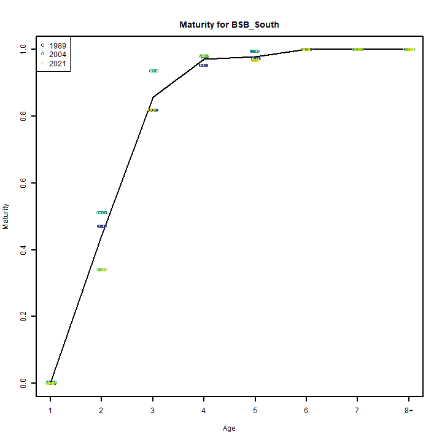
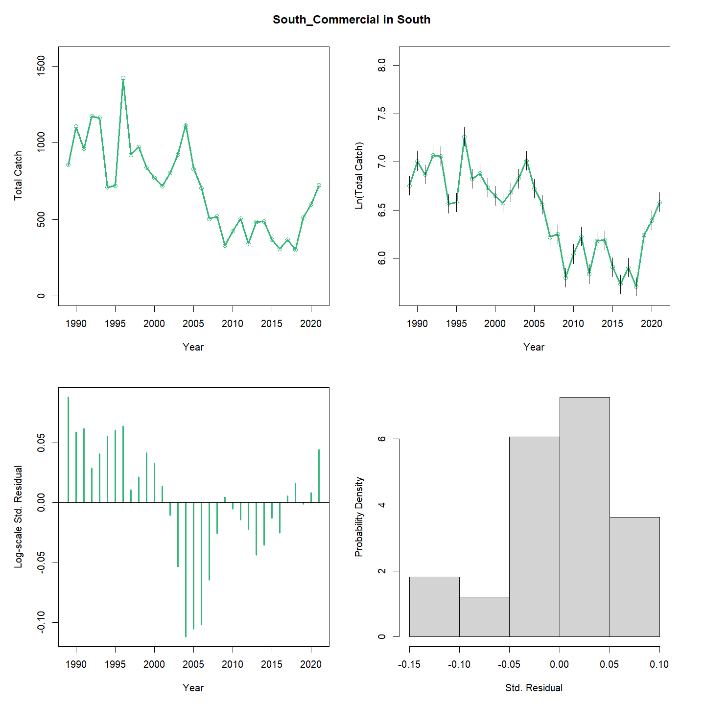
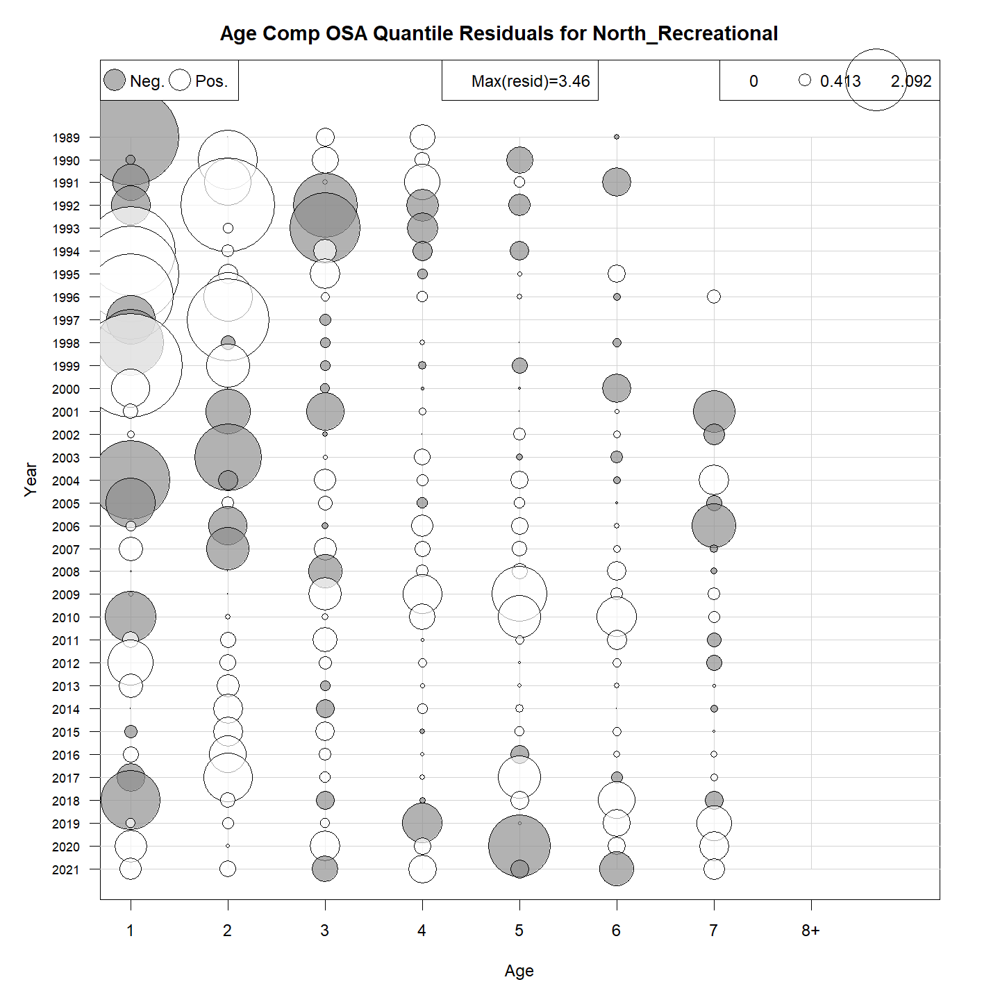
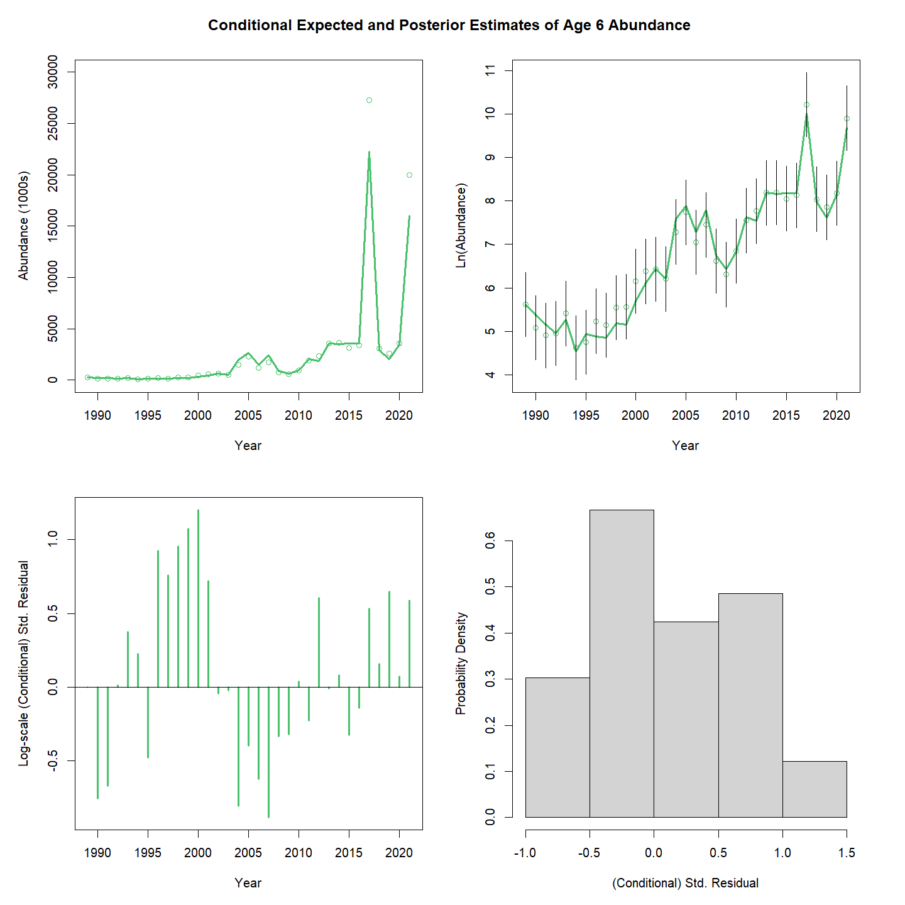
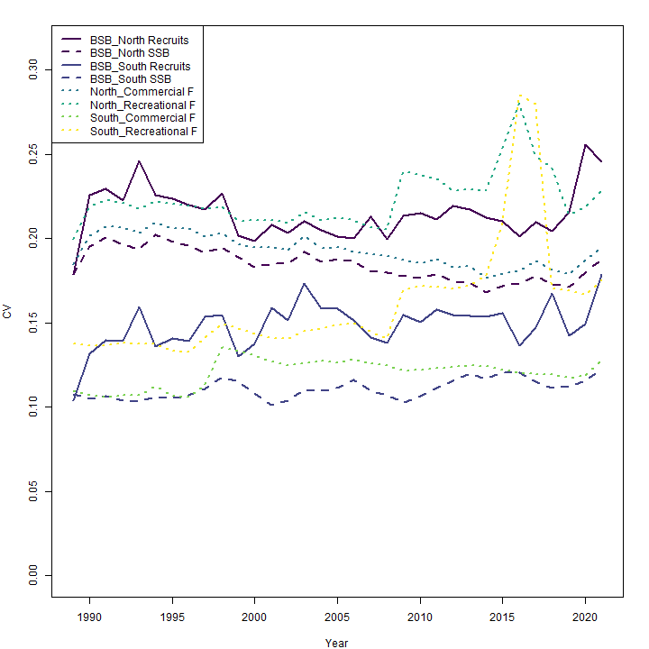
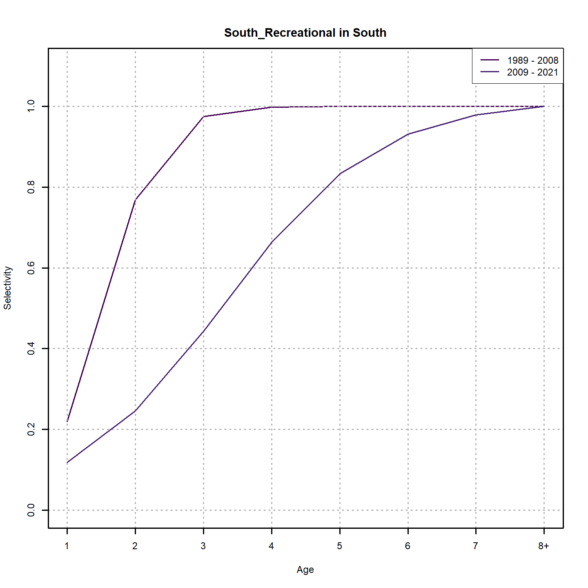
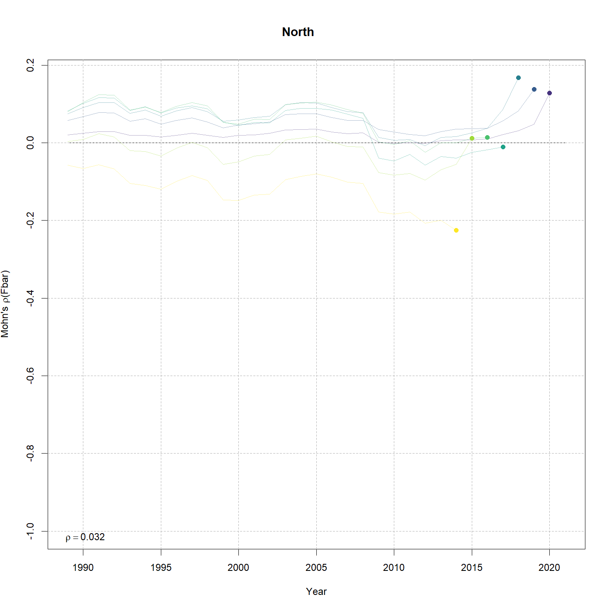
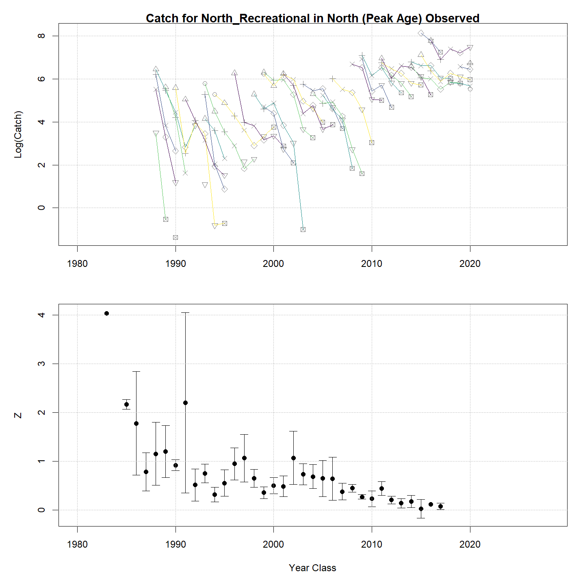
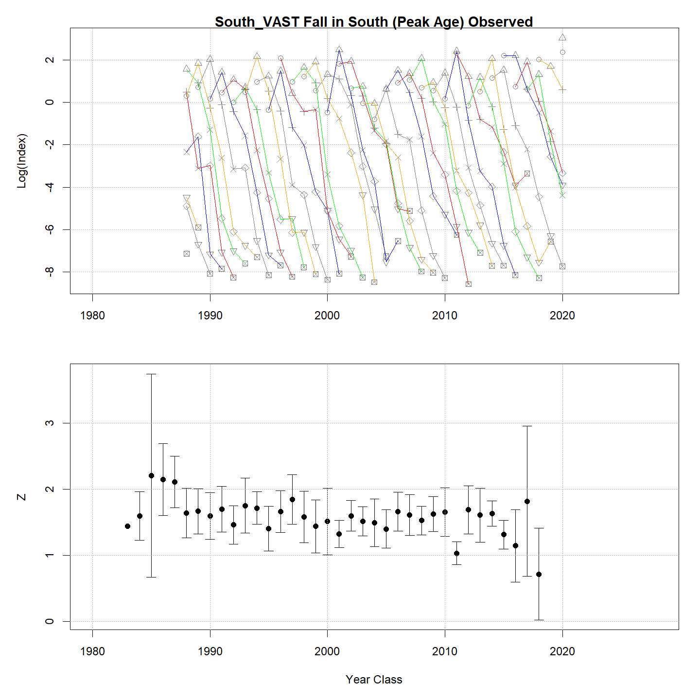

---
output:
  html_document:
    df_print: paged
    keep_md: yes
  word_document: default
  pdf_document:
    fig_caption: yes
    includes:
    keep_tex: yes
    number_sections: no
title: "WHAM figures and tables"
header-includes:
  - \usepackage{longtable}
  - \usepackage{booktabs}
  - \usepackage{caption,graphics}
  - \usepackage{makecell}
  - \usepackage{lscape}
  - \renewcommand\figurename{Fig.}
  - \captionsetup{labelsep=period, singlelinecheck=false}
  - \newcommand{\changesize}[1]{\fontsize{#1pt}{#1pt}\selectfont}
  - \renewcommand{\arraystretch}{1.5}
  - \renewcommand\theadfont{}
---

# {.tabset}

## Figures {.tabset}

### Input

### Diagnostics

### Results

### Retro

### Reference points

### Miscelaneous

## Tables {.tabset}

### Parameter estimates

<table class="table" style="margin-left: auto; margin-right: auto;">
<caption>Parameter estimates, standard errors, and confidence intervals. Rounded to 3 decimal places.</caption>
 <thead>
  <tr>
   <th style="text-align:left;">   </th>
   <th style="text-align:right;"> Estimate </th>
   <th style="text-align:right;"> Std. Error </th>
   <th style="text-align:right;"> 95\% CI lower </th>
   <th style="text-align:right;"> 95\% CI upper </th>
  </tr>
 </thead>
<tbody>
  <tr>
   <td style="text-align:left;"> BSB North Mean Recruitment </td>
   <td style="text-align:right;"> 16295.478 </td>
   <td style="text-align:right;"> 3481.323 </td>
   <td style="text-align:right;"> 10720.589 </td>
   <td style="text-align:right;"> 24769.405 </td>
  </tr>
  <tr>
   <td style="text-align:left;"> BSB North NAA $\sigma$ (age 1) </td>
   <td style="text-align:right;"> 0.847 </td>
   <td style="text-align:right;"> 0.113 </td>
   <td style="text-align:right;"> 0.651 </td>
   <td style="text-align:right;"> 1.101 </td>
  </tr>
  <tr>
   <td style="text-align:left;"> BSB North NAA $\sigma$ (age 2) </td>
   <td style="text-align:right;"> 0.379 </td>
   <td style="text-align:right;"> 0.029 </td>
   <td style="text-align:right;"> 0.326 </td>
   <td style="text-align:right;"> 0.440 </td>
  </tr>
  <tr>
   <td style="text-align:left;"> BSB South Mean Recruitment </td>
   <td style="text-align:right;"> 21561.966 </td>
   <td style="text-align:right;"> 2094.372 </td>
   <td style="text-align:right;"> 17824.151 </td>
   <td style="text-align:right;"> 26083.621 </td>
  </tr>
  <tr>
   <td style="text-align:left;"> BSB South NAA $\sigma$ (age 1) </td>
   <td style="text-align:right;"> 0.352 </td>
   <td style="text-align:right;"> 0.051 </td>
   <td style="text-align:right;"> 0.264 </td>
   <td style="text-align:right;"> 0.468 </td>
  </tr>
  <tr>
   <td style="text-align:left;"> BSB South NAA $\sigma$ (age 2) </td>
   <td style="text-align:right;"> 0.220 </td>
   <td style="text-align:right;"> 0.029 </td>
   <td style="text-align:right;"> 0.170 </td>
   <td style="text-align:right;"> 0.285 </td>
  </tr>
  <tr>
   <td style="text-align:left;"> North REC CPA fully selected q </td>
   <td style="text-align:right;"> 0.000 </td>
   <td style="text-align:right;"> 0.000 </td>
   <td style="text-align:right;"> 0.000 </td>
   <td style="text-align:right;"> 0.000 </td>
  </tr>
  <tr>
   <td style="text-align:left;"> North VAST Spring fully selected q </td>
   <td style="text-align:right;"> 0.006 </td>
   <td style="text-align:right;"> 0.001 </td>
   <td style="text-align:right;"> 0.005 </td>
   <td style="text-align:right;"> 0.008 </td>
  </tr>
  <tr>
   <td style="text-align:left;"> North VAST Fall fully selected q </td>
   <td style="text-align:right;"> 0.011 </td>
   <td style="text-align:right;"> 0.002 </td>
   <td style="text-align:right;"> 0.008 </td>
   <td style="text-align:right;"> 0.015 </td>
  </tr>
  <tr>
   <td style="text-align:left;"> South REC CPA fully selected q </td>
   <td style="text-align:right;"> 0.000 </td>
   <td style="text-align:right;"> 0.000 </td>
   <td style="text-align:right;"> 0.000 </td>
   <td style="text-align:right;"> 0.000 </td>
  </tr>
  <tr>
   <td style="text-align:left;"> South VAST Spring fully selected q </td>
   <td style="text-align:right;"> 0.016 </td>
   <td style="text-align:right;"> 0.001 </td>
   <td style="text-align:right;"> 0.014 </td>
   <td style="text-align:right;"> 0.018 </td>
  </tr>
  <tr>
   <td style="text-align:left;"> South VAST Fall fully selected q </td>
   <td style="text-align:right;"> 0.001 </td>
   <td style="text-align:right;"> 0.000 </td>
   <td style="text-align:right;"> 0.000 </td>
   <td style="text-align:right;"> 0.001 </td>
  </tr>
  <tr>
   <td style="text-align:left;"> Block 1: $a_{50}$ </td>
   <td style="text-align:right;"> 1.632 </td>
   <td style="text-align:right;"> 0.115 </td>
   <td style="text-align:right;"> 1.417 </td>
   <td style="text-align:right;"> 1.869 </td>
  </tr>
  <tr>
   <td style="text-align:left;"> Block 1: 1/slope (increasing) </td>
   <td style="text-align:right;"> 0.222 </td>
   <td style="text-align:right;"> 0.036 </td>
   <td style="text-align:right;"> 0.162 </td>
   <td style="text-align:right;"> 0.304 </td>
  </tr>
  <tr>
   <td style="text-align:left;"> Block 2: $a_{50}$ </td>
   <td style="text-align:right;"> 2.217 </td>
   <td style="text-align:right;"> 0.062 </td>
   <td style="text-align:right;"> 2.097 </td>
   <td style="text-align:right;"> 2.340 </td>
  </tr>
  <tr>
   <td style="text-align:left;"> Block 2: 1/slope (increasing) </td>
   <td style="text-align:right;"> 0.321 </td>
   <td style="text-align:right;"> 0.024 </td>
   <td style="text-align:right;"> 0.278 </td>
   <td style="text-align:right;"> 0.371 </td>
  </tr>
  <tr>
   <td style="text-align:left;"> Block 3: $a_{50}$ </td>
   <td style="text-align:right;"> 1.536 </td>
   <td style="text-align:right;"> 0.104 </td>
   <td style="text-align:right;"> 1.342 </td>
   <td style="text-align:right;"> 1.750 </td>
  </tr>
  <tr>
   <td style="text-align:left;"> Block 3: 1/slope (increasing) </td>
   <td style="text-align:right;"> 0.327 </td>
   <td style="text-align:right;"> 0.052 </td>
   <td style="text-align:right;"> 0.238 </td>
   <td style="text-align:right;"> 0.447 </td>
  </tr>
  <tr>
   <td style="text-align:left;"> Block 4: $a_{50}$ </td>
   <td style="text-align:right;"> 3.491 </td>
   <td style="text-align:right;"> 0.433 </td>
   <td style="text-align:right;"> 2.676 </td>
   <td style="text-align:right;"> 4.350 </td>
  </tr>
  <tr>
   <td style="text-align:left;"> Block 4: 1/slope (increasing) </td>
   <td style="text-align:right;"> 1.166 </td>
   <td style="text-align:right;"> 0.180 </td>
   <td style="text-align:right;"> 0.855 </td>
   <td style="text-align:right;"> 1.564 </td>
  </tr>
  <tr>
   <td style="text-align:left;"> Block 5: Selectivity for age 1 </td>
   <td style="text-align:right;"> 0.069 </td>
   <td style="text-align:right;"> 0.015 </td>
   <td style="text-align:right;"> 0.045 </td>
   <td style="text-align:right;"> 0.105 </td>
  </tr>
  <tr>
   <td style="text-align:left;"> Block 5: Selectivity for age 2 </td>
   <td style="text-align:right;"> 1.000 </td>
   <td style="text-align:right;"> -- </td>
   <td style="text-align:right;"> -- </td>
   <td style="text-align:right;"> -- </td>
  </tr>
  <tr>
   <td style="text-align:left;"> Block 5: Selectivity for age 3 </td>
   <td style="text-align:right;"> 1.000 </td>
   <td style="text-align:right;"> -- </td>
   <td style="text-align:right;"> -- </td>
   <td style="text-align:right;"> -- </td>
  </tr>
  <tr>
   <td style="text-align:left;"> Block 5: Selectivity for age 4 </td>
   <td style="text-align:right;"> 1.000 </td>
   <td style="text-align:right;"> -- </td>
   <td style="text-align:right;"> -- </td>
   <td style="text-align:right;"> -- </td>
  </tr>
  <tr>
   <td style="text-align:left;"> Block 5: Selectivity for age 5 </td>
   <td style="text-align:right;"> 1.000 </td>
   <td style="text-align:right;"> -- </td>
   <td style="text-align:right;"> -- </td>
   <td style="text-align:right;"> -- </td>
  </tr>
  <tr>
   <td style="text-align:left;"> Block 5: Selectivity for age 6 </td>
   <td style="text-align:right;"> 1.000 </td>
   <td style="text-align:right;"> -- </td>
   <td style="text-align:right;"> -- </td>
   <td style="text-align:right;"> -- </td>
  </tr>
  <tr>
   <td style="text-align:left;"> Block 5: Selectivity for age 7 </td>
   <td style="text-align:right;"> 1.000 </td>
   <td style="text-align:right;"> -- </td>
   <td style="text-align:right;"> -- </td>
   <td style="text-align:right;"> -- </td>
  </tr>
  <tr>
   <td style="text-align:left;"> Block 5: Selectivity for age 8+ </td>
   <td style="text-align:right;"> 1.000 </td>
   <td style="text-align:right;"> -- </td>
   <td style="text-align:right;"> -- </td>
   <td style="text-align:right;"> -- </td>
  </tr>
  <tr>
   <td style="text-align:left;"> Block 6: $a_{50}$ </td>
   <td style="text-align:right;"> 2.550 </td>
   <td style="text-align:right;"> 0.090 </td>
   <td style="text-align:right;"> 2.376 </td>
   <td style="text-align:right;"> 2.730 </td>
  </tr>
  <tr>
   <td style="text-align:left;"> Block 6: 1/slope (increasing) </td>
   <td style="text-align:right;"> 0.464 </td>
   <td style="text-align:right;"> 0.032 </td>
   <td style="text-align:right;"> 0.405 </td>
   <td style="text-align:right;"> 0.531 </td>
  </tr>
  <tr>
   <td style="text-align:left;"> Block 7: $a_{50}$ </td>
   <td style="text-align:right;"> 1.515 </td>
   <td style="text-align:right;"> 0.093 </td>
   <td style="text-align:right;"> 1.341 </td>
   <td style="text-align:right;"> 1.705 </td>
  </tr>
  <tr>
   <td style="text-align:left;"> Block 7: 1/slope (increasing) </td>
   <td style="text-align:right;"> 0.405 </td>
   <td style="text-align:right;"> 0.054 </td>
   <td style="text-align:right;"> 0.311 </td>
   <td style="text-align:right;"> 0.525 </td>
  </tr>
  <tr>
   <td style="text-align:left;"> Block 8: $a_{50}$ </td>
   <td style="text-align:right;"> 3.287 </td>
   <td style="text-align:right;"> 0.331 </td>
   <td style="text-align:right;"> 2.663 </td>
   <td style="text-align:right;"> 3.950 </td>
  </tr>
  <tr>
   <td style="text-align:left;"> Block 8: 1/slope (increasing) </td>
   <td style="text-align:right;"> 1.128 </td>
   <td style="text-align:right;"> 0.132 </td>
   <td style="text-align:right;"> 0.894 </td>
   <td style="text-align:right;"> 1.412 </td>
  </tr>
  <tr>
   <td style="text-align:left;"> Block 9: Selectivity for age 1 </td>
   <td style="text-align:right;"> 0.395 </td>
   <td style="text-align:right;"> 0.038 </td>
   <td style="text-align:right;"> 0.323 </td>
   <td style="text-align:right;"> 0.472 </td>
  </tr>
  <tr>
   <td style="text-align:left;"> Block 9: Selectivity for age 2 </td>
   <td style="text-align:right;"> 1.000 </td>
   <td style="text-align:right;"> -- </td>
   <td style="text-align:right;"> -- </td>
   <td style="text-align:right;"> -- </td>
  </tr>
  <tr>
   <td style="text-align:left;"> Block 9: Selectivity for age 3 </td>
   <td style="text-align:right;"> 1.000 </td>
   <td style="text-align:right;"> -- </td>
   <td style="text-align:right;"> -- </td>
   <td style="text-align:right;"> -- </td>
  </tr>
  <tr>
   <td style="text-align:left;"> Block 9: Selectivity for age 4 </td>
   <td style="text-align:right;"> 1.000 </td>
   <td style="text-align:right;"> -- </td>
   <td style="text-align:right;"> -- </td>
   <td style="text-align:right;"> -- </td>
  </tr>
  <tr>
   <td style="text-align:left;"> Block 9: Selectivity for age 5 </td>
   <td style="text-align:right;"> 1.000 </td>
   <td style="text-align:right;"> -- </td>
   <td style="text-align:right;"> -- </td>
   <td style="text-align:right;"> -- </td>
  </tr>
  <tr>
   <td style="text-align:left;"> Block 9: Selectivity for age 6 </td>
   <td style="text-align:right;"> 1.000 </td>
   <td style="text-align:right;"> -- </td>
   <td style="text-align:right;"> -- </td>
   <td style="text-align:right;"> -- </td>
  </tr>
  <tr>
   <td style="text-align:left;"> Block 9: Selectivity for age 7 </td>
   <td style="text-align:right;"> 1.000 </td>
   <td style="text-align:right;"> -- </td>
   <td style="text-align:right;"> -- </td>
   <td style="text-align:right;"> -- </td>
  </tr>
  <tr>
   <td style="text-align:left;"> Block 9: Selectivity for age 8+ </td>
   <td style="text-align:right;"> 1.000 </td>
   <td style="text-align:right;"> -- </td>
   <td style="text-align:right;"> -- </td>
   <td style="text-align:right;"> -- </td>
  </tr>
  <tr>
   <td style="text-align:left;"> Block 10: Selectivity for age 1 </td>
   <td style="text-align:right;"> 0.136 </td>
   <td style="text-align:right;"> 0.017 </td>
   <td style="text-align:right;"> 0.106 </td>
   <td style="text-align:right;"> 0.172 </td>
  </tr>
  <tr>
   <td style="text-align:left;"> Block 10: Selectivity for age 2 </td>
   <td style="text-align:right;"> 0.545 </td>
   <td style="text-align:right;"> 0.048 </td>
   <td style="text-align:right;"> 0.450 </td>
   <td style="text-align:right;"> 0.637 </td>
  </tr>
  <tr>
   <td style="text-align:left;"> Block 10: Selectivity for age 3 </td>
   <td style="text-align:right;"> 1.000 </td>
   <td style="text-align:right;"> -- </td>
   <td style="text-align:right;"> -- </td>
   <td style="text-align:right;"> -- </td>
  </tr>
  <tr>
   <td style="text-align:left;"> Block 10: Selectivity for age 4 </td>
   <td style="text-align:right;"> 1.000 </td>
   <td style="text-align:right;"> -- </td>
   <td style="text-align:right;"> -- </td>
   <td style="text-align:right;"> -- </td>
  </tr>
  <tr>
   <td style="text-align:left;"> Block 10: Selectivity for age 5 </td>
   <td style="text-align:right;"> 0.699 </td>
   <td style="text-align:right;"> 0.068 </td>
   <td style="text-align:right;"> 0.551 </td>
   <td style="text-align:right;"> 0.814 </td>
  </tr>
  <tr>
   <td style="text-align:left;"> Block 10: Selectivity for age 6 </td>
   <td style="text-align:right;"> 0.699 </td>
   <td style="text-align:right;"> 0.068 </td>
   <td style="text-align:right;"> 0.551 </td>
   <td style="text-align:right;"> 0.814 </td>
  </tr>
  <tr>
   <td style="text-align:left;"> Block 10: Selectivity for age 7 </td>
   <td style="text-align:right;"> 0.699 </td>
   <td style="text-align:right;"> 0.068 </td>
   <td style="text-align:right;"> 0.551 </td>
   <td style="text-align:right;"> 0.814 </td>
  </tr>
  <tr>
   <td style="text-align:left;"> Block 10: Selectivity for age 8+ </td>
   <td style="text-align:right;"> 0.699 </td>
   <td style="text-align:right;"> 0.068 </td>
   <td style="text-align:right;"> 0.551 </td>
   <td style="text-align:right;"> 0.814 </td>
  </tr>
  <tr>
   <td style="text-align:left;"> Block 11: Selectivity for age 1 </td>
   <td style="text-align:right;"> 1.000 </td>
   <td style="text-align:right;"> -- </td>
   <td style="text-align:right;"> -- </td>
   <td style="text-align:right;"> -- </td>
  </tr>
  <tr>
   <td style="text-align:left;"> Block 11: Selectivity for age 2 </td>
   <td style="text-align:right;"> 0.244 </td>
   <td style="text-align:right;"> 0.021 </td>
   <td style="text-align:right;"> 0.206 </td>
   <td style="text-align:right;"> 0.287 </td>
  </tr>
  <tr>
   <td style="text-align:left;"> Block 11: Selectivity for age 3 </td>
   <td style="text-align:right;"> 0.244 </td>
   <td style="text-align:right;"> 0.021 </td>
   <td style="text-align:right;"> 0.206 </td>
   <td style="text-align:right;"> 0.287 </td>
  </tr>
  <tr>
   <td style="text-align:left;"> Block 11: Selectivity for age 4 </td>
   <td style="text-align:right;"> 0.244 </td>
   <td style="text-align:right;"> 0.021 </td>
   <td style="text-align:right;"> 0.206 </td>
   <td style="text-align:right;"> 0.287 </td>
  </tr>
  <tr>
   <td style="text-align:left;"> Block 11: Selectivity for age 5 </td>
   <td style="text-align:right;"> 0.244 </td>
   <td style="text-align:right;"> 0.021 </td>
   <td style="text-align:right;"> 0.206 </td>
   <td style="text-align:right;"> 0.287 </td>
  </tr>
  <tr>
   <td style="text-align:left;"> Block 11: Selectivity for age 6 </td>
   <td style="text-align:right;"> 0.244 </td>
   <td style="text-align:right;"> 0.021 </td>
   <td style="text-align:right;"> 0.206 </td>
   <td style="text-align:right;"> 0.287 </td>
  </tr>
  <tr>
   <td style="text-align:left;"> Block 11: Selectivity for age 7 </td>
   <td style="text-align:right;"> 0.244 </td>
   <td style="text-align:right;"> 0.021 </td>
   <td style="text-align:right;"> 0.206 </td>
   <td style="text-align:right;"> 0.287 </td>
  </tr>
  <tr>
   <td style="text-align:left;"> Block 11: Selectivity for age 8+ </td>
   <td style="text-align:right;"> 0.244 </td>
   <td style="text-align:right;"> 0.021 </td>
   <td style="text-align:right;"> 0.206 </td>
   <td style="text-align:right;"> 0.287 </td>
  </tr>
  <tr>
   <td style="text-align:left;"> Block 12: Selectivity for age 1 </td>
   <td style="text-align:right;"> 0.486 </td>
   <td style="text-align:right;"> 0.037 </td>
   <td style="text-align:right;"> 0.415 </td>
   <td style="text-align:right;"> 0.558 </td>
  </tr>
  <tr>
   <td style="text-align:left;"> Block 12: Selectivity for age 2 </td>
   <td style="text-align:right;"> 1.000 </td>
   <td style="text-align:right;"> -- </td>
   <td style="text-align:right;"> -- </td>
   <td style="text-align:right;"> -- </td>
  </tr>
  <tr>
   <td style="text-align:left;"> Block 12: Selectivity for age 3 </td>
   <td style="text-align:right;"> 1.000 </td>
   <td style="text-align:right;"> -- </td>
   <td style="text-align:right;"> -- </td>
   <td style="text-align:right;"> -- </td>
  </tr>
  <tr>
   <td style="text-align:left;"> Block 12: Selectivity for age 4 </td>
   <td style="text-align:right;"> 1.000 </td>
   <td style="text-align:right;"> -- </td>
   <td style="text-align:right;"> -- </td>
   <td style="text-align:right;"> -- </td>
  </tr>
  <tr>
   <td style="text-align:left;"> Block 12: Selectivity for age 5 </td>
   <td style="text-align:right;"> 1.000 </td>
   <td style="text-align:right;"> -- </td>
   <td style="text-align:right;"> -- </td>
   <td style="text-align:right;"> -- </td>
  </tr>
  <tr>
   <td style="text-align:left;"> Block 12: Selectivity for age 6 </td>
   <td style="text-align:right;"> 1.000 </td>
   <td style="text-align:right;"> -- </td>
   <td style="text-align:right;"> -- </td>
   <td style="text-align:right;"> -- </td>
  </tr>
  <tr>
   <td style="text-align:left;"> Block 12: Selectivity for age 7 </td>
   <td style="text-align:right;"> 1.000 </td>
   <td style="text-align:right;"> -- </td>
   <td style="text-align:right;"> -- </td>
   <td style="text-align:right;"> -- </td>
  </tr>
  <tr>
   <td style="text-align:left;"> Block 12: Selectivity for age 8+ </td>
   <td style="text-align:right;"> 1.000 </td>
   <td style="text-align:right;"> -- </td>
   <td style="text-align:right;"> -- </td>
   <td style="text-align:right;"> -- </td>
  </tr>
  <tr>
   <td style="text-align:left;"> Block 13: Selectivity for age 1 </td>
   <td style="text-align:right;"> 0.331 </td>
   <td style="text-align:right;"> 0.026 </td>
   <td style="text-align:right;"> 0.281 </td>
   <td style="text-align:right;"> 0.385 </td>
  </tr>
  <tr>
   <td style="text-align:left;"> Block 13: Selectivity for age 2 </td>
   <td style="text-align:right;"> 1.000 </td>
   <td style="text-align:right;"> -- </td>
   <td style="text-align:right;"> -- </td>
   <td style="text-align:right;"> -- </td>
  </tr>
  <tr>
   <td style="text-align:left;"> Block 13: Selectivity for age 3 </td>
   <td style="text-align:right;"> 0.904 </td>
   <td style="text-align:right;"> 0.070 </td>
   <td style="text-align:right;"> 0.660 </td>
   <td style="text-align:right;"> 0.979 </td>
  </tr>
  <tr>
   <td style="text-align:left;"> Block 13: Selectivity for age 4 </td>
   <td style="text-align:right;"> 0.449 </td>
   <td style="text-align:right;"> 0.046 </td>
   <td style="text-align:right;"> 0.362 </td>
   <td style="text-align:right;"> 0.539 </td>
  </tr>
  <tr>
   <td style="text-align:left;"> Block 13: Selectivity for age 5 </td>
   <td style="text-align:right;"> 0.449 </td>
   <td style="text-align:right;"> 0.046 </td>
   <td style="text-align:right;"> 0.362 </td>
   <td style="text-align:right;"> 0.539 </td>
  </tr>
  <tr>
   <td style="text-align:left;"> Block 13: Selectivity for age 6 </td>
   <td style="text-align:right;"> 0.449 </td>
   <td style="text-align:right;"> 0.046 </td>
   <td style="text-align:right;"> 0.362 </td>
   <td style="text-align:right;"> 0.539 </td>
  </tr>
  <tr>
   <td style="text-align:left;"> Block 13: Selectivity for age 7 </td>
   <td style="text-align:right;"> 0.449 </td>
   <td style="text-align:right;"> 0.046 </td>
   <td style="text-align:right;"> 0.362 </td>
   <td style="text-align:right;"> 0.539 </td>
  </tr>
  <tr>
   <td style="text-align:left;"> Block 13: Selectivity for age 8+ </td>
   <td style="text-align:right;"> 0.449 </td>
   <td style="text-align:right;"> 0.046 </td>
   <td style="text-align:right;"> 0.362 </td>
   <td style="text-align:right;"> 0.539 </td>
  </tr>
  <tr>
   <td style="text-align:left;"> Block 14: Selectivity for age 1 </td>
   <td style="text-align:right;"> 0.270 </td>
   <td style="text-align:right;"> 0.023 </td>
   <td style="text-align:right;"> 0.228 </td>
   <td style="text-align:right;"> 0.317 </td>
  </tr>
  <tr>
   <td style="text-align:left;"> Block 14: Selectivity for age 2 </td>
   <td style="text-align:right;"> 1.000 </td>
   <td style="text-align:right;"> -- </td>
   <td style="text-align:right;"> -- </td>
   <td style="text-align:right;"> -- </td>
  </tr>
  <tr>
   <td style="text-align:left;"> Block 14: Selectivity for age 3 </td>
   <td style="text-align:right;"> 0.370 </td>
   <td style="text-align:right;"> 0.039 </td>
   <td style="text-align:right;"> 0.298 </td>
   <td style="text-align:right;"> 0.448 </td>
  </tr>
  <tr>
   <td style="text-align:left;"> Block 14: Selectivity for age 4 </td>
   <td style="text-align:right;"> 0.225 </td>
   <td style="text-align:right;"> 0.030 </td>
   <td style="text-align:right;"> 0.172 </td>
   <td style="text-align:right;"> 0.289 </td>
  </tr>
  <tr>
   <td style="text-align:left;"> Block 14: Selectivity for age 5 </td>
   <td style="text-align:right;"> 0.225 </td>
   <td style="text-align:right;"> 0.030 </td>
   <td style="text-align:right;"> 0.172 </td>
   <td style="text-align:right;"> 0.289 </td>
  </tr>
  <tr>
   <td style="text-align:left;"> Block 14: Selectivity for age 6 </td>
   <td style="text-align:right;"> 0.225 </td>
   <td style="text-align:right;"> 0.030 </td>
   <td style="text-align:right;"> 0.172 </td>
   <td style="text-align:right;"> 0.289 </td>
  </tr>
  <tr>
   <td style="text-align:left;"> Block 14: Selectivity for age 7 </td>
   <td style="text-align:right;"> 0.225 </td>
   <td style="text-align:right;"> 0.030 </td>
   <td style="text-align:right;"> 0.172 </td>
   <td style="text-align:right;"> 0.289 </td>
  </tr>
  <tr>
   <td style="text-align:left;"> Block 14: Selectivity for age 8+ </td>
   <td style="text-align:right;"> 0.225 </td>
   <td style="text-align:right;"> 0.030 </td>
   <td style="text-align:right;"> 0.172 </td>
   <td style="text-align:right;"> 0.289 </td>
  </tr>
  <tr>
   <td style="text-align:left;"> North Commercial in North age comp, Dirichlet: dispersion ($\phi$) </td>
   <td style="text-align:right;"> 43.604 </td>
   <td style="text-align:right;"> 4.811 </td>
   <td style="text-align:right;"> 35.125 </td>
   <td style="text-align:right;"> 54.130 </td>
  </tr>
  <tr>
   <td style="text-align:left;"> North Recreational in North age comp, Dirichlet: dispersion ($\phi$) </td>
   <td style="text-align:right;"> 39.343 </td>
   <td style="text-align:right;"> 4.464 </td>
   <td style="text-align:right;"> 31.498 </td>
   <td style="text-align:right;"> 49.143 </td>
  </tr>
  <tr>
   <td style="text-align:left;"> South Commercial in South age comp, Dirichlet: dispersion ($\phi$) </td>
   <td style="text-align:right;"> 34.656 </td>
   <td style="text-align:right;"> 3.753 </td>
   <td style="text-align:right;"> 28.027 </td>
   <td style="text-align:right;"> 42.851 </td>
  </tr>
  <tr>
   <td style="text-align:left;"> South Recreational in South age comp, Dirichlet: dispersion ($\phi$) </td>
   <td style="text-align:right;"> 43.719 </td>
   <td style="text-align:right;"> 5.068 </td>
   <td style="text-align:right;"> 34.834 </td>
   <td style="text-align:right;"> 54.871 </td>
  </tr>
  <tr>
   <td style="text-align:left;"> North REC CPA in North age comp, Dirichlet: dispersion ($\phi$) </td>
   <td style="text-align:right;"> 29.414 </td>
   <td style="text-align:right;"> 3.247 </td>
   <td style="text-align:right;"> 23.691 </td>
   <td style="text-align:right;"> 36.519 </td>
  </tr>
  <tr>
   <td style="text-align:left;"> North VAST Spring in North age comp, Dirichlet: dispersion ($\phi$) </td>
   <td style="text-align:right;"> 29.144 </td>
   <td style="text-align:right;"> 3.067 </td>
   <td style="text-align:right;"> 23.712 </td>
   <td style="text-align:right;"> 35.820 </td>
  </tr>
  <tr>
   <td style="text-align:left;"> North VAST Fall in North age comp, Dirichlet: dispersion ($\phi$) </td>
   <td style="text-align:right;"> 54.145 </td>
   <td style="text-align:right;"> 6.094 </td>
   <td style="text-align:right;"> 43.426 </td>
   <td style="text-align:right;"> 67.509 </td>
  </tr>
  <tr>
   <td style="text-align:left;"> South REC CPA in South age comp, Dirichlet: dispersion ($\phi$) </td>
   <td style="text-align:right;"> 34.529 </td>
   <td style="text-align:right;"> 4.078 </td>
   <td style="text-align:right;"> 27.394 </td>
   <td style="text-align:right;"> 43.522 </td>
  </tr>
  <tr>
   <td style="text-align:left;"> South VAST Spring in South age comp, Dirichlet: dispersion ($\phi$) </td>
   <td style="text-align:right;"> 38.329 </td>
   <td style="text-align:right;"> 4.208 </td>
   <td style="text-align:right;"> 30.908 </td>
   <td style="text-align:right;"> 47.532 </td>
  </tr>
  <tr>
   <td style="text-align:left;"> South VAST Fall in South age comp, Dirichlet: dispersion ($\phi$) </td>
   <td style="text-align:right;"> 30.758 </td>
   <td style="text-align:right;"> 3.803 </td>
   <td style="text-align:right;"> 24.140 </td>
   <td style="text-align:right;"> 39.192 </td>
  </tr>
  <tr>
   <td style="text-align:left;"> North REC CPA log-index observation SD scalar </td>
   <td style="text-align:right;"> 8.840 </td>
   <td style="text-align:right;"> 1.299 </td>
   <td style="text-align:right;"> 6.627 </td>
   <td style="text-align:right;"> 11.791 </td>
  </tr>
  <tr>
   <td style="text-align:left;"> South REC CPA log-index observation SD scalar </td>
   <td style="text-align:right;"> 3.224 </td>
   <td style="text-align:right;"> 0.691 </td>
   <td style="text-align:right;"> 2.118 </td>
   <td style="text-align:right;"> 4.907 </td>
  </tr>
</tbody>
</table>

### Abundance at age

<table class="table" style="margin-left: auto; margin-right: auto;">
<caption>Abundance at age (1000s) for BSB North in North.</caption>
 <thead>
  <tr>
   <th style="text-align:left;">   </th>
   <th style="text-align:right;"> 1 </th>
   <th style="text-align:right;"> 2 </th>
   <th style="text-align:right;"> 3 </th>
   <th style="text-align:right;"> 4 </th>
   <th style="text-align:right;"> 5 </th>
   <th style="text-align:right;"> 6 </th>
   <th style="text-align:right;"> 7 </th>
   <th style="text-align:right;"> 8+ </th>
  </tr>
 </thead>
<tbody>
  <tr>
   <td style="text-align:left;"> 1989 </td>
   <td style="text-align:right;"> 5468 </td>
   <td style="text-align:right;"> 2946 </td>
   <td style="text-align:right;"> 1630 </td>
   <td style="text-align:right;"> 901 </td>
   <td style="text-align:right;"> 498 </td>
   <td style="text-align:right;"> 275 </td>
   <td style="text-align:right;"> 152 </td>
   <td style="text-align:right;"> 188 </td>
  </tr>
  <tr>
   <td style="text-align:left;"> 1990 </td>
   <td style="text-align:right;"> 3432 </td>
   <td style="text-align:right;"> 1668 </td>
   <td style="text-align:right;"> 2086 </td>
   <td style="text-align:right;"> 520 </td>
   <td style="text-align:right;"> 358 </td>
   <td style="text-align:right;"> 161 </td>
   <td style="text-align:right;"> 98 </td>
   <td style="text-align:right;"> 141 </td>
  </tr>
  <tr>
   <td style="text-align:left;"> 1991 </td>
   <td style="text-align:right;"> 3699 </td>
   <td style="text-align:right;"> 2473 </td>
   <td style="text-align:right;"> 801 </td>
   <td style="text-align:right;"> 851 </td>
   <td style="text-align:right;"> 277 </td>
   <td style="text-align:right;"> 135 </td>
   <td style="text-align:right;"> 61 </td>
   <td style="text-align:right;"> 126 </td>
  </tr>
  <tr>
   <td style="text-align:left;"> 1992 </td>
   <td style="text-align:right;"> 3950 </td>
   <td style="text-align:right;"> 3076 </td>
   <td style="text-align:right;"> 1017 </td>
   <td style="text-align:right;"> 314 </td>
   <td style="text-align:right;"> 357 </td>
   <td style="text-align:right;"> 142 </td>
   <td style="text-align:right;"> 76 </td>
   <td style="text-align:right;"> 98 </td>
  </tr>
  <tr>
   <td style="text-align:left;"> 1993 </td>
   <td style="text-align:right;"> 1618 </td>
   <td style="text-align:right;"> 2535 </td>
   <td style="text-align:right;"> 1146 </td>
   <td style="text-align:right;"> 511 </td>
   <td style="text-align:right;"> 179 </td>
   <td style="text-align:right;"> 224 </td>
   <td style="text-align:right;"> 76 </td>
   <td style="text-align:right;"> 89 </td>
  </tr>
  <tr>
   <td style="text-align:left;"> 1994 </td>
   <td style="text-align:right;"> 7230 </td>
   <td style="text-align:right;"> 853 </td>
   <td style="text-align:right;"> 1690 </td>
   <td style="text-align:right;"> 440 </td>
   <td style="text-align:right;"> 276 </td>
   <td style="text-align:right;"> 102 </td>
   <td style="text-align:right;"> 116 </td>
   <td style="text-align:right;"> 74 </td>
  </tr>
  <tr>
   <td style="text-align:left;"> 1995 </td>
   <td style="text-align:right;"> 11973 </td>
   <td style="text-align:right;"> 2620 </td>
   <td style="text-align:right;"> 959 </td>
   <td style="text-align:right;"> 431 </td>
   <td style="text-align:right;"> 240 </td>
   <td style="text-align:right;"> 116 </td>
   <td style="text-align:right;"> 66 </td>
   <td style="text-align:right;"> 91 </td>
  </tr>
  <tr>
   <td style="text-align:left;"> 1996 </td>
   <td style="text-align:right;"> 13015 </td>
   <td style="text-align:right;"> 3796 </td>
   <td style="text-align:right;"> 1351 </td>
   <td style="text-align:right;"> 489 </td>
   <td style="text-align:right;"> 247 </td>
   <td style="text-align:right;"> 187 </td>
   <td style="text-align:right;"> 82 </td>
   <td style="text-align:right;"> 104 </td>
  </tr>
  <tr>
   <td style="text-align:left;"> 1997 </td>
   <td style="text-align:right;"> 5500 </td>
   <td style="text-align:right;"> 5990 </td>
   <td style="text-align:right;"> 1836 </td>
   <td style="text-align:right;"> 495 </td>
   <td style="text-align:right;"> 328 </td>
   <td style="text-align:right;"> 171 </td>
   <td style="text-align:right;"> 119 </td>
   <td style="text-align:right;"> 121 </td>
  </tr>
  <tr>
   <td style="text-align:left;"> 1998 </td>
   <td style="text-align:right;"> 5760 </td>
   <td style="text-align:right;"> 3446 </td>
   <td style="text-align:right;"> 1743 </td>
   <td style="text-align:right;"> 968 </td>
   <td style="text-align:right;"> 320 </td>
   <td style="text-align:right;"> 256 </td>
   <td style="text-align:right;"> 115 </td>
   <td style="text-align:right;"> 167 </td>
  </tr>
  <tr>
   <td style="text-align:left;"> 1999 </td>
   <td style="text-align:right;"> 22635 </td>
   <td style="text-align:right;"> 3913 </td>
   <td style="text-align:right;"> 2438 </td>
   <td style="text-align:right;"> 1218 </td>
   <td style="text-align:right;"> 560 </td>
   <td style="text-align:right;"> 261 </td>
   <td style="text-align:right;"> 178 </td>
   <td style="text-align:right;"> 201 </td>
  </tr>
  <tr>
   <td style="text-align:left;"> 2000 </td>
   <td style="text-align:right;"> 43161 </td>
   <td style="text-align:right;"> 14301 </td>
   <td style="text-align:right;"> 2747 </td>
   <td style="text-align:right;"> 2064 </td>
   <td style="text-align:right;"> 776 </td>
   <td style="text-align:right;"> 470 </td>
   <td style="text-align:right;"> 168 </td>
   <td style="text-align:right;"> 246 </td>
  </tr>
  <tr>
   <td style="text-align:left;"> 2001 </td>
   <td style="text-align:right;"> 18518 </td>
   <td style="text-align:right;"> 10860 </td>
   <td style="text-align:right;"> 8677 </td>
   <td style="text-align:right;"> 1611 </td>
   <td style="text-align:right;"> 1113 </td>
   <td style="text-align:right;"> 589 </td>
   <td style="text-align:right;"> 366 </td>
   <td style="text-align:right;"> 251 </td>
  </tr>
  <tr>
   <td style="text-align:left;"> 2002 </td>
   <td style="text-align:right;"> 33920 </td>
   <td style="text-align:right;"> 11964 </td>
   <td style="text-align:right;"> 9956 </td>
   <td style="text-align:right;"> 6239 </td>
   <td style="text-align:right;"> 863 </td>
   <td style="text-align:right;"> 619 </td>
   <td style="text-align:right;"> 388 </td>
   <td style="text-align:right;"> 341 </td>
  </tr>
  <tr>
   <td style="text-align:left;"> 2003 </td>
   <td style="text-align:right;"> 27164 </td>
   <td style="text-align:right;"> 10879 </td>
   <td style="text-align:right;"> 5076 </td>
   <td style="text-align:right;"> 6281 </td>
   <td style="text-align:right;"> 3333 </td>
   <td style="text-align:right;"> 495 </td>
   <td style="text-align:right;"> 385 </td>
   <td style="text-align:right;"> 399 </td>
  </tr>
  <tr>
   <td style="text-align:left;"> 2004 </td>
   <td style="text-align:right;"> 19825 </td>
   <td style="text-align:right;"> 5482 </td>
   <td style="text-align:right;"> 9189 </td>
   <td style="text-align:right;"> 2954 </td>
   <td style="text-align:right;"> 4491 </td>
   <td style="text-align:right;"> 1458 </td>
   <td style="text-align:right;"> 261 </td>
   <td style="text-align:right;"> 406 </td>
  </tr>
  <tr>
   <td style="text-align:left;"> 2005 </td>
   <td style="text-align:right;"> 25989 </td>
   <td style="text-align:right;"> 5373 </td>
   <td style="text-align:right;"> 3096 </td>
   <td style="text-align:right;"> 6604 </td>
   <td style="text-align:right;"> 2456 </td>
   <td style="text-align:right;"> 2290 </td>
   <td style="text-align:right;"> 626 </td>
   <td style="text-align:right;"> 356 </td>
  </tr>
  <tr>
   <td style="text-align:left;"> 2006 </td>
   <td style="text-align:right;"> 26524 </td>
   <td style="text-align:right;"> 9431 </td>
   <td style="text-align:right;"> 3016 </td>
   <td style="text-align:right;"> 2683 </td>
   <td style="text-align:right;"> 4080 </td>
   <td style="text-align:right;"> 1153 </td>
   <td style="text-align:right;"> 1029 </td>
   <td style="text-align:right;"> 330 </td>
  </tr>
  <tr>
   <td style="text-align:left;"> 2007 </td>
   <td style="text-align:right;"> 17832 </td>
   <td style="text-align:right;"> 12615 </td>
   <td style="text-align:right;"> 4943 </td>
   <td style="text-align:right;"> 1959 </td>
   <td style="text-align:right;"> 1479 </td>
   <td style="text-align:right;"> 1715 </td>
   <td style="text-align:right;"> 825 </td>
   <td style="text-align:right;"> 574 </td>
  </tr>
  <tr>
   <td style="text-align:left;"> 2008 </td>
   <td style="text-align:right;"> 33411 </td>
   <td style="text-align:right;"> 12169 </td>
   <td style="text-align:right;"> 10272 </td>
   <td style="text-align:right;"> 3136 </td>
   <td style="text-align:right;"> 1035 </td>
   <td style="text-align:right;"> 746 </td>
   <td style="text-align:right;"> 877 </td>
   <td style="text-align:right;"> 674 </td>
  </tr>
  <tr>
   <td style="text-align:left;"> 2009 </td>
   <td style="text-align:right;"> 17394 </td>
   <td style="text-align:right;"> 18968 </td>
   <td style="text-align:right;"> 9187 </td>
   <td style="text-align:right;"> 6872 </td>
   <td style="text-align:right;"> 1682 </td>
   <td style="text-align:right;"> 549 </td>
   <td style="text-align:right;"> 383 </td>
   <td style="text-align:right;"> 690 </td>
  </tr>
  <tr>
   <td style="text-align:left;"> 2010 </td>
   <td style="text-align:right;"> 13487 </td>
   <td style="text-align:right;"> 12172 </td>
   <td style="text-align:right;"> 14104 </td>
   <td style="text-align:right;"> 6421 </td>
   <td style="text-align:right;"> 3924 </td>
   <td style="text-align:right;"> 941 </td>
   <td style="text-align:right;"> 311 </td>
   <td style="text-align:right;"> 479 </td>
  </tr>
  <tr>
   <td style="text-align:left;"> 2011 </td>
   <td style="text-align:right;"> 14409 </td>
   <td style="text-align:right;"> 10965 </td>
   <td style="text-align:right;"> 8202 </td>
   <td style="text-align:right;"> 8430 </td>
   <td style="text-align:right;"> 3168 </td>
   <td style="text-align:right;"> 1899 </td>
   <td style="text-align:right;"> 505 </td>
   <td style="text-align:right;"> 371 </td>
  </tr>
  <tr>
   <td style="text-align:left;"> 2012 </td>
   <td style="text-align:right;"> 33526 </td>
   <td style="text-align:right;"> 26906 </td>
   <td style="text-align:right;"> 14311 </td>
   <td style="text-align:right;"> 8536 </td>
   <td style="text-align:right;"> 6455 </td>
   <td style="text-align:right;"> 2360 </td>
   <td style="text-align:right;"> 1436 </td>
   <td style="text-align:right;"> 608 </td>
  </tr>
  <tr>
   <td style="text-align:left;"> 2013 </td>
   <td style="text-align:right;"> 25258 </td>
   <td style="text-align:right;"> 51607 </td>
   <td style="text-align:right;"> 12771 </td>
   <td style="text-align:right;"> 10061 </td>
   <td style="text-align:right;"> 6010 </td>
   <td style="text-align:right;"> 3588 </td>
   <td style="text-align:right;"> 1242 </td>
   <td style="text-align:right;"> 1185 </td>
  </tr>
  <tr>
   <td style="text-align:left;"> 2014 </td>
   <td style="text-align:right;"> 22349 </td>
   <td style="text-align:right;"> 17792 </td>
   <td style="text-align:right;"> 59074 </td>
   <td style="text-align:right;"> 10852 </td>
   <td style="text-align:right;"> 6049 </td>
   <td style="text-align:right;"> 3604 </td>
   <td style="text-align:right;"> 2200 </td>
   <td style="text-align:right;"> 1373 </td>
  </tr>
  <tr>
   <td style="text-align:left;"> 2015 </td>
   <td style="text-align:right;"> 25410 </td>
   <td style="text-align:right;"> 15323 </td>
   <td style="text-align:right;"> 14653 </td>
   <td style="text-align:right;"> 36790 </td>
   <td style="text-align:right;"> 6204 </td>
   <td style="text-align:right;"> 3134 </td>
   <td style="text-align:right;"> 1772 </td>
   <td style="text-align:right;"> 1858 </td>
  </tr>
  <tr>
   <td style="text-align:left;"> 2016 </td>
   <td style="text-align:right;"> 52001 </td>
   <td style="text-align:right;"> 27753 </td>
   <td style="text-align:right;"> 10261 </td>
   <td style="text-align:right;"> 11044 </td>
   <td style="text-align:right;"> 39744 </td>
   <td style="text-align:right;"> 3388 </td>
   <td style="text-align:right;"> 2013 </td>
   <td style="text-align:right;"> 2171 </td>
  </tr>
  <tr>
   <td style="text-align:left;"> 2017 </td>
   <td style="text-align:right;"> 46091 </td>
   <td style="text-align:right;"> 61293 </td>
   <td style="text-align:right;"> 14440 </td>
   <td style="text-align:right;"> 7179 </td>
   <td style="text-align:right;"> 5077 </td>
   <td style="text-align:right;"> 27257 </td>
   <td style="text-align:right;"> 1829 </td>
   <td style="text-align:right;"> 2162 </td>
  </tr>
  <tr>
   <td style="text-align:left;"> 2018 </td>
   <td style="text-align:right;"> 30551 </td>
   <td style="text-align:right;"> 25295 </td>
   <td style="text-align:right;"> 35520 </td>
   <td style="text-align:right;"> 8729 </td>
   <td style="text-align:right;"> 3433 </td>
   <td style="text-align:right;"> 3084 </td>
   <td style="text-align:right;"> 16729 </td>
   <td style="text-align:right;"> 1944 </td>
  </tr>
  <tr>
   <td style="text-align:left;"> 2019 </td>
   <td style="text-align:right;"> 30333 </td>
   <td style="text-align:right;"> 13617 </td>
   <td style="text-align:right;"> 17240 </td>
   <td style="text-align:right;"> 33992 </td>
   <td style="text-align:right;"> 6151 </td>
   <td style="text-align:right;"> 2578 </td>
   <td style="text-align:right;"> 2066 </td>
   <td style="text-align:right;"> 13331 </td>
  </tr>
  <tr>
   <td style="text-align:left;"> 2020 </td>
   <td style="text-align:right;"> 22470 </td>
   <td style="text-align:right;"> 38987 </td>
   <td style="text-align:right;"> 5611 </td>
   <td style="text-align:right;"> 12580 </td>
   <td style="text-align:right;"> 28129 </td>
   <td style="text-align:right;"> 3559 </td>
   <td style="text-align:right;"> 1903 </td>
   <td style="text-align:right;"> 10639 </td>
  </tr>
  <tr>
   <td style="text-align:left;"> 2021 </td>
   <td style="text-align:right;"> 19873 </td>
   <td style="text-align:right;"> 32290 </td>
   <td style="text-align:right;"> 27378 </td>
   <td style="text-align:right;"> 3110 </td>
   <td style="text-align:right;"> 10324 </td>
   <td style="text-align:right;"> 19959 </td>
   <td style="text-align:right;"> 2102 </td>
   <td style="text-align:right;"> 7321 </td>
  </tr>
</tbody>
</table>

<table class="table" style="margin-left: auto; margin-right: auto;">
<caption>Abundance at age (1000s) for BSB North in South.</caption>
 <thead>
  <tr>
   <th style="text-align:left;">   </th>
   <th style="text-align:right;"> 1 </th>
   <th style="text-align:right;"> 2 </th>
   <th style="text-align:right;"> 3 </th>
   <th style="text-align:right;"> 4 </th>
   <th style="text-align:right;"> 5 </th>
   <th style="text-align:right;"> 6 </th>
   <th style="text-align:right;"> 7 </th>
   <th style="text-align:right;"> 8+ </th>
  </tr>
 </thead>
<tbody>
  <tr>
   <td style="text-align:left;"> 1989 </td>
   <td style="text-align:right;"> 0 </td>
   <td style="text-align:right;"> 182 </td>
   <td style="text-align:right;"> 101 </td>
   <td style="text-align:right;"> 56 </td>
   <td style="text-align:right;"> 31 </td>
   <td style="text-align:right;"> 17 </td>
   <td style="text-align:right;"> 9 </td>
   <td style="text-align:right;"> 12 </td>
  </tr>
  <tr>
   <td style="text-align:left;"> 1990 </td>
   <td style="text-align:right;"> 0 </td>
   <td style="text-align:right;"> 191 </td>
   <td style="text-align:right;"> 86 </td>
   <td style="text-align:right;"> 43 </td>
   <td style="text-align:right;"> 24 </td>
   <td style="text-align:right;"> 13 </td>
   <td style="text-align:right;"> 7 </td>
   <td style="text-align:right;"> 9 </td>
  </tr>
  <tr>
   <td style="text-align:left;"> 1991 </td>
   <td style="text-align:right;"> 0 </td>
   <td style="text-align:right;"> 132 </td>
   <td style="text-align:right;"> 54 </td>
   <td style="text-align:right;"> 60 </td>
   <td style="text-align:right;"> 16 </td>
   <td style="text-align:right;"> 10 </td>
   <td style="text-align:right;"> 5 </td>
   <td style="text-align:right;"> 7 </td>
  </tr>
  <tr>
   <td style="text-align:left;"> 1992 </td>
   <td style="text-align:right;"> 0 </td>
   <td style="text-align:right;"> 142 </td>
   <td style="text-align:right;"> 76 </td>
   <td style="text-align:right;"> 25 </td>
   <td style="text-align:right;"> 26 </td>
   <td style="text-align:right;"> 8 </td>
   <td style="text-align:right;"> 4 </td>
   <td style="text-align:right;"> 6 </td>
  </tr>
  <tr>
   <td style="text-align:left;"> 1993 </td>
   <td style="text-align:right;"> 0 </td>
   <td style="text-align:right;"> 157 </td>
   <td style="text-align:right;"> 100 </td>
   <td style="text-align:right;"> 33 </td>
   <td style="text-align:right;"> 10 </td>
   <td style="text-align:right;"> 12 </td>
   <td style="text-align:right;"> 5 </td>
   <td style="text-align:right;"> 6 </td>
  </tr>
  <tr>
   <td style="text-align:left;"> 1994 </td>
   <td style="text-align:right;"> 0 </td>
   <td style="text-align:right;"> 61 </td>
   <td style="text-align:right;"> 83 </td>
   <td style="text-align:right;"> 36 </td>
   <td style="text-align:right;"> 16 </td>
   <td style="text-align:right;"> 6 </td>
   <td style="text-align:right;"> 7 </td>
   <td style="text-align:right;"> 5 </td>
  </tr>
  <tr>
   <td style="text-align:left;"> 1995 </td>
   <td style="text-align:right;"> 0 </td>
   <td style="text-align:right;"> 259 </td>
   <td style="text-align:right;"> 28 </td>
   <td style="text-align:right;"> 50 </td>
   <td style="text-align:right;"> 14 </td>
   <td style="text-align:right;"> 8 </td>
   <td style="text-align:right;"> 3 </td>
   <td style="text-align:right;"> 6 </td>
  </tr>
  <tr>
   <td style="text-align:left;"> 1996 </td>
   <td style="text-align:right;"> 0 </td>
   <td style="text-align:right;"> 419 </td>
   <td style="text-align:right;"> 91 </td>
   <td style="text-align:right;"> 31 </td>
   <td style="text-align:right;"> 15 </td>
   <td style="text-align:right;"> 8 </td>
   <td style="text-align:right;"> 4 </td>
   <td style="text-align:right;"> 5 </td>
  </tr>
  <tr>
   <td style="text-align:left;"> 1997 </td>
   <td style="text-align:right;"> 0 </td>
   <td style="text-align:right;"> 463 </td>
   <td style="text-align:right;"> 121 </td>
   <td style="text-align:right;"> 40 </td>
   <td style="text-align:right;"> 15 </td>
   <td style="text-align:right;"> 8 </td>
   <td style="text-align:right;"> 6 </td>
   <td style="text-align:right;"> 6 </td>
  </tr>
  <tr>
   <td style="text-align:left;"> 1998 </td>
   <td style="text-align:right;"> 0 </td>
   <td style="text-align:right;"> 213 </td>
   <td style="text-align:right;"> 204 </td>
   <td style="text-align:right;"> 60 </td>
   <td style="text-align:right;"> 17 </td>
   <td style="text-align:right;"> 11 </td>
   <td style="text-align:right;"> 6 </td>
   <td style="text-align:right;"> 8 </td>
  </tr>
  <tr>
   <td style="text-align:left;"> 1999 </td>
   <td style="text-align:right;"> 0 </td>
   <td style="text-align:right;"> 219 </td>
   <td style="text-align:right;"> 129 </td>
   <td style="text-align:right;"> 62 </td>
   <td style="text-align:right;"> 32 </td>
   <td style="text-align:right;"> 11 </td>
   <td style="text-align:right;"> 8 </td>
   <td style="text-align:right;"> 9 </td>
  </tr>
  <tr>
   <td style="text-align:left;"> 2000 </td>
   <td style="text-align:right;"> 0 </td>
   <td style="text-align:right;"> 817 </td>
   <td style="text-align:right;"> 145 </td>
   <td style="text-align:right;"> 81 </td>
   <td style="text-align:right;"> 40 </td>
   <td style="text-align:right;"> 19 </td>
   <td style="text-align:right;"> 8 </td>
   <td style="text-align:right;"> 12 </td>
  </tr>
  <tr>
   <td style="text-align:left;"> 2001 </td>
   <td style="text-align:right;"> 0 </td>
   <td style="text-align:right;"> 1537 </td>
   <td style="text-align:right;"> 548 </td>
   <td style="text-align:right;"> 98 </td>
   <td style="text-align:right;"> 71 </td>
   <td style="text-align:right;"> 28 </td>
   <td style="text-align:right;"> 16 </td>
   <td style="text-align:right;"> 15 </td>
  </tr>
  <tr>
   <td style="text-align:left;"> 2002 </td>
   <td style="text-align:right;"> 0 </td>
   <td style="text-align:right;"> 745 </td>
   <td style="text-align:right;"> 450 </td>
   <td style="text-align:right;"> 307 </td>
   <td style="text-align:right;"> 55 </td>
   <td style="text-align:right;"> 38 </td>
   <td style="text-align:right;"> 20 </td>
   <td style="text-align:right;"> 21 </td>
  </tr>
  <tr>
   <td style="text-align:left;"> 2003 </td>
   <td style="text-align:right;"> 0 </td>
   <td style="text-align:right;"> 1307 </td>
   <td style="text-align:right;"> 471 </td>
   <td style="text-align:right;"> 359 </td>
   <td style="text-align:right;"> 218 </td>
   <td style="text-align:right;"> 30 </td>
   <td style="text-align:right;"> 22 </td>
   <td style="text-align:right;"> 26 </td>
  </tr>
  <tr>
   <td style="text-align:left;"> 2004 </td>
   <td style="text-align:right;"> 0 </td>
   <td style="text-align:right;"> 950 </td>
   <td style="text-align:right;"> 461 </td>
   <td style="text-align:right;"> 191 </td>
   <td style="text-align:right;"> 230 </td>
   <td style="text-align:right;"> 117 </td>
   <td style="text-align:right;"> 18 </td>
   <td style="text-align:right;"> 28 </td>
  </tr>
  <tr>
   <td style="text-align:left;"> 2005 </td>
   <td style="text-align:right;"> 0 </td>
   <td style="text-align:right;"> 778 </td>
   <td style="text-align:right;"> 238 </td>
   <td style="text-align:right;"> 342 </td>
   <td style="text-align:right;"> 108 </td>
   <td style="text-align:right;"> 160 </td>
   <td style="text-align:right;"> 52 </td>
   <td style="text-align:right;"> 24 </td>
  </tr>
  <tr>
   <td style="text-align:left;"> 2006 </td>
   <td style="text-align:right;"> 0 </td>
   <td style="text-align:right;"> 939 </td>
   <td style="text-align:right;"> 221 </td>
   <td style="text-align:right;"> 119 </td>
   <td style="text-align:right;"> 245 </td>
   <td style="text-align:right;"> 88 </td>
   <td style="text-align:right;"> 79 </td>
   <td style="text-align:right;"> 34 </td>
  </tr>
  <tr>
   <td style="text-align:left;"> 2007 </td>
   <td style="text-align:right;"> 0 </td>
   <td style="text-align:right;"> 896 </td>
   <td style="text-align:right;"> 372 </td>
   <td style="text-align:right;"> 112 </td>
   <td style="text-align:right;"> 94 </td>
   <td style="text-align:right;"> 141 </td>
   <td style="text-align:right;"> 43 </td>
   <td style="text-align:right;"> 48 </td>
  </tr>
  <tr>
   <td style="text-align:left;"> 2008 </td>
   <td style="text-align:right;"> 0 </td>
   <td style="text-align:right;"> 682 </td>
   <td style="text-align:right;"> 459 </td>
   <td style="text-align:right;"> 178 </td>
   <td style="text-align:right;"> 68 </td>
   <td style="text-align:right;"> 51 </td>
   <td style="text-align:right;"> 60 </td>
   <td style="text-align:right;"> 48 </td>
  </tr>
  <tr>
   <td style="text-align:left;"> 2009 </td>
   <td style="text-align:right;"> 0 </td>
   <td style="text-align:right;"> 1303 </td>
   <td style="text-align:right;"> 453 </td>
   <td style="text-align:right;"> 367 </td>
   <td style="text-align:right;"> 110 </td>
   <td style="text-align:right;"> 37 </td>
   <td style="text-align:right;"> 27 </td>
   <td style="text-align:right;"> 54 </td>
  </tr>
  <tr>
   <td style="text-align:left;"> 2010 </td>
   <td style="text-align:right;"> 0 </td>
   <td style="text-align:right;"> 658 </td>
   <td style="text-align:right;"> 763 </td>
   <td style="text-align:right;"> 344 </td>
   <td style="text-align:right;"> 243 </td>
   <td style="text-align:right;"> 57 </td>
   <td style="text-align:right;"> 18 </td>
   <td style="text-align:right;"> 35 </td>
  </tr>
  <tr>
   <td style="text-align:left;"> 2011 </td>
   <td style="text-align:right;"> 0 </td>
   <td style="text-align:right;"> 521 </td>
   <td style="text-align:right;"> 472 </td>
   <td style="text-align:right;"> 504 </td>
   <td style="text-align:right;"> 209 </td>
   <td style="text-align:right;"> 125 </td>
   <td style="text-align:right;"> 29 </td>
   <td style="text-align:right;"> 24 </td>
  </tr>
  <tr>
   <td style="text-align:left;"> 2012 </td>
   <td style="text-align:right;"> 0 </td>
   <td style="text-align:right;"> 540 </td>
   <td style="text-align:right;"> 426 </td>
   <td style="text-align:right;"> 309 </td>
   <td style="text-align:right;"> 303 </td>
   <td style="text-align:right;"> 117 </td>
   <td style="text-align:right;"> 70 </td>
   <td style="text-align:right;"> 31 </td>
  </tr>
  <tr>
   <td style="text-align:left;"> 2013 </td>
   <td style="text-align:right;"> 0 </td>
   <td style="text-align:right;"> 1453 </td>
   <td style="text-align:right;"> 1042 </td>
   <td style="text-align:right;"> 535 </td>
   <td style="text-align:right;"> 303 </td>
   <td style="text-align:right;"> 225 </td>
   <td style="text-align:right;"> 78 </td>
   <td style="text-align:right;"> 65 </td>
  </tr>
  <tr>
   <td style="text-align:left;"> 2014 </td>
   <td style="text-align:right;"> 0 </td>
   <td style="text-align:right;"> 947 </td>
   <td style="text-align:right;"> 1976 </td>
   <td style="text-align:right;"> 487 </td>
   <td style="text-align:right;"> 353 </td>
   <td style="text-align:right;"> 215 </td>
   <td style="text-align:right;"> 125 </td>
   <td style="text-align:right;"> 82 </td>
  </tr>
  <tr>
   <td style="text-align:left;"> 2015 </td>
   <td style="text-align:right;"> 0 </td>
   <td style="text-align:right;"> 836 </td>
   <td style="text-align:right;"> 681 </td>
   <td style="text-align:right;"> 2192 </td>
   <td style="text-align:right;"> 405 </td>
   <td style="text-align:right;"> 214 </td>
   <td style="text-align:right;"> 119 </td>
   <td style="text-align:right;"> 116 </td>
  </tr>
  <tr>
   <td style="text-align:left;"> 2016 </td>
   <td style="text-align:right;"> 0 </td>
   <td style="text-align:right;"> 914 </td>
   <td style="text-align:right;"> 562 </td>
   <td style="text-align:right;"> 544 </td>
   <td style="text-align:right;"> 1263 </td>
   <td style="text-align:right;"> 199 </td>
   <td style="text-align:right;"> 109 </td>
   <td style="text-align:right;"> 126 </td>
  </tr>
  <tr>
   <td style="text-align:left;"> 2017 </td>
   <td style="text-align:right;"> 0 </td>
   <td style="text-align:right;"> 1933 </td>
   <td style="text-align:right;"> 1077 </td>
   <td style="text-align:right;"> 395 </td>
   <td style="text-align:right;"> 383 </td>
   <td style="text-align:right;"> 1503 </td>
   <td style="text-align:right;"> 118 </td>
   <td style="text-align:right;"> 140 </td>
  </tr>
  <tr>
   <td style="text-align:left;"> 2018 </td>
   <td style="text-align:right;"> 0 </td>
   <td style="text-align:right;"> 1999 </td>
   <td style="text-align:right;"> 2696 </td>
   <td style="text-align:right;"> 547 </td>
   <td style="text-align:right;"> 248 </td>
   <td style="text-align:right;"> 175 </td>
   <td style="text-align:right;"> 866 </td>
   <td style="text-align:right;"> 131 </td>
  </tr>
  <tr>
   <td style="text-align:left;"> 2019 </td>
   <td style="text-align:right;"> 0 </td>
   <td style="text-align:right;"> 1128 </td>
   <td style="text-align:right;"> 1030 </td>
   <td style="text-align:right;"> 1380 </td>
   <td style="text-align:right;"> 317 </td>
   <td style="text-align:right;"> 124 </td>
   <td style="text-align:right;"> 108 </td>
   <td style="text-align:right;"> 632 </td>
  </tr>
  <tr>
   <td style="text-align:left;"> 2020 </td>
   <td style="text-align:right;"> 0 </td>
   <td style="text-align:right;"> 1257 </td>
   <td style="text-align:right;"> 519 </td>
   <td style="text-align:right;"> 675 </td>
   <td style="text-align:right;"> 1252 </td>
   <td style="text-align:right;"> 210 </td>
   <td style="text-align:right;"> 89 </td>
   <td style="text-align:right;"> 513 </td>
  </tr>
  <tr>
   <td style="text-align:left;"> 2021 </td>
   <td style="text-align:right;"> 0 </td>
   <td style="text-align:right;"> 860 </td>
   <td style="text-align:right;"> 1501 </td>
   <td style="text-align:right;"> 218 </td>
   <td style="text-align:right;"> 459 </td>
   <td style="text-align:right;"> 1033 </td>
   <td style="text-align:right;"> 124 </td>
   <td style="text-align:right;"> 427 </td>
  </tr>
</tbody>
</table>

<table class="table" style="margin-left: auto; margin-right: auto;">
<caption>Abundance at age (1000s) for BSB South in North.</caption>
 <thead>
  <tr>
   <th style="text-align:left;">   </th>
   <th style="text-align:right;"> 1 </th>
   <th style="text-align:right;"> 2 </th>
   <th style="text-align:right;"> 3 </th>
   <th style="text-align:right;"> 4 </th>
   <th style="text-align:right;"> 5 </th>
   <th style="text-align:right;"> 6 </th>
   <th style="text-align:right;"> 7 </th>
   <th style="text-align:right;"> 8+ </th>
  </tr>
 </thead>
<tbody>
  <tr>
   <td style="text-align:left;"> 1989 </td>
   <td style="text-align:right;"> 0 </td>
   <td style="text-align:right;"> 0 </td>
   <td style="text-align:right;"> 0 </td>
   <td style="text-align:right;"> 0 </td>
   <td style="text-align:right;"> 0 </td>
   <td style="text-align:right;"> 0 </td>
   <td style="text-align:right;"> 0 </td>
   <td style="text-align:right;"> 0 </td>
  </tr>
  <tr>
   <td style="text-align:left;"> 1990 </td>
   <td style="text-align:right;"> 0 </td>
   <td style="text-align:right;"> 0 </td>
   <td style="text-align:right;"> 0 </td>
   <td style="text-align:right;"> 0 </td>
   <td style="text-align:right;"> 0 </td>
   <td style="text-align:right;"> 0 </td>
   <td style="text-align:right;"> 0 </td>
   <td style="text-align:right;"> 0 </td>
  </tr>
  <tr>
   <td style="text-align:left;"> 1991 </td>
   <td style="text-align:right;"> 0 </td>
   <td style="text-align:right;"> 0 </td>
   <td style="text-align:right;"> 0 </td>
   <td style="text-align:right;"> 0 </td>
   <td style="text-align:right;"> 0 </td>
   <td style="text-align:right;"> 0 </td>
   <td style="text-align:right;"> 0 </td>
   <td style="text-align:right;"> 0 </td>
  </tr>
  <tr>
   <td style="text-align:left;"> 1992 </td>
   <td style="text-align:right;"> 0 </td>
   <td style="text-align:right;"> 0 </td>
   <td style="text-align:right;"> 0 </td>
   <td style="text-align:right;"> 0 </td>
   <td style="text-align:right;"> 0 </td>
   <td style="text-align:right;"> 0 </td>
   <td style="text-align:right;"> 0 </td>
   <td style="text-align:right;"> 0 </td>
  </tr>
  <tr>
   <td style="text-align:left;"> 1993 </td>
   <td style="text-align:right;"> 0 </td>
   <td style="text-align:right;"> 0 </td>
   <td style="text-align:right;"> 0 </td>
   <td style="text-align:right;"> 0 </td>
   <td style="text-align:right;"> 0 </td>
   <td style="text-align:right;"> 0 </td>
   <td style="text-align:right;"> 0 </td>
   <td style="text-align:right;"> 0 </td>
  </tr>
  <tr>
   <td style="text-align:left;"> 1994 </td>
   <td style="text-align:right;"> 0 </td>
   <td style="text-align:right;"> 0 </td>
   <td style="text-align:right;"> 0 </td>
   <td style="text-align:right;"> 0 </td>
   <td style="text-align:right;"> 0 </td>
   <td style="text-align:right;"> 0 </td>
   <td style="text-align:right;"> 0 </td>
   <td style="text-align:right;"> 0 </td>
  </tr>
  <tr>
   <td style="text-align:left;"> 1995 </td>
   <td style="text-align:right;"> 0 </td>
   <td style="text-align:right;"> 0 </td>
   <td style="text-align:right;"> 0 </td>
   <td style="text-align:right;"> 0 </td>
   <td style="text-align:right;"> 0 </td>
   <td style="text-align:right;"> 0 </td>
   <td style="text-align:right;"> 0 </td>
   <td style="text-align:right;"> 0 </td>
  </tr>
  <tr>
   <td style="text-align:left;"> 1996 </td>
   <td style="text-align:right;"> 0 </td>
   <td style="text-align:right;"> 0 </td>
   <td style="text-align:right;"> 0 </td>
   <td style="text-align:right;"> 0 </td>
   <td style="text-align:right;"> 0 </td>
   <td style="text-align:right;"> 0 </td>
   <td style="text-align:right;"> 0 </td>
   <td style="text-align:right;"> 0 </td>
  </tr>
  <tr>
   <td style="text-align:left;"> 1997 </td>
   <td style="text-align:right;"> 0 </td>
   <td style="text-align:right;"> 0 </td>
   <td style="text-align:right;"> 0 </td>
   <td style="text-align:right;"> 0 </td>
   <td style="text-align:right;"> 0 </td>
   <td style="text-align:right;"> 0 </td>
   <td style="text-align:right;"> 0 </td>
   <td style="text-align:right;"> 0 </td>
  </tr>
  <tr>
   <td style="text-align:left;"> 1998 </td>
   <td style="text-align:right;"> 0 </td>
   <td style="text-align:right;"> 0 </td>
   <td style="text-align:right;"> 0 </td>
   <td style="text-align:right;"> 0 </td>
   <td style="text-align:right;"> 0 </td>
   <td style="text-align:right;"> 0 </td>
   <td style="text-align:right;"> 0 </td>
   <td style="text-align:right;"> 0 </td>
  </tr>
  <tr>
   <td style="text-align:left;"> 1999 </td>
   <td style="text-align:right;"> 0 </td>
   <td style="text-align:right;"> 0 </td>
   <td style="text-align:right;"> 0 </td>
   <td style="text-align:right;"> 0 </td>
   <td style="text-align:right;"> 0 </td>
   <td style="text-align:right;"> 0 </td>
   <td style="text-align:right;"> 0 </td>
   <td style="text-align:right;"> 0 </td>
  </tr>
  <tr>
   <td style="text-align:left;"> 2000 </td>
   <td style="text-align:right;"> 0 </td>
   <td style="text-align:right;"> 0 </td>
   <td style="text-align:right;"> 0 </td>
   <td style="text-align:right;"> 0 </td>
   <td style="text-align:right;"> 0 </td>
   <td style="text-align:right;"> 0 </td>
   <td style="text-align:right;"> 0 </td>
   <td style="text-align:right;"> 0 </td>
  </tr>
  <tr>
   <td style="text-align:left;"> 2001 </td>
   <td style="text-align:right;"> 0 </td>
   <td style="text-align:right;"> 0 </td>
   <td style="text-align:right;"> 0 </td>
   <td style="text-align:right;"> 0 </td>
   <td style="text-align:right;"> 0 </td>
   <td style="text-align:right;"> 0 </td>
   <td style="text-align:right;"> 0 </td>
   <td style="text-align:right;"> 0 </td>
  </tr>
  <tr>
   <td style="text-align:left;"> 2002 </td>
   <td style="text-align:right;"> 0 </td>
   <td style="text-align:right;"> 0 </td>
   <td style="text-align:right;"> 0 </td>
   <td style="text-align:right;"> 0 </td>
   <td style="text-align:right;"> 0 </td>
   <td style="text-align:right;"> 0 </td>
   <td style="text-align:right;"> 0 </td>
   <td style="text-align:right;"> 0 </td>
  </tr>
  <tr>
   <td style="text-align:left;"> 2003 </td>
   <td style="text-align:right;"> 0 </td>
   <td style="text-align:right;"> 0 </td>
   <td style="text-align:right;"> 0 </td>
   <td style="text-align:right;"> 0 </td>
   <td style="text-align:right;"> 0 </td>
   <td style="text-align:right;"> 0 </td>
   <td style="text-align:right;"> 0 </td>
   <td style="text-align:right;"> 0 </td>
  </tr>
  <tr>
   <td style="text-align:left;"> 2004 </td>
   <td style="text-align:right;"> 0 </td>
   <td style="text-align:right;"> 0 </td>
   <td style="text-align:right;"> 0 </td>
   <td style="text-align:right;"> 0 </td>
   <td style="text-align:right;"> 0 </td>
   <td style="text-align:right;"> 0 </td>
   <td style="text-align:right;"> 0 </td>
   <td style="text-align:right;"> 0 </td>
  </tr>
  <tr>
   <td style="text-align:left;"> 2005 </td>
   <td style="text-align:right;"> 0 </td>
   <td style="text-align:right;"> 0 </td>
   <td style="text-align:right;"> 0 </td>
   <td style="text-align:right;"> 0 </td>
   <td style="text-align:right;"> 0 </td>
   <td style="text-align:right;"> 0 </td>
   <td style="text-align:right;"> 0 </td>
   <td style="text-align:right;"> 0 </td>
  </tr>
  <tr>
   <td style="text-align:left;"> 2006 </td>
   <td style="text-align:right;"> 0 </td>
   <td style="text-align:right;"> 0 </td>
   <td style="text-align:right;"> 0 </td>
   <td style="text-align:right;"> 0 </td>
   <td style="text-align:right;"> 0 </td>
   <td style="text-align:right;"> 0 </td>
   <td style="text-align:right;"> 0 </td>
   <td style="text-align:right;"> 0 </td>
  </tr>
  <tr>
   <td style="text-align:left;"> 2007 </td>
   <td style="text-align:right;"> 0 </td>
   <td style="text-align:right;"> 0 </td>
   <td style="text-align:right;"> 0 </td>
   <td style="text-align:right;"> 0 </td>
   <td style="text-align:right;"> 0 </td>
   <td style="text-align:right;"> 0 </td>
   <td style="text-align:right;"> 0 </td>
   <td style="text-align:right;"> 0 </td>
  </tr>
  <tr>
   <td style="text-align:left;"> 2008 </td>
   <td style="text-align:right;"> 0 </td>
   <td style="text-align:right;"> 0 </td>
   <td style="text-align:right;"> 0 </td>
   <td style="text-align:right;"> 0 </td>
   <td style="text-align:right;"> 0 </td>
   <td style="text-align:right;"> 0 </td>
   <td style="text-align:right;"> 0 </td>
   <td style="text-align:right;"> 0 </td>
  </tr>
  <tr>
   <td style="text-align:left;"> 2009 </td>
   <td style="text-align:right;"> 0 </td>
   <td style="text-align:right;"> 0 </td>
   <td style="text-align:right;"> 0 </td>
   <td style="text-align:right;"> 0 </td>
   <td style="text-align:right;"> 0 </td>
   <td style="text-align:right;"> 0 </td>
   <td style="text-align:right;"> 0 </td>
   <td style="text-align:right;"> 0 </td>
  </tr>
  <tr>
   <td style="text-align:left;"> 2010 </td>
   <td style="text-align:right;"> 0 </td>
   <td style="text-align:right;"> 0 </td>
   <td style="text-align:right;"> 0 </td>
   <td style="text-align:right;"> 0 </td>
   <td style="text-align:right;"> 0 </td>
   <td style="text-align:right;"> 0 </td>
   <td style="text-align:right;"> 0 </td>
   <td style="text-align:right;"> 0 </td>
  </tr>
  <tr>
   <td style="text-align:left;"> 2011 </td>
   <td style="text-align:right;"> 0 </td>
   <td style="text-align:right;"> 0 </td>
   <td style="text-align:right;"> 0 </td>
   <td style="text-align:right;"> 0 </td>
   <td style="text-align:right;"> 0 </td>
   <td style="text-align:right;"> 0 </td>
   <td style="text-align:right;"> 0 </td>
   <td style="text-align:right;"> 0 </td>
  </tr>
  <tr>
   <td style="text-align:left;"> 2012 </td>
   <td style="text-align:right;"> 0 </td>
   <td style="text-align:right;"> 0 </td>
   <td style="text-align:right;"> 0 </td>
   <td style="text-align:right;"> 0 </td>
   <td style="text-align:right;"> 0 </td>
   <td style="text-align:right;"> 0 </td>
   <td style="text-align:right;"> 0 </td>
   <td style="text-align:right;"> 0 </td>
  </tr>
  <tr>
   <td style="text-align:left;"> 2013 </td>
   <td style="text-align:right;"> 0 </td>
   <td style="text-align:right;"> 0 </td>
   <td style="text-align:right;"> 0 </td>
   <td style="text-align:right;"> 0 </td>
   <td style="text-align:right;"> 0 </td>
   <td style="text-align:right;"> 0 </td>
   <td style="text-align:right;"> 0 </td>
   <td style="text-align:right;"> 0 </td>
  </tr>
  <tr>
   <td style="text-align:left;"> 2014 </td>
   <td style="text-align:right;"> 0 </td>
   <td style="text-align:right;"> 0 </td>
   <td style="text-align:right;"> 0 </td>
   <td style="text-align:right;"> 0 </td>
   <td style="text-align:right;"> 0 </td>
   <td style="text-align:right;"> 0 </td>
   <td style="text-align:right;"> 0 </td>
   <td style="text-align:right;"> 0 </td>
  </tr>
  <tr>
   <td style="text-align:left;"> 2015 </td>
   <td style="text-align:right;"> 0 </td>
   <td style="text-align:right;"> 0 </td>
   <td style="text-align:right;"> 0 </td>
   <td style="text-align:right;"> 0 </td>
   <td style="text-align:right;"> 0 </td>
   <td style="text-align:right;"> 0 </td>
   <td style="text-align:right;"> 0 </td>
   <td style="text-align:right;"> 0 </td>
  </tr>
  <tr>
   <td style="text-align:left;"> 2016 </td>
   <td style="text-align:right;"> 0 </td>
   <td style="text-align:right;"> 0 </td>
   <td style="text-align:right;"> 0 </td>
   <td style="text-align:right;"> 0 </td>
   <td style="text-align:right;"> 0 </td>
   <td style="text-align:right;"> 0 </td>
   <td style="text-align:right;"> 0 </td>
   <td style="text-align:right;"> 0 </td>
  </tr>
  <tr>
   <td style="text-align:left;"> 2017 </td>
   <td style="text-align:right;"> 0 </td>
   <td style="text-align:right;"> 0 </td>
   <td style="text-align:right;"> 0 </td>
   <td style="text-align:right;"> 0 </td>
   <td style="text-align:right;"> 0 </td>
   <td style="text-align:right;"> 0 </td>
   <td style="text-align:right;"> 0 </td>
   <td style="text-align:right;"> 0 </td>
  </tr>
  <tr>
   <td style="text-align:left;"> 2018 </td>
   <td style="text-align:right;"> 0 </td>
   <td style="text-align:right;"> 0 </td>
   <td style="text-align:right;"> 0 </td>
   <td style="text-align:right;"> 0 </td>
   <td style="text-align:right;"> 0 </td>
   <td style="text-align:right;"> 0 </td>
   <td style="text-align:right;"> 0 </td>
   <td style="text-align:right;"> 0 </td>
  </tr>
  <tr>
   <td style="text-align:left;"> 2019 </td>
   <td style="text-align:right;"> 0 </td>
   <td style="text-align:right;"> 0 </td>
   <td style="text-align:right;"> 0 </td>
   <td style="text-align:right;"> 0 </td>
   <td style="text-align:right;"> 0 </td>
   <td style="text-align:right;"> 0 </td>
   <td style="text-align:right;"> 0 </td>
   <td style="text-align:right;"> 0 </td>
  </tr>
  <tr>
   <td style="text-align:left;"> 2020 </td>
   <td style="text-align:right;"> 0 </td>
   <td style="text-align:right;"> 0 </td>
   <td style="text-align:right;"> 0 </td>
   <td style="text-align:right;"> 0 </td>
   <td style="text-align:right;"> 0 </td>
   <td style="text-align:right;"> 0 </td>
   <td style="text-align:right;"> 0 </td>
   <td style="text-align:right;"> 0 </td>
  </tr>
  <tr>
   <td style="text-align:left;"> 2021 </td>
   <td style="text-align:right;"> 0 </td>
   <td style="text-align:right;"> 0 </td>
   <td style="text-align:right;"> 0 </td>
   <td style="text-align:right;"> 0 </td>
   <td style="text-align:right;"> 0 </td>
   <td style="text-align:right;"> 0 </td>
   <td style="text-align:right;"> 0 </td>
   <td style="text-align:right;"> 0 </td>
  </tr>
</tbody>
</table>

<table class="table" style="margin-left: auto; margin-right: auto;">
<caption>Abundance at age (1000s) for BSB South in South.</caption>
 <thead>
  <tr>
   <th style="text-align:left;">   </th>
   <th style="text-align:right;"> 1 </th>
   <th style="text-align:right;"> 2 </th>
   <th style="text-align:right;"> 3 </th>
   <th style="text-align:right;"> 4 </th>
   <th style="text-align:right;"> 5 </th>
   <th style="text-align:right;"> 6 </th>
   <th style="text-align:right;"> 7 </th>
   <th style="text-align:right;"> 8+ </th>
  </tr>
 </thead>
<tbody>
  <tr>
   <td style="text-align:left;"> 1989 </td>
   <td style="text-align:right;"> 22709 </td>
   <td style="text-align:right;"> 12033 </td>
   <td style="text-align:right;"> 6135 </td>
   <td style="text-align:right;"> 3114 </td>
   <td style="text-align:right;"> 1580 </td>
   <td style="text-align:right;"> 802 </td>
   <td style="text-align:right;"> 407 </td>
   <td style="text-align:right;"> 419 </td>
  </tr>
  <tr>
   <td style="text-align:left;"> 1990 </td>
   <td style="text-align:right;"> 30879 </td>
   <td style="text-align:right;"> 12684 </td>
   <td style="text-align:right;"> 8022 </td>
   <td style="text-align:right;"> 2323 </td>
   <td style="text-align:right;"> 1416 </td>
   <td style="text-align:right;"> 740 </td>
   <td style="text-align:right;"> 379 </td>
   <td style="text-align:right;"> 401 </td>
  </tr>
  <tr>
   <td style="text-align:left;"> 1991 </td>
   <td style="text-align:right;"> 19602 </td>
   <td style="text-align:right;"> 19744 </td>
   <td style="text-align:right;"> 5351 </td>
   <td style="text-align:right;"> 3498 </td>
   <td style="text-align:right;"> 1139 </td>
   <td style="text-align:right;"> 650 </td>
   <td style="text-align:right;"> 350 </td>
   <td style="text-align:right;"> 383 </td>
  </tr>
  <tr>
   <td style="text-align:left;"> 1992 </td>
   <td style="text-align:right;"> 21667 </td>
   <td style="text-align:right;"> 18273 </td>
   <td style="text-align:right;"> 8523 </td>
   <td style="text-align:right;"> 2471 </td>
   <td style="text-align:right;"> 1459 </td>
   <td style="text-align:right;"> 541 </td>
   <td style="text-align:right;"> 304 </td>
   <td style="text-align:right;"> 345 </td>
  </tr>
  <tr>
   <td style="text-align:left;"> 1993 </td>
   <td style="text-align:right;"> 13361 </td>
   <td style="text-align:right;"> 20077 </td>
   <td style="text-align:right;"> 8381 </td>
   <td style="text-align:right;"> 3112 </td>
   <td style="text-align:right;"> 1213 </td>
   <td style="text-align:right;"> 694 </td>
   <td style="text-align:right;"> 266 </td>
   <td style="text-align:right;"> 320 </td>
  </tr>
  <tr>
   <td style="text-align:left;"> 1994 </td>
   <td style="text-align:right;"> 21558 </td>
   <td style="text-align:right;"> 6768 </td>
   <td style="text-align:right;"> 10886 </td>
   <td style="text-align:right;"> 3404 </td>
   <td style="text-align:right;"> 1422 </td>
   <td style="text-align:right;"> 604 </td>
   <td style="text-align:right;"> 328 </td>
   <td style="text-align:right;"> 267 </td>
  </tr>
  <tr>
   <td style="text-align:left;"> 1995 </td>
   <td style="text-align:right;"> 38566 </td>
   <td style="text-align:right;"> 15068 </td>
   <td style="text-align:right;"> 5585 </td>
   <td style="text-align:right;"> 3824 </td>
   <td style="text-align:right;"> 1592 </td>
   <td style="text-align:right;"> 685 </td>
   <td style="text-align:right;"> 335 </td>
   <td style="text-align:right;"> 313 </td>
  </tr>
  <tr>
   <td style="text-align:left;"> 1996 </td>
   <td style="text-align:right;"> 27150 </td>
   <td style="text-align:right;"> 18031 </td>
   <td style="text-align:right;"> 7296 </td>
   <td style="text-align:right;"> 2905 </td>
   <td style="text-align:right;"> 1637 </td>
   <td style="text-align:right;"> 897 </td>
   <td style="text-align:right;"> 357 </td>
   <td style="text-align:right;"> 367 </td>
  </tr>
  <tr>
   <td style="text-align:left;"> 1997 </td>
   <td style="text-align:right;"> 16560 </td>
   <td style="text-align:right;"> 19185 </td>
   <td style="text-align:right;"> 7201 </td>
   <td style="text-align:right;"> 1954 </td>
   <td style="text-align:right;"> 1190 </td>
   <td style="text-align:right;"> 643 </td>
   <td style="text-align:right;"> 352 </td>
   <td style="text-align:right;"> 285 </td>
  </tr>
  <tr>
   <td style="text-align:left;"> 1998 </td>
   <td style="text-align:right;"> 18242 </td>
   <td style="text-align:right;"> 12575 </td>
   <td style="text-align:right;"> 6812 </td>
   <td style="text-align:right;"> 2752 </td>
   <td style="text-align:right;"> 843 </td>
   <td style="text-align:right;"> 609 </td>
   <td style="text-align:right;"> 301 </td>
   <td style="text-align:right;"> 301 </td>
  </tr>
  <tr>
   <td style="text-align:left;"> 1999 </td>
   <td style="text-align:right;"> 34663 </td>
   <td style="text-align:right;"> 9203 </td>
   <td style="text-align:right;"> 6190 </td>
   <td style="text-align:right;"> 2870 </td>
   <td style="text-align:right;"> 1238 </td>
   <td style="text-align:right;"> 464 </td>
   <td style="text-align:right;"> 310 </td>
   <td style="text-align:right;"> 307 </td>
  </tr>
  <tr>
   <td style="text-align:left;"> 2000 </td>
   <td style="text-align:right;"> 51338 </td>
   <td style="text-align:right;"> 20619 </td>
   <td style="text-align:right;"> 5906 </td>
   <td style="text-align:right;"> 3371 </td>
   <td style="text-align:right;"> 1439 </td>
   <td style="text-align:right;"> 687 </td>
   <td style="text-align:right;"> 259 </td>
   <td style="text-align:right;"> 347 </td>
  </tr>
  <tr>
   <td style="text-align:left;"> 2001 </td>
   <td style="text-align:right;"> 17397 </td>
   <td style="text-align:right;"> 28309 </td>
   <td style="text-align:right;"> 14337 </td>
   <td style="text-align:right;"> 2884 </td>
   <td style="text-align:right;"> 1592 </td>
   <td style="text-align:right;"> 838 </td>
   <td style="text-align:right;"> 392 </td>
   <td style="text-align:right;"> 337 </td>
  </tr>
  <tr>
   <td style="text-align:left;"> 2002 </td>
   <td style="text-align:right;"> 28517 </td>
   <td style="text-align:right;"> 17338 </td>
   <td style="text-align:right;"> 18906 </td>
   <td style="text-align:right;"> 7647 </td>
   <td style="text-align:right;"> 1323 </td>
   <td style="text-align:right;"> 832 </td>
   <td style="text-align:right;"> 459 </td>
   <td style="text-align:right;"> 385 </td>
  </tr>
  <tr>
   <td style="text-align:left;"> 2003 </td>
   <td style="text-align:right;"> 20516 </td>
   <td style="text-align:right;"> 20185 </td>
   <td style="text-align:right;"> 9941 </td>
   <td style="text-align:right;"> 9660 </td>
   <td style="text-align:right;"> 3833 </td>
   <td style="text-align:right;"> 687 </td>
   <td style="text-align:right;"> 477 </td>
   <td style="text-align:right;"> 450 </td>
  </tr>
  <tr>
   <td style="text-align:left;"> 2004 </td>
   <td style="text-align:right;"> 15958 </td>
   <td style="text-align:right;"> 13056 </td>
   <td style="text-align:right;"> 13052 </td>
   <td style="text-align:right;"> 4367 </td>
   <td style="text-align:right;"> 4092 </td>
   <td style="text-align:right;"> 1468 </td>
   <td style="text-align:right;"> 326 </td>
   <td style="text-align:right;"> 440 </td>
  </tr>
  <tr>
   <td style="text-align:left;"> 2005 </td>
   <td style="text-align:right;"> 13770 </td>
   <td style="text-align:right;"> 11740 </td>
   <td style="text-align:right;"> 7611 </td>
   <td style="text-align:right;"> 6071 </td>
   <td style="text-align:right;"> 2251 </td>
   <td style="text-align:right;"> 1513 </td>
   <td style="text-align:right;"> 618 </td>
   <td style="text-align:right;"> 342 </td>
  </tr>
  <tr>
   <td style="text-align:left;"> 2006 </td>
   <td style="text-align:right;"> 18849 </td>
   <td style="text-align:right;"> 9773 </td>
   <td style="text-align:right;"> 5076 </td>
   <td style="text-align:right;"> 3879 </td>
   <td style="text-align:right;"> 3039 </td>
   <td style="text-align:right;"> 1103 </td>
   <td style="text-align:right;"> 555 </td>
   <td style="text-align:right;"> 388 </td>
  </tr>
  <tr>
   <td style="text-align:left;"> 2007 </td>
   <td style="text-align:right;"> 24068 </td>
   <td style="text-align:right;"> 10760 </td>
   <td style="text-align:right;"> 4907 </td>
   <td style="text-align:right;"> 2600 </td>
   <td style="text-align:right;"> 1675 </td>
   <td style="text-align:right;"> 1315 </td>
   <td style="text-align:right;"> 630 </td>
   <td style="text-align:right;"> 471 </td>
  </tr>
  <tr>
   <td style="text-align:left;"> 2008 </td>
   <td style="text-align:right;"> 28174 </td>
   <td style="text-align:right;"> 12585 </td>
   <td style="text-align:right;"> 6191 </td>
   <td style="text-align:right;"> 2492 </td>
   <td style="text-align:right;"> 1263 </td>
   <td style="text-align:right;"> 829 </td>
   <td style="text-align:right;"> 650 </td>
   <td style="text-align:right;"> 530 </td>
  </tr>
  <tr>
   <td style="text-align:left;"> 2009 </td>
   <td style="text-align:right;"> 16451 </td>
   <td style="text-align:right;"> 15805 </td>
   <td style="text-align:right;"> 7776 </td>
   <td style="text-align:right;"> 3664 </td>
   <td style="text-align:right;"> 1154 </td>
   <td style="text-align:right;"> 649 </td>
   <td style="text-align:right;"> 419 </td>
   <td style="text-align:right;"> 582 </td>
  </tr>
  <tr>
   <td style="text-align:left;"> 2010 </td>
   <td style="text-align:right;"> 18970 </td>
   <td style="text-align:right;"> 9992 </td>
   <td style="text-align:right;"> 8533 </td>
   <td style="text-align:right;"> 4768 </td>
   <td style="text-align:right;"> 1998 </td>
   <td style="text-align:right;"> 590 </td>
   <td style="text-align:right;"> 314 </td>
   <td style="text-align:right;"> 510 </td>
  </tr>
  <tr>
   <td style="text-align:left;"> 2011 </td>
   <td style="text-align:right;"> 15205 </td>
   <td style="text-align:right;"> 10543 </td>
   <td style="text-align:right;"> 5653 </td>
   <td style="text-align:right;"> 4519 </td>
   <td style="text-align:right;"> 2204 </td>
   <td style="text-align:right;"> 944 </td>
   <td style="text-align:right;"> 241 </td>
   <td style="text-align:right;"> 354 </td>
  </tr>
  <tr>
   <td style="text-align:left;"> 2012 </td>
   <td style="text-align:right;"> 26894 </td>
   <td style="text-align:right;"> 8685 </td>
   <td style="text-align:right;"> 6466 </td>
   <td style="text-align:right;"> 3379 </td>
   <td style="text-align:right;"> 2331 </td>
   <td style="text-align:right;"> 1354 </td>
   <td style="text-align:right;"> 564 </td>
   <td style="text-align:right;"> 318 </td>
  </tr>
  <tr>
   <td style="text-align:left;"> 2013 </td>
   <td style="text-align:right;"> 17707 </td>
   <td style="text-align:right;"> 11358 </td>
   <td style="text-align:right;"> 4494 </td>
   <td style="text-align:right;"> 3618 </td>
   <td style="text-align:right;"> 1719 </td>
   <td style="text-align:right;"> 1200 </td>
   <td style="text-align:right;"> 594 </td>
   <td style="text-align:right;"> 350 </td>
  </tr>
  <tr>
   <td style="text-align:left;"> 2014 </td>
   <td style="text-align:right;"> 15705 </td>
   <td style="text-align:right;"> 9702 </td>
   <td style="text-align:right;"> 7993 </td>
   <td style="text-align:right;"> 2235 </td>
   <td style="text-align:right;"> 1675 </td>
   <td style="text-align:right;"> 839 </td>
   <td style="text-align:right;"> 541 </td>
   <td style="text-align:right;"> 401 </td>
  </tr>
  <tr>
   <td style="text-align:left;"> 2015 </td>
   <td style="text-align:right;"> 18317 </td>
   <td style="text-align:right;"> 10250 </td>
   <td style="text-align:right;"> 5386 </td>
   <td style="text-align:right;"> 4576 </td>
   <td style="text-align:right;"> 1122 </td>
   <td style="text-align:right;"> 849 </td>
   <td style="text-align:right;"> 380 </td>
   <td style="text-align:right;"> 401 </td>
  </tr>
  <tr>
   <td style="text-align:left;"> 2016 </td>
   <td style="text-align:right;"> 33910 </td>
   <td style="text-align:right;"> 9138 </td>
   <td style="text-align:right;"> 5104 </td>
   <td style="text-align:right;"> 3233 </td>
   <td style="text-align:right;"> 2832 </td>
   <td style="text-align:right;"> 538 </td>
   <td style="text-align:right;"> 465 </td>
   <td style="text-align:right;"> 441 </td>
  </tr>
  <tr>
   <td style="text-align:left;"> 2017 </td>
   <td style="text-align:right;"> 20696 </td>
   <td style="text-align:right;"> 16572 </td>
   <td style="text-align:right;"> 6721 </td>
   <td style="text-align:right;"> 3225 </td>
   <td style="text-align:right;"> 1660 </td>
   <td style="text-align:right;"> 1737 </td>
   <td style="text-align:right;"> 311 </td>
   <td style="text-align:right;"> 477 </td>
  </tr>
  <tr>
   <td style="text-align:left;"> 2018 </td>
   <td style="text-align:right;"> 12946 </td>
   <td style="text-align:right;"> 16043 </td>
   <td style="text-align:right;"> 11230 </td>
   <td style="text-align:right;"> 3788 </td>
   <td style="text-align:right;"> 1548 </td>
   <td style="text-align:right;"> 825 </td>
   <td style="text-align:right;"> 871 </td>
   <td style="text-align:right;"> 391 </td>
  </tr>
  <tr>
   <td style="text-align:left;"> 2019 </td>
   <td style="text-align:right;"> 30512 </td>
   <td style="text-align:right;"> 8209 </td>
   <td style="text-align:right;"> 11324 </td>
   <td style="text-align:right;"> 6693 </td>
   <td style="text-align:right;"> 2093 </td>
   <td style="text-align:right;"> 852 </td>
   <td style="text-align:right;"> 465 </td>
   <td style="text-align:right;"> 703 </td>
  </tr>
  <tr>
   <td style="text-align:left;"> 2020 </td>
   <td style="text-align:right;"> 25638 </td>
   <td style="text-align:right;"> 18123 </td>
   <td style="text-align:right;"> 5101 </td>
   <td style="text-align:right;"> 6945 </td>
   <td style="text-align:right;"> 3809 </td>
   <td style="text-align:right;"> 1136 </td>
   <td style="text-align:right;"> 493 </td>
   <td style="text-align:right;"> 669 </td>
  </tr>
  <tr>
   <td style="text-align:left;"> 2021 </td>
   <td style="text-align:right;"> 20138 </td>
   <td style="text-align:right;"> 15967 </td>
   <td style="text-align:right;"> 12245 </td>
   <td style="text-align:right;"> 3340 </td>
   <td style="text-align:right;"> 3738 </td>
   <td style="text-align:right;"> 2245 </td>
   <td style="text-align:right;"> 630 </td>
   <td style="text-align:right;"> 634 </td>
  </tr>
</tbody>
</table>

### Fishing mortality at age by region

<table class="table" style="margin-left: auto; margin-right: auto;">
<caption>Total fishing mortality at age in North.</caption>
 <thead>
  <tr>
   <th style="text-align:left;">   </th>
   <th style="text-align:right;"> 1 </th>
   <th style="text-align:right;"> 2 </th>
   <th style="text-align:right;"> 3 </th>
   <th style="text-align:right;"> 4 </th>
   <th style="text-align:right;"> 5 </th>
   <th style="text-align:right;"> 6 </th>
   <th style="text-align:right;"> 7 </th>
   <th style="text-align:right;"> 8+ </th>
  </tr>
 </thead>
<tbody>
  <tr>
   <td style="text-align:left;"> 1989 </td>
   <td style="text-align:right;"> 0.009 </td>
   <td style="text-align:right;"> 0.144 </td>
   <td style="text-align:right;"> 0.171 </td>
   <td style="text-align:right;"> 0.171 </td>
   <td style="text-align:right;"> 0.171 </td>
   <td style="text-align:right;"> 0.171 </td>
   <td style="text-align:right;"> 0.171 </td>
   <td style="text-align:right;"> 0.171 </td>
  </tr>
  <tr>
   <td style="text-align:left;"> 1990 </td>
   <td style="text-align:right;"> 0.011 </td>
   <td style="text-align:right;"> 0.174 </td>
   <td style="text-align:right;"> 0.206 </td>
   <td style="text-align:right;"> 0.207 </td>
   <td style="text-align:right;"> 0.207 </td>
   <td style="text-align:right;"> 0.207 </td>
   <td style="text-align:right;"> 0.207 </td>
   <td style="text-align:right;"> 0.207 </td>
  </tr>
  <tr>
   <td style="text-align:left;"> 1991 </td>
   <td style="text-align:right;"> 0.009 </td>
   <td style="text-align:right;"> 0.139 </td>
   <td style="text-align:right;"> 0.165 </td>
   <td style="text-align:right;"> 0.165 </td>
   <td style="text-align:right;"> 0.165 </td>
   <td style="text-align:right;"> 0.165 </td>
   <td style="text-align:right;"> 0.165 </td>
   <td style="text-align:right;"> 0.165 </td>
  </tr>
  <tr>
   <td style="text-align:left;"> 1992 </td>
   <td style="text-align:right;"> 0.009 </td>
   <td style="text-align:right;"> 0.142 </td>
   <td style="text-align:right;"> 0.169 </td>
   <td style="text-align:right;"> 0.169 </td>
   <td style="text-align:right;"> 0.169 </td>
   <td style="text-align:right;"> 0.169 </td>
   <td style="text-align:right;"> 0.169 </td>
   <td style="text-align:right;"> 0.169 </td>
  </tr>
  <tr>
   <td style="text-align:left;"> 1993 </td>
   <td style="text-align:right;"> 0.007 </td>
   <td style="text-align:right;"> 0.111 </td>
   <td style="text-align:right;"> 0.132 </td>
   <td style="text-align:right;"> 0.132 </td>
   <td style="text-align:right;"> 0.132 </td>
   <td style="text-align:right;"> 0.132 </td>
   <td style="text-align:right;"> 0.132 </td>
   <td style="text-align:right;"> 0.132 </td>
  </tr>
  <tr>
   <td style="text-align:left;"> 1994 </td>
   <td style="text-align:right;"> 0.009 </td>
   <td style="text-align:right;"> 0.131 </td>
   <td style="text-align:right;"> 0.155 </td>
   <td style="text-align:right;"> 0.156 </td>
   <td style="text-align:right;"> 0.156 </td>
   <td style="text-align:right;"> 0.156 </td>
   <td style="text-align:right;"> 0.156 </td>
   <td style="text-align:right;"> 0.156 </td>
  </tr>
  <tr>
   <td style="text-align:left;"> 1995 </td>
   <td style="text-align:right;"> 0.008 </td>
   <td style="text-align:right;"> 0.119 </td>
   <td style="text-align:right;"> 0.142 </td>
   <td style="text-align:right;"> 0.142 </td>
   <td style="text-align:right;"> 0.142 </td>
   <td style="text-align:right;"> 0.142 </td>
   <td style="text-align:right;"> 0.142 </td>
   <td style="text-align:right;"> 0.142 </td>
  </tr>
  <tr>
   <td style="text-align:left;"> 1996 </td>
   <td style="text-align:right;"> 0.011 </td>
   <td style="text-align:right;"> 0.166 </td>
   <td style="text-align:right;"> 0.198 </td>
   <td style="text-align:right;"> 0.198 </td>
   <td style="text-align:right;"> 0.198 </td>
   <td style="text-align:right;"> 0.198 </td>
   <td style="text-align:right;"> 0.198 </td>
   <td style="text-align:right;"> 0.198 </td>
  </tr>
  <tr>
   <td style="text-align:left;"> 1997 </td>
   <td style="text-align:right;"> 0.007 </td>
   <td style="text-align:right;"> 0.103 </td>
   <td style="text-align:right;"> 0.123 </td>
   <td style="text-align:right;"> 0.123 </td>
   <td style="text-align:right;"> 0.123 </td>
   <td style="text-align:right;"> 0.123 </td>
   <td style="text-align:right;"> 0.123 </td>
   <td style="text-align:right;"> 0.123 </td>
  </tr>
  <tr>
   <td style="text-align:left;"> 1998 </td>
   <td style="text-align:right;"> 0.004 </td>
   <td style="text-align:right;"> 0.055 </td>
   <td style="text-align:right;"> 0.150 </td>
   <td style="text-align:right;"> 0.162 </td>
   <td style="text-align:right;"> 0.163 </td>
   <td style="text-align:right;"> 0.163 </td>
   <td style="text-align:right;"> 0.163 </td>
   <td style="text-align:right;"> 0.163 </td>
  </tr>
  <tr>
   <td style="text-align:left;"> 1999 </td>
   <td style="text-align:right;"> 0.004 </td>
   <td style="text-align:right;"> 0.056 </td>
   <td style="text-align:right;"> 0.152 </td>
   <td style="text-align:right;"> 0.165 </td>
   <td style="text-align:right;"> 0.165 </td>
   <td style="text-align:right;"> 0.165 </td>
   <td style="text-align:right;"> 0.165 </td>
   <td style="text-align:right;"> 0.165 </td>
  </tr>
  <tr>
   <td style="text-align:left;"> 2000 </td>
   <td style="text-align:right;"> 0.002 </td>
   <td style="text-align:right;"> 0.025 </td>
   <td style="text-align:right;"> 0.069 </td>
   <td style="text-align:right;"> 0.075 </td>
   <td style="text-align:right;"> 0.075 </td>
   <td style="text-align:right;"> 0.075 </td>
   <td style="text-align:right;"> 0.075 </td>
   <td style="text-align:right;"> 0.075 </td>
  </tr>
  <tr>
   <td style="text-align:left;"> 2001 </td>
   <td style="text-align:right;"> 0.002 </td>
   <td style="text-align:right;"> 0.034 </td>
   <td style="text-align:right;"> 0.093 </td>
   <td style="text-align:right;"> 0.101 </td>
   <td style="text-align:right;"> 0.102 </td>
   <td style="text-align:right;"> 0.102 </td>
   <td style="text-align:right;"> 0.102 </td>
   <td style="text-align:right;"> 0.102 </td>
  </tr>
  <tr>
   <td style="text-align:left;"> 2002 </td>
   <td style="text-align:right;"> 0.002 </td>
   <td style="text-align:right;"> 0.027 </td>
   <td style="text-align:right;"> 0.073 </td>
   <td style="text-align:right;"> 0.079 </td>
   <td style="text-align:right;"> 0.079 </td>
   <td style="text-align:right;"> 0.079 </td>
   <td style="text-align:right;"> 0.079 </td>
   <td style="text-align:right;"> 0.079 </td>
  </tr>
  <tr>
   <td style="text-align:left;"> 2003 </td>
   <td style="text-align:right;"> 0.001 </td>
   <td style="text-align:right;"> 0.019 </td>
   <td style="text-align:right;"> 0.052 </td>
   <td style="text-align:right;"> 0.056 </td>
   <td style="text-align:right;"> 0.056 </td>
   <td style="text-align:right;"> 0.056 </td>
   <td style="text-align:right;"> 0.056 </td>
   <td style="text-align:right;"> 0.056 </td>
  </tr>
  <tr>
   <td style="text-align:left;"> 2004 </td>
   <td style="text-align:right;"> 0.002 </td>
   <td style="text-align:right;"> 0.025 </td>
   <td style="text-align:right;"> 0.067 </td>
   <td style="text-align:right;"> 0.073 </td>
   <td style="text-align:right;"> 0.073 </td>
   <td style="text-align:right;"> 0.073 </td>
   <td style="text-align:right;"> 0.073 </td>
   <td style="text-align:right;"> 0.073 </td>
  </tr>
  <tr>
   <td style="text-align:left;"> 2005 </td>
   <td style="text-align:right;"> 0.001 </td>
   <td style="text-align:right;"> 0.017 </td>
   <td style="text-align:right;"> 0.047 </td>
   <td style="text-align:right;"> 0.051 </td>
   <td style="text-align:right;"> 0.051 </td>
   <td style="text-align:right;"> 0.051 </td>
   <td style="text-align:right;"> 0.051 </td>
   <td style="text-align:right;"> 0.051 </td>
  </tr>
  <tr>
   <td style="text-align:left;"> 2006 </td>
   <td style="text-align:right;"> 0.001 </td>
   <td style="text-align:right;"> 0.022 </td>
   <td style="text-align:right;"> 0.060 </td>
   <td style="text-align:right;"> 0.065 </td>
   <td style="text-align:right;"> 0.065 </td>
   <td style="text-align:right;"> 0.065 </td>
   <td style="text-align:right;"> 0.065 </td>
   <td style="text-align:right;"> 0.065 </td>
  </tr>
  <tr>
   <td style="text-align:left;"> 2007 </td>
   <td style="text-align:right;"> 0.002 </td>
   <td style="text-align:right;"> 0.026 </td>
   <td style="text-align:right;"> 0.072 </td>
   <td style="text-align:right;"> 0.078 </td>
   <td style="text-align:right;"> 0.078 </td>
   <td style="text-align:right;"> 0.078 </td>
   <td style="text-align:right;"> 0.078 </td>
   <td style="text-align:right;"> 0.078 </td>
  </tr>
  <tr>
   <td style="text-align:left;"> 2008 </td>
   <td style="text-align:right;"> 0.001 </td>
   <td style="text-align:right;"> 0.014 </td>
   <td style="text-align:right;"> 0.038 </td>
   <td style="text-align:right;"> 0.042 </td>
   <td style="text-align:right;"> 0.042 </td>
   <td style="text-align:right;"> 0.042 </td>
   <td style="text-align:right;"> 0.042 </td>
   <td style="text-align:right;"> 0.042 </td>
  </tr>
  <tr>
   <td style="text-align:left;"> 2009 </td>
   <td style="text-align:right;"> 0.001 </td>
   <td style="text-align:right;"> 0.010 </td>
   <td style="text-align:right;"> 0.028 </td>
   <td style="text-align:right;"> 0.030 </td>
   <td style="text-align:right;"> 0.030 </td>
   <td style="text-align:right;"> 0.030 </td>
   <td style="text-align:right;"> 0.030 </td>
   <td style="text-align:right;"> 0.030 </td>
  </tr>
  <tr>
   <td style="text-align:left;"> 2010 </td>
   <td style="text-align:right;"> 0.001 </td>
   <td style="text-align:right;"> 0.010 </td>
   <td style="text-align:right;"> 0.029 </td>
   <td style="text-align:right;"> 0.031 </td>
   <td style="text-align:right;"> 0.031 </td>
   <td style="text-align:right;"> 0.031 </td>
   <td style="text-align:right;"> 0.031 </td>
   <td style="text-align:right;"> 0.031 </td>
  </tr>
  <tr>
   <td style="text-align:left;"> 2011 </td>
   <td style="text-align:right;"> 0.001 </td>
   <td style="text-align:right;"> 0.012 </td>
   <td style="text-align:right;"> 0.032 </td>
   <td style="text-align:right;"> 0.035 </td>
   <td style="text-align:right;"> 0.035 </td>
   <td style="text-align:right;"> 0.035 </td>
   <td style="text-align:right;"> 0.035 </td>
   <td style="text-align:right;"> 0.035 </td>
  </tr>
  <tr>
   <td style="text-align:left;"> 2012 </td>
   <td style="text-align:right;"> 0.001 </td>
   <td style="text-align:right;"> 0.009 </td>
   <td style="text-align:right;"> 0.024 </td>
   <td style="text-align:right;"> 0.026 </td>
   <td style="text-align:right;"> 0.026 </td>
   <td style="text-align:right;"> 0.026 </td>
   <td style="text-align:right;"> 0.026 </td>
   <td style="text-align:right;"> 0.026 </td>
  </tr>
  <tr>
   <td style="text-align:left;"> 2013 </td>
   <td style="text-align:right;"> 0.001 </td>
   <td style="text-align:right;"> 0.010 </td>
   <td style="text-align:right;"> 0.027 </td>
   <td style="text-align:right;"> 0.030 </td>
   <td style="text-align:right;"> 0.030 </td>
   <td style="text-align:right;"> 0.030 </td>
   <td style="text-align:right;"> 0.030 </td>
   <td style="text-align:right;"> 0.030 </td>
  </tr>
  <tr>
   <td style="text-align:left;"> 2014 </td>
   <td style="text-align:right;"> 0.001 </td>
   <td style="text-align:right;"> 0.009 </td>
   <td style="text-align:right;"> 0.025 </td>
   <td style="text-align:right;"> 0.027 </td>
   <td style="text-align:right;"> 0.027 </td>
   <td style="text-align:right;"> 0.027 </td>
   <td style="text-align:right;"> 0.027 </td>
   <td style="text-align:right;"> 0.027 </td>
  </tr>
  <tr>
   <td style="text-align:left;"> 2015 </td>
   <td style="text-align:right;"> 0.001 </td>
   <td style="text-align:right;"> 0.010 </td>
   <td style="text-align:right;"> 0.027 </td>
   <td style="text-align:right;"> 0.029 </td>
   <td style="text-align:right;"> 0.029 </td>
   <td style="text-align:right;"> 0.029 </td>
   <td style="text-align:right;"> 0.029 </td>
   <td style="text-align:right;"> 0.029 </td>
  </tr>
  <tr>
   <td style="text-align:left;"> 2016 </td>
   <td style="text-align:right;"> 0.001 </td>
   <td style="text-align:right;"> 0.010 </td>
   <td style="text-align:right;"> 0.027 </td>
   <td style="text-align:right;"> 0.029 </td>
   <td style="text-align:right;"> 0.029 </td>
   <td style="text-align:right;"> 0.029 </td>
   <td style="text-align:right;"> 0.029 </td>
   <td style="text-align:right;"> 0.029 </td>
  </tr>
  <tr>
   <td style="text-align:left;"> 2017 </td>
   <td style="text-align:right;"> 0.001 </td>
   <td style="text-align:right;"> 0.019 </td>
   <td style="text-align:right;"> 0.052 </td>
   <td style="text-align:right;"> 0.056 </td>
   <td style="text-align:right;"> 0.056 </td>
   <td style="text-align:right;"> 0.056 </td>
   <td style="text-align:right;"> 0.056 </td>
   <td style="text-align:right;"> 0.056 </td>
  </tr>
  <tr>
   <td style="text-align:left;"> 2018 </td>
   <td style="text-align:right;"> 0.001 </td>
   <td style="text-align:right;"> 0.018 </td>
   <td style="text-align:right;"> 0.048 </td>
   <td style="text-align:right;"> 0.052 </td>
   <td style="text-align:right;"> 0.052 </td>
   <td style="text-align:right;"> 0.052 </td>
   <td style="text-align:right;"> 0.052 </td>
   <td style="text-align:right;"> 0.052 </td>
  </tr>
  <tr>
   <td style="text-align:left;"> 2019 </td>
   <td style="text-align:right;"> 0.001 </td>
   <td style="text-align:right;"> 0.018 </td>
   <td style="text-align:right;"> 0.049 </td>
   <td style="text-align:right;"> 0.053 </td>
   <td style="text-align:right;"> 0.054 </td>
   <td style="text-align:right;"> 0.054 </td>
   <td style="text-align:right;"> 0.054 </td>
   <td style="text-align:right;"> 0.054 </td>
  </tr>
  <tr>
   <td style="text-align:left;"> 2020 </td>
   <td style="text-align:right;"> 0.001 </td>
   <td style="text-align:right;"> 0.016 </td>
   <td style="text-align:right;"> 0.043 </td>
   <td style="text-align:right;"> 0.047 </td>
   <td style="text-align:right;"> 0.047 </td>
   <td style="text-align:right;"> 0.047 </td>
   <td style="text-align:right;"> 0.047 </td>
   <td style="text-align:right;"> 0.047 </td>
  </tr>
  <tr>
   <td style="text-align:left;"> 2021 </td>
   <td style="text-align:right;"> 0.001 </td>
   <td style="text-align:right;"> 0.018 </td>
   <td style="text-align:right;"> 0.048 </td>
   <td style="text-align:right;"> 0.052 </td>
   <td style="text-align:right;"> 0.052 </td>
   <td style="text-align:right;"> 0.052 </td>
   <td style="text-align:right;"> 0.052 </td>
   <td style="text-align:right;"> 0.052 </td>
  </tr>
</tbody>
</table>

<table class="table" style="margin-left: auto; margin-right: auto;">
<caption>Total fishing mortality at age in South.</caption>
 <thead>
  <tr>
   <th style="text-align:left;">   </th>
   <th style="text-align:right;"> 1 </th>
   <th style="text-align:right;"> 2 </th>
   <th style="text-align:right;"> 3 </th>
   <th style="text-align:right;"> 4 </th>
   <th style="text-align:right;"> 5 </th>
   <th style="text-align:right;"> 6 </th>
   <th style="text-align:right;"> 7 </th>
   <th style="text-align:right;"> 8+ </th>
  </tr>
 </thead>
<tbody>
  <tr>
   <td style="text-align:left;"> 1989 </td>
   <td style="text-align:right;"> 0.044 </td>
   <td style="text-align:right;"> 0.219 </td>
   <td style="text-align:right;"> 0.269 </td>
   <td style="text-align:right;"> 0.271 </td>
   <td style="text-align:right;"> 0.272 </td>
   <td style="text-align:right;"> 0.272 </td>
   <td style="text-align:right;"> 0.272 </td>
   <td style="text-align:right;"> 0.272 </td>
  </tr>
  <tr>
   <td style="text-align:left;"> 1990 </td>
   <td style="text-align:right;"> 0.019 </td>
   <td style="text-align:right;"> 0.095 </td>
   <td style="text-align:right;"> 0.117 </td>
   <td style="text-align:right;"> 0.118 </td>
   <td style="text-align:right;"> 0.118 </td>
   <td style="text-align:right;"> 0.118 </td>
   <td style="text-align:right;"> 0.118 </td>
   <td style="text-align:right;"> 0.118 </td>
  </tr>
  <tr>
   <td style="text-align:left;"> 1991 </td>
   <td style="text-align:right;"> 0.016 </td>
   <td style="text-align:right;"> 0.080 </td>
   <td style="text-align:right;"> 0.098 </td>
   <td style="text-align:right;"> 0.099 </td>
   <td style="text-align:right;"> 0.099 </td>
   <td style="text-align:right;"> 0.099 </td>
   <td style="text-align:right;"> 0.099 </td>
   <td style="text-align:right;"> 0.099 </td>
  </tr>
  <tr>
   <td style="text-align:left;"> 1992 </td>
   <td style="text-align:right;"> 0.007 </td>
   <td style="text-align:right;"> 0.037 </td>
   <td style="text-align:right;"> 0.046 </td>
   <td style="text-align:right;"> 0.046 </td>
   <td style="text-align:right;"> 0.046 </td>
   <td style="text-align:right;"> 0.046 </td>
   <td style="text-align:right;"> 0.046 </td>
   <td style="text-align:right;"> 0.046 </td>
  </tr>
  <tr>
   <td style="text-align:left;"> 1993 </td>
   <td style="text-align:right;"> 0.018 </td>
   <td style="text-align:right;"> 0.088 </td>
   <td style="text-align:right;"> 0.108 </td>
   <td style="text-align:right;"> 0.109 </td>
   <td style="text-align:right;"> 0.109 </td>
   <td style="text-align:right;"> 0.109 </td>
   <td style="text-align:right;"> 0.109 </td>
   <td style="text-align:right;"> 0.109 </td>
  </tr>
  <tr>
   <td style="text-align:left;"> 1994 </td>
   <td style="text-align:right;"> 0.020 </td>
   <td style="text-align:right;"> 0.101 </td>
   <td style="text-align:right;"> 0.125 </td>
   <td style="text-align:right;"> 0.126 </td>
   <td style="text-align:right;"> 0.126 </td>
   <td style="text-align:right;"> 0.126 </td>
   <td style="text-align:right;"> 0.126 </td>
   <td style="text-align:right;"> 0.126 </td>
  </tr>
  <tr>
   <td style="text-align:left;"> 1995 </td>
   <td style="text-align:right;"> 0.008 </td>
   <td style="text-align:right;"> 0.038 </td>
   <td style="text-align:right;"> 0.046 </td>
   <td style="text-align:right;"> 0.047 </td>
   <td style="text-align:right;"> 0.047 </td>
   <td style="text-align:right;"> 0.047 </td>
   <td style="text-align:right;"> 0.047 </td>
   <td style="text-align:right;"> 0.047 </td>
  </tr>
  <tr>
   <td style="text-align:left;"> 1996 </td>
   <td style="text-align:right;"> 0.007 </td>
   <td style="text-align:right;"> 0.035 </td>
   <td style="text-align:right;"> 0.043 </td>
   <td style="text-align:right;"> 0.043 </td>
   <td style="text-align:right;"> 0.043 </td>
   <td style="text-align:right;"> 0.043 </td>
   <td style="text-align:right;"> 0.043 </td>
   <td style="text-align:right;"> 0.043 </td>
  </tr>
  <tr>
   <td style="text-align:left;"> 1997 </td>
   <td style="text-align:right;"> 0.010 </td>
   <td style="text-align:right;"> 0.050 </td>
   <td style="text-align:right;"> 0.062 </td>
   <td style="text-align:right;"> 0.063 </td>
   <td style="text-align:right;"> 0.063 </td>
   <td style="text-align:right;"> 0.063 </td>
   <td style="text-align:right;"> 0.063 </td>
   <td style="text-align:right;"> 0.063 </td>
  </tr>
  <tr>
   <td style="text-align:left;"> 1998 </td>
   <td style="text-align:right;"> 0.006 </td>
   <td style="text-align:right;"> 0.029 </td>
   <td style="text-align:right;"> 0.036 </td>
   <td style="text-align:right;"> 0.036 </td>
   <td style="text-align:right;"> 0.036 </td>
   <td style="text-align:right;"> 0.036 </td>
   <td style="text-align:right;"> 0.036 </td>
   <td style="text-align:right;"> 0.036 </td>
  </tr>
  <tr>
   <td style="text-align:left;"> 1999 </td>
   <td style="text-align:right;"> 0.010 </td>
   <td style="text-align:right;"> 0.048 </td>
   <td style="text-align:right;"> 0.059 </td>
   <td style="text-align:right;"> 0.059 </td>
   <td style="text-align:right;"> 0.059 </td>
   <td style="text-align:right;"> 0.059 </td>
   <td style="text-align:right;"> 0.059 </td>
   <td style="text-align:right;"> 0.059 </td>
  </tr>
  <tr>
   <td style="text-align:left;"> 2000 </td>
   <td style="text-align:right;"> 0.009 </td>
   <td style="text-align:right;"> 0.047 </td>
   <td style="text-align:right;"> 0.058 </td>
   <td style="text-align:right;"> 0.058 </td>
   <td style="text-align:right;"> 0.058 </td>
   <td style="text-align:right;"> 0.058 </td>
   <td style="text-align:right;"> 0.058 </td>
   <td style="text-align:right;"> 0.058 </td>
  </tr>
  <tr>
   <td style="text-align:left;"> 2001 </td>
   <td style="text-align:right;"> 0.011 </td>
   <td style="text-align:right;"> 0.054 </td>
   <td style="text-align:right;"> 0.067 </td>
   <td style="text-align:right;"> 0.067 </td>
   <td style="text-align:right;"> 0.067 </td>
   <td style="text-align:right;"> 0.067 </td>
   <td style="text-align:right;"> 0.067 </td>
   <td style="text-align:right;"> 0.067 </td>
  </tr>
  <tr>
   <td style="text-align:left;"> 2002 </td>
   <td style="text-align:right;"> 0.011 </td>
   <td style="text-align:right;"> 0.055 </td>
   <td style="text-align:right;"> 0.067 </td>
   <td style="text-align:right;"> 0.068 </td>
   <td style="text-align:right;"> 0.068 </td>
   <td style="text-align:right;"> 0.068 </td>
   <td style="text-align:right;"> 0.068 </td>
   <td style="text-align:right;"> 0.068 </td>
  </tr>
  <tr>
   <td style="text-align:left;"> 2003 </td>
   <td style="text-align:right;"> 0.010 </td>
   <td style="text-align:right;"> 0.051 </td>
   <td style="text-align:right;"> 0.062 </td>
   <td style="text-align:right;"> 0.063 </td>
   <td style="text-align:right;"> 0.063 </td>
   <td style="text-align:right;"> 0.063 </td>
   <td style="text-align:right;"> 0.063 </td>
   <td style="text-align:right;"> 0.063 </td>
  </tr>
  <tr>
   <td style="text-align:left;"> 2004 </td>
   <td style="text-align:right;"> 0.006 </td>
   <td style="text-align:right;"> 0.029 </td>
   <td style="text-align:right;"> 0.035 </td>
   <td style="text-align:right;"> 0.036 </td>
   <td style="text-align:right;"> 0.036 </td>
   <td style="text-align:right;"> 0.036 </td>
   <td style="text-align:right;"> 0.036 </td>
   <td style="text-align:right;"> 0.036 </td>
  </tr>
  <tr>
   <td style="text-align:left;"> 2005 </td>
   <td style="text-align:right;"> 0.008 </td>
   <td style="text-align:right;"> 0.040 </td>
   <td style="text-align:right;"> 0.050 </td>
   <td style="text-align:right;"> 0.050 </td>
   <td style="text-align:right;"> 0.050 </td>
   <td style="text-align:right;"> 0.050 </td>
   <td style="text-align:right;"> 0.050 </td>
   <td style="text-align:right;"> 0.050 </td>
  </tr>
  <tr>
   <td style="text-align:left;"> 2006 </td>
   <td style="text-align:right;"> 0.010 </td>
   <td style="text-align:right;"> 0.051 </td>
   <td style="text-align:right;"> 0.062 </td>
   <td style="text-align:right;"> 0.063 </td>
   <td style="text-align:right;"> 0.063 </td>
   <td style="text-align:right;"> 0.063 </td>
   <td style="text-align:right;"> 0.063 </td>
   <td style="text-align:right;"> 0.063 </td>
  </tr>
  <tr>
   <td style="text-align:left;"> 2007 </td>
   <td style="text-align:right;"> 0.013 </td>
   <td style="text-align:right;"> 0.064 </td>
   <td style="text-align:right;"> 0.078 </td>
   <td style="text-align:right;"> 0.079 </td>
   <td style="text-align:right;"> 0.079 </td>
   <td style="text-align:right;"> 0.079 </td>
   <td style="text-align:right;"> 0.079 </td>
   <td style="text-align:right;"> 0.079 </td>
  </tr>
  <tr>
   <td style="text-align:left;"> 2008 </td>
   <td style="text-align:right;"> 0.011 </td>
   <td style="text-align:right;"> 0.056 </td>
   <td style="text-align:right;"> 0.069 </td>
   <td style="text-align:right;"> 0.069 </td>
   <td style="text-align:right;"> 0.069 </td>
   <td style="text-align:right;"> 0.069 </td>
   <td style="text-align:right;"> 0.069 </td>
   <td style="text-align:right;"> 0.069 </td>
  </tr>
  <tr>
   <td style="text-align:left;"> 2009 </td>
   <td style="text-align:right;"> 0.022 </td>
   <td style="text-align:right;"> 0.045 </td>
   <td style="text-align:right;"> 0.083 </td>
   <td style="text-align:right;"> 0.127 </td>
   <td style="text-align:right;"> 0.164 </td>
   <td style="text-align:right;"> 0.187 </td>
   <td style="text-align:right;"> 0.199 </td>
   <td style="text-align:right;"> 0.204 </td>
  </tr>
  <tr>
   <td style="text-align:left;"> 2010 </td>
   <td style="text-align:right;"> 0.028 </td>
   <td style="text-align:right;"> 0.057 </td>
   <td style="text-align:right;"> 0.104 </td>
   <td style="text-align:right;"> 0.159 </td>
   <td style="text-align:right;"> 0.205 </td>
   <td style="text-align:right;"> 0.234 </td>
   <td style="text-align:right;"> 0.249 </td>
   <td style="text-align:right;"> 0.256 </td>
  </tr>
  <tr>
   <td style="text-align:left;"> 2011 </td>
   <td style="text-align:right;"> 0.012 </td>
   <td style="text-align:right;"> 0.025 </td>
   <td style="text-align:right;"> 0.045 </td>
   <td style="text-align:right;"> 0.070 </td>
   <td style="text-align:right;"> 0.090 </td>
   <td style="text-align:right;"> 0.103 </td>
   <td style="text-align:right;"> 0.109 </td>
   <td style="text-align:right;"> 0.112 </td>
  </tr>
  <tr>
   <td style="text-align:left;"> 2012 </td>
   <td style="text-align:right;"> 0.019 </td>
   <td style="text-align:right;"> 0.039 </td>
   <td style="text-align:right;"> 0.070 </td>
   <td style="text-align:right;"> 0.108 </td>
   <td style="text-align:right;"> 0.139 </td>
   <td style="text-align:right;"> 0.159 </td>
   <td style="text-align:right;"> 0.169 </td>
   <td style="text-align:right;"> 0.174 </td>
  </tr>
  <tr>
   <td style="text-align:left;"> 2013 </td>
   <td style="text-align:right;"> 0.013 </td>
   <td style="text-align:right;"> 0.027 </td>
   <td style="text-align:right;"> 0.050 </td>
   <td style="text-align:right;"> 0.076 </td>
   <td style="text-align:right;"> 0.098 </td>
   <td style="text-align:right;"> 0.112 </td>
   <td style="text-align:right;"> 0.119 </td>
   <td style="text-align:right;"> 0.122 </td>
  </tr>
  <tr>
   <td style="text-align:left;"> 2014 </td>
   <td style="text-align:right;"> 0.014 </td>
   <td style="text-align:right;"> 0.028 </td>
   <td style="text-align:right;"> 0.051 </td>
   <td style="text-align:right;"> 0.079 </td>
   <td style="text-align:right;"> 0.102 </td>
   <td style="text-align:right;"> 0.116 </td>
   <td style="text-align:right;"> 0.123 </td>
   <td style="text-align:right;"> 0.127 </td>
  </tr>
  <tr>
   <td style="text-align:left;"> 2015 </td>
   <td style="text-align:right;"> 0.017 </td>
   <td style="text-align:right;"> 0.035 </td>
   <td style="text-align:right;"> 0.064 </td>
   <td style="text-align:right;"> 0.098 </td>
   <td style="text-align:right;"> 0.126 </td>
   <td style="text-align:right;"> 0.144 </td>
   <td style="text-align:right;"> 0.153 </td>
   <td style="text-align:right;"> 0.158 </td>
  </tr>
  <tr>
   <td style="text-align:left;"> 2016 </td>
   <td style="text-align:right;"> 0.016 </td>
   <td style="text-align:right;"> 0.033 </td>
   <td style="text-align:right;"> 0.061 </td>
   <td style="text-align:right;"> 0.093 </td>
   <td style="text-align:right;"> 0.121 </td>
   <td style="text-align:right;"> 0.138 </td>
   <td style="text-align:right;"> 0.146 </td>
   <td style="text-align:right;"> 0.150 </td>
  </tr>
  <tr>
   <td style="text-align:left;"> 2017 </td>
   <td style="text-align:right;"> 0.015 </td>
   <td style="text-align:right;"> 0.031 </td>
   <td style="text-align:right;"> 0.056 </td>
   <td style="text-align:right;"> 0.086 </td>
   <td style="text-align:right;"> 0.111 </td>
   <td style="text-align:right;"> 0.127 </td>
   <td style="text-align:right;"> 0.135 </td>
   <td style="text-align:right;"> 0.139 </td>
  </tr>
  <tr>
   <td style="text-align:left;"> 2018 </td>
   <td style="text-align:right;"> 0.012 </td>
   <td style="text-align:right;"> 0.024 </td>
   <td style="text-align:right;"> 0.045 </td>
   <td style="text-align:right;"> 0.068 </td>
   <td style="text-align:right;"> 0.088 </td>
   <td style="text-align:right;"> 0.101 </td>
   <td style="text-align:right;"> 0.107 </td>
   <td style="text-align:right;"> 0.110 </td>
  </tr>
  <tr>
   <td style="text-align:left;"> 2019 </td>
   <td style="text-align:right;"> 0.015 </td>
   <td style="text-align:right;"> 0.031 </td>
   <td style="text-align:right;"> 0.056 </td>
   <td style="text-align:right;"> 0.085 </td>
   <td style="text-align:right;"> 0.110 </td>
   <td style="text-align:right;"> 0.126 </td>
   <td style="text-align:right;"> 0.134 </td>
   <td style="text-align:right;"> 0.138 </td>
  </tr>
  <tr>
   <td style="text-align:left;"> 2020 </td>
   <td style="text-align:right;"> 0.013 </td>
   <td style="text-align:right;"> 0.028 </td>
   <td style="text-align:right;"> 0.050 </td>
   <td style="text-align:right;"> 0.077 </td>
   <td style="text-align:right;"> 0.100 </td>
   <td style="text-align:right;"> 0.114 </td>
   <td style="text-align:right;"> 0.121 </td>
   <td style="text-align:right;"> 0.124 </td>
  </tr>
  <tr>
   <td style="text-align:left;"> 2021 </td>
   <td style="text-align:right;"> 0.016 </td>
   <td style="text-align:right;"> 0.033 </td>
   <td style="text-align:right;"> 0.059 </td>
   <td style="text-align:right;"> 0.091 </td>
   <td style="text-align:right;"> 0.118 </td>
   <td style="text-align:right;"> 0.134 </td>
   <td style="text-align:right;"> 0.143 </td>
   <td style="text-align:right;"> 0.147 </td>
  </tr>
</tbody>
</table>

### Fishing mortality at age by fleet

<table class="table" style="margin-left: auto; margin-right: auto;">
<caption>Total fishing mortality at age in North Commercial.</caption>
 <thead>
  <tr>
   <th style="text-align:left;">   </th>
   <th style="text-align:right;"> 1 </th>
   <th style="text-align:right;"> 2 </th>
   <th style="text-align:right;"> 3 </th>
   <th style="text-align:right;"> 4 </th>
   <th style="text-align:right;"> 5 </th>
   <th style="text-align:right;"> 6 </th>
   <th style="text-align:right;"> 7 </th>
   <th style="text-align:right;"> 8+ </th>
  </tr>
 </thead>
<tbody>
  <tr>
   <td style="text-align:left;"> 1989 </td>
   <td style="text-align:right;"> 0.009 </td>
   <td style="text-align:right;"> 0.144 </td>
   <td style="text-align:right;"> 0.171 </td>
   <td style="text-align:right;"> 0.171 </td>
   <td style="text-align:right;"> 0.171 </td>
   <td style="text-align:right;"> 0.171 </td>
   <td style="text-align:right;"> 0.171 </td>
   <td style="text-align:right;"> 0.171 </td>
  </tr>
  <tr>
   <td style="text-align:left;"> 1990 </td>
   <td style="text-align:right;"> 0.011 </td>
   <td style="text-align:right;"> 0.174 </td>
   <td style="text-align:right;"> 0.206 </td>
   <td style="text-align:right;"> 0.207 </td>
   <td style="text-align:right;"> 0.207 </td>
   <td style="text-align:right;"> 0.207 </td>
   <td style="text-align:right;"> 0.207 </td>
   <td style="text-align:right;"> 0.207 </td>
  </tr>
  <tr>
   <td style="text-align:left;"> 1991 </td>
   <td style="text-align:right;"> 0.009 </td>
   <td style="text-align:right;"> 0.139 </td>
   <td style="text-align:right;"> 0.165 </td>
   <td style="text-align:right;"> 0.165 </td>
   <td style="text-align:right;"> 0.165 </td>
   <td style="text-align:right;"> 0.165 </td>
   <td style="text-align:right;"> 0.165 </td>
   <td style="text-align:right;"> 0.165 </td>
  </tr>
  <tr>
   <td style="text-align:left;"> 1992 </td>
   <td style="text-align:right;"> 0.009 </td>
   <td style="text-align:right;"> 0.142 </td>
   <td style="text-align:right;"> 0.169 </td>
   <td style="text-align:right;"> 0.169 </td>
   <td style="text-align:right;"> 0.169 </td>
   <td style="text-align:right;"> 0.169 </td>
   <td style="text-align:right;"> 0.169 </td>
   <td style="text-align:right;"> 0.169 </td>
  </tr>
  <tr>
   <td style="text-align:left;"> 1993 </td>
   <td style="text-align:right;"> 0.007 </td>
   <td style="text-align:right;"> 0.111 </td>
   <td style="text-align:right;"> 0.132 </td>
   <td style="text-align:right;"> 0.132 </td>
   <td style="text-align:right;"> 0.132 </td>
   <td style="text-align:right;"> 0.132 </td>
   <td style="text-align:right;"> 0.132 </td>
   <td style="text-align:right;"> 0.132 </td>
  </tr>
  <tr>
   <td style="text-align:left;"> 1994 </td>
   <td style="text-align:right;"> 0.009 </td>
   <td style="text-align:right;"> 0.131 </td>
   <td style="text-align:right;"> 0.155 </td>
   <td style="text-align:right;"> 0.156 </td>
   <td style="text-align:right;"> 0.156 </td>
   <td style="text-align:right;"> 0.156 </td>
   <td style="text-align:right;"> 0.156 </td>
   <td style="text-align:right;"> 0.156 </td>
  </tr>
  <tr>
   <td style="text-align:left;"> 1995 </td>
   <td style="text-align:right;"> 0.008 </td>
   <td style="text-align:right;"> 0.119 </td>
   <td style="text-align:right;"> 0.142 </td>
   <td style="text-align:right;"> 0.142 </td>
   <td style="text-align:right;"> 0.142 </td>
   <td style="text-align:right;"> 0.142 </td>
   <td style="text-align:right;"> 0.142 </td>
   <td style="text-align:right;"> 0.142 </td>
  </tr>
  <tr>
   <td style="text-align:left;"> 1996 </td>
   <td style="text-align:right;"> 0.011 </td>
   <td style="text-align:right;"> 0.166 </td>
   <td style="text-align:right;"> 0.198 </td>
   <td style="text-align:right;"> 0.198 </td>
   <td style="text-align:right;"> 0.198 </td>
   <td style="text-align:right;"> 0.198 </td>
   <td style="text-align:right;"> 0.198 </td>
   <td style="text-align:right;"> 0.198 </td>
  </tr>
  <tr>
   <td style="text-align:left;"> 1997 </td>
   <td style="text-align:right;"> 0.007 </td>
   <td style="text-align:right;"> 0.103 </td>
   <td style="text-align:right;"> 0.123 </td>
   <td style="text-align:right;"> 0.123 </td>
   <td style="text-align:right;"> 0.123 </td>
   <td style="text-align:right;"> 0.123 </td>
   <td style="text-align:right;"> 0.123 </td>
   <td style="text-align:right;"> 0.123 </td>
  </tr>
  <tr>
   <td style="text-align:left;"> 1998 </td>
   <td style="text-align:right;"> 0.004 </td>
   <td style="text-align:right;"> 0.055 </td>
   <td style="text-align:right;"> 0.150 </td>
   <td style="text-align:right;"> 0.162 </td>
   <td style="text-align:right;"> 0.163 </td>
   <td style="text-align:right;"> 0.163 </td>
   <td style="text-align:right;"> 0.163 </td>
   <td style="text-align:right;"> 0.163 </td>
  </tr>
  <tr>
   <td style="text-align:left;"> 1999 </td>
   <td style="text-align:right;"> 0.004 </td>
   <td style="text-align:right;"> 0.056 </td>
   <td style="text-align:right;"> 0.152 </td>
   <td style="text-align:right;"> 0.165 </td>
   <td style="text-align:right;"> 0.165 </td>
   <td style="text-align:right;"> 0.165 </td>
   <td style="text-align:right;"> 0.165 </td>
   <td style="text-align:right;"> 0.165 </td>
  </tr>
  <tr>
   <td style="text-align:left;"> 2000 </td>
   <td style="text-align:right;"> 0.002 </td>
   <td style="text-align:right;"> 0.025 </td>
   <td style="text-align:right;"> 0.069 </td>
   <td style="text-align:right;"> 0.075 </td>
   <td style="text-align:right;"> 0.075 </td>
   <td style="text-align:right;"> 0.075 </td>
   <td style="text-align:right;"> 0.075 </td>
   <td style="text-align:right;"> 0.075 </td>
  </tr>
  <tr>
   <td style="text-align:left;"> 2001 </td>
   <td style="text-align:right;"> 0.002 </td>
   <td style="text-align:right;"> 0.034 </td>
   <td style="text-align:right;"> 0.093 </td>
   <td style="text-align:right;"> 0.101 </td>
   <td style="text-align:right;"> 0.102 </td>
   <td style="text-align:right;"> 0.102 </td>
   <td style="text-align:right;"> 0.102 </td>
   <td style="text-align:right;"> 0.102 </td>
  </tr>
  <tr>
   <td style="text-align:left;"> 2002 </td>
   <td style="text-align:right;"> 0.002 </td>
   <td style="text-align:right;"> 0.027 </td>
   <td style="text-align:right;"> 0.073 </td>
   <td style="text-align:right;"> 0.079 </td>
   <td style="text-align:right;"> 0.079 </td>
   <td style="text-align:right;"> 0.079 </td>
   <td style="text-align:right;"> 0.079 </td>
   <td style="text-align:right;"> 0.079 </td>
  </tr>
  <tr>
   <td style="text-align:left;"> 2003 </td>
   <td style="text-align:right;"> 0.001 </td>
   <td style="text-align:right;"> 0.019 </td>
   <td style="text-align:right;"> 0.052 </td>
   <td style="text-align:right;"> 0.056 </td>
   <td style="text-align:right;"> 0.056 </td>
   <td style="text-align:right;"> 0.056 </td>
   <td style="text-align:right;"> 0.056 </td>
   <td style="text-align:right;"> 0.056 </td>
  </tr>
  <tr>
   <td style="text-align:left;"> 2004 </td>
   <td style="text-align:right;"> 0.002 </td>
   <td style="text-align:right;"> 0.025 </td>
   <td style="text-align:right;"> 0.067 </td>
   <td style="text-align:right;"> 0.073 </td>
   <td style="text-align:right;"> 0.073 </td>
   <td style="text-align:right;"> 0.073 </td>
   <td style="text-align:right;"> 0.073 </td>
   <td style="text-align:right;"> 0.073 </td>
  </tr>
  <tr>
   <td style="text-align:left;"> 2005 </td>
   <td style="text-align:right;"> 0.001 </td>
   <td style="text-align:right;"> 0.017 </td>
   <td style="text-align:right;"> 0.047 </td>
   <td style="text-align:right;"> 0.051 </td>
   <td style="text-align:right;"> 0.051 </td>
   <td style="text-align:right;"> 0.051 </td>
   <td style="text-align:right;"> 0.051 </td>
   <td style="text-align:right;"> 0.051 </td>
  </tr>
  <tr>
   <td style="text-align:left;"> 2006 </td>
   <td style="text-align:right;"> 0.001 </td>
   <td style="text-align:right;"> 0.022 </td>
   <td style="text-align:right;"> 0.060 </td>
   <td style="text-align:right;"> 0.065 </td>
   <td style="text-align:right;"> 0.065 </td>
   <td style="text-align:right;"> 0.065 </td>
   <td style="text-align:right;"> 0.065 </td>
   <td style="text-align:right;"> 0.065 </td>
  </tr>
  <tr>
   <td style="text-align:left;"> 2007 </td>
   <td style="text-align:right;"> 0.002 </td>
   <td style="text-align:right;"> 0.026 </td>
   <td style="text-align:right;"> 0.072 </td>
   <td style="text-align:right;"> 0.078 </td>
   <td style="text-align:right;"> 0.078 </td>
   <td style="text-align:right;"> 0.078 </td>
   <td style="text-align:right;"> 0.078 </td>
   <td style="text-align:right;"> 0.078 </td>
  </tr>
  <tr>
   <td style="text-align:left;"> 2008 </td>
   <td style="text-align:right;"> 0.001 </td>
   <td style="text-align:right;"> 0.014 </td>
   <td style="text-align:right;"> 0.038 </td>
   <td style="text-align:right;"> 0.042 </td>
   <td style="text-align:right;"> 0.042 </td>
   <td style="text-align:right;"> 0.042 </td>
   <td style="text-align:right;"> 0.042 </td>
   <td style="text-align:right;"> 0.042 </td>
  </tr>
  <tr>
   <td style="text-align:left;"> 2009 </td>
   <td style="text-align:right;"> 0.001 </td>
   <td style="text-align:right;"> 0.010 </td>
   <td style="text-align:right;"> 0.028 </td>
   <td style="text-align:right;"> 0.030 </td>
   <td style="text-align:right;"> 0.030 </td>
   <td style="text-align:right;"> 0.030 </td>
   <td style="text-align:right;"> 0.030 </td>
   <td style="text-align:right;"> 0.030 </td>
  </tr>
  <tr>
   <td style="text-align:left;"> 2010 </td>
   <td style="text-align:right;"> 0.001 </td>
   <td style="text-align:right;"> 0.010 </td>
   <td style="text-align:right;"> 0.029 </td>
   <td style="text-align:right;"> 0.031 </td>
   <td style="text-align:right;"> 0.031 </td>
   <td style="text-align:right;"> 0.031 </td>
   <td style="text-align:right;"> 0.031 </td>
   <td style="text-align:right;"> 0.031 </td>
  </tr>
  <tr>
   <td style="text-align:left;"> 2011 </td>
   <td style="text-align:right;"> 0.001 </td>
   <td style="text-align:right;"> 0.012 </td>
   <td style="text-align:right;"> 0.032 </td>
   <td style="text-align:right;"> 0.035 </td>
   <td style="text-align:right;"> 0.035 </td>
   <td style="text-align:right;"> 0.035 </td>
   <td style="text-align:right;"> 0.035 </td>
   <td style="text-align:right;"> 0.035 </td>
  </tr>
  <tr>
   <td style="text-align:left;"> 2012 </td>
   <td style="text-align:right;"> 0.001 </td>
   <td style="text-align:right;"> 0.009 </td>
   <td style="text-align:right;"> 0.024 </td>
   <td style="text-align:right;"> 0.026 </td>
   <td style="text-align:right;"> 0.026 </td>
   <td style="text-align:right;"> 0.026 </td>
   <td style="text-align:right;"> 0.026 </td>
   <td style="text-align:right;"> 0.026 </td>
  </tr>
  <tr>
   <td style="text-align:left;"> 2013 </td>
   <td style="text-align:right;"> 0.001 </td>
   <td style="text-align:right;"> 0.010 </td>
   <td style="text-align:right;"> 0.027 </td>
   <td style="text-align:right;"> 0.030 </td>
   <td style="text-align:right;"> 0.030 </td>
   <td style="text-align:right;"> 0.030 </td>
   <td style="text-align:right;"> 0.030 </td>
   <td style="text-align:right;"> 0.030 </td>
  </tr>
  <tr>
   <td style="text-align:left;"> 2014 </td>
   <td style="text-align:right;"> 0.001 </td>
   <td style="text-align:right;"> 0.009 </td>
   <td style="text-align:right;"> 0.025 </td>
   <td style="text-align:right;"> 0.027 </td>
   <td style="text-align:right;"> 0.027 </td>
   <td style="text-align:right;"> 0.027 </td>
   <td style="text-align:right;"> 0.027 </td>
   <td style="text-align:right;"> 0.027 </td>
  </tr>
  <tr>
   <td style="text-align:left;"> 2015 </td>
   <td style="text-align:right;"> 0.001 </td>
   <td style="text-align:right;"> 0.010 </td>
   <td style="text-align:right;"> 0.027 </td>
   <td style="text-align:right;"> 0.029 </td>
   <td style="text-align:right;"> 0.029 </td>
   <td style="text-align:right;"> 0.029 </td>
   <td style="text-align:right;"> 0.029 </td>
   <td style="text-align:right;"> 0.029 </td>
  </tr>
  <tr>
   <td style="text-align:left;"> 2016 </td>
   <td style="text-align:right;"> 0.001 </td>
   <td style="text-align:right;"> 0.010 </td>
   <td style="text-align:right;"> 0.027 </td>
   <td style="text-align:right;"> 0.029 </td>
   <td style="text-align:right;"> 0.029 </td>
   <td style="text-align:right;"> 0.029 </td>
   <td style="text-align:right;"> 0.029 </td>
   <td style="text-align:right;"> 0.029 </td>
  </tr>
  <tr>
   <td style="text-align:left;"> 2017 </td>
   <td style="text-align:right;"> 0.001 </td>
   <td style="text-align:right;"> 0.019 </td>
   <td style="text-align:right;"> 0.052 </td>
   <td style="text-align:right;"> 0.056 </td>
   <td style="text-align:right;"> 0.056 </td>
   <td style="text-align:right;"> 0.056 </td>
   <td style="text-align:right;"> 0.056 </td>
   <td style="text-align:right;"> 0.056 </td>
  </tr>
  <tr>
   <td style="text-align:left;"> 2018 </td>
   <td style="text-align:right;"> 0.001 </td>
   <td style="text-align:right;"> 0.018 </td>
   <td style="text-align:right;"> 0.048 </td>
   <td style="text-align:right;"> 0.052 </td>
   <td style="text-align:right;"> 0.052 </td>
   <td style="text-align:right;"> 0.052 </td>
   <td style="text-align:right;"> 0.052 </td>
   <td style="text-align:right;"> 0.052 </td>
  </tr>
  <tr>
   <td style="text-align:left;"> 2019 </td>
   <td style="text-align:right;"> 0.001 </td>
   <td style="text-align:right;"> 0.018 </td>
   <td style="text-align:right;"> 0.049 </td>
   <td style="text-align:right;"> 0.053 </td>
   <td style="text-align:right;"> 0.054 </td>
   <td style="text-align:right;"> 0.054 </td>
   <td style="text-align:right;"> 0.054 </td>
   <td style="text-align:right;"> 0.054 </td>
  </tr>
  <tr>
   <td style="text-align:left;"> 2020 </td>
   <td style="text-align:right;"> 0.001 </td>
   <td style="text-align:right;"> 0.016 </td>
   <td style="text-align:right;"> 0.043 </td>
   <td style="text-align:right;"> 0.047 </td>
   <td style="text-align:right;"> 0.047 </td>
   <td style="text-align:right;"> 0.047 </td>
   <td style="text-align:right;"> 0.047 </td>
   <td style="text-align:right;"> 0.047 </td>
  </tr>
  <tr>
   <td style="text-align:left;"> 2021 </td>
   <td style="text-align:right;"> 0.001 </td>
   <td style="text-align:right;"> 0.018 </td>
   <td style="text-align:right;"> 0.048 </td>
   <td style="text-align:right;"> 0.052 </td>
   <td style="text-align:right;"> 0.052 </td>
   <td style="text-align:right;"> 0.052 </td>
   <td style="text-align:right;"> 0.052 </td>
   <td style="text-align:right;"> 0.052 </td>
  </tr>
</tbody>
</table>

<table class="table" style="margin-left: auto; margin-right: auto;">
<caption>Total fishing mortality at age in North Recreational.</caption>
 <thead>
  <tr>
   <th style="text-align:left;">   </th>
   <th style="text-align:right;"> 1 </th>
   <th style="text-align:right;"> 2 </th>
   <th style="text-align:right;"> 3 </th>
   <th style="text-align:right;"> 4 </th>
   <th style="text-align:right;"> 5 </th>
   <th style="text-align:right;"> 6 </th>
   <th style="text-align:right;"> 7 </th>
   <th style="text-align:right;"> 8+ </th>
  </tr>
 </thead>
<tbody>
  <tr>
   <td style="text-align:left;"> 1989 </td>
   <td style="text-align:right;"> 0.044 </td>
   <td style="text-align:right;"> 0.219 </td>
   <td style="text-align:right;"> 0.269 </td>
   <td style="text-align:right;"> 0.271 </td>
   <td style="text-align:right;"> 0.272 </td>
   <td style="text-align:right;"> 0.272 </td>
   <td style="text-align:right;"> 0.272 </td>
   <td style="text-align:right;"> 0.272 </td>
  </tr>
  <tr>
   <td style="text-align:left;"> 1990 </td>
   <td style="text-align:right;"> 0.019 </td>
   <td style="text-align:right;"> 0.095 </td>
   <td style="text-align:right;"> 0.117 </td>
   <td style="text-align:right;"> 0.118 </td>
   <td style="text-align:right;"> 0.118 </td>
   <td style="text-align:right;"> 0.118 </td>
   <td style="text-align:right;"> 0.118 </td>
   <td style="text-align:right;"> 0.118 </td>
  </tr>
  <tr>
   <td style="text-align:left;"> 1991 </td>
   <td style="text-align:right;"> 0.016 </td>
   <td style="text-align:right;"> 0.080 </td>
   <td style="text-align:right;"> 0.098 </td>
   <td style="text-align:right;"> 0.099 </td>
   <td style="text-align:right;"> 0.099 </td>
   <td style="text-align:right;"> 0.099 </td>
   <td style="text-align:right;"> 0.099 </td>
   <td style="text-align:right;"> 0.099 </td>
  </tr>
  <tr>
   <td style="text-align:left;"> 1992 </td>
   <td style="text-align:right;"> 0.007 </td>
   <td style="text-align:right;"> 0.037 </td>
   <td style="text-align:right;"> 0.046 </td>
   <td style="text-align:right;"> 0.046 </td>
   <td style="text-align:right;"> 0.046 </td>
   <td style="text-align:right;"> 0.046 </td>
   <td style="text-align:right;"> 0.046 </td>
   <td style="text-align:right;"> 0.046 </td>
  </tr>
  <tr>
   <td style="text-align:left;"> 1993 </td>
   <td style="text-align:right;"> 0.018 </td>
   <td style="text-align:right;"> 0.088 </td>
   <td style="text-align:right;"> 0.108 </td>
   <td style="text-align:right;"> 0.109 </td>
   <td style="text-align:right;"> 0.109 </td>
   <td style="text-align:right;"> 0.109 </td>
   <td style="text-align:right;"> 0.109 </td>
   <td style="text-align:right;"> 0.109 </td>
  </tr>
  <tr>
   <td style="text-align:left;"> 1994 </td>
   <td style="text-align:right;"> 0.020 </td>
   <td style="text-align:right;"> 0.101 </td>
   <td style="text-align:right;"> 0.125 </td>
   <td style="text-align:right;"> 0.126 </td>
   <td style="text-align:right;"> 0.126 </td>
   <td style="text-align:right;"> 0.126 </td>
   <td style="text-align:right;"> 0.126 </td>
   <td style="text-align:right;"> 0.126 </td>
  </tr>
  <tr>
   <td style="text-align:left;"> 1995 </td>
   <td style="text-align:right;"> 0.008 </td>
   <td style="text-align:right;"> 0.038 </td>
   <td style="text-align:right;"> 0.046 </td>
   <td style="text-align:right;"> 0.047 </td>
   <td style="text-align:right;"> 0.047 </td>
   <td style="text-align:right;"> 0.047 </td>
   <td style="text-align:right;"> 0.047 </td>
   <td style="text-align:right;"> 0.047 </td>
  </tr>
  <tr>
   <td style="text-align:left;"> 1996 </td>
   <td style="text-align:right;"> 0.007 </td>
   <td style="text-align:right;"> 0.035 </td>
   <td style="text-align:right;"> 0.043 </td>
   <td style="text-align:right;"> 0.043 </td>
   <td style="text-align:right;"> 0.043 </td>
   <td style="text-align:right;"> 0.043 </td>
   <td style="text-align:right;"> 0.043 </td>
   <td style="text-align:right;"> 0.043 </td>
  </tr>
  <tr>
   <td style="text-align:left;"> 1997 </td>
   <td style="text-align:right;"> 0.010 </td>
   <td style="text-align:right;"> 0.050 </td>
   <td style="text-align:right;"> 0.062 </td>
   <td style="text-align:right;"> 0.063 </td>
   <td style="text-align:right;"> 0.063 </td>
   <td style="text-align:right;"> 0.063 </td>
   <td style="text-align:right;"> 0.063 </td>
   <td style="text-align:right;"> 0.063 </td>
  </tr>
  <tr>
   <td style="text-align:left;"> 1998 </td>
   <td style="text-align:right;"> 0.006 </td>
   <td style="text-align:right;"> 0.029 </td>
   <td style="text-align:right;"> 0.036 </td>
   <td style="text-align:right;"> 0.036 </td>
   <td style="text-align:right;"> 0.036 </td>
   <td style="text-align:right;"> 0.036 </td>
   <td style="text-align:right;"> 0.036 </td>
   <td style="text-align:right;"> 0.036 </td>
  </tr>
  <tr>
   <td style="text-align:left;"> 1999 </td>
   <td style="text-align:right;"> 0.010 </td>
   <td style="text-align:right;"> 0.048 </td>
   <td style="text-align:right;"> 0.059 </td>
   <td style="text-align:right;"> 0.059 </td>
   <td style="text-align:right;"> 0.059 </td>
   <td style="text-align:right;"> 0.059 </td>
   <td style="text-align:right;"> 0.059 </td>
   <td style="text-align:right;"> 0.059 </td>
  </tr>
  <tr>
   <td style="text-align:left;"> 2000 </td>
   <td style="text-align:right;"> 0.009 </td>
   <td style="text-align:right;"> 0.047 </td>
   <td style="text-align:right;"> 0.058 </td>
   <td style="text-align:right;"> 0.058 </td>
   <td style="text-align:right;"> 0.058 </td>
   <td style="text-align:right;"> 0.058 </td>
   <td style="text-align:right;"> 0.058 </td>
   <td style="text-align:right;"> 0.058 </td>
  </tr>
  <tr>
   <td style="text-align:left;"> 2001 </td>
   <td style="text-align:right;"> 0.011 </td>
   <td style="text-align:right;"> 0.054 </td>
   <td style="text-align:right;"> 0.067 </td>
   <td style="text-align:right;"> 0.067 </td>
   <td style="text-align:right;"> 0.067 </td>
   <td style="text-align:right;"> 0.067 </td>
   <td style="text-align:right;"> 0.067 </td>
   <td style="text-align:right;"> 0.067 </td>
  </tr>
  <tr>
   <td style="text-align:left;"> 2002 </td>
   <td style="text-align:right;"> 0.011 </td>
   <td style="text-align:right;"> 0.055 </td>
   <td style="text-align:right;"> 0.067 </td>
   <td style="text-align:right;"> 0.068 </td>
   <td style="text-align:right;"> 0.068 </td>
   <td style="text-align:right;"> 0.068 </td>
   <td style="text-align:right;"> 0.068 </td>
   <td style="text-align:right;"> 0.068 </td>
  </tr>
  <tr>
   <td style="text-align:left;"> 2003 </td>
   <td style="text-align:right;"> 0.010 </td>
   <td style="text-align:right;"> 0.051 </td>
   <td style="text-align:right;"> 0.062 </td>
   <td style="text-align:right;"> 0.063 </td>
   <td style="text-align:right;"> 0.063 </td>
   <td style="text-align:right;"> 0.063 </td>
   <td style="text-align:right;"> 0.063 </td>
   <td style="text-align:right;"> 0.063 </td>
  </tr>
  <tr>
   <td style="text-align:left;"> 2004 </td>
   <td style="text-align:right;"> 0.006 </td>
   <td style="text-align:right;"> 0.029 </td>
   <td style="text-align:right;"> 0.035 </td>
   <td style="text-align:right;"> 0.036 </td>
   <td style="text-align:right;"> 0.036 </td>
   <td style="text-align:right;"> 0.036 </td>
   <td style="text-align:right;"> 0.036 </td>
   <td style="text-align:right;"> 0.036 </td>
  </tr>
  <tr>
   <td style="text-align:left;"> 2005 </td>
   <td style="text-align:right;"> 0.008 </td>
   <td style="text-align:right;"> 0.040 </td>
   <td style="text-align:right;"> 0.050 </td>
   <td style="text-align:right;"> 0.050 </td>
   <td style="text-align:right;"> 0.050 </td>
   <td style="text-align:right;"> 0.050 </td>
   <td style="text-align:right;"> 0.050 </td>
   <td style="text-align:right;"> 0.050 </td>
  </tr>
  <tr>
   <td style="text-align:left;"> 2006 </td>
   <td style="text-align:right;"> 0.010 </td>
   <td style="text-align:right;"> 0.051 </td>
   <td style="text-align:right;"> 0.062 </td>
   <td style="text-align:right;"> 0.063 </td>
   <td style="text-align:right;"> 0.063 </td>
   <td style="text-align:right;"> 0.063 </td>
   <td style="text-align:right;"> 0.063 </td>
   <td style="text-align:right;"> 0.063 </td>
  </tr>
  <tr>
   <td style="text-align:left;"> 2007 </td>
   <td style="text-align:right;"> 0.013 </td>
   <td style="text-align:right;"> 0.064 </td>
   <td style="text-align:right;"> 0.078 </td>
   <td style="text-align:right;"> 0.079 </td>
   <td style="text-align:right;"> 0.079 </td>
   <td style="text-align:right;"> 0.079 </td>
   <td style="text-align:right;"> 0.079 </td>
   <td style="text-align:right;"> 0.079 </td>
  </tr>
  <tr>
   <td style="text-align:left;"> 2008 </td>
   <td style="text-align:right;"> 0.011 </td>
   <td style="text-align:right;"> 0.056 </td>
   <td style="text-align:right;"> 0.069 </td>
   <td style="text-align:right;"> 0.069 </td>
   <td style="text-align:right;"> 0.069 </td>
   <td style="text-align:right;"> 0.069 </td>
   <td style="text-align:right;"> 0.069 </td>
   <td style="text-align:right;"> 0.069 </td>
  </tr>
  <tr>
   <td style="text-align:left;"> 2009 </td>
   <td style="text-align:right;"> 0.022 </td>
   <td style="text-align:right;"> 0.045 </td>
   <td style="text-align:right;"> 0.083 </td>
   <td style="text-align:right;"> 0.127 </td>
   <td style="text-align:right;"> 0.164 </td>
   <td style="text-align:right;"> 0.187 </td>
   <td style="text-align:right;"> 0.199 </td>
   <td style="text-align:right;"> 0.204 </td>
  </tr>
  <tr>
   <td style="text-align:left;"> 2010 </td>
   <td style="text-align:right;"> 0.028 </td>
   <td style="text-align:right;"> 0.057 </td>
   <td style="text-align:right;"> 0.104 </td>
   <td style="text-align:right;"> 0.159 </td>
   <td style="text-align:right;"> 0.205 </td>
   <td style="text-align:right;"> 0.234 </td>
   <td style="text-align:right;"> 0.249 </td>
   <td style="text-align:right;"> 0.256 </td>
  </tr>
  <tr>
   <td style="text-align:left;"> 2011 </td>
   <td style="text-align:right;"> 0.012 </td>
   <td style="text-align:right;"> 0.025 </td>
   <td style="text-align:right;"> 0.045 </td>
   <td style="text-align:right;"> 0.070 </td>
   <td style="text-align:right;"> 0.090 </td>
   <td style="text-align:right;"> 0.103 </td>
   <td style="text-align:right;"> 0.109 </td>
   <td style="text-align:right;"> 0.112 </td>
  </tr>
  <tr>
   <td style="text-align:left;"> 2012 </td>
   <td style="text-align:right;"> 0.019 </td>
   <td style="text-align:right;"> 0.039 </td>
   <td style="text-align:right;"> 0.070 </td>
   <td style="text-align:right;"> 0.108 </td>
   <td style="text-align:right;"> 0.139 </td>
   <td style="text-align:right;"> 0.159 </td>
   <td style="text-align:right;"> 0.169 </td>
   <td style="text-align:right;"> 0.174 </td>
  </tr>
  <tr>
   <td style="text-align:left;"> 2013 </td>
   <td style="text-align:right;"> 0.013 </td>
   <td style="text-align:right;"> 0.027 </td>
   <td style="text-align:right;"> 0.050 </td>
   <td style="text-align:right;"> 0.076 </td>
   <td style="text-align:right;"> 0.098 </td>
   <td style="text-align:right;"> 0.112 </td>
   <td style="text-align:right;"> 0.119 </td>
   <td style="text-align:right;"> 0.122 </td>
  </tr>
  <tr>
   <td style="text-align:left;"> 2014 </td>
   <td style="text-align:right;"> 0.014 </td>
   <td style="text-align:right;"> 0.028 </td>
   <td style="text-align:right;"> 0.051 </td>
   <td style="text-align:right;"> 0.079 </td>
   <td style="text-align:right;"> 0.102 </td>
   <td style="text-align:right;"> 0.116 </td>
   <td style="text-align:right;"> 0.123 </td>
   <td style="text-align:right;"> 0.127 </td>
  </tr>
  <tr>
   <td style="text-align:left;"> 2015 </td>
   <td style="text-align:right;"> 0.017 </td>
   <td style="text-align:right;"> 0.035 </td>
   <td style="text-align:right;"> 0.064 </td>
   <td style="text-align:right;"> 0.098 </td>
   <td style="text-align:right;"> 0.126 </td>
   <td style="text-align:right;"> 0.144 </td>
   <td style="text-align:right;"> 0.153 </td>
   <td style="text-align:right;"> 0.158 </td>
  </tr>
  <tr>
   <td style="text-align:left;"> 2016 </td>
   <td style="text-align:right;"> 0.016 </td>
   <td style="text-align:right;"> 0.033 </td>
   <td style="text-align:right;"> 0.061 </td>
   <td style="text-align:right;"> 0.093 </td>
   <td style="text-align:right;"> 0.121 </td>
   <td style="text-align:right;"> 0.138 </td>
   <td style="text-align:right;"> 0.146 </td>
   <td style="text-align:right;"> 0.150 </td>
  </tr>
  <tr>
   <td style="text-align:left;"> 2017 </td>
   <td style="text-align:right;"> 0.015 </td>
   <td style="text-align:right;"> 0.031 </td>
   <td style="text-align:right;"> 0.056 </td>
   <td style="text-align:right;"> 0.086 </td>
   <td style="text-align:right;"> 0.111 </td>
   <td style="text-align:right;"> 0.127 </td>
   <td style="text-align:right;"> 0.135 </td>
   <td style="text-align:right;"> 0.139 </td>
  </tr>
  <tr>
   <td style="text-align:left;"> 2018 </td>
   <td style="text-align:right;"> 0.012 </td>
   <td style="text-align:right;"> 0.024 </td>
   <td style="text-align:right;"> 0.045 </td>
   <td style="text-align:right;"> 0.068 </td>
   <td style="text-align:right;"> 0.088 </td>
   <td style="text-align:right;"> 0.101 </td>
   <td style="text-align:right;"> 0.107 </td>
   <td style="text-align:right;"> 0.110 </td>
  </tr>
  <tr>
   <td style="text-align:left;"> 2019 </td>
   <td style="text-align:right;"> 0.015 </td>
   <td style="text-align:right;"> 0.031 </td>
   <td style="text-align:right;"> 0.056 </td>
   <td style="text-align:right;"> 0.085 </td>
   <td style="text-align:right;"> 0.110 </td>
   <td style="text-align:right;"> 0.126 </td>
   <td style="text-align:right;"> 0.134 </td>
   <td style="text-align:right;"> 0.138 </td>
  </tr>
  <tr>
   <td style="text-align:left;"> 2020 </td>
   <td style="text-align:right;"> 0.013 </td>
   <td style="text-align:right;"> 0.028 </td>
   <td style="text-align:right;"> 0.050 </td>
   <td style="text-align:right;"> 0.077 </td>
   <td style="text-align:right;"> 0.100 </td>
   <td style="text-align:right;"> 0.114 </td>
   <td style="text-align:right;"> 0.121 </td>
   <td style="text-align:right;"> 0.124 </td>
  </tr>
  <tr>
   <td style="text-align:left;"> 2021 </td>
   <td style="text-align:right;"> 0.016 </td>
   <td style="text-align:right;"> 0.033 </td>
   <td style="text-align:right;"> 0.059 </td>
   <td style="text-align:right;"> 0.091 </td>
   <td style="text-align:right;"> 0.118 </td>
   <td style="text-align:right;"> 0.134 </td>
   <td style="text-align:right;"> 0.143 </td>
   <td style="text-align:right;"> 0.147 </td>
  </tr>
</tbody>
</table>

<table class="table" style="margin-left: auto; margin-right: auto;">
<caption>Total fishing mortality at age in South Commercial.</caption>
 <thead>
  <tr>
   <th style="text-align:left;">   </th>
   <th style="text-align:right;"> 1 </th>
   <th style="text-align:right;"> 2 </th>
   <th style="text-align:right;"> 3 </th>
   <th style="text-align:right;"> 4 </th>
   <th style="text-align:right;"> 5 </th>
   <th style="text-align:right;"> 6 </th>
   <th style="text-align:right;"> 7 </th>
   <th style="text-align:right;"> 8+ </th>
  </tr>
 </thead>
<tbody>
  <tr>
   <td style="text-align:left;"> 1989 </td>
   <td style="text-align:right;"> 0.009 </td>
   <td style="text-align:right;"> 0.132 </td>
   <td style="text-align:right;"> 0.132 </td>
   <td style="text-align:right;"> 0.132 </td>
   <td style="text-align:right;"> 0.132 </td>
   <td style="text-align:right;"> 0.132 </td>
   <td style="text-align:right;"> 0.132 </td>
   <td style="text-align:right;"> 0.132 </td>
  </tr>
  <tr>
   <td style="text-align:left;"> 1990 </td>
   <td style="text-align:right;"> 0.011 </td>
   <td style="text-align:right;"> 0.165 </td>
   <td style="text-align:right;"> 0.165 </td>
   <td style="text-align:right;"> 0.165 </td>
   <td style="text-align:right;"> 0.165 </td>
   <td style="text-align:right;"> 0.165 </td>
   <td style="text-align:right;"> 0.165 </td>
   <td style="text-align:right;"> 0.165 </td>
  </tr>
  <tr>
   <td style="text-align:left;"> 1991 </td>
   <td style="text-align:right;"> 0.009 </td>
   <td style="text-align:right;"> 0.138 </td>
   <td style="text-align:right;"> 0.138 </td>
   <td style="text-align:right;"> 0.138 </td>
   <td style="text-align:right;"> 0.138 </td>
   <td style="text-align:right;"> 0.138 </td>
   <td style="text-align:right;"> 0.138 </td>
   <td style="text-align:right;"> 0.138 </td>
  </tr>
  <tr>
   <td style="text-align:left;"> 1992 </td>
   <td style="text-align:right;"> 0.011 </td>
   <td style="text-align:right;"> 0.157 </td>
   <td style="text-align:right;"> 0.157 </td>
   <td style="text-align:right;"> 0.157 </td>
   <td style="text-align:right;"> 0.157 </td>
   <td style="text-align:right;"> 0.157 </td>
   <td style="text-align:right;"> 0.157 </td>
   <td style="text-align:right;"> 0.157 </td>
  </tr>
  <tr>
   <td style="text-align:left;"> 1993 </td>
   <td style="text-align:right;"> 0.010 </td>
   <td style="text-align:right;"> 0.143 </td>
   <td style="text-align:right;"> 0.143 </td>
   <td style="text-align:right;"> 0.143 </td>
   <td style="text-align:right;"> 0.143 </td>
   <td style="text-align:right;"> 0.143 </td>
   <td style="text-align:right;"> 0.143 </td>
   <td style="text-align:right;"> 0.143 </td>
  </tr>
  <tr>
   <td style="text-align:left;"> 1994 </td>
   <td style="text-align:right;"> 0.008 </td>
   <td style="text-align:right;"> 0.122 </td>
   <td style="text-align:right;"> 0.122 </td>
   <td style="text-align:right;"> 0.122 </td>
   <td style="text-align:right;"> 0.122 </td>
   <td style="text-align:right;"> 0.122 </td>
   <td style="text-align:right;"> 0.122 </td>
   <td style="text-align:right;"> 0.122 </td>
  </tr>
  <tr>
   <td style="text-align:left;"> 1995 </td>
   <td style="text-align:right;"> 0.007 </td>
   <td style="text-align:right;"> 0.095 </td>
   <td style="text-align:right;"> 0.095 </td>
   <td style="text-align:right;"> 0.095 </td>
   <td style="text-align:right;"> 0.095 </td>
   <td style="text-align:right;"> 0.095 </td>
   <td style="text-align:right;"> 0.095 </td>
   <td style="text-align:right;"> 0.095 </td>
  </tr>
  <tr>
   <td style="text-align:left;"> 1996 </td>
   <td style="text-align:right;"> 0.016 </td>
   <td style="text-align:right;"> 0.232 </td>
   <td style="text-align:right;"> 0.232 </td>
   <td style="text-align:right;"> 0.232 </td>
   <td style="text-align:right;"> 0.232 </td>
   <td style="text-align:right;"> 0.232 </td>
   <td style="text-align:right;"> 0.232 </td>
   <td style="text-align:right;"> 0.232 </td>
  </tr>
  <tr>
   <td style="text-align:left;"> 1997 </td>
   <td style="text-align:right;"> 0.007 </td>
   <td style="text-align:right;"> 0.104 </td>
   <td style="text-align:right;"> 0.104 </td>
   <td style="text-align:right;"> 0.104 </td>
   <td style="text-align:right;"> 0.104 </td>
   <td style="text-align:right;"> 0.104 </td>
   <td style="text-align:right;"> 0.104 </td>
   <td style="text-align:right;"> 0.104 </td>
  </tr>
  <tr>
   <td style="text-align:left;"> 1998 </td>
   <td style="text-align:right;"> 0.008 </td>
   <td style="text-align:right;"> 0.054 </td>
   <td style="text-align:right;"> 0.166 </td>
   <td style="text-align:right;"> 0.220 </td>
   <td style="text-align:right;"> 0.228 </td>
   <td style="text-align:right;"> 0.229 </td>
   <td style="text-align:right;"> 0.230 </td>
   <td style="text-align:right;"> 0.230 </td>
  </tr>
  <tr>
   <td style="text-align:left;"> 1999 </td>
   <td style="text-align:right;"> 0.006 </td>
   <td style="text-align:right;"> 0.039 </td>
   <td style="text-align:right;"> 0.120 </td>
   <td style="text-align:right;"> 0.158 </td>
   <td style="text-align:right;"> 0.164 </td>
   <td style="text-align:right;"> 0.165 </td>
   <td style="text-align:right;"> 0.165 </td>
   <td style="text-align:right;"> 0.165 </td>
  </tr>
  <tr>
   <td style="text-align:left;"> 2000 </td>
   <td style="text-align:right;"> 0.004 </td>
   <td style="text-align:right;"> 0.025 </td>
   <td style="text-align:right;"> 0.076 </td>
   <td style="text-align:right;"> 0.101 </td>
   <td style="text-align:right;"> 0.105 </td>
   <td style="text-align:right;"> 0.105 </td>
   <td style="text-align:right;"> 0.105 </td>
   <td style="text-align:right;"> 0.105 </td>
  </tr>
  <tr>
   <td style="text-align:left;"> 2001 </td>
   <td style="text-align:right;"> 0.003 </td>
   <td style="text-align:right;"> 0.018 </td>
   <td style="text-align:right;"> 0.055 </td>
   <td style="text-align:right;"> 0.073 </td>
   <td style="text-align:right;"> 0.076 </td>
   <td style="text-align:right;"> 0.076 </td>
   <td style="text-align:right;"> 0.076 </td>
   <td style="text-align:right;"> 0.076 </td>
  </tr>
  <tr>
   <td style="text-align:left;"> 2002 </td>
   <td style="text-align:right;"> 0.002 </td>
   <td style="text-align:right;"> 0.015 </td>
   <td style="text-align:right;"> 0.047 </td>
   <td style="text-align:right;"> 0.062 </td>
   <td style="text-align:right;"> 0.065 </td>
   <td style="text-align:right;"> 0.065 </td>
   <td style="text-align:right;"> 0.065 </td>
   <td style="text-align:right;"> 0.065 </td>
  </tr>
  <tr>
   <td style="text-align:left;"> 2003 </td>
   <td style="text-align:right;"> 0.003 </td>
   <td style="text-align:right;"> 0.021 </td>
   <td style="text-align:right;"> 0.066 </td>
   <td style="text-align:right;"> 0.088 </td>
   <td style="text-align:right;"> 0.091 </td>
   <td style="text-align:right;"> 0.092 </td>
   <td style="text-align:right;"> 0.092 </td>
   <td style="text-align:right;"> 0.092 </td>
  </tr>
  <tr>
   <td style="text-align:left;"> 2004 </td>
   <td style="text-align:right;"> 0.004 </td>
   <td style="text-align:right;"> 0.028 </td>
   <td style="text-align:right;"> 0.085 </td>
   <td style="text-align:right;"> 0.113 </td>
   <td style="text-align:right;"> 0.117 </td>
   <td style="text-align:right;"> 0.118 </td>
   <td style="text-align:right;"> 0.118 </td>
   <td style="text-align:right;"> 0.118 </td>
  </tr>
  <tr>
   <td style="text-align:left;"> 2005 </td>
   <td style="text-align:right;"> 0.003 </td>
   <td style="text-align:right;"> 0.022 </td>
   <td style="text-align:right;"> 0.068 </td>
   <td style="text-align:right;"> 0.090 </td>
   <td style="text-align:right;"> 0.094 </td>
   <td style="text-align:right;"> 0.094 </td>
   <td style="text-align:right;"> 0.094 </td>
   <td style="text-align:right;"> 0.094 </td>
  </tr>
  <tr>
   <td style="text-align:left;"> 2006 </td>
   <td style="text-align:right;"> 0.003 </td>
   <td style="text-align:right;"> 0.021 </td>
   <td style="text-align:right;"> 0.066 </td>
   <td style="text-align:right;"> 0.087 </td>
   <td style="text-align:right;"> 0.090 </td>
   <td style="text-align:right;"> 0.091 </td>
   <td style="text-align:right;"> 0.091 </td>
   <td style="text-align:right;"> 0.091 </td>
  </tr>
  <tr>
   <td style="text-align:left;"> 2007 </td>
   <td style="text-align:right;"> 0.003 </td>
   <td style="text-align:right;"> 0.020 </td>
   <td style="text-align:right;"> 0.061 </td>
   <td style="text-align:right;"> 0.080 </td>
   <td style="text-align:right;"> 0.083 </td>
   <td style="text-align:right;"> 0.083 </td>
   <td style="text-align:right;"> 0.083 </td>
   <td style="text-align:right;"> 0.083 </td>
  </tr>
  <tr>
   <td style="text-align:left;"> 2008 </td>
   <td style="text-align:right;"> 0.003 </td>
   <td style="text-align:right;"> 0.021 </td>
   <td style="text-align:right;"> 0.065 </td>
   <td style="text-align:right;"> 0.086 </td>
   <td style="text-align:right;"> 0.089 </td>
   <td style="text-align:right;"> 0.089 </td>
   <td style="text-align:right;"> 0.089 </td>
   <td style="text-align:right;"> 0.089 </td>
  </tr>
  <tr>
   <td style="text-align:left;"> 2009 </td>
   <td style="text-align:right;"> 0.002 </td>
   <td style="text-align:right;"> 0.012 </td>
   <td style="text-align:right;"> 0.038 </td>
   <td style="text-align:right;"> 0.051 </td>
   <td style="text-align:right;"> 0.053 </td>
   <td style="text-align:right;"> 0.053 </td>
   <td style="text-align:right;"> 0.053 </td>
   <td style="text-align:right;"> 0.053 </td>
  </tr>
  <tr>
   <td style="text-align:left;"> 2010 </td>
   <td style="text-align:right;"> 0.002 </td>
   <td style="text-align:right;"> 0.015 </td>
   <td style="text-align:right;"> 0.047 </td>
   <td style="text-align:right;"> 0.062 </td>
   <td style="text-align:right;"> 0.065 </td>
   <td style="text-align:right;"> 0.065 </td>
   <td style="text-align:right;"> 0.065 </td>
   <td style="text-align:right;"> 0.065 </td>
  </tr>
  <tr>
   <td style="text-align:left;"> 2011 </td>
   <td style="text-align:right;"> 0.003 </td>
   <td style="text-align:right;"> 0.020 </td>
   <td style="text-align:right;"> 0.063 </td>
   <td style="text-align:right;"> 0.083 </td>
   <td style="text-align:right;"> 0.087 </td>
   <td style="text-align:right;"> 0.087 </td>
   <td style="text-align:right;"> 0.087 </td>
   <td style="text-align:right;"> 0.087 </td>
  </tr>
  <tr>
   <td style="text-align:left;"> 2012 </td>
   <td style="text-align:right;"> 0.002 </td>
   <td style="text-align:right;"> 0.014 </td>
   <td style="text-align:right;"> 0.045 </td>
   <td style="text-align:right;"> 0.059 </td>
   <td style="text-align:right;"> 0.062 </td>
   <td style="text-align:right;"> 0.062 </td>
   <td style="text-align:right;"> 0.062 </td>
   <td style="text-align:right;"> 0.062 </td>
  </tr>
  <tr>
   <td style="text-align:left;"> 2013 </td>
   <td style="text-align:right;"> 0.003 </td>
   <td style="text-align:right;"> 0.019 </td>
   <td style="text-align:right;"> 0.060 </td>
   <td style="text-align:right;"> 0.079 </td>
   <td style="text-align:right;"> 0.082 </td>
   <td style="text-align:right;"> 0.083 </td>
   <td style="text-align:right;"> 0.083 </td>
   <td style="text-align:right;"> 0.083 </td>
  </tr>
  <tr>
   <td style="text-align:left;"> 2014 </td>
   <td style="text-align:right;"> 0.002 </td>
   <td style="text-align:right;"> 0.016 </td>
   <td style="text-align:right;"> 0.049 </td>
   <td style="text-align:right;"> 0.065 </td>
   <td style="text-align:right;"> 0.068 </td>
   <td style="text-align:right;"> 0.068 </td>
   <td style="text-align:right;"> 0.068 </td>
   <td style="text-align:right;"> 0.068 </td>
  </tr>
  <tr>
   <td style="text-align:left;"> 2015 </td>
   <td style="text-align:right;"> 0.002 </td>
   <td style="text-align:right;"> 0.011 </td>
   <td style="text-align:right;"> 0.035 </td>
   <td style="text-align:right;"> 0.046 </td>
   <td style="text-align:right;"> 0.048 </td>
   <td style="text-align:right;"> 0.048 </td>
   <td style="text-align:right;"> 0.048 </td>
   <td style="text-align:right;"> 0.048 </td>
  </tr>
  <tr>
   <td style="text-align:left;"> 2016 </td>
   <td style="text-align:right;"> 0.002 </td>
   <td style="text-align:right;"> 0.011 </td>
   <td style="text-align:right;"> 0.034 </td>
   <td style="text-align:right;"> 0.045 </td>
   <td style="text-align:right;"> 0.046 </td>
   <td style="text-align:right;"> 0.046 </td>
   <td style="text-align:right;"> 0.046 </td>
   <td style="text-align:right;"> 0.046 </td>
  </tr>
  <tr>
   <td style="text-align:left;"> 2017 </td>
   <td style="text-align:right;"> 0.002 </td>
   <td style="text-align:right;"> 0.011 </td>
   <td style="text-align:right;"> 0.034 </td>
   <td style="text-align:right;"> 0.045 </td>
   <td style="text-align:right;"> 0.046 </td>
   <td style="text-align:right;"> 0.046 </td>
   <td style="text-align:right;"> 0.046 </td>
   <td style="text-align:right;"> 0.046 </td>
  </tr>
  <tr>
   <td style="text-align:left;"> 2018 </td>
   <td style="text-align:right;"> 0.001 </td>
   <td style="text-align:right;"> 0.008 </td>
   <td style="text-align:right;"> 0.026 </td>
   <td style="text-align:right;"> 0.034 </td>
   <td style="text-align:right;"> 0.036 </td>
   <td style="text-align:right;"> 0.036 </td>
   <td style="text-align:right;"> 0.036 </td>
   <td style="text-align:right;"> 0.036 </td>
  </tr>
  <tr>
   <td style="text-align:left;"> 2019 </td>
   <td style="text-align:right;"> 0.002 </td>
   <td style="text-align:right;"> 0.014 </td>
   <td style="text-align:right;"> 0.042 </td>
   <td style="text-align:right;"> 0.056 </td>
   <td style="text-align:right;"> 0.058 </td>
   <td style="text-align:right;"> 0.058 </td>
   <td style="text-align:right;"> 0.058 </td>
   <td style="text-align:right;"> 0.058 </td>
  </tr>
  <tr>
   <td style="text-align:left;"> 2020 </td>
   <td style="text-align:right;"> 0.002 </td>
   <td style="text-align:right;"> 0.016 </td>
   <td style="text-align:right;"> 0.050 </td>
   <td style="text-align:right;"> 0.066 </td>
   <td style="text-align:right;"> 0.068 </td>
   <td style="text-align:right;"> 0.068 </td>
   <td style="text-align:right;"> 0.068 </td>
   <td style="text-align:right;"> 0.068 </td>
  </tr>
  <tr>
   <td style="text-align:left;"> 2021 </td>
   <td style="text-align:right;"> 0.003 </td>
   <td style="text-align:right;"> 0.020 </td>
   <td style="text-align:right;"> 0.061 </td>
   <td style="text-align:right;"> 0.080 </td>
   <td style="text-align:right;"> 0.084 </td>
   <td style="text-align:right;"> 0.084 </td>
   <td style="text-align:right;"> 0.084 </td>
   <td style="text-align:right;"> 0.084 </td>
  </tr>
</tbody>
</table>

<table class="table" style="margin-left: auto; margin-right: auto;">
<caption>Total fishing mortality at age in South Recreational.</caption>
 <thead>
  <tr>
   <th style="text-align:left;">   </th>
   <th style="text-align:right;"> 1 </th>
   <th style="text-align:right;"> 2 </th>
   <th style="text-align:right;"> 3 </th>
   <th style="text-align:right;"> 4 </th>
   <th style="text-align:right;"> 5 </th>
   <th style="text-align:right;"> 6 </th>
   <th style="text-align:right;"> 7 </th>
   <th style="text-align:right;"> 8+ </th>
  </tr>
 </thead>
<tbody>
  <tr>
   <td style="text-align:left;"> 1989 </td>
   <td style="text-align:right;"> 0.059 </td>
   <td style="text-align:right;"> 0.206 </td>
   <td style="text-align:right;"> 0.262 </td>
   <td style="text-align:right;"> 0.268 </td>
   <td style="text-align:right;"> 0.268 </td>
   <td style="text-align:right;"> 0.268 </td>
   <td style="text-align:right;"> 0.268 </td>
   <td style="text-align:right;"> 0.268 </td>
  </tr>
  <tr>
   <td style="text-align:left;"> 1990 </td>
   <td style="text-align:right;"> 0.052 </td>
   <td style="text-align:right;"> 0.182 </td>
   <td style="text-align:right;"> 0.231 </td>
   <td style="text-align:right;"> 0.236 </td>
   <td style="text-align:right;"> 0.237 </td>
   <td style="text-align:right;"> 0.237 </td>
   <td style="text-align:right;"> 0.237 </td>
   <td style="text-align:right;"> 0.237 </td>
  </tr>
  <tr>
   <td style="text-align:left;"> 1991 </td>
   <td style="text-align:right;"> 0.067 </td>
   <td style="text-align:right;"> 0.234 </td>
   <td style="text-align:right;"> 0.297 </td>
   <td style="text-align:right;"> 0.304 </td>
   <td style="text-align:right;"> 0.305 </td>
   <td style="text-align:right;"> 0.305 </td>
   <td style="text-align:right;"> 0.305 </td>
   <td style="text-align:right;"> 0.305 </td>
  </tr>
  <tr>
   <td style="text-align:left;"> 1992 </td>
   <td style="text-align:right;"> 0.049 </td>
   <td style="text-align:right;"> 0.172 </td>
   <td style="text-align:right;"> 0.218 </td>
   <td style="text-align:right;"> 0.224 </td>
   <td style="text-align:right;"> 0.224 </td>
   <td style="text-align:right;"> 0.224 </td>
   <td style="text-align:right;"> 0.224 </td>
   <td style="text-align:right;"> 0.224 </td>
  </tr>
  <tr>
   <td style="text-align:left;"> 1993 </td>
   <td style="text-align:right;"> 0.065 </td>
   <td style="text-align:right;"> 0.229 </td>
   <td style="text-align:right;"> 0.290 </td>
   <td style="text-align:right;"> 0.297 </td>
   <td style="text-align:right;"> 0.298 </td>
   <td style="text-align:right;"> 0.298 </td>
   <td style="text-align:right;"> 0.298 </td>
   <td style="text-align:right;"> 0.298 </td>
  </tr>
  <tr>
   <td style="text-align:left;"> 1994 </td>
   <td style="text-align:right;"> 0.052 </td>
   <td style="text-align:right;"> 0.182 </td>
   <td style="text-align:right;"> 0.232 </td>
   <td style="text-align:right;"> 0.237 </td>
   <td style="text-align:right;"> 0.237 </td>
   <td style="text-align:right;"> 0.237 </td>
   <td style="text-align:right;"> 0.237 </td>
   <td style="text-align:right;"> 0.237 </td>
  </tr>
  <tr>
   <td style="text-align:left;"> 1995 </td>
   <td style="text-align:right;"> 0.063 </td>
   <td style="text-align:right;"> 0.221 </td>
   <td style="text-align:right;"> 0.281 </td>
   <td style="text-align:right;"> 0.287 </td>
   <td style="text-align:right;"> 0.288 </td>
   <td style="text-align:right;"> 0.288 </td>
   <td style="text-align:right;"> 0.288 </td>
   <td style="text-align:right;"> 0.288 </td>
  </tr>
  <tr>
   <td style="text-align:left;"> 1996 </td>
   <td style="text-align:right;"> 0.088 </td>
   <td style="text-align:right;"> 0.310 </td>
   <td style="text-align:right;"> 0.393 </td>
   <td style="text-align:right;"> 0.402 </td>
   <td style="text-align:right;"> 0.403 </td>
   <td style="text-align:right;"> 0.403 </td>
   <td style="text-align:right;"> 0.403 </td>
   <td style="text-align:right;"> 0.403 </td>
  </tr>
  <tr>
   <td style="text-align:left;"> 1997 </td>
   <td style="text-align:right;"> 0.075 </td>
   <td style="text-align:right;"> 0.261 </td>
   <td style="text-align:right;"> 0.332 </td>
   <td style="text-align:right;"> 0.339 </td>
   <td style="text-align:right;"> 0.340 </td>
   <td style="text-align:right;"> 0.340 </td>
   <td style="text-align:right;"> 0.340 </td>
   <td style="text-align:right;"> 0.340 </td>
  </tr>
  <tr>
   <td style="text-align:left;"> 1998 </td>
   <td style="text-align:right;"> 0.031 </td>
   <td style="text-align:right;"> 0.109 </td>
   <td style="text-align:right;"> 0.138 </td>
   <td style="text-align:right;"> 0.141 </td>
   <td style="text-align:right;"> 0.142 </td>
   <td style="text-align:right;"> 0.142 </td>
   <td style="text-align:right;"> 0.142 </td>
   <td style="text-align:right;"> 0.142 </td>
  </tr>
  <tr>
   <td style="text-align:left;"> 1999 </td>
   <td style="text-align:right;"> 0.026 </td>
   <td style="text-align:right;"> 0.092 </td>
   <td style="text-align:right;"> 0.117 </td>
   <td style="text-align:right;"> 0.120 </td>
   <td style="text-align:right;"> 0.120 </td>
   <td style="text-align:right;"> 0.120 </td>
   <td style="text-align:right;"> 0.120 </td>
   <td style="text-align:right;"> 0.120 </td>
  </tr>
  <tr>
   <td style="text-align:left;"> 2000 </td>
   <td style="text-align:right;"> 0.037 </td>
   <td style="text-align:right;"> 0.131 </td>
   <td style="text-align:right;"> 0.167 </td>
   <td style="text-align:right;"> 0.170 </td>
   <td style="text-align:right;"> 0.171 </td>
   <td style="text-align:right;"> 0.171 </td>
   <td style="text-align:right;"> 0.171 </td>
   <td style="text-align:right;"> 0.171 </td>
  </tr>
  <tr>
   <td style="text-align:left;"> 2001 </td>
   <td style="text-align:right;"> 0.038 </td>
   <td style="text-align:right;"> 0.132 </td>
   <td style="text-align:right;"> 0.167 </td>
   <td style="text-align:right;"> 0.171 </td>
   <td style="text-align:right;"> 0.171 </td>
   <td style="text-align:right;"> 0.171 </td>
   <td style="text-align:right;"> 0.171 </td>
   <td style="text-align:right;"> 0.171 </td>
  </tr>
  <tr>
   <td style="text-align:left;"> 2002 </td>
   <td style="text-align:right;"> 0.034 </td>
   <td style="text-align:right;"> 0.119 </td>
   <td style="text-align:right;"> 0.151 </td>
   <td style="text-align:right;"> 0.155 </td>
   <td style="text-align:right;"> 0.155 </td>
   <td style="text-align:right;"> 0.155 </td>
   <td style="text-align:right;"> 0.155 </td>
   <td style="text-align:right;"> 0.155 </td>
  </tr>
  <tr>
   <td style="text-align:left;"> 2003 </td>
   <td style="text-align:right;"> 0.043 </td>
   <td style="text-align:right;"> 0.152 </td>
   <td style="text-align:right;"> 0.193 </td>
   <td style="text-align:right;"> 0.198 </td>
   <td style="text-align:right;"> 0.198 </td>
   <td style="text-align:right;"> 0.198 </td>
   <td style="text-align:right;"> 0.198 </td>
   <td style="text-align:right;"> 0.198 </td>
  </tr>
  <tr>
   <td style="text-align:left;"> 2004 </td>
   <td style="text-align:right;"> 0.027 </td>
   <td style="text-align:right;"> 0.093 </td>
   <td style="text-align:right;"> 0.118 </td>
   <td style="text-align:right;"> 0.121 </td>
   <td style="text-align:right;"> 0.121 </td>
   <td style="text-align:right;"> 0.121 </td>
   <td style="text-align:right;"> 0.121 </td>
   <td style="text-align:right;"> 0.121 </td>
  </tr>
  <tr>
   <td style="text-align:left;"> 2005 </td>
   <td style="text-align:right;"> 0.025 </td>
   <td style="text-align:right;"> 0.089 </td>
   <td style="text-align:right;"> 0.113 </td>
   <td style="text-align:right;"> 0.116 </td>
   <td style="text-align:right;"> 0.116 </td>
   <td style="text-align:right;"> 0.116 </td>
   <td style="text-align:right;"> 0.116 </td>
   <td style="text-align:right;"> 0.116 </td>
  </tr>
  <tr>
   <td style="text-align:left;"> 2006 </td>
   <td style="text-align:right;"> 0.021 </td>
   <td style="text-align:right;"> 0.074 </td>
   <td style="text-align:right;"> 0.094 </td>
   <td style="text-align:right;"> 0.096 </td>
   <td style="text-align:right;"> 0.096 </td>
   <td style="text-align:right;"> 0.096 </td>
   <td style="text-align:right;"> 0.096 </td>
   <td style="text-align:right;"> 0.096 </td>
  </tr>
  <tr>
   <td style="text-align:left;"> 2007 </td>
   <td style="text-align:right;"> 0.030 </td>
   <td style="text-align:right;"> 0.105 </td>
   <td style="text-align:right;"> 0.134 </td>
   <td style="text-align:right;"> 0.137 </td>
   <td style="text-align:right;"> 0.137 </td>
   <td style="text-align:right;"> 0.137 </td>
   <td style="text-align:right;"> 0.137 </td>
   <td style="text-align:right;"> 0.137 </td>
  </tr>
  <tr>
   <td style="text-align:left;"> 2008 </td>
   <td style="text-align:right;"> 0.039 </td>
   <td style="text-align:right;"> 0.135 </td>
   <td style="text-align:right;"> 0.172 </td>
   <td style="text-align:right;"> 0.176 </td>
   <td style="text-align:right;"> 0.176 </td>
   <td style="text-align:right;"> 0.176 </td>
   <td style="text-align:right;"> 0.176 </td>
   <td style="text-align:right;"> 0.176 </td>
  </tr>
  <tr>
   <td style="text-align:left;"> 2009 </td>
   <td style="text-align:right;"> 0.037 </td>
   <td style="text-align:right;"> 0.078 </td>
   <td style="text-align:right;"> 0.140 </td>
   <td style="text-align:right;"> 0.209 </td>
   <td style="text-align:right;"> 0.263 </td>
   <td style="text-align:right;"> 0.294 </td>
   <td style="text-align:right;"> 0.309 </td>
   <td style="text-align:right;"> 0.316 </td>
  </tr>
  <tr>
   <td style="text-align:left;"> 2010 </td>
   <td style="text-align:right;"> 0.043 </td>
   <td style="text-align:right;"> 0.090 </td>
   <td style="text-align:right;"> 0.162 </td>
   <td style="text-align:right;"> 0.242 </td>
   <td style="text-align:right;"> 0.304 </td>
   <td style="text-align:right;"> 0.340 </td>
   <td style="text-align:right;"> 0.357 </td>
   <td style="text-align:right;"> 0.365 </td>
  </tr>
  <tr>
   <td style="text-align:left;"> 2011 </td>
   <td style="text-align:right;"> 0.015 </td>
   <td style="text-align:right;"> 0.032 </td>
   <td style="text-align:right;"> 0.057 </td>
   <td style="text-align:right;"> 0.085 </td>
   <td style="text-align:right;"> 0.107 </td>
   <td style="text-align:right;"> 0.120 </td>
   <td style="text-align:right;"> 0.126 </td>
   <td style="text-align:right;"> 0.128 </td>
  </tr>
  <tr>
   <td style="text-align:left;"> 2012 </td>
   <td style="text-align:right;"> 0.037 </td>
   <td style="text-align:right;"> 0.078 </td>
   <td style="text-align:right;"> 0.140 </td>
   <td style="text-align:right;"> 0.210 </td>
   <td style="text-align:right;"> 0.263 </td>
   <td style="text-align:right;"> 0.294 </td>
   <td style="text-align:right;"> 0.309 </td>
   <td style="text-align:right;"> 0.316 </td>
  </tr>
  <tr>
   <td style="text-align:left;"> 2013 </td>
   <td style="text-align:right;"> 0.028 </td>
   <td style="text-align:right;"> 0.057 </td>
   <td style="text-align:right;"> 0.103 </td>
   <td style="text-align:right;"> 0.155 </td>
   <td style="text-align:right;"> 0.194 </td>
   <td style="text-align:right;"> 0.217 </td>
   <td style="text-align:right;"> 0.228 </td>
   <td style="text-align:right;"> 0.233 </td>
  </tr>
  <tr>
   <td style="text-align:left;"> 2014 </td>
   <td style="text-align:right;"> 0.022 </td>
   <td style="text-align:right;"> 0.046 </td>
   <td style="text-align:right;"> 0.084 </td>
   <td style="text-align:right;"> 0.125 </td>
   <td style="text-align:right;"> 0.158 </td>
   <td style="text-align:right;"> 0.176 </td>
   <td style="text-align:right;"> 0.185 </td>
   <td style="text-align:right;"> 0.189 </td>
  </tr>
  <tr>
   <td style="text-align:left;"> 2015 </td>
   <td style="text-align:right;"> 0.013 </td>
   <td style="text-align:right;"> 0.028 </td>
   <td style="text-align:right;"> 0.050 </td>
   <td style="text-align:right;"> 0.075 </td>
   <td style="text-align:right;"> 0.095 </td>
   <td style="text-align:right;"> 0.106 </td>
   <td style="text-align:right;"> 0.111 </td>
   <td style="text-align:right;"> 0.114 </td>
  </tr>
  <tr>
   <td style="text-align:left;"> 2016 </td>
   <td style="text-align:right;"> 0.019 </td>
   <td style="text-align:right;"> 0.039 </td>
   <td style="text-align:right;"> 0.071 </td>
   <td style="text-align:right;"> 0.106 </td>
   <td style="text-align:right;"> 0.133 </td>
   <td style="text-align:right;"> 0.148 </td>
   <td style="text-align:right;"> 0.156 </td>
   <td style="text-align:right;"> 0.159 </td>
  </tr>
  <tr>
   <td style="text-align:left;"> 2017 </td>
   <td style="text-align:right;"> 0.030 </td>
   <td style="text-align:right;"> 0.062 </td>
   <td style="text-align:right;"> 0.113 </td>
   <td style="text-align:right;"> 0.168 </td>
   <td style="text-align:right;"> 0.212 </td>
   <td style="text-align:right;"> 0.237 </td>
   <td style="text-align:right;"> 0.249 </td>
   <td style="text-align:right;"> 0.254 </td>
  </tr>
  <tr>
   <td style="text-align:left;"> 2018 </td>
   <td style="text-align:right;"> 0.020 </td>
   <td style="text-align:right;"> 0.042 </td>
   <td style="text-align:right;"> 0.076 </td>
   <td style="text-align:right;"> 0.114 </td>
   <td style="text-align:right;"> 0.143 </td>
   <td style="text-align:right;"> 0.160 </td>
   <td style="text-align:right;"> 0.168 </td>
   <td style="text-align:right;"> 0.172 </td>
  </tr>
  <tr>
   <td style="text-align:left;"> 2019 </td>
   <td style="text-align:right;"> 0.018 </td>
   <td style="text-align:right;"> 0.038 </td>
   <td style="text-align:right;"> 0.068 </td>
   <td style="text-align:right;"> 0.102 </td>
   <td style="text-align:right;"> 0.128 </td>
   <td style="text-align:right;"> 0.144 </td>
   <td style="text-align:right;"> 0.151 </td>
   <td style="text-align:right;"> 0.154 </td>
  </tr>
  <tr>
   <td style="text-align:left;"> 2020 </td>
   <td style="text-align:right;"> 0.022 </td>
   <td style="text-align:right;"> 0.046 </td>
   <td style="text-align:right;"> 0.083 </td>
   <td style="text-align:right;"> 0.124 </td>
   <td style="text-align:right;"> 0.156 </td>
   <td style="text-align:right;"> 0.175 </td>
   <td style="text-align:right;"> 0.184 </td>
   <td style="text-align:right;"> 0.187 </td>
  </tr>
  <tr>
   <td style="text-align:left;"> 2021 </td>
   <td style="text-align:right;"> 0.042 </td>
   <td style="text-align:right;"> 0.088 </td>
   <td style="text-align:right;"> 0.158 </td>
   <td style="text-align:right;"> 0.237 </td>
   <td style="text-align:right;"> 0.297 </td>
   <td style="text-align:right;"> 0.332 </td>
   <td style="text-align:right;"> 0.349 </td>
   <td style="text-align:right;"> 0.357 </td>
  </tr>
</tbody>
</table>
