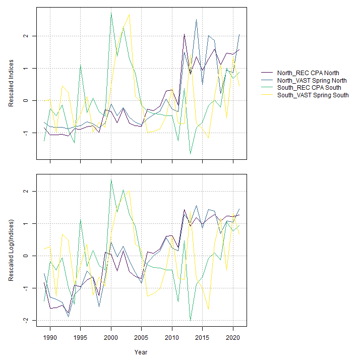
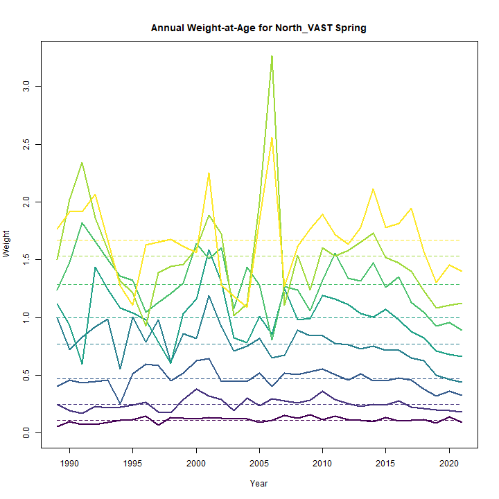
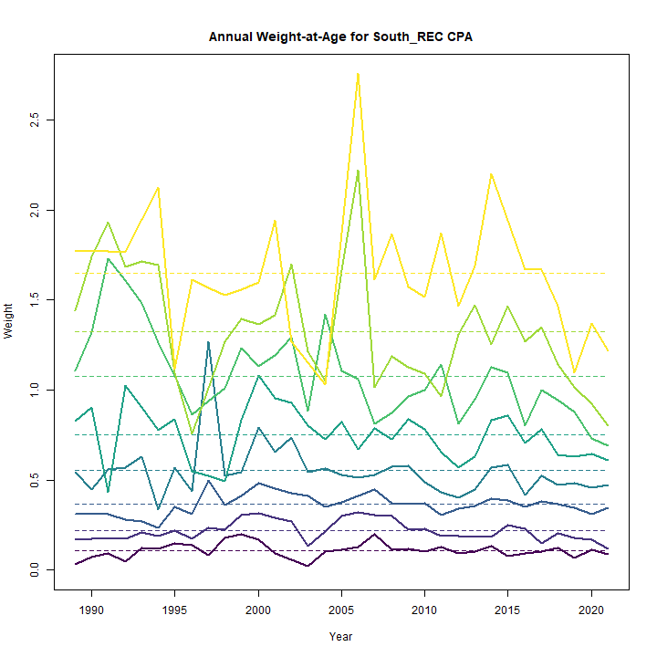
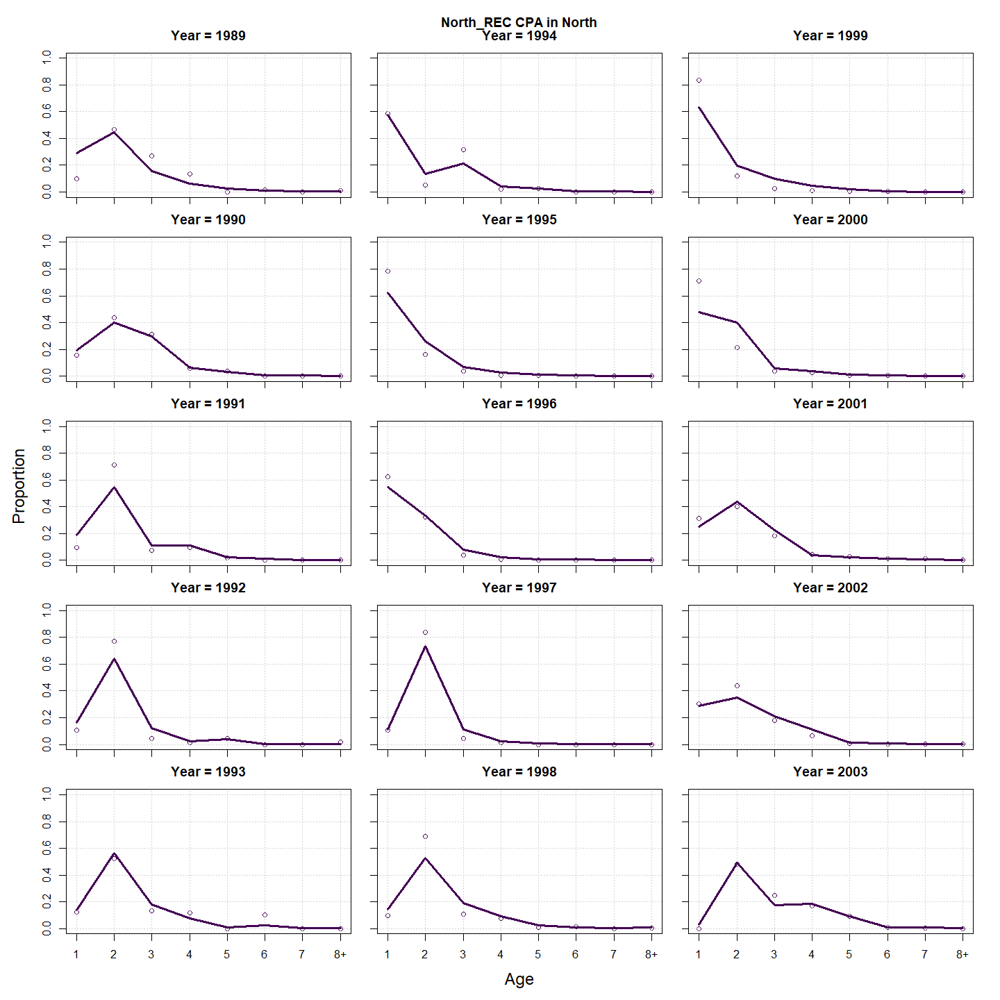
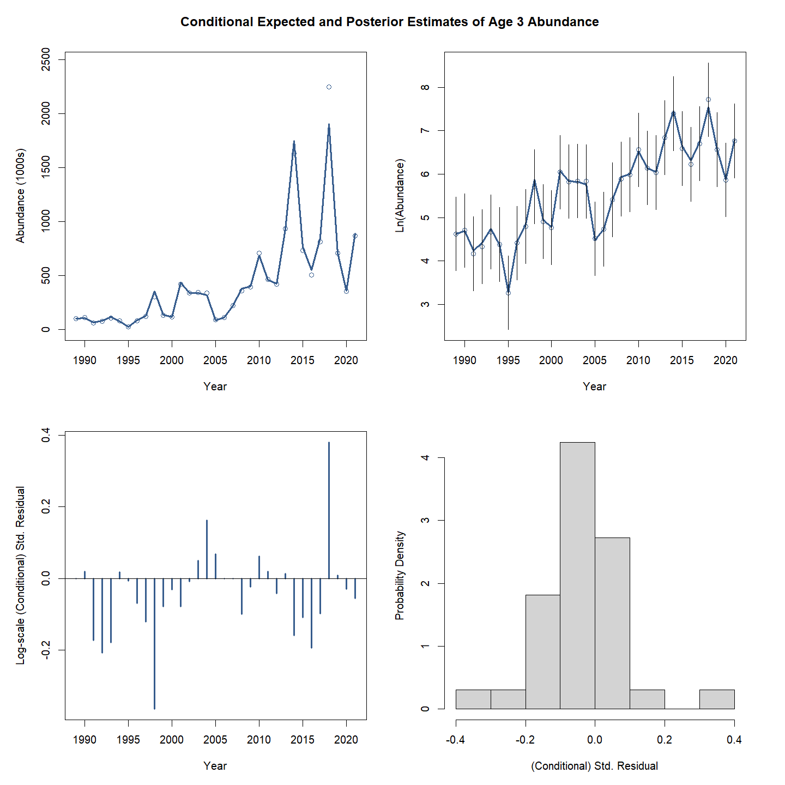
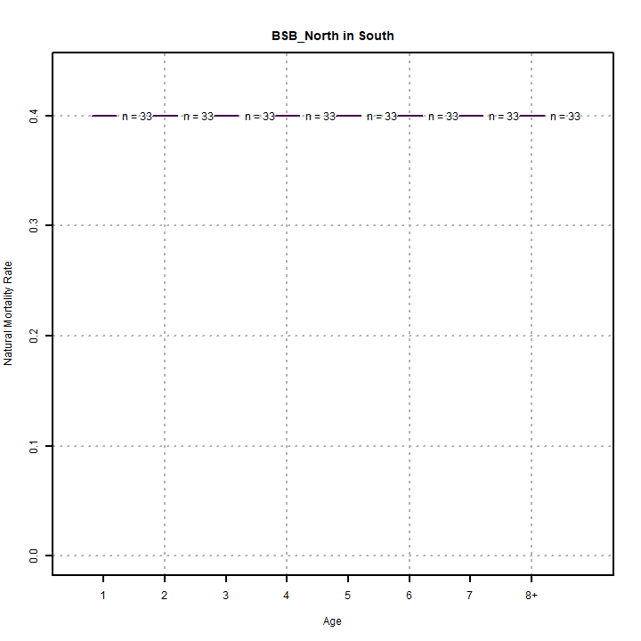
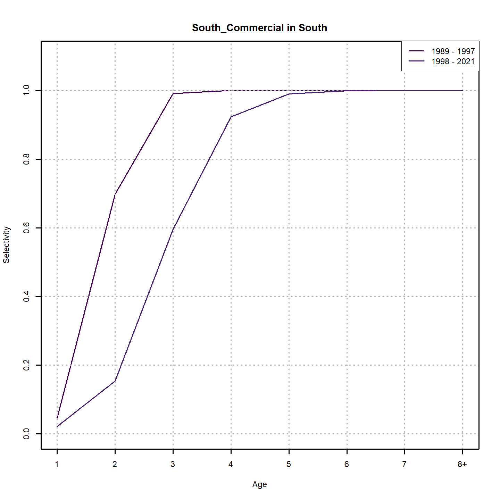
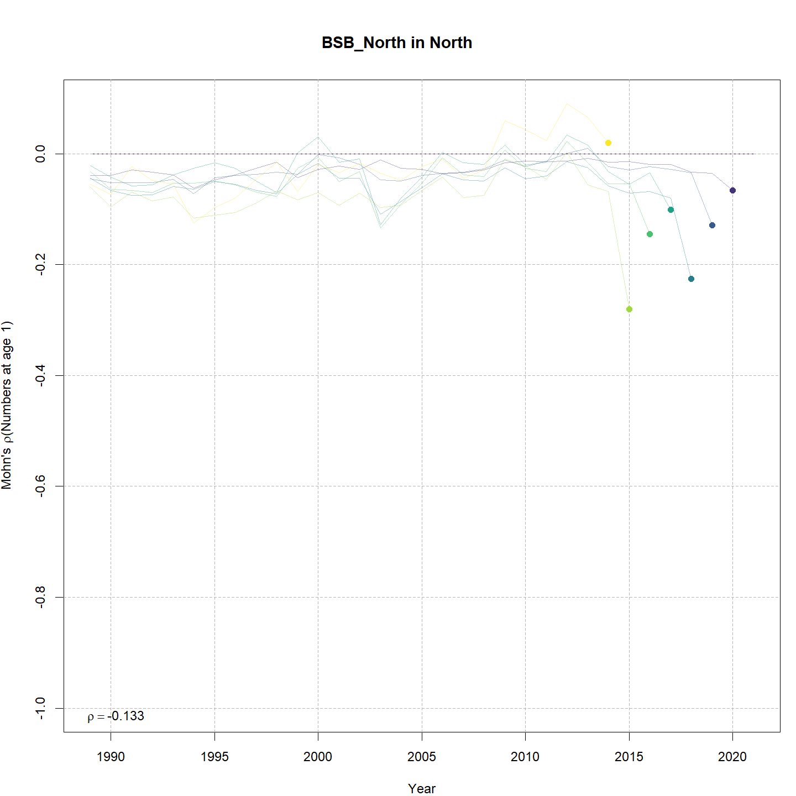
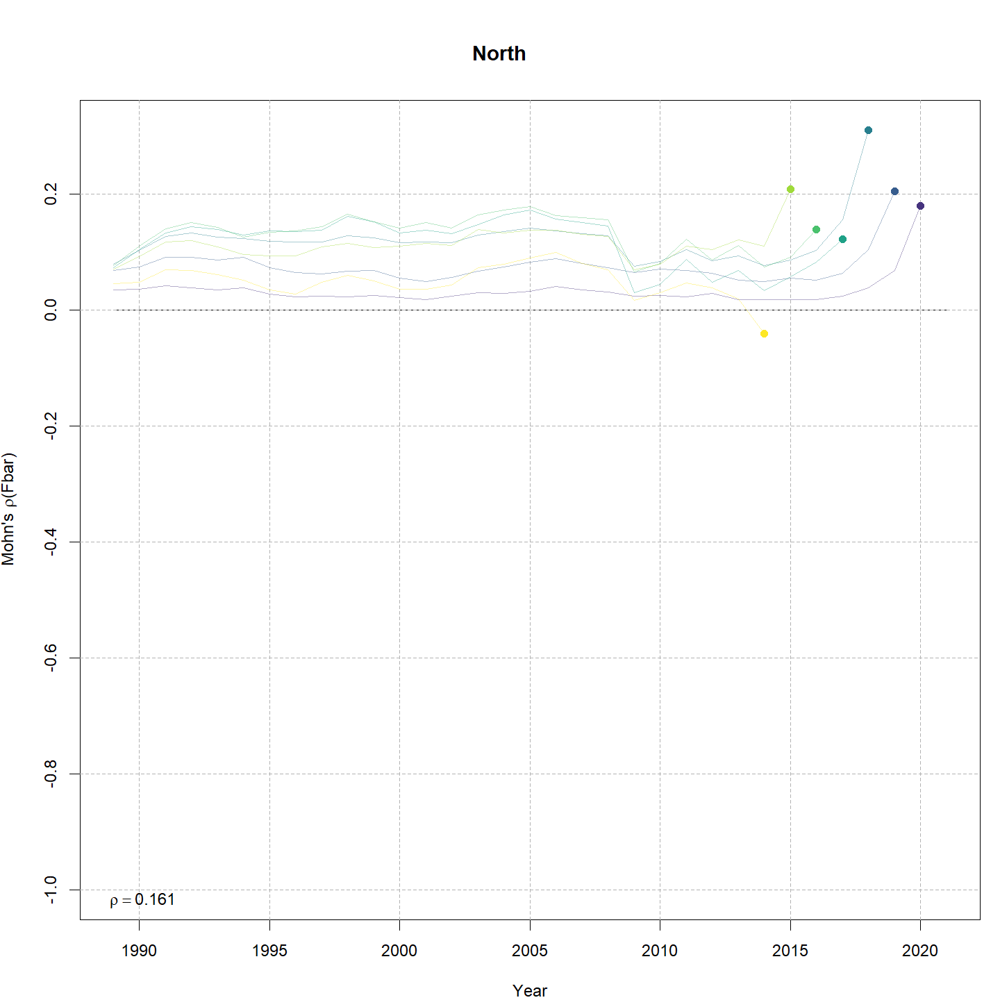
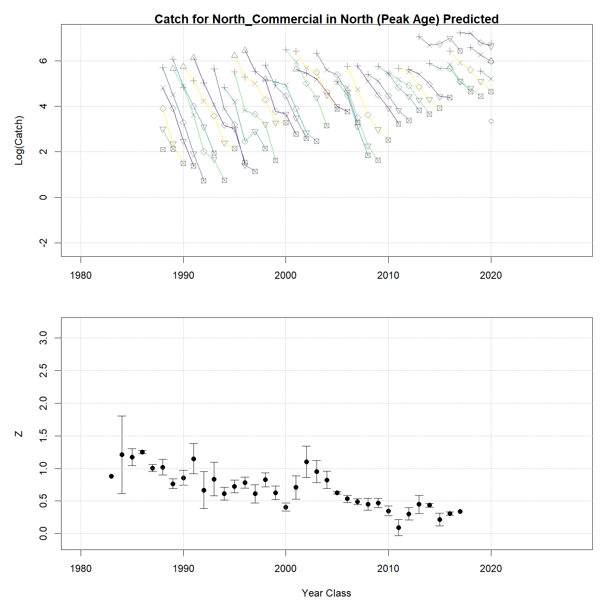

---
output:
  html_document:
    df_print: paged
    keep_md: yes
  word_document: default
  pdf_document:
    fig_caption: yes
    includes:
    keep_tex: yes
    number_sections: no
title: "WHAM figures and tables"
header-includes:
  - \usepackage{longtable}
  - \usepackage{booktabs}
  - \usepackage{caption,graphics}
  - \usepackage{makecell}
  - \usepackage{lscape}
  - \renewcommand\figurename{Fig.}
  - \captionsetup{labelsep=period, singlelinecheck=false}
  - \newcommand{\changesize}[1]{\fontsize{#1pt}{#1pt}\selectfont}
  - \renewcommand{\arraystretch}{1.5}
  - \renewcommand\theadfont{}
---

# {.tabset}

## Figures {.tabset}

### Input

### Diagnostics

### Results

### Retro

### Reference points

### Miscelaneous

## Tables {.tabset}

### Parameter estimates

<table class="table" style="margin-left: auto; margin-right: auto;">
<caption>Parameter estimates, standard errors, and confidence intervals. Rounded to 3 decimal places.</caption>
 <thead>
  <tr>
   <th style="text-align:left;">   </th>
   <th style="text-align:right;"> Estimate </th>
   <th style="text-align:right;"> Std. Error </th>
   <th style="text-align:right;"> 95\% CI lower </th>
   <th style="text-align:right;"> 95\% CI upper </th>
  </tr>
 </thead>
<tbody>
  <tr>
   <td style="text-align:left;"> BSB North Mean Recruitment </td>
   <td style="text-align:right;"> 14729.201 </td>
   <td style="text-align:right;"> 3273.874 </td>
   <td style="text-align:right;"> 9527.561 </td>
   <td style="text-align:right;"> 22770.711 </td>
  </tr>
  <tr>
   <td style="text-align:left;"> BSB North NAA $\sigma$ (age 1) </td>
   <td style="text-align:right;"> 1.035 </td>
   <td style="text-align:right;"> 0.138 </td>
   <td style="text-align:right;"> 0.797 </td>
   <td style="text-align:right;"> 1.344 </td>
  </tr>
  <tr>
   <td style="text-align:left;"> BSB North NAA $\sigma$ (age 2) </td>
   <td style="text-align:right;"> 0.435 </td>
   <td style="text-align:right;"> 0.039 </td>
   <td style="text-align:right;"> 0.364 </td>
   <td style="text-align:right;"> 0.518 </td>
  </tr>
  <tr>
   <td style="text-align:left;"> BSB South Mean Recruitment </td>
   <td style="text-align:right;"> 22957.517 </td>
   <td style="text-align:right;"> 3120.907 </td>
   <td style="text-align:right;"> 17587.750 </td>
   <td style="text-align:right;"> 29966.744 </td>
  </tr>
  <tr>
   <td style="text-align:left;"> BSB South NAA $\sigma$ (age 1) </td>
   <td style="text-align:right;"> 0.506 </td>
   <td style="text-align:right;"> 0.074 </td>
   <td style="text-align:right;"> 0.380 </td>
   <td style="text-align:right;"> 0.673 </td>
  </tr>
  <tr>
   <td style="text-align:left;"> BSB South NAA $\sigma$ (age 2) </td>
   <td style="text-align:right;"> 0.409 </td>
   <td style="text-align:right;"> 0.045 </td>
   <td style="text-align:right;"> 0.329 </td>
   <td style="text-align:right;"> 0.508 </td>
  </tr>
  <tr>
   <td style="text-align:left;"> North REC CPA fully selected q </td>
   <td style="text-align:right;"> 0.000 </td>
   <td style="text-align:right;"> 0.000 </td>
   <td style="text-align:right;"> 0.000 </td>
   <td style="text-align:right;"> 0.000 </td>
  </tr>
  <tr>
   <td style="text-align:left;"> North VAST Spring fully selected q </td>
   <td style="text-align:right;"> 0.010 </td>
   <td style="text-align:right;"> 0.001 </td>
   <td style="text-align:right;"> 0.008 </td>
   <td style="text-align:right;"> 0.013 </td>
  </tr>
  <tr>
   <td style="text-align:left;"> South REC CPA fully selected q </td>
   <td style="text-align:right;"> 0.000 </td>
   <td style="text-align:right;"> 0.000 </td>
   <td style="text-align:right;"> 0.000 </td>
   <td style="text-align:right;"> 0.000 </td>
  </tr>
  <tr>
   <td style="text-align:left;"> South VAST Spring fully selected q </td>
   <td style="text-align:right;"> 0.014 </td>
   <td style="text-align:right;"> 0.001 </td>
   <td style="text-align:right;"> 0.012 </td>
   <td style="text-align:right;"> 0.017 </td>
  </tr>
  <tr>
   <td style="text-align:left;"> Block 1: $a_{50}$ </td>
   <td style="text-align:right;"> 2.011 </td>
   <td style="text-align:right;"> 0.073 </td>
   <td style="text-align:right;"> 1.872 </td>
   <td style="text-align:right;"> 2.157 </td>
  </tr>
  <tr>
   <td style="text-align:left;"> Block 1: 1/slope (increasing) </td>
   <td style="text-align:right;"> 0.285 </td>
   <td style="text-align:right;"> 0.021 </td>
   <td style="text-align:right;"> 0.246 </td>
   <td style="text-align:right;"> 0.329 </td>
  </tr>
  <tr>
   <td style="text-align:left;"> Block 2: $a_{50}$ </td>
   <td style="text-align:right;"> 2.400 </td>
   <td style="text-align:right;"> 0.074 </td>
   <td style="text-align:right;"> 2.256 </td>
   <td style="text-align:right;"> 2.548 </td>
  </tr>
  <tr>
   <td style="text-align:left;"> Block 2: 1/slope (increasing) </td>
   <td style="text-align:right;"> 0.338 </td>
   <td style="text-align:right;"> 0.026 </td>
   <td style="text-align:right;"> 0.290 </td>
   <td style="text-align:right;"> 0.393 </td>
  </tr>
  <tr>
   <td style="text-align:left;"> Block 3: $a_{50}$ </td>
   <td style="text-align:right;"> 1.957 </td>
   <td style="text-align:right;"> 0.101 </td>
   <td style="text-align:right;"> 1.766 </td>
   <td style="text-align:right;"> 2.162 </td>
  </tr>
  <tr>
   <td style="text-align:left;"> Block 3: 1/slope (increasing) </td>
   <td style="text-align:right;"> 0.437 </td>
   <td style="text-align:right;"> 0.041 </td>
   <td style="text-align:right;"> 0.364 </td>
   <td style="text-align:right;"> 0.525 </td>
  </tr>
  <tr>
   <td style="text-align:left;"> Block 4: $a_{50}$ </td>
   <td style="text-align:right;"> 3.381 </td>
   <td style="text-align:right;"> 0.276 </td>
   <td style="text-align:right;"> 2.854 </td>
   <td style="text-align:right;"> 3.931 </td>
  </tr>
  <tr>
   <td style="text-align:left;"> Block 4: 1/slope (increasing) </td>
   <td style="text-align:right;"> 0.865 </td>
   <td style="text-align:right;"> 0.098 </td>
   <td style="text-align:right;"> 0.690 </td>
   <td style="text-align:right;"> 1.077 </td>
  </tr>
  <tr>
   <td style="text-align:left;"> Block 5: $a_{50}$ </td>
   <td style="text-align:right;"> 1.784 </td>
   <td style="text-align:right;"> 0.092 </td>
   <td style="text-align:right;"> 1.611 </td>
   <td style="text-align:right;"> 1.971 </td>
  </tr>
  <tr>
   <td style="text-align:left;"> Block 5: 1/slope (increasing) </td>
   <td style="text-align:right;"> 0.258 </td>
   <td style="text-align:right;"> 0.026 </td>
   <td style="text-align:right;"> 0.211 </td>
   <td style="text-align:right;"> 0.315 </td>
  </tr>
  <tr>
   <td style="text-align:left;"> Block 6: $a_{50}$ </td>
   <td style="text-align:right;"> 2.815 </td>
   <td style="text-align:right;"> 0.097 </td>
   <td style="text-align:right;"> 2.629 </td>
   <td style="text-align:right;"> 3.007 </td>
  </tr>
  <tr>
   <td style="text-align:left;"> Block 6: 1/slope (increasing) </td>
   <td style="text-align:right;"> 0.477 </td>
   <td style="text-align:right;"> 0.029 </td>
   <td style="text-align:right;"> 0.423 </td>
   <td style="text-align:right;"> 0.538 </td>
  </tr>
  <tr>
   <td style="text-align:left;"> Block 7: $a_{50}$ </td>
   <td style="text-align:right;"> 1.997 </td>
   <td style="text-align:right;"> 0.113 </td>
   <td style="text-align:right;"> 1.784 </td>
   <td style="text-align:right;"> 2.227 </td>
  </tr>
  <tr>
   <td style="text-align:left;"> Block 7: 1/slope (increasing) </td>
   <td style="text-align:right;"> 0.519 </td>
   <td style="text-align:right;"> 0.046 </td>
   <td style="text-align:right;"> 0.435 </td>
   <td style="text-align:right;"> 0.617 </td>
  </tr>
  <tr>
   <td style="text-align:left;"> Block 8: $a_{50}$ </td>
   <td style="text-align:right;"> 3.976 </td>
   <td style="text-align:right;"> 0.368 </td>
   <td style="text-align:right;"> 3.264 </td>
   <td style="text-align:right;"> 4.690 </td>
  </tr>
  <tr>
   <td style="text-align:left;"> Block 8: 1/slope (increasing) </td>
   <td style="text-align:right;"> 1.187 </td>
   <td style="text-align:right;"> 0.117 </td>
   <td style="text-align:right;"> 0.976 </td>
   <td style="text-align:right;"> 1.435 </td>
  </tr>
  <tr>
   <td style="text-align:left;"> Block 9: Selectivity for age 1 </td>
   <td style="text-align:right;"> 0.289 </td>
   <td style="text-align:right;"> 0.027 </td>
   <td style="text-align:right;"> 0.239 </td>
   <td style="text-align:right;"> 0.344 </td>
  </tr>
  <tr>
   <td style="text-align:left;"> Block 9: Selectivity for age 2 </td>
   <td style="text-align:right;"> 1.000 </td>
   <td style="text-align:right;"> -- </td>
   <td style="text-align:right;"> -- </td>
   <td style="text-align:right;"> -- </td>
  </tr>
  <tr>
   <td style="text-align:left;"> Block 9: Selectivity for age 3 </td>
   <td style="text-align:right;"> 1.000 </td>
   <td style="text-align:right;"> -- </td>
   <td style="text-align:right;"> -- </td>
   <td style="text-align:right;"> -- </td>
  </tr>
  <tr>
   <td style="text-align:left;"> Block 9: Selectivity for age 4 </td>
   <td style="text-align:right;"> 1.000 </td>
   <td style="text-align:right;"> -- </td>
   <td style="text-align:right;"> -- </td>
   <td style="text-align:right;"> -- </td>
  </tr>
  <tr>
   <td style="text-align:left;"> Block 9: Selectivity for age 5 </td>
   <td style="text-align:right;"> 1.000 </td>
   <td style="text-align:right;"> -- </td>
   <td style="text-align:right;"> -- </td>
   <td style="text-align:right;"> -- </td>
  </tr>
  <tr>
   <td style="text-align:left;"> Block 9: Selectivity for age 6 </td>
   <td style="text-align:right;"> 1.000 </td>
   <td style="text-align:right;"> -- </td>
   <td style="text-align:right;"> -- </td>
   <td style="text-align:right;"> -- </td>
  </tr>
  <tr>
   <td style="text-align:left;"> Block 9: Selectivity for age 7 </td>
   <td style="text-align:right;"> 1.000 </td>
   <td style="text-align:right;"> -- </td>
   <td style="text-align:right;"> -- </td>
   <td style="text-align:right;"> -- </td>
  </tr>
  <tr>
   <td style="text-align:left;"> Block 9: Selectivity for age 8+ </td>
   <td style="text-align:right;"> 1.000 </td>
   <td style="text-align:right;"> -- </td>
   <td style="text-align:right;"> -- </td>
   <td style="text-align:right;"> -- </td>
  </tr>
  <tr>
   <td style="text-align:left;"> Block 10: $a_{50}$ </td>
   <td style="text-align:right;"> 2.232 </td>
   <td style="text-align:right;"> 0.098 </td>
   <td style="text-align:right;"> 2.045 </td>
   <td style="text-align:right;"> 2.429 </td>
  </tr>
  <tr>
   <td style="text-align:left;"> Block 10: 1/slope (increasing) </td>
   <td style="text-align:right;"> 0.492 </td>
   <td style="text-align:right;"> 0.041 </td>
   <td style="text-align:right;"> 0.418 </td>
   <td style="text-align:right;"> 0.579 </td>
  </tr>
  <tr>
   <td style="text-align:left;"> Block 11: $a_{50}$ </td>
   <td style="text-align:right;"> 1.188 </td>
   <td style="text-align:right;"> 0.091 </td>
   <td style="text-align:right;"> 1.020 </td>
   <td style="text-align:right;"> 1.379 </td>
  </tr>
  <tr>
   <td style="text-align:left;"> Block 11: 1/slope (increasing) </td>
   <td style="text-align:right;"> 0.362 </td>
   <td style="text-align:right;"> 0.092 </td>
   <td style="text-align:right;"> 0.219 </td>
   <td style="text-align:right;"> 0.593 </td>
  </tr>
  <tr>
   <td style="text-align:left;"> Block 12: Selectivity for age 1 </td>
   <td style="text-align:right;"> 0.307 </td>
   <td style="text-align:right;"> 0.032 </td>
   <td style="text-align:right;"> 0.248 </td>
   <td style="text-align:right;"> 0.374 </td>
  </tr>
  <tr>
   <td style="text-align:left;"> Block 12: Selectivity for age 2 </td>
   <td style="text-align:right;"> 1.000 </td>
   <td style="text-align:right;"> -- </td>
   <td style="text-align:right;"> -- </td>
   <td style="text-align:right;"> -- </td>
  </tr>
  <tr>
   <td style="text-align:left;"> Block 12: Selectivity for age 3 </td>
   <td style="text-align:right;"> 1.000 </td>
   <td style="text-align:right;"> -- </td>
   <td style="text-align:right;"> -- </td>
   <td style="text-align:right;"> -- </td>
  </tr>
  <tr>
   <td style="text-align:left;"> Block 12: Selectivity for age 4 </td>
   <td style="text-align:right;"> 1.000 </td>
   <td style="text-align:right;"> -- </td>
   <td style="text-align:right;"> -- </td>
   <td style="text-align:right;"> -- </td>
  </tr>
  <tr>
   <td style="text-align:left;"> Block 12: Selectivity for age 5 </td>
   <td style="text-align:right;"> 1.000 </td>
   <td style="text-align:right;"> -- </td>
   <td style="text-align:right;"> -- </td>
   <td style="text-align:right;"> -- </td>
  </tr>
  <tr>
   <td style="text-align:left;"> Block 12: Selectivity for age 6 </td>
   <td style="text-align:right;"> 1.000 </td>
   <td style="text-align:right;"> -- </td>
   <td style="text-align:right;"> -- </td>
   <td style="text-align:right;"> -- </td>
  </tr>
  <tr>
   <td style="text-align:left;"> Block 12: Selectivity for age 7 </td>
   <td style="text-align:right;"> 1.000 </td>
   <td style="text-align:right;"> -- </td>
   <td style="text-align:right;"> -- </td>
   <td style="text-align:right;"> -- </td>
  </tr>
  <tr>
   <td style="text-align:left;"> Block 12: Selectivity for age 8+ </td>
   <td style="text-align:right;"> 1.000 </td>
   <td style="text-align:right;"> -- </td>
   <td style="text-align:right;"> -- </td>
   <td style="text-align:right;"> -- </td>
  </tr>
  <tr>
   <td style="text-align:left;"> North Commercial in North age comp, Dirichlet-multinomial: dispersion ($\phi$) </td>
   <td style="text-align:right;"> 51.711 </td>
   <td style="text-align:right;"> 6.381 </td>
   <td style="text-align:right;"> 40.603 </td>
   <td style="text-align:right;"> 65.859 </td>
  </tr>
  <tr>
   <td style="text-align:left;"> North Recreational in North age comp, Dirichlet-multinomial: dispersion ($\phi$) </td>
   <td style="text-align:right;"> 57.044 </td>
   <td style="text-align:right;"> 7.890 </td>
   <td style="text-align:right;"> 43.499 </td>
   <td style="text-align:right;"> 74.806 </td>
  </tr>
  <tr>
   <td style="text-align:left;"> South Commercial in South age comp, Dirichlet-multinomial: dispersion ($\phi$) </td>
   <td style="text-align:right;"> 44.531 </td>
   <td style="text-align:right;"> 5.055 </td>
   <td style="text-align:right;"> 35.648 </td>
   <td style="text-align:right;"> 55.628 </td>
  </tr>
  <tr>
   <td style="text-align:left;"> South Recreational in South age comp, Dirichlet-multinomial: dispersion ($\phi$) </td>
   <td style="text-align:right;"> 63.277 </td>
   <td style="text-align:right;"> 8.887 </td>
   <td style="text-align:right;"> 48.050 </td>
   <td style="text-align:right;"> 83.328 </td>
  </tr>
  <tr>
   <td style="text-align:left;"> North REC CPA in North age comp, Dirichlet-multinomial: dispersion ($\phi$) </td>
   <td style="text-align:right;"> 56.672 </td>
   <td style="text-align:right;"> 8.438 </td>
   <td style="text-align:right;"> 42.328 </td>
   <td style="text-align:right;"> 75.877 </td>
  </tr>
  <tr>
   <td style="text-align:left;"> North VAST Spring in North age comp, Dirichlet-multinomial: dispersion ($\phi$) </td>
   <td style="text-align:right;"> 22.144 </td>
   <td style="text-align:right;"> 2.275 </td>
   <td style="text-align:right;"> 18.106 </td>
   <td style="text-align:right;"> 27.083 </td>
  </tr>
  <tr>
   <td style="text-align:left;"> South REC CPA in South age comp, Dirichlet-multinomial: dispersion ($\phi$) </td>
   <td style="text-align:right;"> 70.537 </td>
   <td style="text-align:right;"> 12.705 </td>
   <td style="text-align:right;"> 49.556 </td>
   <td style="text-align:right;"> 100.400 </td>
  </tr>
  <tr>
   <td style="text-align:left;"> South VAST Spring in South age comp, Dirichlet-multinomial: dispersion ($\phi$) </td>
   <td style="text-align:right;"> 28.779 </td>
   <td style="text-align:right;"> 3.040 </td>
   <td style="text-align:right;"> 23.397 </td>
   <td style="text-align:right;"> 35.400 </td>
  </tr>
  <tr>
   <td style="text-align:left;"> North REC CPA log-index observation SD scalar </td>
   <td style="text-align:right;"> 5.444 </td>
   <td style="text-align:right;"> 1.113 </td>
   <td style="text-align:right;"> 3.647 </td>
   <td style="text-align:right;"> 8.126 </td>
  </tr>
  <tr>
   <td style="text-align:left;"> South REC CPA log-index observation SD scalar </td>
   <td style="text-align:right;"> 3.318 </td>
   <td style="text-align:right;"> 1.133 </td>
   <td style="text-align:right;"> 1.699 </td>
   <td style="text-align:right;"> 6.478 </td>
  </tr>
</tbody>
</table>

### Abundance at age

<table class="table" style="margin-left: auto; margin-right: auto;">
<caption>Abundance at age (1000s) for BSB North in North.</caption>
 <thead>
  <tr>
   <th style="text-align:left;">   </th>
   <th style="text-align:right;"> 1 </th>
   <th style="text-align:right;"> 2 </th>
   <th style="text-align:right;"> 3 </th>
   <th style="text-align:right;"> 4 </th>
   <th style="text-align:right;"> 5 </th>
   <th style="text-align:right;"> 6 </th>
   <th style="text-align:right;"> 7 </th>
   <th style="text-align:right;"> 8+ </th>
  </tr>
 </thead>
<tbody>
  <tr>
   <td style="text-align:left;"> 1989 </td>
   <td style="text-align:right;"> 8055 </td>
   <td style="text-align:right;"> 3930 </td>
   <td style="text-align:right;"> 1643 </td>
   <td style="text-align:right;"> 667 </td>
   <td style="text-align:right;"> 270 </td>
   <td style="text-align:right;"> 109 </td>
   <td style="text-align:right;"> 44 </td>
   <td style="text-align:right;"> 30 </td>
  </tr>
  <tr>
   <td style="text-align:left;"> 1990 </td>
   <td style="text-align:right;"> 3544 </td>
   <td style="text-align:right;"> 2140 </td>
   <td style="text-align:right;"> 1923 </td>
   <td style="text-align:right;"> 389 </td>
   <td style="text-align:right;"> 216 </td>
   <td style="text-align:right;"> 45 </td>
   <td style="text-align:right;"> 36 </td>
   <td style="text-align:right;"> 18 </td>
  </tr>
  <tr>
   <td style="text-align:left;"> 1991 </td>
   <td style="text-align:right;"> 3029 </td>
   <td style="text-align:right;"> 2706 </td>
   <td style="text-align:right;"> 602 </td>
   <td style="text-align:right;"> 621 </td>
   <td style="text-align:right;"> 127 </td>
   <td style="text-align:right;"> 56 </td>
   <td style="text-align:right;"> 21 </td>
   <td style="text-align:right;"> 19 </td>
  </tr>
  <tr>
   <td style="text-align:left;"> 1992 </td>
   <td style="text-align:right;"> 2967 </td>
   <td style="text-align:right;"> 3653 </td>
   <td style="text-align:right;"> 710 </td>
   <td style="text-align:right;"> 154 </td>
   <td style="text-align:right;"> 230 </td>
   <td style="text-align:right;"> 28 </td>
   <td style="text-align:right;"> 17 </td>
   <td style="text-align:right;"> 24 </td>
  </tr>
  <tr>
   <td style="text-align:left;"> 1993 </td>
   <td style="text-align:right;"> 1998 </td>
   <td style="text-align:right;"> 2535 </td>
   <td style="text-align:right;"> 844 </td>
   <td style="text-align:right;"> 388 </td>
   <td style="text-align:right;"> 41 </td>
   <td style="text-align:right;"> 125 </td>
   <td style="text-align:right;"> 12 </td>
   <td style="text-align:right;"> 15 </td>
  </tr>
  <tr>
   <td style="text-align:left;"> 1994 </td>
   <td style="text-align:right;"> 11666 </td>
   <td style="text-align:right;"> 815 </td>
   <td style="text-align:right;"> 1474 </td>
   <td style="text-align:right;"> 294 </td>
   <td style="text-align:right;"> 183 </td>
   <td style="text-align:right;"> 28 </td>
   <td style="text-align:right;"> 35 </td>
   <td style="text-align:right;"> 13 </td>
  </tr>
  <tr>
   <td style="text-align:left;"> 1995 </td>
   <td style="text-align:right;"> 20231 </td>
   <td style="text-align:right;"> 2324 </td>
   <td style="text-align:right;"> 698 </td>
   <td style="text-align:right;"> 257 </td>
   <td style="text-align:right;"> 129 </td>
   <td style="text-align:right;"> 59 </td>
   <td style="text-align:right;"> 11 </td>
   <td style="text-align:right;"> 31 </td>
  </tr>
  <tr>
   <td style="text-align:left;"> 1996 </td>
   <td style="text-align:right;"> 22423 </td>
   <td style="text-align:right;"> 3807 </td>
   <td style="text-align:right;"> 1059 </td>
   <td style="text-align:right;"> 282 </td>
   <td style="text-align:right;"> 104 </td>
   <td style="text-align:right;"> 87 </td>
   <td style="text-align:right;"> 37 </td>
   <td style="text-align:right;"> 30 </td>
  </tr>
  <tr>
   <td style="text-align:left;"> 1997 </td>
   <td style="text-align:right;"> 5355 </td>
   <td style="text-align:right;"> 9952 </td>
   <td style="text-align:right;"> 1657 </td>
   <td style="text-align:right;"> 372 </td>
   <td style="text-align:right;"> 96 </td>
   <td style="text-align:right;"> 34 </td>
   <td style="text-align:right;"> 38 </td>
   <td style="text-align:right;"> 31 </td>
  </tr>
  <tr>
   <td style="text-align:left;"> 1998 </td>
   <td style="text-align:right;"> 3581 </td>
   <td style="text-align:right;"> 3793 </td>
   <td style="text-align:right;"> 1328 </td>
   <td style="text-align:right;"> 736 </td>
   <td style="text-align:right;"> 191 </td>
   <td style="text-align:right;"> 91 </td>
   <td style="text-align:right;"> 16 </td>
   <td style="text-align:right;"> 57 </td>
  </tr>
  <tr>
   <td style="text-align:left;"> 1999 </td>
   <td style="text-align:right;"> 36588 </td>
   <td style="text-align:right;"> 3326 </td>
   <td style="text-align:right;"> 1829 </td>
   <td style="text-align:right;"> 857 </td>
   <td style="text-align:right;"> 356 </td>
   <td style="text-align:right;"> 121 </td>
   <td style="text-align:right;"> 42 </td>
   <td style="text-align:right;"> 35 </td>
  </tr>
  <tr>
   <td style="text-align:left;"> 2000 </td>
   <td style="text-align:right;"> 49555 </td>
   <td style="text-align:right;"> 11276 </td>
   <td style="text-align:right;"> 1728 </td>
   <td style="text-align:right;"> 1276 </td>
   <td style="text-align:right;"> 419 </td>
   <td style="text-align:right;"> 255 </td>
   <td style="text-align:right;"> 48 </td>
   <td style="text-align:right;"> 63 </td>
  </tr>
  <tr>
   <td style="text-align:left;"> 2001 </td>
   <td style="text-align:right;"> 18438 </td>
   <td style="text-align:right;"> 8320 </td>
   <td style="text-align:right;"> 5075 </td>
   <td style="text-align:right;"> 949 </td>
   <td style="text-align:right;"> 588 </td>
   <td style="text-align:right;"> 269 </td>
   <td style="text-align:right;"> 184 </td>
   <td style="text-align:right;"> 71 </td>
  </tr>
  <tr>
   <td style="text-align:left;"> 2002 </td>
   <td style="text-align:right;"> 26303 </td>
   <td style="text-align:right;"> 8952 </td>
   <td style="text-align:right;"> 5907 </td>
   <td style="text-align:right;"> 3271 </td>
   <td style="text-align:right;"> 413 </td>
   <td style="text-align:right;"> 272 </td>
   <td style="text-align:right;"> 135 </td>
   <td style="text-align:right;"> 112 </td>
  </tr>
  <tr>
   <td style="text-align:left;"> 2003 </td>
   <td style="text-align:right;"> 1950 </td>
   <td style="text-align:right;"> 8050 </td>
   <td style="text-align:right;"> 3088 </td>
   <td style="text-align:right;"> 3448 </td>
   <td style="text-align:right;"> 1735 </td>
   <td style="text-align:right;"> 200 </td>
   <td style="text-align:right;"> 155 </td>
   <td style="text-align:right;"> 78 </td>
  </tr>
  <tr>
   <td style="text-align:left;"> 2004 </td>
   <td style="text-align:right;"> 4701 </td>
   <td style="text-align:right;"> 2423 </td>
   <td style="text-align:right;"> 4498 </td>
   <td style="text-align:right;"> 1253 </td>
   <td style="text-align:right;"> 1703 </td>
   <td style="text-align:right;"> 548 </td>
   <td style="text-align:right;"> 81 </td>
   <td style="text-align:right;"> 117 </td>
  </tr>
  <tr>
   <td style="text-align:left;"> 2005 </td>
   <td style="text-align:right;"> 8297 </td>
   <td style="text-align:right;"> 3040 </td>
   <td style="text-align:right;"> 1358 </td>
   <td style="text-align:right;"> 2588 </td>
   <td style="text-align:right;"> 993 </td>
   <td style="text-align:right;"> 861 </td>
   <td style="text-align:right;"> 221 </td>
   <td style="text-align:right;"> 100 </td>
  </tr>
  <tr>
   <td style="text-align:left;"> 2006 </td>
   <td style="text-align:right;"> 21340 </td>
   <td style="text-align:right;"> 6028 </td>
   <td style="text-align:right;"> 1773 </td>
   <td style="text-align:right;"> 1545 </td>
   <td style="text-align:right;"> 2099 </td>
   <td style="text-align:right;"> 527 </td>
   <td style="text-align:right;"> 460 </td>
   <td style="text-align:right;"> 107 </td>
  </tr>
  <tr>
   <td style="text-align:left;"> 2007 </td>
   <td style="text-align:right;"> 20643 </td>
   <td style="text-align:right;"> 10102 </td>
   <td style="text-align:right;"> 3377 </td>
   <td style="text-align:right;"> 1173 </td>
   <td style="text-align:right;"> 824 </td>
   <td style="text-align:right;"> 937 </td>
   <td style="text-align:right;"> 405 </td>
   <td style="text-align:right;"> 254 </td>
  </tr>
  <tr>
   <td style="text-align:left;"> 2008 </td>
   <td style="text-align:right;"> 27256 </td>
   <td style="text-align:right;"> 10554 </td>
   <td style="text-align:right;"> 6506 </td>
   <td style="text-align:right;"> 2031 </td>
   <td style="text-align:right;"> 578 </td>
   <td style="text-align:right;"> 394 </td>
   <td style="text-align:right;"> 464 </td>
   <td style="text-align:right;"> 320 </td>
  </tr>
  <tr>
   <td style="text-align:left;"> 2009 </td>
   <td style="text-align:right;"> 26915 </td>
   <td style="text-align:right;"> 17729 </td>
   <td style="text-align:right;"> 7441 </td>
   <td style="text-align:right;"> 4958 </td>
   <td style="text-align:right;"> 1149 </td>
   <td style="text-align:right;"> 298 </td>
   <td style="text-align:right;"> 197 </td>
   <td style="text-align:right;"> 383 </td>
  </tr>
  <tr>
   <td style="text-align:left;"> 2010 </td>
   <td style="text-align:right;"> 13495 </td>
   <td style="text-align:right;"> 11815 </td>
   <td style="text-align:right;"> 10055 </td>
   <td style="text-align:right;"> 4815 </td>
   <td style="text-align:right;"> 2652 </td>
   <td style="text-align:right;"> 601 </td>
   <td style="text-align:right;"> 154 </td>
   <td style="text-align:right;"> 241 </td>
  </tr>
  <tr>
   <td style="text-align:left;"> 2011 </td>
   <td style="text-align:right;"> 26645 </td>
   <td style="text-align:right;"> 10838 </td>
   <td style="text-align:right;"> 6342 </td>
   <td style="text-align:right;"> 5591 </td>
   <td style="text-align:right;"> 2101 </td>
   <td style="text-align:right;"> 1232 </td>
   <td style="text-align:right;"> 308 </td>
   <td style="text-align:right;"> 177 </td>
  </tr>
  <tr>
   <td style="text-align:left;"> 2012 </td>
   <td style="text-align:right;"> 100518 </td>
   <td style="text-align:right;"> 24148 </td>
   <td style="text-align:right;"> 11378 </td>
   <td style="text-align:right;"> 6228 </td>
   <td style="text-align:right;"> 4421 </td>
   <td style="text-align:right;"> 1649 </td>
   <td style="text-align:right;"> 909 </td>
   <td style="text-align:right;"> 340 </td>
  </tr>
  <tr>
   <td style="text-align:left;"> 2013 </td>
   <td style="text-align:right;"> 35513 </td>
   <td style="text-align:right;"> 40939 </td>
   <td style="text-align:right;"> 8188 </td>
   <td style="text-align:right;"> 6647 </td>
   <td style="text-align:right;"> 3712 </td>
   <td style="text-align:right;"> 2300 </td>
   <td style="text-align:right;"> 804 </td>
   <td style="text-align:right;"> 653 </td>
  </tr>
  <tr>
   <td style="text-align:left;"> 2014 </td>
   <td style="text-align:right;"> 19866 </td>
   <td style="text-align:right;"> 19201 </td>
   <td style="text-align:right;"> 39560 </td>
   <td style="text-align:right;"> 6801 </td>
   <td style="text-align:right;"> 3896 </td>
   <td style="text-align:right;"> 2219 </td>
   <td style="text-align:right;"> 1416 </td>
   <td style="text-align:right;"> 822 </td>
  </tr>
  <tr>
   <td style="text-align:left;"> 2015 </td>
   <td style="text-align:right;"> 20295 </td>
   <td style="text-align:right;"> 14121 </td>
   <td style="text-align:right;"> 10937 </td>
   <td style="text-align:right;"> 21593 </td>
   <td style="text-align:right;"> 3958 </td>
   <td style="text-align:right;"> 2054 </td>
   <td style="text-align:right;"> 1082 </td>
   <td style="text-align:right;"> 1105 </td>
  </tr>
  <tr>
   <td style="text-align:left;"> 2016 </td>
   <td style="text-align:right;"> 56566 </td>
   <td style="text-align:right;"> 22191 </td>
   <td style="text-align:right;"> 7157 </td>
   <td style="text-align:right;"> 7518 </td>
   <td style="text-align:right;"> 22572 </td>
   <td style="text-align:right;"> 2234 </td>
   <td style="text-align:right;"> 1341 </td>
   <td style="text-align:right;"> 1260 </td>
  </tr>
  <tr>
   <td style="text-align:left;"> 2017 </td>
   <td style="text-align:right;"> 26490 </td>
   <td style="text-align:right;"> 49769 </td>
   <td style="text-align:right;"> 9230 </td>
   <td style="text-align:right;"> 4663 </td>
   <td style="text-align:right;"> 3954 </td>
   <td style="text-align:right;"> 15279 </td>
   <td style="text-align:right;"> 1117 </td>
   <td style="text-align:right;"> 1286 </td>
  </tr>
  <tr>
   <td style="text-align:left;"> 2018 </td>
   <td style="text-align:right;"> 11516 </td>
   <td style="text-align:right;"> 18000 </td>
   <td style="text-align:right;"> 21307 </td>
   <td style="text-align:right;"> 5234 </td>
   <td style="text-align:right;"> 2295 </td>
   <td style="text-align:right;"> 2400 </td>
   <td style="text-align:right;"> 9128 </td>
   <td style="text-align:right;"> 1122 </td>
  </tr>
  <tr>
   <td style="text-align:left;"> 2019 </td>
   <td style="text-align:right;"> 30889 </td>
   <td style="text-align:right;"> 9221 </td>
   <td style="text-align:right;"> 12762 </td>
   <td style="text-align:right;"> 21430 </td>
   <td style="text-align:right;"> 4361 </td>
   <td style="text-align:right;"> 1958 </td>
   <td style="text-align:right;"> 1690 </td>
   <td style="text-align:right;"> 8365 </td>
  </tr>
  <tr>
   <td style="text-align:left;"> 2020 </td>
   <td style="text-align:right;"> 36879 </td>
   <td style="text-align:right;"> 22760 </td>
   <td style="text-align:right;"> 4801 </td>
   <td style="text-align:right;"> 8841 </td>
   <td style="text-align:right;"> 15178 </td>
   <td style="text-align:right;"> 2826 </td>
   <td style="text-align:right;"> 1471 </td>
   <td style="text-align:right;"> 6702 </td>
  </tr>
  <tr>
   <td style="text-align:left;"> 2021 </td>
   <td style="text-align:right;"> 27358 </td>
   <td style="text-align:right;"> 25290 </td>
   <td style="text-align:right;"> 16022 </td>
   <td style="text-align:right;"> 2986 </td>
   <td style="text-align:right;"> 6515 </td>
   <td style="text-align:right;"> 12907 </td>
   <td style="text-align:right;"> 1761 </td>
   <td style="text-align:right;"> 5389 </td>
  </tr>
</tbody>
</table>

<table class="table" style="margin-left: auto; margin-right: auto;">
<caption>Abundance at age (1000s) for BSB North in South.</caption>
 <thead>
  <tr>
   <th style="text-align:left;">   </th>
   <th style="text-align:right;"> 1 </th>
   <th style="text-align:right;"> 2 </th>
   <th style="text-align:right;"> 3 </th>
   <th style="text-align:right;"> 4 </th>
   <th style="text-align:right;"> 5 </th>
   <th style="text-align:right;"> 6 </th>
   <th style="text-align:right;"> 7 </th>
   <th style="text-align:right;"> 8+ </th>
  </tr>
 </thead>
<tbody>
  <tr>
   <td style="text-align:left;"> 1989 </td>
   <td style="text-align:right;"> 0 </td>
   <td style="text-align:right;"> 242 </td>
   <td style="text-align:right;"> 102 </td>
   <td style="text-align:right;"> 41 </td>
   <td style="text-align:right;"> 17 </td>
   <td style="text-align:right;"> 7 </td>
   <td style="text-align:right;"> 3 </td>
   <td style="text-align:right;"> 2 </td>
  </tr>
  <tr>
   <td style="text-align:left;"> 1990 </td>
   <td style="text-align:right;"> 0 </td>
   <td style="text-align:right;"> 287 </td>
   <td style="text-align:right;"> 110 </td>
   <td style="text-align:right;"> 33 </td>
   <td style="text-align:right;"> 13 </td>
   <td style="text-align:right;"> 5 </td>
   <td style="text-align:right;"> 2 </td>
   <td style="text-align:right;"> 1 </td>
  </tr>
  <tr>
   <td style="text-align:left;"> 1991 </td>
   <td style="text-align:right;"> 0 </td>
   <td style="text-align:right;"> 140 </td>
   <td style="text-align:right;"> 64 </td>
   <td style="text-align:right;"> 45 </td>
   <td style="text-align:right;"> 9 </td>
   <td style="text-align:right;"> 5 </td>
   <td style="text-align:right;"> 1 </td>
   <td style="text-align:right;"> 1 </td>
  </tr>
  <tr>
   <td style="text-align:left;"> 1992 </td>
   <td style="text-align:right;"> 0 </td>
   <td style="text-align:right;"> 119 </td>
   <td style="text-align:right;"> 76 </td>
   <td style="text-align:right;"> 15 </td>
   <td style="text-align:right;"> 15 </td>
   <td style="text-align:right;"> 3 </td>
   <td style="text-align:right;"> 1 </td>
   <td style="text-align:right;"> 1 </td>
  </tr>
  <tr>
   <td style="text-align:left;"> 1993 </td>
   <td style="text-align:right;"> 0 </td>
   <td style="text-align:right;"> 117 </td>
   <td style="text-align:right;"> 107 </td>
   <td style="text-align:right;"> 20 </td>
   <td style="text-align:right;"> 4 </td>
   <td style="text-align:right;"> 6 </td>
   <td style="text-align:right;"> 1 </td>
   <td style="text-align:right;"> 1 </td>
  </tr>
  <tr>
   <td style="text-align:left;"> 1994 </td>
   <td style="text-align:right;"> 0 </td>
   <td style="text-align:right;"> 73 </td>
   <td style="text-align:right;"> 80 </td>
   <td style="text-align:right;"> 22 </td>
   <td style="text-align:right;"> 10 </td>
   <td style="text-align:right;"> 1 </td>
   <td style="text-align:right;"> 3 </td>
   <td style="text-align:right;"> 1 </td>
  </tr>
  <tr>
   <td style="text-align:left;"> 1995 </td>
   <td style="text-align:right;"> 0 </td>
   <td style="text-align:right;"> 364 </td>
   <td style="text-align:right;"> 26 </td>
   <td style="text-align:right;"> 34 </td>
   <td style="text-align:right;"> 7 </td>
   <td style="text-align:right;"> 4 </td>
   <td style="text-align:right;"> 1 </td>
   <td style="text-align:right;"> 1 </td>
  </tr>
  <tr>
   <td style="text-align:left;"> 1996 </td>
   <td style="text-align:right;"> 0 </td>
   <td style="text-align:right;"> 656 </td>
   <td style="text-align:right;"> 82 </td>
   <td style="text-align:right;"> 19 </td>
   <td style="text-align:right;"> 7 </td>
   <td style="text-align:right;"> 4 </td>
   <td style="text-align:right;"> 2 </td>
   <td style="text-align:right;"> 1 </td>
  </tr>
  <tr>
   <td style="text-align:left;"> 1997 </td>
   <td style="text-align:right;"> 0 </td>
   <td style="text-align:right;"> 831 </td>
   <td style="text-align:right;"> 121 </td>
   <td style="text-align:right;"> 26 </td>
   <td style="text-align:right;"> 7 </td>
   <td style="text-align:right;"> 2 </td>
   <td style="text-align:right;"> 2 </td>
   <td style="text-align:right;"> 2 </td>
  </tr>
  <tr>
   <td style="text-align:left;"> 1998 </td>
   <td style="text-align:right;"> 0 </td>
   <td style="text-align:right;"> 216 </td>
   <td style="text-align:right;"> 303 </td>
   <td style="text-align:right;"> 51 </td>
   <td style="text-align:right;"> 11 </td>
   <td style="text-align:right;"> 3 </td>
   <td style="text-align:right;"> 1 </td>
   <td style="text-align:right;"> 2 </td>
  </tr>
  <tr>
   <td style="text-align:left;"> 1999 </td>
   <td style="text-align:right;"> 0 </td>
   <td style="text-align:right;"> 137 </td>
   <td style="text-align:right;"> 135 </td>
   <td style="text-align:right;"> 45 </td>
   <td style="text-align:right;"> 21 </td>
   <td style="text-align:right;"> 5 </td>
   <td style="text-align:right;"> 2 </td>
   <td style="text-align:right;"> 2 </td>
  </tr>
  <tr>
   <td style="text-align:left;"> 2000 </td>
   <td style="text-align:right;"> 0 </td>
   <td style="text-align:right;"> 1170 </td>
   <td style="text-align:right;"> 117 </td>
   <td style="text-align:right;"> 54 </td>
   <td style="text-align:right;"> 23 </td>
   <td style="text-align:right;"> 10 </td>
   <td style="text-align:right;"> 3 </td>
   <td style="text-align:right;"> 2 </td>
  </tr>
  <tr>
   <td style="text-align:left;"> 2001 </td>
   <td style="text-align:right;"> 0 </td>
   <td style="text-align:right;"> 1575 </td>
   <td style="text-align:right;"> 422 </td>
   <td style="text-align:right;"> 57 </td>
   <td style="text-align:right;"> 39 </td>
   <td style="text-align:right;"> 13 </td>
   <td style="text-align:right;"> 8 </td>
   <td style="text-align:right;"> 3 </td>
  </tr>
  <tr>
   <td style="text-align:left;"> 2002 </td>
   <td style="text-align:right;"> 0 </td>
   <td style="text-align:right;"> 721 </td>
   <td style="text-align:right;"> 340 </td>
   <td style="text-align:right;"> 158 </td>
   <td style="text-align:right;"> 28 </td>
   <td style="text-align:right;"> 17 </td>
   <td style="text-align:right;"> 8 </td>
   <td style="text-align:right;"> 7 </td>
  </tr>
  <tr>
   <td style="text-align:left;"> 2003 </td>
   <td style="text-align:right;"> 0 </td>
   <td style="text-align:right;"> 991 </td>
   <td style="text-align:right;"> 345 </td>
   <td style="text-align:right;"> 190 </td>
   <td style="text-align:right;"> 100 </td>
   <td style="text-align:right;"> 13 </td>
   <td style="text-align:right;"> 8 </td>
   <td style="text-align:right;"> 7 </td>
  </tr>
  <tr>
   <td style="text-align:left;"> 2004 </td>
   <td style="text-align:right;"> 0 </td>
   <td style="text-align:right;"> 77 </td>
   <td style="text-align:right;"> 342 </td>
   <td style="text-align:right;"> 106 </td>
   <td style="text-align:right;"> 110 </td>
   <td style="text-align:right;"> 53 </td>
   <td style="text-align:right;"> 6 </td>
   <td style="text-align:right;"> 7 </td>
  </tr>
  <tr>
   <td style="text-align:left;"> 2005 </td>
   <td style="text-align:right;"> 0 </td>
   <td style="text-align:right;"> 191 </td>
   <td style="text-align:right;"> 91 </td>
   <td style="text-align:right;"> 149 </td>
   <td style="text-align:right;"> 40 </td>
   <td style="text-align:right;"> 53 </td>
   <td style="text-align:right;"> 17 </td>
   <td style="text-align:right;"> 6 </td>
  </tr>
  <tr>
   <td style="text-align:left;"> 2006 </td>
   <td style="text-align:right;"> 0 </td>
   <td style="text-align:right;"> 314 </td>
   <td style="text-align:right;"> 113 </td>
   <td style="text-align:right;"> 45 </td>
   <td style="text-align:right;"> 83 </td>
   <td style="text-align:right;"> 31 </td>
   <td style="text-align:right;"> 26 </td>
   <td style="text-align:right;"> 10 </td>
  </tr>
  <tr>
   <td style="text-align:left;"> 2007 </td>
   <td style="text-align:right;"> 0 </td>
   <td style="text-align:right;"> 736 </td>
   <td style="text-align:right;"> 223 </td>
   <td style="text-align:right;"> 58 </td>
   <td style="text-align:right;"> 47 </td>
   <td style="text-align:right;"> 63 </td>
   <td style="text-align:right;"> 17 </td>
   <td style="text-align:right;"> 18 </td>
  </tr>
  <tr>
   <td style="text-align:left;"> 2008 </td>
   <td style="text-align:right;"> 0 </td>
   <td style="text-align:right;"> 782 </td>
   <td style="text-align:right;"> 361 </td>
   <td style="text-align:right;"> 109 </td>
   <td style="text-align:right;"> 35 </td>
   <td style="text-align:right;"> 25 </td>
   <td style="text-align:right;"> 29 </td>
   <td style="text-align:right;"> 20 </td>
  </tr>
  <tr>
   <td style="text-align:left;"> 2009 </td>
   <td style="text-align:right;"> 0 </td>
   <td style="text-align:right;"> 1087 </td>
   <td style="text-align:right;"> 397 </td>
   <td style="text-align:right;"> 218 </td>
   <td style="text-align:right;"> 65 </td>
   <td style="text-align:right;"> 19 </td>
   <td style="text-align:right;"> 13 </td>
   <td style="text-align:right;"> 25 </td>
  </tr>
  <tr>
   <td style="text-align:left;"> 2010 </td>
   <td style="text-align:right;"> 0 </td>
   <td style="text-align:right;"> 1010 </td>
   <td style="text-align:right;"> 706 </td>
   <td style="text-align:right;"> 265 </td>
   <td style="text-align:right;"> 162 </td>
   <td style="text-align:right;"> 35 </td>
   <td style="text-align:right;"> 9 </td>
   <td style="text-align:right;"> 16 </td>
  </tr>
  <tr>
   <td style="text-align:left;"> 2011 </td>
   <td style="text-align:right;"> 0 </td>
   <td style="text-align:right;"> 537 </td>
   <td style="text-align:right;"> 466 </td>
   <td style="text-align:right;"> 338 </td>
   <td style="text-align:right;"> 142 </td>
   <td style="text-align:right;"> 74 </td>
   <td style="text-align:right;"> 16 </td>
   <td style="text-align:right;"> 10 </td>
  </tr>
  <tr>
   <td style="text-align:left;"> 2012 </td>
   <td style="text-align:right;"> 0 </td>
   <td style="text-align:right;"> 985 </td>
   <td style="text-align:right;"> 418 </td>
   <td style="text-align:right;"> 229 </td>
   <td style="text-align:right;"> 189 </td>
   <td style="text-align:right;"> 72 </td>
   <td style="text-align:right;"> 42 </td>
   <td style="text-align:right;"> 16 </td>
  </tr>
  <tr>
   <td style="text-align:left;"> 2013 </td>
   <td style="text-align:right;"> 0 </td>
   <td style="text-align:right;"> 6019 </td>
   <td style="text-align:right;"> 934 </td>
   <td style="text-align:right;"> 398 </td>
   <td style="text-align:right;"> 207 </td>
   <td style="text-align:right;"> 142 </td>
   <td style="text-align:right;"> 50 </td>
   <td style="text-align:right;"> 37 </td>
  </tr>
  <tr>
   <td style="text-align:left;"> 2014 </td>
   <td style="text-align:right;"> 0 </td>
   <td style="text-align:right;"> 1342 </td>
   <td style="text-align:right;"> 1629 </td>
   <td style="text-align:right;"> 305 </td>
   <td style="text-align:right;"> 219 </td>
   <td style="text-align:right;"> 123 </td>
   <td style="text-align:right;"> 73 </td>
   <td style="text-align:right;"> 43 </td>
  </tr>
  <tr>
   <td style="text-align:left;"> 2015 </td>
   <td style="text-align:right;"> 0 </td>
   <td style="text-align:right;"> 753 </td>
   <td style="text-align:right;"> 730 </td>
   <td style="text-align:right;"> 1313 </td>
   <td style="text-align:right;"> 239 </td>
   <td style="text-align:right;"> 127 </td>
   <td style="text-align:right;"> 67 </td>
   <td style="text-align:right;"> 67 </td>
  </tr>
  <tr>
   <td style="text-align:left;"> 2016 </td>
   <td style="text-align:right;"> 0 </td>
   <td style="text-align:right;"> 749 </td>
   <td style="text-align:right;"> 507 </td>
   <td style="text-align:right;"> 379 </td>
   <td style="text-align:right;"> 657 </td>
   <td style="text-align:right;"> 114 </td>
   <td style="text-align:right;"> 64 </td>
   <td style="text-align:right;"> 69 </td>
  </tr>
  <tr>
   <td style="text-align:left;"> 2017 </td>
   <td style="text-align:right;"> 0 </td>
   <td style="text-align:right;"> 2218 </td>
   <td style="text-align:right;"> 814 </td>
   <td style="text-align:right;"> 261 </td>
   <td style="text-align:right;"> 245 </td>
   <td style="text-align:right;"> 728 </td>
   <td style="text-align:right;"> 70 </td>
   <td style="text-align:right;"> 79 </td>
  </tr>
  <tr>
   <td style="text-align:left;"> 2018 </td>
   <td style="text-align:right;"> 0 </td>
   <td style="text-align:right;"> 1115 </td>
   <td style="text-align:right;"> 2245 </td>
   <td style="text-align:right;"> 329 </td>
   <td style="text-align:right;"> 150 </td>
   <td style="text-align:right;"> 121 </td>
   <td style="text-align:right;"> 423 </td>
   <td style="text-align:right;"> 70 </td>
  </tr>
  <tr>
   <td style="text-align:left;"> 2019 </td>
   <td style="text-align:right;"> 0 </td>
   <td style="text-align:right;"> 444 </td>
   <td style="text-align:right;"> 710 </td>
   <td style="text-align:right;"> 789 </td>
   <td style="text-align:right;"> 175 </td>
   <td style="text-align:right;"> 75 </td>
   <td style="text-align:right;"> 75 </td>
   <td style="text-align:right;"> 309 </td>
  </tr>
  <tr>
   <td style="text-align:left;"> 2020 </td>
   <td style="text-align:right;"> 0 </td>
   <td style="text-align:right;"> 1265 </td>
   <td style="text-align:right;"> 353 </td>
   <td style="text-align:right;"> 471 </td>
   <td style="text-align:right;"> 718 </td>
   <td style="text-align:right;"> 136 </td>
   <td style="text-align:right;"> 61 </td>
   <td style="text-align:right;"> 303 </td>
  </tr>
  <tr>
   <td style="text-align:left;"> 2021 </td>
   <td style="text-align:right;"> 0 </td>
   <td style="text-align:right;"> 1436 </td>
   <td style="text-align:right;"> 868 </td>
   <td style="text-align:right;"> 174 </td>
   <td style="text-align:right;"> 295 </td>
   <td style="text-align:right;"> 491 </td>
   <td style="text-align:right;"> 89 </td>
   <td style="text-align:right;"> 253 </td>
  </tr>
</tbody>
</table>

<table class="table" style="margin-left: auto; margin-right: auto;">
<caption>Abundance at age (1000s) for BSB South in North.</caption>
 <thead>
  <tr>
   <th style="text-align:left;">   </th>
   <th style="text-align:right;"> 1 </th>
   <th style="text-align:right;"> 2 </th>
   <th style="text-align:right;"> 3 </th>
   <th style="text-align:right;"> 4 </th>
   <th style="text-align:right;"> 5 </th>
   <th style="text-align:right;"> 6 </th>
   <th style="text-align:right;"> 7 </th>
   <th style="text-align:right;"> 8+ </th>
  </tr>
 </thead>
<tbody>
  <tr>
   <td style="text-align:left;"> 1989 </td>
   <td style="text-align:right;"> 0 </td>
   <td style="text-align:right;"> 0 </td>
   <td style="text-align:right;"> 0 </td>
   <td style="text-align:right;"> 0 </td>
   <td style="text-align:right;"> 0 </td>
   <td style="text-align:right;"> 0 </td>
   <td style="text-align:right;"> 0 </td>
   <td style="text-align:right;"> 0 </td>
  </tr>
  <tr>
   <td style="text-align:left;"> 1990 </td>
   <td style="text-align:right;"> 0 </td>
   <td style="text-align:right;"> 0 </td>
   <td style="text-align:right;"> 0 </td>
   <td style="text-align:right;"> 0 </td>
   <td style="text-align:right;"> 0 </td>
   <td style="text-align:right;"> 0 </td>
   <td style="text-align:right;"> 0 </td>
   <td style="text-align:right;"> 0 </td>
  </tr>
  <tr>
   <td style="text-align:left;"> 1991 </td>
   <td style="text-align:right;"> 0 </td>
   <td style="text-align:right;"> 0 </td>
   <td style="text-align:right;"> 0 </td>
   <td style="text-align:right;"> 0 </td>
   <td style="text-align:right;"> 0 </td>
   <td style="text-align:right;"> 0 </td>
   <td style="text-align:right;"> 0 </td>
   <td style="text-align:right;"> 0 </td>
  </tr>
  <tr>
   <td style="text-align:left;"> 1992 </td>
   <td style="text-align:right;"> 0 </td>
   <td style="text-align:right;"> 0 </td>
   <td style="text-align:right;"> 0 </td>
   <td style="text-align:right;"> 0 </td>
   <td style="text-align:right;"> 0 </td>
   <td style="text-align:right;"> 0 </td>
   <td style="text-align:right;"> 0 </td>
   <td style="text-align:right;"> 0 </td>
  </tr>
  <tr>
   <td style="text-align:left;"> 1993 </td>
   <td style="text-align:right;"> 0 </td>
   <td style="text-align:right;"> 0 </td>
   <td style="text-align:right;"> 0 </td>
   <td style="text-align:right;"> 0 </td>
   <td style="text-align:right;"> 0 </td>
   <td style="text-align:right;"> 0 </td>
   <td style="text-align:right;"> 0 </td>
   <td style="text-align:right;"> 0 </td>
  </tr>
  <tr>
   <td style="text-align:left;"> 1994 </td>
   <td style="text-align:right;"> 0 </td>
   <td style="text-align:right;"> 0 </td>
   <td style="text-align:right;"> 0 </td>
   <td style="text-align:right;"> 0 </td>
   <td style="text-align:right;"> 0 </td>
   <td style="text-align:right;"> 0 </td>
   <td style="text-align:right;"> 0 </td>
   <td style="text-align:right;"> 0 </td>
  </tr>
  <tr>
   <td style="text-align:left;"> 1995 </td>
   <td style="text-align:right;"> 0 </td>
   <td style="text-align:right;"> 0 </td>
   <td style="text-align:right;"> 0 </td>
   <td style="text-align:right;"> 0 </td>
   <td style="text-align:right;"> 0 </td>
   <td style="text-align:right;"> 0 </td>
   <td style="text-align:right;"> 0 </td>
   <td style="text-align:right;"> 0 </td>
  </tr>
  <tr>
   <td style="text-align:left;"> 1996 </td>
   <td style="text-align:right;"> 0 </td>
   <td style="text-align:right;"> 0 </td>
   <td style="text-align:right;"> 0 </td>
   <td style="text-align:right;"> 0 </td>
   <td style="text-align:right;"> 0 </td>
   <td style="text-align:right;"> 0 </td>
   <td style="text-align:right;"> 0 </td>
   <td style="text-align:right;"> 0 </td>
  </tr>
  <tr>
   <td style="text-align:left;"> 1997 </td>
   <td style="text-align:right;"> 0 </td>
   <td style="text-align:right;"> 0 </td>
   <td style="text-align:right;"> 0 </td>
   <td style="text-align:right;"> 0 </td>
   <td style="text-align:right;"> 0 </td>
   <td style="text-align:right;"> 0 </td>
   <td style="text-align:right;"> 0 </td>
   <td style="text-align:right;"> 0 </td>
  </tr>
  <tr>
   <td style="text-align:left;"> 1998 </td>
   <td style="text-align:right;"> 0 </td>
   <td style="text-align:right;"> 0 </td>
   <td style="text-align:right;"> 0 </td>
   <td style="text-align:right;"> 0 </td>
   <td style="text-align:right;"> 0 </td>
   <td style="text-align:right;"> 0 </td>
   <td style="text-align:right;"> 0 </td>
   <td style="text-align:right;"> 0 </td>
  </tr>
  <tr>
   <td style="text-align:left;"> 1999 </td>
   <td style="text-align:right;"> 0 </td>
   <td style="text-align:right;"> 0 </td>
   <td style="text-align:right;"> 0 </td>
   <td style="text-align:right;"> 0 </td>
   <td style="text-align:right;"> 0 </td>
   <td style="text-align:right;"> 0 </td>
   <td style="text-align:right;"> 0 </td>
   <td style="text-align:right;"> 0 </td>
  </tr>
  <tr>
   <td style="text-align:left;"> 2000 </td>
   <td style="text-align:right;"> 0 </td>
   <td style="text-align:right;"> 0 </td>
   <td style="text-align:right;"> 0 </td>
   <td style="text-align:right;"> 0 </td>
   <td style="text-align:right;"> 0 </td>
   <td style="text-align:right;"> 0 </td>
   <td style="text-align:right;"> 0 </td>
   <td style="text-align:right;"> 0 </td>
  </tr>
  <tr>
   <td style="text-align:left;"> 2001 </td>
   <td style="text-align:right;"> 0 </td>
   <td style="text-align:right;"> 0 </td>
   <td style="text-align:right;"> 0 </td>
   <td style="text-align:right;"> 0 </td>
   <td style="text-align:right;"> 0 </td>
   <td style="text-align:right;"> 0 </td>
   <td style="text-align:right;"> 0 </td>
   <td style="text-align:right;"> 0 </td>
  </tr>
  <tr>
   <td style="text-align:left;"> 2002 </td>
   <td style="text-align:right;"> 0 </td>
   <td style="text-align:right;"> 0 </td>
   <td style="text-align:right;"> 0 </td>
   <td style="text-align:right;"> 0 </td>
   <td style="text-align:right;"> 0 </td>
   <td style="text-align:right;"> 0 </td>
   <td style="text-align:right;"> 0 </td>
   <td style="text-align:right;"> 0 </td>
  </tr>
  <tr>
   <td style="text-align:left;"> 2003 </td>
   <td style="text-align:right;"> 0 </td>
   <td style="text-align:right;"> 0 </td>
   <td style="text-align:right;"> 0 </td>
   <td style="text-align:right;"> 0 </td>
   <td style="text-align:right;"> 0 </td>
   <td style="text-align:right;"> 0 </td>
   <td style="text-align:right;"> 0 </td>
   <td style="text-align:right;"> 0 </td>
  </tr>
  <tr>
   <td style="text-align:left;"> 2004 </td>
   <td style="text-align:right;"> 0 </td>
   <td style="text-align:right;"> 0 </td>
   <td style="text-align:right;"> 0 </td>
   <td style="text-align:right;"> 0 </td>
   <td style="text-align:right;"> 0 </td>
   <td style="text-align:right;"> 0 </td>
   <td style="text-align:right;"> 0 </td>
   <td style="text-align:right;"> 0 </td>
  </tr>
  <tr>
   <td style="text-align:left;"> 2005 </td>
   <td style="text-align:right;"> 0 </td>
   <td style="text-align:right;"> 0 </td>
   <td style="text-align:right;"> 0 </td>
   <td style="text-align:right;"> 0 </td>
   <td style="text-align:right;"> 0 </td>
   <td style="text-align:right;"> 0 </td>
   <td style="text-align:right;"> 0 </td>
   <td style="text-align:right;"> 0 </td>
  </tr>
  <tr>
   <td style="text-align:left;"> 2006 </td>
   <td style="text-align:right;"> 0 </td>
   <td style="text-align:right;"> 0 </td>
   <td style="text-align:right;"> 0 </td>
   <td style="text-align:right;"> 0 </td>
   <td style="text-align:right;"> 0 </td>
   <td style="text-align:right;"> 0 </td>
   <td style="text-align:right;"> 0 </td>
   <td style="text-align:right;"> 0 </td>
  </tr>
  <tr>
   <td style="text-align:left;"> 2007 </td>
   <td style="text-align:right;"> 0 </td>
   <td style="text-align:right;"> 0 </td>
   <td style="text-align:right;"> 0 </td>
   <td style="text-align:right;"> 0 </td>
   <td style="text-align:right;"> 0 </td>
   <td style="text-align:right;"> 0 </td>
   <td style="text-align:right;"> 0 </td>
   <td style="text-align:right;"> 0 </td>
  </tr>
  <tr>
   <td style="text-align:left;"> 2008 </td>
   <td style="text-align:right;"> 0 </td>
   <td style="text-align:right;"> 0 </td>
   <td style="text-align:right;"> 0 </td>
   <td style="text-align:right;"> 0 </td>
   <td style="text-align:right;"> 0 </td>
   <td style="text-align:right;"> 0 </td>
   <td style="text-align:right;"> 0 </td>
   <td style="text-align:right;"> 0 </td>
  </tr>
  <tr>
   <td style="text-align:left;"> 2009 </td>
   <td style="text-align:right;"> 0 </td>
   <td style="text-align:right;"> 0 </td>
   <td style="text-align:right;"> 0 </td>
   <td style="text-align:right;"> 0 </td>
   <td style="text-align:right;"> 0 </td>
   <td style="text-align:right;"> 0 </td>
   <td style="text-align:right;"> 0 </td>
   <td style="text-align:right;"> 0 </td>
  </tr>
  <tr>
   <td style="text-align:left;"> 2010 </td>
   <td style="text-align:right;"> 0 </td>
   <td style="text-align:right;"> 0 </td>
   <td style="text-align:right;"> 0 </td>
   <td style="text-align:right;"> 0 </td>
   <td style="text-align:right;"> 0 </td>
   <td style="text-align:right;"> 0 </td>
   <td style="text-align:right;"> 0 </td>
   <td style="text-align:right;"> 0 </td>
  </tr>
  <tr>
   <td style="text-align:left;"> 2011 </td>
   <td style="text-align:right;"> 0 </td>
   <td style="text-align:right;"> 0 </td>
   <td style="text-align:right;"> 0 </td>
   <td style="text-align:right;"> 0 </td>
   <td style="text-align:right;"> 0 </td>
   <td style="text-align:right;"> 0 </td>
   <td style="text-align:right;"> 0 </td>
   <td style="text-align:right;"> 0 </td>
  </tr>
  <tr>
   <td style="text-align:left;"> 2012 </td>
   <td style="text-align:right;"> 0 </td>
   <td style="text-align:right;"> 0 </td>
   <td style="text-align:right;"> 0 </td>
   <td style="text-align:right;"> 0 </td>
   <td style="text-align:right;"> 0 </td>
   <td style="text-align:right;"> 0 </td>
   <td style="text-align:right;"> 0 </td>
   <td style="text-align:right;"> 0 </td>
  </tr>
  <tr>
   <td style="text-align:left;"> 2013 </td>
   <td style="text-align:right;"> 0 </td>
   <td style="text-align:right;"> 0 </td>
   <td style="text-align:right;"> 0 </td>
   <td style="text-align:right;"> 0 </td>
   <td style="text-align:right;"> 0 </td>
   <td style="text-align:right;"> 0 </td>
   <td style="text-align:right;"> 0 </td>
   <td style="text-align:right;"> 0 </td>
  </tr>
  <tr>
   <td style="text-align:left;"> 2014 </td>
   <td style="text-align:right;"> 0 </td>
   <td style="text-align:right;"> 0 </td>
   <td style="text-align:right;"> 0 </td>
   <td style="text-align:right;"> 0 </td>
   <td style="text-align:right;"> 0 </td>
   <td style="text-align:right;"> 0 </td>
   <td style="text-align:right;"> 0 </td>
   <td style="text-align:right;"> 0 </td>
  </tr>
  <tr>
   <td style="text-align:left;"> 2015 </td>
   <td style="text-align:right;"> 0 </td>
   <td style="text-align:right;"> 0 </td>
   <td style="text-align:right;"> 0 </td>
   <td style="text-align:right;"> 0 </td>
   <td style="text-align:right;"> 0 </td>
   <td style="text-align:right;"> 0 </td>
   <td style="text-align:right;"> 0 </td>
   <td style="text-align:right;"> 0 </td>
  </tr>
  <tr>
   <td style="text-align:left;"> 2016 </td>
   <td style="text-align:right;"> 0 </td>
   <td style="text-align:right;"> 0 </td>
   <td style="text-align:right;"> 0 </td>
   <td style="text-align:right;"> 0 </td>
   <td style="text-align:right;"> 0 </td>
   <td style="text-align:right;"> 0 </td>
   <td style="text-align:right;"> 0 </td>
   <td style="text-align:right;"> 0 </td>
  </tr>
  <tr>
   <td style="text-align:left;"> 2017 </td>
   <td style="text-align:right;"> 0 </td>
   <td style="text-align:right;"> 0 </td>
   <td style="text-align:right;"> 0 </td>
   <td style="text-align:right;"> 0 </td>
   <td style="text-align:right;"> 0 </td>
   <td style="text-align:right;"> 0 </td>
   <td style="text-align:right;"> 0 </td>
   <td style="text-align:right;"> 0 </td>
  </tr>
  <tr>
   <td style="text-align:left;"> 2018 </td>
   <td style="text-align:right;"> 0 </td>
   <td style="text-align:right;"> 0 </td>
   <td style="text-align:right;"> 0 </td>
   <td style="text-align:right;"> 0 </td>
   <td style="text-align:right;"> 0 </td>
   <td style="text-align:right;"> 0 </td>
   <td style="text-align:right;"> 0 </td>
   <td style="text-align:right;"> 0 </td>
  </tr>
  <tr>
   <td style="text-align:left;"> 2019 </td>
   <td style="text-align:right;"> 0 </td>
   <td style="text-align:right;"> 0 </td>
   <td style="text-align:right;"> 0 </td>
   <td style="text-align:right;"> 0 </td>
   <td style="text-align:right;"> 0 </td>
   <td style="text-align:right;"> 0 </td>
   <td style="text-align:right;"> 0 </td>
   <td style="text-align:right;"> 0 </td>
  </tr>
  <tr>
   <td style="text-align:left;"> 2020 </td>
   <td style="text-align:right;"> 0 </td>
   <td style="text-align:right;"> 0 </td>
   <td style="text-align:right;"> 0 </td>
   <td style="text-align:right;"> 0 </td>
   <td style="text-align:right;"> 0 </td>
   <td style="text-align:right;"> 0 </td>
   <td style="text-align:right;"> 0 </td>
   <td style="text-align:right;"> 0 </td>
  </tr>
  <tr>
   <td style="text-align:left;"> 2021 </td>
   <td style="text-align:right;"> 0 </td>
   <td style="text-align:right;"> 0 </td>
   <td style="text-align:right;"> 0 </td>
   <td style="text-align:right;"> 0 </td>
   <td style="text-align:right;"> 0 </td>
   <td style="text-align:right;"> 0 </td>
   <td style="text-align:right;"> 0 </td>
   <td style="text-align:right;"> 0 </td>
  </tr>
</tbody>
</table>

<table class="table" style="margin-left: auto; margin-right: auto;">
<caption>Abundance at age (1000s) for BSB South in South.</caption>
 <thead>
  <tr>
   <th style="text-align:left;">   </th>
   <th style="text-align:right;"> 1 </th>
   <th style="text-align:right;"> 2 </th>
   <th style="text-align:right;"> 3 </th>
   <th style="text-align:right;"> 4 </th>
   <th style="text-align:right;"> 5 </th>
   <th style="text-align:right;"> 6 </th>
   <th style="text-align:right;"> 7 </th>
   <th style="text-align:right;"> 8+ </th>
  </tr>
 </thead>
<tbody>
  <tr>
   <td style="text-align:left;"> 1989 </td>
   <td style="text-align:right;"> 30036 </td>
   <td style="text-align:right;"> 14108 </td>
   <td style="text-align:right;"> 5325 </td>
   <td style="text-align:right;"> 1917 </td>
   <td style="text-align:right;"> 685 </td>
   <td style="text-align:right;"> 245 </td>
   <td style="text-align:right;"> 87 </td>
   <td style="text-align:right;"> 48 </td>
  </tr>
  <tr>
   <td style="text-align:left;"> 1990 </td>
   <td style="text-align:right;"> 42685 </td>
   <td style="text-align:right;"> 13701 </td>
   <td style="text-align:right;"> 7344 </td>
   <td style="text-align:right;"> 1393 </td>
   <td style="text-align:right;"> 780 </td>
   <td style="text-align:right;"> 212 </td>
   <td style="text-align:right;"> 114 </td>
   <td style="text-align:right;"> 43 </td>
  </tr>
  <tr>
   <td style="text-align:left;"> 1991 </td>
   <td style="text-align:right;"> 18934 </td>
   <td style="text-align:right;"> 22415 </td>
   <td style="text-align:right;"> 4531 </td>
   <td style="text-align:right;"> 2577 </td>
   <td style="text-align:right;"> 530 </td>
   <td style="text-align:right;"> 274 </td>
   <td style="text-align:right;"> 122 </td>
   <td style="text-align:right;"> 58 </td>
  </tr>
  <tr>
   <td style="text-align:left;"> 1992 </td>
   <td style="text-align:right;"> 21735 </td>
   <td style="text-align:right;"> 22964 </td>
   <td style="text-align:right;"> 7542 </td>
   <td style="text-align:right;"> 1469 </td>
   <td style="text-align:right;"> 884 </td>
   <td style="text-align:right;"> 142 </td>
   <td style="text-align:right;"> 81 </td>
   <td style="text-align:right;"> 92 </td>
  </tr>
  <tr>
   <td style="text-align:left;"> 1993 </td>
   <td style="text-align:right;"> 15456 </td>
   <td style="text-align:right;"> 24578 </td>
   <td style="text-align:right;"> 8013 </td>
   <td style="text-align:right;"> 2129 </td>
   <td style="text-align:right;"> 354 </td>
   <td style="text-align:right;"> 342 </td>
   <td style="text-align:right;"> 60 </td>
   <td style="text-align:right;"> 74 </td>
  </tr>
  <tr>
   <td style="text-align:left;"> 1994 </td>
   <td style="text-align:right;"> 28167 </td>
   <td style="text-align:right;"> 5569 </td>
   <td style="text-align:right;"> 9853 </td>
   <td style="text-align:right;"> 2432 </td>
   <td style="text-align:right;"> 934 </td>
   <td style="text-align:right;"> 200 </td>
   <td style="text-align:right;"> 111 </td>
   <td style="text-align:right;"> 73 </td>
  </tr>
  <tr>
   <td style="text-align:left;"> 1995 </td>
   <td style="text-align:right;"> 58459 </td>
   <td style="text-align:right;"> 13411 </td>
   <td style="text-align:right;"> 5247 </td>
   <td style="text-align:right;"> 2238 </td>
   <td style="text-align:right;"> 907 </td>
   <td style="text-align:right;"> 366 </td>
   <td style="text-align:right;"> 85 </td>
   <td style="text-align:right;"> 112 </td>
  </tr>
  <tr>
   <td style="text-align:left;"> 1996 </td>
   <td style="text-align:right;"> 40547 </td>
   <td style="text-align:right;"> 16207 </td>
   <td style="text-align:right;"> 5784 </td>
   <td style="text-align:right;"> 1885 </td>
   <td style="text-align:right;"> 696 </td>
   <td style="text-align:right;"> 547 </td>
   <td style="text-align:right;"> 178 </td>
   <td style="text-align:right;"> 129 </td>
  </tr>
  <tr>
   <td style="text-align:left;"> 1997 </td>
   <td style="text-align:right;"> 13977 </td>
   <td style="text-align:right;"> 25544 </td>
   <td style="text-align:right;"> 7258 </td>
   <td style="text-align:right;"> 1041 </td>
   <td style="text-align:right;"> 325 </td>
   <td style="text-align:right;"> 114 </td>
   <td style="text-align:right;"> 118 </td>
   <td style="text-align:right;"> 69 </td>
  </tr>
  <tr>
   <td style="text-align:left;"> 1998 </td>
   <td style="text-align:right;"> 19766 </td>
   <td style="text-align:right;"> 15889 </td>
   <td style="text-align:right;"> 5570 </td>
   <td style="text-align:right;"> 2020 </td>
   <td style="text-align:right;"> 427 </td>
   <td style="text-align:right;"> 214 </td>
   <td style="text-align:right;"> 39 </td>
   <td style="text-align:right;"> 101 </td>
  </tr>
  <tr>
   <td style="text-align:left;"> 1999 </td>
   <td style="text-align:right;"> 46348 </td>
   <td style="text-align:right;"> 7932 </td>
   <td style="text-align:right;"> 5062 </td>
   <td style="text-align:right;"> 1891 </td>
   <td style="text-align:right;"> 751 </td>
   <td style="text-align:right;"> 219 </td>
   <td style="text-align:right;"> 82 </td>
   <td style="text-align:right;"> 55 </td>
  </tr>
  <tr>
   <td style="text-align:left;"> 2000 </td>
   <td style="text-align:right;"> 78657 </td>
   <td style="text-align:right;"> 18108 </td>
   <td style="text-align:right;"> 4837 </td>
   <td style="text-align:right;"> 2448 </td>
   <td style="text-align:right;"> 806 </td>
   <td style="text-align:right;"> 390 </td>
   <td style="text-align:right;"> 88 </td>
   <td style="text-align:right;"> 99 </td>
  </tr>
  <tr>
   <td style="text-align:left;"> 2001 </td>
   <td style="text-align:right;"> 14531 </td>
   <td style="text-align:right;"> 31468 </td>
   <td style="text-align:right;"> 13507 </td>
   <td style="text-align:right;"> 2245 </td>
   <td style="text-align:right;"> 1001 </td>
   <td style="text-align:right;"> 485 </td>
   <td style="text-align:right;"> 224 </td>
   <td style="text-align:right;"> 115 </td>
  </tr>
  <tr>
   <td style="text-align:left;"> 2002 </td>
   <td style="text-align:right;"> 28041 </td>
   <td style="text-align:right;"> 22134 </td>
   <td style="text-align:right;"> 18835 </td>
   <td style="text-align:right;"> 6688 </td>
   <td style="text-align:right;"> 871 </td>
   <td style="text-align:right;"> 522 </td>
   <td style="text-align:right;"> 234 </td>
   <td style="text-align:right;"> 159 </td>
  </tr>
  <tr>
   <td style="text-align:left;"> 2003 </td>
   <td style="text-align:right;"> 6988 </td>
   <td style="text-align:right;"> 26112 </td>
   <td style="text-align:right;"> 11341 </td>
   <td style="text-align:right;"> 9862 </td>
   <td style="text-align:right;"> 4149 </td>
   <td style="text-align:right;"> 453 </td>
   <td style="text-align:right;"> 358 </td>
   <td style="text-align:right;"> 149 </td>
  </tr>
  <tr>
   <td style="text-align:left;"> 2004 </td>
   <td style="text-align:right;"> 17515 </td>
   <td style="text-align:right;"> 14806 </td>
   <td style="text-align:right;"> 12409 </td>
   <td style="text-align:right;"> 3366 </td>
   <td style="text-align:right;"> 3821 </td>
   <td style="text-align:right;"> 1097 </td>
   <td style="text-align:right;"> 188 </td>
   <td style="text-align:right;"> 249 </td>
  </tr>
  <tr>
   <td style="text-align:left;"> 2005 </td>
   <td style="text-align:right;"> 12884 </td>
   <td style="text-align:right;"> 17045 </td>
   <td style="text-align:right;"> 7217 </td>
   <td style="text-align:right;"> 4291 </td>
   <td style="text-align:right;"> 1756 </td>
   <td style="text-align:right;"> 1125 </td>
   <td style="text-align:right;"> 381 </td>
   <td style="text-align:right;"> 168 </td>
  </tr>
  <tr>
   <td style="text-align:left;"> 2006 </td>
   <td style="text-align:right;"> 19652 </td>
   <td style="text-align:right;"> 12520 </td>
   <td style="text-align:right;"> 4636 </td>
   <td style="text-align:right;"> 3031 </td>
   <td style="text-align:right;"> 2241 </td>
   <td style="text-align:right;"> 754 </td>
   <td style="text-align:right;"> 285 </td>
   <td style="text-align:right;"> 174 </td>
  </tr>
  <tr>
   <td style="text-align:left;"> 2007 </td>
   <td style="text-align:right;"> 28532 </td>
   <td style="text-align:right;"> 11113 </td>
   <td style="text-align:right;"> 4600 </td>
   <td style="text-align:right;"> 1936 </td>
   <td style="text-align:right;"> 1069 </td>
   <td style="text-align:right;"> 783 </td>
   <td style="text-align:right;"> 462 </td>
   <td style="text-align:right;"> 226 </td>
  </tr>
  <tr>
   <td style="text-align:left;"> 2008 </td>
   <td style="text-align:right;"> 33173 </td>
   <td style="text-align:right;"> 13449 </td>
   <td style="text-align:right;"> 5195 </td>
   <td style="text-align:right;"> 1917 </td>
   <td style="text-align:right;"> 834 </td>
   <td style="text-align:right;"> 500 </td>
   <td style="text-align:right;"> 358 </td>
   <td style="text-align:right;"> 285 </td>
  </tr>
  <tr>
   <td style="text-align:left;"> 2009 </td>
   <td style="text-align:right;"> 18242 </td>
   <td style="text-align:right;"> 15805 </td>
   <td style="text-align:right;"> 7929 </td>
   <td style="text-align:right;"> 3148 </td>
   <td style="text-align:right;"> 783 </td>
   <td style="text-align:right;"> 415 </td>
   <td style="text-align:right;"> 235 </td>
   <td style="text-align:right;"> 323 </td>
  </tr>
  <tr>
   <td style="text-align:left;"> 2010 </td>
   <td style="text-align:right;"> 19652 </td>
   <td style="text-align:right;"> 11755 </td>
   <td style="text-align:right;"> 7416 </td>
   <td style="text-align:right;"> 4636 </td>
   <td style="text-align:right;"> 1737 </td>
   <td style="text-align:right;"> 451 </td>
   <td style="text-align:right;"> 184 </td>
   <td style="text-align:right;"> 342 </td>
  </tr>
  <tr>
   <td style="text-align:left;"> 2011 </td>
   <td style="text-align:right;"> 18517 </td>
   <td style="text-align:right;"> 10371 </td>
   <td style="text-align:right;"> 5447 </td>
   <td style="text-align:right;"> 3970 </td>
   <td style="text-align:right;"> 1784 </td>
   <td style="text-align:right;"> 756 </td>
   <td style="text-align:right;"> 132 </td>
   <td style="text-align:right;"> 204 </td>
  </tr>
  <tr>
   <td style="text-align:left;"> 2012 </td>
   <td style="text-align:right;"> 26946 </td>
   <td style="text-align:right;"> 8305 </td>
   <td style="text-align:right;"> 6799 </td>
   <td style="text-align:right;"> 3253 </td>
   <td style="text-align:right;"> 1915 </td>
   <td style="text-align:right;"> 1401 </td>
   <td style="text-align:right;"> 570 </td>
   <td style="text-align:right;"> 180 </td>
  </tr>
  <tr>
   <td style="text-align:left;"> 2013 </td>
   <td style="text-align:right;"> 23754 </td>
   <td style="text-align:right;"> 7886 </td>
   <td style="text-align:right;"> 4194 </td>
   <td style="text-align:right;"> 3709 </td>
   <td style="text-align:right;"> 1553 </td>
   <td style="text-align:right;"> 1235 </td>
   <td style="text-align:right;"> 452 </td>
   <td style="text-align:right;"> 195 </td>
  </tr>
  <tr>
   <td style="text-align:left;"> 2014 </td>
   <td style="text-align:right;"> 16137 </td>
   <td style="text-align:right;"> 9272 </td>
   <td style="text-align:right;"> 9091 </td>
   <td style="text-align:right;"> 1923 </td>
   <td style="text-align:right;"> 1386 </td>
   <td style="text-align:right;"> 732 </td>
   <td style="text-align:right;"> 427 </td>
   <td style="text-align:right;"> 147 </td>
  </tr>
  <tr>
   <td style="text-align:left;"> 2015 </td>
   <td style="text-align:right;"> 20269 </td>
   <td style="text-align:right;"> 11243 </td>
   <td style="text-align:right;"> 5033 </td>
   <td style="text-align:right;"> 3909 </td>
   <td style="text-align:right;"> 895 </td>
   <td style="text-align:right;"> 640 </td>
   <td style="text-align:right;"> 226 </td>
   <td style="text-align:right;"> 186 </td>
  </tr>
  <tr>
   <td style="text-align:left;"> 2016 </td>
   <td style="text-align:right;"> 36459 </td>
   <td style="text-align:right;"> 8750 </td>
   <td style="text-align:right;"> 4926 </td>
   <td style="text-align:right;"> 2998 </td>
   <td style="text-align:right;"> 2504 </td>
   <td style="text-align:right;"> 295 </td>
   <td style="text-align:right;"> 297 </td>
   <td style="text-align:right;"> 237 </td>
  </tr>
  <tr>
   <td style="text-align:left;"> 2017 </td>
   <td style="text-align:right;"> 21301 </td>
   <td style="text-align:right;"> 13821 </td>
   <td style="text-align:right;"> 7994 </td>
   <td style="text-align:right;"> 3234 </td>
   <td style="text-align:right;"> 1306 </td>
   <td style="text-align:right;"> 1779 </td>
   <td style="text-align:right;"> 173 </td>
   <td style="text-align:right;"> 261 </td>
  </tr>
  <tr>
   <td style="text-align:left;"> 2018 </td>
   <td style="text-align:right;"> 13576 </td>
   <td style="text-align:right;"> 16728 </td>
   <td style="text-align:right;"> 10938 </td>
   <td style="text-align:right;"> 3533 </td>
   <td style="text-align:right;"> 1213 </td>
   <td style="text-align:right;"> 561 </td>
   <td style="text-align:right;"> 752 </td>
   <td style="text-align:right;"> 204 </td>
  </tr>
  <tr>
   <td style="text-align:left;"> 2019 </td>
   <td style="text-align:right;"> 30646 </td>
   <td style="text-align:right;"> 8803 </td>
   <td style="text-align:right;"> 12461 </td>
   <td style="text-align:right;"> 5822 </td>
   <td style="text-align:right;"> 1780 </td>
   <td style="text-align:right;"> 586 </td>
   <td style="text-align:right;"> 298 </td>
   <td style="text-align:right;"> 523 </td>
  </tr>
  <tr>
   <td style="text-align:left;"> 2020 </td>
   <td style="text-align:right;"> 26713 </td>
   <td style="text-align:right;"> 17781 </td>
   <td style="text-align:right;"> 5832 </td>
   <td style="text-align:right;"> 6594 </td>
   <td style="text-align:right;"> 3314 </td>
   <td style="text-align:right;"> 839 </td>
   <td style="text-align:right;"> 330 </td>
   <td style="text-align:right;"> 518 </td>
  </tr>
  <tr>
   <td style="text-align:left;"> 2021 </td>
   <td style="text-align:right;"> 17414 </td>
   <td style="text-align:right;"> 13443 </td>
   <td style="text-align:right;"> 14150 </td>
   <td style="text-align:right;"> 3932 </td>
   <td style="text-align:right;"> 3294 </td>
   <td style="text-align:right;"> 2334 </td>
   <td style="text-align:right;"> 468 </td>
   <td style="text-align:right;"> 475 </td>
  </tr>
</tbody>
</table>

### Fishing mortality at age by region

<table class="table" style="margin-left: auto; margin-right: auto;">
<caption>Total fishing mortality at age in North.</caption>
 <thead>
  <tr>
   <th style="text-align:left;">   </th>
   <th style="text-align:right;"> 1 </th>
   <th style="text-align:right;"> 2 </th>
   <th style="text-align:right;"> 3 </th>
   <th style="text-align:right;"> 4 </th>
   <th style="text-align:right;"> 5 </th>
   <th style="text-align:right;"> 6 </th>
   <th style="text-align:right;"> 7 </th>
   <th style="text-align:right;"> 8+ </th>
  </tr>
 </thead>
<tbody>
  <tr>
   <td style="text-align:left;"> 1989 </td>
   <td style="text-align:right;"> 0.009 </td>
   <td style="text-align:right;"> 0.152 </td>
   <td style="text-align:right;"> 0.300 </td>
   <td style="text-align:right;"> 0.309 </td>
   <td style="text-align:right;"> 0.310 </td>
   <td style="text-align:right;"> 0.310 </td>
   <td style="text-align:right;"> 0.310 </td>
   <td style="text-align:right;"> 0.310 </td>
  </tr>
  <tr>
   <td style="text-align:left;"> 1990 </td>
   <td style="text-align:right;"> 0.010 </td>
   <td style="text-align:right;"> 0.175 </td>
   <td style="text-align:right;"> 0.347 </td>
   <td style="text-align:right;"> 0.357 </td>
   <td style="text-align:right;"> 0.357 </td>
   <td style="text-align:right;"> 0.357 </td>
   <td style="text-align:right;"> 0.357 </td>
   <td style="text-align:right;"> 0.357 </td>
  </tr>
  <tr>
   <td style="text-align:left;"> 1991 </td>
   <td style="text-align:right;"> 0.009 </td>
   <td style="text-align:right;"> 0.156 </td>
   <td style="text-align:right;"> 0.309 </td>
   <td style="text-align:right;"> 0.318 </td>
   <td style="text-align:right;"> 0.319 </td>
   <td style="text-align:right;"> 0.319 </td>
   <td style="text-align:right;"> 0.319 </td>
   <td style="text-align:right;"> 0.319 </td>
  </tr>
  <tr>
   <td style="text-align:left;"> 1992 </td>
   <td style="text-align:right;"> 0.010 </td>
   <td style="text-align:right;"> 0.171 </td>
   <td style="text-align:right;"> 0.338 </td>
   <td style="text-align:right;"> 0.348 </td>
   <td style="text-align:right;"> 0.349 </td>
   <td style="text-align:right;"> 0.349 </td>
   <td style="text-align:right;"> 0.349 </td>
   <td style="text-align:right;"> 0.349 </td>
  </tr>
  <tr>
   <td style="text-align:left;"> 1993 </td>
   <td style="text-align:right;"> 0.007 </td>
   <td style="text-align:right;"> 0.131 </td>
   <td style="text-align:right;"> 0.259 </td>
   <td style="text-align:right;"> 0.266 </td>
   <td style="text-align:right;"> 0.267 </td>
   <td style="text-align:right;"> 0.267 </td>
   <td style="text-align:right;"> 0.267 </td>
   <td style="text-align:right;"> 0.267 </td>
  </tr>
  <tr>
   <td style="text-align:left;"> 1994 </td>
   <td style="text-align:right;"> 0.008 </td>
   <td style="text-align:right;"> 0.146 </td>
   <td style="text-align:right;"> 0.288 </td>
   <td style="text-align:right;"> 0.297 </td>
   <td style="text-align:right;"> 0.297 </td>
   <td style="text-align:right;"> 0.297 </td>
   <td style="text-align:right;"> 0.297 </td>
   <td style="text-align:right;"> 0.297 </td>
  </tr>
  <tr>
   <td style="text-align:left;"> 1995 </td>
   <td style="text-align:right;"> 0.007 </td>
   <td style="text-align:right;"> 0.128 </td>
   <td style="text-align:right;"> 0.254 </td>
   <td style="text-align:right;"> 0.261 </td>
   <td style="text-align:right;"> 0.262 </td>
   <td style="text-align:right;"> 0.262 </td>
   <td style="text-align:right;"> 0.262 </td>
   <td style="text-align:right;"> 0.262 </td>
  </tr>
  <tr>
   <td style="text-align:left;"> 1996 </td>
   <td style="text-align:right;"> 0.010 </td>
   <td style="text-align:right;"> 0.170 </td>
   <td style="text-align:right;"> 0.336 </td>
   <td style="text-align:right;"> 0.346 </td>
   <td style="text-align:right;"> 0.346 </td>
   <td style="text-align:right;"> 0.346 </td>
   <td style="text-align:right;"> 0.346 </td>
   <td style="text-align:right;"> 0.346 </td>
  </tr>
  <tr>
   <td style="text-align:left;"> 1997 </td>
   <td style="text-align:right;"> 0.005 </td>
   <td style="text-align:right;"> 0.081 </td>
   <td style="text-align:right;"> 0.160 </td>
   <td style="text-align:right;"> 0.164 </td>
   <td style="text-align:right;"> 0.165 </td>
   <td style="text-align:right;"> 0.165 </td>
   <td style="text-align:right;"> 0.165 </td>
   <td style="text-align:right;"> 0.165 </td>
  </tr>
  <tr>
   <td style="text-align:left;"> 1998 </td>
   <td style="text-align:right;"> 0.004 </td>
   <td style="text-align:right;"> 0.067 </td>
   <td style="text-align:right;"> 0.244 </td>
   <td style="text-align:right;"> 0.283 </td>
   <td style="text-align:right;"> 0.286 </td>
   <td style="text-align:right;"> 0.286 </td>
   <td style="text-align:right;"> 0.286 </td>
   <td style="text-align:right;"> 0.286 </td>
  </tr>
  <tr>
   <td style="text-align:left;"> 1999 </td>
   <td style="text-align:right;"> 0.005 </td>
   <td style="text-align:right;"> 0.070 </td>
   <td style="text-align:right;"> 0.254 </td>
   <td style="text-align:right;"> 0.294 </td>
   <td style="text-align:right;"> 0.296 </td>
   <td style="text-align:right;"> 0.297 </td>
   <td style="text-align:right;"> 0.297 </td>
   <td style="text-align:right;"> 0.297 </td>
  </tr>
  <tr>
   <td style="text-align:left;"> 2000 </td>
   <td style="text-align:right;"> 0.002 </td>
   <td style="text-align:right;"> 0.033 </td>
   <td style="text-align:right;"> 0.121 </td>
   <td style="text-align:right;"> 0.140 </td>
   <td style="text-align:right;"> 0.141 </td>
   <td style="text-align:right;"> 0.141 </td>
   <td style="text-align:right;"> 0.141 </td>
   <td style="text-align:right;"> 0.141 </td>
  </tr>
  <tr>
   <td style="text-align:left;"> 2001 </td>
   <td style="text-align:right;"> 0.003 </td>
   <td style="text-align:right;"> 0.048 </td>
   <td style="text-align:right;"> 0.176 </td>
   <td style="text-align:right;"> 0.204 </td>
   <td style="text-align:right;"> 0.206 </td>
   <td style="text-align:right;"> 0.206 </td>
   <td style="text-align:right;"> 0.206 </td>
   <td style="text-align:right;"> 0.206 </td>
  </tr>
  <tr>
   <td style="text-align:left;"> 2002 </td>
   <td style="text-align:right;"> 0.003 </td>
   <td style="text-align:right;"> 0.039 </td>
   <td style="text-align:right;"> 0.142 </td>
   <td style="text-align:right;"> 0.164 </td>
   <td style="text-align:right;"> 0.166 </td>
   <td style="text-align:right;"> 0.166 </td>
   <td style="text-align:right;"> 0.166 </td>
   <td style="text-align:right;"> 0.166 </td>
  </tr>
  <tr>
   <td style="text-align:left;"> 2003 </td>
   <td style="text-align:right;"> 0.002 </td>
   <td style="text-align:right;"> 0.027 </td>
   <td style="text-align:right;"> 0.099 </td>
   <td style="text-align:right;"> 0.115 </td>
   <td style="text-align:right;"> 0.116 </td>
   <td style="text-align:right;"> 0.116 </td>
   <td style="text-align:right;"> 0.116 </td>
   <td style="text-align:right;"> 0.116 </td>
  </tr>
  <tr>
   <td style="text-align:left;"> 2004 </td>
   <td style="text-align:right;"> 0.003 </td>
   <td style="text-align:right;"> 0.046 </td>
   <td style="text-align:right;"> 0.168 </td>
   <td style="text-align:right;"> 0.195 </td>
   <td style="text-align:right;"> 0.196 </td>
   <td style="text-align:right;"> 0.196 </td>
   <td style="text-align:right;"> 0.196 </td>
   <td style="text-align:right;"> 0.196 </td>
  </tr>
  <tr>
   <td style="text-align:left;"> 2005 </td>
   <td style="text-align:right;"> 0.002 </td>
   <td style="text-align:right;"> 0.034 </td>
   <td style="text-align:right;"> 0.123 </td>
   <td style="text-align:right;"> 0.142 </td>
   <td style="text-align:right;"> 0.143 </td>
   <td style="text-align:right;"> 0.143 </td>
   <td style="text-align:right;"> 0.143 </td>
   <td style="text-align:right;"> 0.143 </td>
  </tr>
  <tr>
   <td style="text-align:left;"> 2006 </td>
   <td style="text-align:right;"> 0.002 </td>
   <td style="text-align:right;"> 0.034 </td>
   <td style="text-align:right;"> 0.122 </td>
   <td style="text-align:right;"> 0.142 </td>
   <td style="text-align:right;"> 0.143 </td>
   <td style="text-align:right;"> 0.143 </td>
   <td style="text-align:right;"> 0.143 </td>
   <td style="text-align:right;"> 0.143 </td>
  </tr>
  <tr>
   <td style="text-align:left;"> 2007 </td>
   <td style="text-align:right;"> 0.002 </td>
   <td style="text-align:right;"> 0.035 </td>
   <td style="text-align:right;"> 0.127 </td>
   <td style="text-align:right;"> 0.148 </td>
   <td style="text-align:right;"> 0.149 </td>
   <td style="text-align:right;"> 0.149 </td>
   <td style="text-align:right;"> 0.149 </td>
   <td style="text-align:right;"> 0.149 </td>
  </tr>
  <tr>
   <td style="text-align:left;"> 2008 </td>
   <td style="text-align:right;"> 0.001 </td>
   <td style="text-align:right;"> 0.018 </td>
   <td style="text-align:right;"> 0.065 </td>
   <td style="text-align:right;"> 0.075 </td>
   <td style="text-align:right;"> 0.075 </td>
   <td style="text-align:right;"> 0.075 </td>
   <td style="text-align:right;"> 0.075 </td>
   <td style="text-align:right;"> 0.075 </td>
  </tr>
  <tr>
   <td style="text-align:left;"> 2009 </td>
   <td style="text-align:right;"> 0.001 </td>
   <td style="text-align:right;"> 0.011 </td>
   <td style="text-align:right;"> 0.039 </td>
   <td style="text-align:right;"> 0.045 </td>
   <td style="text-align:right;"> 0.045 </td>
   <td style="text-align:right;"> 0.045 </td>
   <td style="text-align:right;"> 0.045 </td>
   <td style="text-align:right;"> 0.045 </td>
  </tr>
  <tr>
   <td style="text-align:left;"> 2010 </td>
   <td style="text-align:right;"> 0.001 </td>
   <td style="text-align:right;"> 0.011 </td>
   <td style="text-align:right;"> 0.041 </td>
   <td style="text-align:right;"> 0.048 </td>
   <td style="text-align:right;"> 0.048 </td>
   <td style="text-align:right;"> 0.048 </td>
   <td style="text-align:right;"> 0.048 </td>
   <td style="text-align:right;"> 0.048 </td>
  </tr>
  <tr>
   <td style="text-align:left;"> 2011 </td>
   <td style="text-align:right;"> 0.001 </td>
   <td style="text-align:right;"> 0.013 </td>
   <td style="text-align:right;"> 0.046 </td>
   <td style="text-align:right;"> 0.054 </td>
   <td style="text-align:right;"> 0.054 </td>
   <td style="text-align:right;"> 0.054 </td>
   <td style="text-align:right;"> 0.054 </td>
   <td style="text-align:right;"> 0.054 </td>
  </tr>
  <tr>
   <td style="text-align:left;"> 2012 </td>
   <td style="text-align:right;"> 0.001 </td>
   <td style="text-align:right;"> 0.009 </td>
   <td style="text-align:right;"> 0.033 </td>
   <td style="text-align:right;"> 0.038 </td>
   <td style="text-align:right;"> 0.038 </td>
   <td style="text-align:right;"> 0.038 </td>
   <td style="text-align:right;"> 0.038 </td>
   <td style="text-align:right;"> 0.038 </td>
  </tr>
  <tr>
   <td style="text-align:left;"> 2013 </td>
   <td style="text-align:right;"> 0.001 </td>
   <td style="text-align:right;"> 0.012 </td>
   <td style="text-align:right;"> 0.042 </td>
   <td style="text-align:right;"> 0.049 </td>
   <td style="text-align:right;"> 0.049 </td>
   <td style="text-align:right;"> 0.049 </td>
   <td style="text-align:right;"> 0.049 </td>
   <td style="text-align:right;"> 0.049 </td>
  </tr>
  <tr>
   <td style="text-align:left;"> 2014 </td>
   <td style="text-align:right;"> 0.001 </td>
   <td style="text-align:right;"> 0.010 </td>
   <td style="text-align:right;"> 0.037 </td>
   <td style="text-align:right;"> 0.043 </td>
   <td style="text-align:right;"> 0.044 </td>
   <td style="text-align:right;"> 0.044 </td>
   <td style="text-align:right;"> 0.044 </td>
   <td style="text-align:right;"> 0.044 </td>
  </tr>
  <tr>
   <td style="text-align:left;"> 2015 </td>
   <td style="text-align:right;"> 0.001 </td>
   <td style="text-align:right;"> 0.012 </td>
   <td style="text-align:right;"> 0.042 </td>
   <td style="text-align:right;"> 0.049 </td>
   <td style="text-align:right;"> 0.049 </td>
   <td style="text-align:right;"> 0.049 </td>
   <td style="text-align:right;"> 0.049 </td>
   <td style="text-align:right;"> 0.049 </td>
  </tr>
  <tr>
   <td style="text-align:left;"> 2016 </td>
   <td style="text-align:right;"> 0.001 </td>
   <td style="text-align:right;"> 0.012 </td>
   <td style="text-align:right;"> 0.044 </td>
   <td style="text-align:right;"> 0.051 </td>
   <td style="text-align:right;"> 0.051 </td>
   <td style="text-align:right;"> 0.051 </td>
   <td style="text-align:right;"> 0.051 </td>
   <td style="text-align:right;"> 0.051 </td>
  </tr>
  <tr>
   <td style="text-align:left;"> 2017 </td>
   <td style="text-align:right;"> 0.002 </td>
   <td style="text-align:right;"> 0.024 </td>
   <td style="text-align:right;"> 0.086 </td>
   <td style="text-align:right;"> 0.100 </td>
   <td style="text-align:right;"> 0.100 </td>
   <td style="text-align:right;"> 0.100 </td>
   <td style="text-align:right;"> 0.101 </td>
   <td style="text-align:right;"> 0.101 </td>
  </tr>
  <tr>
   <td style="text-align:left;"> 2018 </td>
   <td style="text-align:right;"> 0.001 </td>
   <td style="text-align:right;"> 0.022 </td>
   <td style="text-align:right;"> 0.081 </td>
   <td style="text-align:right;"> 0.094 </td>
   <td style="text-align:right;"> 0.094 </td>
   <td style="text-align:right;"> 0.095 </td>
   <td style="text-align:right;"> 0.095 </td>
   <td style="text-align:right;"> 0.095 </td>
  </tr>
  <tr>
   <td style="text-align:left;"> 2019 </td>
   <td style="text-align:right;"> 0.001 </td>
   <td style="text-align:right;"> 0.020 </td>
   <td style="text-align:right;"> 0.073 </td>
   <td style="text-align:right;"> 0.085 </td>
   <td style="text-align:right;"> 0.086 </td>
   <td style="text-align:right;"> 0.086 </td>
   <td style="text-align:right;"> 0.086 </td>
   <td style="text-align:right;"> 0.086 </td>
  </tr>
  <tr>
   <td style="text-align:left;"> 2020 </td>
   <td style="text-align:right;"> 0.001 </td>
   <td style="text-align:right;"> 0.019 </td>
   <td style="text-align:right;"> 0.068 </td>
   <td style="text-align:right;"> 0.079 </td>
   <td style="text-align:right;"> 0.080 </td>
   <td style="text-align:right;"> 0.080 </td>
   <td style="text-align:right;"> 0.080 </td>
   <td style="text-align:right;"> 0.080 </td>
  </tr>
  <tr>
   <td style="text-align:left;"> 2021 </td>
   <td style="text-align:right;"> 0.001 </td>
   <td style="text-align:right;"> 0.019 </td>
   <td style="text-align:right;"> 0.071 </td>
   <td style="text-align:right;"> 0.082 </td>
   <td style="text-align:right;"> 0.083 </td>
   <td style="text-align:right;"> 0.083 </td>
   <td style="text-align:right;"> 0.083 </td>
   <td style="text-align:right;"> 0.083 </td>
  </tr>
</tbody>
</table>

<table class="table" style="margin-left: auto; margin-right: auto;">
<caption>Total fishing mortality at age in South.</caption>
 <thead>
  <tr>
   <th style="text-align:left;">   </th>
   <th style="text-align:right;"> 1 </th>
   <th style="text-align:right;"> 2 </th>
   <th style="text-align:right;"> 3 </th>
   <th style="text-align:right;"> 4 </th>
   <th style="text-align:right;"> 5 </th>
   <th style="text-align:right;"> 6 </th>
   <th style="text-align:right;"> 7 </th>
   <th style="text-align:right;"> 8+ </th>
  </tr>
 </thead>
<tbody>
  <tr>
   <td style="text-align:left;"> 1989 </td>
   <td style="text-align:right;"> 0.046 </td>
   <td style="text-align:right;"> 0.238 </td>
   <td style="text-align:right;"> 0.416 </td>
   <td style="text-align:right;"> 0.450 </td>
   <td style="text-align:right;"> 0.454 </td>
   <td style="text-align:right;"> 0.454 </td>
   <td style="text-align:right;"> 0.454 </td>
   <td style="text-align:right;"> 0.454 </td>
  </tr>
  <tr>
   <td style="text-align:left;"> 1990 </td>
   <td style="text-align:right;"> 0.020 </td>
   <td style="text-align:right;"> 0.105 </td>
   <td style="text-align:right;"> 0.184 </td>
   <td style="text-align:right;"> 0.199 </td>
   <td style="text-align:right;"> 0.200 </td>
   <td style="text-align:right;"> 0.201 </td>
   <td style="text-align:right;"> 0.201 </td>
   <td style="text-align:right;"> 0.201 </td>
  </tr>
  <tr>
   <td style="text-align:left;"> 1991 </td>
   <td style="text-align:right;"> 0.019 </td>
   <td style="text-align:right;"> 0.099 </td>
   <td style="text-align:right;"> 0.174 </td>
   <td style="text-align:right;"> 0.188 </td>
   <td style="text-align:right;"> 0.189 </td>
   <td style="text-align:right;"> 0.190 </td>
   <td style="text-align:right;"> 0.190 </td>
   <td style="text-align:right;"> 0.190 </td>
  </tr>
  <tr>
   <td style="text-align:left;"> 1992 </td>
   <td style="text-align:right;"> 0.009 </td>
   <td style="text-align:right;"> 0.047 </td>
   <td style="text-align:right;"> 0.082 </td>
   <td style="text-align:right;"> 0.088 </td>
   <td style="text-align:right;"> 0.089 </td>
   <td style="text-align:right;"> 0.089 </td>
   <td style="text-align:right;"> 0.089 </td>
   <td style="text-align:right;"> 0.089 </td>
  </tr>
  <tr>
   <td style="text-align:left;"> 1993 </td>
   <td style="text-align:right;"> 0.021 </td>
   <td style="text-align:right;"> 0.109 </td>
   <td style="text-align:right;"> 0.190 </td>
   <td style="text-align:right;"> 0.206 </td>
   <td style="text-align:right;"> 0.207 </td>
   <td style="text-align:right;"> 0.208 </td>
   <td style="text-align:right;"> 0.208 </td>
   <td style="text-align:right;"> 0.208 </td>
  </tr>
  <tr>
   <td style="text-align:left;"> 1994 </td>
   <td style="text-align:right;"> 0.022 </td>
   <td style="text-align:right;"> 0.113 </td>
   <td style="text-align:right;"> 0.197 </td>
   <td style="text-align:right;"> 0.214 </td>
   <td style="text-align:right;"> 0.215 </td>
   <td style="text-align:right;"> 0.216 </td>
   <td style="text-align:right;"> 0.216 </td>
   <td style="text-align:right;"> 0.216 </td>
  </tr>
  <tr>
   <td style="text-align:left;"> 1995 </td>
   <td style="text-align:right;"> 0.008 </td>
   <td style="text-align:right;"> 0.041 </td>
   <td style="text-align:right;"> 0.072 </td>
   <td style="text-align:right;"> 0.078 </td>
   <td style="text-align:right;"> 0.079 </td>
   <td style="text-align:right;"> 0.079 </td>
   <td style="text-align:right;"> 0.079 </td>
   <td style="text-align:right;"> 0.079 </td>
  </tr>
  <tr>
   <td style="text-align:left;"> 1996 </td>
   <td style="text-align:right;"> 0.007 </td>
   <td style="text-align:right;"> 0.036 </td>
   <td style="text-align:right;"> 0.064 </td>
   <td style="text-align:right;"> 0.069 </td>
   <td style="text-align:right;"> 0.069 </td>
   <td style="text-align:right;"> 0.069 </td>
   <td style="text-align:right;"> 0.069 </td>
   <td style="text-align:right;"> 0.069 </td>
  </tr>
  <tr>
   <td style="text-align:left;"> 1997 </td>
   <td style="text-align:right;"> 0.009 </td>
   <td style="text-align:right;"> 0.045 </td>
   <td style="text-align:right;"> 0.078 </td>
   <td style="text-align:right;"> 0.084 </td>
   <td style="text-align:right;"> 0.085 </td>
   <td style="text-align:right;"> 0.085 </td>
   <td style="text-align:right;"> 0.085 </td>
   <td style="text-align:right;"> 0.085 </td>
  </tr>
  <tr>
   <td style="text-align:left;"> 1998 </td>
   <td style="text-align:right;"> 0.006 </td>
   <td style="text-align:right;"> 0.033 </td>
   <td style="text-align:right;"> 0.057 </td>
   <td style="text-align:right;"> 0.062 </td>
   <td style="text-align:right;"> 0.062 </td>
   <td style="text-align:right;"> 0.062 </td>
   <td style="text-align:right;"> 0.062 </td>
   <td style="text-align:right;"> 0.062 </td>
  </tr>
  <tr>
   <td style="text-align:left;"> 1999 </td>
   <td style="text-align:right;"> 0.010 </td>
   <td style="text-align:right;"> 0.052 </td>
   <td style="text-align:right;"> 0.092 </td>
   <td style="text-align:right;"> 0.099 </td>
   <td style="text-align:right;"> 0.100 </td>
   <td style="text-align:right;"> 0.100 </td>
   <td style="text-align:right;"> 0.100 </td>
   <td style="text-align:right;"> 0.100 </td>
  </tr>
  <tr>
   <td style="text-align:left;"> 2000 </td>
   <td style="text-align:right;"> 0.011 </td>
   <td style="text-align:right;"> 0.057 </td>
   <td style="text-align:right;"> 0.100 </td>
   <td style="text-align:right;"> 0.108 </td>
   <td style="text-align:right;"> 0.109 </td>
   <td style="text-align:right;"> 0.109 </td>
   <td style="text-align:right;"> 0.109 </td>
   <td style="text-align:right;"> 0.109 </td>
  </tr>
  <tr>
   <td style="text-align:left;"> 2001 </td>
   <td style="text-align:right;"> 0.014 </td>
   <td style="text-align:right;"> 0.071 </td>
   <td style="text-align:right;"> 0.124 </td>
   <td style="text-align:right;"> 0.134 </td>
   <td style="text-align:right;"> 0.135 </td>
   <td style="text-align:right;"> 0.136 </td>
   <td style="text-align:right;"> 0.136 </td>
   <td style="text-align:right;"> 0.136 </td>
  </tr>
  <tr>
   <td style="text-align:left;"> 2002 </td>
   <td style="text-align:right;"> 0.014 </td>
   <td style="text-align:right;"> 0.075 </td>
   <td style="text-align:right;"> 0.131 </td>
   <td style="text-align:right;"> 0.142 </td>
   <td style="text-align:right;"> 0.143 </td>
   <td style="text-align:right;"> 0.143 </td>
   <td style="text-align:right;"> 0.143 </td>
   <td style="text-align:right;"> 0.143 </td>
  </tr>
  <tr>
   <td style="text-align:left;"> 2003 </td>
   <td style="text-align:right;"> 0.014 </td>
   <td style="text-align:right;"> 0.071 </td>
   <td style="text-align:right;"> 0.124 </td>
   <td style="text-align:right;"> 0.134 </td>
   <td style="text-align:right;"> 0.135 </td>
   <td style="text-align:right;"> 0.135 </td>
   <td style="text-align:right;"> 0.135 </td>
   <td style="text-align:right;"> 0.135 </td>
  </tr>
  <tr>
   <td style="text-align:left;"> 2004 </td>
   <td style="text-align:right;"> 0.010 </td>
   <td style="text-align:right;"> 0.052 </td>
   <td style="text-align:right;"> 0.091 </td>
   <td style="text-align:right;"> 0.098 </td>
   <td style="text-align:right;"> 0.099 </td>
   <td style="text-align:right;"> 0.099 </td>
   <td style="text-align:right;"> 0.099 </td>
   <td style="text-align:right;"> 0.099 </td>
  </tr>
  <tr>
   <td style="text-align:left;"> 2005 </td>
   <td style="text-align:right;"> 0.014 </td>
   <td style="text-align:right;"> 0.075 </td>
   <td style="text-align:right;"> 0.131 </td>
   <td style="text-align:right;"> 0.142 </td>
   <td style="text-align:right;"> 0.143 </td>
   <td style="text-align:right;"> 0.143 </td>
   <td style="text-align:right;"> 0.143 </td>
   <td style="text-align:right;"> 0.143 </td>
  </tr>
  <tr>
   <td style="text-align:left;"> 2006 </td>
   <td style="text-align:right;"> 0.014 </td>
   <td style="text-align:right;"> 0.074 </td>
   <td style="text-align:right;"> 0.129 </td>
   <td style="text-align:right;"> 0.139 </td>
   <td style="text-align:right;"> 0.140 </td>
   <td style="text-align:right;"> 0.141 </td>
   <td style="text-align:right;"> 0.141 </td>
   <td style="text-align:right;"> 0.141 </td>
  </tr>
  <tr>
   <td style="text-align:left;"> 2007 </td>
   <td style="text-align:right;"> 0.015 </td>
   <td style="text-align:right;"> 0.078 </td>
   <td style="text-align:right;"> 0.136 </td>
   <td style="text-align:right;"> 0.147 </td>
   <td style="text-align:right;"> 0.148 </td>
   <td style="text-align:right;"> 0.148 </td>
   <td style="text-align:right;"> 0.148 </td>
   <td style="text-align:right;"> 0.148 </td>
  </tr>
  <tr>
   <td style="text-align:left;"> 2008 </td>
   <td style="text-align:right;"> 0.013 </td>
   <td style="text-align:right;"> 0.065 </td>
   <td style="text-align:right;"> 0.114 </td>
   <td style="text-align:right;"> 0.124 </td>
   <td style="text-align:right;"> 0.125 </td>
   <td style="text-align:right;"> 0.125 </td>
   <td style="text-align:right;"> 0.125 </td>
   <td style="text-align:right;"> 0.125 </td>
  </tr>
  <tr>
   <td style="text-align:left;"> 2009 </td>
   <td style="text-align:right;"> 0.017 </td>
   <td style="text-align:right;"> 0.049 </td>
   <td style="text-align:right;"> 0.114 </td>
   <td style="text-align:right;"> 0.195 </td>
   <td style="text-align:right;"> 0.252 </td>
   <td style="text-align:right;"> 0.277 </td>
   <td style="text-align:right;"> 0.286 </td>
   <td style="text-align:right;"> 0.289 </td>
  </tr>
  <tr>
   <td style="text-align:left;"> 2010 </td>
   <td style="text-align:right;"> 0.022 </td>
   <td style="text-align:right;"> 0.063 </td>
   <td style="text-align:right;"> 0.147 </td>
   <td style="text-align:right;"> 0.252 </td>
   <td style="text-align:right;"> 0.325 </td>
   <td style="text-align:right;"> 0.357 </td>
   <td style="text-align:right;"> 0.369 </td>
   <td style="text-align:right;"> 0.373 </td>
  </tr>
  <tr>
   <td style="text-align:left;"> 2011 </td>
   <td style="text-align:right;"> 0.010 </td>
   <td style="text-align:right;"> 0.027 </td>
   <td style="text-align:right;"> 0.064 </td>
   <td style="text-align:right;"> 0.109 </td>
   <td style="text-align:right;"> 0.141 </td>
   <td style="text-align:right;"> 0.155 </td>
   <td style="text-align:right;"> 0.160 </td>
   <td style="text-align:right;"> 0.162 </td>
  </tr>
  <tr>
   <td style="text-align:left;"> 2012 </td>
   <td style="text-align:right;"> 0.014 </td>
   <td style="text-align:right;"> 0.040 </td>
   <td style="text-align:right;"> 0.093 </td>
   <td style="text-align:right;"> 0.160 </td>
   <td style="text-align:right;"> 0.207 </td>
   <td style="text-align:right;"> 0.228 </td>
   <td style="text-align:right;"> 0.235 </td>
   <td style="text-align:right;"> 0.238 </td>
  </tr>
  <tr>
   <td style="text-align:left;"> 2013 </td>
   <td style="text-align:right;"> 0.011 </td>
   <td style="text-align:right;"> 0.032 </td>
   <td style="text-align:right;"> 0.075 </td>
   <td style="text-align:right;"> 0.129 </td>
   <td style="text-align:right;"> 0.166 </td>
   <td style="text-align:right;"> 0.183 </td>
   <td style="text-align:right;"> 0.189 </td>
   <td style="text-align:right;"> 0.191 </td>
  </tr>
  <tr>
   <td style="text-align:left;"> 2014 </td>
   <td style="text-align:right;"> 0.012 </td>
   <td style="text-align:right;"> 0.033 </td>
   <td style="text-align:right;"> 0.078 </td>
   <td style="text-align:right;"> 0.133 </td>
   <td style="text-align:right;"> 0.172 </td>
   <td style="text-align:right;"> 0.189 </td>
   <td style="text-align:right;"> 0.195 </td>
   <td style="text-align:right;"> 0.197 </td>
  </tr>
  <tr>
   <td style="text-align:left;"> 2015 </td>
   <td style="text-align:right;"> 0.015 </td>
   <td style="text-align:right;"> 0.042 </td>
   <td style="text-align:right;"> 0.098 </td>
   <td style="text-align:right;"> 0.168 </td>
   <td style="text-align:right;"> 0.217 </td>
   <td style="text-align:right;"> 0.239 </td>
   <td style="text-align:right;"> 0.247 </td>
   <td style="text-align:right;"> 0.249 </td>
  </tr>
  <tr>
   <td style="text-align:left;"> 2016 </td>
   <td style="text-align:right;"> 0.015 </td>
   <td style="text-align:right;"> 0.041 </td>
   <td style="text-align:right;"> 0.096 </td>
   <td style="text-align:right;"> 0.164 </td>
   <td style="text-align:right;"> 0.212 </td>
   <td style="text-align:right;"> 0.233 </td>
   <td style="text-align:right;"> 0.241 </td>
   <td style="text-align:right;"> 0.243 </td>
  </tr>
  <tr>
   <td style="text-align:left;"> 2017 </td>
   <td style="text-align:right;"> 0.014 </td>
   <td style="text-align:right;"> 0.040 </td>
   <td style="text-align:right;"> 0.093 </td>
   <td style="text-align:right;"> 0.159 </td>
   <td style="text-align:right;"> 0.206 </td>
   <td style="text-align:right;"> 0.226 </td>
   <td style="text-align:right;"> 0.234 </td>
   <td style="text-align:right;"> 0.236 </td>
  </tr>
  <tr>
   <td style="text-align:left;"> 2018 </td>
   <td style="text-align:right;"> 0.011 </td>
   <td style="text-align:right;"> 0.032 </td>
   <td style="text-align:right;"> 0.075 </td>
   <td style="text-align:right;"> 0.128 </td>
   <td style="text-align:right;"> 0.166 </td>
   <td style="text-align:right;"> 0.182 </td>
   <td style="text-align:right;"> 0.188 </td>
   <td style="text-align:right;"> 0.190 </td>
  </tr>
  <tr>
   <td style="text-align:left;"> 2019 </td>
   <td style="text-align:right;"> 0.013 </td>
   <td style="text-align:right;"> 0.035 </td>
   <td style="text-align:right;"> 0.082 </td>
   <td style="text-align:right;"> 0.141 </td>
   <td style="text-align:right;"> 0.182 </td>
   <td style="text-align:right;"> 0.201 </td>
   <td style="text-align:right;"> 0.207 </td>
   <td style="text-align:right;"> 0.209 </td>
  </tr>
  <tr>
   <td style="text-align:left;"> 2020 </td>
   <td style="text-align:right;"> 0.012 </td>
   <td style="text-align:right;"> 0.034 </td>
   <td style="text-align:right;"> 0.079 </td>
   <td style="text-align:right;"> 0.135 </td>
   <td style="text-align:right;"> 0.174 </td>
   <td style="text-align:right;"> 0.191 </td>
   <td style="text-align:right;"> 0.198 </td>
   <td style="text-align:right;"> 0.200 </td>
  </tr>
  <tr>
   <td style="text-align:left;"> 2021 </td>
   <td style="text-align:right;"> 0.013 </td>
   <td style="text-align:right;"> 0.037 </td>
   <td style="text-align:right;"> 0.086 </td>
   <td style="text-align:right;"> 0.148 </td>
   <td style="text-align:right;"> 0.191 </td>
   <td style="text-align:right;"> 0.210 </td>
   <td style="text-align:right;"> 0.217 </td>
   <td style="text-align:right;"> 0.219 </td>
  </tr>
</tbody>
</table>

### Fishing mortality at age by fleet

<table class="table" style="margin-left: auto; margin-right: auto;">
<caption>Total fishing mortality at age in North Commercial.</caption>
 <thead>
  <tr>
   <th style="text-align:left;">   </th>
   <th style="text-align:right;"> 1 </th>
   <th style="text-align:right;"> 2 </th>
   <th style="text-align:right;"> 3 </th>
   <th style="text-align:right;"> 4 </th>
   <th style="text-align:right;"> 5 </th>
   <th style="text-align:right;"> 6 </th>
   <th style="text-align:right;"> 7 </th>
   <th style="text-align:right;"> 8+ </th>
  </tr>
 </thead>
<tbody>
  <tr>
   <td style="text-align:left;"> 1989 </td>
   <td style="text-align:right;"> 0.009 </td>
   <td style="text-align:right;"> 0.152 </td>
   <td style="text-align:right;"> 0.300 </td>
   <td style="text-align:right;"> 0.309 </td>
   <td style="text-align:right;"> 0.310 </td>
   <td style="text-align:right;"> 0.310 </td>
   <td style="text-align:right;"> 0.310 </td>
   <td style="text-align:right;"> 0.310 </td>
  </tr>
  <tr>
   <td style="text-align:left;"> 1990 </td>
   <td style="text-align:right;"> 0.010 </td>
   <td style="text-align:right;"> 0.175 </td>
   <td style="text-align:right;"> 0.347 </td>
   <td style="text-align:right;"> 0.357 </td>
   <td style="text-align:right;"> 0.357 </td>
   <td style="text-align:right;"> 0.357 </td>
   <td style="text-align:right;"> 0.357 </td>
   <td style="text-align:right;"> 0.357 </td>
  </tr>
  <tr>
   <td style="text-align:left;"> 1991 </td>
   <td style="text-align:right;"> 0.009 </td>
   <td style="text-align:right;"> 0.156 </td>
   <td style="text-align:right;"> 0.309 </td>
   <td style="text-align:right;"> 0.318 </td>
   <td style="text-align:right;"> 0.319 </td>
   <td style="text-align:right;"> 0.319 </td>
   <td style="text-align:right;"> 0.319 </td>
   <td style="text-align:right;"> 0.319 </td>
  </tr>
  <tr>
   <td style="text-align:left;"> 1992 </td>
   <td style="text-align:right;"> 0.010 </td>
   <td style="text-align:right;"> 0.171 </td>
   <td style="text-align:right;"> 0.338 </td>
   <td style="text-align:right;"> 0.348 </td>
   <td style="text-align:right;"> 0.349 </td>
   <td style="text-align:right;"> 0.349 </td>
   <td style="text-align:right;"> 0.349 </td>
   <td style="text-align:right;"> 0.349 </td>
  </tr>
  <tr>
   <td style="text-align:left;"> 1993 </td>
   <td style="text-align:right;"> 0.007 </td>
   <td style="text-align:right;"> 0.131 </td>
   <td style="text-align:right;"> 0.259 </td>
   <td style="text-align:right;"> 0.266 </td>
   <td style="text-align:right;"> 0.267 </td>
   <td style="text-align:right;"> 0.267 </td>
   <td style="text-align:right;"> 0.267 </td>
   <td style="text-align:right;"> 0.267 </td>
  </tr>
  <tr>
   <td style="text-align:left;"> 1994 </td>
   <td style="text-align:right;"> 0.008 </td>
   <td style="text-align:right;"> 0.146 </td>
   <td style="text-align:right;"> 0.288 </td>
   <td style="text-align:right;"> 0.297 </td>
   <td style="text-align:right;"> 0.297 </td>
   <td style="text-align:right;"> 0.297 </td>
   <td style="text-align:right;"> 0.297 </td>
   <td style="text-align:right;"> 0.297 </td>
  </tr>
  <tr>
   <td style="text-align:left;"> 1995 </td>
   <td style="text-align:right;"> 0.007 </td>
   <td style="text-align:right;"> 0.128 </td>
   <td style="text-align:right;"> 0.254 </td>
   <td style="text-align:right;"> 0.261 </td>
   <td style="text-align:right;"> 0.262 </td>
   <td style="text-align:right;"> 0.262 </td>
   <td style="text-align:right;"> 0.262 </td>
   <td style="text-align:right;"> 0.262 </td>
  </tr>
  <tr>
   <td style="text-align:left;"> 1996 </td>
   <td style="text-align:right;"> 0.010 </td>
   <td style="text-align:right;"> 0.170 </td>
   <td style="text-align:right;"> 0.336 </td>
   <td style="text-align:right;"> 0.346 </td>
   <td style="text-align:right;"> 0.346 </td>
   <td style="text-align:right;"> 0.346 </td>
   <td style="text-align:right;"> 0.346 </td>
   <td style="text-align:right;"> 0.346 </td>
  </tr>
  <tr>
   <td style="text-align:left;"> 1997 </td>
   <td style="text-align:right;"> 0.005 </td>
   <td style="text-align:right;"> 0.081 </td>
   <td style="text-align:right;"> 0.160 </td>
   <td style="text-align:right;"> 0.164 </td>
   <td style="text-align:right;"> 0.165 </td>
   <td style="text-align:right;"> 0.165 </td>
   <td style="text-align:right;"> 0.165 </td>
   <td style="text-align:right;"> 0.165 </td>
  </tr>
  <tr>
   <td style="text-align:left;"> 1998 </td>
   <td style="text-align:right;"> 0.004 </td>
   <td style="text-align:right;"> 0.067 </td>
   <td style="text-align:right;"> 0.244 </td>
   <td style="text-align:right;"> 0.283 </td>
   <td style="text-align:right;"> 0.286 </td>
   <td style="text-align:right;"> 0.286 </td>
   <td style="text-align:right;"> 0.286 </td>
   <td style="text-align:right;"> 0.286 </td>
  </tr>
  <tr>
   <td style="text-align:left;"> 1999 </td>
   <td style="text-align:right;"> 0.005 </td>
   <td style="text-align:right;"> 0.070 </td>
   <td style="text-align:right;"> 0.254 </td>
   <td style="text-align:right;"> 0.294 </td>
   <td style="text-align:right;"> 0.296 </td>
   <td style="text-align:right;"> 0.297 </td>
   <td style="text-align:right;"> 0.297 </td>
   <td style="text-align:right;"> 0.297 </td>
  </tr>
  <tr>
   <td style="text-align:left;"> 2000 </td>
   <td style="text-align:right;"> 0.002 </td>
   <td style="text-align:right;"> 0.033 </td>
   <td style="text-align:right;"> 0.121 </td>
   <td style="text-align:right;"> 0.140 </td>
   <td style="text-align:right;"> 0.141 </td>
   <td style="text-align:right;"> 0.141 </td>
   <td style="text-align:right;"> 0.141 </td>
   <td style="text-align:right;"> 0.141 </td>
  </tr>
  <tr>
   <td style="text-align:left;"> 2001 </td>
   <td style="text-align:right;"> 0.003 </td>
   <td style="text-align:right;"> 0.048 </td>
   <td style="text-align:right;"> 0.176 </td>
   <td style="text-align:right;"> 0.204 </td>
   <td style="text-align:right;"> 0.206 </td>
   <td style="text-align:right;"> 0.206 </td>
   <td style="text-align:right;"> 0.206 </td>
   <td style="text-align:right;"> 0.206 </td>
  </tr>
  <tr>
   <td style="text-align:left;"> 2002 </td>
   <td style="text-align:right;"> 0.003 </td>
   <td style="text-align:right;"> 0.039 </td>
   <td style="text-align:right;"> 0.142 </td>
   <td style="text-align:right;"> 0.164 </td>
   <td style="text-align:right;"> 0.166 </td>
   <td style="text-align:right;"> 0.166 </td>
   <td style="text-align:right;"> 0.166 </td>
   <td style="text-align:right;"> 0.166 </td>
  </tr>
  <tr>
   <td style="text-align:left;"> 2003 </td>
   <td style="text-align:right;"> 0.002 </td>
   <td style="text-align:right;"> 0.027 </td>
   <td style="text-align:right;"> 0.099 </td>
   <td style="text-align:right;"> 0.115 </td>
   <td style="text-align:right;"> 0.116 </td>
   <td style="text-align:right;"> 0.116 </td>
   <td style="text-align:right;"> 0.116 </td>
   <td style="text-align:right;"> 0.116 </td>
  </tr>
  <tr>
   <td style="text-align:left;"> 2004 </td>
   <td style="text-align:right;"> 0.003 </td>
   <td style="text-align:right;"> 0.046 </td>
   <td style="text-align:right;"> 0.168 </td>
   <td style="text-align:right;"> 0.195 </td>
   <td style="text-align:right;"> 0.196 </td>
   <td style="text-align:right;"> 0.196 </td>
   <td style="text-align:right;"> 0.196 </td>
   <td style="text-align:right;"> 0.196 </td>
  </tr>
  <tr>
   <td style="text-align:left;"> 2005 </td>
   <td style="text-align:right;"> 0.002 </td>
   <td style="text-align:right;"> 0.034 </td>
   <td style="text-align:right;"> 0.123 </td>
   <td style="text-align:right;"> 0.142 </td>
   <td style="text-align:right;"> 0.143 </td>
   <td style="text-align:right;"> 0.143 </td>
   <td style="text-align:right;"> 0.143 </td>
   <td style="text-align:right;"> 0.143 </td>
  </tr>
  <tr>
   <td style="text-align:left;"> 2006 </td>
   <td style="text-align:right;"> 0.002 </td>
   <td style="text-align:right;"> 0.034 </td>
   <td style="text-align:right;"> 0.122 </td>
   <td style="text-align:right;"> 0.142 </td>
   <td style="text-align:right;"> 0.143 </td>
   <td style="text-align:right;"> 0.143 </td>
   <td style="text-align:right;"> 0.143 </td>
   <td style="text-align:right;"> 0.143 </td>
  </tr>
  <tr>
   <td style="text-align:left;"> 2007 </td>
   <td style="text-align:right;"> 0.002 </td>
   <td style="text-align:right;"> 0.035 </td>
   <td style="text-align:right;"> 0.127 </td>
   <td style="text-align:right;"> 0.148 </td>
   <td style="text-align:right;"> 0.149 </td>
   <td style="text-align:right;"> 0.149 </td>
   <td style="text-align:right;"> 0.149 </td>
   <td style="text-align:right;"> 0.149 </td>
  </tr>
  <tr>
   <td style="text-align:left;"> 2008 </td>
   <td style="text-align:right;"> 0.001 </td>
   <td style="text-align:right;"> 0.018 </td>
   <td style="text-align:right;"> 0.065 </td>
   <td style="text-align:right;"> 0.075 </td>
   <td style="text-align:right;"> 0.075 </td>
   <td style="text-align:right;"> 0.075 </td>
   <td style="text-align:right;"> 0.075 </td>
   <td style="text-align:right;"> 0.075 </td>
  </tr>
  <tr>
   <td style="text-align:left;"> 2009 </td>
   <td style="text-align:right;"> 0.001 </td>
   <td style="text-align:right;"> 0.011 </td>
   <td style="text-align:right;"> 0.039 </td>
   <td style="text-align:right;"> 0.045 </td>
   <td style="text-align:right;"> 0.045 </td>
   <td style="text-align:right;"> 0.045 </td>
   <td style="text-align:right;"> 0.045 </td>
   <td style="text-align:right;"> 0.045 </td>
  </tr>
  <tr>
   <td style="text-align:left;"> 2010 </td>
   <td style="text-align:right;"> 0.001 </td>
   <td style="text-align:right;"> 0.011 </td>
   <td style="text-align:right;"> 0.041 </td>
   <td style="text-align:right;"> 0.048 </td>
   <td style="text-align:right;"> 0.048 </td>
   <td style="text-align:right;"> 0.048 </td>
   <td style="text-align:right;"> 0.048 </td>
   <td style="text-align:right;"> 0.048 </td>
  </tr>
  <tr>
   <td style="text-align:left;"> 2011 </td>
   <td style="text-align:right;"> 0.001 </td>
   <td style="text-align:right;"> 0.013 </td>
   <td style="text-align:right;"> 0.046 </td>
   <td style="text-align:right;"> 0.054 </td>
   <td style="text-align:right;"> 0.054 </td>
   <td style="text-align:right;"> 0.054 </td>
   <td style="text-align:right;"> 0.054 </td>
   <td style="text-align:right;"> 0.054 </td>
  </tr>
  <tr>
   <td style="text-align:left;"> 2012 </td>
   <td style="text-align:right;"> 0.001 </td>
   <td style="text-align:right;"> 0.009 </td>
   <td style="text-align:right;"> 0.033 </td>
   <td style="text-align:right;"> 0.038 </td>
   <td style="text-align:right;"> 0.038 </td>
   <td style="text-align:right;"> 0.038 </td>
   <td style="text-align:right;"> 0.038 </td>
   <td style="text-align:right;"> 0.038 </td>
  </tr>
  <tr>
   <td style="text-align:left;"> 2013 </td>
   <td style="text-align:right;"> 0.001 </td>
   <td style="text-align:right;"> 0.012 </td>
   <td style="text-align:right;"> 0.042 </td>
   <td style="text-align:right;"> 0.049 </td>
   <td style="text-align:right;"> 0.049 </td>
   <td style="text-align:right;"> 0.049 </td>
   <td style="text-align:right;"> 0.049 </td>
   <td style="text-align:right;"> 0.049 </td>
  </tr>
  <tr>
   <td style="text-align:left;"> 2014 </td>
   <td style="text-align:right;"> 0.001 </td>
   <td style="text-align:right;"> 0.010 </td>
   <td style="text-align:right;"> 0.037 </td>
   <td style="text-align:right;"> 0.043 </td>
   <td style="text-align:right;"> 0.044 </td>
   <td style="text-align:right;"> 0.044 </td>
   <td style="text-align:right;"> 0.044 </td>
   <td style="text-align:right;"> 0.044 </td>
  </tr>
  <tr>
   <td style="text-align:left;"> 2015 </td>
   <td style="text-align:right;"> 0.001 </td>
   <td style="text-align:right;"> 0.012 </td>
   <td style="text-align:right;"> 0.042 </td>
   <td style="text-align:right;"> 0.049 </td>
   <td style="text-align:right;"> 0.049 </td>
   <td style="text-align:right;"> 0.049 </td>
   <td style="text-align:right;"> 0.049 </td>
   <td style="text-align:right;"> 0.049 </td>
  </tr>
  <tr>
   <td style="text-align:left;"> 2016 </td>
   <td style="text-align:right;"> 0.001 </td>
   <td style="text-align:right;"> 0.012 </td>
   <td style="text-align:right;"> 0.044 </td>
   <td style="text-align:right;"> 0.051 </td>
   <td style="text-align:right;"> 0.051 </td>
   <td style="text-align:right;"> 0.051 </td>
   <td style="text-align:right;"> 0.051 </td>
   <td style="text-align:right;"> 0.051 </td>
  </tr>
  <tr>
   <td style="text-align:left;"> 2017 </td>
   <td style="text-align:right;"> 0.002 </td>
   <td style="text-align:right;"> 0.024 </td>
   <td style="text-align:right;"> 0.086 </td>
   <td style="text-align:right;"> 0.100 </td>
   <td style="text-align:right;"> 0.100 </td>
   <td style="text-align:right;"> 0.100 </td>
   <td style="text-align:right;"> 0.101 </td>
   <td style="text-align:right;"> 0.101 </td>
  </tr>
  <tr>
   <td style="text-align:left;"> 2018 </td>
   <td style="text-align:right;"> 0.001 </td>
   <td style="text-align:right;"> 0.022 </td>
   <td style="text-align:right;"> 0.081 </td>
   <td style="text-align:right;"> 0.094 </td>
   <td style="text-align:right;"> 0.094 </td>
   <td style="text-align:right;"> 0.095 </td>
   <td style="text-align:right;"> 0.095 </td>
   <td style="text-align:right;"> 0.095 </td>
  </tr>
  <tr>
   <td style="text-align:left;"> 2019 </td>
   <td style="text-align:right;"> 0.001 </td>
   <td style="text-align:right;"> 0.020 </td>
   <td style="text-align:right;"> 0.073 </td>
   <td style="text-align:right;"> 0.085 </td>
   <td style="text-align:right;"> 0.086 </td>
   <td style="text-align:right;"> 0.086 </td>
   <td style="text-align:right;"> 0.086 </td>
   <td style="text-align:right;"> 0.086 </td>
  </tr>
  <tr>
   <td style="text-align:left;"> 2020 </td>
   <td style="text-align:right;"> 0.001 </td>
   <td style="text-align:right;"> 0.019 </td>
   <td style="text-align:right;"> 0.068 </td>
   <td style="text-align:right;"> 0.079 </td>
   <td style="text-align:right;"> 0.080 </td>
   <td style="text-align:right;"> 0.080 </td>
   <td style="text-align:right;"> 0.080 </td>
   <td style="text-align:right;"> 0.080 </td>
  </tr>
  <tr>
   <td style="text-align:left;"> 2021 </td>
   <td style="text-align:right;"> 0.001 </td>
   <td style="text-align:right;"> 0.019 </td>
   <td style="text-align:right;"> 0.071 </td>
   <td style="text-align:right;"> 0.082 </td>
   <td style="text-align:right;"> 0.083 </td>
   <td style="text-align:right;"> 0.083 </td>
   <td style="text-align:right;"> 0.083 </td>
   <td style="text-align:right;"> 0.083 </td>
  </tr>
</tbody>
</table>

<table class="table" style="margin-left: auto; margin-right: auto;">
<caption>Total fishing mortality at age in North Recreational.</caption>
 <thead>
  <tr>
   <th style="text-align:left;">   </th>
   <th style="text-align:right;"> 1 </th>
   <th style="text-align:right;"> 2 </th>
   <th style="text-align:right;"> 3 </th>
   <th style="text-align:right;"> 4 </th>
   <th style="text-align:right;"> 5 </th>
   <th style="text-align:right;"> 6 </th>
   <th style="text-align:right;"> 7 </th>
   <th style="text-align:right;"> 8+ </th>
  </tr>
 </thead>
<tbody>
  <tr>
   <td style="text-align:left;"> 1989 </td>
   <td style="text-align:right;"> 0.046 </td>
   <td style="text-align:right;"> 0.238 </td>
   <td style="text-align:right;"> 0.416 </td>
   <td style="text-align:right;"> 0.450 </td>
   <td style="text-align:right;"> 0.454 </td>
   <td style="text-align:right;"> 0.454 </td>
   <td style="text-align:right;"> 0.454 </td>
   <td style="text-align:right;"> 0.454 </td>
  </tr>
  <tr>
   <td style="text-align:left;"> 1990 </td>
   <td style="text-align:right;"> 0.020 </td>
   <td style="text-align:right;"> 0.105 </td>
   <td style="text-align:right;"> 0.184 </td>
   <td style="text-align:right;"> 0.199 </td>
   <td style="text-align:right;"> 0.200 </td>
   <td style="text-align:right;"> 0.201 </td>
   <td style="text-align:right;"> 0.201 </td>
   <td style="text-align:right;"> 0.201 </td>
  </tr>
  <tr>
   <td style="text-align:left;"> 1991 </td>
   <td style="text-align:right;"> 0.019 </td>
   <td style="text-align:right;"> 0.099 </td>
   <td style="text-align:right;"> 0.174 </td>
   <td style="text-align:right;"> 0.188 </td>
   <td style="text-align:right;"> 0.189 </td>
   <td style="text-align:right;"> 0.190 </td>
   <td style="text-align:right;"> 0.190 </td>
   <td style="text-align:right;"> 0.190 </td>
  </tr>
  <tr>
   <td style="text-align:left;"> 1992 </td>
   <td style="text-align:right;"> 0.009 </td>
   <td style="text-align:right;"> 0.047 </td>
   <td style="text-align:right;"> 0.082 </td>
   <td style="text-align:right;"> 0.088 </td>
   <td style="text-align:right;"> 0.089 </td>
   <td style="text-align:right;"> 0.089 </td>
   <td style="text-align:right;"> 0.089 </td>
   <td style="text-align:right;"> 0.089 </td>
  </tr>
  <tr>
   <td style="text-align:left;"> 1993 </td>
   <td style="text-align:right;"> 0.021 </td>
   <td style="text-align:right;"> 0.109 </td>
   <td style="text-align:right;"> 0.190 </td>
   <td style="text-align:right;"> 0.206 </td>
   <td style="text-align:right;"> 0.207 </td>
   <td style="text-align:right;"> 0.208 </td>
   <td style="text-align:right;"> 0.208 </td>
   <td style="text-align:right;"> 0.208 </td>
  </tr>
  <tr>
   <td style="text-align:left;"> 1994 </td>
   <td style="text-align:right;"> 0.022 </td>
   <td style="text-align:right;"> 0.113 </td>
   <td style="text-align:right;"> 0.197 </td>
   <td style="text-align:right;"> 0.214 </td>
   <td style="text-align:right;"> 0.215 </td>
   <td style="text-align:right;"> 0.216 </td>
   <td style="text-align:right;"> 0.216 </td>
   <td style="text-align:right;"> 0.216 </td>
  </tr>
  <tr>
   <td style="text-align:left;"> 1995 </td>
   <td style="text-align:right;"> 0.008 </td>
   <td style="text-align:right;"> 0.041 </td>
   <td style="text-align:right;"> 0.072 </td>
   <td style="text-align:right;"> 0.078 </td>
   <td style="text-align:right;"> 0.079 </td>
   <td style="text-align:right;"> 0.079 </td>
   <td style="text-align:right;"> 0.079 </td>
   <td style="text-align:right;"> 0.079 </td>
  </tr>
  <tr>
   <td style="text-align:left;"> 1996 </td>
   <td style="text-align:right;"> 0.007 </td>
   <td style="text-align:right;"> 0.036 </td>
   <td style="text-align:right;"> 0.064 </td>
   <td style="text-align:right;"> 0.069 </td>
   <td style="text-align:right;"> 0.069 </td>
   <td style="text-align:right;"> 0.069 </td>
   <td style="text-align:right;"> 0.069 </td>
   <td style="text-align:right;"> 0.069 </td>
  </tr>
  <tr>
   <td style="text-align:left;"> 1997 </td>
   <td style="text-align:right;"> 0.009 </td>
   <td style="text-align:right;"> 0.045 </td>
   <td style="text-align:right;"> 0.078 </td>
   <td style="text-align:right;"> 0.084 </td>
   <td style="text-align:right;"> 0.085 </td>
   <td style="text-align:right;"> 0.085 </td>
   <td style="text-align:right;"> 0.085 </td>
   <td style="text-align:right;"> 0.085 </td>
  </tr>
  <tr>
   <td style="text-align:left;"> 1998 </td>
   <td style="text-align:right;"> 0.006 </td>
   <td style="text-align:right;"> 0.033 </td>
   <td style="text-align:right;"> 0.057 </td>
   <td style="text-align:right;"> 0.062 </td>
   <td style="text-align:right;"> 0.062 </td>
   <td style="text-align:right;"> 0.062 </td>
   <td style="text-align:right;"> 0.062 </td>
   <td style="text-align:right;"> 0.062 </td>
  </tr>
  <tr>
   <td style="text-align:left;"> 1999 </td>
   <td style="text-align:right;"> 0.010 </td>
   <td style="text-align:right;"> 0.052 </td>
   <td style="text-align:right;"> 0.092 </td>
   <td style="text-align:right;"> 0.099 </td>
   <td style="text-align:right;"> 0.100 </td>
   <td style="text-align:right;"> 0.100 </td>
   <td style="text-align:right;"> 0.100 </td>
   <td style="text-align:right;"> 0.100 </td>
  </tr>
  <tr>
   <td style="text-align:left;"> 2000 </td>
   <td style="text-align:right;"> 0.011 </td>
   <td style="text-align:right;"> 0.057 </td>
   <td style="text-align:right;"> 0.100 </td>
   <td style="text-align:right;"> 0.108 </td>
   <td style="text-align:right;"> 0.109 </td>
   <td style="text-align:right;"> 0.109 </td>
   <td style="text-align:right;"> 0.109 </td>
   <td style="text-align:right;"> 0.109 </td>
  </tr>
  <tr>
   <td style="text-align:left;"> 2001 </td>
   <td style="text-align:right;"> 0.014 </td>
   <td style="text-align:right;"> 0.071 </td>
   <td style="text-align:right;"> 0.124 </td>
   <td style="text-align:right;"> 0.134 </td>
   <td style="text-align:right;"> 0.135 </td>
   <td style="text-align:right;"> 0.136 </td>
   <td style="text-align:right;"> 0.136 </td>
   <td style="text-align:right;"> 0.136 </td>
  </tr>
  <tr>
   <td style="text-align:left;"> 2002 </td>
   <td style="text-align:right;"> 0.014 </td>
   <td style="text-align:right;"> 0.075 </td>
   <td style="text-align:right;"> 0.131 </td>
   <td style="text-align:right;"> 0.142 </td>
   <td style="text-align:right;"> 0.143 </td>
   <td style="text-align:right;"> 0.143 </td>
   <td style="text-align:right;"> 0.143 </td>
   <td style="text-align:right;"> 0.143 </td>
  </tr>
  <tr>
   <td style="text-align:left;"> 2003 </td>
   <td style="text-align:right;"> 0.014 </td>
   <td style="text-align:right;"> 0.071 </td>
   <td style="text-align:right;"> 0.124 </td>
   <td style="text-align:right;"> 0.134 </td>
   <td style="text-align:right;"> 0.135 </td>
   <td style="text-align:right;"> 0.135 </td>
   <td style="text-align:right;"> 0.135 </td>
   <td style="text-align:right;"> 0.135 </td>
  </tr>
  <tr>
   <td style="text-align:left;"> 2004 </td>
   <td style="text-align:right;"> 0.010 </td>
   <td style="text-align:right;"> 0.052 </td>
   <td style="text-align:right;"> 0.091 </td>
   <td style="text-align:right;"> 0.098 </td>
   <td style="text-align:right;"> 0.099 </td>
   <td style="text-align:right;"> 0.099 </td>
   <td style="text-align:right;"> 0.099 </td>
   <td style="text-align:right;"> 0.099 </td>
  </tr>
  <tr>
   <td style="text-align:left;"> 2005 </td>
   <td style="text-align:right;"> 0.014 </td>
   <td style="text-align:right;"> 0.075 </td>
   <td style="text-align:right;"> 0.131 </td>
   <td style="text-align:right;"> 0.142 </td>
   <td style="text-align:right;"> 0.143 </td>
   <td style="text-align:right;"> 0.143 </td>
   <td style="text-align:right;"> 0.143 </td>
   <td style="text-align:right;"> 0.143 </td>
  </tr>
  <tr>
   <td style="text-align:left;"> 2006 </td>
   <td style="text-align:right;"> 0.014 </td>
   <td style="text-align:right;"> 0.074 </td>
   <td style="text-align:right;"> 0.129 </td>
   <td style="text-align:right;"> 0.139 </td>
   <td style="text-align:right;"> 0.140 </td>
   <td style="text-align:right;"> 0.141 </td>
   <td style="text-align:right;"> 0.141 </td>
   <td style="text-align:right;"> 0.141 </td>
  </tr>
  <tr>
   <td style="text-align:left;"> 2007 </td>
   <td style="text-align:right;"> 0.015 </td>
   <td style="text-align:right;"> 0.078 </td>
   <td style="text-align:right;"> 0.136 </td>
   <td style="text-align:right;"> 0.147 </td>
   <td style="text-align:right;"> 0.148 </td>
   <td style="text-align:right;"> 0.148 </td>
   <td style="text-align:right;"> 0.148 </td>
   <td style="text-align:right;"> 0.148 </td>
  </tr>
  <tr>
   <td style="text-align:left;"> 2008 </td>
   <td style="text-align:right;"> 0.013 </td>
   <td style="text-align:right;"> 0.065 </td>
   <td style="text-align:right;"> 0.114 </td>
   <td style="text-align:right;"> 0.124 </td>
   <td style="text-align:right;"> 0.125 </td>
   <td style="text-align:right;"> 0.125 </td>
   <td style="text-align:right;"> 0.125 </td>
   <td style="text-align:right;"> 0.125 </td>
  </tr>
  <tr>
   <td style="text-align:left;"> 2009 </td>
   <td style="text-align:right;"> 0.017 </td>
   <td style="text-align:right;"> 0.049 </td>
   <td style="text-align:right;"> 0.114 </td>
   <td style="text-align:right;"> 0.195 </td>
   <td style="text-align:right;"> 0.252 </td>
   <td style="text-align:right;"> 0.277 </td>
   <td style="text-align:right;"> 0.286 </td>
   <td style="text-align:right;"> 0.289 </td>
  </tr>
  <tr>
   <td style="text-align:left;"> 2010 </td>
   <td style="text-align:right;"> 0.022 </td>
   <td style="text-align:right;"> 0.063 </td>
   <td style="text-align:right;"> 0.147 </td>
   <td style="text-align:right;"> 0.252 </td>
   <td style="text-align:right;"> 0.325 </td>
   <td style="text-align:right;"> 0.357 </td>
   <td style="text-align:right;"> 0.369 </td>
   <td style="text-align:right;"> 0.373 </td>
  </tr>
  <tr>
   <td style="text-align:left;"> 2011 </td>
   <td style="text-align:right;"> 0.010 </td>
   <td style="text-align:right;"> 0.027 </td>
   <td style="text-align:right;"> 0.064 </td>
   <td style="text-align:right;"> 0.109 </td>
   <td style="text-align:right;"> 0.141 </td>
   <td style="text-align:right;"> 0.155 </td>
   <td style="text-align:right;"> 0.160 </td>
   <td style="text-align:right;"> 0.162 </td>
  </tr>
  <tr>
   <td style="text-align:left;"> 2012 </td>
   <td style="text-align:right;"> 0.014 </td>
   <td style="text-align:right;"> 0.040 </td>
   <td style="text-align:right;"> 0.093 </td>
   <td style="text-align:right;"> 0.160 </td>
   <td style="text-align:right;"> 0.207 </td>
   <td style="text-align:right;"> 0.228 </td>
   <td style="text-align:right;"> 0.235 </td>
   <td style="text-align:right;"> 0.238 </td>
  </tr>
  <tr>
   <td style="text-align:left;"> 2013 </td>
   <td style="text-align:right;"> 0.011 </td>
   <td style="text-align:right;"> 0.032 </td>
   <td style="text-align:right;"> 0.075 </td>
   <td style="text-align:right;"> 0.129 </td>
   <td style="text-align:right;"> 0.166 </td>
   <td style="text-align:right;"> 0.183 </td>
   <td style="text-align:right;"> 0.189 </td>
   <td style="text-align:right;"> 0.191 </td>
  </tr>
  <tr>
   <td style="text-align:left;"> 2014 </td>
   <td style="text-align:right;"> 0.012 </td>
   <td style="text-align:right;"> 0.033 </td>
   <td style="text-align:right;"> 0.078 </td>
   <td style="text-align:right;"> 0.133 </td>
   <td style="text-align:right;"> 0.172 </td>
   <td style="text-align:right;"> 0.189 </td>
   <td style="text-align:right;"> 0.195 </td>
   <td style="text-align:right;"> 0.197 </td>
  </tr>
  <tr>
   <td style="text-align:left;"> 2015 </td>
   <td style="text-align:right;"> 0.015 </td>
   <td style="text-align:right;"> 0.042 </td>
   <td style="text-align:right;"> 0.098 </td>
   <td style="text-align:right;"> 0.168 </td>
   <td style="text-align:right;"> 0.217 </td>
   <td style="text-align:right;"> 0.239 </td>
   <td style="text-align:right;"> 0.247 </td>
   <td style="text-align:right;"> 0.249 </td>
  </tr>
  <tr>
   <td style="text-align:left;"> 2016 </td>
   <td style="text-align:right;"> 0.015 </td>
   <td style="text-align:right;"> 0.041 </td>
   <td style="text-align:right;"> 0.096 </td>
   <td style="text-align:right;"> 0.164 </td>
   <td style="text-align:right;"> 0.212 </td>
   <td style="text-align:right;"> 0.233 </td>
   <td style="text-align:right;"> 0.241 </td>
   <td style="text-align:right;"> 0.243 </td>
  </tr>
  <tr>
   <td style="text-align:left;"> 2017 </td>
   <td style="text-align:right;"> 0.014 </td>
   <td style="text-align:right;"> 0.040 </td>
   <td style="text-align:right;"> 0.093 </td>
   <td style="text-align:right;"> 0.159 </td>
   <td style="text-align:right;"> 0.206 </td>
   <td style="text-align:right;"> 0.226 </td>
   <td style="text-align:right;"> 0.234 </td>
   <td style="text-align:right;"> 0.236 </td>
  </tr>
  <tr>
   <td style="text-align:left;"> 2018 </td>
   <td style="text-align:right;"> 0.011 </td>
   <td style="text-align:right;"> 0.032 </td>
   <td style="text-align:right;"> 0.075 </td>
   <td style="text-align:right;"> 0.128 </td>
   <td style="text-align:right;"> 0.166 </td>
   <td style="text-align:right;"> 0.182 </td>
   <td style="text-align:right;"> 0.188 </td>
   <td style="text-align:right;"> 0.190 </td>
  </tr>
  <tr>
   <td style="text-align:left;"> 2019 </td>
   <td style="text-align:right;"> 0.013 </td>
   <td style="text-align:right;"> 0.035 </td>
   <td style="text-align:right;"> 0.082 </td>
   <td style="text-align:right;"> 0.141 </td>
   <td style="text-align:right;"> 0.182 </td>
   <td style="text-align:right;"> 0.201 </td>
   <td style="text-align:right;"> 0.207 </td>
   <td style="text-align:right;"> 0.209 </td>
  </tr>
  <tr>
   <td style="text-align:left;"> 2020 </td>
   <td style="text-align:right;"> 0.012 </td>
   <td style="text-align:right;"> 0.034 </td>
   <td style="text-align:right;"> 0.079 </td>
   <td style="text-align:right;"> 0.135 </td>
   <td style="text-align:right;"> 0.174 </td>
   <td style="text-align:right;"> 0.191 </td>
   <td style="text-align:right;"> 0.198 </td>
   <td style="text-align:right;"> 0.200 </td>
  </tr>
  <tr>
   <td style="text-align:left;"> 2021 </td>
   <td style="text-align:right;"> 0.013 </td>
   <td style="text-align:right;"> 0.037 </td>
   <td style="text-align:right;"> 0.086 </td>
   <td style="text-align:right;"> 0.148 </td>
   <td style="text-align:right;"> 0.191 </td>
   <td style="text-align:right;"> 0.210 </td>
   <td style="text-align:right;"> 0.217 </td>
   <td style="text-align:right;"> 0.219 </td>
  </tr>
</tbody>
</table>

<table class="table" style="margin-left: auto; margin-right: auto;">
<caption>Total fishing mortality at age in South Commercial.</caption>
 <thead>
  <tr>
   <th style="text-align:left;">   </th>
   <th style="text-align:right;"> 1 </th>
   <th style="text-align:right;"> 2 </th>
   <th style="text-align:right;"> 3 </th>
   <th style="text-align:right;"> 4 </th>
   <th style="text-align:right;"> 5 </th>
   <th style="text-align:right;"> 6 </th>
   <th style="text-align:right;"> 7 </th>
   <th style="text-align:right;"> 8+ </th>
  </tr>
 </thead>
<tbody>
  <tr>
   <td style="text-align:left;"> 1989 </td>
   <td style="text-align:right;"> 0.011 </td>
   <td style="text-align:right;"> 0.173 </td>
   <td style="text-align:right;"> 0.245 </td>
   <td style="text-align:right;"> 0.248 </td>
   <td style="text-align:right;"> 0.248 </td>
   <td style="text-align:right;"> 0.248 </td>
   <td style="text-align:right;"> 0.248 </td>
   <td style="text-align:right;"> 0.248 </td>
  </tr>
  <tr>
   <td style="text-align:left;"> 1990 </td>
   <td style="text-align:right;"> 0.013 </td>
   <td style="text-align:right;"> 0.202 </td>
   <td style="text-align:right;"> 0.286 </td>
   <td style="text-align:right;"> 0.289 </td>
   <td style="text-align:right;"> 0.289 </td>
   <td style="text-align:right;"> 0.289 </td>
   <td style="text-align:right;"> 0.289 </td>
   <td style="text-align:right;"> 0.289 </td>
  </tr>
  <tr>
   <td style="text-align:left;"> 1991 </td>
   <td style="text-align:right;"> 0.010 </td>
   <td style="text-align:right;"> 0.159 </td>
   <td style="text-align:right;"> 0.226 </td>
   <td style="text-align:right;"> 0.228 </td>
   <td style="text-align:right;"> 0.228 </td>
   <td style="text-align:right;"> 0.228 </td>
   <td style="text-align:right;"> 0.228 </td>
   <td style="text-align:right;"> 0.228 </td>
  </tr>
  <tr>
   <td style="text-align:left;"> 1992 </td>
   <td style="text-align:right;"> 0.011 </td>
   <td style="text-align:right;"> 0.171 </td>
   <td style="text-align:right;"> 0.243 </td>
   <td style="text-align:right;"> 0.245 </td>
   <td style="text-align:right;"> 0.245 </td>
   <td style="text-align:right;"> 0.245 </td>
   <td style="text-align:right;"> 0.245 </td>
   <td style="text-align:right;"> 0.245 </td>
  </tr>
  <tr>
   <td style="text-align:left;"> 1993 </td>
   <td style="text-align:right;"> 0.010 </td>
   <td style="text-align:right;"> 0.150 </td>
   <td style="text-align:right;"> 0.213 </td>
   <td style="text-align:right;"> 0.215 </td>
   <td style="text-align:right;"> 0.215 </td>
   <td style="text-align:right;"> 0.215 </td>
   <td style="text-align:right;"> 0.215 </td>
   <td style="text-align:right;"> 0.215 </td>
  </tr>
  <tr>
   <td style="text-align:left;"> 1994 </td>
   <td style="text-align:right;"> 0.009 </td>
   <td style="text-align:right;"> 0.141 </td>
   <td style="text-align:right;"> 0.201 </td>
   <td style="text-align:right;"> 0.203 </td>
   <td style="text-align:right;"> 0.203 </td>
   <td style="text-align:right;"> 0.203 </td>
   <td style="text-align:right;"> 0.203 </td>
   <td style="text-align:right;"> 0.203 </td>
  </tr>
  <tr>
   <td style="text-align:left;"> 1995 </td>
   <td style="text-align:right;"> 0.007 </td>
   <td style="text-align:right;"> 0.109 </td>
   <td style="text-align:right;"> 0.155 </td>
   <td style="text-align:right;"> 0.156 </td>
   <td style="text-align:right;"> 0.156 </td>
   <td style="text-align:right;"> 0.156 </td>
   <td style="text-align:right;"> 0.156 </td>
   <td style="text-align:right;"> 0.156 </td>
  </tr>
  <tr>
   <td style="text-align:left;"> 1996 </td>
   <td style="text-align:right;"> 0.019 </td>
   <td style="text-align:right;"> 0.292 </td>
   <td style="text-align:right;"> 0.414 </td>
   <td style="text-align:right;"> 0.418 </td>
   <td style="text-align:right;"> 0.418 </td>
   <td style="text-align:right;"> 0.418 </td>
   <td style="text-align:right;"> 0.418 </td>
   <td style="text-align:right;"> 0.418 </td>
  </tr>
  <tr>
   <td style="text-align:left;"> 1997 </td>
   <td style="text-align:right;"> 0.006 </td>
   <td style="text-align:right;"> 0.098 </td>
   <td style="text-align:right;"> 0.140 </td>
   <td style="text-align:right;"> 0.141 </td>
   <td style="text-align:right;"> 0.141 </td>
   <td style="text-align:right;"> 0.141 </td>
   <td style="text-align:right;"> 0.141 </td>
   <td style="text-align:right;"> 0.141 </td>
  </tr>
  <tr>
   <td style="text-align:left;"> 1998 </td>
   <td style="text-align:right;"> 0.009 </td>
   <td style="text-align:right;"> 0.063 </td>
   <td style="text-align:right;"> 0.246 </td>
   <td style="text-align:right;"> 0.381 </td>
   <td style="text-align:right;"> 0.408 </td>
   <td style="text-align:right;"> 0.412 </td>
   <td style="text-align:right;"> 0.412 </td>
   <td style="text-align:right;"> 0.412 </td>
  </tr>
  <tr>
   <td style="text-align:left;"> 1999 </td>
   <td style="text-align:right;"> 0.007 </td>
   <td style="text-align:right;"> 0.047 </td>
   <td style="text-align:right;"> 0.184 </td>
   <td style="text-align:right;"> 0.284 </td>
   <td style="text-align:right;"> 0.305 </td>
   <td style="text-align:right;"> 0.308 </td>
   <td style="text-align:right;"> 0.308 </td>
   <td style="text-align:right;"> 0.308 </td>
  </tr>
  <tr>
   <td style="text-align:left;"> 2000 </td>
   <td style="text-align:right;"> 0.004 </td>
   <td style="text-align:right;"> 0.028 </td>
   <td style="text-align:right;"> 0.108 </td>
   <td style="text-align:right;"> 0.167 </td>
   <td style="text-align:right;"> 0.179 </td>
   <td style="text-align:right;"> 0.181 </td>
   <td style="text-align:right;"> 0.181 </td>
   <td style="text-align:right;"> 0.181 </td>
  </tr>
  <tr>
   <td style="text-align:left;"> 2001 </td>
   <td style="text-align:right;"> 0.002 </td>
   <td style="text-align:right;"> 0.017 </td>
   <td style="text-align:right;"> 0.068 </td>
   <td style="text-align:right;"> 0.105 </td>
   <td style="text-align:right;"> 0.113 </td>
   <td style="text-align:right;"> 0.114 </td>
   <td style="text-align:right;"> 0.114 </td>
   <td style="text-align:right;"> 0.114 </td>
  </tr>
  <tr>
   <td style="text-align:left;"> 2002 </td>
   <td style="text-align:right;"> 0.002 </td>
   <td style="text-align:right;"> 0.013 </td>
   <td style="text-align:right;"> 0.051 </td>
   <td style="text-align:right;"> 0.080 </td>
   <td style="text-align:right;"> 0.085 </td>
   <td style="text-align:right;"> 0.086 </td>
   <td style="text-align:right;"> 0.086 </td>
   <td style="text-align:right;"> 0.086 </td>
  </tr>
  <tr>
   <td style="text-align:left;"> 2003 </td>
   <td style="text-align:right;"> 0.002 </td>
   <td style="text-align:right;"> 0.015 </td>
   <td style="text-align:right;"> 0.060 </td>
   <td style="text-align:right;"> 0.092 </td>
   <td style="text-align:right;"> 0.099 </td>
   <td style="text-align:right;"> 0.100 </td>
   <td style="text-align:right;"> 0.100 </td>
   <td style="text-align:right;"> 0.100 </td>
  </tr>
  <tr>
   <td style="text-align:left;"> 2004 </td>
   <td style="text-align:right;"> 0.003 </td>
   <td style="text-align:right;"> 0.024 </td>
   <td style="text-align:right;"> 0.093 </td>
   <td style="text-align:right;"> 0.144 </td>
   <td style="text-align:right;"> 0.154 </td>
   <td style="text-align:right;"> 0.156 </td>
   <td style="text-align:right;"> 0.156 </td>
   <td style="text-align:right;"> 0.156 </td>
  </tr>
  <tr>
   <td style="text-align:left;"> 2005 </td>
   <td style="text-align:right;"> 0.003 </td>
   <td style="text-align:right;"> 0.021 </td>
   <td style="text-align:right;"> 0.081 </td>
   <td style="text-align:right;"> 0.126 </td>
   <td style="text-align:right;"> 0.135 </td>
   <td style="text-align:right;"> 0.136 </td>
   <td style="text-align:right;"> 0.136 </td>
   <td style="text-align:right;"> 0.136 </td>
  </tr>
  <tr>
   <td style="text-align:left;"> 2006 </td>
   <td style="text-align:right;"> 0.003 </td>
   <td style="text-align:right;"> 0.022 </td>
   <td style="text-align:right;"> 0.084 </td>
   <td style="text-align:right;"> 0.130 </td>
   <td style="text-align:right;"> 0.139 </td>
   <td style="text-align:right;"> 0.140 </td>
   <td style="text-align:right;"> 0.140 </td>
   <td style="text-align:right;"> 0.140 </td>
  </tr>
  <tr>
   <td style="text-align:left;"> 2007 </td>
   <td style="text-align:right;"> 0.003 </td>
   <td style="text-align:right;"> 0.020 </td>
   <td style="text-align:right;"> 0.078 </td>
   <td style="text-align:right;"> 0.120 </td>
   <td style="text-align:right;"> 0.129 </td>
   <td style="text-align:right;"> 0.130 </td>
   <td style="text-align:right;"> 0.130 </td>
   <td style="text-align:right;"> 0.131 </td>
  </tr>
  <tr>
   <td style="text-align:left;"> 2008 </td>
   <td style="text-align:right;"> 0.003 </td>
   <td style="text-align:right;"> 0.022 </td>
   <td style="text-align:right;"> 0.086 </td>
   <td style="text-align:right;"> 0.133 </td>
   <td style="text-align:right;"> 0.142 </td>
   <td style="text-align:right;"> 0.144 </td>
   <td style="text-align:right;"> 0.144 </td>
   <td style="text-align:right;"> 0.144 </td>
  </tr>
  <tr>
   <td style="text-align:left;"> 2009 </td>
   <td style="text-align:right;"> 0.002 </td>
   <td style="text-align:right;"> 0.012 </td>
   <td style="text-align:right;"> 0.045 </td>
   <td style="text-align:right;"> 0.070 </td>
   <td style="text-align:right;"> 0.075 </td>
   <td style="text-align:right;"> 0.075 </td>
   <td style="text-align:right;"> 0.076 </td>
   <td style="text-align:right;"> 0.076 </td>
  </tr>
  <tr>
   <td style="text-align:left;"> 2010 </td>
   <td style="text-align:right;"> 0.002 </td>
   <td style="text-align:right;"> 0.013 </td>
   <td style="text-align:right;"> 0.051 </td>
   <td style="text-align:right;"> 0.078 </td>
   <td style="text-align:right;"> 0.084 </td>
   <td style="text-align:right;"> 0.085 </td>
   <td style="text-align:right;"> 0.085 </td>
   <td style="text-align:right;"> 0.085 </td>
  </tr>
  <tr>
   <td style="text-align:left;"> 2011 </td>
   <td style="text-align:right;"> 0.003 </td>
   <td style="text-align:right;"> 0.018 </td>
   <td style="text-align:right;"> 0.069 </td>
   <td style="text-align:right;"> 0.108 </td>
   <td style="text-align:right;"> 0.115 </td>
   <td style="text-align:right;"> 0.116 </td>
   <td style="text-align:right;"> 0.117 </td>
   <td style="text-align:right;"> 0.117 </td>
  </tr>
  <tr>
   <td style="text-align:left;"> 2012 </td>
   <td style="text-align:right;"> 0.002 </td>
   <td style="text-align:right;"> 0.011 </td>
   <td style="text-align:right;"> 0.044 </td>
   <td style="text-align:right;"> 0.068 </td>
   <td style="text-align:right;"> 0.073 </td>
   <td style="text-align:right;"> 0.074 </td>
   <td style="text-align:right;"> 0.074 </td>
   <td style="text-align:right;"> 0.074 </td>
  </tr>
  <tr>
   <td style="text-align:left;"> 2013 </td>
   <td style="text-align:right;"> 0.002 </td>
   <td style="text-align:right;"> 0.016 </td>
   <td style="text-align:right;"> 0.061 </td>
   <td style="text-align:right;"> 0.095 </td>
   <td style="text-align:right;"> 0.102 </td>
   <td style="text-align:right;"> 0.103 </td>
   <td style="text-align:right;"> 0.103 </td>
   <td style="text-align:right;"> 0.103 </td>
  </tr>
  <tr>
   <td style="text-align:left;"> 2014 </td>
   <td style="text-align:right;"> 0.002 </td>
   <td style="text-align:right;"> 0.014 </td>
   <td style="text-align:right;"> 0.054 </td>
   <td style="text-align:right;"> 0.084 </td>
   <td style="text-align:right;"> 0.090 </td>
   <td style="text-align:right;"> 0.090 </td>
   <td style="text-align:right;"> 0.090 </td>
   <td style="text-align:right;"> 0.090 </td>
  </tr>
  <tr>
   <td style="text-align:left;"> 2015 </td>
   <td style="text-align:right;"> 0.001 </td>
   <td style="text-align:right;"> 0.011 </td>
   <td style="text-align:right;"> 0.041 </td>
   <td style="text-align:right;"> 0.063 </td>
   <td style="text-align:right;"> 0.068 </td>
   <td style="text-align:right;"> 0.068 </td>
   <td style="text-align:right;"> 0.069 </td>
   <td style="text-align:right;"> 0.069 </td>
  </tr>
  <tr>
   <td style="text-align:left;"> 2016 </td>
   <td style="text-align:right;"> 0.001 </td>
   <td style="text-align:right;"> 0.010 </td>
   <td style="text-align:right;"> 0.039 </td>
   <td style="text-align:right;"> 0.060 </td>
   <td style="text-align:right;"> 0.065 </td>
   <td style="text-align:right;"> 0.065 </td>
   <td style="text-align:right;"> 0.065 </td>
   <td style="text-align:right;"> 0.065 </td>
  </tr>
  <tr>
   <td style="text-align:left;"> 2017 </td>
   <td style="text-align:right;"> 0.001 </td>
   <td style="text-align:right;"> 0.009 </td>
   <td style="text-align:right;"> 0.036 </td>
   <td style="text-align:right;"> 0.055 </td>
   <td style="text-align:right;"> 0.059 </td>
   <td style="text-align:right;"> 0.060 </td>
   <td style="text-align:right;"> 0.060 </td>
   <td style="text-align:right;"> 0.060 </td>
  </tr>
  <tr>
   <td style="text-align:left;"> 2018 </td>
   <td style="text-align:right;"> 0.001 </td>
   <td style="text-align:right;"> 0.008 </td>
   <td style="text-align:right;"> 0.029 </td>
   <td style="text-align:right;"> 0.045 </td>
   <td style="text-align:right;"> 0.049 </td>
   <td style="text-align:right;"> 0.049 </td>
   <td style="text-align:right;"> 0.049 </td>
   <td style="text-align:right;"> 0.049 </td>
  </tr>
  <tr>
   <td style="text-align:left;"> 2019 </td>
   <td style="text-align:right;"> 0.002 </td>
   <td style="text-align:right;"> 0.012 </td>
   <td style="text-align:right;"> 0.045 </td>
   <td style="text-align:right;"> 0.069 </td>
   <td style="text-align:right;"> 0.074 </td>
   <td style="text-align:right;"> 0.075 </td>
   <td style="text-align:right;"> 0.075 </td>
   <td style="text-align:right;"> 0.075 </td>
  </tr>
  <tr>
   <td style="text-align:left;"> 2020 </td>
   <td style="text-align:right;"> 0.002 </td>
   <td style="text-align:right;"> 0.013 </td>
   <td style="text-align:right;"> 0.052 </td>
   <td style="text-align:right;"> 0.080 </td>
   <td style="text-align:right;"> 0.086 </td>
   <td style="text-align:right;"> 0.087 </td>
   <td style="text-align:right;"> 0.087 </td>
   <td style="text-align:right;"> 0.087 </td>
  </tr>
  <tr>
   <td style="text-align:left;"> 2021 </td>
   <td style="text-align:right;"> 0.002 </td>
   <td style="text-align:right;"> 0.015 </td>
   <td style="text-align:right;"> 0.058 </td>
   <td style="text-align:right;"> 0.090 </td>
   <td style="text-align:right;"> 0.096 </td>
   <td style="text-align:right;"> 0.097 </td>
   <td style="text-align:right;"> 0.097 </td>
   <td style="text-align:right;"> 0.097 </td>
  </tr>
</tbody>
</table>

<table class="table" style="margin-left: auto; margin-right: auto;">
<caption>Total fishing mortality at age in South Recreational.</caption>
 <thead>
  <tr>
   <th style="text-align:left;">   </th>
   <th style="text-align:right;"> 1 </th>
   <th style="text-align:right;"> 2 </th>
   <th style="text-align:right;"> 3 </th>
   <th style="text-align:right;"> 4 </th>
   <th style="text-align:right;"> 5 </th>
   <th style="text-align:right;"> 6 </th>
   <th style="text-align:right;"> 7 </th>
   <th style="text-align:right;"> 8+ </th>
  </tr>
 </thead>
<tbody>
  <tr>
   <td style="text-align:left;"> 1989 </td>
   <td style="text-align:right;"> 0.067 </td>
   <td style="text-align:right;"> 0.263 </td>
   <td style="text-align:right;"> 0.459 </td>
   <td style="text-align:right;"> 0.515 </td>
   <td style="text-align:right;"> 0.524 </td>
   <td style="text-align:right;"> 0.525 </td>
   <td style="text-align:right;"> 0.525 </td>
   <td style="text-align:right;"> 0.525 </td>
  </tr>
  <tr>
   <td style="text-align:left;"> 1990 </td>
   <td style="text-align:right;"> 0.055 </td>
   <td style="text-align:right;"> 0.216 </td>
   <td style="text-align:right;"> 0.376 </td>
   <td style="text-align:right;"> 0.422 </td>
   <td style="text-align:right;"> 0.429 </td>
   <td style="text-align:right;"> 0.430 </td>
   <td style="text-align:right;"> 0.430 </td>
   <td style="text-align:right;"> 0.431 </td>
  </tr>
  <tr>
   <td style="text-align:left;"> 1991 </td>
   <td style="text-align:right;"> 0.070 </td>
   <td style="text-align:right;"> 0.276 </td>
   <td style="text-align:right;"> 0.481 </td>
   <td style="text-align:right;"> 0.539 </td>
   <td style="text-align:right;"> 0.549 </td>
   <td style="text-align:right;"> 0.550 </td>
   <td style="text-align:right;"> 0.550 </td>
   <td style="text-align:right;"> 0.550 </td>
  </tr>
  <tr>
   <td style="text-align:left;"> 1992 </td>
   <td style="text-align:right;"> 0.048 </td>
   <td style="text-align:right;"> 0.190 </td>
   <td style="text-align:right;"> 0.330 </td>
   <td style="text-align:right;"> 0.370 </td>
   <td style="text-align:right;"> 0.377 </td>
   <td style="text-align:right;"> 0.378 </td>
   <td style="text-align:right;"> 0.378 </td>
   <td style="text-align:right;"> 0.378 </td>
  </tr>
  <tr>
   <td style="text-align:left;"> 1993 </td>
   <td style="text-align:right;"> 0.061 </td>
   <td style="text-align:right;"> 0.238 </td>
   <td style="text-align:right;"> 0.415 </td>
   <td style="text-align:right;"> 0.465 </td>
   <td style="text-align:right;"> 0.474 </td>
   <td style="text-align:right;"> 0.475 </td>
   <td style="text-align:right;"> 0.475 </td>
   <td style="text-align:right;"> 0.475 </td>
  </tr>
  <tr>
   <td style="text-align:left;"> 1994 </td>
   <td style="text-align:right;"> 0.051 </td>
   <td style="text-align:right;"> 0.201 </td>
   <td style="text-align:right;"> 0.351 </td>
   <td style="text-align:right;"> 0.393 </td>
   <td style="text-align:right;"> 0.400 </td>
   <td style="text-align:right;"> 0.401 </td>
   <td style="text-align:right;"> 0.402 </td>
   <td style="text-align:right;"> 0.402 </td>
  </tr>
  <tr>
   <td style="text-align:left;"> 1995 </td>
   <td style="text-align:right;"> 0.063 </td>
   <td style="text-align:right;"> 0.247 </td>
   <td style="text-align:right;"> 0.430 </td>
   <td style="text-align:right;"> 0.482 </td>
   <td style="text-align:right;"> 0.490 </td>
   <td style="text-align:right;"> 0.492 </td>
   <td style="text-align:right;"> 0.492 </td>
   <td style="text-align:right;"> 0.492 </td>
  </tr>
  <tr>
   <td style="text-align:left;"> 1996 </td>
   <td style="text-align:right;"> 0.098 </td>
   <td style="text-align:right;"> 0.386 </td>
   <td style="text-align:right;"> 0.673 </td>
   <td style="text-align:right;"> 0.754 </td>
   <td style="text-align:right;"> 0.768 </td>
   <td style="text-align:right;"> 0.770 </td>
   <td style="text-align:right;"> 0.770 </td>
   <td style="text-align:right;"> 0.770 </td>
  </tr>
  <tr>
   <td style="text-align:left;"> 1997 </td>
   <td style="text-align:right;"> 0.065 </td>
   <td style="text-align:right;"> 0.256 </td>
   <td style="text-align:right;"> 0.446 </td>
   <td style="text-align:right;"> 0.499 </td>
   <td style="text-align:right;"> 0.508 </td>
   <td style="text-align:right;"> 0.510 </td>
   <td style="text-align:right;"> 0.510 </td>
   <td style="text-align:right;"> 0.510 </td>
  </tr>
  <tr>
   <td style="text-align:left;"> 1998 </td>
   <td style="text-align:right;"> 0.029 </td>
   <td style="text-align:right;"> 0.112 </td>
   <td style="text-align:right;"> 0.196 </td>
   <td style="text-align:right;"> 0.219 </td>
   <td style="text-align:right;"> 0.223 </td>
   <td style="text-align:right;"> 0.224 </td>
   <td style="text-align:right;"> 0.224 </td>
   <td style="text-align:right;"> 0.224 </td>
  </tr>
  <tr>
   <td style="text-align:left;"> 1999 </td>
   <td style="text-align:right;"> 0.026 </td>
   <td style="text-align:right;"> 0.102 </td>
   <td style="text-align:right;"> 0.178 </td>
   <td style="text-align:right;"> 0.200 </td>
   <td style="text-align:right;"> 0.203 </td>
   <td style="text-align:right;"> 0.204 </td>
   <td style="text-align:right;"> 0.204 </td>
   <td style="text-align:right;"> 0.204 </td>
  </tr>
  <tr>
   <td style="text-align:left;"> 2000 </td>
   <td style="text-align:right;"> 0.035 </td>
   <td style="text-align:right;"> 0.138 </td>
   <td style="text-align:right;"> 0.240 </td>
   <td style="text-align:right;"> 0.269 </td>
   <td style="text-align:right;"> 0.274 </td>
   <td style="text-align:right;"> 0.275 </td>
   <td style="text-align:right;"> 0.275 </td>
   <td style="text-align:right;"> 0.275 </td>
  </tr>
  <tr>
   <td style="text-align:left;"> 2001 </td>
   <td style="text-align:right;"> 0.031 </td>
   <td style="text-align:right;"> 0.121 </td>
   <td style="text-align:right;"> 0.210 </td>
   <td style="text-align:right;"> 0.236 </td>
   <td style="text-align:right;"> 0.240 </td>
   <td style="text-align:right;"> 0.241 </td>
   <td style="text-align:right;"> 0.241 </td>
   <td style="text-align:right;"> 0.241 </td>
  </tr>
  <tr>
   <td style="text-align:left;"> 2002 </td>
   <td style="text-align:right;"> 0.025 </td>
   <td style="text-align:right;"> 0.098 </td>
   <td style="text-align:right;"> 0.171 </td>
   <td style="text-align:right;"> 0.192 </td>
   <td style="text-align:right;"> 0.195 </td>
   <td style="text-align:right;"> 0.196 </td>
   <td style="text-align:right;"> 0.196 </td>
   <td style="text-align:right;"> 0.196 </td>
  </tr>
  <tr>
   <td style="text-align:left;"> 2003 </td>
   <td style="text-align:right;"> 0.028 </td>
   <td style="text-align:right;"> 0.109 </td>
   <td style="text-align:right;"> 0.189 </td>
   <td style="text-align:right;"> 0.212 </td>
   <td style="text-align:right;"> 0.216 </td>
   <td style="text-align:right;"> 0.217 </td>
   <td style="text-align:right;"> 0.217 </td>
   <td style="text-align:right;"> 0.217 </td>
  </tr>
  <tr>
   <td style="text-align:left;"> 2004 </td>
   <td style="text-align:right;"> 0.020 </td>
   <td style="text-align:right;"> 0.078 </td>
   <td style="text-align:right;"> 0.136 </td>
   <td style="text-align:right;"> 0.152 </td>
   <td style="text-align:right;"> 0.155 </td>
   <td style="text-align:right;"> 0.155 </td>
   <td style="text-align:right;"> 0.155 </td>
   <td style="text-align:right;"> 0.155 </td>
  </tr>
  <tr>
   <td style="text-align:left;"> 2005 </td>
   <td style="text-align:right;"> 0.020 </td>
   <td style="text-align:right;"> 0.078 </td>
   <td style="text-align:right;"> 0.136 </td>
   <td style="text-align:right;"> 0.153 </td>
   <td style="text-align:right;"> 0.156 </td>
   <td style="text-align:right;"> 0.156 </td>
   <td style="text-align:right;"> 0.156 </td>
   <td style="text-align:right;"> 0.156 </td>
  </tr>
  <tr>
   <td style="text-align:left;"> 2006 </td>
   <td style="text-align:right;"> 0.018 </td>
   <td style="text-align:right;"> 0.071 </td>
   <td style="text-align:right;"> 0.124 </td>
   <td style="text-align:right;"> 0.139 </td>
   <td style="text-align:right;"> 0.142 </td>
   <td style="text-align:right;"> 0.142 </td>
   <td style="text-align:right;"> 0.142 </td>
   <td style="text-align:right;"> 0.142 </td>
  </tr>
  <tr>
   <td style="text-align:left;"> 2007 </td>
   <td style="text-align:right;"> 0.026 </td>
   <td style="text-align:right;"> 0.102 </td>
   <td style="text-align:right;"> 0.177 </td>
   <td style="text-align:right;"> 0.198 </td>
   <td style="text-align:right;"> 0.202 </td>
   <td style="text-align:right;"> 0.202 </td>
   <td style="text-align:right;"> 0.203 </td>
   <td style="text-align:right;"> 0.203 </td>
  </tr>
  <tr>
   <td style="text-align:left;"> 2008 </td>
   <td style="text-align:right;"> 0.034 </td>
   <td style="text-align:right;"> 0.134 </td>
   <td style="text-align:right;"> 0.233 </td>
   <td style="text-align:right;"> 0.261 </td>
   <td style="text-align:right;"> 0.266 </td>
   <td style="text-align:right;"> 0.267 </td>
   <td style="text-align:right;"> 0.267 </td>
   <td style="text-align:right;"> 0.267 </td>
  </tr>
  <tr>
   <td style="text-align:left;"> 2009 </td>
   <td style="text-align:right;"> 0.039 </td>
   <td style="text-align:right;"> 0.082 </td>
   <td style="text-align:right;"> 0.158 </td>
   <td style="text-align:right;"> 0.261 </td>
   <td style="text-align:right;"> 0.363 </td>
   <td style="text-align:right;"> 0.437 </td>
   <td style="text-align:right;"> 0.479 </td>
   <td style="text-align:right;"> 0.500 </td>
  </tr>
  <tr>
   <td style="text-align:left;"> 2010 </td>
   <td style="text-align:right;"> 0.042 </td>
   <td style="text-align:right;"> 0.088 </td>
   <td style="text-align:right;"> 0.168 </td>
   <td style="text-align:right;"> 0.279 </td>
   <td style="text-align:right;"> 0.388 </td>
   <td style="text-align:right;"> 0.467 </td>
   <td style="text-align:right;"> 0.512 </td>
   <td style="text-align:right;"> 0.534 </td>
  </tr>
  <tr>
   <td style="text-align:left;"> 2011 </td>
   <td style="text-align:right;"> 0.015 </td>
   <td style="text-align:right;"> 0.032 </td>
   <td style="text-align:right;"> 0.061 </td>
   <td style="text-align:right;"> 0.100 </td>
   <td style="text-align:right;"> 0.139 </td>
   <td style="text-align:right;"> 0.168 </td>
   <td style="text-align:right;"> 0.184 </td>
   <td style="text-align:right;"> 0.192 </td>
  </tr>
  <tr>
   <td style="text-align:left;"> 2012 </td>
   <td style="text-align:right;"> 0.032 </td>
   <td style="text-align:right;"> 0.068 </td>
   <td style="text-align:right;"> 0.130 </td>
   <td style="text-align:right;"> 0.215 </td>
   <td style="text-align:right;"> 0.300 </td>
   <td style="text-align:right;"> 0.361 </td>
   <td style="text-align:right;"> 0.395 </td>
   <td style="text-align:right;"> 0.412 </td>
  </tr>
  <tr>
   <td style="text-align:left;"> 2013 </td>
   <td style="text-align:right;"> 0.025 </td>
   <td style="text-align:right;"> 0.053 </td>
   <td style="text-align:right;"> 0.101 </td>
   <td style="text-align:right;"> 0.167 </td>
   <td style="text-align:right;"> 0.233 </td>
   <td style="text-align:right;"> 0.280 </td>
   <td style="text-align:right;"> 0.307 </td>
   <td style="text-align:right;"> 0.320 </td>
  </tr>
  <tr>
   <td style="text-align:left;"> 2014 </td>
   <td style="text-align:right;"> 0.021 </td>
   <td style="text-align:right;"> 0.044 </td>
   <td style="text-align:right;"> 0.085 </td>
   <td style="text-align:right;"> 0.141 </td>
   <td style="text-align:right;"> 0.196 </td>
   <td style="text-align:right;"> 0.236 </td>
   <td style="text-align:right;"> 0.258 </td>
   <td style="text-align:right;"> 0.270 </td>
  </tr>
  <tr>
   <td style="text-align:left;"> 2015 </td>
   <td style="text-align:right;"> 0.014 </td>
   <td style="text-align:right;"> 0.030 </td>
   <td style="text-align:right;"> 0.058 </td>
   <td style="text-align:right;"> 0.096 </td>
   <td style="text-align:right;"> 0.134 </td>
   <td style="text-align:right;"> 0.161 </td>
   <td style="text-align:right;"> 0.176 </td>
   <td style="text-align:right;"> 0.184 </td>
  </tr>
  <tr>
   <td style="text-align:left;"> 2016 </td>
   <td style="text-align:right;"> 0.019 </td>
   <td style="text-align:right;"> 0.040 </td>
   <td style="text-align:right;"> 0.077 </td>
   <td style="text-align:right;"> 0.127 </td>
   <td style="text-align:right;"> 0.177 </td>
   <td style="text-align:right;"> 0.214 </td>
   <td style="text-align:right;"> 0.234 </td>
   <td style="text-align:right;"> 0.244 </td>
  </tr>
  <tr>
   <td style="text-align:left;"> 2017 </td>
   <td style="text-align:right;"> 0.028 </td>
   <td style="text-align:right;"> 0.060 </td>
   <td style="text-align:right;"> 0.115 </td>
   <td style="text-align:right;"> 0.189 </td>
   <td style="text-align:right;"> 0.264 </td>
   <td style="text-align:right;"> 0.318 </td>
   <td style="text-align:right;"> 0.348 </td>
   <td style="text-align:right;"> 0.363 </td>
  </tr>
  <tr>
   <td style="text-align:left;"> 2018 </td>
   <td style="text-align:right;"> 0.021 </td>
   <td style="text-align:right;"> 0.044 </td>
   <td style="text-align:right;"> 0.084 </td>
   <td style="text-align:right;"> 0.139 </td>
   <td style="text-align:right;"> 0.193 </td>
   <td style="text-align:right;"> 0.232 </td>
   <td style="text-align:right;"> 0.255 </td>
   <td style="text-align:right;"> 0.266 </td>
  </tr>
  <tr>
   <td style="text-align:left;"> 2019 </td>
   <td style="text-align:right;"> 0.018 </td>
   <td style="text-align:right;"> 0.038 </td>
   <td style="text-align:right;"> 0.072 </td>
   <td style="text-align:right;"> 0.120 </td>
   <td style="text-align:right;"> 0.167 </td>
   <td style="text-align:right;"> 0.200 </td>
   <td style="text-align:right;"> 0.220 </td>
   <td style="text-align:right;"> 0.229 </td>
  </tr>
  <tr>
   <td style="text-align:left;"> 2020 </td>
   <td style="text-align:right;"> 0.021 </td>
   <td style="text-align:right;"> 0.045 </td>
   <td style="text-align:right;"> 0.086 </td>
   <td style="text-align:right;"> 0.142 </td>
   <td style="text-align:right;"> 0.197 </td>
   <td style="text-align:right;"> 0.237 </td>
   <td style="text-align:right;"> 0.260 </td>
   <td style="text-align:right;"> 0.271 </td>
  </tr>
  <tr>
   <td style="text-align:left;"> 2021 </td>
   <td style="text-align:right;"> 0.037 </td>
   <td style="text-align:right;"> 0.078 </td>
   <td style="text-align:right;"> 0.149 </td>
   <td style="text-align:right;"> 0.247 </td>
   <td style="text-align:right;"> 0.344 </td>
   <td style="text-align:right;"> 0.414 </td>
   <td style="text-align:right;"> 0.454 </td>
   <td style="text-align:right;"> 0.474 </td>
  </tr>
</tbody>
</table>
