---
output:
  html_document:
    df_print: paged
    keep_md: yes
  word_document: default
  pdf_document:
    fig_caption: yes
    includes:
    keep_tex: yes
    number_sections: no
title: "WHAM figures and tables"
header-includes:
  - \usepackage{longtable}
  - \usepackage{booktabs}
  - \usepackage{caption,graphics}
  - \usepackage{makecell}
  - \usepackage{lscape}
  - \renewcommand\figurename{Fig.}
  - \captionsetup{labelsep=period, singlelinecheck=false}
  - \newcommand{\changesize}[1]{\fontsize{#1pt}{#1pt}\selectfont}
  - \renewcommand{\arraystretch}{1.5}
  - \renewcommand\theadfont{}
---

# {.tabset}

## Figures {.tabset}

### Input

### Diagnostics

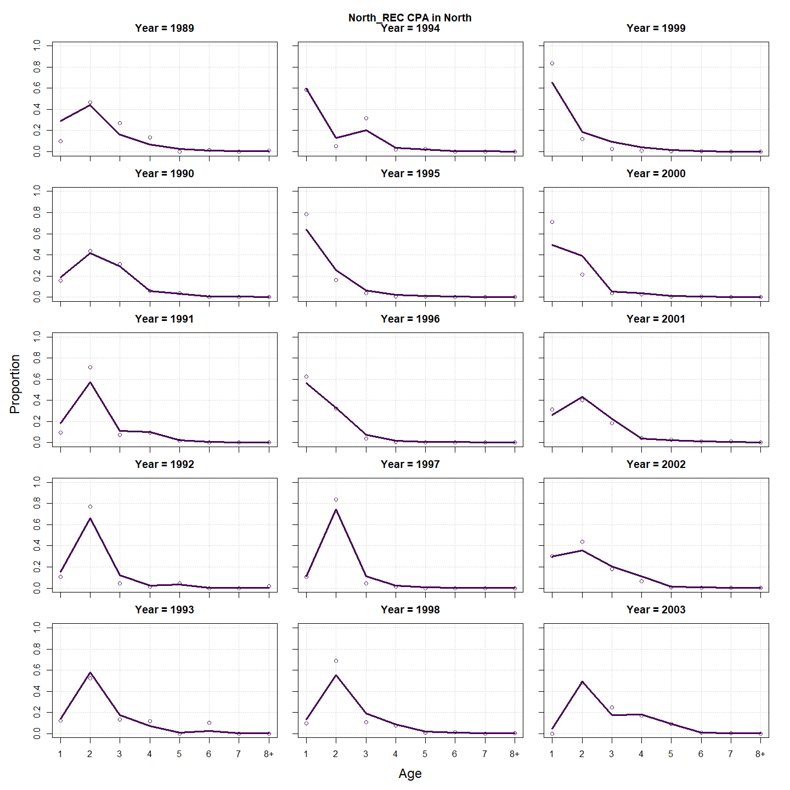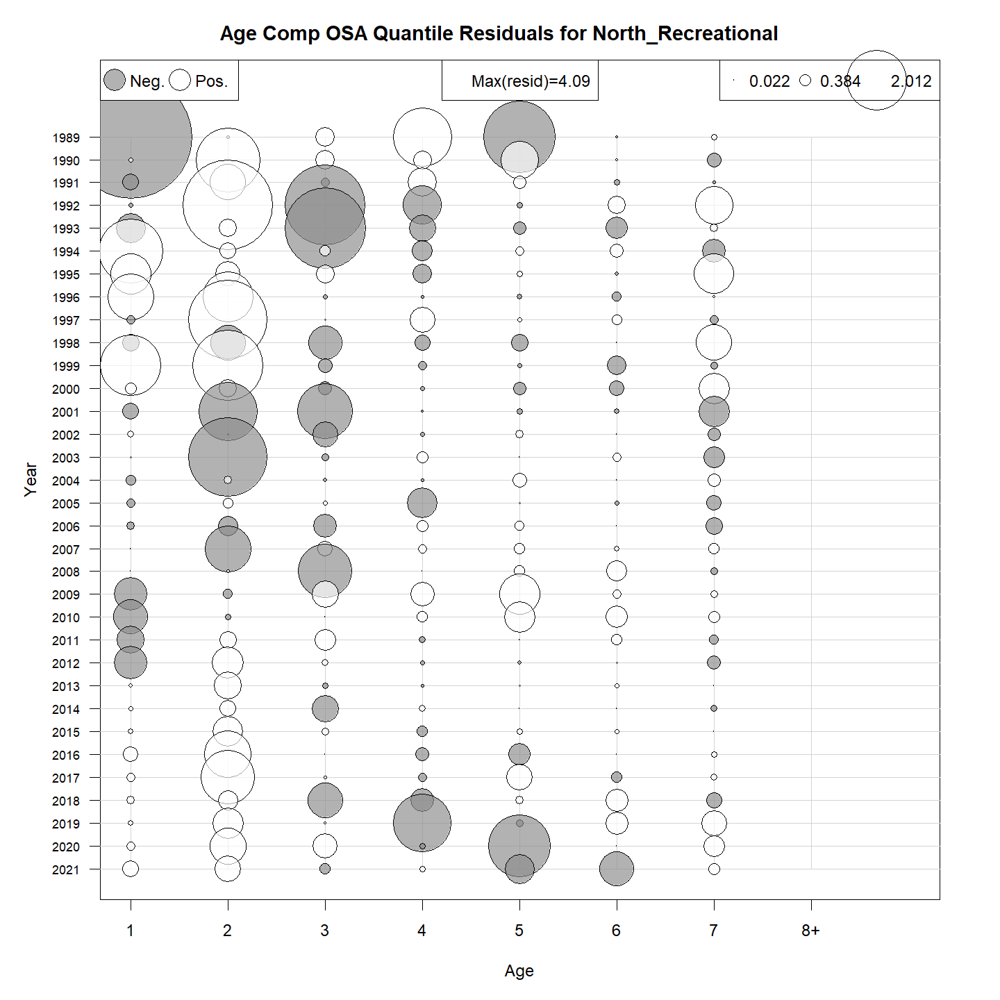

### Results

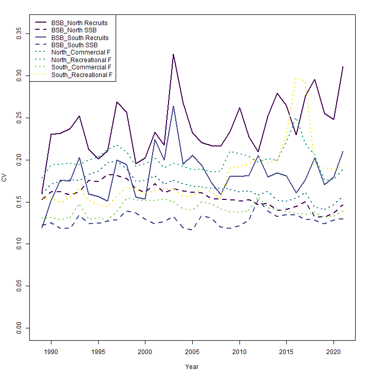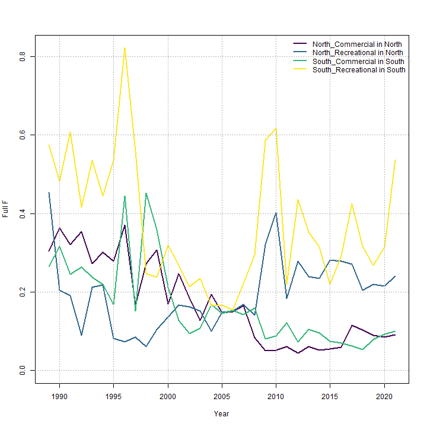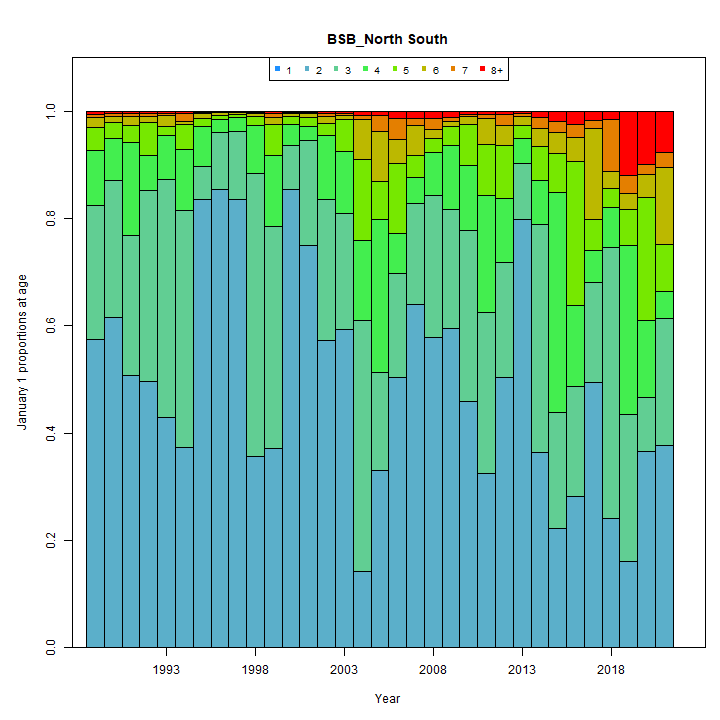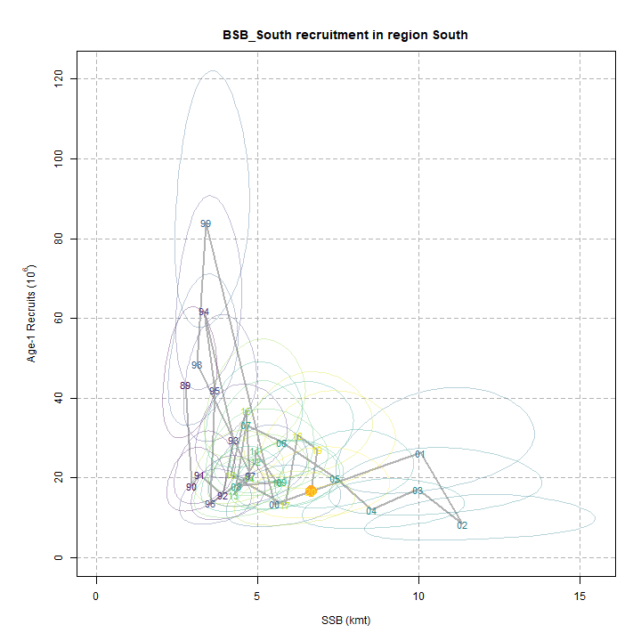

### Retro

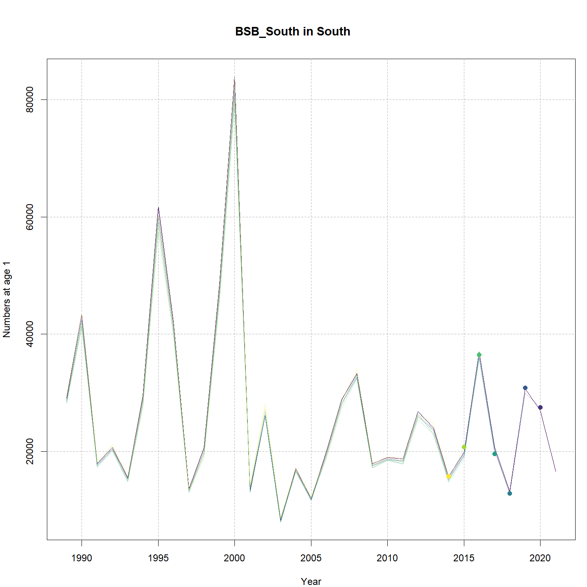

### Reference points

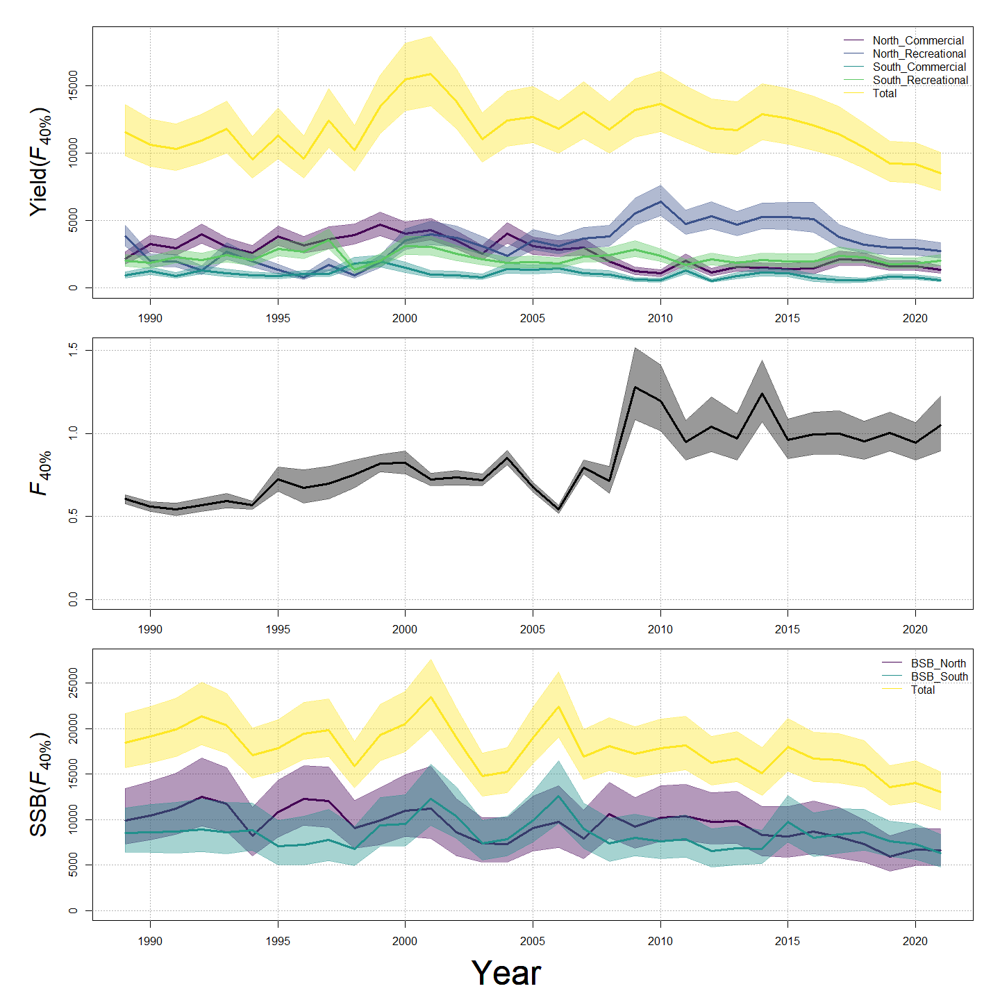

### Miscelaneous

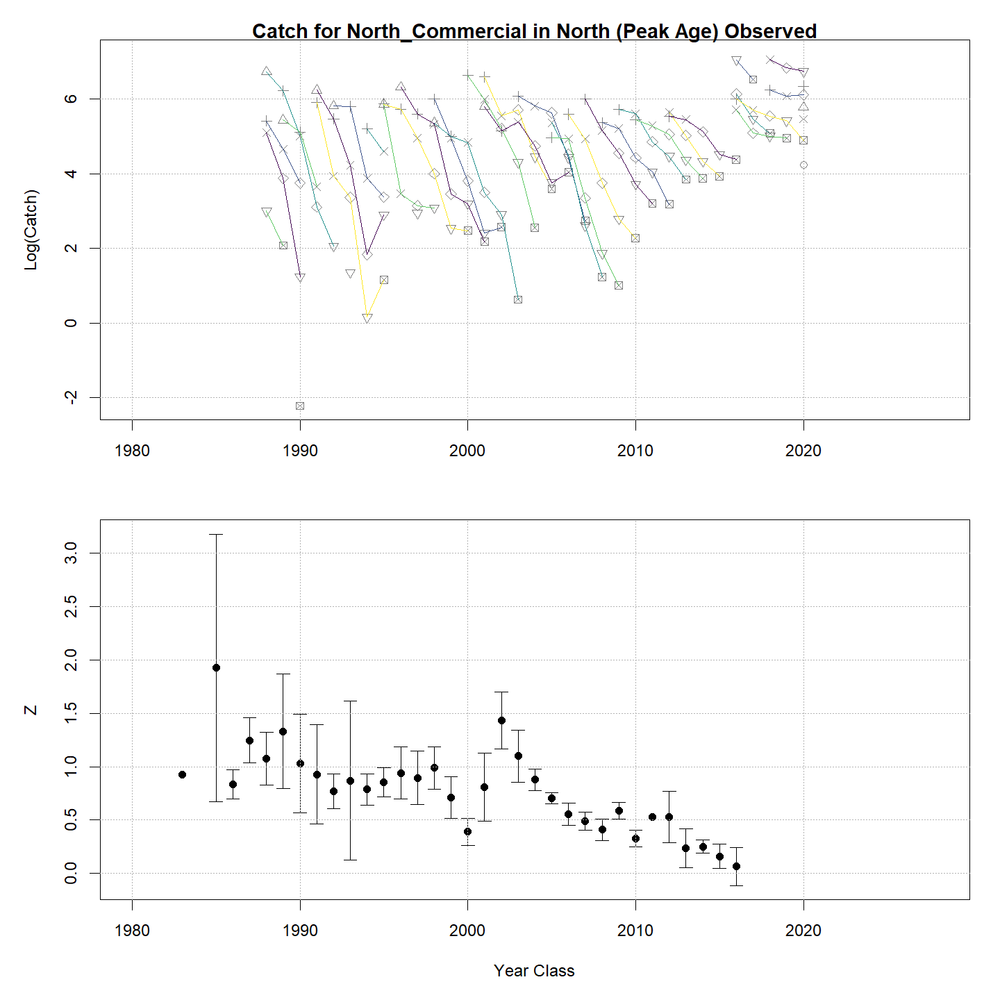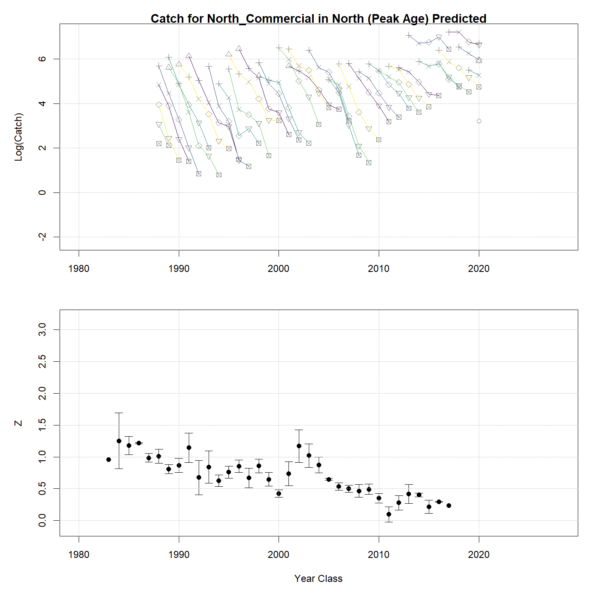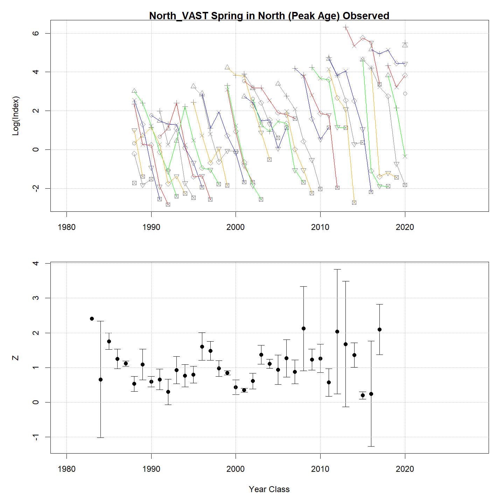

## Tables {.tabset}

### Parameter estimates

<table class="table" style="margin-left: auto; margin-right: auto;">
<caption>Parameter estimates, standard errors, and confidence intervals. Rounded to 3 decimal places.</caption>
 <thead>
  <tr>
   <th style="text-align:left;">   </th>
   <th style="text-align:right;"> Estimate </th>
   <th style="text-align:right;"> Std. Error </th>
   <th style="text-align:right;"> 95\% CI lower </th>
   <th style="text-align:right;"> 95\% CI upper </th>
  </tr>
 </thead>
<tbody>
  <tr>
   <td style="text-align:left;"> BSB North Mean Recruitment </td>
   <td style="text-align:right;"> 13422.187 </td>
   <td style="text-align:right;"> 2831.374 </td>
   <td style="text-align:right;"> 8876.968 </td>
   <td style="text-align:right;"> 20294.666 </td>
  </tr>
  <tr>
   <td style="text-align:left;"> BSB North NAA $\sigma$ (age 1) </td>
   <td style="text-align:right;"> 0.966 </td>
   <td style="text-align:right;"> 0.129 </td>
   <td style="text-align:right;"> 0.744 </td>
   <td style="text-align:right;"> 1.254 </td>
  </tr>
  <tr>
   <td style="text-align:left;"> BSB North NAA $\sigma$ (age 2) </td>
   <td style="text-align:right;"> 0.441 </td>
   <td style="text-align:right;"> 0.039 </td>
   <td style="text-align:right;"> 0.371 </td>
   <td style="text-align:right;"> 0.525 </td>
  </tr>
  <tr>
   <td style="text-align:left;"> BSB South Mean Recruitment </td>
   <td style="text-align:right;"> 22963.321 </td>
   <td style="text-align:right;"> 3183.566 </td>
   <td style="text-align:right;"> 17499.542 </td>
   <td style="text-align:right;"> 30133.024 </td>
  </tr>
  <tr>
   <td style="text-align:left;"> BSB South NAA $\sigma$ (age 1) </td>
   <td style="text-align:right;"> 0.515 </td>
   <td style="text-align:right;"> 0.074 </td>
   <td style="text-align:right;"> 0.389 </td>
   <td style="text-align:right;"> 0.683 </td>
  </tr>
  <tr>
   <td style="text-align:left;"> BSB South NAA $\sigma$ (age 2) </td>
   <td style="text-align:right;"> 0.440 </td>
   <td style="text-align:right;"> 0.050 </td>
   <td style="text-align:right;"> 0.352 </td>
   <td style="text-align:right;"> 0.549 </td>
  </tr>
  <tr>
   <td style="text-align:left;"> North REC CPA fully selected q </td>
   <td style="text-align:right;"> 0.000 </td>
   <td style="text-align:right;"> 0.000 </td>
   <td style="text-align:right;"> 0.000 </td>
   <td style="text-align:right;"> 0.000 </td>
  </tr>
  <tr>
   <td style="text-align:left;"> North VAST Spring fully selected q </td>
   <td style="text-align:right;"> 0.010 </td>
   <td style="text-align:right;"> 0.001 </td>
   <td style="text-align:right;"> 0.008 </td>
   <td style="text-align:right;"> 0.013 </td>
  </tr>
  <tr>
   <td style="text-align:left;"> South REC CPA fully selected q </td>
   <td style="text-align:right;"> 0.000 </td>
   <td style="text-align:right;"> 0.000 </td>
   <td style="text-align:right;"> 0.000 </td>
   <td style="text-align:right;"> 0.000 </td>
  </tr>
  <tr>
   <td style="text-align:left;"> South VAST Spring fully selected q </td>
   <td style="text-align:right;"> 0.014 </td>
   <td style="text-align:right;"> 0.001 </td>
   <td style="text-align:right;"> 0.012 </td>
   <td style="text-align:right;"> 0.017 </td>
  </tr>
  <tr>
   <td style="text-align:left;"> Block 1: $a_{50}$ </td>
   <td style="text-align:right;"> 2.070 </td>
   <td style="text-align:right;"> 0.067 </td>
   <td style="text-align:right;"> 1.943 </td>
   <td style="text-align:right;"> 2.203 </td>
  </tr>
  <tr>
   <td style="text-align:left;"> Block 1: 1/slope (increasing) </td>
   <td style="text-align:right;"> 0.293 </td>
   <td style="text-align:right;"> 0.020 </td>
   <td style="text-align:right;"> 0.256 </td>
   <td style="text-align:right;"> 0.336 </td>
  </tr>
  <tr>
   <td style="text-align:left;"> Block 2: $a_{50}$ </td>
   <td style="text-align:right;"> 2.394 </td>
   <td style="text-align:right;"> 0.072 </td>
   <td style="text-align:right;"> 2.256 </td>
   <td style="text-align:right;"> 2.537 </td>
  </tr>
  <tr>
   <td style="text-align:left;"> Block 2: 1/slope (increasing) </td>
   <td style="text-align:right;"> 0.340 </td>
   <td style="text-align:right;"> 0.026 </td>
   <td style="text-align:right;"> 0.293 </td>
   <td style="text-align:right;"> 0.394 </td>
  </tr>
  <tr>
   <td style="text-align:left;"> Block 3: $a_{50}$ </td>
   <td style="text-align:right;"> 2.023 </td>
   <td style="text-align:right;"> 0.103 </td>
   <td style="text-align:right;"> 1.828 </td>
   <td style="text-align:right;"> 2.231 </td>
  </tr>
  <tr>
   <td style="text-align:left;"> Block 3: 1/slope (increasing) </td>
   <td style="text-align:right;"> 0.465 </td>
   <td style="text-align:right;"> 0.042 </td>
   <td style="text-align:right;"> 0.388 </td>
   <td style="text-align:right;"> 0.555 </td>
  </tr>
  <tr>
   <td style="text-align:left;"> Block 4: $a_{50}$ </td>
   <td style="text-align:right;"> 3.396 </td>
   <td style="text-align:right;"> 0.284 </td>
   <td style="text-align:right;"> 2.855 </td>
   <td style="text-align:right;"> 3.961 </td>
  </tr>
  <tr>
   <td style="text-align:left;"> Block 4: 1/slope (increasing) </td>
   <td style="text-align:right;"> 0.893 </td>
   <td style="text-align:right;"> 0.102 </td>
   <td style="text-align:right;"> 0.711 </td>
   <td style="text-align:right;"> 1.114 </td>
  </tr>
  <tr>
   <td style="text-align:left;"> Block 5: $a_{50}$ </td>
   <td style="text-align:right;"> 1.843 </td>
   <td style="text-align:right;"> 0.086 </td>
   <td style="text-align:right;"> 1.681 </td>
   <td style="text-align:right;"> 2.017 </td>
  </tr>
  <tr>
   <td style="text-align:left;"> Block 5: 1/slope (increasing) </td>
   <td style="text-align:right;"> 0.272 </td>
   <td style="text-align:right;"> 0.025 </td>
   <td style="text-align:right;"> 0.228 </td>
   <td style="text-align:right;"> 0.325 </td>
  </tr>
  <tr>
   <td style="text-align:left;"> Block 6: $a_{50}$ </td>
   <td style="text-align:right;"> 2.873 </td>
   <td style="text-align:right;"> 0.097 </td>
   <td style="text-align:right;"> 2.686 </td>
   <td style="text-align:right;"> 3.065 </td>
  </tr>
  <tr>
   <td style="text-align:left;"> Block 6: 1/slope (increasing) </td>
   <td style="text-align:right;"> 0.491 </td>
   <td style="text-align:right;"> 0.029 </td>
   <td style="text-align:right;"> 0.437 </td>
   <td style="text-align:right;"> 0.551 </td>
  </tr>
  <tr>
   <td style="text-align:left;"> Block 7: $a_{50}$ </td>
   <td style="text-align:right;"> 2.109 </td>
   <td style="text-align:right;"> 0.119 </td>
   <td style="text-align:right;"> 1.884 </td>
   <td style="text-align:right;"> 2.350 </td>
  </tr>
  <tr>
   <td style="text-align:left;"> Block 7: 1/slope (increasing) </td>
   <td style="text-align:right;"> 0.548 </td>
   <td style="text-align:right;"> 0.045 </td>
   <td style="text-align:right;"> 0.466 </td>
   <td style="text-align:right;"> 0.644 </td>
  </tr>
  <tr>
   <td style="text-align:left;"> Block 8: $a_{50}$ </td>
   <td style="text-align:right;"> 4.363 </td>
   <td style="text-align:right;"> 0.406 </td>
   <td style="text-align:right;"> 3.563 </td>
   <td style="text-align:right;"> 5.134 </td>
  </tr>
  <tr>
   <td style="text-align:left;"> Block 8: 1/slope (increasing) </td>
   <td style="text-align:right;"> 1.258 </td>
   <td style="text-align:right;"> 0.115 </td>
   <td style="text-align:right;"> 1.049 </td>
   <td style="text-align:right;"> 1.500 </td>
  </tr>
  <tr>
   <td style="text-align:left;"> Block 9: Selectivity for age 1 </td>
   <td style="text-align:right;"> 0.301 </td>
   <td style="text-align:right;"> 0.027 </td>
   <td style="text-align:right;"> 0.251 </td>
   <td style="text-align:right;"> 0.356 </td>
  </tr>
  <tr>
   <td style="text-align:left;"> Block 9: Selectivity for age 2 </td>
   <td style="text-align:right;"> 1.000 </td>
   <td style="text-align:right;"> -- </td>
   <td style="text-align:right;"> -- </td>
   <td style="text-align:right;"> -- </td>
  </tr>
  <tr>
   <td style="text-align:left;"> Block 9: Selectivity for age 3 </td>
   <td style="text-align:right;"> 1.000 </td>
   <td style="text-align:right;"> -- </td>
   <td style="text-align:right;"> -- </td>
   <td style="text-align:right;"> -- </td>
  </tr>
  <tr>
   <td style="text-align:left;"> Block 9: Selectivity for age 4 </td>
   <td style="text-align:right;"> 1.000 </td>
   <td style="text-align:right;"> -- </td>
   <td style="text-align:right;"> -- </td>
   <td style="text-align:right;"> -- </td>
  </tr>
  <tr>
   <td style="text-align:left;"> Block 9: Selectivity for age 5 </td>
   <td style="text-align:right;"> 1.000 </td>
   <td style="text-align:right;"> -- </td>
   <td style="text-align:right;"> -- </td>
   <td style="text-align:right;"> -- </td>
  </tr>
  <tr>
   <td style="text-align:left;"> Block 9: Selectivity for age 6 </td>
   <td style="text-align:right;"> 1.000 </td>
   <td style="text-align:right;"> -- </td>
   <td style="text-align:right;"> -- </td>
   <td style="text-align:right;"> -- </td>
  </tr>
  <tr>
   <td style="text-align:left;"> Block 9: Selectivity for age 7 </td>
   <td style="text-align:right;"> 1.000 </td>
   <td style="text-align:right;"> -- </td>
   <td style="text-align:right;"> -- </td>
   <td style="text-align:right;"> -- </td>
  </tr>
  <tr>
   <td style="text-align:left;"> Block 9: Selectivity for age 8+ </td>
   <td style="text-align:right;"> 1.000 </td>
   <td style="text-align:right;"> -- </td>
   <td style="text-align:right;"> -- </td>
   <td style="text-align:right;"> -- </td>
  </tr>
  <tr>
   <td style="text-align:left;"> Block 10: Mean $a_{50}$ </td>
   <td style="text-align:right;"> 2.134 </td>
   <td style="text-align:right;"> 0.222 </td>
   <td style="text-align:right;"> 1.727 </td>
   <td style="text-align:right;"> 2.596 </td>
  </tr>
  <tr>
   <td style="text-align:left;"> Block 10: Mean 1/slope (increasing) </td>
   <td style="text-align:right;"> 0.427 </td>
   <td style="text-align:right;"> 0.062 </td>
   <td style="text-align:right;"> 0.320 </td>
   <td style="text-align:right;"> 0.567 </td>
  </tr>
  <tr>
   <td style="text-align:left;"> Block 11: $a_{50}$ </td>
   <td style="text-align:right;"> 1.188 </td>
   <td style="text-align:right;"> 0.087 </td>
   <td style="text-align:right;"> 1.027 </td>
   <td style="text-align:right;"> 1.369 </td>
  </tr>
  <tr>
   <td style="text-align:left;"> Block 11: 1/slope (increasing) </td>
   <td style="text-align:right;"> 0.360 </td>
   <td style="text-align:right;"> 0.085 </td>
   <td style="text-align:right;"> 0.226 </td>
   <td style="text-align:right;"> 0.567 </td>
  </tr>
  <tr>
   <td style="text-align:left;"> Block 12: Selectivity for age 1 </td>
   <td style="text-align:right;"> 0.302 </td>
   <td style="text-align:right;"> 0.033 </td>
   <td style="text-align:right;"> 0.242 </td>
   <td style="text-align:right;"> 0.370 </td>
  </tr>
  <tr>
   <td style="text-align:left;"> Block 12: Selectivity for age 2 </td>
   <td style="text-align:right;"> 1.000 </td>
   <td style="text-align:right;"> -- </td>
   <td style="text-align:right;"> -- </td>
   <td style="text-align:right;"> -- </td>
  </tr>
  <tr>
   <td style="text-align:left;"> Block 12: Selectivity for age 3 </td>
   <td style="text-align:right;"> 1.000 </td>
   <td style="text-align:right;"> -- </td>
   <td style="text-align:right;"> -- </td>
   <td style="text-align:right;"> -- </td>
  </tr>
  <tr>
   <td style="text-align:left;"> Block 12: Selectivity for age 4 </td>
   <td style="text-align:right;"> 1.000 </td>
   <td style="text-align:right;"> -- </td>
   <td style="text-align:right;"> -- </td>
   <td style="text-align:right;"> -- </td>
  </tr>
  <tr>
   <td style="text-align:left;"> Block 12: Selectivity for age 5 </td>
   <td style="text-align:right;"> 1.000 </td>
   <td style="text-align:right;"> -- </td>
   <td style="text-align:right;"> -- </td>
   <td style="text-align:right;"> -- </td>
  </tr>
  <tr>
   <td style="text-align:left;"> Block 12: Selectivity for age 6 </td>
   <td style="text-align:right;"> 1.000 </td>
   <td style="text-align:right;"> -- </td>
   <td style="text-align:right;"> -- </td>
   <td style="text-align:right;"> -- </td>
  </tr>
  <tr>
   <td style="text-align:left;"> Block 12: Selectivity for age 7 </td>
   <td style="text-align:right;"> 1.000 </td>
   <td style="text-align:right;"> -- </td>
   <td style="text-align:right;"> -- </td>
   <td style="text-align:right;"> -- </td>
  </tr>
  <tr>
   <td style="text-align:left;"> Block 12: Selectivity for age 8+ </td>
   <td style="text-align:right;"> 1.000 </td>
   <td style="text-align:right;"> -- </td>
   <td style="text-align:right;"> -- </td>
   <td style="text-align:right;"> -- </td>
  </tr>
  <tr>
   <td style="text-align:left;"> Block 10: Selectivity RE $\sigma$ </td>
   <td style="text-align:right;"> 0.316 </td>
   <td style="text-align:right;"> 0.073 </td>
   <td style="text-align:right;"> 0.201 </td>
   <td style="text-align:right;"> 0.496 </td>
  </tr>
  <tr>
   <td style="text-align:left;"> Block 10: Selectivity RE AR1 $\rho$ (year) </td>
   <td style="text-align:right;"> 0.319 </td>
   <td style="text-align:right;"> 0.196 </td>
   <td style="text-align:right;"> 0.083 </td>
   <td style="text-align:right;"> 0.845 </td>
  </tr>
  <tr>
   <td style="text-align:left;"> North Commercial in North age comp, Dirichlet-multinomial: dispersion ($\phi$) </td>
   <td style="text-align:right;"> 82.816 </td>
   <td style="text-align:right;"> 14.092 </td>
   <td style="text-align:right;"> 59.330 </td>
   <td style="text-align:right;"> 115.599 </td>
  </tr>
  <tr>
   <td style="text-align:left;"> North Recreational in North age comp, Dirichlet-multinomial: dispersion ($\phi$) </td>
   <td style="text-align:right;"> 102.450 </td>
   <td style="text-align:right;"> 21.558 </td>
   <td style="text-align:right;"> 67.827 </td>
   <td style="text-align:right;"> 154.747 </td>
  </tr>
  <tr>
   <td style="text-align:left;"> South Commercial in South age comp, Dirichlet-multinomial: dispersion ($\phi$) </td>
   <td style="text-align:right;"> 62.406 </td>
   <td style="text-align:right;"> 8.895 </td>
   <td style="text-align:right;"> 47.195 </td>
   <td style="text-align:right;"> 82.519 </td>
  </tr>
  <tr>
   <td style="text-align:left;"> South Recreational in South age comp, Dirichlet-multinomial: dispersion ($\phi$) </td>
   <td style="text-align:right;"> 127.672 </td>
   <td style="text-align:right;"> 31.049 </td>
   <td style="text-align:right;"> 79.266 </td>
   <td style="text-align:right;"> 205.638 </td>
  </tr>
  <tr>
   <td style="text-align:left;"> North REC CPA in North age comp, Dirichlet-multinomial: dispersion ($\phi$) </td>
   <td style="text-align:right;"> 93.827 </td>
   <td style="text-align:right;"> 20.168 </td>
   <td style="text-align:right;"> 61.570 </td>
   <td style="text-align:right;"> 142.986 </td>
  </tr>
  <tr>
   <td style="text-align:left;"> North VAST Spring in North age comp, Dirichlet-multinomial: dispersion ($\phi$) </td>
   <td style="text-align:right;"> 29.735 </td>
   <td style="text-align:right;"> 3.767 </td>
   <td style="text-align:right;"> 23.198 </td>
   <td style="text-align:right;"> 38.115 </td>
  </tr>
  <tr>
   <td style="text-align:left;"> South REC CPA in South age comp, Dirichlet-multinomial: dispersion ($\phi$) </td>
   <td style="text-align:right;"> 167.468 </td>
   <td style="text-align:right;"> 61.131 </td>
   <td style="text-align:right;"> 81.887 </td>
   <td style="text-align:right;"> 342.489 </td>
  </tr>
  <tr>
   <td style="text-align:left;"> South VAST Spring in South age comp, Dirichlet-multinomial: dispersion ($\phi$) </td>
   <td style="text-align:right;"> 31.399 </td>
   <td style="text-align:right;"> 3.859 </td>
   <td style="text-align:right;"> 24.678 </td>
   <td style="text-align:right;"> 39.950 </td>
  </tr>
  <tr>
   <td style="text-align:left;"> North REC CPA log-index observation SD scalar </td>
   <td style="text-align:right;"> 4.272 </td>
   <td style="text-align:right;"> 1.095 </td>
   <td style="text-align:right;"> 2.585 </td>
   <td style="text-align:right;"> 7.059 </td>
  </tr>
  <tr>
   <td style="text-align:left;"> South REC CPA log-index observation SD scalar </td>
   <td style="text-align:right;"> 3.107 </td>
   <td style="text-align:right;"> 1.286 </td>
   <td style="text-align:right;"> 1.380 </td>
   <td style="text-align:right;"> 6.994 </td>
  </tr>
</tbody>
</table>

### Abundance at age

<table class="table" style="margin-left: auto; margin-right: auto;">
<caption>Abundance at age (1000s) for BSB North in North.</caption>
 <thead>
  <tr>
   <th style="text-align:left;">   </th>
   <th style="text-align:right;"> 1 </th>
   <th style="text-align:right;"> 2 </th>
   <th style="text-align:right;"> 3 </th>
   <th style="text-align:right;"> 4 </th>
   <th style="text-align:right;"> 5 </th>
   <th style="text-align:right;"> 6 </th>
   <th style="text-align:right;"> 7 </th>
   <th style="text-align:right;"> 8+ </th>
  </tr>
 </thead>
<tbody>
  <tr>
   <td style="text-align:left;"> 1989 </td>
   <td style="text-align:right;"> 7646 </td>
   <td style="text-align:right;"> 3855 </td>
   <td style="text-align:right;"> 1662 </td>
   <td style="text-align:right;"> 692 </td>
   <td style="text-align:right;"> 287 </td>
   <td style="text-align:right;"> 119 </td>
   <td style="text-align:right;"> 49 </td>
   <td style="text-align:right;"> 35 </td>
  </tr>
  <tr>
   <td style="text-align:left;"> 1990 </td>
   <td style="text-align:right;"> 3421 </td>
   <td style="text-align:right;"> 2284 </td>
   <td style="text-align:right;"> 1933 </td>
   <td style="text-align:right;"> 365 </td>
   <td style="text-align:right;"> 211 </td>
   <td style="text-align:right;"> 49 </td>
   <td style="text-align:right;"> 35 </td>
   <td style="text-align:right;"> 21 </td>
  </tr>
  <tr>
   <td style="text-align:left;"> 1991 </td>
   <td style="text-align:right;"> 3025 </td>
   <td style="text-align:right;"> 3040 </td>
   <td style="text-align:right;"> 625 </td>
   <td style="text-align:right;"> 604 </td>
   <td style="text-align:right;"> 125 </td>
   <td style="text-align:right;"> 51 </td>
   <td style="text-align:right;"> 20 </td>
   <td style="text-align:right;"> 21 </td>
  </tr>
  <tr>
   <td style="text-align:left;"> 1992 </td>
   <td style="text-align:right;"> 2849 </td>
   <td style="text-align:right;"> 3960 </td>
   <td style="text-align:right;"> 750 </td>
   <td style="text-align:right;"> 151 </td>
   <td style="text-align:right;"> 215 </td>
   <td style="text-align:right;"> 31 </td>
   <td style="text-align:right;"> 17 </td>
   <td style="text-align:right;"> 24 </td>
  </tr>
  <tr>
   <td style="text-align:left;"> 1993 </td>
   <td style="text-align:right;"> 1974 </td>
   <td style="text-align:right;"> 2667 </td>
   <td style="text-align:right;"> 837 </td>
   <td style="text-align:right;"> 368 </td>
   <td style="text-align:right;"> 44 </td>
   <td style="text-align:right;"> 128 </td>
   <td style="text-align:right;"> 13 </td>
   <td style="text-align:right;"> 15 </td>
  </tr>
  <tr>
   <td style="text-align:left;"> 1994 </td>
   <td style="text-align:right;"> 12622 </td>
   <td style="text-align:right;"> 854 </td>
   <td style="text-align:right;"> 1515 </td>
   <td style="text-align:right;"> 284 </td>
   <td style="text-align:right;"> 171 </td>
   <td style="text-align:right;"> 26 </td>
   <td style="text-align:right;"> 37 </td>
   <td style="text-align:right;"> 13 </td>
  </tr>
  <tr>
   <td style="text-align:left;"> 1995 </td>
   <td style="text-align:right;"> 21110 </td>
   <td style="text-align:right;"> 2368 </td>
   <td style="text-align:right;"> 708 </td>
   <td style="text-align:right;"> 240 </td>
   <td style="text-align:right;"> 118 </td>
   <td style="text-align:right;"> 51 </td>
   <td style="text-align:right;"> 11 </td>
   <td style="text-align:right;"> 28 </td>
  </tr>
  <tr>
   <td style="text-align:left;"> 1996 </td>
   <td style="text-align:right;"> 22911 </td>
   <td style="text-align:right;"> 3845 </td>
   <td style="text-align:right;"> 1053 </td>
   <td style="text-align:right;"> 283 </td>
   <td style="text-align:right;"> 97 </td>
   <td style="text-align:right;"> 79 </td>
   <td style="text-align:right;"> 29 </td>
   <td style="text-align:right;"> 25 </td>
  </tr>
  <tr>
   <td style="text-align:left;"> 1997 </td>
   <td style="text-align:right;"> 5484 </td>
   <td style="text-align:right;"> 10931 </td>
   <td style="text-align:right;"> 1730 </td>
   <td style="text-align:right;"> 338 </td>
   <td style="text-align:right;"> 104 </td>
   <td style="text-align:right;"> 35 </td>
   <td style="text-align:right;"> 36 </td>
   <td style="text-align:right;"> 26 </td>
  </tr>
  <tr>
   <td style="text-align:left;"> 1998 </td>
   <td style="text-align:right;"> 3596 </td>
   <td style="text-align:right;"> 4382 </td>
   <td style="text-align:right;"> 1455 </td>
   <td style="text-align:right;"> 746 </td>
   <td style="text-align:right;"> 170 </td>
   <td style="text-align:right;"> 92 </td>
   <td style="text-align:right;"> 17 </td>
   <td style="text-align:right;"> 49 </td>
  </tr>
  <tr>
   <td style="text-align:left;"> 1999 </td>
   <td style="text-align:right;"> 38111 </td>
   <td style="text-align:right;"> 3328 </td>
   <td style="text-align:right;"> 1818 </td>
   <td style="text-align:right;"> 819 </td>
   <td style="text-align:right;"> 317 </td>
   <td style="text-align:right;"> 106 </td>
   <td style="text-align:right;"> 43 </td>
   <td style="text-align:right;"> 33 </td>
  </tr>
  <tr>
   <td style="text-align:left;"> 2000 </td>
   <td style="text-align:right;"> 41555 </td>
   <td style="text-align:right;"> 9252 </td>
   <td style="text-align:right;"> 1462 </td>
   <td style="text-align:right;"> 1107 </td>
   <td style="text-align:right;"> 350 </td>
   <td style="text-align:right;"> 213 </td>
   <td style="text-align:right;"> 43 </td>
   <td style="text-align:right;"> 50 </td>
  </tr>
  <tr>
   <td style="text-align:left;"> 2001 </td>
   <td style="text-align:right;"> 15722 </td>
   <td style="text-align:right;"> 7017 </td>
   <td style="text-align:right;"> 4432 </td>
   <td style="text-align:right;"> 831 </td>
   <td style="text-align:right;"> 499 </td>
   <td style="text-align:right;"> 216 </td>
   <td style="text-align:right;"> 150 </td>
   <td style="text-align:right;"> 51 </td>
  </tr>
  <tr>
   <td style="text-align:left;"> 2002 </td>
   <td style="text-align:right;"> 24114 </td>
   <td style="text-align:right;"> 8407 </td>
   <td style="text-align:right;"> 5509 </td>
   <td style="text-align:right;"> 3073 </td>
   <td style="text-align:right;"> 341 </td>
   <td style="text-align:right;"> 210 </td>
   <td style="text-align:right;"> 104 </td>
   <td style="text-align:right;"> 82 </td>
  </tr>
  <tr>
   <td style="text-align:left;"> 2003 </td>
   <td style="text-align:right;"> 2396 </td>
   <td style="text-align:right;"> 7438 </td>
   <td style="text-align:right;"> 2841 </td>
   <td style="text-align:right;"> 3206 </td>
   <td style="text-align:right;"> 1611 </td>
   <td style="text-align:right;"> 158 </td>
   <td style="text-align:right;"> 114 </td>
   <td style="text-align:right;"> 66 </td>
  </tr>
  <tr>
   <td style="text-align:left;"> 2004 </td>
   <td style="text-align:right;"> 4640 </td>
   <td style="text-align:right;"> 2723 </td>
   <td style="text-align:right;"> 4862 </td>
   <td style="text-align:right;"> 1235 </td>
   <td style="text-align:right;"> 1720 </td>
   <td style="text-align:right;"> 511 </td>
   <td style="text-align:right;"> 64 </td>
   <td style="text-align:right;"> 89 </td>
  </tr>
  <tr>
   <td style="text-align:left;"> 2005 </td>
   <td style="text-align:right;"> 8385 </td>
   <td style="text-align:right;"> 3322 </td>
   <td style="text-align:right;"> 1394 </td>
   <td style="text-align:right;"> 2598 </td>
   <td style="text-align:right;"> 962 </td>
   <td style="text-align:right;"> 819 </td>
   <td style="text-align:right;"> 199 </td>
   <td style="text-align:right;"> 78 </td>
  </tr>
  <tr>
   <td style="text-align:left;"> 2006 </td>
   <td style="text-align:right;"> 20486 </td>
   <td style="text-align:right;"> 5647 </td>
   <td style="text-align:right;"> 1657 </td>
   <td style="text-align:right;"> 1531 </td>
   <td style="text-align:right;"> 2069 </td>
   <td style="text-align:right;"> 478 </td>
   <td style="text-align:right;"> 416 </td>
   <td style="text-align:right;"> 96 </td>
  </tr>
  <tr>
   <td style="text-align:left;"> 2007 </td>
   <td style="text-align:right;"> 18716 </td>
   <td style="text-align:right;"> 9206 </td>
   <td style="text-align:right;"> 3127 </td>
   <td style="text-align:right;"> 1076 </td>
   <td style="text-align:right;"> 752 </td>
   <td style="text-align:right;"> 850 </td>
   <td style="text-align:right;"> 358 </td>
   <td style="text-align:right;"> 213 </td>
  </tr>
  <tr>
   <td style="text-align:left;"> 2008 </td>
   <td style="text-align:right;"> 24769 </td>
   <td style="text-align:right;"> 9917 </td>
   <td style="text-align:right;"> 6114 </td>
   <td style="text-align:right;"> 1892 </td>
   <td style="text-align:right;"> 492 </td>
   <td style="text-align:right;"> 332 </td>
   <td style="text-align:right;"> 396 </td>
   <td style="text-align:right;"> 259 </td>
  </tr>
  <tr>
   <td style="text-align:left;"> 2009 </td>
   <td style="text-align:right;"> 24242 </td>
   <td style="text-align:right;"> 16028 </td>
   <td style="text-align:right;"> 6961 </td>
   <td style="text-align:right;"> 4704 </td>
   <td style="text-align:right;"> 1041 </td>
   <td style="text-align:right;"> 231 </td>
   <td style="text-align:right;"> 153 </td>
   <td style="text-align:right;"> 309 </td>
  </tr>
  <tr>
   <td style="text-align:left;"> 2010 </td>
   <td style="text-align:right;"> 11843 </td>
   <td style="text-align:right;"> 11099 </td>
   <td style="text-align:right;"> 9690 </td>
   <td style="text-align:right;"> 4693 </td>
   <td style="text-align:right;"> 2544 </td>
   <td style="text-align:right;"> 508 </td>
   <td style="text-align:right;"> 110 </td>
   <td style="text-align:right;"> 187 </td>
  </tr>
  <tr>
   <td style="text-align:left;"> 2011 </td>
   <td style="text-align:right;"> 22921 </td>
   <td style="text-align:right;"> 9767 </td>
   <td style="text-align:right;"> 5798 </td>
   <td style="text-align:right;"> 5214 </td>
   <td style="text-align:right;"> 1907 </td>
   <td style="text-align:right;"> 1095 </td>
   <td style="text-align:right;"> 239 </td>
   <td style="text-align:right;"> 124 </td>
  </tr>
  <tr>
   <td style="text-align:left;"> 2012 </td>
   <td style="text-align:right;"> 81668 </td>
   <td style="text-align:right;"> 19442 </td>
   <td style="text-align:right;"> 9909 </td>
   <td style="text-align:right;"> 5507 </td>
   <td style="text-align:right;"> 3939 </td>
   <td style="text-align:right;"> 1457 </td>
   <td style="text-align:right;"> 758 </td>
   <td style="text-align:right;"> 239 </td>
  </tr>
  <tr>
   <td style="text-align:left;"> 2013 </td>
   <td style="text-align:right;"> 26900 </td>
   <td style="text-align:right;"> 29621 </td>
   <td style="text-align:right;"> 6439 </td>
   <td style="text-align:right;"> 5526 </td>
   <td style="text-align:right;"> 3122 </td>
   <td style="text-align:right;"> 1936 </td>
   <td style="text-align:right;"> 660 </td>
   <td style="text-align:right;"> 483 </td>
  </tr>
  <tr>
   <td style="text-align:left;"> 2014 </td>
   <td style="text-align:right;"> 16043 </td>
   <td style="text-align:right;"> 15572 </td>
   <td style="text-align:right;"> 34451 </td>
   <td style="text-align:right;"> 5914 </td>
   <td style="text-align:right;"> 3393 </td>
   <td style="text-align:right;"> 1898 </td>
   <td style="text-align:right;"> 1172 </td>
   <td style="text-align:right;"> 626 </td>
  </tr>
  <tr>
   <td style="text-align:left;"> 2015 </td>
   <td style="text-align:right;"> 16787 </td>
   <td style="text-align:right;"> 12813 </td>
   <td style="text-align:right;"> 9892 </td>
   <td style="text-align:right;"> 20045 </td>
   <td style="text-align:right;"> 3569 </td>
   <td style="text-align:right;"> 1779 </td>
   <td style="text-align:right;"> 933 </td>
   <td style="text-align:right;"> 901 </td>
  </tr>
  <tr>
   <td style="text-align:left;"> 2016 </td>
   <td style="text-align:right;"> 46240 </td>
   <td style="text-align:right;"> 19197 </td>
   <td style="text-align:right;"> 6150 </td>
   <td style="text-align:right;"> 6770 </td>
   <td style="text-align:right;"> 20321 </td>
   <td style="text-align:right;"> 1975 </td>
   <td style="text-align:right;"> 1133 </td>
   <td style="text-align:right;"> 1011 </td>
  </tr>
  <tr>
   <td style="text-align:left;"> 2017 </td>
   <td style="text-align:right;"> 21266 </td>
   <td style="text-align:right;"> 41978 </td>
   <td style="text-align:right;"> 7902 </td>
   <td style="text-align:right;"> 4078 </td>
   <td style="text-align:right;"> 3963 </td>
   <td style="text-align:right;"> 13591 </td>
   <td style="text-align:right;"> 968 </td>
   <td style="text-align:right;"> 1027 </td>
  </tr>
  <tr>
   <td style="text-align:left;"> 2018 </td>
   <td style="text-align:right;"> 9499 </td>
   <td style="text-align:right;"> 15988 </td>
   <td style="text-align:right;"> 19585 </td>
   <td style="text-align:right;"> 4735 </td>
   <td style="text-align:right;"> 2147 </td>
   <td style="text-align:right;"> 2451 </td>
   <td style="text-align:right;"> 8595 </td>
   <td style="text-align:right;"> 958 </td>
  </tr>
  <tr>
   <td style="text-align:left;"> 2019 </td>
   <td style="text-align:right;"> 26100 </td>
   <td style="text-align:right;"> 7764 </td>
   <td style="text-align:right;"> 11667 </td>
   <td style="text-align:right;"> 20415 </td>
   <td style="text-align:right;"> 4135 </td>
   <td style="text-align:right;"> 1930 </td>
   <td style="text-align:right;"> 1773 </td>
   <td style="text-align:right;"> 8034 </td>
  </tr>
  <tr>
   <td style="text-align:left;"> 2020 </td>
   <td style="text-align:right;"> 29716 </td>
   <td style="text-align:right;"> 19207 </td>
   <td style="text-align:right;"> 4329 </td>
   <td style="text-align:right;"> 8226 </td>
   <td style="text-align:right;"> 13960 </td>
   <td style="text-align:right;"> 2854 </td>
   <td style="text-align:right;"> 1492 </td>
   <td style="text-align:right;"> 6329 </td>
  </tr>
  <tr>
   <td style="text-align:left;"> 2021 </td>
   <td style="text-align:right;"> 20930 </td>
   <td style="text-align:right;"> 21152 </td>
   <td style="text-align:right;"> 13932 </td>
   <td style="text-align:right;"> 2910 </td>
   <td style="text-align:right;"> 5889 </td>
   <td style="text-align:right;"> 11781 </td>
   <td style="text-align:right;"> 1783 </td>
   <td style="text-align:right;"> 5017 </td>
  </tr>
</tbody>
</table>

<table class="table" style="margin-left: auto; margin-right: auto;">
<caption>Abundance at age (1000s) for BSB North in South.</caption>
 <thead>
  <tr>
   <th style="text-align:left;">   </th>
   <th style="text-align:right;"> 1 </th>
   <th style="text-align:right;"> 2 </th>
   <th style="text-align:right;"> 3 </th>
   <th style="text-align:right;"> 4 </th>
   <th style="text-align:right;"> 5 </th>
   <th style="text-align:right;"> 6 </th>
   <th style="text-align:right;"> 7 </th>
   <th style="text-align:right;"> 8+ </th>
  </tr>
 </thead>
<tbody>
  <tr>
   <td style="text-align:left;"> 1989 </td>
   <td style="text-align:right;"> 0 </td>
   <td style="text-align:right;"> 237 </td>
   <td style="text-align:right;"> 102 </td>
   <td style="text-align:right;"> 42 </td>
   <td style="text-align:right;"> 18 </td>
   <td style="text-align:right;"> 7 </td>
   <td style="text-align:right;"> 3 </td>
   <td style="text-align:right;"> 2 </td>
  </tr>
  <tr>
   <td style="text-align:left;"> 1990 </td>
   <td style="text-align:right;"> 0 </td>
   <td style="text-align:right;"> 268 </td>
   <td style="text-align:right;"> 110 </td>
   <td style="text-align:right;"> 34 </td>
   <td style="text-align:right;"> 13 </td>
   <td style="text-align:right;"> 5 </td>
   <td style="text-align:right;"> 2 </td>
   <td style="text-align:right;"> 2 </td>
  </tr>
  <tr>
   <td style="text-align:left;"> 1991 </td>
   <td style="text-align:right;"> 0 </td>
   <td style="text-align:right;"> 132 </td>
   <td style="text-align:right;"> 68 </td>
   <td style="text-align:right;"> 45 </td>
   <td style="text-align:right;"> 8 </td>
   <td style="text-align:right;"> 5 </td>
   <td style="text-align:right;"> 1 </td>
   <td style="text-align:right;"> 1 </td>
  </tr>
  <tr>
   <td style="text-align:left;"> 1992 </td>
   <td style="text-align:right;"> 0 </td>
   <td style="text-align:right;"> 117 </td>
   <td style="text-align:right;"> 84 </td>
   <td style="text-align:right;"> 15 </td>
   <td style="text-align:right;"> 15 </td>
   <td style="text-align:right;"> 3 </td>
   <td style="text-align:right;"> 1 </td>
   <td style="text-align:right;"> 1 </td>
  </tr>
  <tr>
   <td style="text-align:left;"> 1993 </td>
   <td style="text-align:right;"> 0 </td>
   <td style="text-align:right;"> 110 </td>
   <td style="text-align:right;"> 113 </td>
   <td style="text-align:right;"> 21 </td>
   <td style="text-align:right;"> 4 </td>
   <td style="text-align:right;"> 6 </td>
   <td style="text-align:right;"> 1 </td>
   <td style="text-align:right;"> 1 </td>
  </tr>
  <tr>
   <td style="text-align:left;"> 1994 </td>
   <td style="text-align:right;"> 0 </td>
   <td style="text-align:right;"> 72 </td>
   <td style="text-align:right;"> 85 </td>
   <td style="text-align:right;"> 22 </td>
   <td style="text-align:right;"> 9 </td>
   <td style="text-align:right;"> 1 </td>
   <td style="text-align:right;"> 3 </td>
   <td style="text-align:right;"> 1 </td>
  </tr>
  <tr>
   <td style="text-align:left;"> 1995 </td>
   <td style="text-align:right;"> 0 </td>
   <td style="text-align:right;"> 384 </td>
   <td style="text-align:right;"> 28 </td>
   <td style="text-align:right;"> 35 </td>
   <td style="text-align:right;"> 7 </td>
   <td style="text-align:right;"> 4 </td>
   <td style="text-align:right;"> 1 </td>
   <td style="text-align:right;"> 1 </td>
  </tr>
  <tr>
   <td style="text-align:left;"> 1996 </td>
   <td style="text-align:right;"> 0 </td>
   <td style="text-align:right;"> 687 </td>
   <td style="text-align:right;"> 85 </td>
   <td style="text-align:right;"> 19 </td>
   <td style="text-align:right;"> 7 </td>
   <td style="text-align:right;"> 3 </td>
   <td style="text-align:right;"> 1 </td>
   <td style="text-align:right;"> 1 </td>
  </tr>
  <tr>
   <td style="text-align:left;"> 1997 </td>
   <td style="text-align:right;"> 0 </td>
   <td style="text-align:right;"> 815 </td>
   <td style="text-align:right;"> 123 </td>
   <td style="text-align:right;"> 25 </td>
   <td style="text-align:right;"> 7 </td>
   <td style="text-align:right;"> 2 </td>
   <td style="text-align:right;"> 2 </td>
   <td style="text-align:right;"> 1 </td>
  </tr>
  <tr>
   <td style="text-align:left;"> 1998 </td>
   <td style="text-align:right;"> 0 </td>
   <td style="text-align:right;"> 214 </td>
   <td style="text-align:right;"> 316 </td>
   <td style="text-align:right;"> 53 </td>
   <td style="text-align:right;"> 10 </td>
   <td style="text-align:right;"> 3 </td>
   <td style="text-align:right;"> 1 </td>
   <td style="text-align:right;"> 2 </td>
  </tr>
  <tr>
   <td style="text-align:left;"> 1999 </td>
   <td style="text-align:right;"> 0 </td>
   <td style="text-align:right;"> 137 </td>
   <td style="text-align:right;"> 153 </td>
   <td style="text-align:right;"> 49 </td>
   <td style="text-align:right;"> 21 </td>
   <td style="text-align:right;"> 5 </td>
   <td style="text-align:right;"> 2 </td>
   <td style="text-align:right;"> 2 </td>
  </tr>
  <tr>
   <td style="text-align:left;"> 2000 </td>
   <td style="text-align:right;"> 0 </td>
   <td style="text-align:right;"> 1196 </td>
   <td style="text-align:right;"> 116 </td>
   <td style="text-align:right;"> 53 </td>
   <td style="text-align:right;"> 22 </td>
   <td style="text-align:right;"> 9 </td>
   <td style="text-align:right;"> 3 </td>
   <td style="text-align:right;"> 2 </td>
  </tr>
  <tr>
   <td style="text-align:left;"> 2001 </td>
   <td style="text-align:right;"> 0 </td>
   <td style="text-align:right;"> 1331 </td>
   <td style="text-align:right;"> 348 </td>
   <td style="text-align:right;"> 47 </td>
   <td style="text-align:right;"> 32 </td>
   <td style="text-align:right;"> 10 </td>
   <td style="text-align:right;"> 6 </td>
   <td style="text-align:right;"> 3 </td>
  </tr>
  <tr>
   <td style="text-align:left;"> 2002 </td>
   <td style="text-align:right;"> 0 </td>
   <td style="text-align:right;"> 621 </td>
   <td style="text-align:right;"> 283 </td>
   <td style="text-align:right;"> 131 </td>
   <td style="text-align:right;"> 23 </td>
   <td style="text-align:right;"> 14 </td>
   <td style="text-align:right;"> 6 </td>
   <td style="text-align:right;"> 5 </td>
  </tr>
  <tr>
   <td style="text-align:left;"> 2003 </td>
   <td style="text-align:right;"> 0 </td>
   <td style="text-align:right;"> 884 </td>
   <td style="text-align:right;"> 321 </td>
   <td style="text-align:right;"> 171 </td>
   <td style="text-align:right;"> 90 </td>
   <td style="text-align:right;"> 10 </td>
   <td style="text-align:right;"> 6 </td>
   <td style="text-align:right;"> 5 </td>
  </tr>
  <tr>
   <td style="text-align:left;"> 2004 </td>
   <td style="text-align:right;"> 0 </td>
   <td style="text-align:right;"> 93 </td>
   <td style="text-align:right;"> 305 </td>
   <td style="text-align:right;"> 96 </td>
   <td style="text-align:right;"> 99 </td>
   <td style="text-align:right;"> 48 </td>
   <td style="text-align:right;"> 5 </td>
   <td style="text-align:right;"> 6 </td>
  </tr>
  <tr>
   <td style="text-align:left;"> 2005 </td>
   <td style="text-align:right;"> 0 </td>
   <td style="text-align:right;"> 185 </td>
   <td style="text-align:right;"> 101 </td>
   <td style="text-align:right;"> 159 </td>
   <td style="text-align:right;"> 39 </td>
   <td style="text-align:right;"> 53 </td>
   <td style="text-align:right;"> 16 </td>
   <td style="text-align:right;"> 5 </td>
  </tr>
  <tr>
   <td style="text-align:left;"> 2006 </td>
   <td style="text-align:right;"> 0 </td>
   <td style="text-align:right;"> 321 </td>
   <td style="text-align:right;"> 123 </td>
   <td style="text-align:right;"> 46 </td>
   <td style="text-align:right;"> 83 </td>
   <td style="text-align:right;"> 29 </td>
   <td style="text-align:right;"> 25 </td>
   <td style="text-align:right;"> 8 </td>
  </tr>
  <tr>
   <td style="text-align:left;"> 2007 </td>
   <td style="text-align:right;"> 0 </td>
   <td style="text-align:right;"> 712 </td>
   <td style="text-align:right;"> 211 </td>
   <td style="text-align:right;"> 54 </td>
   <td style="text-align:right;"> 45 </td>
   <td style="text-align:right;"> 61 </td>
   <td style="text-align:right;"> 15 </td>
   <td style="text-align:right;"> 16 </td>
  </tr>
  <tr>
   <td style="text-align:left;"> 2008 </td>
   <td style="text-align:right;"> 0 </td>
   <td style="text-align:right;"> 713 </td>
   <td style="text-align:right;"> 327 </td>
   <td style="text-align:right;"> 98 </td>
   <td style="text-align:right;"> 31 </td>
   <td style="text-align:right;"> 22 </td>
   <td style="text-align:right;"> 25 </td>
   <td style="text-align:right;"> 17 </td>
  </tr>
  <tr>
   <td style="text-align:left;"> 2009 </td>
   <td style="text-align:right;"> 0 </td>
   <td style="text-align:right;"> 998 </td>
   <td style="text-align:right;"> 372 </td>
   <td style="text-align:right;"> 202 </td>
   <td style="text-align:right;"> 59 </td>
   <td style="text-align:right;"> 16 </td>
   <td style="text-align:right;"> 10 </td>
   <td style="text-align:right;"> 20 </td>
  </tr>
  <tr>
   <td style="text-align:left;"> 2010 </td>
   <td style="text-align:right;"> 0 </td>
   <td style="text-align:right;"> 914 </td>
   <td style="text-align:right;"> 635 </td>
   <td style="text-align:right;"> 245 </td>
   <td style="text-align:right;"> 150 </td>
   <td style="text-align:right;"> 31 </td>
   <td style="text-align:right;"> 6 </td>
   <td style="text-align:right;"> 13 </td>
  </tr>
  <tr>
   <td style="text-align:left;"> 2011 </td>
   <td style="text-align:right;"> 0 </td>
   <td style="text-align:right;"> 470 </td>
   <td style="text-align:right;"> 432 </td>
   <td style="text-align:right;"> 317 </td>
   <td style="text-align:right;"> 136 </td>
   <td style="text-align:right;"> 69 </td>
   <td style="text-align:right;"> 13 </td>
   <td style="text-align:right;"> 8 </td>
  </tr>
  <tr>
   <td style="text-align:left;"> 2012 </td>
   <td style="text-align:right;"> 0 </td>
   <td style="text-align:right;"> 882 </td>
   <td style="text-align:right;"> 378 </td>
   <td style="text-align:right;"> 208 </td>
   <td style="text-align:right;"> 173 </td>
   <td style="text-align:right;"> 64 </td>
   <td style="text-align:right;"> 36 </td>
   <td style="text-align:right;"> 12 </td>
  </tr>
  <tr>
   <td style="text-align:left;"> 2013 </td>
   <td style="text-align:right;"> 0 </td>
   <td style="text-align:right;"> 5799 </td>
   <td style="text-align:right;"> 753 </td>
   <td style="text-align:right;"> 340 </td>
   <td style="text-align:right;"> 179 </td>
   <td style="text-align:right;"> 123 </td>
   <td style="text-align:right;"> 43 </td>
   <td style="text-align:right;"> 28 </td>
  </tr>
  <tr>
   <td style="text-align:left;"> 2014 </td>
   <td style="text-align:right;"> 0 </td>
   <td style="text-align:right;"> 1045 </td>
   <td style="text-align:right;"> 1222 </td>
   <td style="text-align:right;"> 237 </td>
   <td style="text-align:right;"> 179 </td>
   <td style="text-align:right;"> 100 </td>
   <td style="text-align:right;"> 58 </td>
   <td style="text-align:right;"> 33 </td>
  </tr>
  <tr>
   <td style="text-align:left;"> 2015 </td>
   <td style="text-align:right;"> 0 </td>
   <td style="text-align:right;"> 610 </td>
   <td style="text-align:right;"> 594 </td>
   <td style="text-align:right;"> 1127 </td>
   <td style="text-align:right;"> 202 </td>
   <td style="text-align:right;"> 108 </td>
   <td style="text-align:right;"> 55 </td>
   <td style="text-align:right;"> 52 </td>
  </tr>
  <tr>
   <td style="text-align:left;"> 2016 </td>
   <td style="text-align:right;"> 0 </td>
   <td style="text-align:right;"> 628 </td>
   <td style="text-align:right;"> 456 </td>
   <td style="text-align:right;"> 336 </td>
   <td style="text-align:right;"> 595 </td>
   <td style="text-align:right;"> 101 </td>
   <td style="text-align:right;"> 54 </td>
   <td style="text-align:right;"> 56 </td>
  </tr>
  <tr>
   <td style="text-align:left;"> 2017 </td>
   <td style="text-align:right;"> 0 </td>
   <td style="text-align:right;"> 1849 </td>
   <td style="text-align:right;"> 699 </td>
   <td style="text-align:right;"> 222 </td>
   <td style="text-align:right;"> 220 </td>
   <td style="text-align:right;"> 632 </td>
   <td style="text-align:right;"> 59 </td>
   <td style="text-align:right;"> 62 </td>
  </tr>
  <tr>
   <td style="text-align:left;"> 2018 </td>
   <td style="text-align:right;"> 0 </td>
   <td style="text-align:right;"> 886 </td>
   <td style="text-align:right;"> 1862 </td>
   <td style="text-align:right;"> 279 </td>
   <td style="text-align:right;"> 129 </td>
   <td style="text-align:right;"> 116 </td>
   <td style="text-align:right;"> 359 </td>
   <td style="text-align:right;"> 55 </td>
  </tr>
  <tr>
   <td style="text-align:left;"> 2019 </td>
   <td style="text-align:right;"> 0 </td>
   <td style="text-align:right;"> 371 </td>
   <td style="text-align:right;"> 629 </td>
   <td style="text-align:right;"> 719 </td>
   <td style="text-align:right;"> 156 </td>
   <td style="text-align:right;"> 68 </td>
   <td style="text-align:right;"> 74 </td>
   <td style="text-align:right;"> 276 </td>
  </tr>
  <tr>
   <td style="text-align:left;"> 2020 </td>
   <td style="text-align:right;"> 0 </td>
   <td style="text-align:right;"> 1084 </td>
   <td style="text-align:right;"> 300 </td>
   <td style="text-align:right;"> 428 </td>
   <td style="text-align:right;"> 678 </td>
   <td style="text-align:right;"> 127 </td>
   <td style="text-align:right;"> 58 </td>
   <td style="text-align:right;"> 293 </td>
  </tr>
  <tr>
   <td style="text-align:left;"> 2021 </td>
   <td style="text-align:right;"> 0 </td>
   <td style="text-align:right;"> 1175 </td>
   <td style="text-align:right;"> 737 </td>
   <td style="text-align:right;"> 156 </td>
   <td style="text-align:right;"> 272 </td>
   <td style="text-align:right;"> 446 </td>
   <td style="text-align:right;"> 87 </td>
   <td style="text-align:right;"> 236 </td>
  </tr>
</tbody>
</table>

<table class="table" style="margin-left: auto; margin-right: auto;">
<caption>Abundance at age (1000s) for BSB South in North.</caption>
 <thead>
  <tr>
   <th style="text-align:left;">   </th>
   <th style="text-align:right;"> 1 </th>
   <th style="text-align:right;"> 2 </th>
   <th style="text-align:right;"> 3 </th>
   <th style="text-align:right;"> 4 </th>
   <th style="text-align:right;"> 5 </th>
   <th style="text-align:right;"> 6 </th>
   <th style="text-align:right;"> 7 </th>
   <th style="text-align:right;"> 8+ </th>
  </tr>
 </thead>
<tbody>
  <tr>
   <td style="text-align:left;"> 1989 </td>
   <td style="text-align:right;"> 0 </td>
   <td style="text-align:right;"> 0 </td>
   <td style="text-align:right;"> 0 </td>
   <td style="text-align:right;"> 0 </td>
   <td style="text-align:right;"> 0 </td>
   <td style="text-align:right;"> 0 </td>
   <td style="text-align:right;"> 0 </td>
   <td style="text-align:right;"> 0 </td>
  </tr>
  <tr>
   <td style="text-align:left;"> 1990 </td>
   <td style="text-align:right;"> 0 </td>
   <td style="text-align:right;"> 0 </td>
   <td style="text-align:right;"> 0 </td>
   <td style="text-align:right;"> 0 </td>
   <td style="text-align:right;"> 0 </td>
   <td style="text-align:right;"> 0 </td>
   <td style="text-align:right;"> 0 </td>
   <td style="text-align:right;"> 0 </td>
  </tr>
  <tr>
   <td style="text-align:left;"> 1991 </td>
   <td style="text-align:right;"> 0 </td>
   <td style="text-align:right;"> 0 </td>
   <td style="text-align:right;"> 0 </td>
   <td style="text-align:right;"> 0 </td>
   <td style="text-align:right;"> 0 </td>
   <td style="text-align:right;"> 0 </td>
   <td style="text-align:right;"> 0 </td>
   <td style="text-align:right;"> 0 </td>
  </tr>
  <tr>
   <td style="text-align:left;"> 1992 </td>
   <td style="text-align:right;"> 0 </td>
   <td style="text-align:right;"> 0 </td>
   <td style="text-align:right;"> 0 </td>
   <td style="text-align:right;"> 0 </td>
   <td style="text-align:right;"> 0 </td>
   <td style="text-align:right;"> 0 </td>
   <td style="text-align:right;"> 0 </td>
   <td style="text-align:right;"> 0 </td>
  </tr>
  <tr>
   <td style="text-align:left;"> 1993 </td>
   <td style="text-align:right;"> 0 </td>
   <td style="text-align:right;"> 0 </td>
   <td style="text-align:right;"> 0 </td>
   <td style="text-align:right;"> 0 </td>
   <td style="text-align:right;"> 0 </td>
   <td style="text-align:right;"> 0 </td>
   <td style="text-align:right;"> 0 </td>
   <td style="text-align:right;"> 0 </td>
  </tr>
  <tr>
   <td style="text-align:left;"> 1994 </td>
   <td style="text-align:right;"> 0 </td>
   <td style="text-align:right;"> 0 </td>
   <td style="text-align:right;"> 0 </td>
   <td style="text-align:right;"> 0 </td>
   <td style="text-align:right;"> 0 </td>
   <td style="text-align:right;"> 0 </td>
   <td style="text-align:right;"> 0 </td>
   <td style="text-align:right;"> 0 </td>
  </tr>
  <tr>
   <td style="text-align:left;"> 1995 </td>
   <td style="text-align:right;"> 0 </td>
   <td style="text-align:right;"> 0 </td>
   <td style="text-align:right;"> 0 </td>
   <td style="text-align:right;"> 0 </td>
   <td style="text-align:right;"> 0 </td>
   <td style="text-align:right;"> 0 </td>
   <td style="text-align:right;"> 0 </td>
   <td style="text-align:right;"> 0 </td>
  </tr>
  <tr>
   <td style="text-align:left;"> 1996 </td>
   <td style="text-align:right;"> 0 </td>
   <td style="text-align:right;"> 0 </td>
   <td style="text-align:right;"> 0 </td>
   <td style="text-align:right;"> 0 </td>
   <td style="text-align:right;"> 0 </td>
   <td style="text-align:right;"> 0 </td>
   <td style="text-align:right;"> 0 </td>
   <td style="text-align:right;"> 0 </td>
  </tr>
  <tr>
   <td style="text-align:left;"> 1997 </td>
   <td style="text-align:right;"> 0 </td>
   <td style="text-align:right;"> 0 </td>
   <td style="text-align:right;"> 0 </td>
   <td style="text-align:right;"> 0 </td>
   <td style="text-align:right;"> 0 </td>
   <td style="text-align:right;"> 0 </td>
   <td style="text-align:right;"> 0 </td>
   <td style="text-align:right;"> 0 </td>
  </tr>
  <tr>
   <td style="text-align:left;"> 1998 </td>
   <td style="text-align:right;"> 0 </td>
   <td style="text-align:right;"> 0 </td>
   <td style="text-align:right;"> 0 </td>
   <td style="text-align:right;"> 0 </td>
   <td style="text-align:right;"> 0 </td>
   <td style="text-align:right;"> 0 </td>
   <td style="text-align:right;"> 0 </td>
   <td style="text-align:right;"> 0 </td>
  </tr>
  <tr>
   <td style="text-align:left;"> 1999 </td>
   <td style="text-align:right;"> 0 </td>
   <td style="text-align:right;"> 0 </td>
   <td style="text-align:right;"> 0 </td>
   <td style="text-align:right;"> 0 </td>
   <td style="text-align:right;"> 0 </td>
   <td style="text-align:right;"> 0 </td>
   <td style="text-align:right;"> 0 </td>
   <td style="text-align:right;"> 0 </td>
  </tr>
  <tr>
   <td style="text-align:left;"> 2000 </td>
   <td style="text-align:right;"> 0 </td>
   <td style="text-align:right;"> 0 </td>
   <td style="text-align:right;"> 0 </td>
   <td style="text-align:right;"> 0 </td>
   <td style="text-align:right;"> 0 </td>
   <td style="text-align:right;"> 0 </td>
   <td style="text-align:right;"> 0 </td>
   <td style="text-align:right;"> 0 </td>
  </tr>
  <tr>
   <td style="text-align:left;"> 2001 </td>
   <td style="text-align:right;"> 0 </td>
   <td style="text-align:right;"> 0 </td>
   <td style="text-align:right;"> 0 </td>
   <td style="text-align:right;"> 0 </td>
   <td style="text-align:right;"> 0 </td>
   <td style="text-align:right;"> 0 </td>
   <td style="text-align:right;"> 0 </td>
   <td style="text-align:right;"> 0 </td>
  </tr>
  <tr>
   <td style="text-align:left;"> 2002 </td>
   <td style="text-align:right;"> 0 </td>
   <td style="text-align:right;"> 0 </td>
   <td style="text-align:right;"> 0 </td>
   <td style="text-align:right;"> 0 </td>
   <td style="text-align:right;"> 0 </td>
   <td style="text-align:right;"> 0 </td>
   <td style="text-align:right;"> 0 </td>
   <td style="text-align:right;"> 0 </td>
  </tr>
  <tr>
   <td style="text-align:left;"> 2003 </td>
   <td style="text-align:right;"> 0 </td>
   <td style="text-align:right;"> 0 </td>
   <td style="text-align:right;"> 0 </td>
   <td style="text-align:right;"> 0 </td>
   <td style="text-align:right;"> 0 </td>
   <td style="text-align:right;"> 0 </td>
   <td style="text-align:right;"> 0 </td>
   <td style="text-align:right;"> 0 </td>
  </tr>
  <tr>
   <td style="text-align:left;"> 2004 </td>
   <td style="text-align:right;"> 0 </td>
   <td style="text-align:right;"> 0 </td>
   <td style="text-align:right;"> 0 </td>
   <td style="text-align:right;"> 0 </td>
   <td style="text-align:right;"> 0 </td>
   <td style="text-align:right;"> 0 </td>
   <td style="text-align:right;"> 0 </td>
   <td style="text-align:right;"> 0 </td>
  </tr>
  <tr>
   <td style="text-align:left;"> 2005 </td>
   <td style="text-align:right;"> 0 </td>
   <td style="text-align:right;"> 0 </td>
   <td style="text-align:right;"> 0 </td>
   <td style="text-align:right;"> 0 </td>
   <td style="text-align:right;"> 0 </td>
   <td style="text-align:right;"> 0 </td>
   <td style="text-align:right;"> 0 </td>
   <td style="text-align:right;"> 0 </td>
  </tr>
  <tr>
   <td style="text-align:left;"> 2006 </td>
   <td style="text-align:right;"> 0 </td>
   <td style="text-align:right;"> 0 </td>
   <td style="text-align:right;"> 0 </td>
   <td style="text-align:right;"> 0 </td>
   <td style="text-align:right;"> 0 </td>
   <td style="text-align:right;"> 0 </td>
   <td style="text-align:right;"> 0 </td>
   <td style="text-align:right;"> 0 </td>
  </tr>
  <tr>
   <td style="text-align:left;"> 2007 </td>
   <td style="text-align:right;"> 0 </td>
   <td style="text-align:right;"> 0 </td>
   <td style="text-align:right;"> 0 </td>
   <td style="text-align:right;"> 0 </td>
   <td style="text-align:right;"> 0 </td>
   <td style="text-align:right;"> 0 </td>
   <td style="text-align:right;"> 0 </td>
   <td style="text-align:right;"> 0 </td>
  </tr>
  <tr>
   <td style="text-align:left;"> 2008 </td>
   <td style="text-align:right;"> 0 </td>
   <td style="text-align:right;"> 0 </td>
   <td style="text-align:right;"> 0 </td>
   <td style="text-align:right;"> 0 </td>
   <td style="text-align:right;"> 0 </td>
   <td style="text-align:right;"> 0 </td>
   <td style="text-align:right;"> 0 </td>
   <td style="text-align:right;"> 0 </td>
  </tr>
  <tr>
   <td style="text-align:left;"> 2009 </td>
   <td style="text-align:right;"> 0 </td>
   <td style="text-align:right;"> 0 </td>
   <td style="text-align:right;"> 0 </td>
   <td style="text-align:right;"> 0 </td>
   <td style="text-align:right;"> 0 </td>
   <td style="text-align:right;"> 0 </td>
   <td style="text-align:right;"> 0 </td>
   <td style="text-align:right;"> 0 </td>
  </tr>
  <tr>
   <td style="text-align:left;"> 2010 </td>
   <td style="text-align:right;"> 0 </td>
   <td style="text-align:right;"> 0 </td>
   <td style="text-align:right;"> 0 </td>
   <td style="text-align:right;"> 0 </td>
   <td style="text-align:right;"> 0 </td>
   <td style="text-align:right;"> 0 </td>
   <td style="text-align:right;"> 0 </td>
   <td style="text-align:right;"> 0 </td>
  </tr>
  <tr>
   <td style="text-align:left;"> 2011 </td>
   <td style="text-align:right;"> 0 </td>
   <td style="text-align:right;"> 0 </td>
   <td style="text-align:right;"> 0 </td>
   <td style="text-align:right;"> 0 </td>
   <td style="text-align:right;"> 0 </td>
   <td style="text-align:right;"> 0 </td>
   <td style="text-align:right;"> 0 </td>
   <td style="text-align:right;"> 0 </td>
  </tr>
  <tr>
   <td style="text-align:left;"> 2012 </td>
   <td style="text-align:right;"> 0 </td>
   <td style="text-align:right;"> 0 </td>
   <td style="text-align:right;"> 0 </td>
   <td style="text-align:right;"> 0 </td>
   <td style="text-align:right;"> 0 </td>
   <td style="text-align:right;"> 0 </td>
   <td style="text-align:right;"> 0 </td>
   <td style="text-align:right;"> 0 </td>
  </tr>
  <tr>
   <td style="text-align:left;"> 2013 </td>
   <td style="text-align:right;"> 0 </td>
   <td style="text-align:right;"> 0 </td>
   <td style="text-align:right;"> 0 </td>
   <td style="text-align:right;"> 0 </td>
   <td style="text-align:right;"> 0 </td>
   <td style="text-align:right;"> 0 </td>
   <td style="text-align:right;"> 0 </td>
   <td style="text-align:right;"> 0 </td>
  </tr>
  <tr>
   <td style="text-align:left;"> 2014 </td>
   <td style="text-align:right;"> 0 </td>
   <td style="text-align:right;"> 0 </td>
   <td style="text-align:right;"> 0 </td>
   <td style="text-align:right;"> 0 </td>
   <td style="text-align:right;"> 0 </td>
   <td style="text-align:right;"> 0 </td>
   <td style="text-align:right;"> 0 </td>
   <td style="text-align:right;"> 0 </td>
  </tr>
  <tr>
   <td style="text-align:left;"> 2015 </td>
   <td style="text-align:right;"> 0 </td>
   <td style="text-align:right;"> 0 </td>
   <td style="text-align:right;"> 0 </td>
   <td style="text-align:right;"> 0 </td>
   <td style="text-align:right;"> 0 </td>
   <td style="text-align:right;"> 0 </td>
   <td style="text-align:right;"> 0 </td>
   <td style="text-align:right;"> 0 </td>
  </tr>
  <tr>
   <td style="text-align:left;"> 2016 </td>
   <td style="text-align:right;"> 0 </td>
   <td style="text-align:right;"> 0 </td>
   <td style="text-align:right;"> 0 </td>
   <td style="text-align:right;"> 0 </td>
   <td style="text-align:right;"> 0 </td>
   <td style="text-align:right;"> 0 </td>
   <td style="text-align:right;"> 0 </td>
   <td style="text-align:right;"> 0 </td>
  </tr>
  <tr>
   <td style="text-align:left;"> 2017 </td>
   <td style="text-align:right;"> 0 </td>
   <td style="text-align:right;"> 0 </td>
   <td style="text-align:right;"> 0 </td>
   <td style="text-align:right;"> 0 </td>
   <td style="text-align:right;"> 0 </td>
   <td style="text-align:right;"> 0 </td>
   <td style="text-align:right;"> 0 </td>
   <td style="text-align:right;"> 0 </td>
  </tr>
  <tr>
   <td style="text-align:left;"> 2018 </td>
   <td style="text-align:right;"> 0 </td>
   <td style="text-align:right;"> 0 </td>
   <td style="text-align:right;"> 0 </td>
   <td style="text-align:right;"> 0 </td>
   <td style="text-align:right;"> 0 </td>
   <td style="text-align:right;"> 0 </td>
   <td style="text-align:right;"> 0 </td>
   <td style="text-align:right;"> 0 </td>
  </tr>
  <tr>
   <td style="text-align:left;"> 2019 </td>
   <td style="text-align:right;"> 0 </td>
   <td style="text-align:right;"> 0 </td>
   <td style="text-align:right;"> 0 </td>
   <td style="text-align:right;"> 0 </td>
   <td style="text-align:right;"> 0 </td>
   <td style="text-align:right;"> 0 </td>
   <td style="text-align:right;"> 0 </td>
   <td style="text-align:right;"> 0 </td>
  </tr>
  <tr>
   <td style="text-align:left;"> 2020 </td>
   <td style="text-align:right;"> 0 </td>
   <td style="text-align:right;"> 0 </td>
   <td style="text-align:right;"> 0 </td>
   <td style="text-align:right;"> 0 </td>
   <td style="text-align:right;"> 0 </td>
   <td style="text-align:right;"> 0 </td>
   <td style="text-align:right;"> 0 </td>
   <td style="text-align:right;"> 0 </td>
  </tr>
  <tr>
   <td style="text-align:left;"> 2021 </td>
   <td style="text-align:right;"> 0 </td>
   <td style="text-align:right;"> 0 </td>
   <td style="text-align:right;"> 0 </td>
   <td style="text-align:right;"> 0 </td>
   <td style="text-align:right;"> 0 </td>
   <td style="text-align:right;"> 0 </td>
   <td style="text-align:right;"> 0 </td>
   <td style="text-align:right;"> 0 </td>
  </tr>
</tbody>
</table>

<table class="table" style="margin-left: auto; margin-right: auto;">
<caption>Abundance at age (1000s) for BSB South in South.</caption>
 <thead>
  <tr>
   <th style="text-align:left;">   </th>
   <th style="text-align:right;"> 1 </th>
   <th style="text-align:right;"> 2 </th>
   <th style="text-align:right;"> 3 </th>
   <th style="text-align:right;"> 4 </th>
   <th style="text-align:right;"> 5 </th>
   <th style="text-align:right;"> 6 </th>
   <th style="text-align:right;"> 7 </th>
   <th style="text-align:right;"> 8+ </th>
  </tr>
 </thead>
<tbody>
  <tr>
   <td style="text-align:left;"> 1989 </td>
   <td style="text-align:right;"> 29092 </td>
   <td style="text-align:right;"> 13982 </td>
   <td style="text-align:right;"> 5270 </td>
   <td style="text-align:right;"> 1866 </td>
   <td style="text-align:right;"> 653 </td>
   <td style="text-align:right;"> 228 </td>
   <td style="text-align:right;"> 80 </td>
   <td style="text-align:right;"> 43 </td>
  </tr>
  <tr>
   <td style="text-align:left;"> 1990 </td>
   <td style="text-align:right;"> 43435 </td>
   <td style="text-align:right;"> 13982 </td>
   <td style="text-align:right;"> 7033 </td>
   <td style="text-align:right;"> 1270 </td>
   <td style="text-align:right;"> 692 </td>
   <td style="text-align:right;"> 195 </td>
   <td style="text-align:right;"> 89 </td>
   <td style="text-align:right;"> 38 </td>
  </tr>
  <tr>
   <td style="text-align:left;"> 1991 </td>
   <td style="text-align:right;"> 17920 </td>
   <td style="text-align:right;"> 23382 </td>
   <td style="text-align:right;"> 4515 </td>
   <td style="text-align:right;"> 2426 </td>
   <td style="text-align:right;"> 484 </td>
   <td style="text-align:right;"> 222 </td>
   <td style="text-align:right;"> 92 </td>
   <td style="text-align:right;"> 45 </td>
  </tr>
  <tr>
   <td style="text-align:left;"> 1992 </td>
   <td style="text-align:right;"> 20707 </td>
   <td style="text-align:right;"> 23764 </td>
   <td style="text-align:right;"> 7229 </td>
   <td style="text-align:right;"> 1493 </td>
   <td style="text-align:right;"> 772 </td>
   <td style="text-align:right;"> 128 </td>
   <td style="text-align:right;"> 64 </td>
   <td style="text-align:right;"> 61 </td>
  </tr>
  <tr>
   <td style="text-align:left;"> 1993 </td>
   <td style="text-align:right;"> 15561 </td>
   <td style="text-align:right;"> 24607 </td>
   <td style="text-align:right;"> 7656 </td>
   <td style="text-align:right;"> 1891 </td>
   <td style="text-align:right;"> 383 </td>
   <td style="text-align:right;"> 282 </td>
   <td style="text-align:right;"> 50 </td>
   <td style="text-align:right;"> 50 </td>
  </tr>
  <tr>
   <td style="text-align:left;"> 1994 </td>
   <td style="text-align:right;"> 29452 </td>
   <td style="text-align:right;"> 5340 </td>
   <td style="text-align:right;"> 9681 </td>
   <td style="text-align:right;"> 2310 </td>
   <td style="text-align:right;"> 826 </td>
   <td style="text-align:right;"> 208 </td>
   <td style="text-align:right;"> 92 </td>
   <td style="text-align:right;"> 44 </td>
  </tr>
  <tr>
   <td style="text-align:left;"> 1995 </td>
   <td style="text-align:right;"> 61841 </td>
   <td style="text-align:right;"> 13399 </td>
   <td style="text-align:right;"> 5246 </td>
   <td style="text-align:right;"> 2080 </td>
   <td style="text-align:right;"> 839 </td>
   <td style="text-align:right;"> 290 </td>
   <td style="text-align:right;"> 97 </td>
   <td style="text-align:right;"> 72 </td>
  </tr>
  <tr>
   <td style="text-align:left;"> 1996 </td>
   <td style="text-align:right;"> 42130 </td>
   <td style="text-align:right;"> 15917 </td>
   <td style="text-align:right;"> 5597 </td>
   <td style="text-align:right;"> 1908 </td>
   <td style="text-align:right;"> 669 </td>
   <td style="text-align:right;"> 581 </td>
   <td style="text-align:right;"> 129 </td>
   <td style="text-align:right;"> 118 </td>
  </tr>
  <tr>
   <td style="text-align:left;"> 1997 </td>
   <td style="text-align:right;"> 13613 </td>
   <td style="text-align:right;"> 25611 </td>
   <td style="text-align:right;"> 7192 </td>
   <td style="text-align:right;"> 900 </td>
   <td style="text-align:right;"> 351 </td>
   <td style="text-align:right;"> 111 </td>
   <td style="text-align:right;"> 118 </td>
   <td style="text-align:right;"> 53 </td>
  </tr>
  <tr>
   <td style="text-align:left;"> 1998 </td>
   <td style="text-align:right;"> 20648 </td>
   <td style="text-align:right;"> 16154 </td>
   <td style="text-align:right;"> 5306 </td>
   <td style="text-align:right;"> 1886 </td>
   <td style="text-align:right;"> 355 </td>
   <td style="text-align:right;"> 231 </td>
   <td style="text-align:right;"> 36 </td>
   <td style="text-align:right;"> 81 </td>
  </tr>
  <tr>
   <td style="text-align:left;"> 1999 </td>
   <td style="text-align:right;"> 48550 </td>
   <td style="text-align:right;"> 7540 </td>
   <td style="text-align:right;"> 4599 </td>
   <td style="text-align:right;"> 1672 </td>
   <td style="text-align:right;"> 639 </td>
   <td style="text-align:right;"> 178 </td>
   <td style="text-align:right;"> 82 </td>
   <td style="text-align:right;"> 44 </td>
  </tr>
  <tr>
   <td style="text-align:left;"> 2000 </td>
   <td style="text-align:right;"> 83923 </td>
   <td style="text-align:right;"> 17335 </td>
   <td style="text-align:right;"> 4483 </td>
   <td style="text-align:right;"> 2165 </td>
   <td style="text-align:right;"> 661 </td>
   <td style="text-align:right;"> 294 </td>
   <td style="text-align:right;"> 70 </td>
   <td style="text-align:right;"> 74 </td>
  </tr>
  <tr>
   <td style="text-align:left;"> 2001 </td>
   <td style="text-align:right;"> 13389 </td>
   <td style="text-align:right;"> 31677 </td>
   <td style="text-align:right;"> 13482 </td>
   <td style="text-align:right;"> 2136 </td>
   <td style="text-align:right;"> 839 </td>
   <td style="text-align:right;"> 384 </td>
   <td style="text-align:right;"> 155 </td>
   <td style="text-align:right;"> 78 </td>
  </tr>
  <tr>
   <td style="text-align:left;"> 2002 </td>
   <td style="text-align:right;"> 26206 </td>
   <td style="text-align:right;"> 23305 </td>
   <td style="text-align:right;"> 18646 </td>
   <td style="text-align:right;"> 6422 </td>
   <td style="text-align:right;"> 748 </td>
   <td style="text-align:right;"> 409 </td>
   <td style="text-align:right;"> 175 </td>
   <td style="text-align:right;"> 104 </td>
  </tr>
  <tr>
   <td style="text-align:left;"> 2003 </td>
   <td style="text-align:right;"> 8296 </td>
   <td style="text-align:right;"> 25395 </td>
   <td style="text-align:right;"> 10962 </td>
   <td style="text-align:right;"> 9405 </td>
   <td style="text-align:right;"> 4157 </td>
   <td style="text-align:right;"> 368 </td>
   <td style="text-align:right;"> 272 </td>
   <td style="text-align:right;"> 114 </td>
  </tr>
  <tr>
   <td style="text-align:left;"> 2004 </td>
   <td style="text-align:right;"> 17098 </td>
   <td style="text-align:right;"> 15977 </td>
   <td style="text-align:right;"> 12416 </td>
   <td style="text-align:right;"> 3149 </td>
   <td style="text-align:right;"> 3685 </td>
   <td style="text-align:right;"> 980 </td>
   <td style="text-align:right;"> 144 </td>
   <td style="text-align:right;"> 187 </td>
  </tr>
  <tr>
   <td style="text-align:left;"> 2005 </td>
   <td style="text-align:right;"> 11951 </td>
   <td style="text-align:right;"> 17796 </td>
   <td style="text-align:right;"> 7290 </td>
   <td style="text-align:right;"> 4035 </td>
   <td style="text-align:right;"> 1686 </td>
   <td style="text-align:right;"> 1064 </td>
   <td style="text-align:right;"> 321 </td>
   <td style="text-align:right;"> 132 </td>
  </tr>
  <tr>
   <td style="text-align:left;"> 2006 </td>
   <td style="text-align:right;"> 19967 </td>
   <td style="text-align:right;"> 12934 </td>
   <td style="text-align:right;"> 4473 </td>
   <td style="text-align:right;"> 2881 </td>
   <td style="text-align:right;"> 2131 </td>
   <td style="text-align:right;"> 675 </td>
   <td style="text-align:right;"> 268 </td>
   <td style="text-align:right;"> 145 </td>
  </tr>
  <tr>
   <td style="text-align:left;"> 2007 </td>
   <td style="text-align:right;"> 28905 </td>
   <td style="text-align:right;"> 11552 </td>
   <td style="text-align:right;"> 4526 </td>
   <td style="text-align:right;"> 1832 </td>
   <td style="text-align:right;"> 978 </td>
   <td style="text-align:right;"> 688 </td>
   <td style="text-align:right;"> 422 </td>
   <td style="text-align:right;"> 187 </td>
  </tr>
  <tr>
   <td style="text-align:left;"> 2008 </td>
   <td style="text-align:right;"> 33314 </td>
   <td style="text-align:right;"> 13725 </td>
   <td style="text-align:right;"> 5108 </td>
   <td style="text-align:right;"> 1870 </td>
   <td style="text-align:right;"> 758 </td>
   <td style="text-align:right;"> 437 </td>
   <td style="text-align:right;"> 299 </td>
   <td style="text-align:right;"> 234 </td>
  </tr>
  <tr>
   <td style="text-align:left;"> 2009 </td>
   <td style="text-align:right;"> 17945 </td>
   <td style="text-align:right;"> 15720 </td>
   <td style="text-align:right;"> 8182 </td>
   <td style="text-align:right;"> 3209 </td>
   <td style="text-align:right;"> 738 </td>
   <td style="text-align:right;"> 353 </td>
   <td style="text-align:right;"> 196 </td>
   <td style="text-align:right;"> 267 </td>
  </tr>
  <tr>
   <td style="text-align:left;"> 2010 </td>
   <td style="text-align:right;"> 18993 </td>
   <td style="text-align:right;"> 12010 </td>
   <td style="text-align:right;"> 7344 </td>
   <td style="text-align:right;"> 4723 </td>
   <td style="text-align:right;"> 1698 </td>
   <td style="text-align:right;"> 458 </td>
   <td style="text-align:right;"> 141 </td>
   <td style="text-align:right;"> 316 </td>
  </tr>
  <tr>
   <td style="text-align:left;"> 2011 </td>
   <td style="text-align:right;"> 18761 </td>
   <td style="text-align:right;"> 10176 </td>
   <td style="text-align:right;"> 5507 </td>
   <td style="text-align:right;"> 4064 </td>
   <td style="text-align:right;"> 1781 </td>
   <td style="text-align:right;"> 739 </td>
   <td style="text-align:right;"> 117 </td>
   <td style="text-align:right;"> 157 </td>
  </tr>
  <tr>
   <td style="text-align:left;"> 2012 </td>
   <td style="text-align:right;"> 26814 </td>
   <td style="text-align:right;"> 8271 </td>
   <td style="text-align:right;"> 6867 </td>
   <td style="text-align:right;"> 3301 </td>
   <td style="text-align:right;"> 1859 </td>
   <td style="text-align:right;"> 1568 </td>
   <td style="text-align:right;"> 692 </td>
   <td style="text-align:right;"> 140 </td>
  </tr>
  <tr>
   <td style="text-align:left;"> 2013 </td>
   <td style="text-align:right;"> 24045 </td>
   <td style="text-align:right;"> 7372 </td>
   <td style="text-align:right;"> 4212 </td>
   <td style="text-align:right;"> 3785 </td>
   <td style="text-align:right;"> 1503 </td>
   <td style="text-align:right;"> 1337 </td>
   <td style="text-align:right;"> 477 </td>
   <td style="text-align:right;"> 183 </td>
  </tr>
  <tr>
   <td style="text-align:left;"> 2014 </td>
   <td style="text-align:right;"> 15694 </td>
   <td style="text-align:right;"> 9060 </td>
   <td style="text-align:right;"> 9577 </td>
   <td style="text-align:right;"> 1885 </td>
   <td style="text-align:right;"> 1344 </td>
   <td style="text-align:right;"> 728 </td>
   <td style="text-align:right;"> 396 </td>
   <td style="text-align:right;"> 146 </td>
  </tr>
  <tr>
   <td style="text-align:left;"> 2015 </td>
   <td style="text-align:right;"> 19857 </td>
   <td style="text-align:right;"> 11603 </td>
   <td style="text-align:right;"> 5069 </td>
   <td style="text-align:right;"> 3793 </td>
   <td style="text-align:right;"> 867 </td>
   <td style="text-align:right;"> 596 </td>
   <td style="text-align:right;"> 198 </td>
   <td style="text-align:right;"> 157 </td>
  </tr>
  <tr>
   <td style="text-align:left;"> 2016 </td>
   <td style="text-align:right;"> 36986 </td>
   <td style="text-align:right;"> 8579 </td>
   <td style="text-align:right;"> 4959 </td>
   <td style="text-align:right;"> 3083 </td>
   <td style="text-align:right;"> 2443 </td>
   <td style="text-align:right;"> 259 </td>
   <td style="text-align:right;"> 246 </td>
   <td style="text-align:right;"> 190 </td>
  </tr>
  <tr>
   <td style="text-align:left;"> 2017 </td>
   <td style="text-align:right;"> 20726 </td>
   <td style="text-align:right;"> 13491 </td>
   <td style="text-align:right;"> 8456 </td>
   <td style="text-align:right;"> 3292 </td>
   <td style="text-align:right;"> 1295 </td>
   <td style="text-align:right;"> 1751 </td>
   <td style="text-align:right;"> 140 </td>
   <td style="text-align:right;"> 198 </td>
  </tr>
  <tr>
   <td style="text-align:left;"> 2018 </td>
   <td style="text-align:right;"> 13190 </td>
   <td style="text-align:right;"> 16373 </td>
   <td style="text-align:right;"> 11209 </td>
   <td style="text-align:right;"> 3587 </td>
   <td style="text-align:right;"> 1155 </td>
   <td style="text-align:right;"> 494 </td>
   <td style="text-align:right;"> 674 </td>
   <td style="text-align:right;"> 147 </td>
  </tr>
  <tr>
   <td style="text-align:left;"> 2019 </td>
   <td style="text-align:right;"> 30710 </td>
   <td style="text-align:right;"> 8671 </td>
   <td style="text-align:right;"> 12915 </td>
   <td style="text-align:right;"> 5847 </td>
   <td style="text-align:right;"> 1742 </td>
   <td style="text-align:right;"> 500 </td>
   <td style="text-align:right;"> 243 </td>
   <td style="text-align:right;"> 432 </td>
  </tr>
  <tr>
   <td style="text-align:left;"> 2020 </td>
   <td style="text-align:right;"> 26979 </td>
   <td style="text-align:right;"> 17180 </td>
   <td style="text-align:right;"> 6207 </td>
   <td style="text-align:right;"> 6669 </td>
   <td style="text-align:right;"> 3153 </td>
   <td style="text-align:right;"> 755 </td>
   <td style="text-align:right;"> 263 </td>
   <td style="text-align:right;"> 447 </td>
  </tr>
  <tr>
   <td style="text-align:left;"> 2021 </td>
   <td style="text-align:right;"> 16616 </td>
   <td style="text-align:right;"> 12994 </td>
   <td style="text-align:right;"> 14601 </td>
   <td style="text-align:right;"> 4401 </td>
   <td style="text-align:right;"> 3191 </td>
   <td style="text-align:right;"> 2300 </td>
   <td style="text-align:right;"> 406 </td>
   <td style="text-align:right;"> 391 </td>
  </tr>
</tbody>
</table>

### Fishing mortality at age by region

<table class="table" style="margin-left: auto; margin-right: auto;">
<caption>Total fishing mortality at age in North.</caption>
 <thead>
  <tr>
   <th style="text-align:left;">   </th>
   <th style="text-align:right;"> 1 </th>
   <th style="text-align:right;"> 2 </th>
   <th style="text-align:right;"> 3 </th>
   <th style="text-align:right;"> 4 </th>
   <th style="text-align:right;"> 5 </th>
   <th style="text-align:right;"> 6 </th>
   <th style="text-align:right;"> 7 </th>
   <th style="text-align:right;"> 8+ </th>
  </tr>
 </thead>
<tbody>
  <tr>
   <td style="text-align:left;"> 1989 </td>
   <td style="text-align:right;"> 0.008 </td>
   <td style="text-align:right;"> 0.134 </td>
   <td style="text-align:right;"> 0.292 </td>
   <td style="text-align:right;"> 0.304 </td>
   <td style="text-align:right;"> 0.304 </td>
   <td style="text-align:right;"> 0.304 </td>
   <td style="text-align:right;"> 0.304 </td>
   <td style="text-align:right;"> 0.304 </td>
  </tr>
  <tr>
   <td style="text-align:left;"> 1990 </td>
   <td style="text-align:right;"> 0.009 </td>
   <td style="text-align:right;"> 0.160 </td>
   <td style="text-align:right;"> 0.349 </td>
   <td style="text-align:right;"> 0.363 </td>
   <td style="text-align:right;"> 0.364 </td>
   <td style="text-align:right;"> 0.364 </td>
   <td style="text-align:right;"> 0.364 </td>
   <td style="text-align:right;"> 0.364 </td>
  </tr>
  <tr>
   <td style="text-align:left;"> 1991 </td>
   <td style="text-align:right;"> 0.008 </td>
   <td style="text-align:right;"> 0.142 </td>
   <td style="text-align:right;"> 0.309 </td>
   <td style="text-align:right;"> 0.321 </td>
   <td style="text-align:right;"> 0.322 </td>
   <td style="text-align:right;"> 0.322 </td>
   <td style="text-align:right;"> 0.322 </td>
   <td style="text-align:right;"> 0.322 </td>
  </tr>
  <tr>
   <td style="text-align:left;"> 1992 </td>
   <td style="text-align:right;"> 0.009 </td>
   <td style="text-align:right;"> 0.156 </td>
   <td style="text-align:right;"> 0.340 </td>
   <td style="text-align:right;"> 0.353 </td>
   <td style="text-align:right;"> 0.354 </td>
   <td style="text-align:right;"> 0.354 </td>
   <td style="text-align:right;"> 0.354 </td>
   <td style="text-align:right;"> 0.354 </td>
  </tr>
  <tr>
   <td style="text-align:left;"> 1993 </td>
   <td style="text-align:right;"> 0.007 </td>
   <td style="text-align:right;"> 0.120 </td>
   <td style="text-align:right;"> 0.262 </td>
   <td style="text-align:right;"> 0.272 </td>
   <td style="text-align:right;"> 0.273 </td>
   <td style="text-align:right;"> 0.273 </td>
   <td style="text-align:right;"> 0.273 </td>
   <td style="text-align:right;"> 0.273 </td>
  </tr>
  <tr>
   <td style="text-align:left;"> 1994 </td>
   <td style="text-align:right;"> 0.008 </td>
   <td style="text-align:right;"> 0.133 </td>
   <td style="text-align:right;"> 0.289 </td>
   <td style="text-align:right;"> 0.300 </td>
   <td style="text-align:right;"> 0.301 </td>
   <td style="text-align:right;"> 0.301 </td>
   <td style="text-align:right;"> 0.301 </td>
   <td style="text-align:right;"> 0.301 </td>
  </tr>
  <tr>
   <td style="text-align:left;"> 1995 </td>
   <td style="text-align:right;"> 0.007 </td>
   <td style="text-align:right;"> 0.123 </td>
   <td style="text-align:right;"> 0.268 </td>
   <td style="text-align:right;"> 0.279 </td>
   <td style="text-align:right;"> 0.279 </td>
   <td style="text-align:right;"> 0.279 </td>
   <td style="text-align:right;"> 0.279 </td>
   <td style="text-align:right;"> 0.279 </td>
  </tr>
  <tr>
   <td style="text-align:left;"> 1996 </td>
   <td style="text-align:right;"> 0.009 </td>
   <td style="text-align:right;"> 0.163 </td>
   <td style="text-align:right;"> 0.356 </td>
   <td style="text-align:right;"> 0.370 </td>
   <td style="text-align:right;"> 0.371 </td>
   <td style="text-align:right;"> 0.371 </td>
   <td style="text-align:right;"> 0.371 </td>
   <td style="text-align:right;"> 0.371 </td>
  </tr>
  <tr>
   <td style="text-align:left;"> 1997 </td>
   <td style="text-align:right;"> 0.004 </td>
   <td style="text-align:right;"> 0.073 </td>
   <td style="text-align:right;"> 0.160 </td>
   <td style="text-align:right;"> 0.166 </td>
   <td style="text-align:right;"> 0.166 </td>
   <td style="text-align:right;"> 0.167 </td>
   <td style="text-align:right;"> 0.167 </td>
   <td style="text-align:right;"> 0.167 </td>
  </tr>
  <tr>
   <td style="text-align:left;"> 1998 </td>
   <td style="text-align:right;"> 0.004 </td>
   <td style="text-align:right;"> 0.065 </td>
   <td style="text-align:right;"> 0.234 </td>
   <td style="text-align:right;"> 0.271 </td>
   <td style="text-align:right;"> 0.273 </td>
   <td style="text-align:right;"> 0.273 </td>
   <td style="text-align:right;"> 0.273 </td>
   <td style="text-align:right;"> 0.273 </td>
  </tr>
  <tr>
   <td style="text-align:left;"> 1999 </td>
   <td style="text-align:right;"> 0.005 </td>
   <td style="text-align:right;"> 0.073 </td>
   <td style="text-align:right;"> 0.263 </td>
   <td style="text-align:right;"> 0.304 </td>
   <td style="text-align:right;"> 0.307 </td>
   <td style="text-align:right;"> 0.307 </td>
   <td style="text-align:right;"> 0.307 </td>
   <td style="text-align:right;"> 0.307 </td>
  </tr>
  <tr>
   <td style="text-align:left;"> 2000 </td>
   <td style="text-align:right;"> 0.003 </td>
   <td style="text-align:right;"> 0.040 </td>
   <td style="text-align:right;"> 0.145 </td>
   <td style="text-align:right;"> 0.168 </td>
   <td style="text-align:right;"> 0.169 </td>
   <td style="text-align:right;"> 0.169 </td>
   <td style="text-align:right;"> 0.169 </td>
   <td style="text-align:right;"> 0.169 </td>
  </tr>
  <tr>
   <td style="text-align:left;"> 2001 </td>
   <td style="text-align:right;"> 0.004 </td>
   <td style="text-align:right;"> 0.059 </td>
   <td style="text-align:right;"> 0.211 </td>
   <td style="text-align:right;"> 0.245 </td>
   <td style="text-align:right;"> 0.247 </td>
   <td style="text-align:right;"> 0.247 </td>
   <td style="text-align:right;"> 0.247 </td>
   <td style="text-align:right;"> 0.247 </td>
  </tr>
  <tr>
   <td style="text-align:left;"> 2002 </td>
   <td style="text-align:right;"> 0.003 </td>
   <td style="text-align:right;"> 0.044 </td>
   <td style="text-align:right;"> 0.158 </td>
   <td style="text-align:right;"> 0.183 </td>
   <td style="text-align:right;"> 0.185 </td>
   <td style="text-align:right;"> 0.185 </td>
   <td style="text-align:right;"> 0.185 </td>
   <td style="text-align:right;"> 0.185 </td>
  </tr>
  <tr>
   <td style="text-align:left;"> 2003 </td>
   <td style="text-align:right;"> 0.002 </td>
   <td style="text-align:right;"> 0.030 </td>
   <td style="text-align:right;"> 0.109 </td>
   <td style="text-align:right;"> 0.127 </td>
   <td style="text-align:right;"> 0.128 </td>
   <td style="text-align:right;"> 0.128 </td>
   <td style="text-align:right;"> 0.128 </td>
   <td style="text-align:right;"> 0.128 </td>
  </tr>
  <tr>
   <td style="text-align:left;"> 2004 </td>
   <td style="text-align:right;"> 0.003 </td>
   <td style="text-align:right;"> 0.046 </td>
   <td style="text-align:right;"> 0.167 </td>
   <td style="text-align:right;"> 0.193 </td>
   <td style="text-align:right;"> 0.194 </td>
   <td style="text-align:right;"> 0.195 </td>
   <td style="text-align:right;"> 0.195 </td>
   <td style="text-align:right;"> 0.195 </td>
  </tr>
  <tr>
   <td style="text-align:left;"> 2005 </td>
   <td style="text-align:right;"> 0.002 </td>
   <td style="text-align:right;"> 0.035 </td>
   <td style="text-align:right;"> 0.125 </td>
   <td style="text-align:right;"> 0.145 </td>
   <td style="text-align:right;"> 0.146 </td>
   <td style="text-align:right;"> 0.146 </td>
   <td style="text-align:right;"> 0.146 </td>
   <td style="text-align:right;"> 0.146 </td>
  </tr>
  <tr>
   <td style="text-align:left;"> 2006 </td>
   <td style="text-align:right;"> 0.002 </td>
   <td style="text-align:right;"> 0.036 </td>
   <td style="text-align:right;"> 0.129 </td>
   <td style="text-align:right;"> 0.149 </td>
   <td style="text-align:right;"> 0.151 </td>
   <td style="text-align:right;"> 0.151 </td>
   <td style="text-align:right;"> 0.151 </td>
   <td style="text-align:right;"> 0.151 </td>
  </tr>
  <tr>
   <td style="text-align:left;"> 2007 </td>
   <td style="text-align:right;"> 0.003 </td>
   <td style="text-align:right;"> 0.040 </td>
   <td style="text-align:right;"> 0.142 </td>
   <td style="text-align:right;"> 0.164 </td>
   <td style="text-align:right;"> 0.166 </td>
   <td style="text-align:right;"> 0.166 </td>
   <td style="text-align:right;"> 0.166 </td>
   <td style="text-align:right;"> 0.166 </td>
  </tr>
  <tr>
   <td style="text-align:left;"> 2008 </td>
   <td style="text-align:right;"> 0.001 </td>
   <td style="text-align:right;"> 0.020 </td>
   <td style="text-align:right;"> 0.072 </td>
   <td style="text-align:right;"> 0.083 </td>
   <td style="text-align:right;"> 0.084 </td>
   <td style="text-align:right;"> 0.084 </td>
   <td style="text-align:right;"> 0.084 </td>
   <td style="text-align:right;"> 0.084 </td>
  </tr>
  <tr>
   <td style="text-align:left;"> 2009 </td>
   <td style="text-align:right;"> 0.001 </td>
   <td style="text-align:right;"> 0.012 </td>
   <td style="text-align:right;"> 0.042 </td>
   <td style="text-align:right;"> 0.049 </td>
   <td style="text-align:right;"> 0.050 </td>
   <td style="text-align:right;"> 0.050 </td>
   <td style="text-align:right;"> 0.050 </td>
   <td style="text-align:right;"> 0.050 </td>
  </tr>
  <tr>
   <td style="text-align:left;"> 2010 </td>
   <td style="text-align:right;"> 0.001 </td>
   <td style="text-align:right;"> 0.012 </td>
   <td style="text-align:right;"> 0.044 </td>
   <td style="text-align:right;"> 0.051 </td>
   <td style="text-align:right;"> 0.051 </td>
   <td style="text-align:right;"> 0.051 </td>
   <td style="text-align:right;"> 0.051 </td>
   <td style="text-align:right;"> 0.051 </td>
  </tr>
  <tr>
   <td style="text-align:left;"> 2011 </td>
   <td style="text-align:right;"> 0.001 </td>
   <td style="text-align:right;"> 0.014 </td>
   <td style="text-align:right;"> 0.052 </td>
   <td style="text-align:right;"> 0.060 </td>
   <td style="text-align:right;"> 0.060 </td>
   <td style="text-align:right;"> 0.060 </td>
   <td style="text-align:right;"> 0.060 </td>
   <td style="text-align:right;"> 0.060 </td>
  </tr>
  <tr>
   <td style="text-align:left;"> 2012 </td>
   <td style="text-align:right;"> 0.001 </td>
   <td style="text-align:right;"> 0.011 </td>
   <td style="text-align:right;"> 0.038 </td>
   <td style="text-align:right;"> 0.044 </td>
   <td style="text-align:right;"> 0.045 </td>
   <td style="text-align:right;"> 0.045 </td>
   <td style="text-align:right;"> 0.045 </td>
   <td style="text-align:right;"> 0.045 </td>
  </tr>
  <tr>
   <td style="text-align:left;"> 2013 </td>
   <td style="text-align:right;"> 0.001 </td>
   <td style="text-align:right;"> 0.015 </td>
   <td style="text-align:right;"> 0.053 </td>
   <td style="text-align:right;"> 0.061 </td>
   <td style="text-align:right;"> 0.062 </td>
   <td style="text-align:right;"> 0.062 </td>
   <td style="text-align:right;"> 0.062 </td>
   <td style="text-align:right;"> 0.062 </td>
  </tr>
  <tr>
   <td style="text-align:left;"> 2014 </td>
   <td style="text-align:right;"> 0.001 </td>
   <td style="text-align:right;"> 0.012 </td>
   <td style="text-align:right;"> 0.044 </td>
   <td style="text-align:right;"> 0.051 </td>
   <td style="text-align:right;"> 0.052 </td>
   <td style="text-align:right;"> 0.052 </td>
   <td style="text-align:right;"> 0.052 </td>
   <td style="text-align:right;"> 0.052 </td>
  </tr>
  <tr>
   <td style="text-align:left;"> 2015 </td>
   <td style="text-align:right;"> 0.001 </td>
   <td style="text-align:right;"> 0.013 </td>
   <td style="text-align:right;"> 0.047 </td>
   <td style="text-align:right;"> 0.055 </td>
   <td style="text-align:right;"> 0.055 </td>
   <td style="text-align:right;"> 0.055 </td>
   <td style="text-align:right;"> 0.055 </td>
   <td style="text-align:right;"> 0.055 </td>
  </tr>
  <tr>
   <td style="text-align:left;"> 2016 </td>
   <td style="text-align:right;"> 0.001 </td>
   <td style="text-align:right;"> 0.014 </td>
   <td style="text-align:right;"> 0.051 </td>
   <td style="text-align:right;"> 0.058 </td>
   <td style="text-align:right;"> 0.059 </td>
   <td style="text-align:right;"> 0.059 </td>
   <td style="text-align:right;"> 0.059 </td>
   <td style="text-align:right;"> 0.059 </td>
  </tr>
  <tr>
   <td style="text-align:left;"> 2017 </td>
   <td style="text-align:right;"> 0.002 </td>
   <td style="text-align:right;"> 0.028 </td>
   <td style="text-align:right;"> 0.099 </td>
   <td style="text-align:right;"> 0.115 </td>
   <td style="text-align:right;"> 0.116 </td>
   <td style="text-align:right;"> 0.116 </td>
   <td style="text-align:right;"> 0.116 </td>
   <td style="text-align:right;"> 0.116 </td>
  </tr>
  <tr>
   <td style="text-align:left;"> 2018 </td>
   <td style="text-align:right;"> 0.002 </td>
   <td style="text-align:right;"> 0.024 </td>
   <td style="text-align:right;"> 0.088 </td>
   <td style="text-align:right;"> 0.102 </td>
   <td style="text-align:right;"> 0.102 </td>
   <td style="text-align:right;"> 0.102 </td>
   <td style="text-align:right;"> 0.102 </td>
   <td style="text-align:right;"> 0.102 </td>
  </tr>
  <tr>
   <td style="text-align:left;"> 2019 </td>
   <td style="text-align:right;"> 0.001 </td>
   <td style="text-align:right;"> 0.022 </td>
   <td style="text-align:right;"> 0.077 </td>
   <td style="text-align:right;"> 0.089 </td>
   <td style="text-align:right;"> 0.090 </td>
   <td style="text-align:right;"> 0.090 </td>
   <td style="text-align:right;"> 0.090 </td>
   <td style="text-align:right;"> 0.090 </td>
  </tr>
  <tr>
   <td style="text-align:left;"> 2020 </td>
   <td style="text-align:right;"> 0.001 </td>
   <td style="text-align:right;"> 0.020 </td>
   <td style="text-align:right;"> 0.073 </td>
   <td style="text-align:right;"> 0.085 </td>
   <td style="text-align:right;"> 0.085 </td>
   <td style="text-align:right;"> 0.086 </td>
   <td style="text-align:right;"> 0.086 </td>
   <td style="text-align:right;"> 0.086 </td>
  </tr>
  <tr>
   <td style="text-align:left;"> 2021 </td>
   <td style="text-align:right;"> 0.001 </td>
   <td style="text-align:right;"> 0.022 </td>
   <td style="text-align:right;"> 0.078 </td>
   <td style="text-align:right;"> 0.091 </td>
   <td style="text-align:right;"> 0.091 </td>
   <td style="text-align:right;"> 0.091 </td>
   <td style="text-align:right;"> 0.091 </td>
   <td style="text-align:right;"> 0.091 </td>
  </tr>
</tbody>
</table>

<table class="table" style="margin-left: auto; margin-right: auto;">
<caption>Total fishing mortality at age in South.</caption>
 <thead>
  <tr>
   <th style="text-align:left;">   </th>
   <th style="text-align:right;"> 1 </th>
   <th style="text-align:right;"> 2 </th>
   <th style="text-align:right;"> 3 </th>
   <th style="text-align:right;"> 4 </th>
   <th style="text-align:right;"> 5 </th>
   <th style="text-align:right;"> 6 </th>
   <th style="text-align:right;"> 7 </th>
   <th style="text-align:right;"> 8+ </th>
  </tr>
 </thead>
<tbody>
  <tr>
   <td style="text-align:left;"> 1989 </td>
   <td style="text-align:right;"> 0.045 </td>
   <td style="text-align:right;"> 0.221 </td>
   <td style="text-align:right;"> 0.404 </td>
   <td style="text-align:right;"> 0.447 </td>
   <td style="text-align:right;"> 0.453 </td>
   <td style="text-align:right;"> 0.454 </td>
   <td style="text-align:right;"> 0.454 </td>
   <td style="text-align:right;"> 0.454 </td>
  </tr>
  <tr>
   <td style="text-align:left;"> 1990 </td>
   <td style="text-align:right;"> 0.020 </td>
   <td style="text-align:right;"> 0.100 </td>
   <td style="text-align:right;"> 0.183 </td>
   <td style="text-align:right;"> 0.202 </td>
   <td style="text-align:right;"> 0.205 </td>
   <td style="text-align:right;"> 0.205 </td>
   <td style="text-align:right;"> 0.205 </td>
   <td style="text-align:right;"> 0.205 </td>
  </tr>
  <tr>
   <td style="text-align:left;"> 1991 </td>
   <td style="text-align:right;"> 0.019 </td>
   <td style="text-align:right;"> 0.093 </td>
   <td style="text-align:right;"> 0.170 </td>
   <td style="text-align:right;"> 0.188 </td>
   <td style="text-align:right;"> 0.190 </td>
   <td style="text-align:right;"> 0.191 </td>
   <td style="text-align:right;"> 0.191 </td>
   <td style="text-align:right;"> 0.191 </td>
  </tr>
  <tr>
   <td style="text-align:left;"> 1992 </td>
   <td style="text-align:right;"> 0.009 </td>
   <td style="text-align:right;"> 0.044 </td>
   <td style="text-align:right;"> 0.080 </td>
   <td style="text-align:right;"> 0.089 </td>
   <td style="text-align:right;"> 0.090 </td>
   <td style="text-align:right;"> 0.090 </td>
   <td style="text-align:right;"> 0.090 </td>
   <td style="text-align:right;"> 0.090 </td>
  </tr>
  <tr>
   <td style="text-align:left;"> 1993 </td>
   <td style="text-align:right;"> 0.021 </td>
   <td style="text-align:right;"> 0.104 </td>
   <td style="text-align:right;"> 0.189 </td>
   <td style="text-align:right;"> 0.209 </td>
   <td style="text-align:right;"> 0.212 </td>
   <td style="text-align:right;"> 0.212 </td>
   <td style="text-align:right;"> 0.212 </td>
   <td style="text-align:right;"> 0.212 </td>
  </tr>
  <tr>
   <td style="text-align:left;"> 1994 </td>
   <td style="text-align:right;"> 0.022 </td>
   <td style="text-align:right;"> 0.106 </td>
   <td style="text-align:right;"> 0.194 </td>
   <td style="text-align:right;"> 0.215 </td>
   <td style="text-align:right;"> 0.218 </td>
   <td style="text-align:right;"> 0.218 </td>
   <td style="text-align:right;"> 0.218 </td>
   <td style="text-align:right;"> 0.218 </td>
  </tr>
  <tr>
   <td style="text-align:left;"> 1995 </td>
   <td style="text-align:right;"> 0.008 </td>
   <td style="text-align:right;"> 0.040 </td>
   <td style="text-align:right;"> 0.073 </td>
   <td style="text-align:right;"> 0.081 </td>
   <td style="text-align:right;"> 0.082 </td>
   <td style="text-align:right;"> 0.082 </td>
   <td style="text-align:right;"> 0.082 </td>
   <td style="text-align:right;"> 0.082 </td>
  </tr>
  <tr>
   <td style="text-align:left;"> 1996 </td>
   <td style="text-align:right;"> 0.007 </td>
   <td style="text-align:right;"> 0.035 </td>
   <td style="text-align:right;"> 0.065 </td>
   <td style="text-align:right;"> 0.071 </td>
   <td style="text-align:right;"> 0.072 </td>
   <td style="text-align:right;"> 0.072 </td>
   <td style="text-align:right;"> 0.072 </td>
   <td style="text-align:right;"> 0.072 </td>
  </tr>
  <tr>
   <td style="text-align:left;"> 1997 </td>
   <td style="text-align:right;"> 0.008 </td>
   <td style="text-align:right;"> 0.041 </td>
   <td style="text-align:right;"> 0.076 </td>
   <td style="text-align:right;"> 0.084 </td>
   <td style="text-align:right;"> 0.085 </td>
   <td style="text-align:right;"> 0.085 </td>
   <td style="text-align:right;"> 0.085 </td>
   <td style="text-align:right;"> 0.085 </td>
  </tr>
  <tr>
   <td style="text-align:left;"> 1998 </td>
   <td style="text-align:right;"> 0.006 </td>
   <td style="text-align:right;"> 0.030 </td>
   <td style="text-align:right;"> 0.054 </td>
   <td style="text-align:right;"> 0.060 </td>
   <td style="text-align:right;"> 0.061 </td>
   <td style="text-align:right;"> 0.061 </td>
   <td style="text-align:right;"> 0.061 </td>
   <td style="text-align:right;"> 0.061 </td>
  </tr>
  <tr>
   <td style="text-align:left;"> 1999 </td>
   <td style="text-align:right;"> 0.010 </td>
   <td style="text-align:right;"> 0.051 </td>
   <td style="text-align:right;"> 0.094 </td>
   <td style="text-align:right;"> 0.104 </td>
   <td style="text-align:right;"> 0.105 </td>
   <td style="text-align:right;"> 0.105 </td>
   <td style="text-align:right;"> 0.105 </td>
   <td style="text-align:right;"> 0.105 </td>
  </tr>
  <tr>
   <td style="text-align:left;"> 2000 </td>
   <td style="text-align:right;"> 0.014 </td>
   <td style="text-align:right;"> 0.067 </td>
   <td style="text-align:right;"> 0.122 </td>
   <td style="text-align:right;"> 0.135 </td>
   <td style="text-align:right;"> 0.136 </td>
   <td style="text-align:right;"> 0.137 </td>
   <td style="text-align:right;"> 0.137 </td>
   <td style="text-align:right;"> 0.137 </td>
  </tr>
  <tr>
   <td style="text-align:left;"> 2001 </td>
   <td style="text-align:right;"> 0.017 </td>
   <td style="text-align:right;"> 0.081 </td>
   <td style="text-align:right;"> 0.149 </td>
   <td style="text-align:right;"> 0.165 </td>
   <td style="text-align:right;"> 0.167 </td>
   <td style="text-align:right;"> 0.167 </td>
   <td style="text-align:right;"> 0.167 </td>
   <td style="text-align:right;"> 0.167 </td>
  </tr>
  <tr>
   <td style="text-align:left;"> 2002 </td>
   <td style="text-align:right;"> 0.016 </td>
   <td style="text-align:right;"> 0.079 </td>
   <td style="text-align:right;"> 0.145 </td>
   <td style="text-align:right;"> 0.161 </td>
   <td style="text-align:right;"> 0.163 </td>
   <td style="text-align:right;"> 0.163 </td>
   <td style="text-align:right;"> 0.163 </td>
   <td style="text-align:right;"> 0.163 </td>
  </tr>
  <tr>
   <td style="text-align:left;"> 2003 </td>
   <td style="text-align:right;"> 0.015 </td>
   <td style="text-align:right;"> 0.074 </td>
   <td style="text-align:right;"> 0.135 </td>
   <td style="text-align:right;"> 0.149 </td>
   <td style="text-align:right;"> 0.151 </td>
   <td style="text-align:right;"> 0.151 </td>
   <td style="text-align:right;"> 0.151 </td>
   <td style="text-align:right;"> 0.151 </td>
  </tr>
  <tr>
   <td style="text-align:left;"> 2004 </td>
   <td style="text-align:right;"> 0.010 </td>
   <td style="text-align:right;"> 0.048 </td>
   <td style="text-align:right;"> 0.089 </td>
   <td style="text-align:right;"> 0.098 </td>
   <td style="text-align:right;"> 0.099 </td>
   <td style="text-align:right;"> 0.099 </td>
   <td style="text-align:right;"> 0.099 </td>
   <td style="text-align:right;"> 0.099 </td>
  </tr>
  <tr>
   <td style="text-align:left;"> 2005 </td>
   <td style="text-align:right;"> 0.015 </td>
   <td style="text-align:right;"> 0.072 </td>
   <td style="text-align:right;"> 0.132 </td>
   <td style="text-align:right;"> 0.146 </td>
   <td style="text-align:right;"> 0.148 </td>
   <td style="text-align:right;"> 0.148 </td>
   <td style="text-align:right;"> 0.148 </td>
   <td style="text-align:right;"> 0.148 </td>
  </tr>
  <tr>
   <td style="text-align:left;"> 2006 </td>
   <td style="text-align:right;"> 0.015 </td>
   <td style="text-align:right;"> 0.074 </td>
   <td style="text-align:right;"> 0.135 </td>
   <td style="text-align:right;"> 0.149 </td>
   <td style="text-align:right;"> 0.151 </td>
   <td style="text-align:right;"> 0.151 </td>
   <td style="text-align:right;"> 0.152 </td>
   <td style="text-align:right;"> 0.152 </td>
  </tr>
  <tr>
   <td style="text-align:left;"> 2007 </td>
   <td style="text-align:right;"> 0.017 </td>
   <td style="text-align:right;"> 0.082 </td>
   <td style="text-align:right;"> 0.150 </td>
   <td style="text-align:right;"> 0.166 </td>
   <td style="text-align:right;"> 0.168 </td>
   <td style="text-align:right;"> 0.169 </td>
   <td style="text-align:right;"> 0.169 </td>
   <td style="text-align:right;"> 0.169 </td>
  </tr>
  <tr>
   <td style="text-align:left;"> 2008 </td>
   <td style="text-align:right;"> 0.014 </td>
   <td style="text-align:right;"> 0.069 </td>
   <td style="text-align:right;"> 0.126 </td>
   <td style="text-align:right;"> 0.140 </td>
   <td style="text-align:right;"> 0.141 </td>
   <td style="text-align:right;"> 0.142 </td>
   <td style="text-align:right;"> 0.142 </td>
   <td style="text-align:right;"> 0.142 </td>
  </tr>
  <tr>
   <td style="text-align:left;"> 2009 </td>
   <td style="text-align:right;"> 0.021 </td>
   <td style="text-align:right;"> 0.056 </td>
   <td style="text-align:right;"> 0.126 </td>
   <td style="text-align:right;"> 0.214 </td>
   <td style="text-align:right;"> 0.277 </td>
   <td style="text-align:right;"> 0.306 </td>
   <td style="text-align:right;"> 0.317 </td>
   <td style="text-align:right;"> 0.321 </td>
  </tr>
  <tr>
   <td style="text-align:left;"> 2010 </td>
   <td style="text-align:right;"> 0.026 </td>
   <td style="text-align:right;"> 0.070 </td>
   <td style="text-align:right;"> 0.158 </td>
   <td style="text-align:right;"> 0.268 </td>
   <td style="text-align:right;"> 0.347 </td>
   <td style="text-align:right;"> 0.384 </td>
   <td style="text-align:right;"> 0.398 </td>
   <td style="text-align:right;"> 0.403 </td>
  </tr>
  <tr>
   <td style="text-align:left;"> 2011 </td>
   <td style="text-align:right;"> 0.012 </td>
   <td style="text-align:right;"> 0.032 </td>
   <td style="text-align:right;"> 0.072 </td>
   <td style="text-align:right;"> 0.122 </td>
   <td style="text-align:right;"> 0.158 </td>
   <td style="text-align:right;"> 0.174 </td>
   <td style="text-align:right;"> 0.180 </td>
   <td style="text-align:right;"> 0.183 </td>
  </tr>
  <tr>
   <td style="text-align:left;"> 2012 </td>
   <td style="text-align:right;"> 0.018 </td>
   <td style="text-align:right;"> 0.049 </td>
   <td style="text-align:right;"> 0.110 </td>
   <td style="text-align:right;"> 0.186 </td>
   <td style="text-align:right;"> 0.240 </td>
   <td style="text-align:right;"> 0.266 </td>
   <td style="text-align:right;"> 0.275 </td>
   <td style="text-align:right;"> 0.279 </td>
  </tr>
  <tr>
   <td style="text-align:left;"> 2013 </td>
   <td style="text-align:right;"> 0.015 </td>
   <td style="text-align:right;"> 0.042 </td>
   <td style="text-align:right;"> 0.094 </td>
   <td style="text-align:right;"> 0.160 </td>
   <td style="text-align:right;"> 0.207 </td>
   <td style="text-align:right;"> 0.229 </td>
   <td style="text-align:right;"> 0.237 </td>
   <td style="text-align:right;"> 0.240 </td>
  </tr>
  <tr>
   <td style="text-align:left;"> 2014 </td>
   <td style="text-align:right;"> 0.015 </td>
   <td style="text-align:right;"> 0.041 </td>
   <td style="text-align:right;"> 0.092 </td>
   <td style="text-align:right;"> 0.157 </td>
   <td style="text-align:right;"> 0.203 </td>
   <td style="text-align:right;"> 0.224 </td>
   <td style="text-align:right;"> 0.232 </td>
   <td style="text-align:right;"> 0.235 </td>
  </tr>
  <tr>
   <td style="text-align:left;"> 2015 </td>
   <td style="text-align:right;"> 0.018 </td>
   <td style="text-align:right;"> 0.049 </td>
   <td style="text-align:right;"> 0.111 </td>
   <td style="text-align:right;"> 0.187 </td>
   <td style="text-align:right;"> 0.243 </td>
   <td style="text-align:right;"> 0.268 </td>
   <td style="text-align:right;"> 0.278 </td>
   <td style="text-align:right;"> 0.281 </td>
  </tr>
  <tr>
   <td style="text-align:left;"> 2016 </td>
   <td style="text-align:right;"> 0.018 </td>
   <td style="text-align:right;"> 0.049 </td>
   <td style="text-align:right;"> 0.110 </td>
   <td style="text-align:right;"> 0.186 </td>
   <td style="text-align:right;"> 0.241 </td>
   <td style="text-align:right;"> 0.266 </td>
   <td style="text-align:right;"> 0.276 </td>
   <td style="text-align:right;"> 0.279 </td>
  </tr>
  <tr>
   <td style="text-align:left;"> 2017 </td>
   <td style="text-align:right;"> 0.017 </td>
   <td style="text-align:right;"> 0.047 </td>
   <td style="text-align:right;"> 0.106 </td>
   <td style="text-align:right;"> 0.180 </td>
   <td style="text-align:right;"> 0.233 </td>
   <td style="text-align:right;"> 0.258 </td>
   <td style="text-align:right;"> 0.268 </td>
   <td style="text-align:right;"> 0.271 </td>
  </tr>
  <tr>
   <td style="text-align:left;"> 2018 </td>
   <td style="text-align:right;"> 0.013 </td>
   <td style="text-align:right;"> 0.036 </td>
   <td style="text-align:right;"> 0.080 </td>
   <td style="text-align:right;"> 0.136 </td>
   <td style="text-align:right;"> 0.176 </td>
   <td style="text-align:right;"> 0.195 </td>
   <td style="text-align:right;"> 0.202 </td>
   <td style="text-align:right;"> 0.205 </td>
  </tr>
  <tr>
   <td style="text-align:left;"> 2019 </td>
   <td style="text-align:right;"> 0.014 </td>
   <td style="text-align:right;"> 0.038 </td>
   <td style="text-align:right;"> 0.087 </td>
   <td style="text-align:right;"> 0.147 </td>
   <td style="text-align:right;"> 0.190 </td>
   <td style="text-align:right;"> 0.210 </td>
   <td style="text-align:right;"> 0.218 </td>
   <td style="text-align:right;"> 0.220 </td>
  </tr>
  <tr>
   <td style="text-align:left;"> 2020 </td>
   <td style="text-align:right;"> 0.014 </td>
   <td style="text-align:right;"> 0.037 </td>
   <td style="text-align:right;"> 0.084 </td>
   <td style="text-align:right;"> 0.143 </td>
   <td style="text-align:right;"> 0.185 </td>
   <td style="text-align:right;"> 0.205 </td>
   <td style="text-align:right;"> 0.212 </td>
   <td style="text-align:right;"> 0.215 </td>
  </tr>
  <tr>
   <td style="text-align:left;"> 2021 </td>
   <td style="text-align:right;"> 0.016 </td>
   <td style="text-align:right;"> 0.042 </td>
   <td style="text-align:right;"> 0.095 </td>
   <td style="text-align:right;"> 0.161 </td>
   <td style="text-align:right;"> 0.208 </td>
   <td style="text-align:right;"> 0.230 </td>
   <td style="text-align:right;"> 0.239 </td>
   <td style="text-align:right;"> 0.241 </td>
  </tr>
</tbody>
</table>

### Fishing mortality at age by fleet

<table class="table" style="margin-left: auto; margin-right: auto;">
<caption>Total fishing mortality at age in North Commercial.</caption>
 <thead>
  <tr>
   <th style="text-align:left;">   </th>
   <th style="text-align:right;"> 1 </th>
   <th style="text-align:right;"> 2 </th>
   <th style="text-align:right;"> 3 </th>
   <th style="text-align:right;"> 4 </th>
   <th style="text-align:right;"> 5 </th>
   <th style="text-align:right;"> 6 </th>
   <th style="text-align:right;"> 7 </th>
   <th style="text-align:right;"> 8+ </th>
  </tr>
 </thead>
<tbody>
  <tr>
   <td style="text-align:left;"> 1989 </td>
   <td style="text-align:right;"> 0.008 </td>
   <td style="text-align:right;"> 0.134 </td>
   <td style="text-align:right;"> 0.292 </td>
   <td style="text-align:right;"> 0.304 </td>
   <td style="text-align:right;"> 0.304 </td>
   <td style="text-align:right;"> 0.304 </td>
   <td style="text-align:right;"> 0.304 </td>
   <td style="text-align:right;"> 0.304 </td>
  </tr>
  <tr>
   <td style="text-align:left;"> 1990 </td>
   <td style="text-align:right;"> 0.009 </td>
   <td style="text-align:right;"> 0.160 </td>
   <td style="text-align:right;"> 0.349 </td>
   <td style="text-align:right;"> 0.363 </td>
   <td style="text-align:right;"> 0.364 </td>
   <td style="text-align:right;"> 0.364 </td>
   <td style="text-align:right;"> 0.364 </td>
   <td style="text-align:right;"> 0.364 </td>
  </tr>
  <tr>
   <td style="text-align:left;"> 1991 </td>
   <td style="text-align:right;"> 0.008 </td>
   <td style="text-align:right;"> 0.142 </td>
   <td style="text-align:right;"> 0.309 </td>
   <td style="text-align:right;"> 0.321 </td>
   <td style="text-align:right;"> 0.322 </td>
   <td style="text-align:right;"> 0.322 </td>
   <td style="text-align:right;"> 0.322 </td>
   <td style="text-align:right;"> 0.322 </td>
  </tr>
  <tr>
   <td style="text-align:left;"> 1992 </td>
   <td style="text-align:right;"> 0.009 </td>
   <td style="text-align:right;"> 0.156 </td>
   <td style="text-align:right;"> 0.340 </td>
   <td style="text-align:right;"> 0.353 </td>
   <td style="text-align:right;"> 0.354 </td>
   <td style="text-align:right;"> 0.354 </td>
   <td style="text-align:right;"> 0.354 </td>
   <td style="text-align:right;"> 0.354 </td>
  </tr>
  <tr>
   <td style="text-align:left;"> 1993 </td>
   <td style="text-align:right;"> 0.007 </td>
   <td style="text-align:right;"> 0.120 </td>
   <td style="text-align:right;"> 0.262 </td>
   <td style="text-align:right;"> 0.272 </td>
   <td style="text-align:right;"> 0.273 </td>
   <td style="text-align:right;"> 0.273 </td>
   <td style="text-align:right;"> 0.273 </td>
   <td style="text-align:right;"> 0.273 </td>
  </tr>
  <tr>
   <td style="text-align:left;"> 1994 </td>
   <td style="text-align:right;"> 0.008 </td>
   <td style="text-align:right;"> 0.133 </td>
   <td style="text-align:right;"> 0.289 </td>
   <td style="text-align:right;"> 0.300 </td>
   <td style="text-align:right;"> 0.301 </td>
   <td style="text-align:right;"> 0.301 </td>
   <td style="text-align:right;"> 0.301 </td>
   <td style="text-align:right;"> 0.301 </td>
  </tr>
  <tr>
   <td style="text-align:left;"> 1995 </td>
   <td style="text-align:right;"> 0.007 </td>
   <td style="text-align:right;"> 0.123 </td>
   <td style="text-align:right;"> 0.268 </td>
   <td style="text-align:right;"> 0.279 </td>
   <td style="text-align:right;"> 0.279 </td>
   <td style="text-align:right;"> 0.279 </td>
   <td style="text-align:right;"> 0.279 </td>
   <td style="text-align:right;"> 0.279 </td>
  </tr>
  <tr>
   <td style="text-align:left;"> 1996 </td>
   <td style="text-align:right;"> 0.009 </td>
   <td style="text-align:right;"> 0.163 </td>
   <td style="text-align:right;"> 0.356 </td>
   <td style="text-align:right;"> 0.370 </td>
   <td style="text-align:right;"> 0.371 </td>
   <td style="text-align:right;"> 0.371 </td>
   <td style="text-align:right;"> 0.371 </td>
   <td style="text-align:right;"> 0.371 </td>
  </tr>
  <tr>
   <td style="text-align:left;"> 1997 </td>
   <td style="text-align:right;"> 0.004 </td>
   <td style="text-align:right;"> 0.073 </td>
   <td style="text-align:right;"> 0.160 </td>
   <td style="text-align:right;"> 0.166 </td>
   <td style="text-align:right;"> 0.166 </td>
   <td style="text-align:right;"> 0.167 </td>
   <td style="text-align:right;"> 0.167 </td>
   <td style="text-align:right;"> 0.167 </td>
  </tr>
  <tr>
   <td style="text-align:left;"> 1998 </td>
   <td style="text-align:right;"> 0.004 </td>
   <td style="text-align:right;"> 0.065 </td>
   <td style="text-align:right;"> 0.234 </td>
   <td style="text-align:right;"> 0.271 </td>
   <td style="text-align:right;"> 0.273 </td>
   <td style="text-align:right;"> 0.273 </td>
   <td style="text-align:right;"> 0.273 </td>
   <td style="text-align:right;"> 0.273 </td>
  </tr>
  <tr>
   <td style="text-align:left;"> 1999 </td>
   <td style="text-align:right;"> 0.005 </td>
   <td style="text-align:right;"> 0.073 </td>
   <td style="text-align:right;"> 0.263 </td>
   <td style="text-align:right;"> 0.304 </td>
   <td style="text-align:right;"> 0.307 </td>
   <td style="text-align:right;"> 0.307 </td>
   <td style="text-align:right;"> 0.307 </td>
   <td style="text-align:right;"> 0.307 </td>
  </tr>
  <tr>
   <td style="text-align:left;"> 2000 </td>
   <td style="text-align:right;"> 0.003 </td>
   <td style="text-align:right;"> 0.040 </td>
   <td style="text-align:right;"> 0.145 </td>
   <td style="text-align:right;"> 0.168 </td>
   <td style="text-align:right;"> 0.169 </td>
   <td style="text-align:right;"> 0.169 </td>
   <td style="text-align:right;"> 0.169 </td>
   <td style="text-align:right;"> 0.169 </td>
  </tr>
  <tr>
   <td style="text-align:left;"> 2001 </td>
   <td style="text-align:right;"> 0.004 </td>
   <td style="text-align:right;"> 0.059 </td>
   <td style="text-align:right;"> 0.211 </td>
   <td style="text-align:right;"> 0.245 </td>
   <td style="text-align:right;"> 0.247 </td>
   <td style="text-align:right;"> 0.247 </td>
   <td style="text-align:right;"> 0.247 </td>
   <td style="text-align:right;"> 0.247 </td>
  </tr>
  <tr>
   <td style="text-align:left;"> 2002 </td>
   <td style="text-align:right;"> 0.003 </td>
   <td style="text-align:right;"> 0.044 </td>
   <td style="text-align:right;"> 0.158 </td>
   <td style="text-align:right;"> 0.183 </td>
   <td style="text-align:right;"> 0.185 </td>
   <td style="text-align:right;"> 0.185 </td>
   <td style="text-align:right;"> 0.185 </td>
   <td style="text-align:right;"> 0.185 </td>
  </tr>
  <tr>
   <td style="text-align:left;"> 2003 </td>
   <td style="text-align:right;"> 0.002 </td>
   <td style="text-align:right;"> 0.030 </td>
   <td style="text-align:right;"> 0.109 </td>
   <td style="text-align:right;"> 0.127 </td>
   <td style="text-align:right;"> 0.128 </td>
   <td style="text-align:right;"> 0.128 </td>
   <td style="text-align:right;"> 0.128 </td>
   <td style="text-align:right;"> 0.128 </td>
  </tr>
  <tr>
   <td style="text-align:left;"> 2004 </td>
   <td style="text-align:right;"> 0.003 </td>
   <td style="text-align:right;"> 0.046 </td>
   <td style="text-align:right;"> 0.167 </td>
   <td style="text-align:right;"> 0.193 </td>
   <td style="text-align:right;"> 0.194 </td>
   <td style="text-align:right;"> 0.195 </td>
   <td style="text-align:right;"> 0.195 </td>
   <td style="text-align:right;"> 0.195 </td>
  </tr>
  <tr>
   <td style="text-align:left;"> 2005 </td>
   <td style="text-align:right;"> 0.002 </td>
   <td style="text-align:right;"> 0.035 </td>
   <td style="text-align:right;"> 0.125 </td>
   <td style="text-align:right;"> 0.145 </td>
   <td style="text-align:right;"> 0.146 </td>
   <td style="text-align:right;"> 0.146 </td>
   <td style="text-align:right;"> 0.146 </td>
   <td style="text-align:right;"> 0.146 </td>
  </tr>
  <tr>
   <td style="text-align:left;"> 2006 </td>
   <td style="text-align:right;"> 0.002 </td>
   <td style="text-align:right;"> 0.036 </td>
   <td style="text-align:right;"> 0.129 </td>
   <td style="text-align:right;"> 0.149 </td>
   <td style="text-align:right;"> 0.151 </td>
   <td style="text-align:right;"> 0.151 </td>
   <td style="text-align:right;"> 0.151 </td>
   <td style="text-align:right;"> 0.151 </td>
  </tr>
  <tr>
   <td style="text-align:left;"> 2007 </td>
   <td style="text-align:right;"> 0.003 </td>
   <td style="text-align:right;"> 0.040 </td>
   <td style="text-align:right;"> 0.142 </td>
   <td style="text-align:right;"> 0.164 </td>
   <td style="text-align:right;"> 0.166 </td>
   <td style="text-align:right;"> 0.166 </td>
   <td style="text-align:right;"> 0.166 </td>
   <td style="text-align:right;"> 0.166 </td>
  </tr>
  <tr>
   <td style="text-align:left;"> 2008 </td>
   <td style="text-align:right;"> 0.001 </td>
   <td style="text-align:right;"> 0.020 </td>
   <td style="text-align:right;"> 0.072 </td>
   <td style="text-align:right;"> 0.083 </td>
   <td style="text-align:right;"> 0.084 </td>
   <td style="text-align:right;"> 0.084 </td>
   <td style="text-align:right;"> 0.084 </td>
   <td style="text-align:right;"> 0.084 </td>
  </tr>
  <tr>
   <td style="text-align:left;"> 2009 </td>
   <td style="text-align:right;"> 0.001 </td>
   <td style="text-align:right;"> 0.012 </td>
   <td style="text-align:right;"> 0.042 </td>
   <td style="text-align:right;"> 0.049 </td>
   <td style="text-align:right;"> 0.050 </td>
   <td style="text-align:right;"> 0.050 </td>
   <td style="text-align:right;"> 0.050 </td>
   <td style="text-align:right;"> 0.050 </td>
  </tr>
  <tr>
   <td style="text-align:left;"> 2010 </td>
   <td style="text-align:right;"> 0.001 </td>
   <td style="text-align:right;"> 0.012 </td>
   <td style="text-align:right;"> 0.044 </td>
   <td style="text-align:right;"> 0.051 </td>
   <td style="text-align:right;"> 0.051 </td>
   <td style="text-align:right;"> 0.051 </td>
   <td style="text-align:right;"> 0.051 </td>
   <td style="text-align:right;"> 0.051 </td>
  </tr>
  <tr>
   <td style="text-align:left;"> 2011 </td>
   <td style="text-align:right;"> 0.001 </td>
   <td style="text-align:right;"> 0.014 </td>
   <td style="text-align:right;"> 0.052 </td>
   <td style="text-align:right;"> 0.060 </td>
   <td style="text-align:right;"> 0.060 </td>
   <td style="text-align:right;"> 0.060 </td>
   <td style="text-align:right;"> 0.060 </td>
   <td style="text-align:right;"> 0.060 </td>
  </tr>
  <tr>
   <td style="text-align:left;"> 2012 </td>
   <td style="text-align:right;"> 0.001 </td>
   <td style="text-align:right;"> 0.011 </td>
   <td style="text-align:right;"> 0.038 </td>
   <td style="text-align:right;"> 0.044 </td>
   <td style="text-align:right;"> 0.045 </td>
   <td style="text-align:right;"> 0.045 </td>
   <td style="text-align:right;"> 0.045 </td>
   <td style="text-align:right;"> 0.045 </td>
  </tr>
  <tr>
   <td style="text-align:left;"> 2013 </td>
   <td style="text-align:right;"> 0.001 </td>
   <td style="text-align:right;"> 0.015 </td>
   <td style="text-align:right;"> 0.053 </td>
   <td style="text-align:right;"> 0.061 </td>
   <td style="text-align:right;"> 0.062 </td>
   <td style="text-align:right;"> 0.062 </td>
   <td style="text-align:right;"> 0.062 </td>
   <td style="text-align:right;"> 0.062 </td>
  </tr>
  <tr>
   <td style="text-align:left;"> 2014 </td>
   <td style="text-align:right;"> 0.001 </td>
   <td style="text-align:right;"> 0.012 </td>
   <td style="text-align:right;"> 0.044 </td>
   <td style="text-align:right;"> 0.051 </td>
   <td style="text-align:right;"> 0.052 </td>
   <td style="text-align:right;"> 0.052 </td>
   <td style="text-align:right;"> 0.052 </td>
   <td style="text-align:right;"> 0.052 </td>
  </tr>
  <tr>
   <td style="text-align:left;"> 2015 </td>
   <td style="text-align:right;"> 0.001 </td>
   <td style="text-align:right;"> 0.013 </td>
   <td style="text-align:right;"> 0.047 </td>
   <td style="text-align:right;"> 0.055 </td>
   <td style="text-align:right;"> 0.055 </td>
   <td style="text-align:right;"> 0.055 </td>
   <td style="text-align:right;"> 0.055 </td>
   <td style="text-align:right;"> 0.055 </td>
  </tr>
  <tr>
   <td style="text-align:left;"> 2016 </td>
   <td style="text-align:right;"> 0.001 </td>
   <td style="text-align:right;"> 0.014 </td>
   <td style="text-align:right;"> 0.051 </td>
   <td style="text-align:right;"> 0.058 </td>
   <td style="text-align:right;"> 0.059 </td>
   <td style="text-align:right;"> 0.059 </td>
   <td style="text-align:right;"> 0.059 </td>
   <td style="text-align:right;"> 0.059 </td>
  </tr>
  <tr>
   <td style="text-align:left;"> 2017 </td>
   <td style="text-align:right;"> 0.002 </td>
   <td style="text-align:right;"> 0.028 </td>
   <td style="text-align:right;"> 0.099 </td>
   <td style="text-align:right;"> 0.115 </td>
   <td style="text-align:right;"> 0.116 </td>
   <td style="text-align:right;"> 0.116 </td>
   <td style="text-align:right;"> 0.116 </td>
   <td style="text-align:right;"> 0.116 </td>
  </tr>
  <tr>
   <td style="text-align:left;"> 2018 </td>
   <td style="text-align:right;"> 0.002 </td>
   <td style="text-align:right;"> 0.024 </td>
   <td style="text-align:right;"> 0.088 </td>
   <td style="text-align:right;"> 0.102 </td>
   <td style="text-align:right;"> 0.102 </td>
   <td style="text-align:right;"> 0.102 </td>
   <td style="text-align:right;"> 0.102 </td>
   <td style="text-align:right;"> 0.102 </td>
  </tr>
  <tr>
   <td style="text-align:left;"> 2019 </td>
   <td style="text-align:right;"> 0.001 </td>
   <td style="text-align:right;"> 0.022 </td>
   <td style="text-align:right;"> 0.077 </td>
   <td style="text-align:right;"> 0.089 </td>
   <td style="text-align:right;"> 0.090 </td>
   <td style="text-align:right;"> 0.090 </td>
   <td style="text-align:right;"> 0.090 </td>
   <td style="text-align:right;"> 0.090 </td>
  </tr>
  <tr>
   <td style="text-align:left;"> 2020 </td>
   <td style="text-align:right;"> 0.001 </td>
   <td style="text-align:right;"> 0.020 </td>
   <td style="text-align:right;"> 0.073 </td>
   <td style="text-align:right;"> 0.085 </td>
   <td style="text-align:right;"> 0.085 </td>
   <td style="text-align:right;"> 0.086 </td>
   <td style="text-align:right;"> 0.086 </td>
   <td style="text-align:right;"> 0.086 </td>
  </tr>
  <tr>
   <td style="text-align:left;"> 2021 </td>
   <td style="text-align:right;"> 0.001 </td>
   <td style="text-align:right;"> 0.022 </td>
   <td style="text-align:right;"> 0.078 </td>
   <td style="text-align:right;"> 0.091 </td>
   <td style="text-align:right;"> 0.091 </td>
   <td style="text-align:right;"> 0.091 </td>
   <td style="text-align:right;"> 0.091 </td>
   <td style="text-align:right;"> 0.091 </td>
  </tr>
</tbody>
</table>

<table class="table" style="margin-left: auto; margin-right: auto;">
<caption>Total fishing mortality at age in North Recreational.</caption>
 <thead>
  <tr>
   <th style="text-align:left;">   </th>
   <th style="text-align:right;"> 1 </th>
   <th style="text-align:right;"> 2 </th>
   <th style="text-align:right;"> 3 </th>
   <th style="text-align:right;"> 4 </th>
   <th style="text-align:right;"> 5 </th>
   <th style="text-align:right;"> 6 </th>
   <th style="text-align:right;"> 7 </th>
   <th style="text-align:right;"> 8+ </th>
  </tr>
 </thead>
<tbody>
  <tr>
   <td style="text-align:left;"> 1989 </td>
   <td style="text-align:right;"> 0.045 </td>
   <td style="text-align:right;"> 0.221 </td>
   <td style="text-align:right;"> 0.404 </td>
   <td style="text-align:right;"> 0.447 </td>
   <td style="text-align:right;"> 0.453 </td>
   <td style="text-align:right;"> 0.454 </td>
   <td style="text-align:right;"> 0.454 </td>
   <td style="text-align:right;"> 0.454 </td>
  </tr>
  <tr>
   <td style="text-align:left;"> 1990 </td>
   <td style="text-align:right;"> 0.020 </td>
   <td style="text-align:right;"> 0.100 </td>
   <td style="text-align:right;"> 0.183 </td>
   <td style="text-align:right;"> 0.202 </td>
   <td style="text-align:right;"> 0.205 </td>
   <td style="text-align:right;"> 0.205 </td>
   <td style="text-align:right;"> 0.205 </td>
   <td style="text-align:right;"> 0.205 </td>
  </tr>
  <tr>
   <td style="text-align:left;"> 1991 </td>
   <td style="text-align:right;"> 0.019 </td>
   <td style="text-align:right;"> 0.093 </td>
   <td style="text-align:right;"> 0.170 </td>
   <td style="text-align:right;"> 0.188 </td>
   <td style="text-align:right;"> 0.190 </td>
   <td style="text-align:right;"> 0.191 </td>
   <td style="text-align:right;"> 0.191 </td>
   <td style="text-align:right;"> 0.191 </td>
  </tr>
  <tr>
   <td style="text-align:left;"> 1992 </td>
   <td style="text-align:right;"> 0.009 </td>
   <td style="text-align:right;"> 0.044 </td>
   <td style="text-align:right;"> 0.080 </td>
   <td style="text-align:right;"> 0.089 </td>
   <td style="text-align:right;"> 0.090 </td>
   <td style="text-align:right;"> 0.090 </td>
   <td style="text-align:right;"> 0.090 </td>
   <td style="text-align:right;"> 0.090 </td>
  </tr>
  <tr>
   <td style="text-align:left;"> 1993 </td>
   <td style="text-align:right;"> 0.021 </td>
   <td style="text-align:right;"> 0.104 </td>
   <td style="text-align:right;"> 0.189 </td>
   <td style="text-align:right;"> 0.209 </td>
   <td style="text-align:right;"> 0.212 </td>
   <td style="text-align:right;"> 0.212 </td>
   <td style="text-align:right;"> 0.212 </td>
   <td style="text-align:right;"> 0.212 </td>
  </tr>
  <tr>
   <td style="text-align:left;"> 1994 </td>
   <td style="text-align:right;"> 0.022 </td>
   <td style="text-align:right;"> 0.106 </td>
   <td style="text-align:right;"> 0.194 </td>
   <td style="text-align:right;"> 0.215 </td>
   <td style="text-align:right;"> 0.218 </td>
   <td style="text-align:right;"> 0.218 </td>
   <td style="text-align:right;"> 0.218 </td>
   <td style="text-align:right;"> 0.218 </td>
  </tr>
  <tr>
   <td style="text-align:left;"> 1995 </td>
   <td style="text-align:right;"> 0.008 </td>
   <td style="text-align:right;"> 0.040 </td>
   <td style="text-align:right;"> 0.073 </td>
   <td style="text-align:right;"> 0.081 </td>
   <td style="text-align:right;"> 0.082 </td>
   <td style="text-align:right;"> 0.082 </td>
   <td style="text-align:right;"> 0.082 </td>
   <td style="text-align:right;"> 0.082 </td>
  </tr>
  <tr>
   <td style="text-align:left;"> 1996 </td>
   <td style="text-align:right;"> 0.007 </td>
   <td style="text-align:right;"> 0.035 </td>
   <td style="text-align:right;"> 0.065 </td>
   <td style="text-align:right;"> 0.071 </td>
   <td style="text-align:right;"> 0.072 </td>
   <td style="text-align:right;"> 0.072 </td>
   <td style="text-align:right;"> 0.072 </td>
   <td style="text-align:right;"> 0.072 </td>
  </tr>
  <tr>
   <td style="text-align:left;"> 1997 </td>
   <td style="text-align:right;"> 0.008 </td>
   <td style="text-align:right;"> 0.041 </td>
   <td style="text-align:right;"> 0.076 </td>
   <td style="text-align:right;"> 0.084 </td>
   <td style="text-align:right;"> 0.085 </td>
   <td style="text-align:right;"> 0.085 </td>
   <td style="text-align:right;"> 0.085 </td>
   <td style="text-align:right;"> 0.085 </td>
  </tr>
  <tr>
   <td style="text-align:left;"> 1998 </td>
   <td style="text-align:right;"> 0.006 </td>
   <td style="text-align:right;"> 0.030 </td>
   <td style="text-align:right;"> 0.054 </td>
   <td style="text-align:right;"> 0.060 </td>
   <td style="text-align:right;"> 0.061 </td>
   <td style="text-align:right;"> 0.061 </td>
   <td style="text-align:right;"> 0.061 </td>
   <td style="text-align:right;"> 0.061 </td>
  </tr>
  <tr>
   <td style="text-align:left;"> 1999 </td>
   <td style="text-align:right;"> 0.010 </td>
   <td style="text-align:right;"> 0.051 </td>
   <td style="text-align:right;"> 0.094 </td>
   <td style="text-align:right;"> 0.104 </td>
   <td style="text-align:right;"> 0.105 </td>
   <td style="text-align:right;"> 0.105 </td>
   <td style="text-align:right;"> 0.105 </td>
   <td style="text-align:right;"> 0.105 </td>
  </tr>
  <tr>
   <td style="text-align:left;"> 2000 </td>
   <td style="text-align:right;"> 0.014 </td>
   <td style="text-align:right;"> 0.067 </td>
   <td style="text-align:right;"> 0.122 </td>
   <td style="text-align:right;"> 0.135 </td>
   <td style="text-align:right;"> 0.136 </td>
   <td style="text-align:right;"> 0.137 </td>
   <td style="text-align:right;"> 0.137 </td>
   <td style="text-align:right;"> 0.137 </td>
  </tr>
  <tr>
   <td style="text-align:left;"> 2001 </td>
   <td style="text-align:right;"> 0.017 </td>
   <td style="text-align:right;"> 0.081 </td>
   <td style="text-align:right;"> 0.149 </td>
   <td style="text-align:right;"> 0.165 </td>
   <td style="text-align:right;"> 0.167 </td>
   <td style="text-align:right;"> 0.167 </td>
   <td style="text-align:right;"> 0.167 </td>
   <td style="text-align:right;"> 0.167 </td>
  </tr>
  <tr>
   <td style="text-align:left;"> 2002 </td>
   <td style="text-align:right;"> 0.016 </td>
   <td style="text-align:right;"> 0.079 </td>
   <td style="text-align:right;"> 0.145 </td>
   <td style="text-align:right;"> 0.161 </td>
   <td style="text-align:right;"> 0.163 </td>
   <td style="text-align:right;"> 0.163 </td>
   <td style="text-align:right;"> 0.163 </td>
   <td style="text-align:right;"> 0.163 </td>
  </tr>
  <tr>
   <td style="text-align:left;"> 2003 </td>
   <td style="text-align:right;"> 0.015 </td>
   <td style="text-align:right;"> 0.074 </td>
   <td style="text-align:right;"> 0.135 </td>
   <td style="text-align:right;"> 0.149 </td>
   <td style="text-align:right;"> 0.151 </td>
   <td style="text-align:right;"> 0.151 </td>
   <td style="text-align:right;"> 0.151 </td>
   <td style="text-align:right;"> 0.151 </td>
  </tr>
  <tr>
   <td style="text-align:left;"> 2004 </td>
   <td style="text-align:right;"> 0.010 </td>
   <td style="text-align:right;"> 0.048 </td>
   <td style="text-align:right;"> 0.089 </td>
   <td style="text-align:right;"> 0.098 </td>
   <td style="text-align:right;"> 0.099 </td>
   <td style="text-align:right;"> 0.099 </td>
   <td style="text-align:right;"> 0.099 </td>
   <td style="text-align:right;"> 0.099 </td>
  </tr>
  <tr>
   <td style="text-align:left;"> 2005 </td>
   <td style="text-align:right;"> 0.015 </td>
   <td style="text-align:right;"> 0.072 </td>
   <td style="text-align:right;"> 0.132 </td>
   <td style="text-align:right;"> 0.146 </td>
   <td style="text-align:right;"> 0.148 </td>
   <td style="text-align:right;"> 0.148 </td>
   <td style="text-align:right;"> 0.148 </td>
   <td style="text-align:right;"> 0.148 </td>
  </tr>
  <tr>
   <td style="text-align:left;"> 2006 </td>
   <td style="text-align:right;"> 0.015 </td>
   <td style="text-align:right;"> 0.074 </td>
   <td style="text-align:right;"> 0.135 </td>
   <td style="text-align:right;"> 0.149 </td>
   <td style="text-align:right;"> 0.151 </td>
   <td style="text-align:right;"> 0.151 </td>
   <td style="text-align:right;"> 0.152 </td>
   <td style="text-align:right;"> 0.152 </td>
  </tr>
  <tr>
   <td style="text-align:left;"> 2007 </td>
   <td style="text-align:right;"> 0.017 </td>
   <td style="text-align:right;"> 0.082 </td>
   <td style="text-align:right;"> 0.150 </td>
   <td style="text-align:right;"> 0.166 </td>
   <td style="text-align:right;"> 0.168 </td>
   <td style="text-align:right;"> 0.169 </td>
   <td style="text-align:right;"> 0.169 </td>
   <td style="text-align:right;"> 0.169 </td>
  </tr>
  <tr>
   <td style="text-align:left;"> 2008 </td>
   <td style="text-align:right;"> 0.014 </td>
   <td style="text-align:right;"> 0.069 </td>
   <td style="text-align:right;"> 0.126 </td>
   <td style="text-align:right;"> 0.140 </td>
   <td style="text-align:right;"> 0.141 </td>
   <td style="text-align:right;"> 0.142 </td>
   <td style="text-align:right;"> 0.142 </td>
   <td style="text-align:right;"> 0.142 </td>
  </tr>
  <tr>
   <td style="text-align:left;"> 2009 </td>
   <td style="text-align:right;"> 0.021 </td>
   <td style="text-align:right;"> 0.056 </td>
   <td style="text-align:right;"> 0.126 </td>
   <td style="text-align:right;"> 0.214 </td>
   <td style="text-align:right;"> 0.277 </td>
   <td style="text-align:right;"> 0.306 </td>
   <td style="text-align:right;"> 0.317 </td>
   <td style="text-align:right;"> 0.321 </td>
  </tr>
  <tr>
   <td style="text-align:left;"> 2010 </td>
   <td style="text-align:right;"> 0.026 </td>
   <td style="text-align:right;"> 0.070 </td>
   <td style="text-align:right;"> 0.158 </td>
   <td style="text-align:right;"> 0.268 </td>
   <td style="text-align:right;"> 0.347 </td>
   <td style="text-align:right;"> 0.384 </td>
   <td style="text-align:right;"> 0.398 </td>
   <td style="text-align:right;"> 0.403 </td>
  </tr>
  <tr>
   <td style="text-align:left;"> 2011 </td>
   <td style="text-align:right;"> 0.012 </td>
   <td style="text-align:right;"> 0.032 </td>
   <td style="text-align:right;"> 0.072 </td>
   <td style="text-align:right;"> 0.122 </td>
   <td style="text-align:right;"> 0.158 </td>
   <td style="text-align:right;"> 0.174 </td>
   <td style="text-align:right;"> 0.180 </td>
   <td style="text-align:right;"> 0.183 </td>
  </tr>
  <tr>
   <td style="text-align:left;"> 2012 </td>
   <td style="text-align:right;"> 0.018 </td>
   <td style="text-align:right;"> 0.049 </td>
   <td style="text-align:right;"> 0.110 </td>
   <td style="text-align:right;"> 0.186 </td>
   <td style="text-align:right;"> 0.240 </td>
   <td style="text-align:right;"> 0.266 </td>
   <td style="text-align:right;"> 0.275 </td>
   <td style="text-align:right;"> 0.279 </td>
  </tr>
  <tr>
   <td style="text-align:left;"> 2013 </td>
   <td style="text-align:right;"> 0.015 </td>
   <td style="text-align:right;"> 0.042 </td>
   <td style="text-align:right;"> 0.094 </td>
   <td style="text-align:right;"> 0.160 </td>
   <td style="text-align:right;"> 0.207 </td>
   <td style="text-align:right;"> 0.229 </td>
   <td style="text-align:right;"> 0.237 </td>
   <td style="text-align:right;"> 0.240 </td>
  </tr>
  <tr>
   <td style="text-align:left;"> 2014 </td>
   <td style="text-align:right;"> 0.015 </td>
   <td style="text-align:right;"> 0.041 </td>
   <td style="text-align:right;"> 0.092 </td>
   <td style="text-align:right;"> 0.157 </td>
   <td style="text-align:right;"> 0.203 </td>
   <td style="text-align:right;"> 0.224 </td>
   <td style="text-align:right;"> 0.232 </td>
   <td style="text-align:right;"> 0.235 </td>
  </tr>
  <tr>
   <td style="text-align:left;"> 2015 </td>
   <td style="text-align:right;"> 0.018 </td>
   <td style="text-align:right;"> 0.049 </td>
   <td style="text-align:right;"> 0.111 </td>
   <td style="text-align:right;"> 0.187 </td>
   <td style="text-align:right;"> 0.243 </td>
   <td style="text-align:right;"> 0.268 </td>
   <td style="text-align:right;"> 0.278 </td>
   <td style="text-align:right;"> 0.281 </td>
  </tr>
  <tr>
   <td style="text-align:left;"> 2016 </td>
   <td style="text-align:right;"> 0.018 </td>
   <td style="text-align:right;"> 0.049 </td>
   <td style="text-align:right;"> 0.110 </td>
   <td style="text-align:right;"> 0.186 </td>
   <td style="text-align:right;"> 0.241 </td>
   <td style="text-align:right;"> 0.266 </td>
   <td style="text-align:right;"> 0.276 </td>
   <td style="text-align:right;"> 0.279 </td>
  </tr>
  <tr>
   <td style="text-align:left;"> 2017 </td>
   <td style="text-align:right;"> 0.017 </td>
   <td style="text-align:right;"> 0.047 </td>
   <td style="text-align:right;"> 0.106 </td>
   <td style="text-align:right;"> 0.180 </td>
   <td style="text-align:right;"> 0.233 </td>
   <td style="text-align:right;"> 0.258 </td>
   <td style="text-align:right;"> 0.268 </td>
   <td style="text-align:right;"> 0.271 </td>
  </tr>
  <tr>
   <td style="text-align:left;"> 2018 </td>
   <td style="text-align:right;"> 0.013 </td>
   <td style="text-align:right;"> 0.036 </td>
   <td style="text-align:right;"> 0.080 </td>
   <td style="text-align:right;"> 0.136 </td>
   <td style="text-align:right;"> 0.176 </td>
   <td style="text-align:right;"> 0.195 </td>
   <td style="text-align:right;"> 0.202 </td>
   <td style="text-align:right;"> 0.205 </td>
  </tr>
  <tr>
   <td style="text-align:left;"> 2019 </td>
   <td style="text-align:right;"> 0.014 </td>
   <td style="text-align:right;"> 0.038 </td>
   <td style="text-align:right;"> 0.087 </td>
   <td style="text-align:right;"> 0.147 </td>
   <td style="text-align:right;"> 0.190 </td>
   <td style="text-align:right;"> 0.210 </td>
   <td style="text-align:right;"> 0.218 </td>
   <td style="text-align:right;"> 0.220 </td>
  </tr>
  <tr>
   <td style="text-align:left;"> 2020 </td>
   <td style="text-align:right;"> 0.014 </td>
   <td style="text-align:right;"> 0.037 </td>
   <td style="text-align:right;"> 0.084 </td>
   <td style="text-align:right;"> 0.143 </td>
   <td style="text-align:right;"> 0.185 </td>
   <td style="text-align:right;"> 0.205 </td>
   <td style="text-align:right;"> 0.212 </td>
   <td style="text-align:right;"> 0.215 </td>
  </tr>
  <tr>
   <td style="text-align:left;"> 2021 </td>
   <td style="text-align:right;"> 0.016 </td>
   <td style="text-align:right;"> 0.042 </td>
   <td style="text-align:right;"> 0.095 </td>
   <td style="text-align:right;"> 0.161 </td>
   <td style="text-align:right;"> 0.208 </td>
   <td style="text-align:right;"> 0.230 </td>
   <td style="text-align:right;"> 0.239 </td>
   <td style="text-align:right;"> 0.241 </td>
  </tr>
</tbody>
</table>

<table class="table" style="margin-left: auto; margin-right: auto;">
<caption>Total fishing mortality at age in South Commercial.</caption>
 <thead>
  <tr>
   <th style="text-align:left;">   </th>
   <th style="text-align:right;"> 1 </th>
   <th style="text-align:right;"> 2 </th>
   <th style="text-align:right;"> 3 </th>
   <th style="text-align:right;"> 4 </th>
   <th style="text-align:right;"> 5 </th>
   <th style="text-align:right;"> 6 </th>
   <th style="text-align:right;"> 7 </th>
   <th style="text-align:right;"> 8+ </th>
  </tr>
 </thead>
<tbody>
  <tr>
   <td style="text-align:left;"> 1989 </td>
   <td style="text-align:right;"> 0.011 </td>
   <td style="text-align:right;"> 0.169 </td>
   <td style="text-align:right;"> 0.260 </td>
   <td style="text-align:right;"> 0.264 </td>
   <td style="text-align:right;"> 0.264 </td>
   <td style="text-align:right;"> 0.264 </td>
   <td style="text-align:right;"> 0.264 </td>
   <td style="text-align:right;"> 0.264 </td>
  </tr>
  <tr>
   <td style="text-align:left;"> 1990 </td>
   <td style="text-align:right;"> 0.014 </td>
   <td style="text-align:right;"> 0.202 </td>
   <td style="text-align:right;"> 0.312 </td>
   <td style="text-align:right;"> 0.316 </td>
   <td style="text-align:right;"> 0.316 </td>
   <td style="text-align:right;"> 0.316 </td>
   <td style="text-align:right;"> 0.316 </td>
   <td style="text-align:right;"> 0.316 </td>
  </tr>
  <tr>
   <td style="text-align:left;"> 1991 </td>
   <td style="text-align:right;"> 0.011 </td>
   <td style="text-align:right;"> 0.157 </td>
   <td style="text-align:right;"> 0.242 </td>
   <td style="text-align:right;"> 0.245 </td>
   <td style="text-align:right;"> 0.245 </td>
   <td style="text-align:right;"> 0.245 </td>
   <td style="text-align:right;"> 0.245 </td>
   <td style="text-align:right;"> 0.245 </td>
  </tr>
  <tr>
   <td style="text-align:left;"> 1992 </td>
   <td style="text-align:right;"> 0.011 </td>
   <td style="text-align:right;"> 0.168 </td>
   <td style="text-align:right;"> 0.260 </td>
   <td style="text-align:right;"> 0.263 </td>
   <td style="text-align:right;"> 0.263 </td>
   <td style="text-align:right;"> 0.263 </td>
   <td style="text-align:right;"> 0.263 </td>
   <td style="text-align:right;"> 0.263 </td>
  </tr>
  <tr>
   <td style="text-align:left;"> 1993 </td>
   <td style="text-align:right;"> 0.010 </td>
   <td style="text-align:right;"> 0.152 </td>
   <td style="text-align:right;"> 0.234 </td>
   <td style="text-align:right;"> 0.237 </td>
   <td style="text-align:right;"> 0.237 </td>
   <td style="text-align:right;"> 0.237 </td>
   <td style="text-align:right;"> 0.237 </td>
   <td style="text-align:right;"> 0.237 </td>
  </tr>
  <tr>
   <td style="text-align:left;"> 1994 </td>
   <td style="text-align:right;"> 0.010 </td>
   <td style="text-align:right;"> 0.141 </td>
   <td style="text-align:right;"> 0.217 </td>
   <td style="text-align:right;"> 0.220 </td>
   <td style="text-align:right;"> 0.220 </td>
   <td style="text-align:right;"> 0.220 </td>
   <td style="text-align:right;"> 0.220 </td>
   <td style="text-align:right;"> 0.220 </td>
  </tr>
  <tr>
   <td style="text-align:left;"> 1995 </td>
   <td style="text-align:right;"> 0.007 </td>
   <td style="text-align:right;"> 0.107 </td>
   <td style="text-align:right;"> 0.166 </td>
   <td style="text-align:right;"> 0.168 </td>
   <td style="text-align:right;"> 0.168 </td>
   <td style="text-align:right;"> 0.168 </td>
   <td style="text-align:right;"> 0.168 </td>
   <td style="text-align:right;"> 0.168 </td>
  </tr>
  <tr>
   <td style="text-align:left;"> 1996 </td>
   <td style="text-align:right;"> 0.019 </td>
   <td style="text-align:right;"> 0.284 </td>
   <td style="text-align:right;"> 0.438 </td>
   <td style="text-align:right;"> 0.444 </td>
   <td style="text-align:right;"> 0.444 </td>
   <td style="text-align:right;"> 0.444 </td>
   <td style="text-align:right;"> 0.444 </td>
   <td style="text-align:right;"> 0.444 </td>
  </tr>
  <tr>
   <td style="text-align:left;"> 1997 </td>
   <td style="text-align:right;"> 0.007 </td>
   <td style="text-align:right;"> 0.097 </td>
   <td style="text-align:right;"> 0.149 </td>
   <td style="text-align:right;"> 0.151 </td>
   <td style="text-align:right;"> 0.151 </td>
   <td style="text-align:right;"> 0.151 </td>
   <td style="text-align:right;"> 0.151 </td>
   <td style="text-align:right;"> 0.151 </td>
  </tr>
  <tr>
   <td style="text-align:left;"> 1998 </td>
   <td style="text-align:right;"> 0.010 </td>
   <td style="text-align:right;"> 0.065 </td>
   <td style="text-align:right;"> 0.255 </td>
   <td style="text-align:right;"> 0.411 </td>
   <td style="text-align:right;"> 0.446 </td>
   <td style="text-align:right;"> 0.451 </td>
   <td style="text-align:right;"> 0.452 </td>
   <td style="text-align:right;"> 0.452 </td>
  </tr>
  <tr>
   <td style="text-align:left;"> 1999 </td>
   <td style="text-align:right;"> 0.008 </td>
   <td style="text-align:right;"> 0.052 </td>
   <td style="text-align:right;"> 0.203 </td>
   <td style="text-align:right;"> 0.326 </td>
   <td style="text-align:right;"> 0.354 </td>
   <td style="text-align:right;"> 0.358 </td>
   <td style="text-align:right;"> 0.359 </td>
   <td style="text-align:right;"> 0.359 </td>
  </tr>
  <tr>
   <td style="text-align:left;"> 2000 </td>
   <td style="text-align:right;"> 0.005 </td>
   <td style="text-align:right;"> 0.031 </td>
   <td style="text-align:right;"> 0.120 </td>
   <td style="text-align:right;"> 0.193 </td>
   <td style="text-align:right;"> 0.210 </td>
   <td style="text-align:right;"> 0.212 </td>
   <td style="text-align:right;"> 0.212 </td>
   <td style="text-align:right;"> 0.212 </td>
  </tr>
  <tr>
   <td style="text-align:left;"> 2001 </td>
   <td style="text-align:right;"> 0.003 </td>
   <td style="text-align:right;"> 0.018 </td>
   <td style="text-align:right;"> 0.072 </td>
   <td style="text-align:right;"> 0.115 </td>
   <td style="text-align:right;"> 0.125 </td>
   <td style="text-align:right;"> 0.127 </td>
   <td style="text-align:right;"> 0.127 </td>
   <td style="text-align:right;"> 0.127 </td>
  </tr>
  <tr>
   <td style="text-align:left;"> 2002 </td>
   <td style="text-align:right;"> 0.002 </td>
   <td style="text-align:right;"> 0.014 </td>
   <td style="text-align:right;"> 0.053 </td>
   <td style="text-align:right;"> 0.086 </td>
   <td style="text-align:right;"> 0.093 </td>
   <td style="text-align:right;"> 0.094 </td>
   <td style="text-align:right;"> 0.094 </td>
   <td style="text-align:right;"> 0.094 </td>
  </tr>
  <tr>
   <td style="text-align:left;"> 2003 </td>
   <td style="text-align:right;"> 0.002 </td>
   <td style="text-align:right;"> 0.016 </td>
   <td style="text-align:right;"> 0.061 </td>
   <td style="text-align:right;"> 0.098 </td>
   <td style="text-align:right;"> 0.106 </td>
   <td style="text-align:right;"> 0.108 </td>
   <td style="text-align:right;"> 0.108 </td>
   <td style="text-align:right;"> 0.108 </td>
  </tr>
  <tr>
   <td style="text-align:left;"> 2004 </td>
   <td style="text-align:right;"> 0.004 </td>
   <td style="text-align:right;"> 0.024 </td>
   <td style="text-align:right;"> 0.095 </td>
   <td style="text-align:right;"> 0.153 </td>
   <td style="text-align:right;"> 0.166 </td>
   <td style="text-align:right;"> 0.168 </td>
   <td style="text-align:right;"> 0.168 </td>
   <td style="text-align:right;"> 0.168 </td>
  </tr>
  <tr>
   <td style="text-align:left;"> 2005 </td>
   <td style="text-align:right;"> 0.003 </td>
   <td style="text-align:right;"> 0.021 </td>
   <td style="text-align:right;"> 0.083 </td>
   <td style="text-align:right;"> 0.133 </td>
   <td style="text-align:right;"> 0.144 </td>
   <td style="text-align:right;"> 0.146 </td>
   <td style="text-align:right;"> 0.146 </td>
   <td style="text-align:right;"> 0.146 </td>
  </tr>
  <tr>
   <td style="text-align:left;"> 2006 </td>
   <td style="text-align:right;"> 0.003 </td>
   <td style="text-align:right;"> 0.022 </td>
   <td style="text-align:right;"> 0.086 </td>
   <td style="text-align:right;"> 0.139 </td>
   <td style="text-align:right;"> 0.150 </td>
   <td style="text-align:right;"> 0.152 </td>
   <td style="text-align:right;"> 0.152 </td>
   <td style="text-align:right;"> 0.152 </td>
  </tr>
  <tr>
   <td style="text-align:left;"> 2007 </td>
   <td style="text-align:right;"> 0.003 </td>
   <td style="text-align:right;"> 0.021 </td>
   <td style="text-align:right;"> 0.081 </td>
   <td style="text-align:right;"> 0.130 </td>
   <td style="text-align:right;"> 0.141 </td>
   <td style="text-align:right;"> 0.143 </td>
   <td style="text-align:right;"> 0.143 </td>
   <td style="text-align:right;"> 0.143 </td>
  </tr>
  <tr>
   <td style="text-align:left;"> 2008 </td>
   <td style="text-align:right;"> 0.003 </td>
   <td style="text-align:right;"> 0.023 </td>
   <td style="text-align:right;"> 0.090 </td>
   <td style="text-align:right;"> 0.145 </td>
   <td style="text-align:right;"> 0.158 </td>
   <td style="text-align:right;"> 0.159 </td>
   <td style="text-align:right;"> 0.160 </td>
   <td style="text-align:right;"> 0.160 </td>
  </tr>
  <tr>
   <td style="text-align:left;"> 2009 </td>
   <td style="text-align:right;"> 0.002 </td>
   <td style="text-align:right;"> 0.012 </td>
   <td style="text-align:right;"> 0.045 </td>
   <td style="text-align:right;"> 0.073 </td>
   <td style="text-align:right;"> 0.079 </td>
   <td style="text-align:right;"> 0.080 </td>
   <td style="text-align:right;"> 0.080 </td>
   <td style="text-align:right;"> 0.080 </td>
  </tr>
  <tr>
   <td style="text-align:left;"> 2010 </td>
   <td style="text-align:right;"> 0.002 </td>
   <td style="text-align:right;"> 0.013 </td>
   <td style="text-align:right;"> 0.050 </td>
   <td style="text-align:right;"> 0.081 </td>
   <td style="text-align:right;"> 0.088 </td>
   <td style="text-align:right;"> 0.089 </td>
   <td style="text-align:right;"> 0.089 </td>
   <td style="text-align:right;"> 0.089 </td>
  </tr>
  <tr>
   <td style="text-align:left;"> 2011 </td>
   <td style="text-align:right;"> 0.003 </td>
   <td style="text-align:right;"> 0.018 </td>
   <td style="text-align:right;"> 0.068 </td>
   <td style="text-align:right;"> 0.110 </td>
   <td style="text-align:right;"> 0.120 </td>
   <td style="text-align:right;"> 0.121 </td>
   <td style="text-align:right;"> 0.121 </td>
   <td style="text-align:right;"> 0.121 </td>
  </tr>
  <tr>
   <td style="text-align:left;"> 2012 </td>
   <td style="text-align:right;"> 0.002 </td>
   <td style="text-align:right;"> 0.011 </td>
   <td style="text-align:right;"> 0.041 </td>
   <td style="text-align:right;"> 0.066 </td>
   <td style="text-align:right;"> 0.072 </td>
   <td style="text-align:right;"> 0.073 </td>
   <td style="text-align:right;"> 0.073 </td>
   <td style="text-align:right;"> 0.073 </td>
  </tr>
  <tr>
   <td style="text-align:left;"> 2013 </td>
   <td style="text-align:right;"> 0.002 </td>
   <td style="text-align:right;"> 0.015 </td>
   <td style="text-align:right;"> 0.059 </td>
   <td style="text-align:right;"> 0.095 </td>
   <td style="text-align:right;"> 0.104 </td>
   <td style="text-align:right;"> 0.105 </td>
   <td style="text-align:right;"> 0.105 </td>
   <td style="text-align:right;"> 0.105 </td>
  </tr>
  <tr>
   <td style="text-align:left;"> 2014 </td>
   <td style="text-align:right;"> 0.002 </td>
   <td style="text-align:right;"> 0.014 </td>
   <td style="text-align:right;"> 0.054 </td>
   <td style="text-align:right;"> 0.087 </td>
   <td style="text-align:right;"> 0.094 </td>
   <td style="text-align:right;"> 0.095 </td>
   <td style="text-align:right;"> 0.096 </td>
   <td style="text-align:right;"> 0.096 </td>
  </tr>
  <tr>
   <td style="text-align:left;"> 2015 </td>
   <td style="text-align:right;"> 0.002 </td>
   <td style="text-align:right;"> 0.011 </td>
   <td style="text-align:right;"> 0.042 </td>
   <td style="text-align:right;"> 0.067 </td>
   <td style="text-align:right;"> 0.073 </td>
   <td style="text-align:right;"> 0.074 </td>
   <td style="text-align:right;"> 0.074 </td>
   <td style="text-align:right;"> 0.074 </td>
  </tr>
  <tr>
   <td style="text-align:left;"> 2016 </td>
   <td style="text-align:right;"> 0.002 </td>
   <td style="text-align:right;"> 0.010 </td>
   <td style="text-align:right;"> 0.040 </td>
   <td style="text-align:right;"> 0.064 </td>
   <td style="text-align:right;"> 0.069 </td>
   <td style="text-align:right;"> 0.070 </td>
   <td style="text-align:right;"> 0.070 </td>
   <td style="text-align:right;"> 0.070 </td>
  </tr>
  <tr>
   <td style="text-align:left;"> 2017 </td>
   <td style="text-align:right;"> 0.001 </td>
   <td style="text-align:right;"> 0.009 </td>
   <td style="text-align:right;"> 0.036 </td>
   <td style="text-align:right;"> 0.057 </td>
   <td style="text-align:right;"> 0.062 </td>
   <td style="text-align:right;"> 0.063 </td>
   <td style="text-align:right;"> 0.063 </td>
   <td style="text-align:right;"> 0.063 </td>
  </tr>
  <tr>
   <td style="text-align:left;"> 2018 </td>
   <td style="text-align:right;"> 0.001 </td>
   <td style="text-align:right;"> 0.008 </td>
   <td style="text-align:right;"> 0.030 </td>
   <td style="text-align:right;"> 0.048 </td>
   <td style="text-align:right;"> 0.052 </td>
   <td style="text-align:right;"> 0.053 </td>
   <td style="text-align:right;"> 0.053 </td>
   <td style="text-align:right;"> 0.053 </td>
  </tr>
  <tr>
   <td style="text-align:left;"> 2019 </td>
   <td style="text-align:right;"> 0.002 </td>
   <td style="text-align:right;"> 0.011 </td>
   <td style="text-align:right;"> 0.045 </td>
   <td style="text-align:right;"> 0.072 </td>
   <td style="text-align:right;"> 0.078 </td>
   <td style="text-align:right;"> 0.079 </td>
   <td style="text-align:right;"> 0.079 </td>
   <td style="text-align:right;"> 0.079 </td>
  </tr>
  <tr>
   <td style="text-align:left;"> 2020 </td>
   <td style="text-align:right;"> 0.002 </td>
   <td style="text-align:right;"> 0.013 </td>
   <td style="text-align:right;"> 0.052 </td>
   <td style="text-align:right;"> 0.084 </td>
   <td style="text-align:right;"> 0.091 </td>
   <td style="text-align:right;"> 0.092 </td>
   <td style="text-align:right;"> 0.092 </td>
   <td style="text-align:right;"> 0.092 </td>
  </tr>
  <tr>
   <td style="text-align:left;"> 2021 </td>
   <td style="text-align:right;"> 0.002 </td>
   <td style="text-align:right;"> 0.014 </td>
   <td style="text-align:right;"> 0.057 </td>
   <td style="text-align:right;"> 0.091 </td>
   <td style="text-align:right;"> 0.099 </td>
   <td style="text-align:right;"> 0.100 </td>
   <td style="text-align:right;"> 0.100 </td>
   <td style="text-align:right;"> 0.100 </td>
  </tr>
</tbody>
</table>

<table class="table" style="margin-left: auto; margin-right: auto;">
<caption>Total fishing mortality at age in South Recreational.</caption>
 <thead>
  <tr>
   <th style="text-align:left;">   </th>
   <th style="text-align:right;"> 1 </th>
   <th style="text-align:right;"> 2 </th>
   <th style="text-align:right;"> 3 </th>
   <th style="text-align:right;"> 4 </th>
   <th style="text-align:right;"> 5 </th>
   <th style="text-align:right;"> 6 </th>
   <th style="text-align:right;"> 7 </th>
   <th style="text-align:right;"> 8+ </th>
  </tr>
 </thead>
<tbody>
  <tr>
   <td style="text-align:left;"> 1989 </td>
   <td style="text-align:right;"> 0.067 </td>
   <td style="text-align:right;"> 0.259 </td>
   <td style="text-align:right;"> 0.480 </td>
   <td style="text-align:right;"> 0.556 </td>
   <td style="text-align:right;"> 0.571 </td>
   <td style="text-align:right;"> 0.574 </td>
   <td style="text-align:right;"> 0.574 </td>
   <td style="text-align:right;"> 0.574 </td>
  </tr>
  <tr>
   <td style="text-align:left;"> 1990 </td>
   <td style="text-align:right;"> 0.056 </td>
   <td style="text-align:right;"> 0.218 </td>
   <td style="text-align:right;"> 0.404 </td>
   <td style="text-align:right;"> 0.468 </td>
   <td style="text-align:right;"> 0.481 </td>
   <td style="text-align:right;"> 0.483 </td>
   <td style="text-align:right;"> 0.483 </td>
   <td style="text-align:right;"> 0.483 </td>
  </tr>
  <tr>
   <td style="text-align:left;"> 1991 </td>
   <td style="text-align:right;"> 0.071 </td>
   <td style="text-align:right;"> 0.274 </td>
   <td style="text-align:right;"> 0.508 </td>
   <td style="text-align:right;"> 0.589 </td>
   <td style="text-align:right;"> 0.605 </td>
   <td style="text-align:right;"> 0.608 </td>
   <td style="text-align:right;"> 0.608 </td>
   <td style="text-align:right;"> 0.608 </td>
  </tr>
  <tr>
   <td style="text-align:left;"> 1992 </td>
   <td style="text-align:right;"> 0.049 </td>
   <td style="text-align:right;"> 0.187 </td>
   <td style="text-align:right;"> 0.348 </td>
   <td style="text-align:right;"> 0.403 </td>
   <td style="text-align:right;"> 0.414 </td>
   <td style="text-align:right;"> 0.416 </td>
   <td style="text-align:right;"> 0.416 </td>
   <td style="text-align:right;"> 0.416 </td>
  </tr>
  <tr>
   <td style="text-align:left;"> 1993 </td>
   <td style="text-align:right;"> 0.063 </td>
   <td style="text-align:right;"> 0.241 </td>
   <td style="text-align:right;"> 0.448 </td>
   <td style="text-align:right;"> 0.519 </td>
   <td style="text-align:right;"> 0.533 </td>
   <td style="text-align:right;"> 0.535 </td>
   <td style="text-align:right;"> 0.536 </td>
   <td style="text-align:right;"> 0.536 </td>
  </tr>
  <tr>
   <td style="text-align:left;"> 1994 </td>
   <td style="text-align:right;"> 0.052 </td>
   <td style="text-align:right;"> 0.200 </td>
   <td style="text-align:right;"> 0.371 </td>
   <td style="text-align:right;"> 0.430 </td>
   <td style="text-align:right;"> 0.442 </td>
   <td style="text-align:right;"> 0.444 </td>
   <td style="text-align:right;"> 0.444 </td>
   <td style="text-align:right;"> 0.444 </td>
  </tr>
  <tr>
   <td style="text-align:left;"> 1995 </td>
   <td style="text-align:right;"> 0.063 </td>
   <td style="text-align:right;"> 0.241 </td>
   <td style="text-align:right;"> 0.448 </td>
   <td style="text-align:right;"> 0.519 </td>
   <td style="text-align:right;"> 0.533 </td>
   <td style="text-align:right;"> 0.535 </td>
   <td style="text-align:right;"> 0.536 </td>
   <td style="text-align:right;"> 0.536 </td>
  </tr>
  <tr>
   <td style="text-align:left;"> 1996 </td>
   <td style="text-align:right;"> 0.096 </td>
   <td style="text-align:right;"> 0.370 </td>
   <td style="text-align:right;"> 0.687 </td>
   <td style="text-align:right;"> 0.797 </td>
   <td style="text-align:right;"> 0.818 </td>
   <td style="text-align:right;"> 0.821 </td>
   <td style="text-align:right;"> 0.822 </td>
   <td style="text-align:right;"> 0.822 </td>
  </tr>
  <tr>
   <td style="text-align:left;"> 1997 </td>
   <td style="text-align:right;"> 0.065 </td>
   <td style="text-align:right;"> 0.252 </td>
   <td style="text-align:right;"> 0.467 </td>
   <td style="text-align:right;"> 0.542 </td>
   <td style="text-align:right;"> 0.556 </td>
   <td style="text-align:right;"> 0.558 </td>
   <td style="text-align:right;"> 0.559 </td>
   <td style="text-align:right;"> 0.559 </td>
  </tr>
  <tr>
   <td style="text-align:left;"> 1998 </td>
   <td style="text-align:right;"> 0.029 </td>
   <td style="text-align:right;"> 0.111 </td>
   <td style="text-align:right;"> 0.206 </td>
   <td style="text-align:right;"> 0.239 </td>
   <td style="text-align:right;"> 0.245 </td>
   <td style="text-align:right;"> 0.246 </td>
   <td style="text-align:right;"> 0.246 </td>
   <td style="text-align:right;"> 0.246 </td>
  </tr>
  <tr>
   <td style="text-align:left;"> 1999 </td>
   <td style="text-align:right;"> 0.028 </td>
   <td style="text-align:right;"> 0.107 </td>
   <td style="text-align:right;"> 0.198 </td>
   <td style="text-align:right;"> 0.230 </td>
   <td style="text-align:right;"> 0.236 </td>
   <td style="text-align:right;"> 0.237 </td>
   <td style="text-align:right;"> 0.237 </td>
   <td style="text-align:right;"> 0.237 </td>
  </tr>
  <tr>
   <td style="text-align:left;"> 2000 </td>
   <td style="text-align:right;"> 0.037 </td>
   <td style="text-align:right;"> 0.144 </td>
   <td style="text-align:right;"> 0.266 </td>
   <td style="text-align:right;"> 0.309 </td>
   <td style="text-align:right;"> 0.317 </td>
   <td style="text-align:right;"> 0.319 </td>
   <td style="text-align:right;"> 0.319 </td>
   <td style="text-align:right;"> 0.319 </td>
  </tr>
  <tr>
   <td style="text-align:left;"> 2001 </td>
   <td style="text-align:right;"> 0.031 </td>
   <td style="text-align:right;"> 0.121 </td>
   <td style="text-align:right;"> 0.224 </td>
   <td style="text-align:right;"> 0.259 </td>
   <td style="text-align:right;"> 0.266 </td>
   <td style="text-align:right;"> 0.267 </td>
   <td style="text-align:right;"> 0.268 </td>
   <td style="text-align:right;"> 0.268 </td>
  </tr>
  <tr>
   <td style="text-align:left;"> 2002 </td>
   <td style="text-align:right;"> 0.025 </td>
   <td style="text-align:right;"> 0.096 </td>
   <td style="text-align:right;"> 0.178 </td>
   <td style="text-align:right;"> 0.206 </td>
   <td style="text-align:right;"> 0.212 </td>
   <td style="text-align:right;"> 0.213 </td>
   <td style="text-align:right;"> 0.213 </td>
   <td style="text-align:right;"> 0.213 </td>
  </tr>
  <tr>
   <td style="text-align:left;"> 2003 </td>
   <td style="text-align:right;"> 0.027 </td>
   <td style="text-align:right;"> 0.106 </td>
   <td style="text-align:right;"> 0.196 </td>
   <td style="text-align:right;"> 0.227 </td>
   <td style="text-align:right;"> 0.233 </td>
   <td style="text-align:right;"> 0.234 </td>
   <td style="text-align:right;"> 0.234 </td>
   <td style="text-align:right;"> 0.234 </td>
  </tr>
  <tr>
   <td style="text-align:left;"> 2004 </td>
   <td style="text-align:right;"> 0.019 </td>
   <td style="text-align:right;"> 0.075 </td>
   <td style="text-align:right;"> 0.138 </td>
   <td style="text-align:right;"> 0.161 </td>
   <td style="text-align:right;"> 0.165 </td>
   <td style="text-align:right;"> 0.166 </td>
   <td style="text-align:right;"> 0.166 </td>
   <td style="text-align:right;"> 0.166 </td>
  </tr>
  <tr>
   <td style="text-align:left;"> 2005 </td>
   <td style="text-align:right;"> 0.020 </td>
   <td style="text-align:right;"> 0.075 </td>
   <td style="text-align:right;"> 0.140 </td>
   <td style="text-align:right;"> 0.162 </td>
   <td style="text-align:right;"> 0.167 </td>
   <td style="text-align:right;"> 0.167 </td>
   <td style="text-align:right;"> 0.167 </td>
   <td style="text-align:right;"> 0.167 </td>
  </tr>
  <tr>
   <td style="text-align:left;"> 2006 </td>
   <td style="text-align:right;"> 0.018 </td>
   <td style="text-align:right;"> 0.070 </td>
   <td style="text-align:right;"> 0.129 </td>
   <td style="text-align:right;"> 0.150 </td>
   <td style="text-align:right;"> 0.154 </td>
   <td style="text-align:right;"> 0.154 </td>
   <td style="text-align:right;"> 0.154 </td>
   <td style="text-align:right;"> 0.155 </td>
  </tr>
  <tr>
   <td style="text-align:left;"> 2007 </td>
   <td style="text-align:right;"> 0.026 </td>
   <td style="text-align:right;"> 0.100 </td>
   <td style="text-align:right;"> 0.185 </td>
   <td style="text-align:right;"> 0.215 </td>
   <td style="text-align:right;"> 0.220 </td>
   <td style="text-align:right;"> 0.221 </td>
   <td style="text-align:right;"> 0.221 </td>
   <td style="text-align:right;"> 0.221 </td>
  </tr>
  <tr>
   <td style="text-align:left;"> 2008 </td>
   <td style="text-align:right;"> 0.034 </td>
   <td style="text-align:right;"> 0.133 </td>
   <td style="text-align:right;"> 0.247 </td>
   <td style="text-align:right;"> 0.286 </td>
   <td style="text-align:right;"> 0.294 </td>
   <td style="text-align:right;"> 0.295 </td>
   <td style="text-align:right;"> 0.295 </td>
   <td style="text-align:right;"> 0.295 </td>
  </tr>
  <tr>
   <td style="text-align:left;"> 2009 </td>
   <td style="text-align:right;"> 0.040 </td>
   <td style="text-align:right;"> 0.082 </td>
   <td style="text-align:right;"> 0.157 </td>
   <td style="text-align:right;"> 0.266 </td>
   <td style="text-align:right;"> 0.387 </td>
   <td style="text-align:right;"> 0.487 </td>
   <td style="text-align:right;"> 0.552 </td>
   <td style="text-align:right;"> 0.587 </td>
  </tr>
  <tr>
   <td style="text-align:left;"> 2010 </td>
   <td style="text-align:right;"> 0.042 </td>
   <td style="text-align:right;"> 0.086 </td>
   <td style="text-align:right;"> 0.165 </td>
   <td style="text-align:right;"> 0.279 </td>
   <td style="text-align:right;"> 0.407 </td>
   <td style="text-align:right;"> 0.512 </td>
   <td style="text-align:right;"> 0.580 </td>
   <td style="text-align:right;"> 0.617 </td>
  </tr>
  <tr>
   <td style="text-align:left;"> 2011 </td>
   <td style="text-align:right;"> 0.015 </td>
   <td style="text-align:right;"> 0.031 </td>
   <td style="text-align:right;"> 0.059 </td>
   <td style="text-align:right;"> 0.099 </td>
   <td style="text-align:right;"> 0.145 </td>
   <td style="text-align:right;"> 0.182 </td>
   <td style="text-align:right;"> 0.206 </td>
   <td style="text-align:right;"> 0.219 </td>
  </tr>
  <tr>
   <td style="text-align:left;"> 2012 </td>
   <td style="text-align:right;"> 0.030 </td>
   <td style="text-align:right;"> 0.061 </td>
   <td style="text-align:right;"> 0.116 </td>
   <td style="text-align:right;"> 0.197 </td>
   <td style="text-align:right;"> 0.287 </td>
   <td style="text-align:right;"> 0.361 </td>
   <td style="text-align:right;"> 0.409 </td>
   <td style="text-align:right;"> 0.435 </td>
  </tr>
  <tr>
   <td style="text-align:left;"> 2013 </td>
   <td style="text-align:right;"> 0.024 </td>
   <td style="text-align:right;"> 0.049 </td>
   <td style="text-align:right;"> 0.094 </td>
   <td style="text-align:right;"> 0.159 </td>
   <td style="text-align:right;"> 0.232 </td>
   <td style="text-align:right;"> 0.292 </td>
   <td style="text-align:right;"> 0.331 </td>
   <td style="text-align:right;"> 0.352 </td>
  </tr>
  <tr>
   <td style="text-align:left;"> 2014 </td>
   <td style="text-align:right;"> 0.021 </td>
   <td style="text-align:right;"> 0.044 </td>
   <td style="text-align:right;"> 0.084 </td>
   <td style="text-align:right;"> 0.142 </td>
   <td style="text-align:right;"> 0.207 </td>
   <td style="text-align:right;"> 0.261 </td>
   <td style="text-align:right;"> 0.295 </td>
   <td style="text-align:right;"> 0.314 </td>
  </tr>
  <tr>
   <td style="text-align:left;"> 2015 </td>
   <td style="text-align:right;"> 0.015 </td>
   <td style="text-align:right;"> 0.031 </td>
   <td style="text-align:right;"> 0.059 </td>
   <td style="text-align:right;"> 0.099 </td>
   <td style="text-align:right;"> 0.144 </td>
   <td style="text-align:right;"> 0.182 </td>
   <td style="text-align:right;"> 0.206 </td>
   <td style="text-align:right;"> 0.219 </td>
  </tr>
  <tr>
   <td style="text-align:left;"> 2016 </td>
   <td style="text-align:right;"> 0.020 </td>
   <td style="text-align:right;"> 0.041 </td>
   <td style="text-align:right;"> 0.078 </td>
   <td style="text-align:right;"> 0.132 </td>
   <td style="text-align:right;"> 0.192 </td>
   <td style="text-align:right;"> 0.242 </td>
   <td style="text-align:right;"> 0.274 </td>
   <td style="text-align:right;"> 0.291 </td>
  </tr>
  <tr>
   <td style="text-align:left;"> 2017 </td>
   <td style="text-align:right;"> 0.029 </td>
   <td style="text-align:right;"> 0.060 </td>
   <td style="text-align:right;"> 0.114 </td>
   <td style="text-align:right;"> 0.192 </td>
   <td style="text-align:right;"> 0.280 </td>
   <td style="text-align:right;"> 0.353 </td>
   <td style="text-align:right;"> 0.400 </td>
   <td style="text-align:right;"> 0.425 </td>
  </tr>
  <tr>
   <td style="text-align:left;"> 2018 </td>
   <td style="text-align:right;"> 0.022 </td>
   <td style="text-align:right;"> 0.044 </td>
   <td style="text-align:right;"> 0.084 </td>
   <td style="text-align:right;"> 0.143 </td>
   <td style="text-align:right;"> 0.208 </td>
   <td style="text-align:right;"> 0.262 </td>
   <td style="text-align:right;"> 0.297 </td>
   <td style="text-align:right;"> 0.316 </td>
  </tr>
  <tr>
   <td style="text-align:left;"> 2019 </td>
   <td style="text-align:right;"> 0.018 </td>
   <td style="text-align:right;"> 0.037 </td>
   <td style="text-align:right;"> 0.071 </td>
   <td style="text-align:right;"> 0.121 </td>
   <td style="text-align:right;"> 0.176 </td>
   <td style="text-align:right;"> 0.222 </td>
   <td style="text-align:right;"> 0.251 </td>
   <td style="text-align:right;"> 0.267 </td>
  </tr>
  <tr>
   <td style="text-align:left;"> 2020 </td>
   <td style="text-align:right;"> 0.022 </td>
   <td style="text-align:right;"> 0.044 </td>
   <td style="text-align:right;"> 0.084 </td>
   <td style="text-align:right;"> 0.143 </td>
   <td style="text-align:right;"> 0.208 </td>
   <td style="text-align:right;"> 0.262 </td>
   <td style="text-align:right;"> 0.296 </td>
   <td style="text-align:right;"> 0.315 </td>
  </tr>
  <tr>
   <td style="text-align:left;"> 2021 </td>
   <td style="text-align:right;"> 0.037 </td>
   <td style="text-align:right;"> 0.075 </td>
   <td style="text-align:right;"> 0.143 </td>
   <td style="text-align:right;"> 0.243 </td>
   <td style="text-align:right;"> 0.354 </td>
   <td style="text-align:right;"> 0.445 </td>
   <td style="text-align:right;"> 0.505 </td>
   <td style="text-align:right;"> 0.537 </td>
  </tr>
</tbody>
</table>
