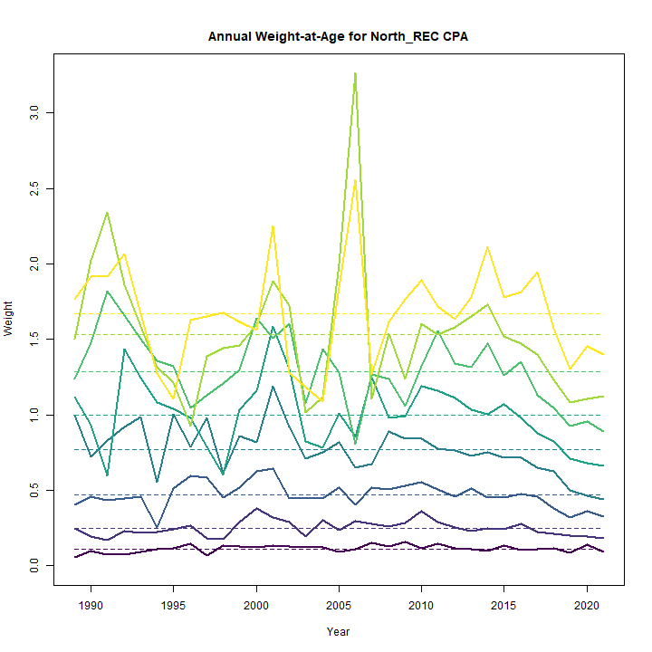
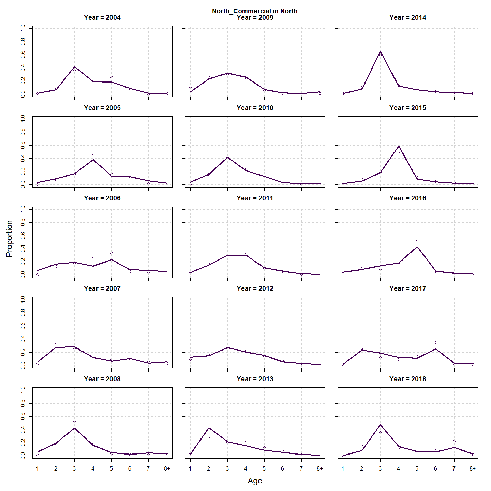
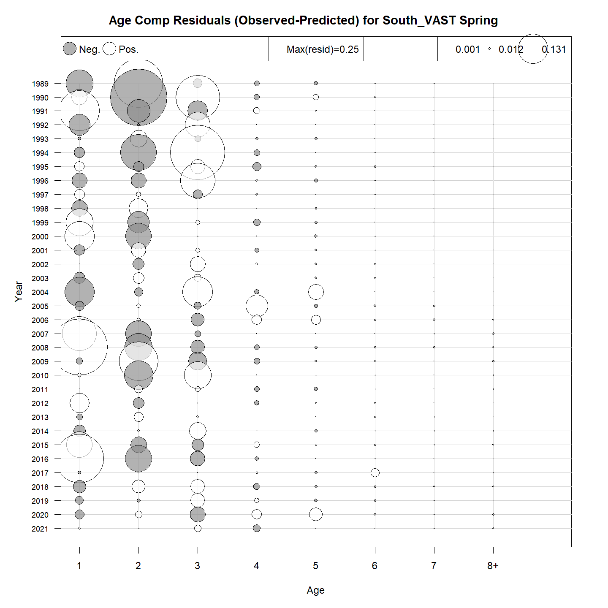
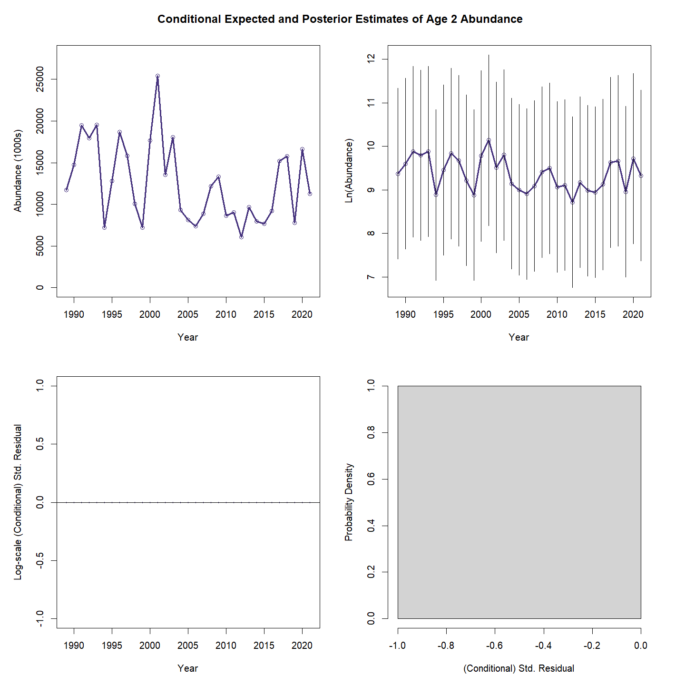
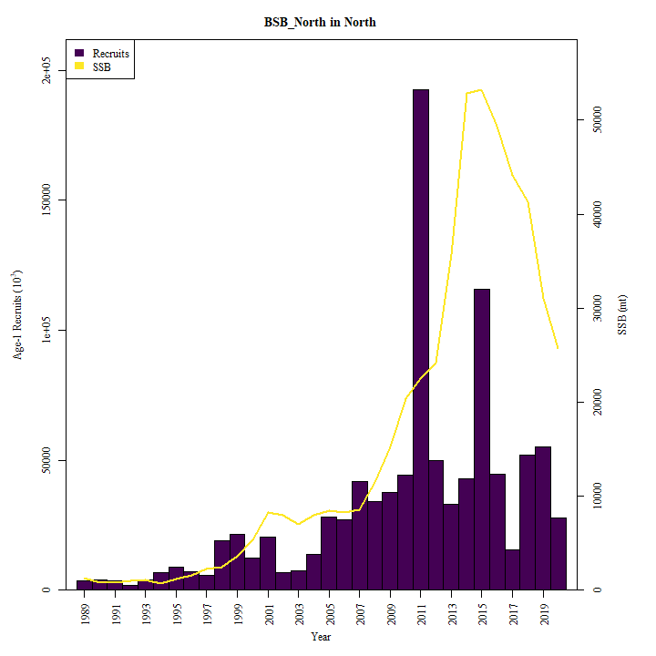
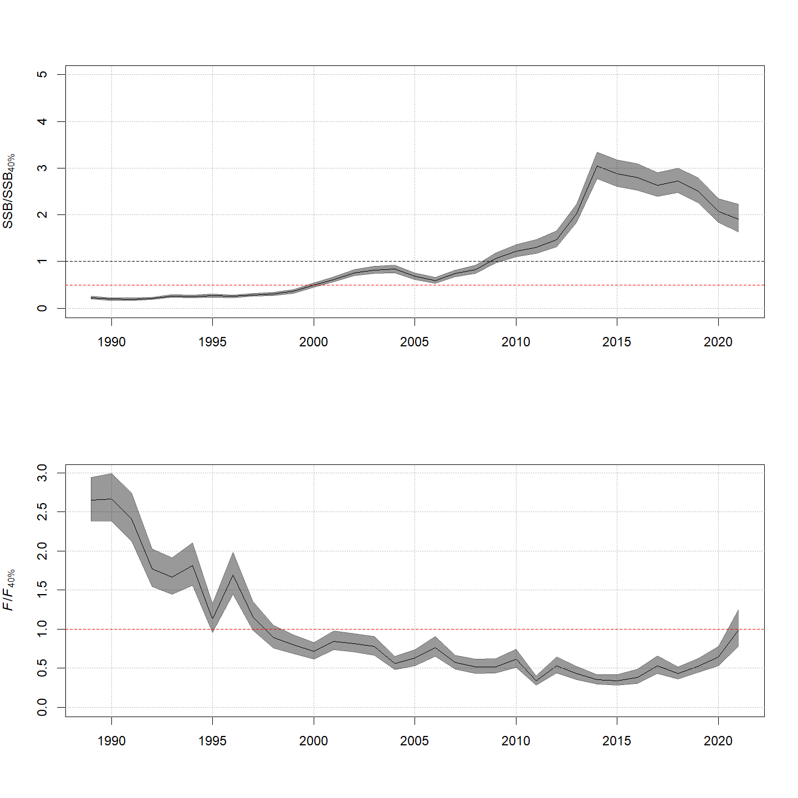
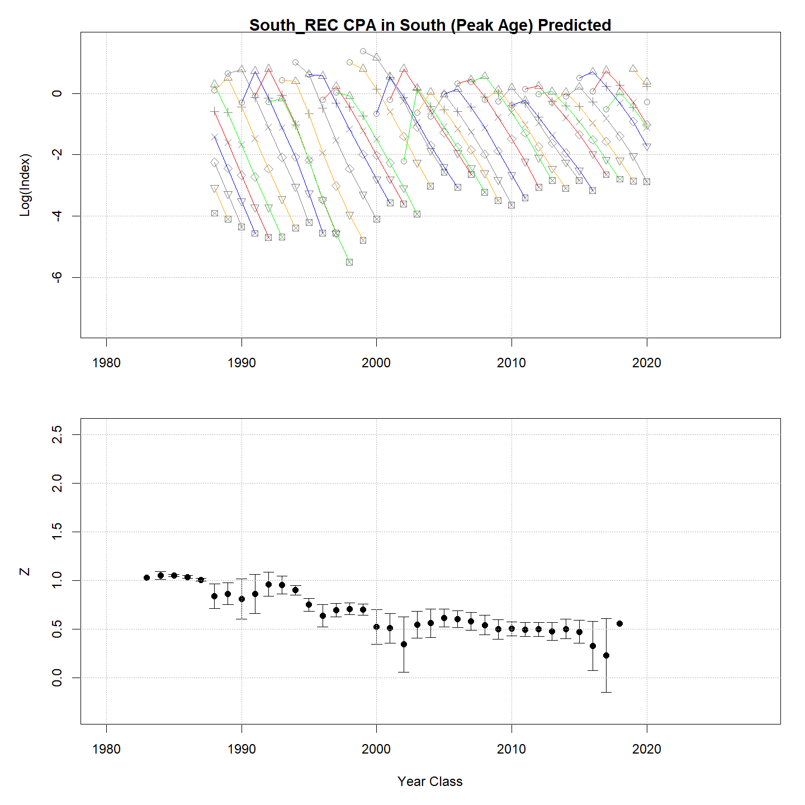
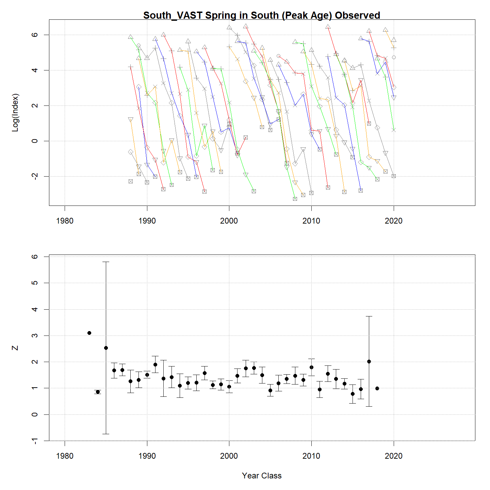

---
output:
  html_document:
    df_print: paged
    keep_md: yes
  word_document: default
  pdf_document:
    fig_caption: yes
    includes:
    keep_tex: yes
    number_sections: no
title: "WHAM figures and tables"
header-includes:
  - \usepackage{longtable}
  - \usepackage{booktabs}
  - \usepackage{caption,graphics}
  - \usepackage{makecell}
  - \usepackage{lscape}
  - \renewcommand\figurename{Fig.}
  - \captionsetup{labelsep=period, singlelinecheck=false}
  - \newcommand{\changesize}[1]{\fontsize{#1pt}{#1pt}\selectfont}
  - \renewcommand{\arraystretch}{1.5}
  - \renewcommand\theadfont{}
---

# {.tabset}

## Figures {.tabset}

### Input

### Diagnostics

### Results

### Retro

### Reference points

### Miscelaneous

## Tables {.tabset}

### Parameter estimates

<table class="table" style="margin-left: auto; margin-right: auto;">
<caption>Parameter estimates, standard errors, and confidence intervals. Rounded to 3 decimal places.</caption>
 <thead>
  <tr>
   <th style="text-align:left;">   </th>
   <th style="text-align:right;"> Estimate </th>
   <th style="text-align:right;"> Std. Error </th>
   <th style="text-align:right;"> 95\% CI lower </th>
   <th style="text-align:right;"> 95\% CI upper </th>
  </tr>
 </thead>
<tbody>
  <tr>
   <td style="text-align:left;"> BSB North Mean Recruitment </td>
   <td style="text-align:right;"> 17623.421 </td>
   <td style="text-align:right;"> 3546.466 </td>
   <td style="text-align:right;"> 11879.492 </td>
   <td style="text-align:right;"> 26144.634 </td>
  </tr>
  <tr>
   <td style="text-align:left;"> BSB North NAA $\sigma$ (age 1) </td>
   <td style="text-align:right;"> 1.098 </td>
   <td style="text-align:right;"> 0.140 </td>
   <td style="text-align:right;"> 0.855 </td>
   <td style="text-align:right;"> 1.410 </td>
  </tr>
  <tr>
   <td style="text-align:left;"> BSB North NAA $\sigma$ (age NA-) </td>
   <td style="text-align:right;"> -- </td>
   <td style="text-align:right;"> -- </td>
   <td style="text-align:right;"> -- </td>
   <td style="text-align:right;"> -- </td>
  </tr>
  <tr>
   <td style="text-align:left;"> BSB South Mean Recruitment </td>
   <td style="text-align:right;"> 17958.942 </td>
   <td style="text-align:right;"> 1379.265 </td>
   <td style="text-align:right;"> 15449.257 </td>
   <td style="text-align:right;"> 20876.318 </td>
  </tr>
  <tr>
   <td style="text-align:left;"> BSB South NAA $\sigma$ (age 1) </td>
   <td style="text-align:right;"> 0.396 </td>
   <td style="text-align:right;"> 0.053 </td>
   <td style="text-align:right;"> 0.304 </td>
   <td style="text-align:right;"> 0.515 </td>
  </tr>
  <tr>
   <td style="text-align:left;"> BSB South NAA $\sigma$ (age NA-) </td>
   <td style="text-align:right;"> -- </td>
   <td style="text-align:right;"> -- </td>
   <td style="text-align:right;"> -- </td>
   <td style="text-align:right;"> -- </td>
  </tr>
  <tr>
   <td style="text-align:left;"> North REC CPA fully selected q </td>
   <td style="text-align:right;"> 0.000 </td>
   <td style="text-align:right;"> 0.000 </td>
   <td style="text-align:right;"> 0.000 </td>
   <td style="text-align:right;"> 0.000 </td>
  </tr>
  <tr>
   <td style="text-align:left;"> North VAST Spring fully selected q </td>
   <td style="text-align:right;"> 0.006 </td>
   <td style="text-align:right;"> 0.000 </td>
   <td style="text-align:right;"> 0.005 </td>
   <td style="text-align:right;"> 0.007 </td>
  </tr>
  <tr>
   <td style="text-align:left;"> South REC CPA fully selected q </td>
   <td style="text-align:right;"> 0.000 </td>
   <td style="text-align:right;"> 0.000 </td>
   <td style="text-align:right;"> 0.000 </td>
   <td style="text-align:right;"> 0.000 </td>
  </tr>
  <tr>
   <td style="text-align:left;"> South VAST Spring fully selected q </td>
   <td style="text-align:right;"> 0.018 </td>
   <td style="text-align:right;"> 0.001 </td>
   <td style="text-align:right;"> 0.016 </td>
   <td style="text-align:right;"> 0.020 </td>
  </tr>
  <tr>
   <td style="text-align:left;"> Block 1: $a_{50}$ </td>
   <td style="text-align:right;"> 1.746 </td>
   <td style="text-align:right;"> 0.093 </td>
   <td style="text-align:right;"> 1.570 </td>
   <td style="text-align:right;"> 1.936 </td>
  </tr>
  <tr>
   <td style="text-align:left;"> Block 1: 1/slope (increasing) </td>
   <td style="text-align:right;"> 0.261 </td>
   <td style="text-align:right;"> 0.029 </td>
   <td style="text-align:right;"> 0.209 </td>
   <td style="text-align:right;"> 0.325 </td>
  </tr>
  <tr>
   <td style="text-align:left;"> Block 2: $a_{50}$ </td>
   <td style="text-align:right;"> 2.605 </td>
   <td style="text-align:right;"> 0.107 </td>
   <td style="text-align:right;"> 2.400 </td>
   <td style="text-align:right;"> 2.818 </td>
  </tr>
  <tr>
   <td style="text-align:left;"> Block 2: 1/slope (increasing) </td>
   <td style="text-align:right;"> 0.446 </td>
   <td style="text-align:right;"> 0.035 </td>
   <td style="text-align:right;"> 0.383 </td>
   <td style="text-align:right;"> 0.519 </td>
  </tr>
  <tr>
   <td style="text-align:left;"> Block 3: $a_{50}$ </td>
   <td style="text-align:right;"> 1.836 </td>
   <td style="text-align:right;"> 0.149 </td>
   <td style="text-align:right;"> 1.561 </td>
   <td style="text-align:right;"> 2.145 </td>
  </tr>
  <tr>
   <td style="text-align:left;"> Block 3: 1/slope (increasing) </td>
   <td style="text-align:right;"> 0.498 </td>
   <td style="text-align:right;"> 0.077 </td>
   <td style="text-align:right;"> 0.366 </td>
   <td style="text-align:right;"> 0.672 </td>
  </tr>
  <tr>
   <td style="text-align:left;"> Block 4: $a_{50}$ </td>
   <td style="text-align:right;"> 4.208 </td>
   <td style="text-align:right;"> 0.423 </td>
   <td style="text-align:right;"> 3.382 </td>
   <td style="text-align:right;"> 5.016 </td>
  </tr>
  <tr>
   <td style="text-align:left;"> Block 4: 1/slope (increasing) </td>
   <td style="text-align:right;"> 1.049 </td>
   <td style="text-align:right;"> 0.120 </td>
   <td style="text-align:right;"> 0.835 </td>
   <td style="text-align:right;"> 1.307 </td>
  </tr>
  <tr>
   <td style="text-align:left;"> Block 5: $a_{50}$ </td>
   <td style="text-align:right;"> 1.611 </td>
   <td style="text-align:right;"> 0.119 </td>
   <td style="text-align:right;"> 1.389 </td>
   <td style="text-align:right;"> 1.857 </td>
  </tr>
  <tr>
   <td style="text-align:left;"> Block 5: 1/slope (increasing) </td>
   <td style="text-align:right;"> 0.216 </td>
   <td style="text-align:right;"> 0.037 </td>
   <td style="text-align:right;"> 0.154 </td>
   <td style="text-align:right;"> 0.303 </td>
  </tr>
  <tr>
   <td style="text-align:left;"> Block 6: $a_{50}$ </td>
   <td style="text-align:right;"> 2.681 </td>
   <td style="text-align:right;"> 0.094 </td>
   <td style="text-align:right;"> 2.499 </td>
   <td style="text-align:right;"> 2.868 </td>
  </tr>
  <tr>
   <td style="text-align:left;"> Block 6: 1/slope (increasing) </td>
   <td style="text-align:right;"> 0.497 </td>
   <td style="text-align:right;"> 0.033 </td>
   <td style="text-align:right;"> 0.436 </td>
   <td style="text-align:right;"> 0.567 </td>
  </tr>
  <tr>
   <td style="text-align:left;"> Block 7: $a_{50}$ </td>
   <td style="text-align:right;"> 1.753 </td>
   <td style="text-align:right;"> 0.091 </td>
   <td style="text-align:right;"> 1.581 </td>
   <td style="text-align:right;"> 1.937 </td>
  </tr>
  <tr>
   <td style="text-align:left;"> Block 7: 1/slope (increasing) </td>
   <td style="text-align:right;"> 0.443 </td>
   <td style="text-align:right;"> 0.045 </td>
   <td style="text-align:right;"> 0.363 </td>
   <td style="text-align:right;"> 0.541 </td>
  </tr>
  <tr>
   <td style="text-align:left;"> Block 8: $a_{50}$ </td>
   <td style="text-align:right;"> 3.929 </td>
   <td style="text-align:right;"> 0.535 </td>
   <td style="text-align:right;"> 2.908 </td>
   <td style="text-align:right;"> 4.960 </td>
  </tr>
  <tr>
   <td style="text-align:left;"> Block 8: 1/slope (increasing) </td>
   <td style="text-align:right;"> 1.377 </td>
   <td style="text-align:right;"> 0.187 </td>
   <td style="text-align:right;"> 1.049 </td>
   <td style="text-align:right;"> 1.782 </td>
  </tr>
  <tr>
   <td style="text-align:left;"> Block 9: Mean Selectivity for age 1 </td>
   <td style="text-align:right;"> 0.324 </td>
   <td style="text-align:right;"> 0.095 </td>
   <td style="text-align:right;"> 0.170 </td>
   <td style="text-align:right;"> 0.528 </td>
  </tr>
  <tr>
   <td style="text-align:left;"> Block 9: Mean Selectivity for age 2 </td>
   <td style="text-align:right;"> 1.000 </td>
   <td style="text-align:right;"> -- </td>
   <td style="text-align:right;"> -- </td>
   <td style="text-align:right;"> -- </td>
  </tr>
  <tr>
   <td style="text-align:left;"> Block 9: Mean Selectivity for age 3 </td>
   <td style="text-align:right;"> 1.000 </td>
   <td style="text-align:right;"> -- </td>
   <td style="text-align:right;"> -- </td>
   <td style="text-align:right;"> -- </td>
  </tr>
  <tr>
   <td style="text-align:left;"> Block 9: Mean Selectivity for age 4 </td>
   <td style="text-align:right;"> 1.000 </td>
   <td style="text-align:right;"> -- </td>
   <td style="text-align:right;"> -- </td>
   <td style="text-align:right;"> -- </td>
  </tr>
  <tr>
   <td style="text-align:left;"> Block 9: Mean Selectivity for age 5 </td>
   <td style="text-align:right;"> 1.000 </td>
   <td style="text-align:right;"> -- </td>
   <td style="text-align:right;"> -- </td>
   <td style="text-align:right;"> -- </td>
  </tr>
  <tr>
   <td style="text-align:left;"> Block 9: Mean Selectivity for age 6 </td>
   <td style="text-align:right;"> 1.000 </td>
   <td style="text-align:right;"> -- </td>
   <td style="text-align:right;"> -- </td>
   <td style="text-align:right;"> -- </td>
  </tr>
  <tr>
   <td style="text-align:left;"> Block 9: Mean Selectivity for age 7 </td>
   <td style="text-align:right;"> 1.000 </td>
   <td style="text-align:right;"> -- </td>
   <td style="text-align:right;"> -- </td>
   <td style="text-align:right;"> -- </td>
  </tr>
  <tr>
   <td style="text-align:left;"> Block 9: Mean Selectivity for age 8+ </td>
   <td style="text-align:right;"> 1.000 </td>
   <td style="text-align:right;"> -- </td>
   <td style="text-align:right;"> -- </td>
   <td style="text-align:right;"> -- </td>
  </tr>
  <tr>
   <td style="text-align:left;"> Block 10: Mean Selectivity for age 1 </td>
   <td style="text-align:right;"> 0.820 </td>
   <td style="text-align:right;"> 0.237 </td>
   <td style="text-align:right;"> 0.163 </td>
   <td style="text-align:right;"> 0.991 </td>
  </tr>
  <tr>
   <td style="text-align:left;"> Block 10: Mean Selectivity for age 2 </td>
   <td style="text-align:right;"> 0.820 </td>
   <td style="text-align:right;"> 0.237 </td>
   <td style="text-align:right;"> 0.163 </td>
   <td style="text-align:right;"> 0.991 </td>
  </tr>
  <tr>
   <td style="text-align:left;"> Block 10: Mean Selectivity for age 3 </td>
   <td style="text-align:right;"> 1.000 </td>
   <td style="text-align:right;"> -- </td>
   <td style="text-align:right;"> -- </td>
   <td style="text-align:right;"> -- </td>
  </tr>
  <tr>
   <td style="text-align:left;"> Block 10: Mean Selectivity for age 4 </td>
   <td style="text-align:right;"> 0.820 </td>
   <td style="text-align:right;"> 0.237 </td>
   <td style="text-align:right;"> 0.163 </td>
   <td style="text-align:right;"> 0.991 </td>
  </tr>
  <tr>
   <td style="text-align:left;"> Block 10: Mean Selectivity for age 5 </td>
   <td style="text-align:right;"> 0.820 </td>
   <td style="text-align:right;"> 0.237 </td>
   <td style="text-align:right;"> 0.163 </td>
   <td style="text-align:right;"> 0.991 </td>
  </tr>
  <tr>
   <td style="text-align:left;"> Block 10: Mean Selectivity for age 6 </td>
   <td style="text-align:right;"> 0.820 </td>
   <td style="text-align:right;"> 0.237 </td>
   <td style="text-align:right;"> 0.163 </td>
   <td style="text-align:right;"> 0.991 </td>
  </tr>
  <tr>
   <td style="text-align:left;"> Block 10: Mean Selectivity for age 7 </td>
   <td style="text-align:right;"> 0.820 </td>
   <td style="text-align:right;"> 0.237 </td>
   <td style="text-align:right;"> 0.163 </td>
   <td style="text-align:right;"> 0.991 </td>
  </tr>
  <tr>
   <td style="text-align:left;"> Block 10: Mean Selectivity for age 8+ </td>
   <td style="text-align:right;"> 0.820 </td>
   <td style="text-align:right;"> 0.237 </td>
   <td style="text-align:right;"> 0.163 </td>
   <td style="text-align:right;"> 0.991 </td>
  </tr>
  <tr>
   <td style="text-align:left;"> Block 11: Mean Selectivity for age 1 </td>
   <td style="text-align:right;"> 0.447 </td>
   <td style="text-align:right;"> 0.070 </td>
   <td style="text-align:right;"> 0.318 </td>
   <td style="text-align:right;"> 0.585 </td>
  </tr>
  <tr>
   <td style="text-align:left;"> Block 11: Mean Selectivity for age 2 </td>
   <td style="text-align:right;"> 1.000 </td>
   <td style="text-align:right;"> -- </td>
   <td style="text-align:right;"> -- </td>
   <td style="text-align:right;"> -- </td>
  </tr>
  <tr>
   <td style="text-align:left;"> Block 11: Mean Selectivity for age 3 </td>
   <td style="text-align:right;"> 1.000 </td>
   <td style="text-align:right;"> -- </td>
   <td style="text-align:right;"> -- </td>
   <td style="text-align:right;"> -- </td>
  </tr>
  <tr>
   <td style="text-align:left;"> Block 11: Mean Selectivity for age 4 </td>
   <td style="text-align:right;"> 1.000 </td>
   <td style="text-align:right;"> -- </td>
   <td style="text-align:right;"> -- </td>
   <td style="text-align:right;"> -- </td>
  </tr>
  <tr>
   <td style="text-align:left;"> Block 11: Mean Selectivity for age 5 </td>
   <td style="text-align:right;"> 1.000 </td>
   <td style="text-align:right;"> -- </td>
   <td style="text-align:right;"> -- </td>
   <td style="text-align:right;"> -- </td>
  </tr>
  <tr>
   <td style="text-align:left;"> Block 11: Mean Selectivity for age 6 </td>
   <td style="text-align:right;"> 1.000 </td>
   <td style="text-align:right;"> -- </td>
   <td style="text-align:right;"> -- </td>
   <td style="text-align:right;"> -- </td>
  </tr>
  <tr>
   <td style="text-align:left;"> Block 11: Mean Selectivity for age 7 </td>
   <td style="text-align:right;"> 1.000 </td>
   <td style="text-align:right;"> -- </td>
   <td style="text-align:right;"> -- </td>
   <td style="text-align:right;"> -- </td>
  </tr>
  <tr>
   <td style="text-align:left;"> Block 11: Mean Selectivity for age 8+ </td>
   <td style="text-align:right;"> 1.000 </td>
   <td style="text-align:right;"> -- </td>
   <td style="text-align:right;"> -- </td>
   <td style="text-align:right;"> -- </td>
  </tr>
  <tr>
   <td style="text-align:left;"> Block 12: Mean Selectivity for age 1 </td>
   <td style="text-align:right;"> 0.551 </td>
   <td style="text-align:right;"> 0.357 </td>
   <td style="text-align:right;"> 0.068 </td>
   <td style="text-align:right;"> 0.954 </td>
  </tr>
  <tr>
   <td style="text-align:left;"> Block 12: Mean Selectivity for age 2 </td>
   <td style="text-align:right;"> 1.000 </td>
   <td style="text-align:right;"> -- </td>
   <td style="text-align:right;"> -- </td>
   <td style="text-align:right;"> -- </td>
  </tr>
  <tr>
   <td style="text-align:left;"> Block 12: Mean Selectivity for age 3 </td>
   <td style="text-align:right;"> 0.551 </td>
   <td style="text-align:right;"> 0.357 </td>
   <td style="text-align:right;"> 0.068 </td>
   <td style="text-align:right;"> 0.954 </td>
  </tr>
  <tr>
   <td style="text-align:left;"> Block 12: Mean Selectivity for age 4 </td>
   <td style="text-align:right;"> 0.551 </td>
   <td style="text-align:right;"> 0.357 </td>
   <td style="text-align:right;"> 0.068 </td>
   <td style="text-align:right;"> 0.954 </td>
  </tr>
  <tr>
   <td style="text-align:left;"> Block 12: Mean Selectivity for age 5 </td>
   <td style="text-align:right;"> 0.551 </td>
   <td style="text-align:right;"> 0.357 </td>
   <td style="text-align:right;"> 0.068 </td>
   <td style="text-align:right;"> 0.954 </td>
  </tr>
  <tr>
   <td style="text-align:left;"> Block 12: Mean Selectivity for age 6 </td>
   <td style="text-align:right;"> 0.551 </td>
   <td style="text-align:right;"> 0.357 </td>
   <td style="text-align:right;"> 0.068 </td>
   <td style="text-align:right;"> 0.954 </td>
  </tr>
  <tr>
   <td style="text-align:left;"> Block 12: Mean Selectivity for age 7 </td>
   <td style="text-align:right;"> 0.551 </td>
   <td style="text-align:right;"> 0.357 </td>
   <td style="text-align:right;"> 0.068 </td>
   <td style="text-align:right;"> 0.954 </td>
  </tr>
  <tr>
   <td style="text-align:left;"> Block 12: Mean Selectivity for age 8+ </td>
   <td style="text-align:right;"> 0.551 </td>
   <td style="text-align:right;"> 0.357 </td>
   <td style="text-align:right;"> 0.068 </td>
   <td style="text-align:right;"> 0.954 </td>
  </tr>
  <tr>
   <td style="text-align:left;"> Block 9: Selectivity RE $\sigma$ </td>
   <td style="text-align:right;"> 1.043 </td>
   <td style="text-align:right;"> 0.233 </td>
   <td style="text-align:right;"> 0.674 </td>
   <td style="text-align:right;"> 1.616 </td>
  </tr>
  <tr>
   <td style="text-align:left;"> Block 9: Selectivity RE AR1 $\rho$ (year) </td>
   <td style="text-align:right;"> 0.311 </td>
   <td style="text-align:right;"> 0.172 </td>
   <td style="text-align:right;"> 0.146 </td>
   <td style="text-align:right;"> 0.815 </td>
  </tr>
  <tr>
   <td style="text-align:left;"> Block 10: Selectivity RE $\sigma$ </td>
   <td style="text-align:right;"> 0.285 </td>
   <td style="text-align:right;"> 0.120 </td>
   <td style="text-align:right;"> 0.125 </td>
   <td style="text-align:right;"> 0.651 </td>
  </tr>
  <tr>
   <td style="text-align:left;"> Block 10: Selectivity RE AR1 $\rho$ (age) </td>
   <td style="text-align:right;"> 0.362 </td>
   <td style="text-align:right;"> 0.339 </td>
   <td style="text-align:right;"> -0.352 </td>
   <td style="text-align:right;"> 0.955 </td>
  </tr>
  <tr>
   <td style="text-align:left;"> Block 10: Selectivity RE AR1 $\rho$ (year) </td>
   <td style="text-align:right;"> 0.850 </td>
   <td style="text-align:right;"> 0.012 </td>
   <td style="text-align:right;"> 0.920 </td>
   <td style="text-align:right;"> 0.998 </td>
  </tr>
  <tr>
   <td style="text-align:left;"> Block 11: Selectivity RE $\sigma$ </td>
   <td style="text-align:right;"> 0.900 </td>
   <td style="text-align:right;"> 0.201 </td>
   <td style="text-align:right;"> 0.581 </td>
   <td style="text-align:right;"> 1.393 </td>
  </tr>
  <tr>
   <td style="text-align:left;"> Block 11: Selectivity RE AR1 $\rho$ (year) </td>
   <td style="text-align:right;"> 0.194 </td>
   <td style="text-align:right;"> 0.213 </td>
   <td style="text-align:right;"> -0.091 </td>
   <td style="text-align:right;"> 0.705 </td>
  </tr>
  <tr>
   <td style="text-align:left;"> Block 12: Selectivity RE $\sigma$ </td>
   <td style="text-align:right;"> 0.186 </td>
   <td style="text-align:right;"> 0.067 </td>
   <td style="text-align:right;"> 0.092 </td>
   <td style="text-align:right;"> 0.378 </td>
  </tr>
  <tr>
   <td style="text-align:left;"> Block 12: Selectivity RE AR1 $\rho$ (age) </td>
   <td style="text-align:right;"> 0.506 </td>
   <td style="text-align:right;"> 0.145 </td>
   <td style="text-align:right;"> 0.296 </td>
   <td style="text-align:right;"> 0.958 </td>
  </tr>
  <tr>
   <td style="text-align:left;"> Block 12: Selectivity RE AR1 $\rho$ (year) </td>
   <td style="text-align:right;"> 0.852 </td>
   <td style="text-align:right;"> 0.011 </td>
   <td style="text-align:right;"> 0.933 </td>
   <td style="text-align:right;"> 0.998 </td>
  </tr>
  <tr>
   <td style="text-align:left;"> North Commercial in North age comp, Dirichlet-multinomial: dispersion ($\phi$) </td>
   <td style="text-align:right;"> 31.350 </td>
   <td style="text-align:right;"> 3.456 </td>
   <td style="text-align:right;"> 25.258 </td>
   <td style="text-align:right;"> 38.912 </td>
  </tr>
  <tr>
   <td style="text-align:left;"> North Recreational in North age comp, Dirichlet-multinomial: dispersion ($\phi$) </td>
   <td style="text-align:right;"> 23.061 </td>
   <td style="text-align:right;"> 2.374 </td>
   <td style="text-align:right;"> 18.847 </td>
   <td style="text-align:right;"> 28.217 </td>
  </tr>
  <tr>
   <td style="text-align:left;"> South Commercial in South age comp, Dirichlet-multinomial: dispersion ($\phi$) </td>
   <td style="text-align:right;"> 32.817 </td>
   <td style="text-align:right;"> 3.486 </td>
   <td style="text-align:right;"> 26.648 </td>
   <td style="text-align:right;"> 40.412 </td>
  </tr>
  <tr>
   <td style="text-align:left;"> South Recreational in South age comp, Dirichlet-multinomial: dispersion ($\phi$) </td>
   <td style="text-align:right;"> 31.355 </td>
   <td style="text-align:right;"> 3.256 </td>
   <td style="text-align:right;"> 25.581 </td>
   <td style="text-align:right;"> 38.433 </td>
  </tr>
  <tr>
   <td style="text-align:left;"> North REC CPA in North age comp, Dirichlet-multinomial: dispersion ($\phi$) </td>
   <td style="text-align:right;"> 33.469 </td>
   <td style="text-align:right;"> 3.903 </td>
   <td style="text-align:right;"> 26.630 </td>
   <td style="text-align:right;"> 42.063 </td>
  </tr>
  <tr>
   <td style="text-align:left;"> North VAST Spring in North age comp, Dirichlet-multinomial: dispersion ($\phi$) </td>
   <td style="text-align:right;"> 29.881 </td>
   <td style="text-align:right;"> 3.634 </td>
   <td style="text-align:right;"> 23.545 </td>
   <td style="text-align:right;"> 37.923 </td>
  </tr>
  <tr>
   <td style="text-align:left;"> South REC CPA in South age comp, Dirichlet-multinomial: dispersion ($\phi$) </td>
   <td style="text-align:right;"> 40.686 </td>
   <td style="text-align:right;"> 5.340 </td>
   <td style="text-align:right;"> 31.458 </td>
   <td style="text-align:right;"> 52.621 </td>
  </tr>
  <tr>
   <td style="text-align:left;"> South VAST Spring in South age comp, Dirichlet-multinomial: dispersion ($\phi$) </td>
   <td style="text-align:right;"> 44.318 </td>
   <td style="text-align:right;"> 5.717 </td>
   <td style="text-align:right;"> 34.418 </td>
   <td style="text-align:right;"> 57.067 </td>
  </tr>
  <tr>
   <td style="text-align:left;"> North REC CPA log-index observation SD scalar </td>
   <td style="text-align:right;"> 12.060 </td>
   <td style="text-align:right;"> 1.625 </td>
   <td style="text-align:right;"> 9.261 </td>
   <td style="text-align:right;"> 15.706 </td>
  </tr>
  <tr>
   <td style="text-align:left;"> South REC CPA log-index observation SD scalar </td>
   <td style="text-align:right;"> 5.626 </td>
   <td style="text-align:right;"> 0.997 </td>
   <td style="text-align:right;"> 3.975 </td>
   <td style="text-align:right;"> 7.961 </td>
  </tr>
</tbody>
</table>

### Abundance at age

<table class="table" style="margin-left: auto; margin-right: auto;">
<caption>Abundance at age (1000s) for BSB North in North.</caption>
 <thead>
  <tr>
   <th style="text-align:left;">   </th>
   <th style="text-align:right;"> 1 </th>
   <th style="text-align:right;"> 2 </th>
   <th style="text-align:right;"> 3 </th>
   <th style="text-align:right;"> 4 </th>
   <th style="text-align:right;"> 5 </th>
   <th style="text-align:right;"> 6 </th>
   <th style="text-align:right;"> 7 </th>
   <th style="text-align:right;"> 8+ </th>
  </tr>
 </thead>
<tbody>
  <tr>
   <td style="text-align:left;"> 1989 </td>
   <td style="text-align:right;"> 4026 </td>
   <td style="text-align:right;"> 2144 </td>
   <td style="text-align:right;"> 1120 </td>
   <td style="text-align:right;"> 577 </td>
   <td style="text-align:right;"> 297 </td>
   <td style="text-align:right;"> 153 </td>
   <td style="text-align:right;"> 79 </td>
   <td style="text-align:right;"> 84 </td>
  </tr>
  <tr>
   <td style="text-align:left;"> 1990 </td>
   <td style="text-align:right;"> 3538 </td>
   <td style="text-align:right;"> 2306 </td>
   <td style="text-align:right;"> 848 </td>
   <td style="text-align:right;"> 345 </td>
   <td style="text-align:right;"> 171 </td>
   <td style="text-align:right;"> 87 </td>
   <td style="text-align:right;"> 45 </td>
   <td style="text-align:right;"> 48 </td>
  </tr>
  <tr>
   <td style="text-align:left;"> 1991 </td>
   <td style="text-align:right;"> 3892 </td>
   <td style="text-align:right;"> 2091 </td>
   <td style="text-align:right;"> 960 </td>
   <td style="text-align:right;"> 288 </td>
   <td style="text-align:right;"> 115 </td>
   <td style="text-align:right;"> 57 </td>
   <td style="text-align:right;"> 29 </td>
   <td style="text-align:right;"> 31 </td>
  </tr>
  <tr>
   <td style="text-align:left;"> 1992 </td>
   <td style="text-align:right;"> 3577 </td>
   <td style="text-align:right;"> 2331 </td>
   <td style="text-align:right;"> 965 </td>
   <td style="text-align:right;"> 377 </td>
   <td style="text-align:right;"> 111 </td>
   <td style="text-align:right;"> 44 </td>
   <td style="text-align:right;"> 22 </td>
   <td style="text-align:right;"> 23 </td>
  </tr>
  <tr>
   <td style="text-align:left;"> 1993 </td>
   <td style="text-align:right;"> 1805 </td>
   <td style="text-align:right;"> 2188 </td>
   <td style="text-align:right;"> 1172 </td>
   <td style="text-align:right;"> 432 </td>
   <td style="text-align:right;"> 167 </td>
   <td style="text-align:right;"> 49 </td>
   <td style="text-align:right;"> 19 </td>
   <td style="text-align:right;"> 20 </td>
  </tr>
  <tr>
   <td style="text-align:left;"> 1994 </td>
   <td style="text-align:right;"> 4033 </td>
   <td style="text-align:right;"> 1095 </td>
   <td style="text-align:right;"> 1129 </td>
   <td style="text-align:right;"> 538 </td>
   <td style="text-align:right;"> 196 </td>
   <td style="text-align:right;"> 75 </td>
   <td style="text-align:right;"> 22 </td>
   <td style="text-align:right;"> 18 </td>
  </tr>
  <tr>
   <td style="text-align:left;"> 1995 </td>
   <td style="text-align:right;"> 6850 </td>
   <td style="text-align:right;"> 2434 </td>
   <td style="text-align:right;"> 543 </td>
   <td style="text-align:right;"> 490 </td>
   <td style="text-align:right;"> 229 </td>
   <td style="text-align:right;"> 83 </td>
   <td style="text-align:right;"> 32 </td>
   <td style="text-align:right;"> 17 </td>
  </tr>
  <tr>
   <td style="text-align:left;"> 1996 </td>
   <td style="text-align:right;"> 8780 </td>
   <td style="text-align:right;"> 4231 </td>
   <td style="text-align:right;"> 1350 </td>
   <td style="text-align:right;"> 279 </td>
   <td style="text-align:right;"> 250 </td>
   <td style="text-align:right;"> 117 </td>
   <td style="text-align:right;"> 42 </td>
   <td style="text-align:right;"> 25 </td>
  </tr>
  <tr>
   <td style="text-align:left;"> 1997 </td>
   <td style="text-align:right;"> 7102 </td>
   <td style="text-align:right;"> 5411 </td>
   <td style="text-align:right;"> 2247 </td>
   <td style="text-align:right;"> 654 </td>
   <td style="text-align:right;"> 134 </td>
   <td style="text-align:right;"> 120 </td>
   <td style="text-align:right;"> 56 </td>
   <td style="text-align:right;"> 32 </td>
  </tr>
  <tr>
   <td style="text-align:left;"> 1998 </td>
   <td style="text-align:right;"> 5696 </td>
   <td style="text-align:right;"> 4395 </td>
   <td style="text-align:right;"> 3113 </td>
   <td style="text-align:right;"> 1208 </td>
   <td style="text-align:right;"> 349 </td>
   <td style="text-align:right;"> 71 </td>
   <td style="text-align:right;"> 64 </td>
   <td style="text-align:right;"> 47 </td>
  </tr>
  <tr>
   <td style="text-align:left;"> 1999 </td>
   <td style="text-align:right;"> 18941 </td>
   <td style="text-align:right;"> 3558 </td>
   <td style="text-align:right;"> 2768 </td>
   <td style="text-align:right;"> 1763 </td>
   <td style="text-align:right;"> 651 </td>
   <td style="text-align:right;"> 186 </td>
   <td style="text-align:right;"> 38 </td>
   <td style="text-align:right;"> 59 </td>
  </tr>
  <tr>
   <td style="text-align:left;"> 2000 </td>
   <td style="text-align:right;"> 21618 </td>
   <td style="text-align:right;"> 11774 </td>
   <td style="text-align:right;"> 2202 </td>
   <td style="text-align:right;"> 1519 </td>
   <td style="text-align:right;"> 916 </td>
   <td style="text-align:right;"> 335 </td>
   <td style="text-align:right;"> 96 </td>
   <td style="text-align:right;"> 50 </td>
  </tr>
  <tr>
   <td style="text-align:left;"> 2001 </td>
   <td style="text-align:right;"> 12542 </td>
   <td style="text-align:right;"> 13412 </td>
   <td style="text-align:right;"> 7287 </td>
   <td style="text-align:right;"> 1245 </td>
   <td style="text-align:right;"> 828 </td>
   <td style="text-align:right;"> 496 </td>
   <td style="text-align:right;"> 182 </td>
   <td style="text-align:right;"> 79 </td>
  </tr>
  <tr>
   <td style="text-align:left;"> 2002 </td>
   <td style="text-align:right;"> 20382 </td>
   <td style="text-align:right;"> 7769 </td>
   <td style="text-align:right;"> 8220 </td>
   <td style="text-align:right;"> 3997 </td>
   <td style="text-align:right;"> 652 </td>
   <td style="text-align:right;"> 430 </td>
   <td style="text-align:right;"> 258 </td>
   <td style="text-align:right;"> 135 </td>
  </tr>
  <tr>
   <td style="text-align:left;"> 2003 </td>
   <td style="text-align:right;"> 6807 </td>
   <td style="text-align:right;"> 12597 </td>
   <td style="text-align:right;"> 4735 </td>
   <td style="text-align:right;"> 4508 </td>
   <td style="text-align:right;"> 2102 </td>
   <td style="text-align:right;"> 341 </td>
   <td style="text-align:right;"> 225 </td>
   <td style="text-align:right;"> 205 </td>
  </tr>
  <tr>
   <td style="text-align:left;"> 2004 </td>
   <td style="text-align:right;"> 7591 </td>
   <td style="text-align:right;"> 4223 </td>
   <td style="text-align:right;"> 7807 </td>
   <td style="text-align:right;"> 2712 </td>
   <td style="text-align:right;"> 2506 </td>
   <td style="text-align:right;"> 1163 </td>
   <td style="text-align:right;"> 188 </td>
   <td style="text-align:right;"> 238 </td>
  </tr>
  <tr>
   <td style="text-align:left;"> 2005 </td>
   <td style="text-align:right;"> 13720 </td>
   <td style="text-align:right;"> 4738 </td>
   <td style="text-align:right;"> 2674 </td>
   <td style="text-align:right;"> 4579 </td>
   <td style="text-align:right;"> 1538 </td>
   <td style="text-align:right;"> 1414 </td>
   <td style="text-align:right;"> 656 </td>
   <td style="text-align:right;"> 240 </td>
  </tr>
  <tr>
   <td style="text-align:left;"> 2006 </td>
   <td style="text-align:right;"> 28241 </td>
   <td style="text-align:right;"> 8542 </td>
   <td style="text-align:right;"> 2985 </td>
   <td style="text-align:right;"> 1577 </td>
   <td style="text-align:right;"> 2630 </td>
   <td style="text-align:right;"> 880 </td>
   <td style="text-align:right;"> 809 </td>
   <td style="text-align:right;"> 512 </td>
  </tr>
  <tr>
   <td style="text-align:left;"> 2007 </td>
   <td style="text-align:right;"> 27313 </td>
   <td style="text-align:right;"> 17552 </td>
   <td style="text-align:right;"> 5347 </td>
   <td style="text-align:right;"> 1735 </td>
   <td style="text-align:right;"> 890 </td>
   <td style="text-align:right;"> 1478 </td>
   <td style="text-align:right;"> 494 </td>
   <td style="text-align:right;"> 742 </td>
  </tr>
  <tr>
   <td style="text-align:left;"> 2008 </td>
   <td style="text-align:right;"> 41956 </td>
   <td style="text-align:right;"> 16963 </td>
   <td style="text-align:right;"> 10949 </td>
   <td style="text-align:right;"> 3088 </td>
   <td style="text-align:right;"> 972 </td>
   <td style="text-align:right;"> 496 </td>
   <td style="text-align:right;"> 824 </td>
   <td style="text-align:right;"> 689 </td>
  </tr>
  <tr>
   <td style="text-align:left;"> 2009 </td>
   <td style="text-align:right;"> 34306 </td>
   <td style="text-align:right;"> 26154 </td>
   <td style="text-align:right;"> 10770 </td>
   <td style="text-align:right;"> 6615 </td>
   <td style="text-align:right;"> 1832 </td>
   <td style="text-align:right;"> 575 </td>
   <td style="text-align:right;"> 294 </td>
   <td style="text-align:right;"> 895 </td>
  </tr>
  <tr>
   <td style="text-align:left;"> 2010 </td>
   <td style="text-align:right;"> 37741 </td>
   <td style="text-align:right;"> 21389 </td>
   <td style="text-align:right;"> 16912 </td>
   <td style="text-align:right;"> 6620 </td>
   <td style="text-align:right;"> 3821 </td>
   <td style="text-align:right;"> 997 </td>
   <td style="text-align:right;"> 300 </td>
   <td style="text-align:right;"> 602 </td>
  </tr>
  <tr>
   <td style="text-align:left;"> 2011 </td>
   <td style="text-align:right;"> 44254 </td>
   <td style="text-align:right;"> 23474 </td>
   <td style="text-align:right;"> 13745 </td>
   <td style="text-align:right;"> 10261 </td>
   <td style="text-align:right;"> 3733 </td>
   <td style="text-align:right;"> 2006 </td>
   <td style="text-align:right;"> 497 </td>
   <td style="text-align:right;"> 434 </td>
  </tr>
  <tr>
   <td style="text-align:left;"> 2012 </td>
   <td style="text-align:right;"> 192630 </td>
   <td style="text-align:right;"> 27768 </td>
   <td style="text-align:right;"> 15422 </td>
   <td style="text-align:right;"> 8749 </td>
   <td style="text-align:right;"> 6321 </td>
   <td style="text-align:right;"> 2237 </td>
   <td style="text-align:right;"> 1179 </td>
   <td style="text-align:right;"> 540 </td>
  </tr>
  <tr>
   <td style="text-align:left;"> 2013 </td>
   <td style="text-align:right;"> 49757 </td>
   <td style="text-align:right;"> 120312 </td>
   <td style="text-align:right;"> 18035 </td>
   <td style="text-align:right;"> 9584 </td>
   <td style="text-align:right;"> 5154 </td>
   <td style="text-align:right;"> 3538 </td>
   <td style="text-align:right;"> 1207 </td>
   <td style="text-align:right;"> 908 </td>
  </tr>
  <tr>
   <td style="text-align:left;"> 2014 </td>
   <td style="text-align:right;"> 33058 </td>
   <td style="text-align:right;"> 31173 </td>
   <td style="text-align:right;"> 78720 </td>
   <td style="text-align:right;"> 11384 </td>
   <td style="text-align:right;"> 5814 </td>
   <td style="text-align:right;"> 3017 </td>
   <td style="text-align:right;"> 2020 </td>
   <td style="text-align:right;"> 1188 </td>
  </tr>
  <tr>
   <td style="text-align:left;"> 2015 </td>
   <td style="text-align:right;"> 42947 </td>
   <td style="text-align:right;"> 20705 </td>
   <td style="text-align:right;"> 20401 </td>
   <td style="text-align:right;"> 49725 </td>
   <td style="text-align:right;"> 6905 </td>
   <td style="text-align:right;"> 3398 </td>
   <td style="text-align:right;"> 1718 </td>
   <td style="text-align:right;"> 1797 </td>
  </tr>
  <tr>
   <td style="text-align:left;"> 2016 </td>
   <td style="text-align:right;"> 115644 </td>
   <td style="text-align:right;"> 26905 </td>
   <td style="text-align:right;"> 13571 </td>
   <td style="text-align:right;"> 12936 </td>
   <td style="text-align:right;"> 30328 </td>
   <td style="text-align:right;"> 4062 </td>
   <td style="text-align:right;"> 1948 </td>
   <td style="text-align:right;"> 1982 </td>
  </tr>
  <tr>
   <td style="text-align:left;"> 2017 </td>
   <td style="text-align:right;"> 44702 </td>
   <td style="text-align:right;"> 72371 </td>
   <td style="text-align:right;"> 17567 </td>
   <td style="text-align:right;"> 8514 </td>
   <td style="text-align:right;"> 7762 </td>
   <td style="text-align:right;"> 17477 </td>
   <td style="text-align:right;"> 2275 </td>
   <td style="text-align:right;"> 2161 </td>
  </tr>
  <tr>
   <td style="text-align:left;"> 2018 </td>
   <td style="text-align:right;"> 15585 </td>
   <td style="text-align:right;"> 27940 </td>
   <td style="text-align:right;"> 46876 </td>
   <td style="text-align:right;"> 10743 </td>
   <td style="text-align:right;"> 4931 </td>
   <td style="text-align:right;"> 4304 </td>
   <td style="text-align:right;"> 9406 </td>
   <td style="text-align:right;"> 2342 </td>
  </tr>
  <tr>
   <td style="text-align:left;"> 2019 </td>
   <td style="text-align:right;"> 52195 </td>
   <td style="text-align:right;"> 9760 </td>
   <td style="text-align:right;"> 18208 </td>
   <td style="text-align:right;"> 29113 </td>
   <td style="text-align:right;"> 6383 </td>
   <td style="text-align:right;"> 2830 </td>
   <td style="text-align:right;"> 2412 </td>
   <td style="text-align:right;"> 6495 </td>
  </tr>
  <tr>
   <td style="text-align:left;"> 2020 </td>
   <td style="text-align:right;"> 55013 </td>
   <td style="text-align:right;"> 32567 </td>
   <td style="text-align:right;"> 6293 </td>
   <td style="text-align:right;"> 11001 </td>
   <td style="text-align:right;"> 16515 </td>
   <td style="text-align:right;"> 3439 </td>
   <td style="text-align:right;"> 1471 </td>
   <td style="text-align:right;"> 4515 </td>
  </tr>
  <tr>
   <td style="text-align:left;"> 2021 </td>
   <td style="text-align:right;"> 27748 </td>
   <td style="text-align:right;"> 34282 </td>
   <td style="text-align:right;"> 20910 </td>
   <td style="text-align:right;"> 3762 </td>
   <td style="text-align:right;"> 6135 </td>
   <td style="text-align:right;"> 8699 </td>
   <td style="text-align:right;"> 1741 </td>
   <td style="text-align:right;"> 2948 </td>
  </tr>
</tbody>
</table>

<table class="table" style="margin-left: auto; margin-right: auto;">
<caption>Abundance at age (1000s) for BSB North in South.</caption>
 <thead>
  <tr>
   <th style="text-align:left;">   </th>
   <th style="text-align:right;"> 1 </th>
   <th style="text-align:right;"> 2 </th>
   <th style="text-align:right;"> 3 </th>
   <th style="text-align:right;"> 4 </th>
   <th style="text-align:right;"> 5 </th>
   <th style="text-align:right;"> 6 </th>
   <th style="text-align:right;"> 7 </th>
   <th style="text-align:right;"> 8+ </th>
  </tr>
 </thead>
<tbody>
  <tr>
   <td style="text-align:left;"> 1989 </td>
   <td style="text-align:right;"> 0 </td>
   <td style="text-align:right;"> 133 </td>
   <td style="text-align:right;"> 70 </td>
   <td style="text-align:right;"> 36 </td>
   <td style="text-align:right;"> 19 </td>
   <td style="text-align:right;"> 10 </td>
   <td style="text-align:right;"> 5 </td>
   <td style="text-align:right;"> 5 </td>
  </tr>
  <tr>
   <td style="text-align:left;"> 1990 </td>
   <td style="text-align:right;"> 0 </td>
   <td style="text-align:right;"> 143 </td>
   <td style="text-align:right;"> 53 </td>
   <td style="text-align:right;"> 22 </td>
   <td style="text-align:right;"> 11 </td>
   <td style="text-align:right;"> 6 </td>
   <td style="text-align:right;"> 3 </td>
   <td style="text-align:right;"> 3 </td>
  </tr>
  <tr>
   <td style="text-align:left;"> 1991 </td>
   <td style="text-align:right;"> 0 </td>
   <td style="text-align:right;"> 129 </td>
   <td style="text-align:right;"> 59 </td>
   <td style="text-align:right;"> 18 </td>
   <td style="text-align:right;"> 7 </td>
   <td style="text-align:right;"> 4 </td>
   <td style="text-align:right;"> 2 </td>
   <td style="text-align:right;"> 2 </td>
  </tr>
  <tr>
   <td style="text-align:left;"> 1992 </td>
   <td style="text-align:right;"> 0 </td>
   <td style="text-align:right;"> 143 </td>
   <td style="text-align:right;"> 58 </td>
   <td style="text-align:right;"> 23 </td>
   <td style="text-align:right;"> 7 </td>
   <td style="text-align:right;"> 3 </td>
   <td style="text-align:right;"> 1 </td>
   <td style="text-align:right;"> 1 </td>
  </tr>
  <tr>
   <td style="text-align:left;"> 1993 </td>
   <td style="text-align:right;"> 0 </td>
   <td style="text-align:right;"> 135 </td>
   <td style="text-align:right;"> 71 </td>
   <td style="text-align:right;"> 26 </td>
   <td style="text-align:right;"> 10 </td>
   <td style="text-align:right;"> 3 </td>
   <td style="text-align:right;"> 1 </td>
   <td style="text-align:right;"> 1 </td>
  </tr>
  <tr>
   <td style="text-align:left;"> 1994 </td>
   <td style="text-align:right;"> 0 </td>
   <td style="text-align:right;"> 67 </td>
   <td style="text-align:right;"> 68 </td>
   <td style="text-align:right;"> 32 </td>
   <td style="text-align:right;"> 12 </td>
   <td style="text-align:right;"> 5 </td>
   <td style="text-align:right;"> 1 </td>
   <td style="text-align:right;"> 1 </td>
  </tr>
  <tr>
   <td style="text-align:left;"> 1995 </td>
   <td style="text-align:right;"> 0 </td>
   <td style="text-align:right;"> 150 </td>
   <td style="text-align:right;"> 33 </td>
   <td style="text-align:right;"> 30 </td>
   <td style="text-align:right;"> 14 </td>
   <td style="text-align:right;"> 5 </td>
   <td style="text-align:right;"> 2 </td>
   <td style="text-align:right;"> 1 </td>
  </tr>
  <tr>
   <td style="text-align:left;"> 1996 </td>
   <td style="text-align:right;"> 0 </td>
   <td style="text-align:right;"> 259 </td>
   <td style="text-align:right;"> 80 </td>
   <td style="text-align:right;"> 16 </td>
   <td style="text-align:right;"> 15 </td>
   <td style="text-align:right;"> 7 </td>
   <td style="text-align:right;"> 2 </td>
   <td style="text-align:right;"> 1 </td>
  </tr>
  <tr>
   <td style="text-align:left;"> 1997 </td>
   <td style="text-align:right;"> 0 </td>
   <td style="text-align:right;"> 329 </td>
   <td style="text-align:right;"> 128 </td>
   <td style="text-align:right;"> 36 </td>
   <td style="text-align:right;"> 7 </td>
   <td style="text-align:right;"> 7 </td>
   <td style="text-align:right;"> 3 </td>
   <td style="text-align:right;"> 2 </td>
  </tr>
  <tr>
   <td style="text-align:left;"> 1998 </td>
   <td style="text-align:right;"> 0 </td>
   <td style="text-align:right;"> 268 </td>
   <td style="text-align:right;"> 182 </td>
   <td style="text-align:right;"> 69 </td>
   <td style="text-align:right;"> 20 </td>
   <td style="text-align:right;"> 4 </td>
   <td style="text-align:right;"> 4 </td>
   <td style="text-align:right;"> 3 </td>
  </tr>
  <tr>
   <td style="text-align:left;"> 1999 </td>
   <td style="text-align:right;"> 0 </td>
   <td style="text-align:right;"> 219 </td>
   <td style="text-align:right;"> 167 </td>
   <td style="text-align:right;"> 104 </td>
   <td style="text-align:right;"> 38 </td>
   <td style="text-align:right;"> 11 </td>
   <td style="text-align:right;"> 2 </td>
   <td style="text-align:right;"> 3 </td>
  </tr>
  <tr>
   <td style="text-align:left;"> 2000 </td>
   <td style="text-align:right;"> 0 </td>
   <td style="text-align:right;"> 726 </td>
   <td style="text-align:right;"> 134 </td>
   <td style="text-align:right;"> 92 </td>
   <td style="text-align:right;"> 55 </td>
   <td style="text-align:right;"> 20 </td>
   <td style="text-align:right;"> 6 </td>
   <td style="text-align:right;"> 3 </td>
  </tr>
  <tr>
   <td style="text-align:left;"> 2001 </td>
   <td style="text-align:right;"> 0 </td>
   <td style="text-align:right;"> 825 </td>
   <td style="text-align:right;"> 442 </td>
   <td style="text-align:right;"> 75 </td>
   <td style="text-align:right;"> 49 </td>
   <td style="text-align:right;"> 30 </td>
   <td style="text-align:right;"> 11 </td>
   <td style="text-align:right;"> 5 </td>
  </tr>
  <tr>
   <td style="text-align:left;"> 2002 </td>
   <td style="text-align:right;"> 0 </td>
   <td style="text-align:right;"> 478 </td>
   <td style="text-align:right;"> 500 </td>
   <td style="text-align:right;"> 242 </td>
   <td style="text-align:right;"> 39 </td>
   <td style="text-align:right;"> 26 </td>
   <td style="text-align:right;"> 16 </td>
   <td style="text-align:right;"> 8 </td>
  </tr>
  <tr>
   <td style="text-align:left;"> 2003 </td>
   <td style="text-align:right;"> 0 </td>
   <td style="text-align:right;"> 776 </td>
   <td style="text-align:right;"> 288 </td>
   <td style="text-align:right;"> 274 </td>
   <td style="text-align:right;"> 128 </td>
   <td style="text-align:right;"> 21 </td>
   <td style="text-align:right;"> 14 </td>
   <td style="text-align:right;"> 12 </td>
  </tr>
  <tr>
   <td style="text-align:left;"> 2004 </td>
   <td style="text-align:right;"> 0 </td>
   <td style="text-align:right;"> 259 </td>
   <td style="text-align:right;"> 469 </td>
   <td style="text-align:right;"> 160 </td>
   <td style="text-align:right;"> 147 </td>
   <td style="text-align:right;"> 68 </td>
   <td style="text-align:right;"> 11 </td>
   <td style="text-align:right;"> 14 </td>
  </tr>
  <tr>
   <td style="text-align:left;"> 2005 </td>
   <td style="text-align:right;"> 0 </td>
   <td style="text-align:right;"> 292 </td>
   <td style="text-align:right;"> 162 </td>
   <td style="text-align:right;"> 275 </td>
   <td style="text-align:right;"> 92 </td>
   <td style="text-align:right;"> 84 </td>
   <td style="text-align:right;"> 39 </td>
   <td style="text-align:right;"> 14 </td>
  </tr>
  <tr>
   <td style="text-align:left;"> 2006 </td>
   <td style="text-align:right;"> 0 </td>
   <td style="text-align:right;"> 526 </td>
   <td style="text-align:right;"> 182 </td>
   <td style="text-align:right;"> 95 </td>
   <td style="text-align:right;"> 158 </td>
   <td style="text-align:right;"> 53 </td>
   <td style="text-align:right;"> 49 </td>
   <td style="text-align:right;"> 31 </td>
  </tr>
  <tr>
   <td style="text-align:left;"> 2007 </td>
   <td style="text-align:right;"> 0 </td>
   <td style="text-align:right;"> 1084 </td>
   <td style="text-align:right;"> 328 </td>
   <td style="text-align:right;"> 106 </td>
   <td style="text-align:right;"> 54 </td>
   <td style="text-align:right;"> 90 </td>
   <td style="text-align:right;"> 30 </td>
   <td style="text-align:right;"> 45 </td>
  </tr>
  <tr>
   <td style="text-align:left;"> 2008 </td>
   <td style="text-align:right;"> 0 </td>
   <td style="text-align:right;"> 1046 </td>
   <td style="text-align:right;"> 670 </td>
   <td style="text-align:right;"> 188 </td>
   <td style="text-align:right;"> 59 </td>
   <td style="text-align:right;"> 30 </td>
   <td style="text-align:right;"> 50 </td>
   <td style="text-align:right;"> 42 </td>
  </tr>
  <tr>
   <td style="text-align:left;"> 2009 </td>
   <td style="text-align:right;"> 0 </td>
   <td style="text-align:right;"> 1611 </td>
   <td style="text-align:right;"> 655 </td>
   <td style="text-align:right;"> 398 </td>
   <td style="text-align:right;"> 110 </td>
   <td style="text-align:right;"> 34 </td>
   <td style="text-align:right;"> 18 </td>
   <td style="text-align:right;"> 54 </td>
  </tr>
  <tr>
   <td style="text-align:left;"> 2010 </td>
   <td style="text-align:right;"> 0 </td>
   <td style="text-align:right;"> 1314 </td>
   <td style="text-align:right;"> 1034 </td>
   <td style="text-align:right;"> 402 </td>
   <td style="text-align:right;"> 231 </td>
   <td style="text-align:right;"> 60 </td>
   <td style="text-align:right;"> 18 </td>
   <td style="text-align:right;"> 36 </td>
  </tr>
  <tr>
   <td style="text-align:left;"> 2011 </td>
   <td style="text-align:right;"> 0 </td>
   <td style="text-align:right;"> 1441 </td>
   <td style="text-align:right;"> 838 </td>
   <td style="text-align:right;"> 620 </td>
   <td style="text-align:right;"> 224 </td>
   <td style="text-align:right;"> 120 </td>
   <td style="text-align:right;"> 30 </td>
   <td style="text-align:right;"> 26 </td>
  </tr>
  <tr>
   <td style="text-align:left;"> 2012 </td>
   <td style="text-align:right;"> 0 </td>
   <td style="text-align:right;"> 1712 </td>
   <td style="text-align:right;"> 947 </td>
   <td style="text-align:right;"> 534 </td>
   <td style="text-align:right;"> 383 </td>
   <td style="text-align:right;"> 135 </td>
   <td style="text-align:right;"> 71 </td>
   <td style="text-align:right;"> 33 </td>
  </tr>
  <tr>
   <td style="text-align:left;"> 2013 </td>
   <td style="text-align:right;"> 0 </td>
   <td style="text-align:right;"> 7388 </td>
   <td style="text-align:right;"> 1101 </td>
   <td style="text-align:right;"> 579 </td>
   <td style="text-align:right;"> 309 </td>
   <td style="text-align:right;"> 211 </td>
   <td style="text-align:right;"> 72 </td>
   <td style="text-align:right;"> 54 </td>
  </tr>
  <tr>
   <td style="text-align:left;"> 2014 </td>
   <td style="text-align:right;"> 0 </td>
   <td style="text-align:right;"> 1918 </td>
   <td style="text-align:right;"> 4816 </td>
   <td style="text-align:right;"> 690 </td>
   <td style="text-align:right;"> 349 </td>
   <td style="text-align:right;"> 181 </td>
   <td style="text-align:right;"> 120 </td>
   <td style="text-align:right;"> 71 </td>
  </tr>
  <tr>
   <td style="text-align:left;"> 2015 </td>
   <td style="text-align:right;"> 0 </td>
   <td style="text-align:right;"> 1276 </td>
   <td style="text-align:right;"> 1252 </td>
   <td style="text-align:right;"> 3034 </td>
   <td style="text-align:right;"> 420 </td>
   <td style="text-align:right;"> 206 </td>
   <td style="text-align:right;"> 104 </td>
   <td style="text-align:right;"> 109 </td>
  </tr>
  <tr>
   <td style="text-align:left;"> 2016 </td>
   <td style="text-align:right;"> 0 </td>
   <td style="text-align:right;"> 1661 </td>
   <td style="text-align:right;"> 837 </td>
   <td style="text-align:right;"> 796 </td>
   <td style="text-align:right;"> 1866 </td>
   <td style="text-align:right;"> 250 </td>
   <td style="text-align:right;"> 120 </td>
   <td style="text-align:right;"> 122 </td>
  </tr>
  <tr>
   <td style="text-align:left;"> 2017 </td>
   <td style="text-align:right;"> 0 </td>
   <td style="text-align:right;"> 4465 </td>
   <td style="text-align:right;"> 1082 </td>
   <td style="text-align:right;"> 524 </td>
   <td style="text-align:right;"> 477 </td>
   <td style="text-align:right;"> 1075 </td>
   <td style="text-align:right;"> 140 </td>
   <td style="text-align:right;"> 133 </td>
  </tr>
  <tr>
   <td style="text-align:left;"> 2018 </td>
   <td style="text-align:right;"> 0 </td>
   <td style="text-align:right;"> 1721 </td>
   <td style="text-align:right;"> 2881 </td>
   <td style="text-align:right;"> 659 </td>
   <td style="text-align:right;"> 302 </td>
   <td style="text-align:right;"> 263 </td>
   <td style="text-align:right;"> 574 </td>
   <td style="text-align:right;"> 143 </td>
  </tr>
  <tr>
   <td style="text-align:left;"> 2019 </td>
   <td style="text-align:right;"> 0 </td>
   <td style="text-align:right;"> 602 </td>
   <td style="text-align:right;"> 1121 </td>
   <td style="text-align:right;"> 1792 </td>
   <td style="text-align:right;"> 393 </td>
   <td style="text-align:right;"> 174 </td>
   <td style="text-align:right;"> 148 </td>
   <td style="text-align:right;"> 398 </td>
  </tr>
  <tr>
   <td style="text-align:left;"> 2020 </td>
   <td style="text-align:right;"> 0 </td>
   <td style="text-align:right;"> 2009 </td>
   <td style="text-align:right;"> 388 </td>
   <td style="text-align:right;"> 679 </td>
   <td style="text-align:right;"> 1021 </td>
   <td style="text-align:right;"> 213 </td>
   <td style="text-align:right;"> 91 </td>
   <td style="text-align:right;"> 280 </td>
  </tr>
  <tr>
   <td style="text-align:left;"> 2021 </td>
   <td style="text-align:right;"> 0 </td>
   <td style="text-align:right;"> 2113 </td>
   <td style="text-align:right;"> 1287 </td>
   <td style="text-align:right;"> 231 </td>
   <td style="text-align:right;"> 377 </td>
   <td style="text-align:right;"> 536 </td>
   <td style="text-align:right;"> 107 </td>
   <td style="text-align:right;"> 181 </td>
  </tr>
</tbody>
</table>

<table class="table" style="margin-left: auto; margin-right: auto;">
<caption>Abundance at age (1000s) for BSB South in North.</caption>
 <thead>
  <tr>
   <th style="text-align:left;">   </th>
   <th style="text-align:right;"> 1 </th>
   <th style="text-align:right;"> 2 </th>
   <th style="text-align:right;"> 3 </th>
   <th style="text-align:right;"> 4 </th>
   <th style="text-align:right;"> 5 </th>
   <th style="text-align:right;"> 6 </th>
   <th style="text-align:right;"> 7 </th>
   <th style="text-align:right;"> 8+ </th>
  </tr>
 </thead>
<tbody>
  <tr>
   <td style="text-align:left;"> 1989 </td>
   <td style="text-align:right;"> 0 </td>
   <td style="text-align:right;"> 0 </td>
   <td style="text-align:right;"> 0 </td>
   <td style="text-align:right;"> 0 </td>
   <td style="text-align:right;"> 0 </td>
   <td style="text-align:right;"> 0 </td>
   <td style="text-align:right;"> 0 </td>
   <td style="text-align:right;"> 0 </td>
  </tr>
  <tr>
   <td style="text-align:left;"> 1990 </td>
   <td style="text-align:right;"> 0 </td>
   <td style="text-align:right;"> 0 </td>
   <td style="text-align:right;"> 0 </td>
   <td style="text-align:right;"> 0 </td>
   <td style="text-align:right;"> 0 </td>
   <td style="text-align:right;"> 0 </td>
   <td style="text-align:right;"> 0 </td>
   <td style="text-align:right;"> 0 </td>
  </tr>
  <tr>
   <td style="text-align:left;"> 1991 </td>
   <td style="text-align:right;"> 0 </td>
   <td style="text-align:right;"> 0 </td>
   <td style="text-align:right;"> 0 </td>
   <td style="text-align:right;"> 0 </td>
   <td style="text-align:right;"> 0 </td>
   <td style="text-align:right;"> 0 </td>
   <td style="text-align:right;"> 0 </td>
   <td style="text-align:right;"> 0 </td>
  </tr>
  <tr>
   <td style="text-align:left;"> 1992 </td>
   <td style="text-align:right;"> 0 </td>
   <td style="text-align:right;"> 0 </td>
   <td style="text-align:right;"> 0 </td>
   <td style="text-align:right;"> 0 </td>
   <td style="text-align:right;"> 0 </td>
   <td style="text-align:right;"> 0 </td>
   <td style="text-align:right;"> 0 </td>
   <td style="text-align:right;"> 0 </td>
  </tr>
  <tr>
   <td style="text-align:left;"> 1993 </td>
   <td style="text-align:right;"> 0 </td>
   <td style="text-align:right;"> 0 </td>
   <td style="text-align:right;"> 0 </td>
   <td style="text-align:right;"> 0 </td>
   <td style="text-align:right;"> 0 </td>
   <td style="text-align:right;"> 0 </td>
   <td style="text-align:right;"> 0 </td>
   <td style="text-align:right;"> 0 </td>
  </tr>
  <tr>
   <td style="text-align:left;"> 1994 </td>
   <td style="text-align:right;"> 0 </td>
   <td style="text-align:right;"> 0 </td>
   <td style="text-align:right;"> 0 </td>
   <td style="text-align:right;"> 0 </td>
   <td style="text-align:right;"> 0 </td>
   <td style="text-align:right;"> 0 </td>
   <td style="text-align:right;"> 0 </td>
   <td style="text-align:right;"> 0 </td>
  </tr>
  <tr>
   <td style="text-align:left;"> 1995 </td>
   <td style="text-align:right;"> 0 </td>
   <td style="text-align:right;"> 0 </td>
   <td style="text-align:right;"> 0 </td>
   <td style="text-align:right;"> 0 </td>
   <td style="text-align:right;"> 0 </td>
   <td style="text-align:right;"> 0 </td>
   <td style="text-align:right;"> 0 </td>
   <td style="text-align:right;"> 0 </td>
  </tr>
  <tr>
   <td style="text-align:left;"> 1996 </td>
   <td style="text-align:right;"> 0 </td>
   <td style="text-align:right;"> 0 </td>
   <td style="text-align:right;"> 0 </td>
   <td style="text-align:right;"> 0 </td>
   <td style="text-align:right;"> 0 </td>
   <td style="text-align:right;"> 0 </td>
   <td style="text-align:right;"> 0 </td>
   <td style="text-align:right;"> 0 </td>
  </tr>
  <tr>
   <td style="text-align:left;"> 1997 </td>
   <td style="text-align:right;"> 0 </td>
   <td style="text-align:right;"> 0 </td>
   <td style="text-align:right;"> 0 </td>
   <td style="text-align:right;"> 0 </td>
   <td style="text-align:right;"> 0 </td>
   <td style="text-align:right;"> 0 </td>
   <td style="text-align:right;"> 0 </td>
   <td style="text-align:right;"> 0 </td>
  </tr>
  <tr>
   <td style="text-align:left;"> 1998 </td>
   <td style="text-align:right;"> 0 </td>
   <td style="text-align:right;"> 0 </td>
   <td style="text-align:right;"> 0 </td>
   <td style="text-align:right;"> 0 </td>
   <td style="text-align:right;"> 0 </td>
   <td style="text-align:right;"> 0 </td>
   <td style="text-align:right;"> 0 </td>
   <td style="text-align:right;"> 0 </td>
  </tr>
  <tr>
   <td style="text-align:left;"> 1999 </td>
   <td style="text-align:right;"> 0 </td>
   <td style="text-align:right;"> 0 </td>
   <td style="text-align:right;"> 0 </td>
   <td style="text-align:right;"> 0 </td>
   <td style="text-align:right;"> 0 </td>
   <td style="text-align:right;"> 0 </td>
   <td style="text-align:right;"> 0 </td>
   <td style="text-align:right;"> 0 </td>
  </tr>
  <tr>
   <td style="text-align:left;"> 2000 </td>
   <td style="text-align:right;"> 0 </td>
   <td style="text-align:right;"> 0 </td>
   <td style="text-align:right;"> 0 </td>
   <td style="text-align:right;"> 0 </td>
   <td style="text-align:right;"> 0 </td>
   <td style="text-align:right;"> 0 </td>
   <td style="text-align:right;"> 0 </td>
   <td style="text-align:right;"> 0 </td>
  </tr>
  <tr>
   <td style="text-align:left;"> 2001 </td>
   <td style="text-align:right;"> 0 </td>
   <td style="text-align:right;"> 0 </td>
   <td style="text-align:right;"> 0 </td>
   <td style="text-align:right;"> 0 </td>
   <td style="text-align:right;"> 0 </td>
   <td style="text-align:right;"> 0 </td>
   <td style="text-align:right;"> 0 </td>
   <td style="text-align:right;"> 0 </td>
  </tr>
  <tr>
   <td style="text-align:left;"> 2002 </td>
   <td style="text-align:right;"> 0 </td>
   <td style="text-align:right;"> 0 </td>
   <td style="text-align:right;"> 0 </td>
   <td style="text-align:right;"> 0 </td>
   <td style="text-align:right;"> 0 </td>
   <td style="text-align:right;"> 0 </td>
   <td style="text-align:right;"> 0 </td>
   <td style="text-align:right;"> 0 </td>
  </tr>
  <tr>
   <td style="text-align:left;"> 2003 </td>
   <td style="text-align:right;"> 0 </td>
   <td style="text-align:right;"> 0 </td>
   <td style="text-align:right;"> 0 </td>
   <td style="text-align:right;"> 0 </td>
   <td style="text-align:right;"> 0 </td>
   <td style="text-align:right;"> 0 </td>
   <td style="text-align:right;"> 0 </td>
   <td style="text-align:right;"> 0 </td>
  </tr>
  <tr>
   <td style="text-align:left;"> 2004 </td>
   <td style="text-align:right;"> 0 </td>
   <td style="text-align:right;"> 0 </td>
   <td style="text-align:right;"> 0 </td>
   <td style="text-align:right;"> 0 </td>
   <td style="text-align:right;"> 0 </td>
   <td style="text-align:right;"> 0 </td>
   <td style="text-align:right;"> 0 </td>
   <td style="text-align:right;"> 0 </td>
  </tr>
  <tr>
   <td style="text-align:left;"> 2005 </td>
   <td style="text-align:right;"> 0 </td>
   <td style="text-align:right;"> 0 </td>
   <td style="text-align:right;"> 0 </td>
   <td style="text-align:right;"> 0 </td>
   <td style="text-align:right;"> 0 </td>
   <td style="text-align:right;"> 0 </td>
   <td style="text-align:right;"> 0 </td>
   <td style="text-align:right;"> 0 </td>
  </tr>
  <tr>
   <td style="text-align:left;"> 2006 </td>
   <td style="text-align:right;"> 0 </td>
   <td style="text-align:right;"> 0 </td>
   <td style="text-align:right;"> 0 </td>
   <td style="text-align:right;"> 0 </td>
   <td style="text-align:right;"> 0 </td>
   <td style="text-align:right;"> 0 </td>
   <td style="text-align:right;"> 0 </td>
   <td style="text-align:right;"> 0 </td>
  </tr>
  <tr>
   <td style="text-align:left;"> 2007 </td>
   <td style="text-align:right;"> 0 </td>
   <td style="text-align:right;"> 0 </td>
   <td style="text-align:right;"> 0 </td>
   <td style="text-align:right;"> 0 </td>
   <td style="text-align:right;"> 0 </td>
   <td style="text-align:right;"> 0 </td>
   <td style="text-align:right;"> 0 </td>
   <td style="text-align:right;"> 0 </td>
  </tr>
  <tr>
   <td style="text-align:left;"> 2008 </td>
   <td style="text-align:right;"> 0 </td>
   <td style="text-align:right;"> 0 </td>
   <td style="text-align:right;"> 0 </td>
   <td style="text-align:right;"> 0 </td>
   <td style="text-align:right;"> 0 </td>
   <td style="text-align:right;"> 0 </td>
   <td style="text-align:right;"> 0 </td>
   <td style="text-align:right;"> 0 </td>
  </tr>
  <tr>
   <td style="text-align:left;"> 2009 </td>
   <td style="text-align:right;"> 0 </td>
   <td style="text-align:right;"> 0 </td>
   <td style="text-align:right;"> 0 </td>
   <td style="text-align:right;"> 0 </td>
   <td style="text-align:right;"> 0 </td>
   <td style="text-align:right;"> 0 </td>
   <td style="text-align:right;"> 0 </td>
   <td style="text-align:right;"> 0 </td>
  </tr>
  <tr>
   <td style="text-align:left;"> 2010 </td>
   <td style="text-align:right;"> 0 </td>
   <td style="text-align:right;"> 0 </td>
   <td style="text-align:right;"> 0 </td>
   <td style="text-align:right;"> 0 </td>
   <td style="text-align:right;"> 0 </td>
   <td style="text-align:right;"> 0 </td>
   <td style="text-align:right;"> 0 </td>
   <td style="text-align:right;"> 0 </td>
  </tr>
  <tr>
   <td style="text-align:left;"> 2011 </td>
   <td style="text-align:right;"> 0 </td>
   <td style="text-align:right;"> 0 </td>
   <td style="text-align:right;"> 0 </td>
   <td style="text-align:right;"> 0 </td>
   <td style="text-align:right;"> 0 </td>
   <td style="text-align:right;"> 0 </td>
   <td style="text-align:right;"> 0 </td>
   <td style="text-align:right;"> 0 </td>
  </tr>
  <tr>
   <td style="text-align:left;"> 2012 </td>
   <td style="text-align:right;"> 0 </td>
   <td style="text-align:right;"> 0 </td>
   <td style="text-align:right;"> 0 </td>
   <td style="text-align:right;"> 0 </td>
   <td style="text-align:right;"> 0 </td>
   <td style="text-align:right;"> 0 </td>
   <td style="text-align:right;"> 0 </td>
   <td style="text-align:right;"> 0 </td>
  </tr>
  <tr>
   <td style="text-align:left;"> 2013 </td>
   <td style="text-align:right;"> 0 </td>
   <td style="text-align:right;"> 0 </td>
   <td style="text-align:right;"> 0 </td>
   <td style="text-align:right;"> 0 </td>
   <td style="text-align:right;"> 0 </td>
   <td style="text-align:right;"> 0 </td>
   <td style="text-align:right;"> 0 </td>
   <td style="text-align:right;"> 0 </td>
  </tr>
  <tr>
   <td style="text-align:left;"> 2014 </td>
   <td style="text-align:right;"> 0 </td>
   <td style="text-align:right;"> 0 </td>
   <td style="text-align:right;"> 0 </td>
   <td style="text-align:right;"> 0 </td>
   <td style="text-align:right;"> 0 </td>
   <td style="text-align:right;"> 0 </td>
   <td style="text-align:right;"> 0 </td>
   <td style="text-align:right;"> 0 </td>
  </tr>
  <tr>
   <td style="text-align:left;"> 2015 </td>
   <td style="text-align:right;"> 0 </td>
   <td style="text-align:right;"> 0 </td>
   <td style="text-align:right;"> 0 </td>
   <td style="text-align:right;"> 0 </td>
   <td style="text-align:right;"> 0 </td>
   <td style="text-align:right;"> 0 </td>
   <td style="text-align:right;"> 0 </td>
   <td style="text-align:right;"> 0 </td>
  </tr>
  <tr>
   <td style="text-align:left;"> 2016 </td>
   <td style="text-align:right;"> 0 </td>
   <td style="text-align:right;"> 0 </td>
   <td style="text-align:right;"> 0 </td>
   <td style="text-align:right;"> 0 </td>
   <td style="text-align:right;"> 0 </td>
   <td style="text-align:right;"> 0 </td>
   <td style="text-align:right;"> 0 </td>
   <td style="text-align:right;"> 0 </td>
  </tr>
  <tr>
   <td style="text-align:left;"> 2017 </td>
   <td style="text-align:right;"> 0 </td>
   <td style="text-align:right;"> 0 </td>
   <td style="text-align:right;"> 0 </td>
   <td style="text-align:right;"> 0 </td>
   <td style="text-align:right;"> 0 </td>
   <td style="text-align:right;"> 0 </td>
   <td style="text-align:right;"> 0 </td>
   <td style="text-align:right;"> 0 </td>
  </tr>
  <tr>
   <td style="text-align:left;"> 2018 </td>
   <td style="text-align:right;"> 0 </td>
   <td style="text-align:right;"> 0 </td>
   <td style="text-align:right;"> 0 </td>
   <td style="text-align:right;"> 0 </td>
   <td style="text-align:right;"> 0 </td>
   <td style="text-align:right;"> 0 </td>
   <td style="text-align:right;"> 0 </td>
   <td style="text-align:right;"> 0 </td>
  </tr>
  <tr>
   <td style="text-align:left;"> 2019 </td>
   <td style="text-align:right;"> 0 </td>
   <td style="text-align:right;"> 0 </td>
   <td style="text-align:right;"> 0 </td>
   <td style="text-align:right;"> 0 </td>
   <td style="text-align:right;"> 0 </td>
   <td style="text-align:right;"> 0 </td>
   <td style="text-align:right;"> 0 </td>
   <td style="text-align:right;"> 0 </td>
  </tr>
  <tr>
   <td style="text-align:left;"> 2020 </td>
   <td style="text-align:right;"> 0 </td>
   <td style="text-align:right;"> 0 </td>
   <td style="text-align:right;"> 0 </td>
   <td style="text-align:right;"> 0 </td>
   <td style="text-align:right;"> 0 </td>
   <td style="text-align:right;"> 0 </td>
   <td style="text-align:right;"> 0 </td>
   <td style="text-align:right;"> 0 </td>
  </tr>
  <tr>
   <td style="text-align:left;"> 2021 </td>
   <td style="text-align:right;"> 0 </td>
   <td style="text-align:right;"> 0 </td>
   <td style="text-align:right;"> 0 </td>
   <td style="text-align:right;"> 0 </td>
   <td style="text-align:right;"> 0 </td>
   <td style="text-align:right;"> 0 </td>
   <td style="text-align:right;"> 0 </td>
   <td style="text-align:right;"> 0 </td>
  </tr>
</tbody>
</table>

<table class="table" style="margin-left: auto; margin-right: auto;">
<caption>Abundance at age (1000s) for BSB South in South.</caption>
 <thead>
  <tr>
   <th style="text-align:left;">   </th>
   <th style="text-align:right;"> 1 </th>
   <th style="text-align:right;"> 2 </th>
   <th style="text-align:right;"> 3 </th>
   <th style="text-align:right;"> 4 </th>
   <th style="text-align:right;"> 5 </th>
   <th style="text-align:right;"> 6 </th>
   <th style="text-align:right;"> 7 </th>
   <th style="text-align:right;"> 8+ </th>
  </tr>
 </thead>
<tbody>
  <tr>
   <td style="text-align:left;"> 1989 </td>
   <td style="text-align:right;"> 23721 </td>
   <td style="text-align:right;"> 11727 </td>
   <td style="text-align:right;"> 5203 </td>
   <td style="text-align:right;"> 2275 </td>
   <td style="text-align:right;"> 993 </td>
   <td style="text-align:right;"> 433 </td>
   <td style="text-align:right;"> 189 </td>
   <td style="text-align:right;"> 146 </td>
  </tr>
  <tr>
   <td style="text-align:left;"> 1990 </td>
   <td style="text-align:right;"> 31327 </td>
   <td style="text-align:right;"> 14763 </td>
   <td style="text-align:right;"> 5108 </td>
   <td style="text-align:right;"> 1944 </td>
   <td style="text-align:right;"> 833 </td>
   <td style="text-align:right;"> 363 </td>
   <td style="text-align:right;"> 158 </td>
   <td style="text-align:right;"> 122 </td>
  </tr>
  <tr>
   <td style="text-align:left;"> 1991 </td>
   <td style="text-align:right;"> 29192 </td>
   <td style="text-align:right;"> 19470 </td>
   <td style="text-align:right;"> 6145 </td>
   <td style="text-align:right;"> 1816 </td>
   <td style="text-align:right;"> 677 </td>
   <td style="text-align:right;"> 289 </td>
   <td style="text-align:right;"> 126 </td>
   <td style="text-align:right;"> 98 </td>
  </tr>
  <tr>
   <td style="text-align:left;"> 1992 </td>
   <td style="text-align:right;"> 31158 </td>
   <td style="text-align:right;"> 17935 </td>
   <td style="text-align:right;"> 7994 </td>
   <td style="text-align:right;"> 2110 </td>
   <td style="text-align:right;"> 608 </td>
   <td style="text-align:right;"> 226 </td>
   <td style="text-align:right;"> 97 </td>
   <td style="text-align:right;"> 75 </td>
  </tr>
  <tr>
   <td style="text-align:left;"> 1993 </td>
   <td style="text-align:right;"> 11588 </td>
   <td style="text-align:right;"> 19567 </td>
   <td style="text-align:right;"> 7931 </td>
   <td style="text-align:right;"> 3085 </td>
   <td style="text-align:right;"> 800 </td>
   <td style="text-align:right;"> 230 </td>
   <td style="text-align:right;"> 86 </td>
   <td style="text-align:right;"> 65 </td>
  </tr>
  <tr>
   <td style="text-align:left;"> 1994 </td>
   <td style="text-align:right;"> 20336 </td>
   <td style="text-align:right;"> 7211 </td>
   <td style="text-align:right;"> 8548 </td>
   <td style="text-align:right;"> 2973 </td>
   <td style="text-align:right;"> 1132 </td>
   <td style="text-align:right;"> 293 </td>
   <td style="text-align:right;"> 84 </td>
   <td style="text-align:right;"> 55 </td>
  </tr>
  <tr>
   <td style="text-align:left;"> 1995 </td>
   <td style="text-align:right;"> 30135 </td>
   <td style="text-align:right;"> 12780 </td>
   <td style="text-align:right;"> 3309 </td>
   <td style="text-align:right;"> 3433 </td>
   <td style="text-align:right;"> 1173 </td>
   <td style="text-align:right;"> 446 </td>
   <td style="text-align:right;"> 115 </td>
   <td style="text-align:right;"> 55 </td>
  </tr>
  <tr>
   <td style="text-align:left;"> 1996 </td>
   <td style="text-align:right;"> 26733 </td>
   <td style="text-align:right;"> 18707 </td>
   <td style="text-align:right;"> 5704 </td>
   <td style="text-align:right;"> 1263 </td>
   <td style="text-align:right;"> 1281 </td>
   <td style="text-align:right;"> 436 </td>
   <td style="text-align:right;"> 166 </td>
   <td style="text-align:right;"> 63 </td>
  </tr>
  <tr>
   <td style="text-align:left;"> 1997 </td>
   <td style="text-align:right;"> 16506 </td>
   <td style="text-align:right;"> 15840 </td>
   <td style="text-align:right;"> 5992 </td>
   <td style="text-align:right;"> 1415 </td>
   <td style="text-align:right;"> 303 </td>
   <td style="text-align:right;"> 306 </td>
   <td style="text-align:right;"> 104 </td>
   <td style="text-align:right;"> 55 </td>
  </tr>
  <tr>
   <td style="text-align:left;"> 1998 </td>
   <td style="text-align:right;"> 11247 </td>
   <td style="text-align:right;"> 10063 </td>
   <td style="text-align:right;"> 6484 </td>
   <td style="text-align:right;"> 2022 </td>
   <td style="text-align:right;"> 464 </td>
   <td style="text-align:right;"> 99 </td>
   <td style="text-align:right;"> 100 </td>
   <td style="text-align:right;"> 52 </td>
  </tr>
  <tr>
   <td style="text-align:left;"> 1999 </td>
   <td style="text-align:right;"> 27320 </td>
   <td style="text-align:right;"> 7187 </td>
   <td style="text-align:right;"> 5396 </td>
   <td style="text-align:right;"> 2714 </td>
   <td style="text-align:right;"> 749 </td>
   <td style="text-align:right;"> 168 </td>
   <td style="text-align:right;"> 36 </td>
   <td style="text-align:right;"> 55 </td>
  </tr>
  <tr>
   <td style="text-align:left;"> 2000 </td>
   <td style="text-align:right;"> 39673 </td>
   <td style="text-align:right;"> 17663 </td>
   <td style="text-align:right;"> 4080 </td>
   <td style="text-align:right;"> 2577 </td>
   <td style="text-align:right;"> 1194 </td>
   <td style="text-align:right;"> 325 </td>
   <td style="text-align:right;"> 73 </td>
   <td style="text-align:right;"> 39 </td>
  </tr>
  <tr>
   <td style="text-align:left;"> 2001 </td>
   <td style="text-align:right;"> 21164 </td>
   <td style="text-align:right;"> 25406 </td>
   <td style="text-align:right;"> 9704 </td>
   <td style="text-align:right;"> 1920 </td>
   <td style="text-align:right;"> 1142 </td>
   <td style="text-align:right;"> 524 </td>
   <td style="text-align:right;"> 142 </td>
   <td style="text-align:right;"> 49 </td>
  </tr>
  <tr>
   <td style="text-align:left;"> 2002 </td>
   <td style="text-align:right;"> 28134 </td>
   <td style="text-align:right;"> 13567 </td>
   <td style="text-align:right;"> 14056 </td>
   <td style="text-align:right;"> 4677 </td>
   <td style="text-align:right;"> 881 </td>
   <td style="text-align:right;"> 520 </td>
   <td style="text-align:right;"> 238 </td>
   <td style="text-align:right;"> 87 </td>
  </tr>
  <tr>
   <td style="text-align:left;"> 2003 </td>
   <td style="text-align:right;"> 14766 </td>
   <td style="text-align:right;"> 18068 </td>
   <td style="text-align:right;"> 7572 </td>
   <td style="text-align:right;"> 6907 </td>
   <td style="text-align:right;"> 2201 </td>
   <td style="text-align:right;"> 411 </td>
   <td style="text-align:right;"> 243 </td>
   <td style="text-align:right;"> 152 </td>
  </tr>
  <tr>
   <td style="text-align:left;"> 2004 </td>
   <td style="text-align:right;"> 12568 </td>
   <td style="text-align:right;"> 9341 </td>
   <td style="text-align:right;"> 9448 </td>
   <td style="text-align:right;"> 3324 </td>
   <td style="text-align:right;"> 2854 </td>
   <td style="text-align:right;"> 900 </td>
   <td style="text-align:right;"> 168 </td>
   <td style="text-align:right;"> 161 </td>
  </tr>
  <tr>
   <td style="text-align:left;"> 2005 </td>
   <td style="text-align:right;"> 11405 </td>
   <td style="text-align:right;"> 8115 </td>
   <td style="text-align:right;"> 5301 </td>
   <td style="text-align:right;"> 4623 </td>
   <td style="text-align:right;"> 1527 </td>
   <td style="text-align:right;"> 1295 </td>
   <td style="text-align:right;"> 408 </td>
   <td style="text-align:right;"> 149 </td>
  </tr>
  <tr>
   <td style="text-align:left;"> 2006 </td>
   <td style="text-align:right;"> 13538 </td>
   <td style="text-align:right;"> 7394 </td>
   <td style="text-align:right;"> 4697 </td>
   <td style="text-align:right;"> 2716 </td>
   <td style="text-align:right;"> 2255 </td>
   <td style="text-align:right;"> 738 </td>
   <td style="text-align:right;"> 625 </td>
   <td style="text-align:right;"> 269 </td>
  </tr>
  <tr>
   <td style="text-align:left;"> 2007 </td>
   <td style="text-align:right;"> 18718 </td>
   <td style="text-align:right;"> 8853 </td>
   <td style="text-align:right;"> 4441 </td>
   <td style="text-align:right;"> 2562 </td>
   <td style="text-align:right;"> 1423 </td>
   <td style="text-align:right;"> 1172 </td>
   <td style="text-align:right;"> 383 </td>
   <td style="text-align:right;"> 464 </td>
  </tr>
  <tr>
   <td style="text-align:left;"> 2008 </td>
   <td style="text-align:right;"> 20590 </td>
   <td style="text-align:right;"> 12174 </td>
   <td style="text-align:right;"> 5208 </td>
   <td style="text-align:right;"> 2366 </td>
   <td style="text-align:right;"> 1316 </td>
   <td style="text-align:right;"> 726 </td>
   <td style="text-align:right;"> 597 </td>
   <td style="text-align:right;"> 432 </td>
  </tr>
  <tr>
   <td style="text-align:left;"> 2009 </td>
   <td style="text-align:right;"> 13562 </td>
   <td style="text-align:right;"> 13313 </td>
   <td style="text-align:right;"> 6987 </td>
   <td style="text-align:right;"> 2673 </td>
   <td style="text-align:right;"> 1167 </td>
   <td style="text-align:right;"> 644 </td>
   <td style="text-align:right;"> 355 </td>
   <td style="text-align:right;"> 503 </td>
  </tr>
  <tr>
   <td style="text-align:left;"> 2010 </td>
   <td style="text-align:right;"> 14334 </td>
   <td style="text-align:right;"> 8652 </td>
   <td style="text-align:right;"> 8067 </td>
   <td style="text-align:right;"> 3865 </td>
   <td style="text-align:right;"> 1343 </td>
   <td style="text-align:right;"> 541 </td>
   <td style="text-align:right;"> 282 </td>
   <td style="text-align:right;"> 357 </td>
  </tr>
  <tr>
   <td style="text-align:left;"> 2011 </td>
   <td style="text-align:right;"> 9301 </td>
   <td style="text-align:right;"> 9050 </td>
   <td style="text-align:right;"> 5129 </td>
   <td style="text-align:right;"> 4274 </td>
   <td style="text-align:right;"> 1821 </td>
   <td style="text-align:right;"> 574 </td>
   <td style="text-align:right;"> 215 </td>
   <td style="text-align:right;"> 239 </td>
  </tr>
  <tr>
   <td style="text-align:left;"> 2012 </td>
   <td style="text-align:right;"> 15153 </td>
   <td style="text-align:right;"> 6090 </td>
   <td style="text-align:right;"> 5719 </td>
   <td style="text-align:right;"> 3008 </td>
   <td style="text-align:right;"> 2354 </td>
   <td style="text-align:right;"> 965 </td>
   <td style="text-align:right;"> 297 </td>
   <td style="text-align:right;"> 230 </td>
  </tr>
  <tr>
   <td style="text-align:left;"> 2013 </td>
   <td style="text-align:right;"> 12370 </td>
   <td style="text-align:right;"> 9637 </td>
   <td style="text-align:right;"> 3662 </td>
   <td style="text-align:right;"> 3111 </td>
   <td style="text-align:right;"> 1475 </td>
   <td style="text-align:right;"> 1060 </td>
   <td style="text-align:right;"> 408 </td>
   <td style="text-align:right;"> 212 </td>
  </tr>
  <tr>
   <td style="text-align:left;"> 2014 </td>
   <td style="text-align:right;"> 11814 </td>
   <td style="text-align:right;"> 7975 </td>
   <td style="text-align:right;"> 5922 </td>
   <td style="text-align:right;"> 2051 </td>
   <td style="text-align:right;"> 1596 </td>
   <td style="text-align:right;"> 710 </td>
   <td style="text-align:right;"> 488 </td>
   <td style="text-align:right;"> 276 </td>
  </tr>
  <tr>
   <td style="text-align:left;"> 2015 </td>
   <td style="text-align:right;"> 13965 </td>
   <td style="text-align:right;"> 7688 </td>
   <td style="text-align:right;"> 5004 </td>
   <td style="text-align:right;"> 3461 </td>
   <td style="text-align:right;"> 1122 </td>
   <td style="text-align:right;"> 832 </td>
   <td style="text-align:right;"> 358 </td>
   <td style="text-align:right;"> 375 </td>
  </tr>
  <tr>
   <td style="text-align:left;"> 2016 </td>
   <td style="text-align:right;"> 23215 </td>
   <td style="text-align:right;"> 9201 </td>
   <td style="text-align:right;"> 4954 </td>
   <td style="text-align:right;"> 3085 </td>
   <td style="text-align:right;"> 2050 </td>
   <td style="text-align:right;"> 646 </td>
   <td style="text-align:right;"> 470 </td>
   <td style="text-align:right;"> 407 </td>
  </tr>
  <tr>
   <td style="text-align:left;"> 2017 </td>
   <td style="text-align:right;"> 24303 </td>
   <td style="text-align:right;"> 15225 </td>
   <td style="text-align:right;"> 5880 </td>
   <td style="text-align:right;"> 3014 </td>
   <td style="text-align:right;"> 1790 </td>
   <td style="text-align:right;"> 1148 </td>
   <td style="text-align:right;"> 352 </td>
   <td style="text-align:right;"> 469 </td>
  </tr>
  <tr>
   <td style="text-align:left;"> 2018 </td>
   <td style="text-align:right;"> 11865 </td>
   <td style="text-align:right;"> 15750 </td>
   <td style="text-align:right;"> 9514 </td>
   <td style="text-align:right;"> 3439 </td>
   <td style="text-align:right;"> 1647 </td>
   <td style="text-align:right;"> 926 </td>
   <td style="text-align:right;"> 571 </td>
   <td style="text-align:right;"> 395 </td>
  </tr>
  <tr>
   <td style="text-align:left;"> 2019 </td>
   <td style="text-align:right;"> 25381 </td>
   <td style="text-align:right;"> 7757 </td>
   <td style="text-align:right;"> 10019 </td>
   <td style="text-align:right;"> 5758 </td>
   <td style="text-align:right;"> 1979 </td>
   <td style="text-align:right;"> 910 </td>
   <td style="text-align:right;"> 497 </td>
   <td style="text-align:right;"> 506 </td>
  </tr>
  <tr>
   <td style="text-align:left;"> 2020 </td>
   <td style="text-align:right;"> 17312 </td>
   <td style="text-align:right;"> 16601 </td>
   <td style="text-align:right;"> 4921 </td>
   <td style="text-align:right;"> 5987 </td>
   <td style="text-align:right;"> 3255 </td>
   <td style="text-align:right;"> 1075 </td>
   <td style="text-align:right;"> 481 </td>
   <td style="text-align:right;"> 517 </td>
  </tr>
  <tr>
   <td style="text-align:left;"> 2021 </td>
   <td style="text-align:right;"> 14050 </td>
   <td style="text-align:right;"> 11247 </td>
   <td style="text-align:right;"> 10375 </td>
   <td style="text-align:right;"> 2851 </td>
   <td style="text-align:right;"> 3233 </td>
   <td style="text-align:right;"> 1670 </td>
   <td style="text-align:right;"> 532 </td>
   <td style="text-align:right;"> 480 </td>
  </tr>
</tbody>
</table>

### Fishing mortality at age by region

<table class="table" style="margin-left: auto; margin-right: auto;">
<caption>Total fishing mortality at age in North.</caption>
 <thead>
  <tr>
   <th style="text-align:left;">   </th>
   <th style="text-align:right;"> 1 </th>
   <th style="text-align:right;"> 2 </th>
   <th style="text-align:right;"> 3 </th>
   <th style="text-align:right;"> 4 </th>
   <th style="text-align:right;"> 5 </th>
   <th style="text-align:right;"> 6 </th>
   <th style="text-align:right;"> 7 </th>
   <th style="text-align:right;"> 8+ </th>
  </tr>
 </thead>
<tbody>
  <tr>
   <td style="text-align:left;"> 1989 </td>
   <td style="text-align:right;"> 0.018 </td>
   <td style="text-align:right;"> 0.235 </td>
   <td style="text-align:right;"> 0.321 </td>
   <td style="text-align:right;"> 0.323 </td>
   <td style="text-align:right;"> 0.323 </td>
   <td style="text-align:right;"> 0.323 </td>
   <td style="text-align:right;"> 0.323 </td>
   <td style="text-align:right;"> 0.323 </td>
  </tr>
  <tr>
   <td style="text-align:left;"> 1990 </td>
   <td style="text-align:right;"> 0.024 </td>
   <td style="text-align:right;"> 0.322 </td>
   <td style="text-align:right;"> 0.440 </td>
   <td style="text-align:right;"> 0.443 </td>
   <td style="text-align:right;"> 0.443 </td>
   <td style="text-align:right;"> 0.443 </td>
   <td style="text-align:right;"> 0.443 </td>
   <td style="text-align:right;"> 0.443 </td>
  </tr>
  <tr>
   <td style="text-align:left;"> 1991 </td>
   <td style="text-align:right;"> 0.018 </td>
   <td style="text-align:right;"> 0.242 </td>
   <td style="text-align:right;"> 0.331 </td>
   <td style="text-align:right;"> 0.334 </td>
   <td style="text-align:right;"> 0.334 </td>
   <td style="text-align:right;"> 0.334 </td>
   <td style="text-align:right;"> 0.334 </td>
   <td style="text-align:right;"> 0.334 </td>
  </tr>
  <tr>
   <td style="text-align:left;"> 1992 </td>
   <td style="text-align:right;"> 0.017 </td>
   <td style="text-align:right;"> 0.232 </td>
   <td style="text-align:right;"> 0.318 </td>
   <td style="text-align:right;"> 0.320 </td>
   <td style="text-align:right;"> 0.320 </td>
   <td style="text-align:right;"> 0.320 </td>
   <td style="text-align:right;"> 0.320 </td>
   <td style="text-align:right;"> 0.320 </td>
  </tr>
  <tr>
   <td style="text-align:left;"> 1993 </td>
   <td style="text-align:right;"> 0.011 </td>
   <td style="text-align:right;"> 0.153 </td>
   <td style="text-align:right;"> 0.209 </td>
   <td style="text-align:right;"> 0.211 </td>
   <td style="text-align:right;"> 0.211 </td>
   <td style="text-align:right;"> 0.211 </td>
   <td style="text-align:right;"> 0.211 </td>
   <td style="text-align:right;"> 0.211 </td>
  </tr>
  <tr>
   <td style="text-align:left;"> 1994 </td>
   <td style="text-align:right;"> 0.014 </td>
   <td style="text-align:right;"> 0.184 </td>
   <td style="text-align:right;"> 0.251 </td>
   <td style="text-align:right;"> 0.253 </td>
   <td style="text-align:right;"> 0.253 </td>
   <td style="text-align:right;"> 0.253 </td>
   <td style="text-align:right;"> 0.253 </td>
   <td style="text-align:right;"> 0.253 </td>
  </tr>
  <tr>
   <td style="text-align:left;"> 1995 </td>
   <td style="text-align:right;"> 0.011 </td>
   <td style="text-align:right;"> 0.143 </td>
   <td style="text-align:right;"> 0.195 </td>
   <td style="text-align:right;"> 0.197 </td>
   <td style="text-align:right;"> 0.197 </td>
   <td style="text-align:right;"> 0.197 </td>
   <td style="text-align:right;"> 0.197 </td>
   <td style="text-align:right;"> 0.197 </td>
  </tr>
  <tr>
   <td style="text-align:left;"> 1996 </td>
   <td style="text-align:right;"> 0.014 </td>
   <td style="text-align:right;"> 0.182 </td>
   <td style="text-align:right;"> 0.248 </td>
   <td style="text-align:right;"> 0.250 </td>
   <td style="text-align:right;"> 0.250 </td>
   <td style="text-align:right;"> 0.250 </td>
   <td style="text-align:right;"> 0.250 </td>
   <td style="text-align:right;"> 0.250 </td>
  </tr>
  <tr>
   <td style="text-align:left;"> 1997 </td>
   <td style="text-align:right;"> 0.007 </td>
   <td style="text-align:right;"> 0.098 </td>
   <td style="text-align:right;"> 0.133 </td>
   <td style="text-align:right;"> 0.134 </td>
   <td style="text-align:right;"> 0.135 </td>
   <td style="text-align:right;"> 0.135 </td>
   <td style="text-align:right;"> 0.135 </td>
   <td style="text-align:right;"> 0.135 </td>
  </tr>
  <tr>
   <td style="text-align:left;"> 1998 </td>
   <td style="text-align:right;"> 0.005 </td>
   <td style="text-align:right;"> 0.036 </td>
   <td style="text-align:right;"> 0.124 </td>
   <td style="text-align:right;"> 0.168 </td>
   <td style="text-align:right;"> 0.175 </td>
   <td style="text-align:right;"> 0.175 </td>
   <td style="text-align:right;"> 0.175 </td>
   <td style="text-align:right;"> 0.175 </td>
  </tr>
  <tr>
   <td style="text-align:left;"> 1999 </td>
   <td style="text-align:right;"> 0.005 </td>
   <td style="text-align:right;"> 0.039 </td>
   <td style="text-align:right;"> 0.135 </td>
   <td style="text-align:right;"> 0.183 </td>
   <td style="text-align:right;"> 0.190 </td>
   <td style="text-align:right;"> 0.191 </td>
   <td style="text-align:right;"> 0.191 </td>
   <td style="text-align:right;"> 0.191 </td>
  </tr>
  <tr>
   <td style="text-align:left;"> 2000 </td>
   <td style="text-align:right;"> 0.003 </td>
   <td style="text-align:right;"> 0.024 </td>
   <td style="text-align:right;"> 0.081 </td>
   <td style="text-align:right;"> 0.110 </td>
   <td style="text-align:right;"> 0.114 </td>
   <td style="text-align:right;"> 0.115 </td>
   <td style="text-align:right;"> 0.115 </td>
   <td style="text-align:right;"> 0.115 </td>
  </tr>
  <tr>
   <td style="text-align:left;"> 2001 </td>
   <td style="text-align:right;"> 0.004 </td>
   <td style="text-align:right;"> 0.032 </td>
   <td style="text-align:right;"> 0.111 </td>
   <td style="text-align:right;"> 0.150 </td>
   <td style="text-align:right;"> 0.156 </td>
   <td style="text-align:right;"> 0.156 </td>
   <td style="text-align:right;"> 0.156 </td>
   <td style="text-align:right;"> 0.156 </td>
  </tr>
  <tr>
   <td style="text-align:left;"> 2002 </td>
   <td style="text-align:right;"> 0.004 </td>
   <td style="text-align:right;"> 0.027 </td>
   <td style="text-align:right;"> 0.095 </td>
   <td style="text-align:right;"> 0.128 </td>
   <td style="text-align:right;"> 0.133 </td>
   <td style="text-align:right;"> 0.134 </td>
   <td style="text-align:right;"> 0.134 </td>
   <td style="text-align:right;"> 0.134 </td>
  </tr>
  <tr>
   <td style="text-align:left;"> 2003 </td>
   <td style="text-align:right;"> 0.002 </td>
   <td style="text-align:right;"> 0.018 </td>
   <td style="text-align:right;"> 0.062 </td>
   <td style="text-align:right;"> 0.084 </td>
   <td style="text-align:right;"> 0.087 </td>
   <td style="text-align:right;"> 0.087 </td>
   <td style="text-align:right;"> 0.087 </td>
   <td style="text-align:right;"> 0.087 </td>
  </tr>
  <tr>
   <td style="text-align:left;"> 2004 </td>
   <td style="text-align:right;"> 0.003 </td>
   <td style="text-align:right;"> 0.023 </td>
   <td style="text-align:right;"> 0.079 </td>
   <td style="text-align:right;"> 0.106 </td>
   <td style="text-align:right;"> 0.110 </td>
   <td style="text-align:right;"> 0.111 </td>
   <td style="text-align:right;"> 0.111 </td>
   <td style="text-align:right;"> 0.111 </td>
  </tr>
  <tr>
   <td style="text-align:left;"> 2005 </td>
   <td style="text-align:right;"> 0.002 </td>
   <td style="text-align:right;"> 0.016 </td>
   <td style="text-align:right;"> 0.055 </td>
   <td style="text-align:right;"> 0.074 </td>
   <td style="text-align:right;"> 0.077 </td>
   <td style="text-align:right;"> 0.077 </td>
   <td style="text-align:right;"> 0.077 </td>
   <td style="text-align:right;"> 0.077 </td>
  </tr>
  <tr>
   <td style="text-align:left;"> 2006 </td>
   <td style="text-align:right;"> 0.002 </td>
   <td style="text-align:right;"> 0.018 </td>
   <td style="text-align:right;"> 0.063 </td>
   <td style="text-align:right;"> 0.085 </td>
   <td style="text-align:right;"> 0.089 </td>
   <td style="text-align:right;"> 0.089 </td>
   <td style="text-align:right;"> 0.089 </td>
   <td style="text-align:right;"> 0.089 </td>
  </tr>
  <tr>
   <td style="text-align:left;"> 2007 </td>
   <td style="text-align:right;"> 0.002 </td>
   <td style="text-align:right;"> 0.019 </td>
   <td style="text-align:right;"> 0.066 </td>
   <td style="text-align:right;"> 0.090 </td>
   <td style="text-align:right;"> 0.093 </td>
   <td style="text-align:right;"> 0.094 </td>
   <td style="text-align:right;"> 0.094 </td>
   <td style="text-align:right;"> 0.094 </td>
  </tr>
  <tr>
   <td style="text-align:left;"> 2008 </td>
   <td style="text-align:right;"> 0.001 </td>
   <td style="text-align:right;"> 0.010 </td>
   <td style="text-align:right;"> 0.033 </td>
   <td style="text-align:right;"> 0.045 </td>
   <td style="text-align:right;"> 0.047 </td>
   <td style="text-align:right;"> 0.047 </td>
   <td style="text-align:right;"> 0.047 </td>
   <td style="text-align:right;"> 0.047 </td>
  </tr>
  <tr>
   <td style="text-align:left;"> 2009 </td>
   <td style="text-align:right;"> 0.001 </td>
   <td style="text-align:right;"> 0.006 </td>
   <td style="text-align:right;"> 0.022 </td>
   <td style="text-align:right;"> 0.030 </td>
   <td style="text-align:right;"> 0.031 </td>
   <td style="text-align:right;"> 0.031 </td>
   <td style="text-align:right;"> 0.031 </td>
   <td style="text-align:right;"> 0.031 </td>
  </tr>
  <tr>
   <td style="text-align:left;"> 2010 </td>
   <td style="text-align:right;"> 0.001 </td>
   <td style="text-align:right;"> 0.006 </td>
   <td style="text-align:right;"> 0.022 </td>
   <td style="text-align:right;"> 0.030 </td>
   <td style="text-align:right;"> 0.031 </td>
   <td style="text-align:right;"> 0.031 </td>
   <td style="text-align:right;"> 0.031 </td>
   <td style="text-align:right;"> 0.031 </td>
  </tr>
  <tr>
   <td style="text-align:left;"> 2011 </td>
   <td style="text-align:right;"> 0.001 </td>
   <td style="text-align:right;"> 0.006 </td>
   <td style="text-align:right;"> 0.021 </td>
   <td style="text-align:right;"> 0.028 </td>
   <td style="text-align:right;"> 0.029 </td>
   <td style="text-align:right;"> 0.029 </td>
   <td style="text-align:right;"> 0.029 </td>
   <td style="text-align:right;"> 0.029 </td>
  </tr>
  <tr>
   <td style="text-align:left;"> 2012 </td>
   <td style="text-align:right;"> 0.001 </td>
   <td style="text-align:right;"> 0.006 </td>
   <td style="text-align:right;"> 0.020 </td>
   <td style="text-align:right;"> 0.027 </td>
   <td style="text-align:right;"> 0.028 </td>
   <td style="text-align:right;"> 0.028 </td>
   <td style="text-align:right;"> 0.028 </td>
   <td style="text-align:right;"> 0.028 </td>
  </tr>
  <tr>
   <td style="text-align:left;"> 2013 </td>
   <td style="text-align:right;"> 0.001 </td>
   <td style="text-align:right;"> 0.006 </td>
   <td style="text-align:right;"> 0.021 </td>
   <td style="text-align:right;"> 0.028 </td>
   <td style="text-align:right;"> 0.029 </td>
   <td style="text-align:right;"> 0.029 </td>
   <td style="text-align:right;"> 0.029 </td>
   <td style="text-align:right;"> 0.029 </td>
  </tr>
  <tr>
   <td style="text-align:left;"> 2014 </td>
   <td style="text-align:right;"> 0.001 </td>
   <td style="text-align:right;"> 0.006 </td>
   <td style="text-align:right;"> 0.019 </td>
   <td style="text-align:right;"> 0.026 </td>
   <td style="text-align:right;"> 0.027 </td>
   <td style="text-align:right;"> 0.027 </td>
   <td style="text-align:right;"> 0.027 </td>
   <td style="text-align:right;"> 0.027 </td>
  </tr>
  <tr>
   <td style="text-align:left;"> 2015 </td>
   <td style="text-align:right;"> 0.001 </td>
   <td style="text-align:right;"> 0.005 </td>
   <td style="text-align:right;"> 0.017 </td>
   <td style="text-align:right;"> 0.023 </td>
   <td style="text-align:right;"> 0.024 </td>
   <td style="text-align:right;"> 0.024 </td>
   <td style="text-align:right;"> 0.024 </td>
   <td style="text-align:right;"> 0.024 </td>
  </tr>
  <tr>
   <td style="text-align:left;"> 2016 </td>
   <td style="text-align:right;"> 0.001 </td>
   <td style="text-align:right;"> 0.007 </td>
   <td style="text-align:right;"> 0.024 </td>
   <td style="text-align:right;"> 0.032 </td>
   <td style="text-align:right;"> 0.033 </td>
   <td style="text-align:right;"> 0.034 </td>
   <td style="text-align:right;"> 0.034 </td>
   <td style="text-align:right;"> 0.034 </td>
  </tr>
  <tr>
   <td style="text-align:left;"> 2017 </td>
   <td style="text-align:right;"> 0.002 </td>
   <td style="text-align:right;"> 0.014 </td>
   <td style="text-align:right;"> 0.048 </td>
   <td style="text-align:right;"> 0.065 </td>
   <td style="text-align:right;"> 0.067 </td>
   <td style="text-align:right;"> 0.067 </td>
   <td style="text-align:right;"> 0.067 </td>
   <td style="text-align:right;"> 0.067 </td>
  </tr>
  <tr>
   <td style="text-align:left;"> 2018 </td>
   <td style="text-align:right;"> 0.002 </td>
   <td style="text-align:right;"> 0.012 </td>
   <td style="text-align:right;"> 0.042 </td>
   <td style="text-align:right;"> 0.056 </td>
   <td style="text-align:right;"> 0.058 </td>
   <td style="text-align:right;"> 0.059 </td>
   <td style="text-align:right;"> 0.059 </td>
   <td style="text-align:right;"> 0.059 </td>
  </tr>
  <tr>
   <td style="text-align:left;"> 2019 </td>
   <td style="text-align:right;"> 0.002 </td>
   <td style="text-align:right;"> 0.015 </td>
   <td style="text-align:right;"> 0.052 </td>
   <td style="text-align:right;"> 0.070 </td>
   <td style="text-align:right;"> 0.073 </td>
   <td style="text-align:right;"> 0.073 </td>
   <td style="text-align:right;"> 0.073 </td>
   <td style="text-align:right;"> 0.073 </td>
  </tr>
  <tr>
   <td style="text-align:left;"> 2020 </td>
   <td style="text-align:right;"> 0.002 </td>
   <td style="text-align:right;"> 0.016 </td>
   <td style="text-align:right;"> 0.056 </td>
   <td style="text-align:right;"> 0.076 </td>
   <td style="text-align:right;"> 0.079 </td>
   <td style="text-align:right;"> 0.079 </td>
   <td style="text-align:right;"> 0.079 </td>
   <td style="text-align:right;"> 0.079 </td>
  </tr>
  <tr>
   <td style="text-align:left;"> 2021 </td>
   <td style="text-align:right;"> 0.003 </td>
   <td style="text-align:right;"> 0.021 </td>
   <td style="text-align:right;"> 0.074 </td>
   <td style="text-align:right;"> 0.100 </td>
   <td style="text-align:right;"> 0.104 </td>
   <td style="text-align:right;"> 0.105 </td>
   <td style="text-align:right;"> 0.105 </td>
   <td style="text-align:right;"> 0.105 </td>
  </tr>
</tbody>
</table>

<table class="table" style="margin-left: auto; margin-right: auto;">
<caption>Total fishing mortality at age in South.</caption>
 <thead>
  <tr>
   <th style="text-align:left;">   </th>
   <th style="text-align:right;"> 1 </th>
   <th style="text-align:right;"> 2 </th>
   <th style="text-align:right;"> 3 </th>
   <th style="text-align:right;"> 4 </th>
   <th style="text-align:right;"> 5 </th>
   <th style="text-align:right;"> 6 </th>
   <th style="text-align:right;"> 7 </th>
   <th style="text-align:right;"> 8+ </th>
  </tr>
 </thead>
<tbody>
  <tr>
   <td style="text-align:left;"> 1989 </td>
   <td style="text-align:right;"> 0.080 </td>
   <td style="text-align:right;"> 0.296 </td>
   <td style="text-align:right;"> 0.465 </td>
   <td style="text-align:right;"> 0.503 </td>
   <td style="text-align:right;"> 0.509 </td>
   <td style="text-align:right;"> 0.509 </td>
   <td style="text-align:right;"> 0.509 </td>
   <td style="text-align:right;"> 0.509 </td>
  </tr>
  <tr>
   <td style="text-align:left;"> 1990 </td>
   <td style="text-align:right;"> 0.042 </td>
   <td style="text-align:right;"> 0.155 </td>
   <td style="text-align:right;"> 0.243 </td>
   <td style="text-align:right;"> 0.263 </td>
   <td style="text-align:right;"> 0.266 </td>
   <td style="text-align:right;"> 0.266 </td>
   <td style="text-align:right;"> 0.266 </td>
   <td style="text-align:right;"> 0.266 </td>
  </tr>
  <tr>
   <td style="text-align:left;"> 1991 </td>
   <td style="text-align:right;"> 0.034 </td>
   <td style="text-align:right;"> 0.127 </td>
   <td style="text-align:right;"> 0.199 </td>
   <td style="text-align:right;"> 0.216 </td>
   <td style="text-align:right;"> 0.218 </td>
   <td style="text-align:right;"> 0.219 </td>
   <td style="text-align:right;"> 0.219 </td>
   <td style="text-align:right;"> 0.219 </td>
  </tr>
  <tr>
   <td style="text-align:left;"> 1992 </td>
   <td style="text-align:right;"> 0.014 </td>
   <td style="text-align:right;"> 0.051 </td>
   <td style="text-align:right;"> 0.080 </td>
   <td style="text-align:right;"> 0.086 </td>
   <td style="text-align:right;"> 0.087 </td>
   <td style="text-align:right;"> 0.087 </td>
   <td style="text-align:right;"> 0.087 </td>
   <td style="text-align:right;"> 0.087 </td>
  </tr>
  <tr>
   <td style="text-align:left;"> 1993 </td>
   <td style="text-align:right;"> 0.028 </td>
   <td style="text-align:right;"> 0.102 </td>
   <td style="text-align:right;"> 0.161 </td>
   <td style="text-align:right;"> 0.174 </td>
   <td style="text-align:right;"> 0.176 </td>
   <td style="text-align:right;"> 0.176 </td>
   <td style="text-align:right;"> 0.176 </td>
   <td style="text-align:right;"> 0.176 </td>
  </tr>
  <tr>
   <td style="text-align:left;"> 1994 </td>
   <td style="text-align:right;"> 0.031 </td>
   <td style="text-align:right;"> 0.115 </td>
   <td style="text-align:right;"> 0.180 </td>
   <td style="text-align:right;"> 0.195 </td>
   <td style="text-align:right;"> 0.197 </td>
   <td style="text-align:right;"> 0.197 </td>
   <td style="text-align:right;"> 0.197 </td>
   <td style="text-align:right;"> 0.197 </td>
  </tr>
  <tr>
   <td style="text-align:left;"> 1995 </td>
   <td style="text-align:right;"> 0.011 </td>
   <td style="text-align:right;"> 0.039 </td>
   <td style="text-align:right;"> 0.062 </td>
   <td style="text-align:right;"> 0.067 </td>
   <td style="text-align:right;"> 0.067 </td>
   <td style="text-align:right;"> 0.068 </td>
   <td style="text-align:right;"> 0.068 </td>
   <td style="text-align:right;"> 0.068 </td>
  </tr>
  <tr>
   <td style="text-align:left;"> 1996 </td>
   <td style="text-align:right;"> 0.009 </td>
   <td style="text-align:right;"> 0.035 </td>
   <td style="text-align:right;"> 0.055 </td>
   <td style="text-align:right;"> 0.059 </td>
   <td style="text-align:right;"> 0.060 </td>
   <td style="text-align:right;"> 0.060 </td>
   <td style="text-align:right;"> 0.060 </td>
   <td style="text-align:right;"> 0.060 </td>
  </tr>
  <tr>
   <td style="text-align:left;"> 1997 </td>
   <td style="text-align:right;"> 0.012 </td>
   <td style="text-align:right;"> 0.043 </td>
   <td style="text-align:right;"> 0.068 </td>
   <td style="text-align:right;"> 0.074 </td>
   <td style="text-align:right;"> 0.074 </td>
   <td style="text-align:right;"> 0.075 </td>
   <td style="text-align:right;"> 0.075 </td>
   <td style="text-align:right;"> 0.075 </td>
  </tr>
  <tr>
   <td style="text-align:left;"> 1998 </td>
   <td style="text-align:right;"> 0.005 </td>
   <td style="text-align:right;"> 0.020 </td>
   <td style="text-align:right;"> 0.032 </td>
   <td style="text-align:right;"> 0.035 </td>
   <td style="text-align:right;"> 0.035 </td>
   <td style="text-align:right;"> 0.035 </td>
   <td style="text-align:right;"> 0.035 </td>
   <td style="text-align:right;"> 0.035 </td>
  </tr>
  <tr>
   <td style="text-align:left;"> 1999 </td>
   <td style="text-align:right;"> 0.010 </td>
   <td style="text-align:right;"> 0.037 </td>
   <td style="text-align:right;"> 0.059 </td>
   <td style="text-align:right;"> 0.064 </td>
   <td style="text-align:right;"> 0.064 </td>
   <td style="text-align:right;"> 0.064 </td>
   <td style="text-align:right;"> 0.064 </td>
   <td style="text-align:right;"> 0.064 </td>
  </tr>
  <tr>
   <td style="text-align:left;"> 2000 </td>
   <td style="text-align:right;"> 0.014 </td>
   <td style="text-align:right;"> 0.052 </td>
   <td style="text-align:right;"> 0.082 </td>
   <td style="text-align:right;"> 0.088 </td>
   <td style="text-align:right;"> 0.089 </td>
   <td style="text-align:right;"> 0.090 </td>
   <td style="text-align:right;"> 0.090 </td>
   <td style="text-align:right;"> 0.090 </td>
  </tr>
  <tr>
   <td style="text-align:left;"> 2001 </td>
   <td style="text-align:right;"> 0.015 </td>
   <td style="text-align:right;"> 0.054 </td>
   <td style="text-align:right;"> 0.084 </td>
   <td style="text-align:right;"> 0.091 </td>
   <td style="text-align:right;"> 0.092 </td>
   <td style="text-align:right;"> 0.092 </td>
   <td style="text-align:right;"> 0.092 </td>
   <td style="text-align:right;"> 0.092 </td>
  </tr>
  <tr>
   <td style="text-align:left;"> 2002 </td>
   <td style="text-align:right;"> 0.017 </td>
   <td style="text-align:right;"> 0.065 </td>
   <td style="text-align:right;"> 0.101 </td>
   <td style="text-align:right;"> 0.110 </td>
   <td style="text-align:right;"> 0.111 </td>
   <td style="text-align:right;"> 0.111 </td>
   <td style="text-align:right;"> 0.111 </td>
   <td style="text-align:right;"> 0.111 </td>
  </tr>
  <tr>
   <td style="text-align:left;"> 2003 </td>
   <td style="text-align:right;"> 0.015 </td>
   <td style="text-align:right;"> 0.055 </td>
   <td style="text-align:right;"> 0.086 </td>
   <td style="text-align:right;"> 0.093 </td>
   <td style="text-align:right;"> 0.094 </td>
   <td style="text-align:right;"> 0.094 </td>
   <td style="text-align:right;"> 0.094 </td>
   <td style="text-align:right;"> 0.094 </td>
  </tr>
  <tr>
   <td style="text-align:left;"> 2004 </td>
   <td style="text-align:right;"> 0.008 </td>
   <td style="text-align:right;"> 0.030 </td>
   <td style="text-align:right;"> 0.047 </td>
   <td style="text-align:right;"> 0.051 </td>
   <td style="text-align:right;"> 0.052 </td>
   <td style="text-align:right;"> 0.052 </td>
   <td style="text-align:right;"> 0.052 </td>
   <td style="text-align:right;"> 0.052 </td>
  </tr>
  <tr>
   <td style="text-align:left;"> 2005 </td>
   <td style="text-align:right;"> 0.012 </td>
   <td style="text-align:right;"> 0.043 </td>
   <td style="text-align:right;"> 0.068 </td>
   <td style="text-align:right;"> 0.073 </td>
   <td style="text-align:right;"> 0.074 </td>
   <td style="text-align:right;"> 0.074 </td>
   <td style="text-align:right;"> 0.074 </td>
   <td style="text-align:right;"> 0.074 </td>
  </tr>
  <tr>
   <td style="text-align:left;"> 2006 </td>
   <td style="text-align:right;"> 0.013 </td>
   <td style="text-align:right;"> 0.049 </td>
   <td style="text-align:right;"> 0.076 </td>
   <td style="text-align:right;"> 0.083 </td>
   <td style="text-align:right;"> 0.083 </td>
   <td style="text-align:right;"> 0.084 </td>
   <td style="text-align:right;"> 0.084 </td>
   <td style="text-align:right;"> 0.084 </td>
  </tr>
  <tr>
   <td style="text-align:left;"> 2007 </td>
   <td style="text-align:right;"> 0.014 </td>
   <td style="text-align:right;"> 0.051 </td>
   <td style="text-align:right;"> 0.080 </td>
   <td style="text-align:right;"> 0.086 </td>
   <td style="text-align:right;"> 0.087 </td>
   <td style="text-align:right;"> 0.087 </td>
   <td style="text-align:right;"> 0.087 </td>
   <td style="text-align:right;"> 0.087 </td>
  </tr>
  <tr>
   <td style="text-align:left;"> 2008 </td>
   <td style="text-align:right;"> 0.011 </td>
   <td style="text-align:right;"> 0.041 </td>
   <td style="text-align:right;"> 0.065 </td>
   <td style="text-align:right;"> 0.070 </td>
   <td style="text-align:right;"> 0.071 </td>
   <td style="text-align:right;"> 0.071 </td>
   <td style="text-align:right;"> 0.071 </td>
   <td style="text-align:right;"> 0.071 </td>
  </tr>
  <tr>
   <td style="text-align:left;"> 2009 </td>
   <td style="text-align:right;"> 0.011 </td>
   <td style="text-align:right;"> 0.027 </td>
   <td style="text-align:right;"> 0.060 </td>
   <td style="text-align:right;"> 0.113 </td>
   <td style="text-align:right;"> 0.170 </td>
   <td style="text-align:right;"> 0.212 </td>
   <td style="text-align:right;"> 0.234 </td>
   <td style="text-align:right;"> 0.244 </td>
  </tr>
  <tr>
   <td style="text-align:left;"> 2010 </td>
   <td style="text-align:right;"> 0.014 </td>
   <td style="text-align:right;"> 0.033 </td>
   <td style="text-align:right;"> 0.072 </td>
   <td style="text-align:right;"> 0.136 </td>
   <td style="text-align:right;"> 0.205 </td>
   <td style="text-align:right;"> 0.256 </td>
   <td style="text-align:right;"> 0.282 </td>
   <td style="text-align:right;"> 0.294 </td>
  </tr>
  <tr>
   <td style="text-align:left;"> 2011 </td>
   <td style="text-align:right;"> 0.005 </td>
   <td style="text-align:right;"> 0.012 </td>
   <td style="text-align:right;"> 0.027 </td>
   <td style="text-align:right;"> 0.051 </td>
   <td style="text-align:right;"> 0.077 </td>
   <td style="text-align:right;"> 0.096 </td>
   <td style="text-align:right;"> 0.106 </td>
   <td style="text-align:right;"> 0.111 </td>
  </tr>
  <tr>
   <td style="text-align:left;"> 2012 </td>
   <td style="text-align:right;"> 0.009 </td>
   <td style="text-align:right;"> 0.023 </td>
   <td style="text-align:right;"> 0.051 </td>
   <td style="text-align:right;"> 0.095 </td>
   <td style="text-align:right;"> 0.144 </td>
   <td style="text-align:right;"> 0.179 </td>
   <td style="text-align:right;"> 0.198 </td>
   <td style="text-align:right;"> 0.206 </td>
  </tr>
  <tr>
   <td style="text-align:left;"> 2013 </td>
   <td style="text-align:right;"> 0.006 </td>
   <td style="text-align:right;"> 0.016 </td>
   <td style="text-align:right;"> 0.035 </td>
   <td style="text-align:right;"> 0.065 </td>
   <td style="text-align:right;"> 0.098 </td>
   <td style="text-align:right;"> 0.122 </td>
   <td style="text-align:right;"> 0.135 </td>
   <td style="text-align:right;"> 0.140 </td>
  </tr>
  <tr>
   <td style="text-align:left;"> 2014 </td>
   <td style="text-align:right;"> 0.007 </td>
   <td style="text-align:right;"> 0.017 </td>
   <td style="text-align:right;"> 0.037 </td>
   <td style="text-align:right;"> 0.069 </td>
   <td style="text-align:right;"> 0.105 </td>
   <td style="text-align:right;"> 0.130 </td>
   <td style="text-align:right;"> 0.144 </td>
   <td style="text-align:right;"> 0.150 </td>
  </tr>
  <tr>
   <td style="text-align:left;"> 2015 </td>
   <td style="text-align:right;"> 0.007 </td>
   <td style="text-align:right;"> 0.017 </td>
   <td style="text-align:right;"> 0.037 </td>
   <td style="text-align:right;"> 0.069 </td>
   <td style="text-align:right;"> 0.105 </td>
   <td style="text-align:right;"> 0.130 </td>
   <td style="text-align:right;"> 0.144 </td>
   <td style="text-align:right;"> 0.150 </td>
  </tr>
  <tr>
   <td style="text-align:left;"> 2016 </td>
   <td style="text-align:right;"> 0.008 </td>
   <td style="text-align:right;"> 0.019 </td>
   <td style="text-align:right;"> 0.041 </td>
   <td style="text-align:right;"> 0.077 </td>
   <td style="text-align:right;"> 0.116 </td>
   <td style="text-align:right;"> 0.145 </td>
   <td style="text-align:right;"> 0.160 </td>
   <td style="text-align:right;"> 0.167 </td>
  </tr>
  <tr>
   <td style="text-align:left;"> 2017 </td>
   <td style="text-align:right;"> 0.008 </td>
   <td style="text-align:right;"> 0.019 </td>
   <td style="text-align:right;"> 0.042 </td>
   <td style="text-align:right;"> 0.079 </td>
   <td style="text-align:right;"> 0.120 </td>
   <td style="text-align:right;"> 0.149 </td>
   <td style="text-align:right;"> 0.165 </td>
   <td style="text-align:right;"> 0.172 </td>
  </tr>
  <tr>
   <td style="text-align:left;"> 2018 </td>
   <td style="text-align:right;"> 0.006 </td>
   <td style="text-align:right;"> 0.015 </td>
   <td style="text-align:right;"> 0.033 </td>
   <td style="text-align:right;"> 0.063 </td>
   <td style="text-align:right;"> 0.095 </td>
   <td style="text-align:right;"> 0.118 </td>
   <td style="text-align:right;"> 0.130 </td>
   <td style="text-align:right;"> 0.136 </td>
  </tr>
  <tr>
   <td style="text-align:left;"> 2019 </td>
   <td style="text-align:right;"> 0.010 </td>
   <td style="text-align:right;"> 0.023 </td>
   <td style="text-align:right;"> 0.051 </td>
   <td style="text-align:right;"> 0.097 </td>
   <td style="text-align:right;"> 0.146 </td>
   <td style="text-align:right;"> 0.181 </td>
   <td style="text-align:right;"> 0.200 </td>
   <td style="text-align:right;"> 0.209 </td>
  </tr>
  <tr>
   <td style="text-align:left;"> 2020 </td>
   <td style="text-align:right;"> 0.011 </td>
   <td style="text-align:right;"> 0.026 </td>
   <td style="text-align:right;"> 0.057 </td>
   <td style="text-align:right;"> 0.107 </td>
   <td style="text-align:right;"> 0.161 </td>
   <td style="text-align:right;"> 0.201 </td>
   <td style="text-align:right;"> 0.221 </td>
   <td style="text-align:right;"> 0.231 </td>
  </tr>
  <tr>
   <td style="text-align:left;"> 2021 </td>
   <td style="text-align:right;"> 0.015 </td>
   <td style="text-align:right;"> 0.037 </td>
   <td style="text-align:right;"> 0.082 </td>
   <td style="text-align:right;"> 0.153 </td>
   <td style="text-align:right;"> 0.231 </td>
   <td style="text-align:right;"> 0.287 </td>
   <td style="text-align:right;"> 0.317 </td>
   <td style="text-align:right;"> 0.330 </td>
  </tr>
</tbody>
</table>

### Fishing mortality at age by fleet

<table class="table" style="margin-left: auto; margin-right: auto;">
<caption>Total fishing mortality at age in North Commercial.</caption>
 <thead>
  <tr>
   <th style="text-align:left;">   </th>
   <th style="text-align:right;"> 1 </th>
   <th style="text-align:right;"> 2 </th>
   <th style="text-align:right;"> 3 </th>
   <th style="text-align:right;"> 4 </th>
   <th style="text-align:right;"> 5 </th>
   <th style="text-align:right;"> 6 </th>
   <th style="text-align:right;"> 7 </th>
   <th style="text-align:right;"> 8+ </th>
  </tr>
 </thead>
<tbody>
  <tr>
   <td style="text-align:left;"> 1989 </td>
   <td style="text-align:right;"> 0.018 </td>
   <td style="text-align:right;"> 0.235 </td>
   <td style="text-align:right;"> 0.321 </td>
   <td style="text-align:right;"> 0.323 </td>
   <td style="text-align:right;"> 0.323 </td>
   <td style="text-align:right;"> 0.323 </td>
   <td style="text-align:right;"> 0.323 </td>
   <td style="text-align:right;"> 0.323 </td>
  </tr>
  <tr>
   <td style="text-align:left;"> 1990 </td>
   <td style="text-align:right;"> 0.024 </td>
   <td style="text-align:right;"> 0.322 </td>
   <td style="text-align:right;"> 0.440 </td>
   <td style="text-align:right;"> 0.443 </td>
   <td style="text-align:right;"> 0.443 </td>
   <td style="text-align:right;"> 0.443 </td>
   <td style="text-align:right;"> 0.443 </td>
   <td style="text-align:right;"> 0.443 </td>
  </tr>
  <tr>
   <td style="text-align:left;"> 1991 </td>
   <td style="text-align:right;"> 0.018 </td>
   <td style="text-align:right;"> 0.242 </td>
   <td style="text-align:right;"> 0.331 </td>
   <td style="text-align:right;"> 0.334 </td>
   <td style="text-align:right;"> 0.334 </td>
   <td style="text-align:right;"> 0.334 </td>
   <td style="text-align:right;"> 0.334 </td>
   <td style="text-align:right;"> 0.334 </td>
  </tr>
  <tr>
   <td style="text-align:left;"> 1992 </td>
   <td style="text-align:right;"> 0.017 </td>
   <td style="text-align:right;"> 0.232 </td>
   <td style="text-align:right;"> 0.318 </td>
   <td style="text-align:right;"> 0.320 </td>
   <td style="text-align:right;"> 0.320 </td>
   <td style="text-align:right;"> 0.320 </td>
   <td style="text-align:right;"> 0.320 </td>
   <td style="text-align:right;"> 0.320 </td>
  </tr>
  <tr>
   <td style="text-align:left;"> 1993 </td>
   <td style="text-align:right;"> 0.011 </td>
   <td style="text-align:right;"> 0.153 </td>
   <td style="text-align:right;"> 0.209 </td>
   <td style="text-align:right;"> 0.211 </td>
   <td style="text-align:right;"> 0.211 </td>
   <td style="text-align:right;"> 0.211 </td>
   <td style="text-align:right;"> 0.211 </td>
   <td style="text-align:right;"> 0.211 </td>
  </tr>
  <tr>
   <td style="text-align:left;"> 1994 </td>
   <td style="text-align:right;"> 0.014 </td>
   <td style="text-align:right;"> 0.184 </td>
   <td style="text-align:right;"> 0.251 </td>
   <td style="text-align:right;"> 0.253 </td>
   <td style="text-align:right;"> 0.253 </td>
   <td style="text-align:right;"> 0.253 </td>
   <td style="text-align:right;"> 0.253 </td>
   <td style="text-align:right;"> 0.253 </td>
  </tr>
  <tr>
   <td style="text-align:left;"> 1995 </td>
   <td style="text-align:right;"> 0.011 </td>
   <td style="text-align:right;"> 0.143 </td>
   <td style="text-align:right;"> 0.195 </td>
   <td style="text-align:right;"> 0.197 </td>
   <td style="text-align:right;"> 0.197 </td>
   <td style="text-align:right;"> 0.197 </td>
   <td style="text-align:right;"> 0.197 </td>
   <td style="text-align:right;"> 0.197 </td>
  </tr>
  <tr>
   <td style="text-align:left;"> 1996 </td>
   <td style="text-align:right;"> 0.014 </td>
   <td style="text-align:right;"> 0.182 </td>
   <td style="text-align:right;"> 0.248 </td>
   <td style="text-align:right;"> 0.250 </td>
   <td style="text-align:right;"> 0.250 </td>
   <td style="text-align:right;"> 0.250 </td>
   <td style="text-align:right;"> 0.250 </td>
   <td style="text-align:right;"> 0.250 </td>
  </tr>
  <tr>
   <td style="text-align:left;"> 1997 </td>
   <td style="text-align:right;"> 0.007 </td>
   <td style="text-align:right;"> 0.098 </td>
   <td style="text-align:right;"> 0.133 </td>
   <td style="text-align:right;"> 0.134 </td>
   <td style="text-align:right;"> 0.135 </td>
   <td style="text-align:right;"> 0.135 </td>
   <td style="text-align:right;"> 0.135 </td>
   <td style="text-align:right;"> 0.135 </td>
  </tr>
  <tr>
   <td style="text-align:left;"> 1998 </td>
   <td style="text-align:right;"> 0.005 </td>
   <td style="text-align:right;"> 0.036 </td>
   <td style="text-align:right;"> 0.124 </td>
   <td style="text-align:right;"> 0.168 </td>
   <td style="text-align:right;"> 0.175 </td>
   <td style="text-align:right;"> 0.175 </td>
   <td style="text-align:right;"> 0.175 </td>
   <td style="text-align:right;"> 0.175 </td>
  </tr>
  <tr>
   <td style="text-align:left;"> 1999 </td>
   <td style="text-align:right;"> 0.005 </td>
   <td style="text-align:right;"> 0.039 </td>
   <td style="text-align:right;"> 0.135 </td>
   <td style="text-align:right;"> 0.183 </td>
   <td style="text-align:right;"> 0.190 </td>
   <td style="text-align:right;"> 0.191 </td>
   <td style="text-align:right;"> 0.191 </td>
   <td style="text-align:right;"> 0.191 </td>
  </tr>
  <tr>
   <td style="text-align:left;"> 2000 </td>
   <td style="text-align:right;"> 0.003 </td>
   <td style="text-align:right;"> 0.024 </td>
   <td style="text-align:right;"> 0.081 </td>
   <td style="text-align:right;"> 0.110 </td>
   <td style="text-align:right;"> 0.114 </td>
   <td style="text-align:right;"> 0.115 </td>
   <td style="text-align:right;"> 0.115 </td>
   <td style="text-align:right;"> 0.115 </td>
  </tr>
  <tr>
   <td style="text-align:left;"> 2001 </td>
   <td style="text-align:right;"> 0.004 </td>
   <td style="text-align:right;"> 0.032 </td>
   <td style="text-align:right;"> 0.111 </td>
   <td style="text-align:right;"> 0.150 </td>
   <td style="text-align:right;"> 0.156 </td>
   <td style="text-align:right;"> 0.156 </td>
   <td style="text-align:right;"> 0.156 </td>
   <td style="text-align:right;"> 0.156 </td>
  </tr>
  <tr>
   <td style="text-align:left;"> 2002 </td>
   <td style="text-align:right;"> 0.004 </td>
   <td style="text-align:right;"> 0.027 </td>
   <td style="text-align:right;"> 0.095 </td>
   <td style="text-align:right;"> 0.128 </td>
   <td style="text-align:right;"> 0.133 </td>
   <td style="text-align:right;"> 0.134 </td>
   <td style="text-align:right;"> 0.134 </td>
   <td style="text-align:right;"> 0.134 </td>
  </tr>
  <tr>
   <td style="text-align:left;"> 2003 </td>
   <td style="text-align:right;"> 0.002 </td>
   <td style="text-align:right;"> 0.018 </td>
   <td style="text-align:right;"> 0.062 </td>
   <td style="text-align:right;"> 0.084 </td>
   <td style="text-align:right;"> 0.087 </td>
   <td style="text-align:right;"> 0.087 </td>
   <td style="text-align:right;"> 0.087 </td>
   <td style="text-align:right;"> 0.087 </td>
  </tr>
  <tr>
   <td style="text-align:left;"> 2004 </td>
   <td style="text-align:right;"> 0.003 </td>
   <td style="text-align:right;"> 0.023 </td>
   <td style="text-align:right;"> 0.079 </td>
   <td style="text-align:right;"> 0.106 </td>
   <td style="text-align:right;"> 0.110 </td>
   <td style="text-align:right;"> 0.111 </td>
   <td style="text-align:right;"> 0.111 </td>
   <td style="text-align:right;"> 0.111 </td>
  </tr>
  <tr>
   <td style="text-align:left;"> 2005 </td>
   <td style="text-align:right;"> 0.002 </td>
   <td style="text-align:right;"> 0.016 </td>
   <td style="text-align:right;"> 0.055 </td>
   <td style="text-align:right;"> 0.074 </td>
   <td style="text-align:right;"> 0.077 </td>
   <td style="text-align:right;"> 0.077 </td>
   <td style="text-align:right;"> 0.077 </td>
   <td style="text-align:right;"> 0.077 </td>
  </tr>
  <tr>
   <td style="text-align:left;"> 2006 </td>
   <td style="text-align:right;"> 0.002 </td>
   <td style="text-align:right;"> 0.018 </td>
   <td style="text-align:right;"> 0.063 </td>
   <td style="text-align:right;"> 0.085 </td>
   <td style="text-align:right;"> 0.089 </td>
   <td style="text-align:right;"> 0.089 </td>
   <td style="text-align:right;"> 0.089 </td>
   <td style="text-align:right;"> 0.089 </td>
  </tr>
  <tr>
   <td style="text-align:left;"> 2007 </td>
   <td style="text-align:right;"> 0.002 </td>
   <td style="text-align:right;"> 0.019 </td>
   <td style="text-align:right;"> 0.066 </td>
   <td style="text-align:right;"> 0.090 </td>
   <td style="text-align:right;"> 0.093 </td>
   <td style="text-align:right;"> 0.094 </td>
   <td style="text-align:right;"> 0.094 </td>
   <td style="text-align:right;"> 0.094 </td>
  </tr>
  <tr>
   <td style="text-align:left;"> 2008 </td>
   <td style="text-align:right;"> 0.001 </td>
   <td style="text-align:right;"> 0.010 </td>
   <td style="text-align:right;"> 0.033 </td>
   <td style="text-align:right;"> 0.045 </td>
   <td style="text-align:right;"> 0.047 </td>
   <td style="text-align:right;"> 0.047 </td>
   <td style="text-align:right;"> 0.047 </td>
   <td style="text-align:right;"> 0.047 </td>
  </tr>
  <tr>
   <td style="text-align:left;"> 2009 </td>
   <td style="text-align:right;"> 0.001 </td>
   <td style="text-align:right;"> 0.006 </td>
   <td style="text-align:right;"> 0.022 </td>
   <td style="text-align:right;"> 0.030 </td>
   <td style="text-align:right;"> 0.031 </td>
   <td style="text-align:right;"> 0.031 </td>
   <td style="text-align:right;"> 0.031 </td>
   <td style="text-align:right;"> 0.031 </td>
  </tr>
  <tr>
   <td style="text-align:left;"> 2010 </td>
   <td style="text-align:right;"> 0.001 </td>
   <td style="text-align:right;"> 0.006 </td>
   <td style="text-align:right;"> 0.022 </td>
   <td style="text-align:right;"> 0.030 </td>
   <td style="text-align:right;"> 0.031 </td>
   <td style="text-align:right;"> 0.031 </td>
   <td style="text-align:right;"> 0.031 </td>
   <td style="text-align:right;"> 0.031 </td>
  </tr>
  <tr>
   <td style="text-align:left;"> 2011 </td>
   <td style="text-align:right;"> 0.001 </td>
   <td style="text-align:right;"> 0.006 </td>
   <td style="text-align:right;"> 0.021 </td>
   <td style="text-align:right;"> 0.028 </td>
   <td style="text-align:right;"> 0.029 </td>
   <td style="text-align:right;"> 0.029 </td>
   <td style="text-align:right;"> 0.029 </td>
   <td style="text-align:right;"> 0.029 </td>
  </tr>
  <tr>
   <td style="text-align:left;"> 2012 </td>
   <td style="text-align:right;"> 0.001 </td>
   <td style="text-align:right;"> 0.006 </td>
   <td style="text-align:right;"> 0.020 </td>
   <td style="text-align:right;"> 0.027 </td>
   <td style="text-align:right;"> 0.028 </td>
   <td style="text-align:right;"> 0.028 </td>
   <td style="text-align:right;"> 0.028 </td>
   <td style="text-align:right;"> 0.028 </td>
  </tr>
  <tr>
   <td style="text-align:left;"> 2013 </td>
   <td style="text-align:right;"> 0.001 </td>
   <td style="text-align:right;"> 0.006 </td>
   <td style="text-align:right;"> 0.021 </td>
   <td style="text-align:right;"> 0.028 </td>
   <td style="text-align:right;"> 0.029 </td>
   <td style="text-align:right;"> 0.029 </td>
   <td style="text-align:right;"> 0.029 </td>
   <td style="text-align:right;"> 0.029 </td>
  </tr>
  <tr>
   <td style="text-align:left;"> 2014 </td>
   <td style="text-align:right;"> 0.001 </td>
   <td style="text-align:right;"> 0.006 </td>
   <td style="text-align:right;"> 0.019 </td>
   <td style="text-align:right;"> 0.026 </td>
   <td style="text-align:right;"> 0.027 </td>
   <td style="text-align:right;"> 0.027 </td>
   <td style="text-align:right;"> 0.027 </td>
   <td style="text-align:right;"> 0.027 </td>
  </tr>
  <tr>
   <td style="text-align:left;"> 2015 </td>
   <td style="text-align:right;"> 0.001 </td>
   <td style="text-align:right;"> 0.005 </td>
   <td style="text-align:right;"> 0.017 </td>
   <td style="text-align:right;"> 0.023 </td>
   <td style="text-align:right;"> 0.024 </td>
   <td style="text-align:right;"> 0.024 </td>
   <td style="text-align:right;"> 0.024 </td>
   <td style="text-align:right;"> 0.024 </td>
  </tr>
  <tr>
   <td style="text-align:left;"> 2016 </td>
   <td style="text-align:right;"> 0.001 </td>
   <td style="text-align:right;"> 0.007 </td>
   <td style="text-align:right;"> 0.024 </td>
   <td style="text-align:right;"> 0.032 </td>
   <td style="text-align:right;"> 0.033 </td>
   <td style="text-align:right;"> 0.034 </td>
   <td style="text-align:right;"> 0.034 </td>
   <td style="text-align:right;"> 0.034 </td>
  </tr>
  <tr>
   <td style="text-align:left;"> 2017 </td>
   <td style="text-align:right;"> 0.002 </td>
   <td style="text-align:right;"> 0.014 </td>
   <td style="text-align:right;"> 0.048 </td>
   <td style="text-align:right;"> 0.065 </td>
   <td style="text-align:right;"> 0.067 </td>
   <td style="text-align:right;"> 0.067 </td>
   <td style="text-align:right;"> 0.067 </td>
   <td style="text-align:right;"> 0.067 </td>
  </tr>
  <tr>
   <td style="text-align:left;"> 2018 </td>
   <td style="text-align:right;"> 0.002 </td>
   <td style="text-align:right;"> 0.012 </td>
   <td style="text-align:right;"> 0.042 </td>
   <td style="text-align:right;"> 0.056 </td>
   <td style="text-align:right;"> 0.058 </td>
   <td style="text-align:right;"> 0.059 </td>
   <td style="text-align:right;"> 0.059 </td>
   <td style="text-align:right;"> 0.059 </td>
  </tr>
  <tr>
   <td style="text-align:left;"> 2019 </td>
   <td style="text-align:right;"> 0.002 </td>
   <td style="text-align:right;"> 0.015 </td>
   <td style="text-align:right;"> 0.052 </td>
   <td style="text-align:right;"> 0.070 </td>
   <td style="text-align:right;"> 0.073 </td>
   <td style="text-align:right;"> 0.073 </td>
   <td style="text-align:right;"> 0.073 </td>
   <td style="text-align:right;"> 0.073 </td>
  </tr>
  <tr>
   <td style="text-align:left;"> 2020 </td>
   <td style="text-align:right;"> 0.002 </td>
   <td style="text-align:right;"> 0.016 </td>
   <td style="text-align:right;"> 0.056 </td>
   <td style="text-align:right;"> 0.076 </td>
   <td style="text-align:right;"> 0.079 </td>
   <td style="text-align:right;"> 0.079 </td>
   <td style="text-align:right;"> 0.079 </td>
   <td style="text-align:right;"> 0.079 </td>
  </tr>
  <tr>
   <td style="text-align:left;"> 2021 </td>
   <td style="text-align:right;"> 0.003 </td>
   <td style="text-align:right;"> 0.021 </td>
   <td style="text-align:right;"> 0.074 </td>
   <td style="text-align:right;"> 0.100 </td>
   <td style="text-align:right;"> 0.104 </td>
   <td style="text-align:right;"> 0.105 </td>
   <td style="text-align:right;"> 0.105 </td>
   <td style="text-align:right;"> 0.105 </td>
  </tr>
</tbody>
</table>

<table class="table" style="margin-left: auto; margin-right: auto;">
<caption>Total fishing mortality at age in North Recreational.</caption>
 <thead>
  <tr>
   <th style="text-align:left;">   </th>
   <th style="text-align:right;"> 1 </th>
   <th style="text-align:right;"> 2 </th>
   <th style="text-align:right;"> 3 </th>
   <th style="text-align:right;"> 4 </th>
   <th style="text-align:right;"> 5 </th>
   <th style="text-align:right;"> 6 </th>
   <th style="text-align:right;"> 7 </th>
   <th style="text-align:right;"> 8+ </th>
  </tr>
 </thead>
<tbody>
  <tr>
   <td style="text-align:left;"> 1989 </td>
   <td style="text-align:right;"> 0.080 </td>
   <td style="text-align:right;"> 0.296 </td>
   <td style="text-align:right;"> 0.465 </td>
   <td style="text-align:right;"> 0.503 </td>
   <td style="text-align:right;"> 0.509 </td>
   <td style="text-align:right;"> 0.509 </td>
   <td style="text-align:right;"> 0.509 </td>
   <td style="text-align:right;"> 0.509 </td>
  </tr>
  <tr>
   <td style="text-align:left;"> 1990 </td>
   <td style="text-align:right;"> 0.042 </td>
   <td style="text-align:right;"> 0.155 </td>
   <td style="text-align:right;"> 0.243 </td>
   <td style="text-align:right;"> 0.263 </td>
   <td style="text-align:right;"> 0.266 </td>
   <td style="text-align:right;"> 0.266 </td>
   <td style="text-align:right;"> 0.266 </td>
   <td style="text-align:right;"> 0.266 </td>
  </tr>
  <tr>
   <td style="text-align:left;"> 1991 </td>
   <td style="text-align:right;"> 0.034 </td>
   <td style="text-align:right;"> 0.127 </td>
   <td style="text-align:right;"> 0.199 </td>
   <td style="text-align:right;"> 0.216 </td>
   <td style="text-align:right;"> 0.218 </td>
   <td style="text-align:right;"> 0.219 </td>
   <td style="text-align:right;"> 0.219 </td>
   <td style="text-align:right;"> 0.219 </td>
  </tr>
  <tr>
   <td style="text-align:left;"> 1992 </td>
   <td style="text-align:right;"> 0.014 </td>
   <td style="text-align:right;"> 0.051 </td>
   <td style="text-align:right;"> 0.080 </td>
   <td style="text-align:right;"> 0.086 </td>
   <td style="text-align:right;"> 0.087 </td>
   <td style="text-align:right;"> 0.087 </td>
   <td style="text-align:right;"> 0.087 </td>
   <td style="text-align:right;"> 0.087 </td>
  </tr>
  <tr>
   <td style="text-align:left;"> 1993 </td>
   <td style="text-align:right;"> 0.028 </td>
   <td style="text-align:right;"> 0.102 </td>
   <td style="text-align:right;"> 0.161 </td>
   <td style="text-align:right;"> 0.174 </td>
   <td style="text-align:right;"> 0.176 </td>
   <td style="text-align:right;"> 0.176 </td>
   <td style="text-align:right;"> 0.176 </td>
   <td style="text-align:right;"> 0.176 </td>
  </tr>
  <tr>
   <td style="text-align:left;"> 1994 </td>
   <td style="text-align:right;"> 0.031 </td>
   <td style="text-align:right;"> 0.115 </td>
   <td style="text-align:right;"> 0.180 </td>
   <td style="text-align:right;"> 0.195 </td>
   <td style="text-align:right;"> 0.197 </td>
   <td style="text-align:right;"> 0.197 </td>
   <td style="text-align:right;"> 0.197 </td>
   <td style="text-align:right;"> 0.197 </td>
  </tr>
  <tr>
   <td style="text-align:left;"> 1995 </td>
   <td style="text-align:right;"> 0.011 </td>
   <td style="text-align:right;"> 0.039 </td>
   <td style="text-align:right;"> 0.062 </td>
   <td style="text-align:right;"> 0.067 </td>
   <td style="text-align:right;"> 0.067 </td>
   <td style="text-align:right;"> 0.068 </td>
   <td style="text-align:right;"> 0.068 </td>
   <td style="text-align:right;"> 0.068 </td>
  </tr>
  <tr>
   <td style="text-align:left;"> 1996 </td>
   <td style="text-align:right;"> 0.009 </td>
   <td style="text-align:right;"> 0.035 </td>
   <td style="text-align:right;"> 0.055 </td>
   <td style="text-align:right;"> 0.059 </td>
   <td style="text-align:right;"> 0.060 </td>
   <td style="text-align:right;"> 0.060 </td>
   <td style="text-align:right;"> 0.060 </td>
   <td style="text-align:right;"> 0.060 </td>
  </tr>
  <tr>
   <td style="text-align:left;"> 1997 </td>
   <td style="text-align:right;"> 0.012 </td>
   <td style="text-align:right;"> 0.043 </td>
   <td style="text-align:right;"> 0.068 </td>
   <td style="text-align:right;"> 0.074 </td>
   <td style="text-align:right;"> 0.074 </td>
   <td style="text-align:right;"> 0.075 </td>
   <td style="text-align:right;"> 0.075 </td>
   <td style="text-align:right;"> 0.075 </td>
  </tr>
  <tr>
   <td style="text-align:left;"> 1998 </td>
   <td style="text-align:right;"> 0.005 </td>
   <td style="text-align:right;"> 0.020 </td>
   <td style="text-align:right;"> 0.032 </td>
   <td style="text-align:right;"> 0.035 </td>
   <td style="text-align:right;"> 0.035 </td>
   <td style="text-align:right;"> 0.035 </td>
   <td style="text-align:right;"> 0.035 </td>
   <td style="text-align:right;"> 0.035 </td>
  </tr>
  <tr>
   <td style="text-align:left;"> 1999 </td>
   <td style="text-align:right;"> 0.010 </td>
   <td style="text-align:right;"> 0.037 </td>
   <td style="text-align:right;"> 0.059 </td>
   <td style="text-align:right;"> 0.064 </td>
   <td style="text-align:right;"> 0.064 </td>
   <td style="text-align:right;"> 0.064 </td>
   <td style="text-align:right;"> 0.064 </td>
   <td style="text-align:right;"> 0.064 </td>
  </tr>
  <tr>
   <td style="text-align:left;"> 2000 </td>
   <td style="text-align:right;"> 0.014 </td>
   <td style="text-align:right;"> 0.052 </td>
   <td style="text-align:right;"> 0.082 </td>
   <td style="text-align:right;"> 0.088 </td>
   <td style="text-align:right;"> 0.089 </td>
   <td style="text-align:right;"> 0.090 </td>
   <td style="text-align:right;"> 0.090 </td>
   <td style="text-align:right;"> 0.090 </td>
  </tr>
  <tr>
   <td style="text-align:left;"> 2001 </td>
   <td style="text-align:right;"> 0.015 </td>
   <td style="text-align:right;"> 0.054 </td>
   <td style="text-align:right;"> 0.084 </td>
   <td style="text-align:right;"> 0.091 </td>
   <td style="text-align:right;"> 0.092 </td>
   <td style="text-align:right;"> 0.092 </td>
   <td style="text-align:right;"> 0.092 </td>
   <td style="text-align:right;"> 0.092 </td>
  </tr>
  <tr>
   <td style="text-align:left;"> 2002 </td>
   <td style="text-align:right;"> 0.017 </td>
   <td style="text-align:right;"> 0.065 </td>
   <td style="text-align:right;"> 0.101 </td>
   <td style="text-align:right;"> 0.110 </td>
   <td style="text-align:right;"> 0.111 </td>
   <td style="text-align:right;"> 0.111 </td>
   <td style="text-align:right;"> 0.111 </td>
   <td style="text-align:right;"> 0.111 </td>
  </tr>
  <tr>
   <td style="text-align:left;"> 2003 </td>
   <td style="text-align:right;"> 0.015 </td>
   <td style="text-align:right;"> 0.055 </td>
   <td style="text-align:right;"> 0.086 </td>
   <td style="text-align:right;"> 0.093 </td>
   <td style="text-align:right;"> 0.094 </td>
   <td style="text-align:right;"> 0.094 </td>
   <td style="text-align:right;"> 0.094 </td>
   <td style="text-align:right;"> 0.094 </td>
  </tr>
  <tr>
   <td style="text-align:left;"> 2004 </td>
   <td style="text-align:right;"> 0.008 </td>
   <td style="text-align:right;"> 0.030 </td>
   <td style="text-align:right;"> 0.047 </td>
   <td style="text-align:right;"> 0.051 </td>
   <td style="text-align:right;"> 0.052 </td>
   <td style="text-align:right;"> 0.052 </td>
   <td style="text-align:right;"> 0.052 </td>
   <td style="text-align:right;"> 0.052 </td>
  </tr>
  <tr>
   <td style="text-align:left;"> 2005 </td>
   <td style="text-align:right;"> 0.012 </td>
   <td style="text-align:right;"> 0.043 </td>
   <td style="text-align:right;"> 0.068 </td>
   <td style="text-align:right;"> 0.073 </td>
   <td style="text-align:right;"> 0.074 </td>
   <td style="text-align:right;"> 0.074 </td>
   <td style="text-align:right;"> 0.074 </td>
   <td style="text-align:right;"> 0.074 </td>
  </tr>
  <tr>
   <td style="text-align:left;"> 2006 </td>
   <td style="text-align:right;"> 0.013 </td>
   <td style="text-align:right;"> 0.049 </td>
   <td style="text-align:right;"> 0.076 </td>
   <td style="text-align:right;"> 0.083 </td>
   <td style="text-align:right;"> 0.083 </td>
   <td style="text-align:right;"> 0.084 </td>
   <td style="text-align:right;"> 0.084 </td>
   <td style="text-align:right;"> 0.084 </td>
  </tr>
  <tr>
   <td style="text-align:left;"> 2007 </td>
   <td style="text-align:right;"> 0.014 </td>
   <td style="text-align:right;"> 0.051 </td>
   <td style="text-align:right;"> 0.080 </td>
   <td style="text-align:right;"> 0.086 </td>
   <td style="text-align:right;"> 0.087 </td>
   <td style="text-align:right;"> 0.087 </td>
   <td style="text-align:right;"> 0.087 </td>
   <td style="text-align:right;"> 0.087 </td>
  </tr>
  <tr>
   <td style="text-align:left;"> 2008 </td>
   <td style="text-align:right;"> 0.011 </td>
   <td style="text-align:right;"> 0.041 </td>
   <td style="text-align:right;"> 0.065 </td>
   <td style="text-align:right;"> 0.070 </td>
   <td style="text-align:right;"> 0.071 </td>
   <td style="text-align:right;"> 0.071 </td>
   <td style="text-align:right;"> 0.071 </td>
   <td style="text-align:right;"> 0.071 </td>
  </tr>
  <tr>
   <td style="text-align:left;"> 2009 </td>
   <td style="text-align:right;"> 0.011 </td>
   <td style="text-align:right;"> 0.027 </td>
   <td style="text-align:right;"> 0.060 </td>
   <td style="text-align:right;"> 0.113 </td>
   <td style="text-align:right;"> 0.170 </td>
   <td style="text-align:right;"> 0.212 </td>
   <td style="text-align:right;"> 0.234 </td>
   <td style="text-align:right;"> 0.244 </td>
  </tr>
  <tr>
   <td style="text-align:left;"> 2010 </td>
   <td style="text-align:right;"> 0.014 </td>
   <td style="text-align:right;"> 0.033 </td>
   <td style="text-align:right;"> 0.072 </td>
   <td style="text-align:right;"> 0.136 </td>
   <td style="text-align:right;"> 0.205 </td>
   <td style="text-align:right;"> 0.256 </td>
   <td style="text-align:right;"> 0.282 </td>
   <td style="text-align:right;"> 0.294 </td>
  </tr>
  <tr>
   <td style="text-align:left;"> 2011 </td>
   <td style="text-align:right;"> 0.005 </td>
   <td style="text-align:right;"> 0.012 </td>
   <td style="text-align:right;"> 0.027 </td>
   <td style="text-align:right;"> 0.051 </td>
   <td style="text-align:right;"> 0.077 </td>
   <td style="text-align:right;"> 0.096 </td>
   <td style="text-align:right;"> 0.106 </td>
   <td style="text-align:right;"> 0.111 </td>
  </tr>
  <tr>
   <td style="text-align:left;"> 2012 </td>
   <td style="text-align:right;"> 0.009 </td>
   <td style="text-align:right;"> 0.023 </td>
   <td style="text-align:right;"> 0.051 </td>
   <td style="text-align:right;"> 0.095 </td>
   <td style="text-align:right;"> 0.144 </td>
   <td style="text-align:right;"> 0.179 </td>
   <td style="text-align:right;"> 0.198 </td>
   <td style="text-align:right;"> 0.206 </td>
  </tr>
  <tr>
   <td style="text-align:left;"> 2013 </td>
   <td style="text-align:right;"> 0.006 </td>
   <td style="text-align:right;"> 0.016 </td>
   <td style="text-align:right;"> 0.035 </td>
   <td style="text-align:right;"> 0.065 </td>
   <td style="text-align:right;"> 0.098 </td>
   <td style="text-align:right;"> 0.122 </td>
   <td style="text-align:right;"> 0.135 </td>
   <td style="text-align:right;"> 0.140 </td>
  </tr>
  <tr>
   <td style="text-align:left;"> 2014 </td>
   <td style="text-align:right;"> 0.007 </td>
   <td style="text-align:right;"> 0.017 </td>
   <td style="text-align:right;"> 0.037 </td>
   <td style="text-align:right;"> 0.069 </td>
   <td style="text-align:right;"> 0.105 </td>
   <td style="text-align:right;"> 0.130 </td>
   <td style="text-align:right;"> 0.144 </td>
   <td style="text-align:right;"> 0.150 </td>
  </tr>
  <tr>
   <td style="text-align:left;"> 2015 </td>
   <td style="text-align:right;"> 0.007 </td>
   <td style="text-align:right;"> 0.017 </td>
   <td style="text-align:right;"> 0.037 </td>
   <td style="text-align:right;"> 0.069 </td>
   <td style="text-align:right;"> 0.105 </td>
   <td style="text-align:right;"> 0.130 </td>
   <td style="text-align:right;"> 0.144 </td>
   <td style="text-align:right;"> 0.150 </td>
  </tr>
  <tr>
   <td style="text-align:left;"> 2016 </td>
   <td style="text-align:right;"> 0.008 </td>
   <td style="text-align:right;"> 0.019 </td>
   <td style="text-align:right;"> 0.041 </td>
   <td style="text-align:right;"> 0.077 </td>
   <td style="text-align:right;"> 0.116 </td>
   <td style="text-align:right;"> 0.145 </td>
   <td style="text-align:right;"> 0.160 </td>
   <td style="text-align:right;"> 0.167 </td>
  </tr>
  <tr>
   <td style="text-align:left;"> 2017 </td>
   <td style="text-align:right;"> 0.008 </td>
   <td style="text-align:right;"> 0.019 </td>
   <td style="text-align:right;"> 0.042 </td>
   <td style="text-align:right;"> 0.079 </td>
   <td style="text-align:right;"> 0.120 </td>
   <td style="text-align:right;"> 0.149 </td>
   <td style="text-align:right;"> 0.165 </td>
   <td style="text-align:right;"> 0.172 </td>
  </tr>
  <tr>
   <td style="text-align:left;"> 2018 </td>
   <td style="text-align:right;"> 0.006 </td>
   <td style="text-align:right;"> 0.015 </td>
   <td style="text-align:right;"> 0.033 </td>
   <td style="text-align:right;"> 0.063 </td>
   <td style="text-align:right;"> 0.095 </td>
   <td style="text-align:right;"> 0.118 </td>
   <td style="text-align:right;"> 0.130 </td>
   <td style="text-align:right;"> 0.136 </td>
  </tr>
  <tr>
   <td style="text-align:left;"> 2019 </td>
   <td style="text-align:right;"> 0.010 </td>
   <td style="text-align:right;"> 0.023 </td>
   <td style="text-align:right;"> 0.051 </td>
   <td style="text-align:right;"> 0.097 </td>
   <td style="text-align:right;"> 0.146 </td>
   <td style="text-align:right;"> 0.181 </td>
   <td style="text-align:right;"> 0.200 </td>
   <td style="text-align:right;"> 0.209 </td>
  </tr>
  <tr>
   <td style="text-align:left;"> 2020 </td>
   <td style="text-align:right;"> 0.011 </td>
   <td style="text-align:right;"> 0.026 </td>
   <td style="text-align:right;"> 0.057 </td>
   <td style="text-align:right;"> 0.107 </td>
   <td style="text-align:right;"> 0.161 </td>
   <td style="text-align:right;"> 0.201 </td>
   <td style="text-align:right;"> 0.221 </td>
   <td style="text-align:right;"> 0.231 </td>
  </tr>
  <tr>
   <td style="text-align:left;"> 2021 </td>
   <td style="text-align:right;"> 0.015 </td>
   <td style="text-align:right;"> 0.037 </td>
   <td style="text-align:right;"> 0.082 </td>
   <td style="text-align:right;"> 0.153 </td>
   <td style="text-align:right;"> 0.231 </td>
   <td style="text-align:right;"> 0.287 </td>
   <td style="text-align:right;"> 0.317 </td>
   <td style="text-align:right;"> 0.330 </td>
  </tr>
</tbody>
</table>

<table class="table" style="margin-left: auto; margin-right: auto;">
<caption>Total fishing mortality at age in South Commercial.</caption>
 <thead>
  <tr>
   <th style="text-align:left;">   </th>
   <th style="text-align:right;"> 1 </th>
   <th style="text-align:right;"> 2 </th>
   <th style="text-align:right;"> 3 </th>
   <th style="text-align:right;"> 4 </th>
   <th style="text-align:right;"> 5 </th>
   <th style="text-align:right;"> 6 </th>
   <th style="text-align:right;"> 7 </th>
   <th style="text-align:right;"> 8+ </th>
  </tr>
 </thead>
<tbody>
  <tr>
   <td style="text-align:left;"> 1989 </td>
   <td style="text-align:right;"> 0.011 </td>
   <td style="text-align:right;"> 0.172 </td>
   <td style="text-align:right;"> 0.201 </td>
   <td style="text-align:right;"> 0.201 </td>
   <td style="text-align:right;"> 0.201 </td>
   <td style="text-align:right;"> 0.201 </td>
   <td style="text-align:right;"> 0.201 </td>
   <td style="text-align:right;"> 0.201 </td>
  </tr>
  <tr>
   <td style="text-align:left;"> 1990 </td>
   <td style="text-align:right;"> 0.015 </td>
   <td style="text-align:right;"> 0.227 </td>
   <td style="text-align:right;"> 0.264 </td>
   <td style="text-align:right;"> 0.264 </td>
   <td style="text-align:right;"> 0.264 </td>
   <td style="text-align:right;"> 0.264 </td>
   <td style="text-align:right;"> 0.264 </td>
   <td style="text-align:right;"> 0.264 </td>
  </tr>
  <tr>
   <td style="text-align:left;"> 1991 </td>
   <td style="text-align:right;"> 0.012 </td>
   <td style="text-align:right;"> 0.181 </td>
   <td style="text-align:right;"> 0.210 </td>
   <td style="text-align:right;"> 0.211 </td>
   <td style="text-align:right;"> 0.211 </td>
   <td style="text-align:right;"> 0.211 </td>
   <td style="text-align:right;"> 0.211 </td>
   <td style="text-align:right;"> 0.211 </td>
  </tr>
  <tr>
   <td style="text-align:left;"> 1992 </td>
   <td style="text-align:right;"> 0.013 </td>
   <td style="text-align:right;"> 0.202 </td>
   <td style="text-align:right;"> 0.235 </td>
   <td style="text-align:right;"> 0.236 </td>
   <td style="text-align:right;"> 0.236 </td>
   <td style="text-align:right;"> 0.236 </td>
   <td style="text-align:right;"> 0.236 </td>
   <td style="text-align:right;"> 0.236 </td>
  </tr>
  <tr>
   <td style="text-align:left;"> 1993 </td>
   <td style="text-align:right;"> 0.011 </td>
   <td style="text-align:right;"> 0.168 </td>
   <td style="text-align:right;"> 0.195 </td>
   <td style="text-align:right;"> 0.195 </td>
   <td style="text-align:right;"> 0.195 </td>
   <td style="text-align:right;"> 0.195 </td>
   <td style="text-align:right;"> 0.195 </td>
   <td style="text-align:right;"> 0.195 </td>
  </tr>
  <tr>
   <td style="text-align:left;"> 1994 </td>
   <td style="text-align:right;"> 0.010 </td>
   <td style="text-align:right;"> 0.156 </td>
   <td style="text-align:right;"> 0.181 </td>
   <td style="text-align:right;"> 0.182 </td>
   <td style="text-align:right;"> 0.182 </td>
   <td style="text-align:right;"> 0.182 </td>
   <td style="text-align:right;"> 0.182 </td>
   <td style="text-align:right;"> 0.182 </td>
  </tr>
  <tr>
   <td style="text-align:left;"> 1995 </td>
   <td style="text-align:right;"> 0.008 </td>
   <td style="text-align:right;"> 0.125 </td>
   <td style="text-align:right;"> 0.145 </td>
   <td style="text-align:right;"> 0.145 </td>
   <td style="text-align:right;"> 0.145 </td>
   <td style="text-align:right;"> 0.145 </td>
   <td style="text-align:right;"> 0.145 </td>
   <td style="text-align:right;"> 0.145 </td>
  </tr>
  <tr>
   <td style="text-align:left;"> 1996 </td>
   <td style="text-align:right;"> 0.021 </td>
   <td style="text-align:right;"> 0.317 </td>
   <td style="text-align:right;"> 0.369 </td>
   <td style="text-align:right;"> 0.370 </td>
   <td style="text-align:right;"> 0.370 </td>
   <td style="text-align:right;"> 0.370 </td>
   <td style="text-align:right;"> 0.370 </td>
   <td style="text-align:right;"> 0.370 </td>
  </tr>
  <tr>
   <td style="text-align:left;"> 1997 </td>
   <td style="text-align:right;"> 0.009 </td>
   <td style="text-align:right;"> 0.142 </td>
   <td style="text-align:right;"> 0.165 </td>
   <td style="text-align:right;"> 0.165 </td>
   <td style="text-align:right;"> 0.165 </td>
   <td style="text-align:right;"> 0.165 </td>
   <td style="text-align:right;"> 0.165 </td>
   <td style="text-align:right;"> 0.165 </td>
  </tr>
  <tr>
   <td style="text-align:left;"> 1998 </td>
   <td style="text-align:right;"> 0.013 </td>
   <td style="text-align:right;"> 0.080 </td>
   <td style="text-align:right;"> 0.259 </td>
   <td style="text-align:right;"> 0.369 </td>
   <td style="text-align:right;"> 0.391 </td>
   <td style="text-align:right;"> 0.394 </td>
   <td style="text-align:right;"> 0.395 </td>
   <td style="text-align:right;"> 0.395 </td>
  </tr>
  <tr>
   <td style="text-align:left;"> 1999 </td>
   <td style="text-align:right;"> 0.009 </td>
   <td style="text-align:right;"> 0.053 </td>
   <td style="text-align:right;"> 0.171 </td>
   <td style="text-align:right;"> 0.244 </td>
   <td style="text-align:right;"> 0.259 </td>
   <td style="text-align:right;"> 0.261 </td>
   <td style="text-align:right;"> 0.261 </td>
   <td style="text-align:right;"> 0.261 </td>
  </tr>
  <tr>
   <td style="text-align:left;"> 2000 </td>
   <td style="text-align:right;"> 0.005 </td>
   <td style="text-align:right;"> 0.034 </td>
   <td style="text-align:right;"> 0.109 </td>
   <td style="text-align:right;"> 0.156 </td>
   <td style="text-align:right;"> 0.165 </td>
   <td style="text-align:right;"> 0.166 </td>
   <td style="text-align:right;"> 0.166 </td>
   <td style="text-align:right;"> 0.167 </td>
  </tr>
  <tr>
   <td style="text-align:left;"> 2001 </td>
   <td style="text-align:right;"> 0.004 </td>
   <td style="text-align:right;"> 0.026 </td>
   <td style="text-align:right;"> 0.084 </td>
   <td style="text-align:right;"> 0.119 </td>
   <td style="text-align:right;"> 0.127 </td>
   <td style="text-align:right;"> 0.128 </td>
   <td style="text-align:right;"> 0.128 </td>
   <td style="text-align:right;"> 0.128 </td>
  </tr>
  <tr>
   <td style="text-align:left;"> 2002 </td>
   <td style="text-align:right;"> 0.004 </td>
   <td style="text-align:right;"> 0.022 </td>
   <td style="text-align:right;"> 0.072 </td>
   <td style="text-align:right;"> 0.102 </td>
   <td style="text-align:right;"> 0.108 </td>
   <td style="text-align:right;"> 0.109 </td>
   <td style="text-align:right;"> 0.109 </td>
   <td style="text-align:right;"> 0.109 </td>
  </tr>
  <tr>
   <td style="text-align:left;"> 2003 </td>
   <td style="text-align:right;"> 0.005 </td>
   <td style="text-align:right;"> 0.031 </td>
   <td style="text-align:right;"> 0.101 </td>
   <td style="text-align:right;"> 0.145 </td>
   <td style="text-align:right;"> 0.153 </td>
   <td style="text-align:right;"> 0.155 </td>
   <td style="text-align:right;"> 0.155 </td>
   <td style="text-align:right;"> 0.155 </td>
  </tr>
  <tr>
   <td style="text-align:left;"> 2004 </td>
   <td style="text-align:right;"> 0.006 </td>
   <td style="text-align:right;"> 0.039 </td>
   <td style="text-align:right;"> 0.125 </td>
   <td style="text-align:right;"> 0.179 </td>
   <td style="text-align:right;"> 0.189 </td>
   <td style="text-align:right;"> 0.191 </td>
   <td style="text-align:right;"> 0.191 </td>
   <td style="text-align:right;"> 0.191 </td>
  </tr>
  <tr>
   <td style="text-align:left;"> 2005 </td>
   <td style="text-align:right;"> 0.005 </td>
   <td style="text-align:right;"> 0.029 </td>
   <td style="text-align:right;"> 0.094 </td>
   <td style="text-align:right;"> 0.134 </td>
   <td style="text-align:right;"> 0.142 </td>
   <td style="text-align:right;"> 0.144 </td>
   <td style="text-align:right;"> 0.144 </td>
   <td style="text-align:right;"> 0.144 </td>
  </tr>
  <tr>
   <td style="text-align:left;"> 2006 </td>
   <td style="text-align:right;"> 0.004 </td>
   <td style="text-align:right;"> 0.025 </td>
   <td style="text-align:right;"> 0.080 </td>
   <td style="text-align:right;"> 0.114 </td>
   <td style="text-align:right;"> 0.121 </td>
   <td style="text-align:right;"> 0.122 </td>
   <td style="text-align:right;"> 0.122 </td>
   <td style="text-align:right;"> 0.122 </td>
  </tr>
  <tr>
   <td style="text-align:left;"> 2007 </td>
   <td style="text-align:right;"> 0.003 </td>
   <td style="text-align:right;"> 0.021 </td>
   <td style="text-align:right;"> 0.066 </td>
   <td style="text-align:right;"> 0.095 </td>
   <td style="text-align:right;"> 0.100 </td>
   <td style="text-align:right;"> 0.101 </td>
   <td style="text-align:right;"> 0.101 </td>
   <td style="text-align:right;"> 0.101 </td>
  </tr>
  <tr>
   <td style="text-align:left;"> 2008 </td>
   <td style="text-align:right;"> 0.003 </td>
   <td style="text-align:right;"> 0.021 </td>
   <td style="text-align:right;"> 0.068 </td>
   <td style="text-align:right;"> 0.097 </td>
   <td style="text-align:right;"> 0.103 </td>
   <td style="text-align:right;"> 0.104 </td>
   <td style="text-align:right;"> 0.104 </td>
   <td style="text-align:right;"> 0.104 </td>
  </tr>
  <tr>
   <td style="text-align:left;"> 2009 </td>
   <td style="text-align:right;"> 0.002 </td>
   <td style="text-align:right;"> 0.013 </td>
   <td style="text-align:right;"> 0.042 </td>
   <td style="text-align:right;"> 0.060 </td>
   <td style="text-align:right;"> 0.064 </td>
   <td style="text-align:right;"> 0.065 </td>
   <td style="text-align:right;"> 0.065 </td>
   <td style="text-align:right;"> 0.065 </td>
  </tr>
  <tr>
   <td style="text-align:left;"> 2010 </td>
   <td style="text-align:right;"> 0.003 </td>
   <td style="text-align:right;"> 0.017 </td>
   <td style="text-align:right;"> 0.054 </td>
   <td style="text-align:right;"> 0.077 </td>
   <td style="text-align:right;"> 0.082 </td>
   <td style="text-align:right;"> 0.083 </td>
   <td style="text-align:right;"> 0.083 </td>
   <td style="text-align:right;"> 0.083 </td>
  </tr>
  <tr>
   <td style="text-align:left;"> 2011 </td>
   <td style="text-align:right;"> 0.004 </td>
   <td style="text-align:right;"> 0.022 </td>
   <td style="text-align:right;"> 0.070 </td>
   <td style="text-align:right;"> 0.100 </td>
   <td style="text-align:right;"> 0.106 </td>
   <td style="text-align:right;"> 0.107 </td>
   <td style="text-align:right;"> 0.107 </td>
   <td style="text-align:right;"> 0.107 </td>
  </tr>
  <tr>
   <td style="text-align:left;"> 2012 </td>
   <td style="text-align:right;"> 0.003 </td>
   <td style="text-align:right;"> 0.016 </td>
   <td style="text-align:right;"> 0.050 </td>
   <td style="text-align:right;"> 0.072 </td>
   <td style="text-align:right;"> 0.076 </td>
   <td style="text-align:right;"> 0.077 </td>
   <td style="text-align:right;"> 0.077 </td>
   <td style="text-align:right;"> 0.077 </td>
  </tr>
  <tr>
   <td style="text-align:left;"> 2013 </td>
   <td style="text-align:right;"> 0.003 </td>
   <td style="text-align:right;"> 0.021 </td>
   <td style="text-align:right;"> 0.067 </td>
   <td style="text-align:right;"> 0.096 </td>
   <td style="text-align:right;"> 0.101 </td>
   <td style="text-align:right;"> 0.102 </td>
   <td style="text-align:right;"> 0.102 </td>
   <td style="text-align:right;"> 0.102 </td>
  </tr>
  <tr>
   <td style="text-align:left;"> 2014 </td>
   <td style="text-align:right;"> 0.003 </td>
   <td style="text-align:right;"> 0.016 </td>
   <td style="text-align:right;"> 0.052 </td>
   <td style="text-align:right;"> 0.073 </td>
   <td style="text-align:right;"> 0.078 </td>
   <td style="text-align:right;"> 0.079 </td>
   <td style="text-align:right;"> 0.079 </td>
   <td style="text-align:right;"> 0.079 </td>
  </tr>
  <tr>
   <td style="text-align:left;"> 2015 </td>
   <td style="text-align:right;"> 0.002 </td>
   <td style="text-align:right;"> 0.011 </td>
   <td style="text-align:right;"> 0.034 </td>
   <td style="text-align:right;"> 0.049 </td>
   <td style="text-align:right;"> 0.052 </td>
   <td style="text-align:right;"> 0.053 </td>
   <td style="text-align:right;"> 0.053 </td>
   <td style="text-align:right;"> 0.053 </td>
  </tr>
  <tr>
   <td style="text-align:left;"> 2016 </td>
   <td style="text-align:right;"> 0.002 </td>
   <td style="text-align:right;"> 0.010 </td>
   <td style="text-align:right;"> 0.033 </td>
   <td style="text-align:right;"> 0.047 </td>
   <td style="text-align:right;"> 0.050 </td>
   <td style="text-align:right;"> 0.050 </td>
   <td style="text-align:right;"> 0.051 </td>
   <td style="text-align:right;"> 0.051 </td>
  </tr>
  <tr>
   <td style="text-align:left;"> 2017 </td>
   <td style="text-align:right;"> 0.002 </td>
   <td style="text-align:right;"> 0.011 </td>
   <td style="text-align:right;"> 0.035 </td>
   <td style="text-align:right;"> 0.050 </td>
   <td style="text-align:right;"> 0.053 </td>
   <td style="text-align:right;"> 0.053 </td>
   <td style="text-align:right;"> 0.053 </td>
   <td style="text-align:right;"> 0.053 </td>
  </tr>
  <tr>
   <td style="text-align:left;"> 2018 </td>
   <td style="text-align:right;"> 0.001 </td>
   <td style="text-align:right;"> 0.008 </td>
   <td style="text-align:right;"> 0.027 </td>
   <td style="text-align:right;"> 0.039 </td>
   <td style="text-align:right;"> 0.041 </td>
   <td style="text-align:right;"> 0.041 </td>
   <td style="text-align:right;"> 0.041 </td>
   <td style="text-align:right;"> 0.041 </td>
  </tr>
  <tr>
   <td style="text-align:left;"> 2019 </td>
   <td style="text-align:right;"> 0.002 </td>
   <td style="text-align:right;"> 0.014 </td>
   <td style="text-align:right;"> 0.044 </td>
   <td style="text-align:right;"> 0.063 </td>
   <td style="text-align:right;"> 0.067 </td>
   <td style="text-align:right;"> 0.068 </td>
   <td style="text-align:right;"> 0.068 </td>
   <td style="text-align:right;"> 0.068 </td>
  </tr>
  <tr>
   <td style="text-align:left;"> 2020 </td>
   <td style="text-align:right;"> 0.003 </td>
   <td style="text-align:right;"> 0.017 </td>
   <td style="text-align:right;"> 0.055 </td>
   <td style="text-align:right;"> 0.079 </td>
   <td style="text-align:right;"> 0.084 </td>
   <td style="text-align:right;"> 0.084 </td>
   <td style="text-align:right;"> 0.084 </td>
   <td style="text-align:right;"> 0.084 </td>
  </tr>
  <tr>
   <td style="text-align:left;"> 2021 </td>
   <td style="text-align:right;"> 0.004 </td>
   <td style="text-align:right;"> 0.024 </td>
   <td style="text-align:right;"> 0.076 </td>
   <td style="text-align:right;"> 0.108 </td>
   <td style="text-align:right;"> 0.115 </td>
   <td style="text-align:right;"> 0.116 </td>
   <td style="text-align:right;"> 0.116 </td>
   <td style="text-align:right;"> 0.116 </td>
  </tr>
</tbody>
</table>

<table class="table" style="margin-left: auto; margin-right: auto;">
<caption>Total fishing mortality at age in South Recreational.</caption>
 <thead>
  <tr>
   <th style="text-align:left;">   </th>
   <th style="text-align:right;"> 1 </th>
   <th style="text-align:right;"> 2 </th>
   <th style="text-align:right;"> 3 </th>
   <th style="text-align:right;"> 4 </th>
   <th style="text-align:right;"> 5 </th>
   <th style="text-align:right;"> 6 </th>
   <th style="text-align:right;"> 7 </th>
   <th style="text-align:right;"> 8+ </th>
  </tr>
 </thead>
<tbody>
  <tr>
   <td style="text-align:left;"> 1989 </td>
   <td style="text-align:right;"> 0.063 </td>
   <td style="text-align:right;"> 0.259 </td>
   <td style="text-align:right;"> 0.384 </td>
   <td style="text-align:right;"> 0.404 </td>
   <td style="text-align:right;"> 0.406 </td>
   <td style="text-align:right;"> 0.407 </td>
   <td style="text-align:right;"> 0.407 </td>
   <td style="text-align:right;"> 0.407 </td>
  </tr>
  <tr>
   <td style="text-align:left;"> 1990 </td>
   <td style="text-align:right;"> 0.061 </td>
   <td style="text-align:right;"> 0.250 </td>
   <td style="text-align:right;"> 0.370 </td>
   <td style="text-align:right;"> 0.390 </td>
   <td style="text-align:right;"> 0.392 </td>
   <td style="text-align:right;"> 0.393 </td>
   <td style="text-align:right;"> 0.393 </td>
   <td style="text-align:right;"> 0.393 </td>
  </tr>
  <tr>
   <td style="text-align:left;"> 1991 </td>
   <td style="text-align:right;"> 0.075 </td>
   <td style="text-align:right;"> 0.309 </td>
   <td style="text-align:right;"> 0.459 </td>
   <td style="text-align:right;"> 0.483 </td>
   <td style="text-align:right;"> 0.486 </td>
   <td style="text-align:right;"> 0.486 </td>
   <td style="text-align:right;"> 0.486 </td>
   <td style="text-align:right;"> 0.486 </td>
  </tr>
  <tr>
   <td style="text-align:left;"> 1992 </td>
   <td style="text-align:right;"> 0.052 </td>
   <td style="text-align:right;"> 0.214 </td>
   <td style="text-align:right;"> 0.317 </td>
   <td style="text-align:right;"> 0.334 </td>
   <td style="text-align:right;"> 0.336 </td>
   <td style="text-align:right;"> 0.336 </td>
   <td style="text-align:right;"> 0.336 </td>
   <td style="text-align:right;"> 0.336 </td>
  </tr>
  <tr>
   <td style="text-align:left;"> 1993 </td>
   <td style="text-align:right;"> 0.063 </td>
   <td style="text-align:right;"> 0.260 </td>
   <td style="text-align:right;"> 0.386 </td>
   <td style="text-align:right;"> 0.407 </td>
   <td style="text-align:right;"> 0.409 </td>
   <td style="text-align:right;"> 0.409 </td>
   <td style="text-align:right;"> 0.409 </td>
   <td style="text-align:right;"> 0.409 </td>
  </tr>
  <tr>
   <td style="text-align:left;"> 1994 </td>
   <td style="text-align:right;"> 0.054 </td>
   <td style="text-align:right;"> 0.223 </td>
   <td style="text-align:right;"> 0.331 </td>
   <td style="text-align:right;"> 0.349 </td>
   <td style="text-align:right;"> 0.351 </td>
   <td style="text-align:right;"> 0.351 </td>
   <td style="text-align:right;"> 0.351 </td>
   <td style="text-align:right;"> 0.351 </td>
  </tr>
  <tr>
   <td style="text-align:left;"> 1995 </td>
   <td style="text-align:right;"> 0.069 </td>
   <td style="text-align:right;"> 0.282 </td>
   <td style="text-align:right;"> 0.418 </td>
   <td style="text-align:right;"> 0.440 </td>
   <td style="text-align:right;"> 0.443 </td>
   <td style="text-align:right;"> 0.443 </td>
   <td style="text-align:right;"> 0.443 </td>
   <td style="text-align:right;"> 0.443 </td>
  </tr>
  <tr>
   <td style="text-align:left;"> 1996 </td>
   <td style="text-align:right;"> 0.103 </td>
   <td style="text-align:right;"> 0.421 </td>
   <td style="text-align:right;"> 0.625 </td>
   <td style="text-align:right;"> 0.658 </td>
   <td style="text-align:right;"> 0.662 </td>
   <td style="text-align:right;"> 0.662 </td>
   <td style="text-align:right;"> 0.662 </td>
   <td style="text-align:right;"> 0.662 </td>
  </tr>
  <tr>
   <td style="text-align:left;"> 1997 </td>
   <td style="text-align:right;"> 0.086 </td>
   <td style="text-align:right;"> 0.351 </td>
   <td style="text-align:right;"> 0.521 </td>
   <td style="text-align:right;"> 0.549 </td>
   <td style="text-align:right;"> 0.552 </td>
   <td style="text-align:right;"> 0.552 </td>
   <td style="text-align:right;"> 0.552 </td>
   <td style="text-align:right;"> 0.552 </td>
  </tr>
  <tr>
   <td style="text-align:left;"> 1998 </td>
   <td style="text-align:right;"> 0.035 </td>
   <td style="text-align:right;"> 0.143 </td>
   <td style="text-align:right;"> 0.212 </td>
   <td style="text-align:right;"> 0.224 </td>
   <td style="text-align:right;"> 0.225 </td>
   <td style="text-align:right;"> 0.225 </td>
   <td style="text-align:right;"> 0.225 </td>
   <td style="text-align:right;"> 0.225 </td>
  </tr>
  <tr>
   <td style="text-align:left;"> 1999 </td>
   <td style="text-align:right;"> 0.028 </td>
   <td style="text-align:right;"> 0.113 </td>
   <td style="text-align:right;"> 0.168 </td>
   <td style="text-align:right;"> 0.177 </td>
   <td style="text-align:right;"> 0.178 </td>
   <td style="text-align:right;"> 0.178 </td>
   <td style="text-align:right;"> 0.178 </td>
   <td style="text-align:right;"> 0.178 </td>
  </tr>
  <tr>
   <td style="text-align:left;"> 2000 </td>
   <td style="text-align:right;"> 0.040 </td>
   <td style="text-align:right;"> 0.165 </td>
   <td style="text-align:right;"> 0.245 </td>
   <td style="text-align:right;"> 0.258 </td>
   <td style="text-align:right;"> 0.259 </td>
   <td style="text-align:right;"> 0.260 </td>
   <td style="text-align:right;"> 0.260 </td>
   <td style="text-align:right;"> 0.260 </td>
  </tr>
  <tr>
   <td style="text-align:left;"> 2001 </td>
   <td style="text-align:right;"> 0.040 </td>
   <td style="text-align:right;"> 0.166 </td>
   <td style="text-align:right;"> 0.246 </td>
   <td style="text-align:right;"> 0.259 </td>
   <td style="text-align:right;"> 0.261 </td>
   <td style="text-align:right;"> 0.261 </td>
   <td style="text-align:right;"> 0.261 </td>
   <td style="text-align:right;"> 0.261 </td>
  </tr>
  <tr>
   <td style="text-align:left;"> 2002 </td>
   <td style="text-align:right;"> 0.039 </td>
   <td style="text-align:right;"> 0.161 </td>
   <td style="text-align:right;"> 0.239 </td>
   <td style="text-align:right;"> 0.252 </td>
   <td style="text-align:right;"> 0.253 </td>
   <td style="text-align:right;"> 0.253 </td>
   <td style="text-align:right;"> 0.253 </td>
   <td style="text-align:right;"> 0.253 </td>
  </tr>
  <tr>
   <td style="text-align:left;"> 2003 </td>
   <td style="text-align:right;"> 0.053 </td>
   <td style="text-align:right;"> 0.217 </td>
   <td style="text-align:right;"> 0.322 </td>
   <td style="text-align:right;"> 0.339 </td>
   <td style="text-align:right;"> 0.341 </td>
   <td style="text-align:right;"> 0.341 </td>
   <td style="text-align:right;"> 0.341 </td>
   <td style="text-align:right;"> 0.341 </td>
  </tr>
  <tr>
   <td style="text-align:left;"> 2004 </td>
   <td style="text-align:right;"> 0.031 </td>
   <td style="text-align:right;"> 0.128 </td>
   <td style="text-align:right;"> 0.189 </td>
   <td style="text-align:right;"> 0.199 </td>
   <td style="text-align:right;"> 0.201 </td>
   <td style="text-align:right;"> 0.201 </td>
   <td style="text-align:right;"> 0.201 </td>
   <td style="text-align:right;"> 0.201 </td>
  </tr>
  <tr>
   <td style="text-align:left;"> 2005 </td>
   <td style="text-align:right;"> 0.029 </td>
   <td style="text-align:right;"> 0.118 </td>
   <td style="text-align:right;"> 0.175 </td>
   <td style="text-align:right;"> 0.184 </td>
   <td style="text-align:right;"> 0.185 </td>
   <td style="text-align:right;"> 0.185 </td>
   <td style="text-align:right;"> 0.185 </td>
   <td style="text-align:right;"> 0.185 </td>
  </tr>
  <tr>
   <td style="text-align:left;"> 2006 </td>
   <td style="text-align:right;"> 0.021 </td>
   <td style="text-align:right;"> 0.085 </td>
   <td style="text-align:right;"> 0.126 </td>
   <td style="text-align:right;"> 0.133 </td>
   <td style="text-align:right;"> 0.134 </td>
   <td style="text-align:right;"> 0.134 </td>
   <td style="text-align:right;"> 0.134 </td>
   <td style="text-align:right;"> 0.134 </td>
  </tr>
  <tr>
   <td style="text-align:left;"> 2007 </td>
   <td style="text-align:right;"> 0.027 </td>
   <td style="text-align:right;"> 0.110 </td>
   <td style="text-align:right;"> 0.163 </td>
   <td style="text-align:right;"> 0.172 </td>
   <td style="text-align:right;"> 0.173 </td>
   <td style="text-align:right;"> 0.173 </td>
   <td style="text-align:right;"> 0.173 </td>
   <td style="text-align:right;"> 0.173 </td>
  </tr>
  <tr>
   <td style="text-align:left;"> 2008 </td>
   <td style="text-align:right;"> 0.033 </td>
   <td style="text-align:right;"> 0.134 </td>
   <td style="text-align:right;"> 0.199 </td>
   <td style="text-align:right;"> 0.210 </td>
   <td style="text-align:right;"> 0.211 </td>
   <td style="text-align:right;"> 0.211 </td>
   <td style="text-align:right;"> 0.211 </td>
   <td style="text-align:right;"> 0.211 </td>
  </tr>
  <tr>
   <td style="text-align:left;"> 2009 </td>
   <td style="text-align:right;"> 0.047 </td>
   <td style="text-align:right;"> 0.088 </td>
   <td style="text-align:right;"> 0.150 </td>
   <td style="text-align:right;"> 0.228 </td>
   <td style="text-align:right;"> 0.304 </td>
   <td style="text-align:right;"> 0.363 </td>
   <td style="text-align:right;"> 0.401 </td>
   <td style="text-align:right;"> 0.422 </td>
  </tr>
  <tr>
   <td style="text-align:left;"> 2010 </td>
   <td style="text-align:right;"> 0.057 </td>
   <td style="text-align:right;"> 0.106 </td>
   <td style="text-align:right;"> 0.181 </td>
   <td style="text-align:right;"> 0.275 </td>
   <td style="text-align:right;"> 0.368 </td>
   <td style="text-align:right;"> 0.439 </td>
   <td style="text-align:right;"> 0.485 </td>
   <td style="text-align:right;"> 0.510 </td>
  </tr>
  <tr>
   <td style="text-align:left;"> 2011 </td>
   <td style="text-align:right;"> 0.020 </td>
   <td style="text-align:right;"> 0.037 </td>
   <td style="text-align:right;"> 0.064 </td>
   <td style="text-align:right;"> 0.097 </td>
   <td style="text-align:right;"> 0.129 </td>
   <td style="text-align:right;"> 0.154 </td>
   <td style="text-align:right;"> 0.170 </td>
   <td style="text-align:right;"> 0.179 </td>
  </tr>
  <tr>
   <td style="text-align:left;"> 2012 </td>
   <td style="text-align:right;"> 0.050 </td>
   <td style="text-align:right;"> 0.093 </td>
   <td style="text-align:right;"> 0.158 </td>
   <td style="text-align:right;"> 0.241 </td>
   <td style="text-align:right;"> 0.322 </td>
   <td style="text-align:right;"> 0.384 </td>
   <td style="text-align:right;"> 0.424 </td>
   <td style="text-align:right;"> 0.446 </td>
  </tr>
  <tr>
   <td style="text-align:left;"> 2013 </td>
   <td style="text-align:right;"> 0.036 </td>
   <td style="text-align:right;"> 0.066 </td>
   <td style="text-align:right;"> 0.113 </td>
   <td style="text-align:right;"> 0.172 </td>
   <td style="text-align:right;"> 0.229 </td>
   <td style="text-align:right;"> 0.274 </td>
   <td style="text-align:right;"> 0.302 </td>
   <td style="text-align:right;"> 0.318 </td>
  </tr>
  <tr>
   <td style="text-align:left;"> 2014 </td>
   <td style="text-align:right;"> 0.027 </td>
   <td style="text-align:right;"> 0.050 </td>
   <td style="text-align:right;"> 0.086 </td>
   <td style="text-align:right;"> 0.130 </td>
   <td style="text-align:right;"> 0.174 </td>
   <td style="text-align:right;"> 0.207 </td>
   <td style="text-align:right;"> 0.229 </td>
   <td style="text-align:right;"> 0.241 </td>
  </tr>
  <tr>
   <td style="text-align:left;"> 2015 </td>
   <td style="text-align:right;"> 0.015 </td>
   <td style="text-align:right;"> 0.029 </td>
   <td style="text-align:right;"> 0.049 </td>
   <td style="text-align:right;"> 0.075 </td>
   <td style="text-align:right;"> 0.100 </td>
   <td style="text-align:right;"> 0.119 </td>
   <td style="text-align:right;"> 0.131 </td>
   <td style="text-align:right;"> 0.138 </td>
  </tr>
  <tr>
   <td style="text-align:left;"> 2016 </td>
   <td style="text-align:right;"> 0.020 </td>
   <td style="text-align:right;"> 0.038 </td>
   <td style="text-align:right;"> 0.064 </td>
   <td style="text-align:right;"> 0.097 </td>
   <td style="text-align:right;"> 0.130 </td>
   <td style="text-align:right;"> 0.155 </td>
   <td style="text-align:right;"> 0.171 </td>
   <td style="text-align:right;"> 0.180 </td>
  </tr>
  <tr>
   <td style="text-align:left;"> 2017 </td>
   <td style="text-align:right;"> 0.032 </td>
   <td style="text-align:right;"> 0.059 </td>
   <td style="text-align:right;"> 0.101 </td>
   <td style="text-align:right;"> 0.154 </td>
   <td style="text-align:right;"> 0.206 </td>
   <td style="text-align:right;"> 0.246 </td>
   <td style="text-align:right;"> 0.271 </td>
   <td style="text-align:right;"> 0.285 </td>
  </tr>
  <tr>
   <td style="text-align:left;"> 2018 </td>
   <td style="text-align:right;"> 0.024 </td>
   <td style="text-align:right;"> 0.044 </td>
   <td style="text-align:right;"> 0.075 </td>
   <td style="text-align:right;"> 0.114 </td>
   <td style="text-align:right;"> 0.152 </td>
   <td style="text-align:right;"> 0.182 </td>
   <td style="text-align:right;"> 0.201 </td>
   <td style="text-align:right;"> 0.211 </td>
  </tr>
  <tr>
   <td style="text-align:left;"> 2019 </td>
   <td style="text-align:right;"> 0.022 </td>
   <td style="text-align:right;"> 0.041 </td>
   <td style="text-align:right;"> 0.071 </td>
   <td style="text-align:right;"> 0.107 </td>
   <td style="text-align:right;"> 0.143 </td>
   <td style="text-align:right;"> 0.171 </td>
   <td style="text-align:right;"> 0.189 </td>
   <td style="text-align:right;"> 0.199 </td>
  </tr>
  <tr>
   <td style="text-align:left;"> 2020 </td>
   <td style="text-align:right;"> 0.029 </td>
   <td style="text-align:right;"> 0.053 </td>
   <td style="text-align:right;"> 0.090 </td>
   <td style="text-align:right;"> 0.137 </td>
   <td style="text-align:right;"> 0.183 </td>
   <td style="text-align:right;"> 0.219 </td>
   <td style="text-align:right;"> 0.242 </td>
   <td style="text-align:right;"> 0.255 </td>
  </tr>
  <tr>
   <td style="text-align:left;"> 2021 </td>
   <td style="text-align:right;"> 0.061 </td>
   <td style="text-align:right;"> 0.113 </td>
   <td style="text-align:right;"> 0.193 </td>
   <td style="text-align:right;"> 0.294 </td>
   <td style="text-align:right;"> 0.393 </td>
   <td style="text-align:right;"> 0.469 </td>
   <td style="text-align:right;"> 0.518 </td>
   <td style="text-align:right;"> 0.545 </td>
  </tr>
</tbody>
</table>
