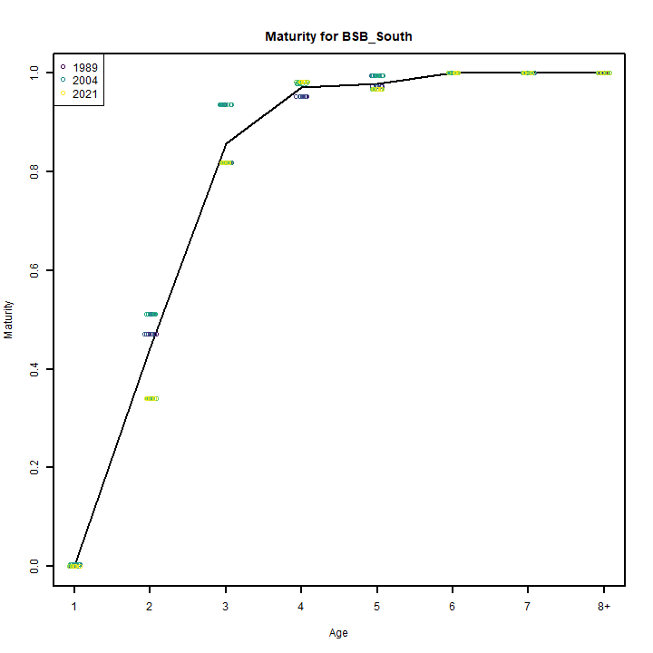
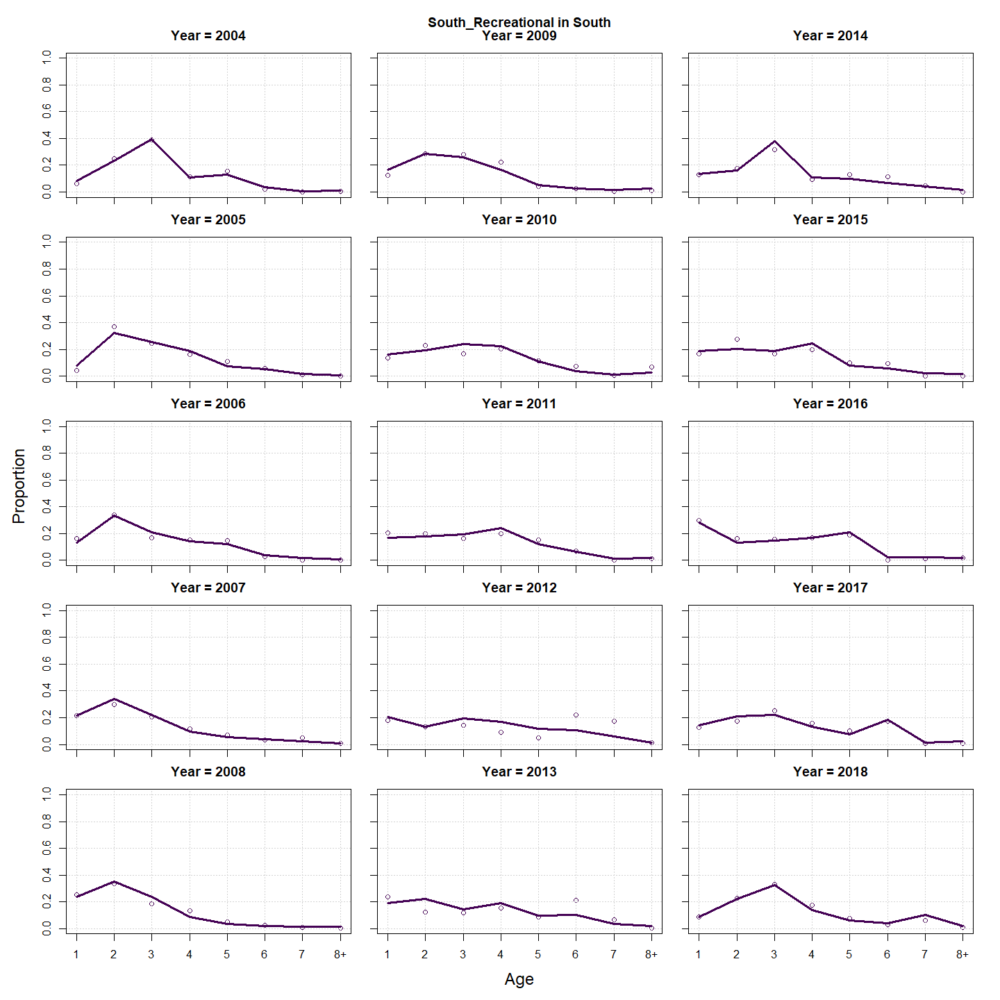
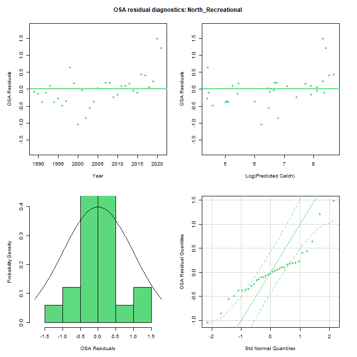
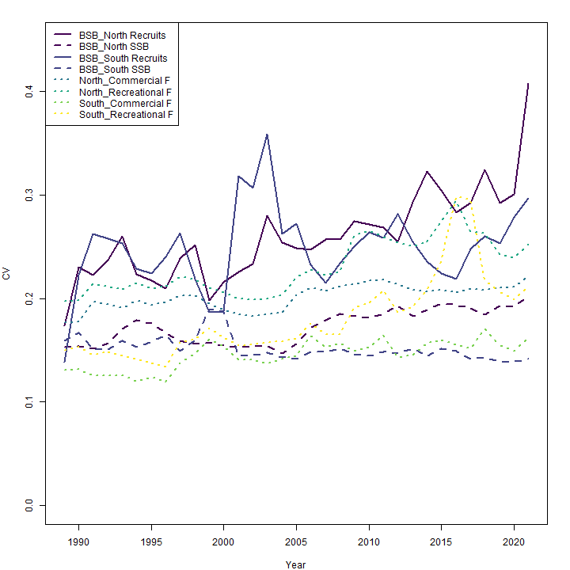
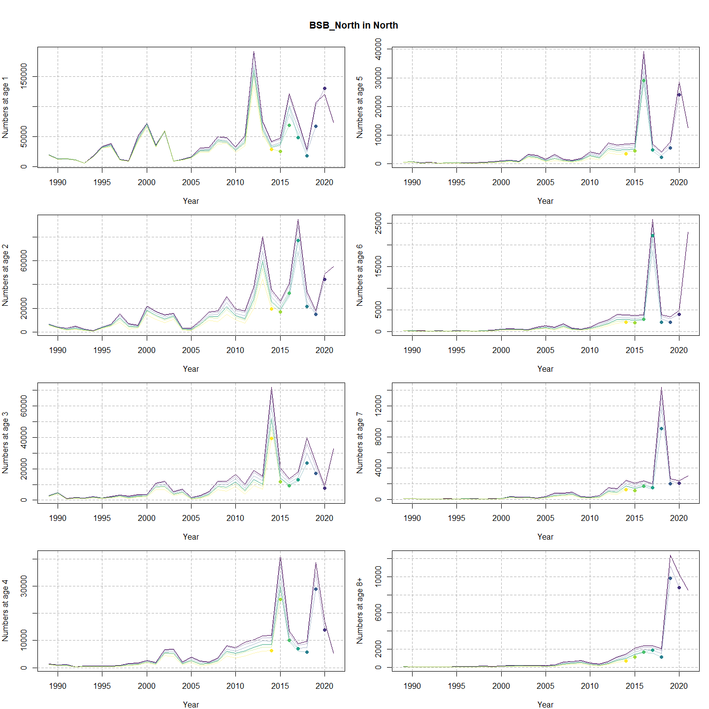
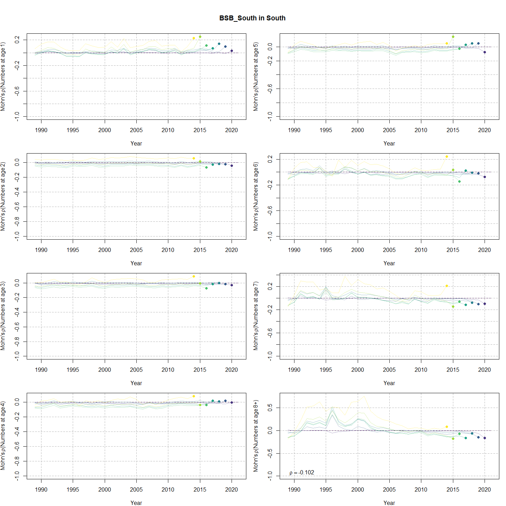

---
output:
  html_document:
    df_print: paged
    keep_md: yes
  word_document: default
  pdf_document:
    fig_caption: yes
    includes:
    keep_tex: yes
    number_sections: no
title: "WHAM figures and tables"
header-includes:
  - \usepackage{longtable}
  - \usepackage{booktabs}
  - \usepackage{caption,graphics}
  - \usepackage{makecell}
  - \usepackage{lscape}
  - \renewcommand\figurename{Fig.}
  - \captionsetup{labelsep=period, singlelinecheck=false}
  - \newcommand{\changesize}[1]{\fontsize{#1pt}{#1pt}\selectfont}
  - \renewcommand{\arraystretch}{1.5}
  - \renewcommand\theadfont{}
---

# {.tabset}

## Figures {.tabset}

### Input

### Diagnostics

### Results

### Retro

### Reference points

### Miscelaneous

## Tables {.tabset}

### Parameter estimates

<table class="table" style="margin-left: auto; margin-right: auto;">
<caption>Parameter estimates, standard errors, and confidence intervals. Rounded to 3 decimal places.</caption>
 <thead>
  <tr>
   <th style="text-align:left;">   </th>
   <th style="text-align:right;"> Estimate </th>
   <th style="text-align:right;"> Std. Error </th>
   <th style="text-align:right;"> 95\% CI lower </th>
   <th style="text-align:right;"> 95\% CI upper </th>
  </tr>
 </thead>
<tbody>
  <tr>
   <td style="text-align:left;"> BSB North Mean Recruitment </td>
   <td style="text-align:right;"> 32824.376 </td>
   <td style="text-align:right;"> 6952.013 </td>
   <td style="text-align:right;"> 21672.895 </td>
   <td style="text-align:right;"> 49713.696 </td>
  </tr>
  <tr>
   <td style="text-align:left;"> BSB North NAA $\sigma$ (age 1) </td>
   <td style="text-align:right;"> 0.895 </td>
   <td style="text-align:right;"> 0.127 </td>
   <td style="text-align:right;"> 0.678 </td>
   <td style="text-align:right;"> 1.182 </td>
  </tr>
  <tr>
   <td style="text-align:left;"> BSB North NAA $\sigma$ (age 2) </td>
   <td style="text-align:right;"> 0.359 </td>
   <td style="text-align:right;"> 0.039 </td>
   <td style="text-align:right;"> 0.290 </td>
   <td style="text-align:right;"> 0.444 </td>
  </tr>
  <tr>
   <td style="text-align:left;"> BSB South Mean Recruitment </td>
   <td style="text-align:right;"> 11587.931 </td>
   <td style="text-align:right;"> 1666.921 </td>
   <td style="text-align:right;"> 8740.994 </td>
   <td style="text-align:right;"> 15362.116 </td>
  </tr>
  <tr>
   <td style="text-align:left;"> BSB South NAA $\sigma$ (age 1) </td>
   <td style="text-align:right;"> 0.420 </td>
   <td style="text-align:right;"> 0.078 </td>
   <td style="text-align:right;"> 0.292 </td>
   <td style="text-align:right;"> 0.604 </td>
  </tr>
  <tr>
   <td style="text-align:left;"> BSB South NAA $\sigma$ (age 2) </td>
   <td style="text-align:right;"> 0.586 </td>
   <td style="text-align:right;"> 0.082 </td>
   <td style="text-align:right;"> 0.445 </td>
   <td style="text-align:right;"> 0.771 </td>
  </tr>
  <tr>
   <td style="text-align:left;"> North REC CPA fully selected q </td>
   <td style="text-align:right;"> 0.000 </td>
   <td style="text-align:right;"> 0.000 </td>
   <td style="text-align:right;"> 0.000 </td>
   <td style="text-align:right;"> 0.000 </td>
  </tr>
  <tr>
   <td style="text-align:left;"> North VAST Spring fully selected q </td>
   <td style="text-align:right;"> 0.005 </td>
   <td style="text-align:right;"> 0.001 </td>
   <td style="text-align:right;"> 0.004 </td>
   <td style="text-align:right;"> 0.008 </td>
  </tr>
  <tr>
   <td style="text-align:left;"> South REC CPA fully selected q </td>
   <td style="text-align:right;"> 0.000 </td>
   <td style="text-align:right;"> 0.000 </td>
   <td style="text-align:right;"> 0.000 </td>
   <td style="text-align:right;"> 0.000 </td>
  </tr>
  <tr>
   <td style="text-align:left;"> South VAST Spring fully selected q </td>
   <td style="text-align:right;"> 0.017 </td>
   <td style="text-align:right;"> 0.001 </td>
   <td style="text-align:right;"> 0.015 </td>
   <td style="text-align:right;"> 0.020 </td>
  </tr>
  <tr>
   <td style="text-align:left;"> Block 1: $a_{50}$ </td>
   <td style="text-align:right;"> 1.834 </td>
   <td style="text-align:right;"> 0.083 </td>
   <td style="text-align:right;"> 1.677 </td>
   <td style="text-align:right;"> 2.001 </td>
  </tr>
  <tr>
   <td style="text-align:left;"> Block 1: 1/slope (increasing) </td>
   <td style="text-align:right;"> 0.260 </td>
   <td style="text-align:right;"> 0.023 </td>
   <td style="text-align:right;"> 0.219 </td>
   <td style="text-align:right;"> 0.310 </td>
  </tr>
  <tr>
   <td style="text-align:left;"> Block 2: $a_{50}$ </td>
   <td style="text-align:right;"> 2.432 </td>
   <td style="text-align:right;"> 0.082 </td>
   <td style="text-align:right;"> 2.274 </td>
   <td style="text-align:right;"> 2.595 </td>
  </tr>
  <tr>
   <td style="text-align:left;"> Block 2: 1/slope (increasing) </td>
   <td style="text-align:right;"> 0.370 </td>
   <td style="text-align:right;"> 0.028 </td>
   <td style="text-align:right;"> 0.319 </td>
   <td style="text-align:right;"> 0.428 </td>
  </tr>
  <tr>
   <td style="text-align:left;"> Block 3: $a_{50}$ </td>
   <td style="text-align:right;"> 1.758 </td>
   <td style="text-align:right;"> 0.108 </td>
   <td style="text-align:right;"> 1.555 </td>
   <td style="text-align:right;"> 1.980 </td>
  </tr>
  <tr>
   <td style="text-align:left;"> Block 3: 1/slope (increasing) </td>
   <td style="text-align:right;"> 0.398 </td>
   <td style="text-align:right;"> 0.047 </td>
   <td style="text-align:right;"> 0.316 </td>
   <td style="text-align:right;"> 0.500 </td>
  </tr>
  <tr>
   <td style="text-align:left;"> Block 4: $a_{50}$ </td>
   <td style="text-align:right;"> 3.511 </td>
   <td style="text-align:right;"> 0.306 </td>
   <td style="text-align:right;"> 2.926 </td>
   <td style="text-align:right;"> 4.118 </td>
  </tr>
  <tr>
   <td style="text-align:left;"> Block 4: 1/slope (increasing) </td>
   <td style="text-align:right;"> 0.849 </td>
   <td style="text-align:right;"> 0.100 </td>
   <td style="text-align:right;"> 0.672 </td>
   <td style="text-align:right;"> 1.066 </td>
  </tr>
  <tr>
   <td style="text-align:left;"> Block 5: $a_{50}$ </td>
   <td style="text-align:right;"> 1.804 </td>
   <td style="text-align:right;"> 0.080 </td>
   <td style="text-align:right;"> 1.652 </td>
   <td style="text-align:right;"> 1.966 </td>
  </tr>
  <tr>
   <td style="text-align:left;"> Block 5: 1/slope (increasing) </td>
   <td style="text-align:right;"> 0.277 </td>
   <td style="text-align:right;"> 0.026 </td>
   <td style="text-align:right;"> 0.230 </td>
   <td style="text-align:right;"> 0.333 </td>
  </tr>
  <tr>
   <td style="text-align:left;"> Block 6: $a_{50}$ </td>
   <td style="text-align:right;"> 2.831 </td>
   <td style="text-align:right;"> 0.091 </td>
   <td style="text-align:right;"> 2.655 </td>
   <td style="text-align:right;"> 3.013 </td>
  </tr>
  <tr>
   <td style="text-align:left;"> Block 6: 1/slope (increasing) </td>
   <td style="text-align:right;"> 0.504 </td>
   <td style="text-align:right;"> 0.030 </td>
   <td style="text-align:right;"> 0.448 </td>
   <td style="text-align:right;"> 0.566 </td>
  </tr>
  <tr>
   <td style="text-align:left;"> Block 7: $a_{50}$ </td>
   <td style="text-align:right;"> 2.077 </td>
   <td style="text-align:right;"> 0.111 </td>
   <td style="text-align:right;"> 1.867 </td>
   <td style="text-align:right;"> 2.301 </td>
  </tr>
  <tr>
   <td style="text-align:left;"> Block 7: 1/slope (increasing) </td>
   <td style="text-align:right;"> 0.587 </td>
   <td style="text-align:right;"> 0.054 </td>
   <td style="text-align:right;"> 0.490 </td>
   <td style="text-align:right;"> 0.703 </td>
  </tr>
  <tr>
   <td style="text-align:left;"> Block 8: $a_{50}$ </td>
   <td style="text-align:right;"> 4.182 </td>
   <td style="text-align:right;"> 0.430 </td>
   <td style="text-align:right;"> 3.343 </td>
   <td style="text-align:right;"> 5.006 </td>
  </tr>
  <tr>
   <td style="text-align:left;"> Block 8: 1/slope (increasing) </td>
   <td style="text-align:right;"> 1.335 </td>
   <td style="text-align:right;"> 0.141 </td>
   <td style="text-align:right;"> 1.082 </td>
   <td style="text-align:right;"> 1.634 </td>
  </tr>
  <tr>
   <td style="text-align:left;"> Block 9: Mean Selectivity for age 1 </td>
   <td style="text-align:right;"> 0.284 </td>
   <td style="text-align:right;"> 0.077 </td>
   <td style="text-align:right;"> 0.158 </td>
   <td style="text-align:right;"> 0.455 </td>
  </tr>
  <tr>
   <td style="text-align:left;"> Block 9: Mean Selectivity for age 2 </td>
   <td style="text-align:right;"> 1.000 </td>
   <td style="text-align:right;"> -- </td>
   <td style="text-align:right;"> -- </td>
   <td style="text-align:right;"> -- </td>
  </tr>
  <tr>
   <td style="text-align:left;"> Block 9: Mean Selectivity for age 3 </td>
   <td style="text-align:right;"> 1.000 </td>
   <td style="text-align:right;"> -- </td>
   <td style="text-align:right;"> -- </td>
   <td style="text-align:right;"> -- </td>
  </tr>
  <tr>
   <td style="text-align:left;"> Block 9: Mean Selectivity for age 4 </td>
   <td style="text-align:right;"> 1.000 </td>
   <td style="text-align:right;"> -- </td>
   <td style="text-align:right;"> -- </td>
   <td style="text-align:right;"> -- </td>
  </tr>
  <tr>
   <td style="text-align:left;"> Block 9: Mean Selectivity for age 5 </td>
   <td style="text-align:right;"> 1.000 </td>
   <td style="text-align:right;"> -- </td>
   <td style="text-align:right;"> -- </td>
   <td style="text-align:right;"> -- </td>
  </tr>
  <tr>
   <td style="text-align:left;"> Block 9: Mean Selectivity for age 6 </td>
   <td style="text-align:right;"> 1.000 </td>
   <td style="text-align:right;"> -- </td>
   <td style="text-align:right;"> -- </td>
   <td style="text-align:right;"> -- </td>
  </tr>
  <tr>
   <td style="text-align:left;"> Block 9: Mean Selectivity for age 7 </td>
   <td style="text-align:right;"> 1.000 </td>
   <td style="text-align:right;"> -- </td>
   <td style="text-align:right;"> -- </td>
   <td style="text-align:right;"> -- </td>
  </tr>
  <tr>
   <td style="text-align:left;"> Block 9: Mean Selectivity for age 8+ </td>
   <td style="text-align:right;"> 1.000 </td>
   <td style="text-align:right;"> -- </td>
   <td style="text-align:right;"> -- </td>
   <td style="text-align:right;"> -- </td>
  </tr>
  <tr>
   <td style="text-align:left;"> Block 10: Selectivity for age 1 </td>
   <td style="text-align:right;"> 0.095 </td>
   <td style="text-align:right;"> 0.012 </td>
   <td style="text-align:right;"> 0.074 </td>
   <td style="text-align:right;"> 0.121 </td>
  </tr>
  <tr>
   <td style="text-align:left;"> Block 10: Selectivity for age 2 </td>
   <td style="text-align:right;"> 0.464 </td>
   <td style="text-align:right;"> 0.044 </td>
   <td style="text-align:right;"> 0.380 </td>
   <td style="text-align:right;"> 0.550 </td>
  </tr>
  <tr>
   <td style="text-align:left;"> Block 10: Selectivity for age 3 </td>
   <td style="text-align:right;"> 1.000 </td>
   <td style="text-align:right;"> -- </td>
   <td style="text-align:right;"> -- </td>
   <td style="text-align:right;"> -- </td>
  </tr>
  <tr>
   <td style="text-align:left;"> Block 10: Selectivity for age 4 </td>
   <td style="text-align:right;"> 1.000 </td>
   <td style="text-align:right;"> -- </td>
   <td style="text-align:right;"> -- </td>
   <td style="text-align:right;"> -- </td>
  </tr>
  <tr>
   <td style="text-align:left;"> Block 10: Selectivity for age 5 </td>
   <td style="text-align:right;"> 1.000 </td>
   <td style="text-align:right;"> -- </td>
   <td style="text-align:right;"> -- </td>
   <td style="text-align:right;"> -- </td>
  </tr>
  <tr>
   <td style="text-align:left;"> Block 10: Selectivity for age 6 </td>
   <td style="text-align:right;"> 1.000 </td>
   <td style="text-align:right;"> -- </td>
   <td style="text-align:right;"> -- </td>
   <td style="text-align:right;"> -- </td>
  </tr>
  <tr>
   <td style="text-align:left;"> Block 10: Selectivity for age 7 </td>
   <td style="text-align:right;"> 1.000 </td>
   <td style="text-align:right;"> -- </td>
   <td style="text-align:right;"> -- </td>
   <td style="text-align:right;"> -- </td>
  </tr>
  <tr>
   <td style="text-align:left;"> Block 10: Selectivity for age 8+ </td>
   <td style="text-align:right;"> 1.000 </td>
   <td style="text-align:right;"> -- </td>
   <td style="text-align:right;"> -- </td>
   <td style="text-align:right;"> -- </td>
  </tr>
  <tr>
   <td style="text-align:left;"> Block 11: Mean Selectivity for age 1 </td>
   <td style="text-align:right;"> 0.359 </td>
   <td style="text-align:right;"> 0.067 </td>
   <td style="text-align:right;"> 0.241 </td>
   <td style="text-align:right;"> 0.498 </td>
  </tr>
  <tr>
   <td style="text-align:left;"> Block 11: Mean Selectivity for age 2 </td>
   <td style="text-align:right;"> 1.000 </td>
   <td style="text-align:right;"> -- </td>
   <td style="text-align:right;"> -- </td>
   <td style="text-align:right;"> -- </td>
  </tr>
  <tr>
   <td style="text-align:left;"> Block 11: Mean Selectivity for age 3 </td>
   <td style="text-align:right;"> 1.000 </td>
   <td style="text-align:right;"> -- </td>
   <td style="text-align:right;"> -- </td>
   <td style="text-align:right;"> -- </td>
  </tr>
  <tr>
   <td style="text-align:left;"> Block 11: Mean Selectivity for age 4 </td>
   <td style="text-align:right;"> 1.000 </td>
   <td style="text-align:right;"> -- </td>
   <td style="text-align:right;"> -- </td>
   <td style="text-align:right;"> -- </td>
  </tr>
  <tr>
   <td style="text-align:left;"> Block 11: Mean Selectivity for age 5 </td>
   <td style="text-align:right;"> 1.000 </td>
   <td style="text-align:right;"> -- </td>
   <td style="text-align:right;"> -- </td>
   <td style="text-align:right;"> -- </td>
  </tr>
  <tr>
   <td style="text-align:left;"> Block 11: Mean Selectivity for age 6 </td>
   <td style="text-align:right;"> 1.000 </td>
   <td style="text-align:right;"> -- </td>
   <td style="text-align:right;"> -- </td>
   <td style="text-align:right;"> -- </td>
  </tr>
  <tr>
   <td style="text-align:left;"> Block 11: Mean Selectivity for age 7 </td>
   <td style="text-align:right;"> 1.000 </td>
   <td style="text-align:right;"> -- </td>
   <td style="text-align:right;"> -- </td>
   <td style="text-align:right;"> -- </td>
  </tr>
  <tr>
   <td style="text-align:left;"> Block 11: Mean Selectivity for age 8+ </td>
   <td style="text-align:right;"> 1.000 </td>
   <td style="text-align:right;"> -- </td>
   <td style="text-align:right;"> -- </td>
   <td style="text-align:right;"> -- </td>
  </tr>
  <tr>
   <td style="text-align:left;"> Block 12: Selectivity for age 1 </td>
   <td style="text-align:right;"> 0.745 </td>
   <td style="text-align:right;"> 0.092 </td>
   <td style="text-align:right;"> 0.530 </td>
   <td style="text-align:right;"> 0.883 </td>
  </tr>
  <tr>
   <td style="text-align:left;"> Block 12: Selectivity for age 2 </td>
   <td style="text-align:right;"> 1.000 </td>
   <td style="text-align:right;"> -- </td>
   <td style="text-align:right;"> -- </td>
   <td style="text-align:right;"> -- </td>
  </tr>
  <tr>
   <td style="text-align:left;"> Block 12: Selectivity for age 3 </td>
   <td style="text-align:right;"> 0.745 </td>
   <td style="text-align:right;"> 0.092 </td>
   <td style="text-align:right;"> 0.530 </td>
   <td style="text-align:right;"> 0.883 </td>
  </tr>
  <tr>
   <td style="text-align:left;"> Block 12: Selectivity for age 4 </td>
   <td style="text-align:right;"> 0.745 </td>
   <td style="text-align:right;"> 0.092 </td>
   <td style="text-align:right;"> 0.530 </td>
   <td style="text-align:right;"> 0.883 </td>
  </tr>
  <tr>
   <td style="text-align:left;"> Block 12: Selectivity for age 5 </td>
   <td style="text-align:right;"> 0.745 </td>
   <td style="text-align:right;"> 0.092 </td>
   <td style="text-align:right;"> 0.530 </td>
   <td style="text-align:right;"> 0.883 </td>
  </tr>
  <tr>
   <td style="text-align:left;"> Block 12: Selectivity for age 6 </td>
   <td style="text-align:right;"> 0.745 </td>
   <td style="text-align:right;"> 0.092 </td>
   <td style="text-align:right;"> 0.530 </td>
   <td style="text-align:right;"> 0.883 </td>
  </tr>
  <tr>
   <td style="text-align:left;"> Block 12: Selectivity for age 7 </td>
   <td style="text-align:right;"> 0.745 </td>
   <td style="text-align:right;"> 0.092 </td>
   <td style="text-align:right;"> 0.530 </td>
   <td style="text-align:right;"> 0.883 </td>
  </tr>
  <tr>
   <td style="text-align:left;"> Block 12: Selectivity for age 8+ </td>
   <td style="text-align:right;"> 0.745 </td>
   <td style="text-align:right;"> 0.092 </td>
   <td style="text-align:right;"> 0.530 </td>
   <td style="text-align:right;"> 0.883 </td>
  </tr>
  <tr>
   <td style="text-align:left;"> Block 9: Selectivity RE $\sigma$ </td>
   <td style="text-align:right;"> 0.768 </td>
   <td style="text-align:right;"> 0.197 </td>
   <td style="text-align:right;"> 0.464 </td>
   <td style="text-align:right;"> 1.269 </td>
  </tr>
  <tr>
   <td style="text-align:left;"> Block 9: Selectivity RE AR1 $\rho$ (year) </td>
   <td style="text-align:right;"> 0.358 </td>
   <td style="text-align:right;"> 0.182 </td>
   <td style="text-align:right;"> 0.151 </td>
   <td style="text-align:right;"> 0.873 </td>
  </tr>
  <tr>
   <td style="text-align:left;"> Block 11: Selectivity RE $\sigma$ </td>
   <td style="text-align:right;"> 0.840 </td>
   <td style="text-align:right;"> 0.190 </td>
   <td style="text-align:right;"> 0.539 </td>
   <td style="text-align:right;"> 1.309 </td>
  </tr>
  <tr>
   <td style="text-align:left;"> Block 11: Selectivity RE AR1 $\rho$ (year) </td>
   <td style="text-align:right;"> 0.220 </td>
   <td style="text-align:right;"> 0.201 </td>
   <td style="text-align:right;"> -0.031 </td>
   <td style="text-align:right;"> 0.729 </td>
  </tr>
  <tr>
   <td style="text-align:left;"> Block 12: Selectivity RE $\sigma$ </td>
   <td style="text-align:right;"> 1.011 </td>
   <td style="text-align:right;"> 0.471 </td>
   <td style="text-align:right;"> 0.406 </td>
   <td style="text-align:right;"> 2.517 </td>
  </tr>
  <tr>
   <td style="text-align:left;"> Block 12: Selectivity RE AR1 $\rho$ (age) </td>
   <td style="text-align:right;"> -0.261 </td>
   <td style="text-align:right;"> 0.427 </td>
   <td style="text-align:right;"> -0.927 </td>
   <td style="text-align:right;"> 0.513 </td>
  </tr>
  <tr>
   <td style="text-align:left;"> North Commercial in North age comp, Dirichlet-multinomial: dispersion ($\phi$) </td>
   <td style="text-align:right;"> 48.612 </td>
   <td style="text-align:right;"> 5.991 </td>
   <td style="text-align:right;"> 38.180 </td>
   <td style="text-align:right;"> 61.893 </td>
  </tr>
  <tr>
   <td style="text-align:left;"> North Recreational in North age comp, Dirichlet-multinomial: dispersion ($\phi$) </td>
   <td style="text-align:right;"> 38.349 </td>
   <td style="text-align:right;"> 4.660 </td>
   <td style="text-align:right;"> 30.222 </td>
   <td style="text-align:right;"> 48.661 </td>
  </tr>
  <tr>
   <td style="text-align:left;"> South Commercial in South age comp, Dirichlet-multinomial: dispersion ($\phi$) </td>
   <td style="text-align:right;"> 48.675 </td>
   <td style="text-align:right;"> 5.362 </td>
   <td style="text-align:right;"> 39.223 </td>
   <td style="text-align:right;"> 60.406 </td>
  </tr>
  <tr>
   <td style="text-align:left;"> South Recreational in South age comp, Dirichlet-multinomial: dispersion ($\phi$) </td>
   <td style="text-align:right;"> 60.871 </td>
   <td style="text-align:right;"> 8.397 </td>
   <td style="text-align:right;"> 46.450 </td>
   <td style="text-align:right;"> 79.768 </td>
  </tr>
  <tr>
   <td style="text-align:left;"> North REC CPA in North age comp, Dirichlet-multinomial: dispersion ($\phi$) </td>
   <td style="text-align:right;"> 52.614 </td>
   <td style="text-align:right;"> 7.648 </td>
   <td style="text-align:right;"> 39.570 </td>
   <td style="text-align:right;"> 69.958 </td>
  </tr>
  <tr>
   <td style="text-align:left;"> North VAST Spring in North age comp, Dirichlet-multinomial: dispersion ($\phi$) </td>
   <td style="text-align:right;"> 27.460 </td>
   <td style="text-align:right;"> 2.884 </td>
   <td style="text-align:right;"> 22.350 </td>
   <td style="text-align:right;"> 33.737 </td>
  </tr>
  <tr>
   <td style="text-align:left;"> South REC CPA in South age comp, Dirichlet-multinomial: dispersion ($\phi$) </td>
   <td style="text-align:right;"> 345.389 </td>
   <td style="text-align:right;"> 123.580 </td>
   <td style="text-align:right;"> 171.296 </td>
   <td style="text-align:right;"> 696.417 </td>
  </tr>
  <tr>
   <td style="text-align:left;"> South VAST Spring in South age comp, Dirichlet-multinomial: dispersion ($\phi$) </td>
   <td style="text-align:right;"> 38.582 </td>
   <td style="text-align:right;"> 4.642 </td>
   <td style="text-align:right;"> 30.477 </td>
   <td style="text-align:right;"> 48.841 </td>
  </tr>
  <tr>
   <td style="text-align:left;"> $\mu$ from North to South RE $\sigma$ </td>
   <td style="text-align:right;"> 0.531 </td>
   <td style="text-align:right;"> 0.158 </td>
   <td style="text-align:right;"> 0.296 </td>
   <td style="text-align:right;"> 0.950 </td>
  </tr>
  <tr>
   <td style="text-align:left;"> $\mu$ from North to South RE AR1 $\rho$ (year) </td>
   <td style="text-align:right;"> 0.947 </td>
   <td style="text-align:right;"> 0.052 </td>
   <td style="text-align:right;"> 0.666 </td>
   <td style="text-align:right;"> 0.993 </td>
  </tr>
  <tr>
   <td style="text-align:left;"> North REC CPA log-index observation SD scalar </td>
   <td style="text-align:right;"> 7.525 </td>
   <td style="text-align:right;"> 1.404 </td>
   <td style="text-align:right;"> 5.219 </td>
   <td style="text-align:right;"> 10.848 </td>
  </tr>
</tbody>
</table>

### Abundance at age

<table class="table" style="margin-left: auto; margin-right: auto;">
<caption>Abundance at age (1000s) for BSB North in North.</caption>
 <thead>
  <tr>
   <th style="text-align:left;">   </th>
   <th style="text-align:right;"> 1 </th>
   <th style="text-align:right;"> 2 </th>
   <th style="text-align:right;"> 3 </th>
   <th style="text-align:right;"> 4 </th>
   <th style="text-align:right;"> 5 </th>
   <th style="text-align:right;"> 6 </th>
   <th style="text-align:right;"> 7 </th>
   <th style="text-align:right;"> 8+ </th>
  </tr>
 </thead>
<tbody>
  <tr>
   <td style="text-align:left;"> 1989 </td>
   <td style="text-align:right;"> 18983 </td>
   <td style="text-align:right;"> 6729 </td>
   <td style="text-align:right;"> 2982 </td>
   <td style="text-align:right;"> 1275 </td>
   <td style="text-align:right;"> 541 </td>
   <td style="text-align:right;"> 229 </td>
   <td style="text-align:right;"> 97 </td>
   <td style="text-align:right;"> 71 </td>
  </tr>
  <tr>
   <td style="text-align:left;"> 1990 </td>
   <td style="text-align:right;"> 12469 </td>
   <td style="text-align:right;"> 4145 </td>
   <td style="text-align:right;"> 4918 </td>
   <td style="text-align:right;"> 987 </td>
   <td style="text-align:right;"> 586 </td>
   <td style="text-align:right;"> 148 </td>
   <td style="text-align:right;"> 108 </td>
   <td style="text-align:right;"> 59 </td>
  </tr>
  <tr>
   <td style="text-align:left;"> 1991 </td>
   <td style="text-align:right;"> 13061 </td>
   <td style="text-align:right;"> 3362 </td>
   <td style="text-align:right;"> 1091 </td>
   <td style="text-align:right;"> 1200 </td>
   <td style="text-align:right;"> 257 </td>
   <td style="text-align:right;"> 124 </td>
   <td style="text-align:right;"> 48 </td>
   <td style="text-align:right;"> 44 </td>
  </tr>
  <tr>
   <td style="text-align:left;"> 1992 </td>
   <td style="text-align:right;"> 11077 </td>
   <td style="text-align:right;"> 4749 </td>
   <td style="text-align:right;"> 1658 </td>
   <td style="text-align:right;"> 349 </td>
   <td style="text-align:right;"> 442 </td>
   <td style="text-align:right;"> 73 </td>
   <td style="text-align:right;"> 43 </td>
   <td style="text-align:right;"> 48 </td>
  </tr>
  <tr>
   <td style="text-align:left;"> 1993 </td>
   <td style="text-align:right;"> 5214 </td>
   <td style="text-align:right;"> 2539 </td>
   <td style="text-align:right;"> 1490 </td>
   <td style="text-align:right;"> 606 </td>
   <td style="text-align:right;"> 90 </td>
   <td style="text-align:right;"> 168 </td>
   <td style="text-align:right;"> 25 </td>
   <td style="text-align:right;"> 30 </td>
  </tr>
  <tr>
   <td style="text-align:left;"> 1994 </td>
   <td style="text-align:right;"> 17486 </td>
   <td style="text-align:right;"> 1140 </td>
   <td style="text-align:right;"> 2344 </td>
   <td style="text-align:right;"> 577 </td>
   <td style="text-align:right;"> 329 </td>
   <td style="text-align:right;"> 53 </td>
   <td style="text-align:right;"> 67 </td>
   <td style="text-align:right;"> 30 </td>
  </tr>
  <tr>
   <td style="text-align:left;"> 1995 </td>
   <td style="text-align:right;"> 33025 </td>
   <td style="text-align:right;"> 4295 </td>
   <td style="text-align:right;"> 1536 </td>
   <td style="text-align:right;"> 625 </td>
   <td style="text-align:right;"> 321 </td>
   <td style="text-align:right;"> 155 </td>
   <td style="text-align:right;"> 33 </td>
   <td style="text-align:right;"> 82 </td>
  </tr>
  <tr>
   <td style="text-align:left;"> 1996 </td>
   <td style="text-align:right;"> 38298 </td>
   <td style="text-align:right;"> 6733 </td>
   <td style="text-align:right;"> 2214 </td>
   <td style="text-align:right;"> 607 </td>
   <td style="text-align:right;"> 260 </td>
   <td style="text-align:right;"> 199 </td>
   <td style="text-align:right;"> 94 </td>
   <td style="text-align:right;"> 76 </td>
  </tr>
  <tr>
   <td style="text-align:left;"> 1997 </td>
   <td style="text-align:right;"> 12195 </td>
   <td style="text-align:right;"> 15121 </td>
   <td style="text-align:right;"> 3333 </td>
   <td style="text-align:right;"> 842 </td>
   <td style="text-align:right;"> 239 </td>
   <td style="text-align:right;"> 97 </td>
   <td style="text-align:right;"> 91 </td>
   <td style="text-align:right;"> 82 </td>
  </tr>
  <tr>
   <td style="text-align:left;"> 1998 </td>
   <td style="text-align:right;"> 9442 </td>
   <td style="text-align:right;"> 7076 </td>
   <td style="text-align:right;"> 2617 </td>
   <td style="text-align:right;"> 1526 </td>
   <td style="text-align:right;"> 445 </td>
   <td style="text-align:right;"> 192 </td>
   <td style="text-align:right;"> 46 </td>
   <td style="text-align:right;"> 126 </td>
  </tr>
  <tr>
   <td style="text-align:left;"> 1999 </td>
   <td style="text-align:right;"> 51218 </td>
   <td style="text-align:right;"> 5718 </td>
   <td style="text-align:right;"> 3454 </td>
   <td style="text-align:right;"> 1687 </td>
   <td style="text-align:right;"> 680 </td>
   <td style="text-align:right;"> 244 </td>
   <td style="text-align:right;"> 84 </td>
   <td style="text-align:right;"> 80 </td>
  </tr>
  <tr>
   <td style="text-align:left;"> 2000 </td>
   <td style="text-align:right;"> 71828 </td>
   <td style="text-align:right;"> 22066 </td>
   <td style="text-align:right;"> 3612 </td>
   <td style="text-align:right;"> 2707 </td>
   <td style="text-align:right;"> 960 </td>
   <td style="text-align:right;"> 549 </td>
   <td style="text-align:right;"> 124 </td>
   <td style="text-align:right;"> 149 </td>
  </tr>
  <tr>
   <td style="text-align:left;"> 2001 </td>
   <td style="text-align:right;"> 35383 </td>
   <td style="text-align:right;"> 17172 </td>
   <td style="text-align:right;"> 10799 </td>
   <td style="text-align:right;"> 1887 </td>
   <td style="text-align:right;"> 1225 </td>
   <td style="text-align:right;"> 582 </td>
   <td style="text-align:right;"> 355 </td>
   <td style="text-align:right;"> 169 </td>
  </tr>
  <tr>
   <td style="text-align:left;"> 2002 </td>
   <td style="text-align:right;"> 59065 </td>
   <td style="text-align:right;"> 14491 </td>
   <td style="text-align:right;"> 11993 </td>
   <td style="text-align:right;"> 6692 </td>
   <td style="text-align:right;"> 807 </td>
   <td style="text-align:right;"> 571 </td>
   <td style="text-align:right;"> 270 </td>
   <td style="text-align:right;"> 222 </td>
  </tr>
  <tr>
   <td style="text-align:left;"> 2003 </td>
   <td style="text-align:right;"> 8941 </td>
   <td style="text-align:right;"> 15537 </td>
   <td style="text-align:right;"> 5421 </td>
   <td style="text-align:right;"> 6830 </td>
   <td style="text-align:right;"> 3186 </td>
   <td style="text-align:right;"> 391 </td>
   <td style="text-align:right;"> 317 </td>
   <td style="text-align:right;"> 181 </td>
  </tr>
  <tr>
   <td style="text-align:left;"> 2004 </td>
   <td style="text-align:right;"> 12177 </td>
   <td style="text-align:right;"> 3337 </td>
   <td style="text-align:right;"> 7186 </td>
   <td style="text-align:right;"> 2134 </td>
   <td style="text-align:right;"> 2856 </td>
   <td style="text-align:right;"> 935 </td>
   <td style="text-align:right;"> 151 </td>
   <td style="text-align:right;"> 207 </td>
  </tr>
  <tr>
   <td style="text-align:left;"> 2005 </td>
   <td style="text-align:right;"> 16342 </td>
   <td style="text-align:right;"> 3277 </td>
   <td style="text-align:right;"> 1809 </td>
   <td style="text-align:right;"> 3970 </td>
   <td style="text-align:right;"> 1460 </td>
   <td style="text-align:right;"> 1274 </td>
   <td style="text-align:right;"> 379 </td>
   <td style="text-align:right;"> 183 </td>
  </tr>
  <tr>
   <td style="text-align:left;"> 2006 </td>
   <td style="text-align:right;"> 30419 </td>
   <td style="text-align:right;"> 9407 </td>
   <td style="text-align:right;"> 2846 </td>
   <td style="text-align:right;"> 2378 </td>
   <td style="text-align:right;"> 3219 </td>
   <td style="text-align:right;"> 930 </td>
   <td style="text-align:right;"> 803 </td>
   <td style="text-align:right;"> 263 </td>
  </tr>
  <tr>
   <td style="text-align:left;"> 2007 </td>
   <td style="text-align:right;"> 31212 </td>
   <td style="text-align:right;"> 17114 </td>
   <td style="text-align:right;"> 5618 </td>
   <td style="text-align:right;"> 2088 </td>
   <td style="text-align:right;"> 1448 </td>
   <td style="text-align:right;"> 1731 </td>
   <td style="text-align:right;"> 768 </td>
   <td style="text-align:right;"> 551 </td>
  </tr>
  <tr>
   <td style="text-align:left;"> 2008 </td>
   <td style="text-align:right;"> 49605 </td>
   <td style="text-align:right;"> 17565 </td>
   <td style="text-align:right;"> 12002 </td>
   <td style="text-align:right;"> 3534 </td>
   <td style="text-align:right;"> 1095 </td>
   <td style="text-align:right;"> 739 </td>
   <td style="text-align:right;"> 910 </td>
   <td style="text-align:right;"> 657 </td>
  </tr>
  <tr>
   <td style="text-align:left;"> 2009 </td>
   <td style="text-align:right;"> 48324 </td>
   <td style="text-align:right;"> 29929 </td>
   <td style="text-align:right;"> 11937 </td>
   <td style="text-align:right;"> 8141 </td>
   <td style="text-align:right;"> 1872 </td>
   <td style="text-align:right;"> 560 </td>
   <td style="text-align:right;"> 371 </td>
   <td style="text-align:right;"> 727 </td>
  </tr>
  <tr>
   <td style="text-align:left;"> 2010 </td>
   <td style="text-align:right;"> 32692 </td>
   <td style="text-align:right;"> 19353 </td>
   <td style="text-align:right;"> 16470 </td>
   <td style="text-align:right;"> 7436 </td>
   <td style="text-align:right;"> 4081 </td>
   <td style="text-align:right;"> 964 </td>
   <td style="text-align:right;"> 291 </td>
   <td style="text-align:right;"> 471 </td>
  </tr>
  <tr>
   <td style="text-align:left;"> 2011 </td>
   <td style="text-align:right;"> 51288 </td>
   <td style="text-align:right;"> 17910 </td>
   <td style="text-align:right;"> 10265 </td>
   <td style="text-align:right;"> 9347 </td>
   <td style="text-align:right;"> 3406 </td>
   <td style="text-align:right;"> 1964 </td>
   <td style="text-align:right;"> 507 </td>
   <td style="text-align:right;"> 352 </td>
  </tr>
  <tr>
   <td style="text-align:left;"> 2012 </td>
   <td style="text-align:right;"> 191732 </td>
   <td style="text-align:right;"> 38177 </td>
   <td style="text-align:right;"> 18887 </td>
   <td style="text-align:right;"> 10218 </td>
   <td style="text-align:right;"> 7162 </td>
   <td style="text-align:right;"> 2655 </td>
   <td style="text-align:right;"> 1467 </td>
   <td style="text-align:right;"> 630 </td>
  </tr>
  <tr>
   <td style="text-align:left;"> 2013 </td>
   <td style="text-align:right;"> 75063 </td>
   <td style="text-align:right;"> 80178 </td>
   <td style="text-align:right;"> 15187 </td>
   <td style="text-align:right;"> 11740 </td>
   <td style="text-align:right;"> 6438 </td>
   <td style="text-align:right;"> 3947 </td>
   <td style="text-align:right;"> 1376 </td>
   <td style="text-align:right;"> 1142 </td>
  </tr>
  <tr>
   <td style="text-align:left;"> 2014 </td>
   <td style="text-align:right;"> 41049 </td>
   <td style="text-align:right;"> 35662 </td>
   <td style="text-align:right;"> 72023 </td>
   <td style="text-align:right;"> 11791 </td>
   <td style="text-align:right;"> 6759 </td>
   <td style="text-align:right;"> 3801 </td>
   <td style="text-align:right;"> 2448 </td>
   <td style="text-align:right;"> 1466 </td>
  </tr>
  <tr>
   <td style="text-align:left;"> 2015 </td>
   <td style="text-align:right;"> 46898 </td>
   <td style="text-align:right;"> 25904 </td>
   <td style="text-align:right;"> 20526 </td>
   <td style="text-align:right;"> 41503 </td>
   <td style="text-align:right;"> 7002 </td>
   <td style="text-align:right;"> 3763 </td>
   <td style="text-align:right;"> 2034 </td>
   <td style="text-align:right;"> 2092 </td>
  </tr>
  <tr>
   <td style="text-align:left;"> 2016 </td>
   <td style="text-align:right;"> 121206 </td>
   <td style="text-align:right;"> 40545 </td>
   <td style="text-align:right;"> 13734 </td>
   <td style="text-align:right;"> 13544 </td>
   <td style="text-align:right;"> 39283 </td>
   <td style="text-align:right;"> 3852 </td>
   <td style="text-align:right;"> 2383 </td>
   <td style="text-align:right;"> 2396 </td>
  </tr>
  <tr>
   <td style="text-align:left;"> 2017 </td>
   <td style="text-align:right;"> 75830 </td>
   <td style="text-align:right;"> 94931 </td>
   <td style="text-align:right;"> 17959 </td>
   <td style="text-align:right;"> 8883 </td>
   <td style="text-align:right;"> 6876 </td>
   <td style="text-align:right;"> 25975 </td>
   <td style="text-align:right;"> 2009 </td>
   <td style="text-align:right;"> 2399 </td>
  </tr>
  <tr>
   <td style="text-align:left;"> 2018 </td>
   <td style="text-align:right;"> 28183 </td>
   <td style="text-align:right;"> 33912 </td>
   <td style="text-align:right;"> 39480 </td>
   <td style="text-align:right;"> 9681 </td>
   <td style="text-align:right;"> 4162 </td>
   <td style="text-align:right;"> 3864 </td>
   <td style="text-align:right;"> 14396 </td>
   <td style="text-align:right;"> 2032 </td>
  </tr>
  <tr>
   <td style="text-align:left;"> 2019 </td>
   <td style="text-align:right;"> 106172 </td>
   <td style="text-align:right;"> 17567 </td>
   <td style="text-align:right;"> 23936 </td>
   <td style="text-align:right;"> 38717 </td>
   <td style="text-align:right;"> 7547 </td>
   <td style="text-align:right;"> 3314 </td>
   <td style="text-align:right;"> 2641 </td>
   <td style="text-align:right;"> 12412 </td>
  </tr>
  <tr>
   <td style="text-align:left;"> 2020 </td>
   <td style="text-align:right;"> 119952 </td>
   <td style="text-align:right;"> 48706 </td>
   <td style="text-align:right;"> 8811 </td>
   <td style="text-align:right;"> 17007 </td>
   <td style="text-align:right;"> 28549 </td>
   <td style="text-align:right;"> 4814 </td>
   <td style="text-align:right;"> 2372 </td>
   <td style="text-align:right;"> 10283 </td>
  </tr>
  <tr>
   <td style="text-align:left;"> 2021 </td>
   <td style="text-align:right;"> 73461 </td>
   <td style="text-align:right;"> 54934 </td>
   <td style="text-align:right;"> 32781 </td>
   <td style="text-align:right;"> 5427 </td>
   <td style="text-align:right;"> 12440 </td>
   <td style="text-align:right;"> 22996 </td>
   <td style="text-align:right;"> 3023 </td>
   <td style="text-align:right;"> 8549 </td>
  </tr>
</tbody>
</table>

<table class="table" style="margin-left: auto; margin-right: auto;">
<caption>Abundance at age (1000s) for BSB North in South.</caption>
 <thead>
  <tr>
   <th style="text-align:left;">   </th>
   <th style="text-align:right;"> 1 </th>
   <th style="text-align:right;"> 2 </th>
   <th style="text-align:right;"> 3 </th>
   <th style="text-align:right;"> 4 </th>
   <th style="text-align:right;"> 5 </th>
   <th style="text-align:right;"> 6 </th>
   <th style="text-align:right;"> 7 </th>
   <th style="text-align:right;"> 8+ </th>
  </tr>
 </thead>
<tbody>
  <tr>
   <td style="text-align:left;"> 1989 </td>
   <td style="text-align:right;"> 0 </td>
   <td style="text-align:right;"> 3330 </td>
   <td style="text-align:right;"> 1408 </td>
   <td style="text-align:right;"> 592 </td>
   <td style="text-align:right;"> 250 </td>
   <td style="text-align:right;"> 106 </td>
   <td style="text-align:right;"> 45 </td>
   <td style="text-align:right;"> 33 </td>
  </tr>
  <tr>
   <td style="text-align:left;"> 1990 </td>
   <td style="text-align:right;"> 0 </td>
   <td style="text-align:right;"> 3055 </td>
   <td style="text-align:right;"> 1878 </td>
   <td style="text-align:right;"> 512 </td>
   <td style="text-align:right;"> 232 </td>
   <td style="text-align:right;"> 83 </td>
   <td style="text-align:right;"> 45 </td>
   <td style="text-align:right;"> 29 </td>
  </tr>
  <tr>
   <td style="text-align:left;"> 1991 </td>
   <td style="text-align:right;"> 0 </td>
   <td style="text-align:right;"> 5710 </td>
   <td style="text-align:right;"> 1389 </td>
   <td style="text-align:right;"> 1414 </td>
   <td style="text-align:right;"> 302 </td>
   <td style="text-align:right;"> 161 </td>
   <td style="text-align:right;"> 62 </td>
   <td style="text-align:right;"> 55 </td>
  </tr>
  <tr>
   <td style="text-align:left;"> 1992 </td>
   <td style="text-align:right;"> 0 </td>
   <td style="text-align:right;"> 7795 </td>
   <td style="text-align:right;"> 1965 </td>
   <td style="text-align:right;"> 430 </td>
   <td style="text-align:right;"> 578 </td>
   <td style="text-align:right;"> 92 </td>
   <td style="text-align:right;"> 53 </td>
   <td style="text-align:right;"> 59 </td>
  </tr>
  <tr>
   <td style="text-align:left;"> 1993 </td>
   <td style="text-align:right;"> 0 </td>
   <td style="text-align:right;"> 8276 </td>
   <td style="text-align:right;"> 2699 </td>
   <td style="text-align:right;"> 1132 </td>
   <td style="text-align:right;"> 157 </td>
   <td style="text-align:right;"> 290 </td>
   <td style="text-align:right;"> 44 </td>
   <td style="text-align:right;"> 54 </td>
  </tr>
  <tr>
   <td style="text-align:left;"> 1994 </td>
   <td style="text-align:right;"> 0 </td>
   <td style="text-align:right;"> 1946 </td>
   <td style="text-align:right;"> 2635 </td>
   <td style="text-align:right;"> 742 </td>
   <td style="text-align:right;"> 384 </td>
   <td style="text-align:right;"> 67 </td>
   <td style="text-align:right;"> 87 </td>
   <td style="text-align:right;"> 42 </td>
  </tr>
  <tr>
   <td style="text-align:left;"> 1995 </td>
   <td style="text-align:right;"> 0 </td>
   <td style="text-align:right;"> 3587 </td>
   <td style="text-align:right;"> 750 </td>
   <td style="text-align:right;"> 623 </td>
   <td style="text-align:right;"> 228 </td>
   <td style="text-align:right;"> 122 </td>
   <td style="text-align:right;"> 22 </td>
   <td style="text-align:right;"> 49 </td>
  </tr>
  <tr>
   <td style="text-align:left;"> 1996 </td>
   <td style="text-align:right;"> 0 </td>
   <td style="text-align:right;"> 5947 </td>
   <td style="text-align:right;"> 1602 </td>
   <td style="text-align:right;"> 405 </td>
   <td style="text-align:right;"> 192 </td>
   <td style="text-align:right;"> 101 </td>
   <td style="text-align:right;"> 52 </td>
   <td style="text-align:right;"> 39 </td>
  </tr>
  <tr>
   <td style="text-align:left;"> 1997 </td>
   <td style="text-align:right;"> 0 </td>
   <td style="text-align:right;"> 7047 </td>
   <td style="text-align:right;"> 1552 </td>
   <td style="text-align:right;"> 419 </td>
   <td style="text-align:right;"> 106 </td>
   <td style="text-align:right;"> 45 </td>
   <td style="text-align:right;"> 35 </td>
   <td style="text-align:right;"> 31 </td>
  </tr>
  <tr>
   <td style="text-align:left;"> 1998 </td>
   <td style="text-align:right;"> 0 </td>
   <td style="text-align:right;"> 3169 </td>
   <td style="text-align:right;"> 2707 </td>
   <td style="text-align:right;"> 704 </td>
   <td style="text-align:right;"> 185 </td>
   <td style="text-align:right;"> 57 </td>
   <td style="text-align:right;"> 20 </td>
   <td style="text-align:right;"> 40 </td>
  </tr>
  <tr>
   <td style="text-align:left;"> 1999 </td>
   <td style="text-align:right;"> 0 </td>
   <td style="text-align:right;"> 2591 </td>
   <td style="text-align:right;"> 2261 </td>
   <td style="text-align:right;"> 893 </td>
   <td style="text-align:right;"> 371 </td>
   <td style="text-align:right;"> 119 </td>
   <td style="text-align:right;"> 40 </td>
   <td style="text-align:right;"> 38 </td>
  </tr>
  <tr>
   <td style="text-align:left;"> 2000 </td>
   <td style="text-align:right;"> 0 </td>
   <td style="text-align:right;"> 7861 </td>
   <td style="text-align:right;"> 1548 </td>
   <td style="text-align:right;"> 869 </td>
   <td style="text-align:right;"> 332 </td>
   <td style="text-align:right;"> 145 </td>
   <td style="text-align:right;"> 44 </td>
   <td style="text-align:right;"> 36 </td>
  </tr>
  <tr>
   <td style="text-align:left;"> 2001 </td>
   <td style="text-align:right;"> 0 </td>
   <td style="text-align:right;"> 10912 </td>
   <td style="text-align:right;"> 5005 </td>
   <td style="text-align:right;"> 867 </td>
   <td style="text-align:right;"> 523 </td>
   <td style="text-align:right;"> 218 </td>
   <td style="text-align:right;"> 117 </td>
   <td style="text-align:right;"> 59 </td>
  </tr>
  <tr>
   <td style="text-align:left;"> 2002 </td>
   <td style="text-align:right;"> 0 </td>
   <td style="text-align:right;"> 8115 </td>
   <td style="text-align:right;"> 6459 </td>
   <td style="text-align:right;"> 3350 </td>
   <td style="text-align:right;"> 507 </td>
   <td style="text-align:right;"> 335 </td>
   <td style="text-align:right;"> 159 </td>
   <td style="text-align:right;"> 133 </td>
  </tr>
  <tr>
   <td style="text-align:left;"> 2003 </td>
   <td style="text-align:right;"> 0 </td>
   <td style="text-align:right;"> 11982 </td>
   <td style="text-align:right;"> 5223 </td>
   <td style="text-align:right;"> 4900 </td>
   <td style="text-align:right;"> 2181 </td>
   <td style="text-align:right;"> 284 </td>
   <td style="text-align:right;"> 220 </td>
   <td style="text-align:right;"> 134 </td>
  </tr>
  <tr>
   <td style="text-align:left;"> 2004 </td>
   <td style="text-align:right;"> 0 </td>
   <td style="text-align:right;"> 3693 </td>
   <td style="text-align:right;"> 7210 </td>
   <td style="text-align:right;"> 2426 </td>
   <td style="text-align:right;"> 2952 </td>
   <td style="text-align:right;"> 959 </td>
   <td style="text-align:right;"> 159 </td>
   <td style="text-align:right;"> 222 </td>
  </tr>
  <tr>
   <td style="text-align:left;"> 2005 </td>
   <td style="text-align:right;"> 0 </td>
   <td style="text-align:right;"> 4617 </td>
   <td style="text-align:right;"> 2164 </td>
   <td style="text-align:right;"> 3868 </td>
   <td style="text-align:right;"> 1290 </td>
   <td style="text-align:right;"> 1186 </td>
   <td style="text-align:right;"> 362 </td>
   <td style="text-align:right;"> 166 </td>
  </tr>
  <tr>
   <td style="text-align:left;"> 2006 </td>
   <td style="text-align:right;"> 0 </td>
   <td style="text-align:right;"> 2531 </td>
   <td style="text-align:right;"> 1133 </td>
   <td style="text-align:right;"> 718 </td>
   <td style="text-align:right;"> 1449 </td>
   <td style="text-align:right;"> 391 </td>
   <td style="text-align:right;"> 265 </td>
   <td style="text-align:right;"> 118 </td>
  </tr>
  <tr>
   <td style="text-align:left;"> 2007 </td>
   <td style="text-align:right;"> 0 </td>
   <td style="text-align:right;"> 1969 </td>
   <td style="text-align:right;"> 899 </td>
   <td style="text-align:right;"> 288 </td>
   <td style="text-align:right;"> 207 </td>
   <td style="text-align:right;"> 300 </td>
   <td style="text-align:right;"> 92 </td>
   <td style="text-align:right;"> 95 </td>
  </tr>
  <tr>
   <td style="text-align:left;"> 2008 </td>
   <td style="text-align:right;"> 0 </td>
   <td style="text-align:right;"> 1998 </td>
   <td style="text-align:right;"> 1097 </td>
   <td style="text-align:right;"> 389 </td>
   <td style="text-align:right;"> 133 </td>
   <td style="text-align:right;"> 92 </td>
   <td style="text-align:right;"> 110 </td>
   <td style="text-align:right;"> 81 </td>
  </tr>
  <tr>
   <td style="text-align:left;"> 2009 </td>
   <td style="text-align:right;"> 0 </td>
   <td style="text-align:right;"> 5188 </td>
   <td style="text-align:right;"> 1560 </td>
   <td style="text-align:right;"> 1031 </td>
   <td style="text-align:right;"> 277 </td>
   <td style="text-align:right;"> 91 </td>
   <td style="text-align:right;"> 59 </td>
   <td style="text-align:right;"> 123 </td>
  </tr>
  <tr>
   <td style="text-align:left;"> 2010 </td>
   <td style="text-align:right;"> 0 </td>
   <td style="text-align:right;"> 4582 </td>
   <td style="text-align:right;"> 3577 </td>
   <td style="text-align:right;"> 1342 </td>
   <td style="text-align:right;"> 911 </td>
   <td style="text-align:right;"> 191 </td>
   <td style="text-align:right;"> 53 </td>
   <td style="text-align:right;"> 101 </td>
  </tr>
  <tr>
   <td style="text-align:left;"> 2011 </td>
   <td style="text-align:right;"> 0 </td>
   <td style="text-align:right;"> 5484 </td>
   <td style="text-align:right;"> 2588 </td>
   <td style="text-align:right;"> 1846 </td>
   <td style="text-align:right;"> 823 </td>
   <td style="text-align:right;"> 432 </td>
   <td style="text-align:right;"> 93 </td>
   <td style="text-align:right;"> 78 </td>
  </tr>
  <tr>
   <td style="text-align:left;"> 2012 </td>
   <td style="text-align:right;"> 0 </td>
   <td style="text-align:right;"> 2779 </td>
   <td style="text-align:right;"> 1348 </td>
   <td style="text-align:right;"> 673 </td>
   <td style="text-align:right;"> 589 </td>
   <td style="text-align:right;"> 227 </td>
   <td style="text-align:right;"> 127 </td>
   <td style="text-align:right;"> 55 </td>
  </tr>
  <tr>
   <td style="text-align:left;"> 2013 </td>
   <td style="text-align:right;"> 0 </td>
   <td style="text-align:right;"> 12034 </td>
   <td style="text-align:right;"> 2416 </td>
   <td style="text-align:right;"> 1107 </td>
   <td style="text-align:right;"> 623 </td>
   <td style="text-align:right;"> 401 </td>
   <td style="text-align:right;"> 138 </td>
   <td style="text-align:right;"> 102 </td>
  </tr>
  <tr>
   <td style="text-align:left;"> 2014 </td>
   <td style="text-align:right;"> 0 </td>
   <td style="text-align:right;"> 3687 </td>
   <td style="text-align:right;"> 3248 </td>
   <td style="text-align:right;"> 697 </td>
   <td style="text-align:right;"> 498 </td>
   <td style="text-align:right;"> 275 </td>
   <td style="text-align:right;"> 157 </td>
   <td style="text-align:right;"> 87 </td>
  </tr>
  <tr>
   <td style="text-align:left;"> 2015 </td>
   <td style="text-align:right;"> 0 </td>
   <td style="text-align:right;"> 882 </td>
   <td style="text-align:right;"> 776 </td>
   <td style="text-align:right;"> 1622 </td>
   <td style="text-align:right;"> 252 </td>
   <td style="text-align:right;"> 134 </td>
   <td style="text-align:right;"> 69 </td>
   <td style="text-align:right;"> 71 </td>
  </tr>
  <tr>
   <td style="text-align:left;"> 2016 </td>
   <td style="text-align:right;"> 0 </td>
   <td style="text-align:right;"> 810 </td>
   <td style="text-align:right;"> 426 </td>
   <td style="text-align:right;"> 330 </td>
   <td style="text-align:right;"> 625 </td>
   <td style="text-align:right;"> 98 </td>
   <td style="text-align:right;"> 57 </td>
   <td style="text-align:right;"> 63 </td>
  </tr>
  <tr>
   <td style="text-align:left;"> 2017 </td>
   <td style="text-align:right;"> 0 </td>
   <td style="text-align:right;"> 3027 </td>
   <td style="text-align:right;"> 938 </td>
   <td style="text-align:right;"> 321 </td>
   <td style="text-align:right;"> 291 </td>
   <td style="text-align:right;"> 781 </td>
   <td style="text-align:right;"> 78 </td>
   <td style="text-align:right;"> 94 </td>
  </tr>
  <tr>
   <td style="text-align:left;"> 2018 </td>
   <td style="text-align:right;"> 0 </td>
   <td style="text-align:right;"> 8117 </td>
   <td style="text-align:right;"> 6644 </td>
   <td style="text-align:right;"> 1037 </td>
   <td style="text-align:right;"> 476 </td>
   <td style="text-align:right;"> 337 </td>
   <td style="text-align:right;"> 932 </td>
   <td style="text-align:right;"> 198 </td>
  </tr>
  <tr>
   <td style="text-align:left;"> 2019 </td>
   <td style="text-align:right;"> 0 </td>
   <td style="text-align:right;"> 1304 </td>
   <td style="text-align:right;"> 1760 </td>
   <td style="text-align:right;"> 1748 </td>
   <td style="text-align:right;"> 401 </td>
   <td style="text-align:right;"> 170 </td>
   <td style="text-align:right;"> 147 </td>
   <td style="text-align:right;"> 521 </td>
  </tr>
  <tr>
   <td style="text-align:left;"> 2020 </td>
   <td style="text-align:right;"> 0 </td>
   <td style="text-align:right;"> 9534 </td>
   <td style="text-align:right;"> 894 </td>
   <td style="text-align:right;"> 1312 </td>
   <td style="text-align:right;"> 1796 </td>
   <td style="text-align:right;"> 339 </td>
   <td style="text-align:right;"> 150 </td>
   <td style="text-align:right;"> 566 </td>
  </tr>
  <tr>
   <td style="text-align:left;"> 2021 </td>
   <td style="text-align:right;"> 0 </td>
   <td style="text-align:right;"> 7488 </td>
   <td style="text-align:right;"> 3232 </td>
   <td style="text-align:right;"> 516 </td>
   <td style="text-align:right;"> 1012 </td>
   <td style="text-align:right;"> 1473 </td>
   <td style="text-align:right;"> 252 </td>
   <td style="text-align:right;"> 572 </td>
  </tr>
</tbody>
</table>

<table class="table" style="margin-left: auto; margin-right: auto;">
<caption>Abundance at age (1000s) for BSB South in North.</caption>
 <thead>
  <tr>
   <th style="text-align:left;">   </th>
   <th style="text-align:right;"> 1 </th>
   <th style="text-align:right;"> 2 </th>
   <th style="text-align:right;"> 3 </th>
   <th style="text-align:right;"> 4 </th>
   <th style="text-align:right;"> 5 </th>
   <th style="text-align:right;"> 6 </th>
   <th style="text-align:right;"> 7 </th>
   <th style="text-align:right;"> 8+ </th>
  </tr>
 </thead>
<tbody>
  <tr>
   <td style="text-align:left;"> 1989 </td>
   <td style="text-align:right;"> 0 </td>
   <td style="text-align:right;"> 0 </td>
   <td style="text-align:right;"> 0 </td>
   <td style="text-align:right;"> 0 </td>
   <td style="text-align:right;"> 0 </td>
   <td style="text-align:right;"> 0 </td>
   <td style="text-align:right;"> 0 </td>
   <td style="text-align:right;"> 0 </td>
  </tr>
  <tr>
   <td style="text-align:left;"> 1990 </td>
   <td style="text-align:right;"> 0 </td>
   <td style="text-align:right;"> 0 </td>
   <td style="text-align:right;"> 0 </td>
   <td style="text-align:right;"> 0 </td>
   <td style="text-align:right;"> 0 </td>
   <td style="text-align:right;"> 0 </td>
   <td style="text-align:right;"> 0 </td>
   <td style="text-align:right;"> 0 </td>
  </tr>
  <tr>
   <td style="text-align:left;"> 1991 </td>
   <td style="text-align:right;"> 0 </td>
   <td style="text-align:right;"> 0 </td>
   <td style="text-align:right;"> 0 </td>
   <td style="text-align:right;"> 0 </td>
   <td style="text-align:right;"> 0 </td>
   <td style="text-align:right;"> 0 </td>
   <td style="text-align:right;"> 0 </td>
   <td style="text-align:right;"> 0 </td>
  </tr>
  <tr>
   <td style="text-align:left;"> 1992 </td>
   <td style="text-align:right;"> 0 </td>
   <td style="text-align:right;"> 0 </td>
   <td style="text-align:right;"> 0 </td>
   <td style="text-align:right;"> 0 </td>
   <td style="text-align:right;"> 0 </td>
   <td style="text-align:right;"> 0 </td>
   <td style="text-align:right;"> 0 </td>
   <td style="text-align:right;"> 0 </td>
  </tr>
  <tr>
   <td style="text-align:left;"> 1993 </td>
   <td style="text-align:right;"> 0 </td>
   <td style="text-align:right;"> 0 </td>
   <td style="text-align:right;"> 0 </td>
   <td style="text-align:right;"> 0 </td>
   <td style="text-align:right;"> 0 </td>
   <td style="text-align:right;"> 0 </td>
   <td style="text-align:right;"> 0 </td>
   <td style="text-align:right;"> 0 </td>
  </tr>
  <tr>
   <td style="text-align:left;"> 1994 </td>
   <td style="text-align:right;"> 0 </td>
   <td style="text-align:right;"> 0 </td>
   <td style="text-align:right;"> 0 </td>
   <td style="text-align:right;"> 0 </td>
   <td style="text-align:right;"> 0 </td>
   <td style="text-align:right;"> 0 </td>
   <td style="text-align:right;"> 0 </td>
   <td style="text-align:right;"> 0 </td>
  </tr>
  <tr>
   <td style="text-align:left;"> 1995 </td>
   <td style="text-align:right;"> 0 </td>
   <td style="text-align:right;"> 0 </td>
   <td style="text-align:right;"> 0 </td>
   <td style="text-align:right;"> 0 </td>
   <td style="text-align:right;"> 0 </td>
   <td style="text-align:right;"> 0 </td>
   <td style="text-align:right;"> 0 </td>
   <td style="text-align:right;"> 0 </td>
  </tr>
  <tr>
   <td style="text-align:left;"> 1996 </td>
   <td style="text-align:right;"> 0 </td>
   <td style="text-align:right;"> 0 </td>
   <td style="text-align:right;"> 0 </td>
   <td style="text-align:right;"> 0 </td>
   <td style="text-align:right;"> 0 </td>
   <td style="text-align:right;"> 0 </td>
   <td style="text-align:right;"> 0 </td>
   <td style="text-align:right;"> 0 </td>
  </tr>
  <tr>
   <td style="text-align:left;"> 1997 </td>
   <td style="text-align:right;"> 0 </td>
   <td style="text-align:right;"> 0 </td>
   <td style="text-align:right;"> 0 </td>
   <td style="text-align:right;"> 0 </td>
   <td style="text-align:right;"> 0 </td>
   <td style="text-align:right;"> 0 </td>
   <td style="text-align:right;"> 0 </td>
   <td style="text-align:right;"> 0 </td>
  </tr>
  <tr>
   <td style="text-align:left;"> 1998 </td>
   <td style="text-align:right;"> 0 </td>
   <td style="text-align:right;"> 0 </td>
   <td style="text-align:right;"> 0 </td>
   <td style="text-align:right;"> 0 </td>
   <td style="text-align:right;"> 0 </td>
   <td style="text-align:right;"> 0 </td>
   <td style="text-align:right;"> 0 </td>
   <td style="text-align:right;"> 0 </td>
  </tr>
  <tr>
   <td style="text-align:left;"> 1999 </td>
   <td style="text-align:right;"> 0 </td>
   <td style="text-align:right;"> 0 </td>
   <td style="text-align:right;"> 0 </td>
   <td style="text-align:right;"> 0 </td>
   <td style="text-align:right;"> 0 </td>
   <td style="text-align:right;"> 0 </td>
   <td style="text-align:right;"> 0 </td>
   <td style="text-align:right;"> 0 </td>
  </tr>
  <tr>
   <td style="text-align:left;"> 2000 </td>
   <td style="text-align:right;"> 0 </td>
   <td style="text-align:right;"> 0 </td>
   <td style="text-align:right;"> 0 </td>
   <td style="text-align:right;"> 0 </td>
   <td style="text-align:right;"> 0 </td>
   <td style="text-align:right;"> 0 </td>
   <td style="text-align:right;"> 0 </td>
   <td style="text-align:right;"> 0 </td>
  </tr>
  <tr>
   <td style="text-align:left;"> 2001 </td>
   <td style="text-align:right;"> 0 </td>
   <td style="text-align:right;"> 0 </td>
   <td style="text-align:right;"> 0 </td>
   <td style="text-align:right;"> 0 </td>
   <td style="text-align:right;"> 0 </td>
   <td style="text-align:right;"> 0 </td>
   <td style="text-align:right;"> 0 </td>
   <td style="text-align:right;"> 0 </td>
  </tr>
  <tr>
   <td style="text-align:left;"> 2002 </td>
   <td style="text-align:right;"> 0 </td>
   <td style="text-align:right;"> 0 </td>
   <td style="text-align:right;"> 0 </td>
   <td style="text-align:right;"> 0 </td>
   <td style="text-align:right;"> 0 </td>
   <td style="text-align:right;"> 0 </td>
   <td style="text-align:right;"> 0 </td>
   <td style="text-align:right;"> 0 </td>
  </tr>
  <tr>
   <td style="text-align:left;"> 2003 </td>
   <td style="text-align:right;"> 0 </td>
   <td style="text-align:right;"> 0 </td>
   <td style="text-align:right;"> 0 </td>
   <td style="text-align:right;"> 0 </td>
   <td style="text-align:right;"> 0 </td>
   <td style="text-align:right;"> 0 </td>
   <td style="text-align:right;"> 0 </td>
   <td style="text-align:right;"> 0 </td>
  </tr>
  <tr>
   <td style="text-align:left;"> 2004 </td>
   <td style="text-align:right;"> 0 </td>
   <td style="text-align:right;"> 0 </td>
   <td style="text-align:right;"> 0 </td>
   <td style="text-align:right;"> 0 </td>
   <td style="text-align:right;"> 0 </td>
   <td style="text-align:right;"> 0 </td>
   <td style="text-align:right;"> 0 </td>
   <td style="text-align:right;"> 0 </td>
  </tr>
  <tr>
   <td style="text-align:left;"> 2005 </td>
   <td style="text-align:right;"> 0 </td>
   <td style="text-align:right;"> 0 </td>
   <td style="text-align:right;"> 0 </td>
   <td style="text-align:right;"> 0 </td>
   <td style="text-align:right;"> 0 </td>
   <td style="text-align:right;"> 0 </td>
   <td style="text-align:right;"> 0 </td>
   <td style="text-align:right;"> 0 </td>
  </tr>
  <tr>
   <td style="text-align:left;"> 2006 </td>
   <td style="text-align:right;"> 0 </td>
   <td style="text-align:right;"> 0 </td>
   <td style="text-align:right;"> 0 </td>
   <td style="text-align:right;"> 0 </td>
   <td style="text-align:right;"> 0 </td>
   <td style="text-align:right;"> 0 </td>
   <td style="text-align:right;"> 0 </td>
   <td style="text-align:right;"> 0 </td>
  </tr>
  <tr>
   <td style="text-align:left;"> 2007 </td>
   <td style="text-align:right;"> 0 </td>
   <td style="text-align:right;"> 0 </td>
   <td style="text-align:right;"> 0 </td>
   <td style="text-align:right;"> 0 </td>
   <td style="text-align:right;"> 0 </td>
   <td style="text-align:right;"> 0 </td>
   <td style="text-align:right;"> 0 </td>
   <td style="text-align:right;"> 0 </td>
  </tr>
  <tr>
   <td style="text-align:left;"> 2008 </td>
   <td style="text-align:right;"> 0 </td>
   <td style="text-align:right;"> 0 </td>
   <td style="text-align:right;"> 0 </td>
   <td style="text-align:right;"> 0 </td>
   <td style="text-align:right;"> 0 </td>
   <td style="text-align:right;"> 0 </td>
   <td style="text-align:right;"> 0 </td>
   <td style="text-align:right;"> 0 </td>
  </tr>
  <tr>
   <td style="text-align:left;"> 2009 </td>
   <td style="text-align:right;"> 0 </td>
   <td style="text-align:right;"> 0 </td>
   <td style="text-align:right;"> 0 </td>
   <td style="text-align:right;"> 0 </td>
   <td style="text-align:right;"> 0 </td>
   <td style="text-align:right;"> 0 </td>
   <td style="text-align:right;"> 0 </td>
   <td style="text-align:right;"> 0 </td>
  </tr>
  <tr>
   <td style="text-align:left;"> 2010 </td>
   <td style="text-align:right;"> 0 </td>
   <td style="text-align:right;"> 0 </td>
   <td style="text-align:right;"> 0 </td>
   <td style="text-align:right;"> 0 </td>
   <td style="text-align:right;"> 0 </td>
   <td style="text-align:right;"> 0 </td>
   <td style="text-align:right;"> 0 </td>
   <td style="text-align:right;"> 0 </td>
  </tr>
  <tr>
   <td style="text-align:left;"> 2011 </td>
   <td style="text-align:right;"> 0 </td>
   <td style="text-align:right;"> 0 </td>
   <td style="text-align:right;"> 0 </td>
   <td style="text-align:right;"> 0 </td>
   <td style="text-align:right;"> 0 </td>
   <td style="text-align:right;"> 0 </td>
   <td style="text-align:right;"> 0 </td>
   <td style="text-align:right;"> 0 </td>
  </tr>
  <tr>
   <td style="text-align:left;"> 2012 </td>
   <td style="text-align:right;"> 0 </td>
   <td style="text-align:right;"> 0 </td>
   <td style="text-align:right;"> 0 </td>
   <td style="text-align:right;"> 0 </td>
   <td style="text-align:right;"> 0 </td>
   <td style="text-align:right;"> 0 </td>
   <td style="text-align:right;"> 0 </td>
   <td style="text-align:right;"> 0 </td>
  </tr>
  <tr>
   <td style="text-align:left;"> 2013 </td>
   <td style="text-align:right;"> 0 </td>
   <td style="text-align:right;"> 0 </td>
   <td style="text-align:right;"> 0 </td>
   <td style="text-align:right;"> 0 </td>
   <td style="text-align:right;"> 0 </td>
   <td style="text-align:right;"> 0 </td>
   <td style="text-align:right;"> 0 </td>
   <td style="text-align:right;"> 0 </td>
  </tr>
  <tr>
   <td style="text-align:left;"> 2014 </td>
   <td style="text-align:right;"> 0 </td>
   <td style="text-align:right;"> 0 </td>
   <td style="text-align:right;"> 0 </td>
   <td style="text-align:right;"> 0 </td>
   <td style="text-align:right;"> 0 </td>
   <td style="text-align:right;"> 0 </td>
   <td style="text-align:right;"> 0 </td>
   <td style="text-align:right;"> 0 </td>
  </tr>
  <tr>
   <td style="text-align:left;"> 2015 </td>
   <td style="text-align:right;"> 0 </td>
   <td style="text-align:right;"> 0 </td>
   <td style="text-align:right;"> 0 </td>
   <td style="text-align:right;"> 0 </td>
   <td style="text-align:right;"> 0 </td>
   <td style="text-align:right;"> 0 </td>
   <td style="text-align:right;"> 0 </td>
   <td style="text-align:right;"> 0 </td>
  </tr>
  <tr>
   <td style="text-align:left;"> 2016 </td>
   <td style="text-align:right;"> 0 </td>
   <td style="text-align:right;"> 0 </td>
   <td style="text-align:right;"> 0 </td>
   <td style="text-align:right;"> 0 </td>
   <td style="text-align:right;"> 0 </td>
   <td style="text-align:right;"> 0 </td>
   <td style="text-align:right;"> 0 </td>
   <td style="text-align:right;"> 0 </td>
  </tr>
  <tr>
   <td style="text-align:left;"> 2017 </td>
   <td style="text-align:right;"> 0 </td>
   <td style="text-align:right;"> 0 </td>
   <td style="text-align:right;"> 0 </td>
   <td style="text-align:right;"> 0 </td>
   <td style="text-align:right;"> 0 </td>
   <td style="text-align:right;"> 0 </td>
   <td style="text-align:right;"> 0 </td>
   <td style="text-align:right;"> 0 </td>
  </tr>
  <tr>
   <td style="text-align:left;"> 2018 </td>
   <td style="text-align:right;"> 0 </td>
   <td style="text-align:right;"> 0 </td>
   <td style="text-align:right;"> 0 </td>
   <td style="text-align:right;"> 0 </td>
   <td style="text-align:right;"> 0 </td>
   <td style="text-align:right;"> 0 </td>
   <td style="text-align:right;"> 0 </td>
   <td style="text-align:right;"> 0 </td>
  </tr>
  <tr>
   <td style="text-align:left;"> 2019 </td>
   <td style="text-align:right;"> 0 </td>
   <td style="text-align:right;"> 0 </td>
   <td style="text-align:right;"> 0 </td>
   <td style="text-align:right;"> 0 </td>
   <td style="text-align:right;"> 0 </td>
   <td style="text-align:right;"> 0 </td>
   <td style="text-align:right;"> 0 </td>
   <td style="text-align:right;"> 0 </td>
  </tr>
  <tr>
   <td style="text-align:left;"> 2020 </td>
   <td style="text-align:right;"> 0 </td>
   <td style="text-align:right;"> 0 </td>
   <td style="text-align:right;"> 0 </td>
   <td style="text-align:right;"> 0 </td>
   <td style="text-align:right;"> 0 </td>
   <td style="text-align:right;"> 0 </td>
   <td style="text-align:right;"> 0 </td>
   <td style="text-align:right;"> 0 </td>
  </tr>
  <tr>
   <td style="text-align:left;"> 2021 </td>
   <td style="text-align:right;"> 0 </td>
   <td style="text-align:right;"> 0 </td>
   <td style="text-align:right;"> 0 </td>
   <td style="text-align:right;"> 0 </td>
   <td style="text-align:right;"> 0 </td>
   <td style="text-align:right;"> 0 </td>
   <td style="text-align:right;"> 0 </td>
   <td style="text-align:right;"> 0 </td>
  </tr>
</tbody>
</table>

<table class="table" style="margin-left: auto; margin-right: auto;">
<caption>Abundance at age (1000s) for BSB South in South.</caption>
 <thead>
  <tr>
   <th style="text-align:left;">   </th>
   <th style="text-align:right;"> 1 </th>
   <th style="text-align:right;"> 2 </th>
   <th style="text-align:right;"> 3 </th>
   <th style="text-align:right;"> 4 </th>
   <th style="text-align:right;"> 5 </th>
   <th style="text-align:right;"> 6 </th>
   <th style="text-align:right;"> 7 </th>
   <th style="text-align:right;"> 8+ </th>
  </tr>
 </thead>
<tbody>
  <tr>
   <td style="text-align:left;"> 1989 </td>
   <td style="text-align:right;"> 20284 </td>
   <td style="text-align:right;"> 8660 </td>
   <td style="text-align:right;"> 2753 </td>
   <td style="text-align:right;"> 806 </td>
   <td style="text-align:right;"> 232 </td>
   <td style="text-align:right;"> 67 </td>
   <td style="text-align:right;"> 19 </td>
   <td style="text-align:right;"> 8 </td>
  </tr>
  <tr>
   <td style="text-align:left;"> 1990 </td>
   <td style="text-align:right;"> 22262 </td>
   <td style="text-align:right;"> 7319 </td>
   <td style="text-align:right;"> 3075 </td>
   <td style="text-align:right;"> 535 </td>
   <td style="text-align:right;"> 279 </td>
   <td style="text-align:right;"> 51 </td>
   <td style="text-align:right;"> 18 </td>
   <td style="text-align:right;"> 5 </td>
  </tr>
  <tr>
   <td style="text-align:left;"> 1991 </td>
   <td style="text-align:right;"> 10436 </td>
   <td style="text-align:right;"> 12843 </td>
   <td style="text-align:right;"> 2265 </td>
   <td style="text-align:right;"> 1122 </td>
   <td style="text-align:right;"> 190 </td>
   <td style="text-align:right;"> 70 </td>
   <td style="text-align:right;"> 22 </td>
   <td style="text-align:right;"> 5 </td>
  </tr>
  <tr>
   <td style="text-align:left;"> 1992 </td>
   <td style="text-align:right;"> 11554 </td>
   <td style="text-align:right;"> 12397 </td>
   <td style="text-align:right;"> 3470 </td>
   <td style="text-align:right;"> 777 </td>
   <td style="text-align:right;"> 312 </td>
   <td style="text-align:right;"> 33 </td>
   <td style="text-align:right;"> 14 </td>
   <td style="text-align:right;"> 9 </td>
  </tr>
  <tr>
   <td style="text-align:left;"> 1993 </td>
   <td style="text-align:right;"> 8233 </td>
   <td style="text-align:right;"> 12124 </td>
   <td style="text-align:right;"> 3960 </td>
   <td style="text-align:right;"> 863 </td>
   <td style="text-align:right;"> 131 </td>
   <td style="text-align:right;"> 94 </td>
   <td style="text-align:right;"> 10 </td>
   <td style="text-align:right;"> 7 </td>
  </tr>
  <tr>
   <td style="text-align:left;"> 1994 </td>
   <td style="text-align:right;"> 11952 </td>
   <td style="text-align:right;"> 1975 </td>
   <td style="text-align:right;"> 5806 </td>
   <td style="text-align:right;"> 1263 </td>
   <td style="text-align:right;"> 438 </td>
   <td style="text-align:right;"> 86 </td>
   <td style="text-align:right;"> 23 </td>
   <td style="text-align:right;"> 6 </td>
  </tr>
  <tr>
   <td style="text-align:left;"> 1995 </td>
   <td style="text-align:right;"> 23563 </td>
   <td style="text-align:right;"> 6625 </td>
   <td style="text-align:right;"> 3042 </td>
   <td style="text-align:right;"> 1147 </td>
   <td style="text-align:right;"> 460 </td>
   <td style="text-align:right;"> 135 </td>
   <td style="text-align:right;"> 31 </td>
   <td style="text-align:right;"> 12 </td>
  </tr>
  <tr>
   <td style="text-align:left;"> 1996 </td>
   <td style="text-align:right;"> 17766 </td>
   <td style="text-align:right;"> 7547 </td>
   <td style="text-align:right;"> 3237 </td>
   <td style="text-align:right;"> 1231 </td>
   <td style="text-align:right;"> 390 </td>
   <td style="text-align:right;"> 490 </td>
   <td style="text-align:right;"> 53 </td>
   <td style="text-align:right;"> 21 </td>
  </tr>
  <tr>
   <td style="text-align:left;"> 1997 </td>
   <td style="text-align:right;"> 6714 </td>
   <td style="text-align:right;"> 13817 </td>
   <td style="text-align:right;"> 4276 </td>
   <td style="text-align:right;"> 360 </td>
   <td style="text-align:right;"> 117 </td>
   <td style="text-align:right;"> 30 </td>
   <td style="text-align:right;"> 47 </td>
   <td style="text-align:right;"> 8 </td>
  </tr>
  <tr>
   <td style="text-align:left;"> 1998 </td>
   <td style="text-align:right;"> 8256 </td>
   <td style="text-align:right;"> 8688 </td>
   <td style="text-align:right;"> 2008 </td>
   <td style="text-align:right;"> 891 </td>
   <td style="text-align:right;"> 124 </td>
   <td style="text-align:right;"> 86 </td>
   <td style="text-align:right;"> 7 </td>
   <td style="text-align:right;"> 20 </td>
  </tr>
  <tr>
   <td style="text-align:left;"> 1999 </td>
   <td style="text-align:right;"> 15655 </td>
   <td style="text-align:right;"> 2786 </td>
   <td style="text-align:right;"> 1695 </td>
   <td style="text-align:right;"> 631 </td>
   <td style="text-align:right;"> 258 </td>
   <td style="text-align:right;"> 48 </td>
   <td style="text-align:right;"> 22 </td>
   <td style="text-align:right;"> 7 </td>
  </tr>
  <tr>
   <td style="text-align:left;"> 2000 </td>
   <td style="text-align:right;"> 28038 </td>
   <td style="text-align:right;"> 5348 </td>
   <td style="text-align:right;"> 1746 </td>
   <td style="text-align:right;"> 807 </td>
   <td style="text-align:right;"> 221 </td>
   <td style="text-align:right;"> 92 </td>
   <td style="text-align:right;"> 13 </td>
   <td style="text-align:right;"> 14 </td>
  </tr>
  <tr>
   <td style="text-align:left;"> 2001 </td>
   <td style="text-align:right;"> 7746 </td>
   <td style="text-align:right;"> 14839 </td>
   <td style="text-align:right;"> 6606 </td>
   <td style="text-align:right;"> 889 </td>
   <td style="text-align:right;"> 279 </td>
   <td style="text-align:right;"> 104 </td>
   <td style="text-align:right;"> 35 </td>
   <td style="text-align:right;"> 11 </td>
  </tr>
  <tr>
   <td style="text-align:left;"> 2002 </td>
   <td style="text-align:right;"> 15934 </td>
   <td style="text-align:right;"> 12160 </td>
   <td style="text-align:right;"> 9184 </td>
   <td style="text-align:right;"> 2242 </td>
   <td style="text-align:right;"> 251 </td>
   <td style="text-align:right;"> 120 </td>
   <td style="text-align:right;"> 40 </td>
   <td style="text-align:right;"> 19 </td>
  </tr>
  <tr>
   <td style="text-align:left;"> 2003 </td>
   <td style="text-align:right;"> 5799 </td>
   <td style="text-align:right;"> 12206 </td>
   <td style="text-align:right;"> 5555 </td>
   <td style="text-align:right;"> 3864 </td>
   <td style="text-align:right;"> 1887 </td>
   <td style="text-align:right;"> 117 </td>
   <td style="text-align:right;"> 77 </td>
   <td style="text-align:right;"> 21 </td>
  </tr>
  <tr>
   <td style="text-align:left;"> 2004 </td>
   <td style="text-align:right;"> 11268 </td>
   <td style="text-align:right;"> 9110 </td>
   <td style="text-align:right;"> 6523 </td>
   <td style="text-align:right;"> 1177 </td>
   <td style="text-align:right;"> 1215 </td>
   <td style="text-align:right;"> 297 </td>
   <td style="text-align:right;"> 40 </td>
   <td style="text-align:right;"> 45 </td>
  </tr>
  <tr>
   <td style="text-align:left;"> 2005 </td>
   <td style="text-align:right;"> 8373 </td>
   <td style="text-align:right;"> 9627 </td>
   <td style="text-align:right;"> 4566 </td>
   <td style="text-align:right;"> 1358 </td>
   <td style="text-align:right;"> 656 </td>
   <td style="text-align:right;"> 323 </td>
   <td style="text-align:right;"> 92 </td>
   <td style="text-align:right;"> 30 </td>
  </tr>
  <tr>
   <td style="text-align:left;"> 2006 </td>
   <td style="text-align:right;"> 10305 </td>
   <td style="text-align:right;"> 7346 </td>
   <td style="text-align:right;"> 2711 </td>
   <td style="text-align:right;"> 1623 </td>
   <td style="text-align:right;"> 860 </td>
   <td style="text-align:right;"> 273 </td>
   <td style="text-align:right;"> 71 </td>
   <td style="text-align:right;"> 40 </td>
  </tr>
  <tr>
   <td style="text-align:left;"> 2007 </td>
   <td style="text-align:right;"> 14608 </td>
   <td style="text-align:right;"> 6314 </td>
   <td style="text-align:right;"> 2482 </td>
   <td style="text-align:right;"> 998 </td>
   <td style="text-align:right;"> 512 </td>
   <td style="text-align:right;"> 280 </td>
   <td style="text-align:right;"> 218 </td>
   <td style="text-align:right;"> 61 </td>
  </tr>
  <tr>
   <td style="text-align:left;"> 2008 </td>
   <td style="text-align:right;"> 17028 </td>
   <td style="text-align:right;"> 7282 </td>
   <td style="text-align:right;"> 2679 </td>
   <td style="text-align:right;"> 919 </td>
   <td style="text-align:right;"> 390 </td>
   <td style="text-align:right;"> 219 </td>
   <td style="text-align:right;"> 118 </td>
   <td style="text-align:right;"> 94 </td>
  </tr>
  <tr>
   <td style="text-align:left;"> 2009 </td>
   <td style="text-align:right;"> 9459 </td>
   <td style="text-align:right;"> 7041 </td>
   <td style="text-align:right;"> 4673 </td>
   <td style="text-align:right;"> 1600 </td>
   <td style="text-align:right;"> 372 </td>
   <td style="text-align:right;"> 193 </td>
   <td style="text-align:right;"> 99 </td>
   <td style="text-align:right;"> 113 </td>
  </tr>
  <tr>
   <td style="text-align:left;"> 2010 </td>
   <td style="text-align:right;"> 11848 </td>
   <td style="text-align:right;"> 5529 </td>
   <td style="text-align:right;"> 3693 </td>
   <td style="text-align:right;"> 2983 </td>
   <td style="text-align:right;"> 781 </td>
   <td style="text-align:right;"> 288 </td>
   <td style="text-align:right;"> 74 </td>
   <td style="text-align:right;"> 198 </td>
  </tr>
  <tr>
   <td style="text-align:left;"> 2011 </td>
   <td style="text-align:right;"> 11634 </td>
   <td style="text-align:right;"> 4225 </td>
   <td style="text-align:right;"> 3125 </td>
   <td style="text-align:right;"> 2657 </td>
   <td style="text-align:right;"> 929 </td>
   <td style="text-align:right;"> 363 </td>
   <td style="text-align:right;"> 52 </td>
   <td style="text-align:right;"> 90 </td>
  </tr>
  <tr>
   <td style="text-align:left;"> 2012 </td>
   <td style="text-align:right;"> 11709 </td>
   <td style="text-align:right;"> 3730 </td>
   <td style="text-align:right;"> 4026 </td>
   <td style="text-align:right;"> 2378 </td>
   <td style="text-align:right;"> 1062 </td>
   <td style="text-align:right;"> 1035 </td>
   <td style="text-align:right;"> 503 </td>
   <td style="text-align:right;"> 77 </td>
  </tr>
  <tr>
   <td style="text-align:left;"> 2013 </td>
   <td style="text-align:right;"> 14269 </td>
   <td style="text-align:right;"> 2460 </td>
   <td style="text-align:right;"> 2252 </td>
   <td style="text-align:right;"> 2529 </td>
   <td style="text-align:right;"> 792 </td>
   <td style="text-align:right;"> 834 </td>
   <td style="text-align:right;"> 256 </td>
   <td style="text-align:right;"> 81 </td>
  </tr>
  <tr>
   <td style="text-align:left;"> 2014 </td>
   <td style="text-align:right;"> 9171 </td>
   <td style="text-align:right;"> 3900 </td>
   <td style="text-align:right;"> 5897 </td>
   <td style="text-align:right;"> 1112 </td>
   <td style="text-align:right;"> 714 </td>
   <td style="text-align:right;"> 424 </td>
   <td style="text-align:right;"> 216 </td>
   <td style="text-align:right;"> 51 </td>
  </tr>
  <tr>
   <td style="text-align:left;"> 2015 </td>
   <td style="text-align:right;"> 11278 </td>
   <td style="text-align:right;"> 6051 </td>
   <td style="text-align:right;"> 2973 </td>
   <td style="text-align:right;"> 1903 </td>
   <td style="text-align:right;"> 519 </td>
   <td style="text-align:right;"> 347 </td>
   <td style="text-align:right;"> 88 </td>
   <td style="text-align:right;"> 63 </td>
  </tr>
  <tr>
   <td style="text-align:left;"> 2016 </td>
   <td style="text-align:right;"> 17718 </td>
   <td style="text-align:right;"> 3838 </td>
   <td style="text-align:right;"> 2760 </td>
   <td style="text-align:right;"> 1987 </td>
   <td style="text-align:right;"> 1355 </td>
   <td style="text-align:right;"> 108 </td>
   <td style="text-align:right;"> 125 </td>
   <td style="text-align:right;"> 88 </td>
  </tr>
  <tr>
   <td style="text-align:left;"> 2017 </td>
   <td style="text-align:right;"> 10345 </td>
   <td style="text-align:right;"> 5651 </td>
   <td style="text-align:right;"> 5137 </td>
   <td style="text-align:right;"> 1987 </td>
   <td style="text-align:right;"> 674 </td>
   <td style="text-align:right;"> 882 </td>
   <td style="text-align:right;"> 58 </td>
   <td style="text-align:right;"> 89 </td>
  </tr>
  <tr>
   <td style="text-align:left;"> 2018 </td>
   <td style="text-align:right;"> 7931 </td>
   <td style="text-align:right;"> 6979 </td>
   <td style="text-align:right;"> 5819 </td>
   <td style="text-align:right;"> 2008 </td>
   <td style="text-align:right;"> 574 </td>
   <td style="text-align:right;"> 232 </td>
   <td style="text-align:right;"> 308 </td>
   <td style="text-align:right;"> 66 </td>
  </tr>
  <tr>
   <td style="text-align:left;"> 2019 </td>
   <td style="text-align:right;"> 14657 </td>
   <td style="text-align:right;"> 3909 </td>
   <td style="text-align:right;"> 7574 </td>
   <td style="text-align:right;"> 3157 </td>
   <td style="text-align:right;"> 1042 </td>
   <td style="text-align:right;"> 238 </td>
   <td style="text-align:right;"> 112 </td>
   <td style="text-align:right;"> 198 </td>
  </tr>
  <tr>
   <td style="text-align:left;"> 2020 </td>
   <td style="text-align:right;"> 14342 </td>
   <td style="text-align:right;"> 6435 </td>
   <td style="text-align:right;"> 3936 </td>
   <td style="text-align:right;"> 4039 </td>
   <td style="text-align:right;"> 1485 </td>
   <td style="text-align:right;"> 373 </td>
   <td style="text-align:right;"> 124 </td>
   <td style="text-align:right;"> 235 </td>
  </tr>
  <tr>
   <td style="text-align:left;"> 2021 </td>
   <td style="text-align:right;"> 10008 </td>
   <td style="text-align:right;"> 5205 </td>
   <td style="text-align:right;"> 8414 </td>
   <td style="text-align:right;"> 2829 </td>
   <td style="text-align:right;"> 1662 </td>
   <td style="text-align:right;"> 1167 </td>
   <td style="text-align:right;"> 206 </td>
   <td style="text-align:right;"> 213 </td>
  </tr>
</tbody>
</table>

### Fishing mortality at age by region

<table class="table" style="margin-left: auto; margin-right: auto;">
<caption>Total fishing mortality at age in North.</caption>
 <thead>
  <tr>
   <th style="text-align:left;">   </th>
   <th style="text-align:right;"> 1 </th>
   <th style="text-align:right;"> 2 </th>
   <th style="text-align:right;"> 3 </th>
   <th style="text-align:right;"> 4 </th>
   <th style="text-align:right;"> 5 </th>
   <th style="text-align:right;"> 6 </th>
   <th style="text-align:right;"> 7 </th>
   <th style="text-align:right;"> 8+ </th>
  </tr>
 </thead>
<tbody>
  <tr>
   <td style="text-align:left;"> 1989 </td>
   <td style="text-align:right;"> 0.005 </td>
   <td style="text-align:right;"> 0.085 </td>
   <td style="text-align:right;"> 0.128 </td>
   <td style="text-align:right;"> 0.130 </td>
   <td style="text-align:right;"> 0.130 </td>
   <td style="text-align:right;"> 0.130 </td>
   <td style="text-align:right;"> 0.130 </td>
   <td style="text-align:right;"> 0.130 </td>
  </tr>
  <tr>
   <td style="text-align:left;"> 1990 </td>
   <td style="text-align:right;"> 0.005 </td>
   <td style="text-align:right;"> 0.088 </td>
   <td style="text-align:right;"> 0.133 </td>
   <td style="text-align:right;"> 0.135 </td>
   <td style="text-align:right;"> 0.135 </td>
   <td style="text-align:right;"> 0.135 </td>
   <td style="text-align:right;"> 0.135 </td>
   <td style="text-align:right;"> 0.135 </td>
  </tr>
  <tr>
   <td style="text-align:left;"> 1991 </td>
   <td style="text-align:right;"> 0.005 </td>
   <td style="text-align:right;"> 0.085 </td>
   <td style="text-align:right;"> 0.128 </td>
   <td style="text-align:right;"> 0.129 </td>
   <td style="text-align:right;"> 0.129 </td>
   <td style="text-align:right;"> 0.129 </td>
   <td style="text-align:right;"> 0.129 </td>
   <td style="text-align:right;"> 0.129 </td>
  </tr>
  <tr>
   <td style="text-align:left;"> 1992 </td>
   <td style="text-align:right;"> 0.005 </td>
   <td style="text-align:right;"> 0.090 </td>
   <td style="text-align:right;"> 0.136 </td>
   <td style="text-align:right;"> 0.137 </td>
   <td style="text-align:right;"> 0.137 </td>
   <td style="text-align:right;"> 0.137 </td>
   <td style="text-align:right;"> 0.137 </td>
   <td style="text-align:right;"> 0.137 </td>
  </tr>
  <tr>
   <td style="text-align:left;"> 1993 </td>
   <td style="text-align:right;"> 0.004 </td>
   <td style="text-align:right;"> 0.070 </td>
   <td style="text-align:right;"> 0.106 </td>
   <td style="text-align:right;"> 0.107 </td>
   <td style="text-align:right;"> 0.107 </td>
   <td style="text-align:right;"> 0.107 </td>
   <td style="text-align:right;"> 0.107 </td>
   <td style="text-align:right;"> 0.107 </td>
  </tr>
  <tr>
   <td style="text-align:left;"> 1994 </td>
   <td style="text-align:right;"> 0.005 </td>
   <td style="text-align:right;"> 0.078 </td>
   <td style="text-align:right;"> 0.118 </td>
   <td style="text-align:right;"> 0.119 </td>
   <td style="text-align:right;"> 0.119 </td>
   <td style="text-align:right;"> 0.119 </td>
   <td style="text-align:right;"> 0.119 </td>
   <td style="text-align:right;"> 0.119 </td>
  </tr>
  <tr>
   <td style="text-align:left;"> 1995 </td>
   <td style="text-align:right;"> 0.004 </td>
   <td style="text-align:right;"> 0.063 </td>
   <td style="text-align:right;"> 0.095 </td>
   <td style="text-align:right;"> 0.096 </td>
   <td style="text-align:right;"> 0.097 </td>
   <td style="text-align:right;"> 0.097 </td>
   <td style="text-align:right;"> 0.097 </td>
   <td style="text-align:right;"> 0.097 </td>
  </tr>
  <tr>
   <td style="text-align:left;"> 1996 </td>
   <td style="text-align:right;"> 0.005 </td>
   <td style="text-align:right;"> 0.088 </td>
   <td style="text-align:right;"> 0.133 </td>
   <td style="text-align:right;"> 0.135 </td>
   <td style="text-align:right;"> 0.135 </td>
   <td style="text-align:right;"> 0.135 </td>
   <td style="text-align:right;"> 0.135 </td>
   <td style="text-align:right;"> 0.135 </td>
  </tr>
  <tr>
   <td style="text-align:left;"> 1997 </td>
   <td style="text-align:right;"> 0.003 </td>
   <td style="text-align:right;"> 0.047 </td>
   <td style="text-align:right;"> 0.071 </td>
   <td style="text-align:right;"> 0.072 </td>
   <td style="text-align:right;"> 0.072 </td>
   <td style="text-align:right;"> 0.072 </td>
   <td style="text-align:right;"> 0.072 </td>
   <td style="text-align:right;"> 0.072 </td>
  </tr>
  <tr>
   <td style="text-align:left;"> 1998 </td>
   <td style="text-align:right;"> 0.003 </td>
   <td style="text-align:right;"> 0.030 </td>
   <td style="text-align:right;"> 0.103 </td>
   <td style="text-align:right;"> 0.123 </td>
   <td style="text-align:right;"> 0.125 </td>
   <td style="text-align:right;"> 0.125 </td>
   <td style="text-align:right;"> 0.125 </td>
   <td style="text-align:right;"> 0.125 </td>
  </tr>
  <tr>
   <td style="text-align:left;"> 1999 </td>
   <td style="text-align:right;"> 0.003 </td>
   <td style="text-align:right;"> 0.032 </td>
   <td style="text-align:right;"> 0.109 </td>
   <td style="text-align:right;"> 0.131 </td>
   <td style="text-align:right;"> 0.133 </td>
   <td style="text-align:right;"> 0.133 </td>
   <td style="text-align:right;"> 0.133 </td>
   <td style="text-align:right;"> 0.133 </td>
  </tr>
  <tr>
   <td style="text-align:left;"> 2000 </td>
   <td style="text-align:right;"> 0.001 </td>
   <td style="text-align:right;"> 0.015 </td>
   <td style="text-align:right;"> 0.053 </td>
   <td style="text-align:right;"> 0.063 </td>
   <td style="text-align:right;"> 0.064 </td>
   <td style="text-align:right;"> 0.064 </td>
   <td style="text-align:right;"> 0.064 </td>
   <td style="text-align:right;"> 0.064 </td>
  </tr>
  <tr>
   <td style="text-align:left;"> 2001 </td>
   <td style="text-align:right;"> 0.002 </td>
   <td style="text-align:right;"> 0.021 </td>
   <td style="text-align:right;"> 0.074 </td>
   <td style="text-align:right;"> 0.089 </td>
   <td style="text-align:right;"> 0.090 </td>
   <td style="text-align:right;"> 0.090 </td>
   <td style="text-align:right;"> 0.090 </td>
   <td style="text-align:right;"> 0.090 </td>
  </tr>
  <tr>
   <td style="text-align:left;"> 2002 </td>
   <td style="text-align:right;"> 0.002 </td>
   <td style="text-align:right;"> 0.018 </td>
   <td style="text-align:right;"> 0.061 </td>
   <td style="text-align:right;"> 0.073 </td>
   <td style="text-align:right;"> 0.074 </td>
   <td style="text-align:right;"> 0.074 </td>
   <td style="text-align:right;"> 0.074 </td>
   <td style="text-align:right;"> 0.074 </td>
  </tr>
  <tr>
   <td style="text-align:left;"> 2003 </td>
   <td style="text-align:right;"> 0.001 </td>
   <td style="text-align:right;"> 0.013 </td>
   <td style="text-align:right;"> 0.044 </td>
   <td style="text-align:right;"> 0.053 </td>
   <td style="text-align:right;"> 0.053 </td>
   <td style="text-align:right;"> 0.053 </td>
   <td style="text-align:right;"> 0.053 </td>
   <td style="text-align:right;"> 0.053 </td>
  </tr>
  <tr>
   <td style="text-align:left;"> 2004 </td>
   <td style="text-align:right;"> 0.002 </td>
   <td style="text-align:right;"> 0.022 </td>
   <td style="text-align:right;"> 0.075 </td>
   <td style="text-align:right;"> 0.090 </td>
   <td style="text-align:right;"> 0.091 </td>
   <td style="text-align:right;"> 0.091 </td>
   <td style="text-align:right;"> 0.091 </td>
   <td style="text-align:right;"> 0.091 </td>
  </tr>
  <tr>
   <td style="text-align:left;"> 2005 </td>
   <td style="text-align:right;"> 0.001 </td>
   <td style="text-align:right;"> 0.016 </td>
   <td style="text-align:right;"> 0.056 </td>
   <td style="text-align:right;"> 0.067 </td>
   <td style="text-align:right;"> 0.068 </td>
   <td style="text-align:right;"> 0.068 </td>
   <td style="text-align:right;"> 0.068 </td>
   <td style="text-align:right;"> 0.068 </td>
  </tr>
  <tr>
   <td style="text-align:left;"> 2006 </td>
   <td style="text-align:right;"> 0.001 </td>
   <td style="text-align:right;"> 0.017 </td>
   <td style="text-align:right;"> 0.060 </td>
   <td style="text-align:right;"> 0.072 </td>
   <td style="text-align:right;"> 0.073 </td>
   <td style="text-align:right;"> 0.073 </td>
   <td style="text-align:right;"> 0.073 </td>
   <td style="text-align:right;"> 0.073 </td>
  </tr>
  <tr>
   <td style="text-align:left;"> 2007 </td>
   <td style="text-align:right;"> 0.002 </td>
   <td style="text-align:right;"> 0.018 </td>
   <td style="text-align:right;"> 0.064 </td>
   <td style="text-align:right;"> 0.076 </td>
   <td style="text-align:right;"> 0.077 </td>
   <td style="text-align:right;"> 0.077 </td>
   <td style="text-align:right;"> 0.077 </td>
   <td style="text-align:right;"> 0.077 </td>
  </tr>
  <tr>
   <td style="text-align:left;"> 2008 </td>
   <td style="text-align:right;"> 0.001 </td>
   <td style="text-align:right;"> 0.010 </td>
   <td style="text-align:right;"> 0.033 </td>
   <td style="text-align:right;"> 0.040 </td>
   <td style="text-align:right;"> 0.040 </td>
   <td style="text-align:right;"> 0.040 </td>
   <td style="text-align:right;"> 0.040 </td>
   <td style="text-align:right;"> 0.040 </td>
  </tr>
  <tr>
   <td style="text-align:left;"> 2009 </td>
   <td style="text-align:right;"> 0.001 </td>
   <td style="text-align:right;"> 0.006 </td>
   <td style="text-align:right;"> 0.022 </td>
   <td style="text-align:right;"> 0.026 </td>
   <td style="text-align:right;"> 0.026 </td>
   <td style="text-align:right;"> 0.026 </td>
   <td style="text-align:right;"> 0.026 </td>
   <td style="text-align:right;"> 0.026 </td>
  </tr>
  <tr>
   <td style="text-align:left;"> 2010 </td>
   <td style="text-align:right;"> 0.001 </td>
   <td style="text-align:right;"> 0.007 </td>
   <td style="text-align:right;"> 0.023 </td>
   <td style="text-align:right;"> 0.028 </td>
   <td style="text-align:right;"> 0.028 </td>
   <td style="text-align:right;"> 0.028 </td>
   <td style="text-align:right;"> 0.028 </td>
   <td style="text-align:right;"> 0.028 </td>
  </tr>
  <tr>
   <td style="text-align:left;"> 2011 </td>
   <td style="text-align:right;"> 0.001 </td>
   <td style="text-align:right;"> 0.007 </td>
   <td style="text-align:right;"> 0.025 </td>
   <td style="text-align:right;"> 0.030 </td>
   <td style="text-align:right;"> 0.030 </td>
   <td style="text-align:right;"> 0.030 </td>
   <td style="text-align:right;"> 0.030 </td>
   <td style="text-align:right;"> 0.030 </td>
  </tr>
  <tr>
   <td style="text-align:left;"> 2012 </td>
   <td style="text-align:right;"> 0.000 </td>
   <td style="text-align:right;"> 0.005 </td>
   <td style="text-align:right;"> 0.019 </td>
   <td style="text-align:right;"> 0.022 </td>
   <td style="text-align:right;"> 0.023 </td>
   <td style="text-align:right;"> 0.023 </td>
   <td style="text-align:right;"> 0.023 </td>
   <td style="text-align:right;"> 0.023 </td>
  </tr>
  <tr>
   <td style="text-align:left;"> 2013 </td>
   <td style="text-align:right;"> 0.001 </td>
   <td style="text-align:right;"> 0.006 </td>
   <td style="text-align:right;"> 0.022 </td>
   <td style="text-align:right;"> 0.026 </td>
   <td style="text-align:right;"> 0.026 </td>
   <td style="text-align:right;"> 0.026 </td>
   <td style="text-align:right;"> 0.026 </td>
   <td style="text-align:right;"> 0.026 </td>
  </tr>
  <tr>
   <td style="text-align:left;"> 2014 </td>
   <td style="text-align:right;"> 0.000 </td>
   <td style="text-align:right;"> 0.006 </td>
   <td style="text-align:right;"> 0.020 </td>
   <td style="text-align:right;"> 0.024 </td>
   <td style="text-align:right;"> 0.024 </td>
   <td style="text-align:right;"> 0.024 </td>
   <td style="text-align:right;"> 0.024 </td>
   <td style="text-align:right;"> 0.024 </td>
  </tr>
  <tr>
   <td style="text-align:left;"> 2015 </td>
   <td style="text-align:right;"> 0.001 </td>
   <td style="text-align:right;"> 0.006 </td>
   <td style="text-align:right;"> 0.021 </td>
   <td style="text-align:right;"> 0.025 </td>
   <td style="text-align:right;"> 0.025 </td>
   <td style="text-align:right;"> 0.025 </td>
   <td style="text-align:right;"> 0.025 </td>
   <td style="text-align:right;"> 0.025 </td>
  </tr>
  <tr>
   <td style="text-align:left;"> 2016 </td>
   <td style="text-align:right;"> 0.001 </td>
   <td style="text-align:right;"> 0.007 </td>
   <td style="text-align:right;"> 0.023 </td>
   <td style="text-align:right;"> 0.027 </td>
   <td style="text-align:right;"> 0.028 </td>
   <td style="text-align:right;"> 0.028 </td>
   <td style="text-align:right;"> 0.028 </td>
   <td style="text-align:right;"> 0.028 </td>
  </tr>
  <tr>
   <td style="text-align:left;"> 2017 </td>
   <td style="text-align:right;"> 0.001 </td>
   <td style="text-align:right;"> 0.013 </td>
   <td style="text-align:right;"> 0.045 </td>
   <td style="text-align:right;"> 0.054 </td>
   <td style="text-align:right;"> 0.055 </td>
   <td style="text-align:right;"> 0.055 </td>
   <td style="text-align:right;"> 0.055 </td>
   <td style="text-align:right;"> 0.055 </td>
  </tr>
  <tr>
   <td style="text-align:left;"> 2018 </td>
   <td style="text-align:right;"> 0.001 </td>
   <td style="text-align:right;"> 0.012 </td>
   <td style="text-align:right;"> 0.043 </td>
   <td style="text-align:right;"> 0.052 </td>
   <td style="text-align:right;"> 0.052 </td>
   <td style="text-align:right;"> 0.052 </td>
   <td style="text-align:right;"> 0.052 </td>
   <td style="text-align:right;"> 0.052 </td>
  </tr>
  <tr>
   <td style="text-align:left;"> 2019 </td>
   <td style="text-align:right;"> 0.001 </td>
   <td style="text-align:right;"> 0.012 </td>
   <td style="text-align:right;"> 0.041 </td>
   <td style="text-align:right;"> 0.049 </td>
   <td style="text-align:right;"> 0.049 </td>
   <td style="text-align:right;"> 0.049 </td>
   <td style="text-align:right;"> 0.049 </td>
   <td style="text-align:right;"> 0.049 </td>
  </tr>
  <tr>
   <td style="text-align:left;"> 2020 </td>
   <td style="text-align:right;"> 0.001 </td>
   <td style="text-align:right;"> 0.010 </td>
   <td style="text-align:right;"> 0.036 </td>
   <td style="text-align:right;"> 0.043 </td>
   <td style="text-align:right;"> 0.043 </td>
   <td style="text-align:right;"> 0.043 </td>
   <td style="text-align:right;"> 0.043 </td>
   <td style="text-align:right;"> 0.043 </td>
  </tr>
  <tr>
   <td style="text-align:left;"> 2021 </td>
   <td style="text-align:right;"> 0.001 </td>
   <td style="text-align:right;"> 0.010 </td>
   <td style="text-align:right;"> 0.036 </td>
   <td style="text-align:right;"> 0.043 </td>
   <td style="text-align:right;"> 0.043 </td>
   <td style="text-align:right;"> 0.043 </td>
   <td style="text-align:right;"> 0.043 </td>
   <td style="text-align:right;"> 0.043 </td>
  </tr>
</tbody>
</table>

<table class="table" style="margin-left: auto; margin-right: auto;">
<caption>Total fishing mortality at age in South.</caption>
 <thead>
  <tr>
   <th style="text-align:left;">   </th>
   <th style="text-align:right;"> 1 </th>
   <th style="text-align:right;"> 2 </th>
   <th style="text-align:right;"> 3 </th>
   <th style="text-align:right;"> 4 </th>
   <th style="text-align:right;"> 5 </th>
   <th style="text-align:right;"> 6 </th>
   <th style="text-align:right;"> 7 </th>
   <th style="text-align:right;"> 8+ </th>
  </tr>
 </thead>
<tbody>
  <tr>
   <td style="text-align:left;"> 1989 </td>
   <td style="text-align:right;"> 0.025 </td>
   <td style="text-align:right;"> 0.124 </td>
   <td style="text-align:right;"> 0.184 </td>
   <td style="text-align:right;"> 0.191 </td>
   <td style="text-align:right;"> 0.192 </td>
   <td style="text-align:right;"> 0.192 </td>
   <td style="text-align:right;"> 0.192 </td>
   <td style="text-align:right;"> 0.192 </td>
  </tr>
  <tr>
   <td style="text-align:left;"> 1990 </td>
   <td style="text-align:right;"> 0.010 </td>
   <td style="text-align:right;"> 0.048 </td>
   <td style="text-align:right;"> 0.072 </td>
   <td style="text-align:right;"> 0.075 </td>
   <td style="text-align:right;"> 0.075 </td>
   <td style="text-align:right;"> 0.075 </td>
   <td style="text-align:right;"> 0.075 </td>
   <td style="text-align:right;"> 0.075 </td>
  </tr>
  <tr>
   <td style="text-align:left;"> 1991 </td>
   <td style="text-align:right;"> 0.010 </td>
   <td style="text-align:right;"> 0.049 </td>
   <td style="text-align:right;"> 0.073 </td>
   <td style="text-align:right;"> 0.076 </td>
   <td style="text-align:right;"> 0.076 </td>
   <td style="text-align:right;"> 0.076 </td>
   <td style="text-align:right;"> 0.076 </td>
   <td style="text-align:right;"> 0.076 </td>
  </tr>
  <tr>
   <td style="text-align:left;"> 1992 </td>
   <td style="text-align:right;"> 0.005 </td>
   <td style="text-align:right;"> 0.023 </td>
   <td style="text-align:right;"> 0.034 </td>
   <td style="text-align:right;"> 0.035 </td>
   <td style="text-align:right;"> 0.036 </td>
   <td style="text-align:right;"> 0.036 </td>
   <td style="text-align:right;"> 0.036 </td>
   <td style="text-align:right;"> 0.036 </td>
  </tr>
  <tr>
   <td style="text-align:left;"> 1993 </td>
   <td style="text-align:right;"> 0.011 </td>
   <td style="text-align:right;"> 0.055 </td>
   <td style="text-align:right;"> 0.081 </td>
   <td style="text-align:right;"> 0.084 </td>
   <td style="text-align:right;"> 0.084 </td>
   <td style="text-align:right;"> 0.084 </td>
   <td style="text-align:right;"> 0.084 </td>
   <td style="text-align:right;"> 0.084 </td>
  </tr>
  <tr>
   <td style="text-align:left;"> 1994 </td>
   <td style="text-align:right;"> 0.012 </td>
   <td style="text-align:right;"> 0.058 </td>
   <td style="text-align:right;"> 0.086 </td>
   <td style="text-align:right;"> 0.089 </td>
   <td style="text-align:right;"> 0.089 </td>
   <td style="text-align:right;"> 0.089 </td>
   <td style="text-align:right;"> 0.089 </td>
   <td style="text-align:right;"> 0.089 </td>
  </tr>
  <tr>
   <td style="text-align:left;"> 1995 </td>
   <td style="text-align:right;"> 0.004 </td>
   <td style="text-align:right;"> 0.020 </td>
   <td style="text-align:right;"> 0.029 </td>
   <td style="text-align:right;"> 0.030 </td>
   <td style="text-align:right;"> 0.031 </td>
   <td style="text-align:right;"> 0.031 </td>
   <td style="text-align:right;"> 0.031 </td>
   <td style="text-align:right;"> 0.031 </td>
  </tr>
  <tr>
   <td style="text-align:left;"> 1996 </td>
   <td style="text-align:right;"> 0.004 </td>
   <td style="text-align:right;"> 0.019 </td>
   <td style="text-align:right;"> 0.027 </td>
   <td style="text-align:right;"> 0.028 </td>
   <td style="text-align:right;"> 0.029 </td>
   <td style="text-align:right;"> 0.029 </td>
   <td style="text-align:right;"> 0.029 </td>
   <td style="text-align:right;"> 0.029 </td>
  </tr>
  <tr>
   <td style="text-align:left;"> 1997 </td>
   <td style="text-align:right;"> 0.005 </td>
   <td style="text-align:right;"> 0.024 </td>
   <td style="text-align:right;"> 0.036 </td>
   <td style="text-align:right;"> 0.038 </td>
   <td style="text-align:right;"> 0.038 </td>
   <td style="text-align:right;"> 0.038 </td>
   <td style="text-align:right;"> 0.038 </td>
   <td style="text-align:right;"> 0.038 </td>
  </tr>
  <tr>
   <td style="text-align:left;"> 1998 </td>
   <td style="text-align:right;"> 0.003 </td>
   <td style="text-align:right;"> 0.017 </td>
   <td style="text-align:right;"> 0.025 </td>
   <td style="text-align:right;"> 0.026 </td>
   <td style="text-align:right;"> 0.026 </td>
   <td style="text-align:right;"> 0.026 </td>
   <td style="text-align:right;"> 0.026 </td>
   <td style="text-align:right;"> 0.026 </td>
  </tr>
  <tr>
   <td style="text-align:left;"> 1999 </td>
   <td style="text-align:right;"> 0.006 </td>
   <td style="text-align:right;"> 0.029 </td>
   <td style="text-align:right;"> 0.042 </td>
   <td style="text-align:right;"> 0.044 </td>
   <td style="text-align:right;"> 0.044 </td>
   <td style="text-align:right;"> 0.044 </td>
   <td style="text-align:right;"> 0.044 </td>
   <td style="text-align:right;"> 0.044 </td>
  </tr>
  <tr>
   <td style="text-align:left;"> 2000 </td>
   <td style="text-align:right;"> 0.006 </td>
   <td style="text-align:right;"> 0.030 </td>
   <td style="text-align:right;"> 0.045 </td>
   <td style="text-align:right;"> 0.047 </td>
   <td style="text-align:right;"> 0.047 </td>
   <td style="text-align:right;"> 0.047 </td>
   <td style="text-align:right;"> 0.047 </td>
   <td style="text-align:right;"> 0.047 </td>
  </tr>
  <tr>
   <td style="text-align:left;"> 2001 </td>
   <td style="text-align:right;"> 0.007 </td>
   <td style="text-align:right;"> 0.036 </td>
   <td style="text-align:right;"> 0.053 </td>
   <td style="text-align:right;"> 0.055 </td>
   <td style="text-align:right;"> 0.055 </td>
   <td style="text-align:right;"> 0.055 </td>
   <td style="text-align:right;"> 0.055 </td>
   <td style="text-align:right;"> 0.055 </td>
  </tr>
  <tr>
   <td style="text-align:left;"> 2002 </td>
   <td style="text-align:right;"> 0.008 </td>
   <td style="text-align:right;"> 0.040 </td>
   <td style="text-align:right;"> 0.059 </td>
   <td style="text-align:right;"> 0.061 </td>
   <td style="text-align:right;"> 0.061 </td>
   <td style="text-align:right;"> 0.061 </td>
   <td style="text-align:right;"> 0.061 </td>
   <td style="text-align:right;"> 0.061 </td>
  </tr>
  <tr>
   <td style="text-align:left;"> 2003 </td>
   <td style="text-align:right;"> 0.008 </td>
   <td style="text-align:right;"> 0.038 </td>
   <td style="text-align:right;"> 0.057 </td>
   <td style="text-align:right;"> 0.059 </td>
   <td style="text-align:right;"> 0.059 </td>
   <td style="text-align:right;"> 0.059 </td>
   <td style="text-align:right;"> 0.059 </td>
   <td style="text-align:right;"> 0.059 </td>
  </tr>
  <tr>
   <td style="text-align:left;"> 2004 </td>
   <td style="text-align:right;"> 0.006 </td>
   <td style="text-align:right;"> 0.029 </td>
   <td style="text-align:right;"> 0.043 </td>
   <td style="text-align:right;"> 0.044 </td>
   <td style="text-align:right;"> 0.044 </td>
   <td style="text-align:right;"> 0.044 </td>
   <td style="text-align:right;"> 0.044 </td>
   <td style="text-align:right;"> 0.044 </td>
  </tr>
  <tr>
   <td style="text-align:left;"> 2005 </td>
   <td style="text-align:right;"> 0.009 </td>
   <td style="text-align:right;"> 0.043 </td>
   <td style="text-align:right;"> 0.064 </td>
   <td style="text-align:right;"> 0.066 </td>
   <td style="text-align:right;"> 0.067 </td>
   <td style="text-align:right;"> 0.067 </td>
   <td style="text-align:right;"> 0.067 </td>
   <td style="text-align:right;"> 0.067 </td>
  </tr>
  <tr>
   <td style="text-align:left;"> 2006 </td>
   <td style="text-align:right;"> 0.009 </td>
   <td style="text-align:right;"> 0.046 </td>
   <td style="text-align:right;"> 0.067 </td>
   <td style="text-align:right;"> 0.070 </td>
   <td style="text-align:right;"> 0.070 </td>
   <td style="text-align:right;"> 0.070 </td>
   <td style="text-align:right;"> 0.070 </td>
   <td style="text-align:right;"> 0.070 </td>
  </tr>
  <tr>
   <td style="text-align:left;"> 2007 </td>
   <td style="text-align:right;"> 0.010 </td>
   <td style="text-align:right;"> 0.048 </td>
   <td style="text-align:right;"> 0.071 </td>
   <td style="text-align:right;"> 0.074 </td>
   <td style="text-align:right;"> 0.074 </td>
   <td style="text-align:right;"> 0.074 </td>
   <td style="text-align:right;"> 0.074 </td>
   <td style="text-align:right;"> 0.074 </td>
  </tr>
  <tr>
   <td style="text-align:left;"> 2008 </td>
   <td style="text-align:right;"> 0.008 </td>
   <td style="text-align:right;"> 0.041 </td>
   <td style="text-align:right;"> 0.061 </td>
   <td style="text-align:right;"> 0.063 </td>
   <td style="text-align:right;"> 0.063 </td>
   <td style="text-align:right;"> 0.063 </td>
   <td style="text-align:right;"> 0.063 </td>
   <td style="text-align:right;"> 0.063 </td>
  </tr>
  <tr>
   <td style="text-align:left;"> 2009 </td>
   <td style="text-align:right;"> 0.009 </td>
   <td style="text-align:right;"> 0.026 </td>
   <td style="text-align:right;"> 0.063 </td>
   <td style="text-align:right;"> 0.114 </td>
   <td style="text-align:right;"> 0.152 </td>
   <td style="text-align:right;"> 0.169 </td>
   <td style="text-align:right;"> 0.175 </td>
   <td style="text-align:right;"> 0.177 </td>
  </tr>
  <tr>
   <td style="text-align:left;"> 2010 </td>
   <td style="text-align:right;"> 0.011 </td>
   <td style="text-align:right;"> 0.033 </td>
   <td style="text-align:right;"> 0.082 </td>
   <td style="text-align:right;"> 0.149 </td>
   <td style="text-align:right;"> 0.198 </td>
   <td style="text-align:right;"> 0.220 </td>
   <td style="text-align:right;"> 0.228 </td>
   <td style="text-align:right;"> 0.231 </td>
  </tr>
  <tr>
   <td style="text-align:left;"> 2011 </td>
   <td style="text-align:right;"> 0.005 </td>
   <td style="text-align:right;"> 0.014 </td>
   <td style="text-align:right;"> 0.033 </td>
   <td style="text-align:right;"> 0.060 </td>
   <td style="text-align:right;"> 0.080 </td>
   <td style="text-align:right;"> 0.090 </td>
   <td style="text-align:right;"> 0.093 </td>
   <td style="text-align:right;"> 0.094 </td>
  </tr>
  <tr>
   <td style="text-align:left;"> 2012 </td>
   <td style="text-align:right;"> 0.007 </td>
   <td style="text-align:right;"> 0.021 </td>
   <td style="text-align:right;"> 0.052 </td>
   <td style="text-align:right;"> 0.094 </td>
   <td style="text-align:right;"> 0.125 </td>
   <td style="text-align:right;"> 0.140 </td>
   <td style="text-align:right;"> 0.145 </td>
   <td style="text-align:right;"> 0.146 </td>
  </tr>
  <tr>
   <td style="text-align:left;"> 2013 </td>
   <td style="text-align:right;"> 0.005 </td>
   <td style="text-align:right;"> 0.016 </td>
   <td style="text-align:right;"> 0.038 </td>
   <td style="text-align:right;"> 0.069 </td>
   <td style="text-align:right;"> 0.092 </td>
   <td style="text-align:right;"> 0.102 </td>
   <td style="text-align:right;"> 0.106 </td>
   <td style="text-align:right;"> 0.107 </td>
  </tr>
  <tr>
   <td style="text-align:left;"> 2014 </td>
   <td style="text-align:right;"> 0.006 </td>
   <td style="text-align:right;"> 0.016 </td>
   <td style="text-align:right;"> 0.040 </td>
   <td style="text-align:right;"> 0.072 </td>
   <td style="text-align:right;"> 0.096 </td>
   <td style="text-align:right;"> 0.107 </td>
   <td style="text-align:right;"> 0.111 </td>
   <td style="text-align:right;"> 0.112 </td>
  </tr>
  <tr>
   <td style="text-align:left;"> 2015 </td>
   <td style="text-align:right;"> 0.007 </td>
   <td style="text-align:right;"> 0.019 </td>
   <td style="text-align:right;"> 0.047 </td>
   <td style="text-align:right;"> 0.086 </td>
   <td style="text-align:right;"> 0.114 </td>
   <td style="text-align:right;"> 0.127 </td>
   <td style="text-align:right;"> 0.132 </td>
   <td style="text-align:right;"> 0.133 </td>
  </tr>
  <tr>
   <td style="text-align:left;"> 2016 </td>
   <td style="text-align:right;"> 0.007 </td>
   <td style="text-align:right;"> 0.020 </td>
   <td style="text-align:right;"> 0.049 </td>
   <td style="text-align:right;"> 0.088 </td>
   <td style="text-align:right;"> 0.118 </td>
   <td style="text-align:right;"> 0.131 </td>
   <td style="text-align:right;"> 0.136 </td>
   <td style="text-align:right;"> 0.137 </td>
  </tr>
  <tr>
   <td style="text-align:left;"> 2017 </td>
   <td style="text-align:right;"> 0.007 </td>
   <td style="text-align:right;"> 0.019 </td>
   <td style="text-align:right;"> 0.048 </td>
   <td style="text-align:right;"> 0.086 </td>
   <td style="text-align:right;"> 0.115 </td>
   <td style="text-align:right;"> 0.128 </td>
   <td style="text-align:right;"> 0.132 </td>
   <td style="text-align:right;"> 0.134 </td>
  </tr>
  <tr>
   <td style="text-align:left;"> 2018 </td>
   <td style="text-align:right;"> 0.006 </td>
   <td style="text-align:right;"> 0.016 </td>
   <td style="text-align:right;"> 0.039 </td>
   <td style="text-align:right;"> 0.071 </td>
   <td style="text-align:right;"> 0.095 </td>
   <td style="text-align:right;"> 0.106 </td>
   <td style="text-align:right;"> 0.110 </td>
   <td style="text-align:right;"> 0.111 </td>
  </tr>
  <tr>
   <td style="text-align:left;"> 2019 </td>
   <td style="text-align:right;"> 0.006 </td>
   <td style="text-align:right;"> 0.018 </td>
   <td style="text-align:right;"> 0.045 </td>
   <td style="text-align:right;"> 0.081 </td>
   <td style="text-align:right;"> 0.108 </td>
   <td style="text-align:right;"> 0.120 </td>
   <td style="text-align:right;"> 0.124 </td>
   <td style="text-align:right;"> 0.126 </td>
  </tr>
  <tr>
   <td style="text-align:left;"> 2020 </td>
   <td style="text-align:right;"> 0.006 </td>
   <td style="text-align:right;"> 0.016 </td>
   <td style="text-align:right;"> 0.040 </td>
   <td style="text-align:right;"> 0.072 </td>
   <td style="text-align:right;"> 0.096 </td>
   <td style="text-align:right;"> 0.107 </td>
   <td style="text-align:right;"> 0.111 </td>
   <td style="text-align:right;"> 0.112 </td>
  </tr>
  <tr>
   <td style="text-align:left;"> 2021 </td>
   <td style="text-align:right;"> 0.006 </td>
   <td style="text-align:right;"> 0.017 </td>
   <td style="text-align:right;"> 0.042 </td>
   <td style="text-align:right;"> 0.076 </td>
   <td style="text-align:right;"> 0.102 </td>
   <td style="text-align:right;"> 0.113 </td>
   <td style="text-align:right;"> 0.117 </td>
   <td style="text-align:right;"> 0.119 </td>
  </tr>
</tbody>
</table>

### Fishing mortality at age by fleet

<table class="table" style="margin-left: auto; margin-right: auto;">
<caption>Total fishing mortality at age in North Commercial.</caption>
 <thead>
  <tr>
   <th style="text-align:left;">   </th>
   <th style="text-align:right;"> 1 </th>
   <th style="text-align:right;"> 2 </th>
   <th style="text-align:right;"> 3 </th>
   <th style="text-align:right;"> 4 </th>
   <th style="text-align:right;"> 5 </th>
   <th style="text-align:right;"> 6 </th>
   <th style="text-align:right;"> 7 </th>
   <th style="text-align:right;"> 8+ </th>
  </tr>
 </thead>
<tbody>
  <tr>
   <td style="text-align:left;"> 1989 </td>
   <td style="text-align:right;"> 0.005 </td>
   <td style="text-align:right;"> 0.085 </td>
   <td style="text-align:right;"> 0.128 </td>
   <td style="text-align:right;"> 0.130 </td>
   <td style="text-align:right;"> 0.130 </td>
   <td style="text-align:right;"> 0.130 </td>
   <td style="text-align:right;"> 0.130 </td>
   <td style="text-align:right;"> 0.130 </td>
  </tr>
  <tr>
   <td style="text-align:left;"> 1990 </td>
   <td style="text-align:right;"> 0.005 </td>
   <td style="text-align:right;"> 0.088 </td>
   <td style="text-align:right;"> 0.133 </td>
   <td style="text-align:right;"> 0.135 </td>
   <td style="text-align:right;"> 0.135 </td>
   <td style="text-align:right;"> 0.135 </td>
   <td style="text-align:right;"> 0.135 </td>
   <td style="text-align:right;"> 0.135 </td>
  </tr>
  <tr>
   <td style="text-align:left;"> 1991 </td>
   <td style="text-align:right;"> 0.005 </td>
   <td style="text-align:right;"> 0.085 </td>
   <td style="text-align:right;"> 0.128 </td>
   <td style="text-align:right;"> 0.129 </td>
   <td style="text-align:right;"> 0.129 </td>
   <td style="text-align:right;"> 0.129 </td>
   <td style="text-align:right;"> 0.129 </td>
   <td style="text-align:right;"> 0.129 </td>
  </tr>
  <tr>
   <td style="text-align:left;"> 1992 </td>
   <td style="text-align:right;"> 0.005 </td>
   <td style="text-align:right;"> 0.090 </td>
   <td style="text-align:right;"> 0.136 </td>
   <td style="text-align:right;"> 0.137 </td>
   <td style="text-align:right;"> 0.137 </td>
   <td style="text-align:right;"> 0.137 </td>
   <td style="text-align:right;"> 0.137 </td>
   <td style="text-align:right;"> 0.137 </td>
  </tr>
  <tr>
   <td style="text-align:left;"> 1993 </td>
   <td style="text-align:right;"> 0.004 </td>
   <td style="text-align:right;"> 0.070 </td>
   <td style="text-align:right;"> 0.106 </td>
   <td style="text-align:right;"> 0.107 </td>
   <td style="text-align:right;"> 0.107 </td>
   <td style="text-align:right;"> 0.107 </td>
   <td style="text-align:right;"> 0.107 </td>
   <td style="text-align:right;"> 0.107 </td>
  </tr>
  <tr>
   <td style="text-align:left;"> 1994 </td>
   <td style="text-align:right;"> 0.005 </td>
   <td style="text-align:right;"> 0.078 </td>
   <td style="text-align:right;"> 0.118 </td>
   <td style="text-align:right;"> 0.119 </td>
   <td style="text-align:right;"> 0.119 </td>
   <td style="text-align:right;"> 0.119 </td>
   <td style="text-align:right;"> 0.119 </td>
   <td style="text-align:right;"> 0.119 </td>
  </tr>
  <tr>
   <td style="text-align:left;"> 1995 </td>
   <td style="text-align:right;"> 0.004 </td>
   <td style="text-align:right;"> 0.063 </td>
   <td style="text-align:right;"> 0.095 </td>
   <td style="text-align:right;"> 0.096 </td>
   <td style="text-align:right;"> 0.097 </td>
   <td style="text-align:right;"> 0.097 </td>
   <td style="text-align:right;"> 0.097 </td>
   <td style="text-align:right;"> 0.097 </td>
  </tr>
  <tr>
   <td style="text-align:left;"> 1996 </td>
   <td style="text-align:right;"> 0.005 </td>
   <td style="text-align:right;"> 0.088 </td>
   <td style="text-align:right;"> 0.133 </td>
   <td style="text-align:right;"> 0.135 </td>
   <td style="text-align:right;"> 0.135 </td>
   <td style="text-align:right;"> 0.135 </td>
   <td style="text-align:right;"> 0.135 </td>
   <td style="text-align:right;"> 0.135 </td>
  </tr>
  <tr>
   <td style="text-align:left;"> 1997 </td>
   <td style="text-align:right;"> 0.003 </td>
   <td style="text-align:right;"> 0.047 </td>
   <td style="text-align:right;"> 0.071 </td>
   <td style="text-align:right;"> 0.072 </td>
   <td style="text-align:right;"> 0.072 </td>
   <td style="text-align:right;"> 0.072 </td>
   <td style="text-align:right;"> 0.072 </td>
   <td style="text-align:right;"> 0.072 </td>
  </tr>
  <tr>
   <td style="text-align:left;"> 1998 </td>
   <td style="text-align:right;"> 0.003 </td>
   <td style="text-align:right;"> 0.030 </td>
   <td style="text-align:right;"> 0.103 </td>
   <td style="text-align:right;"> 0.123 </td>
   <td style="text-align:right;"> 0.125 </td>
   <td style="text-align:right;"> 0.125 </td>
   <td style="text-align:right;"> 0.125 </td>
   <td style="text-align:right;"> 0.125 </td>
  </tr>
  <tr>
   <td style="text-align:left;"> 1999 </td>
   <td style="text-align:right;"> 0.003 </td>
   <td style="text-align:right;"> 0.032 </td>
   <td style="text-align:right;"> 0.109 </td>
   <td style="text-align:right;"> 0.131 </td>
   <td style="text-align:right;"> 0.133 </td>
   <td style="text-align:right;"> 0.133 </td>
   <td style="text-align:right;"> 0.133 </td>
   <td style="text-align:right;"> 0.133 </td>
  </tr>
  <tr>
   <td style="text-align:left;"> 2000 </td>
   <td style="text-align:right;"> 0.001 </td>
   <td style="text-align:right;"> 0.015 </td>
   <td style="text-align:right;"> 0.053 </td>
   <td style="text-align:right;"> 0.063 </td>
   <td style="text-align:right;"> 0.064 </td>
   <td style="text-align:right;"> 0.064 </td>
   <td style="text-align:right;"> 0.064 </td>
   <td style="text-align:right;"> 0.064 </td>
  </tr>
  <tr>
   <td style="text-align:left;"> 2001 </td>
   <td style="text-align:right;"> 0.002 </td>
   <td style="text-align:right;"> 0.021 </td>
   <td style="text-align:right;"> 0.074 </td>
   <td style="text-align:right;"> 0.089 </td>
   <td style="text-align:right;"> 0.090 </td>
   <td style="text-align:right;"> 0.090 </td>
   <td style="text-align:right;"> 0.090 </td>
   <td style="text-align:right;"> 0.090 </td>
  </tr>
  <tr>
   <td style="text-align:left;"> 2002 </td>
   <td style="text-align:right;"> 0.002 </td>
   <td style="text-align:right;"> 0.018 </td>
   <td style="text-align:right;"> 0.061 </td>
   <td style="text-align:right;"> 0.073 </td>
   <td style="text-align:right;"> 0.074 </td>
   <td style="text-align:right;"> 0.074 </td>
   <td style="text-align:right;"> 0.074 </td>
   <td style="text-align:right;"> 0.074 </td>
  </tr>
  <tr>
   <td style="text-align:left;"> 2003 </td>
   <td style="text-align:right;"> 0.001 </td>
   <td style="text-align:right;"> 0.013 </td>
   <td style="text-align:right;"> 0.044 </td>
   <td style="text-align:right;"> 0.053 </td>
   <td style="text-align:right;"> 0.053 </td>
   <td style="text-align:right;"> 0.053 </td>
   <td style="text-align:right;"> 0.053 </td>
   <td style="text-align:right;"> 0.053 </td>
  </tr>
  <tr>
   <td style="text-align:left;"> 2004 </td>
   <td style="text-align:right;"> 0.002 </td>
   <td style="text-align:right;"> 0.022 </td>
   <td style="text-align:right;"> 0.075 </td>
   <td style="text-align:right;"> 0.090 </td>
   <td style="text-align:right;"> 0.091 </td>
   <td style="text-align:right;"> 0.091 </td>
   <td style="text-align:right;"> 0.091 </td>
   <td style="text-align:right;"> 0.091 </td>
  </tr>
  <tr>
   <td style="text-align:left;"> 2005 </td>
   <td style="text-align:right;"> 0.001 </td>
   <td style="text-align:right;"> 0.016 </td>
   <td style="text-align:right;"> 0.056 </td>
   <td style="text-align:right;"> 0.067 </td>
   <td style="text-align:right;"> 0.068 </td>
   <td style="text-align:right;"> 0.068 </td>
   <td style="text-align:right;"> 0.068 </td>
   <td style="text-align:right;"> 0.068 </td>
  </tr>
  <tr>
   <td style="text-align:left;"> 2006 </td>
   <td style="text-align:right;"> 0.001 </td>
   <td style="text-align:right;"> 0.017 </td>
   <td style="text-align:right;"> 0.060 </td>
   <td style="text-align:right;"> 0.072 </td>
   <td style="text-align:right;"> 0.073 </td>
   <td style="text-align:right;"> 0.073 </td>
   <td style="text-align:right;"> 0.073 </td>
   <td style="text-align:right;"> 0.073 </td>
  </tr>
  <tr>
   <td style="text-align:left;"> 2007 </td>
   <td style="text-align:right;"> 0.002 </td>
   <td style="text-align:right;"> 0.018 </td>
   <td style="text-align:right;"> 0.064 </td>
   <td style="text-align:right;"> 0.076 </td>
   <td style="text-align:right;"> 0.077 </td>
   <td style="text-align:right;"> 0.077 </td>
   <td style="text-align:right;"> 0.077 </td>
   <td style="text-align:right;"> 0.077 </td>
  </tr>
  <tr>
   <td style="text-align:left;"> 2008 </td>
   <td style="text-align:right;"> 0.001 </td>
   <td style="text-align:right;"> 0.010 </td>
   <td style="text-align:right;"> 0.033 </td>
   <td style="text-align:right;"> 0.040 </td>
   <td style="text-align:right;"> 0.040 </td>
   <td style="text-align:right;"> 0.040 </td>
   <td style="text-align:right;"> 0.040 </td>
   <td style="text-align:right;"> 0.040 </td>
  </tr>
  <tr>
   <td style="text-align:left;"> 2009 </td>
   <td style="text-align:right;"> 0.001 </td>
   <td style="text-align:right;"> 0.006 </td>
   <td style="text-align:right;"> 0.022 </td>
   <td style="text-align:right;"> 0.026 </td>
   <td style="text-align:right;"> 0.026 </td>
   <td style="text-align:right;"> 0.026 </td>
   <td style="text-align:right;"> 0.026 </td>
   <td style="text-align:right;"> 0.026 </td>
  </tr>
  <tr>
   <td style="text-align:left;"> 2010 </td>
   <td style="text-align:right;"> 0.001 </td>
   <td style="text-align:right;"> 0.007 </td>
   <td style="text-align:right;"> 0.023 </td>
   <td style="text-align:right;"> 0.028 </td>
   <td style="text-align:right;"> 0.028 </td>
   <td style="text-align:right;"> 0.028 </td>
   <td style="text-align:right;"> 0.028 </td>
   <td style="text-align:right;"> 0.028 </td>
  </tr>
  <tr>
   <td style="text-align:left;"> 2011 </td>
   <td style="text-align:right;"> 0.001 </td>
   <td style="text-align:right;"> 0.007 </td>
   <td style="text-align:right;"> 0.025 </td>
   <td style="text-align:right;"> 0.030 </td>
   <td style="text-align:right;"> 0.030 </td>
   <td style="text-align:right;"> 0.030 </td>
   <td style="text-align:right;"> 0.030 </td>
   <td style="text-align:right;"> 0.030 </td>
  </tr>
  <tr>
   <td style="text-align:left;"> 2012 </td>
   <td style="text-align:right;"> 0.000 </td>
   <td style="text-align:right;"> 0.005 </td>
   <td style="text-align:right;"> 0.019 </td>
   <td style="text-align:right;"> 0.022 </td>
   <td style="text-align:right;"> 0.023 </td>
   <td style="text-align:right;"> 0.023 </td>
   <td style="text-align:right;"> 0.023 </td>
   <td style="text-align:right;"> 0.023 </td>
  </tr>
  <tr>
   <td style="text-align:left;"> 2013 </td>
   <td style="text-align:right;"> 0.001 </td>
   <td style="text-align:right;"> 0.006 </td>
   <td style="text-align:right;"> 0.022 </td>
   <td style="text-align:right;"> 0.026 </td>
   <td style="text-align:right;"> 0.026 </td>
   <td style="text-align:right;"> 0.026 </td>
   <td style="text-align:right;"> 0.026 </td>
   <td style="text-align:right;"> 0.026 </td>
  </tr>
  <tr>
   <td style="text-align:left;"> 2014 </td>
   <td style="text-align:right;"> 0.000 </td>
   <td style="text-align:right;"> 0.006 </td>
   <td style="text-align:right;"> 0.020 </td>
   <td style="text-align:right;"> 0.024 </td>
   <td style="text-align:right;"> 0.024 </td>
   <td style="text-align:right;"> 0.024 </td>
   <td style="text-align:right;"> 0.024 </td>
   <td style="text-align:right;"> 0.024 </td>
  </tr>
  <tr>
   <td style="text-align:left;"> 2015 </td>
   <td style="text-align:right;"> 0.001 </td>
   <td style="text-align:right;"> 0.006 </td>
   <td style="text-align:right;"> 0.021 </td>
   <td style="text-align:right;"> 0.025 </td>
   <td style="text-align:right;"> 0.025 </td>
   <td style="text-align:right;"> 0.025 </td>
   <td style="text-align:right;"> 0.025 </td>
   <td style="text-align:right;"> 0.025 </td>
  </tr>
  <tr>
   <td style="text-align:left;"> 2016 </td>
   <td style="text-align:right;"> 0.001 </td>
   <td style="text-align:right;"> 0.007 </td>
   <td style="text-align:right;"> 0.023 </td>
   <td style="text-align:right;"> 0.027 </td>
   <td style="text-align:right;"> 0.028 </td>
   <td style="text-align:right;"> 0.028 </td>
   <td style="text-align:right;"> 0.028 </td>
   <td style="text-align:right;"> 0.028 </td>
  </tr>
  <tr>
   <td style="text-align:left;"> 2017 </td>
   <td style="text-align:right;"> 0.001 </td>
   <td style="text-align:right;"> 0.013 </td>
   <td style="text-align:right;"> 0.045 </td>
   <td style="text-align:right;"> 0.054 </td>
   <td style="text-align:right;"> 0.055 </td>
   <td style="text-align:right;"> 0.055 </td>
   <td style="text-align:right;"> 0.055 </td>
   <td style="text-align:right;"> 0.055 </td>
  </tr>
  <tr>
   <td style="text-align:left;"> 2018 </td>
   <td style="text-align:right;"> 0.001 </td>
   <td style="text-align:right;"> 0.012 </td>
   <td style="text-align:right;"> 0.043 </td>
   <td style="text-align:right;"> 0.052 </td>
   <td style="text-align:right;"> 0.052 </td>
   <td style="text-align:right;"> 0.052 </td>
   <td style="text-align:right;"> 0.052 </td>
   <td style="text-align:right;"> 0.052 </td>
  </tr>
  <tr>
   <td style="text-align:left;"> 2019 </td>
   <td style="text-align:right;"> 0.001 </td>
   <td style="text-align:right;"> 0.012 </td>
   <td style="text-align:right;"> 0.041 </td>
   <td style="text-align:right;"> 0.049 </td>
   <td style="text-align:right;"> 0.049 </td>
   <td style="text-align:right;"> 0.049 </td>
   <td style="text-align:right;"> 0.049 </td>
   <td style="text-align:right;"> 0.049 </td>
  </tr>
  <tr>
   <td style="text-align:left;"> 2020 </td>
   <td style="text-align:right;"> 0.001 </td>
   <td style="text-align:right;"> 0.010 </td>
   <td style="text-align:right;"> 0.036 </td>
   <td style="text-align:right;"> 0.043 </td>
   <td style="text-align:right;"> 0.043 </td>
   <td style="text-align:right;"> 0.043 </td>
   <td style="text-align:right;"> 0.043 </td>
   <td style="text-align:right;"> 0.043 </td>
  </tr>
  <tr>
   <td style="text-align:left;"> 2021 </td>
   <td style="text-align:right;"> 0.001 </td>
   <td style="text-align:right;"> 0.010 </td>
   <td style="text-align:right;"> 0.036 </td>
   <td style="text-align:right;"> 0.043 </td>
   <td style="text-align:right;"> 0.043 </td>
   <td style="text-align:right;"> 0.043 </td>
   <td style="text-align:right;"> 0.043 </td>
   <td style="text-align:right;"> 0.043 </td>
  </tr>
</tbody>
</table>

<table class="table" style="margin-left: auto; margin-right: auto;">
<caption>Total fishing mortality at age in North Recreational.</caption>
 <thead>
  <tr>
   <th style="text-align:left;">   </th>
   <th style="text-align:right;"> 1 </th>
   <th style="text-align:right;"> 2 </th>
   <th style="text-align:right;"> 3 </th>
   <th style="text-align:right;"> 4 </th>
   <th style="text-align:right;"> 5 </th>
   <th style="text-align:right;"> 6 </th>
   <th style="text-align:right;"> 7 </th>
   <th style="text-align:right;"> 8+ </th>
  </tr>
 </thead>
<tbody>
  <tr>
   <td style="text-align:left;"> 1989 </td>
   <td style="text-align:right;"> 0.025 </td>
   <td style="text-align:right;"> 0.124 </td>
   <td style="text-align:right;"> 0.184 </td>
   <td style="text-align:right;"> 0.191 </td>
   <td style="text-align:right;"> 0.192 </td>
   <td style="text-align:right;"> 0.192 </td>
   <td style="text-align:right;"> 0.192 </td>
   <td style="text-align:right;"> 0.192 </td>
  </tr>
  <tr>
   <td style="text-align:left;"> 1990 </td>
   <td style="text-align:right;"> 0.010 </td>
   <td style="text-align:right;"> 0.048 </td>
   <td style="text-align:right;"> 0.072 </td>
   <td style="text-align:right;"> 0.075 </td>
   <td style="text-align:right;"> 0.075 </td>
   <td style="text-align:right;"> 0.075 </td>
   <td style="text-align:right;"> 0.075 </td>
   <td style="text-align:right;"> 0.075 </td>
  </tr>
  <tr>
   <td style="text-align:left;"> 1991 </td>
   <td style="text-align:right;"> 0.010 </td>
   <td style="text-align:right;"> 0.049 </td>
   <td style="text-align:right;"> 0.073 </td>
   <td style="text-align:right;"> 0.076 </td>
   <td style="text-align:right;"> 0.076 </td>
   <td style="text-align:right;"> 0.076 </td>
   <td style="text-align:right;"> 0.076 </td>
   <td style="text-align:right;"> 0.076 </td>
  </tr>
  <tr>
   <td style="text-align:left;"> 1992 </td>
   <td style="text-align:right;"> 0.005 </td>
   <td style="text-align:right;"> 0.023 </td>
   <td style="text-align:right;"> 0.034 </td>
   <td style="text-align:right;"> 0.035 </td>
   <td style="text-align:right;"> 0.036 </td>
   <td style="text-align:right;"> 0.036 </td>
   <td style="text-align:right;"> 0.036 </td>
   <td style="text-align:right;"> 0.036 </td>
  </tr>
  <tr>
   <td style="text-align:left;"> 1993 </td>
   <td style="text-align:right;"> 0.011 </td>
   <td style="text-align:right;"> 0.055 </td>
   <td style="text-align:right;"> 0.081 </td>
   <td style="text-align:right;"> 0.084 </td>
   <td style="text-align:right;"> 0.084 </td>
   <td style="text-align:right;"> 0.084 </td>
   <td style="text-align:right;"> 0.084 </td>
   <td style="text-align:right;"> 0.084 </td>
  </tr>
  <tr>
   <td style="text-align:left;"> 1994 </td>
   <td style="text-align:right;"> 0.012 </td>
   <td style="text-align:right;"> 0.058 </td>
   <td style="text-align:right;"> 0.086 </td>
   <td style="text-align:right;"> 0.089 </td>
   <td style="text-align:right;"> 0.089 </td>
   <td style="text-align:right;"> 0.089 </td>
   <td style="text-align:right;"> 0.089 </td>
   <td style="text-align:right;"> 0.089 </td>
  </tr>
  <tr>
   <td style="text-align:left;"> 1995 </td>
   <td style="text-align:right;"> 0.004 </td>
   <td style="text-align:right;"> 0.020 </td>
   <td style="text-align:right;"> 0.029 </td>
   <td style="text-align:right;"> 0.030 </td>
   <td style="text-align:right;"> 0.031 </td>
   <td style="text-align:right;"> 0.031 </td>
   <td style="text-align:right;"> 0.031 </td>
   <td style="text-align:right;"> 0.031 </td>
  </tr>
  <tr>
   <td style="text-align:left;"> 1996 </td>
   <td style="text-align:right;"> 0.004 </td>
   <td style="text-align:right;"> 0.019 </td>
   <td style="text-align:right;"> 0.027 </td>
   <td style="text-align:right;"> 0.028 </td>
   <td style="text-align:right;"> 0.029 </td>
   <td style="text-align:right;"> 0.029 </td>
   <td style="text-align:right;"> 0.029 </td>
   <td style="text-align:right;"> 0.029 </td>
  </tr>
  <tr>
   <td style="text-align:left;"> 1997 </td>
   <td style="text-align:right;"> 0.005 </td>
   <td style="text-align:right;"> 0.024 </td>
   <td style="text-align:right;"> 0.036 </td>
   <td style="text-align:right;"> 0.038 </td>
   <td style="text-align:right;"> 0.038 </td>
   <td style="text-align:right;"> 0.038 </td>
   <td style="text-align:right;"> 0.038 </td>
   <td style="text-align:right;"> 0.038 </td>
  </tr>
  <tr>
   <td style="text-align:left;"> 1998 </td>
   <td style="text-align:right;"> 0.003 </td>
   <td style="text-align:right;"> 0.017 </td>
   <td style="text-align:right;"> 0.025 </td>
   <td style="text-align:right;"> 0.026 </td>
   <td style="text-align:right;"> 0.026 </td>
   <td style="text-align:right;"> 0.026 </td>
   <td style="text-align:right;"> 0.026 </td>
   <td style="text-align:right;"> 0.026 </td>
  </tr>
  <tr>
   <td style="text-align:left;"> 1999 </td>
   <td style="text-align:right;"> 0.006 </td>
   <td style="text-align:right;"> 0.029 </td>
   <td style="text-align:right;"> 0.042 </td>
   <td style="text-align:right;"> 0.044 </td>
   <td style="text-align:right;"> 0.044 </td>
   <td style="text-align:right;"> 0.044 </td>
   <td style="text-align:right;"> 0.044 </td>
   <td style="text-align:right;"> 0.044 </td>
  </tr>
  <tr>
   <td style="text-align:left;"> 2000 </td>
   <td style="text-align:right;"> 0.006 </td>
   <td style="text-align:right;"> 0.030 </td>
   <td style="text-align:right;"> 0.045 </td>
   <td style="text-align:right;"> 0.047 </td>
   <td style="text-align:right;"> 0.047 </td>
   <td style="text-align:right;"> 0.047 </td>
   <td style="text-align:right;"> 0.047 </td>
   <td style="text-align:right;"> 0.047 </td>
  </tr>
  <tr>
   <td style="text-align:left;"> 2001 </td>
   <td style="text-align:right;"> 0.007 </td>
   <td style="text-align:right;"> 0.036 </td>
   <td style="text-align:right;"> 0.053 </td>
   <td style="text-align:right;"> 0.055 </td>
   <td style="text-align:right;"> 0.055 </td>
   <td style="text-align:right;"> 0.055 </td>
   <td style="text-align:right;"> 0.055 </td>
   <td style="text-align:right;"> 0.055 </td>
  </tr>
  <tr>
   <td style="text-align:left;"> 2002 </td>
   <td style="text-align:right;"> 0.008 </td>
   <td style="text-align:right;"> 0.040 </td>
   <td style="text-align:right;"> 0.059 </td>
   <td style="text-align:right;"> 0.061 </td>
   <td style="text-align:right;"> 0.061 </td>
   <td style="text-align:right;"> 0.061 </td>
   <td style="text-align:right;"> 0.061 </td>
   <td style="text-align:right;"> 0.061 </td>
  </tr>
  <tr>
   <td style="text-align:left;"> 2003 </td>
   <td style="text-align:right;"> 0.008 </td>
   <td style="text-align:right;"> 0.038 </td>
   <td style="text-align:right;"> 0.057 </td>
   <td style="text-align:right;"> 0.059 </td>
   <td style="text-align:right;"> 0.059 </td>
   <td style="text-align:right;"> 0.059 </td>
   <td style="text-align:right;"> 0.059 </td>
   <td style="text-align:right;"> 0.059 </td>
  </tr>
  <tr>
   <td style="text-align:left;"> 2004 </td>
   <td style="text-align:right;"> 0.006 </td>
   <td style="text-align:right;"> 0.029 </td>
   <td style="text-align:right;"> 0.043 </td>
   <td style="text-align:right;"> 0.044 </td>
   <td style="text-align:right;"> 0.044 </td>
   <td style="text-align:right;"> 0.044 </td>
   <td style="text-align:right;"> 0.044 </td>
   <td style="text-align:right;"> 0.044 </td>
  </tr>
  <tr>
   <td style="text-align:left;"> 2005 </td>
   <td style="text-align:right;"> 0.009 </td>
   <td style="text-align:right;"> 0.043 </td>
   <td style="text-align:right;"> 0.064 </td>
   <td style="text-align:right;"> 0.066 </td>
   <td style="text-align:right;"> 0.067 </td>
   <td style="text-align:right;"> 0.067 </td>
   <td style="text-align:right;"> 0.067 </td>
   <td style="text-align:right;"> 0.067 </td>
  </tr>
  <tr>
   <td style="text-align:left;"> 2006 </td>
   <td style="text-align:right;"> 0.009 </td>
   <td style="text-align:right;"> 0.046 </td>
   <td style="text-align:right;"> 0.067 </td>
   <td style="text-align:right;"> 0.070 </td>
   <td style="text-align:right;"> 0.070 </td>
   <td style="text-align:right;"> 0.070 </td>
   <td style="text-align:right;"> 0.070 </td>
   <td style="text-align:right;"> 0.070 </td>
  </tr>
  <tr>
   <td style="text-align:left;"> 2007 </td>
   <td style="text-align:right;"> 0.010 </td>
   <td style="text-align:right;"> 0.048 </td>
   <td style="text-align:right;"> 0.071 </td>
   <td style="text-align:right;"> 0.074 </td>
   <td style="text-align:right;"> 0.074 </td>
   <td style="text-align:right;"> 0.074 </td>
   <td style="text-align:right;"> 0.074 </td>
   <td style="text-align:right;"> 0.074 </td>
  </tr>
  <tr>
   <td style="text-align:left;"> 2008 </td>
   <td style="text-align:right;"> 0.008 </td>
   <td style="text-align:right;"> 0.041 </td>
   <td style="text-align:right;"> 0.061 </td>
   <td style="text-align:right;"> 0.063 </td>
   <td style="text-align:right;"> 0.063 </td>
   <td style="text-align:right;"> 0.063 </td>
   <td style="text-align:right;"> 0.063 </td>
   <td style="text-align:right;"> 0.063 </td>
  </tr>
  <tr>
   <td style="text-align:left;"> 2009 </td>
   <td style="text-align:right;"> 0.009 </td>
   <td style="text-align:right;"> 0.026 </td>
   <td style="text-align:right;"> 0.063 </td>
   <td style="text-align:right;"> 0.114 </td>
   <td style="text-align:right;"> 0.152 </td>
   <td style="text-align:right;"> 0.169 </td>
   <td style="text-align:right;"> 0.175 </td>
   <td style="text-align:right;"> 0.177 </td>
  </tr>
  <tr>
   <td style="text-align:left;"> 2010 </td>
   <td style="text-align:right;"> 0.011 </td>
   <td style="text-align:right;"> 0.033 </td>
   <td style="text-align:right;"> 0.082 </td>
   <td style="text-align:right;"> 0.149 </td>
   <td style="text-align:right;"> 0.198 </td>
   <td style="text-align:right;"> 0.220 </td>
   <td style="text-align:right;"> 0.228 </td>
   <td style="text-align:right;"> 0.231 </td>
  </tr>
  <tr>
   <td style="text-align:left;"> 2011 </td>
   <td style="text-align:right;"> 0.005 </td>
   <td style="text-align:right;"> 0.014 </td>
   <td style="text-align:right;"> 0.033 </td>
   <td style="text-align:right;"> 0.060 </td>
   <td style="text-align:right;"> 0.080 </td>
   <td style="text-align:right;"> 0.090 </td>
   <td style="text-align:right;"> 0.093 </td>
   <td style="text-align:right;"> 0.094 </td>
  </tr>
  <tr>
   <td style="text-align:left;"> 2012 </td>
   <td style="text-align:right;"> 0.007 </td>
   <td style="text-align:right;"> 0.021 </td>
   <td style="text-align:right;"> 0.052 </td>
   <td style="text-align:right;"> 0.094 </td>
   <td style="text-align:right;"> 0.125 </td>
   <td style="text-align:right;"> 0.140 </td>
   <td style="text-align:right;"> 0.145 </td>
   <td style="text-align:right;"> 0.146 </td>
  </tr>
  <tr>
   <td style="text-align:left;"> 2013 </td>
   <td style="text-align:right;"> 0.005 </td>
   <td style="text-align:right;"> 0.016 </td>
   <td style="text-align:right;"> 0.038 </td>
   <td style="text-align:right;"> 0.069 </td>
   <td style="text-align:right;"> 0.092 </td>
   <td style="text-align:right;"> 0.102 </td>
   <td style="text-align:right;"> 0.106 </td>
   <td style="text-align:right;"> 0.107 </td>
  </tr>
  <tr>
   <td style="text-align:left;"> 2014 </td>
   <td style="text-align:right;"> 0.006 </td>
   <td style="text-align:right;"> 0.016 </td>
   <td style="text-align:right;"> 0.040 </td>
   <td style="text-align:right;"> 0.072 </td>
   <td style="text-align:right;"> 0.096 </td>
   <td style="text-align:right;"> 0.107 </td>
   <td style="text-align:right;"> 0.111 </td>
   <td style="text-align:right;"> 0.112 </td>
  </tr>
  <tr>
   <td style="text-align:left;"> 2015 </td>
   <td style="text-align:right;"> 0.007 </td>
   <td style="text-align:right;"> 0.019 </td>
   <td style="text-align:right;"> 0.047 </td>
   <td style="text-align:right;"> 0.086 </td>
   <td style="text-align:right;"> 0.114 </td>
   <td style="text-align:right;"> 0.127 </td>
   <td style="text-align:right;"> 0.132 </td>
   <td style="text-align:right;"> 0.133 </td>
  </tr>
  <tr>
   <td style="text-align:left;"> 2016 </td>
   <td style="text-align:right;"> 0.007 </td>
   <td style="text-align:right;"> 0.020 </td>
   <td style="text-align:right;"> 0.049 </td>
   <td style="text-align:right;"> 0.088 </td>
   <td style="text-align:right;"> 0.118 </td>
   <td style="text-align:right;"> 0.131 </td>
   <td style="text-align:right;"> 0.136 </td>
   <td style="text-align:right;"> 0.137 </td>
  </tr>
  <tr>
   <td style="text-align:left;"> 2017 </td>
   <td style="text-align:right;"> 0.007 </td>
   <td style="text-align:right;"> 0.019 </td>
   <td style="text-align:right;"> 0.048 </td>
   <td style="text-align:right;"> 0.086 </td>
   <td style="text-align:right;"> 0.115 </td>
   <td style="text-align:right;"> 0.128 </td>
   <td style="text-align:right;"> 0.132 </td>
   <td style="text-align:right;"> 0.134 </td>
  </tr>
  <tr>
   <td style="text-align:left;"> 2018 </td>
   <td style="text-align:right;"> 0.006 </td>
   <td style="text-align:right;"> 0.016 </td>
   <td style="text-align:right;"> 0.039 </td>
   <td style="text-align:right;"> 0.071 </td>
   <td style="text-align:right;"> 0.095 </td>
   <td style="text-align:right;"> 0.106 </td>
   <td style="text-align:right;"> 0.110 </td>
   <td style="text-align:right;"> 0.111 </td>
  </tr>
  <tr>
   <td style="text-align:left;"> 2019 </td>
   <td style="text-align:right;"> 0.006 </td>
   <td style="text-align:right;"> 0.018 </td>
   <td style="text-align:right;"> 0.045 </td>
   <td style="text-align:right;"> 0.081 </td>
   <td style="text-align:right;"> 0.108 </td>
   <td style="text-align:right;"> 0.120 </td>
   <td style="text-align:right;"> 0.124 </td>
   <td style="text-align:right;"> 0.126 </td>
  </tr>
  <tr>
   <td style="text-align:left;"> 2020 </td>
   <td style="text-align:right;"> 0.006 </td>
   <td style="text-align:right;"> 0.016 </td>
   <td style="text-align:right;"> 0.040 </td>
   <td style="text-align:right;"> 0.072 </td>
   <td style="text-align:right;"> 0.096 </td>
   <td style="text-align:right;"> 0.107 </td>
   <td style="text-align:right;"> 0.111 </td>
   <td style="text-align:right;"> 0.112 </td>
  </tr>
  <tr>
   <td style="text-align:left;"> 2021 </td>
   <td style="text-align:right;"> 0.006 </td>
   <td style="text-align:right;"> 0.017 </td>
   <td style="text-align:right;"> 0.042 </td>
   <td style="text-align:right;"> 0.076 </td>
   <td style="text-align:right;"> 0.102 </td>
   <td style="text-align:right;"> 0.113 </td>
   <td style="text-align:right;"> 0.117 </td>
   <td style="text-align:right;"> 0.119 </td>
  </tr>
</tbody>
</table>

<table class="table" style="margin-left: auto; margin-right: auto;">
<caption>Total fishing mortality at age in South Commercial.</caption>
 <thead>
  <tr>
   <th style="text-align:left;">   </th>
   <th style="text-align:right;"> 1 </th>
   <th style="text-align:right;"> 2 </th>
   <th style="text-align:right;"> 3 </th>
   <th style="text-align:right;"> 4 </th>
   <th style="text-align:right;"> 5 </th>
   <th style="text-align:right;"> 6 </th>
   <th style="text-align:right;"> 7 </th>
   <th style="text-align:right;"> 8+ </th>
  </tr>
 </thead>
<tbody>
  <tr>
   <td style="text-align:left;"> 1989 </td>
   <td style="text-align:right;"> 0.020 </td>
   <td style="text-align:right;"> 0.256 </td>
   <td style="text-align:right;"> 0.377 </td>
   <td style="text-align:right;"> 0.381 </td>
   <td style="text-align:right;"> 0.382 </td>
   <td style="text-align:right;"> 0.382 </td>
   <td style="text-align:right;"> 0.382 </td>
   <td style="text-align:right;"> 0.382 </td>
  </tr>
  <tr>
   <td style="text-align:left;"> 1990 </td>
   <td style="text-align:right;"> 0.023 </td>
   <td style="text-align:right;"> 0.291 </td>
   <td style="text-align:right;"> 0.429 </td>
   <td style="text-align:right;"> 0.435 </td>
   <td style="text-align:right;"> 0.435 </td>
   <td style="text-align:right;"> 0.435 </td>
   <td style="text-align:right;"> 0.435 </td>
   <td style="text-align:right;"> 0.435 </td>
  </tr>
  <tr>
   <td style="text-align:left;"> 1991 </td>
   <td style="text-align:right;"> 0.017 </td>
   <td style="text-align:right;"> 0.214 </td>
   <td style="text-align:right;"> 0.316 </td>
   <td style="text-align:right;"> 0.320 </td>
   <td style="text-align:right;"> 0.320 </td>
   <td style="text-align:right;"> 0.320 </td>
   <td style="text-align:right;"> 0.320 </td>
   <td style="text-align:right;"> 0.320 </td>
  </tr>
  <tr>
   <td style="text-align:left;"> 1992 </td>
   <td style="text-align:right;"> 0.018 </td>
   <td style="text-align:right;"> 0.231 </td>
   <td style="text-align:right;"> 0.340 </td>
   <td style="text-align:right;"> 0.344 </td>
   <td style="text-align:right;"> 0.344 </td>
   <td style="text-align:right;"> 0.344 </td>
   <td style="text-align:right;"> 0.344 </td>
   <td style="text-align:right;"> 0.344 </td>
  </tr>
  <tr>
   <td style="text-align:left;"> 1993 </td>
   <td style="text-align:right;"> 0.016 </td>
   <td style="text-align:right;"> 0.212 </td>
   <td style="text-align:right;"> 0.312 </td>
   <td style="text-align:right;"> 0.317 </td>
   <td style="text-align:right;"> 0.317 </td>
   <td style="text-align:right;"> 0.317 </td>
   <td style="text-align:right;"> 0.317 </td>
   <td style="text-align:right;"> 0.317 </td>
  </tr>
  <tr>
   <td style="text-align:left;"> 1994 </td>
   <td style="text-align:right;"> 0.016 </td>
   <td style="text-align:right;"> 0.208 </td>
   <td style="text-align:right;"> 0.306 </td>
   <td style="text-align:right;"> 0.310 </td>
   <td style="text-align:right;"> 0.310 </td>
   <td style="text-align:right;"> 0.310 </td>
   <td style="text-align:right;"> 0.310 </td>
   <td style="text-align:right;"> 0.310 </td>
  </tr>
  <tr>
   <td style="text-align:left;"> 1995 </td>
   <td style="text-align:right;"> 0.013 </td>
   <td style="text-align:right;"> 0.172 </td>
   <td style="text-align:right;"> 0.253 </td>
   <td style="text-align:right;"> 0.256 </td>
   <td style="text-align:right;"> 0.256 </td>
   <td style="text-align:right;"> 0.256 </td>
   <td style="text-align:right;"> 0.256 </td>
   <td style="text-align:right;"> 0.256 </td>
  </tr>
  <tr>
   <td style="text-align:left;"> 1996 </td>
   <td style="text-align:right;"> 0.033 </td>
   <td style="text-align:right;"> 0.430 </td>
   <td style="text-align:right;"> 0.634 </td>
   <td style="text-align:right;"> 0.642 </td>
   <td style="text-align:right;"> 0.642 </td>
   <td style="text-align:right;"> 0.642 </td>
   <td style="text-align:right;"> 0.642 </td>
   <td style="text-align:right;"> 0.642 </td>
  </tr>
  <tr>
   <td style="text-align:left;"> 1997 </td>
   <td style="text-align:right;"> 0.011 </td>
   <td style="text-align:right;"> 0.142 </td>
   <td style="text-align:right;"> 0.210 </td>
   <td style="text-align:right;"> 0.213 </td>
   <td style="text-align:right;"> 0.213 </td>
   <td style="text-align:right;"> 0.213 </td>
   <td style="text-align:right;"> 0.213 </td>
   <td style="text-align:right;"> 0.213 </td>
  </tr>
  <tr>
   <td style="text-align:left;"> 1998 </td>
   <td style="text-align:right;"> 0.017 </td>
   <td style="text-align:right;"> 0.104 </td>
   <td style="text-align:right;"> 0.374 </td>
   <td style="text-align:right;"> 0.585 </td>
   <td style="text-align:right;"> 0.634 </td>
   <td style="text-align:right;"> 0.641 </td>
   <td style="text-align:right;"> 0.642 </td>
   <td style="text-align:right;"> 0.642 </td>
  </tr>
  <tr>
   <td style="text-align:left;"> 1999 </td>
   <td style="text-align:right;"> 0.014 </td>
   <td style="text-align:right;"> 0.085 </td>
   <td style="text-align:right;"> 0.307 </td>
   <td style="text-align:right;"> 0.479 </td>
   <td style="text-align:right;"> 0.519 </td>
   <td style="text-align:right;"> 0.525 </td>
   <td style="text-align:right;"> 0.526 </td>
   <td style="text-align:right;"> 0.526 </td>
  </tr>
  <tr>
   <td style="text-align:left;"> 2000 </td>
   <td style="text-align:right;"> 0.008 </td>
   <td style="text-align:right;"> 0.051 </td>
   <td style="text-align:right;"> 0.186 </td>
   <td style="text-align:right;"> 0.290 </td>
   <td style="text-align:right;"> 0.314 </td>
   <td style="text-align:right;"> 0.318 </td>
   <td style="text-align:right;"> 0.319 </td>
   <td style="text-align:right;"> 0.319 </td>
  </tr>
  <tr>
   <td style="text-align:left;"> 2001 </td>
   <td style="text-align:right;"> 0.004 </td>
   <td style="text-align:right;"> 0.026 </td>
   <td style="text-align:right;"> 0.094 </td>
   <td style="text-align:right;"> 0.147 </td>
   <td style="text-align:right;"> 0.159 </td>
   <td style="text-align:right;"> 0.161 </td>
   <td style="text-align:right;"> 0.161 </td>
   <td style="text-align:right;"> 0.161 </td>
  </tr>
  <tr>
   <td style="text-align:left;"> 2002 </td>
   <td style="text-align:right;"> 0.003 </td>
   <td style="text-align:right;"> 0.019 </td>
   <td style="text-align:right;"> 0.069 </td>
   <td style="text-align:right;"> 0.107 </td>
   <td style="text-align:right;"> 0.116 </td>
   <td style="text-align:right;"> 0.117 </td>
   <td style="text-align:right;"> 0.118 </td>
   <td style="text-align:right;"> 0.118 </td>
  </tr>
  <tr>
   <td style="text-align:left;"> 2003 </td>
   <td style="text-align:right;"> 0.003 </td>
   <td style="text-align:right;"> 0.020 </td>
   <td style="text-align:right;"> 0.072 </td>
   <td style="text-align:right;"> 0.113 </td>
   <td style="text-align:right;"> 0.122 </td>
   <td style="text-align:right;"> 0.124 </td>
   <td style="text-align:right;"> 0.124 </td>
   <td style="text-align:right;"> 0.124 </td>
  </tr>
  <tr>
   <td style="text-align:left;"> 2004 </td>
   <td style="text-align:right;"> 0.005 </td>
   <td style="text-align:right;"> 0.029 </td>
   <td style="text-align:right;"> 0.105 </td>
   <td style="text-align:right;"> 0.164 </td>
   <td style="text-align:right;"> 0.178 </td>
   <td style="text-align:right;"> 0.180 </td>
   <td style="text-align:right;"> 0.181 </td>
   <td style="text-align:right;"> 0.181 </td>
  </tr>
  <tr>
   <td style="text-align:left;"> 2005 </td>
   <td style="text-align:right;"> 0.004 </td>
   <td style="text-align:right;"> 0.027 </td>
   <td style="text-align:right;"> 0.099 </td>
   <td style="text-align:right;"> 0.154 </td>
   <td style="text-align:right;"> 0.167 </td>
   <td style="text-align:right;"> 0.169 </td>
   <td style="text-align:right;"> 0.169 </td>
   <td style="text-align:right;"> 0.169 </td>
  </tr>
  <tr>
   <td style="text-align:left;"> 2006 </td>
   <td style="text-align:right;"> 0.005 </td>
   <td style="text-align:right;"> 0.034 </td>
   <td style="text-align:right;"> 0.121 </td>
   <td style="text-align:right;"> 0.190 </td>
   <td style="text-align:right;"> 0.206 </td>
   <td style="text-align:right;"> 0.208 </td>
   <td style="text-align:right;"> 0.208 </td>
   <td style="text-align:right;"> 0.208 </td>
  </tr>
  <tr>
   <td style="text-align:left;"> 2007 </td>
   <td style="text-align:right;"> 0.006 </td>
   <td style="text-align:right;"> 0.036 </td>
   <td style="text-align:right;"> 0.131 </td>
   <td style="text-align:right;"> 0.205 </td>
   <td style="text-align:right;"> 0.222 </td>
   <td style="text-align:right;"> 0.225 </td>
   <td style="text-align:right;"> 0.225 </td>
   <td style="text-align:right;"> 0.225 </td>
  </tr>
  <tr>
   <td style="text-align:left;"> 2008 </td>
   <td style="text-align:right;"> 0.006 </td>
   <td style="text-align:right;"> 0.040 </td>
   <td style="text-align:right;"> 0.143 </td>
   <td style="text-align:right;"> 0.224 </td>
   <td style="text-align:right;"> 0.243 </td>
   <td style="text-align:right;"> 0.245 </td>
   <td style="text-align:right;"> 0.246 </td>
   <td style="text-align:right;"> 0.246 </td>
  </tr>
  <tr>
   <td style="text-align:left;"> 2009 </td>
   <td style="text-align:right;"> 0.003 </td>
   <td style="text-align:right;"> 0.017 </td>
   <td style="text-align:right;"> 0.063 </td>
   <td style="text-align:right;"> 0.099 </td>
   <td style="text-align:right;"> 0.107 </td>
   <td style="text-align:right;"> 0.108 </td>
   <td style="text-align:right;"> 0.108 </td>
   <td style="text-align:right;"> 0.109 </td>
  </tr>
  <tr>
   <td style="text-align:left;"> 2010 </td>
   <td style="text-align:right;"> 0.003 </td>
   <td style="text-align:right;"> 0.017 </td>
   <td style="text-align:right;"> 0.062 </td>
   <td style="text-align:right;"> 0.097 </td>
   <td style="text-align:right;"> 0.105 </td>
   <td style="text-align:right;"> 0.106 </td>
   <td style="text-align:right;"> 0.106 </td>
   <td style="text-align:right;"> 0.106 </td>
  </tr>
  <tr>
   <td style="text-align:left;"> 2011 </td>
   <td style="text-align:right;"> 0.004 </td>
   <td style="text-align:right;"> 0.024 </td>
   <td style="text-align:right;"> 0.086 </td>
   <td style="text-align:right;"> 0.135 </td>
   <td style="text-align:right;"> 0.146 </td>
   <td style="text-align:right;"> 0.148 </td>
   <td style="text-align:right;"> 0.148 </td>
   <td style="text-align:right;"> 0.148 </td>
  </tr>
  <tr>
   <td style="text-align:left;"> 2012 </td>
   <td style="text-align:right;"> 0.002 </td>
   <td style="text-align:right;"> 0.015 </td>
   <td style="text-align:right;"> 0.055 </td>
   <td style="text-align:right;"> 0.086 </td>
   <td style="text-align:right;"> 0.093 </td>
   <td style="text-align:right;"> 0.095 </td>
   <td style="text-align:right;"> 0.095 </td>
   <td style="text-align:right;"> 0.095 </td>
  </tr>
  <tr>
   <td style="text-align:left;"> 2013 </td>
   <td style="text-align:right;"> 0.003 </td>
   <td style="text-align:right;"> 0.022 </td>
   <td style="text-align:right;"> 0.079 </td>
   <td style="text-align:right;"> 0.123 </td>
   <td style="text-align:right;"> 0.133 </td>
   <td style="text-align:right;"> 0.135 </td>
   <td style="text-align:right;"> 0.135 </td>
   <td style="text-align:right;"> 0.135 </td>
  </tr>
  <tr>
   <td style="text-align:left;"> 2014 </td>
   <td style="text-align:right;"> 0.003 </td>
   <td style="text-align:right;"> 0.022 </td>
   <td style="text-align:right;"> 0.078 </td>
   <td style="text-align:right;"> 0.121 </td>
   <td style="text-align:right;"> 0.132 </td>
   <td style="text-align:right;"> 0.133 </td>
   <td style="text-align:right;"> 0.133 </td>
   <td style="text-align:right;"> 0.133 </td>
  </tr>
  <tr>
   <td style="text-align:left;"> 2015 </td>
   <td style="text-align:right;"> 0.003 </td>
   <td style="text-align:right;"> 0.019 </td>
   <td style="text-align:right;"> 0.070 </td>
   <td style="text-align:right;"> 0.109 </td>
   <td style="text-align:right;"> 0.118 </td>
   <td style="text-align:right;"> 0.120 </td>
   <td style="text-align:right;"> 0.120 </td>
   <td style="text-align:right;"> 0.120 </td>
  </tr>
  <tr>
   <td style="text-align:left;"> 2016 </td>
   <td style="text-align:right;"> 0.003 </td>
   <td style="text-align:right;"> 0.018 </td>
   <td style="text-align:right;"> 0.065 </td>
   <td style="text-align:right;"> 0.102 </td>
   <td style="text-align:right;"> 0.110 </td>
   <td style="text-align:right;"> 0.112 </td>
   <td style="text-align:right;"> 0.112 </td>
   <td style="text-align:right;"> 0.112 </td>
  </tr>
  <tr>
   <td style="text-align:left;"> 2017 </td>
   <td style="text-align:right;"> 0.002 </td>
   <td style="text-align:right;"> 0.014 </td>
   <td style="text-align:right;"> 0.049 </td>
   <td style="text-align:right;"> 0.077 </td>
   <td style="text-align:right;"> 0.083 </td>
   <td style="text-align:right;"> 0.084 </td>
   <td style="text-align:right;"> 0.084 </td>
   <td style="text-align:right;"> 0.084 </td>
  </tr>
  <tr>
   <td style="text-align:left;"> 2018 </td>
   <td style="text-align:right;"> 0.002 </td>
   <td style="text-align:right;"> 0.011 </td>
   <td style="text-align:right;"> 0.038 </td>
   <td style="text-align:right;"> 0.059 </td>
   <td style="text-align:right;"> 0.064 </td>
   <td style="text-align:right;"> 0.065 </td>
   <td style="text-align:right;"> 0.065 </td>
   <td style="text-align:right;"> 0.065 </td>
  </tr>
  <tr>
   <td style="text-align:left;"> 2019 </td>
   <td style="text-align:right;"> 0.003 </td>
   <td style="text-align:right;"> 0.017 </td>
   <td style="text-align:right;"> 0.062 </td>
   <td style="text-align:right;"> 0.096 </td>
   <td style="text-align:right;"> 0.104 </td>
   <td style="text-align:right;"> 0.105 </td>
   <td style="text-align:right;"> 0.106 </td>
   <td style="text-align:right;"> 0.106 </td>
  </tr>
  <tr>
   <td style="text-align:left;"> 2020 </td>
   <td style="text-align:right;"> 0.003 </td>
   <td style="text-align:right;"> 0.018 </td>
   <td style="text-align:right;"> 0.066 </td>
   <td style="text-align:right;"> 0.103 </td>
   <td style="text-align:right;"> 0.112 </td>
   <td style="text-align:right;"> 0.113 </td>
   <td style="text-align:right;"> 0.113 </td>
   <td style="text-align:right;"> 0.113 </td>
  </tr>
  <tr>
   <td style="text-align:left;"> 2021 </td>
   <td style="text-align:right;"> 0.003 </td>
   <td style="text-align:right;"> 0.020 </td>
   <td style="text-align:right;"> 0.074 </td>
   <td style="text-align:right;"> 0.116 </td>
   <td style="text-align:right;"> 0.125 </td>
   <td style="text-align:right;"> 0.127 </td>
   <td style="text-align:right;"> 0.127 </td>
   <td style="text-align:right;"> 0.127 </td>
  </tr>
</tbody>
</table>

<table class="table" style="margin-left: auto; margin-right: auto;">
<caption>Total fishing mortality at age in South Recreational.</caption>
 <thead>
  <tr>
   <th style="text-align:left;">   </th>
   <th style="text-align:right;"> 1 </th>
   <th style="text-align:right;"> 2 </th>
   <th style="text-align:right;"> 3 </th>
   <th style="text-align:right;"> 4 </th>
   <th style="text-align:right;"> 5 </th>
   <th style="text-align:right;"> 6 </th>
   <th style="text-align:right;"> 7 </th>
   <th style="text-align:right;"> 8+ </th>
  </tr>
 </thead>
<tbody>
  <tr>
   <td style="text-align:left;"> 1989 </td>
   <td style="text-align:right;"> 0.115 </td>
   <td style="text-align:right;"> 0.390 </td>
   <td style="text-align:right;"> 0.690 </td>
   <td style="text-align:right;"> 0.803 </td>
   <td style="text-align:right;"> 0.828 </td>
   <td style="text-align:right;"> 0.833 </td>
   <td style="text-align:right;"> 0.834 </td>
   <td style="text-align:right;"> 0.834 </td>
  </tr>
  <tr>
   <td style="text-align:left;"> 1990 </td>
   <td style="text-align:right;"> 0.093 </td>
   <td style="text-align:right;"> 0.315 </td>
   <td style="text-align:right;"> 0.559 </td>
   <td style="text-align:right;"> 0.650 </td>
   <td style="text-align:right;"> 0.670 </td>
   <td style="text-align:right;"> 0.674 </td>
   <td style="text-align:right;"> 0.675 </td>
   <td style="text-align:right;"> 0.675 </td>
  </tr>
  <tr>
   <td style="text-align:left;"> 1991 </td>
   <td style="text-align:right;"> 0.110 </td>
   <td style="text-align:right;"> 0.374 </td>
   <td style="text-align:right;"> 0.662 </td>
   <td style="text-align:right;"> 0.771 </td>
   <td style="text-align:right;"> 0.795 </td>
   <td style="text-align:right;"> 0.799 </td>
   <td style="text-align:right;"> 0.800 </td>
   <td style="text-align:right;"> 0.800 </td>
  </tr>
  <tr>
   <td style="text-align:left;"> 1992 </td>
   <td style="text-align:right;"> 0.077 </td>
   <td style="text-align:right;"> 0.261 </td>
   <td style="text-align:right;"> 0.463 </td>
   <td style="text-align:right;"> 0.539 </td>
   <td style="text-align:right;"> 0.555 </td>
   <td style="text-align:right;"> 0.558 </td>
   <td style="text-align:right;"> 0.559 </td>
   <td style="text-align:right;"> 0.559 </td>
  </tr>
  <tr>
   <td style="text-align:left;"> 1993 </td>
   <td style="text-align:right;"> 0.099 </td>
   <td style="text-align:right;"> 0.336 </td>
   <td style="text-align:right;"> 0.596 </td>
   <td style="text-align:right;"> 0.694 </td>
   <td style="text-align:right;"> 0.715 </td>
   <td style="text-align:right;"> 0.719 </td>
   <td style="text-align:right;"> 0.720 </td>
   <td style="text-align:right;"> 0.720 </td>
  </tr>
  <tr>
   <td style="text-align:left;"> 1994 </td>
   <td style="text-align:right;"> 0.087 </td>
   <td style="text-align:right;"> 0.295 </td>
   <td style="text-align:right;"> 0.522 </td>
   <td style="text-align:right;"> 0.608 </td>
   <td style="text-align:right;"> 0.626 </td>
   <td style="text-align:right;"> 0.630 </td>
   <td style="text-align:right;"> 0.631 </td>
   <td style="text-align:right;"> 0.631 </td>
  </tr>
  <tr>
   <td style="text-align:left;"> 1995 </td>
   <td style="text-align:right;"> 0.112 </td>
   <td style="text-align:right;"> 0.381 </td>
   <td style="text-align:right;"> 0.675 </td>
   <td style="text-align:right;"> 0.785 </td>
   <td style="text-align:right;"> 0.809 </td>
   <td style="text-align:right;"> 0.814 </td>
   <td style="text-align:right;"> 0.815 </td>
   <td style="text-align:right;"> 0.815 </td>
  </tr>
  <tr>
   <td style="text-align:left;"> 1996 </td>
   <td style="text-align:right;"> 0.165 </td>
   <td style="text-align:right;"> 0.558 </td>
   <td style="text-align:right;"> 0.989 </td>
   <td style="text-align:right;"> 1.151 </td>
   <td style="text-align:right;"> 1.187 </td>
   <td style="text-align:right;"> 1.193 </td>
   <td style="text-align:right;"> 1.195 </td>
   <td style="text-align:right;"> 1.195 </td>
  </tr>
  <tr>
   <td style="text-align:left;"> 1997 </td>
   <td style="text-align:right;"> 0.111 </td>
   <td style="text-align:right;"> 0.376 </td>
   <td style="text-align:right;"> 0.666 </td>
   <td style="text-align:right;"> 0.775 </td>
   <td style="text-align:right;"> 0.799 </td>
   <td style="text-align:right;"> 0.803 </td>
   <td style="text-align:right;"> 0.804 </td>
   <td style="text-align:right;"> 0.804 </td>
  </tr>
  <tr>
   <td style="text-align:left;"> 1998 </td>
   <td style="text-align:right;"> 0.050 </td>
   <td style="text-align:right;"> 0.170 </td>
   <td style="text-align:right;"> 0.302 </td>
   <td style="text-align:right;"> 0.352 </td>
   <td style="text-align:right;"> 0.362 </td>
   <td style="text-align:right;"> 0.364 </td>
   <td style="text-align:right;"> 0.365 </td>
   <td style="text-align:right;"> 0.365 </td>
  </tr>
  <tr>
   <td style="text-align:left;"> 1999 </td>
   <td style="text-align:right;"> 0.051 </td>
   <td style="text-align:right;"> 0.172 </td>
   <td style="text-align:right;"> 0.305 </td>
   <td style="text-align:right;"> 0.354 </td>
   <td style="text-align:right;"> 0.365 </td>
   <td style="text-align:right;"> 0.367 </td>
   <td style="text-align:right;"> 0.368 </td>
   <td style="text-align:right;"> 0.368 </td>
  </tr>
  <tr>
   <td style="text-align:left;"> 2000 </td>
   <td style="text-align:right;"> 0.069 </td>
   <td style="text-align:right;"> 0.234 </td>
   <td style="text-align:right;"> 0.415 </td>
   <td style="text-align:right;"> 0.483 </td>
   <td style="text-align:right;"> 0.498 </td>
   <td style="text-align:right;"> 0.501 </td>
   <td style="text-align:right;"> 0.501 </td>
   <td style="text-align:right;"> 0.501 </td>
  </tr>
  <tr>
   <td style="text-align:left;"> 2001 </td>
   <td style="text-align:right;"> 0.049 </td>
   <td style="text-align:right;"> 0.165 </td>
   <td style="text-align:right;"> 0.292 </td>
   <td style="text-align:right;"> 0.340 </td>
   <td style="text-align:right;"> 0.351 </td>
   <td style="text-align:right;"> 0.353 </td>
   <td style="text-align:right;"> 0.353 </td>
   <td style="text-align:right;"> 0.353 </td>
  </tr>
  <tr>
   <td style="text-align:left;"> 2002 </td>
   <td style="text-align:right;"> 0.037 </td>
   <td style="text-align:right;"> 0.127 </td>
   <td style="text-align:right;"> 0.225 </td>
   <td style="text-align:right;"> 0.261 </td>
   <td style="text-align:right;"> 0.269 </td>
   <td style="text-align:right;"> 0.271 </td>
   <td style="text-align:right;"> 0.271 </td>
   <td style="text-align:right;"> 0.271 </td>
  </tr>
  <tr>
   <td style="text-align:left;"> 2003 </td>
   <td style="text-align:right;"> 0.038 </td>
   <td style="text-align:right;"> 0.129 </td>
   <td style="text-align:right;"> 0.228 </td>
   <td style="text-align:right;"> 0.266 </td>
   <td style="text-align:right;"> 0.274 </td>
   <td style="text-align:right;"> 0.276 </td>
   <td style="text-align:right;"> 0.276 </td>
   <td style="text-align:right;"> 0.276 </td>
  </tr>
  <tr>
   <td style="text-align:left;"> 2004 </td>
   <td style="text-align:right;"> 0.026 </td>
   <td style="text-align:right;"> 0.087 </td>
   <td style="text-align:right;"> 0.155 </td>
   <td style="text-align:right;"> 0.180 </td>
   <td style="text-align:right;"> 0.185 </td>
   <td style="text-align:right;"> 0.187 </td>
   <td style="text-align:right;"> 0.187 </td>
   <td style="text-align:right;"> 0.187 </td>
  </tr>
  <tr>
   <td style="text-align:left;"> 2005 </td>
   <td style="text-align:right;"> 0.028 </td>
   <td style="text-align:right;"> 0.095 </td>
   <td style="text-align:right;"> 0.168 </td>
   <td style="text-align:right;"> 0.196 </td>
   <td style="text-align:right;"> 0.202 </td>
   <td style="text-align:right;"> 0.203 </td>
   <td style="text-align:right;"> 0.203 </td>
   <td style="text-align:right;"> 0.203 </td>
  </tr>
  <tr>
   <td style="text-align:left;"> 2006 </td>
   <td style="text-align:right;"> 0.030 </td>
   <td style="text-align:right;"> 0.101 </td>
   <td style="text-align:right;"> 0.179 </td>
   <td style="text-align:right;"> 0.208 </td>
   <td style="text-align:right;"> 0.214 </td>
   <td style="text-align:right;"> 0.216 </td>
   <td style="text-align:right;"> 0.216 </td>
   <td style="text-align:right;"> 0.216 </td>
  </tr>
  <tr>
   <td style="text-align:left;"> 2007 </td>
   <td style="text-align:right;"> 0.049 </td>
   <td style="text-align:right;"> 0.165 </td>
   <td style="text-align:right;"> 0.292 </td>
   <td style="text-align:right;"> 0.340 </td>
   <td style="text-align:right;"> 0.350 </td>
   <td style="text-align:right;"> 0.352 </td>
   <td style="text-align:right;"> 0.352 </td>
   <td style="text-align:right;"> 0.352 </td>
  </tr>
  <tr>
   <td style="text-align:left;"> 2008 </td>
   <td style="text-align:right;"> 0.063 </td>
   <td style="text-align:right;"> 0.214 </td>
   <td style="text-align:right;"> 0.379 </td>
   <td style="text-align:right;"> 0.441 </td>
   <td style="text-align:right;"> 0.454 </td>
   <td style="text-align:right;"> 0.457 </td>
   <td style="text-align:right;"> 0.457 </td>
   <td style="text-align:right;"> 0.457 </td>
  </tr>
  <tr>
   <td style="text-align:left;"> 2009 </td>
   <td style="text-align:right;"> 0.065 </td>
   <td style="text-align:right;"> 0.125 </td>
   <td style="text-align:right;"> 0.224 </td>
   <td style="text-align:right;"> 0.358 </td>
   <td style="text-align:right;"> 0.498 </td>
   <td style="text-align:right;"> 0.612 </td>
   <td style="text-align:right;"> 0.686 </td>
   <td style="text-align:right;"> 0.727 </td>
  </tr>
  <tr>
   <td style="text-align:left;"> 2010 </td>
   <td style="text-align:right;"> 0.061 </td>
   <td style="text-align:right;"> 0.119 </td>
   <td style="text-align:right;"> 0.212 </td>
   <td style="text-align:right;"> 0.338 </td>
   <td style="text-align:right;"> 0.471 </td>
   <td style="text-align:right;"> 0.578 </td>
   <td style="text-align:right;"> 0.648 </td>
   <td style="text-align:right;"> 0.687 </td>
  </tr>
  <tr>
   <td style="text-align:left;"> 2011 </td>
   <td style="text-align:right;"> 0.023 </td>
   <td style="text-align:right;"> 0.044 </td>
   <td style="text-align:right;"> 0.079 </td>
   <td style="text-align:right;"> 0.126 </td>
   <td style="text-align:right;"> 0.175 </td>
   <td style="text-align:right;"> 0.215 </td>
   <td style="text-align:right;"> 0.240 </td>
   <td style="text-align:right;"> 0.255 </td>
  </tr>
  <tr>
   <td style="text-align:left;"> 2012 </td>
   <td style="text-align:right;"> 0.048 </td>
   <td style="text-align:right;"> 0.093 </td>
   <td style="text-align:right;"> 0.167 </td>
   <td style="text-align:right;"> 0.266 </td>
   <td style="text-align:right;"> 0.370 </td>
   <td style="text-align:right;"> 0.454 </td>
   <td style="text-align:right;"> 0.509 </td>
   <td style="text-align:right;"> 0.540 </td>
  </tr>
  <tr>
   <td style="text-align:left;"> 2013 </td>
   <td style="text-align:right;"> 0.038 </td>
   <td style="text-align:right;"> 0.074 </td>
   <td style="text-align:right;"> 0.133 </td>
   <td style="text-align:right;"> 0.212 </td>
   <td style="text-align:right;"> 0.296 </td>
   <td style="text-align:right;"> 0.363 </td>
   <td style="text-align:right;"> 0.406 </td>
   <td style="text-align:right;"> 0.431 </td>
  </tr>
  <tr>
   <td style="text-align:left;"> 2014 </td>
   <td style="text-align:right;"> 0.036 </td>
   <td style="text-align:right;"> 0.070 </td>
   <td style="text-align:right;"> 0.126 </td>
   <td style="text-align:right;"> 0.201 </td>
   <td style="text-align:right;"> 0.280 </td>
   <td style="text-align:right;"> 0.344 </td>
   <td style="text-align:right;"> 0.385 </td>
   <td style="text-align:right;"> 0.408 </td>
  </tr>
  <tr>
   <td style="text-align:left;"> 2015 </td>
   <td style="text-align:right;"> 0.030 </td>
   <td style="text-align:right;"> 0.058 </td>
   <td style="text-align:right;"> 0.103 </td>
   <td style="text-align:right;"> 0.164 </td>
   <td style="text-align:right;"> 0.229 </td>
   <td style="text-align:right;"> 0.281 </td>
   <td style="text-align:right;"> 0.314 </td>
   <td style="text-align:right;"> 0.333 </td>
  </tr>
  <tr>
   <td style="text-align:left;"> 2016 </td>
   <td style="text-align:right;"> 0.039 </td>
   <td style="text-align:right;"> 0.075 </td>
   <td style="text-align:right;"> 0.134 </td>
   <td style="text-align:right;"> 0.215 </td>
   <td style="text-align:right;"> 0.299 </td>
   <td style="text-align:right;"> 0.367 </td>
   <td style="text-align:right;"> 0.411 </td>
   <td style="text-align:right;"> 0.436 </td>
  </tr>
  <tr>
   <td style="text-align:left;"> 2017 </td>
   <td style="text-align:right;"> 0.047 </td>
   <td style="text-align:right;"> 0.091 </td>
   <td style="text-align:right;"> 0.162 </td>
   <td style="text-align:right;"> 0.258 </td>
   <td style="text-align:right;"> 0.360 </td>
   <td style="text-align:right;"> 0.442 </td>
   <td style="text-align:right;"> 0.495 </td>
   <td style="text-align:right;"> 0.525 </td>
  </tr>
  <tr>
   <td style="text-align:left;"> 2018 </td>
   <td style="text-align:right;"> 0.032 </td>
   <td style="text-align:right;"> 0.062 </td>
   <td style="text-align:right;"> 0.111 </td>
   <td style="text-align:right;"> 0.177 </td>
   <td style="text-align:right;"> 0.246 </td>
   <td style="text-align:right;"> 0.302 </td>
   <td style="text-align:right;"> 0.339 </td>
   <td style="text-align:right;"> 0.359 </td>
  </tr>
  <tr>
   <td style="text-align:left;"> 2019 </td>
   <td style="text-align:right;"> 0.029 </td>
   <td style="text-align:right;"> 0.056 </td>
   <td style="text-align:right;"> 0.100 </td>
   <td style="text-align:right;"> 0.160 </td>
   <td style="text-align:right;"> 0.223 </td>
   <td style="text-align:right;"> 0.273 </td>
   <td style="text-align:right;"> 0.306 </td>
   <td style="text-align:right;"> 0.325 </td>
  </tr>
  <tr>
   <td style="text-align:left;"> 2020 </td>
   <td style="text-align:right;"> 0.032 </td>
   <td style="text-align:right;"> 0.061 </td>
   <td style="text-align:right;"> 0.110 </td>
   <td style="text-align:right;"> 0.175 </td>
   <td style="text-align:right;"> 0.243 </td>
   <td style="text-align:right;"> 0.299 </td>
   <td style="text-align:right;"> 0.335 </td>
   <td style="text-align:right;"> 0.355 </td>
  </tr>
  <tr>
   <td style="text-align:left;"> 2021 </td>
   <td style="text-align:right;"> 0.055 </td>
   <td style="text-align:right;"> 0.107 </td>
   <td style="text-align:right;"> 0.192 </td>
   <td style="text-align:right;"> 0.306 </td>
   <td style="text-align:right;"> 0.426 </td>
   <td style="text-align:right;"> 0.522 </td>
   <td style="text-align:right;"> 0.585 </td>
   <td style="text-align:right;"> 0.621 </td>
  </tr>
</tbody>
</table>
