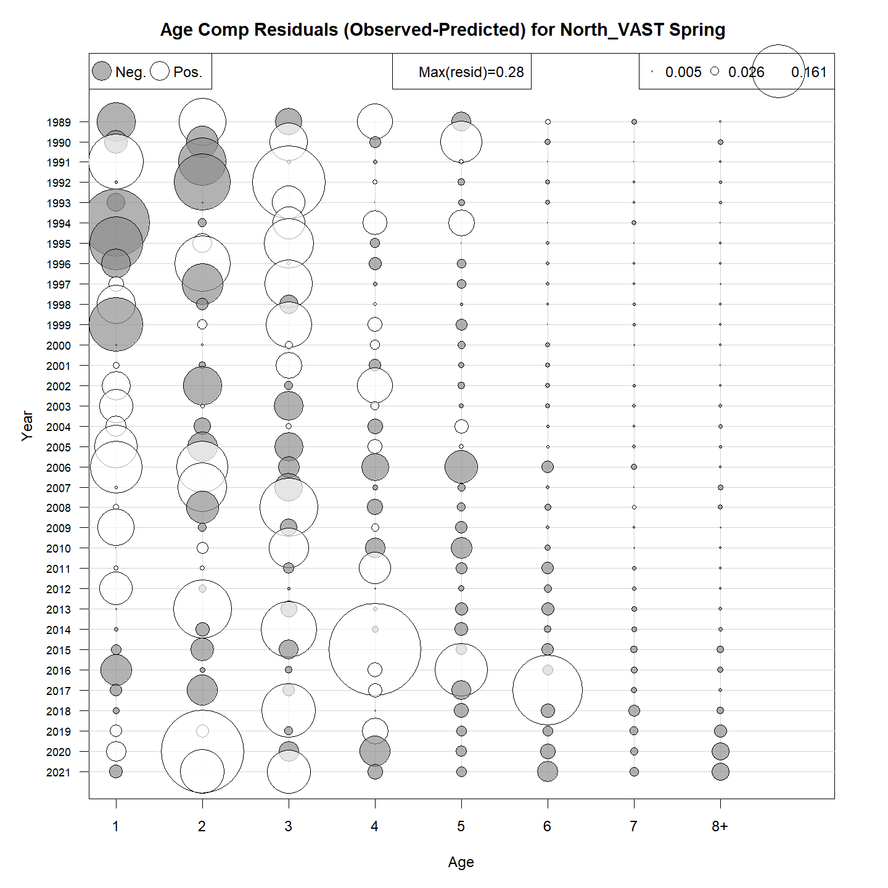
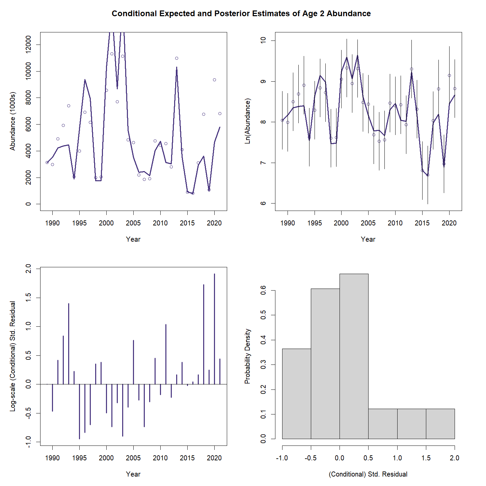
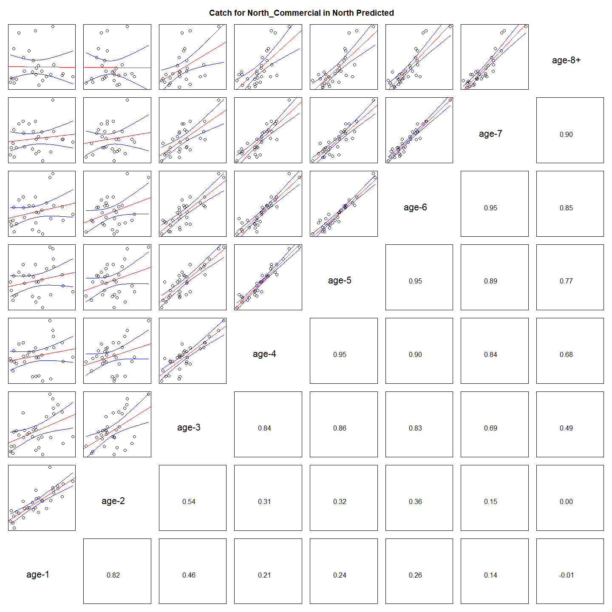
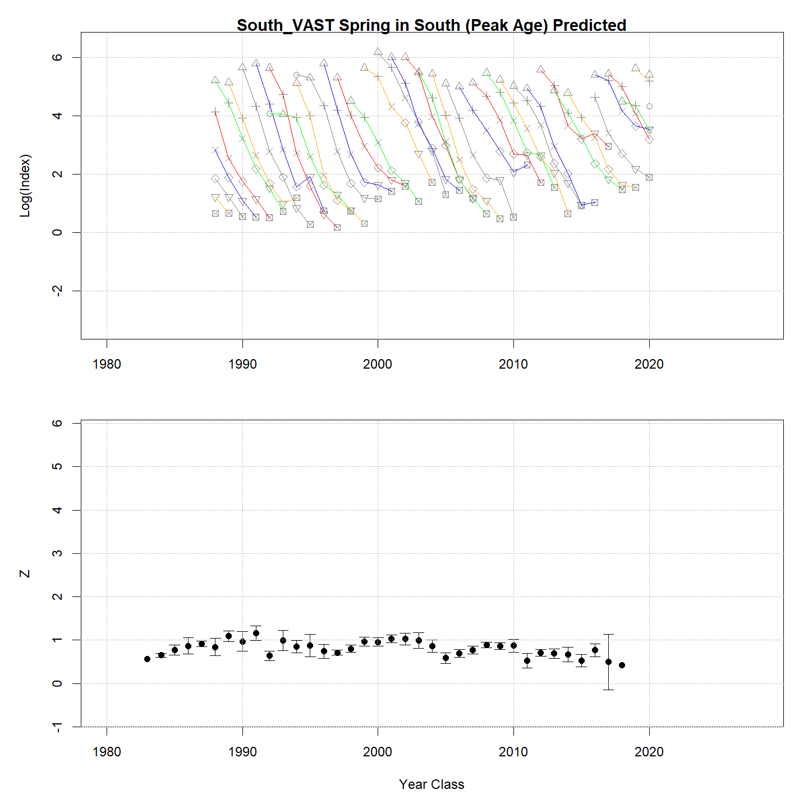

---
output:
  html_document:
    df_print: paged
    keep_md: yes
  word_document: default
  pdf_document:
    fig_caption: yes
    includes:
    keep_tex: yes
    number_sections: no
title: "WHAM figures and tables"
header-includes:
  - \usepackage{longtable}
  - \usepackage{booktabs}
  - \usepackage{caption,graphics}
  - \usepackage{makecell}
  - \usepackage{lscape}
  - \renewcommand\figurename{Fig.}
  - \captionsetup{labelsep=period, singlelinecheck=false}
  - \newcommand{\changesize}[1]{\fontsize{#1pt}{#1pt}\selectfont}
  - \renewcommand{\arraystretch}{1.5}
  - \renewcommand\theadfont{}
---

# {.tabset}

## Figures {.tabset}

### Input

### Diagnostics

### Results

### Retro

### Reference points

### Miscelaneous

## Tables {.tabset}

### Parameter estimates

<table class="table" style="margin-left: auto; margin-right: auto;">
<caption>Parameter estimates, standard errors, and confidence intervals. Rounded to 3 decimal places.</caption>
 <thead>
  <tr>
   <th style="text-align:left;">   </th>
   <th style="text-align:right;"> Estimate </th>
   <th style="text-align:right;"> Std. Error </th>
   <th style="text-align:right;"> 95\% CI lower </th>
   <th style="text-align:right;"> 95\% CI upper </th>
  </tr>
 </thead>
<tbody>
  <tr>
   <td style="text-align:left;"> BSB North Mean Recruitment </td>
   <td style="text-align:right;"> 41817.875 </td>
   <td style="text-align:right;"> 10336.793 </td>
   <td style="text-align:right;"> 25760.653 </td>
   <td style="text-align:right;"> 67883.944 </td>
  </tr>
  <tr>
   <td style="text-align:left;"> BSB North NAA $\sigma$ (age 1) </td>
   <td style="text-align:right;"> 0.959 </td>
   <td style="text-align:right;"> 0.135 </td>
   <td style="text-align:right;"> 0.729 </td>
   <td style="text-align:right;"> 1.263 </td>
  </tr>
  <tr>
   <td style="text-align:left;"> BSB North NAA $\sigma$ (age 2) </td>
   <td style="text-align:right;"> 0.364 </td>
   <td style="text-align:right;"> 0.036 </td>
   <td style="text-align:right;"> 0.301 </td>
   <td style="text-align:right;"> 0.441 </td>
  </tr>
  <tr>
   <td style="text-align:left;"> BSB South Mean Recruitment </td>
   <td style="text-align:right;"> 12011.231 </td>
   <td style="text-align:right;"> 1799.947 </td>
   <td style="text-align:right;"> 8954.276 </td>
   <td style="text-align:right;"> 16111.820 </td>
  </tr>
  <tr>
   <td style="text-align:left;"> BSB South NAA $\sigma$ (age 1) </td>
   <td style="text-align:right;"> 0.469 </td>
   <td style="text-align:right;"> 0.077 </td>
   <td style="text-align:right;"> 0.340 </td>
   <td style="text-align:right;"> 0.648 </td>
  </tr>
  <tr>
   <td style="text-align:left;"> BSB South NAA $\sigma$ (age 2) </td>
   <td style="text-align:right;"> 0.704 </td>
   <td style="text-align:right;"> 0.059 </td>
   <td style="text-align:right;"> 0.597 </td>
   <td style="text-align:right;"> 0.829 </td>
  </tr>
  <tr>
   <td style="text-align:left;"> North REC CPA fully selected q </td>
   <td style="text-align:right;"> 0.000 </td>
   <td style="text-align:right;"> 0.000 </td>
   <td style="text-align:right;"> 0.000 </td>
   <td style="text-align:right;"> 0.000 </td>
  </tr>
  <tr>
   <td style="text-align:left;"> North VAST Spring fully selected q </td>
   <td style="text-align:right;"> 0.004 </td>
   <td style="text-align:right;"> 0.001 </td>
   <td style="text-align:right;"> 0.002 </td>
   <td style="text-align:right;"> 0.006 </td>
  </tr>
  <tr>
   <td style="text-align:left;"> South REC CPA fully selected q </td>
   <td style="text-align:right;"> 0.000 </td>
   <td style="text-align:right;"> 0.000 </td>
   <td style="text-align:right;"> 0.000 </td>
   <td style="text-align:right;"> 0.000 </td>
  </tr>
  <tr>
   <td style="text-align:left;"> South VAST Spring fully selected q </td>
   <td style="text-align:right;"> 0.018 </td>
   <td style="text-align:right;"> 0.002 </td>
   <td style="text-align:right;"> 0.015 </td>
   <td style="text-align:right;"> 0.021 </td>
  </tr>
  <tr>
   <td style="text-align:left;"> Block 1: $a_{50}$ </td>
   <td style="text-align:right;"> 1.855 </td>
   <td style="text-align:right;"> 0.079 </td>
   <td style="text-align:right;"> 1.704 </td>
   <td style="text-align:right;"> 2.015 </td>
  </tr>
  <tr>
   <td style="text-align:left;"> Block 1: 1/slope (increasing) </td>
   <td style="text-align:right;"> 0.272 </td>
   <td style="text-align:right;"> 0.023 </td>
   <td style="text-align:right;"> 0.230 </td>
   <td style="text-align:right;"> 0.321 </td>
  </tr>
  <tr>
   <td style="text-align:left;"> Block 2: $a_{50}$ </td>
   <td style="text-align:right;"> 2.394 </td>
   <td style="text-align:right;"> 0.072 </td>
   <td style="text-align:right;"> 2.256 </td>
   <td style="text-align:right;"> 2.537 </td>
  </tr>
  <tr>
   <td style="text-align:left;"> Block 2: 1/slope (increasing) </td>
   <td style="text-align:right;"> 0.356 </td>
   <td style="text-align:right;"> 0.025 </td>
   <td style="text-align:right;"> 0.310 </td>
   <td style="text-align:right;"> 0.408 </td>
  </tr>
  <tr>
   <td style="text-align:left;"> Block 3: $a_{50}$ </td>
   <td style="text-align:right;"> 1.771 </td>
   <td style="text-align:right;"> 0.112 </td>
   <td style="text-align:right;"> 1.562 </td>
   <td style="text-align:right;"> 2.000 </td>
  </tr>
  <tr>
   <td style="text-align:left;"> Block 3: 1/slope (increasing) </td>
   <td style="text-align:right;"> 0.432 </td>
   <td style="text-align:right;"> 0.051 </td>
   <td style="text-align:right;"> 0.343 </td>
   <td style="text-align:right;"> 0.543 </td>
  </tr>
  <tr>
   <td style="text-align:left;"> Block 4: $a_{50}$ </td>
   <td style="text-align:right;"> 3.316 </td>
   <td style="text-align:right;"> 0.258 </td>
   <td style="text-align:right;"> 2.824 </td>
   <td style="text-align:right;"> 3.830 </td>
  </tr>
  <tr>
   <td style="text-align:left;"> Block 4: 1/slope (increasing) </td>
   <td style="text-align:right;"> 0.804 </td>
   <td style="text-align:right;"> 0.089 </td>
   <td style="text-align:right;"> 0.645 </td>
   <td style="text-align:right;"> 0.996 </td>
  </tr>
  <tr>
   <td style="text-align:left;"> Block 5: $a_{50}$ </td>
   <td style="text-align:right;"> 1.827 </td>
   <td style="text-align:right;"> 0.076 </td>
   <td style="text-align:right;"> 1.682 </td>
   <td style="text-align:right;"> 1.980 </td>
  </tr>
  <tr>
   <td style="text-align:left;"> Block 5: 1/slope (increasing) </td>
   <td style="text-align:right;"> 0.277 </td>
   <td style="text-align:right;"> 0.025 </td>
   <td style="text-align:right;"> 0.233 </td>
   <td style="text-align:right;"> 0.330 </td>
  </tr>
  <tr>
   <td style="text-align:left;"> Block 6: $a_{50}$ </td>
   <td style="text-align:right;"> 2.831 </td>
   <td style="text-align:right;"> 0.089 </td>
   <td style="text-align:right;"> 2.660 </td>
   <td style="text-align:right;"> 3.007 </td>
  </tr>
  <tr>
   <td style="text-align:left;"> Block 6: 1/slope (increasing) </td>
   <td style="text-align:right;"> 0.489 </td>
   <td style="text-align:right;"> 0.028 </td>
   <td style="text-align:right;"> 0.436 </td>
   <td style="text-align:right;"> 0.548 </td>
  </tr>
  <tr>
   <td style="text-align:left;"> Block 7: $a_{50}$ </td>
   <td style="text-align:right;"> 2.074 </td>
   <td style="text-align:right;"> 0.099 </td>
   <td style="text-align:right;"> 1.887 </td>
   <td style="text-align:right;"> 2.273 </td>
  </tr>
  <tr>
   <td style="text-align:left;"> Block 7: 1/slope (increasing) </td>
   <td style="text-align:right;"> 0.594 </td>
   <td style="text-align:right;"> 0.050 </td>
   <td style="text-align:right;"> 0.503 </td>
   <td style="text-align:right;"> 0.701 </td>
  </tr>
  <tr>
   <td style="text-align:left;"> Block 8: $a_{50}$ </td>
   <td style="text-align:right;"> 4.234 </td>
   <td style="text-align:right;"> 0.368 </td>
   <td style="text-align:right;"> 3.513 </td>
   <td style="text-align:right;"> 4.939 </td>
  </tr>
  <tr>
   <td style="text-align:left;"> Block 8: 1/slope (increasing) </td>
   <td style="text-align:right;"> 1.326 </td>
   <td style="text-align:right;"> 0.120 </td>
   <td style="text-align:right;"> 1.107 </td>
   <td style="text-align:right;"> 1.579 </td>
  </tr>
  <tr>
   <td style="text-align:left;"> Block 9: Mean Selectivity for age 1 </td>
   <td style="text-align:right;"> 0.280 </td>
   <td style="text-align:right;"> 0.108 </td>
   <td style="text-align:right;"> 0.119 </td>
   <td style="text-align:right;"> 0.527 </td>
  </tr>
  <tr>
   <td style="text-align:left;"> Block 9: Mean Selectivity for age 2 </td>
   <td style="text-align:right;"> 1.000 </td>
   <td style="text-align:right;"> -- </td>
   <td style="text-align:right;"> -- </td>
   <td style="text-align:right;"> -- </td>
  </tr>
  <tr>
   <td style="text-align:left;"> Block 9: Mean Selectivity for age 3 </td>
   <td style="text-align:right;"> 1.000 </td>
   <td style="text-align:right;"> -- </td>
   <td style="text-align:right;"> -- </td>
   <td style="text-align:right;"> -- </td>
  </tr>
  <tr>
   <td style="text-align:left;"> Block 9: Mean Selectivity for age 4 </td>
   <td style="text-align:right;"> 1.000 </td>
   <td style="text-align:right;"> -- </td>
   <td style="text-align:right;"> -- </td>
   <td style="text-align:right;"> -- </td>
  </tr>
  <tr>
   <td style="text-align:left;"> Block 9: Mean Selectivity for age 5 </td>
   <td style="text-align:right;"> 1.000 </td>
   <td style="text-align:right;"> -- </td>
   <td style="text-align:right;"> -- </td>
   <td style="text-align:right;"> -- </td>
  </tr>
  <tr>
   <td style="text-align:left;"> Block 9: Mean Selectivity for age 6 </td>
   <td style="text-align:right;"> 1.000 </td>
   <td style="text-align:right;"> -- </td>
   <td style="text-align:right;"> -- </td>
   <td style="text-align:right;"> -- </td>
  </tr>
  <tr>
   <td style="text-align:left;"> Block 9: Mean Selectivity for age 7 </td>
   <td style="text-align:right;"> 1.000 </td>
   <td style="text-align:right;"> -- </td>
   <td style="text-align:right;"> -- </td>
   <td style="text-align:right;"> -- </td>
  </tr>
  <tr>
   <td style="text-align:left;"> Block 9: Mean Selectivity for age 8+ </td>
   <td style="text-align:right;"> 1.000 </td>
   <td style="text-align:right;"> -- </td>
   <td style="text-align:right;"> -- </td>
   <td style="text-align:right;"> -- </td>
  </tr>
  <tr>
   <td style="text-align:left;"> Block 10: Selectivity for age 1 </td>
   <td style="text-align:right;"> 0.107 </td>
   <td style="text-align:right;"> 0.014 </td>
   <td style="text-align:right;"> 0.082 </td>
   <td style="text-align:right;"> 0.137 </td>
  </tr>
  <tr>
   <td style="text-align:left;"> Block 10: Selectivity for age 2 </td>
   <td style="text-align:right;"> 0.471 </td>
   <td style="text-align:right;"> 0.047 </td>
   <td style="text-align:right;"> 0.381 </td>
   <td style="text-align:right;"> 0.564 </td>
  </tr>
  <tr>
   <td style="text-align:left;"> Block 10: Selectivity for age 3 </td>
   <td style="text-align:right;"> 1.000 </td>
   <td style="text-align:right;"> -- </td>
   <td style="text-align:right;"> -- </td>
   <td style="text-align:right;"> -- </td>
  </tr>
  <tr>
   <td style="text-align:left;"> Block 10: Selectivity for age 4 </td>
   <td style="text-align:right;"> 1.000 </td>
   <td style="text-align:right;"> -- </td>
   <td style="text-align:right;"> -- </td>
   <td style="text-align:right;"> -- </td>
  </tr>
  <tr>
   <td style="text-align:left;"> Block 10: Selectivity for age 5 </td>
   <td style="text-align:right;"> 1.000 </td>
   <td style="text-align:right;"> -- </td>
   <td style="text-align:right;"> -- </td>
   <td style="text-align:right;"> -- </td>
  </tr>
  <tr>
   <td style="text-align:left;"> Block 10: Selectivity for age 6 </td>
   <td style="text-align:right;"> 1.000 </td>
   <td style="text-align:right;"> -- </td>
   <td style="text-align:right;"> -- </td>
   <td style="text-align:right;"> -- </td>
  </tr>
  <tr>
   <td style="text-align:left;"> Block 10: Selectivity for age 7 </td>
   <td style="text-align:right;"> 1.000 </td>
   <td style="text-align:right;"> -- </td>
   <td style="text-align:right;"> -- </td>
   <td style="text-align:right;"> -- </td>
  </tr>
  <tr>
   <td style="text-align:left;"> Block 10: Selectivity for age 8+ </td>
   <td style="text-align:right;"> 1.000 </td>
   <td style="text-align:right;"> -- </td>
   <td style="text-align:right;"> -- </td>
   <td style="text-align:right;"> -- </td>
  </tr>
  <tr>
   <td style="text-align:left;"> Block 11: Mean Selectivity for age 1 </td>
   <td style="text-align:right;"> 0.364 </td>
   <td style="text-align:right;"> 0.051 </td>
   <td style="text-align:right;"> 0.271 </td>
   <td style="text-align:right;"> 0.469 </td>
  </tr>
  <tr>
   <td style="text-align:left;"> Block 11: Mean Selectivity for age 2 </td>
   <td style="text-align:right;"> 1.000 </td>
   <td style="text-align:right;"> -- </td>
   <td style="text-align:right;"> -- </td>
   <td style="text-align:right;"> -- </td>
  </tr>
  <tr>
   <td style="text-align:left;"> Block 11: Mean Selectivity for age 3 </td>
   <td style="text-align:right;"> 1.000 </td>
   <td style="text-align:right;"> -- </td>
   <td style="text-align:right;"> -- </td>
   <td style="text-align:right;"> -- </td>
  </tr>
  <tr>
   <td style="text-align:left;"> Block 11: Mean Selectivity for age 4 </td>
   <td style="text-align:right;"> 1.000 </td>
   <td style="text-align:right;"> -- </td>
   <td style="text-align:right;"> -- </td>
   <td style="text-align:right;"> -- </td>
  </tr>
  <tr>
   <td style="text-align:left;"> Block 11: Mean Selectivity for age 5 </td>
   <td style="text-align:right;"> 1.000 </td>
   <td style="text-align:right;"> -- </td>
   <td style="text-align:right;"> -- </td>
   <td style="text-align:right;"> -- </td>
  </tr>
  <tr>
   <td style="text-align:left;"> Block 11: Mean Selectivity for age 6 </td>
   <td style="text-align:right;"> 1.000 </td>
   <td style="text-align:right;"> -- </td>
   <td style="text-align:right;"> -- </td>
   <td style="text-align:right;"> -- </td>
  </tr>
  <tr>
   <td style="text-align:left;"> Block 11: Mean Selectivity for age 7 </td>
   <td style="text-align:right;"> 1.000 </td>
   <td style="text-align:right;"> -- </td>
   <td style="text-align:right;"> -- </td>
   <td style="text-align:right;"> -- </td>
  </tr>
  <tr>
   <td style="text-align:left;"> Block 11: Mean Selectivity for age 8+ </td>
   <td style="text-align:right;"> 1.000 </td>
   <td style="text-align:right;"> -- </td>
   <td style="text-align:right;"> -- </td>
   <td style="text-align:right;"> -- </td>
  </tr>
  <tr>
   <td style="text-align:left;"> Block 12: Selectivity for age 1 </td>
   <td style="text-align:right;"> 0.736 </td>
   <td style="text-align:right;"> 0.093 </td>
   <td style="text-align:right;"> 0.521 </td>
   <td style="text-align:right;"> 0.877 </td>
  </tr>
  <tr>
   <td style="text-align:left;"> Block 12: Selectivity for age 2 </td>
   <td style="text-align:right;"> 1.000 </td>
   <td style="text-align:right;"> -- </td>
   <td style="text-align:right;"> -- </td>
   <td style="text-align:right;"> -- </td>
  </tr>
  <tr>
   <td style="text-align:left;"> Block 12: Selectivity for age 3 </td>
   <td style="text-align:right;"> 0.736 </td>
   <td style="text-align:right;"> 0.093 </td>
   <td style="text-align:right;"> 0.521 </td>
   <td style="text-align:right;"> 0.877 </td>
  </tr>
  <tr>
   <td style="text-align:left;"> Block 12: Selectivity for age 4 </td>
   <td style="text-align:right;"> 0.736 </td>
   <td style="text-align:right;"> 0.093 </td>
   <td style="text-align:right;"> 0.521 </td>
   <td style="text-align:right;"> 0.877 </td>
  </tr>
  <tr>
   <td style="text-align:left;"> Block 12: Selectivity for age 5 </td>
   <td style="text-align:right;"> 0.736 </td>
   <td style="text-align:right;"> 0.093 </td>
   <td style="text-align:right;"> 0.521 </td>
   <td style="text-align:right;"> 0.877 </td>
  </tr>
  <tr>
   <td style="text-align:left;"> Block 12: Selectivity for age 6 </td>
   <td style="text-align:right;"> 0.736 </td>
   <td style="text-align:right;"> 0.093 </td>
   <td style="text-align:right;"> 0.521 </td>
   <td style="text-align:right;"> 0.877 </td>
  </tr>
  <tr>
   <td style="text-align:left;"> Block 12: Selectivity for age 7 </td>
   <td style="text-align:right;"> 0.736 </td>
   <td style="text-align:right;"> 0.093 </td>
   <td style="text-align:right;"> 0.521 </td>
   <td style="text-align:right;"> 0.877 </td>
  </tr>
  <tr>
   <td style="text-align:left;"> Block 12: Selectivity for age 8+ </td>
   <td style="text-align:right;"> 0.736 </td>
   <td style="text-align:right;"> 0.093 </td>
   <td style="text-align:right;"> 0.521 </td>
   <td style="text-align:right;"> 0.877 </td>
  </tr>
  <tr>
   <td style="text-align:left;"> Block 9: Selectivity RE $\sigma$ </td>
   <td style="text-align:right;"> 0.519 </td>
   <td style="text-align:right;"> 0.170 </td>
   <td style="text-align:right;"> 0.274 </td>
   <td style="text-align:right;"> 0.985 </td>
  </tr>
  <tr>
   <td style="text-align:left;"> Block 9: Selectivity RE AR1 $\rho$ (year) </td>
   <td style="text-align:right;"> 0.538 </td>
   <td style="text-align:right;"> 0.140 </td>
   <td style="text-align:right;"> 0.293 </td>
   <td style="text-align:right;"> 0.971 </td>
  </tr>
  <tr>
   <td style="text-align:left;"> Block 11: Selectivity RE $\sigma$ </td>
   <td style="text-align:right;"> 0.499 </td>
   <td style="text-align:right;"> 0.132 </td>
   <td style="text-align:right;"> 0.297 </td>
   <td style="text-align:right;"> 0.840 </td>
  </tr>
  <tr>
   <td style="text-align:left;"> Block 11: Selectivity RE AR1 $\rho$ (year) </td>
   <td style="text-align:right;"> 0.252 </td>
   <td style="text-align:right;"> 0.252 </td>
   <td style="text-align:right;"> -0.122 </td>
   <td style="text-align:right;"> 0.818 </td>
  </tr>
  <tr>
   <td style="text-align:left;"> Block 12: Selectivity RE $\sigma$ </td>
   <td style="text-align:right;"> 0.996 </td>
   <td style="text-align:right;"> 0.453 </td>
   <td style="text-align:right;"> 0.408 </td>
   <td style="text-align:right;"> 2.430 </td>
  </tr>
  <tr>
   <td style="text-align:left;"> Block 12: Selectivity RE AR1 $\rho$ (age) </td>
   <td style="text-align:right;"> -0.256 </td>
   <td style="text-align:right;"> 0.424 </td>
   <td style="text-align:right;"> -0.922 </td>
   <td style="text-align:right;"> 0.506 </td>
  </tr>
  <tr>
   <td style="text-align:left;"> North Commercial in North age comp, Dirichlet: dispersion ($\phi$) </td>
   <td style="text-align:right;"> 55.376 </td>
   <td style="text-align:right;"> 6.295 </td>
   <td style="text-align:right;"> 44.315 </td>
   <td style="text-align:right;"> 69.197 </td>
  </tr>
  <tr>
   <td style="text-align:left;"> North Recreational in North age comp, Dirichlet: dispersion ($\phi$) </td>
   <td style="text-align:right;"> 51.131 </td>
   <td style="text-align:right;"> 6.432 </td>
   <td style="text-align:right;"> 39.958 </td>
   <td style="text-align:right;"> 65.429 </td>
  </tr>
  <tr>
   <td style="text-align:left;"> South Commercial in South age comp, Dirichlet: dispersion ($\phi$) </td>
   <td style="text-align:right;"> 47.218 </td>
   <td style="text-align:right;"> 4.757 </td>
   <td style="text-align:right;"> 38.758 </td>
   <td style="text-align:right;"> 57.525 </td>
  </tr>
  <tr>
   <td style="text-align:left;"> South Recreational in South age comp, Dirichlet: dispersion ($\phi$) </td>
   <td style="text-align:right;"> 87.954 </td>
   <td style="text-align:right;"> 10.804 </td>
   <td style="text-align:right;"> 69.135 </td>
   <td style="text-align:right;"> 111.896 </td>
  </tr>
  <tr>
   <td style="text-align:left;"> North REC CPA in North age comp, Dirichlet: dispersion ($\phi$) </td>
   <td style="text-align:right;"> 61.095 </td>
   <td style="text-align:right;"> 8.862 </td>
   <td style="text-align:right;"> 45.976 </td>
   <td style="text-align:right;"> 81.185 </td>
  </tr>
  <tr>
   <td style="text-align:left;"> North VAST Spring in North age comp, Dirichlet: dispersion ($\phi$) </td>
   <td style="text-align:right;"> 23.333 </td>
   <td style="text-align:right;"> 2.277 </td>
   <td style="text-align:right;"> 19.270 </td>
   <td style="text-align:right;"> 28.251 </td>
  </tr>
  <tr>
   <td style="text-align:left;"> South REC CPA in South age comp, Dirichlet: dispersion ($\phi$) </td>
   <td style="text-align:right;"> 676.098 </td>
   <td style="text-align:right;"> 200.765 </td>
   <td style="text-align:right;"> 377.788 </td>
   <td style="text-align:right;"> 1209.962 </td>
  </tr>
  <tr>
   <td style="text-align:left;"> South VAST Spring in South age comp, Dirichlet: dispersion ($\phi$) </td>
   <td style="text-align:right;"> 35.121 </td>
   <td style="text-align:right;"> 3.898 </td>
   <td style="text-align:right;"> 28.256 </td>
   <td style="text-align:right;"> 43.655 </td>
  </tr>
  <tr>
   <td style="text-align:left;"> $\mu$ from North to South RE $\sigma$ </td>
   <td style="text-align:right;"> 0.488 </td>
   <td style="text-align:right;"> 0.137 </td>
   <td style="text-align:right;"> 0.281 </td>
   <td style="text-align:right;"> 0.846 </td>
  </tr>
  <tr>
   <td style="text-align:left;"> $\mu$ from North to South RE AR1 $\rho$ (year) </td>
   <td style="text-align:right;"> 0.944 </td>
   <td style="text-align:right;"> 0.055 </td>
   <td style="text-align:right;"> 0.657 </td>
   <td style="text-align:right;"> 0.992 </td>
  </tr>
  <tr>
   <td style="text-align:left;"> North REC CPA log-index observation SD scalar </td>
   <td style="text-align:right;"> 6.859 </td>
   <td style="text-align:right;"> 1.202 </td>
   <td style="text-align:right;"> 4.865 </td>
   <td style="text-align:right;"> 9.671 </td>
  </tr>
</tbody>
</table>

### Abundance at age

<table class="table" style="margin-left: auto; margin-right: auto;">
<caption>Abundance at age (1000s) for BSB North in North.</caption>
 <thead>
  <tr>
   <th style="text-align:left;">   </th>
   <th style="text-align:right;"> 1 </th>
   <th style="text-align:right;"> 2 </th>
   <th style="text-align:right;"> 3 </th>
   <th style="text-align:right;"> 4 </th>
   <th style="text-align:right;"> 5 </th>
   <th style="text-align:right;"> 6 </th>
   <th style="text-align:right;"> 7 </th>
   <th style="text-align:right;"> 8+ </th>
  </tr>
 </thead>
<tbody>
  <tr>
   <td style="text-align:left;"> 1989 </td>
   <td style="text-align:right;"> 17128 </td>
   <td style="text-align:right;"> 6974 </td>
   <td style="text-align:right;"> 3673 </td>
   <td style="text-align:right;"> 1887 </td>
   <td style="text-align:right;"> 964 </td>
   <td style="text-align:right;"> 492 </td>
   <td style="text-align:right;"> 251 </td>
   <td style="text-align:right;"> 261 </td>
  </tr>
  <tr>
   <td style="text-align:left;"> 1990 </td>
   <td style="text-align:right;"> 13692 </td>
   <td style="text-align:right;"> 5024 </td>
   <td style="text-align:right;"> 5504 </td>
   <td style="text-align:right;"> 1229 </td>
   <td style="text-align:right;"> 751 </td>
   <td style="text-align:right;"> 330 </td>
   <td style="text-align:right;"> 191 </td>
   <td style="text-align:right;"> 255 </td>
  </tr>
  <tr>
   <td style="text-align:left;"> 1991 </td>
   <td style="text-align:right;"> 13866 </td>
   <td style="text-align:right;"> 5966 </td>
   <td style="text-align:right;"> 1612 </td>
   <td style="text-align:right;"> 1763 </td>
   <td style="text-align:right;"> 492 </td>
   <td style="text-align:right;"> 221 </td>
   <td style="text-align:right;"> 100 </td>
   <td style="text-align:right;"> 189 </td>
  </tr>
  <tr>
   <td style="text-align:left;"> 1992 </td>
   <td style="text-align:right;"> 11463 </td>
   <td style="text-align:right;"> 8155 </td>
   <td style="text-align:right;"> 1982 </td>
   <td style="text-align:right;"> 562 </td>
   <td style="text-align:right;"> 654 </td>
   <td style="text-align:right;"> 216 </td>
   <td style="text-align:right;"> 109 </td>
   <td style="text-align:right;"> 144 </td>
  </tr>
  <tr>
   <td style="text-align:left;"> 1993 </td>
   <td style="text-align:right;"> 5550 </td>
   <td style="text-align:right;"> 3427 </td>
   <td style="text-align:right;"> 1736 </td>
   <td style="text-align:right;"> 784 </td>
   <td style="text-align:right;"> 220 </td>
   <td style="text-align:right;"> 288 </td>
   <td style="text-align:right;"> 82 </td>
   <td style="text-align:right;"> 94 </td>
  </tr>
  <tr>
   <td style="text-align:left;"> 1994 </td>
   <td style="text-align:right;"> 23149 </td>
   <td style="text-align:right;"> 1468 </td>
   <td style="text-align:right;"> 3123 </td>
   <td style="text-align:right;"> 685 </td>
   <td style="text-align:right;"> 412 </td>
   <td style="text-align:right;"> 120 </td>
   <td style="text-align:right;"> 141 </td>
   <td style="text-align:right;"> 84 </td>
  </tr>
  <tr>
   <td style="text-align:left;"> 1995 </td>
   <td style="text-align:right;"> 45714 </td>
   <td style="text-align:right;"> 5962 </td>
   <td style="text-align:right;"> 2140 </td>
   <td style="text-align:right;"> 850 </td>
   <td style="text-align:right;"> 418 </td>
   <td style="text-align:right;"> 198 </td>
   <td style="text-align:right;"> 83 </td>
   <td style="text-align:right;"> 139 </td>
  </tr>
  <tr>
   <td style="text-align:left;"> 1996 </td>
   <td style="text-align:right;"> 51808 </td>
   <td style="text-align:right;"> 9568 </td>
   <td style="text-align:right;"> 3015 </td>
   <td style="text-align:right;"> 1051 </td>
   <td style="text-align:right;"> 483 </td>
   <td style="text-align:right;"> 322 </td>
   <td style="text-align:right;"> 142 </td>
   <td style="text-align:right;"> 152 </td>
  </tr>
  <tr>
   <td style="text-align:left;"> 1997 </td>
   <td style="text-align:right;"> 11791 </td>
   <td style="text-align:right;"> 20327 </td>
   <td style="text-align:right;"> 4020 </td>
   <td style="text-align:right;"> 1079 </td>
   <td style="text-align:right;"> 655 </td>
   <td style="text-align:right;"> 318 </td>
   <td style="text-align:right;"> 198 </td>
   <td style="text-align:right;"> 188 </td>
  </tr>
  <tr>
   <td style="text-align:left;"> 1998 </td>
   <td style="text-align:right;"> 9446 </td>
   <td style="text-align:right;"> 10370 </td>
   <td style="text-align:right;"> 3510 </td>
   <td style="text-align:right;"> 2047 </td>
   <td style="text-align:right;"> 614 </td>
   <td style="text-align:right;"> 445 </td>
   <td style="text-align:right;"> 192 </td>
   <td style="text-align:right;"> 260 </td>
  </tr>
  <tr>
   <td style="text-align:left;"> 1999 </td>
   <td style="text-align:right;"> 65274 </td>
   <td style="text-align:right;"> 7713 </td>
   <td style="text-align:right;"> 4270 </td>
   <td style="text-align:right;"> 2136 </td>
   <td style="text-align:right;"> 900 </td>
   <td style="text-align:right;"> 408 </td>
   <td style="text-align:right;"> 244 </td>
   <td style="text-align:right;"> 257 </td>
  </tr>
  <tr>
   <td style="text-align:left;"> 2000 </td>
   <td style="text-align:right;"> 91830 </td>
   <td style="text-align:right;"> 28397 </td>
   <td style="text-align:right;"> 4539 </td>
   <td style="text-align:right;"> 3421 </td>
   <td style="text-align:right;"> 1244 </td>
   <td style="text-align:right;"> 726 </td>
   <td style="text-align:right;"> 247 </td>
   <td style="text-align:right;"> 322 </td>
  </tr>
  <tr>
   <td style="text-align:left;"> 2001 </td>
   <td style="text-align:right;"> 42070 </td>
   <td style="text-align:right;"> 22724 </td>
   <td style="text-align:right;"> 14304 </td>
   <td style="text-align:right;"> 2575 </td>
   <td style="text-align:right;"> 1591 </td>
   <td style="text-align:right;"> 847 </td>
   <td style="text-align:right;"> 509 </td>
   <td style="text-align:right;"> 315 </td>
  </tr>
  <tr>
   <td style="text-align:left;"> 2002 </td>
   <td style="text-align:right;"> 63234 </td>
   <td style="text-align:right;"> 20673 </td>
   <td style="text-align:right;"> 16105 </td>
   <td style="text-align:right;"> 8880 </td>
   <td style="text-align:right;"> 1109 </td>
   <td style="text-align:right;"> 745 </td>
   <td style="text-align:right;"> 457 </td>
   <td style="text-align:right;"> 379 </td>
  </tr>
  <tr>
   <td style="text-align:left;"> 2003 </td>
   <td style="text-align:right;"> 19115 </td>
   <td style="text-align:right;"> 17452 </td>
   <td style="text-align:right;"> 6691 </td>
   <td style="text-align:right;"> 8163 </td>
   <td style="text-align:right;"> 4013 </td>
   <td style="text-align:right;"> 517 </td>
   <td style="text-align:right;"> 398 </td>
   <td style="text-align:right;"> 385 </td>
  </tr>
  <tr>
   <td style="text-align:left;"> 2004 </td>
   <td style="text-align:right;"> 13872 </td>
   <td style="text-align:right;"> 5668 </td>
   <td style="text-align:right;"> 10346 </td>
   <td style="text-align:right;"> 2983 </td>
   <td style="text-align:right;"> 3944 </td>
   <td style="text-align:right;"> 1269 </td>
   <td style="text-align:right;"> 210 </td>
   <td style="text-align:right;"> 320 </td>
  </tr>
  <tr>
   <td style="text-align:left;"> 2005 </td>
   <td style="text-align:right;"> 19115 </td>
   <td style="text-align:right;"> 5284 </td>
   <td style="text-align:right;"> 2922 </td>
   <td style="text-align:right;"> 5907 </td>
   <td style="text-align:right;"> 2230 </td>
   <td style="text-align:right;"> 1840 </td>
   <td style="text-align:right;"> 532 </td>
   <td style="text-align:right;"> 274 </td>
  </tr>
  <tr>
   <td style="text-align:left;"> 2006 </td>
   <td style="text-align:right;"> 39232 </td>
   <td style="text-align:right;"> 13257 </td>
   <td style="text-align:right;"> 4143 </td>
   <td style="text-align:right;"> 3695 </td>
   <td style="text-align:right;"> 4906 </td>
   <td style="text-align:right;"> 1340 </td>
   <td style="text-align:right;"> 1128 </td>
   <td style="text-align:right;"> 332 </td>
  </tr>
  <tr>
   <td style="text-align:left;"> 2007 </td>
   <td style="text-align:right;"> 40553 </td>
   <td style="text-align:right;"> 23291 </td>
   <td style="text-align:right;"> 8021 </td>
   <td style="text-align:right;"> 2943 </td>
   <td style="text-align:right;"> 2093 </td>
   <td style="text-align:right;"> 2388 </td>
   <td style="text-align:right;"> 1080 </td>
   <td style="text-align:right;"> 724 </td>
  </tr>
  <tr>
   <td style="text-align:left;"> 2008 </td>
   <td style="text-align:right;"> 62181 </td>
   <td style="text-align:right;"> 24655 </td>
   <td style="text-align:right;"> 16153 </td>
   <td style="text-align:right;"> 5042 </td>
   <td style="text-align:right;"> 1542 </td>
   <td style="text-align:right;"> 1059 </td>
   <td style="text-align:right;"> 1226 </td>
   <td style="text-align:right;"> 900 </td>
  </tr>
  <tr>
   <td style="text-align:left;"> 2009 </td>
   <td style="text-align:right;"> 65026 </td>
   <td style="text-align:right;"> 41651 </td>
   <td style="text-align:right;"> 16837 </td>
   <td style="text-align:right;"> 11445 </td>
   <td style="text-align:right;"> 2652 </td>
   <td style="text-align:right;"> 775 </td>
   <td style="text-align:right;"> 522 </td>
   <td style="text-align:right;"> 963 </td>
  </tr>
  <tr>
   <td style="text-align:left;"> 2010 </td>
   <td style="text-align:right;"> 41963 </td>
   <td style="text-align:right;"> 27416 </td>
   <td style="text-align:right;"> 23028 </td>
   <td style="text-align:right;"> 10983 </td>
   <td style="text-align:right;"> 6056 </td>
   <td style="text-align:right;"> 1378 </td>
   <td style="text-align:right;"> 423 </td>
   <td style="text-align:right;"> 637 </td>
  </tr>
  <tr>
   <td style="text-align:left;"> 2011 </td>
   <td style="text-align:right;"> 71433 </td>
   <td style="text-align:right;"> 26501 </td>
   <td style="text-align:right;"> 15137 </td>
   <td style="text-align:right;"> 13488 </td>
   <td style="text-align:right;"> 5156 </td>
   <td style="text-align:right;"> 2996 </td>
   <td style="text-align:right;"> 783 </td>
   <td style="text-align:right;"> 523 </td>
  </tr>
  <tr>
   <td style="text-align:left;"> 2012 </td>
   <td style="text-align:right;"> 255707 </td>
   <td style="text-align:right;"> 54959 </td>
   <td style="text-align:right;"> 26319 </td>
   <td style="text-align:right;"> 14319 </td>
   <td style="text-align:right;"> 10198 </td>
   <td style="text-align:right;"> 3971 </td>
   <td style="text-align:right;"> 2149 </td>
   <td style="text-align:right;"> 936 </td>
  </tr>
  <tr>
   <td style="text-align:left;"> 2013 </td>
   <td style="text-align:right;"> 106505 </td>
   <td style="text-align:right;"> 109851 </td>
   <td style="text-align:right;"> 21139 </td>
   <td style="text-align:right;"> 16823 </td>
   <td style="text-align:right;"> 9420 </td>
   <td style="text-align:right;"> 5836 </td>
   <td style="text-align:right;"> 2155 </td>
   <td style="text-align:right;"> 1740 </td>
  </tr>
  <tr>
   <td style="text-align:left;"> 2014 </td>
   <td style="text-align:right;"> 57181 </td>
   <td style="text-align:right;"> 49825 </td>
   <td style="text-align:right;"> 98415 </td>
   <td style="text-align:right;"> 16584 </td>
   <td style="text-align:right;"> 9785 </td>
   <td style="text-align:right;"> 5525 </td>
   <td style="text-align:right;"> 3588 </td>
   <td style="text-align:right;"> 2267 </td>
  </tr>
  <tr>
   <td style="text-align:left;"> 2015 </td>
   <td style="text-align:right;"> 63737 </td>
   <td style="text-align:right;"> 37159 </td>
   <td style="text-align:right;"> 28499 </td>
   <td style="text-align:right;"> 56219 </td>
   <td style="text-align:right;"> 9923 </td>
   <td style="text-align:right;"> 5415 </td>
   <td style="text-align:right;"> 2928 </td>
   <td style="text-align:right;"> 3055 </td>
  </tr>
  <tr>
   <td style="text-align:left;"> 2016 </td>
   <td style="text-align:right;"> 175188 </td>
   <td style="text-align:right;"> 57587 </td>
   <td style="text-align:right;"> 18636 </td>
   <td style="text-align:right;"> 18549 </td>
   <td style="text-align:right;"> 53941 </td>
   <td style="text-align:right;"> 5576 </td>
   <td style="text-align:right;"> 3521 </td>
   <td style="text-align:right;"> 3453 </td>
  </tr>
  <tr>
   <td style="text-align:left;"> 2017 </td>
   <td style="text-align:right;"> 104345 </td>
   <td style="text-align:right;"> 134227 </td>
   <td style="text-align:right;"> 24499 </td>
   <td style="text-align:right;"> 12035 </td>
   <td style="text-align:right;"> 9766 </td>
   <td style="text-align:right;"> 35779 </td>
   <td style="text-align:right;"> 2972 </td>
   <td style="text-align:right;"> 3426 </td>
  </tr>
  <tr>
   <td style="text-align:left;"> 2018 </td>
   <td style="text-align:right;"> 38150 </td>
   <td style="text-align:right;"> 48546 </td>
   <td style="text-align:right;"> 55575 </td>
   <td style="text-align:right;"> 13537 </td>
   <td style="text-align:right;"> 6054 </td>
   <td style="text-align:right;"> 5871 </td>
   <td style="text-align:right;"> 21069 </td>
   <td style="text-align:right;"> 3073 </td>
  </tr>
  <tr>
   <td style="text-align:left;"> 2019 </td>
   <td style="text-align:right;"> 142046 </td>
   <td style="text-align:right;"> 24500 </td>
   <td style="text-align:right;"> 33059 </td>
   <td style="text-align:right;"> 53581 </td>
   <td style="text-align:right;"> 10877 </td>
   <td style="text-align:right;"> 5018 </td>
   <td style="text-align:right;"> 4147 </td>
   <td style="text-align:right;"> 17974 </td>
  </tr>
  <tr>
   <td style="text-align:left;"> 2020 </td>
   <td style="text-align:right;"> 161516 </td>
   <td style="text-align:right;"> 63795 </td>
   <td style="text-align:right;"> 12543 </td>
   <td style="text-align:right;"> 24160 </td>
   <td style="text-align:right;"> 39753 </td>
   <td style="text-align:right;"> 7272 </td>
   <td style="text-align:right;"> 3837 </td>
   <td style="text-align:right;"> 15081 </td>
  </tr>
  <tr>
   <td style="text-align:left;"> 2021 </td>
   <td style="text-align:right;"> 107567 </td>
   <td style="text-align:right;"> 73435 </td>
   <td style="text-align:right;"> 43814 </td>
   <td style="text-align:right;"> 8018 </td>
   <td style="text-align:right;"> 17972 </td>
   <td style="text-align:right;"> 33583 </td>
   <td style="text-align:right;"> 4744 </td>
   <td style="text-align:right;"> 13049 </td>
  </tr>
</tbody>
</table>

<table class="table" style="margin-left: auto; margin-right: auto;">
<caption>Abundance at age (1000s) for BSB North in South.</caption>
 <thead>
  <tr>
   <th style="text-align:left;">   </th>
   <th style="text-align:right;"> 1 </th>
   <th style="text-align:right;"> 2 </th>
   <th style="text-align:right;"> 3 </th>
   <th style="text-align:right;"> 4 </th>
   <th style="text-align:right;"> 5 </th>
   <th style="text-align:right;"> 6 </th>
   <th style="text-align:right;"> 7 </th>
   <th style="text-align:right;"> 8+ </th>
  </tr>
 </thead>
<tbody>
  <tr>
   <td style="text-align:left;"> 1989 </td>
   <td style="text-align:right;"> 0 </td>
   <td style="text-align:right;"> 3123 </td>
   <td style="text-align:right;"> 1588 </td>
   <td style="text-align:right;"> 806 </td>
   <td style="text-align:right;"> 411 </td>
   <td style="text-align:right;"> 210 </td>
   <td style="text-align:right;"> 107 </td>
   <td style="text-align:right;"> 111 </td>
  </tr>
  <tr>
   <td style="text-align:left;"> 1990 </td>
   <td style="text-align:right;"> 0 </td>
   <td style="text-align:right;"> 2973 </td>
   <td style="text-align:right;"> 1943 </td>
   <td style="text-align:right;"> 605 </td>
   <td style="text-align:right;"> 323 </td>
   <td style="text-align:right;"> 166 </td>
   <td style="text-align:right;"> 90 </td>
   <td style="text-align:right;"> 101 </td>
  </tr>
  <tr>
   <td style="text-align:left;"> 1991 </td>
   <td style="text-align:right;"> 0 </td>
   <td style="text-align:right;"> 4912 </td>
   <td style="text-align:right;"> 1410 </td>
   <td style="text-align:right;"> 1264 </td>
   <td style="text-align:right;"> 357 </td>
   <td style="text-align:right;"> 192 </td>
   <td style="text-align:right;"> 89 </td>
   <td style="text-align:right;"> 139 </td>
  </tr>
  <tr>
   <td style="text-align:left;"> 1992 </td>
   <td style="text-align:right;"> 0 </td>
   <td style="text-align:right;"> 5939 </td>
   <td style="text-align:right;"> 1858 </td>
   <td style="text-align:right;"> 528 </td>
   <td style="text-align:right;"> 571 </td>
   <td style="text-align:right;"> 178 </td>
   <td style="text-align:right;"> 87 </td>
   <td style="text-align:right;"> 115 </td>
  </tr>
  <tr>
   <td style="text-align:left;"> 1993 </td>
   <td style="text-align:right;"> 0 </td>
   <td style="text-align:right;"> 7401 </td>
   <td style="text-align:right;"> 2418 </td>
   <td style="text-align:right;"> 977 </td>
   <td style="text-align:right;"> 295 </td>
   <td style="text-align:right;"> 337 </td>
   <td style="text-align:right;"> 107 </td>
   <td style="text-align:right;"> 123 </td>
  </tr>
  <tr>
   <td style="text-align:left;"> 1994 </td>
   <td style="text-align:right;"> 0 </td>
   <td style="text-align:right;"> 2054 </td>
   <td style="text-align:right;"> 2471 </td>
   <td style="text-align:right;"> 718 </td>
   <td style="text-align:right;"> 363 </td>
   <td style="text-align:right;"> 113 </td>
   <td style="text-align:right;"> 136 </td>
   <td style="text-align:right;"> 85 </td>
  </tr>
  <tr>
   <td style="text-align:left;"> 1995 </td>
   <td style="text-align:right;"> 0 </td>
   <td style="text-align:right;"> 4004 </td>
   <td style="text-align:right;"> 798 </td>
   <td style="text-align:right;"> 705 </td>
   <td style="text-align:right;"> 227 </td>
   <td style="text-align:right;"> 122 </td>
   <td style="text-align:right;"> 39 </td>
   <td style="text-align:right;"> 77 </td>
  </tr>
  <tr>
   <td style="text-align:left;"> 1996 </td>
   <td style="text-align:right;"> 0 </td>
   <td style="text-align:right;"> 6917 </td>
   <td style="text-align:right;"> 1672 </td>
   <td style="text-align:right;"> 448 </td>
   <td style="text-align:right;"> 214 </td>
   <td style="text-align:right;"> 96 </td>
   <td style="text-align:right;"> 49 </td>
   <td style="text-align:right;"> 50 </td>
  </tr>
  <tr>
   <td style="text-align:left;"> 1997 </td>
   <td style="text-align:right;"> 0 </td>
   <td style="text-align:right;"> 6149 </td>
   <td style="text-align:right;"> 1510 </td>
   <td style="text-align:right;"> 406 </td>
   <td style="text-align:right;"> 151 </td>
   <td style="text-align:right;"> 70 </td>
   <td style="text-align:right;"> 43 </td>
   <td style="text-align:right;"> 40 </td>
  </tr>
  <tr>
   <td style="text-align:left;"> 1998 </td>
   <td style="text-align:right;"> 0 </td>
   <td style="text-align:right;"> 2002 </td>
   <td style="text-align:right;"> 2768 </td>
   <td style="text-align:right;"> 607 </td>
   <td style="text-align:right;"> 163 </td>
   <td style="text-align:right;"> 94 </td>
   <td style="text-align:right;"> 45 </td>
   <td style="text-align:right;"> 55 </td>
  </tr>
  <tr>
   <td style="text-align:left;"> 1999 </td>
   <td style="text-align:right;"> 0 </td>
   <td style="text-align:right;"> 2035 </td>
   <td style="text-align:right;"> 2138 </td>
   <td style="text-align:right;"> 816 </td>
   <td style="text-align:right;"> 339 </td>
   <td style="text-align:right;"> 118 </td>
   <td style="text-align:right;"> 77 </td>
   <td style="text-align:right;"> 80 </td>
  </tr>
  <tr>
   <td style="text-align:left;"> 2000 </td>
   <td style="text-align:right;"> 0 </td>
   <td style="text-align:right;"> 8574 </td>
   <td style="text-align:right;"> 1640 </td>
   <td style="text-align:right;"> 858 </td>
   <td style="text-align:right;"> 329 </td>
   <td style="text-align:right;"> 147 </td>
   <td style="text-align:right;"> 63 </td>
   <td style="text-align:right;"> 78 </td>
  </tr>
  <tr>
   <td style="text-align:left;"> 2001 </td>
   <td style="text-align:right;"> 0 </td>
   <td style="text-align:right;"> 11308 </td>
   <td style="text-align:right;"> 4955 </td>
   <td style="text-align:right;"> 876 </td>
   <td style="text-align:right;"> 522 </td>
   <td style="text-align:right;"> 222 </td>
   <td style="text-align:right;"> 121 </td>
   <td style="text-align:right;"> 93 </td>
  </tr>
  <tr>
   <td style="text-align:left;"> 2002 </td>
   <td style="text-align:right;"> 0 </td>
   <td style="text-align:right;"> 7700 </td>
   <td style="text-align:right;"> 6410 </td>
   <td style="text-align:right;"> 3567 </td>
   <td style="text-align:right;"> 535 </td>
   <td style="text-align:right;"> 334 </td>
   <td style="text-align:right;"> 187 </td>
   <td style="text-align:right;"> 167 </td>
  </tr>
  <tr>
   <td style="text-align:left;"> 2003 </td>
   <td style="text-align:right;"> 0 </td>
   <td style="text-align:right;"> 11134 </td>
   <td style="text-align:right;"> 5488 </td>
   <td style="text-align:right;"> 5316 </td>
   <td style="text-align:right;"> 2407 </td>
   <td style="text-align:right;"> 319 </td>
   <td style="text-align:right;"> 231 </td>
   <td style="text-align:right;"> 227 </td>
  </tr>
  <tr>
   <td style="text-align:left;"> 2004 </td>
   <td style="text-align:right;"> 0 </td>
   <td style="text-align:right;"> 4825 </td>
   <td style="text-align:right;"> 7029 </td>
   <td style="text-align:right;"> 2605 </td>
   <td style="text-align:right;"> 3246 </td>
   <td style="text-align:right;"> 1024 </td>
   <td style="text-align:right;"> 170 </td>
   <td style="text-align:right;"> 262 </td>
  </tr>
  <tr>
   <td style="text-align:left;"> 2005 </td>
   <td style="text-align:right;"> 0 </td>
   <td style="text-align:right;"> 4622 </td>
   <td style="text-align:right;"> 2249 </td>
   <td style="text-align:right;"> 3928 </td>
   <td style="text-align:right;"> 1347 </td>
   <td style="text-align:right;"> 1235 </td>
   <td style="text-align:right;"> 370 </td>
   <td style="text-align:right;"> 171 </td>
  </tr>
  <tr>
   <td style="text-align:left;"> 2006 </td>
   <td style="text-align:right;"> 0 </td>
   <td style="text-align:right;"> 2180 </td>
   <td style="text-align:right;"> 1005 </td>
   <td style="text-align:right;"> 673 </td>
   <td style="text-align:right;"> 1375 </td>
   <td style="text-align:right;"> 384 </td>
   <td style="text-align:right;"> 224 </td>
   <td style="text-align:right;"> 108 </td>
  </tr>
  <tr>
   <td style="text-align:left;"> 2007 </td>
   <td style="text-align:right;"> 0 </td>
   <td style="text-align:right;"> 1864 </td>
   <td style="text-align:right;"> 879 </td>
   <td style="text-align:right;"> 296 </td>
   <td style="text-align:right;"> 232 </td>
   <td style="text-align:right;"> 320 </td>
   <td style="text-align:right;"> 93 </td>
   <td style="text-align:right;"> 94 </td>
  </tr>
  <tr>
   <td style="text-align:left;"> 2008 </td>
   <td style="text-align:right;"> 0 </td>
   <td style="text-align:right;"> 1920 </td>
   <td style="text-align:right;"> 1086 </td>
   <td style="text-align:right;"> 435 </td>
   <td style="text-align:right;"> 147 </td>
   <td style="text-align:right;"> 104 </td>
   <td style="text-align:right;"> 118 </td>
   <td style="text-align:right;"> 86 </td>
  </tr>
  <tr>
   <td style="text-align:left;"> 2009 </td>
   <td style="text-align:right;"> 0 </td>
   <td style="text-align:right;"> 4750 </td>
   <td style="text-align:right;"> 1492 </td>
   <td style="text-align:right;"> 1013 </td>
   <td style="text-align:right;"> 280 </td>
   <td style="text-align:right;"> 92 </td>
   <td style="text-align:right;"> 62 </td>
   <td style="text-align:right;"> 120 </td>
  </tr>
  <tr>
   <td style="text-align:left;"> 2010 </td>
   <td style="text-align:right;"> 0 </td>
   <td style="text-align:right;"> 4433 </td>
   <td style="text-align:right;"> 3146 </td>
   <td style="text-align:right;"> 1189 </td>
   <td style="text-align:right;"> 867 </td>
   <td style="text-align:right;"> 177 </td>
   <td style="text-align:right;"> 51 </td>
   <td style="text-align:right;"> 92 </td>
  </tr>
  <tr>
   <td style="text-align:left;"> 2011 </td>
   <td style="text-align:right;"> 0 </td>
   <td style="text-align:right;"> 4553 </td>
   <td style="text-align:right;"> 2046 </td>
   <td style="text-align:right;"> 1435 </td>
   <td style="text-align:right;"> 763 </td>
   <td style="text-align:right;"> 395 </td>
   <td style="text-align:right;"> 82 </td>
   <td style="text-align:right;"> 68 </td>
  </tr>
  <tr>
   <td style="text-align:left;"> 2012 </td>
   <td style="text-align:right;"> 0 </td>
   <td style="text-align:right;"> 2791 </td>
   <td style="text-align:right;"> 1250 </td>
   <td style="text-align:right;"> 610 </td>
   <td style="text-align:right;"> 548 </td>
   <td style="text-align:right;"> 229 </td>
   <td style="text-align:right;"> 126 </td>
   <td style="text-align:right;"> 56 </td>
  </tr>
  <tr>
   <td style="text-align:left;"> 2013 </td>
   <td style="text-align:right;"> 0 </td>
   <td style="text-align:right;"> 10970 </td>
   <td style="text-align:right;"> 2293 </td>
   <td style="text-align:right;"> 1015 </td>
   <td style="text-align:right;"> 619 </td>
   <td style="text-align:right;"> 408 </td>
   <td style="text-align:right;"> 147 </td>
   <td style="text-align:right;"> 105 </td>
  </tr>
  <tr>
   <td style="text-align:left;"> 2014 </td>
   <td style="text-align:right;"> 0 </td>
   <td style="text-align:right;"> 4085 </td>
   <td style="text-align:right;"> 3006 </td>
   <td style="text-align:right;"> 708 </td>
   <td style="text-align:right;"> 573 </td>
   <td style="text-align:right;"> 315 </td>
   <td style="text-align:right;"> 180 </td>
   <td style="text-align:right;"> 114 </td>
  </tr>
  <tr>
   <td style="text-align:left;"> 2015 </td>
   <td style="text-align:right;"> 0 </td>
   <td style="text-align:right;"> 905 </td>
   <td style="text-align:right;"> 759 </td>
   <td style="text-align:right;"> 1629 </td>
   <td style="text-align:right;"> 263 </td>
   <td style="text-align:right;"> 145 </td>
   <td style="text-align:right;"> 74 </td>
   <td style="text-align:right;"> 77 </td>
  </tr>
  <tr>
   <td style="text-align:left;"> 2016 </td>
   <td style="text-align:right;"> 0 </td>
   <td style="text-align:right;"> 809 </td>
   <td style="text-align:right;"> 435 </td>
   <td style="text-align:right;"> 326 </td>
   <td style="text-align:right;"> 613 </td>
   <td style="text-align:right;"> 100 </td>
   <td style="text-align:right;"> 60 </td>
   <td style="text-align:right;"> 68 </td>
  </tr>
  <tr>
   <td style="text-align:left;"> 2017 </td>
   <td style="text-align:right;"> 0 </td>
   <td style="text-align:right;"> 3100 </td>
   <td style="text-align:right;"> 911 </td>
   <td style="text-align:right;"> 305 </td>
   <td style="text-align:right;"> 284 </td>
   <td style="text-align:right;"> 760 </td>
   <td style="text-align:right;"> 82 </td>
   <td style="text-align:right;"> 98 </td>
  </tr>
  <tr>
   <td style="text-align:left;"> 2018 </td>
   <td style="text-align:right;"> 0 </td>
   <td style="text-align:right;"> 6758 </td>
   <td style="text-align:right;"> 5289 </td>
   <td style="text-align:right;"> 837 </td>
   <td style="text-align:right;"> 391 </td>
   <td style="text-align:right;"> 288 </td>
   <td style="text-align:right;"> 749 </td>
   <td style="text-align:right;"> 172 </td>
  </tr>
  <tr>
   <td style="text-align:left;"> 2019 </td>
   <td style="text-align:right;"> 0 </td>
   <td style="text-align:right;"> 1070 </td>
   <td style="text-align:right;"> 1376 </td>
   <td style="text-align:right;"> 1413 </td>
   <td style="text-align:right;"> 328 </td>
   <td style="text-align:right;"> 146 </td>
   <td style="text-align:right;"> 132 </td>
   <td style="text-align:right;"> 442 </td>
  </tr>
  <tr>
   <td style="text-align:left;"> 2020 </td>
   <td style="text-align:right;"> 0 </td>
   <td style="text-align:right;"> 9369 </td>
   <td style="text-align:right;"> 772 </td>
   <td style="text-align:right;"> 1129 </td>
   <td style="text-align:right;"> 1609 </td>
   <td style="text-align:right;"> 317 </td>
   <td style="text-align:right;"> 147 </td>
   <td style="text-align:right;"> 519 </td>
  </tr>
  <tr>
   <td style="text-align:left;"> 2021 </td>
   <td style="text-align:right;"> 0 </td>
   <td style="text-align:right;"> 6815 </td>
   <td style="text-align:right;"> 2574 </td>
   <td style="text-align:right;"> 441 </td>
   <td style="text-align:right;"> 908 </td>
   <td style="text-align:right;"> 1248 </td>
   <td style="text-align:right;"> 236 </td>
   <td style="text-align:right;"> 501 </td>
  </tr>
</tbody>
</table>

<table class="table" style="margin-left: auto; margin-right: auto;">
<caption>Abundance at age (1000s) for BSB South in North.</caption>
 <thead>
  <tr>
   <th style="text-align:left;">   </th>
   <th style="text-align:right;"> 1 </th>
   <th style="text-align:right;"> 2 </th>
   <th style="text-align:right;"> 3 </th>
   <th style="text-align:right;"> 4 </th>
   <th style="text-align:right;"> 5 </th>
   <th style="text-align:right;"> 6 </th>
   <th style="text-align:right;"> 7 </th>
   <th style="text-align:right;"> 8+ </th>
  </tr>
 </thead>
<tbody>
  <tr>
   <td style="text-align:left;"> 1989 </td>
   <td style="text-align:right;"> 0 </td>
   <td style="text-align:right;"> 0 </td>
   <td style="text-align:right;"> 0 </td>
   <td style="text-align:right;"> 0 </td>
   <td style="text-align:right;"> 0 </td>
   <td style="text-align:right;"> 0 </td>
   <td style="text-align:right;"> 0 </td>
   <td style="text-align:right;"> 0 </td>
  </tr>
  <tr>
   <td style="text-align:left;"> 1990 </td>
   <td style="text-align:right;"> 0 </td>
   <td style="text-align:right;"> 0 </td>
   <td style="text-align:right;"> 0 </td>
   <td style="text-align:right;"> 0 </td>
   <td style="text-align:right;"> 0 </td>
   <td style="text-align:right;"> 0 </td>
   <td style="text-align:right;"> 0 </td>
   <td style="text-align:right;"> 0 </td>
  </tr>
  <tr>
   <td style="text-align:left;"> 1991 </td>
   <td style="text-align:right;"> 0 </td>
   <td style="text-align:right;"> 0 </td>
   <td style="text-align:right;"> 0 </td>
   <td style="text-align:right;"> 0 </td>
   <td style="text-align:right;"> 0 </td>
   <td style="text-align:right;"> 0 </td>
   <td style="text-align:right;"> 0 </td>
   <td style="text-align:right;"> 0 </td>
  </tr>
  <tr>
   <td style="text-align:left;"> 1992 </td>
   <td style="text-align:right;"> 0 </td>
   <td style="text-align:right;"> 0 </td>
   <td style="text-align:right;"> 0 </td>
   <td style="text-align:right;"> 0 </td>
   <td style="text-align:right;"> 0 </td>
   <td style="text-align:right;"> 0 </td>
   <td style="text-align:right;"> 0 </td>
   <td style="text-align:right;"> 0 </td>
  </tr>
  <tr>
   <td style="text-align:left;"> 1993 </td>
   <td style="text-align:right;"> 0 </td>
   <td style="text-align:right;"> 0 </td>
   <td style="text-align:right;"> 0 </td>
   <td style="text-align:right;"> 0 </td>
   <td style="text-align:right;"> 0 </td>
   <td style="text-align:right;"> 0 </td>
   <td style="text-align:right;"> 0 </td>
   <td style="text-align:right;"> 0 </td>
  </tr>
  <tr>
   <td style="text-align:left;"> 1994 </td>
   <td style="text-align:right;"> 0 </td>
   <td style="text-align:right;"> 0 </td>
   <td style="text-align:right;"> 0 </td>
   <td style="text-align:right;"> 0 </td>
   <td style="text-align:right;"> 0 </td>
   <td style="text-align:right;"> 0 </td>
   <td style="text-align:right;"> 0 </td>
   <td style="text-align:right;"> 0 </td>
  </tr>
  <tr>
   <td style="text-align:left;"> 1995 </td>
   <td style="text-align:right;"> 0 </td>
   <td style="text-align:right;"> 0 </td>
   <td style="text-align:right;"> 0 </td>
   <td style="text-align:right;"> 0 </td>
   <td style="text-align:right;"> 0 </td>
   <td style="text-align:right;"> 0 </td>
   <td style="text-align:right;"> 0 </td>
   <td style="text-align:right;"> 0 </td>
  </tr>
  <tr>
   <td style="text-align:left;"> 1996 </td>
   <td style="text-align:right;"> 0 </td>
   <td style="text-align:right;"> 0 </td>
   <td style="text-align:right;"> 0 </td>
   <td style="text-align:right;"> 0 </td>
   <td style="text-align:right;"> 0 </td>
   <td style="text-align:right;"> 0 </td>
   <td style="text-align:right;"> 0 </td>
   <td style="text-align:right;"> 0 </td>
  </tr>
  <tr>
   <td style="text-align:left;"> 1997 </td>
   <td style="text-align:right;"> 0 </td>
   <td style="text-align:right;"> 0 </td>
   <td style="text-align:right;"> 0 </td>
   <td style="text-align:right;"> 0 </td>
   <td style="text-align:right;"> 0 </td>
   <td style="text-align:right;"> 0 </td>
   <td style="text-align:right;"> 0 </td>
   <td style="text-align:right;"> 0 </td>
  </tr>
  <tr>
   <td style="text-align:left;"> 1998 </td>
   <td style="text-align:right;"> 0 </td>
   <td style="text-align:right;"> 0 </td>
   <td style="text-align:right;"> 0 </td>
   <td style="text-align:right;"> 0 </td>
   <td style="text-align:right;"> 0 </td>
   <td style="text-align:right;"> 0 </td>
   <td style="text-align:right;"> 0 </td>
   <td style="text-align:right;"> 0 </td>
  </tr>
  <tr>
   <td style="text-align:left;"> 1999 </td>
   <td style="text-align:right;"> 0 </td>
   <td style="text-align:right;"> 0 </td>
   <td style="text-align:right;"> 0 </td>
   <td style="text-align:right;"> 0 </td>
   <td style="text-align:right;"> 0 </td>
   <td style="text-align:right;"> 0 </td>
   <td style="text-align:right;"> 0 </td>
   <td style="text-align:right;"> 0 </td>
  </tr>
  <tr>
   <td style="text-align:left;"> 2000 </td>
   <td style="text-align:right;"> 0 </td>
   <td style="text-align:right;"> 0 </td>
   <td style="text-align:right;"> 0 </td>
   <td style="text-align:right;"> 0 </td>
   <td style="text-align:right;"> 0 </td>
   <td style="text-align:right;"> 0 </td>
   <td style="text-align:right;"> 0 </td>
   <td style="text-align:right;"> 0 </td>
  </tr>
  <tr>
   <td style="text-align:left;"> 2001 </td>
   <td style="text-align:right;"> 0 </td>
   <td style="text-align:right;"> 0 </td>
   <td style="text-align:right;"> 0 </td>
   <td style="text-align:right;"> 0 </td>
   <td style="text-align:right;"> 0 </td>
   <td style="text-align:right;"> 0 </td>
   <td style="text-align:right;"> 0 </td>
   <td style="text-align:right;"> 0 </td>
  </tr>
  <tr>
   <td style="text-align:left;"> 2002 </td>
   <td style="text-align:right;"> 0 </td>
   <td style="text-align:right;"> 0 </td>
   <td style="text-align:right;"> 0 </td>
   <td style="text-align:right;"> 0 </td>
   <td style="text-align:right;"> 0 </td>
   <td style="text-align:right;"> 0 </td>
   <td style="text-align:right;"> 0 </td>
   <td style="text-align:right;"> 0 </td>
  </tr>
  <tr>
   <td style="text-align:left;"> 2003 </td>
   <td style="text-align:right;"> 0 </td>
   <td style="text-align:right;"> 0 </td>
   <td style="text-align:right;"> 0 </td>
   <td style="text-align:right;"> 0 </td>
   <td style="text-align:right;"> 0 </td>
   <td style="text-align:right;"> 0 </td>
   <td style="text-align:right;"> 0 </td>
   <td style="text-align:right;"> 0 </td>
  </tr>
  <tr>
   <td style="text-align:left;"> 2004 </td>
   <td style="text-align:right;"> 0 </td>
   <td style="text-align:right;"> 0 </td>
   <td style="text-align:right;"> 0 </td>
   <td style="text-align:right;"> 0 </td>
   <td style="text-align:right;"> 0 </td>
   <td style="text-align:right;"> 0 </td>
   <td style="text-align:right;"> 0 </td>
   <td style="text-align:right;"> 0 </td>
  </tr>
  <tr>
   <td style="text-align:left;"> 2005 </td>
   <td style="text-align:right;"> 0 </td>
   <td style="text-align:right;"> 0 </td>
   <td style="text-align:right;"> 0 </td>
   <td style="text-align:right;"> 0 </td>
   <td style="text-align:right;"> 0 </td>
   <td style="text-align:right;"> 0 </td>
   <td style="text-align:right;"> 0 </td>
   <td style="text-align:right;"> 0 </td>
  </tr>
  <tr>
   <td style="text-align:left;"> 2006 </td>
   <td style="text-align:right;"> 0 </td>
   <td style="text-align:right;"> 0 </td>
   <td style="text-align:right;"> 0 </td>
   <td style="text-align:right;"> 0 </td>
   <td style="text-align:right;"> 0 </td>
   <td style="text-align:right;"> 0 </td>
   <td style="text-align:right;"> 0 </td>
   <td style="text-align:right;"> 0 </td>
  </tr>
  <tr>
   <td style="text-align:left;"> 2007 </td>
   <td style="text-align:right;"> 0 </td>
   <td style="text-align:right;"> 0 </td>
   <td style="text-align:right;"> 0 </td>
   <td style="text-align:right;"> 0 </td>
   <td style="text-align:right;"> 0 </td>
   <td style="text-align:right;"> 0 </td>
   <td style="text-align:right;"> 0 </td>
   <td style="text-align:right;"> 0 </td>
  </tr>
  <tr>
   <td style="text-align:left;"> 2008 </td>
   <td style="text-align:right;"> 0 </td>
   <td style="text-align:right;"> 0 </td>
   <td style="text-align:right;"> 0 </td>
   <td style="text-align:right;"> 0 </td>
   <td style="text-align:right;"> 0 </td>
   <td style="text-align:right;"> 0 </td>
   <td style="text-align:right;"> 0 </td>
   <td style="text-align:right;"> 0 </td>
  </tr>
  <tr>
   <td style="text-align:left;"> 2009 </td>
   <td style="text-align:right;"> 0 </td>
   <td style="text-align:right;"> 0 </td>
   <td style="text-align:right;"> 0 </td>
   <td style="text-align:right;"> 0 </td>
   <td style="text-align:right;"> 0 </td>
   <td style="text-align:right;"> 0 </td>
   <td style="text-align:right;"> 0 </td>
   <td style="text-align:right;"> 0 </td>
  </tr>
  <tr>
   <td style="text-align:left;"> 2010 </td>
   <td style="text-align:right;"> 0 </td>
   <td style="text-align:right;"> 0 </td>
   <td style="text-align:right;"> 0 </td>
   <td style="text-align:right;"> 0 </td>
   <td style="text-align:right;"> 0 </td>
   <td style="text-align:right;"> 0 </td>
   <td style="text-align:right;"> 0 </td>
   <td style="text-align:right;"> 0 </td>
  </tr>
  <tr>
   <td style="text-align:left;"> 2011 </td>
   <td style="text-align:right;"> 0 </td>
   <td style="text-align:right;"> 0 </td>
   <td style="text-align:right;"> 0 </td>
   <td style="text-align:right;"> 0 </td>
   <td style="text-align:right;"> 0 </td>
   <td style="text-align:right;"> 0 </td>
   <td style="text-align:right;"> 0 </td>
   <td style="text-align:right;"> 0 </td>
  </tr>
  <tr>
   <td style="text-align:left;"> 2012 </td>
   <td style="text-align:right;"> 0 </td>
   <td style="text-align:right;"> 0 </td>
   <td style="text-align:right;"> 0 </td>
   <td style="text-align:right;"> 0 </td>
   <td style="text-align:right;"> 0 </td>
   <td style="text-align:right;"> 0 </td>
   <td style="text-align:right;"> 0 </td>
   <td style="text-align:right;"> 0 </td>
  </tr>
  <tr>
   <td style="text-align:left;"> 2013 </td>
   <td style="text-align:right;"> 0 </td>
   <td style="text-align:right;"> 0 </td>
   <td style="text-align:right;"> 0 </td>
   <td style="text-align:right;"> 0 </td>
   <td style="text-align:right;"> 0 </td>
   <td style="text-align:right;"> 0 </td>
   <td style="text-align:right;"> 0 </td>
   <td style="text-align:right;"> 0 </td>
  </tr>
  <tr>
   <td style="text-align:left;"> 2014 </td>
   <td style="text-align:right;"> 0 </td>
   <td style="text-align:right;"> 0 </td>
   <td style="text-align:right;"> 0 </td>
   <td style="text-align:right;"> 0 </td>
   <td style="text-align:right;"> 0 </td>
   <td style="text-align:right;"> 0 </td>
   <td style="text-align:right;"> 0 </td>
   <td style="text-align:right;"> 0 </td>
  </tr>
  <tr>
   <td style="text-align:left;"> 2015 </td>
   <td style="text-align:right;"> 0 </td>
   <td style="text-align:right;"> 0 </td>
   <td style="text-align:right;"> 0 </td>
   <td style="text-align:right;"> 0 </td>
   <td style="text-align:right;"> 0 </td>
   <td style="text-align:right;"> 0 </td>
   <td style="text-align:right;"> 0 </td>
   <td style="text-align:right;"> 0 </td>
  </tr>
  <tr>
   <td style="text-align:left;"> 2016 </td>
   <td style="text-align:right;"> 0 </td>
   <td style="text-align:right;"> 0 </td>
   <td style="text-align:right;"> 0 </td>
   <td style="text-align:right;"> 0 </td>
   <td style="text-align:right;"> 0 </td>
   <td style="text-align:right;"> 0 </td>
   <td style="text-align:right;"> 0 </td>
   <td style="text-align:right;"> 0 </td>
  </tr>
  <tr>
   <td style="text-align:left;"> 2017 </td>
   <td style="text-align:right;"> 0 </td>
   <td style="text-align:right;"> 0 </td>
   <td style="text-align:right;"> 0 </td>
   <td style="text-align:right;"> 0 </td>
   <td style="text-align:right;"> 0 </td>
   <td style="text-align:right;"> 0 </td>
   <td style="text-align:right;"> 0 </td>
   <td style="text-align:right;"> 0 </td>
  </tr>
  <tr>
   <td style="text-align:left;"> 2018 </td>
   <td style="text-align:right;"> 0 </td>
   <td style="text-align:right;"> 0 </td>
   <td style="text-align:right;"> 0 </td>
   <td style="text-align:right;"> 0 </td>
   <td style="text-align:right;"> 0 </td>
   <td style="text-align:right;"> 0 </td>
   <td style="text-align:right;"> 0 </td>
   <td style="text-align:right;"> 0 </td>
  </tr>
  <tr>
   <td style="text-align:left;"> 2019 </td>
   <td style="text-align:right;"> 0 </td>
   <td style="text-align:right;"> 0 </td>
   <td style="text-align:right;"> 0 </td>
   <td style="text-align:right;"> 0 </td>
   <td style="text-align:right;"> 0 </td>
   <td style="text-align:right;"> 0 </td>
   <td style="text-align:right;"> 0 </td>
   <td style="text-align:right;"> 0 </td>
  </tr>
  <tr>
   <td style="text-align:left;"> 2020 </td>
   <td style="text-align:right;"> 0 </td>
   <td style="text-align:right;"> 0 </td>
   <td style="text-align:right;"> 0 </td>
   <td style="text-align:right;"> 0 </td>
   <td style="text-align:right;"> 0 </td>
   <td style="text-align:right;"> 0 </td>
   <td style="text-align:right;"> 0 </td>
   <td style="text-align:right;"> 0 </td>
  </tr>
  <tr>
   <td style="text-align:left;"> 2021 </td>
   <td style="text-align:right;"> 0 </td>
   <td style="text-align:right;"> 0 </td>
   <td style="text-align:right;"> 0 </td>
   <td style="text-align:right;"> 0 </td>
   <td style="text-align:right;"> 0 </td>
   <td style="text-align:right;"> 0 </td>
   <td style="text-align:right;"> 0 </td>
   <td style="text-align:right;"> 0 </td>
  </tr>
</tbody>
</table>

<table class="table" style="margin-left: auto; margin-right: auto;">
<caption>Abundance at age (1000s) for BSB South in South.</caption>
 <thead>
  <tr>
   <th style="text-align:left;">   </th>
   <th style="text-align:right;"> 1 </th>
   <th style="text-align:right;"> 2 </th>
   <th style="text-align:right;"> 3 </th>
   <th style="text-align:right;"> 4 </th>
   <th style="text-align:right;"> 5 </th>
   <th style="text-align:right;"> 6 </th>
   <th style="text-align:right;"> 7 </th>
   <th style="text-align:right;"> 8+ </th>
  </tr>
 </thead>
<tbody>
  <tr>
   <td style="text-align:left;"> 1989 </td>
   <td style="text-align:right;"> 18330 </td>
   <td style="text-align:right;"> 8083 </td>
   <td style="text-align:right;"> 2698 </td>
   <td style="text-align:right;"> 833 </td>
   <td style="text-align:right;"> 253 </td>
   <td style="text-align:right;"> 77 </td>
   <td style="text-align:right;"> 23 </td>
   <td style="text-align:right;"> 10 </td>
  </tr>
  <tr>
   <td style="text-align:left;"> 1990 </td>
   <td style="text-align:right;"> 24491 </td>
   <td style="text-align:right;"> 7211 </td>
   <td style="text-align:right;"> 2743 </td>
   <td style="text-align:right;"> 465 </td>
   <td style="text-align:right;"> 302 </td>
   <td style="text-align:right;"> 108 </td>
   <td style="text-align:right;"> 25 </td>
   <td style="text-align:right;"> 8 </td>
  </tr>
  <tr>
   <td style="text-align:left;"> 1991 </td>
   <td style="text-align:right;"> 9243 </td>
   <td style="text-align:right;"> 12883 </td>
   <td style="text-align:right;"> 2129 </td>
   <td style="text-align:right;"> 1134 </td>
   <td style="text-align:right;"> 266 </td>
   <td style="text-align:right;"> 82 </td>
   <td style="text-align:right;"> 47 </td>
   <td style="text-align:right;"> 9 </td>
  </tr>
  <tr>
   <td style="text-align:left;"> 1992 </td>
   <td style="text-align:right;"> 10487 </td>
   <td style="text-align:right;"> 12530 </td>
   <td style="text-align:right;"> 3154 </td>
   <td style="text-align:right;"> 869 </td>
   <td style="text-align:right;"> 318 </td>
   <td style="text-align:right;"> 78 </td>
   <td style="text-align:right;"> 21 </td>
   <td style="text-align:right;"> 22 </td>
  </tr>
  <tr>
   <td style="text-align:left;"> 1993 </td>
   <td style="text-align:right;"> 8281 </td>
   <td style="text-align:right;"> 11517 </td>
   <td style="text-align:right;"> 3600 </td>
   <td style="text-align:right;"> 721 </td>
   <td style="text-align:right;"> 393 </td>
   <td style="text-align:right;"> 96 </td>
   <td style="text-align:right;"> 28 </td>
   <td style="text-align:right;"> 14 </td>
  </tr>
  <tr>
   <td style="text-align:left;"> 1994 </td>
   <td style="text-align:right;"> 13328 </td>
   <td style="text-align:right;"> 1648 </td>
   <td style="text-align:right;"> 5741 </td>
   <td style="text-align:right;"> 1196 </td>
   <td style="text-align:right;"> 457 </td>
   <td style="text-align:right;"> 179 </td>
   <td style="text-align:right;"> 30 </td>
   <td style="text-align:right;"> 13 </td>
  </tr>
  <tr>
   <td style="text-align:left;"> 1995 </td>
   <td style="text-align:right;"> 28086 </td>
   <td style="text-align:right;"> 6547 </td>
   <td style="text-align:right;"> 2891 </td>
   <td style="text-align:right;"> 999 </td>
   <td style="text-align:right;"> 355 </td>
   <td style="text-align:right;"> 115 </td>
   <td style="text-align:right;"> 278 </td>
   <td style="text-align:right;"> 17 </td>
  </tr>
  <tr>
   <td style="text-align:left;"> 1996 </td>
   <td style="text-align:right;"> 19680 </td>
   <td style="text-align:right;"> 6749 </td>
   <td style="text-align:right;"> 2808 </td>
   <td style="text-align:right;"> 1232 </td>
   <td style="text-align:right;"> 484 </td>
   <td style="text-align:right;"> 768 </td>
   <td style="text-align:right;"> 71 </td>
   <td style="text-align:right;"> 356 </td>
  </tr>
  <tr>
   <td style="text-align:left;"> 1997 </td>
   <td style="text-align:right;"> 5594 </td>
   <td style="text-align:right;"> 13230 </td>
   <td style="text-align:right;"> 4137 </td>
   <td style="text-align:right;"> 279 </td>
   <td style="text-align:right;"> 444 </td>
   <td style="text-align:right;"> 94 </td>
   <td style="text-align:right;"> 133 </td>
   <td style="text-align:right;"> 76 </td>
  </tr>
  <tr>
   <td style="text-align:left;"> 1998 </td>
   <td style="text-align:right;"> 9112 </td>
   <td style="text-align:right;"> 8896 </td>
   <td style="text-align:right;"> 1753 </td>
   <td style="text-align:right;"> 845 </td>
   <td style="text-align:right;"> 111 </td>
   <td style="text-align:right;"> 242 </td>
   <td style="text-align:right;"> 26 </td>
   <td style="text-align:right;"> 49 </td>
  </tr>
  <tr>
   <td style="text-align:left;"> 1999 </td>
   <td style="text-align:right;"> 17195 </td>
   <td style="text-align:right;"> 2528 </td>
   <td style="text-align:right;"> 1404 </td>
   <td style="text-align:right;"> 556 </td>
   <td style="text-align:right;"> 241 </td>
   <td style="text-align:right;"> 58 </td>
   <td style="text-align:right;"> 84 </td>
   <td style="text-align:right;"> 21 </td>
  </tr>
  <tr>
   <td style="text-align:left;"> 2000 </td>
   <td style="text-align:right;"> 32563 </td>
   <td style="text-align:right;"> 4862 </td>
   <td style="text-align:right;"> 1518 </td>
   <td style="text-align:right;"> 724 </td>
   <td style="text-align:right;"> 189 </td>
   <td style="text-align:right;"> 80 </td>
   <td style="text-align:right;"> 18 </td>
   <td style="text-align:right;"> 39 </td>
  </tr>
  <tr>
   <td style="text-align:left;"> 2001 </td>
   <td style="text-align:right;"> 4934 </td>
   <td style="text-align:right;"> 14884 </td>
   <td style="text-align:right;"> 6774 </td>
   <td style="text-align:right;"> 909 </td>
   <td style="text-align:right;"> 257 </td>
   <td style="text-align:right;"> 118 </td>
   <td style="text-align:right;"> 33 </td>
   <td style="text-align:right;"> 23 </td>
  </tr>
  <tr>
   <td style="text-align:left;"> 2002 </td>
   <td style="text-align:right;"> 12099 </td>
   <td style="text-align:right;"> 12548 </td>
   <td style="text-align:right;"> 9171 </td>
   <td style="text-align:right;"> 1937 </td>
   <td style="text-align:right;"> 191 </td>
   <td style="text-align:right;"> 91 </td>
   <td style="text-align:right;"> 41 </td>
   <td style="text-align:right;"> 21 </td>
  </tr>
  <tr>
   <td style="text-align:left;"> 2003 </td>
   <td style="text-align:right;"> 15737 </td>
   <td style="text-align:right;"> 9222 </td>
   <td style="text-align:right;"> 4251 </td>
   <td style="text-align:right;"> 2850 </td>
   <td style="text-align:right;"> 1587 </td>
   <td style="text-align:right;"> 92 </td>
   <td style="text-align:right;"> 65 </td>
   <td style="text-align:right;"> 28 </td>
  </tr>
  <tr>
   <td style="text-align:left;"> 2004 </td>
   <td style="text-align:right;"> 9685 </td>
   <td style="text-align:right;"> 9199 </td>
   <td style="text-align:right;"> 6816 </td>
   <td style="text-align:right;"> 1018 </td>
   <td style="text-align:right;"> 1143 </td>
   <td style="text-align:right;"> 210 </td>
   <td style="text-align:right;"> 26 </td>
   <td style="text-align:right;"> 39 </td>
  </tr>
  <tr>
   <td style="text-align:left;"> 2005 </td>
   <td style="text-align:right;"> 6816 </td>
   <td style="text-align:right;"> 9723 </td>
   <td style="text-align:right;"> 4703 </td>
   <td style="text-align:right;"> 1190 </td>
   <td style="text-align:right;"> 636 </td>
   <td style="text-align:right;"> 298 </td>
   <td style="text-align:right;"> 66 </td>
   <td style="text-align:right;"> 18 </td>
  </tr>
  <tr>
   <td style="text-align:left;"> 2006 </td>
   <td style="text-align:right;"> 11139 </td>
   <td style="text-align:right;"> 7545 </td>
   <td style="text-align:right;"> 2798 </td>
   <td style="text-align:right;"> 1533 </td>
   <td style="text-align:right;"> 854 </td>
   <td style="text-align:right;"> 214 </td>
   <td style="text-align:right;"> 35 </td>
   <td style="text-align:right;"> 27 </td>
  </tr>
  <tr>
   <td style="text-align:left;"> 2007 </td>
   <td style="text-align:right;"> 14929 </td>
   <td style="text-align:right;"> 6439 </td>
   <td style="text-align:right;"> 2421 </td>
   <td style="text-align:right;"> 901 </td>
   <td style="text-align:right;"> 452 </td>
   <td style="text-align:right;"> 230 </td>
   <td style="text-align:right;"> 231 </td>
   <td style="text-align:right;"> 50 </td>
  </tr>
  <tr>
   <td style="text-align:left;"> 2008 </td>
   <td style="text-align:right;"> 17636 </td>
   <td style="text-align:right;"> 7439 </td>
   <td style="text-align:right;"> 2666 </td>
   <td style="text-align:right;"> 829 </td>
   <td style="text-align:right;"> 329 </td>
   <td style="text-align:right;"> 176 </td>
   <td style="text-align:right;"> 92 </td>
   <td style="text-align:right;"> 69 </td>
  </tr>
  <tr>
   <td style="text-align:left;"> 2009 </td>
   <td style="text-align:right;"> 9572 </td>
   <td style="text-align:right;"> 7017 </td>
   <td style="text-align:right;"> 4765 </td>
   <td style="text-align:right;"> 1608 </td>
   <td style="text-align:right;"> 337 </td>
   <td style="text-align:right;"> 185 </td>
   <td style="text-align:right;"> 79 </td>
   <td style="text-align:right;"> 99 </td>
  </tr>
  <tr>
   <td style="text-align:left;"> 2010 </td>
   <td style="text-align:right;"> 11432 </td>
   <td style="text-align:right;"> 5458 </td>
   <td style="text-align:right;"> 3620 </td>
   <td style="text-align:right;"> 3002 </td>
   <td style="text-align:right;"> 718 </td>
   <td style="text-align:right;"> 392 </td>
   <td style="text-align:right;"> 66 </td>
   <td style="text-align:right;"> 286 </td>
  </tr>
  <tr>
   <td style="text-align:left;"> 2011 </td>
   <td style="text-align:right;"> 12000 </td>
   <td style="text-align:right;"> 4117 </td>
   <td style="text-align:right;"> 3218 </td>
   <td style="text-align:right;"> 2831 </td>
   <td style="text-align:right;"> 844 </td>
   <td style="text-align:right;"> 317 </td>
   <td style="text-align:right;"> 32 </td>
   <td style="text-align:right;"> 88 </td>
  </tr>
  <tr>
   <td style="text-align:left;"> 2012 </td>
   <td style="text-align:right;"> 13644 </td>
   <td style="text-align:right;"> 3569 </td>
   <td style="text-align:right;"> 3971 </td>
   <td style="text-align:right;"> 2470 </td>
   <td style="text-align:right;"> 919 </td>
   <td style="text-align:right;"> 1129 </td>
   <td style="text-align:right;"> 701 </td>
   <td style="text-align:right;"> 72 </td>
  </tr>
  <tr>
   <td style="text-align:left;"> 2013 </td>
   <td style="text-align:right;"> 15696 </td>
   <td style="text-align:right;"> 2323 </td>
   <td style="text-align:right;"> 2316 </td>
   <td style="text-align:right;"> 2630 </td>
   <td style="text-align:right;"> 697 </td>
   <td style="text-align:right;"> 906 </td>
   <td style="text-align:right;"> 276 </td>
   <td style="text-align:right;"> 53 </td>
  </tr>
  <tr>
   <td style="text-align:left;"> 2014 </td>
   <td style="text-align:right;"> 8979 </td>
   <td style="text-align:right;"> 3607 </td>
   <td style="text-align:right;"> 6089 </td>
   <td style="text-align:right;"> 1073 </td>
   <td style="text-align:right;"> 614 </td>
   <td style="text-align:right;"> 436 </td>
   <td style="text-align:right;"> 191 </td>
   <td style="text-align:right;"> 83 </td>
  </tr>
  <tr>
   <td style="text-align:left;"> 2015 </td>
   <td style="text-align:right;"> 11317 </td>
   <td style="text-align:right;"> 6134 </td>
   <td style="text-align:right;"> 3087 </td>
   <td style="text-align:right;"> 1753 </td>
   <td style="text-align:right;"> 536 </td>
   <td style="text-align:right;"> 362 </td>
   <td style="text-align:right;"> 57 </td>
   <td style="text-align:right;"> 40 </td>
  </tr>
  <tr>
   <td style="text-align:left;"> 2016 </td>
   <td style="text-align:right;"> 19233 </td>
   <td style="text-align:right;"> 3663 </td>
   <td style="text-align:right;"> 2820 </td>
   <td style="text-align:right;"> 2109 </td>
   <td style="text-align:right;"> 1373 </td>
   <td style="text-align:right;"> 68 </td>
   <td style="text-align:right;"> 100 </td>
   <td style="text-align:right;"> 76 </td>
  </tr>
  <tr>
   <td style="text-align:left;"> 2017 </td>
   <td style="text-align:right;"> 10592 </td>
   <td style="text-align:right;"> 5513 </td>
   <td style="text-align:right;"> 5333 </td>
   <td style="text-align:right;"> 2002 </td>
   <td style="text-align:right;"> 643 </td>
   <td style="text-align:right;"> 973 </td>
   <td style="text-align:right;"> 49 </td>
   <td style="text-align:right;"> 79 </td>
  </tr>
  <tr>
   <td style="text-align:left;"> 2018 </td>
   <td style="text-align:right;"> 7623 </td>
   <td style="text-align:right;"> 6928 </td>
   <td style="text-align:right;"> 6089 </td>
   <td style="text-align:right;"> 1984 </td>
   <td style="text-align:right;"> 526 </td>
   <td style="text-align:right;"> 204 </td>
   <td style="text-align:right;"> 317 </td>
   <td style="text-align:right;"> 70 </td>
  </tr>
  <tr>
   <td style="text-align:left;"> 2019 </td>
   <td style="text-align:right;"> 15784 </td>
   <td style="text-align:right;"> 3669 </td>
   <td style="text-align:right;"> 7800 </td>
   <td style="text-align:right;"> 3289 </td>
   <td style="text-align:right;"> 1077 </td>
   <td style="text-align:right;"> 196 </td>
   <td style="text-align:right;"> 91 </td>
   <td style="text-align:right;"> 204 </td>
  </tr>
  <tr>
   <td style="text-align:left;"> 2020 </td>
   <td style="text-align:right;"> 15212 </td>
   <td style="text-align:right;"> 6100 </td>
   <td style="text-align:right;"> 4169 </td>
   <td style="text-align:right;"> 4107 </td>
   <td style="text-align:right;"> 1450 </td>
   <td style="text-align:right;"> 322 </td>
   <td style="text-align:right;"> 105 </td>
   <td style="text-align:right;"> 311 </td>
  </tr>
  <tr>
   <td style="text-align:left;"> 2021 </td>
   <td style="text-align:right;"> 9461 </td>
   <td style="text-align:right;"> 5116 </td>
   <td style="text-align:right;"> 8672 </td>
   <td style="text-align:right;"> 2891 </td>
   <td style="text-align:right;"> 1563 </td>
   <td style="text-align:right;"> 1262 </td>
   <td style="text-align:right;"> 206 </td>
   <td style="text-align:right;"> 275 </td>
  </tr>
</tbody>
</table>

### Fishing mortality at age by region

<table class="table" style="margin-left: auto; margin-right: auto;">
<caption>Total fishing mortality at age in North.</caption>
 <thead>
  <tr>
   <th style="text-align:left;">   </th>
   <th style="text-align:right;"> 1 </th>
   <th style="text-align:right;"> 2 </th>
   <th style="text-align:right;"> 3 </th>
   <th style="text-align:right;"> 4 </th>
   <th style="text-align:right;"> 5 </th>
   <th style="text-align:right;"> 6 </th>
   <th style="text-align:right;"> 7 </th>
   <th style="text-align:right;"> 8+ </th>
  </tr>
 </thead>
<tbody>
  <tr>
   <td style="text-align:left;"> 1989 </td>
   <td style="text-align:right;"> 0.003 </td>
   <td style="text-align:right;"> 0.050 </td>
   <td style="text-align:right;"> 0.079 </td>
   <td style="text-align:right;"> 0.080 </td>
   <td style="text-align:right;"> 0.080 </td>
   <td style="text-align:right;"> 0.080 </td>
   <td style="text-align:right;"> 0.080 </td>
   <td style="text-align:right;"> 0.080 </td>
  </tr>
  <tr>
   <td style="text-align:left;"> 1990 </td>
   <td style="text-align:right;"> 0.004 </td>
   <td style="text-align:right;"> 0.057 </td>
   <td style="text-align:right;"> 0.089 </td>
   <td style="text-align:right;"> 0.091 </td>
   <td style="text-align:right;"> 0.091 </td>
   <td style="text-align:right;"> 0.091 </td>
   <td style="text-align:right;"> 0.091 </td>
   <td style="text-align:right;"> 0.091 </td>
  </tr>
  <tr>
   <td style="text-align:left;"> 1991 </td>
   <td style="text-align:right;"> 0.003 </td>
   <td style="text-align:right;"> 0.051 </td>
   <td style="text-align:right;"> 0.079 </td>
   <td style="text-align:right;"> 0.081 </td>
   <td style="text-align:right;"> 0.081 </td>
   <td style="text-align:right;"> 0.081 </td>
   <td style="text-align:right;"> 0.081 </td>
   <td style="text-align:right;"> 0.081 </td>
  </tr>
  <tr>
   <td style="text-align:left;"> 1992 </td>
   <td style="text-align:right;"> 0.004 </td>
   <td style="text-align:right;"> 0.056 </td>
   <td style="text-align:right;"> 0.088 </td>
   <td style="text-align:right;"> 0.089 </td>
   <td style="text-align:right;"> 0.089 </td>
   <td style="text-align:right;"> 0.089 </td>
   <td style="text-align:right;"> 0.089 </td>
   <td style="text-align:right;"> 0.089 </td>
  </tr>
  <tr>
   <td style="text-align:left;"> 1993 </td>
   <td style="text-align:right;"> 0.003 </td>
   <td style="text-align:right;"> 0.050 </td>
   <td style="text-align:right;"> 0.078 </td>
   <td style="text-align:right;"> 0.080 </td>
   <td style="text-align:right;"> 0.080 </td>
   <td style="text-align:right;"> 0.080 </td>
   <td style="text-align:right;"> 0.080 </td>
   <td style="text-align:right;"> 0.080 </td>
  </tr>
  <tr>
   <td style="text-align:left;"> 1994 </td>
   <td style="text-align:right;"> 0.003 </td>
   <td style="text-align:right;"> 0.053 </td>
   <td style="text-align:right;"> 0.083 </td>
   <td style="text-align:right;"> 0.084 </td>
   <td style="text-align:right;"> 0.084 </td>
   <td style="text-align:right;"> 0.084 </td>
   <td style="text-align:right;"> 0.084 </td>
   <td style="text-align:right;"> 0.084 </td>
  </tr>
  <tr>
   <td style="text-align:left;"> 1995 </td>
   <td style="text-align:right;"> 0.003 </td>
   <td style="text-align:right;"> 0.043 </td>
   <td style="text-align:right;"> 0.067 </td>
   <td style="text-align:right;"> 0.068 </td>
   <td style="text-align:right;"> 0.068 </td>
   <td style="text-align:right;"> 0.068 </td>
   <td style="text-align:right;"> 0.068 </td>
   <td style="text-align:right;"> 0.068 </td>
  </tr>
  <tr>
   <td style="text-align:left;"> 1996 </td>
   <td style="text-align:right;"> 0.004 </td>
   <td style="text-align:right;"> 0.055 </td>
   <td style="text-align:right;"> 0.086 </td>
   <td style="text-align:right;"> 0.088 </td>
   <td style="text-align:right;"> 0.088 </td>
   <td style="text-align:right;"> 0.088 </td>
   <td style="text-align:right;"> 0.088 </td>
   <td style="text-align:right;"> 0.088 </td>
  </tr>
  <tr>
   <td style="text-align:left;"> 1997 </td>
   <td style="text-align:right;"> 0.002 </td>
   <td style="text-align:right;"> 0.033 </td>
   <td style="text-align:right;"> 0.051 </td>
   <td style="text-align:right;"> 0.052 </td>
   <td style="text-align:right;"> 0.052 </td>
   <td style="text-align:right;"> 0.052 </td>
   <td style="text-align:right;"> 0.052 </td>
   <td style="text-align:right;"> 0.052 </td>
  </tr>
  <tr>
   <td style="text-align:left;"> 1998 </td>
   <td style="text-align:right;"> 0.002 </td>
   <td style="text-align:right;"> 0.020 </td>
   <td style="text-align:right;"> 0.069 </td>
   <td style="text-align:right;"> 0.080 </td>
   <td style="text-align:right;"> 0.081 </td>
   <td style="text-align:right;"> 0.081 </td>
   <td style="text-align:right;"> 0.081 </td>
   <td style="text-align:right;"> 0.081 </td>
  </tr>
  <tr>
   <td style="text-align:left;"> 1999 </td>
   <td style="text-align:right;"> 0.002 </td>
   <td style="text-align:right;"> 0.024 </td>
   <td style="text-align:right;"> 0.081 </td>
   <td style="text-align:right;"> 0.094 </td>
   <td style="text-align:right;"> 0.095 </td>
   <td style="text-align:right;"> 0.096 </td>
   <td style="text-align:right;"> 0.096 </td>
   <td style="text-align:right;"> 0.096 </td>
  </tr>
  <tr>
   <td style="text-align:left;"> 2000 </td>
   <td style="text-align:right;"> 0.001 </td>
   <td style="text-align:right;"> 0.012 </td>
   <td style="text-align:right;"> 0.040 </td>
   <td style="text-align:right;"> 0.047 </td>
   <td style="text-align:right;"> 0.047 </td>
   <td style="text-align:right;"> 0.047 </td>
   <td style="text-align:right;"> 0.047 </td>
   <td style="text-align:right;"> 0.047 </td>
  </tr>
  <tr>
   <td style="text-align:left;"> 2001 </td>
   <td style="text-align:right;"> 0.001 </td>
   <td style="text-align:right;"> 0.016 </td>
   <td style="text-align:right;"> 0.055 </td>
   <td style="text-align:right;"> 0.065 </td>
   <td style="text-align:right;"> 0.065 </td>
   <td style="text-align:right;"> 0.066 </td>
   <td style="text-align:right;"> 0.066 </td>
   <td style="text-align:right;"> 0.066 </td>
  </tr>
  <tr>
   <td style="text-align:left;"> 2002 </td>
   <td style="text-align:right;"> 0.001 </td>
   <td style="text-align:right;"> 0.014 </td>
   <td style="text-align:right;"> 0.046 </td>
   <td style="text-align:right;"> 0.054 </td>
   <td style="text-align:right;"> 0.054 </td>
   <td style="text-align:right;"> 0.054 </td>
   <td style="text-align:right;"> 0.054 </td>
   <td style="text-align:right;"> 0.054 </td>
  </tr>
  <tr>
   <td style="text-align:left;"> 2003 </td>
   <td style="text-align:right;"> 0.001 </td>
   <td style="text-align:right;"> 0.010 </td>
   <td style="text-align:right;"> 0.036 </td>
   <td style="text-align:right;"> 0.042 </td>
   <td style="text-align:right;"> 0.042 </td>
   <td style="text-align:right;"> 0.042 </td>
   <td style="text-align:right;"> 0.042 </td>
   <td style="text-align:right;"> 0.042 </td>
  </tr>
  <tr>
   <td style="text-align:left;"> 2004 </td>
   <td style="text-align:right;"> 0.001 </td>
   <td style="text-align:right;"> 0.016 </td>
   <td style="text-align:right;"> 0.056 </td>
   <td style="text-align:right;"> 0.065 </td>
   <td style="text-align:right;"> 0.066 </td>
   <td style="text-align:right;"> 0.066 </td>
   <td style="text-align:right;"> 0.066 </td>
   <td style="text-align:right;"> 0.066 </td>
  </tr>
  <tr>
   <td style="text-align:left;"> 2005 </td>
   <td style="text-align:right;"> 0.001 </td>
   <td style="text-align:right;"> 0.012 </td>
   <td style="text-align:right;"> 0.041 </td>
   <td style="text-align:right;"> 0.048 </td>
   <td style="text-align:right;"> 0.048 </td>
   <td style="text-align:right;"> 0.048 </td>
   <td style="text-align:right;"> 0.048 </td>
   <td style="text-align:right;"> 0.048 </td>
  </tr>
  <tr>
   <td style="text-align:left;"> 2006 </td>
   <td style="text-align:right;"> 0.001 </td>
   <td style="text-align:right;"> 0.013 </td>
   <td style="text-align:right;"> 0.043 </td>
   <td style="text-align:right;"> 0.051 </td>
   <td style="text-align:right;"> 0.051 </td>
   <td style="text-align:right;"> 0.051 </td>
   <td style="text-align:right;"> 0.051 </td>
   <td style="text-align:right;"> 0.051 </td>
  </tr>
  <tr>
   <td style="text-align:left;"> 2007 </td>
   <td style="text-align:right;"> 0.001 </td>
   <td style="text-align:right;"> 0.013 </td>
   <td style="text-align:right;"> 0.046 </td>
   <td style="text-align:right;"> 0.054 </td>
   <td style="text-align:right;"> 0.054 </td>
   <td style="text-align:right;"> 0.054 </td>
   <td style="text-align:right;"> 0.054 </td>
   <td style="text-align:right;"> 0.054 </td>
  </tr>
  <tr>
   <td style="text-align:left;"> 2008 </td>
   <td style="text-align:right;"> 0.001 </td>
   <td style="text-align:right;"> 0.007 </td>
   <td style="text-align:right;"> 0.024 </td>
   <td style="text-align:right;"> 0.028 </td>
   <td style="text-align:right;"> 0.028 </td>
   <td style="text-align:right;"> 0.028 </td>
   <td style="text-align:right;"> 0.028 </td>
   <td style="text-align:right;"> 0.028 </td>
  </tr>
  <tr>
   <td style="text-align:left;"> 2009 </td>
   <td style="text-align:right;"> 0.000 </td>
   <td style="text-align:right;"> 0.005 </td>
   <td style="text-align:right;"> 0.015 </td>
   <td style="text-align:right;"> 0.018 </td>
   <td style="text-align:right;"> 0.018 </td>
   <td style="text-align:right;"> 0.018 </td>
   <td style="text-align:right;"> 0.018 </td>
   <td style="text-align:right;"> 0.018 </td>
  </tr>
  <tr>
   <td style="text-align:left;"> 2010 </td>
   <td style="text-align:right;"> 0.000 </td>
   <td style="text-align:right;"> 0.005 </td>
   <td style="text-align:right;"> 0.016 </td>
   <td style="text-align:right;"> 0.019 </td>
   <td style="text-align:right;"> 0.019 </td>
   <td style="text-align:right;"> 0.019 </td>
   <td style="text-align:right;"> 0.019 </td>
   <td style="text-align:right;"> 0.019 </td>
  </tr>
  <tr>
   <td style="text-align:left;"> 2011 </td>
   <td style="text-align:right;"> 0.000 </td>
   <td style="text-align:right;"> 0.005 </td>
   <td style="text-align:right;"> 0.017 </td>
   <td style="text-align:right;"> 0.020 </td>
   <td style="text-align:right;"> 0.021 </td>
   <td style="text-align:right;"> 0.021 </td>
   <td style="text-align:right;"> 0.021 </td>
   <td style="text-align:right;"> 0.021 </td>
  </tr>
  <tr>
   <td style="text-align:left;"> 2012 </td>
   <td style="text-align:right;"> 0.000 </td>
   <td style="text-align:right;"> 0.004 </td>
   <td style="text-align:right;"> 0.013 </td>
   <td style="text-align:right;"> 0.015 </td>
   <td style="text-align:right;"> 0.015 </td>
   <td style="text-align:right;"> 0.015 </td>
   <td style="text-align:right;"> 0.015 </td>
   <td style="text-align:right;"> 0.015 </td>
  </tr>
  <tr>
   <td style="text-align:left;"> 2013 </td>
   <td style="text-align:right;"> 0.000 </td>
   <td style="text-align:right;"> 0.004 </td>
   <td style="text-align:right;"> 0.015 </td>
   <td style="text-align:right;"> 0.018 </td>
   <td style="text-align:right;"> 0.018 </td>
   <td style="text-align:right;"> 0.018 </td>
   <td style="text-align:right;"> 0.018 </td>
   <td style="text-align:right;"> 0.018 </td>
  </tr>
  <tr>
   <td style="text-align:left;"> 2014 </td>
   <td style="text-align:right;"> 0.000 </td>
   <td style="text-align:right;"> 0.004 </td>
   <td style="text-align:right;"> 0.014 </td>
   <td style="text-align:right;"> 0.016 </td>
   <td style="text-align:right;"> 0.017 </td>
   <td style="text-align:right;"> 0.017 </td>
   <td style="text-align:right;"> 0.017 </td>
   <td style="text-align:right;"> 0.017 </td>
  </tr>
  <tr>
   <td style="text-align:left;"> 2015 </td>
   <td style="text-align:right;"> 0.000 </td>
   <td style="text-align:right;"> 0.004 </td>
   <td style="text-align:right;"> 0.015 </td>
   <td style="text-align:right;"> 0.018 </td>
   <td style="text-align:right;"> 0.018 </td>
   <td style="text-align:right;"> 0.018 </td>
   <td style="text-align:right;"> 0.018 </td>
   <td style="text-align:right;"> 0.018 </td>
  </tr>
  <tr>
   <td style="text-align:left;"> 2016 </td>
   <td style="text-align:right;"> 0.000 </td>
   <td style="text-align:right;"> 0.005 </td>
   <td style="text-align:right;"> 0.017 </td>
   <td style="text-align:right;"> 0.019 </td>
   <td style="text-align:right;"> 0.020 </td>
   <td style="text-align:right;"> 0.020 </td>
   <td style="text-align:right;"> 0.020 </td>
   <td style="text-align:right;"> 0.020 </td>
  </tr>
  <tr>
   <td style="text-align:left;"> 2017 </td>
   <td style="text-align:right;"> 0.001 </td>
   <td style="text-align:right;"> 0.009 </td>
   <td style="text-align:right;"> 0.032 </td>
   <td style="text-align:right;"> 0.038 </td>
   <td style="text-align:right;"> 0.038 </td>
   <td style="text-align:right;"> 0.038 </td>
   <td style="text-align:right;"> 0.038 </td>
   <td style="text-align:right;"> 0.038 </td>
  </tr>
  <tr>
   <td style="text-align:left;"> 2018 </td>
   <td style="text-align:right;"> 0.001 </td>
   <td style="text-align:right;"> 0.009 </td>
   <td style="text-align:right;"> 0.030 </td>
   <td style="text-align:right;"> 0.035 </td>
   <td style="text-align:right;"> 0.036 </td>
   <td style="text-align:right;"> 0.036 </td>
   <td style="text-align:right;"> 0.036 </td>
   <td style="text-align:right;"> 0.036 </td>
  </tr>
  <tr>
   <td style="text-align:left;"> 2019 </td>
   <td style="text-align:right;"> 0.001 </td>
   <td style="text-align:right;"> 0.008 </td>
   <td style="text-align:right;"> 0.029 </td>
   <td style="text-align:right;"> 0.033 </td>
   <td style="text-align:right;"> 0.034 </td>
   <td style="text-align:right;"> 0.034 </td>
   <td style="text-align:right;"> 0.034 </td>
   <td style="text-align:right;"> 0.034 </td>
  </tr>
  <tr>
   <td style="text-align:left;"> 2020 </td>
   <td style="text-align:right;"> 0.001 </td>
   <td style="text-align:right;"> 0.007 </td>
   <td style="text-align:right;"> 0.025 </td>
   <td style="text-align:right;"> 0.029 </td>
   <td style="text-align:right;"> 0.029 </td>
   <td style="text-align:right;"> 0.030 </td>
   <td style="text-align:right;"> 0.030 </td>
   <td style="text-align:right;"> 0.030 </td>
  </tr>
  <tr>
   <td style="text-align:left;"> 2021 </td>
   <td style="text-align:right;"> 0.001 </td>
   <td style="text-align:right;"> 0.007 </td>
   <td style="text-align:right;"> 0.025 </td>
   <td style="text-align:right;"> 0.029 </td>
   <td style="text-align:right;"> 0.029 </td>
   <td style="text-align:right;"> 0.029 </td>
   <td style="text-align:right;"> 0.029 </td>
   <td style="text-align:right;"> 0.029 </td>
  </tr>
</tbody>
</table>

<table class="table" style="margin-left: auto; margin-right: auto;">
<caption>Total fishing mortality at age in South.</caption>
 <thead>
  <tr>
   <th style="text-align:left;">   </th>
   <th style="text-align:right;"> 1 </th>
   <th style="text-align:right;"> 2 </th>
   <th style="text-align:right;"> 3 </th>
   <th style="text-align:right;"> 4 </th>
   <th style="text-align:right;"> 5 </th>
   <th style="text-align:right;"> 6 </th>
   <th style="text-align:right;"> 7 </th>
   <th style="text-align:right;"> 8+ </th>
  </tr>
 </thead>
<tbody>
  <tr>
   <td style="text-align:left;"> 1989 </td>
   <td style="text-align:right;"> 0.018 </td>
   <td style="text-align:right;"> 0.079 </td>
   <td style="text-align:right;"> 0.119 </td>
   <td style="text-align:right;"> 0.125 </td>
   <td style="text-align:right;"> 0.126 </td>
   <td style="text-align:right;"> 0.126 </td>
   <td style="text-align:right;"> 0.126 </td>
   <td style="text-align:right;"> 0.126 </td>
  </tr>
  <tr>
   <td style="text-align:left;"> 1990 </td>
   <td style="text-align:right;"> 0.007 </td>
   <td style="text-align:right;"> 0.032 </td>
   <td style="text-align:right;"> 0.048 </td>
   <td style="text-align:right;"> 0.051 </td>
   <td style="text-align:right;"> 0.051 </td>
   <td style="text-align:right;"> 0.051 </td>
   <td style="text-align:right;"> 0.051 </td>
   <td style="text-align:right;"> 0.051 </td>
  </tr>
  <tr>
   <td style="text-align:left;"> 1991 </td>
   <td style="text-align:right;"> 0.007 </td>
   <td style="text-align:right;"> 0.030 </td>
   <td style="text-align:right;"> 0.045 </td>
   <td style="text-align:right;"> 0.048 </td>
   <td style="text-align:right;"> 0.048 </td>
   <td style="text-align:right;"> 0.048 </td>
   <td style="text-align:right;"> 0.048 </td>
   <td style="text-align:right;"> 0.048 </td>
  </tr>
  <tr>
   <td style="text-align:left;"> 1992 </td>
   <td style="text-align:right;"> 0.003 </td>
   <td style="text-align:right;"> 0.015 </td>
   <td style="text-align:right;"> 0.023 </td>
   <td style="text-align:right;"> 0.024 </td>
   <td style="text-align:right;"> 0.024 </td>
   <td style="text-align:right;"> 0.024 </td>
   <td style="text-align:right;"> 0.024 </td>
   <td style="text-align:right;"> 0.024 </td>
  </tr>
  <tr>
   <td style="text-align:left;"> 1993 </td>
   <td style="text-align:right;"> 0.009 </td>
   <td style="text-align:right;"> 0.041 </td>
   <td style="text-align:right;"> 0.061 </td>
   <td style="text-align:right;"> 0.064 </td>
   <td style="text-align:right;"> 0.065 </td>
   <td style="text-align:right;"> 0.065 </td>
   <td style="text-align:right;"> 0.065 </td>
   <td style="text-align:right;"> 0.065 </td>
  </tr>
  <tr>
   <td style="text-align:left;"> 1994 </td>
   <td style="text-align:right;"> 0.009 </td>
   <td style="text-align:right;"> 0.041 </td>
   <td style="text-align:right;"> 0.062 </td>
   <td style="text-align:right;"> 0.065 </td>
   <td style="text-align:right;"> 0.066 </td>
   <td style="text-align:right;"> 0.066 </td>
   <td style="text-align:right;"> 0.066 </td>
   <td style="text-align:right;"> 0.066 </td>
  </tr>
  <tr>
   <td style="text-align:left;"> 1995 </td>
   <td style="text-align:right;"> 0.003 </td>
   <td style="text-align:right;"> 0.013 </td>
   <td style="text-align:right;"> 0.020 </td>
   <td style="text-align:right;"> 0.021 </td>
   <td style="text-align:right;"> 0.021 </td>
   <td style="text-align:right;"> 0.021 </td>
   <td style="text-align:right;"> 0.021 </td>
   <td style="text-align:right;"> 0.021 </td>
  </tr>
  <tr>
   <td style="text-align:left;"> 1996 </td>
   <td style="text-align:right;"> 0.003 </td>
   <td style="text-align:right;"> 0.012 </td>
   <td style="text-align:right;"> 0.017 </td>
   <td style="text-align:right;"> 0.018 </td>
   <td style="text-align:right;"> 0.018 </td>
   <td style="text-align:right;"> 0.018 </td>
   <td style="text-align:right;"> 0.018 </td>
   <td style="text-align:right;"> 0.018 </td>
  </tr>
  <tr>
   <td style="text-align:left;"> 1997 </td>
   <td style="text-align:right;"> 0.004 </td>
   <td style="text-align:right;"> 0.017 </td>
   <td style="text-align:right;"> 0.025 </td>
   <td style="text-align:right;"> 0.027 </td>
   <td style="text-align:right;"> 0.027 </td>
   <td style="text-align:right;"> 0.027 </td>
   <td style="text-align:right;"> 0.027 </td>
   <td style="text-align:right;"> 0.027 </td>
  </tr>
  <tr>
   <td style="text-align:left;"> 1998 </td>
   <td style="text-align:right;"> 0.003 </td>
   <td style="text-align:right;"> 0.011 </td>
   <td style="text-align:right;"> 0.017 </td>
   <td style="text-align:right;"> 0.017 </td>
   <td style="text-align:right;"> 0.017 </td>
   <td style="text-align:right;"> 0.017 </td>
   <td style="text-align:right;"> 0.017 </td>
   <td style="text-align:right;"> 0.017 </td>
  </tr>
  <tr>
   <td style="text-align:left;"> 1999 </td>
   <td style="text-align:right;"> 0.005 </td>
   <td style="text-align:right;"> 0.021 </td>
   <td style="text-align:right;"> 0.031 </td>
   <td style="text-align:right;"> 0.033 </td>
   <td style="text-align:right;"> 0.033 </td>
   <td style="text-align:right;"> 0.033 </td>
   <td style="text-align:right;"> 0.033 </td>
   <td style="text-align:right;"> 0.033 </td>
  </tr>
  <tr>
   <td style="text-align:left;"> 2000 </td>
   <td style="text-align:right;"> 0.005 </td>
   <td style="text-align:right;"> 0.022 </td>
   <td style="text-align:right;"> 0.034 </td>
   <td style="text-align:right;"> 0.036 </td>
   <td style="text-align:right;"> 0.036 </td>
   <td style="text-align:right;"> 0.036 </td>
   <td style="text-align:right;"> 0.036 </td>
   <td style="text-align:right;"> 0.036 </td>
  </tr>
  <tr>
   <td style="text-align:left;"> 2001 </td>
   <td style="text-align:right;"> 0.006 </td>
   <td style="text-align:right;"> 0.026 </td>
   <td style="text-align:right;"> 0.039 </td>
   <td style="text-align:right;"> 0.041 </td>
   <td style="text-align:right;"> 0.042 </td>
   <td style="text-align:right;"> 0.042 </td>
   <td style="text-align:right;"> 0.042 </td>
   <td style="text-align:right;"> 0.042 </td>
  </tr>
  <tr>
   <td style="text-align:left;"> 2002 </td>
   <td style="text-align:right;"> 0.007 </td>
   <td style="text-align:right;"> 0.029 </td>
   <td style="text-align:right;"> 0.044 </td>
   <td style="text-align:right;"> 0.046 </td>
   <td style="text-align:right;"> 0.046 </td>
   <td style="text-align:right;"> 0.046 </td>
   <td style="text-align:right;"> 0.046 </td>
   <td style="text-align:right;"> 0.046 </td>
  </tr>
  <tr>
   <td style="text-align:left;"> 2003 </td>
   <td style="text-align:right;"> 0.007 </td>
   <td style="text-align:right;"> 0.030 </td>
   <td style="text-align:right;"> 0.045 </td>
   <td style="text-align:right;"> 0.048 </td>
   <td style="text-align:right;"> 0.048 </td>
   <td style="text-align:right;"> 0.048 </td>
   <td style="text-align:right;"> 0.048 </td>
   <td style="text-align:right;"> 0.048 </td>
  </tr>
  <tr>
   <td style="text-align:left;"> 2004 </td>
   <td style="text-align:right;"> 0.005 </td>
   <td style="text-align:right;"> 0.020 </td>
   <td style="text-align:right;"> 0.031 </td>
   <td style="text-align:right;"> 0.032 </td>
   <td style="text-align:right;"> 0.032 </td>
   <td style="text-align:right;"> 0.032 </td>
   <td style="text-align:right;"> 0.032 </td>
   <td style="text-align:right;"> 0.032 </td>
  </tr>
  <tr>
   <td style="text-align:left;"> 2005 </td>
   <td style="text-align:right;"> 0.007 </td>
   <td style="text-align:right;"> 0.030 </td>
   <td style="text-align:right;"> 0.045 </td>
   <td style="text-align:right;"> 0.048 </td>
   <td style="text-align:right;"> 0.048 </td>
   <td style="text-align:right;"> 0.048 </td>
   <td style="text-align:right;"> 0.048 </td>
   <td style="text-align:right;"> 0.048 </td>
  </tr>
  <tr>
   <td style="text-align:left;"> 2006 </td>
   <td style="text-align:right;"> 0.007 </td>
   <td style="text-align:right;"> 0.032 </td>
   <td style="text-align:right;"> 0.047 </td>
   <td style="text-align:right;"> 0.050 </td>
   <td style="text-align:right;"> 0.050 </td>
   <td style="text-align:right;"> 0.050 </td>
   <td style="text-align:right;"> 0.050 </td>
   <td style="text-align:right;"> 0.050 </td>
  </tr>
  <tr>
   <td style="text-align:left;"> 2007 </td>
   <td style="text-align:right;"> 0.008 </td>
   <td style="text-align:right;"> 0.033 </td>
   <td style="text-align:right;"> 0.050 </td>
   <td style="text-align:right;"> 0.053 </td>
   <td style="text-align:right;"> 0.053 </td>
   <td style="text-align:right;"> 0.053 </td>
   <td style="text-align:right;"> 0.053 </td>
   <td style="text-align:right;"> 0.053 </td>
  </tr>
  <tr>
   <td style="text-align:left;"> 2008 </td>
   <td style="text-align:right;"> 0.007 </td>
   <td style="text-align:right;"> 0.029 </td>
   <td style="text-align:right;"> 0.043 </td>
   <td style="text-align:right;"> 0.045 </td>
   <td style="text-align:right;"> 0.046 </td>
   <td style="text-align:right;"> 0.046 </td>
   <td style="text-align:right;"> 0.046 </td>
   <td style="text-align:right;"> 0.046 </td>
  </tr>
  <tr>
   <td style="text-align:left;"> 2009 </td>
   <td style="text-align:right;"> 0.006 </td>
   <td style="text-align:right;"> 0.019 </td>
   <td style="text-align:right;"> 0.047 </td>
   <td style="text-align:right;"> 0.081 </td>
   <td style="text-align:right;"> 0.103 </td>
   <td style="text-align:right;"> 0.112 </td>
   <td style="text-align:right;"> 0.115 </td>
   <td style="text-align:right;"> 0.115 </td>
  </tr>
  <tr>
   <td style="text-align:left;"> 2010 </td>
   <td style="text-align:right;"> 0.008 </td>
   <td style="text-align:right;"> 0.024 </td>
   <td style="text-align:right;"> 0.059 </td>
   <td style="text-align:right;"> 0.103 </td>
   <td style="text-align:right;"> 0.130 </td>
   <td style="text-align:right;"> 0.141 </td>
   <td style="text-align:right;"> 0.145 </td>
   <td style="text-align:right;"> 0.146 </td>
  </tr>
  <tr>
   <td style="text-align:left;"> 2011 </td>
   <td style="text-align:right;"> 0.003 </td>
   <td style="text-align:right;"> 0.010 </td>
   <td style="text-align:right;"> 0.025 </td>
   <td style="text-align:right;"> 0.043 </td>
   <td style="text-align:right;"> 0.054 </td>
   <td style="text-align:right;"> 0.059 </td>
   <td style="text-align:right;"> 0.060 </td>
   <td style="text-align:right;"> 0.061 </td>
  </tr>
  <tr>
   <td style="text-align:left;"> 2012 </td>
   <td style="text-align:right;"> 0.005 </td>
   <td style="text-align:right;"> 0.016 </td>
   <td style="text-align:right;"> 0.038 </td>
   <td style="text-align:right;"> 0.067 </td>
   <td style="text-align:right;"> 0.085 </td>
   <td style="text-align:right;"> 0.092 </td>
   <td style="text-align:right;"> 0.094 </td>
   <td style="text-align:right;"> 0.095 </td>
  </tr>
  <tr>
   <td style="text-align:left;"> 2013 </td>
   <td style="text-align:right;"> 0.004 </td>
   <td style="text-align:right;"> 0.011 </td>
   <td style="text-align:right;"> 0.028 </td>
   <td style="text-align:right;"> 0.049 </td>
   <td style="text-align:right;"> 0.062 </td>
   <td style="text-align:right;"> 0.067 </td>
   <td style="text-align:right;"> 0.069 </td>
   <td style="text-align:right;"> 0.069 </td>
  </tr>
  <tr>
   <td style="text-align:left;"> 2014 </td>
   <td style="text-align:right;"> 0.004 </td>
   <td style="text-align:right;"> 0.012 </td>
   <td style="text-align:right;"> 0.029 </td>
   <td style="text-align:right;"> 0.051 </td>
   <td style="text-align:right;"> 0.065 </td>
   <td style="text-align:right;"> 0.070 </td>
   <td style="text-align:right;"> 0.072 </td>
   <td style="text-align:right;"> 0.073 </td>
  </tr>
  <tr>
   <td style="text-align:left;"> 2015 </td>
   <td style="text-align:right;"> 0.005 </td>
   <td style="text-align:right;"> 0.015 </td>
   <td style="text-align:right;"> 0.036 </td>
   <td style="text-align:right;"> 0.062 </td>
   <td style="text-align:right;"> 0.079 </td>
   <td style="text-align:right;"> 0.086 </td>
   <td style="text-align:right;"> 0.088 </td>
   <td style="text-align:right;"> 0.089 </td>
  </tr>
  <tr>
   <td style="text-align:left;"> 2016 </td>
   <td style="text-align:right;"> 0.005 </td>
   <td style="text-align:right;"> 0.015 </td>
   <td style="text-align:right;"> 0.037 </td>
   <td style="text-align:right;"> 0.065 </td>
   <td style="text-align:right;"> 0.083 </td>
   <td style="text-align:right;"> 0.090 </td>
   <td style="text-align:right;"> 0.092 </td>
   <td style="text-align:right;"> 0.093 </td>
  </tr>
  <tr>
   <td style="text-align:left;"> 2017 </td>
   <td style="text-align:right;"> 0.005 </td>
   <td style="text-align:right;"> 0.015 </td>
   <td style="text-align:right;"> 0.036 </td>
   <td style="text-align:right;"> 0.063 </td>
   <td style="text-align:right;"> 0.080 </td>
   <td style="text-align:right;"> 0.087 </td>
   <td style="text-align:right;"> 0.089 </td>
   <td style="text-align:right;"> 0.090 </td>
  </tr>
  <tr>
   <td style="text-align:left;"> 2018 </td>
   <td style="text-align:right;"> 0.004 </td>
   <td style="text-align:right;"> 0.012 </td>
   <td style="text-align:right;"> 0.030 </td>
   <td style="text-align:right;"> 0.051 </td>
   <td style="text-align:right;"> 0.065 </td>
   <td style="text-align:right;"> 0.071 </td>
   <td style="text-align:right;"> 0.073 </td>
   <td style="text-align:right;"> 0.073 </td>
  </tr>
  <tr>
   <td style="text-align:left;"> 2019 </td>
   <td style="text-align:right;"> 0.004 </td>
   <td style="text-align:right;"> 0.013 </td>
   <td style="text-align:right;"> 0.033 </td>
   <td style="text-align:right;"> 0.058 </td>
   <td style="text-align:right;"> 0.074 </td>
   <td style="text-align:right;"> 0.080 </td>
   <td style="text-align:right;"> 0.082 </td>
   <td style="text-align:right;"> 0.082 </td>
  </tr>
  <tr>
   <td style="text-align:left;"> 2020 </td>
   <td style="text-align:right;"> 0.004 </td>
   <td style="text-align:right;"> 0.012 </td>
   <td style="text-align:right;"> 0.030 </td>
   <td style="text-align:right;"> 0.052 </td>
   <td style="text-align:right;"> 0.066 </td>
   <td style="text-align:right;"> 0.072 </td>
   <td style="text-align:right;"> 0.073 </td>
   <td style="text-align:right;"> 0.074 </td>
  </tr>
  <tr>
   <td style="text-align:left;"> 2021 </td>
   <td style="text-align:right;"> 0.004 </td>
   <td style="text-align:right;"> 0.013 </td>
   <td style="text-align:right;"> 0.031 </td>
   <td style="text-align:right;"> 0.054 </td>
   <td style="text-align:right;"> 0.069 </td>
   <td style="text-align:right;"> 0.075 </td>
   <td style="text-align:right;"> 0.077 </td>
   <td style="text-align:right;"> 0.077 </td>
  </tr>
</tbody>
</table>

### Fishing mortality at age by fleet

<table class="table" style="margin-left: auto; margin-right: auto;">
<caption>Total fishing mortality at age in North Commercial.</caption>
 <thead>
  <tr>
   <th style="text-align:left;">   </th>
   <th style="text-align:right;"> 1 </th>
   <th style="text-align:right;"> 2 </th>
   <th style="text-align:right;"> 3 </th>
   <th style="text-align:right;"> 4 </th>
   <th style="text-align:right;"> 5 </th>
   <th style="text-align:right;"> 6 </th>
   <th style="text-align:right;"> 7 </th>
   <th style="text-align:right;"> 8+ </th>
  </tr>
 </thead>
<tbody>
  <tr>
   <td style="text-align:left;"> 1989 </td>
   <td style="text-align:right;"> 0.003 </td>
   <td style="text-align:right;"> 0.050 </td>
   <td style="text-align:right;"> 0.079 </td>
   <td style="text-align:right;"> 0.080 </td>
   <td style="text-align:right;"> 0.080 </td>
   <td style="text-align:right;"> 0.080 </td>
   <td style="text-align:right;"> 0.080 </td>
   <td style="text-align:right;"> 0.080 </td>
  </tr>
  <tr>
   <td style="text-align:left;"> 1990 </td>
   <td style="text-align:right;"> 0.004 </td>
   <td style="text-align:right;"> 0.057 </td>
   <td style="text-align:right;"> 0.089 </td>
   <td style="text-align:right;"> 0.091 </td>
   <td style="text-align:right;"> 0.091 </td>
   <td style="text-align:right;"> 0.091 </td>
   <td style="text-align:right;"> 0.091 </td>
   <td style="text-align:right;"> 0.091 </td>
  </tr>
  <tr>
   <td style="text-align:left;"> 1991 </td>
   <td style="text-align:right;"> 0.003 </td>
   <td style="text-align:right;"> 0.051 </td>
   <td style="text-align:right;"> 0.079 </td>
   <td style="text-align:right;"> 0.081 </td>
   <td style="text-align:right;"> 0.081 </td>
   <td style="text-align:right;"> 0.081 </td>
   <td style="text-align:right;"> 0.081 </td>
   <td style="text-align:right;"> 0.081 </td>
  </tr>
  <tr>
   <td style="text-align:left;"> 1992 </td>
   <td style="text-align:right;"> 0.004 </td>
   <td style="text-align:right;"> 0.056 </td>
   <td style="text-align:right;"> 0.088 </td>
   <td style="text-align:right;"> 0.089 </td>
   <td style="text-align:right;"> 0.089 </td>
   <td style="text-align:right;"> 0.089 </td>
   <td style="text-align:right;"> 0.089 </td>
   <td style="text-align:right;"> 0.089 </td>
  </tr>
  <tr>
   <td style="text-align:left;"> 1993 </td>
   <td style="text-align:right;"> 0.003 </td>
   <td style="text-align:right;"> 0.050 </td>
   <td style="text-align:right;"> 0.078 </td>
   <td style="text-align:right;"> 0.080 </td>
   <td style="text-align:right;"> 0.080 </td>
   <td style="text-align:right;"> 0.080 </td>
   <td style="text-align:right;"> 0.080 </td>
   <td style="text-align:right;"> 0.080 </td>
  </tr>
  <tr>
   <td style="text-align:left;"> 1994 </td>
   <td style="text-align:right;"> 0.003 </td>
   <td style="text-align:right;"> 0.053 </td>
   <td style="text-align:right;"> 0.083 </td>
   <td style="text-align:right;"> 0.084 </td>
   <td style="text-align:right;"> 0.084 </td>
   <td style="text-align:right;"> 0.084 </td>
   <td style="text-align:right;"> 0.084 </td>
   <td style="text-align:right;"> 0.084 </td>
  </tr>
  <tr>
   <td style="text-align:left;"> 1995 </td>
   <td style="text-align:right;"> 0.003 </td>
   <td style="text-align:right;"> 0.043 </td>
   <td style="text-align:right;"> 0.067 </td>
   <td style="text-align:right;"> 0.068 </td>
   <td style="text-align:right;"> 0.068 </td>
   <td style="text-align:right;"> 0.068 </td>
   <td style="text-align:right;"> 0.068 </td>
   <td style="text-align:right;"> 0.068 </td>
  </tr>
  <tr>
   <td style="text-align:left;"> 1996 </td>
   <td style="text-align:right;"> 0.004 </td>
   <td style="text-align:right;"> 0.055 </td>
   <td style="text-align:right;"> 0.086 </td>
   <td style="text-align:right;"> 0.088 </td>
   <td style="text-align:right;"> 0.088 </td>
   <td style="text-align:right;"> 0.088 </td>
   <td style="text-align:right;"> 0.088 </td>
   <td style="text-align:right;"> 0.088 </td>
  </tr>
  <tr>
   <td style="text-align:left;"> 1997 </td>
   <td style="text-align:right;"> 0.002 </td>
   <td style="text-align:right;"> 0.033 </td>
   <td style="text-align:right;"> 0.051 </td>
   <td style="text-align:right;"> 0.052 </td>
   <td style="text-align:right;"> 0.052 </td>
   <td style="text-align:right;"> 0.052 </td>
   <td style="text-align:right;"> 0.052 </td>
   <td style="text-align:right;"> 0.052 </td>
  </tr>
  <tr>
   <td style="text-align:left;"> 1998 </td>
   <td style="text-align:right;"> 0.002 </td>
   <td style="text-align:right;"> 0.020 </td>
   <td style="text-align:right;"> 0.069 </td>
   <td style="text-align:right;"> 0.080 </td>
   <td style="text-align:right;"> 0.081 </td>
   <td style="text-align:right;"> 0.081 </td>
   <td style="text-align:right;"> 0.081 </td>
   <td style="text-align:right;"> 0.081 </td>
  </tr>
  <tr>
   <td style="text-align:left;"> 1999 </td>
   <td style="text-align:right;"> 0.002 </td>
   <td style="text-align:right;"> 0.024 </td>
   <td style="text-align:right;"> 0.081 </td>
   <td style="text-align:right;"> 0.094 </td>
   <td style="text-align:right;"> 0.095 </td>
   <td style="text-align:right;"> 0.096 </td>
   <td style="text-align:right;"> 0.096 </td>
   <td style="text-align:right;"> 0.096 </td>
  </tr>
  <tr>
   <td style="text-align:left;"> 2000 </td>
   <td style="text-align:right;"> 0.001 </td>
   <td style="text-align:right;"> 0.012 </td>
   <td style="text-align:right;"> 0.040 </td>
   <td style="text-align:right;"> 0.047 </td>
   <td style="text-align:right;"> 0.047 </td>
   <td style="text-align:right;"> 0.047 </td>
   <td style="text-align:right;"> 0.047 </td>
   <td style="text-align:right;"> 0.047 </td>
  </tr>
  <tr>
   <td style="text-align:left;"> 2001 </td>
   <td style="text-align:right;"> 0.001 </td>
   <td style="text-align:right;"> 0.016 </td>
   <td style="text-align:right;"> 0.055 </td>
   <td style="text-align:right;"> 0.065 </td>
   <td style="text-align:right;"> 0.065 </td>
   <td style="text-align:right;"> 0.066 </td>
   <td style="text-align:right;"> 0.066 </td>
   <td style="text-align:right;"> 0.066 </td>
  </tr>
  <tr>
   <td style="text-align:left;"> 2002 </td>
   <td style="text-align:right;"> 0.001 </td>
   <td style="text-align:right;"> 0.014 </td>
   <td style="text-align:right;"> 0.046 </td>
   <td style="text-align:right;"> 0.054 </td>
   <td style="text-align:right;"> 0.054 </td>
   <td style="text-align:right;"> 0.054 </td>
   <td style="text-align:right;"> 0.054 </td>
   <td style="text-align:right;"> 0.054 </td>
  </tr>
  <tr>
   <td style="text-align:left;"> 2003 </td>
   <td style="text-align:right;"> 0.001 </td>
   <td style="text-align:right;"> 0.010 </td>
   <td style="text-align:right;"> 0.036 </td>
   <td style="text-align:right;"> 0.042 </td>
   <td style="text-align:right;"> 0.042 </td>
   <td style="text-align:right;"> 0.042 </td>
   <td style="text-align:right;"> 0.042 </td>
   <td style="text-align:right;"> 0.042 </td>
  </tr>
  <tr>
   <td style="text-align:left;"> 2004 </td>
   <td style="text-align:right;"> 0.001 </td>
   <td style="text-align:right;"> 0.016 </td>
   <td style="text-align:right;"> 0.056 </td>
   <td style="text-align:right;"> 0.065 </td>
   <td style="text-align:right;"> 0.066 </td>
   <td style="text-align:right;"> 0.066 </td>
   <td style="text-align:right;"> 0.066 </td>
   <td style="text-align:right;"> 0.066 </td>
  </tr>
  <tr>
   <td style="text-align:left;"> 2005 </td>
   <td style="text-align:right;"> 0.001 </td>
   <td style="text-align:right;"> 0.012 </td>
   <td style="text-align:right;"> 0.041 </td>
   <td style="text-align:right;"> 0.048 </td>
   <td style="text-align:right;"> 0.048 </td>
   <td style="text-align:right;"> 0.048 </td>
   <td style="text-align:right;"> 0.048 </td>
   <td style="text-align:right;"> 0.048 </td>
  </tr>
  <tr>
   <td style="text-align:left;"> 2006 </td>
   <td style="text-align:right;"> 0.001 </td>
   <td style="text-align:right;"> 0.013 </td>
   <td style="text-align:right;"> 0.043 </td>
   <td style="text-align:right;"> 0.051 </td>
   <td style="text-align:right;"> 0.051 </td>
   <td style="text-align:right;"> 0.051 </td>
   <td style="text-align:right;"> 0.051 </td>
   <td style="text-align:right;"> 0.051 </td>
  </tr>
  <tr>
   <td style="text-align:left;"> 2007 </td>
   <td style="text-align:right;"> 0.001 </td>
   <td style="text-align:right;"> 0.013 </td>
   <td style="text-align:right;"> 0.046 </td>
   <td style="text-align:right;"> 0.054 </td>
   <td style="text-align:right;"> 0.054 </td>
   <td style="text-align:right;"> 0.054 </td>
   <td style="text-align:right;"> 0.054 </td>
   <td style="text-align:right;"> 0.054 </td>
  </tr>
  <tr>
   <td style="text-align:left;"> 2008 </td>
   <td style="text-align:right;"> 0.001 </td>
   <td style="text-align:right;"> 0.007 </td>
   <td style="text-align:right;"> 0.024 </td>
   <td style="text-align:right;"> 0.028 </td>
   <td style="text-align:right;"> 0.028 </td>
   <td style="text-align:right;"> 0.028 </td>
   <td style="text-align:right;"> 0.028 </td>
   <td style="text-align:right;"> 0.028 </td>
  </tr>
  <tr>
   <td style="text-align:left;"> 2009 </td>
   <td style="text-align:right;"> 0.000 </td>
   <td style="text-align:right;"> 0.005 </td>
   <td style="text-align:right;"> 0.015 </td>
   <td style="text-align:right;"> 0.018 </td>
   <td style="text-align:right;"> 0.018 </td>
   <td style="text-align:right;"> 0.018 </td>
   <td style="text-align:right;"> 0.018 </td>
   <td style="text-align:right;"> 0.018 </td>
  </tr>
  <tr>
   <td style="text-align:left;"> 2010 </td>
   <td style="text-align:right;"> 0.000 </td>
   <td style="text-align:right;"> 0.005 </td>
   <td style="text-align:right;"> 0.016 </td>
   <td style="text-align:right;"> 0.019 </td>
   <td style="text-align:right;"> 0.019 </td>
   <td style="text-align:right;"> 0.019 </td>
   <td style="text-align:right;"> 0.019 </td>
   <td style="text-align:right;"> 0.019 </td>
  </tr>
  <tr>
   <td style="text-align:left;"> 2011 </td>
   <td style="text-align:right;"> 0.000 </td>
   <td style="text-align:right;"> 0.005 </td>
   <td style="text-align:right;"> 0.017 </td>
   <td style="text-align:right;"> 0.020 </td>
   <td style="text-align:right;"> 0.021 </td>
   <td style="text-align:right;"> 0.021 </td>
   <td style="text-align:right;"> 0.021 </td>
   <td style="text-align:right;"> 0.021 </td>
  </tr>
  <tr>
   <td style="text-align:left;"> 2012 </td>
   <td style="text-align:right;"> 0.000 </td>
   <td style="text-align:right;"> 0.004 </td>
   <td style="text-align:right;"> 0.013 </td>
   <td style="text-align:right;"> 0.015 </td>
   <td style="text-align:right;"> 0.015 </td>
   <td style="text-align:right;"> 0.015 </td>
   <td style="text-align:right;"> 0.015 </td>
   <td style="text-align:right;"> 0.015 </td>
  </tr>
  <tr>
   <td style="text-align:left;"> 2013 </td>
   <td style="text-align:right;"> 0.000 </td>
   <td style="text-align:right;"> 0.004 </td>
   <td style="text-align:right;"> 0.015 </td>
   <td style="text-align:right;"> 0.018 </td>
   <td style="text-align:right;"> 0.018 </td>
   <td style="text-align:right;"> 0.018 </td>
   <td style="text-align:right;"> 0.018 </td>
   <td style="text-align:right;"> 0.018 </td>
  </tr>
  <tr>
   <td style="text-align:left;"> 2014 </td>
   <td style="text-align:right;"> 0.000 </td>
   <td style="text-align:right;"> 0.004 </td>
   <td style="text-align:right;"> 0.014 </td>
   <td style="text-align:right;"> 0.016 </td>
   <td style="text-align:right;"> 0.017 </td>
   <td style="text-align:right;"> 0.017 </td>
   <td style="text-align:right;"> 0.017 </td>
   <td style="text-align:right;"> 0.017 </td>
  </tr>
  <tr>
   <td style="text-align:left;"> 2015 </td>
   <td style="text-align:right;"> 0.000 </td>
   <td style="text-align:right;"> 0.004 </td>
   <td style="text-align:right;"> 0.015 </td>
   <td style="text-align:right;"> 0.018 </td>
   <td style="text-align:right;"> 0.018 </td>
   <td style="text-align:right;"> 0.018 </td>
   <td style="text-align:right;"> 0.018 </td>
   <td style="text-align:right;"> 0.018 </td>
  </tr>
  <tr>
   <td style="text-align:left;"> 2016 </td>
   <td style="text-align:right;"> 0.000 </td>
   <td style="text-align:right;"> 0.005 </td>
   <td style="text-align:right;"> 0.017 </td>
   <td style="text-align:right;"> 0.019 </td>
   <td style="text-align:right;"> 0.020 </td>
   <td style="text-align:right;"> 0.020 </td>
   <td style="text-align:right;"> 0.020 </td>
   <td style="text-align:right;"> 0.020 </td>
  </tr>
  <tr>
   <td style="text-align:left;"> 2017 </td>
   <td style="text-align:right;"> 0.001 </td>
   <td style="text-align:right;"> 0.009 </td>
   <td style="text-align:right;"> 0.032 </td>
   <td style="text-align:right;"> 0.038 </td>
   <td style="text-align:right;"> 0.038 </td>
   <td style="text-align:right;"> 0.038 </td>
   <td style="text-align:right;"> 0.038 </td>
   <td style="text-align:right;"> 0.038 </td>
  </tr>
  <tr>
   <td style="text-align:left;"> 2018 </td>
   <td style="text-align:right;"> 0.001 </td>
   <td style="text-align:right;"> 0.009 </td>
   <td style="text-align:right;"> 0.030 </td>
   <td style="text-align:right;"> 0.035 </td>
   <td style="text-align:right;"> 0.036 </td>
   <td style="text-align:right;"> 0.036 </td>
   <td style="text-align:right;"> 0.036 </td>
   <td style="text-align:right;"> 0.036 </td>
  </tr>
  <tr>
   <td style="text-align:left;"> 2019 </td>
   <td style="text-align:right;"> 0.001 </td>
   <td style="text-align:right;"> 0.008 </td>
   <td style="text-align:right;"> 0.029 </td>
   <td style="text-align:right;"> 0.033 </td>
   <td style="text-align:right;"> 0.034 </td>
   <td style="text-align:right;"> 0.034 </td>
   <td style="text-align:right;"> 0.034 </td>
   <td style="text-align:right;"> 0.034 </td>
  </tr>
  <tr>
   <td style="text-align:left;"> 2020 </td>
   <td style="text-align:right;"> 0.001 </td>
   <td style="text-align:right;"> 0.007 </td>
   <td style="text-align:right;"> 0.025 </td>
   <td style="text-align:right;"> 0.029 </td>
   <td style="text-align:right;"> 0.029 </td>
   <td style="text-align:right;"> 0.030 </td>
   <td style="text-align:right;"> 0.030 </td>
   <td style="text-align:right;"> 0.030 </td>
  </tr>
  <tr>
   <td style="text-align:left;"> 2021 </td>
   <td style="text-align:right;"> 0.001 </td>
   <td style="text-align:right;"> 0.007 </td>
   <td style="text-align:right;"> 0.025 </td>
   <td style="text-align:right;"> 0.029 </td>
   <td style="text-align:right;"> 0.029 </td>
   <td style="text-align:right;"> 0.029 </td>
   <td style="text-align:right;"> 0.029 </td>
   <td style="text-align:right;"> 0.029 </td>
  </tr>
</tbody>
</table>

<table class="table" style="margin-left: auto; margin-right: auto;">
<caption>Total fishing mortality at age in North Recreational.</caption>
 <thead>
  <tr>
   <th style="text-align:left;">   </th>
   <th style="text-align:right;"> 1 </th>
   <th style="text-align:right;"> 2 </th>
   <th style="text-align:right;"> 3 </th>
   <th style="text-align:right;"> 4 </th>
   <th style="text-align:right;"> 5 </th>
   <th style="text-align:right;"> 6 </th>
   <th style="text-align:right;"> 7 </th>
   <th style="text-align:right;"> 8+ </th>
  </tr>
 </thead>
<tbody>
  <tr>
   <td style="text-align:left;"> 1989 </td>
   <td style="text-align:right;"> 0.018 </td>
   <td style="text-align:right;"> 0.079 </td>
   <td style="text-align:right;"> 0.119 </td>
   <td style="text-align:right;"> 0.125 </td>
   <td style="text-align:right;"> 0.126 </td>
   <td style="text-align:right;"> 0.126 </td>
   <td style="text-align:right;"> 0.126 </td>
   <td style="text-align:right;"> 0.126 </td>
  </tr>
  <tr>
   <td style="text-align:left;"> 1990 </td>
   <td style="text-align:right;"> 0.007 </td>
   <td style="text-align:right;"> 0.032 </td>
   <td style="text-align:right;"> 0.048 </td>
   <td style="text-align:right;"> 0.051 </td>
   <td style="text-align:right;"> 0.051 </td>
   <td style="text-align:right;"> 0.051 </td>
   <td style="text-align:right;"> 0.051 </td>
   <td style="text-align:right;"> 0.051 </td>
  </tr>
  <tr>
   <td style="text-align:left;"> 1991 </td>
   <td style="text-align:right;"> 0.007 </td>
   <td style="text-align:right;"> 0.030 </td>
   <td style="text-align:right;"> 0.045 </td>
   <td style="text-align:right;"> 0.048 </td>
   <td style="text-align:right;"> 0.048 </td>
   <td style="text-align:right;"> 0.048 </td>
   <td style="text-align:right;"> 0.048 </td>
   <td style="text-align:right;"> 0.048 </td>
  </tr>
  <tr>
   <td style="text-align:left;"> 1992 </td>
   <td style="text-align:right;"> 0.003 </td>
   <td style="text-align:right;"> 0.015 </td>
   <td style="text-align:right;"> 0.023 </td>
   <td style="text-align:right;"> 0.024 </td>
   <td style="text-align:right;"> 0.024 </td>
   <td style="text-align:right;"> 0.024 </td>
   <td style="text-align:right;"> 0.024 </td>
   <td style="text-align:right;"> 0.024 </td>
  </tr>
  <tr>
   <td style="text-align:left;"> 1993 </td>
   <td style="text-align:right;"> 0.009 </td>
   <td style="text-align:right;"> 0.041 </td>
   <td style="text-align:right;"> 0.061 </td>
   <td style="text-align:right;"> 0.064 </td>
   <td style="text-align:right;"> 0.065 </td>
   <td style="text-align:right;"> 0.065 </td>
   <td style="text-align:right;"> 0.065 </td>
   <td style="text-align:right;"> 0.065 </td>
  </tr>
  <tr>
   <td style="text-align:left;"> 1994 </td>
   <td style="text-align:right;"> 0.009 </td>
   <td style="text-align:right;"> 0.041 </td>
   <td style="text-align:right;"> 0.062 </td>
   <td style="text-align:right;"> 0.065 </td>
   <td style="text-align:right;"> 0.066 </td>
   <td style="text-align:right;"> 0.066 </td>
   <td style="text-align:right;"> 0.066 </td>
   <td style="text-align:right;"> 0.066 </td>
  </tr>
  <tr>
   <td style="text-align:left;"> 1995 </td>
   <td style="text-align:right;"> 0.003 </td>
   <td style="text-align:right;"> 0.013 </td>
   <td style="text-align:right;"> 0.020 </td>
   <td style="text-align:right;"> 0.021 </td>
   <td style="text-align:right;"> 0.021 </td>
   <td style="text-align:right;"> 0.021 </td>
   <td style="text-align:right;"> 0.021 </td>
   <td style="text-align:right;"> 0.021 </td>
  </tr>
  <tr>
   <td style="text-align:left;"> 1996 </td>
   <td style="text-align:right;"> 0.003 </td>
   <td style="text-align:right;"> 0.012 </td>
   <td style="text-align:right;"> 0.017 </td>
   <td style="text-align:right;"> 0.018 </td>
   <td style="text-align:right;"> 0.018 </td>
   <td style="text-align:right;"> 0.018 </td>
   <td style="text-align:right;"> 0.018 </td>
   <td style="text-align:right;"> 0.018 </td>
  </tr>
  <tr>
   <td style="text-align:left;"> 1997 </td>
   <td style="text-align:right;"> 0.004 </td>
   <td style="text-align:right;"> 0.017 </td>
   <td style="text-align:right;"> 0.025 </td>
   <td style="text-align:right;"> 0.027 </td>
   <td style="text-align:right;"> 0.027 </td>
   <td style="text-align:right;"> 0.027 </td>
   <td style="text-align:right;"> 0.027 </td>
   <td style="text-align:right;"> 0.027 </td>
  </tr>
  <tr>
   <td style="text-align:left;"> 1998 </td>
   <td style="text-align:right;"> 0.003 </td>
   <td style="text-align:right;"> 0.011 </td>
   <td style="text-align:right;"> 0.017 </td>
   <td style="text-align:right;"> 0.017 </td>
   <td style="text-align:right;"> 0.017 </td>
   <td style="text-align:right;"> 0.017 </td>
   <td style="text-align:right;"> 0.017 </td>
   <td style="text-align:right;"> 0.017 </td>
  </tr>
  <tr>
   <td style="text-align:left;"> 1999 </td>
   <td style="text-align:right;"> 0.005 </td>
   <td style="text-align:right;"> 0.021 </td>
   <td style="text-align:right;"> 0.031 </td>
   <td style="text-align:right;"> 0.033 </td>
   <td style="text-align:right;"> 0.033 </td>
   <td style="text-align:right;"> 0.033 </td>
   <td style="text-align:right;"> 0.033 </td>
   <td style="text-align:right;"> 0.033 </td>
  </tr>
  <tr>
   <td style="text-align:left;"> 2000 </td>
   <td style="text-align:right;"> 0.005 </td>
   <td style="text-align:right;"> 0.022 </td>
   <td style="text-align:right;"> 0.034 </td>
   <td style="text-align:right;"> 0.036 </td>
   <td style="text-align:right;"> 0.036 </td>
   <td style="text-align:right;"> 0.036 </td>
   <td style="text-align:right;"> 0.036 </td>
   <td style="text-align:right;"> 0.036 </td>
  </tr>
  <tr>
   <td style="text-align:left;"> 2001 </td>
   <td style="text-align:right;"> 0.006 </td>
   <td style="text-align:right;"> 0.026 </td>
   <td style="text-align:right;"> 0.039 </td>
   <td style="text-align:right;"> 0.041 </td>
   <td style="text-align:right;"> 0.042 </td>
   <td style="text-align:right;"> 0.042 </td>
   <td style="text-align:right;"> 0.042 </td>
   <td style="text-align:right;"> 0.042 </td>
  </tr>
  <tr>
   <td style="text-align:left;"> 2002 </td>
   <td style="text-align:right;"> 0.007 </td>
   <td style="text-align:right;"> 0.029 </td>
   <td style="text-align:right;"> 0.044 </td>
   <td style="text-align:right;"> 0.046 </td>
   <td style="text-align:right;"> 0.046 </td>
   <td style="text-align:right;"> 0.046 </td>
   <td style="text-align:right;"> 0.046 </td>
   <td style="text-align:right;"> 0.046 </td>
  </tr>
  <tr>
   <td style="text-align:left;"> 2003 </td>
   <td style="text-align:right;"> 0.007 </td>
   <td style="text-align:right;"> 0.030 </td>
   <td style="text-align:right;"> 0.045 </td>
   <td style="text-align:right;"> 0.048 </td>
   <td style="text-align:right;"> 0.048 </td>
   <td style="text-align:right;"> 0.048 </td>
   <td style="text-align:right;"> 0.048 </td>
   <td style="text-align:right;"> 0.048 </td>
  </tr>
  <tr>
   <td style="text-align:left;"> 2004 </td>
   <td style="text-align:right;"> 0.005 </td>
   <td style="text-align:right;"> 0.020 </td>
   <td style="text-align:right;"> 0.031 </td>
   <td style="text-align:right;"> 0.032 </td>
   <td style="text-align:right;"> 0.032 </td>
   <td style="text-align:right;"> 0.032 </td>
   <td style="text-align:right;"> 0.032 </td>
   <td style="text-align:right;"> 0.032 </td>
  </tr>
  <tr>
   <td style="text-align:left;"> 2005 </td>
   <td style="text-align:right;"> 0.007 </td>
   <td style="text-align:right;"> 0.030 </td>
   <td style="text-align:right;"> 0.045 </td>
   <td style="text-align:right;"> 0.048 </td>
   <td style="text-align:right;"> 0.048 </td>
   <td style="text-align:right;"> 0.048 </td>
   <td style="text-align:right;"> 0.048 </td>
   <td style="text-align:right;"> 0.048 </td>
  </tr>
  <tr>
   <td style="text-align:left;"> 2006 </td>
   <td style="text-align:right;"> 0.007 </td>
   <td style="text-align:right;"> 0.032 </td>
   <td style="text-align:right;"> 0.047 </td>
   <td style="text-align:right;"> 0.050 </td>
   <td style="text-align:right;"> 0.050 </td>
   <td style="text-align:right;"> 0.050 </td>
   <td style="text-align:right;"> 0.050 </td>
   <td style="text-align:right;"> 0.050 </td>
  </tr>
  <tr>
   <td style="text-align:left;"> 2007 </td>
   <td style="text-align:right;"> 0.008 </td>
   <td style="text-align:right;"> 0.033 </td>
   <td style="text-align:right;"> 0.050 </td>
   <td style="text-align:right;"> 0.053 </td>
   <td style="text-align:right;"> 0.053 </td>
   <td style="text-align:right;"> 0.053 </td>
   <td style="text-align:right;"> 0.053 </td>
   <td style="text-align:right;"> 0.053 </td>
  </tr>
  <tr>
   <td style="text-align:left;"> 2008 </td>
   <td style="text-align:right;"> 0.007 </td>
   <td style="text-align:right;"> 0.029 </td>
   <td style="text-align:right;"> 0.043 </td>
   <td style="text-align:right;"> 0.045 </td>
   <td style="text-align:right;"> 0.046 </td>
   <td style="text-align:right;"> 0.046 </td>
   <td style="text-align:right;"> 0.046 </td>
   <td style="text-align:right;"> 0.046 </td>
  </tr>
  <tr>
   <td style="text-align:left;"> 2009 </td>
   <td style="text-align:right;"> 0.006 </td>
   <td style="text-align:right;"> 0.019 </td>
   <td style="text-align:right;"> 0.047 </td>
   <td style="text-align:right;"> 0.081 </td>
   <td style="text-align:right;"> 0.103 </td>
   <td style="text-align:right;"> 0.112 </td>
   <td style="text-align:right;"> 0.115 </td>
   <td style="text-align:right;"> 0.115 </td>
  </tr>
  <tr>
   <td style="text-align:left;"> 2010 </td>
   <td style="text-align:right;"> 0.008 </td>
   <td style="text-align:right;"> 0.024 </td>
   <td style="text-align:right;"> 0.059 </td>
   <td style="text-align:right;"> 0.103 </td>
   <td style="text-align:right;"> 0.130 </td>
   <td style="text-align:right;"> 0.141 </td>
   <td style="text-align:right;"> 0.145 </td>
   <td style="text-align:right;"> 0.146 </td>
  </tr>
  <tr>
   <td style="text-align:left;"> 2011 </td>
   <td style="text-align:right;"> 0.003 </td>
   <td style="text-align:right;"> 0.010 </td>
   <td style="text-align:right;"> 0.025 </td>
   <td style="text-align:right;"> 0.043 </td>
   <td style="text-align:right;"> 0.054 </td>
   <td style="text-align:right;"> 0.059 </td>
   <td style="text-align:right;"> 0.060 </td>
   <td style="text-align:right;"> 0.061 </td>
  </tr>
  <tr>
   <td style="text-align:left;"> 2012 </td>
   <td style="text-align:right;"> 0.005 </td>
   <td style="text-align:right;"> 0.016 </td>
   <td style="text-align:right;"> 0.038 </td>
   <td style="text-align:right;"> 0.067 </td>
   <td style="text-align:right;"> 0.085 </td>
   <td style="text-align:right;"> 0.092 </td>
   <td style="text-align:right;"> 0.094 </td>
   <td style="text-align:right;"> 0.095 </td>
  </tr>
  <tr>
   <td style="text-align:left;"> 2013 </td>
   <td style="text-align:right;"> 0.004 </td>
   <td style="text-align:right;"> 0.011 </td>
   <td style="text-align:right;"> 0.028 </td>
   <td style="text-align:right;"> 0.049 </td>
   <td style="text-align:right;"> 0.062 </td>
   <td style="text-align:right;"> 0.067 </td>
   <td style="text-align:right;"> 0.069 </td>
   <td style="text-align:right;"> 0.069 </td>
  </tr>
  <tr>
   <td style="text-align:left;"> 2014 </td>
   <td style="text-align:right;"> 0.004 </td>
   <td style="text-align:right;"> 0.012 </td>
   <td style="text-align:right;"> 0.029 </td>
   <td style="text-align:right;"> 0.051 </td>
   <td style="text-align:right;"> 0.065 </td>
   <td style="text-align:right;"> 0.070 </td>
   <td style="text-align:right;"> 0.072 </td>
   <td style="text-align:right;"> 0.073 </td>
  </tr>
  <tr>
   <td style="text-align:left;"> 2015 </td>
   <td style="text-align:right;"> 0.005 </td>
   <td style="text-align:right;"> 0.015 </td>
   <td style="text-align:right;"> 0.036 </td>
   <td style="text-align:right;"> 0.062 </td>
   <td style="text-align:right;"> 0.079 </td>
   <td style="text-align:right;"> 0.086 </td>
   <td style="text-align:right;"> 0.088 </td>
   <td style="text-align:right;"> 0.089 </td>
  </tr>
  <tr>
   <td style="text-align:left;"> 2016 </td>
   <td style="text-align:right;"> 0.005 </td>
   <td style="text-align:right;"> 0.015 </td>
   <td style="text-align:right;"> 0.037 </td>
   <td style="text-align:right;"> 0.065 </td>
   <td style="text-align:right;"> 0.083 </td>
   <td style="text-align:right;"> 0.090 </td>
   <td style="text-align:right;"> 0.092 </td>
   <td style="text-align:right;"> 0.093 </td>
  </tr>
  <tr>
   <td style="text-align:left;"> 2017 </td>
   <td style="text-align:right;"> 0.005 </td>
   <td style="text-align:right;"> 0.015 </td>
   <td style="text-align:right;"> 0.036 </td>
   <td style="text-align:right;"> 0.063 </td>
   <td style="text-align:right;"> 0.080 </td>
   <td style="text-align:right;"> 0.087 </td>
   <td style="text-align:right;"> 0.089 </td>
   <td style="text-align:right;"> 0.090 </td>
  </tr>
  <tr>
   <td style="text-align:left;"> 2018 </td>
   <td style="text-align:right;"> 0.004 </td>
   <td style="text-align:right;"> 0.012 </td>
   <td style="text-align:right;"> 0.030 </td>
   <td style="text-align:right;"> 0.051 </td>
   <td style="text-align:right;"> 0.065 </td>
   <td style="text-align:right;"> 0.071 </td>
   <td style="text-align:right;"> 0.073 </td>
   <td style="text-align:right;"> 0.073 </td>
  </tr>
  <tr>
   <td style="text-align:left;"> 2019 </td>
   <td style="text-align:right;"> 0.004 </td>
   <td style="text-align:right;"> 0.013 </td>
   <td style="text-align:right;"> 0.033 </td>
   <td style="text-align:right;"> 0.058 </td>
   <td style="text-align:right;"> 0.074 </td>
   <td style="text-align:right;"> 0.080 </td>
   <td style="text-align:right;"> 0.082 </td>
   <td style="text-align:right;"> 0.082 </td>
  </tr>
  <tr>
   <td style="text-align:left;"> 2020 </td>
   <td style="text-align:right;"> 0.004 </td>
   <td style="text-align:right;"> 0.012 </td>
   <td style="text-align:right;"> 0.030 </td>
   <td style="text-align:right;"> 0.052 </td>
   <td style="text-align:right;"> 0.066 </td>
   <td style="text-align:right;"> 0.072 </td>
   <td style="text-align:right;"> 0.073 </td>
   <td style="text-align:right;"> 0.074 </td>
  </tr>
  <tr>
   <td style="text-align:left;"> 2021 </td>
   <td style="text-align:right;"> 0.004 </td>
   <td style="text-align:right;"> 0.013 </td>
   <td style="text-align:right;"> 0.031 </td>
   <td style="text-align:right;"> 0.054 </td>
   <td style="text-align:right;"> 0.069 </td>
   <td style="text-align:right;"> 0.075 </td>
   <td style="text-align:right;"> 0.077 </td>
   <td style="text-align:right;"> 0.077 </td>
  </tr>
</tbody>
</table>

<table class="table" style="margin-left: auto; margin-right: auto;">
<caption>Total fishing mortality at age in South Commercial.</caption>
 <thead>
  <tr>
   <th style="text-align:left;">   </th>
   <th style="text-align:right;"> 1 </th>
   <th style="text-align:right;"> 2 </th>
   <th style="text-align:right;"> 3 </th>
   <th style="text-align:right;"> 4 </th>
   <th style="text-align:right;"> 5 </th>
   <th style="text-align:right;"> 6 </th>
   <th style="text-align:right;"> 7 </th>
   <th style="text-align:right;"> 8+ </th>
  </tr>
 </thead>
<tbody>
  <tr>
   <td style="text-align:left;"> 1989 </td>
   <td style="text-align:right;"> 0.016 </td>
   <td style="text-align:right;"> 0.214 </td>
   <td style="text-align:right;"> 0.324 </td>
   <td style="text-align:right;"> 0.328 </td>
   <td style="text-align:right;"> 0.328 </td>
   <td style="text-align:right;"> 0.328 </td>
   <td style="text-align:right;"> 0.328 </td>
   <td style="text-align:right;"> 0.328 </td>
  </tr>
  <tr>
   <td style="text-align:left;"> 1990 </td>
   <td style="text-align:right;"> 0.020 </td>
   <td style="text-align:right;"> 0.265 </td>
   <td style="text-align:right;"> 0.401 </td>
   <td style="text-align:right;"> 0.407 </td>
   <td style="text-align:right;"> 0.407 </td>
   <td style="text-align:right;"> 0.407 </td>
   <td style="text-align:right;"> 0.407 </td>
   <td style="text-align:right;"> 0.407 </td>
  </tr>
  <tr>
   <td style="text-align:left;"> 1991 </td>
   <td style="text-align:right;"> 0.015 </td>
   <td style="text-align:right;"> 0.196 </td>
   <td style="text-align:right;"> 0.297 </td>
   <td style="text-align:right;"> 0.301 </td>
   <td style="text-align:right;"> 0.301 </td>
   <td style="text-align:right;"> 0.302 </td>
   <td style="text-align:right;"> 0.302 </td>
   <td style="text-align:right;"> 0.302 </td>
  </tr>
  <tr>
   <td style="text-align:left;"> 1992 </td>
   <td style="text-align:right;"> 0.015 </td>
   <td style="text-align:right;"> 0.208 </td>
   <td style="text-align:right;"> 0.315 </td>
   <td style="text-align:right;"> 0.319 </td>
   <td style="text-align:right;"> 0.319 </td>
   <td style="text-align:right;"> 0.319 </td>
   <td style="text-align:right;"> 0.319 </td>
   <td style="text-align:right;"> 0.319 </td>
  </tr>
  <tr>
   <td style="text-align:left;"> 1993 </td>
   <td style="text-align:right;"> 0.015 </td>
   <td style="text-align:right;"> 0.202 </td>
   <td style="text-align:right;"> 0.306 </td>
   <td style="text-align:right;"> 0.311 </td>
   <td style="text-align:right;"> 0.311 </td>
   <td style="text-align:right;"> 0.311 </td>
   <td style="text-align:right;"> 0.311 </td>
   <td style="text-align:right;"> 0.311 </td>
  </tr>
  <tr>
   <td style="text-align:left;"> 1994 </td>
   <td style="text-align:right;"> 0.014 </td>
   <td style="text-align:right;"> 0.189 </td>
   <td style="text-align:right;"> 0.286 </td>
   <td style="text-align:right;"> 0.290 </td>
   <td style="text-align:right;"> 0.290 </td>
   <td style="text-align:right;"> 0.290 </td>
   <td style="text-align:right;"> 0.290 </td>
   <td style="text-align:right;"> 0.290 </td>
  </tr>
  <tr>
   <td style="text-align:left;"> 1995 </td>
   <td style="text-align:right;"> 0.012 </td>
   <td style="text-align:right;"> 0.162 </td>
   <td style="text-align:right;"> 0.245 </td>
   <td style="text-align:right;"> 0.249 </td>
   <td style="text-align:right;"> 0.249 </td>
   <td style="text-align:right;"> 0.249 </td>
   <td style="text-align:right;"> 0.249 </td>
   <td style="text-align:right;"> 0.249 </td>
  </tr>
  <tr>
   <td style="text-align:left;"> 1996 </td>
   <td style="text-align:right;"> 0.025 </td>
   <td style="text-align:right;"> 0.342 </td>
   <td style="text-align:right;"> 0.517 </td>
   <td style="text-align:right;"> 0.524 </td>
   <td style="text-align:right;"> 0.525 </td>
   <td style="text-align:right;"> 0.525 </td>
   <td style="text-align:right;"> 0.525 </td>
   <td style="text-align:right;"> 0.525 </td>
  </tr>
  <tr>
   <td style="text-align:left;"> 1997 </td>
   <td style="text-align:right;"> 0.010 </td>
   <td style="text-align:right;"> 0.139 </td>
   <td style="text-align:right;"> 0.211 </td>
   <td style="text-align:right;"> 0.214 </td>
   <td style="text-align:right;"> 0.214 </td>
   <td style="text-align:right;"> 0.214 </td>
   <td style="text-align:right;"> 0.214 </td>
   <td style="text-align:right;"> 0.214 </td>
  </tr>
  <tr>
   <td style="text-align:left;"> 1998 </td>
   <td style="text-align:right;"> 0.014 </td>
   <td style="text-align:right;"> 0.092 </td>
   <td style="text-align:right;"> 0.350 </td>
   <td style="text-align:right;"> 0.547 </td>
   <td style="text-align:right;"> 0.590 </td>
   <td style="text-align:right;"> 0.596 </td>
   <td style="text-align:right;"> 0.597 </td>
   <td style="text-align:right;"> 0.597 </td>
  </tr>
  <tr>
   <td style="text-align:left;"> 1999 </td>
   <td style="text-align:right;"> 0.012 </td>
   <td style="text-align:right;"> 0.081 </td>
   <td style="text-align:right;"> 0.305 </td>
   <td style="text-align:right;"> 0.478 </td>
   <td style="text-align:right;"> 0.515 </td>
   <td style="text-align:right;"> 0.521 </td>
   <td style="text-align:right;"> 0.521 </td>
   <td style="text-align:right;"> 0.521 </td>
  </tr>
  <tr>
   <td style="text-align:left;"> 2000 </td>
   <td style="text-align:right;"> 0.007 </td>
   <td style="text-align:right;"> 0.050 </td>
   <td style="text-align:right;"> 0.190 </td>
   <td style="text-align:right;"> 0.297 </td>
   <td style="text-align:right;"> 0.320 </td>
   <td style="text-align:right;"> 0.323 </td>
   <td style="text-align:right;"> 0.324 </td>
   <td style="text-align:right;"> 0.324 </td>
  </tr>
  <tr>
   <td style="text-align:left;"> 2001 </td>
   <td style="text-align:right;"> 0.004 </td>
   <td style="text-align:right;"> 0.024 </td>
   <td style="text-align:right;"> 0.092 </td>
   <td style="text-align:right;"> 0.144 </td>
   <td style="text-align:right;"> 0.155 </td>
   <td style="text-align:right;"> 0.157 </td>
   <td style="text-align:right;"> 0.157 </td>
   <td style="text-align:right;"> 0.157 </td>
  </tr>
  <tr>
   <td style="text-align:left;"> 2002 </td>
   <td style="text-align:right;"> 0.003 </td>
   <td style="text-align:right;"> 0.018 </td>
   <td style="text-align:right;"> 0.068 </td>
   <td style="text-align:right;"> 0.106 </td>
   <td style="text-align:right;"> 0.115 </td>
   <td style="text-align:right;"> 0.116 </td>
   <td style="text-align:right;"> 0.116 </td>
   <td style="text-align:right;"> 0.116 </td>
  </tr>
  <tr>
   <td style="text-align:left;"> 2003 </td>
   <td style="text-align:right;"> 0.003 </td>
   <td style="text-align:right;"> 0.021 </td>
   <td style="text-align:right;"> 0.079 </td>
   <td style="text-align:right;"> 0.124 </td>
   <td style="text-align:right;"> 0.134 </td>
   <td style="text-align:right;"> 0.135 </td>
   <td style="text-align:right;"> 0.135 </td>
   <td style="text-align:right;"> 0.135 </td>
  </tr>
  <tr>
   <td style="text-align:left;"> 2004 </td>
   <td style="text-align:right;"> 0.004 </td>
   <td style="text-align:right;"> 0.028 </td>
   <td style="text-align:right;"> 0.105 </td>
   <td style="text-align:right;"> 0.165 </td>
   <td style="text-align:right;"> 0.178 </td>
   <td style="text-align:right;"> 0.180 </td>
   <td style="text-align:right;"> 0.180 </td>
   <td style="text-align:right;"> 0.180 </td>
  </tr>
  <tr>
   <td style="text-align:left;"> 2005 </td>
   <td style="text-align:right;"> 0.004 </td>
   <td style="text-align:right;"> 0.027 </td>
   <td style="text-align:right;"> 0.101 </td>
   <td style="text-align:right;"> 0.158 </td>
   <td style="text-align:right;"> 0.170 </td>
   <td style="text-align:right;"> 0.172 </td>
   <td style="text-align:right;"> 0.172 </td>
   <td style="text-align:right;"> 0.172 </td>
  </tr>
  <tr>
   <td style="text-align:left;"> 2006 </td>
   <td style="text-align:right;"> 0.005 </td>
   <td style="text-align:right;"> 0.035 </td>
   <td style="text-align:right;"> 0.131 </td>
   <td style="text-align:right;"> 0.205 </td>
   <td style="text-align:right;"> 0.221 </td>
   <td style="text-align:right;"> 0.223 </td>
   <td style="text-align:right;"> 0.224 </td>
   <td style="text-align:right;"> 0.224 </td>
  </tr>
  <tr>
   <td style="text-align:left;"> 2007 </td>
   <td style="text-align:right;"> 0.005 </td>
   <td style="text-align:right;"> 0.036 </td>
   <td style="text-align:right;"> 0.138 </td>
   <td style="text-align:right;"> 0.216 </td>
   <td style="text-align:right;"> 0.233 </td>
   <td style="text-align:right;"> 0.235 </td>
   <td style="text-align:right;"> 0.236 </td>
   <td style="text-align:right;"> 0.236 </td>
  </tr>
  <tr>
   <td style="text-align:left;"> 2008 </td>
   <td style="text-align:right;"> 0.006 </td>
   <td style="text-align:right;"> 0.041 </td>
   <td style="text-align:right;"> 0.154 </td>
   <td style="text-align:right;"> 0.241 </td>
   <td style="text-align:right;"> 0.260 </td>
   <td style="text-align:right;"> 0.263 </td>
   <td style="text-align:right;"> 0.263 </td>
   <td style="text-align:right;"> 0.263 </td>
  </tr>
  <tr>
   <td style="text-align:left;"> 2009 </td>
   <td style="text-align:right;"> 0.003 </td>
   <td style="text-align:right;"> 0.017 </td>
   <td style="text-align:right;"> 0.066 </td>
   <td style="text-align:right;"> 0.103 </td>
   <td style="text-align:right;"> 0.111 </td>
   <td style="text-align:right;"> 0.113 </td>
   <td style="text-align:right;"> 0.113 </td>
   <td style="text-align:right;"> 0.113 </td>
  </tr>
  <tr>
   <td style="text-align:left;"> 2010 </td>
   <td style="text-align:right;"> 0.003 </td>
   <td style="text-align:right;"> 0.017 </td>
   <td style="text-align:right;"> 0.064 </td>
   <td style="text-align:right;"> 0.099 </td>
   <td style="text-align:right;"> 0.107 </td>
   <td style="text-align:right;"> 0.108 </td>
   <td style="text-align:right;"> 0.109 </td>
   <td style="text-align:right;"> 0.109 </td>
  </tr>
  <tr>
   <td style="text-align:left;"> 2011 </td>
   <td style="text-align:right;"> 0.004 </td>
   <td style="text-align:right;"> 0.024 </td>
   <td style="text-align:right;"> 0.092 </td>
   <td style="text-align:right;"> 0.144 </td>
   <td style="text-align:right;"> 0.156 </td>
   <td style="text-align:right;"> 0.157 </td>
   <td style="text-align:right;"> 0.157 </td>
   <td style="text-align:right;"> 0.157 </td>
  </tr>
  <tr>
   <td style="text-align:left;"> 2012 </td>
   <td style="text-align:right;"> 0.002 </td>
   <td style="text-align:right;"> 0.014 </td>
   <td style="text-align:right;"> 0.053 </td>
   <td style="text-align:right;"> 0.083 </td>
   <td style="text-align:right;"> 0.089 </td>
   <td style="text-align:right;"> 0.090 </td>
   <td style="text-align:right;"> 0.090 </td>
   <td style="text-align:right;"> 0.090 </td>
  </tr>
  <tr>
   <td style="text-align:left;"> 2013 </td>
   <td style="text-align:right;"> 0.003 </td>
   <td style="text-align:right;"> 0.021 </td>
   <td style="text-align:right;"> 0.078 </td>
   <td style="text-align:right;"> 0.122 </td>
   <td style="text-align:right;"> 0.132 </td>
   <td style="text-align:right;"> 0.133 </td>
   <td style="text-align:right;"> 0.133 </td>
   <td style="text-align:right;"> 0.133 </td>
  </tr>
  <tr>
   <td style="text-align:left;"> 2014 </td>
   <td style="text-align:right;"> 0.003 </td>
   <td style="text-align:right;"> 0.020 </td>
   <td style="text-align:right;"> 0.077 </td>
   <td style="text-align:right;"> 0.120 </td>
   <td style="text-align:right;"> 0.130 </td>
   <td style="text-align:right;"> 0.131 </td>
   <td style="text-align:right;"> 0.131 </td>
   <td style="text-align:right;"> 0.131 </td>
  </tr>
  <tr>
   <td style="text-align:left;"> 2015 </td>
   <td style="text-align:right;"> 0.003 </td>
   <td style="text-align:right;"> 0.019 </td>
   <td style="text-align:right;"> 0.072 </td>
   <td style="text-align:right;"> 0.113 </td>
   <td style="text-align:right;"> 0.121 </td>
   <td style="text-align:right;"> 0.123 </td>
   <td style="text-align:right;"> 0.123 </td>
   <td style="text-align:right;"> 0.123 </td>
  </tr>
  <tr>
   <td style="text-align:left;"> 2016 </td>
   <td style="text-align:right;"> 0.003 </td>
   <td style="text-align:right;"> 0.017 </td>
   <td style="text-align:right;"> 0.066 </td>
   <td style="text-align:right;"> 0.103 </td>
   <td style="text-align:right;"> 0.112 </td>
   <td style="text-align:right;"> 0.113 </td>
   <td style="text-align:right;"> 0.113 </td>
   <td style="text-align:right;"> 0.113 </td>
  </tr>
  <tr>
   <td style="text-align:left;"> 2017 </td>
   <td style="text-align:right;"> 0.002 </td>
   <td style="text-align:right;"> 0.014 </td>
   <td style="text-align:right;"> 0.051 </td>
   <td style="text-align:right;"> 0.080 </td>
   <td style="text-align:right;"> 0.086 </td>
   <td style="text-align:right;"> 0.087 </td>
   <td style="text-align:right;"> 0.087 </td>
   <td style="text-align:right;"> 0.087 </td>
  </tr>
  <tr>
   <td style="text-align:left;"> 2018 </td>
   <td style="text-align:right;"> 0.002 </td>
   <td style="text-align:right;"> 0.011 </td>
   <td style="text-align:right;"> 0.042 </td>
   <td style="text-align:right;"> 0.065 </td>
   <td style="text-align:right;"> 0.071 </td>
   <td style="text-align:right;"> 0.071 </td>
   <td style="text-align:right;"> 0.071 </td>
   <td style="text-align:right;"> 0.071 </td>
  </tr>
  <tr>
   <td style="text-align:left;"> 2019 </td>
   <td style="text-align:right;"> 0.003 </td>
   <td style="text-align:right;"> 0.017 </td>
   <td style="text-align:right;"> 0.064 </td>
   <td style="text-align:right;"> 0.101 </td>
   <td style="text-align:right;"> 0.108 </td>
   <td style="text-align:right;"> 0.110 </td>
   <td style="text-align:right;"> 0.110 </td>
   <td style="text-align:right;"> 0.110 </td>
  </tr>
  <tr>
   <td style="text-align:left;"> 2020 </td>
   <td style="text-align:right;"> 0.003 </td>
   <td style="text-align:right;"> 0.018 </td>
   <td style="text-align:right;"> 0.069 </td>
   <td style="text-align:right;"> 0.107 </td>
   <td style="text-align:right;"> 0.116 </td>
   <td style="text-align:right;"> 0.117 </td>
   <td style="text-align:right;"> 0.117 </td>
   <td style="text-align:right;"> 0.117 </td>
  </tr>
  <tr>
   <td style="text-align:left;"> 2021 </td>
   <td style="text-align:right;"> 0.003 </td>
   <td style="text-align:right;"> 0.020 </td>
   <td style="text-align:right;"> 0.077 </td>
   <td style="text-align:right;"> 0.120 </td>
   <td style="text-align:right;"> 0.130 </td>
   <td style="text-align:right;"> 0.131 </td>
   <td style="text-align:right;"> 0.131 </td>
   <td style="text-align:right;"> 0.131 </td>
  </tr>
</tbody>
</table>

<table class="table" style="margin-left: auto; margin-right: auto;">
<caption>Total fishing mortality at age in South Recreational.</caption>
 <thead>
  <tr>
   <th style="text-align:left;">   </th>
   <th style="text-align:right;"> 1 </th>
   <th style="text-align:right;"> 2 </th>
   <th style="text-align:right;"> 3 </th>
   <th style="text-align:right;"> 4 </th>
   <th style="text-align:right;"> 5 </th>
   <th style="text-align:right;"> 6 </th>
   <th style="text-align:right;"> 7 </th>
   <th style="text-align:right;"> 8+ </th>
  </tr>
 </thead>
<tbody>
  <tr>
   <td style="text-align:left;"> 1989 </td>
   <td style="text-align:right;"> 0.101 </td>
   <td style="text-align:right;"> 0.335 </td>
   <td style="text-align:right;"> 0.590 </td>
   <td style="text-align:right;"> 0.687 </td>
   <td style="text-align:right;"> 0.709 </td>
   <td style="text-align:right;"> 0.713 </td>
   <td style="text-align:right;"> 0.714 </td>
   <td style="text-align:right;"> 0.714 </td>
  </tr>
  <tr>
   <td style="text-align:left;"> 1990 </td>
   <td style="text-align:right;"> 0.088 </td>
   <td style="text-align:right;"> 0.292 </td>
   <td style="text-align:right;"> 0.515 </td>
   <td style="text-align:right;"> 0.600 </td>
   <td style="text-align:right;"> 0.619 </td>
   <td style="text-align:right;"> 0.623 </td>
   <td style="text-align:right;"> 0.623 </td>
   <td style="text-align:right;"> 0.623 </td>
  </tr>
  <tr>
   <td style="text-align:left;"> 1991 </td>
   <td style="text-align:right;"> 0.104 </td>
   <td style="text-align:right;"> 0.345 </td>
   <td style="text-align:right;"> 0.607 </td>
   <td style="text-align:right;"> 0.707 </td>
   <td style="text-align:right;"> 0.730 </td>
   <td style="text-align:right;"> 0.734 </td>
   <td style="text-align:right;"> 0.735 </td>
   <td style="text-align:right;"> 0.735 </td>
  </tr>
  <tr>
   <td style="text-align:left;"> 1992 </td>
   <td style="text-align:right;"> 0.071 </td>
   <td style="text-align:right;"> 0.237 </td>
   <td style="text-align:right;"> 0.417 </td>
   <td style="text-align:right;"> 0.485 </td>
   <td style="text-align:right;"> 0.501 </td>
   <td style="text-align:right;"> 0.504 </td>
   <td style="text-align:right;"> 0.504 </td>
   <td style="text-align:right;"> 0.504 </td>
  </tr>
  <tr>
   <td style="text-align:left;"> 1993 </td>
   <td style="text-align:right;"> 0.098 </td>
   <td style="text-align:right;"> 0.327 </td>
   <td style="text-align:right;"> 0.575 </td>
   <td style="text-align:right;"> 0.670 </td>
   <td style="text-align:right;"> 0.692 </td>
   <td style="text-align:right;"> 0.696 </td>
   <td style="text-align:right;"> 0.696 </td>
   <td style="text-align:right;"> 0.697 </td>
  </tr>
  <tr>
   <td style="text-align:left;"> 1994 </td>
   <td style="text-align:right;"> 0.084 </td>
   <td style="text-align:right;"> 0.280 </td>
   <td style="text-align:right;"> 0.493 </td>
   <td style="text-align:right;"> 0.575 </td>
   <td style="text-align:right;"> 0.593 </td>
   <td style="text-align:right;"> 0.596 </td>
   <td style="text-align:right;"> 0.597 </td>
   <td style="text-align:right;"> 0.597 </td>
  </tr>
  <tr>
   <td style="text-align:left;"> 1995 </td>
   <td style="text-align:right;"> 0.109 </td>
   <td style="text-align:right;"> 0.363 </td>
   <td style="text-align:right;"> 0.639 </td>
   <td style="text-align:right;"> 0.744 </td>
   <td style="text-align:right;"> 0.768 </td>
   <td style="text-align:right;"> 0.773 </td>
   <td style="text-align:right;"> 0.773 </td>
   <td style="text-align:right;"> 0.774 </td>
  </tr>
  <tr>
   <td style="text-align:left;"> 1996 </td>
   <td style="text-align:right;"> 0.132 </td>
   <td style="text-align:right;"> 0.440 </td>
   <td style="text-align:right;"> 0.775 </td>
   <td style="text-align:right;"> 0.903 </td>
   <td style="text-align:right;"> 0.931 </td>
   <td style="text-align:right;"> 0.937 </td>
   <td style="text-align:right;"> 0.938 </td>
   <td style="text-align:right;"> 0.938 </td>
  </tr>
  <tr>
   <td style="text-align:left;"> 1997 </td>
   <td style="text-align:right;"> 0.109 </td>
   <td style="text-align:right;"> 0.363 </td>
   <td style="text-align:right;"> 0.640 </td>
   <td style="text-align:right;"> 0.745 </td>
   <td style="text-align:right;"> 0.769 </td>
   <td style="text-align:right;"> 0.773 </td>
   <td style="text-align:right;"> 0.774 </td>
   <td style="text-align:right;"> 0.774 </td>
  </tr>
  <tr>
   <td style="text-align:left;"> 1998 </td>
   <td style="text-align:right;"> 0.049 </td>
   <td style="text-align:right;"> 0.164 </td>
   <td style="text-align:right;"> 0.290 </td>
   <td style="text-align:right;"> 0.337 </td>
   <td style="text-align:right;"> 0.348 </td>
   <td style="text-align:right;"> 0.350 </td>
   <td style="text-align:right;"> 0.350 </td>
   <td style="text-align:right;"> 0.350 </td>
  </tr>
  <tr>
   <td style="text-align:left;"> 1999 </td>
   <td style="text-align:right;"> 0.053 </td>
   <td style="text-align:right;"> 0.177 </td>
   <td style="text-align:right;"> 0.312 </td>
   <td style="text-align:right;"> 0.363 </td>
   <td style="text-align:right;"> 0.375 </td>
   <td style="text-align:right;"> 0.377 </td>
   <td style="text-align:right;"> 0.377 </td>
   <td style="text-align:right;"> 0.377 </td>
  </tr>
  <tr>
   <td style="text-align:left;"> 2000 </td>
   <td style="text-align:right;"> 0.071 </td>
   <td style="text-align:right;"> 0.236 </td>
   <td style="text-align:right;"> 0.416 </td>
   <td style="text-align:right;"> 0.484 </td>
   <td style="text-align:right;"> 0.500 </td>
   <td style="text-align:right;"> 0.503 </td>
   <td style="text-align:right;"> 0.503 </td>
   <td style="text-align:right;"> 0.503 </td>
  </tr>
  <tr>
   <td style="text-align:left;"> 2001 </td>
   <td style="text-align:right;"> 0.049 </td>
   <td style="text-align:right;"> 0.163 </td>
   <td style="text-align:right;"> 0.287 </td>
   <td style="text-align:right;"> 0.334 </td>
   <td style="text-align:right;"> 0.345 </td>
   <td style="text-align:right;"> 0.347 </td>
   <td style="text-align:right;"> 0.347 </td>
   <td style="text-align:right;"> 0.347 </td>
  </tr>
  <tr>
   <td style="text-align:left;"> 2002 </td>
   <td style="text-align:right;"> 0.038 </td>
   <td style="text-align:right;"> 0.126 </td>
   <td style="text-align:right;"> 0.222 </td>
   <td style="text-align:right;"> 0.258 </td>
   <td style="text-align:right;"> 0.266 </td>
   <td style="text-align:right;"> 0.268 </td>
   <td style="text-align:right;"> 0.268 </td>
   <td style="text-align:right;"> 0.268 </td>
  </tr>
  <tr>
   <td style="text-align:left;"> 2003 </td>
   <td style="text-align:right;"> 0.042 </td>
   <td style="text-align:right;"> 0.141 </td>
   <td style="text-align:right;"> 0.248 </td>
   <td style="text-align:right;"> 0.288 </td>
   <td style="text-align:right;"> 0.298 </td>
   <td style="text-align:right;"> 0.299 </td>
   <td style="text-align:right;"> 0.300 </td>
   <td style="text-align:right;"> 0.300 </td>
  </tr>
  <tr>
   <td style="text-align:left;"> 2004 </td>
   <td style="text-align:right;"> 0.026 </td>
   <td style="text-align:right;"> 0.086 </td>
   <td style="text-align:right;"> 0.152 </td>
   <td style="text-align:right;"> 0.177 </td>
   <td style="text-align:right;"> 0.183 </td>
   <td style="text-align:right;"> 0.184 </td>
   <td style="text-align:right;"> 0.184 </td>
   <td style="text-align:right;"> 0.184 </td>
  </tr>
  <tr>
   <td style="text-align:left;"> 2005 </td>
   <td style="text-align:right;"> 0.029 </td>
   <td style="text-align:right;"> 0.097 </td>
   <td style="text-align:right;"> 0.170 </td>
   <td style="text-align:right;"> 0.199 </td>
   <td style="text-align:right;"> 0.205 </td>
   <td style="text-align:right;"> 0.206 </td>
   <td style="text-align:right;"> 0.206 </td>
   <td style="text-align:right;"> 0.206 </td>
  </tr>
  <tr>
   <td style="text-align:left;"> 2006 </td>
   <td style="text-align:right;"> 0.032 </td>
   <td style="text-align:right;"> 0.107 </td>
   <td style="text-align:right;"> 0.188 </td>
   <td style="text-align:right;"> 0.219 </td>
   <td style="text-align:right;"> 0.226 </td>
   <td style="text-align:right;"> 0.227 </td>
   <td style="text-align:right;"> 0.227 </td>
   <td style="text-align:right;"> 0.227 </td>
  </tr>
  <tr>
   <td style="text-align:left;"> 2007 </td>
   <td style="text-align:right;"> 0.051 </td>
   <td style="text-align:right;"> 0.170 </td>
   <td style="text-align:right;"> 0.299 </td>
   <td style="text-align:right;"> 0.348 </td>
   <td style="text-align:right;"> 0.359 </td>
   <td style="text-align:right;"> 0.361 </td>
   <td style="text-align:right;"> 0.361 </td>
   <td style="text-align:right;"> 0.362 </td>
  </tr>
  <tr>
   <td style="text-align:left;"> 2008 </td>
   <td style="text-align:right;"> 0.067 </td>
   <td style="text-align:right;"> 0.223 </td>
   <td style="text-align:right;"> 0.393 </td>
   <td style="text-align:right;"> 0.458 </td>
   <td style="text-align:right;"> 0.473 </td>
   <td style="text-align:right;"> 0.475 </td>
   <td style="text-align:right;"> 0.476 </td>
   <td style="text-align:right;"> 0.476 </td>
  </tr>
  <tr>
   <td style="text-align:left;"> 2009 </td>
   <td style="text-align:right;"> 0.066 </td>
   <td style="text-align:right;"> 0.128 </td>
   <td style="text-align:right;"> 0.231 </td>
   <td style="text-align:right;"> 0.373 </td>
   <td style="text-align:right;"> 0.524 </td>
   <td style="text-align:right;"> 0.647 </td>
   <td style="text-align:right;"> 0.728 </td>
   <td style="text-align:right;"> 0.773 </td>
  </tr>
  <tr>
   <td style="text-align:left;"> 2010 </td>
   <td style="text-align:right;"> 0.061 </td>
   <td style="text-align:right;"> 0.118 </td>
   <td style="text-align:right;"> 0.214 </td>
   <td style="text-align:right;"> 0.345 </td>
   <td style="text-align:right;"> 0.485 </td>
   <td style="text-align:right;"> 0.598 </td>
   <td style="text-align:right;"> 0.673 </td>
   <td style="text-align:right;"> 0.715 </td>
  </tr>
  <tr>
   <td style="text-align:left;"> 2011 </td>
   <td style="text-align:right;"> 0.024 </td>
   <td style="text-align:right;"> 0.046 </td>
   <td style="text-align:right;"> 0.083 </td>
   <td style="text-align:right;"> 0.134 </td>
   <td style="text-align:right;"> 0.188 </td>
   <td style="text-align:right;"> 0.232 </td>
   <td style="text-align:right;"> 0.261 </td>
   <td style="text-align:right;"> 0.277 </td>
  </tr>
  <tr>
   <td style="text-align:left;"> 2012 </td>
   <td style="text-align:right;"> 0.043 </td>
   <td style="text-align:right;"> 0.085 </td>
   <td style="text-align:right;"> 0.153 </td>
   <td style="text-align:right;"> 0.247 </td>
   <td style="text-align:right;"> 0.347 </td>
   <td style="text-align:right;"> 0.428 </td>
   <td style="text-align:right;"> 0.481 </td>
   <td style="text-align:right;"> 0.511 </td>
  </tr>
  <tr>
   <td style="text-align:left;"> 2013 </td>
   <td style="text-align:right;"> 0.036 </td>
   <td style="text-align:right;"> 0.071 </td>
   <td style="text-align:right;"> 0.128 </td>
   <td style="text-align:right;"> 0.207 </td>
   <td style="text-align:right;"> 0.291 </td>
   <td style="text-align:right;"> 0.359 </td>
   <td style="text-align:right;"> 0.404 </td>
   <td style="text-align:right;"> 0.429 </td>
  </tr>
  <tr>
   <td style="text-align:left;"> 2014 </td>
   <td style="text-align:right;"> 0.036 </td>
   <td style="text-align:right;"> 0.069 </td>
   <td style="text-align:right;"> 0.126 </td>
   <td style="text-align:right;"> 0.202 </td>
   <td style="text-align:right;"> 0.284 </td>
   <td style="text-align:right;"> 0.351 </td>
   <td style="text-align:right;"> 0.395 </td>
   <td style="text-align:right;"> 0.419 </td>
  </tr>
  <tr>
   <td style="text-align:left;"> 2015 </td>
   <td style="text-align:right;"> 0.030 </td>
   <td style="text-align:right;"> 0.058 </td>
   <td style="text-align:right;"> 0.104 </td>
   <td style="text-align:right;"> 0.168 </td>
   <td style="text-align:right;"> 0.237 </td>
   <td style="text-align:right;"> 0.292 </td>
   <td style="text-align:right;"> 0.329 </td>
   <td style="text-align:right;"> 0.349 </td>
  </tr>
  <tr>
   <td style="text-align:left;"> 2016 </td>
   <td style="text-align:right;"> 0.038 </td>
   <td style="text-align:right;"> 0.074 </td>
   <td style="text-align:right;"> 0.134 </td>
   <td style="text-align:right;"> 0.217 </td>
   <td style="text-align:right;"> 0.304 </td>
   <td style="text-align:right;"> 0.376 </td>
   <td style="text-align:right;"> 0.422 </td>
   <td style="text-align:right;"> 0.449 </td>
  </tr>
  <tr>
   <td style="text-align:left;"> 2017 </td>
   <td style="text-align:right;"> 0.047 </td>
   <td style="text-align:right;"> 0.091 </td>
   <td style="text-align:right;"> 0.164 </td>
   <td style="text-align:right;"> 0.265 </td>
   <td style="text-align:right;"> 0.372 </td>
   <td style="text-align:right;"> 0.460 </td>
   <td style="text-align:right;"> 0.517 </td>
   <td style="text-align:right;"> 0.549 </td>
  </tr>
  <tr>
   <td style="text-align:left;"> 2018 </td>
   <td style="text-align:right;"> 0.034 </td>
   <td style="text-align:right;"> 0.067 </td>
   <td style="text-align:right;"> 0.120 </td>
   <td style="text-align:right;"> 0.194 </td>
   <td style="text-align:right;"> 0.273 </td>
   <td style="text-align:right;"> 0.337 </td>
   <td style="text-align:right;"> 0.379 </td>
   <td style="text-align:right;"> 0.402 </td>
  </tr>
  <tr>
   <td style="text-align:left;"> 2019 </td>
   <td style="text-align:right;"> 0.029 </td>
   <td style="text-align:right;"> 0.057 </td>
   <td style="text-align:right;"> 0.104 </td>
   <td style="text-align:right;"> 0.167 </td>
   <td style="text-align:right;"> 0.235 </td>
   <td style="text-align:right;"> 0.290 </td>
   <td style="text-align:right;"> 0.326 </td>
   <td style="text-align:right;"> 0.347 </td>
  </tr>
  <tr>
   <td style="text-align:left;"> 2020 </td>
   <td style="text-align:right;"> 0.032 </td>
   <td style="text-align:right;"> 0.062 </td>
   <td style="text-align:right;"> 0.112 </td>
   <td style="text-align:right;"> 0.180 </td>
   <td style="text-align:right;"> 0.253 </td>
   <td style="text-align:right;"> 0.313 </td>
   <td style="text-align:right;"> 0.352 </td>
   <td style="text-align:right;"> 0.374 </td>
  </tr>
  <tr>
   <td style="text-align:left;"> 2021 </td>
   <td style="text-align:right;"> 0.056 </td>
   <td style="text-align:right;"> 0.108 </td>
   <td style="text-align:right;"> 0.196 </td>
   <td style="text-align:right;"> 0.316 </td>
   <td style="text-align:right;"> 0.444 </td>
   <td style="text-align:right;"> 0.548 </td>
   <td style="text-align:right;"> 0.616 </td>
   <td style="text-align:right;"> 0.655 </td>
  </tr>
</tbody>
</table>
