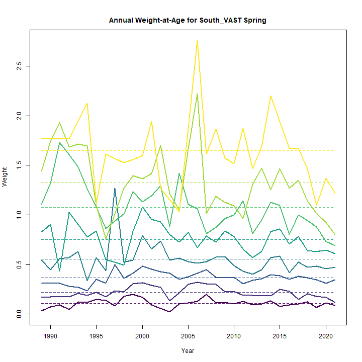
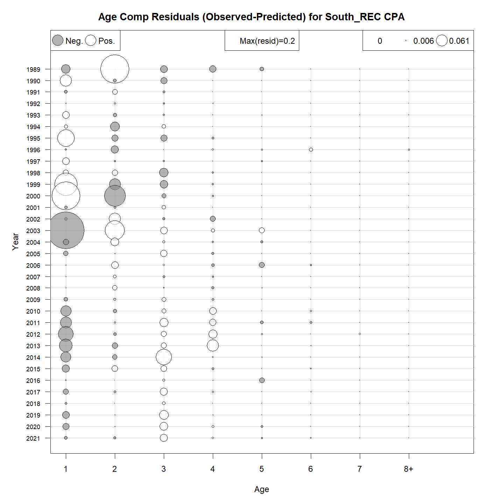
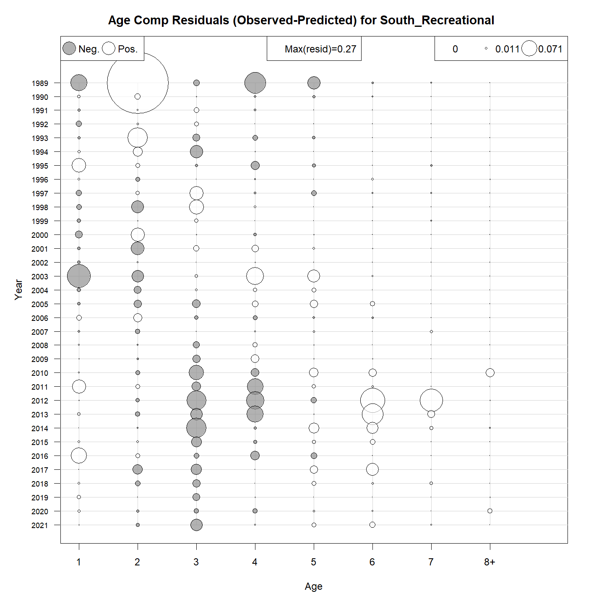
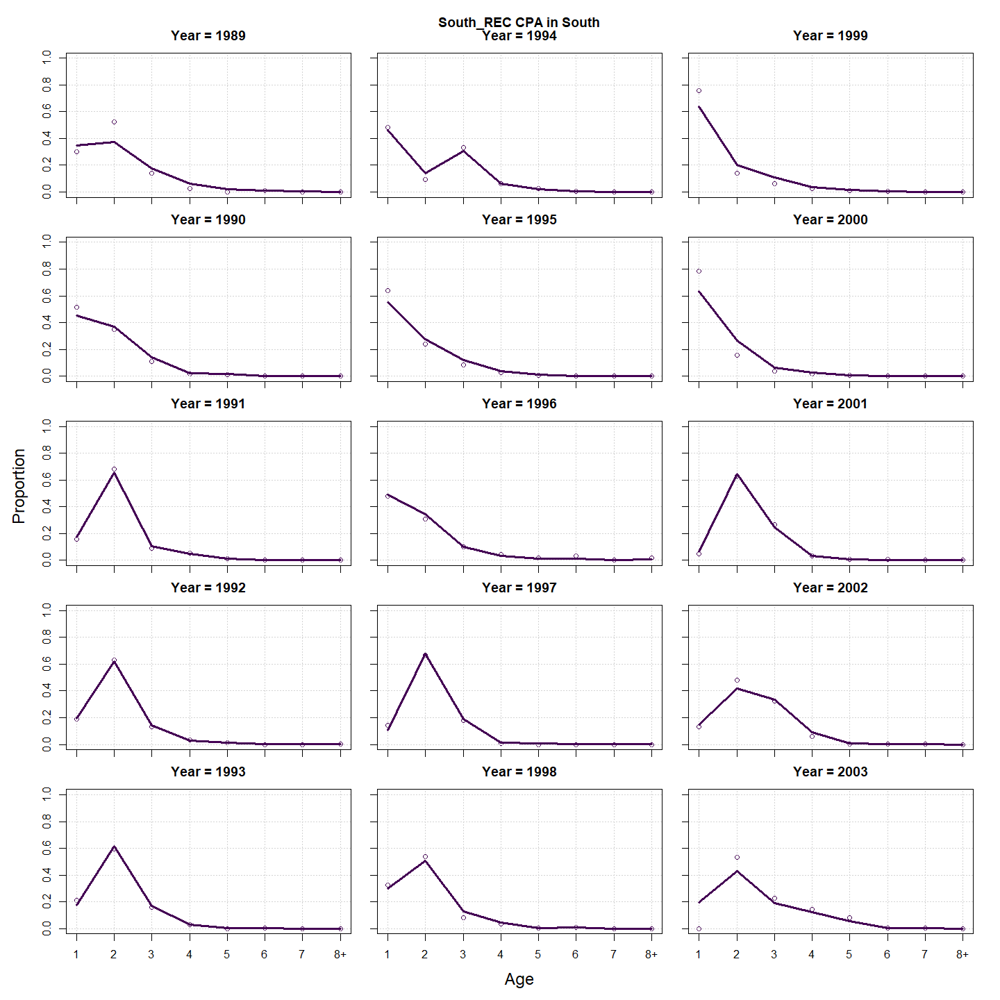
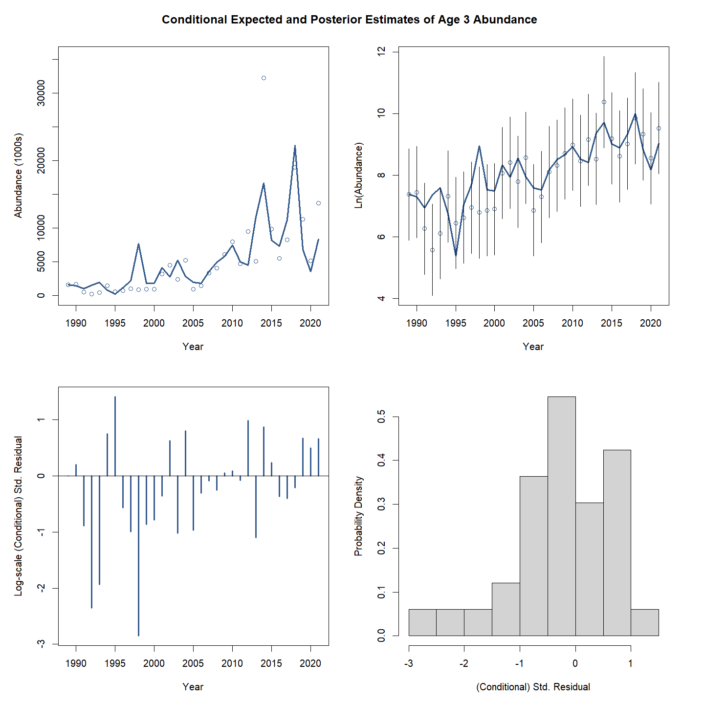
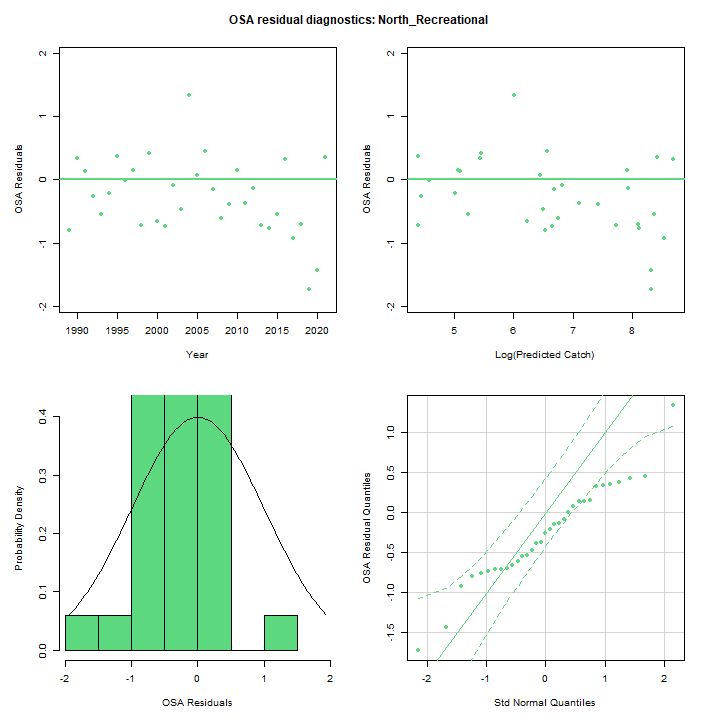
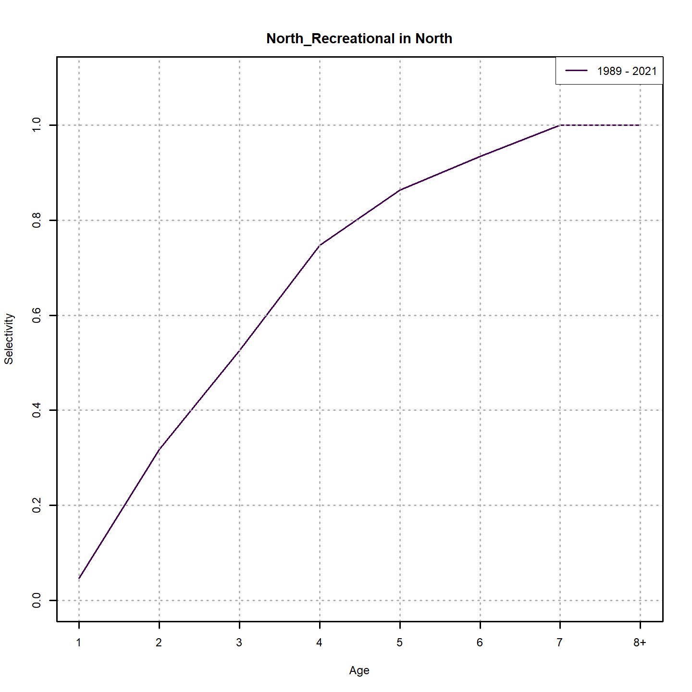
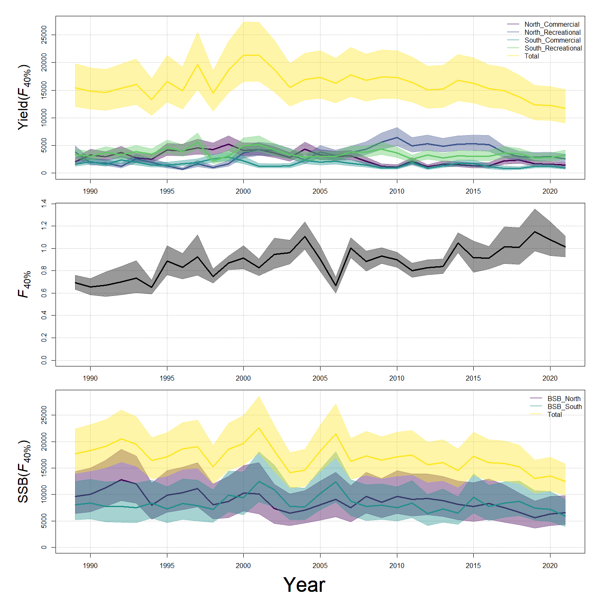
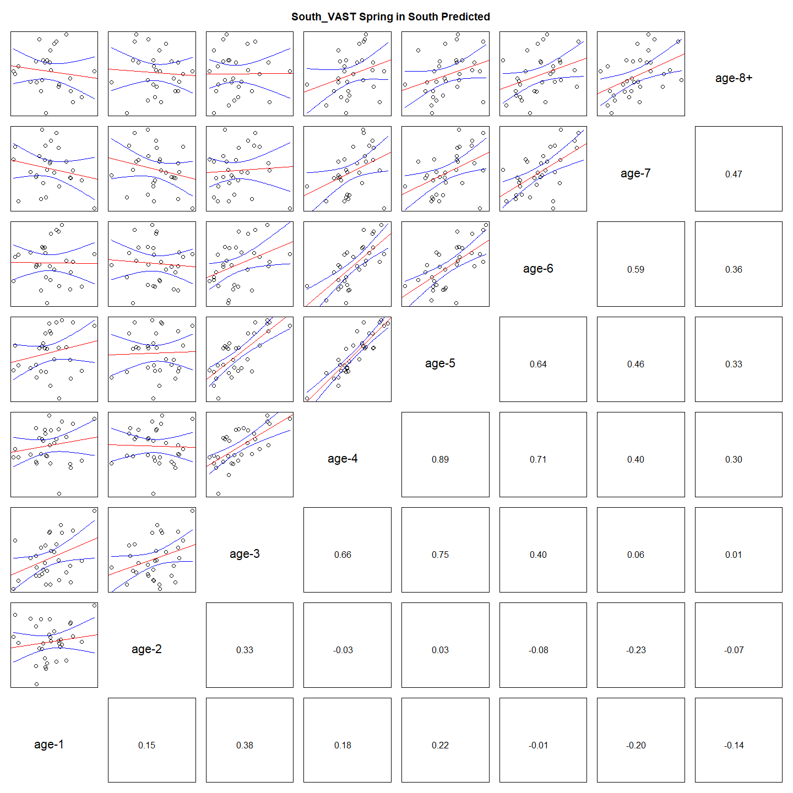
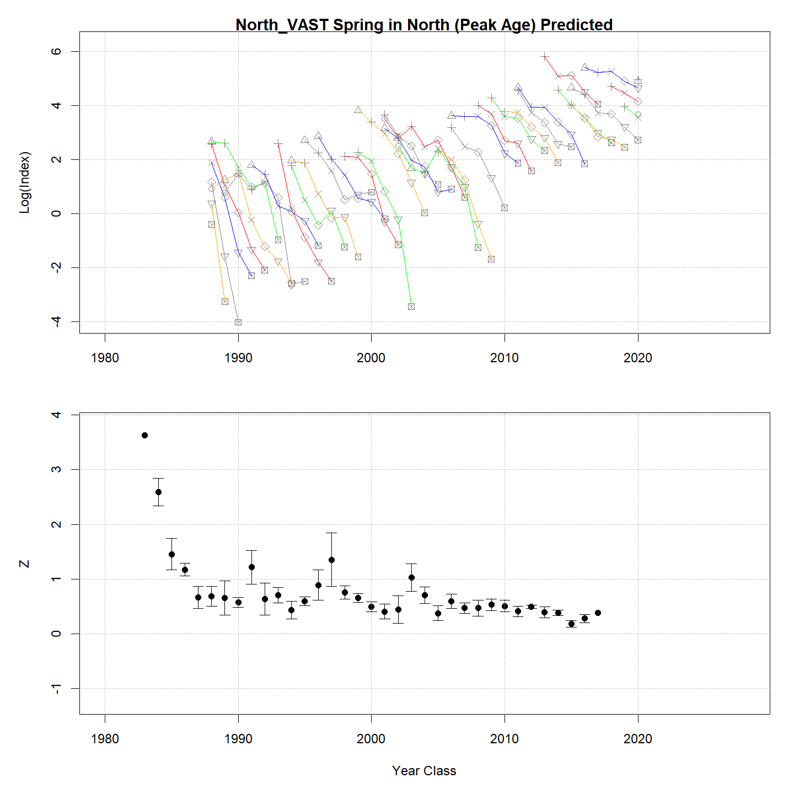

---
output:
  html_document:
    df_print: paged
    keep_md: yes
  word_document: default
  pdf_document:
    fig_caption: yes
    includes:
    keep_tex: yes
    number_sections: no
title: "WHAM figures and tables"
header-includes:
  - \usepackage{longtable}
  - \usepackage{booktabs}
  - \usepackage{caption,graphics}
  - \usepackage{makecell}
  - \usepackage{lscape}
  - \renewcommand\figurename{Fig.}
  - \captionsetup{labelsep=period, singlelinecheck=false}
  - \newcommand{\changesize}[1]{\fontsize{#1pt}{#1pt}\selectfont}
  - \renewcommand{\arraystretch}{1.5}
  - \renewcommand\theadfont{}
---

# {.tabset}

## Figures {.tabset}

### Input

### Diagnostics

### Results

### Retro

### Reference points

### Miscelaneous

## Tables {.tabset}

### Parameter estimates

<table class="table" style="margin-left: auto; margin-right: auto;">
<caption>Parameter estimates, standard errors, and confidence intervals. Rounded to 3 decimal places.</caption>
 <thead>
  <tr>
   <th style="text-align:left;">   </th>
   <th style="text-align:right;"> Estimate </th>
   <th style="text-align:right;"> Std. Error </th>
   <th style="text-align:right;"> 95\% CI lower </th>
   <th style="text-align:right;"> 95\% CI upper </th>
  </tr>
 </thead>
<tbody>
  <tr>
   <td style="text-align:left;"> BSB North Mean Recruitment </td>
   <td style="text-align:right;"> 12557.957 </td>
   <td style="text-align:right;"> 3022.449 </td>
   <td style="text-align:right;"> 7835.231 </td>
   <td style="text-align:right;"> 20127.331 </td>
  </tr>
  <tr>
   <td style="text-align:left;"> BSB North NAA $\sigma$ (age 1) </td>
   <td style="text-align:right;"> 0.939 </td>
   <td style="text-align:right;"> 0.129 </td>
   <td style="text-align:right;"> 0.717 </td>
   <td style="text-align:right;"> 1.229 </td>
  </tr>
  <tr>
   <td style="text-align:left;"> BSB North NAA $\sigma$ (age 2) </td>
   <td style="text-align:right;"> 0.758 </td>
   <td style="text-align:right;"> 0.041 </td>
   <td style="text-align:right;"> 0.681 </td>
   <td style="text-align:right;"> 0.843 </td>
  </tr>
  <tr>
   <td style="text-align:left;"> BSB South Mean Recruitment </td>
   <td style="text-align:right;"> 21612.256 </td>
   <td style="text-align:right;"> 4145.239 </td>
   <td style="text-align:right;"> 14840.186 </td>
   <td style="text-align:right;"> 31474.647 </td>
  </tr>
  <tr>
   <td style="text-align:left;"> BSB South NAA $\sigma$ (age 1) </td>
   <td style="text-align:right;"> 0.551 </td>
   <td style="text-align:right;"> 0.077 </td>
   <td style="text-align:right;"> 0.419 </td>
   <td style="text-align:right;"> 0.726 </td>
  </tr>
  <tr>
   <td style="text-align:left;"> BSB South NAA $\sigma$ (age 2) </td>
   <td style="text-align:right;"> 0.820 </td>
   <td style="text-align:right;"> 0.065 </td>
   <td style="text-align:right;"> 0.702 </td>
   <td style="text-align:right;"> 0.957 </td>
  </tr>
  <tr>
   <td style="text-align:left;"> North REC CPA fully selected q </td>
   <td style="text-align:right;"> 0.000 </td>
   <td style="text-align:right;"> 0.000 </td>
   <td style="text-align:right;"> 0.000 </td>
   <td style="text-align:right;"> 0.000 </td>
  </tr>
  <tr>
   <td style="text-align:left;"> North VAST Spring fully selected q </td>
   <td style="text-align:right;"> 0.013 </td>
   <td style="text-align:right;"> 0.002 </td>
   <td style="text-align:right;"> 0.010 </td>
   <td style="text-align:right;"> 0.016 </td>
  </tr>
  <tr>
   <td style="text-align:left;"> South REC CPA fully selected q </td>
   <td style="text-align:right;"> 0.000 </td>
   <td style="text-align:right;"> 0.000 </td>
   <td style="text-align:right;"> 0.000 </td>
   <td style="text-align:right;"> 0.000 </td>
  </tr>
  <tr>
   <td style="text-align:left;"> South VAST Spring fully selected q </td>
   <td style="text-align:right;"> 0.015 </td>
   <td style="text-align:right;"> 0.002 </td>
   <td style="text-align:right;"> 0.011 </td>
   <td style="text-align:right;"> 0.021 </td>
  </tr>
  <tr>
   <td style="text-align:left;"> Block 1: Mean Selectivity for age 1 </td>
   <td style="text-align:right;"> 0.022 </td>
   <td style="text-align:right;"> 0.018 </td>
   <td style="text-align:right;"> 0.005 </td>
   <td style="text-align:right;"> 0.100 </td>
  </tr>
  <tr>
   <td style="text-align:left;"> Block 1: Mean Selectivity for age 2 </td>
   <td style="text-align:right;"> 0.323 </td>
   <td style="text-align:right;"> 0.173 </td>
   <td style="text-align:right;"> 0.092 </td>
   <td style="text-align:right;"> 0.692 </td>
  </tr>
  <tr>
   <td style="text-align:left;"> Block 1: Mean Selectivity for age 3 </td>
   <td style="text-align:right;"> 0.813 </td>
   <td style="text-align:right;"> 0.129 </td>
   <td style="text-align:right;"> 0.451 </td>
   <td style="text-align:right;"> 0.958 </td>
  </tr>
  <tr>
   <td style="text-align:left;"> Block 1: Mean Selectivity for age 4 </td>
   <td style="text-align:right;"> 1.000 </td>
   <td style="text-align:right;"> -- </td>
   <td style="text-align:right;"> -- </td>
   <td style="text-align:right;"> -- </td>
  </tr>
  <tr>
   <td style="text-align:left;"> Block 1: Mean Selectivity for age 5 </td>
   <td style="text-align:right;"> 1.000 </td>
   <td style="text-align:right;"> -- </td>
   <td style="text-align:right;"> -- </td>
   <td style="text-align:right;"> -- </td>
  </tr>
  <tr>
   <td style="text-align:left;"> Block 1: Mean Selectivity for age 6 </td>
   <td style="text-align:right;"> 1.000 </td>
   <td style="text-align:right;"> -- </td>
   <td style="text-align:right;"> -- </td>
   <td style="text-align:right;"> -- </td>
  </tr>
  <tr>
   <td style="text-align:left;"> Block 1: Mean Selectivity for age 7 </td>
   <td style="text-align:right;"> 1.000 </td>
   <td style="text-align:right;"> -- </td>
   <td style="text-align:right;"> -- </td>
   <td style="text-align:right;"> -- </td>
  </tr>
  <tr>
   <td style="text-align:left;"> Block 1: Mean Selectivity for age 8+ </td>
   <td style="text-align:right;"> 1.000 </td>
   <td style="text-align:right;"> -- </td>
   <td style="text-align:right;"> -- </td>
   <td style="text-align:right;"> -- </td>
  </tr>
  <tr>
   <td style="text-align:left;"> Block 2: Mean Selectivity for age 1 </td>
   <td style="text-align:right;"> 0.033 </td>
   <td style="text-align:right;"> 0.031 </td>
   <td style="text-align:right;"> 0.005 </td>
   <td style="text-align:right;"> 0.188 </td>
  </tr>
  <tr>
   <td style="text-align:left;"> Block 2: Mean Selectivity for age 2 </td>
   <td style="text-align:right;"> 0.326 </td>
   <td style="text-align:right;"> 0.214 </td>
   <td style="text-align:right;"> 0.067 </td>
   <td style="text-align:right;"> 0.765 </td>
  </tr>
  <tr>
   <td style="text-align:left;"> Block 2: Mean Selectivity for age 3 </td>
   <td style="text-align:right;"> 0.564 </td>
   <td style="text-align:right;"> 0.241 </td>
   <td style="text-align:right;"> 0.159 </td>
   <td style="text-align:right;"> 0.898 </td>
  </tr>
  <tr>
   <td style="text-align:left;"> Block 2: Mean Selectivity for age 4 </td>
   <td style="text-align:right;"> 0.798 </td>
   <td style="text-align:right;"> 0.161 </td>
   <td style="text-align:right;"> 0.358 </td>
   <td style="text-align:right;"> 0.966 </td>
  </tr>
  <tr>
   <td style="text-align:left;"> Block 2: Mean Selectivity for age 5 </td>
   <td style="text-align:right;"> 0.902 </td>
   <td style="text-align:right;"> 0.092 </td>
   <td style="text-align:right;"> 0.547 </td>
   <td style="text-align:right;"> 0.986 </td>
  </tr>
  <tr>
   <td style="text-align:left;"> Block 2: Mean Selectivity for age 6 </td>
   <td style="text-align:right;"> 0.957 </td>
   <td style="text-align:right;"> 0.046 </td>
   <td style="text-align:right;"> 0.715 </td>
   <td style="text-align:right;"> 0.995 </td>
  </tr>
  <tr>
   <td style="text-align:left;"> Block 2: Mean Selectivity for age 7 </td>
   <td style="text-align:right;"> 1.000 </td>
   <td style="text-align:right;"> -- </td>
   <td style="text-align:right;"> -- </td>
   <td style="text-align:right;"> -- </td>
  </tr>
  <tr>
   <td style="text-align:left;"> Block 2: Mean Selectivity for age 8+ </td>
   <td style="text-align:right;"> 1.000 </td>
   <td style="text-align:right;"> -- </td>
   <td style="text-align:right;"> -- </td>
   <td style="text-align:right;"> -- </td>
  </tr>
  <tr>
   <td style="text-align:left;"> Block 3: $a_{50}$ </td>
   <td style="text-align:right;"> 2.444 </td>
   <td style="text-align:right;"> 0.123 </td>
   <td style="text-align:right;"> 2.210 </td>
   <td style="text-align:right;"> 2.691 </td>
  </tr>
  <tr>
   <td style="text-align:left;"> Block 3: 1/slope (increasing) </td>
   <td style="text-align:right;"> 0.401 </td>
   <td style="text-align:right;"> 0.033 </td>
   <td style="text-align:right;"> 0.342 </td>
   <td style="text-align:right;"> 0.469 </td>
  </tr>
  <tr>
   <td style="text-align:left;"> Block 4: $a_{50}$ </td>
   <td style="text-align:right;"> 2.939 </td>
   <td style="text-align:right;"> 0.193 </td>
   <td style="text-align:right;"> 2.571 </td>
   <td style="text-align:right;"> 3.327 </td>
  </tr>
  <tr>
   <td style="text-align:left;"> Block 4: 1/slope (increasing) </td>
   <td style="text-align:right;"> 0.853 </td>
   <td style="text-align:right;"> 0.093 </td>
   <td style="text-align:right;"> 0.688 </td>
   <td style="text-align:right;"> 1.053 </td>
  </tr>
  <tr>
   <td style="text-align:left;"> Block 5: Selectivity for age 1 </td>
   <td style="text-align:right;"> 0.500 </td>
   <td style="text-align:right;"> -- </td>
   <td style="text-align:right;"> -- </td>
   <td style="text-align:right;"> -- </td>
  </tr>
  <tr>
   <td style="text-align:left;"> Block 5: Selectivity for age 2 </td>
   <td style="text-align:right;"> 0.500 </td>
   <td style="text-align:right;"> -- </td>
   <td style="text-align:right;"> -- </td>
   <td style="text-align:right;"> -- </td>
  </tr>
  <tr>
   <td style="text-align:left;"> Block 5: Selectivity for age 3 </td>
   <td style="text-align:right;"> 0.500 </td>
   <td style="text-align:right;"> -- </td>
   <td style="text-align:right;"> -- </td>
   <td style="text-align:right;"> -- </td>
  </tr>
  <tr>
   <td style="text-align:left;"> Block 5: Selectivity for age 4 </td>
   <td style="text-align:right;"> 0.500 </td>
   <td style="text-align:right;"> -- </td>
   <td style="text-align:right;"> -- </td>
   <td style="text-align:right;"> -- </td>
  </tr>
  <tr>
   <td style="text-align:left;"> Block 5: Selectivity for age 5 </td>
   <td style="text-align:right;"> 0.500 </td>
   <td style="text-align:right;"> -- </td>
   <td style="text-align:right;"> -- </td>
   <td style="text-align:right;"> -- </td>
  </tr>
  <tr>
   <td style="text-align:left;"> Block 5: Selectivity for age 6 </td>
   <td style="text-align:right;"> 0.500 </td>
   <td style="text-align:right;"> -- </td>
   <td style="text-align:right;"> -- </td>
   <td style="text-align:right;"> -- </td>
  </tr>
  <tr>
   <td style="text-align:left;"> Block 5: Selectivity for age 7 </td>
   <td style="text-align:right;"> 0.500 </td>
   <td style="text-align:right;"> -- </td>
   <td style="text-align:right;"> -- </td>
   <td style="text-align:right;"> -- </td>
  </tr>
  <tr>
   <td style="text-align:left;"> Block 5: Selectivity for age 8+ </td>
   <td style="text-align:right;"> 0.500 </td>
   <td style="text-align:right;"> -- </td>
   <td style="text-align:right;"> -- </td>
   <td style="text-align:right;"> -- </td>
  </tr>
  <tr>
   <td style="text-align:left;"> Block 6: Selectivity for age 1 </td>
   <td style="text-align:right;"> 0.500 </td>
   <td style="text-align:right;"> -- </td>
   <td style="text-align:right;"> -- </td>
   <td style="text-align:right;"> -- </td>
  </tr>
  <tr>
   <td style="text-align:left;"> Block 6: Selectivity for age 2 </td>
   <td style="text-align:right;"> 0.500 </td>
   <td style="text-align:right;"> -- </td>
   <td style="text-align:right;"> -- </td>
   <td style="text-align:right;"> -- </td>
  </tr>
  <tr>
   <td style="text-align:left;"> Block 6: Selectivity for age 3 </td>
   <td style="text-align:right;"> 0.500 </td>
   <td style="text-align:right;"> -- </td>
   <td style="text-align:right;"> -- </td>
   <td style="text-align:right;"> -- </td>
  </tr>
  <tr>
   <td style="text-align:left;"> Block 6: Selectivity for age 4 </td>
   <td style="text-align:right;"> 0.500 </td>
   <td style="text-align:right;"> -- </td>
   <td style="text-align:right;"> -- </td>
   <td style="text-align:right;"> -- </td>
  </tr>
  <tr>
   <td style="text-align:left;"> Block 6: Selectivity for age 5 </td>
   <td style="text-align:right;"> 0.500 </td>
   <td style="text-align:right;"> -- </td>
   <td style="text-align:right;"> -- </td>
   <td style="text-align:right;"> -- </td>
  </tr>
  <tr>
   <td style="text-align:left;"> Block 6: Selectivity for age 6 </td>
   <td style="text-align:right;"> 0.500 </td>
   <td style="text-align:right;"> -- </td>
   <td style="text-align:right;"> -- </td>
   <td style="text-align:right;"> -- </td>
  </tr>
  <tr>
   <td style="text-align:left;"> Block 6: Selectivity for age 7 </td>
   <td style="text-align:right;"> 0.500 </td>
   <td style="text-align:right;"> -- </td>
   <td style="text-align:right;"> -- </td>
   <td style="text-align:right;"> -- </td>
  </tr>
  <tr>
   <td style="text-align:left;"> Block 6: Selectivity for age 8+ </td>
   <td style="text-align:right;"> 0.500 </td>
   <td style="text-align:right;"> -- </td>
   <td style="text-align:right;"> -- </td>
   <td style="text-align:right;"> -- </td>
  </tr>
  <tr>
   <td style="text-align:left;"> Block 7: Selectivity for age 1 </td>
   <td style="text-align:right;"> 0.500 </td>
   <td style="text-align:right;"> -- </td>
   <td style="text-align:right;"> -- </td>
   <td style="text-align:right;"> -- </td>
  </tr>
  <tr>
   <td style="text-align:left;"> Block 7: Selectivity for age 2 </td>
   <td style="text-align:right;"> 0.500 </td>
   <td style="text-align:right;"> -- </td>
   <td style="text-align:right;"> -- </td>
   <td style="text-align:right;"> -- </td>
  </tr>
  <tr>
   <td style="text-align:left;"> Block 7: Selectivity for age 3 </td>
   <td style="text-align:right;"> 0.500 </td>
   <td style="text-align:right;"> -- </td>
   <td style="text-align:right;"> -- </td>
   <td style="text-align:right;"> -- </td>
  </tr>
  <tr>
   <td style="text-align:left;"> Block 7: Selectivity for age 4 </td>
   <td style="text-align:right;"> 0.500 </td>
   <td style="text-align:right;"> -- </td>
   <td style="text-align:right;"> -- </td>
   <td style="text-align:right;"> -- </td>
  </tr>
  <tr>
   <td style="text-align:left;"> Block 7: Selectivity for age 5 </td>
   <td style="text-align:right;"> 0.500 </td>
   <td style="text-align:right;"> -- </td>
   <td style="text-align:right;"> -- </td>
   <td style="text-align:right;"> -- </td>
  </tr>
  <tr>
   <td style="text-align:left;"> Block 7: Selectivity for age 6 </td>
   <td style="text-align:right;"> 0.500 </td>
   <td style="text-align:right;"> -- </td>
   <td style="text-align:right;"> -- </td>
   <td style="text-align:right;"> -- </td>
  </tr>
  <tr>
   <td style="text-align:left;"> Block 7: Selectivity for age 7 </td>
   <td style="text-align:right;"> 0.500 </td>
   <td style="text-align:right;"> -- </td>
   <td style="text-align:right;"> -- </td>
   <td style="text-align:right;"> -- </td>
  </tr>
  <tr>
   <td style="text-align:left;"> Block 7: Selectivity for age 8+ </td>
   <td style="text-align:right;"> 0.500 </td>
   <td style="text-align:right;"> -- </td>
   <td style="text-align:right;"> -- </td>
   <td style="text-align:right;"> -- </td>
  </tr>
  <tr>
   <td style="text-align:left;"> Block 8: Selectivity for age 1 </td>
   <td style="text-align:right;"> 0.500 </td>
   <td style="text-align:right;"> -- </td>
   <td style="text-align:right;"> -- </td>
   <td style="text-align:right;"> -- </td>
  </tr>
  <tr>
   <td style="text-align:left;"> Block 8: Selectivity for age 2 </td>
   <td style="text-align:right;"> 0.500 </td>
   <td style="text-align:right;"> -- </td>
   <td style="text-align:right;"> -- </td>
   <td style="text-align:right;"> -- </td>
  </tr>
  <tr>
   <td style="text-align:left;"> Block 8: Selectivity for age 3 </td>
   <td style="text-align:right;"> 0.500 </td>
   <td style="text-align:right;"> -- </td>
   <td style="text-align:right;"> -- </td>
   <td style="text-align:right;"> -- </td>
  </tr>
  <tr>
   <td style="text-align:left;"> Block 8: Selectivity for age 4 </td>
   <td style="text-align:right;"> 0.500 </td>
   <td style="text-align:right;"> -- </td>
   <td style="text-align:right;"> -- </td>
   <td style="text-align:right;"> -- </td>
  </tr>
  <tr>
   <td style="text-align:left;"> Block 8: Selectivity for age 5 </td>
   <td style="text-align:right;"> 0.500 </td>
   <td style="text-align:right;"> -- </td>
   <td style="text-align:right;"> -- </td>
   <td style="text-align:right;"> -- </td>
  </tr>
  <tr>
   <td style="text-align:left;"> Block 8: Selectivity for age 6 </td>
   <td style="text-align:right;"> 0.500 </td>
   <td style="text-align:right;"> -- </td>
   <td style="text-align:right;"> -- </td>
   <td style="text-align:right;"> -- </td>
  </tr>
  <tr>
   <td style="text-align:left;"> Block 8: Selectivity for age 7 </td>
   <td style="text-align:right;"> 0.500 </td>
   <td style="text-align:right;"> -- </td>
   <td style="text-align:right;"> -- </td>
   <td style="text-align:right;"> -- </td>
  </tr>
  <tr>
   <td style="text-align:left;"> Block 8: Selectivity for age 8+ </td>
   <td style="text-align:right;"> 0.500 </td>
   <td style="text-align:right;"> -- </td>
   <td style="text-align:right;"> -- </td>
   <td style="text-align:right;"> -- </td>
  </tr>
  <tr>
   <td style="text-align:left;"> Block 9: Mean Selectivity for age 1 </td>
   <td style="text-align:right;"> 0.180 </td>
   <td style="text-align:right;"> 0.078 </td>
   <td style="text-align:right;"> 0.072 </td>
   <td style="text-align:right;"> 0.383 </td>
  </tr>
  <tr>
   <td style="text-align:left;"> Block 9: Mean Selectivity for age 2 </td>
   <td style="text-align:right;"> 1.000 </td>
   <td style="text-align:right;"> -- </td>
   <td style="text-align:right;"> -- </td>
   <td style="text-align:right;"> -- </td>
  </tr>
  <tr>
   <td style="text-align:left;"> Block 9: Mean Selectivity for age 3 </td>
   <td style="text-align:right;"> 1.000 </td>
   <td style="text-align:right;"> -- </td>
   <td style="text-align:right;"> -- </td>
   <td style="text-align:right;"> -- </td>
  </tr>
  <tr>
   <td style="text-align:left;"> Block 9: Mean Selectivity for age 4 </td>
   <td style="text-align:right;"> 1.000 </td>
   <td style="text-align:right;"> -- </td>
   <td style="text-align:right;"> -- </td>
   <td style="text-align:right;"> -- </td>
  </tr>
  <tr>
   <td style="text-align:left;"> Block 9: Mean Selectivity for age 5 </td>
   <td style="text-align:right;"> 1.000 </td>
   <td style="text-align:right;"> -- </td>
   <td style="text-align:right;"> -- </td>
   <td style="text-align:right;"> -- </td>
  </tr>
  <tr>
   <td style="text-align:left;"> Block 9: Mean Selectivity for age 6 </td>
   <td style="text-align:right;"> 1.000 </td>
   <td style="text-align:right;"> -- </td>
   <td style="text-align:right;"> -- </td>
   <td style="text-align:right;"> -- </td>
  </tr>
  <tr>
   <td style="text-align:left;"> Block 9: Mean Selectivity for age 7 </td>
   <td style="text-align:right;"> 1.000 </td>
   <td style="text-align:right;"> -- </td>
   <td style="text-align:right;"> -- </td>
   <td style="text-align:right;"> -- </td>
  </tr>
  <tr>
   <td style="text-align:left;"> Block 9: Mean Selectivity for age 8+ </td>
   <td style="text-align:right;"> 1.000 </td>
   <td style="text-align:right;"> -- </td>
   <td style="text-align:right;"> -- </td>
   <td style="text-align:right;"> -- </td>
  </tr>
  <tr>
   <td style="text-align:left;"> Block 10: Mean Selectivity for age 1 </td>
   <td style="text-align:right;"> 0.083 </td>
   <td style="text-align:right;"> 0.031 </td>
   <td style="text-align:right;"> 0.039 </td>
   <td style="text-align:right;"> 0.167 </td>
  </tr>
  <tr>
   <td style="text-align:left;"> Block 10: Mean Selectivity for age 2 </td>
   <td style="text-align:right;"> 0.403 </td>
   <td style="text-align:right;"> 0.102 </td>
   <td style="text-align:right;"> 0.228 </td>
   <td style="text-align:right;"> 0.607 </td>
  </tr>
  <tr>
   <td style="text-align:left;"> Block 10: Mean Selectivity for age 3 </td>
   <td style="text-align:right;"> 0.901 </td>
   <td style="text-align:right;"> 0.067 </td>
   <td style="text-align:right;"> 0.675 </td>
   <td style="text-align:right;"> 0.976 </td>
  </tr>
  <tr>
   <td style="text-align:left;"> Block 10: Mean Selectivity for age 4 </td>
   <td style="text-align:right;"> 0.935 </td>
   <td style="text-align:right;"> 0.044 </td>
   <td style="text-align:right;"> 0.776 </td>
   <td style="text-align:right;"> 0.983 </td>
  </tr>
  <tr>
   <td style="text-align:left;"> Block 10: Mean Selectivity for age 5 </td>
   <td style="text-align:right;"> 1.000 </td>
   <td style="text-align:right;"> -- </td>
   <td style="text-align:right;"> -- </td>
   <td style="text-align:right;"> -- </td>
  </tr>
  <tr>
   <td style="text-align:left;"> Block 10: Mean Selectivity for age 6 </td>
   <td style="text-align:right;"> 1.000 </td>
   <td style="text-align:right;"> -- </td>
   <td style="text-align:right;"> -- </td>
   <td style="text-align:right;"> -- </td>
  </tr>
  <tr>
   <td style="text-align:left;"> Block 10: Mean Selectivity for age 7 </td>
   <td style="text-align:right;"> 1.000 </td>
   <td style="text-align:right;"> -- </td>
   <td style="text-align:right;"> -- </td>
   <td style="text-align:right;"> -- </td>
  </tr>
  <tr>
   <td style="text-align:left;"> Block 10: Mean Selectivity for age 8+ </td>
   <td style="text-align:right;"> 1.000 </td>
   <td style="text-align:right;"> -- </td>
   <td style="text-align:right;"> -- </td>
   <td style="text-align:right;"> -- </td>
  </tr>
  <tr>
   <td style="text-align:left;"> Block 11: Selectivity for age 1 </td>
   <td style="text-align:right;"> 0.422 </td>
   <td style="text-align:right;"> 0.068 </td>
   <td style="text-align:right;"> 0.298 </td>
   <td style="text-align:right;"> 0.557 </td>
  </tr>
  <tr>
   <td style="text-align:left;"> Block 11: Selectivity for age 2 </td>
   <td style="text-align:right;"> 0.843 </td>
   <td style="text-align:right;"> 0.073 </td>
   <td style="text-align:right;"> 0.646 </td>
   <td style="text-align:right;"> 0.941 </td>
  </tr>
  <tr>
   <td style="text-align:left;"> Block 11: Selectivity for age 3 </td>
   <td style="text-align:right;"> 1.000 </td>
   <td style="text-align:right;"> -- </td>
   <td style="text-align:right;"> -- </td>
   <td style="text-align:right;"> -- </td>
  </tr>
  <tr>
   <td style="text-align:left;"> Block 11: Selectivity for age 4 </td>
   <td style="text-align:right;"> 1.000 </td>
   <td style="text-align:right;"> -- </td>
   <td style="text-align:right;"> -- </td>
   <td style="text-align:right;"> -- </td>
  </tr>
  <tr>
   <td style="text-align:left;"> Block 11: Selectivity for age 5 </td>
   <td style="text-align:right;"> 1.000 </td>
   <td style="text-align:right;"> -- </td>
   <td style="text-align:right;"> -- </td>
   <td style="text-align:right;"> -- </td>
  </tr>
  <tr>
   <td style="text-align:left;"> Block 11: Selectivity for age 6 </td>
   <td style="text-align:right;"> 1.000 </td>
   <td style="text-align:right;"> -- </td>
   <td style="text-align:right;"> -- </td>
   <td style="text-align:right;"> -- </td>
  </tr>
  <tr>
   <td style="text-align:left;"> Block 11: Selectivity for age 7 </td>
   <td style="text-align:right;"> 1.000 </td>
   <td style="text-align:right;"> -- </td>
   <td style="text-align:right;"> -- </td>
   <td style="text-align:right;"> -- </td>
  </tr>
  <tr>
   <td style="text-align:left;"> Block 11: Selectivity for age 8+ </td>
   <td style="text-align:right;"> 1.000 </td>
   <td style="text-align:right;"> -- </td>
   <td style="text-align:right;"> -- </td>
   <td style="text-align:right;"> -- </td>
  </tr>
  <tr>
   <td style="text-align:left;"> Block 12: $a_{50}$ </td>
   <td style="text-align:right;"> 1.185 </td>
   <td style="text-align:right;"> 0.250 </td>
   <td style="text-align:right;"> 0.773 </td>
   <td style="text-align:right;"> 1.761 </td>
  </tr>
  <tr>
   <td style="text-align:left;"> Block 12: 1/slope (increasing) </td>
   <td style="text-align:right;"> 0.276 </td>
   <td style="text-align:right;"> 0.254 </td>
   <td style="text-align:right;"> 0.044 </td>
   <td style="text-align:right;"> 1.505 </td>
  </tr>
  <tr>
   <td style="text-align:left;"> Block 1: Selectivity RE $\sigma$ </td>
   <td style="text-align:right;"> 0.420 </td>
   <td style="text-align:right;"> 0.116 </td>
   <td style="text-align:right;"> 0.245 </td>
   <td style="text-align:right;"> 0.722 </td>
  </tr>
  <tr>
   <td style="text-align:left;"> Block 1: Selectivity RE AR1 $\rho$ (age) </td>
   <td style="text-align:right;"> 0.463 </td>
   <td style="text-align:right;"> 0.144 </td>
   <td style="text-align:right;"> 0.315 </td>
   <td style="text-align:right;"> 0.933 </td>
  </tr>
  <tr>
   <td style="text-align:left;"> Block 1: Selectivity RE AR1 $\rho$ (year) </td>
   <td style="text-align:right;"> 0.590 </td>
   <td style="text-align:right;"> 0.081 </td>
   <td style="text-align:right;"> 0.592 </td>
   <td style="text-align:right;"> 0.966 </td>
  </tr>
  <tr>
   <td style="text-align:left;"> Block 2: Selectivity RE $\sigma$ </td>
   <td style="text-align:right;"> 0.216 </td>
   <td style="text-align:right;"> 0.030 </td>
   <td style="text-align:right;"> 0.164 </td>
   <td style="text-align:right;"> 0.284 </td>
  </tr>
  <tr>
   <td style="text-align:left;"> Block 2: Selectivity RE AR1 $\rho$ (age) </td>
   <td style="text-align:right;"> 0.511 </td>
   <td style="text-align:right;"> 0.064 </td>
   <td style="text-align:right;"> 0.642 </td>
   <td style="text-align:right;"> 0.904 </td>
  </tr>
  <tr>
   <td style="text-align:left;"> Block 2: Selectivity RE AR1 $\rho$ (year) </td>
   <td style="text-align:right;"> 0.741 </td>
   <td style="text-align:right;"> 0.023 </td>
   <td style="text-align:right;"> 0.881 </td>
   <td style="text-align:right;"> 0.985 </td>
  </tr>
  <tr>
   <td style="text-align:left;"> Block 9: Selectivity RE $\sigma$ </td>
   <td style="text-align:right;"> 0.266 </td>
   <td style="text-align:right;"> 0.066 </td>
   <td style="text-align:right;"> 0.163 </td>
   <td style="text-align:right;"> 0.434 </td>
  </tr>
  <tr>
   <td style="text-align:left;"> Block 9: Selectivity RE AR1 $\rho$ (year) </td>
   <td style="text-align:right;"> 0.665 </td>
   <td style="text-align:right;"> 0.076 </td>
   <td style="text-align:right;"> 0.546 </td>
   <td style="text-align:right;"> 0.989 </td>
  </tr>
  <tr>
   <td style="text-align:left;"> Block 10: Selectivity RE $\sigma$ </td>
   <td style="text-align:right;"> 0.802 </td>
   <td style="text-align:right;"> 0.179 </td>
   <td style="text-align:right;"> 0.518 </td>
   <td style="text-align:right;"> 1.242 </td>
  </tr>
  <tr>
   <td style="text-align:left;"> Block 10: Selectivity RE AR1 $\rho$ (age) </td>
   <td style="text-align:right;"> 0.125 </td>
   <td style="text-align:right;"> 0.225 </td>
   <td style="text-align:right;"> -0.214 </td>
   <td style="text-align:right;"> 0.617 </td>
  </tr>
  <tr>
   <td style="text-align:left;"> Block 10: Selectivity RE AR1 $\rho$ (year) </td>
   <td style="text-align:right;"> 0.342 </td>
   <td style="text-align:right;"> 0.177 </td>
   <td style="text-align:right;"> 0.156 </td>
   <td style="text-align:right;"> 0.853 </td>
  </tr>
  <tr>
   <td style="text-align:left;"> North Commercial in North age comp, Dirichlet-multinomial: dispersion ($\phi$) </td>
   <td style="text-align:right;"> 55.072 </td>
   <td style="text-align:right;"> 6.998 </td>
   <td style="text-align:right;"> 42.930 </td>
   <td style="text-align:right;"> 70.647 </td>
  </tr>
  <tr>
   <td style="text-align:left;"> North Recreational in North age comp, logistic-normal: $\sigma$ </td>
   <td style="text-align:right;"> 2.833 </td>
   <td style="text-align:right;"> 0.330 </td>
   <td style="text-align:right;"> 2.254 </td>
   <td style="text-align:right;"> 3.560 </td>
  </tr>
  <tr>
   <td style="text-align:left;"> South Commercial in South age comp, logistic-normal: $\sigma$ </td>
   <td style="text-align:right;"> 41.088 </td>
   <td style="text-align:right;"> 4.186 </td>
   <td style="text-align:right;"> 33.650 </td>
   <td style="text-align:right;"> 50.169 </td>
  </tr>
  <tr>
   <td style="text-align:left;"> South Commercial in South age comp, logistic-normal: $\rho$ </td>
   <td style="text-align:right;"> 0.798 </td>
   <td style="text-align:right;"> 0.044 </td>
   <td style="text-align:right;"> 0.697 </td>
   <td style="text-align:right;"> 0.872 </td>
  </tr>
  <tr>
   <td style="text-align:left;"> South Recreational in South age comp, logistic-normal: $\sigma$ </td>
   <td style="text-align:right;"> 15.404 </td>
   <td style="text-align:right;"> 2.554 </td>
   <td style="text-align:right;"> 11.131 </td>
   <td style="text-align:right;"> 21.318 </td>
  </tr>
  <tr>
   <td style="text-align:left;"> South Recreational in South age comp, logistic-normal: $\rho$ </td>
   <td style="text-align:right;"> 0.782 </td>
   <td style="text-align:right;"> 0.067 </td>
   <td style="text-align:right;"> 0.625 </td>
   <td style="text-align:right;"> 0.885 </td>
  </tr>
  <tr>
   <td style="text-align:left;"> North REC CPA in North age comp, logistic-normal: $\sigma$ </td>
   <td style="text-align:right;"> 3.969 </td>
   <td style="text-align:right;"> 0.378 </td>
   <td style="text-align:right;"> 3.293 </td>
   <td style="text-align:right;"> 4.782 </td>
  </tr>
  <tr>
   <td style="text-align:left;"> North VAST Spring in North age comp, Dirichlet-multinomial: dispersion ($\phi$) </td>
   <td style="text-align:right;"> 29.286 </td>
   <td style="text-align:right;"> 3.581 </td>
   <td style="text-align:right;"> 23.045 </td>
   <td style="text-align:right;"> 37.218 </td>
  </tr>
  <tr>
   <td style="text-align:left;"> South REC CPA in South age comp, logistic-normal: $\sigma$ </td>
   <td style="text-align:right;"> 14.219 </td>
   <td style="text-align:right;"> 2.905 </td>
   <td style="text-align:right;"> 9.527 </td>
   <td style="text-align:right;"> 21.223 </td>
  </tr>
  <tr>
   <td style="text-align:left;"> South REC CPA in South age comp, logistic-normal: $\rho$ </td>
   <td style="text-align:right;"> 0.799 </td>
   <td style="text-align:right;"> 0.077 </td>
   <td style="text-align:right;"> 0.609 </td>
   <td style="text-align:right;"> 0.911 </td>
  </tr>
  <tr>
   <td style="text-align:left;"> South VAST Spring in South age comp, logistic-normal: $\sigma$ </td>
   <td style="text-align:right;"> 54.609 </td>
   <td style="text-align:right;"> 4.630 </td>
   <td style="text-align:right;"> 46.248 </td>
   <td style="text-align:right;"> 64.482 </td>
  </tr>
  <tr>
   <td style="text-align:left;"> South VAST Spring in South age comp, logistic-normal: $\rho$ </td>
   <td style="text-align:right;"> 0.724 </td>
   <td style="text-align:right;"> 0.049 </td>
   <td style="text-align:right;"> 0.619 </td>
   <td style="text-align:right;"> 0.809 </td>
  </tr>
</tbody>
</table>

### Abundance at age

<table class="table" style="margin-left: auto; margin-right: auto;">
<caption>Abundance at age (1000s) for BSB North in North.</caption>
 <thead>
  <tr>
   <th style="text-align:left;">   </th>
   <th style="text-align:right;"> 1 </th>
   <th style="text-align:right;"> 2 </th>
   <th style="text-align:right;"> 3 </th>
   <th style="text-align:right;"> 4 </th>
   <th style="text-align:right;"> 5 </th>
   <th style="text-align:right;"> 6 </th>
   <th style="text-align:right;"> 7 </th>
   <th style="text-align:right;"> 8+ </th>
  </tr>
 </thead>
<tbody>
  <tr>
   <td style="text-align:left;"> 1989 </td>
   <td style="text-align:right;"> 6432 </td>
   <td style="text-align:right;"> 3394 </td>
   <td style="text-align:right;"> 1600 </td>
   <td style="text-align:right;"> 733 </td>
   <td style="text-align:right;"> 335 </td>
   <td style="text-align:right;"> 153 </td>
   <td style="text-align:right;"> 69 </td>
   <td style="text-align:right;"> 58 </td>
  </tr>
  <tr>
   <td style="text-align:left;"> 1990 </td>
   <td style="text-align:right;"> 7134 </td>
   <td style="text-align:right;"> 2195 </td>
   <td style="text-align:right;"> 1716 </td>
   <td style="text-align:right;"> 325 </td>
   <td style="text-align:right;"> 189 </td>
   <td style="text-align:right;"> 22 </td>
   <td style="text-align:right;"> 4 </td>
   <td style="text-align:right;"> 36 </td>
  </tr>
  <tr>
   <td style="text-align:left;"> 1991 </td>
   <td style="text-align:right;"> 5002 </td>
   <td style="text-align:right;"> 3051 </td>
   <td style="text-align:right;"> 527 </td>
   <td style="text-align:right;"> 618 </td>
   <td style="text-align:right;"> 104 </td>
   <td style="text-align:right;"> 24 </td>
   <td style="text-align:right;"> 2 </td>
   <td style="text-align:right;"> 34 </td>
  </tr>
  <tr>
   <td style="text-align:left;"> 1992 </td>
   <td style="text-align:right;"> 3970 </td>
   <td style="text-align:right;"> 3738 </td>
   <td style="text-align:right;"> 263 </td>
   <td style="text-align:right;"> 83 </td>
   <td style="text-align:right;"> 259 </td>
   <td style="text-align:right;"> 26 </td>
   <td style="text-align:right;"> 10 </td>
   <td style="text-align:right;"> 99 </td>
  </tr>
  <tr>
   <td style="text-align:left;"> 1993 </td>
   <td style="text-align:right;"> 1723 </td>
   <td style="text-align:right;"> 1737 </td>
   <td style="text-align:right;"> 453 </td>
   <td style="text-align:right;"> 342 </td>
   <td style="text-align:right;"> 29 </td>
   <td style="text-align:right;"> 301 </td>
   <td style="text-align:right;"> 12 </td>
   <td style="text-align:right;"> 27 </td>
  </tr>
  <tr>
   <td style="text-align:left;"> 1994 </td>
   <td style="text-align:right;"> 15535 </td>
   <td style="text-align:right;"> 463 </td>
   <td style="text-align:right;"> 1505 </td>
   <td style="text-align:right;"> 144 </td>
   <td style="text-align:right;"> 182 </td>
   <td style="text-align:right;"> 18 </td>
   <td style="text-align:right;"> 38 </td>
   <td style="text-align:right;"> 21 </td>
  </tr>
  <tr>
   <td style="text-align:left;"> 1995 </td>
   <td style="text-align:right;"> 30045 </td>
   <td style="text-align:right;"> 2140 </td>
   <td style="text-align:right;"> 632 </td>
   <td style="text-align:right;"> 125 </td>
   <td style="text-align:right;"> 107 </td>
   <td style="text-align:right;"> 7 </td>
   <td style="text-align:right;"> 8 </td>
   <td style="text-align:right;"> 33 </td>
  </tr>
  <tr>
   <td style="text-align:left;"> 1996 </td>
   <td style="text-align:right;"> 30801 </td>
   <td style="text-align:right;"> 3966 </td>
   <td style="text-align:right;"> 753 </td>
   <td style="text-align:right;"> 192 </td>
   <td style="text-align:right;"> 45 </td>
   <td style="text-align:right;"> 83 </td>
   <td style="text-align:right;"> 9 </td>
   <td style="text-align:right;"> 13 </td>
  </tr>
  <tr>
   <td style="text-align:left;"> 1997 </td>
   <td style="text-align:right;"> 5230 </td>
   <td style="text-align:right;"> 12828 </td>
   <td style="text-align:right;"> 1045 </td>
   <td style="text-align:right;"> 218 </td>
   <td style="text-align:right;"> 63 </td>
   <td style="text-align:right;"> 16 </td>
   <td style="text-align:right;"> 30 </td>
   <td style="text-align:right;"> 10 </td>
  </tr>
  <tr>
   <td style="text-align:left;"> 1998 </td>
   <td style="text-align:right;"> 1984 </td>
   <td style="text-align:right;"> 3127 </td>
   <td style="text-align:right;"> 888 </td>
   <td style="text-align:right;"> 524 </td>
   <td style="text-align:right;"> 85 </td>
   <td style="text-align:right;"> 114 </td>
   <td style="text-align:right;"> 8 </td>
   <td style="text-align:right;"> 42 </td>
  </tr>
  <tr>
   <td style="text-align:left;"> 1999 </td>
   <td style="text-align:right;"> 45447 </td>
   <td style="text-align:right;"> 3198 </td>
   <td style="text-align:right;"> 955 </td>
   <td style="text-align:right;"> 468 </td>
   <td style="text-align:right;"> 178 </td>
   <td style="text-align:right;"> 94 </td>
   <td style="text-align:right;"> 31 </td>
   <td style="text-align:right;"> 20 </td>
  </tr>
  <tr>
   <td style="text-align:left;"> 2000 </td>
   <td style="text-align:right;"> 38865 </td>
   <td style="text-align:right;"> 7344 </td>
   <td style="text-align:right;"> 993 </td>
   <td style="text-align:right;"> 828 </td>
   <td style="text-align:right;"> 173 </td>
   <td style="text-align:right;"> 200 </td>
   <td style="text-align:right;"> 20 </td>
   <td style="text-align:right;"> 35 </td>
  </tr>
  <tr>
   <td style="text-align:left;"> 2001 </td>
   <td style="text-align:right;"> 11582 </td>
   <td style="text-align:right;"> 5097 </td>
   <td style="text-align:right;"> 3184 </td>
   <td style="text-align:right;"> 749 </td>
   <td style="text-align:right;"> 444 </td>
   <td style="text-align:right;"> 159 </td>
   <td style="text-align:right;"> 226 </td>
   <td style="text-align:right;"> 7 </td>
  </tr>
  <tr>
   <td style="text-align:left;"> 2002 </td>
   <td style="text-align:right;"> 23351 </td>
   <td style="text-align:right;"> 8937 </td>
   <td style="text-align:right;"> 4498 </td>
   <td style="text-align:right;"> 2083 </td>
   <td style="text-align:right;"> 232 </td>
   <td style="text-align:right;"> 76 </td>
   <td style="text-align:right;"> 85 </td>
   <td style="text-align:right;"> 32 </td>
  </tr>
  <tr>
   <td style="text-align:left;"> 2003 </td>
   <td style="text-align:right;"> 7003 </td>
   <td style="text-align:right;"> 4824 </td>
   <td style="text-align:right;"> 2416 </td>
   <td style="text-align:right;"> 1961 </td>
   <td style="text-align:right;"> 927 </td>
   <td style="text-align:right;"> 82 </td>
   <td style="text-align:right;"> 32 </td>
   <td style="text-align:right;"> 33 </td>
  </tr>
  <tr>
   <td style="text-align:left;"> 2004 </td>
   <td style="text-align:right;"> 3414 </td>
   <td style="text-align:right;"> 3226 </td>
   <td style="text-align:right;"> 5251 </td>
   <td style="text-align:right;"> 819 </td>
   <td style="text-align:right;"> 1219 </td>
   <td style="text-align:right;"> 318 </td>
   <td style="text-align:right;"> 3 </td>
   <td style="text-align:right;"> 22 </td>
  </tr>
  <tr>
   <td style="text-align:left;"> 2005 </td>
   <td style="text-align:right;"> 6071 </td>
   <td style="text-align:right;"> 3086 </td>
   <td style="text-align:right;"> 956 </td>
   <td style="text-align:right;"> 1382 </td>
   <td style="text-align:right;"> 586 </td>
   <td style="text-align:right;"> 460 </td>
   <td style="text-align:right;"> 107 </td>
   <td style="text-align:right;"> 34 </td>
  </tr>
  <tr>
   <td style="text-align:left;"> 2006 </td>
   <td style="text-align:right;"> 19897 </td>
   <td style="text-align:right;"> 5788 </td>
   <td style="text-align:right;"> 1474 </td>
   <td style="text-align:right;"> 1279 </td>
   <td style="text-align:right;"> 1507 </td>
   <td style="text-align:right;"> 222 </td>
   <td style="text-align:right;"> 293 </td>
   <td style="text-align:right;"> 2 </td>
  </tr>
  <tr>
   <td style="text-align:left;"> 2007 </td>
   <td style="text-align:right;"> 17213 </td>
   <td style="text-align:right;"> 8359 </td>
   <td style="text-align:right;"> 3321 </td>
   <td style="text-align:right;"> 839 </td>
   <td style="text-align:right;"> 545 </td>
   <td style="text-align:right;"> 573 </td>
   <td style="text-align:right;"> 251 </td>
   <td style="text-align:right;"> 36 </td>
  </tr>
  <tr>
   <td style="text-align:left;"> 2008 </td>
   <td style="text-align:right;"> 20924 </td>
   <td style="text-align:right;"> 9529 </td>
   <td style="text-align:right;"> 4099 </td>
   <td style="text-align:right;"> 1293 </td>
   <td style="text-align:right;"> 342 </td>
   <td style="text-align:right;"> 267 </td>
   <td style="text-align:right;"> 181 </td>
   <td style="text-align:right;"> 119 </td>
  </tr>
  <tr>
   <td style="text-align:left;"> 2009 </td>
   <td style="text-align:right;"> 21156 </td>
   <td style="text-align:right;"> 12325 </td>
   <td style="text-align:right;"> 6075 </td>
   <td style="text-align:right;"> 3876 </td>
   <td style="text-align:right;"> 942 </td>
   <td style="text-align:right;"> 67 </td>
   <td style="text-align:right;"> 28 </td>
   <td style="text-align:right;"> 153 </td>
  </tr>
  <tr>
   <td style="text-align:left;"> 2010 </td>
   <td style="text-align:right;"> 8020 </td>
   <td style="text-align:right;"> 8351 </td>
   <td style="text-align:right;"> 7993 </td>
   <td style="text-align:right;"> 4343 </td>
   <td style="text-align:right;"> 2546 </td>
   <td style="text-align:right;"> 370 </td>
   <td style="text-align:right;"> 18 </td>
   <td style="text-align:right;"> 22 </td>
  </tr>
  <tr>
   <td style="text-align:left;"> 2011 </td>
   <td style="text-align:right;"> 18965 </td>
   <td style="text-align:right;"> 7221 </td>
   <td style="text-align:right;"> 4740 </td>
   <td style="text-align:right;"> 3677 </td>
   <td style="text-align:right;"> 1404 </td>
   <td style="text-align:right;"> 890 </td>
   <td style="text-align:right;"> 119 </td>
   <td style="text-align:right;"> 19 </td>
  </tr>
  <tr>
   <td style="text-align:left;"> 2012 </td>
   <td style="text-align:right;"> 71575 </td>
   <td style="text-align:right;"> 18936 </td>
   <td style="text-align:right;"> 9509 </td>
   <td style="text-align:right;"> 4284 </td>
   <td style="text-align:right;"> 3269 </td>
   <td style="text-align:right;"> 1295 </td>
   <td style="text-align:right;"> 623 </td>
   <td style="text-align:right;"> 126 </td>
  </tr>
  <tr>
   <td style="text-align:left;"> 2013 </td>
   <td style="text-align:right;"> 28419 </td>
   <td style="text-align:right;"> 26925 </td>
   <td style="text-align:right;"> 5079 </td>
   <td style="text-align:right;"> 4242 </td>
   <td style="text-align:right;"> 2380 </td>
   <td style="text-align:right;"> 1529 </td>
   <td style="text-align:right;"> 470 </td>
   <td style="text-align:right;"> 285 </td>
  </tr>
  <tr>
   <td style="text-align:left;"> 2014 </td>
   <td style="text-align:right;"> 13239 </td>
   <td style="text-align:right;"> 13170 </td>
   <td style="text-align:right;"> 32251 </td>
   <td style="text-align:right;"> 5020 </td>
   <td style="text-align:right;"> 2750 </td>
   <td style="text-align:right;"> 1604 </td>
   <td style="text-align:right;"> 990 </td>
   <td style="text-align:right;"> 527 </td>
  </tr>
  <tr>
   <td style="text-align:left;"> 2015 </td>
   <td style="text-align:right;"> 12238 </td>
   <td style="text-align:right;"> 11953 </td>
   <td style="text-align:right;"> 9876 </td>
   <td style="text-align:right;"> 15881 </td>
   <td style="text-align:right;"> 2859 </td>
   <td style="text-align:right;"> 1289 </td>
   <td style="text-align:right;"> 646 </td>
   <td style="text-align:right;"> 622 </td>
  </tr>
  <tr>
   <td style="text-align:left;"> 2016 </td>
   <td style="text-align:right;"> 49948 </td>
   <td style="text-align:right;"> 18565 </td>
   <td style="text-align:right;"> 5527 </td>
   <td style="text-align:right;"> 5356 </td>
   <td style="text-align:right;"> 15944 </td>
   <td style="text-align:right;"> 1834 </td>
   <td style="text-align:right;"> 1159 </td>
   <td style="text-align:right;"> 809 </td>
  </tr>
  <tr>
   <td style="text-align:left;"> 2017 </td>
   <td style="text-align:right;"> 19538 </td>
   <td style="text-align:right;"> 37191 </td>
   <td style="text-align:right;"> 8294 </td>
   <td style="text-align:right;"> 3532 </td>
   <td style="text-align:right;"> 3415 </td>
   <td style="text-align:right;"> 9152 </td>
   <td style="text-align:right;"> 653 </td>
   <td style="text-align:right;"> 553 </td>
  </tr>
  <tr>
   <td style="text-align:left;"> 2018 </td>
   <td style="text-align:right;"> 5513 </td>
   <td style="text-align:right;"> 11242 </td>
   <td style="text-align:right;"> 19020 </td>
   <td style="text-align:right;"> 4231 </td>
   <td style="text-align:right;"> 1636 </td>
   <td style="text-align:right;"> 1962 </td>
   <td style="text-align:right;"> 5695 </td>
   <td style="text-align:right;"> 645 </td>
  </tr>
  <tr>
   <td style="text-align:left;"> 2019 </td>
   <td style="text-align:right;"> 21662 </td>
   <td style="text-align:right;"> 5929 </td>
   <td style="text-align:right;"> 11312 </td>
   <td style="text-align:right;"> 20035 </td>
   <td style="text-align:right;"> 3755 </td>
   <td style="text-align:right;"> 1529 </td>
   <td style="text-align:right;"> 1393 </td>
   <td style="text-align:right;"> 4715 </td>
  </tr>
  <tr>
   <td style="text-align:left;"> 2020 </td>
   <td style="text-align:right;"> 27440 </td>
   <td style="text-align:right;"> 13746 </td>
   <td style="text-align:right;"> 5193 </td>
   <td style="text-align:right;"> 9473 </td>
   <td style="text-align:right;"> 12454 </td>
   <td style="text-align:right;"> 2382 </td>
   <td style="text-align:right;"> 1177 </td>
   <td style="text-align:right;"> 3948 </td>
  </tr>
  <tr>
   <td style="text-align:left;"> 2021 </td>
   <td style="text-align:right;"> 23549 </td>
   <td style="text-align:right;"> 14999 </td>
   <td style="text-align:right;"> 13719 </td>
   <td style="text-align:right;"> 3874 </td>
   <td style="text-align:right;"> 5865 </td>
   <td style="text-align:right;"> 9967 </td>
   <td style="text-align:right;"> 1522 </td>
   <td style="text-align:right;"> 3960 </td>
  </tr>
</tbody>
</table>

<table class="table" style="margin-left: auto; margin-right: auto;">
<caption>Abundance at age (1000s) for BSB North in South.</caption>
 <thead>
  <tr>
   <th style="text-align:left;">   </th>
   <th style="text-align:right;"> 1 </th>
   <th style="text-align:right;"> 2 </th>
   <th style="text-align:right;"> 3 </th>
   <th style="text-align:right;"> 4 </th>
   <th style="text-align:right;"> 5 </th>
   <th style="text-align:right;"> 6 </th>
   <th style="text-align:right;"> 7 </th>
   <th style="text-align:right;"> 8+ </th>
  </tr>
 </thead>
<tbody>
  <tr>
   <td style="text-align:left;"> 1989 </td>
   <td style="text-align:right;"> 0 </td>
   <td style="text-align:right;"> 0 </td>
   <td style="text-align:right;"> 0 </td>
   <td style="text-align:right;"> 0 </td>
   <td style="text-align:right;"> 0 </td>
   <td style="text-align:right;"> 0 </td>
   <td style="text-align:right;"> 0 </td>
   <td style="text-align:right;"> 0 </td>
  </tr>
  <tr>
   <td style="text-align:left;"> 1990 </td>
   <td style="text-align:right;"> 0 </td>
   <td style="text-align:right;"> 0 </td>
   <td style="text-align:right;"> 0 </td>
   <td style="text-align:right;"> 0 </td>
   <td style="text-align:right;"> 0 </td>
   <td style="text-align:right;"> 0 </td>
   <td style="text-align:right;"> 0 </td>
   <td style="text-align:right;"> 0 </td>
  </tr>
  <tr>
   <td style="text-align:left;"> 1991 </td>
   <td style="text-align:right;"> 0 </td>
   <td style="text-align:right;"> 0 </td>
   <td style="text-align:right;"> 0 </td>
   <td style="text-align:right;"> 0 </td>
   <td style="text-align:right;"> 0 </td>
   <td style="text-align:right;"> 0 </td>
   <td style="text-align:right;"> 0 </td>
   <td style="text-align:right;"> 0 </td>
  </tr>
  <tr>
   <td style="text-align:left;"> 1992 </td>
   <td style="text-align:right;"> 0 </td>
   <td style="text-align:right;"> 0 </td>
   <td style="text-align:right;"> 0 </td>
   <td style="text-align:right;"> 0 </td>
   <td style="text-align:right;"> 0 </td>
   <td style="text-align:right;"> 0 </td>
   <td style="text-align:right;"> 0 </td>
   <td style="text-align:right;"> 0 </td>
  </tr>
  <tr>
   <td style="text-align:left;"> 1993 </td>
   <td style="text-align:right;"> 0 </td>
   <td style="text-align:right;"> 0 </td>
   <td style="text-align:right;"> 0 </td>
   <td style="text-align:right;"> 0 </td>
   <td style="text-align:right;"> 0 </td>
   <td style="text-align:right;"> 0 </td>
   <td style="text-align:right;"> 0 </td>
   <td style="text-align:right;"> 0 </td>
  </tr>
  <tr>
   <td style="text-align:left;"> 1994 </td>
   <td style="text-align:right;"> 0 </td>
   <td style="text-align:right;"> 0 </td>
   <td style="text-align:right;"> 0 </td>
   <td style="text-align:right;"> 0 </td>
   <td style="text-align:right;"> 0 </td>
   <td style="text-align:right;"> 0 </td>
   <td style="text-align:right;"> 0 </td>
   <td style="text-align:right;"> 0 </td>
  </tr>
  <tr>
   <td style="text-align:left;"> 1995 </td>
   <td style="text-align:right;"> 0 </td>
   <td style="text-align:right;"> 0 </td>
   <td style="text-align:right;"> 0 </td>
   <td style="text-align:right;"> 0 </td>
   <td style="text-align:right;"> 0 </td>
   <td style="text-align:right;"> 0 </td>
   <td style="text-align:right;"> 0 </td>
   <td style="text-align:right;"> 0 </td>
  </tr>
  <tr>
   <td style="text-align:left;"> 1996 </td>
   <td style="text-align:right;"> 0 </td>
   <td style="text-align:right;"> 0 </td>
   <td style="text-align:right;"> 0 </td>
   <td style="text-align:right;"> 0 </td>
   <td style="text-align:right;"> 0 </td>
   <td style="text-align:right;"> 0 </td>
   <td style="text-align:right;"> 0 </td>
   <td style="text-align:right;"> 0 </td>
  </tr>
  <tr>
   <td style="text-align:left;"> 1997 </td>
   <td style="text-align:right;"> 0 </td>
   <td style="text-align:right;"> 0 </td>
   <td style="text-align:right;"> 0 </td>
   <td style="text-align:right;"> 0 </td>
   <td style="text-align:right;"> 0 </td>
   <td style="text-align:right;"> 0 </td>
   <td style="text-align:right;"> 0 </td>
   <td style="text-align:right;"> 0 </td>
  </tr>
  <tr>
   <td style="text-align:left;"> 1998 </td>
   <td style="text-align:right;"> 0 </td>
   <td style="text-align:right;"> 0 </td>
   <td style="text-align:right;"> 0 </td>
   <td style="text-align:right;"> 0 </td>
   <td style="text-align:right;"> 0 </td>
   <td style="text-align:right;"> 0 </td>
   <td style="text-align:right;"> 0 </td>
   <td style="text-align:right;"> 0 </td>
  </tr>
  <tr>
   <td style="text-align:left;"> 1999 </td>
   <td style="text-align:right;"> 0 </td>
   <td style="text-align:right;"> 0 </td>
   <td style="text-align:right;"> 0 </td>
   <td style="text-align:right;"> 0 </td>
   <td style="text-align:right;"> 0 </td>
   <td style="text-align:right;"> 0 </td>
   <td style="text-align:right;"> 0 </td>
   <td style="text-align:right;"> 0 </td>
  </tr>
  <tr>
   <td style="text-align:left;"> 2000 </td>
   <td style="text-align:right;"> 0 </td>
   <td style="text-align:right;"> 0 </td>
   <td style="text-align:right;"> 0 </td>
   <td style="text-align:right;"> 0 </td>
   <td style="text-align:right;"> 0 </td>
   <td style="text-align:right;"> 0 </td>
   <td style="text-align:right;"> 0 </td>
   <td style="text-align:right;"> 0 </td>
  </tr>
  <tr>
   <td style="text-align:left;"> 2001 </td>
   <td style="text-align:right;"> 0 </td>
   <td style="text-align:right;"> 0 </td>
   <td style="text-align:right;"> 0 </td>
   <td style="text-align:right;"> 0 </td>
   <td style="text-align:right;"> 0 </td>
   <td style="text-align:right;"> 0 </td>
   <td style="text-align:right;"> 0 </td>
   <td style="text-align:right;"> 0 </td>
  </tr>
  <tr>
   <td style="text-align:left;"> 2002 </td>
   <td style="text-align:right;"> 0 </td>
   <td style="text-align:right;"> 0 </td>
   <td style="text-align:right;"> 0 </td>
   <td style="text-align:right;"> 0 </td>
   <td style="text-align:right;"> 0 </td>
   <td style="text-align:right;"> 0 </td>
   <td style="text-align:right;"> 0 </td>
   <td style="text-align:right;"> 0 </td>
  </tr>
  <tr>
   <td style="text-align:left;"> 2003 </td>
   <td style="text-align:right;"> 0 </td>
   <td style="text-align:right;"> 0 </td>
   <td style="text-align:right;"> 0 </td>
   <td style="text-align:right;"> 0 </td>
   <td style="text-align:right;"> 0 </td>
   <td style="text-align:right;"> 0 </td>
   <td style="text-align:right;"> 0 </td>
   <td style="text-align:right;"> 0 </td>
  </tr>
  <tr>
   <td style="text-align:left;"> 2004 </td>
   <td style="text-align:right;"> 0 </td>
   <td style="text-align:right;"> 0 </td>
   <td style="text-align:right;"> 0 </td>
   <td style="text-align:right;"> 0 </td>
   <td style="text-align:right;"> 0 </td>
   <td style="text-align:right;"> 0 </td>
   <td style="text-align:right;"> 0 </td>
   <td style="text-align:right;"> 0 </td>
  </tr>
  <tr>
   <td style="text-align:left;"> 2005 </td>
   <td style="text-align:right;"> 0 </td>
   <td style="text-align:right;"> 0 </td>
   <td style="text-align:right;"> 0 </td>
   <td style="text-align:right;"> 0 </td>
   <td style="text-align:right;"> 0 </td>
   <td style="text-align:right;"> 0 </td>
   <td style="text-align:right;"> 0 </td>
   <td style="text-align:right;"> 0 </td>
  </tr>
  <tr>
   <td style="text-align:left;"> 2006 </td>
   <td style="text-align:right;"> 0 </td>
   <td style="text-align:right;"> 0 </td>
   <td style="text-align:right;"> 0 </td>
   <td style="text-align:right;"> 0 </td>
   <td style="text-align:right;"> 0 </td>
   <td style="text-align:right;"> 0 </td>
   <td style="text-align:right;"> 0 </td>
   <td style="text-align:right;"> 0 </td>
  </tr>
  <tr>
   <td style="text-align:left;"> 2007 </td>
   <td style="text-align:right;"> 0 </td>
   <td style="text-align:right;"> 0 </td>
   <td style="text-align:right;"> 0 </td>
   <td style="text-align:right;"> 0 </td>
   <td style="text-align:right;"> 0 </td>
   <td style="text-align:right;"> 0 </td>
   <td style="text-align:right;"> 0 </td>
   <td style="text-align:right;"> 0 </td>
  </tr>
  <tr>
   <td style="text-align:left;"> 2008 </td>
   <td style="text-align:right;"> 0 </td>
   <td style="text-align:right;"> 0 </td>
   <td style="text-align:right;"> 0 </td>
   <td style="text-align:right;"> 0 </td>
   <td style="text-align:right;"> 0 </td>
   <td style="text-align:right;"> 0 </td>
   <td style="text-align:right;"> 0 </td>
   <td style="text-align:right;"> 0 </td>
  </tr>
  <tr>
   <td style="text-align:left;"> 2009 </td>
   <td style="text-align:right;"> 0 </td>
   <td style="text-align:right;"> 0 </td>
   <td style="text-align:right;"> 0 </td>
   <td style="text-align:right;"> 0 </td>
   <td style="text-align:right;"> 0 </td>
   <td style="text-align:right;"> 0 </td>
   <td style="text-align:right;"> 0 </td>
   <td style="text-align:right;"> 0 </td>
  </tr>
  <tr>
   <td style="text-align:left;"> 2010 </td>
   <td style="text-align:right;"> 0 </td>
   <td style="text-align:right;"> 0 </td>
   <td style="text-align:right;"> 0 </td>
   <td style="text-align:right;"> 0 </td>
   <td style="text-align:right;"> 0 </td>
   <td style="text-align:right;"> 0 </td>
   <td style="text-align:right;"> 0 </td>
   <td style="text-align:right;"> 0 </td>
  </tr>
  <tr>
   <td style="text-align:left;"> 2011 </td>
   <td style="text-align:right;"> 0 </td>
   <td style="text-align:right;"> 0 </td>
   <td style="text-align:right;"> 0 </td>
   <td style="text-align:right;"> 0 </td>
   <td style="text-align:right;"> 0 </td>
   <td style="text-align:right;"> 0 </td>
   <td style="text-align:right;"> 0 </td>
   <td style="text-align:right;"> 0 </td>
  </tr>
  <tr>
   <td style="text-align:left;"> 2012 </td>
   <td style="text-align:right;"> 0 </td>
   <td style="text-align:right;"> 0 </td>
   <td style="text-align:right;"> 0 </td>
   <td style="text-align:right;"> 0 </td>
   <td style="text-align:right;"> 0 </td>
   <td style="text-align:right;"> 0 </td>
   <td style="text-align:right;"> 0 </td>
   <td style="text-align:right;"> 0 </td>
  </tr>
  <tr>
   <td style="text-align:left;"> 2013 </td>
   <td style="text-align:right;"> 0 </td>
   <td style="text-align:right;"> 0 </td>
   <td style="text-align:right;"> 0 </td>
   <td style="text-align:right;"> 0 </td>
   <td style="text-align:right;"> 0 </td>
   <td style="text-align:right;"> 0 </td>
   <td style="text-align:right;"> 0 </td>
   <td style="text-align:right;"> 0 </td>
  </tr>
  <tr>
   <td style="text-align:left;"> 2014 </td>
   <td style="text-align:right;"> 0 </td>
   <td style="text-align:right;"> 0 </td>
   <td style="text-align:right;"> 0 </td>
   <td style="text-align:right;"> 0 </td>
   <td style="text-align:right;"> 0 </td>
   <td style="text-align:right;"> 0 </td>
   <td style="text-align:right;"> 0 </td>
   <td style="text-align:right;"> 0 </td>
  </tr>
  <tr>
   <td style="text-align:left;"> 2015 </td>
   <td style="text-align:right;"> 0 </td>
   <td style="text-align:right;"> 0 </td>
   <td style="text-align:right;"> 0 </td>
   <td style="text-align:right;"> 0 </td>
   <td style="text-align:right;"> 0 </td>
   <td style="text-align:right;"> 0 </td>
   <td style="text-align:right;"> 0 </td>
   <td style="text-align:right;"> 0 </td>
  </tr>
  <tr>
   <td style="text-align:left;"> 2016 </td>
   <td style="text-align:right;"> 0 </td>
   <td style="text-align:right;"> 0 </td>
   <td style="text-align:right;"> 0 </td>
   <td style="text-align:right;"> 0 </td>
   <td style="text-align:right;"> 0 </td>
   <td style="text-align:right;"> 0 </td>
   <td style="text-align:right;"> 0 </td>
   <td style="text-align:right;"> 0 </td>
  </tr>
  <tr>
   <td style="text-align:left;"> 2017 </td>
   <td style="text-align:right;"> 0 </td>
   <td style="text-align:right;"> 0 </td>
   <td style="text-align:right;"> 0 </td>
   <td style="text-align:right;"> 0 </td>
   <td style="text-align:right;"> 0 </td>
   <td style="text-align:right;"> 0 </td>
   <td style="text-align:right;"> 0 </td>
   <td style="text-align:right;"> 0 </td>
  </tr>
  <tr>
   <td style="text-align:left;"> 2018 </td>
   <td style="text-align:right;"> 0 </td>
   <td style="text-align:right;"> 0 </td>
   <td style="text-align:right;"> 0 </td>
   <td style="text-align:right;"> 0 </td>
   <td style="text-align:right;"> 0 </td>
   <td style="text-align:right;"> 0 </td>
   <td style="text-align:right;"> 0 </td>
   <td style="text-align:right;"> 0 </td>
  </tr>
  <tr>
   <td style="text-align:left;"> 2019 </td>
   <td style="text-align:right;"> 0 </td>
   <td style="text-align:right;"> 0 </td>
   <td style="text-align:right;"> 0 </td>
   <td style="text-align:right;"> 0 </td>
   <td style="text-align:right;"> 0 </td>
   <td style="text-align:right;"> 0 </td>
   <td style="text-align:right;"> 0 </td>
   <td style="text-align:right;"> 0 </td>
  </tr>
  <tr>
   <td style="text-align:left;"> 2020 </td>
   <td style="text-align:right;"> 0 </td>
   <td style="text-align:right;"> 0 </td>
   <td style="text-align:right;"> 0 </td>
   <td style="text-align:right;"> 0 </td>
   <td style="text-align:right;"> 0 </td>
   <td style="text-align:right;"> 0 </td>
   <td style="text-align:right;"> 0 </td>
   <td style="text-align:right;"> 0 </td>
  </tr>
  <tr>
   <td style="text-align:left;"> 2021 </td>
   <td style="text-align:right;"> 0 </td>
   <td style="text-align:right;"> 0 </td>
   <td style="text-align:right;"> 0 </td>
   <td style="text-align:right;"> 0 </td>
   <td style="text-align:right;"> 0 </td>
   <td style="text-align:right;"> 0 </td>
   <td style="text-align:right;"> 0 </td>
   <td style="text-align:right;"> 0 </td>
  </tr>
</tbody>
</table>

<table class="table" style="margin-left: auto; margin-right: auto;">
<caption>Abundance at age (1000s) for BSB South in North.</caption>
 <thead>
  <tr>
   <th style="text-align:left;">   </th>
   <th style="text-align:right;"> 1 </th>
   <th style="text-align:right;"> 2 </th>
   <th style="text-align:right;"> 3 </th>
   <th style="text-align:right;"> 4 </th>
   <th style="text-align:right;"> 5 </th>
   <th style="text-align:right;"> 6 </th>
   <th style="text-align:right;"> 7 </th>
   <th style="text-align:right;"> 8+ </th>
  </tr>
 </thead>
<tbody>
  <tr>
   <td style="text-align:left;"> 1989 </td>
   <td style="text-align:right;"> 0 </td>
   <td style="text-align:right;"> 0 </td>
   <td style="text-align:right;"> 0 </td>
   <td style="text-align:right;"> 0 </td>
   <td style="text-align:right;"> 0 </td>
   <td style="text-align:right;"> 0 </td>
   <td style="text-align:right;"> 0 </td>
   <td style="text-align:right;"> 0 </td>
  </tr>
  <tr>
   <td style="text-align:left;"> 1990 </td>
   <td style="text-align:right;"> 0 </td>
   <td style="text-align:right;"> 0 </td>
   <td style="text-align:right;"> 0 </td>
   <td style="text-align:right;"> 0 </td>
   <td style="text-align:right;"> 0 </td>
   <td style="text-align:right;"> 0 </td>
   <td style="text-align:right;"> 0 </td>
   <td style="text-align:right;"> 0 </td>
  </tr>
  <tr>
   <td style="text-align:left;"> 1991 </td>
   <td style="text-align:right;"> 0 </td>
   <td style="text-align:right;"> 0 </td>
   <td style="text-align:right;"> 0 </td>
   <td style="text-align:right;"> 0 </td>
   <td style="text-align:right;"> 0 </td>
   <td style="text-align:right;"> 0 </td>
   <td style="text-align:right;"> 0 </td>
   <td style="text-align:right;"> 0 </td>
  </tr>
  <tr>
   <td style="text-align:left;"> 1992 </td>
   <td style="text-align:right;"> 0 </td>
   <td style="text-align:right;"> 0 </td>
   <td style="text-align:right;"> 0 </td>
   <td style="text-align:right;"> 0 </td>
   <td style="text-align:right;"> 0 </td>
   <td style="text-align:right;"> 0 </td>
   <td style="text-align:right;"> 0 </td>
   <td style="text-align:right;"> 0 </td>
  </tr>
  <tr>
   <td style="text-align:left;"> 1993 </td>
   <td style="text-align:right;"> 0 </td>
   <td style="text-align:right;"> 0 </td>
   <td style="text-align:right;"> 0 </td>
   <td style="text-align:right;"> 0 </td>
   <td style="text-align:right;"> 0 </td>
   <td style="text-align:right;"> 0 </td>
   <td style="text-align:right;"> 0 </td>
   <td style="text-align:right;"> 0 </td>
  </tr>
  <tr>
   <td style="text-align:left;"> 1994 </td>
   <td style="text-align:right;"> 0 </td>
   <td style="text-align:right;"> 0 </td>
   <td style="text-align:right;"> 0 </td>
   <td style="text-align:right;"> 0 </td>
   <td style="text-align:right;"> 0 </td>
   <td style="text-align:right;"> 0 </td>
   <td style="text-align:right;"> 0 </td>
   <td style="text-align:right;"> 0 </td>
  </tr>
  <tr>
   <td style="text-align:left;"> 1995 </td>
   <td style="text-align:right;"> 0 </td>
   <td style="text-align:right;"> 0 </td>
   <td style="text-align:right;"> 0 </td>
   <td style="text-align:right;"> 0 </td>
   <td style="text-align:right;"> 0 </td>
   <td style="text-align:right;"> 0 </td>
   <td style="text-align:right;"> 0 </td>
   <td style="text-align:right;"> 0 </td>
  </tr>
  <tr>
   <td style="text-align:left;"> 1996 </td>
   <td style="text-align:right;"> 0 </td>
   <td style="text-align:right;"> 0 </td>
   <td style="text-align:right;"> 0 </td>
   <td style="text-align:right;"> 0 </td>
   <td style="text-align:right;"> 0 </td>
   <td style="text-align:right;"> 0 </td>
   <td style="text-align:right;"> 0 </td>
   <td style="text-align:right;"> 0 </td>
  </tr>
  <tr>
   <td style="text-align:left;"> 1997 </td>
   <td style="text-align:right;"> 0 </td>
   <td style="text-align:right;"> 0 </td>
   <td style="text-align:right;"> 0 </td>
   <td style="text-align:right;"> 0 </td>
   <td style="text-align:right;"> 0 </td>
   <td style="text-align:right;"> 0 </td>
   <td style="text-align:right;"> 0 </td>
   <td style="text-align:right;"> 0 </td>
  </tr>
  <tr>
   <td style="text-align:left;"> 1998 </td>
   <td style="text-align:right;"> 0 </td>
   <td style="text-align:right;"> 0 </td>
   <td style="text-align:right;"> 0 </td>
   <td style="text-align:right;"> 0 </td>
   <td style="text-align:right;"> 0 </td>
   <td style="text-align:right;"> 0 </td>
   <td style="text-align:right;"> 0 </td>
   <td style="text-align:right;"> 0 </td>
  </tr>
  <tr>
   <td style="text-align:left;"> 1999 </td>
   <td style="text-align:right;"> 0 </td>
   <td style="text-align:right;"> 0 </td>
   <td style="text-align:right;"> 0 </td>
   <td style="text-align:right;"> 0 </td>
   <td style="text-align:right;"> 0 </td>
   <td style="text-align:right;"> 0 </td>
   <td style="text-align:right;"> 0 </td>
   <td style="text-align:right;"> 0 </td>
  </tr>
  <tr>
   <td style="text-align:left;"> 2000 </td>
   <td style="text-align:right;"> 0 </td>
   <td style="text-align:right;"> 0 </td>
   <td style="text-align:right;"> 0 </td>
   <td style="text-align:right;"> 0 </td>
   <td style="text-align:right;"> 0 </td>
   <td style="text-align:right;"> 0 </td>
   <td style="text-align:right;"> 0 </td>
   <td style="text-align:right;"> 0 </td>
  </tr>
  <tr>
   <td style="text-align:left;"> 2001 </td>
   <td style="text-align:right;"> 0 </td>
   <td style="text-align:right;"> 0 </td>
   <td style="text-align:right;"> 0 </td>
   <td style="text-align:right;"> 0 </td>
   <td style="text-align:right;"> 0 </td>
   <td style="text-align:right;"> 0 </td>
   <td style="text-align:right;"> 0 </td>
   <td style="text-align:right;"> 0 </td>
  </tr>
  <tr>
   <td style="text-align:left;"> 2002 </td>
   <td style="text-align:right;"> 0 </td>
   <td style="text-align:right;"> 0 </td>
   <td style="text-align:right;"> 0 </td>
   <td style="text-align:right;"> 0 </td>
   <td style="text-align:right;"> 0 </td>
   <td style="text-align:right;"> 0 </td>
   <td style="text-align:right;"> 0 </td>
   <td style="text-align:right;"> 0 </td>
  </tr>
  <tr>
   <td style="text-align:left;"> 2003 </td>
   <td style="text-align:right;"> 0 </td>
   <td style="text-align:right;"> 0 </td>
   <td style="text-align:right;"> 0 </td>
   <td style="text-align:right;"> 0 </td>
   <td style="text-align:right;"> 0 </td>
   <td style="text-align:right;"> 0 </td>
   <td style="text-align:right;"> 0 </td>
   <td style="text-align:right;"> 0 </td>
  </tr>
  <tr>
   <td style="text-align:left;"> 2004 </td>
   <td style="text-align:right;"> 0 </td>
   <td style="text-align:right;"> 0 </td>
   <td style="text-align:right;"> 0 </td>
   <td style="text-align:right;"> 0 </td>
   <td style="text-align:right;"> 0 </td>
   <td style="text-align:right;"> 0 </td>
   <td style="text-align:right;"> 0 </td>
   <td style="text-align:right;"> 0 </td>
  </tr>
  <tr>
   <td style="text-align:left;"> 2005 </td>
   <td style="text-align:right;"> 0 </td>
   <td style="text-align:right;"> 0 </td>
   <td style="text-align:right;"> 0 </td>
   <td style="text-align:right;"> 0 </td>
   <td style="text-align:right;"> 0 </td>
   <td style="text-align:right;"> 0 </td>
   <td style="text-align:right;"> 0 </td>
   <td style="text-align:right;"> 0 </td>
  </tr>
  <tr>
   <td style="text-align:left;"> 2006 </td>
   <td style="text-align:right;"> 0 </td>
   <td style="text-align:right;"> 0 </td>
   <td style="text-align:right;"> 0 </td>
   <td style="text-align:right;"> 0 </td>
   <td style="text-align:right;"> 0 </td>
   <td style="text-align:right;"> 0 </td>
   <td style="text-align:right;"> 0 </td>
   <td style="text-align:right;"> 0 </td>
  </tr>
  <tr>
   <td style="text-align:left;"> 2007 </td>
   <td style="text-align:right;"> 0 </td>
   <td style="text-align:right;"> 0 </td>
   <td style="text-align:right;"> 0 </td>
   <td style="text-align:right;"> 0 </td>
   <td style="text-align:right;"> 0 </td>
   <td style="text-align:right;"> 0 </td>
   <td style="text-align:right;"> 0 </td>
   <td style="text-align:right;"> 0 </td>
  </tr>
  <tr>
   <td style="text-align:left;"> 2008 </td>
   <td style="text-align:right;"> 0 </td>
   <td style="text-align:right;"> 0 </td>
   <td style="text-align:right;"> 0 </td>
   <td style="text-align:right;"> 0 </td>
   <td style="text-align:right;"> 0 </td>
   <td style="text-align:right;"> 0 </td>
   <td style="text-align:right;"> 0 </td>
   <td style="text-align:right;"> 0 </td>
  </tr>
  <tr>
   <td style="text-align:left;"> 2009 </td>
   <td style="text-align:right;"> 0 </td>
   <td style="text-align:right;"> 0 </td>
   <td style="text-align:right;"> 0 </td>
   <td style="text-align:right;"> 0 </td>
   <td style="text-align:right;"> 0 </td>
   <td style="text-align:right;"> 0 </td>
   <td style="text-align:right;"> 0 </td>
   <td style="text-align:right;"> 0 </td>
  </tr>
  <tr>
   <td style="text-align:left;"> 2010 </td>
   <td style="text-align:right;"> 0 </td>
   <td style="text-align:right;"> 0 </td>
   <td style="text-align:right;"> 0 </td>
   <td style="text-align:right;"> 0 </td>
   <td style="text-align:right;"> 0 </td>
   <td style="text-align:right;"> 0 </td>
   <td style="text-align:right;"> 0 </td>
   <td style="text-align:right;"> 0 </td>
  </tr>
  <tr>
   <td style="text-align:left;"> 2011 </td>
   <td style="text-align:right;"> 0 </td>
   <td style="text-align:right;"> 0 </td>
   <td style="text-align:right;"> 0 </td>
   <td style="text-align:right;"> 0 </td>
   <td style="text-align:right;"> 0 </td>
   <td style="text-align:right;"> 0 </td>
   <td style="text-align:right;"> 0 </td>
   <td style="text-align:right;"> 0 </td>
  </tr>
  <tr>
   <td style="text-align:left;"> 2012 </td>
   <td style="text-align:right;"> 0 </td>
   <td style="text-align:right;"> 0 </td>
   <td style="text-align:right;"> 0 </td>
   <td style="text-align:right;"> 0 </td>
   <td style="text-align:right;"> 0 </td>
   <td style="text-align:right;"> 0 </td>
   <td style="text-align:right;"> 0 </td>
   <td style="text-align:right;"> 0 </td>
  </tr>
  <tr>
   <td style="text-align:left;"> 2013 </td>
   <td style="text-align:right;"> 0 </td>
   <td style="text-align:right;"> 0 </td>
   <td style="text-align:right;"> 0 </td>
   <td style="text-align:right;"> 0 </td>
   <td style="text-align:right;"> 0 </td>
   <td style="text-align:right;"> 0 </td>
   <td style="text-align:right;"> 0 </td>
   <td style="text-align:right;"> 0 </td>
  </tr>
  <tr>
   <td style="text-align:left;"> 2014 </td>
   <td style="text-align:right;"> 0 </td>
   <td style="text-align:right;"> 0 </td>
   <td style="text-align:right;"> 0 </td>
   <td style="text-align:right;"> 0 </td>
   <td style="text-align:right;"> 0 </td>
   <td style="text-align:right;"> 0 </td>
   <td style="text-align:right;"> 0 </td>
   <td style="text-align:right;"> 0 </td>
  </tr>
  <tr>
   <td style="text-align:left;"> 2015 </td>
   <td style="text-align:right;"> 0 </td>
   <td style="text-align:right;"> 0 </td>
   <td style="text-align:right;"> 0 </td>
   <td style="text-align:right;"> 0 </td>
   <td style="text-align:right;"> 0 </td>
   <td style="text-align:right;"> 0 </td>
   <td style="text-align:right;"> 0 </td>
   <td style="text-align:right;"> 0 </td>
  </tr>
  <tr>
   <td style="text-align:left;"> 2016 </td>
   <td style="text-align:right;"> 0 </td>
   <td style="text-align:right;"> 0 </td>
   <td style="text-align:right;"> 0 </td>
   <td style="text-align:right;"> 0 </td>
   <td style="text-align:right;"> 0 </td>
   <td style="text-align:right;"> 0 </td>
   <td style="text-align:right;"> 0 </td>
   <td style="text-align:right;"> 0 </td>
  </tr>
  <tr>
   <td style="text-align:left;"> 2017 </td>
   <td style="text-align:right;"> 0 </td>
   <td style="text-align:right;"> 0 </td>
   <td style="text-align:right;"> 0 </td>
   <td style="text-align:right;"> 0 </td>
   <td style="text-align:right;"> 0 </td>
   <td style="text-align:right;"> 0 </td>
   <td style="text-align:right;"> 0 </td>
   <td style="text-align:right;"> 0 </td>
  </tr>
  <tr>
   <td style="text-align:left;"> 2018 </td>
   <td style="text-align:right;"> 0 </td>
   <td style="text-align:right;"> 0 </td>
   <td style="text-align:right;"> 0 </td>
   <td style="text-align:right;"> 0 </td>
   <td style="text-align:right;"> 0 </td>
   <td style="text-align:right;"> 0 </td>
   <td style="text-align:right;"> 0 </td>
   <td style="text-align:right;"> 0 </td>
  </tr>
  <tr>
   <td style="text-align:left;"> 2019 </td>
   <td style="text-align:right;"> 0 </td>
   <td style="text-align:right;"> 0 </td>
   <td style="text-align:right;"> 0 </td>
   <td style="text-align:right;"> 0 </td>
   <td style="text-align:right;"> 0 </td>
   <td style="text-align:right;"> 0 </td>
   <td style="text-align:right;"> 0 </td>
   <td style="text-align:right;"> 0 </td>
  </tr>
  <tr>
   <td style="text-align:left;"> 2020 </td>
   <td style="text-align:right;"> 0 </td>
   <td style="text-align:right;"> 0 </td>
   <td style="text-align:right;"> 0 </td>
   <td style="text-align:right;"> 0 </td>
   <td style="text-align:right;"> 0 </td>
   <td style="text-align:right;"> 0 </td>
   <td style="text-align:right;"> 0 </td>
   <td style="text-align:right;"> 0 </td>
  </tr>
  <tr>
   <td style="text-align:left;"> 2021 </td>
   <td style="text-align:right;"> 0 </td>
   <td style="text-align:right;"> 0 </td>
   <td style="text-align:right;"> 0 </td>
   <td style="text-align:right;"> 0 </td>
   <td style="text-align:right;"> 0 </td>
   <td style="text-align:right;"> 0 </td>
   <td style="text-align:right;"> 0 </td>
   <td style="text-align:right;"> 0 </td>
  </tr>
</tbody>
</table>

<table class="table" style="margin-left: auto; margin-right: auto;">
<caption>Abundance at age (1000s) for BSB South in South.</caption>
 <thead>
  <tr>
   <th style="text-align:left;">   </th>
   <th style="text-align:right;"> 1 </th>
   <th style="text-align:right;"> 2 </th>
   <th style="text-align:right;"> 3 </th>
   <th style="text-align:right;"> 4 </th>
   <th style="text-align:right;"> 5 </th>
   <th style="text-align:right;"> 6 </th>
   <th style="text-align:right;"> 7 </th>
   <th style="text-align:right;"> 8+ </th>
  </tr>
 </thead>
<tbody>
  <tr>
   <td style="text-align:left;"> 1989 </td>
   <td style="text-align:right;"> 22349 </td>
   <td style="text-align:right;"> 12853 </td>
   <td style="text-align:right;"> 5951 </td>
   <td style="text-align:right;"> 2385 </td>
   <td style="text-align:right;"> 896 </td>
   <td style="text-align:right;"> 329 </td>
   <td style="text-align:right;"> 120 </td>
   <td style="text-align:right;"> 68 </td>
  </tr>
  <tr>
   <td style="text-align:left;"> 1990 </td>
   <td style="text-align:right;"> 39742 </td>
   <td style="text-align:right;"> 17734 </td>
   <td style="text-align:right;"> 6949 </td>
   <td style="text-align:right;"> 1080 </td>
   <td style="text-align:right;"> 826 </td>
   <td style="text-align:right;"> 144 </td>
   <td style="text-align:right;"> 51 </td>
   <td style="text-align:right;"> 39 </td>
  </tr>
  <tr>
   <td style="text-align:left;"> 1991 </td>
   <td style="text-align:right;"> 12652 </td>
   <td style="text-align:right;"> 26426 </td>
   <td style="text-align:right;"> 4411 </td>
   <td style="text-align:right;"> 2364 </td>
   <td style="text-align:right;"> 547 </td>
   <td style="text-align:right;"> 135 </td>
   <td style="text-align:right;"> 62 </td>
   <td style="text-align:right;"> 29 </td>
  </tr>
  <tr>
   <td style="text-align:left;"> 1992 </td>
   <td style="text-align:right;"> 17077 </td>
   <td style="text-align:right;"> 29826 </td>
   <td style="text-align:right;"> 6698 </td>
   <td style="text-align:right;"> 1625 </td>
   <td style="text-align:right;"> 627 </td>
   <td style="text-align:right;"> 75 </td>
   <td style="text-align:right;"> 27 </td>
   <td style="text-align:right;"> 53 </td>
  </tr>
  <tr>
   <td style="text-align:left;"> 1993 </td>
   <td style="text-align:right;"> 15109 </td>
   <td style="text-align:right;"> 29490 </td>
   <td style="text-align:right;"> 8223 </td>
   <td style="text-align:right;"> 1661 </td>
   <td style="text-align:right;"> 318 </td>
   <td style="text-align:right;"> 170 </td>
   <td style="text-align:right;"> 19 </td>
   <td style="text-align:right;"> 22 </td>
  </tr>
  <tr>
   <td style="text-align:left;"> 1994 </td>
   <td style="text-align:right;"> 29002 </td>
   <td style="text-align:right;"> 4814 </td>
   <td style="text-align:right;"> 10124 </td>
   <td style="text-align:right;"> 2195 </td>
   <td style="text-align:right;"> 851 </td>
   <td style="text-align:right;"> 205 </td>
   <td style="text-align:right;"> 27 </td>
   <td style="text-align:right;"> 11 </td>
  </tr>
  <tr>
   <td style="text-align:left;"> 1995 </td>
   <td style="text-align:right;"> 55430 </td>
   <td style="text-align:right;"> 14907 </td>
   <td style="text-align:right;"> 6305 </td>
   <td style="text-align:right;"> 2266 </td>
   <td style="text-align:right;"> 605 </td>
   <td style="text-align:right;"> 129 </td>
   <td style="text-align:right;"> 193 </td>
   <td style="text-align:right;"> 15 </td>
  </tr>
  <tr>
   <td style="text-align:left;"> 1996 </td>
   <td style="text-align:right;"> 40618 </td>
   <td style="text-align:right;"> 16211 </td>
   <td style="text-align:right;"> 5151 </td>
   <td style="text-align:right;"> 1820 </td>
   <td style="text-align:right;"> 618 </td>
   <td style="text-align:right;"> 936 </td>
   <td style="text-align:right;"> 88 </td>
   <td style="text-align:right;"> 437 </td>
  </tr>
  <tr>
   <td style="text-align:left;"> 1997 </td>
   <td style="text-align:right;"> 7731 </td>
   <td style="text-align:right;"> 27096 </td>
   <td style="text-align:right;"> 7556 </td>
   <td style="text-align:right;"> 537 </td>
   <td style="text-align:right;"> 439 </td>
   <td style="text-align:right;"> 125 </td>
   <td style="text-align:right;"> 110 </td>
   <td style="text-align:right;"> 66 </td>
  </tr>
  <tr>
   <td style="text-align:left;"> 1998 </td>
   <td style="text-align:right;"> 19445 </td>
   <td style="text-align:right;"> 17573 </td>
   <td style="text-align:right;"> 4335 </td>
   <td style="text-align:right;"> 1703 </td>
   <td style="text-align:right;"> 169 </td>
   <td style="text-align:right;"> 409 </td>
   <td style="text-align:right;"> 20 </td>
   <td style="text-align:right;"> 47 </td>
  </tr>
  <tr>
   <td style="text-align:left;"> 1999 </td>
   <td style="text-align:right;"> 43160 </td>
   <td style="text-align:right;"> 7250 </td>
   <td style="text-align:right;"> 3687 </td>
   <td style="text-align:right;"> 1316 </td>
   <td style="text-align:right;"> 519 </td>
   <td style="text-align:right;"> 142 </td>
   <td style="text-align:right;"> 81 </td>
   <td style="text-align:right;"> 27 </td>
  </tr>
  <tr>
   <td style="text-align:left;"> 2000 </td>
   <td style="text-align:right;"> 80420 </td>
   <td style="text-align:right;"> 18011 </td>
   <td style="text-align:right;"> 4031 </td>
   <td style="text-align:right;"> 1910 </td>
   <td style="text-align:right;"> 375 </td>
   <td style="text-align:right;"> 137 </td>
   <td style="text-align:right;"> 42 </td>
   <td style="text-align:right;"> 46 </td>
  </tr>
  <tr>
   <td style="text-align:left;"> 2001 </td>
   <td style="text-align:right;"> 7902 </td>
   <td style="text-align:right;"> 41106 </td>
   <td style="text-align:right;"> 14195 </td>
   <td style="text-align:right;"> 1918 </td>
   <td style="text-align:right;"> 504 </td>
   <td style="text-align:right;"> 266 </td>
   <td style="text-align:right;"> 56 </td>
   <td style="text-align:right;"> 38 </td>
  </tr>
  <tr>
   <td style="text-align:left;"> 2002 </td>
   <td style="text-align:right;"> 21697 </td>
   <td style="text-align:right;"> 31586 </td>
   <td style="text-align:right;"> 22670 </td>
   <td style="text-align:right;"> 6200 </td>
   <td style="text-align:right;"> 450 </td>
   <td style="text-align:right;"> 165 </td>
   <td style="text-align:right;"> 63 </td>
   <td style="text-align:right;"> 16 </td>
  </tr>
  <tr>
   <td style="text-align:left;"> 2003 </td>
   <td style="text-align:right;"> 24609 </td>
   <td style="text-align:right;"> 28022 </td>
   <td style="text-align:right;"> 11205 </td>
   <td style="text-align:right;"> 7522 </td>
   <td style="text-align:right;"> 3439 </td>
   <td style="text-align:right;"> 208 </td>
   <td style="text-align:right;"> 191 </td>
   <td style="text-align:right;"> 25 </td>
  </tr>
  <tr>
   <td style="text-align:left;"> 2004 </td>
   <td style="text-align:right;"> 14662 </td>
   <td style="text-align:right;"> 20040 </td>
   <td style="text-align:right;"> 13798 </td>
   <td style="text-align:right;"> 2445 </td>
   <td style="text-align:right;"> 2992 </td>
   <td style="text-align:right;"> 444 </td>
   <td style="text-align:right;"> 20 </td>
   <td style="text-align:right;"> 87 </td>
  </tr>
  <tr>
   <td style="text-align:left;"> 2005 </td>
   <td style="text-align:right;"> 8711 </td>
   <td style="text-align:right;"> 23194 </td>
   <td style="text-align:right;"> 8484 </td>
   <td style="text-align:right;"> 2813 </td>
   <td style="text-align:right;"> 1341 </td>
   <td style="text-align:right;"> 646 </td>
   <td style="text-align:right;"> 101 </td>
   <td style="text-align:right;"> 6 </td>
  </tr>
  <tr>
   <td style="text-align:left;"> 2006 </td>
   <td style="text-align:right;"> 17306 </td>
   <td style="text-align:right;"> 14539 </td>
   <td style="text-align:right;"> 4756 </td>
   <td style="text-align:right;"> 2993 </td>
   <td style="text-align:right;"> 2397 </td>
   <td style="text-align:right;"> 561 </td>
   <td style="text-align:right;"> 11 </td>
   <td style="text-align:right;"> 12 </td>
  </tr>
  <tr>
   <td style="text-align:left;"> 2007 </td>
   <td style="text-align:right;"> 22668 </td>
   <td style="text-align:right;"> 12387 </td>
   <td style="text-align:right;"> 4267 </td>
   <td style="text-align:right;"> 1551 </td>
   <td style="text-align:right;"> 774 </td>
   <td style="text-align:right;"> 366 </td>
   <td style="text-align:right;"> 414 </td>
   <td style="text-align:right;"> 89 </td>
  </tr>
  <tr>
   <td style="text-align:left;"> 2008 </td>
   <td style="text-align:right;"> 28293 </td>
   <td style="text-align:right;"> 15555 </td>
   <td style="text-align:right;"> 5134 </td>
   <td style="text-align:right;"> 1849 </td>
   <td style="text-align:right;"> 639 </td>
   <td style="text-align:right;"> 318 </td>
   <td style="text-align:right;"> 159 </td>
   <td style="text-align:right;"> 77 </td>
  </tr>
  <tr>
   <td style="text-align:left;"> 2009 </td>
   <td style="text-align:right;"> 18072 </td>
   <td style="text-align:right;"> 15662 </td>
   <td style="text-align:right;"> 8612 </td>
   <td style="text-align:right;"> 3512 </td>
   <td style="text-align:right;"> 603 </td>
   <td style="text-align:right;"> 346 </td>
   <td style="text-align:right;"> 90 </td>
   <td style="text-align:right;"> 155 </td>
  </tr>
  <tr>
   <td style="text-align:left;"> 2010 </td>
   <td style="text-align:right;"> 18986 </td>
   <td style="text-align:right;"> 14454 </td>
   <td style="text-align:right;"> 6916 </td>
   <td style="text-align:right;"> 4933 </td>
   <td style="text-align:right;"> 1325 </td>
   <td style="text-align:right;"> 645 </td>
   <td style="text-align:right;"> 69 </td>
   <td style="text-align:right;"> 502 </td>
  </tr>
  <tr>
   <td style="text-align:left;"> 2011 </td>
   <td style="text-align:right;"> 19888 </td>
   <td style="text-align:right;"> 9462 </td>
   <td style="text-align:right;"> 5364 </td>
   <td style="text-align:right;"> 4896 </td>
   <td style="text-align:right;"> 2100 </td>
   <td style="text-align:right;"> 895 </td>
   <td style="text-align:right;"> 16 </td>
   <td style="text-align:right;"> 156 </td>
  </tr>
  <tr>
   <td style="text-align:left;"> 2012 </td>
   <td style="text-align:right;"> 26505 </td>
   <td style="text-align:right;"> 8291 </td>
   <td style="text-align:right;"> 6381 </td>
   <td style="text-align:right;"> 3295 </td>
   <td style="text-align:right;"> 1222 </td>
   <td style="text-align:right;"> 1819 </td>
   <td style="text-align:right;"> 1097 </td>
   <td style="text-align:right;"> 117 </td>
  </tr>
  <tr>
   <td style="text-align:left;"> 2013 </td>
   <td style="text-align:right;"> 35009 </td>
   <td style="text-align:right;"> 8641 </td>
   <td style="text-align:right;"> 5269 </td>
   <td style="text-align:right;"> 4806 </td>
   <td style="text-align:right;"> 1435 </td>
   <td style="text-align:right;"> 2006 </td>
   <td style="text-align:right;"> 561 </td>
   <td style="text-align:right;"> 47 </td>
  </tr>
  <tr>
   <td style="text-align:left;"> 2014 </td>
   <td style="text-align:right;"> 16105 </td>
   <td style="text-align:right;"> 8951 </td>
   <td style="text-align:right;"> 9963 </td>
   <td style="text-align:right;"> 1818 </td>
   <td style="text-align:right;"> 1171 </td>
   <td style="text-align:right;"> 856 </td>
   <td style="text-align:right;"> 369 </td>
   <td style="text-align:right;"> 89 </td>
  </tr>
  <tr>
   <td style="text-align:left;"> 2015 </td>
   <td style="text-align:right;"> 19110 </td>
   <td style="text-align:right;"> 12391 </td>
   <td style="text-align:right;"> 5010 </td>
   <td style="text-align:right;"> 3411 </td>
   <td style="text-align:right;"> 1125 </td>
   <td style="text-align:right;"> 882 </td>
   <td style="text-align:right;"> 46 </td>
   <td style="text-align:right;"> 30 </td>
  </tr>
  <tr>
   <td style="text-align:left;"> 2016 </td>
   <td style="text-align:right;"> 31026 </td>
   <td style="text-align:right;"> 7357 </td>
   <td style="text-align:right;"> 4677 </td>
   <td style="text-align:right;"> 3705 </td>
   <td style="text-align:right;"> 3286 </td>
   <td style="text-align:right;"> 53 </td>
   <td style="text-align:right;"> 181 </td>
   <td style="text-align:right;"> 164 </td>
  </tr>
  <tr>
   <td style="text-align:left;"> 2017 </td>
   <td style="text-align:right;"> 21526 </td>
   <td style="text-align:right;"> 13884 </td>
   <td style="text-align:right;"> 9721 </td>
   <td style="text-align:right;"> 3588 </td>
   <td style="text-align:right;"> 1241 </td>
   <td style="text-align:right;"> 2187 </td>
   <td style="text-align:right;"> 102 </td>
   <td style="text-align:right;"> 148 </td>
  </tr>
  <tr>
   <td style="text-align:left;"> 2018 </td>
   <td style="text-align:right;"> 14503 </td>
   <td style="text-align:right;"> 18033 </td>
   <td style="text-align:right;"> 13053 </td>
   <td style="text-align:right;"> 4162 </td>
   <td style="text-align:right;"> 1152 </td>
   <td style="text-align:right;"> 452 </td>
   <td style="text-align:right;"> 886 </td>
   <td style="text-align:right;"> 167 </td>
  </tr>
  <tr>
   <td style="text-align:left;"> 2019 </td>
   <td style="text-align:right;"> 29998 </td>
   <td style="text-align:right;"> 7672 </td>
   <td style="text-align:right;"> 13043 </td>
   <td style="text-align:right;"> 6524 </td>
   <td style="text-align:right;"> 2091 </td>
   <td style="text-align:right;"> 376 </td>
   <td style="text-align:right;"> 162 </td>
   <td style="text-align:right;"> 560 </td>
  </tr>
  <tr>
   <td style="text-align:left;"> 2020 </td>
   <td style="text-align:right;"> 29578 </td>
   <td style="text-align:right;"> 15812 </td>
   <td style="text-align:right;"> 7537 </td>
   <td style="text-align:right;"> 8261 </td>
   <td style="text-align:right;"> 3648 </td>
   <td style="text-align:right;"> 675 </td>
   <td style="text-align:right;"> 226 </td>
   <td style="text-align:right;"> 866 </td>
  </tr>
  <tr>
   <td style="text-align:left;"> 2021 </td>
   <td style="text-align:right;"> 15714 </td>
   <td style="text-align:right;"> 13192 </td>
   <td style="text-align:right;"> 16178 </td>
   <td style="text-align:right;"> 5284 </td>
   <td style="text-align:right;"> 3269 </td>
   <td style="text-align:right;"> 2845 </td>
   <td style="text-align:right;"> 437 </td>
   <td style="text-align:right;"> 661 </td>
  </tr>
</tbody>
</table>

### Fishing mortality at age by region

<table class="table" style="margin-left: auto; margin-right: auto;">
<caption>Total fishing mortality at age in North.</caption>
 <thead>
  <tr>
   <th style="text-align:left;">   </th>
   <th style="text-align:right;"> 1 </th>
   <th style="text-align:right;"> 2 </th>
   <th style="text-align:right;"> 3 </th>
   <th style="text-align:right;"> 4 </th>
   <th style="text-align:right;"> 5 </th>
   <th style="text-align:right;"> 6 </th>
   <th style="text-align:right;"> 7 </th>
   <th style="text-align:right;"> 8+ </th>
  </tr>
 </thead>
<tbody>
  <tr>
   <td style="text-align:left;"> 1989 </td>
   <td style="text-align:right;"> 0.013 </td>
   <td style="text-align:right;"> 0.188 </td>
   <td style="text-align:right;"> 0.254 </td>
   <td style="text-align:right;"> 0.263 </td>
   <td style="text-align:right;"> 0.263 </td>
   <td style="text-align:right;"> 0.263 </td>
   <td style="text-align:right;"> 0.263 </td>
   <td style="text-align:right;"> 0.263 </td>
  </tr>
  <tr>
   <td style="text-align:left;"> 1990 </td>
   <td style="text-align:right;"> 0.008 </td>
   <td style="text-align:right;"> 0.192 </td>
   <td style="text-align:right;"> 0.422 </td>
   <td style="text-align:right;"> 0.453 </td>
   <td style="text-align:right;"> 0.453 </td>
   <td style="text-align:right;"> 0.453 </td>
   <td style="text-align:right;"> 0.453 </td>
   <td style="text-align:right;"> 0.453 </td>
  </tr>
  <tr>
   <td style="text-align:left;"> 1991 </td>
   <td style="text-align:right;"> 0.005 </td>
   <td style="text-align:right;"> 0.143 </td>
   <td style="text-align:right;"> 0.352 </td>
   <td style="text-align:right;"> 0.379 </td>
   <td style="text-align:right;"> 0.379 </td>
   <td style="text-align:right;"> 0.379 </td>
   <td style="text-align:right;"> 0.379 </td>
   <td style="text-align:right;"> 0.379 </td>
  </tr>
  <tr>
   <td style="text-align:left;"> 1992 </td>
   <td style="text-align:right;"> 0.008 </td>
   <td style="text-align:right;"> 0.187 </td>
   <td style="text-align:right;"> 0.326 </td>
   <td style="text-align:right;"> 0.339 </td>
   <td style="text-align:right;"> 0.339 </td>
   <td style="text-align:right;"> 0.339 </td>
   <td style="text-align:right;"> 0.339 </td>
   <td style="text-align:right;"> 0.339 </td>
  </tr>
  <tr>
   <td style="text-align:left;"> 1993 </td>
   <td style="text-align:right;"> 0.014 </td>
   <td style="text-align:right;"> 0.178 </td>
   <td style="text-align:right;"> 0.234 </td>
   <td style="text-align:right;"> 0.238 </td>
   <td style="text-align:right;"> 0.238 </td>
   <td style="text-align:right;"> 0.238 </td>
   <td style="text-align:right;"> 0.238 </td>
   <td style="text-align:right;"> 0.238 </td>
  </tr>
  <tr>
   <td style="text-align:left;"> 1994 </td>
   <td style="text-align:right;"> 0.009 </td>
   <td style="text-align:right;"> 0.198 </td>
   <td style="text-align:right;"> 0.316 </td>
   <td style="text-align:right;"> 0.326 </td>
   <td style="text-align:right;"> 0.326 </td>
   <td style="text-align:right;"> 0.326 </td>
   <td style="text-align:right;"> 0.326 </td>
   <td style="text-align:right;"> 0.326 </td>
  </tr>
  <tr>
   <td style="text-align:left;"> 1995 </td>
   <td style="text-align:right;"> 0.005 </td>
   <td style="text-align:right;"> 0.156 </td>
   <td style="text-align:right;"> 0.362 </td>
   <td style="text-align:right;"> 0.383 </td>
   <td style="text-align:right;"> 0.383 </td>
   <td style="text-align:right;"> 0.383 </td>
   <td style="text-align:right;"> 0.383 </td>
   <td style="text-align:right;"> 0.383 </td>
  </tr>
  <tr>
   <td style="text-align:left;"> 1996 </td>
   <td style="text-align:right;"> 0.004 </td>
   <td style="text-align:right;"> 0.135 </td>
   <td style="text-align:right;"> 0.685 </td>
   <td style="text-align:right;"> 0.780 </td>
   <td style="text-align:right;"> 0.780 </td>
   <td style="text-align:right;"> 0.780 </td>
   <td style="text-align:right;"> 0.780 </td>
   <td style="text-align:right;"> 0.780 </td>
  </tr>
  <tr>
   <td style="text-align:left;"> 1997 </td>
   <td style="text-align:right;"> 0.002 </td>
   <td style="text-align:right;"> 0.061 </td>
   <td style="text-align:right;"> 0.282 </td>
   <td style="text-align:right;"> 0.317 </td>
   <td style="text-align:right;"> 0.317 </td>
   <td style="text-align:right;"> 0.317 </td>
   <td style="text-align:right;"> 0.317 </td>
   <td style="text-align:right;"> 0.317 </td>
  </tr>
  <tr>
   <td style="text-align:left;"> 1998 </td>
   <td style="text-align:right;"> 0.002 </td>
   <td style="text-align:right;"> 0.093 </td>
   <td style="text-align:right;"> 0.389 </td>
   <td style="text-align:right;"> 0.440 </td>
   <td style="text-align:right;"> 0.440 </td>
   <td style="text-align:right;"> 0.440 </td>
   <td style="text-align:right;"> 0.440 </td>
   <td style="text-align:right;"> 0.440 </td>
  </tr>
  <tr>
   <td style="text-align:left;"> 1999 </td>
   <td style="text-align:right;"> 0.002 </td>
   <td style="text-align:right;"> 0.099 </td>
   <td style="text-align:right;"> 0.522 </td>
   <td style="text-align:right;"> 0.626 </td>
   <td style="text-align:right;"> 0.626 </td>
   <td style="text-align:right;"> 0.626 </td>
   <td style="text-align:right;"> 0.626 </td>
   <td style="text-align:right;"> 0.626 </td>
  </tr>
  <tr>
   <td style="text-align:left;"> 2000 </td>
   <td style="text-align:right;"> 0.002 </td>
   <td style="text-align:right;"> 0.069 </td>
   <td style="text-align:right;"> 0.205 </td>
   <td style="text-align:right;"> 0.237 </td>
   <td style="text-align:right;"> 0.237 </td>
   <td style="text-align:right;"> 0.237 </td>
   <td style="text-align:right;"> 0.237 </td>
   <td style="text-align:right;"> 0.237 </td>
  </tr>
  <tr>
   <td style="text-align:left;"> 2001 </td>
   <td style="text-align:right;"> 0.004 </td>
   <td style="text-align:right;"> 0.116 </td>
   <td style="text-align:right;"> 0.270 </td>
   <td style="text-align:right;"> 0.318 </td>
   <td style="text-align:right;"> 0.318 </td>
   <td style="text-align:right;"> 0.318 </td>
   <td style="text-align:right;"> 0.318 </td>
   <td style="text-align:right;"> 0.318 </td>
  </tr>
  <tr>
   <td style="text-align:left;"> 2002 </td>
   <td style="text-align:right;"> 0.003 </td>
   <td style="text-align:right;"> 0.061 </td>
   <td style="text-align:right;"> 0.198 </td>
   <td style="text-align:right;"> 0.297 </td>
   <td style="text-align:right;"> 0.297 </td>
   <td style="text-align:right;"> 0.297 </td>
   <td style="text-align:right;"> 0.297 </td>
   <td style="text-align:right;"> 0.297 </td>
  </tr>
  <tr>
   <td style="text-align:left;"> 2003 </td>
   <td style="text-align:right;"> 0.003 </td>
   <td style="text-align:right;"> 0.058 </td>
   <td style="text-align:right;"> 0.138 </td>
   <td style="text-align:right;"> 0.248 </td>
   <td style="text-align:right;"> 0.248 </td>
   <td style="text-align:right;"> 0.248 </td>
   <td style="text-align:right;"> 0.248 </td>
   <td style="text-align:right;"> 0.248 </td>
  </tr>
  <tr>
   <td style="text-align:left;"> 2004 </td>
   <td style="text-align:right;"> 0.002 </td>
   <td style="text-align:right;"> 0.043 </td>
   <td style="text-align:right;"> 0.129 </td>
   <td style="text-align:right;"> 0.371 </td>
   <td style="text-align:right;"> 0.371 </td>
   <td style="text-align:right;"> 0.371 </td>
   <td style="text-align:right;"> 0.371 </td>
   <td style="text-align:right;"> 0.371 </td>
  </tr>
  <tr>
   <td style="text-align:left;"> 2005 </td>
   <td style="text-align:right;"> 0.001 </td>
   <td style="text-align:right;"> 0.028 </td>
   <td style="text-align:right;"> 0.122 </td>
   <td style="text-align:right;"> 0.337 </td>
   <td style="text-align:right;"> 0.337 </td>
   <td style="text-align:right;"> 0.337 </td>
   <td style="text-align:right;"> 0.337 </td>
   <td style="text-align:right;"> 0.337 </td>
  </tr>
  <tr>
   <td style="text-align:left;"> 2006 </td>
   <td style="text-align:right;"> 0.001 </td>
   <td style="text-align:right;"> 0.026 </td>
   <td style="text-align:right;"> 0.112 </td>
   <td style="text-align:right;"> 0.264 </td>
   <td style="text-align:right;"> 0.264 </td>
   <td style="text-align:right;"> 0.264 </td>
   <td style="text-align:right;"> 0.264 </td>
   <td style="text-align:right;"> 0.264 </td>
  </tr>
  <tr>
   <td style="text-align:left;"> 2007 </td>
   <td style="text-align:right;"> 0.002 </td>
   <td style="text-align:right;"> 0.043 </td>
   <td style="text-align:right;"> 0.147 </td>
   <td style="text-align:right;"> 0.285 </td>
   <td style="text-align:right;"> 0.285 </td>
   <td style="text-align:right;"> 0.285 </td>
   <td style="text-align:right;"> 0.285 </td>
   <td style="text-align:right;"> 0.285 </td>
  </tr>
  <tr>
   <td style="text-align:left;"> 2008 </td>
   <td style="text-align:right;"> 0.002 </td>
   <td style="text-align:right;"> 0.023 </td>
   <td style="text-align:right;"> 0.098 </td>
   <td style="text-align:right;"> 0.164 </td>
   <td style="text-align:right;"> 0.164 </td>
   <td style="text-align:right;"> 0.164 </td>
   <td style="text-align:right;"> 0.164 </td>
   <td style="text-align:right;"> 0.164 </td>
  </tr>
  <tr>
   <td style="text-align:left;"> 2009 </td>
   <td style="text-align:right;"> 0.002 </td>
   <td style="text-align:right;"> 0.017 </td>
   <td style="text-align:right;"> 0.048 </td>
   <td style="text-align:right;"> 0.069 </td>
   <td style="text-align:right;"> 0.069 </td>
   <td style="text-align:right;"> 0.069 </td>
   <td style="text-align:right;"> 0.069 </td>
   <td style="text-align:right;"> 0.069 </td>
  </tr>
  <tr>
   <td style="text-align:left;"> 2010 </td>
   <td style="text-align:right;"> 0.002 </td>
   <td style="text-align:right;"> 0.016 </td>
   <td style="text-align:right;"> 0.046 </td>
   <td style="text-align:right;"> 0.066 </td>
   <td style="text-align:right;"> 0.066 </td>
   <td style="text-align:right;"> 0.066 </td>
   <td style="text-align:right;"> 0.066 </td>
   <td style="text-align:right;"> 0.066 </td>
  </tr>
  <tr>
   <td style="text-align:left;"> 2011 </td>
   <td style="text-align:right;"> 0.002 </td>
   <td style="text-align:right;"> 0.020 </td>
   <td style="text-align:right;"> 0.060 </td>
   <td style="text-align:right;"> 0.092 </td>
   <td style="text-align:right;"> 0.092 </td>
   <td style="text-align:right;"> 0.092 </td>
   <td style="text-align:right;"> 0.092 </td>
   <td style="text-align:right;"> 0.092 </td>
  </tr>
  <tr>
   <td style="text-align:left;"> 2012 </td>
   <td style="text-align:right;"> 0.001 </td>
   <td style="text-align:right;"> 0.010 </td>
   <td style="text-align:right;"> 0.035 </td>
   <td style="text-align:right;"> 0.060 </td>
   <td style="text-align:right;"> 0.060 </td>
   <td style="text-align:right;"> 0.060 </td>
   <td style="text-align:right;"> 0.060 </td>
   <td style="text-align:right;"> 0.060 </td>
  </tr>
  <tr>
   <td style="text-align:left;"> 2013 </td>
   <td style="text-align:right;"> 0.002 </td>
   <td style="text-align:right;"> 0.017 </td>
   <td style="text-align:right;"> 0.054 </td>
   <td style="text-align:right;"> 0.092 </td>
   <td style="text-align:right;"> 0.092 </td>
   <td style="text-align:right;"> 0.092 </td>
   <td style="text-align:right;"> 0.092 </td>
   <td style="text-align:right;"> 0.092 </td>
  </tr>
  <tr>
   <td style="text-align:left;"> 2014 </td>
   <td style="text-align:right;"> 0.002 </td>
   <td style="text-align:right;"> 0.015 </td>
   <td style="text-align:right;"> 0.042 </td>
   <td style="text-align:right;"> 0.071 </td>
   <td style="text-align:right;"> 0.071 </td>
   <td style="text-align:right;"> 0.071 </td>
   <td style="text-align:right;"> 0.071 </td>
   <td style="text-align:right;"> 0.071 </td>
  </tr>
  <tr>
   <td style="text-align:left;"> 2015 </td>
   <td style="text-align:right;"> 0.002 </td>
   <td style="text-align:right;"> 0.015 </td>
   <td style="text-align:right;"> 0.041 </td>
   <td style="text-align:right;"> 0.077 </td>
   <td style="text-align:right;"> 0.077 </td>
   <td style="text-align:right;"> 0.077 </td>
   <td style="text-align:right;"> 0.077 </td>
   <td style="text-align:right;"> 0.077 </td>
  </tr>
  <tr>
   <td style="text-align:left;"> 2016 </td>
   <td style="text-align:right;"> 0.002 </td>
   <td style="text-align:right;"> 0.013 </td>
   <td style="text-align:right;"> 0.037 </td>
   <td style="text-align:right;"> 0.078 </td>
   <td style="text-align:right;"> 0.078 </td>
   <td style="text-align:right;"> 0.078 </td>
   <td style="text-align:right;"> 0.078 </td>
   <td style="text-align:right;"> 0.078 </td>
  </tr>
  <tr>
   <td style="text-align:left;"> 2017 </td>
   <td style="text-align:right;"> 0.005 </td>
   <td style="text-align:right;"> 0.031 </td>
   <td style="text-align:right;"> 0.078 </td>
   <td style="text-align:right;"> 0.183 </td>
   <td style="text-align:right;"> 0.183 </td>
   <td style="text-align:right;"> 0.183 </td>
   <td style="text-align:right;"> 0.183 </td>
   <td style="text-align:right;"> 0.183 </td>
  </tr>
  <tr>
   <td style="text-align:left;"> 2018 </td>
   <td style="text-align:right;"> 0.008 </td>
   <td style="text-align:right;"> 0.041 </td>
   <td style="text-align:right;"> 0.081 </td>
   <td style="text-align:right;"> 0.157 </td>
   <td style="text-align:right;"> 0.157 </td>
   <td style="text-align:right;"> 0.157 </td>
   <td style="text-align:right;"> 0.157 </td>
   <td style="text-align:right;"> 0.157 </td>
  </tr>
  <tr>
   <td style="text-align:left;"> 2019 </td>
   <td style="text-align:right;"> 0.008 </td>
   <td style="text-align:right;"> 0.036 </td>
   <td style="text-align:right;"> 0.067 </td>
   <td style="text-align:right;"> 0.120 </td>
   <td style="text-align:right;"> 0.120 </td>
   <td style="text-align:right;"> 0.120 </td>
   <td style="text-align:right;"> 0.120 </td>
   <td style="text-align:right;"> 0.120 </td>
  </tr>
  <tr>
   <td style="text-align:left;"> 2020 </td>
   <td style="text-align:right;"> 0.008 </td>
   <td style="text-align:right;"> 0.030 </td>
   <td style="text-align:right;"> 0.056 </td>
   <td style="text-align:right;"> 0.106 </td>
   <td style="text-align:right;"> 0.106 </td>
   <td style="text-align:right;"> 0.106 </td>
   <td style="text-align:right;"> 0.106 </td>
   <td style="text-align:right;"> 0.106 </td>
  </tr>
  <tr>
   <td style="text-align:left;"> 2021 </td>
   <td style="text-align:right;"> 0.006 </td>
   <td style="text-align:right;"> 0.028 </td>
   <td style="text-align:right;"> 0.059 </td>
   <td style="text-align:right;"> 0.112 </td>
   <td style="text-align:right;"> 0.112 </td>
   <td style="text-align:right;"> 0.112 </td>
   <td style="text-align:right;"> 0.112 </td>
   <td style="text-align:right;"> 0.112 </td>
  </tr>
</tbody>
</table>

<table class="table" style="margin-left: auto; margin-right: auto;">
<caption>Total fishing mortality at age in South.</caption>
 <thead>
  <tr>
   <th style="text-align:left;">   </th>
   <th style="text-align:right;"> 1 </th>
   <th style="text-align:right;"> 2 </th>
   <th style="text-align:right;"> 3 </th>
   <th style="text-align:right;"> 4 </th>
   <th style="text-align:right;"> 5 </th>
   <th style="text-align:right;"> 6 </th>
   <th style="text-align:right;"> 7 </th>
   <th style="text-align:right;"> 8+ </th>
  </tr>
 </thead>
<tbody>
  <tr>
   <td style="text-align:left;"> 1989 </td>
   <td style="text-align:right;"> 0.008 </td>
   <td style="text-align:right;"> 0.243 </td>
   <td style="text-align:right;"> 0.379 </td>
   <td style="text-align:right;"> 0.422 </td>
   <td style="text-align:right;"> 0.428 </td>
   <td style="text-align:right;"> 0.431 </td>
   <td style="text-align:right;"> 0.436 </td>
   <td style="text-align:right;"> 0.436 </td>
  </tr>
  <tr>
   <td style="text-align:left;"> 1990 </td>
   <td style="text-align:right;"> 0.009 </td>
   <td style="text-align:right;"> 0.160 </td>
   <td style="text-align:right;"> 0.212 </td>
   <td style="text-align:right;"> 0.229 </td>
   <td style="text-align:right;"> 0.232 </td>
   <td style="text-align:right;"> 0.233 </td>
   <td style="text-align:right;"> 0.235 </td>
   <td style="text-align:right;"> 0.235 </td>
  </tr>
  <tr>
   <td style="text-align:left;"> 1991 </td>
   <td style="text-align:right;"> 0.007 </td>
   <td style="text-align:right;"> 0.123 </td>
   <td style="text-align:right;"> 0.179 </td>
   <td style="text-align:right;"> 0.202 </td>
   <td style="text-align:right;"> 0.205 </td>
   <td style="text-align:right;"> 0.207 </td>
   <td style="text-align:right;"> 0.209 </td>
   <td style="text-align:right;"> 0.209 </td>
  </tr>
  <tr>
   <td style="text-align:left;"> 1992 </td>
   <td style="text-align:right;"> 0.004 </td>
   <td style="text-align:right;"> 0.054 </td>
   <td style="text-align:right;"> 0.077 </td>
   <td style="text-align:right;"> 0.088 </td>
   <td style="text-align:right;"> 0.090 </td>
   <td style="text-align:right;"> 0.091 </td>
   <td style="text-align:right;"> 0.092 </td>
   <td style="text-align:right;"> 0.092 </td>
  </tr>
  <tr>
   <td style="text-align:left;"> 1993 </td>
   <td style="text-align:right;"> 0.012 </td>
   <td style="text-align:right;"> 0.132 </td>
   <td style="text-align:right;"> 0.181 </td>
   <td style="text-align:right;"> 0.207 </td>
   <td style="text-align:right;"> 0.211 </td>
   <td style="text-align:right;"> 0.213 </td>
   <td style="text-align:right;"> 0.216 </td>
   <td style="text-align:right;"> 0.216 </td>
  </tr>
  <tr>
   <td style="text-align:left;"> 1994 </td>
   <td style="text-align:right;"> 0.022 </td>
   <td style="text-align:right;"> 0.161 </td>
   <td style="text-align:right;"> 0.208 </td>
   <td style="text-align:right;"> 0.232 </td>
   <td style="text-align:right;"> 0.236 </td>
   <td style="text-align:right;"> 0.238 </td>
   <td style="text-align:right;"> 0.241 </td>
   <td style="text-align:right;"> 0.241 </td>
  </tr>
  <tr>
   <td style="text-align:left;"> 1995 </td>
   <td style="text-align:right;"> 0.008 </td>
   <td style="text-align:right;"> 0.057 </td>
   <td style="text-align:right;"> 0.082 </td>
   <td style="text-align:right;"> 0.094 </td>
   <td style="text-align:right;"> 0.096 </td>
   <td style="text-align:right;"> 0.097 </td>
   <td style="text-align:right;"> 0.098 </td>
   <td style="text-align:right;"> 0.098 </td>
  </tr>
  <tr>
   <td style="text-align:left;"> 1996 </td>
   <td style="text-align:right;"> 0.007 </td>
   <td style="text-align:right;"> 0.047 </td>
   <td style="text-align:right;"> 0.077 </td>
   <td style="text-align:right;"> 0.091 </td>
   <td style="text-align:right;"> 0.094 </td>
   <td style="text-align:right;"> 0.095 </td>
   <td style="text-align:right;"> 0.097 </td>
   <td style="text-align:right;"> 0.097 </td>
  </tr>
  <tr>
   <td style="text-align:left;"> 1997 </td>
   <td style="text-align:right;"> 0.006 </td>
   <td style="text-align:right;"> 0.049 </td>
   <td style="text-align:right;"> 0.094 </td>
   <td style="text-align:right;"> 0.118 </td>
   <td style="text-align:right;"> 0.122 </td>
   <td style="text-align:right;"> 0.124 </td>
   <td style="text-align:right;"> 0.126 </td>
   <td style="text-align:right;"> 0.126 </td>
  </tr>
  <tr>
   <td style="text-align:left;"> 1998 </td>
   <td style="text-align:right;"> 0.005 </td>
   <td style="text-align:right;"> 0.037 </td>
   <td style="text-align:right;"> 0.082 </td>
   <td style="text-align:right;"> 0.108 </td>
   <td style="text-align:right;"> 0.113 </td>
   <td style="text-align:right;"> 0.115 </td>
   <td style="text-align:right;"> 0.117 </td>
   <td style="text-align:right;"> 0.117 </td>
  </tr>
  <tr>
   <td style="text-align:left;"> 1999 </td>
   <td style="text-align:right;"> 0.013 </td>
   <td style="text-align:right;"> 0.076 </td>
   <td style="text-align:right;"> 0.132 </td>
   <td style="text-align:right;"> 0.164 </td>
   <td style="text-align:right;"> 0.171 </td>
   <td style="text-align:right;"> 0.173 </td>
   <td style="text-align:right;"> 0.176 </td>
   <td style="text-align:right;"> 0.176 </td>
  </tr>
  <tr>
   <td style="text-align:left;"> 2000 </td>
   <td style="text-align:right;"> 0.017 </td>
   <td style="text-align:right;"> 0.092 </td>
   <td style="text-align:right;"> 0.156 </td>
   <td style="text-align:right;"> 0.199 </td>
   <td style="text-align:right;"> 0.208 </td>
   <td style="text-align:right;"> 0.212 </td>
   <td style="text-align:right;"> 0.216 </td>
   <td style="text-align:right;"> 0.216 </td>
  </tr>
  <tr>
   <td style="text-align:left;"> 2001 </td>
   <td style="text-align:right;"> 0.015 </td>
   <td style="text-align:right;"> 0.082 </td>
   <td style="text-align:right;"> 0.177 </td>
   <td style="text-align:right;"> 0.267 </td>
   <td style="text-align:right;"> 0.288 </td>
   <td style="text-align:right;"> 0.297 </td>
   <td style="text-align:right;"> 0.304 </td>
   <td style="text-align:right;"> 0.304 </td>
  </tr>
  <tr>
   <td style="text-align:left;"> 2002 </td>
   <td style="text-align:right;"> 0.016 </td>
   <td style="text-align:right;"> 0.076 </td>
   <td style="text-align:right;"> 0.169 </td>
   <td style="text-align:right;"> 0.288 </td>
   <td style="text-align:right;"> 0.321 </td>
   <td style="text-align:right;"> 0.335 </td>
   <td style="text-align:right;"> 0.345 </td>
   <td style="text-align:right;"> 0.345 </td>
  </tr>
  <tr>
   <td style="text-align:left;"> 2003 </td>
   <td style="text-align:right;"> 0.013 </td>
   <td style="text-align:right;"> 0.066 </td>
   <td style="text-align:right;"> 0.160 </td>
   <td style="text-align:right;"> 0.301 </td>
   <td style="text-align:right;"> 0.352 </td>
   <td style="text-align:right;"> 0.374 </td>
   <td style="text-align:right;"> 0.388 </td>
   <td style="text-align:right;"> 0.388 </td>
  </tr>
  <tr>
   <td style="text-align:left;"> 2004 </td>
   <td style="text-align:right;"> 0.008 </td>
   <td style="text-align:right;"> 0.041 </td>
   <td style="text-align:right;"> 0.085 </td>
   <td style="text-align:right;"> 0.152 </td>
   <td style="text-align:right;"> 0.177 </td>
   <td style="text-align:right;"> 0.188 </td>
   <td style="text-align:right;"> 0.195 </td>
   <td style="text-align:right;"> 0.195 </td>
  </tr>
  <tr>
   <td style="text-align:left;"> 2005 </td>
   <td style="text-align:right;"> 0.016 </td>
   <td style="text-align:right;"> 0.079 </td>
   <td style="text-align:right;"> 0.162 </td>
   <td style="text-align:right;"> 0.285 </td>
   <td style="text-align:right;"> 0.340 </td>
   <td style="text-align:right;"> 0.362 </td>
   <td style="text-align:right;"> 0.377 </td>
   <td style="text-align:right;"> 0.377 </td>
  </tr>
  <tr>
   <td style="text-align:left;"> 2006 </td>
   <td style="text-align:right;"> 0.013 </td>
   <td style="text-align:right;"> 0.061 </td>
   <td style="text-align:right;"> 0.127 </td>
   <td style="text-align:right;"> 0.222 </td>
   <td style="text-align:right;"> 0.260 </td>
   <td style="text-align:right;"> 0.275 </td>
   <td style="text-align:right;"> 0.284 </td>
   <td style="text-align:right;"> 0.284 </td>
  </tr>
  <tr>
   <td style="text-align:left;"> 2007 </td>
   <td style="text-align:right;"> 0.016 </td>
   <td style="text-align:right;"> 0.075 </td>
   <td style="text-align:right;"> 0.163 </td>
   <td style="text-align:right;"> 0.260 </td>
   <td style="text-align:right;"> 0.295 </td>
   <td style="text-align:right;"> 0.307 </td>
   <td style="text-align:right;"> 0.315 </td>
   <td style="text-align:right;"> 0.315 </td>
  </tr>
  <tr>
   <td style="text-align:left;"> 2008 </td>
   <td style="text-align:right;"> 0.015 </td>
   <td style="text-align:right;"> 0.068 </td>
   <td style="text-align:right;"> 0.154 </td>
   <td style="text-align:right;"> 0.274 </td>
   <td style="text-align:right;"> 0.318 </td>
   <td style="text-align:right;"> 0.333 </td>
   <td style="text-align:right;"> 0.343 </td>
   <td style="text-align:right;"> 0.343 </td>
  </tr>
  <tr>
   <td style="text-align:left;"> 2009 </td>
   <td style="text-align:right;"> 0.017 </td>
   <td style="text-align:right;"> 0.079 </td>
   <td style="text-align:right;"> 0.183 </td>
   <td style="text-align:right;"> 0.297 </td>
   <td style="text-align:right;"> 0.337 </td>
   <td style="text-align:right;"> 0.350 </td>
   <td style="text-align:right;"> 0.359 </td>
   <td style="text-align:right;"> 0.359 </td>
  </tr>
  <tr>
   <td style="text-align:left;"> 2010 </td>
   <td style="text-align:right;"> 0.018 </td>
   <td style="text-align:right;"> 0.092 </td>
   <td style="text-align:right;"> 0.207 </td>
   <td style="text-align:right;"> 0.344 </td>
   <td style="text-align:right;"> 0.399 </td>
   <td style="text-align:right;"> 0.416 </td>
   <td style="text-align:right;"> 0.427 </td>
   <td style="text-align:right;"> 0.427 </td>
  </tr>
  <tr>
   <td style="text-align:left;"> 2011 </td>
   <td style="text-align:right;"> 0.010 </td>
   <td style="text-align:right;"> 0.050 </td>
   <td style="text-align:right;"> 0.104 </td>
   <td style="text-align:right;"> 0.185 </td>
   <td style="text-align:right;"> 0.227 </td>
   <td style="text-align:right;"> 0.240 </td>
   <td style="text-align:right;"> 0.248 </td>
   <td style="text-align:right;"> 0.248 </td>
  </tr>
  <tr>
   <td style="text-align:left;"> 2012 </td>
   <td style="text-align:right;"> 0.016 </td>
   <td style="text-align:right;"> 0.072 </td>
   <td style="text-align:right;"> 0.127 </td>
   <td style="text-align:right;"> 0.235 </td>
   <td style="text-align:right;"> 0.295 </td>
   <td style="text-align:right;"> 0.313 </td>
   <td style="text-align:right;"> 0.324 </td>
   <td style="text-align:right;"> 0.324 </td>
  </tr>
  <tr>
   <td style="text-align:left;"> 2013 </td>
   <td style="text-align:right;"> 0.013 </td>
   <td style="text-align:right;"> 0.061 </td>
   <td style="text-align:right;"> 0.106 </td>
   <td style="text-align:right;"> 0.219 </td>
   <td style="text-align:right;"> 0.296 </td>
   <td style="text-align:right;"> 0.321 </td>
   <td style="text-align:right;"> 0.337 </td>
   <td style="text-align:right;"> 0.337 </td>
  </tr>
  <tr>
   <td style="text-align:left;"> 2014 </td>
   <td style="text-align:right;"> 0.011 </td>
   <td style="text-align:right;"> 0.053 </td>
   <td style="text-align:right;"> 0.090 </td>
   <td style="text-align:right;"> 0.195 </td>
   <td style="text-align:right;"> 0.271 </td>
   <td style="text-align:right;"> 0.297 </td>
   <td style="text-align:right;"> 0.314 </td>
   <td style="text-align:right;"> 0.314 </td>
  </tr>
  <tr>
   <td style="text-align:left;"> 2015 </td>
   <td style="text-align:right;"> 0.015 </td>
   <td style="text-align:right;"> 0.077 </td>
   <td style="text-align:right;"> 0.116 </td>
   <td style="text-align:right;"> 0.239 </td>
   <td style="text-align:right;"> 0.347 </td>
   <td style="text-align:right;"> 0.388 </td>
   <td style="text-align:right;"> 0.414 </td>
   <td style="text-align:right;"> 0.414 </td>
  </tr>
  <tr>
   <td style="text-align:left;"> 2016 </td>
   <td style="text-align:right;"> 0.018 </td>
   <td style="text-align:right;"> 0.086 </td>
   <td style="text-align:right;"> 0.107 </td>
   <td style="text-align:right;"> 0.200 </td>
   <td style="text-align:right;"> 0.308 </td>
   <td style="text-align:right;"> 0.354 </td>
   <td style="text-align:right;"> 0.384 </td>
   <td style="text-align:right;"> 0.384 </td>
  </tr>
  <tr>
   <td style="text-align:left;"> 2017 </td>
   <td style="text-align:right;"> 0.016 </td>
   <td style="text-align:right;"> 0.082 </td>
   <td style="text-align:right;"> 0.094 </td>
   <td style="text-align:right;"> 0.172 </td>
   <td style="text-align:right;"> 0.324 </td>
   <td style="text-align:right;"> 0.420 </td>
   <td style="text-align:right;"> 0.491 </td>
   <td style="text-align:right;"> 0.491 </td>
  </tr>
  <tr>
   <td style="text-align:left;"> 2018 </td>
   <td style="text-align:right;"> 0.010 </td>
   <td style="text-align:right;"> 0.058 </td>
   <td style="text-align:right;"> 0.066 </td>
   <td style="text-align:right;"> 0.111 </td>
   <td style="text-align:right;"> 0.208 </td>
   <td style="text-align:right;"> 0.299 </td>
   <td style="text-align:right;"> 0.373 </td>
   <td style="text-align:right;"> 0.373 </td>
  </tr>
  <tr>
   <td style="text-align:left;"> 2019 </td>
   <td style="text-align:right;"> 0.013 </td>
   <td style="text-align:right;"> 0.071 </td>
   <td style="text-align:right;"> 0.077 </td>
   <td style="text-align:right;"> 0.110 </td>
   <td style="text-align:right;"> 0.196 </td>
   <td style="text-align:right;"> 0.328 </td>
   <td style="text-align:right;"> 0.470 </td>
   <td style="text-align:right;"> 0.470 </td>
  </tr>
  <tr>
   <td style="text-align:left;"> 2020 </td>
   <td style="text-align:right;"> 0.012 </td>
   <td style="text-align:right;"> 0.070 </td>
   <td style="text-align:right;"> 0.077 </td>
   <td style="text-align:right;"> 0.097 </td>
   <td style="text-align:right;"> 0.151 </td>
   <td style="text-align:right;"> 0.276 </td>
   <td style="text-align:right;"> 0.455 </td>
   <td style="text-align:right;"> 0.455 </td>
  </tr>
  <tr>
   <td style="text-align:left;"> 2021 </td>
   <td style="text-align:right;"> 0.013 </td>
   <td style="text-align:right;"> 0.071 </td>
   <td style="text-align:right;"> 0.077 </td>
   <td style="text-align:right;"> 0.098 </td>
   <td style="text-align:right;"> 0.147 </td>
   <td style="text-align:right;"> 0.255 </td>
   <td style="text-align:right;"> 0.404 </td>
   <td style="text-align:right;"> 0.404 </td>
  </tr>
</tbody>
</table>

### Fishing mortality at age by fleet

<table class="table" style="margin-left: auto; margin-right: auto;">
<caption>Total fishing mortality at age in North Commercial.</caption>
 <thead>
  <tr>
   <th style="text-align:left;">   </th>
   <th style="text-align:right;"> 1 </th>
   <th style="text-align:right;"> 2 </th>
   <th style="text-align:right;"> 3 </th>
   <th style="text-align:right;"> 4 </th>
   <th style="text-align:right;"> 5 </th>
   <th style="text-align:right;"> 6 </th>
   <th style="text-align:right;"> 7 </th>
   <th style="text-align:right;"> 8+ </th>
  </tr>
 </thead>
<tbody>
  <tr>
   <td style="text-align:left;"> 1989 </td>
   <td style="text-align:right;"> 0.013 </td>
   <td style="text-align:right;"> 0.188 </td>
   <td style="text-align:right;"> 0.254 </td>
   <td style="text-align:right;"> 0.263 </td>
   <td style="text-align:right;"> 0.263 </td>
   <td style="text-align:right;"> 0.263 </td>
   <td style="text-align:right;"> 0.263 </td>
   <td style="text-align:right;"> 0.263 </td>
  </tr>
  <tr>
   <td style="text-align:left;"> 1990 </td>
   <td style="text-align:right;"> 0.008 </td>
   <td style="text-align:right;"> 0.192 </td>
   <td style="text-align:right;"> 0.422 </td>
   <td style="text-align:right;"> 0.453 </td>
   <td style="text-align:right;"> 0.453 </td>
   <td style="text-align:right;"> 0.453 </td>
   <td style="text-align:right;"> 0.453 </td>
   <td style="text-align:right;"> 0.453 </td>
  </tr>
  <tr>
   <td style="text-align:left;"> 1991 </td>
   <td style="text-align:right;"> 0.005 </td>
   <td style="text-align:right;"> 0.143 </td>
   <td style="text-align:right;"> 0.352 </td>
   <td style="text-align:right;"> 0.379 </td>
   <td style="text-align:right;"> 0.379 </td>
   <td style="text-align:right;"> 0.379 </td>
   <td style="text-align:right;"> 0.379 </td>
   <td style="text-align:right;"> 0.379 </td>
  </tr>
  <tr>
   <td style="text-align:left;"> 1992 </td>
   <td style="text-align:right;"> 0.008 </td>
   <td style="text-align:right;"> 0.187 </td>
   <td style="text-align:right;"> 0.326 </td>
   <td style="text-align:right;"> 0.339 </td>
   <td style="text-align:right;"> 0.339 </td>
   <td style="text-align:right;"> 0.339 </td>
   <td style="text-align:right;"> 0.339 </td>
   <td style="text-align:right;"> 0.339 </td>
  </tr>
  <tr>
   <td style="text-align:left;"> 1993 </td>
   <td style="text-align:right;"> 0.014 </td>
   <td style="text-align:right;"> 0.178 </td>
   <td style="text-align:right;"> 0.234 </td>
   <td style="text-align:right;"> 0.238 </td>
   <td style="text-align:right;"> 0.238 </td>
   <td style="text-align:right;"> 0.238 </td>
   <td style="text-align:right;"> 0.238 </td>
   <td style="text-align:right;"> 0.238 </td>
  </tr>
  <tr>
   <td style="text-align:left;"> 1994 </td>
   <td style="text-align:right;"> 0.009 </td>
   <td style="text-align:right;"> 0.198 </td>
   <td style="text-align:right;"> 0.316 </td>
   <td style="text-align:right;"> 0.326 </td>
   <td style="text-align:right;"> 0.326 </td>
   <td style="text-align:right;"> 0.326 </td>
   <td style="text-align:right;"> 0.326 </td>
   <td style="text-align:right;"> 0.326 </td>
  </tr>
  <tr>
   <td style="text-align:left;"> 1995 </td>
   <td style="text-align:right;"> 0.005 </td>
   <td style="text-align:right;"> 0.156 </td>
   <td style="text-align:right;"> 0.362 </td>
   <td style="text-align:right;"> 0.383 </td>
   <td style="text-align:right;"> 0.383 </td>
   <td style="text-align:right;"> 0.383 </td>
   <td style="text-align:right;"> 0.383 </td>
   <td style="text-align:right;"> 0.383 </td>
  </tr>
  <tr>
   <td style="text-align:left;"> 1996 </td>
   <td style="text-align:right;"> 0.004 </td>
   <td style="text-align:right;"> 0.135 </td>
   <td style="text-align:right;"> 0.685 </td>
   <td style="text-align:right;"> 0.780 </td>
   <td style="text-align:right;"> 0.780 </td>
   <td style="text-align:right;"> 0.780 </td>
   <td style="text-align:right;"> 0.780 </td>
   <td style="text-align:right;"> 0.780 </td>
  </tr>
  <tr>
   <td style="text-align:left;"> 1997 </td>
   <td style="text-align:right;"> 0.002 </td>
   <td style="text-align:right;"> 0.061 </td>
   <td style="text-align:right;"> 0.282 </td>
   <td style="text-align:right;"> 0.317 </td>
   <td style="text-align:right;"> 0.317 </td>
   <td style="text-align:right;"> 0.317 </td>
   <td style="text-align:right;"> 0.317 </td>
   <td style="text-align:right;"> 0.317 </td>
  </tr>
  <tr>
   <td style="text-align:left;"> 1998 </td>
   <td style="text-align:right;"> 0.002 </td>
   <td style="text-align:right;"> 0.093 </td>
   <td style="text-align:right;"> 0.389 </td>
   <td style="text-align:right;"> 0.440 </td>
   <td style="text-align:right;"> 0.440 </td>
   <td style="text-align:right;"> 0.440 </td>
   <td style="text-align:right;"> 0.440 </td>
   <td style="text-align:right;"> 0.440 </td>
  </tr>
  <tr>
   <td style="text-align:left;"> 1999 </td>
   <td style="text-align:right;"> 0.002 </td>
   <td style="text-align:right;"> 0.099 </td>
   <td style="text-align:right;"> 0.522 </td>
   <td style="text-align:right;"> 0.626 </td>
   <td style="text-align:right;"> 0.626 </td>
   <td style="text-align:right;"> 0.626 </td>
   <td style="text-align:right;"> 0.626 </td>
   <td style="text-align:right;"> 0.626 </td>
  </tr>
  <tr>
   <td style="text-align:left;"> 2000 </td>
   <td style="text-align:right;"> 0.002 </td>
   <td style="text-align:right;"> 0.069 </td>
   <td style="text-align:right;"> 0.205 </td>
   <td style="text-align:right;"> 0.237 </td>
   <td style="text-align:right;"> 0.237 </td>
   <td style="text-align:right;"> 0.237 </td>
   <td style="text-align:right;"> 0.237 </td>
   <td style="text-align:right;"> 0.237 </td>
  </tr>
  <tr>
   <td style="text-align:left;"> 2001 </td>
   <td style="text-align:right;"> 0.004 </td>
   <td style="text-align:right;"> 0.116 </td>
   <td style="text-align:right;"> 0.270 </td>
   <td style="text-align:right;"> 0.318 </td>
   <td style="text-align:right;"> 0.318 </td>
   <td style="text-align:right;"> 0.318 </td>
   <td style="text-align:right;"> 0.318 </td>
   <td style="text-align:right;"> 0.318 </td>
  </tr>
  <tr>
   <td style="text-align:left;"> 2002 </td>
   <td style="text-align:right;"> 0.003 </td>
   <td style="text-align:right;"> 0.061 </td>
   <td style="text-align:right;"> 0.198 </td>
   <td style="text-align:right;"> 0.297 </td>
   <td style="text-align:right;"> 0.297 </td>
   <td style="text-align:right;"> 0.297 </td>
   <td style="text-align:right;"> 0.297 </td>
   <td style="text-align:right;"> 0.297 </td>
  </tr>
  <tr>
   <td style="text-align:left;"> 2003 </td>
   <td style="text-align:right;"> 0.003 </td>
   <td style="text-align:right;"> 0.058 </td>
   <td style="text-align:right;"> 0.138 </td>
   <td style="text-align:right;"> 0.248 </td>
   <td style="text-align:right;"> 0.248 </td>
   <td style="text-align:right;"> 0.248 </td>
   <td style="text-align:right;"> 0.248 </td>
   <td style="text-align:right;"> 0.248 </td>
  </tr>
  <tr>
   <td style="text-align:left;"> 2004 </td>
   <td style="text-align:right;"> 0.002 </td>
   <td style="text-align:right;"> 0.043 </td>
   <td style="text-align:right;"> 0.129 </td>
   <td style="text-align:right;"> 0.371 </td>
   <td style="text-align:right;"> 0.371 </td>
   <td style="text-align:right;"> 0.371 </td>
   <td style="text-align:right;"> 0.371 </td>
   <td style="text-align:right;"> 0.371 </td>
  </tr>
  <tr>
   <td style="text-align:left;"> 2005 </td>
   <td style="text-align:right;"> 0.001 </td>
   <td style="text-align:right;"> 0.028 </td>
   <td style="text-align:right;"> 0.122 </td>
   <td style="text-align:right;"> 0.337 </td>
   <td style="text-align:right;"> 0.337 </td>
   <td style="text-align:right;"> 0.337 </td>
   <td style="text-align:right;"> 0.337 </td>
   <td style="text-align:right;"> 0.337 </td>
  </tr>
  <tr>
   <td style="text-align:left;"> 2006 </td>
   <td style="text-align:right;"> 0.001 </td>
   <td style="text-align:right;"> 0.026 </td>
   <td style="text-align:right;"> 0.112 </td>
   <td style="text-align:right;"> 0.264 </td>
   <td style="text-align:right;"> 0.264 </td>
   <td style="text-align:right;"> 0.264 </td>
   <td style="text-align:right;"> 0.264 </td>
   <td style="text-align:right;"> 0.264 </td>
  </tr>
  <tr>
   <td style="text-align:left;"> 2007 </td>
   <td style="text-align:right;"> 0.002 </td>
   <td style="text-align:right;"> 0.043 </td>
   <td style="text-align:right;"> 0.147 </td>
   <td style="text-align:right;"> 0.285 </td>
   <td style="text-align:right;"> 0.285 </td>
   <td style="text-align:right;"> 0.285 </td>
   <td style="text-align:right;"> 0.285 </td>
   <td style="text-align:right;"> 0.285 </td>
  </tr>
  <tr>
   <td style="text-align:left;"> 2008 </td>
   <td style="text-align:right;"> 0.002 </td>
   <td style="text-align:right;"> 0.023 </td>
   <td style="text-align:right;"> 0.098 </td>
   <td style="text-align:right;"> 0.164 </td>
   <td style="text-align:right;"> 0.164 </td>
   <td style="text-align:right;"> 0.164 </td>
   <td style="text-align:right;"> 0.164 </td>
   <td style="text-align:right;"> 0.164 </td>
  </tr>
  <tr>
   <td style="text-align:left;"> 2009 </td>
   <td style="text-align:right;"> 0.002 </td>
   <td style="text-align:right;"> 0.017 </td>
   <td style="text-align:right;"> 0.048 </td>
   <td style="text-align:right;"> 0.069 </td>
   <td style="text-align:right;"> 0.069 </td>
   <td style="text-align:right;"> 0.069 </td>
   <td style="text-align:right;"> 0.069 </td>
   <td style="text-align:right;"> 0.069 </td>
  </tr>
  <tr>
   <td style="text-align:left;"> 2010 </td>
   <td style="text-align:right;"> 0.002 </td>
   <td style="text-align:right;"> 0.016 </td>
   <td style="text-align:right;"> 0.046 </td>
   <td style="text-align:right;"> 0.066 </td>
   <td style="text-align:right;"> 0.066 </td>
   <td style="text-align:right;"> 0.066 </td>
   <td style="text-align:right;"> 0.066 </td>
   <td style="text-align:right;"> 0.066 </td>
  </tr>
  <tr>
   <td style="text-align:left;"> 2011 </td>
   <td style="text-align:right;"> 0.002 </td>
   <td style="text-align:right;"> 0.020 </td>
   <td style="text-align:right;"> 0.060 </td>
   <td style="text-align:right;"> 0.092 </td>
   <td style="text-align:right;"> 0.092 </td>
   <td style="text-align:right;"> 0.092 </td>
   <td style="text-align:right;"> 0.092 </td>
   <td style="text-align:right;"> 0.092 </td>
  </tr>
  <tr>
   <td style="text-align:left;"> 2012 </td>
   <td style="text-align:right;"> 0.001 </td>
   <td style="text-align:right;"> 0.010 </td>
   <td style="text-align:right;"> 0.035 </td>
   <td style="text-align:right;"> 0.060 </td>
   <td style="text-align:right;"> 0.060 </td>
   <td style="text-align:right;"> 0.060 </td>
   <td style="text-align:right;"> 0.060 </td>
   <td style="text-align:right;"> 0.060 </td>
  </tr>
  <tr>
   <td style="text-align:left;"> 2013 </td>
   <td style="text-align:right;"> 0.002 </td>
   <td style="text-align:right;"> 0.017 </td>
   <td style="text-align:right;"> 0.054 </td>
   <td style="text-align:right;"> 0.092 </td>
   <td style="text-align:right;"> 0.092 </td>
   <td style="text-align:right;"> 0.092 </td>
   <td style="text-align:right;"> 0.092 </td>
   <td style="text-align:right;"> 0.092 </td>
  </tr>
  <tr>
   <td style="text-align:left;"> 2014 </td>
   <td style="text-align:right;"> 0.002 </td>
   <td style="text-align:right;"> 0.015 </td>
   <td style="text-align:right;"> 0.042 </td>
   <td style="text-align:right;"> 0.071 </td>
   <td style="text-align:right;"> 0.071 </td>
   <td style="text-align:right;"> 0.071 </td>
   <td style="text-align:right;"> 0.071 </td>
   <td style="text-align:right;"> 0.071 </td>
  </tr>
  <tr>
   <td style="text-align:left;"> 2015 </td>
   <td style="text-align:right;"> 0.002 </td>
   <td style="text-align:right;"> 0.015 </td>
   <td style="text-align:right;"> 0.041 </td>
   <td style="text-align:right;"> 0.077 </td>
   <td style="text-align:right;"> 0.077 </td>
   <td style="text-align:right;"> 0.077 </td>
   <td style="text-align:right;"> 0.077 </td>
   <td style="text-align:right;"> 0.077 </td>
  </tr>
  <tr>
   <td style="text-align:left;"> 2016 </td>
   <td style="text-align:right;"> 0.002 </td>
   <td style="text-align:right;"> 0.013 </td>
   <td style="text-align:right;"> 0.037 </td>
   <td style="text-align:right;"> 0.078 </td>
   <td style="text-align:right;"> 0.078 </td>
   <td style="text-align:right;"> 0.078 </td>
   <td style="text-align:right;"> 0.078 </td>
   <td style="text-align:right;"> 0.078 </td>
  </tr>
  <tr>
   <td style="text-align:left;"> 2017 </td>
   <td style="text-align:right;"> 0.005 </td>
   <td style="text-align:right;"> 0.031 </td>
   <td style="text-align:right;"> 0.078 </td>
   <td style="text-align:right;"> 0.183 </td>
   <td style="text-align:right;"> 0.183 </td>
   <td style="text-align:right;"> 0.183 </td>
   <td style="text-align:right;"> 0.183 </td>
   <td style="text-align:right;"> 0.183 </td>
  </tr>
  <tr>
   <td style="text-align:left;"> 2018 </td>
   <td style="text-align:right;"> 0.008 </td>
   <td style="text-align:right;"> 0.041 </td>
   <td style="text-align:right;"> 0.081 </td>
   <td style="text-align:right;"> 0.157 </td>
   <td style="text-align:right;"> 0.157 </td>
   <td style="text-align:right;"> 0.157 </td>
   <td style="text-align:right;"> 0.157 </td>
   <td style="text-align:right;"> 0.157 </td>
  </tr>
  <tr>
   <td style="text-align:left;"> 2019 </td>
   <td style="text-align:right;"> 0.008 </td>
   <td style="text-align:right;"> 0.036 </td>
   <td style="text-align:right;"> 0.067 </td>
   <td style="text-align:right;"> 0.120 </td>
   <td style="text-align:right;"> 0.120 </td>
   <td style="text-align:right;"> 0.120 </td>
   <td style="text-align:right;"> 0.120 </td>
   <td style="text-align:right;"> 0.120 </td>
  </tr>
  <tr>
   <td style="text-align:left;"> 2020 </td>
   <td style="text-align:right;"> 0.008 </td>
   <td style="text-align:right;"> 0.030 </td>
   <td style="text-align:right;"> 0.056 </td>
   <td style="text-align:right;"> 0.106 </td>
   <td style="text-align:right;"> 0.106 </td>
   <td style="text-align:right;"> 0.106 </td>
   <td style="text-align:right;"> 0.106 </td>
   <td style="text-align:right;"> 0.106 </td>
  </tr>
  <tr>
   <td style="text-align:left;"> 2021 </td>
   <td style="text-align:right;"> 0.006 </td>
   <td style="text-align:right;"> 0.028 </td>
   <td style="text-align:right;"> 0.059 </td>
   <td style="text-align:right;"> 0.112 </td>
   <td style="text-align:right;"> 0.112 </td>
   <td style="text-align:right;"> 0.112 </td>
   <td style="text-align:right;"> 0.112 </td>
   <td style="text-align:right;"> 0.112 </td>
  </tr>
</tbody>
</table>

<table class="table" style="margin-left: auto; margin-right: auto;">
<caption>Total fishing mortality at age in North Recreational.</caption>
 <thead>
  <tr>
   <th style="text-align:left;">   </th>
   <th style="text-align:right;"> 1 </th>
   <th style="text-align:right;"> 2 </th>
   <th style="text-align:right;"> 3 </th>
   <th style="text-align:right;"> 4 </th>
   <th style="text-align:right;"> 5 </th>
   <th style="text-align:right;"> 6 </th>
   <th style="text-align:right;"> 7 </th>
   <th style="text-align:right;"> 8+ </th>
  </tr>
 </thead>
<tbody>
  <tr>
   <td style="text-align:left;"> 1989 </td>
   <td style="text-align:right;"> 0.008 </td>
   <td style="text-align:right;"> 0.243 </td>
   <td style="text-align:right;"> 0.379 </td>
   <td style="text-align:right;"> 0.422 </td>
   <td style="text-align:right;"> 0.428 </td>
   <td style="text-align:right;"> 0.431 </td>
   <td style="text-align:right;"> 0.436 </td>
   <td style="text-align:right;"> 0.436 </td>
  </tr>
  <tr>
   <td style="text-align:left;"> 1990 </td>
   <td style="text-align:right;"> 0.009 </td>
   <td style="text-align:right;"> 0.160 </td>
   <td style="text-align:right;"> 0.212 </td>
   <td style="text-align:right;"> 0.229 </td>
   <td style="text-align:right;"> 0.232 </td>
   <td style="text-align:right;"> 0.233 </td>
   <td style="text-align:right;"> 0.235 </td>
   <td style="text-align:right;"> 0.235 </td>
  </tr>
  <tr>
   <td style="text-align:left;"> 1991 </td>
   <td style="text-align:right;"> 0.007 </td>
   <td style="text-align:right;"> 0.123 </td>
   <td style="text-align:right;"> 0.179 </td>
   <td style="text-align:right;"> 0.202 </td>
   <td style="text-align:right;"> 0.205 </td>
   <td style="text-align:right;"> 0.207 </td>
   <td style="text-align:right;"> 0.209 </td>
   <td style="text-align:right;"> 0.209 </td>
  </tr>
  <tr>
   <td style="text-align:left;"> 1992 </td>
   <td style="text-align:right;"> 0.004 </td>
   <td style="text-align:right;"> 0.054 </td>
   <td style="text-align:right;"> 0.077 </td>
   <td style="text-align:right;"> 0.088 </td>
   <td style="text-align:right;"> 0.090 </td>
   <td style="text-align:right;"> 0.091 </td>
   <td style="text-align:right;"> 0.092 </td>
   <td style="text-align:right;"> 0.092 </td>
  </tr>
  <tr>
   <td style="text-align:left;"> 1993 </td>
   <td style="text-align:right;"> 0.012 </td>
   <td style="text-align:right;"> 0.132 </td>
   <td style="text-align:right;"> 0.181 </td>
   <td style="text-align:right;"> 0.207 </td>
   <td style="text-align:right;"> 0.211 </td>
   <td style="text-align:right;"> 0.213 </td>
   <td style="text-align:right;"> 0.216 </td>
   <td style="text-align:right;"> 0.216 </td>
  </tr>
  <tr>
   <td style="text-align:left;"> 1994 </td>
   <td style="text-align:right;"> 0.022 </td>
   <td style="text-align:right;"> 0.161 </td>
   <td style="text-align:right;"> 0.208 </td>
   <td style="text-align:right;"> 0.232 </td>
   <td style="text-align:right;"> 0.236 </td>
   <td style="text-align:right;"> 0.238 </td>
   <td style="text-align:right;"> 0.241 </td>
   <td style="text-align:right;"> 0.241 </td>
  </tr>
  <tr>
   <td style="text-align:left;"> 1995 </td>
   <td style="text-align:right;"> 0.008 </td>
   <td style="text-align:right;"> 0.057 </td>
   <td style="text-align:right;"> 0.082 </td>
   <td style="text-align:right;"> 0.094 </td>
   <td style="text-align:right;"> 0.096 </td>
   <td style="text-align:right;"> 0.097 </td>
   <td style="text-align:right;"> 0.098 </td>
   <td style="text-align:right;"> 0.098 </td>
  </tr>
  <tr>
   <td style="text-align:left;"> 1996 </td>
   <td style="text-align:right;"> 0.007 </td>
   <td style="text-align:right;"> 0.047 </td>
   <td style="text-align:right;"> 0.077 </td>
   <td style="text-align:right;"> 0.091 </td>
   <td style="text-align:right;"> 0.094 </td>
   <td style="text-align:right;"> 0.095 </td>
   <td style="text-align:right;"> 0.097 </td>
   <td style="text-align:right;"> 0.097 </td>
  </tr>
  <tr>
   <td style="text-align:left;"> 1997 </td>
   <td style="text-align:right;"> 0.006 </td>
   <td style="text-align:right;"> 0.049 </td>
   <td style="text-align:right;"> 0.094 </td>
   <td style="text-align:right;"> 0.118 </td>
   <td style="text-align:right;"> 0.122 </td>
   <td style="text-align:right;"> 0.124 </td>
   <td style="text-align:right;"> 0.126 </td>
   <td style="text-align:right;"> 0.126 </td>
  </tr>
  <tr>
   <td style="text-align:left;"> 1998 </td>
   <td style="text-align:right;"> 0.005 </td>
   <td style="text-align:right;"> 0.037 </td>
   <td style="text-align:right;"> 0.082 </td>
   <td style="text-align:right;"> 0.108 </td>
   <td style="text-align:right;"> 0.113 </td>
   <td style="text-align:right;"> 0.115 </td>
   <td style="text-align:right;"> 0.117 </td>
   <td style="text-align:right;"> 0.117 </td>
  </tr>
  <tr>
   <td style="text-align:left;"> 1999 </td>
   <td style="text-align:right;"> 0.013 </td>
   <td style="text-align:right;"> 0.076 </td>
   <td style="text-align:right;"> 0.132 </td>
   <td style="text-align:right;"> 0.164 </td>
   <td style="text-align:right;"> 0.171 </td>
   <td style="text-align:right;"> 0.173 </td>
   <td style="text-align:right;"> 0.176 </td>
   <td style="text-align:right;"> 0.176 </td>
  </tr>
  <tr>
   <td style="text-align:left;"> 2000 </td>
   <td style="text-align:right;"> 0.017 </td>
   <td style="text-align:right;"> 0.092 </td>
   <td style="text-align:right;"> 0.156 </td>
   <td style="text-align:right;"> 0.199 </td>
   <td style="text-align:right;"> 0.208 </td>
   <td style="text-align:right;"> 0.212 </td>
   <td style="text-align:right;"> 0.216 </td>
   <td style="text-align:right;"> 0.216 </td>
  </tr>
  <tr>
   <td style="text-align:left;"> 2001 </td>
   <td style="text-align:right;"> 0.015 </td>
   <td style="text-align:right;"> 0.082 </td>
   <td style="text-align:right;"> 0.177 </td>
   <td style="text-align:right;"> 0.267 </td>
   <td style="text-align:right;"> 0.288 </td>
   <td style="text-align:right;"> 0.297 </td>
   <td style="text-align:right;"> 0.304 </td>
   <td style="text-align:right;"> 0.304 </td>
  </tr>
  <tr>
   <td style="text-align:left;"> 2002 </td>
   <td style="text-align:right;"> 0.016 </td>
   <td style="text-align:right;"> 0.076 </td>
   <td style="text-align:right;"> 0.169 </td>
   <td style="text-align:right;"> 0.288 </td>
   <td style="text-align:right;"> 0.321 </td>
   <td style="text-align:right;"> 0.335 </td>
   <td style="text-align:right;"> 0.345 </td>
   <td style="text-align:right;"> 0.345 </td>
  </tr>
  <tr>
   <td style="text-align:left;"> 2003 </td>
   <td style="text-align:right;"> 0.013 </td>
   <td style="text-align:right;"> 0.066 </td>
   <td style="text-align:right;"> 0.160 </td>
   <td style="text-align:right;"> 0.301 </td>
   <td style="text-align:right;"> 0.352 </td>
   <td style="text-align:right;"> 0.374 </td>
   <td style="text-align:right;"> 0.388 </td>
   <td style="text-align:right;"> 0.388 </td>
  </tr>
  <tr>
   <td style="text-align:left;"> 2004 </td>
   <td style="text-align:right;"> 0.008 </td>
   <td style="text-align:right;"> 0.041 </td>
   <td style="text-align:right;"> 0.085 </td>
   <td style="text-align:right;"> 0.152 </td>
   <td style="text-align:right;"> 0.177 </td>
   <td style="text-align:right;"> 0.188 </td>
   <td style="text-align:right;"> 0.195 </td>
   <td style="text-align:right;"> 0.195 </td>
  </tr>
  <tr>
   <td style="text-align:left;"> 2005 </td>
   <td style="text-align:right;"> 0.016 </td>
   <td style="text-align:right;"> 0.079 </td>
   <td style="text-align:right;"> 0.162 </td>
   <td style="text-align:right;"> 0.285 </td>
   <td style="text-align:right;"> 0.340 </td>
   <td style="text-align:right;"> 0.362 </td>
   <td style="text-align:right;"> 0.377 </td>
   <td style="text-align:right;"> 0.377 </td>
  </tr>
  <tr>
   <td style="text-align:left;"> 2006 </td>
   <td style="text-align:right;"> 0.013 </td>
   <td style="text-align:right;"> 0.061 </td>
   <td style="text-align:right;"> 0.127 </td>
   <td style="text-align:right;"> 0.222 </td>
   <td style="text-align:right;"> 0.260 </td>
   <td style="text-align:right;"> 0.275 </td>
   <td style="text-align:right;"> 0.284 </td>
   <td style="text-align:right;"> 0.284 </td>
  </tr>
  <tr>
   <td style="text-align:left;"> 2007 </td>
   <td style="text-align:right;"> 0.016 </td>
   <td style="text-align:right;"> 0.075 </td>
   <td style="text-align:right;"> 0.163 </td>
   <td style="text-align:right;"> 0.260 </td>
   <td style="text-align:right;"> 0.295 </td>
   <td style="text-align:right;"> 0.307 </td>
   <td style="text-align:right;"> 0.315 </td>
   <td style="text-align:right;"> 0.315 </td>
  </tr>
  <tr>
   <td style="text-align:left;"> 2008 </td>
   <td style="text-align:right;"> 0.015 </td>
   <td style="text-align:right;"> 0.068 </td>
   <td style="text-align:right;"> 0.154 </td>
   <td style="text-align:right;"> 0.274 </td>
   <td style="text-align:right;"> 0.318 </td>
   <td style="text-align:right;"> 0.333 </td>
   <td style="text-align:right;"> 0.343 </td>
   <td style="text-align:right;"> 0.343 </td>
  </tr>
  <tr>
   <td style="text-align:left;"> 2009 </td>
   <td style="text-align:right;"> 0.017 </td>
   <td style="text-align:right;"> 0.079 </td>
   <td style="text-align:right;"> 0.183 </td>
   <td style="text-align:right;"> 0.297 </td>
   <td style="text-align:right;"> 0.337 </td>
   <td style="text-align:right;"> 0.350 </td>
   <td style="text-align:right;"> 0.359 </td>
   <td style="text-align:right;"> 0.359 </td>
  </tr>
  <tr>
   <td style="text-align:left;"> 2010 </td>
   <td style="text-align:right;"> 0.018 </td>
   <td style="text-align:right;"> 0.092 </td>
   <td style="text-align:right;"> 0.207 </td>
   <td style="text-align:right;"> 0.344 </td>
   <td style="text-align:right;"> 0.399 </td>
   <td style="text-align:right;"> 0.416 </td>
   <td style="text-align:right;"> 0.427 </td>
   <td style="text-align:right;"> 0.427 </td>
  </tr>
  <tr>
   <td style="text-align:left;"> 2011 </td>
   <td style="text-align:right;"> 0.010 </td>
   <td style="text-align:right;"> 0.050 </td>
   <td style="text-align:right;"> 0.104 </td>
   <td style="text-align:right;"> 0.185 </td>
   <td style="text-align:right;"> 0.227 </td>
   <td style="text-align:right;"> 0.240 </td>
   <td style="text-align:right;"> 0.248 </td>
   <td style="text-align:right;"> 0.248 </td>
  </tr>
  <tr>
   <td style="text-align:left;"> 2012 </td>
   <td style="text-align:right;"> 0.016 </td>
   <td style="text-align:right;"> 0.072 </td>
   <td style="text-align:right;"> 0.127 </td>
   <td style="text-align:right;"> 0.235 </td>
   <td style="text-align:right;"> 0.295 </td>
   <td style="text-align:right;"> 0.313 </td>
   <td style="text-align:right;"> 0.324 </td>
   <td style="text-align:right;"> 0.324 </td>
  </tr>
  <tr>
   <td style="text-align:left;"> 2013 </td>
   <td style="text-align:right;"> 0.013 </td>
   <td style="text-align:right;"> 0.061 </td>
   <td style="text-align:right;"> 0.106 </td>
   <td style="text-align:right;"> 0.219 </td>
   <td style="text-align:right;"> 0.296 </td>
   <td style="text-align:right;"> 0.321 </td>
   <td style="text-align:right;"> 0.337 </td>
   <td style="text-align:right;"> 0.337 </td>
  </tr>
  <tr>
   <td style="text-align:left;"> 2014 </td>
   <td style="text-align:right;"> 0.011 </td>
   <td style="text-align:right;"> 0.053 </td>
   <td style="text-align:right;"> 0.090 </td>
   <td style="text-align:right;"> 0.195 </td>
   <td style="text-align:right;"> 0.271 </td>
   <td style="text-align:right;"> 0.297 </td>
   <td style="text-align:right;"> 0.314 </td>
   <td style="text-align:right;"> 0.314 </td>
  </tr>
  <tr>
   <td style="text-align:left;"> 2015 </td>
   <td style="text-align:right;"> 0.015 </td>
   <td style="text-align:right;"> 0.077 </td>
   <td style="text-align:right;"> 0.116 </td>
   <td style="text-align:right;"> 0.239 </td>
   <td style="text-align:right;"> 0.347 </td>
   <td style="text-align:right;"> 0.388 </td>
   <td style="text-align:right;"> 0.414 </td>
   <td style="text-align:right;"> 0.414 </td>
  </tr>
  <tr>
   <td style="text-align:left;"> 2016 </td>
   <td style="text-align:right;"> 0.018 </td>
   <td style="text-align:right;"> 0.086 </td>
   <td style="text-align:right;"> 0.107 </td>
   <td style="text-align:right;"> 0.200 </td>
   <td style="text-align:right;"> 0.308 </td>
   <td style="text-align:right;"> 0.354 </td>
   <td style="text-align:right;"> 0.384 </td>
   <td style="text-align:right;"> 0.384 </td>
  </tr>
  <tr>
   <td style="text-align:left;"> 2017 </td>
   <td style="text-align:right;"> 0.016 </td>
   <td style="text-align:right;"> 0.082 </td>
   <td style="text-align:right;"> 0.094 </td>
   <td style="text-align:right;"> 0.172 </td>
   <td style="text-align:right;"> 0.324 </td>
   <td style="text-align:right;"> 0.420 </td>
   <td style="text-align:right;"> 0.491 </td>
   <td style="text-align:right;"> 0.491 </td>
  </tr>
  <tr>
   <td style="text-align:left;"> 2018 </td>
   <td style="text-align:right;"> 0.010 </td>
   <td style="text-align:right;"> 0.058 </td>
   <td style="text-align:right;"> 0.066 </td>
   <td style="text-align:right;"> 0.111 </td>
   <td style="text-align:right;"> 0.208 </td>
   <td style="text-align:right;"> 0.299 </td>
   <td style="text-align:right;"> 0.373 </td>
   <td style="text-align:right;"> 0.373 </td>
  </tr>
  <tr>
   <td style="text-align:left;"> 2019 </td>
   <td style="text-align:right;"> 0.013 </td>
   <td style="text-align:right;"> 0.071 </td>
   <td style="text-align:right;"> 0.077 </td>
   <td style="text-align:right;"> 0.110 </td>
   <td style="text-align:right;"> 0.196 </td>
   <td style="text-align:right;"> 0.328 </td>
   <td style="text-align:right;"> 0.470 </td>
   <td style="text-align:right;"> 0.470 </td>
  </tr>
  <tr>
   <td style="text-align:left;"> 2020 </td>
   <td style="text-align:right;"> 0.012 </td>
   <td style="text-align:right;"> 0.070 </td>
   <td style="text-align:right;"> 0.077 </td>
   <td style="text-align:right;"> 0.097 </td>
   <td style="text-align:right;"> 0.151 </td>
   <td style="text-align:right;"> 0.276 </td>
   <td style="text-align:right;"> 0.455 </td>
   <td style="text-align:right;"> 0.455 </td>
  </tr>
  <tr>
   <td style="text-align:left;"> 2021 </td>
   <td style="text-align:right;"> 0.013 </td>
   <td style="text-align:right;"> 0.071 </td>
   <td style="text-align:right;"> 0.077 </td>
   <td style="text-align:right;"> 0.098 </td>
   <td style="text-align:right;"> 0.147 </td>
   <td style="text-align:right;"> 0.255 </td>
   <td style="text-align:right;"> 0.404 </td>
   <td style="text-align:right;"> 0.404 </td>
  </tr>
</tbody>
</table>

<table class="table" style="margin-left: auto; margin-right: auto;">
<caption>Total fishing mortality at age in South Commercial.</caption>
 <thead>
  <tr>
   <th style="text-align:left;">   </th>
   <th style="text-align:right;"> 1 </th>
   <th style="text-align:right;"> 2 </th>
   <th style="text-align:right;"> 3 </th>
   <th style="text-align:right;"> 4 </th>
   <th style="text-align:right;"> 5 </th>
   <th style="text-align:right;"> 6 </th>
   <th style="text-align:right;"> 7 </th>
   <th style="text-align:right;"> 8+ </th>
  </tr>
 </thead>
<tbody>
  <tr>
   <td style="text-align:left;"> 1989 </td>
   <td style="text-align:right;"> 0.008 </td>
   <td style="text-align:right;"> 0.076 </td>
   <td style="text-align:right;"> 0.245 </td>
   <td style="text-align:right;"> 0.300 </td>
   <td style="text-align:right;"> 0.305 </td>
   <td style="text-align:right;"> 0.306 </td>
   <td style="text-align:right;"> 0.306 </td>
   <td style="text-align:right;"> 0.306 </td>
  </tr>
  <tr>
   <td style="text-align:left;"> 1990 </td>
   <td style="text-align:right;"> 0.012 </td>
   <td style="text-align:right;"> 0.111 </td>
   <td style="text-align:right;"> 0.359 </td>
   <td style="text-align:right;"> 0.439 </td>
   <td style="text-align:right;"> 0.447 </td>
   <td style="text-align:right;"> 0.448 </td>
   <td style="text-align:right;"> 0.448 </td>
   <td style="text-align:right;"> 0.448 </td>
  </tr>
  <tr>
   <td style="text-align:left;"> 1991 </td>
   <td style="text-align:right;"> 0.011 </td>
   <td style="text-align:right;"> 0.099 </td>
   <td style="text-align:right;"> 0.318 </td>
   <td style="text-align:right;"> 0.389 </td>
   <td style="text-align:right;"> 0.396 </td>
   <td style="text-align:right;"> 0.397 </td>
   <td style="text-align:right;"> 0.397 </td>
   <td style="text-align:right;"> 0.397 </td>
  </tr>
  <tr>
   <td style="text-align:left;"> 1992 </td>
   <td style="text-align:right;"> 0.011 </td>
   <td style="text-align:right;"> 0.101 </td>
   <td style="text-align:right;"> 0.325 </td>
   <td style="text-align:right;"> 0.397 </td>
   <td style="text-align:right;"> 0.405 </td>
   <td style="text-align:right;"> 0.406 </td>
   <td style="text-align:right;"> 0.406 </td>
   <td style="text-align:right;"> 0.406 </td>
  </tr>
  <tr>
   <td style="text-align:left;"> 1993 </td>
   <td style="text-align:right;"> 0.010 </td>
   <td style="text-align:right;"> 0.094 </td>
   <td style="text-align:right;"> 0.303 </td>
   <td style="text-align:right;"> 0.371 </td>
   <td style="text-align:right;"> 0.378 </td>
   <td style="text-align:right;"> 0.378 </td>
   <td style="text-align:right;"> 0.378 </td>
   <td style="text-align:right;"> 0.378 </td>
  </tr>
  <tr>
   <td style="text-align:left;"> 1994 </td>
   <td style="text-align:right;"> 0.008 </td>
   <td style="text-align:right;"> 0.073 </td>
   <td style="text-align:right;"> 0.234 </td>
   <td style="text-align:right;"> 0.286 </td>
   <td style="text-align:right;"> 0.292 </td>
   <td style="text-align:right;"> 0.292 </td>
   <td style="text-align:right;"> 0.292 </td>
   <td style="text-align:right;"> 0.292 </td>
  </tr>
  <tr>
   <td style="text-align:left;"> 1995 </td>
   <td style="text-align:right;"> 0.006 </td>
   <td style="text-align:right;"> 0.057 </td>
   <td style="text-align:right;"> 0.184 </td>
   <td style="text-align:right;"> 0.225 </td>
   <td style="text-align:right;"> 0.229 </td>
   <td style="text-align:right;"> 0.230 </td>
   <td style="text-align:right;"> 0.230 </td>
   <td style="text-align:right;"> 0.230 </td>
  </tr>
  <tr>
   <td style="text-align:left;"> 1996 </td>
   <td style="text-align:right;"> 0.015 </td>
   <td style="text-align:right;"> 0.141 </td>
   <td style="text-align:right;"> 0.454 </td>
   <td style="text-align:right;"> 0.555 </td>
   <td style="text-align:right;"> 0.566 </td>
   <td style="text-align:right;"> 0.567 </td>
   <td style="text-align:right;"> 0.567 </td>
   <td style="text-align:right;"> 0.567 </td>
  </tr>
  <tr>
   <td style="text-align:left;"> 1997 </td>
   <td style="text-align:right;"> 0.007 </td>
   <td style="text-align:right;"> 0.063 </td>
   <td style="text-align:right;"> 0.202 </td>
   <td style="text-align:right;"> 0.247 </td>
   <td style="text-align:right;"> 0.251 </td>
   <td style="text-align:right;"> 0.252 </td>
   <td style="text-align:right;"> 0.252 </td>
   <td style="text-align:right;"> 0.252 </td>
  </tr>
  <tr>
   <td style="text-align:left;"> 1998 </td>
   <td style="text-align:right;"> 0.010 </td>
   <td style="text-align:right;"> 0.096 </td>
   <td style="text-align:right;"> 0.308 </td>
   <td style="text-align:right;"> 0.377 </td>
   <td style="text-align:right;"> 0.384 </td>
   <td style="text-align:right;"> 0.384 </td>
   <td style="text-align:right;"> 0.384 </td>
   <td style="text-align:right;"> 0.384 </td>
  </tr>
  <tr>
   <td style="text-align:left;"> 1999 </td>
   <td style="text-align:right;"> 0.010 </td>
   <td style="text-align:right;"> 0.092 </td>
   <td style="text-align:right;"> 0.295 </td>
   <td style="text-align:right;"> 0.361 </td>
   <td style="text-align:right;"> 0.368 </td>
   <td style="text-align:right;"> 0.369 </td>
   <td style="text-align:right;"> 0.369 </td>
   <td style="text-align:right;"> 0.369 </td>
  </tr>
  <tr>
   <td style="text-align:left;"> 2000 </td>
   <td style="text-align:right;"> 0.005 </td>
   <td style="text-align:right;"> 0.051 </td>
   <td style="text-align:right;"> 0.164 </td>
   <td style="text-align:right;"> 0.201 </td>
   <td style="text-align:right;"> 0.205 </td>
   <td style="text-align:right;"> 0.205 </td>
   <td style="text-align:right;"> 0.205 </td>
   <td style="text-align:right;"> 0.205 </td>
  </tr>
  <tr>
   <td style="text-align:left;"> 2001 </td>
   <td style="text-align:right;"> 0.003 </td>
   <td style="text-align:right;"> 0.024 </td>
   <td style="text-align:right;"> 0.077 </td>
   <td style="text-align:right;"> 0.094 </td>
   <td style="text-align:right;"> 0.096 </td>
   <td style="text-align:right;"> 0.096 </td>
   <td style="text-align:right;"> 0.096 </td>
   <td style="text-align:right;"> 0.096 </td>
  </tr>
  <tr>
   <td style="text-align:left;"> 2002 </td>
   <td style="text-align:right;"> 0.002 </td>
   <td style="text-align:right;"> 0.018 </td>
   <td style="text-align:right;"> 0.057 </td>
   <td style="text-align:right;"> 0.070 </td>
   <td style="text-align:right;"> 0.071 </td>
   <td style="text-align:right;"> 0.071 </td>
   <td style="text-align:right;"> 0.071 </td>
   <td style="text-align:right;"> 0.071 </td>
  </tr>
  <tr>
   <td style="text-align:left;"> 2003 </td>
   <td style="text-align:right;"> 0.003 </td>
   <td style="text-align:right;"> 0.028 </td>
   <td style="text-align:right;"> 0.089 </td>
   <td style="text-align:right;"> 0.109 </td>
   <td style="text-align:right;"> 0.111 </td>
   <td style="text-align:right;"> 0.111 </td>
   <td style="text-align:right;"> 0.111 </td>
   <td style="text-align:right;"> 0.111 </td>
  </tr>
  <tr>
   <td style="text-align:left;"> 2004 </td>
   <td style="text-align:right;"> 0.004 </td>
   <td style="text-align:right;"> 0.042 </td>
   <td style="text-align:right;"> 0.134 </td>
   <td style="text-align:right;"> 0.164 </td>
   <td style="text-align:right;"> 0.168 </td>
   <td style="text-align:right;"> 0.168 </td>
   <td style="text-align:right;"> 0.168 </td>
   <td style="text-align:right;"> 0.168 </td>
  </tr>
  <tr>
   <td style="text-align:left;"> 2005 </td>
   <td style="text-align:right;"> 0.004 </td>
   <td style="text-align:right;"> 0.037 </td>
   <td style="text-align:right;"> 0.118 </td>
   <td style="text-align:right;"> 0.144 </td>
   <td style="text-align:right;"> 0.147 </td>
   <td style="text-align:right;"> 0.147 </td>
   <td style="text-align:right;"> 0.147 </td>
   <td style="text-align:right;"> 0.147 </td>
  </tr>
  <tr>
   <td style="text-align:left;"> 2006 </td>
   <td style="text-align:right;"> 0.004 </td>
   <td style="text-align:right;"> 0.037 </td>
   <td style="text-align:right;"> 0.119 </td>
   <td style="text-align:right;"> 0.146 </td>
   <td style="text-align:right;"> 0.148 </td>
   <td style="text-align:right;"> 0.149 </td>
   <td style="text-align:right;"> 0.149 </td>
   <td style="text-align:right;"> 0.149 </td>
  </tr>
  <tr>
   <td style="text-align:left;"> 2007 </td>
   <td style="text-align:right;"> 0.004 </td>
   <td style="text-align:right;"> 0.036 </td>
   <td style="text-align:right;"> 0.117 </td>
   <td style="text-align:right;"> 0.143 </td>
   <td style="text-align:right;"> 0.146 </td>
   <td style="text-align:right;"> 0.146 </td>
   <td style="text-align:right;"> 0.146 </td>
   <td style="text-align:right;"> 0.146 </td>
  </tr>
  <tr>
   <td style="text-align:left;"> 2008 </td>
   <td style="text-align:right;"> 0.004 </td>
   <td style="text-align:right;"> 0.038 </td>
   <td style="text-align:right;"> 0.123 </td>
   <td style="text-align:right;"> 0.151 </td>
   <td style="text-align:right;"> 0.153 </td>
   <td style="text-align:right;"> 0.154 </td>
   <td style="text-align:right;"> 0.154 </td>
   <td style="text-align:right;"> 0.154 </td>
  </tr>
  <tr>
   <td style="text-align:left;"> 2009 </td>
   <td style="text-align:right;"> 0.002 </td>
   <td style="text-align:right;"> 0.017 </td>
   <td style="text-align:right;"> 0.056 </td>
   <td style="text-align:right;"> 0.068 </td>
   <td style="text-align:right;"> 0.070 </td>
   <td style="text-align:right;"> 0.070 </td>
   <td style="text-align:right;"> 0.070 </td>
   <td style="text-align:right;"> 0.070 </td>
  </tr>
  <tr>
   <td style="text-align:left;"> 2010 </td>
   <td style="text-align:right;"> 0.002 </td>
   <td style="text-align:right;"> 0.019 </td>
   <td style="text-align:right;"> 0.061 </td>
   <td style="text-align:right;"> 0.075 </td>
   <td style="text-align:right;"> 0.077 </td>
   <td style="text-align:right;"> 0.077 </td>
   <td style="text-align:right;"> 0.077 </td>
   <td style="text-align:right;"> 0.077 </td>
  </tr>
  <tr>
   <td style="text-align:left;"> 2011 </td>
   <td style="text-align:right;"> 0.003 </td>
   <td style="text-align:right;"> 0.025 </td>
   <td style="text-align:right;"> 0.082 </td>
   <td style="text-align:right;"> 0.100 </td>
   <td style="text-align:right;"> 0.102 </td>
   <td style="text-align:right;"> 0.102 </td>
   <td style="text-align:right;"> 0.102 </td>
   <td style="text-align:right;"> 0.102 </td>
  </tr>
  <tr>
   <td style="text-align:left;"> 2012 </td>
   <td style="text-align:right;"> 0.002 </td>
   <td style="text-align:right;"> 0.016 </td>
   <td style="text-align:right;"> 0.053 </td>
   <td style="text-align:right;"> 0.064 </td>
   <td style="text-align:right;"> 0.066 </td>
   <td style="text-align:right;"> 0.066 </td>
   <td style="text-align:right;"> 0.066 </td>
   <td style="text-align:right;"> 0.066 </td>
  </tr>
  <tr>
   <td style="text-align:left;"> 2013 </td>
   <td style="text-align:right;"> 0.002 </td>
   <td style="text-align:right;"> 0.021 </td>
   <td style="text-align:right;"> 0.067 </td>
   <td style="text-align:right;"> 0.083 </td>
   <td style="text-align:right;"> 0.084 </td>
   <td style="text-align:right;"> 0.084 </td>
   <td style="text-align:right;"> 0.084 </td>
   <td style="text-align:right;"> 0.084 </td>
  </tr>
  <tr>
   <td style="text-align:left;"> 2014 </td>
   <td style="text-align:right;"> 0.002 </td>
   <td style="text-align:right;"> 0.023 </td>
   <td style="text-align:right;"> 0.073 </td>
   <td style="text-align:right;"> 0.089 </td>
   <td style="text-align:right;"> 0.091 </td>
   <td style="text-align:right;"> 0.091 </td>
   <td style="text-align:right;"> 0.091 </td>
   <td style="text-align:right;"> 0.091 </td>
  </tr>
  <tr>
   <td style="text-align:left;"> 2015 </td>
   <td style="text-align:right;"> 0.002 </td>
   <td style="text-align:right;"> 0.019 </td>
   <td style="text-align:right;"> 0.061 </td>
   <td style="text-align:right;"> 0.075 </td>
   <td style="text-align:right;"> 0.076 </td>
   <td style="text-align:right;"> 0.076 </td>
   <td style="text-align:right;"> 0.076 </td>
   <td style="text-align:right;"> 0.076 </td>
  </tr>
  <tr>
   <td style="text-align:left;"> 2016 </td>
   <td style="text-align:right;"> 0.002 </td>
   <td style="text-align:right;"> 0.017 </td>
   <td style="text-align:right;"> 0.054 </td>
   <td style="text-align:right;"> 0.066 </td>
   <td style="text-align:right;"> 0.067 </td>
   <td style="text-align:right;"> 0.067 </td>
   <td style="text-align:right;"> 0.067 </td>
   <td style="text-align:right;"> 0.067 </td>
  </tr>
  <tr>
   <td style="text-align:left;"> 2017 </td>
   <td style="text-align:right;"> 0.001 </td>
   <td style="text-align:right;"> 0.014 </td>
   <td style="text-align:right;"> 0.045 </td>
   <td style="text-align:right;"> 0.055 </td>
   <td style="text-align:right;"> 0.056 </td>
   <td style="text-align:right;"> 0.056 </td>
   <td style="text-align:right;"> 0.056 </td>
   <td style="text-align:right;"> 0.056 </td>
  </tr>
  <tr>
   <td style="text-align:left;"> 2018 </td>
   <td style="text-align:right;"> 0.001 </td>
   <td style="text-align:right;"> 0.011 </td>
   <td style="text-align:right;"> 0.035 </td>
   <td style="text-align:right;"> 0.042 </td>
   <td style="text-align:right;"> 0.043 </td>
   <td style="text-align:right;"> 0.043 </td>
   <td style="text-align:right;"> 0.043 </td>
   <td style="text-align:right;"> 0.043 </td>
  </tr>
  <tr>
   <td style="text-align:left;"> 2019 </td>
   <td style="text-align:right;"> 0.002 </td>
   <td style="text-align:right;"> 0.018 </td>
   <td style="text-align:right;"> 0.057 </td>
   <td style="text-align:right;"> 0.070 </td>
   <td style="text-align:right;"> 0.071 </td>
   <td style="text-align:right;"> 0.071 </td>
   <td style="text-align:right;"> 0.071 </td>
   <td style="text-align:right;"> 0.071 </td>
  </tr>
  <tr>
   <td style="text-align:left;"> 2020 </td>
   <td style="text-align:right;"> 0.002 </td>
   <td style="text-align:right;"> 0.019 </td>
   <td style="text-align:right;"> 0.061 </td>
   <td style="text-align:right;"> 0.074 </td>
   <td style="text-align:right;"> 0.076 </td>
   <td style="text-align:right;"> 0.076 </td>
   <td style="text-align:right;"> 0.076 </td>
   <td style="text-align:right;"> 0.076 </td>
  </tr>
  <tr>
   <td style="text-align:left;"> 2021 </td>
   <td style="text-align:right;"> 0.002 </td>
   <td style="text-align:right;"> 0.020 </td>
   <td style="text-align:right;"> 0.065 </td>
   <td style="text-align:right;"> 0.080 </td>
   <td style="text-align:right;"> 0.081 </td>
   <td style="text-align:right;"> 0.081 </td>
   <td style="text-align:right;"> 0.081 </td>
   <td style="text-align:right;"> 0.081 </td>
  </tr>
</tbody>
</table>

<table class="table" style="margin-left: auto; margin-right: auto;">
<caption>Total fishing mortality at age in South Recreational.</caption>
 <thead>
  <tr>
   <th style="text-align:left;">   </th>
   <th style="text-align:right;"> 1 </th>
   <th style="text-align:right;"> 2 </th>
   <th style="text-align:right;"> 3 </th>
   <th style="text-align:right;"> 4 </th>
   <th style="text-align:right;"> 5 </th>
   <th style="text-align:right;"> 6 </th>
   <th style="text-align:right;"> 7 </th>
   <th style="text-align:right;"> 8+ </th>
  </tr>
 </thead>
<tbody>
  <tr>
   <td style="text-align:left;"> 1989 </td>
   <td style="text-align:right;"> 0.067 </td>
   <td style="text-align:right;"> 0.180 </td>
   <td style="text-align:right;"> 0.372 </td>
   <td style="text-align:right;"> 0.558 </td>
   <td style="text-align:right;"> 0.660 </td>
   <td style="text-align:right;"> 0.700 </td>
   <td style="text-align:right;"> 0.713 </td>
   <td style="text-align:right;"> 0.717 </td>
  </tr>
  <tr>
   <td style="text-align:left;"> 1990 </td>
   <td style="text-align:right;"> 0.066 </td>
   <td style="text-align:right;"> 0.177 </td>
   <td style="text-align:right;"> 0.367 </td>
   <td style="text-align:right;"> 0.551 </td>
   <td style="text-align:right;"> 0.651 </td>
   <td style="text-align:right;"> 0.690 </td>
   <td style="text-align:right;"> 0.703 </td>
   <td style="text-align:right;"> 0.707 </td>
  </tr>
  <tr>
   <td style="text-align:left;"> 1991 </td>
   <td style="text-align:right;"> 0.090 </td>
   <td style="text-align:right;"> 0.239 </td>
   <td style="text-align:right;"> 0.496 </td>
   <td style="text-align:right;"> 0.744 </td>
   <td style="text-align:right;"> 0.879 </td>
   <td style="text-align:right;"> 0.932 </td>
   <td style="text-align:right;"> 0.950 </td>
   <td style="text-align:right;"> 0.955 </td>
  </tr>
  <tr>
   <td style="text-align:left;"> 1992 </td>
   <td style="text-align:right;"> 0.059 </td>
   <td style="text-align:right;"> 0.157 </td>
   <td style="text-align:right;"> 0.325 </td>
   <td style="text-align:right;"> 0.488 </td>
   <td style="text-align:right;"> 0.577 </td>
   <td style="text-align:right;"> 0.612 </td>
   <td style="text-align:right;"> 0.623 </td>
   <td style="text-align:right;"> 0.627 </td>
  </tr>
  <tr>
   <td style="text-align:left;"> 1993 </td>
   <td style="text-align:right;"> 0.077 </td>
   <td style="text-align:right;"> 0.206 </td>
   <td style="text-align:right;"> 0.428 </td>
   <td style="text-align:right;"> 0.641 </td>
   <td style="text-align:right;"> 0.758 </td>
   <td style="text-align:right;"> 0.803 </td>
   <td style="text-align:right;"> 0.819 </td>
   <td style="text-align:right;"> 0.823 </td>
  </tr>
  <tr>
   <td style="text-align:left;"> 1994 </td>
   <td style="text-align:right;"> 0.062 </td>
   <td style="text-align:right;"> 0.166 </td>
   <td style="text-align:right;"> 0.344 </td>
   <td style="text-align:right;"> 0.516 </td>
   <td style="text-align:right;"> 0.611 </td>
   <td style="text-align:right;"> 0.647 </td>
   <td style="text-align:right;"> 0.659 </td>
   <td style="text-align:right;"> 0.663 </td>
  </tr>
  <tr>
   <td style="text-align:left;"> 1995 </td>
   <td style="text-align:right;"> 0.070 </td>
   <td style="text-align:right;"> 0.186 </td>
   <td style="text-align:right;"> 0.385 </td>
   <td style="text-align:right;"> 0.577 </td>
   <td style="text-align:right;"> 0.683 </td>
   <td style="text-align:right;"> 0.724 </td>
   <td style="text-align:right;"> 0.738 </td>
   <td style="text-align:right;"> 0.742 </td>
  </tr>
  <tr>
   <td style="text-align:left;"> 1996 </td>
   <td style="text-align:right;"> 0.096 </td>
   <td style="text-align:right;"> 0.256 </td>
   <td style="text-align:right;"> 0.531 </td>
   <td style="text-align:right;"> 0.796 </td>
   <td style="text-align:right;"> 0.942 </td>
   <td style="text-align:right;"> 0.998 </td>
   <td style="text-align:right;"> 1.017 </td>
   <td style="text-align:right;"> 1.023 </td>
  </tr>
  <tr>
   <td style="text-align:left;"> 1997 </td>
   <td style="text-align:right;"> 0.086 </td>
   <td style="text-align:right;"> 0.230 </td>
   <td style="text-align:right;"> 0.478 </td>
   <td style="text-align:right;"> 0.716 </td>
   <td style="text-align:right;"> 0.847 </td>
   <td style="text-align:right;"> 0.898 </td>
   <td style="text-align:right;"> 0.915 </td>
   <td style="text-align:right;"> 0.920 </td>
  </tr>
  <tr>
   <td style="text-align:left;"> 1998 </td>
   <td style="text-align:right;"> 0.037 </td>
   <td style="text-align:right;"> 0.099 </td>
   <td style="text-align:right;"> 0.205 </td>
   <td style="text-align:right;"> 0.307 </td>
   <td style="text-align:right;"> 0.364 </td>
   <td style="text-align:right;"> 0.385 </td>
   <td style="text-align:right;"> 0.393 </td>
   <td style="text-align:right;"> 0.395 </td>
  </tr>
  <tr>
   <td style="text-align:left;"> 1999 </td>
   <td style="text-align:right;"> 0.039 </td>
   <td style="text-align:right;"> 0.105 </td>
   <td style="text-align:right;"> 0.219 </td>
   <td style="text-align:right;"> 0.327 </td>
   <td style="text-align:right;"> 0.387 </td>
   <td style="text-align:right;"> 0.411 </td>
   <td style="text-align:right;"> 0.418 </td>
   <td style="text-align:right;"> 0.421 </td>
  </tr>
  <tr>
   <td style="text-align:left;"> 2000 </td>
   <td style="text-align:right;"> 0.051 </td>
   <td style="text-align:right;"> 0.136 </td>
   <td style="text-align:right;"> 0.283 </td>
   <td style="text-align:right;"> 0.424 </td>
   <td style="text-align:right;"> 0.502 </td>
   <td style="text-align:right;"> 0.532 </td>
   <td style="text-align:right;"> 0.542 </td>
   <td style="text-align:right;"> 0.545 </td>
  </tr>
  <tr>
   <td style="text-align:left;"> 2001 </td>
   <td style="text-align:right;"> 0.039 </td>
   <td style="text-align:right;"> 0.103 </td>
   <td style="text-align:right;"> 0.214 </td>
   <td style="text-align:right;"> 0.320 </td>
   <td style="text-align:right;"> 0.379 </td>
   <td style="text-align:right;"> 0.402 </td>
   <td style="text-align:right;"> 0.409 </td>
   <td style="text-align:right;"> 0.412 </td>
  </tr>
  <tr>
   <td style="text-align:left;"> 2002 </td>
   <td style="text-align:right;"> 0.028 </td>
   <td style="text-align:right;"> 0.075 </td>
   <td style="text-align:right;"> 0.155 </td>
   <td style="text-align:right;"> 0.233 </td>
   <td style="text-align:right;"> 0.275 </td>
   <td style="text-align:right;"> 0.291 </td>
   <td style="text-align:right;"> 0.297 </td>
   <td style="text-align:right;"> 0.299 </td>
  </tr>
  <tr>
   <td style="text-align:left;"> 2003 </td>
   <td style="text-align:right;"> 0.034 </td>
   <td style="text-align:right;"> 0.090 </td>
   <td style="text-align:right;"> 0.188 </td>
   <td style="text-align:right;"> 0.281 </td>
   <td style="text-align:right;"> 0.333 </td>
   <td style="text-align:right;"> 0.352 </td>
   <td style="text-align:right;"> 0.359 </td>
   <td style="text-align:right;"> 0.361 </td>
  </tr>
  <tr>
   <td style="text-align:left;"> 2004 </td>
   <td style="text-align:right;"> 0.024 </td>
   <td style="text-align:right;"> 0.065 </td>
   <td style="text-align:right;"> 0.134 </td>
   <td style="text-align:right;"> 0.201 </td>
   <td style="text-align:right;"> 0.238 </td>
   <td style="text-align:right;"> 0.253 </td>
   <td style="text-align:right;"> 0.257 </td>
   <td style="text-align:right;"> 0.259 </td>
  </tr>
  <tr>
   <td style="text-align:left;"> 2005 </td>
   <td style="text-align:right;"> 0.026 </td>
   <td style="text-align:right;"> 0.069 </td>
   <td style="text-align:right;"> 0.142 </td>
   <td style="text-align:right;"> 0.213 </td>
   <td style="text-align:right;"> 0.253 </td>
   <td style="text-align:right;"> 0.268 </td>
   <td style="text-align:right;"> 0.273 </td>
   <td style="text-align:right;"> 0.274 </td>
  </tr>
  <tr>
   <td style="text-align:left;"> 2006 </td>
   <td style="text-align:right;"> 0.022 </td>
   <td style="text-align:right;"> 0.060 </td>
   <td style="text-align:right;"> 0.124 </td>
   <td style="text-align:right;"> 0.186 </td>
   <td style="text-align:right;"> 0.220 </td>
   <td style="text-align:right;"> 0.233 </td>
   <td style="text-align:right;"> 0.237 </td>
   <td style="text-align:right;"> 0.239 </td>
  </tr>
  <tr>
   <td style="text-align:left;"> 2007 </td>
   <td style="text-align:right;"> 0.034 </td>
   <td style="text-align:right;"> 0.091 </td>
   <td style="text-align:right;"> 0.190 </td>
   <td style="text-align:right;"> 0.284 </td>
   <td style="text-align:right;"> 0.336 </td>
   <td style="text-align:right;"> 0.356 </td>
   <td style="text-align:right;"> 0.363 </td>
   <td style="text-align:right;"> 0.365 </td>
  </tr>
  <tr>
   <td style="text-align:left;"> 2008 </td>
   <td style="text-align:right;"> 0.046 </td>
   <td style="text-align:right;"> 0.122 </td>
   <td style="text-align:right;"> 0.253 </td>
   <td style="text-align:right;"> 0.379 </td>
   <td style="text-align:right;"> 0.449 </td>
   <td style="text-align:right;"> 0.475 </td>
   <td style="text-align:right;"> 0.484 </td>
   <td style="text-align:right;"> 0.487 </td>
  </tr>
  <tr>
   <td style="text-align:left;"> 2009 </td>
   <td style="text-align:right;"> 0.037 </td>
   <td style="text-align:right;"> 0.099 </td>
   <td style="text-align:right;"> 0.205 </td>
   <td style="text-align:right;"> 0.307 </td>
   <td style="text-align:right;"> 0.363 </td>
   <td style="text-align:right;"> 0.385 </td>
   <td style="text-align:right;"> 0.392 </td>
   <td style="text-align:right;"> 0.394 </td>
  </tr>
  <tr>
   <td style="text-align:left;"> 2010 </td>
   <td style="text-align:right;"> 0.038 </td>
   <td style="text-align:right;"> 0.100 </td>
   <td style="text-align:right;"> 0.208 </td>
   <td style="text-align:right;"> 0.312 </td>
   <td style="text-align:right;"> 0.369 </td>
   <td style="text-align:right;"> 0.391 </td>
   <td style="text-align:right;"> 0.398 </td>
   <td style="text-align:right;"> 0.401 </td>
  </tr>
  <tr>
   <td style="text-align:left;"> 2011 </td>
   <td style="text-align:right;"> 0.013 </td>
   <td style="text-align:right;"> 0.035 </td>
   <td style="text-align:right;"> 0.073 </td>
   <td style="text-align:right;"> 0.110 </td>
   <td style="text-align:right;"> 0.130 </td>
   <td style="text-align:right;"> 0.138 </td>
   <td style="text-align:right;"> 0.140 </td>
   <td style="text-align:right;"> 0.141 </td>
  </tr>
  <tr>
   <td style="text-align:left;"> 2012 </td>
   <td style="text-align:right;"> 0.029 </td>
   <td style="text-align:right;"> 0.078 </td>
   <td style="text-align:right;"> 0.162 </td>
   <td style="text-align:right;"> 0.242 </td>
   <td style="text-align:right;"> 0.286 </td>
   <td style="text-align:right;"> 0.303 </td>
   <td style="text-align:right;"> 0.309 </td>
   <td style="text-align:right;"> 0.311 </td>
  </tr>
  <tr>
   <td style="text-align:left;"> 2013 </td>
   <td style="text-align:right;"> 0.021 </td>
   <td style="text-align:right;"> 0.056 </td>
   <td style="text-align:right;"> 0.115 </td>
   <td style="text-align:right;"> 0.173 </td>
   <td style="text-align:right;"> 0.204 </td>
   <td style="text-align:right;"> 0.217 </td>
   <td style="text-align:right;"> 0.221 </td>
   <td style="text-align:right;"> 0.222 </td>
  </tr>
  <tr>
   <td style="text-align:left;"> 2014 </td>
   <td style="text-align:right;"> 0.021 </td>
   <td style="text-align:right;"> 0.055 </td>
   <td style="text-align:right;"> 0.115 </td>
   <td style="text-align:right;"> 0.172 </td>
   <td style="text-align:right;"> 0.203 </td>
   <td style="text-align:right;"> 0.215 </td>
   <td style="text-align:right;"> 0.219 </td>
   <td style="text-align:right;"> 0.221 </td>
  </tr>
  <tr>
   <td style="text-align:left;"> 2015 </td>
   <td style="text-align:right;"> 0.016 </td>
   <td style="text-align:right;"> 0.042 </td>
   <td style="text-align:right;"> 0.088 </td>
   <td style="text-align:right;"> 0.132 </td>
   <td style="text-align:right;"> 0.156 </td>
   <td style="text-align:right;"> 0.165 </td>
   <td style="text-align:right;"> 0.168 </td>
   <td style="text-align:right;"> 0.169 </td>
  </tr>
  <tr>
   <td style="text-align:left;"> 2016 </td>
   <td style="text-align:right;"> 0.020 </td>
   <td style="text-align:right;"> 0.053 </td>
   <td style="text-align:right;"> 0.110 </td>
   <td style="text-align:right;"> 0.164 </td>
   <td style="text-align:right;"> 0.194 </td>
   <td style="text-align:right;"> 0.206 </td>
   <td style="text-align:right;"> 0.210 </td>
   <td style="text-align:right;"> 0.211 </td>
  </tr>
  <tr>
   <td style="text-align:left;"> 2017 </td>
   <td style="text-align:right;"> 0.027 </td>
   <td style="text-align:right;"> 0.073 </td>
   <td style="text-align:right;"> 0.152 </td>
   <td style="text-align:right;"> 0.228 </td>
   <td style="text-align:right;"> 0.269 </td>
   <td style="text-align:right;"> 0.285 </td>
   <td style="text-align:right;"> 0.291 </td>
   <td style="text-align:right;"> 0.292 </td>
  </tr>
  <tr>
   <td style="text-align:left;"> 2018 </td>
   <td style="text-align:right;"> 0.019 </td>
   <td style="text-align:right;"> 0.052 </td>
   <td style="text-align:right;"> 0.107 </td>
   <td style="text-align:right;"> 0.160 </td>
   <td style="text-align:right;"> 0.190 </td>
   <td style="text-align:right;"> 0.201 </td>
   <td style="text-align:right;"> 0.205 </td>
   <td style="text-align:right;"> 0.206 </td>
  </tr>
  <tr>
   <td style="text-align:left;"> 2019 </td>
   <td style="text-align:right;"> 0.018 </td>
   <td style="text-align:right;"> 0.047 </td>
   <td style="text-align:right;"> 0.097 </td>
   <td style="text-align:right;"> 0.146 </td>
   <td style="text-align:right;"> 0.172 </td>
   <td style="text-align:right;"> 0.183 </td>
   <td style="text-align:right;"> 0.186 </td>
   <td style="text-align:right;"> 0.187 </td>
  </tr>
  <tr>
   <td style="text-align:left;"> 2020 </td>
   <td style="text-align:right;"> 0.019 </td>
   <td style="text-align:right;"> 0.051 </td>
   <td style="text-align:right;"> 0.106 </td>
   <td style="text-align:right;"> 0.159 </td>
   <td style="text-align:right;"> 0.188 </td>
   <td style="text-align:right;"> 0.199 </td>
   <td style="text-align:right;"> 0.203 </td>
   <td style="text-align:right;"> 0.204 </td>
  </tr>
  <tr>
   <td style="text-align:left;"> 2021 </td>
   <td style="text-align:right;"> 0.033 </td>
   <td style="text-align:right;"> 0.087 </td>
   <td style="text-align:right;"> 0.181 </td>
   <td style="text-align:right;"> 0.271 </td>
   <td style="text-align:right;"> 0.320 </td>
   <td style="text-align:right;"> 0.339 </td>
   <td style="text-align:right;"> 0.346 </td>
   <td style="text-align:right;"> 0.348 </td>
  </tr>
</tbody>
</table>
