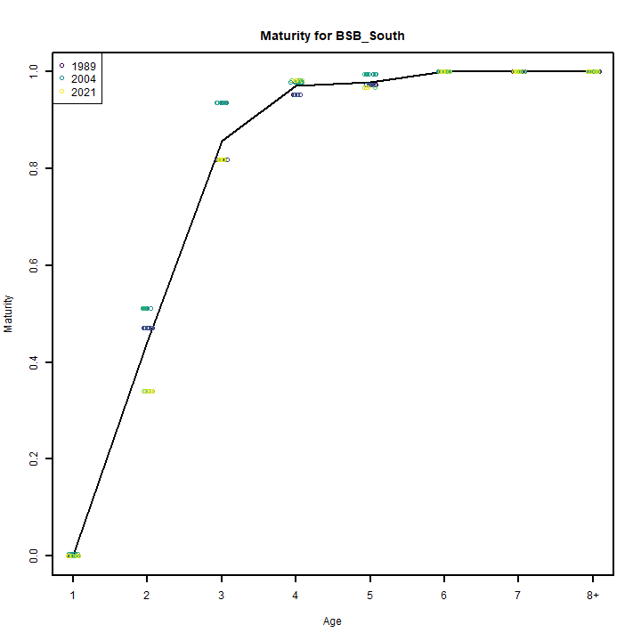
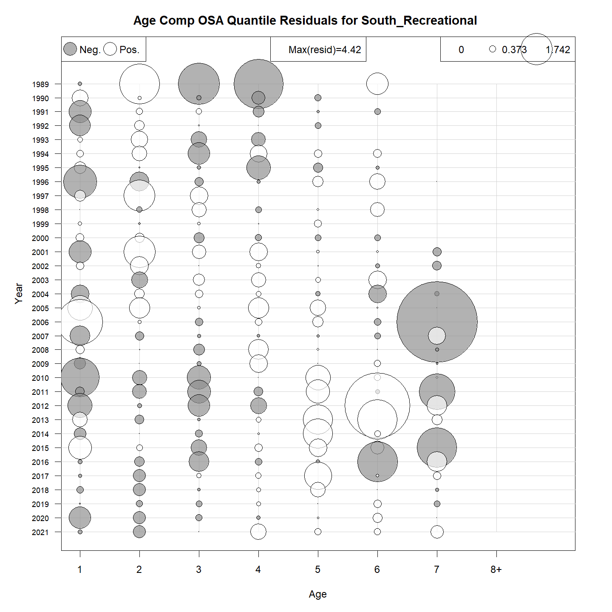
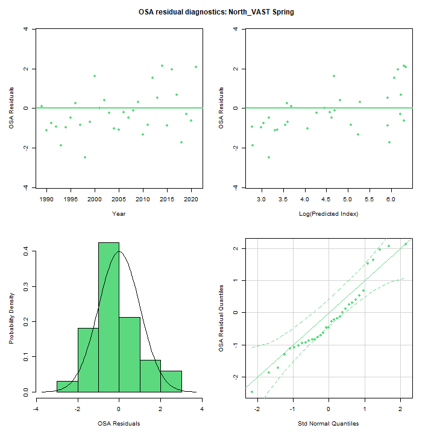
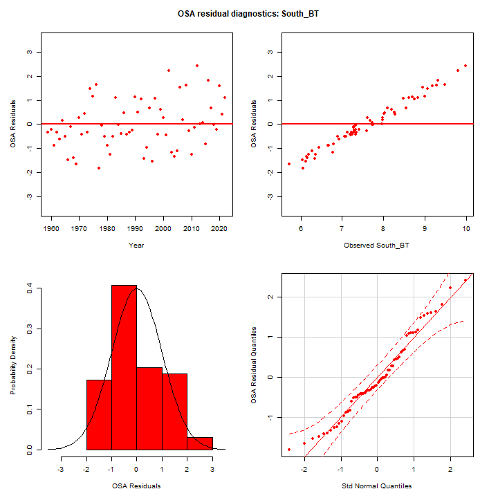
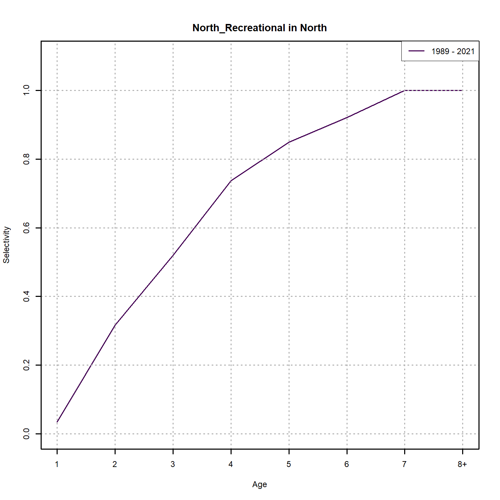
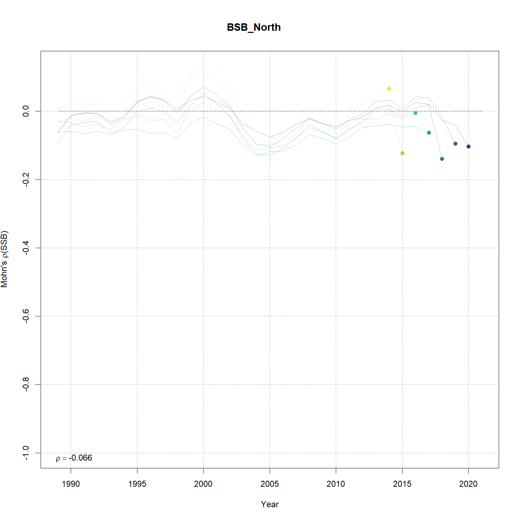
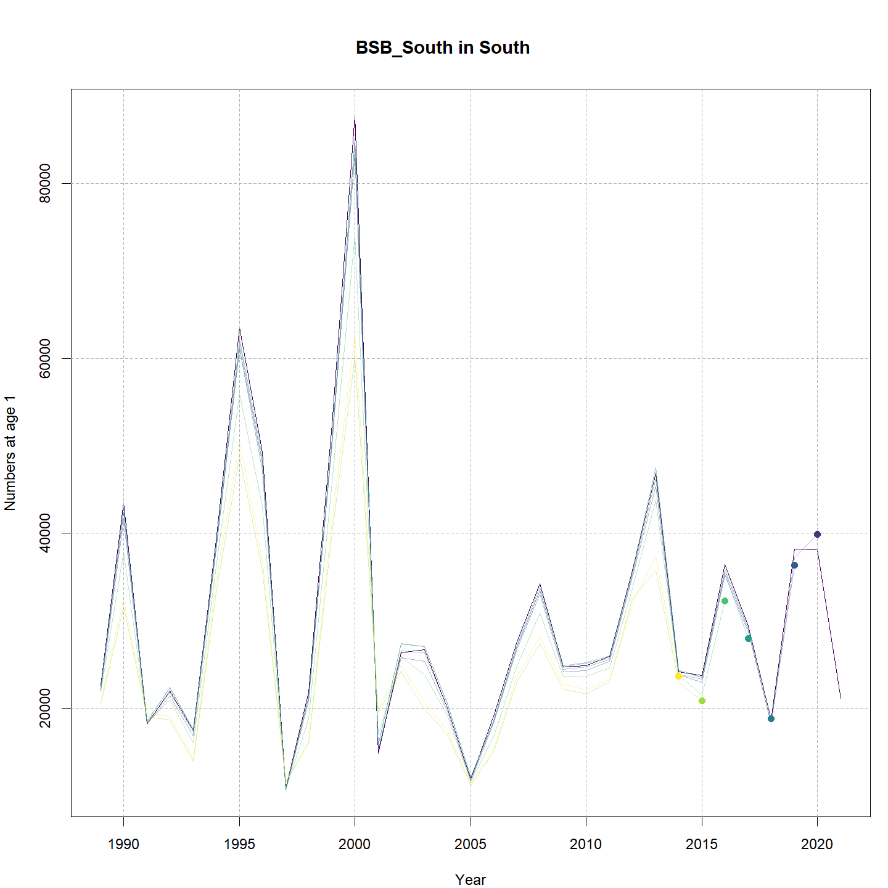
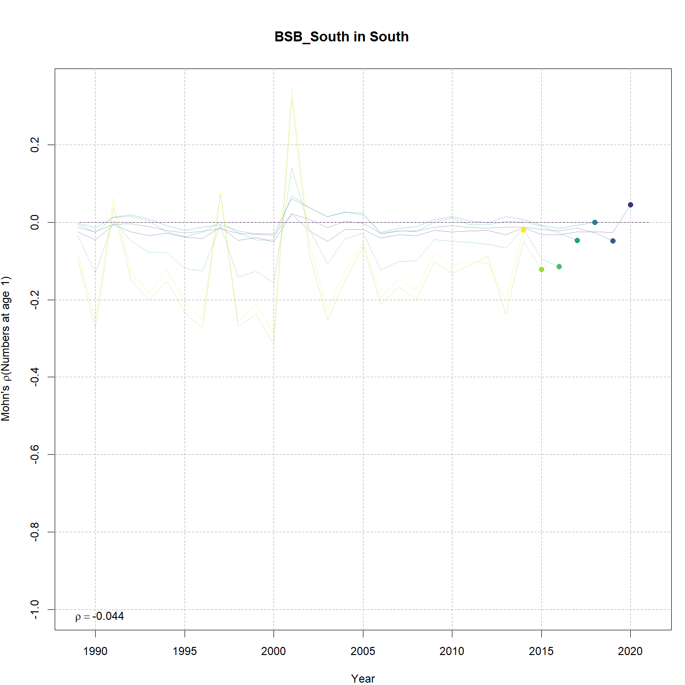
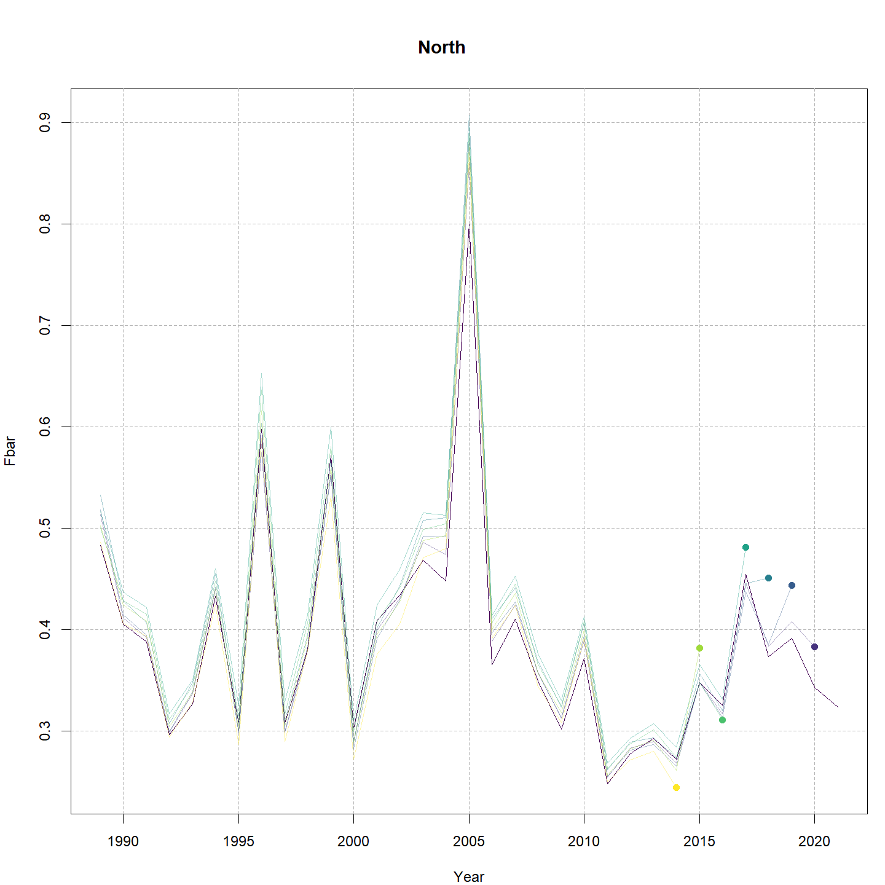

---
output:
  html_document:
    df_print: paged
    keep_md: yes
  word_document: default
  pdf_document:
    fig_caption: yes
    includes:
    keep_tex: yes
    number_sections: no
title: "WHAM figures and tables"
header-includes:
  - \usepackage{longtable}
  - \usepackage{booktabs}
  - \usepackage{caption,graphics}
  - \usepackage{makecell}
  - \usepackage{lscape}
  - \renewcommand\figurename{Fig.}
  - \captionsetup{labelsep=period, singlelinecheck=false}
  - \newcommand{\changesize}[1]{\fontsize{#1pt}{#1pt}\selectfont}
  - \renewcommand{\arraystretch}{1.5}
  - \renewcommand\theadfont{}
---

# {.tabset}

## Figures {.tabset}

### Input

### Diagnostics

### Results

### Retro

### Reference points

### Miscelaneous

## Tables {.tabset}

### Parameter estimates

<table class="table" style="margin-left: auto; margin-right: auto;">
<caption>Parameter estimates, standard errors, and confidence intervals. Rounded to 3 decimal places.</caption>
 <thead>
  <tr>
   <th style="text-align:left;">   </th>
   <th style="text-align:right;"> Estimate </th>
   <th style="text-align:right;"> Std. Error </th>
   <th style="text-align:right;"> 95\% CI lower </th>
   <th style="text-align:right;"> 95\% CI upper </th>
  </tr>
 </thead>
<tbody>
  <tr>
   <td style="text-align:left;"> BSB North mean log(R) intercept </td>
   <td style="text-align:right;"> $7.110$ </td>
   <td style="text-align:right;"> $0.973$ </td>
   <td style="text-align:right;"> $5.202$ </td>
   <td style="text-align:right;"> $9.017$ </td>
  </tr>
  <tr>
   <td style="text-align:left;"> BSB North in North NAA $\sigma$ (age 1) </td>
   <td style="text-align:right;"> $0.771$ </td>
   <td style="text-align:right;"> $0.107$ </td>
   <td style="text-align:right;"> $0.587$ </td>
   <td style="text-align:right;"> $1.012$ </td>
  </tr>
  <tr>
   <td style="text-align:left;"> BSB North in North NAA $\sigma$ (ages 2-8+) </td>
   <td style="text-align:right;"> $0.790$ </td>
   <td style="text-align:right;"> $0.043$ </td>
   <td style="text-align:right;"> $0.709$ </td>
   <td style="text-align:right;"> $0.879$ </td>
  </tr>
  <tr>
   <td style="text-align:left;"> BSB North in South NAA $\sigma$ (age 1) </td>
   <td style="text-align:right;"> $0.771$ </td>
   <td style="text-align:right;"> $0.107$ </td>
   <td style="text-align:right;"> $0.587$ </td>
   <td style="text-align:right;"> $1.012$ </td>
  </tr>
  <tr>
   <td style="text-align:left;"> BSB North  in North  NAA AR1 $\rho$ age </td>
   <td style="text-align:right;"> $0.105$ </td>
   <td style="text-align:right;"> $0.086$ </td>
   <td style="text-align:right;"> $-0.065$ </td>
   <td style="text-align:right;"> $0.269$ </td>
  </tr>
  <tr>
   <td style="text-align:left;"> BSB North  in North  NAA AR1 $\rho$ year </td>
   <td style="text-align:right;"> $0.261$ </td>
   <td style="text-align:right;"> $0.074$ </td>
   <td style="text-align:right;"> $0.112$ </td>
   <td style="text-align:right;"> $0.399$ </td>
  </tr>
  <tr>
   <td style="text-align:left;"> BSB South Mean Recruitment </td>
   <td style="text-align:right;"> $32554.380$ </td>
   <td style="text-align:right;"> $6985.502$ </td>
   <td style="text-align:right;"> $21377.605$ </td>
   <td style="text-align:right;"> $49574.668$ </td>
  </tr>
  <tr>
   <td style="text-align:left;"> BSB South in North NAA $\sigma$ (age 1) </td>
   <td style="text-align:right;"> $0.492$ </td>
   <td style="text-align:right;"> $0.077$ </td>
   <td style="text-align:right;"> $0.362$ </td>
   <td style="text-align:right;"> $0.670$ </td>
  </tr>
  <tr>
   <td style="text-align:left;"> BSB South in North NAA $\sigma$ (ages 2-8+) </td>
   <td style="text-align:right;"> $0.567$ </td>
   <td style="text-align:right;"> $0.066$ </td>
   <td style="text-align:right;"> $0.452$ </td>
   <td style="text-align:right;"> $0.712$ </td>
  </tr>
  <tr>
   <td style="text-align:left;"> BSB South in South NAA $\sigma$ (age 1) </td>
   <td style="text-align:right;"> $0.492$ </td>
   <td style="text-align:right;"> $0.077$ </td>
   <td style="text-align:right;"> $0.362$ </td>
   <td style="text-align:right;"> $0.670$ </td>
  </tr>
  <tr>
   <td style="text-align:left;"> BSB South in South NAA $\sigma$ (ages 2-8+) </td>
   <td style="text-align:right;"> $0.567$ </td>
   <td style="text-align:right;"> $0.066$ </td>
   <td style="text-align:right;"> $0.452$ </td>
   <td style="text-align:right;"> $0.712$ </td>
  </tr>
  <tr>
   <td style="text-align:left;"> BSB South  in North  NAA AR1 $\rho$ age </td>
   <td style="text-align:right;"> $-0.180$ </td>
   <td style="text-align:right;"> $0.111$ </td>
   <td style="text-align:right;"> $-0.385$ </td>
   <td style="text-align:right;"> $0.043$ </td>
  </tr>
  <tr>
   <td style="text-align:left;"> BSB South  in North  NAA AR1 $\rho$ year </td>
   <td style="text-align:right;"> $0.301$ </td>
   <td style="text-align:right;"> $0.106$ </td>
   <td style="text-align:right;"> $0.081$ </td>
   <td style="text-align:right;"> $0.493$ </td>
  </tr>
  <tr>
   <td style="text-align:left;"> BSB South  in South  NAA AR1 $\rho$ age </td>
   <td style="text-align:right;"> $-0.180$ </td>
   <td style="text-align:right;"> $0.111$ </td>
   <td style="text-align:right;"> $-0.385$ </td>
   <td style="text-align:right;"> $0.043$ </td>
  </tr>
  <tr>
   <td style="text-align:left;"> BSB South  in South  NAA AR1 $\rho$ year </td>
   <td style="text-align:right;"> $0.301$ </td>
   <td style="text-align:right;"> $0.106$ </td>
   <td style="text-align:right;"> $0.081$ </td>
   <td style="text-align:right;"> $0.493$ </td>
  </tr>
  <tr>
   <td style="text-align:left;"> North REC CPA fully selected q </td>
   <td style="text-align:right;"> $5.828\times 10^{-5}$ </td>
   <td style="text-align:right;"> $1.397\times 10^{-5}$ </td>
   <td style="text-align:right;"> $3.643\times 10^{-5}$ </td>
   <td style="text-align:right;"> $9.321\times 10^{-5}$ </td>
  </tr>
  <tr>
   <td style="text-align:left;"> North VAST Spring fully selected q </td>
   <td style="text-align:right;"> $0.009$ </td>
   <td style="text-align:right;"> $0.002$ </td>
   <td style="text-align:right;"> $0.006$ </td>
   <td style="text-align:right;"> $0.015$ </td>
  </tr>
  <tr>
   <td style="text-align:left;"> South REC CPA fully selected q </td>
   <td style="text-align:right;"> $1.216\times 10^{-4}$ </td>
   <td style="text-align:right;"> $1.957\times 10^{-5}$ </td>
   <td style="text-align:right;"> $8.868\times 10^{-5}$ </td>
   <td style="text-align:right;"> $1.667\times 10^{-4}$ </td>
  </tr>
  <tr>
   <td style="text-align:left;"> South VAST Spring fully selected q </td>
   <td style="text-align:right;"> $0.012$ </td>
   <td style="text-align:right;"> $0.002$ </td>
   <td style="text-align:right;"> $0.009$ </td>
   <td style="text-align:right;"> $0.017$ </td>
  </tr>
  <tr>
   <td style="text-align:left;"> Block 1: North Commercial Mean Selectivity for age 1 </td>
   <td style="text-align:right;"> $0.018$ </td>
   <td style="text-align:right;"> $0.015$ </td>
   <td style="text-align:right;"> $0.003$ </td>
   <td style="text-align:right;"> $0.091$ </td>
  </tr>
  <tr>
   <td style="text-align:left;"> Block 1: North Commercial Mean Selectivity for age 2 </td>
   <td style="text-align:right;"> $0.335$ </td>
   <td style="text-align:right;"> $0.188$ </td>
   <td style="text-align:right;"> $0.088$ </td>
   <td style="text-align:right;"> $0.724$ </td>
  </tr>
  <tr>
   <td style="text-align:left;"> Block 1: North Commercial Mean Selectivity for age 3 </td>
   <td style="text-align:right;"> $0.823$ </td>
   <td style="text-align:right;"> $0.130$ </td>
   <td style="text-align:right;"> $0.446$ </td>
   <td style="text-align:right;"> $0.964$ </td>
  </tr>
  <tr>
   <td style="text-align:left;"> Block 1: North Commercial Mean Selectivity for age 4 </td>
   <td style="text-align:right;"> $1.000$ </td>
   <td style="text-align:right;"> -- </td>
   <td style="text-align:right;"> -- </td>
   <td style="text-align:right;"> -- </td>
  </tr>
  <tr>
   <td style="text-align:left;"> Block 1: North Commercial Mean Selectivity for age 5 </td>
   <td style="text-align:right;"> $1.000$ </td>
   <td style="text-align:right;"> -- </td>
   <td style="text-align:right;"> -- </td>
   <td style="text-align:right;"> -- </td>
  </tr>
  <tr>
   <td style="text-align:left;"> Block 1: North Commercial Mean Selectivity for age 6 </td>
   <td style="text-align:right;"> $1.000$ </td>
   <td style="text-align:right;"> -- </td>
   <td style="text-align:right;"> -- </td>
   <td style="text-align:right;"> -- </td>
  </tr>
  <tr>
   <td style="text-align:left;"> Block 1: North Commercial Mean Selectivity for age 7 </td>
   <td style="text-align:right;"> $1.000$ </td>
   <td style="text-align:right;"> -- </td>
   <td style="text-align:right;"> -- </td>
   <td style="text-align:right;"> -- </td>
  </tr>
  <tr>
   <td style="text-align:left;"> Block 1: North Commercial Mean Selectivity for age 8+ </td>
   <td style="text-align:right;"> $1.000$ </td>
   <td style="text-align:right;"> -- </td>
   <td style="text-align:right;"> -- </td>
   <td style="text-align:right;"> -- </td>
  </tr>
  <tr>
   <td style="text-align:left;"> Block 2: North Recreational Mean Selectivity for age 1 </td>
   <td style="text-align:right;"> $0.028$ </td>
   <td style="text-align:right;"> $0.024$ </td>
   <td style="text-align:right;"> $0.005$ </td>
   <td style="text-align:right;"> $0.136$ </td>
  </tr>
  <tr>
   <td style="text-align:left;"> Block 2: North Recreational Mean Selectivity for age 2 </td>
   <td style="text-align:right;"> $0.336$ </td>
   <td style="text-align:right;"> $0.189$ </td>
   <td style="text-align:right;"> $0.088$ </td>
   <td style="text-align:right;"> $0.727$ </td>
  </tr>
  <tr>
   <td style="text-align:left;"> Block 2: North Recreational Mean Selectivity for age 3 </td>
   <td style="text-align:right;"> $0.558$ </td>
   <td style="text-align:right;"> $0.211$ </td>
   <td style="text-align:right;"> $0.191$ </td>
   <td style="text-align:right;"> $0.871$ </td>
  </tr>
  <tr>
   <td style="text-align:left;"> Block 2: North Recreational Mean Selectivity for age 4 </td>
   <td style="text-align:right;"> $0.779$ </td>
   <td style="text-align:right;"> $0.150$ </td>
   <td style="text-align:right;"> $0.389$ </td>
   <td style="text-align:right;"> $0.952$ </td>
  </tr>
  <tr>
   <td style="text-align:left;"> Block 2: North Recreational Mean Selectivity for age 5 </td>
   <td style="text-align:right;"> $0.872$ </td>
   <td style="text-align:right;"> $0.103$ </td>
   <td style="text-align:right;"> $0.527$ </td>
   <td style="text-align:right;"> $0.977$ </td>
  </tr>
  <tr>
   <td style="text-align:left;"> Block 2: North Recreational Mean Selectivity for age 6 </td>
   <td style="text-align:right;"> $0.932$ </td>
   <td style="text-align:right;"> $0.070$ </td>
   <td style="text-align:right;"> $0.612$ </td>
   <td style="text-align:right;"> $0.992$ </td>
  </tr>
  <tr>
   <td style="text-align:left;"> Block 2: North Recreational Mean Selectivity for age 7 </td>
   <td style="text-align:right;"> $1.000$ </td>
   <td style="text-align:right;"> -- </td>
   <td style="text-align:right;"> -- </td>
   <td style="text-align:right;"> -- </td>
  </tr>
  <tr>
   <td style="text-align:left;"> Block 2: North Recreational Mean Selectivity for age 8+ </td>
   <td style="text-align:right;"> $1.000$ </td>
   <td style="text-align:right;"> -- </td>
   <td style="text-align:right;"> -- </td>
   <td style="text-align:right;"> -- </td>
  </tr>
  <tr>
   <td style="text-align:left;"> Block 3: South Commercial $a_{50}$ </td>
   <td style="text-align:right;"> $2.395$ </td>
   <td style="text-align:right;"> $0.122$ </td>
   <td style="text-align:right;"> $2.164$ </td>
   <td style="text-align:right;"> $2.640$ </td>
  </tr>
  <tr>
   <td style="text-align:left;"> Block 3: South Commercial 1/slope (increasing) </td>
   <td style="text-align:right;"> $0.386$ </td>
   <td style="text-align:right;"> $0.033$ </td>
   <td style="text-align:right;"> $0.327$ </td>
   <td style="text-align:right;"> $0.455$ </td>
  </tr>
  <tr>
   <td style="text-align:left;"> Block 4: South Recreational $a_{50}$ </td>
   <td style="text-align:right;"> $2.694$ </td>
   <td style="text-align:right;"> $0.259$ </td>
   <td style="text-align:right;"> $2.212$ </td>
   <td style="text-align:right;"> $3.223$ </td>
  </tr>
  <tr>
   <td style="text-align:left;"> Block 4: South Recreational 1/slope (increasing) </td>
   <td style="text-align:right;"> $0.778$ </td>
   <td style="text-align:right;"> $0.106$ </td>
   <td style="text-align:right;"> $0.594$ </td>
   <td style="text-align:right;"> $1.012$ </td>
  </tr>
  <tr>
   <td style="text-align:left;"> Block 9: North REC CPA Mean Selectivity for age 1 </td>
   <td style="text-align:right;"> $0.156$ </td>
   <td style="text-align:right;"> $0.043$ </td>
   <td style="text-align:right;"> $0.088$ </td>
   <td style="text-align:right;"> $0.260$ </td>
  </tr>
  <tr>
   <td style="text-align:left;"> Block 9: North REC CPA Mean Selectivity for age 2 </td>
   <td style="text-align:right;"> $1.000$ </td>
   <td style="text-align:right;"> -- </td>
   <td style="text-align:right;"> -- </td>
   <td style="text-align:right;"> -- </td>
  </tr>
  <tr>
   <td style="text-align:left;"> Block 9: North REC CPA Mean Selectivity for age 3 </td>
   <td style="text-align:right;"> $1.000$ </td>
   <td style="text-align:right;"> -- </td>
   <td style="text-align:right;"> -- </td>
   <td style="text-align:right;"> -- </td>
  </tr>
  <tr>
   <td style="text-align:left;"> Block 9: North REC CPA Mean Selectivity for age 4 </td>
   <td style="text-align:right;"> $1.000$ </td>
   <td style="text-align:right;"> -- </td>
   <td style="text-align:right;"> -- </td>
   <td style="text-align:right;"> -- </td>
  </tr>
  <tr>
   <td style="text-align:left;"> Block 9: North REC CPA Mean Selectivity for age 5 </td>
   <td style="text-align:right;"> $1.000$ </td>
   <td style="text-align:right;"> -- </td>
   <td style="text-align:right;"> -- </td>
   <td style="text-align:right;"> -- </td>
  </tr>
  <tr>
   <td style="text-align:left;"> Block 9: North REC CPA Mean Selectivity for age 6 </td>
   <td style="text-align:right;"> $1.000$ </td>
   <td style="text-align:right;"> -- </td>
   <td style="text-align:right;"> -- </td>
   <td style="text-align:right;"> -- </td>
  </tr>
  <tr>
   <td style="text-align:left;"> Block 9: North REC CPA Mean Selectivity for age 7 </td>
   <td style="text-align:right;"> $1.000$ </td>
   <td style="text-align:right;"> -- </td>
   <td style="text-align:right;"> -- </td>
   <td style="text-align:right;"> -- </td>
  </tr>
  <tr>
   <td style="text-align:left;"> Block 9: North REC CPA Mean Selectivity for age 8+ </td>
   <td style="text-align:right;"> $1.000$ </td>
   <td style="text-align:right;"> -- </td>
   <td style="text-align:right;"> -- </td>
   <td style="text-align:right;"> -- </td>
  </tr>
  <tr>
   <td style="text-align:left;"> Block 10: North VAST Spring Mean Selectivity for age 1 </td>
   <td style="text-align:right;"> $0.060$ </td>
   <td style="text-align:right;"> $0.021$ </td>
   <td style="text-align:right;"> $0.030$ </td>
   <td style="text-align:right;"> $0.116$ </td>
  </tr>
  <tr>
   <td style="text-align:left;"> Block 10: North VAST Spring Mean Selectivity for age 2 </td>
   <td style="text-align:right;"> $0.382$ </td>
   <td style="text-align:right;"> $0.083$ </td>
   <td style="text-align:right;"> $0.237$ </td>
   <td style="text-align:right;"> $0.552$ </td>
  </tr>
  <tr>
   <td style="text-align:left;"> Block 10: North VAST Spring Mean Selectivity for age 3 </td>
   <td style="text-align:right;"> $0.881$ </td>
   <td style="text-align:right;"> $0.061$ </td>
   <td style="text-align:right;"> $0.704$ </td>
   <td style="text-align:right;"> $0.959$ </td>
  </tr>
  <tr>
   <td style="text-align:left;"> Block 10: North VAST Spring Mean Selectivity for age 4 </td>
   <td style="text-align:right;"> $0.924$ </td>
   <td style="text-align:right;"> $0.046$ </td>
   <td style="text-align:right;"> $0.770$ </td>
   <td style="text-align:right;"> $0.978$ </td>
  </tr>
  <tr>
   <td style="text-align:left;"> Block 10: North VAST Spring Mean Selectivity for age 5 </td>
   <td style="text-align:right;"> $1.000$ </td>
   <td style="text-align:right;"> -- </td>
   <td style="text-align:right;"> -- </td>
   <td style="text-align:right;"> -- </td>
  </tr>
  <tr>
   <td style="text-align:left;"> Block 10: North VAST Spring Mean Selectivity for age 6 </td>
   <td style="text-align:right;"> $1.000$ </td>
   <td style="text-align:right;"> -- </td>
   <td style="text-align:right;"> -- </td>
   <td style="text-align:right;"> -- </td>
  </tr>
  <tr>
   <td style="text-align:left;"> Block 10: North VAST Spring Mean Selectivity for age 7 </td>
   <td style="text-align:right;"> $1.000$ </td>
   <td style="text-align:right;"> -- </td>
   <td style="text-align:right;"> -- </td>
   <td style="text-align:right;"> -- </td>
  </tr>
  <tr>
   <td style="text-align:left;"> Block 10: North VAST Spring Mean Selectivity for age 8+ </td>
   <td style="text-align:right;"> $1.000$ </td>
   <td style="text-align:right;"> -- </td>
   <td style="text-align:right;"> -- </td>
   <td style="text-align:right;"> -- </td>
  </tr>
  <tr>
   <td style="text-align:left;"> Block 11: South REC CPA Selectivity for age 1 </td>
   <td style="text-align:right;"> $0.391$ </td>
   <td style="text-align:right;"> $0.067$ </td>
   <td style="text-align:right;"> $0.271$ </td>
   <td style="text-align:right;"> $0.526$ </td>
  </tr>
  <tr>
   <td style="text-align:left;"> Block 11: South REC CPA Selectivity for age 2 </td>
   <td style="text-align:right;"> $0.846$ </td>
   <td style="text-align:right;"> $0.079$ </td>
   <td style="text-align:right;"> $0.627$ </td>
   <td style="text-align:right;"> $0.947$ </td>
  </tr>
  <tr>
   <td style="text-align:left;"> Block 11: South REC CPA Selectivity for age 3 </td>
   <td style="text-align:right;"> $1.000$ </td>
   <td style="text-align:right;"> -- </td>
   <td style="text-align:right;"> -- </td>
   <td style="text-align:right;"> -- </td>
  </tr>
  <tr>
   <td style="text-align:left;"> Block 11: South REC CPA Selectivity for age 4 </td>
   <td style="text-align:right;"> $1.000$ </td>
   <td style="text-align:right;"> -- </td>
   <td style="text-align:right;"> -- </td>
   <td style="text-align:right;"> -- </td>
  </tr>
  <tr>
   <td style="text-align:left;"> Block 11: South REC CPA Selectivity for age 5 </td>
   <td style="text-align:right;"> $1.000$ </td>
   <td style="text-align:right;"> -- </td>
   <td style="text-align:right;"> -- </td>
   <td style="text-align:right;"> -- </td>
  </tr>
  <tr>
   <td style="text-align:left;"> Block 11: South REC CPA Selectivity for age 6 </td>
   <td style="text-align:right;"> $1.000$ </td>
   <td style="text-align:right;"> -- </td>
   <td style="text-align:right;"> -- </td>
   <td style="text-align:right;"> -- </td>
  </tr>
  <tr>
   <td style="text-align:left;"> Block 11: South REC CPA Selectivity for age 7 </td>
   <td style="text-align:right;"> $1.000$ </td>
   <td style="text-align:right;"> -- </td>
   <td style="text-align:right;"> -- </td>
   <td style="text-align:right;"> -- </td>
  </tr>
  <tr>
   <td style="text-align:left;"> Block 11: South REC CPA Selectivity for age 8+ </td>
   <td style="text-align:right;"> $1.000$ </td>
   <td style="text-align:right;"> -- </td>
   <td style="text-align:right;"> -- </td>
   <td style="text-align:right;"> -- </td>
  </tr>
  <tr>
   <td style="text-align:left;"> Block 12: South VAST Spring Selectivity for age 1 </td>
   <td style="text-align:right;"> $0.354$ </td>
   <td style="text-align:right;"> $0.077$ </td>
   <td style="text-align:right;"> $0.221$ </td>
   <td style="text-align:right;"> $0.513$ </td>
  </tr>
  <tr>
   <td style="text-align:left;"> Block 12: South VAST Spring Selectivity for age 2 </td>
   <td style="text-align:right;"> $1.000$ </td>
   <td style="text-align:right;"> -- </td>
   <td style="text-align:right;"> -- </td>
   <td style="text-align:right;"> -- </td>
  </tr>
  <tr>
   <td style="text-align:left;"> Block 12: South VAST Spring Selectivity for age 3 </td>
   <td style="text-align:right;"> $1.000$ </td>
   <td style="text-align:right;"> -- </td>
   <td style="text-align:right;"> -- </td>
   <td style="text-align:right;"> -- </td>
  </tr>
  <tr>
   <td style="text-align:left;"> Block 12: South VAST Spring Selectivity for age 4 </td>
   <td style="text-align:right;"> $1.000$ </td>
   <td style="text-align:right;"> -- </td>
   <td style="text-align:right;"> -- </td>
   <td style="text-align:right;"> -- </td>
  </tr>
  <tr>
   <td style="text-align:left;"> Block 12: South VAST Spring Selectivity for age 5 </td>
   <td style="text-align:right;"> $1.000$ </td>
   <td style="text-align:right;"> -- </td>
   <td style="text-align:right;"> -- </td>
   <td style="text-align:right;"> -- </td>
  </tr>
  <tr>
   <td style="text-align:left;"> Block 12: South VAST Spring Selectivity for age 6 </td>
   <td style="text-align:right;"> $1.000$ </td>
   <td style="text-align:right;"> -- </td>
   <td style="text-align:right;"> -- </td>
   <td style="text-align:right;"> -- </td>
  </tr>
  <tr>
   <td style="text-align:left;"> Block 12: South VAST Spring Selectivity for age 7 </td>
   <td style="text-align:right;"> $1.000$ </td>
   <td style="text-align:right;"> -- </td>
   <td style="text-align:right;"> -- </td>
   <td style="text-align:right;"> -- </td>
  </tr>
  <tr>
   <td style="text-align:left;"> Block 12: South VAST Spring Selectivity for age 8+ </td>
   <td style="text-align:right;"> $1.000$ </td>
   <td style="text-align:right;"> -- </td>
   <td style="text-align:right;"> -- </td>
   <td style="text-align:right;"> -- </td>
  </tr>
  <tr>
   <td style="text-align:left;"> Block 1: North Commercial Selectivity RE $\sigma$ </td>
   <td style="text-align:right;"> $0.396$ </td>
   <td style="text-align:right;"> $0.114$ </td>
   <td style="text-align:right;"> $0.225$ </td>
   <td style="text-align:right;"> $0.697$ </td>
  </tr>
  <tr>
   <td style="text-align:left;"> Block 1: North Commercial Selectivity RE AR1 $\rho$ (age) </td>
   <td style="text-align:right;"> $0.512$ </td>
   <td style="text-align:right;"> $0.120$ </td>
   <td style="text-align:right;"> $0.416$ </td>
   <td style="text-align:right;"> $0.949$ </td>
  </tr>
  <tr>
   <td style="text-align:left;"> Block 1: North Commercial Selectivity RE AR1 $\rho$ (year) </td>
   <td style="text-align:right;"> $0.595$ </td>
   <td style="text-align:right;"> $0.080$ </td>
   <td style="text-align:right;"> $0.594$ </td>
   <td style="text-align:right;"> $0.968$ </td>
  </tr>
  <tr>
   <td style="text-align:left;"> Block 2: North Recreational Selectivity RE $\sigma$ </td>
   <td style="text-align:right;"> $0.194$ </td>
   <td style="text-align:right;"> $0.032$ </td>
   <td style="text-align:right;"> $0.141$ </td>
   <td style="text-align:right;"> $0.267$ </td>
  </tr>
  <tr>
   <td style="text-align:left;"> Block 2: North Recreational Selectivity RE AR1 $\rho$ (age) </td>
   <td style="text-align:right;"> $0.518$ </td>
   <td style="text-align:right;"> $0.069$ </td>
   <td style="text-align:right;"> $0.630$ </td>
   <td style="text-align:right;"> $0.914$ </td>
  </tr>
  <tr>
   <td style="text-align:left;"> Block 2: North Recreational Selectivity RE AR1 $\rho$ (year) </td>
   <td style="text-align:right;"> $0.733$ </td>
   <td style="text-align:right;"> $0.024$ </td>
   <td style="text-align:right;"> $0.874$ </td>
   <td style="text-align:right;"> $0.983$ </td>
  </tr>
  <tr>
   <td style="text-align:left;"> Block 9: North REC CPA Selectivity RE $\sigma$ </td>
   <td style="text-align:right;"> $0.198$ </td>
   <td style="text-align:right;"> $0.065$ </td>
   <td style="text-align:right;"> $0.104$ </td>
   <td style="text-align:right;"> $0.376$ </td>
  </tr>
  <tr>
   <td style="text-align:left;"> Block 9: North REC CPA Selectivity RE AR1 $\rho$ (year) </td>
   <td style="text-align:right;"> $0.608$ </td>
   <td style="text-align:right;"> $0.100$ </td>
   <td style="text-align:right;"> $0.453$ </td>
   <td style="text-align:right;"> $0.981$ </td>
  </tr>
  <tr>
   <td style="text-align:left;"> Block 10: North VAST Spring Selectivity RE $\sigma$ </td>
   <td style="text-align:right;"> $0.733$ </td>
   <td style="text-align:right;"> $0.142$ </td>
   <td style="text-align:right;"> $0.502$ </td>
   <td style="text-align:right;"> $1.071$ </td>
  </tr>
  <tr>
   <td style="text-align:left;"> Block 10: North VAST Spring Selectivity RE AR1 $\rho$ (age) </td>
   <td style="text-align:right;"> $0.106$ </td>
   <td style="text-align:right;"> $0.252$ </td>
   <td style="text-align:right;"> $-0.294$ </td>
   <td style="text-align:right;"> $0.623$ </td>
  </tr>
  <tr>
   <td style="text-align:left;"> Block 10: North VAST Spring Selectivity RE AR1 $\rho$ (year) </td>
   <td style="text-align:right;"> $0.318$ </td>
   <td style="text-align:right;"> $0.175$ </td>
   <td style="text-align:right;"> $0.142$ </td>
   <td style="text-align:right;"> $0.826$ </td>
  </tr>
  <tr>
   <td style="text-align:left;"> North Commercial in North age comp, Dirichlet-multinomial: dispersion ($\phi$) </td>
   <td style="text-align:right;"> $54.214$ </td>
   <td style="text-align:right;"> $6.873$ </td>
   <td style="text-align:right;"> $42.286$ </td>
   <td style="text-align:right;"> $69.505$ </td>
  </tr>
  <tr>
   <td style="text-align:left;"> North Recreational in North age comp, logistic-normal: $\sigma$ </td>
   <td style="text-align:right;"> $2.794$ </td>
   <td style="text-align:right;"> $0.365$ </td>
   <td style="text-align:right;"> $2.163$ </td>
   <td style="text-align:right;"> $3.611$ </td>
  </tr>
  <tr>
   <td style="text-align:left;"> South Commercial in South age comp, logistic-normal: $\sigma$ </td>
   <td style="text-align:right;"> $34.343$ </td>
   <td style="text-align:right;"> $3.418$ </td>
   <td style="text-align:right;"> $28.258$ </td>
   <td style="text-align:right;"> $41.739$ </td>
  </tr>
  <tr>
   <td style="text-align:left;"> South Commercial in South age comp, logistic-normal: $\rho$ </td>
   <td style="text-align:right;"> $0.730$ </td>
   <td style="text-align:right;"> $0.058$ </td>
   <td style="text-align:right;"> $0.603$ </td>
   <td style="text-align:right;"> $0.828$ </td>
  </tr>
  <tr>
   <td style="text-align:left;"> South Recreational in South age comp, logistic-normal: $\sigma$ </td>
   <td style="text-align:right;"> $29.279$ </td>
   <td style="text-align:right;"> $4.155$ </td>
   <td style="text-align:right;"> $22.170$ </td>
   <td style="text-align:right;"> $38.667$ </td>
  </tr>
  <tr>
   <td style="text-align:left;"> South Recreational in South age comp, logistic-normal: $\rho$ </td>
   <td style="text-align:right;"> $0.908$ </td>
   <td style="text-align:right;"> $0.026$ </td>
   <td style="text-align:right;"> $0.843$ </td>
   <td style="text-align:right;"> $0.947$ </td>
  </tr>
  <tr>
   <td style="text-align:left;"> North REC CPA in North age comp, logistic-normal: $\sigma$ </td>
   <td style="text-align:right;"> $4.291$ </td>
   <td style="text-align:right;"> $0.396$ </td>
   <td style="text-align:right;"> $3.581$ </td>
   <td style="text-align:right;"> $5.141$ </td>
  </tr>
  <tr>
   <td style="text-align:left;"> North VAST Spring in North age comp, Dirichlet-multinomial: dispersion ($\phi$) </td>
   <td style="text-align:right;"> $28.780$ </td>
   <td style="text-align:right;"> $3.227$ </td>
   <td style="text-align:right;"> $23.102$ </td>
   <td style="text-align:right;"> $35.853$ </td>
  </tr>
  <tr>
   <td style="text-align:left;"> South REC CPA in South age comp, logistic-normal: $\sigma$ </td>
   <td style="text-align:right;"> $28.562$ </td>
   <td style="text-align:right;"> $4.284$ </td>
   <td style="text-align:right;"> $21.288$ </td>
   <td style="text-align:right;"> $38.323$ </td>
  </tr>
  <tr>
   <td style="text-align:left;"> South REC CPA in South age comp, logistic-normal: $\rho$ </td>
   <td style="text-align:right;"> $0.923$ </td>
   <td style="text-align:right;"> $0.024$ </td>
   <td style="text-align:right;"> $0.861$ </td>
   <td style="text-align:right;"> $0.958$ </td>
  </tr>
  <tr>
   <td style="text-align:left;"> South VAST Spring in South age comp, logistic-normal: $\sigma$ </td>
   <td style="text-align:right;"> $48.267$ </td>
   <td style="text-align:right;"> $3.868$ </td>
   <td style="text-align:right;"> $41.251$ </td>
   <td style="text-align:right;"> $56.477$ </td>
  </tr>
  <tr>
   <td style="text-align:left;"> South VAST Spring in South age comp, logistic-normal: $\rho$ </td>
   <td style="text-align:right;"> $0.666$ </td>
   <td style="text-align:right;"> $0.056$ </td>
   <td style="text-align:right;"> $0.549$ </td>
   <td style="text-align:right;"> $0.765$ </td>
  </tr>
  <tr>
   <td style="text-align:left;"> stock BSB North $\mu$ from North to South (intercept) </td>
   <td style="text-align:right;"> $0.008$ </td>
   <td style="text-align:right;"> $0.001$ </td>
   <td style="text-align:right;"> $0.006$ </td>
   <td style="text-align:right;"> $0.010$ </td>
  </tr>
  <tr>
   <td style="text-align:left;"> stock BSB North $\mu$ from South to North (intercept) </td>
   <td style="text-align:right;"> $0.328$ </td>
   <td style="text-align:right;"> $0.043$ </td>
   <td style="text-align:right;"> $0.250$ </td>
   <td style="text-align:right;"> $0.417$ </td>
  </tr>
  <tr>
   <td style="text-align:left;"> North REC CPA log-index observation SD scalar </td>
   <td style="text-align:right;"> $5.853$ </td>
   <td style="text-align:right;"> $1.426$ </td>
   <td style="text-align:right;"> $3.631$ </td>
   <td style="text-align:right;"> $9.435$ </td>
  </tr>
  <tr>
   <td style="text-align:left;"> South REC CPA log-index observation SD scalar </td>
   <td style="text-align:right;"> $5.085$ </td>
   <td style="text-align:right;"> $1.184$ </td>
   <td style="text-align:right;"> $3.223$ </td>
   <td style="text-align:right;"> $8.025$ </td>
  </tr>
  <tr>
   <td style="text-align:left;"> Ecov North BT: $\mu$ </td>
   <td style="text-align:right;"> $6.803$ </td>
   <td style="text-align:right;"> $0.190$ </td>
   <td style="text-align:right;"> $6.431$ </td>
   <td style="text-align:right;"> $7.175$ </td>
  </tr>
  <tr>
   <td style="text-align:left;"> Ecov North BT: $\sigma$ </td>
   <td style="text-align:right;"> $1.131$ </td>
   <td style="text-align:right;"> $0.109$ </td>
   <td style="text-align:right;"> $0.937$ </td>
   <td style="text-align:right;"> $1.367$ </td>
  </tr>
  <tr>
   <td style="text-align:left;"> Ecov North BT: AR1 $\rho$ </td>
   <td style="text-align:right;"> $0.290$ </td>
   <td style="text-align:right;"> $0.121$ </td>
   <td style="text-align:right;"> $0.040$ </td>
   <td style="text-align:right;"> $0.506$ </td>
  </tr>
  <tr>
   <td style="text-align:left;"> Ecov South BT: $\mu$ </td>
   <td style="text-align:right;"> $7.606$ </td>
   <td style="text-align:right;"> $0.148$ </td>
   <td style="text-align:right;"> $7.316$ </td>
   <td style="text-align:right;"> $7.895$ </td>
  </tr>
  <tr>
   <td style="text-align:left;"> Ecov South BT: $\sigma$ </td>
   <td style="text-align:right;"> $1.017$ </td>
   <td style="text-align:right;"> $0.092$ </td>
   <td style="text-align:right;"> $0.852$ </td>
   <td style="text-align:right;"> $1.215$ </td>
  </tr>
  <tr>
   <td style="text-align:left;"> Ecov South BT: AR1 $\rho$ </td>
   <td style="text-align:right;"> $0.149$ </td>
   <td style="text-align:right;"> $0.124$ </td>
   <td style="text-align:right;"> $-0.099$ </td>
   <td style="text-align:right;"> $0.380$ </td>
  </tr>
  <tr>
   <td style="text-align:left;"> BSB North Recruitment Ecov: North BT $\beta_1$ </td>
   <td style="text-align:right;"> $0.455$ </td>
   <td style="text-align:right;"> $0.123$ </td>
   <td style="text-align:right;"> $0.213$ </td>
   <td style="text-align:right;"> $0.698$ </td>
  </tr>
</tbody>
</table>

### Abundance at age

<table class="table" style="margin-left: auto; margin-right: auto;">
<caption>Abundance at age (1000s) for BSB North in North.</caption>
 <thead>
  <tr>
   <th style="text-align:left;">   </th>
   <th style="text-align:right;"> 1 </th>
   <th style="text-align:right;"> 2 </th>
   <th style="text-align:right;"> 3 </th>
   <th style="text-align:right;"> 4 </th>
   <th style="text-align:right;"> 5 </th>
   <th style="text-align:right;"> 6 </th>
   <th style="text-align:right;"> 7 </th>
   <th style="text-align:right;"> 8+ </th>
  </tr>
 </thead>
<tbody>
  <tr>
   <td style="text-align:left;"> 1989 </td>
   <td style="text-align:right;"> 6405 </td>
   <td style="text-align:right;"> 4066 </td>
   <td style="text-align:right;"> 2087 </td>
   <td style="text-align:right;"> 972 </td>
   <td style="text-align:right;"> 440 </td>
   <td style="text-align:right;"> 199 </td>
   <td style="text-align:right;"> 90 </td>
   <td style="text-align:right;"> 73 </td>
  </tr>
  <tr>
   <td style="text-align:left;"> 1990 </td>
   <td style="text-align:right;"> 11014 </td>
   <td style="text-align:right;"> 3384 </td>
   <td style="text-align:right;"> 2576 </td>
   <td style="text-align:right;"> 464 </td>
   <td style="text-align:right;"> 274 </td>
   <td style="text-align:right;"> 26 </td>
   <td style="text-align:right;"> 4 </td>
   <td style="text-align:right;"> 45 </td>
  </tr>
  <tr>
   <td style="text-align:left;"> 1991 </td>
   <td style="text-align:right;"> 7234 </td>
   <td style="text-align:right;"> 4131 </td>
   <td style="text-align:right;"> 691 </td>
   <td style="text-align:right;"> 832 </td>
   <td style="text-align:right;"> 141 </td>
   <td style="text-align:right;"> 30 </td>
   <td style="text-align:right;"> 2 </td>
   <td style="text-align:right;"> 51 </td>
  </tr>
  <tr>
   <td style="text-align:left;"> 1992 </td>
   <td style="text-align:right;"> 5921 </td>
   <td style="text-align:right;"> 5046 </td>
   <td style="text-align:right;"> 297 </td>
   <td style="text-align:right;"> 106 </td>
   <td style="text-align:right;"> 349 </td>
   <td style="text-align:right;"> 36 </td>
   <td style="text-align:right;"> 10 </td>
   <td style="text-align:right;"> 135 </td>
  </tr>
  <tr>
   <td style="text-align:left;"> 1993 </td>
   <td style="text-align:right;"> 2625 </td>
   <td style="text-align:right;"> 2202 </td>
   <td style="text-align:right;"> 515 </td>
   <td style="text-align:right;"> 438 </td>
   <td style="text-align:right;"> 47 </td>
   <td style="text-align:right;"> 387 </td>
   <td style="text-align:right;"> 13 </td>
   <td style="text-align:right;"> 42 </td>
  </tr>
  <tr>
   <td style="text-align:left;"> 1994 </td>
   <td style="text-align:right;"> 24794 </td>
   <td style="text-align:right;"> 553 </td>
   <td style="text-align:right;"> 1810 </td>
   <td style="text-align:right;"> 172 </td>
   <td style="text-align:right;"> 220 </td>
   <td style="text-align:right;"> 21 </td>
   <td style="text-align:right;"> 48 </td>
   <td style="text-align:right;"> 27 </td>
  </tr>
  <tr>
   <td style="text-align:left;"> 1995 </td>
   <td style="text-align:right;"> 59319 </td>
   <td style="text-align:right;"> 2767 </td>
   <td style="text-align:right;"> 926 </td>
   <td style="text-align:right;"> 160 </td>
   <td style="text-align:right;"> 155 </td>
   <td style="text-align:right;"> 8 </td>
   <td style="text-align:right;"> 7 </td>
   <td style="text-align:right;"> 47 </td>
  </tr>
  <tr>
   <td style="text-align:left;"> 1996 </td>
   <td style="text-align:right;"> 58562 </td>
   <td style="text-align:right;"> 4574 </td>
   <td style="text-align:right;"> 965 </td>
   <td style="text-align:right;"> 243 </td>
   <td style="text-align:right;"> 58 </td>
   <td style="text-align:right;"> 109 </td>
   <td style="text-align:right;"> 12 </td>
   <td style="text-align:right;"> 17 </td>
  </tr>
  <tr>
   <td style="text-align:left;"> 1997 </td>
   <td style="text-align:right;"> 10100 </td>
   <td style="text-align:right;"> 16712 </td>
   <td style="text-align:right;"> 1348 </td>
   <td style="text-align:right;"> 286 </td>
   <td style="text-align:right;"> 77 </td>
   <td style="text-align:right;"> 29 </td>
   <td style="text-align:right;"> 44 </td>
   <td style="text-align:right;"> 15 </td>
  </tr>
  <tr>
   <td style="text-align:left;"> 1998 </td>
   <td style="text-align:right;"> 3905 </td>
   <td style="text-align:right;"> 4174 </td>
   <td style="text-align:right;"> 931 </td>
   <td style="text-align:right;"> 698 </td>
   <td style="text-align:right;"> 114 </td>
   <td style="text-align:right;"> 157 </td>
   <td style="text-align:right;"> 14 </td>
   <td style="text-align:right;"> 57 </td>
  </tr>
  <tr>
   <td style="text-align:left;"> 1999 </td>
   <td style="text-align:right;"> 87946 </td>
   <td style="text-align:right;"> 4400 </td>
   <td style="text-align:right;"> 1166 </td>
   <td style="text-align:right;"> 584 </td>
   <td style="text-align:right;"> 219 </td>
   <td style="text-align:right;"> 119 </td>
   <td style="text-align:right;"> 41 </td>
   <td style="text-align:right;"> 33 </td>
  </tr>
  <tr>
   <td style="text-align:left;"> 2000 </td>
   <td style="text-align:right;"> 80460 </td>
   <td style="text-align:right;"> 9385 </td>
   <td style="text-align:right;"> 1329 </td>
   <td style="text-align:right;"> 1158 </td>
   <td style="text-align:right;"> 238 </td>
   <td style="text-align:right;"> 281 </td>
   <td style="text-align:right;"> 30 </td>
   <td style="text-align:right;"> 48 </td>
  </tr>
  <tr>
   <td style="text-align:left;"> 2001 </td>
   <td style="text-align:right;"> 24826 </td>
   <td style="text-align:right;"> 5937 </td>
   <td style="text-align:right;"> 4358 </td>
   <td style="text-align:right;"> 1035 </td>
   <td style="text-align:right;"> 604 </td>
   <td style="text-align:right;"> 218 </td>
   <td style="text-align:right;"> 309 </td>
   <td style="text-align:right;"> 8 </td>
  </tr>
  <tr>
   <td style="text-align:left;"> 2002 </td>
   <td style="text-align:right;"> 47724 </td>
   <td style="text-align:right;"> 12198 </td>
   <td style="text-align:right;"> 6112 </td>
   <td style="text-align:right;"> 2798 </td>
   <td style="text-align:right;"> 303 </td>
   <td style="text-align:right;"> 96 </td>
   <td style="text-align:right;"> 111 </td>
   <td style="text-align:right;"> 39 </td>
  </tr>
  <tr>
   <td style="text-align:left;"> 2003 </td>
   <td style="text-align:right;"> 11478 </td>
   <td style="text-align:right;"> 5523 </td>
   <td style="text-align:right;"> 2906 </td>
   <td style="text-align:right;"> 2417 </td>
   <td style="text-align:right;"> 1144 </td>
   <td style="text-align:right;"> 99 </td>
   <td style="text-align:right;"> 39 </td>
   <td style="text-align:right;"> 38 </td>
  </tr>
  <tr>
   <td style="text-align:left;"> 2004 </td>
   <td style="text-align:right;"> 5760 </td>
   <td style="text-align:right;"> 3793 </td>
   <td style="text-align:right;"> 6201 </td>
   <td style="text-align:right;"> 938 </td>
   <td style="text-align:right;"> 1456 </td>
   <td style="text-align:right;"> 370 </td>
   <td style="text-align:right;"> 3 </td>
   <td style="text-align:right;"> 26 </td>
  </tr>
  <tr>
   <td style="text-align:left;"> 2005 </td>
   <td style="text-align:right;"> 7904 </td>
   <td style="text-align:right;"> 2826 </td>
   <td style="text-align:right;"> 831 </td>
   <td style="text-align:right;"> 1203 </td>
   <td style="text-align:right;"> 546 </td>
   <td style="text-align:right;"> 418 </td>
   <td style="text-align:right;"> 91 </td>
   <td style="text-align:right;"> 32 </td>
  </tr>
  <tr>
   <td style="text-align:left;"> 2006 </td>
   <td style="text-align:right;"> 45072 </td>
   <td style="text-align:right;"> 9034 </td>
   <td style="text-align:right;"> 2164 </td>
   <td style="text-align:right;"> 1805 </td>
   <td style="text-align:right;"> 2110 </td>
   <td style="text-align:right;"> 304 </td>
   <td style="text-align:right;"> 398 </td>
   <td style="text-align:right;"> 1 </td>
  </tr>
  <tr>
   <td style="text-align:left;"> 2007 </td>
   <td style="text-align:right;"> 36617 </td>
   <td style="text-align:right;"> 11491 </td>
   <td style="text-align:right;"> 4578 </td>
   <td style="text-align:right;"> 1119 </td>
   <td style="text-align:right;"> 723 </td>
   <td style="text-align:right;"> 750 </td>
   <td style="text-align:right;"> 333 </td>
   <td style="text-align:right;"> 43 </td>
  </tr>
  <tr>
   <td style="text-align:left;"> 2008 </td>
   <td style="text-align:right;"> 43031 </td>
   <td style="text-align:right;"> 12740 </td>
   <td style="text-align:right;"> 5496 </td>
   <td style="text-align:right;"> 1713 </td>
   <td style="text-align:right;"> 451 </td>
   <td style="text-align:right;"> 352 </td>
   <td style="text-align:right;"> 235 </td>
   <td style="text-align:right;"> 156 </td>
  </tr>
  <tr>
   <td style="text-align:left;"> 2009 </td>
   <td style="text-align:right;"> 42706 </td>
   <td style="text-align:right;"> 16137 </td>
   <td style="text-align:right;"> 8138 </td>
   <td style="text-align:right;"> 5178 </td>
   <td style="text-align:right;"> 1248 </td>
   <td style="text-align:right;"> 84 </td>
   <td style="text-align:right;"> 32 </td>
   <td style="text-align:right;"> 198 </td>
  </tr>
  <tr>
   <td style="text-align:left;"> 2010 </td>
   <td style="text-align:right;"> 15569 </td>
   <td style="text-align:right;"> 10349 </td>
   <td style="text-align:right;"> 10268 </td>
   <td style="text-align:right;"> 5448 </td>
   <td style="text-align:right;"> 3171 </td>
   <td style="text-align:right;"> 450 </td>
   <td style="text-align:right;"> 22 </td>
   <td style="text-align:right;"> 24 </td>
  </tr>
  <tr>
   <td style="text-align:left;"> 2011 </td>
   <td style="text-align:right;"> 37490 </td>
   <td style="text-align:right;"> 9558 </td>
   <td style="text-align:right;"> 6201 </td>
   <td style="text-align:right;"> 4701 </td>
   <td style="text-align:right;"> 1784 </td>
   <td style="text-align:right;"> 1135 </td>
   <td style="text-align:right;"> 149 </td>
   <td style="text-align:right;"> 24 </td>
  </tr>
  <tr>
   <td style="text-align:left;"> 2012 </td>
   <td style="text-align:right;"> 147966 </td>
   <td style="text-align:right;"> 25153 </td>
   <td style="text-align:right;"> 12485 </td>
   <td style="text-align:right;"> 5578 </td>
   <td style="text-align:right;"> 4266 </td>
   <td style="text-align:right;"> 1699 </td>
   <td style="text-align:right;"> 805 </td>
   <td style="text-align:right;"> 162 </td>
  </tr>
  <tr>
   <td style="text-align:left;"> 2013 </td>
   <td style="text-align:right;"> 59789 </td>
   <td style="text-align:right;"> 35885 </td>
   <td style="text-align:right;"> 6742 </td>
   <td style="text-align:right;"> 5680 </td>
   <td style="text-align:right;"> 3214 </td>
   <td style="text-align:right;"> 2050 </td>
   <td style="text-align:right;"> 619 </td>
   <td style="text-align:right;"> 376 </td>
  </tr>
  <tr>
   <td style="text-align:left;"> 2014 </td>
   <td style="text-align:right;"> 26435 </td>
   <td style="text-align:right;"> 17050 </td>
   <td style="text-align:right;"> 43605 </td>
   <td style="text-align:right;"> 6717 </td>
   <td style="text-align:right;"> 3619 </td>
   <td style="text-align:right;"> 2092 </td>
   <td style="text-align:right;"> 1279 </td>
   <td style="text-align:right;"> 683 </td>
  </tr>
  <tr>
   <td style="text-align:left;"> 2015 </td>
   <td style="text-align:right;"> 24673 </td>
   <td style="text-align:right;"> 16140 </td>
   <td style="text-align:right;"> 13226 </td>
   <td style="text-align:right;"> 20816 </td>
   <td style="text-align:right;"> 3728 </td>
   <td style="text-align:right;"> 1663 </td>
   <td style="text-align:right;"> 822 </td>
   <td style="text-align:right;"> 790 </td>
  </tr>
  <tr>
   <td style="text-align:left;"> 2016 </td>
   <td style="text-align:right;"> 100049 </td>
   <td style="text-align:right;"> 25758 </td>
   <td style="text-align:right;"> 7294 </td>
   <td style="text-align:right;"> 7015 </td>
   <td style="text-align:right;"> 21305 </td>
   <td style="text-align:right;"> 2395 </td>
   <td style="text-align:right;"> 1506 </td>
   <td style="text-align:right;"> 1040 </td>
  </tr>
  <tr>
   <td style="text-align:left;"> 2017 </td>
   <td style="text-align:right;"> 39574 </td>
   <td style="text-align:right;"> 51320 </td>
   <td style="text-align:right;"> 11008 </td>
   <td style="text-align:right;"> 4595 </td>
   <td style="text-align:right;"> 4482 </td>
   <td style="text-align:right;"> 11872 </td>
   <td style="text-align:right;"> 818 </td>
   <td style="text-align:right;"> 685 </td>
  </tr>
  <tr>
   <td style="text-align:left;"> 2018 </td>
   <td style="text-align:right;"> 10483 </td>
   <td style="text-align:right;"> 14516 </td>
   <td style="text-align:right;"> 24332 </td>
   <td style="text-align:right;"> 5322 </td>
   <td style="text-align:right;"> 2067 </td>
   <td style="text-align:right;"> 2486 </td>
   <td style="text-align:right;"> 7090 </td>
   <td style="text-align:right;"> 804 </td>
  </tr>
  <tr>
   <td style="text-align:left;"> 2019 </td>
   <td style="text-align:right;"> 40247 </td>
   <td style="text-align:right;"> 7821 </td>
   <td style="text-align:right;"> 14825 </td>
   <td style="text-align:right;"> 25551 </td>
   <td style="text-align:right;"> 4759 </td>
   <td style="text-align:right;"> 1938 </td>
   <td style="text-align:right;"> 1716 </td>
   <td style="text-align:right;"> 5845 </td>
  </tr>
  <tr>
   <td style="text-align:left;"> 2020 </td>
   <td style="text-align:right;"> 53544 </td>
   <td style="text-align:right;"> 18575 </td>
   <td style="text-align:right;"> 7084 </td>
   <td style="text-align:right;"> 12468 </td>
   <td style="text-align:right;"> 16177 </td>
   <td style="text-align:right;"> 3083 </td>
   <td style="text-align:right;"> 1504 </td>
   <td style="text-align:right;"> 5076 </td>
  </tr>
  <tr>
   <td style="text-align:left;"> 2021 </td>
   <td style="text-align:right;"> 45227 </td>
   <td style="text-align:right;"> 19873 </td>
   <td style="text-align:right;"> 18532 </td>
   <td style="text-align:right;"> 5046 </td>
   <td style="text-align:right;"> 7593 </td>
   <td style="text-align:right;"> 12938 </td>
   <td style="text-align:right;"> 1926 </td>
   <td style="text-align:right;"> 5071 </td>
  </tr>
</tbody>
</table>

<table class="table" style="margin-left: auto; margin-right: auto;">
<caption>Abundance at age (1000s) for BSB North in South.</caption>
 <thead>
  <tr>
   <th style="text-align:left;">   </th>
   <th style="text-align:right;"> 1 </th>
   <th style="text-align:right;"> 2 </th>
   <th style="text-align:right;"> 3 </th>
   <th style="text-align:right;"> 4 </th>
   <th style="text-align:right;"> 5 </th>
   <th style="text-align:right;"> 6 </th>
   <th style="text-align:right;"> 7 </th>
   <th style="text-align:right;"> 8+ </th>
  </tr>
 </thead>
<tbody>
  <tr>
   <td style="text-align:left;"> 1989 </td>
   <td style="text-align:right;"> 0 </td>
   <td style="text-align:right;"> 157 </td>
   <td style="text-align:right;"> 82 </td>
   <td style="text-align:right;"> 38 </td>
   <td style="text-align:right;"> 17 </td>
   <td style="text-align:right;"> 7 </td>
   <td style="text-align:right;"> 3 </td>
   <td style="text-align:right;"> 3 </td>
  </tr>
  <tr>
   <td style="text-align:left;"> 1990 </td>
   <td style="text-align:right;"> 0 </td>
   <td style="text-align:right;"> 156 </td>
   <td style="text-align:right;"> 78 </td>
   <td style="text-align:right;"> 35 </td>
   <td style="text-align:right;"> 15 </td>
   <td style="text-align:right;"> 7 </td>
   <td style="text-align:right;"> 3 </td>
   <td style="text-align:right;"> 2 </td>
  </tr>
  <tr>
   <td style="text-align:left;"> 1991 </td>
   <td style="text-align:right;"> 0 </td>
   <td style="text-align:right;"> 271 </td>
   <td style="text-align:right;"> 71 </td>
   <td style="text-align:right;"> 44 </td>
   <td style="text-align:right;"> 8 </td>
   <td style="text-align:right;"> 4 </td>
   <td style="text-align:right;"> 0 </td>
   <td style="text-align:right;"> 1 </td>
  </tr>
  <tr>
   <td style="text-align:left;"> 1992 </td>
   <td style="text-align:right;"> 0 </td>
   <td style="text-align:right;"> 177 </td>
   <td style="text-align:right;"> 90 </td>
   <td style="text-align:right;"> 13 </td>
   <td style="text-align:right;"> 14 </td>
   <td style="text-align:right;"> 2 </td>
   <td style="text-align:right;"> 1 </td>
   <td style="text-align:right;"> 1 </td>
  </tr>
  <tr>
   <td style="text-align:left;"> 1993 </td>
   <td style="text-align:right;"> 0 </td>
   <td style="text-align:right;"> 146 </td>
   <td style="text-align:right;"> 109 </td>
   <td style="text-align:right;"> 7 </td>
   <td style="text-align:right;"> 2 </td>
   <td style="text-align:right;"> 6 </td>
   <td style="text-align:right;"> 1 </td>
   <td style="text-align:right;"> 2 </td>
  </tr>
  <tr>
   <td style="text-align:left;"> 1994 </td>
   <td style="text-align:right;"> 0 </td>
   <td style="text-align:right;"> 64 </td>
   <td style="text-align:right;"> 47 </td>
   <td style="text-align:right;"> 11 </td>
   <td style="text-align:right;"> 7 </td>
   <td style="text-align:right;"> 1 </td>
   <td style="text-align:right;"> 6 </td>
   <td style="text-align:right;"> 1 </td>
  </tr>
  <tr>
   <td style="text-align:left;"> 1995 </td>
   <td style="text-align:right;"> 0 </td>
   <td style="text-align:right;"> 604 </td>
   <td style="text-align:right;"> 12 </td>
   <td style="text-align:right;"> 31 </td>
   <td style="text-align:right;"> 3 </td>
   <td style="text-align:right;"> 4 </td>
   <td style="text-align:right;"> 0 </td>
   <td style="text-align:right;"> 1 </td>
  </tr>
  <tr>
   <td style="text-align:left;"> 1996 </td>
   <td style="text-align:right;"> 0 </td>
   <td style="text-align:right;"> 1461 </td>
   <td style="text-align:right;"> 72 </td>
   <td style="text-align:right;"> 17 </td>
   <td style="text-align:right;"> 3 </td>
   <td style="text-align:right;"> 3 </td>
   <td style="text-align:right;"> 0 </td>
   <td style="text-align:right;"> 1 </td>
  </tr>
  <tr>
   <td style="text-align:left;"> 1997 </td>
   <td style="text-align:right;"> 0 </td>
   <td style="text-align:right;"> 1436 </td>
   <td style="text-align:right;"> 126 </td>
   <td style="text-align:right;"> 14 </td>
   <td style="text-align:right;"> 3 </td>
   <td style="text-align:right;"> 1 </td>
   <td style="text-align:right;"> 1 </td>
   <td style="text-align:right;"> 0 </td>
  </tr>
  <tr>
   <td style="text-align:left;"> 1998 </td>
   <td style="text-align:right;"> 0 </td>
   <td style="text-align:right;"> 249 </td>
   <td style="text-align:right;"> 405 </td>
   <td style="text-align:right;"> 27 </td>
   <td style="text-align:right;"> 5 </td>
   <td style="text-align:right;"> 1 </td>
   <td style="text-align:right;"> 0 </td>
   <td style="text-align:right;"> 1 </td>
  </tr>
  <tr>
   <td style="text-align:left;"> 1999 </td>
   <td style="text-align:right;"> 0 </td>
   <td style="text-align:right;"> 97 </td>
   <td style="text-align:right;"> 100 </td>
   <td style="text-align:right;"> 24 </td>
   <td style="text-align:right;"> 12 </td>
   <td style="text-align:right;"> 2 </td>
   <td style="text-align:right;"> 3 </td>
   <td style="text-align:right;"> 1 </td>
  </tr>
  <tr>
   <td style="text-align:left;"> 2000 </td>
   <td style="text-align:right;"> 0 </td>
   <td style="text-align:right;"> 2168 </td>
   <td style="text-align:right;"> 99 </td>
   <td style="text-align:right;"> 20 </td>
   <td style="text-align:right;"> 9 </td>
   <td style="text-align:right;"> 3 </td>
   <td style="text-align:right;"> 2 </td>
   <td style="text-align:right;"> 1 </td>
  </tr>
  <tr>
   <td style="text-align:left;"> 2001 </td>
   <td style="text-align:right;"> 0 </td>
   <td style="text-align:right;"> 1983 </td>
   <td style="text-align:right;"> 257 </td>
   <td style="text-align:right;"> 28 </td>
   <td style="text-align:right;"> 21 </td>
   <td style="text-align:right;"> 4 </td>
   <td style="text-align:right;"> 5 </td>
   <td style="text-align:right;"> 1 </td>
  </tr>
  <tr>
   <td style="text-align:left;"> 2002 </td>
   <td style="text-align:right;"> 0 </td>
   <td style="text-align:right;"> 614 </td>
   <td style="text-align:right;"> 175 </td>
   <td style="text-align:right;"> 87 </td>
   <td style="text-align:right;"> 18 </td>
   <td style="text-align:right;"> 11 </td>
   <td style="text-align:right;"> 4 </td>
   <td style="text-align:right;"> 5 </td>
  </tr>
  <tr>
   <td style="text-align:left;"> 2003 </td>
   <td style="text-align:right;"> 0 </td>
   <td style="text-align:right;"> 1180 </td>
   <td style="text-align:right;"> 292 </td>
   <td style="text-align:right;"> 124 </td>
   <td style="text-align:right;"> 50 </td>
   <td style="text-align:right;"> 5 </td>
   <td style="text-align:right;"> 2 </td>
   <td style="text-align:right;"> 3 </td>
  </tr>
  <tr>
   <td style="text-align:left;"> 2004 </td>
   <td style="text-align:right;"> 0 </td>
   <td style="text-align:right;"> 284 </td>
   <td style="text-align:right;"> 152 </td>
   <td style="text-align:right;"> 63 </td>
   <td style="text-align:right;"> 43 </td>
   <td style="text-align:right;"> 19 </td>
   <td style="text-align:right;"> 2 </td>
   <td style="text-align:right;"> 1 </td>
  </tr>
  <tr>
   <td style="text-align:left;"> 2005 </td>
   <td style="text-align:right;"> 0 </td>
   <td style="text-align:right;"> 143 </td>
   <td style="text-align:right;"> 95 </td>
   <td style="text-align:right;"> 132 </td>
   <td style="text-align:right;"> 17 </td>
   <td style="text-align:right;"> 25 </td>
   <td style="text-align:right;"> 6 </td>
   <td style="text-align:right;"> 1 </td>
  </tr>
  <tr>
   <td style="text-align:left;"> 2006 </td>
   <td style="text-align:right;"> 0 </td>
   <td style="text-align:right;"> 195 </td>
   <td style="text-align:right;"> 67 </td>
   <td style="text-align:right;"> 17 </td>
   <td style="text-align:right;"> 18 </td>
   <td style="text-align:right;"> 7 </td>
   <td style="text-align:right;"> 6 </td>
   <td style="text-align:right;"> 2 </td>
  </tr>
  <tr>
   <td style="text-align:left;"> 2007 </td>
   <td style="text-align:right;"> 0 </td>
   <td style="text-align:right;"> 1118 </td>
   <td style="text-align:right;"> 218 </td>
   <td style="text-align:right;"> 48 </td>
   <td style="text-align:right;"> 33 </td>
   <td style="text-align:right;"> 38 </td>
   <td style="text-align:right;"> 5 </td>
   <td style="text-align:right;"> 7 </td>
  </tr>
  <tr>
   <td style="text-align:left;"> 2008 </td>
   <td style="text-align:right;"> 0 </td>
   <td style="text-align:right;"> 906 </td>
   <td style="text-align:right;"> 290 </td>
   <td style="text-align:right;"> 97 </td>
   <td style="text-align:right;"> 20 </td>
   <td style="text-align:right;"> 13 </td>
   <td style="text-align:right;"> 13 </td>
   <td style="text-align:right;"> 6 </td>
  </tr>
  <tr>
   <td style="text-align:left;"> 2009 </td>
   <td style="text-align:right;"> 0 </td>
   <td style="text-align:right;"> 1064 </td>
   <td style="text-align:right;"> 316 </td>
   <td style="text-align:right;"> 119 </td>
   <td style="text-align:right;"> 33 </td>
   <td style="text-align:right;"> 8 </td>
   <td style="text-align:right;"> 6 </td>
   <td style="text-align:right;"> 7 </td>
  </tr>
  <tr>
   <td style="text-align:left;"> 2010 </td>
   <td style="text-align:right;"> 0 </td>
   <td style="text-align:right;"> 1055 </td>
   <td style="text-align:right;"> 399 </td>
   <td style="text-align:right;"> 177 </td>
   <td style="text-align:right;"> 101 </td>
   <td style="text-align:right;"> 24 </td>
   <td style="text-align:right;"> 2 </td>
   <td style="text-align:right;"> 4 </td>
  </tr>
  <tr>
   <td style="text-align:left;"> 2011 </td>
   <td style="text-align:right;"> 0 </td>
   <td style="text-align:right;"> 384 </td>
   <td style="text-align:right;"> 262 </td>
   <td style="text-align:right;"> 219 </td>
   <td style="text-align:right;"> 103 </td>
   <td style="text-align:right;"> 57 </td>
   <td style="text-align:right;"> 8 </td>
   <td style="text-align:right;"> 1 </td>
  </tr>
  <tr>
   <td style="text-align:left;"> 2012 </td>
   <td style="text-align:right;"> 0 </td>
   <td style="text-align:right;"> 932 </td>
   <td style="text-align:right;"> 236 </td>
   <td style="text-align:right;"> 143 </td>
   <td style="text-align:right;"> 101 </td>
   <td style="text-align:right;"> 38 </td>
   <td style="text-align:right;"> 24 </td>
   <td style="text-align:right;"> 4 </td>
  </tr>
  <tr>
   <td style="text-align:left;"> 2013 </td>
   <td style="text-align:right;"> 0 </td>
   <td style="text-align:right;"> 3662 </td>
   <td style="text-align:right;"> 611 </td>
   <td style="text-align:right;"> 278 </td>
   <td style="text-align:right;"> 114 </td>
   <td style="text-align:right;"> 83 </td>
   <td style="text-align:right;"> 33 </td>
   <td style="text-align:right;"> 19 </td>
  </tr>
  <tr>
   <td style="text-align:left;"> 2014 </td>
   <td style="text-align:right;"> 0 </td>
   <td style="text-align:right;"> 1482 </td>
   <td style="text-align:right;"> 933 </td>
   <td style="text-align:right;"> 162 </td>
   <td style="text-align:right;"> 119 </td>
   <td style="text-align:right;"> 64 </td>
   <td style="text-align:right;"> 40 </td>
   <td style="text-align:right;"> 19 </td>
  </tr>
  <tr>
   <td style="text-align:left;"> 2015 </td>
   <td style="text-align:right;"> 0 </td>
   <td style="text-align:right;"> 656 </td>
   <td style="text-align:right;"> 440 </td>
   <td style="text-align:right;"> 1002 </td>
   <td style="text-align:right;"> 142 </td>
   <td style="text-align:right;"> 73 </td>
   <td style="text-align:right;"> 42 </td>
   <td style="text-align:right;"> 39 </td>
  </tr>
  <tr>
   <td style="text-align:left;"> 2016 </td>
   <td style="text-align:right;"> 0 </td>
   <td style="text-align:right;"> 612 </td>
   <td style="text-align:right;"> 395 </td>
   <td style="text-align:right;"> 305 </td>
   <td style="text-align:right;"> 440 </td>
   <td style="text-align:right;"> 73 </td>
   <td style="text-align:right;"> 32 </td>
   <td style="text-align:right;"> 31 </td>
  </tr>
  <tr>
   <td style="text-align:left;"> 2017 </td>
   <td style="text-align:right;"> 0 </td>
   <td style="text-align:right;"> 2478 </td>
   <td style="text-align:right;"> 617 </td>
   <td style="text-align:right;"> 173 </td>
   <td style="text-align:right;"> 151 </td>
   <td style="text-align:right;"> 420 </td>
   <td style="text-align:right;"> 46 </td>
   <td style="text-align:right;"> 48 </td>
  </tr>
  <tr>
   <td style="text-align:left;"> 2018 </td>
   <td style="text-align:right;"> 0 </td>
   <td style="text-align:right;"> 978 </td>
   <td style="text-align:right;"> 1244 </td>
   <td style="text-align:right;"> 255 </td>
   <td style="text-align:right;"> 93 </td>
   <td style="text-align:right;"> 82 </td>
   <td style="text-align:right;"> 206 </td>
   <td style="text-align:right;"> 26 </td>
  </tr>
  <tr>
   <td style="text-align:left;"> 2019 </td>
   <td style="text-align:right;"> 0 </td>
   <td style="text-align:right;"> 260 </td>
   <td style="text-align:right;"> 362 </td>
   <td style="text-align:right;"> 572 </td>
   <td style="text-align:right;"> 115 </td>
   <td style="text-align:right;"> 42 </td>
   <td style="text-align:right;"> 47 </td>
   <td style="text-align:right;"> 141 </td>
  </tr>
  <tr>
   <td style="text-align:left;"> 2020 </td>
   <td style="text-align:right;"> 0 </td>
   <td style="text-align:right;"> 996 </td>
   <td style="text-align:right;"> 188 </td>
   <td style="text-align:right;"> 340 </td>
   <td style="text-align:right;"> 550 </td>
   <td style="text-align:right;"> 97 </td>
   <td style="text-align:right;"> 36 </td>
   <td style="text-align:right;"> 130 </td>
  </tr>
  <tr>
   <td style="text-align:left;"> 2021 </td>
   <td style="text-align:right;"> 0 </td>
   <td style="text-align:right;"> 1325 </td>
   <td style="text-align:right;"> 457 </td>
   <td style="text-align:right;"> 164 </td>
   <td style="text-align:right;"> 274 </td>
   <td style="text-align:right;"> 345 </td>
   <td style="text-align:right;"> 61 </td>
   <td style="text-align:right;"> 116 </td>
  </tr>
</tbody>
</table>

<table class="table" style="margin-left: auto; margin-right: auto;">
<caption>Abundance at age (1000s) for BSB South in North.</caption>
 <thead>
  <tr>
   <th style="text-align:left;">   </th>
   <th style="text-align:right;"> 1 </th>
   <th style="text-align:right;"> 2 </th>
   <th style="text-align:right;"> 3 </th>
   <th style="text-align:right;"> 4 </th>
   <th style="text-align:right;"> 5 </th>
   <th style="text-align:right;"> 6 </th>
   <th style="text-align:right;"> 7 </th>
   <th style="text-align:right;"> 8+ </th>
  </tr>
 </thead>
<tbody>
  <tr>
   <td style="text-align:left;"> 1989 </td>
   <td style="text-align:right;"> 0 </td>
   <td style="text-align:right;"> 0 </td>
   <td style="text-align:right;"> 0 </td>
   <td style="text-align:right;"> 0 </td>
   <td style="text-align:right;"> 0 </td>
   <td style="text-align:right;"> 0 </td>
   <td style="text-align:right;"> 0 </td>
   <td style="text-align:right;"> 0 </td>
  </tr>
  <tr>
   <td style="text-align:left;"> 1990 </td>
   <td style="text-align:right;"> 0 </td>
   <td style="text-align:right;"> 0 </td>
   <td style="text-align:right;"> 0 </td>
   <td style="text-align:right;"> 0 </td>
   <td style="text-align:right;"> 0 </td>
   <td style="text-align:right;"> 0 </td>
   <td style="text-align:right;"> 0 </td>
   <td style="text-align:right;"> 0 </td>
  </tr>
  <tr>
   <td style="text-align:left;"> 1991 </td>
   <td style="text-align:right;"> 0 </td>
   <td style="text-align:right;"> 0 </td>
   <td style="text-align:right;"> 0 </td>
   <td style="text-align:right;"> 0 </td>
   <td style="text-align:right;"> 0 </td>
   <td style="text-align:right;"> 0 </td>
   <td style="text-align:right;"> 0 </td>
   <td style="text-align:right;"> 0 </td>
  </tr>
  <tr>
   <td style="text-align:left;"> 1992 </td>
   <td style="text-align:right;"> 0 </td>
   <td style="text-align:right;"> 0 </td>
   <td style="text-align:right;"> 0 </td>
   <td style="text-align:right;"> 0 </td>
   <td style="text-align:right;"> 0 </td>
   <td style="text-align:right;"> 0 </td>
   <td style="text-align:right;"> 0 </td>
   <td style="text-align:right;"> 0 </td>
  </tr>
  <tr>
   <td style="text-align:left;"> 1993 </td>
   <td style="text-align:right;"> 0 </td>
   <td style="text-align:right;"> 0 </td>
   <td style="text-align:right;"> 0 </td>
   <td style="text-align:right;"> 0 </td>
   <td style="text-align:right;"> 0 </td>
   <td style="text-align:right;"> 0 </td>
   <td style="text-align:right;"> 0 </td>
   <td style="text-align:right;"> 0 </td>
  </tr>
  <tr>
   <td style="text-align:left;"> 1994 </td>
   <td style="text-align:right;"> 0 </td>
   <td style="text-align:right;"> 0 </td>
   <td style="text-align:right;"> 0 </td>
   <td style="text-align:right;"> 0 </td>
   <td style="text-align:right;"> 0 </td>
   <td style="text-align:right;"> 0 </td>
   <td style="text-align:right;"> 0 </td>
   <td style="text-align:right;"> 0 </td>
  </tr>
  <tr>
   <td style="text-align:left;"> 1995 </td>
   <td style="text-align:right;"> 0 </td>
   <td style="text-align:right;"> 0 </td>
   <td style="text-align:right;"> 0 </td>
   <td style="text-align:right;"> 0 </td>
   <td style="text-align:right;"> 0 </td>
   <td style="text-align:right;"> 0 </td>
   <td style="text-align:right;"> 0 </td>
   <td style="text-align:right;"> 0 </td>
  </tr>
  <tr>
   <td style="text-align:left;"> 1996 </td>
   <td style="text-align:right;"> 0 </td>
   <td style="text-align:right;"> 0 </td>
   <td style="text-align:right;"> 0 </td>
   <td style="text-align:right;"> 0 </td>
   <td style="text-align:right;"> 0 </td>
   <td style="text-align:right;"> 0 </td>
   <td style="text-align:right;"> 0 </td>
   <td style="text-align:right;"> 0 </td>
  </tr>
  <tr>
   <td style="text-align:left;"> 1997 </td>
   <td style="text-align:right;"> 0 </td>
   <td style="text-align:right;"> 0 </td>
   <td style="text-align:right;"> 0 </td>
   <td style="text-align:right;"> 0 </td>
   <td style="text-align:right;"> 0 </td>
   <td style="text-align:right;"> 0 </td>
   <td style="text-align:right;"> 0 </td>
   <td style="text-align:right;"> 0 </td>
  </tr>
  <tr>
   <td style="text-align:left;"> 1998 </td>
   <td style="text-align:right;"> 0 </td>
   <td style="text-align:right;"> 0 </td>
   <td style="text-align:right;"> 0 </td>
   <td style="text-align:right;"> 0 </td>
   <td style="text-align:right;"> 0 </td>
   <td style="text-align:right;"> 0 </td>
   <td style="text-align:right;"> 0 </td>
   <td style="text-align:right;"> 0 </td>
  </tr>
  <tr>
   <td style="text-align:left;"> 1999 </td>
   <td style="text-align:right;"> 0 </td>
   <td style="text-align:right;"> 0 </td>
   <td style="text-align:right;"> 0 </td>
   <td style="text-align:right;"> 0 </td>
   <td style="text-align:right;"> 0 </td>
   <td style="text-align:right;"> 0 </td>
   <td style="text-align:right;"> 0 </td>
   <td style="text-align:right;"> 0 </td>
  </tr>
  <tr>
   <td style="text-align:left;"> 2000 </td>
   <td style="text-align:right;"> 0 </td>
   <td style="text-align:right;"> 0 </td>
   <td style="text-align:right;"> 0 </td>
   <td style="text-align:right;"> 0 </td>
   <td style="text-align:right;"> 0 </td>
   <td style="text-align:right;"> 0 </td>
   <td style="text-align:right;"> 0 </td>
   <td style="text-align:right;"> 0 </td>
  </tr>
  <tr>
   <td style="text-align:left;"> 2001 </td>
   <td style="text-align:right;"> 0 </td>
   <td style="text-align:right;"> 0 </td>
   <td style="text-align:right;"> 0 </td>
   <td style="text-align:right;"> 0 </td>
   <td style="text-align:right;"> 0 </td>
   <td style="text-align:right;"> 0 </td>
   <td style="text-align:right;"> 0 </td>
   <td style="text-align:right;"> 0 </td>
  </tr>
  <tr>
   <td style="text-align:left;"> 2002 </td>
   <td style="text-align:right;"> 0 </td>
   <td style="text-align:right;"> 0 </td>
   <td style="text-align:right;"> 0 </td>
   <td style="text-align:right;"> 0 </td>
   <td style="text-align:right;"> 0 </td>
   <td style="text-align:right;"> 0 </td>
   <td style="text-align:right;"> 0 </td>
   <td style="text-align:right;"> 0 </td>
  </tr>
  <tr>
   <td style="text-align:left;"> 2003 </td>
   <td style="text-align:right;"> 0 </td>
   <td style="text-align:right;"> 0 </td>
   <td style="text-align:right;"> 0 </td>
   <td style="text-align:right;"> 0 </td>
   <td style="text-align:right;"> 0 </td>
   <td style="text-align:right;"> 0 </td>
   <td style="text-align:right;"> 0 </td>
   <td style="text-align:right;"> 0 </td>
  </tr>
  <tr>
   <td style="text-align:left;"> 2004 </td>
   <td style="text-align:right;"> 0 </td>
   <td style="text-align:right;"> 0 </td>
   <td style="text-align:right;"> 0 </td>
   <td style="text-align:right;"> 0 </td>
   <td style="text-align:right;"> 0 </td>
   <td style="text-align:right;"> 0 </td>
   <td style="text-align:right;"> 0 </td>
   <td style="text-align:right;"> 0 </td>
  </tr>
  <tr>
   <td style="text-align:left;"> 2005 </td>
   <td style="text-align:right;"> 0 </td>
   <td style="text-align:right;"> 0 </td>
   <td style="text-align:right;"> 0 </td>
   <td style="text-align:right;"> 0 </td>
   <td style="text-align:right;"> 0 </td>
   <td style="text-align:right;"> 0 </td>
   <td style="text-align:right;"> 0 </td>
   <td style="text-align:right;"> 0 </td>
  </tr>
  <tr>
   <td style="text-align:left;"> 2006 </td>
   <td style="text-align:right;"> 0 </td>
   <td style="text-align:right;"> 0 </td>
   <td style="text-align:right;"> 0 </td>
   <td style="text-align:right;"> 0 </td>
   <td style="text-align:right;"> 0 </td>
   <td style="text-align:right;"> 0 </td>
   <td style="text-align:right;"> 0 </td>
   <td style="text-align:right;"> 0 </td>
  </tr>
  <tr>
   <td style="text-align:left;"> 2007 </td>
   <td style="text-align:right;"> 0 </td>
   <td style="text-align:right;"> 0 </td>
   <td style="text-align:right;"> 0 </td>
   <td style="text-align:right;"> 0 </td>
   <td style="text-align:right;"> 0 </td>
   <td style="text-align:right;"> 0 </td>
   <td style="text-align:right;"> 0 </td>
   <td style="text-align:right;"> 0 </td>
  </tr>
  <tr>
   <td style="text-align:left;"> 2008 </td>
   <td style="text-align:right;"> 0 </td>
   <td style="text-align:right;"> 0 </td>
   <td style="text-align:right;"> 0 </td>
   <td style="text-align:right;"> 0 </td>
   <td style="text-align:right;"> 0 </td>
   <td style="text-align:right;"> 0 </td>
   <td style="text-align:right;"> 0 </td>
   <td style="text-align:right;"> 0 </td>
  </tr>
  <tr>
   <td style="text-align:left;"> 2009 </td>
   <td style="text-align:right;"> 0 </td>
   <td style="text-align:right;"> 0 </td>
   <td style="text-align:right;"> 0 </td>
   <td style="text-align:right;"> 0 </td>
   <td style="text-align:right;"> 0 </td>
   <td style="text-align:right;"> 0 </td>
   <td style="text-align:right;"> 0 </td>
   <td style="text-align:right;"> 0 </td>
  </tr>
  <tr>
   <td style="text-align:left;"> 2010 </td>
   <td style="text-align:right;"> 0 </td>
   <td style="text-align:right;"> 0 </td>
   <td style="text-align:right;"> 0 </td>
   <td style="text-align:right;"> 0 </td>
   <td style="text-align:right;"> 0 </td>
   <td style="text-align:right;"> 0 </td>
   <td style="text-align:right;"> 0 </td>
   <td style="text-align:right;"> 0 </td>
  </tr>
  <tr>
   <td style="text-align:left;"> 2011 </td>
   <td style="text-align:right;"> 0 </td>
   <td style="text-align:right;"> 0 </td>
   <td style="text-align:right;"> 0 </td>
   <td style="text-align:right;"> 0 </td>
   <td style="text-align:right;"> 0 </td>
   <td style="text-align:right;"> 0 </td>
   <td style="text-align:right;"> 0 </td>
   <td style="text-align:right;"> 0 </td>
  </tr>
  <tr>
   <td style="text-align:left;"> 2012 </td>
   <td style="text-align:right;"> 0 </td>
   <td style="text-align:right;"> 0 </td>
   <td style="text-align:right;"> 0 </td>
   <td style="text-align:right;"> 0 </td>
   <td style="text-align:right;"> 0 </td>
   <td style="text-align:right;"> 0 </td>
   <td style="text-align:right;"> 0 </td>
   <td style="text-align:right;"> 0 </td>
  </tr>
  <tr>
   <td style="text-align:left;"> 2013 </td>
   <td style="text-align:right;"> 0 </td>
   <td style="text-align:right;"> 0 </td>
   <td style="text-align:right;"> 0 </td>
   <td style="text-align:right;"> 0 </td>
   <td style="text-align:right;"> 0 </td>
   <td style="text-align:right;"> 0 </td>
   <td style="text-align:right;"> 0 </td>
   <td style="text-align:right;"> 0 </td>
  </tr>
  <tr>
   <td style="text-align:left;"> 2014 </td>
   <td style="text-align:right;"> 0 </td>
   <td style="text-align:right;"> 0 </td>
   <td style="text-align:right;"> 0 </td>
   <td style="text-align:right;"> 0 </td>
   <td style="text-align:right;"> 0 </td>
   <td style="text-align:right;"> 0 </td>
   <td style="text-align:right;"> 0 </td>
   <td style="text-align:right;"> 0 </td>
  </tr>
  <tr>
   <td style="text-align:left;"> 2015 </td>
   <td style="text-align:right;"> 0 </td>
   <td style="text-align:right;"> 0 </td>
   <td style="text-align:right;"> 0 </td>
   <td style="text-align:right;"> 0 </td>
   <td style="text-align:right;"> 0 </td>
   <td style="text-align:right;"> 0 </td>
   <td style="text-align:right;"> 0 </td>
   <td style="text-align:right;"> 0 </td>
  </tr>
  <tr>
   <td style="text-align:left;"> 2016 </td>
   <td style="text-align:right;"> 0 </td>
   <td style="text-align:right;"> 0 </td>
   <td style="text-align:right;"> 0 </td>
   <td style="text-align:right;"> 0 </td>
   <td style="text-align:right;"> 0 </td>
   <td style="text-align:right;"> 0 </td>
   <td style="text-align:right;"> 0 </td>
   <td style="text-align:right;"> 0 </td>
  </tr>
  <tr>
   <td style="text-align:left;"> 2017 </td>
   <td style="text-align:right;"> 0 </td>
   <td style="text-align:right;"> 0 </td>
   <td style="text-align:right;"> 0 </td>
   <td style="text-align:right;"> 0 </td>
   <td style="text-align:right;"> 0 </td>
   <td style="text-align:right;"> 0 </td>
   <td style="text-align:right;"> 0 </td>
   <td style="text-align:right;"> 0 </td>
  </tr>
  <tr>
   <td style="text-align:left;"> 2018 </td>
   <td style="text-align:right;"> 0 </td>
   <td style="text-align:right;"> 0 </td>
   <td style="text-align:right;"> 0 </td>
   <td style="text-align:right;"> 0 </td>
   <td style="text-align:right;"> 0 </td>
   <td style="text-align:right;"> 0 </td>
   <td style="text-align:right;"> 0 </td>
   <td style="text-align:right;"> 0 </td>
  </tr>
  <tr>
   <td style="text-align:left;"> 2019 </td>
   <td style="text-align:right;"> 0 </td>
   <td style="text-align:right;"> 0 </td>
   <td style="text-align:right;"> 0 </td>
   <td style="text-align:right;"> 0 </td>
   <td style="text-align:right;"> 0 </td>
   <td style="text-align:right;"> 0 </td>
   <td style="text-align:right;"> 0 </td>
   <td style="text-align:right;"> 0 </td>
  </tr>
  <tr>
   <td style="text-align:left;"> 2020 </td>
   <td style="text-align:right;"> 0 </td>
   <td style="text-align:right;"> 0 </td>
   <td style="text-align:right;"> 0 </td>
   <td style="text-align:right;"> 0 </td>
   <td style="text-align:right;"> 0 </td>
   <td style="text-align:right;"> 0 </td>
   <td style="text-align:right;"> 0 </td>
   <td style="text-align:right;"> 0 </td>
  </tr>
  <tr>
   <td style="text-align:left;"> 2021 </td>
   <td style="text-align:right;"> 0 </td>
   <td style="text-align:right;"> 0 </td>
   <td style="text-align:right;"> 0 </td>
   <td style="text-align:right;"> 0 </td>
   <td style="text-align:right;"> 0 </td>
   <td style="text-align:right;"> 0 </td>
   <td style="text-align:right;"> 0 </td>
   <td style="text-align:right;"> 0 </td>
  </tr>
</tbody>
</table>

<table class="table" style="margin-left: auto; margin-right: auto;">
<caption>Abundance at age (1000s) for BSB South in South.</caption>
 <thead>
  <tr>
   <th style="text-align:left;">   </th>
   <th style="text-align:right;"> 1 </th>
   <th style="text-align:right;"> 2 </th>
   <th style="text-align:right;"> 3 </th>
   <th style="text-align:right;"> 4 </th>
   <th style="text-align:right;"> 5 </th>
   <th style="text-align:right;"> 6 </th>
   <th style="text-align:right;"> 7 </th>
   <th style="text-align:right;"> 8+ </th>
  </tr>
 </thead>
<tbody>
  <tr>
   <td style="text-align:left;"> 1989 </td>
   <td style="text-align:right;"> 22570 </td>
   <td style="text-align:right;"> 14272 </td>
   <td style="text-align:right;"> 7759 </td>
   <td style="text-align:right;"> 3170 </td>
   <td style="text-align:right;"> 1101 </td>
   <td style="text-align:right;"> 361 </td>
   <td style="text-align:right;"> 116 </td>
   <td style="text-align:right;"> 55 </td>
  </tr>
  <tr>
   <td style="text-align:left;"> 1990 </td>
   <td style="text-align:right;"> 43483 </td>
   <td style="text-align:right;"> 18813 </td>
   <td style="text-align:right;"> 8095 </td>
   <td style="text-align:right;"> 1393 </td>
   <td style="text-align:right;"> 1094 </td>
   <td style="text-align:right;"> 162 </td>
   <td style="text-align:right;"> 80 </td>
   <td style="text-align:right;"> 46 </td>
  </tr>
  <tr>
   <td style="text-align:left;"> 1991 </td>
   <td style="text-align:right;"> 18232 </td>
   <td style="text-align:right;"> 31221 </td>
   <td style="text-align:right;"> 5031 </td>
   <td style="text-align:right;"> 2542 </td>
   <td style="text-align:right;"> 574 </td>
   <td style="text-align:right;"> 143 </td>
   <td style="text-align:right;"> 38 </td>
   <td style="text-align:right;"> 44 </td>
  </tr>
  <tr>
   <td style="text-align:left;"> 1992 </td>
   <td style="text-align:right;"> 21927 </td>
   <td style="text-align:right;"> 33899 </td>
   <td style="text-align:right;"> 7386 </td>
   <td style="text-align:right;"> 1700 </td>
   <td style="text-align:right;"> 657 </td>
   <td style="text-align:right;"> 87 </td>
   <td style="text-align:right;"> 28 </td>
   <td style="text-align:right;"> 34 </td>
  </tr>
  <tr>
   <td style="text-align:left;"> 1993 </td>
   <td style="text-align:right;"> 17413 </td>
   <td style="text-align:right;"> 32332 </td>
   <td style="text-align:right;"> 9653 </td>
   <td style="text-align:right;"> 2114 </td>
   <td style="text-align:right;"> 473 </td>
   <td style="text-align:right;"> 188 </td>
   <td style="text-align:right;"> 20 </td>
   <td style="text-align:right;"> 23 </td>
  </tr>
  <tr>
   <td style="text-align:left;"> 1994 </td>
   <td style="text-align:right;"> 39174 </td>
   <td style="text-align:right;"> 6578 </td>
   <td style="text-align:right;"> 12094 </td>
   <td style="text-align:right;"> 2363 </td>
   <td style="text-align:right;"> 833 </td>
   <td style="text-align:right;"> 203 </td>
   <td style="text-align:right;"> 36 </td>
   <td style="text-align:right;"> 16 </td>
  </tr>
  <tr>
   <td style="text-align:left;"> 1995 </td>
   <td style="text-align:right;"> 63538 </td>
   <td style="text-align:right;"> 15756 </td>
   <td style="text-align:right;"> 6912 </td>
   <td style="text-align:right;"> 2804 </td>
   <td style="text-align:right;"> 881 </td>
   <td style="text-align:right;"> 202 </td>
   <td style="text-align:right;"> 122 </td>
   <td style="text-align:right;"> 23 </td>
  </tr>
  <tr>
   <td style="text-align:left;"> 1996 </td>
   <td style="text-align:right;"> 49289 </td>
   <td style="text-align:right;"> 20867 </td>
   <td style="text-align:right;"> 6790 </td>
   <td style="text-align:right;"> 2150 </td>
   <td style="text-align:right;"> 602 </td>
   <td style="text-align:right;"> 743 </td>
   <td style="text-align:right;"> 64 </td>
   <td style="text-align:right;"> 145 </td>
  </tr>
  <tr>
   <td style="text-align:left;"> 1997 </td>
   <td style="text-align:right;"> 10809 </td>
   <td style="text-align:right;"> 31184 </td>
   <td style="text-align:right;"> 7859 </td>
   <td style="text-align:right;"> 1086 </td>
   <td style="text-align:right;"> 506 </td>
   <td style="text-align:right;"> 173 </td>
   <td style="text-align:right;"> 105 </td>
   <td style="text-align:right;"> 55 </td>
  </tr>
  <tr>
   <td style="text-align:left;"> 1998 </td>
   <td style="text-align:right;"> 21810 </td>
   <td style="text-align:right;"> 19074 </td>
   <td style="text-align:right;"> 5244 </td>
   <td style="text-align:right;"> 2185 </td>
   <td style="text-align:right;"> 223 </td>
   <td style="text-align:right;"> 483 </td>
   <td style="text-align:right;"> 26 </td>
   <td style="text-align:right;"> 64 </td>
  </tr>
  <tr>
   <td style="text-align:left;"> 1999 </td>
   <td style="text-align:right;"> 52409 </td>
   <td style="text-align:right;"> 9582 </td>
   <td style="text-align:right;"> 4964 </td>
   <td style="text-align:right;"> 1697 </td>
   <td style="text-align:right;"> 597 </td>
   <td style="text-align:right;"> 198 </td>
   <td style="text-align:right;"> 98 </td>
   <td style="text-align:right;"> 42 </td>
  </tr>
  <tr>
   <td style="text-align:left;"> 2000 </td>
   <td style="text-align:right;"> 87763 </td>
   <td style="text-align:right;"> 21555 </td>
   <td style="text-align:right;"> 4950 </td>
   <td style="text-align:right;"> 2436 </td>
   <td style="text-align:right;"> 521 </td>
   <td style="text-align:right;"> 208 </td>
   <td style="text-align:right;"> 56 </td>
   <td style="text-align:right;"> 67 </td>
  </tr>
  <tr>
   <td style="text-align:left;"> 2001 </td>
   <td style="text-align:right;"> 14825 </td>
   <td style="text-align:right;"> 51866 </td>
   <td style="text-align:right;"> 15914 </td>
   <td style="text-align:right;"> 2113 </td>
   <td style="text-align:right;"> 550 </td>
   <td style="text-align:right;"> 282 </td>
   <td style="text-align:right;"> 61 </td>
   <td style="text-align:right;"> 45 </td>
  </tr>
  <tr>
   <td style="text-align:left;"> 2002 </td>
   <td style="text-align:right;"> 26346 </td>
   <td style="text-align:right;"> 33465 </td>
   <td style="text-align:right;"> 25670 </td>
   <td style="text-align:right;"> 7653 </td>
   <td style="text-align:right;"> 596 </td>
   <td style="text-align:right;"> 245 </td>
   <td style="text-align:right;"> 98 </td>
   <td style="text-align:right;"> 28 </td>
  </tr>
  <tr>
   <td style="text-align:left;"> 2003 </td>
   <td style="text-align:right;"> 26653 </td>
   <td style="text-align:right;"> 35247 </td>
   <td style="text-align:right;"> 12999 </td>
   <td style="text-align:right;"> 8118 </td>
   <td style="text-align:right;"> 3265 </td>
   <td style="text-align:right;"> 174 </td>
   <td style="text-align:right;"> 187 </td>
   <td style="text-align:right;"> 31 </td>
  </tr>
  <tr>
   <td style="text-align:left;"> 2004 </td>
   <td style="text-align:right;"> 19977 </td>
   <td style="text-align:right;"> 23563 </td>
   <td style="text-align:right;"> 15619 </td>
   <td style="text-align:right;"> 2889 </td>
   <td style="text-align:right;"> 3668 </td>
   <td style="text-align:right;"> 611 </td>
   <td style="text-align:right;"> 29 </td>
   <td style="text-align:right;"> 73 </td>
  </tr>
  <tr>
   <td style="text-align:left;"> 2005 </td>
   <td style="text-align:right;"> 11897 </td>
   <td style="text-align:right;"> 26151 </td>
   <td style="text-align:right;"> 9742 </td>
   <td style="text-align:right;"> 3728 </td>
   <td style="text-align:right;"> 1702 </td>
   <td style="text-align:right;"> 699 </td>
   <td style="text-align:right;"> 107 </td>
   <td style="text-align:right;"> 21 </td>
  </tr>
  <tr>
   <td style="text-align:left;"> 2006 </td>
   <td style="text-align:right;"> 19043 </td>
   <td style="text-align:right;"> 15805 </td>
   <td style="text-align:right;"> 5312 </td>
   <td style="text-align:right;"> 3381 </td>
   <td style="text-align:right;"> 3012 </td>
   <td style="text-align:right;"> 1023 </td>
   <td style="text-align:right;"> 31 </td>
   <td style="text-align:right;"> 34 </td>
  </tr>
  <tr>
   <td style="text-align:left;"> 2007 </td>
   <td style="text-align:right;"> 27637 </td>
   <td style="text-align:right;"> 14241 </td>
   <td style="text-align:right;"> 5187 </td>
   <td style="text-align:right;"> 2090 </td>
   <td style="text-align:right;"> 1104 </td>
   <td style="text-align:right;"> 503 </td>
   <td style="text-align:right;"> 451 </td>
   <td style="text-align:right;"> 52 </td>
  </tr>
  <tr>
   <td style="text-align:left;"> 2008 </td>
   <td style="text-align:right;"> 34247 </td>
   <td style="text-align:right;"> 17834 </td>
   <td style="text-align:right;"> 6152 </td>
   <td style="text-align:right;"> 2223 </td>
   <td style="text-align:right;"> 765 </td>
   <td style="text-align:right;"> 390 </td>
   <td style="text-align:right;"> 205 </td>
   <td style="text-align:right;"> 145 </td>
  </tr>
  <tr>
   <td style="text-align:left;"> 2009 </td>
   <td style="text-align:right;"> 24685 </td>
   <td style="text-align:right;"> 18476 </td>
   <td style="text-align:right;"> 9503 </td>
   <td style="text-align:right;"> 3809 </td>
   <td style="text-align:right;"> 648 </td>
   <td style="text-align:right;"> 370 </td>
   <td style="text-align:right;"> 95 </td>
   <td style="text-align:right;"> 178 </td>
  </tr>
  <tr>
   <td style="text-align:left;"> 2010 </td>
   <td style="text-align:right;"> 24878 </td>
   <td style="text-align:right;"> 16899 </td>
   <td style="text-align:right;"> 8464 </td>
   <td style="text-align:right;"> 5912 </td>
   <td style="text-align:right;"> 1382 </td>
   <td style="text-align:right;"> 523 </td>
   <td style="text-align:right;"> 54 </td>
   <td style="text-align:right;"> 212 </td>
  </tr>
  <tr>
   <td style="text-align:left;"> 2011 </td>
   <td style="text-align:right;"> 25894 </td>
   <td style="text-align:right;"> 11335 </td>
   <td style="text-align:right;"> 6251 </td>
   <td style="text-align:right;"> 5549 </td>
   <td style="text-align:right;"> 2538 </td>
   <td style="text-align:right;"> 1384 </td>
   <td style="text-align:right;"> 29 </td>
   <td style="text-align:right;"> 151 </td>
  </tr>
  <tr>
   <td style="text-align:left;"> 2012 </td>
   <td style="text-align:right;"> 35695 </td>
   <td style="text-align:right;"> 9691 </td>
   <td style="text-align:right;"> 7744 </td>
   <td style="text-align:right;"> 4068 </td>
   <td style="text-align:right;"> 1478 </td>
   <td style="text-align:right;"> 1682 </td>
   <td style="text-align:right;"> 779 </td>
   <td style="text-align:right;"> 80 </td>
  </tr>
  <tr>
   <td style="text-align:left;"> 2013 </td>
   <td style="text-align:right;"> 46868 </td>
   <td style="text-align:right;"> 10496 </td>
   <td style="text-align:right;"> 5860 </td>
   <td style="text-align:right;"> 4636 </td>
   <td style="text-align:right;"> 1265 </td>
   <td style="text-align:right;"> 1601 </td>
   <td style="text-align:right;"> 444 </td>
   <td style="text-align:right;"> 108 </td>
  </tr>
  <tr>
   <td style="text-align:left;"> 2014 </td>
   <td style="text-align:right;"> 24145 </td>
   <td style="text-align:right;"> 11161 </td>
   <td style="text-align:right;"> 11268 </td>
   <td style="text-align:right;"> 2187 </td>
   <td style="text-align:right;"> 1399 </td>
   <td style="text-align:right;"> 868 </td>
   <td style="text-align:right;"> 327 </td>
   <td style="text-align:right;"> 83 </td>
  </tr>
  <tr>
   <td style="text-align:left;"> 2015 </td>
   <td style="text-align:right;"> 23725 </td>
   <td style="text-align:right;"> 13439 </td>
   <td style="text-align:right;"> 6160 </td>
   <td style="text-align:right;"> 4352 </td>
   <td style="text-align:right;"> 1257 </td>
   <td style="text-align:right;"> 1088 </td>
   <td style="text-align:right;"> 71 </td>
   <td style="text-align:right;"> 104 </td>
  </tr>
  <tr>
   <td style="text-align:left;"> 2016 </td>
   <td style="text-align:right;"> 36425 </td>
   <td style="text-align:right;"> 8800 </td>
   <td style="text-align:right;"> 5798 </td>
   <td style="text-align:right;"> 4589 </td>
   <td style="text-align:right;"> 5093 </td>
   <td style="text-align:right;"> 104 </td>
   <td style="text-align:right;"> 356 </td>
   <td style="text-align:right;"> 155 </td>
  </tr>
  <tr>
   <td style="text-align:left;"> 2017 </td>
   <td style="text-align:right;"> 29379 </td>
   <td style="text-align:right;"> 16593 </td>
   <td style="text-align:right;"> 10524 </td>
   <td style="text-align:right;"> 3919 </td>
   <td style="text-align:right;"> 1312 </td>
   <td style="text-align:right;"> 2136 </td>
   <td style="text-align:right;"> 88 </td>
   <td style="text-align:right;"> 209 </td>
  </tr>
  <tr>
   <td style="text-align:left;"> 2018 </td>
   <td style="text-align:right;"> 18748 </td>
   <td style="text-align:right;"> 21060 </td>
   <td style="text-align:right;"> 15055 </td>
   <td style="text-align:right;"> 4873 </td>
   <td style="text-align:right;"> 1313 </td>
   <td style="text-align:right;"> 499 </td>
   <td style="text-align:right;"> 1007 </td>
   <td style="text-align:right;"> 143 </td>
  </tr>
  <tr>
   <td style="text-align:left;"> 2019 </td>
   <td style="text-align:right;"> 38215 </td>
   <td style="text-align:right;"> 9075 </td>
   <td style="text-align:right;"> 15420 </td>
   <td style="text-align:right;"> 7760 </td>
   <td style="text-align:right;"> 2465 </td>
   <td style="text-align:right;"> 468 </td>
   <td style="text-align:right;"> 203 </td>
   <td style="text-align:right;"> 728 </td>
  </tr>
  <tr>
   <td style="text-align:left;"> 2020 </td>
   <td style="text-align:right;"> 38138 </td>
   <td style="text-align:right;"> 18789 </td>
   <td style="text-align:right;"> 8453 </td>
   <td style="text-align:right;"> 9491 </td>
   <td style="text-align:right;"> 4425 </td>
   <td style="text-align:right;"> 816 </td>
   <td style="text-align:right;"> 265 </td>
   <td style="text-align:right;"> 645 </td>
  </tr>
  <tr>
   <td style="text-align:left;"> 2021 </td>
   <td style="text-align:right;"> 21116 </td>
   <td style="text-align:right;"> 16252 </td>
   <td style="text-align:right;"> 18280 </td>
   <td style="text-align:right;"> 5505 </td>
   <td style="text-align:right;"> 3402 </td>
   <td style="text-align:right;"> 2744 </td>
   <td style="text-align:right;"> 397 </td>
   <td style="text-align:right;"> 647 </td>
  </tr>
</tbody>
</table>

### Fishing mortality at age by region

<table class="table" style="margin-left: auto; margin-right: auto;">
<caption>Total fishing mortality at age in North.</caption>
 <thead>
  <tr>
   <th style="text-align:left;">   </th>
   <th style="text-align:right;"> 1 </th>
   <th style="text-align:right;"> 2 </th>
   <th style="text-align:right;"> 3 </th>
   <th style="text-align:right;"> 4 </th>
   <th style="text-align:right;"> 5 </th>
   <th style="text-align:right;"> 6 </th>
   <th style="text-align:right;"> 7 </th>
   <th style="text-align:right;"> 8+ </th>
  </tr>
 </thead>
<tbody>
  <tr>
   <td style="text-align:left;"> 1989 </td>
   <td style="text-align:right;"> 0.020 </td>
   <td style="text-align:right;"> 0.326 </td>
   <td style="text-align:right;"> 0.444 </td>
   <td style="text-align:right;"> 0.475 </td>
   <td style="text-align:right;"> 0.478 </td>
   <td style="text-align:right;"> 0.480 </td>
   <td style="text-align:right;"> 0.487 </td>
   <td style="text-align:right;"> 0.487 </td>
  </tr>
  <tr>
   <td style="text-align:left;"> 1990 </td>
   <td style="text-align:right;"> 0.011 </td>
   <td style="text-align:right;"> 0.214 </td>
   <td style="text-align:right;"> 0.375 </td>
   <td style="text-align:right;"> 0.402 </td>
   <td style="text-align:right;"> 0.403 </td>
   <td style="text-align:right;"> 0.404 </td>
   <td style="text-align:right;"> 0.407 </td>
   <td style="text-align:right;"> 0.407 </td>
  </tr>
  <tr>
   <td style="text-align:left;"> 1991 </td>
   <td style="text-align:right;"> 0.009 </td>
   <td style="text-align:right;"> 0.181 </td>
   <td style="text-align:right;"> 0.352 </td>
   <td style="text-align:right;"> 0.384 </td>
   <td style="text-align:right;"> 0.386 </td>
   <td style="text-align:right;"> 0.387 </td>
   <td style="text-align:right;"> 0.390 </td>
   <td style="text-align:right;"> 0.390 </td>
  </tr>
  <tr>
   <td style="text-align:left;"> 1992 </td>
   <td style="text-align:right;"> 0.008 </td>
   <td style="text-align:right;"> 0.170 </td>
   <td style="text-align:right;"> 0.278 </td>
   <td style="text-align:right;"> 0.294 </td>
   <td style="text-align:right;"> 0.295 </td>
   <td style="text-align:right;"> 0.296 </td>
   <td style="text-align:right;"> 0.298 </td>
   <td style="text-align:right;"> 0.298 </td>
  </tr>
  <tr>
   <td style="text-align:left;"> 1993 </td>
   <td style="text-align:right;"> 0.017 </td>
   <td style="text-align:right;"> 0.226 </td>
   <td style="text-align:right;"> 0.300 </td>
   <td style="text-align:right;"> 0.321 </td>
   <td style="text-align:right;"> 0.324 </td>
   <td style="text-align:right;"> 0.325 </td>
   <td style="text-align:right;"> 0.329 </td>
   <td style="text-align:right;"> 0.329 </td>
  </tr>
  <tr>
   <td style="text-align:left;"> 1994 </td>
   <td style="text-align:right;"> 0.020 </td>
   <td style="text-align:right;"> 0.272 </td>
   <td style="text-align:right;"> 0.400 </td>
   <td style="text-align:right;"> 0.427 </td>
   <td style="text-align:right;"> 0.430 </td>
   <td style="text-align:right;"> 0.431 </td>
   <td style="text-align:right;"> 0.435 </td>
   <td style="text-align:right;"> 0.435 </td>
  </tr>
  <tr>
   <td style="text-align:left;"> 1995 </td>
   <td style="text-align:right;"> 0.007 </td>
   <td style="text-align:right;"> 0.138 </td>
   <td style="text-align:right;"> 0.284 </td>
   <td style="text-align:right;"> 0.305 </td>
   <td style="text-align:right;"> 0.306 </td>
   <td style="text-align:right;"> 0.307 </td>
   <td style="text-align:right;"> 0.308 </td>
   <td style="text-align:right;"> 0.308 </td>
  </tr>
  <tr>
   <td style="text-align:left;"> 1996 </td>
   <td style="text-align:right;"> 0.006 </td>
   <td style="text-align:right;"> 0.125 </td>
   <td style="text-align:right;"> 0.514 </td>
   <td style="text-align:right;"> 0.594 </td>
   <td style="text-align:right;"> 0.596 </td>
   <td style="text-align:right;"> 0.597 </td>
   <td style="text-align:right;"> 0.598 </td>
   <td style="text-align:right;"> 0.598 </td>
  </tr>
  <tr>
   <td style="text-align:left;"> 1997 </td>
   <td style="text-align:right;"> 0.004 </td>
   <td style="text-align:right;"> 0.079 </td>
   <td style="text-align:right;"> 0.260 </td>
   <td style="text-align:right;"> 0.303 </td>
   <td style="text-align:right;"> 0.306 </td>
   <td style="text-align:right;"> 0.307 </td>
   <td style="text-align:right;"> 0.309 </td>
   <td style="text-align:right;"> 0.309 </td>
  </tr>
  <tr>
   <td style="text-align:left;"> 1998 </td>
   <td style="text-align:right;"> 0.004 </td>
   <td style="text-align:right;"> 0.092 </td>
   <td style="text-align:right;"> 0.321 </td>
   <td style="text-align:right;"> 0.374 </td>
   <td style="text-align:right;"> 0.377 </td>
   <td style="text-align:right;"> 0.379 </td>
   <td style="text-align:right;"> 0.381 </td>
   <td style="text-align:right;"> 0.381 </td>
  </tr>
  <tr>
   <td style="text-align:left;"> 1999 </td>
   <td style="text-align:right;"> 0.008 </td>
   <td style="text-align:right;"> 0.123 </td>
   <td style="text-align:right;"> 0.459 </td>
   <td style="text-align:right;"> 0.564 </td>
   <td style="text-align:right;"> 0.568 </td>
   <td style="text-align:right;"> 0.570 </td>
   <td style="text-align:right;"> 0.574 </td>
   <td style="text-align:right;"> 0.574 </td>
  </tr>
  <tr>
   <td style="text-align:left;"> 2000 </td>
   <td style="text-align:right;"> 0.009 </td>
   <td style="text-align:right;"> 0.107 </td>
   <td style="text-align:right;"> 0.241 </td>
   <td style="text-align:right;"> 0.292 </td>
   <td style="text-align:right;"> 0.298 </td>
   <td style="text-align:right;"> 0.301 </td>
   <td style="text-align:right;"> 0.305 </td>
   <td style="text-align:right;"> 0.305 </td>
  </tr>
  <tr>
   <td style="text-align:left;"> 2001 </td>
   <td style="text-align:right;"> 0.009 </td>
   <td style="text-align:right;"> 0.133 </td>
   <td style="text-align:right;"> 0.296 </td>
   <td style="text-align:right;"> 0.385 </td>
   <td style="text-align:right;"> 0.399 </td>
   <td style="text-align:right;"> 0.405 </td>
   <td style="text-align:right;"> 0.413 </td>
   <td style="text-align:right;"> 0.413 </td>
  </tr>
  <tr>
   <td style="text-align:left;"> 2002 </td>
   <td style="text-align:right;"> 0.009 </td>
   <td style="text-align:right;"> 0.095 </td>
   <td style="text-align:right;"> 0.253 </td>
   <td style="text-align:right;"> 0.396 </td>
   <td style="text-align:right;"> 0.418 </td>
   <td style="text-align:right;"> 0.428 </td>
   <td style="text-align:right;"> 0.440 </td>
   <td style="text-align:right;"> 0.440 </td>
  </tr>
  <tr>
   <td style="text-align:left;"> 2003 </td>
   <td style="text-align:right;"> 0.009 </td>
   <td style="text-align:right;"> 0.094 </td>
   <td style="text-align:right;"> 0.229 </td>
   <td style="text-align:right;"> 0.407 </td>
   <td style="text-align:right;"> 0.442 </td>
   <td style="text-align:right;"> 0.460 </td>
   <td style="text-align:right;"> 0.477 </td>
   <td style="text-align:right;"> 0.477 </td>
  </tr>
  <tr>
   <td style="text-align:left;"> 2004 </td>
   <td style="text-align:right;"> 0.006 </td>
   <td style="text-align:right;"> 0.067 </td>
   <td style="text-align:right;"> 0.176 </td>
   <td style="text-align:right;"> 0.416 </td>
   <td style="text-align:right;"> 0.435 </td>
   <td style="text-align:right;"> 0.444 </td>
   <td style="text-align:right;"> 0.453 </td>
   <td style="text-align:right;"> 0.453 </td>
  </tr>
  <tr>
   <td style="text-align:left;"> 2005 </td>
   <td style="text-align:right;"> 0.014 </td>
   <td style="text-align:right;"> 0.116 </td>
   <td style="text-align:right;"> 0.314 </td>
   <td style="text-align:right;"> 0.697 </td>
   <td style="text-align:right;"> 0.756 </td>
   <td style="text-align:right;"> 0.786 </td>
   <td style="text-align:right;"> 0.814 </td>
   <td style="text-align:right;"> 0.814 </td>
  </tr>
  <tr>
   <td style="text-align:left;"> 2006 </td>
   <td style="text-align:right;"> 0.006 </td>
   <td style="text-align:right;"> 0.054 </td>
   <td style="text-align:right;"> 0.152 </td>
   <td style="text-align:right;"> 0.319 </td>
   <td style="text-align:right;"> 0.347 </td>
   <td style="text-align:right;"> 0.360 </td>
   <td style="text-align:right;"> 0.372 </td>
   <td style="text-align:right;"> 0.372 </td>
  </tr>
  <tr>
   <td style="text-align:left;"> 2007 </td>
   <td style="text-align:right;"> 0.009 </td>
   <td style="text-align:right;"> 0.079 </td>
   <td style="text-align:right;"> 0.210 </td>
   <td style="text-align:right;"> 0.371 </td>
   <td style="text-align:right;"> 0.395 </td>
   <td style="text-align:right;"> 0.406 </td>
   <td style="text-align:right;"> 0.415 </td>
   <td style="text-align:right;"> 0.415 </td>
  </tr>
  <tr>
   <td style="text-align:left;"> 2008 </td>
   <td style="text-align:right;"> 0.008 </td>
   <td style="text-align:right;"> 0.064 </td>
   <td style="text-align:right;"> 0.175 </td>
   <td style="text-align:right;"> 0.302 </td>
   <td style="text-align:right;"> 0.333 </td>
   <td style="text-align:right;"> 0.344 </td>
   <td style="text-align:right;"> 0.355 </td>
   <td style="text-align:right;"> 0.355 </td>
  </tr>
  <tr>
   <td style="text-align:left;"> 2009 </td>
   <td style="text-align:right;"> 0.009 </td>
   <td style="text-align:right;"> 0.070 </td>
   <td style="text-align:right;"> 0.164 </td>
   <td style="text-align:right;"> 0.258 </td>
   <td style="text-align:right;"> 0.287 </td>
   <td style="text-align:right;"> 0.297 </td>
   <td style="text-align:right;"> 0.307 </td>
   <td style="text-align:right;"> 0.307 </td>
  </tr>
  <tr>
   <td style="text-align:left;"> 2010 </td>
   <td style="text-align:right;"> 0.010 </td>
   <td style="text-align:right;"> 0.081 </td>
   <td style="text-align:right;"> 0.188 </td>
   <td style="text-align:right;"> 0.308 </td>
   <td style="text-align:right;"> 0.351 </td>
   <td style="text-align:right;"> 0.366 </td>
   <td style="text-align:right;"> 0.378 </td>
   <td style="text-align:right;"> 0.378 </td>
  </tr>
  <tr>
   <td style="text-align:left;"> 2011 </td>
   <td style="text-align:right;"> 0.006 </td>
   <td style="text-align:right;"> 0.052 </td>
   <td style="text-align:right;"> 0.121 </td>
   <td style="text-align:right;"> 0.204 </td>
   <td style="text-align:right;"> 0.234 </td>
   <td style="text-align:right;"> 0.244 </td>
   <td style="text-align:right;"> 0.252 </td>
   <td style="text-align:right;"> 0.252 </td>
  </tr>
  <tr>
   <td style="text-align:left;"> 2012 </td>
   <td style="text-align:right;"> 0.008 </td>
   <td style="text-align:right;"> 0.060 </td>
   <td style="text-align:right;"> 0.120 </td>
   <td style="text-align:right;"> 0.217 </td>
   <td style="text-align:right;"> 0.259 </td>
   <td style="text-align:right;"> 0.273 </td>
   <td style="text-align:right;"> 0.283 </td>
   <td style="text-align:right;"> 0.283 </td>
  </tr>
  <tr>
   <td style="text-align:left;"> 2013 </td>
   <td style="text-align:right;"> 0.007 </td>
   <td style="text-align:right;"> 0.054 </td>
   <td style="text-align:right;"> 0.112 </td>
   <td style="text-align:right;"> 0.217 </td>
   <td style="text-align:right;"> 0.268 </td>
   <td style="text-align:right;"> 0.286 </td>
   <td style="text-align:right;"> 0.300 </td>
   <td style="text-align:right;"> 0.300 </td>
  </tr>
  <tr>
   <td style="text-align:left;"> 2014 </td>
   <td style="text-align:right;"> 0.007 </td>
   <td style="text-align:right;"> 0.050 </td>
   <td style="text-align:right;"> 0.095 </td>
   <td style="text-align:right;"> 0.191 </td>
   <td style="text-align:right;"> 0.245 </td>
   <td style="text-align:right;"> 0.265 </td>
   <td style="text-align:right;"> 0.280 </td>
   <td style="text-align:right;"> 0.280 </td>
  </tr>
  <tr>
   <td style="text-align:left;"> 2015 </td>
   <td style="text-align:right;"> 0.009 </td>
   <td style="text-align:right;"> 0.067 </td>
   <td style="text-align:right;"> 0.114 </td>
   <td style="text-align:right;"> 0.229 </td>
   <td style="text-align:right;"> 0.306 </td>
   <td style="text-align:right;"> 0.336 </td>
   <td style="text-align:right;"> 0.359 </td>
   <td style="text-align:right;"> 0.359 </td>
  </tr>
  <tr>
   <td style="text-align:left;"> 2016 </td>
   <td style="text-align:right;"> 0.010 </td>
   <td style="text-align:right;"> 0.071 </td>
   <td style="text-align:right;"> 0.104 </td>
   <td style="text-align:right;"> 0.202 </td>
   <td style="text-align:right;"> 0.278 </td>
   <td style="text-align:right;"> 0.313 </td>
   <td style="text-align:right;"> 0.339 </td>
   <td style="text-align:right;"> 0.339 </td>
  </tr>
  <tr>
   <td style="text-align:left;"> 2017 </td>
   <td style="text-align:right;"> 0.010 </td>
   <td style="text-align:right;"> 0.079 </td>
   <td style="text-align:right;"> 0.123 </td>
   <td style="text-align:right;"> 0.254 </td>
   <td style="text-align:right;"> 0.358 </td>
   <td style="text-align:right;"> 0.427 </td>
   <td style="text-align:right;"> 0.483 </td>
   <td style="text-align:right;"> 0.483 </td>
  </tr>
  <tr>
   <td style="text-align:left;"> 2018 </td>
   <td style="text-align:right;"> 0.010 </td>
   <td style="text-align:right;"> 0.074 </td>
   <td style="text-align:right;"> 0.111 </td>
   <td style="text-align:right;"> 0.203 </td>
   <td style="text-align:right;"> 0.276 </td>
   <td style="text-align:right;"> 0.344 </td>
   <td style="text-align:right;"> 0.404 </td>
   <td style="text-align:right;"> 0.404 </td>
  </tr>
  <tr>
   <td style="text-align:left;"> 2019 </td>
   <td style="text-align:right;"> 0.011 </td>
   <td style="text-align:right;"> 0.080 </td>
   <td style="text-align:right;"> 0.108 </td>
   <td style="text-align:right;"> 0.175 </td>
   <td style="text-align:right;"> 0.240 </td>
   <td style="text-align:right;"> 0.337 </td>
   <td style="text-align:right;"> 0.447 </td>
   <td style="text-align:right;"> 0.447 </td>
  </tr>
  <tr>
   <td style="text-align:left;"> 2020 </td>
   <td style="text-align:right;"> 0.010 </td>
   <td style="text-align:right;"> 0.071 </td>
   <td style="text-align:right;"> 0.096 </td>
   <td style="text-align:right;"> 0.149 </td>
   <td style="text-align:right;"> 0.190 </td>
   <td style="text-align:right;"> 0.279 </td>
   <td style="text-align:right;"> 0.407 </td>
   <td style="text-align:right;"> 0.407 </td>
  </tr>
  <tr>
   <td style="text-align:left;"> 2021 </td>
   <td style="text-align:right;"> 0.010 </td>
   <td style="text-align:right;"> 0.071 </td>
   <td style="text-align:right;"> 0.098 </td>
   <td style="text-align:right;"> 0.155 </td>
   <td style="text-align:right;"> 0.191 </td>
   <td style="text-align:right;"> 0.269 </td>
   <td style="text-align:right;"> 0.378 </td>
   <td style="text-align:right;"> 0.378 </td>
  </tr>
</tbody>
</table>

<table class="table" style="margin-left: auto; margin-right: auto;">
<caption>Total fishing mortality at age in South.</caption>
 <thead>
  <tr>
   <th style="text-align:left;">   </th>
   <th style="text-align:right;"> 1 </th>
   <th style="text-align:right;"> 2 </th>
   <th style="text-align:right;"> 3 </th>
   <th style="text-align:right;"> 4 </th>
   <th style="text-align:right;"> 5 </th>
   <th style="text-align:right;"> 6 </th>
   <th style="text-align:right;"> 7 </th>
   <th style="text-align:right;"> 8+ </th>
  </tr>
 </thead>
<tbody>
  <tr>
   <td style="text-align:left;"> 1989 </td>
   <td style="text-align:right;"> 0.057 </td>
   <td style="text-align:right;"> 0.207 </td>
   <td style="text-align:right;"> 0.489 </td>
   <td style="text-align:right;"> 0.648 </td>
   <td style="text-align:right;"> 0.706 </td>
   <td style="text-align:right;"> 0.724 </td>
   <td style="text-align:right;"> 0.730 </td>
   <td style="text-align:right;"> 0.731 </td>
  </tr>
  <tr>
   <td style="text-align:left;"> 1990 </td>
   <td style="text-align:right;"> 0.062 </td>
   <td style="text-align:right;"> 0.242 </td>
   <td style="text-align:right;"> 0.595 </td>
   <td style="text-align:right;"> 0.777 </td>
   <td style="text-align:right;"> 0.838 </td>
   <td style="text-align:right;"> 0.856 </td>
   <td style="text-align:right;"> 0.862 </td>
   <td style="text-align:right;"> 0.863 </td>
  </tr>
  <tr>
   <td style="text-align:left;"> 1991 </td>
   <td style="text-align:right;"> 0.083 </td>
   <td style="text-align:right;"> 0.299 </td>
   <td style="text-align:right;"> 0.707 </td>
   <td style="text-align:right;"> 0.938 </td>
   <td style="text-align:right;"> 1.022 </td>
   <td style="text-align:right;"> 1.048 </td>
   <td style="text-align:right;"> 1.056 </td>
   <td style="text-align:right;"> 1.058 </td>
  </tr>
  <tr>
   <td style="text-align:left;"> 1992 </td>
   <td style="text-align:right;"> 0.059 </td>
   <td style="text-align:right;"> 0.235 </td>
   <td style="text-align:right;"> 0.582 </td>
   <td style="text-align:right;"> 0.758 </td>
   <td style="text-align:right;"> 0.816 </td>
   <td style="text-align:right;"> 0.834 </td>
   <td style="text-align:right;"> 0.839 </td>
   <td style="text-align:right;"> 0.840 </td>
  </tr>
  <tr>
   <td style="text-align:left;"> 1993 </td>
   <td style="text-align:right;"> 0.068 </td>
   <td style="text-align:right;"> 0.251 </td>
   <td style="text-align:right;"> 0.600 </td>
   <td style="text-align:right;"> 0.792 </td>
   <td style="text-align:right;"> 0.861 </td>
   <td style="text-align:right;"> 0.882 </td>
   <td style="text-align:right;"> 0.888 </td>
   <td style="text-align:right;"> 0.890 </td>
  </tr>
  <tr>
   <td style="text-align:left;"> 1994 </td>
   <td style="text-align:right;"> 0.056 </td>
   <td style="text-align:right;"> 0.206 </td>
   <td style="text-align:right;"> 0.491 </td>
   <td style="text-align:right;"> 0.649 </td>
   <td style="text-align:right;"> 0.706 </td>
   <td style="text-align:right;"> 0.724 </td>
   <td style="text-align:right;"> 0.729 </td>
   <td style="text-align:right;"> 0.730 </td>
  </tr>
  <tr>
   <td style="text-align:left;"> 1995 </td>
   <td style="text-align:right;"> 0.062 </td>
   <td style="text-align:right;"> 0.212 </td>
   <td style="text-align:right;"> 0.489 </td>
   <td style="text-align:right;"> 0.657 </td>
   <td style="text-align:right;"> 0.720 </td>
   <td style="text-align:right;"> 0.740 </td>
   <td style="text-align:right;"> 0.746 </td>
   <td style="text-align:right;"> 0.747 </td>
  </tr>
  <tr>
   <td style="text-align:left;"> 1996 </td>
   <td style="text-align:right;"> 0.097 </td>
   <td style="text-align:right;"> 0.370 </td>
   <td style="text-align:right;"> 0.901 </td>
   <td style="text-align:right;"> 1.182 </td>
   <td style="text-align:right;"> 1.278 </td>
   <td style="text-align:right;"> 1.308 </td>
   <td style="text-align:right;"> 1.316 </td>
   <td style="text-align:right;"> 1.319 </td>
  </tr>
  <tr>
   <td style="text-align:left;"> 1997 </td>
   <td style="text-align:right;"> 0.072 </td>
   <td style="text-align:right;"> 0.242 </td>
   <td style="text-align:right;"> 0.552 </td>
   <td style="text-align:right;"> 0.744 </td>
   <td style="text-align:right;"> 0.818 </td>
   <td style="text-align:right;"> 0.841 </td>
   <td style="text-align:right;"> 0.848 </td>
   <td style="text-align:right;"> 0.849 </td>
  </tr>
  <tr>
   <td style="text-align:left;"> 1998 </td>
   <td style="text-align:right;"> 0.037 </td>
   <td style="text-align:right;"> 0.162 </td>
   <td style="text-align:right;"> 0.418 </td>
   <td style="text-align:right;"> 0.536 </td>
   <td style="text-align:right;"> 0.571 </td>
   <td style="text-align:right;"> 0.581 </td>
   <td style="text-align:right;"> 0.584 </td>
   <td style="text-align:right;"> 0.585 </td>
  </tr>
  <tr>
   <td style="text-align:left;"> 1999 </td>
   <td style="text-align:right;"> 0.035 </td>
   <td style="text-align:right;"> 0.150 </td>
   <td style="text-align:right;"> 0.382 </td>
   <td style="text-align:right;"> 0.492 </td>
   <td style="text-align:right;"> 0.526 </td>
   <td style="text-align:right;"> 0.536 </td>
   <td style="text-align:right;"> 0.539 </td>
   <td style="text-align:right;"> 0.539 </td>
  </tr>
  <tr>
   <td style="text-align:left;"> 2000 </td>
   <td style="text-align:right;"> 0.043 </td>
   <td style="text-align:right;"> 0.152 </td>
   <td style="text-align:right;"> 0.356 </td>
   <td style="text-align:right;"> 0.475 </td>
   <td style="text-align:right;"> 0.519 </td>
   <td style="text-align:right;"> 0.532 </td>
   <td style="text-align:right;"> 0.536 </td>
   <td style="text-align:right;"> 0.537 </td>
  </tr>
  <tr>
   <td style="text-align:left;"> 2001 </td>
   <td style="text-align:right;"> 0.033 </td>
   <td style="text-align:right;"> 0.108 </td>
   <td style="text-align:right;"> 0.244 </td>
   <td style="text-align:right;"> 0.330 </td>
   <td style="text-align:right;"> 0.364 </td>
   <td style="text-align:right;"> 0.374 </td>
   <td style="text-align:right;"> 0.377 </td>
   <td style="text-align:right;"> 0.378 </td>
  </tr>
  <tr>
   <td style="text-align:left;"> 2002 </td>
   <td style="text-align:right;"> 0.024 </td>
   <td style="text-align:right;"> 0.081 </td>
   <td style="text-align:right;"> 0.182 </td>
   <td style="text-align:right;"> 0.247 </td>
   <td style="text-align:right;"> 0.272 </td>
   <td style="text-align:right;"> 0.280 </td>
   <td style="text-align:right;"> 0.282 </td>
   <td style="text-align:right;"> 0.283 </td>
  </tr>
  <tr>
   <td style="text-align:left;"> 2003 </td>
   <td style="text-align:right;"> 0.033 </td>
   <td style="text-align:right;"> 0.113 </td>
   <td style="text-align:right;"> 0.260 </td>
   <td style="text-align:right;"> 0.349 </td>
   <td style="text-align:right;"> 0.382 </td>
   <td style="text-align:right;"> 0.393 </td>
   <td style="text-align:right;"> 0.396 </td>
   <td style="text-align:right;"> 0.397 </td>
  </tr>
  <tr>
   <td style="text-align:left;"> 2004 </td>
   <td style="text-align:right;"> 0.023 </td>
   <td style="text-align:right;"> 0.092 </td>
   <td style="text-align:right;"> 0.227 </td>
   <td style="text-align:right;"> 0.295 </td>
   <td style="text-align:right;"> 0.318 </td>
   <td style="text-align:right;"> 0.325 </td>
   <td style="text-align:right;"> 0.327 </td>
   <td style="text-align:right;"> 0.328 </td>
  </tr>
  <tr>
   <td style="text-align:left;"> 2005 </td>
   <td style="text-align:right;"> 0.024 </td>
   <td style="text-align:right;"> 0.090 </td>
   <td style="text-align:right;"> 0.218 </td>
   <td style="text-align:right;"> 0.286 </td>
   <td style="text-align:right;"> 0.310 </td>
   <td style="text-align:right;"> 0.317 </td>
   <td style="text-align:right;"> 0.319 </td>
   <td style="text-align:right;"> 0.319 </td>
  </tr>
  <tr>
   <td style="text-align:left;"> 2006 </td>
   <td style="text-align:right;"> 0.021 </td>
   <td style="text-align:right;"> 0.082 </td>
   <td style="text-align:right;"> 0.200 </td>
   <td style="text-align:right;"> 0.262 </td>
   <td style="text-align:right;"> 0.282 </td>
   <td style="text-align:right;"> 0.289 </td>
   <td style="text-align:right;"> 0.290 </td>
   <td style="text-align:right;"> 0.291 </td>
  </tr>
  <tr>
   <td style="text-align:left;"> 2007 </td>
   <td style="text-align:right;"> 0.029 </td>
   <td style="text-align:right;"> 0.104 </td>
   <td style="text-align:right;"> 0.245 </td>
   <td style="text-align:right;"> 0.326 </td>
   <td style="text-align:right;"> 0.355 </td>
   <td style="text-align:right;"> 0.365 </td>
   <td style="text-align:right;"> 0.367 </td>
   <td style="text-align:right;"> 0.368 </td>
  </tr>
  <tr>
   <td style="text-align:left;"> 2008 </td>
   <td style="text-align:right;"> 0.038 </td>
   <td style="text-align:right;"> 0.132 </td>
   <td style="text-align:right;"> 0.304 </td>
   <td style="text-align:right;"> 0.408 </td>
   <td style="text-align:right;"> 0.447 </td>
   <td style="text-align:right;"> 0.459 </td>
   <td style="text-align:right;"> 0.463 </td>
   <td style="text-align:right;"> 0.464 </td>
  </tr>
  <tr>
   <td style="text-align:left;"> 2009 </td>
   <td style="text-align:right;"> 0.033 </td>
   <td style="text-align:right;"> 0.106 </td>
   <td style="text-align:right;"> 0.235 </td>
   <td style="text-align:right;"> 0.321 </td>
   <td style="text-align:right;"> 0.355 </td>
   <td style="text-align:right;"> 0.366 </td>
   <td style="text-align:right;"> 0.369 </td>
   <td style="text-align:right;"> 0.370 </td>
  </tr>
  <tr>
   <td style="text-align:left;"> 2010 </td>
   <td style="text-align:right;"> 0.036 </td>
   <td style="text-align:right;"> 0.114 </td>
   <td style="text-align:right;"> 0.254 </td>
   <td style="text-align:right;"> 0.346 </td>
   <td style="text-align:right;"> 0.383 </td>
   <td style="text-align:right;"> 0.395 </td>
   <td style="text-align:right;"> 0.398 </td>
   <td style="text-align:right;"> 0.399 </td>
  </tr>
  <tr>
   <td style="text-align:left;"> 2011 </td>
   <td style="text-align:right;"> 0.013 </td>
   <td style="text-align:right;"> 0.051 </td>
   <td style="text-align:right;"> 0.128 </td>
   <td style="text-align:right;"> 0.166 </td>
   <td style="text-align:right;"> 0.178 </td>
   <td style="text-align:right;"> 0.182 </td>
   <td style="text-align:right;"> 0.183 </td>
   <td style="text-align:right;"> 0.184 </td>
  </tr>
  <tr>
   <td style="text-align:left;"> 2012 </td>
   <td style="text-align:right;"> 0.030 </td>
   <td style="text-align:right;"> 0.096 </td>
   <td style="text-align:right;"> 0.215 </td>
   <td style="text-align:right;"> 0.292 </td>
   <td style="text-align:right;"> 0.323 </td>
   <td style="text-align:right;"> 0.332 </td>
   <td style="text-align:right;"> 0.335 </td>
   <td style="text-align:right;"> 0.336 </td>
  </tr>
  <tr>
   <td style="text-align:left;"> 2013 </td>
   <td style="text-align:right;"> 0.024 </td>
   <td style="text-align:right;"> 0.083 </td>
   <td style="text-align:right;"> 0.195 </td>
   <td style="text-align:right;"> 0.260 </td>
   <td style="text-align:right;"> 0.284 </td>
   <td style="text-align:right;"> 0.291 </td>
   <td style="text-align:right;"> 0.293 </td>
   <td style="text-align:right;"> 0.294 </td>
  </tr>
  <tr>
   <td style="text-align:left;"> 2014 </td>
   <td style="text-align:right;"> 0.019 </td>
   <td style="text-align:right;"> 0.068 </td>
   <td style="text-align:right;"> 0.161 </td>
   <td style="text-align:right;"> 0.213 </td>
   <td style="text-align:right;"> 0.232 </td>
   <td style="text-align:right;"> 0.238 </td>
   <td style="text-align:right;"> 0.240 </td>
   <td style="text-align:right;"> 0.240 </td>
  </tr>
  <tr>
   <td style="text-align:left;"> 2015 </td>
   <td style="text-align:right;"> 0.014 </td>
   <td style="text-align:right;"> 0.050 </td>
   <td style="text-align:right;"> 0.118 </td>
   <td style="text-align:right;"> 0.156 </td>
   <td style="text-align:right;"> 0.170 </td>
   <td style="text-align:right;"> 0.174 </td>
   <td style="text-align:right;"> 0.175 </td>
   <td style="text-align:right;"> 0.175 </td>
  </tr>
  <tr>
   <td style="text-align:left;"> 2016 </td>
   <td style="text-align:right;"> 0.015 </td>
   <td style="text-align:right;"> 0.052 </td>
   <td style="text-align:right;"> 0.120 </td>
   <td style="text-align:right;"> 0.161 </td>
   <td style="text-align:right;"> 0.177 </td>
   <td style="text-align:right;"> 0.182 </td>
   <td style="text-align:right;"> 0.183 </td>
   <td style="text-align:right;"> 0.183 </td>
  </tr>
  <tr>
   <td style="text-align:left;"> 2017 </td>
   <td style="text-align:right;"> 0.026 </td>
   <td style="text-align:right;"> 0.083 </td>
   <td style="text-align:right;"> 0.185 </td>
   <td style="text-align:right;"> 0.252 </td>
   <td style="text-align:right;"> 0.279 </td>
   <td style="text-align:right;"> 0.287 </td>
   <td style="text-align:right;"> 0.290 </td>
   <td style="text-align:right;"> 0.291 </td>
  </tr>
  <tr>
   <td style="text-align:left;"> 2018 </td>
   <td style="text-align:right;"> 0.017 </td>
   <td style="text-align:right;"> 0.055 </td>
   <td style="text-align:right;"> 0.123 </td>
   <td style="text-align:right;"> 0.167 </td>
   <td style="text-align:right;"> 0.185 </td>
   <td style="text-align:right;"> 0.190 </td>
   <td style="text-align:right;"> 0.192 </td>
   <td style="text-align:right;"> 0.192 </td>
  </tr>
  <tr>
   <td style="text-align:left;"> 2019 </td>
   <td style="text-align:right;"> 0.015 </td>
   <td style="text-align:right;"> 0.055 </td>
   <td style="text-align:right;"> 0.128 </td>
   <td style="text-align:right;"> 0.171 </td>
   <td style="text-align:right;"> 0.186 </td>
   <td style="text-align:right;"> 0.191 </td>
   <td style="text-align:right;"> 0.193 </td>
   <td style="text-align:right;"> 0.193 </td>
  </tr>
  <tr>
   <td style="text-align:left;"> 2020 </td>
   <td style="text-align:right;"> 0.018 </td>
   <td style="text-align:right;"> 0.064 </td>
   <td style="text-align:right;"> 0.151 </td>
   <td style="text-align:right;"> 0.201 </td>
   <td style="text-align:right;"> 0.219 </td>
   <td style="text-align:right;"> 0.225 </td>
   <td style="text-align:right;"> 0.227 </td>
   <td style="text-align:right;"> 0.227 </td>
  </tr>
  <tr>
   <td style="text-align:left;"> 2021 </td>
   <td style="text-align:right;"> 0.031 </td>
   <td style="text-align:right;"> 0.104 </td>
   <td style="text-align:right;"> 0.233 </td>
   <td style="text-align:right;"> 0.316 </td>
   <td style="text-align:right;"> 0.348 </td>
   <td style="text-align:right;"> 0.359 </td>
   <td style="text-align:right;"> 0.362 </td>
   <td style="text-align:right;"> 0.362 </td>
  </tr>
</tbody>
</table>

### Fishing mortality at age by fleet

<table class="table" style="margin-left: auto; margin-right: auto;">
<caption>Total fishing mortality at age in North Commercial.</caption>
 <thead>
  <tr>
   <th style="text-align:left;">   </th>
   <th style="text-align:right;"> 1 </th>
   <th style="text-align:right;"> 2 </th>
   <th style="text-align:right;"> 3 </th>
   <th style="text-align:right;"> 4 </th>
   <th style="text-align:right;"> 5 </th>
   <th style="text-align:right;"> 6 </th>
   <th style="text-align:right;"> 7 </th>
   <th style="text-align:right;"> 8+ </th>
  </tr>
 </thead>
<tbody>
  <tr>
   <td style="text-align:left;"> 1989 </td>
   <td style="text-align:right;"> 0.012 </td>
   <td style="text-align:right;"> 0.140 </td>
   <td style="text-align:right;"> 0.178 </td>
   <td style="text-align:right;"> 0.182 </td>
   <td style="text-align:right;"> 0.182 </td>
   <td style="text-align:right;"> 0.182 </td>
   <td style="text-align:right;"> 0.182 </td>
   <td style="text-align:right;"> 0.182 </td>
  </tr>
  <tr>
   <td style="text-align:left;"> 1990 </td>
   <td style="text-align:right;"> 0.005 </td>
   <td style="text-align:right;"> 0.119 </td>
   <td style="text-align:right;"> 0.249 </td>
   <td style="text-align:right;"> 0.266 </td>
   <td style="text-align:right;"> 0.266 </td>
   <td style="text-align:right;"> 0.266 </td>
   <td style="text-align:right;"> 0.266 </td>
   <td style="text-align:right;"> 0.266 </td>
  </tr>
  <tr>
   <td style="text-align:left;"> 1991 </td>
   <td style="text-align:right;"> 0.004 </td>
   <td style="text-align:right;"> 0.098 </td>
   <td style="text-align:right;"> 0.233 </td>
   <td style="text-align:right;"> 0.249 </td>
   <td style="text-align:right;"> 0.249 </td>
   <td style="text-align:right;"> 0.249 </td>
   <td style="text-align:right;"> 0.249 </td>
   <td style="text-align:right;"> 0.249 </td>
  </tr>
  <tr>
   <td style="text-align:left;"> 1992 </td>
   <td style="text-align:right;"> 0.006 </td>
   <td style="text-align:right;"> 0.132 </td>
   <td style="text-align:right;"> 0.225 </td>
   <td style="text-align:right;"> 0.233 </td>
   <td style="text-align:right;"> 0.233 </td>
   <td style="text-align:right;"> 0.233 </td>
   <td style="text-align:right;"> 0.233 </td>
   <td style="text-align:right;"> 0.233 </td>
  </tr>
  <tr>
   <td style="text-align:left;"> 1993 </td>
   <td style="text-align:right;"> 0.009 </td>
   <td style="text-align:right;"> 0.130 </td>
   <td style="text-align:right;"> 0.168 </td>
   <td style="text-align:right;"> 0.171 </td>
   <td style="text-align:right;"> 0.171 </td>
   <td style="text-align:right;"> 0.171 </td>
   <td style="text-align:right;"> 0.171 </td>
   <td style="text-align:right;"> 0.171 </td>
  </tr>
  <tr>
   <td style="text-align:left;"> 1994 </td>
   <td style="text-align:right;"> 0.005 </td>
   <td style="text-align:right;"> 0.150 </td>
   <td style="text-align:right;"> 0.241 </td>
   <td style="text-align:right;"> 0.249 </td>
   <td style="text-align:right;"> 0.249 </td>
   <td style="text-align:right;"> 0.249 </td>
   <td style="text-align:right;"> 0.249 </td>
   <td style="text-align:right;"> 0.249 </td>
  </tr>
  <tr>
   <td style="text-align:left;"> 1995 </td>
   <td style="text-align:right;"> 0.003 </td>
   <td style="text-align:right;"> 0.101 </td>
   <td style="text-align:right;"> 0.231 </td>
   <td style="text-align:right;"> 0.245 </td>
   <td style="text-align:right;"> 0.245 </td>
   <td style="text-align:right;"> 0.245 </td>
   <td style="text-align:right;"> 0.245 </td>
   <td style="text-align:right;"> 0.245 </td>
  </tr>
  <tr>
   <td style="text-align:left;"> 1996 </td>
   <td style="text-align:right;"> 0.002 </td>
   <td style="text-align:right;"> 0.093 </td>
   <td style="text-align:right;"> 0.462 </td>
   <td style="text-align:right;"> 0.532 </td>
   <td style="text-align:right;"> 0.532 </td>
   <td style="text-align:right;"> 0.532 </td>
   <td style="text-align:right;"> 0.532 </td>
   <td style="text-align:right;"> 0.532 </td>
  </tr>
  <tr>
   <td style="text-align:left;"> 1997 </td>
   <td style="text-align:right;"> 0.001 </td>
   <td style="text-align:right;"> 0.044 </td>
   <td style="text-align:right;"> 0.194 </td>
   <td style="text-align:right;"> 0.220 </td>
   <td style="text-align:right;"> 0.220 </td>
   <td style="text-align:right;"> 0.220 </td>
   <td style="text-align:right;"> 0.220 </td>
   <td style="text-align:right;"> 0.220 </td>
  </tr>
  <tr>
   <td style="text-align:left;"> 1998 </td>
   <td style="text-align:right;"> 0.001 </td>
   <td style="text-align:right;"> 0.065 </td>
   <td style="text-align:right;"> 0.264 </td>
   <td style="text-align:right;"> 0.301 </td>
   <td style="text-align:right;"> 0.301 </td>
   <td style="text-align:right;"> 0.301 </td>
   <td style="text-align:right;"> 0.301 </td>
   <td style="text-align:right;"> 0.301 </td>
  </tr>
  <tr>
   <td style="text-align:left;"> 1999 </td>
   <td style="text-align:right;"> 0.001 </td>
   <td style="text-align:right;"> 0.068 </td>
   <td style="text-align:right;"> 0.365 </td>
   <td style="text-align:right;"> 0.447 </td>
   <td style="text-align:right;"> 0.447 </td>
   <td style="text-align:right;"> 0.447 </td>
   <td style="text-align:right;"> 0.447 </td>
   <td style="text-align:right;"> 0.447 </td>
  </tr>
  <tr>
   <td style="text-align:left;"> 2000 </td>
   <td style="text-align:right;"> 0.001 </td>
   <td style="text-align:right;"> 0.046 </td>
   <td style="text-align:right;"> 0.136 </td>
   <td style="text-align:right;"> 0.159 </td>
   <td style="text-align:right;"> 0.159 </td>
   <td style="text-align:right;"> 0.159 </td>
   <td style="text-align:right;"> 0.159 </td>
   <td style="text-align:right;"> 0.159 </td>
  </tr>
  <tr>
   <td style="text-align:left;"> 2001 </td>
   <td style="text-align:right;"> 0.002 </td>
   <td style="text-align:right;"> 0.078 </td>
   <td style="text-align:right;"> 0.179 </td>
   <td style="text-align:right;"> 0.209 </td>
   <td style="text-align:right;"> 0.209 </td>
   <td style="text-align:right;"> 0.209 </td>
   <td style="text-align:right;"> 0.209 </td>
   <td style="text-align:right;"> 0.209 </td>
  </tr>
  <tr>
   <td style="text-align:left;"> 2002 </td>
   <td style="text-align:right;"> 0.001 </td>
   <td style="text-align:right;"> 0.043 </td>
   <td style="text-align:right;"> 0.137 </td>
   <td style="text-align:right;"> 0.201 </td>
   <td style="text-align:right;"> 0.201 </td>
   <td style="text-align:right;"> 0.201 </td>
   <td style="text-align:right;"> 0.201 </td>
   <td style="text-align:right;"> 0.201 </td>
  </tr>
  <tr>
   <td style="text-align:left;"> 2003 </td>
   <td style="text-align:right;"> 0.001 </td>
   <td style="text-align:right;"> 0.044 </td>
   <td style="text-align:right;"> 0.107 </td>
   <td style="text-align:right;"> 0.183 </td>
   <td style="text-align:right;"> 0.183 </td>
   <td style="text-align:right;"> 0.183 </td>
   <td style="text-align:right;"> 0.183 </td>
   <td style="text-align:right;"> 0.183 </td>
  </tr>
  <tr>
   <td style="text-align:left;"> 2004 </td>
   <td style="text-align:right;"> 0.001 </td>
   <td style="text-align:right;"> 0.033 </td>
   <td style="text-align:right;"> 0.106 </td>
   <td style="text-align:right;"> 0.294 </td>
   <td style="text-align:right;"> 0.294 </td>
   <td style="text-align:right;"> 0.294 </td>
   <td style="text-align:right;"> 0.294 </td>
   <td style="text-align:right;"> 0.294 </td>
  </tr>
  <tr>
   <td style="text-align:left;"> 2005 </td>
   <td style="text-align:right;"> 0.001 </td>
   <td style="text-align:right;"> 0.029 </td>
   <td style="text-align:right;"> 0.131 </td>
   <td style="text-align:right;"> 0.376 </td>
   <td style="text-align:right;"> 0.376 </td>
   <td style="text-align:right;"> 0.376 </td>
   <td style="text-align:right;"> 0.376 </td>
   <td style="text-align:right;"> 0.376 </td>
  </tr>
  <tr>
   <td style="text-align:left;"> 2006 </td>
   <td style="text-align:right;"> 0.001 </td>
   <td style="text-align:right;"> 0.016 </td>
   <td style="text-align:right;"> 0.073 </td>
   <td style="text-align:right;"> 0.174 </td>
   <td style="text-align:right;"> 0.174 </td>
   <td style="text-align:right;"> 0.174 </td>
   <td style="text-align:right;"> 0.174 </td>
   <td style="text-align:right;"> 0.174 </td>
  </tr>
  <tr>
   <td style="text-align:left;"> 2007 </td>
   <td style="text-align:right;"> 0.001 </td>
   <td style="text-align:right;"> 0.028 </td>
   <td style="text-align:right;"> 0.100 </td>
   <td style="text-align:right;"> 0.194 </td>
   <td style="text-align:right;"> 0.194 </td>
   <td style="text-align:right;"> 0.194 </td>
   <td style="text-align:right;"> 0.194 </td>
   <td style="text-align:right;"> 0.194 </td>
  </tr>
  <tr>
   <td style="text-align:left;"> 2008 </td>
   <td style="text-align:right;"> 0.001 </td>
   <td style="text-align:right;"> 0.016 </td>
   <td style="text-align:right;"> 0.068 </td>
   <td style="text-align:right;"> 0.114 </td>
   <td style="text-align:right;"> 0.114 </td>
   <td style="text-align:right;"> 0.114 </td>
   <td style="text-align:right;"> 0.114 </td>
   <td style="text-align:right;"> 0.114 </td>
  </tr>
  <tr>
   <td style="text-align:left;"> 2009 </td>
   <td style="text-align:right;"> 0.001 </td>
   <td style="text-align:right;"> 0.012 </td>
   <td style="text-align:right;"> 0.034 </td>
   <td style="text-align:right;"> 0.049 </td>
   <td style="text-align:right;"> 0.049 </td>
   <td style="text-align:right;"> 0.049 </td>
   <td style="text-align:right;"> 0.049 </td>
   <td style="text-align:right;"> 0.049 </td>
  </tr>
  <tr>
   <td style="text-align:left;"> 2010 </td>
   <td style="text-align:right;"> 0.001 </td>
   <td style="text-align:right;"> 0.012 </td>
   <td style="text-align:right;"> 0.035 </td>
   <td style="text-align:right;"> 0.050 </td>
   <td style="text-align:right;"> 0.050 </td>
   <td style="text-align:right;"> 0.050 </td>
   <td style="text-align:right;"> 0.050 </td>
   <td style="text-align:right;"> 0.050 </td>
  </tr>
  <tr>
   <td style="text-align:left;"> 2011 </td>
   <td style="text-align:right;"> 0.001 </td>
   <td style="text-align:right;"> 0.015 </td>
   <td style="text-align:right;"> 0.044 </td>
   <td style="text-align:right;"> 0.068 </td>
   <td style="text-align:right;"> 0.068 </td>
   <td style="text-align:right;"> 0.068 </td>
   <td style="text-align:right;"> 0.068 </td>
   <td style="text-align:right;"> 0.068 </td>
  </tr>
  <tr>
   <td style="text-align:left;"> 2012 </td>
   <td style="text-align:right;"> 0.001 </td>
   <td style="text-align:right;"> 0.008 </td>
   <td style="text-align:right;"> 0.025 </td>
   <td style="text-align:right;"> 0.044 </td>
   <td style="text-align:right;"> 0.044 </td>
   <td style="text-align:right;"> 0.044 </td>
   <td style="text-align:right;"> 0.044 </td>
   <td style="text-align:right;"> 0.044 </td>
  </tr>
  <tr>
   <td style="text-align:left;"> 2013 </td>
   <td style="text-align:right;"> 0.001 </td>
   <td style="text-align:right;"> 0.012 </td>
   <td style="text-align:right;"> 0.037 </td>
   <td style="text-align:right;"> 0.064 </td>
   <td style="text-align:right;"> 0.064 </td>
   <td style="text-align:right;"> 0.064 </td>
   <td style="text-align:right;"> 0.064 </td>
   <td style="text-align:right;"> 0.064 </td>
  </tr>
  <tr>
   <td style="text-align:left;"> 2014 </td>
   <td style="text-align:right;"> 0.001 </td>
   <td style="text-align:right;"> 0.011 </td>
   <td style="text-align:right;"> 0.030 </td>
   <td style="text-align:right;"> 0.051 </td>
   <td style="text-align:right;"> 0.051 </td>
   <td style="text-align:right;"> 0.051 </td>
   <td style="text-align:right;"> 0.051 </td>
   <td style="text-align:right;"> 0.051 </td>
  </tr>
  <tr>
   <td style="text-align:left;"> 2015 </td>
   <td style="text-align:right;"> 0.001 </td>
   <td style="text-align:right;"> 0.010 </td>
   <td style="text-align:right;"> 0.029 </td>
   <td style="text-align:right;"> 0.055 </td>
   <td style="text-align:right;"> 0.055 </td>
   <td style="text-align:right;"> 0.055 </td>
   <td style="text-align:right;"> 0.055 </td>
   <td style="text-align:right;"> 0.055 </td>
  </tr>
  <tr>
   <td style="text-align:left;"> 2016 </td>
   <td style="text-align:right;"> 0.001 </td>
   <td style="text-align:right;"> 0.009 </td>
   <td style="text-align:right;"> 0.026 </td>
   <td style="text-align:right;"> 0.056 </td>
   <td style="text-align:right;"> 0.056 </td>
   <td style="text-align:right;"> 0.056 </td>
   <td style="text-align:right;"> 0.056 </td>
   <td style="text-align:right;"> 0.056 </td>
  </tr>
  <tr>
   <td style="text-align:left;"> 2017 </td>
   <td style="text-align:right;"> 0.002 </td>
   <td style="text-align:right;"> 0.021 </td>
   <td style="text-align:right;"> 0.055 </td>
   <td style="text-align:right;"> 0.129 </td>
   <td style="text-align:right;"> 0.129 </td>
   <td style="text-align:right;"> 0.129 </td>
   <td style="text-align:right;"> 0.129 </td>
   <td style="text-align:right;"> 0.129 </td>
  </tr>
  <tr>
   <td style="text-align:left;"> 2018 </td>
   <td style="text-align:right;"> 0.004 </td>
   <td style="text-align:right;"> 0.030 </td>
   <td style="text-align:right;"> 0.060 </td>
   <td style="text-align:right;"> 0.118 </td>
   <td style="text-align:right;"> 0.118 </td>
   <td style="text-align:right;"> 0.118 </td>
   <td style="text-align:right;"> 0.118 </td>
   <td style="text-align:right;"> 0.118 </td>
  </tr>
  <tr>
   <td style="text-align:left;"> 2019 </td>
   <td style="text-align:right;"> 0.004 </td>
   <td style="text-align:right;"> 0.027 </td>
   <td style="text-align:right;"> 0.050 </td>
   <td style="text-align:right;"> 0.090 </td>
   <td style="text-align:right;"> 0.090 </td>
   <td style="text-align:right;"> 0.090 </td>
   <td style="text-align:right;"> 0.090 </td>
   <td style="text-align:right;"> 0.090 </td>
  </tr>
  <tr>
   <td style="text-align:left;"> 2020 </td>
   <td style="text-align:right;"> 0.004 </td>
   <td style="text-align:right;"> 0.021 </td>
   <td style="text-align:right;"> 0.041 </td>
   <td style="text-align:right;"> 0.077 </td>
   <td style="text-align:right;"> 0.077 </td>
   <td style="text-align:right;"> 0.077 </td>
   <td style="text-align:right;"> 0.077 </td>
   <td style="text-align:right;"> 0.077 </td>
  </tr>
  <tr>
   <td style="text-align:left;"> 2021 </td>
   <td style="text-align:right;"> 0.003 </td>
   <td style="text-align:right;"> 0.020 </td>
   <td style="text-align:right;"> 0.043 </td>
   <td style="text-align:right;"> 0.082 </td>
   <td style="text-align:right;"> 0.082 </td>
   <td style="text-align:right;"> 0.082 </td>
   <td style="text-align:right;"> 0.082 </td>
   <td style="text-align:right;"> 0.082 </td>
  </tr>
</tbody>
</table>

<table class="table" style="margin-left: auto; margin-right: auto;">
<caption>Total fishing mortality at age in North Recreational.</caption>
 <thead>
  <tr>
   <th style="text-align:left;">   </th>
   <th style="text-align:right;"> 1 </th>
   <th style="text-align:right;"> 2 </th>
   <th style="text-align:right;"> 3 </th>
   <th style="text-align:right;"> 4 </th>
   <th style="text-align:right;"> 5 </th>
   <th style="text-align:right;"> 6 </th>
   <th style="text-align:right;"> 7 </th>
   <th style="text-align:right;"> 8+ </th>
  </tr>
 </thead>
<tbody>
  <tr>
   <td style="text-align:left;"> 1989 </td>
   <td style="text-align:right;"> 0.008 </td>
   <td style="text-align:right;"> 0.185 </td>
   <td style="text-align:right;"> 0.266 </td>
   <td style="text-align:right;"> 0.293 </td>
   <td style="text-align:right;"> 0.296 </td>
   <td style="text-align:right;"> 0.297 </td>
   <td style="text-align:right;"> 0.305 </td>
   <td style="text-align:right;"> 0.305 </td>
  </tr>
  <tr>
   <td style="text-align:left;"> 1990 </td>
   <td style="text-align:right;"> 0.006 </td>
   <td style="text-align:right;"> 0.095 </td>
   <td style="text-align:right;"> 0.126 </td>
   <td style="text-align:right;"> 0.137 </td>
   <td style="text-align:right;"> 0.138 </td>
   <td style="text-align:right;"> 0.139 </td>
   <td style="text-align:right;"> 0.142 </td>
   <td style="text-align:right;"> 0.142 </td>
  </tr>
  <tr>
   <td style="text-align:left;"> 1991 </td>
   <td style="text-align:right;"> 0.005 </td>
   <td style="text-align:right;"> 0.083 </td>
   <td style="text-align:right;"> 0.119 </td>
   <td style="text-align:right;"> 0.134 </td>
   <td style="text-align:right;"> 0.136 </td>
   <td style="text-align:right;"> 0.137 </td>
   <td style="text-align:right;"> 0.141 </td>
   <td style="text-align:right;"> 0.141 </td>
  </tr>
  <tr>
   <td style="text-align:left;"> 1992 </td>
   <td style="text-align:right;"> 0.003 </td>
   <td style="text-align:right;"> 0.039 </td>
   <td style="text-align:right;"> 0.054 </td>
   <td style="text-align:right;"> 0.061 </td>
   <td style="text-align:right;"> 0.062 </td>
   <td style="text-align:right;"> 0.063 </td>
   <td style="text-align:right;"> 0.064 </td>
   <td style="text-align:right;"> 0.064 </td>
  </tr>
  <tr>
   <td style="text-align:left;"> 1993 </td>
   <td style="text-align:right;"> 0.008 </td>
   <td style="text-align:right;"> 0.096 </td>
   <td style="text-align:right;"> 0.132 </td>
   <td style="text-align:right;"> 0.150 </td>
   <td style="text-align:right;"> 0.153 </td>
   <td style="text-align:right;"> 0.154 </td>
   <td style="text-align:right;"> 0.158 </td>
   <td style="text-align:right;"> 0.158 </td>
  </tr>
  <tr>
   <td style="text-align:left;"> 1994 </td>
   <td style="text-align:right;"> 0.014 </td>
   <td style="text-align:right;"> 0.123 </td>
   <td style="text-align:right;"> 0.159 </td>
   <td style="text-align:right;"> 0.178 </td>
   <td style="text-align:right;"> 0.181 </td>
   <td style="text-align:right;"> 0.182 </td>
   <td style="text-align:right;"> 0.186 </td>
   <td style="text-align:right;"> 0.186 </td>
  </tr>
  <tr>
   <td style="text-align:left;"> 1995 </td>
   <td style="text-align:right;"> 0.004 </td>
   <td style="text-align:right;"> 0.037 </td>
   <td style="text-align:right;"> 0.053 </td>
   <td style="text-align:right;"> 0.060 </td>
   <td style="text-align:right;"> 0.061 </td>
   <td style="text-align:right;"> 0.062 </td>
   <td style="text-align:right;"> 0.063 </td>
   <td style="text-align:right;"> 0.063 </td>
  </tr>
  <tr>
   <td style="text-align:left;"> 1996 </td>
   <td style="text-align:right;"> 0.004 </td>
   <td style="text-align:right;"> 0.032 </td>
   <td style="text-align:right;"> 0.052 </td>
   <td style="text-align:right;"> 0.062 </td>
   <td style="text-align:right;"> 0.063 </td>
   <td style="text-align:right;"> 0.064 </td>
   <td style="text-align:right;"> 0.066 </td>
   <td style="text-align:right;"> 0.066 </td>
  </tr>
  <tr>
   <td style="text-align:left;"> 1997 </td>
   <td style="text-align:right;"> 0.003 </td>
   <td style="text-align:right;"> 0.035 </td>
   <td style="text-align:right;"> 0.066 </td>
   <td style="text-align:right;"> 0.082 </td>
   <td style="text-align:right;"> 0.085 </td>
   <td style="text-align:right;"> 0.087 </td>
   <td style="text-align:right;"> 0.089 </td>
   <td style="text-align:right;"> 0.089 </td>
  </tr>
  <tr>
   <td style="text-align:left;"> 1998 </td>
   <td style="text-align:right;"> 0.003 </td>
   <td style="text-align:right;"> 0.026 </td>
   <td style="text-align:right;"> 0.056 </td>
   <td style="text-align:right;"> 0.073 </td>
   <td style="text-align:right;"> 0.077 </td>
   <td style="text-align:right;"> 0.078 </td>
   <td style="text-align:right;"> 0.081 </td>
   <td style="text-align:right;"> 0.081 </td>
  </tr>
  <tr>
   <td style="text-align:left;"> 1999 </td>
   <td style="text-align:right;"> 0.007 </td>
   <td style="text-align:right;"> 0.054 </td>
   <td style="text-align:right;"> 0.094 </td>
   <td style="text-align:right;"> 0.117 </td>
   <td style="text-align:right;"> 0.121 </td>
   <td style="text-align:right;"> 0.124 </td>
   <td style="text-align:right;"> 0.127 </td>
   <td style="text-align:right;"> 0.127 </td>
  </tr>
  <tr>
   <td style="text-align:left;"> 2000 </td>
   <td style="text-align:right;"> 0.008 </td>
   <td style="text-align:right;"> 0.061 </td>
   <td style="text-align:right;"> 0.104 </td>
   <td style="text-align:right;"> 0.134 </td>
   <td style="text-align:right;"> 0.139 </td>
   <td style="text-align:right;"> 0.142 </td>
   <td style="text-align:right;"> 0.146 </td>
   <td style="text-align:right;"> 0.146 </td>
  </tr>
  <tr>
   <td style="text-align:left;"> 2001 </td>
   <td style="text-align:right;"> 0.007 </td>
   <td style="text-align:right;"> 0.055 </td>
   <td style="text-align:right;"> 0.117 </td>
   <td style="text-align:right;"> 0.177 </td>
   <td style="text-align:right;"> 0.190 </td>
   <td style="text-align:right;"> 0.197 </td>
   <td style="text-align:right;"> 0.205 </td>
   <td style="text-align:right;"> 0.205 </td>
  </tr>
  <tr>
   <td style="text-align:left;"> 2002 </td>
   <td style="text-align:right;"> 0.008 </td>
   <td style="text-align:right;"> 0.053 </td>
   <td style="text-align:right;"> 0.117 </td>
   <td style="text-align:right;"> 0.196 </td>
   <td style="text-align:right;"> 0.217 </td>
   <td style="text-align:right;"> 0.228 </td>
   <td style="text-align:right;"> 0.239 </td>
   <td style="text-align:right;"> 0.239 </td>
  </tr>
  <tr>
   <td style="text-align:left;"> 2003 </td>
   <td style="text-align:right;"> 0.007 </td>
   <td style="text-align:right;"> 0.050 </td>
   <td style="text-align:right;"> 0.122 </td>
   <td style="text-align:right;"> 0.225 </td>
   <td style="text-align:right;"> 0.260 </td>
   <td style="text-align:right;"> 0.277 </td>
   <td style="text-align:right;"> 0.294 </td>
   <td style="text-align:right;"> 0.294 </td>
  </tr>
  <tr>
   <td style="text-align:left;"> 2004 </td>
   <td style="text-align:right;"> 0.005 </td>
   <td style="text-align:right;"> 0.033 </td>
   <td style="text-align:right;"> 0.070 </td>
   <td style="text-align:right;"> 0.122 </td>
   <td style="text-align:right;"> 0.140 </td>
   <td style="text-align:right;"> 0.149 </td>
   <td style="text-align:right;"> 0.158 </td>
   <td style="text-align:right;"> 0.158 </td>
  </tr>
  <tr>
   <td style="text-align:left;"> 2005 </td>
   <td style="text-align:right;"> 0.013 </td>
   <td style="text-align:right;"> 0.087 </td>
   <td style="text-align:right;"> 0.183 </td>
   <td style="text-align:right;"> 0.321 </td>
   <td style="text-align:right;"> 0.381 </td>
   <td style="text-align:right;"> 0.411 </td>
   <td style="text-align:right;"> 0.438 </td>
   <td style="text-align:right;"> 0.438 </td>
  </tr>
  <tr>
   <td style="text-align:left;"> 2006 </td>
   <td style="text-align:right;"> 0.006 </td>
   <td style="text-align:right;"> 0.037 </td>
   <td style="text-align:right;"> 0.080 </td>
   <td style="text-align:right;"> 0.145 </td>
   <td style="text-align:right;"> 0.173 </td>
   <td style="text-align:right;"> 0.186 </td>
   <td style="text-align:right;"> 0.197 </td>
   <td style="text-align:right;"> 0.197 </td>
  </tr>
  <tr>
   <td style="text-align:left;"> 2007 </td>
   <td style="text-align:right;"> 0.008 </td>
   <td style="text-align:right;"> 0.050 </td>
   <td style="text-align:right;"> 0.110 </td>
   <td style="text-align:right;"> 0.177 </td>
   <td style="text-align:right;"> 0.202 </td>
   <td style="text-align:right;"> 0.212 </td>
   <td style="text-align:right;"> 0.222 </td>
   <td style="text-align:right;"> 0.222 </td>
  </tr>
  <tr>
   <td style="text-align:left;"> 2008 </td>
   <td style="text-align:right;"> 0.007 </td>
   <td style="text-align:right;"> 0.048 </td>
   <td style="text-align:right;"> 0.107 </td>
   <td style="text-align:right;"> 0.189 </td>
   <td style="text-align:right;"> 0.219 </td>
   <td style="text-align:right;"> 0.230 </td>
   <td style="text-align:right;"> 0.241 </td>
   <td style="text-align:right;"> 0.241 </td>
  </tr>
  <tr>
   <td style="text-align:left;"> 2009 </td>
   <td style="text-align:right;"> 0.009 </td>
   <td style="text-align:right;"> 0.057 </td>
   <td style="text-align:right;"> 0.130 </td>
   <td style="text-align:right;"> 0.210 </td>
   <td style="text-align:right;"> 0.238 </td>
   <td style="text-align:right;"> 0.249 </td>
   <td style="text-align:right;"> 0.258 </td>
   <td style="text-align:right;"> 0.258 </td>
  </tr>
  <tr>
   <td style="text-align:left;"> 2010 </td>
   <td style="text-align:right;"> 0.009 </td>
   <td style="text-align:right;"> 0.068 </td>
   <td style="text-align:right;"> 0.154 </td>
   <td style="text-align:right;"> 0.258 </td>
   <td style="text-align:right;"> 0.301 </td>
   <td style="text-align:right;"> 0.316 </td>
   <td style="text-align:right;"> 0.329 </td>
   <td style="text-align:right;"> 0.329 </td>
  </tr>
  <tr>
   <td style="text-align:left;"> 2011 </td>
   <td style="text-align:right;"> 0.005 </td>
   <td style="text-align:right;"> 0.037 </td>
   <td style="text-align:right;"> 0.077 </td>
   <td style="text-align:right;"> 0.137 </td>
   <td style="text-align:right;"> 0.167 </td>
   <td style="text-align:right;"> 0.177 </td>
   <td style="text-align:right;"> 0.185 </td>
   <td style="text-align:right;"> 0.185 </td>
  </tr>
  <tr>
   <td style="text-align:left;"> 2012 </td>
   <td style="text-align:right;"> 0.008 </td>
   <td style="text-align:right;"> 0.053 </td>
   <td style="text-align:right;"> 0.094 </td>
   <td style="text-align:right;"> 0.173 </td>
   <td style="text-align:right;"> 0.215 </td>
   <td style="text-align:right;"> 0.229 </td>
   <td style="text-align:right;"> 0.240 </td>
   <td style="text-align:right;"> 0.240 </td>
  </tr>
  <tr>
   <td style="text-align:left;"> 2013 </td>
   <td style="text-align:right;"> 0.006 </td>
   <td style="text-align:right;"> 0.043 </td>
   <td style="text-align:right;"> 0.075 </td>
   <td style="text-align:right;"> 0.153 </td>
   <td style="text-align:right;"> 0.204 </td>
   <td style="text-align:right;"> 0.222 </td>
   <td style="text-align:right;"> 0.236 </td>
   <td style="text-align:right;"> 0.236 </td>
  </tr>
  <tr>
   <td style="text-align:left;"> 2014 </td>
   <td style="text-align:right;"> 0.005 </td>
   <td style="text-align:right;"> 0.039 </td>
   <td style="text-align:right;"> 0.065 </td>
   <td style="text-align:right;"> 0.140 </td>
   <td style="text-align:right;"> 0.194 </td>
   <td style="text-align:right;"> 0.214 </td>
   <td style="text-align:right;"> 0.229 </td>
   <td style="text-align:right;"> 0.229 </td>
  </tr>
  <tr>
   <td style="text-align:left;"> 2015 </td>
   <td style="text-align:right;"> 0.008 </td>
   <td style="text-align:right;"> 0.056 </td>
   <td style="text-align:right;"> 0.085 </td>
   <td style="text-align:right;"> 0.174 </td>
   <td style="text-align:right;"> 0.251 </td>
   <td style="text-align:right;"> 0.282 </td>
   <td style="text-align:right;"> 0.304 </td>
   <td style="text-align:right;"> 0.304 </td>
  </tr>
  <tr>
   <td style="text-align:left;"> 2016 </td>
   <td style="text-align:right;"> 0.009 </td>
   <td style="text-align:right;"> 0.062 </td>
   <td style="text-align:right;"> 0.078 </td>
   <td style="text-align:right;"> 0.146 </td>
   <td style="text-align:right;"> 0.222 </td>
   <td style="text-align:right;"> 0.257 </td>
   <td style="text-align:right;"> 0.283 </td>
   <td style="text-align:right;"> 0.283 </td>
  </tr>
  <tr>
   <td style="text-align:left;"> 2017 </td>
   <td style="text-align:right;"> 0.008 </td>
   <td style="text-align:right;"> 0.058 </td>
   <td style="text-align:right;"> 0.068 </td>
   <td style="text-align:right;"> 0.125 </td>
   <td style="text-align:right;"> 0.229 </td>
   <td style="text-align:right;"> 0.298 </td>
   <td style="text-align:right;"> 0.354 </td>
   <td style="text-align:right;"> 0.354 </td>
  </tr>
  <tr>
   <td style="text-align:left;"> 2018 </td>
   <td style="text-align:right;"> 0.006 </td>
   <td style="text-align:right;"> 0.044 </td>
   <td style="text-align:right;"> 0.051 </td>
   <td style="text-align:right;"> 0.086 </td>
   <td style="text-align:right;"> 0.158 </td>
   <td style="text-align:right;"> 0.226 </td>
   <td style="text-align:right;"> 0.286 </td>
   <td style="text-align:right;"> 0.286 </td>
  </tr>
  <tr>
   <td style="text-align:left;"> 2019 </td>
   <td style="text-align:right;"> 0.007 </td>
   <td style="text-align:right;"> 0.053 </td>
   <td style="text-align:right;"> 0.058 </td>
   <td style="text-align:right;"> 0.084 </td>
   <td style="text-align:right;"> 0.149 </td>
   <td style="text-align:right;"> 0.246 </td>
   <td style="text-align:right;"> 0.356 </td>
   <td style="text-align:right;"> 0.356 </td>
  </tr>
  <tr>
   <td style="text-align:left;"> 2020 </td>
   <td style="text-align:right;"> 0.006 </td>
   <td style="text-align:right;"> 0.050 </td>
   <td style="text-align:right;"> 0.055 </td>
   <td style="text-align:right;"> 0.072 </td>
   <td style="text-align:right;"> 0.113 </td>
   <td style="text-align:right;"> 0.201 </td>
   <td style="text-align:right;"> 0.330 </td>
   <td style="text-align:right;"> 0.330 </td>
  </tr>
  <tr>
   <td style="text-align:left;"> 2021 </td>
   <td style="text-align:right;"> 0.007 </td>
   <td style="text-align:right;"> 0.051 </td>
   <td style="text-align:right;"> 0.056 </td>
   <td style="text-align:right;"> 0.073 </td>
   <td style="text-align:right;"> 0.109 </td>
   <td style="text-align:right;"> 0.187 </td>
   <td style="text-align:right;"> 0.297 </td>
   <td style="text-align:right;"> 0.297 </td>
  </tr>
</tbody>
</table>

<table class="table" style="margin-left: auto; margin-right: auto;">
<caption>Total fishing mortality at age in South Commercial.</caption>
 <thead>
  <tr>
   <th style="text-align:left;">   </th>
   <th style="text-align:right;"> 1 </th>
   <th style="text-align:right;"> 2 </th>
   <th style="text-align:right;"> 3 </th>
   <th style="text-align:right;"> 4 </th>
   <th style="text-align:right;"> 5 </th>
   <th style="text-align:right;"> 6 </th>
   <th style="text-align:right;"> 7 </th>
   <th style="text-align:right;"> 8+ </th>
  </tr>
 </thead>
<tbody>
  <tr>
   <td style="text-align:left;"> 1989 </td>
   <td style="text-align:right;"> 0.006 </td>
   <td style="text-align:right;"> 0.059 </td>
   <td style="text-align:right;"> 0.186 </td>
   <td style="text-align:right;"> 0.221 </td>
   <td style="text-align:right;"> 0.224 </td>
   <td style="text-align:right;"> 0.225 </td>
   <td style="text-align:right;"> 0.225 </td>
   <td style="text-align:right;"> 0.225 </td>
  </tr>
  <tr>
   <td style="text-align:left;"> 1990 </td>
   <td style="text-align:right;"> 0.009 </td>
   <td style="text-align:right;"> 0.091 </td>
   <td style="text-align:right;"> 0.286 </td>
   <td style="text-align:right;"> 0.340 </td>
   <td style="text-align:right;"> 0.345 </td>
   <td style="text-align:right;"> 0.345 </td>
   <td style="text-align:right;"> 0.345 </td>
   <td style="text-align:right;"> 0.345 </td>
  </tr>
  <tr>
   <td style="text-align:left;"> 1991 </td>
   <td style="text-align:right;"> 0.009 </td>
   <td style="text-align:right;"> 0.086 </td>
   <td style="text-align:right;"> 0.269 </td>
   <td style="text-align:right;"> 0.320 </td>
   <td style="text-align:right;"> 0.325 </td>
   <td style="text-align:right;"> 0.325 </td>
   <td style="text-align:right;"> 0.325 </td>
   <td style="text-align:right;"> 0.325 </td>
  </tr>
  <tr>
   <td style="text-align:left;"> 1992 </td>
   <td style="text-align:right;"> 0.009 </td>
   <td style="text-align:right;"> 0.092 </td>
   <td style="text-align:right;"> 0.288 </td>
   <td style="text-align:right;"> 0.342 </td>
   <td style="text-align:right;"> 0.347 </td>
   <td style="text-align:right;"> 0.347 </td>
   <td style="text-align:right;"> 0.347 </td>
   <td style="text-align:right;"> 0.347 </td>
  </tr>
  <tr>
   <td style="text-align:left;"> 1993 </td>
   <td style="text-align:right;"> 0.008 </td>
   <td style="text-align:right;"> 0.078 </td>
   <td style="text-align:right;"> 0.244 </td>
   <td style="text-align:right;"> 0.290 </td>
   <td style="text-align:right;"> 0.294 </td>
   <td style="text-align:right;"> 0.294 </td>
   <td style="text-align:right;"> 0.294 </td>
   <td style="text-align:right;"> 0.294 </td>
  </tr>
  <tr>
   <td style="text-align:left;"> 1994 </td>
   <td style="text-align:right;"> 0.006 </td>
   <td style="text-align:right;"> 0.063 </td>
   <td style="text-align:right;"> 0.196 </td>
   <td style="text-align:right;"> 0.233 </td>
   <td style="text-align:right;"> 0.237 </td>
   <td style="text-align:right;"> 0.237 </td>
   <td style="text-align:right;"> 0.237 </td>
   <td style="text-align:right;"> 0.237 </td>
  </tr>
  <tr>
   <td style="text-align:left;"> 1995 </td>
   <td style="text-align:right;"> 0.005 </td>
   <td style="text-align:right;"> 0.049 </td>
   <td style="text-align:right;"> 0.154 </td>
   <td style="text-align:right;"> 0.183 </td>
   <td style="text-align:right;"> 0.186 </td>
   <td style="text-align:right;"> 0.186 </td>
   <td style="text-align:right;"> 0.186 </td>
   <td style="text-align:right;"> 0.186 </td>
  </tr>
  <tr>
   <td style="text-align:left;"> 1996 </td>
   <td style="text-align:right;"> 0.013 </td>
   <td style="text-align:right;"> 0.130 </td>
   <td style="text-align:right;"> 0.408 </td>
   <td style="text-align:right;"> 0.485 </td>
   <td style="text-align:right;"> 0.492 </td>
   <td style="text-align:right;"> 0.493 </td>
   <td style="text-align:right;"> 0.493 </td>
   <td style="text-align:right;"> 0.493 </td>
  </tr>
  <tr>
   <td style="text-align:left;"> 1997 </td>
   <td style="text-align:right;"> 0.005 </td>
   <td style="text-align:right;"> 0.051 </td>
   <td style="text-align:right;"> 0.161 </td>
   <td style="text-align:right;"> 0.191 </td>
   <td style="text-align:right;"> 0.194 </td>
   <td style="text-align:right;"> 0.194 </td>
   <td style="text-align:right;"> 0.194 </td>
   <td style="text-align:right;"> 0.194 </td>
  </tr>
  <tr>
   <td style="text-align:left;"> 1998 </td>
   <td style="text-align:right;"> 0.008 </td>
   <td style="text-align:right;"> 0.079 </td>
   <td style="text-align:right;"> 0.247 </td>
   <td style="text-align:right;"> 0.294 </td>
   <td style="text-align:right;"> 0.298 </td>
   <td style="text-align:right;"> 0.299 </td>
   <td style="text-align:right;"> 0.299 </td>
   <td style="text-align:right;"> 0.299 </td>
  </tr>
  <tr>
   <td style="text-align:left;"> 1999 </td>
   <td style="text-align:right;"> 0.007 </td>
   <td style="text-align:right;"> 0.069 </td>
   <td style="text-align:right;"> 0.215 </td>
   <td style="text-align:right;"> 0.256 </td>
   <td style="text-align:right;"> 0.260 </td>
   <td style="text-align:right;"> 0.260 </td>
   <td style="text-align:right;"> 0.260 </td>
   <td style="text-align:right;"> 0.260 </td>
  </tr>
  <tr>
   <td style="text-align:left;"> 2000 </td>
   <td style="text-align:right;"> 0.004 </td>
   <td style="text-align:right;"> 0.040 </td>
   <td style="text-align:right;"> 0.126 </td>
   <td style="text-align:right;"> 0.150 </td>
   <td style="text-align:right;"> 0.153 </td>
   <td style="text-align:right;"> 0.153 </td>
   <td style="text-align:right;"> 0.153 </td>
   <td style="text-align:right;"> 0.153 </td>
  </tr>
  <tr>
   <td style="text-align:left;"> 2001 </td>
   <td style="text-align:right;"> 0.002 </td>
   <td style="text-align:right;"> 0.020 </td>
   <td style="text-align:right;"> 0.064 </td>
   <td style="text-align:right;"> 0.076 </td>
   <td style="text-align:right;"> 0.077 </td>
   <td style="text-align:right;"> 0.077 </td>
   <td style="text-align:right;"> 0.077 </td>
   <td style="text-align:right;"> 0.077 </td>
  </tr>
  <tr>
   <td style="text-align:left;"> 2002 </td>
   <td style="text-align:right;"> 0.002 </td>
   <td style="text-align:right;"> 0.015 </td>
   <td style="text-align:right;"> 0.048 </td>
   <td style="text-align:right;"> 0.058 </td>
   <td style="text-align:right;"> 0.058 </td>
   <td style="text-align:right;"> 0.058 </td>
   <td style="text-align:right;"> 0.058 </td>
   <td style="text-align:right;"> 0.058 </td>
  </tr>
  <tr>
   <td style="text-align:left;"> 2003 </td>
   <td style="text-align:right;"> 0.003 </td>
   <td style="text-align:right;"> 0.026 </td>
   <td style="text-align:right;"> 0.081 </td>
   <td style="text-align:right;"> 0.097 </td>
   <td style="text-align:right;"> 0.098 </td>
   <td style="text-align:right;"> 0.098 </td>
   <td style="text-align:right;"> 0.098 </td>
   <td style="text-align:right;"> 0.098 </td>
  </tr>
  <tr>
   <td style="text-align:left;"> 2004 </td>
   <td style="text-align:right;"> 0.004 </td>
   <td style="text-align:right;"> 0.036 </td>
   <td style="text-align:right;"> 0.112 </td>
   <td style="text-align:right;"> 0.133 </td>
   <td style="text-align:right;"> 0.135 </td>
   <td style="text-align:right;"> 0.135 </td>
   <td style="text-align:right;"> 0.135 </td>
   <td style="text-align:right;"> 0.135 </td>
  </tr>
  <tr>
   <td style="text-align:left;"> 2005 </td>
   <td style="text-align:right;"> 0.003 </td>
   <td style="text-align:right;"> 0.031 </td>
   <td style="text-align:right;"> 0.097 </td>
   <td style="text-align:right;"> 0.116 </td>
   <td style="text-align:right;"> 0.117 </td>
   <td style="text-align:right;"> 0.117 </td>
   <td style="text-align:right;"> 0.117 </td>
   <td style="text-align:right;"> 0.117 </td>
  </tr>
  <tr>
   <td style="text-align:left;"> 2006 </td>
   <td style="text-align:right;"> 0.003 </td>
   <td style="text-align:right;"> 0.031 </td>
   <td style="text-align:right;"> 0.096 </td>
   <td style="text-align:right;"> 0.114 </td>
   <td style="text-align:right;"> 0.115 </td>
   <td style="text-align:right;"> 0.116 </td>
   <td style="text-align:right;"> 0.116 </td>
   <td style="text-align:right;"> 0.116 </td>
  </tr>
  <tr>
   <td style="text-align:left;"> 2007 </td>
   <td style="text-align:right;"> 0.003 </td>
   <td style="text-align:right;"> 0.029 </td>
   <td style="text-align:right;"> 0.091 </td>
   <td style="text-align:right;"> 0.109 </td>
   <td style="text-align:right;"> 0.110 </td>
   <td style="text-align:right;"> 0.110 </td>
   <td style="text-align:right;"> 0.110 </td>
   <td style="text-align:right;"> 0.110 </td>
  </tr>
  <tr>
   <td style="text-align:left;"> 2008 </td>
   <td style="text-align:right;"> 0.003 </td>
   <td style="text-align:right;"> 0.031 </td>
   <td style="text-align:right;"> 0.097 </td>
   <td style="text-align:right;"> 0.115 </td>
   <td style="text-align:right;"> 0.117 </td>
   <td style="text-align:right;"> 0.117 </td>
   <td style="text-align:right;"> 0.117 </td>
   <td style="text-align:right;"> 0.117 </td>
  </tr>
  <tr>
   <td style="text-align:left;"> 2009 </td>
   <td style="text-align:right;"> 0.002 </td>
   <td style="text-align:right;"> 0.016 </td>
   <td style="text-align:right;"> 0.049 </td>
   <td style="text-align:right;"> 0.058 </td>
   <td style="text-align:right;"> 0.059 </td>
   <td style="text-align:right;"> 0.059 </td>
   <td style="text-align:right;"> 0.059 </td>
   <td style="text-align:right;"> 0.059 </td>
  </tr>
  <tr>
   <td style="text-align:left;"> 2010 </td>
   <td style="text-align:right;"> 0.002 </td>
   <td style="text-align:right;"> 0.018 </td>
   <td style="text-align:right;"> 0.056 </td>
   <td style="text-align:right;"> 0.067 </td>
   <td style="text-align:right;"> 0.067 </td>
   <td style="text-align:right;"> 0.068 </td>
   <td style="text-align:right;"> 0.068 </td>
   <td style="text-align:right;"> 0.068 </td>
  </tr>
  <tr>
   <td style="text-align:left;"> 2011 </td>
   <td style="text-align:right;"> 0.002 </td>
   <td style="text-align:right;"> 0.021 </td>
   <td style="text-align:right;"> 0.066 </td>
   <td style="text-align:right;"> 0.079 </td>
   <td style="text-align:right;"> 0.080 </td>
   <td style="text-align:right;"> 0.080 </td>
   <td style="text-align:right;"> 0.080 </td>
   <td style="text-align:right;"> 0.080 </td>
  </tr>
  <tr>
   <td style="text-align:left;"> 2012 </td>
   <td style="text-align:right;"> 0.002 </td>
   <td style="text-align:right;"> 0.016 </td>
   <td style="text-align:right;"> 0.050 </td>
   <td style="text-align:right;"> 0.059 </td>
   <td style="text-align:right;"> 0.060 </td>
   <td style="text-align:right;"> 0.060 </td>
   <td style="text-align:right;"> 0.060 </td>
   <td style="text-align:right;"> 0.060 </td>
  </tr>
  <tr>
   <td style="text-align:left;"> 2013 </td>
   <td style="text-align:right;"> 0.002 </td>
   <td style="text-align:right;"> 0.022 </td>
   <td style="text-align:right;"> 0.069 </td>
   <td style="text-align:right;"> 0.083 </td>
   <td style="text-align:right;"> 0.084 </td>
   <td style="text-align:right;"> 0.084 </td>
   <td style="text-align:right;"> 0.084 </td>
   <td style="text-align:right;"> 0.084 </td>
  </tr>
  <tr>
   <td style="text-align:left;"> 2014 </td>
   <td style="text-align:right;"> 0.002 </td>
   <td style="text-align:right;"> 0.020 </td>
   <td style="text-align:right;"> 0.062 </td>
   <td style="text-align:right;"> 0.074 </td>
   <td style="text-align:right;"> 0.075 </td>
   <td style="text-align:right;"> 0.075 </td>
   <td style="text-align:right;"> 0.075 </td>
   <td style="text-align:right;"> 0.075 </td>
  </tr>
  <tr>
   <td style="text-align:left;"> 2015 </td>
   <td style="text-align:right;"> 0.001 </td>
   <td style="text-align:right;"> 0.015 </td>
   <td style="text-align:right;"> 0.047 </td>
   <td style="text-align:right;"> 0.056 </td>
   <td style="text-align:right;"> 0.057 </td>
   <td style="text-align:right;"> 0.057 </td>
   <td style="text-align:right;"> 0.057 </td>
   <td style="text-align:right;"> 0.057 </td>
  </tr>
  <tr>
   <td style="text-align:left;"> 2016 </td>
   <td style="text-align:right;"> 0.001 </td>
   <td style="text-align:right;"> 0.012 </td>
   <td style="text-align:right;"> 0.037 </td>
   <td style="text-align:right;"> 0.045 </td>
   <td style="text-align:right;"> 0.045 </td>
   <td style="text-align:right;"> 0.045 </td>
   <td style="text-align:right;"> 0.045 </td>
   <td style="text-align:right;"> 0.045 </td>
  </tr>
  <tr>
   <td style="text-align:left;"> 2017 </td>
   <td style="text-align:right;"> 0.001 </td>
   <td style="text-align:right;"> 0.013 </td>
   <td style="text-align:right;"> 0.040 </td>
   <td style="text-align:right;"> 0.048 </td>
   <td style="text-align:right;"> 0.049 </td>
   <td style="text-align:right;"> 0.049 </td>
   <td style="text-align:right;"> 0.049 </td>
   <td style="text-align:right;"> 0.049 </td>
  </tr>
  <tr>
   <td style="text-align:left;"> 2018 </td>
   <td style="text-align:right;"> 0.001 </td>
   <td style="text-align:right;"> 0.009 </td>
   <td style="text-align:right;"> 0.029 </td>
   <td style="text-align:right;"> 0.035 </td>
   <td style="text-align:right;"> 0.035 </td>
   <td style="text-align:right;"> 0.035 </td>
   <td style="text-align:right;"> 0.035 </td>
   <td style="text-align:right;"> 0.035 </td>
  </tr>
  <tr>
   <td style="text-align:left;"> 2019 </td>
   <td style="text-align:right;"> 0.001 </td>
   <td style="text-align:right;"> 0.015 </td>
   <td style="text-align:right;"> 0.046 </td>
   <td style="text-align:right;"> 0.055 </td>
   <td style="text-align:right;"> 0.056 </td>
   <td style="text-align:right;"> 0.056 </td>
   <td style="text-align:right;"> 0.056 </td>
   <td style="text-align:right;"> 0.056 </td>
  </tr>
  <tr>
   <td style="text-align:left;"> 2020 </td>
   <td style="text-align:right;"> 0.002 </td>
   <td style="text-align:right;"> 0.017 </td>
   <td style="text-align:right;"> 0.053 </td>
   <td style="text-align:right;"> 0.063 </td>
   <td style="text-align:right;"> 0.064 </td>
   <td style="text-align:right;"> 0.064 </td>
   <td style="text-align:right;"> 0.064 </td>
   <td style="text-align:right;"> 0.064 </td>
  </tr>
  <tr>
   <td style="text-align:left;"> 2021 </td>
   <td style="text-align:right;"> 0.002 </td>
   <td style="text-align:right;"> 0.019 </td>
   <td style="text-align:right;"> 0.060 </td>
   <td style="text-align:right;"> 0.071 </td>
   <td style="text-align:right;"> 0.072 </td>
   <td style="text-align:right;"> 0.072 </td>
   <td style="text-align:right;"> 0.072 </td>
   <td style="text-align:right;"> 0.072 </td>
  </tr>
</tbody>
</table>

<table class="table" style="margin-left: auto; margin-right: auto;">
<caption>Total fishing mortality at age in South Recreational.</caption>
 <thead>
  <tr>
   <th style="text-align:left;">   </th>
   <th style="text-align:right;"> 1 </th>
   <th style="text-align:right;"> 2 </th>
   <th style="text-align:right;"> 3 </th>
   <th style="text-align:right;"> 4 </th>
   <th style="text-align:right;"> 5 </th>
   <th style="text-align:right;"> 6 </th>
   <th style="text-align:right;"> 7 </th>
   <th style="text-align:right;"> 8+ </th>
  </tr>
 </thead>
<tbody>
  <tr>
   <td style="text-align:left;"> 1989 </td>
   <td style="text-align:right;"> 0.052 </td>
   <td style="text-align:right;"> 0.147 </td>
   <td style="text-align:right;"> 0.303 </td>
   <td style="text-align:right;"> 0.427 </td>
   <td style="text-align:right;"> 0.482 </td>
   <td style="text-align:right;"> 0.500 </td>
   <td style="text-align:right;"> 0.505 </td>
   <td style="text-align:right;"> 0.506 </td>
  </tr>
  <tr>
   <td style="text-align:left;"> 1990 </td>
   <td style="text-align:right;"> 0.053 </td>
   <td style="text-align:right;"> 0.151 </td>
   <td style="text-align:right;"> 0.309 </td>
   <td style="text-align:right;"> 0.437 </td>
   <td style="text-align:right;"> 0.493 </td>
   <td style="text-align:right;"> 0.511 </td>
   <td style="text-align:right;"> 0.516 </td>
   <td style="text-align:right;"> 0.518 </td>
  </tr>
  <tr>
   <td style="text-align:left;"> 1991 </td>
   <td style="text-align:right;"> 0.075 </td>
   <td style="text-align:right;"> 0.213 </td>
   <td style="text-align:right;"> 0.438 </td>
   <td style="text-align:right;"> 0.618 </td>
   <td style="text-align:right;"> 0.697 </td>
   <td style="text-align:right;"> 0.723 </td>
   <td style="text-align:right;"> 0.730 </td>
   <td style="text-align:right;"> 0.733 </td>
  </tr>
  <tr>
   <td style="text-align:left;"> 1992 </td>
   <td style="text-align:right;"> 0.050 </td>
   <td style="text-align:right;"> 0.143 </td>
   <td style="text-align:right;"> 0.294 </td>
   <td style="text-align:right;"> 0.416 </td>
   <td style="text-align:right;"> 0.469 </td>
   <td style="text-align:right;"> 0.486 </td>
   <td style="text-align:right;"> 0.491 </td>
   <td style="text-align:right;"> 0.493 </td>
  </tr>
  <tr>
   <td style="text-align:left;"> 1993 </td>
   <td style="text-align:right;"> 0.061 </td>
   <td style="text-align:right;"> 0.173 </td>
   <td style="text-align:right;"> 0.356 </td>
   <td style="text-align:right;"> 0.503 </td>
   <td style="text-align:right;"> 0.567 </td>
   <td style="text-align:right;"> 0.588 </td>
   <td style="text-align:right;"> 0.594 </td>
   <td style="text-align:right;"> 0.596 </td>
  </tr>
  <tr>
   <td style="text-align:left;"> 1994 </td>
   <td style="text-align:right;"> 0.050 </td>
   <td style="text-align:right;"> 0.144 </td>
   <td style="text-align:right;"> 0.295 </td>
   <td style="text-align:right;"> 0.416 </td>
   <td style="text-align:right;"> 0.470 </td>
   <td style="text-align:right;"> 0.487 </td>
   <td style="text-align:right;"> 0.492 </td>
   <td style="text-align:right;"> 0.493 </td>
  </tr>
  <tr>
   <td style="text-align:left;"> 1995 </td>
   <td style="text-align:right;"> 0.057 </td>
   <td style="text-align:right;"> 0.163 </td>
   <td style="text-align:right;"> 0.335 </td>
   <td style="text-align:right;"> 0.473 </td>
   <td style="text-align:right;"> 0.534 </td>
   <td style="text-align:right;"> 0.554 </td>
   <td style="text-align:right;"> 0.559 </td>
   <td style="text-align:right;"> 0.561 </td>
  </tr>
  <tr>
   <td style="text-align:left;"> 1996 </td>
   <td style="text-align:right;"> 0.084 </td>
   <td style="text-align:right;"> 0.240 </td>
   <td style="text-align:right;"> 0.494 </td>
   <td style="text-align:right;"> 0.697 </td>
   <td style="text-align:right;"> 0.786 </td>
   <td style="text-align:right;"> 0.815 </td>
   <td style="text-align:right;"> 0.823 </td>
   <td style="text-align:right;"> 0.826 </td>
  </tr>
  <tr>
   <td style="text-align:left;"> 1997 </td>
   <td style="text-align:right;"> 0.067 </td>
   <td style="text-align:right;"> 0.191 </td>
   <td style="text-align:right;"> 0.392 </td>
   <td style="text-align:right;"> 0.553 </td>
   <td style="text-align:right;"> 0.624 </td>
   <td style="text-align:right;"> 0.647 </td>
   <td style="text-align:right;"> 0.653 </td>
   <td style="text-align:right;"> 0.655 </td>
  </tr>
  <tr>
   <td style="text-align:left;"> 1998 </td>
   <td style="text-align:right;"> 0.029 </td>
   <td style="text-align:right;"> 0.083 </td>
   <td style="text-align:right;"> 0.171 </td>
   <td style="text-align:right;"> 0.242 </td>
   <td style="text-align:right;"> 0.273 </td>
   <td style="text-align:right;"> 0.283 </td>
   <td style="text-align:right;"> 0.286 </td>
   <td style="text-align:right;"> 0.287 </td>
  </tr>
  <tr>
   <td style="text-align:left;"> 1999 </td>
   <td style="text-align:right;"> 0.028 </td>
   <td style="text-align:right;"> 0.081 </td>
   <td style="text-align:right;"> 0.167 </td>
   <td style="text-align:right;"> 0.236 </td>
   <td style="text-align:right;"> 0.266 </td>
   <td style="text-align:right;"> 0.276 </td>
   <td style="text-align:right;"> 0.279 </td>
   <td style="text-align:right;"> 0.279 </td>
  </tr>
  <tr>
   <td style="text-align:left;"> 2000 </td>
   <td style="text-align:right;"> 0.039 </td>
   <td style="text-align:right;"> 0.112 </td>
   <td style="text-align:right;"> 0.230 </td>
   <td style="text-align:right;"> 0.325 </td>
   <td style="text-align:right;"> 0.366 </td>
   <td style="text-align:right;"> 0.380 </td>
   <td style="text-align:right;"> 0.384 </td>
   <td style="text-align:right;"> 0.385 </td>
  </tr>
  <tr>
   <td style="text-align:left;"> 2001 </td>
   <td style="text-align:right;"> 0.031 </td>
   <td style="text-align:right;"> 0.088 </td>
   <td style="text-align:right;"> 0.180 </td>
   <td style="text-align:right;"> 0.254 </td>
   <td style="text-align:right;"> 0.286 </td>
   <td style="text-align:right;"> 0.297 </td>
   <td style="text-align:right;"> 0.300 </td>
   <td style="text-align:right;"> 0.301 </td>
  </tr>
  <tr>
   <td style="text-align:left;"> 2002 </td>
   <td style="text-align:right;"> 0.023 </td>
   <td style="text-align:right;"> 0.065 </td>
   <td style="text-align:right;"> 0.134 </td>
   <td style="text-align:right;"> 0.189 </td>
   <td style="text-align:right;"> 0.213 </td>
   <td style="text-align:right;"> 0.221 </td>
   <td style="text-align:right;"> 0.224 </td>
   <td style="text-align:right;"> 0.224 </td>
  </tr>
  <tr>
   <td style="text-align:left;"> 2003 </td>
   <td style="text-align:right;"> 0.030 </td>
   <td style="text-align:right;"> 0.087 </td>
   <td style="text-align:right;"> 0.179 </td>
   <td style="text-align:right;"> 0.252 </td>
   <td style="text-align:right;"> 0.284 </td>
   <td style="text-align:right;"> 0.295 </td>
   <td style="text-align:right;"> 0.298 </td>
   <td style="text-align:right;"> 0.299 </td>
  </tr>
  <tr>
   <td style="text-align:left;"> 2004 </td>
   <td style="text-align:right;"> 0.020 </td>
   <td style="text-align:right;"> 0.056 </td>
   <td style="text-align:right;"> 0.115 </td>
   <td style="text-align:right;"> 0.163 </td>
   <td style="text-align:right;"> 0.183 </td>
   <td style="text-align:right;"> 0.190 </td>
   <td style="text-align:right;"> 0.192 </td>
   <td style="text-align:right;"> 0.193 </td>
  </tr>
  <tr>
   <td style="text-align:left;"> 2005 </td>
   <td style="text-align:right;"> 0.021 </td>
   <td style="text-align:right;"> 0.059 </td>
   <td style="text-align:right;"> 0.121 </td>
   <td style="text-align:right;"> 0.170 </td>
   <td style="text-align:right;"> 0.192 </td>
   <td style="text-align:right;"> 0.199 </td>
   <td style="text-align:right;"> 0.201 </td>
   <td style="text-align:right;"> 0.202 </td>
  </tr>
  <tr>
   <td style="text-align:left;"> 2006 </td>
   <td style="text-align:right;"> 0.018 </td>
   <td style="text-align:right;"> 0.051 </td>
   <td style="text-align:right;"> 0.105 </td>
   <td style="text-align:right;"> 0.148 </td>
   <td style="text-align:right;"> 0.167 </td>
   <td style="text-align:right;"> 0.173 </td>
   <td style="text-align:right;"> 0.175 </td>
   <td style="text-align:right;"> 0.175 </td>
  </tr>
  <tr>
   <td style="text-align:left;"> 2007 </td>
   <td style="text-align:right;"> 0.026 </td>
   <td style="text-align:right;"> 0.075 </td>
   <td style="text-align:right;"> 0.154 </td>
   <td style="text-align:right;"> 0.217 </td>
   <td style="text-align:right;"> 0.245 </td>
   <td style="text-align:right;"> 0.254 </td>
   <td style="text-align:right;"> 0.257 </td>
   <td style="text-align:right;"> 0.257 </td>
  </tr>
  <tr>
   <td style="text-align:left;"> 2008 </td>
   <td style="text-align:right;"> 0.035 </td>
   <td style="text-align:right;"> 0.101 </td>
   <td style="text-align:right;"> 0.207 </td>
   <td style="text-align:right;"> 0.292 </td>
   <td style="text-align:right;"> 0.330 </td>
   <td style="text-align:right;"> 0.342 </td>
   <td style="text-align:right;"> 0.346 </td>
   <td style="text-align:right;"> 0.347 </td>
  </tr>
  <tr>
   <td style="text-align:left;"> 2009 </td>
   <td style="text-align:right;"> 0.032 </td>
   <td style="text-align:right;"> 0.090 </td>
   <td style="text-align:right;"> 0.186 </td>
   <td style="text-align:right;"> 0.262 </td>
   <td style="text-align:right;"> 0.296 </td>
   <td style="text-align:right;"> 0.307 </td>
   <td style="text-align:right;"> 0.310 </td>
   <td style="text-align:right;"> 0.311 </td>
  </tr>
  <tr>
   <td style="text-align:left;"> 2010 </td>
   <td style="text-align:right;"> 0.034 </td>
   <td style="text-align:right;"> 0.096 </td>
   <td style="text-align:right;"> 0.198 </td>
   <td style="text-align:right;"> 0.280 </td>
   <td style="text-align:right;"> 0.315 </td>
   <td style="text-align:right;"> 0.327 </td>
   <td style="text-align:right;"> 0.330 </td>
   <td style="text-align:right;"> 0.331 </td>
  </tr>
  <tr>
   <td style="text-align:left;"> 2011 </td>
   <td style="text-align:right;"> 0.011 </td>
   <td style="text-align:right;"> 0.030 </td>
   <td style="text-align:right;"> 0.062 </td>
   <td style="text-align:right;"> 0.088 </td>
   <td style="text-align:right;"> 0.099 </td>
   <td style="text-align:right;"> 0.102 </td>
   <td style="text-align:right;"> 0.103 </td>
   <td style="text-align:right;"> 0.104 </td>
  </tr>
  <tr>
   <td style="text-align:left;"> 2012 </td>
   <td style="text-align:right;"> 0.028 </td>
   <td style="text-align:right;"> 0.080 </td>
   <td style="text-align:right;"> 0.165 </td>
   <td style="text-align:right;"> 0.233 </td>
   <td style="text-align:right;"> 0.263 </td>
   <td style="text-align:right;"> 0.272 </td>
   <td style="text-align:right;"> 0.275 </td>
   <td style="text-align:right;"> 0.276 </td>
  </tr>
  <tr>
   <td style="text-align:left;"> 2013 </td>
   <td style="text-align:right;"> 0.021 </td>
   <td style="text-align:right;"> 0.061 </td>
   <td style="text-align:right;"> 0.125 </td>
   <td style="text-align:right;"> 0.177 </td>
   <td style="text-align:right;"> 0.200 </td>
   <td style="text-align:right;"> 0.207 </td>
   <td style="text-align:right;"> 0.209 </td>
   <td style="text-align:right;"> 0.210 </td>
  </tr>
  <tr>
   <td style="text-align:left;"> 2014 </td>
   <td style="text-align:right;"> 0.017 </td>
   <td style="text-align:right;"> 0.048 </td>
   <td style="text-align:right;"> 0.099 </td>
   <td style="text-align:right;"> 0.140 </td>
   <td style="text-align:right;"> 0.158 </td>
   <td style="text-align:right;"> 0.164 </td>
   <td style="text-align:right;"> 0.165 </td>
   <td style="text-align:right;"> 0.166 </td>
  </tr>
  <tr>
   <td style="text-align:left;"> 2015 </td>
   <td style="text-align:right;"> 0.012 </td>
   <td style="text-align:right;"> 0.035 </td>
   <td style="text-align:right;"> 0.071 </td>
   <td style="text-align:right;"> 0.100 </td>
   <td style="text-align:right;"> 0.113 </td>
   <td style="text-align:right;"> 0.117 </td>
   <td style="text-align:right;"> 0.118 </td>
   <td style="text-align:right;"> 0.119 </td>
  </tr>
  <tr>
   <td style="text-align:left;"> 2016 </td>
   <td style="text-align:right;"> 0.014 </td>
   <td style="text-align:right;"> 0.040 </td>
   <td style="text-align:right;"> 0.083 </td>
   <td style="text-align:right;"> 0.117 </td>
   <td style="text-align:right;"> 0.132 </td>
   <td style="text-align:right;"> 0.136 </td>
   <td style="text-align:right;"> 0.138 </td>
   <td style="text-align:right;"> 0.138 </td>
  </tr>
  <tr>
   <td style="text-align:left;"> 2017 </td>
   <td style="text-align:right;"> 0.025 </td>
   <td style="text-align:right;"> 0.070 </td>
   <td style="text-align:right;"> 0.144 </td>
   <td style="text-align:right;"> 0.204 </td>
   <td style="text-align:right;"> 0.230 </td>
   <td style="text-align:right;"> 0.238 </td>
   <td style="text-align:right;"> 0.241 </td>
   <td style="text-align:right;"> 0.242 </td>
  </tr>
  <tr>
   <td style="text-align:left;"> 2018 </td>
   <td style="text-align:right;"> 0.016 </td>
   <td style="text-align:right;"> 0.046 </td>
   <td style="text-align:right;"> 0.094 </td>
   <td style="text-align:right;"> 0.133 </td>
   <td style="text-align:right;"> 0.150 </td>
   <td style="text-align:right;"> 0.155 </td>
   <td style="text-align:right;"> 0.157 </td>
   <td style="text-align:right;"> 0.157 </td>
  </tr>
  <tr>
   <td style="text-align:left;"> 2019 </td>
   <td style="text-align:right;"> 0.014 </td>
   <td style="text-align:right;"> 0.040 </td>
   <td style="text-align:right;"> 0.082 </td>
   <td style="text-align:right;"> 0.115 </td>
   <td style="text-align:right;"> 0.130 </td>
   <td style="text-align:right;"> 0.135 </td>
   <td style="text-align:right;"> 0.137 </td>
   <td style="text-align:right;"> 0.137 </td>
  </tr>
  <tr>
   <td style="text-align:left;"> 2020 </td>
   <td style="text-align:right;"> 0.017 </td>
   <td style="text-align:right;"> 0.047 </td>
   <td style="text-align:right;"> 0.098 </td>
   <td style="text-align:right;"> 0.138 </td>
   <td style="text-align:right;"> 0.155 </td>
   <td style="text-align:right;"> 0.161 </td>
   <td style="text-align:right;"> 0.163 </td>
   <td style="text-align:right;"> 0.163 </td>
  </tr>
  <tr>
   <td style="text-align:left;"> 2021 </td>
   <td style="text-align:right;"> 0.030 </td>
   <td style="text-align:right;"> 0.084 </td>
   <td style="text-align:right;"> 0.173 </td>
   <td style="text-align:right;"> 0.245 </td>
   <td style="text-align:right;"> 0.276 </td>
   <td style="text-align:right;"> 0.286 </td>
   <td style="text-align:right;"> 0.289 </td>
   <td style="text-align:right;"> 0.290 </td>
  </tr>
</tbody>
</table>
