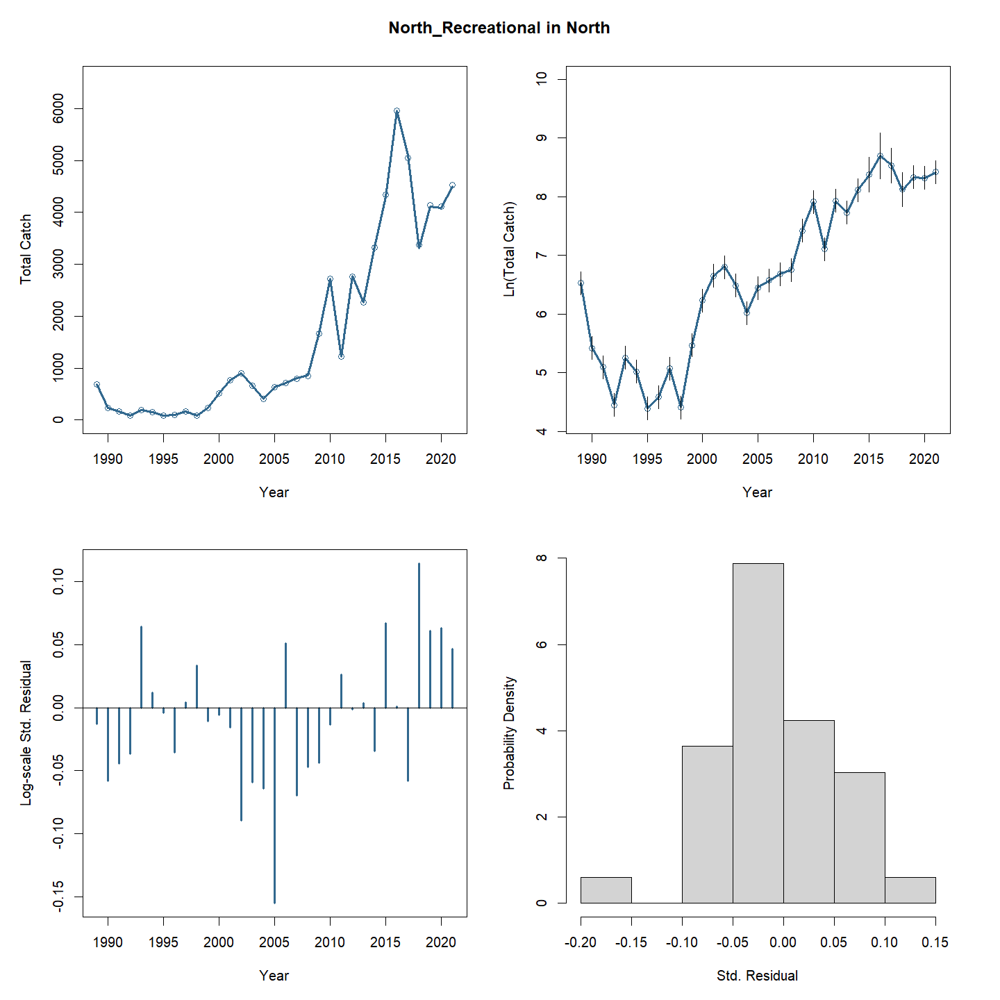
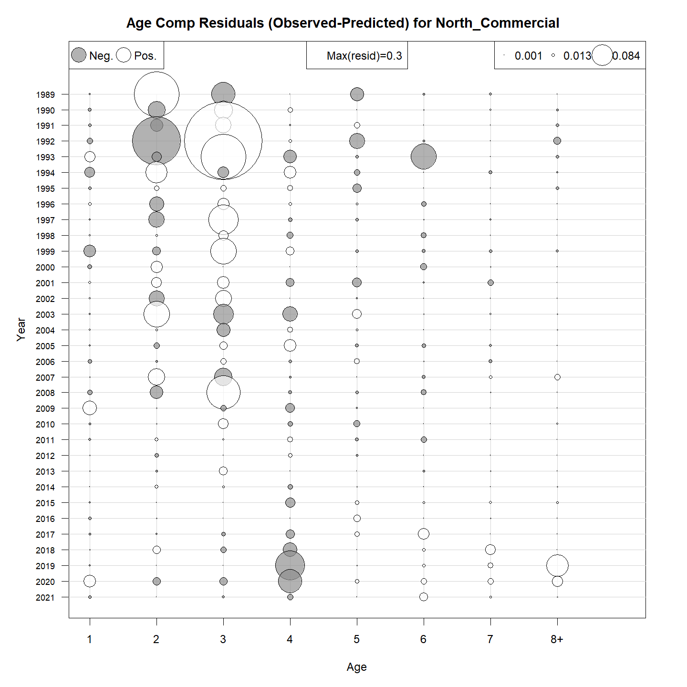
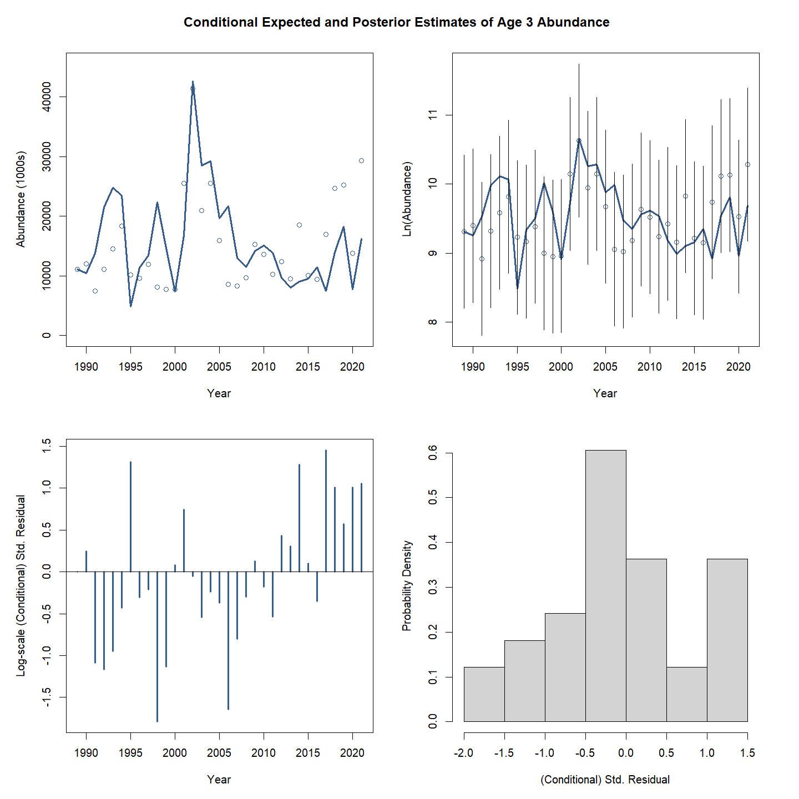
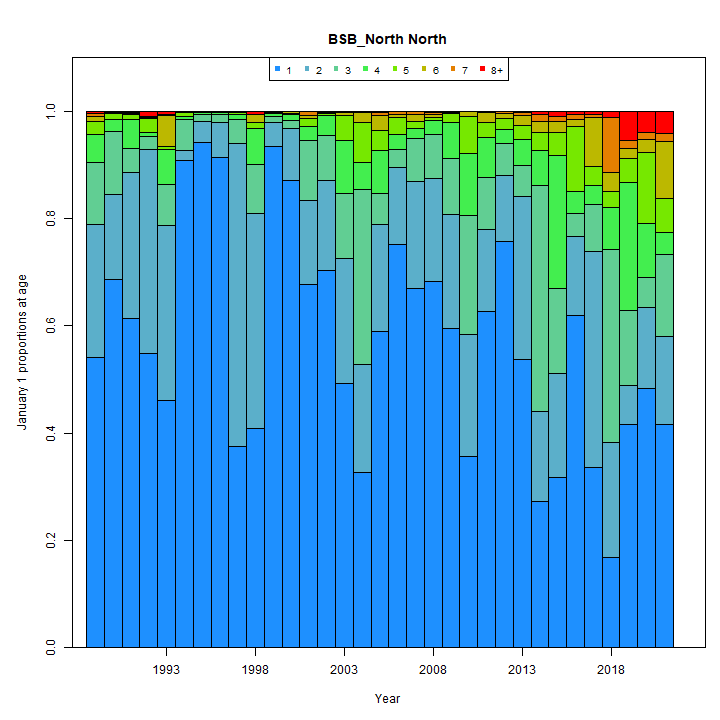
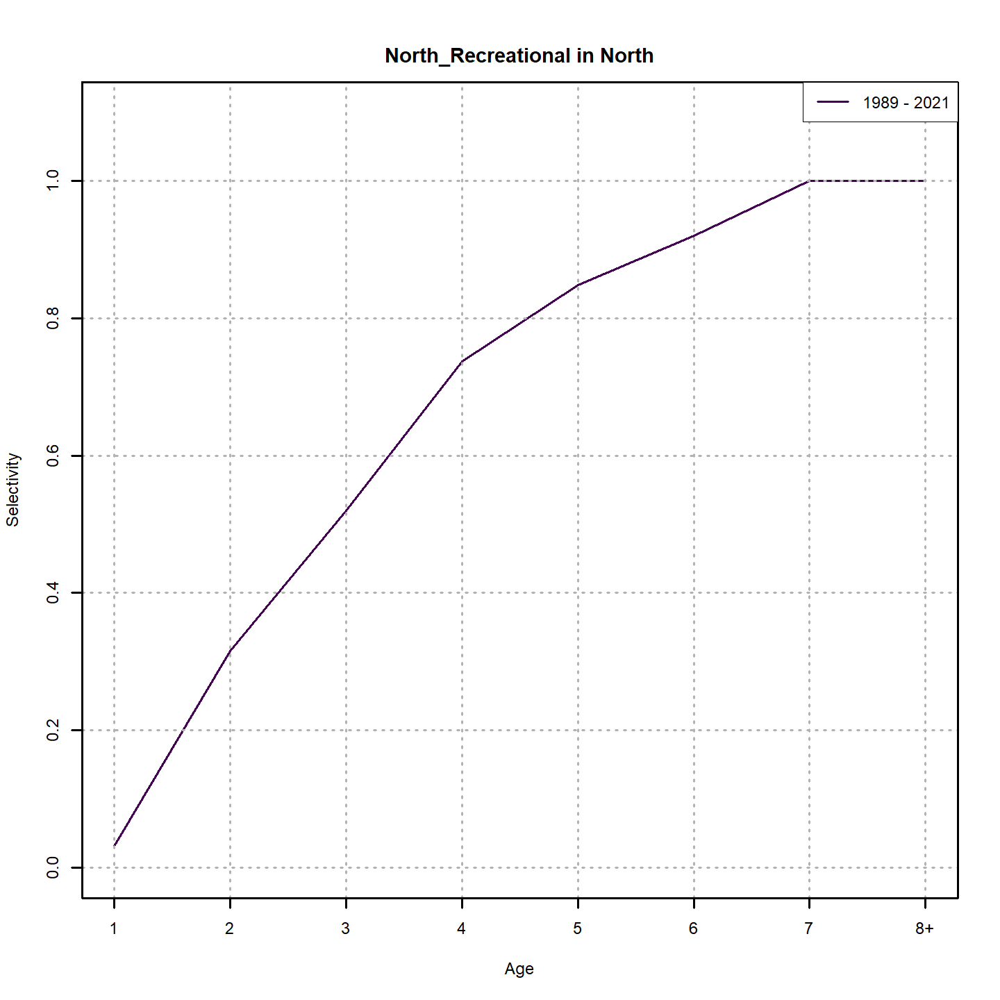
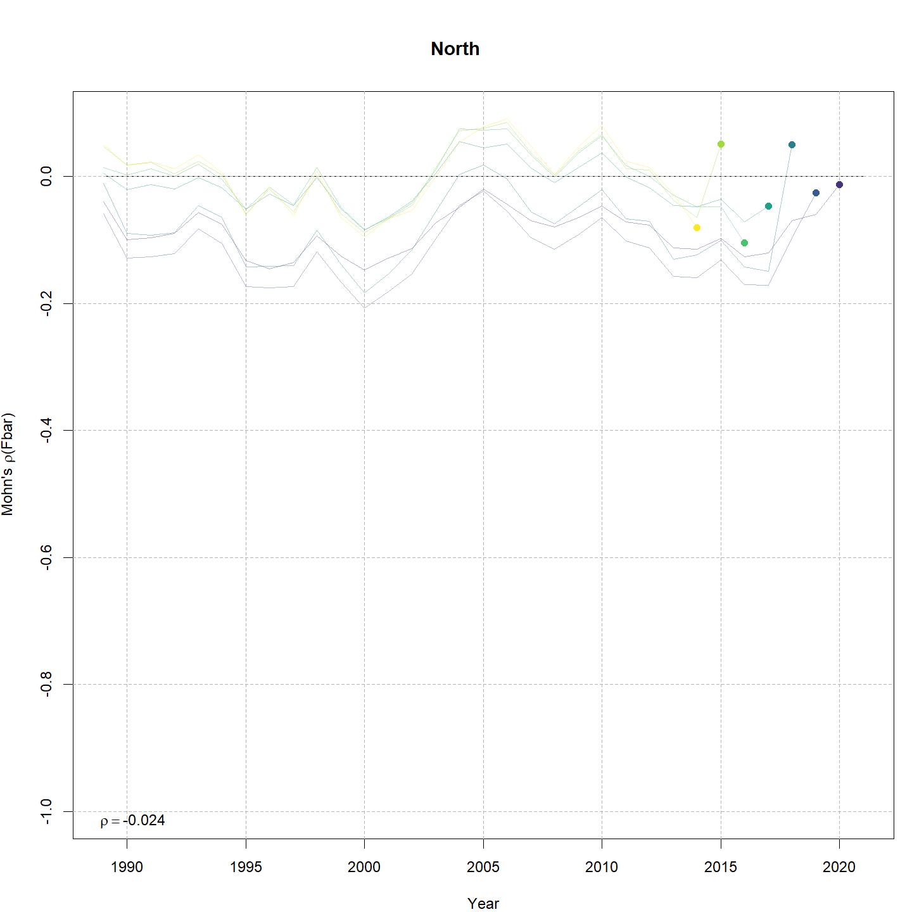
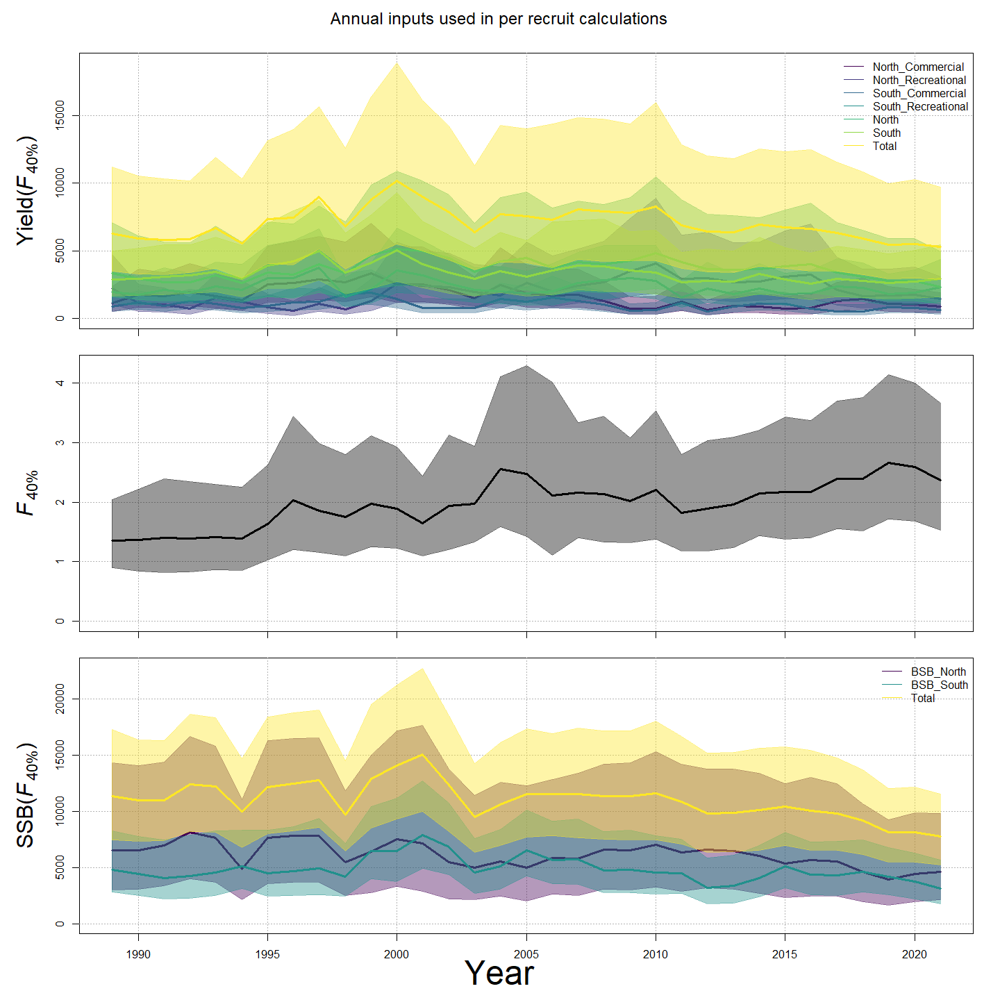

---
output:
  html_document:
    df_print: paged
    keep_md: yes
  word_document: default
  pdf_document:
    fig_caption: yes
    includes:
    keep_tex: yes
    number_sections: no
title: "WHAM figures and tables"
header-includes:
  - \usepackage{longtable}
  - \usepackage{booktabs}
  - \usepackage{caption,graphics}
  - \usepackage{makecell}
  - \usepackage{lscape}
  - \renewcommand\figurename{Fig.}
  - \captionsetup{labelsep=period, singlelinecheck=false}
  - \newcommand{\changesize}[1]{\fontsize{#1pt}{#1pt}\selectfont}
  - \renewcommand{\arraystretch}{1.5}
  - \renewcommand\theadfont{}
---

# {.tabset}

## Figures {.tabset}

### Input

### Diagnostics

### Results

### Retro

### Reference points

### Miscelaneous

## Tables {.tabset}

### Parameter estimates

<table class="table" style="margin-left: auto; margin-right: auto;">
<caption>Parameter estimates, standard errors, and confidence intervals. Rounded to 3 decimal places.</caption>
 <thead>
  <tr>
   <th style="text-align:left;">   </th>
   <th style="text-align:right;"> Estimate </th>
   <th style="text-align:right;"> Std. Error </th>
   <th style="text-align:right;"> 95\% CI lower </th>
   <th style="text-align:right;"> 95\% CI upper </th>
  </tr>
 </thead>
<tbody>
  <tr>
   <td style="text-align:left;"> BSB North mean log(R) intercept </td>
   <td style="text-align:right;"> $7.137$ </td>
   <td style="text-align:right;"> $1.036$ </td>
   <td style="text-align:right;"> $5.106$ </td>
   <td style="text-align:right;"> $9.168$ </td>
  </tr>
  <tr>
   <td style="text-align:left;"> BSB North in North NAA $\sigma$ (age 1) </td>
   <td style="text-align:right;"> $0.745$ </td>
   <td style="text-align:right;"> $0.104$ </td>
   <td style="text-align:right;"> $0.566$ </td>
   <td style="text-align:right;"> $0.980$ </td>
  </tr>
  <tr>
   <td style="text-align:left;"> BSB North in North NAA $\sigma$ (ages 2-8+) </td>
   <td style="text-align:right;"> $0.812$ </td>
   <td style="text-align:right;"> $0.046$ </td>
   <td style="text-align:right;"> $0.727$ </td>
   <td style="text-align:right;"> $0.908$ </td>
  </tr>
  <tr>
   <td style="text-align:left;"> BSB North in South NAA $\sigma$ (age 1) </td>
   <td style="text-align:right;"> $0.745$ </td>
   <td style="text-align:right;"> $0.104$ </td>
   <td style="text-align:right;"> $0.566$ </td>
   <td style="text-align:right;"> $0.980$ </td>
  </tr>
  <tr>
   <td style="text-align:left;"> BSB North  in North  NAA AR1 $\rho$ age </td>
   <td style="text-align:right;"> $0.120$ </td>
   <td style="text-align:right;"> $0.092$ </td>
   <td style="text-align:right;"> $-0.062$ </td>
   <td style="text-align:right;"> $0.295$ </td>
  </tr>
  <tr>
   <td style="text-align:left;"> BSB North  in North  NAA AR1 $\rho$ year </td>
   <td style="text-align:right;"> $0.276$ </td>
   <td style="text-align:right;"> $0.079$ </td>
   <td style="text-align:right;"> $0.114$ </td>
   <td style="text-align:right;"> $0.423$ </td>
  </tr>
  <tr>
   <td style="text-align:left;"> BSB South Mean Recruitment </td>
   <td style="text-align:right;"> $58207.556$ </td>
   <td style="text-align:right;"> $26931.286$ </td>
   <td style="text-align:right;"> $23504.345$ </td>
   <td style="text-align:right;"> $144148.647$ </td>
  </tr>
  <tr>
   <td style="text-align:left;"> BSB South in North NAA $\sigma$ (age 1) </td>
   <td style="text-align:right;"> $0.491$ </td>
   <td style="text-align:right;"> $0.078$ </td>
   <td style="text-align:right;"> $0.360$ </td>
   <td style="text-align:right;"> $0.670$ </td>
  </tr>
  <tr>
   <td style="text-align:left;"> BSB South in North NAA $\sigma$ (ages 2-8+) </td>
   <td style="text-align:right;"> $0.566$ </td>
   <td style="text-align:right;"> $0.070$ </td>
   <td style="text-align:right;"> $0.444$ </td>
   <td style="text-align:right;"> $0.720$ </td>
  </tr>
  <tr>
   <td style="text-align:left;"> BSB South in South NAA $\sigma$ (age 1) </td>
   <td style="text-align:right;"> $0.491$ </td>
   <td style="text-align:right;"> $0.078$ </td>
   <td style="text-align:right;"> $0.360$ </td>
   <td style="text-align:right;"> $0.670$ </td>
  </tr>
  <tr>
   <td style="text-align:left;"> BSB South in South NAA $\sigma$ (ages 2-8+) </td>
   <td style="text-align:right;"> $0.566$ </td>
   <td style="text-align:right;"> $0.070$ </td>
   <td style="text-align:right;"> $0.444$ </td>
   <td style="text-align:right;"> $0.720$ </td>
  </tr>
  <tr>
   <td style="text-align:left;"> BSB South  in North  NAA AR1 $\rho$ age </td>
   <td style="text-align:right;"> $-0.193$ </td>
   <td style="text-align:right;"> $0.112$ </td>
   <td style="text-align:right;"> $-0.401$ </td>
   <td style="text-align:right;"> $0.034$ </td>
  </tr>
  <tr>
   <td style="text-align:left;"> BSB South  in North  NAA AR1 $\rho$ year </td>
   <td style="text-align:right;"> $0.280$ </td>
   <td style="text-align:right;"> $0.105$ </td>
   <td style="text-align:right;"> $0.064$ </td>
   <td style="text-align:right;"> $0.470$ </td>
  </tr>
  <tr>
   <td style="text-align:left;"> BSB South  in South  NAA AR1 $\rho$ age </td>
   <td style="text-align:right;"> $-0.193$ </td>
   <td style="text-align:right;"> $0.112$ </td>
   <td style="text-align:right;"> $-0.401$ </td>
   <td style="text-align:right;"> $0.034$ </td>
  </tr>
  <tr>
   <td style="text-align:left;"> BSB South  in South  NAA AR1 $\rho$ year </td>
   <td style="text-align:right;"> $0.280$ </td>
   <td style="text-align:right;"> $0.105$ </td>
   <td style="text-align:right;"> $0.064$ </td>
   <td style="text-align:right;"> $0.470$ </td>
  </tr>
  <tr>
   <td style="text-align:left;"> North REC CPA fully selected q </td>
   <td style="text-align:right;"> $5.335\times 10^{-5}$ </td>
   <td style="text-align:right;"> $2.192\times 10^{-5}$ </td>
   <td style="text-align:right;"> $2.385\times 10^{-5}$ </td>
   <td style="text-align:right;"> $1.194\times 10^{-4}$ </td>
  </tr>
  <tr>
   <td style="text-align:left;"> North VAST Spring fully selected q </td>
   <td style="text-align:right;"> $0.008$ </td>
   <td style="text-align:right;"> $0.003$ </td>
   <td style="text-align:right;"> $0.004$ </td>
   <td style="text-align:right;"> $0.018$ </td>
  </tr>
  <tr>
   <td style="text-align:left;"> South REC CPA fully selected q </td>
   <td style="text-align:right;"> $8.462\times 10^{-5}$ </td>
   <td style="text-align:right;"> $2.514\times 10^{-5}$ </td>
   <td style="text-align:right;"> $4.727\times 10^{-5}$ </td>
   <td style="text-align:right;"> $1.515\times 10^{-4}$ </td>
  </tr>
  <tr>
   <td style="text-align:left;"> South VAST Spring fully selected q </td>
   <td style="text-align:right;"> $0.008$ </td>
   <td style="text-align:right;"> $0.003$ </td>
   <td style="text-align:right;"> $0.004$ </td>
   <td style="text-align:right;"> $0.014$ </td>
  </tr>
  <tr>
   <td style="text-align:left;"> Block 1: North Commercial Mean Selectivity for age 1 </td>
   <td style="text-align:right;"> $0.015$ </td>
   <td style="text-align:right;"> $0.013$ </td>
   <td style="text-align:right;"> $0.003$ </td>
   <td style="text-align:right;"> $0.078$ </td>
  </tr>
  <tr>
   <td style="text-align:left;"> Block 1: North Commercial Mean Selectivity for age 2 </td>
   <td style="text-align:right;"> $0.330$ </td>
   <td style="text-align:right;"> $0.182$ </td>
   <td style="text-align:right;"> $0.089$ </td>
   <td style="text-align:right;"> $0.712$ </td>
  </tr>
  <tr>
   <td style="text-align:left;"> Block 1: North Commercial Mean Selectivity for age 3 </td>
   <td style="text-align:right;"> $0.819$ </td>
   <td style="text-align:right;"> $0.130$ </td>
   <td style="text-align:right;"> $0.449$ </td>
   <td style="text-align:right;"> $0.962$ </td>
  </tr>
  <tr>
   <td style="text-align:left;"> Block 1: North Commercial Mean Selectivity for age 4 </td>
   <td style="text-align:right;"> $1.000$ </td>
   <td style="text-align:right;"> -- </td>
   <td style="text-align:right;"> -- </td>
   <td style="text-align:right;"> -- </td>
  </tr>
  <tr>
   <td style="text-align:left;"> Block 1: North Commercial Mean Selectivity for age 5 </td>
   <td style="text-align:right;"> $1.000$ </td>
   <td style="text-align:right;"> -- </td>
   <td style="text-align:right;"> -- </td>
   <td style="text-align:right;"> -- </td>
  </tr>
  <tr>
   <td style="text-align:left;"> Block 1: North Commercial Mean Selectivity for age 6 </td>
   <td style="text-align:right;"> $1.000$ </td>
   <td style="text-align:right;"> -- </td>
   <td style="text-align:right;"> -- </td>
   <td style="text-align:right;"> -- </td>
  </tr>
  <tr>
   <td style="text-align:left;"> Block 1: North Commercial Mean Selectivity for age 7 </td>
   <td style="text-align:right;"> $1.000$ </td>
   <td style="text-align:right;"> -- </td>
   <td style="text-align:right;"> -- </td>
   <td style="text-align:right;"> -- </td>
  </tr>
  <tr>
   <td style="text-align:left;"> Block 1: North Commercial Mean Selectivity for age 8+ </td>
   <td style="text-align:right;"> $1.000$ </td>
   <td style="text-align:right;"> -- </td>
   <td style="text-align:right;"> -- </td>
   <td style="text-align:right;"> -- </td>
  </tr>
  <tr>
   <td style="text-align:left;"> Block 2: North Recreational Mean Selectivity for age 1 </td>
   <td style="text-align:right;"> $0.024$ </td>
   <td style="text-align:right;"> $0.020$ </td>
   <td style="text-align:right;"> $0.004$ </td>
   <td style="text-align:right;"> $0.118$ </td>
  </tr>
  <tr>
   <td style="text-align:left;"> Block 2: North Recreational Mean Selectivity for age 2 </td>
   <td style="text-align:right;"> $0.324$ </td>
   <td style="text-align:right;"> $0.186$ </td>
   <td style="text-align:right;"> $0.083$ </td>
   <td style="text-align:right;"> $0.717$ </td>
  </tr>
  <tr>
   <td style="text-align:left;"> Block 2: North Recreational Mean Selectivity for age 3 </td>
   <td style="text-align:right;"> $0.550$ </td>
   <td style="text-align:right;"> $0.212$ </td>
   <td style="text-align:right;"> $0.186$ </td>
   <td style="text-align:right;"> $0.868$ </td>
  </tr>
  <tr>
   <td style="text-align:left;"> Block 2: North Recreational Mean Selectivity for age 4 </td>
   <td style="text-align:right;"> $0.772$ </td>
   <td style="text-align:right;"> $0.155$ </td>
   <td style="text-align:right;"> $0.377$ </td>
   <td style="text-align:right;"> $0.950$ </td>
  </tr>
  <tr>
   <td style="text-align:left;"> Block 2: North Recreational Mean Selectivity for age 5 </td>
   <td style="text-align:right;"> $0.863$ </td>
   <td style="text-align:right;"> $0.113$ </td>
   <td style="text-align:right;"> $0.493$ </td>
   <td style="text-align:right;"> $0.976$ </td>
  </tr>
  <tr>
   <td style="text-align:left;"> Block 2: North Recreational Mean Selectivity for age 6 </td>
   <td style="text-align:right;"> $0.926$ </td>
   <td style="text-align:right;"> $0.084$ </td>
   <td style="text-align:right;"> $0.535$ </td>
   <td style="text-align:right;"> $0.993$ </td>
  </tr>
  <tr>
   <td style="text-align:left;"> Block 2: North Recreational Mean Selectivity for age 7 </td>
   <td style="text-align:right;"> $1.000$ </td>
   <td style="text-align:right;"> -- </td>
   <td style="text-align:right;"> -- </td>
   <td style="text-align:right;"> -- </td>
  </tr>
  <tr>
   <td style="text-align:left;"> Block 2: North Recreational Mean Selectivity for age 8+ </td>
   <td style="text-align:right;"> $1.000$ </td>
   <td style="text-align:right;"> -- </td>
   <td style="text-align:right;"> -- </td>
   <td style="text-align:right;"> -- </td>
  </tr>
  <tr>
   <td style="text-align:left;"> Block 3: South Commercial $a_{50}$ </td>
   <td style="text-align:right;"> $2.482$ </td>
   <td style="text-align:right;"> $0.126$ </td>
   <td style="text-align:right;"> $2.241$ </td>
   <td style="text-align:right;"> $2.736$ </td>
  </tr>
  <tr>
   <td style="text-align:left;"> Block 3: South Commercial 1/slope (increasing) </td>
   <td style="text-align:right;"> $0.380$ </td>
   <td style="text-align:right;"> $0.032$ </td>
   <td style="text-align:right;"> $0.322$ </td>
   <td style="text-align:right;"> $0.447$ </td>
  </tr>
  <tr>
   <td style="text-align:left;"> Block 4: South Recreational $a_{50}$ </td>
   <td style="text-align:right;"> $2.862$ </td>
   <td style="text-align:right;"> $0.245$ </td>
   <td style="text-align:right;"> $2.402$ </td>
   <td style="text-align:right;"> $3.357$ </td>
  </tr>
  <tr>
   <td style="text-align:left;"> Block 4: South Recreational 1/slope (increasing) </td>
   <td style="text-align:right;"> $0.741$ </td>
   <td style="text-align:right;"> $0.093$ </td>
   <td style="text-align:right;"> $0.578$ </td>
   <td style="text-align:right;"> $0.945$ </td>
  </tr>
  <tr>
   <td style="text-align:left;"> Block 9: North REC CPA Mean Selectivity for age 1 </td>
   <td style="text-align:right;"> $0.132$ </td>
   <td style="text-align:right;"> $0.047$ </td>
   <td style="text-align:right;"> $0.064$ </td>
   <td style="text-align:right;"> $0.253$ </td>
  </tr>
  <tr>
   <td style="text-align:left;"> Block 9: North REC CPA Mean Selectivity for age 2 </td>
   <td style="text-align:right;"> $1.000$ </td>
   <td style="text-align:right;"> -- </td>
   <td style="text-align:right;"> -- </td>
   <td style="text-align:right;"> -- </td>
  </tr>
  <tr>
   <td style="text-align:left;"> Block 9: North REC CPA Mean Selectivity for age 3 </td>
   <td style="text-align:right;"> $1.000$ </td>
   <td style="text-align:right;"> -- </td>
   <td style="text-align:right;"> -- </td>
   <td style="text-align:right;"> -- </td>
  </tr>
  <tr>
   <td style="text-align:left;"> Block 9: North REC CPA Mean Selectivity for age 4 </td>
   <td style="text-align:right;"> $1.000$ </td>
   <td style="text-align:right;"> -- </td>
   <td style="text-align:right;"> -- </td>
   <td style="text-align:right;"> -- </td>
  </tr>
  <tr>
   <td style="text-align:left;"> Block 9: North REC CPA Mean Selectivity for age 5 </td>
   <td style="text-align:right;"> $1.000$ </td>
   <td style="text-align:right;"> -- </td>
   <td style="text-align:right;"> -- </td>
   <td style="text-align:right;"> -- </td>
  </tr>
  <tr>
   <td style="text-align:left;"> Block 9: North REC CPA Mean Selectivity for age 6 </td>
   <td style="text-align:right;"> $1.000$ </td>
   <td style="text-align:right;"> -- </td>
   <td style="text-align:right;"> -- </td>
   <td style="text-align:right;"> -- </td>
  </tr>
  <tr>
   <td style="text-align:left;"> Block 9: North REC CPA Mean Selectivity for age 7 </td>
   <td style="text-align:right;"> $1.000$ </td>
   <td style="text-align:right;"> -- </td>
   <td style="text-align:right;"> -- </td>
   <td style="text-align:right;"> -- </td>
  </tr>
  <tr>
   <td style="text-align:left;"> Block 9: North REC CPA Mean Selectivity for age 8+ </td>
   <td style="text-align:right;"> $1.000$ </td>
   <td style="text-align:right;"> -- </td>
   <td style="text-align:right;"> -- </td>
   <td style="text-align:right;"> -- </td>
  </tr>
  <tr>
   <td style="text-align:left;"> Block 10: North VAST Spring Mean Selectivity for age 1 </td>
   <td style="text-align:right;"> $0.053$ </td>
   <td style="text-align:right;"> $0.020$ </td>
   <td style="text-align:right;"> $0.025$ </td>
   <td style="text-align:right;"> $0.110$ </td>
  </tr>
  <tr>
   <td style="text-align:left;"> Block 10: North VAST Spring Mean Selectivity for age 2 </td>
   <td style="text-align:right;"> $0.381$ </td>
   <td style="text-align:right;"> $0.086$ </td>
   <td style="text-align:right;"> $0.232$ </td>
   <td style="text-align:right;"> $0.557$ </td>
  </tr>
  <tr>
   <td style="text-align:left;"> Block 10: North VAST Spring Mean Selectivity for age 3 </td>
   <td style="text-align:right;"> $0.879$ </td>
   <td style="text-align:right;"> $0.064$ </td>
   <td style="text-align:right;"> $0.691$ </td>
   <td style="text-align:right;"> $0.960$ </td>
  </tr>
  <tr>
   <td style="text-align:left;"> Block 10: North VAST Spring Mean Selectivity for age 4 </td>
   <td style="text-align:right;"> $0.924$ </td>
   <td style="text-align:right;"> $0.041$ </td>
   <td style="text-align:right;"> $0.793$ </td>
   <td style="text-align:right;"> $0.975$ </td>
  </tr>
  <tr>
   <td style="text-align:left;"> Block 10: North VAST Spring Mean Selectivity for age 5 </td>
   <td style="text-align:right;"> $1.000$ </td>
   <td style="text-align:right;"> -- </td>
   <td style="text-align:right;"> -- </td>
   <td style="text-align:right;"> -- </td>
  </tr>
  <tr>
   <td style="text-align:left;"> Block 10: North VAST Spring Mean Selectivity for age 6 </td>
   <td style="text-align:right;"> $1.000$ </td>
   <td style="text-align:right;"> -- </td>
   <td style="text-align:right;"> -- </td>
   <td style="text-align:right;"> -- </td>
  </tr>
  <tr>
   <td style="text-align:left;"> Block 10: North VAST Spring Mean Selectivity for age 7 </td>
   <td style="text-align:right;"> $1.000$ </td>
   <td style="text-align:right;"> -- </td>
   <td style="text-align:right;"> -- </td>
   <td style="text-align:right;"> -- </td>
  </tr>
  <tr>
   <td style="text-align:left;"> Block 10: North VAST Spring Mean Selectivity for age 8+ </td>
   <td style="text-align:right;"> $1.000$ </td>
   <td style="text-align:right;"> -- </td>
   <td style="text-align:right;"> -- </td>
   <td style="text-align:right;"> -- </td>
  </tr>
  <tr>
   <td style="text-align:left;"> Block 11: South REC CPA Selectivity for age 1 </td>
   <td style="text-align:right;"> $0.309$ </td>
   <td style="text-align:right;"> $0.065$ </td>
   <td style="text-align:right;"> $0.197$ </td>
   <td style="text-align:right;"> $0.447$ </td>
  </tr>
  <tr>
   <td style="text-align:left;"> Block 11: South REC CPA Selectivity for age 2 </td>
   <td style="text-align:right;"> $0.752$ </td>
   <td style="text-align:right;"> $0.081$ </td>
   <td style="text-align:right;"> $0.566$ </td>
   <td style="text-align:right;"> $0.876$ </td>
  </tr>
  <tr>
   <td style="text-align:left;"> Block 11: South REC CPA Selectivity for age 3 </td>
   <td style="text-align:right;"> $1.000$ </td>
   <td style="text-align:right;"> -- </td>
   <td style="text-align:right;"> -- </td>
   <td style="text-align:right;"> -- </td>
  </tr>
  <tr>
   <td style="text-align:left;"> Block 11: South REC CPA Selectivity for age 4 </td>
   <td style="text-align:right;"> $1.000$ </td>
   <td style="text-align:right;"> -- </td>
   <td style="text-align:right;"> -- </td>
   <td style="text-align:right;"> -- </td>
  </tr>
  <tr>
   <td style="text-align:left;"> Block 11: South REC CPA Selectivity for age 5 </td>
   <td style="text-align:right;"> $1.000$ </td>
   <td style="text-align:right;"> -- </td>
   <td style="text-align:right;"> -- </td>
   <td style="text-align:right;"> -- </td>
  </tr>
  <tr>
   <td style="text-align:left;"> Block 11: South REC CPA Selectivity for age 6 </td>
   <td style="text-align:right;"> $1.000$ </td>
   <td style="text-align:right;"> -- </td>
   <td style="text-align:right;"> -- </td>
   <td style="text-align:right;"> -- </td>
  </tr>
  <tr>
   <td style="text-align:left;"> Block 11: South REC CPA Selectivity for age 7 </td>
   <td style="text-align:right;"> $1.000$ </td>
   <td style="text-align:right;"> -- </td>
   <td style="text-align:right;"> -- </td>
   <td style="text-align:right;"> -- </td>
  </tr>
  <tr>
   <td style="text-align:left;"> Block 11: South REC CPA Selectivity for age 8+ </td>
   <td style="text-align:right;"> $1.000$ </td>
   <td style="text-align:right;"> -- </td>
   <td style="text-align:right;"> -- </td>
   <td style="text-align:right;"> -- </td>
  </tr>
  <tr>
   <td style="text-align:left;"> Block 12: South VAST Spring Selectivity for age 1 </td>
   <td style="text-align:right;"> $0.307$ </td>
   <td style="text-align:right;"> $0.071$ </td>
   <td style="text-align:right;"> $0.188$ </td>
   <td style="text-align:right;"> $0.459$ </td>
  </tr>
  <tr>
   <td style="text-align:left;"> Block 12: South VAST Spring Selectivity for age 2 </td>
   <td style="text-align:right;"> $1.000$ </td>
   <td style="text-align:right;"> -- </td>
   <td style="text-align:right;"> -- </td>
   <td style="text-align:right;"> -- </td>
  </tr>
  <tr>
   <td style="text-align:left;"> Block 12: South VAST Spring Selectivity for age 3 </td>
   <td style="text-align:right;"> $1.000$ </td>
   <td style="text-align:right;"> -- </td>
   <td style="text-align:right;"> -- </td>
   <td style="text-align:right;"> -- </td>
  </tr>
  <tr>
   <td style="text-align:left;"> Block 12: South VAST Spring Selectivity for age 4 </td>
   <td style="text-align:right;"> $1.000$ </td>
   <td style="text-align:right;"> -- </td>
   <td style="text-align:right;"> -- </td>
   <td style="text-align:right;"> -- </td>
  </tr>
  <tr>
   <td style="text-align:left;"> Block 12: South VAST Spring Selectivity for age 5 </td>
   <td style="text-align:right;"> $1.000$ </td>
   <td style="text-align:right;"> -- </td>
   <td style="text-align:right;"> -- </td>
   <td style="text-align:right;"> -- </td>
  </tr>
  <tr>
   <td style="text-align:left;"> Block 12: South VAST Spring Selectivity for age 6 </td>
   <td style="text-align:right;"> $1.000$ </td>
   <td style="text-align:right;"> -- </td>
   <td style="text-align:right;"> -- </td>
   <td style="text-align:right;"> -- </td>
  </tr>
  <tr>
   <td style="text-align:left;"> Block 12: South VAST Spring Selectivity for age 7 </td>
   <td style="text-align:right;"> $1.000$ </td>
   <td style="text-align:right;"> -- </td>
   <td style="text-align:right;"> -- </td>
   <td style="text-align:right;"> -- </td>
  </tr>
  <tr>
   <td style="text-align:left;"> Block 12: South VAST Spring Selectivity for age 8+ </td>
   <td style="text-align:right;"> $1.000$ </td>
   <td style="text-align:right;"> -- </td>
   <td style="text-align:right;"> -- </td>
   <td style="text-align:right;"> -- </td>
  </tr>
  <tr>
   <td style="text-align:left;"> Block 1: North Commercial Selectivity RE $\sigma$ </td>
   <td style="text-align:right;"> $0.401$ </td>
   <td style="text-align:right;"> $0.115$ </td>
   <td style="text-align:right;"> $0.228$ </td>
   <td style="text-align:right;"> $0.705$ </td>
  </tr>
  <tr>
   <td style="text-align:left;"> Block 1: North Commercial Selectivity RE AR1 $\rho$ (age) </td>
   <td style="text-align:right;"> $0.502$ </td>
   <td style="text-align:right;"> $0.126$ </td>
   <td style="text-align:right;"> $0.389$ </td>
   <td style="text-align:right;"> $0.946$ </td>
  </tr>
  <tr>
   <td style="text-align:left;"> Block 1: North Commercial Selectivity RE AR1 $\rho$ (year) </td>
   <td style="text-align:right;"> $0.592$ </td>
   <td style="text-align:right;"> $0.081$ </td>
   <td style="text-align:right;"> $0.586$ </td>
   <td style="text-align:right;"> $0.968$ </td>
  </tr>
  <tr>
   <td style="text-align:left;"> Block 2: North Recreational Selectivity RE $\sigma$ </td>
   <td style="text-align:right;"> $0.203$ </td>
   <td style="text-align:right;"> $0.036$ </td>
   <td style="text-align:right;"> $0.143$ </td>
   <td style="text-align:right;"> $0.286$ </td>
  </tr>
  <tr>
   <td style="text-align:left;"> Block 2: North Recreational Selectivity RE AR1 $\rho$ (age) </td>
   <td style="text-align:right;"> $0.509$ </td>
   <td style="text-align:right;"> $0.074$ </td>
   <td style="text-align:right;"> $0.608$ </td>
   <td style="text-align:right;"> $0.912$ </td>
  </tr>
  <tr>
   <td style="text-align:left;"> Block 2: North Recreational Selectivity RE AR1 $\rho$ (year) </td>
   <td style="text-align:right;"> $0.729$ </td>
   <td style="text-align:right;"> $0.025$ </td>
   <td style="text-align:right;"> $0.871$ </td>
   <td style="text-align:right;"> $0.983$ </td>
  </tr>
  <tr>
   <td style="text-align:left;"> Block 9: North REC CPA Selectivity RE $\sigma$ </td>
   <td style="text-align:right;"> $0.220$ </td>
   <td style="text-align:right;"> $0.064$ </td>
   <td style="text-align:right;"> $0.125$ </td>
   <td style="text-align:right;"> $0.388$ </td>
  </tr>
  <tr>
   <td style="text-align:left;"> Block 9: North REC CPA Selectivity RE AR1 $\rho$ (year) </td>
   <td style="text-align:right;"> $0.633$ </td>
   <td style="text-align:right;"> $0.088$ </td>
   <td style="text-align:right;"> $0.499$ </td>
   <td style="text-align:right;"> $0.985$ </td>
  </tr>
  <tr>
   <td style="text-align:left;"> Block 10: North VAST Spring Selectivity RE $\sigma$ </td>
   <td style="text-align:right;"> $0.729$ </td>
   <td style="text-align:right;"> $0.141$ </td>
   <td style="text-align:right;"> $0.499$ </td>
   <td style="text-align:right;"> $1.064$ </td>
  </tr>
  <tr>
   <td style="text-align:left;"> Block 10: North VAST Spring Selectivity RE AR1 $\rho$ (age) </td>
   <td style="text-align:right;"> $0.111$ </td>
   <td style="text-align:right;"> $0.246$ </td>
   <td style="text-align:right;"> $-0.278$ </td>
   <td style="text-align:right;"> $0.623$ </td>
  </tr>
  <tr>
   <td style="text-align:left;"> Block 10: North VAST Spring Selectivity RE AR1 $\rho$ (year) </td>
   <td style="text-align:right;"> $0.331$ </td>
   <td style="text-align:right;"> $0.168$ </td>
   <td style="text-align:right;"> $0.176$ </td>
   <td style="text-align:right;"> $0.833$ </td>
  </tr>
  <tr>
   <td style="text-align:left;"> North Commercial in North age comp, Dirichlet-multinomial: dispersion ($\phi$) </td>
   <td style="text-align:right;"> $54.987$ </td>
   <td style="text-align:right;"> $7.004$ </td>
   <td style="text-align:right;"> $42.839$ </td>
   <td style="text-align:right;"> $70.581$ </td>
  </tr>
  <tr>
   <td style="text-align:left;"> North Recreational in North age comp, logistic-normal: $\sigma$ </td>
   <td style="text-align:right;"> $2.759$ </td>
   <td style="text-align:right;"> $0.466$ </td>
   <td style="text-align:right;"> $1.981$ </td>
   <td style="text-align:right;"> $3.843$ </td>
  </tr>
  <tr>
   <td style="text-align:left;"> South Commercial in South age comp, logistic-normal: $\sigma$ </td>
   <td style="text-align:right;"> $34.332$ </td>
   <td style="text-align:right;"> $3.399$ </td>
   <td style="text-align:right;"> $28.277$ </td>
   <td style="text-align:right;"> $41.684$ </td>
  </tr>
  <tr>
   <td style="text-align:left;"> South Commercial in South age comp, logistic-normal: $\rho$ </td>
   <td style="text-align:right;"> $0.728$ </td>
   <td style="text-align:right;"> $0.058$ </td>
   <td style="text-align:right;"> $0.601$ </td>
   <td style="text-align:right;"> $0.827$ </td>
  </tr>
  <tr>
   <td style="text-align:left;"> South Recreational in South age comp, logistic-normal: $\sigma$ </td>
   <td style="text-align:right;"> $29.243$ </td>
   <td style="text-align:right;"> $4.200$ </td>
   <td style="text-align:right;"> $22.068$ </td>
   <td style="text-align:right;"> $38.750$ </td>
  </tr>
  <tr>
   <td style="text-align:left;"> South Recreational in South age comp, logistic-normal: $\rho$ </td>
   <td style="text-align:right;"> $0.909$ </td>
   <td style="text-align:right;"> $0.025$ </td>
   <td style="text-align:right;"> $0.846$ </td>
   <td style="text-align:right;"> $0.948$ </td>
  </tr>
  <tr>
   <td style="text-align:left;"> North REC CPA in North age comp, logistic-normal: $\sigma$ </td>
   <td style="text-align:right;"> $4.298$ </td>
   <td style="text-align:right;"> $0.400$ </td>
   <td style="text-align:right;"> $3.582$ </td>
   <td style="text-align:right;"> $5.157$ </td>
  </tr>
  <tr>
   <td style="text-align:left;"> North VAST Spring in North age comp, Dirichlet-multinomial: dispersion ($\phi$) </td>
   <td style="text-align:right;"> $28.768$ </td>
   <td style="text-align:right;"> $3.255$ </td>
   <td style="text-align:right;"> $23.047$ </td>
   <td style="text-align:right;"> $35.910$ </td>
  </tr>
  <tr>
   <td style="text-align:left;"> South REC CPA in South age comp, logistic-normal: $\sigma$ </td>
   <td style="text-align:right;"> $28.494$ </td>
   <td style="text-align:right;"> $4.309$ </td>
   <td style="text-align:right;"> $21.185$ </td>
   <td style="text-align:right;"> $38.325$ </td>
  </tr>
  <tr>
   <td style="text-align:left;"> South REC CPA in South age comp, logistic-normal: $\rho$ </td>
   <td style="text-align:right;"> $0.925$ </td>
   <td style="text-align:right;"> $0.023$ </td>
   <td style="text-align:right;"> $0.865$ </td>
   <td style="text-align:right;"> $0.960$ </td>
  </tr>
  <tr>
   <td style="text-align:left;"> South VAST Spring in South age comp, logistic-normal: $\sigma$ </td>
   <td style="text-align:right;"> $46.878$ </td>
   <td style="text-align:right;"> $3.763$ </td>
   <td style="text-align:right;"> $40.053$ </td>
   <td style="text-align:right;"> $54.867$ </td>
  </tr>
  <tr>
   <td style="text-align:left;"> South VAST Spring in South age comp, logistic-normal: $\rho$ </td>
   <td style="text-align:right;"> $0.645$ </td>
   <td style="text-align:right;"> $0.059$ </td>
   <td style="text-align:right;"> $0.523$ </td>
   <td style="text-align:right;"> $0.751$ </td>
  </tr>
  <tr>
   <td style="text-align:left;"> BSB North North M for age 1 </td>
   <td style="text-align:right;"> $0.732$ </td>
   <td style="text-align:right;"> $0.099$ </td>
   <td style="text-align:right;"> $0.562$ </td>
   <td style="text-align:right;"> $0.953$ </td>
  </tr>
  <tr>
   <td style="text-align:left;"> BSB North North M for age 2 </td>
   <td style="text-align:right;"> $0.732$ </td>
   <td style="text-align:right;"> $0.099$ </td>
   <td style="text-align:right;"> $0.562$ </td>
   <td style="text-align:right;"> $0.953$ </td>
  </tr>
  <tr>
   <td style="text-align:left;"> BSB North North M for age 3 </td>
   <td style="text-align:right;"> $0.732$ </td>
   <td style="text-align:right;"> $0.099$ </td>
   <td style="text-align:right;"> $0.562$ </td>
   <td style="text-align:right;"> $0.953$ </td>
  </tr>
  <tr>
   <td style="text-align:left;"> BSB North North M for age 4 </td>
   <td style="text-align:right;"> $0.732$ </td>
   <td style="text-align:right;"> $0.099$ </td>
   <td style="text-align:right;"> $0.562$ </td>
   <td style="text-align:right;"> $0.953$ </td>
  </tr>
  <tr>
   <td style="text-align:left;"> BSB North North M for age 5 </td>
   <td style="text-align:right;"> $0.732$ </td>
   <td style="text-align:right;"> $0.099$ </td>
   <td style="text-align:right;"> $0.562$ </td>
   <td style="text-align:right;"> $0.953$ </td>
  </tr>
  <tr>
   <td style="text-align:left;"> BSB North North M for age 6 </td>
   <td style="text-align:right;"> $0.732$ </td>
   <td style="text-align:right;"> $0.099$ </td>
   <td style="text-align:right;"> $0.562$ </td>
   <td style="text-align:right;"> $0.953$ </td>
  </tr>
  <tr>
   <td style="text-align:left;"> BSB North North M for age 7 </td>
   <td style="text-align:right;"> $0.732$ </td>
   <td style="text-align:right;"> $0.099$ </td>
   <td style="text-align:right;"> $0.562$ </td>
   <td style="text-align:right;"> $0.953$ </td>
  </tr>
  <tr>
   <td style="text-align:left;"> BSB North North M for age 8+ </td>
   <td style="text-align:right;"> $0.732$ </td>
   <td style="text-align:right;"> $0.099$ </td>
   <td style="text-align:right;"> $0.562$ </td>
   <td style="text-align:right;"> $0.953$ </td>
  </tr>
  <tr>
   <td style="text-align:left;"> BSB North South M for age 1 </td>
   <td style="text-align:right;"> $0.732$ </td>
   <td style="text-align:right;"> $0.099$ </td>
   <td style="text-align:right;"> $0.562$ </td>
   <td style="text-align:right;"> $0.953$ </td>
  </tr>
  <tr>
   <td style="text-align:left;"> BSB North South M for age 2 </td>
   <td style="text-align:right;"> $0.732$ </td>
   <td style="text-align:right;"> $0.099$ </td>
   <td style="text-align:right;"> $0.562$ </td>
   <td style="text-align:right;"> $0.953$ </td>
  </tr>
  <tr>
   <td style="text-align:left;"> BSB North South M for age 3 </td>
   <td style="text-align:right;"> $0.732$ </td>
   <td style="text-align:right;"> $0.099$ </td>
   <td style="text-align:right;"> $0.562$ </td>
   <td style="text-align:right;"> $0.953$ </td>
  </tr>
  <tr>
   <td style="text-align:left;"> BSB North South M for age 4 </td>
   <td style="text-align:right;"> $0.732$ </td>
   <td style="text-align:right;"> $0.099$ </td>
   <td style="text-align:right;"> $0.562$ </td>
   <td style="text-align:right;"> $0.953$ </td>
  </tr>
  <tr>
   <td style="text-align:left;"> BSB North South M for age 5 </td>
   <td style="text-align:right;"> $0.732$ </td>
   <td style="text-align:right;"> $0.099$ </td>
   <td style="text-align:right;"> $0.562$ </td>
   <td style="text-align:right;"> $0.953$ </td>
  </tr>
  <tr>
   <td style="text-align:left;"> BSB North South M for age 6 </td>
   <td style="text-align:right;"> $0.732$ </td>
   <td style="text-align:right;"> $0.099$ </td>
   <td style="text-align:right;"> $0.562$ </td>
   <td style="text-align:right;"> $0.953$ </td>
  </tr>
  <tr>
   <td style="text-align:left;"> BSB North South M for age 7 </td>
   <td style="text-align:right;"> $0.732$ </td>
   <td style="text-align:right;"> $0.099$ </td>
   <td style="text-align:right;"> $0.562$ </td>
   <td style="text-align:right;"> $0.953$ </td>
  </tr>
  <tr>
   <td style="text-align:left;"> BSB North South M for age 8+ </td>
   <td style="text-align:right;"> $0.732$ </td>
   <td style="text-align:right;"> $0.099$ </td>
   <td style="text-align:right;"> $0.562$ </td>
   <td style="text-align:right;"> $0.953$ </td>
  </tr>
  <tr>
   <td style="text-align:left;"> BSB South North M for age 1 </td>
   <td style="text-align:right;"> $0.732$ </td>
   <td style="text-align:right;"> $0.099$ </td>
   <td style="text-align:right;"> $0.562$ </td>
   <td style="text-align:right;"> $0.953$ </td>
  </tr>
  <tr>
   <td style="text-align:left;"> BSB South North M for age 2 </td>
   <td style="text-align:right;"> $0.732$ </td>
   <td style="text-align:right;"> $0.099$ </td>
   <td style="text-align:right;"> $0.562$ </td>
   <td style="text-align:right;"> $0.953$ </td>
  </tr>
  <tr>
   <td style="text-align:left;"> BSB South North M for age 3 </td>
   <td style="text-align:right;"> $0.732$ </td>
   <td style="text-align:right;"> $0.099$ </td>
   <td style="text-align:right;"> $0.562$ </td>
   <td style="text-align:right;"> $0.953$ </td>
  </tr>
  <tr>
   <td style="text-align:left;"> BSB South North M for age 4 </td>
   <td style="text-align:right;"> $0.732$ </td>
   <td style="text-align:right;"> $0.099$ </td>
   <td style="text-align:right;"> $0.562$ </td>
   <td style="text-align:right;"> $0.953$ </td>
  </tr>
  <tr>
   <td style="text-align:left;"> BSB South North M for age 5 </td>
   <td style="text-align:right;"> $0.732$ </td>
   <td style="text-align:right;"> $0.099$ </td>
   <td style="text-align:right;"> $0.562$ </td>
   <td style="text-align:right;"> $0.953$ </td>
  </tr>
  <tr>
   <td style="text-align:left;"> BSB South North M for age 6 </td>
   <td style="text-align:right;"> $0.732$ </td>
   <td style="text-align:right;"> $0.099$ </td>
   <td style="text-align:right;"> $0.562$ </td>
   <td style="text-align:right;"> $0.953$ </td>
  </tr>
  <tr>
   <td style="text-align:left;"> BSB South North M for age 7 </td>
   <td style="text-align:right;"> $0.732$ </td>
   <td style="text-align:right;"> $0.099$ </td>
   <td style="text-align:right;"> $0.562$ </td>
   <td style="text-align:right;"> $0.953$ </td>
  </tr>
  <tr>
   <td style="text-align:left;"> BSB South North M for age 8+ </td>
   <td style="text-align:right;"> $0.732$ </td>
   <td style="text-align:right;"> $0.099$ </td>
   <td style="text-align:right;"> $0.562$ </td>
   <td style="text-align:right;"> $0.953$ </td>
  </tr>
  <tr>
   <td style="text-align:left;"> BSB South South M for age 1 </td>
   <td style="text-align:right;"> $0.732$ </td>
   <td style="text-align:right;"> $0.099$ </td>
   <td style="text-align:right;"> $0.562$ </td>
   <td style="text-align:right;"> $0.953$ </td>
  </tr>
  <tr>
   <td style="text-align:left;"> BSB South South M for age 2 </td>
   <td style="text-align:right;"> $0.732$ </td>
   <td style="text-align:right;"> $0.099$ </td>
   <td style="text-align:right;"> $0.562$ </td>
   <td style="text-align:right;"> $0.953$ </td>
  </tr>
  <tr>
   <td style="text-align:left;"> BSB South South M for age 3 </td>
   <td style="text-align:right;"> $0.732$ </td>
   <td style="text-align:right;"> $0.099$ </td>
   <td style="text-align:right;"> $0.562$ </td>
   <td style="text-align:right;"> $0.953$ </td>
  </tr>
  <tr>
   <td style="text-align:left;"> BSB South South M for age 4 </td>
   <td style="text-align:right;"> $0.732$ </td>
   <td style="text-align:right;"> $0.099$ </td>
   <td style="text-align:right;"> $0.562$ </td>
   <td style="text-align:right;"> $0.953$ </td>
  </tr>
  <tr>
   <td style="text-align:left;"> BSB South South M for age 5 </td>
   <td style="text-align:right;"> $0.732$ </td>
   <td style="text-align:right;"> $0.099$ </td>
   <td style="text-align:right;"> $0.562$ </td>
   <td style="text-align:right;"> $0.953$ </td>
  </tr>
  <tr>
   <td style="text-align:left;"> BSB South South M for age 6 </td>
   <td style="text-align:right;"> $0.732$ </td>
   <td style="text-align:right;"> $0.099$ </td>
   <td style="text-align:right;"> $0.562$ </td>
   <td style="text-align:right;"> $0.953$ </td>
  </tr>
  <tr>
   <td style="text-align:left;"> BSB South South M for age 7 </td>
   <td style="text-align:right;"> $0.732$ </td>
   <td style="text-align:right;"> $0.099$ </td>
   <td style="text-align:right;"> $0.562$ </td>
   <td style="text-align:right;"> $0.953$ </td>
  </tr>
  <tr>
   <td style="text-align:left;"> BSB South South M for age 8+ </td>
   <td style="text-align:right;"> $0.732$ </td>
   <td style="text-align:right;"> $0.099$ </td>
   <td style="text-align:right;"> $0.562$ </td>
   <td style="text-align:right;"> $0.953$ </td>
  </tr>
  <tr>
   <td style="text-align:left;"> stock BSB North $\mu$ from North to South (intercept) </td>
   <td style="text-align:right;"> $0.009$ </td>
   <td style="text-align:right;"> $0.001$ </td>
   <td style="text-align:right;"> $0.007$ </td>
   <td style="text-align:right;"> $0.012$ </td>
  </tr>
  <tr>
   <td style="text-align:left;"> stock BSB North $\mu$ from South to North (intercept) </td>
   <td style="text-align:right;"> $0.330$ </td>
   <td style="text-align:right;"> $0.043$ </td>
   <td style="text-align:right;"> $0.252$ </td>
   <td style="text-align:right;"> $0.420$ </td>
  </tr>
  <tr>
   <td style="text-align:left;"> North REC CPA log-index observation SD scalar </td>
   <td style="text-align:right;"> $5.120$ </td>
   <td style="text-align:right;"> $1.518$ </td>
   <td style="text-align:right;"> $2.863$ </td>
   <td style="text-align:right;"> $9.155$ </td>
  </tr>
  <tr>
   <td style="text-align:left;"> South REC CPA log-index observation SD scalar </td>
   <td style="text-align:right;"> $5.298$ </td>
   <td style="text-align:right;"> $1.206$ </td>
   <td style="text-align:right;"> $3.392$ </td>
   <td style="text-align:right;"> $8.276$ </td>
  </tr>
  <tr>
   <td style="text-align:left;"> Ecov North BT: $\mu$ </td>
   <td style="text-align:right;"> $6.803$ </td>
   <td style="text-align:right;"> $0.190$ </td>
   <td style="text-align:right;"> $6.431$ </td>
   <td style="text-align:right;"> $7.175$ </td>
  </tr>
  <tr>
   <td style="text-align:left;"> Ecov North BT: $\sigma$ </td>
   <td style="text-align:right;"> $1.131$ </td>
   <td style="text-align:right;"> $0.109$ </td>
   <td style="text-align:right;"> $0.937$ </td>
   <td style="text-align:right;"> $1.367$ </td>
  </tr>
  <tr>
   <td style="text-align:left;"> Ecov North BT: AR1 $\rho$ </td>
   <td style="text-align:right;"> $0.290$ </td>
   <td style="text-align:right;"> $0.121$ </td>
   <td style="text-align:right;"> $0.040$ </td>
   <td style="text-align:right;"> $0.506$ </td>
  </tr>
  <tr>
   <td style="text-align:left;"> Ecov South BT: $\mu$ </td>
   <td style="text-align:right;"> $7.606$ </td>
   <td style="text-align:right;"> $0.148$ </td>
   <td style="text-align:right;"> $7.316$ </td>
   <td style="text-align:right;"> $7.895$ </td>
  </tr>
  <tr>
   <td style="text-align:left;"> Ecov South BT: $\sigma$ </td>
   <td style="text-align:right;"> $1.017$ </td>
   <td style="text-align:right;"> $0.092$ </td>
   <td style="text-align:right;"> $0.852$ </td>
   <td style="text-align:right;"> $1.215$ </td>
  </tr>
  <tr>
   <td style="text-align:left;"> Ecov South BT: AR1 $\rho$ </td>
   <td style="text-align:right;"> $0.149$ </td>
   <td style="text-align:right;"> $0.124$ </td>
   <td style="text-align:right;"> $-0.099$ </td>
   <td style="text-align:right;"> $0.380$ </td>
  </tr>
  <tr>
   <td style="text-align:left;"> BSB North Recruitment Ecov: North BT $\beta_1$ </td>
   <td style="text-align:right;"> $0.452$ </td>
   <td style="text-align:right;"> $0.120$ </td>
   <td style="text-align:right;"> $0.218$ </td>
   <td style="text-align:right;"> $0.687$ </td>
  </tr>
</tbody>
</table>

### Abundance at age

<table class="table" style="margin-left: auto; margin-right: auto;">
<caption>Abundance at age (1000s) for BSB North in North.</caption>
 <thead>
  <tr>
   <th style="text-align:left;">   </th>
   <th style="text-align:right;"> 1 </th>
   <th style="text-align:right;"> 2 </th>
   <th style="text-align:right;"> 3 </th>
   <th style="text-align:right;"> 4 </th>
   <th style="text-align:right;"> 5 </th>
   <th style="text-align:right;"> 6 </th>
   <th style="text-align:right;"> 7 </th>
   <th style="text-align:right;"> 8+ </th>
  </tr>
 </thead>
<tbody>
  <tr>
   <td style="text-align:left;"> 1989 </td>
   <td style="text-align:right;"> 12399 </td>
   <td style="text-align:right;"> 5699 </td>
   <td style="text-align:right;"> 2638 </td>
   <td style="text-align:right;"> 1200 </td>
   <td style="text-align:right;"> 544 </td>
   <td style="text-align:right;"> 246 </td>
   <td style="text-align:right;"> 111 </td>
   <td style="text-align:right;"> 92 </td>
  </tr>
  <tr>
   <td style="text-align:left;"> 1990 </td>
   <td style="text-align:right;"> 17719 </td>
   <td style="text-align:right;"> 4067 </td>
   <td style="text-align:right;"> 3052 </td>
   <td style="text-align:right;"> 550 </td>
   <td style="text-align:right;"> 326 </td>
   <td style="text-align:right;"> 32 </td>
   <td style="text-align:right;"> 5 </td>
   <td style="text-align:right;"> 54 </td>
  </tr>
  <tr>
   <td style="text-align:left;"> 1991 </td>
   <td style="text-align:right;"> 11152 </td>
   <td style="text-align:right;"> 4957 </td>
   <td style="text-align:right;"> 825 </td>
   <td style="text-align:right;"> 986 </td>
   <td style="text-align:right;"> 167 </td>
   <td style="text-align:right;"> 36 </td>
   <td style="text-align:right;"> 3 </td>
   <td style="text-align:right;"> 58 </td>
  </tr>
  <tr>
   <td style="text-align:left;"> 1992 </td>
   <td style="text-align:right;"> 8881 </td>
   <td style="text-align:right;"> 6149 </td>
   <td style="text-align:right;"> 368 </td>
   <td style="text-align:right;"> 129 </td>
   <td style="text-align:right;"> 422 </td>
   <td style="text-align:right;"> 43 </td>
   <td style="text-align:right;"> 12 </td>
   <td style="text-align:right;"> 163 </td>
  </tr>
  <tr>
   <td style="text-align:left;"> 1993 </td>
   <td style="text-align:right;"> 3916 </td>
   <td style="text-align:right;"> 2758 </td>
   <td style="text-align:right;"> 657 </td>
   <td style="text-align:right;"> 544 </td>
   <td style="text-align:right;"> 58 </td>
   <td style="text-align:right;"> 482 </td>
   <td style="text-align:right;"> 15 </td>
   <td style="text-align:right;"> 52 </td>
  </tr>
  <tr>
   <td style="text-align:left;"> 1994 </td>
   <td style="text-align:right;"> 35793 </td>
   <td style="text-align:right;"> 699 </td>
   <td style="text-align:right;"> 2268 </td>
   <td style="text-align:right;"> 217 </td>
   <td style="text-align:right;"> 277 </td>
   <td style="text-align:right;"> 27 </td>
   <td style="text-align:right;"> 58 </td>
   <td style="text-align:right;"> 32 </td>
  </tr>
  <tr>
   <td style="text-align:left;"> 1995 </td>
   <td style="text-align:right;"> 76867 </td>
   <td style="text-align:right;"> 3230 </td>
   <td style="text-align:right;"> 1089 </td>
   <td style="text-align:right;"> 190 </td>
   <td style="text-align:right;"> 182 </td>
   <td style="text-align:right;"> 10 </td>
   <td style="text-align:right;"> 9 </td>
   <td style="text-align:right;"> 55 </td>
  </tr>
  <tr>
   <td style="text-align:left;"> 1996 </td>
   <td style="text-align:right;"> 73592 </td>
   <td style="text-align:right;"> 5286 </td>
   <td style="text-align:right;"> 1108 </td>
   <td style="text-align:right;"> 279 </td>
   <td style="text-align:right;"> 67 </td>
   <td style="text-align:right;"> 125 </td>
   <td style="text-align:right;"> 13 </td>
   <td style="text-align:right;"> 19 </td>
  </tr>
  <tr>
   <td style="text-align:left;"> 1997 </td>
   <td style="text-align:right;"> 13154 </td>
   <td style="text-align:right;"> 19824 </td>
   <td style="text-align:right;"> 1603 </td>
   <td style="text-align:right;"> 338 </td>
   <td style="text-align:right;"> 88 </td>
   <td style="text-align:right;"> 33 </td>
   <td style="text-align:right;"> 51 </td>
   <td style="text-align:right;"> 17 </td>
  </tr>
  <tr>
   <td style="text-align:left;"> 1998 </td>
   <td style="text-align:right;"> 5117 </td>
   <td style="text-align:right;"> 5004 </td>
   <td style="text-align:right;"> 1159 </td>
   <td style="text-align:right;"> 829 </td>
   <td style="text-align:right;"> 135 </td>
   <td style="text-align:right;"> 186 </td>
   <td style="text-align:right;"> 16 </td>
   <td style="text-align:right;"> 67 </td>
  </tr>
  <tr>
   <td style="text-align:left;"> 1999 </td>
   <td style="text-align:right;"> 112473 </td>
   <td style="text-align:right;"> 5292 </td>
   <td style="text-align:right;"> 1404 </td>
   <td style="text-align:right;"> 698 </td>
   <td style="text-align:right;"> 263 </td>
   <td style="text-align:right;"> 142 </td>
   <td style="text-align:right;"> 48 </td>
   <td style="text-align:right;"> 39 </td>
  </tr>
  <tr>
   <td style="text-align:left;"> 2000 </td>
   <td style="text-align:right;"> 101777 </td>
   <td style="text-align:right;"> 11423 </td>
   <td style="text-align:right;"> 1598 </td>
   <td style="text-align:right;"> 1385 </td>
   <td style="text-align:right;"> 286 </td>
   <td style="text-align:right;"> 336 </td>
   <td style="text-align:right;"> 37 </td>
   <td style="text-align:right;"> 58 </td>
  </tr>
  <tr>
   <td style="text-align:left;"> 2001 </td>
   <td style="text-align:right;"> 32260 </td>
   <td style="text-align:right;"> 7434 </td>
   <td style="text-align:right;"> 5296 </td>
   <td style="text-align:right;"> 1249 </td>
   <td style="text-align:right;"> 731 </td>
   <td style="text-align:right;"> 263 </td>
   <td style="text-align:right;"> 373 </td>
   <td style="text-align:right;"> 10 </td>
  </tr>
  <tr>
   <td style="text-align:left;"> 2002 </td>
   <td style="text-align:right;"> 64113 </td>
   <td style="text-align:right;"> 15263 </td>
   <td style="text-align:right;"> 7601 </td>
   <td style="text-align:right;"> 3455 </td>
   <td style="text-align:right;"> 376 </td>
   <td style="text-align:right;"> 120 </td>
   <td style="text-align:right;"> 137 </td>
   <td style="text-align:right;"> 48 </td>
  </tr>
  <tr>
   <td style="text-align:left;"> 2003 </td>
   <td style="text-align:right;"> 15274 </td>
   <td style="text-align:right;"> 7229 </td>
   <td style="text-align:right;"> 3747 </td>
   <td style="text-align:right;"> 3060 </td>
   <td style="text-align:right;"> 1447 </td>
   <td style="text-align:right;"> 126 </td>
   <td style="text-align:right;"> 50 </td>
   <td style="text-align:right;"> 48 </td>
  </tr>
  <tr>
   <td style="text-align:left;"> 2004 </td>
   <td style="text-align:right;"> 7899 </td>
   <td style="text-align:right;"> 4863 </td>
   <td style="text-align:right;"> 7868 </td>
   <td style="text-align:right;"> 1180 </td>
   <td style="text-align:right;"> 1824 </td>
   <td style="text-align:right;"> 464 </td>
   <td style="text-align:right;"> 3 </td>
   <td style="text-align:right;"> 32 </td>
  </tr>
  <tr>
   <td style="text-align:left;"> 2005 </td>
   <td style="text-align:right;"> 11399 </td>
   <td style="text-align:right;"> 3821 </td>
   <td style="text-align:right;"> 1121 </td>
   <td style="text-align:right;"> 1570 </td>
   <td style="text-align:right;"> 702 </td>
   <td style="text-align:right;"> 538 </td>
   <td style="text-align:right;"> 118 </td>
   <td style="text-align:right;"> 41 </td>
  </tr>
  <tr>
   <td style="text-align:left;"> 2006 </td>
   <td style="text-align:right;"> 61375 </td>
   <td style="text-align:right;"> 11627 </td>
   <td style="text-align:right;"> 2778 </td>
   <td style="text-align:right;"> 2284 </td>
   <td style="text-align:right;"> 2665 </td>
   <td style="text-align:right;"> 383 </td>
   <td style="text-align:right;"> 502 </td>
   <td style="text-align:right;"> 2 </td>
  </tr>
  <tr>
   <td style="text-align:left;"> 2007 </td>
   <td style="text-align:right;"> 48610 </td>
   <td style="text-align:right;"> 14534 </td>
   <td style="text-align:right;"> 5747 </td>
   <td style="text-align:right;"> 1392 </td>
   <td style="text-align:right;"> 899 </td>
   <td style="text-align:right;"> 933 </td>
   <td style="text-align:right;"> 413 </td>
   <td style="text-align:right;"> 54 </td>
  </tr>
  <tr>
   <td style="text-align:left;"> 2008 </td>
   <td style="text-align:right;"> 57329 </td>
   <td style="text-align:right;"> 16157 </td>
   <td style="text-align:right;"> 6924 </td>
   <td style="text-align:right;"> 2146 </td>
   <td style="text-align:right;"> 564 </td>
   <td style="text-align:right;"> 440 </td>
   <td style="text-align:right;"> 293 </td>
   <td style="text-align:right;"> 194 </td>
  </tr>
  <tr>
   <td style="text-align:left;"> 2009 </td>
   <td style="text-align:right;"> 58219 </td>
   <td style="text-align:right;"> 20786 </td>
   <td style="text-align:right;"> 10374 </td>
   <td style="text-align:right;"> 6551 </td>
   <td style="text-align:right;"> 1579 </td>
   <td style="text-align:right;"> 107 </td>
   <td style="text-align:right;"> 41 </td>
   <td style="text-align:right;"> 251 </td>
  </tr>
  <tr>
   <td style="text-align:left;"> 2010 </td>
   <td style="text-align:right;"> 21247 </td>
   <td style="text-align:right;"> 13468 </td>
   <td style="text-align:right;"> 13170 </td>
   <td style="text-align:right;"> 6932 </td>
   <td style="text-align:right;"> 4027 </td>
   <td style="text-align:right;"> 572 </td>
   <td style="text-align:right;"> 28 </td>
   <td style="text-align:right;"> 31 </td>
  </tr>
  <tr>
   <td style="text-align:left;"> 2011 </td>
   <td style="text-align:right;"> 49910 </td>
   <td style="text-align:right;"> 12079 </td>
   <td style="text-align:right;"> 7820 </td>
   <td style="text-align:right;"> 5898 </td>
   <td style="text-align:right;"> 2239 </td>
   <td style="text-align:right;"> 1424 </td>
   <td style="text-align:right;"> 187 </td>
   <td style="text-align:right;"> 30 </td>
  </tr>
  <tr>
   <td style="text-align:left;"> 2012 </td>
   <td style="text-align:right;"> 203374 </td>
   <td style="text-align:right;"> 32666 </td>
   <td style="text-align:right;"> 16123 </td>
   <td style="text-align:right;"> 7159 </td>
   <td style="text-align:right;"> 5463 </td>
   <td style="text-align:right;"> 2177 </td>
   <td style="text-align:right;"> 1032 </td>
   <td style="text-align:right;"> 207 </td>
  </tr>
  <tr>
   <td style="text-align:left;"> 2013 </td>
   <td style="text-align:right;"> 78245 </td>
   <td style="text-align:right;"> 44433 </td>
   <td style="text-align:right;"> 8378 </td>
   <td style="text-align:right;"> 6984 </td>
   <td style="text-align:right;"> 3939 </td>
   <td style="text-align:right;"> 2515 </td>
   <td style="text-align:right;"> 760 </td>
   <td style="text-align:right;"> 462 </td>
  </tr>
  <tr>
   <td style="text-align:left;"> 2014 </td>
   <td style="text-align:right;"> 35318 </td>
   <td style="text-align:right;"> 21452 </td>
   <td style="text-align:right;"> 54455 </td>
   <td style="text-align:right;"> 8344 </td>
   <td style="text-align:right;"> 4490 </td>
   <td style="text-align:right;"> 2598 </td>
   <td style="text-align:right;"> 1587 </td>
   <td style="text-align:right;"> 848 </td>
  </tr>
  <tr>
   <td style="text-align:left;"> 2015 </td>
   <td style="text-align:right;"> 33345 </td>
   <td style="text-align:right;"> 20319 </td>
   <td style="text-align:right;"> 16650 </td>
   <td style="text-align:right;"> 26048 </td>
   <td style="text-align:right;"> 4645 </td>
   <td style="text-align:right;"> 2070 </td>
   <td style="text-align:right;"> 1024 </td>
   <td style="text-align:right;"> 984 </td>
  </tr>
  <tr>
   <td style="text-align:left;"> 2016 </td>
   <td style="text-align:right;"> 134374 </td>
   <td style="text-align:right;"> 32115 </td>
   <td style="text-align:right;"> 9169 </td>
   <td style="text-align:right;"> 8755 </td>
   <td style="text-align:right;"> 26384 </td>
   <td style="text-align:right;"> 2974 </td>
   <td style="text-align:right;"> 1866 </td>
   <td style="text-align:right;"> 1287 </td>
  </tr>
  <tr>
   <td style="text-align:left;"> 2017 </td>
   <td style="text-align:right;"> 53353 </td>
   <td style="text-align:right;"> 63700 </td>
   <td style="text-align:right;"> 13763 </td>
   <td style="text-align:right;"> 5692 </td>
   <td style="text-align:right;"> 5509 </td>
   <td style="text-align:right;"> 14548 </td>
   <td style="text-align:right;"> 1004 </td>
   <td style="text-align:right;"> 842 </td>
  </tr>
  <tr>
   <td style="text-align:left;"> 2018 </td>
   <td style="text-align:right;"> 14816 </td>
   <td style="text-align:right;"> 18803 </td>
   <td style="text-align:right;"> 31533 </td>
   <td style="text-align:right;"> 6834 </td>
   <td style="text-align:right;"> 2632 </td>
   <td style="text-align:right;"> 3155 </td>
   <td style="text-align:right;"> 8966 </td>
   <td style="text-align:right;"> 1018 </td>
  </tr>
  <tr>
   <td style="text-align:left;"> 2019 </td>
   <td style="text-align:right;"> 57483 </td>
   <td style="text-align:right;"> 10155 </td>
   <td style="text-align:right;"> 19243 </td>
   <td style="text-align:right;"> 33052 </td>
   <td style="text-align:right;"> 6124 </td>
   <td style="text-align:right;"> 2477 </td>
   <td style="text-align:right;"> 2181 </td>
   <td style="text-align:right;"> 7428 </td>
  </tr>
  <tr>
   <td style="text-align:left;"> 2020 </td>
   <td style="text-align:right;"> 76214 </td>
   <td style="text-align:right;"> 23841 </td>
   <td style="text-align:right;"> 9058 </td>
   <td style="text-align:right;"> 15940 </td>
   <td style="text-align:right;"> 20685 </td>
   <td style="text-align:right;"> 3915 </td>
   <td style="text-align:right;"> 1892 </td>
   <td style="text-align:right;"> 6390 </td>
  </tr>
  <tr>
   <td style="text-align:left;"> 2021 </td>
   <td style="text-align:right;"> 64491 </td>
   <td style="text-align:right;"> 25521 </td>
   <td style="text-align:right;"> 23673 </td>
   <td style="text-align:right;"> 6446 </td>
   <td style="text-align:right;"> 9707 </td>
   <td style="text-align:right;"> 16432 </td>
   <td style="text-align:right;"> 2429 </td>
   <td style="text-align:right;"> 6391 </td>
  </tr>
</tbody>
</table>

<table class="table" style="margin-left: auto; margin-right: auto;">
<caption>Abundance at age (1000s) for BSB North in South.</caption>
 <thead>
  <tr>
   <th style="text-align:left;">   </th>
   <th style="text-align:right;"> 1 </th>
   <th style="text-align:right;"> 2 </th>
   <th style="text-align:right;"> 3 </th>
   <th style="text-align:right;"> 4 </th>
   <th style="text-align:right;"> 5 </th>
   <th style="text-align:right;"> 6 </th>
   <th style="text-align:right;"> 7 </th>
   <th style="text-align:right;"> 8+ </th>
  </tr>
 </thead>
<tbody>
  <tr>
   <td style="text-align:left;"> 1989 </td>
   <td style="text-align:right;"> 0 </td>
   <td style="text-align:right;"> 255 </td>
   <td style="text-align:right;"> 118 </td>
   <td style="text-align:right;"> 54 </td>
   <td style="text-align:right;"> 24 </td>
   <td style="text-align:right;"> 11 </td>
   <td style="text-align:right;"> 5 </td>
   <td style="text-align:right;"> 4 </td>
  </tr>
  <tr>
   <td style="text-align:left;"> 1990 </td>
   <td style="text-align:right;"> 0 </td>
   <td style="text-align:right;"> 251 </td>
   <td style="text-align:right;"> 96 </td>
   <td style="text-align:right;"> 39 </td>
   <td style="text-align:right;"> 17 </td>
   <td style="text-align:right;"> 7 </td>
   <td style="text-align:right;"> 3 </td>
   <td style="text-align:right;"> 3 </td>
  </tr>
  <tr>
   <td style="text-align:left;"> 1991 </td>
   <td style="text-align:right;"> 0 </td>
   <td style="text-align:right;"> 361 </td>
   <td style="text-align:right;"> 73 </td>
   <td style="text-align:right;"> 45 </td>
   <td style="text-align:right;"> 8 </td>
   <td style="text-align:right;"> 5 </td>
   <td style="text-align:right;"> 1 </td>
   <td style="text-align:right;"> 1 </td>
  </tr>
  <tr>
   <td style="text-align:left;"> 1992 </td>
   <td style="text-align:right;"> 0 </td>
   <td style="text-align:right;"> 227 </td>
   <td style="text-align:right;"> 92 </td>
   <td style="text-align:right;"> 13 </td>
   <td style="text-align:right;"> 14 </td>
   <td style="text-align:right;"> 2 </td>
   <td style="text-align:right;"> 1 </td>
   <td style="text-align:right;"> 1 </td>
  </tr>
  <tr>
   <td style="text-align:left;"> 1993 </td>
   <td style="text-align:right;"> 0 </td>
   <td style="text-align:right;"> 181 </td>
   <td style="text-align:right;"> 112 </td>
   <td style="text-align:right;"> 7 </td>
   <td style="text-align:right;"> 2 </td>
   <td style="text-align:right;"> 6 </td>
   <td style="text-align:right;"> 1 </td>
   <td style="text-align:right;"> 3 </td>
  </tr>
  <tr>
   <td style="text-align:left;"> 1994 </td>
   <td style="text-align:right;"> 0 </td>
   <td style="text-align:right;"> 79 </td>
   <td style="text-align:right;"> 50 </td>
   <td style="text-align:right;"> 12 </td>
   <td style="text-align:right;"> 8 </td>
   <td style="text-align:right;"> 1 </td>
   <td style="text-align:right;"> 7 </td>
   <td style="text-align:right;"> 1 </td>
  </tr>
  <tr>
   <td style="text-align:left;"> 1995 </td>
   <td style="text-align:right;"> 0 </td>
   <td style="text-align:right;"> 723 </td>
   <td style="text-align:right;"> 13 </td>
   <td style="text-align:right;"> 33 </td>
   <td style="text-align:right;"> 3 </td>
   <td style="text-align:right;"> 4 </td>
   <td style="text-align:right;"> 0 </td>
   <td style="text-align:right;"> 1 </td>
  </tr>
  <tr>
   <td style="text-align:left;"> 1996 </td>
   <td style="text-align:right;"> 0 </td>
   <td style="text-align:right;"> 1566 </td>
   <td style="text-align:right;"> 71 </td>
   <td style="text-align:right;"> 17 </td>
   <td style="text-align:right;"> 3 </td>
   <td style="text-align:right;"> 3 </td>
   <td style="text-align:right;"> 0 </td>
   <td style="text-align:right;"> 1 </td>
  </tr>
  <tr>
   <td style="text-align:left;"> 1997 </td>
   <td style="text-align:right;"> 0 </td>
   <td style="text-align:right;"> 1495 </td>
   <td style="text-align:right;"> 121 </td>
   <td style="text-align:right;"> 14 </td>
   <td style="text-align:right;"> 3 </td>
   <td style="text-align:right;"> 1 </td>
   <td style="text-align:right;"> 1 </td>
   <td style="text-align:right;"> 0 </td>
  </tr>
  <tr>
   <td style="text-align:left;"> 1998 </td>
   <td style="text-align:right;"> 0 </td>
   <td style="text-align:right;"> 268 </td>
   <td style="text-align:right;"> 399 </td>
   <td style="text-align:right;"> 27 </td>
   <td style="text-align:right;"> 5 </td>
   <td style="text-align:right;"> 1 </td>
   <td style="text-align:right;"> 0 </td>
   <td style="text-align:right;"> 1 </td>
  </tr>
  <tr>
   <td style="text-align:left;"> 1999 </td>
   <td style="text-align:right;"> 0 </td>
   <td style="text-align:right;"> 105 </td>
   <td style="text-align:right;"> 99 </td>
   <td style="text-align:right;"> 24 </td>
   <td style="text-align:right;"> 12 </td>
   <td style="text-align:right;"> 2 </td>
   <td style="text-align:right;"> 3 </td>
   <td style="text-align:right;"> 1 </td>
  </tr>
  <tr>
   <td style="text-align:left;"> 2000 </td>
   <td style="text-align:right;"> 0 </td>
   <td style="text-align:right;"> 2290 </td>
   <td style="text-align:right;"> 99 </td>
   <td style="text-align:right;"> 21 </td>
   <td style="text-align:right;"> 9 </td>
   <td style="text-align:right;"> 3 </td>
   <td style="text-align:right;"> 2 </td>
   <td style="text-align:right;"> 1 </td>
  </tr>
  <tr>
   <td style="text-align:left;"> 2001 </td>
   <td style="text-align:right;"> 0 </td>
   <td style="text-align:right;"> 2072 </td>
   <td style="text-align:right;"> 255 </td>
   <td style="text-align:right;"> 28 </td>
   <td style="text-align:right;"> 22 </td>
   <td style="text-align:right;"> 4 </td>
   <td style="text-align:right;"> 5 </td>
   <td style="text-align:right;"> 1 </td>
  </tr>
  <tr>
   <td style="text-align:left;"> 2002 </td>
   <td style="text-align:right;"> 0 </td>
   <td style="text-align:right;"> 658 </td>
   <td style="text-align:right;"> 175 </td>
   <td style="text-align:right;"> 88 </td>
   <td style="text-align:right;"> 19 </td>
   <td style="text-align:right;"> 11 </td>
   <td style="text-align:right;"> 4 </td>
   <td style="text-align:right;"> 6 </td>
  </tr>
  <tr>
   <td style="text-align:left;"> 2003 </td>
   <td style="text-align:right;"> 0 </td>
   <td style="text-align:right;"> 1309 </td>
   <td style="text-align:right;"> 302 </td>
   <td style="text-align:right;"> 129 </td>
   <td style="text-align:right;"> 52 </td>
   <td style="text-align:right;"> 6 </td>
   <td style="text-align:right;"> 2 </td>
   <td style="text-align:right;"> 3 </td>
  </tr>
  <tr>
   <td style="text-align:left;"> 2004 </td>
   <td style="text-align:right;"> 0 </td>
   <td style="text-align:right;"> 312 </td>
   <td style="text-align:right;"> 162 </td>
   <td style="text-align:right;"> 68 </td>
   <td style="text-align:right;"> 47 </td>
   <td style="text-align:right;"> 21 </td>
   <td style="text-align:right;"> 2 </td>
   <td style="text-align:right;"> 1 </td>
  </tr>
  <tr>
   <td style="text-align:left;"> 2005 </td>
   <td style="text-align:right;"> 0 </td>
   <td style="text-align:right;"> 162 </td>
   <td style="text-align:right;"> 100 </td>
   <td style="text-align:right;"> 141 </td>
   <td style="text-align:right;"> 18 </td>
   <td style="text-align:right;"> 27 </td>
   <td style="text-align:right;"> 7 </td>
   <td style="text-align:right;"> 1 </td>
  </tr>
  <tr>
   <td style="text-align:left;"> 2006 </td>
   <td style="text-align:right;"> 0 </td>
   <td style="text-align:right;"> 232 </td>
   <td style="text-align:right;"> 75 </td>
   <td style="text-align:right;"> 20 </td>
   <td style="text-align:right;"> 21 </td>
   <td style="text-align:right;"> 8 </td>
   <td style="text-align:right;"> 6 </td>
   <td style="text-align:right;"> 2 </td>
  </tr>
  <tr>
   <td style="text-align:left;"> 2007 </td>
   <td style="text-align:right;"> 0 </td>
   <td style="text-align:right;"> 1256 </td>
   <td style="text-align:right;"> 233 </td>
   <td style="text-align:right;"> 51 </td>
   <td style="text-align:right;"> 36 </td>
   <td style="text-align:right;"> 41 </td>
   <td style="text-align:right;"> 6 </td>
   <td style="text-align:right;"> 8 </td>
  </tr>
  <tr>
   <td style="text-align:left;"> 2008 </td>
   <td style="text-align:right;"> 0 </td>
   <td style="text-align:right;"> 993 </td>
   <td style="text-align:right;"> 303 </td>
   <td style="text-align:right;"> 102 </td>
   <td style="text-align:right;"> 22 </td>
   <td style="text-align:right;"> 14 </td>
   <td style="text-align:right;"> 14 </td>
   <td style="text-align:right;"> 7 </td>
  </tr>
  <tr>
   <td style="text-align:left;"> 2009 </td>
   <td style="text-align:right;"> 0 </td>
   <td style="text-align:right;"> 1170 </td>
   <td style="text-align:right;"> 332 </td>
   <td style="text-align:right;"> 126 </td>
   <td style="text-align:right;"> 35 </td>
   <td style="text-align:right;"> 9 </td>
   <td style="text-align:right;"> 7 </td>
   <td style="text-align:right;"> 8 </td>
  </tr>
  <tr>
   <td style="text-align:left;"> 2010 </td>
   <td style="text-align:right;"> 0 </td>
   <td style="text-align:right;"> 1188 </td>
   <td style="text-align:right;"> 425 </td>
   <td style="text-align:right;"> 190 </td>
   <td style="text-align:right;"> 109 </td>
   <td style="text-align:right;"> 26 </td>
   <td style="text-align:right;"> 2 </td>
   <td style="text-align:right;"> 5 </td>
  </tr>
  <tr>
   <td style="text-align:left;"> 2011 </td>
   <td style="text-align:right;"> 0 </td>
   <td style="text-align:right;"> 433 </td>
   <td style="text-align:right;"> 281 </td>
   <td style="text-align:right;"> 236 </td>
   <td style="text-align:right;"> 112 </td>
   <td style="text-align:right;"> 63 </td>
   <td style="text-align:right;"> 9 </td>
   <td style="text-align:right;"> 1 </td>
  </tr>
  <tr>
   <td style="text-align:left;"> 2012 </td>
   <td style="text-align:right;"> 0 </td>
   <td style="text-align:right;"> 1022 </td>
   <td style="text-align:right;"> 247 </td>
   <td style="text-align:right;"> 150 </td>
   <td style="text-align:right;"> 106 </td>
   <td style="text-align:right;"> 40 </td>
   <td style="text-align:right;"> 25 </td>
   <td style="text-align:right;"> 4 </td>
  </tr>
  <tr>
   <td style="text-align:left;"> 2013 </td>
   <td style="text-align:right;"> 0 </td>
   <td style="text-align:right;"> 4154 </td>
   <td style="text-align:right;"> 657 </td>
   <td style="text-align:right;"> 301 </td>
   <td style="text-align:right;"> 124 </td>
   <td style="text-align:right;"> 91 </td>
   <td style="text-align:right;"> 36 </td>
   <td style="text-align:right;"> 20 </td>
  </tr>
  <tr>
   <td style="text-align:left;"> 2014 </td>
   <td style="text-align:right;"> 0 </td>
   <td style="text-align:right;"> 1600 </td>
   <td style="text-align:right;"> 951 </td>
   <td style="text-align:right;"> 167 </td>
   <td style="text-align:right;"> 123 </td>
   <td style="text-align:right;"> 66 </td>
   <td style="text-align:right;"> 41 </td>
   <td style="text-align:right;"> 20 </td>
  </tr>
  <tr>
   <td style="text-align:left;"> 2015 </td>
   <td style="text-align:right;"> 0 </td>
   <td style="text-align:right;"> 723 </td>
   <td style="text-align:right;"> 454 </td>
   <td style="text-align:right;"> 1041 </td>
   <td style="text-align:right;"> 148 </td>
   <td style="text-align:right;"> 77 </td>
   <td style="text-align:right;"> 43 </td>
   <td style="text-align:right;"> 40 </td>
  </tr>
  <tr>
   <td style="text-align:left;"> 2016 </td>
   <td style="text-align:right;"> 0 </td>
   <td style="text-align:right;"> 682 </td>
   <td style="text-align:right;"> 410 </td>
   <td style="text-align:right;"> 319 </td>
   <td style="text-align:right;"> 460 </td>
   <td style="text-align:right;"> 77 </td>
   <td style="text-align:right;"> 34 </td>
   <td style="text-align:right;"> 32 </td>
  </tr>
  <tr>
   <td style="text-align:left;"> 2017 </td>
   <td style="text-align:right;"> 0 </td>
   <td style="text-align:right;"> 2745 </td>
   <td style="text-align:right;"> 637 </td>
   <td style="text-align:right;"> 180 </td>
   <td style="text-align:right;"> 157 </td>
   <td style="text-align:right;"> 439 </td>
   <td style="text-align:right;"> 49 </td>
   <td style="text-align:right;"> 50 </td>
  </tr>
  <tr>
   <td style="text-align:left;"> 2018 </td>
   <td style="text-align:right;"> 0 </td>
   <td style="text-align:right;"> 1089 </td>
   <td style="text-align:right;"> 1278 </td>
   <td style="text-align:right;"> 264 </td>
   <td style="text-align:right;"> 97 </td>
   <td style="text-align:right;"> 86 </td>
   <td style="text-align:right;"> 215 </td>
   <td style="text-align:right;"> 27 </td>
  </tr>
  <tr>
   <td style="text-align:left;"> 2019 </td>
   <td style="text-align:right;"> 0 </td>
   <td style="text-align:right;"> 303 </td>
   <td style="text-align:right;"> 386 </td>
   <td style="text-align:right;"> 614 </td>
   <td style="text-align:right;"> 123 </td>
   <td style="text-align:right;"> 45 </td>
   <td style="text-align:right;"> 51 </td>
   <td style="text-align:right;"> 153 </td>
  </tr>
  <tr>
   <td style="text-align:left;"> 2020 </td>
   <td style="text-align:right;"> 0 </td>
   <td style="text-align:right;"> 1174 </td>
   <td style="text-align:right;"> 202 </td>
   <td style="text-align:right;"> 368 </td>
   <td style="text-align:right;"> 597 </td>
   <td style="text-align:right;"> 105 </td>
   <td style="text-align:right;"> 40 </td>
   <td style="text-align:right;"> 142 </td>
  </tr>
  <tr>
   <td style="text-align:left;"> 2021 </td>
   <td style="text-align:right;"> 0 </td>
   <td style="text-align:right;"> 1556 </td>
   <td style="text-align:right;"> 485 </td>
   <td style="text-align:right;"> 174 </td>
   <td style="text-align:right;"> 293 </td>
   <td style="text-align:right;"> 370 </td>
   <td style="text-align:right;"> 65 </td>
   <td style="text-align:right;"> 125 </td>
  </tr>
</tbody>
</table>

<table class="table" style="margin-left: auto; margin-right: auto;">
<caption>Abundance at age (1000s) for BSB South in North.</caption>
 <thead>
  <tr>
   <th style="text-align:left;">   </th>
   <th style="text-align:right;"> 1 </th>
   <th style="text-align:right;"> 2 </th>
   <th style="text-align:right;"> 3 </th>
   <th style="text-align:right;"> 4 </th>
   <th style="text-align:right;"> 5 </th>
   <th style="text-align:right;"> 6 </th>
   <th style="text-align:right;"> 7 </th>
   <th style="text-align:right;"> 8+ </th>
  </tr>
 </thead>
<tbody>
  <tr>
   <td style="text-align:left;"> 1989 </td>
   <td style="text-align:right;"> 0 </td>
   <td style="text-align:right;"> 0 </td>
   <td style="text-align:right;"> 0 </td>
   <td style="text-align:right;"> 0 </td>
   <td style="text-align:right;"> 0 </td>
   <td style="text-align:right;"> 0 </td>
   <td style="text-align:right;"> 0 </td>
   <td style="text-align:right;"> 0 </td>
  </tr>
  <tr>
   <td style="text-align:left;"> 1990 </td>
   <td style="text-align:right;"> 0 </td>
   <td style="text-align:right;"> 0 </td>
   <td style="text-align:right;"> 0 </td>
   <td style="text-align:right;"> 0 </td>
   <td style="text-align:right;"> 0 </td>
   <td style="text-align:right;"> 0 </td>
   <td style="text-align:right;"> 0 </td>
   <td style="text-align:right;"> 0 </td>
  </tr>
  <tr>
   <td style="text-align:left;"> 1991 </td>
   <td style="text-align:right;"> 0 </td>
   <td style="text-align:right;"> 0 </td>
   <td style="text-align:right;"> 0 </td>
   <td style="text-align:right;"> 0 </td>
   <td style="text-align:right;"> 0 </td>
   <td style="text-align:right;"> 0 </td>
   <td style="text-align:right;"> 0 </td>
   <td style="text-align:right;"> 0 </td>
  </tr>
  <tr>
   <td style="text-align:left;"> 1992 </td>
   <td style="text-align:right;"> 0 </td>
   <td style="text-align:right;"> 0 </td>
   <td style="text-align:right;"> 0 </td>
   <td style="text-align:right;"> 0 </td>
   <td style="text-align:right;"> 0 </td>
   <td style="text-align:right;"> 0 </td>
   <td style="text-align:right;"> 0 </td>
   <td style="text-align:right;"> 0 </td>
  </tr>
  <tr>
   <td style="text-align:left;"> 1993 </td>
   <td style="text-align:right;"> 0 </td>
   <td style="text-align:right;"> 0 </td>
   <td style="text-align:right;"> 0 </td>
   <td style="text-align:right;"> 0 </td>
   <td style="text-align:right;"> 0 </td>
   <td style="text-align:right;"> 0 </td>
   <td style="text-align:right;"> 0 </td>
   <td style="text-align:right;"> 0 </td>
  </tr>
  <tr>
   <td style="text-align:left;"> 1994 </td>
   <td style="text-align:right;"> 0 </td>
   <td style="text-align:right;"> 0 </td>
   <td style="text-align:right;"> 0 </td>
   <td style="text-align:right;"> 0 </td>
   <td style="text-align:right;"> 0 </td>
   <td style="text-align:right;"> 0 </td>
   <td style="text-align:right;"> 0 </td>
   <td style="text-align:right;"> 0 </td>
  </tr>
  <tr>
   <td style="text-align:left;"> 1995 </td>
   <td style="text-align:right;"> 0 </td>
   <td style="text-align:right;"> 0 </td>
   <td style="text-align:right;"> 0 </td>
   <td style="text-align:right;"> 0 </td>
   <td style="text-align:right;"> 0 </td>
   <td style="text-align:right;"> 0 </td>
   <td style="text-align:right;"> 0 </td>
   <td style="text-align:right;"> 0 </td>
  </tr>
  <tr>
   <td style="text-align:left;"> 1996 </td>
   <td style="text-align:right;"> 0 </td>
   <td style="text-align:right;"> 0 </td>
   <td style="text-align:right;"> 0 </td>
   <td style="text-align:right;"> 0 </td>
   <td style="text-align:right;"> 0 </td>
   <td style="text-align:right;"> 0 </td>
   <td style="text-align:right;"> 0 </td>
   <td style="text-align:right;"> 0 </td>
  </tr>
  <tr>
   <td style="text-align:left;"> 1997 </td>
   <td style="text-align:right;"> 0 </td>
   <td style="text-align:right;"> 0 </td>
   <td style="text-align:right;"> 0 </td>
   <td style="text-align:right;"> 0 </td>
   <td style="text-align:right;"> 0 </td>
   <td style="text-align:right;"> 0 </td>
   <td style="text-align:right;"> 0 </td>
   <td style="text-align:right;"> 0 </td>
  </tr>
  <tr>
   <td style="text-align:left;"> 1998 </td>
   <td style="text-align:right;"> 0 </td>
   <td style="text-align:right;"> 0 </td>
   <td style="text-align:right;"> 0 </td>
   <td style="text-align:right;"> 0 </td>
   <td style="text-align:right;"> 0 </td>
   <td style="text-align:right;"> 0 </td>
   <td style="text-align:right;"> 0 </td>
   <td style="text-align:right;"> 0 </td>
  </tr>
  <tr>
   <td style="text-align:left;"> 1999 </td>
   <td style="text-align:right;"> 0 </td>
   <td style="text-align:right;"> 0 </td>
   <td style="text-align:right;"> 0 </td>
   <td style="text-align:right;"> 0 </td>
   <td style="text-align:right;"> 0 </td>
   <td style="text-align:right;"> 0 </td>
   <td style="text-align:right;"> 0 </td>
   <td style="text-align:right;"> 0 </td>
  </tr>
  <tr>
   <td style="text-align:left;"> 2000 </td>
   <td style="text-align:right;"> 0 </td>
   <td style="text-align:right;"> 0 </td>
   <td style="text-align:right;"> 0 </td>
   <td style="text-align:right;"> 0 </td>
   <td style="text-align:right;"> 0 </td>
   <td style="text-align:right;"> 0 </td>
   <td style="text-align:right;"> 0 </td>
   <td style="text-align:right;"> 0 </td>
  </tr>
  <tr>
   <td style="text-align:left;"> 2001 </td>
   <td style="text-align:right;"> 0 </td>
   <td style="text-align:right;"> 0 </td>
   <td style="text-align:right;"> 0 </td>
   <td style="text-align:right;"> 0 </td>
   <td style="text-align:right;"> 0 </td>
   <td style="text-align:right;"> 0 </td>
   <td style="text-align:right;"> 0 </td>
   <td style="text-align:right;"> 0 </td>
  </tr>
  <tr>
   <td style="text-align:left;"> 2002 </td>
   <td style="text-align:right;"> 0 </td>
   <td style="text-align:right;"> 0 </td>
   <td style="text-align:right;"> 0 </td>
   <td style="text-align:right;"> 0 </td>
   <td style="text-align:right;"> 0 </td>
   <td style="text-align:right;"> 0 </td>
   <td style="text-align:right;"> 0 </td>
   <td style="text-align:right;"> 0 </td>
  </tr>
  <tr>
   <td style="text-align:left;"> 2003 </td>
   <td style="text-align:right;"> 0 </td>
   <td style="text-align:right;"> 0 </td>
   <td style="text-align:right;"> 0 </td>
   <td style="text-align:right;"> 0 </td>
   <td style="text-align:right;"> 0 </td>
   <td style="text-align:right;"> 0 </td>
   <td style="text-align:right;"> 0 </td>
   <td style="text-align:right;"> 0 </td>
  </tr>
  <tr>
   <td style="text-align:left;"> 2004 </td>
   <td style="text-align:right;"> 0 </td>
   <td style="text-align:right;"> 0 </td>
   <td style="text-align:right;"> 0 </td>
   <td style="text-align:right;"> 0 </td>
   <td style="text-align:right;"> 0 </td>
   <td style="text-align:right;"> 0 </td>
   <td style="text-align:right;"> 0 </td>
   <td style="text-align:right;"> 0 </td>
  </tr>
  <tr>
   <td style="text-align:left;"> 2005 </td>
   <td style="text-align:right;"> 0 </td>
   <td style="text-align:right;"> 0 </td>
   <td style="text-align:right;"> 0 </td>
   <td style="text-align:right;"> 0 </td>
   <td style="text-align:right;"> 0 </td>
   <td style="text-align:right;"> 0 </td>
   <td style="text-align:right;"> 0 </td>
   <td style="text-align:right;"> 0 </td>
  </tr>
  <tr>
   <td style="text-align:left;"> 2006 </td>
   <td style="text-align:right;"> 0 </td>
   <td style="text-align:right;"> 0 </td>
   <td style="text-align:right;"> 0 </td>
   <td style="text-align:right;"> 0 </td>
   <td style="text-align:right;"> 0 </td>
   <td style="text-align:right;"> 0 </td>
   <td style="text-align:right;"> 0 </td>
   <td style="text-align:right;"> 0 </td>
  </tr>
  <tr>
   <td style="text-align:left;"> 2007 </td>
   <td style="text-align:right;"> 0 </td>
   <td style="text-align:right;"> 0 </td>
   <td style="text-align:right;"> 0 </td>
   <td style="text-align:right;"> 0 </td>
   <td style="text-align:right;"> 0 </td>
   <td style="text-align:right;"> 0 </td>
   <td style="text-align:right;"> 0 </td>
   <td style="text-align:right;"> 0 </td>
  </tr>
  <tr>
   <td style="text-align:left;"> 2008 </td>
   <td style="text-align:right;"> 0 </td>
   <td style="text-align:right;"> 0 </td>
   <td style="text-align:right;"> 0 </td>
   <td style="text-align:right;"> 0 </td>
   <td style="text-align:right;"> 0 </td>
   <td style="text-align:right;"> 0 </td>
   <td style="text-align:right;"> 0 </td>
   <td style="text-align:right;"> 0 </td>
  </tr>
  <tr>
   <td style="text-align:left;"> 2009 </td>
   <td style="text-align:right;"> 0 </td>
   <td style="text-align:right;"> 0 </td>
   <td style="text-align:right;"> 0 </td>
   <td style="text-align:right;"> 0 </td>
   <td style="text-align:right;"> 0 </td>
   <td style="text-align:right;"> 0 </td>
   <td style="text-align:right;"> 0 </td>
   <td style="text-align:right;"> 0 </td>
  </tr>
  <tr>
   <td style="text-align:left;"> 2010 </td>
   <td style="text-align:right;"> 0 </td>
   <td style="text-align:right;"> 0 </td>
   <td style="text-align:right;"> 0 </td>
   <td style="text-align:right;"> 0 </td>
   <td style="text-align:right;"> 0 </td>
   <td style="text-align:right;"> 0 </td>
   <td style="text-align:right;"> 0 </td>
   <td style="text-align:right;"> 0 </td>
  </tr>
  <tr>
   <td style="text-align:left;"> 2011 </td>
   <td style="text-align:right;"> 0 </td>
   <td style="text-align:right;"> 0 </td>
   <td style="text-align:right;"> 0 </td>
   <td style="text-align:right;"> 0 </td>
   <td style="text-align:right;"> 0 </td>
   <td style="text-align:right;"> 0 </td>
   <td style="text-align:right;"> 0 </td>
   <td style="text-align:right;"> 0 </td>
  </tr>
  <tr>
   <td style="text-align:left;"> 2012 </td>
   <td style="text-align:right;"> 0 </td>
   <td style="text-align:right;"> 0 </td>
   <td style="text-align:right;"> 0 </td>
   <td style="text-align:right;"> 0 </td>
   <td style="text-align:right;"> 0 </td>
   <td style="text-align:right;"> 0 </td>
   <td style="text-align:right;"> 0 </td>
   <td style="text-align:right;"> 0 </td>
  </tr>
  <tr>
   <td style="text-align:left;"> 2013 </td>
   <td style="text-align:right;"> 0 </td>
   <td style="text-align:right;"> 0 </td>
   <td style="text-align:right;"> 0 </td>
   <td style="text-align:right;"> 0 </td>
   <td style="text-align:right;"> 0 </td>
   <td style="text-align:right;"> 0 </td>
   <td style="text-align:right;"> 0 </td>
   <td style="text-align:right;"> 0 </td>
  </tr>
  <tr>
   <td style="text-align:left;"> 2014 </td>
   <td style="text-align:right;"> 0 </td>
   <td style="text-align:right;"> 0 </td>
   <td style="text-align:right;"> 0 </td>
   <td style="text-align:right;"> 0 </td>
   <td style="text-align:right;"> 0 </td>
   <td style="text-align:right;"> 0 </td>
   <td style="text-align:right;"> 0 </td>
   <td style="text-align:right;"> 0 </td>
  </tr>
  <tr>
   <td style="text-align:left;"> 2015 </td>
   <td style="text-align:right;"> 0 </td>
   <td style="text-align:right;"> 0 </td>
   <td style="text-align:right;"> 0 </td>
   <td style="text-align:right;"> 0 </td>
   <td style="text-align:right;"> 0 </td>
   <td style="text-align:right;"> 0 </td>
   <td style="text-align:right;"> 0 </td>
   <td style="text-align:right;"> 0 </td>
  </tr>
  <tr>
   <td style="text-align:left;"> 2016 </td>
   <td style="text-align:right;"> 0 </td>
   <td style="text-align:right;"> 0 </td>
   <td style="text-align:right;"> 0 </td>
   <td style="text-align:right;"> 0 </td>
   <td style="text-align:right;"> 0 </td>
   <td style="text-align:right;"> 0 </td>
   <td style="text-align:right;"> 0 </td>
   <td style="text-align:right;"> 0 </td>
  </tr>
  <tr>
   <td style="text-align:left;"> 2017 </td>
   <td style="text-align:right;"> 0 </td>
   <td style="text-align:right;"> 0 </td>
   <td style="text-align:right;"> 0 </td>
   <td style="text-align:right;"> 0 </td>
   <td style="text-align:right;"> 0 </td>
   <td style="text-align:right;"> 0 </td>
   <td style="text-align:right;"> 0 </td>
   <td style="text-align:right;"> 0 </td>
  </tr>
  <tr>
   <td style="text-align:left;"> 2018 </td>
   <td style="text-align:right;"> 0 </td>
   <td style="text-align:right;"> 0 </td>
   <td style="text-align:right;"> 0 </td>
   <td style="text-align:right;"> 0 </td>
   <td style="text-align:right;"> 0 </td>
   <td style="text-align:right;"> 0 </td>
   <td style="text-align:right;"> 0 </td>
   <td style="text-align:right;"> 0 </td>
  </tr>
  <tr>
   <td style="text-align:left;"> 2019 </td>
   <td style="text-align:right;"> 0 </td>
   <td style="text-align:right;"> 0 </td>
   <td style="text-align:right;"> 0 </td>
   <td style="text-align:right;"> 0 </td>
   <td style="text-align:right;"> 0 </td>
   <td style="text-align:right;"> 0 </td>
   <td style="text-align:right;"> 0 </td>
   <td style="text-align:right;"> 0 </td>
  </tr>
  <tr>
   <td style="text-align:left;"> 2020 </td>
   <td style="text-align:right;"> 0 </td>
   <td style="text-align:right;"> 0 </td>
   <td style="text-align:right;"> 0 </td>
   <td style="text-align:right;"> 0 </td>
   <td style="text-align:right;"> 0 </td>
   <td style="text-align:right;"> 0 </td>
   <td style="text-align:right;"> 0 </td>
   <td style="text-align:right;"> 0 </td>
  </tr>
  <tr>
   <td style="text-align:left;"> 2021 </td>
   <td style="text-align:right;"> 0 </td>
   <td style="text-align:right;"> 0 </td>
   <td style="text-align:right;"> 0 </td>
   <td style="text-align:right;"> 0 </td>
   <td style="text-align:right;"> 0 </td>
   <td style="text-align:right;"> 0 </td>
   <td style="text-align:right;"> 0 </td>
   <td style="text-align:right;"> 0 </td>
  </tr>
</tbody>
</table>

<table class="table" style="margin-left: auto; margin-right: auto;">
<caption>Abundance at age (1000s) for BSB South in South.</caption>
 <thead>
  <tr>
   <th style="text-align:left;">   </th>
   <th style="text-align:right;"> 1 </th>
   <th style="text-align:right;"> 2 </th>
   <th style="text-align:right;"> 3 </th>
   <th style="text-align:right;"> 4 </th>
   <th style="text-align:right;"> 5 </th>
   <th style="text-align:right;"> 6 </th>
   <th style="text-align:right;"> 7 </th>
   <th style="text-align:right;"> 8+ </th>
  </tr>
 </thead>
<tbody>
  <tr>
   <td style="text-align:left;"> 1989 </td>
   <td style="text-align:right;"> 52780 </td>
   <td style="text-align:right;"> 24884 </td>
   <td style="text-align:right;"> 11045 </td>
   <td style="text-align:right;"> 4284 </td>
   <td style="text-align:right;"> 1524 </td>
   <td style="text-align:right;"> 525 </td>
   <td style="text-align:right;"> 179 </td>
   <td style="text-align:right;"> 93 </td>
  </tr>
  <tr>
   <td style="text-align:left;"> 1990 </td>
   <td style="text-align:right;"> 89377 </td>
   <td style="text-align:right;"> 33278 </td>
   <td style="text-align:right;"> 12046 </td>
   <td style="text-align:right;"> 1956 </td>
   <td style="text-align:right;"> 1507 </td>
   <td style="text-align:right;"> 223 </td>
   <td style="text-align:right;"> 115 </td>
   <td style="text-align:right;"> 70 </td>
  </tr>
  <tr>
   <td style="text-align:left;"> 1991 </td>
   <td style="text-align:right;"> 36579 </td>
   <td style="text-align:right;"> 53892 </td>
   <td style="text-align:right;"> 7453 </td>
   <td style="text-align:right;"> 3621 </td>
   <td style="text-align:right;"> 813 </td>
   <td style="text-align:right;"> 202 </td>
   <td style="text-align:right;"> 53 </td>
   <td style="text-align:right;"> 65 </td>
  </tr>
  <tr>
   <td style="text-align:left;"> 1992 </td>
   <td style="text-align:right;"> 44525 </td>
   <td style="text-align:right;"> 59623 </td>
   <td style="text-align:right;"> 11125 </td>
   <td style="text-align:right;"> 2489 </td>
   <td style="text-align:right;"> 954 </td>
   <td style="text-align:right;"> 131 </td>
   <td style="text-align:right;"> 42 </td>
   <td style="text-align:right;"> 50 </td>
  </tr>
  <tr>
   <td style="text-align:left;"> 1993 </td>
   <td style="text-align:right;"> 35466 </td>
   <td style="text-align:right;"> 56991 </td>
   <td style="text-align:right;"> 14532 </td>
   <td style="text-align:right;"> 3055 </td>
   <td style="text-align:right;"> 684 </td>
   <td style="text-align:right;"> 273 </td>
   <td style="text-align:right;"> 32 </td>
   <td style="text-align:right;"> 35 </td>
  </tr>
  <tr>
   <td style="text-align:left;"> 1994 </td>
   <td style="text-align:right;"> 79922 </td>
   <td style="text-align:right;"> 11462 </td>
   <td style="text-align:right;"> 18365 </td>
   <td style="text-align:right;"> 3457 </td>
   <td style="text-align:right;"> 1214 </td>
   <td style="text-align:right;"> 297 </td>
   <td style="text-align:right;"> 53 </td>
   <td style="text-align:right;"> 25 </td>
  </tr>
  <tr>
   <td style="text-align:left;"> 1995 </td>
   <td style="text-align:right;"> 127880 </td>
   <td style="text-align:right;"> 27091 </td>
   <td style="text-align:right;"> 10175 </td>
   <td style="text-align:right;"> 3956 </td>
   <td style="text-align:right;"> 1230 </td>
   <td style="text-align:right;"> 282 </td>
   <td style="text-align:right;"> 175 </td>
   <td style="text-align:right;"> 33 </td>
  </tr>
  <tr>
   <td style="text-align:left;"> 1996 </td>
   <td style="text-align:right;"> 99775 </td>
   <td style="text-align:right;"> 35380 </td>
   <td style="text-align:right;"> 9585 </td>
   <td style="text-align:right;"> 2912 </td>
   <td style="text-align:right;"> 809 </td>
   <td style="text-align:right;"> 999 </td>
   <td style="text-align:right;"> 86 </td>
   <td style="text-align:right;"> 201 </td>
  </tr>
  <tr>
   <td style="text-align:left;"> 1997 </td>
   <td style="text-align:right;"> 21571 </td>
   <td style="text-align:right;"> 54040 </td>
   <td style="text-align:right;"> 11928 </td>
   <td style="text-align:right;"> 1602 </td>
   <td style="text-align:right;"> 769 </td>
   <td style="text-align:right;"> 253 </td>
   <td style="text-align:right;"> 158 </td>
   <td style="text-align:right;"> 83 </td>
  </tr>
  <tr>
   <td style="text-align:left;"> 1998 </td>
   <td style="text-align:right;"> 44082 </td>
   <td style="text-align:right;"> 33668 </td>
   <td style="text-align:right;"> 8114 </td>
   <td style="text-align:right;"> 3304 </td>
   <td style="text-align:right;"> 337 </td>
   <td style="text-align:right;"> 734 </td>
   <td style="text-align:right;"> 39 </td>
   <td style="text-align:right;"> 98 </td>
  </tr>
  <tr>
   <td style="text-align:left;"> 1999 </td>
   <td style="text-align:right;"> 106514 </td>
   <td style="text-align:right;"> 16903 </td>
   <td style="text-align:right;"> 7720 </td>
   <td style="text-align:right;"> 2566 </td>
   <td style="text-align:right;"> 903 </td>
   <td style="text-align:right;"> 292 </td>
   <td style="text-align:right;"> 148 </td>
   <td style="text-align:right;"> 63 </td>
  </tr>
  <tr>
   <td style="text-align:left;"> 2000 </td>
   <td style="text-align:right;"> 179284 </td>
   <td style="text-align:right;"> 38350 </td>
   <td style="text-align:right;"> 7757 </td>
   <td style="text-align:right;"> 3704 </td>
   <td style="text-align:right;"> 786 </td>
   <td style="text-align:right;"> 312 </td>
   <td style="text-align:right;"> 82 </td>
   <td style="text-align:right;"> 102 </td>
  </tr>
  <tr>
   <td style="text-align:left;"> 2001 </td>
   <td style="text-align:right;"> 30275 </td>
   <td style="text-align:right;"> 94705 </td>
   <td style="text-align:right;"> 25539 </td>
   <td style="text-align:right;"> 3278 </td>
   <td style="text-align:right;"> 845 </td>
   <td style="text-align:right;"> 432 </td>
   <td style="text-align:right;"> 94 </td>
   <td style="text-align:right;"> 69 </td>
  </tr>
  <tr>
   <td style="text-align:left;"> 2002 </td>
   <td style="text-align:right;"> 54860 </td>
   <td style="text-align:right;"> 62104 </td>
   <td style="text-align:right;"> 41382 </td>
   <td style="text-align:right;"> 11878 </td>
   <td style="text-align:right;"> 915 </td>
   <td style="text-align:right;"> 371 </td>
   <td style="text-align:right;"> 148 </td>
   <td style="text-align:right;"> 43 </td>
  </tr>
  <tr>
   <td style="text-align:left;"> 2003 </td>
   <td style="text-align:right;"> 55442 </td>
   <td style="text-align:right;"> 65015 </td>
   <td style="text-align:right;"> 20909 </td>
   <td style="text-align:right;"> 12553 </td>
   <td style="text-align:right;"> 4984 </td>
   <td style="text-align:right;"> 265 </td>
   <td style="text-align:right;"> 281 </td>
   <td style="text-align:right;"> 44 </td>
  </tr>
  <tr>
   <td style="text-align:left;"> 2004 </td>
   <td style="text-align:right;"> 41028 </td>
   <td style="text-align:right;"> 43084 </td>
   <td style="text-align:right;"> 25527 </td>
   <td style="text-align:right;"> 4580 </td>
   <td style="text-align:right;"> 5755 </td>
   <td style="text-align:right;"> 947 </td>
   <td style="text-align:right;"> 44 </td>
   <td style="text-align:right;"> 112 </td>
  </tr>
  <tr>
   <td style="text-align:left;"> 2005 </td>
   <td style="text-align:right;"> 24267 </td>
   <td style="text-align:right;"> 47662 </td>
   <td style="text-align:right;"> 15894 </td>
   <td style="text-align:right;"> 5892 </td>
   <td style="text-align:right;"> 2663 </td>
   <td style="text-align:right;"> 1096 </td>
   <td style="text-align:right;"> 168 </td>
   <td style="text-align:right;"> 33 </td>
  </tr>
  <tr>
   <td style="text-align:left;"> 2006 </td>
   <td style="text-align:right;"> 38762 </td>
   <td style="text-align:right;"> 28418 </td>
   <td style="text-align:right;"> 8595 </td>
   <td style="text-align:right;"> 5352 </td>
   <td style="text-align:right;"> 4736 </td>
   <td style="text-align:right;"> 1591 </td>
   <td style="text-align:right;"> 47 </td>
   <td style="text-align:right;"> 53 </td>
  </tr>
  <tr>
   <td style="text-align:left;"> 2007 </td>
   <td style="text-align:right;"> 55861 </td>
   <td style="text-align:right;"> 25489 </td>
   <td style="text-align:right;"> 8267 </td>
   <td style="text-align:right;"> 3222 </td>
   <td style="text-align:right;"> 1685 </td>
   <td style="text-align:right;"> 765 </td>
   <td style="text-align:right;"> 694 </td>
   <td style="text-align:right;"> 78 </td>
  </tr>
  <tr>
   <td style="text-align:left;"> 2008 </td>
   <td style="text-align:right;"> 69571 </td>
   <td style="text-align:right;"> 31929 </td>
   <td style="text-align:right;"> 9724 </td>
   <td style="text-align:right;"> 3397 </td>
   <td style="text-align:right;"> 1156 </td>
   <td style="text-align:right;"> 587 </td>
   <td style="text-align:right;"> 307 </td>
   <td style="text-align:right;"> 215 </td>
  </tr>
  <tr>
   <td style="text-align:left;"> 2009 </td>
   <td style="text-align:right;"> 50316 </td>
   <td style="text-align:right;"> 33411 </td>
   <td style="text-align:right;"> 15234 </td>
   <td style="text-align:right;"> 5898 </td>
   <td style="text-align:right;"> 993 </td>
   <td style="text-align:right;"> 562 </td>
   <td style="text-align:right;"> 143 </td>
   <td style="text-align:right;"> 264 </td>
  </tr>
  <tr>
   <td style="text-align:left;"> 2010 </td>
   <td style="text-align:right;"> 51140 </td>
   <td style="text-align:right;"> 30991 </td>
   <td style="text-align:right;"> 13597 </td>
   <td style="text-align:right;"> 9152 </td>
   <td style="text-align:right;"> 2109 </td>
   <td style="text-align:right;"> 800 </td>
   <td style="text-align:right;"> 81 </td>
   <td style="text-align:right;"> 311 </td>
  </tr>
  <tr>
   <td style="text-align:left;"> 2011 </td>
   <td style="text-align:right;"> 53272 </td>
   <td style="text-align:right;"> 20844 </td>
   <td style="text-align:right;"> 10261 </td>
   <td style="text-align:right;"> 8841 </td>
   <td style="text-align:right;"> 3988 </td>
   <td style="text-align:right;"> 2138 </td>
   <td style="text-align:right;"> 45 </td>
   <td style="text-align:right;"> 228 </td>
  </tr>
  <tr>
   <td style="text-align:left;"> 2012 </td>
   <td style="text-align:right;"> 72871 </td>
   <td style="text-align:right;"> 17655 </td>
   <td style="text-align:right;"> 12415 </td>
   <td style="text-align:right;"> 6286 </td>
   <td style="text-align:right;"> 2240 </td>
   <td style="text-align:right;"> 2540 </td>
   <td style="text-align:right;"> 1185 </td>
   <td style="text-align:right;"> 119 </td>
  </tr>
  <tr>
   <td style="text-align:left;"> 2013 </td>
   <td style="text-align:right;"> 98815 </td>
   <td style="text-align:right;"> 19680 </td>
   <td style="text-align:right;"> 9518 </td>
   <td style="text-align:right;"> 7261 </td>
   <td style="text-align:right;"> 1950 </td>
   <td style="text-align:right;"> 2450 </td>
   <td style="text-align:right;"> 676 </td>
   <td style="text-align:right;"> 167 </td>
  </tr>
  <tr>
   <td style="text-align:left;"> 2014 </td>
   <td style="text-align:right;"> 49315 </td>
   <td style="text-align:right;"> 20549 </td>
   <td style="text-align:right;"> 18562 </td>
   <td style="text-align:right;"> 3463 </td>
   <td style="text-align:right;"> 2172 </td>
   <td style="text-align:right;"> 1347 </td>
   <td style="text-align:right;"> 507 </td>
   <td style="text-align:right;"> 128 </td>
  </tr>
  <tr>
   <td style="text-align:left;"> 2015 </td>
   <td style="text-align:right;"> 48314 </td>
   <td style="text-align:right;"> 24599 </td>
   <td style="text-align:right;"> 10045 </td>
   <td style="text-align:right;"> 6882 </td>
   <td style="text-align:right;"> 1968 </td>
   <td style="text-align:right;"> 1681 </td>
   <td style="text-align:right;"> 109 </td>
   <td style="text-align:right;"> 162 </td>
  </tr>
  <tr>
   <td style="text-align:left;"> 2016 </td>
   <td style="text-align:right;"> 74701 </td>
   <td style="text-align:right;"> 16014 </td>
   <td style="text-align:right;"> 9402 </td>
   <td style="text-align:right;"> 7222 </td>
   <td style="text-align:right;"> 7842 </td>
   <td style="text-align:right;"> 159 </td>
   <td style="text-align:right;"> 538 </td>
   <td style="text-align:right;"> 241 </td>
  </tr>
  <tr>
   <td style="text-align:left;"> 2017 </td>
   <td style="text-align:right;"> 60548 </td>
   <td style="text-align:right;"> 30452 </td>
   <td style="text-align:right;"> 16981 </td>
   <td style="text-align:right;"> 6065 </td>
   <td style="text-align:right;"> 2009 </td>
   <td style="text-align:right;"> 3254 </td>
   <td style="text-align:right;"> 135 </td>
   <td style="text-align:right;"> 314 </td>
  </tr>
  <tr>
   <td style="text-align:left;"> 2018 </td>
   <td style="text-align:right;"> 38987 </td>
   <td style="text-align:right;"> 39174 </td>
   <td style="text-align:right;"> 24668 </td>
   <td style="text-align:right;"> 7689 </td>
   <td style="text-align:right;"> 2048 </td>
   <td style="text-align:right;"> 779 </td>
   <td style="text-align:right;"> 1565 </td>
   <td style="text-align:right;"> 217 </td>
  </tr>
  <tr>
   <td style="text-align:left;"> 2019 </td>
   <td style="text-align:right;"> 79107 </td>
   <td style="text-align:right;"> 16714 </td>
   <td style="text-align:right;"> 25191 </td>
   <td style="text-align:right;"> 12197 </td>
   <td style="text-align:right;"> 3809 </td>
   <td style="text-align:right;"> 713 </td>
   <td style="text-align:right;"> 308 </td>
   <td style="text-align:right;"> 1132 </td>
  </tr>
  <tr>
   <td style="text-align:left;"> 2020 </td>
   <td style="text-align:right;"> 80172 </td>
   <td style="text-align:right;"> 34969 </td>
   <td style="text-align:right;"> 13749 </td>
   <td style="text-align:right;"> 14693 </td>
   <td style="text-align:right;"> 6692 </td>
   <td style="text-align:right;"> 1221 </td>
   <td style="text-align:right;"> 393 </td>
   <td style="text-align:right;"> 971 </td>
  </tr>
  <tr>
   <td style="text-align:left;"> 2021 </td>
   <td style="text-align:right;"> 43953 </td>
   <td style="text-align:right;"> 29969 </td>
   <td style="text-align:right;"> 29295 </td>
   <td style="text-align:right;"> 8342 </td>
   <td style="text-align:right;"> 4973 </td>
   <td style="text-align:right;"> 3954 </td>
   <td style="text-align:right;"> 568 </td>
   <td style="text-align:right;"> 936 </td>
  </tr>
</tbody>
</table>

### Fishing mortality at age by region

<table class="table" style="margin-left: auto; margin-right: auto;">
<caption>Total fishing mortality at age in North.</caption>
 <thead>
  <tr>
   <th style="text-align:left;">   </th>
   <th style="text-align:right;"> 1 </th>
   <th style="text-align:right;"> 2 </th>
   <th style="text-align:right;"> 3 </th>
   <th style="text-align:right;"> 4 </th>
   <th style="text-align:right;"> 5 </th>
   <th style="text-align:right;"> 6 </th>
   <th style="text-align:right;"> 7 </th>
   <th style="text-align:right;"> 8+ </th>
  </tr>
 </thead>
<tbody>
  <tr>
   <td style="text-align:left;"> 1989 </td>
   <td style="text-align:right;"> 0.012 </td>
   <td style="text-align:right;"> 0.272 </td>
   <td style="text-align:right;"> 0.389 </td>
   <td style="text-align:right;"> 0.420 </td>
   <td style="text-align:right;"> 0.422 </td>
   <td style="text-align:right;"> 0.423 </td>
   <td style="text-align:right;"> 0.432 </td>
   <td style="text-align:right;"> 0.432 </td>
  </tr>
  <tr>
   <td style="text-align:left;"> 1990 </td>
   <td style="text-align:right;"> 0.008 </td>
   <td style="text-align:right;"> 0.200 </td>
   <td style="text-align:right;"> 0.361 </td>
   <td style="text-align:right;"> 0.389 </td>
   <td style="text-align:right;"> 0.390 </td>
   <td style="text-align:right;"> 0.391 </td>
   <td style="text-align:right;"> 0.394 </td>
   <td style="text-align:right;"> 0.394 </td>
  </tr>
  <tr>
   <td style="text-align:left;"> 1991 </td>
   <td style="text-align:right;"> 0.006 </td>
   <td style="text-align:right;"> 0.171 </td>
   <td style="text-align:right;"> 0.341 </td>
   <td style="text-align:right;"> 0.372 </td>
   <td style="text-align:right;"> 0.374 </td>
   <td style="text-align:right;"> 0.375 </td>
   <td style="text-align:right;"> 0.379 </td>
   <td style="text-align:right;"> 0.379 </td>
  </tr>
  <tr>
   <td style="text-align:left;"> 1992 </td>
   <td style="text-align:right;"> 0.007 </td>
   <td style="text-align:right;"> 0.160 </td>
   <td style="text-align:right;"> 0.265 </td>
   <td style="text-align:right;"> 0.280 </td>
   <td style="text-align:right;"> 0.281 </td>
   <td style="text-align:right;"> 0.281 </td>
   <td style="text-align:right;"> 0.283 </td>
   <td style="text-align:right;"> 0.283 </td>
  </tr>
  <tr>
   <td style="text-align:left;"> 1993 </td>
   <td style="text-align:right;"> 0.013 </td>
   <td style="text-align:right;"> 0.207 </td>
   <td style="text-align:right;"> 0.275 </td>
   <td style="text-align:right;"> 0.294 </td>
   <td style="text-align:right;"> 0.297 </td>
   <td style="text-align:right;"> 0.298 </td>
   <td style="text-align:right;"> 0.302 </td>
   <td style="text-align:right;"> 0.302 </td>
  </tr>
  <tr>
   <td style="text-align:left;"> 1994 </td>
   <td style="text-align:right;"> 0.016 </td>
   <td style="text-align:right;"> 0.248 </td>
   <td style="text-align:right;"> 0.362 </td>
   <td style="text-align:right;"> 0.386 </td>
   <td style="text-align:right;"> 0.388 </td>
   <td style="text-align:right;"> 0.390 </td>
   <td style="text-align:right;"> 0.394 </td>
   <td style="text-align:right;"> 0.394 </td>
  </tr>
  <tr>
   <td style="text-align:left;"> 1995 </td>
   <td style="text-align:right;"> 0.006 </td>
   <td style="text-align:right;"> 0.136 </td>
   <td style="text-align:right;"> 0.278 </td>
   <td style="text-align:right;"> 0.299 </td>
   <td style="text-align:right;"> 0.300 </td>
   <td style="text-align:right;"> 0.300 </td>
   <td style="text-align:right;"> 0.302 </td>
   <td style="text-align:right;"> 0.302 </td>
  </tr>
  <tr>
   <td style="text-align:left;"> 1996 </td>
   <td style="text-align:right;"> 0.005 </td>
   <td style="text-align:right;"> 0.127 </td>
   <td style="text-align:right;"> 0.517 </td>
   <td style="text-align:right;"> 0.597 </td>
   <td style="text-align:right;"> 0.598 </td>
   <td style="text-align:right;"> 0.599 </td>
   <td style="text-align:right;"> 0.601 </td>
   <td style="text-align:right;"> 0.601 </td>
  </tr>
  <tr>
   <td style="text-align:left;"> 1997 </td>
   <td style="text-align:right;"> 0.004 </td>
   <td style="text-align:right;"> 0.077 </td>
   <td style="text-align:right;"> 0.255 </td>
   <td style="text-align:right;"> 0.297 </td>
   <td style="text-align:right;"> 0.299 </td>
   <td style="text-align:right;"> 0.300 </td>
   <td style="text-align:right;"> 0.303 </td>
   <td style="text-align:right;"> 0.303 </td>
  </tr>
  <tr>
   <td style="text-align:left;"> 1998 </td>
   <td style="text-align:right;"> 0.004 </td>
   <td style="text-align:right;"> 0.089 </td>
   <td style="text-align:right;"> 0.311 </td>
   <td style="text-align:right;"> 0.362 </td>
   <td style="text-align:right;"> 0.365 </td>
   <td style="text-align:right;"> 0.367 </td>
   <td style="text-align:right;"> 0.369 </td>
   <td style="text-align:right;"> 0.369 </td>
  </tr>
  <tr>
   <td style="text-align:left;"> 1999 </td>
   <td style="text-align:right;"> 0.007 </td>
   <td style="text-align:right;"> 0.118 </td>
   <td style="text-align:right;"> 0.439 </td>
   <td style="text-align:right;"> 0.537 </td>
   <td style="text-align:right;"> 0.540 </td>
   <td style="text-align:right;"> 0.542 </td>
   <td style="text-align:right;"> 0.546 </td>
   <td style="text-align:right;"> 0.546 </td>
  </tr>
  <tr>
   <td style="text-align:left;"> 2000 </td>
   <td style="text-align:right;"> 0.008 </td>
   <td style="text-align:right;"> 0.104 </td>
   <td style="text-align:right;"> 0.231 </td>
   <td style="text-align:right;"> 0.280 </td>
   <td style="text-align:right;"> 0.285 </td>
   <td style="text-align:right;"> 0.288 </td>
   <td style="text-align:right;"> 0.292 </td>
   <td style="text-align:right;"> 0.292 </td>
  </tr>
  <tr>
   <td style="text-align:left;"> 2001 </td>
   <td style="text-align:right;"> 0.008 </td>
   <td style="text-align:right;"> 0.126 </td>
   <td style="text-align:right;"> 0.281 </td>
   <td style="text-align:right;"> 0.365 </td>
   <td style="text-align:right;"> 0.377 </td>
   <td style="text-align:right;"> 0.383 </td>
   <td style="text-align:right;"> 0.391 </td>
   <td style="text-align:right;"> 0.391 </td>
  </tr>
  <tr>
   <td style="text-align:left;"> 2002 </td>
   <td style="text-align:right;"> 0.008 </td>
   <td style="text-align:right;"> 0.088 </td>
   <td style="text-align:right;"> 0.233 </td>
   <td style="text-align:right;"> 0.365 </td>
   <td style="text-align:right;"> 0.384 </td>
   <td style="text-align:right;"> 0.393 </td>
   <td style="text-align:right;"> 0.404 </td>
   <td style="text-align:right;"> 0.404 </td>
  </tr>
  <tr>
   <td style="text-align:left;"> 2003 </td>
   <td style="text-align:right;"> 0.007 </td>
   <td style="text-align:right;"> 0.085 </td>
   <td style="text-align:right;"> 0.205 </td>
   <td style="text-align:right;"> 0.364 </td>
   <td style="text-align:right;"> 0.394 </td>
   <td style="text-align:right;"> 0.410 </td>
   <td style="text-align:right;"> 0.426 </td>
   <td style="text-align:right;"> 0.426 </td>
  </tr>
  <tr>
   <td style="text-align:left;"> 2004 </td>
   <td style="text-align:right;"> 0.005 </td>
   <td style="text-align:right;"> 0.061 </td>
   <td style="text-align:right;"> 0.160 </td>
   <td style="text-align:right;"> 0.376 </td>
   <td style="text-align:right;"> 0.392 </td>
   <td style="text-align:right;"> 0.400 </td>
   <td style="text-align:right;"> 0.409 </td>
   <td style="text-align:right;"> 0.409 </td>
  </tr>
  <tr>
   <td style="text-align:left;"> 2005 </td>
   <td style="text-align:right;"> 0.011 </td>
   <td style="text-align:right;"> 0.099 </td>
   <td style="text-align:right;"> 0.267 </td>
   <td style="text-align:right;"> 0.589 </td>
   <td style="text-align:right;"> 0.639 </td>
   <td style="text-align:right;"> 0.664 </td>
   <td style="text-align:right;"> 0.688 </td>
   <td style="text-align:right;"> 0.688 </td>
  </tr>
  <tr>
   <td style="text-align:left;"> 2006 </td>
   <td style="text-align:right;"> 0.005 </td>
   <td style="text-align:right;"> 0.048 </td>
   <td style="text-align:right;"> 0.137 </td>
   <td style="text-align:right;"> 0.286 </td>
   <td style="text-align:right;"> 0.311 </td>
   <td style="text-align:right;"> 0.323 </td>
   <td style="text-align:right;"> 0.334 </td>
   <td style="text-align:right;"> 0.334 </td>
  </tr>
  <tr>
   <td style="text-align:left;"> 2007 </td>
   <td style="text-align:right;"> 0.008 </td>
   <td style="text-align:right;"> 0.073 </td>
   <td style="text-align:right;"> 0.193 </td>
   <td style="text-align:right;"> 0.339 </td>
   <td style="text-align:right;"> 0.361 </td>
   <td style="text-align:right;"> 0.370 </td>
   <td style="text-align:right;"> 0.379 </td>
   <td style="text-align:right;"> 0.379 </td>
  </tr>
  <tr>
   <td style="text-align:left;"> 2008 </td>
   <td style="text-align:right;"> 0.007 </td>
   <td style="text-align:right;"> 0.059 </td>
   <td style="text-align:right;"> 0.160 </td>
   <td style="text-align:right;"> 0.276 </td>
   <td style="text-align:right;"> 0.303 </td>
   <td style="text-align:right;"> 0.314 </td>
   <td style="text-align:right;"> 0.323 </td>
   <td style="text-align:right;"> 0.323 </td>
  </tr>
  <tr>
   <td style="text-align:left;"> 2009 </td>
   <td style="text-align:right;"> 0.008 </td>
   <td style="text-align:right;"> 0.063 </td>
   <td style="text-align:right;"> 0.148 </td>
   <td style="text-align:right;"> 0.233 </td>
   <td style="text-align:right;"> 0.258 </td>
   <td style="text-align:right;"> 0.267 </td>
   <td style="text-align:right;"> 0.276 </td>
   <td style="text-align:right;"> 0.276 </td>
  </tr>
  <tr>
   <td style="text-align:left;"> 2010 </td>
   <td style="text-align:right;"> 0.009 </td>
   <td style="text-align:right;"> 0.072 </td>
   <td style="text-align:right;"> 0.169 </td>
   <td style="text-align:right;"> 0.275 </td>
   <td style="text-align:right;"> 0.313 </td>
   <td style="text-align:right;"> 0.326 </td>
   <td style="text-align:right;"> 0.337 </td>
   <td style="text-align:right;"> 0.337 </td>
  </tr>
  <tr>
   <td style="text-align:left;"> 2011 </td>
   <td style="text-align:right;"> 0.006 </td>
   <td style="text-align:right;"> 0.048 </td>
   <td style="text-align:right;"> 0.111 </td>
   <td style="text-align:right;"> 0.187 </td>
   <td style="text-align:right;"> 0.214 </td>
   <td style="text-align:right;"> 0.223 </td>
   <td style="text-align:right;"> 0.231 </td>
   <td style="text-align:right;"> 0.231 </td>
  </tr>
  <tr>
   <td style="text-align:left;"> 2012 </td>
   <td style="text-align:right;"> 0.007 </td>
   <td style="text-align:right;"> 0.054 </td>
   <td style="text-align:right;"> 0.106 </td>
   <td style="text-align:right;"> 0.193 </td>
   <td style="text-align:right;"> 0.230 </td>
   <td style="text-align:right;"> 0.242 </td>
   <td style="text-align:right;"> 0.252 </td>
   <td style="text-align:right;"> 0.252 </td>
  </tr>
  <tr>
   <td style="text-align:left;"> 2013 </td>
   <td style="text-align:right;"> 0.006 </td>
   <td style="text-align:right;"> 0.051 </td>
   <td style="text-align:right;"> 0.105 </td>
   <td style="text-align:right;"> 0.203 </td>
   <td style="text-align:right;"> 0.251 </td>
   <td style="text-align:right;"> 0.267 </td>
   <td style="text-align:right;"> 0.280 </td>
   <td style="text-align:right;"> 0.280 </td>
  </tr>
  <tr>
   <td style="text-align:left;"> 2014 </td>
   <td style="text-align:right;"> 0.006 </td>
   <td style="text-align:right;"> 0.046 </td>
   <td style="text-align:right;"> 0.088 </td>
   <td style="text-align:right;"> 0.177 </td>
   <td style="text-align:right;"> 0.227 </td>
   <td style="text-align:right;"> 0.245 </td>
   <td style="text-align:right;"> 0.258 </td>
   <td style="text-align:right;"> 0.258 </td>
  </tr>
  <tr>
   <td style="text-align:left;"> 2015 </td>
   <td style="text-align:right;"> 0.007 </td>
   <td style="text-align:right;"> 0.061 </td>
   <td style="text-align:right;"> 0.104 </td>
   <td style="text-align:right;"> 0.209 </td>
   <td style="text-align:right;"> 0.280 </td>
   <td style="text-align:right;"> 0.307 </td>
   <td style="text-align:right;"> 0.327 </td>
   <td style="text-align:right;"> 0.327 </td>
  </tr>
  <tr>
   <td style="text-align:left;"> 2016 </td>
   <td style="text-align:right;"> 0.008 </td>
   <td style="text-align:right;"> 0.065 </td>
   <td style="text-align:right;"> 0.095 </td>
   <td style="text-align:right;"> 0.184 </td>
   <td style="text-align:right;"> 0.254 </td>
   <td style="text-align:right;"> 0.284 </td>
   <td style="text-align:right;"> 0.307 </td>
   <td style="text-align:right;"> 0.307 </td>
  </tr>
  <tr>
   <td style="text-align:left;"> 2017 </td>
   <td style="text-align:right;"> 0.009 </td>
   <td style="text-align:right;"> 0.073 </td>
   <td style="text-align:right;"> 0.113 </td>
   <td style="text-align:right;"> 0.235 </td>
   <td style="text-align:right;"> 0.331 </td>
   <td style="text-align:right;"> 0.394 </td>
   <td style="text-align:right;"> 0.444 </td>
   <td style="text-align:right;"> 0.444 </td>
  </tr>
  <tr>
   <td style="text-align:left;"> 2018 </td>
   <td style="text-align:right;"> 0.008 </td>
   <td style="text-align:right;"> 0.066 </td>
   <td style="text-align:right;"> 0.099 </td>
   <td style="text-align:right;"> 0.182 </td>
   <td style="text-align:right;"> 0.247 </td>
   <td style="text-align:right;"> 0.307 </td>
   <td style="text-align:right;"> 0.360 </td>
   <td style="text-align:right;"> 0.360 </td>
  </tr>
  <tr>
   <td style="text-align:left;"> 2019 </td>
   <td style="text-align:right;"> 0.009 </td>
   <td style="text-align:right;"> 0.071 </td>
   <td style="text-align:right;"> 0.096 </td>
   <td style="text-align:right;"> 0.155 </td>
   <td style="text-align:right;"> 0.213 </td>
   <td style="text-align:right;"> 0.299 </td>
   <td style="text-align:right;"> 0.396 </td>
   <td style="text-align:right;"> 0.396 </td>
  </tr>
  <tr>
   <td style="text-align:left;"> 2020 </td>
   <td style="text-align:right;"> 0.008 </td>
   <td style="text-align:right;"> 0.064 </td>
   <td style="text-align:right;"> 0.087 </td>
   <td style="text-align:right;"> 0.134 </td>
   <td style="text-align:right;"> 0.170 </td>
   <td style="text-align:right;"> 0.250 </td>
   <td style="text-align:right;"> 0.366 </td>
   <td style="text-align:right;"> 0.366 </td>
  </tr>
  <tr>
   <td style="text-align:left;"> 2021 </td>
   <td style="text-align:right;"> 0.008 </td>
   <td style="text-align:right;"> 0.064 </td>
   <td style="text-align:right;"> 0.089 </td>
   <td style="text-align:right;"> 0.139 </td>
   <td style="text-align:right;"> 0.171 </td>
   <td style="text-align:right;"> 0.241 </td>
   <td style="text-align:right;"> 0.340 </td>
   <td style="text-align:right;"> 0.340 </td>
  </tr>
</tbody>
</table>

<table class="table" style="margin-left: auto; margin-right: auto;">
<caption>Total fishing mortality at age in South.</caption>
 <thead>
  <tr>
   <th style="text-align:left;">   </th>
   <th style="text-align:right;"> 1 </th>
   <th style="text-align:right;"> 2 </th>
   <th style="text-align:right;"> 3 </th>
   <th style="text-align:right;"> 4 </th>
   <th style="text-align:right;"> 5 </th>
   <th style="text-align:right;"> 6 </th>
   <th style="text-align:right;"> 7 </th>
   <th style="text-align:right;"> 8+ </th>
  </tr>
 </thead>
<tbody>
  <tr>
   <td style="text-align:left;"> 1989 </td>
   <td style="text-align:right;"> 0.033 </td>
   <td style="text-align:right;"> 0.133 </td>
   <td style="text-align:right;"> 0.357 </td>
   <td style="text-align:right;"> 0.499 </td>
   <td style="text-align:right;"> 0.551 </td>
   <td style="text-align:right;"> 0.567 </td>
   <td style="text-align:right;"> 0.571 </td>
   <td style="text-align:right;"> 0.572 </td>
  </tr>
  <tr>
   <td style="text-align:left;"> 1990 </td>
   <td style="text-align:right;"> 0.035 </td>
   <td style="text-align:right;"> 0.152 </td>
   <td style="text-align:right;"> 0.424 </td>
   <td style="text-align:right;"> 0.582 </td>
   <td style="text-align:right;"> 0.635 </td>
   <td style="text-align:right;"> 0.651 </td>
   <td style="text-align:right;"> 0.655 </td>
   <td style="text-align:right;"> 0.656 </td>
  </tr>
  <tr>
   <td style="text-align:left;"> 1991 </td>
   <td style="text-align:right;"> 0.047 </td>
   <td style="text-align:right;"> 0.187 </td>
   <td style="text-align:right;"> 0.499 </td>
   <td style="text-align:right;"> 0.699 </td>
   <td style="text-align:right;"> 0.773 </td>
   <td style="text-align:right;"> 0.795 </td>
   <td style="text-align:right;"> 0.801 </td>
   <td style="text-align:right;"> 0.802 </td>
  </tr>
  <tr>
   <td style="text-align:left;"> 1992 </td>
   <td style="text-align:right;"> 0.033 </td>
   <td style="text-align:right;"> 0.145 </td>
   <td style="text-align:right;"> 0.409 </td>
   <td style="text-align:right;"> 0.560 </td>
   <td style="text-align:right;"> 0.611 </td>
   <td style="text-align:right;"> 0.625 </td>
   <td style="text-align:right;"> 0.629 </td>
   <td style="text-align:right;"> 0.630 </td>
  </tr>
  <tr>
   <td style="text-align:left;"> 1993 </td>
   <td style="text-align:right;"> 0.038 </td>
   <td style="text-align:right;"> 0.156 </td>
   <td style="text-align:right;"> 0.421 </td>
   <td style="text-align:right;"> 0.586 </td>
   <td style="text-align:right;"> 0.646 </td>
   <td style="text-align:right;"> 0.664 </td>
   <td style="text-align:right;"> 0.669 </td>
   <td style="text-align:right;"> 0.670 </td>
  </tr>
  <tr>
   <td style="text-align:left;"> 1994 </td>
   <td style="text-align:right;"> 0.032 </td>
   <td style="text-align:right;"> 0.128 </td>
   <td style="text-align:right;"> 0.346 </td>
   <td style="text-align:right;"> 0.482 </td>
   <td style="text-align:right;"> 0.532 </td>
   <td style="text-align:right;"> 0.547 </td>
   <td style="text-align:right;"> 0.551 </td>
   <td style="text-align:right;"> 0.552 </td>
  </tr>
  <tr>
   <td style="text-align:left;"> 1995 </td>
   <td style="text-align:right;"> 0.036 </td>
   <td style="text-align:right;"> 0.137 </td>
   <td style="text-align:right;"> 0.356 </td>
   <td style="text-align:right;"> 0.506 </td>
   <td style="text-align:right;"> 0.563 </td>
   <td style="text-align:right;"> 0.580 </td>
   <td style="text-align:right;"> 0.585 </td>
   <td style="text-align:right;"> 0.586 </td>
  </tr>
  <tr>
   <td style="text-align:left;"> 1996 </td>
   <td style="text-align:right;"> 0.056 </td>
   <td style="text-align:right;"> 0.236 </td>
   <td style="text-align:right;"> 0.651 </td>
   <td style="text-align:right;"> 0.899 </td>
   <td style="text-align:right;"> 0.986 </td>
   <td style="text-align:right;"> 1.011 </td>
   <td style="text-align:right;"> 1.018 </td>
   <td style="text-align:right;"> 1.020 </td>
  </tr>
  <tr>
   <td style="text-align:left;"> 1997 </td>
   <td style="text-align:right;"> 0.041 </td>
   <td style="text-align:right;"> 0.151 </td>
   <td style="text-align:right;"> 0.389 </td>
   <td style="text-align:right;"> 0.555 </td>
   <td style="text-align:right;"> 0.620 </td>
   <td style="text-align:right;"> 0.639 </td>
   <td style="text-align:right;"> 0.645 </td>
   <td style="text-align:right;"> 0.646 </td>
  </tr>
  <tr>
   <td style="text-align:left;"> 1998 </td>
   <td style="text-align:right;"> 0.021 </td>
   <td style="text-align:right;"> 0.100 </td>
   <td style="text-align:right;"> 0.294 </td>
   <td style="text-align:right;"> 0.394 </td>
   <td style="text-align:right;"> 0.425 </td>
   <td style="text-align:right;"> 0.433 </td>
   <td style="text-align:right;"> 0.436 </td>
   <td style="text-align:right;"> 0.436 </td>
  </tr>
  <tr>
   <td style="text-align:left;"> 1999 </td>
   <td style="text-align:right;"> 0.020 </td>
   <td style="text-align:right;"> 0.092 </td>
   <td style="text-align:right;"> 0.268 </td>
   <td style="text-align:right;"> 0.362 </td>
   <td style="text-align:right;"> 0.391 </td>
   <td style="text-align:right;"> 0.400 </td>
   <td style="text-align:right;"> 0.402 </td>
   <td style="text-align:right;"> 0.403 </td>
  </tr>
  <tr>
   <td style="text-align:left;"> 2000 </td>
   <td style="text-align:right;"> 0.024 </td>
   <td style="text-align:right;"> 0.094 </td>
   <td style="text-align:right;"> 0.249 </td>
   <td style="text-align:right;"> 0.351 </td>
   <td style="text-align:right;"> 0.389 </td>
   <td style="text-align:right;"> 0.400 </td>
   <td style="text-align:right;"> 0.404 </td>
   <td style="text-align:right;"> 0.404 </td>
  </tr>
  <tr>
   <td style="text-align:left;"> 2001 </td>
   <td style="text-align:right;"> 0.018 </td>
   <td style="text-align:right;"> 0.066 </td>
   <td style="text-align:right;"> 0.169 </td>
   <td style="text-align:right;"> 0.242 </td>
   <td style="text-align:right;"> 0.271 </td>
   <td style="text-align:right;"> 0.280 </td>
   <td style="text-align:right;"> 0.282 </td>
   <td style="text-align:right;"> 0.283 </td>
  </tr>
  <tr>
   <td style="text-align:left;"> 2002 </td>
   <td style="text-align:right;"> 0.013 </td>
   <td style="text-align:right;"> 0.049 </td>
   <td style="text-align:right;"> 0.126 </td>
   <td style="text-align:right;"> 0.180 </td>
   <td style="text-align:right;"> 0.202 </td>
   <td style="text-align:right;"> 0.208 </td>
   <td style="text-align:right;"> 0.210 </td>
   <td style="text-align:right;"> 0.211 </td>
  </tr>
  <tr>
   <td style="text-align:left;"> 2003 </td>
   <td style="text-align:right;"> 0.018 </td>
   <td style="text-align:right;"> 0.068 </td>
   <td style="text-align:right;"> 0.176 </td>
   <td style="text-align:right;"> 0.250 </td>
   <td style="text-align:right;"> 0.279 </td>
   <td style="text-align:right;"> 0.287 </td>
   <td style="text-align:right;"> 0.290 </td>
   <td style="text-align:right;"> 0.290 </td>
  </tr>
  <tr>
   <td style="text-align:left;"> 2004 </td>
   <td style="text-align:right;"> 0.012 </td>
   <td style="text-align:right;"> 0.055 </td>
   <td style="text-align:right;"> 0.154 </td>
   <td style="text-align:right;"> 0.211 </td>
   <td style="text-align:right;"> 0.230 </td>
   <td style="text-align:right;"> 0.235 </td>
   <td style="text-align:right;"> 0.237 </td>
   <td style="text-align:right;"> 0.237 </td>
  </tr>
  <tr>
   <td style="text-align:left;"> 2005 </td>
   <td style="text-align:right;"> 0.013 </td>
   <td style="text-align:right;"> 0.054 </td>
   <td style="text-align:right;"> 0.148 </td>
   <td style="text-align:right;"> 0.205 </td>
   <td style="text-align:right;"> 0.225 </td>
   <td style="text-align:right;"> 0.231 </td>
   <td style="text-align:right;"> 0.232 </td>
   <td style="text-align:right;"> 0.232 </td>
  </tr>
  <tr>
   <td style="text-align:left;"> 2006 </td>
   <td style="text-align:right;"> 0.011 </td>
   <td style="text-align:right;"> 0.049 </td>
   <td style="text-align:right;"> 0.137 </td>
   <td style="text-align:right;"> 0.188 </td>
   <td style="text-align:right;"> 0.205 </td>
   <td style="text-align:right;"> 0.210 </td>
   <td style="text-align:right;"> 0.212 </td>
   <td style="text-align:right;"> 0.212 </td>
  </tr>
  <tr>
   <td style="text-align:left;"> 2007 </td>
   <td style="text-align:right;"> 0.016 </td>
   <td style="text-align:right;"> 0.064 </td>
   <td style="text-align:right;"> 0.170 </td>
   <td style="text-align:right;"> 0.239 </td>
   <td style="text-align:right;"> 0.264 </td>
   <td style="text-align:right;"> 0.272 </td>
   <td style="text-align:right;"> 0.274 </td>
   <td style="text-align:right;"> 0.274 </td>
  </tr>
  <tr>
   <td style="text-align:left;"> 2008 </td>
   <td style="text-align:right;"> 0.021 </td>
   <td style="text-align:right;"> 0.081 </td>
   <td style="text-align:right;"> 0.212 </td>
   <td style="text-align:right;"> 0.301 </td>
   <td style="text-align:right;"> 0.335 </td>
   <td style="text-align:right;"> 0.345 </td>
   <td style="text-align:right;"> 0.348 </td>
   <td style="text-align:right;"> 0.348 </td>
  </tr>
  <tr>
   <td style="text-align:left;"> 2009 </td>
   <td style="text-align:right;"> 0.018 </td>
   <td style="text-align:right;"> 0.065 </td>
   <td style="text-align:right;"> 0.162 </td>
   <td style="text-align:right;"> 0.235 </td>
   <td style="text-align:right;"> 0.265 </td>
   <td style="text-align:right;"> 0.274 </td>
   <td style="text-align:right;"> 0.276 </td>
   <td style="text-align:right;"> 0.277 </td>
  </tr>
  <tr>
   <td style="text-align:left;"> 2010 </td>
   <td style="text-align:right;"> 0.019 </td>
   <td style="text-align:right;"> 0.069 </td>
   <td style="text-align:right;"> 0.174 </td>
   <td style="text-align:right;"> 0.251 </td>
   <td style="text-align:right;"> 0.282 </td>
   <td style="text-align:right;"> 0.292 </td>
   <td style="text-align:right;"> 0.294 </td>
   <td style="text-align:right;"> 0.295 </td>
  </tr>
  <tr>
   <td style="text-align:left;"> 2011 </td>
   <td style="text-align:right;"> 0.007 </td>
   <td style="text-align:right;"> 0.031 </td>
   <td style="text-align:right;"> 0.088 </td>
   <td style="text-align:right;"> 0.120 </td>
   <td style="text-align:right;"> 0.130 </td>
   <td style="text-align:right;"> 0.133 </td>
   <td style="text-align:right;"> 0.134 </td>
   <td style="text-align:right;"> 0.134 </td>
  </tr>
  <tr>
   <td style="text-align:left;"> 2012 </td>
   <td style="text-align:right;"> 0.016 </td>
   <td style="text-align:right;"> 0.059 </td>
   <td style="text-align:right;"> 0.148 </td>
   <td style="text-align:right;"> 0.213 </td>
   <td style="text-align:right;"> 0.239 </td>
   <td style="text-align:right;"> 0.247 </td>
   <td style="text-align:right;"> 0.249 </td>
   <td style="text-align:right;"> 0.250 </td>
  </tr>
  <tr>
   <td style="text-align:left;"> 2013 </td>
   <td style="text-align:right;"> 0.013 </td>
   <td style="text-align:right;"> 0.050 </td>
   <td style="text-align:right;"> 0.133 </td>
   <td style="text-align:right;"> 0.188 </td>
   <td style="text-align:right;"> 0.208 </td>
   <td style="text-align:right;"> 0.214 </td>
   <td style="text-align:right;"> 0.216 </td>
   <td style="text-align:right;"> 0.216 </td>
  </tr>
  <tr>
   <td style="text-align:left;"> 2014 </td>
   <td style="text-align:right;"> 0.010 </td>
   <td style="text-align:right;"> 0.041 </td>
   <td style="text-align:right;"> 0.111 </td>
   <td style="text-align:right;"> 0.155 </td>
   <td style="text-align:right;"> 0.171 </td>
   <td style="text-align:right;"> 0.176 </td>
   <td style="text-align:right;"> 0.177 </td>
   <td style="text-align:right;"> 0.178 </td>
  </tr>
  <tr>
   <td style="text-align:left;"> 2015 </td>
   <td style="text-align:right;"> 0.007 </td>
   <td style="text-align:right;"> 0.030 </td>
   <td style="text-align:right;"> 0.082 </td>
   <td style="text-align:right;"> 0.114 </td>
   <td style="text-align:right;"> 0.126 </td>
   <td style="text-align:right;"> 0.129 </td>
   <td style="text-align:right;"> 0.130 </td>
   <td style="text-align:right;"> 0.130 </td>
  </tr>
  <tr>
   <td style="text-align:left;"> 2016 </td>
   <td style="text-align:right;"> 0.008 </td>
   <td style="text-align:right;"> 0.031 </td>
   <td style="text-align:right;"> 0.082 </td>
   <td style="text-align:right;"> 0.116 </td>
   <td style="text-align:right;"> 0.129 </td>
   <td style="text-align:right;"> 0.133 </td>
   <td style="text-align:right;"> 0.134 </td>
   <td style="text-align:right;"> 0.134 </td>
  </tr>
  <tr>
   <td style="text-align:left;"> 2017 </td>
   <td style="text-align:right;"> 0.014 </td>
   <td style="text-align:right;"> 0.050 </td>
   <td style="text-align:right;"> 0.125 </td>
   <td style="text-align:right;"> 0.181 </td>
   <td style="text-align:right;"> 0.203 </td>
   <td style="text-align:right;"> 0.210 </td>
   <td style="text-align:right;"> 0.212 </td>
   <td style="text-align:right;"> 0.213 </td>
  </tr>
  <tr>
   <td style="text-align:left;"> 2018 </td>
   <td style="text-align:right;"> 0.009 </td>
   <td style="text-align:right;"> 0.034 </td>
   <td style="text-align:right;"> 0.085 </td>
   <td style="text-align:right;"> 0.122 </td>
   <td style="text-align:right;"> 0.137 </td>
   <td style="text-align:right;"> 0.142 </td>
   <td style="text-align:right;"> 0.143 </td>
   <td style="text-align:right;"> 0.143 </td>
  </tr>
  <tr>
   <td style="text-align:left;"> 2019 </td>
   <td style="text-align:right;"> 0.008 </td>
   <td style="text-align:right;"> 0.033 </td>
   <td style="text-align:right;"> 0.089 </td>
   <td style="text-align:right;"> 0.125 </td>
   <td style="text-align:right;"> 0.138 </td>
   <td style="text-align:right;"> 0.142 </td>
   <td style="text-align:right;"> 0.143 </td>
   <td style="text-align:right;"> 0.143 </td>
  </tr>
  <tr>
   <td style="text-align:left;"> 2020 </td>
   <td style="text-align:right;"> 0.010 </td>
   <td style="text-align:right;"> 0.040 </td>
   <td style="text-align:right;"> 0.105 </td>
   <td style="text-align:right;"> 0.148 </td>
   <td style="text-align:right;"> 0.164 </td>
   <td style="text-align:right;"> 0.169 </td>
   <td style="text-align:right;"> 0.170 </td>
   <td style="text-align:right;"> 0.170 </td>
  </tr>
  <tr>
   <td style="text-align:left;"> 2021 </td>
   <td style="text-align:right;"> 0.018 </td>
   <td style="text-align:right;"> 0.065 </td>
   <td style="text-align:right;"> 0.164 </td>
   <td style="text-align:right;"> 0.236 </td>
   <td style="text-align:right;"> 0.264 </td>
   <td style="text-align:right;"> 0.273 </td>
   <td style="text-align:right;"> 0.275 </td>
   <td style="text-align:right;"> 0.276 </td>
  </tr>
</tbody>
</table>

### Fishing mortality at age by fleet

<table class="table" style="margin-left: auto; margin-right: auto;">
<caption>Total fishing mortality at age in North Commercial.</caption>
 <thead>
  <tr>
   <th style="text-align:left;">   </th>
   <th style="text-align:right;"> 1 </th>
   <th style="text-align:right;"> 2 </th>
   <th style="text-align:right;"> 3 </th>
   <th style="text-align:right;"> 4 </th>
   <th style="text-align:right;"> 5 </th>
   <th style="text-align:right;"> 6 </th>
   <th style="text-align:right;"> 7 </th>
   <th style="text-align:right;"> 8+ </th>
  </tr>
 </thead>
<tbody>
  <tr>
   <td style="text-align:left;"> 1989 </td>
   <td style="text-align:right;"> 0.008 </td>
   <td style="text-align:right;"> 0.120 </td>
   <td style="text-align:right;"> 0.157 </td>
   <td style="text-align:right;"> 0.161 </td>
   <td style="text-align:right;"> 0.161 </td>
   <td style="text-align:right;"> 0.161 </td>
   <td style="text-align:right;"> 0.161 </td>
   <td style="text-align:right;"> 0.161 </td>
  </tr>
  <tr>
   <td style="text-align:left;"> 1990 </td>
   <td style="text-align:right;"> 0.004 </td>
   <td style="text-align:right;"> 0.111 </td>
   <td style="text-align:right;"> 0.241 </td>
   <td style="text-align:right;"> 0.257 </td>
   <td style="text-align:right;"> 0.257 </td>
   <td style="text-align:right;"> 0.257 </td>
   <td style="text-align:right;"> 0.257 </td>
   <td style="text-align:right;"> 0.257 </td>
  </tr>
  <tr>
   <td style="text-align:left;"> 1991 </td>
   <td style="text-align:right;"> 0.003 </td>
   <td style="text-align:right;"> 0.093 </td>
   <td style="text-align:right;"> 0.226 </td>
   <td style="text-align:right;"> 0.243 </td>
   <td style="text-align:right;"> 0.243 </td>
   <td style="text-align:right;"> 0.243 </td>
   <td style="text-align:right;"> 0.243 </td>
   <td style="text-align:right;"> 0.243 </td>
  </tr>
  <tr>
   <td style="text-align:left;"> 1992 </td>
   <td style="text-align:right;"> 0.004 </td>
   <td style="text-align:right;"> 0.124 </td>
   <td style="text-align:right;"> 0.214 </td>
   <td style="text-align:right;"> 0.222 </td>
   <td style="text-align:right;"> 0.222 </td>
   <td style="text-align:right;"> 0.222 </td>
   <td style="text-align:right;"> 0.222 </td>
   <td style="text-align:right;"> 0.222 </td>
  </tr>
  <tr>
   <td style="text-align:left;"> 1993 </td>
   <td style="text-align:right;"> 0.007 </td>
   <td style="text-align:right;"> 0.119 </td>
   <td style="text-align:right;"> 0.154 </td>
   <td style="text-align:right;"> 0.157 </td>
   <td style="text-align:right;"> 0.157 </td>
   <td style="text-align:right;"> 0.157 </td>
   <td style="text-align:right;"> 0.157 </td>
   <td style="text-align:right;"> 0.157 </td>
  </tr>
  <tr>
   <td style="text-align:left;"> 1994 </td>
   <td style="text-align:right;"> 0.004 </td>
   <td style="text-align:right;"> 0.137 </td>
   <td style="text-align:right;"> 0.219 </td>
   <td style="text-align:right;"> 0.226 </td>
   <td style="text-align:right;"> 0.226 </td>
   <td style="text-align:right;"> 0.226 </td>
   <td style="text-align:right;"> 0.226 </td>
   <td style="text-align:right;"> 0.226 </td>
  </tr>
  <tr>
   <td style="text-align:left;"> 1995 </td>
   <td style="text-align:right;"> 0.002 </td>
   <td style="text-align:right;"> 0.100 </td>
   <td style="text-align:right;"> 0.227 </td>
   <td style="text-align:right;"> 0.240 </td>
   <td style="text-align:right;"> 0.240 </td>
   <td style="text-align:right;"> 0.240 </td>
   <td style="text-align:right;"> 0.240 </td>
   <td style="text-align:right;"> 0.240 </td>
  </tr>
  <tr>
   <td style="text-align:left;"> 1996 </td>
   <td style="text-align:right;"> 0.002 </td>
   <td style="text-align:right;"> 0.094 </td>
   <td style="text-align:right;"> 0.465 </td>
   <td style="text-align:right;"> 0.535 </td>
   <td style="text-align:right;"> 0.535 </td>
   <td style="text-align:right;"> 0.535 </td>
   <td style="text-align:right;"> 0.535 </td>
   <td style="text-align:right;"> 0.535 </td>
  </tr>
  <tr>
   <td style="text-align:left;"> 1997 </td>
   <td style="text-align:right;"> 0.001 </td>
   <td style="text-align:right;"> 0.043 </td>
   <td style="text-align:right;"> 0.191 </td>
   <td style="text-align:right;"> 0.216 </td>
   <td style="text-align:right;"> 0.216 </td>
   <td style="text-align:right;"> 0.216 </td>
   <td style="text-align:right;"> 0.216 </td>
   <td style="text-align:right;"> 0.216 </td>
  </tr>
  <tr>
   <td style="text-align:left;"> 1998 </td>
   <td style="text-align:right;"> 0.001 </td>
   <td style="text-align:right;"> 0.063 </td>
   <td style="text-align:right;"> 0.257 </td>
   <td style="text-align:right;"> 0.292 </td>
   <td style="text-align:right;"> 0.292 </td>
   <td style="text-align:right;"> 0.292 </td>
   <td style="text-align:right;"> 0.292 </td>
   <td style="text-align:right;"> 0.292 </td>
  </tr>
  <tr>
   <td style="text-align:left;"> 1999 </td>
   <td style="text-align:right;"> 0.001 </td>
   <td style="text-align:right;"> 0.066 </td>
   <td style="text-align:right;"> 0.349 </td>
   <td style="text-align:right;"> 0.425 </td>
   <td style="text-align:right;"> 0.425 </td>
   <td style="text-align:right;"> 0.425 </td>
   <td style="text-align:right;"> 0.425 </td>
   <td style="text-align:right;"> 0.425 </td>
  </tr>
  <tr>
   <td style="text-align:left;"> 2000 </td>
   <td style="text-align:right;"> 0.001 </td>
   <td style="text-align:right;"> 0.044 </td>
   <td style="text-align:right;"> 0.131 </td>
   <td style="text-align:right;"> 0.152 </td>
   <td style="text-align:right;"> 0.152 </td>
   <td style="text-align:right;"> 0.152 </td>
   <td style="text-align:right;"> 0.152 </td>
   <td style="text-align:right;"> 0.152 </td>
  </tr>
  <tr>
   <td style="text-align:left;"> 2001 </td>
   <td style="text-align:right;"> 0.002 </td>
   <td style="text-align:right;"> 0.074 </td>
   <td style="text-align:right;"> 0.170 </td>
   <td style="text-align:right;"> 0.198 </td>
   <td style="text-align:right;"> 0.198 </td>
   <td style="text-align:right;"> 0.198 </td>
   <td style="text-align:right;"> 0.198 </td>
   <td style="text-align:right;"> 0.198 </td>
  </tr>
  <tr>
   <td style="text-align:left;"> 2002 </td>
   <td style="text-align:right;"> 0.001 </td>
   <td style="text-align:right;"> 0.040 </td>
   <td style="text-align:right;"> 0.126 </td>
   <td style="text-align:right;"> 0.185 </td>
   <td style="text-align:right;"> 0.185 </td>
   <td style="text-align:right;"> 0.185 </td>
   <td style="text-align:right;"> 0.185 </td>
   <td style="text-align:right;"> 0.185 </td>
  </tr>
  <tr>
   <td style="text-align:left;"> 2003 </td>
   <td style="text-align:right;"> 0.001 </td>
   <td style="text-align:right;"> 0.039 </td>
   <td style="text-align:right;"> 0.096 </td>
   <td style="text-align:right;"> 0.164 </td>
   <td style="text-align:right;"> 0.164 </td>
   <td style="text-align:right;"> 0.164 </td>
   <td style="text-align:right;"> 0.164 </td>
   <td style="text-align:right;"> 0.164 </td>
  </tr>
  <tr>
   <td style="text-align:left;"> 2004 </td>
   <td style="text-align:right;"> 0.001 </td>
   <td style="text-align:right;"> 0.030 </td>
   <td style="text-align:right;"> 0.096 </td>
   <td style="text-align:right;"> 0.266 </td>
   <td style="text-align:right;"> 0.266 </td>
   <td style="text-align:right;"> 0.266 </td>
   <td style="text-align:right;"> 0.266 </td>
   <td style="text-align:right;"> 0.266 </td>
  </tr>
  <tr>
   <td style="text-align:left;"> 2005 </td>
   <td style="text-align:right;"> 0.001 </td>
   <td style="text-align:right;"> 0.025 </td>
   <td style="text-align:right;"> 0.113 </td>
   <td style="text-align:right;"> 0.319 </td>
   <td style="text-align:right;"> 0.319 </td>
   <td style="text-align:right;"> 0.319 </td>
   <td style="text-align:right;"> 0.319 </td>
   <td style="text-align:right;"> 0.319 </td>
  </tr>
  <tr>
   <td style="text-align:left;"> 2006 </td>
   <td style="text-align:right;"> 0.000 </td>
   <td style="text-align:right;"> 0.015 </td>
   <td style="text-align:right;"> 0.065 </td>
   <td style="text-align:right;"> 0.157 </td>
   <td style="text-align:right;"> 0.157 </td>
   <td style="text-align:right;"> 0.157 </td>
   <td style="text-align:right;"> 0.157 </td>
   <td style="text-align:right;"> 0.157 </td>
  </tr>
  <tr>
   <td style="text-align:left;"> 2007 </td>
   <td style="text-align:right;"> 0.001 </td>
   <td style="text-align:right;"> 0.026 </td>
   <td style="text-align:right;"> 0.092 </td>
   <td style="text-align:right;"> 0.177 </td>
   <td style="text-align:right;"> 0.177 </td>
   <td style="text-align:right;"> 0.177 </td>
   <td style="text-align:right;"> 0.177 </td>
   <td style="text-align:right;"> 0.177 </td>
  </tr>
  <tr>
   <td style="text-align:left;"> 2008 </td>
   <td style="text-align:right;"> 0.001 </td>
   <td style="text-align:right;"> 0.015 </td>
   <td style="text-align:right;"> 0.062 </td>
   <td style="text-align:right;"> 0.104 </td>
   <td style="text-align:right;"> 0.104 </td>
   <td style="text-align:right;"> 0.104 </td>
   <td style="text-align:right;"> 0.104 </td>
   <td style="text-align:right;"> 0.104 </td>
  </tr>
  <tr>
   <td style="text-align:left;"> 2009 </td>
   <td style="text-align:right;"> 0.001 </td>
   <td style="text-align:right;"> 0.011 </td>
   <td style="text-align:right;"> 0.031 </td>
   <td style="text-align:right;"> 0.044 </td>
   <td style="text-align:right;"> 0.044 </td>
   <td style="text-align:right;"> 0.044 </td>
   <td style="text-align:right;"> 0.044 </td>
   <td style="text-align:right;"> 0.044 </td>
  </tr>
  <tr>
   <td style="text-align:left;"> 2010 </td>
   <td style="text-align:right;"> 0.001 </td>
   <td style="text-align:right;"> 0.011 </td>
   <td style="text-align:right;"> 0.031 </td>
   <td style="text-align:right;"> 0.044 </td>
   <td style="text-align:right;"> 0.044 </td>
   <td style="text-align:right;"> 0.044 </td>
   <td style="text-align:right;"> 0.044 </td>
   <td style="text-align:right;"> 0.044 </td>
  </tr>
  <tr>
   <td style="text-align:left;"> 2011 </td>
   <td style="text-align:right;"> 0.001 </td>
   <td style="text-align:right;"> 0.014 </td>
   <td style="text-align:right;"> 0.041 </td>
   <td style="text-align:right;"> 0.062 </td>
   <td style="text-align:right;"> 0.062 </td>
   <td style="text-align:right;"> 0.062 </td>
   <td style="text-align:right;"> 0.062 </td>
   <td style="text-align:right;"> 0.062 </td>
  </tr>
  <tr>
   <td style="text-align:left;"> 2012 </td>
   <td style="text-align:right;"> 0.001 </td>
   <td style="text-align:right;"> 0.007 </td>
   <td style="text-align:right;"> 0.023 </td>
   <td style="text-align:right;"> 0.039 </td>
   <td style="text-align:right;"> 0.039 </td>
   <td style="text-align:right;"> 0.039 </td>
   <td style="text-align:right;"> 0.039 </td>
   <td style="text-align:right;"> 0.039 </td>
  </tr>
  <tr>
   <td style="text-align:left;"> 2013 </td>
   <td style="text-align:right;"> 0.001 </td>
   <td style="text-align:right;"> 0.011 </td>
   <td style="text-align:right;"> 0.035 </td>
   <td style="text-align:right;"> 0.060 </td>
   <td style="text-align:right;"> 0.060 </td>
   <td style="text-align:right;"> 0.060 </td>
   <td style="text-align:right;"> 0.060 </td>
   <td style="text-align:right;"> 0.060 </td>
  </tr>
  <tr>
   <td style="text-align:left;"> 2014 </td>
   <td style="text-align:right;"> 0.001 </td>
   <td style="text-align:right;"> 0.010 </td>
   <td style="text-align:right;"> 0.028 </td>
   <td style="text-align:right;"> 0.047 </td>
   <td style="text-align:right;"> 0.047 </td>
   <td style="text-align:right;"> 0.047 </td>
   <td style="text-align:right;"> 0.047 </td>
   <td style="text-align:right;"> 0.047 </td>
  </tr>
  <tr>
   <td style="text-align:left;"> 2015 </td>
   <td style="text-align:right;"> 0.001 </td>
   <td style="text-align:right;"> 0.010 </td>
   <td style="text-align:right;"> 0.027 </td>
   <td style="text-align:right;"> 0.050 </td>
   <td style="text-align:right;"> 0.050 </td>
   <td style="text-align:right;"> 0.050 </td>
   <td style="text-align:right;"> 0.050 </td>
   <td style="text-align:right;"> 0.050 </td>
  </tr>
  <tr>
   <td style="text-align:left;"> 2016 </td>
   <td style="text-align:right;"> 0.001 </td>
   <td style="text-align:right;"> 0.009 </td>
   <td style="text-align:right;"> 0.024 </td>
   <td style="text-align:right;"> 0.051 </td>
   <td style="text-align:right;"> 0.051 </td>
   <td style="text-align:right;"> 0.051 </td>
   <td style="text-align:right;"> 0.051 </td>
   <td style="text-align:right;"> 0.051 </td>
  </tr>
  <tr>
   <td style="text-align:left;"> 2017 </td>
   <td style="text-align:right;"> 0.002 </td>
   <td style="text-align:right;"> 0.020 </td>
   <td style="text-align:right;"> 0.051 </td>
   <td style="text-align:right;"> 0.120 </td>
   <td style="text-align:right;"> 0.120 </td>
   <td style="text-align:right;"> 0.120 </td>
   <td style="text-align:right;"> 0.120 </td>
   <td style="text-align:right;"> 0.120 </td>
  </tr>
  <tr>
   <td style="text-align:left;"> 2018 </td>
   <td style="text-align:right;"> 0.003 </td>
   <td style="text-align:right;"> 0.027 </td>
   <td style="text-align:right;"> 0.054 </td>
   <td style="text-align:right;"> 0.105 </td>
   <td style="text-align:right;"> 0.105 </td>
   <td style="text-align:right;"> 0.105 </td>
   <td style="text-align:right;"> 0.105 </td>
   <td style="text-align:right;"> 0.105 </td>
  </tr>
  <tr>
   <td style="text-align:left;"> 2019 </td>
   <td style="text-align:right;"> 0.003 </td>
   <td style="text-align:right;"> 0.024 </td>
   <td style="text-align:right;"> 0.045 </td>
   <td style="text-align:right;"> 0.080 </td>
   <td style="text-align:right;"> 0.080 </td>
   <td style="text-align:right;"> 0.080 </td>
   <td style="text-align:right;"> 0.080 </td>
   <td style="text-align:right;"> 0.080 </td>
  </tr>
  <tr>
   <td style="text-align:left;"> 2020 </td>
   <td style="text-align:right;"> 0.003 </td>
   <td style="text-align:right;"> 0.019 </td>
   <td style="text-align:right;"> 0.037 </td>
   <td style="text-align:right;"> 0.070 </td>
   <td style="text-align:right;"> 0.070 </td>
   <td style="text-align:right;"> 0.070 </td>
   <td style="text-align:right;"> 0.070 </td>
   <td style="text-align:right;"> 0.070 </td>
  </tr>
  <tr>
   <td style="text-align:left;"> 2021 </td>
   <td style="text-align:right;"> 0.002 </td>
   <td style="text-align:right;"> 0.018 </td>
   <td style="text-align:right;"> 0.038 </td>
   <td style="text-align:right;"> 0.074 </td>
   <td style="text-align:right;"> 0.074 </td>
   <td style="text-align:right;"> 0.074 </td>
   <td style="text-align:right;"> 0.074 </td>
   <td style="text-align:right;"> 0.074 </td>
  </tr>
</tbody>
</table>

<table class="table" style="margin-left: auto; margin-right: auto;">
<caption>Total fishing mortality at age in North Recreational.</caption>
 <thead>
  <tr>
   <th style="text-align:left;">   </th>
   <th style="text-align:right;"> 1 </th>
   <th style="text-align:right;"> 2 </th>
   <th style="text-align:right;"> 3 </th>
   <th style="text-align:right;"> 4 </th>
   <th style="text-align:right;"> 5 </th>
   <th style="text-align:right;"> 6 </th>
   <th style="text-align:right;"> 7 </th>
   <th style="text-align:right;"> 8+ </th>
  </tr>
 </thead>
<tbody>
  <tr>
   <td style="text-align:left;"> 1989 </td>
   <td style="text-align:right;"> 0.005 </td>
   <td style="text-align:right;"> 0.152 </td>
   <td style="text-align:right;"> 0.233 </td>
   <td style="text-align:right;"> 0.259 </td>
   <td style="text-align:right;"> 0.261 </td>
   <td style="text-align:right;"> 0.263 </td>
   <td style="text-align:right;"> 0.271 </td>
   <td style="text-align:right;"> 0.271 </td>
  </tr>
  <tr>
   <td style="text-align:left;"> 1990 </td>
   <td style="text-align:right;"> 0.004 </td>
   <td style="text-align:right;"> 0.089 </td>
   <td style="text-align:right;"> 0.121 </td>
   <td style="text-align:right;"> 0.132 </td>
   <td style="text-align:right;"> 0.133 </td>
   <td style="text-align:right;"> 0.133 </td>
   <td style="text-align:right;"> 0.137 </td>
   <td style="text-align:right;"> 0.137 </td>
  </tr>
  <tr>
   <td style="text-align:left;"> 1991 </td>
   <td style="text-align:right;"> 0.004 </td>
   <td style="text-align:right;"> 0.079 </td>
   <td style="text-align:right;"> 0.115 </td>
   <td style="text-align:right;"> 0.130 </td>
   <td style="text-align:right;"> 0.132 </td>
   <td style="text-align:right;"> 0.133 </td>
   <td style="text-align:right;"> 0.137 </td>
   <td style="text-align:right;"> 0.137 </td>
  </tr>
  <tr>
   <td style="text-align:left;"> 1992 </td>
   <td style="text-align:right;"> 0.002 </td>
   <td style="text-align:right;"> 0.036 </td>
   <td style="text-align:right;"> 0.051 </td>
   <td style="text-align:right;"> 0.058 </td>
   <td style="text-align:right;"> 0.059 </td>
   <td style="text-align:right;"> 0.059 </td>
   <td style="text-align:right;"> 0.061 </td>
   <td style="text-align:right;"> 0.061 </td>
  </tr>
  <tr>
   <td style="text-align:left;"> 1993 </td>
   <td style="text-align:right;"> 0.006 </td>
   <td style="text-align:right;"> 0.088 </td>
   <td style="text-align:right;"> 0.120 </td>
   <td style="text-align:right;"> 0.137 </td>
   <td style="text-align:right;"> 0.140 </td>
   <td style="text-align:right;"> 0.141 </td>
   <td style="text-align:right;"> 0.145 </td>
   <td style="text-align:right;"> 0.145 </td>
  </tr>
  <tr>
   <td style="text-align:left;"> 1994 </td>
   <td style="text-align:right;"> 0.011 </td>
   <td style="text-align:right;"> 0.111 </td>
   <td style="text-align:right;"> 0.144 </td>
   <td style="text-align:right;"> 0.160 </td>
   <td style="text-align:right;"> 0.163 </td>
   <td style="text-align:right;"> 0.164 </td>
   <td style="text-align:right;"> 0.168 </td>
   <td style="text-align:right;"> 0.168 </td>
  </tr>
  <tr>
   <td style="text-align:left;"> 1995 </td>
   <td style="text-align:right;"> 0.004 </td>
   <td style="text-align:right;"> 0.036 </td>
   <td style="text-align:right;"> 0.051 </td>
   <td style="text-align:right;"> 0.058 </td>
   <td style="text-align:right;"> 0.059 </td>
   <td style="text-align:right;"> 0.060 </td>
   <td style="text-align:right;"> 0.062 </td>
   <td style="text-align:right;"> 0.062 </td>
  </tr>
  <tr>
   <td style="text-align:left;"> 1996 </td>
   <td style="text-align:right;"> 0.003 </td>
   <td style="text-align:right;"> 0.033 </td>
   <td style="text-align:right;"> 0.052 </td>
   <td style="text-align:right;"> 0.062 </td>
   <td style="text-align:right;"> 0.063 </td>
   <td style="text-align:right;"> 0.064 </td>
   <td style="text-align:right;"> 0.066 </td>
   <td style="text-align:right;"> 0.066 </td>
  </tr>
  <tr>
   <td style="text-align:left;"> 1997 </td>
   <td style="text-align:right;"> 0.003 </td>
   <td style="text-align:right;"> 0.034 </td>
   <td style="text-align:right;"> 0.064 </td>
   <td style="text-align:right;"> 0.080 </td>
   <td style="text-align:right;"> 0.083 </td>
   <td style="text-align:right;"> 0.084 </td>
   <td style="text-align:right;"> 0.087 </td>
   <td style="text-align:right;"> 0.087 </td>
  </tr>
  <tr>
   <td style="text-align:left;"> 1998 </td>
   <td style="text-align:right;"> 0.002 </td>
   <td style="text-align:right;"> 0.025 </td>
   <td style="text-align:right;"> 0.055 </td>
   <td style="text-align:right;"> 0.071 </td>
   <td style="text-align:right;"> 0.074 </td>
   <td style="text-align:right;"> 0.075 </td>
   <td style="text-align:right;"> 0.078 </td>
   <td style="text-align:right;"> 0.078 </td>
  </tr>
  <tr>
   <td style="text-align:left;"> 1999 </td>
   <td style="text-align:right;"> 0.006 </td>
   <td style="text-align:right;"> 0.052 </td>
   <td style="text-align:right;"> 0.089 </td>
   <td style="text-align:right;"> 0.111 </td>
   <td style="text-align:right;"> 0.115 </td>
   <td style="text-align:right;"> 0.117 </td>
   <td style="text-align:right;"> 0.120 </td>
   <td style="text-align:right;"> 0.120 </td>
  </tr>
  <tr>
   <td style="text-align:left;"> 2000 </td>
   <td style="text-align:right;"> 0.007 </td>
   <td style="text-align:right;"> 0.059 </td>
   <td style="text-align:right;"> 0.100 </td>
   <td style="text-align:right;"> 0.128 </td>
   <td style="text-align:right;"> 0.133 </td>
   <td style="text-align:right;"> 0.135 </td>
   <td style="text-align:right;"> 0.140 </td>
   <td style="text-align:right;"> 0.140 </td>
  </tr>
  <tr>
   <td style="text-align:left;"> 2001 </td>
   <td style="text-align:right;"> 0.006 </td>
   <td style="text-align:right;"> 0.052 </td>
   <td style="text-align:right;"> 0.111 </td>
   <td style="text-align:right;"> 0.167 </td>
   <td style="text-align:right;"> 0.179 </td>
   <td style="text-align:right;"> 0.185 </td>
   <td style="text-align:right;"> 0.193 </td>
   <td style="text-align:right;"> 0.193 </td>
  </tr>
  <tr>
   <td style="text-align:left;"> 2002 </td>
   <td style="text-align:right;"> 0.007 </td>
   <td style="text-align:right;"> 0.049 </td>
   <td style="text-align:right;"> 0.107 </td>
   <td style="text-align:right;"> 0.180 </td>
   <td style="text-align:right;"> 0.199 </td>
   <td style="text-align:right;"> 0.208 </td>
   <td style="text-align:right;"> 0.219 </td>
   <td style="text-align:right;"> 0.219 </td>
  </tr>
  <tr>
   <td style="text-align:left;"> 2003 </td>
   <td style="text-align:right;"> 0.006 </td>
   <td style="text-align:right;"> 0.045 </td>
   <td style="text-align:right;"> 0.109 </td>
   <td style="text-align:right;"> 0.201 </td>
   <td style="text-align:right;"> 0.231 </td>
   <td style="text-align:right;"> 0.247 </td>
   <td style="text-align:right;"> 0.262 </td>
   <td style="text-align:right;"> 0.262 </td>
  </tr>
  <tr>
   <td style="text-align:left;"> 2004 </td>
   <td style="text-align:right;"> 0.004 </td>
   <td style="text-align:right;"> 0.030 </td>
   <td style="text-align:right;"> 0.063 </td>
   <td style="text-align:right;"> 0.110 </td>
   <td style="text-align:right;"> 0.126 </td>
   <td style="text-align:right;"> 0.134 </td>
   <td style="text-align:right;"> 0.143 </td>
   <td style="text-align:right;"> 0.143 </td>
  </tr>
  <tr>
   <td style="text-align:left;"> 2005 </td>
   <td style="text-align:right;"> 0.010 </td>
   <td style="text-align:right;"> 0.074 </td>
   <td style="text-align:right;"> 0.154 </td>
   <td style="text-align:right;"> 0.270 </td>
   <td style="text-align:right;"> 0.320 </td>
   <td style="text-align:right;"> 0.346 </td>
   <td style="text-align:right;"> 0.370 </td>
   <td style="text-align:right;"> 0.370 </td>
  </tr>
  <tr>
   <td style="text-align:left;"> 2006 </td>
   <td style="text-align:right;"> 0.005 </td>
   <td style="text-align:right;"> 0.034 </td>
   <td style="text-align:right;"> 0.071 </td>
   <td style="text-align:right;"> 0.130 </td>
   <td style="text-align:right;"> 0.155 </td>
   <td style="text-align:right;"> 0.166 </td>
   <td style="text-align:right;"> 0.177 </td>
   <td style="text-align:right;"> 0.177 </td>
  </tr>
  <tr>
   <td style="text-align:left;"> 2007 </td>
   <td style="text-align:right;"> 0.007 </td>
   <td style="text-align:right;"> 0.046 </td>
   <td style="text-align:right;"> 0.101 </td>
   <td style="text-align:right;"> 0.162 </td>
   <td style="text-align:right;"> 0.184 </td>
   <td style="text-align:right;"> 0.193 </td>
   <td style="text-align:right;"> 0.202 </td>
   <td style="text-align:right;"> 0.202 </td>
  </tr>
  <tr>
   <td style="text-align:left;"> 2008 </td>
   <td style="text-align:right;"> 0.006 </td>
   <td style="text-align:right;"> 0.044 </td>
   <td style="text-align:right;"> 0.098 </td>
   <td style="text-align:right;"> 0.172 </td>
   <td style="text-align:right;"> 0.199 </td>
   <td style="text-align:right;"> 0.210 </td>
   <td style="text-align:right;"> 0.219 </td>
   <td style="text-align:right;"> 0.219 </td>
  </tr>
  <tr>
   <td style="text-align:left;"> 2009 </td>
   <td style="text-align:right;"> 0.007 </td>
   <td style="text-align:right;"> 0.051 </td>
   <td style="text-align:right;"> 0.117 </td>
   <td style="text-align:right;"> 0.189 </td>
   <td style="text-align:right;"> 0.214 </td>
   <td style="text-align:right;"> 0.223 </td>
   <td style="text-align:right;"> 0.232 </td>
   <td style="text-align:right;"> 0.232 </td>
  </tr>
  <tr>
   <td style="text-align:left;"> 2010 </td>
   <td style="text-align:right;"> 0.008 </td>
   <td style="text-align:right;"> 0.061 </td>
   <td style="text-align:right;"> 0.138 </td>
   <td style="text-align:right;"> 0.231 </td>
   <td style="text-align:right;"> 0.268 </td>
   <td style="text-align:right;"> 0.281 </td>
   <td style="text-align:right;"> 0.292 </td>
   <td style="text-align:right;"> 0.292 </td>
  </tr>
  <tr>
   <td style="text-align:left;"> 2011 </td>
   <td style="text-align:right;"> 0.005 </td>
   <td style="text-align:right;"> 0.034 </td>
   <td style="text-align:right;"> 0.070 </td>
   <td style="text-align:right;"> 0.125 </td>
   <td style="text-align:right;"> 0.152 </td>
   <td style="text-align:right;"> 0.161 </td>
   <td style="text-align:right;"> 0.169 </td>
   <td style="text-align:right;"> 0.169 </td>
  </tr>
  <tr>
   <td style="text-align:left;"> 2012 </td>
   <td style="text-align:right;"> 0.007 </td>
   <td style="text-align:right;"> 0.047 </td>
   <td style="text-align:right;"> 0.084 </td>
   <td style="text-align:right;"> 0.154 </td>
   <td style="text-align:right;"> 0.192 </td>
   <td style="text-align:right;"> 0.204 </td>
   <td style="text-align:right;"> 0.213 </td>
   <td style="text-align:right;"> 0.213 </td>
  </tr>
  <tr>
   <td style="text-align:left;"> 2013 </td>
   <td style="text-align:right;"> 0.006 </td>
   <td style="text-align:right;"> 0.040 </td>
   <td style="text-align:right;"> 0.070 </td>
   <td style="text-align:right;"> 0.143 </td>
   <td style="text-align:right;"> 0.191 </td>
   <td style="text-align:right;"> 0.207 </td>
   <td style="text-align:right;"> 0.220 </td>
   <td style="text-align:right;"> 0.220 </td>
  </tr>
  <tr>
   <td style="text-align:left;"> 2014 </td>
   <td style="text-align:right;"> 0.005 </td>
   <td style="text-align:right;"> 0.036 </td>
   <td style="text-align:right;"> 0.060 </td>
   <td style="text-align:right;"> 0.130 </td>
   <td style="text-align:right;"> 0.180 </td>
   <td style="text-align:right;"> 0.198 </td>
   <td style="text-align:right;"> 0.211 </td>
   <td style="text-align:right;"> 0.211 </td>
  </tr>
  <tr>
   <td style="text-align:left;"> 2015 </td>
   <td style="text-align:right;"> 0.007 </td>
   <td style="text-align:right;"> 0.051 </td>
   <td style="text-align:right;"> 0.077 </td>
   <td style="text-align:right;"> 0.159 </td>
   <td style="text-align:right;"> 0.229 </td>
   <td style="text-align:right;"> 0.256 </td>
   <td style="text-align:right;"> 0.277 </td>
   <td style="text-align:right;"> 0.277 </td>
  </tr>
  <tr>
   <td style="text-align:left;"> 2016 </td>
   <td style="text-align:right;"> 0.008 </td>
   <td style="text-align:right;"> 0.056 </td>
   <td style="text-align:right;"> 0.071 </td>
   <td style="text-align:right;"> 0.133 </td>
   <td style="text-align:right;"> 0.202 </td>
   <td style="text-align:right;"> 0.233 </td>
   <td style="text-align:right;"> 0.256 </td>
   <td style="text-align:right;"> 0.256 </td>
  </tr>
  <tr>
   <td style="text-align:left;"> 2017 </td>
   <td style="text-align:right;"> 0.007 </td>
   <td style="text-align:right;"> 0.053 </td>
   <td style="text-align:right;"> 0.062 </td>
   <td style="text-align:right;"> 0.115 </td>
   <td style="text-align:right;"> 0.212 </td>
   <td style="text-align:right;"> 0.274 </td>
   <td style="text-align:right;"> 0.324 </td>
   <td style="text-align:right;"> 0.324 </td>
  </tr>
  <tr>
   <td style="text-align:left;"> 2018 </td>
   <td style="text-align:right;"> 0.005 </td>
   <td style="text-align:right;"> 0.039 </td>
   <td style="text-align:right;"> 0.045 </td>
   <td style="text-align:right;"> 0.076 </td>
   <td style="text-align:right;"> 0.142 </td>
   <td style="text-align:right;"> 0.202 </td>
   <td style="text-align:right;"> 0.255 </td>
   <td style="text-align:right;"> 0.255 </td>
  </tr>
  <tr>
   <td style="text-align:left;"> 2019 </td>
   <td style="text-align:right;"> 0.006 </td>
   <td style="text-align:right;"> 0.047 </td>
   <td style="text-align:right;"> 0.051 </td>
   <td style="text-align:right;"> 0.075 </td>
   <td style="text-align:right;"> 0.132 </td>
   <td style="text-align:right;"> 0.219 </td>
   <td style="text-align:right;"> 0.315 </td>
   <td style="text-align:right;"> 0.315 </td>
  </tr>
  <tr>
   <td style="text-align:left;"> 2020 </td>
   <td style="text-align:right;"> 0.005 </td>
   <td style="text-align:right;"> 0.045 </td>
   <td style="text-align:right;"> 0.050 </td>
   <td style="text-align:right;"> 0.065 </td>
   <td style="text-align:right;"> 0.101 </td>
   <td style="text-align:right;"> 0.181 </td>
   <td style="text-align:right;"> 0.297 </td>
   <td style="text-align:right;"> 0.297 </td>
  </tr>
  <tr>
   <td style="text-align:left;"> 2021 </td>
   <td style="text-align:right;"> 0.005 </td>
   <td style="text-align:right;"> 0.046 </td>
   <td style="text-align:right;"> 0.050 </td>
   <td style="text-align:right;"> 0.066 </td>
   <td style="text-align:right;"> 0.098 </td>
   <td style="text-align:right;"> 0.168 </td>
   <td style="text-align:right;"> 0.266 </td>
   <td style="text-align:right;"> 0.266 </td>
  </tr>
</tbody>
</table>

<table class="table" style="margin-left: auto; margin-right: auto;">
<caption>Total fishing mortality at age in South Commercial.</caption>
 <thead>
  <tr>
   <th style="text-align:left;">   </th>
   <th style="text-align:right;"> 1 </th>
   <th style="text-align:right;"> 2 </th>
   <th style="text-align:right;"> 3 </th>
   <th style="text-align:right;"> 4 </th>
   <th style="text-align:right;"> 5 </th>
   <th style="text-align:right;"> 6 </th>
   <th style="text-align:right;"> 7 </th>
   <th style="text-align:right;"> 8+ </th>
  </tr>
 </thead>
<tbody>
  <tr>
   <td style="text-align:left;"> 1989 </td>
   <td style="text-align:right;"> 0.003 </td>
   <td style="text-align:right;"> 0.038 </td>
   <td style="text-align:right;"> 0.139 </td>
   <td style="text-align:right;"> 0.171 </td>
   <td style="text-align:right;"> 0.174 </td>
   <td style="text-align:right;"> 0.174 </td>
   <td style="text-align:right;"> 0.174 </td>
   <td style="text-align:right;"> 0.174 </td>
  </tr>
  <tr>
   <td style="text-align:left;"> 1990 </td>
   <td style="text-align:right;"> 0.005 </td>
   <td style="text-align:right;"> 0.057 </td>
   <td style="text-align:right;"> 0.207 </td>
   <td style="text-align:right;"> 0.255 </td>
   <td style="text-align:right;"> 0.259 </td>
   <td style="text-align:right;"> 0.259 </td>
   <td style="text-align:right;"> 0.259 </td>
   <td style="text-align:right;"> 0.259 </td>
  </tr>
  <tr>
   <td style="text-align:left;"> 1991 </td>
   <td style="text-align:right;"> 0.005 </td>
   <td style="text-align:right;"> 0.053 </td>
   <td style="text-align:right;"> 0.193 </td>
   <td style="text-align:right;"> 0.238 </td>
   <td style="text-align:right;"> 0.242 </td>
   <td style="text-align:right;"> 0.242 </td>
   <td style="text-align:right;"> 0.242 </td>
   <td style="text-align:right;"> 0.242 </td>
  </tr>
  <tr>
   <td style="text-align:left;"> 1992 </td>
   <td style="text-align:right;"> 0.005 </td>
   <td style="text-align:right;"> 0.056 </td>
   <td style="text-align:right;"> 0.205 </td>
   <td style="text-align:right;"> 0.252 </td>
   <td style="text-align:right;"> 0.256 </td>
   <td style="text-align:right;"> 0.257 </td>
   <td style="text-align:right;"> 0.257 </td>
   <td style="text-align:right;"> 0.257 </td>
  </tr>
  <tr>
   <td style="text-align:left;"> 1993 </td>
   <td style="text-align:right;"> 0.004 </td>
   <td style="text-align:right;"> 0.048 </td>
   <td style="text-align:right;"> 0.173 </td>
   <td style="text-align:right;"> 0.214 </td>
   <td style="text-align:right;"> 0.217 </td>
   <td style="text-align:right;"> 0.218 </td>
   <td style="text-align:right;"> 0.218 </td>
   <td style="text-align:right;"> 0.218 </td>
  </tr>
  <tr>
   <td style="text-align:left;"> 1994 </td>
   <td style="text-align:right;"> 0.003 </td>
   <td style="text-align:right;"> 0.038 </td>
   <td style="text-align:right;"> 0.139 </td>
   <td style="text-align:right;"> 0.172 </td>
   <td style="text-align:right;"> 0.175 </td>
   <td style="text-align:right;"> 0.175 </td>
   <td style="text-align:right;"> 0.175 </td>
   <td style="text-align:right;"> 0.175 </td>
  </tr>
  <tr>
   <td style="text-align:left;"> 1995 </td>
   <td style="text-align:right;"> 0.003 </td>
   <td style="text-align:right;"> 0.031 </td>
   <td style="text-align:right;"> 0.114 </td>
   <td style="text-align:right;"> 0.141 </td>
   <td style="text-align:right;"> 0.143 </td>
   <td style="text-align:right;"> 0.143 </td>
   <td style="text-align:right;"> 0.143 </td>
   <td style="text-align:right;"> 0.143 </td>
  </tr>
  <tr>
   <td style="text-align:left;"> 1996 </td>
   <td style="text-align:right;"> 0.007 </td>
   <td style="text-align:right;"> 0.082 </td>
   <td style="text-align:right;"> 0.299 </td>
   <td style="text-align:right;"> 0.368 </td>
   <td style="text-align:right;"> 0.374 </td>
   <td style="text-align:right;"> 0.375 </td>
   <td style="text-align:right;"> 0.375 </td>
   <td style="text-align:right;"> 0.375 </td>
  </tr>
  <tr>
   <td style="text-align:left;"> 1997 </td>
   <td style="text-align:right;"> 0.003 </td>
   <td style="text-align:right;"> 0.032 </td>
   <td style="text-align:right;"> 0.115 </td>
   <td style="text-align:right;"> 0.141 </td>
   <td style="text-align:right;"> 0.144 </td>
   <td style="text-align:right;"> 0.144 </td>
   <td style="text-align:right;"> 0.144 </td>
   <td style="text-align:right;"> 0.144 </td>
  </tr>
  <tr>
   <td style="text-align:left;"> 1998 </td>
   <td style="text-align:right;"> 0.004 </td>
   <td style="text-align:right;"> 0.048 </td>
   <td style="text-align:right;"> 0.175 </td>
   <td style="text-align:right;"> 0.216 </td>
   <td style="text-align:right;"> 0.220 </td>
   <td style="text-align:right;"> 0.220 </td>
   <td style="text-align:right;"> 0.220 </td>
   <td style="text-align:right;"> 0.220 </td>
  </tr>
  <tr>
   <td style="text-align:left;"> 1999 </td>
   <td style="text-align:right;"> 0.004 </td>
   <td style="text-align:right;"> 0.042 </td>
   <td style="text-align:right;"> 0.153 </td>
   <td style="text-align:right;"> 0.188 </td>
   <td style="text-align:right;"> 0.191 </td>
   <td style="text-align:right;"> 0.191 </td>
   <td style="text-align:right;"> 0.192 </td>
   <td style="text-align:right;"> 0.192 </td>
  </tr>
  <tr>
   <td style="text-align:left;"> 2000 </td>
   <td style="text-align:right;"> 0.002 </td>
   <td style="text-align:right;"> 0.025 </td>
   <td style="text-align:right;"> 0.090 </td>
   <td style="text-align:right;"> 0.111 </td>
   <td style="text-align:right;"> 0.113 </td>
   <td style="text-align:right;"> 0.113 </td>
   <td style="text-align:right;"> 0.113 </td>
   <td style="text-align:right;"> 0.113 </td>
  </tr>
  <tr>
   <td style="text-align:left;"> 2001 </td>
   <td style="text-align:right;"> 0.001 </td>
   <td style="text-align:right;"> 0.012 </td>
   <td style="text-align:right;"> 0.045 </td>
   <td style="text-align:right;"> 0.056 </td>
   <td style="text-align:right;"> 0.057 </td>
   <td style="text-align:right;"> 0.057 </td>
   <td style="text-align:right;"> 0.057 </td>
   <td style="text-align:right;"> 0.057 </td>
  </tr>
  <tr>
   <td style="text-align:left;"> 2002 </td>
   <td style="text-align:right;"> 0.001 </td>
   <td style="text-align:right;"> 0.009 </td>
   <td style="text-align:right;"> 0.034 </td>
   <td style="text-align:right;"> 0.042 </td>
   <td style="text-align:right;"> 0.043 </td>
   <td style="text-align:right;"> 0.043 </td>
   <td style="text-align:right;"> 0.043 </td>
   <td style="text-align:right;"> 0.043 </td>
  </tr>
  <tr>
   <td style="text-align:left;"> 2003 </td>
   <td style="text-align:right;"> 0.001 </td>
   <td style="text-align:right;"> 0.016 </td>
   <td style="text-align:right;"> 0.056 </td>
   <td style="text-align:right;"> 0.069 </td>
   <td style="text-align:right;"> 0.071 </td>
   <td style="text-align:right;"> 0.071 </td>
   <td style="text-align:right;"> 0.071 </td>
   <td style="text-align:right;"> 0.071 </td>
  </tr>
  <tr>
   <td style="text-align:left;"> 2004 </td>
   <td style="text-align:right;"> 0.002 </td>
   <td style="text-align:right;"> 0.021 </td>
   <td style="text-align:right;"> 0.077 </td>
   <td style="text-align:right;"> 0.095 </td>
   <td style="text-align:right;"> 0.096 </td>
   <td style="text-align:right;"> 0.096 </td>
   <td style="text-align:right;"> 0.096 </td>
   <td style="text-align:right;"> 0.096 </td>
  </tr>
  <tr>
   <td style="text-align:left;"> 2005 </td>
   <td style="text-align:right;"> 0.002 </td>
   <td style="text-align:right;"> 0.019 </td>
   <td style="text-align:right;"> 0.067 </td>
   <td style="text-align:right;"> 0.083 </td>
   <td style="text-align:right;"> 0.085 </td>
   <td style="text-align:right;"> 0.085 </td>
   <td style="text-align:right;"> 0.085 </td>
   <td style="text-align:right;"> 0.085 </td>
  </tr>
  <tr>
   <td style="text-align:left;"> 2006 </td>
   <td style="text-align:right;"> 0.002 </td>
   <td style="text-align:right;"> 0.018 </td>
   <td style="text-align:right;"> 0.067 </td>
   <td style="text-align:right;"> 0.082 </td>
   <td style="text-align:right;"> 0.083 </td>
   <td style="text-align:right;"> 0.084 </td>
   <td style="text-align:right;"> 0.084 </td>
   <td style="text-align:right;"> 0.084 </td>
  </tr>
  <tr>
   <td style="text-align:left;"> 2007 </td>
   <td style="text-align:right;"> 0.002 </td>
   <td style="text-align:right;"> 0.018 </td>
   <td style="text-align:right;"> 0.065 </td>
   <td style="text-align:right;"> 0.080 </td>
   <td style="text-align:right;"> 0.081 </td>
   <td style="text-align:right;"> 0.081 </td>
   <td style="text-align:right;"> 0.081 </td>
   <td style="text-align:right;"> 0.081 </td>
  </tr>
  <tr>
   <td style="text-align:left;"> 2008 </td>
   <td style="text-align:right;"> 0.002 </td>
   <td style="text-align:right;"> 0.019 </td>
   <td style="text-align:right;"> 0.069 </td>
   <td style="text-align:right;"> 0.085 </td>
   <td style="text-align:right;"> 0.087 </td>
   <td style="text-align:right;"> 0.087 </td>
   <td style="text-align:right;"> 0.087 </td>
   <td style="text-align:right;"> 0.087 </td>
  </tr>
  <tr>
   <td style="text-align:left;"> 2009 </td>
   <td style="text-align:right;"> 0.001 </td>
   <td style="text-align:right;"> 0.010 </td>
   <td style="text-align:right;"> 0.035 </td>
   <td style="text-align:right;"> 0.043 </td>
   <td style="text-align:right;"> 0.043 </td>
   <td style="text-align:right;"> 0.043 </td>
   <td style="text-align:right;"> 0.043 </td>
   <td style="text-align:right;"> 0.043 </td>
  </tr>
  <tr>
   <td style="text-align:left;"> 2010 </td>
   <td style="text-align:right;"> 0.001 </td>
   <td style="text-align:right;"> 0.011 </td>
   <td style="text-align:right;"> 0.039 </td>
   <td style="text-align:right;"> 0.048 </td>
   <td style="text-align:right;"> 0.049 </td>
   <td style="text-align:right;"> 0.049 </td>
   <td style="text-align:right;"> 0.049 </td>
   <td style="text-align:right;"> 0.049 </td>
  </tr>
  <tr>
   <td style="text-align:left;"> 2011 </td>
   <td style="text-align:right;"> 0.001 </td>
   <td style="text-align:right;"> 0.013 </td>
   <td style="text-align:right;"> 0.046 </td>
   <td style="text-align:right;"> 0.057 </td>
   <td style="text-align:right;"> 0.058 </td>
   <td style="text-align:right;"> 0.058 </td>
   <td style="text-align:right;"> 0.058 </td>
   <td style="text-align:right;"> 0.058 </td>
  </tr>
  <tr>
   <td style="text-align:left;"> 2012 </td>
   <td style="text-align:right;"> 0.001 </td>
   <td style="text-align:right;"> 0.010 </td>
   <td style="text-align:right;"> 0.035 </td>
   <td style="text-align:right;"> 0.043 </td>
   <td style="text-align:right;"> 0.044 </td>
   <td style="text-align:right;"> 0.044 </td>
   <td style="text-align:right;"> 0.044 </td>
   <td style="text-align:right;"> 0.044 </td>
  </tr>
  <tr>
   <td style="text-align:left;"> 2013 </td>
   <td style="text-align:right;"> 0.001 </td>
   <td style="text-align:right;"> 0.013 </td>
   <td style="text-align:right;"> 0.049 </td>
   <td style="text-align:right;"> 0.060 </td>
   <td style="text-align:right;"> 0.061 </td>
   <td style="text-align:right;"> 0.061 </td>
   <td style="text-align:right;"> 0.061 </td>
   <td style="text-align:right;"> 0.061 </td>
  </tr>
  <tr>
   <td style="text-align:left;"> 2014 </td>
   <td style="text-align:right;"> 0.001 </td>
   <td style="text-align:right;"> 0.012 </td>
   <td style="text-align:right;"> 0.043 </td>
   <td style="text-align:right;"> 0.053 </td>
   <td style="text-align:right;"> 0.054 </td>
   <td style="text-align:right;"> 0.054 </td>
   <td style="text-align:right;"> 0.054 </td>
   <td style="text-align:right;"> 0.054 </td>
  </tr>
  <tr>
   <td style="text-align:left;"> 2015 </td>
   <td style="text-align:right;"> 0.001 </td>
   <td style="text-align:right;"> 0.009 </td>
   <td style="text-align:right;"> 0.033 </td>
   <td style="text-align:right;"> 0.041 </td>
   <td style="text-align:right;"> 0.042 </td>
   <td style="text-align:right;"> 0.042 </td>
   <td style="text-align:right;"> 0.042 </td>
   <td style="text-align:right;"> 0.042 </td>
  </tr>
  <tr>
   <td style="text-align:left;"> 2016 </td>
   <td style="text-align:right;"> 0.001 </td>
   <td style="text-align:right;"> 0.007 </td>
   <td style="text-align:right;"> 0.027 </td>
   <td style="text-align:right;"> 0.033 </td>
   <td style="text-align:right;"> 0.033 </td>
   <td style="text-align:right;"> 0.033 </td>
   <td style="text-align:right;"> 0.033 </td>
   <td style="text-align:right;"> 0.033 </td>
  </tr>
  <tr>
   <td style="text-align:left;"> 2017 </td>
   <td style="text-align:right;"> 0.001 </td>
   <td style="text-align:right;"> 0.008 </td>
   <td style="text-align:right;"> 0.029 </td>
   <td style="text-align:right;"> 0.035 </td>
   <td style="text-align:right;"> 0.036 </td>
   <td style="text-align:right;"> 0.036 </td>
   <td style="text-align:right;"> 0.036 </td>
   <td style="text-align:right;"> 0.036 </td>
  </tr>
  <tr>
   <td style="text-align:left;"> 2018 </td>
   <td style="text-align:right;"> 0.001 </td>
   <td style="text-align:right;"> 0.006 </td>
   <td style="text-align:right;"> 0.021 </td>
   <td style="text-align:right;"> 0.025 </td>
   <td style="text-align:right;"> 0.026 </td>
   <td style="text-align:right;"> 0.026 </td>
   <td style="text-align:right;"> 0.026 </td>
   <td style="text-align:right;"> 0.026 </td>
  </tr>
  <tr>
   <td style="text-align:left;"> 2019 </td>
   <td style="text-align:right;"> 0.001 </td>
   <td style="text-align:right;"> 0.009 </td>
   <td style="text-align:right;"> 0.033 </td>
   <td style="text-align:right;"> 0.040 </td>
   <td style="text-align:right;"> 0.041 </td>
   <td style="text-align:right;"> 0.041 </td>
   <td style="text-align:right;"> 0.041 </td>
   <td style="text-align:right;"> 0.041 </td>
  </tr>
  <tr>
   <td style="text-align:left;"> 2020 </td>
   <td style="text-align:right;"> 0.001 </td>
   <td style="text-align:right;"> 0.010 </td>
   <td style="text-align:right;"> 0.038 </td>
   <td style="text-align:right;"> 0.047 </td>
   <td style="text-align:right;"> 0.047 </td>
   <td style="text-align:right;"> 0.048 </td>
   <td style="text-align:right;"> 0.048 </td>
   <td style="text-align:right;"> 0.048 </td>
  </tr>
  <tr>
   <td style="text-align:left;"> 2021 </td>
   <td style="text-align:right;"> 0.001 </td>
   <td style="text-align:right;"> 0.012 </td>
   <td style="text-align:right;"> 0.043 </td>
   <td style="text-align:right;"> 0.053 </td>
   <td style="text-align:right;"> 0.054 </td>
   <td style="text-align:right;"> 0.054 </td>
   <td style="text-align:right;"> 0.054 </td>
   <td style="text-align:right;"> 0.054 </td>
  </tr>
</tbody>
</table>

<table class="table" style="margin-left: auto; margin-right: auto;">
<caption>Total fishing mortality at age in South Recreational.</caption>
 <thead>
  <tr>
   <th style="text-align:left;">   </th>
   <th style="text-align:right;"> 1 </th>
   <th style="text-align:right;"> 2 </th>
   <th style="text-align:right;"> 3 </th>
   <th style="text-align:right;"> 4 </th>
   <th style="text-align:right;"> 5 </th>
   <th style="text-align:right;"> 6 </th>
   <th style="text-align:right;"> 7 </th>
   <th style="text-align:right;"> 8+ </th>
  </tr>
 </thead>
<tbody>
  <tr>
   <td style="text-align:left;"> 1989 </td>
   <td style="text-align:right;"> 0.030 </td>
   <td style="text-align:right;"> 0.095 </td>
   <td style="text-align:right;"> 0.218 </td>
   <td style="text-align:right;"> 0.328 </td>
   <td style="text-align:right;"> 0.377 </td>
   <td style="text-align:right;"> 0.392 </td>
   <td style="text-align:right;"> 0.397 </td>
   <td style="text-align:right;"> 0.398 </td>
  </tr>
  <tr>
   <td style="text-align:left;"> 1990 </td>
   <td style="text-align:right;"> 0.030 </td>
   <td style="text-align:right;"> 0.095 </td>
   <td style="text-align:right;"> 0.217 </td>
   <td style="text-align:right;"> 0.327 </td>
   <td style="text-align:right;"> 0.376 </td>
   <td style="text-align:right;"> 0.392 </td>
   <td style="text-align:right;"> 0.396 </td>
   <td style="text-align:right;"> 0.397 </td>
  </tr>
  <tr>
   <td style="text-align:left;"> 1991 </td>
   <td style="text-align:right;"> 0.042 </td>
   <td style="text-align:right;"> 0.133 </td>
   <td style="text-align:right;"> 0.306 </td>
   <td style="text-align:right;"> 0.461 </td>
   <td style="text-align:right;"> 0.531 </td>
   <td style="text-align:right;"> 0.552 </td>
   <td style="text-align:right;"> 0.558 </td>
   <td style="text-align:right;"> 0.560 </td>
  </tr>
  <tr>
   <td style="text-align:left;"> 1992 </td>
   <td style="text-align:right;"> 0.028 </td>
   <td style="text-align:right;"> 0.089 </td>
   <td style="text-align:right;"> 0.204 </td>
   <td style="text-align:right;"> 0.308 </td>
   <td style="text-align:right;"> 0.354 </td>
   <td style="text-align:right;"> 0.369 </td>
   <td style="text-align:right;"> 0.373 </td>
   <td style="text-align:right;"> 0.374 </td>
  </tr>
  <tr>
   <td style="text-align:left;"> 1993 </td>
   <td style="text-align:right;"> 0.034 </td>
   <td style="text-align:right;"> 0.108 </td>
   <td style="text-align:right;"> 0.248 </td>
   <td style="text-align:right;"> 0.373 </td>
   <td style="text-align:right;"> 0.429 </td>
   <td style="text-align:right;"> 0.446 </td>
   <td style="text-align:right;"> 0.451 </td>
   <td style="text-align:right;"> 0.453 </td>
  </tr>
  <tr>
   <td style="text-align:left;"> 1994 </td>
   <td style="text-align:right;"> 0.028 </td>
   <td style="text-align:right;"> 0.090 </td>
   <td style="text-align:right;"> 0.206 </td>
   <td style="text-align:right;"> 0.310 </td>
   <td style="text-align:right;"> 0.357 </td>
   <td style="text-align:right;"> 0.372 </td>
   <td style="text-align:right;"> 0.376 </td>
   <td style="text-align:right;"> 0.377 </td>
  </tr>
  <tr>
   <td style="text-align:left;"> 1995 </td>
   <td style="text-align:right;"> 0.033 </td>
   <td style="text-align:right;"> 0.106 </td>
   <td style="text-align:right;"> 0.242 </td>
   <td style="text-align:right;"> 0.365 </td>
   <td style="text-align:right;"> 0.420 </td>
   <td style="text-align:right;"> 0.437 </td>
   <td style="text-align:right;"> 0.442 </td>
   <td style="text-align:right;"> 0.443 </td>
  </tr>
  <tr>
   <td style="text-align:left;"> 1996 </td>
   <td style="text-align:right;"> 0.048 </td>
   <td style="text-align:right;"> 0.154 </td>
   <td style="text-align:right;"> 0.353 </td>
   <td style="text-align:right;"> 0.531 </td>
   <td style="text-align:right;"> 0.611 </td>
   <td style="text-align:right;"> 0.636 </td>
   <td style="text-align:right;"> 0.643 </td>
   <td style="text-align:right;"> 0.645 </td>
  </tr>
  <tr>
   <td style="text-align:left;"> 1997 </td>
   <td style="text-align:right;"> 0.038 </td>
   <td style="text-align:right;"> 0.120 </td>
   <td style="text-align:right;"> 0.275 </td>
   <td style="text-align:right;"> 0.414 </td>
   <td style="text-align:right;"> 0.476 </td>
   <td style="text-align:right;"> 0.495 </td>
   <td style="text-align:right;"> 0.501 </td>
   <td style="text-align:right;"> 0.502 </td>
  </tr>
  <tr>
   <td style="text-align:left;"> 1998 </td>
   <td style="text-align:right;"> 0.016 </td>
   <td style="text-align:right;"> 0.052 </td>
   <td style="text-align:right;"> 0.118 </td>
   <td style="text-align:right;"> 0.178 </td>
   <td style="text-align:right;"> 0.205 </td>
   <td style="text-align:right;"> 0.213 </td>
   <td style="text-align:right;"> 0.215 </td>
   <td style="text-align:right;"> 0.216 </td>
  </tr>
  <tr>
   <td style="text-align:left;"> 1999 </td>
   <td style="text-align:right;"> 0.016 </td>
   <td style="text-align:right;"> 0.050 </td>
   <td style="text-align:right;"> 0.115 </td>
   <td style="text-align:right;"> 0.174 </td>
   <td style="text-align:right;"> 0.200 </td>
   <td style="text-align:right;"> 0.208 </td>
   <td style="text-align:right;"> 0.210 </td>
   <td style="text-align:right;"> 0.211 </td>
  </tr>
  <tr>
   <td style="text-align:left;"> 2000 </td>
   <td style="text-align:right;"> 0.022 </td>
   <td style="text-align:right;"> 0.069 </td>
   <td style="text-align:right;"> 0.159 </td>
   <td style="text-align:right;"> 0.240 </td>
   <td style="text-align:right;"> 0.276 </td>
   <td style="text-align:right;"> 0.288 </td>
   <td style="text-align:right;"> 0.291 </td>
   <td style="text-align:right;"> 0.292 </td>
  </tr>
  <tr>
   <td style="text-align:left;"> 2001 </td>
   <td style="text-align:right;"> 0.017 </td>
   <td style="text-align:right;"> 0.054 </td>
   <td style="text-align:right;"> 0.124 </td>
   <td style="text-align:right;"> 0.186 </td>
   <td style="text-align:right;"> 0.214 </td>
   <td style="text-align:right;"> 0.223 </td>
   <td style="text-align:right;"> 0.225 </td>
   <td style="text-align:right;"> 0.226 </td>
  </tr>
  <tr>
   <td style="text-align:left;"> 2002 </td>
   <td style="text-align:right;"> 0.013 </td>
   <td style="text-align:right;"> 0.040 </td>
   <td style="text-align:right;"> 0.092 </td>
   <td style="text-align:right;"> 0.138 </td>
   <td style="text-align:right;"> 0.159 </td>
   <td style="text-align:right;"> 0.166 </td>
   <td style="text-align:right;"> 0.168 </td>
   <td style="text-align:right;"> 0.168 </td>
  </tr>
  <tr>
   <td style="text-align:left;"> 2003 </td>
   <td style="text-align:right;"> 0.016 </td>
   <td style="text-align:right;"> 0.052 </td>
   <td style="text-align:right;"> 0.120 </td>
   <td style="text-align:right;"> 0.181 </td>
   <td style="text-align:right;"> 0.208 </td>
   <td style="text-align:right;"> 0.217 </td>
   <td style="text-align:right;"> 0.219 </td>
   <td style="text-align:right;"> 0.219 </td>
  </tr>
  <tr>
   <td style="text-align:left;"> 2004 </td>
   <td style="text-align:right;"> 0.011 </td>
   <td style="text-align:right;"> 0.034 </td>
   <td style="text-align:right;"> 0.077 </td>
   <td style="text-align:right;"> 0.116 </td>
   <td style="text-align:right;"> 0.133 </td>
   <td style="text-align:right;"> 0.139 </td>
   <td style="text-align:right;"> 0.140 </td>
   <td style="text-align:right;"> 0.141 </td>
  </tr>
  <tr>
   <td style="text-align:left;"> 2005 </td>
   <td style="text-align:right;"> 0.011 </td>
   <td style="text-align:right;"> 0.035 </td>
   <td style="text-align:right;"> 0.081 </td>
   <td style="text-align:right;"> 0.122 </td>
   <td style="text-align:right;"> 0.140 </td>
   <td style="text-align:right;"> 0.146 </td>
   <td style="text-align:right;"> 0.147 </td>
   <td style="text-align:right;"> 0.148 </td>
  </tr>
  <tr>
   <td style="text-align:left;"> 2006 </td>
   <td style="text-align:right;"> 0.010 </td>
   <td style="text-align:right;"> 0.031 </td>
   <td style="text-align:right;"> 0.070 </td>
   <td style="text-align:right;"> 0.106 </td>
   <td style="text-align:right;"> 0.122 </td>
   <td style="text-align:right;"> 0.127 </td>
   <td style="text-align:right;"> 0.128 </td>
   <td style="text-align:right;"> 0.128 </td>
  </tr>
  <tr>
   <td style="text-align:left;"> 2007 </td>
   <td style="text-align:right;"> 0.014 </td>
   <td style="text-align:right;"> 0.046 </td>
   <td style="text-align:right;"> 0.106 </td>
   <td style="text-align:right;"> 0.159 </td>
   <td style="text-align:right;"> 0.183 </td>
   <td style="text-align:right;"> 0.190 </td>
   <td style="text-align:right;"> 0.192 </td>
   <td style="text-align:right;"> 0.193 </td>
  </tr>
  <tr>
   <td style="text-align:left;"> 2008 </td>
   <td style="text-align:right;"> 0.020 </td>
   <td style="text-align:right;"> 0.062 </td>
   <td style="text-align:right;"> 0.143 </td>
   <td style="text-align:right;"> 0.216 </td>
   <td style="text-align:right;"> 0.248 </td>
   <td style="text-align:right;"> 0.258 </td>
   <td style="text-align:right;"> 0.261 </td>
   <td style="text-align:right;"> 0.262 </td>
  </tr>
  <tr>
   <td style="text-align:left;"> 2009 </td>
   <td style="text-align:right;"> 0.018 </td>
   <td style="text-align:right;"> 0.056 </td>
   <td style="text-align:right;"> 0.128 </td>
   <td style="text-align:right;"> 0.192 </td>
   <td style="text-align:right;"> 0.221 </td>
   <td style="text-align:right;"> 0.230 </td>
   <td style="text-align:right;"> 0.233 </td>
   <td style="text-align:right;"> 0.233 </td>
  </tr>
  <tr>
   <td style="text-align:left;"> 2010 </td>
   <td style="text-align:right;"> 0.018 </td>
   <td style="text-align:right;"> 0.059 </td>
   <td style="text-align:right;"> 0.135 </td>
   <td style="text-align:right;"> 0.203 </td>
   <td style="text-align:right;"> 0.233 </td>
   <td style="text-align:right;"> 0.243 </td>
   <td style="text-align:right;"> 0.245 </td>
   <td style="text-align:right;"> 0.246 </td>
  </tr>
  <tr>
   <td style="text-align:left;"> 2011 </td>
   <td style="text-align:right;"> 0.006 </td>
   <td style="text-align:right;"> 0.018 </td>
   <td style="text-align:right;"> 0.042 </td>
   <td style="text-align:right;"> 0.063 </td>
   <td style="text-align:right;"> 0.072 </td>
   <td style="text-align:right;"> 0.075 </td>
   <td style="text-align:right;"> 0.076 </td>
   <td style="text-align:right;"> 0.076 </td>
  </tr>
  <tr>
   <td style="text-align:left;"> 2012 </td>
   <td style="text-align:right;"> 0.015 </td>
   <td style="text-align:right;"> 0.049 </td>
   <td style="text-align:right;"> 0.113 </td>
   <td style="text-align:right;"> 0.169 </td>
   <td style="text-align:right;"> 0.195 </td>
   <td style="text-align:right;"> 0.203 </td>
   <td style="text-align:right;"> 0.205 </td>
   <td style="text-align:right;"> 0.206 </td>
  </tr>
  <tr>
   <td style="text-align:left;"> 2013 </td>
   <td style="text-align:right;"> 0.012 </td>
   <td style="text-align:right;"> 0.037 </td>
   <td style="text-align:right;"> 0.085 </td>
   <td style="text-align:right;"> 0.127 </td>
   <td style="text-align:right;"> 0.147 </td>
   <td style="text-align:right;"> 0.153 </td>
   <td style="text-align:right;"> 0.154 </td>
   <td style="text-align:right;"> 0.155 </td>
  </tr>
  <tr>
   <td style="text-align:left;"> 2014 </td>
   <td style="text-align:right;"> 0.009 </td>
   <td style="text-align:right;"> 0.029 </td>
   <td style="text-align:right;"> 0.068 </td>
   <td style="text-align:right;"> 0.102 </td>
   <td style="text-align:right;"> 0.117 </td>
   <td style="text-align:right;"> 0.122 </td>
   <td style="text-align:right;"> 0.123 </td>
   <td style="text-align:right;"> 0.123 </td>
  </tr>
  <tr>
   <td style="text-align:left;"> 2015 </td>
   <td style="text-align:right;"> 0.007 </td>
   <td style="text-align:right;"> 0.021 </td>
   <td style="text-align:right;"> 0.048 </td>
   <td style="text-align:right;"> 0.073 </td>
   <td style="text-align:right;"> 0.084 </td>
   <td style="text-align:right;"> 0.087 </td>
   <td style="text-align:right;"> 0.088 </td>
   <td style="text-align:right;"> 0.088 </td>
  </tr>
  <tr>
   <td style="text-align:left;"> 2016 </td>
   <td style="text-align:right;"> 0.008 </td>
   <td style="text-align:right;"> 0.024 </td>
   <td style="text-align:right;"> 0.055 </td>
   <td style="text-align:right;"> 0.083 </td>
   <td style="text-align:right;"> 0.096 </td>
   <td style="text-align:right;"> 0.100 </td>
   <td style="text-align:right;"> 0.101 </td>
   <td style="text-align:right;"> 0.101 </td>
  </tr>
  <tr>
   <td style="text-align:left;"> 2017 </td>
   <td style="text-align:right;"> 0.013 </td>
   <td style="text-align:right;"> 0.042 </td>
   <td style="text-align:right;"> 0.097 </td>
   <td style="text-align:right;"> 0.145 </td>
   <td style="text-align:right;"> 0.167 </td>
   <td style="text-align:right;"> 0.174 </td>
   <td style="text-align:right;"> 0.176 </td>
   <td style="text-align:right;"> 0.176 </td>
  </tr>
  <tr>
   <td style="text-align:left;"> 2018 </td>
   <td style="text-align:right;"> 0.009 </td>
   <td style="text-align:right;"> 0.028 </td>
   <td style="text-align:right;"> 0.064 </td>
   <td style="text-align:right;"> 0.097 </td>
   <td style="text-align:right;"> 0.111 </td>
   <td style="text-align:right;"> 0.116 </td>
   <td style="text-align:right;"> 0.117 </td>
   <td style="text-align:right;"> 0.118 </td>
  </tr>
  <tr>
   <td style="text-align:left;"> 2019 </td>
   <td style="text-align:right;"> 0.008 </td>
   <td style="text-align:right;"> 0.024 </td>
   <td style="text-align:right;"> 0.056 </td>
   <td style="text-align:right;"> 0.084 </td>
   <td style="text-align:right;"> 0.097 </td>
   <td style="text-align:right;"> 0.101 </td>
   <td style="text-align:right;"> 0.102 </td>
   <td style="text-align:right;"> 0.102 </td>
  </tr>
  <tr>
   <td style="text-align:left;"> 2020 </td>
   <td style="text-align:right;"> 0.009 </td>
   <td style="text-align:right;"> 0.029 </td>
   <td style="text-align:right;"> 0.067 </td>
   <td style="text-align:right;"> 0.101 </td>
   <td style="text-align:right;"> 0.116 </td>
   <td style="text-align:right;"> 0.121 </td>
   <td style="text-align:right;"> 0.122 </td>
   <td style="text-align:right;"> 0.123 </td>
  </tr>
  <tr>
   <td style="text-align:left;"> 2021 </td>
   <td style="text-align:right;"> 0.017 </td>
   <td style="text-align:right;"> 0.053 </td>
   <td style="text-align:right;"> 0.121 </td>
   <td style="text-align:right;"> 0.183 </td>
   <td style="text-align:right;"> 0.210 </td>
   <td style="text-align:right;"> 0.219 </td>
   <td style="text-align:right;"> 0.221 </td>
   <td style="text-align:right;"> 0.222 </td>
  </tr>
</tbody>
</table>
