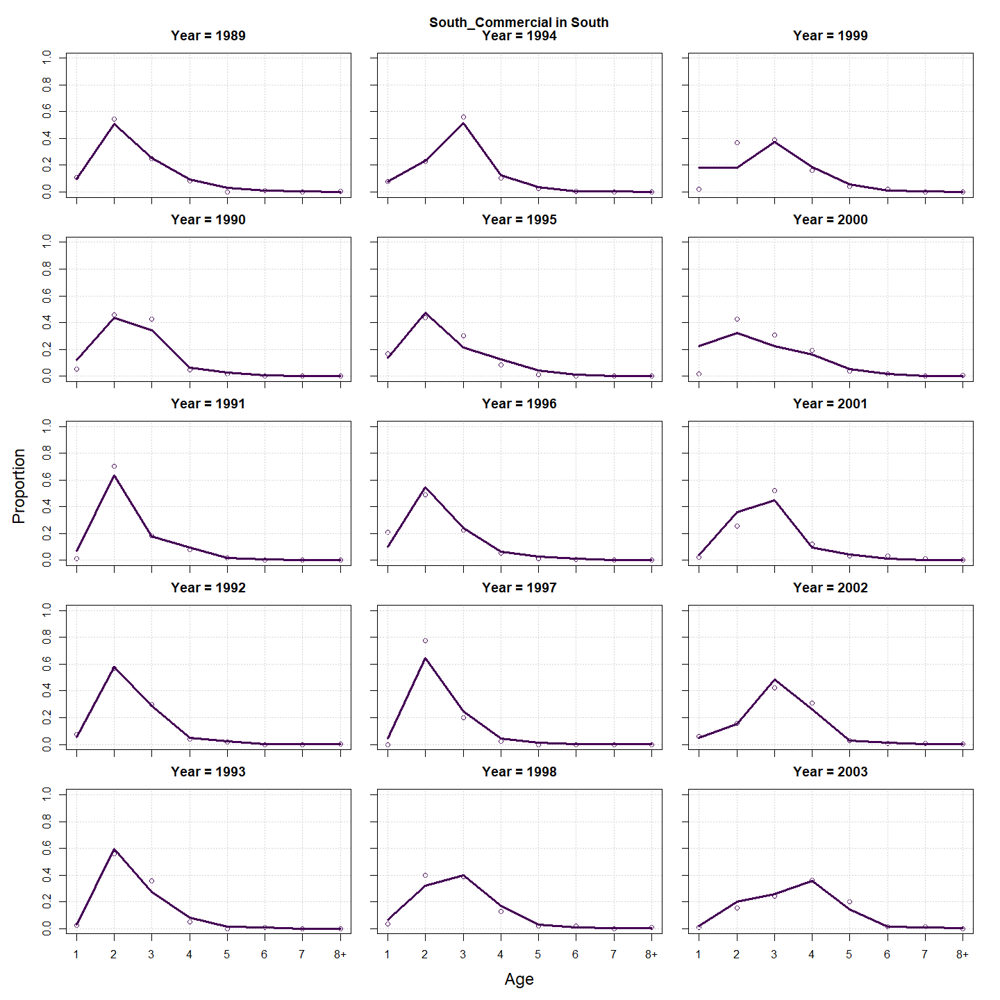
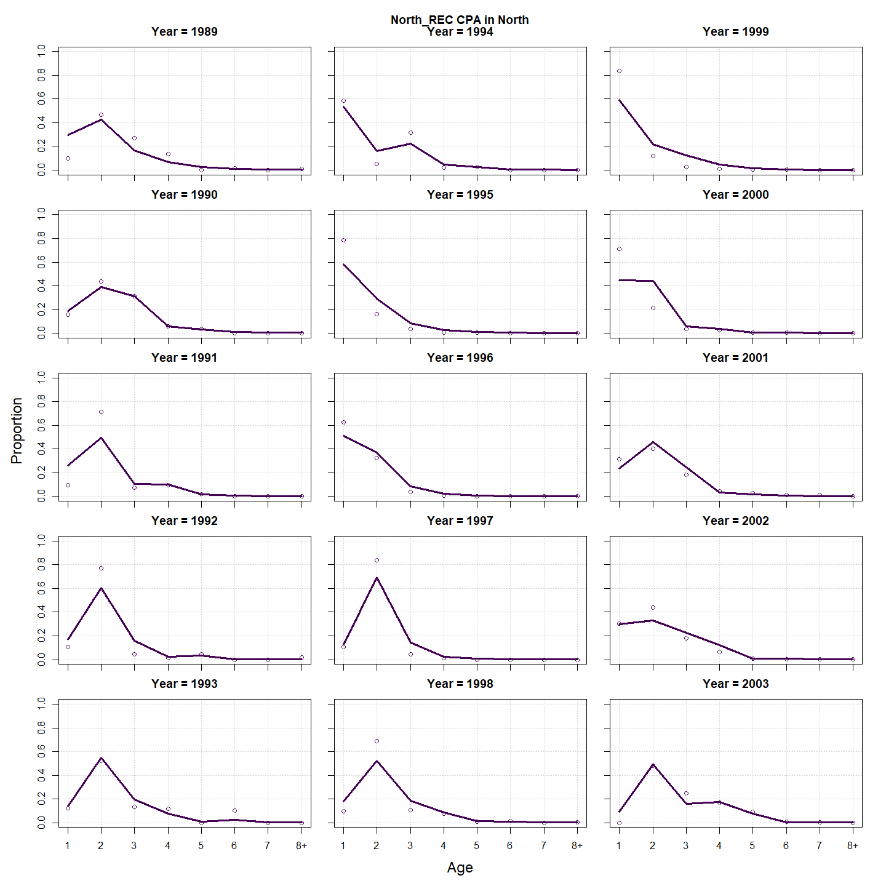
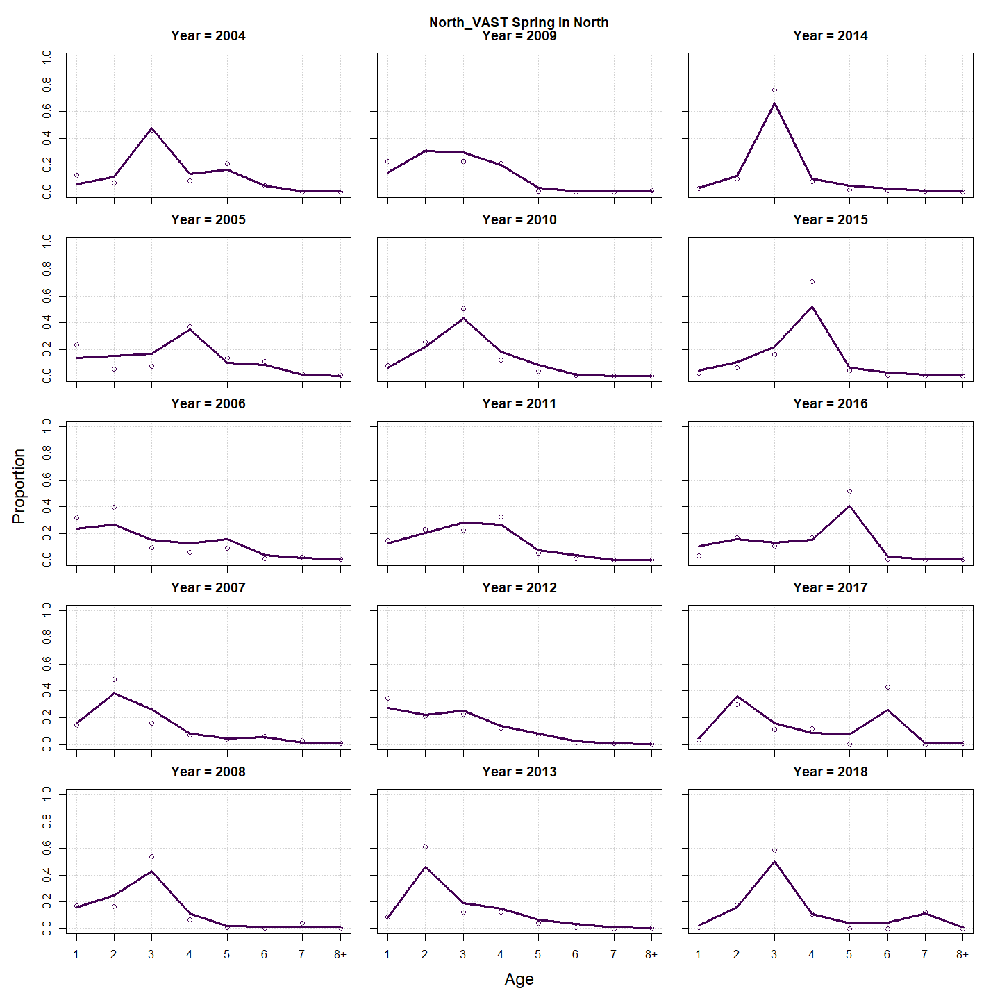
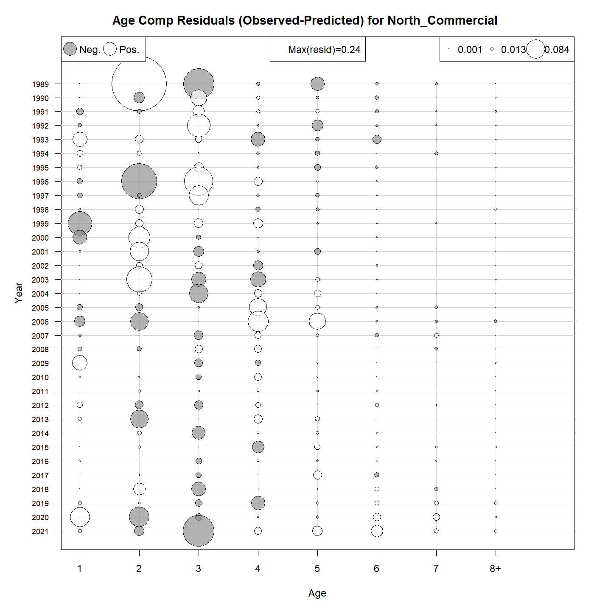
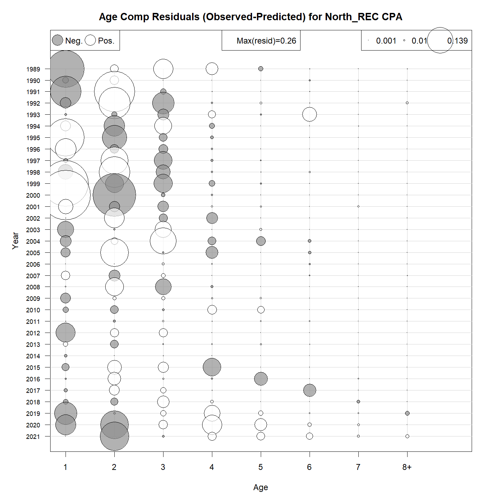
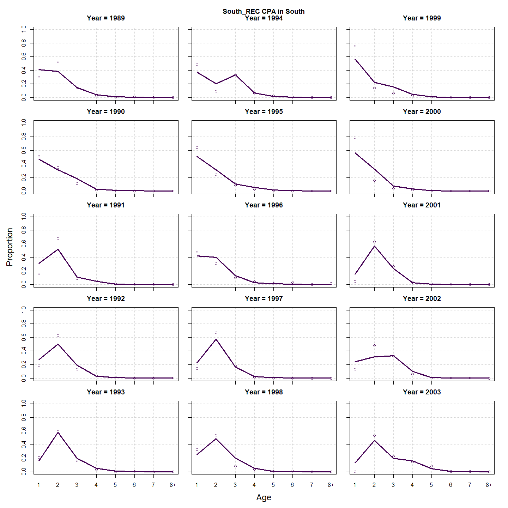
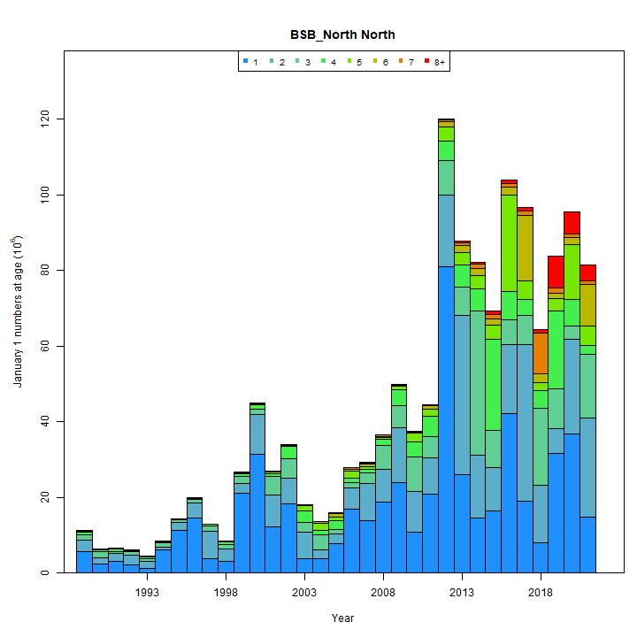
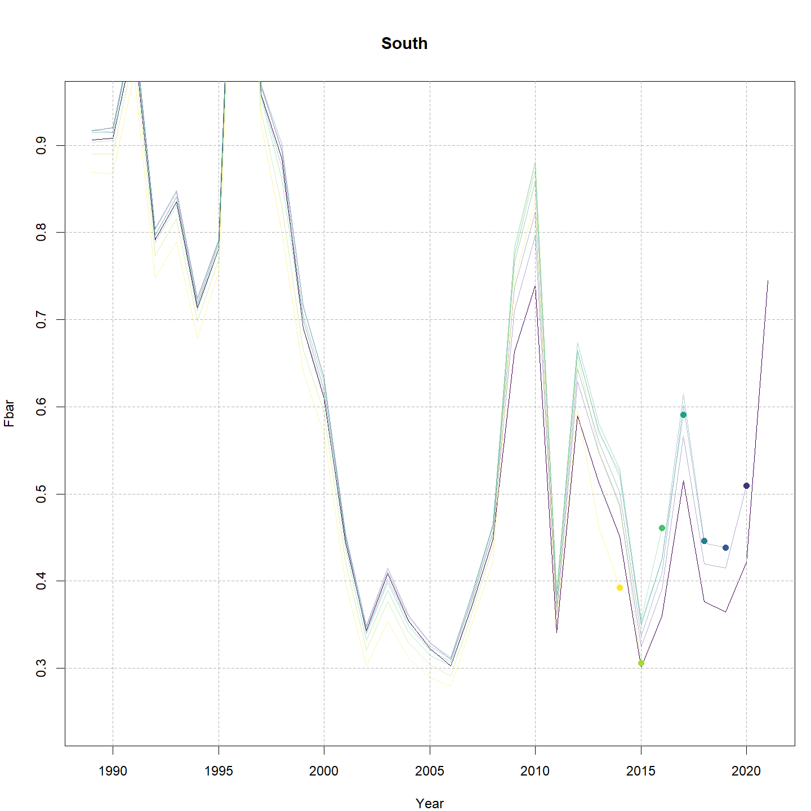

---
output:
  html_document:
    df_print: paged
    keep_md: yes
  word_document: default
  pdf_document:
    fig_caption: yes
    includes:
    keep_tex: yes
    number_sections: no
title: "WHAM figures and tables"
header-includes:
  - \usepackage{longtable}
  - \usepackage{booktabs}
  - \usepackage{caption,graphics}
  - \usepackage{makecell}
  - \usepackage{lscape}
  - \renewcommand\figurename{Fig.}
  - \captionsetup{labelsep=period, singlelinecheck=false}
  - \newcommand{\changesize}[1]{\fontsize{#1pt}{#1pt}\selectfont}
  - \renewcommand{\arraystretch}{1.5}
  - \renewcommand\theadfont{}
---

# {.tabset}

## Figures {.tabset}

### Input

### Diagnostics

### Results

### Retro

### Reference points

### Miscelaneous

## Tables {.tabset}

### Parameter estimates

<table class="table" style="margin-left: auto; margin-right: auto;">
<caption>Parameter estimates, standard errors, and confidence intervals. Rounded to 3 decimal places.</caption>
 <thead>
  <tr>
   <th style="text-align:left;">   </th>
   <th style="text-align:right;"> Estimate </th>
   <th style="text-align:right;"> Std. Error </th>
   <th style="text-align:right;"> 95\% CI lower </th>
   <th style="text-align:right;"> 95\% CI upper </th>
  </tr>
 </thead>
<tbody>
  <tr>
   <td style="text-align:left;"> BSB North Mean Recruitment </td>
   <td style="text-align:right;"> 11199.500 </td>
   <td style="text-align:right;"> 2293.449 </td>
   <td style="text-align:right;"> 7497.016 </td>
   <td style="text-align:right;"> 16730.496 </td>
  </tr>
  <tr>
   <td style="text-align:left;"> BSB North NAA $\sigma$ (age 1) </td>
   <td style="text-align:right;"> 0.987 </td>
   <td style="text-align:right;"> 0.132 </td>
   <td style="text-align:right;"> 0.760 </td>
   <td style="text-align:right;"> 1.282 </td>
  </tr>
  <tr>
   <td style="text-align:left;"> BSB North NAA $\sigma$ (age 2) </td>
   <td style="text-align:right;"> 0.353 </td>
   <td style="text-align:right;"> 0.033 </td>
   <td style="text-align:right;"> 0.294 </td>
   <td style="text-align:right;"> 0.424 </td>
  </tr>
  <tr>
   <td style="text-align:left;"> BSB South Mean Recruitment </td>
   <td style="text-align:right;"> 19755.484 </td>
   <td style="text-align:right;"> 2015.536 </td>
   <td style="text-align:right;"> 16175.010 </td>
   <td style="text-align:right;"> 24128.525 </td>
  </tr>
  <tr>
   <td style="text-align:left;"> BSB South NAA $\sigma$ (age 1) </td>
   <td style="text-align:right;"> 0.437 </td>
   <td style="text-align:right;"> 0.061 </td>
   <td style="text-align:right;"> 0.332 </td>
   <td style="text-align:right;"> 0.575 </td>
  </tr>
  <tr>
   <td style="text-align:left;"> BSB South NAA $\sigma$ (age 2) </td>
   <td style="text-align:right;"> 0.249 </td>
   <td style="text-align:right;"> 0.032 </td>
   <td style="text-align:right;"> 0.194 </td>
   <td style="text-align:right;"> 0.320 </td>
  </tr>
  <tr>
   <td style="text-align:left;"> North REC CPA fully selected q </td>
   <td style="text-align:right;"> 0.000 </td>
   <td style="text-align:right;"> 0.000 </td>
   <td style="text-align:right;"> 0.000 </td>
   <td style="text-align:right;"> 0.000 </td>
  </tr>
  <tr>
   <td style="text-align:left;"> North VAST Spring fully selected q </td>
   <td style="text-align:right;"> 0.010 </td>
   <td style="text-align:right;"> 0.001 </td>
   <td style="text-align:right;"> 0.009 </td>
   <td style="text-align:right;"> 0.013 </td>
  </tr>
  <tr>
   <td style="text-align:left;"> South REC CPA fully selected q </td>
   <td style="text-align:right;"> 0.000 </td>
   <td style="text-align:right;"> 0.000 </td>
   <td style="text-align:right;"> 0.000 </td>
   <td style="text-align:right;"> 0.000 </td>
  </tr>
  <tr>
   <td style="text-align:left;"> South VAST Spring fully selected q </td>
   <td style="text-align:right;"> 0.019 </td>
   <td style="text-align:right;"> 0.001 </td>
   <td style="text-align:right;"> 0.017 </td>
   <td style="text-align:right;"> 0.022 </td>
  </tr>
  <tr>
   <td style="text-align:left;"> Block 1: $a_{50}$ </td>
   <td style="text-align:right;"> 2.008 </td>
   <td style="text-align:right;"> 0.077 </td>
   <td style="text-align:right;"> 1.862 </td>
   <td style="text-align:right;"> 2.162 </td>
  </tr>
  <tr>
   <td style="text-align:left;"> Block 1: 1/slope (increasing) </td>
   <td style="text-align:right;"> 0.302 </td>
   <td style="text-align:right;"> 0.024 </td>
   <td style="text-align:right;"> 0.258 </td>
   <td style="text-align:right;"> 0.353 </td>
  </tr>
  <tr>
   <td style="text-align:left;"> Block 2: $a_{50}$ </td>
   <td style="text-align:right;"> 2.404 </td>
   <td style="text-align:right;"> 0.088 </td>
   <td style="text-align:right;"> 2.235 </td>
   <td style="text-align:right;"> 2.580 </td>
  </tr>
  <tr>
   <td style="text-align:left;"> Block 2: 1/slope (increasing) </td>
   <td style="text-align:right;"> 0.356 </td>
   <td style="text-align:right;"> 0.030 </td>
   <td style="text-align:right;"> 0.302 </td>
   <td style="text-align:right;"> 0.420 </td>
  </tr>
  <tr>
   <td style="text-align:left;"> Block 3: $a_{50}$ </td>
   <td style="text-align:right;"> 1.975 </td>
   <td style="text-align:right;"> 0.141 </td>
   <td style="text-align:right;"> 1.711 </td>
   <td style="text-align:right;"> 2.265 </td>
  </tr>
  <tr>
   <td style="text-align:left;"> Block 3: 1/slope (increasing) </td>
   <td style="text-align:right;"> 0.500 </td>
   <td style="text-align:right;"> 0.060 </td>
   <td style="text-align:right;"> 0.395 </td>
   <td style="text-align:right;"> 0.632 </td>
  </tr>
  <tr>
   <td style="text-align:left;"> Block 4: $a_{50}$ </td>
   <td style="text-align:right;"> 3.157 </td>
   <td style="text-align:right;"> 0.330 </td>
   <td style="text-align:right;"> 2.537 </td>
   <td style="text-align:right;"> 3.821 </td>
  </tr>
  <tr>
   <td style="text-align:left;"> Block 4: 1/slope (increasing) </td>
   <td style="text-align:right;"> 0.810 </td>
   <td style="text-align:right;"> 0.116 </td>
   <td style="text-align:right;"> 0.609 </td>
   <td style="text-align:right;"> 1.066 </td>
  </tr>
  <tr>
   <td style="text-align:left;"> Block 5: $a_{50}$ </td>
   <td style="text-align:right;"> 1.812 </td>
   <td style="text-align:right;"> 0.101 </td>
   <td style="text-align:right;"> 1.621 </td>
   <td style="text-align:right;"> 2.017 </td>
  </tr>
  <tr>
   <td style="text-align:left;"> Block 5: 1/slope (increasing) </td>
   <td style="text-align:right;"> 0.276 </td>
   <td style="text-align:right;"> 0.032 </td>
   <td style="text-align:right;"> 0.221 </td>
   <td style="text-align:right;"> 0.345 </td>
  </tr>
  <tr>
   <td style="text-align:left;"> Block 6: $a_{50}$ </td>
   <td style="text-align:right;"> 2.773 </td>
   <td style="text-align:right;"> 0.130 </td>
   <td style="text-align:right;"> 2.524 </td>
   <td style="text-align:right;"> 3.033 </td>
  </tr>
  <tr>
   <td style="text-align:left;"> Block 6: 1/slope (increasing) </td>
   <td style="text-align:right;"> 0.515 </td>
   <td style="text-align:right;"> 0.039 </td>
   <td style="text-align:right;"> 0.443 </td>
   <td style="text-align:right;"> 0.597 </td>
  </tr>
  <tr>
   <td style="text-align:left;"> Block 7: $a_{50}$ </td>
   <td style="text-align:right;"> 1.996 </td>
   <td style="text-align:right;"> 0.133 </td>
   <td style="text-align:right;"> 1.747 </td>
   <td style="text-align:right;"> 2.269 </td>
  </tr>
  <tr>
   <td style="text-align:left;"> Block 7: 1/slope (increasing) </td>
   <td style="text-align:right;"> 0.530 </td>
   <td style="text-align:right;"> 0.057 </td>
   <td style="text-align:right;"> 0.429 </td>
   <td style="text-align:right;"> 0.653 </td>
  </tr>
  <tr>
   <td style="text-align:left;"> Block 8: $a_{50}$ </td>
   <td style="text-align:right;"> 4.678 </td>
   <td style="text-align:right;"> 0.742 </td>
   <td style="text-align:right;"> 3.199 </td>
   <td style="text-align:right;"> 5.989 </td>
  </tr>
  <tr>
   <td style="text-align:left;"> Block 8: 1/slope (increasing) </td>
   <td style="text-align:right;"> 1.372 </td>
   <td style="text-align:right;"> 0.173 </td>
   <td style="text-align:right;"> 1.066 </td>
   <td style="text-align:right;"> 1.745 </td>
  </tr>
  <tr>
   <td style="text-align:left;"> Block 9: Selectivity for age 1 </td>
   <td style="text-align:right;"> 0.323 </td>
   <td style="text-align:right;"> 0.032 </td>
   <td style="text-align:right;"> 0.263 </td>
   <td style="text-align:right;"> 0.389 </td>
  </tr>
  <tr>
   <td style="text-align:left;"> Block 9: Selectivity for age 2 </td>
   <td style="text-align:right;"> 1.000 </td>
   <td style="text-align:right;"> -- </td>
   <td style="text-align:right;"> -- </td>
   <td style="text-align:right;"> -- </td>
  </tr>
  <tr>
   <td style="text-align:left;"> Block 9: Selectivity for age 3 </td>
   <td style="text-align:right;"> 1.000 </td>
   <td style="text-align:right;"> -- </td>
   <td style="text-align:right;"> -- </td>
   <td style="text-align:right;"> -- </td>
  </tr>
  <tr>
   <td style="text-align:left;"> Block 9: Selectivity for age 4 </td>
   <td style="text-align:right;"> 0.940 </td>
   <td style="text-align:right;"> 0.114 </td>
   <td style="text-align:right;"> 0.228 </td>
   <td style="text-align:right;"> 0.999 </td>
  </tr>
  <tr>
   <td style="text-align:left;"> Block 9: Selectivity for age 5 </td>
   <td style="text-align:right;"> 0.816 </td>
   <td style="text-align:right;"> 0.135 </td>
   <td style="text-align:right;"> 0.432 </td>
   <td style="text-align:right;"> 0.963 </td>
  </tr>
  <tr>
   <td style="text-align:left;"> Block 9: Selectivity for age 6 </td>
   <td style="text-align:right;"> 0.829 </td>
   <td style="text-align:right;"> 0.183 </td>
   <td style="text-align:right;"> 0.279 </td>
   <td style="text-align:right;"> 0.984 </td>
  </tr>
  <tr>
   <td style="text-align:left;"> Block 9: Selectivity for age 7 </td>
   <td style="text-align:right;"> 0.698 </td>
   <td style="text-align:right;"> 0.230 </td>
   <td style="text-align:right;"> 0.214 </td>
   <td style="text-align:right;"> 0.952 </td>
  </tr>
  <tr>
   <td style="text-align:left;"> Block 9: Selectivity for age 8+ </td>
   <td style="text-align:right;"> 0.714 </td>
   <td style="text-align:right;"> 0.254 </td>
   <td style="text-align:right;"> 0.179 </td>
   <td style="text-align:right;"> 0.966 </td>
  </tr>
  <tr>
   <td style="text-align:left;"> Block 10: Selectivity for age 1 </td>
   <td style="text-align:right;"> 0.117 </td>
   <td style="text-align:right;"> 0.013 </td>
   <td style="text-align:right;"> 0.094 </td>
   <td style="text-align:right;"> 0.144 </td>
  </tr>
  <tr>
   <td style="text-align:left;"> Block 10: Selectivity for age 2 </td>
   <td style="text-align:right;"> 0.413 </td>
   <td style="text-align:right;"> 0.033 </td>
   <td style="text-align:right;"> 0.350 </td>
   <td style="text-align:right;"> 0.479 </td>
  </tr>
  <tr>
   <td style="text-align:left;"> Block 10: Selectivity for age 3 </td>
   <td style="text-align:right;"> 1.000 </td>
   <td style="text-align:right;"> -- </td>
   <td style="text-align:right;"> -- </td>
   <td style="text-align:right;"> -- </td>
  </tr>
  <tr>
   <td style="text-align:left;"> Block 10: Selectivity for age 4 </td>
   <td style="text-align:right;"> 1.000 </td>
   <td style="text-align:right;"> -- </td>
   <td style="text-align:right;"> -- </td>
   <td style="text-align:right;"> -- </td>
  </tr>
  <tr>
   <td style="text-align:left;"> Block 10: Selectivity for age 5 </td>
   <td style="text-align:right;"> 0.810 </td>
   <td style="text-align:right;"> 0.095 </td>
   <td style="text-align:right;"> 0.561 </td>
   <td style="text-align:right;"> 0.934 </td>
  </tr>
  <tr>
   <td style="text-align:left;"> Block 10: Selectivity for age 6 </td>
   <td style="text-align:right;"> 0.745 </td>
   <td style="text-align:right;"> 0.122 </td>
   <td style="text-align:right;"> 0.454 </td>
   <td style="text-align:right;"> 0.911 </td>
  </tr>
  <tr>
   <td style="text-align:left;"> Block 10: Selectivity for age 7 </td>
   <td style="text-align:right;"> 0.442 </td>
   <td style="text-align:right;"> 0.122 </td>
   <td style="text-align:right;"> 0.232 </td>
   <td style="text-align:right;"> 0.676 </td>
  </tr>
  <tr>
   <td style="text-align:left;"> Block 10: Selectivity for age 8+ </td>
   <td style="text-align:right;"> 0.485 </td>
   <td style="text-align:right;"> 0.146 </td>
   <td style="text-align:right;"> 0.230 </td>
   <td style="text-align:right;"> 0.748 </td>
  </tr>
  <tr>
   <td style="text-align:left;"> Block 11: Selectivity for age 1 </td>
   <td style="text-align:right;"> 0.387 </td>
   <td style="text-align:right;"> 0.035 </td>
   <td style="text-align:right;"> 0.321 </td>
   <td style="text-align:right;"> 0.457 </td>
  </tr>
  <tr>
   <td style="text-align:left;"> Block 11: Selectivity for age 2 </td>
   <td style="text-align:right;"> 0.902 </td>
   <td style="text-align:right;"> 0.069 </td>
   <td style="text-align:right;"> 0.666 </td>
   <td style="text-align:right;"> 0.977 </td>
  </tr>
  <tr>
   <td style="text-align:left;"> Block 11: Selectivity for age 3 </td>
   <td style="text-align:right;"> 1.000 </td>
   <td style="text-align:right;"> -- </td>
   <td style="text-align:right;"> -- </td>
   <td style="text-align:right;"> -- </td>
  </tr>
  <tr>
   <td style="text-align:left;"> Block 11: Selectivity for age 4 </td>
   <td style="text-align:right;"> 0.852 </td>
   <td style="text-align:right;"> 0.096 </td>
   <td style="text-align:right;"> 0.563 </td>
   <td style="text-align:right;"> 0.963 </td>
  </tr>
  <tr>
   <td style="text-align:left;"> Block 11: Selectivity for age 5 </td>
   <td style="text-align:right;"> 0.675 </td>
   <td style="text-align:right;"> 0.118 </td>
   <td style="text-align:right;"> 0.420 </td>
   <td style="text-align:right;"> 0.856 </td>
  </tr>
  <tr>
   <td style="text-align:left;"> Block 11: Selectivity for age 6 </td>
   <td style="text-align:right;"> 0.842 </td>
   <td style="text-align:right;"> 0.201 </td>
   <td style="text-align:right;"> 0.217 </td>
   <td style="text-align:right;"> 0.990 </td>
  </tr>
  <tr>
   <td style="text-align:left;"> Block 11: Selectivity for age 7 </td>
   <td style="text-align:right;"> 0.653 </td>
   <td style="text-align:right;"> 0.270 </td>
   <td style="text-align:right;"> 0.154 </td>
   <td style="text-align:right;"> 0.951 </td>
  </tr>
  <tr>
   <td style="text-align:left;"> Block 11: Selectivity for age 8+ </td>
   <td style="text-align:right;"> 0.797 </td>
   <td style="text-align:right;"> 0.397 </td>
   <td style="text-align:right;"> 0.031 </td>
   <td style="text-align:right;"> 0.998 </td>
  </tr>
  <tr>
   <td style="text-align:left;"> Block 12: Selectivity for age 1 </td>
   <td style="text-align:right;"> 0.312 </td>
   <td style="text-align:right;"> 0.023 </td>
   <td style="text-align:right;"> 0.269 </td>
   <td style="text-align:right;"> 0.359 </td>
  </tr>
  <tr>
   <td style="text-align:left;"> Block 12: Selectivity for age 2 </td>
   <td style="text-align:right;"> 1.000 </td>
   <td style="text-align:right;"> -- </td>
   <td style="text-align:right;"> -- </td>
   <td style="text-align:right;"> -- </td>
  </tr>
  <tr>
   <td style="text-align:left;"> Block 12: Selectivity for age 3 </td>
   <td style="text-align:right;"> 1.000 </td>
   <td style="text-align:right;"> -- </td>
   <td style="text-align:right;"> -- </td>
   <td style="text-align:right;"> -- </td>
  </tr>
  <tr>
   <td style="text-align:left;"> Block 12: Selectivity for age 4 </td>
   <td style="text-align:right;"> 0.591 </td>
   <td style="text-align:right;"> 0.070 </td>
   <td style="text-align:right;"> 0.450 </td>
   <td style="text-align:right;"> 0.718 </td>
  </tr>
  <tr>
   <td style="text-align:left;"> Block 12: Selectivity for age 5 </td>
   <td style="text-align:right;"> 0.453 </td>
   <td style="text-align:right;"> 0.086 </td>
   <td style="text-align:right;"> 0.295 </td>
   <td style="text-align:right;"> 0.621 </td>
  </tr>
  <tr>
   <td style="text-align:left;"> Block 12: Selectivity for age 6 </td>
   <td style="text-align:right;"> 0.341 </td>
   <td style="text-align:right;"> 0.111 </td>
   <td style="text-align:right;"> 0.164 </td>
   <td style="text-align:right;"> 0.576 </td>
  </tr>
  <tr>
   <td style="text-align:left;"> Block 12: Selectivity for age 7 </td>
   <td style="text-align:right;"> 0.183 </td>
   <td style="text-align:right;"> 0.126 </td>
   <td style="text-align:right;"> 0.041 </td>
   <td style="text-align:right;"> 0.540 </td>
  </tr>
  <tr>
   <td style="text-align:left;"> Block 12: Selectivity for age 8+ </td>
   <td style="text-align:right;"> 0.308 </td>
   <td style="text-align:right;"> 0.209 </td>
   <td style="text-align:right;"> 0.061 </td>
   <td style="text-align:right;"> 0.753 </td>
  </tr>
  <tr>
   <td style="text-align:left;"> North REC CPA log-index observation SD scalar </td>
   <td style="text-align:right;"> 6.322 </td>
   <td style="text-align:right;"> 1.205 </td>
   <td style="text-align:right;"> 4.352 </td>
   <td style="text-align:right;"> 9.184 </td>
  </tr>
  <tr>
   <td style="text-align:left;"> South REC CPA log-index observation SD scalar </td>
   <td style="text-align:right;"> 4.712 </td>
   <td style="text-align:right;"> 0.893 </td>
   <td style="text-align:right;"> 3.251 </td>
   <td style="text-align:right;"> 6.831 </td>
  </tr>
</tbody>
</table>

### Abundance at age

<table class="table" style="margin-left: auto; margin-right: auto;">
<caption>Abundance at age (1000s) for BSB North in North.</caption>
 <thead>
  <tr>
   <th style="text-align:left;">   </th>
   <th style="text-align:right;"> 1 </th>
   <th style="text-align:right;"> 2 </th>
   <th style="text-align:right;"> 3 </th>
   <th style="text-align:right;"> 4 </th>
   <th style="text-align:right;"> 5 </th>
   <th style="text-align:right;"> 6 </th>
   <th style="text-align:right;"> 7 </th>
   <th style="text-align:right;"> 8+ </th>
  </tr>
 </thead>
<tbody>
  <tr>
   <td style="text-align:left;"> 1989 </td>
   <td style="text-align:right;"> 5616 </td>
   <td style="text-align:right;"> 3074 </td>
   <td style="text-align:right;"> 1426 </td>
   <td style="text-align:right;"> 642 </td>
   <td style="text-align:right;"> 288 </td>
   <td style="text-align:right;"> 129 </td>
   <td style="text-align:right;"> 58 </td>
   <td style="text-align:right;"> 47 </td>
  </tr>
  <tr>
   <td style="text-align:left;"> 1990 </td>
   <td style="text-align:right;"> 2353 </td>
   <td style="text-align:right;"> 1803 </td>
   <td style="text-align:right;"> 1654 </td>
   <td style="text-align:right;"> 332 </td>
   <td style="text-align:right;"> 228 </td>
   <td style="text-align:right;"> 61 </td>
   <td style="text-align:right;"> 36 </td>
   <td style="text-align:right;"> 27 </td>
  </tr>
  <tr>
   <td style="text-align:left;"> 1991 </td>
   <td style="text-align:right;"> 3120 </td>
   <td style="text-align:right;"> 2156 </td>
   <td style="text-align:right;"> 526 </td>
   <td style="text-align:right;"> 541 </td>
   <td style="text-align:right;"> 117 </td>
   <td style="text-align:right;"> 58 </td>
   <td style="text-align:right;"> 22 </td>
   <td style="text-align:right;"> 22 </td>
  </tr>
  <tr>
   <td style="text-align:left;"> 1992 </td>
   <td style="text-align:right;"> 2115 </td>
   <td style="text-align:right;"> 2740 </td>
   <td style="text-align:right;"> 816 </td>
   <td style="text-align:right;"> 141 </td>
   <td style="text-align:right;"> 207 </td>
   <td style="text-align:right;"> 34 </td>
   <td style="text-align:right;"> 19 </td>
   <td style="text-align:right;"> 19 </td>
  </tr>
  <tr>
   <td style="text-align:left;"> 1993 </td>
   <td style="text-align:right;"> 1306 </td>
   <td style="text-align:right;"> 1901 </td>
   <td style="text-align:right;"> 761 </td>
   <td style="text-align:right;"> 328 </td>
   <td style="text-align:right;"> 45 </td>
   <td style="text-align:right;"> 119 </td>
   <td style="text-align:right;"> 13 </td>
   <td style="text-align:right;"> 15 </td>
  </tr>
  <tr>
   <td style="text-align:left;"> 1994 </td>
   <td style="text-align:right;"> 6269 </td>
   <td style="text-align:right;"> 714 </td>
   <td style="text-align:right;"> 1140 </td>
   <td style="text-align:right;"> 269 </td>
   <td style="text-align:right;"> 150 </td>
   <td style="text-align:right;"> 17 </td>
   <td style="text-align:right;"> 36 </td>
   <td style="text-align:right;"> 10 </td>
  </tr>
  <tr>
   <td style="text-align:left;"> 1995 </td>
   <td style="text-align:right;"> 11371 </td>
   <td style="text-align:right;"> 2033 </td>
   <td style="text-align:right;"> 625 </td>
   <td style="text-align:right;"> 214 </td>
   <td style="text-align:right;"> 95 </td>
   <td style="text-align:right;"> 42 </td>
   <td style="text-align:right;"> 6 </td>
   <td style="text-align:right;"> 16 </td>
  </tr>
  <tr>
   <td style="text-align:left;"> 1996 </td>
   <td style="text-align:right;"> 14706 </td>
   <td style="text-align:right;"> 3833 </td>
   <td style="text-align:right;"> 997 </td>
   <td style="text-align:right;"> 257 </td>
   <td style="text-align:right;"> 80 </td>
   <td style="text-align:right;"> 48 </td>
   <td style="text-align:right;"> 19 </td>
   <td style="text-align:right;"> 10 </td>
  </tr>
  <tr>
   <td style="text-align:left;"> 1997 </td>
   <td style="text-align:right;"> 3869 </td>
   <td style="text-align:right;"> 7135 </td>
   <td style="text-align:right;"> 1565 </td>
   <td style="text-align:right;"> 298 </td>
   <td style="text-align:right;"> 105 </td>
   <td style="text-align:right;"> 30 </td>
   <td style="text-align:right;"> 22 </td>
   <td style="text-align:right;"> 13 </td>
  </tr>
  <tr>
   <td style="text-align:left;"> 1998 </td>
   <td style="text-align:right;"> 3198 </td>
   <td style="text-align:right;"> 3199 </td>
   <td style="text-align:right;"> 1284 </td>
   <td style="text-align:right;"> 655 </td>
   <td style="text-align:right;"> 144 </td>
   <td style="text-align:right;"> 67 </td>
   <td style="text-align:right;"> 14 </td>
   <td style="text-align:right;"> 21 </td>
  </tr>
  <tr>
   <td style="text-align:left;"> 1999 </td>
   <td style="text-align:right;"> 21123 </td>
   <td style="text-align:right;"> 2668 </td>
   <td style="text-align:right;"> 1774 </td>
   <td style="text-align:right;"> 707 </td>
   <td style="text-align:right;"> 268 </td>
   <td style="text-align:right;"> 70 </td>
   <td style="text-align:right;"> 28 </td>
   <td style="text-align:right;"> 15 </td>
  </tr>
  <tr>
   <td style="text-align:left;"> 2000 </td>
   <td style="text-align:right;"> 31391 </td>
   <td style="text-align:right;"> 10497 </td>
   <td style="text-align:right;"> 1477 </td>
   <td style="text-align:right;"> 1040 </td>
   <td style="text-align:right;"> 279 </td>
   <td style="text-align:right;"> 139 </td>
   <td style="text-align:right;"> 27 </td>
   <td style="text-align:right;"> 18 </td>
  </tr>
  <tr>
   <td style="text-align:left;"> 2001 </td>
   <td style="text-align:right;"> 12320 </td>
   <td style="text-align:right;"> 8316 </td>
   <td style="text-align:right;"> 4933 </td>
   <td style="text-align:right;"> 745 </td>
   <td style="text-align:right;"> 460 </td>
   <td style="text-align:right;"> 145 </td>
   <td style="text-align:right;"> 84 </td>
   <td style="text-align:right;"> 22 </td>
  </tr>
  <tr>
   <td style="text-align:left;"> 2002 </td>
   <td style="text-align:right;"> 18273 </td>
   <td style="text-align:right;"> 6929 </td>
   <td style="text-align:right;"> 5170 </td>
   <td style="text-align:right;"> 3096 </td>
   <td style="text-align:right;"> 283 </td>
   <td style="text-align:right;"> 175 </td>
   <td style="text-align:right;"> 62 </td>
   <td style="text-align:right;"> 44 </td>
  </tr>
  <tr>
   <td style="text-align:left;"> 2003 </td>
   <td style="text-align:right;"> 3840 </td>
   <td style="text-align:right;"> 7136 </td>
   <td style="text-align:right;"> 2471 </td>
   <td style="text-align:right;"> 2958 </td>
   <td style="text-align:right;"> 1470 </td>
   <td style="text-align:right;"> 120 </td>
   <td style="text-align:right;"> 79 </td>
   <td style="text-align:right;"> 44 </td>
  </tr>
  <tr>
   <td style="text-align:left;"> 2004 </td>
   <td style="text-align:right;"> 3935 </td>
   <td style="text-align:right;"> 2216 </td>
   <td style="text-align:right;"> 4066 </td>
   <td style="text-align:right;"> 1173 </td>
   <td style="text-align:right;"> 1743 </td>
   <td style="text-align:right;"> 514 </td>
   <td style="text-align:right;"> 53 </td>
   <td style="text-align:right;"> 58 </td>
  </tr>
  <tr>
   <td style="text-align:left;"> 2005 </td>
   <td style="text-align:right;"> 7782 </td>
   <td style="text-align:right;"> 2518 </td>
   <td style="text-align:right;"> 1191 </td>
   <td style="text-align:right;"> 2522 </td>
   <td style="text-align:right;"> 897 </td>
   <td style="text-align:right;"> 840 </td>
   <td style="text-align:right;"> 206 </td>
   <td style="text-align:right;"> 52 </td>
  </tr>
  <tr>
   <td style="text-align:left;"> 2006 </td>
   <td style="text-align:right;"> 17053 </td>
   <td style="text-align:right;"> 5591 </td>
   <td style="text-align:right;"> 1404 </td>
   <td style="text-align:right;"> 1174 </td>
   <td style="text-align:right;"> 1823 </td>
   <td style="text-align:right;"> 444 </td>
   <td style="text-align:right;"> 396 </td>
   <td style="text-align:right;"> 105 </td>
  </tr>
  <tr>
   <td style="text-align:left;"> 2007 </td>
   <td style="text-align:right;"> 13806 </td>
   <td style="text-align:right;"> 9855 </td>
   <td style="text-align:right;"> 2893 </td>
   <td style="text-align:right;"> 883 </td>
   <td style="text-align:right;"> 619 </td>
   <td style="text-align:right;"> 827 </td>
   <td style="text-align:right;"> 282 </td>
   <td style="text-align:right;"> 211 </td>
  </tr>
  <tr>
   <td style="text-align:left;"> 2008 </td>
   <td style="text-align:right;"> 18896 </td>
   <td style="text-align:right;"> 8626 </td>
   <td style="text-align:right;"> 6280 </td>
   <td style="text-align:right;"> 1636 </td>
   <td style="text-align:right;"> 380 </td>
   <td style="text-align:right;"> 263 </td>
   <td style="text-align:right;"> 378 </td>
   <td style="text-align:right;"> 210 </td>
  </tr>
  <tr>
   <td style="text-align:left;"> 2009 </td>
   <td style="text-align:right;"> 23856 </td>
   <td style="text-align:right;"> 14535 </td>
   <td style="text-align:right;"> 5948 </td>
   <td style="text-align:right;"> 4229 </td>
   <td style="text-align:right;"> 853 </td>
   <td style="text-align:right;"> 172 </td>
   <td style="text-align:right;"> 123 </td>
   <td style="text-align:right;"> 267 </td>
  </tr>
  <tr>
   <td style="text-align:left;"> 2010 </td>
   <td style="text-align:right;"> 10820 </td>
   <td style="text-align:right;"> 10754 </td>
   <td style="text-align:right;"> 9100 </td>
   <td style="text-align:right;"> 4019 </td>
   <td style="text-align:right;"> 2289 </td>
   <td style="text-align:right;"> 387 </td>
   <td style="text-align:right;"> 74 </td>
   <td style="text-align:right;"> 157 </td>
  </tr>
  <tr>
   <td style="text-align:left;"> 2011 </td>
   <td style="text-align:right;"> 20842 </td>
   <td style="text-align:right;"> 9611 </td>
   <td style="text-align:right;"> 5613 </td>
   <td style="text-align:right;"> 5366 </td>
   <td style="text-align:right;"> 1866 </td>
   <td style="text-align:right;"> 1010 </td>
   <td style="text-align:right;"> 164 </td>
   <td style="text-align:right;"> 91 </td>
  </tr>
  <tr>
   <td style="text-align:left;"> 2012 </td>
   <td style="text-align:right;"> 80865 </td>
   <td style="text-align:right;"> 18912 </td>
   <td style="text-align:right;"> 9227 </td>
   <td style="text-align:right;"> 5159 </td>
   <td style="text-align:right;"> 3798 </td>
   <td style="text-align:right;"> 1247 </td>
   <td style="text-align:right;"> 607 </td>
   <td style="text-align:right;"> 139 </td>
  </tr>
  <tr>
   <td style="text-align:left;"> 2013 </td>
   <td style="text-align:right;"> 26108 </td>
   <td style="text-align:right;"> 42002 </td>
   <td style="text-align:right;"> 7425 </td>
   <td style="text-align:right;"> 5894 </td>
   <td style="text-align:right;"> 3218 </td>
   <td style="text-align:right;"> 1999 </td>
   <td style="text-align:right;"> 618 </td>
   <td style="text-align:right;"> 369 </td>
  </tr>
  <tr>
   <td style="text-align:left;"> 2014 </td>
   <td style="text-align:right;"> 14617 </td>
   <td style="text-align:right;"> 16542 </td>
   <td style="text-align:right;"> 38074 </td>
   <td style="text-align:right;"> 5883 </td>
   <td style="text-align:right;"> 3471 </td>
   <td style="text-align:right;"> 1877 </td>
   <td style="text-align:right;"> 1147 </td>
   <td style="text-align:right;"> 530 </td>
  </tr>
  <tr>
   <td style="text-align:left;"> 2015 </td>
   <td style="text-align:right;"> 16421 </td>
   <td style="text-align:right;"> 11469 </td>
   <td style="text-align:right;"> 9842 </td>
   <td style="text-align:right;"> 24028 </td>
   <td style="text-align:right;"> 3687 </td>
   <td style="text-align:right;"> 1844 </td>
   <td style="text-align:right;"> 985 </td>
   <td style="text-align:right;"> 889 </td>
  </tr>
  <tr>
   <td style="text-align:left;"> 2016 </td>
   <td style="text-align:right;"> 42149 </td>
   <td style="text-align:right;"> 18357 </td>
   <td style="text-align:right;"> 6477 </td>
   <td style="text-align:right;"> 7531 </td>
   <td style="text-align:right;"> 25387 </td>
   <td style="text-align:right;"> 2014 </td>
   <td style="text-align:right;"> 1056 </td>
   <td style="text-align:right;"> 953 </td>
  </tr>
  <tr>
   <td style="text-align:left;"> 2017 </td>
   <td style="text-align:right;"> 18937 </td>
   <td style="text-align:right;"> 41466 </td>
   <td style="text-align:right;"> 7812 </td>
   <td style="text-align:right;"> 4209 </td>
   <td style="text-align:right;"> 4685 </td>
   <td style="text-align:right;"> 17487 </td>
   <td style="text-align:right;"> 1028 </td>
   <td style="text-align:right;"> 976 </td>
  </tr>
  <tr>
   <td style="text-align:left;"> 2018 </td>
   <td style="text-align:right;"> 7995 </td>
   <td style="text-align:right;"> 15241 </td>
   <td style="text-align:right;"> 20380 </td>
   <td style="text-align:right;"> 4532 </td>
   <td style="text-align:right;"> 2106 </td>
   <td style="text-align:right;"> 2539 </td>
   <td style="text-align:right;"> 10558 </td>
   <td style="text-align:right;"> 997 </td>
  </tr>
  <tr>
   <td style="text-align:left;"> 2019 </td>
   <td style="text-align:right;"> 31619 </td>
   <td style="text-align:right;"> 6695 </td>
   <td style="text-align:right;"> 10480 </td>
   <td style="text-align:right;"> 20517 </td>
   <td style="text-align:right;"> 3296 </td>
   <td style="text-align:right;"> 1357 </td>
   <td style="text-align:right;"> 1469 </td>
   <td style="text-align:right;"> 8268 </td>
  </tr>
  <tr>
   <td style="text-align:left;"> 2020 </td>
   <td style="text-align:right;"> 36898 </td>
   <td style="text-align:right;"> 24927 </td>
   <td style="text-align:right;"> 3525 </td>
   <td style="text-align:right;"> 6924 </td>
   <td style="text-align:right;"> 14436 </td>
   <td style="text-align:right;"> 1983 </td>
   <td style="text-align:right;"> 808 </td>
   <td style="text-align:right;"> 5881 </td>
  </tr>
  <tr>
   <td style="text-align:left;"> 2021 </td>
   <td style="text-align:right;"> 14810 </td>
   <td style="text-align:right;"> 26084 </td>
   <td style="text-align:right;"> 17020 </td>
   <td style="text-align:right;"> 2171 </td>
   <td style="text-align:right;"> 5150 </td>
   <td style="text-align:right;"> 10954 </td>
   <td style="text-align:right;"> 1112 </td>
   <td style="text-align:right;"> 4028 </td>
  </tr>
</tbody>
</table>

<table class="table" style="margin-left: auto; margin-right: auto;">
<caption>Abundance at age (1000s) for BSB North in South.</caption>
 <thead>
  <tr>
   <th style="text-align:left;">   </th>
   <th style="text-align:right;"> 1 </th>
   <th style="text-align:right;"> 2 </th>
   <th style="text-align:right;"> 3 </th>
   <th style="text-align:right;"> 4 </th>
   <th style="text-align:right;"> 5 </th>
   <th style="text-align:right;"> 6 </th>
   <th style="text-align:right;"> 7 </th>
   <th style="text-align:right;"> 8+ </th>
  </tr>
 </thead>
<tbody>
  <tr>
   <td style="text-align:left;"> 1989 </td>
   <td style="text-align:right;"> 0 </td>
   <td style="text-align:right;"> 0 </td>
   <td style="text-align:right;"> 0 </td>
   <td style="text-align:right;"> 0 </td>
   <td style="text-align:right;"> 0 </td>
   <td style="text-align:right;"> 0 </td>
   <td style="text-align:right;"> 0 </td>
   <td style="text-align:right;"> 0 </td>
  </tr>
  <tr>
   <td style="text-align:left;"> 1990 </td>
   <td style="text-align:right;"> 0 </td>
   <td style="text-align:right;"> 0 </td>
   <td style="text-align:right;"> 0 </td>
   <td style="text-align:right;"> 0 </td>
   <td style="text-align:right;"> 0 </td>
   <td style="text-align:right;"> 0 </td>
   <td style="text-align:right;"> 0 </td>
   <td style="text-align:right;"> 0 </td>
  </tr>
  <tr>
   <td style="text-align:left;"> 1991 </td>
   <td style="text-align:right;"> 0 </td>
   <td style="text-align:right;"> 0 </td>
   <td style="text-align:right;"> 0 </td>
   <td style="text-align:right;"> 0 </td>
   <td style="text-align:right;"> 0 </td>
   <td style="text-align:right;"> 0 </td>
   <td style="text-align:right;"> 0 </td>
   <td style="text-align:right;"> 0 </td>
  </tr>
  <tr>
   <td style="text-align:left;"> 1992 </td>
   <td style="text-align:right;"> 0 </td>
   <td style="text-align:right;"> 0 </td>
   <td style="text-align:right;"> 0 </td>
   <td style="text-align:right;"> 0 </td>
   <td style="text-align:right;"> 0 </td>
   <td style="text-align:right;"> 0 </td>
   <td style="text-align:right;"> 0 </td>
   <td style="text-align:right;"> 0 </td>
  </tr>
  <tr>
   <td style="text-align:left;"> 1993 </td>
   <td style="text-align:right;"> 0 </td>
   <td style="text-align:right;"> 0 </td>
   <td style="text-align:right;"> 0 </td>
   <td style="text-align:right;"> 0 </td>
   <td style="text-align:right;"> 0 </td>
   <td style="text-align:right;"> 0 </td>
   <td style="text-align:right;"> 0 </td>
   <td style="text-align:right;"> 0 </td>
  </tr>
  <tr>
   <td style="text-align:left;"> 1994 </td>
   <td style="text-align:right;"> 0 </td>
   <td style="text-align:right;"> 0 </td>
   <td style="text-align:right;"> 0 </td>
   <td style="text-align:right;"> 0 </td>
   <td style="text-align:right;"> 0 </td>
   <td style="text-align:right;"> 0 </td>
   <td style="text-align:right;"> 0 </td>
   <td style="text-align:right;"> 0 </td>
  </tr>
  <tr>
   <td style="text-align:left;"> 1995 </td>
   <td style="text-align:right;"> 0 </td>
   <td style="text-align:right;"> 0 </td>
   <td style="text-align:right;"> 0 </td>
   <td style="text-align:right;"> 0 </td>
   <td style="text-align:right;"> 0 </td>
   <td style="text-align:right;"> 0 </td>
   <td style="text-align:right;"> 0 </td>
   <td style="text-align:right;"> 0 </td>
  </tr>
  <tr>
   <td style="text-align:left;"> 1996 </td>
   <td style="text-align:right;"> 0 </td>
   <td style="text-align:right;"> 0 </td>
   <td style="text-align:right;"> 0 </td>
   <td style="text-align:right;"> 0 </td>
   <td style="text-align:right;"> 0 </td>
   <td style="text-align:right;"> 0 </td>
   <td style="text-align:right;"> 0 </td>
   <td style="text-align:right;"> 0 </td>
  </tr>
  <tr>
   <td style="text-align:left;"> 1997 </td>
   <td style="text-align:right;"> 0 </td>
   <td style="text-align:right;"> 0 </td>
   <td style="text-align:right;"> 0 </td>
   <td style="text-align:right;"> 0 </td>
   <td style="text-align:right;"> 0 </td>
   <td style="text-align:right;"> 0 </td>
   <td style="text-align:right;"> 0 </td>
   <td style="text-align:right;"> 0 </td>
  </tr>
  <tr>
   <td style="text-align:left;"> 1998 </td>
   <td style="text-align:right;"> 0 </td>
   <td style="text-align:right;"> 0 </td>
   <td style="text-align:right;"> 0 </td>
   <td style="text-align:right;"> 0 </td>
   <td style="text-align:right;"> 0 </td>
   <td style="text-align:right;"> 0 </td>
   <td style="text-align:right;"> 0 </td>
   <td style="text-align:right;"> 0 </td>
  </tr>
  <tr>
   <td style="text-align:left;"> 1999 </td>
   <td style="text-align:right;"> 0 </td>
   <td style="text-align:right;"> 0 </td>
   <td style="text-align:right;"> 0 </td>
   <td style="text-align:right;"> 0 </td>
   <td style="text-align:right;"> 0 </td>
   <td style="text-align:right;"> 0 </td>
   <td style="text-align:right;"> 0 </td>
   <td style="text-align:right;"> 0 </td>
  </tr>
  <tr>
   <td style="text-align:left;"> 2000 </td>
   <td style="text-align:right;"> 0 </td>
   <td style="text-align:right;"> 0 </td>
   <td style="text-align:right;"> 0 </td>
   <td style="text-align:right;"> 0 </td>
   <td style="text-align:right;"> 0 </td>
   <td style="text-align:right;"> 0 </td>
   <td style="text-align:right;"> 0 </td>
   <td style="text-align:right;"> 0 </td>
  </tr>
  <tr>
   <td style="text-align:left;"> 2001 </td>
   <td style="text-align:right;"> 0 </td>
   <td style="text-align:right;"> 0 </td>
   <td style="text-align:right;"> 0 </td>
   <td style="text-align:right;"> 0 </td>
   <td style="text-align:right;"> 0 </td>
   <td style="text-align:right;"> 0 </td>
   <td style="text-align:right;"> 0 </td>
   <td style="text-align:right;"> 0 </td>
  </tr>
  <tr>
   <td style="text-align:left;"> 2002 </td>
   <td style="text-align:right;"> 0 </td>
   <td style="text-align:right;"> 0 </td>
   <td style="text-align:right;"> 0 </td>
   <td style="text-align:right;"> 0 </td>
   <td style="text-align:right;"> 0 </td>
   <td style="text-align:right;"> 0 </td>
   <td style="text-align:right;"> 0 </td>
   <td style="text-align:right;"> 0 </td>
  </tr>
  <tr>
   <td style="text-align:left;"> 2003 </td>
   <td style="text-align:right;"> 0 </td>
   <td style="text-align:right;"> 0 </td>
   <td style="text-align:right;"> 0 </td>
   <td style="text-align:right;"> 0 </td>
   <td style="text-align:right;"> 0 </td>
   <td style="text-align:right;"> 0 </td>
   <td style="text-align:right;"> 0 </td>
   <td style="text-align:right;"> 0 </td>
  </tr>
  <tr>
   <td style="text-align:left;"> 2004 </td>
   <td style="text-align:right;"> 0 </td>
   <td style="text-align:right;"> 0 </td>
   <td style="text-align:right;"> 0 </td>
   <td style="text-align:right;"> 0 </td>
   <td style="text-align:right;"> 0 </td>
   <td style="text-align:right;"> 0 </td>
   <td style="text-align:right;"> 0 </td>
   <td style="text-align:right;"> 0 </td>
  </tr>
  <tr>
   <td style="text-align:left;"> 2005 </td>
   <td style="text-align:right;"> 0 </td>
   <td style="text-align:right;"> 0 </td>
   <td style="text-align:right;"> 0 </td>
   <td style="text-align:right;"> 0 </td>
   <td style="text-align:right;"> 0 </td>
   <td style="text-align:right;"> 0 </td>
   <td style="text-align:right;"> 0 </td>
   <td style="text-align:right;"> 0 </td>
  </tr>
  <tr>
   <td style="text-align:left;"> 2006 </td>
   <td style="text-align:right;"> 0 </td>
   <td style="text-align:right;"> 0 </td>
   <td style="text-align:right;"> 0 </td>
   <td style="text-align:right;"> 0 </td>
   <td style="text-align:right;"> 0 </td>
   <td style="text-align:right;"> 0 </td>
   <td style="text-align:right;"> 0 </td>
   <td style="text-align:right;"> 0 </td>
  </tr>
  <tr>
   <td style="text-align:left;"> 2007 </td>
   <td style="text-align:right;"> 0 </td>
   <td style="text-align:right;"> 0 </td>
   <td style="text-align:right;"> 0 </td>
   <td style="text-align:right;"> 0 </td>
   <td style="text-align:right;"> 0 </td>
   <td style="text-align:right;"> 0 </td>
   <td style="text-align:right;"> 0 </td>
   <td style="text-align:right;"> 0 </td>
  </tr>
  <tr>
   <td style="text-align:left;"> 2008 </td>
   <td style="text-align:right;"> 0 </td>
   <td style="text-align:right;"> 0 </td>
   <td style="text-align:right;"> 0 </td>
   <td style="text-align:right;"> 0 </td>
   <td style="text-align:right;"> 0 </td>
   <td style="text-align:right;"> 0 </td>
   <td style="text-align:right;"> 0 </td>
   <td style="text-align:right;"> 0 </td>
  </tr>
  <tr>
   <td style="text-align:left;"> 2009 </td>
   <td style="text-align:right;"> 0 </td>
   <td style="text-align:right;"> 0 </td>
   <td style="text-align:right;"> 0 </td>
   <td style="text-align:right;"> 0 </td>
   <td style="text-align:right;"> 0 </td>
   <td style="text-align:right;"> 0 </td>
   <td style="text-align:right;"> 0 </td>
   <td style="text-align:right;"> 0 </td>
  </tr>
  <tr>
   <td style="text-align:left;"> 2010 </td>
   <td style="text-align:right;"> 0 </td>
   <td style="text-align:right;"> 0 </td>
   <td style="text-align:right;"> 0 </td>
   <td style="text-align:right;"> 0 </td>
   <td style="text-align:right;"> 0 </td>
   <td style="text-align:right;"> 0 </td>
   <td style="text-align:right;"> 0 </td>
   <td style="text-align:right;"> 0 </td>
  </tr>
  <tr>
   <td style="text-align:left;"> 2011 </td>
   <td style="text-align:right;"> 0 </td>
   <td style="text-align:right;"> 0 </td>
   <td style="text-align:right;"> 0 </td>
   <td style="text-align:right;"> 0 </td>
   <td style="text-align:right;"> 0 </td>
   <td style="text-align:right;"> 0 </td>
   <td style="text-align:right;"> 0 </td>
   <td style="text-align:right;"> 0 </td>
  </tr>
  <tr>
   <td style="text-align:left;"> 2012 </td>
   <td style="text-align:right;"> 0 </td>
   <td style="text-align:right;"> 0 </td>
   <td style="text-align:right;"> 0 </td>
   <td style="text-align:right;"> 0 </td>
   <td style="text-align:right;"> 0 </td>
   <td style="text-align:right;"> 0 </td>
   <td style="text-align:right;"> 0 </td>
   <td style="text-align:right;"> 0 </td>
  </tr>
  <tr>
   <td style="text-align:left;"> 2013 </td>
   <td style="text-align:right;"> 0 </td>
   <td style="text-align:right;"> 0 </td>
   <td style="text-align:right;"> 0 </td>
   <td style="text-align:right;"> 0 </td>
   <td style="text-align:right;"> 0 </td>
   <td style="text-align:right;"> 0 </td>
   <td style="text-align:right;"> 0 </td>
   <td style="text-align:right;"> 0 </td>
  </tr>
  <tr>
   <td style="text-align:left;"> 2014 </td>
   <td style="text-align:right;"> 0 </td>
   <td style="text-align:right;"> 0 </td>
   <td style="text-align:right;"> 0 </td>
   <td style="text-align:right;"> 0 </td>
   <td style="text-align:right;"> 0 </td>
   <td style="text-align:right;"> 0 </td>
   <td style="text-align:right;"> 0 </td>
   <td style="text-align:right;"> 0 </td>
  </tr>
  <tr>
   <td style="text-align:left;"> 2015 </td>
   <td style="text-align:right;"> 0 </td>
   <td style="text-align:right;"> 0 </td>
   <td style="text-align:right;"> 0 </td>
   <td style="text-align:right;"> 0 </td>
   <td style="text-align:right;"> 0 </td>
   <td style="text-align:right;"> 0 </td>
   <td style="text-align:right;"> 0 </td>
   <td style="text-align:right;"> 0 </td>
  </tr>
  <tr>
   <td style="text-align:left;"> 2016 </td>
   <td style="text-align:right;"> 0 </td>
   <td style="text-align:right;"> 0 </td>
   <td style="text-align:right;"> 0 </td>
   <td style="text-align:right;"> 0 </td>
   <td style="text-align:right;"> 0 </td>
   <td style="text-align:right;"> 0 </td>
   <td style="text-align:right;"> 0 </td>
   <td style="text-align:right;"> 0 </td>
  </tr>
  <tr>
   <td style="text-align:left;"> 2017 </td>
   <td style="text-align:right;"> 0 </td>
   <td style="text-align:right;"> 0 </td>
   <td style="text-align:right;"> 0 </td>
   <td style="text-align:right;"> 0 </td>
   <td style="text-align:right;"> 0 </td>
   <td style="text-align:right;"> 0 </td>
   <td style="text-align:right;"> 0 </td>
   <td style="text-align:right;"> 0 </td>
  </tr>
  <tr>
   <td style="text-align:left;"> 2018 </td>
   <td style="text-align:right;"> 0 </td>
   <td style="text-align:right;"> 0 </td>
   <td style="text-align:right;"> 0 </td>
   <td style="text-align:right;"> 0 </td>
   <td style="text-align:right;"> 0 </td>
   <td style="text-align:right;"> 0 </td>
   <td style="text-align:right;"> 0 </td>
   <td style="text-align:right;"> 0 </td>
  </tr>
  <tr>
   <td style="text-align:left;"> 2019 </td>
   <td style="text-align:right;"> 0 </td>
   <td style="text-align:right;"> 0 </td>
   <td style="text-align:right;"> 0 </td>
   <td style="text-align:right;"> 0 </td>
   <td style="text-align:right;"> 0 </td>
   <td style="text-align:right;"> 0 </td>
   <td style="text-align:right;"> 0 </td>
   <td style="text-align:right;"> 0 </td>
  </tr>
  <tr>
   <td style="text-align:left;"> 2020 </td>
   <td style="text-align:right;"> 0 </td>
   <td style="text-align:right;"> 0 </td>
   <td style="text-align:right;"> 0 </td>
   <td style="text-align:right;"> 0 </td>
   <td style="text-align:right;"> 0 </td>
   <td style="text-align:right;"> 0 </td>
   <td style="text-align:right;"> 0 </td>
   <td style="text-align:right;"> 0 </td>
  </tr>
  <tr>
   <td style="text-align:left;"> 2021 </td>
   <td style="text-align:right;"> 0 </td>
   <td style="text-align:right;"> 0 </td>
   <td style="text-align:right;"> 0 </td>
   <td style="text-align:right;"> 0 </td>
   <td style="text-align:right;"> 0 </td>
   <td style="text-align:right;"> 0 </td>
   <td style="text-align:right;"> 0 </td>
   <td style="text-align:right;"> 0 </td>
  </tr>
</tbody>
</table>

<table class="table" style="margin-left: auto; margin-right: auto;">
<caption>Abundance at age (1000s) for BSB South in North.</caption>
 <thead>
  <tr>
   <th style="text-align:left;">   </th>
   <th style="text-align:right;"> 1 </th>
   <th style="text-align:right;"> 2 </th>
   <th style="text-align:right;"> 3 </th>
   <th style="text-align:right;"> 4 </th>
   <th style="text-align:right;"> 5 </th>
   <th style="text-align:right;"> 6 </th>
   <th style="text-align:right;"> 7 </th>
   <th style="text-align:right;"> 8+ </th>
  </tr>
 </thead>
<tbody>
  <tr>
   <td style="text-align:left;"> 1989 </td>
   <td style="text-align:right;"> 0 </td>
   <td style="text-align:right;"> 0 </td>
   <td style="text-align:right;"> 0 </td>
   <td style="text-align:right;"> 0 </td>
   <td style="text-align:right;"> 0 </td>
   <td style="text-align:right;"> 0 </td>
   <td style="text-align:right;"> 0 </td>
   <td style="text-align:right;"> 0 </td>
  </tr>
  <tr>
   <td style="text-align:left;"> 1990 </td>
   <td style="text-align:right;"> 0 </td>
   <td style="text-align:right;"> 0 </td>
   <td style="text-align:right;"> 0 </td>
   <td style="text-align:right;"> 0 </td>
   <td style="text-align:right;"> 0 </td>
   <td style="text-align:right;"> 0 </td>
   <td style="text-align:right;"> 0 </td>
   <td style="text-align:right;"> 0 </td>
  </tr>
  <tr>
   <td style="text-align:left;"> 1991 </td>
   <td style="text-align:right;"> 0 </td>
   <td style="text-align:right;"> 0 </td>
   <td style="text-align:right;"> 0 </td>
   <td style="text-align:right;"> 0 </td>
   <td style="text-align:right;"> 0 </td>
   <td style="text-align:right;"> 0 </td>
   <td style="text-align:right;"> 0 </td>
   <td style="text-align:right;"> 0 </td>
  </tr>
  <tr>
   <td style="text-align:left;"> 1992 </td>
   <td style="text-align:right;"> 0 </td>
   <td style="text-align:right;"> 0 </td>
   <td style="text-align:right;"> 0 </td>
   <td style="text-align:right;"> 0 </td>
   <td style="text-align:right;"> 0 </td>
   <td style="text-align:right;"> 0 </td>
   <td style="text-align:right;"> 0 </td>
   <td style="text-align:right;"> 0 </td>
  </tr>
  <tr>
   <td style="text-align:left;"> 1993 </td>
   <td style="text-align:right;"> 0 </td>
   <td style="text-align:right;"> 0 </td>
   <td style="text-align:right;"> 0 </td>
   <td style="text-align:right;"> 0 </td>
   <td style="text-align:right;"> 0 </td>
   <td style="text-align:right;"> 0 </td>
   <td style="text-align:right;"> 0 </td>
   <td style="text-align:right;"> 0 </td>
  </tr>
  <tr>
   <td style="text-align:left;"> 1994 </td>
   <td style="text-align:right;"> 0 </td>
   <td style="text-align:right;"> 0 </td>
   <td style="text-align:right;"> 0 </td>
   <td style="text-align:right;"> 0 </td>
   <td style="text-align:right;"> 0 </td>
   <td style="text-align:right;"> 0 </td>
   <td style="text-align:right;"> 0 </td>
   <td style="text-align:right;"> 0 </td>
  </tr>
  <tr>
   <td style="text-align:left;"> 1995 </td>
   <td style="text-align:right;"> 0 </td>
   <td style="text-align:right;"> 0 </td>
   <td style="text-align:right;"> 0 </td>
   <td style="text-align:right;"> 0 </td>
   <td style="text-align:right;"> 0 </td>
   <td style="text-align:right;"> 0 </td>
   <td style="text-align:right;"> 0 </td>
   <td style="text-align:right;"> 0 </td>
  </tr>
  <tr>
   <td style="text-align:left;"> 1996 </td>
   <td style="text-align:right;"> 0 </td>
   <td style="text-align:right;"> 0 </td>
   <td style="text-align:right;"> 0 </td>
   <td style="text-align:right;"> 0 </td>
   <td style="text-align:right;"> 0 </td>
   <td style="text-align:right;"> 0 </td>
   <td style="text-align:right;"> 0 </td>
   <td style="text-align:right;"> 0 </td>
  </tr>
  <tr>
   <td style="text-align:left;"> 1997 </td>
   <td style="text-align:right;"> 0 </td>
   <td style="text-align:right;"> 0 </td>
   <td style="text-align:right;"> 0 </td>
   <td style="text-align:right;"> 0 </td>
   <td style="text-align:right;"> 0 </td>
   <td style="text-align:right;"> 0 </td>
   <td style="text-align:right;"> 0 </td>
   <td style="text-align:right;"> 0 </td>
  </tr>
  <tr>
   <td style="text-align:left;"> 1998 </td>
   <td style="text-align:right;"> 0 </td>
   <td style="text-align:right;"> 0 </td>
   <td style="text-align:right;"> 0 </td>
   <td style="text-align:right;"> 0 </td>
   <td style="text-align:right;"> 0 </td>
   <td style="text-align:right;"> 0 </td>
   <td style="text-align:right;"> 0 </td>
   <td style="text-align:right;"> 0 </td>
  </tr>
  <tr>
   <td style="text-align:left;"> 1999 </td>
   <td style="text-align:right;"> 0 </td>
   <td style="text-align:right;"> 0 </td>
   <td style="text-align:right;"> 0 </td>
   <td style="text-align:right;"> 0 </td>
   <td style="text-align:right;"> 0 </td>
   <td style="text-align:right;"> 0 </td>
   <td style="text-align:right;"> 0 </td>
   <td style="text-align:right;"> 0 </td>
  </tr>
  <tr>
   <td style="text-align:left;"> 2000 </td>
   <td style="text-align:right;"> 0 </td>
   <td style="text-align:right;"> 0 </td>
   <td style="text-align:right;"> 0 </td>
   <td style="text-align:right;"> 0 </td>
   <td style="text-align:right;"> 0 </td>
   <td style="text-align:right;"> 0 </td>
   <td style="text-align:right;"> 0 </td>
   <td style="text-align:right;"> 0 </td>
  </tr>
  <tr>
   <td style="text-align:left;"> 2001 </td>
   <td style="text-align:right;"> 0 </td>
   <td style="text-align:right;"> 0 </td>
   <td style="text-align:right;"> 0 </td>
   <td style="text-align:right;"> 0 </td>
   <td style="text-align:right;"> 0 </td>
   <td style="text-align:right;"> 0 </td>
   <td style="text-align:right;"> 0 </td>
   <td style="text-align:right;"> 0 </td>
  </tr>
  <tr>
   <td style="text-align:left;"> 2002 </td>
   <td style="text-align:right;"> 0 </td>
   <td style="text-align:right;"> 0 </td>
   <td style="text-align:right;"> 0 </td>
   <td style="text-align:right;"> 0 </td>
   <td style="text-align:right;"> 0 </td>
   <td style="text-align:right;"> 0 </td>
   <td style="text-align:right;"> 0 </td>
   <td style="text-align:right;"> 0 </td>
  </tr>
  <tr>
   <td style="text-align:left;"> 2003 </td>
   <td style="text-align:right;"> 0 </td>
   <td style="text-align:right;"> 0 </td>
   <td style="text-align:right;"> 0 </td>
   <td style="text-align:right;"> 0 </td>
   <td style="text-align:right;"> 0 </td>
   <td style="text-align:right;"> 0 </td>
   <td style="text-align:right;"> 0 </td>
   <td style="text-align:right;"> 0 </td>
  </tr>
  <tr>
   <td style="text-align:left;"> 2004 </td>
   <td style="text-align:right;"> 0 </td>
   <td style="text-align:right;"> 0 </td>
   <td style="text-align:right;"> 0 </td>
   <td style="text-align:right;"> 0 </td>
   <td style="text-align:right;"> 0 </td>
   <td style="text-align:right;"> 0 </td>
   <td style="text-align:right;"> 0 </td>
   <td style="text-align:right;"> 0 </td>
  </tr>
  <tr>
   <td style="text-align:left;"> 2005 </td>
   <td style="text-align:right;"> 0 </td>
   <td style="text-align:right;"> 0 </td>
   <td style="text-align:right;"> 0 </td>
   <td style="text-align:right;"> 0 </td>
   <td style="text-align:right;"> 0 </td>
   <td style="text-align:right;"> 0 </td>
   <td style="text-align:right;"> 0 </td>
   <td style="text-align:right;"> 0 </td>
  </tr>
  <tr>
   <td style="text-align:left;"> 2006 </td>
   <td style="text-align:right;"> 0 </td>
   <td style="text-align:right;"> 0 </td>
   <td style="text-align:right;"> 0 </td>
   <td style="text-align:right;"> 0 </td>
   <td style="text-align:right;"> 0 </td>
   <td style="text-align:right;"> 0 </td>
   <td style="text-align:right;"> 0 </td>
   <td style="text-align:right;"> 0 </td>
  </tr>
  <tr>
   <td style="text-align:left;"> 2007 </td>
   <td style="text-align:right;"> 0 </td>
   <td style="text-align:right;"> 0 </td>
   <td style="text-align:right;"> 0 </td>
   <td style="text-align:right;"> 0 </td>
   <td style="text-align:right;"> 0 </td>
   <td style="text-align:right;"> 0 </td>
   <td style="text-align:right;"> 0 </td>
   <td style="text-align:right;"> 0 </td>
  </tr>
  <tr>
   <td style="text-align:left;"> 2008 </td>
   <td style="text-align:right;"> 0 </td>
   <td style="text-align:right;"> 0 </td>
   <td style="text-align:right;"> 0 </td>
   <td style="text-align:right;"> 0 </td>
   <td style="text-align:right;"> 0 </td>
   <td style="text-align:right;"> 0 </td>
   <td style="text-align:right;"> 0 </td>
   <td style="text-align:right;"> 0 </td>
  </tr>
  <tr>
   <td style="text-align:left;"> 2009 </td>
   <td style="text-align:right;"> 0 </td>
   <td style="text-align:right;"> 0 </td>
   <td style="text-align:right;"> 0 </td>
   <td style="text-align:right;"> 0 </td>
   <td style="text-align:right;"> 0 </td>
   <td style="text-align:right;"> 0 </td>
   <td style="text-align:right;"> 0 </td>
   <td style="text-align:right;"> 0 </td>
  </tr>
  <tr>
   <td style="text-align:left;"> 2010 </td>
   <td style="text-align:right;"> 0 </td>
   <td style="text-align:right;"> 0 </td>
   <td style="text-align:right;"> 0 </td>
   <td style="text-align:right;"> 0 </td>
   <td style="text-align:right;"> 0 </td>
   <td style="text-align:right;"> 0 </td>
   <td style="text-align:right;"> 0 </td>
   <td style="text-align:right;"> 0 </td>
  </tr>
  <tr>
   <td style="text-align:left;"> 2011 </td>
   <td style="text-align:right;"> 0 </td>
   <td style="text-align:right;"> 0 </td>
   <td style="text-align:right;"> 0 </td>
   <td style="text-align:right;"> 0 </td>
   <td style="text-align:right;"> 0 </td>
   <td style="text-align:right;"> 0 </td>
   <td style="text-align:right;"> 0 </td>
   <td style="text-align:right;"> 0 </td>
  </tr>
  <tr>
   <td style="text-align:left;"> 2012 </td>
   <td style="text-align:right;"> 0 </td>
   <td style="text-align:right;"> 0 </td>
   <td style="text-align:right;"> 0 </td>
   <td style="text-align:right;"> 0 </td>
   <td style="text-align:right;"> 0 </td>
   <td style="text-align:right;"> 0 </td>
   <td style="text-align:right;"> 0 </td>
   <td style="text-align:right;"> 0 </td>
  </tr>
  <tr>
   <td style="text-align:left;"> 2013 </td>
   <td style="text-align:right;"> 0 </td>
   <td style="text-align:right;"> 0 </td>
   <td style="text-align:right;"> 0 </td>
   <td style="text-align:right;"> 0 </td>
   <td style="text-align:right;"> 0 </td>
   <td style="text-align:right;"> 0 </td>
   <td style="text-align:right;"> 0 </td>
   <td style="text-align:right;"> 0 </td>
  </tr>
  <tr>
   <td style="text-align:left;"> 2014 </td>
   <td style="text-align:right;"> 0 </td>
   <td style="text-align:right;"> 0 </td>
   <td style="text-align:right;"> 0 </td>
   <td style="text-align:right;"> 0 </td>
   <td style="text-align:right;"> 0 </td>
   <td style="text-align:right;"> 0 </td>
   <td style="text-align:right;"> 0 </td>
   <td style="text-align:right;"> 0 </td>
  </tr>
  <tr>
   <td style="text-align:left;"> 2015 </td>
   <td style="text-align:right;"> 0 </td>
   <td style="text-align:right;"> 0 </td>
   <td style="text-align:right;"> 0 </td>
   <td style="text-align:right;"> 0 </td>
   <td style="text-align:right;"> 0 </td>
   <td style="text-align:right;"> 0 </td>
   <td style="text-align:right;"> 0 </td>
   <td style="text-align:right;"> 0 </td>
  </tr>
  <tr>
   <td style="text-align:left;"> 2016 </td>
   <td style="text-align:right;"> 0 </td>
   <td style="text-align:right;"> 0 </td>
   <td style="text-align:right;"> 0 </td>
   <td style="text-align:right;"> 0 </td>
   <td style="text-align:right;"> 0 </td>
   <td style="text-align:right;"> 0 </td>
   <td style="text-align:right;"> 0 </td>
   <td style="text-align:right;"> 0 </td>
  </tr>
  <tr>
   <td style="text-align:left;"> 2017 </td>
   <td style="text-align:right;"> 0 </td>
   <td style="text-align:right;"> 0 </td>
   <td style="text-align:right;"> 0 </td>
   <td style="text-align:right;"> 0 </td>
   <td style="text-align:right;"> 0 </td>
   <td style="text-align:right;"> 0 </td>
   <td style="text-align:right;"> 0 </td>
   <td style="text-align:right;"> 0 </td>
  </tr>
  <tr>
   <td style="text-align:left;"> 2018 </td>
   <td style="text-align:right;"> 0 </td>
   <td style="text-align:right;"> 0 </td>
   <td style="text-align:right;"> 0 </td>
   <td style="text-align:right;"> 0 </td>
   <td style="text-align:right;"> 0 </td>
   <td style="text-align:right;"> 0 </td>
   <td style="text-align:right;"> 0 </td>
   <td style="text-align:right;"> 0 </td>
  </tr>
  <tr>
   <td style="text-align:left;"> 2019 </td>
   <td style="text-align:right;"> 0 </td>
   <td style="text-align:right;"> 0 </td>
   <td style="text-align:right;"> 0 </td>
   <td style="text-align:right;"> 0 </td>
   <td style="text-align:right;"> 0 </td>
   <td style="text-align:right;"> 0 </td>
   <td style="text-align:right;"> 0 </td>
   <td style="text-align:right;"> 0 </td>
  </tr>
  <tr>
   <td style="text-align:left;"> 2020 </td>
   <td style="text-align:right;"> 0 </td>
   <td style="text-align:right;"> 0 </td>
   <td style="text-align:right;"> 0 </td>
   <td style="text-align:right;"> 0 </td>
   <td style="text-align:right;"> 0 </td>
   <td style="text-align:right;"> 0 </td>
   <td style="text-align:right;"> 0 </td>
   <td style="text-align:right;"> 0 </td>
  </tr>
  <tr>
   <td style="text-align:left;"> 2021 </td>
   <td style="text-align:right;"> 0 </td>
   <td style="text-align:right;"> 0 </td>
   <td style="text-align:right;"> 0 </td>
   <td style="text-align:right;"> 0 </td>
   <td style="text-align:right;"> 0 </td>
   <td style="text-align:right;"> 0 </td>
   <td style="text-align:right;"> 0 </td>
   <td style="text-align:right;"> 0 </td>
  </tr>
</tbody>
</table>

<table class="table" style="margin-left: auto; margin-right: auto;">
<caption>Abundance at age (1000s) for BSB South in South.</caption>
 <thead>
  <tr>
   <th style="text-align:left;">   </th>
   <th style="text-align:right;"> 1 </th>
   <th style="text-align:right;"> 2 </th>
   <th style="text-align:right;"> 3 </th>
   <th style="text-align:right;"> 4 </th>
   <th style="text-align:right;"> 5 </th>
   <th style="text-align:right;"> 6 </th>
   <th style="text-align:right;"> 7 </th>
   <th style="text-align:right;"> 8+ </th>
  </tr>
 </thead>
<tbody>
  <tr>
   <td style="text-align:left;"> 1989 </td>
   <td style="text-align:right;"> 26208 </td>
   <td style="text-align:right;"> 12498 </td>
   <td style="text-align:right;"> 4798 </td>
   <td style="text-align:right;"> 1757 </td>
   <td style="text-align:right;"> 638 </td>
   <td style="text-align:right;"> 231 </td>
   <td style="text-align:right;"> 84 </td>
   <td style="text-align:right;"> 48 </td>
  </tr>
  <tr>
   <td style="text-align:left;"> 1990 </td>
   <td style="text-align:right;"> 34090 </td>
   <td style="text-align:right;"> 11632 </td>
   <td style="text-align:right;"> 6956 </td>
   <td style="text-align:right;"> 1277 </td>
   <td style="text-align:right;"> 538 </td>
   <td style="text-align:right;"> 168 </td>
   <td style="text-align:right;"> 62 </td>
   <td style="text-align:right;"> 35 </td>
  </tr>
  <tr>
   <td style="text-align:left;"> 1991 </td>
   <td style="text-align:right;"> 22063 </td>
   <td style="text-align:right;"> 18917 </td>
   <td style="text-align:right;"> 4155 </td>
   <td style="text-align:right;"> 2298 </td>
   <td style="text-align:right;"> 361 </td>
   <td style="text-align:right;"> 145 </td>
   <td style="text-align:right;"> 46 </td>
   <td style="text-align:right;"> 26 </td>
  </tr>
  <tr>
   <td style="text-align:left;"> 1992 </td>
   <td style="text-align:right;"> 20809 </td>
   <td style="text-align:right;"> 19300 </td>
   <td style="text-align:right;"> 7329 </td>
   <td style="text-align:right;"> 1250 </td>
   <td style="text-align:right;"> 594 </td>
   <td style="text-align:right;"> 86 </td>
   <td style="text-align:right;"> 35 </td>
   <td style="text-align:right;"> 18 </td>
  </tr>
  <tr>
   <td style="text-align:left;"> 1993 </td>
   <td style="text-align:right;"> 11739 </td>
   <td style="text-align:right;"> 21091 </td>
   <td style="text-align:right;"> 7334 </td>
   <td style="text-align:right;"> 2182 </td>
   <td style="text-align:right;"> 386 </td>
   <td style="text-align:right;"> 183 </td>
   <td style="text-align:right;"> 26 </td>
   <td style="text-align:right;"> 16 </td>
  </tr>
  <tr>
   <td style="text-align:left;"> 1994 </td>
   <td style="text-align:right;"> 21576 </td>
   <td style="text-align:right;"> 5743 </td>
   <td style="text-align:right;"> 9454 </td>
   <td style="text-align:right;"> 2353 </td>
   <td style="text-align:right;"> 703 </td>
   <td style="text-align:right;"> 124 </td>
   <td style="text-align:right;"> 54 </td>
   <td style="text-align:right;"> 12 </td>
  </tr>
  <tr>
   <td style="text-align:left;"> 1995 </td>
   <td style="text-align:right;"> 40550 </td>
   <td style="text-align:right;"> 12266 </td>
   <td style="text-align:right;"> 4177 </td>
   <td style="text-align:right;"> 2483 </td>
   <td style="text-align:right;"> 849 </td>
   <td style="text-align:right;"> 226 </td>
   <td style="text-align:right;"> 44 </td>
   <td style="text-align:right;"> 23 </td>
  </tr>
  <tr>
   <td style="text-align:left;"> 1996 </td>
   <td style="text-align:right;"> 31038 </td>
   <td style="text-align:right;"> 16423 </td>
   <td style="text-align:right;"> 5938 </td>
   <td style="text-align:right;"> 1593 </td>
   <td style="text-align:right;"> 726 </td>
   <td style="text-align:right;"> 317 </td>
   <td style="text-align:right;"> 70 </td>
   <td style="text-align:right;"> 23 </td>
  </tr>
  <tr>
   <td style="text-align:left;"> 1997 </td>
   <td style="text-align:right;"> 14255 </td>
   <td style="text-align:right;"> 18480 </td>
   <td style="text-align:right;"> 5489 </td>
   <td style="text-align:right;"> 979 </td>
   <td style="text-align:right;"> 284 </td>
   <td style="text-align:right;"> 114 </td>
   <td style="text-align:right;"> 52 </td>
   <td style="text-align:right;"> 15 </td>
  </tr>
  <tr>
   <td style="text-align:left;"> 1998 </td>
   <td style="text-align:right;"> 12909 </td>
   <td style="text-align:right;"> 11706 </td>
   <td style="text-align:right;"> 5113 </td>
   <td style="text-align:right;"> 1602 </td>
   <td style="text-align:right;"> 261 </td>
   <td style="text-align:right;"> 84 </td>
   <td style="text-align:right;"> 29 </td>
   <td style="text-align:right;"> 18 </td>
  </tr>
  <tr>
   <td style="text-align:left;"> 1999 </td>
   <td style="text-align:right;"> 35639 </td>
   <td style="text-align:right;"> 6518 </td>
   <td style="text-align:right;"> 4505 </td>
   <td style="text-align:right;"> 1623 </td>
   <td style="text-align:right;"> 472 </td>
   <td style="text-align:right;"> 77 </td>
   <td style="text-align:right;"> 23 </td>
   <td style="text-align:right;"> 13 </td>
  </tr>
  <tr>
   <td style="text-align:left;"> 2000 </td>
   <td style="text-align:right;"> 63106 </td>
   <td style="text-align:right;"> 16628 </td>
   <td style="text-align:right;"> 3846 </td>
   <td style="text-align:right;"> 1932 </td>
   <td style="text-align:right;"> 569 </td>
   <td style="text-align:right;"> 163 </td>
   <td style="text-align:right;"> 26 </td>
   <td style="text-align:right;"> 12 </td>
  </tr>
  <tr>
   <td style="text-align:left;"> 2001 </td>
   <td style="text-align:right;"> 17693 </td>
   <td style="text-align:right;"> 29774 </td>
   <td style="text-align:right;"> 11928 </td>
   <td style="text-align:right;"> 1704 </td>
   <td style="text-align:right;"> 712 </td>
   <td style="text-align:right;"> 221 </td>
   <td style="text-align:right;"> 61 </td>
   <td style="text-align:right;"> 14 </td>
  </tr>
  <tr>
   <td style="text-align:left;"> 2002 </td>
   <td style="text-align:right;"> 29074 </td>
   <td style="text-align:right;"> 16887 </td>
   <td style="text-align:right;"> 17040 </td>
   <td style="text-align:right;"> 6267 </td>
   <td style="text-align:right;"> 677 </td>
   <td style="text-align:right;"> 303 </td>
   <td style="text-align:right;"> 94 </td>
   <td style="text-align:right;"> 32 </td>
  </tr>
  <tr>
   <td style="text-align:left;"> 2003 </td>
   <td style="text-align:right;"> 13399 </td>
   <td style="text-align:right;"> 22102 </td>
   <td style="text-align:right;"> 9125 </td>
   <td style="text-align:right;"> 8769 </td>
   <td style="text-align:right;"> 3237 </td>
   <td style="text-align:right;"> 306 </td>
   <td style="text-align:right;"> 147 </td>
   <td style="text-align:right;"> 59 </td>
  </tr>
  <tr>
   <td style="text-align:left;"> 2004 </td>
   <td style="text-align:right;"> 15215 </td>
   <td style="text-align:right;"> 11397 </td>
   <td style="text-align:right;"> 11277 </td>
   <td style="text-align:right;"> 3363 </td>
   <td style="text-align:right;"> 3612 </td>
   <td style="text-align:right;"> 1070 </td>
   <td style="text-align:right;"> 129 </td>
   <td style="text-align:right;"> 91 </td>
  </tr>
  <tr>
   <td style="text-align:left;"> 2005 </td>
   <td style="text-align:right;"> 12137 </td>
   <td style="text-align:right;"> 11879 </td>
   <td style="text-align:right;"> 5971 </td>
   <td style="text-align:right;"> 4909 </td>
   <td style="text-align:right;"> 1587 </td>
   <td style="text-align:right;"> 1234 </td>
   <td style="text-align:right;"> 413 </td>
   <td style="text-align:right;"> 98 </td>
  </tr>
  <tr>
   <td style="text-align:left;"> 2006 </td>
   <td style="text-align:right;"> 15096 </td>
   <td style="text-align:right;"> 8899 </td>
   <td style="text-align:right;"> 4011 </td>
   <td style="text-align:right;"> 2734 </td>
   <td style="text-align:right;"> 2232 </td>
   <td style="text-align:right;"> 710 </td>
   <td style="text-align:right;"> 458 </td>
   <td style="text-align:right;"> 214 </td>
  </tr>
  <tr>
   <td style="text-align:left;"> 2007 </td>
   <td style="text-align:right;"> 22885 </td>
   <td style="text-align:right;"> 8907 </td>
   <td style="text-align:right;"> 4016 </td>
   <td style="text-align:right;"> 1848 </td>
   <td style="text-align:right;"> 1131 </td>
   <td style="text-align:right;"> 894 </td>
   <td style="text-align:right;"> 370 </td>
   <td style="text-align:right;"> 294 </td>
  </tr>
  <tr>
   <td style="text-align:left;"> 2008 </td>
   <td style="text-align:right;"> 29621 </td>
   <td style="text-align:right;"> 11677 </td>
   <td style="text-align:right;"> 5003 </td>
   <td style="text-align:right;"> 1914 </td>
   <td style="text-align:right;"> 803 </td>
   <td style="text-align:right;"> 503 </td>
   <td style="text-align:right;"> 394 </td>
   <td style="text-align:right;"> 289 </td>
  </tr>
  <tr>
   <td style="text-align:left;"> 2009 </td>
   <td style="text-align:right;"> 14917 </td>
   <td style="text-align:right;"> 15383 </td>
   <td style="text-align:right;"> 7009 </td>
   <td style="text-align:right;"> 3099 </td>
   <td style="text-align:right;"> 828 </td>
   <td style="text-align:right;"> 339 </td>
   <td style="text-align:right;"> 220 </td>
   <td style="text-align:right;"> 303 </td>
  </tr>
  <tr>
   <td style="text-align:left;"> 2010 </td>
   <td style="text-align:right;"> 16803 </td>
   <td style="text-align:right;"> 9402 </td>
   <td style="text-align:right;"> 8089 </td>
   <td style="text-align:right;"> 4463 </td>
   <td style="text-align:right;"> 1752 </td>
   <td style="text-align:right;"> 374 </td>
   <td style="text-align:right;"> 121 </td>
   <td style="text-align:right;"> 197 </td>
  </tr>
  <tr>
   <td style="text-align:left;"> 2011 </td>
   <td style="text-align:right;"> 14016 </td>
   <td style="text-align:right;"> 9510 </td>
   <td style="text-align:right;"> 5111 </td>
   <td style="text-align:right;"> 4153 </td>
   <td style="text-align:right;"> 1986 </td>
   <td style="text-align:right;"> 776 </td>
   <td style="text-align:right;"> 118 </td>
   <td style="text-align:right;"> 93 </td>
  </tr>
  <tr>
   <td style="text-align:left;"> 2012 </td>
   <td style="text-align:right;"> 22811 </td>
   <td style="text-align:right;"> 6969 </td>
   <td style="text-align:right;"> 5729 </td>
   <td style="text-align:right;"> 3043 </td>
   <td style="text-align:right;"> 2182 </td>
   <td style="text-align:right;"> 1222 </td>
   <td style="text-align:right;"> 488 </td>
   <td style="text-align:right;"> 96 </td>
  </tr>
  <tr>
   <td style="text-align:left;"> 2013 </td>
   <td style="text-align:right;"> 17298 </td>
   <td style="text-align:right;"> 12116 </td>
   <td style="text-align:right;"> 3870 </td>
   <td style="text-align:right;"> 3350 </td>
   <td style="text-align:right;"> 1496 </td>
   <td style="text-align:right;"> 1081 </td>
   <td style="text-align:right;"> 431 </td>
   <td style="text-align:right;"> 182 </td>
  </tr>
  <tr>
   <td style="text-align:left;"> 2014 </td>
   <td style="text-align:right;"> 11915 </td>
   <td style="text-align:right;"> 8282 </td>
   <td style="text-align:right;"> 8850 </td>
   <td style="text-align:right;"> 1876 </td>
   <td style="text-align:right;"> 1390 </td>
   <td style="text-align:right;"> 656 </td>
   <td style="text-align:right;"> 392 </td>
   <td style="text-align:right;"> 202 </td>
  </tr>
  <tr>
   <td style="text-align:left;"> 2015 </td>
   <td style="text-align:right;"> 15770 </td>
   <td style="text-align:right;"> 8102 </td>
   <td style="text-align:right;"> 4441 </td>
   <td style="text-align:right;"> 4725 </td>
   <td style="text-align:right;"> 891 </td>
   <td style="text-align:right;"> 601 </td>
   <td style="text-align:right;"> 251 </td>
   <td style="text-align:right;"> 213 </td>
  </tr>
  <tr>
   <td style="text-align:left;"> 2016 </td>
   <td style="text-align:right;"> 29170 </td>
   <td style="text-align:right;"> 7945 </td>
   <td style="text-align:right;"> 4236 </td>
   <td style="text-align:right;"> 2783 </td>
   <td style="text-align:right;"> 3103 </td>
   <td style="text-align:right;"> 394 </td>
   <td style="text-align:right;"> 280 </td>
   <td style="text-align:right;"> 215 </td>
  </tr>
  <tr>
   <td style="text-align:left;"> 2017 </td>
   <td style="text-align:right;"> 18749 </td>
   <td style="text-align:right;"> 14662 </td>
   <td style="text-align:right;"> 6356 </td>
   <td style="text-align:right;"> 2774 </td>
   <td style="text-align:right;"> 1400 </td>
   <td style="text-align:right;"> 2045 </td>
   <td style="text-align:right;"> 185 </td>
   <td style="text-align:right;"> 215 </td>
  </tr>
  <tr>
   <td style="text-align:left;"> 2018 </td>
   <td style="text-align:right;"> 11102 </td>
   <td style="text-align:right;"> 15550 </td>
   <td style="text-align:right;"> 10735 </td>
   <td style="text-align:right;"> 3416 </td>
   <td style="text-align:right;"> 1248 </td>
   <td style="text-align:right;"> 600 </td>
   <td style="text-align:right;"> 895 </td>
   <td style="text-align:right;"> 151 </td>
  </tr>
  <tr>
   <td style="text-align:left;"> 2019 </td>
   <td style="text-align:right;"> 24998 </td>
   <td style="text-align:right;"> 7546 </td>
   <td style="text-align:right;"> 10846 </td>
   <td style="text-align:right;"> 6421 </td>
   <td style="text-align:right;"> 1763 </td>
   <td style="text-align:right;"> 590 </td>
   <td style="text-align:right;"> 289 </td>
   <td style="text-align:right;"> 522 </td>
  </tr>
  <tr>
   <td style="text-align:left;"> 2020 </td>
   <td style="text-align:right;"> 22573 </td>
   <td style="text-align:right;"> 17257 </td>
   <td style="text-align:right;"> 5122 </td>
   <td style="text-align:right;"> 6562 </td>
   <td style="text-align:right;"> 3975 </td>
   <td style="text-align:right;"> 840 </td>
   <td style="text-align:right;"> 285 </td>
   <td style="text-align:right;"> 421 </td>
  </tr>
  <tr>
   <td style="text-align:left;"> 2021 </td>
   <td style="text-align:right;"> 15025 </td>
   <td style="text-align:right;"> 12844 </td>
   <td style="text-align:right;"> 11942 </td>
   <td style="text-align:right;"> 3514 </td>
   <td style="text-align:right;"> 3364 </td>
   <td style="text-align:right;"> 2310 </td>
   <td style="text-align:right;"> 389 </td>
   <td style="text-align:right;"> 327 </td>
  </tr>
</tbody>
</table>

### Fishing mortality at age by region

<table class="table" style="margin-left: auto; margin-right: auto;">
<caption>Total fishing mortality at age in North.</caption>
 <thead>
  <tr>
   <th style="text-align:left;">   </th>
   <th style="text-align:right;"> 1 </th>
   <th style="text-align:right;"> 2 </th>
   <th style="text-align:right;"> 3 </th>
   <th style="text-align:right;"> 4 </th>
   <th style="text-align:right;"> 5 </th>
   <th style="text-align:right;"> 6 </th>
   <th style="text-align:right;"> 7 </th>
   <th style="text-align:right;"> 8+ </th>
  </tr>
 </thead>
<tbody>
  <tr>
   <td style="text-align:left;"> 1989 </td>
   <td style="text-align:right;"> 0.011 </td>
   <td style="text-align:right;"> 0.164 </td>
   <td style="text-align:right;"> 0.321 </td>
   <td style="text-align:right;"> 0.333 </td>
   <td style="text-align:right;"> 0.333 </td>
   <td style="text-align:right;"> 0.333 </td>
   <td style="text-align:right;"> 0.333 </td>
   <td style="text-align:right;"> 0.333 </td>
  </tr>
  <tr>
   <td style="text-align:left;"> 1990 </td>
   <td style="text-align:right;"> 0.014 </td>
   <td style="text-align:right;"> 0.199 </td>
   <td style="text-align:right;"> 0.389 </td>
   <td style="text-align:right;"> 0.403 </td>
   <td style="text-align:right;"> 0.404 </td>
   <td style="text-align:right;"> 0.404 </td>
   <td style="text-align:right;"> 0.404 </td>
   <td style="text-align:right;"> 0.404 </td>
  </tr>
  <tr>
   <td style="text-align:left;"> 1991 </td>
   <td style="text-align:right;"> 0.013 </td>
   <td style="text-align:right;"> 0.184 </td>
   <td style="text-align:right;"> 0.360 </td>
   <td style="text-align:right;"> 0.373 </td>
   <td style="text-align:right;"> 0.374 </td>
   <td style="text-align:right;"> 0.374 </td>
   <td style="text-align:right;"> 0.374 </td>
   <td style="text-align:right;"> 0.374 </td>
  </tr>
  <tr>
   <td style="text-align:left;"> 1992 </td>
   <td style="text-align:right;"> 0.014 </td>
   <td style="text-align:right;"> 0.195 </td>
   <td style="text-align:right;"> 0.381 </td>
   <td style="text-align:right;"> 0.395 </td>
   <td style="text-align:right;"> 0.395 </td>
   <td style="text-align:right;"> 0.395 </td>
   <td style="text-align:right;"> 0.395 </td>
   <td style="text-align:right;"> 0.395 </td>
  </tr>
  <tr>
   <td style="text-align:left;"> 1993 </td>
   <td style="text-align:right;"> 0.011 </td>
   <td style="text-align:right;"> 0.159 </td>
   <td style="text-align:right;"> 0.310 </td>
   <td style="text-align:right;"> 0.321 </td>
   <td style="text-align:right;"> 0.322 </td>
   <td style="text-align:right;"> 0.322 </td>
   <td style="text-align:right;"> 0.322 </td>
   <td style="text-align:right;"> 0.322 </td>
  </tr>
  <tr>
   <td style="text-align:left;"> 1994 </td>
   <td style="text-align:right;"> 0.013 </td>
   <td style="text-align:right;"> 0.194 </td>
   <td style="text-align:right;"> 0.378 </td>
   <td style="text-align:right;"> 0.392 </td>
   <td style="text-align:right;"> 0.392 </td>
   <td style="text-align:right;"> 0.392 </td>
   <td style="text-align:right;"> 0.392 </td>
   <td style="text-align:right;"> 0.392 </td>
  </tr>
  <tr>
   <td style="text-align:left;"> 1995 </td>
   <td style="text-align:right;"> 0.012 </td>
   <td style="text-align:right;"> 0.167 </td>
   <td style="text-align:right;"> 0.327 </td>
   <td style="text-align:right;"> 0.339 </td>
   <td style="text-align:right;"> 0.339 </td>
   <td style="text-align:right;"> 0.339 </td>
   <td style="text-align:right;"> 0.339 </td>
   <td style="text-align:right;"> 0.339 </td>
  </tr>
  <tr>
   <td style="text-align:left;"> 1996 </td>
   <td style="text-align:right;"> 0.014 </td>
   <td style="text-align:right;"> 0.200 </td>
   <td style="text-align:right;"> 0.390 </td>
   <td style="text-align:right;"> 0.405 </td>
   <td style="text-align:right;"> 0.405 </td>
   <td style="text-align:right;"> 0.405 </td>
   <td style="text-align:right;"> 0.405 </td>
   <td style="text-align:right;"> 0.405 </td>
  </tr>
  <tr>
   <td style="text-align:left;"> 1997 </td>
   <td style="text-align:right;"> 0.007 </td>
   <td style="text-align:right;"> 0.105 </td>
   <td style="text-align:right;"> 0.204 </td>
   <td style="text-align:right;"> 0.212 </td>
   <td style="text-align:right;"> 0.212 </td>
   <td style="text-align:right;"> 0.212 </td>
   <td style="text-align:right;"> 0.212 </td>
   <td style="text-align:right;"> 0.212 </td>
  </tr>
  <tr>
   <td style="text-align:left;"> 1998 </td>
   <td style="text-align:right;"> 0.007 </td>
   <td style="text-align:right;"> 0.087 </td>
   <td style="text-align:right;"> 0.302 </td>
   <td style="text-align:right;"> 0.354 </td>
   <td style="text-align:right;"> 0.358 </td>
   <td style="text-align:right;"> 0.358 </td>
   <td style="text-align:right;"> 0.358 </td>
   <td style="text-align:right;"> 0.358 </td>
  </tr>
  <tr>
   <td style="text-align:left;"> 1999 </td>
   <td style="text-align:right;"> 0.007 </td>
   <td style="text-align:right;"> 0.092 </td>
   <td style="text-align:right;"> 0.318 </td>
   <td style="text-align:right;"> 0.373 </td>
   <td style="text-align:right;"> 0.377 </td>
   <td style="text-align:right;"> 0.377 </td>
   <td style="text-align:right;"> 0.377 </td>
   <td style="text-align:right;"> 0.377 </td>
  </tr>
  <tr>
   <td style="text-align:left;"> 2000 </td>
   <td style="text-align:right;"> 0.004 </td>
   <td style="text-align:right;"> 0.045 </td>
   <td style="text-align:right;"> 0.156 </td>
   <td style="text-align:right;"> 0.183 </td>
   <td style="text-align:right;"> 0.185 </td>
   <td style="text-align:right;"> 0.185 </td>
   <td style="text-align:right;"> 0.185 </td>
   <td style="text-align:right;"> 0.185 </td>
  </tr>
  <tr>
   <td style="text-align:left;"> 2001 </td>
   <td style="text-align:right;"> 0.005 </td>
   <td style="text-align:right;"> 0.063 </td>
   <td style="text-align:right;"> 0.219 </td>
   <td style="text-align:right;"> 0.257 </td>
   <td style="text-align:right;"> 0.259 </td>
   <td style="text-align:right;"> 0.260 </td>
   <td style="text-align:right;"> 0.260 </td>
   <td style="text-align:right;"> 0.260 </td>
  </tr>
  <tr>
   <td style="text-align:left;"> 2002 </td>
   <td style="text-align:right;"> 0.004 </td>
   <td style="text-align:right;"> 0.050 </td>
   <td style="text-align:right;"> 0.173 </td>
   <td style="text-align:right;"> 0.203 </td>
   <td style="text-align:right;"> 0.205 </td>
   <td style="text-align:right;"> 0.205 </td>
   <td style="text-align:right;"> 0.205 </td>
   <td style="text-align:right;"> 0.205 </td>
  </tr>
  <tr>
   <td style="text-align:left;"> 2003 </td>
   <td style="text-align:right;"> 0.003 </td>
   <td style="text-align:right;"> 0.036 </td>
   <td style="text-align:right;"> 0.124 </td>
   <td style="text-align:right;"> 0.146 </td>
   <td style="text-align:right;"> 0.147 </td>
   <td style="text-align:right;"> 0.147 </td>
   <td style="text-align:right;"> 0.147 </td>
   <td style="text-align:right;"> 0.147 </td>
  </tr>
  <tr>
   <td style="text-align:left;"> 2004 </td>
   <td style="text-align:right;"> 0.004 </td>
   <td style="text-align:right;"> 0.053 </td>
   <td style="text-align:right;"> 0.184 </td>
   <td style="text-align:right;"> 0.216 </td>
   <td style="text-align:right;"> 0.218 </td>
   <td style="text-align:right;"> 0.218 </td>
   <td style="text-align:right;"> 0.219 </td>
   <td style="text-align:right;"> 0.219 </td>
  </tr>
  <tr>
   <td style="text-align:left;"> 2005 </td>
   <td style="text-align:right;"> 0.003 </td>
   <td style="text-align:right;"> 0.039 </td>
   <td style="text-align:right;"> 0.134 </td>
   <td style="text-align:right;"> 0.157 </td>
   <td style="text-align:right;"> 0.159 </td>
   <td style="text-align:right;"> 0.159 </td>
   <td style="text-align:right;"> 0.159 </td>
   <td style="text-align:right;"> 0.159 </td>
  </tr>
  <tr>
   <td style="text-align:left;"> 2006 </td>
   <td style="text-align:right;"> 0.003 </td>
   <td style="text-align:right;"> 0.042 </td>
   <td style="text-align:right;"> 0.146 </td>
   <td style="text-align:right;"> 0.171 </td>
   <td style="text-align:right;"> 0.173 </td>
   <td style="text-align:right;"> 0.173 </td>
   <td style="text-align:right;"> 0.173 </td>
   <td style="text-align:right;"> 0.173 </td>
  </tr>
  <tr>
   <td style="text-align:left;"> 2007 </td>
   <td style="text-align:right;"> 0.004 </td>
   <td style="text-align:right;"> 0.045 </td>
   <td style="text-align:right;"> 0.157 </td>
   <td style="text-align:right;"> 0.185 </td>
   <td style="text-align:right;"> 0.186 </td>
   <td style="text-align:right;"> 0.187 </td>
   <td style="text-align:right;"> 0.187 </td>
   <td style="text-align:right;"> 0.187 </td>
  </tr>
  <tr>
   <td style="text-align:left;"> 2008 </td>
   <td style="text-align:right;"> 0.002 </td>
   <td style="text-align:right;"> 0.023 </td>
   <td style="text-align:right;"> 0.079 </td>
   <td style="text-align:right;"> 0.092 </td>
   <td style="text-align:right;"> 0.093 </td>
   <td style="text-align:right;"> 0.093 </td>
   <td style="text-align:right;"> 0.093 </td>
   <td style="text-align:right;"> 0.093 </td>
  </tr>
  <tr>
   <td style="text-align:left;"> 2009 </td>
   <td style="text-align:right;"> 0.001 </td>
   <td style="text-align:right;"> 0.014 </td>
   <td style="text-align:right;"> 0.049 </td>
   <td style="text-align:right;"> 0.058 </td>
   <td style="text-align:right;"> 0.059 </td>
   <td style="text-align:right;"> 0.059 </td>
   <td style="text-align:right;"> 0.059 </td>
   <td style="text-align:right;"> 0.059 </td>
  </tr>
  <tr>
   <td style="text-align:left;"> 2010 </td>
   <td style="text-align:right;"> 0.001 </td>
   <td style="text-align:right;"> 0.014 </td>
   <td style="text-align:right;"> 0.050 </td>
   <td style="text-align:right;"> 0.059 </td>
   <td style="text-align:right;"> 0.059 </td>
   <td style="text-align:right;"> 0.059 </td>
   <td style="text-align:right;"> 0.059 </td>
   <td style="text-align:right;"> 0.059 </td>
  </tr>
  <tr>
   <td style="text-align:left;"> 2011 </td>
   <td style="text-align:right;"> 0.001 </td>
   <td style="text-align:right;"> 0.016 </td>
   <td style="text-align:right;"> 0.054 </td>
   <td style="text-align:right;"> 0.063 </td>
   <td style="text-align:right;"> 0.064 </td>
   <td style="text-align:right;"> 0.064 </td>
   <td style="text-align:right;"> 0.064 </td>
   <td style="text-align:right;"> 0.064 </td>
  </tr>
  <tr>
   <td style="text-align:left;"> 2012 </td>
   <td style="text-align:right;"> 0.001 </td>
   <td style="text-align:right;"> 0.012 </td>
   <td style="text-align:right;"> 0.042 </td>
   <td style="text-align:right;"> 0.049 </td>
   <td style="text-align:right;"> 0.049 </td>
   <td style="text-align:right;"> 0.049 </td>
   <td style="text-align:right;"> 0.049 </td>
   <td style="text-align:right;"> 0.049 </td>
  </tr>
  <tr>
   <td style="text-align:left;"> 2013 </td>
   <td style="text-align:right;"> 0.001 </td>
   <td style="text-align:right;"> 0.014 </td>
   <td style="text-align:right;"> 0.049 </td>
   <td style="text-align:right;"> 0.057 </td>
   <td style="text-align:right;"> 0.058 </td>
   <td style="text-align:right;"> 0.058 </td>
   <td style="text-align:right;"> 0.058 </td>
   <td style="text-align:right;"> 0.058 </td>
  </tr>
  <tr>
   <td style="text-align:left;"> 2014 </td>
   <td style="text-align:right;"> 0.001 </td>
   <td style="text-align:right;"> 0.012 </td>
   <td style="text-align:right;"> 0.042 </td>
   <td style="text-align:right;"> 0.049 </td>
   <td style="text-align:right;"> 0.050 </td>
   <td style="text-align:right;"> 0.050 </td>
   <td style="text-align:right;"> 0.050 </td>
   <td style="text-align:right;"> 0.050 </td>
  </tr>
  <tr>
   <td style="text-align:left;"> 2015 </td>
   <td style="text-align:right;"> 0.001 </td>
   <td style="text-align:right;"> 0.012 </td>
   <td style="text-align:right;"> 0.042 </td>
   <td style="text-align:right;"> 0.050 </td>
   <td style="text-align:right;"> 0.050 </td>
   <td style="text-align:right;"> 0.050 </td>
   <td style="text-align:right;"> 0.050 </td>
   <td style="text-align:right;"> 0.050 </td>
  </tr>
  <tr>
   <td style="text-align:left;"> 2016 </td>
   <td style="text-align:right;"> 0.001 </td>
   <td style="text-align:right;"> 0.012 </td>
   <td style="text-align:right;"> 0.042 </td>
   <td style="text-align:right;"> 0.050 </td>
   <td style="text-align:right;"> 0.050 </td>
   <td style="text-align:right;"> 0.050 </td>
   <td style="text-align:right;"> 0.050 </td>
   <td style="text-align:right;"> 0.050 </td>
  </tr>
  <tr>
   <td style="text-align:left;"> 2017 </td>
   <td style="text-align:right;"> 0.002 </td>
   <td style="text-align:right;"> 0.024 </td>
   <td style="text-align:right;"> 0.082 </td>
   <td style="text-align:right;"> 0.097 </td>
   <td style="text-align:right;"> 0.098 </td>
   <td style="text-align:right;"> 0.098 </td>
   <td style="text-align:right;"> 0.098 </td>
   <td style="text-align:right;"> 0.098 </td>
  </tr>
  <tr>
   <td style="text-align:left;"> 2018 </td>
   <td style="text-align:right;"> 0.002 </td>
   <td style="text-align:right;"> 0.023 </td>
   <td style="text-align:right;"> 0.079 </td>
   <td style="text-align:right;"> 0.093 </td>
   <td style="text-align:right;"> 0.094 </td>
   <td style="text-align:right;"> 0.094 </td>
   <td style="text-align:right;"> 0.094 </td>
   <td style="text-align:right;"> 0.094 </td>
  </tr>
  <tr>
   <td style="text-align:left;"> 2019 </td>
   <td style="text-align:right;"> 0.002 </td>
   <td style="text-align:right;"> 0.023 </td>
   <td style="text-align:right;"> 0.081 </td>
   <td style="text-align:right;"> 0.095 </td>
   <td style="text-align:right;"> 0.096 </td>
   <td style="text-align:right;"> 0.096 </td>
   <td style="text-align:right;"> 0.096 </td>
   <td style="text-align:right;"> 0.096 </td>
  </tr>
  <tr>
   <td style="text-align:left;"> 2020 </td>
   <td style="text-align:right;"> 0.002 </td>
   <td style="text-align:right;"> 0.023 </td>
   <td style="text-align:right;"> 0.080 </td>
   <td style="text-align:right;"> 0.094 </td>
   <td style="text-align:right;"> 0.095 </td>
   <td style="text-align:right;"> 0.095 </td>
   <td style="text-align:right;"> 0.095 </td>
   <td style="text-align:right;"> 0.095 </td>
  </tr>
  <tr>
   <td style="text-align:left;"> 2021 </td>
   <td style="text-align:right;"> 0.002 </td>
   <td style="text-align:right;"> 0.025 </td>
   <td style="text-align:right;"> 0.085 </td>
   <td style="text-align:right;"> 0.100 </td>
   <td style="text-align:right;"> 0.101 </td>
   <td style="text-align:right;"> 0.101 </td>
   <td style="text-align:right;"> 0.101 </td>
   <td style="text-align:right;"> 0.101 </td>
  </tr>
</tbody>
</table>

<table class="table" style="margin-left: auto; margin-right: auto;">
<caption>Total fishing mortality at age in South.</caption>
 <thead>
  <tr>
   <th style="text-align:left;">   </th>
   <th style="text-align:right;"> 1 </th>
   <th style="text-align:right;"> 2 </th>
   <th style="text-align:right;"> 3 </th>
   <th style="text-align:right;"> 4 </th>
   <th style="text-align:right;"> 5 </th>
   <th style="text-align:right;"> 6 </th>
   <th style="text-align:right;"> 7 </th>
   <th style="text-align:right;"> 8+ </th>
  </tr>
 </thead>
<tbody>
  <tr>
   <td style="text-align:left;"> 1989 </td>
   <td style="text-align:right;"> 0.064 </td>
   <td style="text-align:right;"> 0.262 </td>
   <td style="text-align:right;"> 0.452 </td>
   <td style="text-align:right;"> 0.502 </td>
   <td style="text-align:right;"> 0.509 </td>
   <td style="text-align:right;"> 0.510 </td>
   <td style="text-align:right;"> 0.511 </td>
   <td style="text-align:right;"> 0.511 </td>
  </tr>
  <tr>
   <td style="text-align:left;"> 1990 </td>
   <td style="text-align:right;"> 0.029 </td>
   <td style="text-align:right;"> 0.119 </td>
   <td style="text-align:right;"> 0.206 </td>
   <td style="text-align:right;"> 0.229 </td>
   <td style="text-align:right;"> 0.233 </td>
   <td style="text-align:right;"> 0.233 </td>
   <td style="text-align:right;"> 0.233 </td>
   <td style="text-align:right;"> 0.233 </td>
  </tr>
  <tr>
   <td style="text-align:left;"> 1991 </td>
   <td style="text-align:right;"> 0.028 </td>
   <td style="text-align:right;"> 0.114 </td>
   <td style="text-align:right;"> 0.198 </td>
   <td style="text-align:right;"> 0.219 </td>
   <td style="text-align:right;"> 0.223 </td>
   <td style="text-align:right;"> 0.223 </td>
   <td style="text-align:right;"> 0.223 </td>
   <td style="text-align:right;"> 0.223 </td>
  </tr>
  <tr>
   <td style="text-align:left;"> 1992 </td>
   <td style="text-align:right;"> 0.013 </td>
   <td style="text-align:right;"> 0.053 </td>
   <td style="text-align:right;"> 0.091 </td>
   <td style="text-align:right;"> 0.101 </td>
   <td style="text-align:right;"> 0.102 </td>
   <td style="text-align:right;"> 0.103 </td>
   <td style="text-align:right;"> 0.103 </td>
   <td style="text-align:right;"> 0.103 </td>
  </tr>
  <tr>
   <td style="text-align:left;"> 1993 </td>
   <td style="text-align:right;"> 0.032 </td>
   <td style="text-align:right;"> 0.131 </td>
   <td style="text-align:right;"> 0.227 </td>
   <td style="text-align:right;"> 0.252 </td>
   <td style="text-align:right;"> 0.256 </td>
   <td style="text-align:right;"> 0.256 </td>
   <td style="text-align:right;"> 0.256 </td>
   <td style="text-align:right;"> 0.256 </td>
  </tr>
  <tr>
   <td style="text-align:left;"> 1994 </td>
   <td style="text-align:right;"> 0.036 </td>
   <td style="text-align:right;"> 0.150 </td>
   <td style="text-align:right;"> 0.259 </td>
   <td style="text-align:right;"> 0.287 </td>
   <td style="text-align:right;"> 0.291 </td>
   <td style="text-align:right;"> 0.292 </td>
   <td style="text-align:right;"> 0.292 </td>
   <td style="text-align:right;"> 0.292 </td>
  </tr>
  <tr>
   <td style="text-align:left;"> 1995 </td>
   <td style="text-align:right;"> 0.013 </td>
   <td style="text-align:right;"> 0.054 </td>
   <td style="text-align:right;"> 0.093 </td>
   <td style="text-align:right;"> 0.103 </td>
   <td style="text-align:right;"> 0.104 </td>
   <td style="text-align:right;"> 0.104 </td>
   <td style="text-align:right;"> 0.104 </td>
   <td style="text-align:right;"> 0.104 </td>
  </tr>
  <tr>
   <td style="text-align:left;"> 1996 </td>
   <td style="text-align:right;"> 0.010 </td>
   <td style="text-align:right;"> 0.042 </td>
   <td style="text-align:right;"> 0.073 </td>
   <td style="text-align:right;"> 0.081 </td>
   <td style="text-align:right;"> 0.083 </td>
   <td style="text-align:right;"> 0.083 </td>
   <td style="text-align:right;"> 0.083 </td>
   <td style="text-align:right;"> 0.083 </td>
  </tr>
  <tr>
   <td style="text-align:left;"> 1997 </td>
   <td style="text-align:right;"> 0.014 </td>
   <td style="text-align:right;"> 0.057 </td>
   <td style="text-align:right;"> 0.098 </td>
   <td style="text-align:right;"> 0.109 </td>
   <td style="text-align:right;"> 0.110 </td>
   <td style="text-align:right;"> 0.111 </td>
   <td style="text-align:right;"> 0.111 </td>
   <td style="text-align:right;"> 0.111 </td>
  </tr>
  <tr>
   <td style="text-align:left;"> 1998 </td>
   <td style="text-align:right;"> 0.010 </td>
   <td style="text-align:right;"> 0.040 </td>
   <td style="text-align:right;"> 0.069 </td>
   <td style="text-align:right;"> 0.077 </td>
   <td style="text-align:right;"> 0.078 </td>
   <td style="text-align:right;"> 0.078 </td>
   <td style="text-align:right;"> 0.078 </td>
   <td style="text-align:right;"> 0.078 </td>
  </tr>
  <tr>
   <td style="text-align:left;"> 1999 </td>
   <td style="text-align:right;"> 0.016 </td>
   <td style="text-align:right;"> 0.067 </td>
   <td style="text-align:right;"> 0.115 </td>
   <td style="text-align:right;"> 0.128 </td>
   <td style="text-align:right;"> 0.130 </td>
   <td style="text-align:right;"> 0.130 </td>
   <td style="text-align:right;"> 0.130 </td>
   <td style="text-align:right;"> 0.130 </td>
  </tr>
  <tr>
   <td style="text-align:left;"> 2000 </td>
   <td style="text-align:right;"> 0.018 </td>
   <td style="text-align:right;"> 0.072 </td>
   <td style="text-align:right;"> 0.125 </td>
   <td style="text-align:right;"> 0.138 </td>
   <td style="text-align:right;"> 0.140 </td>
   <td style="text-align:right;"> 0.141 </td>
   <td style="text-align:right;"> 0.141 </td>
   <td style="text-align:right;"> 0.141 </td>
  </tr>
  <tr>
   <td style="text-align:left;"> 2001 </td>
   <td style="text-align:right;"> 0.021 </td>
   <td style="text-align:right;"> 0.087 </td>
   <td style="text-align:right;"> 0.151 </td>
   <td style="text-align:right;"> 0.167 </td>
   <td style="text-align:right;"> 0.170 </td>
   <td style="text-align:right;"> 0.170 </td>
   <td style="text-align:right;"> 0.170 </td>
   <td style="text-align:right;"> 0.170 </td>
  </tr>
  <tr>
   <td style="text-align:left;"> 2002 </td>
   <td style="text-align:right;"> 0.022 </td>
   <td style="text-align:right;"> 0.092 </td>
   <td style="text-align:right;"> 0.160 </td>
   <td style="text-align:right;"> 0.177 </td>
   <td style="text-align:right;"> 0.180 </td>
   <td style="text-align:right;"> 0.180 </td>
   <td style="text-align:right;"> 0.180 </td>
   <td style="text-align:right;"> 0.180 </td>
  </tr>
  <tr>
   <td style="text-align:left;"> 2003 </td>
   <td style="text-align:right;"> 0.021 </td>
   <td style="text-align:right;"> 0.088 </td>
   <td style="text-align:right;"> 0.152 </td>
   <td style="text-align:right;"> 0.169 </td>
   <td style="text-align:right;"> 0.171 </td>
   <td style="text-align:right;"> 0.172 </td>
   <td style="text-align:right;"> 0.172 </td>
   <td style="text-align:right;"> 0.172 </td>
  </tr>
  <tr>
   <td style="text-align:left;"> 2004 </td>
   <td style="text-align:right;"> 0.014 </td>
   <td style="text-align:right;"> 0.057 </td>
   <td style="text-align:right;"> 0.099 </td>
   <td style="text-align:right;"> 0.109 </td>
   <td style="text-align:right;"> 0.111 </td>
   <td style="text-align:right;"> 0.111 </td>
   <td style="text-align:right;"> 0.111 </td>
   <td style="text-align:right;"> 0.111 </td>
  </tr>
  <tr>
   <td style="text-align:left;"> 2005 </td>
   <td style="text-align:right;"> 0.020 </td>
   <td style="text-align:right;"> 0.081 </td>
   <td style="text-align:right;"> 0.141 </td>
   <td style="text-align:right;"> 0.156 </td>
   <td style="text-align:right;"> 0.158 </td>
   <td style="text-align:right;"> 0.159 </td>
   <td style="text-align:right;"> 0.159 </td>
   <td style="text-align:right;"> 0.159 </td>
  </tr>
  <tr>
   <td style="text-align:left;"> 2006 </td>
   <td style="text-align:right;"> 0.021 </td>
   <td style="text-align:right;"> 0.087 </td>
   <td style="text-align:right;"> 0.150 </td>
   <td style="text-align:right;"> 0.166 </td>
   <td style="text-align:right;"> 0.168 </td>
   <td style="text-align:right;"> 0.169 </td>
   <td style="text-align:right;"> 0.169 </td>
   <td style="text-align:right;"> 0.169 </td>
  </tr>
  <tr>
   <td style="text-align:left;"> 2007 </td>
   <td style="text-align:right;"> 0.023 </td>
   <td style="text-align:right;"> 0.094 </td>
   <td style="text-align:right;"> 0.163 </td>
   <td style="text-align:right;"> 0.181 </td>
   <td style="text-align:right;"> 0.183 </td>
   <td style="text-align:right;"> 0.184 </td>
   <td style="text-align:right;"> 0.184 </td>
   <td style="text-align:right;"> 0.184 </td>
  </tr>
  <tr>
   <td style="text-align:left;"> 2008 </td>
   <td style="text-align:right;"> 0.019 </td>
   <td style="text-align:right;"> 0.080 </td>
   <td style="text-align:right;"> 0.138 </td>
   <td style="text-align:right;"> 0.153 </td>
   <td style="text-align:right;"> 0.156 </td>
   <td style="text-align:right;"> 0.156 </td>
   <td style="text-align:right;"> 0.156 </td>
   <td style="text-align:right;"> 0.156 </td>
  </tr>
  <tr>
   <td style="text-align:left;"> 2009 </td>
   <td style="text-align:right;"> 0.022 </td>
   <td style="text-align:right;"> 0.067 </td>
   <td style="text-align:right;"> 0.155 </td>
   <td style="text-align:right;"> 0.254 </td>
   <td style="text-align:right;"> 0.312 </td>
   <td style="text-align:right;"> 0.334 </td>
   <td style="text-align:right;"> 0.341 </td>
   <td style="text-align:right;"> 0.343 </td>
  </tr>
  <tr>
   <td style="text-align:left;"> 2010 </td>
   <td style="text-align:right;"> 0.028 </td>
   <td style="text-align:right;"> 0.082 </td>
   <td style="text-align:right;"> 0.193 </td>
   <td style="text-align:right;"> 0.315 </td>
   <td style="text-align:right;"> 0.387 </td>
   <td style="text-align:right;"> 0.414 </td>
   <td style="text-align:right;"> 0.423 </td>
   <td style="text-align:right;"> 0.425 </td>
  </tr>
  <tr>
   <td style="text-align:left;"> 2011 </td>
   <td style="text-align:right;"> 0.012 </td>
   <td style="text-align:right;"> 0.035 </td>
   <td style="text-align:right;"> 0.081 </td>
   <td style="text-align:right;"> 0.132 </td>
   <td style="text-align:right;"> 0.162 </td>
   <td style="text-align:right;"> 0.173 </td>
   <td style="text-align:right;"> 0.177 </td>
   <td style="text-align:right;"> 0.178 </td>
  </tr>
  <tr>
   <td style="text-align:left;"> 2012 </td>
   <td style="text-align:right;"> 0.019 </td>
   <td style="text-align:right;"> 0.055 </td>
   <td style="text-align:right;"> 0.129 </td>
   <td style="text-align:right;"> 0.211 </td>
   <td style="text-align:right;"> 0.259 </td>
   <td style="text-align:right;"> 0.278 </td>
   <td style="text-align:right;"> 0.283 </td>
   <td style="text-align:right;"> 0.285 </td>
  </tr>
  <tr>
   <td style="text-align:left;"> 2013 </td>
   <td style="text-align:right;"> 0.014 </td>
   <td style="text-align:right;"> 0.041 </td>
   <td style="text-align:right;"> 0.096 </td>
   <td style="text-align:right;"> 0.157 </td>
   <td style="text-align:right;"> 0.193 </td>
   <td style="text-align:right;"> 0.206 </td>
   <td style="text-align:right;"> 0.211 </td>
   <td style="text-align:right;"> 0.212 </td>
  </tr>
  <tr>
   <td style="text-align:left;"> 2014 </td>
   <td style="text-align:right;"> 0.014 </td>
   <td style="text-align:right;"> 0.041 </td>
   <td style="text-align:right;"> 0.095 </td>
   <td style="text-align:right;"> 0.155 </td>
   <td style="text-align:right;"> 0.191 </td>
   <td style="text-align:right;"> 0.204 </td>
   <td style="text-align:right;"> 0.208 </td>
   <td style="text-align:right;"> 0.210 </td>
  </tr>
  <tr>
   <td style="text-align:left;"> 2015 </td>
   <td style="text-align:right;"> 0.015 </td>
   <td style="text-align:right;"> 0.045 </td>
   <td style="text-align:right;"> 0.106 </td>
   <td style="text-align:right;"> 0.174 </td>
   <td style="text-align:right;"> 0.213 </td>
   <td style="text-align:right;"> 0.228 </td>
   <td style="text-align:right;"> 0.233 </td>
   <td style="text-align:right;"> 0.235 </td>
  </tr>
  <tr>
   <td style="text-align:left;"> 2016 </td>
   <td style="text-align:right;"> 0.015 </td>
   <td style="text-align:right;"> 0.044 </td>
   <td style="text-align:right;"> 0.102 </td>
   <td style="text-align:right;"> 0.166 </td>
   <td style="text-align:right;"> 0.204 </td>
   <td style="text-align:right;"> 0.219 </td>
   <td style="text-align:right;"> 0.223 </td>
   <td style="text-align:right;"> 0.225 </td>
  </tr>
  <tr>
   <td style="text-align:left;"> 2017 </td>
   <td style="text-align:right;"> 0.014 </td>
   <td style="text-align:right;"> 0.042 </td>
   <td style="text-align:right;"> 0.099 </td>
   <td style="text-align:right;"> 0.162 </td>
   <td style="text-align:right;"> 0.199 </td>
   <td style="text-align:right;"> 0.213 </td>
   <td style="text-align:right;"> 0.217 </td>
   <td style="text-align:right;"> 0.219 </td>
  </tr>
  <tr>
   <td style="text-align:left;"> 2018 </td>
   <td style="text-align:right;"> 0.012 </td>
   <td style="text-align:right;"> 0.035 </td>
   <td style="text-align:right;"> 0.081 </td>
   <td style="text-align:right;"> 0.132 </td>
   <td style="text-align:right;"> 0.162 </td>
   <td style="text-align:right;"> 0.173 </td>
   <td style="text-align:right;"> 0.177 </td>
   <td style="text-align:right;"> 0.178 </td>
  </tr>
  <tr>
   <td style="text-align:left;"> 2019 </td>
   <td style="text-align:right;"> 0.014 </td>
   <td style="text-align:right;"> 0.043 </td>
   <td style="text-align:right;"> 0.101 </td>
   <td style="text-align:right;"> 0.164 </td>
   <td style="text-align:right;"> 0.202 </td>
   <td style="text-align:right;"> 0.216 </td>
   <td style="text-align:right;"> 0.221 </td>
   <td style="text-align:right;"> 0.222 </td>
  </tr>
  <tr>
   <td style="text-align:left;"> 2020 </td>
   <td style="text-align:right;"> 0.015 </td>
   <td style="text-align:right;"> 0.044 </td>
   <td style="text-align:right;"> 0.103 </td>
   <td style="text-align:right;"> 0.169 </td>
   <td style="text-align:right;"> 0.207 </td>
   <td style="text-align:right;"> 0.222 </td>
   <td style="text-align:right;"> 0.227 </td>
   <td style="text-align:right;"> 0.228 </td>
  </tr>
  <tr>
   <td style="text-align:left;"> 2021 </td>
   <td style="text-align:right;"> 0.017 </td>
   <td style="text-align:right;"> 0.051 </td>
   <td style="text-align:right;"> 0.120 </td>
   <td style="text-align:right;"> 0.197 </td>
   <td style="text-align:right;"> 0.242 </td>
   <td style="text-align:right;"> 0.259 </td>
   <td style="text-align:right;"> 0.264 </td>
   <td style="text-align:right;"> 0.266 </td>
  </tr>
</tbody>
</table>

### Fishing mortality at age by fleet

<table class="table" style="margin-left: auto; margin-right: auto;">
<caption>Total fishing mortality at age in North Commercial.</caption>
 <thead>
  <tr>
   <th style="text-align:left;">   </th>
   <th style="text-align:right;"> 1 </th>
   <th style="text-align:right;"> 2 </th>
   <th style="text-align:right;"> 3 </th>
   <th style="text-align:right;"> 4 </th>
   <th style="text-align:right;"> 5 </th>
   <th style="text-align:right;"> 6 </th>
   <th style="text-align:right;"> 7 </th>
   <th style="text-align:right;"> 8+ </th>
  </tr>
 </thead>
<tbody>
  <tr>
   <td style="text-align:left;"> 1989 </td>
   <td style="text-align:right;"> 0.011 </td>
   <td style="text-align:right;"> 0.164 </td>
   <td style="text-align:right;"> 0.321 </td>
   <td style="text-align:right;"> 0.333 </td>
   <td style="text-align:right;"> 0.333 </td>
   <td style="text-align:right;"> 0.333 </td>
   <td style="text-align:right;"> 0.333 </td>
   <td style="text-align:right;"> 0.333 </td>
  </tr>
  <tr>
   <td style="text-align:left;"> 1990 </td>
   <td style="text-align:right;"> 0.014 </td>
   <td style="text-align:right;"> 0.199 </td>
   <td style="text-align:right;"> 0.389 </td>
   <td style="text-align:right;"> 0.403 </td>
   <td style="text-align:right;"> 0.404 </td>
   <td style="text-align:right;"> 0.404 </td>
   <td style="text-align:right;"> 0.404 </td>
   <td style="text-align:right;"> 0.404 </td>
  </tr>
  <tr>
   <td style="text-align:left;"> 1991 </td>
   <td style="text-align:right;"> 0.013 </td>
   <td style="text-align:right;"> 0.184 </td>
   <td style="text-align:right;"> 0.360 </td>
   <td style="text-align:right;"> 0.373 </td>
   <td style="text-align:right;"> 0.374 </td>
   <td style="text-align:right;"> 0.374 </td>
   <td style="text-align:right;"> 0.374 </td>
   <td style="text-align:right;"> 0.374 </td>
  </tr>
  <tr>
   <td style="text-align:left;"> 1992 </td>
   <td style="text-align:right;"> 0.014 </td>
   <td style="text-align:right;"> 0.195 </td>
   <td style="text-align:right;"> 0.381 </td>
   <td style="text-align:right;"> 0.395 </td>
   <td style="text-align:right;"> 0.395 </td>
   <td style="text-align:right;"> 0.395 </td>
   <td style="text-align:right;"> 0.395 </td>
   <td style="text-align:right;"> 0.395 </td>
  </tr>
  <tr>
   <td style="text-align:left;"> 1993 </td>
   <td style="text-align:right;"> 0.011 </td>
   <td style="text-align:right;"> 0.159 </td>
   <td style="text-align:right;"> 0.310 </td>
   <td style="text-align:right;"> 0.321 </td>
   <td style="text-align:right;"> 0.322 </td>
   <td style="text-align:right;"> 0.322 </td>
   <td style="text-align:right;"> 0.322 </td>
   <td style="text-align:right;"> 0.322 </td>
  </tr>
  <tr>
   <td style="text-align:left;"> 1994 </td>
   <td style="text-align:right;"> 0.013 </td>
   <td style="text-align:right;"> 0.194 </td>
   <td style="text-align:right;"> 0.378 </td>
   <td style="text-align:right;"> 0.392 </td>
   <td style="text-align:right;"> 0.392 </td>
   <td style="text-align:right;"> 0.392 </td>
   <td style="text-align:right;"> 0.392 </td>
   <td style="text-align:right;"> 0.392 </td>
  </tr>
  <tr>
   <td style="text-align:left;"> 1995 </td>
   <td style="text-align:right;"> 0.012 </td>
   <td style="text-align:right;"> 0.167 </td>
   <td style="text-align:right;"> 0.327 </td>
   <td style="text-align:right;"> 0.339 </td>
   <td style="text-align:right;"> 0.339 </td>
   <td style="text-align:right;"> 0.339 </td>
   <td style="text-align:right;"> 0.339 </td>
   <td style="text-align:right;"> 0.339 </td>
  </tr>
  <tr>
   <td style="text-align:left;"> 1996 </td>
   <td style="text-align:right;"> 0.014 </td>
   <td style="text-align:right;"> 0.200 </td>
   <td style="text-align:right;"> 0.390 </td>
   <td style="text-align:right;"> 0.405 </td>
   <td style="text-align:right;"> 0.405 </td>
   <td style="text-align:right;"> 0.405 </td>
   <td style="text-align:right;"> 0.405 </td>
   <td style="text-align:right;"> 0.405 </td>
  </tr>
  <tr>
   <td style="text-align:left;"> 1997 </td>
   <td style="text-align:right;"> 0.007 </td>
   <td style="text-align:right;"> 0.105 </td>
   <td style="text-align:right;"> 0.204 </td>
   <td style="text-align:right;"> 0.212 </td>
   <td style="text-align:right;"> 0.212 </td>
   <td style="text-align:right;"> 0.212 </td>
   <td style="text-align:right;"> 0.212 </td>
   <td style="text-align:right;"> 0.212 </td>
  </tr>
  <tr>
   <td style="text-align:left;"> 1998 </td>
   <td style="text-align:right;"> 0.007 </td>
   <td style="text-align:right;"> 0.087 </td>
   <td style="text-align:right;"> 0.302 </td>
   <td style="text-align:right;"> 0.354 </td>
   <td style="text-align:right;"> 0.358 </td>
   <td style="text-align:right;"> 0.358 </td>
   <td style="text-align:right;"> 0.358 </td>
   <td style="text-align:right;"> 0.358 </td>
  </tr>
  <tr>
   <td style="text-align:left;"> 1999 </td>
   <td style="text-align:right;"> 0.007 </td>
   <td style="text-align:right;"> 0.092 </td>
   <td style="text-align:right;"> 0.318 </td>
   <td style="text-align:right;"> 0.373 </td>
   <td style="text-align:right;"> 0.377 </td>
   <td style="text-align:right;"> 0.377 </td>
   <td style="text-align:right;"> 0.377 </td>
   <td style="text-align:right;"> 0.377 </td>
  </tr>
  <tr>
   <td style="text-align:left;"> 2000 </td>
   <td style="text-align:right;"> 0.004 </td>
   <td style="text-align:right;"> 0.045 </td>
   <td style="text-align:right;"> 0.156 </td>
   <td style="text-align:right;"> 0.183 </td>
   <td style="text-align:right;"> 0.185 </td>
   <td style="text-align:right;"> 0.185 </td>
   <td style="text-align:right;"> 0.185 </td>
   <td style="text-align:right;"> 0.185 </td>
  </tr>
  <tr>
   <td style="text-align:left;"> 2001 </td>
   <td style="text-align:right;"> 0.005 </td>
   <td style="text-align:right;"> 0.063 </td>
   <td style="text-align:right;"> 0.219 </td>
   <td style="text-align:right;"> 0.257 </td>
   <td style="text-align:right;"> 0.259 </td>
   <td style="text-align:right;"> 0.260 </td>
   <td style="text-align:right;"> 0.260 </td>
   <td style="text-align:right;"> 0.260 </td>
  </tr>
  <tr>
   <td style="text-align:left;"> 2002 </td>
   <td style="text-align:right;"> 0.004 </td>
   <td style="text-align:right;"> 0.050 </td>
   <td style="text-align:right;"> 0.173 </td>
   <td style="text-align:right;"> 0.203 </td>
   <td style="text-align:right;"> 0.205 </td>
   <td style="text-align:right;"> 0.205 </td>
   <td style="text-align:right;"> 0.205 </td>
   <td style="text-align:right;"> 0.205 </td>
  </tr>
  <tr>
   <td style="text-align:left;"> 2003 </td>
   <td style="text-align:right;"> 0.003 </td>
   <td style="text-align:right;"> 0.036 </td>
   <td style="text-align:right;"> 0.124 </td>
   <td style="text-align:right;"> 0.146 </td>
   <td style="text-align:right;"> 0.147 </td>
   <td style="text-align:right;"> 0.147 </td>
   <td style="text-align:right;"> 0.147 </td>
   <td style="text-align:right;"> 0.147 </td>
  </tr>
  <tr>
   <td style="text-align:left;"> 2004 </td>
   <td style="text-align:right;"> 0.004 </td>
   <td style="text-align:right;"> 0.053 </td>
   <td style="text-align:right;"> 0.184 </td>
   <td style="text-align:right;"> 0.216 </td>
   <td style="text-align:right;"> 0.218 </td>
   <td style="text-align:right;"> 0.218 </td>
   <td style="text-align:right;"> 0.219 </td>
   <td style="text-align:right;"> 0.219 </td>
  </tr>
  <tr>
   <td style="text-align:left;"> 2005 </td>
   <td style="text-align:right;"> 0.003 </td>
   <td style="text-align:right;"> 0.039 </td>
   <td style="text-align:right;"> 0.134 </td>
   <td style="text-align:right;"> 0.157 </td>
   <td style="text-align:right;"> 0.159 </td>
   <td style="text-align:right;"> 0.159 </td>
   <td style="text-align:right;"> 0.159 </td>
   <td style="text-align:right;"> 0.159 </td>
  </tr>
  <tr>
   <td style="text-align:left;"> 2006 </td>
   <td style="text-align:right;"> 0.003 </td>
   <td style="text-align:right;"> 0.042 </td>
   <td style="text-align:right;"> 0.146 </td>
   <td style="text-align:right;"> 0.171 </td>
   <td style="text-align:right;"> 0.173 </td>
   <td style="text-align:right;"> 0.173 </td>
   <td style="text-align:right;"> 0.173 </td>
   <td style="text-align:right;"> 0.173 </td>
  </tr>
  <tr>
   <td style="text-align:left;"> 2007 </td>
   <td style="text-align:right;"> 0.004 </td>
   <td style="text-align:right;"> 0.045 </td>
   <td style="text-align:right;"> 0.157 </td>
   <td style="text-align:right;"> 0.185 </td>
   <td style="text-align:right;"> 0.186 </td>
   <td style="text-align:right;"> 0.187 </td>
   <td style="text-align:right;"> 0.187 </td>
   <td style="text-align:right;"> 0.187 </td>
  </tr>
  <tr>
   <td style="text-align:left;"> 2008 </td>
   <td style="text-align:right;"> 0.002 </td>
   <td style="text-align:right;"> 0.023 </td>
   <td style="text-align:right;"> 0.079 </td>
   <td style="text-align:right;"> 0.092 </td>
   <td style="text-align:right;"> 0.093 </td>
   <td style="text-align:right;"> 0.093 </td>
   <td style="text-align:right;"> 0.093 </td>
   <td style="text-align:right;"> 0.093 </td>
  </tr>
  <tr>
   <td style="text-align:left;"> 2009 </td>
   <td style="text-align:right;"> 0.001 </td>
   <td style="text-align:right;"> 0.014 </td>
   <td style="text-align:right;"> 0.049 </td>
   <td style="text-align:right;"> 0.058 </td>
   <td style="text-align:right;"> 0.059 </td>
   <td style="text-align:right;"> 0.059 </td>
   <td style="text-align:right;"> 0.059 </td>
   <td style="text-align:right;"> 0.059 </td>
  </tr>
  <tr>
   <td style="text-align:left;"> 2010 </td>
   <td style="text-align:right;"> 0.001 </td>
   <td style="text-align:right;"> 0.014 </td>
   <td style="text-align:right;"> 0.050 </td>
   <td style="text-align:right;"> 0.059 </td>
   <td style="text-align:right;"> 0.059 </td>
   <td style="text-align:right;"> 0.059 </td>
   <td style="text-align:right;"> 0.059 </td>
   <td style="text-align:right;"> 0.059 </td>
  </tr>
  <tr>
   <td style="text-align:left;"> 2011 </td>
   <td style="text-align:right;"> 0.001 </td>
   <td style="text-align:right;"> 0.016 </td>
   <td style="text-align:right;"> 0.054 </td>
   <td style="text-align:right;"> 0.063 </td>
   <td style="text-align:right;"> 0.064 </td>
   <td style="text-align:right;"> 0.064 </td>
   <td style="text-align:right;"> 0.064 </td>
   <td style="text-align:right;"> 0.064 </td>
  </tr>
  <tr>
   <td style="text-align:left;"> 2012 </td>
   <td style="text-align:right;"> 0.001 </td>
   <td style="text-align:right;"> 0.012 </td>
   <td style="text-align:right;"> 0.042 </td>
   <td style="text-align:right;"> 0.049 </td>
   <td style="text-align:right;"> 0.049 </td>
   <td style="text-align:right;"> 0.049 </td>
   <td style="text-align:right;"> 0.049 </td>
   <td style="text-align:right;"> 0.049 </td>
  </tr>
  <tr>
   <td style="text-align:left;"> 2013 </td>
   <td style="text-align:right;"> 0.001 </td>
   <td style="text-align:right;"> 0.014 </td>
   <td style="text-align:right;"> 0.049 </td>
   <td style="text-align:right;"> 0.057 </td>
   <td style="text-align:right;"> 0.058 </td>
   <td style="text-align:right;"> 0.058 </td>
   <td style="text-align:right;"> 0.058 </td>
   <td style="text-align:right;"> 0.058 </td>
  </tr>
  <tr>
   <td style="text-align:left;"> 2014 </td>
   <td style="text-align:right;"> 0.001 </td>
   <td style="text-align:right;"> 0.012 </td>
   <td style="text-align:right;"> 0.042 </td>
   <td style="text-align:right;"> 0.049 </td>
   <td style="text-align:right;"> 0.050 </td>
   <td style="text-align:right;"> 0.050 </td>
   <td style="text-align:right;"> 0.050 </td>
   <td style="text-align:right;"> 0.050 </td>
  </tr>
  <tr>
   <td style="text-align:left;"> 2015 </td>
   <td style="text-align:right;"> 0.001 </td>
   <td style="text-align:right;"> 0.012 </td>
   <td style="text-align:right;"> 0.042 </td>
   <td style="text-align:right;"> 0.050 </td>
   <td style="text-align:right;"> 0.050 </td>
   <td style="text-align:right;"> 0.050 </td>
   <td style="text-align:right;"> 0.050 </td>
   <td style="text-align:right;"> 0.050 </td>
  </tr>
  <tr>
   <td style="text-align:left;"> 2016 </td>
   <td style="text-align:right;"> 0.001 </td>
   <td style="text-align:right;"> 0.012 </td>
   <td style="text-align:right;"> 0.042 </td>
   <td style="text-align:right;"> 0.050 </td>
   <td style="text-align:right;"> 0.050 </td>
   <td style="text-align:right;"> 0.050 </td>
   <td style="text-align:right;"> 0.050 </td>
   <td style="text-align:right;"> 0.050 </td>
  </tr>
  <tr>
   <td style="text-align:left;"> 2017 </td>
   <td style="text-align:right;"> 0.002 </td>
   <td style="text-align:right;"> 0.024 </td>
   <td style="text-align:right;"> 0.082 </td>
   <td style="text-align:right;"> 0.097 </td>
   <td style="text-align:right;"> 0.098 </td>
   <td style="text-align:right;"> 0.098 </td>
   <td style="text-align:right;"> 0.098 </td>
   <td style="text-align:right;"> 0.098 </td>
  </tr>
  <tr>
   <td style="text-align:left;"> 2018 </td>
   <td style="text-align:right;"> 0.002 </td>
   <td style="text-align:right;"> 0.023 </td>
   <td style="text-align:right;"> 0.079 </td>
   <td style="text-align:right;"> 0.093 </td>
   <td style="text-align:right;"> 0.094 </td>
   <td style="text-align:right;"> 0.094 </td>
   <td style="text-align:right;"> 0.094 </td>
   <td style="text-align:right;"> 0.094 </td>
  </tr>
  <tr>
   <td style="text-align:left;"> 2019 </td>
   <td style="text-align:right;"> 0.002 </td>
   <td style="text-align:right;"> 0.023 </td>
   <td style="text-align:right;"> 0.081 </td>
   <td style="text-align:right;"> 0.095 </td>
   <td style="text-align:right;"> 0.096 </td>
   <td style="text-align:right;"> 0.096 </td>
   <td style="text-align:right;"> 0.096 </td>
   <td style="text-align:right;"> 0.096 </td>
  </tr>
  <tr>
   <td style="text-align:left;"> 2020 </td>
   <td style="text-align:right;"> 0.002 </td>
   <td style="text-align:right;"> 0.023 </td>
   <td style="text-align:right;"> 0.080 </td>
   <td style="text-align:right;"> 0.094 </td>
   <td style="text-align:right;"> 0.095 </td>
   <td style="text-align:right;"> 0.095 </td>
   <td style="text-align:right;"> 0.095 </td>
   <td style="text-align:right;"> 0.095 </td>
  </tr>
  <tr>
   <td style="text-align:left;"> 2021 </td>
   <td style="text-align:right;"> 0.002 </td>
   <td style="text-align:right;"> 0.025 </td>
   <td style="text-align:right;"> 0.085 </td>
   <td style="text-align:right;"> 0.100 </td>
   <td style="text-align:right;"> 0.101 </td>
   <td style="text-align:right;"> 0.101 </td>
   <td style="text-align:right;"> 0.101 </td>
   <td style="text-align:right;"> 0.101 </td>
  </tr>
</tbody>
</table>

<table class="table" style="margin-left: auto; margin-right: auto;">
<caption>Total fishing mortality at age in North Recreational.</caption>
 <thead>
  <tr>
   <th style="text-align:left;">   </th>
   <th style="text-align:right;"> 1 </th>
   <th style="text-align:right;"> 2 </th>
   <th style="text-align:right;"> 3 </th>
   <th style="text-align:right;"> 4 </th>
   <th style="text-align:right;"> 5 </th>
   <th style="text-align:right;"> 6 </th>
   <th style="text-align:right;"> 7 </th>
   <th style="text-align:right;"> 8+ </th>
  </tr>
 </thead>
<tbody>
  <tr>
   <td style="text-align:left;"> 1989 </td>
   <td style="text-align:right;"> 0.064 </td>
   <td style="text-align:right;"> 0.262 </td>
   <td style="text-align:right;"> 0.452 </td>
   <td style="text-align:right;"> 0.502 </td>
   <td style="text-align:right;"> 0.509 </td>
   <td style="text-align:right;"> 0.510 </td>
   <td style="text-align:right;"> 0.511 </td>
   <td style="text-align:right;"> 0.511 </td>
  </tr>
  <tr>
   <td style="text-align:left;"> 1990 </td>
   <td style="text-align:right;"> 0.029 </td>
   <td style="text-align:right;"> 0.119 </td>
   <td style="text-align:right;"> 0.206 </td>
   <td style="text-align:right;"> 0.229 </td>
   <td style="text-align:right;"> 0.233 </td>
   <td style="text-align:right;"> 0.233 </td>
   <td style="text-align:right;"> 0.233 </td>
   <td style="text-align:right;"> 0.233 </td>
  </tr>
  <tr>
   <td style="text-align:left;"> 1991 </td>
   <td style="text-align:right;"> 0.028 </td>
   <td style="text-align:right;"> 0.114 </td>
   <td style="text-align:right;"> 0.198 </td>
   <td style="text-align:right;"> 0.219 </td>
   <td style="text-align:right;"> 0.223 </td>
   <td style="text-align:right;"> 0.223 </td>
   <td style="text-align:right;"> 0.223 </td>
   <td style="text-align:right;"> 0.223 </td>
  </tr>
  <tr>
   <td style="text-align:left;"> 1992 </td>
   <td style="text-align:right;"> 0.013 </td>
   <td style="text-align:right;"> 0.053 </td>
   <td style="text-align:right;"> 0.091 </td>
   <td style="text-align:right;"> 0.101 </td>
   <td style="text-align:right;"> 0.102 </td>
   <td style="text-align:right;"> 0.103 </td>
   <td style="text-align:right;"> 0.103 </td>
   <td style="text-align:right;"> 0.103 </td>
  </tr>
  <tr>
   <td style="text-align:left;"> 1993 </td>
   <td style="text-align:right;"> 0.032 </td>
   <td style="text-align:right;"> 0.131 </td>
   <td style="text-align:right;"> 0.227 </td>
   <td style="text-align:right;"> 0.252 </td>
   <td style="text-align:right;"> 0.256 </td>
   <td style="text-align:right;"> 0.256 </td>
   <td style="text-align:right;"> 0.256 </td>
   <td style="text-align:right;"> 0.256 </td>
  </tr>
  <tr>
   <td style="text-align:left;"> 1994 </td>
   <td style="text-align:right;"> 0.036 </td>
   <td style="text-align:right;"> 0.150 </td>
   <td style="text-align:right;"> 0.259 </td>
   <td style="text-align:right;"> 0.287 </td>
   <td style="text-align:right;"> 0.291 </td>
   <td style="text-align:right;"> 0.292 </td>
   <td style="text-align:right;"> 0.292 </td>
   <td style="text-align:right;"> 0.292 </td>
  </tr>
  <tr>
   <td style="text-align:left;"> 1995 </td>
   <td style="text-align:right;"> 0.013 </td>
   <td style="text-align:right;"> 0.054 </td>
   <td style="text-align:right;"> 0.093 </td>
   <td style="text-align:right;"> 0.103 </td>
   <td style="text-align:right;"> 0.104 </td>
   <td style="text-align:right;"> 0.104 </td>
   <td style="text-align:right;"> 0.104 </td>
   <td style="text-align:right;"> 0.104 </td>
  </tr>
  <tr>
   <td style="text-align:left;"> 1996 </td>
   <td style="text-align:right;"> 0.010 </td>
   <td style="text-align:right;"> 0.042 </td>
   <td style="text-align:right;"> 0.073 </td>
   <td style="text-align:right;"> 0.081 </td>
   <td style="text-align:right;"> 0.083 </td>
   <td style="text-align:right;"> 0.083 </td>
   <td style="text-align:right;"> 0.083 </td>
   <td style="text-align:right;"> 0.083 </td>
  </tr>
  <tr>
   <td style="text-align:left;"> 1997 </td>
   <td style="text-align:right;"> 0.014 </td>
   <td style="text-align:right;"> 0.057 </td>
   <td style="text-align:right;"> 0.098 </td>
   <td style="text-align:right;"> 0.109 </td>
   <td style="text-align:right;"> 0.110 </td>
   <td style="text-align:right;"> 0.111 </td>
   <td style="text-align:right;"> 0.111 </td>
   <td style="text-align:right;"> 0.111 </td>
  </tr>
  <tr>
   <td style="text-align:left;"> 1998 </td>
   <td style="text-align:right;"> 0.010 </td>
   <td style="text-align:right;"> 0.040 </td>
   <td style="text-align:right;"> 0.069 </td>
   <td style="text-align:right;"> 0.077 </td>
   <td style="text-align:right;"> 0.078 </td>
   <td style="text-align:right;"> 0.078 </td>
   <td style="text-align:right;"> 0.078 </td>
   <td style="text-align:right;"> 0.078 </td>
  </tr>
  <tr>
   <td style="text-align:left;"> 1999 </td>
   <td style="text-align:right;"> 0.016 </td>
   <td style="text-align:right;"> 0.067 </td>
   <td style="text-align:right;"> 0.115 </td>
   <td style="text-align:right;"> 0.128 </td>
   <td style="text-align:right;"> 0.130 </td>
   <td style="text-align:right;"> 0.130 </td>
   <td style="text-align:right;"> 0.130 </td>
   <td style="text-align:right;"> 0.130 </td>
  </tr>
  <tr>
   <td style="text-align:left;"> 2000 </td>
   <td style="text-align:right;"> 0.018 </td>
   <td style="text-align:right;"> 0.072 </td>
   <td style="text-align:right;"> 0.125 </td>
   <td style="text-align:right;"> 0.138 </td>
   <td style="text-align:right;"> 0.140 </td>
   <td style="text-align:right;"> 0.141 </td>
   <td style="text-align:right;"> 0.141 </td>
   <td style="text-align:right;"> 0.141 </td>
  </tr>
  <tr>
   <td style="text-align:left;"> 2001 </td>
   <td style="text-align:right;"> 0.021 </td>
   <td style="text-align:right;"> 0.087 </td>
   <td style="text-align:right;"> 0.151 </td>
   <td style="text-align:right;"> 0.167 </td>
   <td style="text-align:right;"> 0.170 </td>
   <td style="text-align:right;"> 0.170 </td>
   <td style="text-align:right;"> 0.170 </td>
   <td style="text-align:right;"> 0.170 </td>
  </tr>
  <tr>
   <td style="text-align:left;"> 2002 </td>
   <td style="text-align:right;"> 0.022 </td>
   <td style="text-align:right;"> 0.092 </td>
   <td style="text-align:right;"> 0.160 </td>
   <td style="text-align:right;"> 0.177 </td>
   <td style="text-align:right;"> 0.180 </td>
   <td style="text-align:right;"> 0.180 </td>
   <td style="text-align:right;"> 0.180 </td>
   <td style="text-align:right;"> 0.180 </td>
  </tr>
  <tr>
   <td style="text-align:left;"> 2003 </td>
   <td style="text-align:right;"> 0.021 </td>
   <td style="text-align:right;"> 0.088 </td>
   <td style="text-align:right;"> 0.152 </td>
   <td style="text-align:right;"> 0.169 </td>
   <td style="text-align:right;"> 0.171 </td>
   <td style="text-align:right;"> 0.172 </td>
   <td style="text-align:right;"> 0.172 </td>
   <td style="text-align:right;"> 0.172 </td>
  </tr>
  <tr>
   <td style="text-align:left;"> 2004 </td>
   <td style="text-align:right;"> 0.014 </td>
   <td style="text-align:right;"> 0.057 </td>
   <td style="text-align:right;"> 0.099 </td>
   <td style="text-align:right;"> 0.109 </td>
   <td style="text-align:right;"> 0.111 </td>
   <td style="text-align:right;"> 0.111 </td>
   <td style="text-align:right;"> 0.111 </td>
   <td style="text-align:right;"> 0.111 </td>
  </tr>
  <tr>
   <td style="text-align:left;"> 2005 </td>
   <td style="text-align:right;"> 0.020 </td>
   <td style="text-align:right;"> 0.081 </td>
   <td style="text-align:right;"> 0.141 </td>
   <td style="text-align:right;"> 0.156 </td>
   <td style="text-align:right;"> 0.158 </td>
   <td style="text-align:right;"> 0.159 </td>
   <td style="text-align:right;"> 0.159 </td>
   <td style="text-align:right;"> 0.159 </td>
  </tr>
  <tr>
   <td style="text-align:left;"> 2006 </td>
   <td style="text-align:right;"> 0.021 </td>
   <td style="text-align:right;"> 0.087 </td>
   <td style="text-align:right;"> 0.150 </td>
   <td style="text-align:right;"> 0.166 </td>
   <td style="text-align:right;"> 0.168 </td>
   <td style="text-align:right;"> 0.169 </td>
   <td style="text-align:right;"> 0.169 </td>
   <td style="text-align:right;"> 0.169 </td>
  </tr>
  <tr>
   <td style="text-align:left;"> 2007 </td>
   <td style="text-align:right;"> 0.023 </td>
   <td style="text-align:right;"> 0.094 </td>
   <td style="text-align:right;"> 0.163 </td>
   <td style="text-align:right;"> 0.181 </td>
   <td style="text-align:right;"> 0.183 </td>
   <td style="text-align:right;"> 0.184 </td>
   <td style="text-align:right;"> 0.184 </td>
   <td style="text-align:right;"> 0.184 </td>
  </tr>
  <tr>
   <td style="text-align:left;"> 2008 </td>
   <td style="text-align:right;"> 0.019 </td>
   <td style="text-align:right;"> 0.080 </td>
   <td style="text-align:right;"> 0.138 </td>
   <td style="text-align:right;"> 0.153 </td>
   <td style="text-align:right;"> 0.156 </td>
   <td style="text-align:right;"> 0.156 </td>
   <td style="text-align:right;"> 0.156 </td>
   <td style="text-align:right;"> 0.156 </td>
  </tr>
  <tr>
   <td style="text-align:left;"> 2009 </td>
   <td style="text-align:right;"> 0.022 </td>
   <td style="text-align:right;"> 0.067 </td>
   <td style="text-align:right;"> 0.155 </td>
   <td style="text-align:right;"> 0.254 </td>
   <td style="text-align:right;"> 0.312 </td>
   <td style="text-align:right;"> 0.334 </td>
   <td style="text-align:right;"> 0.341 </td>
   <td style="text-align:right;"> 0.343 </td>
  </tr>
  <tr>
   <td style="text-align:left;"> 2010 </td>
   <td style="text-align:right;"> 0.028 </td>
   <td style="text-align:right;"> 0.082 </td>
   <td style="text-align:right;"> 0.193 </td>
   <td style="text-align:right;"> 0.315 </td>
   <td style="text-align:right;"> 0.387 </td>
   <td style="text-align:right;"> 0.414 </td>
   <td style="text-align:right;"> 0.423 </td>
   <td style="text-align:right;"> 0.425 </td>
  </tr>
  <tr>
   <td style="text-align:left;"> 2011 </td>
   <td style="text-align:right;"> 0.012 </td>
   <td style="text-align:right;"> 0.035 </td>
   <td style="text-align:right;"> 0.081 </td>
   <td style="text-align:right;"> 0.132 </td>
   <td style="text-align:right;"> 0.162 </td>
   <td style="text-align:right;"> 0.173 </td>
   <td style="text-align:right;"> 0.177 </td>
   <td style="text-align:right;"> 0.178 </td>
  </tr>
  <tr>
   <td style="text-align:left;"> 2012 </td>
   <td style="text-align:right;"> 0.019 </td>
   <td style="text-align:right;"> 0.055 </td>
   <td style="text-align:right;"> 0.129 </td>
   <td style="text-align:right;"> 0.211 </td>
   <td style="text-align:right;"> 0.259 </td>
   <td style="text-align:right;"> 0.278 </td>
   <td style="text-align:right;"> 0.283 </td>
   <td style="text-align:right;"> 0.285 </td>
  </tr>
  <tr>
   <td style="text-align:left;"> 2013 </td>
   <td style="text-align:right;"> 0.014 </td>
   <td style="text-align:right;"> 0.041 </td>
   <td style="text-align:right;"> 0.096 </td>
   <td style="text-align:right;"> 0.157 </td>
   <td style="text-align:right;"> 0.193 </td>
   <td style="text-align:right;"> 0.206 </td>
   <td style="text-align:right;"> 0.211 </td>
   <td style="text-align:right;"> 0.212 </td>
  </tr>
  <tr>
   <td style="text-align:left;"> 2014 </td>
   <td style="text-align:right;"> 0.014 </td>
   <td style="text-align:right;"> 0.041 </td>
   <td style="text-align:right;"> 0.095 </td>
   <td style="text-align:right;"> 0.155 </td>
   <td style="text-align:right;"> 0.191 </td>
   <td style="text-align:right;"> 0.204 </td>
   <td style="text-align:right;"> 0.208 </td>
   <td style="text-align:right;"> 0.210 </td>
  </tr>
  <tr>
   <td style="text-align:left;"> 2015 </td>
   <td style="text-align:right;"> 0.015 </td>
   <td style="text-align:right;"> 0.045 </td>
   <td style="text-align:right;"> 0.106 </td>
   <td style="text-align:right;"> 0.174 </td>
   <td style="text-align:right;"> 0.213 </td>
   <td style="text-align:right;"> 0.228 </td>
   <td style="text-align:right;"> 0.233 </td>
   <td style="text-align:right;"> 0.235 </td>
  </tr>
  <tr>
   <td style="text-align:left;"> 2016 </td>
   <td style="text-align:right;"> 0.015 </td>
   <td style="text-align:right;"> 0.044 </td>
   <td style="text-align:right;"> 0.102 </td>
   <td style="text-align:right;"> 0.166 </td>
   <td style="text-align:right;"> 0.204 </td>
   <td style="text-align:right;"> 0.219 </td>
   <td style="text-align:right;"> 0.223 </td>
   <td style="text-align:right;"> 0.225 </td>
  </tr>
  <tr>
   <td style="text-align:left;"> 2017 </td>
   <td style="text-align:right;"> 0.014 </td>
   <td style="text-align:right;"> 0.042 </td>
   <td style="text-align:right;"> 0.099 </td>
   <td style="text-align:right;"> 0.162 </td>
   <td style="text-align:right;"> 0.199 </td>
   <td style="text-align:right;"> 0.213 </td>
   <td style="text-align:right;"> 0.217 </td>
   <td style="text-align:right;"> 0.219 </td>
  </tr>
  <tr>
   <td style="text-align:left;"> 2018 </td>
   <td style="text-align:right;"> 0.012 </td>
   <td style="text-align:right;"> 0.035 </td>
   <td style="text-align:right;"> 0.081 </td>
   <td style="text-align:right;"> 0.132 </td>
   <td style="text-align:right;"> 0.162 </td>
   <td style="text-align:right;"> 0.173 </td>
   <td style="text-align:right;"> 0.177 </td>
   <td style="text-align:right;"> 0.178 </td>
  </tr>
  <tr>
   <td style="text-align:left;"> 2019 </td>
   <td style="text-align:right;"> 0.014 </td>
   <td style="text-align:right;"> 0.043 </td>
   <td style="text-align:right;"> 0.101 </td>
   <td style="text-align:right;"> 0.164 </td>
   <td style="text-align:right;"> 0.202 </td>
   <td style="text-align:right;"> 0.216 </td>
   <td style="text-align:right;"> 0.221 </td>
   <td style="text-align:right;"> 0.222 </td>
  </tr>
  <tr>
   <td style="text-align:left;"> 2020 </td>
   <td style="text-align:right;"> 0.015 </td>
   <td style="text-align:right;"> 0.044 </td>
   <td style="text-align:right;"> 0.103 </td>
   <td style="text-align:right;"> 0.169 </td>
   <td style="text-align:right;"> 0.207 </td>
   <td style="text-align:right;"> 0.222 </td>
   <td style="text-align:right;"> 0.227 </td>
   <td style="text-align:right;"> 0.228 </td>
  </tr>
  <tr>
   <td style="text-align:left;"> 2021 </td>
   <td style="text-align:right;"> 0.017 </td>
   <td style="text-align:right;"> 0.051 </td>
   <td style="text-align:right;"> 0.120 </td>
   <td style="text-align:right;"> 0.197 </td>
   <td style="text-align:right;"> 0.242 </td>
   <td style="text-align:right;"> 0.259 </td>
   <td style="text-align:right;"> 0.264 </td>
   <td style="text-align:right;"> 0.266 </td>
  </tr>
</tbody>
</table>

<table class="table" style="margin-left: auto; margin-right: auto;">
<caption>Total fishing mortality at age in South Commercial.</caption>
 <thead>
  <tr>
   <th style="text-align:left;">   </th>
   <th style="text-align:right;"> 1 </th>
   <th style="text-align:right;"> 2 </th>
   <th style="text-align:right;"> 3 </th>
   <th style="text-align:right;"> 4 </th>
   <th style="text-align:right;"> 5 </th>
   <th style="text-align:right;"> 6 </th>
   <th style="text-align:right;"> 7 </th>
   <th style="text-align:right;"> 8+ </th>
  </tr>
 </thead>
<tbody>
  <tr>
   <td style="text-align:left;"> 1989 </td>
   <td style="text-align:right;"> 0.015 </td>
   <td style="text-align:right;"> 0.195 </td>
   <td style="text-align:right;"> 0.290 </td>
   <td style="text-align:right;"> 0.294 </td>
   <td style="text-align:right;"> 0.294 </td>
   <td style="text-align:right;"> 0.294 </td>
   <td style="text-align:right;"> 0.294 </td>
   <td style="text-align:right;"> 0.294 </td>
  </tr>
  <tr>
   <td style="text-align:left;"> 1990 </td>
   <td style="text-align:right;"> 0.018 </td>
   <td style="text-align:right;"> 0.244 </td>
   <td style="text-align:right;"> 0.362 </td>
   <td style="text-align:right;"> 0.367 </td>
   <td style="text-align:right;"> 0.367 </td>
   <td style="text-align:right;"> 0.367 </td>
   <td style="text-align:right;"> 0.367 </td>
   <td style="text-align:right;"> 0.367 </td>
  </tr>
  <tr>
   <td style="text-align:left;"> 1991 </td>
   <td style="text-align:right;"> 0.015 </td>
   <td style="text-align:right;"> 0.203 </td>
   <td style="text-align:right;"> 0.301 </td>
   <td style="text-align:right;"> 0.305 </td>
   <td style="text-align:right;"> 0.305 </td>
   <td style="text-align:right;"> 0.305 </td>
   <td style="text-align:right;"> 0.305 </td>
   <td style="text-align:right;"> 0.305 </td>
  </tr>
  <tr>
   <td style="text-align:left;"> 1992 </td>
   <td style="text-align:right;"> 0.016 </td>
   <td style="text-align:right;"> 0.212 </td>
   <td style="text-align:right;"> 0.315 </td>
   <td style="text-align:right;"> 0.319 </td>
   <td style="text-align:right;"> 0.319 </td>
   <td style="text-align:right;"> 0.319 </td>
   <td style="text-align:right;"> 0.319 </td>
   <td style="text-align:right;"> 0.319 </td>
  </tr>
  <tr>
   <td style="text-align:left;"> 1993 </td>
   <td style="text-align:right;"> 0.013 </td>
   <td style="text-align:right;"> 0.176 </td>
   <td style="text-align:right;"> 0.262 </td>
   <td style="text-align:right;"> 0.265 </td>
   <td style="text-align:right;"> 0.265 </td>
   <td style="text-align:right;"> 0.265 </td>
   <td style="text-align:right;"> 0.265 </td>
   <td style="text-align:right;"> 0.265 </td>
  </tr>
  <tr>
   <td style="text-align:left;"> 1994 </td>
   <td style="text-align:right;"> 0.012 </td>
   <td style="text-align:right;"> 0.160 </td>
   <td style="text-align:right;"> 0.238 </td>
   <td style="text-align:right;"> 0.242 </td>
   <td style="text-align:right;"> 0.242 </td>
   <td style="text-align:right;"> 0.242 </td>
   <td style="text-align:right;"> 0.242 </td>
   <td style="text-align:right;"> 0.242 </td>
  </tr>
  <tr>
   <td style="text-align:left;"> 1995 </td>
   <td style="text-align:right;"> 0.010 </td>
   <td style="text-align:right;"> 0.126 </td>
   <td style="text-align:right;"> 0.188 </td>
   <td style="text-align:right;"> 0.190 </td>
   <td style="text-align:right;"> 0.190 </td>
   <td style="text-align:right;"> 0.190 </td>
   <td style="text-align:right;"> 0.190 </td>
   <td style="text-align:right;"> 0.190 </td>
  </tr>
  <tr>
   <td style="text-align:left;"> 1996 </td>
   <td style="text-align:right;"> 0.025 </td>
   <td style="text-align:right;"> 0.332 </td>
   <td style="text-align:right;"> 0.494 </td>
   <td style="text-align:right;"> 0.501 </td>
   <td style="text-align:right;"> 0.501 </td>
   <td style="text-align:right;"> 0.501 </td>
   <td style="text-align:right;"> 0.501 </td>
   <td style="text-align:right;"> 0.501 </td>
  </tr>
  <tr>
   <td style="text-align:left;"> 1997 </td>
   <td style="text-align:right;"> 0.011 </td>
   <td style="text-align:right;"> 0.141 </td>
   <td style="text-align:right;"> 0.209 </td>
   <td style="text-align:right;"> 0.212 </td>
   <td style="text-align:right;"> 0.212 </td>
   <td style="text-align:right;"> 0.212 </td>
   <td style="text-align:right;"> 0.212 </td>
   <td style="text-align:right;"> 0.212 </td>
  </tr>
  <tr>
   <td style="text-align:left;"> 1998 </td>
   <td style="text-align:right;"> 0.018 </td>
   <td style="text-align:right;"> 0.103 </td>
   <td style="text-align:right;"> 0.346 </td>
   <td style="text-align:right;"> 0.520 </td>
   <td style="text-align:right;"> 0.561 </td>
   <td style="text-align:right;"> 0.567 </td>
   <td style="text-align:right;"> 0.568 </td>
   <td style="text-align:right;"> 0.568 </td>
  </tr>
  <tr>
   <td style="text-align:left;"> 1999 </td>
   <td style="text-align:right;"> 0.013 </td>
   <td style="text-align:right;"> 0.076 </td>
   <td style="text-align:right;"> 0.253 </td>
   <td style="text-align:right;"> 0.380 </td>
   <td style="text-align:right;"> 0.410 </td>
   <td style="text-align:right;"> 0.414 </td>
   <td style="text-align:right;"> 0.415 </td>
   <td style="text-align:right;"> 0.415 </td>
  </tr>
  <tr>
   <td style="text-align:left;"> 2000 </td>
   <td style="text-align:right;"> 0.008 </td>
   <td style="text-align:right;"> 0.044 </td>
   <td style="text-align:right;"> 0.149 </td>
   <td style="text-align:right;"> 0.223 </td>
   <td style="text-align:right;"> 0.241 </td>
   <td style="text-align:right;"> 0.244 </td>
   <td style="text-align:right;"> 0.244 </td>
   <td style="text-align:right;"> 0.244 </td>
  </tr>
  <tr>
   <td style="text-align:left;"> 2001 </td>
   <td style="text-align:right;"> 0.004 </td>
   <td style="text-align:right;"> 0.026 </td>
   <td style="text-align:right;"> 0.088 </td>
   <td style="text-align:right;"> 0.133 </td>
   <td style="text-align:right;"> 0.143 </td>
   <td style="text-align:right;"> 0.145 </td>
   <td style="text-align:right;"> 0.145 </td>
   <td style="text-align:right;"> 0.145 </td>
  </tr>
  <tr>
   <td style="text-align:left;"> 2002 </td>
   <td style="text-align:right;"> 0.003 </td>
   <td style="text-align:right;"> 0.019 </td>
   <td style="text-align:right;"> 0.063 </td>
   <td style="text-align:right;"> 0.095 </td>
   <td style="text-align:right;"> 0.102 </td>
   <td style="text-align:right;"> 0.103 </td>
   <td style="text-align:right;"> 0.103 </td>
   <td style="text-align:right;"> 0.103 </td>
  </tr>
  <tr>
   <td style="text-align:left;"> 2003 </td>
   <td style="text-align:right;"> 0.004 </td>
   <td style="text-align:right;"> 0.024 </td>
   <td style="text-align:right;"> 0.079 </td>
   <td style="text-align:right;"> 0.118 </td>
   <td style="text-align:right;"> 0.127 </td>
   <td style="text-align:right;"> 0.129 </td>
   <td style="text-align:right;"> 0.129 </td>
   <td style="text-align:right;"> 0.129 </td>
  </tr>
  <tr>
   <td style="text-align:left;"> 2004 </td>
   <td style="text-align:right;"> 0.005 </td>
   <td style="text-align:right;"> 0.032 </td>
   <td style="text-align:right;"> 0.106 </td>
   <td style="text-align:right;"> 0.159 </td>
   <td style="text-align:right;"> 0.172 </td>
   <td style="text-align:right;"> 0.174 </td>
   <td style="text-align:right;"> 0.174 </td>
   <td style="text-align:right;"> 0.174 </td>
  </tr>
  <tr>
   <td style="text-align:left;"> 2005 </td>
   <td style="text-align:right;"> 0.004 </td>
   <td style="text-align:right;"> 0.026 </td>
   <td style="text-align:right;"> 0.088 </td>
   <td style="text-align:right;"> 0.132 </td>
   <td style="text-align:right;"> 0.143 </td>
   <td style="text-align:right;"> 0.144 </td>
   <td style="text-align:right;"> 0.145 </td>
   <td style="text-align:right;"> 0.145 </td>
  </tr>
  <tr>
   <td style="text-align:left;"> 2006 </td>
   <td style="text-align:right;"> 0.004 </td>
   <td style="text-align:right;"> 0.026 </td>
   <td style="text-align:right;"> 0.088 </td>
   <td style="text-align:right;"> 0.133 </td>
   <td style="text-align:right;"> 0.143 </td>
   <td style="text-align:right;"> 0.145 </td>
   <td style="text-align:right;"> 0.145 </td>
   <td style="text-align:right;"> 0.145 </td>
  </tr>
  <tr>
   <td style="text-align:left;"> 2007 </td>
   <td style="text-align:right;"> 0.004 </td>
   <td style="text-align:right;"> 0.025 </td>
   <td style="text-align:right;"> 0.085 </td>
   <td style="text-align:right;"> 0.127 </td>
   <td style="text-align:right;"> 0.137 </td>
   <td style="text-align:right;"> 0.139 </td>
   <td style="text-align:right;"> 0.139 </td>
   <td style="text-align:right;"> 0.139 </td>
  </tr>
  <tr>
   <td style="text-align:left;"> 2008 </td>
   <td style="text-align:right;"> 0.005 </td>
   <td style="text-align:right;"> 0.028 </td>
   <td style="text-align:right;"> 0.092 </td>
   <td style="text-align:right;"> 0.139 </td>
   <td style="text-align:right;"> 0.150 </td>
   <td style="text-align:right;"> 0.151 </td>
   <td style="text-align:right;"> 0.152 </td>
   <td style="text-align:right;"> 0.152 </td>
  </tr>
  <tr>
   <td style="text-align:left;"> 2009 </td>
   <td style="text-align:right;"> 0.003 </td>
   <td style="text-align:right;"> 0.015 </td>
   <td style="text-align:right;"> 0.051 </td>
   <td style="text-align:right;"> 0.077 </td>
   <td style="text-align:right;"> 0.083 </td>
   <td style="text-align:right;"> 0.084 </td>
   <td style="text-align:right;"> 0.084 </td>
   <td style="text-align:right;"> 0.084 </td>
  </tr>
  <tr>
   <td style="text-align:left;"> 2010 </td>
   <td style="text-align:right;"> 0.003 </td>
   <td style="text-align:right;"> 0.017 </td>
   <td style="text-align:right;"> 0.058 </td>
   <td style="text-align:right;"> 0.087 </td>
   <td style="text-align:right;"> 0.094 </td>
   <td style="text-align:right;"> 0.095 </td>
   <td style="text-align:right;"> 0.095 </td>
   <td style="text-align:right;"> 0.095 </td>
  </tr>
  <tr>
   <td style="text-align:left;"> 2011 </td>
   <td style="text-align:right;"> 0.004 </td>
   <td style="text-align:right;"> 0.023 </td>
   <td style="text-align:right;"> 0.076 </td>
   <td style="text-align:right;"> 0.115 </td>
   <td style="text-align:right;"> 0.124 </td>
   <td style="text-align:right;"> 0.125 </td>
   <td style="text-align:right;"> 0.125 </td>
   <td style="text-align:right;"> 0.125 </td>
  </tr>
  <tr>
   <td style="text-align:left;"> 2012 </td>
   <td style="text-align:right;"> 0.003 </td>
   <td style="text-align:right;"> 0.016 </td>
   <td style="text-align:right;"> 0.054 </td>
   <td style="text-align:right;"> 0.081 </td>
   <td style="text-align:right;"> 0.087 </td>
   <td style="text-align:right;"> 0.088 </td>
   <td style="text-align:right;"> 0.088 </td>
   <td style="text-align:right;"> 0.088 </td>
  </tr>
  <tr>
   <td style="text-align:left;"> 2013 </td>
   <td style="text-align:right;"> 0.004 </td>
   <td style="text-align:right;"> 0.023 </td>
   <td style="text-align:right;"> 0.075 </td>
   <td style="text-align:right;"> 0.113 </td>
   <td style="text-align:right;"> 0.122 </td>
   <td style="text-align:right;"> 0.124 </td>
   <td style="text-align:right;"> 0.124 </td>
   <td style="text-align:right;"> 0.124 </td>
  </tr>
  <tr>
   <td style="text-align:left;"> 2014 </td>
   <td style="text-align:right;"> 0.003 </td>
   <td style="text-align:right;"> 0.020 </td>
   <td style="text-align:right;"> 0.066 </td>
   <td style="text-align:right;"> 0.099 </td>
   <td style="text-align:right;"> 0.106 </td>
   <td style="text-align:right;"> 0.108 </td>
   <td style="text-align:right;"> 0.108 </td>
   <td style="text-align:right;"> 0.108 </td>
  </tr>
  <tr>
   <td style="text-align:left;"> 2015 </td>
   <td style="text-align:right;"> 0.002 </td>
   <td style="text-align:right;"> 0.014 </td>
   <td style="text-align:right;"> 0.048 </td>
   <td style="text-align:right;"> 0.073 </td>
   <td style="text-align:right;"> 0.078 </td>
   <td style="text-align:right;"> 0.079 </td>
   <td style="text-align:right;"> 0.079 </td>
   <td style="text-align:right;"> 0.079 </td>
  </tr>
  <tr>
   <td style="text-align:left;"> 2016 </td>
   <td style="text-align:right;"> 0.002 </td>
   <td style="text-align:right;"> 0.014 </td>
   <td style="text-align:right;"> 0.046 </td>
   <td style="text-align:right;"> 0.069 </td>
   <td style="text-align:right;"> 0.074 </td>
   <td style="text-align:right;"> 0.075 </td>
   <td style="text-align:right;"> 0.075 </td>
   <td style="text-align:right;"> 0.075 </td>
  </tr>
  <tr>
   <td style="text-align:left;"> 2017 </td>
   <td style="text-align:right;"> 0.002 </td>
   <td style="text-align:right;"> 0.014 </td>
   <td style="text-align:right;"> 0.045 </td>
   <td style="text-align:right;"> 0.068 </td>
   <td style="text-align:right;"> 0.073 </td>
   <td style="text-align:right;"> 0.074 </td>
   <td style="text-align:right;"> 0.074 </td>
   <td style="text-align:right;"> 0.074 </td>
  </tr>
  <tr>
   <td style="text-align:left;"> 2018 </td>
   <td style="text-align:right;"> 0.002 </td>
   <td style="text-align:right;"> 0.010 </td>
   <td style="text-align:right;"> 0.035 </td>
   <td style="text-align:right;"> 0.052 </td>
   <td style="text-align:right;"> 0.056 </td>
   <td style="text-align:right;"> 0.057 </td>
   <td style="text-align:right;"> 0.057 </td>
   <td style="text-align:right;"> 0.057 </td>
  </tr>
  <tr>
   <td style="text-align:left;"> 2019 </td>
   <td style="text-align:right;"> 0.003 </td>
   <td style="text-align:right;"> 0.016 </td>
   <td style="text-align:right;"> 0.053 </td>
   <td style="text-align:right;"> 0.080 </td>
   <td style="text-align:right;"> 0.086 </td>
   <td style="text-align:right;"> 0.087 </td>
   <td style="text-align:right;"> 0.087 </td>
   <td style="text-align:right;"> 0.087 </td>
  </tr>
  <tr>
   <td style="text-align:left;"> 2020 </td>
   <td style="text-align:right;"> 0.003 </td>
   <td style="text-align:right;"> 0.018 </td>
   <td style="text-align:right;"> 0.060 </td>
   <td style="text-align:right;"> 0.091 </td>
   <td style="text-align:right;"> 0.098 </td>
   <td style="text-align:right;"> 0.099 </td>
   <td style="text-align:right;"> 0.099 </td>
   <td style="text-align:right;"> 0.099 </td>
  </tr>
  <tr>
   <td style="text-align:left;"> 2021 </td>
   <td style="text-align:right;"> 0.004 </td>
   <td style="text-align:right;"> 0.023 </td>
   <td style="text-align:right;"> 0.075 </td>
   <td style="text-align:right;"> 0.113 </td>
   <td style="text-align:right;"> 0.122 </td>
   <td style="text-align:right;"> 0.124 </td>
   <td style="text-align:right;"> 0.124 </td>
   <td style="text-align:right;"> 0.124 </td>
  </tr>
</tbody>
</table>

<table class="table" style="margin-left: auto; margin-right: auto;">
<caption>Total fishing mortality at age in South Recreational.</caption>
 <thead>
  <tr>
   <th style="text-align:left;">   </th>
   <th style="text-align:right;"> 1 </th>
   <th style="text-align:right;"> 2 </th>
   <th style="text-align:right;"> 3 </th>
   <th style="text-align:right;"> 4 </th>
   <th style="text-align:right;"> 5 </th>
   <th style="text-align:right;"> 6 </th>
   <th style="text-align:right;"> 7 </th>
   <th style="text-align:right;"> 8+ </th>
  </tr>
 </thead>
<tbody>
  <tr>
   <td style="text-align:left;"> 1989 </td>
   <td style="text-align:right;"> 0.081 </td>
   <td style="text-align:right;"> 0.307 </td>
   <td style="text-align:right;"> 0.532 </td>
   <td style="text-align:right;"> 0.598 </td>
   <td style="text-align:right;"> 0.610 </td>
   <td style="text-align:right;"> 0.612 </td>
   <td style="text-align:right;"> 0.612 </td>
   <td style="text-align:right;"> 0.612 </td>
  </tr>
  <tr>
   <td style="text-align:left;"> 1990 </td>
   <td style="text-align:right;"> 0.072 </td>
   <td style="text-align:right;"> 0.272 </td>
   <td style="text-align:right;"> 0.471 </td>
   <td style="text-align:right;"> 0.529 </td>
   <td style="text-align:right;"> 0.540 </td>
   <td style="text-align:right;"> 0.541 </td>
   <td style="text-align:right;"> 0.541 </td>
   <td style="text-align:right;"> 0.541 </td>
  </tr>
  <tr>
   <td style="text-align:left;"> 1991 </td>
   <td style="text-align:right;"> 0.095 </td>
   <td style="text-align:right;"> 0.359 </td>
   <td style="text-align:right;"> 0.622 </td>
   <td style="text-align:right;"> 0.700 </td>
   <td style="text-align:right;"> 0.714 </td>
   <td style="text-align:right;"> 0.716 </td>
   <td style="text-align:right;"> 0.716 </td>
   <td style="text-align:right;"> 0.716 </td>
  </tr>
  <tr>
   <td style="text-align:left;"> 1992 </td>
   <td style="text-align:right;"> 0.063 </td>
   <td style="text-align:right;"> 0.237 </td>
   <td style="text-align:right;"> 0.411 </td>
   <td style="text-align:right;"> 0.463 </td>
   <td style="text-align:right;"> 0.472 </td>
   <td style="text-align:right;"> 0.473 </td>
   <td style="text-align:right;"> 0.473 </td>
   <td style="text-align:right;"> 0.473 </td>
  </tr>
  <tr>
   <td style="text-align:left;"> 1993 </td>
   <td style="text-align:right;"> 0.075 </td>
   <td style="text-align:right;"> 0.286 </td>
   <td style="text-align:right;"> 0.496 </td>
   <td style="text-align:right;"> 0.557 </td>
   <td style="text-align:right;"> 0.568 </td>
   <td style="text-align:right;"> 0.570 </td>
   <td style="text-align:right;"> 0.570 </td>
   <td style="text-align:right;"> 0.570 </td>
  </tr>
  <tr>
   <td style="text-align:left;"> 1994 </td>
   <td style="text-align:right;"> 0.062 </td>
   <td style="text-align:right;"> 0.237 </td>
   <td style="text-align:right;"> 0.411 </td>
   <td style="text-align:right;"> 0.462 </td>
   <td style="text-align:right;"> 0.471 </td>
   <td style="text-align:right;"> 0.472 </td>
   <td style="text-align:right;"> 0.472 </td>
   <td style="text-align:right;"> 0.472 </td>
  </tr>
  <tr>
   <td style="text-align:left;"> 1995 </td>
   <td style="text-align:right;"> 0.078 </td>
   <td style="text-align:right;"> 0.297 </td>
   <td style="text-align:right;"> 0.514 </td>
   <td style="text-align:right;"> 0.578 </td>
   <td style="text-align:right;"> 0.589 </td>
   <td style="text-align:right;"> 0.591 </td>
   <td style="text-align:right;"> 0.591 </td>
   <td style="text-align:right;"> 0.591 </td>
  </tr>
  <tr>
   <td style="text-align:left;"> 1996 </td>
   <td style="text-align:right;"> 0.120 </td>
   <td style="text-align:right;"> 0.455 </td>
   <td style="text-align:right;"> 0.789 </td>
   <td style="text-align:right;"> 0.888 </td>
   <td style="text-align:right;"> 0.905 </td>
   <td style="text-align:right;"> 0.907 </td>
   <td style="text-align:right;"> 0.908 </td>
   <td style="text-align:right;"> 0.908 </td>
  </tr>
  <tr>
   <td style="text-align:left;"> 1997 </td>
   <td style="text-align:right;"> 0.099 </td>
   <td style="text-align:right;"> 0.374 </td>
   <td style="text-align:right;"> 0.649 </td>
   <td style="text-align:right;"> 0.730 </td>
   <td style="text-align:right;"> 0.744 </td>
   <td style="text-align:right;"> 0.746 </td>
   <td style="text-align:right;"> 0.746 </td>
   <td style="text-align:right;"> 0.746 </td>
  </tr>
  <tr>
   <td style="text-align:left;"> 1998 </td>
   <td style="text-align:right;"> 0.042 </td>
   <td style="text-align:right;"> 0.159 </td>
   <td style="text-align:right;"> 0.276 </td>
   <td style="text-align:right;"> 0.311 </td>
   <td style="text-align:right;"> 0.317 </td>
   <td style="text-align:right;"> 0.318 </td>
   <td style="text-align:right;"> 0.318 </td>
   <td style="text-align:right;"> 0.318 </td>
  </tr>
  <tr>
   <td style="text-align:left;"> 1999 </td>
   <td style="text-align:right;"> 0.037 </td>
   <td style="text-align:right;"> 0.138 </td>
   <td style="text-align:right;"> 0.240 </td>
   <td style="text-align:right;"> 0.270 </td>
   <td style="text-align:right;"> 0.275 </td>
   <td style="text-align:right;"> 0.276 </td>
   <td style="text-align:right;"> 0.276 </td>
   <td style="text-align:right;"> 0.276 </td>
  </tr>
  <tr>
   <td style="text-align:left;"> 2000 </td>
   <td style="text-align:right;"> 0.048 </td>
   <td style="text-align:right;"> 0.184 </td>
   <td style="text-align:right;"> 0.318 </td>
   <td style="text-align:right;"> 0.358 </td>
   <td style="text-align:right;"> 0.365 </td>
   <td style="text-align:right;"> 0.366 </td>
   <td style="text-align:right;"> 0.366 </td>
   <td style="text-align:right;"> 0.366 </td>
  </tr>
  <tr>
   <td style="text-align:left;"> 2001 </td>
   <td style="text-align:right;"> 0.040 </td>
   <td style="text-align:right;"> 0.151 </td>
   <td style="text-align:right;"> 0.261 </td>
   <td style="text-align:right;"> 0.294 </td>
   <td style="text-align:right;"> 0.299 </td>
   <td style="text-align:right;"> 0.300 </td>
   <td style="text-align:right;"> 0.300 </td>
   <td style="text-align:right;"> 0.300 </td>
  </tr>
  <tr>
   <td style="text-align:left;"> 2002 </td>
   <td style="text-align:right;"> 0.032 </td>
   <td style="text-align:right;"> 0.121 </td>
   <td style="text-align:right;"> 0.209 </td>
   <td style="text-align:right;"> 0.235 </td>
   <td style="text-align:right;"> 0.239 </td>
   <td style="text-align:right;"> 0.240 </td>
   <td style="text-align:right;"> 0.240 </td>
   <td style="text-align:right;"> 0.240 </td>
  </tr>
  <tr>
   <td style="text-align:left;"> 2003 </td>
   <td style="text-align:right;"> 0.037 </td>
   <td style="text-align:right;"> 0.140 </td>
   <td style="text-align:right;"> 0.243 </td>
   <td style="text-align:right;"> 0.274 </td>
   <td style="text-align:right;"> 0.279 </td>
   <td style="text-align:right;"> 0.280 </td>
   <td style="text-align:right;"> 0.280 </td>
   <td style="text-align:right;"> 0.280 </td>
  </tr>
  <tr>
   <td style="text-align:left;"> 2004 </td>
   <td style="text-align:right;"> 0.024 </td>
   <td style="text-align:right;"> 0.091 </td>
   <td style="text-align:right;"> 0.157 </td>
   <td style="text-align:right;"> 0.177 </td>
   <td style="text-align:right;"> 0.180 </td>
   <td style="text-align:right;"> 0.180 </td>
   <td style="text-align:right;"> 0.181 </td>
   <td style="text-align:right;"> 0.181 </td>
  </tr>
  <tr>
   <td style="text-align:left;"> 2005 </td>
   <td style="text-align:right;"> 0.024 </td>
   <td style="text-align:right;"> 0.089 </td>
   <td style="text-align:right;"> 0.155 </td>
   <td style="text-align:right;"> 0.174 </td>
   <td style="text-align:right;"> 0.177 </td>
   <td style="text-align:right;"> 0.178 </td>
   <td style="text-align:right;"> 0.178 </td>
   <td style="text-align:right;"> 0.178 </td>
  </tr>
  <tr>
   <td style="text-align:left;"> 2006 </td>
   <td style="text-align:right;"> 0.021 </td>
   <td style="text-align:right;"> 0.079 </td>
   <td style="text-align:right;"> 0.137 </td>
   <td style="text-align:right;"> 0.154 </td>
   <td style="text-align:right;"> 0.157 </td>
   <td style="text-align:right;"> 0.158 </td>
   <td style="text-align:right;"> 0.158 </td>
   <td style="text-align:right;"> 0.158 </td>
  </tr>
  <tr>
   <td style="text-align:left;"> 2007 </td>
   <td style="text-align:right;"> 0.031 </td>
   <td style="text-align:right;"> 0.117 </td>
   <td style="text-align:right;"> 0.203 </td>
   <td style="text-align:right;"> 0.228 </td>
   <td style="text-align:right;"> 0.233 </td>
   <td style="text-align:right;"> 0.233 </td>
   <td style="text-align:right;"> 0.233 </td>
   <td style="text-align:right;"> 0.233 </td>
  </tr>
  <tr>
   <td style="text-align:left;"> 2008 </td>
   <td style="text-align:right;"> 0.039 </td>
   <td style="text-align:right;"> 0.149 </td>
   <td style="text-align:right;"> 0.258 </td>
   <td style="text-align:right;"> 0.290 </td>
   <td style="text-align:right;"> 0.296 </td>
   <td style="text-align:right;"> 0.297 </td>
   <td style="text-align:right;"> 0.297 </td>
   <td style="text-align:right;"> 0.297 </td>
  </tr>
  <tr>
   <td style="text-align:left;"> 2009 </td>
   <td style="text-align:right;"> 0.047 </td>
   <td style="text-align:right;"> 0.092 </td>
   <td style="text-align:right;"> 0.168 </td>
   <td style="text-align:right;"> 0.280 </td>
   <td style="text-align:right;"> 0.412 </td>
   <td style="text-align:right;"> 0.535 </td>
   <td style="text-align:right;"> 0.624 </td>
   <td style="text-align:right;"> 0.679 </td>
  </tr>
  <tr>
   <td style="text-align:left;"> 2010 </td>
   <td style="text-align:right;"> 0.053 </td>
   <td style="text-align:right;"> 0.102 </td>
   <td style="text-align:right;"> 0.187 </td>
   <td style="text-align:right;"> 0.311 </td>
   <td style="text-align:right;"> 0.459 </td>
   <td style="text-align:right;"> 0.595 </td>
   <td style="text-align:right;"> 0.694 </td>
   <td style="text-align:right;"> 0.755 </td>
  </tr>
  <tr>
   <td style="text-align:left;"> 2011 </td>
   <td style="text-align:right;"> 0.018 </td>
   <td style="text-align:right;"> 0.034 </td>
   <td style="text-align:right;"> 0.062 </td>
   <td style="text-align:right;"> 0.104 </td>
   <td style="text-align:right;"> 0.153 </td>
   <td style="text-align:right;"> 0.199 </td>
   <td style="text-align:right;"> 0.232 </td>
   <td style="text-align:right;"> 0.252 </td>
  </tr>
  <tr>
   <td style="text-align:left;"> 2012 </td>
   <td style="text-align:right;"> 0.041 </td>
   <td style="text-align:right;"> 0.080 </td>
   <td style="text-align:right;"> 0.145 </td>
   <td style="text-align:right;"> 0.242 </td>
   <td style="text-align:right;"> 0.357 </td>
   <td style="text-align:right;"> 0.463 </td>
   <td style="text-align:right;"> 0.540 </td>
   <td style="text-align:right;"> 0.587 </td>
  </tr>
  <tr>
   <td style="text-align:left;"> 2013 </td>
   <td style="text-align:right;"> 0.032 </td>
   <td style="text-align:right;"> 0.062 </td>
   <td style="text-align:right;"> 0.113 </td>
   <td style="text-align:right;"> 0.188 </td>
   <td style="text-align:right;"> 0.277 </td>
   <td style="text-align:right;"> 0.359 </td>
   <td style="text-align:right;"> 0.419 </td>
   <td style="text-align:right;"> 0.456 </td>
  </tr>
  <tr>
   <td style="text-align:left;"> 2014 </td>
   <td style="text-align:right;"> 0.028 </td>
   <td style="text-align:right;"> 0.055 </td>
   <td style="text-align:right;"> 0.100 </td>
   <td style="text-align:right;"> 0.166 </td>
   <td style="text-align:right;"> 0.245 </td>
   <td style="text-align:right;"> 0.317 </td>
   <td style="text-align:right;"> 0.370 </td>
   <td style="text-align:right;"> 0.403 </td>
  </tr>
  <tr>
   <td style="text-align:left;"> 2015 </td>
   <td style="text-align:right;"> 0.018 </td>
   <td style="text-align:right;"> 0.035 </td>
   <td style="text-align:right;"> 0.064 </td>
   <td style="text-align:right;"> 0.107 </td>
   <td style="text-align:right;"> 0.158 </td>
   <td style="text-align:right;"> 0.204 </td>
   <td style="text-align:right;"> 0.239 </td>
   <td style="text-align:right;"> 0.259 </td>
  </tr>
  <tr>
   <td style="text-align:left;"> 2016 </td>
   <td style="text-align:right;"> 0.023 </td>
   <td style="text-align:right;"> 0.045 </td>
   <td style="text-align:right;"> 0.083 </td>
   <td style="text-align:right;"> 0.138 </td>
   <td style="text-align:right;"> 0.203 </td>
   <td style="text-align:right;"> 0.263 </td>
   <td style="text-align:right;"> 0.307 </td>
   <td style="text-align:right;"> 0.334 </td>
  </tr>
  <tr>
   <td style="text-align:left;"> 2017 </td>
   <td style="text-align:right;"> 0.036 </td>
   <td style="text-align:right;"> 0.070 </td>
   <td style="text-align:right;"> 0.128 </td>
   <td style="text-align:right;"> 0.213 </td>
   <td style="text-align:right;"> 0.314 </td>
   <td style="text-align:right;"> 0.407 </td>
   <td style="text-align:right;"> 0.475 </td>
   <td style="text-align:right;"> 0.516 </td>
  </tr>
  <tr>
   <td style="text-align:left;"> 2018 </td>
   <td style="text-align:right;"> 0.026 </td>
   <td style="text-align:right;"> 0.051 </td>
   <td style="text-align:right;"> 0.093 </td>
   <td style="text-align:right;"> 0.154 </td>
   <td style="text-align:right;"> 0.228 </td>
   <td style="text-align:right;"> 0.295 </td>
   <td style="text-align:right;"> 0.344 </td>
   <td style="text-align:right;"> 0.374 </td>
  </tr>
  <tr>
   <td style="text-align:left;"> 2019 </td>
   <td style="text-align:right;"> 0.023 </td>
   <td style="text-align:right;"> 0.044 </td>
   <td style="text-align:right;"> 0.081 </td>
   <td style="text-align:right;"> 0.134 </td>
   <td style="text-align:right;"> 0.198 </td>
   <td style="text-align:right;"> 0.257 </td>
   <td style="text-align:right;"> 0.299 </td>
   <td style="text-align:right;"> 0.326 </td>
  </tr>
  <tr>
   <td style="text-align:left;"> 2020 </td>
   <td style="text-align:right;"> 0.026 </td>
   <td style="text-align:right;"> 0.051 </td>
   <td style="text-align:right;"> 0.094 </td>
   <td style="text-align:right;"> 0.156 </td>
   <td style="text-align:right;"> 0.230 </td>
   <td style="text-align:right;"> 0.298 </td>
   <td style="text-align:right;"> 0.348 </td>
   <td style="text-align:right;"> 0.378 </td>
  </tr>
  <tr>
   <td style="text-align:left;"> 2021 </td>
   <td style="text-align:right;"> 0.051 </td>
   <td style="text-align:right;"> 0.098 </td>
   <td style="text-align:right;"> 0.180 </td>
   <td style="text-align:right;"> 0.300 </td>
   <td style="text-align:right;"> 0.442 </td>
   <td style="text-align:right;"> 0.573 </td>
   <td style="text-align:right;"> 0.669 </td>
   <td style="text-align:right;"> 0.727 </td>
  </tr>
</tbody>
</table>
