---
output:
  html_document:
    df_print: paged
    keep_md: yes
  word_document: default
  pdf_document:
    fig_caption: yes
    includes:
    keep_tex: yes
    number_sections: no
title: "WHAM figures and tables"
header-includes:
  - \usepackage{longtable}
  - \usepackage{booktabs}
  - \usepackage{caption,graphics}
  - \usepackage{makecell}
  - \usepackage{lscape}
  - \renewcommand\figurename{Fig.}
  - \captionsetup{labelsep=period, singlelinecheck=false}
  - \newcommand{\changesize}[1]{\fontsize{#1pt}{#1pt}\selectfont}
  - \renewcommand{\arraystretch}{1.5}
  - \renewcommand\theadfont{}
---

# {.tabset}

## Figures {.tabset}

### Input

### Diagnostics

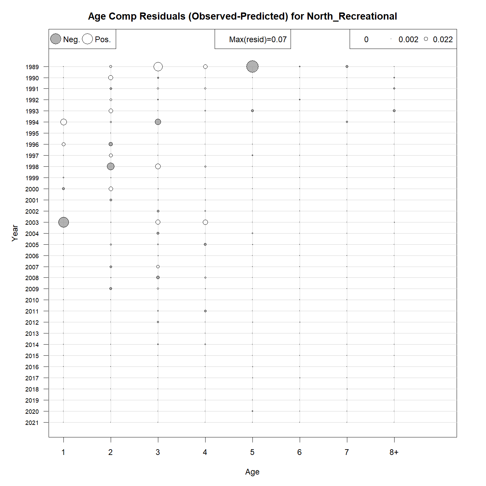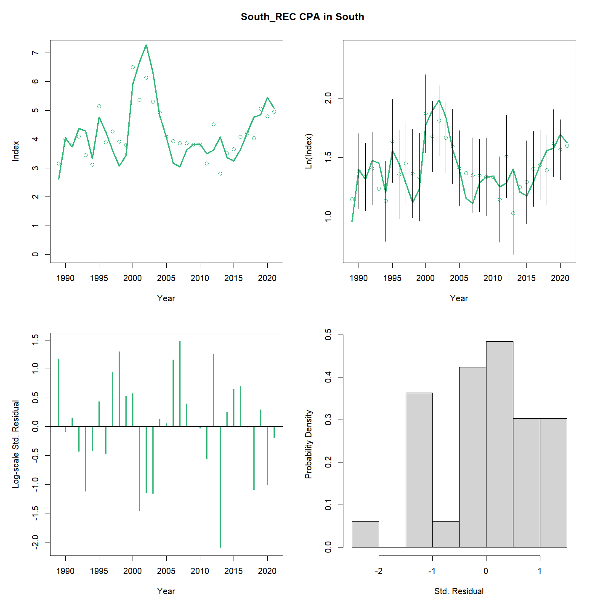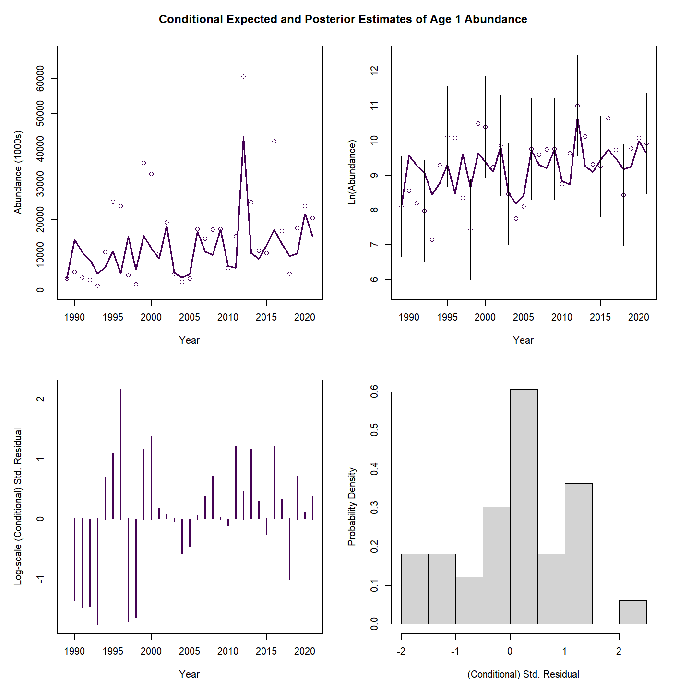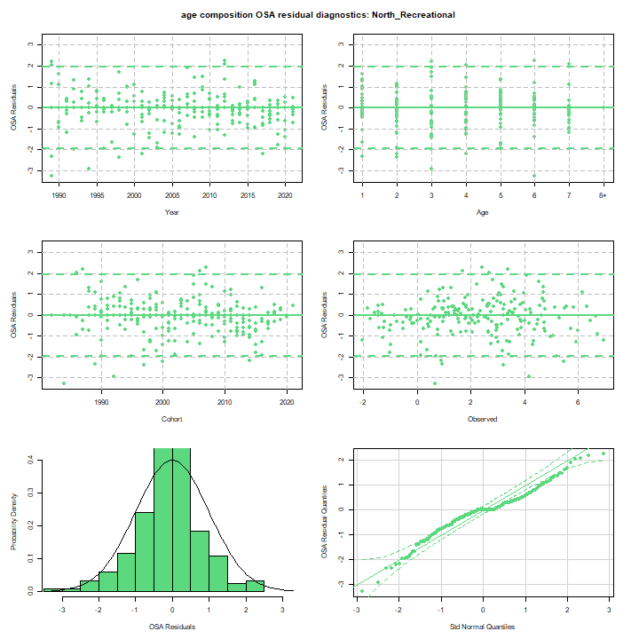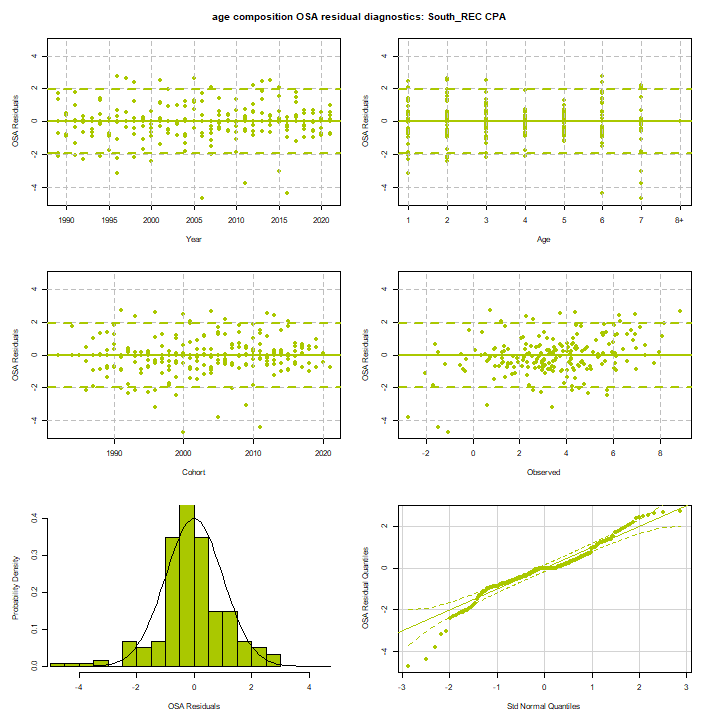

### Results

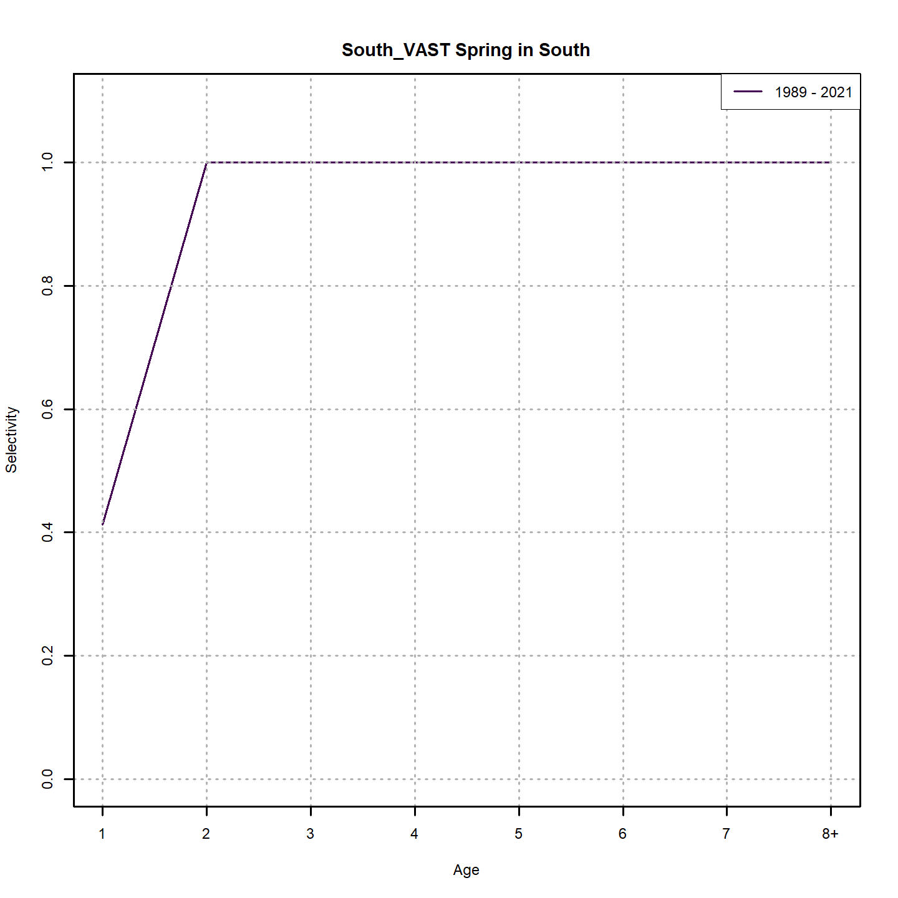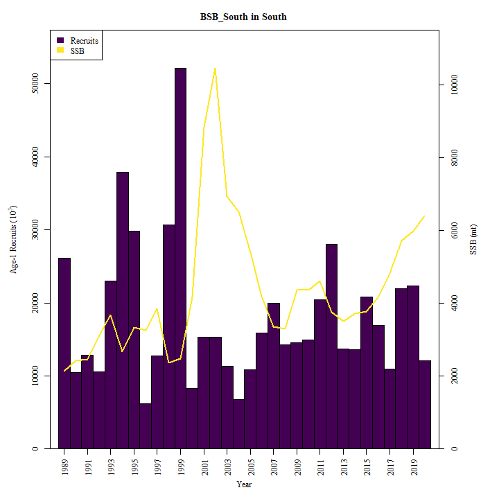

### Retro

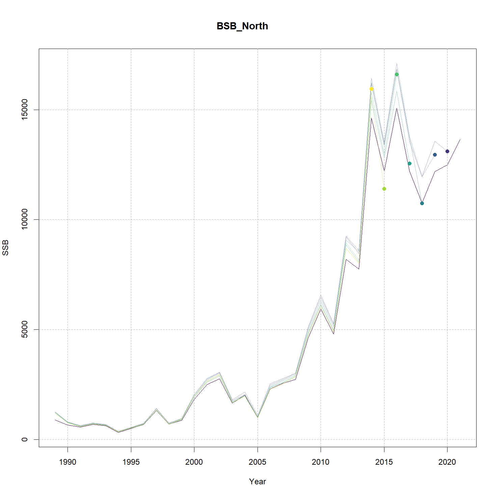

### Reference points

### Miscelaneous

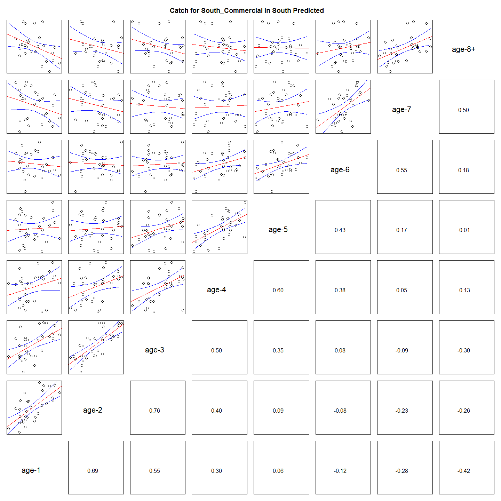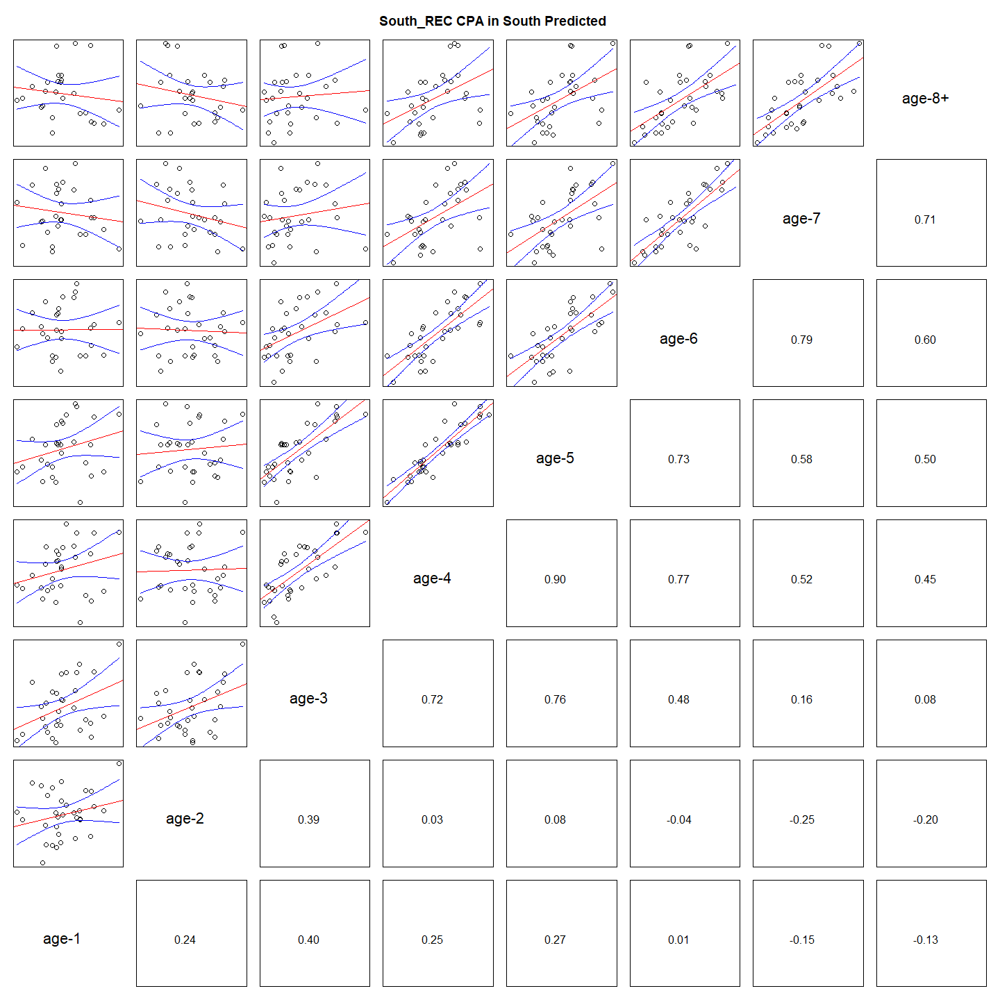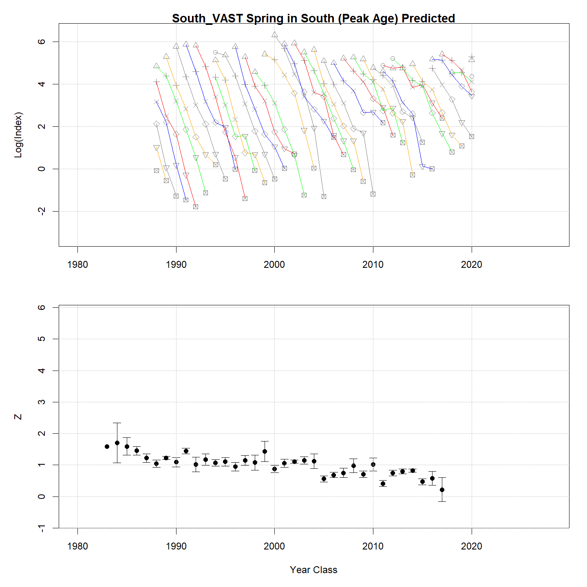

## Tables {.tabset}

### Parameter estimates

<table class="table" style="margin-left: auto; margin-right: auto;">
<caption>Parameter estimates, standard errors, and confidence intervals. Rounded to 3 decimal places.</caption>
 <thead>
  <tr>
   <th style="text-align:left;">   </th>
   <th style="text-align:right;"> Estimate </th>
   <th style="text-align:right;"> Std. Error </th>
   <th style="text-align:right;"> 95\% CI lower </th>
   <th style="text-align:right;"> 95\% CI upper </th>
  </tr>
 </thead>
<tbody>
  <tr>
   <td style="text-align:left;"> BSB North mean log(R) intercept </td>
   <td style="text-align:right;"> $5.879$ </td>
   <td style="text-align:right;"> $0.917$ </td>
   <td style="text-align:right;"> $4.081$ </td>
   <td style="text-align:right;"> $7.678$ </td>
  </tr>
  <tr>
   <td style="text-align:left;"> BSB North in North NAA $\sigma$ (age 1) </td>
   <td style="text-align:right;"> $0.742$ </td>
   <td style="text-align:right;"> $0.103$ </td>
   <td style="text-align:right;"> $0.564$ </td>
   <td style="text-align:right;"> $0.975$ </td>
  </tr>
  <tr>
   <td style="text-align:left;"> BSB North in North NAA $\sigma$ (ages 2-8+) </td>
   <td style="text-align:right;"> $0.797$ </td>
   <td style="text-align:right;"> $0.046$ </td>
   <td style="text-align:right;"> $0.712$ </td>
   <td style="text-align:right;"> $0.892$ </td>
  </tr>
  <tr>
   <td style="text-align:left;"> BSB North in South NAA $\sigma$ (age 1) </td>
   <td style="text-align:right;"> $0.742$ </td>
   <td style="text-align:right;"> $0.103$ </td>
   <td style="text-align:right;"> $0.564$ </td>
   <td style="text-align:right;"> $0.975$ </td>
  </tr>
  <tr>
   <td style="text-align:left;"> BSB North  in North  NAA AR1 $\rho$ age </td>
   <td style="text-align:right;"> $0.066$ </td>
   <td style="text-align:right;"> $0.097$ </td>
   <td style="text-align:right;"> $-0.125$ </td>
   <td style="text-align:right;"> $0.252$ </td>
  </tr>
  <tr>
   <td style="text-align:left;"> BSB North  in North  NAA AR1 $\rho$ year </td>
   <td style="text-align:right;"> $0.271$ </td>
   <td style="text-align:right;"> $0.083$ </td>
   <td style="text-align:right;"> $0.102$ </td>
   <td style="text-align:right;"> $0.425$ </td>
  </tr>
  <tr>
   <td style="text-align:left;"> BSB South Mean Recruitment </td>
   <td style="text-align:right;"> $16317.330$ </td>
   <td style="text-align:right;"> $3242.173$ </td>
   <td style="text-align:right;"> $11054.002$ </td>
   <td style="text-align:right;"> $24086.775$ </td>
  </tr>
  <tr>
   <td style="text-align:left;"> BSB South in North NAA $\sigma$ (age 1) </td>
   <td style="text-align:right;"> $0.514$ </td>
   <td style="text-align:right;"> $0.080$ </td>
   <td style="text-align:right;"> $0.379$ </td>
   <td style="text-align:right;"> $0.697$ </td>
  </tr>
  <tr>
   <td style="text-align:left;"> BSB South in North NAA $\sigma$ (ages 2-8+) </td>
   <td style="text-align:right;"> $0.607$ </td>
   <td style="text-align:right;"> $0.072$ </td>
   <td style="text-align:right;"> $0.481$ </td>
   <td style="text-align:right;"> $0.766$ </td>
  </tr>
  <tr>
   <td style="text-align:left;"> BSB South in South NAA $\sigma$ (age 1) </td>
   <td style="text-align:right;"> $0.514$ </td>
   <td style="text-align:right;"> $0.080$ </td>
   <td style="text-align:right;"> $0.379$ </td>
   <td style="text-align:right;"> $0.697$ </td>
  </tr>
  <tr>
   <td style="text-align:left;"> BSB South in South NAA $\sigma$ (ages 2-8+) </td>
   <td style="text-align:right;"> $0.607$ </td>
   <td style="text-align:right;"> $0.072$ </td>
   <td style="text-align:right;"> $0.481$ </td>
   <td style="text-align:right;"> $0.766$ </td>
  </tr>
  <tr>
   <td style="text-align:left;"> BSB South  in North  NAA AR1 $\rho$ age </td>
   <td style="text-align:right;"> $-0.114$ </td>
   <td style="text-align:right;"> $0.118$ </td>
   <td style="text-align:right;"> $-0.336$ </td>
   <td style="text-align:right;"> $0.120$ </td>
  </tr>
  <tr>
   <td style="text-align:left;"> BSB South  in North  NAA AR1 $\rho$ year </td>
   <td style="text-align:right;"> $0.339$ </td>
   <td style="text-align:right;"> $0.105$ </td>
   <td style="text-align:right;"> $0.120$ </td>
   <td style="text-align:right;"> $0.527$ </td>
  </tr>
  <tr>
   <td style="text-align:left;"> BSB South  in South  NAA AR1 $\rho$ age </td>
   <td style="text-align:right;"> $-0.114$ </td>
   <td style="text-align:right;"> $0.118$ </td>
   <td style="text-align:right;"> $-0.336$ </td>
   <td style="text-align:right;"> $0.120$ </td>
  </tr>
  <tr>
   <td style="text-align:left;"> BSB South  in South  NAA AR1 $\rho$ year </td>
   <td style="text-align:right;"> $0.339$ </td>
   <td style="text-align:right;"> $0.105$ </td>
   <td style="text-align:right;"> $0.120$ </td>
   <td style="text-align:right;"> $0.527$ </td>
  </tr>
  <tr>
   <td style="text-align:left;"> North REC CPA fully selected q </td>
   <td style="text-align:right;"> $1.155\times 10^{-4}$ </td>
   <td style="text-align:right;"> $1.612\times 10^{-5}$ </td>
   <td style="text-align:right;"> $8.789\times 10^{-5}$ </td>
   <td style="text-align:right;"> $1.519\times 10^{-4}$ </td>
  </tr>
  <tr>
   <td style="text-align:left;"> North VAST Spring fully selected q </td>
   <td style="text-align:right;"> $0.017$ </td>
   <td style="text-align:right;"> $0.002$ </td>
   <td style="text-align:right;"> $0.013$ </td>
   <td style="text-align:right;"> $0.023$ </td>
  </tr>
  <tr>
   <td style="text-align:left;"> South REC CPA fully selected q </td>
   <td style="text-align:right;"> $1.738\times 10^{-4}$ </td>
   <td style="text-align:right;"> $1.973\times 10^{-5}$ </td>
   <td style="text-align:right;"> $1.391\times 10^{-4}$ </td>
   <td style="text-align:right;"> $2.171\times 10^{-4}$ </td>
  </tr>
  <tr>
   <td style="text-align:left;"> South VAST Spring fully selected q </td>
   <td style="text-align:right;"> $0.018$ </td>
   <td style="text-align:right;"> $0.002$ </td>
   <td style="text-align:right;"> $0.014$ </td>
   <td style="text-align:right;"> $0.022$ </td>
  </tr>
  <tr>
   <td style="text-align:left;"> Block 1: North Commercial Mean Selectivity for age 1 </td>
   <td style="text-align:right;"> $0.020$ </td>
   <td style="text-align:right;"> $0.016$ </td>
   <td style="text-align:right;"> $0.004$ </td>
   <td style="text-align:right;"> $0.092$ </td>
  </tr>
  <tr>
   <td style="text-align:left;"> Block 1: North Commercial Mean Selectivity for age 2 </td>
   <td style="text-align:right;"> $0.331$ </td>
   <td style="text-align:right;"> $0.175$ </td>
   <td style="text-align:right;"> $0.095$ </td>
   <td style="text-align:right;"> $0.700$ </td>
  </tr>
  <tr>
   <td style="text-align:left;"> Block 1: North Commercial Mean Selectivity for age 3 </td>
   <td style="text-align:right;"> $0.819$ </td>
   <td style="text-align:right;"> $0.126$ </td>
   <td style="text-align:right;"> $0.462$ </td>
   <td style="text-align:right;"> $0.960$ </td>
  </tr>
  <tr>
   <td style="text-align:left;"> Block 1: North Commercial Mean Selectivity for age 4 </td>
   <td style="text-align:right;"> $1.000$ </td>
   <td style="text-align:right;"> -- </td>
   <td style="text-align:right;"> -- </td>
   <td style="text-align:right;"> -- </td>
  </tr>
  <tr>
   <td style="text-align:left;"> Block 1: North Commercial Mean Selectivity for age 5 </td>
   <td style="text-align:right;"> $1.000$ </td>
   <td style="text-align:right;"> -- </td>
   <td style="text-align:right;"> -- </td>
   <td style="text-align:right;"> -- </td>
  </tr>
  <tr>
   <td style="text-align:left;"> Block 1: North Commercial Mean Selectivity for age 6 </td>
   <td style="text-align:right;"> $1.000$ </td>
   <td style="text-align:right;"> -- </td>
   <td style="text-align:right;"> -- </td>
   <td style="text-align:right;"> -- </td>
  </tr>
  <tr>
   <td style="text-align:left;"> Block 1: North Commercial Mean Selectivity for age 7 </td>
   <td style="text-align:right;"> $1.000$ </td>
   <td style="text-align:right;"> -- </td>
   <td style="text-align:right;"> -- </td>
   <td style="text-align:right;"> -- </td>
  </tr>
  <tr>
   <td style="text-align:left;"> Block 1: North Commercial Mean Selectivity for age 8+ </td>
   <td style="text-align:right;"> $1.000$ </td>
   <td style="text-align:right;"> -- </td>
   <td style="text-align:right;"> -- </td>
   <td style="text-align:right;"> -- </td>
  </tr>
  <tr>
   <td style="text-align:left;"> Block 2: North Recreational Mean Selectivity for age 1 </td>
   <td style="text-align:right;"> $0.031$ </td>
   <td style="text-align:right;"> $0.027$ </td>
   <td style="text-align:right;"> $0.005$ </td>
   <td style="text-align:right;"> $0.157$ </td>
  </tr>
  <tr>
   <td style="text-align:left;"> Block 2: North Recreational Mean Selectivity for age 2 </td>
   <td style="text-align:right;"> $0.334$ </td>
   <td style="text-align:right;"> $0.199$ </td>
   <td style="text-align:right;"> $0.080$ </td>
   <td style="text-align:right;"> $0.743$ </td>
  </tr>
  <tr>
   <td style="text-align:left;"> Block 2: North Recreational Mean Selectivity for age 3 </td>
   <td style="text-align:right;"> $0.567$ </td>
   <td style="text-align:right;"> $0.221$ </td>
   <td style="text-align:right;"> $0.183$ </td>
   <td style="text-align:right;"> $0.885$ </td>
  </tr>
  <tr>
   <td style="text-align:left;"> Block 2: North Recreational Mean Selectivity for age 4 </td>
   <td style="text-align:right;"> $0.790$ </td>
   <td style="text-align:right;"> $0.152$ </td>
   <td style="text-align:right;"> $0.383$ </td>
   <td style="text-align:right;"> $0.958$ </td>
  </tr>
  <tr>
   <td style="text-align:left;"> Block 2: North Recreational Mean Selectivity for age 5 </td>
   <td style="text-align:right;"> $0.885$ </td>
   <td style="text-align:right;"> $0.097$ </td>
   <td style="text-align:right;"> $0.542$ </td>
   <td style="text-align:right;"> $0.981$ </td>
  </tr>
  <tr>
   <td style="text-align:left;"> Block 2: North Recreational Mean Selectivity for age 6 </td>
   <td style="text-align:right;"> $0.946$ </td>
   <td style="text-align:right;"> $0.054$ </td>
   <td style="text-align:right;"> $0.690$ </td>
   <td style="text-align:right;"> $0.993$ </td>
  </tr>
  <tr>
   <td style="text-align:left;"> Block 2: North Recreational Mean Selectivity for age 7 </td>
   <td style="text-align:right;"> $1.000$ </td>
   <td style="text-align:right;"> -- </td>
   <td style="text-align:right;"> -- </td>
   <td style="text-align:right;"> -- </td>
  </tr>
  <tr>
   <td style="text-align:left;"> Block 2: North Recreational Mean Selectivity for age 8+ </td>
   <td style="text-align:right;"> $1.000$ </td>
   <td style="text-align:right;"> -- </td>
   <td style="text-align:right;"> -- </td>
   <td style="text-align:right;"> -- </td>
  </tr>
  <tr>
   <td style="text-align:left;"> Block 3: South Commercial $a_{50}$ </td>
   <td style="text-align:right;"> $2.425$ </td>
   <td style="text-align:right;"> $0.127$ </td>
   <td style="text-align:right;"> $2.184$ </td>
   <td style="text-align:right;"> $2.681$ </td>
  </tr>
  <tr>
   <td style="text-align:left;"> Block 3: South Commercial 1/slope (increasing) </td>
   <td style="text-align:right;"> $0.410$ </td>
   <td style="text-align:right;"> $0.037$ </td>
   <td style="text-align:right;"> $0.343$ </td>
   <td style="text-align:right;"> $0.488$ </td>
  </tr>
  <tr>
   <td style="text-align:left;"> Block 4: South Recreational $a_{50}$ </td>
   <td style="text-align:right;"> $2.794$ </td>
   <td style="text-align:right;"> $0.225$ </td>
   <td style="text-align:right;"> $2.370$ </td>
   <td style="text-align:right;"> $3.251$ </td>
  </tr>
  <tr>
   <td style="text-align:left;"> Block 4: South Recreational 1/slope (increasing) </td>
   <td style="text-align:right;"> $0.881$ </td>
   <td style="text-align:right;"> $0.116$ </td>
   <td style="text-align:right;"> $0.678$ </td>
   <td style="text-align:right;"> $1.135$ </td>
  </tr>
  <tr>
   <td style="text-align:left;"> Block 9: North REC CPA Mean Selectivity for age 1 </td>
   <td style="text-align:right;"> $0.165$ </td>
   <td style="text-align:right;"> $0.065$ </td>
   <td style="text-align:right;"> $0.072$ </td>
   <td style="text-align:right;"> $0.332$ </td>
  </tr>
  <tr>
   <td style="text-align:left;"> Block 9: North REC CPA Mean Selectivity for age 2 </td>
   <td style="text-align:right;"> $1.000$ </td>
   <td style="text-align:right;"> -- </td>
   <td style="text-align:right;"> -- </td>
   <td style="text-align:right;"> -- </td>
  </tr>
  <tr>
   <td style="text-align:left;"> Block 9: North REC CPA Mean Selectivity for age 3 </td>
   <td style="text-align:right;"> $1.000$ </td>
   <td style="text-align:right;"> -- </td>
   <td style="text-align:right;"> -- </td>
   <td style="text-align:right;"> -- </td>
  </tr>
  <tr>
   <td style="text-align:left;"> Block 9: North REC CPA Mean Selectivity for age 4 </td>
   <td style="text-align:right;"> $1.000$ </td>
   <td style="text-align:right;"> -- </td>
   <td style="text-align:right;"> -- </td>
   <td style="text-align:right;"> -- </td>
  </tr>
  <tr>
   <td style="text-align:left;"> Block 9: North REC CPA Mean Selectivity for age 5 </td>
   <td style="text-align:right;"> $1.000$ </td>
   <td style="text-align:right;"> -- </td>
   <td style="text-align:right;"> -- </td>
   <td style="text-align:right;"> -- </td>
  </tr>
  <tr>
   <td style="text-align:left;"> Block 9: North REC CPA Mean Selectivity for age 6 </td>
   <td style="text-align:right;"> $1.000$ </td>
   <td style="text-align:right;"> -- </td>
   <td style="text-align:right;"> -- </td>
   <td style="text-align:right;"> -- </td>
  </tr>
  <tr>
   <td style="text-align:left;"> Block 9: North REC CPA Mean Selectivity for age 7 </td>
   <td style="text-align:right;"> $1.000$ </td>
   <td style="text-align:right;"> -- </td>
   <td style="text-align:right;"> -- </td>
   <td style="text-align:right;"> -- </td>
  </tr>
  <tr>
   <td style="text-align:left;"> Block 9: North REC CPA Mean Selectivity for age 8+ </td>
   <td style="text-align:right;"> $1.000$ </td>
   <td style="text-align:right;"> -- </td>
   <td style="text-align:right;"> -- </td>
   <td style="text-align:right;"> -- </td>
  </tr>
  <tr>
   <td style="text-align:left;"> Block 10: North VAST Spring Mean Selectivity for age 1 </td>
   <td style="text-align:right;"> $0.076$ </td>
   <td style="text-align:right;"> $0.028$ </td>
   <td style="text-align:right;"> $0.037$ </td>
   <td style="text-align:right;"> $0.151$ </td>
  </tr>
  <tr>
   <td style="text-align:left;"> Block 10: North VAST Spring Mean Selectivity for age 2 </td>
   <td style="text-align:right;"> $0.407$ </td>
   <td style="text-align:right;"> $0.091$ </td>
   <td style="text-align:right;"> $0.247$ </td>
   <td style="text-align:right;"> $0.590$ </td>
  </tr>
  <tr>
   <td style="text-align:left;"> Block 10: North VAST Spring Mean Selectivity for age 3 </td>
   <td style="text-align:right;"> $0.898$ </td>
   <td style="text-align:right;"> $0.055$ </td>
   <td style="text-align:right;"> $0.729$ </td>
   <td style="text-align:right;"> $0.966$ </td>
  </tr>
  <tr>
   <td style="text-align:left;"> Block 10: North VAST Spring Mean Selectivity for age 4 </td>
   <td style="text-align:right;"> $0.927$ </td>
   <td style="text-align:right;"> $0.043$ </td>
   <td style="text-align:right;"> $0.786$ </td>
   <td style="text-align:right;"> $0.978$ </td>
  </tr>
  <tr>
   <td style="text-align:left;"> Block 10: North VAST Spring Mean Selectivity for age 5 </td>
   <td style="text-align:right;"> $1.000$ </td>
   <td style="text-align:right;"> -- </td>
   <td style="text-align:right;"> -- </td>
   <td style="text-align:right;"> -- </td>
  </tr>
  <tr>
   <td style="text-align:left;"> Block 10: North VAST Spring Mean Selectivity for age 6 </td>
   <td style="text-align:right;"> $1.000$ </td>
   <td style="text-align:right;"> -- </td>
   <td style="text-align:right;"> -- </td>
   <td style="text-align:right;"> -- </td>
  </tr>
  <tr>
   <td style="text-align:left;"> Block 10: North VAST Spring Mean Selectivity for age 7 </td>
   <td style="text-align:right;"> $1.000$ </td>
   <td style="text-align:right;"> -- </td>
   <td style="text-align:right;"> -- </td>
   <td style="text-align:right;"> -- </td>
  </tr>
  <tr>
   <td style="text-align:left;"> Block 10: North VAST Spring Mean Selectivity for age 8+ </td>
   <td style="text-align:right;"> $1.000$ </td>
   <td style="text-align:right;"> -- </td>
   <td style="text-align:right;"> -- </td>
   <td style="text-align:right;"> -- </td>
  </tr>
  <tr>
   <td style="text-align:left;"> Block 11: South REC CPA Selectivity for age 1 </td>
   <td style="text-align:right;"> $0.467$ </td>
   <td style="text-align:right;"> $0.082$ </td>
   <td style="text-align:right;"> $0.314$ </td>
   <td style="text-align:right;"> $0.626$ </td>
  </tr>
  <tr>
   <td style="text-align:left;"> Block 11: South REC CPA Selectivity for age 2 </td>
   <td style="text-align:right;"> $0.883$ </td>
   <td style="text-align:right;"> $0.082$ </td>
   <td style="text-align:right;"> $0.615$ </td>
   <td style="text-align:right;"> $0.973$ </td>
  </tr>
  <tr>
   <td style="text-align:left;"> Block 11: South REC CPA Selectivity for age 3 </td>
   <td style="text-align:right;"> $1.000$ </td>
   <td style="text-align:right;"> -- </td>
   <td style="text-align:right;"> -- </td>
   <td style="text-align:right;"> -- </td>
  </tr>
  <tr>
   <td style="text-align:left;"> Block 11: South REC CPA Selectivity for age 4 </td>
   <td style="text-align:right;"> $1.000$ </td>
   <td style="text-align:right;"> -- </td>
   <td style="text-align:right;"> -- </td>
   <td style="text-align:right;"> -- </td>
  </tr>
  <tr>
   <td style="text-align:left;"> Block 11: South REC CPA Selectivity for age 5 </td>
   <td style="text-align:right;"> $1.000$ </td>
   <td style="text-align:right;"> -- </td>
   <td style="text-align:right;"> -- </td>
   <td style="text-align:right;"> -- </td>
  </tr>
  <tr>
   <td style="text-align:left;"> Block 11: South REC CPA Selectivity for age 6 </td>
   <td style="text-align:right;"> $1.000$ </td>
   <td style="text-align:right;"> -- </td>
   <td style="text-align:right;"> -- </td>
   <td style="text-align:right;"> -- </td>
  </tr>
  <tr>
   <td style="text-align:left;"> Block 11: South REC CPA Selectivity for age 7 </td>
   <td style="text-align:right;"> $1.000$ </td>
   <td style="text-align:right;"> -- </td>
   <td style="text-align:right;"> -- </td>
   <td style="text-align:right;"> -- </td>
  </tr>
  <tr>
   <td style="text-align:left;"> Block 11: South REC CPA Selectivity for age 8+ </td>
   <td style="text-align:right;"> $1.000$ </td>
   <td style="text-align:right;"> -- </td>
   <td style="text-align:right;"> -- </td>
   <td style="text-align:right;"> -- </td>
  </tr>
  <tr>
   <td style="text-align:left;"> Block 12: South VAST Spring Selectivity for age 1 </td>
   <td style="text-align:right;"> $0.413$ </td>
   <td style="text-align:right;"> $0.090$ </td>
   <td style="text-align:right;"> $0.254$ </td>
   <td style="text-align:right;"> $0.593$ </td>
  </tr>
  <tr>
   <td style="text-align:left;"> Block 12: South VAST Spring Selectivity for age 2 </td>
   <td style="text-align:right;"> $1.000$ </td>
   <td style="text-align:right;"> -- </td>
   <td style="text-align:right;"> -- </td>
   <td style="text-align:right;"> -- </td>
  </tr>
  <tr>
   <td style="text-align:left;"> Block 12: South VAST Spring Selectivity for age 3 </td>
   <td style="text-align:right;"> $1.000$ </td>
   <td style="text-align:right;"> -- </td>
   <td style="text-align:right;"> -- </td>
   <td style="text-align:right;"> -- </td>
  </tr>
  <tr>
   <td style="text-align:left;"> Block 12: South VAST Spring Selectivity for age 4 </td>
   <td style="text-align:right;"> $1.000$ </td>
   <td style="text-align:right;"> -- </td>
   <td style="text-align:right;"> -- </td>
   <td style="text-align:right;"> -- </td>
  </tr>
  <tr>
   <td style="text-align:left;"> Block 12: South VAST Spring Selectivity for age 5 </td>
   <td style="text-align:right;"> $1.000$ </td>
   <td style="text-align:right;"> -- </td>
   <td style="text-align:right;"> -- </td>
   <td style="text-align:right;"> -- </td>
  </tr>
  <tr>
   <td style="text-align:left;"> Block 12: South VAST Spring Selectivity for age 6 </td>
   <td style="text-align:right;"> $1.000$ </td>
   <td style="text-align:right;"> -- </td>
   <td style="text-align:right;"> -- </td>
   <td style="text-align:right;"> -- </td>
  </tr>
  <tr>
   <td style="text-align:left;"> Block 12: South VAST Spring Selectivity for age 7 </td>
   <td style="text-align:right;"> $1.000$ </td>
   <td style="text-align:right;"> -- </td>
   <td style="text-align:right;"> -- </td>
   <td style="text-align:right;"> -- </td>
  </tr>
  <tr>
   <td style="text-align:left;"> Block 12: South VAST Spring Selectivity for age 8+ </td>
   <td style="text-align:right;"> $1.000$ </td>
   <td style="text-align:right;"> -- </td>
   <td style="text-align:right;"> -- </td>
   <td style="text-align:right;"> -- </td>
  </tr>
  <tr>
   <td style="text-align:left;"> Block 1: North Commercial Selectivity RE $\sigma$ </td>
   <td style="text-align:right;"> $0.404$ </td>
   <td style="text-align:right;"> $0.115$ </td>
   <td style="text-align:right;"> $0.230$ </td>
   <td style="text-align:right;"> $0.707$ </td>
  </tr>
  <tr>
   <td style="text-align:left;"> Block 1: North Commercial Selectivity RE AR1 $\rho$ (age) </td>
   <td style="text-align:right;"> $0.483$ </td>
   <td style="text-align:right;"> $0.136$ </td>
   <td style="text-align:right;"> $0.350$ </td>
   <td style="text-align:right;"> $0.941$ </td>
  </tr>
  <tr>
   <td style="text-align:left;"> Block 1: North Commercial Selectivity RE AR1 $\rho$ (year) </td>
   <td style="text-align:right;"> $0.591$ </td>
   <td style="text-align:right;"> $0.082$ </td>
   <td style="text-align:right;"> $0.586$ </td>
   <td style="text-align:right;"> $0.967$ </td>
  </tr>
  <tr>
   <td style="text-align:left;"> Block 2: North Recreational Selectivity RE $\sigma$ </td>
   <td style="text-align:right;"> $0.207$ </td>
   <td style="text-align:right;"> $0.031$ </td>
   <td style="text-align:right;"> $0.155$ </td>
   <td style="text-align:right;"> $0.276$ </td>
  </tr>
  <tr>
   <td style="text-align:left;"> Block 2: North Recreational Selectivity RE AR1 $\rho$ (age) </td>
   <td style="text-align:right;"> $0.517$ </td>
   <td style="text-align:right;"> $0.064$ </td>
   <td style="text-align:right;"> $0.645$ </td>
   <td style="text-align:right;"> $0.909$ </td>
  </tr>
  <tr>
   <td style="text-align:left;"> Block 2: North Recreational Selectivity RE AR1 $\rho$ (year) </td>
   <td style="text-align:right;"> $0.731$ </td>
   <td style="text-align:right;"> $0.024$ </td>
   <td style="text-align:right;"> $0.873$ </td>
   <td style="text-align:right;"> $0.983$ </td>
  </tr>
  <tr>
   <td style="text-align:left;"> Block 9: North REC CPA Selectivity RE $\sigma$ </td>
   <td style="text-align:right;"> $0.249$ </td>
   <td style="text-align:right;"> $0.067$ </td>
   <td style="text-align:right;"> $0.147$ </td>
   <td style="text-align:right;"> $0.421$ </td>
  </tr>
  <tr>
   <td style="text-align:left;"> Block 9: North REC CPA Selectivity RE AR1 $\rho$ (year) </td>
   <td style="text-align:right;"> $0.649$ </td>
   <td style="text-align:right;"> $0.081$ </td>
   <td style="text-align:right;"> $0.531$ </td>
   <td style="text-align:right;"> $0.987$ </td>
  </tr>
  <tr>
   <td style="text-align:left;"> Block 10: North VAST Spring Selectivity RE $\sigma$ </td>
   <td style="text-align:right;"> $0.746$ </td>
   <td style="text-align:right;"> $0.155$ </td>
   <td style="text-align:right;"> $0.496$ </td>
   <td style="text-align:right;"> $1.122$ </td>
  </tr>
  <tr>
   <td style="text-align:left;"> Block 10: North VAST Spring Selectivity RE AR1 $\rho$ (age) </td>
   <td style="text-align:right;"> $0.110$ </td>
   <td style="text-align:right;"> $0.260$ </td>
   <td style="text-align:right;"> $-0.305$ </td>
   <td style="text-align:right;"> $0.638$ </td>
  </tr>
  <tr>
   <td style="text-align:left;"> Block 10: North VAST Spring Selectivity RE AR1 $\rho$ (year) </td>
   <td style="text-align:right;"> $0.335$ </td>
   <td style="text-align:right;"> $0.177$ </td>
   <td style="text-align:right;"> $0.151$ </td>
   <td style="text-align:right;"> $0.846$ </td>
  </tr>
  <tr>
   <td style="text-align:left;"> North Commercial in North age comp, Dirichlet-multinomial: dispersion ($\phi$) </td>
   <td style="text-align:right;"> $54.345$ </td>
   <td style="text-align:right;"> $6.915$ </td>
   <td style="text-align:right;"> $42.349$ </td>
   <td style="text-align:right;"> $69.737$ </td>
  </tr>
  <tr>
   <td style="text-align:left;"> North Recreational in North age comp, logistic-normal: $\sigma$ </td>
   <td style="text-align:right;"> $2.819$ </td>
   <td style="text-align:right;"> $0.338$ </td>
   <td style="text-align:right;"> $2.228$ </td>
   <td style="text-align:right;"> $3.566$ </td>
  </tr>
  <tr>
   <td style="text-align:left;"> South Commercial in South age comp, logistic-normal: $\sigma$ </td>
   <td style="text-align:right;"> $33.868$ </td>
   <td style="text-align:right;"> $3.441$ </td>
   <td style="text-align:right;"> $27.752$ </td>
   <td style="text-align:right;"> $41.332$ </td>
  </tr>
  <tr>
   <td style="text-align:left;"> South Commercial in South age comp, logistic-normal: $\rho$ </td>
   <td style="text-align:right;"> $0.720$ </td>
   <td style="text-align:right;"> $0.061$ </td>
   <td style="text-align:right;"> $0.586$ </td>
   <td style="text-align:right;"> $0.824$ </td>
  </tr>
  <tr>
   <td style="text-align:left;"> South Recreational in South age comp, logistic-normal: $\sigma$ </td>
   <td style="text-align:right;"> $28.413$ </td>
   <td style="text-align:right;"> $4.363$ </td>
   <td style="text-align:right;"> $21.029$ </td>
   <td style="text-align:right;"> $38.391$ </td>
  </tr>
  <tr>
   <td style="text-align:left;"> South Recreational in South age comp, logistic-normal: $\rho$ </td>
   <td style="text-align:right;"> $0.909$ </td>
   <td style="text-align:right;"> $0.027$ </td>
   <td style="text-align:right;"> $0.841$ </td>
   <td style="text-align:right;"> $0.950$ </td>
  </tr>
  <tr>
   <td style="text-align:left;"> North REC CPA in North age comp, logistic-normal: $\sigma$ </td>
   <td style="text-align:right;"> $4.263$ </td>
   <td style="text-align:right;"> $0.395$ </td>
   <td style="text-align:right;"> $3.556$ </td>
   <td style="text-align:right;"> $5.111$ </td>
  </tr>
  <tr>
   <td style="text-align:left;"> North VAST Spring in North age comp, Dirichlet-multinomial: dispersion ($\phi$) </td>
   <td style="text-align:right;"> $28.592$ </td>
   <td style="text-align:right;"> $3.219$ </td>
   <td style="text-align:right;"> $22.931$ </td>
   <td style="text-align:right;"> $35.651$ </td>
  </tr>
  <tr>
   <td style="text-align:left;"> South REC CPA in South age comp, logistic-normal: $\sigma$ </td>
   <td style="text-align:right;"> $27.998$ </td>
   <td style="text-align:right;"> $4.542$ </td>
   <td style="text-align:right;"> $20.372$ </td>
   <td style="text-align:right;"> $38.477$ </td>
  </tr>
  <tr>
   <td style="text-align:left;"> South REC CPA in South age comp, logistic-normal: $\rho$ </td>
   <td style="text-align:right;"> $0.925$ </td>
   <td style="text-align:right;"> $0.024$ </td>
   <td style="text-align:right;"> $0.862$ </td>
   <td style="text-align:right;"> $0.960$ </td>
  </tr>
  <tr>
   <td style="text-align:left;"> South VAST Spring in South age comp, logistic-normal: $\sigma$ </td>
   <td style="text-align:right;"> $48.541$ </td>
   <td style="text-align:right;"> $3.931$ </td>
   <td style="text-align:right;"> $41.417$ </td>
   <td style="text-align:right;"> $56.890$ </td>
  </tr>
  <tr>
   <td style="text-align:left;"> South VAST Spring in South age comp, logistic-normal: $\rho$ </td>
   <td style="text-align:right;"> $0.668$ </td>
   <td style="text-align:right;"> $0.056$ </td>
   <td style="text-align:right;"> $0.550$ </td>
   <td style="text-align:right;"> $0.767$ </td>
  </tr>
  <tr>
   <td style="text-align:left;"> stock BSB North $\mu$ from North to South (intercept) </td>
   <td style="text-align:right;"> $0.009$ </td>
   <td style="text-align:right;"> $0.001$ </td>
   <td style="text-align:right;"> $0.007$ </td>
   <td style="text-align:right;"> $0.012$ </td>
  </tr>
  <tr>
   <td style="text-align:left;"> stock BSB North $\mu$ from South to North (intercept) </td>
   <td style="text-align:right;"> $0.331$ </td>
   <td style="text-align:right;"> $0.043$ </td>
   <td style="text-align:right;"> $0.252$ </td>
   <td style="text-align:right;"> $0.421$ </td>
  </tr>
  <tr>
   <td style="text-align:left;"> North REC CPA log-index observation SD scalar </td>
   <td style="text-align:right;"> $6.169$ </td>
   <td style="text-align:right;"> $1.309$ </td>
   <td style="text-align:right;"> $4.070$ </td>
   <td style="text-align:right;"> $9.351$ </td>
  </tr>
  <tr>
   <td style="text-align:left;"> South REC CPA log-index observation SD scalar </td>
   <td style="text-align:right;"> $5.565$ </td>
   <td style="text-align:right;"> $1.270$ </td>
   <td style="text-align:right;"> $3.559$ </td>
   <td style="text-align:right;"> $8.703$ </td>
  </tr>
  <tr>
   <td style="text-align:left;"> Ecov North BT: $\mu$ </td>
   <td style="text-align:right;"> $6.803$ </td>
   <td style="text-align:right;"> $0.190$ </td>
   <td style="text-align:right;"> $6.431$ </td>
   <td style="text-align:right;"> $7.175$ </td>
  </tr>
  <tr>
   <td style="text-align:left;"> Ecov North BT: $\sigma$ </td>
   <td style="text-align:right;"> $1.131$ </td>
   <td style="text-align:right;"> $0.109$ </td>
   <td style="text-align:right;"> $0.937$ </td>
   <td style="text-align:right;"> $1.367$ </td>
  </tr>
  <tr>
   <td style="text-align:left;"> Ecov North BT: AR1 $\rho$ </td>
   <td style="text-align:right;"> $0.290$ </td>
   <td style="text-align:right;"> $0.121$ </td>
   <td style="text-align:right;"> $0.040$ </td>
   <td style="text-align:right;"> $0.506$ </td>
  </tr>
  <tr>
   <td style="text-align:left;"> Ecov South BT: $\mu$ </td>
   <td style="text-align:right;"> $7.606$ </td>
   <td style="text-align:right;"> $0.148$ </td>
   <td style="text-align:right;"> $7.316$ </td>
   <td style="text-align:right;"> $7.895$ </td>
  </tr>
  <tr>
   <td style="text-align:left;"> Ecov South BT: $\sigma$ </td>
   <td style="text-align:right;"> $1.017$ </td>
   <td style="text-align:right;"> $0.092$ </td>
   <td style="text-align:right;"> $0.852$ </td>
   <td style="text-align:right;"> $1.215$ </td>
  </tr>
  <tr>
   <td style="text-align:left;"> Ecov South BT: AR1 $\rho$ </td>
   <td style="text-align:right;"> $0.149$ </td>
   <td style="text-align:right;"> $0.124$ </td>
   <td style="text-align:right;"> $-0.099$ </td>
   <td style="text-align:right;"> $0.380$ </td>
  </tr>
  <tr>
   <td style="text-align:left;"> BSB North Recruitment Ecov: North BT $\beta_1$ </td>
   <td style="text-align:right;"> $0.460$ </td>
   <td style="text-align:right;"> $0.120$ </td>
   <td style="text-align:right;"> $0.224$ </td>
   <td style="text-align:right;"> $0.695$ </td>
  </tr>
</tbody>
</table>

### Abundance at age

<table class="table" style="margin-left: auto; margin-right: auto;">
<caption>Abundance at age (1000s) for BSB North in North.</caption>
 <thead>
  <tr>
   <th style="text-align:left;">   </th>
   <th style="text-align:right;"> 1 </th>
   <th style="text-align:right;"> 2 </th>
   <th style="text-align:right;"> 3 </th>
   <th style="text-align:right;"> 4 </th>
   <th style="text-align:right;"> 5 </th>
   <th style="text-align:right;"> 6 </th>
   <th style="text-align:right;"> 7 </th>
   <th style="text-align:right;"> 8+ </th>
  </tr>
 </thead>
<tbody>
  <tr>
   <td style="text-align:left;"> 1989 </td>
   <td style="text-align:right;"> 3303 </td>
   <td style="text-align:right;"> 2086 </td>
   <td style="text-align:right;"> 1092 </td>
   <td style="text-align:right;"> 513 </td>
   <td style="text-align:right;"> 234 </td>
   <td style="text-align:right;"> 106 </td>
   <td style="text-align:right;"> 48 </td>
   <td style="text-align:right;"> 40 </td>
  </tr>
  <tr>
   <td style="text-align:left;"> 1990 </td>
   <td style="text-align:right;"> 5221 </td>
   <td style="text-align:right;"> 1605 </td>
   <td style="text-align:right;"> 1348 </td>
   <td style="text-align:right;"> 251 </td>
   <td style="text-align:right;"> 148 </td>
   <td style="text-align:right;"> 14 </td>
   <td style="text-align:right;"> 3 </td>
   <td style="text-align:right;"> 23 </td>
  </tr>
  <tr>
   <td style="text-align:left;"> 1991 </td>
   <td style="text-align:right;"> 3615 </td>
   <td style="text-align:right;"> 2104 </td>
   <td style="text-align:right;"> 383 </td>
   <td style="text-align:right;"> 470 </td>
   <td style="text-align:right;"> 80 </td>
   <td style="text-align:right;"> 18 </td>
   <td style="text-align:right;"> 1 </td>
   <td style="text-align:right;"> 28 </td>
  </tr>
  <tr>
   <td style="text-align:left;"> 1992 </td>
   <td style="text-align:right;"> 2923 </td>
   <td style="text-align:right;"> 2669 </td>
   <td style="text-align:right;"> 167 </td>
   <td style="text-align:right;"> 60 </td>
   <td style="text-align:right;"> 196 </td>
   <td style="text-align:right;"> 20 </td>
   <td style="text-align:right;"> 5 </td>
   <td style="text-align:right;"> 76 </td>
  </tr>
  <tr>
   <td style="text-align:left;"> 1993 </td>
   <td style="text-align:right;"> 1262 </td>
   <td style="text-align:right;"> 1215 </td>
   <td style="text-align:right;"> 298 </td>
   <td style="text-align:right;"> 255 </td>
   <td style="text-align:right;"> 26 </td>
   <td style="text-align:right;"> 226 </td>
   <td style="text-align:right;"> 7 </td>
   <td style="text-align:right;"> 25 </td>
  </tr>
  <tr>
   <td style="text-align:left;"> 1994 </td>
   <td style="text-align:right;"> 10786 </td>
   <td style="text-align:right;"> 302 </td>
   <td style="text-align:right;"> 1065 </td>
   <td style="text-align:right;"> 103 </td>
   <td style="text-align:right;"> 132 </td>
   <td style="text-align:right;"> 13 </td>
   <td style="text-align:right;"> 28 </td>
   <td style="text-align:right;"> 16 </td>
  </tr>
  <tr>
   <td style="text-align:left;"> 1995 </td>
   <td style="text-align:right;"> 24985 </td>
   <td style="text-align:right;"> 1432 </td>
   <td style="text-align:right;"> 518 </td>
   <td style="text-align:right;"> 92 </td>
   <td style="text-align:right;"> 88 </td>
   <td style="text-align:right;"> 5 </td>
   <td style="text-align:right;"> 4 </td>
   <td style="text-align:right;"> 27 </td>
  </tr>
  <tr>
   <td style="text-align:left;"> 1996 </td>
   <td style="text-align:right;"> 23876 </td>
   <td style="text-align:right;"> 2346 </td>
   <td style="text-align:right;"> 592 </td>
   <td style="text-align:right;"> 155 </td>
   <td style="text-align:right;"> 37 </td>
   <td style="text-align:right;"> 69 </td>
   <td style="text-align:right;"> 7 </td>
   <td style="text-align:right;"> 11 </td>
  </tr>
  <tr>
   <td style="text-align:left;"> 1997 </td>
   <td style="text-align:right;"> 4231 </td>
   <td style="text-align:right;"> 8582 </td>
   <td style="text-align:right;"> 754 </td>
   <td style="text-align:right;"> 165 </td>
   <td style="text-align:right;"> 43 </td>
   <td style="text-align:right;"> 16 </td>
   <td style="text-align:right;"> 24 </td>
   <td style="text-align:right;"> 8 </td>
  </tr>
  <tr>
   <td style="text-align:left;"> 1998 </td>
   <td style="text-align:right;"> 1691 </td>
   <td style="text-align:right;"> 2251 </td>
   <td style="text-align:right;"> 552 </td>
   <td style="text-align:right;"> 424 </td>
   <td style="text-align:right;"> 69 </td>
   <td style="text-align:right;"> 95 </td>
   <td style="text-align:right;"> 8 </td>
   <td style="text-align:right;"> 35 </td>
  </tr>
  <tr>
   <td style="text-align:left;"> 1999 </td>
   <td style="text-align:right;"> 36022 </td>
   <td style="text-align:right;"> 2353 </td>
   <td style="text-align:right;"> 723 </td>
   <td style="text-align:right;"> 380 </td>
   <td style="text-align:right;"> 143 </td>
   <td style="text-align:right;"> 77 </td>
   <td style="text-align:right;"> 26 </td>
   <td style="text-align:right;"> 22 </td>
  </tr>
  <tr>
   <td style="text-align:left;"> 2000 </td>
   <td style="text-align:right;"> 32853 </td>
   <td style="text-align:right;"> 4979 </td>
   <td style="text-align:right;"> 750 </td>
   <td style="text-align:right;"> 673 </td>
   <td style="text-align:right;"> 139 </td>
   <td style="text-align:right;"> 164 </td>
   <td style="text-align:right;"> 17 </td>
   <td style="text-align:right;"> 28 </td>
  </tr>
  <tr>
   <td style="text-align:left;"> 2001 </td>
   <td style="text-align:right;"> 10182 </td>
   <td style="text-align:right;"> 3206 </td>
   <td style="text-align:right;"> 2488 </td>
   <td style="text-align:right;"> 617 </td>
   <td style="text-align:right;"> 363 </td>
   <td style="text-align:right;"> 131 </td>
   <td style="text-align:right;"> 187 </td>
   <td style="text-align:right;"> 5 </td>
  </tr>
  <tr>
   <td style="text-align:left;"> 2002 </td>
   <td style="text-align:right;"> 19198 </td>
   <td style="text-align:right;"> 6251 </td>
   <td style="text-align:right;"> 3385 </td>
   <td style="text-align:right;"> 1654 </td>
   <td style="text-align:right;"> 182 </td>
   <td style="text-align:right;"> 58 </td>
   <td style="text-align:right;"> 67 </td>
   <td style="text-align:right;"> 24 </td>
  </tr>
  <tr>
   <td style="text-align:left;"> 2003 </td>
   <td style="text-align:right;"> 4704 </td>
   <td style="text-align:right;"> 2837 </td>
   <td style="text-align:right;"> 1580 </td>
   <td style="text-align:right;"> 1435 </td>
   <td style="text-align:right;"> 692 </td>
   <td style="text-align:right;"> 61 </td>
   <td style="text-align:right;"> 24 </td>
   <td style="text-align:right;"> 22 </td>
  </tr>
  <tr>
   <td style="text-align:left;"> 2004 </td>
   <td style="text-align:right;"> 2342 </td>
   <td style="text-align:right;"> 1922 </td>
   <td style="text-align:right;"> 3348 </td>
   <td style="text-align:right;"> 566 </td>
   <td style="text-align:right;"> 886 </td>
   <td style="text-align:right;"> 226 </td>
   <td style="text-align:right;"> 2 </td>
   <td style="text-align:right;"> 16 </td>
  </tr>
  <tr>
   <td style="text-align:left;"> 2005 </td>
   <td style="text-align:right;"> 3275 </td>
   <td style="text-align:right;"> 1497 </td>
   <td style="text-align:right;"> 484 </td>
   <td style="text-align:right;"> 822 </td>
   <td style="text-align:right;"> 379 </td>
   <td style="text-align:right;"> 293 </td>
   <td style="text-align:right;"> 66 </td>
   <td style="text-align:right;"> 22 </td>
  </tr>
  <tr>
   <td style="text-align:left;"> 2006 </td>
   <td style="text-align:right;"> 17257 </td>
   <td style="text-align:right;"> 4355 </td>
   <td style="text-align:right;"> 1105 </td>
   <td style="text-align:right;"> 1007 </td>
   <td style="text-align:right;"> 1193 </td>
   <td style="text-align:right;"> 172 </td>
   <td style="text-align:right;"> 228 </td>
   <td style="text-align:right;"> 1 </td>
  </tr>
  <tr>
   <td style="text-align:left;"> 2007 </td>
   <td style="text-align:right;"> 14618 </td>
   <td style="text-align:right;"> 5881 </td>
   <td style="text-align:right;"> 2488 </td>
   <td style="text-align:right;"> 659 </td>
   <td style="text-align:right;"> 432 </td>
   <td style="text-align:right;"> 450 </td>
   <td style="text-align:right;"> 201 </td>
   <td style="text-align:right;"> 26 </td>
  </tr>
  <tr>
   <td style="text-align:left;"> 2008 </td>
   <td style="text-align:right;"> 17089 </td>
   <td style="text-align:right;"> 6418 </td>
   <td style="text-align:right;"> 2920 </td>
   <td style="text-align:right;"> 970 </td>
   <td style="text-align:right;"> 260 </td>
   <td style="text-align:right;"> 203 </td>
   <td style="text-align:right;"> 137 </td>
   <td style="text-align:right;"> 91 </td>
  </tr>
  <tr>
   <td style="text-align:left;"> 2009 </td>
   <td style="text-align:right;"> 17336 </td>
   <td style="text-align:right;"> 8247 </td>
   <td style="text-align:right;"> 4326 </td>
   <td style="text-align:right;"> 2892 </td>
   <td style="text-align:right;"> 708 </td>
   <td style="text-align:right;"> 48 </td>
   <td style="text-align:right;"> 18 </td>
   <td style="text-align:right;"> 114 </td>
  </tr>
  <tr>
   <td style="text-align:left;"> 2010 </td>
   <td style="text-align:right;"> 6309 </td>
   <td style="text-align:right;"> 5312 </td>
   <td style="text-align:right;"> 5530 </td>
   <td style="text-align:right;"> 3119 </td>
   <td style="text-align:right;"> 1853 </td>
   <td style="text-align:right;"> 265 </td>
   <td style="text-align:right;"> 13 </td>
   <td style="text-align:right;"> 14 </td>
  </tr>
  <tr>
   <td style="text-align:left;"> 2011 </td>
   <td style="text-align:right;"> 15304 </td>
   <td style="text-align:right;"> 4907 </td>
   <td style="text-align:right;"> 3290 </td>
   <td style="text-align:right;"> 2609 </td>
   <td style="text-align:right;"> 1004 </td>
   <td style="text-align:right;"> 641 </td>
   <td style="text-align:right;"> 85 </td>
   <td style="text-align:right;"> 13 </td>
  </tr>
  <tr>
   <td style="text-align:left;"> 2012 </td>
   <td style="text-align:right;"> 60450 </td>
   <td style="text-align:right;"> 12839 </td>
   <td style="text-align:right;"> 6603 </td>
   <td style="text-align:right;"> 3086 </td>
   <td style="text-align:right;"> 2406 </td>
   <td style="text-align:right;"> 962 </td>
   <td style="text-align:right;"> 459 </td>
   <td style="text-align:right;"> 93 </td>
  </tr>
  <tr>
   <td style="text-align:left;"> 2013 </td>
   <td style="text-align:right;"> 24955 </td>
   <td style="text-align:right;"> 18785 </td>
   <td style="text-align:right;"> 3608 </td>
   <td style="text-align:right;"> 3200 </td>
   <td style="text-align:right;"> 1853 </td>
   <td style="text-align:right;"> 1191 </td>
   <td style="text-align:right;"> 363 </td>
   <td style="text-align:right;"> 221 </td>
  </tr>
  <tr>
   <td style="text-align:left;"> 2014 </td>
   <td style="text-align:right;"> 11114 </td>
   <td style="text-align:right;"> 8865 </td>
   <td style="text-align:right;"> 23178 </td>
   <td style="text-align:right;"> 3712 </td>
   <td style="text-align:right;"> 2054 </td>
   <td style="text-align:right;"> 1199 </td>
   <td style="text-align:right;"> 740 </td>
   <td style="text-align:right;"> 395 </td>
  </tr>
  <tr>
   <td style="text-align:left;"> 2015 </td>
   <td style="text-align:right;"> 10498 </td>
   <td style="text-align:right;"> 8457 </td>
   <td style="text-align:right;"> 7083 </td>
   <td style="text-align:right;"> 11698 </td>
   <td style="text-align:right;"> 2174 </td>
   <td style="text-align:right;"> 983 </td>
   <td style="text-align:right;"> 492 </td>
   <td style="text-align:right;"> 473 </td>
  </tr>
  <tr>
   <td style="text-align:left;"> 2016 </td>
   <td style="text-align:right;"> 42161 </td>
   <td style="text-align:right;"> 13379 </td>
   <td style="text-align:right;"> 3852 </td>
   <td style="text-align:right;"> 3881 </td>
   <td style="text-align:right;"> 12200 </td>
   <td style="text-align:right;"> 1393 </td>
   <td style="text-align:right;"> 888 </td>
   <td style="text-align:right;"> 614 </td>
  </tr>
  <tr>
   <td style="text-align:left;"> 2017 </td>
   <td style="text-align:right;"> 16741 </td>
   <td style="text-align:right;"> 26555 </td>
   <td style="text-align:right;"> 5823 </td>
   <td style="text-align:right;"> 2597 </td>
   <td style="text-align:right;"> 2644 </td>
   <td style="text-align:right;"> 7216 </td>
   <td style="text-align:right;"> 511 </td>
   <td style="text-align:right;"> 429 </td>
  </tr>
  <tr>
   <td style="text-align:left;"> 2018 </td>
   <td style="text-align:right;"> 4599 </td>
   <td style="text-align:right;"> 7574 </td>
   <td style="text-align:right;"> 12908 </td>
   <td style="text-align:right;"> 2963 </td>
   <td style="text-align:right;"> 1186 </td>
   <td style="text-align:right;"> 1468 </td>
   <td style="text-align:right;"> 4309 </td>
   <td style="text-align:right;"> 488 </td>
  </tr>
  <tr>
   <td style="text-align:left;"> 2019 </td>
   <td style="text-align:right;"> 17571 </td>
   <td style="text-align:right;"> 4042 </td>
   <td style="text-align:right;"> 7790 </td>
   <td style="text-align:right;"> 13975 </td>
   <td style="text-align:right;"> 2681 </td>
   <td style="text-align:right;"> 1136 </td>
   <td style="text-align:right;"> 1055 </td>
   <td style="text-align:right;"> 3594 </td>
  </tr>
  <tr>
   <td style="text-align:left;"> 2020 </td>
   <td style="text-align:right;"> 23787 </td>
   <td style="text-align:right;"> 9580 </td>
   <td style="text-align:right;"> 3702 </td>
   <td style="text-align:right;"> 6744 </td>
   <td style="text-align:right;"> 8949 </td>
   <td style="text-align:right;"> 1769 </td>
   <td style="text-align:right;"> 912 </td>
   <td style="text-align:right;"> 3076 </td>
  </tr>
  <tr>
   <td style="text-align:left;"> 2021 </td>
   <td style="text-align:right;"> 20380 </td>
   <td style="text-align:right;"> 10407 </td>
   <td style="text-align:right;"> 9850 </td>
   <td style="text-align:right;"> 2771 </td>
   <td style="text-align:right;"> 4245 </td>
   <td style="text-align:right;"> 7463 </td>
   <td style="text-align:right;"> 1166 </td>
   <td style="text-align:right;"> 3070 </td>
  </tr>
</tbody>
</table>

<table class="table" style="margin-left: auto; margin-right: auto;">
<caption>Abundance at age (1000s) for BSB North in South.</caption>
 <thead>
  <tr>
   <th style="text-align:left;">   </th>
   <th style="text-align:right;"> 1 </th>
   <th style="text-align:right;"> 2 </th>
   <th style="text-align:right;"> 3 </th>
   <th style="text-align:right;"> 4 </th>
   <th style="text-align:right;"> 5 </th>
   <th style="text-align:right;"> 6 </th>
   <th style="text-align:right;"> 7 </th>
   <th style="text-align:right;"> 8+ </th>
  </tr>
 </thead>
<tbody>
  <tr>
   <td style="text-align:left;"> 1989 </td>
   <td style="text-align:right;"> 0 </td>
   <td style="text-align:right;"> 99 </td>
   <td style="text-align:right;"> 53 </td>
   <td style="text-align:right;"> 25 </td>
   <td style="text-align:right;"> 11 </td>
   <td style="text-align:right;"> 5 </td>
   <td style="text-align:right;"> 2 </td>
   <td style="text-align:right;"> 2 </td>
  </tr>
  <tr>
   <td style="text-align:left;"> 1990 </td>
   <td style="text-align:right;"> 0 </td>
   <td style="text-align:right;"> 96 </td>
   <td style="text-align:right;"> 32 </td>
   <td style="text-align:right;"> 12 </td>
   <td style="text-align:right;"> 5 </td>
   <td style="text-align:right;"> 2 </td>
   <td style="text-align:right;"> 1 </td>
   <td style="text-align:right;"> 1 </td>
  </tr>
  <tr>
   <td style="text-align:left;"> 1991 </td>
   <td style="text-align:right;"> 0 </td>
   <td style="text-align:right;"> 154 </td>
   <td style="text-align:right;"> 32 </td>
   <td style="text-align:right;"> 17 </td>
   <td style="text-align:right;"> 3 </td>
   <td style="text-align:right;"> 2 </td>
   <td style="text-align:right;"> 0 </td>
   <td style="text-align:right;"> 0 </td>
  </tr>
  <tr>
   <td style="text-align:left;"> 1992 </td>
   <td style="text-align:right;"> 0 </td>
   <td style="text-align:right;"> 107 </td>
   <td style="text-align:right;"> 47 </td>
   <td style="text-align:right;"> 6 </td>
   <td style="text-align:right;"> 6 </td>
   <td style="text-align:right;"> 1 </td>
   <td style="text-align:right;"> 0 </td>
   <td style="text-align:right;"> 0 </td>
  </tr>
  <tr>
   <td style="text-align:left;"> 1993 </td>
   <td style="text-align:right;"> 0 </td>
   <td style="text-align:right;"> 87 </td>
   <td style="text-align:right;"> 60 </td>
   <td style="text-align:right;"> 4 </td>
   <td style="text-align:right;"> 1 </td>
   <td style="text-align:right;"> 3 </td>
   <td style="text-align:right;"> 0 </td>
   <td style="text-align:right;"> 1 </td>
  </tr>
  <tr>
   <td style="text-align:left;"> 1994 </td>
   <td style="text-align:right;"> 0 </td>
   <td style="text-align:right;"> 37 </td>
   <td style="text-align:right;"> 26 </td>
   <td style="text-align:right;"> 6 </td>
   <td style="text-align:right;"> 4 </td>
   <td style="text-align:right;"> 0 </td>
   <td style="text-align:right;"> 3 </td>
   <td style="text-align:right;"> 0 </td>
  </tr>
  <tr>
   <td style="text-align:left;"> 1995 </td>
   <td style="text-align:right;"> 0 </td>
   <td style="text-align:right;"> 313 </td>
   <td style="text-align:right;"> 6 </td>
   <td style="text-align:right;"> 15 </td>
   <td style="text-align:right;"> 1 </td>
   <td style="text-align:right;"> 2 </td>
   <td style="text-align:right;"> 0 </td>
   <td style="text-align:right;"> 1 </td>
  </tr>
  <tr>
   <td style="text-align:left;"> 1996 </td>
   <td style="text-align:right;"> 0 </td>
   <td style="text-align:right;"> 743 </td>
   <td style="text-align:right;"> 40 </td>
   <td style="text-align:right;"> 9 </td>
   <td style="text-align:right;"> 2 </td>
   <td style="text-align:right;"> 1 </td>
   <td style="text-align:right;"> 0 </td>
   <td style="text-align:right;"> 0 </td>
  </tr>
  <tr>
   <td style="text-align:left;"> 1997 </td>
   <td style="text-align:right;"> 0 </td>
   <td style="text-align:right;"> 704 </td>
   <td style="text-align:right;"> 69 </td>
   <td style="text-align:right;"> 7 </td>
   <td style="text-align:right;"> 1 </td>
   <td style="text-align:right;"> 0 </td>
   <td style="text-align:right;"> 1 </td>
   <td style="text-align:right;"> 0 </td>
  </tr>
  <tr>
   <td style="text-align:left;"> 1998 </td>
   <td style="text-align:right;"> 0 </td>
   <td style="text-align:right;"> 126 </td>
   <td style="text-align:right;"> 232 </td>
   <td style="text-align:right;"> 14 </td>
   <td style="text-align:right;"> 3 </td>
   <td style="text-align:right;"> 1 </td>
   <td style="text-align:right;"> 0 </td>
   <td style="text-align:right;"> 0 </td>
  </tr>
  <tr>
   <td style="text-align:left;"> 1999 </td>
   <td style="text-align:right;"> 0 </td>
   <td style="text-align:right;"> 51 </td>
   <td style="text-align:right;"> 60 </td>
   <td style="text-align:right;"> 13 </td>
   <td style="text-align:right;"> 6 </td>
   <td style="text-align:right;"> 1 </td>
   <td style="text-align:right;"> 1 </td>
   <td style="text-align:right;"> 1 </td>
  </tr>
  <tr>
   <td style="text-align:left;"> 2000 </td>
   <td style="text-align:right;"> 0 </td>
   <td style="text-align:right;"> 1072 </td>
   <td style="text-align:right;"> 58 </td>
   <td style="text-align:right;"> 11 </td>
   <td style="text-align:right;"> 4 </td>
   <td style="text-align:right;"> 2 </td>
   <td style="text-align:right;"> 1 </td>
   <td style="text-align:right;"> 1 </td>
  </tr>
  <tr>
   <td style="text-align:left;"> 2001 </td>
   <td style="text-align:right;"> 0 </td>
   <td style="text-align:right;"> 975 </td>
   <td style="text-align:right;"> 149 </td>
   <td style="text-align:right;"> 15 </td>
   <td style="text-align:right;"> 12 </td>
   <td style="text-align:right;"> 2 </td>
   <td style="text-align:right;"> 3 </td>
   <td style="text-align:right;"> 1 </td>
  </tr>
  <tr>
   <td style="text-align:left;"> 2002 </td>
   <td style="text-align:right;"> 0 </td>
   <td style="text-align:right;"> 303 </td>
   <td style="text-align:right;"> 101 </td>
   <td style="text-align:right;"> 47 </td>
   <td style="text-align:right;"> 10 </td>
   <td style="text-align:right;"> 5 </td>
   <td style="text-align:right;"> 2 </td>
   <td style="text-align:right;"> 3 </td>
  </tr>
  <tr>
   <td style="text-align:left;"> 2003 </td>
   <td style="text-align:right;"> 0 </td>
   <td style="text-align:right;"> 573 </td>
   <td style="text-align:right;"> 168 </td>
   <td style="text-align:right;"> 67 </td>
   <td style="text-align:right;"> 26 </td>
   <td style="text-align:right;"> 3 </td>
   <td style="text-align:right;"> 1 </td>
   <td style="text-align:right;"> 1 </td>
  </tr>
  <tr>
   <td style="text-align:left;"> 2004 </td>
   <td style="text-align:right;"> 0 </td>
   <td style="text-align:right;"> 140 </td>
   <td style="text-align:right;"> 87 </td>
   <td style="text-align:right;"> 34 </td>
   <td style="text-align:right;"> 22 </td>
   <td style="text-align:right;"> 10 </td>
   <td style="text-align:right;"> 1 </td>
   <td style="text-align:right;"> 1 </td>
  </tr>
  <tr>
   <td style="text-align:left;"> 2005 </td>
   <td style="text-align:right;"> 0 </td>
   <td style="text-align:right;"> 70 </td>
   <td style="text-align:right;"> 55 </td>
   <td style="text-align:right;"> 74 </td>
   <td style="text-align:right;"> 9 </td>
   <td style="text-align:right;"> 13 </td>
   <td style="text-align:right;"> 3 </td>
   <td style="text-align:right;"> 0 </td>
  </tr>
  <tr>
   <td style="text-align:left;"> 2006 </td>
   <td style="text-align:right;"> 0 </td>
   <td style="text-align:right;"> 97 </td>
   <td style="text-align:right;"> 39 </td>
   <td style="text-align:right;"> 10 </td>
   <td style="text-align:right;"> 9 </td>
   <td style="text-align:right;"> 3 </td>
   <td style="text-align:right;"> 3 </td>
   <td style="text-align:right;"> 1 </td>
  </tr>
  <tr>
   <td style="text-align:left;"> 2007 </td>
   <td style="text-align:right;"> 0 </td>
   <td style="text-align:right;"> 518 </td>
   <td style="text-align:right;"> 121 </td>
   <td style="text-align:right;"> 26 </td>
   <td style="text-align:right;"> 17 </td>
   <td style="text-align:right;"> 19 </td>
   <td style="text-align:right;"> 3 </td>
   <td style="text-align:right;"> 3 </td>
  </tr>
  <tr>
   <td style="text-align:left;"> 2008 </td>
   <td style="text-align:right;"> 0 </td>
   <td style="text-align:right;"> 436 </td>
   <td style="text-align:right;"> 167 </td>
   <td style="text-align:right;"> 53 </td>
   <td style="text-align:right;"> 11 </td>
   <td style="text-align:right;"> 7 </td>
   <td style="text-align:right;"> 7 </td>
   <td style="text-align:right;"> 3 </td>
  </tr>
  <tr>
   <td style="text-align:left;"> 2009 </td>
   <td style="text-align:right;"> 0 </td>
   <td style="text-align:right;"> 509 </td>
   <td style="text-align:right;"> 182 </td>
   <td style="text-align:right;"> 65 </td>
   <td style="text-align:right;"> 17 </td>
   <td style="text-align:right;"> 4 </td>
   <td style="text-align:right;"> 3 </td>
   <td style="text-align:right;"> 4 </td>
  </tr>
  <tr>
   <td style="text-align:left;"> 2010 </td>
   <td style="text-align:right;"> 0 </td>
   <td style="text-align:right;"> 516 </td>
   <td style="text-align:right;"> 232 </td>
   <td style="text-align:right;"> 99 </td>
   <td style="text-align:right;"> 55 </td>
   <td style="text-align:right;"> 13 </td>
   <td style="text-align:right;"> 1 </td>
   <td style="text-align:right;"> 2 </td>
  </tr>
  <tr>
   <td style="text-align:left;"> 2011 </td>
   <td style="text-align:right;"> 0 </td>
   <td style="text-align:right;"> 187 </td>
   <td style="text-align:right;"> 151 </td>
   <td style="text-align:right;"> 121 </td>
   <td style="text-align:right;"> 55 </td>
   <td style="text-align:right;"> 30 </td>
   <td style="text-align:right;"> 4 </td>
   <td style="text-align:right;"> 0 </td>
  </tr>
  <tr>
   <td style="text-align:left;"> 2012 </td>
   <td style="text-align:right;"> 0 </td>
   <td style="text-align:right;"> 461 </td>
   <td style="text-align:right;"> 142 </td>
   <td style="text-align:right;"> 84 </td>
   <td style="text-align:right;"> 58 </td>
   <td style="text-align:right;"> 21 </td>
   <td style="text-align:right;"> 13 </td>
   <td style="text-align:right;"> 2 </td>
  </tr>
  <tr>
   <td style="text-align:left;"> 2013 </td>
   <td style="text-align:right;"> 0 </td>
   <td style="text-align:right;"> 1805 </td>
   <td style="text-align:right;"> 360 </td>
   <td style="text-align:right;"> 161 </td>
   <td style="text-align:right;"> 64 </td>
   <td style="text-align:right;"> 46 </td>
   <td style="text-align:right;"> 18 </td>
   <td style="text-align:right;"> 10 </td>
  </tr>
  <tr>
   <td style="text-align:left;"> 2014 </td>
   <td style="text-align:right;"> 0 </td>
   <td style="text-align:right;"> 748 </td>
   <td style="text-align:right;"> 566 </td>
   <td style="text-align:right;"> 97 </td>
   <td style="text-align:right;"> 68 </td>
   <td style="text-align:right;"> 36 </td>
   <td style="text-align:right;"> 22 </td>
   <td style="text-align:right;"> 11 </td>
  </tr>
  <tr>
   <td style="text-align:left;"> 2015 </td>
   <td style="text-align:right;"> 0 </td>
   <td style="text-align:right;"> 334 </td>
   <td style="text-align:right;"> 267 </td>
   <td style="text-align:right;"> 599 </td>
   <td style="text-align:right;"> 81 </td>
   <td style="text-align:right;"> 41 </td>
   <td style="text-align:right;"> 23 </td>
   <td style="text-align:right;"> 21 </td>
  </tr>
  <tr>
   <td style="text-align:left;"> 2016 </td>
   <td style="text-align:right;"> 0 </td>
   <td style="text-align:right;"> 315 </td>
   <td style="text-align:right;"> 239 </td>
   <td style="text-align:right;"> 182 </td>
   <td style="text-align:right;"> 252 </td>
   <td style="text-align:right;"> 41 </td>
   <td style="text-align:right;"> 18 </td>
   <td style="text-align:right;"> 17 </td>
  </tr>
  <tr>
   <td style="text-align:left;"> 2017 </td>
   <td style="text-align:right;"> 0 </td>
   <td style="text-align:right;"> 1261 </td>
   <td style="text-align:right;"> 369 </td>
   <td style="text-align:right;"> 103 </td>
   <td style="text-align:right;"> 87 </td>
   <td style="text-align:right;"> 234 </td>
   <td style="text-align:right;"> 26 </td>
   <td style="text-align:right;"> 26 </td>
  </tr>
  <tr>
   <td style="text-align:left;"> 2018 </td>
   <td style="text-align:right;"> 0 </td>
   <td style="text-align:right;"> 499 </td>
   <td style="text-align:right;"> 732 </td>
   <td style="text-align:right;"> 148 </td>
   <td style="text-align:right;"> 52 </td>
   <td style="text-align:right;"> 44 </td>
   <td style="text-align:right;"> 107 </td>
   <td style="text-align:right;"> 13 </td>
  </tr>
  <tr>
   <td style="text-align:left;"> 2019 </td>
   <td style="text-align:right;"> 0 </td>
   <td style="text-align:right;"> 138 </td>
   <td style="text-align:right;"> 217 </td>
   <td style="text-align:right;"> 340 </td>
   <td style="text-align:right;"> 66 </td>
   <td style="text-align:right;"> 24 </td>
   <td style="text-align:right;"> 26 </td>
   <td style="text-align:right;"> 77 </td>
  </tr>
  <tr>
   <td style="text-align:left;"> 2020 </td>
   <td style="text-align:right;"> 0 </td>
   <td style="text-align:right;"> 525 </td>
   <td style="text-align:right;"> 111 </td>
   <td style="text-align:right;"> 199 </td>
   <td style="text-align:right;"> 317 </td>
   <td style="text-align:right;"> 55 </td>
   <td style="text-align:right;"> 20 </td>
   <td style="text-align:right;"> 68 </td>
  </tr>
  <tr>
   <td style="text-align:left;"> 2021 </td>
   <td style="text-align:right;"> 0 </td>
   <td style="text-align:right;"> 711 </td>
   <td style="text-align:right;"> 271 </td>
   <td style="text-align:right;"> 96 </td>
   <td style="text-align:right;"> 159 </td>
   <td style="text-align:right;"> 198 </td>
   <td style="text-align:right;"> 34 </td>
   <td style="text-align:right;"> 62 </td>
  </tr>
</tbody>
</table>

<table class="table" style="margin-left: auto; margin-right: auto;">
<caption>Abundance at age (1000s) for BSB South in North.</caption>
 <thead>
  <tr>
   <th style="text-align:left;">   </th>
   <th style="text-align:right;"> 1 </th>
   <th style="text-align:right;"> 2 </th>
   <th style="text-align:right;"> 3 </th>
   <th style="text-align:right;"> 4 </th>
   <th style="text-align:right;"> 5 </th>
   <th style="text-align:right;"> 6 </th>
   <th style="text-align:right;"> 7 </th>
   <th style="text-align:right;"> 8+ </th>
  </tr>
 </thead>
<tbody>
  <tr>
   <td style="text-align:left;"> 1989 </td>
   <td style="text-align:right;"> 0 </td>
   <td style="text-align:right;"> 0 </td>
   <td style="text-align:right;"> 0 </td>
   <td style="text-align:right;"> 0 </td>
   <td style="text-align:right;"> 0 </td>
   <td style="text-align:right;"> 0 </td>
   <td style="text-align:right;"> 0 </td>
   <td style="text-align:right;"> 0 </td>
  </tr>
  <tr>
   <td style="text-align:left;"> 1990 </td>
   <td style="text-align:right;"> 0 </td>
   <td style="text-align:right;"> 0 </td>
   <td style="text-align:right;"> 0 </td>
   <td style="text-align:right;"> 0 </td>
   <td style="text-align:right;"> 0 </td>
   <td style="text-align:right;"> 0 </td>
   <td style="text-align:right;"> 0 </td>
   <td style="text-align:right;"> 0 </td>
  </tr>
  <tr>
   <td style="text-align:left;"> 1991 </td>
   <td style="text-align:right;"> 0 </td>
   <td style="text-align:right;"> 0 </td>
   <td style="text-align:right;"> 0 </td>
   <td style="text-align:right;"> 0 </td>
   <td style="text-align:right;"> 0 </td>
   <td style="text-align:right;"> 0 </td>
   <td style="text-align:right;"> 0 </td>
   <td style="text-align:right;"> 0 </td>
  </tr>
  <tr>
   <td style="text-align:left;"> 1992 </td>
   <td style="text-align:right;"> 0 </td>
   <td style="text-align:right;"> 0 </td>
   <td style="text-align:right;"> 0 </td>
   <td style="text-align:right;"> 0 </td>
   <td style="text-align:right;"> 0 </td>
   <td style="text-align:right;"> 0 </td>
   <td style="text-align:right;"> 0 </td>
   <td style="text-align:right;"> 0 </td>
  </tr>
  <tr>
   <td style="text-align:left;"> 1993 </td>
   <td style="text-align:right;"> 0 </td>
   <td style="text-align:right;"> 0 </td>
   <td style="text-align:right;"> 0 </td>
   <td style="text-align:right;"> 0 </td>
   <td style="text-align:right;"> 0 </td>
   <td style="text-align:right;"> 0 </td>
   <td style="text-align:right;"> 0 </td>
   <td style="text-align:right;"> 0 </td>
  </tr>
  <tr>
   <td style="text-align:left;"> 1994 </td>
   <td style="text-align:right;"> 0 </td>
   <td style="text-align:right;"> 0 </td>
   <td style="text-align:right;"> 0 </td>
   <td style="text-align:right;"> 0 </td>
   <td style="text-align:right;"> 0 </td>
   <td style="text-align:right;"> 0 </td>
   <td style="text-align:right;"> 0 </td>
   <td style="text-align:right;"> 0 </td>
  </tr>
  <tr>
   <td style="text-align:left;"> 1995 </td>
   <td style="text-align:right;"> 0 </td>
   <td style="text-align:right;"> 0 </td>
   <td style="text-align:right;"> 0 </td>
   <td style="text-align:right;"> 0 </td>
   <td style="text-align:right;"> 0 </td>
   <td style="text-align:right;"> 0 </td>
   <td style="text-align:right;"> 0 </td>
   <td style="text-align:right;"> 0 </td>
  </tr>
  <tr>
   <td style="text-align:left;"> 1996 </td>
   <td style="text-align:right;"> 0 </td>
   <td style="text-align:right;"> 0 </td>
   <td style="text-align:right;"> 0 </td>
   <td style="text-align:right;"> 0 </td>
   <td style="text-align:right;"> 0 </td>
   <td style="text-align:right;"> 0 </td>
   <td style="text-align:right;"> 0 </td>
   <td style="text-align:right;"> 0 </td>
  </tr>
  <tr>
   <td style="text-align:left;"> 1997 </td>
   <td style="text-align:right;"> 0 </td>
   <td style="text-align:right;"> 0 </td>
   <td style="text-align:right;"> 0 </td>
   <td style="text-align:right;"> 0 </td>
   <td style="text-align:right;"> 0 </td>
   <td style="text-align:right;"> 0 </td>
   <td style="text-align:right;"> 0 </td>
   <td style="text-align:right;"> 0 </td>
  </tr>
  <tr>
   <td style="text-align:left;"> 1998 </td>
   <td style="text-align:right;"> 0 </td>
   <td style="text-align:right;"> 0 </td>
   <td style="text-align:right;"> 0 </td>
   <td style="text-align:right;"> 0 </td>
   <td style="text-align:right;"> 0 </td>
   <td style="text-align:right;"> 0 </td>
   <td style="text-align:right;"> 0 </td>
   <td style="text-align:right;"> 0 </td>
  </tr>
  <tr>
   <td style="text-align:left;"> 1999 </td>
   <td style="text-align:right;"> 0 </td>
   <td style="text-align:right;"> 0 </td>
   <td style="text-align:right;"> 0 </td>
   <td style="text-align:right;"> 0 </td>
   <td style="text-align:right;"> 0 </td>
   <td style="text-align:right;"> 0 </td>
   <td style="text-align:right;"> 0 </td>
   <td style="text-align:right;"> 0 </td>
  </tr>
  <tr>
   <td style="text-align:left;"> 2000 </td>
   <td style="text-align:right;"> 0 </td>
   <td style="text-align:right;"> 0 </td>
   <td style="text-align:right;"> 0 </td>
   <td style="text-align:right;"> 0 </td>
   <td style="text-align:right;"> 0 </td>
   <td style="text-align:right;"> 0 </td>
   <td style="text-align:right;"> 0 </td>
   <td style="text-align:right;"> 0 </td>
  </tr>
  <tr>
   <td style="text-align:left;"> 2001 </td>
   <td style="text-align:right;"> 0 </td>
   <td style="text-align:right;"> 0 </td>
   <td style="text-align:right;"> 0 </td>
   <td style="text-align:right;"> 0 </td>
   <td style="text-align:right;"> 0 </td>
   <td style="text-align:right;"> 0 </td>
   <td style="text-align:right;"> 0 </td>
   <td style="text-align:right;"> 0 </td>
  </tr>
  <tr>
   <td style="text-align:left;"> 2002 </td>
   <td style="text-align:right;"> 0 </td>
   <td style="text-align:right;"> 0 </td>
   <td style="text-align:right;"> 0 </td>
   <td style="text-align:right;"> 0 </td>
   <td style="text-align:right;"> 0 </td>
   <td style="text-align:right;"> 0 </td>
   <td style="text-align:right;"> 0 </td>
   <td style="text-align:right;"> 0 </td>
  </tr>
  <tr>
   <td style="text-align:left;"> 2003 </td>
   <td style="text-align:right;"> 0 </td>
   <td style="text-align:right;"> 0 </td>
   <td style="text-align:right;"> 0 </td>
   <td style="text-align:right;"> 0 </td>
   <td style="text-align:right;"> 0 </td>
   <td style="text-align:right;"> 0 </td>
   <td style="text-align:right;"> 0 </td>
   <td style="text-align:right;"> 0 </td>
  </tr>
  <tr>
   <td style="text-align:left;"> 2004 </td>
   <td style="text-align:right;"> 0 </td>
   <td style="text-align:right;"> 0 </td>
   <td style="text-align:right;"> 0 </td>
   <td style="text-align:right;"> 0 </td>
   <td style="text-align:right;"> 0 </td>
   <td style="text-align:right;"> 0 </td>
   <td style="text-align:right;"> 0 </td>
   <td style="text-align:right;"> 0 </td>
  </tr>
  <tr>
   <td style="text-align:left;"> 2005 </td>
   <td style="text-align:right;"> 0 </td>
   <td style="text-align:right;"> 0 </td>
   <td style="text-align:right;"> 0 </td>
   <td style="text-align:right;"> 0 </td>
   <td style="text-align:right;"> 0 </td>
   <td style="text-align:right;"> 0 </td>
   <td style="text-align:right;"> 0 </td>
   <td style="text-align:right;"> 0 </td>
  </tr>
  <tr>
   <td style="text-align:left;"> 2006 </td>
   <td style="text-align:right;"> 0 </td>
   <td style="text-align:right;"> 0 </td>
   <td style="text-align:right;"> 0 </td>
   <td style="text-align:right;"> 0 </td>
   <td style="text-align:right;"> 0 </td>
   <td style="text-align:right;"> 0 </td>
   <td style="text-align:right;"> 0 </td>
   <td style="text-align:right;"> 0 </td>
  </tr>
  <tr>
   <td style="text-align:left;"> 2007 </td>
   <td style="text-align:right;"> 0 </td>
   <td style="text-align:right;"> 0 </td>
   <td style="text-align:right;"> 0 </td>
   <td style="text-align:right;"> 0 </td>
   <td style="text-align:right;"> 0 </td>
   <td style="text-align:right;"> 0 </td>
   <td style="text-align:right;"> 0 </td>
   <td style="text-align:right;"> 0 </td>
  </tr>
  <tr>
   <td style="text-align:left;"> 2008 </td>
   <td style="text-align:right;"> 0 </td>
   <td style="text-align:right;"> 0 </td>
   <td style="text-align:right;"> 0 </td>
   <td style="text-align:right;"> 0 </td>
   <td style="text-align:right;"> 0 </td>
   <td style="text-align:right;"> 0 </td>
   <td style="text-align:right;"> 0 </td>
   <td style="text-align:right;"> 0 </td>
  </tr>
  <tr>
   <td style="text-align:left;"> 2009 </td>
   <td style="text-align:right;"> 0 </td>
   <td style="text-align:right;"> 0 </td>
   <td style="text-align:right;"> 0 </td>
   <td style="text-align:right;"> 0 </td>
   <td style="text-align:right;"> 0 </td>
   <td style="text-align:right;"> 0 </td>
   <td style="text-align:right;"> 0 </td>
   <td style="text-align:right;"> 0 </td>
  </tr>
  <tr>
   <td style="text-align:left;"> 2010 </td>
   <td style="text-align:right;"> 0 </td>
   <td style="text-align:right;"> 0 </td>
   <td style="text-align:right;"> 0 </td>
   <td style="text-align:right;"> 0 </td>
   <td style="text-align:right;"> 0 </td>
   <td style="text-align:right;"> 0 </td>
   <td style="text-align:right;"> 0 </td>
   <td style="text-align:right;"> 0 </td>
  </tr>
  <tr>
   <td style="text-align:left;"> 2011 </td>
   <td style="text-align:right;"> 0 </td>
   <td style="text-align:right;"> 0 </td>
   <td style="text-align:right;"> 0 </td>
   <td style="text-align:right;"> 0 </td>
   <td style="text-align:right;"> 0 </td>
   <td style="text-align:right;"> 0 </td>
   <td style="text-align:right;"> 0 </td>
   <td style="text-align:right;"> 0 </td>
  </tr>
  <tr>
   <td style="text-align:left;"> 2012 </td>
   <td style="text-align:right;"> 0 </td>
   <td style="text-align:right;"> 0 </td>
   <td style="text-align:right;"> 0 </td>
   <td style="text-align:right;"> 0 </td>
   <td style="text-align:right;"> 0 </td>
   <td style="text-align:right;"> 0 </td>
   <td style="text-align:right;"> 0 </td>
   <td style="text-align:right;"> 0 </td>
  </tr>
  <tr>
   <td style="text-align:left;"> 2013 </td>
   <td style="text-align:right;"> 0 </td>
   <td style="text-align:right;"> 0 </td>
   <td style="text-align:right;"> 0 </td>
   <td style="text-align:right;"> 0 </td>
   <td style="text-align:right;"> 0 </td>
   <td style="text-align:right;"> 0 </td>
   <td style="text-align:right;"> 0 </td>
   <td style="text-align:right;"> 0 </td>
  </tr>
  <tr>
   <td style="text-align:left;"> 2014 </td>
   <td style="text-align:right;"> 0 </td>
   <td style="text-align:right;"> 0 </td>
   <td style="text-align:right;"> 0 </td>
   <td style="text-align:right;"> 0 </td>
   <td style="text-align:right;"> 0 </td>
   <td style="text-align:right;"> 0 </td>
   <td style="text-align:right;"> 0 </td>
   <td style="text-align:right;"> 0 </td>
  </tr>
  <tr>
   <td style="text-align:left;"> 2015 </td>
   <td style="text-align:right;"> 0 </td>
   <td style="text-align:right;"> 0 </td>
   <td style="text-align:right;"> 0 </td>
   <td style="text-align:right;"> 0 </td>
   <td style="text-align:right;"> 0 </td>
   <td style="text-align:right;"> 0 </td>
   <td style="text-align:right;"> 0 </td>
   <td style="text-align:right;"> 0 </td>
  </tr>
  <tr>
   <td style="text-align:left;"> 2016 </td>
   <td style="text-align:right;"> 0 </td>
   <td style="text-align:right;"> 0 </td>
   <td style="text-align:right;"> 0 </td>
   <td style="text-align:right;"> 0 </td>
   <td style="text-align:right;"> 0 </td>
   <td style="text-align:right;"> 0 </td>
   <td style="text-align:right;"> 0 </td>
   <td style="text-align:right;"> 0 </td>
  </tr>
  <tr>
   <td style="text-align:left;"> 2017 </td>
   <td style="text-align:right;"> 0 </td>
   <td style="text-align:right;"> 0 </td>
   <td style="text-align:right;"> 0 </td>
   <td style="text-align:right;"> 0 </td>
   <td style="text-align:right;"> 0 </td>
   <td style="text-align:right;"> 0 </td>
   <td style="text-align:right;"> 0 </td>
   <td style="text-align:right;"> 0 </td>
  </tr>
  <tr>
   <td style="text-align:left;"> 2018 </td>
   <td style="text-align:right;"> 0 </td>
   <td style="text-align:right;"> 0 </td>
   <td style="text-align:right;"> 0 </td>
   <td style="text-align:right;"> 0 </td>
   <td style="text-align:right;"> 0 </td>
   <td style="text-align:right;"> 0 </td>
   <td style="text-align:right;"> 0 </td>
   <td style="text-align:right;"> 0 </td>
  </tr>
  <tr>
   <td style="text-align:left;"> 2019 </td>
   <td style="text-align:right;"> 0 </td>
   <td style="text-align:right;"> 0 </td>
   <td style="text-align:right;"> 0 </td>
   <td style="text-align:right;"> 0 </td>
   <td style="text-align:right;"> 0 </td>
   <td style="text-align:right;"> 0 </td>
   <td style="text-align:right;"> 0 </td>
   <td style="text-align:right;"> 0 </td>
  </tr>
  <tr>
   <td style="text-align:left;"> 2020 </td>
   <td style="text-align:right;"> 0 </td>
   <td style="text-align:right;"> 0 </td>
   <td style="text-align:right;"> 0 </td>
   <td style="text-align:right;"> 0 </td>
   <td style="text-align:right;"> 0 </td>
   <td style="text-align:right;"> 0 </td>
   <td style="text-align:right;"> 0 </td>
   <td style="text-align:right;"> 0 </td>
  </tr>
  <tr>
   <td style="text-align:left;"> 2021 </td>
   <td style="text-align:right;"> 0 </td>
   <td style="text-align:right;"> 0 </td>
   <td style="text-align:right;"> 0 </td>
   <td style="text-align:right;"> 0 </td>
   <td style="text-align:right;"> 0 </td>
   <td style="text-align:right;"> 0 </td>
   <td style="text-align:right;"> 0 </td>
   <td style="text-align:right;"> 0 </td>
  </tr>
</tbody>
</table>

<table class="table" style="margin-left: auto; margin-right: auto;">
<caption>Abundance at age (1000s) for BSB South in South.</caption>
 <thead>
  <tr>
   <th style="text-align:left;">   </th>
   <th style="text-align:right;"> 1 </th>
   <th style="text-align:right;"> 2 </th>
   <th style="text-align:right;"> 3 </th>
   <th style="text-align:right;"> 4 </th>
   <th style="text-align:right;"> 5 </th>
   <th style="text-align:right;"> 6 </th>
   <th style="text-align:right;"> 7 </th>
   <th style="text-align:right;"> 8+ </th>
  </tr>
 </thead>
<tbody>
  <tr>
   <td style="text-align:left;"> 1989 </td>
   <td style="text-align:right;"> 13997 </td>
   <td style="text-align:right;"> 8795 </td>
   <td style="text-align:right;"> 4819 </td>
   <td style="text-align:right;"> 2054 </td>
   <td style="text-align:right;"> 747 </td>
   <td style="text-align:right;"> 254 </td>
   <td style="text-align:right;"> 84 </td>
   <td style="text-align:right;"> 41 </td>
  </tr>
  <tr>
   <td style="text-align:left;"> 1990 </td>
   <td style="text-align:right;"> 26117 </td>
   <td style="text-align:right;"> 13674 </td>
   <td style="text-align:right;"> 6280 </td>
   <td style="text-align:right;"> 1020 </td>
   <td style="text-align:right;"> 782 </td>
   <td style="text-align:right;"> 93 </td>
   <td style="text-align:right;"> 50 </td>
   <td style="text-align:right;"> 24 </td>
  </tr>
  <tr>
   <td style="text-align:left;"> 1991 </td>
   <td style="text-align:right;"> 10449 </td>
   <td style="text-align:right;"> 22312 </td>
   <td style="text-align:right;"> 4081 </td>
   <td style="text-align:right;"> 2126 </td>
   <td style="text-align:right;"> 465 </td>
   <td style="text-align:right;"> 110 </td>
   <td style="text-align:right;"> 26 </td>
   <td style="text-align:right;"> 28 </td>
  </tr>
  <tr>
   <td style="text-align:left;"> 1992 </td>
   <td style="text-align:right;"> 12885 </td>
   <td style="text-align:right;"> 24042 </td>
   <td style="text-align:right;"> 5857 </td>
   <td style="text-align:right;"> 1395 </td>
   <td style="text-align:right;"> 538 </td>
   <td style="text-align:right;"> 64 </td>
   <td style="text-align:right;"> 20 </td>
   <td style="text-align:right;"> 25 </td>
  </tr>
  <tr>
   <td style="text-align:left;"> 1993 </td>
   <td style="text-align:right;"> 10542 </td>
   <td style="text-align:right;"> 23221 </td>
   <td style="text-align:right;"> 7607 </td>
   <td style="text-align:right;"> 1685 </td>
   <td style="text-align:right;"> 386 </td>
   <td style="text-align:right;"> 149 </td>
   <td style="text-align:right;"> 15 </td>
   <td style="text-align:right;"> 18 </td>
  </tr>
  <tr>
   <td style="text-align:left;"> 1994 </td>
   <td style="text-align:right;"> 23020 </td>
   <td style="text-align:right;"> 4525 </td>
   <td style="text-align:right;"> 9290 </td>
   <td style="text-align:right;"> 1887 </td>
   <td style="text-align:right;"> 671 </td>
   <td style="text-align:right;"> 162 </td>
   <td style="text-align:right;"> 26 </td>
   <td style="text-align:right;"> 12 </td>
  </tr>
  <tr>
   <td style="text-align:left;"> 1995 </td>
   <td style="text-align:right;"> 37877 </td>
   <td style="text-align:right;"> 11332 </td>
   <td style="text-align:right;"> 5584 </td>
   <td style="text-align:right;"> 2326 </td>
   <td style="text-align:right;"> 723 </td>
   <td style="text-align:right;"> 165 </td>
   <td style="text-align:right;"> 99 </td>
   <td style="text-align:right;"> 18 </td>
  </tr>
  <tr>
   <td style="text-align:left;"> 1996 </td>
   <td style="text-align:right;"> 29801 </td>
   <td style="text-align:right;"> 15039 </td>
   <td style="text-align:right;"> 5610 </td>
   <td style="text-align:right;"> 1889 </td>
   <td style="text-align:right;"> 553 </td>
   <td style="text-align:right;"> 713 </td>
   <td style="text-align:right;"> 62 </td>
   <td style="text-align:right;"> 135 </td>
  </tr>
  <tr>
   <td style="text-align:left;"> 1997 </td>
   <td style="text-align:right;"> 6219 </td>
   <td style="text-align:right;"> 21608 </td>
   <td style="text-align:right;"> 6134 </td>
   <td style="text-align:right;"> 846 </td>
   <td style="text-align:right;"> 392 </td>
   <td style="text-align:right;"> 148 </td>
   <td style="text-align:right;"> 85 </td>
   <td style="text-align:right;"> 45 </td>
  </tr>
  <tr>
   <td style="text-align:left;"> 1998 </td>
   <td style="text-align:right;"> 12765 </td>
   <td style="text-align:right;"> 13070 </td>
   <td style="text-align:right;"> 3875 </td>
   <td style="text-align:right;"> 1631 </td>
   <td style="text-align:right;"> 167 </td>
   <td style="text-align:right;"> 371 </td>
   <td style="text-align:right;"> 20 </td>
   <td style="text-align:right;"> 48 </td>
  </tr>
  <tr>
   <td style="text-align:left;"> 1999 </td>
   <td style="text-align:right;"> 30675 </td>
   <td style="text-align:right;"> 6405 </td>
   <td style="text-align:right;"> 3586 </td>
   <td style="text-align:right;"> 1263 </td>
   <td style="text-align:right;"> 454 </td>
   <td style="text-align:right;"> 154 </td>
   <td style="text-align:right;"> 73 </td>
   <td style="text-align:right;"> 31 </td>
  </tr>
  <tr>
   <td style="text-align:left;"> 2000 </td>
   <td style="text-align:right;"> 52134 </td>
   <td style="text-align:right;"> 14689 </td>
   <td style="text-align:right;"> 3648 </td>
   <td style="text-align:right;"> 1836 </td>
   <td style="text-align:right;"> 390 </td>
   <td style="text-align:right;"> 155 </td>
   <td style="text-align:right;"> 41 </td>
   <td style="text-align:right;"> 50 </td>
  </tr>
  <tr>
   <td style="text-align:left;"> 2001 </td>
   <td style="text-align:right;"> 8284 </td>
   <td style="text-align:right;"> 35612 </td>
   <td style="text-align:right;"> 11849 </td>
   <td style="text-align:right;"> 1581 </td>
   <td style="text-align:right;"> 407 </td>
   <td style="text-align:right;"> 208 </td>
   <td style="text-align:right;"> 45 </td>
   <td style="text-align:right;"> 32 </td>
  </tr>
  <tr>
   <td style="text-align:left;"> 2002 </td>
   <td style="text-align:right;"> 15324 </td>
   <td style="text-align:right;"> 23238 </td>
   <td style="text-align:right;"> 19187 </td>
   <td style="text-align:right;"> 5743 </td>
   <td style="text-align:right;"> 446 </td>
   <td style="text-align:right;"> 181 </td>
   <td style="text-align:right;"> 72 </td>
   <td style="text-align:right;"> 20 </td>
  </tr>
  <tr>
   <td style="text-align:left;"> 2003 </td>
   <td style="text-align:right;"> 15286 </td>
   <td style="text-align:right;"> 24417 </td>
   <td style="text-align:right;"> 9731 </td>
   <td style="text-align:right;"> 6183 </td>
   <td style="text-align:right;"> 2551 </td>
   <td style="text-align:right;"> 139 </td>
   <td style="text-align:right;"> 147 </td>
   <td style="text-align:right;"> 23 </td>
  </tr>
  <tr>
   <td style="text-align:left;"> 2004 </td>
   <td style="text-align:right;"> 11344 </td>
   <td style="text-align:right;"> 15918 </td>
   <td style="text-align:right;"> 11290 </td>
   <td style="text-align:right;"> 2097 </td>
   <td style="text-align:right;"> 2684 </td>
   <td style="text-align:right;"> 445 </td>
   <td style="text-align:right;"> 21 </td>
   <td style="text-align:right;"> 54 </td>
  </tr>
  <tr>
   <td style="text-align:left;"> 2005 </td>
   <td style="text-align:right;"> 6765 </td>
   <td style="text-align:right;"> 17813 </td>
   <td style="text-align:right;"> 6954 </td>
   <td style="text-align:right;"> 2570 </td>
   <td style="text-align:right;"> 1181 </td>
   <td style="text-align:right;"> 488 </td>
   <td style="text-align:right;"> 73 </td>
   <td style="text-align:right;"> 14 </td>
  </tr>
  <tr>
   <td style="text-align:left;"> 2006 </td>
   <td style="text-align:right;"> 10891 </td>
   <td style="text-align:right;"> 10546 </td>
   <td style="text-align:right;"> 3755 </td>
   <td style="text-align:right;"> 2409 </td>
   <td style="text-align:right;"> 2130 </td>
   <td style="text-align:right;"> 681 </td>
   <td style="text-align:right;"> 19 </td>
   <td style="text-align:right;"> 21 </td>
  </tr>
  <tr>
   <td style="text-align:left;"> 2007 </td>
   <td style="text-align:right;"> 15859 </td>
   <td style="text-align:right;"> 9571 </td>
   <td style="text-align:right;"> 3684 </td>
   <td style="text-align:right;"> 1482 </td>
   <td style="text-align:right;"> 773 </td>
   <td style="text-align:right;"> 349 </td>
   <td style="text-align:right;"> 318 </td>
   <td style="text-align:right;"> 38 </td>
  </tr>
  <tr>
   <td style="text-align:left;"> 2008 </td>
   <td style="text-align:right;"> 19982 </td>
   <td style="text-align:right;"> 12105 </td>
   <td style="text-align:right;"> 4431 </td>
   <td style="text-align:right;"> 1628 </td>
   <td style="text-align:right;"> 559 </td>
   <td style="text-align:right;"> 284 </td>
   <td style="text-align:right;"> 147 </td>
   <td style="text-align:right;"> 105 </td>
  </tr>
  <tr>
   <td style="text-align:left;"> 2009 </td>
   <td style="text-align:right;"> 14252 </td>
   <td style="text-align:right;"> 12499 </td>
   <td style="text-align:right;"> 6886 </td>
   <td style="text-align:right;"> 2799 </td>
   <td style="text-align:right;"> 476 </td>
   <td style="text-align:right;"> 273 </td>
   <td style="text-align:right;"> 69 </td>
   <td style="text-align:right;"> 129 </td>
  </tr>
  <tr>
   <td style="text-align:left;"> 2010 </td>
   <td style="text-align:right;"> 14539 </td>
   <td style="text-align:right;"> 11471 </td>
   <td style="text-align:right;"> 6067 </td>
   <td style="text-align:right;"> 4305 </td>
   <td style="text-align:right;"> 1025 </td>
   <td style="text-align:right;"> 400 </td>
   <td style="text-align:right;"> 40 </td>
   <td style="text-align:right;"> 162 </td>
  </tr>
  <tr>
   <td style="text-align:left;"> 2011 </td>
   <td style="text-align:right;"> 14948 </td>
   <td style="text-align:right;"> 7532 </td>
   <td style="text-align:right;"> 4431 </td>
   <td style="text-align:right;"> 4021 </td>
   <td style="text-align:right;"> 1832 </td>
   <td style="text-align:right;"> 976 </td>
   <td style="text-align:right;"> 20 </td>
   <td style="text-align:right;"> 105 </td>
  </tr>
  <tr>
   <td style="text-align:left;"> 2012 </td>
   <td style="text-align:right;"> 20392 </td>
   <td style="text-align:right;"> 6467 </td>
   <td style="text-align:right;"> 5515 </td>
   <td style="text-align:right;"> 2961 </td>
   <td style="text-align:right;"> 1082 </td>
   <td style="text-align:right;"> 1305 </td>
   <td style="text-align:right;"> 623 </td>
   <td style="text-align:right;"> 60 </td>
  </tr>
  <tr>
   <td style="text-align:left;"> 2013 </td>
   <td style="text-align:right;"> 28003 </td>
   <td style="text-align:right;"> 7085 </td>
   <td style="text-align:right;"> 4232 </td>
   <td style="text-align:right;"> 3440 </td>
   <td style="text-align:right;"> 948 </td>
   <td style="text-align:right;"> 1236 </td>
   <td style="text-align:right;"> 340 </td>
   <td style="text-align:right;"> 77 </td>
  </tr>
  <tr>
   <td style="text-align:left;"> 2014 </td>
   <td style="text-align:right;"> 13682 </td>
   <td style="text-align:right;"> 7365 </td>
   <td style="text-align:right;"> 7975 </td>
   <td style="text-align:right;"> 1550 </td>
   <td style="text-align:right;"> 1005 </td>
   <td style="text-align:right;"> 643 </td>
   <td style="text-align:right;"> 235 </td>
   <td style="text-align:right;"> 56 </td>
  </tr>
  <tr>
   <td style="text-align:left;"> 2015 </td>
   <td style="text-align:right;"> 13566 </td>
   <td style="text-align:right;"> 8895 </td>
   <td style="text-align:right;"> 4225 </td>
   <td style="text-align:right;"> 2997 </td>
   <td style="text-align:right;"> 889 </td>
   <td style="text-align:right;"> 752 </td>
   <td style="text-align:right;"> 47 </td>
   <td style="text-align:right;"> 66 </td>
  </tr>
  <tr>
   <td style="text-align:left;"> 2016 </td>
   <td style="text-align:right;"> 20823 </td>
   <td style="text-align:right;"> 5743 </td>
   <td style="text-align:right;"> 4038 </td>
   <td style="text-align:right;"> 3272 </td>
   <td style="text-align:right;"> 3526 </td>
   <td style="text-align:right;"> 68 </td>
   <td style="text-align:right;"> 232 </td>
   <td style="text-align:right;"> 108 </td>
  </tr>
  <tr>
   <td style="text-align:left;"> 2017 </td>
   <td style="text-align:right;"> 16933 </td>
   <td style="text-align:right;"> 11084 </td>
   <td style="text-align:right;"> 7641 </td>
   <td style="text-align:right;"> 2866 </td>
   <td style="text-align:right;"> 954 </td>
   <td style="text-align:right;"> 1537 </td>
   <td style="text-align:right;"> 65 </td>
   <td style="text-align:right;"> 150 </td>
  </tr>
  <tr>
   <td style="text-align:left;"> 2018 </td>
   <td style="text-align:right;"> 10929 </td>
   <td style="text-align:right;"> 14195 </td>
   <td style="text-align:right;"> 10875 </td>
   <td style="text-align:right;"> 3514 </td>
   <td style="text-align:right;"> 941 </td>
   <td style="text-align:right;"> 356 </td>
   <td style="text-align:right;"> 715 </td>
   <td style="text-align:right;"> 104 </td>
  </tr>
  <tr>
   <td style="text-align:left;"> 2019 </td>
   <td style="text-align:right;"> 21992 </td>
   <td style="text-align:right;"> 6031 </td>
   <td style="text-align:right;"> 10927 </td>
   <td style="text-align:right;"> 5580 </td>
   <td style="text-align:right;"> 1777 </td>
   <td style="text-align:right;"> 334 </td>
   <td style="text-align:right;"> 146 </td>
   <td style="text-align:right;"> 519 </td>
  </tr>
  <tr>
   <td style="text-align:left;"> 2020 </td>
   <td style="text-align:right;"> 22370 </td>
   <td style="text-align:right;"> 12651 </td>
   <td style="text-align:right;"> 6197 </td>
   <td style="text-align:right;"> 7067 </td>
   <td style="text-align:right;"> 3275 </td>
   <td style="text-align:right;"> 605 </td>
   <td style="text-align:right;"> 198 </td>
   <td style="text-align:right;"> 484 </td>
  </tr>
  <tr>
   <td style="text-align:left;"> 2021 </td>
   <td style="text-align:right;"> 12115 </td>
   <td style="text-align:right;"> 10827 </td>
   <td style="text-align:right;"> 13453 </td>
   <td style="text-align:right;"> 4250 </td>
   <td style="text-align:right;"> 2656 </td>
   <td style="text-align:right;"> 2183 </td>
   <td style="text-align:right;"> 322 </td>
   <td style="text-align:right;"> 518 </td>
  </tr>
</tbody>
</table>

### Fishing mortality at age by region

<table class="table" style="margin-left: auto; margin-right: auto;">
<caption>Total fishing mortality at age in North.</caption>
 <thead>
  <tr>
   <th style="text-align:left;">   </th>
   <th style="text-align:right;"> 1 </th>
   <th style="text-align:right;"> 2 </th>
   <th style="text-align:right;"> 3 </th>
   <th style="text-align:right;"> 4 </th>
   <th style="text-align:right;"> 5 </th>
   <th style="text-align:right;"> 6 </th>
   <th style="text-align:right;"> 7 </th>
   <th style="text-align:right;"> 8+ </th>
  </tr>
 </thead>
<tbody>
  <tr>
   <td style="text-align:left;"> 1989 </td>
   <td style="text-align:right;"> 0.041 </td>
   <td style="text-align:right;"> 0.798 </td>
   <td style="text-align:right;"> 1.147 </td>
   <td style="text-align:right;"> 1.234 </td>
   <td style="text-align:right;"> 1.245 </td>
   <td style="text-align:right;"> 1.251 </td>
   <td style="text-align:right;"> 1.263 </td>
   <td style="text-align:right;"> 1.263 </td>
  </tr>
  <tr>
   <td style="text-align:left;"> 1990 </td>
   <td style="text-align:right;"> 0.023 </td>
   <td style="text-align:right;"> 0.499 </td>
   <td style="text-align:right;"> 0.891 </td>
   <td style="text-align:right;"> 0.958 </td>
   <td style="text-align:right;"> 0.962 </td>
   <td style="text-align:right;"> 0.964 </td>
   <td style="text-align:right;"> 0.968 </td>
   <td style="text-align:right;"> 0.968 </td>
  </tr>
  <tr>
   <td style="text-align:left;"> 1991 </td>
   <td style="text-align:right;"> 0.018 </td>
   <td style="text-align:right;"> 0.387 </td>
   <td style="text-align:right;"> 0.757 </td>
   <td style="text-align:right;"> 0.824 </td>
   <td style="text-align:right;"> 0.829 </td>
   <td style="text-align:right;"> 0.832 </td>
   <td style="text-align:right;"> 0.836 </td>
   <td style="text-align:right;"> 0.836 </td>
  </tr>
  <tr>
   <td style="text-align:left;"> 1992 </td>
   <td style="text-align:right;"> 0.017 </td>
   <td style="text-align:right;"> 0.348 </td>
   <td style="text-align:right;"> 0.567 </td>
   <td style="text-align:right;"> 0.599 </td>
   <td style="text-align:right;"> 0.601 </td>
   <td style="text-align:right;"> 0.603 </td>
   <td style="text-align:right;"> 0.605 </td>
   <td style="text-align:right;"> 0.605 </td>
  </tr>
  <tr>
   <td style="text-align:left;"> 1993 </td>
   <td style="text-align:right;"> 0.035 </td>
   <td style="text-align:right;"> 0.446 </td>
   <td style="text-align:right;"> 0.591 </td>
   <td style="text-align:right;"> 0.631 </td>
   <td style="text-align:right;"> 0.636 </td>
   <td style="text-align:right;"> 0.639 </td>
   <td style="text-align:right;"> 0.644 </td>
   <td style="text-align:right;"> 0.644 </td>
  </tr>
  <tr>
   <td style="text-align:left;"> 1994 </td>
   <td style="text-align:right;"> 0.045 </td>
   <td style="text-align:right;"> 0.559 </td>
   <td style="text-align:right;"> 0.806 </td>
   <td style="text-align:right;"> 0.855 </td>
   <td style="text-align:right;"> 0.861 </td>
   <td style="text-align:right;"> 0.864 </td>
   <td style="text-align:right;"> 0.869 </td>
   <td style="text-align:right;"> 0.869 </td>
  </tr>
  <tr>
   <td style="text-align:left;"> 1995 </td>
   <td style="text-align:right;"> 0.016 </td>
   <td style="text-align:right;"> 0.285 </td>
   <td style="text-align:right;"> 0.573 </td>
   <td style="text-align:right;"> 0.614 </td>
   <td style="text-align:right;"> 0.616 </td>
   <td style="text-align:right;"> 0.617 </td>
   <td style="text-align:right;"> 0.619 </td>
   <td style="text-align:right;"> 0.619 </td>
  </tr>
  <tr>
   <td style="text-align:left;"> 1996 </td>
   <td style="text-align:right;"> 0.014 </td>
   <td style="text-align:right;"> 0.263 </td>
   <td style="text-align:right;"> 1.030 </td>
   <td style="text-align:right;"> 1.173 </td>
   <td style="text-align:right;"> 1.176 </td>
   <td style="text-align:right;"> 1.178 </td>
   <td style="text-align:right;"> 1.180 </td>
   <td style="text-align:right;"> 1.180 </td>
  </tr>
  <tr>
   <td style="text-align:left;"> 1997 </td>
   <td style="text-align:right;"> 0.010 </td>
   <td style="text-align:right;"> 0.160 </td>
   <td style="text-align:right;"> 0.521 </td>
   <td style="text-align:right;"> 0.600 </td>
   <td style="text-align:right;"> 0.605 </td>
   <td style="text-align:right;"> 0.608 </td>
   <td style="text-align:right;"> 0.612 </td>
   <td style="text-align:right;"> 0.612 </td>
  </tr>
  <tr>
   <td style="text-align:left;"> 1998 </td>
   <td style="text-align:right;"> 0.009 </td>
   <td style="text-align:right;"> 0.178 </td>
   <td style="text-align:right;"> 0.617 </td>
   <td style="text-align:right;"> 0.714 </td>
   <td style="text-align:right;"> 0.720 </td>
   <td style="text-align:right;"> 0.723 </td>
   <td style="text-align:right;"> 0.726 </td>
   <td style="text-align:right;"> 0.726 </td>
  </tr>
  <tr>
   <td style="text-align:left;"> 1999 </td>
   <td style="text-align:right;"> 0.019 </td>
   <td style="text-align:right;"> 0.244 </td>
   <td style="text-align:right;"> 0.877 </td>
   <td style="text-align:right;"> 1.057 </td>
   <td style="text-align:right;"> 1.064 </td>
   <td style="text-align:right;"> 1.069 </td>
   <td style="text-align:right;"> 1.074 </td>
   <td style="text-align:right;"> 1.074 </td>
  </tr>
  <tr>
   <td style="text-align:left;"> 2000 </td>
   <td style="text-align:right;"> 0.022 </td>
   <td style="text-align:right;"> 0.213 </td>
   <td style="text-align:right;"> 0.470 </td>
   <td style="text-align:right;"> 0.565 </td>
   <td style="text-align:right;"> 0.575 </td>
   <td style="text-align:right;"> 0.581 </td>
   <td style="text-align:right;"> 0.587 </td>
   <td style="text-align:right;"> 0.587 </td>
  </tr>
  <tr>
   <td style="text-align:left;"> 2001 </td>
   <td style="text-align:right;"> 0.023 </td>
   <td style="text-align:right;"> 0.264 </td>
   <td style="text-align:right;"> 0.585 </td>
   <td style="text-align:right;"> 0.757 </td>
   <td style="text-align:right;"> 0.782 </td>
   <td style="text-align:right;"> 0.796 </td>
   <td style="text-align:right;"> 0.809 </td>
   <td style="text-align:right;"> 0.809 </td>
  </tr>
  <tr>
   <td style="text-align:left;"> 2002 </td>
   <td style="text-align:right;"> 0.022 </td>
   <td style="text-align:right;"> 0.195 </td>
   <td style="text-align:right;"> 0.510 </td>
   <td style="text-align:right;"> 0.791 </td>
   <td style="text-align:right;"> 0.833 </td>
   <td style="text-align:right;"> 0.856 </td>
   <td style="text-align:right;"> 0.875 </td>
   <td style="text-align:right;"> 0.875 </td>
  </tr>
  <tr>
   <td style="text-align:left;"> 2003 </td>
   <td style="text-align:right;"> 0.022 </td>
   <td style="text-align:right;"> 0.193 </td>
   <td style="text-align:right;"> 0.463 </td>
   <td style="text-align:right;"> 0.816 </td>
   <td style="text-align:right;"> 0.884 </td>
   <td style="text-align:right;"> 0.923 </td>
   <td style="text-align:right;"> 0.952 </td>
   <td style="text-align:right;"> 0.952 </td>
  </tr>
  <tr>
   <td style="text-align:left;"> 2004 </td>
   <td style="text-align:right;"> 0.015 </td>
   <td style="text-align:right;"> 0.137 </td>
   <td style="text-align:right;"> 0.353 </td>
   <td style="text-align:right;"> 0.813 </td>
   <td style="text-align:right;"> 0.848 </td>
   <td style="text-align:right;"> 0.867 </td>
   <td style="text-align:right;"> 0.882 </td>
   <td style="text-align:right;"> 0.882 </td>
  </tr>
  <tr>
   <td style="text-align:left;"> 2005 </td>
   <td style="text-align:right;"> 0.033 </td>
   <td style="text-align:right;"> 0.230 </td>
   <td style="text-align:right;"> 0.604 </td>
   <td style="text-align:right;"> 1.287 </td>
   <td style="text-align:right;"> 1.392 </td>
   <td style="text-align:right;"> 1.450 </td>
   <td style="text-align:right;"> 1.494 </td>
   <td style="text-align:right;"> 1.494 </td>
  </tr>
  <tr>
   <td style="text-align:left;"> 2006 </td>
   <td style="text-align:right;"> 0.016 </td>
   <td style="text-align:right;"> 0.114 </td>
   <td style="text-align:right;"> 0.321 </td>
   <td style="text-align:right;"> 0.658 </td>
   <td style="text-align:right;"> 0.715 </td>
   <td style="text-align:right;"> 0.744 </td>
   <td style="text-align:right;"> 0.766 </td>
   <td style="text-align:right;"> 0.766 </td>
  </tr>
  <tr>
   <td style="text-align:left;"> 2007 </td>
   <td style="text-align:right;"> 0.022 </td>
   <td style="text-align:right;"> 0.161 </td>
   <td style="text-align:right;"> 0.422 </td>
   <td style="text-align:right;"> 0.730 </td>
   <td style="text-align:right;"> 0.777 </td>
   <td style="text-align:right;"> 0.798 </td>
   <td style="text-align:right;"> 0.815 </td>
   <td style="text-align:right;"> 0.815 </td>
  </tr>
  <tr>
   <td style="text-align:left;"> 2008 </td>
   <td style="text-align:right;"> 0.020 </td>
   <td style="text-align:right;"> 0.132 </td>
   <td style="text-align:right;"> 0.356 </td>
   <td style="text-align:right;"> 0.607 </td>
   <td style="text-align:right;"> 0.667 </td>
   <td style="text-align:right;"> 0.691 </td>
   <td style="text-align:right;"> 0.710 </td>
   <td style="text-align:right;"> 0.710 </td>
  </tr>
  <tr>
   <td style="text-align:left;"> 2009 </td>
   <td style="text-align:right;"> 0.023 </td>
   <td style="text-align:right;"> 0.140 </td>
   <td style="text-align:right;"> 0.331 </td>
   <td style="text-align:right;"> 0.516 </td>
   <td style="text-align:right;"> 0.572 </td>
   <td style="text-align:right;"> 0.593 </td>
   <td style="text-align:right;"> 0.610 </td>
   <td style="text-align:right;"> 0.610 </td>
  </tr>
  <tr>
   <td style="text-align:left;"> 2010 </td>
   <td style="text-align:right;"> 0.025 </td>
   <td style="text-align:right;"> 0.163 </td>
   <td style="text-align:right;"> 0.377 </td>
   <td style="text-align:right;"> 0.609 </td>
   <td style="text-align:right;"> 0.691 </td>
   <td style="text-align:right;"> 0.720 </td>
   <td style="text-align:right;"> 0.743 </td>
   <td style="text-align:right;"> 0.743 </td>
  </tr>
  <tr>
   <td style="text-align:left;"> 2011 </td>
   <td style="text-align:right;"> 0.015 </td>
   <td style="text-align:right;"> 0.103 </td>
   <td style="text-align:right;"> 0.238 </td>
   <td style="text-align:right;"> 0.399 </td>
   <td style="text-align:right;"> 0.457 </td>
   <td style="text-align:right;"> 0.476 </td>
   <td style="text-align:right;"> 0.491 </td>
   <td style="text-align:right;"> 0.491 </td>
  </tr>
  <tr>
   <td style="text-align:left;"> 2012 </td>
   <td style="text-align:right;"> 0.021 </td>
   <td style="text-align:right;"> 0.121 </td>
   <td style="text-align:right;"> 0.237 </td>
   <td style="text-align:right;"> 0.426 </td>
   <td style="text-align:right;"> 0.508 </td>
   <td style="text-align:right;"> 0.536 </td>
   <td style="text-align:right;"> 0.555 </td>
   <td style="text-align:right;"> 0.555 </td>
  </tr>
  <tr>
   <td style="text-align:left;"> 2013 </td>
   <td style="text-align:right;"> 0.018 </td>
   <td style="text-align:right;"> 0.106 </td>
   <td style="text-align:right;"> 0.218 </td>
   <td style="text-align:right;"> 0.419 </td>
   <td style="text-align:right;"> 0.517 </td>
   <td style="text-align:right;"> 0.552 </td>
   <td style="text-align:right;"> 0.575 </td>
   <td style="text-align:right;"> 0.575 </td>
  </tr>
  <tr>
   <td style="text-align:left;"> 2014 </td>
   <td style="text-align:right;"> 0.015 </td>
   <td style="text-align:right;"> 0.097 </td>
   <td style="text-align:right;"> 0.186 </td>
   <td style="text-align:right;"> 0.372 </td>
   <td style="text-align:right;"> 0.476 </td>
   <td style="text-align:right;"> 0.514 </td>
   <td style="text-align:right;"> 0.541 </td>
   <td style="text-align:right;"> 0.541 </td>
  </tr>
  <tr>
   <td style="text-align:left;"> 2015 </td>
   <td style="text-align:right;"> 0.020 </td>
   <td style="text-align:right;"> 0.129 </td>
   <td style="text-align:right;"> 0.220 </td>
   <td style="text-align:right;"> 0.439 </td>
   <td style="text-align:right;"> 0.583 </td>
   <td style="text-align:right;"> 0.639 </td>
   <td style="text-align:right;"> 0.679 </td>
   <td style="text-align:right;"> 0.679 </td>
  </tr>
  <tr>
   <td style="text-align:left;"> 2016 </td>
   <td style="text-align:right;"> 0.023 </td>
   <td style="text-align:right;"> 0.139 </td>
   <td style="text-align:right;"> 0.203 </td>
   <td style="text-align:right;"> 0.390 </td>
   <td style="text-align:right;"> 0.535 </td>
   <td style="text-align:right;"> 0.599 </td>
   <td style="text-align:right;"> 0.645 </td>
   <td style="text-align:right;"> 0.645 </td>
  </tr>
  <tr>
   <td style="text-align:left;"> 2017 </td>
   <td style="text-align:right;"> 0.024 </td>
   <td style="text-align:right;"> 0.158 </td>
   <td style="text-align:right;"> 0.244 </td>
   <td style="text-align:right;"> 0.497 </td>
   <td style="text-align:right;"> 0.699 </td>
   <td style="text-align:right;"> 0.832 </td>
   <td style="text-align:right;"> 0.932 </td>
   <td style="text-align:right;"> 0.932 </td>
  </tr>
  <tr>
   <td style="text-align:left;"> 2018 </td>
   <td style="text-align:right;"> 0.022 </td>
   <td style="text-align:right;"> 0.143 </td>
   <td style="text-align:right;"> 0.214 </td>
   <td style="text-align:right;"> 0.388 </td>
   <td style="text-align:right;"> 0.523 </td>
   <td style="text-align:right;"> 0.650 </td>
   <td style="text-align:right;"> 0.757 </td>
   <td style="text-align:right;"> 0.757 </td>
  </tr>
  <tr>
   <td style="text-align:left;"> 2019 </td>
   <td style="text-align:right;"> 0.025 </td>
   <td style="text-align:right;"> 0.158 </td>
   <td style="text-align:right;"> 0.213 </td>
   <td style="text-align:right;"> 0.340 </td>
   <td style="text-align:right;"> 0.465 </td>
   <td style="text-align:right;"> 0.652 </td>
   <td style="text-align:right;"> 0.855 </td>
   <td style="text-align:right;"> 0.855 </td>
  </tr>
  <tr>
   <td style="text-align:left;"> 2020 </td>
   <td style="text-align:right;"> 0.023 </td>
   <td style="text-align:right;"> 0.142 </td>
   <td style="text-align:right;"> 0.190 </td>
   <td style="text-align:right;"> 0.291 </td>
   <td style="text-align:right;"> 0.368 </td>
   <td style="text-align:right;"> 0.540 </td>
   <td style="text-align:right;"> 0.784 </td>
   <td style="text-align:right;"> 0.784 </td>
  </tr>
  <tr>
   <td style="text-align:left;"> 2021 </td>
   <td style="text-align:right;"> 0.022 </td>
   <td style="text-align:right;"> 0.139 </td>
   <td style="text-align:right;"> 0.192 </td>
   <td style="text-align:right;"> 0.297 </td>
   <td style="text-align:right;"> 0.366 </td>
   <td style="text-align:right;"> 0.516 </td>
   <td style="text-align:right;"> 0.719 </td>
   <td style="text-align:right;"> 0.719 </td>
  </tr>
</tbody>
</table>

<table class="table" style="margin-left: auto; margin-right: auto;">
<caption>Total fishing mortality at age in South.</caption>
 <thead>
  <tr>
   <th style="text-align:left;">   </th>
   <th style="text-align:right;"> 1 </th>
   <th style="text-align:right;"> 2 </th>
   <th style="text-align:right;"> 3 </th>
   <th style="text-align:right;"> 4 </th>
   <th style="text-align:right;"> 5 </th>
   <th style="text-align:right;"> 6 </th>
   <th style="text-align:right;"> 7 </th>
   <th style="text-align:right;"> 8+ </th>
  </tr>
 </thead>
<tbody>
  <tr>
   <td style="text-align:left;"> 1989 </td>
   <td style="text-align:right;"> 0.135 </td>
   <td style="text-align:right;"> 0.420 </td>
   <td style="text-align:right;"> 0.945 </td>
   <td style="text-align:right;"> 1.275 </td>
   <td style="text-align:right;"> 1.418 </td>
   <td style="text-align:right;"> 1.471 </td>
   <td style="text-align:right;"> 1.489 </td>
   <td style="text-align:right;"> 1.495 </td>
  </tr>
  <tr>
   <td style="text-align:left;"> 1990 </td>
   <td style="text-align:right;"> 0.108 </td>
   <td style="text-align:right;"> 0.371 </td>
   <td style="text-align:right;"> 0.876 </td>
   <td style="text-align:right;"> 1.162 </td>
   <td style="text-align:right;"> 1.274 </td>
   <td style="text-align:right;"> 1.315 </td>
   <td style="text-align:right;"> 1.329 </td>
   <td style="text-align:right;"> 1.333 </td>
  </tr>
  <tr>
   <td style="text-align:left;"> 1991 </td>
   <td style="text-align:right;"> 0.137 </td>
   <td style="text-align:right;"> 0.431 </td>
   <td style="text-align:right;"> 0.973 </td>
   <td style="text-align:right;"> 1.311 </td>
   <td style="text-align:right;"> 1.456 </td>
   <td style="text-align:right;"> 1.510 </td>
   <td style="text-align:right;"> 1.528 </td>
   <td style="text-align:right;"> 1.534 </td>
  </tr>
  <tr>
   <td style="text-align:left;"> 1992 </td>
   <td style="text-align:right;"> 0.098 </td>
   <td style="text-align:right;"> 0.340 </td>
   <td style="text-align:right;"> 0.805 </td>
   <td style="text-align:right;"> 1.066 </td>
   <td style="text-align:right;"> 1.168 </td>
   <td style="text-align:right;"> 1.205 </td>
   <td style="text-align:right;"> 1.217 </td>
   <td style="text-align:right;"> 1.221 </td>
  </tr>
  <tr>
   <td style="text-align:left;"> 1993 </td>
   <td style="text-align:right;"> 0.114 </td>
   <td style="text-align:right;"> 0.365 </td>
   <td style="text-align:right;"> 0.832 </td>
   <td style="text-align:right;"> 1.117 </td>
   <td style="text-align:right;"> 1.236 </td>
   <td style="text-align:right;"> 1.281 </td>
   <td style="text-align:right;"> 1.296 </td>
   <td style="text-align:right;"> 1.301 </td>
  </tr>
  <tr>
   <td style="text-align:left;"> 1994 </td>
   <td style="text-align:right;"> 0.095 </td>
   <td style="text-align:right;"> 0.301 </td>
   <td style="text-align:right;"> 0.684 </td>
   <td style="text-align:right;"> 0.919 </td>
   <td style="text-align:right;"> 1.019 </td>
   <td style="text-align:right;"> 1.056 </td>
   <td style="text-align:right;"> 1.069 </td>
   <td style="text-align:right;"> 1.073 </td>
  </tr>
  <tr>
   <td style="text-align:left;"> 1995 </td>
   <td style="text-align:right;"> 0.098 </td>
   <td style="text-align:right;"> 0.293 </td>
   <td style="text-align:right;"> 0.643 </td>
   <td style="text-align:right;"> 0.875 </td>
   <td style="text-align:right;"> 0.980 </td>
   <td style="text-align:right;"> 1.020 </td>
   <td style="text-align:right;"> 1.033 </td>
   <td style="text-align:right;"> 1.038 </td>
  </tr>
  <tr>
   <td style="text-align:left;"> 1996 </td>
   <td style="text-align:right;"> 0.153 </td>
   <td style="text-align:right;"> 0.510 </td>
   <td style="text-align:right;"> 1.187 </td>
   <td style="text-align:right;"> 1.581 </td>
   <td style="text-align:right;"> 1.741 </td>
   <td style="text-align:right;"> 1.800 </td>
   <td style="text-align:right;"> 1.820 </td>
   <td style="text-align:right;"> 1.826 </td>
  </tr>
  <tr>
   <td style="text-align:left;"> 1997 </td>
   <td style="text-align:right;"> 0.122 </td>
   <td style="text-align:right;"> 0.359 </td>
   <td style="text-align:right;"> 0.779 </td>
   <td style="text-align:right;"> 1.064 </td>
   <td style="text-align:right;"> 1.195 </td>
   <td style="text-align:right;"> 1.245 </td>
   <td style="text-align:right;"> 1.262 </td>
   <td style="text-align:right;"> 1.267 </td>
  </tr>
  <tr>
   <td style="text-align:left;"> 1998 </td>
   <td style="text-align:right;"> 0.064 </td>
   <td style="text-align:right;"> 0.245 </td>
   <td style="text-align:right;"> 0.608 </td>
   <td style="text-align:right;"> 0.793 </td>
   <td style="text-align:right;"> 0.858 </td>
   <td style="text-align:right;"> 0.880 </td>
   <td style="text-align:right;"> 0.888 </td>
   <td style="text-align:right;"> 0.890 </td>
  </tr>
  <tr>
   <td style="text-align:left;"> 1999 </td>
   <td style="text-align:right;"> 0.062 </td>
   <td style="text-align:right;"> 0.228 </td>
   <td style="text-align:right;"> 0.559 </td>
   <td style="text-align:right;"> 0.732 </td>
   <td style="text-align:right;"> 0.795 </td>
   <td style="text-align:right;"> 0.817 </td>
   <td style="text-align:right;"> 0.825 </td>
   <td style="text-align:right;"> 0.827 </td>
  </tr>
  <tr>
   <td style="text-align:left;"> 2000 </td>
   <td style="text-align:right;"> 0.074 </td>
   <td style="text-align:right;"> 0.229 </td>
   <td style="text-align:right;"> 0.511 </td>
   <td style="text-align:right;"> 0.691 </td>
   <td style="text-align:right;"> 0.770 </td>
   <td style="text-align:right;"> 0.800 </td>
   <td style="text-align:right;"> 0.810 </td>
   <td style="text-align:right;"> 0.813 </td>
  </tr>
  <tr>
   <td style="text-align:left;"> 2001 </td>
   <td style="text-align:right;"> 0.055 </td>
   <td style="text-align:right;"> 0.160 </td>
   <td style="text-align:right;"> 0.343 </td>
   <td style="text-align:right;"> 0.471 </td>
   <td style="text-align:right;"> 0.531 </td>
   <td style="text-align:right;"> 0.554 </td>
   <td style="text-align:right;"> 0.561 </td>
   <td style="text-align:right;"> 0.564 </td>
  </tr>
  <tr>
   <td style="text-align:left;"> 2002 </td>
   <td style="text-align:right;"> 0.041 </td>
   <td style="text-align:right;"> 0.117 </td>
   <td style="text-align:right;"> 0.251 </td>
   <td style="text-align:right;"> 0.344 </td>
   <td style="text-align:right;"> 0.388 </td>
   <td style="text-align:right;"> 0.404 </td>
   <td style="text-align:right;"> 0.410 </td>
   <td style="text-align:right;"> 0.412 </td>
  </tr>
  <tr>
   <td style="text-align:left;"> 2003 </td>
   <td style="text-align:right;"> 0.055 </td>
   <td style="text-align:right;"> 0.163 </td>
   <td style="text-align:right;"> 0.356 </td>
   <td style="text-align:right;"> 0.486 </td>
   <td style="text-align:right;"> 0.544 </td>
   <td style="text-align:right;"> 0.566 </td>
   <td style="text-align:right;"> 0.574 </td>
   <td style="text-align:right;"> 0.576 </td>
  </tr>
  <tr>
   <td style="text-align:left;"> 2004 </td>
   <td style="text-align:right;"> 0.040 </td>
   <td style="text-align:right;"> 0.138 </td>
   <td style="text-align:right;"> 0.325 </td>
   <td style="text-align:right;"> 0.431 </td>
   <td style="text-align:right;"> 0.473 </td>
   <td style="text-align:right;"> 0.488 </td>
   <td style="text-align:right;"> 0.493 </td>
   <td style="text-align:right;"> 0.494 </td>
  </tr>
  <tr>
   <td style="text-align:left;"> 2005 </td>
   <td style="text-align:right;"> 0.042 </td>
   <td style="text-align:right;"> 0.139 </td>
   <td style="text-align:right;"> 0.322 </td>
   <td style="text-align:right;"> 0.430 </td>
   <td style="text-align:right;"> 0.474 </td>
   <td style="text-align:right;"> 0.490 </td>
   <td style="text-align:right;"> 0.496 </td>
   <td style="text-align:right;"> 0.498 </td>
  </tr>
  <tr>
   <td style="text-align:left;"> 2006 </td>
   <td style="text-align:right;"> 0.037 </td>
   <td style="text-align:right;"> 0.126 </td>
   <td style="text-align:right;"> 0.296 </td>
   <td style="text-align:right;"> 0.393 </td>
   <td style="text-align:right;"> 0.431 </td>
   <td style="text-align:right;"> 0.446 </td>
   <td style="text-align:right;"> 0.450 </td>
   <td style="text-align:right;"> 0.452 </td>
  </tr>
  <tr>
   <td style="text-align:left;"> 2007 </td>
   <td style="text-align:right;"> 0.052 </td>
   <td style="text-align:right;"> 0.161 </td>
   <td style="text-align:right;"> 0.362 </td>
   <td style="text-align:right;"> 0.489 </td>
   <td style="text-align:right;"> 0.544 </td>
   <td style="text-align:right;"> 0.565 </td>
   <td style="text-align:right;"> 0.572 </td>
   <td style="text-align:right;"> 0.574 </td>
  </tr>
  <tr>
   <td style="text-align:left;"> 2008 </td>
   <td style="text-align:right;"> 0.067 </td>
   <td style="text-align:right;"> 0.201 </td>
   <td style="text-align:right;"> 0.443 </td>
   <td style="text-align:right;"> 0.602 </td>
   <td style="text-align:right;"> 0.674 </td>
   <td style="text-align:right;"> 0.701 </td>
   <td style="text-align:right;"> 0.710 </td>
   <td style="text-align:right;"> 0.713 </td>
  </tr>
  <tr>
   <td style="text-align:left;"> 2009 </td>
   <td style="text-align:right;"> 0.057 </td>
   <td style="text-align:right;"> 0.160 </td>
   <td style="text-align:right;"> 0.335 </td>
   <td style="text-align:right;"> 0.464 </td>
   <td style="text-align:right;"> 0.526 </td>
   <td style="text-align:right;"> 0.549 </td>
   <td style="text-align:right;"> 0.557 </td>
   <td style="text-align:right;"> 0.560 </td>
  </tr>
  <tr>
   <td style="text-align:left;"> 2010 </td>
   <td style="text-align:right;"> 0.062 </td>
   <td style="text-align:right;"> 0.174 </td>
   <td style="text-align:right;"> 0.366 </td>
   <td style="text-align:right;"> 0.505 </td>
   <td style="text-align:right;"> 0.572 </td>
   <td style="text-align:right;"> 0.598 </td>
   <td style="text-align:right;"> 0.607 </td>
   <td style="text-align:right;"> 0.610 </td>
  </tr>
  <tr>
   <td style="text-align:left;"> 2011 </td>
   <td style="text-align:right;"> 0.022 </td>
   <td style="text-align:right;"> 0.076 </td>
   <td style="text-align:right;"> 0.181 </td>
   <td style="text-align:right;"> 0.239 </td>
   <td style="text-align:right;"> 0.261 </td>
   <td style="text-align:right;"> 0.269 </td>
   <td style="text-align:right;"> 0.272 </td>
   <td style="text-align:right;"> 0.273 </td>
  </tr>
  <tr>
   <td style="text-align:left;"> 2012 </td>
   <td style="text-align:right;"> 0.049 </td>
   <td style="text-align:right;"> 0.140 </td>
   <td style="text-align:right;"> 0.297 </td>
   <td style="text-align:right;"> 0.409 </td>
   <td style="text-align:right;"> 0.463 </td>
   <td style="text-align:right;"> 0.483 </td>
   <td style="text-align:right;"> 0.490 </td>
   <td style="text-align:right;"> 0.492 </td>
  </tr>
  <tr>
   <td style="text-align:left;"> 2013 </td>
   <td style="text-align:right;"> 0.039 </td>
   <td style="text-align:right;"> 0.121 </td>
   <td style="text-align:right;"> 0.269 </td>
   <td style="text-align:right;"> 0.364 </td>
   <td style="text-align:right;"> 0.406 </td>
   <td style="text-align:right;"> 0.422 </td>
   <td style="text-align:right;"> 0.427 </td>
   <td style="text-align:right;"> 0.429 </td>
  </tr>
  <tr>
   <td style="text-align:left;"> 2014 </td>
   <td style="text-align:right;"> 0.033 </td>
   <td style="text-align:right;"> 0.103 </td>
   <td style="text-align:right;"> 0.233 </td>
   <td style="text-align:right;"> 0.314 </td>
   <td style="text-align:right;"> 0.348 </td>
   <td style="text-align:right;"> 0.361 </td>
   <td style="text-align:right;"> 0.366 </td>
   <td style="text-align:right;"> 0.367 </td>
  </tr>
  <tr>
   <td style="text-align:left;"> 2015 </td>
   <td style="text-align:right;"> 0.024 </td>
   <td style="text-align:right;"> 0.076 </td>
   <td style="text-align:right;"> 0.173 </td>
   <td style="text-align:right;"> 0.233 </td>
   <td style="text-align:right;"> 0.258 </td>
   <td style="text-align:right;"> 0.268 </td>
   <td style="text-align:right;"> 0.271 </td>
   <td style="text-align:right;"> 0.272 </td>
  </tr>
  <tr>
   <td style="text-align:left;"> 2016 </td>
   <td style="text-align:right;"> 0.026 </td>
   <td style="text-align:right;"> 0.078 </td>
   <td style="text-align:right;"> 0.171 </td>
   <td style="text-align:right;"> 0.233 </td>
   <td style="text-align:right;"> 0.261 </td>
   <td style="text-align:right;"> 0.272 </td>
   <td style="text-align:right;"> 0.275 </td>
   <td style="text-align:right;"> 0.276 </td>
  </tr>
  <tr>
   <td style="text-align:left;"> 2017 </td>
   <td style="text-align:right;"> 0.043 </td>
   <td style="text-align:right;"> 0.122 </td>
   <td style="text-align:right;"> 0.258 </td>
   <td style="text-align:right;"> 0.356 </td>
   <td style="text-align:right;"> 0.403 </td>
   <td style="text-align:right;"> 0.421 </td>
   <td style="text-align:right;"> 0.428 </td>
   <td style="text-align:right;"> 0.430 </td>
  </tr>
  <tr>
   <td style="text-align:left;"> 2018 </td>
   <td style="text-align:right;"> 0.029 </td>
   <td style="text-align:right;"> 0.082 </td>
   <td style="text-align:right;"> 0.174 </td>
   <td style="text-align:right;"> 0.240 </td>
   <td style="text-align:right;"> 0.272 </td>
   <td style="text-align:right;"> 0.283 </td>
   <td style="text-align:right;"> 0.288 </td>
   <td style="text-align:right;"> 0.289 </td>
  </tr>
  <tr>
   <td style="text-align:left;"> 2019 </td>
   <td style="text-align:right;"> 0.026 </td>
   <td style="text-align:right;"> 0.082 </td>
   <td style="text-align:right;"> 0.183 </td>
   <td style="text-align:right;"> 0.247 </td>
   <td style="text-align:right;"> 0.275 </td>
   <td style="text-align:right;"> 0.285 </td>
   <td style="text-align:right;"> 0.289 </td>
   <td style="text-align:right;"> 0.290 </td>
  </tr>
  <tr>
   <td style="text-align:left;"> 2020 </td>
   <td style="text-align:right;"> 0.030 </td>
   <td style="text-align:right;"> 0.093 </td>
   <td style="text-align:right;"> 0.207 </td>
   <td style="text-align:right;"> 0.280 </td>
   <td style="text-align:right;"> 0.313 </td>
   <td style="text-align:right;"> 0.325 </td>
   <td style="text-align:right;"> 0.329 </td>
   <td style="text-align:right;"> 0.330 </td>
  </tr>
  <tr>
   <td style="text-align:left;"> 2021 </td>
   <td style="text-align:right;"> 0.051 </td>
   <td style="text-align:right;"> 0.147 </td>
   <td style="text-align:right;"> 0.315 </td>
   <td style="text-align:right;"> 0.433 </td>
   <td style="text-align:right;"> 0.489 </td>
   <td style="text-align:right;"> 0.510 </td>
   <td style="text-align:right;"> 0.517 </td>
   <td style="text-align:right;"> 0.519 </td>
  </tr>
</tbody>
</table>

### Fishing mortality at age by fleet

<table class="table" style="margin-left: auto; margin-right: auto;">
<caption>Total fishing mortality at age in North Commercial.</caption>
 <thead>
  <tr>
   <th style="text-align:left;">   </th>
   <th style="text-align:right;"> 1 </th>
   <th style="text-align:right;"> 2 </th>
   <th style="text-align:right;"> 3 </th>
   <th style="text-align:right;"> 4 </th>
   <th style="text-align:right;"> 5 </th>
   <th style="text-align:right;"> 6 </th>
   <th style="text-align:right;"> 7 </th>
   <th style="text-align:right;"> 8+ </th>
  </tr>
 </thead>
<tbody>
  <tr>
   <td style="text-align:left;"> 1989 </td>
   <td style="text-align:right;"> 0.024 </td>
   <td style="text-align:right;"> 0.339 </td>
   <td style="text-align:right;"> 0.453 </td>
   <td style="text-align:right;"> 0.466 </td>
   <td style="text-align:right;"> 0.466 </td>
   <td style="text-align:right;"> 0.466 </td>
   <td style="text-align:right;"> 0.466 </td>
   <td style="text-align:right;"> 0.466 </td>
  </tr>
  <tr>
   <td style="text-align:left;"> 1990 </td>
   <td style="text-align:right;"> 0.011 </td>
   <td style="text-align:right;"> 0.277 </td>
   <td style="text-align:right;"> 0.594 </td>
   <td style="text-align:right;"> 0.635 </td>
   <td style="text-align:right;"> 0.635 </td>
   <td style="text-align:right;"> 0.635 </td>
   <td style="text-align:right;"> 0.635 </td>
   <td style="text-align:right;"> 0.635 </td>
  </tr>
  <tr>
   <td style="text-align:left;"> 1991 </td>
   <td style="text-align:right;"> 0.008 </td>
   <td style="text-align:right;"> 0.211 </td>
   <td style="text-align:right;"> 0.500 </td>
   <td style="text-align:right;"> 0.536 </td>
   <td style="text-align:right;"> 0.536 </td>
   <td style="text-align:right;"> 0.536 </td>
   <td style="text-align:right;"> 0.536 </td>
   <td style="text-align:right;"> 0.536 </td>
  </tr>
  <tr>
   <td style="text-align:left;"> 1992 </td>
   <td style="text-align:right;"> 0.012 </td>
   <td style="text-align:right;"> 0.269 </td>
   <td style="text-align:right;"> 0.458 </td>
   <td style="text-align:right;"> 0.475 </td>
   <td style="text-align:right;"> 0.475 </td>
   <td style="text-align:right;"> 0.475 </td>
   <td style="text-align:right;"> 0.475 </td>
   <td style="text-align:right;"> 0.475 </td>
  </tr>
  <tr>
   <td style="text-align:left;"> 1993 </td>
   <td style="text-align:right;"> 0.019 </td>
   <td style="text-align:right;"> 0.256 </td>
   <td style="text-align:right;"> 0.331 </td>
   <td style="text-align:right;"> 0.338 </td>
   <td style="text-align:right;"> 0.338 </td>
   <td style="text-align:right;"> 0.338 </td>
   <td style="text-align:right;"> 0.338 </td>
   <td style="text-align:right;"> 0.338 </td>
  </tr>
  <tr>
   <td style="text-align:left;"> 1994 </td>
   <td style="text-align:right;"> 0.012 </td>
   <td style="text-align:right;"> 0.307 </td>
   <td style="text-align:right;"> 0.485 </td>
   <td style="text-align:right;"> 0.500 </td>
   <td style="text-align:right;"> 0.500 </td>
   <td style="text-align:right;"> 0.500 </td>
   <td style="text-align:right;"> 0.500 </td>
   <td style="text-align:right;"> 0.500 </td>
  </tr>
  <tr>
   <td style="text-align:left;"> 1995 </td>
   <td style="text-align:right;"> 0.007 </td>
   <td style="text-align:right;"> 0.209 </td>
   <td style="text-align:right;"> 0.467 </td>
   <td style="text-align:right;"> 0.493 </td>
   <td style="text-align:right;"> 0.493 </td>
   <td style="text-align:right;"> 0.493 </td>
   <td style="text-align:right;"> 0.493 </td>
   <td style="text-align:right;"> 0.493 </td>
  </tr>
  <tr>
   <td style="text-align:left;"> 1996 </td>
   <td style="text-align:right;"> 0.006 </td>
   <td style="text-align:right;"> 0.196 </td>
   <td style="text-align:right;"> 0.924 </td>
   <td style="text-align:right;"> 1.050 </td>
   <td style="text-align:right;"> 1.050 </td>
   <td style="text-align:right;"> 1.050 </td>
   <td style="text-align:right;"> 1.050 </td>
   <td style="text-align:right;"> 1.050 </td>
  </tr>
  <tr>
   <td style="text-align:left;"> 1997 </td>
   <td style="text-align:right;"> 0.002 </td>
   <td style="text-align:right;"> 0.089 </td>
   <td style="text-align:right;"> 0.389 </td>
   <td style="text-align:right;"> 0.437 </td>
   <td style="text-align:right;"> 0.437 </td>
   <td style="text-align:right;"> 0.437 </td>
   <td style="text-align:right;"> 0.437 </td>
   <td style="text-align:right;"> 0.437 </td>
  </tr>
  <tr>
   <td style="text-align:left;"> 1998 </td>
   <td style="text-align:right;"> 0.003 </td>
   <td style="text-align:right;"> 0.127 </td>
   <td style="text-align:right;"> 0.509 </td>
   <td style="text-align:right;"> 0.574 </td>
   <td style="text-align:right;"> 0.574 </td>
   <td style="text-align:right;"> 0.574 </td>
   <td style="text-align:right;"> 0.574 </td>
   <td style="text-align:right;"> 0.574 </td>
  </tr>
  <tr>
   <td style="text-align:left;"> 1999 </td>
   <td style="text-align:right;"> 0.002 </td>
   <td style="text-align:right;"> 0.137 </td>
   <td style="text-align:right;"> 0.698 </td>
   <td style="text-align:right;"> 0.837 </td>
   <td style="text-align:right;"> 0.837 </td>
   <td style="text-align:right;"> 0.837 </td>
   <td style="text-align:right;"> 0.837 </td>
   <td style="text-align:right;"> 0.837 </td>
  </tr>
  <tr>
   <td style="text-align:left;"> 2000 </td>
   <td style="text-align:right;"> 0.002 </td>
   <td style="text-align:right;"> 0.092 </td>
   <td style="text-align:right;"> 0.266 </td>
   <td style="text-align:right;"> 0.307 </td>
   <td style="text-align:right;"> 0.307 </td>
   <td style="text-align:right;"> 0.307 </td>
   <td style="text-align:right;"> 0.307 </td>
   <td style="text-align:right;"> 0.307 </td>
  </tr>
  <tr>
   <td style="text-align:left;"> 2001 </td>
   <td style="text-align:right;"> 0.005 </td>
   <td style="text-align:right;"> 0.154 </td>
   <td style="text-align:right;"> 0.353 </td>
   <td style="text-align:right;"> 0.411 </td>
   <td style="text-align:right;"> 0.411 </td>
   <td style="text-align:right;"> 0.411 </td>
   <td style="text-align:right;"> 0.411 </td>
   <td style="text-align:right;"> 0.411 </td>
  </tr>
  <tr>
   <td style="text-align:left;"> 2002 </td>
   <td style="text-align:right;"> 0.003 </td>
   <td style="text-align:right;"> 0.087 </td>
   <td style="text-align:right;"> 0.275 </td>
   <td style="text-align:right;"> 0.401 </td>
   <td style="text-align:right;"> 0.401 </td>
   <td style="text-align:right;"> 0.401 </td>
   <td style="text-align:right;"> 0.401 </td>
   <td style="text-align:right;"> 0.401 </td>
  </tr>
  <tr>
   <td style="text-align:left;"> 2003 </td>
   <td style="text-align:right;"> 0.004 </td>
   <td style="text-align:right;"> 0.089 </td>
   <td style="text-align:right;"> 0.214 </td>
   <td style="text-align:right;"> 0.367 </td>
   <td style="text-align:right;"> 0.367 </td>
   <td style="text-align:right;"> 0.367 </td>
   <td style="text-align:right;"> 0.367 </td>
   <td style="text-align:right;"> 0.367 </td>
  </tr>
  <tr>
   <td style="text-align:left;"> 2004 </td>
   <td style="text-align:right;"> 0.003 </td>
   <td style="text-align:right;"> 0.069 </td>
   <td style="text-align:right;"> 0.213 </td>
   <td style="text-align:right;"> 0.575 </td>
   <td style="text-align:right;"> 0.575 </td>
   <td style="text-align:right;"> 0.575 </td>
   <td style="text-align:right;"> 0.575 </td>
   <td style="text-align:right;"> 0.575 </td>
  </tr>
  <tr>
   <td style="text-align:left;"> 2005 </td>
   <td style="text-align:right;"> 0.002 </td>
   <td style="text-align:right;"> 0.058 </td>
   <td style="text-align:right;"> 0.254 </td>
   <td style="text-align:right;"> 0.694 </td>
   <td style="text-align:right;"> 0.694 </td>
   <td style="text-align:right;"> 0.694 </td>
   <td style="text-align:right;"> 0.694 </td>
   <td style="text-align:right;"> 0.694 </td>
  </tr>
  <tr>
   <td style="text-align:left;"> 2006 </td>
   <td style="text-align:right;"> 0.001 </td>
   <td style="text-align:right;"> 0.035 </td>
   <td style="text-align:right;"> 0.154 </td>
   <td style="text-align:right;"> 0.360 </td>
   <td style="text-align:right;"> 0.360 </td>
   <td style="text-align:right;"> 0.360 </td>
   <td style="text-align:right;"> 0.360 </td>
   <td style="text-align:right;"> 0.360 </td>
  </tr>
  <tr>
   <td style="text-align:left;"> 2007 </td>
   <td style="text-align:right;"> 0.003 </td>
   <td style="text-align:right;"> 0.058 </td>
   <td style="text-align:right;"> 0.202 </td>
   <td style="text-align:right;"> 0.382 </td>
   <td style="text-align:right;"> 0.382 </td>
   <td style="text-align:right;"> 0.382 </td>
   <td style="text-align:right;"> 0.382 </td>
   <td style="text-align:right;"> 0.382 </td>
  </tr>
  <tr>
   <td style="text-align:left;"> 2008 </td>
   <td style="text-align:right;"> 0.002 </td>
   <td style="text-align:right;"> 0.033 </td>
   <td style="text-align:right;"> 0.138 </td>
   <td style="text-align:right;"> 0.229 </td>
   <td style="text-align:right;"> 0.229 </td>
   <td style="text-align:right;"> 0.229 </td>
   <td style="text-align:right;"> 0.229 </td>
   <td style="text-align:right;"> 0.229 </td>
  </tr>
  <tr>
   <td style="text-align:left;"> 2009 </td>
   <td style="text-align:right;"> 0.002 </td>
   <td style="text-align:right;"> 0.025 </td>
   <td style="text-align:right;"> 0.069 </td>
   <td style="text-align:right;"> 0.098 </td>
   <td style="text-align:right;"> 0.098 </td>
   <td style="text-align:right;"> 0.098 </td>
   <td style="text-align:right;"> 0.098 </td>
   <td style="text-align:right;"> 0.098 </td>
  </tr>
  <tr>
   <td style="text-align:left;"> 2010 </td>
   <td style="text-align:right;"> 0.002 </td>
   <td style="text-align:right;"> 0.025 </td>
   <td style="text-align:right;"> 0.069 </td>
   <td style="text-align:right;"> 0.099 </td>
   <td style="text-align:right;"> 0.099 </td>
   <td style="text-align:right;"> 0.099 </td>
   <td style="text-align:right;"> 0.099 </td>
   <td style="text-align:right;"> 0.099 </td>
  </tr>
  <tr>
   <td style="text-align:left;"> 2011 </td>
   <td style="text-align:right;"> 0.003 </td>
   <td style="text-align:right;"> 0.030 </td>
   <td style="text-align:right;"> 0.088 </td>
   <td style="text-align:right;"> 0.133 </td>
   <td style="text-align:right;"> 0.133 </td>
   <td style="text-align:right;"> 0.133 </td>
   <td style="text-align:right;"> 0.133 </td>
   <td style="text-align:right;"> 0.133 </td>
  </tr>
  <tr>
   <td style="text-align:left;"> 2012 </td>
   <td style="text-align:right;"> 0.002 </td>
   <td style="text-align:right;"> 0.015 </td>
   <td style="text-align:right;"> 0.051 </td>
   <td style="text-align:right;"> 0.086 </td>
   <td style="text-align:right;"> 0.086 </td>
   <td style="text-align:right;"> 0.086 </td>
   <td style="text-align:right;"> 0.086 </td>
   <td style="text-align:right;"> 0.086 </td>
  </tr>
  <tr>
   <td style="text-align:left;"> 2013 </td>
   <td style="text-align:right;"> 0.002 </td>
   <td style="text-align:right;"> 0.023 </td>
   <td style="text-align:right;"> 0.073 </td>
   <td style="text-align:right;"> 0.124 </td>
   <td style="text-align:right;"> 0.124 </td>
   <td style="text-align:right;"> 0.124 </td>
   <td style="text-align:right;"> 0.124 </td>
   <td style="text-align:right;"> 0.124 </td>
  </tr>
  <tr>
   <td style="text-align:left;"> 2014 </td>
   <td style="text-align:right;"> 0.003 </td>
   <td style="text-align:right;"> 0.022 </td>
   <td style="text-align:right;"> 0.059 </td>
   <td style="text-align:right;"> 0.099 </td>
   <td style="text-align:right;"> 0.099 </td>
   <td style="text-align:right;"> 0.099 </td>
   <td style="text-align:right;"> 0.099 </td>
   <td style="text-align:right;"> 0.099 </td>
  </tr>
  <tr>
   <td style="text-align:left;"> 2015 </td>
   <td style="text-align:right;"> 0.002 </td>
   <td style="text-align:right;"> 0.020 </td>
   <td style="text-align:right;"> 0.057 </td>
   <td style="text-align:right;"> 0.106 </td>
   <td style="text-align:right;"> 0.106 </td>
   <td style="text-align:right;"> 0.106 </td>
   <td style="text-align:right;"> 0.106 </td>
   <td style="text-align:right;"> 0.106 </td>
  </tr>
  <tr>
   <td style="text-align:left;"> 2016 </td>
   <td style="text-align:right;"> 0.002 </td>
   <td style="text-align:right;"> 0.018 </td>
   <td style="text-align:right;"> 0.052 </td>
   <td style="text-align:right;"> 0.108 </td>
   <td style="text-align:right;"> 0.108 </td>
   <td style="text-align:right;"> 0.108 </td>
   <td style="text-align:right;"> 0.108 </td>
   <td style="text-align:right;"> 0.108 </td>
  </tr>
  <tr>
   <td style="text-align:left;"> 2017 </td>
   <td style="text-align:right;"> 0.006 </td>
   <td style="text-align:right;"> 0.043 </td>
   <td style="text-align:right;"> 0.110 </td>
   <td style="text-align:right;"> 0.252 </td>
   <td style="text-align:right;"> 0.252 </td>
   <td style="text-align:right;"> 0.252 </td>
   <td style="text-align:right;"> 0.252 </td>
   <td style="text-align:right;"> 0.252 </td>
  </tr>
  <tr>
   <td style="text-align:left;"> 2018 </td>
   <td style="text-align:right;"> 0.009 </td>
   <td style="text-align:right;"> 0.060 </td>
   <td style="text-align:right;"> 0.118 </td>
   <td style="text-align:right;"> 0.226 </td>
   <td style="text-align:right;"> 0.226 </td>
   <td style="text-align:right;"> 0.226 </td>
   <td style="text-align:right;"> 0.226 </td>
   <td style="text-align:right;"> 0.226 </td>
  </tr>
  <tr>
   <td style="text-align:left;"> 2019 </td>
   <td style="text-align:right;"> 0.010 </td>
   <td style="text-align:right;"> 0.053 </td>
   <td style="text-align:right;"> 0.099 </td>
   <td style="text-align:right;"> 0.176 </td>
   <td style="text-align:right;"> 0.176 </td>
   <td style="text-align:right;"> 0.176 </td>
   <td style="text-align:right;"> 0.176 </td>
   <td style="text-align:right;"> 0.176 </td>
  </tr>
  <tr>
   <td style="text-align:left;"> 2020 </td>
   <td style="text-align:right;"> 0.009 </td>
   <td style="text-align:right;"> 0.042 </td>
   <td style="text-align:right;"> 0.081 </td>
   <td style="text-align:right;"> 0.151 </td>
   <td style="text-align:right;"> 0.151 </td>
   <td style="text-align:right;"> 0.151 </td>
   <td style="text-align:right;"> 0.151 </td>
   <td style="text-align:right;"> 0.151 </td>
  </tr>
  <tr>
   <td style="text-align:left;"> 2021 </td>
   <td style="text-align:right;"> 0.007 </td>
   <td style="text-align:right;"> 0.040 </td>
   <td style="text-align:right;"> 0.084 </td>
   <td style="text-align:right;"> 0.157 </td>
   <td style="text-align:right;"> 0.157 </td>
   <td style="text-align:right;"> 0.157 </td>
   <td style="text-align:right;"> 0.157 </td>
   <td style="text-align:right;"> 0.157 </td>
  </tr>
</tbody>
</table>

<table class="table" style="margin-left: auto; margin-right: auto;">
<caption>Total fishing mortality at age in North Recreational.</caption>
 <thead>
  <tr>
   <th style="text-align:left;">   </th>
   <th style="text-align:right;"> 1 </th>
   <th style="text-align:right;"> 2 </th>
   <th style="text-align:right;"> 3 </th>
   <th style="text-align:right;"> 4 </th>
   <th style="text-align:right;"> 5 </th>
   <th style="text-align:right;"> 6 </th>
   <th style="text-align:right;"> 7 </th>
   <th style="text-align:right;"> 8+ </th>
  </tr>
 </thead>
<tbody>
  <tr>
   <td style="text-align:left;"> 1989 </td>
   <td style="text-align:right;"> 0.016 </td>
   <td style="text-align:right;"> 0.460 </td>
   <td style="text-align:right;"> 0.695 </td>
   <td style="text-align:right;"> 0.768 </td>
   <td style="text-align:right;"> 0.778 </td>
   <td style="text-align:right;"> 0.784 </td>
   <td style="text-align:right;"> 0.797 </td>
   <td style="text-align:right;"> 0.797 </td>
  </tr>
  <tr>
   <td style="text-align:left;"> 1990 </td>
   <td style="text-align:right;"> 0.012 </td>
   <td style="text-align:right;"> 0.222 </td>
   <td style="text-align:right;"> 0.298 </td>
   <td style="text-align:right;"> 0.323 </td>
   <td style="text-align:right;"> 0.326 </td>
   <td style="text-align:right;"> 0.328 </td>
   <td style="text-align:right;"> 0.333 </td>
   <td style="text-align:right;"> 0.333 </td>
  </tr>
  <tr>
   <td style="text-align:left;"> 1991 </td>
   <td style="text-align:right;"> 0.010 </td>
   <td style="text-align:right;"> 0.177 </td>
   <td style="text-align:right;"> 0.257 </td>
   <td style="text-align:right;"> 0.288 </td>
   <td style="text-align:right;"> 0.292 </td>
   <td style="text-align:right;"> 0.295 </td>
   <td style="text-align:right;"> 0.300 </td>
   <td style="text-align:right;"> 0.300 </td>
  </tr>
  <tr>
   <td style="text-align:left;"> 1992 </td>
   <td style="text-align:right;"> 0.006 </td>
   <td style="text-align:right;"> 0.078 </td>
   <td style="text-align:right;"> 0.109 </td>
   <td style="text-align:right;"> 0.124 </td>
   <td style="text-align:right;"> 0.126 </td>
   <td style="text-align:right;"> 0.127 </td>
   <td style="text-align:right;"> 0.129 </td>
   <td style="text-align:right;"> 0.129 </td>
  </tr>
  <tr>
   <td style="text-align:left;"> 1993 </td>
   <td style="text-align:right;"> 0.016 </td>
   <td style="text-align:right;"> 0.190 </td>
   <td style="text-align:right;"> 0.259 </td>
   <td style="text-align:right;"> 0.293 </td>
   <td style="text-align:right;"> 0.298 </td>
   <td style="text-align:right;"> 0.301 </td>
   <td style="text-align:right;"> 0.306 </td>
   <td style="text-align:right;"> 0.306 </td>
  </tr>
  <tr>
   <td style="text-align:left;"> 1994 </td>
   <td style="text-align:right;"> 0.033 </td>
   <td style="text-align:right;"> 0.251 </td>
   <td style="text-align:right;"> 0.321 </td>
   <td style="text-align:right;"> 0.355 </td>
   <td style="text-align:right;"> 0.360 </td>
   <td style="text-align:right;"> 0.363 </td>
   <td style="text-align:right;"> 0.369 </td>
   <td style="text-align:right;"> 0.369 </td>
  </tr>
  <tr>
   <td style="text-align:left;"> 1995 </td>
   <td style="text-align:right;"> 0.010 </td>
   <td style="text-align:right;"> 0.076 </td>
   <td style="text-align:right;"> 0.106 </td>
   <td style="text-align:right;"> 0.120 </td>
   <td style="text-align:right;"> 0.122 </td>
   <td style="text-align:right;"> 0.124 </td>
   <td style="text-align:right;"> 0.126 </td>
   <td style="text-align:right;"> 0.126 </td>
  </tr>
  <tr>
   <td style="text-align:left;"> 1996 </td>
   <td style="text-align:right;"> 0.009 </td>
   <td style="text-align:right;"> 0.067 </td>
   <td style="text-align:right;"> 0.105 </td>
   <td style="text-align:right;"> 0.123 </td>
   <td style="text-align:right;"> 0.126 </td>
   <td style="text-align:right;"> 0.128 </td>
   <td style="text-align:right;"> 0.130 </td>
   <td style="text-align:right;"> 0.130 </td>
  </tr>
  <tr>
   <td style="text-align:left;"> 1997 </td>
   <td style="text-align:right;"> 0.008 </td>
   <td style="text-align:right;"> 0.071 </td>
   <td style="text-align:right;"> 0.132 </td>
   <td style="text-align:right;"> 0.163 </td>
   <td style="text-align:right;"> 0.168 </td>
   <td style="text-align:right;"> 0.171 </td>
   <td style="text-align:right;"> 0.175 </td>
   <td style="text-align:right;"> 0.175 </td>
  </tr>
  <tr>
   <td style="text-align:left;"> 1998 </td>
   <td style="text-align:right;"> 0.006 </td>
   <td style="text-align:right;"> 0.051 </td>
   <td style="text-align:right;"> 0.108 </td>
   <td style="text-align:right;"> 0.139 </td>
   <td style="text-align:right;"> 0.145 </td>
   <td style="text-align:right;"> 0.148 </td>
   <td style="text-align:right;"> 0.152 </td>
   <td style="text-align:right;"> 0.152 </td>
  </tr>
  <tr>
   <td style="text-align:left;"> 1999 </td>
   <td style="text-align:right;"> 0.017 </td>
   <td style="text-align:right;"> 0.106 </td>
   <td style="text-align:right;"> 0.179 </td>
   <td style="text-align:right;"> 0.220 </td>
   <td style="text-align:right;"> 0.227 </td>
   <td style="text-align:right;"> 0.231 </td>
   <td style="text-align:right;"> 0.236 </td>
   <td style="text-align:right;"> 0.236 </td>
  </tr>
  <tr>
   <td style="text-align:left;"> 2000 </td>
   <td style="text-align:right;"> 0.020 </td>
   <td style="text-align:right;"> 0.122 </td>
   <td style="text-align:right;"> 0.204 </td>
   <td style="text-align:right;"> 0.257 </td>
   <td style="text-align:right;"> 0.268 </td>
   <td style="text-align:right;"> 0.273 </td>
   <td style="text-align:right;"> 0.280 </td>
   <td style="text-align:right;"> 0.280 </td>
  </tr>
  <tr>
   <td style="text-align:left;"> 2001 </td>
   <td style="text-align:right;"> 0.018 </td>
   <td style="text-align:right;"> 0.109 </td>
   <td style="text-align:right;"> 0.232 </td>
   <td style="text-align:right;"> 0.345 </td>
   <td style="text-align:right;"> 0.371 </td>
   <td style="text-align:right;"> 0.385 </td>
   <td style="text-align:right;"> 0.397 </td>
   <td style="text-align:right;"> 0.397 </td>
  </tr>
  <tr>
   <td style="text-align:left;"> 2002 </td>
   <td style="text-align:right;"> 0.019 </td>
   <td style="text-align:right;"> 0.108 </td>
   <td style="text-align:right;"> 0.235 </td>
   <td style="text-align:right;"> 0.390 </td>
   <td style="text-align:right;"> 0.432 </td>
   <td style="text-align:right;"> 0.455 </td>
   <td style="text-align:right;"> 0.474 </td>
   <td style="text-align:right;"> 0.474 </td>
  </tr>
  <tr>
   <td style="text-align:left;"> 2003 </td>
   <td style="text-align:right;"> 0.018 </td>
   <td style="text-align:right;"> 0.104 </td>
   <td style="text-align:right;"> 0.248 </td>
   <td style="text-align:right;"> 0.450 </td>
   <td style="text-align:right;"> 0.518 </td>
   <td style="text-align:right;"> 0.556 </td>
   <td style="text-align:right;"> 0.586 </td>
   <td style="text-align:right;"> 0.586 </td>
  </tr>
  <tr>
   <td style="text-align:left;"> 2004 </td>
   <td style="text-align:right;"> 0.012 </td>
   <td style="text-align:right;"> 0.068 </td>
   <td style="text-align:right;"> 0.140 </td>
   <td style="text-align:right;"> 0.237 </td>
   <td style="text-align:right;"> 0.273 </td>
   <td style="text-align:right;"> 0.292 </td>
   <td style="text-align:right;"> 0.307 </td>
   <td style="text-align:right;"> 0.307 </td>
  </tr>
  <tr>
   <td style="text-align:left;"> 2005 </td>
   <td style="text-align:right;"> 0.031 </td>
   <td style="text-align:right;"> 0.172 </td>
   <td style="text-align:right;"> 0.350 </td>
   <td style="text-align:right;"> 0.592 </td>
   <td style="text-align:right;"> 0.697 </td>
   <td style="text-align:right;"> 0.755 </td>
   <td style="text-align:right;"> 0.800 </td>
   <td style="text-align:right;"> 0.800 </td>
  </tr>
  <tr>
   <td style="text-align:left;"> 2006 </td>
   <td style="text-align:right;"> 0.015 </td>
   <td style="text-align:right;"> 0.080 </td>
   <td style="text-align:right;"> 0.167 </td>
   <td style="text-align:right;"> 0.298 </td>
   <td style="text-align:right;"> 0.355 </td>
   <td style="text-align:right;"> 0.384 </td>
   <td style="text-align:right;"> 0.406 </td>
   <td style="text-align:right;"> 0.406 </td>
  </tr>
  <tr>
   <td style="text-align:left;"> 2007 </td>
   <td style="text-align:right;"> 0.019 </td>
   <td style="text-align:right;"> 0.102 </td>
   <td style="text-align:right;"> 0.220 </td>
   <td style="text-align:right;"> 0.349 </td>
   <td style="text-align:right;"> 0.395 </td>
   <td style="text-align:right;"> 0.416 </td>
   <td style="text-align:right;"> 0.433 </td>
   <td style="text-align:right;"> 0.433 </td>
  </tr>
  <tr>
   <td style="text-align:left;"> 2008 </td>
   <td style="text-align:right;"> 0.018 </td>
   <td style="text-align:right;"> 0.098 </td>
   <td style="text-align:right;"> 0.218 </td>
   <td style="text-align:right;"> 0.379 </td>
   <td style="text-align:right;"> 0.438 </td>
   <td style="text-align:right;"> 0.463 </td>
   <td style="text-align:right;"> 0.481 </td>
   <td style="text-align:right;"> 0.481 </td>
  </tr>
  <tr>
   <td style="text-align:left;"> 2009 </td>
   <td style="text-align:right;"> 0.021 </td>
   <td style="text-align:right;"> 0.116 </td>
   <td style="text-align:right;"> 0.262 </td>
   <td style="text-align:right;"> 0.418 </td>
   <td style="text-align:right;"> 0.474 </td>
   <td style="text-align:right;"> 0.495 </td>
   <td style="text-align:right;"> 0.512 </td>
   <td style="text-align:right;"> 0.512 </td>
  </tr>
  <tr>
   <td style="text-align:left;"> 2010 </td>
   <td style="text-align:right;"> 0.023 </td>
   <td style="text-align:right;"> 0.138 </td>
   <td style="text-align:right;"> 0.308 </td>
   <td style="text-align:right;"> 0.510 </td>
   <td style="text-align:right;"> 0.592 </td>
   <td style="text-align:right;"> 0.622 </td>
   <td style="text-align:right;"> 0.644 </td>
   <td style="text-align:right;"> 0.644 </td>
  </tr>
  <tr>
   <td style="text-align:left;"> 2011 </td>
   <td style="text-align:right;"> 0.013 </td>
   <td style="text-align:right;"> 0.073 </td>
   <td style="text-align:right;"> 0.150 </td>
   <td style="text-align:right;"> 0.266 </td>
   <td style="text-align:right;"> 0.324 </td>
   <td style="text-align:right;"> 0.344 </td>
   <td style="text-align:right;"> 0.358 </td>
   <td style="text-align:right;"> 0.358 </td>
  </tr>
  <tr>
   <td style="text-align:left;"> 2012 </td>
   <td style="text-align:right;"> 0.019 </td>
   <td style="text-align:right;"> 0.105 </td>
   <td style="text-align:right;"> 0.186 </td>
   <td style="text-align:right;"> 0.340 </td>
   <td style="text-align:right;"> 0.422 </td>
   <td style="text-align:right;"> 0.450 </td>
   <td style="text-align:right;"> 0.469 </td>
   <td style="text-align:right;"> 0.469 </td>
  </tr>
  <tr>
   <td style="text-align:left;"> 2013 </td>
   <td style="text-align:right;"> 0.015 </td>
   <td style="text-align:right;"> 0.084 </td>
   <td style="text-align:right;"> 0.145 </td>
   <td style="text-align:right;"> 0.295 </td>
   <td style="text-align:right;"> 0.393 </td>
   <td style="text-align:right;"> 0.428 </td>
   <td style="text-align:right;"> 0.452 </td>
   <td style="text-align:right;"> 0.452 </td>
  </tr>
  <tr>
   <td style="text-align:left;"> 2014 </td>
   <td style="text-align:right;"> 0.013 </td>
   <td style="text-align:right;"> 0.076 </td>
   <td style="text-align:right;"> 0.127 </td>
   <td style="text-align:right;"> 0.273 </td>
   <td style="text-align:right;"> 0.377 </td>
   <td style="text-align:right;"> 0.415 </td>
   <td style="text-align:right;"> 0.442 </td>
   <td style="text-align:right;"> 0.442 </td>
  </tr>
  <tr>
   <td style="text-align:left;"> 2015 </td>
   <td style="text-align:right;"> 0.018 </td>
   <td style="text-align:right;"> 0.108 </td>
   <td style="text-align:right;"> 0.163 </td>
   <td style="text-align:right;"> 0.332 </td>
   <td style="text-align:right;"> 0.476 </td>
   <td style="text-align:right;"> 0.533 </td>
   <td style="text-align:right;"> 0.572 </td>
   <td style="text-align:right;"> 0.572 </td>
  </tr>
  <tr>
   <td style="text-align:left;"> 2016 </td>
   <td style="text-align:right;"> 0.021 </td>
   <td style="text-align:right;"> 0.121 </td>
   <td style="text-align:right;"> 0.151 </td>
   <td style="text-align:right;"> 0.282 </td>
   <td style="text-align:right;"> 0.426 </td>
   <td style="text-align:right;"> 0.491 </td>
   <td style="text-align:right;"> 0.536 </td>
   <td style="text-align:right;"> 0.536 </td>
  </tr>
  <tr>
   <td style="text-align:left;"> 2017 </td>
   <td style="text-align:right;"> 0.019 </td>
   <td style="text-align:right;"> 0.115 </td>
   <td style="text-align:right;"> 0.134 </td>
   <td style="text-align:right;"> 0.245 </td>
   <td style="text-align:right;"> 0.448 </td>
   <td style="text-align:right;"> 0.580 </td>
   <td style="text-align:right;"> 0.681 </td>
   <td style="text-align:right;"> 0.681 </td>
  </tr>
  <tr>
   <td style="text-align:left;"> 2018 </td>
   <td style="text-align:right;"> 0.013 </td>
   <td style="text-align:right;"> 0.084 </td>
   <td style="text-align:right;"> 0.096 </td>
   <td style="text-align:right;"> 0.161 </td>
   <td style="text-align:right;"> 0.297 </td>
   <td style="text-align:right;"> 0.424 </td>
   <td style="text-align:right;"> 0.531 </td>
   <td style="text-align:right;"> 0.531 </td>
  </tr>
  <tr>
   <td style="text-align:left;"> 2019 </td>
   <td style="text-align:right;"> 0.016 </td>
   <td style="text-align:right;"> 0.105 </td>
   <td style="text-align:right;"> 0.114 </td>
   <td style="text-align:right;"> 0.163 </td>
   <td style="text-align:right;"> 0.288 </td>
   <td style="text-align:right;"> 0.475 </td>
   <td style="text-align:right;"> 0.679 </td>
   <td style="text-align:right;"> 0.679 </td>
  </tr>
  <tr>
   <td style="text-align:left;"> 2020 </td>
   <td style="text-align:right;"> 0.014 </td>
   <td style="text-align:right;"> 0.099 </td>
   <td style="text-align:right;"> 0.109 </td>
   <td style="text-align:right;"> 0.140 </td>
   <td style="text-align:right;"> 0.217 </td>
   <td style="text-align:right;"> 0.390 </td>
   <td style="text-align:right;"> 0.634 </td>
   <td style="text-align:right;"> 0.634 </td>
  </tr>
  <tr>
   <td style="text-align:left;"> 2021 </td>
   <td style="text-align:right;"> 0.015 </td>
   <td style="text-align:right;"> 0.099 </td>
   <td style="text-align:right;"> 0.108 </td>
   <td style="text-align:right;"> 0.140 </td>
   <td style="text-align:right;"> 0.209 </td>
   <td style="text-align:right;"> 0.359 </td>
   <td style="text-align:right;"> 0.562 </td>
   <td style="text-align:right;"> 0.562 </td>
  </tr>
</tbody>
</table>

<table class="table" style="margin-left: auto; margin-right: auto;">
<caption>Total fishing mortality at age in South Commercial.</caption>
 <thead>
  <tr>
   <th style="text-align:left;">   </th>
   <th style="text-align:right;"> 1 </th>
   <th style="text-align:right;"> 2 </th>
   <th style="text-align:right;"> 3 </th>
   <th style="text-align:right;"> 4 </th>
   <th style="text-align:right;"> 5 </th>
   <th style="text-align:right;"> 6 </th>
   <th style="text-align:right;"> 7 </th>
   <th style="text-align:right;"> 8+ </th>
  </tr>
 </thead>
<tbody>
  <tr>
   <td style="text-align:left;"> 1989 </td>
   <td style="text-align:right;"> 0.013 </td>
   <td style="text-align:right;"> 0.116 </td>
   <td style="text-align:right;"> 0.356 </td>
   <td style="text-align:right;"> 0.435 </td>
   <td style="text-align:right;"> 0.443 </td>
   <td style="text-align:right;"> 0.444 </td>
   <td style="text-align:right;"> 0.444 </td>
   <td style="text-align:right;"> 0.444 </td>
  </tr>
  <tr>
   <td style="text-align:left;"> 1990 </td>
   <td style="text-align:right;"> 0.016 </td>
   <td style="text-align:right;"> 0.140 </td>
   <td style="text-align:right;"> 0.430 </td>
   <td style="text-align:right;"> 0.525 </td>
   <td style="text-align:right;"> 0.535 </td>
   <td style="text-align:right;"> 0.536 </td>
   <td style="text-align:right;"> 0.536 </td>
   <td style="text-align:right;"> 0.536 </td>
  </tr>
  <tr>
   <td style="text-align:left;"> 1991 </td>
   <td style="text-align:right;"> 0.014 </td>
   <td style="text-align:right;"> 0.123 </td>
   <td style="text-align:right;"> 0.378 </td>
   <td style="text-align:right;"> 0.461 </td>
   <td style="text-align:right;"> 0.470 </td>
   <td style="text-align:right;"> 0.471 </td>
   <td style="text-align:right;"> 0.471 </td>
   <td style="text-align:right;"> 0.471 </td>
  </tr>
  <tr>
   <td style="text-align:left;"> 1992 </td>
   <td style="text-align:right;"> 0.015 </td>
   <td style="text-align:right;"> 0.131 </td>
   <td style="text-align:right;"> 0.402 </td>
   <td style="text-align:right;"> 0.490 </td>
   <td style="text-align:right;"> 0.500 </td>
   <td style="text-align:right;"> 0.501 </td>
   <td style="text-align:right;"> 0.501 </td>
   <td style="text-align:right;"> 0.501 </td>
  </tr>
  <tr>
   <td style="text-align:left;"> 1993 </td>
   <td style="text-align:right;"> 0.013 </td>
   <td style="text-align:right;"> 0.112 </td>
   <td style="text-align:right;"> 0.343 </td>
   <td style="text-align:right;"> 0.418 </td>
   <td style="text-align:right;"> 0.426 </td>
   <td style="text-align:right;"> 0.427 </td>
   <td style="text-align:right;"> 0.427 </td>
   <td style="text-align:right;"> 0.427 </td>
  </tr>
  <tr>
   <td style="text-align:left;"> 1994 </td>
   <td style="text-align:right;"> 0.010 </td>
   <td style="text-align:right;"> 0.090 </td>
   <td style="text-align:right;"> 0.275 </td>
   <td style="text-align:right;"> 0.336 </td>
   <td style="text-align:right;"> 0.342 </td>
   <td style="text-align:right;"> 0.343 </td>
   <td style="text-align:right;"> 0.343 </td>
   <td style="text-align:right;"> 0.343 </td>
  </tr>
  <tr>
   <td style="text-align:left;"> 1995 </td>
   <td style="text-align:right;"> 0.008 </td>
   <td style="text-align:right;"> 0.067 </td>
   <td style="text-align:right;"> 0.205 </td>
   <td style="text-align:right;"> 0.250 </td>
   <td style="text-align:right;"> 0.255 </td>
   <td style="text-align:right;"> 0.255 </td>
   <td style="text-align:right;"> 0.255 </td>
   <td style="text-align:right;"> 0.255 </td>
  </tr>
  <tr>
   <td style="text-align:left;"> 1996 </td>
   <td style="text-align:right;"> 0.020 </td>
   <td style="text-align:right;"> 0.177 </td>
   <td style="text-align:right;"> 0.543 </td>
   <td style="text-align:right;"> 0.662 </td>
   <td style="text-align:right;"> 0.675 </td>
   <td style="text-align:right;"> 0.676 </td>
   <td style="text-align:right;"> 0.676 </td>
   <td style="text-align:right;"> 0.676 </td>
  </tr>
  <tr>
   <td style="text-align:left;"> 1997 </td>
   <td style="text-align:right;"> 0.009 </td>
   <td style="text-align:right;"> 0.075 </td>
   <td style="text-align:right;"> 0.230 </td>
   <td style="text-align:right;"> 0.281 </td>
   <td style="text-align:right;"> 0.286 </td>
   <td style="text-align:right;"> 0.287 </td>
   <td style="text-align:right;"> 0.287 </td>
   <td style="text-align:right;"> 0.287 </td>
  </tr>
  <tr>
   <td style="text-align:left;"> 1998 </td>
   <td style="text-align:right;"> 0.013 </td>
   <td style="text-align:right;"> 0.118 </td>
   <td style="text-align:right;"> 0.362 </td>
   <td style="text-align:right;"> 0.441 </td>
   <td style="text-align:right;"> 0.450 </td>
   <td style="text-align:right;"> 0.451 </td>
   <td style="text-align:right;"> 0.451 </td>
   <td style="text-align:right;"> 0.451 </td>
  </tr>
  <tr>
   <td style="text-align:left;"> 1999 </td>
   <td style="text-align:right;"> 0.012 </td>
   <td style="text-align:right;"> 0.103 </td>
   <td style="text-align:right;"> 0.317 </td>
   <td style="text-align:right;"> 0.387 </td>
   <td style="text-align:right;"> 0.394 </td>
   <td style="text-align:right;"> 0.395 </td>
   <td style="text-align:right;"> 0.395 </td>
   <td style="text-align:right;"> 0.395 </td>
  </tr>
  <tr>
   <td style="text-align:left;"> 2000 </td>
   <td style="text-align:right;"> 0.007 </td>
   <td style="text-align:right;"> 0.060 </td>
   <td style="text-align:right;"> 0.184 </td>
   <td style="text-align:right;"> 0.224 </td>
   <td style="text-align:right;"> 0.229 </td>
   <td style="text-align:right;"> 0.229 </td>
   <td style="text-align:right;"> 0.229 </td>
   <td style="text-align:right;"> 0.229 </td>
  </tr>
  <tr>
   <td style="text-align:left;"> 2001 </td>
   <td style="text-align:right;"> 0.003 </td>
   <td style="text-align:right;"> 0.030 </td>
   <td style="text-align:right;"> 0.091 </td>
   <td style="text-align:right;"> 0.111 </td>
   <td style="text-align:right;"> 0.113 </td>
   <td style="text-align:right;"> 0.114 </td>
   <td style="text-align:right;"> 0.114 </td>
   <td style="text-align:right;"> 0.114 </td>
  </tr>
  <tr>
   <td style="text-align:left;"> 2002 </td>
   <td style="text-align:right;"> 0.002 </td>
   <td style="text-align:right;"> 0.022 </td>
   <td style="text-align:right;"> 0.067 </td>
   <td style="text-align:right;"> 0.081 </td>
   <td style="text-align:right;"> 0.083 </td>
   <td style="text-align:right;"> 0.083 </td>
   <td style="text-align:right;"> 0.083 </td>
   <td style="text-align:right;"> 0.083 </td>
  </tr>
  <tr>
   <td style="text-align:left;"> 2003 </td>
   <td style="text-align:right;"> 0.004 </td>
   <td style="text-align:right;"> 0.036 </td>
   <td style="text-align:right;"> 0.111 </td>
   <td style="text-align:right;"> 0.136 </td>
   <td style="text-align:right;"> 0.139 </td>
   <td style="text-align:right;"> 0.139 </td>
   <td style="text-align:right;"> 0.139 </td>
   <td style="text-align:right;"> 0.139 </td>
  </tr>
  <tr>
   <td style="text-align:left;"> 2004 </td>
   <td style="text-align:right;"> 0.006 </td>
   <td style="text-align:right;"> 0.052 </td>
   <td style="text-align:right;"> 0.161 </td>
   <td style="text-align:right;"> 0.196 </td>
   <td style="text-align:right;"> 0.200 </td>
   <td style="text-align:right;"> 0.200 </td>
   <td style="text-align:right;"> 0.200 </td>
   <td style="text-align:right;"> 0.200 </td>
  </tr>
  <tr>
   <td style="text-align:left;"> 2005 </td>
   <td style="text-align:right;"> 0.005 </td>
   <td style="text-align:right;"> 0.047 </td>
   <td style="text-align:right;"> 0.144 </td>
   <td style="text-align:right;"> 0.176 </td>
   <td style="text-align:right;"> 0.180 </td>
   <td style="text-align:right;"> 0.180 </td>
   <td style="text-align:right;"> 0.180 </td>
   <td style="text-align:right;"> 0.180 </td>
  </tr>
  <tr>
   <td style="text-align:left;"> 2006 </td>
   <td style="text-align:right;"> 0.005 </td>
   <td style="text-align:right;"> 0.046 </td>
   <td style="text-align:right;"> 0.142 </td>
   <td style="text-align:right;"> 0.173 </td>
   <td style="text-align:right;"> 0.177 </td>
   <td style="text-align:right;"> 0.177 </td>
   <td style="text-align:right;"> 0.177 </td>
   <td style="text-align:right;"> 0.177 </td>
  </tr>
  <tr>
   <td style="text-align:left;"> 2007 </td>
   <td style="text-align:right;"> 0.005 </td>
   <td style="text-align:right;"> 0.045 </td>
   <td style="text-align:right;"> 0.137 </td>
   <td style="text-align:right;"> 0.167 </td>
   <td style="text-align:right;"> 0.170 </td>
   <td style="text-align:right;"> 0.170 </td>
   <td style="text-align:right;"> 0.170 </td>
   <td style="text-align:right;"> 0.170 </td>
  </tr>
  <tr>
   <td style="text-align:left;"> 2008 </td>
   <td style="text-align:right;"> 0.005 </td>
   <td style="text-align:right;"> 0.047 </td>
   <td style="text-align:right;"> 0.143 </td>
   <td style="text-align:right;"> 0.175 </td>
   <td style="text-align:right;"> 0.178 </td>
   <td style="text-align:right;"> 0.178 </td>
   <td style="text-align:right;"> 0.178 </td>
   <td style="text-align:right;"> 0.178 </td>
  </tr>
  <tr>
   <td style="text-align:left;"> 2009 </td>
   <td style="text-align:right;"> 0.003 </td>
   <td style="text-align:right;"> 0.023 </td>
   <td style="text-align:right;"> 0.071 </td>
   <td style="text-align:right;"> 0.086 </td>
   <td style="text-align:right;"> 0.088 </td>
   <td style="text-align:right;"> 0.088 </td>
   <td style="text-align:right;"> 0.088 </td>
   <td style="text-align:right;"> 0.088 </td>
  </tr>
  <tr>
   <td style="text-align:left;"> 2010 </td>
   <td style="text-align:right;"> 0.003 </td>
   <td style="text-align:right;"> 0.026 </td>
   <td style="text-align:right;"> 0.081 </td>
   <td style="text-align:right;"> 0.099 </td>
   <td style="text-align:right;"> 0.101 </td>
   <td style="text-align:right;"> 0.101 </td>
   <td style="text-align:right;"> 0.101 </td>
   <td style="text-align:right;"> 0.101 </td>
  </tr>
  <tr>
   <td style="text-align:left;"> 2011 </td>
   <td style="text-align:right;"> 0.004 </td>
   <td style="text-align:right;"> 0.031 </td>
   <td style="text-align:right;"> 0.094 </td>
   <td style="text-align:right;"> 0.115 </td>
   <td style="text-align:right;"> 0.117 </td>
   <td style="text-align:right;"> 0.117 </td>
   <td style="text-align:right;"> 0.117 </td>
   <td style="text-align:right;"> 0.117 </td>
  </tr>
  <tr>
   <td style="text-align:left;"> 2012 </td>
   <td style="text-align:right;"> 0.003 </td>
   <td style="text-align:right;"> 0.023 </td>
   <td style="text-align:right;"> 0.070 </td>
   <td style="text-align:right;"> 0.085 </td>
   <td style="text-align:right;"> 0.087 </td>
   <td style="text-align:right;"> 0.087 </td>
   <td style="text-align:right;"> 0.087 </td>
   <td style="text-align:right;"> 0.087 </td>
  </tr>
  <tr>
   <td style="text-align:left;"> 2013 </td>
   <td style="text-align:right;"> 0.004 </td>
   <td style="text-align:right;"> 0.032 </td>
   <td style="text-align:right;"> 0.097 </td>
   <td style="text-align:right;"> 0.118 </td>
   <td style="text-align:right;"> 0.120 </td>
   <td style="text-align:right;"> 0.121 </td>
   <td style="text-align:right;"> 0.121 </td>
   <td style="text-align:right;"> 0.121 </td>
  </tr>
  <tr>
   <td style="text-align:left;"> 2014 </td>
   <td style="text-align:right;"> 0.003 </td>
   <td style="text-align:right;"> 0.029 </td>
   <td style="text-align:right;"> 0.090 </td>
   <td style="text-align:right;"> 0.110 </td>
   <td style="text-align:right;"> 0.112 </td>
   <td style="text-align:right;"> 0.112 </td>
   <td style="text-align:right;"> 0.112 </td>
   <td style="text-align:right;"> 0.112 </td>
  </tr>
  <tr>
   <td style="text-align:left;"> 2015 </td>
   <td style="text-align:right;"> 0.003 </td>
   <td style="text-align:right;"> 0.023 </td>
   <td style="text-align:right;"> 0.070 </td>
   <td style="text-align:right;"> 0.085 </td>
   <td style="text-align:right;"> 0.087 </td>
   <td style="text-align:right;"> 0.087 </td>
   <td style="text-align:right;"> 0.087 </td>
   <td style="text-align:right;"> 0.087 </td>
  </tr>
  <tr>
   <td style="text-align:left;"> 2016 </td>
   <td style="text-align:right;"> 0.002 </td>
   <td style="text-align:right;"> 0.018 </td>
   <td style="text-align:right;"> 0.055 </td>
   <td style="text-align:right;"> 0.067 </td>
   <td style="text-align:right;"> 0.068 </td>
   <td style="text-align:right;"> 0.068 </td>
   <td style="text-align:right;"> 0.068 </td>
   <td style="text-align:right;"> 0.068 </td>
  </tr>
  <tr>
   <td style="text-align:left;"> 2017 </td>
   <td style="text-align:right;"> 0.002 </td>
   <td style="text-align:right;"> 0.019 </td>
   <td style="text-align:right;"> 0.058 </td>
   <td style="text-align:right;"> 0.071 </td>
   <td style="text-align:right;"> 0.072 </td>
   <td style="text-align:right;"> 0.072 </td>
   <td style="text-align:right;"> 0.072 </td>
   <td style="text-align:right;"> 0.072 </td>
  </tr>
  <tr>
   <td style="text-align:left;"> 2018 </td>
   <td style="text-align:right;"> 0.002 </td>
   <td style="text-align:right;"> 0.014 </td>
   <td style="text-align:right;"> 0.042 </td>
   <td style="text-align:right;"> 0.051 </td>
   <td style="text-align:right;"> 0.052 </td>
   <td style="text-align:right;"> 0.052 </td>
   <td style="text-align:right;"> 0.052 </td>
   <td style="text-align:right;"> 0.052 </td>
  </tr>
  <tr>
   <td style="text-align:left;"> 2019 </td>
   <td style="text-align:right;"> 0.002 </td>
   <td style="text-align:right;"> 0.022 </td>
   <td style="text-align:right;"> 0.066 </td>
   <td style="text-align:right;"> 0.081 </td>
   <td style="text-align:right;"> 0.082 </td>
   <td style="text-align:right;"> 0.083 </td>
   <td style="text-align:right;"> 0.083 </td>
   <td style="text-align:right;"> 0.083 </td>
  </tr>
  <tr>
   <td style="text-align:left;"> 2020 </td>
   <td style="text-align:right;"> 0.003 </td>
   <td style="text-align:right;"> 0.024 </td>
   <td style="text-align:right;"> 0.073 </td>
   <td style="text-align:right;"> 0.089 </td>
   <td style="text-align:right;"> 0.091 </td>
   <td style="text-align:right;"> 0.091 </td>
   <td style="text-align:right;"> 0.091 </td>
   <td style="text-align:right;"> 0.091 </td>
  </tr>
  <tr>
   <td style="text-align:left;"> 2021 </td>
   <td style="text-align:right;"> 0.003 </td>
   <td style="text-align:right;"> 0.027 </td>
   <td style="text-align:right;"> 0.082 </td>
   <td style="text-align:right;"> 0.099 </td>
   <td style="text-align:right;"> 0.101 </td>
   <td style="text-align:right;"> 0.102 </td>
   <td style="text-align:right;"> 0.102 </td>
   <td style="text-align:right;"> 0.102 </td>
  </tr>
</tbody>
</table>

<table class="table" style="margin-left: auto; margin-right: auto;">
<caption>Total fishing mortality at age in South Recreational.</caption>
 <thead>
  <tr>
   <th style="text-align:left;">   </th>
   <th style="text-align:right;"> 1 </th>
   <th style="text-align:right;"> 2 </th>
   <th style="text-align:right;"> 3 </th>
   <th style="text-align:right;"> 4 </th>
   <th style="text-align:right;"> 5 </th>
   <th style="text-align:right;"> 6 </th>
   <th style="text-align:right;"> 7 </th>
   <th style="text-align:right;"> 8+ </th>
  </tr>
 </thead>
<tbody>
  <tr>
   <td style="text-align:left;"> 1989 </td>
   <td style="text-align:right;"> 0.122 </td>
   <td style="text-align:right;"> 0.304 </td>
   <td style="text-align:right;"> 0.588 </td>
   <td style="text-align:right;"> 0.840 </td>
   <td style="text-align:right;"> 0.975 </td>
   <td style="text-align:right;"> 1.027 </td>
   <td style="text-align:right;"> 1.045 </td>
   <td style="text-align:right;"> 1.051 </td>
  </tr>
  <tr>
   <td style="text-align:left;"> 1990 </td>
   <td style="text-align:right;"> 0.092 </td>
   <td style="text-align:right;"> 0.231 </td>
   <td style="text-align:right;"> 0.446 </td>
   <td style="text-align:right;"> 0.637 </td>
   <td style="text-align:right;"> 0.739 </td>
   <td style="text-align:right;"> 0.779 </td>
   <td style="text-align:right;"> 0.793 </td>
   <td style="text-align:right;"> 0.797 </td>
  </tr>
  <tr>
   <td style="text-align:left;"> 1991 </td>
   <td style="text-align:right;"> 0.123 </td>
   <td style="text-align:right;"> 0.308 </td>
   <td style="text-align:right;"> 0.595 </td>
   <td style="text-align:right;"> 0.850 </td>
   <td style="text-align:right;"> 0.985 </td>
   <td style="text-align:right;"> 1.039 </td>
   <td style="text-align:right;"> 1.057 </td>
   <td style="text-align:right;"> 1.063 </td>
  </tr>
  <tr>
   <td style="text-align:left;"> 1992 </td>
   <td style="text-align:right;"> 0.083 </td>
   <td style="text-align:right;"> 0.209 </td>
   <td style="text-align:right;"> 0.403 </td>
   <td style="text-align:right;"> 0.576 </td>
   <td style="text-align:right;"> 0.668 </td>
   <td style="text-align:right;"> 0.704 </td>
   <td style="text-align:right;"> 0.716 </td>
   <td style="text-align:right;"> 0.721 </td>
  </tr>
  <tr>
   <td style="text-align:left;"> 1993 </td>
   <td style="text-align:right;"> 0.101 </td>
   <td style="text-align:right;"> 0.253 </td>
   <td style="text-align:right;"> 0.489 </td>
   <td style="text-align:right;"> 0.699 </td>
   <td style="text-align:right;"> 0.811 </td>
   <td style="text-align:right;"> 0.854 </td>
   <td style="text-align:right;"> 0.869 </td>
   <td style="text-align:right;"> 0.874 </td>
  </tr>
  <tr>
   <td style="text-align:left;"> 1994 </td>
   <td style="text-align:right;"> 0.084 </td>
   <td style="text-align:right;"> 0.211 </td>
   <td style="text-align:right;"> 0.409 </td>
   <td style="text-align:right;"> 0.584 </td>
   <td style="text-align:right;"> 0.677 </td>
   <td style="text-align:right;"> 0.713 </td>
   <td style="text-align:right;"> 0.726 </td>
   <td style="text-align:right;"> 0.730 </td>
  </tr>
  <tr>
   <td style="text-align:left;"> 1995 </td>
   <td style="text-align:right;"> 0.090 </td>
   <td style="text-align:right;"> 0.226 </td>
   <td style="text-align:right;"> 0.438 </td>
   <td style="text-align:right;"> 0.625 </td>
   <td style="text-align:right;"> 0.725 </td>
   <td style="text-align:right;"> 0.764 </td>
   <td style="text-align:right;"> 0.778 </td>
   <td style="text-align:right;"> 0.782 </td>
  </tr>
  <tr>
   <td style="text-align:left;"> 1996 </td>
   <td style="text-align:right;"> 0.133 </td>
   <td style="text-align:right;"> 0.333 </td>
   <td style="text-align:right;"> 0.643 </td>
   <td style="text-align:right;"> 0.919 </td>
   <td style="text-align:right;"> 1.066 </td>
   <td style="text-align:right;"> 1.124 </td>
   <td style="text-align:right;"> 1.143 </td>
   <td style="text-align:right;"> 1.150 </td>
  </tr>
  <tr>
   <td style="text-align:left;"> 1997 </td>
   <td style="text-align:right;"> 0.113 </td>
   <td style="text-align:right;"> 0.284 </td>
   <td style="text-align:right;"> 0.549 </td>
   <td style="text-align:right;"> 0.784 </td>
   <td style="text-align:right;"> 0.909 </td>
   <td style="text-align:right;"> 0.958 </td>
   <td style="text-align:right;"> 0.975 </td>
   <td style="text-align:right;"> 0.980 </td>
  </tr>
  <tr>
   <td style="text-align:left;"> 1998 </td>
   <td style="text-align:right;"> 0.051 </td>
   <td style="text-align:right;"> 0.127 </td>
   <td style="text-align:right;"> 0.246 </td>
   <td style="text-align:right;"> 0.351 </td>
   <td style="text-align:right;"> 0.407 </td>
   <td style="text-align:right;"> 0.430 </td>
   <td style="text-align:right;"> 0.437 </td>
   <td style="text-align:right;"> 0.440 </td>
  </tr>
  <tr>
   <td style="text-align:left;"> 1999 </td>
   <td style="text-align:right;"> 0.050 </td>
   <td style="text-align:right;"> 0.125 </td>
   <td style="text-align:right;"> 0.242 </td>
   <td style="text-align:right;"> 0.345 </td>
   <td style="text-align:right;"> 0.401 </td>
   <td style="text-align:right;"> 0.422 </td>
   <td style="text-align:right;"> 0.430 </td>
   <td style="text-align:right;"> 0.432 </td>
  </tr>
  <tr>
   <td style="text-align:left;"> 2000 </td>
   <td style="text-align:right;"> 0.068 </td>
   <td style="text-align:right;"> 0.169 </td>
   <td style="text-align:right;"> 0.327 </td>
   <td style="text-align:right;"> 0.467 </td>
   <td style="text-align:right;"> 0.542 </td>
   <td style="text-align:right;"> 0.571 </td>
   <td style="text-align:right;"> 0.581 </td>
   <td style="text-align:right;"> 0.585 </td>
  </tr>
  <tr>
   <td style="text-align:left;"> 2001 </td>
   <td style="text-align:right;"> 0.052 </td>
   <td style="text-align:right;"> 0.130 </td>
   <td style="text-align:right;"> 0.252 </td>
   <td style="text-align:right;"> 0.360 </td>
   <td style="text-align:right;"> 0.417 </td>
   <td style="text-align:right;"> 0.440 </td>
   <td style="text-align:right;"> 0.448 </td>
   <td style="text-align:right;"> 0.450 </td>
  </tr>
  <tr>
   <td style="text-align:left;"> 2002 </td>
   <td style="text-align:right;"> 0.038 </td>
   <td style="text-align:right;"> 0.095 </td>
   <td style="text-align:right;"> 0.184 </td>
   <td style="text-align:right;"> 0.263 </td>
   <td style="text-align:right;"> 0.305 </td>
   <td style="text-align:right;"> 0.321 </td>
   <td style="text-align:right;"> 0.327 </td>
   <td style="text-align:right;"> 0.329 </td>
  </tr>
  <tr>
   <td style="text-align:left;"> 2003 </td>
   <td style="text-align:right;"> 0.051 </td>
   <td style="text-align:right;"> 0.127 </td>
   <td style="text-align:right;"> 0.245 </td>
   <td style="text-align:right;"> 0.350 </td>
   <td style="text-align:right;"> 0.406 </td>
   <td style="text-align:right;"> 0.427 </td>
   <td style="text-align:right;"> 0.435 </td>
   <td style="text-align:right;"> 0.437 </td>
  </tr>
  <tr>
   <td style="text-align:left;"> 2004 </td>
   <td style="text-align:right;"> 0.034 </td>
   <td style="text-align:right;"> 0.085 </td>
   <td style="text-align:right;"> 0.165 </td>
   <td style="text-align:right;"> 0.235 </td>
   <td style="text-align:right;"> 0.273 </td>
   <td style="text-align:right;"> 0.287 </td>
   <td style="text-align:right;"> 0.292 </td>
   <td style="text-align:right;"> 0.294 </td>
  </tr>
  <tr>
   <td style="text-align:left;"> 2005 </td>
   <td style="text-align:right;"> 0.037 </td>
   <td style="text-align:right;"> 0.092 </td>
   <td style="text-align:right;"> 0.178 </td>
   <td style="text-align:right;"> 0.254 </td>
   <td style="text-align:right;"> 0.294 </td>
   <td style="text-align:right;"> 0.310 </td>
   <td style="text-align:right;"> 0.316 </td>
   <td style="text-align:right;"> 0.318 </td>
  </tr>
  <tr>
   <td style="text-align:left;"> 2006 </td>
   <td style="text-align:right;"> 0.032 </td>
   <td style="text-align:right;"> 0.080 </td>
   <td style="text-align:right;"> 0.154 </td>
   <td style="text-align:right;"> 0.220 </td>
   <td style="text-align:right;"> 0.255 </td>
   <td style="text-align:right;"> 0.268 </td>
   <td style="text-align:right;"> 0.273 </td>
   <td style="text-align:right;"> 0.275 </td>
  </tr>
  <tr>
   <td style="text-align:left;"> 2007 </td>
   <td style="text-align:right;"> 0.047 </td>
   <td style="text-align:right;"> 0.117 </td>
   <td style="text-align:right;"> 0.226 </td>
   <td style="text-align:right;"> 0.323 </td>
   <td style="text-align:right;"> 0.374 </td>
   <td style="text-align:right;"> 0.394 </td>
   <td style="text-align:right;"> 0.401 </td>
   <td style="text-align:right;"> 0.404 </td>
  </tr>
  <tr>
   <td style="text-align:left;"> 2008 </td>
   <td style="text-align:right;"> 0.062 </td>
   <td style="text-align:right;"> 0.155 </td>
   <td style="text-align:right;"> 0.299 </td>
   <td style="text-align:right;"> 0.427 </td>
   <td style="text-align:right;"> 0.496 </td>
   <td style="text-align:right;"> 0.523 </td>
   <td style="text-align:right;"> 0.532 </td>
   <td style="text-align:right;"> 0.535 </td>
  </tr>
  <tr>
   <td style="text-align:left;"> 2009 </td>
   <td style="text-align:right;"> 0.055 </td>
   <td style="text-align:right;"> 0.137 </td>
   <td style="text-align:right;"> 0.264 </td>
   <td style="text-align:right;"> 0.377 </td>
   <td style="text-align:right;"> 0.437 </td>
   <td style="text-align:right;"> 0.461 </td>
   <td style="text-align:right;"> 0.469 </td>
   <td style="text-align:right;"> 0.472 </td>
  </tr>
  <tr>
   <td style="text-align:left;"> 2010 </td>
   <td style="text-align:right;"> 0.059 </td>
   <td style="text-align:right;"> 0.147 </td>
   <td style="text-align:right;"> 0.285 </td>
   <td style="text-align:right;"> 0.407 </td>
   <td style="text-align:right;"> 0.472 </td>
   <td style="text-align:right;"> 0.497 </td>
   <td style="text-align:right;"> 0.506 </td>
   <td style="text-align:right;"> 0.509 </td>
  </tr>
  <tr>
   <td style="text-align:left;"> 2011 </td>
   <td style="text-align:right;"> 0.018 </td>
   <td style="text-align:right;"> 0.045 </td>
   <td style="text-align:right;"> 0.087 </td>
   <td style="text-align:right;"> 0.125 </td>
   <td style="text-align:right;"> 0.144 </td>
   <td style="text-align:right;"> 0.152 </td>
   <td style="text-align:right;"> 0.155 </td>
   <td style="text-align:right;"> 0.156 </td>
  </tr>
  <tr>
   <td style="text-align:left;"> 2012 </td>
   <td style="text-align:right;"> 0.047 </td>
   <td style="text-align:right;"> 0.117 </td>
   <td style="text-align:right;"> 0.227 </td>
   <td style="text-align:right;"> 0.324 </td>
   <td style="text-align:right;"> 0.376 </td>
   <td style="text-align:right;"> 0.396 </td>
   <td style="text-align:right;"> 0.403 </td>
   <td style="text-align:right;"> 0.405 </td>
  </tr>
  <tr>
   <td style="text-align:left;"> 2013 </td>
   <td style="text-align:right;"> 0.036 </td>
   <td style="text-align:right;"> 0.089 </td>
   <td style="text-align:right;"> 0.172 </td>
   <td style="text-align:right;"> 0.246 </td>
   <td style="text-align:right;"> 0.286 </td>
   <td style="text-align:right;"> 0.301 </td>
   <td style="text-align:right;"> 0.306 </td>
   <td style="text-align:right;"> 0.308 </td>
  </tr>
  <tr>
   <td style="text-align:left;"> 2014 </td>
   <td style="text-align:right;"> 0.030 </td>
   <td style="text-align:right;"> 0.074 </td>
   <td style="text-align:right;"> 0.143 </td>
   <td style="text-align:right;"> 0.204 </td>
   <td style="text-align:right;"> 0.237 </td>
   <td style="text-align:right;"> 0.249 </td>
   <td style="text-align:right;"> 0.254 </td>
   <td style="text-align:right;"> 0.255 </td>
  </tr>
  <tr>
   <td style="text-align:left;"> 2015 </td>
   <td style="text-align:right;"> 0.021 </td>
   <td style="text-align:right;"> 0.054 </td>
   <td style="text-align:right;"> 0.104 </td>
   <td style="text-align:right;"> 0.148 </td>
   <td style="text-align:right;"> 0.172 </td>
   <td style="text-align:right;"> 0.181 </td>
   <td style="text-align:right;"> 0.184 </td>
   <td style="text-align:right;"> 0.185 </td>
  </tr>
  <tr>
   <td style="text-align:left;"> 2016 </td>
   <td style="text-align:right;"> 0.024 </td>
   <td style="text-align:right;"> 0.060 </td>
   <td style="text-align:right;"> 0.116 </td>
   <td style="text-align:right;"> 0.166 </td>
   <td style="text-align:right;"> 0.193 </td>
   <td style="text-align:right;"> 0.203 </td>
   <td style="text-align:right;"> 0.207 </td>
   <td style="text-align:right;"> 0.208 </td>
  </tr>
  <tr>
   <td style="text-align:left;"> 2017 </td>
   <td style="text-align:right;"> 0.041 </td>
   <td style="text-align:right;"> 0.103 </td>
   <td style="text-align:right;"> 0.200 </td>
   <td style="text-align:right;"> 0.286 </td>
   <td style="text-align:right;"> 0.331 </td>
   <td style="text-align:right;"> 0.349 </td>
   <td style="text-align:right;"> 0.355 </td>
   <td style="text-align:right;"> 0.357 </td>
  </tr>
  <tr>
   <td style="text-align:left;"> 2018 </td>
   <td style="text-align:right;"> 0.027 </td>
   <td style="text-align:right;"> 0.069 </td>
   <td style="text-align:right;"> 0.133 </td>
   <td style="text-align:right;"> 0.190 </td>
   <td style="text-align:right;"> 0.220 </td>
   <td style="text-align:right;"> 0.232 </td>
   <td style="text-align:right;"> 0.236 </td>
   <td style="text-align:right;"> 0.237 </td>
  </tr>
  <tr>
   <td style="text-align:left;"> 2019 </td>
   <td style="text-align:right;"> 0.024 </td>
   <td style="text-align:right;"> 0.060 </td>
   <td style="text-align:right;"> 0.116 </td>
   <td style="text-align:right;"> 0.166 </td>
   <td style="text-align:right;"> 0.192 </td>
   <td style="text-align:right;"> 0.203 </td>
   <td style="text-align:right;"> 0.206 </td>
   <td style="text-align:right;"> 0.208 </td>
  </tr>
  <tr>
   <td style="text-align:left;"> 2020 </td>
   <td style="text-align:right;"> 0.028 </td>
   <td style="text-align:right;"> 0.069 </td>
   <td style="text-align:right;"> 0.134 </td>
   <td style="text-align:right;"> 0.191 </td>
   <td style="text-align:right;"> 0.221 </td>
   <td style="text-align:right;"> 0.233 </td>
   <td style="text-align:right;"> 0.238 </td>
   <td style="text-align:right;"> 0.239 </td>
  </tr>
  <tr>
   <td style="text-align:left;"> 2021 </td>
   <td style="text-align:right;"> 0.048 </td>
   <td style="text-align:right;"> 0.121 </td>
   <td style="text-align:right;"> 0.234 </td>
   <td style="text-align:right;"> 0.334 </td>
   <td style="text-align:right;"> 0.387 </td>
   <td style="text-align:right;"> 0.408 </td>
   <td style="text-align:right;"> 0.415 </td>
   <td style="text-align:right;"> 0.418 </td>
  </tr>
</tbody>
</table>
