---
output:
  html_document:
    df_print: paged
    keep_md: yes
  word_document: default
  pdf_document:
    fig_caption: yes
    includes:
    keep_tex: yes
    number_sections: no
title: "WHAM figures and tables"
header-includes:
  - \usepackage{longtable}
  - \usepackage{booktabs}
  - \usepackage{caption,graphics}
  - \usepackage{makecell}
  - \usepackage{lscape}
  - \renewcommand\figurename{Fig.}
  - \captionsetup{labelsep=period, singlelinecheck=false}
  - \newcommand{\changesize}[1]{\fontsize{#1pt}{#1pt}\selectfont}
  - \renewcommand{\arraystretch}{1.5}
  - \renewcommand\theadfont{}
---

# {.tabset}

## Figures {.tabset}

### Input

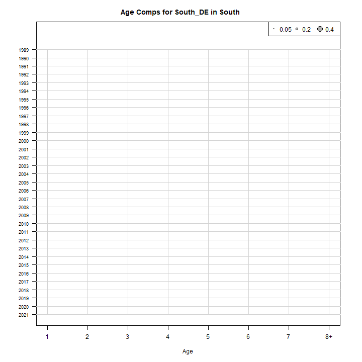

### Diagnostics

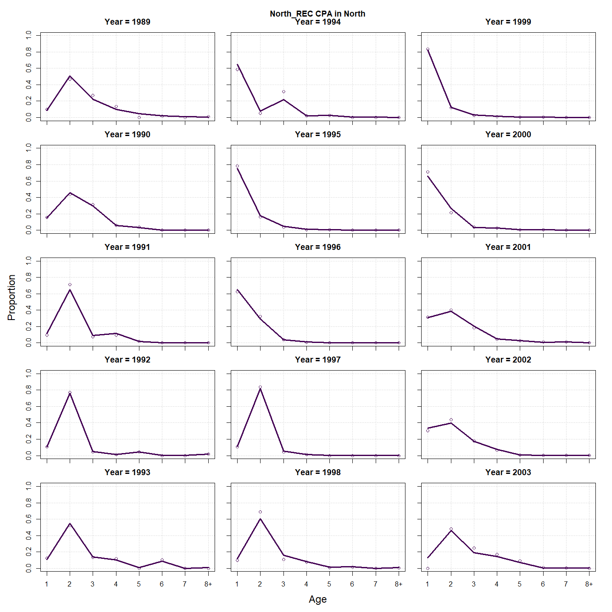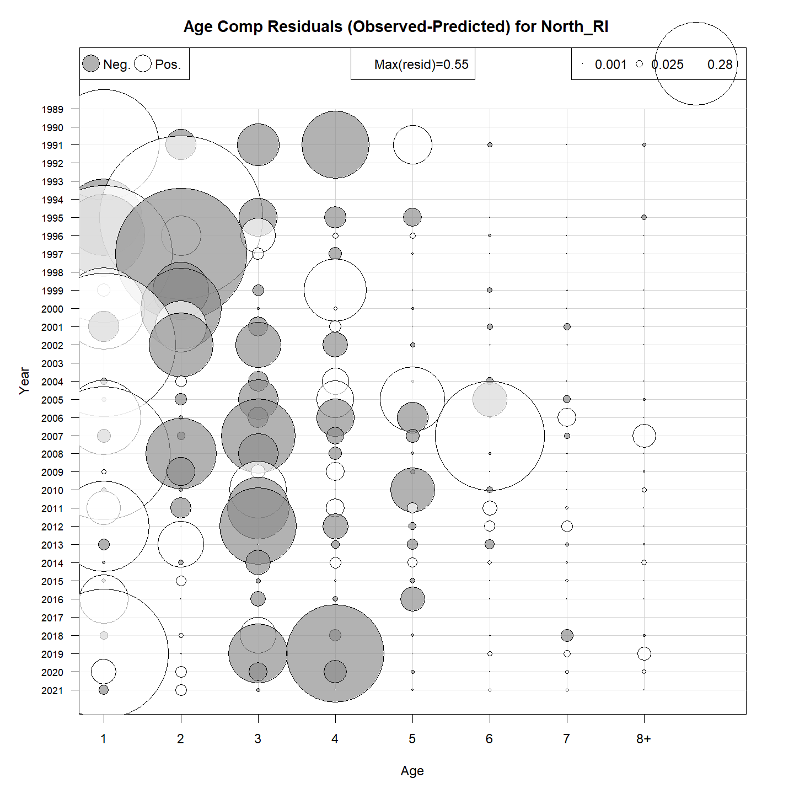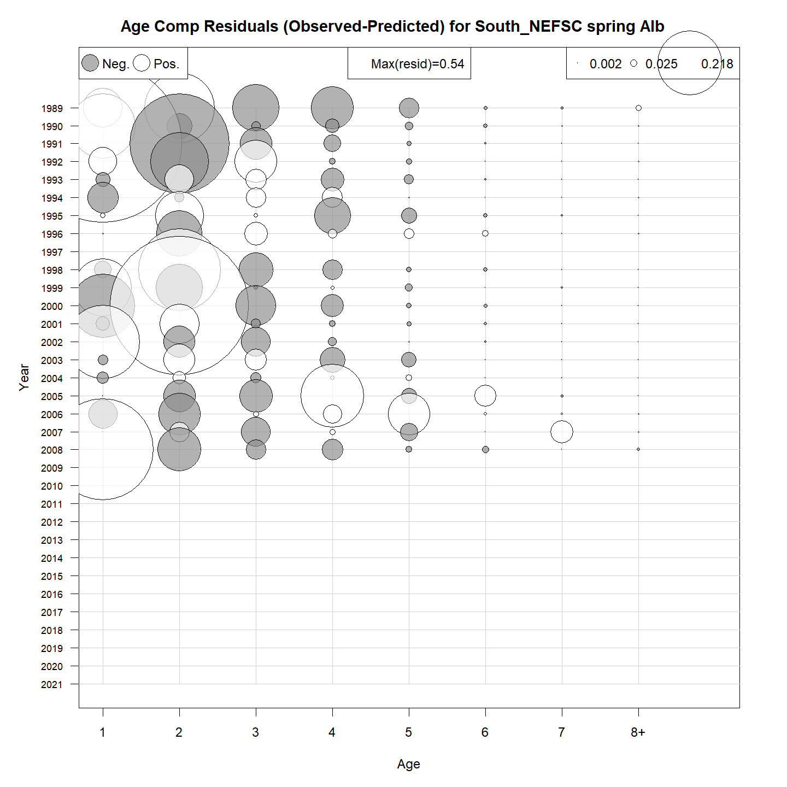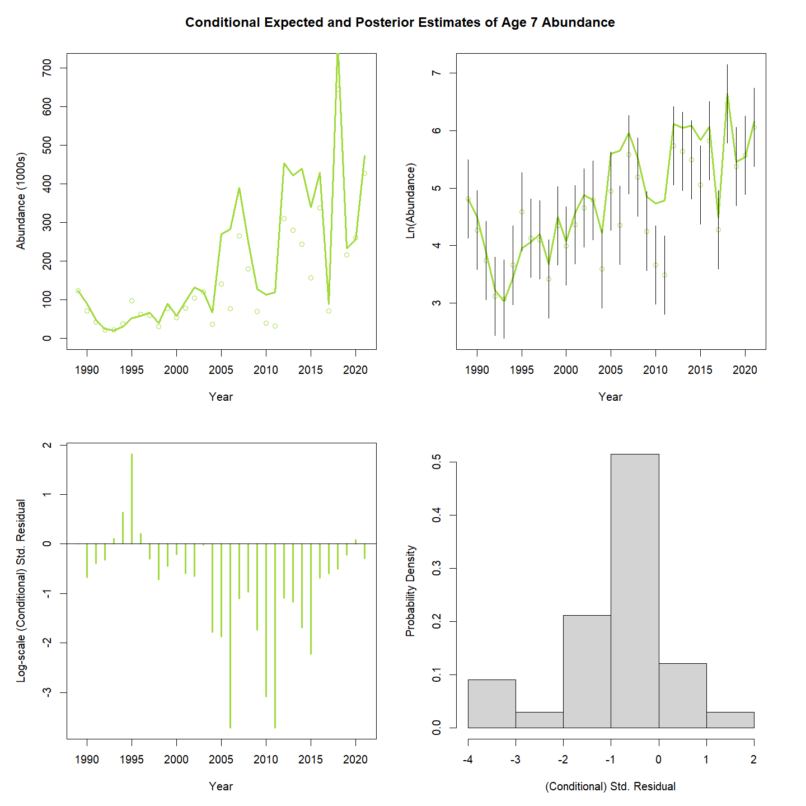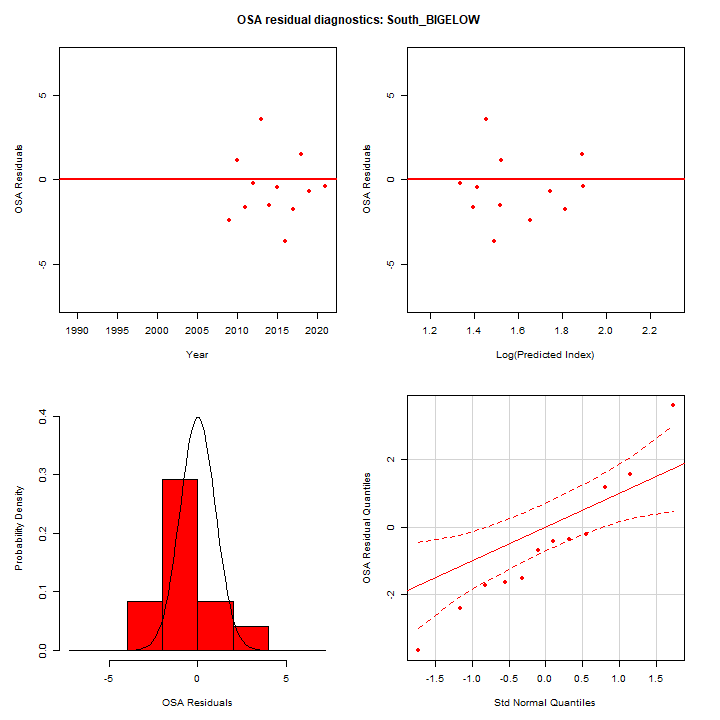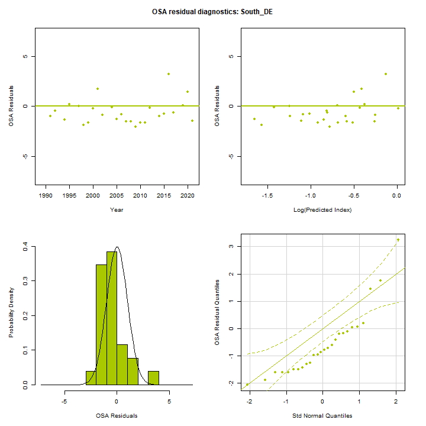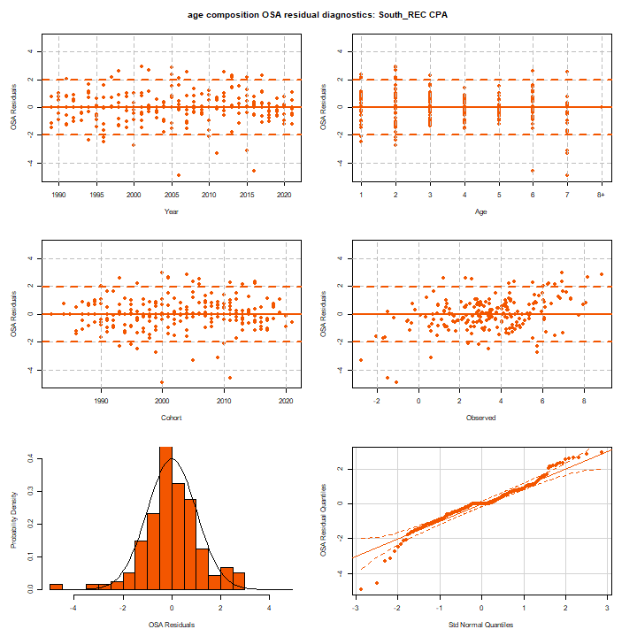

### Results

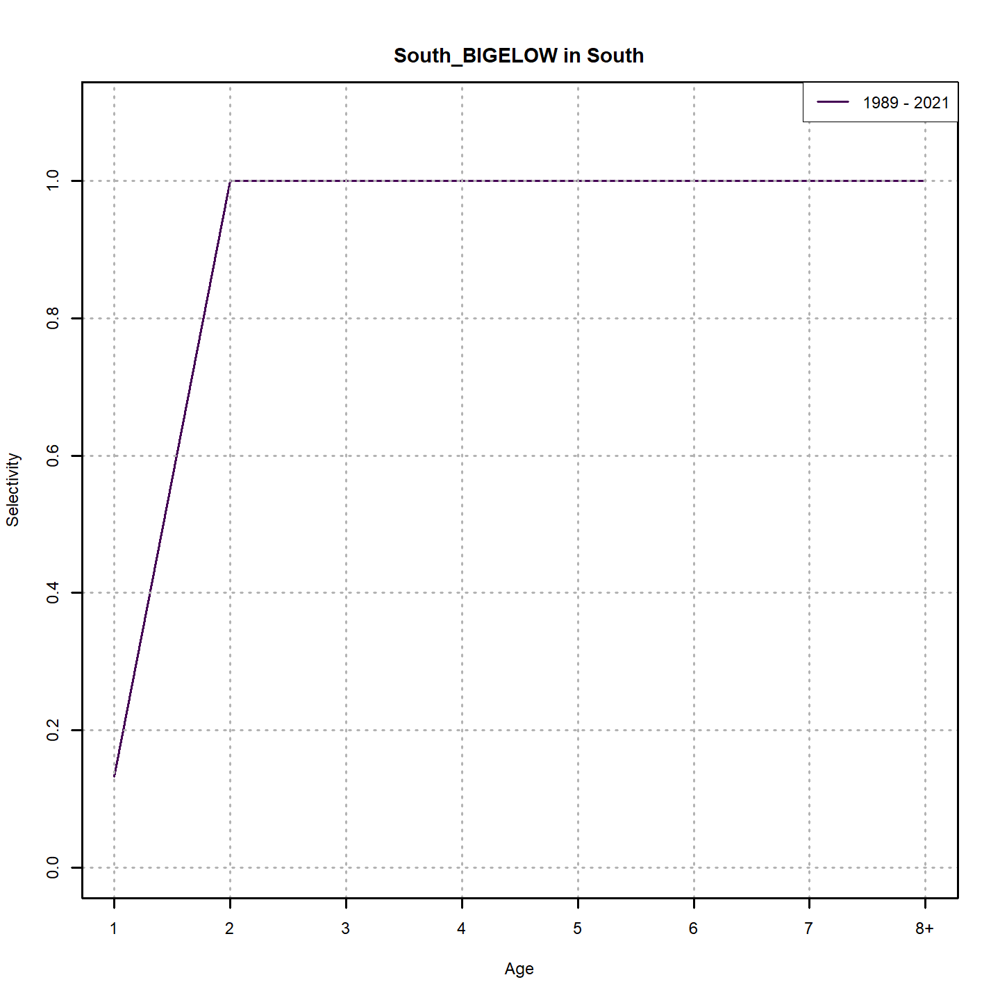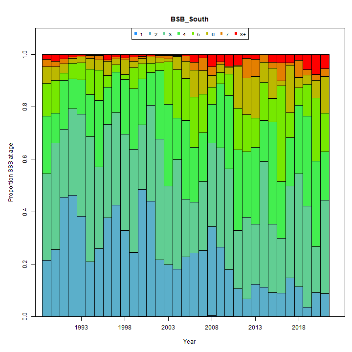

### Retro

### Reference points

### Miscelaneous

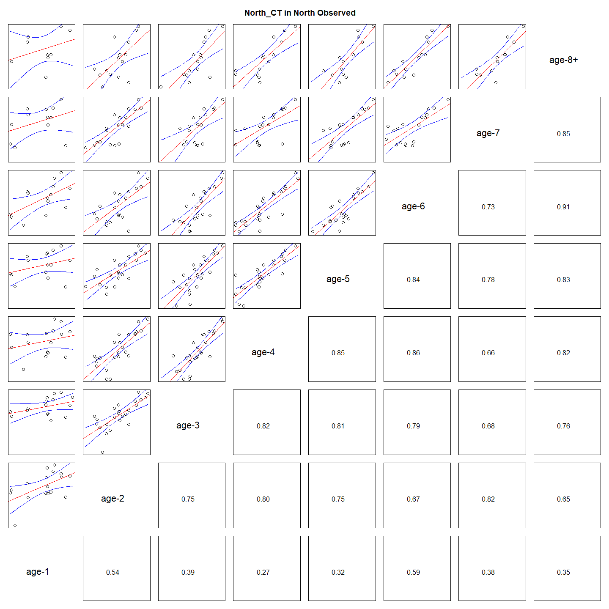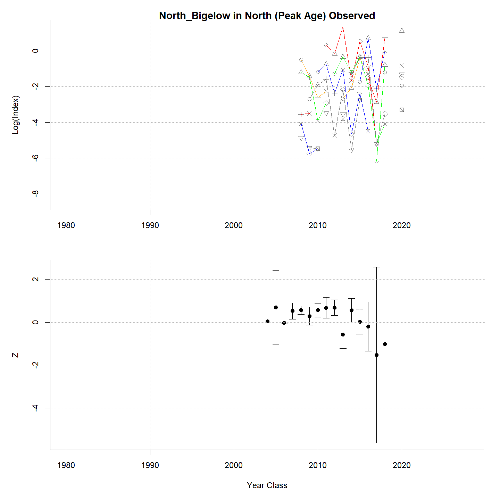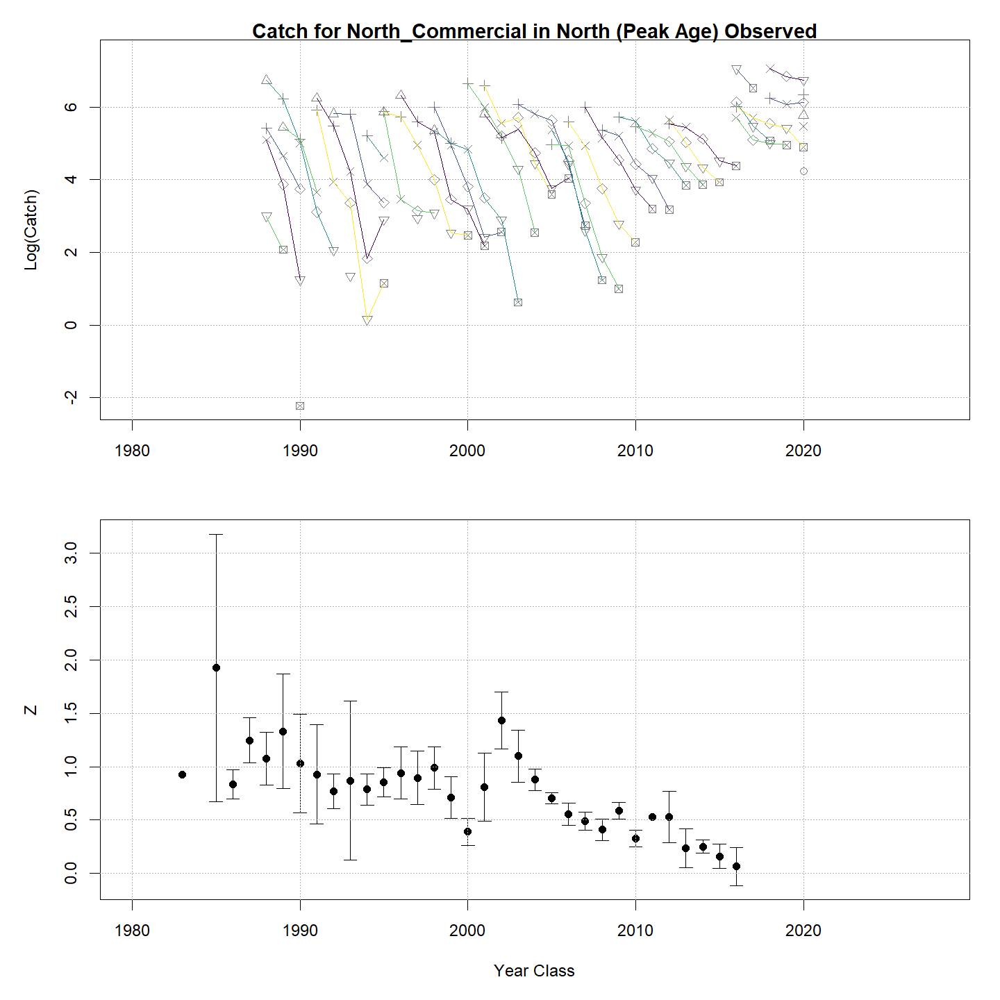

## Tables {.tabset}

### Parameter estimates

<table class="table" style="margin-left: auto; margin-right: auto;">
<caption>Parameter estimates, standard errors, and confidence intervals. Rounded to 3 decimal places.</caption>
 <thead>
  <tr>
   <th style="text-align:left;">   </th>
   <th style="text-align:right;"> Estimate </th>
   <th style="text-align:right;"> Std. Error </th>
   <th style="text-align:right;"> 95\% CI lower </th>
   <th style="text-align:right;"> 95\% CI upper </th>
  </tr>
 </thead>
<tbody>
  <tr>
   <td style="text-align:left;"> BSB North mean log(R) intercept </td>
   <td style="text-align:right;"> $5.830$ </td>
   <td style="text-align:right;"> $1.019$ </td>
   <td style="text-align:right;"> $3.832$ </td>
   <td style="text-align:right;"> $7.827$ </td>
  </tr>
  <tr>
   <td style="text-align:left;"> BSB North in North NAA $\sigma$ (age 1) </td>
   <td style="text-align:right;"> $0.787$ </td>
   <td style="text-align:right;"> $0.114$ </td>
   <td style="text-align:right;"> $0.592$ </td>
   <td style="text-align:right;"> $1.046$ </td>
  </tr>
  <tr>
   <td style="text-align:left;"> BSB North in North NAA $\sigma$ (ages 2-8+) </td>
   <td style="text-align:right;"> $0.841$ </td>
   <td style="text-align:right;"> $0.050$ </td>
   <td style="text-align:right;"> $0.749$ </td>
   <td style="text-align:right;"> $0.946$ </td>
  </tr>
  <tr>
   <td style="text-align:left;"> BSB North in South NAA $\sigma$ (age 1) </td>
   <td style="text-align:right;"> $0.787$ </td>
   <td style="text-align:right;"> $0.114$ </td>
   <td style="text-align:right;"> $0.592$ </td>
   <td style="text-align:right;"> $1.046$ </td>
  </tr>
  <tr>
   <td style="text-align:left;"> BSB North  in North  NAA AR1 $\rho$ age </td>
   <td style="text-align:right;"> $0.116$ </td>
   <td style="text-align:right;"> $0.102$ </td>
   <td style="text-align:right;"> $-0.086$ </td>
   <td style="text-align:right;"> $0.310$ </td>
  </tr>
  <tr>
   <td style="text-align:left;"> BSB North  in North  NAA AR1 $\rho$ year </td>
   <td style="text-align:right;"> $0.229$ </td>
   <td style="text-align:right;"> $0.082$ </td>
   <td style="text-align:right;"> $0.064$ </td>
   <td style="text-align:right;"> $0.382$ </td>
  </tr>
  <tr>
   <td style="text-align:left;"> BSB South Mean Recruitment </td>
   <td style="text-align:right;"> $20374.960$ </td>
   <td style="text-align:right;"> $4853.994$ </td>
   <td style="text-align:right;"> $12773.568$ </td>
   <td style="text-align:right;"> $32499.848$ </td>
  </tr>
  <tr>
   <td style="text-align:left;"> BSB South in North NAA $\sigma$ (age 1) </td>
   <td style="text-align:right;"> $0.473$ </td>
   <td style="text-align:right;"> $0.070$ </td>
   <td style="text-align:right;"> $0.354$ </td>
   <td style="text-align:right;"> $0.632$ </td>
  </tr>
  <tr>
   <td style="text-align:left;"> BSB South in North NAA $\sigma$ (ages 2-8+) </td>
   <td style="text-align:right;"> $0.348$ </td>
   <td style="text-align:right;"> $0.059$ </td>
   <td style="text-align:right;"> $0.250$ </td>
   <td style="text-align:right;"> $0.485$ </td>
  </tr>
  <tr>
   <td style="text-align:left;"> BSB South in South NAA $\sigma$ (age 1) </td>
   <td style="text-align:right;"> $0.473$ </td>
   <td style="text-align:right;"> $0.070$ </td>
   <td style="text-align:right;"> $0.354$ </td>
   <td style="text-align:right;"> $0.632$ </td>
  </tr>
  <tr>
   <td style="text-align:left;"> BSB South in South NAA $\sigma$ (ages 2-8+) </td>
   <td style="text-align:right;"> $0.348$ </td>
   <td style="text-align:right;"> $0.059$ </td>
   <td style="text-align:right;"> $0.250$ </td>
   <td style="text-align:right;"> $0.485$ </td>
  </tr>
  <tr>
   <td style="text-align:left;"> BSB South  in North  NAA AR1 $\rho$ age </td>
   <td style="text-align:right;"> $-0.289$ </td>
   <td style="text-align:right;"> $0.140$ </td>
   <td style="text-align:right;"> $-0.535$ </td>
   <td style="text-align:right;"> $0.002$ </td>
  </tr>
  <tr>
   <td style="text-align:left;"> BSB South  in North  NAA AR1 $\rho$ year </td>
   <td style="text-align:right;"> $0.606$ </td>
   <td style="text-align:right;"> $0.102$ </td>
   <td style="text-align:right;"> $0.368$ </td>
   <td style="text-align:right;"> $0.769$ </td>
  </tr>
  <tr>
   <td style="text-align:left;"> BSB South  in South  NAA AR1 $\rho$ age </td>
   <td style="text-align:right;"> $-0.289$ </td>
   <td style="text-align:right;"> $0.140$ </td>
   <td style="text-align:right;"> $-0.535$ </td>
   <td style="text-align:right;"> $0.002$ </td>
  </tr>
  <tr>
   <td style="text-align:left;"> BSB South  in South  NAA AR1 $\rho$ year </td>
   <td style="text-align:right;"> $0.606$ </td>
   <td style="text-align:right;"> $0.102$ </td>
   <td style="text-align:right;"> $0.368$ </td>
   <td style="text-align:right;"> $0.769$ </td>
  </tr>
  <tr>
   <td style="text-align:left;"> North NEFSC Spring Alb fully selected q </td>
   <td style="text-align:right;"> $2.270\times 10^{-5}$ </td>
   <td style="text-align:right;"> $4.551\times 10^{-6}$ </td>
   <td style="text-align:right;"> $1.532\times 10^{-5}$ </td>
   <td style="text-align:right;"> $3.362\times 10^{-5}$ </td>
  </tr>
  <tr>
   <td style="text-align:left;"> North NEAMAP fully selected q </td>
   <td style="text-align:right;"> $3.900\times 10^{-5}$ </td>
   <td style="text-align:right;"> $9.068\times 10^{-6}$ </td>
   <td style="text-align:right;"> $2.472\times 10^{-5}$ </td>
   <td style="text-align:right;"> $6.151\times 10^{-5}$ </td>
  </tr>
  <tr>
   <td style="text-align:left;"> North RI fully selected q </td>
   <td style="text-align:right;"> $1.661\times 10^{-5}$ </td>
   <td style="text-align:right;"> $3.020\times 10^{-6}$ </td>
   <td style="text-align:right;"> $1.163\times 10^{-5}$ </td>
   <td style="text-align:right;"> $2.372\times 10^{-5}$ </td>
  </tr>
  <tr>
   <td style="text-align:left;"> North CT fully selected q </td>
   <td style="text-align:right;"> $2.755\times 10^{-5}$ </td>
   <td style="text-align:right;"> $4.933\times 10^{-6}$ </td>
   <td style="text-align:right;"> $1.940\times 10^{-5}$ </td>
   <td style="text-align:right;"> $3.914\times 10^{-5}$ </td>
  </tr>
  <tr>
   <td style="text-align:left;"> North NY fully selected q </td>
   <td style="text-align:right;"> $1.140\times 10^{-5}$ </td>
   <td style="text-align:right;"> $2.954\times 10^{-6}$ </td>
   <td style="text-align:right;"> $6.859\times 10^{-6}$ </td>
   <td style="text-align:right;"> $1.894\times 10^{-5}$ </td>
  </tr>
  <tr>
   <td style="text-align:left;"> North REC CPA fully selected q </td>
   <td style="text-align:right;"> $6.231\times 10^{-5}$ </td>
   <td style="text-align:right;"> $1.187\times 10^{-5}$ </td>
   <td style="text-align:right;"> $4.290\times 10^{-5}$ </td>
   <td style="text-align:right;"> $9.052\times 10^{-5}$ </td>
  </tr>
  <tr>
   <td style="text-align:left;"> North Bigelow fully selected q </td>
   <td style="text-align:right;"> $2.517\times 10^{-5}$ </td>
   <td style="text-align:right;"> $5.263\times 10^{-6}$ </td>
   <td style="text-align:right;"> $1.670\times 10^{-5}$ </td>
   <td style="text-align:right;"> $3.792\times 10^{-5}$ </td>
  </tr>
  <tr>
   <td style="text-align:left;"> South NEFSC spring Alb fully selected q </td>
   <td style="text-align:right;"> $1.425\times 10^{-4}$ </td>
   <td style="text-align:right;"> $3.190\times 10^{-5}$ </td>
   <td style="text-align:right;"> $9.193\times 10^{-5}$ </td>
   <td style="text-align:right;"> $2.210\times 10^{-4}$ </td>
  </tr>
  <tr>
   <td style="text-align:left;"> South NEAMAP fully selected q </td>
   <td style="text-align:right;"> $4.174\times 10^{-6}$ </td>
   <td style="text-align:right;"> $9.489\times 10^{-7}$ </td>
   <td style="text-align:right;"> $2.673\times 10^{-6}$ </td>
   <td style="text-align:right;"> $6.517\times 10^{-6}$ </td>
  </tr>
  <tr>
   <td style="text-align:left;"> South NJ fully selected q </td>
   <td style="text-align:right;"> $1.248\times 10^{-4}$ </td>
   <td style="text-align:right;"> $1.665\times 10^{-5}$ </td>
   <td style="text-align:right;"> $9.612\times 10^{-5}$ </td>
   <td style="text-align:right;"> $1.621\times 10^{-4}$ </td>
  </tr>
  <tr>
   <td style="text-align:left;"> South DE fully selected q </td>
   <td style="text-align:right;"> $2.608\times 10^{-5}$ </td>
   <td style="text-align:right;"> $4.756\times 10^{-6}$ </td>
   <td style="text-align:right;"> $1.825\times 10^{-5}$ </td>
   <td style="text-align:right;"> $3.729\times 10^{-5}$ </td>
  </tr>
  <tr>
   <td style="text-align:left;"> South MD fully selected q </td>
   <td style="text-align:right;"> $3.771\times 10^{-5}$ </td>
   <td style="text-align:right;"> $6.117\times 10^{-6}$ </td>
   <td style="text-align:right;"> $2.744\times 10^{-5}$ </td>
   <td style="text-align:right;"> $5.182\times 10^{-5}$ </td>
  </tr>
  <tr>
   <td style="text-align:left;"> South VIMS fully selected q </td>
   <td style="text-align:right;"> $2.738\times 10^{-5}$ </td>
   <td style="text-align:right;"> $4.959\times 10^{-6}$ </td>
   <td style="text-align:right;"> $1.920\times 10^{-5}$ </td>
   <td style="text-align:right;"> $3.905\times 10^{-5}$ </td>
  </tr>
  <tr>
   <td style="text-align:left;"> South NEFSC winter fully selected q </td>
   <td style="text-align:right;"> $0.267$ </td>
   <td style="text-align:right;"> $0.058$ </td>
   <td style="text-align:right;"> $0.175$ </td>
   <td style="text-align:right;"> $0.407$ </td>
  </tr>
  <tr>
   <td style="text-align:left;"> South REC CPA fully selected q </td>
   <td style="text-align:right;"> $1.490\times 10^{-4}$ </td>
   <td style="text-align:right;"> $2.194\times 10^{-5}$ </td>
   <td style="text-align:right;"> $1.117\times 10^{-4}$ </td>
   <td style="text-align:right;"> $1.988\times 10^{-4}$ </td>
  </tr>
  <tr>
   <td style="text-align:left;"> South BIGELOW fully selected q </td>
   <td style="text-align:right;"> $1.938\times 10^{-4}$ </td>
   <td style="text-align:right;"> $3.237\times 10^{-5}$ </td>
   <td style="text-align:right;"> $1.397\times 10^{-4}$ </td>
   <td style="text-align:right;"> $2.688\times 10^{-4}$ </td>
  </tr>
  <tr>
   <td style="text-align:left;"> Block 1: North Commercial Mean Selectivity for age 1 </td>
   <td style="text-align:right;"> $0.018$ </td>
   <td style="text-align:right;"> $0.014$ </td>
   <td style="text-align:right;"> $0.004$ </td>
   <td style="text-align:right;"> $0.079$ </td>
  </tr>
  <tr>
   <td style="text-align:left;"> Block 1: North Commercial Mean Selectivity for age 2 </td>
   <td style="text-align:right;"> $0.327$ </td>
   <td style="text-align:right;"> $0.168$ </td>
   <td style="text-align:right;"> $0.099$ </td>
   <td style="text-align:right;"> $0.684$ </td>
  </tr>
  <tr>
   <td style="text-align:left;"> Block 1: North Commercial Mean Selectivity for age 3 </td>
   <td style="text-align:right;"> $0.830$ </td>
   <td style="text-align:right;"> $0.116$ </td>
   <td style="text-align:right;"> $0.494$ </td>
   <td style="text-align:right;"> $0.961$ </td>
  </tr>
  <tr>
   <td style="text-align:left;"> Block 1: North Commercial Mean Selectivity for age 4 </td>
   <td style="text-align:right;"> $1.000$ </td>
   <td style="text-align:right;"> -- </td>
   <td style="text-align:right;"> -- </td>
   <td style="text-align:right;"> -- </td>
  </tr>
  <tr>
   <td style="text-align:left;"> Block 1: North Commercial Mean Selectivity for age 5 </td>
   <td style="text-align:right;"> $1.000$ </td>
   <td style="text-align:right;"> -- </td>
   <td style="text-align:right;"> -- </td>
   <td style="text-align:right;"> -- </td>
  </tr>
  <tr>
   <td style="text-align:left;"> Block 1: North Commercial Mean Selectivity for age 6 </td>
   <td style="text-align:right;"> $1.000$ </td>
   <td style="text-align:right;"> -- </td>
   <td style="text-align:right;"> -- </td>
   <td style="text-align:right;"> -- </td>
  </tr>
  <tr>
   <td style="text-align:left;"> Block 1: North Commercial Mean Selectivity for age 7 </td>
   <td style="text-align:right;"> $1.000$ </td>
   <td style="text-align:right;"> -- </td>
   <td style="text-align:right;"> -- </td>
   <td style="text-align:right;"> -- </td>
  </tr>
  <tr>
   <td style="text-align:left;"> Block 1: North Commercial Mean Selectivity for age 8+ </td>
   <td style="text-align:right;"> $1.000$ </td>
   <td style="text-align:right;"> -- </td>
   <td style="text-align:right;"> -- </td>
   <td style="text-align:right;"> -- </td>
  </tr>
  <tr>
   <td style="text-align:left;"> Block 2: North Recreational Mean Selectivity for age 1 </td>
   <td style="text-align:right;"> $0.032$ </td>
   <td style="text-align:right;"> $0.026$ </td>
   <td style="text-align:right;"> $0.006$ </td>
   <td style="text-align:right;"> $0.146$ </td>
  </tr>
  <tr>
   <td style="text-align:left;"> Block 2: North Recreational Mean Selectivity for age 2 </td>
   <td style="text-align:right;"> $0.337$ </td>
   <td style="text-align:right;"> $0.184$ </td>
   <td style="text-align:right;"> $0.092$ </td>
   <td style="text-align:right;"> $0.719$ </td>
  </tr>
  <tr>
   <td style="text-align:left;"> Block 2: North Recreational Mean Selectivity for age 3 </td>
   <td style="text-align:right;"> $0.592$ </td>
   <td style="text-align:right;"> $0.202$ </td>
   <td style="text-align:right;"> $0.220$ </td>
   <td style="text-align:right;"> $0.882$ </td>
  </tr>
  <tr>
   <td style="text-align:left;"> Block 2: North Recreational Mean Selectivity for age 4 </td>
   <td style="text-align:right;"> $0.799$ </td>
   <td style="text-align:right;"> $0.137$ </td>
   <td style="text-align:right;"> $0.426$ </td>
   <td style="text-align:right;"> $0.955$ </td>
  </tr>
  <tr>
   <td style="text-align:left;"> Block 2: North Recreational Mean Selectivity for age 5 </td>
   <td style="text-align:right;"> $0.889$ </td>
   <td style="text-align:right;"> $0.088$ </td>
   <td style="text-align:right;"> $0.582$ </td>
   <td style="text-align:right;"> $0.979$ </td>
  </tr>
  <tr>
   <td style="text-align:left;"> Block 2: North Recreational Mean Selectivity for age 6 </td>
   <td style="text-align:right;"> $0.948$ </td>
   <td style="text-align:right;"> $0.049$ </td>
   <td style="text-align:right;"> $0.725$ </td>
   <td style="text-align:right;"> $0.992$ </td>
  </tr>
  <tr>
   <td style="text-align:left;"> Block 2: North Recreational Mean Selectivity for age 7 </td>
   <td style="text-align:right;"> $1.000$ </td>
   <td style="text-align:right;"> -- </td>
   <td style="text-align:right;"> -- </td>
   <td style="text-align:right;"> -- </td>
  </tr>
  <tr>
   <td style="text-align:left;"> Block 2: North Recreational Mean Selectivity for age 8+ </td>
   <td style="text-align:right;"> $1.000$ </td>
   <td style="text-align:right;"> -- </td>
   <td style="text-align:right;"> -- </td>
   <td style="text-align:right;"> -- </td>
  </tr>
  <tr>
   <td style="text-align:left;"> Block 3: South Commercial $a_{50}$ </td>
   <td style="text-align:right;"> $2.321$ </td>
   <td style="text-align:right;"> $0.122$ </td>
   <td style="text-align:right;"> $2.089$ </td>
   <td style="text-align:right;"> $2.567$ </td>
  </tr>
  <tr>
   <td style="text-align:left;"> Block 3: South Commercial 1/slope (increasing) </td>
   <td style="text-align:right;"> $0.386$ </td>
   <td style="text-align:right;"> $0.035$ </td>
   <td style="text-align:right;"> $0.324$ </td>
   <td style="text-align:right;"> $0.460$ </td>
  </tr>
  <tr>
   <td style="text-align:left;"> Block 4: South Recreational $a_{50}$ </td>
   <td style="text-align:right;"> $2.406$ </td>
   <td style="text-align:right;"> $0.288$ </td>
   <td style="text-align:right;"> $1.881$ </td>
   <td style="text-align:right;"> $3.005$ </td>
  </tr>
  <tr>
   <td style="text-align:left;"> Block 4: South Recreational 1/slope (increasing) </td>
   <td style="text-align:right;"> $0.738$ </td>
   <td style="text-align:right;"> $0.131$ </td>
   <td style="text-align:right;"> $0.518$ </td>
   <td style="text-align:right;"> $1.039$ </td>
  </tr>
  <tr>
   <td style="text-align:left;"> Block 9: North NEFSC Spring Alb Mean Selectivity for age 1 </td>
   <td style="text-align:right;"> $0.099$ </td>
   <td style="text-align:right;"> $0.089$ </td>
   <td style="text-align:right;"> $0.015$ </td>
   <td style="text-align:right;"> $0.438$ </td>
  </tr>
  <tr>
   <td style="text-align:left;"> Block 9: North NEFSC Spring Alb Mean Selectivity for age 2 </td>
   <td style="text-align:right;"> $1.000$ </td>
   <td style="text-align:right;"> -- </td>
   <td style="text-align:right;"> -- </td>
   <td style="text-align:right;"> -- </td>
  </tr>
  <tr>
   <td style="text-align:left;"> Block 9: North NEFSC Spring Alb Mean Selectivity for age 3 </td>
   <td style="text-align:right;"> $1.000$ </td>
   <td style="text-align:right;"> -- </td>
   <td style="text-align:right;"> -- </td>
   <td style="text-align:right;"> -- </td>
  </tr>
  <tr>
   <td style="text-align:left;"> Block 9: North NEFSC Spring Alb Mean Selectivity for age 4 </td>
   <td style="text-align:right;"> $1.000$ </td>
   <td style="text-align:right;"> -- </td>
   <td style="text-align:right;"> -- </td>
   <td style="text-align:right;"> -- </td>
  </tr>
  <tr>
   <td style="text-align:left;"> Block 9: North NEFSC Spring Alb Mean Selectivity for age 5 </td>
   <td style="text-align:right;"> $1.000$ </td>
   <td style="text-align:right;"> -- </td>
   <td style="text-align:right;"> -- </td>
   <td style="text-align:right;"> -- </td>
  </tr>
  <tr>
   <td style="text-align:left;"> Block 9: North NEFSC Spring Alb Mean Selectivity for age 6 </td>
   <td style="text-align:right;"> $1.000$ </td>
   <td style="text-align:right;"> -- </td>
   <td style="text-align:right;"> -- </td>
   <td style="text-align:right;"> -- </td>
  </tr>
  <tr>
   <td style="text-align:left;"> Block 9: North NEFSC Spring Alb Mean Selectivity for age 7 </td>
   <td style="text-align:right;"> $1.000$ </td>
   <td style="text-align:right;"> -- </td>
   <td style="text-align:right;"> -- </td>
   <td style="text-align:right;"> -- </td>
  </tr>
  <tr>
   <td style="text-align:left;"> Block 9: North NEFSC Spring Alb Mean Selectivity for age 8+ </td>
   <td style="text-align:right;"> $1.000$ </td>
   <td style="text-align:right;"> -- </td>
   <td style="text-align:right;"> -- </td>
   <td style="text-align:right;"> -- </td>
  </tr>
  <tr>
   <td style="text-align:left;"> Block 10: North NEAMAP Mean Selectivity for age 1 </td>
   <td style="text-align:right;"> $0.028$ </td>
   <td style="text-align:right;"> $0.021$ </td>
   <td style="text-align:right;"> $0.006$ </td>
   <td style="text-align:right;"> $0.116$ </td>
  </tr>
  <tr>
   <td style="text-align:left;"> Block 10: North NEAMAP Mean Selectivity for age 2 </td>
   <td style="text-align:right;"> $0.470$ </td>
   <td style="text-align:right;"> $0.176$ </td>
   <td style="text-align:right;"> $0.182$ </td>
   <td style="text-align:right;"> $0.780$ </td>
  </tr>
  <tr>
   <td style="text-align:left;"> Block 10: North NEAMAP Mean Selectivity for age 3 </td>
   <td style="text-align:right;"> $0.971$ </td>
   <td style="text-align:right;"> $0.104$ </td>
   <td style="text-align:right;"> $0.025$ </td>
   <td style="text-align:right;"> $1.000$ </td>
  </tr>
  <tr>
   <td style="text-align:left;"> Block 10: North NEAMAP Mean Selectivity for age 4 </td>
   <td style="text-align:right;"> $1.000$ </td>
   <td style="text-align:right;"> -- </td>
   <td style="text-align:right;"> -- </td>
   <td style="text-align:right;"> -- </td>
  </tr>
  <tr>
   <td style="text-align:left;"> Block 10: North NEAMAP Mean Selectivity for age 5 </td>
   <td style="text-align:right;"> $1.000$ </td>
   <td style="text-align:right;"> -- </td>
   <td style="text-align:right;"> -- </td>
   <td style="text-align:right;"> -- </td>
  </tr>
  <tr>
   <td style="text-align:left;"> Block 10: North NEAMAP Mean Selectivity for age 6 </td>
   <td style="text-align:right;"> $1.000$ </td>
   <td style="text-align:right;"> -- </td>
   <td style="text-align:right;"> -- </td>
   <td style="text-align:right;"> -- </td>
  </tr>
  <tr>
   <td style="text-align:left;"> Block 10: North NEAMAP Mean Selectivity for age 7 </td>
   <td style="text-align:right;"> $1.000$ </td>
   <td style="text-align:right;"> -- </td>
   <td style="text-align:right;"> -- </td>
   <td style="text-align:right;"> -- </td>
  </tr>
  <tr>
   <td style="text-align:left;"> Block 10: North NEAMAP Mean Selectivity for age 8+ </td>
   <td style="text-align:right;"> $1.000$ </td>
   <td style="text-align:right;"> -- </td>
   <td style="text-align:right;"> -- </td>
   <td style="text-align:right;"> -- </td>
  </tr>
  <tr>
   <td style="text-align:left;"> Block 11: North RI Mean Selectivity for age 1 </td>
   <td style="text-align:right;"> $0.049$ </td>
   <td style="text-align:right;"> $0.029$ </td>
   <td style="text-align:right;"> $0.015$ </td>
   <td style="text-align:right;"> $0.151$ </td>
  </tr>
  <tr>
   <td style="text-align:left;"> Block 11: North RI Mean Selectivity for age 2 </td>
   <td style="text-align:right;"> $0.315$ </td>
   <td style="text-align:right;"> $0.144$ </td>
   <td style="text-align:right;"> $0.110$ </td>
   <td style="text-align:right;"> $0.630$ </td>
  </tr>
  <tr>
   <td style="text-align:left;"> Block 11: North RI Mean Selectivity for age 3 </td>
   <td style="text-align:right;"> $1.000$ </td>
   <td style="text-align:right;"> -- </td>
   <td style="text-align:right;"> -- </td>
   <td style="text-align:right;"> -- </td>
  </tr>
  <tr>
   <td style="text-align:left;"> Block 11: North RI Mean Selectivity for age 4 </td>
   <td style="text-align:right;"> $1.000$ </td>
   <td style="text-align:right;"> -- </td>
   <td style="text-align:right;"> -- </td>
   <td style="text-align:right;"> -- </td>
  </tr>
  <tr>
   <td style="text-align:left;"> Block 11: North RI Mean Selectivity for age 5 </td>
   <td style="text-align:right;"> $1.000$ </td>
   <td style="text-align:right;"> -- </td>
   <td style="text-align:right;"> -- </td>
   <td style="text-align:right;"> -- </td>
  </tr>
  <tr>
   <td style="text-align:left;"> Block 11: North RI Mean Selectivity for age 6 </td>
   <td style="text-align:right;"> $1.000$ </td>
   <td style="text-align:right;"> -- </td>
   <td style="text-align:right;"> -- </td>
   <td style="text-align:right;"> -- </td>
  </tr>
  <tr>
   <td style="text-align:left;"> Block 11: North RI Mean Selectivity for age 7 </td>
   <td style="text-align:right;"> $1.000$ </td>
   <td style="text-align:right;"> -- </td>
   <td style="text-align:right;"> -- </td>
   <td style="text-align:right;"> -- </td>
  </tr>
  <tr>
   <td style="text-align:left;"> Block 11: North RI Mean Selectivity for age 8+ </td>
   <td style="text-align:right;"> $1.000$ </td>
   <td style="text-align:right;"> -- </td>
   <td style="text-align:right;"> -- </td>
   <td style="text-align:right;"> -- </td>
  </tr>
  <tr>
   <td style="text-align:left;"> Block 12: North CT Mean Selectivity for age 1 </td>
   <td style="text-align:right;"> $0.019$ </td>
   <td style="text-align:right;"> $0.011$ </td>
   <td style="text-align:right;"> $0.006$ </td>
   <td style="text-align:right;"> $0.058$ </td>
  </tr>
  <tr>
   <td style="text-align:left;"> Block 12: North CT Mean Selectivity for age 2 </td>
   <td style="text-align:right;"> $0.261$ </td>
   <td style="text-align:right;"> $0.111$ </td>
   <td style="text-align:right;"> $0.102$ </td>
   <td style="text-align:right;"> $0.523$ </td>
  </tr>
  <tr>
   <td style="text-align:left;"> Block 12: North CT Mean Selectivity for age 3 </td>
   <td style="text-align:right;"> $1.000$ </td>
   <td style="text-align:right;"> -- </td>
   <td style="text-align:right;"> -- </td>
   <td style="text-align:right;"> -- </td>
  </tr>
  <tr>
   <td style="text-align:left;"> Block 12: North CT Mean Selectivity for age 4 </td>
   <td style="text-align:right;"> $1.000$ </td>
   <td style="text-align:right;"> -- </td>
   <td style="text-align:right;"> -- </td>
   <td style="text-align:right;"> -- </td>
  </tr>
  <tr>
   <td style="text-align:left;"> Block 12: North CT Mean Selectivity for age 5 </td>
   <td style="text-align:right;"> $1.000$ </td>
   <td style="text-align:right;"> -- </td>
   <td style="text-align:right;"> -- </td>
   <td style="text-align:right;"> -- </td>
  </tr>
  <tr>
   <td style="text-align:left;"> Block 12: North CT Mean Selectivity for age 6 </td>
   <td style="text-align:right;"> $1.000$ </td>
   <td style="text-align:right;"> -- </td>
   <td style="text-align:right;"> -- </td>
   <td style="text-align:right;"> -- </td>
  </tr>
  <tr>
   <td style="text-align:left;"> Block 12: North CT Mean Selectivity for age 7 </td>
   <td style="text-align:right;"> $1.000$ </td>
   <td style="text-align:right;"> -- </td>
   <td style="text-align:right;"> -- </td>
   <td style="text-align:right;"> -- </td>
  </tr>
  <tr>
   <td style="text-align:left;"> Block 12: North CT Mean Selectivity for age 8+ </td>
   <td style="text-align:right;"> $1.000$ </td>
   <td style="text-align:right;"> -- </td>
   <td style="text-align:right;"> -- </td>
   <td style="text-align:right;"> -- </td>
  </tr>
  <tr>
   <td style="text-align:left;"> Block 13: North NY Selectivity for age 1 </td>
   <td style="text-align:right;"> $1.000$ </td>
   <td style="text-align:right;"> -- </td>
   <td style="text-align:right;"> -- </td>
   <td style="text-align:right;"> -- </td>
  </tr>
  <tr>
   <td style="text-align:left;"> Block 13: North NY Selectivity for age 2 </td>
   <td style="text-align:right;"> $0.000$ </td>
   <td style="text-align:right;"> -- </td>
   <td style="text-align:right;"> -- </td>
   <td style="text-align:right;"> -- </td>
  </tr>
  <tr>
   <td style="text-align:left;"> Block 13: North NY Selectivity for age 3 </td>
   <td style="text-align:right;"> $0.000$ </td>
   <td style="text-align:right;"> -- </td>
   <td style="text-align:right;"> -- </td>
   <td style="text-align:right;"> -- </td>
  </tr>
  <tr>
   <td style="text-align:left;"> Block 13: North NY Selectivity for age 4 </td>
   <td style="text-align:right;"> $0.000$ </td>
   <td style="text-align:right;"> -- </td>
   <td style="text-align:right;"> -- </td>
   <td style="text-align:right;"> -- </td>
  </tr>
  <tr>
   <td style="text-align:left;"> Block 13: North NY Selectivity for age 5 </td>
   <td style="text-align:right;"> $0.000$ </td>
   <td style="text-align:right;"> -- </td>
   <td style="text-align:right;"> -- </td>
   <td style="text-align:right;"> -- </td>
  </tr>
  <tr>
   <td style="text-align:left;"> Block 13: North NY Selectivity for age 6 </td>
   <td style="text-align:right;"> $0.000$ </td>
   <td style="text-align:right;"> -- </td>
   <td style="text-align:right;"> -- </td>
   <td style="text-align:right;"> -- </td>
  </tr>
  <tr>
   <td style="text-align:left;"> Block 13: North NY Selectivity for age 7 </td>
   <td style="text-align:right;"> $0.000$ </td>
   <td style="text-align:right;"> -- </td>
   <td style="text-align:right;"> -- </td>
   <td style="text-align:right;"> -- </td>
  </tr>
  <tr>
   <td style="text-align:left;"> Block 13: North NY Selectivity for age 8+ </td>
   <td style="text-align:right;"> $0.000$ </td>
   <td style="text-align:right;"> -- </td>
   <td style="text-align:right;"> -- </td>
   <td style="text-align:right;"> -- </td>
  </tr>
  <tr>
   <td style="text-align:left;"> Block 14: North REC CPA Mean Selectivity for age 1 </td>
   <td style="text-align:right;"> $0.177$ </td>
   <td style="text-align:right;"> $0.057$ </td>
   <td style="text-align:right;"> $0.091$ </td>
   <td style="text-align:right;"> $0.316$ </td>
  </tr>
  <tr>
   <td style="text-align:left;"> Block 14: North REC CPA Mean Selectivity for age 2 </td>
   <td style="text-align:right;"> $1.000$ </td>
   <td style="text-align:right;"> -- </td>
   <td style="text-align:right;"> -- </td>
   <td style="text-align:right;"> -- </td>
  </tr>
  <tr>
   <td style="text-align:left;"> Block 14: North REC CPA Mean Selectivity for age 3 </td>
   <td style="text-align:right;"> $1.000$ </td>
   <td style="text-align:right;"> -- </td>
   <td style="text-align:right;"> -- </td>
   <td style="text-align:right;"> -- </td>
  </tr>
  <tr>
   <td style="text-align:left;"> Block 14: North REC CPA Mean Selectivity for age 4 </td>
   <td style="text-align:right;"> $1.000$ </td>
   <td style="text-align:right;"> -- </td>
   <td style="text-align:right;"> -- </td>
   <td style="text-align:right;"> -- </td>
  </tr>
  <tr>
   <td style="text-align:left;"> Block 14: North REC CPA Mean Selectivity for age 5 </td>
   <td style="text-align:right;"> $1.000$ </td>
   <td style="text-align:right;"> -- </td>
   <td style="text-align:right;"> -- </td>
   <td style="text-align:right;"> -- </td>
  </tr>
  <tr>
   <td style="text-align:left;"> Block 14: North REC CPA Mean Selectivity for age 6 </td>
   <td style="text-align:right;"> $1.000$ </td>
   <td style="text-align:right;"> -- </td>
   <td style="text-align:right;"> -- </td>
   <td style="text-align:right;"> -- </td>
  </tr>
  <tr>
   <td style="text-align:left;"> Block 14: North REC CPA Mean Selectivity for age 7 </td>
   <td style="text-align:right;"> $1.000$ </td>
   <td style="text-align:right;"> -- </td>
   <td style="text-align:right;"> -- </td>
   <td style="text-align:right;"> -- </td>
  </tr>
  <tr>
   <td style="text-align:left;"> Block 14: North REC CPA Mean Selectivity for age 8+ </td>
   <td style="text-align:right;"> $1.000$ </td>
   <td style="text-align:right;"> -- </td>
   <td style="text-align:right;"> -- </td>
   <td style="text-align:right;"> -- </td>
  </tr>
  <tr>
   <td style="text-align:left;"> Block 15: North Bigelow Mean Selectivity for age 1 </td>
   <td style="text-align:right;"> $0.352$ </td>
   <td style="text-align:right;"> $0.108$ </td>
   <td style="text-align:right;"> $0.177$ </td>
   <td style="text-align:right;"> $0.579$ </td>
  </tr>
  <tr>
   <td style="text-align:left;"> Block 15: North Bigelow Mean Selectivity for age 2 </td>
   <td style="text-align:right;"> $1.000$ </td>
   <td style="text-align:right;"> -- </td>
   <td style="text-align:right;"> -- </td>
   <td style="text-align:right;"> -- </td>
  </tr>
  <tr>
   <td style="text-align:left;"> Block 15: North Bigelow Mean Selectivity for age 3 </td>
   <td style="text-align:right;"> $1.000$ </td>
   <td style="text-align:right;"> -- </td>
   <td style="text-align:right;"> -- </td>
   <td style="text-align:right;"> -- </td>
  </tr>
  <tr>
   <td style="text-align:left;"> Block 15: North Bigelow Mean Selectivity for age 4 </td>
   <td style="text-align:right;"> $1.000$ </td>
   <td style="text-align:right;"> -- </td>
   <td style="text-align:right;"> -- </td>
   <td style="text-align:right;"> -- </td>
  </tr>
  <tr>
   <td style="text-align:left;"> Block 15: North Bigelow Mean Selectivity for age 5 </td>
   <td style="text-align:right;"> $1.000$ </td>
   <td style="text-align:right;"> -- </td>
   <td style="text-align:right;"> -- </td>
   <td style="text-align:right;"> -- </td>
  </tr>
  <tr>
   <td style="text-align:left;"> Block 15: North Bigelow Mean Selectivity for age 6 </td>
   <td style="text-align:right;"> $1.000$ </td>
   <td style="text-align:right;"> -- </td>
   <td style="text-align:right;"> -- </td>
   <td style="text-align:right;"> -- </td>
  </tr>
  <tr>
   <td style="text-align:left;"> Block 15: North Bigelow Mean Selectivity for age 7 </td>
   <td style="text-align:right;"> $1.000$ </td>
   <td style="text-align:right;"> -- </td>
   <td style="text-align:right;"> -- </td>
   <td style="text-align:right;"> -- </td>
  </tr>
  <tr>
   <td style="text-align:left;"> Block 15: North Bigelow Mean Selectivity for age 8+ </td>
   <td style="text-align:right;"> $1.000$ </td>
   <td style="text-align:right;"> -- </td>
   <td style="text-align:right;"> -- </td>
   <td style="text-align:right;"> -- </td>
  </tr>
  <tr>
   <td style="text-align:left;"> Block 16: South NEFSC spring Alb Selectivity for age 1 </td>
   <td style="text-align:right;"> $0.077$ </td>
   <td style="text-align:right;"> $0.026$ </td>
   <td style="text-align:right;"> $0.039$ </td>
   <td style="text-align:right;"> $0.147$ </td>
  </tr>
  <tr>
   <td style="text-align:left;"> Block 16: South NEFSC spring Alb Selectivity for age 2 </td>
   <td style="text-align:right;"> $0.343$ </td>
   <td style="text-align:right;"> $0.099$ </td>
   <td style="text-align:right;"> $0.180$ </td>
   <td style="text-align:right;"> $0.553$ </td>
  </tr>
  <tr>
   <td style="text-align:left;"> Block 16: South NEFSC spring Alb Selectivity for age 3 </td>
   <td style="text-align:right;"> $0.657$ </td>
   <td style="text-align:right;"> $0.154$ </td>
   <td style="text-align:right;"> $0.334$ </td>
   <td style="text-align:right;"> $0.880$ </td>
  </tr>
  <tr>
   <td style="text-align:left;"> Block 16: South NEFSC spring Alb Selectivity for age 4 </td>
   <td style="text-align:right;"> $1.000$ </td>
   <td style="text-align:right;"> -- </td>
   <td style="text-align:right;"> -- </td>
   <td style="text-align:right;"> -- </td>
  </tr>
  <tr>
   <td style="text-align:left;"> Block 16: South NEFSC spring Alb Selectivity for age 5 </td>
   <td style="text-align:right;"> $1.000$ </td>
   <td style="text-align:right;"> -- </td>
   <td style="text-align:right;"> -- </td>
   <td style="text-align:right;"> -- </td>
  </tr>
  <tr>
   <td style="text-align:left;"> Block 16: South NEFSC spring Alb Selectivity for age 6 </td>
   <td style="text-align:right;"> $1.000$ </td>
   <td style="text-align:right;"> -- </td>
   <td style="text-align:right;"> -- </td>
   <td style="text-align:right;"> -- </td>
  </tr>
  <tr>
   <td style="text-align:left;"> Block 16: South NEFSC spring Alb Selectivity for age 7 </td>
   <td style="text-align:right;"> $1.000$ </td>
   <td style="text-align:right;"> -- </td>
   <td style="text-align:right;"> -- </td>
   <td style="text-align:right;"> -- </td>
  </tr>
  <tr>
   <td style="text-align:left;"> Block 16: South NEFSC spring Alb Selectivity for age 8+ </td>
   <td style="text-align:right;"> $1.000$ </td>
   <td style="text-align:right;"> -- </td>
   <td style="text-align:right;"> -- </td>
   <td style="text-align:right;"> -- </td>
  </tr>
  <tr>
   <td style="text-align:left;"> Block 17: South NEAMAP Selectivity for age 1 </td>
   <td style="text-align:right;"> $1.000$ </td>
   <td style="text-align:right;"> -- </td>
   <td style="text-align:right;"> -- </td>
   <td style="text-align:right;"> -- </td>
  </tr>
  <tr>
   <td style="text-align:left;"> Block 17: South NEAMAP Selectivity for age 2 </td>
   <td style="text-align:right;"> $0.000$ </td>
   <td style="text-align:right;"> -- </td>
   <td style="text-align:right;"> -- </td>
   <td style="text-align:right;"> -- </td>
  </tr>
  <tr>
   <td style="text-align:left;"> Block 17: South NEAMAP Selectivity for age 3 </td>
   <td style="text-align:right;"> $0.000$ </td>
   <td style="text-align:right;"> -- </td>
   <td style="text-align:right;"> -- </td>
   <td style="text-align:right;"> -- </td>
  </tr>
  <tr>
   <td style="text-align:left;"> Block 17: South NEAMAP Selectivity for age 4 </td>
   <td style="text-align:right;"> $0.000$ </td>
   <td style="text-align:right;"> -- </td>
   <td style="text-align:right;"> -- </td>
   <td style="text-align:right;"> -- </td>
  </tr>
  <tr>
   <td style="text-align:left;"> Block 17: South NEAMAP Selectivity for age 5 </td>
   <td style="text-align:right;"> $0.000$ </td>
   <td style="text-align:right;"> -- </td>
   <td style="text-align:right;"> -- </td>
   <td style="text-align:right;"> -- </td>
  </tr>
  <tr>
   <td style="text-align:left;"> Block 17: South NEAMAP Selectivity for age 6 </td>
   <td style="text-align:right;"> $0.000$ </td>
   <td style="text-align:right;"> -- </td>
   <td style="text-align:right;"> -- </td>
   <td style="text-align:right;"> -- </td>
  </tr>
  <tr>
   <td style="text-align:left;"> Block 17: South NEAMAP Selectivity for age 7 </td>
   <td style="text-align:right;"> $0.000$ </td>
   <td style="text-align:right;"> -- </td>
   <td style="text-align:right;"> -- </td>
   <td style="text-align:right;"> -- </td>
  </tr>
  <tr>
   <td style="text-align:left;"> Block 17: South NEAMAP Selectivity for age 8+ </td>
   <td style="text-align:right;"> $0.000$ </td>
   <td style="text-align:right;"> -- </td>
   <td style="text-align:right;"> -- </td>
   <td style="text-align:right;"> -- </td>
  </tr>
  <tr>
   <td style="text-align:left;"> Block 18: South NJ Selectivity for age 1 </td>
   <td style="text-align:right;"> $0.071$ </td>
   <td style="text-align:right;"> $0.016$ </td>
   <td style="text-align:right;"> $0.045$ </td>
   <td style="text-align:right;"> $0.110$ </td>
  </tr>
  <tr>
   <td style="text-align:left;"> Block 18: South NJ Selectivity for age 2 </td>
   <td style="text-align:right;"> $1.000$ </td>
   <td style="text-align:right;"> -- </td>
   <td style="text-align:right;"> -- </td>
   <td style="text-align:right;"> -- </td>
  </tr>
  <tr>
   <td style="text-align:left;"> Block 18: South NJ Selectivity for age 3 </td>
   <td style="text-align:right;"> $1.000$ </td>
   <td style="text-align:right;"> -- </td>
   <td style="text-align:right;"> -- </td>
   <td style="text-align:right;"> -- </td>
  </tr>
  <tr>
   <td style="text-align:left;"> Block 18: South NJ Selectivity for age 4 </td>
   <td style="text-align:right;"> $1.000$ </td>
   <td style="text-align:right;"> -- </td>
   <td style="text-align:right;"> -- </td>
   <td style="text-align:right;"> -- </td>
  </tr>
  <tr>
   <td style="text-align:left;"> Block 18: South NJ Selectivity for age 5 </td>
   <td style="text-align:right;"> $1.000$ </td>
   <td style="text-align:right;"> -- </td>
   <td style="text-align:right;"> -- </td>
   <td style="text-align:right;"> -- </td>
  </tr>
  <tr>
   <td style="text-align:left;"> Block 18: South NJ Selectivity for age 6 </td>
   <td style="text-align:right;"> $1.000$ </td>
   <td style="text-align:right;"> -- </td>
   <td style="text-align:right;"> -- </td>
   <td style="text-align:right;"> -- </td>
  </tr>
  <tr>
   <td style="text-align:left;"> Block 18: South NJ Selectivity for age 7 </td>
   <td style="text-align:right;"> $1.000$ </td>
   <td style="text-align:right;"> -- </td>
   <td style="text-align:right;"> -- </td>
   <td style="text-align:right;"> -- </td>
  </tr>
  <tr>
   <td style="text-align:left;"> Block 18: South NJ Selectivity for age 8+ </td>
   <td style="text-align:right;"> $1.000$ </td>
   <td style="text-align:right;"> -- </td>
   <td style="text-align:right;"> -- </td>
   <td style="text-align:right;"> -- </td>
  </tr>
  <tr>
   <td style="text-align:left;"> Block 19: South DE Selectivity for age 1 </td>
   <td style="text-align:right;"> $1.000$ </td>
   <td style="text-align:right;"> -- </td>
   <td style="text-align:right;"> -- </td>
   <td style="text-align:right;"> -- </td>
  </tr>
  <tr>
   <td style="text-align:left;"> Block 19: South DE Selectivity for age 2 </td>
   <td style="text-align:right;"> $0.000$ </td>
   <td style="text-align:right;"> -- </td>
   <td style="text-align:right;"> -- </td>
   <td style="text-align:right;"> -- </td>
  </tr>
  <tr>
   <td style="text-align:left;"> Block 19: South DE Selectivity for age 3 </td>
   <td style="text-align:right;"> $0.000$ </td>
   <td style="text-align:right;"> -- </td>
   <td style="text-align:right;"> -- </td>
   <td style="text-align:right;"> -- </td>
  </tr>
  <tr>
   <td style="text-align:left;"> Block 19: South DE Selectivity for age 4 </td>
   <td style="text-align:right;"> $0.000$ </td>
   <td style="text-align:right;"> -- </td>
   <td style="text-align:right;"> -- </td>
   <td style="text-align:right;"> -- </td>
  </tr>
  <tr>
   <td style="text-align:left;"> Block 19: South DE Selectivity for age 5 </td>
   <td style="text-align:right;"> $0.000$ </td>
   <td style="text-align:right;"> -- </td>
   <td style="text-align:right;"> -- </td>
   <td style="text-align:right;"> -- </td>
  </tr>
  <tr>
   <td style="text-align:left;"> Block 19: South DE Selectivity for age 6 </td>
   <td style="text-align:right;"> $0.000$ </td>
   <td style="text-align:right;"> -- </td>
   <td style="text-align:right;"> -- </td>
   <td style="text-align:right;"> -- </td>
  </tr>
  <tr>
   <td style="text-align:left;"> Block 19: South DE Selectivity for age 7 </td>
   <td style="text-align:right;"> $0.000$ </td>
   <td style="text-align:right;"> -- </td>
   <td style="text-align:right;"> -- </td>
   <td style="text-align:right;"> -- </td>
  </tr>
  <tr>
   <td style="text-align:left;"> Block 19: South DE Selectivity for age 8+ </td>
   <td style="text-align:right;"> $0.000$ </td>
   <td style="text-align:right;"> -- </td>
   <td style="text-align:right;"> -- </td>
   <td style="text-align:right;"> -- </td>
  </tr>
  <tr>
   <td style="text-align:left;"> Block 20: South MD Selectivity for age 1 </td>
   <td style="text-align:right;"> $1.000$ </td>
   <td style="text-align:right;"> -- </td>
   <td style="text-align:right;"> -- </td>
   <td style="text-align:right;"> -- </td>
  </tr>
  <tr>
   <td style="text-align:left;"> Block 20: South MD Selectivity for age 2 </td>
   <td style="text-align:right;"> $0.000$ </td>
   <td style="text-align:right;"> -- </td>
   <td style="text-align:right;"> -- </td>
   <td style="text-align:right;"> -- </td>
  </tr>
  <tr>
   <td style="text-align:left;"> Block 20: South MD Selectivity for age 3 </td>
   <td style="text-align:right;"> $0.000$ </td>
   <td style="text-align:right;"> -- </td>
   <td style="text-align:right;"> -- </td>
   <td style="text-align:right;"> -- </td>
  </tr>
  <tr>
   <td style="text-align:left;"> Block 20: South MD Selectivity for age 4 </td>
   <td style="text-align:right;"> $0.000$ </td>
   <td style="text-align:right;"> -- </td>
   <td style="text-align:right;"> -- </td>
   <td style="text-align:right;"> -- </td>
  </tr>
  <tr>
   <td style="text-align:left;"> Block 20: South MD Selectivity for age 5 </td>
   <td style="text-align:right;"> $0.000$ </td>
   <td style="text-align:right;"> -- </td>
   <td style="text-align:right;"> -- </td>
   <td style="text-align:right;"> -- </td>
  </tr>
  <tr>
   <td style="text-align:left;"> Block 20: South MD Selectivity for age 6 </td>
   <td style="text-align:right;"> $0.000$ </td>
   <td style="text-align:right;"> -- </td>
   <td style="text-align:right;"> -- </td>
   <td style="text-align:right;"> -- </td>
  </tr>
  <tr>
   <td style="text-align:left;"> Block 20: South MD Selectivity for age 7 </td>
   <td style="text-align:right;"> $0.000$ </td>
   <td style="text-align:right;"> -- </td>
   <td style="text-align:right;"> -- </td>
   <td style="text-align:right;"> -- </td>
  </tr>
  <tr>
   <td style="text-align:left;"> Block 20: South MD Selectivity for age 8+ </td>
   <td style="text-align:right;"> $0.000$ </td>
   <td style="text-align:right;"> -- </td>
   <td style="text-align:right;"> -- </td>
   <td style="text-align:right;"> -- </td>
  </tr>
  <tr>
   <td style="text-align:left;"> Block 21: South VIMS Selectivity for age 1 </td>
   <td style="text-align:right;"> $1.000$ </td>
   <td style="text-align:right;"> -- </td>
   <td style="text-align:right;"> -- </td>
   <td style="text-align:right;"> -- </td>
  </tr>
  <tr>
   <td style="text-align:left;"> Block 21: South VIMS Selectivity for age 2 </td>
   <td style="text-align:right;"> $0.000$ </td>
   <td style="text-align:right;"> -- </td>
   <td style="text-align:right;"> -- </td>
   <td style="text-align:right;"> -- </td>
  </tr>
  <tr>
   <td style="text-align:left;"> Block 21: South VIMS Selectivity for age 3 </td>
   <td style="text-align:right;"> $0.000$ </td>
   <td style="text-align:right;"> -- </td>
   <td style="text-align:right;"> -- </td>
   <td style="text-align:right;"> -- </td>
  </tr>
  <tr>
   <td style="text-align:left;"> Block 21: South VIMS Selectivity for age 4 </td>
   <td style="text-align:right;"> $0.000$ </td>
   <td style="text-align:right;"> -- </td>
   <td style="text-align:right;"> -- </td>
   <td style="text-align:right;"> -- </td>
  </tr>
  <tr>
   <td style="text-align:left;"> Block 21: South VIMS Selectivity for age 5 </td>
   <td style="text-align:right;"> $0.000$ </td>
   <td style="text-align:right;"> -- </td>
   <td style="text-align:right;"> -- </td>
   <td style="text-align:right;"> -- </td>
  </tr>
  <tr>
   <td style="text-align:left;"> Block 21: South VIMS Selectivity for age 6 </td>
   <td style="text-align:right;"> $0.000$ </td>
   <td style="text-align:right;"> -- </td>
   <td style="text-align:right;"> -- </td>
   <td style="text-align:right;"> -- </td>
  </tr>
  <tr>
   <td style="text-align:left;"> Block 21: South VIMS Selectivity for age 7 </td>
   <td style="text-align:right;"> $0.000$ </td>
   <td style="text-align:right;"> -- </td>
   <td style="text-align:right;"> -- </td>
   <td style="text-align:right;"> -- </td>
  </tr>
  <tr>
   <td style="text-align:left;"> Block 21: South VIMS Selectivity for age 8+ </td>
   <td style="text-align:right;"> $0.000$ </td>
   <td style="text-align:right;"> -- </td>
   <td style="text-align:right;"> -- </td>
   <td style="text-align:right;"> -- </td>
  </tr>
  <tr>
   <td style="text-align:left;"> Block 22: South NEFSC winter Selectivity for age 1 </td>
   <td style="text-align:right;"> $0.330$ </td>
   <td style="text-align:right;"> $0.085$ </td>
   <td style="text-align:right;"> $0.187$ </td>
   <td style="text-align:right;"> $0.512$ </td>
  </tr>
  <tr>
   <td style="text-align:left;"> Block 22: South NEFSC winter Selectivity for age 2 </td>
   <td style="text-align:right;"> $0.699$ </td>
   <td style="text-align:right;"> $0.131$ </td>
   <td style="text-align:right;"> $0.407$ </td>
   <td style="text-align:right;"> $0.886$ </td>
  </tr>
  <tr>
   <td style="text-align:left;"> Block 22: South NEFSC winter Selectivity for age 3 </td>
   <td style="text-align:right;"> $1.000$ </td>
   <td style="text-align:right;"> -- </td>
   <td style="text-align:right;"> -- </td>
   <td style="text-align:right;"> -- </td>
  </tr>
  <tr>
   <td style="text-align:left;"> Block 22: South NEFSC winter Selectivity for age 4 </td>
   <td style="text-align:right;"> $1.000$ </td>
   <td style="text-align:right;"> -- </td>
   <td style="text-align:right;"> -- </td>
   <td style="text-align:right;"> -- </td>
  </tr>
  <tr>
   <td style="text-align:left;"> Block 22: South NEFSC winter Selectivity for age 5 </td>
   <td style="text-align:right;"> $1.000$ </td>
   <td style="text-align:right;"> -- </td>
   <td style="text-align:right;"> -- </td>
   <td style="text-align:right;"> -- </td>
  </tr>
  <tr>
   <td style="text-align:left;"> Block 22: South NEFSC winter Selectivity for age 6 </td>
   <td style="text-align:right;"> $1.000$ </td>
   <td style="text-align:right;"> -- </td>
   <td style="text-align:right;"> -- </td>
   <td style="text-align:right;"> -- </td>
  </tr>
  <tr>
   <td style="text-align:left;"> Block 22: South NEFSC winter Selectivity for age 7 </td>
   <td style="text-align:right;"> $1.000$ </td>
   <td style="text-align:right;"> -- </td>
   <td style="text-align:right;"> -- </td>
   <td style="text-align:right;"> -- </td>
  </tr>
  <tr>
   <td style="text-align:left;"> Block 22: South NEFSC winter Selectivity for age 8+ </td>
   <td style="text-align:right;"> $1.000$ </td>
   <td style="text-align:right;"> -- </td>
   <td style="text-align:right;"> -- </td>
   <td style="text-align:right;"> -- </td>
  </tr>
  <tr>
   <td style="text-align:left;"> Block 23: South REC CPA Selectivity for age 1 </td>
   <td style="text-align:right;"> $0.455$ </td>
   <td style="text-align:right;"> $0.087$ </td>
   <td style="text-align:right;"> $0.296$ </td>
   <td style="text-align:right;"> $0.624$ </td>
  </tr>
  <tr>
   <td style="text-align:left;"> Block 23: South REC CPA Selectivity for age 2 </td>
   <td style="text-align:right;"> $0.913$ </td>
   <td style="text-align:right;"> $0.110$ </td>
   <td style="text-align:right;"> $0.411$ </td>
   <td style="text-align:right;"> $0.994$ </td>
  </tr>
  <tr>
   <td style="text-align:left;"> Block 23: South REC CPA Selectivity for age 3 </td>
   <td style="text-align:right;"> $1.000$ </td>
   <td style="text-align:right;"> -- </td>
   <td style="text-align:right;"> -- </td>
   <td style="text-align:right;"> -- </td>
  </tr>
  <tr>
   <td style="text-align:left;"> Block 23: South REC CPA Selectivity for age 4 </td>
   <td style="text-align:right;"> $1.000$ </td>
   <td style="text-align:right;"> -- </td>
   <td style="text-align:right;"> -- </td>
   <td style="text-align:right;"> -- </td>
  </tr>
  <tr>
   <td style="text-align:left;"> Block 23: South REC CPA Selectivity for age 5 </td>
   <td style="text-align:right;"> $1.000$ </td>
   <td style="text-align:right;"> -- </td>
   <td style="text-align:right;"> -- </td>
   <td style="text-align:right;"> -- </td>
  </tr>
  <tr>
   <td style="text-align:left;"> Block 23: South REC CPA Selectivity for age 6 </td>
   <td style="text-align:right;"> $1.000$ </td>
   <td style="text-align:right;"> -- </td>
   <td style="text-align:right;"> -- </td>
   <td style="text-align:right;"> -- </td>
  </tr>
  <tr>
   <td style="text-align:left;"> Block 23: South REC CPA Selectivity for age 7 </td>
   <td style="text-align:right;"> $1.000$ </td>
   <td style="text-align:right;"> -- </td>
   <td style="text-align:right;"> -- </td>
   <td style="text-align:right;"> -- </td>
  </tr>
  <tr>
   <td style="text-align:left;"> Block 23: South REC CPA Selectivity for age 8+ </td>
   <td style="text-align:right;"> $1.000$ </td>
   <td style="text-align:right;"> -- </td>
   <td style="text-align:right;"> -- </td>
   <td style="text-align:right;"> -- </td>
  </tr>
  <tr>
   <td style="text-align:left;"> Block 24: South BIGELOW Selectivity for age 1 </td>
   <td style="text-align:right;"> $0.132$ </td>
   <td style="text-align:right;"> $0.034$ </td>
   <td style="text-align:right;"> $0.078$ </td>
   <td style="text-align:right;"> $0.215$ </td>
  </tr>
  <tr>
   <td style="text-align:left;"> Block 24: South BIGELOW Selectivity for age 2 </td>
   <td style="text-align:right;"> $1.000$ </td>
   <td style="text-align:right;"> -- </td>
   <td style="text-align:right;"> -- </td>
   <td style="text-align:right;"> -- </td>
  </tr>
  <tr>
   <td style="text-align:left;"> Block 24: South BIGELOW Selectivity for age 3 </td>
   <td style="text-align:right;"> $1.000$ </td>
   <td style="text-align:right;"> -- </td>
   <td style="text-align:right;"> -- </td>
   <td style="text-align:right;"> -- </td>
  </tr>
  <tr>
   <td style="text-align:left;"> Block 24: South BIGELOW Selectivity for age 4 </td>
   <td style="text-align:right;"> $1.000$ </td>
   <td style="text-align:right;"> -- </td>
   <td style="text-align:right;"> -- </td>
   <td style="text-align:right;"> -- </td>
  </tr>
  <tr>
   <td style="text-align:left;"> Block 24: South BIGELOW Selectivity for age 5 </td>
   <td style="text-align:right;"> $1.000$ </td>
   <td style="text-align:right;"> -- </td>
   <td style="text-align:right;"> -- </td>
   <td style="text-align:right;"> -- </td>
  </tr>
  <tr>
   <td style="text-align:left;"> Block 24: South BIGELOW Selectivity for age 6 </td>
   <td style="text-align:right;"> $1.000$ </td>
   <td style="text-align:right;"> -- </td>
   <td style="text-align:right;"> -- </td>
   <td style="text-align:right;"> -- </td>
  </tr>
  <tr>
   <td style="text-align:left;"> Block 24: South BIGELOW Selectivity for age 7 </td>
   <td style="text-align:right;"> $1.000$ </td>
   <td style="text-align:right;"> -- </td>
   <td style="text-align:right;"> -- </td>
   <td style="text-align:right;"> -- </td>
  </tr>
  <tr>
   <td style="text-align:left;"> Block 24: South BIGELOW Selectivity for age 8+ </td>
   <td style="text-align:right;"> $1.000$ </td>
   <td style="text-align:right;"> -- </td>
   <td style="text-align:right;"> -- </td>
   <td style="text-align:right;"> -- </td>
  </tr>
  <tr>
   <td style="text-align:left;"> Block 1: North Commercial Selectivity RE $\sigma$ </td>
   <td style="text-align:right;"> $0.462$ </td>
   <td style="text-align:right;"> $0.118$ </td>
   <td style="text-align:right;"> $0.280$ </td>
   <td style="text-align:right;"> $0.760$ </td>
  </tr>
  <tr>
   <td style="text-align:left;"> Block 1: North Commercial Selectivity RE AR1 $\rho$ (age) </td>
   <td style="text-align:right;"> $0.484$ </td>
   <td style="text-align:right;"> $0.125$ </td>
   <td style="text-align:right;"> $0.396$ </td>
   <td style="text-align:right;"> $0.935$ </td>
  </tr>
  <tr>
   <td style="text-align:left;"> Block 1: North Commercial Selectivity RE AR1 $\rho$ (year) </td>
   <td style="text-align:right;"> $0.553$ </td>
   <td style="text-align:right;"> $0.092$ </td>
   <td style="text-align:right;"> $0.542$ </td>
   <td style="text-align:right;"> $0.955$ </td>
  </tr>
  <tr>
   <td style="text-align:left;"> Block 2: North Recreational Selectivity RE $\sigma$ </td>
   <td style="text-align:right;"> $0.243$ </td>
   <td style="text-align:right;"> $0.037$ </td>
   <td style="text-align:right;"> $0.181$ </td>
   <td style="text-align:right;"> $0.328$ </td>
  </tr>
  <tr>
   <td style="text-align:left;"> Block 2: North Recreational Selectivity RE AR1 $\rho$ (age) </td>
   <td style="text-align:right;"> $0.501$ </td>
   <td style="text-align:right;"> $0.069$ </td>
   <td style="text-align:right;"> $0.620$ </td>
   <td style="text-align:right;"> $0.901$ </td>
  </tr>
  <tr>
   <td style="text-align:left;"> Block 2: North Recreational Selectivity RE AR1 $\rho$ (year) </td>
   <td style="text-align:right;"> $0.696$ </td>
   <td style="text-align:right;"> $0.031$ </td>
   <td style="text-align:right;"> $0.837$ </td>
   <td style="text-align:right;"> $0.977$ </td>
  </tr>
  <tr>
   <td style="text-align:left;"> Block 9: North NEFSC Spring Alb Selectivity RE $\sigma$ </td>
   <td style="text-align:right;"> $1.151$ </td>
   <td style="text-align:right;"> $0.558$ </td>
   <td style="text-align:right;"> $0.445$ </td>
   <td style="text-align:right;"> $2.977$ </td>
  </tr>
  <tr>
   <td style="text-align:left;"> Block 9: North NEFSC Spring Alb Selectivity RE AR1 $\rho$ (age) </td>
   <td style="text-align:right;"> $0.000$ </td>
   <td style="text-align:right;"> -- </td>
   <td style="text-align:right;"> -- </td>
   <td style="text-align:right;"> -- </td>
  </tr>
  <tr>
   <td style="text-align:left;"> Block 9: North NEFSC Spring Alb Selectivity RE AR1 $\rho$ (year) </td>
   <td style="text-align:right;"> $0.402$ </td>
   <td style="text-align:right;"> $0.237$ </td>
   <td style="text-align:right;"> $-0.041$ </td>
   <td style="text-align:right;"> $0.941$ </td>
  </tr>
  <tr>
   <td style="text-align:left;"> Block 10: North NEAMAP Selectivity RE $\sigma$ </td>
   <td style="text-align:right;"> $1.460$ </td>
   <td style="text-align:right;"> $0.471$ </td>
   <td style="text-align:right;"> $0.776$ </td>
   <td style="text-align:right;"> $2.746$ </td>
  </tr>
  <tr>
   <td style="text-align:left;"> Block 10: North NEAMAP Selectivity RE AR1 $\rho$ (year) </td>
   <td style="text-align:right;"> $0.121$ </td>
   <td style="text-align:right;"> $0.488$ </td>
   <td style="text-align:right;"> $-0.647$ </td>
   <td style="text-align:right;"> $0.850$ </td>
  </tr>
  <tr>
   <td style="text-align:left;"> Block 11: North RI Selectivity RE $\sigma$ </td>
   <td style="text-align:right;"> $1.354$ </td>
   <td style="text-align:right;"> $0.357$ </td>
   <td style="text-align:right;"> $0.808$ </td>
   <td style="text-align:right;"> $2.270$ </td>
  </tr>
  <tr>
   <td style="text-align:left;"> Block 11: North RI Selectivity RE AR1 $\rho$ (year) </td>
   <td style="text-align:right;"> $0.292$ </td>
   <td style="text-align:right;"> $0.292$ </td>
   <td style="text-align:right;"> $-0.202$ </td>
   <td style="text-align:right;"> $0.887$ </td>
  </tr>
  <tr>
   <td style="text-align:left;"> Block 12: North CT Selectivity RE $\sigma$ </td>
   <td style="text-align:right;"> $1.051$ </td>
   <td style="text-align:right;"> $0.267$ </td>
   <td style="text-align:right;"> $0.639$ </td>
   <td style="text-align:right;"> $1.730$ </td>
  </tr>
  <tr>
   <td style="text-align:left;"> Block 12: North CT Selectivity RE AR1 $\rho$ (year) </td>
   <td style="text-align:right;"> $0.383$ </td>
   <td style="text-align:right;"> $0.190$ </td>
   <td style="text-align:right;"> $0.135$ </td>
   <td style="text-align:right;"> $0.901$ </td>
  </tr>
  <tr>
   <td style="text-align:left;"> Block 14: North REC CPA Selectivity RE $\sigma$ </td>
   <td style="text-align:right;"> $0.370$ </td>
   <td style="text-align:right;"> $0.088$ </td>
   <td style="text-align:right;"> $0.232$ </td>
   <td style="text-align:right;"> $0.590$ </td>
  </tr>
  <tr>
   <td style="text-align:left;"> Block 14: North REC CPA Selectivity RE AR1 $\rho$ (year) </td>
   <td style="text-align:right;"> $0.531$ </td>
   <td style="text-align:right;"> $0.112$ </td>
   <td style="text-align:right;"> $0.446$ </td>
   <td style="text-align:right;"> $0.955$ </td>
  </tr>
  <tr>
   <td style="text-align:left;"> Block 15: North Bigelow Selectivity RE $\sigma$ </td>
   <td style="text-align:right;"> $0.549$ </td>
   <td style="text-align:right;"> $0.415$ </td>
   <td style="text-align:right;"> $0.124$ </td>
   <td style="text-align:right;"> $2.418$ </td>
  </tr>
  <tr>
   <td style="text-align:left;"> Block 15: North Bigelow Selectivity RE AR1 $\rho$ (age) </td>
   <td style="text-align:right;"> $0.000$ </td>
   <td style="text-align:right;"> -- </td>
   <td style="text-align:right;"> -- </td>
   <td style="text-align:right;"> -- </td>
  </tr>
  <tr>
   <td style="text-align:left;"> Block 15: North Bigelow Selectivity RE AR1 $\rho$ (year) </td>
   <td style="text-align:right;"> $-0.437$ </td>
   <td style="text-align:right;"> $0.339$ </td>
   <td style="text-align:right;"> $-0.983$ </td>
   <td style="text-align:right;"> $0.465$ </td>
  </tr>
  <tr>
   <td style="text-align:left;"> North Commercial in North age comp, Dirichlet-multinomial: dispersion ($\phi$) </td>
   <td style="text-align:right;"> $58.888$ </td>
   <td style="text-align:right;"> $7.371$ </td>
   <td style="text-align:right;"> $46.076$ </td>
   <td style="text-align:right;"> $75.261$ </td>
  </tr>
  <tr>
   <td style="text-align:left;"> North Recreational in North age comp, logistic-normal: $\sigma$ </td>
   <td style="text-align:right;"> $2.857$ </td>
   <td style="text-align:right;"> $0.348$ </td>
   <td style="text-align:right;"> $2.251$ </td>
   <td style="text-align:right;"> $3.628$ </td>
  </tr>
  <tr>
   <td style="text-align:left;"> South Commercial in South age comp, logistic-normal: $\sigma$ </td>
   <td style="text-align:right;"> $34.607$ </td>
   <td style="text-align:right;"> $3.317$ </td>
   <td style="text-align:right;"> $28.680$ </td>
   <td style="text-align:right;"> $41.759$ </td>
  </tr>
  <tr>
   <td style="text-align:left;"> South Commercial in South age comp, logistic-normal: $\rho$ </td>
   <td style="text-align:right;"> $0.754$ </td>
   <td style="text-align:right;"> $0.052$ </td>
   <td style="text-align:right;"> $0.640$ </td>
   <td style="text-align:right;"> $0.841$ </td>
  </tr>
  <tr>
   <td style="text-align:left;"> South Recreational in South age comp, logistic-normal: $\sigma$ </td>
   <td style="text-align:right;"> $33.220$ </td>
   <td style="text-align:right;"> $3.662$ </td>
   <td style="text-align:right;"> $26.765$ </td>
   <td style="text-align:right;"> $41.232$ </td>
  </tr>
  <tr>
   <td style="text-align:left;"> South Recreational in South age comp, logistic-normal: $\rho$ </td>
   <td style="text-align:right;"> $0.840$ </td>
   <td style="text-align:right;"> $0.036$ </td>
   <td style="text-align:right;"> $0.757$ </td>
   <td style="text-align:right;"> $0.899$ </td>
  </tr>
  <tr>
   <td style="text-align:left;"> North NEFSC Spring Alb in North age comp, Dirichlet-multinomial: dispersion ($\phi$) </td>
   <td style="text-align:right;"> $2.225$ </td>
   <td style="text-align:right;"> $0.527$ </td>
   <td style="text-align:right;"> $1.399$ </td>
   <td style="text-align:right;"> $3.541$ </td>
  </tr>
  <tr>
   <td style="text-align:left;"> North NEAMAP in North age comp, Dirichlet-multinomial: dispersion ($\phi$) </td>
   <td style="text-align:right;"> $20.486$ </td>
   <td style="text-align:right;"> $3.449$ </td>
   <td style="text-align:right;"> $14.729$ </td>
   <td style="text-align:right;"> $28.493$ </td>
  </tr>
  <tr>
   <td style="text-align:left;"> North RI in North age comp, Dirichlet-multinomial: dispersion ($\phi$) </td>
   <td style="text-align:right;"> $4.434$ </td>
   <td style="text-align:right;"> $0.580$ </td>
   <td style="text-align:right;"> $3.431$ </td>
   <td style="text-align:right;"> $5.731$ </td>
  </tr>
  <tr>
   <td style="text-align:left;"> North CT in North age comp, Dirichlet-multinomial: dispersion ($\phi$) </td>
   <td style="text-align:right;"> $11.042$ </td>
   <td style="text-align:right;"> $1.166$ </td>
   <td style="text-align:right;"> $8.977$ </td>
   <td style="text-align:right;"> $13.581$ </td>
  </tr>
  <tr>
   <td style="text-align:left;"> North REC CPA in North age comp, logistic-normal: $\sigma$ </td>
   <td style="text-align:right;"> $4.099$ </td>
   <td style="text-align:right;"> $0.401$ </td>
   <td style="text-align:right;"> $3.384$ </td>
   <td style="text-align:right;"> $4.966$ </td>
  </tr>
  <tr>
   <td style="text-align:left;"> North Bigelow in North age comp, Dirichlet-multinomial: dispersion ($\phi$) </td>
   <td style="text-align:right;"> $13.728$ </td>
   <td style="text-align:right;"> $2.385$ </td>
   <td style="text-align:right;"> $9.767$ </td>
   <td style="text-align:right;"> $19.296$ </td>
  </tr>
  <tr>
   <td style="text-align:left;"> South NEFSC spring Alb in South age comp, logistic-normal: $\sigma$ </td>
   <td style="text-align:right;"> $46.885$ </td>
   <td style="text-align:right;"> $6.131$ </td>
   <td style="text-align:right;"> $36.285$ </td>
   <td style="text-align:right;"> $60.582$ </td>
  </tr>
  <tr>
   <td style="text-align:left;"> South NEFSC spring Alb in South age comp, logistic-normal: $\rho$ </td>
   <td style="text-align:right;"> $0.781$ </td>
   <td style="text-align:right;"> $0.065$ </td>
   <td style="text-align:right;"> $0.628$ </td>
   <td style="text-align:right;"> $0.883$ </td>
  </tr>
  <tr>
   <td style="text-align:left;"> South NJ in South age comp, logistic-normal: $\sigma$ </td>
   <td style="text-align:right;"> $60.394$ </td>
   <td style="text-align:right;"> $6.446$ </td>
   <td style="text-align:right;"> $48.995$ </td>
   <td style="text-align:right;"> $74.445$ </td>
  </tr>
  <tr>
   <td style="text-align:left;"> South NJ in South age comp, logistic-normal: $\rho$ </td>
   <td style="text-align:right;"> $0.844$ </td>
   <td style="text-align:right;"> $0.038$ </td>
   <td style="text-align:right;"> $0.754$ </td>
   <td style="text-align:right;"> $0.905$ </td>
  </tr>
  <tr>
   <td style="text-align:left;"> South NEFSC winter in South age comp, logistic-normal: $\sigma$ </td>
   <td style="text-align:right;"> $37.012$ </td>
   <td style="text-align:right;"> $5.270$ </td>
   <td style="text-align:right;"> $27.999$ </td>
   <td style="text-align:right;"> $48.925$ </td>
  </tr>
  <tr>
   <td style="text-align:left;"> South NEFSC winter in South age comp, logistic-normal: $\rho$ </td>
   <td style="text-align:right;"> $0.828$ </td>
   <td style="text-align:right;"> $0.055$ </td>
   <td style="text-align:right;"> $0.694$ </td>
   <td style="text-align:right;"> $0.910$ </td>
  </tr>
  <tr>
   <td style="text-align:left;"> South REC CPA in South age comp, logistic-normal: $\sigma$ </td>
   <td style="text-align:right;"> $31.566$ </td>
   <td style="text-align:right;"> $3.629$ </td>
   <td style="text-align:right;"> $25.197$ </td>
   <td style="text-align:right;"> $39.544$ </td>
  </tr>
  <tr>
   <td style="text-align:left;"> South REC CPA in South age comp, logistic-normal: $\rho$ </td>
   <td style="text-align:right;"> $0.844$ </td>
   <td style="text-align:right;"> $0.037$ </td>
   <td style="text-align:right;"> $0.757$ </td>
   <td style="text-align:right;"> $0.904$ </td>
  </tr>
  <tr>
   <td style="text-align:left;"> South BIGELOW in South age comp, logistic-normal: $\sigma$ </td>
   <td style="text-align:right;"> $27.938$ </td>
   <td style="text-align:right;"> $3.594$ </td>
   <td style="text-align:right;"> $21.712$ </td>
   <td style="text-align:right;"> $35.950$ </td>
  </tr>
  <tr>
   <td style="text-align:left;"> South BIGELOW in South age comp, logistic-normal: $\rho$ </td>
   <td style="text-align:right;"> $0.545$ </td>
   <td style="text-align:right;"> $0.131$ </td>
   <td style="text-align:right;"> $0.298$ </td>
   <td style="text-align:right;"> $0.772$ </td>
  </tr>
  <tr>
   <td style="text-align:left;"> stock BSB North $\mu$ from North to South (intercept) </td>
   <td style="text-align:right;"> $0.009$ </td>
   <td style="text-align:right;"> $0.001$ </td>
   <td style="text-align:right;"> $0.007$ </td>
   <td style="text-align:right;"> $0.012$ </td>
  </tr>
  <tr>
   <td style="text-align:left;"> stock BSB North $\mu$ from South to North (intercept) </td>
   <td style="text-align:right;"> $0.335$ </td>
   <td style="text-align:right;"> $0.044$ </td>
   <td style="text-align:right;"> $0.256$ </td>
   <td style="text-align:right;"> $0.425$ </td>
  </tr>
  <tr>
   <td style="text-align:left;"> North REC CPA log-index observation SD scalar </td>
   <td style="text-align:right;"> $15.963$ </td>
   <td style="text-align:right;"> $2.460$ </td>
   <td style="text-align:right;"> $11.801$ </td>
   <td style="text-align:right;"> $21.593$ </td>
  </tr>
  <tr>
   <td style="text-align:left;"> South REC CPA log-index observation SD scalar </td>
   <td style="text-align:right;"> $6.122$ </td>
   <td style="text-align:right;"> $1.179$ </td>
   <td style="text-align:right;"> $4.197$ </td>
   <td style="text-align:right;"> $8.929$ </td>
  </tr>
  <tr>
   <td style="text-align:left;"> Ecov North BT: $\mu$ </td>
   <td style="text-align:right;"> $6.803$ </td>
   <td style="text-align:right;"> $0.190$ </td>
   <td style="text-align:right;"> $6.431$ </td>
   <td style="text-align:right;"> $7.175$ </td>
  </tr>
  <tr>
   <td style="text-align:left;"> Ecov North BT: $\sigma$ </td>
   <td style="text-align:right;"> $1.131$ </td>
   <td style="text-align:right;"> $0.109$ </td>
   <td style="text-align:right;"> $0.937$ </td>
   <td style="text-align:right;"> $1.367$ </td>
  </tr>
  <tr>
   <td style="text-align:left;"> Ecov North BT: AR1 $\rho$ </td>
   <td style="text-align:right;"> $0.290$ </td>
   <td style="text-align:right;"> $0.121$ </td>
   <td style="text-align:right;"> $0.040$ </td>
   <td style="text-align:right;"> $0.506$ </td>
  </tr>
  <tr>
   <td style="text-align:left;"> Ecov South BT: $\mu$ </td>
   <td style="text-align:right;"> $7.606$ </td>
   <td style="text-align:right;"> $0.148$ </td>
   <td style="text-align:right;"> $7.316$ </td>
   <td style="text-align:right;"> $7.895$ </td>
  </tr>
  <tr>
   <td style="text-align:left;"> Ecov South BT: $\sigma$ </td>
   <td style="text-align:right;"> $1.017$ </td>
   <td style="text-align:right;"> $0.092$ </td>
   <td style="text-align:right;"> $0.852$ </td>
   <td style="text-align:right;"> $1.215$ </td>
  </tr>
  <tr>
   <td style="text-align:left;"> Ecov South BT: AR1 $\rho$ </td>
   <td style="text-align:right;"> $0.149$ </td>
   <td style="text-align:right;"> $0.124$ </td>
   <td style="text-align:right;"> $-0.099$ </td>
   <td style="text-align:right;"> $0.380$ </td>
  </tr>
  <tr>
   <td style="text-align:left;"> BSB North Recruitment Ecov: North BT $\beta_1$ </td>
   <td style="text-align:right;"> $0.535$ </td>
   <td style="text-align:right;"> $0.131$ </td>
   <td style="text-align:right;"> $0.278$ </td>
   <td style="text-align:right;"> $0.792$ </td>
  </tr>
</tbody>
</table>

### Abundance at age

<table class="table" style="margin-left: auto; margin-right: auto;">
<caption>Abundance at age (1000s) for BSB North in North.</caption>
 <thead>
  <tr>
   <th style="text-align:left;">   </th>
   <th style="text-align:right;"> 1 </th>
   <th style="text-align:right;"> 2 </th>
   <th style="text-align:right;"> 3 </th>
   <th style="text-align:right;"> 4 </th>
   <th style="text-align:right;"> 5 </th>
   <th style="text-align:right;"> 6 </th>
   <th style="text-align:right;"> 7 </th>
   <th style="text-align:right;"> 8+ </th>
  </tr>
 </thead>
<tbody>
  <tr>
   <td style="text-align:left;"> 1989 </td>
   <td style="text-align:right;"> 3166 </td>
   <td style="text-align:right;"> 2003 </td>
   <td style="text-align:right;"> 1037 </td>
   <td style="text-align:right;"> 484 </td>
   <td style="text-align:right;"> 221 </td>
   <td style="text-align:right;"> 100 </td>
   <td style="text-align:right;"> 46 </td>
   <td style="text-align:right;"> 38 </td>
  </tr>
  <tr>
   <td style="text-align:left;"> 1990 </td>
   <td style="text-align:right;"> 7574 </td>
   <td style="text-align:right;"> 1898 </td>
   <td style="text-align:right;"> 1514 </td>
   <td style="text-align:right;"> 290 </td>
   <td style="text-align:right;"> 168 </td>
   <td style="text-align:right;"> 12 </td>
   <td style="text-align:right;"> 3 </td>
   <td style="text-align:right;"> 15 </td>
  </tr>
  <tr>
   <td style="text-align:left;"> 1991 </td>
   <td style="text-align:right;"> 6544 </td>
   <td style="text-align:right;"> 2873 </td>
   <td style="text-align:right;"> 475 </td>
   <td style="text-align:right;"> 629 </td>
   <td style="text-align:right;"> 101 </td>
   <td style="text-align:right;"> 22 </td>
   <td style="text-align:right;"> 2 </td>
   <td style="text-align:right;"> 20 </td>
  </tr>
  <tr>
   <td style="text-align:left;"> 1992 </td>
   <td style="text-align:right;"> 3850 </td>
   <td style="text-align:right;"> 3661 </td>
   <td style="text-align:right;"> 206 </td>
   <td style="text-align:right;"> 75 </td>
   <td style="text-align:right;"> 248 </td>
   <td style="text-align:right;"> 16 </td>
   <td style="text-align:right;"> 5 </td>
   <td style="text-align:right;"> 97 </td>
  </tr>
  <tr>
   <td style="text-align:left;"> 1993 </td>
   <td style="text-align:right;"> 1454 </td>
   <td style="text-align:right;"> 1631 </td>
   <td style="text-align:right;"> 383 </td>
   <td style="text-align:right;"> 341 </td>
   <td style="text-align:right;"> 24 </td>
   <td style="text-align:right;"> 298 </td>
   <td style="text-align:right;"> 4 </td>
   <td style="text-align:right;"> 22 </td>
  </tr>
  <tr>
   <td style="text-align:left;"> 1994 </td>
   <td style="text-align:right;"> 7964 </td>
   <td style="text-align:right;"> 319 </td>
   <td style="text-align:right;"> 1139 </td>
   <td style="text-align:right;"> 108 </td>
   <td style="text-align:right;"> 139 </td>
   <td style="text-align:right;"> 14 </td>
   <td style="text-align:right;"> 27 </td>
   <td style="text-align:right;"> 11 </td>
  </tr>
  <tr>
   <td style="text-align:left;"> 1995 </td>
   <td style="text-align:right;"> 21149 </td>
   <td style="text-align:right;"> 2092 </td>
   <td style="text-align:right;"> 655 </td>
   <td style="text-align:right;"> 119 </td>
   <td style="text-align:right;"> 111 </td>
   <td style="text-align:right;"> 6 </td>
   <td style="text-align:right;"> 3 </td>
   <td style="text-align:right;"> 34 </td>
  </tr>
  <tr>
   <td style="text-align:left;"> 1996 </td>
   <td style="text-align:right;"> 23441 </td>
   <td style="text-align:right;"> 3730 </td>
   <td style="text-align:right;"> 736 </td>
   <td style="text-align:right;"> 196 </td>
   <td style="text-align:right;"> 47 </td>
   <td style="text-align:right;"> 87 </td>
   <td style="text-align:right;"> 9 </td>
   <td style="text-align:right;"> 14 </td>
  </tr>
  <tr>
   <td style="text-align:left;"> 1997 </td>
   <td style="text-align:right;"> 4997 </td>
   <td style="text-align:right;"> 12457 </td>
   <td style="text-align:right;"> 948 </td>
   <td style="text-align:right;"> 214 </td>
   <td style="text-align:right;"> 37 </td>
   <td style="text-align:right;"> 10 </td>
   <td style="text-align:right;"> 21 </td>
   <td style="text-align:right;"> 7 </td>
  </tr>
  <tr>
   <td style="text-align:left;"> 1998 </td>
   <td style="text-align:right;"> 1627 </td>
   <td style="text-align:right;"> 2493 </td>
   <td style="text-align:right;"> 516 </td>
   <td style="text-align:right;"> 444 </td>
   <td style="text-align:right;"> 72 </td>
   <td style="text-align:right;"> 98 </td>
   <td style="text-align:right;"> 4 </td>
   <td style="text-align:right;"> 36 </td>
  </tr>
  <tr>
   <td style="text-align:left;"> 1999 </td>
   <td style="text-align:right;"> 32333 </td>
   <td style="text-align:right;"> 2085 </td>
   <td style="text-align:right;"> 673 </td>
   <td style="text-align:right;"> 371 </td>
   <td style="text-align:right;"> 141 </td>
   <td style="text-align:right;"> 76 </td>
   <td style="text-align:right;"> 17 </td>
   <td style="text-align:right;"> 14 </td>
  </tr>
  <tr>
   <td style="text-align:left;"> 2000 </td>
   <td style="text-align:right;"> 32616 </td>
   <td style="text-align:right;"> 4639 </td>
   <td style="text-align:right;"> 727 </td>
   <td style="text-align:right;"> 660 </td>
   <td style="text-align:right;"> 138 </td>
   <td style="text-align:right;"> 163 </td>
   <td style="text-align:right;"> 12 </td>
   <td style="text-align:right;"> 28 </td>
  </tr>
  <tr>
   <td style="text-align:left;"> 2001 </td>
   <td style="text-align:right;"> 14614 </td>
   <td style="text-align:right;"> 4696 </td>
   <td style="text-align:right;"> 3192 </td>
   <td style="text-align:right;"> 800 </td>
   <td style="text-align:right;"> 469 </td>
   <td style="text-align:right;"> 167 </td>
   <td style="text-align:right;"> 239 </td>
   <td style="text-align:right;"> 6 </td>
  </tr>
  <tr>
   <td style="text-align:left;"> 2002 </td>
   <td style="text-align:right;"> 43294 </td>
   <td style="text-align:right;"> 10316 </td>
   <td style="text-align:right;"> 5061 </td>
   <td style="text-align:right;"> 2384 </td>
   <td style="text-align:right;"> 264 </td>
   <td style="text-align:right;"> 82 </td>
   <td style="text-align:right;"> 96 </td>
   <td style="text-align:right;"> 34 </td>
  </tr>
  <tr>
   <td style="text-align:left;"> 2003 </td>
   <td style="text-align:right;"> 7689 </td>
   <td style="text-align:right;"> 3932 </td>
   <td style="text-align:right;"> 2103 </td>
   <td style="text-align:right;"> 1878 </td>
   <td style="text-align:right;"> 930 </td>
   <td style="text-align:right;"> 79 </td>
   <td style="text-align:right;"> 31 </td>
   <td style="text-align:right;"> 26 </td>
  </tr>
  <tr>
   <td style="text-align:left;"> 2004 </td>
   <td style="text-align:right;"> 4795 </td>
   <td style="text-align:right;"> 2706 </td>
   <td style="text-align:right;"> 4318 </td>
   <td style="text-align:right;"> 725 </td>
   <td style="text-align:right;"> 1126 </td>
   <td style="text-align:right;"> 282 </td>
   <td style="text-align:right;"> 2 </td>
   <td style="text-align:right;"> 20 </td>
  </tr>
  <tr>
   <td style="text-align:left;"> 2005 </td>
   <td style="text-align:right;"> 4598 </td>
   <td style="text-align:right;"> 1277 </td>
   <td style="text-align:right;"> 409 </td>
   <td style="text-align:right;"> 769 </td>
   <td style="text-align:right;"> 368 </td>
   <td style="text-align:right;"> 272 </td>
   <td style="text-align:right;"> 62 </td>
   <td style="text-align:right;"> 21 </td>
  </tr>
  <tr>
   <td style="text-align:left;"> 2006 </td>
   <td style="text-align:right;"> 23589 </td>
   <td style="text-align:right;"> 3683 </td>
   <td style="text-align:right;"> 937 </td>
   <td style="text-align:right;"> 926 </td>
   <td style="text-align:right;"> 1121 </td>
   <td style="text-align:right;"> 157 </td>
   <td style="text-align:right;"> 205 </td>
   <td style="text-align:right;"> 1 </td>
  </tr>
  <tr>
   <td style="text-align:left;"> 2007 </td>
   <td style="text-align:right;"> 24057 </td>
   <td style="text-align:right;"> 5704 </td>
   <td style="text-align:right;"> 2401 </td>
   <td style="text-align:right;"> 665 </td>
   <td style="text-align:right;"> 433 </td>
   <td style="text-align:right;"> 453 </td>
   <td style="text-align:right;"> 200 </td>
   <td style="text-align:right;"> 27 </td>
  </tr>
  <tr>
   <td style="text-align:left;"> 2008 </td>
   <td style="text-align:right;"> 26390 </td>
   <td style="text-align:right;"> 5266 </td>
   <td style="text-align:right;"> 2378 </td>
   <td style="text-align:right;"> 852 </td>
   <td style="text-align:right;"> 234 </td>
   <td style="text-align:right;"> 183 </td>
   <td style="text-align:right;"> 122 </td>
   <td style="text-align:right;"> 81 </td>
  </tr>
  <tr>
   <td style="text-align:left;"> 2009 </td>
   <td style="text-align:right;"> 27184 </td>
   <td style="text-align:right;"> 6649 </td>
   <td style="text-align:right;"> 3533 </td>
   <td style="text-align:right;"> 2487 </td>
   <td style="text-align:right;"> 628 </td>
   <td style="text-align:right;"> 43 </td>
   <td style="text-align:right;"> 16 </td>
   <td style="text-align:right;"> 100 </td>
  </tr>
  <tr>
   <td style="text-align:left;"> 2010 </td>
   <td style="text-align:right;"> 8044 </td>
   <td style="text-align:right;"> 3791 </td>
   <td style="text-align:right;"> 4153 </td>
   <td style="text-align:right;"> 2532 </td>
   <td style="text-align:right;"> 1506 </td>
   <td style="text-align:right;"> 223 </td>
   <td style="text-align:right;"> 11 </td>
   <td style="text-align:right;"> 12 </td>
  </tr>
  <tr>
   <td style="text-align:left;"> 2011 </td>
   <td style="text-align:right;"> 30085 </td>
   <td style="text-align:right;"> 5453 </td>
   <td style="text-align:right;"> 3586 </td>
   <td style="text-align:right;"> 2908 </td>
   <td style="text-align:right;"> 1122 </td>
   <td style="text-align:right;"> 724 </td>
   <td style="text-align:right;"> 96 </td>
   <td style="text-align:right;"> 15 </td>
  </tr>
  <tr>
   <td style="text-align:left;"> 2012 </td>
   <td style="text-align:right;"> 139341 </td>
   <td style="text-align:right;"> 16617 </td>
   <td style="text-align:right;"> 8023 </td>
   <td style="text-align:right;"> 3852 </td>
   <td style="text-align:right;"> 3002 </td>
   <td style="text-align:right;"> 1217 </td>
   <td style="text-align:right;"> 576 </td>
   <td style="text-align:right;"> 116 </td>
  </tr>
  <tr>
   <td style="text-align:left;"> 2013 </td>
   <td style="text-align:right;"> 55941 </td>
   <td style="text-align:right;"> 35616 </td>
   <td style="text-align:right;"> 5962 </td>
   <td style="text-align:right;"> 4981 </td>
   <td style="text-align:right;"> 2888 </td>
   <td style="text-align:right;"> 1873 </td>
   <td style="text-align:right;"> 574 </td>
   <td style="text-align:right;"> 347 </td>
  </tr>
  <tr>
   <td style="text-align:left;"> 2014 </td>
   <td style="text-align:right;"> 23357 </td>
   <td style="text-align:right;"> 17889 </td>
   <td style="text-align:right;"> 44340 </td>
   <td style="text-align:right;"> 6680 </td>
   <td style="text-align:right;"> 3706 </td>
   <td style="text-align:right;"> 2161 </td>
   <td style="text-align:right;"> 1334 </td>
   <td style="text-align:right;"> 707 </td>
  </tr>
  <tr>
   <td style="text-align:left;"> 2015 </td>
   <td style="text-align:right;"> 27074 </td>
   <td style="text-align:right;"> 21262 </td>
   <td style="text-align:right;"> 18278 </td>
   <td style="text-align:right;"> 26148 </td>
   <td style="text-align:right;"> 4770 </td>
   <td style="text-align:right;"> 2160 </td>
   <td style="text-align:right;"> 1071 </td>
   <td style="text-align:right;"> 1021 </td>
  </tr>
  <tr>
   <td style="text-align:left;"> 2016 </td>
   <td style="text-align:right;"> 114944 </td>
   <td style="text-align:right;"> 34391 </td>
   <td style="text-align:right;"> 10330 </td>
   <td style="text-align:right;"> 9663 </td>
   <td style="text-align:right;"> 27667 </td>
   <td style="text-align:right;"> 3263 </td>
   <td style="text-align:right;"> 2052 </td>
   <td style="text-align:right;"> 1407 </td>
  </tr>
  <tr>
   <td style="text-align:left;"> 2017 </td>
   <td style="text-align:right;"> 43330 </td>
   <td style="text-align:right;"> 73546 </td>
   <td style="text-align:right;"> 16330 </td>
   <td style="text-align:right;"> 6701 </td>
   <td style="text-align:right;"> 6617 </td>
   <td style="text-align:right;"> 16020 </td>
   <td style="text-align:right;"> 1146 </td>
   <td style="text-align:right;"> 942 </td>
  </tr>
  <tr>
   <td style="text-align:left;"> 2018 </td>
   <td style="text-align:right;"> 11539 </td>
   <td style="text-align:right;"> 20377 </td>
   <td style="text-align:right;"> 35249 </td>
   <td style="text-align:right;"> 7490 </td>
   <td style="text-align:right;"> 2995 </td>
   <td style="text-align:right;"> 3629 </td>
   <td style="text-align:right;"> 9780 </td>
   <td style="text-align:right;"> 1124 </td>
  </tr>
  <tr>
   <td style="text-align:left;"> 2019 </td>
   <td style="text-align:right;"> 53609 </td>
   <td style="text-align:right;"> 12010 </td>
   <td style="text-align:right;"> 22717 </td>
   <td style="text-align:right;"> 37887 </td>
   <td style="text-align:right;"> 7329 </td>
   <td style="text-align:right;"> 2951 </td>
   <td style="text-align:right;"> 2563 </td>
   <td style="text-align:right;"> 8515 </td>
  </tr>
  <tr>
   <td style="text-align:left;"> 2020 </td>
   <td style="text-align:right;"> 59896 </td>
   <td style="text-align:right;"> 24915 </td>
   <td style="text-align:right;"> 10252 </td>
   <td style="text-align:right;"> 18584 </td>
   <td style="text-align:right;"> 23700 </td>
   <td style="text-align:right;"> 4596 </td>
   <td style="text-align:right;"> 2118 </td>
   <td style="text-align:right;"> 7009 </td>
  </tr>
  <tr>
   <td style="text-align:left;"> 2021 </td>
   <td style="text-align:right;"> 42863 </td>
   <td style="text-align:right;"> 27252 </td>
   <td style="text-align:right;"> 24790 </td>
   <td style="text-align:right;"> 7912 </td>
   <td style="text-align:right;"> 11402 </td>
   <td style="text-align:right;"> 18708 </td>
   <td style="text-align:right;"> 2762 </td>
   <td style="text-align:right;"> 7081 </td>
  </tr>
</tbody>
</table>

<table class="table" style="margin-left: auto; margin-right: auto;">
<caption>Abundance at age (1000s) for BSB North in South.</caption>
 <thead>
  <tr>
   <th style="text-align:left;">   </th>
   <th style="text-align:right;"> 1 </th>
   <th style="text-align:right;"> 2 </th>
   <th style="text-align:right;"> 3 </th>
   <th style="text-align:right;"> 4 </th>
   <th style="text-align:right;"> 5 </th>
   <th style="text-align:right;"> 6 </th>
   <th style="text-align:right;"> 7 </th>
   <th style="text-align:right;"> 8+ </th>
  </tr>
 </thead>
<tbody>
  <tr>
   <td style="text-align:left;"> 1989 </td>
   <td style="text-align:right;"> 0 </td>
   <td style="text-align:right;"> 92 </td>
   <td style="text-align:right;"> 49 </td>
   <td style="text-align:right;"> 23 </td>
   <td style="text-align:right;"> 10 </td>
   <td style="text-align:right;"> 5 </td>
   <td style="text-align:right;"> 2 </td>
   <td style="text-align:right;"> 2 </td>
  </tr>
  <tr>
   <td style="text-align:left;"> 1990 </td>
   <td style="text-align:right;"> 0 </td>
   <td style="text-align:right;"> 89 </td>
   <td style="text-align:right;"> 29 </td>
   <td style="text-align:right;"> 11 </td>
   <td style="text-align:right;"> 5 </td>
   <td style="text-align:right;"> 2 </td>
   <td style="text-align:right;"> 1 </td>
   <td style="text-align:right;"> 1 </td>
  </tr>
  <tr>
   <td style="text-align:left;"> 1991 </td>
   <td style="text-align:right;"> 0 </td>
   <td style="text-align:right;"> 217 </td>
   <td style="text-align:right;"> 39 </td>
   <td style="text-align:right;"> 21 </td>
   <td style="text-align:right;"> 4 </td>
   <td style="text-align:right;"> 2 </td>
   <td style="text-align:right;"> 0 </td>
   <td style="text-align:right;"> 0 </td>
  </tr>
  <tr>
   <td style="text-align:left;"> 1992 </td>
   <td style="text-align:right;"> 0 </td>
   <td style="text-align:right;"> 187 </td>
   <td style="text-align:right;"> 68 </td>
   <td style="text-align:right;"> 8 </td>
   <td style="text-align:right;"> 10 </td>
   <td style="text-align:right;"> 2 </td>
   <td style="text-align:right;"> 0 </td>
   <td style="text-align:right;"> 0 </td>
  </tr>
  <tr>
   <td style="text-align:left;"> 1993 </td>
   <td style="text-align:right;"> 0 </td>
   <td style="text-align:right;"> 111 </td>
   <td style="text-align:right;"> 87 </td>
   <td style="text-align:right;"> 5 </td>
   <td style="text-align:right;"> 1 </td>
   <td style="text-align:right;"> 4 </td>
   <td style="text-align:right;"> 0 </td>
   <td style="text-align:right;"> 2 </td>
  </tr>
  <tr>
   <td style="text-align:left;"> 1994 </td>
   <td style="text-align:right;"> 0 </td>
   <td style="text-align:right;"> 41 </td>
   <td style="text-align:right;"> 37 </td>
   <td style="text-align:right;"> 8 </td>
   <td style="text-align:right;"> 6 </td>
   <td style="text-align:right;"> 0 </td>
   <td style="text-align:right;"> 5 </td>
   <td style="text-align:right;"> 0 </td>
  </tr>
  <tr>
   <td style="text-align:left;"> 1995 </td>
   <td style="text-align:right;"> 0 </td>
   <td style="text-align:right;"> 220 </td>
   <td style="text-align:right;"> 6 </td>
   <td style="text-align:right;"> 17 </td>
   <td style="text-align:right;"> 2 </td>
   <td style="text-align:right;"> 2 </td>
   <td style="text-align:right;"> 0 </td>
   <td style="text-align:right;"> 1 </td>
  </tr>
  <tr>
   <td style="text-align:left;"> 1996 </td>
   <td style="text-align:right;"> 0 </td>
   <td style="text-align:right;"> 604 </td>
   <td style="text-align:right;"> 54 </td>
   <td style="text-align:right;"> 12 </td>
   <td style="text-align:right;"> 2 </td>
   <td style="text-align:right;"> 2 </td>
   <td style="text-align:right;"> 0 </td>
   <td style="text-align:right;"> 1 </td>
  </tr>
  <tr>
   <td style="text-align:left;"> 1997 </td>
   <td style="text-align:right;"> 0 </td>
   <td style="text-align:right;"> 667 </td>
   <td style="text-align:right;"> 101 </td>
   <td style="text-align:right;"> 10 </td>
   <td style="text-align:right;"> 2 </td>
   <td style="text-align:right;"> 1 </td>
   <td style="text-align:right;"> 1 </td>
   <td style="text-align:right;"> 0 </td>
  </tr>
  <tr>
   <td style="text-align:left;"> 1998 </td>
   <td style="text-align:right;"> 0 </td>
   <td style="text-align:right;"> 144 </td>
   <td style="text-align:right;"> 329 </td>
   <td style="text-align:right;"> 19 </td>
   <td style="text-align:right;"> 4 </td>
   <td style="text-align:right;"> 1 </td>
   <td style="text-align:right;"> 0 </td>
   <td style="text-align:right;"> 0 </td>
  </tr>
  <tr>
   <td style="text-align:left;"> 1999 </td>
   <td style="text-align:right;"> 0 </td>
   <td style="text-align:right;"> 47 </td>
   <td style="text-align:right;"> 65 </td>
   <td style="text-align:right;"> 14 </td>
   <td style="text-align:right;"> 7 </td>
   <td style="text-align:right;"> 1 </td>
   <td style="text-align:right;"> 1 </td>
   <td style="text-align:right;"> 1 </td>
  </tr>
  <tr>
   <td style="text-align:left;"> 2000 </td>
   <td style="text-align:right;"> 0 </td>
   <td style="text-align:right;"> 926 </td>
   <td style="text-align:right;"> 49 </td>
   <td style="text-align:right;"> 9 </td>
   <td style="text-align:right;"> 4 </td>
   <td style="text-align:right;"> 2 </td>
   <td style="text-align:right;"> 1 </td>
   <td style="text-align:right;"> 0 </td>
  </tr>
  <tr>
   <td style="text-align:left;"> 2001 </td>
   <td style="text-align:right;"> 0 </td>
   <td style="text-align:right;"> 935 </td>
   <td style="text-align:right;"> 131 </td>
   <td style="text-align:right;"> 14 </td>
   <td style="text-align:right;"> 11 </td>
   <td style="text-align:right;"> 2 </td>
   <td style="text-align:right;"> 3 </td>
   <td style="text-align:right;"> 1 </td>
  </tr>
  <tr>
   <td style="text-align:left;"> 2002 </td>
   <td style="text-align:right;"> 0 </td>
   <td style="text-align:right;"> 422 </td>
   <td style="text-align:right;"> 138 </td>
   <td style="text-align:right;"> 66 </td>
   <td style="text-align:right;"> 14 </td>
   <td style="text-align:right;"> 8 </td>
   <td style="text-align:right;"> 3 </td>
   <td style="text-align:right;"> 4 </td>
  </tr>
  <tr>
   <td style="text-align:left;"> 2003 </td>
   <td style="text-align:right;"> 0 </td>
   <td style="text-align:right;"> 1255 </td>
   <td style="text-align:right;"> 283 </td>
   <td style="text-align:right;"> 113 </td>
   <td style="text-align:right;"> 46 </td>
   <td style="text-align:right;"> 5 </td>
   <td style="text-align:right;"> 2 </td>
   <td style="text-align:right;"> 2 </td>
  </tr>
  <tr>
   <td style="text-align:left;"> 2004 </td>
   <td style="text-align:right;"> 0 </td>
   <td style="text-align:right;"> 223 </td>
   <td style="text-align:right;"> 133 </td>
   <td style="text-align:right;"> 51 </td>
   <td style="text-align:right;"> 35 </td>
   <td style="text-align:right;"> 16 </td>
   <td style="text-align:right;"> 1 </td>
   <td style="text-align:right;"> 1 </td>
  </tr>
  <tr>
   <td style="text-align:left;"> 2005 </td>
   <td style="text-align:right;"> 0 </td>
   <td style="text-align:right;"> 140 </td>
   <td style="text-align:right;"> 78 </td>
   <td style="text-align:right;"> 101 </td>
   <td style="text-align:right;"> 13 </td>
   <td style="text-align:right;"> 19 </td>
   <td style="text-align:right;"> 5 </td>
   <td style="text-align:right;"> 0 </td>
  </tr>
  <tr>
   <td style="text-align:left;"> 2006 </td>
   <td style="text-align:right;"> 0 </td>
   <td style="text-align:right;"> 132 </td>
   <td style="text-align:right;"> 33 </td>
   <td style="text-align:right;"> 8 </td>
   <td style="text-align:right;"> 8 </td>
   <td style="text-align:right;"> 3 </td>
   <td style="text-align:right;"> 2 </td>
   <td style="text-align:right;"> 1 </td>
  </tr>
  <tr>
   <td style="text-align:left;"> 2007 </td>
   <td style="text-align:right;"> 0 </td>
   <td style="text-align:right;"> 684 </td>
   <td style="text-align:right;"> 98 </td>
   <td style="text-align:right;"> 20 </td>
   <td style="text-align:right;"> 14 </td>
   <td style="text-align:right;"> 16 </td>
   <td style="text-align:right;"> 2 </td>
   <td style="text-align:right;"> 3 </td>
  </tr>
  <tr>
   <td style="text-align:left;"> 2008 </td>
   <td style="text-align:right;"> 0 </td>
   <td style="text-align:right;"> 695 </td>
   <td style="text-align:right;"> 160 </td>
   <td style="text-align:right;"> 48 </td>
   <td style="text-align:right;"> 10 </td>
   <td style="text-align:right;"> 6 </td>
   <td style="text-align:right;"> 7 </td>
   <td style="text-align:right;"> 3 </td>
  </tr>
  <tr>
   <td style="text-align:left;"> 2009 </td>
   <td style="text-align:right;"> 0 </td>
   <td style="text-align:right;"> 762 </td>
   <td style="text-align:right;"> 150 </td>
   <td style="text-align:right;"> 48 </td>
   <td style="text-align:right;"> 13 </td>
   <td style="text-align:right;"> 3 </td>
   <td style="text-align:right;"> 3 </td>
   <td style="text-align:right;"> 3 </td>
  </tr>
  <tr>
   <td style="text-align:left;"> 2010 </td>
   <td style="text-align:right;"> 0 </td>
   <td style="text-align:right;"> 784 </td>
   <td style="text-align:right;"> 185 </td>
   <td style="text-align:right;"> 73 </td>
   <td style="text-align:right;"> 42 </td>
   <td style="text-align:right;"> 10 </td>
   <td style="text-align:right;"> 1 </td>
   <td style="text-align:right;"> 2 </td>
  </tr>
  <tr>
   <td style="text-align:left;"> 2011 </td>
   <td style="text-align:right;"> 0 </td>
   <td style="text-align:right;"> 231 </td>
   <td style="text-align:right;"> 110 </td>
   <td style="text-align:right;"> 78 </td>
   <td style="text-align:right;"> 37 </td>
   <td style="text-align:right;"> 20 </td>
   <td style="text-align:right;"> 3 </td>
   <td style="text-align:right;"> 0 </td>
  </tr>
  <tr>
   <td style="text-align:left;"> 2012 </td>
   <td style="text-align:right;"> 0 </td>
   <td style="text-align:right;"> 877 </td>
   <td style="text-align:right;"> 153 </td>
   <td style="text-align:right;"> 88 </td>
   <td style="text-align:right;"> 63 </td>
   <td style="text-align:right;"> 23 </td>
   <td style="text-align:right;"> 15 </td>
   <td style="text-align:right;"> 2 </td>
  </tr>
  <tr>
   <td style="text-align:left;"> 2013 </td>
   <td style="text-align:right;"> 0 </td>
   <td style="text-align:right;"> 4036 </td>
   <td style="text-align:right;"> 466 </td>
   <td style="text-align:right;"> 195 </td>
   <td style="text-align:right;"> 82 </td>
   <td style="text-align:right;"> 61 </td>
   <td style="text-align:right;"> 24 </td>
   <td style="text-align:right;"> 14 </td>
  </tr>
  <tr>
   <td style="text-align:left;"> 2014 </td>
   <td style="text-align:right;"> 0 </td>
   <td style="text-align:right;"> 1627 </td>
   <td style="text-align:right;"> 1090 </td>
   <td style="text-align:right;"> 162 </td>
   <td style="text-align:right;"> 117 </td>
   <td style="text-align:right;"> 64 </td>
   <td style="text-align:right;"> 41 </td>
   <td style="text-align:right;"> 20 </td>
  </tr>
  <tr>
   <td style="text-align:left;"> 2015 </td>
   <td style="text-align:right;"> 0 </td>
   <td style="text-align:right;"> 681 </td>
   <td style="text-align:right;"> 544 </td>
   <td style="text-align:right;"> 1200 </td>
   <td style="text-align:right;"> 166 </td>
   <td style="text-align:right;"> 89 </td>
   <td style="text-align:right;"> 51 </td>
   <td style="text-align:right;"> 48 </td>
  </tr>
  <tr>
   <td style="text-align:left;"> 2016 </td>
   <td style="text-align:right;"> 0 </td>
   <td style="text-align:right;"> 790 </td>
   <td style="text-align:right;"> 613 </td>
   <td style="text-align:right;"> 506 </td>
   <td style="text-align:right;"> 678 </td>
   <td style="text-align:right;"> 116 </td>
   <td style="text-align:right;"> 52 </td>
   <td style="text-align:right;"> 50 </td>
  </tr>
  <tr>
   <td style="text-align:left;"> 2017 </td>
   <td style="text-align:right;"> 0 </td>
   <td style="text-align:right;"> 3347 </td>
   <td style="text-align:right;"> 980 </td>
   <td style="text-align:right;"> 295 </td>
   <td style="text-align:right;"> 257 </td>
   <td style="text-align:right;"> 682 </td>
   <td style="text-align:right;"> 80 </td>
   <td style="text-align:right;"> 83 </td>
  </tr>
  <tr>
   <td style="text-align:left;"> 2018 </td>
   <td style="text-align:right;"> 0 </td>
   <td style="text-align:right;"> 1259 </td>
   <td style="text-align:right;"> 2123 </td>
   <td style="text-align:right;"> 458 </td>
   <td style="text-align:right;"> 170 </td>
   <td style="text-align:right;"> 157 </td>
   <td style="text-align:right;"> 367 </td>
   <td style="text-align:right;"> 48 </td>
  </tr>
  <tr>
   <td style="text-align:left;"> 2019 </td>
   <td style="text-align:right;"> 0 </td>
   <td style="text-align:right;"> 336 </td>
   <td style="text-align:right;"> 603 </td>
   <td style="text-align:right;"> 1009 </td>
   <td style="text-align:right;"> 202 </td>
   <td style="text-align:right;"> 77 </td>
   <td style="text-align:right;"> 89 </td>
   <td style="text-align:right;"> 257 </td>
  </tr>
  <tr>
   <td style="text-align:left;"> 2020 </td>
   <td style="text-align:right;"> 0 </td>
   <td style="text-align:right;"> 1562 </td>
   <td style="text-align:right;"> 344 </td>
   <td style="text-align:right;"> 632 </td>
   <td style="text-align:right;"> 1012 </td>
   <td style="text-align:right;"> 189 </td>
   <td style="text-align:right;"> 72 </td>
   <td style="text-align:right;"> 257 </td>
  </tr>
  <tr>
   <td style="text-align:left;"> 2021 </td>
   <td style="text-align:right;"> 0 </td>
   <td style="text-align:right;"> 1743 </td>
   <td style="text-align:right;"> 736 </td>
   <td style="text-align:right;"> 286 </td>
   <td style="text-align:right;"> 501 </td>
   <td style="text-align:right;"> 629 </td>
   <td style="text-align:right;"> 116 </td>
   <td style="text-align:right;"> 212 </td>
  </tr>
</tbody>
</table>

<table class="table" style="margin-left: auto; margin-right: auto;">
<caption>Abundance at age (1000s) for BSB South in North.</caption>
 <thead>
  <tr>
   <th style="text-align:left;">   </th>
   <th style="text-align:right;"> 1 </th>
   <th style="text-align:right;"> 2 </th>
   <th style="text-align:right;"> 3 </th>
   <th style="text-align:right;"> 4 </th>
   <th style="text-align:right;"> 5 </th>
   <th style="text-align:right;"> 6 </th>
   <th style="text-align:right;"> 7 </th>
   <th style="text-align:right;"> 8+ </th>
  </tr>
 </thead>
<tbody>
  <tr>
   <td style="text-align:left;"> 1989 </td>
   <td style="text-align:right;"> 0 </td>
   <td style="text-align:right;"> 0 </td>
   <td style="text-align:right;"> 0 </td>
   <td style="text-align:right;"> 0 </td>
   <td style="text-align:right;"> 0 </td>
   <td style="text-align:right;"> 0 </td>
   <td style="text-align:right;"> 0 </td>
   <td style="text-align:right;"> 0 </td>
  </tr>
  <tr>
   <td style="text-align:left;"> 1990 </td>
   <td style="text-align:right;"> 0 </td>
   <td style="text-align:right;"> 0 </td>
   <td style="text-align:right;"> 0 </td>
   <td style="text-align:right;"> 0 </td>
   <td style="text-align:right;"> 0 </td>
   <td style="text-align:right;"> 0 </td>
   <td style="text-align:right;"> 0 </td>
   <td style="text-align:right;"> 0 </td>
  </tr>
  <tr>
   <td style="text-align:left;"> 1991 </td>
   <td style="text-align:right;"> 0 </td>
   <td style="text-align:right;"> 0 </td>
   <td style="text-align:right;"> 0 </td>
   <td style="text-align:right;"> 0 </td>
   <td style="text-align:right;"> 0 </td>
   <td style="text-align:right;"> 0 </td>
   <td style="text-align:right;"> 0 </td>
   <td style="text-align:right;"> 0 </td>
  </tr>
  <tr>
   <td style="text-align:left;"> 1992 </td>
   <td style="text-align:right;"> 0 </td>
   <td style="text-align:right;"> 0 </td>
   <td style="text-align:right;"> 0 </td>
   <td style="text-align:right;"> 0 </td>
   <td style="text-align:right;"> 0 </td>
   <td style="text-align:right;"> 0 </td>
   <td style="text-align:right;"> 0 </td>
   <td style="text-align:right;"> 0 </td>
  </tr>
  <tr>
   <td style="text-align:left;"> 1993 </td>
   <td style="text-align:right;"> 0 </td>
   <td style="text-align:right;"> 0 </td>
   <td style="text-align:right;"> 0 </td>
   <td style="text-align:right;"> 0 </td>
   <td style="text-align:right;"> 0 </td>
   <td style="text-align:right;"> 0 </td>
   <td style="text-align:right;"> 0 </td>
   <td style="text-align:right;"> 0 </td>
  </tr>
  <tr>
   <td style="text-align:left;"> 1994 </td>
   <td style="text-align:right;"> 0 </td>
   <td style="text-align:right;"> 0 </td>
   <td style="text-align:right;"> 0 </td>
   <td style="text-align:right;"> 0 </td>
   <td style="text-align:right;"> 0 </td>
   <td style="text-align:right;"> 0 </td>
   <td style="text-align:right;"> 0 </td>
   <td style="text-align:right;"> 0 </td>
  </tr>
  <tr>
   <td style="text-align:left;"> 1995 </td>
   <td style="text-align:right;"> 0 </td>
   <td style="text-align:right;"> 0 </td>
   <td style="text-align:right;"> 0 </td>
   <td style="text-align:right;"> 0 </td>
   <td style="text-align:right;"> 0 </td>
   <td style="text-align:right;"> 0 </td>
   <td style="text-align:right;"> 0 </td>
   <td style="text-align:right;"> 0 </td>
  </tr>
  <tr>
   <td style="text-align:left;"> 1996 </td>
   <td style="text-align:right;"> 0 </td>
   <td style="text-align:right;"> 0 </td>
   <td style="text-align:right;"> 0 </td>
   <td style="text-align:right;"> 0 </td>
   <td style="text-align:right;"> 0 </td>
   <td style="text-align:right;"> 0 </td>
   <td style="text-align:right;"> 0 </td>
   <td style="text-align:right;"> 0 </td>
  </tr>
  <tr>
   <td style="text-align:left;"> 1997 </td>
   <td style="text-align:right;"> 0 </td>
   <td style="text-align:right;"> 0 </td>
   <td style="text-align:right;"> 0 </td>
   <td style="text-align:right;"> 0 </td>
   <td style="text-align:right;"> 0 </td>
   <td style="text-align:right;"> 0 </td>
   <td style="text-align:right;"> 0 </td>
   <td style="text-align:right;"> 0 </td>
  </tr>
  <tr>
   <td style="text-align:left;"> 1998 </td>
   <td style="text-align:right;"> 0 </td>
   <td style="text-align:right;"> 0 </td>
   <td style="text-align:right;"> 0 </td>
   <td style="text-align:right;"> 0 </td>
   <td style="text-align:right;"> 0 </td>
   <td style="text-align:right;"> 0 </td>
   <td style="text-align:right;"> 0 </td>
   <td style="text-align:right;"> 0 </td>
  </tr>
  <tr>
   <td style="text-align:left;"> 1999 </td>
   <td style="text-align:right;"> 0 </td>
   <td style="text-align:right;"> 0 </td>
   <td style="text-align:right;"> 0 </td>
   <td style="text-align:right;"> 0 </td>
   <td style="text-align:right;"> 0 </td>
   <td style="text-align:right;"> 0 </td>
   <td style="text-align:right;"> 0 </td>
   <td style="text-align:right;"> 0 </td>
  </tr>
  <tr>
   <td style="text-align:left;"> 2000 </td>
   <td style="text-align:right;"> 0 </td>
   <td style="text-align:right;"> 0 </td>
   <td style="text-align:right;"> 0 </td>
   <td style="text-align:right;"> 0 </td>
   <td style="text-align:right;"> 0 </td>
   <td style="text-align:right;"> 0 </td>
   <td style="text-align:right;"> 0 </td>
   <td style="text-align:right;"> 0 </td>
  </tr>
  <tr>
   <td style="text-align:left;"> 2001 </td>
   <td style="text-align:right;"> 0 </td>
   <td style="text-align:right;"> 0 </td>
   <td style="text-align:right;"> 0 </td>
   <td style="text-align:right;"> 0 </td>
   <td style="text-align:right;"> 0 </td>
   <td style="text-align:right;"> 0 </td>
   <td style="text-align:right;"> 0 </td>
   <td style="text-align:right;"> 0 </td>
  </tr>
  <tr>
   <td style="text-align:left;"> 2002 </td>
   <td style="text-align:right;"> 0 </td>
   <td style="text-align:right;"> 0 </td>
   <td style="text-align:right;"> 0 </td>
   <td style="text-align:right;"> 0 </td>
   <td style="text-align:right;"> 0 </td>
   <td style="text-align:right;"> 0 </td>
   <td style="text-align:right;"> 0 </td>
   <td style="text-align:right;"> 0 </td>
  </tr>
  <tr>
   <td style="text-align:left;"> 2003 </td>
   <td style="text-align:right;"> 0 </td>
   <td style="text-align:right;"> 0 </td>
   <td style="text-align:right;"> 0 </td>
   <td style="text-align:right;"> 0 </td>
   <td style="text-align:right;"> 0 </td>
   <td style="text-align:right;"> 0 </td>
   <td style="text-align:right;"> 0 </td>
   <td style="text-align:right;"> 0 </td>
  </tr>
  <tr>
   <td style="text-align:left;"> 2004 </td>
   <td style="text-align:right;"> 0 </td>
   <td style="text-align:right;"> 0 </td>
   <td style="text-align:right;"> 0 </td>
   <td style="text-align:right;"> 0 </td>
   <td style="text-align:right;"> 0 </td>
   <td style="text-align:right;"> 0 </td>
   <td style="text-align:right;"> 0 </td>
   <td style="text-align:right;"> 0 </td>
  </tr>
  <tr>
   <td style="text-align:left;"> 2005 </td>
   <td style="text-align:right;"> 0 </td>
   <td style="text-align:right;"> 0 </td>
   <td style="text-align:right;"> 0 </td>
   <td style="text-align:right;"> 0 </td>
   <td style="text-align:right;"> 0 </td>
   <td style="text-align:right;"> 0 </td>
   <td style="text-align:right;"> 0 </td>
   <td style="text-align:right;"> 0 </td>
  </tr>
  <tr>
   <td style="text-align:left;"> 2006 </td>
   <td style="text-align:right;"> 0 </td>
   <td style="text-align:right;"> 0 </td>
   <td style="text-align:right;"> 0 </td>
   <td style="text-align:right;"> 0 </td>
   <td style="text-align:right;"> 0 </td>
   <td style="text-align:right;"> 0 </td>
   <td style="text-align:right;"> 0 </td>
   <td style="text-align:right;"> 0 </td>
  </tr>
  <tr>
   <td style="text-align:left;"> 2007 </td>
   <td style="text-align:right;"> 0 </td>
   <td style="text-align:right;"> 0 </td>
   <td style="text-align:right;"> 0 </td>
   <td style="text-align:right;"> 0 </td>
   <td style="text-align:right;"> 0 </td>
   <td style="text-align:right;"> 0 </td>
   <td style="text-align:right;"> 0 </td>
   <td style="text-align:right;"> 0 </td>
  </tr>
  <tr>
   <td style="text-align:left;"> 2008 </td>
   <td style="text-align:right;"> 0 </td>
   <td style="text-align:right;"> 0 </td>
   <td style="text-align:right;"> 0 </td>
   <td style="text-align:right;"> 0 </td>
   <td style="text-align:right;"> 0 </td>
   <td style="text-align:right;"> 0 </td>
   <td style="text-align:right;"> 0 </td>
   <td style="text-align:right;"> 0 </td>
  </tr>
  <tr>
   <td style="text-align:left;"> 2009 </td>
   <td style="text-align:right;"> 0 </td>
   <td style="text-align:right;"> 0 </td>
   <td style="text-align:right;"> 0 </td>
   <td style="text-align:right;"> 0 </td>
   <td style="text-align:right;"> 0 </td>
   <td style="text-align:right;"> 0 </td>
   <td style="text-align:right;"> 0 </td>
   <td style="text-align:right;"> 0 </td>
  </tr>
  <tr>
   <td style="text-align:left;"> 2010 </td>
   <td style="text-align:right;"> 0 </td>
   <td style="text-align:right;"> 0 </td>
   <td style="text-align:right;"> 0 </td>
   <td style="text-align:right;"> 0 </td>
   <td style="text-align:right;"> 0 </td>
   <td style="text-align:right;"> 0 </td>
   <td style="text-align:right;"> 0 </td>
   <td style="text-align:right;"> 0 </td>
  </tr>
  <tr>
   <td style="text-align:left;"> 2011 </td>
   <td style="text-align:right;"> 0 </td>
   <td style="text-align:right;"> 0 </td>
   <td style="text-align:right;"> 0 </td>
   <td style="text-align:right;"> 0 </td>
   <td style="text-align:right;"> 0 </td>
   <td style="text-align:right;"> 0 </td>
   <td style="text-align:right;"> 0 </td>
   <td style="text-align:right;"> 0 </td>
  </tr>
  <tr>
   <td style="text-align:left;"> 2012 </td>
   <td style="text-align:right;"> 0 </td>
   <td style="text-align:right;"> 0 </td>
   <td style="text-align:right;"> 0 </td>
   <td style="text-align:right;"> 0 </td>
   <td style="text-align:right;"> 0 </td>
   <td style="text-align:right;"> 0 </td>
   <td style="text-align:right;"> 0 </td>
   <td style="text-align:right;"> 0 </td>
  </tr>
  <tr>
   <td style="text-align:left;"> 2013 </td>
   <td style="text-align:right;"> 0 </td>
   <td style="text-align:right;"> 0 </td>
   <td style="text-align:right;"> 0 </td>
   <td style="text-align:right;"> 0 </td>
   <td style="text-align:right;"> 0 </td>
   <td style="text-align:right;"> 0 </td>
   <td style="text-align:right;"> 0 </td>
   <td style="text-align:right;"> 0 </td>
  </tr>
  <tr>
   <td style="text-align:left;"> 2014 </td>
   <td style="text-align:right;"> 0 </td>
   <td style="text-align:right;"> 0 </td>
   <td style="text-align:right;"> 0 </td>
   <td style="text-align:right;"> 0 </td>
   <td style="text-align:right;"> 0 </td>
   <td style="text-align:right;"> 0 </td>
   <td style="text-align:right;"> 0 </td>
   <td style="text-align:right;"> 0 </td>
  </tr>
  <tr>
   <td style="text-align:left;"> 2015 </td>
   <td style="text-align:right;"> 0 </td>
   <td style="text-align:right;"> 0 </td>
   <td style="text-align:right;"> 0 </td>
   <td style="text-align:right;"> 0 </td>
   <td style="text-align:right;"> 0 </td>
   <td style="text-align:right;"> 0 </td>
   <td style="text-align:right;"> 0 </td>
   <td style="text-align:right;"> 0 </td>
  </tr>
  <tr>
   <td style="text-align:left;"> 2016 </td>
   <td style="text-align:right;"> 0 </td>
   <td style="text-align:right;"> 0 </td>
   <td style="text-align:right;"> 0 </td>
   <td style="text-align:right;"> 0 </td>
   <td style="text-align:right;"> 0 </td>
   <td style="text-align:right;"> 0 </td>
   <td style="text-align:right;"> 0 </td>
   <td style="text-align:right;"> 0 </td>
  </tr>
  <tr>
   <td style="text-align:left;"> 2017 </td>
   <td style="text-align:right;"> 0 </td>
   <td style="text-align:right;"> 0 </td>
   <td style="text-align:right;"> 0 </td>
   <td style="text-align:right;"> 0 </td>
   <td style="text-align:right;"> 0 </td>
   <td style="text-align:right;"> 0 </td>
   <td style="text-align:right;"> 0 </td>
   <td style="text-align:right;"> 0 </td>
  </tr>
  <tr>
   <td style="text-align:left;"> 2018 </td>
   <td style="text-align:right;"> 0 </td>
   <td style="text-align:right;"> 0 </td>
   <td style="text-align:right;"> 0 </td>
   <td style="text-align:right;"> 0 </td>
   <td style="text-align:right;"> 0 </td>
   <td style="text-align:right;"> 0 </td>
   <td style="text-align:right;"> 0 </td>
   <td style="text-align:right;"> 0 </td>
  </tr>
  <tr>
   <td style="text-align:left;"> 2019 </td>
   <td style="text-align:right;"> 0 </td>
   <td style="text-align:right;"> 0 </td>
   <td style="text-align:right;"> 0 </td>
   <td style="text-align:right;"> 0 </td>
   <td style="text-align:right;"> 0 </td>
   <td style="text-align:right;"> 0 </td>
   <td style="text-align:right;"> 0 </td>
   <td style="text-align:right;"> 0 </td>
  </tr>
  <tr>
   <td style="text-align:left;"> 2020 </td>
   <td style="text-align:right;"> 0 </td>
   <td style="text-align:right;"> 0 </td>
   <td style="text-align:right;"> 0 </td>
   <td style="text-align:right;"> 0 </td>
   <td style="text-align:right;"> 0 </td>
   <td style="text-align:right;"> 0 </td>
   <td style="text-align:right;"> 0 </td>
   <td style="text-align:right;"> 0 </td>
  </tr>
  <tr>
   <td style="text-align:left;"> 2021 </td>
   <td style="text-align:right;"> 0 </td>
   <td style="text-align:right;"> 0 </td>
   <td style="text-align:right;"> 0 </td>
   <td style="text-align:right;"> 0 </td>
   <td style="text-align:right;"> 0 </td>
   <td style="text-align:right;"> 0 </td>
   <td style="text-align:right;"> 0 </td>
   <td style="text-align:right;"> 0 </td>
  </tr>
</tbody>
</table>

<table class="table" style="margin-left: auto; margin-right: auto;">
<caption>Abundance at age (1000s) for BSB South in South.</caption>
 <thead>
  <tr>
   <th style="text-align:left;">   </th>
   <th style="text-align:right;"> 1 </th>
   <th style="text-align:right;"> 2 </th>
   <th style="text-align:right;"> 3 </th>
   <th style="text-align:right;"> 4 </th>
   <th style="text-align:right;"> 5 </th>
   <th style="text-align:right;"> 6 </th>
   <th style="text-align:right;"> 7 </th>
   <th style="text-align:right;"> 8+ </th>
  </tr>
 </thead>
<tbody>
  <tr>
   <td style="text-align:left;"> 1989 </td>
   <td style="text-align:right;"> 16538 </td>
   <td style="text-align:right;"> 10442 </td>
   <td style="text-align:right;"> 5666 </td>
   <td style="text-align:right;"> 2410 </td>
   <td style="text-align:right;"> 917 </td>
   <td style="text-align:right;"> 338 </td>
   <td style="text-align:right;"> 123 </td>
   <td style="text-align:right;"> 70 </td>
  </tr>
  <tr>
   <td style="text-align:left;"> 1990 </td>
   <td style="text-align:right;"> 32593 </td>
   <td style="text-align:right;"> 11589 </td>
   <td style="text-align:right;"> 6367 </td>
   <td style="text-align:right;"> 1258 </td>
   <td style="text-align:right;"> 758 </td>
   <td style="text-align:right;"> 213 </td>
   <td style="text-align:right;"> 71 </td>
   <td style="text-align:right;"> 82 </td>
  </tr>
  <tr>
   <td style="text-align:left;"> 1991 </td>
   <td style="text-align:right;"> 25188 </td>
   <td style="text-align:right;"> 25317 </td>
   <td style="text-align:right;"> 4379 </td>
   <td style="text-align:right;"> 1746 </td>
   <td style="text-align:right;"> 415 </td>
   <td style="text-align:right;"> 125 </td>
   <td style="text-align:right;"> 42 </td>
   <td style="text-align:right;"> 61 </td>
  </tr>
  <tr>
   <td style="text-align:left;"> 1992 </td>
   <td style="text-align:right;"> 19929 </td>
   <td style="text-align:right;"> 26849 </td>
   <td style="text-align:right;"> 7074 </td>
   <td style="text-align:right;"> 1341 </td>
   <td style="text-align:right;"> 461 </td>
   <td style="text-align:right;"> 77 </td>
   <td style="text-align:right;"> 23 </td>
   <td style="text-align:right;"> 38 </td>
  </tr>
  <tr>
   <td style="text-align:left;"> 1993 </td>
   <td style="text-align:right;"> 9490 </td>
   <td style="text-align:right;"> 21503 </td>
   <td style="text-align:right;"> 8958 </td>
   <td style="text-align:right;"> 1819 </td>
   <td style="text-align:right;"> 603 </td>
   <td style="text-align:right;"> 129 </td>
   <td style="text-align:right;"> 21 </td>
   <td style="text-align:right;"> 24 </td>
  </tr>
  <tr>
   <td style="text-align:left;"> 1994 </td>
   <td style="text-align:right;"> 19304 </td>
   <td style="text-align:right;"> 6620 </td>
   <td style="text-align:right;"> 9136 </td>
   <td style="text-align:right;"> 2132 </td>
   <td style="text-align:right;"> 661 </td>
   <td style="text-align:right;"> 185 </td>
   <td style="text-align:right;"> 39 </td>
   <td style="text-align:right;"> 15 </td>
  </tr>
  <tr>
   <td style="text-align:left;"> 1995 </td>
   <td style="text-align:right;"> 30996 </td>
   <td style="text-align:right;"> 12542 </td>
   <td style="text-align:right;"> 5258 </td>
   <td style="text-align:right;"> 2210 </td>
   <td style="text-align:right;"> 794 </td>
   <td style="text-align:right;"> 214 </td>
   <td style="text-align:right;"> 98 </td>
   <td style="text-align:right;"> 22 </td>
  </tr>
  <tr>
   <td style="text-align:left;"> 1996 </td>
   <td style="text-align:right;"> 27014 </td>
   <td style="text-align:right;"> 17431 </td>
   <td style="text-align:right;"> 6615 </td>
   <td style="text-align:right;"> 1830 </td>
   <td style="text-align:right;"> 547 </td>
   <td style="text-align:right;"> 450 </td>
   <td style="text-align:right;"> 62 </td>
   <td style="text-align:right;"> 90 </td>
  </tr>
  <tr>
   <td style="text-align:left;"> 1997 </td>
   <td style="text-align:right;"> 13045 </td>
   <td style="text-align:right;"> 22561 </td>
   <td style="text-align:right;"> 5649 </td>
   <td style="text-align:right;"> 1155 </td>
   <td style="text-align:right;"> 385 </td>
   <td style="text-align:right;"> 160 </td>
   <td style="text-align:right;"> 60 </td>
   <td style="text-align:right;"> 48 </td>
  </tr>
  <tr>
   <td style="text-align:left;"> 1998 </td>
   <td style="text-align:right;"> 9313 </td>
   <td style="text-align:right;"> 14940 </td>
   <td style="text-align:right;"> 4947 </td>
   <td style="text-align:right;"> 1868 </td>
   <td style="text-align:right;"> 222 </td>
   <td style="text-align:right;"> 266 </td>
   <td style="text-align:right;"> 31 </td>
   <td style="text-align:right;"> 47 </td>
  </tr>
  <tr>
   <td style="text-align:left;"> 1999 </td>
   <td style="text-align:right;"> 26747 </td>
   <td style="text-align:right;"> 7914 </td>
   <td style="text-align:right;"> 5095 </td>
   <td style="text-align:right;"> 1836 </td>
   <td style="text-align:right;"> 479 </td>
   <td style="text-align:right;"> 152 </td>
   <td style="text-align:right;"> 77 </td>
   <td style="text-align:right;"> 38 </td>
  </tr>
  <tr>
   <td style="text-align:left;"> 2000 </td>
   <td style="text-align:right;"> 45448 </td>
   <td style="text-align:right;"> 21891 </td>
   <td style="text-align:right;"> 4345 </td>
   <td style="text-align:right;"> 2118 </td>
   <td style="text-align:right;"> 513 </td>
   <td style="text-align:right;"> 248 </td>
   <td style="text-align:right;"> 54 </td>
   <td style="text-align:right;"> 56 </td>
  </tr>
  <tr>
   <td style="text-align:left;"> 2001 </td>
   <td style="text-align:right;"> 29575 </td>
   <td style="text-align:right;"> 40310 </td>
   <td style="text-align:right;"> 12454 </td>
   <td style="text-align:right;"> 2092 </td>
   <td style="text-align:right;"> 462 </td>
   <td style="text-align:right;"> 292 </td>
   <td style="text-align:right;"> 79 </td>
   <td style="text-align:right;"> 48 </td>
  </tr>
  <tr>
   <td style="text-align:left;"> 2002 </td>
   <td style="text-align:right;"> 34437 </td>
   <td style="text-align:right;"> 22717 </td>
   <td style="text-align:right;"> 20364 </td>
   <td style="text-align:right;"> 6649 </td>
   <td style="text-align:right;"> 571 </td>
   <td style="text-align:right;"> 246 </td>
   <td style="text-align:right;"> 105 </td>
   <td style="text-align:right;"> 48 </td>
  </tr>
  <tr>
   <td style="text-align:left;"> 2003 </td>
   <td style="text-align:right;"> 15514 </td>
   <td style="text-align:right;"> 30778 </td>
   <td style="text-align:right;"> 9894 </td>
   <td style="text-align:right;"> 7198 </td>
   <td style="text-align:right;"> 2818 </td>
   <td style="text-align:right;"> 158 </td>
   <td style="text-align:right;"> 120 </td>
   <td style="text-align:right;"> 60 </td>
  </tr>
  <tr>
   <td style="text-align:left;"> 2004 </td>
   <td style="text-align:right;"> 10667 </td>
   <td style="text-align:right;"> 14922 </td>
   <td style="text-align:right;"> 12451 </td>
   <td style="text-align:right;"> 2953 </td>
   <td style="text-align:right;"> 3076 </td>
   <td style="text-align:right;"> 589 </td>
   <td style="text-align:right;"> 36 </td>
   <td style="text-align:right;"> 67 </td>
  </tr>
  <tr>
   <td style="text-align:left;"> 2005 </td>
   <td style="text-align:right;"> 8504 </td>
   <td style="text-align:right;"> 12628 </td>
   <td style="text-align:right;"> 5863 </td>
   <td style="text-align:right;"> 4308 </td>
   <td style="text-align:right;"> 1765 </td>
   <td style="text-align:right;"> 620 </td>
   <td style="text-align:right;"> 141 </td>
   <td style="text-align:right;"> 27 </td>
  </tr>
  <tr>
   <td style="text-align:left;"> 2006 </td>
   <td style="text-align:right;"> 14924 </td>
   <td style="text-align:right;"> 10018 </td>
   <td style="text-align:right;"> 3554 </td>
   <td style="text-align:right;"> 2511 </td>
   <td style="text-align:right;"> 2030 </td>
   <td style="text-align:right;"> 852 </td>
   <td style="text-align:right;"> 78 </td>
   <td style="text-align:right;"> 60 </td>
  </tr>
  <tr>
   <td style="text-align:left;"> 2007 </td>
   <td style="text-align:right;"> 24912 </td>
   <td style="text-align:right;"> 9505 </td>
   <td style="text-align:right;"> 3370 </td>
   <td style="text-align:right;"> 1687 </td>
   <td style="text-align:right;"> 918 </td>
   <td style="text-align:right;"> 592 </td>
   <td style="text-align:right;"> 265 </td>
   <td style="text-align:right;"> 67 </td>
  </tr>
  <tr>
   <td style="text-align:left;"> 2008 </td>
   <td style="text-align:right;"> 34474 </td>
   <td style="text-align:right;"> 12687 </td>
   <td style="text-align:right;"> 4956 </td>
   <td style="text-align:right;"> 1551 </td>
   <td style="text-align:right;"> 588 </td>
   <td style="text-align:right;"> 328 </td>
   <td style="text-align:right;"> 179 </td>
   <td style="text-align:right;"> 152 </td>
  </tr>
  <tr>
   <td style="text-align:left;"> 2009 </td>
   <td style="text-align:right;"> 20412 </td>
   <td style="text-align:right;"> 16755 </td>
   <td style="text-align:right;"> 7829 </td>
   <td style="text-align:right;"> 2971 </td>
   <td style="text-align:right;"> 431 </td>
   <td style="text-align:right;"> 257 </td>
   <td style="text-align:right;"> 70 </td>
   <td style="text-align:right;"> 199 </td>
  </tr>
  <tr>
   <td style="text-align:left;"> 2010 </td>
   <td style="text-align:right;"> 22478 </td>
   <td style="text-align:right;"> 10385 </td>
   <td style="text-align:right;"> 7894 </td>
   <td style="text-align:right;"> 4927 </td>
   <td style="text-align:right;"> 1024 </td>
   <td style="text-align:right;"> 282 </td>
   <td style="text-align:right;"> 39 </td>
   <td style="text-align:right;"> 231 </td>
  </tr>
  <tr>
   <td style="text-align:left;"> 2011 </td>
   <td style="text-align:right;"> 17701 </td>
   <td style="text-align:right;"> 8917 </td>
   <td style="text-align:right;"> 5535 </td>
   <td style="text-align:right;"> 4482 </td>
   <td style="text-align:right;"> 1514 </td>
   <td style="text-align:right;"> 861 </td>
   <td style="text-align:right;"> 33 </td>
   <td style="text-align:right;"> 153 </td>
  </tr>
  <tr>
   <td style="text-align:left;"> 2012 </td>
   <td style="text-align:right;"> 28891 </td>
   <td style="text-align:right;"> 5929 </td>
   <td style="text-align:right;"> 6590 </td>
   <td style="text-align:right;"> 3649 </td>
   <td style="text-align:right;"> 1548 </td>
   <td style="text-align:right;"> 972 </td>
   <td style="text-align:right;"> 310 </td>
   <td style="text-align:right;"> 66 </td>
  </tr>
  <tr>
   <td style="text-align:left;"> 2013 </td>
   <td style="text-align:right;"> 20895 </td>
   <td style="text-align:right;"> 10939 </td>
   <td style="text-align:right;"> 4796 </td>
   <td style="text-align:right;"> 3855 </td>
   <td style="text-align:right;"> 1142 </td>
   <td style="text-align:right;"> 946 </td>
   <td style="text-align:right;"> 280 </td>
   <td style="text-align:right;"> 66 </td>
  </tr>
  <tr>
   <td style="text-align:left;"> 2014 </td>
   <td style="text-align:right;"> 12782 </td>
   <td style="text-align:right;"> 9854 </td>
   <td style="text-align:right;"> 10434 </td>
   <td style="text-align:right;"> 2041 </td>
   <td style="text-align:right;"> 1429 </td>
   <td style="text-align:right;"> 648 </td>
   <td style="text-align:right;"> 244 </td>
   <td style="text-align:right;"> 77 </td>
  </tr>
  <tr>
   <td style="text-align:left;"> 2015 </td>
   <td style="text-align:right;"> 16016 </td>
   <td style="text-align:right;"> 7978 </td>
   <td style="text-align:right;"> 6373 </td>
   <td style="text-align:right;"> 5207 </td>
   <td style="text-align:right;"> 881 </td>
   <td style="text-align:right;"> 762 </td>
   <td style="text-align:right;"> 157 </td>
   <td style="text-align:right;"> 106 </td>
  </tr>
  <tr>
   <td style="text-align:left;"> 2016 </td>
   <td style="text-align:right;"> 38722 </td>
   <td style="text-align:right;"> 8112 </td>
   <td style="text-align:right;"> 4893 </td>
   <td style="text-align:right;"> 3186 </td>
   <td style="text-align:right;"> 3674 </td>
   <td style="text-align:right;"> 163 </td>
   <td style="text-align:right;"> 338 </td>
   <td style="text-align:right;"> 139 </td>
  </tr>
  <tr>
   <td style="text-align:left;"> 2017 </td>
   <td style="text-align:right;"> 19849 </td>
   <td style="text-align:right;"> 18180 </td>
   <td style="text-align:right;"> 8744 </td>
   <td style="text-align:right;"> 2952 </td>
   <td style="text-align:right;"> 1125 </td>
   <td style="text-align:right;"> 1565 </td>
   <td style="text-align:right;"> 72 </td>
   <td style="text-align:right;"> 183 </td>
  </tr>
  <tr>
   <td style="text-align:left;"> 2018 </td>
   <td style="text-align:right;"> 7798 </td>
   <td style="text-align:right;"> 15819 </td>
   <td style="text-align:right;"> 13967 </td>
   <td style="text-align:right;"> 4981 </td>
   <td style="text-align:right;"> 1055 </td>
   <td style="text-align:right;"> 424 </td>
   <td style="text-align:right;"> 644 </td>
   <td style="text-align:right;"> 122 </td>
  </tr>
  <tr>
   <td style="text-align:left;"> 2019 </td>
   <td style="text-align:right;"> 22102 </td>
   <td style="text-align:right;"> 5790 </td>
   <td style="text-align:right;"> 13742 </td>
   <td style="text-align:right;"> 7497 </td>
   <td style="text-align:right;"> 2263 </td>
   <td style="text-align:right;"> 463 </td>
   <td style="text-align:right;"> 217 </td>
   <td style="text-align:right;"> 458 </td>
  </tr>
  <tr>
   <td style="text-align:left;"> 2020 </td>
   <td style="text-align:right;"> 26895 </td>
   <td style="text-align:right;"> 12574 </td>
   <td style="text-align:right;"> 6332 </td>
   <td style="text-align:right;"> 7439 </td>
   <td style="text-align:right;"> 3933 </td>
   <td style="text-align:right;"> 912 </td>
   <td style="text-align:right;"> 262 </td>
   <td style="text-align:right;"> 472 </td>
  </tr>
  <tr>
   <td style="text-align:left;"> 2021 </td>
   <td style="text-align:right;"> 14651 </td>
   <td style="text-align:right;"> 13490 </td>
   <td style="text-align:right;"> 13878 </td>
   <td style="text-align:right;"> 4439 </td>
   <td style="text-align:right;"> 2830 </td>
   <td style="text-align:right;"> 2269 </td>
   <td style="text-align:right;"> 428 </td>
   <td style="text-align:right;"> 482 </td>
  </tr>
</tbody>
</table>

### Fishing mortality at age by region

<table class="table" style="margin-left: auto; margin-right: auto;">
<caption>Total fishing mortality at age in North.</caption>
 <thead>
  <tr>
   <th style="text-align:left;">   </th>
   <th style="text-align:right;"> 1 </th>
   <th style="text-align:right;"> 2 </th>
   <th style="text-align:right;"> 3 </th>
   <th style="text-align:right;"> 4 </th>
   <th style="text-align:right;"> 5 </th>
   <th style="text-align:right;"> 6 </th>
   <th style="text-align:right;"> 7 </th>
   <th style="text-align:right;"> 8+ </th>
  </tr>
 </thead>
<tbody>
  <tr>
   <td style="text-align:left;"> 1989 </td>
   <td style="text-align:right;"> 0.042 </td>
   <td style="text-align:right;"> 0.831 </td>
   <td style="text-align:right;"> 1.171 </td>
   <td style="text-align:right;"> 1.240 </td>
   <td style="text-align:right;"> 1.248 </td>
   <td style="text-align:right;"> 1.254 </td>
   <td style="text-align:right;"> 1.266 </td>
   <td style="text-align:right;"> 1.266 </td>
  </tr>
  <tr>
   <td style="text-align:left;"> 1990 </td>
   <td style="text-align:right;"> 0.016 </td>
   <td style="text-align:right;"> 0.403 </td>
   <td style="text-align:right;"> 0.774 </td>
   <td style="text-align:right;"> 0.832 </td>
   <td style="text-align:right;"> 0.835 </td>
   <td style="text-align:right;"> 0.837 </td>
   <td style="text-align:right;"> 0.841 </td>
   <td style="text-align:right;"> 0.841 </td>
  </tr>
  <tr>
   <td style="text-align:left;"> 1991 </td>
   <td style="text-align:right;"> 0.010 </td>
   <td style="text-align:right;"> 0.256 </td>
   <td style="text-align:right;"> 0.562 </td>
   <td style="text-align:right;"> 0.613 </td>
   <td style="text-align:right;"> 0.617 </td>
   <td style="text-align:right;"> 0.619 </td>
   <td style="text-align:right;"> 0.623 </td>
   <td style="text-align:right;"> 0.623 </td>
  </tr>
  <tr>
   <td style="text-align:left;"> 1992 </td>
   <td style="text-align:right;"> 0.013 </td>
   <td style="text-align:right;"> 0.246 </td>
   <td style="text-align:right;"> 0.427 </td>
   <td style="text-align:right;"> 0.451 </td>
   <td style="text-align:right;"> 0.452 </td>
   <td style="text-align:right;"> 0.453 </td>
   <td style="text-align:right;"> 0.455 </td>
   <td style="text-align:right;"> 0.455 </td>
  </tr>
  <tr>
   <td style="text-align:left;"> 1993 </td>
   <td style="text-align:right;"> 0.034 </td>
   <td style="text-align:right;"> 0.330 </td>
   <td style="text-align:right;"> 0.432 </td>
   <td style="text-align:right;"> 0.458 </td>
   <td style="text-align:right;"> 0.462 </td>
   <td style="text-align:right;"> 0.464 </td>
   <td style="text-align:right;"> 0.468 </td>
   <td style="text-align:right;"> 0.468 </td>
  </tr>
  <tr>
   <td style="text-align:left;"> 1994 </td>
   <td style="text-align:right;"> 0.061 </td>
   <td style="text-align:right;"> 0.538 </td>
   <td style="text-align:right;"> 0.759 </td>
   <td style="text-align:right;"> 0.799 </td>
   <td style="text-align:right;"> 0.804 </td>
   <td style="text-align:right;"> 0.807 </td>
   <td style="text-align:right;"> 0.812 </td>
   <td style="text-align:right;"> 0.812 </td>
  </tr>
  <tr>
   <td style="text-align:left;"> 1995 </td>
   <td style="text-align:right;"> 0.019 </td>
   <td style="text-align:right;"> 0.212 </td>
   <td style="text-align:right;"> 0.422 </td>
   <td style="text-align:right;"> 0.449 </td>
   <td style="text-align:right;"> 0.450 </td>
   <td style="text-align:right;"> 0.451 </td>
   <td style="text-align:right;"> 0.453 </td>
   <td style="text-align:right;"> 0.453 </td>
  </tr>
  <tr>
   <td style="text-align:left;"> 1996 </td>
   <td style="text-align:right;"> 0.014 </td>
   <td style="text-align:right;"> 0.167 </td>
   <td style="text-align:right;"> 0.760 </td>
   <td style="text-align:right;"> 0.873 </td>
   <td style="text-align:right;"> 0.875 </td>
   <td style="text-align:right;"> 0.877 </td>
   <td style="text-align:right;"> 0.878 </td>
   <td style="text-align:right;"> 0.878 </td>
  </tr>
  <tr>
   <td style="text-align:left;"> 1997 </td>
   <td style="text-align:right;"> 0.009 </td>
   <td style="text-align:right;"> 0.109 </td>
   <td style="text-align:right;"> 0.411 </td>
   <td style="text-align:right;"> 0.473 </td>
   <td style="text-align:right;"> 0.477 </td>
   <td style="text-align:right;"> 0.480 </td>
   <td style="text-align:right;"> 0.483 </td>
   <td style="text-align:right;"> 0.483 </td>
  </tr>
  <tr>
   <td style="text-align:left;"> 1998 </td>
   <td style="text-align:right;"> 0.009 </td>
   <td style="text-align:right;"> 0.159 </td>
   <td style="text-align:right;"> 0.591 </td>
   <td style="text-align:right;"> 0.676 </td>
   <td style="text-align:right;"> 0.681 </td>
   <td style="text-align:right;"> 0.684 </td>
   <td style="text-align:right;"> 0.688 </td>
   <td style="text-align:right;"> 0.688 </td>
  </tr>
  <tr>
   <td style="text-align:left;"> 1999 </td>
   <td style="text-align:right;"> 0.022 </td>
   <td style="text-align:right;"> 0.266 </td>
   <td style="text-align:right;"> 0.993 </td>
   <td style="text-align:right;"> 1.172 </td>
   <td style="text-align:right;"> 1.178 </td>
   <td style="text-align:right;"> 1.183 </td>
   <td style="text-align:right;"> 1.189 </td>
   <td style="text-align:right;"> 1.189 </td>
  </tr>
  <tr>
   <td style="text-align:left;"> 2000 </td>
   <td style="text-align:right;"> 0.022 </td>
   <td style="text-align:right;"> 0.231 </td>
   <td style="text-align:right;"> 0.492 </td>
   <td style="text-align:right;"> 0.573 </td>
   <td style="text-align:right;"> 0.581 </td>
   <td style="text-align:right;"> 0.588 </td>
   <td style="text-align:right;"> 0.594 </td>
   <td style="text-align:right;"> 0.594 </td>
  </tr>
  <tr>
   <td style="text-align:left;"> 2001 </td>
   <td style="text-align:right;"> 0.015 </td>
   <td style="text-align:right;"> 0.193 </td>
   <td style="text-align:right;"> 0.426 </td>
   <td style="text-align:right;"> 0.536 </td>
   <td style="text-align:right;"> 0.551 </td>
   <td style="text-align:right;"> 0.562 </td>
   <td style="text-align:right;"> 0.571 </td>
   <td style="text-align:right;"> 0.571 </td>
  </tr>
  <tr>
   <td style="text-align:left;"> 2002 </td>
   <td style="text-align:right;"> 0.010 </td>
   <td style="text-align:right;"> 0.112 </td>
   <td style="text-align:right;"> 0.315 </td>
   <td style="text-align:right;"> 0.482 </td>
   <td style="text-align:right;"> 0.505 </td>
   <td style="text-align:right;"> 0.521 </td>
   <td style="text-align:right;"> 0.534 </td>
   <td style="text-align:right;"> 0.534 </td>
  </tr>
  <tr>
   <td style="text-align:left;"> 2003 </td>
   <td style="text-align:right;"> 0.011 </td>
   <td style="text-align:right;"> 0.130 </td>
   <td style="text-align:right;"> 0.319 </td>
   <td style="text-align:right;"> 0.547 </td>
   <td style="text-align:right;"> 0.588 </td>
   <td style="text-align:right;"> 0.620 </td>
   <td style="text-align:right;"> 0.643 </td>
   <td style="text-align:right;"> 0.643 </td>
  </tr>
  <tr>
   <td style="text-align:left;"> 2004 </td>
   <td style="text-align:right;"> 0.007 </td>
   <td style="text-align:right;"> 0.096 </td>
   <td style="text-align:right;"> 0.256 </td>
   <td style="text-align:right;"> 0.583 </td>
   <td style="text-align:right;"> 0.606 </td>
   <td style="text-align:right;"> 0.623 </td>
   <td style="text-align:right;"> 0.635 </td>
   <td style="text-align:right;"> 0.635 </td>
  </tr>
  <tr>
   <td style="text-align:left;"> 2005 </td>
   <td style="text-align:right;"> 0.024 </td>
   <td style="text-align:right;"> 0.258 </td>
   <td style="text-align:right;"> 0.704 </td>
   <td style="text-align:right;"> 1.398 </td>
   <td style="text-align:right;"> 1.502 </td>
   <td style="text-align:right;"> 1.583 </td>
   <td style="text-align:right;"> 1.641 </td>
   <td style="text-align:right;"> 1.641 </td>
  </tr>
  <tr>
   <td style="text-align:left;"> 2006 </td>
   <td style="text-align:right;"> 0.012 </td>
   <td style="text-align:right;"> 0.132 </td>
   <td style="text-align:right;"> 0.386 </td>
   <td style="text-align:right;"> 0.735 </td>
   <td style="text-align:right;"> 0.795 </td>
   <td style="text-align:right;"> 0.836 </td>
   <td style="text-align:right;"> 0.865 </td>
   <td style="text-align:right;"> 0.865 </td>
  </tr>
  <tr>
   <td style="text-align:left;"> 2007 </td>
   <td style="text-align:right;"> 0.013 </td>
   <td style="text-align:right;"> 0.165 </td>
   <td style="text-align:right;"> 0.449 </td>
   <td style="text-align:right;"> 0.722 </td>
   <td style="text-align:right;"> 0.763 </td>
   <td style="text-align:right;"> 0.786 </td>
   <td style="text-align:right;"> 0.805 </td>
   <td style="text-align:right;"> 0.805 </td>
  </tr>
  <tr>
   <td style="text-align:left;"> 2008 </td>
   <td style="text-align:right;"> 0.013 </td>
   <td style="text-align:right;"> 0.153 </td>
   <td style="text-align:right;"> 0.449 </td>
   <td style="text-align:right;"> 0.721 </td>
   <td style="text-align:right;"> 0.783 </td>
   <td style="text-align:right;"> 0.813 </td>
   <td style="text-align:right;"> 0.837 </td>
   <td style="text-align:right;"> 0.837 </td>
  </tr>
  <tr>
   <td style="text-align:left;"> 2009 </td>
   <td style="text-align:right;"> 0.015 </td>
   <td style="text-align:right;"> 0.169 </td>
   <td style="text-align:right;"> 0.423 </td>
   <td style="text-align:right;"> 0.625 </td>
   <td style="text-align:right;"> 0.684 </td>
   <td style="text-align:right;"> 0.709 </td>
   <td style="text-align:right;"> 0.729 </td>
   <td style="text-align:right;"> 0.729 </td>
  </tr>
  <tr>
   <td style="text-align:left;"> 2010 </td>
   <td style="text-align:right;"> 0.019 </td>
   <td style="text-align:right;"> 0.217 </td>
   <td style="text-align:right;"> 0.531 </td>
   <td style="text-align:right;"> 0.811 </td>
   <td style="text-align:right;"> 0.907 </td>
   <td style="text-align:right;"> 0.943 </td>
   <td style="text-align:right;"> 0.972 </td>
   <td style="text-align:right;"> 0.972 </td>
  </tr>
  <tr>
   <td style="text-align:left;"> 2011 </td>
   <td style="text-align:right;"> 0.008 </td>
   <td style="text-align:right;"> 0.090 </td>
   <td style="text-align:right;"> 0.221 </td>
   <td style="text-align:right;"> 0.355 </td>
   <td style="text-align:right;"> 0.403 </td>
   <td style="text-align:right;"> 0.420 </td>
   <td style="text-align:right;"> 0.432 </td>
   <td style="text-align:right;"> 0.432 </td>
  </tr>
  <tr>
   <td style="text-align:left;"> 2012 </td>
   <td style="text-align:right;"> 0.009 </td>
   <td style="text-align:right;"> 0.088 </td>
   <td style="text-align:right;"> 0.188 </td>
   <td style="text-align:right;"> 0.330 </td>
   <td style="text-align:right;"> 0.387 </td>
   <td style="text-align:right;"> 0.405 </td>
   <td style="text-align:right;"> 0.419 </td>
   <td style="text-align:right;"> 0.419 </td>
  </tr>
  <tr>
   <td style="text-align:left;"> 2013 </td>
   <td style="text-align:right;"> 0.008 </td>
   <td style="text-align:right;"> 0.056 </td>
   <td style="text-align:right;"> 0.127 </td>
   <td style="text-align:right;"> 0.247 </td>
   <td style="text-align:right;"> 0.301 </td>
   <td style="text-align:right;"> 0.319 </td>
   <td style="text-align:right;"> 0.332 </td>
   <td style="text-align:right;"> 0.332 </td>
  </tr>
  <tr>
   <td style="text-align:left;"> 2014 </td>
   <td style="text-align:right;"> 0.007 </td>
   <td style="text-align:right;"> 0.047 </td>
   <td style="text-align:right;"> 0.093 </td>
   <td style="text-align:right;"> 0.190 </td>
   <td style="text-align:right;"> 0.239 </td>
   <td style="text-align:right;"> 0.256 </td>
   <td style="text-align:right;"> 0.268 </td>
   <td style="text-align:right;"> 0.268 </td>
  </tr>
  <tr>
   <td style="text-align:left;"> 2015 </td>
   <td style="text-align:right;"> 0.008 </td>
   <td style="text-align:right;"> 0.050 </td>
   <td style="text-align:right;"> 0.084 </td>
   <td style="text-align:right;"> 0.176 </td>
   <td style="text-align:right;"> 0.232 </td>
   <td style="text-align:right;"> 0.253 </td>
   <td style="text-align:right;"> 0.268 </td>
   <td style="text-align:right;"> 0.268 </td>
  </tr>
  <tr>
   <td style="text-align:left;"> 2016 </td>
   <td style="text-align:right;"> 0.009 </td>
   <td style="text-align:right;"> 0.052 </td>
   <td style="text-align:right;"> 0.073 </td>
   <td style="text-align:right;"> 0.145 </td>
   <td style="text-align:right;"> 0.200 </td>
   <td style="text-align:right;"> 0.224 </td>
   <td style="text-align:right;"> 0.240 </td>
   <td style="text-align:right;"> 0.240 </td>
  </tr>
  <tr>
   <td style="text-align:left;"> 2017 </td>
   <td style="text-align:right;"> 0.009 </td>
   <td style="text-align:right;"> 0.055 </td>
   <td style="text-align:right;"> 0.081 </td>
   <td style="text-align:right;"> 0.169 </td>
   <td style="text-align:right;"> 0.240 </td>
   <td style="text-align:right;"> 0.287 </td>
   <td style="text-align:right;"> 0.325 </td>
   <td style="text-align:right;"> 0.325 </td>
  </tr>
  <tr>
   <td style="text-align:left;"> 2018 </td>
   <td style="text-align:right;"> 0.009 </td>
   <td style="text-align:right;"> 0.053 </td>
   <td style="text-align:right;"> 0.075 </td>
   <td style="text-align:right;"> 0.138 </td>
   <td style="text-align:right;"> 0.186 </td>
   <td style="text-align:right;"> 0.232 </td>
   <td style="text-align:right;"> 0.274 </td>
   <td style="text-align:right;"> 0.274 </td>
  </tr>
  <tr>
   <td style="text-align:left;"> 2019 </td>
   <td style="text-align:right;"> 0.009 </td>
   <td style="text-align:right;"> 0.052 </td>
   <td style="text-align:right;"> 0.070 </td>
   <td style="text-align:right;"> 0.112 </td>
   <td style="text-align:right;"> 0.151 </td>
   <td style="text-align:right;"> 0.212 </td>
   <td style="text-align:right;"> 0.286 </td>
   <td style="text-align:right;"> 0.286 </td>
  </tr>
  <tr>
   <td style="text-align:left;"> 2020 </td>
   <td style="text-align:right;"> 0.010 </td>
   <td style="text-align:right;"> 0.052 </td>
   <td style="text-align:right;"> 0.066 </td>
   <td style="text-align:right;"> 0.098 </td>
   <td style="text-align:right;"> 0.124 </td>
   <td style="text-align:right;"> 0.181 </td>
   <td style="text-align:right;"> 0.277 </td>
   <td style="text-align:right;"> 0.277 </td>
  </tr>
  <tr>
   <td style="text-align:left;"> 2021 </td>
   <td style="text-align:right;"> 0.010 </td>
   <td style="text-align:right;"> 0.053 </td>
   <td style="text-align:right;"> 0.071 </td>
   <td style="text-align:right;"> 0.100 </td>
   <td style="text-align:right;"> 0.124 </td>
   <td style="text-align:right;"> 0.176 </td>
   <td style="text-align:right;"> 0.254 </td>
   <td style="text-align:right;"> 0.254 </td>
  </tr>
</tbody>
</table>

<table class="table" style="margin-left: auto; margin-right: auto;">
<caption>Total fishing mortality at age in South.</caption>
 <thead>
  <tr>
   <th style="text-align:left;">   </th>
   <th style="text-align:right;"> 1 </th>
   <th style="text-align:right;"> 2 </th>
   <th style="text-align:right;"> 3 </th>
   <th style="text-align:right;"> 4 </th>
   <th style="text-align:right;"> 5 </th>
   <th style="text-align:right;"> 6 </th>
   <th style="text-align:right;"> 7 </th>
   <th style="text-align:right;"> 8+ </th>
  </tr>
 </thead>
<tbody>
  <tr>
   <td style="text-align:left;"> 1989 </td>
   <td style="text-align:right;"> 0.090 </td>
   <td style="text-align:right;"> 0.320 </td>
   <td style="text-align:right;"> 0.688 </td>
   <td style="text-align:right;"> 0.856 </td>
   <td style="text-align:right;"> 0.906 </td>
   <td style="text-align:right;"> 0.920 </td>
   <td style="text-align:right;"> 0.923 </td>
   <td style="text-align:right;"> 0.924 </td>
  </tr>
  <tr>
   <td style="text-align:left;"> 1990 </td>
   <td style="text-align:right;"> 0.096 </td>
   <td style="text-align:right;"> 0.370 </td>
   <td style="text-align:right;"> 0.828 </td>
   <td style="text-align:right;"> 1.019 </td>
   <td style="text-align:right;"> 1.071 </td>
   <td style="text-align:right;"> 1.085 </td>
   <td style="text-align:right;"> 1.089 </td>
   <td style="text-align:right;"> 1.090 </td>
  </tr>
  <tr>
   <td style="text-align:left;"> 1991 </td>
   <td style="text-align:right;"> 0.118 </td>
   <td style="text-align:right;"> 0.418 </td>
   <td style="text-align:right;"> 0.902 </td>
   <td style="text-align:right;"> 1.122 </td>
   <td style="text-align:right;"> 1.188 </td>
   <td style="text-align:right;"> 1.205 </td>
   <td style="text-align:right;"> 1.210 </td>
   <td style="text-align:right;"> 1.211 </td>
  </tr>
  <tr>
   <td style="text-align:left;"> 1992 </td>
   <td style="text-align:right;"> 0.080 </td>
   <td style="text-align:right;"> 0.314 </td>
   <td style="text-align:right;"> 0.705 </td>
   <td style="text-align:right;"> 0.867 </td>
   <td style="text-align:right;"> 0.910 </td>
   <td style="text-align:right;"> 0.922 </td>
   <td style="text-align:right;"> 0.925 </td>
   <td style="text-align:right;"> 0.925 </td>
  </tr>
  <tr>
   <td style="text-align:left;"> 1993 </td>
   <td style="text-align:right;"> 0.098 </td>
   <td style="text-align:right;"> 0.354 </td>
   <td style="text-align:right;"> 0.767 </td>
   <td style="text-align:right;"> 0.953 </td>
   <td style="text-align:right;"> 1.007 </td>
   <td style="text-align:right;"> 1.021 </td>
   <td style="text-align:right;"> 1.025 </td>
   <td style="text-align:right;"> 1.026 </td>
  </tr>
  <tr>
   <td style="text-align:left;"> 1994 </td>
   <td style="text-align:right;"> 0.083 </td>
   <td style="text-align:right;"> 0.300 </td>
   <td style="text-align:right;"> 0.650 </td>
   <td style="text-align:right;"> 0.807 </td>
   <td style="text-align:right;"> 0.853 </td>
   <td style="text-align:right;"> 0.866 </td>
   <td style="text-align:right;"> 0.869 </td>
   <td style="text-align:right;"> 0.870 </td>
  </tr>
  <tr>
   <td style="text-align:left;"> 1995 </td>
   <td style="text-align:right;"> 0.095 </td>
   <td style="text-align:right;"> 0.320 </td>
   <td style="text-align:right;"> 0.671 </td>
   <td style="text-align:right;"> 0.841 </td>
   <td style="text-align:right;"> 0.894 </td>
   <td style="text-align:right;"> 0.909 </td>
   <td style="text-align:right;"> 0.913 </td>
   <td style="text-align:right;"> 0.914 </td>
  </tr>
  <tr>
   <td style="text-align:left;"> 1996 </td>
   <td style="text-align:right;"> 0.138 </td>
   <td style="text-align:right;"> 0.517 </td>
   <td style="text-align:right;"> 1.144 </td>
   <td style="text-align:right;"> 1.413 </td>
   <td style="text-align:right;"> 1.488 </td>
   <td style="text-align:right;"> 1.508 </td>
   <td style="text-align:right;"> 1.514 </td>
   <td style="text-align:right;"> 1.515 </td>
  </tr>
  <tr>
   <td style="text-align:left;"> 1997 </td>
   <td style="text-align:right;"> 0.107 </td>
   <td style="text-align:right;"> 0.356 </td>
   <td style="text-align:right;"> 0.743 </td>
   <td style="text-align:right;"> 0.934 </td>
   <td style="text-align:right;"> 0.994 </td>
   <td style="text-align:right;"> 1.011 </td>
   <td style="text-align:right;"> 1.015 </td>
   <td style="text-align:right;"> 1.016 </td>
  </tr>
  <tr>
   <td style="text-align:left;"> 1998 </td>
   <td style="text-align:right;"> 0.053 </td>
   <td style="text-align:right;"> 0.227 </td>
   <td style="text-align:right;"> 0.530 </td>
   <td style="text-align:right;"> 0.644 </td>
   <td style="text-align:right;"> 0.673 </td>
   <td style="text-align:right;"> 0.680 </td>
   <td style="text-align:right;"> 0.682 </td>
   <td style="text-align:right;"> 0.682 </td>
  </tr>
  <tr>
   <td style="text-align:left;"> 1999 </td>
   <td style="text-align:right;"> 0.045 </td>
   <td style="text-align:right;"> 0.186 </td>
   <td style="text-align:right;"> 0.429 </td>
   <td style="text-align:right;"> 0.524 </td>
   <td style="text-align:right;"> 0.548 </td>
   <td style="text-align:right;"> 0.554 </td>
   <td style="text-align:right;"> 0.556 </td>
   <td style="text-align:right;"> 0.556 </td>
  </tr>
  <tr>
   <td style="text-align:left;"> 2000 </td>
   <td style="text-align:right;"> 0.055 </td>
   <td style="text-align:right;"> 0.189 </td>
   <td style="text-align:right;"> 0.402 </td>
   <td style="text-align:right;"> 0.503 </td>
   <td style="text-align:right;"> 0.533 </td>
   <td style="text-align:right;"> 0.542 </td>
   <td style="text-align:right;"> 0.544 </td>
   <td style="text-align:right;"> 0.544 </td>
  </tr>
  <tr>
   <td style="text-align:left;"> 2001 </td>
   <td style="text-align:right;"> 0.043 </td>
   <td style="text-align:right;"> 0.140 </td>
   <td style="text-align:right;"> 0.289 </td>
   <td style="text-align:right;"> 0.364 </td>
   <td style="text-align:right;"> 0.388 </td>
   <td style="text-align:right;"> 0.395 </td>
   <td style="text-align:right;"> 0.397 </td>
   <td style="text-align:right;"> 0.397 </td>
  </tr>
  <tr>
   <td style="text-align:left;"> 2002 </td>
   <td style="text-align:right;"> 0.034 </td>
   <td style="text-align:right;"> 0.111 </td>
   <td style="text-align:right;"> 0.230 </td>
   <td style="text-align:right;"> 0.290 </td>
   <td style="text-align:right;"> 0.309 </td>
   <td style="text-align:right;"> 0.315 </td>
   <td style="text-align:right;"> 0.316 </td>
   <td style="text-align:right;"> 0.316 </td>
  </tr>
  <tr>
   <td style="text-align:left;"> 2003 </td>
   <td style="text-align:right;"> 0.047 </td>
   <td style="text-align:right;"> 0.158 </td>
   <td style="text-align:right;"> 0.331 </td>
   <td style="text-align:right;"> 0.415 </td>
   <td style="text-align:right;"> 0.442 </td>
   <td style="text-align:right;"> 0.449 </td>
   <td style="text-align:right;"> 0.451 </td>
   <td style="text-align:right;"> 0.451 </td>
  </tr>
  <tr>
   <td style="text-align:left;"> 2004 </td>
   <td style="text-align:right;"> 0.034 </td>
   <td style="text-align:right;"> 0.129 </td>
   <td style="text-align:right;"> 0.290 </td>
   <td style="text-align:right;"> 0.357 </td>
   <td style="text-align:right;"> 0.375 </td>
   <td style="text-align:right;"> 0.380 </td>
   <td style="text-align:right;"> 0.381 </td>
   <td style="text-align:right;"> 0.381 </td>
  </tr>
  <tr>
   <td style="text-align:left;"> 2005 </td>
   <td style="text-align:right;"> 0.035 </td>
   <td style="text-align:right;"> 0.132 </td>
   <td style="text-align:right;"> 0.291 </td>
   <td style="text-align:right;"> 0.359 </td>
   <td style="text-align:right;"> 0.379 </td>
   <td style="text-align:right;"> 0.384 </td>
   <td style="text-align:right;"> 0.385 </td>
   <td style="text-align:right;"> 0.385 </td>
  </tr>
  <tr>
   <td style="text-align:left;"> 2006 </td>
   <td style="text-align:right;"> 0.034 </td>
   <td style="text-align:right;"> 0.131 </td>
   <td style="text-align:right;"> 0.292 </td>
   <td style="text-align:right;"> 0.360 </td>
   <td style="text-align:right;"> 0.379 </td>
   <td style="text-align:right;"> 0.384 </td>
   <td style="text-align:right;"> 0.385 </td>
   <td style="text-align:right;"> 0.385 </td>
  </tr>
  <tr>
   <td style="text-align:left;"> 2007 </td>
   <td style="text-align:right;"> 0.045 </td>
   <td style="text-align:right;"> 0.160 </td>
   <td style="text-align:right;"> 0.343 </td>
   <td style="text-align:right;"> 0.427 </td>
   <td style="text-align:right;"> 0.452 </td>
   <td style="text-align:right;"> 0.459 </td>
   <td style="text-align:right;"> 0.461 </td>
   <td style="text-align:right;"> 0.461 </td>
  </tr>
  <tr>
   <td style="text-align:left;"> 2008 </td>
   <td style="text-align:right;"> 0.056 </td>
   <td style="text-align:right;"> 0.189 </td>
   <td style="text-align:right;"> 0.398 </td>
   <td style="text-align:right;"> 0.499 </td>
   <td style="text-align:right;"> 0.530 </td>
   <td style="text-align:right;"> 0.538 </td>
   <td style="text-align:right;"> 0.540 </td>
   <td style="text-align:right;"> 0.541 </td>
  </tr>
  <tr>
   <td style="text-align:left;"> 2009 </td>
   <td style="text-align:right;"> 0.047 </td>
   <td style="text-align:right;"> 0.148 </td>
   <td style="text-align:right;"> 0.299 </td>
   <td style="text-align:right;"> 0.379 </td>
   <td style="text-align:right;"> 0.405 </td>
   <td style="text-align:right;"> 0.413 </td>
   <td style="text-align:right;"> 0.415 </td>
   <td style="text-align:right;"> 0.415 </td>
  </tr>
  <tr>
   <td style="text-align:left;"> 2010 </td>
   <td style="text-align:right;"> 0.052 </td>
   <td style="text-align:right;"> 0.164 </td>
   <td style="text-align:right;"> 0.333 </td>
   <td style="text-align:right;"> 0.422 </td>
   <td style="text-align:right;"> 0.452 </td>
   <td style="text-align:right;"> 0.460 </td>
   <td style="text-align:right;"> 0.462 </td>
   <td style="text-align:right;"> 0.462 </td>
  </tr>
  <tr>
   <td style="text-align:left;"> 2011 </td>
   <td style="text-align:right;"> 0.021 </td>
   <td style="text-align:right;"> 0.081 </td>
   <td style="text-align:right;"> 0.184 </td>
   <td style="text-align:right;"> 0.225 </td>
   <td style="text-align:right;"> 0.237 </td>
   <td style="text-align:right;"> 0.239 </td>
   <td style="text-align:right;"> 0.240 </td>
   <td style="text-align:right;"> 0.240 </td>
  </tr>
  <tr>
   <td style="text-align:left;"> 2012 </td>
   <td style="text-align:right;"> 0.049 </td>
   <td style="text-align:right;"> 0.155 </td>
   <td style="text-align:right;"> 0.315 </td>
   <td style="text-align:right;"> 0.400 </td>
   <td style="text-align:right;"> 0.427 </td>
   <td style="text-align:right;"> 0.435 </td>
   <td style="text-align:right;"> 0.437 </td>
   <td style="text-align:right;"> 0.437 </td>
  </tr>
  <tr>
   <td style="text-align:left;"> 2013 </td>
   <td style="text-align:right;"> 0.037 </td>
   <td style="text-align:right;"> 0.128 </td>
   <td style="text-align:right;"> 0.272 </td>
   <td style="text-align:right;"> 0.341 </td>
   <td style="text-align:right;"> 0.361 </td>
   <td style="text-align:right;"> 0.367 </td>
   <td style="text-align:right;"> 0.368 </td>
   <td style="text-align:right;"> 0.369 </td>
  </tr>
  <tr>
   <td style="text-align:left;"> 2014 </td>
   <td style="text-align:right;"> 0.024 </td>
   <td style="text-align:right;"> 0.085 </td>
   <td style="text-align:right;"> 0.183 </td>
   <td style="text-align:right;"> 0.228 </td>
   <td style="text-align:right;"> 0.241 </td>
   <td style="text-align:right;"> 0.245 </td>
   <td style="text-align:right;"> 0.246 </td>
   <td style="text-align:right;"> 0.246 </td>
  </tr>
  <tr>
   <td style="text-align:left;"> 2015 </td>
   <td style="text-align:right;"> 0.017 </td>
   <td style="text-align:right;"> 0.060 </td>
   <td style="text-align:right;"> 0.129 </td>
   <td style="text-align:right;"> 0.161 </td>
   <td style="text-align:right;"> 0.170 </td>
   <td style="text-align:right;"> 0.173 </td>
   <td style="text-align:right;"> 0.174 </td>
   <td style="text-align:right;"> 0.174 </td>
  </tr>
  <tr>
   <td style="text-align:left;"> 2016 </td>
   <td style="text-align:right;"> 0.023 </td>
   <td style="text-align:right;"> 0.075 </td>
   <td style="text-align:right;"> 0.158 </td>
   <td style="text-align:right;"> 0.198 </td>
   <td style="text-align:right;"> 0.211 </td>
   <td style="text-align:right;"> 0.214 </td>
   <td style="text-align:right;"> 0.215 </td>
   <td style="text-align:right;"> 0.216 </td>
  </tr>
  <tr>
   <td style="text-align:left;"> 2017 </td>
   <td style="text-align:right;"> 0.035 </td>
   <td style="text-align:right;"> 0.112 </td>
   <td style="text-align:right;"> 0.227 </td>
   <td style="text-align:right;"> 0.288 </td>
   <td style="text-align:right;"> 0.308 </td>
   <td style="text-align:right;"> 0.313 </td>
   <td style="text-align:right;"> 0.315 </td>
   <td style="text-align:right;"> 0.315 </td>
  </tr>
  <tr>
   <td style="text-align:left;"> 2018 </td>
   <td style="text-align:right;"> 0.022 </td>
   <td style="text-align:right;"> 0.070 </td>
   <td style="text-align:right;"> 0.142 </td>
   <td style="text-align:right;"> 0.180 </td>
   <td style="text-align:right;"> 0.192 </td>
   <td style="text-align:right;"> 0.196 </td>
   <td style="text-align:right;"> 0.197 </td>
   <td style="text-align:right;"> 0.197 </td>
  </tr>
  <tr>
   <td style="text-align:left;"> 2019 </td>
   <td style="text-align:right;"> 0.020 </td>
   <td style="text-align:right;"> 0.069 </td>
   <td style="text-align:right;"> 0.148 </td>
   <td style="text-align:right;"> 0.184 </td>
   <td style="text-align:right;"> 0.196 </td>
   <td style="text-align:right;"> 0.199 </td>
   <td style="text-align:right;"> 0.199 </td>
   <td style="text-align:right;"> 0.200 </td>
  </tr>
  <tr>
   <td style="text-align:left;"> 2020 </td>
   <td style="text-align:right;"> 0.026 </td>
   <td style="text-align:right;"> 0.090 </td>
   <td style="text-align:right;"> 0.191 </td>
   <td style="text-align:right;"> 0.239 </td>
   <td style="text-align:right;"> 0.253 </td>
   <td style="text-align:right;"> 0.257 </td>
   <td style="text-align:right;"> 0.258 </td>
   <td style="text-align:right;"> 0.259 </td>
  </tr>
  <tr>
   <td style="text-align:left;"> 2021 </td>
   <td style="text-align:right;"> 0.045 </td>
   <td style="text-align:right;"> 0.147 </td>
   <td style="text-align:right;"> 0.302 </td>
   <td style="text-align:right;"> 0.381 </td>
   <td style="text-align:right;"> 0.407 </td>
   <td style="text-align:right;"> 0.414 </td>
   <td style="text-align:right;"> 0.416 </td>
   <td style="text-align:right;"> 0.416 </td>
  </tr>
</tbody>
</table>

### Fishing mortality at age by fleet

<table class="table" style="margin-left: auto; margin-right: auto;">
<caption>Total fishing mortality at age in North Commercial.</caption>
 <thead>
  <tr>
   <th style="text-align:left;">   </th>
   <th style="text-align:right;"> 1 </th>
   <th style="text-align:right;"> 2 </th>
   <th style="text-align:right;"> 3 </th>
   <th style="text-align:right;"> 4 </th>
   <th style="text-align:right;"> 5 </th>
   <th style="text-align:right;"> 6 </th>
   <th style="text-align:right;"> 7 </th>
   <th style="text-align:right;"> 8+ </th>
  </tr>
 </thead>
<tbody>
  <tr>
   <td style="text-align:left;"> 1989 </td>
   <td style="text-align:right;"> 0.027 </td>
   <td style="text-align:right;"> 0.368 </td>
   <td style="text-align:right;"> 0.470 </td>
   <td style="text-align:right;"> 0.482 </td>
   <td style="text-align:right;"> 0.482 </td>
   <td style="text-align:right;"> 0.482 </td>
   <td style="text-align:right;"> 0.482 </td>
   <td style="text-align:right;"> 0.482 </td>
  </tr>
  <tr>
   <td style="text-align:left;"> 1990 </td>
   <td style="text-align:right;"> 0.008 </td>
   <td style="text-align:right;"> 0.217 </td>
   <td style="text-align:right;"> 0.518 </td>
   <td style="text-align:right;"> 0.557 </td>
   <td style="text-align:right;"> 0.557 </td>
   <td style="text-align:right;"> 0.557 </td>
   <td style="text-align:right;"> 0.557 </td>
   <td style="text-align:right;"> 0.557 </td>
  </tr>
  <tr>
   <td style="text-align:left;"> 1991 </td>
   <td style="text-align:right;"> 0.004 </td>
   <td style="text-align:right;"> 0.136 </td>
   <td style="text-align:right;"> 0.373 </td>
   <td style="text-align:right;"> 0.403 </td>
   <td style="text-align:right;"> 0.403 </td>
   <td style="text-align:right;"> 0.403 </td>
   <td style="text-align:right;"> 0.403 </td>
   <td style="text-align:right;"> 0.403 </td>
  </tr>
  <tr>
   <td style="text-align:left;"> 1992 </td>
   <td style="text-align:right;"> 0.008 </td>
   <td style="text-align:right;"> 0.190 </td>
   <td style="text-align:right;"> 0.345 </td>
   <td style="text-align:right;"> 0.359 </td>
   <td style="text-align:right;"> 0.359 </td>
   <td style="text-align:right;"> 0.359 </td>
   <td style="text-align:right;"> 0.359 </td>
   <td style="text-align:right;"> 0.359 </td>
  </tr>
  <tr>
   <td style="text-align:left;"> 1993 </td>
   <td style="text-align:right;"> 0.019 </td>
   <td style="text-align:right;"> 0.191 </td>
   <td style="text-align:right;"> 0.241 </td>
   <td style="text-align:right;"> 0.245 </td>
   <td style="text-align:right;"> 0.245 </td>
   <td style="text-align:right;"> 0.245 </td>
   <td style="text-align:right;"> 0.245 </td>
   <td style="text-align:right;"> 0.245 </td>
  </tr>
  <tr>
   <td style="text-align:left;"> 1994 </td>
   <td style="text-align:right;"> 0.017 </td>
   <td style="text-align:right;"> 0.301 </td>
   <td style="text-align:right;"> 0.458 </td>
   <td style="text-align:right;"> 0.471 </td>
   <td style="text-align:right;"> 0.471 </td>
   <td style="text-align:right;"> 0.471 </td>
   <td style="text-align:right;"> 0.471 </td>
   <td style="text-align:right;"> 0.471 </td>
  </tr>
  <tr>
   <td style="text-align:left;"> 1995 </td>
   <td style="text-align:right;"> 0.007 </td>
   <td style="text-align:right;"> 0.156 </td>
   <td style="text-align:right;"> 0.343 </td>
   <td style="text-align:right;"> 0.361 </td>
   <td style="text-align:right;"> 0.361 </td>
   <td style="text-align:right;"> 0.361 </td>
   <td style="text-align:right;"> 0.361 </td>
   <td style="text-align:right;"> 0.361 </td>
  </tr>
  <tr>
   <td style="text-align:left;"> 1996 </td>
   <td style="text-align:right;"> 0.005 </td>
   <td style="text-align:right;"> 0.122 </td>
   <td style="text-align:right;"> 0.685 </td>
   <td style="text-align:right;"> 0.787 </td>
   <td style="text-align:right;"> 0.787 </td>
   <td style="text-align:right;"> 0.787 </td>
   <td style="text-align:right;"> 0.787 </td>
   <td style="text-align:right;"> 0.787 </td>
  </tr>
  <tr>
   <td style="text-align:left;"> 1997 </td>
   <td style="text-align:right;"> 0.002 </td>
   <td style="text-align:right;"> 0.059 </td>
   <td style="text-align:right;"> 0.310 </td>
   <td style="text-align:right;"> 0.351 </td>
   <td style="text-align:right;"> 0.351 </td>
   <td style="text-align:right;"> 0.351 </td>
   <td style="text-align:right;"> 0.351 </td>
   <td style="text-align:right;"> 0.351 </td>
  </tr>
  <tr>
   <td style="text-align:left;"> 1998 </td>
   <td style="text-align:right;"> 0.003 </td>
   <td style="text-align:right;"> 0.114 </td>
   <td style="text-align:right;"> 0.487 </td>
   <td style="text-align:right;"> 0.544 </td>
   <td style="text-align:right;"> 0.544 </td>
   <td style="text-align:right;"> 0.544 </td>
   <td style="text-align:right;"> 0.544 </td>
   <td style="text-align:right;"> 0.544 </td>
  </tr>
  <tr>
   <td style="text-align:left;"> 1999 </td>
   <td style="text-align:right;"> 0.002 </td>
   <td style="text-align:right;"> 0.146 </td>
   <td style="text-align:right;"> 0.793 </td>
   <td style="text-align:right;"> 0.935 </td>
   <td style="text-align:right;"> 0.935 </td>
   <td style="text-align:right;"> 0.935 </td>
   <td style="text-align:right;"> 0.935 </td>
   <td style="text-align:right;"> 0.935 </td>
  </tr>
  <tr>
   <td style="text-align:left;"> 2000 </td>
   <td style="text-align:right;"> 0.002 </td>
   <td style="text-align:right;"> 0.100 </td>
   <td style="text-align:right;"> 0.278 </td>
   <td style="text-align:right;"> 0.312 </td>
   <td style="text-align:right;"> 0.312 </td>
   <td style="text-align:right;"> 0.312 </td>
   <td style="text-align:right;"> 0.312 </td>
   <td style="text-align:right;"> 0.312 </td>
  </tr>
  <tr>
   <td style="text-align:left;"> 2001 </td>
   <td style="text-align:right;"> 0.004 </td>
   <td style="text-align:right;"> 0.115 </td>
   <td style="text-align:right;"> 0.256 </td>
   <td style="text-align:right;"> 0.291 </td>
   <td style="text-align:right;"> 0.291 </td>
   <td style="text-align:right;"> 0.291 </td>
   <td style="text-align:right;"> 0.291 </td>
   <td style="text-align:right;"> 0.291 </td>
  </tr>
  <tr>
   <td style="text-align:left;"> 2002 </td>
   <td style="text-align:right;"> 0.002 </td>
   <td style="text-align:right;"> 0.050 </td>
   <td style="text-align:right;"> 0.170 </td>
   <td style="text-align:right;"> 0.245 </td>
   <td style="text-align:right;"> 0.245 </td>
   <td style="text-align:right;"> 0.245 </td>
   <td style="text-align:right;"> 0.245 </td>
   <td style="text-align:right;"> 0.245 </td>
  </tr>
  <tr>
   <td style="text-align:left;"> 2003 </td>
   <td style="text-align:right;"> 0.002 </td>
   <td style="text-align:right;"> 0.062 </td>
   <td style="text-align:right;"> 0.147 </td>
   <td style="text-align:right;"> 0.245 </td>
   <td style="text-align:right;"> 0.245 </td>
   <td style="text-align:right;"> 0.245 </td>
   <td style="text-align:right;"> 0.245 </td>
   <td style="text-align:right;"> 0.245 </td>
  </tr>
  <tr>
   <td style="text-align:left;"> 2004 </td>
   <td style="text-align:right;"> 0.002 </td>
   <td style="text-align:right;"> 0.049 </td>
   <td style="text-align:right;"> 0.153 </td>
   <td style="text-align:right;"> 0.415 </td>
   <td style="text-align:right;"> 0.415 </td>
   <td style="text-align:right;"> 0.415 </td>
   <td style="text-align:right;"> 0.415 </td>
   <td style="text-align:right;"> 0.415 </td>
  </tr>
  <tr>
   <td style="text-align:left;"> 2005 </td>
   <td style="text-align:right;"> 0.002 </td>
   <td style="text-align:right;"> 0.062 </td>
   <td style="text-align:right;"> 0.295 </td>
   <td style="text-align:right;"> 0.756 </td>
   <td style="text-align:right;"> 0.756 </td>
   <td style="text-align:right;"> 0.756 </td>
   <td style="text-align:right;"> 0.756 </td>
   <td style="text-align:right;"> 0.756 </td>
  </tr>
  <tr>
   <td style="text-align:left;"> 2006 </td>
   <td style="text-align:right;"> 0.001 </td>
   <td style="text-align:right;"> 0.040 </td>
   <td style="text-align:right;"> 0.187 </td>
   <td style="text-align:right;"> 0.402 </td>
   <td style="text-align:right;"> 0.402 </td>
   <td style="text-align:right;"> 0.402 </td>
   <td style="text-align:right;"> 0.402 </td>
   <td style="text-align:right;"> 0.402 </td>
  </tr>
  <tr>
   <td style="text-align:left;"> 2007 </td>
   <td style="text-align:right;"> 0.002 </td>
   <td style="text-align:right;"> 0.061 </td>
   <td style="text-align:right;"> 0.216 </td>
   <td style="text-align:right;"> 0.375 </td>
   <td style="text-align:right;"> 0.375 </td>
   <td style="text-align:right;"> 0.375 </td>
   <td style="text-align:right;"> 0.375 </td>
   <td style="text-align:right;"> 0.375 </td>
  </tr>
  <tr>
   <td style="text-align:left;"> 2008 </td>
   <td style="text-align:right;"> 0.001 </td>
   <td style="text-align:right;"> 0.038 </td>
   <td style="text-align:right;"> 0.175 </td>
   <td style="text-align:right;"> 0.271 </td>
   <td style="text-align:right;"> 0.271 </td>
   <td style="text-align:right;"> 0.271 </td>
   <td style="text-align:right;"> 0.271 </td>
   <td style="text-align:right;"> 0.271 </td>
  </tr>
  <tr>
   <td style="text-align:left;"> 2009 </td>
   <td style="text-align:right;"> 0.002 </td>
   <td style="text-align:right;"> 0.031 </td>
   <td style="text-align:right;"> 0.088 </td>
   <td style="text-align:right;"> 0.117 </td>
   <td style="text-align:right;"> 0.117 </td>
   <td style="text-align:right;"> 0.117 </td>
   <td style="text-align:right;"> 0.117 </td>
   <td style="text-align:right;"> 0.117 </td>
  </tr>
  <tr>
   <td style="text-align:left;"> 2010 </td>
   <td style="text-align:right;"> 0.002 </td>
   <td style="text-align:right;"> 0.033 </td>
   <td style="text-align:right;"> 0.098 </td>
   <td style="text-align:right;"> 0.132 </td>
   <td style="text-align:right;"> 0.132 </td>
   <td style="text-align:right;"> 0.132 </td>
   <td style="text-align:right;"> 0.132 </td>
   <td style="text-align:right;"> 0.132 </td>
  </tr>
  <tr>
   <td style="text-align:left;"> 2011 </td>
   <td style="text-align:right;"> 0.001 </td>
   <td style="text-align:right;"> 0.026 </td>
   <td style="text-align:right;"> 0.082 </td>
   <td style="text-align:right;"> 0.117 </td>
   <td style="text-align:right;"> 0.117 </td>
   <td style="text-align:right;"> 0.117 </td>
   <td style="text-align:right;"> 0.117 </td>
   <td style="text-align:right;"> 0.117 </td>
  </tr>
  <tr>
   <td style="text-align:left;"> 2012 </td>
   <td style="text-align:right;"> 0.001 </td>
   <td style="text-align:right;"> 0.011 </td>
   <td style="text-align:right;"> 0.040 </td>
   <td style="text-align:right;"> 0.066 </td>
   <td style="text-align:right;"> 0.066 </td>
   <td style="text-align:right;"> 0.066 </td>
   <td style="text-align:right;"> 0.066 </td>
   <td style="text-align:right;"> 0.066 </td>
  </tr>
  <tr>
   <td style="text-align:left;"> 2013 </td>
   <td style="text-align:right;"> 0.001 </td>
   <td style="text-align:right;"> 0.012 </td>
   <td style="text-align:right;"> 0.043 </td>
   <td style="text-align:right;"> 0.072 </td>
   <td style="text-align:right;"> 0.072 </td>
   <td style="text-align:right;"> 0.072 </td>
   <td style="text-align:right;"> 0.072 </td>
   <td style="text-align:right;"> 0.072 </td>
  </tr>
  <tr>
   <td style="text-align:left;"> 2014 </td>
   <td style="text-align:right;"> 0.001 </td>
   <td style="text-align:right;"> 0.011 </td>
   <td style="text-align:right;"> 0.030 </td>
   <td style="text-align:right;"> 0.049 </td>
   <td style="text-align:right;"> 0.049 </td>
   <td style="text-align:right;"> 0.049 </td>
   <td style="text-align:right;"> 0.049 </td>
   <td style="text-align:right;"> 0.049 </td>
  </tr>
  <tr>
   <td style="text-align:left;"> 2015 </td>
   <td style="text-align:right;"> 0.001 </td>
   <td style="text-align:right;"> 0.008 </td>
   <td style="text-align:right;"> 0.022 </td>
   <td style="text-align:right;"> 0.042 </td>
   <td style="text-align:right;"> 0.042 </td>
   <td style="text-align:right;"> 0.042 </td>
   <td style="text-align:right;"> 0.042 </td>
   <td style="text-align:right;"> 0.042 </td>
  </tr>
  <tr>
   <td style="text-align:left;"> 2016 </td>
   <td style="text-align:right;"> 0.001 </td>
   <td style="text-align:right;"> 0.007 </td>
   <td style="text-align:right;"> 0.019 </td>
   <td style="text-align:right;"> 0.040 </td>
   <td style="text-align:right;"> 0.040 </td>
   <td style="text-align:right;"> 0.040 </td>
   <td style="text-align:right;"> 0.040 </td>
   <td style="text-align:right;"> 0.040 </td>
  </tr>
  <tr>
   <td style="text-align:left;"> 2017 </td>
   <td style="text-align:right;"> 0.002 </td>
   <td style="text-align:right;"> 0.015 </td>
   <td style="text-align:right;"> 0.036 </td>
   <td style="text-align:right;"> 0.087 </td>
   <td style="text-align:right;"> 0.087 </td>
   <td style="text-align:right;"> 0.087 </td>
   <td style="text-align:right;"> 0.087 </td>
   <td style="text-align:right;"> 0.087 </td>
  </tr>
  <tr>
   <td style="text-align:left;"> 2018 </td>
   <td style="text-align:right;"> 0.004 </td>
   <td style="text-align:right;"> 0.022 </td>
   <td style="text-align:right;"> 0.041 </td>
   <td style="text-align:right;"> 0.079 </td>
   <td style="text-align:right;"> 0.079 </td>
   <td style="text-align:right;"> 0.079 </td>
   <td style="text-align:right;"> 0.079 </td>
   <td style="text-align:right;"> 0.079 </td>
  </tr>
  <tr>
   <td style="text-align:left;"> 2019 </td>
   <td style="text-align:right;"> 0.003 </td>
   <td style="text-align:right;"> 0.018 </td>
   <td style="text-align:right;"> 0.032 </td>
   <td style="text-align:right;"> 0.058 </td>
   <td style="text-align:right;"> 0.058 </td>
   <td style="text-align:right;"> 0.058 </td>
   <td style="text-align:right;"> 0.058 </td>
   <td style="text-align:right;"> 0.058 </td>
  </tr>
  <tr>
   <td style="text-align:left;"> 2020 </td>
   <td style="text-align:right;"> 0.004 </td>
   <td style="text-align:right;"> 0.015 </td>
   <td style="text-align:right;"> 0.028 </td>
   <td style="text-align:right;"> 0.051 </td>
   <td style="text-align:right;"> 0.051 </td>
   <td style="text-align:right;"> 0.051 </td>
   <td style="text-align:right;"> 0.051 </td>
   <td style="text-align:right;"> 0.051 </td>
  </tr>
  <tr>
   <td style="text-align:left;"> 2021 </td>
   <td style="text-align:right;"> 0.003 </td>
   <td style="text-align:right;"> 0.015 </td>
   <td style="text-align:right;"> 0.030 </td>
   <td style="text-align:right;"> 0.054 </td>
   <td style="text-align:right;"> 0.054 </td>
   <td style="text-align:right;"> 0.054 </td>
   <td style="text-align:right;"> 0.054 </td>
   <td style="text-align:right;"> 0.054 </td>
  </tr>
</tbody>
</table>

<table class="table" style="margin-left: auto; margin-right: auto;">
<caption>Total fishing mortality at age in North Recreational.</caption>
 <thead>
  <tr>
   <th style="text-align:left;">   </th>
   <th style="text-align:right;"> 1 </th>
   <th style="text-align:right;"> 2 </th>
   <th style="text-align:right;"> 3 </th>
   <th style="text-align:right;"> 4 </th>
   <th style="text-align:right;"> 5 </th>
   <th style="text-align:right;"> 6 </th>
   <th style="text-align:right;"> 7 </th>
   <th style="text-align:right;"> 8+ </th>
  </tr>
 </thead>
<tbody>
  <tr>
   <td style="text-align:left;"> 1989 </td>
   <td style="text-align:right;"> 0.016 </td>
   <td style="text-align:right;"> 0.463 </td>
   <td style="text-align:right;"> 0.700 </td>
   <td style="text-align:right;"> 0.758 </td>
   <td style="text-align:right;"> 0.766 </td>
   <td style="text-align:right;"> 0.772 </td>
   <td style="text-align:right;"> 0.784 </td>
   <td style="text-align:right;"> 0.784 </td>
  </tr>
  <tr>
   <td style="text-align:left;"> 1990 </td>
   <td style="text-align:right;"> 0.009 </td>
   <td style="text-align:right;"> 0.186 </td>
   <td style="text-align:right;"> 0.256 </td>
   <td style="text-align:right;"> 0.275 </td>
   <td style="text-align:right;"> 0.277 </td>
   <td style="text-align:right;"> 0.279 </td>
   <td style="text-align:right;"> 0.283 </td>
   <td style="text-align:right;"> 0.283 </td>
  </tr>
  <tr>
   <td style="text-align:left;"> 1991 </td>
   <td style="text-align:right;"> 0.006 </td>
   <td style="text-align:right;"> 0.121 </td>
   <td style="text-align:right;"> 0.189 </td>
   <td style="text-align:right;"> 0.210 </td>
   <td style="text-align:right;"> 0.214 </td>
   <td style="text-align:right;"> 0.216 </td>
   <td style="text-align:right;"> 0.220 </td>
   <td style="text-align:right;"> 0.220 </td>
  </tr>
  <tr>
   <td style="text-align:left;"> 1992 </td>
   <td style="text-align:right;"> 0.004 </td>
   <td style="text-align:right;"> 0.056 </td>
   <td style="text-align:right;"> 0.082 </td>
   <td style="text-align:right;"> 0.092 </td>
   <td style="text-align:right;"> 0.093 </td>
   <td style="text-align:right;"> 0.095 </td>
   <td style="text-align:right;"> 0.096 </td>
   <td style="text-align:right;"> 0.096 </td>
  </tr>
  <tr>
   <td style="text-align:left;"> 1993 </td>
   <td style="text-align:right;"> 0.015 </td>
   <td style="text-align:right;"> 0.139 </td>
   <td style="text-align:right;"> 0.191 </td>
   <td style="text-align:right;"> 0.213 </td>
   <td style="text-align:right;"> 0.217 </td>
   <td style="text-align:right;"> 0.219 </td>
   <td style="text-align:right;"> 0.223 </td>
   <td style="text-align:right;"> 0.223 </td>
  </tr>
  <tr>
   <td style="text-align:left;"> 1994 </td>
   <td style="text-align:right;"> 0.045 </td>
   <td style="text-align:right;"> 0.237 </td>
   <td style="text-align:right;"> 0.301 </td>
   <td style="text-align:right;"> 0.328 </td>
   <td style="text-align:right;"> 0.333 </td>
   <td style="text-align:right;"> 0.336 </td>
   <td style="text-align:right;"> 0.341 </td>
   <td style="text-align:right;"> 0.341 </td>
  </tr>
  <tr>
   <td style="text-align:left;"> 1995 </td>
   <td style="text-align:right;"> 0.011 </td>
   <td style="text-align:right;"> 0.056 </td>
   <td style="text-align:right;"> 0.079 </td>
   <td style="text-align:right;"> 0.088 </td>
   <td style="text-align:right;"> 0.090 </td>
   <td style="text-align:right;"> 0.091 </td>
   <td style="text-align:right;"> 0.092 </td>
   <td style="text-align:right;"> 0.092 </td>
  </tr>
  <tr>
   <td style="text-align:left;"> 1996 </td>
   <td style="text-align:right;"> 0.009 </td>
   <td style="text-align:right;"> 0.045 </td>
   <td style="text-align:right;"> 0.075 </td>
   <td style="text-align:right;"> 0.086 </td>
   <td style="text-align:right;"> 0.088 </td>
   <td style="text-align:right;"> 0.090 </td>
   <td style="text-align:right;"> 0.092 </td>
   <td style="text-align:right;"> 0.092 </td>
  </tr>
  <tr>
   <td style="text-align:left;"> 1997 </td>
   <td style="text-align:right;"> 0.007 </td>
   <td style="text-align:right;"> 0.050 </td>
   <td style="text-align:right;"> 0.101 </td>
   <td style="text-align:right;"> 0.122 </td>
   <td style="text-align:right;"> 0.126 </td>
   <td style="text-align:right;"> 0.129 </td>
   <td style="text-align:right;"> 0.132 </td>
   <td style="text-align:right;"> 0.132 </td>
  </tr>
  <tr>
   <td style="text-align:left;"> 1998 </td>
   <td style="text-align:right;"> 0.007 </td>
   <td style="text-align:right;"> 0.045 </td>
   <td style="text-align:right;"> 0.104 </td>
   <td style="text-align:right;"> 0.132 </td>
   <td style="text-align:right;"> 0.137 </td>
   <td style="text-align:right;"> 0.140 </td>
   <td style="text-align:right;"> 0.143 </td>
   <td style="text-align:right;"> 0.143 </td>
  </tr>
  <tr>
   <td style="text-align:left;"> 1999 </td>
   <td style="text-align:right;"> 0.019 </td>
   <td style="text-align:right;"> 0.119 </td>
   <td style="text-align:right;"> 0.200 </td>
   <td style="text-align:right;"> 0.237 </td>
   <td style="text-align:right;"> 0.243 </td>
   <td style="text-align:right;"> 0.248 </td>
   <td style="text-align:right;"> 0.253 </td>
   <td style="text-align:right;"> 0.253 </td>
  </tr>
  <tr>
   <td style="text-align:left;"> 2000 </td>
   <td style="text-align:right;"> 0.020 </td>
   <td style="text-align:right;"> 0.130 </td>
   <td style="text-align:right;"> 0.214 </td>
   <td style="text-align:right;"> 0.261 </td>
   <td style="text-align:right;"> 0.269 </td>
   <td style="text-align:right;"> 0.275 </td>
   <td style="text-align:right;"> 0.282 </td>
   <td style="text-align:right;"> 0.282 </td>
  </tr>
  <tr>
   <td style="text-align:left;"> 2001 </td>
   <td style="text-align:right;"> 0.012 </td>
   <td style="text-align:right;"> 0.078 </td>
   <td style="text-align:right;"> 0.170 </td>
   <td style="text-align:right;"> 0.245 </td>
   <td style="text-align:right;"> 0.260 </td>
   <td style="text-align:right;"> 0.272 </td>
   <td style="text-align:right;"> 0.281 </td>
   <td style="text-align:right;"> 0.281 </td>
  </tr>
  <tr>
   <td style="text-align:left;"> 2002 </td>
   <td style="text-align:right;"> 0.009 </td>
   <td style="text-align:right;"> 0.063 </td>
   <td style="text-align:right;"> 0.145 </td>
   <td style="text-align:right;"> 0.237 </td>
   <td style="text-align:right;"> 0.260 </td>
   <td style="text-align:right;"> 0.276 </td>
   <td style="text-align:right;"> 0.289 </td>
   <td style="text-align:right;"> 0.289 </td>
  </tr>
  <tr>
   <td style="text-align:left;"> 2003 </td>
   <td style="text-align:right;"> 0.009 </td>
   <td style="text-align:right;"> 0.067 </td>
   <td style="text-align:right;"> 0.173 </td>
   <td style="text-align:right;"> 0.302 </td>
   <td style="text-align:right;"> 0.343 </td>
   <td style="text-align:right;"> 0.376 </td>
   <td style="text-align:right;"> 0.398 </td>
   <td style="text-align:right;"> 0.398 </td>
  </tr>
  <tr>
   <td style="text-align:left;"> 2004 </td>
   <td style="text-align:right;"> 0.006 </td>
   <td style="text-align:right;"> 0.047 </td>
   <td style="text-align:right;"> 0.103 </td>
   <td style="text-align:right;"> 0.168 </td>
   <td style="text-align:right;"> 0.191 </td>
   <td style="text-align:right;"> 0.209 </td>
   <td style="text-align:right;"> 0.221 </td>
   <td style="text-align:right;"> 0.221 </td>
  </tr>
  <tr>
   <td style="text-align:left;"> 2005 </td>
   <td style="text-align:right;"> 0.022 </td>
   <td style="text-align:right;"> 0.196 </td>
   <td style="text-align:right;"> 0.410 </td>
   <td style="text-align:right;"> 0.641 </td>
   <td style="text-align:right;"> 0.746 </td>
   <td style="text-align:right;"> 0.827 </td>
   <td style="text-align:right;"> 0.884 </td>
   <td style="text-align:right;"> 0.884 </td>
  </tr>
  <tr>
   <td style="text-align:left;"> 2006 </td>
   <td style="text-align:right;"> 0.011 </td>
   <td style="text-align:right;"> 0.092 </td>
   <td style="text-align:right;"> 0.199 </td>
   <td style="text-align:right;"> 0.332 </td>
   <td style="text-align:right;"> 0.392 </td>
   <td style="text-align:right;"> 0.433 </td>
   <td style="text-align:right;"> 0.463 </td>
   <td style="text-align:right;"> 0.463 </td>
  </tr>
  <tr>
   <td style="text-align:left;"> 2007 </td>
   <td style="text-align:right;"> 0.012 </td>
   <td style="text-align:right;"> 0.103 </td>
   <td style="text-align:right;"> 0.233 </td>
   <td style="text-align:right;"> 0.347 </td>
   <td style="text-align:right;"> 0.388 </td>
   <td style="text-align:right;"> 0.412 </td>
   <td style="text-align:right;"> 0.430 </td>
   <td style="text-align:right;"> 0.430 </td>
  </tr>
  <tr>
   <td style="text-align:left;"> 2008 </td>
   <td style="text-align:right;"> 0.012 </td>
   <td style="text-align:right;"> 0.115 </td>
   <td style="text-align:right;"> 0.274 </td>
   <td style="text-align:right;"> 0.450 </td>
   <td style="text-align:right;"> 0.512 </td>
   <td style="text-align:right;"> 0.542 </td>
   <td style="text-align:right;"> 0.565 </td>
   <td style="text-align:right;"> 0.565 </td>
  </tr>
  <tr>
   <td style="text-align:left;"> 2009 </td>
   <td style="text-align:right;"> 0.014 </td>
   <td style="text-align:right;"> 0.138 </td>
   <td style="text-align:right;"> 0.335 </td>
   <td style="text-align:right;"> 0.508 </td>
   <td style="text-align:right;"> 0.567 </td>
   <td style="text-align:right;"> 0.592 </td>
   <td style="text-align:right;"> 0.612 </td>
   <td style="text-align:right;"> 0.612 </td>
  </tr>
  <tr>
   <td style="text-align:left;"> 2010 </td>
   <td style="text-align:right;"> 0.018 </td>
   <td style="text-align:right;"> 0.183 </td>
   <td style="text-align:right;"> 0.433 </td>
   <td style="text-align:right;"> 0.680 </td>
   <td style="text-align:right;"> 0.775 </td>
   <td style="text-align:right;"> 0.811 </td>
   <td style="text-align:right;"> 0.840 </td>
   <td style="text-align:right;"> 0.840 </td>
  </tr>
  <tr>
   <td style="text-align:left;"> 2011 </td>
   <td style="text-align:right;"> 0.006 </td>
   <td style="text-align:right;"> 0.064 </td>
   <td style="text-align:right;"> 0.140 </td>
   <td style="text-align:right;"> 0.238 </td>
   <td style="text-align:right;"> 0.286 </td>
   <td style="text-align:right;"> 0.302 </td>
   <td style="text-align:right;"> 0.315 </td>
   <td style="text-align:right;"> 0.315 </td>
  </tr>
  <tr>
   <td style="text-align:left;"> 2012 </td>
   <td style="text-align:right;"> 0.009 </td>
   <td style="text-align:right;"> 0.077 </td>
   <td style="text-align:right;"> 0.148 </td>
   <td style="text-align:right;"> 0.264 </td>
   <td style="text-align:right;"> 0.321 </td>
   <td style="text-align:right;"> 0.340 </td>
   <td style="text-align:right;"> 0.353 </td>
   <td style="text-align:right;"> 0.353 </td>
  </tr>
  <tr>
   <td style="text-align:left;"> 2013 </td>
   <td style="text-align:right;"> 0.007 </td>
   <td style="text-align:right;"> 0.044 </td>
   <td style="text-align:right;"> 0.084 </td>
   <td style="text-align:right;"> 0.175 </td>
   <td style="text-align:right;"> 0.228 </td>
   <td style="text-align:right;"> 0.246 </td>
   <td style="text-align:right;"> 0.259 </td>
   <td style="text-align:right;"> 0.259 </td>
  </tr>
  <tr>
   <td style="text-align:left;"> 2014 </td>
   <td style="text-align:right;"> 0.006 </td>
   <td style="text-align:right;"> 0.037 </td>
   <td style="text-align:right;"> 0.063 </td>
   <td style="text-align:right;"> 0.140 </td>
   <td style="text-align:right;"> 0.189 </td>
   <td style="text-align:right;"> 0.206 </td>
   <td style="text-align:right;"> 0.219 </td>
   <td style="text-align:right;"> 0.219 </td>
  </tr>
  <tr>
   <td style="text-align:left;"> 2015 </td>
   <td style="text-align:right;"> 0.007 </td>
   <td style="text-align:right;"> 0.042 </td>
   <td style="text-align:right;"> 0.062 </td>
   <td style="text-align:right;"> 0.134 </td>
   <td style="text-align:right;"> 0.190 </td>
   <td style="text-align:right;"> 0.211 </td>
   <td style="text-align:right;"> 0.227 </td>
   <td style="text-align:right;"> 0.227 </td>
  </tr>
  <tr>
   <td style="text-align:left;"> 2016 </td>
   <td style="text-align:right;"> 0.008 </td>
   <td style="text-align:right;"> 0.046 </td>
   <td style="text-align:right;"> 0.054 </td>
   <td style="text-align:right;"> 0.105 </td>
   <td style="text-align:right;"> 0.160 </td>
   <td style="text-align:right;"> 0.183 </td>
   <td style="text-align:right;"> 0.200 </td>
   <td style="text-align:right;"> 0.200 </td>
  </tr>
  <tr>
   <td style="text-align:left;"> 2017 </td>
   <td style="text-align:right;"> 0.007 </td>
   <td style="text-align:right;"> 0.040 </td>
   <td style="text-align:right;"> 0.044 </td>
   <td style="text-align:right;"> 0.082 </td>
   <td style="text-align:right;"> 0.153 </td>
   <td style="text-align:right;"> 0.200 </td>
   <td style="text-align:right;"> 0.238 </td>
   <td style="text-align:right;"> 0.238 </td>
  </tr>
  <tr>
   <td style="text-align:left;"> 2018 </td>
   <td style="text-align:right;"> 0.005 </td>
   <td style="text-align:right;"> 0.031 </td>
   <td style="text-align:right;"> 0.035 </td>
   <td style="text-align:right;"> 0.059 </td>
   <td style="text-align:right;"> 0.106 </td>
   <td style="text-align:right;"> 0.152 </td>
   <td style="text-align:right;"> 0.195 </td>
   <td style="text-align:right;"> 0.195 </td>
  </tr>
  <tr>
   <td style="text-align:left;"> 2019 </td>
   <td style="text-align:right;"> 0.005 </td>
   <td style="text-align:right;"> 0.034 </td>
   <td style="text-align:right;"> 0.037 </td>
   <td style="text-align:right;"> 0.054 </td>
   <td style="text-align:right;"> 0.093 </td>
   <td style="text-align:right;"> 0.154 </td>
   <td style="text-align:right;"> 0.228 </td>
   <td style="text-align:right;"> 0.228 </td>
  </tr>
  <tr>
   <td style="text-align:left;"> 2020 </td>
   <td style="text-align:right;"> 0.006 </td>
   <td style="text-align:right;"> 0.036 </td>
   <td style="text-align:right;"> 0.038 </td>
   <td style="text-align:right;"> 0.047 </td>
   <td style="text-align:right;"> 0.073 </td>
   <td style="text-align:right;"> 0.130 </td>
   <td style="text-align:right;"> 0.226 </td>
   <td style="text-align:right;"> 0.226 </td>
  </tr>
  <tr>
   <td style="text-align:left;"> 2021 </td>
   <td style="text-align:right;"> 0.007 </td>
   <td style="text-align:right;"> 0.038 </td>
   <td style="text-align:right;"> 0.040 </td>
   <td style="text-align:right;"> 0.046 </td>
   <td style="text-align:right;"> 0.070 </td>
   <td style="text-align:right;"> 0.122 </td>
   <td style="text-align:right;"> 0.201 </td>
   <td style="text-align:right;"> 0.201 </td>
  </tr>
</tbody>
</table>

<table class="table" style="margin-left: auto; margin-right: auto;">
<caption>Total fishing mortality at age in South Commercial.</caption>
 <thead>
  <tr>
   <th style="text-align:left;">   </th>
   <th style="text-align:right;"> 1 </th>
   <th style="text-align:right;"> 2 </th>
   <th style="text-align:right;"> 3 </th>
   <th style="text-align:right;"> 4 </th>
   <th style="text-align:right;"> 5 </th>
   <th style="text-align:right;"> 6 </th>
   <th style="text-align:right;"> 7 </th>
   <th style="text-align:right;"> 8+ </th>
  </tr>
 </thead>
<tbody>
  <tr>
   <td style="text-align:left;"> 1989 </td>
   <td style="text-align:right;"> 0.010 </td>
   <td style="text-align:right;"> 0.091 </td>
   <td style="text-align:right;"> 0.257 </td>
   <td style="text-align:right;"> 0.297 </td>
   <td style="text-align:right;"> 0.300 </td>
   <td style="text-align:right;"> 0.301 </td>
   <td style="text-align:right;"> 0.301 </td>
   <td style="text-align:right;"> 0.301 </td>
  </tr>
  <tr>
   <td style="text-align:left;"> 1990 </td>
   <td style="text-align:right;"> 0.015 </td>
   <td style="text-align:right;"> 0.139 </td>
   <td style="text-align:right;"> 0.392 </td>
   <td style="text-align:right;"> 0.454 </td>
   <td style="text-align:right;"> 0.459 </td>
   <td style="text-align:right;"> 0.459 </td>
   <td style="text-align:right;"> 0.459 </td>
   <td style="text-align:right;"> 0.459 </td>
  </tr>
  <tr>
   <td style="text-align:left;"> 1991 </td>
   <td style="text-align:right;"> 0.013 </td>
   <td style="text-align:right;"> 0.122 </td>
   <td style="text-align:right;"> 0.342 </td>
   <td style="text-align:right;"> 0.395 </td>
   <td style="text-align:right;"> 0.400 </td>
   <td style="text-align:right;"> 0.400 </td>
   <td style="text-align:right;"> 0.400 </td>
   <td style="text-align:right;"> 0.400 </td>
  </tr>
  <tr>
   <td style="text-align:left;"> 1992 </td>
   <td style="text-align:right;"> 0.013 </td>
   <td style="text-align:right;"> 0.123 </td>
   <td style="text-align:right;"> 0.346 </td>
   <td style="text-align:right;"> 0.400 </td>
   <td style="text-align:right;"> 0.405 </td>
   <td style="text-align:right;"> 0.405 </td>
   <td style="text-align:right;"> 0.405 </td>
   <td style="text-align:right;"> 0.405 </td>
  </tr>
  <tr>
   <td style="text-align:left;"> 1993 </td>
   <td style="text-align:right;"> 0.011 </td>
   <td style="text-align:right;"> 0.108 </td>
   <td style="text-align:right;"> 0.303 </td>
   <td style="text-align:right;"> 0.350 </td>
   <td style="text-align:right;"> 0.354 </td>
   <td style="text-align:right;"> 0.355 </td>
   <td style="text-align:right;"> 0.355 </td>
   <td style="text-align:right;"> 0.355 </td>
  </tr>
  <tr>
   <td style="text-align:left;"> 1994 </td>
   <td style="text-align:right;"> 0.010 </td>
   <td style="text-align:right;"> 0.091 </td>
   <td style="text-align:right;"> 0.256 </td>
   <td style="text-align:right;"> 0.296 </td>
   <td style="text-align:right;"> 0.300 </td>
   <td style="text-align:right;"> 0.300 </td>
   <td style="text-align:right;"> 0.300 </td>
   <td style="text-align:right;"> 0.300 </td>
  </tr>
  <tr>
   <td style="text-align:left;"> 1995 </td>
   <td style="text-align:right;"> 0.008 </td>
   <td style="text-align:right;"> 0.073 </td>
   <td style="text-align:right;"> 0.206 </td>
   <td style="text-align:right;"> 0.238 </td>
   <td style="text-align:right;"> 0.241 </td>
   <td style="text-align:right;"> 0.241 </td>
   <td style="text-align:right;"> 0.241 </td>
   <td style="text-align:right;"> 0.241 </td>
  </tr>
  <tr>
   <td style="text-align:left;"> 1996 </td>
   <td style="text-align:right;"> 0.019 </td>
   <td style="text-align:right;"> 0.181 </td>
   <td style="text-align:right;"> 0.509 </td>
   <td style="text-align:right;"> 0.589 </td>
   <td style="text-align:right;"> 0.596 </td>
   <td style="text-align:right;"> 0.597 </td>
   <td style="text-align:right;"> 0.597 </td>
   <td style="text-align:right;"> 0.597 </td>
  </tr>
  <tr>
   <td style="text-align:left;"> 1997 </td>
   <td style="text-align:right;"> 0.008 </td>
   <td style="text-align:right;"> 0.076 </td>
   <td style="text-align:right;"> 0.213 </td>
   <td style="text-align:right;"> 0.247 </td>
   <td style="text-align:right;"> 0.250 </td>
   <td style="text-align:right;"> 0.250 </td>
   <td style="text-align:right;"> 0.250 </td>
   <td style="text-align:right;"> 0.250 </td>
  </tr>
  <tr>
   <td style="text-align:left;"> 1998 </td>
   <td style="text-align:right;"> 0.011 </td>
   <td style="text-align:right;"> 0.108 </td>
   <td style="text-align:right;"> 0.305 </td>
   <td style="text-align:right;"> 0.353 </td>
   <td style="text-align:right;"> 0.357 </td>
   <td style="text-align:right;"> 0.357 </td>
   <td style="text-align:right;"> 0.357 </td>
   <td style="text-align:right;"> 0.357 </td>
  </tr>
  <tr>
   <td style="text-align:left;"> 1999 </td>
   <td style="text-align:right;"> 0.009 </td>
   <td style="text-align:right;"> 0.083 </td>
   <td style="text-align:right;"> 0.234 </td>
   <td style="text-align:right;"> 0.271 </td>
   <td style="text-align:right;"> 0.274 </td>
   <td style="text-align:right;"> 0.275 </td>
   <td style="text-align:right;"> 0.275 </td>
   <td style="text-align:right;"> 0.275 </td>
  </tr>
  <tr>
   <td style="text-align:left;"> 2000 </td>
   <td style="text-align:right;"> 0.005 </td>
   <td style="text-align:right;"> 0.049 </td>
   <td style="text-align:right;"> 0.137 </td>
   <td style="text-align:right;"> 0.159 </td>
   <td style="text-align:right;"> 0.161 </td>
   <td style="text-align:right;"> 0.161 </td>
   <td style="text-align:right;"> 0.161 </td>
   <td style="text-align:right;"> 0.161 </td>
  </tr>
  <tr>
   <td style="text-align:left;"> 2001 </td>
   <td style="text-align:right;"> 0.003 </td>
   <td style="text-align:right;"> 0.027 </td>
   <td style="text-align:right;"> 0.077 </td>
   <td style="text-align:right;"> 0.089 </td>
   <td style="text-align:right;"> 0.090 </td>
   <td style="text-align:right;"> 0.090 </td>
   <td style="text-align:right;"> 0.090 </td>
   <td style="text-align:right;"> 0.090 </td>
  </tr>
  <tr>
   <td style="text-align:left;"> 2002 </td>
   <td style="text-align:right;"> 0.002 </td>
   <td style="text-align:right;"> 0.021 </td>
   <td style="text-align:right;"> 0.060 </td>
   <td style="text-align:right;"> 0.070 </td>
   <td style="text-align:right;"> 0.071 </td>
   <td style="text-align:right;"> 0.071 </td>
   <td style="text-align:right;"> 0.071 </td>
   <td style="text-align:right;"> 0.071 </td>
  </tr>
  <tr>
   <td style="text-align:left;"> 2003 </td>
   <td style="text-align:right;"> 0.004 </td>
   <td style="text-align:right;"> 0.036 </td>
   <td style="text-align:right;"> 0.100 </td>
   <td style="text-align:right;"> 0.116 </td>
   <td style="text-align:right;"> 0.117 </td>
   <td style="text-align:right;"> 0.117 </td>
   <td style="text-align:right;"> 0.117 </td>
   <td style="text-align:right;"> 0.117 </td>
  </tr>
  <tr>
   <td style="text-align:left;"> 2004 </td>
   <td style="text-align:right;"> 0.005 </td>
   <td style="text-align:right;"> 0.049 </td>
   <td style="text-align:right;"> 0.138 </td>
   <td style="text-align:right;"> 0.160 </td>
   <td style="text-align:right;"> 0.162 </td>
   <td style="text-align:right;"> 0.162 </td>
   <td style="text-align:right;"> 0.162 </td>
   <td style="text-align:right;"> 0.162 </td>
  </tr>
  <tr>
   <td style="text-align:left;"> 2005 </td>
   <td style="text-align:right;"> 0.005 </td>
   <td style="text-align:right;"> 0.045 </td>
   <td style="text-align:right;"> 0.128 </td>
   <td style="text-align:right;"> 0.148 </td>
   <td style="text-align:right;"> 0.149 </td>
   <td style="text-align:right;"> 0.150 </td>
   <td style="text-align:right;"> 0.150 </td>
   <td style="text-align:right;"> 0.150 </td>
  </tr>
  <tr>
   <td style="text-align:left;"> 2006 </td>
   <td style="text-align:right;"> 0.005 </td>
   <td style="text-align:right;"> 0.049 </td>
   <td style="text-align:right;"> 0.137 </td>
   <td style="text-align:right;"> 0.158 </td>
   <td style="text-align:right;"> 0.160 </td>
   <td style="text-align:right;"> 0.160 </td>
   <td style="text-align:right;"> 0.160 </td>
   <td style="text-align:right;"> 0.160 </td>
  </tr>
  <tr>
   <td style="text-align:left;"> 2007 </td>
   <td style="text-align:right;"> 0.005 </td>
   <td style="text-align:right;"> 0.045 </td>
   <td style="text-align:right;"> 0.126 </td>
   <td style="text-align:right;"> 0.146 </td>
   <td style="text-align:right;"> 0.147 </td>
   <td style="text-align:right;"> 0.147 </td>
   <td style="text-align:right;"> 0.147 </td>
   <td style="text-align:right;"> 0.147 </td>
  </tr>
  <tr>
   <td style="text-align:left;"> 2008 </td>
   <td style="text-align:right;"> 0.005 </td>
   <td style="text-align:right;"> 0.045 </td>
   <td style="text-align:right;"> 0.127 </td>
   <td style="text-align:right;"> 0.147 </td>
   <td style="text-align:right;"> 0.149 </td>
   <td style="text-align:right;"> 0.149 </td>
   <td style="text-align:right;"> 0.149 </td>
   <td style="text-align:right;"> 0.149 </td>
  </tr>
  <tr>
   <td style="text-align:left;"> 2009 </td>
   <td style="text-align:right;"> 0.002 </td>
   <td style="text-align:right;"> 0.022 </td>
   <td style="text-align:right;"> 0.061 </td>
   <td style="text-align:right;"> 0.071 </td>
   <td style="text-align:right;"> 0.072 </td>
   <td style="text-align:right;"> 0.072 </td>
   <td style="text-align:right;"> 0.072 </td>
   <td style="text-align:right;"> 0.072 </td>
  </tr>
  <tr>
   <td style="text-align:left;"> 2010 </td>
   <td style="text-align:right;"> 0.003 </td>
   <td style="text-align:right;"> 0.025 </td>
   <td style="text-align:right;"> 0.071 </td>
   <td style="text-align:right;"> 0.083 </td>
   <td style="text-align:right;"> 0.084 </td>
   <td style="text-align:right;"> 0.084 </td>
   <td style="text-align:right;"> 0.084 </td>
   <td style="text-align:right;"> 0.084 </td>
  </tr>
  <tr>
   <td style="text-align:left;"> 2011 </td>
   <td style="text-align:right;"> 0.003 </td>
   <td style="text-align:right;"> 0.033 </td>
   <td style="text-align:right;"> 0.092 </td>
   <td style="text-align:right;"> 0.106 </td>
   <td style="text-align:right;"> 0.107 </td>
   <td style="text-align:right;"> 0.107 </td>
   <td style="text-align:right;"> 0.107 </td>
   <td style="text-align:right;"> 0.107 </td>
  </tr>
  <tr>
   <td style="text-align:left;"> 2012 </td>
   <td style="text-align:right;"> 0.003 </td>
   <td style="text-align:right;"> 0.025 </td>
   <td style="text-align:right;"> 0.069 </td>
   <td style="text-align:right;"> 0.080 </td>
   <td style="text-align:right;"> 0.081 </td>
   <td style="text-align:right;"> 0.081 </td>
   <td style="text-align:right;"> 0.081 </td>
   <td style="text-align:right;"> 0.081 </td>
  </tr>
  <tr>
   <td style="text-align:left;"> 2013 </td>
   <td style="text-align:right;"> 0.003 </td>
   <td style="text-align:right;"> 0.033 </td>
   <td style="text-align:right;"> 0.092 </td>
   <td style="text-align:right;"> 0.107 </td>
   <td style="text-align:right;"> 0.108 </td>
   <td style="text-align:right;"> 0.108 </td>
   <td style="text-align:right;"> 0.108 </td>
   <td style="text-align:right;"> 0.108 </td>
  </tr>
  <tr>
   <td style="text-align:left;"> 2014 </td>
   <td style="text-align:right;"> 0.003 </td>
   <td style="text-align:right;"> 0.024 </td>
   <td style="text-align:right;"> 0.069 </td>
   <td style="text-align:right;"> 0.079 </td>
   <td style="text-align:right;"> 0.080 </td>
   <td style="text-align:right;"> 0.080 </td>
   <td style="text-align:right;"> 0.080 </td>
   <td style="text-align:right;"> 0.080 </td>
  </tr>
  <tr>
   <td style="text-align:left;"> 2015 </td>
   <td style="text-align:right;"> 0.002 </td>
   <td style="text-align:right;"> 0.017 </td>
   <td style="text-align:right;"> 0.049 </td>
   <td style="text-align:right;"> 0.057 </td>
   <td style="text-align:right;"> 0.057 </td>
   <td style="text-align:right;"> 0.058 </td>
   <td style="text-align:right;"> 0.058 </td>
   <td style="text-align:right;"> 0.058 </td>
  </tr>
  <tr>
   <td style="text-align:left;"> 2016 </td>
   <td style="text-align:right;"> 0.002 </td>
   <td style="text-align:right;"> 0.017 </td>
   <td style="text-align:right;"> 0.047 </td>
   <td style="text-align:right;"> 0.055 </td>
   <td style="text-align:right;"> 0.055 </td>
   <td style="text-align:right;"> 0.055 </td>
   <td style="text-align:right;"> 0.055 </td>
   <td style="text-align:right;"> 0.055 </td>
  </tr>
  <tr>
   <td style="text-align:left;"> 2017 </td>
   <td style="text-align:right;"> 0.002 </td>
   <td style="text-align:right;"> 0.017 </td>
   <td style="text-align:right;"> 0.048 </td>
   <td style="text-align:right;"> 0.056 </td>
   <td style="text-align:right;"> 0.057 </td>
   <td style="text-align:right;"> 0.057 </td>
   <td style="text-align:right;"> 0.057 </td>
   <td style="text-align:right;"> 0.057 </td>
  </tr>
  <tr>
   <td style="text-align:left;"> 2018 </td>
   <td style="text-align:right;"> 0.001 </td>
   <td style="text-align:right;"> 0.011 </td>
   <td style="text-align:right;"> 0.032 </td>
   <td style="text-align:right;"> 0.037 </td>
   <td style="text-align:right;"> 0.038 </td>
   <td style="text-align:right;"> 0.038 </td>
   <td style="text-align:right;"> 0.038 </td>
   <td style="text-align:right;"> 0.038 </td>
  </tr>
  <tr>
   <td style="text-align:left;"> 2019 </td>
   <td style="text-align:right;"> 0.002 </td>
   <td style="text-align:right;"> 0.018 </td>
   <td style="text-align:right;"> 0.051 </td>
   <td style="text-align:right;"> 0.059 </td>
   <td style="text-align:right;"> 0.060 </td>
   <td style="text-align:right;"> 0.060 </td>
   <td style="text-align:right;"> 0.060 </td>
   <td style="text-align:right;"> 0.060 </td>
  </tr>
  <tr>
   <td style="text-align:left;"> 2020 </td>
   <td style="text-align:right;"> 0.002 </td>
   <td style="text-align:right;"> 0.023 </td>
   <td style="text-align:right;"> 0.065 </td>
   <td style="text-align:right;"> 0.075 </td>
   <td style="text-align:right;"> 0.076 </td>
   <td style="text-align:right;"> 0.076 </td>
   <td style="text-align:right;"> 0.076 </td>
   <td style="text-align:right;"> 0.076 </td>
  </tr>
  <tr>
   <td style="text-align:left;"> 2021 </td>
   <td style="text-align:right;"> 0.003 </td>
   <td style="text-align:right;"> 0.027 </td>
   <td style="text-align:right;"> 0.075 </td>
   <td style="text-align:right;"> 0.087 </td>
   <td style="text-align:right;"> 0.088 </td>
   <td style="text-align:right;"> 0.088 </td>
   <td style="text-align:right;"> 0.088 </td>
   <td style="text-align:right;"> 0.088 </td>
  </tr>
</tbody>
</table>

<table class="table" style="margin-left: auto; margin-right: auto;">
<caption>Total fishing mortality at age in South Recreational.</caption>
 <thead>
  <tr>
   <th style="text-align:left;">   </th>
   <th style="text-align:right;"> 1 </th>
   <th style="text-align:right;"> 2 </th>
   <th style="text-align:right;"> 3 </th>
   <th style="text-align:right;"> 4 </th>
   <th style="text-align:right;"> 5 </th>
   <th style="text-align:right;"> 6 </th>
   <th style="text-align:right;"> 7 </th>
   <th style="text-align:right;"> 8+ </th>
  </tr>
 </thead>
<tbody>
  <tr>
   <td style="text-align:left;"> 1989 </td>
   <td style="text-align:right;"> 0.081 </td>
   <td style="text-align:right;"> 0.228 </td>
   <td style="text-align:right;"> 0.431 </td>
   <td style="text-align:right;"> 0.559 </td>
   <td style="text-align:right;"> 0.606 </td>
   <td style="text-align:right;"> 0.619 </td>
   <td style="text-align:right;"> 0.622 </td>
   <td style="text-align:right;"> 0.623 </td>
  </tr>
  <tr>
   <td style="text-align:left;"> 1990 </td>
   <td style="text-align:right;"> 0.082 </td>
   <td style="text-align:right;"> 0.231 </td>
   <td style="text-align:right;"> 0.436 </td>
   <td style="text-align:right;"> 0.565 </td>
   <td style="text-align:right;"> 0.612 </td>
   <td style="text-align:right;"> 0.626 </td>
   <td style="text-align:right;"> 0.629 </td>
   <td style="text-align:right;"> 0.630 </td>
  </tr>
  <tr>
   <td style="text-align:left;"> 1991 </td>
   <td style="text-align:right;"> 0.105 </td>
   <td style="text-align:right;"> 0.297 </td>
   <td style="text-align:right;"> 0.560 </td>
   <td style="text-align:right;"> 0.727 </td>
   <td style="text-align:right;"> 0.787 </td>
   <td style="text-align:right;"> 0.805 </td>
   <td style="text-align:right;"> 0.809 </td>
   <td style="text-align:right;"> 0.811 </td>
  </tr>
  <tr>
   <td style="text-align:left;"> 1992 </td>
   <td style="text-align:right;"> 0.067 </td>
   <td style="text-align:right;"> 0.191 </td>
   <td style="text-align:right;"> 0.360 </td>
   <td style="text-align:right;"> 0.467 </td>
   <td style="text-align:right;"> 0.506 </td>
   <td style="text-align:right;"> 0.517 </td>
   <td style="text-align:right;"> 0.520 </td>
   <td style="text-align:right;"> 0.520 </td>
  </tr>
  <tr>
   <td style="text-align:left;"> 1993 </td>
   <td style="text-align:right;"> 0.087 </td>
   <td style="text-align:right;"> 0.246 </td>
   <td style="text-align:right;"> 0.464 </td>
   <td style="text-align:right;"> 0.602 </td>
   <td style="text-align:right;"> 0.652 </td>
   <td style="text-align:right;"> 0.667 </td>
   <td style="text-align:right;"> 0.670 </td>
   <td style="text-align:right;"> 0.671 </td>
  </tr>
  <tr>
   <td style="text-align:left;"> 1994 </td>
   <td style="text-align:right;"> 0.074 </td>
   <td style="text-align:right;"> 0.209 </td>
   <td style="text-align:right;"> 0.394 </td>
   <td style="text-align:right;"> 0.511 </td>
   <td style="text-align:right;"> 0.553 </td>
   <td style="text-align:right;"> 0.566 </td>
   <td style="text-align:right;"> 0.569 </td>
   <td style="text-align:right;"> 0.570 </td>
  </tr>
  <tr>
   <td style="text-align:left;"> 1995 </td>
   <td style="text-align:right;"> 0.087 </td>
   <td style="text-align:right;"> 0.246 </td>
   <td style="text-align:right;"> 0.465 </td>
   <td style="text-align:right;"> 0.604 </td>
   <td style="text-align:right;"> 0.654 </td>
   <td style="text-align:right;"> 0.668 </td>
   <td style="text-align:right;"> 0.672 </td>
   <td style="text-align:right;"> 0.673 </td>
  </tr>
  <tr>
   <td style="text-align:left;"> 1996 </td>
   <td style="text-align:right;"> 0.119 </td>
   <td style="text-align:right;"> 0.336 </td>
   <td style="text-align:right;"> 0.635 </td>
   <td style="text-align:right;"> 0.823 </td>
   <td style="text-align:right;"> 0.892 </td>
   <td style="text-align:right;"> 0.911 </td>
   <td style="text-align:right;"> 0.917 </td>
   <td style="text-align:right;"> 0.918 </td>
  </tr>
  <tr>
   <td style="text-align:left;"> 1997 </td>
   <td style="text-align:right;"> 0.099 </td>
   <td style="text-align:right;"> 0.280 </td>
   <td style="text-align:right;"> 0.530 </td>
   <td style="text-align:right;"> 0.687 </td>
   <td style="text-align:right;"> 0.744 </td>
   <td style="text-align:right;"> 0.761 </td>
   <td style="text-align:right;"> 0.765 </td>
   <td style="text-align:right;"> 0.766 </td>
  </tr>
  <tr>
   <td style="text-align:left;"> 1998 </td>
   <td style="text-align:right;"> 0.042 </td>
   <td style="text-align:right;"> 0.119 </td>
   <td style="text-align:right;"> 0.225 </td>
   <td style="text-align:right;"> 0.292 </td>
   <td style="text-align:right;"> 0.316 </td>
   <td style="text-align:right;"> 0.323 </td>
   <td style="text-align:right;"> 0.325 </td>
   <td style="text-align:right;"> 0.325 </td>
  </tr>
  <tr>
   <td style="text-align:left;"> 1999 </td>
   <td style="text-align:right;"> 0.037 </td>
   <td style="text-align:right;"> 0.103 </td>
   <td style="text-align:right;"> 0.195 </td>
   <td style="text-align:right;"> 0.252 </td>
   <td style="text-align:right;"> 0.273 </td>
   <td style="text-align:right;"> 0.279 </td>
   <td style="text-align:right;"> 0.281 </td>
   <td style="text-align:right;"> 0.281 </td>
  </tr>
  <tr>
   <td style="text-align:left;"> 2000 </td>
   <td style="text-align:right;"> 0.050 </td>
   <td style="text-align:right;"> 0.140 </td>
   <td style="text-align:right;"> 0.265 </td>
   <td style="text-align:right;"> 0.344 </td>
   <td style="text-align:right;"> 0.372 </td>
   <td style="text-align:right;"> 0.380 </td>
   <td style="text-align:right;"> 0.383 </td>
   <td style="text-align:right;"> 0.383 </td>
  </tr>
  <tr>
   <td style="text-align:left;"> 2001 </td>
   <td style="text-align:right;"> 0.040 </td>
   <td style="text-align:right;"> 0.112 </td>
   <td style="text-align:right;"> 0.212 </td>
   <td style="text-align:right;"> 0.275 </td>
   <td style="text-align:right;"> 0.298 </td>
   <td style="text-align:right;"> 0.305 </td>
   <td style="text-align:right;"> 0.306 </td>
   <td style="text-align:right;"> 0.307 </td>
  </tr>
  <tr>
   <td style="text-align:left;"> 2002 </td>
   <td style="text-align:right;"> 0.032 </td>
   <td style="text-align:right;"> 0.090 </td>
   <td style="text-align:right;"> 0.170 </td>
   <td style="text-align:right;"> 0.220 </td>
   <td style="text-align:right;"> 0.239 </td>
   <td style="text-align:right;"> 0.244 </td>
   <td style="text-align:right;"> 0.245 </td>
   <td style="text-align:right;"> 0.246 </td>
  </tr>
  <tr>
   <td style="text-align:left;"> 2003 </td>
   <td style="text-align:right;"> 0.043 </td>
   <td style="text-align:right;"> 0.122 </td>
   <td style="text-align:right;"> 0.231 </td>
   <td style="text-align:right;"> 0.300 </td>
   <td style="text-align:right;"> 0.325 </td>
   <td style="text-align:right;"> 0.332 </td>
   <td style="text-align:right;"> 0.334 </td>
   <td style="text-align:right;"> 0.334 </td>
  </tr>
  <tr>
   <td style="text-align:left;"> 2004 </td>
   <td style="text-align:right;"> 0.028 </td>
   <td style="text-align:right;"> 0.080 </td>
   <td style="text-align:right;"> 0.151 </td>
   <td style="text-align:right;"> 0.196 </td>
   <td style="text-align:right;"> 0.213 </td>
   <td style="text-align:right;"> 0.217 </td>
   <td style="text-align:right;"> 0.219 </td>
   <td style="text-align:right;"> 0.219 </td>
  </tr>
  <tr>
   <td style="text-align:left;"> 2005 </td>
   <td style="text-align:right;"> 0.031 </td>
   <td style="text-align:right;"> 0.086 </td>
   <td style="text-align:right;"> 0.163 </td>
   <td style="text-align:right;"> 0.212 </td>
   <td style="text-align:right;"> 0.229 </td>
   <td style="text-align:right;"> 0.234 </td>
   <td style="text-align:right;"> 0.235 </td>
   <td style="text-align:right;"> 0.236 </td>
  </tr>
  <tr>
   <td style="text-align:left;"> 2006 </td>
   <td style="text-align:right;"> 0.029 </td>
   <td style="text-align:right;"> 0.082 </td>
   <td style="text-align:right;"> 0.156 </td>
   <td style="text-align:right;"> 0.202 </td>
   <td style="text-align:right;"> 0.219 </td>
   <td style="text-align:right;"> 0.224 </td>
   <td style="text-align:right;"> 0.225 </td>
   <td style="text-align:right;"> 0.225 </td>
  </tr>
  <tr>
   <td style="text-align:left;"> 2007 </td>
   <td style="text-align:right;"> 0.041 </td>
   <td style="text-align:right;"> 0.115 </td>
   <td style="text-align:right;"> 0.217 </td>
   <td style="text-align:right;"> 0.281 </td>
   <td style="text-align:right;"> 0.305 </td>
   <td style="text-align:right;"> 0.312 </td>
   <td style="text-align:right;"> 0.313 </td>
   <td style="text-align:right;"> 0.314 </td>
  </tr>
  <tr>
   <td style="text-align:left;"> 2008 </td>
   <td style="text-align:right;"> 0.051 </td>
   <td style="text-align:right;"> 0.143 </td>
   <td style="text-align:right;"> 0.271 </td>
   <td style="text-align:right;"> 0.351 </td>
   <td style="text-align:right;"> 0.381 </td>
   <td style="text-align:right;"> 0.389 </td>
   <td style="text-align:right;"> 0.391 </td>
   <td style="text-align:right;"> 0.392 </td>
  </tr>
  <tr>
   <td style="text-align:left;"> 2009 </td>
   <td style="text-align:right;"> 0.045 </td>
   <td style="text-align:right;"> 0.126 </td>
   <td style="text-align:right;"> 0.237 </td>
   <td style="text-align:right;"> 0.308 </td>
   <td style="text-align:right;"> 0.334 </td>
   <td style="text-align:right;"> 0.341 </td>
   <td style="text-align:right;"> 0.343 </td>
   <td style="text-align:right;"> 0.343 </td>
  </tr>
  <tr>
   <td style="text-align:left;"> 2010 </td>
   <td style="text-align:right;"> 0.049 </td>
   <td style="text-align:right;"> 0.139 </td>
   <td style="text-align:right;"> 0.262 </td>
   <td style="text-align:right;"> 0.340 </td>
   <td style="text-align:right;"> 0.368 </td>
   <td style="text-align:right;"> 0.376 </td>
   <td style="text-align:right;"> 0.378 </td>
   <td style="text-align:right;"> 0.379 </td>
  </tr>
  <tr>
   <td style="text-align:left;"> 2011 </td>
   <td style="text-align:right;"> 0.017 </td>
   <td style="text-align:right;"> 0.049 </td>
   <td style="text-align:right;"> 0.092 </td>
   <td style="text-align:right;"> 0.119 </td>
   <td style="text-align:right;"> 0.129 </td>
   <td style="text-align:right;"> 0.132 </td>
   <td style="text-align:right;"> 0.133 </td>
   <td style="text-align:right;"> 0.133 </td>
  </tr>
  <tr>
   <td style="text-align:left;"> 2012 </td>
   <td style="text-align:right;"> 0.046 </td>
   <td style="text-align:right;"> 0.130 </td>
   <td style="text-align:right;"> 0.246 </td>
   <td style="text-align:right;"> 0.320 </td>
   <td style="text-align:right;"> 0.346 </td>
   <td style="text-align:right;"> 0.354 </td>
   <td style="text-align:right;"> 0.356 </td>
   <td style="text-align:right;"> 0.356 </td>
  </tr>
  <tr>
   <td style="text-align:left;"> 2013 </td>
   <td style="text-align:right;"> 0.034 </td>
   <td style="text-align:right;"> 0.095 </td>
   <td style="text-align:right;"> 0.180 </td>
   <td style="text-align:right;"> 0.234 </td>
   <td style="text-align:right;"> 0.253 </td>
   <td style="text-align:right;"> 0.259 </td>
   <td style="text-align:right;"> 0.260 </td>
   <td style="text-align:right;"> 0.260 </td>
  </tr>
  <tr>
   <td style="text-align:left;"> 2014 </td>
   <td style="text-align:right;"> 0.021 </td>
   <td style="text-align:right;"> 0.061 </td>
   <td style="text-align:right;"> 0.115 </td>
   <td style="text-align:right;"> 0.149 </td>
   <td style="text-align:right;"> 0.161 </td>
   <td style="text-align:right;"> 0.164 </td>
   <td style="text-align:right;"> 0.165 </td>
   <td style="text-align:right;"> 0.166 </td>
  </tr>
  <tr>
   <td style="text-align:left;"> 2015 </td>
   <td style="text-align:right;"> 0.015 </td>
   <td style="text-align:right;"> 0.043 </td>
   <td style="text-align:right;"> 0.080 </td>
   <td style="text-align:right;"> 0.104 </td>
   <td style="text-align:right;"> 0.113 </td>
   <td style="text-align:right;"> 0.115 </td>
   <td style="text-align:right;"> 0.116 </td>
   <td style="text-align:right;"> 0.116 </td>
  </tr>
  <tr>
   <td style="text-align:left;"> 2016 </td>
   <td style="text-align:right;"> 0.021 </td>
   <td style="text-align:right;"> 0.059 </td>
   <td style="text-align:right;"> 0.111 </td>
   <td style="text-align:right;"> 0.144 </td>
   <td style="text-align:right;"> 0.156 </td>
   <td style="text-align:right;"> 0.159 </td>
   <td style="text-align:right;"> 0.160 </td>
   <td style="text-align:right;"> 0.160 </td>
  </tr>
  <tr>
   <td style="text-align:left;"> 2017 </td>
   <td style="text-align:right;"> 0.033 </td>
   <td style="text-align:right;"> 0.095 </td>
   <td style="text-align:right;"> 0.178 </td>
   <td style="text-align:right;"> 0.232 </td>
   <td style="text-align:right;"> 0.251 </td>
   <td style="text-align:right;"> 0.256 </td>
   <td style="text-align:right;"> 0.258 </td>
   <td style="text-align:right;"> 0.258 </td>
  </tr>
  <tr>
   <td style="text-align:left;"> 2018 </td>
   <td style="text-align:right;"> 0.021 </td>
   <td style="text-align:right;"> 0.058 </td>
   <td style="text-align:right;"> 0.110 </td>
   <td style="text-align:right;"> 0.143 </td>
   <td style="text-align:right;"> 0.154 </td>
   <td style="text-align:right;"> 0.158 </td>
   <td style="text-align:right;"> 0.159 </td>
   <td style="text-align:right;"> 0.159 </td>
  </tr>
  <tr>
   <td style="text-align:left;"> 2019 </td>
   <td style="text-align:right;"> 0.018 </td>
   <td style="text-align:right;"> 0.051 </td>
   <td style="text-align:right;"> 0.096 </td>
   <td style="text-align:right;"> 0.125 </td>
   <td style="text-align:right;"> 0.135 </td>
   <td style="text-align:right;"> 0.138 </td>
   <td style="text-align:right;"> 0.139 </td>
   <td style="text-align:right;"> 0.139 </td>
  </tr>
  <tr>
   <td style="text-align:left;"> 2020 </td>
   <td style="text-align:right;"> 0.024 </td>
   <td style="text-align:right;"> 0.067 </td>
   <td style="text-align:right;"> 0.126 </td>
   <td style="text-align:right;"> 0.164 </td>
   <td style="text-align:right;"> 0.178 </td>
   <td style="text-align:right;"> 0.181 </td>
   <td style="text-align:right;"> 0.182 </td>
   <td style="text-align:right;"> 0.183 </td>
  </tr>
  <tr>
   <td style="text-align:left;"> 2021 </td>
   <td style="text-align:right;"> 0.043 </td>
   <td style="text-align:right;"> 0.120 </td>
   <td style="text-align:right;"> 0.227 </td>
   <td style="text-align:right;"> 0.294 </td>
   <td style="text-align:right;"> 0.319 </td>
   <td style="text-align:right;"> 0.326 </td>
   <td style="text-align:right;"> 0.328 </td>
   <td style="text-align:right;"> 0.328 </td>
  </tr>
</tbody>
</table>
