---
output:
  html_document:
    df_print: paged
    keep_md: yes
  word_document: default
  pdf_document:
    fig_caption: yes
    includes:
    keep_tex: yes
    number_sections: no
title: "WHAM figures and tables"
header-includes:
  - \usepackage{longtable}
  - \usepackage{booktabs}
  - \usepackage{caption,graphics}
  - \usepackage{makecell}
  - \usepackage{lscape}
  - \renewcommand\figurename{Fig.}
  - \captionsetup{labelsep=period, singlelinecheck=false}
  - \newcommand{\changesize}[1]{\fontsize{#1pt}{#1pt}\selectfont}
  - \renewcommand{\arraystretch}{1.5}
  - \renewcommand\theadfont{}
---

# {.tabset}

## Figures {.tabset}

### Input

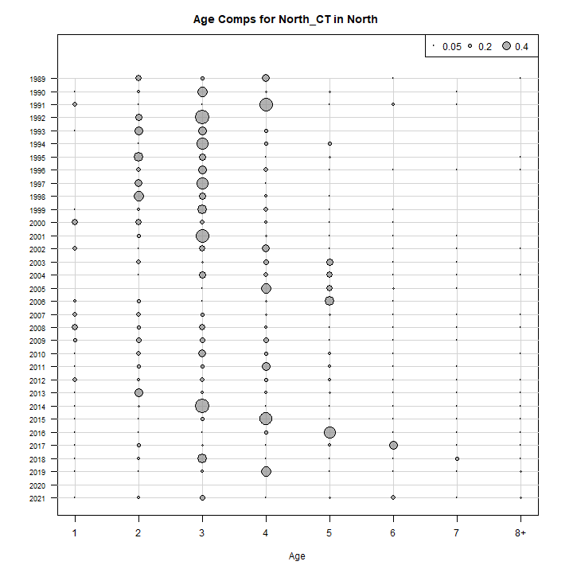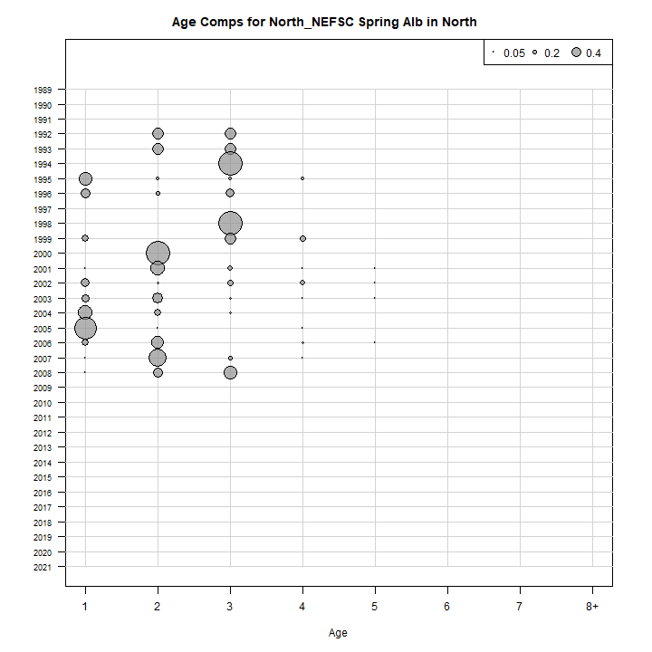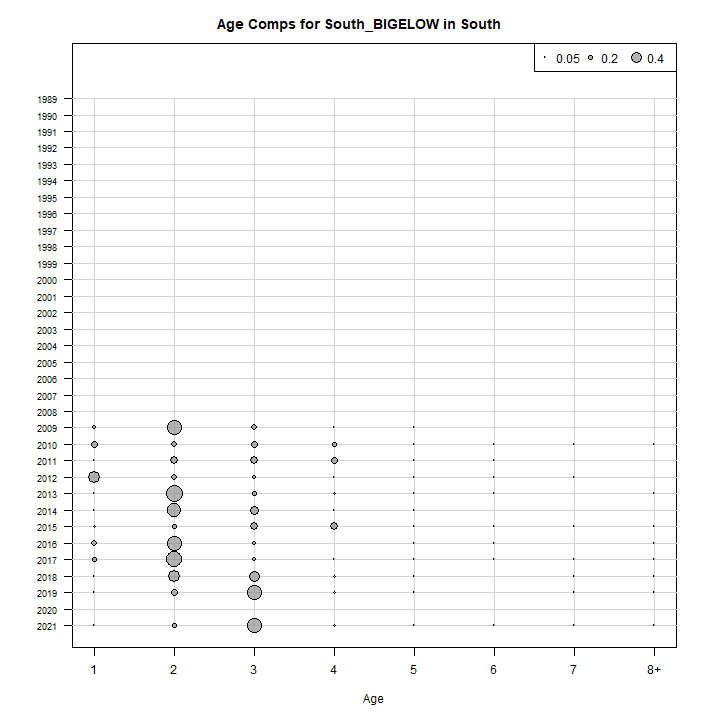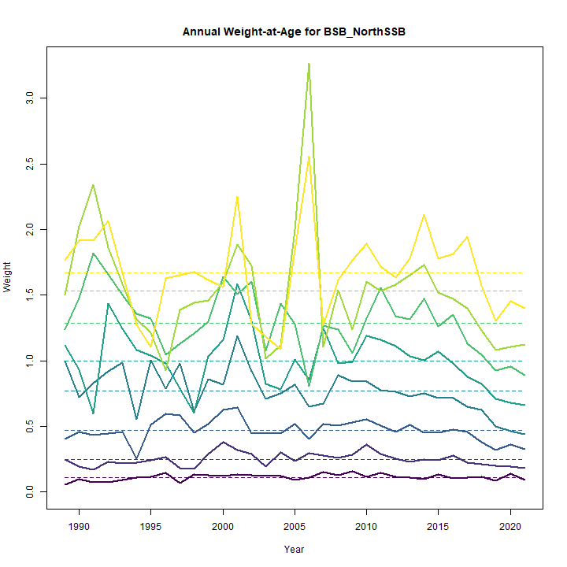

### Diagnostics

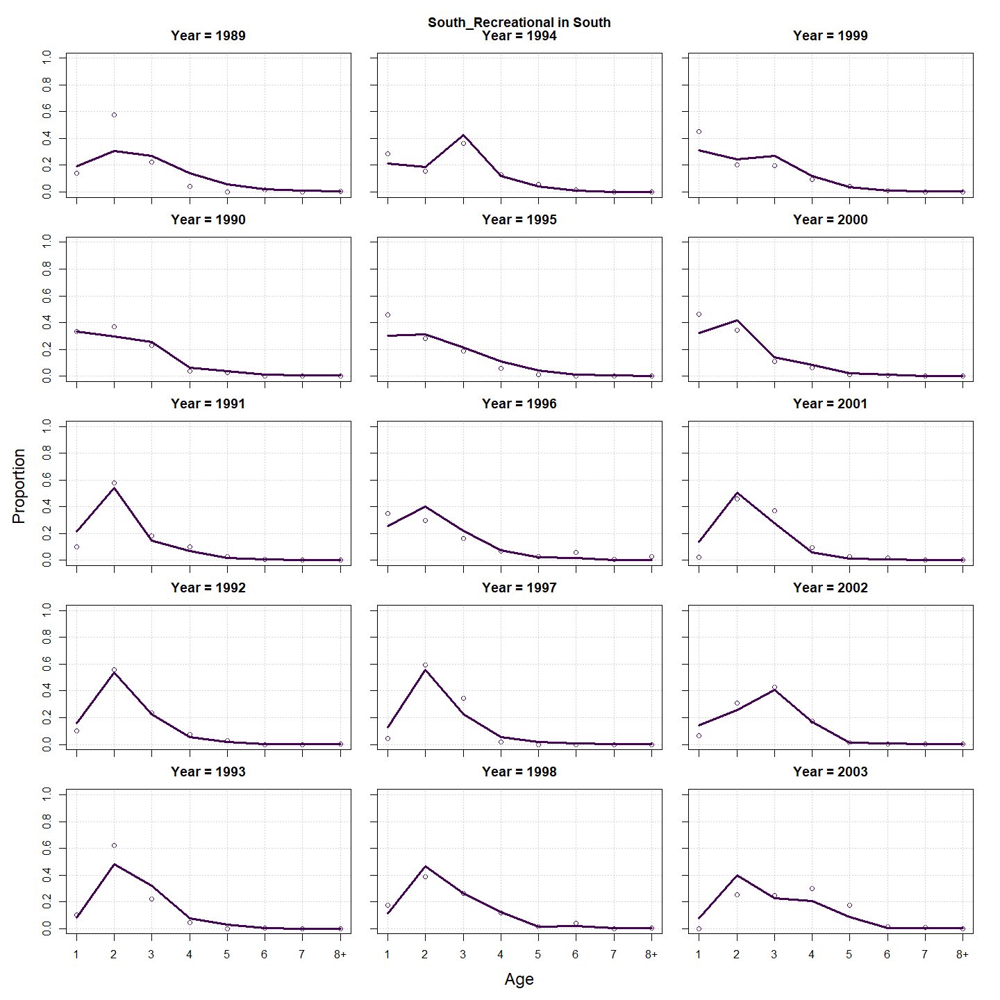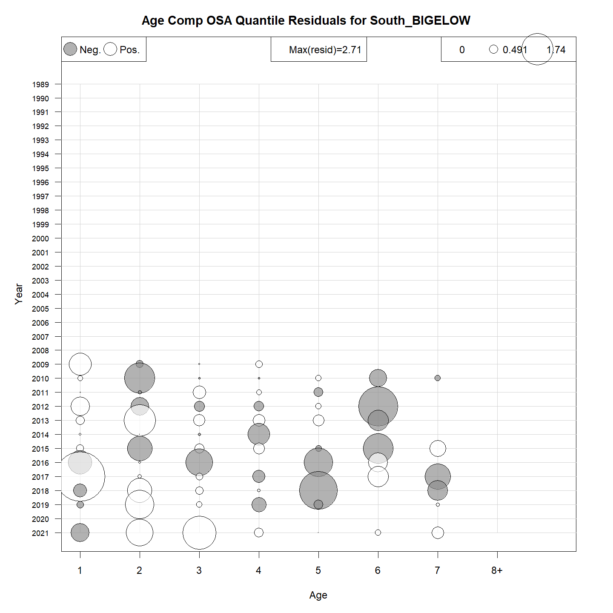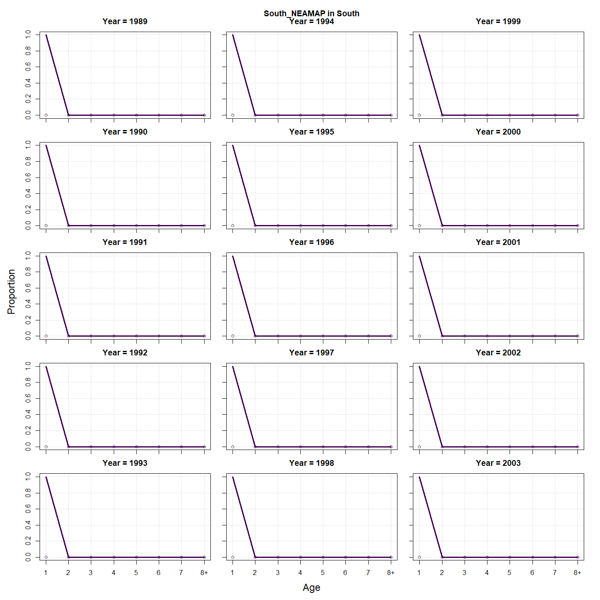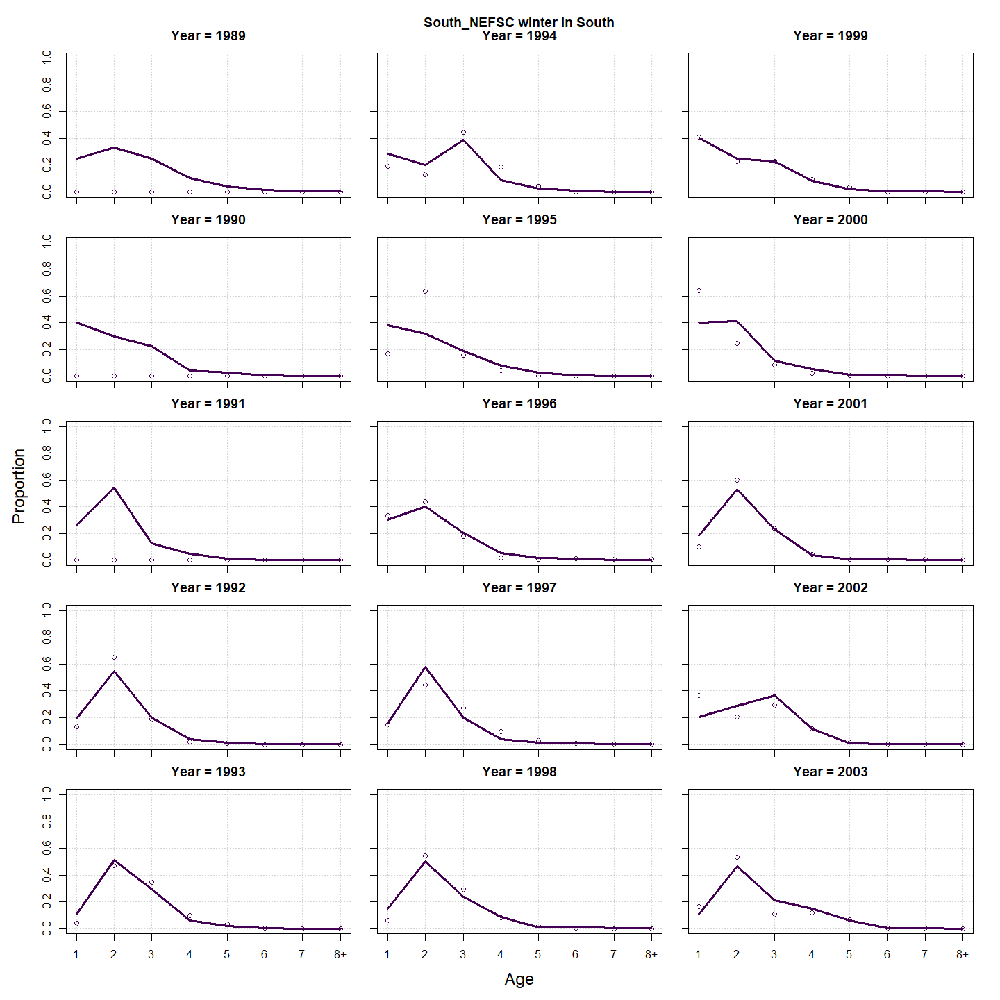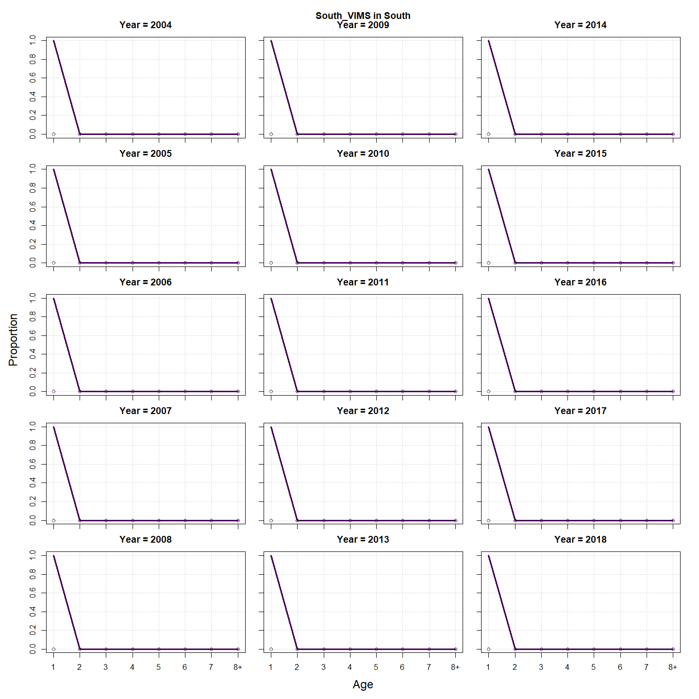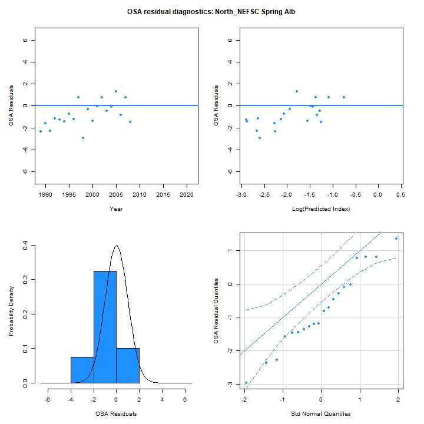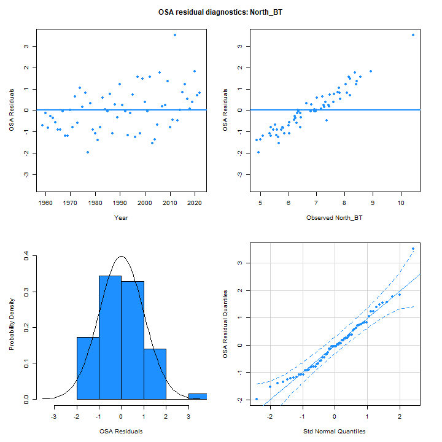

### Results

### Retro

### Reference points

### Miscelaneous

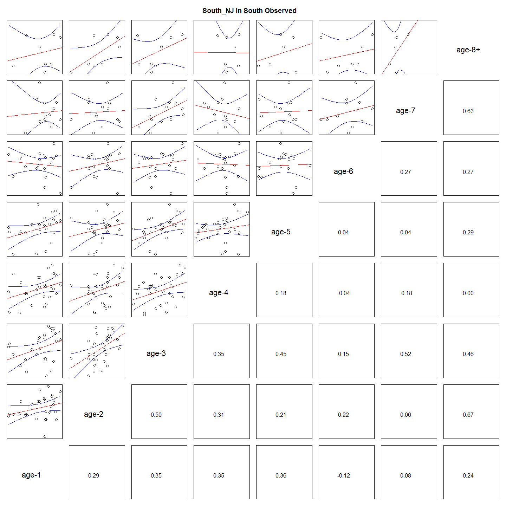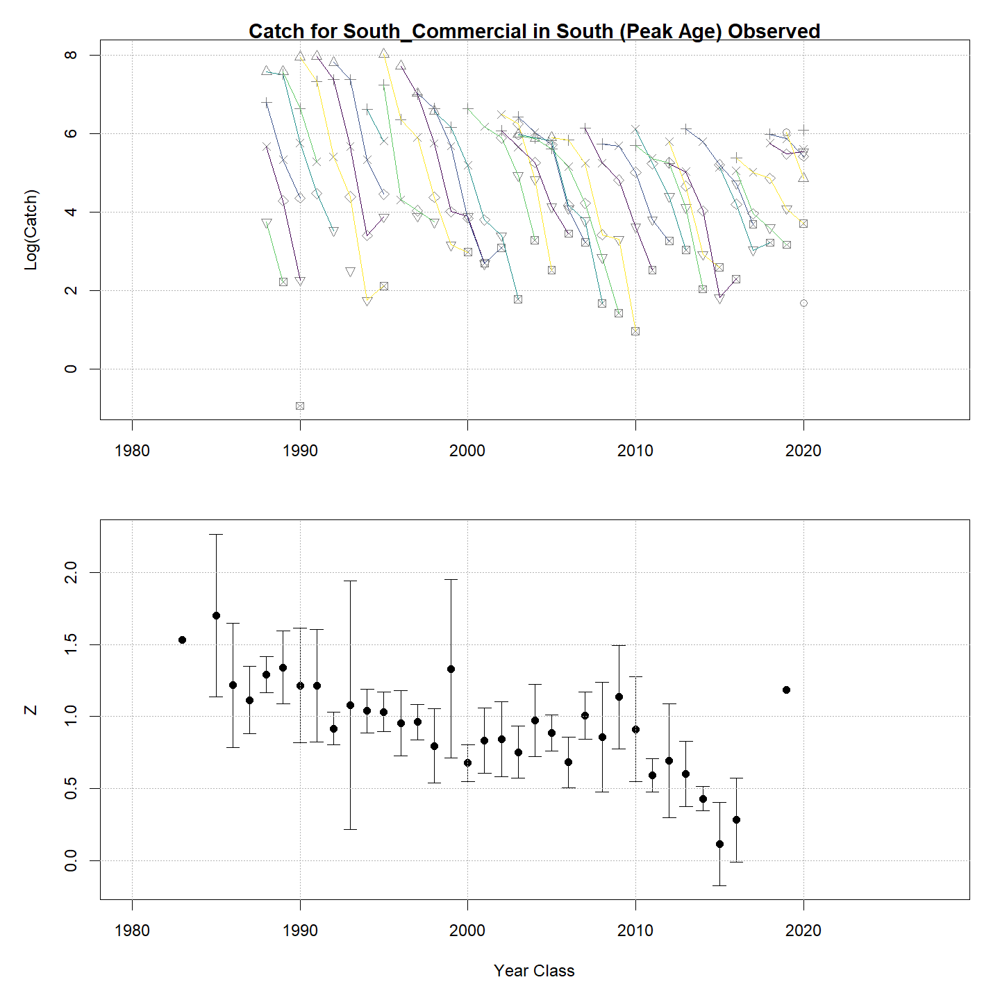

## Tables {.tabset}

### Parameter estimates

<table class="table" style="margin-left: auto; margin-right: auto;">
<caption>Parameter estimates, standard errors, and confidence intervals. Rounded to 3 decimal places.</caption>
 <thead>
  <tr>
   <th style="text-align:left;">   </th>
   <th style="text-align:right;"> Estimate </th>
   <th style="text-align:right;"> Std. Error </th>
   <th style="text-align:right;"> 95\% CI lower </th>
   <th style="text-align:right;"> 95\% CI upper </th>
  </tr>
 </thead>
<tbody>
  <tr>
   <td style="text-align:left;"> BSB North mean log(R) intercept </td>
   <td style="text-align:right;"> $6.035$ </td>
   <td style="text-align:right;"> $0.997$ </td>
   <td style="text-align:right;"> $4.081$ </td>
   <td style="text-align:right;"> $7.989$ </td>
  </tr>
  <tr>
   <td style="text-align:left;"> BSB North in North NAA $\sigma$ (age 1) </td>
   <td style="text-align:right;"> $0.802$ </td>
   <td style="text-align:right;"> $0.114$ </td>
   <td style="text-align:right;"> $0.608$ </td>
   <td style="text-align:right;"> $1.059$ </td>
  </tr>
  <tr>
   <td style="text-align:left;"> BSB North in North NAA $\sigma$ (ages 2-8+) </td>
   <td style="text-align:right;"> $0.897$ </td>
   <td style="text-align:right;"> $0.057$ </td>
   <td style="text-align:right;"> $0.792$ </td>
   <td style="text-align:right;"> $1.015$ </td>
  </tr>
  <tr>
   <td style="text-align:left;"> BSB North in South NAA $\sigma$ (age 1) </td>
   <td style="text-align:right;"> $0.802$ </td>
   <td style="text-align:right;"> $0.114$ </td>
   <td style="text-align:right;"> $0.608$ </td>
   <td style="text-align:right;"> $1.059$ </td>
  </tr>
  <tr>
   <td style="text-align:left;"> BSB North  in North  NAA AR1 $\rho$ age </td>
   <td style="text-align:right;"> $0.053$ </td>
   <td style="text-align:right;"> $0.100$ </td>
   <td style="text-align:right;"> $-0.142$ </td>
   <td style="text-align:right;"> $0.245$ </td>
  </tr>
  <tr>
   <td style="text-align:left;"> BSB North  in North  NAA AR1 $\rho$ year </td>
   <td style="text-align:right;"> $0.346$ </td>
   <td style="text-align:right;"> $0.094$ </td>
   <td style="text-align:right;"> $0.150$ </td>
   <td style="text-align:right;"> $0.516$ </td>
  </tr>
  <tr>
   <td style="text-align:left;"> BSB South Mean Recruitment </td>
   <td style="text-align:right;"> $20444.114$ </td>
   <td style="text-align:right;"> $4801.924$ </td>
   <td style="text-align:right;"> $12901.423$ </td>
   <td style="text-align:right;"> $32396.565$ </td>
  </tr>
  <tr>
   <td style="text-align:left;"> BSB South in North NAA $\sigma$ (age 1) </td>
   <td style="text-align:right;"> $0.472$ </td>
   <td style="text-align:right;"> $0.070$ </td>
   <td style="text-align:right;"> $0.353$ </td>
   <td style="text-align:right;"> $0.631$ </td>
  </tr>
  <tr>
   <td style="text-align:left;"> BSB South in North NAA $\sigma$ (ages 2-8+) </td>
   <td style="text-align:right;"> $0.350$ </td>
   <td style="text-align:right;"> $0.059$ </td>
   <td style="text-align:right;"> $0.251$ </td>
   <td style="text-align:right;"> $0.488$ </td>
  </tr>
  <tr>
   <td style="text-align:left;"> BSB South in South NAA $\sigma$ (age 1) </td>
   <td style="text-align:right;"> $0.472$ </td>
   <td style="text-align:right;"> $0.070$ </td>
   <td style="text-align:right;"> $0.353$ </td>
   <td style="text-align:right;"> $0.631$ </td>
  </tr>
  <tr>
   <td style="text-align:left;"> BSB South in South NAA $\sigma$ (ages 2-8+) </td>
   <td style="text-align:right;"> $0.350$ </td>
   <td style="text-align:right;"> $0.059$ </td>
   <td style="text-align:right;"> $0.251$ </td>
   <td style="text-align:right;"> $0.488$ </td>
  </tr>
  <tr>
   <td style="text-align:left;"> BSB South  in North  NAA AR1 $\rho$ age </td>
   <td style="text-align:right;"> $-0.285$ </td>
   <td style="text-align:right;"> $0.139$ </td>
   <td style="text-align:right;"> $-0.530$ </td>
   <td style="text-align:right;"> $0.003$ </td>
  </tr>
  <tr>
   <td style="text-align:left;"> BSB South  in North  NAA AR1 $\rho$ year </td>
   <td style="text-align:right;"> $0.599$ </td>
   <td style="text-align:right;"> $0.103$ </td>
   <td style="text-align:right;"> $0.360$ </td>
   <td style="text-align:right;"> $0.764$ </td>
  </tr>
  <tr>
   <td style="text-align:left;"> BSB South  in South  NAA AR1 $\rho$ age </td>
   <td style="text-align:right;"> $-0.285$ </td>
   <td style="text-align:right;"> $0.139$ </td>
   <td style="text-align:right;"> $-0.530$ </td>
   <td style="text-align:right;"> $0.003$ </td>
  </tr>
  <tr>
   <td style="text-align:left;"> BSB South  in South  NAA AR1 $\rho$ year </td>
   <td style="text-align:right;"> $0.599$ </td>
   <td style="text-align:right;"> $0.103$ </td>
   <td style="text-align:right;"> $0.360$ </td>
   <td style="text-align:right;"> $0.764$ </td>
  </tr>
  <tr>
   <td style="text-align:left;"> North NEFSC Spring Alb fully selected q </td>
   <td style="text-align:right;"> $2.869\times 10^{-5}$ </td>
   <td style="text-align:right;"> $5.625\times 10^{-6}$ </td>
   <td style="text-align:right;"> $1.953\times 10^{-5}$ </td>
   <td style="text-align:right;"> $4.213\times 10^{-5}$ </td>
  </tr>
  <tr>
   <td style="text-align:left;"> North NEAMAP fully selected q </td>
   <td style="text-align:right;"> $7.289\times 10^{-5}$ </td>
   <td style="text-align:right;"> $1.494\times 10^{-5}$ </td>
   <td style="text-align:right;"> $4.877\times 10^{-5}$ </td>
   <td style="text-align:right;"> $1.089\times 10^{-4}$ </td>
  </tr>
  <tr>
   <td style="text-align:left;"> North MADMF fully selected q </td>
   <td style="text-align:right;"> $1.054\times 10^{-4}$ </td>
   <td style="text-align:right;"> $1.702\times 10^{-5}$ </td>
   <td style="text-align:right;"> $7.675\times 10^{-5}$ </td>
   <td style="text-align:right;"> $1.446\times 10^{-4}$ </td>
  </tr>
  <tr>
   <td style="text-align:left;"> North RI fully selected q </td>
   <td style="text-align:right;"> $3.000\times 10^{-5}$ </td>
   <td style="text-align:right;"> $5.071\times 10^{-6}$ </td>
   <td style="text-align:right;"> $2.154\times 10^{-5}$ </td>
   <td style="text-align:right;"> $4.178\times 10^{-5}$ </td>
  </tr>
  <tr>
   <td style="text-align:left;"> North CT fully selected q </td>
   <td style="text-align:right;"> $4.844\times 10^{-5}$ </td>
   <td style="text-align:right;"> $8.287\times 10^{-6}$ </td>
   <td style="text-align:right;"> $3.464\times 10^{-5}$ </td>
   <td style="text-align:right;"> $6.774\times 10^{-5}$ </td>
  </tr>
  <tr>
   <td style="text-align:left;"> North REC CPA fully selected q </td>
   <td style="text-align:right;"> $1.097\times 10^{-4}$ </td>
   <td style="text-align:right;"> $1.888\times 10^{-5}$ </td>
   <td style="text-align:right;"> $7.832\times 10^{-5}$ </td>
   <td style="text-align:right;"> $1.538\times 10^{-4}$ </td>
  </tr>
  <tr>
   <td style="text-align:left;"> North Bigelow fully selected q </td>
   <td style="text-align:right;"> $4.754\times 10^{-5}$ </td>
   <td style="text-align:right;"> $9.468\times 10^{-6}$ </td>
   <td style="text-align:right;"> $3.218\times 10^{-5}$ </td>
   <td style="text-align:right;"> $7.024\times 10^{-5}$ </td>
  </tr>
  <tr>
   <td style="text-align:left;"> South NEFSC spring Alb fully selected q </td>
   <td style="text-align:right;"> $1.419\times 10^{-4}$ </td>
   <td style="text-align:right;"> $3.171\times 10^{-5}$ </td>
   <td style="text-align:right;"> $9.158\times 10^{-5}$ </td>
   <td style="text-align:right;"> $2.199\times 10^{-4}$ </td>
  </tr>
  <tr>
   <td style="text-align:left;"> South NEAMAP fully selected q </td>
   <td style="text-align:right;"> $4.166\times 10^{-6}$ </td>
   <td style="text-align:right;"> $9.438\times 10^{-7}$ </td>
   <td style="text-align:right;"> $2.672\times 10^{-6}$ </td>
   <td style="text-align:right;"> $6.494\times 10^{-6}$ </td>
  </tr>
  <tr>
   <td style="text-align:left;"> South NJ fully selected q </td>
   <td style="text-align:right;"> $1.239\times 10^{-4}$ </td>
   <td style="text-align:right;"> $1.641\times 10^{-5}$ </td>
   <td style="text-align:right;"> $9.559\times 10^{-5}$ </td>
   <td style="text-align:right;"> $1.607\times 10^{-4}$ </td>
  </tr>
  <tr>
   <td style="text-align:left;"> South DE fully selected q </td>
   <td style="text-align:right;"> $2.603\times 10^{-5}$ </td>
   <td style="text-align:right;"> $4.720\times 10^{-6}$ </td>
   <td style="text-align:right;"> $1.824\times 10^{-5}$ </td>
   <td style="text-align:right;"> $3.713\times 10^{-5}$ </td>
  </tr>
  <tr>
   <td style="text-align:left;"> South MD fully selected q </td>
   <td style="text-align:right;"> $3.760\times 10^{-5}$ </td>
   <td style="text-align:right;"> $6.058\times 10^{-6}$ </td>
   <td style="text-align:right;"> $2.742\times 10^{-5}$ </td>
   <td style="text-align:right;"> $5.157\times 10^{-5}$ </td>
  </tr>
  <tr>
   <td style="text-align:left;"> South VIMS fully selected q </td>
   <td style="text-align:right;"> $2.730\times 10^{-5}$ </td>
   <td style="text-align:right;"> $4.919\times 10^{-6}$ </td>
   <td style="text-align:right;"> $1.918\times 10^{-5}$ </td>
   <td style="text-align:right;"> $3.887\times 10^{-5}$ </td>
  </tr>
  <tr>
   <td style="text-align:left;"> South NEFSC winter fully selected q </td>
   <td style="text-align:right;"> $0.266$ </td>
   <td style="text-align:right;"> $0.057$ </td>
   <td style="text-align:right;"> $0.174$ </td>
   <td style="text-align:right;"> $0.405$ </td>
  </tr>
  <tr>
   <td style="text-align:left;"> South REC CPA fully selected q </td>
   <td style="text-align:right;"> $1.474\times 10^{-4}$ </td>
   <td style="text-align:right;"> $2.146\times 10^{-5}$ </td>
   <td style="text-align:right;"> $1.108\times 10^{-4}$ </td>
   <td style="text-align:right;"> $1.960\times 10^{-4}$ </td>
  </tr>
  <tr>
   <td style="text-align:left;"> South BIGELOW fully selected q </td>
   <td style="text-align:right;"> $1.929\times 10^{-4}$ </td>
   <td style="text-align:right;"> $3.212\times 10^{-5}$ </td>
   <td style="text-align:right;"> $1.392\times 10^{-4}$ </td>
   <td style="text-align:right;"> $2.674\times 10^{-4}$ </td>
  </tr>
  <tr>
   <td style="text-align:left;"> Block 1: North Commercial Mean Selectivity for age 1 </td>
   <td style="text-align:right;"> $0.013$ </td>
   <td style="text-align:right;"> $0.010$ </td>
   <td style="text-align:right;"> $0.003$ </td>
   <td style="text-align:right;"> $0.055$ </td>
  </tr>
  <tr>
   <td style="text-align:left;"> Block 1: North Commercial Mean Selectivity for age 2 </td>
   <td style="text-align:right;"> $0.325$ </td>
   <td style="text-align:right;"> $0.153$ </td>
   <td style="text-align:right;"> $0.110$ </td>
   <td style="text-align:right;"> $0.653$ </td>
  </tr>
  <tr>
   <td style="text-align:left;"> Block 1: North Commercial Mean Selectivity for age 3 </td>
   <td style="text-align:right;"> $0.838$ </td>
   <td style="text-align:right;"> $0.102$ </td>
   <td style="text-align:right;"> $0.542$ </td>
   <td style="text-align:right;"> $0.957$ </td>
  </tr>
  <tr>
   <td style="text-align:left;"> Block 1: North Commercial Mean Selectivity for age 4 </td>
   <td style="text-align:right;"> $1.000$ </td>
   <td style="text-align:right;"> -- </td>
   <td style="text-align:right;"> -- </td>
   <td style="text-align:right;"> -- </td>
  </tr>
  <tr>
   <td style="text-align:left;"> Block 1: North Commercial Mean Selectivity for age 5 </td>
   <td style="text-align:right;"> $1.000$ </td>
   <td style="text-align:right;"> -- </td>
   <td style="text-align:right;"> -- </td>
   <td style="text-align:right;"> -- </td>
  </tr>
  <tr>
   <td style="text-align:left;"> Block 1: North Commercial Mean Selectivity for age 6 </td>
   <td style="text-align:right;"> $1.000$ </td>
   <td style="text-align:right;"> -- </td>
   <td style="text-align:right;"> -- </td>
   <td style="text-align:right;"> -- </td>
  </tr>
  <tr>
   <td style="text-align:left;"> Block 1: North Commercial Mean Selectivity for age 7 </td>
   <td style="text-align:right;"> $1.000$ </td>
   <td style="text-align:right;"> -- </td>
   <td style="text-align:right;"> -- </td>
   <td style="text-align:right;"> -- </td>
  </tr>
  <tr>
   <td style="text-align:left;"> Block 1: North Commercial Mean Selectivity for age 8+ </td>
   <td style="text-align:right;"> $1.000$ </td>
   <td style="text-align:right;"> -- </td>
   <td style="text-align:right;"> -- </td>
   <td style="text-align:right;"> -- </td>
  </tr>
  <tr>
   <td style="text-align:left;"> Block 2: North Recreational Mean Selectivity for age 1 </td>
   <td style="text-align:right;"> $0.025$ </td>
   <td style="text-align:right;"> $0.017$ </td>
   <td style="text-align:right;"> $0.006$ </td>
   <td style="text-align:right;"> $0.094$ </td>
  </tr>
  <tr>
   <td style="text-align:left;"> Block 2: North Recreational Mean Selectivity for age 2 </td>
   <td style="text-align:right;"> $0.334$ </td>
   <td style="text-align:right;"> $0.153$ </td>
   <td style="text-align:right;"> $0.115$ </td>
   <td style="text-align:right;"> $0.660$ </td>
  </tr>
  <tr>
   <td style="text-align:left;"> Block 2: North Recreational Mean Selectivity for age 3 </td>
   <td style="text-align:right;"> $0.580$ </td>
   <td style="text-align:right;"> $0.170$ </td>
   <td style="text-align:right;"> $0.259$ </td>
   <td style="text-align:right;"> $0.845$ </td>
  </tr>
  <tr>
   <td style="text-align:left;"> Block 2: North Recreational Mean Selectivity for age 4 </td>
   <td style="text-align:right;"> $0.779$ </td>
   <td style="text-align:right;"> $0.124$ </td>
   <td style="text-align:right;"> $0.463$ </td>
   <td style="text-align:right;"> $0.935$ </td>
  </tr>
  <tr>
   <td style="text-align:left;"> Block 2: North Recreational Mean Selectivity for age 5 </td>
   <td style="text-align:right;"> $0.875$ </td>
   <td style="text-align:right;"> $0.082$ </td>
   <td style="text-align:right;"> $0.616$ </td>
   <td style="text-align:right;"> $0.968$ </td>
  </tr>
  <tr>
   <td style="text-align:left;"> Block 2: North Recreational Mean Selectivity for age 6 </td>
   <td style="text-align:right;"> $0.937$ </td>
   <td style="text-align:right;"> $0.050$ </td>
   <td style="text-align:right;"> $0.739$ </td>
   <td style="text-align:right;"> $0.988$ </td>
  </tr>
  <tr>
   <td style="text-align:left;"> Block 2: North Recreational Mean Selectivity for age 7 </td>
   <td style="text-align:right;"> $1.000$ </td>
   <td style="text-align:right;"> -- </td>
   <td style="text-align:right;"> -- </td>
   <td style="text-align:right;"> -- </td>
  </tr>
  <tr>
   <td style="text-align:left;"> Block 2: North Recreational Mean Selectivity for age 8+ </td>
   <td style="text-align:right;"> $1.000$ </td>
   <td style="text-align:right;"> -- </td>
   <td style="text-align:right;"> -- </td>
   <td style="text-align:right;"> -- </td>
  </tr>
  <tr>
   <td style="text-align:left;"> Block 3: South Commercial $a_{50}$ </td>
   <td style="text-align:right;"> $2.327$ </td>
   <td style="text-align:right;"> $0.123$ </td>
   <td style="text-align:right;"> $2.094$ </td>
   <td style="text-align:right;"> $2.574$ </td>
  </tr>
  <tr>
   <td style="text-align:left;"> Block 3: South Commercial 1/slope (increasing) </td>
   <td style="text-align:right;"> $0.387$ </td>
   <td style="text-align:right;"> $0.035$ </td>
   <td style="text-align:right;"> $0.324$ </td>
   <td style="text-align:right;"> $0.460$ </td>
  </tr>
  <tr>
   <td style="text-align:left;"> Block 4: South Recreational $a_{50}$ </td>
   <td style="text-align:right;"> $2.425$ </td>
   <td style="text-align:right;"> $0.290$ </td>
   <td style="text-align:right;"> $1.896$ </td>
   <td style="text-align:right;"> $3.029$ </td>
  </tr>
  <tr>
   <td style="text-align:left;"> Block 4: South Recreational 1/slope (increasing) </td>
   <td style="text-align:right;"> $0.743$ </td>
   <td style="text-align:right;"> $0.131$ </td>
   <td style="text-align:right;"> $0.522$ </td>
   <td style="text-align:right;"> $1.043$ </td>
  </tr>
  <tr>
   <td style="text-align:left;"> Block 9: North NEFSC Spring Alb Mean Selectivity for age 1 </td>
   <td style="text-align:right;"> $0.070$ </td>
   <td style="text-align:right;"> $0.074$ </td>
   <td style="text-align:right;"> $0.008$ </td>
   <td style="text-align:right;"> $0.410$ </td>
  </tr>
  <tr>
   <td style="text-align:left;"> Block 9: North NEFSC Spring Alb Mean Selectivity for age 2 </td>
   <td style="text-align:right;"> $1.000$ </td>
   <td style="text-align:right;"> -- </td>
   <td style="text-align:right;"> -- </td>
   <td style="text-align:right;"> -- </td>
  </tr>
  <tr>
   <td style="text-align:left;"> Block 9: North NEFSC Spring Alb Mean Selectivity for age 3 </td>
   <td style="text-align:right;"> $1.000$ </td>
   <td style="text-align:right;"> -- </td>
   <td style="text-align:right;"> -- </td>
   <td style="text-align:right;"> -- </td>
  </tr>
  <tr>
   <td style="text-align:left;"> Block 9: North NEFSC Spring Alb Mean Selectivity for age 4 </td>
   <td style="text-align:right;"> $1.000$ </td>
   <td style="text-align:right;"> -- </td>
   <td style="text-align:right;"> -- </td>
   <td style="text-align:right;"> -- </td>
  </tr>
  <tr>
   <td style="text-align:left;"> Block 9: North NEFSC Spring Alb Mean Selectivity for age 5 </td>
   <td style="text-align:right;"> $1.000$ </td>
   <td style="text-align:right;"> -- </td>
   <td style="text-align:right;"> -- </td>
   <td style="text-align:right;"> -- </td>
  </tr>
  <tr>
   <td style="text-align:left;"> Block 9: North NEFSC Spring Alb Mean Selectivity for age 6 </td>
   <td style="text-align:right;"> $1.000$ </td>
   <td style="text-align:right;"> -- </td>
   <td style="text-align:right;"> -- </td>
   <td style="text-align:right;"> -- </td>
  </tr>
  <tr>
   <td style="text-align:left;"> Block 9: North NEFSC Spring Alb Mean Selectivity for age 7 </td>
   <td style="text-align:right;"> $1.000$ </td>
   <td style="text-align:right;"> -- </td>
   <td style="text-align:right;"> -- </td>
   <td style="text-align:right;"> -- </td>
  </tr>
  <tr>
   <td style="text-align:left;"> Block 9: North NEFSC Spring Alb Mean Selectivity for age 8+ </td>
   <td style="text-align:right;"> $1.000$ </td>
   <td style="text-align:right;"> -- </td>
   <td style="text-align:right;"> -- </td>
   <td style="text-align:right;"> -- </td>
  </tr>
  <tr>
   <td style="text-align:left;"> Block 10: North NEAMAP Mean Selectivity for age 1 </td>
   <td style="text-align:right;"> $0.020$ </td>
   <td style="text-align:right;"> $0.012$ </td>
   <td style="text-align:right;"> $0.006$ </td>
   <td style="text-align:right;"> $0.063$ </td>
  </tr>
  <tr>
   <td style="text-align:left;"> Block 10: North NEAMAP Mean Selectivity for age 2 </td>
   <td style="text-align:right;"> $0.473$ </td>
   <td style="text-align:right;"> $0.143$ </td>
   <td style="text-align:right;"> $0.226$ </td>
   <td style="text-align:right;"> $0.735$ </td>
  </tr>
  <tr>
   <td style="text-align:left;"> Block 10: North NEAMAP Mean Selectivity for age 3 </td>
   <td style="text-align:right;"> $1.000$ </td>
   <td style="text-align:right;"> $1.890\times 10^{-5}$ </td>
   <td style="text-align:right;"> $0.000$ </td>
   <td style="text-align:right;"> $1.000$ </td>
  </tr>
  <tr>
   <td style="text-align:left;"> Block 10: North NEAMAP Mean Selectivity for age 4 </td>
   <td style="text-align:right;"> $1.000$ </td>
   <td style="text-align:right;"> -- </td>
   <td style="text-align:right;"> -- </td>
   <td style="text-align:right;"> -- </td>
  </tr>
  <tr>
   <td style="text-align:left;"> Block 10: North NEAMAP Mean Selectivity for age 5 </td>
   <td style="text-align:right;"> $1.000$ </td>
   <td style="text-align:right;"> -- </td>
   <td style="text-align:right;"> -- </td>
   <td style="text-align:right;"> -- </td>
  </tr>
  <tr>
   <td style="text-align:left;"> Block 10: North NEAMAP Mean Selectivity for age 6 </td>
   <td style="text-align:right;"> $1.000$ </td>
   <td style="text-align:right;"> -- </td>
   <td style="text-align:right;"> -- </td>
   <td style="text-align:right;"> -- </td>
  </tr>
  <tr>
   <td style="text-align:left;"> Block 10: North NEAMAP Mean Selectivity for age 7 </td>
   <td style="text-align:right;"> $1.000$ </td>
   <td style="text-align:right;"> -- </td>
   <td style="text-align:right;"> -- </td>
   <td style="text-align:right;"> -- </td>
  </tr>
  <tr>
   <td style="text-align:left;"> Block 10: North NEAMAP Mean Selectivity for age 8+ </td>
   <td style="text-align:right;"> $1.000$ </td>
   <td style="text-align:right;"> -- </td>
   <td style="text-align:right;"> -- </td>
   <td style="text-align:right;"> -- </td>
  </tr>
  <tr>
   <td style="text-align:left;"> Block 11: North MADMF Mean Selectivity for age 1 </td>
   <td style="text-align:right;"> $0.005$ </td>
   <td style="text-align:right;"> $0.002$ </td>
   <td style="text-align:right;"> $0.003$ </td>
   <td style="text-align:right;"> $0.010$ </td>
  </tr>
  <tr>
   <td style="text-align:left;"> Block 11: North MADMF Mean Selectivity for age 2 </td>
   <td style="text-align:right;"> $0.220$ </td>
   <td style="text-align:right;"> $0.038$ </td>
   <td style="text-align:right;"> $0.154$ </td>
   <td style="text-align:right;"> $0.304$ </td>
  </tr>
  <tr>
   <td style="text-align:left;"> Block 11: North MADMF Mean Selectivity for age 3 </td>
   <td style="text-align:right;"> $1.000$ </td>
   <td style="text-align:right;"> -- </td>
   <td style="text-align:right;"> -- </td>
   <td style="text-align:right;"> -- </td>
  </tr>
  <tr>
   <td style="text-align:left;"> Block 11: North MADMF Mean Selectivity for age 4 </td>
   <td style="text-align:right;"> $1.000$ </td>
   <td style="text-align:right;"> -- </td>
   <td style="text-align:right;"> -- </td>
   <td style="text-align:right;"> -- </td>
  </tr>
  <tr>
   <td style="text-align:left;"> Block 11: North MADMF Mean Selectivity for age 5 </td>
   <td style="text-align:right;"> $1.000$ </td>
   <td style="text-align:right;"> -- </td>
   <td style="text-align:right;"> -- </td>
   <td style="text-align:right;"> -- </td>
  </tr>
  <tr>
   <td style="text-align:left;"> Block 11: North MADMF Mean Selectivity for age 6 </td>
   <td style="text-align:right;"> $1.000$ </td>
   <td style="text-align:right;"> -- </td>
   <td style="text-align:right;"> -- </td>
   <td style="text-align:right;"> -- </td>
  </tr>
  <tr>
   <td style="text-align:left;"> Block 11: North MADMF Mean Selectivity for age 7 </td>
   <td style="text-align:right;"> $1.000$ </td>
   <td style="text-align:right;"> -- </td>
   <td style="text-align:right;"> -- </td>
   <td style="text-align:right;"> -- </td>
  </tr>
  <tr>
   <td style="text-align:left;"> Block 11: North MADMF Mean Selectivity for age 8+ </td>
   <td style="text-align:right;"> $1.000$ </td>
   <td style="text-align:right;"> -- </td>
   <td style="text-align:right;"> -- </td>
   <td style="text-align:right;"> -- </td>
  </tr>
  <tr>
   <td style="text-align:left;"> Block 12: North RI Mean Selectivity for age 1 </td>
   <td style="text-align:right;"> $0.040$ </td>
   <td style="text-align:right;"> $0.040$ </td>
   <td style="text-align:right;"> $0.005$ </td>
   <td style="text-align:right;"> $0.242$ </td>
  </tr>
  <tr>
   <td style="text-align:left;"> Block 12: North RI Mean Selectivity for age 2 </td>
   <td style="text-align:right;"> $0.271$ </td>
   <td style="text-align:right;"> $0.200$ </td>
   <td style="text-align:right;"> $0.049$ </td>
   <td style="text-align:right;"> $0.731$ </td>
  </tr>
  <tr>
   <td style="text-align:left;"> Block 12: North RI Mean Selectivity for age 3 </td>
   <td style="text-align:right;"> $1.000$ </td>
   <td style="text-align:right;"> -- </td>
   <td style="text-align:right;"> -- </td>
   <td style="text-align:right;"> -- </td>
  </tr>
  <tr>
   <td style="text-align:left;"> Block 12: North RI Mean Selectivity for age 4 </td>
   <td style="text-align:right;"> $1.000$ </td>
   <td style="text-align:right;"> -- </td>
   <td style="text-align:right;"> -- </td>
   <td style="text-align:right;"> -- </td>
  </tr>
  <tr>
   <td style="text-align:left;"> Block 12: North RI Mean Selectivity for age 5 </td>
   <td style="text-align:right;"> $1.000$ </td>
   <td style="text-align:right;"> -- </td>
   <td style="text-align:right;"> -- </td>
   <td style="text-align:right;"> -- </td>
  </tr>
  <tr>
   <td style="text-align:left;"> Block 12: North RI Mean Selectivity for age 6 </td>
   <td style="text-align:right;"> $1.000$ </td>
   <td style="text-align:right;"> -- </td>
   <td style="text-align:right;"> -- </td>
   <td style="text-align:right;"> -- </td>
  </tr>
  <tr>
   <td style="text-align:left;"> Block 12: North RI Mean Selectivity for age 7 </td>
   <td style="text-align:right;"> $1.000$ </td>
   <td style="text-align:right;"> -- </td>
   <td style="text-align:right;"> -- </td>
   <td style="text-align:right;"> -- </td>
  </tr>
  <tr>
   <td style="text-align:left;"> Block 12: North RI Mean Selectivity for age 8+ </td>
   <td style="text-align:right;"> $1.000$ </td>
   <td style="text-align:right;"> -- </td>
   <td style="text-align:right;"> -- </td>
   <td style="text-align:right;"> -- </td>
  </tr>
  <tr>
   <td style="text-align:left;"> Block 13: North CT Mean Selectivity for age 1 </td>
   <td style="text-align:right;"> $0.015$ </td>
   <td style="text-align:right;"> $0.011$ </td>
   <td style="text-align:right;"> $0.004$ </td>
   <td style="text-align:right;"> $0.060$ </td>
  </tr>
  <tr>
   <td style="text-align:left;"> Block 13: North CT Mean Selectivity for age 2 </td>
   <td style="text-align:right;"> $0.275$ </td>
   <td style="text-align:right;"> $0.136$ </td>
   <td style="text-align:right;"> $0.090$ </td>
   <td style="text-align:right;"> $0.592$ </td>
  </tr>
  <tr>
   <td style="text-align:left;"> Block 13: North CT Mean Selectivity for age 3 </td>
   <td style="text-align:right;"> $1.000$ </td>
   <td style="text-align:right;"> -- </td>
   <td style="text-align:right;"> -- </td>
   <td style="text-align:right;"> -- </td>
  </tr>
  <tr>
   <td style="text-align:left;"> Block 13: North CT Mean Selectivity for age 4 </td>
   <td style="text-align:right;"> $1.000$ </td>
   <td style="text-align:right;"> -- </td>
   <td style="text-align:right;"> -- </td>
   <td style="text-align:right;"> -- </td>
  </tr>
  <tr>
   <td style="text-align:left;"> Block 13: North CT Mean Selectivity for age 5 </td>
   <td style="text-align:right;"> $1.000$ </td>
   <td style="text-align:right;"> -- </td>
   <td style="text-align:right;"> -- </td>
   <td style="text-align:right;"> -- </td>
  </tr>
  <tr>
   <td style="text-align:left;"> Block 13: North CT Mean Selectivity for age 6 </td>
   <td style="text-align:right;"> $1.000$ </td>
   <td style="text-align:right;"> -- </td>
   <td style="text-align:right;"> -- </td>
   <td style="text-align:right;"> -- </td>
  </tr>
  <tr>
   <td style="text-align:left;"> Block 13: North CT Mean Selectivity for age 7 </td>
   <td style="text-align:right;"> $1.000$ </td>
   <td style="text-align:right;"> -- </td>
   <td style="text-align:right;"> -- </td>
   <td style="text-align:right;"> -- </td>
  </tr>
  <tr>
   <td style="text-align:left;"> Block 13: North CT Mean Selectivity for age 8+ </td>
   <td style="text-align:right;"> $1.000$ </td>
   <td style="text-align:right;"> -- </td>
   <td style="text-align:right;"> -- </td>
   <td style="text-align:right;"> -- </td>
  </tr>
  <tr>
   <td style="text-align:left;"> Block 14: North REC CPA Mean Selectivity for age 1 </td>
   <td style="text-align:right;"> $0.130$ </td>
   <td style="text-align:right;"> $0.046$ </td>
   <td style="text-align:right;"> $0.062$ </td>
   <td style="text-align:right;"> $0.250$ </td>
  </tr>
  <tr>
   <td style="text-align:left;"> Block 14: North REC CPA Mean Selectivity for age 2 </td>
   <td style="text-align:right;"> $1.000$ </td>
   <td style="text-align:right;"> -- </td>
   <td style="text-align:right;"> -- </td>
   <td style="text-align:right;"> -- </td>
  </tr>
  <tr>
   <td style="text-align:left;"> Block 14: North REC CPA Mean Selectivity for age 3 </td>
   <td style="text-align:right;"> $1.000$ </td>
   <td style="text-align:right;"> -- </td>
   <td style="text-align:right;"> -- </td>
   <td style="text-align:right;"> -- </td>
  </tr>
  <tr>
   <td style="text-align:left;"> Block 14: North REC CPA Mean Selectivity for age 4 </td>
   <td style="text-align:right;"> $1.000$ </td>
   <td style="text-align:right;"> -- </td>
   <td style="text-align:right;"> -- </td>
   <td style="text-align:right;"> -- </td>
  </tr>
  <tr>
   <td style="text-align:left;"> Block 14: North REC CPA Mean Selectivity for age 5 </td>
   <td style="text-align:right;"> $1.000$ </td>
   <td style="text-align:right;"> -- </td>
   <td style="text-align:right;"> -- </td>
   <td style="text-align:right;"> -- </td>
  </tr>
  <tr>
   <td style="text-align:left;"> Block 14: North REC CPA Mean Selectivity for age 6 </td>
   <td style="text-align:right;"> $1.000$ </td>
   <td style="text-align:right;"> -- </td>
   <td style="text-align:right;"> -- </td>
   <td style="text-align:right;"> -- </td>
  </tr>
  <tr>
   <td style="text-align:left;"> Block 14: North REC CPA Mean Selectivity for age 7 </td>
   <td style="text-align:right;"> $1.000$ </td>
   <td style="text-align:right;"> -- </td>
   <td style="text-align:right;"> -- </td>
   <td style="text-align:right;"> -- </td>
  </tr>
  <tr>
   <td style="text-align:left;"> Block 14: North REC CPA Mean Selectivity for age 8+ </td>
   <td style="text-align:right;"> $1.000$ </td>
   <td style="text-align:right;"> -- </td>
   <td style="text-align:right;"> -- </td>
   <td style="text-align:right;"> -- </td>
  </tr>
  <tr>
   <td style="text-align:left;"> Block 15: North Bigelow Mean Selectivity for age 1 </td>
   <td style="text-align:right;"> $0.215$ </td>
   <td style="text-align:right;"> $0.072$ </td>
   <td style="text-align:right;"> $0.106$ </td>
   <td style="text-align:right;"> $0.386$ </td>
  </tr>
  <tr>
   <td style="text-align:left;"> Block 15: North Bigelow Mean Selectivity for age 2 </td>
   <td style="text-align:right;"> $1.000$ </td>
   <td style="text-align:right;"> -- </td>
   <td style="text-align:right;"> -- </td>
   <td style="text-align:right;"> -- </td>
  </tr>
  <tr>
   <td style="text-align:left;"> Block 15: North Bigelow Mean Selectivity for age 3 </td>
   <td style="text-align:right;"> $1.000$ </td>
   <td style="text-align:right;"> -- </td>
   <td style="text-align:right;"> -- </td>
   <td style="text-align:right;"> -- </td>
  </tr>
  <tr>
   <td style="text-align:left;"> Block 15: North Bigelow Mean Selectivity for age 4 </td>
   <td style="text-align:right;"> $1.000$ </td>
   <td style="text-align:right;"> -- </td>
   <td style="text-align:right;"> -- </td>
   <td style="text-align:right;"> -- </td>
  </tr>
  <tr>
   <td style="text-align:left;"> Block 15: North Bigelow Mean Selectivity for age 5 </td>
   <td style="text-align:right;"> $1.000$ </td>
   <td style="text-align:right;"> -- </td>
   <td style="text-align:right;"> -- </td>
   <td style="text-align:right;"> -- </td>
  </tr>
  <tr>
   <td style="text-align:left;"> Block 15: North Bigelow Mean Selectivity for age 6 </td>
   <td style="text-align:right;"> $1.000$ </td>
   <td style="text-align:right;"> -- </td>
   <td style="text-align:right;"> -- </td>
   <td style="text-align:right;"> -- </td>
  </tr>
  <tr>
   <td style="text-align:left;"> Block 15: North Bigelow Mean Selectivity for age 7 </td>
   <td style="text-align:right;"> $1.000$ </td>
   <td style="text-align:right;"> -- </td>
   <td style="text-align:right;"> -- </td>
   <td style="text-align:right;"> -- </td>
  </tr>
  <tr>
   <td style="text-align:left;"> Block 15: North Bigelow Mean Selectivity for age 8+ </td>
   <td style="text-align:right;"> $1.000$ </td>
   <td style="text-align:right;"> -- </td>
   <td style="text-align:right;"> -- </td>
   <td style="text-align:right;"> -- </td>
  </tr>
  <tr>
   <td style="text-align:left;"> Block 16: South NEFSC spring Alb Selectivity for age 1 </td>
   <td style="text-align:right;"> $0.077$ </td>
   <td style="text-align:right;"> $0.026$ </td>
   <td style="text-align:right;"> $0.039$ </td>
   <td style="text-align:right;"> $0.147$ </td>
  </tr>
  <tr>
   <td style="text-align:left;"> Block 16: South NEFSC spring Alb Selectivity for age 2 </td>
   <td style="text-align:right;"> $0.342$ </td>
   <td style="text-align:right;"> $0.099$ </td>
   <td style="text-align:right;"> $0.180$ </td>
   <td style="text-align:right;"> $0.552$ </td>
  </tr>
  <tr>
   <td style="text-align:left;"> Block 16: South NEFSC spring Alb Selectivity for age 3 </td>
   <td style="text-align:right;"> $0.656$ </td>
   <td style="text-align:right;"> $0.154$ </td>
   <td style="text-align:right;"> $0.333$ </td>
   <td style="text-align:right;"> $0.879$ </td>
  </tr>
  <tr>
   <td style="text-align:left;"> Block 16: South NEFSC spring Alb Selectivity for age 4 </td>
   <td style="text-align:right;"> $1.000$ </td>
   <td style="text-align:right;"> -- </td>
   <td style="text-align:right;"> -- </td>
   <td style="text-align:right;"> -- </td>
  </tr>
  <tr>
   <td style="text-align:left;"> Block 16: South NEFSC spring Alb Selectivity for age 5 </td>
   <td style="text-align:right;"> $1.000$ </td>
   <td style="text-align:right;"> -- </td>
   <td style="text-align:right;"> -- </td>
   <td style="text-align:right;"> -- </td>
  </tr>
  <tr>
   <td style="text-align:left;"> Block 16: South NEFSC spring Alb Selectivity for age 6 </td>
   <td style="text-align:right;"> $1.000$ </td>
   <td style="text-align:right;"> -- </td>
   <td style="text-align:right;"> -- </td>
   <td style="text-align:right;"> -- </td>
  </tr>
  <tr>
   <td style="text-align:left;"> Block 16: South NEFSC spring Alb Selectivity for age 7 </td>
   <td style="text-align:right;"> $1.000$ </td>
   <td style="text-align:right;"> -- </td>
   <td style="text-align:right;"> -- </td>
   <td style="text-align:right;"> -- </td>
  </tr>
  <tr>
   <td style="text-align:left;"> Block 16: South NEFSC spring Alb Selectivity for age 8+ </td>
   <td style="text-align:right;"> $1.000$ </td>
   <td style="text-align:right;"> -- </td>
   <td style="text-align:right;"> -- </td>
   <td style="text-align:right;"> -- </td>
  </tr>
  <tr>
   <td style="text-align:left;"> Block 17: South NEAMAP Selectivity for age 1 </td>
   <td style="text-align:right;"> $1.000$ </td>
   <td style="text-align:right;"> -- </td>
   <td style="text-align:right;"> -- </td>
   <td style="text-align:right;"> -- </td>
  </tr>
  <tr>
   <td style="text-align:left;"> Block 17: South NEAMAP Selectivity for age 2 </td>
   <td style="text-align:right;"> $0.000$ </td>
   <td style="text-align:right;"> -- </td>
   <td style="text-align:right;"> -- </td>
   <td style="text-align:right;"> -- </td>
  </tr>
  <tr>
   <td style="text-align:left;"> Block 17: South NEAMAP Selectivity for age 3 </td>
   <td style="text-align:right;"> $0.000$ </td>
   <td style="text-align:right;"> -- </td>
   <td style="text-align:right;"> -- </td>
   <td style="text-align:right;"> -- </td>
  </tr>
  <tr>
   <td style="text-align:left;"> Block 17: South NEAMAP Selectivity for age 4 </td>
   <td style="text-align:right;"> $0.000$ </td>
   <td style="text-align:right;"> -- </td>
   <td style="text-align:right;"> -- </td>
   <td style="text-align:right;"> -- </td>
  </tr>
  <tr>
   <td style="text-align:left;"> Block 17: South NEAMAP Selectivity for age 5 </td>
   <td style="text-align:right;"> $0.000$ </td>
   <td style="text-align:right;"> -- </td>
   <td style="text-align:right;"> -- </td>
   <td style="text-align:right;"> -- </td>
  </tr>
  <tr>
   <td style="text-align:left;"> Block 17: South NEAMAP Selectivity for age 6 </td>
   <td style="text-align:right;"> $0.000$ </td>
   <td style="text-align:right;"> -- </td>
   <td style="text-align:right;"> -- </td>
   <td style="text-align:right;"> -- </td>
  </tr>
  <tr>
   <td style="text-align:left;"> Block 17: South NEAMAP Selectivity for age 7 </td>
   <td style="text-align:right;"> $0.000$ </td>
   <td style="text-align:right;"> -- </td>
   <td style="text-align:right;"> -- </td>
   <td style="text-align:right;"> -- </td>
  </tr>
  <tr>
   <td style="text-align:left;"> Block 17: South NEAMAP Selectivity for age 8+ </td>
   <td style="text-align:right;"> $0.000$ </td>
   <td style="text-align:right;"> -- </td>
   <td style="text-align:right;"> -- </td>
   <td style="text-align:right;"> -- </td>
  </tr>
  <tr>
   <td style="text-align:left;"> Block 18: South NJ Selectivity for age 1 </td>
   <td style="text-align:right;"> $0.071$ </td>
   <td style="text-align:right;"> $0.016$ </td>
   <td style="text-align:right;"> $0.046$ </td>
   <td style="text-align:right;"> $0.110$ </td>
  </tr>
  <tr>
   <td style="text-align:left;"> Block 18: South NJ Selectivity for age 2 </td>
   <td style="text-align:right;"> $1.000$ </td>
   <td style="text-align:right;"> -- </td>
   <td style="text-align:right;"> -- </td>
   <td style="text-align:right;"> -- </td>
  </tr>
  <tr>
   <td style="text-align:left;"> Block 18: South NJ Selectivity for age 3 </td>
   <td style="text-align:right;"> $1.000$ </td>
   <td style="text-align:right;"> -- </td>
   <td style="text-align:right;"> -- </td>
   <td style="text-align:right;"> -- </td>
  </tr>
  <tr>
   <td style="text-align:left;"> Block 18: South NJ Selectivity for age 4 </td>
   <td style="text-align:right;"> $1.000$ </td>
   <td style="text-align:right;"> -- </td>
   <td style="text-align:right;"> -- </td>
   <td style="text-align:right;"> -- </td>
  </tr>
  <tr>
   <td style="text-align:left;"> Block 18: South NJ Selectivity for age 5 </td>
   <td style="text-align:right;"> $1.000$ </td>
   <td style="text-align:right;"> -- </td>
   <td style="text-align:right;"> -- </td>
   <td style="text-align:right;"> -- </td>
  </tr>
  <tr>
   <td style="text-align:left;"> Block 18: South NJ Selectivity for age 6 </td>
   <td style="text-align:right;"> $1.000$ </td>
   <td style="text-align:right;"> -- </td>
   <td style="text-align:right;"> -- </td>
   <td style="text-align:right;"> -- </td>
  </tr>
  <tr>
   <td style="text-align:left;"> Block 18: South NJ Selectivity for age 7 </td>
   <td style="text-align:right;"> $1.000$ </td>
   <td style="text-align:right;"> -- </td>
   <td style="text-align:right;"> -- </td>
   <td style="text-align:right;"> -- </td>
  </tr>
  <tr>
   <td style="text-align:left;"> Block 18: South NJ Selectivity for age 8+ </td>
   <td style="text-align:right;"> $1.000$ </td>
   <td style="text-align:right;"> -- </td>
   <td style="text-align:right;"> -- </td>
   <td style="text-align:right;"> -- </td>
  </tr>
  <tr>
   <td style="text-align:left;"> Block 19: South DE Selectivity for age 1 </td>
   <td style="text-align:right;"> $1.000$ </td>
   <td style="text-align:right;"> -- </td>
   <td style="text-align:right;"> -- </td>
   <td style="text-align:right;"> -- </td>
  </tr>
  <tr>
   <td style="text-align:left;"> Block 19: South DE Selectivity for age 2 </td>
   <td style="text-align:right;"> $0.000$ </td>
   <td style="text-align:right;"> -- </td>
   <td style="text-align:right;"> -- </td>
   <td style="text-align:right;"> -- </td>
  </tr>
  <tr>
   <td style="text-align:left;"> Block 19: South DE Selectivity for age 3 </td>
   <td style="text-align:right;"> $0.000$ </td>
   <td style="text-align:right;"> -- </td>
   <td style="text-align:right;"> -- </td>
   <td style="text-align:right;"> -- </td>
  </tr>
  <tr>
   <td style="text-align:left;"> Block 19: South DE Selectivity for age 4 </td>
   <td style="text-align:right;"> $0.000$ </td>
   <td style="text-align:right;"> -- </td>
   <td style="text-align:right;"> -- </td>
   <td style="text-align:right;"> -- </td>
  </tr>
  <tr>
   <td style="text-align:left;"> Block 19: South DE Selectivity for age 5 </td>
   <td style="text-align:right;"> $0.000$ </td>
   <td style="text-align:right;"> -- </td>
   <td style="text-align:right;"> -- </td>
   <td style="text-align:right;"> -- </td>
  </tr>
  <tr>
   <td style="text-align:left;"> Block 19: South DE Selectivity for age 6 </td>
   <td style="text-align:right;"> $0.000$ </td>
   <td style="text-align:right;"> -- </td>
   <td style="text-align:right;"> -- </td>
   <td style="text-align:right;"> -- </td>
  </tr>
  <tr>
   <td style="text-align:left;"> Block 19: South DE Selectivity for age 7 </td>
   <td style="text-align:right;"> $0.000$ </td>
   <td style="text-align:right;"> -- </td>
   <td style="text-align:right;"> -- </td>
   <td style="text-align:right;"> -- </td>
  </tr>
  <tr>
   <td style="text-align:left;"> Block 19: South DE Selectivity for age 8+ </td>
   <td style="text-align:right;"> $0.000$ </td>
   <td style="text-align:right;"> -- </td>
   <td style="text-align:right;"> -- </td>
   <td style="text-align:right;"> -- </td>
  </tr>
  <tr>
   <td style="text-align:left;"> Block 20: South MD Selectivity for age 1 </td>
   <td style="text-align:right;"> $1.000$ </td>
   <td style="text-align:right;"> -- </td>
   <td style="text-align:right;"> -- </td>
   <td style="text-align:right;"> -- </td>
  </tr>
  <tr>
   <td style="text-align:left;"> Block 20: South MD Selectivity for age 2 </td>
   <td style="text-align:right;"> $0.000$ </td>
   <td style="text-align:right;"> -- </td>
   <td style="text-align:right;"> -- </td>
   <td style="text-align:right;"> -- </td>
  </tr>
  <tr>
   <td style="text-align:left;"> Block 20: South MD Selectivity for age 3 </td>
   <td style="text-align:right;"> $0.000$ </td>
   <td style="text-align:right;"> -- </td>
   <td style="text-align:right;"> -- </td>
   <td style="text-align:right;"> -- </td>
  </tr>
  <tr>
   <td style="text-align:left;"> Block 20: South MD Selectivity for age 4 </td>
   <td style="text-align:right;"> $0.000$ </td>
   <td style="text-align:right;"> -- </td>
   <td style="text-align:right;"> -- </td>
   <td style="text-align:right;"> -- </td>
  </tr>
  <tr>
   <td style="text-align:left;"> Block 20: South MD Selectivity for age 5 </td>
   <td style="text-align:right;"> $0.000$ </td>
   <td style="text-align:right;"> -- </td>
   <td style="text-align:right;"> -- </td>
   <td style="text-align:right;"> -- </td>
  </tr>
  <tr>
   <td style="text-align:left;"> Block 20: South MD Selectivity for age 6 </td>
   <td style="text-align:right;"> $0.000$ </td>
   <td style="text-align:right;"> -- </td>
   <td style="text-align:right;"> -- </td>
   <td style="text-align:right;"> -- </td>
  </tr>
  <tr>
   <td style="text-align:left;"> Block 20: South MD Selectivity for age 7 </td>
   <td style="text-align:right;"> $0.000$ </td>
   <td style="text-align:right;"> -- </td>
   <td style="text-align:right;"> -- </td>
   <td style="text-align:right;"> -- </td>
  </tr>
  <tr>
   <td style="text-align:left;"> Block 20: South MD Selectivity for age 8+ </td>
   <td style="text-align:right;"> $0.000$ </td>
   <td style="text-align:right;"> -- </td>
   <td style="text-align:right;"> -- </td>
   <td style="text-align:right;"> -- </td>
  </tr>
  <tr>
   <td style="text-align:left;"> Block 21: South VIMS Selectivity for age 1 </td>
   <td style="text-align:right;"> $1.000$ </td>
   <td style="text-align:right;"> -- </td>
   <td style="text-align:right;"> -- </td>
   <td style="text-align:right;"> -- </td>
  </tr>
  <tr>
   <td style="text-align:left;"> Block 21: South VIMS Selectivity for age 2 </td>
   <td style="text-align:right;"> $0.000$ </td>
   <td style="text-align:right;"> -- </td>
   <td style="text-align:right;"> -- </td>
   <td style="text-align:right;"> -- </td>
  </tr>
  <tr>
   <td style="text-align:left;"> Block 21: South VIMS Selectivity for age 3 </td>
   <td style="text-align:right;"> $0.000$ </td>
   <td style="text-align:right;"> -- </td>
   <td style="text-align:right;"> -- </td>
   <td style="text-align:right;"> -- </td>
  </tr>
  <tr>
   <td style="text-align:left;"> Block 21: South VIMS Selectivity for age 4 </td>
   <td style="text-align:right;"> $0.000$ </td>
   <td style="text-align:right;"> -- </td>
   <td style="text-align:right;"> -- </td>
   <td style="text-align:right;"> -- </td>
  </tr>
  <tr>
   <td style="text-align:left;"> Block 21: South VIMS Selectivity for age 5 </td>
   <td style="text-align:right;"> $0.000$ </td>
   <td style="text-align:right;"> -- </td>
   <td style="text-align:right;"> -- </td>
   <td style="text-align:right;"> -- </td>
  </tr>
  <tr>
   <td style="text-align:left;"> Block 21: South VIMS Selectivity for age 6 </td>
   <td style="text-align:right;"> $0.000$ </td>
   <td style="text-align:right;"> -- </td>
   <td style="text-align:right;"> -- </td>
   <td style="text-align:right;"> -- </td>
  </tr>
  <tr>
   <td style="text-align:left;"> Block 21: South VIMS Selectivity for age 7 </td>
   <td style="text-align:right;"> $0.000$ </td>
   <td style="text-align:right;"> -- </td>
   <td style="text-align:right;"> -- </td>
   <td style="text-align:right;"> -- </td>
  </tr>
  <tr>
   <td style="text-align:left;"> Block 21: South VIMS Selectivity for age 8+ </td>
   <td style="text-align:right;"> $0.000$ </td>
   <td style="text-align:right;"> -- </td>
   <td style="text-align:right;"> -- </td>
   <td style="text-align:right;"> -- </td>
  </tr>
  <tr>
   <td style="text-align:left;"> Block 22: South NEFSC winter Selectivity for age 1 </td>
   <td style="text-align:right;"> $0.330$ </td>
   <td style="text-align:right;"> $0.085$ </td>
   <td style="text-align:right;"> $0.188$ </td>
   <td style="text-align:right;"> $0.513$ </td>
  </tr>
  <tr>
   <td style="text-align:left;"> Block 22: South NEFSC winter Selectivity for age 2 </td>
   <td style="text-align:right;"> $0.697$ </td>
   <td style="text-align:right;"> $0.130$ </td>
   <td style="text-align:right;"> $0.407$ </td>
   <td style="text-align:right;"> $0.885$ </td>
  </tr>
  <tr>
   <td style="text-align:left;"> Block 22: South NEFSC winter Selectivity for age 3 </td>
   <td style="text-align:right;"> $1.000$ </td>
   <td style="text-align:right;"> -- </td>
   <td style="text-align:right;"> -- </td>
   <td style="text-align:right;"> -- </td>
  </tr>
  <tr>
   <td style="text-align:left;"> Block 22: South NEFSC winter Selectivity for age 4 </td>
   <td style="text-align:right;"> $1.000$ </td>
   <td style="text-align:right;"> -- </td>
   <td style="text-align:right;"> -- </td>
   <td style="text-align:right;"> -- </td>
  </tr>
  <tr>
   <td style="text-align:left;"> Block 22: South NEFSC winter Selectivity for age 5 </td>
   <td style="text-align:right;"> $1.000$ </td>
   <td style="text-align:right;"> -- </td>
   <td style="text-align:right;"> -- </td>
   <td style="text-align:right;"> -- </td>
  </tr>
  <tr>
   <td style="text-align:left;"> Block 22: South NEFSC winter Selectivity for age 6 </td>
   <td style="text-align:right;"> $1.000$ </td>
   <td style="text-align:right;"> -- </td>
   <td style="text-align:right;"> -- </td>
   <td style="text-align:right;"> -- </td>
  </tr>
  <tr>
   <td style="text-align:left;"> Block 22: South NEFSC winter Selectivity for age 7 </td>
   <td style="text-align:right;"> $1.000$ </td>
   <td style="text-align:right;"> -- </td>
   <td style="text-align:right;"> -- </td>
   <td style="text-align:right;"> -- </td>
  </tr>
  <tr>
   <td style="text-align:left;"> Block 22: South NEFSC winter Selectivity for age 8+ </td>
   <td style="text-align:right;"> $1.000$ </td>
   <td style="text-align:right;"> -- </td>
   <td style="text-align:right;"> -- </td>
   <td style="text-align:right;"> -- </td>
  </tr>
  <tr>
   <td style="text-align:left;"> Block 23: South REC CPA Selectivity for age 1 </td>
   <td style="text-align:right;"> $0.459$ </td>
   <td style="text-align:right;"> $0.087$ </td>
   <td style="text-align:right;"> $0.300$ </td>
   <td style="text-align:right;"> $0.628$ </td>
  </tr>
  <tr>
   <td style="text-align:left;"> Block 23: South REC CPA Selectivity for age 2 </td>
   <td style="text-align:right;"> $0.916$ </td>
   <td style="text-align:right;"> $0.109$ </td>
   <td style="text-align:right;"> $0.402$ </td>
   <td style="text-align:right;"> $0.994$ </td>
  </tr>
  <tr>
   <td style="text-align:left;"> Block 23: South REC CPA Selectivity for age 3 </td>
   <td style="text-align:right;"> $1.000$ </td>
   <td style="text-align:right;"> -- </td>
   <td style="text-align:right;"> -- </td>
   <td style="text-align:right;"> -- </td>
  </tr>
  <tr>
   <td style="text-align:left;"> Block 23: South REC CPA Selectivity for age 4 </td>
   <td style="text-align:right;"> $1.000$ </td>
   <td style="text-align:right;"> -- </td>
   <td style="text-align:right;"> -- </td>
   <td style="text-align:right;"> -- </td>
  </tr>
  <tr>
   <td style="text-align:left;"> Block 23: South REC CPA Selectivity for age 5 </td>
   <td style="text-align:right;"> $1.000$ </td>
   <td style="text-align:right;"> -- </td>
   <td style="text-align:right;"> -- </td>
   <td style="text-align:right;"> -- </td>
  </tr>
  <tr>
   <td style="text-align:left;"> Block 23: South REC CPA Selectivity for age 6 </td>
   <td style="text-align:right;"> $1.000$ </td>
   <td style="text-align:right;"> -- </td>
   <td style="text-align:right;"> -- </td>
   <td style="text-align:right;"> -- </td>
  </tr>
  <tr>
   <td style="text-align:left;"> Block 23: South REC CPA Selectivity for age 7 </td>
   <td style="text-align:right;"> $1.000$ </td>
   <td style="text-align:right;"> -- </td>
   <td style="text-align:right;"> -- </td>
   <td style="text-align:right;"> -- </td>
  </tr>
  <tr>
   <td style="text-align:left;"> Block 23: South REC CPA Selectivity for age 8+ </td>
   <td style="text-align:right;"> $1.000$ </td>
   <td style="text-align:right;"> -- </td>
   <td style="text-align:right;"> -- </td>
   <td style="text-align:right;"> -- </td>
  </tr>
  <tr>
   <td style="text-align:left;"> Block 24: South BIGELOW Selectivity for age 1 </td>
   <td style="text-align:right;"> $0.133$ </td>
   <td style="text-align:right;"> $0.035$ </td>
   <td style="text-align:right;"> $0.078$ </td>
   <td style="text-align:right;"> $0.216$ </td>
  </tr>
  <tr>
   <td style="text-align:left;"> Block 24: South BIGELOW Selectivity for age 2 </td>
   <td style="text-align:right;"> $1.000$ </td>
   <td style="text-align:right;"> -- </td>
   <td style="text-align:right;"> -- </td>
   <td style="text-align:right;"> -- </td>
  </tr>
  <tr>
   <td style="text-align:left;"> Block 24: South BIGELOW Selectivity for age 3 </td>
   <td style="text-align:right;"> $1.000$ </td>
   <td style="text-align:right;"> -- </td>
   <td style="text-align:right;"> -- </td>
   <td style="text-align:right;"> -- </td>
  </tr>
  <tr>
   <td style="text-align:left;"> Block 24: South BIGELOW Selectivity for age 4 </td>
   <td style="text-align:right;"> $1.000$ </td>
   <td style="text-align:right;"> -- </td>
   <td style="text-align:right;"> -- </td>
   <td style="text-align:right;"> -- </td>
  </tr>
  <tr>
   <td style="text-align:left;"> Block 24: South BIGELOW Selectivity for age 5 </td>
   <td style="text-align:right;"> $1.000$ </td>
   <td style="text-align:right;"> -- </td>
   <td style="text-align:right;"> -- </td>
   <td style="text-align:right;"> -- </td>
  </tr>
  <tr>
   <td style="text-align:left;"> Block 24: South BIGELOW Selectivity for age 6 </td>
   <td style="text-align:right;"> $1.000$ </td>
   <td style="text-align:right;"> -- </td>
   <td style="text-align:right;"> -- </td>
   <td style="text-align:right;"> -- </td>
  </tr>
  <tr>
   <td style="text-align:left;"> Block 24: South BIGELOW Selectivity for age 7 </td>
   <td style="text-align:right;"> $1.000$ </td>
   <td style="text-align:right;"> -- </td>
   <td style="text-align:right;"> -- </td>
   <td style="text-align:right;"> -- </td>
  </tr>
  <tr>
   <td style="text-align:left;"> Block 24: South BIGELOW Selectivity for age 8+ </td>
   <td style="text-align:right;"> $1.000$ </td>
   <td style="text-align:right;"> -- </td>
   <td style="text-align:right;"> -- </td>
   <td style="text-align:right;"> -- </td>
  </tr>
  <tr>
   <td style="text-align:left;"> Block 1: North Commercial Selectivity RE $\sigma$ </td>
   <td style="text-align:right;"> $0.424$ </td>
   <td style="text-align:right;"> $0.118$ </td>
   <td style="text-align:right;"> $0.245$ </td>
   <td style="text-align:right;"> $0.733$ </td>
  </tr>
  <tr>
   <td style="text-align:left;"> Block 1: North Commercial Selectivity RE AR1 $\rho$ (age) </td>
   <td style="text-align:right;"> $0.516$ </td>
   <td style="text-align:right;"> $0.114$ </td>
   <td style="text-align:right;"> $0.444$ </td>
   <td style="text-align:right;"> $0.948$ </td>
  </tr>
  <tr>
   <td style="text-align:left;"> Block 1: North Commercial Selectivity RE AR1 $\rho$ (year) </td>
   <td style="text-align:right;"> $0.536$ </td>
   <td style="text-align:right;"> $0.103$ </td>
   <td style="text-align:right;"> $0.491$ </td>
   <td style="text-align:right;"> $0.952$ </td>
  </tr>
  <tr>
   <td style="text-align:left;"> Block 2: North Recreational Selectivity RE $\sigma$ </td>
   <td style="text-align:right;"> $0.221$ </td>
   <td style="text-align:right;"> $0.035$ </td>
   <td style="text-align:right;"> $0.161$ </td>
   <td style="text-align:right;"> $0.302$ </td>
  </tr>
  <tr>
   <td style="text-align:left;"> Block 2: North Recreational Selectivity RE AR1 $\rho$ (age) </td>
   <td style="text-align:right;"> $0.514$ </td>
   <td style="text-align:right;"> $0.066$ </td>
   <td style="text-align:right;"> $0.636$ </td>
   <td style="text-align:right;"> $0.909$ </td>
  </tr>
  <tr>
   <td style="text-align:left;"> Block 2: North Recreational Selectivity RE AR1 $\rho$ (year) </td>
   <td style="text-align:right;"> $0.676$ </td>
   <td style="text-align:right;"> $0.035$ </td>
   <td style="text-align:right;"> $0.818$ </td>
   <td style="text-align:right;"> $0.972$ </td>
  </tr>
  <tr>
   <td style="text-align:left;"> Block 9: North NEFSC Spring Alb Selectivity RE $\sigma$ </td>
   <td style="text-align:right;"> $1.326$ </td>
   <td style="text-align:right;"> $0.557$ </td>
   <td style="text-align:right;"> $0.582$ </td>
   <td style="text-align:right;"> $3.022$ </td>
  </tr>
  <tr>
   <td style="text-align:left;"> Block 9: North NEFSC Spring Alb Selectivity RE AR1 $\rho$ (age) </td>
   <td style="text-align:right;"> $0.000$ </td>
   <td style="text-align:right;"> -- </td>
   <td style="text-align:right;"> -- </td>
   <td style="text-align:right;"> -- </td>
  </tr>
  <tr>
   <td style="text-align:left;"> Block 9: North NEFSC Spring Alb Selectivity RE AR1 $\rho$ (year) </td>
   <td style="text-align:right;"> $0.404$ </td>
   <td style="text-align:right;"> $0.219$ </td>
   <td style="text-align:right;"> $0.027$ </td>
   <td style="text-align:right;"> $0.934$ </td>
  </tr>
  <tr>
   <td style="text-align:left;"> Block 10: North NEAMAP Selectivity RE $\sigma$ </td>
   <td style="text-align:right;"> $1.282$ </td>
   <td style="text-align:right;"> $0.391$ </td>
   <td style="text-align:right;"> $0.705$ </td>
   <td style="text-align:right;"> $2.330$ </td>
  </tr>
  <tr>
   <td style="text-align:left;"> Block 10: North NEAMAP Selectivity RE AR1 $\rho$ (year) </td>
   <td style="text-align:right;"> $0.098$ </td>
   <td style="text-align:right;"> $0.399$ </td>
   <td style="text-align:right;"> $-0.548$ </td>
   <td style="text-align:right;"> $0.766$ </td>
  </tr>
  <tr>
   <td style="text-align:left;"> Block 11: North MADMF Selectivity RE $\sigma$ </td>
   <td style="text-align:right;"> $0.910$ </td>
   <td style="text-align:right;"> $0.213$ </td>
   <td style="text-align:right;"> $0.575$ </td>
   <td style="text-align:right;"> $1.441$ </td>
  </tr>
  <tr>
   <td style="text-align:left;"> Block 11: North MADMF Selectivity RE AR1 $\rho$ (year) </td>
   <td style="text-align:right;"> $-0.041$ </td>
   <td style="text-align:right;"> $0.362$ </td>
   <td style="text-align:right;"> $-0.662$ </td>
   <td style="text-align:right;"> $0.560$ </td>
  </tr>
  <tr>
   <td style="text-align:left;"> Block 12: North RI Selectivity RE $\sigma$ </td>
   <td style="text-align:right;"> $1.139$ </td>
   <td style="text-align:right;"> $0.313$ </td>
   <td style="text-align:right;"> $0.665$ </td>
   <td style="text-align:right;"> $1.951$ </td>
  </tr>
  <tr>
   <td style="text-align:left;"> Block 12: North RI Selectivity RE AR1 $\rho$ (year) </td>
   <td style="text-align:right;"> $0.504$ </td>
   <td style="text-align:right;"> $0.182$ </td>
   <td style="text-align:right;"> $0.102$ </td>
   <td style="text-align:right;"> $0.971$ </td>
  </tr>
  <tr>
   <td style="text-align:left;"> Block 13: North CT Selectivity RE $\sigma$ </td>
   <td style="text-align:right;"> $1.063$ </td>
   <td style="text-align:right;"> $0.271$ </td>
   <td style="text-align:right;"> $0.644$ </td>
   <td style="text-align:right;"> $1.752$ </td>
  </tr>
  <tr>
   <td style="text-align:left;"> Block 13: North CT Selectivity RE AR1 $\rho$ (year) </td>
   <td style="text-align:right;"> $0.432$ </td>
   <td style="text-align:right;"> $0.164$ </td>
   <td style="text-align:right;"> $0.236$ </td>
   <td style="text-align:right;"> $0.923$ </td>
  </tr>
  <tr>
   <td style="text-align:left;"> Block 14: North REC CPA Selectivity RE $\sigma$ </td>
   <td style="text-align:right;"> $0.280$ </td>
   <td style="text-align:right;"> $0.073$ </td>
   <td style="text-align:right;"> $0.169$ </td>
   <td style="text-align:right;"> $0.465$ </td>
  </tr>
  <tr>
   <td style="text-align:left;"> Block 14: North REC CPA Selectivity RE AR1 $\rho$ (year) </td>
   <td style="text-align:right;"> $0.590$ </td>
   <td style="text-align:right;"> $0.088$ </td>
   <td style="text-align:right;"> $0.552$ </td>
   <td style="text-align:right;"> $0.970$ </td>
  </tr>
  <tr>
   <td style="text-align:left;"> Block 15: North Bigelow Selectivity RE $\sigma$ </td>
   <td style="text-align:right;"> $0.254$ </td>
   <td style="text-align:right;"> $0.631$ </td>
   <td style="text-align:right;"> $0.002$ </td>
   <td style="text-align:right;"> $33.379$ </td>
  </tr>
  <tr>
   <td style="text-align:left;"> Block 15: North Bigelow Selectivity RE AR1 $\rho$ (age) </td>
   <td style="text-align:right;"> $0.000$ </td>
   <td style="text-align:right;"> -- </td>
   <td style="text-align:right;"> -- </td>
   <td style="text-align:right;"> -- </td>
  </tr>
  <tr>
   <td style="text-align:left;"> Block 15: North Bigelow Selectivity RE AR1 $\rho$ (year) </td>
   <td style="text-align:right;"> $-0.529$ </td>
   <td style="text-align:right;"> $0.607$ </td>
   <td style="text-align:right;"> $-1.000$ </td>
   <td style="text-align:right;"> $0.989$ </td>
  </tr>
  <tr>
   <td style="text-align:left;"> North Commercial in North age comp, Dirichlet-multinomial: dispersion ($\phi$) </td>
   <td style="text-align:right;"> $62.920$ </td>
   <td style="text-align:right;"> $7.977$ </td>
   <td style="text-align:right;"> $49.076$ </td>
   <td style="text-align:right;"> $80.669$ </td>
  </tr>
  <tr>
   <td style="text-align:left;"> North Recreational in North age comp, logistic-normal: $\sigma$ </td>
   <td style="text-align:right;"> $2.986$ </td>
   <td style="text-align:right;"> $0.378$ </td>
   <td style="text-align:right;"> $2.329$ </td>
   <td style="text-align:right;"> $3.827$ </td>
  </tr>
  <tr>
   <td style="text-align:left;"> South Commercial in South age comp, logistic-normal: $\sigma$ </td>
   <td style="text-align:right;"> $34.718$ </td>
   <td style="text-align:right;"> $3.335$ </td>
   <td style="text-align:right;"> $28.760$ </td>
   <td style="text-align:right;"> $41.911$ </td>
  </tr>
  <tr>
   <td style="text-align:left;"> South Commercial in South age comp, logistic-normal: $\rho$ </td>
   <td style="text-align:right;"> $0.755$ </td>
   <td style="text-align:right;"> $0.051$ </td>
   <td style="text-align:right;"> $0.641$ </td>
   <td style="text-align:right;"> $0.841$ </td>
  </tr>
  <tr>
   <td style="text-align:left;"> South Recreational in South age comp, logistic-normal: $\sigma$ </td>
   <td style="text-align:right;"> $33.194$ </td>
   <td style="text-align:right;"> $3.698$ </td>
   <td style="text-align:right;"> $26.683$ </td>
   <td style="text-align:right;"> $41.293$ </td>
  </tr>
  <tr>
   <td style="text-align:left;"> South Recreational in South age comp, logistic-normal: $\rho$ </td>
   <td style="text-align:right;"> $0.843$ </td>
   <td style="text-align:right;"> $0.036$ </td>
   <td style="text-align:right;"> $0.760$ </td>
   <td style="text-align:right;"> $0.901$ </td>
  </tr>
  <tr>
   <td style="text-align:left;"> North NEFSC Spring Alb in North age comp, Dirichlet-multinomial: dispersion ($\phi$) </td>
   <td style="text-align:right;"> $2.319$ </td>
   <td style="text-align:right;"> $0.552$ </td>
   <td style="text-align:right;"> $1.454$ </td>
   <td style="text-align:right;"> $3.697$ </td>
  </tr>
  <tr>
   <td style="text-align:left;"> North NEAMAP in North age comp, Dirichlet-multinomial: dispersion ($\phi$) </td>
   <td style="text-align:right;"> $18.795$ </td>
   <td style="text-align:right;"> $3.204$ </td>
   <td style="text-align:right;"> $13.458$ </td>
   <td style="text-align:right;"> $26.250$ </td>
  </tr>
  <tr>
   <td style="text-align:left;"> North MADMF in North age comp, Dirichlet-multinomial: dispersion ($\phi$) </td>
   <td style="text-align:right;"> $19.892$ </td>
   <td style="text-align:right;"> $2.267$ </td>
   <td style="text-align:right;"> $15.909$ </td>
   <td style="text-align:right;"> $24.871$ </td>
  </tr>
  <tr>
   <td style="text-align:left;"> North RI in North age comp, Dirichlet-multinomial: dispersion ($\phi$) </td>
   <td style="text-align:right;"> $4.304$ </td>
   <td style="text-align:right;"> $0.543$ </td>
   <td style="text-align:right;"> $3.361$ </td>
   <td style="text-align:right;"> $5.511$ </td>
  </tr>
  <tr>
   <td style="text-align:left;"> North CT in North age comp, Dirichlet-multinomial: dispersion ($\phi$) </td>
   <td style="text-align:right;"> $11.018$ </td>
   <td style="text-align:right;"> $1.195$ </td>
   <td style="text-align:right;"> $8.909$ </td>
   <td style="text-align:right;"> $13.627$ </td>
  </tr>
  <tr>
   <td style="text-align:left;"> North REC CPA in North age comp, logistic-normal: $\sigma$ </td>
   <td style="text-align:right;"> $4.591$ </td>
   <td style="text-align:right;"> $0.447$ </td>
   <td style="text-align:right;"> $3.794$ </td>
   <td style="text-align:right;"> $5.555$ </td>
  </tr>
  <tr>
   <td style="text-align:left;"> North Bigelow in North age comp, Dirichlet-multinomial: dispersion ($\phi$) </td>
   <td style="text-align:right;"> $12.352$ </td>
   <td style="text-align:right;"> $2.369$ </td>
   <td style="text-align:right;"> $8.482$ </td>
   <td style="text-align:right;"> $17.988$ </td>
  </tr>
  <tr>
   <td style="text-align:left;"> South NEFSC spring Alb in South age comp, logistic-normal: $\sigma$ </td>
   <td style="text-align:right;"> $46.970$ </td>
   <td style="text-align:right;"> $6.143$ </td>
   <td style="text-align:right;"> $36.350$ </td>
   <td style="text-align:right;"> $60.693$ </td>
  </tr>
  <tr>
   <td style="text-align:left;"> South NEFSC spring Alb in South age comp, logistic-normal: $\rho$ </td>
   <td style="text-align:right;"> $0.782$ </td>
   <td style="text-align:right;"> $0.065$ </td>
   <td style="text-align:right;"> $0.628$ </td>
   <td style="text-align:right;"> $0.883$ </td>
  </tr>
  <tr>
   <td style="text-align:left;"> South NJ in South age comp, logistic-normal: $\sigma$ </td>
   <td style="text-align:right;"> $60.591$ </td>
   <td style="text-align:right;"> $6.464$ </td>
   <td style="text-align:right;"> $49.158$ </td>
   <td style="text-align:right;"> $74.682$ </td>
  </tr>
  <tr>
   <td style="text-align:left;"> South NJ in South age comp, logistic-normal: $\rho$ </td>
   <td style="text-align:right;"> $0.844$ </td>
   <td style="text-align:right;"> $0.038$ </td>
   <td style="text-align:right;"> $0.756$ </td>
   <td style="text-align:right;"> $0.905$ </td>
  </tr>
  <tr>
   <td style="text-align:left;"> South NEFSC winter in South age comp, logistic-normal: $\sigma$ </td>
   <td style="text-align:right;"> $37.039$ </td>
   <td style="text-align:right;"> $5.274$ </td>
   <td style="text-align:right;"> $28.019$ </td>
   <td style="text-align:right;"> $48.962$ </td>
  </tr>
  <tr>
   <td style="text-align:left;"> South NEFSC winter in South age comp, logistic-normal: $\rho$ </td>
   <td style="text-align:right;"> $0.827$ </td>
   <td style="text-align:right;"> $0.055$ </td>
   <td style="text-align:right;"> $0.694$ </td>
   <td style="text-align:right;"> $0.910$ </td>
  </tr>
  <tr>
   <td style="text-align:left;"> South REC CPA in South age comp, logistic-normal: $\sigma$ </td>
   <td style="text-align:right;"> $31.422$ </td>
   <td style="text-align:right;"> $3.620$ </td>
   <td style="text-align:right;"> $25.071$ </td>
   <td style="text-align:right;"> $39.382$ </td>
  </tr>
  <tr>
   <td style="text-align:left;"> South REC CPA in South age comp, logistic-normal: $\rho$ </td>
   <td style="text-align:right;"> $0.844$ </td>
   <td style="text-align:right;"> $0.037$ </td>
   <td style="text-align:right;"> $0.756$ </td>
   <td style="text-align:right;"> $0.904$ </td>
  </tr>
  <tr>
   <td style="text-align:left;"> South BIGELOW in South age comp, logistic-normal: $\sigma$ </td>
   <td style="text-align:right;"> $27.837$ </td>
   <td style="text-align:right;"> $3.595$ </td>
   <td style="text-align:right;"> $21.613$ </td>
   <td style="text-align:right;"> $35.854$ </td>
  </tr>
  <tr>
   <td style="text-align:left;"> South BIGELOW in South age comp, logistic-normal: $\rho$ </td>
   <td style="text-align:right;"> $0.538$ </td>
   <td style="text-align:right;"> $0.134$ </td>
   <td style="text-align:right;"> $0.288$ </td>
   <td style="text-align:right;"> $0.771$ </td>
  </tr>
  <tr>
   <td style="text-align:left;"> stock BSB North $\mu$ from North to South (intercept) </td>
   <td style="text-align:right;"> $0.009$ </td>
   <td style="text-align:right;"> $0.001$ </td>
   <td style="text-align:right;"> $0.007$ </td>
   <td style="text-align:right;"> $0.012$ </td>
  </tr>
  <tr>
   <td style="text-align:left;"> stock BSB North $\mu$ from South to North (intercept) </td>
   <td style="text-align:right;"> $0.333$ </td>
   <td style="text-align:right;"> $0.044$ </td>
   <td style="text-align:right;"> $0.254$ </td>
   <td style="text-align:right;"> $0.423$ </td>
  </tr>
  <tr>
   <td style="text-align:left;"> North REC CPA log-index observation SD scalar </td>
   <td style="text-align:right;"> $9.508$ </td>
   <td style="text-align:right;"> $1.540$ </td>
   <td style="text-align:right;"> $6.922$ </td>
   <td style="text-align:right;"> $13.059$ </td>
  </tr>
  <tr>
   <td style="text-align:left;"> South REC CPA log-index observation SD scalar </td>
   <td style="text-align:right;"> $6.148$ </td>
   <td style="text-align:right;"> $1.182$ </td>
   <td style="text-align:right;"> $4.217$ </td>
   <td style="text-align:right;"> $8.962$ </td>
  </tr>
  <tr>
   <td style="text-align:left;"> Ecov North BT: $\mu$ </td>
   <td style="text-align:right;"> $6.803$ </td>
   <td style="text-align:right;"> $0.190$ </td>
   <td style="text-align:right;"> $6.431$ </td>
   <td style="text-align:right;"> $7.175$ </td>
  </tr>
  <tr>
   <td style="text-align:left;"> Ecov North BT: $\sigma$ </td>
   <td style="text-align:right;"> $1.131$ </td>
   <td style="text-align:right;"> $0.109$ </td>
   <td style="text-align:right;"> $0.937$ </td>
   <td style="text-align:right;"> $1.367$ </td>
  </tr>
  <tr>
   <td style="text-align:left;"> Ecov North BT: AR1 $\rho$ </td>
   <td style="text-align:right;"> $0.290$ </td>
   <td style="text-align:right;"> $0.121$ </td>
   <td style="text-align:right;"> $0.040$ </td>
   <td style="text-align:right;"> $0.506$ </td>
  </tr>
  <tr>
   <td style="text-align:left;"> Ecov South BT: $\mu$ </td>
   <td style="text-align:right;"> $7.606$ </td>
   <td style="text-align:right;"> $0.148$ </td>
   <td style="text-align:right;"> $7.316$ </td>
   <td style="text-align:right;"> $7.895$ </td>
  </tr>
  <tr>
   <td style="text-align:left;"> Ecov South BT: $\sigma$ </td>
   <td style="text-align:right;"> $1.017$ </td>
   <td style="text-align:right;"> $0.092$ </td>
   <td style="text-align:right;"> $0.852$ </td>
   <td style="text-align:right;"> $1.215$ </td>
  </tr>
  <tr>
   <td style="text-align:left;"> Ecov South BT: AR1 $\rho$ </td>
   <td style="text-align:right;"> $0.149$ </td>
   <td style="text-align:right;"> $0.124$ </td>
   <td style="text-align:right;"> $-0.099$ </td>
   <td style="text-align:right;"> $0.380$ </td>
  </tr>
  <tr>
   <td style="text-align:left;"> BSB North Recruitment Ecov: North BT $\beta_1$ </td>
   <td style="text-align:right;"> $0.489$ </td>
   <td style="text-align:right;"> $0.127$ </td>
   <td style="text-align:right;"> $0.240$ </td>
   <td style="text-align:right;"> $0.738$ </td>
  </tr>
</tbody>
</table>

### Abundance at age

<table class="table" style="margin-left: auto; margin-right: auto;">
<caption>Abundance at age (1000s) for BSB North in North.</caption>
 <thead>
  <tr>
   <th style="text-align:left;">   </th>
   <th style="text-align:right;"> 1 </th>
   <th style="text-align:right;"> 2 </th>
   <th style="text-align:right;"> 3 </th>
   <th style="text-align:right;"> 4 </th>
   <th style="text-align:right;"> 5 </th>
   <th style="text-align:right;"> 6 </th>
   <th style="text-align:right;"> 7 </th>
   <th style="text-align:right;"> 8+ </th>
  </tr>
 </thead>
<tbody>
  <tr>
   <td style="text-align:left;"> 1989 </td>
   <td style="text-align:right;"> 3699 </td>
   <td style="text-align:right;"> 2333 </td>
   <td style="text-align:right;"> 1206 </td>
   <td style="text-align:right;"> 563 </td>
   <td style="text-align:right;"> 256 </td>
   <td style="text-align:right;"> 116 </td>
   <td style="text-align:right;"> 52 </td>
   <td style="text-align:right;"> 43 </td>
  </tr>
  <tr>
   <td style="text-align:left;"> 1990 </td>
   <td style="text-align:right;"> 7077 </td>
   <td style="text-align:right;"> 2004 </td>
   <td style="text-align:right;"> 1628 </td>
   <td style="text-align:right;"> 310 </td>
   <td style="text-align:right;"> 181 </td>
   <td style="text-align:right;"> 11 </td>
   <td style="text-align:right;"> 3 </td>
   <td style="text-align:right;"> 14 </td>
  </tr>
  <tr>
   <td style="text-align:left;"> 1991 </td>
   <td style="text-align:right;"> 3190 </td>
   <td style="text-align:right;"> 1847 </td>
   <td style="text-align:right;"> 338 </td>
   <td style="text-align:right;"> 461 </td>
   <td style="text-align:right;"> 74 </td>
   <td style="text-align:right;"> 16 </td>
   <td style="text-align:right;"> 1 </td>
   <td style="text-align:right;"> 17 </td>
  </tr>
  <tr>
   <td style="text-align:left;"> 1992 </td>
   <td style="text-align:right;"> 2213 </td>
   <td style="text-align:right;"> 2453 </td>
   <td style="text-align:right;"> 155 </td>
   <td style="text-align:right;"> 51 </td>
   <td style="text-align:right;"> 164 </td>
   <td style="text-align:right;"> 8 </td>
   <td style="text-align:right;"> 2 </td>
   <td style="text-align:right;"> 66 </td>
  </tr>
  <tr>
   <td style="text-align:left;"> 1993 </td>
   <td style="text-align:right;"> 1257 </td>
   <td style="text-align:right;"> 1340 </td>
   <td style="text-align:right;"> 345 </td>
   <td style="text-align:right;"> 278 </td>
   <td style="text-align:right;"> 14 </td>
   <td style="text-align:right;"> 244 </td>
   <td style="text-align:right;"> 1 </td>
   <td style="text-align:right;"> 13 </td>
  </tr>
  <tr>
   <td style="text-align:left;"> 1994 </td>
   <td style="text-align:right;"> 9817 </td>
   <td style="text-align:right;"> 324 </td>
   <td style="text-align:right;"> 1098 </td>
   <td style="text-align:right;"> 112 </td>
   <td style="text-align:right;"> 143 </td>
   <td style="text-align:right;"> 14 </td>
   <td style="text-align:right;"> 18 </td>
   <td style="text-align:right;"> 7 </td>
  </tr>
  <tr>
   <td style="text-align:left;"> 1995 </td>
   <td style="text-align:right;"> 27297 </td>
   <td style="text-align:right;"> 2016 </td>
   <td style="text-align:right;"> 673 </td>
   <td style="text-align:right;"> 120 </td>
   <td style="text-align:right;"> 110 </td>
   <td style="text-align:right;"> 6 </td>
   <td style="text-align:right;"> 2 </td>
   <td style="text-align:right;"> 34 </td>
  </tr>
  <tr>
   <td style="text-align:left;"> 1996 </td>
   <td style="text-align:right;"> 21416 </td>
   <td style="text-align:right;"> 2345 </td>
   <td style="text-align:right;"> 592 </td>
   <td style="text-align:right;"> 165 </td>
   <td style="text-align:right;"> 39 </td>
   <td style="text-align:right;"> 73 </td>
   <td style="text-align:right;"> 8 </td>
   <td style="text-align:right;"> 11 </td>
  </tr>
  <tr>
   <td style="text-align:left;"> 1997 </td>
   <td style="text-align:right;"> 4121 </td>
   <td style="text-align:right;"> 8456 </td>
   <td style="text-align:right;"> 755 </td>
   <td style="text-align:right;"> 167 </td>
   <td style="text-align:right;"> 22 </td>
   <td style="text-align:right;"> 7 </td>
   <td style="text-align:right;"> 13 </td>
   <td style="text-align:right;"> 5 </td>
  </tr>
  <tr>
   <td style="text-align:left;"> 1998 </td>
   <td style="text-align:right;"> 1379 </td>
   <td style="text-align:right;"> 1817 </td>
   <td style="text-align:right;"> 453 </td>
   <td style="text-align:right;"> 369 </td>
   <td style="text-align:right;"> 59 </td>
   <td style="text-align:right;"> 78 </td>
   <td style="text-align:right;"> 2 </td>
   <td style="text-align:right;"> 30 </td>
  </tr>
  <tr>
   <td style="text-align:left;"> 1999 </td>
   <td style="text-align:right;"> 33407 </td>
   <td style="text-align:right;"> 1854 </td>
   <td style="text-align:right;"> 645 </td>
   <td style="text-align:right;"> 356 </td>
   <td style="text-align:right;"> 132 </td>
   <td style="text-align:right;"> 71 </td>
   <td style="text-align:right;"> 10 </td>
   <td style="text-align:right;"> 13 </td>
  </tr>
  <tr>
   <td style="text-align:left;"> 2000 </td>
   <td style="text-align:right;"> 38766 </td>
   <td style="text-align:right;"> 4222 </td>
   <td style="text-align:right;"> 684 </td>
   <td style="text-align:right;"> 626 </td>
   <td style="text-align:right;"> 130 </td>
   <td style="text-align:right;"> 152 </td>
   <td style="text-align:right;"> 8 </td>
   <td style="text-align:right;"> 26 </td>
  </tr>
  <tr>
   <td style="text-align:left;"> 2001 </td>
   <td style="text-align:right;"> 13976 </td>
   <td style="text-align:right;"> 3193 </td>
   <td style="text-align:right;"> 2501 </td>
   <td style="text-align:right;"> 656 </td>
   <td style="text-align:right;"> 383 </td>
   <td style="text-align:right;"> 137 </td>
   <td style="text-align:right;"> 195 </td>
   <td style="text-align:right;"> 5 </td>
  </tr>
  <tr>
   <td style="text-align:left;"> 2002 </td>
   <td style="text-align:right;"> 33111 </td>
   <td style="text-align:right;"> 6627 </td>
   <td style="text-align:right;"> 3417 </td>
   <td style="text-align:right;"> 1845 </td>
   <td style="text-align:right;"> 203 </td>
   <td style="text-align:right;"> 64 </td>
   <td style="text-align:right;"> 73 </td>
   <td style="text-align:right;"> 25 </td>
  </tr>
  <tr>
   <td style="text-align:left;"> 2003 </td>
   <td style="text-align:right;"> 6940 </td>
   <td style="text-align:right;"> 2723 </td>
   <td style="text-align:right;"> 1485 </td>
   <td style="text-align:right;"> 1520 </td>
   <td style="text-align:right;"> 757 </td>
   <td style="text-align:right;"> 64 </td>
   <td style="text-align:right;"> 25 </td>
   <td style="text-align:right;"> 15 </td>
  </tr>
  <tr>
   <td style="text-align:left;"> 2004 </td>
   <td style="text-align:right;"> 4226 </td>
   <td style="text-align:right;"> 1934 </td>
   <td style="text-align:right;"> 2924 </td>
   <td style="text-align:right;"> 588 </td>
   <td style="text-align:right;"> 913 </td>
   <td style="text-align:right;"> 231 </td>
   <td style="text-align:right;"> 2 </td>
   <td style="text-align:right;"> 16 </td>
  </tr>
  <tr>
   <td style="text-align:left;"> 2005 </td>
   <td style="text-align:right;"> 5612 </td>
   <td style="text-align:right;"> 1278 </td>
   <td style="text-align:right;"> 415 </td>
   <td style="text-align:right;"> 809 </td>
   <td style="text-align:right;"> 369 </td>
   <td style="text-align:right;"> 277 </td>
   <td style="text-align:right;"> 62 </td>
   <td style="text-align:right;"> 21 </td>
  </tr>
  <tr>
   <td style="text-align:left;"> 2006 </td>
   <td style="text-align:right;"> 27961 </td>
   <td style="text-align:right;"> 3237 </td>
   <td style="text-align:right;"> 784 </td>
   <td style="text-align:right;"> 829 </td>
   <td style="text-align:right;"> 1018 </td>
   <td style="text-align:right;"> 146 </td>
   <td style="text-align:right;"> 189 </td>
   <td style="text-align:right;"> 1 </td>
  </tr>
  <tr>
   <td style="text-align:left;"> 2007 </td>
   <td style="text-align:right;"> 31167 </td>
   <td style="text-align:right;"> 5580 </td>
   <td style="text-align:right;"> 2192 </td>
   <td style="text-align:right;"> 648 </td>
   <td style="text-align:right;"> 421 </td>
   <td style="text-align:right;"> 443 </td>
   <td style="text-align:right;"> 194 </td>
   <td style="text-align:right;"> 26 </td>
  </tr>
  <tr>
   <td style="text-align:left;"> 2008 </td>
   <td style="text-align:right;"> 39657 </td>
   <td style="text-align:right;"> 5107 </td>
   <td style="text-align:right;"> 2391 </td>
   <td style="text-align:right;"> 881 </td>
   <td style="text-align:right;"> 241 </td>
   <td style="text-align:right;"> 188 </td>
   <td style="text-align:right;"> 125 </td>
   <td style="text-align:right;"> 83 </td>
  </tr>
  <tr>
   <td style="text-align:left;"> 2009 </td>
   <td style="text-align:right;"> 33414 </td>
   <td style="text-align:right;"> 4783 </td>
   <td style="text-align:right;"> 2751 </td>
   <td style="text-align:right;"> 2083 </td>
   <td style="text-align:right;"> 539 </td>
   <td style="text-align:right;"> 37 </td>
   <td style="text-align:right;"> 14 </td>
   <td style="text-align:right;"> 86 </td>
  </tr>
  <tr>
   <td style="text-align:left;"> 2010 </td>
   <td style="text-align:right;"> 9341 </td>
   <td style="text-align:right;"> 2547 </td>
   <td style="text-align:right;"> 3168 </td>
   <td style="text-align:right;"> 2050 </td>
   <td style="text-align:right;"> 1246 </td>
   <td style="text-align:right;"> 188 </td>
   <td style="text-align:right;"> 9 </td>
   <td style="text-align:right;"> 10 </td>
  </tr>
  <tr>
   <td style="text-align:left;"> 2011 </td>
   <td style="text-align:right;"> 26507 </td>
   <td style="text-align:right;"> 3110 </td>
   <td style="text-align:right;"> 2088 </td>
   <td style="text-align:right;"> 1856 </td>
   <td style="text-align:right;"> 736 </td>
   <td style="text-align:right;"> 479 </td>
   <td style="text-align:right;"> 64 </td>
   <td style="text-align:right;"> 10 </td>
  </tr>
  <tr>
   <td style="text-align:left;"> 2012 </td>
   <td style="text-align:right;"> 114364 </td>
   <td style="text-align:right;"> 9437 </td>
   <td style="text-align:right;"> 4632 </td>
   <td style="text-align:right;"> 2470 </td>
   <td style="text-align:right;"> 1977 </td>
   <td style="text-align:right;"> 812 </td>
   <td style="text-align:right;"> 385 </td>
   <td style="text-align:right;"> 77 </td>
  </tr>
  <tr>
   <td style="text-align:left;"> 2013 </td>
   <td style="text-align:right;"> 50589 </td>
   <td style="text-align:right;"> 19071 </td>
   <td style="text-align:right;"> 3378 </td>
   <td style="text-align:right;"> 3040 </td>
   <td style="text-align:right;"> 1809 </td>
   <td style="text-align:right;"> 1178 </td>
   <td style="text-align:right;"> 363 </td>
   <td style="text-align:right;"> 219 </td>
  </tr>
  <tr>
   <td style="text-align:left;"> 2014 </td>
   <td style="text-align:right;"> 21894 </td>
   <td style="text-align:right;"> 9406 </td>
   <td style="text-align:right;"> 23629 </td>
   <td style="text-align:right;"> 3934 </td>
   <td style="text-align:right;"> 2249 </td>
   <td style="text-align:right;"> 1319 </td>
   <td style="text-align:right;"> 813 </td>
   <td style="text-align:right;"> 429 </td>
  </tr>
  <tr>
   <td style="text-align:left;"> 2015 </td>
   <td style="text-align:right;"> 21697 </td>
   <td style="text-align:right;"> 9975 </td>
   <td style="text-align:right;"> 8472 </td>
   <td style="text-align:right;"> 13414 </td>
   <td style="text-align:right;"> 2569 </td>
   <td style="text-align:right;"> 1171 </td>
   <td style="text-align:right;"> 583 </td>
   <td style="text-align:right;"> 553 </td>
  </tr>
  <tr>
   <td style="text-align:left;"> 2016 </td>
   <td style="text-align:right;"> 74784 </td>
   <td style="text-align:right;"> 14537 </td>
   <td style="text-align:right;"> 4357 </td>
   <td style="text-align:right;"> 4442 </td>
   <td style="text-align:right;"> 13123 </td>
   <td style="text-align:right;"> 1596 </td>
   <td style="text-align:right;"> 1004 </td>
   <td style="text-align:right;"> 683 </td>
  </tr>
  <tr>
   <td style="text-align:left;"> 2017 </td>
   <td style="text-align:right;"> 32739 </td>
   <td style="text-align:right;"> 32637 </td>
   <td style="text-align:right;"> 7138 </td>
   <td style="text-align:right;"> 3252 </td>
   <td style="text-align:right;"> 3489 </td>
   <td style="text-align:right;"> 8687 </td>
   <td style="text-align:right;"> 630 </td>
   <td style="text-align:right;"> 518 </td>
  </tr>
  <tr>
   <td style="text-align:left;"> 2018 </td>
   <td style="text-align:right;"> 9703 </td>
   <td style="text-align:right;"> 10090 </td>
   <td style="text-align:right;"> 17704 </td>
   <td style="text-align:right;"> 3859 </td>
   <td style="text-align:right;"> 1615 </td>
   <td style="text-align:right;"> 2005 </td>
   <td style="text-align:right;"> 5370 </td>
   <td style="text-align:right;"> 629 </td>
  </tr>
  <tr>
   <td style="text-align:left;"> 2019 </td>
   <td style="text-align:right;"> 32296 </td>
   <td style="text-align:right;"> 4700 </td>
   <td style="text-align:right;"> 8729 </td>
   <td style="text-align:right;"> 14849 </td>
   <td style="text-align:right;"> 3075 </td>
   <td style="text-align:right;"> 1326 </td>
   <td style="text-align:right;"> 1207 </td>
   <td style="text-align:right;"> 4003 </td>
  </tr>
  <tr>
   <td style="text-align:left;"> 2020 </td>
   <td style="text-align:right;"> 42299 </td>
   <td style="text-align:right;"> 10758 </td>
   <td style="text-align:right;"> 4472 </td>
   <td style="text-align:right;"> 8211 </td>
   <td style="text-align:right;"> 10828 </td>
   <td style="text-align:right;"> 2193 </td>
   <td style="text-align:right;"> 1073 </td>
   <td style="text-align:right;"> 3578 </td>
  </tr>
  <tr>
   <td style="text-align:left;"> 2021 </td>
   <td style="text-align:right;"> 36974 </td>
   <td style="text-align:right;"> 12392 </td>
   <td style="text-align:right;"> 11085 </td>
   <td style="text-align:right;"> 3630 </td>
   <td style="text-align:right;"> 5329 </td>
   <td style="text-align:right;"> 9050 </td>
   <td style="text-align:right;"> 1422 </td>
   <td style="text-align:right;"> 3648 </td>
  </tr>
</tbody>
</table>

<table class="table" style="margin-left: auto; margin-right: auto;">
<caption>Abundance at age (1000s) for BSB North in South.</caption>
 <thead>
  <tr>
   <th style="text-align:left;">   </th>
   <th style="text-align:right;"> 1 </th>
   <th style="text-align:right;"> 2 </th>
   <th style="text-align:right;"> 3 </th>
   <th style="text-align:right;"> 4 </th>
   <th style="text-align:right;"> 5 </th>
   <th style="text-align:right;"> 6 </th>
   <th style="text-align:right;"> 7 </th>
   <th style="text-align:right;"> 8+ </th>
  </tr>
 </thead>
<tbody>
  <tr>
   <td style="text-align:left;"> 1989 </td>
   <td style="text-align:right;"> 0 </td>
   <td style="text-align:right;"> 110 </td>
   <td style="text-align:right;"> 59 </td>
   <td style="text-align:right;"> 27 </td>
   <td style="text-align:right;"> 12 </td>
   <td style="text-align:right;"> 6 </td>
   <td style="text-align:right;"> 3 </td>
   <td style="text-align:right;"> 2 </td>
  </tr>
  <tr>
   <td style="text-align:left;"> 1990 </td>
   <td style="text-align:right;"> 0 </td>
   <td style="text-align:right;"> 107 </td>
   <td style="text-align:right;"> 41 </td>
   <td style="text-align:right;"> 16 </td>
   <td style="text-align:right;"> 7 </td>
   <td style="text-align:right;"> 3 </td>
   <td style="text-align:right;"> 1 </td>
   <td style="text-align:right;"> 1 </td>
  </tr>
  <tr>
   <td style="text-align:left;"> 1991 </td>
   <td style="text-align:right;"> 0 </td>
   <td style="text-align:right;"> 209 </td>
   <td style="text-align:right;"> 44 </td>
   <td style="text-align:right;"> 25 </td>
   <td style="text-align:right;"> 4 </td>
   <td style="text-align:right;"> 3 </td>
   <td style="text-align:right;"> 0 </td>
   <td style="text-align:right;"> 0 </td>
  </tr>
  <tr>
   <td style="text-align:left;"> 1992 </td>
   <td style="text-align:right;"> 0 </td>
   <td style="text-align:right;"> 94 </td>
   <td style="text-align:right;"> 41 </td>
   <td style="text-align:right;"> 5 </td>
   <td style="text-align:right;"> 6 </td>
   <td style="text-align:right;"> 1 </td>
   <td style="text-align:right;"> 0 </td>
   <td style="text-align:right;"> 0 </td>
  </tr>
  <tr>
   <td style="text-align:left;"> 1993 </td>
   <td style="text-align:right;"> 0 </td>
   <td style="text-align:right;"> 65 </td>
   <td style="text-align:right;"> 52 </td>
   <td style="text-align:right;"> 3 </td>
   <td style="text-align:right;"> 1 </td>
   <td style="text-align:right;"> 2 </td>
   <td style="text-align:right;"> 0 </td>
   <td style="text-align:right;"> 1 </td>
  </tr>
  <tr>
   <td style="text-align:left;"> 1994 </td>
   <td style="text-align:right;"> 0 </td>
   <td style="text-align:right;"> 36 </td>
   <td style="text-align:right;"> 28 </td>
   <td style="text-align:right;"> 7 </td>
   <td style="text-align:right;"> 4 </td>
   <td style="text-align:right;"> 0 </td>
   <td style="text-align:right;"> 4 </td>
   <td style="text-align:right;"> 0 </td>
  </tr>
  <tr>
   <td style="text-align:left;"> 1995 </td>
   <td style="text-align:right;"> 0 </td>
   <td style="text-align:right;"> 282 </td>
   <td style="text-align:right;"> 7 </td>
   <td style="text-align:right;"> 16 </td>
   <td style="text-align:right;"> 2 </td>
   <td style="text-align:right;"> 2 </td>
   <td style="text-align:right;"> 0 </td>
   <td style="text-align:right;"> 0 </td>
  </tr>
  <tr>
   <td style="text-align:left;"> 1996 </td>
   <td style="text-align:right;"> 0 </td>
   <td style="text-align:right;"> 807 </td>
   <td style="text-align:right;"> 55 </td>
   <td style="text-align:right;"> 13 </td>
   <td style="text-align:right;"> 2 </td>
   <td style="text-align:right;"> 2 </td>
   <td style="text-align:right;"> 0 </td>
   <td style="text-align:right;"> 1 </td>
  </tr>
  <tr>
   <td style="text-align:left;"> 1997 </td>
   <td style="text-align:right;"> 0 </td>
   <td style="text-align:right;"> 628 </td>
   <td style="text-align:right;"> 71 </td>
   <td style="text-align:right;"> 7 </td>
   <td style="text-align:right;"> 2 </td>
   <td style="text-align:right;"> 0 </td>
   <td style="text-align:right;"> 1 </td>
   <td style="text-align:right;"> 0 </td>
  </tr>
  <tr>
   <td style="text-align:left;"> 1998 </td>
   <td style="text-align:right;"> 0 </td>
   <td style="text-align:right;"> 122 </td>
   <td style="text-align:right;"> 225 </td>
   <td style="text-align:right;"> 14 </td>
   <td style="text-align:right;"> 3 </td>
   <td style="text-align:right;"> 0 </td>
   <td style="text-align:right;"> 0 </td>
   <td style="text-align:right;"> 0 </td>
  </tr>
  <tr>
   <td style="text-align:left;"> 1999 </td>
   <td style="text-align:right;"> 0 </td>
   <td style="text-align:right;"> 41 </td>
   <td style="text-align:right;"> 47 </td>
   <td style="text-align:right;"> 10 </td>
   <td style="text-align:right;"> 5 </td>
   <td style="text-align:right;"> 1 </td>
   <td style="text-align:right;"> 1 </td>
   <td style="text-align:right;"> 0 </td>
  </tr>
  <tr>
   <td style="text-align:left;"> 2000 </td>
   <td style="text-align:right;"> 0 </td>
   <td style="text-align:right;"> 988 </td>
   <td style="text-align:right;"> 43 </td>
   <td style="text-align:right;"> 8 </td>
   <td style="text-align:right;"> 3 </td>
   <td style="text-align:right;"> 1 </td>
   <td style="text-align:right;"> 1 </td>
   <td style="text-align:right;"> 0 </td>
  </tr>
  <tr>
   <td style="text-align:left;"> 2001 </td>
   <td style="text-align:right;"> 0 </td>
   <td style="text-align:right;"> 1149 </td>
   <td style="text-align:right;"> 125 </td>
   <td style="text-align:right;"> 13 </td>
   <td style="text-align:right;"> 11 </td>
   <td style="text-align:right;"> 2 </td>
   <td style="text-align:right;"> 2 </td>
   <td style="text-align:right;"> 1 </td>
  </tr>
  <tr>
   <td style="text-align:left;"> 2002 </td>
   <td style="text-align:right;"> 0 </td>
   <td style="text-align:right;"> 416 </td>
   <td style="text-align:right;"> 104 </td>
   <td style="text-align:right;"> 47 </td>
   <td style="text-align:right;"> 11 </td>
   <td style="text-align:right;"> 6 </td>
   <td style="text-align:right;"> 2 </td>
   <td style="text-align:right;"> 3 </td>
  </tr>
  <tr>
   <td style="text-align:left;"> 2003 </td>
   <td style="text-align:right;"> 0 </td>
   <td style="text-align:right;"> 988 </td>
   <td style="text-align:right;"> 181 </td>
   <td style="text-align:right;"> 69 </td>
   <td style="text-align:right;"> 31 </td>
   <td style="text-align:right;"> 3 </td>
   <td style="text-align:right;"> 1 </td>
   <td style="text-align:right;"> 2 </td>
  </tr>
  <tr>
   <td style="text-align:left;"> 2004 </td>
   <td style="text-align:right;"> 0 </td>
   <td style="text-align:right;"> 207 </td>
   <td style="text-align:right;"> 94 </td>
   <td style="text-align:right;"> 32 </td>
   <td style="text-align:right;"> 24 </td>
   <td style="text-align:right;"> 11 </td>
   <td style="text-align:right;"> 1 </td>
   <td style="text-align:right;"> 1 </td>
  </tr>
  <tr>
   <td style="text-align:left;"> 2005 </td>
   <td style="text-align:right;"> 0 </td>
   <td style="text-align:right;"> 127 </td>
   <td style="text-align:right;"> 57 </td>
   <td style="text-align:right;"> 63 </td>
   <td style="text-align:right;"> 9 </td>
   <td style="text-align:right;"> 14 </td>
   <td style="text-align:right;"> 3 </td>
   <td style="text-align:right;"> 0 </td>
  </tr>
  <tr>
   <td style="text-align:left;"> 2006 </td>
   <td style="text-align:right;"> 0 </td>
   <td style="text-align:right;"> 167 </td>
   <td style="text-align:right;"> 34 </td>
   <td style="text-align:right;"> 7 </td>
   <td style="text-align:right;"> 8 </td>
   <td style="text-align:right;"> 3 </td>
   <td style="text-align:right;"> 2 </td>
   <td style="text-align:right;"> 1 </td>
  </tr>
  <tr>
   <td style="text-align:left;"> 2007 </td>
   <td style="text-align:right;"> 0 </td>
   <td style="text-align:right;"> 838 </td>
   <td style="text-align:right;"> 89 </td>
   <td style="text-align:right;"> 16 </td>
   <td style="text-align:right;"> 12 </td>
   <td style="text-align:right;"> 14 </td>
   <td style="text-align:right;"> 2 </td>
   <td style="text-align:right;"> 2 </td>
  </tr>
  <tr>
   <td style="text-align:left;"> 2008 </td>
   <td style="text-align:right;"> 0 </td>
   <td style="text-align:right;"> 932 </td>
   <td style="text-align:right;"> 165 </td>
   <td style="text-align:right;"> 43 </td>
   <td style="text-align:right;"> 10 </td>
   <td style="text-align:right;"> 6 </td>
   <td style="text-align:right;"> 7 </td>
   <td style="text-align:right;"> 3 </td>
  </tr>
  <tr>
   <td style="text-align:left;"> 2009 </td>
   <td style="text-align:right;"> 0 </td>
   <td style="text-align:right;"> 1185 </td>
   <td style="text-align:right;"> 157 </td>
   <td style="text-align:right;"> 50 </td>
   <td style="text-align:right;"> 15 </td>
   <td style="text-align:right;"> 4 </td>
   <td style="text-align:right;"> 3 </td>
   <td style="text-align:right;"> 3 </td>
  </tr>
  <tr>
   <td style="text-align:left;"> 2010 </td>
   <td style="text-align:right;"> 0 </td>
   <td style="text-align:right;"> 995 </td>
   <td style="text-align:right;"> 148 </td>
   <td style="text-align:right;"> 53 </td>
   <td style="text-align:right;"> 32 </td>
   <td style="text-align:right;"> 8 </td>
   <td style="text-align:right;"> 1 </td>
   <td style="text-align:right;"> 1 </td>
  </tr>
  <tr>
   <td style="text-align:left;"> 2011 </td>
   <td style="text-align:right;"> 0 </td>
   <td style="text-align:right;"> 278 </td>
   <td style="text-align:right;"> 82 </td>
   <td style="text-align:right;"> 51 </td>
   <td style="text-align:right;"> 24 </td>
   <td style="text-align:right;"> 13 </td>
   <td style="text-align:right;"> 2 </td>
   <td style="text-align:right;"> 0 </td>
  </tr>
  <tr>
   <td style="text-align:left;"> 2012 </td>
   <td style="text-align:right;"> 0 </td>
   <td style="text-align:right;"> 797 </td>
   <td style="text-align:right;"> 89 </td>
   <td style="text-align:right;"> 46 </td>
   <td style="text-align:right;"> 34 </td>
   <td style="text-align:right;"> 13 </td>
   <td style="text-align:right;"> 8 </td>
   <td style="text-align:right;"> 1 </td>
  </tr>
  <tr>
   <td style="text-align:left;"> 2013 </td>
   <td style="text-align:right;"> 0 </td>
   <td style="text-align:right;"> 3413 </td>
   <td style="text-align:right;"> 266 </td>
   <td style="text-align:right;"> 102 </td>
   <td style="text-align:right;"> 45 </td>
   <td style="text-align:right;"> 33 </td>
   <td style="text-align:right;"> 13 </td>
   <td style="text-align:right;"> 7 </td>
  </tr>
  <tr>
   <td style="text-align:left;"> 2014 </td>
   <td style="text-align:right;"> 0 </td>
   <td style="text-align:right;"> 1517 </td>
   <td style="text-align:right;"> 614 </td>
   <td style="text-align:right;"> 87 </td>
   <td style="text-align:right;"> 63 </td>
   <td style="text-align:right;"> 34 </td>
   <td style="text-align:right;"> 22 </td>
   <td style="text-align:right;"> 11 </td>
  </tr>
  <tr>
   <td style="text-align:left;"> 2015 </td>
   <td style="text-align:right;"> 0 </td>
   <td style="text-align:right;"> 659 </td>
   <td style="text-align:right;"> 304 </td>
   <td style="text-align:right;"> 614 </td>
   <td style="text-align:right;"> 88 </td>
   <td style="text-align:right;"> 47 </td>
   <td style="text-align:right;"> 27 </td>
   <td style="text-align:right;"> 25 </td>
  </tr>
  <tr>
   <td style="text-align:left;"> 2016 </td>
   <td style="text-align:right;"> 0 </td>
   <td style="text-align:right;"> 652 </td>
   <td style="text-align:right;"> 293 </td>
   <td style="text-align:right;"> 223 </td>
   <td style="text-align:right;"> 305 </td>
   <td style="text-align:right;"> 53 </td>
   <td style="text-align:right;"> 23 </td>
   <td style="text-align:right;"> 22 </td>
  </tr>
  <tr>
   <td style="text-align:left;"> 2017 </td>
   <td style="text-align:right;"> 0 </td>
   <td style="text-align:right;"> 2239 </td>
   <td style="text-align:right;"> 410 </td>
   <td style="text-align:right;"> 118 </td>
   <td style="text-align:right;"> 103 </td>
   <td style="text-align:right;"> 266 </td>
   <td style="text-align:right;"> 31 </td>
   <td style="text-align:right;"> 31 </td>
  </tr>
  <tr>
   <td style="text-align:left;"> 2018 </td>
   <td style="text-align:right;"> 0 </td>
   <td style="text-align:right;"> 979 </td>
   <td style="text-align:right;"> 937 </td>
   <td style="text-align:right;"> 188 </td>
   <td style="text-align:right;"> 71 </td>
   <td style="text-align:right;"> 67 </td>
   <td style="text-align:right;"> 153 </td>
   <td style="text-align:right;"> 19 </td>
  </tr>
  <tr>
   <td style="text-align:left;"> 2019 </td>
   <td style="text-align:right;"> 0 </td>
   <td style="text-align:right;"> 291 </td>
   <td style="text-align:right;"> 304 </td>
   <td style="text-align:right;"> 484 </td>
   <td style="text-align:right;"> 94 </td>
   <td style="text-align:right;"> 36 </td>
   <td style="text-align:right;"> 41 </td>
   <td style="text-align:right;"> 114 </td>
  </tr>
  <tr>
   <td style="text-align:left;"> 2020 </td>
   <td style="text-align:right;"> 0 </td>
   <td style="text-align:right;"> 967 </td>
   <td style="text-align:right;"> 134 </td>
   <td style="text-align:right;"> 229 </td>
   <td style="text-align:right;"> 351 </td>
   <td style="text-align:right;"> 67 </td>
   <td style="text-align:right;"> 25 </td>
   <td style="text-align:right;"> 86 </td>
  </tr>
  <tr>
   <td style="text-align:left;"> 2021 </td>
   <td style="text-align:right;"> 0 </td>
   <td style="text-align:right;"> 1266 </td>
   <td style="text-align:right;"> 318 </td>
   <td style="text-align:right;"> 118 </td>
   <td style="text-align:right;"> 203 </td>
   <td style="text-align:right;"> 254 </td>
   <td style="text-align:right;"> 46 </td>
   <td style="text-align:right;"> 81 </td>
  </tr>
</tbody>
</table>

<table class="table" style="margin-left: auto; margin-right: auto;">
<caption>Abundance at age (1000s) for BSB South in North.</caption>
 <thead>
  <tr>
   <th style="text-align:left;">   </th>
   <th style="text-align:right;"> 1 </th>
   <th style="text-align:right;"> 2 </th>
   <th style="text-align:right;"> 3 </th>
   <th style="text-align:right;"> 4 </th>
   <th style="text-align:right;"> 5 </th>
   <th style="text-align:right;"> 6 </th>
   <th style="text-align:right;"> 7 </th>
   <th style="text-align:right;"> 8+ </th>
  </tr>
 </thead>
<tbody>
  <tr>
   <td style="text-align:left;"> 1989 </td>
   <td style="text-align:right;"> 0 </td>
   <td style="text-align:right;"> 0 </td>
   <td style="text-align:right;"> 0 </td>
   <td style="text-align:right;"> 0 </td>
   <td style="text-align:right;"> 0 </td>
   <td style="text-align:right;"> 0 </td>
   <td style="text-align:right;"> 0 </td>
   <td style="text-align:right;"> 0 </td>
  </tr>
  <tr>
   <td style="text-align:left;"> 1990 </td>
   <td style="text-align:right;"> 0 </td>
   <td style="text-align:right;"> 0 </td>
   <td style="text-align:right;"> 0 </td>
   <td style="text-align:right;"> 0 </td>
   <td style="text-align:right;"> 0 </td>
   <td style="text-align:right;"> 0 </td>
   <td style="text-align:right;"> 0 </td>
   <td style="text-align:right;"> 0 </td>
  </tr>
  <tr>
   <td style="text-align:left;"> 1991 </td>
   <td style="text-align:right;"> 0 </td>
   <td style="text-align:right;"> 0 </td>
   <td style="text-align:right;"> 0 </td>
   <td style="text-align:right;"> 0 </td>
   <td style="text-align:right;"> 0 </td>
   <td style="text-align:right;"> 0 </td>
   <td style="text-align:right;"> 0 </td>
   <td style="text-align:right;"> 0 </td>
  </tr>
  <tr>
   <td style="text-align:left;"> 1992 </td>
   <td style="text-align:right;"> 0 </td>
   <td style="text-align:right;"> 0 </td>
   <td style="text-align:right;"> 0 </td>
   <td style="text-align:right;"> 0 </td>
   <td style="text-align:right;"> 0 </td>
   <td style="text-align:right;"> 0 </td>
   <td style="text-align:right;"> 0 </td>
   <td style="text-align:right;"> 0 </td>
  </tr>
  <tr>
   <td style="text-align:left;"> 1993 </td>
   <td style="text-align:right;"> 0 </td>
   <td style="text-align:right;"> 0 </td>
   <td style="text-align:right;"> 0 </td>
   <td style="text-align:right;"> 0 </td>
   <td style="text-align:right;"> 0 </td>
   <td style="text-align:right;"> 0 </td>
   <td style="text-align:right;"> 0 </td>
   <td style="text-align:right;"> 0 </td>
  </tr>
  <tr>
   <td style="text-align:left;"> 1994 </td>
   <td style="text-align:right;"> 0 </td>
   <td style="text-align:right;"> 0 </td>
   <td style="text-align:right;"> 0 </td>
   <td style="text-align:right;"> 0 </td>
   <td style="text-align:right;"> 0 </td>
   <td style="text-align:right;"> 0 </td>
   <td style="text-align:right;"> 0 </td>
   <td style="text-align:right;"> 0 </td>
  </tr>
  <tr>
   <td style="text-align:left;"> 1995 </td>
   <td style="text-align:right;"> 0 </td>
   <td style="text-align:right;"> 0 </td>
   <td style="text-align:right;"> 0 </td>
   <td style="text-align:right;"> 0 </td>
   <td style="text-align:right;"> 0 </td>
   <td style="text-align:right;"> 0 </td>
   <td style="text-align:right;"> 0 </td>
   <td style="text-align:right;"> 0 </td>
  </tr>
  <tr>
   <td style="text-align:left;"> 1996 </td>
   <td style="text-align:right;"> 0 </td>
   <td style="text-align:right;"> 0 </td>
   <td style="text-align:right;"> 0 </td>
   <td style="text-align:right;"> 0 </td>
   <td style="text-align:right;"> 0 </td>
   <td style="text-align:right;"> 0 </td>
   <td style="text-align:right;"> 0 </td>
   <td style="text-align:right;"> 0 </td>
  </tr>
  <tr>
   <td style="text-align:left;"> 1997 </td>
   <td style="text-align:right;"> 0 </td>
   <td style="text-align:right;"> 0 </td>
   <td style="text-align:right;"> 0 </td>
   <td style="text-align:right;"> 0 </td>
   <td style="text-align:right;"> 0 </td>
   <td style="text-align:right;"> 0 </td>
   <td style="text-align:right;"> 0 </td>
   <td style="text-align:right;"> 0 </td>
  </tr>
  <tr>
   <td style="text-align:left;"> 1998 </td>
   <td style="text-align:right;"> 0 </td>
   <td style="text-align:right;"> 0 </td>
   <td style="text-align:right;"> 0 </td>
   <td style="text-align:right;"> 0 </td>
   <td style="text-align:right;"> 0 </td>
   <td style="text-align:right;"> 0 </td>
   <td style="text-align:right;"> 0 </td>
   <td style="text-align:right;"> 0 </td>
  </tr>
  <tr>
   <td style="text-align:left;"> 1999 </td>
   <td style="text-align:right;"> 0 </td>
   <td style="text-align:right;"> 0 </td>
   <td style="text-align:right;"> 0 </td>
   <td style="text-align:right;"> 0 </td>
   <td style="text-align:right;"> 0 </td>
   <td style="text-align:right;"> 0 </td>
   <td style="text-align:right;"> 0 </td>
   <td style="text-align:right;"> 0 </td>
  </tr>
  <tr>
   <td style="text-align:left;"> 2000 </td>
   <td style="text-align:right;"> 0 </td>
   <td style="text-align:right;"> 0 </td>
   <td style="text-align:right;"> 0 </td>
   <td style="text-align:right;"> 0 </td>
   <td style="text-align:right;"> 0 </td>
   <td style="text-align:right;"> 0 </td>
   <td style="text-align:right;"> 0 </td>
   <td style="text-align:right;"> 0 </td>
  </tr>
  <tr>
   <td style="text-align:left;"> 2001 </td>
   <td style="text-align:right;"> 0 </td>
   <td style="text-align:right;"> 0 </td>
   <td style="text-align:right;"> 0 </td>
   <td style="text-align:right;"> 0 </td>
   <td style="text-align:right;"> 0 </td>
   <td style="text-align:right;"> 0 </td>
   <td style="text-align:right;"> 0 </td>
   <td style="text-align:right;"> 0 </td>
  </tr>
  <tr>
   <td style="text-align:left;"> 2002 </td>
   <td style="text-align:right;"> 0 </td>
   <td style="text-align:right;"> 0 </td>
   <td style="text-align:right;"> 0 </td>
   <td style="text-align:right;"> 0 </td>
   <td style="text-align:right;"> 0 </td>
   <td style="text-align:right;"> 0 </td>
   <td style="text-align:right;"> 0 </td>
   <td style="text-align:right;"> 0 </td>
  </tr>
  <tr>
   <td style="text-align:left;"> 2003 </td>
   <td style="text-align:right;"> 0 </td>
   <td style="text-align:right;"> 0 </td>
   <td style="text-align:right;"> 0 </td>
   <td style="text-align:right;"> 0 </td>
   <td style="text-align:right;"> 0 </td>
   <td style="text-align:right;"> 0 </td>
   <td style="text-align:right;"> 0 </td>
   <td style="text-align:right;"> 0 </td>
  </tr>
  <tr>
   <td style="text-align:left;"> 2004 </td>
   <td style="text-align:right;"> 0 </td>
   <td style="text-align:right;"> 0 </td>
   <td style="text-align:right;"> 0 </td>
   <td style="text-align:right;"> 0 </td>
   <td style="text-align:right;"> 0 </td>
   <td style="text-align:right;"> 0 </td>
   <td style="text-align:right;"> 0 </td>
   <td style="text-align:right;"> 0 </td>
  </tr>
  <tr>
   <td style="text-align:left;"> 2005 </td>
   <td style="text-align:right;"> 0 </td>
   <td style="text-align:right;"> 0 </td>
   <td style="text-align:right;"> 0 </td>
   <td style="text-align:right;"> 0 </td>
   <td style="text-align:right;"> 0 </td>
   <td style="text-align:right;"> 0 </td>
   <td style="text-align:right;"> 0 </td>
   <td style="text-align:right;"> 0 </td>
  </tr>
  <tr>
   <td style="text-align:left;"> 2006 </td>
   <td style="text-align:right;"> 0 </td>
   <td style="text-align:right;"> 0 </td>
   <td style="text-align:right;"> 0 </td>
   <td style="text-align:right;"> 0 </td>
   <td style="text-align:right;"> 0 </td>
   <td style="text-align:right;"> 0 </td>
   <td style="text-align:right;"> 0 </td>
   <td style="text-align:right;"> 0 </td>
  </tr>
  <tr>
   <td style="text-align:left;"> 2007 </td>
   <td style="text-align:right;"> 0 </td>
   <td style="text-align:right;"> 0 </td>
   <td style="text-align:right;"> 0 </td>
   <td style="text-align:right;"> 0 </td>
   <td style="text-align:right;"> 0 </td>
   <td style="text-align:right;"> 0 </td>
   <td style="text-align:right;"> 0 </td>
   <td style="text-align:right;"> 0 </td>
  </tr>
  <tr>
   <td style="text-align:left;"> 2008 </td>
   <td style="text-align:right;"> 0 </td>
   <td style="text-align:right;"> 0 </td>
   <td style="text-align:right;"> 0 </td>
   <td style="text-align:right;"> 0 </td>
   <td style="text-align:right;"> 0 </td>
   <td style="text-align:right;"> 0 </td>
   <td style="text-align:right;"> 0 </td>
   <td style="text-align:right;"> 0 </td>
  </tr>
  <tr>
   <td style="text-align:left;"> 2009 </td>
   <td style="text-align:right;"> 0 </td>
   <td style="text-align:right;"> 0 </td>
   <td style="text-align:right;"> 0 </td>
   <td style="text-align:right;"> 0 </td>
   <td style="text-align:right;"> 0 </td>
   <td style="text-align:right;"> 0 </td>
   <td style="text-align:right;"> 0 </td>
   <td style="text-align:right;"> 0 </td>
  </tr>
  <tr>
   <td style="text-align:left;"> 2010 </td>
   <td style="text-align:right;"> 0 </td>
   <td style="text-align:right;"> 0 </td>
   <td style="text-align:right;"> 0 </td>
   <td style="text-align:right;"> 0 </td>
   <td style="text-align:right;"> 0 </td>
   <td style="text-align:right;"> 0 </td>
   <td style="text-align:right;"> 0 </td>
   <td style="text-align:right;"> 0 </td>
  </tr>
  <tr>
   <td style="text-align:left;"> 2011 </td>
   <td style="text-align:right;"> 0 </td>
   <td style="text-align:right;"> 0 </td>
   <td style="text-align:right;"> 0 </td>
   <td style="text-align:right;"> 0 </td>
   <td style="text-align:right;"> 0 </td>
   <td style="text-align:right;"> 0 </td>
   <td style="text-align:right;"> 0 </td>
   <td style="text-align:right;"> 0 </td>
  </tr>
  <tr>
   <td style="text-align:left;"> 2012 </td>
   <td style="text-align:right;"> 0 </td>
   <td style="text-align:right;"> 0 </td>
   <td style="text-align:right;"> 0 </td>
   <td style="text-align:right;"> 0 </td>
   <td style="text-align:right;"> 0 </td>
   <td style="text-align:right;"> 0 </td>
   <td style="text-align:right;"> 0 </td>
   <td style="text-align:right;"> 0 </td>
  </tr>
  <tr>
   <td style="text-align:left;"> 2013 </td>
   <td style="text-align:right;"> 0 </td>
   <td style="text-align:right;"> 0 </td>
   <td style="text-align:right;"> 0 </td>
   <td style="text-align:right;"> 0 </td>
   <td style="text-align:right;"> 0 </td>
   <td style="text-align:right;"> 0 </td>
   <td style="text-align:right;"> 0 </td>
   <td style="text-align:right;"> 0 </td>
  </tr>
  <tr>
   <td style="text-align:left;"> 2014 </td>
   <td style="text-align:right;"> 0 </td>
   <td style="text-align:right;"> 0 </td>
   <td style="text-align:right;"> 0 </td>
   <td style="text-align:right;"> 0 </td>
   <td style="text-align:right;"> 0 </td>
   <td style="text-align:right;"> 0 </td>
   <td style="text-align:right;"> 0 </td>
   <td style="text-align:right;"> 0 </td>
  </tr>
  <tr>
   <td style="text-align:left;"> 2015 </td>
   <td style="text-align:right;"> 0 </td>
   <td style="text-align:right;"> 0 </td>
   <td style="text-align:right;"> 0 </td>
   <td style="text-align:right;"> 0 </td>
   <td style="text-align:right;"> 0 </td>
   <td style="text-align:right;"> 0 </td>
   <td style="text-align:right;"> 0 </td>
   <td style="text-align:right;"> 0 </td>
  </tr>
  <tr>
   <td style="text-align:left;"> 2016 </td>
   <td style="text-align:right;"> 0 </td>
   <td style="text-align:right;"> 0 </td>
   <td style="text-align:right;"> 0 </td>
   <td style="text-align:right;"> 0 </td>
   <td style="text-align:right;"> 0 </td>
   <td style="text-align:right;"> 0 </td>
   <td style="text-align:right;"> 0 </td>
   <td style="text-align:right;"> 0 </td>
  </tr>
  <tr>
   <td style="text-align:left;"> 2017 </td>
   <td style="text-align:right;"> 0 </td>
   <td style="text-align:right;"> 0 </td>
   <td style="text-align:right;"> 0 </td>
   <td style="text-align:right;"> 0 </td>
   <td style="text-align:right;"> 0 </td>
   <td style="text-align:right;"> 0 </td>
   <td style="text-align:right;"> 0 </td>
   <td style="text-align:right;"> 0 </td>
  </tr>
  <tr>
   <td style="text-align:left;"> 2018 </td>
   <td style="text-align:right;"> 0 </td>
   <td style="text-align:right;"> 0 </td>
   <td style="text-align:right;"> 0 </td>
   <td style="text-align:right;"> 0 </td>
   <td style="text-align:right;"> 0 </td>
   <td style="text-align:right;"> 0 </td>
   <td style="text-align:right;"> 0 </td>
   <td style="text-align:right;"> 0 </td>
  </tr>
  <tr>
   <td style="text-align:left;"> 2019 </td>
   <td style="text-align:right;"> 0 </td>
   <td style="text-align:right;"> 0 </td>
   <td style="text-align:right;"> 0 </td>
   <td style="text-align:right;"> 0 </td>
   <td style="text-align:right;"> 0 </td>
   <td style="text-align:right;"> 0 </td>
   <td style="text-align:right;"> 0 </td>
   <td style="text-align:right;"> 0 </td>
  </tr>
  <tr>
   <td style="text-align:left;"> 2020 </td>
   <td style="text-align:right;"> 0 </td>
   <td style="text-align:right;"> 0 </td>
   <td style="text-align:right;"> 0 </td>
   <td style="text-align:right;"> 0 </td>
   <td style="text-align:right;"> 0 </td>
   <td style="text-align:right;"> 0 </td>
   <td style="text-align:right;"> 0 </td>
   <td style="text-align:right;"> 0 </td>
  </tr>
  <tr>
   <td style="text-align:left;"> 2021 </td>
   <td style="text-align:right;"> 0 </td>
   <td style="text-align:right;"> 0 </td>
   <td style="text-align:right;"> 0 </td>
   <td style="text-align:right;"> 0 </td>
   <td style="text-align:right;"> 0 </td>
   <td style="text-align:right;"> 0 </td>
   <td style="text-align:right;"> 0 </td>
   <td style="text-align:right;"> 0 </td>
  </tr>
</tbody>
</table>

<table class="table" style="margin-left: auto; margin-right: auto;">
<caption>Abundance at age (1000s) for BSB South in South.</caption>
 <thead>
  <tr>
   <th style="text-align:left;">   </th>
   <th style="text-align:right;"> 1 </th>
   <th style="text-align:right;"> 2 </th>
   <th style="text-align:right;"> 3 </th>
   <th style="text-align:right;"> 4 </th>
   <th style="text-align:right;"> 5 </th>
   <th style="text-align:right;"> 6 </th>
   <th style="text-align:right;"> 7 </th>
   <th style="text-align:right;"> 8+ </th>
  </tr>
 </thead>
<tbody>
  <tr>
   <td style="text-align:left;"> 1989 </td>
   <td style="text-align:right;"> 16554 </td>
   <td style="text-align:right;"> 10457 </td>
   <td style="text-align:right;"> 5685 </td>
   <td style="text-align:right;"> 2422 </td>
   <td style="text-align:right;"> 921 </td>
   <td style="text-align:right;"> 338 </td>
   <td style="text-align:right;"> 123 </td>
   <td style="text-align:right;"> 70 </td>
  </tr>
  <tr>
   <td style="text-align:left;"> 1990 </td>
   <td style="text-align:right;"> 32685 </td>
   <td style="text-align:right;"> 11654 </td>
   <td style="text-align:right;"> 6387 </td>
   <td style="text-align:right;"> 1262 </td>
   <td style="text-align:right;"> 761 </td>
   <td style="text-align:right;"> 215 </td>
   <td style="text-align:right;"> 72 </td>
   <td style="text-align:right;"> 82 </td>
  </tr>
  <tr>
   <td style="text-align:left;"> 1991 </td>
   <td style="text-align:right;"> 25228 </td>
   <td style="text-align:right;"> 25492 </td>
   <td style="text-align:right;"> 4399 </td>
   <td style="text-align:right;"> 1758 </td>
   <td style="text-align:right;"> 418 </td>
   <td style="text-align:right;"> 126 </td>
   <td style="text-align:right;"> 43 </td>
   <td style="text-align:right;"> 61 </td>
  </tr>
  <tr>
   <td style="text-align:left;"> 1992 </td>
   <td style="text-align:right;"> 20000 </td>
   <td style="text-align:right;"> 27077 </td>
   <td style="text-align:right;"> 7126 </td>
   <td style="text-align:right;"> 1353 </td>
   <td style="text-align:right;"> 465 </td>
   <td style="text-align:right;"> 78 </td>
   <td style="text-align:right;"> 23 </td>
   <td style="text-align:right;"> 38 </td>
  </tr>
  <tr>
   <td style="text-align:left;"> 1993 </td>
   <td style="text-align:right;"> 9524 </td>
   <td style="text-align:right;"> 21665 </td>
   <td style="text-align:right;"> 9012 </td>
   <td style="text-align:right;"> 1831 </td>
   <td style="text-align:right;"> 609 </td>
   <td style="text-align:right;"> 130 </td>
   <td style="text-align:right;"> 22 </td>
   <td style="text-align:right;"> 24 </td>
  </tr>
  <tr>
   <td style="text-align:left;"> 1994 </td>
   <td style="text-align:right;"> 19353 </td>
   <td style="text-align:right;"> 6633 </td>
   <td style="text-align:right;"> 9187 </td>
   <td style="text-align:right;"> 2147 </td>
   <td style="text-align:right;"> 667 </td>
   <td style="text-align:right;"> 186 </td>
   <td style="text-align:right;"> 39 </td>
   <td style="text-align:right;"> 15 </td>
  </tr>
  <tr>
   <td style="text-align:left;"> 1995 </td>
   <td style="text-align:right;"> 31100 </td>
   <td style="text-align:right;"> 12575 </td>
   <td style="text-align:right;"> 5285 </td>
   <td style="text-align:right;"> 2225 </td>
   <td style="text-align:right;"> 799 </td>
   <td style="text-align:right;"> 215 </td>
   <td style="text-align:right;"> 100 </td>
   <td style="text-align:right;"> 22 </td>
  </tr>
  <tr>
   <td style="text-align:left;"> 1996 </td>
   <td style="text-align:right;"> 27168 </td>
   <td style="text-align:right;"> 17466 </td>
   <td style="text-align:right;"> 6642 </td>
   <td style="text-align:right;"> 1841 </td>
   <td style="text-align:right;"> 551 </td>
   <td style="text-align:right;"> 454 </td>
   <td style="text-align:right;"> 63 </td>
   <td style="text-align:right;"> 91 </td>
  </tr>
  <tr>
   <td style="text-align:left;"> 1997 </td>
   <td style="text-align:right;"> 13078 </td>
   <td style="text-align:right;"> 22752 </td>
   <td style="text-align:right;"> 5697 </td>
   <td style="text-align:right;"> 1160 </td>
   <td style="text-align:right;"> 390 </td>
   <td style="text-align:right;"> 161 </td>
   <td style="text-align:right;"> 61 </td>
   <td style="text-align:right;"> 48 </td>
  </tr>
  <tr>
   <td style="text-align:left;"> 1998 </td>
   <td style="text-align:right;"> 9360 </td>
   <td style="text-align:right;"> 15006 </td>
   <td style="text-align:right;"> 4993 </td>
   <td style="text-align:right;"> 1881 </td>
   <td style="text-align:right;"> 223 </td>
   <td style="text-align:right;"> 269 </td>
   <td style="text-align:right;"> 31 </td>
   <td style="text-align:right;"> 47 </td>
  </tr>
  <tr>
   <td style="text-align:left;"> 1999 </td>
   <td style="text-align:right;"> 26838 </td>
   <td style="text-align:right;"> 7941 </td>
   <td style="text-align:right;"> 5117 </td>
   <td style="text-align:right;"> 1843 </td>
   <td style="text-align:right;"> 483 </td>
   <td style="text-align:right;"> 152 </td>
   <td style="text-align:right;"> 78 </td>
   <td style="text-align:right;"> 38 </td>
  </tr>
  <tr>
   <td style="text-align:left;"> 2000 </td>
   <td style="text-align:right;"> 45625 </td>
   <td style="text-align:right;"> 21985 </td>
   <td style="text-align:right;"> 4369 </td>
   <td style="text-align:right;"> 2128 </td>
   <td style="text-align:right;"> 515 </td>
   <td style="text-align:right;"> 248 </td>
   <td style="text-align:right;"> 55 </td>
   <td style="text-align:right;"> 56 </td>
  </tr>
  <tr>
   <td style="text-align:left;"> 2001 </td>
   <td style="text-align:right;"> 29635 </td>
   <td style="text-align:right;"> 40684 </td>
   <td style="text-align:right;"> 12553 </td>
   <td style="text-align:right;"> 2103 </td>
   <td style="text-align:right;"> 464 </td>
   <td style="text-align:right;"> 293 </td>
   <td style="text-align:right;"> 79 </td>
   <td style="text-align:right;"> 48 </td>
  </tr>
  <tr>
   <td style="text-align:left;"> 2002 </td>
   <td style="text-align:right;"> 34509 </td>
   <td style="text-align:right;"> 22937 </td>
   <td style="text-align:right;"> 20550 </td>
   <td style="text-align:right;"> 6703 </td>
   <td style="text-align:right;"> 575 </td>
   <td style="text-align:right;"> 248 </td>
   <td style="text-align:right;"> 105 </td>
   <td style="text-align:right;"> 48 </td>
  </tr>
  <tr>
   <td style="text-align:left;"> 2003 </td>
   <td style="text-align:right;"> 15574 </td>
   <td style="text-align:right;"> 30988 </td>
   <td style="text-align:right;"> 9970 </td>
   <td style="text-align:right;"> 7245 </td>
   <td style="text-align:right;"> 2837 </td>
   <td style="text-align:right;"> 159 </td>
   <td style="text-align:right;"> 121 </td>
   <td style="text-align:right;"> 61 </td>
  </tr>
  <tr>
   <td style="text-align:left;"> 2004 </td>
   <td style="text-align:right;"> 10710 </td>
   <td style="text-align:right;"> 15025 </td>
   <td style="text-align:right;"> 12517 </td>
   <td style="text-align:right;"> 2960 </td>
   <td style="text-align:right;"> 3090 </td>
   <td style="text-align:right;"> 592 </td>
   <td style="text-align:right;"> 36 </td>
   <td style="text-align:right;"> 68 </td>
  </tr>
  <tr>
   <td style="text-align:left;"> 2005 </td>
   <td style="text-align:right;"> 8520 </td>
   <td style="text-align:right;"> 12736 </td>
   <td style="text-align:right;"> 5897 </td>
   <td style="text-align:right;"> 4309 </td>
   <td style="text-align:right;"> 1763 </td>
   <td style="text-align:right;"> 621 </td>
   <td style="text-align:right;"> 141 </td>
   <td style="text-align:right;"> 27 </td>
  </tr>
  <tr>
   <td style="text-align:left;"> 2006 </td>
   <td style="text-align:right;"> 14984 </td>
   <td style="text-align:right;"> 10091 </td>
   <td style="text-align:right;"> 3568 </td>
   <td style="text-align:right;"> 2514 </td>
   <td style="text-align:right;"> 2034 </td>
   <td style="text-align:right;"> 854 </td>
   <td style="text-align:right;"> 77 </td>
   <td style="text-align:right;"> 60 </td>
  </tr>
  <tr>
   <td style="text-align:left;"> 2007 </td>
   <td style="text-align:right;"> 24972 </td>
   <td style="text-align:right;"> 9548 </td>
   <td style="text-align:right;"> 3388 </td>
   <td style="text-align:right;"> 1690 </td>
   <td style="text-align:right;"> 918 </td>
   <td style="text-align:right;"> 591 </td>
   <td style="text-align:right;"> 267 </td>
   <td style="text-align:right;"> 67 </td>
  </tr>
  <tr>
   <td style="text-align:left;"> 2008 </td>
   <td style="text-align:right;"> 34572 </td>
   <td style="text-align:right;"> 12756 </td>
   <td style="text-align:right;"> 4976 </td>
   <td style="text-align:right;"> 1559 </td>
   <td style="text-align:right;"> 589 </td>
   <td style="text-align:right;"> 328 </td>
   <td style="text-align:right;"> 180 </td>
   <td style="text-align:right;"> 153 </td>
  </tr>
  <tr>
   <td style="text-align:left;"> 2009 </td>
   <td style="text-align:right;"> 20460 </td>
   <td style="text-align:right;"> 16857 </td>
   <td style="text-align:right;"> 7890 </td>
   <td style="text-align:right;"> 2988 </td>
   <td style="text-align:right;"> 434 </td>
   <td style="text-align:right;"> 259 </td>
   <td style="text-align:right;"> 71 </td>
   <td style="text-align:right;"> 200 </td>
  </tr>
  <tr>
   <td style="text-align:left;"> 2010 </td>
   <td style="text-align:right;"> 22543 </td>
   <td style="text-align:right;"> 10460 </td>
   <td style="text-align:right;"> 7923 </td>
   <td style="text-align:right;"> 4953 </td>
   <td style="text-align:right;"> 1033 </td>
   <td style="text-align:right;"> 285 </td>
   <td style="text-align:right;"> 39 </td>
   <td style="text-align:right;"> 233 </td>
  </tr>
  <tr>
   <td style="text-align:left;"> 2011 </td>
   <td style="text-align:right;"> 17777 </td>
   <td style="text-align:right;"> 8977 </td>
   <td style="text-align:right;"> 5560 </td>
   <td style="text-align:right;"> 4499 </td>
   <td style="text-align:right;"> 1532 </td>
   <td style="text-align:right;"> 871 </td>
   <td style="text-align:right;"> 33 </td>
   <td style="text-align:right;"> 154 </td>
  </tr>
  <tr>
   <td style="text-align:left;"> 2012 </td>
   <td style="text-align:right;"> 28952 </td>
   <td style="text-align:right;"> 5988 </td>
   <td style="text-align:right;"> 6610 </td>
   <td style="text-align:right;"> 3663 </td>
   <td style="text-align:right;"> 1555 </td>
   <td style="text-align:right;"> 985 </td>
   <td style="text-align:right;"> 317 </td>
   <td style="text-align:right;"> 66 </td>
  </tr>
  <tr>
   <td style="text-align:left;"> 2013 </td>
   <td style="text-align:right;"> 20949 </td>
   <td style="text-align:right;"> 11008 </td>
   <td style="text-align:right;"> 4840 </td>
   <td style="text-align:right;"> 3869 </td>
   <td style="text-align:right;"> 1149 </td>
   <td style="text-align:right;"> 959 </td>
   <td style="text-align:right;"> 285 </td>
   <td style="text-align:right;"> 67 </td>
  </tr>
  <tr>
   <td style="text-align:left;"> 2014 </td>
   <td style="text-align:right;"> 12811 </td>
   <td style="text-align:right;"> 9902 </td>
   <td style="text-align:right;"> 10531 </td>
   <td style="text-align:right;"> 2054 </td>
   <td style="text-align:right;"> 1433 </td>
   <td style="text-align:right;"> 653 </td>
   <td style="text-align:right;"> 247 </td>
   <td style="text-align:right;"> 78 </td>
  </tr>
  <tr>
   <td style="text-align:left;"> 2015 </td>
   <td style="text-align:right;"> 16014 </td>
   <td style="text-align:right;"> 8062 </td>
   <td style="text-align:right;"> 6380 </td>
   <td style="text-align:right;"> 5242 </td>
   <td style="text-align:right;"> 895 </td>
   <td style="text-align:right;"> 763 </td>
   <td style="text-align:right;"> 157 </td>
   <td style="text-align:right;"> 109 </td>
  </tr>
  <tr>
   <td style="text-align:left;"> 2016 </td>
   <td style="text-align:right;"> 38828 </td>
   <td style="text-align:right;"> 8150 </td>
   <td style="text-align:right;"> 4904 </td>
   <td style="text-align:right;"> 3214 </td>
   <td style="text-align:right;"> 3716 </td>
   <td style="text-align:right;"> 165 </td>
   <td style="text-align:right;"> 338 </td>
   <td style="text-align:right;"> 146 </td>
  </tr>
  <tr>
   <td style="text-align:left;"> 2017 </td>
   <td style="text-align:right;"> 19844 </td>
   <td style="text-align:right;"> 18323 </td>
   <td style="text-align:right;"> 8814 </td>
   <td style="text-align:right;"> 2966 </td>
   <td style="text-align:right;"> 1139 </td>
   <td style="text-align:right;"> 1600 </td>
   <td style="text-align:right;"> 76 </td>
   <td style="text-align:right;"> 186 </td>
  </tr>
  <tr>
   <td style="text-align:left;"> 2018 </td>
   <td style="text-align:right;"> 7807 </td>
   <td style="text-align:right;"> 15895 </td>
   <td style="text-align:right;"> 14155 </td>
   <td style="text-align:right;"> 5001 </td>
   <td style="text-align:right;"> 1065 </td>
   <td style="text-align:right;"> 433 </td>
   <td style="text-align:right;"> 673 </td>
   <td style="text-align:right;"> 126 </td>
  </tr>
  <tr>
   <td style="text-align:left;"> 2019 </td>
   <td style="text-align:right;"> 22168 </td>
   <td style="text-align:right;"> 5835 </td>
   <td style="text-align:right;"> 13829 </td>
   <td style="text-align:right;"> 7640 </td>
   <td style="text-align:right;"> 2296 </td>
   <td style="text-align:right;"> 474 </td>
   <td style="text-align:right;"> 225 </td>
   <td style="text-align:right;"> 487 </td>
  </tr>
  <tr>
   <td style="text-align:left;"> 2020 </td>
   <td style="text-align:right;"> 26946 </td>
   <td style="text-align:right;"> 12696 </td>
   <td style="text-align:right;"> 6372 </td>
   <td style="text-align:right;"> 7537 </td>
   <td style="text-align:right;"> 4067 </td>
   <td style="text-align:right;"> 934 </td>
   <td style="text-align:right;"> 272 </td>
   <td style="text-align:right;"> 509 </td>
  </tr>
  <tr>
   <td style="text-align:left;"> 2021 </td>
   <td style="text-align:right;"> 14673 </td>
   <td style="text-align:right;"> 13581 </td>
   <td style="text-align:right;"> 13992 </td>
   <td style="text-align:right;"> 4489 </td>
   <td style="text-align:right;"> 2896 </td>
   <td style="text-align:right;"> 2366 </td>
   <td style="text-align:right;"> 443 </td>
   <td style="text-align:right;"> 517 </td>
  </tr>
</tbody>
</table>

### Fishing mortality at age by region

<table class="table" style="margin-left: auto; margin-right: auto;">
<caption>Total fishing mortality at age in North.</caption>
 <thead>
  <tr>
   <th style="text-align:left;">   </th>
   <th style="text-align:right;"> 1 </th>
   <th style="text-align:right;"> 2 </th>
   <th style="text-align:right;"> 3 </th>
   <th style="text-align:right;"> 4 </th>
   <th style="text-align:right;"> 5 </th>
   <th style="text-align:right;"> 6 </th>
   <th style="text-align:right;"> 7 </th>
   <th style="text-align:right;"> 8+ </th>
  </tr>
 </thead>
<tbody>
  <tr>
   <td style="text-align:left;"> 1989 </td>
   <td style="text-align:right;"> 0.036 </td>
   <td style="text-align:right;"> 0.660 </td>
   <td style="text-align:right;"> 0.921 </td>
   <td style="text-align:right;"> 0.984 </td>
   <td style="text-align:right;"> 0.994 </td>
   <td style="text-align:right;"> 0.999 </td>
   <td style="text-align:right;"> 1.013 </td>
   <td style="text-align:right;"> 1.013 </td>
  </tr>
  <tr>
   <td style="text-align:left;"> 1990 </td>
   <td style="text-align:right;"> 0.017 </td>
   <td style="text-align:right;"> 0.374 </td>
   <td style="text-align:right;"> 0.703 </td>
   <td style="text-align:right;"> 0.758 </td>
   <td style="text-align:right;"> 0.762 </td>
   <td style="text-align:right;"> 0.764 </td>
   <td style="text-align:right;"> 0.769 </td>
   <td style="text-align:right;"> 0.769 </td>
  </tr>
  <tr>
   <td style="text-align:left;"> 1991 </td>
   <td style="text-align:right;"> 0.019 </td>
   <td style="text-align:right;"> 0.416 </td>
   <td style="text-align:right;"> 0.858 </td>
   <td style="text-align:right;"> 0.940 </td>
   <td style="text-align:right;"> 0.947 </td>
   <td style="text-align:right;"> 0.950 </td>
   <td style="text-align:right;"> 0.958 </td>
   <td style="text-align:right;"> 0.958 </td>
  </tr>
  <tr>
   <td style="text-align:left;"> 1992 </td>
   <td style="text-align:right;"> 0.021 </td>
   <td style="text-align:right;"> 0.407 </td>
   <td style="text-align:right;"> 0.710 </td>
   <td style="text-align:right;"> 0.755 </td>
   <td style="text-align:right;"> 0.759 </td>
   <td style="text-align:right;"> 0.761 </td>
   <td style="text-align:right;"> 0.765 </td>
   <td style="text-align:right;"> 0.765 </td>
  </tr>
  <tr>
   <td style="text-align:left;"> 1993 </td>
   <td style="text-align:right;"> 0.040 </td>
   <td style="text-align:right;"> 0.430 </td>
   <td style="text-align:right;"> 0.564 </td>
   <td style="text-align:right;"> 0.604 </td>
   <td style="text-align:right;"> 0.611 </td>
   <td style="text-align:right;"> 0.615 </td>
   <td style="text-align:right;"> 0.622 </td>
   <td style="text-align:right;"> 0.622 </td>
  </tr>
  <tr>
   <td style="text-align:left;"> 1994 </td>
   <td style="text-align:right;"> 0.052 </td>
   <td style="text-align:right;"> 0.561 </td>
   <td style="text-align:right;"> 0.807 </td>
   <td style="text-align:right;"> 0.856 </td>
   <td style="text-align:right;"> 0.863 </td>
   <td style="text-align:right;"> 0.867 </td>
   <td style="text-align:right;"> 0.874 </td>
   <td style="text-align:right;"> 0.874 </td>
  </tr>
  <tr>
   <td style="text-align:left;"> 1995 </td>
   <td style="text-align:right;"> 0.014 </td>
   <td style="text-align:right;"> 0.212 </td>
   <td style="text-align:right;"> 0.419 </td>
   <td style="text-align:right;"> 0.448 </td>
   <td style="text-align:right;"> 0.450 </td>
   <td style="text-align:right;"> 0.451 </td>
   <td style="text-align:right;"> 0.453 </td>
   <td style="text-align:right;"> 0.453 </td>
  </tr>
  <tr>
   <td style="text-align:left;"> 1996 </td>
   <td style="text-align:right;"> 0.016 </td>
   <td style="text-align:right;"> 0.242 </td>
   <td style="text-align:right;"> 1.041 </td>
   <td style="text-align:right;"> 1.210 </td>
   <td style="text-align:right;"> 1.213 </td>
   <td style="text-align:right;"> 1.215 </td>
   <td style="text-align:right;"> 1.218 </td>
   <td style="text-align:right;"> 1.218 </td>
  </tr>
  <tr>
   <td style="text-align:left;"> 1997 </td>
   <td style="text-align:right;"> 0.010 </td>
   <td style="text-align:right;"> 0.162 </td>
   <td style="text-align:right;"> 0.572 </td>
   <td style="text-align:right;"> 0.663 </td>
   <td style="text-align:right;"> 0.670 </td>
   <td style="text-align:right;"> 0.674 </td>
   <td style="text-align:right;"> 0.680 </td>
   <td style="text-align:right;"> 0.680 </td>
  </tr>
  <tr>
   <td style="text-align:left;"> 1998 </td>
   <td style="text-align:right;"> 0.011 </td>
   <td style="text-align:right;"> 0.225 </td>
   <td style="text-align:right;"> 0.787 </td>
   <td style="text-align:right;"> 0.901 </td>
   <td style="text-align:right;"> 0.910 </td>
   <td style="text-align:right;"> 0.915 </td>
   <td style="text-align:right;"> 0.921 </td>
   <td style="text-align:right;"> 0.921 </td>
  </tr>
  <tr>
   <td style="text-align:left;"> 1999 </td>
   <td style="text-align:right;"> 0.021 </td>
   <td style="text-align:right;"> 0.305 </td>
   <td style="text-align:right;"> 1.123 </td>
   <td style="text-align:right;"> 1.335 </td>
   <td style="text-align:right;"> 1.344 </td>
   <td style="text-align:right;"> 1.351 </td>
   <td style="text-align:right;"> 1.359 </td>
   <td style="text-align:right;"> 1.359 </td>
  </tr>
  <tr>
   <td style="text-align:left;"> 2000 </td>
   <td style="text-align:right;"> 0.019 </td>
   <td style="text-align:right;"> 0.250 </td>
   <td style="text-align:right;"> 0.537 </td>
   <td style="text-align:right;"> 0.623 </td>
   <td style="text-align:right;"> 0.635 </td>
   <td style="text-align:right;"> 0.643 </td>
   <td style="text-align:right;"> 0.652 </td>
   <td style="text-align:right;"> 0.652 </td>
  </tr>
  <tr>
   <td style="text-align:left;"> 2001 </td>
   <td style="text-align:right;"> 0.016 </td>
   <td style="text-align:right;"> 0.266 </td>
   <td style="text-align:right;"> 0.575 </td>
   <td style="text-align:right;"> 0.702 </td>
   <td style="text-align:right;"> 0.725 </td>
   <td style="text-align:right;"> 0.740 </td>
   <td style="text-align:right;"> 0.757 </td>
   <td style="text-align:right;"> 0.757 </td>
  </tr>
  <tr>
   <td style="text-align:left;"> 2002 </td>
   <td style="text-align:right;"> 0.013 </td>
   <td style="text-align:right;"> 0.177 </td>
   <td style="text-align:right;"> 0.492 </td>
   <td style="text-align:right;"> 0.695 </td>
   <td style="text-align:right;"> 0.729 </td>
   <td style="text-align:right;"> 0.754 </td>
   <td style="text-align:right;"> 0.777 </td>
   <td style="text-align:right;"> 0.777 </td>
  </tr>
  <tr>
   <td style="text-align:left;"> 2003 </td>
   <td style="text-align:right;"> 0.013 </td>
   <td style="text-align:right;"> 0.190 </td>
   <td style="text-align:right;"> 0.488 </td>
   <td style="text-align:right;"> 0.742 </td>
   <td style="text-align:right;"> 0.799 </td>
   <td style="text-align:right;"> 0.843 </td>
   <td style="text-align:right;"> 0.880 </td>
   <td style="text-align:right;"> 0.880 </td>
  </tr>
  <tr>
   <td style="text-align:left;"> 2004 </td>
   <td style="text-align:right;"> 0.008 </td>
   <td style="text-align:right;"> 0.136 </td>
   <td style="text-align:right;"> 0.399 </td>
   <td style="text-align:right;"> 0.785 </td>
   <td style="text-align:right;"> 0.816 </td>
   <td style="text-align:right;"> 0.839 </td>
   <td style="text-align:right;"> 0.859 </td>
   <td style="text-align:right;"> 0.859 </td>
  </tr>
  <tr>
   <td style="text-align:left;"> 2005 </td>
   <td style="text-align:right;"> 0.019 </td>
   <td style="text-align:right;"> 0.259 </td>
   <td style="text-align:right;"> 0.758 </td>
   <td style="text-align:right;"> 1.402 </td>
   <td style="text-align:right;"> 1.510 </td>
   <td style="text-align:right;"> 1.591 </td>
   <td style="text-align:right;"> 1.662 </td>
   <td style="text-align:right;"> 1.662 </td>
  </tr>
  <tr>
   <td style="text-align:left;"> 2006 </td>
   <td style="text-align:right;"> 0.010 </td>
   <td style="text-align:right;"> 0.149 </td>
   <td style="text-align:right;"> 0.475 </td>
   <td style="text-align:right;"> 0.849 </td>
   <td style="text-align:right;"> 0.915 </td>
   <td style="text-align:right;"> 0.960 </td>
   <td style="text-align:right;"> 1.000 </td>
   <td style="text-align:right;"> 1.000 </td>
  </tr>
  <tr>
   <td style="text-align:left;"> 2007 </td>
   <td style="text-align:right;"> 0.010 </td>
   <td style="text-align:right;"> 0.169 </td>
   <td style="text-align:right;"> 0.494 </td>
   <td style="text-align:right;"> 0.751 </td>
   <td style="text-align:right;"> 0.793 </td>
   <td style="text-align:right;"> 0.817 </td>
   <td style="text-align:right;"> 0.840 </td>
   <td style="text-align:right;"> 0.840 </td>
  </tr>
  <tr>
   <td style="text-align:left;"> 2008 </td>
   <td style="text-align:right;"> 0.009 </td>
   <td style="text-align:right;"> 0.151 </td>
   <td style="text-align:right;"> 0.456 </td>
   <td style="text-align:right;"> 0.696 </td>
   <td style="text-align:right;"> 0.754 </td>
   <td style="text-align:right;"> 0.782 </td>
   <td style="text-align:right;"> 0.809 </td>
   <td style="text-align:right;"> 0.809 </td>
  </tr>
  <tr>
   <td style="text-align:left;"> 2009 </td>
   <td style="text-align:right;"> 0.013 </td>
   <td style="text-align:right;"> 0.220 </td>
   <td style="text-align:right;"> 0.563 </td>
   <td style="text-align:right;"> 0.794 </td>
   <td style="text-align:right;"> 0.864 </td>
   <td style="text-align:right;"> 0.894 </td>
   <td style="text-align:right;"> 0.924 </td>
   <td style="text-align:right;"> 0.924 </td>
  </tr>
  <tr>
   <td style="text-align:left;"> 2010 </td>
   <td style="text-align:right;"> 0.017 </td>
   <td style="text-align:right;"> 0.298 </td>
   <td style="text-align:right;"> 0.759 </td>
   <td style="text-align:right;"> 1.109 </td>
   <td style="text-align:right;"> 1.228 </td>
   <td style="text-align:right;"> 1.274 </td>
   <td style="text-align:right;"> 1.319 </td>
   <td style="text-align:right;"> 1.319 </td>
  </tr>
  <tr>
   <td style="text-align:left;"> 2011 </td>
   <td style="text-align:right;"> 0.009 </td>
   <td style="text-align:right;"> 0.157 </td>
   <td style="text-align:right;"> 0.405 </td>
   <td style="text-align:right;"> 0.616 </td>
   <td style="text-align:right;"> 0.690 </td>
   <td style="text-align:right;"> 0.716 </td>
   <td style="text-align:right;"> 0.740 </td>
   <td style="text-align:right;"> 0.740 </td>
  </tr>
  <tr>
   <td style="text-align:left;"> 2012 </td>
   <td style="text-align:right;"> 0.011 </td>
   <td style="text-align:right;"> 0.157 </td>
   <td style="text-align:right;"> 0.346 </td>
   <td style="text-align:right;"> 0.569 </td>
   <td style="text-align:right;"> 0.658 </td>
   <td style="text-align:right;"> 0.689 </td>
   <td style="text-align:right;"> 0.716 </td>
   <td style="text-align:right;"> 0.716 </td>
  </tr>
  <tr>
   <td style="text-align:left;"> 2013 </td>
   <td style="text-align:right;"> 0.008 </td>
   <td style="text-align:right;"> 0.102 </td>
   <td style="text-align:right;"> 0.239 </td>
   <td style="text-align:right;"> 0.439 </td>
   <td style="text-align:right;"> 0.528 </td>
   <td style="text-align:right;"> 0.561 </td>
   <td style="text-align:right;"> 0.588 </td>
   <td style="text-align:right;"> 0.588 </td>
  </tr>
  <tr>
   <td style="text-align:left;"> 2014 </td>
   <td style="text-align:right;"> 0.008 </td>
   <td style="text-align:right;"> 0.088 </td>
   <td style="text-align:right;"> 0.181 </td>
   <td style="text-align:right;"> 0.345 </td>
   <td style="text-align:right;"> 0.430 </td>
   <td style="text-align:right;"> 0.461 </td>
   <td style="text-align:right;"> 0.488 </td>
   <td style="text-align:right;"> 0.488 </td>
  </tr>
  <tr>
   <td style="text-align:left;"> 2015 </td>
   <td style="text-align:right;"> 0.010 </td>
   <td style="text-align:right;"> 0.107 </td>
   <td style="text-align:right;"> 0.189 </td>
   <td style="text-align:right;"> 0.371 </td>
   <td style="text-align:right;"> 0.483 </td>
   <td style="text-align:right;"> 0.528 </td>
   <td style="text-align:right;"> 0.565 </td>
   <td style="text-align:right;"> 0.565 </td>
  </tr>
  <tr>
   <td style="text-align:left;"> 2016 </td>
   <td style="text-align:right;"> 0.013 </td>
   <td style="text-align:right;"> 0.127 </td>
   <td style="text-align:right;"> 0.185 </td>
   <td style="text-align:right;"> 0.349 </td>
   <td style="text-align:right;"> 0.474 </td>
   <td style="text-align:right;"> 0.530 </td>
   <td style="text-align:right;"> 0.576 </td>
   <td style="text-align:right;"> 0.576 </td>
  </tr>
  <tr>
   <td style="text-align:left;"> 2017 </td>
   <td style="text-align:right;"> 0.012 </td>
   <td style="text-align:right;"> 0.125 </td>
   <td style="text-align:right;"> 0.193 </td>
   <td style="text-align:right;"> 0.380 </td>
   <td style="text-align:right;"> 0.525 </td>
   <td style="text-align:right;"> 0.626 </td>
   <td style="text-align:right;"> 0.715 </td>
   <td style="text-align:right;"> 0.715 </td>
  </tr>
  <tr>
   <td style="text-align:left;"> 2018 </td>
   <td style="text-align:right;"> 0.010 </td>
   <td style="text-align:right;"> 0.107 </td>
   <td style="text-align:right;"> 0.160 </td>
   <td style="text-align:right;"> 0.285 </td>
   <td style="text-align:right;"> 0.378 </td>
   <td style="text-align:right;"> 0.469 </td>
   <td style="text-align:right;"> 0.559 </td>
   <td style="text-align:right;"> 0.559 </td>
  </tr>
  <tr>
   <td style="text-align:left;"> 2019 </td>
   <td style="text-align:right;"> 0.014 </td>
   <td style="text-align:right;"> 0.136 </td>
   <td style="text-align:right;"> 0.191 </td>
   <td style="text-align:right;"> 0.303 </td>
   <td style="text-align:right;"> 0.402 </td>
   <td style="text-align:right;"> 0.552 </td>
   <td style="text-align:right;"> 0.741 </td>
   <td style="text-align:right;"> 0.741 </td>
  </tr>
  <tr>
   <td style="text-align:left;"> 2020 </td>
   <td style="text-align:right;"> 0.013 </td>
   <td style="text-align:right;"> 0.121 </td>
   <td style="text-align:right;"> 0.161 </td>
   <td style="text-align:right;"> 0.235 </td>
   <td style="text-align:right;"> 0.295 </td>
   <td style="text-align:right;"> 0.427 </td>
   <td style="text-align:right;"> 0.641 </td>
   <td style="text-align:right;"> 0.641 </td>
  </tr>
  <tr>
   <td style="text-align:left;"> 2021 </td>
   <td style="text-align:right;"> 0.012 </td>
   <td style="text-align:right;"> 0.115 </td>
   <td style="text-align:right;"> 0.165 </td>
   <td style="text-align:right;"> 0.232 </td>
   <td style="text-align:right;"> 0.286 </td>
   <td style="text-align:right;"> 0.403 </td>
   <td style="text-align:right;"> 0.573 </td>
   <td style="text-align:right;"> 0.573 </td>
  </tr>
</tbody>
</table>

<table class="table" style="margin-left: auto; margin-right: auto;">
<caption>Total fishing mortality at age in South.</caption>
 <thead>
  <tr>
   <th style="text-align:left;">   </th>
   <th style="text-align:right;"> 1 </th>
   <th style="text-align:right;"> 2 </th>
   <th style="text-align:right;"> 3 </th>
   <th style="text-align:right;"> 4 </th>
   <th style="text-align:right;"> 5 </th>
   <th style="text-align:right;"> 6 </th>
   <th style="text-align:right;"> 7 </th>
   <th style="text-align:right;"> 8+ </th>
  </tr>
 </thead>
<tbody>
  <tr>
   <td style="text-align:left;"> 1989 </td>
   <td style="text-align:right;"> 0.089 </td>
   <td style="text-align:right;"> 0.316 </td>
   <td style="text-align:right;"> 0.683 </td>
   <td style="text-align:right;"> 0.854 </td>
   <td style="text-align:right;"> 0.906 </td>
   <td style="text-align:right;"> 0.920 </td>
   <td style="text-align:right;"> 0.924 </td>
   <td style="text-align:right;"> 0.925 </td>
  </tr>
  <tr>
   <td style="text-align:left;"> 1990 </td>
   <td style="text-align:right;"> 0.095 </td>
   <td style="text-align:right;"> 0.366 </td>
   <td style="text-align:right;"> 0.823 </td>
   <td style="text-align:right;"> 1.017 </td>
   <td style="text-align:right;"> 1.071 </td>
   <td style="text-align:right;"> 1.085 </td>
   <td style="text-align:right;"> 1.089 </td>
   <td style="text-align:right;"> 1.090 </td>
  </tr>
  <tr>
   <td style="text-align:left;"> 1991 </td>
   <td style="text-align:right;"> 0.116 </td>
   <td style="text-align:right;"> 0.413 </td>
   <td style="text-align:right;"> 0.896 </td>
   <td style="text-align:right;"> 1.120 </td>
   <td style="text-align:right;"> 1.187 </td>
   <td style="text-align:right;"> 1.206 </td>
   <td style="text-align:right;"> 1.210 </td>
   <td style="text-align:right;"> 1.212 </td>
  </tr>
  <tr>
   <td style="text-align:left;"> 1992 </td>
   <td style="text-align:right;"> 0.079 </td>
   <td style="text-align:right;"> 0.309 </td>
   <td style="text-align:right;"> 0.701 </td>
   <td style="text-align:right;"> 0.864 </td>
   <td style="text-align:right;"> 0.909 </td>
   <td style="text-align:right;"> 0.921 </td>
   <td style="text-align:right;"> 0.924 </td>
   <td style="text-align:right;"> 0.925 </td>
  </tr>
  <tr>
   <td style="text-align:left;"> 1993 </td>
   <td style="text-align:right;"> 0.097 </td>
   <td style="text-align:right;"> 0.349 </td>
   <td style="text-align:right;"> 0.761 </td>
   <td style="text-align:right;"> 0.950 </td>
   <td style="text-align:right;"> 1.006 </td>
   <td style="text-align:right;"> 1.021 </td>
   <td style="text-align:right;"> 1.025 </td>
   <td style="text-align:right;"> 1.026 </td>
  </tr>
  <tr>
   <td style="text-align:left;"> 1994 </td>
   <td style="text-align:right;"> 0.082 </td>
   <td style="text-align:right;"> 0.296 </td>
   <td style="text-align:right;"> 0.645 </td>
   <td style="text-align:right;"> 0.805 </td>
   <td style="text-align:right;"> 0.852 </td>
   <td style="text-align:right;"> 0.865 </td>
   <td style="text-align:right;"> 0.869 </td>
   <td style="text-align:right;"> 0.870 </td>
  </tr>
  <tr>
   <td style="text-align:left;"> 1995 </td>
   <td style="text-align:right;"> 0.094 </td>
   <td style="text-align:right;"> 0.315 </td>
   <td style="text-align:right;"> 0.666 </td>
   <td style="text-align:right;"> 0.839 </td>
   <td style="text-align:right;"> 0.894 </td>
   <td style="text-align:right;"> 0.909 </td>
   <td style="text-align:right;"> 0.913 </td>
   <td style="text-align:right;"> 0.914 </td>
  </tr>
  <tr>
   <td style="text-align:left;"> 1996 </td>
   <td style="text-align:right;"> 0.136 </td>
   <td style="text-align:right;"> 0.511 </td>
   <td style="text-align:right;"> 1.136 </td>
   <td style="text-align:right;"> 1.409 </td>
   <td style="text-align:right;"> 1.487 </td>
   <td style="text-align:right;"> 1.508 </td>
   <td style="text-align:right;"> 1.513 </td>
   <td style="text-align:right;"> 1.515 </td>
  </tr>
  <tr>
   <td style="text-align:left;"> 1997 </td>
   <td style="text-align:right;"> 0.106 </td>
   <td style="text-align:right;"> 0.352 </td>
   <td style="text-align:right;"> 0.737 </td>
   <td style="text-align:right;"> 0.931 </td>
   <td style="text-align:right;"> 0.993 </td>
   <td style="text-align:right;"> 1.010 </td>
   <td style="text-align:right;"> 1.015 </td>
   <td style="text-align:right;"> 1.016 </td>
  </tr>
  <tr>
   <td style="text-align:left;"> 1998 </td>
   <td style="text-align:right;"> 0.053 </td>
   <td style="text-align:right;"> 0.225 </td>
   <td style="text-align:right;"> 0.527 </td>
   <td style="text-align:right;"> 0.644 </td>
   <td style="text-align:right;"> 0.673 </td>
   <td style="text-align:right;"> 0.680 </td>
   <td style="text-align:right;"> 0.682 </td>
   <td style="text-align:right;"> 0.683 </td>
  </tr>
  <tr>
   <td style="text-align:left;"> 1999 </td>
   <td style="text-align:right;"> 0.045 </td>
   <td style="text-align:right;"> 0.184 </td>
   <td style="text-align:right;"> 0.427 </td>
   <td style="text-align:right;"> 0.523 </td>
   <td style="text-align:right;"> 0.548 </td>
   <td style="text-align:right;"> 0.555 </td>
   <td style="text-align:right;"> 0.557 </td>
   <td style="text-align:right;"> 0.557 </td>
  </tr>
  <tr>
   <td style="text-align:left;"> 2000 </td>
   <td style="text-align:right;"> 0.054 </td>
   <td style="text-align:right;"> 0.187 </td>
   <td style="text-align:right;"> 0.401 </td>
   <td style="text-align:right;"> 0.503 </td>
   <td style="text-align:right;"> 0.535 </td>
   <td style="text-align:right;"> 0.543 </td>
   <td style="text-align:right;"> 0.546 </td>
   <td style="text-align:right;"> 0.546 </td>
  </tr>
  <tr>
   <td style="text-align:left;"> 2001 </td>
   <td style="text-align:right;"> 0.042 </td>
   <td style="text-align:right;"> 0.138 </td>
   <td style="text-align:right;"> 0.287 </td>
   <td style="text-align:right;"> 0.364 </td>
   <td style="text-align:right;"> 0.388 </td>
   <td style="text-align:right;"> 0.395 </td>
   <td style="text-align:right;"> 0.397 </td>
   <td style="text-align:right;"> 0.398 </td>
  </tr>
  <tr>
   <td style="text-align:left;"> 2002 </td>
   <td style="text-align:right;"> 0.034 </td>
   <td style="text-align:right;"> 0.110 </td>
   <td style="text-align:right;"> 0.228 </td>
   <td style="text-align:right;"> 0.289 </td>
   <td style="text-align:right;"> 0.309 </td>
   <td style="text-align:right;"> 0.314 </td>
   <td style="text-align:right;"> 0.316 </td>
   <td style="text-align:right;"> 0.316 </td>
  </tr>
  <tr>
   <td style="text-align:left;"> 2003 </td>
   <td style="text-align:right;"> 0.047 </td>
   <td style="text-align:right;"> 0.156 </td>
   <td style="text-align:right;"> 0.329 </td>
   <td style="text-align:right;"> 0.414 </td>
   <td style="text-align:right;"> 0.441 </td>
   <td style="text-align:right;"> 0.449 </td>
   <td style="text-align:right;"> 0.451 </td>
   <td style="text-align:right;"> 0.452 </td>
  </tr>
  <tr>
   <td style="text-align:left;"> 2004 </td>
   <td style="text-align:right;"> 0.033 </td>
   <td style="text-align:right;"> 0.128 </td>
   <td style="text-align:right;"> 0.288 </td>
   <td style="text-align:right;"> 0.356 </td>
   <td style="text-align:right;"> 0.375 </td>
   <td style="text-align:right;"> 0.380 </td>
   <td style="text-align:right;"> 0.382 </td>
   <td style="text-align:right;"> 0.382 </td>
  </tr>
  <tr>
   <td style="text-align:left;"> 2005 </td>
   <td style="text-align:right;"> 0.035 </td>
   <td style="text-align:right;"> 0.131 </td>
   <td style="text-align:right;"> 0.290 </td>
   <td style="text-align:right;"> 0.360 </td>
   <td style="text-align:right;"> 0.380 </td>
   <td style="text-align:right;"> 0.385 </td>
   <td style="text-align:right;"> 0.387 </td>
   <td style="text-align:right;"> 0.387 </td>
  </tr>
  <tr>
   <td style="text-align:left;"> 2006 </td>
   <td style="text-align:right;"> 0.034 </td>
   <td style="text-align:right;"> 0.130 </td>
   <td style="text-align:right;"> 0.291 </td>
   <td style="text-align:right;"> 0.360 </td>
   <td style="text-align:right;"> 0.379 </td>
   <td style="text-align:right;"> 0.384 </td>
   <td style="text-align:right;"> 0.386 </td>
   <td style="text-align:right;"> 0.386 </td>
  </tr>
  <tr>
   <td style="text-align:left;"> 2007 </td>
   <td style="text-align:right;"> 0.045 </td>
   <td style="text-align:right;"> 0.158 </td>
   <td style="text-align:right;"> 0.341 </td>
   <td style="text-align:right;"> 0.427 </td>
   <td style="text-align:right;"> 0.453 </td>
   <td style="text-align:right;"> 0.460 </td>
   <td style="text-align:right;"> 0.462 </td>
   <td style="text-align:right;"> 0.462 </td>
  </tr>
  <tr>
   <td style="text-align:left;"> 2008 </td>
   <td style="text-align:right;"> 0.055 </td>
   <td style="text-align:right;"> 0.186 </td>
   <td style="text-align:right;"> 0.396 </td>
   <td style="text-align:right;"> 0.498 </td>
   <td style="text-align:right;"> 0.530 </td>
   <td style="text-align:right;"> 0.539 </td>
   <td style="text-align:right;"> 0.541 </td>
   <td style="text-align:right;"> 0.542 </td>
  </tr>
  <tr>
   <td style="text-align:left;"> 2009 </td>
   <td style="text-align:right;"> 0.046 </td>
   <td style="text-align:right;"> 0.145 </td>
   <td style="text-align:right;"> 0.296 </td>
   <td style="text-align:right;"> 0.378 </td>
   <td style="text-align:right;"> 0.405 </td>
   <td style="text-align:right;"> 0.412 </td>
   <td style="text-align:right;"> 0.415 </td>
   <td style="text-align:right;"> 0.415 </td>
  </tr>
  <tr>
   <td style="text-align:left;"> 2010 </td>
   <td style="text-align:right;"> 0.051 </td>
   <td style="text-align:right;"> 0.162 </td>
   <td style="text-align:right;"> 0.331 </td>
   <td style="text-align:right;"> 0.422 </td>
   <td style="text-align:right;"> 0.452 </td>
   <td style="text-align:right;"> 0.460 </td>
   <td style="text-align:right;"> 0.463 </td>
   <td style="text-align:right;"> 0.463 </td>
  </tr>
  <tr>
   <td style="text-align:left;"> 2011 </td>
   <td style="text-align:right;"> 0.020 </td>
   <td style="text-align:right;"> 0.080 </td>
   <td style="text-align:right;"> 0.182 </td>
   <td style="text-align:right;"> 0.225 </td>
   <td style="text-align:right;"> 0.236 </td>
   <td style="text-align:right;"> 0.239 </td>
   <td style="text-align:right;"> 0.240 </td>
   <td style="text-align:right;"> 0.240 </td>
  </tr>
  <tr>
   <td style="text-align:left;"> 2012 </td>
   <td style="text-align:right;"> 0.048 </td>
   <td style="text-align:right;"> 0.154 </td>
   <td style="text-align:right;"> 0.315 </td>
   <td style="text-align:right;"> 0.401 </td>
   <td style="text-align:right;"> 0.429 </td>
   <td style="text-align:right;"> 0.437 </td>
   <td style="text-align:right;"> 0.439 </td>
   <td style="text-align:right;"> 0.440 </td>
  </tr>
  <tr>
   <td style="text-align:left;"> 2013 </td>
   <td style="text-align:right;"> 0.037 </td>
   <td style="text-align:right;"> 0.128 </td>
   <td style="text-align:right;"> 0.274 </td>
   <td style="text-align:right;"> 0.344 </td>
   <td style="text-align:right;"> 0.365 </td>
   <td style="text-align:right;"> 0.371 </td>
   <td style="text-align:right;"> 0.373 </td>
   <td style="text-align:right;"> 0.373 </td>
  </tr>
  <tr>
   <td style="text-align:left;"> 2014 </td>
   <td style="text-align:right;"> 0.024 </td>
   <td style="text-align:right;"> 0.086 </td>
   <td style="text-align:right;"> 0.185 </td>
   <td style="text-align:right;"> 0.232 </td>
   <td style="text-align:right;"> 0.246 </td>
   <td style="text-align:right;"> 0.250 </td>
   <td style="text-align:right;"> 0.251 </td>
   <td style="text-align:right;"> 0.251 </td>
  </tr>
  <tr>
   <td style="text-align:left;"> 2015 </td>
   <td style="text-align:right;"> 0.017 </td>
   <td style="text-align:right;"> 0.061 </td>
   <td style="text-align:right;"> 0.133 </td>
   <td style="text-align:right;"> 0.166 </td>
   <td style="text-align:right;"> 0.176 </td>
   <td style="text-align:right;"> 0.179 </td>
   <td style="text-align:right;"> 0.179 </td>
   <td style="text-align:right;"> 0.179 </td>
  </tr>
  <tr>
   <td style="text-align:left;"> 2016 </td>
   <td style="text-align:right;"> 0.023 </td>
   <td style="text-align:right;"> 0.077 </td>
   <td style="text-align:right;"> 0.163 </td>
   <td style="text-align:right;"> 0.205 </td>
   <td style="text-align:right;"> 0.219 </td>
   <td style="text-align:right;"> 0.222 </td>
   <td style="text-align:right;"> 0.223 </td>
   <td style="text-align:right;"> 0.224 </td>
  </tr>
  <tr>
   <td style="text-align:left;"> 2017 </td>
   <td style="text-align:right;"> 0.036 </td>
   <td style="text-align:right;"> 0.115 </td>
   <td style="text-align:right;"> 0.234 </td>
   <td style="text-align:right;"> 0.298 </td>
   <td style="text-align:right;"> 0.320 </td>
   <td style="text-align:right;"> 0.326 </td>
   <td style="text-align:right;"> 0.327 </td>
   <td style="text-align:right;"> 0.328 </td>
  </tr>
  <tr>
   <td style="text-align:left;"> 2018 </td>
   <td style="text-align:right;"> 0.022 </td>
   <td style="text-align:right;"> 0.071 </td>
   <td style="text-align:right;"> 0.145 </td>
   <td style="text-align:right;"> 0.185 </td>
   <td style="text-align:right;"> 0.198 </td>
   <td style="text-align:right;"> 0.201 </td>
   <td style="text-align:right;"> 0.202 </td>
   <td style="text-align:right;"> 0.203 </td>
  </tr>
  <tr>
   <td style="text-align:left;"> 2019 </td>
   <td style="text-align:right;"> 0.020 </td>
   <td style="text-align:right;"> 0.070 </td>
   <td style="text-align:right;"> 0.150 </td>
   <td style="text-align:right;"> 0.188 </td>
   <td style="text-align:right;"> 0.200 </td>
   <td style="text-align:right;"> 0.203 </td>
   <td style="text-align:right;"> 0.204 </td>
   <td style="text-align:right;"> 0.204 </td>
  </tr>
  <tr>
   <td style="text-align:left;"> 2020 </td>
   <td style="text-align:right;"> 0.026 </td>
   <td style="text-align:right;"> 0.091 </td>
   <td style="text-align:right;"> 0.195 </td>
   <td style="text-align:right;"> 0.245 </td>
   <td style="text-align:right;"> 0.260 </td>
   <td style="text-align:right;"> 0.264 </td>
   <td style="text-align:right;"> 0.265 </td>
   <td style="text-align:right;"> 0.266 </td>
  </tr>
  <tr>
   <td style="text-align:left;"> 2021 </td>
   <td style="text-align:right;"> 0.046 </td>
   <td style="text-align:right;"> 0.148 </td>
   <td style="text-align:right;"> 0.307 </td>
   <td style="text-align:right;"> 0.389 </td>
   <td style="text-align:right;"> 0.416 </td>
   <td style="text-align:right;"> 0.424 </td>
   <td style="text-align:right;"> 0.426 </td>
   <td style="text-align:right;"> 0.426 </td>
  </tr>
</tbody>
</table>

### Fishing mortality at age by fleet

<table class="table" style="margin-left: auto; margin-right: auto;">
<caption>Total fishing mortality at age in North Commercial.</caption>
 <thead>
  <tr>
   <th style="text-align:left;">   </th>
   <th style="text-align:right;"> 1 </th>
   <th style="text-align:right;"> 2 </th>
   <th style="text-align:right;"> 3 </th>
   <th style="text-align:right;"> 4 </th>
   <th style="text-align:right;"> 5 </th>
   <th style="text-align:right;"> 6 </th>
   <th style="text-align:right;"> 7 </th>
   <th style="text-align:right;"> 8+ </th>
  </tr>
 </thead>
<tbody>
  <tr>
   <td style="text-align:left;"> 1989 </td>
   <td style="text-align:right;"> 0.023 </td>
   <td style="text-align:right;"> 0.292 </td>
   <td style="text-align:right;"> 0.371 </td>
   <td style="text-align:right;"> 0.379 </td>
   <td style="text-align:right;"> 0.379 </td>
   <td style="text-align:right;"> 0.379 </td>
   <td style="text-align:right;"> 0.379 </td>
   <td style="text-align:right;"> 0.379 </td>
  </tr>
  <tr>
   <td style="text-align:left;"> 1990 </td>
   <td style="text-align:right;"> 0.008 </td>
   <td style="text-align:right;"> 0.202 </td>
   <td style="text-align:right;"> 0.470 </td>
   <td style="text-align:right;"> 0.507 </td>
   <td style="text-align:right;"> 0.507 </td>
   <td style="text-align:right;"> 0.507 </td>
   <td style="text-align:right;"> 0.507 </td>
   <td style="text-align:right;"> 0.507 </td>
  </tr>
  <tr>
   <td style="text-align:left;"> 1991 </td>
   <td style="text-align:right;"> 0.008 </td>
   <td style="text-align:right;"> 0.219 </td>
   <td style="text-align:right;"> 0.571 </td>
   <td style="text-align:right;"> 0.618 </td>
   <td style="text-align:right;"> 0.618 </td>
   <td style="text-align:right;"> 0.618 </td>
   <td style="text-align:right;"> 0.618 </td>
   <td style="text-align:right;"> 0.618 </td>
  </tr>
  <tr>
   <td style="text-align:left;"> 1992 </td>
   <td style="text-align:right;"> 0.014 </td>
   <td style="text-align:right;"> 0.314 </td>
   <td style="text-align:right;"> 0.578 </td>
   <td style="text-align:right;"> 0.603 </td>
   <td style="text-align:right;"> 0.603 </td>
   <td style="text-align:right;"> 0.603 </td>
   <td style="text-align:right;"> 0.603 </td>
   <td style="text-align:right;"> 0.603 </td>
  </tr>
  <tr>
   <td style="text-align:left;"> 1993 </td>
   <td style="text-align:right;"> 0.023 </td>
   <td style="text-align:right;"> 0.251 </td>
   <td style="text-align:right;"> 0.319 </td>
   <td style="text-align:right;"> 0.324 </td>
   <td style="text-align:right;"> 0.324 </td>
   <td style="text-align:right;"> 0.324 </td>
   <td style="text-align:right;"> 0.324 </td>
   <td style="text-align:right;"> 0.324 </td>
  </tr>
  <tr>
   <td style="text-align:left;"> 1994 </td>
   <td style="text-align:right;"> 0.014 </td>
   <td style="text-align:right;"> 0.314 </td>
   <td style="text-align:right;"> 0.495 </td>
   <td style="text-align:right;"> 0.511 </td>
   <td style="text-align:right;"> 0.511 </td>
   <td style="text-align:right;"> 0.511 </td>
   <td style="text-align:right;"> 0.511 </td>
   <td style="text-align:right;"> 0.511 </td>
  </tr>
  <tr>
   <td style="text-align:left;"> 1995 </td>
   <td style="text-align:right;"> 0.006 </td>
   <td style="text-align:right;"> 0.156 </td>
   <td style="text-align:right;"> 0.341 </td>
   <td style="text-align:right;"> 0.360 </td>
   <td style="text-align:right;"> 0.360 </td>
   <td style="text-align:right;"> 0.360 </td>
   <td style="text-align:right;"> 0.360 </td>
   <td style="text-align:right;"> 0.360 </td>
  </tr>
  <tr>
   <td style="text-align:left;"> 1996 </td>
   <td style="text-align:right;"> 0.006 </td>
   <td style="text-align:right;"> 0.176 </td>
   <td style="text-align:right;"> 0.939 </td>
   <td style="text-align:right;"> 1.092 </td>
   <td style="text-align:right;"> 1.092 </td>
   <td style="text-align:right;"> 1.092 </td>
   <td style="text-align:right;"> 1.092 </td>
   <td style="text-align:right;"> 1.092 </td>
  </tr>
  <tr>
   <td style="text-align:left;"> 1997 </td>
   <td style="text-align:right;"> 0.002 </td>
   <td style="text-align:right;"> 0.087 </td>
   <td style="text-align:right;"> 0.433 </td>
   <td style="text-align:right;"> 0.493 </td>
   <td style="text-align:right;"> 0.493 </td>
   <td style="text-align:right;"> 0.493 </td>
   <td style="text-align:right;"> 0.493 </td>
   <td style="text-align:right;"> 0.493 </td>
  </tr>
  <tr>
   <td style="text-align:left;"> 1998 </td>
   <td style="text-align:right;"> 0.003 </td>
   <td style="text-align:right;"> 0.160 </td>
   <td style="text-align:right;"> 0.649 </td>
   <td style="text-align:right;"> 0.727 </td>
   <td style="text-align:right;"> 0.727 </td>
   <td style="text-align:right;"> 0.727 </td>
   <td style="text-align:right;"> 0.727 </td>
   <td style="text-align:right;"> 0.727 </td>
  </tr>
  <tr>
   <td style="text-align:left;"> 1999 </td>
   <td style="text-align:right;"> 0.002 </td>
   <td style="text-align:right;"> 0.167 </td>
   <td style="text-align:right;"> 0.897 </td>
   <td style="text-align:right;"> 1.067 </td>
   <td style="text-align:right;"> 1.067 </td>
   <td style="text-align:right;"> 1.067 </td>
   <td style="text-align:right;"> 1.067 </td>
   <td style="text-align:right;"> 1.067 </td>
  </tr>
  <tr>
   <td style="text-align:left;"> 2000 </td>
   <td style="text-align:right;"> 0.002 </td>
   <td style="text-align:right;"> 0.109 </td>
   <td style="text-align:right;"> 0.303 </td>
   <td style="text-align:right;"> 0.340 </td>
   <td style="text-align:right;"> 0.340 </td>
   <td style="text-align:right;"> 0.340 </td>
   <td style="text-align:right;"> 0.340 </td>
   <td style="text-align:right;"> 0.340 </td>
  </tr>
  <tr>
   <td style="text-align:left;"> 2001 </td>
   <td style="text-align:right;"> 0.004 </td>
   <td style="text-align:right;"> 0.158 </td>
   <td style="text-align:right;"> 0.344 </td>
   <td style="text-align:right;"> 0.384 </td>
   <td style="text-align:right;"> 0.384 </td>
   <td style="text-align:right;"> 0.384 </td>
   <td style="text-align:right;"> 0.384 </td>
   <td style="text-align:right;"> 0.384 </td>
  </tr>
  <tr>
   <td style="text-align:left;"> 2002 </td>
   <td style="text-align:right;"> 0.002 </td>
   <td style="text-align:right;"> 0.078 </td>
   <td style="text-align:right;"> 0.263 </td>
   <td style="text-align:right;"> 0.356 </td>
   <td style="text-align:right;"> 0.356 </td>
   <td style="text-align:right;"> 0.356 </td>
   <td style="text-align:right;"> 0.356 </td>
   <td style="text-align:right;"> 0.356 </td>
  </tr>
  <tr>
   <td style="text-align:left;"> 2003 </td>
   <td style="text-align:right;"> 0.002 </td>
   <td style="text-align:right;"> 0.091 </td>
   <td style="text-align:right;"> 0.225 </td>
   <td style="text-align:right;"> 0.331 </td>
   <td style="text-align:right;"> 0.331 </td>
   <td style="text-align:right;"> 0.331 </td>
   <td style="text-align:right;"> 0.331 </td>
   <td style="text-align:right;"> 0.331 </td>
  </tr>
  <tr>
   <td style="text-align:left;"> 2004 </td>
   <td style="text-align:right;"> 0.002 </td>
   <td style="text-align:right;"> 0.069 </td>
   <td style="text-align:right;"> 0.242 </td>
   <td style="text-align:right;"> 0.555 </td>
   <td style="text-align:right;"> 0.555 </td>
   <td style="text-align:right;"> 0.555 </td>
   <td style="text-align:right;"> 0.555 </td>
   <td style="text-align:right;"> 0.555 </td>
  </tr>
  <tr>
   <td style="text-align:left;"> 2005 </td>
   <td style="text-align:right;"> 0.001 </td>
   <td style="text-align:right;"> 0.062 </td>
   <td style="text-align:right;"> 0.318 </td>
   <td style="text-align:right;"> 0.756 </td>
   <td style="text-align:right;"> 0.756 </td>
   <td style="text-align:right;"> 0.756 </td>
   <td style="text-align:right;"> 0.756 </td>
   <td style="text-align:right;"> 0.756 </td>
  </tr>
  <tr>
   <td style="text-align:left;"> 2006 </td>
   <td style="text-align:right;"> 0.001 </td>
   <td style="text-align:right;"> 0.045 </td>
   <td style="text-align:right;"> 0.229 </td>
   <td style="text-align:right;"> 0.465 </td>
   <td style="text-align:right;"> 0.465 </td>
   <td style="text-align:right;"> 0.465 </td>
   <td style="text-align:right;"> 0.465 </td>
   <td style="text-align:right;"> 0.465 </td>
  </tr>
  <tr>
   <td style="text-align:left;"> 2007 </td>
   <td style="text-align:right;"> 0.001 </td>
   <td style="text-align:right;"> 0.063 </td>
   <td style="text-align:right;"> 0.240 </td>
   <td style="text-align:right;"> 0.389 </td>
   <td style="text-align:right;"> 0.389 </td>
   <td style="text-align:right;"> 0.389 </td>
   <td style="text-align:right;"> 0.389 </td>
   <td style="text-align:right;"> 0.389 </td>
  </tr>
  <tr>
   <td style="text-align:left;"> 2008 </td>
   <td style="text-align:right;"> 0.001 </td>
   <td style="text-align:right;"> 0.037 </td>
   <td style="text-align:right;"> 0.176 </td>
   <td style="text-align:right;"> 0.261 </td>
   <td style="text-align:right;"> 0.261 </td>
   <td style="text-align:right;"> 0.261 </td>
   <td style="text-align:right;"> 0.261 </td>
   <td style="text-align:right;"> 0.261 </td>
  </tr>
  <tr>
   <td style="text-align:left;"> 2009 </td>
   <td style="text-align:right;"> 0.001 </td>
   <td style="text-align:right;"> 0.040 </td>
   <td style="text-align:right;"> 0.117 </td>
   <td style="text-align:right;"> 0.149 </td>
   <td style="text-align:right;"> 0.149 </td>
   <td style="text-align:right;"> 0.149 </td>
   <td style="text-align:right;"> 0.149 </td>
   <td style="text-align:right;"> 0.149 </td>
  </tr>
  <tr>
   <td style="text-align:left;"> 2010 </td>
   <td style="text-align:right;"> 0.002 </td>
   <td style="text-align:right;"> 0.046 </td>
   <td style="text-align:right;"> 0.140 </td>
   <td style="text-align:right;"> 0.181 </td>
   <td style="text-align:right;"> 0.181 </td>
   <td style="text-align:right;"> 0.181 </td>
   <td style="text-align:right;"> 0.181 </td>
   <td style="text-align:right;"> 0.181 </td>
  </tr>
  <tr>
   <td style="text-align:left;"> 2011 </td>
   <td style="text-align:right;"> 0.002 </td>
   <td style="text-align:right;"> 0.046 </td>
   <td style="text-align:right;"> 0.149 </td>
   <td style="text-align:right;"> 0.204 </td>
   <td style="text-align:right;"> 0.204 </td>
   <td style="text-align:right;"> 0.204 </td>
   <td style="text-align:right;"> 0.204 </td>
   <td style="text-align:right;"> 0.204 </td>
  </tr>
  <tr>
   <td style="text-align:left;"> 2012 </td>
   <td style="text-align:right;"> 0.001 </td>
   <td style="text-align:right;"> 0.020 </td>
   <td style="text-align:right;"> 0.074 </td>
   <td style="text-align:right;"> 0.113 </td>
   <td style="text-align:right;"> 0.113 </td>
   <td style="text-align:right;"> 0.113 </td>
   <td style="text-align:right;"> 0.113 </td>
   <td style="text-align:right;"> 0.113 </td>
  </tr>
  <tr>
   <td style="text-align:left;"> 2013 </td>
   <td style="text-align:right;"> 0.001 </td>
   <td style="text-align:right;"> 0.022 </td>
   <td style="text-align:right;"> 0.081 </td>
   <td style="text-align:right;"> 0.128 </td>
   <td style="text-align:right;"> 0.128 </td>
   <td style="text-align:right;"> 0.128 </td>
   <td style="text-align:right;"> 0.128 </td>
   <td style="text-align:right;"> 0.128 </td>
  </tr>
  <tr>
   <td style="text-align:left;"> 2014 </td>
   <td style="text-align:right;"> 0.001 </td>
   <td style="text-align:right;"> 0.020 </td>
   <td style="text-align:right;"> 0.058 </td>
   <td style="text-align:right;"> 0.089 </td>
   <td style="text-align:right;"> 0.089 </td>
   <td style="text-align:right;"> 0.089 </td>
   <td style="text-align:right;"> 0.089 </td>
   <td style="text-align:right;"> 0.089 </td>
  </tr>
  <tr>
   <td style="text-align:left;"> 2015 </td>
   <td style="text-align:right;"> 0.001 </td>
   <td style="text-align:right;"> 0.017 </td>
   <td style="text-align:right;"> 0.049 </td>
   <td style="text-align:right;"> 0.088 </td>
   <td style="text-align:right;"> 0.088 </td>
   <td style="text-align:right;"> 0.088 </td>
   <td style="text-align:right;"> 0.088 </td>
   <td style="text-align:right;"> 0.088 </td>
  </tr>
  <tr>
   <td style="text-align:left;"> 2016 </td>
   <td style="text-align:right;"> 0.001 </td>
   <td style="text-align:right;"> 0.016 </td>
   <td style="text-align:right;"> 0.047 </td>
   <td style="text-align:right;"> 0.096 </td>
   <td style="text-align:right;"> 0.096 </td>
   <td style="text-align:right;"> 0.096 </td>
   <td style="text-align:right;"> 0.096 </td>
   <td style="text-align:right;"> 0.096 </td>
  </tr>
  <tr>
   <td style="text-align:left;"> 2017 </td>
   <td style="text-align:right;"> 0.003 </td>
   <td style="text-align:right;"> 0.033 </td>
   <td style="text-align:right;"> 0.086 </td>
   <td style="text-align:right;"> 0.190 </td>
   <td style="text-align:right;"> 0.190 </td>
   <td style="text-align:right;"> 0.190 </td>
   <td style="text-align:right;"> 0.190 </td>
   <td style="text-align:right;"> 0.190 </td>
  </tr>
  <tr>
   <td style="text-align:left;"> 2018 </td>
   <td style="text-align:right;"> 0.004 </td>
   <td style="text-align:right;"> 0.044 </td>
   <td style="text-align:right;"> 0.087 </td>
   <td style="text-align:right;"> 0.162 </td>
   <td style="text-align:right;"> 0.162 </td>
   <td style="text-align:right;"> 0.162 </td>
   <td style="text-align:right;"> 0.162 </td>
   <td style="text-align:right;"> 0.162 </td>
  </tr>
  <tr>
   <td style="text-align:left;"> 2019 </td>
   <td style="text-align:right;"> 0.005 </td>
   <td style="text-align:right;"> 0.046 </td>
   <td style="text-align:right;"> 0.089 </td>
   <td style="text-align:right;"> 0.155 </td>
   <td style="text-align:right;"> 0.155 </td>
   <td style="text-align:right;"> 0.155 </td>
   <td style="text-align:right;"> 0.155 </td>
   <td style="text-align:right;"> 0.155 </td>
  </tr>
  <tr>
   <td style="text-align:left;"> 2020 </td>
   <td style="text-align:right;"> 0.005 </td>
   <td style="text-align:right;"> 0.036 </td>
   <td style="text-align:right;"> 0.069 </td>
   <td style="text-align:right;"> 0.121 </td>
   <td style="text-align:right;"> 0.121 </td>
   <td style="text-align:right;"> 0.121 </td>
   <td style="text-align:right;"> 0.121 </td>
   <td style="text-align:right;"> 0.121 </td>
  </tr>
  <tr>
   <td style="text-align:left;"> 2021 </td>
   <td style="text-align:right;"> 0.003 </td>
   <td style="text-align:right;"> 0.032 </td>
   <td style="text-align:right;"> 0.071 </td>
   <td style="text-align:right;"> 0.123 </td>
   <td style="text-align:right;"> 0.123 </td>
   <td style="text-align:right;"> 0.123 </td>
   <td style="text-align:right;"> 0.123 </td>
   <td style="text-align:right;"> 0.123 </td>
  </tr>
</tbody>
</table>

<table class="table" style="margin-left: auto; margin-right: auto;">
<caption>Total fishing mortality at age in North Recreational.</caption>
 <thead>
  <tr>
   <th style="text-align:left;">   </th>
   <th style="text-align:right;"> 1 </th>
   <th style="text-align:right;"> 2 </th>
   <th style="text-align:right;"> 3 </th>
   <th style="text-align:right;"> 4 </th>
   <th style="text-align:right;"> 5 </th>
   <th style="text-align:right;"> 6 </th>
   <th style="text-align:right;"> 7 </th>
   <th style="text-align:right;"> 8+ </th>
  </tr>
 </thead>
<tbody>
  <tr>
   <td style="text-align:left;"> 1989 </td>
   <td style="text-align:right;"> 0.014 </td>
   <td style="text-align:right;"> 0.369 </td>
   <td style="text-align:right;"> 0.550 </td>
   <td style="text-align:right;"> 0.604 </td>
   <td style="text-align:right;"> 0.614 </td>
   <td style="text-align:right;"> 0.620 </td>
   <td style="text-align:right;"> 0.634 </td>
   <td style="text-align:right;"> 0.634 </td>
  </tr>
  <tr>
   <td style="text-align:left;"> 1990 </td>
   <td style="text-align:right;"> 0.009 </td>
   <td style="text-align:right;"> 0.173 </td>
   <td style="text-align:right;"> 0.233 </td>
   <td style="text-align:right;"> 0.252 </td>
   <td style="text-align:right;"> 0.255 </td>
   <td style="text-align:right;"> 0.257 </td>
   <td style="text-align:right;"> 0.262 </td>
   <td style="text-align:right;"> 0.262 </td>
  </tr>
  <tr>
   <td style="text-align:left;"> 1991 </td>
   <td style="text-align:right;"> 0.012 </td>
   <td style="text-align:right;"> 0.197 </td>
   <td style="text-align:right;"> 0.287 </td>
   <td style="text-align:right;"> 0.322 </td>
   <td style="text-align:right;"> 0.329 </td>
   <td style="text-align:right;"> 0.332 </td>
   <td style="text-align:right;"> 0.340 </td>
   <td style="text-align:right;"> 0.340 </td>
  </tr>
  <tr>
   <td style="text-align:left;"> 1992 </td>
   <td style="text-align:right;"> 0.007 </td>
   <td style="text-align:right;"> 0.093 </td>
   <td style="text-align:right;"> 0.132 </td>
   <td style="text-align:right;"> 0.152 </td>
   <td style="text-align:right;"> 0.156 </td>
   <td style="text-align:right;"> 0.158 </td>
   <td style="text-align:right;"> 0.162 </td>
   <td style="text-align:right;"> 0.162 </td>
  </tr>
  <tr>
   <td style="text-align:left;"> 1993 </td>
   <td style="text-align:right;"> 0.017 </td>
   <td style="text-align:right;"> 0.179 </td>
   <td style="text-align:right;"> 0.246 </td>
   <td style="text-align:right;"> 0.280 </td>
   <td style="text-align:right;"> 0.287 </td>
   <td style="text-align:right;"> 0.291 </td>
   <td style="text-align:right;"> 0.298 </td>
   <td style="text-align:right;"> 0.298 </td>
  </tr>
  <tr>
   <td style="text-align:left;"> 1994 </td>
   <td style="text-align:right;"> 0.037 </td>
   <td style="text-align:right;"> 0.246 </td>
   <td style="text-align:right;"> 0.312 </td>
   <td style="text-align:right;"> 0.345 </td>
   <td style="text-align:right;"> 0.352 </td>
   <td style="text-align:right;"> 0.356 </td>
   <td style="text-align:right;"> 0.363 </td>
   <td style="text-align:right;"> 0.363 </td>
  </tr>
  <tr>
   <td style="text-align:left;"> 1995 </td>
   <td style="text-align:right;"> 0.009 </td>
   <td style="text-align:right;"> 0.056 </td>
   <td style="text-align:right;"> 0.078 </td>
   <td style="text-align:right;"> 0.088 </td>
   <td style="text-align:right;"> 0.090 </td>
   <td style="text-align:right;"> 0.091 </td>
   <td style="text-align:right;"> 0.093 </td>
   <td style="text-align:right;"> 0.093 </td>
  </tr>
  <tr>
   <td style="text-align:left;"> 1996 </td>
   <td style="text-align:right;"> 0.010 </td>
   <td style="text-align:right;"> 0.066 </td>
   <td style="text-align:right;"> 0.102 </td>
   <td style="text-align:right;"> 0.117 </td>
   <td style="text-align:right;"> 0.121 </td>
   <td style="text-align:right;"> 0.123 </td>
   <td style="text-align:right;"> 0.126 </td>
   <td style="text-align:right;"> 0.126 </td>
  </tr>
  <tr>
   <td style="text-align:left;"> 1997 </td>
   <td style="text-align:right;"> 0.008 </td>
   <td style="text-align:right;"> 0.074 </td>
   <td style="text-align:right;"> 0.139 </td>
   <td style="text-align:right;"> 0.170 </td>
   <td style="text-align:right;"> 0.177 </td>
   <td style="text-align:right;"> 0.181 </td>
   <td style="text-align:right;"> 0.187 </td>
   <td style="text-align:right;"> 0.187 </td>
  </tr>
  <tr>
   <td style="text-align:left;"> 1998 </td>
   <td style="text-align:right;"> 0.008 </td>
   <td style="text-align:right;"> 0.065 </td>
   <td style="text-align:right;"> 0.138 </td>
   <td style="text-align:right;"> 0.174 </td>
   <td style="text-align:right;"> 0.183 </td>
   <td style="text-align:right;"> 0.188 </td>
   <td style="text-align:right;"> 0.194 </td>
   <td style="text-align:right;"> 0.194 </td>
  </tr>
  <tr>
   <td style="text-align:left;"> 1999 </td>
   <td style="text-align:right;"> 0.019 </td>
   <td style="text-align:right;"> 0.137 </td>
   <td style="text-align:right;"> 0.226 </td>
   <td style="text-align:right;"> 0.268 </td>
   <td style="text-align:right;"> 0.277 </td>
   <td style="text-align:right;"> 0.284 </td>
   <td style="text-align:right;"> 0.292 </td>
   <td style="text-align:right;"> 0.292 </td>
  </tr>
  <tr>
   <td style="text-align:left;"> 2000 </td>
   <td style="text-align:right;"> 0.017 </td>
   <td style="text-align:right;"> 0.141 </td>
   <td style="text-align:right;"> 0.234 </td>
   <td style="text-align:right;"> 0.283 </td>
   <td style="text-align:right;"> 0.295 </td>
   <td style="text-align:right;"> 0.303 </td>
   <td style="text-align:right;"> 0.312 </td>
   <td style="text-align:right;"> 0.312 </td>
  </tr>
  <tr>
   <td style="text-align:left;"> 2001 </td>
   <td style="text-align:right;"> 0.012 </td>
   <td style="text-align:right;"> 0.107 </td>
   <td style="text-align:right;"> 0.232 </td>
   <td style="text-align:right;"> 0.318 </td>
   <td style="text-align:right;"> 0.341 </td>
   <td style="text-align:right;"> 0.357 </td>
   <td style="text-align:right;"> 0.373 </td>
   <td style="text-align:right;"> 0.373 </td>
  </tr>
  <tr>
   <td style="text-align:left;"> 2002 </td>
   <td style="text-align:right;"> 0.011 </td>
   <td style="text-align:right;"> 0.099 </td>
   <td style="text-align:right;"> 0.229 </td>
   <td style="text-align:right;"> 0.338 </td>
   <td style="text-align:right;"> 0.373 </td>
   <td style="text-align:right;"> 0.397 </td>
   <td style="text-align:right;"> 0.420 </td>
   <td style="text-align:right;"> 0.420 </td>
  </tr>
  <tr>
   <td style="text-align:left;"> 2003 </td>
   <td style="text-align:right;"> 0.010 </td>
   <td style="text-align:right;"> 0.099 </td>
   <td style="text-align:right;"> 0.263 </td>
   <td style="text-align:right;"> 0.411 </td>
   <td style="text-align:right;"> 0.467 </td>
   <td style="text-align:right;"> 0.511 </td>
   <td style="text-align:right;"> 0.549 </td>
   <td style="text-align:right;"> 0.549 </td>
  </tr>
  <tr>
   <td style="text-align:left;"> 2004 </td>
   <td style="text-align:right;"> 0.007 </td>
   <td style="text-align:right;"> 0.067 </td>
   <td style="text-align:right;"> 0.157 </td>
   <td style="text-align:right;"> 0.230 </td>
   <td style="text-align:right;"> 0.262 </td>
   <td style="text-align:right;"> 0.284 </td>
   <td style="text-align:right;"> 0.305 </td>
   <td style="text-align:right;"> 0.305 </td>
  </tr>
  <tr>
   <td style="text-align:left;"> 2005 </td>
   <td style="text-align:right;"> 0.018 </td>
   <td style="text-align:right;"> 0.197 </td>
   <td style="text-align:right;"> 0.440 </td>
   <td style="text-align:right;"> 0.646 </td>
   <td style="text-align:right;"> 0.754 </td>
   <td style="text-align:right;"> 0.835 </td>
   <td style="text-align:right;"> 0.906 </td>
   <td style="text-align:right;"> 0.906 </td>
  </tr>
  <tr>
   <td style="text-align:left;"> 2006 </td>
   <td style="text-align:right;"> 0.009 </td>
   <td style="text-align:right;"> 0.105 </td>
   <td style="text-align:right;"> 0.246 </td>
   <td style="text-align:right;"> 0.384 </td>
   <td style="text-align:right;"> 0.450 </td>
   <td style="text-align:right;"> 0.494 </td>
   <td style="text-align:right;"> 0.535 </td>
   <td style="text-align:right;"> 0.535 </td>
  </tr>
  <tr>
   <td style="text-align:left;"> 2007 </td>
   <td style="text-align:right;"> 0.009 </td>
   <td style="text-align:right;"> 0.106 </td>
   <td style="text-align:right;"> 0.254 </td>
   <td style="text-align:right;"> 0.362 </td>
   <td style="text-align:right;"> 0.404 </td>
   <td style="text-align:right;"> 0.428 </td>
   <td style="text-align:right;"> 0.452 </td>
   <td style="text-align:right;"> 0.452 </td>
  </tr>
  <tr>
   <td style="text-align:left;"> 2008 </td>
   <td style="text-align:right;"> 0.008 </td>
   <td style="text-align:right;"> 0.114 </td>
   <td style="text-align:right;"> 0.280 </td>
   <td style="text-align:right;"> 0.434 </td>
   <td style="text-align:right;"> 0.492 </td>
   <td style="text-align:right;"> 0.520 </td>
   <td style="text-align:right;"> 0.547 </td>
   <td style="text-align:right;"> 0.547 </td>
  </tr>
  <tr>
   <td style="text-align:left;"> 2009 </td>
   <td style="text-align:right;"> 0.011 </td>
   <td style="text-align:right;"> 0.180 </td>
   <td style="text-align:right;"> 0.446 </td>
   <td style="text-align:right;"> 0.645 </td>
   <td style="text-align:right;"> 0.715 </td>
   <td style="text-align:right;"> 0.745 </td>
   <td style="text-align:right;"> 0.776 </td>
   <td style="text-align:right;"> 0.776 </td>
  </tr>
  <tr>
   <td style="text-align:left;"> 2010 </td>
   <td style="text-align:right;"> 0.015 </td>
   <td style="text-align:right;"> 0.252 </td>
   <td style="text-align:right;"> 0.618 </td>
   <td style="text-align:right;"> 0.928 </td>
   <td style="text-align:right;"> 1.047 </td>
   <td style="text-align:right;"> 1.093 </td>
   <td style="text-align:right;"> 1.138 </td>
   <td style="text-align:right;"> 1.138 </td>
  </tr>
  <tr>
   <td style="text-align:left;"> 2011 </td>
   <td style="text-align:right;"> 0.007 </td>
   <td style="text-align:right;"> 0.112 </td>
   <td style="text-align:right;"> 0.255 </td>
   <td style="text-align:right;"> 0.413 </td>
   <td style="text-align:right;"> 0.486 </td>
   <td style="text-align:right;"> 0.513 </td>
   <td style="text-align:right;"> 0.537 </td>
   <td style="text-align:right;"> 0.537 </td>
  </tr>
  <tr>
   <td style="text-align:left;"> 2012 </td>
   <td style="text-align:right;"> 0.010 </td>
   <td style="text-align:right;"> 0.137 </td>
   <td style="text-align:right;"> 0.272 </td>
   <td style="text-align:right;"> 0.455 </td>
   <td style="text-align:right;"> 0.545 </td>
   <td style="text-align:right;"> 0.576 </td>
   <td style="text-align:right;"> 0.603 </td>
   <td style="text-align:right;"> 0.603 </td>
  </tr>
  <tr>
   <td style="text-align:left;"> 2013 </td>
   <td style="text-align:right;"> 0.007 </td>
   <td style="text-align:right;"> 0.080 </td>
   <td style="text-align:right;"> 0.159 </td>
   <td style="text-align:right;"> 0.311 </td>
   <td style="text-align:right;"> 0.400 </td>
   <td style="text-align:right;"> 0.433 </td>
   <td style="text-align:right;"> 0.459 </td>
   <td style="text-align:right;"> 0.459 </td>
  </tr>
  <tr>
   <td style="text-align:left;"> 2014 </td>
   <td style="text-align:right;"> 0.006 </td>
   <td style="text-align:right;"> 0.068 </td>
   <td style="text-align:right;"> 0.123 </td>
   <td style="text-align:right;"> 0.255 </td>
   <td style="text-align:right;"> 0.340 </td>
   <td style="text-align:right;"> 0.372 </td>
   <td style="text-align:right;"> 0.398 </td>
   <td style="text-align:right;"> 0.398 </td>
  </tr>
  <tr>
   <td style="text-align:left;"> 2015 </td>
   <td style="text-align:right;"> 0.009 </td>
   <td style="text-align:right;"> 0.091 </td>
   <td style="text-align:right;"> 0.139 </td>
   <td style="text-align:right;"> 0.283 </td>
   <td style="text-align:right;"> 0.395 </td>
   <td style="text-align:right;"> 0.439 </td>
   <td style="text-align:right;"> 0.476 </td>
   <td style="text-align:right;"> 0.476 </td>
  </tr>
  <tr>
   <td style="text-align:left;"> 2016 </td>
   <td style="text-align:right;"> 0.012 </td>
   <td style="text-align:right;"> 0.111 </td>
   <td style="text-align:right;"> 0.138 </td>
   <td style="text-align:right;"> 0.253 </td>
   <td style="text-align:right;"> 0.378 </td>
   <td style="text-align:right;"> 0.434 </td>
   <td style="text-align:right;"> 0.480 </td>
   <td style="text-align:right;"> 0.480 </td>
  </tr>
  <tr>
   <td style="text-align:left;"> 2017 </td>
   <td style="text-align:right;"> 0.010 </td>
   <td style="text-align:right;"> 0.093 </td>
   <td style="text-align:right;"> 0.108 </td>
   <td style="text-align:right;"> 0.190 </td>
   <td style="text-align:right;"> 0.334 </td>
   <td style="text-align:right;"> 0.436 </td>
   <td style="text-align:right;"> 0.525 </td>
   <td style="text-align:right;"> 0.525 </td>
  </tr>
  <tr>
   <td style="text-align:left;"> 2018 </td>
   <td style="text-align:right;"> 0.006 </td>
   <td style="text-align:right;"> 0.063 </td>
   <td style="text-align:right;"> 0.073 </td>
   <td style="text-align:right;"> 0.123 </td>
   <td style="text-align:right;"> 0.216 </td>
   <td style="text-align:right;"> 0.307 </td>
   <td style="text-align:right;"> 0.397 </td>
   <td style="text-align:right;"> 0.397 </td>
  </tr>
  <tr>
   <td style="text-align:left;"> 2019 </td>
   <td style="text-align:right;"> 0.009 </td>
   <td style="text-align:right;"> 0.090 </td>
   <td style="text-align:right;"> 0.101 </td>
   <td style="text-align:right;"> 0.148 </td>
   <td style="text-align:right;"> 0.247 </td>
   <td style="text-align:right;"> 0.397 </td>
   <td style="text-align:right;"> 0.587 </td>
   <td style="text-align:right;"> 0.587 </td>
  </tr>
  <tr>
   <td style="text-align:left;"> 2020 </td>
   <td style="text-align:right;"> 0.008 </td>
   <td style="text-align:right;"> 0.085 </td>
   <td style="text-align:right;"> 0.092 </td>
   <td style="text-align:right;"> 0.114 </td>
   <td style="text-align:right;"> 0.175 </td>
   <td style="text-align:right;"> 0.307 </td>
   <td style="text-align:right;"> 0.520 </td>
   <td style="text-align:right;"> 0.520 </td>
  </tr>
  <tr>
   <td style="text-align:left;"> 2021 </td>
   <td style="text-align:right;"> 0.008 </td>
   <td style="text-align:right;"> 0.082 </td>
   <td style="text-align:right;"> 0.093 </td>
   <td style="text-align:right;"> 0.109 </td>
   <td style="text-align:right;"> 0.163 </td>
   <td style="text-align:right;"> 0.280 </td>
   <td style="text-align:right;"> 0.450 </td>
   <td style="text-align:right;"> 0.450 </td>
  </tr>
</tbody>
</table>

<table class="table" style="margin-left: auto; margin-right: auto;">
<caption>Total fishing mortality at age in South Commercial.</caption>
 <thead>
  <tr>
   <th style="text-align:left;">   </th>
   <th style="text-align:right;"> 1 </th>
   <th style="text-align:right;"> 2 </th>
   <th style="text-align:right;"> 3 </th>
   <th style="text-align:right;"> 4 </th>
   <th style="text-align:right;"> 5 </th>
   <th style="text-align:right;"> 6 </th>
   <th style="text-align:right;"> 7 </th>
   <th style="text-align:right;"> 8+ </th>
  </tr>
 </thead>
<tbody>
  <tr>
   <td style="text-align:left;"> 1989 </td>
   <td style="text-align:right;"> 0.009 </td>
   <td style="text-align:right;"> 0.090 </td>
   <td style="text-align:right;"> 0.255 </td>
   <td style="text-align:right;"> 0.296 </td>
   <td style="text-align:right;"> 0.300 </td>
   <td style="text-align:right;"> 0.300 </td>
   <td style="text-align:right;"> 0.300 </td>
   <td style="text-align:right;"> 0.300 </td>
  </tr>
  <tr>
   <td style="text-align:left;"> 1990 </td>
   <td style="text-align:right;"> 0.014 </td>
   <td style="text-align:right;"> 0.138 </td>
   <td style="text-align:right;"> 0.390 </td>
   <td style="text-align:right;"> 0.452 </td>
   <td style="text-align:right;"> 0.458 </td>
   <td style="text-align:right;"> 0.458 </td>
   <td style="text-align:right;"> 0.458 </td>
   <td style="text-align:right;"> 0.458 </td>
  </tr>
  <tr>
   <td style="text-align:left;"> 1991 </td>
   <td style="text-align:right;"> 0.013 </td>
   <td style="text-align:right;"> 0.120 </td>
   <td style="text-align:right;"> 0.340 </td>
   <td style="text-align:right;"> 0.394 </td>
   <td style="text-align:right;"> 0.399 </td>
   <td style="text-align:right;"> 0.399 </td>
   <td style="text-align:right;"> 0.399 </td>
   <td style="text-align:right;"> 0.399 </td>
  </tr>
  <tr>
   <td style="text-align:left;"> 1992 </td>
   <td style="text-align:right;"> 0.013 </td>
   <td style="text-align:right;"> 0.121 </td>
   <td style="text-align:right;"> 0.344 </td>
   <td style="text-align:right;"> 0.399 </td>
   <td style="text-align:right;"> 0.403 </td>
   <td style="text-align:right;"> 0.404 </td>
   <td style="text-align:right;"> 0.404 </td>
   <td style="text-align:right;"> 0.404 </td>
  </tr>
  <tr>
   <td style="text-align:left;"> 1993 </td>
   <td style="text-align:right;"> 0.011 </td>
   <td style="text-align:right;"> 0.106 </td>
   <td style="text-align:right;"> 0.301 </td>
   <td style="text-align:right;"> 0.349 </td>
   <td style="text-align:right;"> 0.353 </td>
   <td style="text-align:right;"> 0.354 </td>
   <td style="text-align:right;"> 0.354 </td>
   <td style="text-align:right;"> 0.354 </td>
  </tr>
  <tr>
   <td style="text-align:left;"> 1994 </td>
   <td style="text-align:right;"> 0.009 </td>
   <td style="text-align:right;"> 0.090 </td>
   <td style="text-align:right;"> 0.254 </td>
   <td style="text-align:right;"> 0.295 </td>
   <td style="text-align:right;"> 0.299 </td>
   <td style="text-align:right;"> 0.299 </td>
   <td style="text-align:right;"> 0.299 </td>
   <td style="text-align:right;"> 0.299 </td>
  </tr>
  <tr>
   <td style="text-align:left;"> 1995 </td>
   <td style="text-align:right;"> 0.008 </td>
   <td style="text-align:right;"> 0.072 </td>
   <td style="text-align:right;"> 0.204 </td>
   <td style="text-align:right;"> 0.237 </td>
   <td style="text-align:right;"> 0.240 </td>
   <td style="text-align:right;"> 0.240 </td>
   <td style="text-align:right;"> 0.240 </td>
   <td style="text-align:right;"> 0.240 </td>
  </tr>
  <tr>
   <td style="text-align:left;"> 1996 </td>
   <td style="text-align:right;"> 0.019 </td>
   <td style="text-align:right;"> 0.179 </td>
   <td style="text-align:right;"> 0.506 </td>
   <td style="text-align:right;"> 0.587 </td>
   <td style="text-align:right;"> 0.594 </td>
   <td style="text-align:right;"> 0.595 </td>
   <td style="text-align:right;"> 0.595 </td>
   <td style="text-align:right;"> 0.595 </td>
  </tr>
  <tr>
   <td style="text-align:left;"> 1997 </td>
   <td style="text-align:right;"> 0.008 </td>
   <td style="text-align:right;"> 0.075 </td>
   <td style="text-align:right;"> 0.212 </td>
   <td style="text-align:right;"> 0.246 </td>
   <td style="text-align:right;"> 0.249 </td>
   <td style="text-align:right;"> 0.249 </td>
   <td style="text-align:right;"> 0.249 </td>
   <td style="text-align:right;"> 0.249 </td>
  </tr>
  <tr>
   <td style="text-align:left;"> 1998 </td>
   <td style="text-align:right;"> 0.011 </td>
   <td style="text-align:right;"> 0.107 </td>
   <td style="text-align:right;"> 0.304 </td>
   <td style="text-align:right;"> 0.352 </td>
   <td style="text-align:right;"> 0.356 </td>
   <td style="text-align:right;"> 0.357 </td>
   <td style="text-align:right;"> 0.357 </td>
   <td style="text-align:right;"> 0.357 </td>
  </tr>
  <tr>
   <td style="text-align:left;"> 1999 </td>
   <td style="text-align:right;"> 0.009 </td>
   <td style="text-align:right;"> 0.082 </td>
   <td style="text-align:right;"> 0.233 </td>
   <td style="text-align:right;"> 0.271 </td>
   <td style="text-align:right;"> 0.274 </td>
   <td style="text-align:right;"> 0.274 </td>
   <td style="text-align:right;"> 0.274 </td>
   <td style="text-align:right;"> 0.274 </td>
  </tr>
  <tr>
   <td style="text-align:left;"> 2000 </td>
   <td style="text-align:right;"> 0.005 </td>
   <td style="text-align:right;"> 0.048 </td>
   <td style="text-align:right;"> 0.137 </td>
   <td style="text-align:right;"> 0.159 </td>
   <td style="text-align:right;"> 0.161 </td>
   <td style="text-align:right;"> 0.161 </td>
   <td style="text-align:right;"> 0.161 </td>
   <td style="text-align:right;"> 0.161 </td>
  </tr>
  <tr>
   <td style="text-align:left;"> 2001 </td>
   <td style="text-align:right;"> 0.003 </td>
   <td style="text-align:right;"> 0.027 </td>
   <td style="text-align:right;"> 0.077 </td>
   <td style="text-align:right;"> 0.089 </td>
   <td style="text-align:right;"> 0.090 </td>
   <td style="text-align:right;"> 0.090 </td>
   <td style="text-align:right;"> 0.090 </td>
   <td style="text-align:right;"> 0.090 </td>
  </tr>
  <tr>
   <td style="text-align:left;"> 2002 </td>
   <td style="text-align:right;"> 0.002 </td>
   <td style="text-align:right;"> 0.021 </td>
   <td style="text-align:right;"> 0.060 </td>
   <td style="text-align:right;"> 0.069 </td>
   <td style="text-align:right;"> 0.070 </td>
   <td style="text-align:right;"> 0.070 </td>
   <td style="text-align:right;"> 0.070 </td>
   <td style="text-align:right;"> 0.070 </td>
  </tr>
  <tr>
   <td style="text-align:left;"> 2003 </td>
   <td style="text-align:right;"> 0.004 </td>
   <td style="text-align:right;"> 0.035 </td>
   <td style="text-align:right;"> 0.099 </td>
   <td style="text-align:right;"> 0.115 </td>
   <td style="text-align:right;"> 0.117 </td>
   <td style="text-align:right;"> 0.117 </td>
   <td style="text-align:right;"> 0.117 </td>
   <td style="text-align:right;"> 0.117 </td>
  </tr>
  <tr>
   <td style="text-align:left;"> 2004 </td>
   <td style="text-align:right;"> 0.005 </td>
   <td style="text-align:right;"> 0.049 </td>
   <td style="text-align:right;"> 0.138 </td>
   <td style="text-align:right;"> 0.160 </td>
   <td style="text-align:right;"> 0.162 </td>
   <td style="text-align:right;"> 0.162 </td>
   <td style="text-align:right;"> 0.162 </td>
   <td style="text-align:right;"> 0.162 </td>
  </tr>
  <tr>
   <td style="text-align:left;"> 2005 </td>
   <td style="text-align:right;"> 0.005 </td>
   <td style="text-align:right;"> 0.045 </td>
   <td style="text-align:right;"> 0.127 </td>
   <td style="text-align:right;"> 0.148 </td>
   <td style="text-align:right;"> 0.150 </td>
   <td style="text-align:right;"> 0.150 </td>
   <td style="text-align:right;"> 0.150 </td>
   <td style="text-align:right;"> 0.150 </td>
  </tr>
  <tr>
   <td style="text-align:left;"> 2006 </td>
   <td style="text-align:right;"> 0.005 </td>
   <td style="text-align:right;"> 0.048 </td>
   <td style="text-align:right;"> 0.136 </td>
   <td style="text-align:right;"> 0.158 </td>
   <td style="text-align:right;"> 0.160 </td>
   <td style="text-align:right;"> 0.160 </td>
   <td style="text-align:right;"> 0.160 </td>
   <td style="text-align:right;"> 0.160 </td>
  </tr>
  <tr>
   <td style="text-align:left;"> 2007 </td>
   <td style="text-align:right;"> 0.005 </td>
   <td style="text-align:right;"> 0.044 </td>
   <td style="text-align:right;"> 0.125 </td>
   <td style="text-align:right;"> 0.145 </td>
   <td style="text-align:right;"> 0.147 </td>
   <td style="text-align:right;"> 0.147 </td>
   <td style="text-align:right;"> 0.147 </td>
   <td style="text-align:right;"> 0.147 </td>
  </tr>
  <tr>
   <td style="text-align:left;"> 2008 </td>
   <td style="text-align:right;"> 0.005 </td>
   <td style="text-align:right;"> 0.045 </td>
   <td style="text-align:right;"> 0.127 </td>
   <td style="text-align:right;"> 0.147 </td>
   <td style="text-align:right;"> 0.149 </td>
   <td style="text-align:right;"> 0.149 </td>
   <td style="text-align:right;"> 0.149 </td>
   <td style="text-align:right;"> 0.149 </td>
  </tr>
  <tr>
   <td style="text-align:left;"> 2009 </td>
   <td style="text-align:right;"> 0.002 </td>
   <td style="text-align:right;"> 0.022 </td>
   <td style="text-align:right;"> 0.061 </td>
   <td style="text-align:right;"> 0.071 </td>
   <td style="text-align:right;"> 0.072 </td>
   <td style="text-align:right;"> 0.072 </td>
   <td style="text-align:right;"> 0.072 </td>
   <td style="text-align:right;"> 0.072 </td>
  </tr>
  <tr>
   <td style="text-align:left;"> 2010 </td>
   <td style="text-align:right;"> 0.003 </td>
   <td style="text-align:right;"> 0.025 </td>
   <td style="text-align:right;"> 0.071 </td>
   <td style="text-align:right;"> 0.082 </td>
   <td style="text-align:right;"> 0.083 </td>
   <td style="text-align:right;"> 0.083 </td>
   <td style="text-align:right;"> 0.083 </td>
   <td style="text-align:right;"> 0.083 </td>
  </tr>
  <tr>
   <td style="text-align:left;"> 2011 </td>
   <td style="text-align:right;"> 0.003 </td>
   <td style="text-align:right;"> 0.032 </td>
   <td style="text-align:right;"> 0.091 </td>
   <td style="text-align:right;"> 0.106 </td>
   <td style="text-align:right;"> 0.107 </td>
   <td style="text-align:right;"> 0.107 </td>
   <td style="text-align:right;"> 0.107 </td>
   <td style="text-align:right;"> 0.107 </td>
  </tr>
  <tr>
   <td style="text-align:left;"> 2012 </td>
   <td style="text-align:right;"> 0.003 </td>
   <td style="text-align:right;"> 0.024 </td>
   <td style="text-align:right;"> 0.069 </td>
   <td style="text-align:right;"> 0.080 </td>
   <td style="text-align:right;"> 0.081 </td>
   <td style="text-align:right;"> 0.081 </td>
   <td style="text-align:right;"> 0.081 </td>
   <td style="text-align:right;"> 0.081 </td>
  </tr>
  <tr>
   <td style="text-align:left;"> 2013 </td>
   <td style="text-align:right;"> 0.003 </td>
   <td style="text-align:right;"> 0.033 </td>
   <td style="text-align:right;"> 0.093 </td>
   <td style="text-align:right;"> 0.108 </td>
   <td style="text-align:right;"> 0.109 </td>
   <td style="text-align:right;"> 0.109 </td>
   <td style="text-align:right;"> 0.109 </td>
   <td style="text-align:right;"> 0.109 </td>
  </tr>
  <tr>
   <td style="text-align:left;"> 2014 </td>
   <td style="text-align:right;"> 0.003 </td>
   <td style="text-align:right;"> 0.025 </td>
   <td style="text-align:right;"> 0.070 </td>
   <td style="text-align:right;"> 0.081 </td>
   <td style="text-align:right;"> 0.082 </td>
   <td style="text-align:right;"> 0.082 </td>
   <td style="text-align:right;"> 0.082 </td>
   <td style="text-align:right;"> 0.082 </td>
  </tr>
  <tr>
   <td style="text-align:left;"> 2015 </td>
   <td style="text-align:right;"> 0.002 </td>
   <td style="text-align:right;"> 0.018 </td>
   <td style="text-align:right;"> 0.050 </td>
   <td style="text-align:right;"> 0.059 </td>
   <td style="text-align:right;"> 0.059 </td>
   <td style="text-align:right;"> 0.059 </td>
   <td style="text-align:right;"> 0.059 </td>
   <td style="text-align:right;"> 0.059 </td>
  </tr>
  <tr>
   <td style="text-align:left;"> 2016 </td>
   <td style="text-align:right;"> 0.002 </td>
   <td style="text-align:right;"> 0.017 </td>
   <td style="text-align:right;"> 0.049 </td>
   <td style="text-align:right;"> 0.057 </td>
   <td style="text-align:right;"> 0.057 </td>
   <td style="text-align:right;"> 0.057 </td>
   <td style="text-align:right;"> 0.057 </td>
   <td style="text-align:right;"> 0.057 </td>
  </tr>
  <tr>
   <td style="text-align:left;"> 2017 </td>
   <td style="text-align:right;"> 0.002 </td>
   <td style="text-align:right;"> 0.018 </td>
   <td style="text-align:right;"> 0.050 </td>
   <td style="text-align:right;"> 0.058 </td>
   <td style="text-align:right;"> 0.059 </td>
   <td style="text-align:right;"> 0.059 </td>
   <td style="text-align:right;"> 0.059 </td>
   <td style="text-align:right;"> 0.059 </td>
  </tr>
  <tr>
   <td style="text-align:left;"> 2018 </td>
   <td style="text-align:right;"> 0.001 </td>
   <td style="text-align:right;"> 0.012 </td>
   <td style="text-align:right;"> 0.033 </td>
   <td style="text-align:right;"> 0.038 </td>
   <td style="text-align:right;"> 0.039 </td>
   <td style="text-align:right;"> 0.039 </td>
   <td style="text-align:right;"> 0.039 </td>
   <td style="text-align:right;"> 0.039 </td>
  </tr>
  <tr>
   <td style="text-align:left;"> 2019 </td>
   <td style="text-align:right;"> 0.002 </td>
   <td style="text-align:right;"> 0.018 </td>
   <td style="text-align:right;"> 0.052 </td>
   <td style="text-align:right;"> 0.061 </td>
   <td style="text-align:right;"> 0.061 </td>
   <td style="text-align:right;"> 0.061 </td>
   <td style="text-align:right;"> 0.061 </td>
   <td style="text-align:right;"> 0.061 </td>
  </tr>
  <tr>
   <td style="text-align:left;"> 2020 </td>
   <td style="text-align:right;"> 0.002 </td>
   <td style="text-align:right;"> 0.023 </td>
   <td style="text-align:right;"> 0.066 </td>
   <td style="text-align:right;"> 0.077 </td>
   <td style="text-align:right;"> 0.078 </td>
   <td style="text-align:right;"> 0.078 </td>
   <td style="text-align:right;"> 0.078 </td>
   <td style="text-align:right;"> 0.078 </td>
  </tr>
  <tr>
   <td style="text-align:left;"> 2021 </td>
   <td style="text-align:right;"> 0.003 </td>
   <td style="text-align:right;"> 0.027 </td>
   <td style="text-align:right;"> 0.077 </td>
   <td style="text-align:right;"> 0.089 </td>
   <td style="text-align:right;"> 0.090 </td>
   <td style="text-align:right;"> 0.090 </td>
   <td style="text-align:right;"> 0.090 </td>
   <td style="text-align:right;"> 0.090 </td>
  </tr>
</tbody>
</table>

<table class="table" style="margin-left: auto; margin-right: auto;">
<caption>Total fishing mortality at age in South Recreational.</caption>
 <thead>
  <tr>
   <th style="text-align:left;">   </th>
   <th style="text-align:right;"> 1 </th>
   <th style="text-align:right;"> 2 </th>
   <th style="text-align:right;"> 3 </th>
   <th style="text-align:right;"> 4 </th>
   <th style="text-align:right;"> 5 </th>
   <th style="text-align:right;"> 6 </th>
   <th style="text-align:right;"> 7 </th>
   <th style="text-align:right;"> 8+ </th>
  </tr>
 </thead>
<tbody>
  <tr>
   <td style="text-align:left;"> 1989 </td>
   <td style="text-align:right;"> 0.080 </td>
   <td style="text-align:right;"> 0.225 </td>
   <td style="text-align:right;"> 0.428 </td>
   <td style="text-align:right;"> 0.558 </td>
   <td style="text-align:right;"> 0.606 </td>
   <td style="text-align:right;"> 0.620 </td>
   <td style="text-align:right;"> 0.624 </td>
   <td style="text-align:right;"> 0.625 </td>
  </tr>
  <tr>
   <td style="text-align:left;"> 1990 </td>
   <td style="text-align:right;"> 0.081 </td>
   <td style="text-align:right;"> 0.228 </td>
   <td style="text-align:right;"> 0.433 </td>
   <td style="text-align:right;"> 0.565 </td>
   <td style="text-align:right;"> 0.613 </td>
   <td style="text-align:right;"> 0.627 </td>
   <td style="text-align:right;"> 0.631 </td>
   <td style="text-align:right;"> 0.632 </td>
  </tr>
  <tr>
   <td style="text-align:left;"> 1991 </td>
   <td style="text-align:right;"> 0.104 </td>
   <td style="text-align:right;"> 0.293 </td>
   <td style="text-align:right;"> 0.556 </td>
   <td style="text-align:right;"> 0.726 </td>
   <td style="text-align:right;"> 0.788 </td>
   <td style="text-align:right;"> 0.806 </td>
   <td style="text-align:right;"> 0.811 </td>
   <td style="text-align:right;"> 0.812 </td>
  </tr>
  <tr>
   <td style="text-align:left;"> 1992 </td>
   <td style="text-align:right;"> 0.067 </td>
   <td style="text-align:right;"> 0.188 </td>
   <td style="text-align:right;"> 0.357 </td>
   <td style="text-align:right;"> 0.466 </td>
   <td style="text-align:right;"> 0.506 </td>
   <td style="text-align:right;"> 0.517 </td>
   <td style="text-align:right;"> 0.521 </td>
   <td style="text-align:right;"> 0.521 </td>
  </tr>
  <tr>
   <td style="text-align:left;"> 1993 </td>
   <td style="text-align:right;"> 0.086 </td>
   <td style="text-align:right;"> 0.243 </td>
   <td style="text-align:right;"> 0.460 </td>
   <td style="text-align:right;"> 0.601 </td>
   <td style="text-align:right;"> 0.653 </td>
   <td style="text-align:right;"> 0.667 </td>
   <td style="text-align:right;"> 0.671 </td>
   <td style="text-align:right;"> 0.673 </td>
  </tr>
  <tr>
   <td style="text-align:left;"> 1994 </td>
   <td style="text-align:right;"> 0.073 </td>
   <td style="text-align:right;"> 0.206 </td>
   <td style="text-align:right;"> 0.391 </td>
   <td style="text-align:right;"> 0.510 </td>
   <td style="text-align:right;"> 0.554 </td>
   <td style="text-align:right;"> 0.566 </td>
   <td style="text-align:right;"> 0.570 </td>
   <td style="text-align:right;"> 0.571 </td>
  </tr>
  <tr>
   <td style="text-align:left;"> 1995 </td>
   <td style="text-align:right;"> 0.086 </td>
   <td style="text-align:right;"> 0.243 </td>
   <td style="text-align:right;"> 0.461 </td>
   <td style="text-align:right;"> 0.602 </td>
   <td style="text-align:right;"> 0.654 </td>
   <td style="text-align:right;"> 0.669 </td>
   <td style="text-align:right;"> 0.673 </td>
   <td style="text-align:right;"> 0.674 </td>
  </tr>
  <tr>
   <td style="text-align:left;"> 1996 </td>
   <td style="text-align:right;"> 0.118 </td>
   <td style="text-align:right;"> 0.332 </td>
   <td style="text-align:right;"> 0.630 </td>
   <td style="text-align:right;"> 0.822 </td>
   <td style="text-align:right;"> 0.893 </td>
   <td style="text-align:right;"> 0.913 </td>
   <td style="text-align:right;"> 0.919 </td>
   <td style="text-align:right;"> 0.920 </td>
  </tr>
  <tr>
   <td style="text-align:left;"> 1997 </td>
   <td style="text-align:right;"> 0.098 </td>
   <td style="text-align:right;"> 0.277 </td>
   <td style="text-align:right;"> 0.525 </td>
   <td style="text-align:right;"> 0.685 </td>
   <td style="text-align:right;"> 0.744 </td>
   <td style="text-align:right;"> 0.761 </td>
   <td style="text-align:right;"> 0.766 </td>
   <td style="text-align:right;"> 0.767 </td>
  </tr>
  <tr>
   <td style="text-align:left;"> 1998 </td>
   <td style="text-align:right;"> 0.042 </td>
   <td style="text-align:right;"> 0.118 </td>
   <td style="text-align:right;"> 0.223 </td>
   <td style="text-align:right;"> 0.291 </td>
   <td style="text-align:right;"> 0.316 </td>
   <td style="text-align:right;"> 0.324 </td>
   <td style="text-align:right;"> 0.326 </td>
   <td style="text-align:right;"> 0.326 </td>
  </tr>
  <tr>
   <td style="text-align:left;"> 1999 </td>
   <td style="text-align:right;"> 0.036 </td>
   <td style="text-align:right;"> 0.102 </td>
   <td style="text-align:right;"> 0.194 </td>
   <td style="text-align:right;"> 0.253 </td>
   <td style="text-align:right;"> 0.274 </td>
   <td style="text-align:right;"> 0.281 </td>
   <td style="text-align:right;"> 0.282 </td>
   <td style="text-align:right;"> 0.283 </td>
  </tr>
  <tr>
   <td style="text-align:left;"> 2000 </td>
   <td style="text-align:right;"> 0.049 </td>
   <td style="text-align:right;"> 0.139 </td>
   <td style="text-align:right;"> 0.264 </td>
   <td style="text-align:right;"> 0.344 </td>
   <td style="text-align:right;"> 0.374 </td>
   <td style="text-align:right;"> 0.382 </td>
   <td style="text-align:right;"> 0.385 </td>
   <td style="text-align:right;"> 0.385 </td>
  </tr>
  <tr>
   <td style="text-align:left;"> 2001 </td>
   <td style="text-align:right;"> 0.039 </td>
   <td style="text-align:right;"> 0.111 </td>
   <td style="text-align:right;"> 0.211 </td>
   <td style="text-align:right;"> 0.275 </td>
   <td style="text-align:right;"> 0.298 </td>
   <td style="text-align:right;"> 0.305 </td>
   <td style="text-align:right;"> 0.307 </td>
   <td style="text-align:right;"> 0.308 </td>
  </tr>
  <tr>
   <td style="text-align:left;"> 2002 </td>
   <td style="text-align:right;"> 0.031 </td>
   <td style="text-align:right;"> 0.089 </td>
   <td style="text-align:right;"> 0.168 </td>
   <td style="text-align:right;"> 0.220 </td>
   <td style="text-align:right;"> 0.238 </td>
   <td style="text-align:right;"> 0.244 </td>
   <td style="text-align:right;"> 0.245 </td>
   <td style="text-align:right;"> 0.246 </td>
  </tr>
  <tr>
   <td style="text-align:left;"> 2003 </td>
   <td style="text-align:right;"> 0.043 </td>
   <td style="text-align:right;"> 0.121 </td>
   <td style="text-align:right;"> 0.229 </td>
   <td style="text-align:right;"> 0.299 </td>
   <td style="text-align:right;"> 0.325 </td>
   <td style="text-align:right;"> 0.332 </td>
   <td style="text-align:right;"> 0.334 </td>
   <td style="text-align:right;"> 0.335 </td>
  </tr>
  <tr>
   <td style="text-align:left;"> 2004 </td>
   <td style="text-align:right;"> 0.028 </td>
   <td style="text-align:right;"> 0.079 </td>
   <td style="text-align:right;"> 0.151 </td>
   <td style="text-align:right;"> 0.196 </td>
   <td style="text-align:right;"> 0.213 </td>
   <td style="text-align:right;"> 0.218 </td>
   <td style="text-align:right;"> 0.219 </td>
   <td style="text-align:right;"> 0.220 </td>
  </tr>
  <tr>
   <td style="text-align:left;"> 2005 </td>
   <td style="text-align:right;"> 0.030 </td>
   <td style="text-align:right;"> 0.086 </td>
   <td style="text-align:right;"> 0.162 </td>
   <td style="text-align:right;"> 0.212 </td>
   <td style="text-align:right;"> 0.230 </td>
   <td style="text-align:right;"> 0.235 </td>
   <td style="text-align:right;"> 0.237 </td>
   <td style="text-align:right;"> 0.237 </td>
  </tr>
  <tr>
   <td style="text-align:left;"> 2006 </td>
   <td style="text-align:right;"> 0.029 </td>
   <td style="text-align:right;"> 0.082 </td>
   <td style="text-align:right;"> 0.155 </td>
   <td style="text-align:right;"> 0.202 </td>
   <td style="text-align:right;"> 0.219 </td>
   <td style="text-align:right;"> 0.224 </td>
   <td style="text-align:right;"> 0.226 </td>
   <td style="text-align:right;"> 0.226 </td>
  </tr>
  <tr>
   <td style="text-align:left;"> 2007 </td>
   <td style="text-align:right;"> 0.040 </td>
   <td style="text-align:right;"> 0.114 </td>
   <td style="text-align:right;"> 0.216 </td>
   <td style="text-align:right;"> 0.281 </td>
   <td style="text-align:right;"> 0.306 </td>
   <td style="text-align:right;"> 0.313 </td>
   <td style="text-align:right;"> 0.315 </td>
   <td style="text-align:right;"> 0.315 </td>
  </tr>
  <tr>
   <td style="text-align:left;"> 2008 </td>
   <td style="text-align:right;"> 0.050 </td>
   <td style="text-align:right;"> 0.142 </td>
   <td style="text-align:right;"> 0.269 </td>
   <td style="text-align:right;"> 0.351 </td>
   <td style="text-align:right;"> 0.381 </td>
   <td style="text-align:right;"> 0.390 </td>
   <td style="text-align:right;"> 0.392 </td>
   <td style="text-align:right;"> 0.393 </td>
  </tr>
  <tr>
   <td style="text-align:left;"> 2009 </td>
   <td style="text-align:right;"> 0.044 </td>
   <td style="text-align:right;"> 0.124 </td>
   <td style="text-align:right;"> 0.235 </td>
   <td style="text-align:right;"> 0.307 </td>
   <td style="text-align:right;"> 0.333 </td>
   <td style="text-align:right;"> 0.341 </td>
   <td style="text-align:right;"> 0.343 </td>
   <td style="text-align:right;"> 0.343 </td>
  </tr>
  <tr>
   <td style="text-align:left;"> 2010 </td>
   <td style="text-align:right;"> 0.049 </td>
   <td style="text-align:right;"> 0.137 </td>
   <td style="text-align:right;"> 0.260 </td>
   <td style="text-align:right;"> 0.339 </td>
   <td style="text-align:right;"> 0.368 </td>
   <td style="text-align:right;"> 0.377 </td>
   <td style="text-align:right;"> 0.379 </td>
   <td style="text-align:right;"> 0.380 </td>
  </tr>
  <tr>
   <td style="text-align:left;"> 2011 </td>
   <td style="text-align:right;"> 0.017 </td>
   <td style="text-align:right;"> 0.048 </td>
   <td style="text-align:right;"> 0.091 </td>
   <td style="text-align:right;"> 0.119 </td>
   <td style="text-align:right;"> 0.129 </td>
   <td style="text-align:right;"> 0.132 </td>
   <td style="text-align:right;"> 0.133 </td>
   <td style="text-align:right;"> 0.133 </td>
  </tr>
  <tr>
   <td style="text-align:left;"> 2012 </td>
   <td style="text-align:right;"> 0.046 </td>
   <td style="text-align:right;"> 0.129 </td>
   <td style="text-align:right;"> 0.246 </td>
   <td style="text-align:right;"> 0.320 </td>
   <td style="text-align:right;"> 0.348 </td>
   <td style="text-align:right;"> 0.356 </td>
   <td style="text-align:right;"> 0.358 </td>
   <td style="text-align:right;"> 0.359 </td>
  </tr>
  <tr>
   <td style="text-align:left;"> 2013 </td>
   <td style="text-align:right;"> 0.034 </td>
   <td style="text-align:right;"> 0.095 </td>
   <td style="text-align:right;"> 0.181 </td>
   <td style="text-align:right;"> 0.236 </td>
   <td style="text-align:right;"> 0.256 </td>
   <td style="text-align:right;"> 0.262 </td>
   <td style="text-align:right;"> 0.264 </td>
   <td style="text-align:right;"> 0.264 </td>
  </tr>
  <tr>
   <td style="text-align:left;"> 2014 </td>
   <td style="text-align:right;"> 0.022 </td>
   <td style="text-align:right;"> 0.061 </td>
   <td style="text-align:right;"> 0.116 </td>
   <td style="text-align:right;"> 0.151 </td>
   <td style="text-align:right;"> 0.164 </td>
   <td style="text-align:right;"> 0.168 </td>
   <td style="text-align:right;"> 0.169 </td>
   <td style="text-align:right;"> 0.169 </td>
  </tr>
  <tr>
   <td style="text-align:left;"> 2015 </td>
   <td style="text-align:right;"> 0.015 </td>
   <td style="text-align:right;"> 0.043 </td>
   <td style="text-align:right;"> 0.082 </td>
   <td style="text-align:right;"> 0.107 </td>
   <td style="text-align:right;"> 0.117 </td>
   <td style="text-align:right;"> 0.119 </td>
   <td style="text-align:right;"> 0.120 </td>
   <td style="text-align:right;"> 0.120 </td>
  </tr>
  <tr>
   <td style="text-align:left;"> 2016 </td>
   <td style="text-align:right;"> 0.021 </td>
   <td style="text-align:right;"> 0.060 </td>
   <td style="text-align:right;"> 0.114 </td>
   <td style="text-align:right;"> 0.149 </td>
   <td style="text-align:right;"> 0.161 </td>
   <td style="text-align:right;"> 0.165 </td>
   <td style="text-align:right;"> 0.166 </td>
   <td style="text-align:right;"> 0.166 </td>
  </tr>
  <tr>
   <td style="text-align:left;"> 2017 </td>
   <td style="text-align:right;"> 0.034 </td>
   <td style="text-align:right;"> 0.097 </td>
   <td style="text-align:right;"> 0.184 </td>
   <td style="text-align:right;"> 0.240 </td>
   <td style="text-align:right;"> 0.260 </td>
   <td style="text-align:right;"> 0.266 </td>
   <td style="text-align:right;"> 0.268 </td>
   <td style="text-align:right;"> 0.268 </td>
  </tr>
  <tr>
   <td style="text-align:left;"> 2018 </td>
   <td style="text-align:right;"> 0.021 </td>
   <td style="text-align:right;"> 0.059 </td>
   <td style="text-align:right;"> 0.112 </td>
   <td style="text-align:right;"> 0.146 </td>
   <td style="text-align:right;"> 0.159 </td>
   <td style="text-align:right;"> 0.163 </td>
   <td style="text-align:right;"> 0.164 </td>
   <td style="text-align:right;"> 0.164 </td>
  </tr>
  <tr>
   <td style="text-align:left;"> 2019 </td>
   <td style="text-align:right;"> 0.018 </td>
   <td style="text-align:right;"> 0.051 </td>
   <td style="text-align:right;"> 0.098 </td>
   <td style="text-align:right;"> 0.128 </td>
   <td style="text-align:right;"> 0.138 </td>
   <td style="text-align:right;"> 0.142 </td>
   <td style="text-align:right;"> 0.143 </td>
   <td style="text-align:right;"> 0.143 </td>
  </tr>
  <tr>
   <td style="text-align:left;"> 2020 </td>
   <td style="text-align:right;"> 0.024 </td>
   <td style="text-align:right;"> 0.068 </td>
   <td style="text-align:right;"> 0.129 </td>
   <td style="text-align:right;"> 0.168 </td>
   <td style="text-align:right;"> 0.182 </td>
   <td style="text-align:right;"> 0.187 </td>
   <td style="text-align:right;"> 0.188 </td>
   <td style="text-align:right;"> 0.188 </td>
  </tr>
  <tr>
   <td style="text-align:left;"> 2021 </td>
   <td style="text-align:right;"> 0.043 </td>
   <td style="text-align:right;"> 0.121 </td>
   <td style="text-align:right;"> 0.230 </td>
   <td style="text-align:right;"> 0.301 </td>
   <td style="text-align:right;"> 0.327 </td>
   <td style="text-align:right;"> 0.334 </td>
   <td style="text-align:right;"> 0.336 </td>
   <td style="text-align:right;"> 0.337 </td>
  </tr>
</tbody>
</table>
