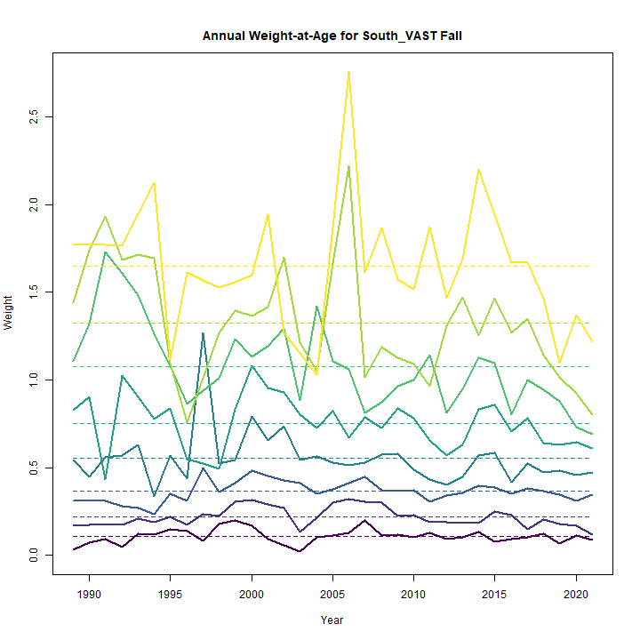
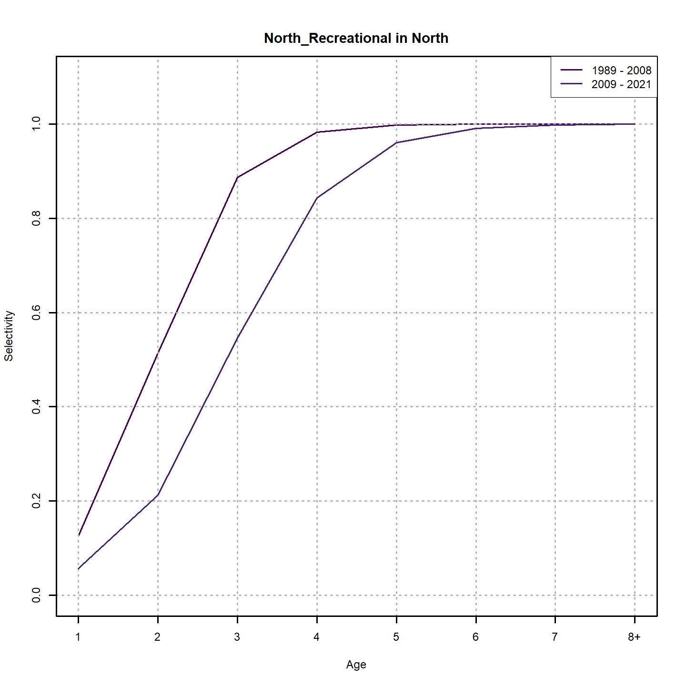
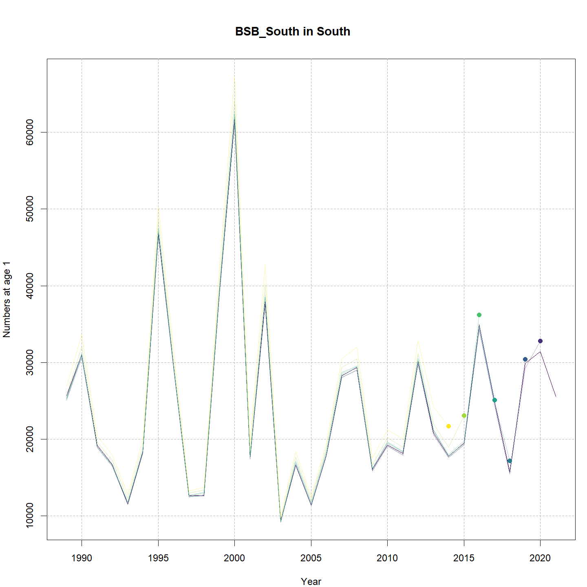
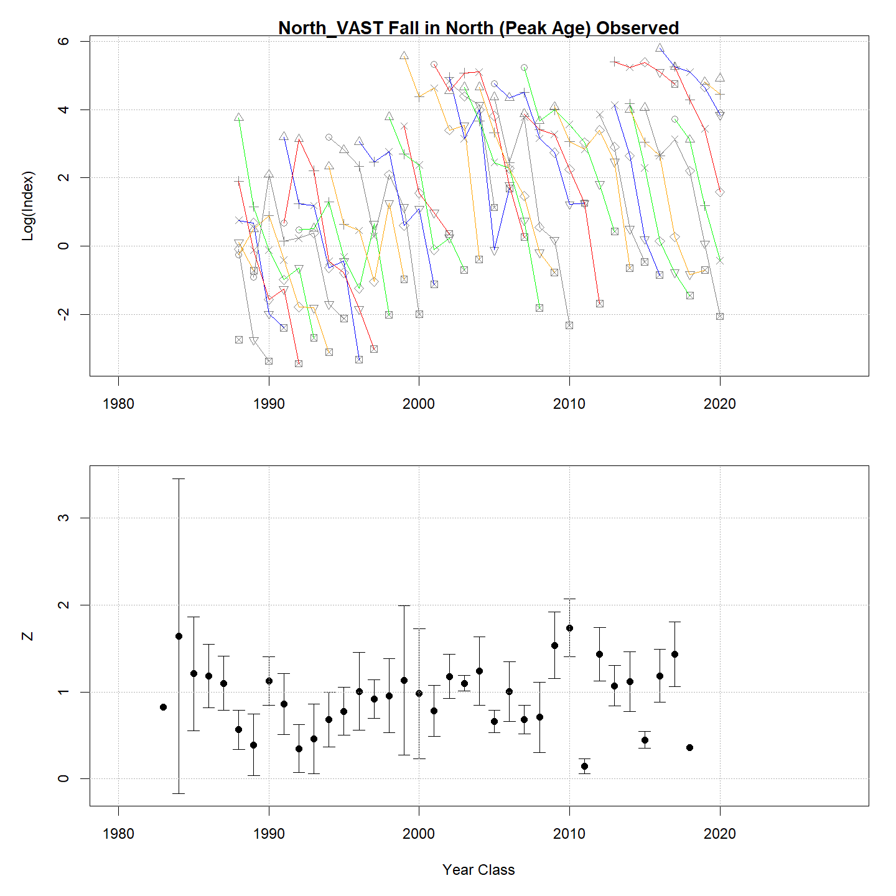

---
output:
  html_document:
    df_print: paged
    keep_md: yes
  word_document: default
  pdf_document:
    fig_caption: yes
    includes:
    keep_tex: yes
    number_sections: no
title: "WHAM figures and tables"
header-includes:
  - \usepackage{longtable}
  - \usepackage{booktabs}
  - \usepackage{caption,graphics}
  - \usepackage{makecell}
  - \usepackage{lscape}
  - \renewcommand\figurename{Fig.}
  - \captionsetup{labelsep=period, singlelinecheck=false}
  - \newcommand{\changesize}[1]{\fontsize{#1pt}{#1pt}\selectfont}
  - \renewcommand{\arraystretch}{1.5}
  - \renewcommand\theadfont{}
---

# {.tabset}

## Figures {.tabset}

### Input

### Diagnostics

### Results

### Retro

### Reference points

### Miscelaneous

## Tables {.tabset}

### Parameter estimates

<table class="table" style="margin-left: auto; margin-right: auto;">
<caption>Parameter estimates, standard errors, and confidence intervals. Rounded to 3 decimal places.</caption>
 <thead>
  <tr>
   <th style="text-align:left;">   </th>
   <th style="text-align:right;"> Estimate </th>
   <th style="text-align:right;"> Std. Error </th>
   <th style="text-align:right;"> 95\% CI lower </th>
   <th style="text-align:right;"> 95\% CI upper </th>
  </tr>
 </thead>
<tbody>
  <tr>
   <td style="text-align:left;"> BSB North Mean Recruitment </td>
   <td style="text-align:right;"> 12617.696 </td>
   <td style="text-align:right;"> 2888.996 </td>
   <td style="text-align:right;"> 8055.374 </td>
   <td style="text-align:right;"> 19763.980 </td>
  </tr>
  <tr>
   <td style="text-align:left;"> BSB North NAA $\sigma$ (age 1) </td>
   <td style="text-align:right;"> 1.093 </td>
   <td style="text-align:right;"> 0.143 </td>
   <td style="text-align:right;"> 0.846 </td>
   <td style="text-align:right;"> 1.413 </td>
  </tr>
  <tr>
   <td style="text-align:left;"> BSB North NAA $\sigma$ (age 2) </td>
   <td style="text-align:right;"> 0.413 </td>
   <td style="text-align:right;"> 0.034 </td>
   <td style="text-align:right;"> 0.351 </td>
   <td style="text-align:right;"> 0.485 </td>
  </tr>
  <tr>
   <td style="text-align:left;"> BSB South Mean Recruitment </td>
   <td style="text-align:right;"> 21823.423 </td>
   <td style="text-align:right;"> 2599.752 </td>
   <td style="text-align:right;"> 17279.137 </td>
   <td style="text-align:right;"> 27562.823 </td>
  </tr>
  <tr>
   <td style="text-align:left;"> BSB South NAA $\sigma$ (age 1) </td>
   <td style="text-align:right;"> 0.455 </td>
   <td style="text-align:right;"> 0.063 </td>
   <td style="text-align:right;"> 0.346 </td>
   <td style="text-align:right;"> 0.598 </td>
  </tr>
  <tr>
   <td style="text-align:left;"> BSB South NAA $\sigma$ (age 2) </td>
   <td style="text-align:right;"> 0.336 </td>
   <td style="text-align:right;"> 0.033 </td>
   <td style="text-align:right;"> 0.278 </td>
   <td style="text-align:right;"> 0.406 </td>
  </tr>
  <tr>
   <td style="text-align:left;"> North REC CPA fully selected q </td>
   <td style="text-align:right;"> 0.000 </td>
   <td style="text-align:right;"> 0.000 </td>
   <td style="text-align:right;"> 0.000 </td>
   <td style="text-align:right;"> 0.000 </td>
  </tr>
  <tr>
   <td style="text-align:left;"> North VAST Spring fully selected q </td>
   <td style="text-align:right;"> 0.010 </td>
   <td style="text-align:right;"> 0.001 </td>
   <td style="text-align:right;"> 0.008 </td>
   <td style="text-align:right;"> 0.013 </td>
  </tr>
  <tr>
   <td style="text-align:left;"> North VAST Fall fully selected q </td>
   <td style="text-align:right;"> 0.017 </td>
   <td style="text-align:right;"> 0.002 </td>
   <td style="text-align:right;"> 0.012 </td>
   <td style="text-align:right;"> 0.022 </td>
  </tr>
  <tr>
   <td style="text-align:left;"> South REC CPA fully selected q </td>
   <td style="text-align:right;"> 0.000 </td>
   <td style="text-align:right;"> 0.000 </td>
   <td style="text-align:right;"> 0.000 </td>
   <td style="text-align:right;"> 0.000 </td>
  </tr>
  <tr>
   <td style="text-align:left;"> South VAST Spring fully selected q </td>
   <td style="text-align:right;"> 0.019 </td>
   <td style="text-align:right;"> 0.001 </td>
   <td style="text-align:right;"> 0.016 </td>
   <td style="text-align:right;"> 0.022 </td>
  </tr>
  <tr>
   <td style="text-align:left;"> South VAST Fall fully selected q </td>
   <td style="text-align:right;"> 0.000 </td>
   <td style="text-align:right;"> 0.000 </td>
   <td style="text-align:right;"> 0.000 </td>
   <td style="text-align:right;"> 0.000 </td>
  </tr>
  <tr>
   <td style="text-align:left;"> Block 1: $a_{50}$ </td>
   <td style="text-align:right;"> 2.033 </td>
   <td style="text-align:right;"> 0.076 </td>
   <td style="text-align:right;"> 1.888 </td>
   <td style="text-align:right;"> 2.186 </td>
  </tr>
  <tr>
   <td style="text-align:left;"> Block 1: 1/slope (increasing) </td>
   <td style="text-align:right;"> 0.313 </td>
   <td style="text-align:right;"> 0.025 </td>
   <td style="text-align:right;"> 0.268 </td>
   <td style="text-align:right;"> 0.367 </td>
  </tr>
  <tr>
   <td style="text-align:left;"> Block 2: $a_{50}$ </td>
   <td style="text-align:right;"> 2.361 </td>
   <td style="text-align:right;"> 0.079 </td>
   <td style="text-align:right;"> 2.209 </td>
   <td style="text-align:right;"> 2.519 </td>
  </tr>
  <tr>
   <td style="text-align:left;"> Block 2: 1/slope (increasing) </td>
   <td style="text-align:right;"> 0.333 </td>
   <td style="text-align:right;"> 0.027 </td>
   <td style="text-align:right;"> 0.284 </td>
   <td style="text-align:right;"> 0.389 </td>
  </tr>
  <tr>
   <td style="text-align:left;"> Block 3: $a_{50}$ </td>
   <td style="text-align:right;"> 1.973 </td>
   <td style="text-align:right;"> 0.138 </td>
   <td style="text-align:right;"> 1.715 </td>
   <td style="text-align:right;"> 2.254 </td>
  </tr>
  <tr>
   <td style="text-align:left;"> Block 3: 1/slope (increasing) </td>
   <td style="text-align:right;"> 0.500 </td>
   <td style="text-align:right;"> 0.059 </td>
   <td style="text-align:right;"> 0.396 </td>
   <td style="text-align:right;"> 0.630 </td>
  </tr>
  <tr>
   <td style="text-align:left;"> Block 4: $a_{50}$ </td>
   <td style="text-align:right;"> 2.877 </td>
   <td style="text-align:right;"> 0.270 </td>
   <td style="text-align:right;"> 2.372 </td>
   <td style="text-align:right;"> 3.425 </td>
  </tr>
  <tr>
   <td style="text-align:left;"> Block 4: 1/slope (increasing) </td>
   <td style="text-align:right;"> 0.669 </td>
   <td style="text-align:right;"> 0.097 </td>
   <td style="text-align:right;"> 0.502 </td>
   <td style="text-align:right;"> 0.884 </td>
  </tr>
  <tr>
   <td style="text-align:left;"> Block 5: $a_{50}$ </td>
   <td style="text-align:right;"> 1.900 </td>
   <td style="text-align:right;"> 0.104 </td>
   <td style="text-align:right;"> 1.705 </td>
   <td style="text-align:right;"> 2.111 </td>
  </tr>
  <tr>
   <td style="text-align:left;"> Block 5: 1/slope (increasing) </td>
   <td style="text-align:right;"> 0.317 </td>
   <td style="text-align:right;"> 0.036 </td>
   <td style="text-align:right;"> 0.254 </td>
   <td style="text-align:right;"> 0.395 </td>
  </tr>
  <tr>
   <td style="text-align:left;"> Block 6: $a_{50}$ </td>
   <td style="text-align:right;"> 2.751 </td>
   <td style="text-align:right;"> 0.136 </td>
   <td style="text-align:right;"> 2.490 </td>
   <td style="text-align:right;"> 3.023 </td>
  </tr>
  <tr>
   <td style="text-align:left;"> Block 6: 1/slope (increasing) </td>
   <td style="text-align:right;"> 0.492 </td>
   <td style="text-align:right;"> 0.039 </td>
   <td style="text-align:right;"> 0.422 </td>
   <td style="text-align:right;"> 0.573 </td>
  </tr>
  <tr>
   <td style="text-align:left;"> Block 7: $a_{50}$ </td>
   <td style="text-align:right;"> 2.189 </td>
   <td style="text-align:right;"> 0.171 </td>
   <td style="text-align:right;"> 1.870 </td>
   <td style="text-align:right;"> 2.539 </td>
  </tr>
  <tr>
   <td style="text-align:left;"> Block 7: 1/slope (increasing) </td>
   <td style="text-align:right;"> 0.620 </td>
   <td style="text-align:right;"> 0.070 </td>
   <td style="text-align:right;"> 0.496 </td>
   <td style="text-align:right;"> 0.773 </td>
  </tr>
  <tr>
   <td style="text-align:left;"> Block 8: $a_{50}$ </td>
   <td style="text-align:right;"> 4.063 </td>
   <td style="text-align:right;"> 0.569 </td>
   <td style="text-align:right;"> 2.971 </td>
   <td style="text-align:right;"> 5.147 </td>
  </tr>
  <tr>
   <td style="text-align:left;"> Block 8: 1/slope (increasing) </td>
   <td style="text-align:right;"> 1.130 </td>
   <td style="text-align:right;"> 0.142 </td>
   <td style="text-align:right;"> 0.880 </td>
   <td style="text-align:right;"> 1.437 </td>
  </tr>
  <tr>
   <td style="text-align:left;"> Block 9: Selectivity for age 1 </td>
   <td style="text-align:right;"> 0.288 </td>
   <td style="text-align:right;"> 0.031 </td>
   <td style="text-align:right;"> 0.231 </td>
   <td style="text-align:right;"> 0.352 </td>
  </tr>
  <tr>
   <td style="text-align:left;"> Block 9: Selectivity for age 2 </td>
   <td style="text-align:right;"> 1.000 </td>
   <td style="text-align:right;"> -- </td>
   <td style="text-align:right;"> -- </td>
   <td style="text-align:right;"> -- </td>
  </tr>
  <tr>
   <td style="text-align:left;"> Block 9: Selectivity for age 3 </td>
   <td style="text-align:right;"> 1.000 </td>
   <td style="text-align:right;"> -- </td>
   <td style="text-align:right;"> -- </td>
   <td style="text-align:right;"> -- </td>
  </tr>
  <tr>
   <td style="text-align:left;"> Block 9: Selectivity for age 4 </td>
   <td style="text-align:right;"> 0.943 </td>
   <td style="text-align:right;"> 0.117 </td>
   <td style="text-align:right;"> 0.194 </td>
   <td style="text-align:right;"> 0.999 </td>
  </tr>
  <tr>
   <td style="text-align:left;"> Block 9: Selectivity for age 5 </td>
   <td style="text-align:right;"> 0.827 </td>
   <td style="text-align:right;"> 0.139 </td>
   <td style="text-align:right;"> 0.418 </td>
   <td style="text-align:right;"> 0.970 </td>
  </tr>
  <tr>
   <td style="text-align:left;"> Block 9: Selectivity for age 6 </td>
   <td style="text-align:right;"> 0.872 </td>
   <td style="text-align:right;"> 0.193 </td>
   <td style="text-align:right;"> 0.187 </td>
   <td style="text-align:right;"> 0.995 </td>
  </tr>
  <tr>
   <td style="text-align:left;"> Block 9: Selectivity for age 7 </td>
   <td style="text-align:right;"> 0.679 </td>
   <td style="text-align:right;"> 0.226 </td>
   <td style="text-align:right;"> 0.218 </td>
   <td style="text-align:right;"> 0.941 </td>
  </tr>
  <tr>
   <td style="text-align:left;"> Block 9: Selectivity for age 8+ </td>
   <td style="text-align:right;"> 0.723 </td>
   <td style="text-align:right;"> 0.256 </td>
   <td style="text-align:right;"> 0.175 </td>
   <td style="text-align:right;"> 0.970 </td>
  </tr>
  <tr>
   <td style="text-align:left;"> Block 10: Selectivity for age 1 </td>
   <td style="text-align:right;"> 0.107 </td>
   <td style="text-align:right;"> 0.013 </td>
   <td style="text-align:right;"> 0.085 </td>
   <td style="text-align:right;"> 0.135 </td>
  </tr>
  <tr>
   <td style="text-align:left;"> Block 10: Selectivity for age 2 </td>
   <td style="text-align:right;"> 0.407 </td>
   <td style="text-align:right;"> 0.034 </td>
   <td style="text-align:right;"> 0.343 </td>
   <td style="text-align:right;"> 0.474 </td>
  </tr>
  <tr>
   <td style="text-align:left;"> Block 10: Selectivity for age 3 </td>
   <td style="text-align:right;"> 1.000 </td>
   <td style="text-align:right;"> -- </td>
   <td style="text-align:right;"> -- </td>
   <td style="text-align:right;"> -- </td>
  </tr>
  <tr>
   <td style="text-align:left;"> Block 10: Selectivity for age 4 </td>
   <td style="text-align:right;"> 1.000 </td>
   <td style="text-align:right;"> -- </td>
   <td style="text-align:right;"> -- </td>
   <td style="text-align:right;"> -- </td>
  </tr>
  <tr>
   <td style="text-align:left;"> Block 10: Selectivity for age 5 </td>
   <td style="text-align:right;"> 0.795 </td>
   <td style="text-align:right;"> 0.093 </td>
   <td style="text-align:right;"> 0.558 </td>
   <td style="text-align:right;"> 0.922 </td>
  </tr>
  <tr>
   <td style="text-align:left;"> Block 10: Selectivity for age 6 </td>
   <td style="text-align:right;"> 0.754 </td>
   <td style="text-align:right;"> 0.123 </td>
   <td style="text-align:right;"> 0.455 </td>
   <td style="text-align:right;"> 0.918 </td>
  </tr>
  <tr>
   <td style="text-align:left;"> Block 10: Selectivity for age 7 </td>
   <td style="text-align:right;"> 0.425 </td>
   <td style="text-align:right;"> 0.117 </td>
   <td style="text-align:right;"> 0.225 </td>
   <td style="text-align:right;"> 0.654 </td>
  </tr>
  <tr>
   <td style="text-align:left;"> Block 10: Selectivity for age 8+ </td>
   <td style="text-align:right;"> 0.479 </td>
   <td style="text-align:right;"> 0.142 </td>
   <td style="text-align:right;"> 0.231 </td>
   <td style="text-align:right;"> 0.737 </td>
  </tr>
  <tr>
   <td style="text-align:left;"> Block 11: Selectivity for age 1 </td>
   <td style="text-align:right;"> 0.166 </td>
   <td style="text-align:right;"> 0.023 </td>
   <td style="text-align:right;"> 0.126 </td>
   <td style="text-align:right;"> 0.217 </td>
  </tr>
  <tr>
   <td style="text-align:left;"> Block 11: Selectivity for age 2 </td>
   <td style="text-align:right;"> 0.640 </td>
   <td style="text-align:right;"> 0.075 </td>
   <td style="text-align:right;"> 0.483 </td>
   <td style="text-align:right;"> 0.771 </td>
  </tr>
  <tr>
   <td style="text-align:left;"> Block 11: Selectivity for age 3 </td>
   <td style="text-align:right;"> 0.835 </td>
   <td style="text-align:right;"> 0.086 </td>
   <td style="text-align:right;"> 0.597 </td>
   <td style="text-align:right;"> 0.946 </td>
  </tr>
  <tr>
   <td style="text-align:left;"> Block 11: Selectivity for age 4 </td>
   <td style="text-align:right;"> 1.000 </td>
   <td style="text-align:right;"> -- </td>
   <td style="text-align:right;"> -- </td>
   <td style="text-align:right;"> -- </td>
  </tr>
  <tr>
   <td style="text-align:left;"> Block 11: Selectivity for age 5 </td>
   <td style="text-align:right;"> 0.952 </td>
   <td style="text-align:right;"> 0.129 </td>
   <td style="text-align:right;"> 0.072 </td>
   <td style="text-align:right;"> 1.000 </td>
  </tr>
  <tr>
   <td style="text-align:left;"> Block 11: Selectivity for age 6 </td>
   <td style="text-align:right;"> 0.855 </td>
   <td style="text-align:right;"> 0.156 </td>
   <td style="text-align:right;"> 0.335 </td>
   <td style="text-align:right;"> 0.986 </td>
  </tr>
  <tr>
   <td style="text-align:left;"> Block 11: Selectivity for age 7 </td>
   <td style="text-align:right;"> 0.687 </td>
   <td style="text-align:right;"> 0.184 </td>
   <td style="text-align:right;"> 0.290 </td>
   <td style="text-align:right;"> 0.922 </td>
  </tr>
  <tr>
   <td style="text-align:left;"> Block 11: Selectivity for age 8+ </td>
   <td style="text-align:right;"> 0.466 </td>
   <td style="text-align:right;"> 0.153 </td>
   <td style="text-align:right;"> 0.207 </td>
   <td style="text-align:right;"> 0.744 </td>
  </tr>
  <tr>
   <td style="text-align:left;"> Block 12: Selectivity for age 1 </td>
   <td style="text-align:right;"> 0.358 </td>
   <td style="text-align:right;"> 0.036 </td>
   <td style="text-align:right;"> 0.291 </td>
   <td style="text-align:right;"> 0.432 </td>
  </tr>
  <tr>
   <td style="text-align:left;"> Block 12: Selectivity for age 2 </td>
   <td style="text-align:right;"> 0.881 </td>
   <td style="text-align:right;"> 0.070 </td>
   <td style="text-align:right;"> 0.667 </td>
   <td style="text-align:right;"> 0.965 </td>
  </tr>
  <tr>
   <td style="text-align:left;"> Block 12: Selectivity for age 3 </td>
   <td style="text-align:right;"> 1.000 </td>
   <td style="text-align:right;"> -- </td>
   <td style="text-align:right;"> -- </td>
   <td style="text-align:right;"> -- </td>
  </tr>
  <tr>
   <td style="text-align:left;"> Block 12: Selectivity for age 4 </td>
   <td style="text-align:right;"> 0.866 </td>
   <td style="text-align:right;"> 0.102 </td>
   <td style="text-align:right;"> 0.536 </td>
   <td style="text-align:right;"> 0.973 </td>
  </tr>
  <tr>
   <td style="text-align:left;"> Block 12: Selectivity for age 5 </td>
   <td style="text-align:right;"> 0.694 </td>
   <td style="text-align:right;"> 0.126 </td>
   <td style="text-align:right;"> 0.416 </td>
   <td style="text-align:right;"> 0.879 </td>
  </tr>
  <tr>
   <td style="text-align:left;"> Block 12: Selectivity for age 6 </td>
   <td style="text-align:right;"> 0.860 </td>
   <td style="text-align:right;"> 0.212 </td>
   <td style="text-align:right;"> 0.163 </td>
   <td style="text-align:right;"> 0.995 </td>
  </tr>
  <tr>
   <td style="text-align:left;"> Block 12: Selectivity for age 7 </td>
   <td style="text-align:right;"> 0.673 </td>
   <td style="text-align:right;"> 0.283 </td>
   <td style="text-align:right;"> 0.142 </td>
   <td style="text-align:right;"> 0.962 </td>
  </tr>
  <tr>
   <td style="text-align:left;"> Block 12: Selectivity for age 8+ </td>
   <td style="text-align:right;"> 0.797 </td>
   <td style="text-align:right;"> 0.401 </td>
   <td style="text-align:right;"> 0.030 </td>
   <td style="text-align:right;"> 0.998 </td>
  </tr>
  <tr>
   <td style="text-align:left;"> Block 13: Selectivity for age 1 </td>
   <td style="text-align:right;"> 0.291 </td>
   <td style="text-align:right;"> 0.024 </td>
   <td style="text-align:right;"> 0.246 </td>
   <td style="text-align:right;"> 0.340 </td>
  </tr>
  <tr>
   <td style="text-align:left;"> Block 13: Selectivity for age 2 </td>
   <td style="text-align:right;"> 1.000 </td>
   <td style="text-align:right;"> -- </td>
   <td style="text-align:right;"> -- </td>
   <td style="text-align:right;"> -- </td>
  </tr>
  <tr>
   <td style="text-align:left;"> Block 13: Selectivity for age 3 </td>
   <td style="text-align:right;"> 1.000 </td>
   <td style="text-align:right;"> -- </td>
   <td style="text-align:right;"> -- </td>
   <td style="text-align:right;"> -- </td>
  </tr>
  <tr>
   <td style="text-align:left;"> Block 13: Selectivity for age 4 </td>
   <td style="text-align:right;"> 0.613 </td>
   <td style="text-align:right;"> 0.076 </td>
   <td style="text-align:right;"> 0.459 </td>
   <td style="text-align:right;"> 0.748 </td>
  </tr>
  <tr>
   <td style="text-align:left;"> Block 13: Selectivity for age 5 </td>
   <td style="text-align:right;"> 0.472 </td>
   <td style="text-align:right;"> 0.093 </td>
   <td style="text-align:right;"> 0.301 </td>
   <td style="text-align:right;"> 0.650 </td>
  </tr>
  <tr>
   <td style="text-align:left;"> Block 13: Selectivity for age 6 </td>
   <td style="text-align:right;"> 0.353 </td>
   <td style="text-align:right;"> 0.117 </td>
   <td style="text-align:right;"> 0.167 </td>
   <td style="text-align:right;"> 0.598 </td>
  </tr>
  <tr>
   <td style="text-align:left;"> Block 13: Selectivity for age 7 </td>
   <td style="text-align:right;"> 0.192 </td>
   <td style="text-align:right;"> 0.133 </td>
   <td style="text-align:right;"> 0.042 </td>
   <td style="text-align:right;"> 0.561 </td>
  </tr>
  <tr>
   <td style="text-align:left;"> Block 13: Selectivity for age 8+ </td>
   <td style="text-align:right;"> 0.316 </td>
   <td style="text-align:right;"> 0.216 </td>
   <td style="text-align:right;"> 0.061 </td>
   <td style="text-align:right;"> 0.767 </td>
  </tr>
  <tr>
   <td style="text-align:left;"> Block 14: Selectivity for age 1 </td>
   <td style="text-align:right;"> 0.972 </td>
   <td style="text-align:right;"> 0.078 </td>
   <td style="text-align:right;"> 0.115 </td>
   <td style="text-align:right;"> 1.000 </td>
  </tr>
  <tr>
   <td style="text-align:left;"> Block 14: Selectivity for age 2 </td>
   <td style="text-align:right;"> 1.000 </td>
   <td style="text-align:right;"> -- </td>
   <td style="text-align:right;"> -- </td>
   <td style="text-align:right;"> -- </td>
  </tr>
  <tr>
   <td style="text-align:left;"> Block 14: Selectivity for age 3 </td>
   <td style="text-align:right;"> 0.611 </td>
   <td style="text-align:right;"> 0.065 </td>
   <td style="text-align:right;"> 0.479 </td>
   <td style="text-align:right;"> 0.728 </td>
  </tr>
  <tr>
   <td style="text-align:left;"> Block 14: Selectivity for age 4 </td>
   <td style="text-align:right;"> 0.490 </td>
   <td style="text-align:right;"> 0.084 </td>
   <td style="text-align:right;"> 0.332 </td>
   <td style="text-align:right;"> 0.650 </td>
  </tr>
  <tr>
   <td style="text-align:left;"> Block 14: Selectivity for age 5 </td>
   <td style="text-align:right;"> 0.399 </td>
   <td style="text-align:right;"> 0.108 </td>
   <td style="text-align:right;"> 0.216 </td>
   <td style="text-align:right;"> 0.617 </td>
  </tr>
  <tr>
   <td style="text-align:left;"> Block 14: Selectivity for age 6 </td>
   <td style="text-align:right;"> 0.143 </td>
   <td style="text-align:right;"> 0.093 </td>
   <td style="text-align:right;"> 0.037 </td>
   <td style="text-align:right;"> 0.424 </td>
  </tr>
  <tr>
   <td style="text-align:left;"> Block 14: Selectivity for age 7 </td>
   <td style="text-align:right;"> 0.090 </td>
   <td style="text-align:right;"> 0.118 </td>
   <td style="text-align:right;"> 0.006 </td>
   <td style="text-align:right;"> 0.623 </td>
  </tr>
  <tr>
   <td style="text-align:left;"> Block 14: Selectivity for age 8+ </td>
   <td style="text-align:right;"> 0.177 </td>
   <td style="text-align:right;"> 0.210 </td>
   <td style="text-align:right;"> 0.012 </td>
   <td style="text-align:right;"> 0.785 </td>
  </tr>
  <tr>
   <td style="text-align:left;"> North REC CPA log-index observation SD scalar </td>
   <td style="text-align:right;"> 9.084 </td>
   <td style="text-align:right;"> 1.285 </td>
   <td style="text-align:right;"> 6.884 </td>
   <td style="text-align:right;"> 11.987 </td>
  </tr>
  <tr>
   <td style="text-align:left;"> South REC CPA log-index observation SD scalar </td>
   <td style="text-align:right;"> 4.428 </td>
   <td style="text-align:right;"> 0.992 </td>
   <td style="text-align:right;"> 2.855 </td>
   <td style="text-align:right;"> 6.869 </td>
  </tr>
</tbody>
</table>

### Abundance at age

<table class="table" style="margin-left: auto; margin-right: auto;">
<caption>Abundance at age (1000s) for BSB North in North.</caption>
 <thead>
  <tr>
   <th style="text-align:left;">   </th>
   <th style="text-align:right;"> 1 </th>
   <th style="text-align:right;"> 2 </th>
   <th style="text-align:right;"> 3 </th>
   <th style="text-align:right;"> 4 </th>
   <th style="text-align:right;"> 5 </th>
   <th style="text-align:right;"> 6 </th>
   <th style="text-align:right;"> 7 </th>
   <th style="text-align:right;"> 8+ </th>
  </tr>
 </thead>
<tbody>
  <tr>
   <td style="text-align:left;"> 1989 </td>
   <td style="text-align:right;"> 5707 </td>
   <td style="text-align:right;"> 3126 </td>
   <td style="text-align:right;"> 1445 </td>
   <td style="text-align:right;"> 649 </td>
   <td style="text-align:right;"> 290 </td>
   <td style="text-align:right;"> 129 </td>
   <td style="text-align:right;"> 58 </td>
   <td style="text-align:right;"> 47 </td>
  </tr>
  <tr>
   <td style="text-align:left;"> 1990 </td>
   <td style="text-align:right;"> 1709 </td>
   <td style="text-align:right;"> 1414 </td>
   <td style="text-align:right;"> 1469 </td>
   <td style="text-align:right;"> 305 </td>
   <td style="text-align:right;"> 305 </td>
   <td style="text-align:right;"> 53 </td>
   <td style="text-align:right;"> 47 </td>
   <td style="text-align:right;"> 25 </td>
  </tr>
  <tr>
   <td style="text-align:left;"> 1991 </td>
   <td style="text-align:right;"> 2748 </td>
   <td style="text-align:right;"> 2045 </td>
   <td style="text-align:right;"> 497 </td>
   <td style="text-align:right;"> 453 </td>
   <td style="text-align:right;"> 106 </td>
   <td style="text-align:right;"> 61 </td>
   <td style="text-align:right;"> 19 </td>
   <td style="text-align:right;"> 25 </td>
  </tr>
  <tr>
   <td style="text-align:left;"> 1992 </td>
   <td style="text-align:right;"> 1887 </td>
   <td style="text-align:right;"> 2984 </td>
   <td style="text-align:right;"> 706 </td>
   <td style="text-align:right;"> 126 </td>
   <td style="text-align:right;"> 175 </td>
   <td style="text-align:right;"> 29 </td>
   <td style="text-align:right;"> 18 </td>
   <td style="text-align:right;"> 19 </td>
  </tr>
  <tr>
   <td style="text-align:left;"> 1993 </td>
   <td style="text-align:right;"> 1158 </td>
   <td style="text-align:right;"> 2152 </td>
   <td style="text-align:right;"> 721 </td>
   <td style="text-align:right;"> 299 </td>
   <td style="text-align:right;"> 39 </td>
   <td style="text-align:right;"> 113 </td>
   <td style="text-align:right;"> 11 </td>
   <td style="text-align:right;"> 14 </td>
  </tr>
  <tr>
   <td style="text-align:left;"> 1994 </td>
   <td style="text-align:right;"> 4605 </td>
   <td style="text-align:right;"> 583 </td>
   <td style="text-align:right;"> 1226 </td>
   <td style="text-align:right;"> 298 </td>
   <td style="text-align:right;"> 162 </td>
   <td style="text-align:right;"> 16 </td>
   <td style="text-align:right;"> 33 </td>
   <td style="text-align:right;"> 9 </td>
  </tr>
  <tr>
   <td style="text-align:left;"> 1995 </td>
   <td style="text-align:right;"> 11974 </td>
   <td style="text-align:right;"> 1846 </td>
   <td style="text-align:right;"> 602 </td>
   <td style="text-align:right;"> 191 </td>
   <td style="text-align:right;"> 100 </td>
   <td style="text-align:right;"> 42 </td>
   <td style="text-align:right;"> 6 </td>
   <td style="text-align:right;"> 16 </td>
  </tr>
  <tr>
   <td style="text-align:left;"> 1996 </td>
   <td style="text-align:right;"> 12718 </td>
   <td style="text-align:right;"> 3666 </td>
   <td style="text-align:right;"> 868 </td>
   <td style="text-align:right;"> 237 </td>
   <td style="text-align:right;"> 71 </td>
   <td style="text-align:right;"> 55 </td>
   <td style="text-align:right;"> 18 </td>
   <td style="text-align:right;"> 10 </td>
  </tr>
  <tr>
   <td style="text-align:left;"> 1997 </td>
   <td style="text-align:right;"> 2980 </td>
   <td style="text-align:right;"> 6128 </td>
   <td style="text-align:right;"> 1516 </td>
   <td style="text-align:right;"> 261 </td>
   <td style="text-align:right;"> 103 </td>
   <td style="text-align:right;"> 26 </td>
   <td style="text-align:right;"> 24 </td>
   <td style="text-align:right;"> 12 </td>
  </tr>
  <tr>
   <td style="text-align:left;"> 1998 </td>
   <td style="text-align:right;"> 3255 </td>
   <td style="text-align:right;"> 2977 </td>
   <td style="text-align:right;"> 1359 </td>
   <td style="text-align:right;"> 602 </td>
   <td style="text-align:right;"> 136 </td>
   <td style="text-align:right;"> 90 </td>
   <td style="text-align:right;"> 12 </td>
   <td style="text-align:right;"> 23 </td>
  </tr>
  <tr>
   <td style="text-align:left;"> 1999 </td>
   <td style="text-align:right;"> 26611 </td>
   <td style="text-align:right;"> 3469 </td>
   <td style="text-align:right;"> 2121 </td>
   <td style="text-align:right;"> 889 </td>
   <td style="text-align:right;"> 313 </td>
   <td style="text-align:right;"> 82 </td>
   <td style="text-align:right;"> 37 </td>
   <td style="text-align:right;"> 15 </td>
  </tr>
  <tr>
   <td style="text-align:left;"> 2000 </td>
   <td style="text-align:right;"> 48185 </td>
   <td style="text-align:right;"> 17195 </td>
   <td style="text-align:right;"> 1954 </td>
   <td style="text-align:right;"> 1542 </td>
   <td style="text-align:right;"> 374 </td>
   <td style="text-align:right;"> 190 </td>
   <td style="text-align:right;"> 36 </td>
   <td style="text-align:right;"> 26 </td>
  </tr>
  <tr>
   <td style="text-align:left;"> 2001 </td>
   <td style="text-align:right;"> 13702 </td>
   <td style="text-align:right;"> 10088 </td>
   <td style="text-align:right;"> 6656 </td>
   <td style="text-align:right;"> 981 </td>
   <td style="text-align:right;"> 628 </td>
   <td style="text-align:right;"> 215 </td>
   <td style="text-align:right;"> 129 </td>
   <td style="text-align:right;"> 34 </td>
  </tr>
  <tr>
   <td style="text-align:left;"> 2002 </td>
   <td style="text-align:right;"> 41691 </td>
   <td style="text-align:right;"> 9885 </td>
   <td style="text-align:right;"> 7285 </td>
   <td style="text-align:right;"> 5041 </td>
   <td style="text-align:right;"> 391 </td>
   <td style="text-align:right;"> 258 </td>
   <td style="text-align:right;"> 101 </td>
   <td style="text-align:right;"> 74 </td>
  </tr>
  <tr>
   <td style="text-align:left;"> 2003 </td>
   <td style="text-align:right;"> 6752 </td>
   <td style="text-align:right;"> 12369 </td>
   <td style="text-align:right;"> 4956 </td>
   <td style="text-align:right;"> 5633 </td>
   <td style="text-align:right;"> 2651 </td>
   <td style="text-align:right;"> 189 </td>
   <td style="text-align:right;"> 135 </td>
   <td style="text-align:right;"> 81 </td>
  </tr>
  <tr>
   <td style="text-align:left;"> 2004 </td>
   <td style="text-align:right;"> 7897 </td>
   <td style="text-align:right;"> 4754 </td>
   <td style="text-align:right;"> 7649 </td>
   <td style="text-align:right;"> 2038 </td>
   <td style="text-align:right;"> 3492 </td>
   <td style="text-align:right;"> 1023 </td>
   <td style="text-align:right;"> 93 </td>
   <td style="text-align:right;"> 114 </td>
  </tr>
  <tr>
   <td style="text-align:left;"> 2005 </td>
   <td style="text-align:right;"> 15003 </td>
   <td style="text-align:right;"> 5383 </td>
   <td style="text-align:right;"> 2154 </td>
   <td style="text-align:right;"> 5299 </td>
   <td style="text-align:right;"> 1832 </td>
   <td style="text-align:right;"> 1786 </td>
   <td style="text-align:right;"> 385 </td>
   <td style="text-align:right;"> 112 </td>
  </tr>
  <tr>
   <td style="text-align:left;"> 2006 </td>
   <td style="text-align:right;"> 29622 </td>
   <td style="text-align:right;"> 8076 </td>
   <td style="text-align:right;"> 2039 </td>
   <td style="text-align:right;"> 1665 </td>
   <td style="text-align:right;"> 2808 </td>
   <td style="text-align:right;"> 662 </td>
   <td style="text-align:right;"> 631 </td>
   <td style="text-align:right;"> 188 </td>
  </tr>
  <tr>
   <td style="text-align:left;"> 2007 </td>
   <td style="text-align:right;"> 16296 </td>
   <td style="text-align:right;"> 11321 </td>
   <td style="text-align:right;"> 3029 </td>
   <td style="text-align:right;"> 1083 </td>
   <td style="text-align:right;"> 807 </td>
   <td style="text-align:right;"> 980 </td>
   <td style="text-align:right;"> 440 </td>
   <td style="text-align:right;"> 293 </td>
  </tr>
  <tr>
   <td style="text-align:left;"> 2008 </td>
   <td style="text-align:right;"> 34155 </td>
   <td style="text-align:right;"> 9554 </td>
   <td style="text-align:right;"> 7559 </td>
   <td style="text-align:right;"> 2027 </td>
   <td style="text-align:right;"> 448 </td>
   <td style="text-align:right;"> 320 </td>
   <td style="text-align:right;"> 439 </td>
   <td style="text-align:right;"> 287 </td>
  </tr>
  <tr>
   <td style="text-align:left;"> 2009 </td>
   <td style="text-align:right;"> 24519 </td>
   <td style="text-align:right;"> 11601 </td>
   <td style="text-align:right;"> 5127 </td>
   <td style="text-align:right;"> 3753 </td>
   <td style="text-align:right;"> 786 </td>
   <td style="text-align:right;"> 185 </td>
   <td style="text-align:right;"> 139 </td>
   <td style="text-align:right;"> 287 </td>
  </tr>
  <tr>
   <td style="text-align:left;"> 2010 </td>
   <td style="text-align:right;"> 10696 </td>
   <td style="text-align:right;"> 8914 </td>
   <td style="text-align:right;"> 7529 </td>
   <td style="text-align:right;"> 3416 </td>
   <td style="text-align:right;"> 1982 </td>
   <td style="text-align:right;"> 323 </td>
   <td style="text-align:right;"> 76 </td>
   <td style="text-align:right;"> 165 </td>
  </tr>
  <tr>
   <td style="text-align:left;"> 2011 </td>
   <td style="text-align:right;"> 14776 </td>
   <td style="text-align:right;"> 6741 </td>
   <td style="text-align:right;"> 3899 </td>
   <td style="text-align:right;"> 4079 </td>
   <td style="text-align:right;"> 1394 </td>
   <td style="text-align:right;"> 773 </td>
   <td style="text-align:right;"> 126 </td>
   <td style="text-align:right;"> 89 </td>
  </tr>
  <tr>
   <td style="text-align:left;"> 2012 </td>
   <td style="text-align:right;"> 86081 </td>
   <td style="text-align:right;"> 11750 </td>
   <td style="text-align:right;"> 6544 </td>
   <td style="text-align:right;"> 3826 </td>
   <td style="text-align:right;"> 2986 </td>
   <td style="text-align:right;"> 940 </td>
   <td style="text-align:right;"> 495 </td>
   <td style="text-align:right;"> 111 </td>
  </tr>
  <tr>
   <td style="text-align:left;"> 2013 </td>
   <td style="text-align:right;"> 22064 </td>
   <td style="text-align:right;"> 34850 </td>
   <td style="text-align:right;"> 5216 </td>
   <td style="text-align:right;"> 4859 </td>
   <td style="text-align:right;"> 2747 </td>
   <td style="text-align:right;"> 1538 </td>
   <td style="text-align:right;"> 441 </td>
   <td style="text-align:right;"> 303 </td>
  </tr>
  <tr>
   <td style="text-align:left;"> 2014 </td>
   <td style="text-align:right;"> 11020 </td>
   <td style="text-align:right;"> 11339 </td>
   <td style="text-align:right;"> 29851 </td>
   <td style="text-align:right;"> 5004 </td>
   <td style="text-align:right;"> 2706 </td>
   <td style="text-align:right;"> 1553 </td>
   <td style="text-align:right;"> 873 </td>
   <td style="text-align:right;"> 392 </td>
  </tr>
  <tr>
   <td style="text-align:left;"> 2015 </td>
   <td style="text-align:right;"> 13129 </td>
   <td style="text-align:right;"> 9265 </td>
   <td style="text-align:right;"> 7886 </td>
   <td style="text-align:right;"> 20250 </td>
   <td style="text-align:right;"> 2942 </td>
   <td style="text-align:right;"> 1372 </td>
   <td style="text-align:right;"> 776 </td>
   <td style="text-align:right;"> 689 </td>
  </tr>
  <tr>
   <td style="text-align:left;"> 2016 </td>
   <td style="text-align:right;"> 63338 </td>
   <td style="text-align:right;"> 15400 </td>
   <td style="text-align:right;"> 5235 </td>
   <td style="text-align:right;"> 5910 </td>
   <td style="text-align:right;"> 24120 </td>
   <td style="text-align:right;"> 1610 </td>
   <td style="text-align:right;"> 827 </td>
   <td style="text-align:right;"> 777 </td>
  </tr>
  <tr>
   <td style="text-align:left;"> 2017 </td>
   <td style="text-align:right;"> 25032 </td>
   <td style="text-align:right;"> 43581 </td>
   <td style="text-align:right;"> 6494 </td>
   <td style="text-align:right;"> 3615 </td>
   <td style="text-align:right;"> 3886 </td>
   <td style="text-align:right;"> 17719 </td>
   <td style="text-align:right;"> 850 </td>
   <td style="text-align:right;"> 810 </td>
  </tr>
  <tr>
   <td style="text-align:left;"> 2018 </td>
   <td style="text-align:right;"> 8897 </td>
   <td style="text-align:right;"> 17738 </td>
   <td style="text-align:right;"> 19904 </td>
   <td style="text-align:right;"> 3860 </td>
   <td style="text-align:right;"> 1681 </td>
   <td style="text-align:right;"> 2068 </td>
   <td style="text-align:right;"> 11530 </td>
   <td style="text-align:right;"> 849 </td>
  </tr>
  <tr>
   <td style="text-align:left;"> 2019 </td>
   <td style="text-align:right;"> 31074 </td>
   <td style="text-align:right;"> 5676 </td>
   <td style="text-align:right;"> 9499 </td>
   <td style="text-align:right;"> 18484 </td>
   <td style="text-align:right;"> 2544 </td>
   <td style="text-align:right;"> 1025 </td>
   <td style="text-align:right;"> 1112 </td>
   <td style="text-align:right;"> 8402 </td>
  </tr>
  <tr>
   <td style="text-align:left;"> 2020 </td>
   <td style="text-align:right;"> 39967 </td>
   <td style="text-align:right;"> 22688 </td>
   <td style="text-align:right;"> 2676 </td>
   <td style="text-align:right;"> 5697 </td>
   <td style="text-align:right;"> 13031 </td>
   <td style="text-align:right;"> 1501 </td>
   <td style="text-align:right;"> 627 </td>
   <td style="text-align:right;"> 5461 </td>
  </tr>
  <tr>
   <td style="text-align:left;"> 2021 </td>
   <td style="text-align:right;"> 20884 </td>
   <td style="text-align:right;"> 23298 </td>
   <td style="text-align:right;"> 14361 </td>
   <td style="text-align:right;"> 1469 </td>
   <td style="text-align:right;"> 3610 </td>
   <td style="text-align:right;"> 9036 </td>
   <td style="text-align:right;"> 795 </td>
   <td style="text-align:right;"> 3252 </td>
  </tr>
</tbody>
</table>

<table class="table" style="margin-left: auto; margin-right: auto;">
<caption>Abundance at age (1000s) for BSB North in South.</caption>
 <thead>
  <tr>
   <th style="text-align:left;">   </th>
   <th style="text-align:right;"> 1 </th>
   <th style="text-align:right;"> 2 </th>
   <th style="text-align:right;"> 3 </th>
   <th style="text-align:right;"> 4 </th>
   <th style="text-align:right;"> 5 </th>
   <th style="text-align:right;"> 6 </th>
   <th style="text-align:right;"> 7 </th>
   <th style="text-align:right;"> 8+ </th>
  </tr>
 </thead>
<tbody>
  <tr>
   <td style="text-align:left;"> 1989 </td>
   <td style="text-align:right;"> 0 </td>
   <td style="text-align:right;"> 0 </td>
   <td style="text-align:right;"> 0 </td>
   <td style="text-align:right;"> 0 </td>
   <td style="text-align:right;"> 0 </td>
   <td style="text-align:right;"> 0 </td>
   <td style="text-align:right;"> 0 </td>
   <td style="text-align:right;"> 0 </td>
  </tr>
  <tr>
   <td style="text-align:left;"> 1990 </td>
   <td style="text-align:right;"> 0 </td>
   <td style="text-align:right;"> 0 </td>
   <td style="text-align:right;"> 0 </td>
   <td style="text-align:right;"> 0 </td>
   <td style="text-align:right;"> 0 </td>
   <td style="text-align:right;"> 0 </td>
   <td style="text-align:right;"> 0 </td>
   <td style="text-align:right;"> 0 </td>
  </tr>
  <tr>
   <td style="text-align:left;"> 1991 </td>
   <td style="text-align:right;"> 0 </td>
   <td style="text-align:right;"> 0 </td>
   <td style="text-align:right;"> 0 </td>
   <td style="text-align:right;"> 0 </td>
   <td style="text-align:right;"> 0 </td>
   <td style="text-align:right;"> 0 </td>
   <td style="text-align:right;"> 0 </td>
   <td style="text-align:right;"> 0 </td>
  </tr>
  <tr>
   <td style="text-align:left;"> 1992 </td>
   <td style="text-align:right;"> 0 </td>
   <td style="text-align:right;"> 0 </td>
   <td style="text-align:right;"> 0 </td>
   <td style="text-align:right;"> 0 </td>
   <td style="text-align:right;"> 0 </td>
   <td style="text-align:right;"> 0 </td>
   <td style="text-align:right;"> 0 </td>
   <td style="text-align:right;"> 0 </td>
  </tr>
  <tr>
   <td style="text-align:left;"> 1993 </td>
   <td style="text-align:right;"> 0 </td>
   <td style="text-align:right;"> 0 </td>
   <td style="text-align:right;"> 0 </td>
   <td style="text-align:right;"> 0 </td>
   <td style="text-align:right;"> 0 </td>
   <td style="text-align:right;"> 0 </td>
   <td style="text-align:right;"> 0 </td>
   <td style="text-align:right;"> 0 </td>
  </tr>
  <tr>
   <td style="text-align:left;"> 1994 </td>
   <td style="text-align:right;"> 0 </td>
   <td style="text-align:right;"> 0 </td>
   <td style="text-align:right;"> 0 </td>
   <td style="text-align:right;"> 0 </td>
   <td style="text-align:right;"> 0 </td>
   <td style="text-align:right;"> 0 </td>
   <td style="text-align:right;"> 0 </td>
   <td style="text-align:right;"> 0 </td>
  </tr>
  <tr>
   <td style="text-align:left;"> 1995 </td>
   <td style="text-align:right;"> 0 </td>
   <td style="text-align:right;"> 0 </td>
   <td style="text-align:right;"> 0 </td>
   <td style="text-align:right;"> 0 </td>
   <td style="text-align:right;"> 0 </td>
   <td style="text-align:right;"> 0 </td>
   <td style="text-align:right;"> 0 </td>
   <td style="text-align:right;"> 0 </td>
  </tr>
  <tr>
   <td style="text-align:left;"> 1996 </td>
   <td style="text-align:right;"> 0 </td>
   <td style="text-align:right;"> 0 </td>
   <td style="text-align:right;"> 0 </td>
   <td style="text-align:right;"> 0 </td>
   <td style="text-align:right;"> 0 </td>
   <td style="text-align:right;"> 0 </td>
   <td style="text-align:right;"> 0 </td>
   <td style="text-align:right;"> 0 </td>
  </tr>
  <tr>
   <td style="text-align:left;"> 1997 </td>
   <td style="text-align:right;"> 0 </td>
   <td style="text-align:right;"> 0 </td>
   <td style="text-align:right;"> 0 </td>
   <td style="text-align:right;"> 0 </td>
   <td style="text-align:right;"> 0 </td>
   <td style="text-align:right;"> 0 </td>
   <td style="text-align:right;"> 0 </td>
   <td style="text-align:right;"> 0 </td>
  </tr>
  <tr>
   <td style="text-align:left;"> 1998 </td>
   <td style="text-align:right;"> 0 </td>
   <td style="text-align:right;"> 0 </td>
   <td style="text-align:right;"> 0 </td>
   <td style="text-align:right;"> 0 </td>
   <td style="text-align:right;"> 0 </td>
   <td style="text-align:right;"> 0 </td>
   <td style="text-align:right;"> 0 </td>
   <td style="text-align:right;"> 0 </td>
  </tr>
  <tr>
   <td style="text-align:left;"> 1999 </td>
   <td style="text-align:right;"> 0 </td>
   <td style="text-align:right;"> 0 </td>
   <td style="text-align:right;"> 0 </td>
   <td style="text-align:right;"> 0 </td>
   <td style="text-align:right;"> 0 </td>
   <td style="text-align:right;"> 0 </td>
   <td style="text-align:right;"> 0 </td>
   <td style="text-align:right;"> 0 </td>
  </tr>
  <tr>
   <td style="text-align:left;"> 2000 </td>
   <td style="text-align:right;"> 0 </td>
   <td style="text-align:right;"> 0 </td>
   <td style="text-align:right;"> 0 </td>
   <td style="text-align:right;"> 0 </td>
   <td style="text-align:right;"> 0 </td>
   <td style="text-align:right;"> 0 </td>
   <td style="text-align:right;"> 0 </td>
   <td style="text-align:right;"> 0 </td>
  </tr>
  <tr>
   <td style="text-align:left;"> 2001 </td>
   <td style="text-align:right;"> 0 </td>
   <td style="text-align:right;"> 0 </td>
   <td style="text-align:right;"> 0 </td>
   <td style="text-align:right;"> 0 </td>
   <td style="text-align:right;"> 0 </td>
   <td style="text-align:right;"> 0 </td>
   <td style="text-align:right;"> 0 </td>
   <td style="text-align:right;"> 0 </td>
  </tr>
  <tr>
   <td style="text-align:left;"> 2002 </td>
   <td style="text-align:right;"> 0 </td>
   <td style="text-align:right;"> 0 </td>
   <td style="text-align:right;"> 0 </td>
   <td style="text-align:right;"> 0 </td>
   <td style="text-align:right;"> 0 </td>
   <td style="text-align:right;"> 0 </td>
   <td style="text-align:right;"> 0 </td>
   <td style="text-align:right;"> 0 </td>
  </tr>
  <tr>
   <td style="text-align:left;"> 2003 </td>
   <td style="text-align:right;"> 0 </td>
   <td style="text-align:right;"> 0 </td>
   <td style="text-align:right;"> 0 </td>
   <td style="text-align:right;"> 0 </td>
   <td style="text-align:right;"> 0 </td>
   <td style="text-align:right;"> 0 </td>
   <td style="text-align:right;"> 0 </td>
   <td style="text-align:right;"> 0 </td>
  </tr>
  <tr>
   <td style="text-align:left;"> 2004 </td>
   <td style="text-align:right;"> 0 </td>
   <td style="text-align:right;"> 0 </td>
   <td style="text-align:right;"> 0 </td>
   <td style="text-align:right;"> 0 </td>
   <td style="text-align:right;"> 0 </td>
   <td style="text-align:right;"> 0 </td>
   <td style="text-align:right;"> 0 </td>
   <td style="text-align:right;"> 0 </td>
  </tr>
  <tr>
   <td style="text-align:left;"> 2005 </td>
   <td style="text-align:right;"> 0 </td>
   <td style="text-align:right;"> 0 </td>
   <td style="text-align:right;"> 0 </td>
   <td style="text-align:right;"> 0 </td>
   <td style="text-align:right;"> 0 </td>
   <td style="text-align:right;"> 0 </td>
   <td style="text-align:right;"> 0 </td>
   <td style="text-align:right;"> 0 </td>
  </tr>
  <tr>
   <td style="text-align:left;"> 2006 </td>
   <td style="text-align:right;"> 0 </td>
   <td style="text-align:right;"> 0 </td>
   <td style="text-align:right;"> 0 </td>
   <td style="text-align:right;"> 0 </td>
   <td style="text-align:right;"> 0 </td>
   <td style="text-align:right;"> 0 </td>
   <td style="text-align:right;"> 0 </td>
   <td style="text-align:right;"> 0 </td>
  </tr>
  <tr>
   <td style="text-align:left;"> 2007 </td>
   <td style="text-align:right;"> 0 </td>
   <td style="text-align:right;"> 0 </td>
   <td style="text-align:right;"> 0 </td>
   <td style="text-align:right;"> 0 </td>
   <td style="text-align:right;"> 0 </td>
   <td style="text-align:right;"> 0 </td>
   <td style="text-align:right;"> 0 </td>
   <td style="text-align:right;"> 0 </td>
  </tr>
  <tr>
   <td style="text-align:left;"> 2008 </td>
   <td style="text-align:right;"> 0 </td>
   <td style="text-align:right;"> 0 </td>
   <td style="text-align:right;"> 0 </td>
   <td style="text-align:right;"> 0 </td>
   <td style="text-align:right;"> 0 </td>
   <td style="text-align:right;"> 0 </td>
   <td style="text-align:right;"> 0 </td>
   <td style="text-align:right;"> 0 </td>
  </tr>
  <tr>
   <td style="text-align:left;"> 2009 </td>
   <td style="text-align:right;"> 0 </td>
   <td style="text-align:right;"> 0 </td>
   <td style="text-align:right;"> 0 </td>
   <td style="text-align:right;"> 0 </td>
   <td style="text-align:right;"> 0 </td>
   <td style="text-align:right;"> 0 </td>
   <td style="text-align:right;"> 0 </td>
   <td style="text-align:right;"> 0 </td>
  </tr>
  <tr>
   <td style="text-align:left;"> 2010 </td>
   <td style="text-align:right;"> 0 </td>
   <td style="text-align:right;"> 0 </td>
   <td style="text-align:right;"> 0 </td>
   <td style="text-align:right;"> 0 </td>
   <td style="text-align:right;"> 0 </td>
   <td style="text-align:right;"> 0 </td>
   <td style="text-align:right;"> 0 </td>
   <td style="text-align:right;"> 0 </td>
  </tr>
  <tr>
   <td style="text-align:left;"> 2011 </td>
   <td style="text-align:right;"> 0 </td>
   <td style="text-align:right;"> 0 </td>
   <td style="text-align:right;"> 0 </td>
   <td style="text-align:right;"> 0 </td>
   <td style="text-align:right;"> 0 </td>
   <td style="text-align:right;"> 0 </td>
   <td style="text-align:right;"> 0 </td>
   <td style="text-align:right;"> 0 </td>
  </tr>
  <tr>
   <td style="text-align:left;"> 2012 </td>
   <td style="text-align:right;"> 0 </td>
   <td style="text-align:right;"> 0 </td>
   <td style="text-align:right;"> 0 </td>
   <td style="text-align:right;"> 0 </td>
   <td style="text-align:right;"> 0 </td>
   <td style="text-align:right;"> 0 </td>
   <td style="text-align:right;"> 0 </td>
   <td style="text-align:right;"> 0 </td>
  </tr>
  <tr>
   <td style="text-align:left;"> 2013 </td>
   <td style="text-align:right;"> 0 </td>
   <td style="text-align:right;"> 0 </td>
   <td style="text-align:right;"> 0 </td>
   <td style="text-align:right;"> 0 </td>
   <td style="text-align:right;"> 0 </td>
   <td style="text-align:right;"> 0 </td>
   <td style="text-align:right;"> 0 </td>
   <td style="text-align:right;"> 0 </td>
  </tr>
  <tr>
   <td style="text-align:left;"> 2014 </td>
   <td style="text-align:right;"> 0 </td>
   <td style="text-align:right;"> 0 </td>
   <td style="text-align:right;"> 0 </td>
   <td style="text-align:right;"> 0 </td>
   <td style="text-align:right;"> 0 </td>
   <td style="text-align:right;"> 0 </td>
   <td style="text-align:right;"> 0 </td>
   <td style="text-align:right;"> 0 </td>
  </tr>
  <tr>
   <td style="text-align:left;"> 2015 </td>
   <td style="text-align:right;"> 0 </td>
   <td style="text-align:right;"> 0 </td>
   <td style="text-align:right;"> 0 </td>
   <td style="text-align:right;"> 0 </td>
   <td style="text-align:right;"> 0 </td>
   <td style="text-align:right;"> 0 </td>
   <td style="text-align:right;"> 0 </td>
   <td style="text-align:right;"> 0 </td>
  </tr>
  <tr>
   <td style="text-align:left;"> 2016 </td>
   <td style="text-align:right;"> 0 </td>
   <td style="text-align:right;"> 0 </td>
   <td style="text-align:right;"> 0 </td>
   <td style="text-align:right;"> 0 </td>
   <td style="text-align:right;"> 0 </td>
   <td style="text-align:right;"> 0 </td>
   <td style="text-align:right;"> 0 </td>
   <td style="text-align:right;"> 0 </td>
  </tr>
  <tr>
   <td style="text-align:left;"> 2017 </td>
   <td style="text-align:right;"> 0 </td>
   <td style="text-align:right;"> 0 </td>
   <td style="text-align:right;"> 0 </td>
   <td style="text-align:right;"> 0 </td>
   <td style="text-align:right;"> 0 </td>
   <td style="text-align:right;"> 0 </td>
   <td style="text-align:right;"> 0 </td>
   <td style="text-align:right;"> 0 </td>
  </tr>
  <tr>
   <td style="text-align:left;"> 2018 </td>
   <td style="text-align:right;"> 0 </td>
   <td style="text-align:right;"> 0 </td>
   <td style="text-align:right;"> 0 </td>
   <td style="text-align:right;"> 0 </td>
   <td style="text-align:right;"> 0 </td>
   <td style="text-align:right;"> 0 </td>
   <td style="text-align:right;"> 0 </td>
   <td style="text-align:right;"> 0 </td>
  </tr>
  <tr>
   <td style="text-align:left;"> 2019 </td>
   <td style="text-align:right;"> 0 </td>
   <td style="text-align:right;"> 0 </td>
   <td style="text-align:right;"> 0 </td>
   <td style="text-align:right;"> 0 </td>
   <td style="text-align:right;"> 0 </td>
   <td style="text-align:right;"> 0 </td>
   <td style="text-align:right;"> 0 </td>
   <td style="text-align:right;"> 0 </td>
  </tr>
  <tr>
   <td style="text-align:left;"> 2020 </td>
   <td style="text-align:right;"> 0 </td>
   <td style="text-align:right;"> 0 </td>
   <td style="text-align:right;"> 0 </td>
   <td style="text-align:right;"> 0 </td>
   <td style="text-align:right;"> 0 </td>
   <td style="text-align:right;"> 0 </td>
   <td style="text-align:right;"> 0 </td>
   <td style="text-align:right;"> 0 </td>
  </tr>
  <tr>
   <td style="text-align:left;"> 2021 </td>
   <td style="text-align:right;"> 0 </td>
   <td style="text-align:right;"> 0 </td>
   <td style="text-align:right;"> 0 </td>
   <td style="text-align:right;"> 0 </td>
   <td style="text-align:right;"> 0 </td>
   <td style="text-align:right;"> 0 </td>
   <td style="text-align:right;"> 0 </td>
   <td style="text-align:right;"> 0 </td>
  </tr>
</tbody>
</table>

<table class="table" style="margin-left: auto; margin-right: auto;">
<caption>Abundance at age (1000s) for BSB South in North.</caption>
 <thead>
  <tr>
   <th style="text-align:left;">   </th>
   <th style="text-align:right;"> 1 </th>
   <th style="text-align:right;"> 2 </th>
   <th style="text-align:right;"> 3 </th>
   <th style="text-align:right;"> 4 </th>
   <th style="text-align:right;"> 5 </th>
   <th style="text-align:right;"> 6 </th>
   <th style="text-align:right;"> 7 </th>
   <th style="text-align:right;"> 8+ </th>
  </tr>
 </thead>
<tbody>
  <tr>
   <td style="text-align:left;"> 1989 </td>
   <td style="text-align:right;"> 0 </td>
   <td style="text-align:right;"> 0 </td>
   <td style="text-align:right;"> 0 </td>
   <td style="text-align:right;"> 0 </td>
   <td style="text-align:right;"> 0 </td>
   <td style="text-align:right;"> 0 </td>
   <td style="text-align:right;"> 0 </td>
   <td style="text-align:right;"> 0 </td>
  </tr>
  <tr>
   <td style="text-align:left;"> 1990 </td>
   <td style="text-align:right;"> 0 </td>
   <td style="text-align:right;"> 0 </td>
   <td style="text-align:right;"> 0 </td>
   <td style="text-align:right;"> 0 </td>
   <td style="text-align:right;"> 0 </td>
   <td style="text-align:right;"> 0 </td>
   <td style="text-align:right;"> 0 </td>
   <td style="text-align:right;"> 0 </td>
  </tr>
  <tr>
   <td style="text-align:left;"> 1991 </td>
   <td style="text-align:right;"> 0 </td>
   <td style="text-align:right;"> 0 </td>
   <td style="text-align:right;"> 0 </td>
   <td style="text-align:right;"> 0 </td>
   <td style="text-align:right;"> 0 </td>
   <td style="text-align:right;"> 0 </td>
   <td style="text-align:right;"> 0 </td>
   <td style="text-align:right;"> 0 </td>
  </tr>
  <tr>
   <td style="text-align:left;"> 1992 </td>
   <td style="text-align:right;"> 0 </td>
   <td style="text-align:right;"> 0 </td>
   <td style="text-align:right;"> 0 </td>
   <td style="text-align:right;"> 0 </td>
   <td style="text-align:right;"> 0 </td>
   <td style="text-align:right;"> 0 </td>
   <td style="text-align:right;"> 0 </td>
   <td style="text-align:right;"> 0 </td>
  </tr>
  <tr>
   <td style="text-align:left;"> 1993 </td>
   <td style="text-align:right;"> 0 </td>
   <td style="text-align:right;"> 0 </td>
   <td style="text-align:right;"> 0 </td>
   <td style="text-align:right;"> 0 </td>
   <td style="text-align:right;"> 0 </td>
   <td style="text-align:right;"> 0 </td>
   <td style="text-align:right;"> 0 </td>
   <td style="text-align:right;"> 0 </td>
  </tr>
  <tr>
   <td style="text-align:left;"> 1994 </td>
   <td style="text-align:right;"> 0 </td>
   <td style="text-align:right;"> 0 </td>
   <td style="text-align:right;"> 0 </td>
   <td style="text-align:right;"> 0 </td>
   <td style="text-align:right;"> 0 </td>
   <td style="text-align:right;"> 0 </td>
   <td style="text-align:right;"> 0 </td>
   <td style="text-align:right;"> 0 </td>
  </tr>
  <tr>
   <td style="text-align:left;"> 1995 </td>
   <td style="text-align:right;"> 0 </td>
   <td style="text-align:right;"> 0 </td>
   <td style="text-align:right;"> 0 </td>
   <td style="text-align:right;"> 0 </td>
   <td style="text-align:right;"> 0 </td>
   <td style="text-align:right;"> 0 </td>
   <td style="text-align:right;"> 0 </td>
   <td style="text-align:right;"> 0 </td>
  </tr>
  <tr>
   <td style="text-align:left;"> 1996 </td>
   <td style="text-align:right;"> 0 </td>
   <td style="text-align:right;"> 0 </td>
   <td style="text-align:right;"> 0 </td>
   <td style="text-align:right;"> 0 </td>
   <td style="text-align:right;"> 0 </td>
   <td style="text-align:right;"> 0 </td>
   <td style="text-align:right;"> 0 </td>
   <td style="text-align:right;"> 0 </td>
  </tr>
  <tr>
   <td style="text-align:left;"> 1997 </td>
   <td style="text-align:right;"> 0 </td>
   <td style="text-align:right;"> 0 </td>
   <td style="text-align:right;"> 0 </td>
   <td style="text-align:right;"> 0 </td>
   <td style="text-align:right;"> 0 </td>
   <td style="text-align:right;"> 0 </td>
   <td style="text-align:right;"> 0 </td>
   <td style="text-align:right;"> 0 </td>
  </tr>
  <tr>
   <td style="text-align:left;"> 1998 </td>
   <td style="text-align:right;"> 0 </td>
   <td style="text-align:right;"> 0 </td>
   <td style="text-align:right;"> 0 </td>
   <td style="text-align:right;"> 0 </td>
   <td style="text-align:right;"> 0 </td>
   <td style="text-align:right;"> 0 </td>
   <td style="text-align:right;"> 0 </td>
   <td style="text-align:right;"> 0 </td>
  </tr>
  <tr>
   <td style="text-align:left;"> 1999 </td>
   <td style="text-align:right;"> 0 </td>
   <td style="text-align:right;"> 0 </td>
   <td style="text-align:right;"> 0 </td>
   <td style="text-align:right;"> 0 </td>
   <td style="text-align:right;"> 0 </td>
   <td style="text-align:right;"> 0 </td>
   <td style="text-align:right;"> 0 </td>
   <td style="text-align:right;"> 0 </td>
  </tr>
  <tr>
   <td style="text-align:left;"> 2000 </td>
   <td style="text-align:right;"> 0 </td>
   <td style="text-align:right;"> 0 </td>
   <td style="text-align:right;"> 0 </td>
   <td style="text-align:right;"> 0 </td>
   <td style="text-align:right;"> 0 </td>
   <td style="text-align:right;"> 0 </td>
   <td style="text-align:right;"> 0 </td>
   <td style="text-align:right;"> 0 </td>
  </tr>
  <tr>
   <td style="text-align:left;"> 2001 </td>
   <td style="text-align:right;"> 0 </td>
   <td style="text-align:right;"> 0 </td>
   <td style="text-align:right;"> 0 </td>
   <td style="text-align:right;"> 0 </td>
   <td style="text-align:right;"> 0 </td>
   <td style="text-align:right;"> 0 </td>
   <td style="text-align:right;"> 0 </td>
   <td style="text-align:right;"> 0 </td>
  </tr>
  <tr>
   <td style="text-align:left;"> 2002 </td>
   <td style="text-align:right;"> 0 </td>
   <td style="text-align:right;"> 0 </td>
   <td style="text-align:right;"> 0 </td>
   <td style="text-align:right;"> 0 </td>
   <td style="text-align:right;"> 0 </td>
   <td style="text-align:right;"> 0 </td>
   <td style="text-align:right;"> 0 </td>
   <td style="text-align:right;"> 0 </td>
  </tr>
  <tr>
   <td style="text-align:left;"> 2003 </td>
   <td style="text-align:right;"> 0 </td>
   <td style="text-align:right;"> 0 </td>
   <td style="text-align:right;"> 0 </td>
   <td style="text-align:right;"> 0 </td>
   <td style="text-align:right;"> 0 </td>
   <td style="text-align:right;"> 0 </td>
   <td style="text-align:right;"> 0 </td>
   <td style="text-align:right;"> 0 </td>
  </tr>
  <tr>
   <td style="text-align:left;"> 2004 </td>
   <td style="text-align:right;"> 0 </td>
   <td style="text-align:right;"> 0 </td>
   <td style="text-align:right;"> 0 </td>
   <td style="text-align:right;"> 0 </td>
   <td style="text-align:right;"> 0 </td>
   <td style="text-align:right;"> 0 </td>
   <td style="text-align:right;"> 0 </td>
   <td style="text-align:right;"> 0 </td>
  </tr>
  <tr>
   <td style="text-align:left;"> 2005 </td>
   <td style="text-align:right;"> 0 </td>
   <td style="text-align:right;"> 0 </td>
   <td style="text-align:right;"> 0 </td>
   <td style="text-align:right;"> 0 </td>
   <td style="text-align:right;"> 0 </td>
   <td style="text-align:right;"> 0 </td>
   <td style="text-align:right;"> 0 </td>
   <td style="text-align:right;"> 0 </td>
  </tr>
  <tr>
   <td style="text-align:left;"> 2006 </td>
   <td style="text-align:right;"> 0 </td>
   <td style="text-align:right;"> 0 </td>
   <td style="text-align:right;"> 0 </td>
   <td style="text-align:right;"> 0 </td>
   <td style="text-align:right;"> 0 </td>
   <td style="text-align:right;"> 0 </td>
   <td style="text-align:right;"> 0 </td>
   <td style="text-align:right;"> 0 </td>
  </tr>
  <tr>
   <td style="text-align:left;"> 2007 </td>
   <td style="text-align:right;"> 0 </td>
   <td style="text-align:right;"> 0 </td>
   <td style="text-align:right;"> 0 </td>
   <td style="text-align:right;"> 0 </td>
   <td style="text-align:right;"> 0 </td>
   <td style="text-align:right;"> 0 </td>
   <td style="text-align:right;"> 0 </td>
   <td style="text-align:right;"> 0 </td>
  </tr>
  <tr>
   <td style="text-align:left;"> 2008 </td>
   <td style="text-align:right;"> 0 </td>
   <td style="text-align:right;"> 0 </td>
   <td style="text-align:right;"> 0 </td>
   <td style="text-align:right;"> 0 </td>
   <td style="text-align:right;"> 0 </td>
   <td style="text-align:right;"> 0 </td>
   <td style="text-align:right;"> 0 </td>
   <td style="text-align:right;"> 0 </td>
  </tr>
  <tr>
   <td style="text-align:left;"> 2009 </td>
   <td style="text-align:right;"> 0 </td>
   <td style="text-align:right;"> 0 </td>
   <td style="text-align:right;"> 0 </td>
   <td style="text-align:right;"> 0 </td>
   <td style="text-align:right;"> 0 </td>
   <td style="text-align:right;"> 0 </td>
   <td style="text-align:right;"> 0 </td>
   <td style="text-align:right;"> 0 </td>
  </tr>
  <tr>
   <td style="text-align:left;"> 2010 </td>
   <td style="text-align:right;"> 0 </td>
   <td style="text-align:right;"> 0 </td>
   <td style="text-align:right;"> 0 </td>
   <td style="text-align:right;"> 0 </td>
   <td style="text-align:right;"> 0 </td>
   <td style="text-align:right;"> 0 </td>
   <td style="text-align:right;"> 0 </td>
   <td style="text-align:right;"> 0 </td>
  </tr>
  <tr>
   <td style="text-align:left;"> 2011 </td>
   <td style="text-align:right;"> 0 </td>
   <td style="text-align:right;"> 0 </td>
   <td style="text-align:right;"> 0 </td>
   <td style="text-align:right;"> 0 </td>
   <td style="text-align:right;"> 0 </td>
   <td style="text-align:right;"> 0 </td>
   <td style="text-align:right;"> 0 </td>
   <td style="text-align:right;"> 0 </td>
  </tr>
  <tr>
   <td style="text-align:left;"> 2012 </td>
   <td style="text-align:right;"> 0 </td>
   <td style="text-align:right;"> 0 </td>
   <td style="text-align:right;"> 0 </td>
   <td style="text-align:right;"> 0 </td>
   <td style="text-align:right;"> 0 </td>
   <td style="text-align:right;"> 0 </td>
   <td style="text-align:right;"> 0 </td>
   <td style="text-align:right;"> 0 </td>
  </tr>
  <tr>
   <td style="text-align:left;"> 2013 </td>
   <td style="text-align:right;"> 0 </td>
   <td style="text-align:right;"> 0 </td>
   <td style="text-align:right;"> 0 </td>
   <td style="text-align:right;"> 0 </td>
   <td style="text-align:right;"> 0 </td>
   <td style="text-align:right;"> 0 </td>
   <td style="text-align:right;"> 0 </td>
   <td style="text-align:right;"> 0 </td>
  </tr>
  <tr>
   <td style="text-align:left;"> 2014 </td>
   <td style="text-align:right;"> 0 </td>
   <td style="text-align:right;"> 0 </td>
   <td style="text-align:right;"> 0 </td>
   <td style="text-align:right;"> 0 </td>
   <td style="text-align:right;"> 0 </td>
   <td style="text-align:right;"> 0 </td>
   <td style="text-align:right;"> 0 </td>
   <td style="text-align:right;"> 0 </td>
  </tr>
  <tr>
   <td style="text-align:left;"> 2015 </td>
   <td style="text-align:right;"> 0 </td>
   <td style="text-align:right;"> 0 </td>
   <td style="text-align:right;"> 0 </td>
   <td style="text-align:right;"> 0 </td>
   <td style="text-align:right;"> 0 </td>
   <td style="text-align:right;"> 0 </td>
   <td style="text-align:right;"> 0 </td>
   <td style="text-align:right;"> 0 </td>
  </tr>
  <tr>
   <td style="text-align:left;"> 2016 </td>
   <td style="text-align:right;"> 0 </td>
   <td style="text-align:right;"> 0 </td>
   <td style="text-align:right;"> 0 </td>
   <td style="text-align:right;"> 0 </td>
   <td style="text-align:right;"> 0 </td>
   <td style="text-align:right;"> 0 </td>
   <td style="text-align:right;"> 0 </td>
   <td style="text-align:right;"> 0 </td>
  </tr>
  <tr>
   <td style="text-align:left;"> 2017 </td>
   <td style="text-align:right;"> 0 </td>
   <td style="text-align:right;"> 0 </td>
   <td style="text-align:right;"> 0 </td>
   <td style="text-align:right;"> 0 </td>
   <td style="text-align:right;"> 0 </td>
   <td style="text-align:right;"> 0 </td>
   <td style="text-align:right;"> 0 </td>
   <td style="text-align:right;"> 0 </td>
  </tr>
  <tr>
   <td style="text-align:left;"> 2018 </td>
   <td style="text-align:right;"> 0 </td>
   <td style="text-align:right;"> 0 </td>
   <td style="text-align:right;"> 0 </td>
   <td style="text-align:right;"> 0 </td>
   <td style="text-align:right;"> 0 </td>
   <td style="text-align:right;"> 0 </td>
   <td style="text-align:right;"> 0 </td>
   <td style="text-align:right;"> 0 </td>
  </tr>
  <tr>
   <td style="text-align:left;"> 2019 </td>
   <td style="text-align:right;"> 0 </td>
   <td style="text-align:right;"> 0 </td>
   <td style="text-align:right;"> 0 </td>
   <td style="text-align:right;"> 0 </td>
   <td style="text-align:right;"> 0 </td>
   <td style="text-align:right;"> 0 </td>
   <td style="text-align:right;"> 0 </td>
   <td style="text-align:right;"> 0 </td>
  </tr>
  <tr>
   <td style="text-align:left;"> 2020 </td>
   <td style="text-align:right;"> 0 </td>
   <td style="text-align:right;"> 0 </td>
   <td style="text-align:right;"> 0 </td>
   <td style="text-align:right;"> 0 </td>
   <td style="text-align:right;"> 0 </td>
   <td style="text-align:right;"> 0 </td>
   <td style="text-align:right;"> 0 </td>
   <td style="text-align:right;"> 0 </td>
  </tr>
  <tr>
   <td style="text-align:left;"> 2021 </td>
   <td style="text-align:right;"> 0 </td>
   <td style="text-align:right;"> 0 </td>
   <td style="text-align:right;"> 0 </td>
   <td style="text-align:right;"> 0 </td>
   <td style="text-align:right;"> 0 </td>
   <td style="text-align:right;"> 0 </td>
   <td style="text-align:right;"> 0 </td>
   <td style="text-align:right;"> 0 </td>
  </tr>
</tbody>
</table>

<table class="table" style="margin-left: auto; margin-right: auto;">
<caption>Abundance at age (1000s) for BSB South in South.</caption>
 <thead>
  <tr>
   <th style="text-align:left;">   </th>
   <th style="text-align:right;"> 1 </th>
   <th style="text-align:right;"> 2 </th>
   <th style="text-align:right;"> 3 </th>
   <th style="text-align:right;"> 4 </th>
   <th style="text-align:right;"> 5 </th>
   <th style="text-align:right;"> 6 </th>
   <th style="text-align:right;"> 7 </th>
   <th style="text-align:right;"> 8+ </th>
  </tr>
 </thead>
<tbody>
  <tr>
   <td style="text-align:left;"> 1989 </td>
   <td style="text-align:right;"> 25699 </td>
   <td style="text-align:right;"> 13069 </td>
   <td style="text-align:right;"> 5349 </td>
   <td style="text-align:right;"> 2042 </td>
   <td style="text-align:right;"> 767 </td>
   <td style="text-align:right;"> 287 </td>
   <td style="text-align:right;"> 107 </td>
   <td style="text-align:right;"> 64 </td>
  </tr>
  <tr>
   <td style="text-align:left;"> 1990 </td>
   <td style="text-align:right;"> 31047 </td>
   <td style="text-align:right;"> 13016 </td>
   <td style="text-align:right;"> 7851 </td>
   <td style="text-align:right;"> 1336 </td>
   <td style="text-align:right;"> 741 </td>
   <td style="text-align:right;"> 207 </td>
   <td style="text-align:right;"> 83 </td>
   <td style="text-align:right;"> 49 </td>
  </tr>
  <tr>
   <td style="text-align:left;"> 1991 </td>
   <td style="text-align:right;"> 19230 </td>
   <td style="text-align:right;"> 20609 </td>
   <td style="text-align:right;"> 4207 </td>
   <td style="text-align:right;"> 2473 </td>
   <td style="text-align:right;"> 409 </td>
   <td style="text-align:right;"> 208 </td>
   <td style="text-align:right;"> 62 </td>
   <td style="text-align:right;"> 39 </td>
  </tr>
  <tr>
   <td style="text-align:left;"> 1992 </td>
   <td style="text-align:right;"> 16731 </td>
   <td style="text-align:right;"> 22658 </td>
   <td style="text-align:right;"> 7173 </td>
   <td style="text-align:right;"> 1328 </td>
   <td style="text-align:right;"> 646 </td>
   <td style="text-align:right;"> 97 </td>
   <td style="text-align:right;"> 50 </td>
   <td style="text-align:right;"> 25 </td>
  </tr>
  <tr>
   <td style="text-align:left;"> 1993 </td>
   <td style="text-align:right;"> 11571 </td>
   <td style="text-align:right;"> 23264 </td>
   <td style="text-align:right;"> 7156 </td>
   <td style="text-align:right;"> 2100 </td>
   <td style="text-align:right;"> 407 </td>
   <td style="text-align:right;"> 200 </td>
   <td style="text-align:right;"> 30 </td>
   <td style="text-align:right;"> 23 </td>
  </tr>
  <tr>
   <td style="text-align:left;"> 1994 </td>
   <td style="text-align:right;"> 18369 </td>
   <td style="text-align:right;"> 5583 </td>
   <td style="text-align:right;"> 11206 </td>
   <td style="text-align:right;"> 2419 </td>
   <td style="text-align:right;"> 729 </td>
   <td style="text-align:right;"> 137 </td>
   <td style="text-align:right;"> 57 </td>
   <td style="text-align:right;"> 15 </td>
  </tr>
  <tr>
   <td style="text-align:left;"> 1995 </td>
   <td style="text-align:right;"> 46896 </td>
   <td style="text-align:right;"> 11796 </td>
   <td style="text-align:right;"> 4774 </td>
   <td style="text-align:right;"> 2427 </td>
   <td style="text-align:right;"> 911 </td>
   <td style="text-align:right;"> 236 </td>
   <td style="text-align:right;"> 53 </td>
   <td style="text-align:right;"> 27 </td>
  </tr>
  <tr>
   <td style="text-align:left;"> 1996 </td>
   <td style="text-align:right;"> 29704 </td>
   <td style="text-align:right;"> 17774 </td>
   <td style="text-align:right;"> 5945 </td>
   <td style="text-align:right;"> 1787 </td>
   <td style="text-align:right;"> 687 </td>
   <td style="text-align:right;"> 386 </td>
   <td style="text-align:right;"> 73 </td>
   <td style="text-align:right;"> 30 </td>
  </tr>
  <tr>
   <td style="text-align:left;"> 1997 </td>
   <td style="text-align:right;"> 12659 </td>
   <td style="text-align:right;"> 21868 </td>
   <td style="text-align:right;"> 5821 </td>
   <td style="text-align:right;"> 984 </td>
   <td style="text-align:right;"> 328 </td>
   <td style="text-align:right;"> 105 </td>
   <td style="text-align:right;"> 63 </td>
   <td style="text-align:right;"> 17 </td>
  </tr>
  <tr>
   <td style="text-align:left;"> 1998 </td>
   <td style="text-align:right;"> 12673 </td>
   <td style="text-align:right;"> 13454 </td>
   <td style="text-align:right;"> 5423 </td>
   <td style="text-align:right;"> 1688 </td>
   <td style="text-align:right;"> 277 </td>
   <td style="text-align:right;"> 112 </td>
   <td style="text-align:right;"> 27 </td>
   <td style="text-align:right;"> 22 </td>
  </tr>
  <tr>
   <td style="text-align:left;"> 1999 </td>
   <td style="text-align:right;"> 39363 </td>
   <td style="text-align:right;"> 6491 </td>
   <td style="text-align:right;"> 4581 </td>
   <td style="text-align:right;"> 1663 </td>
   <td style="text-align:right;"> 519 </td>
   <td style="text-align:right;"> 91 </td>
   <td style="text-align:right;"> 33 </td>
   <td style="text-align:right;"> 14 </td>
  </tr>
  <tr>
   <td style="text-align:left;"> 2000 </td>
   <td style="text-align:right;"> 61857 </td>
   <td style="text-align:right;"> 18023 </td>
   <td style="text-align:right;"> 3887 </td>
   <td style="text-align:right;"> 2118 </td>
   <td style="text-align:right;"> 580 </td>
   <td style="text-align:right;"> 182 </td>
   <td style="text-align:right;"> 31 </td>
   <td style="text-align:right;"> 16 </td>
  </tr>
  <tr>
   <td style="text-align:left;"> 2001 </td>
   <td style="text-align:right;"> 17656 </td>
   <td style="text-align:right;"> 28485 </td>
   <td style="text-align:right;"> 12316 </td>
   <td style="text-align:right;"> 1736 </td>
   <td style="text-align:right;"> 741 </td>
   <td style="text-align:right;"> 237 </td>
   <td style="text-align:right;"> 69 </td>
   <td style="text-align:right;"> 18 </td>
  </tr>
  <tr>
   <td style="text-align:left;"> 2002 </td>
   <td style="text-align:right;"> 37927 </td>
   <td style="text-align:right;"> 17395 </td>
   <td style="text-align:right;"> 16941 </td>
   <td style="text-align:right;"> 6402 </td>
   <td style="text-align:right;"> 642 </td>
   <td style="text-align:right;"> 303 </td>
   <td style="text-align:right;"> 97 </td>
   <td style="text-align:right;"> 36 </td>
  </tr>
  <tr>
   <td style="text-align:left;"> 2003 </td>
   <td style="text-align:right;"> 9363 </td>
   <td style="text-align:right;"> 25752 </td>
   <td style="text-align:right;"> 9780 </td>
   <td style="text-align:right;"> 9594 </td>
   <td style="text-align:right;"> 3648 </td>
   <td style="text-align:right;"> 285 </td>
   <td style="text-align:right;"> 148 </td>
   <td style="text-align:right;"> 61 </td>
  </tr>
  <tr>
   <td style="text-align:left;"> 2004 </td>
   <td style="text-align:right;"> 16662 </td>
   <td style="text-align:right;"> 11703 </td>
   <td style="text-align:right;"> 11688 </td>
   <td style="text-align:right;"> 3146 </td>
   <td style="text-align:right;"> 3757 </td>
   <td style="text-align:right;"> 1066 </td>
   <td style="text-align:right;"> 119 </td>
   <td style="text-align:right;"> 94 </td>
  </tr>
  <tr>
   <td style="text-align:left;"> 2005 </td>
   <td style="text-align:right;"> 11417 </td>
   <td style="text-align:right;"> 13049 </td>
   <td style="text-align:right;"> 6119 </td>
   <td style="text-align:right;"> 4939 </td>
   <td style="text-align:right;"> 1562 </td>
   <td style="text-align:right;"> 1162 </td>
   <td style="text-align:right;"> 374 </td>
   <td style="text-align:right;"> 92 </td>
  </tr>
  <tr>
   <td style="text-align:left;"> 2006 </td>
   <td style="text-align:right;"> 17906 </td>
   <td style="text-align:right;"> 8575 </td>
   <td style="text-align:right;"> 3864 </td>
   <td style="text-align:right;"> 2661 </td>
   <td style="text-align:right;"> 2379 </td>
   <td style="text-align:right;"> 671 </td>
   <td style="text-align:right;"> 385 </td>
   <td style="text-align:right;"> 181 </td>
  </tr>
  <tr>
   <td style="text-align:left;"> 2007 </td>
   <td style="text-align:right;"> 28300 </td>
   <td style="text-align:right;"> 8768 </td>
   <td style="text-align:right;"> 3768 </td>
   <td style="text-align:right;"> 1739 </td>
   <td style="text-align:right;"> 1020 </td>
   <td style="text-align:right;"> 842 </td>
   <td style="text-align:right;"> 363 </td>
   <td style="text-align:right;"> 235 </td>
  </tr>
  <tr>
   <td style="text-align:left;"> 2008 </td>
   <td style="text-align:right;"> 29336 </td>
   <td style="text-align:right;"> 12306 </td>
   <td style="text-align:right;"> 4985 </td>
   <td style="text-align:right;"> 1932 </td>
   <td style="text-align:right;"> 752 </td>
   <td style="text-align:right;"> 446 </td>
   <td style="text-align:right;"> 357 </td>
   <td style="text-align:right;"> 248 </td>
  </tr>
  <tr>
   <td style="text-align:left;"> 2009 </td>
   <td style="text-align:right;"> 16056 </td>
   <td style="text-align:right;"> 15286 </td>
   <td style="text-align:right;"> 7284 </td>
   <td style="text-align:right;"> 3233 </td>
   <td style="text-align:right;"> 792 </td>
   <td style="text-align:right;"> 310 </td>
   <td style="text-align:right;"> 193 </td>
   <td style="text-align:right;"> 272 </td>
  </tr>
  <tr>
   <td style="text-align:left;"> 2010 </td>
   <td style="text-align:right;"> 19286 </td>
   <td style="text-align:right;"> 8612 </td>
   <td style="text-align:right;"> 8426 </td>
   <td style="text-align:right;"> 4650 </td>
   <td style="text-align:right;"> 1778 </td>
   <td style="text-align:right;"> 378 </td>
   <td style="text-align:right;"> 111 </td>
   <td style="text-align:right;"> 211 </td>
  </tr>
  <tr>
   <td style="text-align:left;"> 2011 </td>
   <td style="text-align:right;"> 18138 </td>
   <td style="text-align:right;"> 8963 </td>
   <td style="text-align:right;"> 4726 </td>
   <td style="text-align:right;"> 4356 </td>
   <td style="text-align:right;"> 1888 </td>
   <td style="text-align:right;"> 796 </td>
   <td style="text-align:right;"> 117 </td>
   <td style="text-align:right;"> 103 </td>
  </tr>
  <tr>
   <td style="text-align:left;"> 2012 </td>
   <td style="text-align:right;"> 30137 </td>
   <td style="text-align:right;"> 6949 </td>
   <td style="text-align:right;"> 5675 </td>
   <td style="text-align:right;"> 2983 </td>
   <td style="text-align:right;"> 2157 </td>
   <td style="text-align:right;"> 1298 </td>
   <td style="text-align:right;"> 580 </td>
   <td style="text-align:right;"> 102 </td>
  </tr>
  <tr>
   <td style="text-align:left;"> 2013 </td>
   <td style="text-align:right;"> 20861 </td>
   <td style="text-align:right;"> 10503 </td>
   <td style="text-align:right;"> 3724 </td>
   <td style="text-align:right;"> 3767 </td>
   <td style="text-align:right;"> 1642 </td>
   <td style="text-align:right;"> 1158 </td>
   <td style="text-align:right;"> 446 </td>
   <td style="text-align:right;"> 202 </td>
  </tr>
  <tr>
   <td style="text-align:left;"> 2014 </td>
   <td style="text-align:right;"> 17799 </td>
   <td style="text-align:right;"> 7210 </td>
   <td style="text-align:right;"> 8463 </td>
   <td style="text-align:right;"> 1729 </td>
   <td style="text-align:right;"> 1349 </td>
   <td style="text-align:right;"> 693 </td>
   <td style="text-align:right;"> 397 </td>
   <td style="text-align:right;"> 203 </td>
  </tr>
  <tr>
   <td style="text-align:left;"> 2015 </td>
   <td style="text-align:right;"> 19517 </td>
   <td style="text-align:right;"> 9081 </td>
   <td style="text-align:right;"> 4082 </td>
   <td style="text-align:right;"> 4379 </td>
   <td style="text-align:right;"> 823 </td>
   <td style="text-align:right;"> 567 </td>
   <td style="text-align:right;"> 242 </td>
   <td style="text-align:right;"> 204 </td>
  </tr>
  <tr>
   <td style="text-align:left;"> 2016 </td>
   <td style="text-align:right;"> 34907 </td>
   <td style="text-align:right;"> 7400 </td>
   <td style="text-align:right;"> 4070 </td>
   <td style="text-align:right;"> 2649 </td>
   <td style="text-align:right;"> 2926 </td>
   <td style="text-align:right;"> 330 </td>
   <td style="text-align:right;"> 253 </td>
   <td style="text-align:right;"> 206 </td>
  </tr>
  <tr>
   <td style="text-align:left;"> 2017 </td>
   <td style="text-align:right;"> 24825 </td>
   <td style="text-align:right;"> 13464 </td>
   <td style="text-align:right;"> 6032 </td>
   <td style="text-align:right;"> 2674 </td>
   <td style="text-align:right;"> 1270 </td>
   <td style="text-align:right;"> 2088 </td>
   <td style="text-align:right;"> 154 </td>
   <td style="text-align:right;"> 196 </td>
  </tr>
  <tr>
   <td style="text-align:left;"> 2018 </td>
   <td style="text-align:right;"> 15768 </td>
   <td style="text-align:right;"> 15581 </td>
   <td style="text-align:right;"> 10198 </td>
   <td style="text-align:right;"> 3087 </td>
   <td style="text-align:right;"> 1114 </td>
   <td style="text-align:right;"> 518 </td>
   <td style="text-align:right;"> 916 </td>
   <td style="text-align:right;"> 134 </td>
  </tr>
  <tr>
   <td style="text-align:left;"> 2019 </td>
   <td style="text-align:right;"> 29904 </td>
   <td style="text-align:right;"> 7447 </td>
   <td style="text-align:right;"> 11044 </td>
   <td style="text-align:right;"> 5862 </td>
   <td style="text-align:right;"> 1589 </td>
   <td style="text-align:right;"> 506 </td>
   <td style="text-align:right;"> 249 </td>
   <td style="text-align:right;"> 561 </td>
  </tr>
  <tr>
   <td style="text-align:left;"> 2020 </td>
   <td style="text-align:right;"> 31448 </td>
   <td style="text-align:right;"> 15781 </td>
   <td style="text-align:right;"> 4786 </td>
   <td style="text-align:right;"> 6192 </td>
   <td style="text-align:right;"> 3714 </td>
   <td style="text-align:right;"> 746 </td>
   <td style="text-align:right;"> 247 </td>
   <td style="text-align:right;"> 470 </td>
  </tr>
  <tr>
   <td style="text-align:left;"> 2021 </td>
   <td style="text-align:right;"> 25599 </td>
   <td style="text-align:right;"> 13067 </td>
   <td style="text-align:right;"> 11370 </td>
   <td style="text-align:right;"> 3376 </td>
   <td style="text-align:right;"> 3092 </td>
   <td style="text-align:right;"> 2350 </td>
   <td style="text-align:right;"> 354 </td>
   <td style="text-align:right;"> 356 </td>
  </tr>
</tbody>
</table>

### Fishing mortality at age by region

<table class="table" style="margin-left: auto; margin-right: auto;">
<caption>Total fishing mortality at age in North.</caption>
 <thead>
  <tr>
   <th style="text-align:left;">   </th>
   <th style="text-align:right;"> 1 </th>
   <th style="text-align:right;"> 2 </th>
   <th style="text-align:right;"> 3 </th>
   <th style="text-align:right;"> 4 </th>
   <th style="text-align:right;"> 5 </th>
   <th style="text-align:right;"> 6 </th>
   <th style="text-align:right;"> 7 </th>
   <th style="text-align:right;"> 8+ </th>
  </tr>
 </thead>
<tbody>
  <tr>
   <td style="text-align:left;"> 1989 </td>
   <td style="text-align:right;"> 0.012 </td>
   <td style="text-align:right;"> 0.156 </td>
   <td style="text-align:right;"> 0.315 </td>
   <td style="text-align:right;"> 0.329 </td>
   <td style="text-align:right;"> 0.330 </td>
   <td style="text-align:right;"> 0.330 </td>
   <td style="text-align:right;"> 0.330 </td>
   <td style="text-align:right;"> 0.330 </td>
  </tr>
  <tr>
   <td style="text-align:left;"> 1990 </td>
   <td style="text-align:right;"> 0.015 </td>
   <td style="text-align:right;"> 0.200 </td>
   <td style="text-align:right;"> 0.403 </td>
   <td style="text-align:right;"> 0.421 </td>
   <td style="text-align:right;"> 0.421 </td>
   <td style="text-align:right;"> 0.421 </td>
   <td style="text-align:right;"> 0.421 </td>
   <td style="text-align:right;"> 0.421 </td>
  </tr>
  <tr>
   <td style="text-align:left;"> 1991 </td>
   <td style="text-align:right;"> 0.015 </td>
   <td style="text-align:right;"> 0.200 </td>
   <td style="text-align:right;"> 0.404 </td>
   <td style="text-align:right;"> 0.422 </td>
   <td style="text-align:right;"> 0.423 </td>
   <td style="text-align:right;"> 0.423 </td>
   <td style="text-align:right;"> 0.423 </td>
   <td style="text-align:right;"> 0.423 </td>
  </tr>
  <tr>
   <td style="text-align:left;"> 1992 </td>
   <td style="text-align:right;"> 0.016 </td>
   <td style="text-align:right;"> 0.206 </td>
   <td style="text-align:right;"> 0.417 </td>
   <td style="text-align:right;"> 0.435 </td>
   <td style="text-align:right;"> 0.436 </td>
   <td style="text-align:right;"> 0.436 </td>
   <td style="text-align:right;"> 0.436 </td>
   <td style="text-align:right;"> 0.436 </td>
  </tr>
  <tr>
   <td style="text-align:left;"> 1993 </td>
   <td style="text-align:right;"> 0.012 </td>
   <td style="text-align:right;"> 0.159 </td>
   <td style="text-align:right;"> 0.322 </td>
   <td style="text-align:right;"> 0.336 </td>
   <td style="text-align:right;"> 0.337 </td>
   <td style="text-align:right;"> 0.337 </td>
   <td style="text-align:right;"> 0.337 </td>
   <td style="text-align:right;"> 0.337 </td>
  </tr>
  <tr>
   <td style="text-align:left;"> 1994 </td>
   <td style="text-align:right;"> 0.014 </td>
   <td style="text-align:right;"> 0.181 </td>
   <td style="text-align:right;"> 0.365 </td>
   <td style="text-align:right;"> 0.381 </td>
   <td style="text-align:right;"> 0.382 </td>
   <td style="text-align:right;"> 0.382 </td>
   <td style="text-align:right;"> 0.382 </td>
   <td style="text-align:right;"> 0.382 </td>
  </tr>
  <tr>
   <td style="text-align:left;"> 1995 </td>
   <td style="text-align:right;"> 0.013 </td>
   <td style="text-align:right;"> 0.172 </td>
   <td style="text-align:right;"> 0.347 </td>
   <td style="text-align:right;"> 0.363 </td>
   <td style="text-align:right;"> 0.363 </td>
   <td style="text-align:right;"> 0.363 </td>
   <td style="text-align:right;"> 0.363 </td>
   <td style="text-align:right;"> 0.363 </td>
  </tr>
  <tr>
   <td style="text-align:left;"> 1996 </td>
   <td style="text-align:right;"> 0.016 </td>
   <td style="text-align:right;"> 0.214 </td>
   <td style="text-align:right;"> 0.431 </td>
   <td style="text-align:right;"> 0.450 </td>
   <td style="text-align:right;"> 0.451 </td>
   <td style="text-align:right;"> 0.451 </td>
   <td style="text-align:right;"> 0.451 </td>
   <td style="text-align:right;"> 0.451 </td>
  </tr>
  <tr>
   <td style="text-align:left;"> 1997 </td>
   <td style="text-align:right;"> 0.009 </td>
   <td style="text-align:right;"> 0.113 </td>
   <td style="text-align:right;"> 0.229 </td>
   <td style="text-align:right;"> 0.239 </td>
   <td style="text-align:right;"> 0.240 </td>
   <td style="text-align:right;"> 0.240 </td>
   <td style="text-align:right;"> 0.240 </td>
   <td style="text-align:right;"> 0.240 </td>
  </tr>
  <tr>
   <td style="text-align:left;"> 1998 </td>
   <td style="text-align:right;"> 0.006 </td>
   <td style="text-align:right;"> 0.088 </td>
   <td style="text-align:right;"> 0.303 </td>
   <td style="text-align:right;"> 0.345 </td>
   <td style="text-align:right;"> 0.348 </td>
   <td style="text-align:right;"> 0.348 </td>
   <td style="text-align:right;"> 0.348 </td>
   <td style="text-align:right;"> 0.348 </td>
  </tr>
  <tr>
   <td style="text-align:left;"> 1999 </td>
   <td style="text-align:right;"> 0.005 </td>
   <td style="text-align:right;"> 0.074 </td>
   <td style="text-align:right;"> 0.255 </td>
   <td style="text-align:right;"> 0.290 </td>
   <td style="text-align:right;"> 0.292 </td>
   <td style="text-align:right;"> 0.292 </td>
   <td style="text-align:right;"> 0.292 </td>
   <td style="text-align:right;"> 0.292 </td>
  </tr>
  <tr>
   <td style="text-align:left;"> 2000 </td>
   <td style="text-align:right;"> 0.002 </td>
   <td style="text-align:right;"> 0.030 </td>
   <td style="text-align:right;"> 0.104 </td>
   <td style="text-align:right;"> 0.118 </td>
   <td style="text-align:right;"> 0.119 </td>
   <td style="text-align:right;"> 0.119 </td>
   <td style="text-align:right;"> 0.119 </td>
   <td style="text-align:right;"> 0.119 </td>
  </tr>
  <tr>
   <td style="text-align:left;"> 2001 </td>
   <td style="text-align:right;"> 0.003 </td>
   <td style="text-align:right;"> 0.046 </td>
   <td style="text-align:right;"> 0.157 </td>
   <td style="text-align:right;"> 0.179 </td>
   <td style="text-align:right;"> 0.180 </td>
   <td style="text-align:right;"> 0.180 </td>
   <td style="text-align:right;"> 0.180 </td>
   <td style="text-align:right;"> 0.180 </td>
  </tr>
  <tr>
   <td style="text-align:left;"> 2002 </td>
   <td style="text-align:right;"> 0.002 </td>
   <td style="text-align:right;"> 0.032 </td>
   <td style="text-align:right;"> 0.109 </td>
   <td style="text-align:right;"> 0.125 </td>
   <td style="text-align:right;"> 0.125 </td>
   <td style="text-align:right;"> 0.125 </td>
   <td style="text-align:right;"> 0.125 </td>
   <td style="text-align:right;"> 0.125 </td>
  </tr>
  <tr>
   <td style="text-align:left;"> 2003 </td>
   <td style="text-align:right;"> 0.001 </td>
   <td style="text-align:right;"> 0.018 </td>
   <td style="text-align:right;"> 0.064 </td>
   <td style="text-align:right;"> 0.072 </td>
   <td style="text-align:right;"> 0.073 </td>
   <td style="text-align:right;"> 0.073 </td>
   <td style="text-align:right;"> 0.073 </td>
   <td style="text-align:right;"> 0.073 </td>
  </tr>
  <tr>
   <td style="text-align:left;"> 2004 </td>
   <td style="text-align:right;"> 0.002 </td>
   <td style="text-align:right;"> 0.026 </td>
   <td style="text-align:right;"> 0.091 </td>
   <td style="text-align:right;"> 0.104 </td>
   <td style="text-align:right;"> 0.105 </td>
   <td style="text-align:right;"> 0.105 </td>
   <td style="text-align:right;"> 0.105 </td>
   <td style="text-align:right;"> 0.105 </td>
  </tr>
  <tr>
   <td style="text-align:left;"> 2005 </td>
   <td style="text-align:right;"> 0.001 </td>
   <td style="text-align:right;"> 0.018 </td>
   <td style="text-align:right;"> 0.062 </td>
   <td style="text-align:right;"> 0.071 </td>
   <td style="text-align:right;"> 0.071 </td>
   <td style="text-align:right;"> 0.071 </td>
   <td style="text-align:right;"> 0.071 </td>
   <td style="text-align:right;"> 0.071 </td>
  </tr>
  <tr>
   <td style="text-align:left;"> 2006 </td>
   <td style="text-align:right;"> 0.002 </td>
   <td style="text-align:right;"> 0.027 </td>
   <td style="text-align:right;"> 0.094 </td>
   <td style="text-align:right;"> 0.107 </td>
   <td style="text-align:right;"> 0.108 </td>
   <td style="text-align:right;"> 0.108 </td>
   <td style="text-align:right;"> 0.108 </td>
   <td style="text-align:right;"> 0.108 </td>
  </tr>
  <tr>
   <td style="text-align:left;"> 2007 </td>
   <td style="text-align:right;"> 0.002 </td>
   <td style="text-align:right;"> 0.038 </td>
   <td style="text-align:right;"> 0.130 </td>
   <td style="text-align:right;"> 0.147 </td>
   <td style="text-align:right;"> 0.148 </td>
   <td style="text-align:right;"> 0.149 </td>
   <td style="text-align:right;"> 0.149 </td>
   <td style="text-align:right;"> 0.149 </td>
  </tr>
  <tr>
   <td style="text-align:left;"> 2008 </td>
   <td style="text-align:right;"> 0.001 </td>
   <td style="text-align:right;"> 0.019 </td>
   <td style="text-align:right;"> 0.065 </td>
   <td style="text-align:right;"> 0.074 </td>
   <td style="text-align:right;"> 0.074 </td>
   <td style="text-align:right;"> 0.074 </td>
   <td style="text-align:right;"> 0.074 </td>
   <td style="text-align:right;"> 0.074 </td>
  </tr>
  <tr>
   <td style="text-align:left;"> 2009 </td>
   <td style="text-align:right;"> 0.001 </td>
   <td style="text-align:right;"> 0.017 </td>
   <td style="text-align:right;"> 0.057 </td>
   <td style="text-align:right;"> 0.065 </td>
   <td style="text-align:right;"> 0.066 </td>
   <td style="text-align:right;"> 0.066 </td>
   <td style="text-align:right;"> 0.066 </td>
   <td style="text-align:right;"> 0.066 </td>
  </tr>
  <tr>
   <td style="text-align:left;"> 2010 </td>
   <td style="text-align:right;"> 0.001 </td>
   <td style="text-align:right;"> 0.018 </td>
   <td style="text-align:right;"> 0.062 </td>
   <td style="text-align:right;"> 0.070 </td>
   <td style="text-align:right;"> 0.071 </td>
   <td style="text-align:right;"> 0.071 </td>
   <td style="text-align:right;"> 0.071 </td>
   <td style="text-align:right;"> 0.071 </td>
  </tr>
  <tr>
   <td style="text-align:left;"> 2011 </td>
   <td style="text-align:right;"> 0.001 </td>
   <td style="text-align:right;"> 0.022 </td>
   <td style="text-align:right;"> 0.076 </td>
   <td style="text-align:right;"> 0.087 </td>
   <td style="text-align:right;"> 0.087 </td>
   <td style="text-align:right;"> 0.087 </td>
   <td style="text-align:right;"> 0.087 </td>
   <td style="text-align:right;"> 0.087 </td>
  </tr>
  <tr>
   <td style="text-align:left;"> 2012 </td>
   <td style="text-align:right;"> 0.001 </td>
   <td style="text-align:right;"> 0.017 </td>
   <td style="text-align:right;"> 0.060 </td>
   <td style="text-align:right;"> 0.068 </td>
   <td style="text-align:right;"> 0.069 </td>
   <td style="text-align:right;"> 0.069 </td>
   <td style="text-align:right;"> 0.069 </td>
   <td style="text-align:right;"> 0.069 </td>
  </tr>
  <tr>
   <td style="text-align:left;"> 2013 </td>
   <td style="text-align:right;"> 0.001 </td>
   <td style="text-align:right;"> 0.019 </td>
   <td style="text-align:right;"> 0.064 </td>
   <td style="text-align:right;"> 0.073 </td>
   <td style="text-align:right;"> 0.074 </td>
   <td style="text-align:right;"> 0.074 </td>
   <td style="text-align:right;"> 0.074 </td>
   <td style="text-align:right;"> 0.074 </td>
  </tr>
  <tr>
   <td style="text-align:left;"> 2014 </td>
   <td style="text-align:right;"> 0.001 </td>
   <td style="text-align:right;"> 0.016 </td>
   <td style="text-align:right;"> 0.056 </td>
   <td style="text-align:right;"> 0.063 </td>
   <td style="text-align:right;"> 0.064 </td>
   <td style="text-align:right;"> 0.064 </td>
   <td style="text-align:right;"> 0.064 </td>
   <td style="text-align:right;"> 0.064 </td>
  </tr>
  <tr>
   <td style="text-align:left;"> 2015 </td>
   <td style="text-align:right;"> 0.001 </td>
   <td style="text-align:right;"> 0.016 </td>
   <td style="text-align:right;"> 0.055 </td>
   <td style="text-align:right;"> 0.062 </td>
   <td style="text-align:right;"> 0.063 </td>
   <td style="text-align:right;"> 0.063 </td>
   <td style="text-align:right;"> 0.063 </td>
   <td style="text-align:right;"> 0.063 </td>
  </tr>
  <tr>
   <td style="text-align:left;"> 2016 </td>
   <td style="text-align:right;"> 0.001 </td>
   <td style="text-align:right;"> 0.014 </td>
   <td style="text-align:right;"> 0.050 </td>
   <td style="text-align:right;"> 0.057 </td>
   <td style="text-align:right;"> 0.057 </td>
   <td style="text-align:right;"> 0.057 </td>
   <td style="text-align:right;"> 0.057 </td>
   <td style="text-align:right;"> 0.057 </td>
  </tr>
  <tr>
   <td style="text-align:left;"> 2017 </td>
   <td style="text-align:right;"> 0.002 </td>
   <td style="text-align:right;"> 0.026 </td>
   <td style="text-align:right;"> 0.090 </td>
   <td style="text-align:right;"> 0.103 </td>
   <td style="text-align:right;"> 0.104 </td>
   <td style="text-align:right;"> 0.104 </td>
   <td style="text-align:right;"> 0.104 </td>
   <td style="text-align:right;"> 0.104 </td>
  </tr>
  <tr>
   <td style="text-align:left;"> 2018 </td>
   <td style="text-align:right;"> 0.002 </td>
   <td style="text-align:right;"> 0.024 </td>
   <td style="text-align:right;"> 0.082 </td>
   <td style="text-align:right;"> 0.093 </td>
   <td style="text-align:right;"> 0.094 </td>
   <td style="text-align:right;"> 0.094 </td>
   <td style="text-align:right;"> 0.094 </td>
   <td style="text-align:right;"> 0.094 </td>
  </tr>
  <tr>
   <td style="text-align:left;"> 2019 </td>
   <td style="text-align:right;"> 0.002 </td>
   <td style="text-align:right;"> 0.026 </td>
   <td style="text-align:right;"> 0.092 </td>
   <td style="text-align:right;"> 0.104 </td>
   <td style="text-align:right;"> 0.105 </td>
   <td style="text-align:right;"> 0.105 </td>
   <td style="text-align:right;"> 0.105 </td>
   <td style="text-align:right;"> 0.105 </td>
  </tr>
  <tr>
   <td style="text-align:left;"> 2020 </td>
   <td style="text-align:right;"> 0.002 </td>
   <td style="text-align:right;"> 0.028 </td>
   <td style="text-align:right;"> 0.096 </td>
   <td style="text-align:right;"> 0.110 </td>
   <td style="text-align:right;"> 0.110 </td>
   <td style="text-align:right;"> 0.110 </td>
   <td style="text-align:right;"> 0.110 </td>
   <td style="text-align:right;"> 0.110 </td>
  </tr>
  <tr>
   <td style="text-align:left;"> 2021 </td>
   <td style="text-align:right;"> 0.002 </td>
   <td style="text-align:right;"> 0.033 </td>
   <td style="text-align:right;"> 0.114 </td>
   <td style="text-align:right;"> 0.130 </td>
   <td style="text-align:right;"> 0.131 </td>
   <td style="text-align:right;"> 0.131 </td>
   <td style="text-align:right;"> 0.131 </td>
   <td style="text-align:right;"> 0.131 </td>
  </tr>
</tbody>
</table>

<table class="table" style="margin-left: auto; margin-right: auto;">
<caption>Total fishing mortality at age in South.</caption>
 <thead>
  <tr>
   <th style="text-align:left;">   </th>
   <th style="text-align:right;"> 1 </th>
   <th style="text-align:right;"> 2 </th>
   <th style="text-align:right;"> 3 </th>
   <th style="text-align:right;"> 4 </th>
   <th style="text-align:right;"> 5 </th>
   <th style="text-align:right;"> 6 </th>
   <th style="text-align:right;"> 7 </th>
   <th style="text-align:right;"> 8+ </th>
  </tr>
 </thead>
<tbody>
  <tr>
   <td style="text-align:left;"> 1989 </td>
   <td style="text-align:right;"> 0.062 </td>
   <td style="text-align:right;"> 0.255 </td>
   <td style="text-align:right;"> 0.439 </td>
   <td style="text-align:right;"> 0.487 </td>
   <td style="text-align:right;"> 0.495 </td>
   <td style="text-align:right;"> 0.496 </td>
   <td style="text-align:right;"> 0.496 </td>
   <td style="text-align:right;"> 0.496 </td>
  </tr>
  <tr>
   <td style="text-align:left;"> 1990 </td>
   <td style="text-align:right;"> 0.031 </td>
   <td style="text-align:right;"> 0.126 </td>
   <td style="text-align:right;"> 0.217 </td>
   <td style="text-align:right;"> 0.241 </td>
   <td style="text-align:right;"> 0.244 </td>
   <td style="text-align:right;"> 0.245 </td>
   <td style="text-align:right;"> 0.245 </td>
   <td style="text-align:right;"> 0.245 </td>
  </tr>
  <tr>
   <td style="text-align:left;"> 1991 </td>
   <td style="text-align:right;"> 0.031 </td>
   <td style="text-align:right;"> 0.129 </td>
   <td style="text-align:right;"> 0.222 </td>
   <td style="text-align:right;"> 0.246 </td>
   <td style="text-align:right;"> 0.250 </td>
   <td style="text-align:right;"> 0.251 </td>
   <td style="text-align:right;"> 0.251 </td>
   <td style="text-align:right;"> 0.251 </td>
  </tr>
  <tr>
   <td style="text-align:left;"> 1992 </td>
   <td style="text-align:right;"> 0.014 </td>
   <td style="text-align:right;"> 0.057 </td>
   <td style="text-align:right;"> 0.099 </td>
   <td style="text-align:right;"> 0.110 </td>
   <td style="text-align:right;"> 0.111 </td>
   <td style="text-align:right;"> 0.111 </td>
   <td style="text-align:right;"> 0.111 </td>
   <td style="text-align:right;"> 0.111 </td>
  </tr>
  <tr>
   <td style="text-align:left;"> 1993 </td>
   <td style="text-align:right;"> 0.033 </td>
   <td style="text-align:right;"> 0.136 </td>
   <td style="text-align:right;"> 0.235 </td>
   <td style="text-align:right;"> 0.260 </td>
   <td style="text-align:right;"> 0.264 </td>
   <td style="text-align:right;"> 0.265 </td>
   <td style="text-align:right;"> 0.265 </td>
   <td style="text-align:right;"> 0.265 </td>
  </tr>
  <tr>
   <td style="text-align:left;"> 1994 </td>
   <td style="text-align:right;"> 0.036 </td>
   <td style="text-align:right;"> 0.148 </td>
   <td style="text-align:right;"> 0.255 </td>
   <td style="text-align:right;"> 0.283 </td>
   <td style="text-align:right;"> 0.287 </td>
   <td style="text-align:right;"> 0.288 </td>
   <td style="text-align:right;"> 0.288 </td>
   <td style="text-align:right;"> 0.288 </td>
  </tr>
  <tr>
   <td style="text-align:left;"> 1995 </td>
   <td style="text-align:right;"> 0.014 </td>
   <td style="text-align:right;"> 0.056 </td>
   <td style="text-align:right;"> 0.097 </td>
   <td style="text-align:right;"> 0.107 </td>
   <td style="text-align:right;"> 0.109 </td>
   <td style="text-align:right;"> 0.109 </td>
   <td style="text-align:right;"> 0.109 </td>
   <td style="text-align:right;"> 0.109 </td>
  </tr>
  <tr>
   <td style="text-align:left;"> 1996 </td>
   <td style="text-align:right;"> 0.011 </td>
   <td style="text-align:right;"> 0.047 </td>
   <td style="text-align:right;"> 0.081 </td>
   <td style="text-align:right;"> 0.090 </td>
   <td style="text-align:right;"> 0.091 </td>
   <td style="text-align:right;"> 0.092 </td>
   <td style="text-align:right;"> 0.092 </td>
   <td style="text-align:right;"> 0.092 </td>
  </tr>
  <tr>
   <td style="text-align:left;"> 1997 </td>
   <td style="text-align:right;"> 0.015 </td>
   <td style="text-align:right;"> 0.063 </td>
   <td style="text-align:right;"> 0.108 </td>
   <td style="text-align:right;"> 0.120 </td>
   <td style="text-align:right;"> 0.122 </td>
   <td style="text-align:right;"> 0.122 </td>
   <td style="text-align:right;"> 0.122 </td>
   <td style="text-align:right;"> 0.122 </td>
  </tr>
  <tr>
   <td style="text-align:left;"> 1998 </td>
   <td style="text-align:right;"> 0.010 </td>
   <td style="text-align:right;"> 0.040 </td>
   <td style="text-align:right;"> 0.069 </td>
   <td style="text-align:right;"> 0.076 </td>
   <td style="text-align:right;"> 0.078 </td>
   <td style="text-align:right;"> 0.078 </td>
   <td style="text-align:right;"> 0.078 </td>
   <td style="text-align:right;"> 0.078 </td>
  </tr>
  <tr>
   <td style="text-align:left;"> 1999 </td>
   <td style="text-align:right;"> 0.013 </td>
   <td style="text-align:right;"> 0.052 </td>
   <td style="text-align:right;"> 0.090 </td>
   <td style="text-align:right;"> 0.100 </td>
   <td style="text-align:right;"> 0.101 </td>
   <td style="text-align:right;"> 0.101 </td>
   <td style="text-align:right;"> 0.102 </td>
   <td style="text-align:right;"> 0.102 </td>
  </tr>
  <tr>
   <td style="text-align:left;"> 2000 </td>
   <td style="text-align:right;"> 0.011 </td>
   <td style="text-align:right;"> 0.046 </td>
   <td style="text-align:right;"> 0.080 </td>
   <td style="text-align:right;"> 0.088 </td>
   <td style="text-align:right;"> 0.089 </td>
   <td style="text-align:right;"> 0.090 </td>
   <td style="text-align:right;"> 0.090 </td>
   <td style="text-align:right;"> 0.090 </td>
  </tr>
  <tr>
   <td style="text-align:left;"> 2001 </td>
   <td style="text-align:right;"> 0.015 </td>
   <td style="text-align:right;"> 0.063 </td>
   <td style="text-align:right;"> 0.109 </td>
   <td style="text-align:right;"> 0.121 </td>
   <td style="text-align:right;"> 0.123 </td>
   <td style="text-align:right;"> 0.123 </td>
   <td style="text-align:right;"> 0.124 </td>
   <td style="text-align:right;"> 0.124 </td>
  </tr>
  <tr>
   <td style="text-align:left;"> 2002 </td>
   <td style="text-align:right;"> 0.014 </td>
   <td style="text-align:right;"> 0.056 </td>
   <td style="text-align:right;"> 0.097 </td>
   <td style="text-align:right;"> 0.108 </td>
   <td style="text-align:right;"> 0.109 </td>
   <td style="text-align:right;"> 0.110 </td>
   <td style="text-align:right;"> 0.110 </td>
   <td style="text-align:right;"> 0.110 </td>
  </tr>
  <tr>
   <td style="text-align:left;"> 2003 </td>
   <td style="text-align:right;"> 0.011 </td>
   <td style="text-align:right;"> 0.044 </td>
   <td style="text-align:right;"> 0.076 </td>
   <td style="text-align:right;"> 0.084 </td>
   <td style="text-align:right;"> 0.086 </td>
   <td style="text-align:right;"> 0.086 </td>
   <td style="text-align:right;"> 0.086 </td>
   <td style="text-align:right;"> 0.086 </td>
  </tr>
  <tr>
   <td style="text-align:left;"> 2004 </td>
   <td style="text-align:right;"> 0.007 </td>
   <td style="text-align:right;"> 0.028 </td>
   <td style="text-align:right;"> 0.048 </td>
   <td style="text-align:right;"> 0.053 </td>
   <td style="text-align:right;"> 0.054 </td>
   <td style="text-align:right;"> 0.054 </td>
   <td style="text-align:right;"> 0.054 </td>
   <td style="text-align:right;"> 0.054 </td>
  </tr>
  <tr>
   <td style="text-align:left;"> 2005 </td>
   <td style="text-align:right;"> 0.009 </td>
   <td style="text-align:right;"> 0.037 </td>
   <td style="text-align:right;"> 0.064 </td>
   <td style="text-align:right;"> 0.071 </td>
   <td style="text-align:right;"> 0.072 </td>
   <td style="text-align:right;"> 0.072 </td>
   <td style="text-align:right;"> 0.073 </td>
   <td style="text-align:right;"> 0.073 </td>
  </tr>
  <tr>
   <td style="text-align:left;"> 2006 </td>
   <td style="text-align:right;"> 0.013 </td>
   <td style="text-align:right;"> 0.055 </td>
   <td style="text-align:right;"> 0.095 </td>
   <td style="text-align:right;"> 0.105 </td>
   <td style="text-align:right;"> 0.106 </td>
   <td style="text-align:right;"> 0.107 </td>
   <td style="text-align:right;"> 0.107 </td>
   <td style="text-align:right;"> 0.107 </td>
  </tr>
  <tr>
   <td style="text-align:left;"> 2007 </td>
   <td style="text-align:right;"> 0.019 </td>
   <td style="text-align:right;"> 0.078 </td>
   <td style="text-align:right;"> 0.135 </td>
   <td style="text-align:right;"> 0.149 </td>
   <td style="text-align:right;"> 0.152 </td>
   <td style="text-align:right;"> 0.152 </td>
   <td style="text-align:right;"> 0.152 </td>
   <td style="text-align:right;"> 0.152 </td>
  </tr>
  <tr>
   <td style="text-align:left;"> 2008 </td>
   <td style="text-align:right;"> 0.016 </td>
   <td style="text-align:right;"> 0.064 </td>
   <td style="text-align:right;"> 0.111 </td>
   <td style="text-align:right;"> 0.123 </td>
   <td style="text-align:right;"> 0.125 </td>
   <td style="text-align:right;"> 0.126 </td>
   <td style="text-align:right;"> 0.126 </td>
   <td style="text-align:right;"> 0.126 </td>
  </tr>
  <tr>
   <td style="text-align:left;"> 2009 </td>
   <td style="text-align:right;"> 0.020 </td>
   <td style="text-align:right;"> 0.076 </td>
   <td style="text-align:right;"> 0.195 </td>
   <td style="text-align:right;"> 0.301 </td>
   <td style="text-align:right;"> 0.343 </td>
   <td style="text-align:right;"> 0.354 </td>
   <td style="text-align:right;"> 0.356 </td>
   <td style="text-align:right;"> 0.357 </td>
  </tr>
  <tr>
   <td style="text-align:left;"> 2010 </td>
   <td style="text-align:right;"> 0.026 </td>
   <td style="text-align:right;"> 0.099 </td>
   <td style="text-align:right;"> 0.253 </td>
   <td style="text-align:right;"> 0.391 </td>
   <td style="text-align:right;"> 0.446 </td>
   <td style="text-align:right;"> 0.460 </td>
   <td style="text-align:right;"> 0.463 </td>
   <td style="text-align:right;"> 0.464 </td>
  </tr>
  <tr>
   <td style="text-align:left;"> 2011 </td>
   <td style="text-align:right;"> 0.013 </td>
   <td style="text-align:right;"> 0.048 </td>
   <td style="text-align:right;"> 0.123 </td>
   <td style="text-align:right;"> 0.190 </td>
   <td style="text-align:right;"> 0.217 </td>
   <td style="text-align:right;"> 0.224 </td>
   <td style="text-align:right;"> 0.226 </td>
   <td style="text-align:right;"> 0.226 </td>
  </tr>
  <tr>
   <td style="text-align:left;"> 2012 </td>
   <td style="text-align:right;"> 0.021 </td>
   <td style="text-align:right;"> 0.077 </td>
   <td style="text-align:right;"> 0.198 </td>
   <td style="text-align:right;"> 0.305 </td>
   <td style="text-align:right;"> 0.348 </td>
   <td style="text-align:right;"> 0.359 </td>
   <td style="text-align:right;"> 0.362 </td>
   <td style="text-align:right;"> 0.362 </td>
  </tr>
  <tr>
   <td style="text-align:left;"> 2013 </td>
   <td style="text-align:right;"> 0.014 </td>
   <td style="text-align:right;"> 0.053 </td>
   <td style="text-align:right;"> 0.137 </td>
   <td style="text-align:right;"> 0.212 </td>
   <td style="text-align:right;"> 0.241 </td>
   <td style="text-align:right;"> 0.249 </td>
   <td style="text-align:right;"> 0.251 </td>
   <td style="text-align:right;"> 0.251 </td>
  </tr>
  <tr>
   <td style="text-align:left;"> 2014 </td>
   <td style="text-align:right;"> 0.014 </td>
   <td style="text-align:right;"> 0.052 </td>
   <td style="text-align:right;"> 0.134 </td>
   <td style="text-align:right;"> 0.207 </td>
   <td style="text-align:right;"> 0.235 </td>
   <td style="text-align:right;"> 0.243 </td>
   <td style="text-align:right;"> 0.245 </td>
   <td style="text-align:right;"> 0.245 </td>
  </tr>
  <tr>
   <td style="text-align:left;"> 2015 </td>
   <td style="text-align:right;"> 0.015 </td>
   <td style="text-align:right;"> 0.057 </td>
   <td style="text-align:right;"> 0.147 </td>
   <td style="text-align:right;"> 0.226 </td>
   <td style="text-align:right;"> 0.258 </td>
   <td style="text-align:right;"> 0.266 </td>
   <td style="text-align:right;"> 0.268 </td>
   <td style="text-align:right;"> 0.268 </td>
  </tr>
  <tr>
   <td style="text-align:left;"> 2016 </td>
   <td style="text-align:right;"> 0.014 </td>
   <td style="text-align:right;"> 0.052 </td>
   <td style="text-align:right;"> 0.133 </td>
   <td style="text-align:right;"> 0.205 </td>
   <td style="text-align:right;"> 0.234 </td>
   <td style="text-align:right;"> 0.241 </td>
   <td style="text-align:right;"> 0.243 </td>
   <td style="text-align:right;"> 0.243 </td>
  </tr>
  <tr>
   <td style="text-align:left;"> 2017 </td>
   <td style="text-align:right;"> 0.013 </td>
   <td style="text-align:right;"> 0.047 </td>
   <td style="text-align:right;"> 0.121 </td>
   <td style="text-align:right;"> 0.188 </td>
   <td style="text-align:right;"> 0.214 </td>
   <td style="text-align:right;"> 0.220 </td>
   <td style="text-align:right;"> 0.222 </td>
   <td style="text-align:right;"> 0.222 </td>
  </tr>
  <tr>
   <td style="text-align:left;"> 2018 </td>
   <td style="text-align:right;"> 0.010 </td>
   <td style="text-align:right;"> 0.037 </td>
   <td style="text-align:right;"> 0.094 </td>
   <td style="text-align:right;"> 0.145 </td>
   <td style="text-align:right;"> 0.165 </td>
   <td style="text-align:right;"> 0.171 </td>
   <td style="text-align:right;"> 0.172 </td>
   <td style="text-align:right;"> 0.172 </td>
  </tr>
  <tr>
   <td style="text-align:left;"> 2019 </td>
   <td style="text-align:right;"> 0.013 </td>
   <td style="text-align:right;"> 0.049 </td>
   <td style="text-align:right;"> 0.127 </td>
   <td style="text-align:right;"> 0.196 </td>
   <td style="text-align:right;"> 0.223 </td>
   <td style="text-align:right;"> 0.231 </td>
   <td style="text-align:right;"> 0.232 </td>
   <td style="text-align:right;"> 0.233 </td>
  </tr>
  <tr>
   <td style="text-align:left;"> 2020 </td>
   <td style="text-align:right;"> 0.014 </td>
   <td style="text-align:right;"> 0.054 </td>
   <td style="text-align:right;"> 0.138 </td>
   <td style="text-align:right;"> 0.214 </td>
   <td style="text-align:right;"> 0.243 </td>
   <td style="text-align:right;"> 0.251 </td>
   <td style="text-align:right;"> 0.253 </td>
   <td style="text-align:right;"> 0.253 </td>
  </tr>
  <tr>
   <td style="text-align:left;"> 2021 </td>
   <td style="text-align:right;"> 0.019 </td>
   <td style="text-align:right;"> 0.072 </td>
   <td style="text-align:right;"> 0.184 </td>
   <td style="text-align:right;"> 0.284 </td>
   <td style="text-align:right;"> 0.324 </td>
   <td style="text-align:right;"> 0.334 </td>
   <td style="text-align:right;"> 0.336 </td>
   <td style="text-align:right;"> 0.337 </td>
  </tr>
</tbody>
</table>

### Fishing mortality at age by fleet

<table class="table" style="margin-left: auto; margin-right: auto;">
<caption>Total fishing mortality at age in North Commercial.</caption>
 <thead>
  <tr>
   <th style="text-align:left;">   </th>
   <th style="text-align:right;"> 1 </th>
   <th style="text-align:right;"> 2 </th>
   <th style="text-align:right;"> 3 </th>
   <th style="text-align:right;"> 4 </th>
   <th style="text-align:right;"> 5 </th>
   <th style="text-align:right;"> 6 </th>
   <th style="text-align:right;"> 7 </th>
   <th style="text-align:right;"> 8+ </th>
  </tr>
 </thead>
<tbody>
  <tr>
   <td style="text-align:left;"> 1989 </td>
   <td style="text-align:right;"> 0.012 </td>
   <td style="text-align:right;"> 0.156 </td>
   <td style="text-align:right;"> 0.315 </td>
   <td style="text-align:right;"> 0.329 </td>
   <td style="text-align:right;"> 0.330 </td>
   <td style="text-align:right;"> 0.330 </td>
   <td style="text-align:right;"> 0.330 </td>
   <td style="text-align:right;"> 0.330 </td>
  </tr>
  <tr>
   <td style="text-align:left;"> 1990 </td>
   <td style="text-align:right;"> 0.015 </td>
   <td style="text-align:right;"> 0.200 </td>
   <td style="text-align:right;"> 0.403 </td>
   <td style="text-align:right;"> 0.421 </td>
   <td style="text-align:right;"> 0.421 </td>
   <td style="text-align:right;"> 0.421 </td>
   <td style="text-align:right;"> 0.421 </td>
   <td style="text-align:right;"> 0.421 </td>
  </tr>
  <tr>
   <td style="text-align:left;"> 1991 </td>
   <td style="text-align:right;"> 0.015 </td>
   <td style="text-align:right;"> 0.200 </td>
   <td style="text-align:right;"> 0.404 </td>
   <td style="text-align:right;"> 0.422 </td>
   <td style="text-align:right;"> 0.423 </td>
   <td style="text-align:right;"> 0.423 </td>
   <td style="text-align:right;"> 0.423 </td>
   <td style="text-align:right;"> 0.423 </td>
  </tr>
  <tr>
   <td style="text-align:left;"> 1992 </td>
   <td style="text-align:right;"> 0.016 </td>
   <td style="text-align:right;"> 0.206 </td>
   <td style="text-align:right;"> 0.417 </td>
   <td style="text-align:right;"> 0.435 </td>
   <td style="text-align:right;"> 0.436 </td>
   <td style="text-align:right;"> 0.436 </td>
   <td style="text-align:right;"> 0.436 </td>
   <td style="text-align:right;"> 0.436 </td>
  </tr>
  <tr>
   <td style="text-align:left;"> 1993 </td>
   <td style="text-align:right;"> 0.012 </td>
   <td style="text-align:right;"> 0.159 </td>
   <td style="text-align:right;"> 0.322 </td>
   <td style="text-align:right;"> 0.336 </td>
   <td style="text-align:right;"> 0.337 </td>
   <td style="text-align:right;"> 0.337 </td>
   <td style="text-align:right;"> 0.337 </td>
   <td style="text-align:right;"> 0.337 </td>
  </tr>
  <tr>
   <td style="text-align:left;"> 1994 </td>
   <td style="text-align:right;"> 0.014 </td>
   <td style="text-align:right;"> 0.181 </td>
   <td style="text-align:right;"> 0.365 </td>
   <td style="text-align:right;"> 0.381 </td>
   <td style="text-align:right;"> 0.382 </td>
   <td style="text-align:right;"> 0.382 </td>
   <td style="text-align:right;"> 0.382 </td>
   <td style="text-align:right;"> 0.382 </td>
  </tr>
  <tr>
   <td style="text-align:left;"> 1995 </td>
   <td style="text-align:right;"> 0.013 </td>
   <td style="text-align:right;"> 0.172 </td>
   <td style="text-align:right;"> 0.347 </td>
   <td style="text-align:right;"> 0.363 </td>
   <td style="text-align:right;"> 0.363 </td>
   <td style="text-align:right;"> 0.363 </td>
   <td style="text-align:right;"> 0.363 </td>
   <td style="text-align:right;"> 0.363 </td>
  </tr>
  <tr>
   <td style="text-align:left;"> 1996 </td>
   <td style="text-align:right;"> 0.016 </td>
   <td style="text-align:right;"> 0.214 </td>
   <td style="text-align:right;"> 0.431 </td>
   <td style="text-align:right;"> 0.450 </td>
   <td style="text-align:right;"> 0.451 </td>
   <td style="text-align:right;"> 0.451 </td>
   <td style="text-align:right;"> 0.451 </td>
   <td style="text-align:right;"> 0.451 </td>
  </tr>
  <tr>
   <td style="text-align:left;"> 1997 </td>
   <td style="text-align:right;"> 0.009 </td>
   <td style="text-align:right;"> 0.113 </td>
   <td style="text-align:right;"> 0.229 </td>
   <td style="text-align:right;"> 0.239 </td>
   <td style="text-align:right;"> 0.240 </td>
   <td style="text-align:right;"> 0.240 </td>
   <td style="text-align:right;"> 0.240 </td>
   <td style="text-align:right;"> 0.240 </td>
  </tr>
  <tr>
   <td style="text-align:left;"> 1998 </td>
   <td style="text-align:right;"> 0.006 </td>
   <td style="text-align:right;"> 0.088 </td>
   <td style="text-align:right;"> 0.303 </td>
   <td style="text-align:right;"> 0.345 </td>
   <td style="text-align:right;"> 0.348 </td>
   <td style="text-align:right;"> 0.348 </td>
   <td style="text-align:right;"> 0.348 </td>
   <td style="text-align:right;"> 0.348 </td>
  </tr>
  <tr>
   <td style="text-align:left;"> 1999 </td>
   <td style="text-align:right;"> 0.005 </td>
   <td style="text-align:right;"> 0.074 </td>
   <td style="text-align:right;"> 0.255 </td>
   <td style="text-align:right;"> 0.290 </td>
   <td style="text-align:right;"> 0.292 </td>
   <td style="text-align:right;"> 0.292 </td>
   <td style="text-align:right;"> 0.292 </td>
   <td style="text-align:right;"> 0.292 </td>
  </tr>
  <tr>
   <td style="text-align:left;"> 2000 </td>
   <td style="text-align:right;"> 0.002 </td>
   <td style="text-align:right;"> 0.030 </td>
   <td style="text-align:right;"> 0.104 </td>
   <td style="text-align:right;"> 0.118 </td>
   <td style="text-align:right;"> 0.119 </td>
   <td style="text-align:right;"> 0.119 </td>
   <td style="text-align:right;"> 0.119 </td>
   <td style="text-align:right;"> 0.119 </td>
  </tr>
  <tr>
   <td style="text-align:left;"> 2001 </td>
   <td style="text-align:right;"> 0.003 </td>
   <td style="text-align:right;"> 0.046 </td>
   <td style="text-align:right;"> 0.157 </td>
   <td style="text-align:right;"> 0.179 </td>
   <td style="text-align:right;"> 0.180 </td>
   <td style="text-align:right;"> 0.180 </td>
   <td style="text-align:right;"> 0.180 </td>
   <td style="text-align:right;"> 0.180 </td>
  </tr>
  <tr>
   <td style="text-align:left;"> 2002 </td>
   <td style="text-align:right;"> 0.002 </td>
   <td style="text-align:right;"> 0.032 </td>
   <td style="text-align:right;"> 0.109 </td>
   <td style="text-align:right;"> 0.125 </td>
   <td style="text-align:right;"> 0.125 </td>
   <td style="text-align:right;"> 0.125 </td>
   <td style="text-align:right;"> 0.125 </td>
   <td style="text-align:right;"> 0.125 </td>
  </tr>
  <tr>
   <td style="text-align:left;"> 2003 </td>
   <td style="text-align:right;"> 0.001 </td>
   <td style="text-align:right;"> 0.018 </td>
   <td style="text-align:right;"> 0.064 </td>
   <td style="text-align:right;"> 0.072 </td>
   <td style="text-align:right;"> 0.073 </td>
   <td style="text-align:right;"> 0.073 </td>
   <td style="text-align:right;"> 0.073 </td>
   <td style="text-align:right;"> 0.073 </td>
  </tr>
  <tr>
   <td style="text-align:left;"> 2004 </td>
   <td style="text-align:right;"> 0.002 </td>
   <td style="text-align:right;"> 0.026 </td>
   <td style="text-align:right;"> 0.091 </td>
   <td style="text-align:right;"> 0.104 </td>
   <td style="text-align:right;"> 0.105 </td>
   <td style="text-align:right;"> 0.105 </td>
   <td style="text-align:right;"> 0.105 </td>
   <td style="text-align:right;"> 0.105 </td>
  </tr>
  <tr>
   <td style="text-align:left;"> 2005 </td>
   <td style="text-align:right;"> 0.001 </td>
   <td style="text-align:right;"> 0.018 </td>
   <td style="text-align:right;"> 0.062 </td>
   <td style="text-align:right;"> 0.071 </td>
   <td style="text-align:right;"> 0.071 </td>
   <td style="text-align:right;"> 0.071 </td>
   <td style="text-align:right;"> 0.071 </td>
   <td style="text-align:right;"> 0.071 </td>
  </tr>
  <tr>
   <td style="text-align:left;"> 2006 </td>
   <td style="text-align:right;"> 0.002 </td>
   <td style="text-align:right;"> 0.027 </td>
   <td style="text-align:right;"> 0.094 </td>
   <td style="text-align:right;"> 0.107 </td>
   <td style="text-align:right;"> 0.108 </td>
   <td style="text-align:right;"> 0.108 </td>
   <td style="text-align:right;"> 0.108 </td>
   <td style="text-align:right;"> 0.108 </td>
  </tr>
  <tr>
   <td style="text-align:left;"> 2007 </td>
   <td style="text-align:right;"> 0.002 </td>
   <td style="text-align:right;"> 0.038 </td>
   <td style="text-align:right;"> 0.130 </td>
   <td style="text-align:right;"> 0.147 </td>
   <td style="text-align:right;"> 0.148 </td>
   <td style="text-align:right;"> 0.149 </td>
   <td style="text-align:right;"> 0.149 </td>
   <td style="text-align:right;"> 0.149 </td>
  </tr>
  <tr>
   <td style="text-align:left;"> 2008 </td>
   <td style="text-align:right;"> 0.001 </td>
   <td style="text-align:right;"> 0.019 </td>
   <td style="text-align:right;"> 0.065 </td>
   <td style="text-align:right;"> 0.074 </td>
   <td style="text-align:right;"> 0.074 </td>
   <td style="text-align:right;"> 0.074 </td>
   <td style="text-align:right;"> 0.074 </td>
   <td style="text-align:right;"> 0.074 </td>
  </tr>
  <tr>
   <td style="text-align:left;"> 2009 </td>
   <td style="text-align:right;"> 0.001 </td>
   <td style="text-align:right;"> 0.017 </td>
   <td style="text-align:right;"> 0.057 </td>
   <td style="text-align:right;"> 0.065 </td>
   <td style="text-align:right;"> 0.066 </td>
   <td style="text-align:right;"> 0.066 </td>
   <td style="text-align:right;"> 0.066 </td>
   <td style="text-align:right;"> 0.066 </td>
  </tr>
  <tr>
   <td style="text-align:left;"> 2010 </td>
   <td style="text-align:right;"> 0.001 </td>
   <td style="text-align:right;"> 0.018 </td>
   <td style="text-align:right;"> 0.062 </td>
   <td style="text-align:right;"> 0.070 </td>
   <td style="text-align:right;"> 0.071 </td>
   <td style="text-align:right;"> 0.071 </td>
   <td style="text-align:right;"> 0.071 </td>
   <td style="text-align:right;"> 0.071 </td>
  </tr>
  <tr>
   <td style="text-align:left;"> 2011 </td>
   <td style="text-align:right;"> 0.001 </td>
   <td style="text-align:right;"> 0.022 </td>
   <td style="text-align:right;"> 0.076 </td>
   <td style="text-align:right;"> 0.087 </td>
   <td style="text-align:right;"> 0.087 </td>
   <td style="text-align:right;"> 0.087 </td>
   <td style="text-align:right;"> 0.087 </td>
   <td style="text-align:right;"> 0.087 </td>
  </tr>
  <tr>
   <td style="text-align:left;"> 2012 </td>
   <td style="text-align:right;"> 0.001 </td>
   <td style="text-align:right;"> 0.017 </td>
   <td style="text-align:right;"> 0.060 </td>
   <td style="text-align:right;"> 0.068 </td>
   <td style="text-align:right;"> 0.069 </td>
   <td style="text-align:right;"> 0.069 </td>
   <td style="text-align:right;"> 0.069 </td>
   <td style="text-align:right;"> 0.069 </td>
  </tr>
  <tr>
   <td style="text-align:left;"> 2013 </td>
   <td style="text-align:right;"> 0.001 </td>
   <td style="text-align:right;"> 0.019 </td>
   <td style="text-align:right;"> 0.064 </td>
   <td style="text-align:right;"> 0.073 </td>
   <td style="text-align:right;"> 0.074 </td>
   <td style="text-align:right;"> 0.074 </td>
   <td style="text-align:right;"> 0.074 </td>
   <td style="text-align:right;"> 0.074 </td>
  </tr>
  <tr>
   <td style="text-align:left;"> 2014 </td>
   <td style="text-align:right;"> 0.001 </td>
   <td style="text-align:right;"> 0.016 </td>
   <td style="text-align:right;"> 0.056 </td>
   <td style="text-align:right;"> 0.063 </td>
   <td style="text-align:right;"> 0.064 </td>
   <td style="text-align:right;"> 0.064 </td>
   <td style="text-align:right;"> 0.064 </td>
   <td style="text-align:right;"> 0.064 </td>
  </tr>
  <tr>
   <td style="text-align:left;"> 2015 </td>
   <td style="text-align:right;"> 0.001 </td>
   <td style="text-align:right;"> 0.016 </td>
   <td style="text-align:right;"> 0.055 </td>
   <td style="text-align:right;"> 0.062 </td>
   <td style="text-align:right;"> 0.063 </td>
   <td style="text-align:right;"> 0.063 </td>
   <td style="text-align:right;"> 0.063 </td>
   <td style="text-align:right;"> 0.063 </td>
  </tr>
  <tr>
   <td style="text-align:left;"> 2016 </td>
   <td style="text-align:right;"> 0.001 </td>
   <td style="text-align:right;"> 0.014 </td>
   <td style="text-align:right;"> 0.050 </td>
   <td style="text-align:right;"> 0.057 </td>
   <td style="text-align:right;"> 0.057 </td>
   <td style="text-align:right;"> 0.057 </td>
   <td style="text-align:right;"> 0.057 </td>
   <td style="text-align:right;"> 0.057 </td>
  </tr>
  <tr>
   <td style="text-align:left;"> 2017 </td>
   <td style="text-align:right;"> 0.002 </td>
   <td style="text-align:right;"> 0.026 </td>
   <td style="text-align:right;"> 0.090 </td>
   <td style="text-align:right;"> 0.103 </td>
   <td style="text-align:right;"> 0.104 </td>
   <td style="text-align:right;"> 0.104 </td>
   <td style="text-align:right;"> 0.104 </td>
   <td style="text-align:right;"> 0.104 </td>
  </tr>
  <tr>
   <td style="text-align:left;"> 2018 </td>
   <td style="text-align:right;"> 0.002 </td>
   <td style="text-align:right;"> 0.024 </td>
   <td style="text-align:right;"> 0.082 </td>
   <td style="text-align:right;"> 0.093 </td>
   <td style="text-align:right;"> 0.094 </td>
   <td style="text-align:right;"> 0.094 </td>
   <td style="text-align:right;"> 0.094 </td>
   <td style="text-align:right;"> 0.094 </td>
  </tr>
  <tr>
   <td style="text-align:left;"> 2019 </td>
   <td style="text-align:right;"> 0.002 </td>
   <td style="text-align:right;"> 0.026 </td>
   <td style="text-align:right;"> 0.092 </td>
   <td style="text-align:right;"> 0.104 </td>
   <td style="text-align:right;"> 0.105 </td>
   <td style="text-align:right;"> 0.105 </td>
   <td style="text-align:right;"> 0.105 </td>
   <td style="text-align:right;"> 0.105 </td>
  </tr>
  <tr>
   <td style="text-align:left;"> 2020 </td>
   <td style="text-align:right;"> 0.002 </td>
   <td style="text-align:right;"> 0.028 </td>
   <td style="text-align:right;"> 0.096 </td>
   <td style="text-align:right;"> 0.110 </td>
   <td style="text-align:right;"> 0.110 </td>
   <td style="text-align:right;"> 0.110 </td>
   <td style="text-align:right;"> 0.110 </td>
   <td style="text-align:right;"> 0.110 </td>
  </tr>
  <tr>
   <td style="text-align:left;"> 2021 </td>
   <td style="text-align:right;"> 0.002 </td>
   <td style="text-align:right;"> 0.033 </td>
   <td style="text-align:right;"> 0.114 </td>
   <td style="text-align:right;"> 0.130 </td>
   <td style="text-align:right;"> 0.131 </td>
   <td style="text-align:right;"> 0.131 </td>
   <td style="text-align:right;"> 0.131 </td>
   <td style="text-align:right;"> 0.131 </td>
  </tr>
</tbody>
</table>

<table class="table" style="margin-left: auto; margin-right: auto;">
<caption>Total fishing mortality at age in North Recreational.</caption>
 <thead>
  <tr>
   <th style="text-align:left;">   </th>
   <th style="text-align:right;"> 1 </th>
   <th style="text-align:right;"> 2 </th>
   <th style="text-align:right;"> 3 </th>
   <th style="text-align:right;"> 4 </th>
   <th style="text-align:right;"> 5 </th>
   <th style="text-align:right;"> 6 </th>
   <th style="text-align:right;"> 7 </th>
   <th style="text-align:right;"> 8+ </th>
  </tr>
 </thead>
<tbody>
  <tr>
   <td style="text-align:left;"> 1989 </td>
   <td style="text-align:right;"> 0.062 </td>
   <td style="text-align:right;"> 0.255 </td>
   <td style="text-align:right;"> 0.439 </td>
   <td style="text-align:right;"> 0.487 </td>
   <td style="text-align:right;"> 0.495 </td>
   <td style="text-align:right;"> 0.496 </td>
   <td style="text-align:right;"> 0.496 </td>
   <td style="text-align:right;"> 0.496 </td>
  </tr>
  <tr>
   <td style="text-align:left;"> 1990 </td>
   <td style="text-align:right;"> 0.031 </td>
   <td style="text-align:right;"> 0.126 </td>
   <td style="text-align:right;"> 0.217 </td>
   <td style="text-align:right;"> 0.241 </td>
   <td style="text-align:right;"> 0.244 </td>
   <td style="text-align:right;"> 0.245 </td>
   <td style="text-align:right;"> 0.245 </td>
   <td style="text-align:right;"> 0.245 </td>
  </tr>
  <tr>
   <td style="text-align:left;"> 1991 </td>
   <td style="text-align:right;"> 0.031 </td>
   <td style="text-align:right;"> 0.129 </td>
   <td style="text-align:right;"> 0.222 </td>
   <td style="text-align:right;"> 0.246 </td>
   <td style="text-align:right;"> 0.250 </td>
   <td style="text-align:right;"> 0.251 </td>
   <td style="text-align:right;"> 0.251 </td>
   <td style="text-align:right;"> 0.251 </td>
  </tr>
  <tr>
   <td style="text-align:left;"> 1992 </td>
   <td style="text-align:right;"> 0.014 </td>
   <td style="text-align:right;"> 0.057 </td>
   <td style="text-align:right;"> 0.099 </td>
   <td style="text-align:right;"> 0.110 </td>
   <td style="text-align:right;"> 0.111 </td>
   <td style="text-align:right;"> 0.111 </td>
   <td style="text-align:right;"> 0.111 </td>
   <td style="text-align:right;"> 0.111 </td>
  </tr>
  <tr>
   <td style="text-align:left;"> 1993 </td>
   <td style="text-align:right;"> 0.033 </td>
   <td style="text-align:right;"> 0.136 </td>
   <td style="text-align:right;"> 0.235 </td>
   <td style="text-align:right;"> 0.260 </td>
   <td style="text-align:right;"> 0.264 </td>
   <td style="text-align:right;"> 0.265 </td>
   <td style="text-align:right;"> 0.265 </td>
   <td style="text-align:right;"> 0.265 </td>
  </tr>
  <tr>
   <td style="text-align:left;"> 1994 </td>
   <td style="text-align:right;"> 0.036 </td>
   <td style="text-align:right;"> 0.148 </td>
   <td style="text-align:right;"> 0.255 </td>
   <td style="text-align:right;"> 0.283 </td>
   <td style="text-align:right;"> 0.287 </td>
   <td style="text-align:right;"> 0.288 </td>
   <td style="text-align:right;"> 0.288 </td>
   <td style="text-align:right;"> 0.288 </td>
  </tr>
  <tr>
   <td style="text-align:left;"> 1995 </td>
   <td style="text-align:right;"> 0.014 </td>
   <td style="text-align:right;"> 0.056 </td>
   <td style="text-align:right;"> 0.097 </td>
   <td style="text-align:right;"> 0.107 </td>
   <td style="text-align:right;"> 0.109 </td>
   <td style="text-align:right;"> 0.109 </td>
   <td style="text-align:right;"> 0.109 </td>
   <td style="text-align:right;"> 0.109 </td>
  </tr>
  <tr>
   <td style="text-align:left;"> 1996 </td>
   <td style="text-align:right;"> 0.011 </td>
   <td style="text-align:right;"> 0.047 </td>
   <td style="text-align:right;"> 0.081 </td>
   <td style="text-align:right;"> 0.090 </td>
   <td style="text-align:right;"> 0.091 </td>
   <td style="text-align:right;"> 0.092 </td>
   <td style="text-align:right;"> 0.092 </td>
   <td style="text-align:right;"> 0.092 </td>
  </tr>
  <tr>
   <td style="text-align:left;"> 1997 </td>
   <td style="text-align:right;"> 0.015 </td>
   <td style="text-align:right;"> 0.063 </td>
   <td style="text-align:right;"> 0.108 </td>
   <td style="text-align:right;"> 0.120 </td>
   <td style="text-align:right;"> 0.122 </td>
   <td style="text-align:right;"> 0.122 </td>
   <td style="text-align:right;"> 0.122 </td>
   <td style="text-align:right;"> 0.122 </td>
  </tr>
  <tr>
   <td style="text-align:left;"> 1998 </td>
   <td style="text-align:right;"> 0.010 </td>
   <td style="text-align:right;"> 0.040 </td>
   <td style="text-align:right;"> 0.069 </td>
   <td style="text-align:right;"> 0.076 </td>
   <td style="text-align:right;"> 0.078 </td>
   <td style="text-align:right;"> 0.078 </td>
   <td style="text-align:right;"> 0.078 </td>
   <td style="text-align:right;"> 0.078 </td>
  </tr>
  <tr>
   <td style="text-align:left;"> 1999 </td>
   <td style="text-align:right;"> 0.013 </td>
   <td style="text-align:right;"> 0.052 </td>
   <td style="text-align:right;"> 0.090 </td>
   <td style="text-align:right;"> 0.100 </td>
   <td style="text-align:right;"> 0.101 </td>
   <td style="text-align:right;"> 0.101 </td>
   <td style="text-align:right;"> 0.102 </td>
   <td style="text-align:right;"> 0.102 </td>
  </tr>
  <tr>
   <td style="text-align:left;"> 2000 </td>
   <td style="text-align:right;"> 0.011 </td>
   <td style="text-align:right;"> 0.046 </td>
   <td style="text-align:right;"> 0.080 </td>
   <td style="text-align:right;"> 0.088 </td>
   <td style="text-align:right;"> 0.089 </td>
   <td style="text-align:right;"> 0.090 </td>
   <td style="text-align:right;"> 0.090 </td>
   <td style="text-align:right;"> 0.090 </td>
  </tr>
  <tr>
   <td style="text-align:left;"> 2001 </td>
   <td style="text-align:right;"> 0.015 </td>
   <td style="text-align:right;"> 0.063 </td>
   <td style="text-align:right;"> 0.109 </td>
   <td style="text-align:right;"> 0.121 </td>
   <td style="text-align:right;"> 0.123 </td>
   <td style="text-align:right;"> 0.123 </td>
   <td style="text-align:right;"> 0.124 </td>
   <td style="text-align:right;"> 0.124 </td>
  </tr>
  <tr>
   <td style="text-align:left;"> 2002 </td>
   <td style="text-align:right;"> 0.014 </td>
   <td style="text-align:right;"> 0.056 </td>
   <td style="text-align:right;"> 0.097 </td>
   <td style="text-align:right;"> 0.108 </td>
   <td style="text-align:right;"> 0.109 </td>
   <td style="text-align:right;"> 0.110 </td>
   <td style="text-align:right;"> 0.110 </td>
   <td style="text-align:right;"> 0.110 </td>
  </tr>
  <tr>
   <td style="text-align:left;"> 2003 </td>
   <td style="text-align:right;"> 0.011 </td>
   <td style="text-align:right;"> 0.044 </td>
   <td style="text-align:right;"> 0.076 </td>
   <td style="text-align:right;"> 0.084 </td>
   <td style="text-align:right;"> 0.086 </td>
   <td style="text-align:right;"> 0.086 </td>
   <td style="text-align:right;"> 0.086 </td>
   <td style="text-align:right;"> 0.086 </td>
  </tr>
  <tr>
   <td style="text-align:left;"> 2004 </td>
   <td style="text-align:right;"> 0.007 </td>
   <td style="text-align:right;"> 0.028 </td>
   <td style="text-align:right;"> 0.048 </td>
   <td style="text-align:right;"> 0.053 </td>
   <td style="text-align:right;"> 0.054 </td>
   <td style="text-align:right;"> 0.054 </td>
   <td style="text-align:right;"> 0.054 </td>
   <td style="text-align:right;"> 0.054 </td>
  </tr>
  <tr>
   <td style="text-align:left;"> 2005 </td>
   <td style="text-align:right;"> 0.009 </td>
   <td style="text-align:right;"> 0.037 </td>
   <td style="text-align:right;"> 0.064 </td>
   <td style="text-align:right;"> 0.071 </td>
   <td style="text-align:right;"> 0.072 </td>
   <td style="text-align:right;"> 0.072 </td>
   <td style="text-align:right;"> 0.073 </td>
   <td style="text-align:right;"> 0.073 </td>
  </tr>
  <tr>
   <td style="text-align:left;"> 2006 </td>
   <td style="text-align:right;"> 0.013 </td>
   <td style="text-align:right;"> 0.055 </td>
   <td style="text-align:right;"> 0.095 </td>
   <td style="text-align:right;"> 0.105 </td>
   <td style="text-align:right;"> 0.106 </td>
   <td style="text-align:right;"> 0.107 </td>
   <td style="text-align:right;"> 0.107 </td>
   <td style="text-align:right;"> 0.107 </td>
  </tr>
  <tr>
   <td style="text-align:left;"> 2007 </td>
   <td style="text-align:right;"> 0.019 </td>
   <td style="text-align:right;"> 0.078 </td>
   <td style="text-align:right;"> 0.135 </td>
   <td style="text-align:right;"> 0.149 </td>
   <td style="text-align:right;"> 0.152 </td>
   <td style="text-align:right;"> 0.152 </td>
   <td style="text-align:right;"> 0.152 </td>
   <td style="text-align:right;"> 0.152 </td>
  </tr>
  <tr>
   <td style="text-align:left;"> 2008 </td>
   <td style="text-align:right;"> 0.016 </td>
   <td style="text-align:right;"> 0.064 </td>
   <td style="text-align:right;"> 0.111 </td>
   <td style="text-align:right;"> 0.123 </td>
   <td style="text-align:right;"> 0.125 </td>
   <td style="text-align:right;"> 0.126 </td>
   <td style="text-align:right;"> 0.126 </td>
   <td style="text-align:right;"> 0.126 </td>
  </tr>
  <tr>
   <td style="text-align:left;"> 2009 </td>
   <td style="text-align:right;"> 0.020 </td>
   <td style="text-align:right;"> 0.076 </td>
   <td style="text-align:right;"> 0.195 </td>
   <td style="text-align:right;"> 0.301 </td>
   <td style="text-align:right;"> 0.343 </td>
   <td style="text-align:right;"> 0.354 </td>
   <td style="text-align:right;"> 0.356 </td>
   <td style="text-align:right;"> 0.357 </td>
  </tr>
  <tr>
   <td style="text-align:left;"> 2010 </td>
   <td style="text-align:right;"> 0.026 </td>
   <td style="text-align:right;"> 0.099 </td>
   <td style="text-align:right;"> 0.253 </td>
   <td style="text-align:right;"> 0.391 </td>
   <td style="text-align:right;"> 0.446 </td>
   <td style="text-align:right;"> 0.460 </td>
   <td style="text-align:right;"> 0.463 </td>
   <td style="text-align:right;"> 0.464 </td>
  </tr>
  <tr>
   <td style="text-align:left;"> 2011 </td>
   <td style="text-align:right;"> 0.013 </td>
   <td style="text-align:right;"> 0.048 </td>
   <td style="text-align:right;"> 0.123 </td>
   <td style="text-align:right;"> 0.190 </td>
   <td style="text-align:right;"> 0.217 </td>
   <td style="text-align:right;"> 0.224 </td>
   <td style="text-align:right;"> 0.226 </td>
   <td style="text-align:right;"> 0.226 </td>
  </tr>
  <tr>
   <td style="text-align:left;"> 2012 </td>
   <td style="text-align:right;"> 0.021 </td>
   <td style="text-align:right;"> 0.077 </td>
   <td style="text-align:right;"> 0.198 </td>
   <td style="text-align:right;"> 0.305 </td>
   <td style="text-align:right;"> 0.348 </td>
   <td style="text-align:right;"> 0.359 </td>
   <td style="text-align:right;"> 0.362 </td>
   <td style="text-align:right;"> 0.362 </td>
  </tr>
  <tr>
   <td style="text-align:left;"> 2013 </td>
   <td style="text-align:right;"> 0.014 </td>
   <td style="text-align:right;"> 0.053 </td>
   <td style="text-align:right;"> 0.137 </td>
   <td style="text-align:right;"> 0.212 </td>
   <td style="text-align:right;"> 0.241 </td>
   <td style="text-align:right;"> 0.249 </td>
   <td style="text-align:right;"> 0.251 </td>
   <td style="text-align:right;"> 0.251 </td>
  </tr>
  <tr>
   <td style="text-align:left;"> 2014 </td>
   <td style="text-align:right;"> 0.014 </td>
   <td style="text-align:right;"> 0.052 </td>
   <td style="text-align:right;"> 0.134 </td>
   <td style="text-align:right;"> 0.207 </td>
   <td style="text-align:right;"> 0.235 </td>
   <td style="text-align:right;"> 0.243 </td>
   <td style="text-align:right;"> 0.245 </td>
   <td style="text-align:right;"> 0.245 </td>
  </tr>
  <tr>
   <td style="text-align:left;"> 2015 </td>
   <td style="text-align:right;"> 0.015 </td>
   <td style="text-align:right;"> 0.057 </td>
   <td style="text-align:right;"> 0.147 </td>
   <td style="text-align:right;"> 0.226 </td>
   <td style="text-align:right;"> 0.258 </td>
   <td style="text-align:right;"> 0.266 </td>
   <td style="text-align:right;"> 0.268 </td>
   <td style="text-align:right;"> 0.268 </td>
  </tr>
  <tr>
   <td style="text-align:left;"> 2016 </td>
   <td style="text-align:right;"> 0.014 </td>
   <td style="text-align:right;"> 0.052 </td>
   <td style="text-align:right;"> 0.133 </td>
   <td style="text-align:right;"> 0.205 </td>
   <td style="text-align:right;"> 0.234 </td>
   <td style="text-align:right;"> 0.241 </td>
   <td style="text-align:right;"> 0.243 </td>
   <td style="text-align:right;"> 0.243 </td>
  </tr>
  <tr>
   <td style="text-align:left;"> 2017 </td>
   <td style="text-align:right;"> 0.013 </td>
   <td style="text-align:right;"> 0.047 </td>
   <td style="text-align:right;"> 0.121 </td>
   <td style="text-align:right;"> 0.188 </td>
   <td style="text-align:right;"> 0.214 </td>
   <td style="text-align:right;"> 0.220 </td>
   <td style="text-align:right;"> 0.222 </td>
   <td style="text-align:right;"> 0.222 </td>
  </tr>
  <tr>
   <td style="text-align:left;"> 2018 </td>
   <td style="text-align:right;"> 0.010 </td>
   <td style="text-align:right;"> 0.037 </td>
   <td style="text-align:right;"> 0.094 </td>
   <td style="text-align:right;"> 0.145 </td>
   <td style="text-align:right;"> 0.165 </td>
   <td style="text-align:right;"> 0.171 </td>
   <td style="text-align:right;"> 0.172 </td>
   <td style="text-align:right;"> 0.172 </td>
  </tr>
  <tr>
   <td style="text-align:left;"> 2019 </td>
   <td style="text-align:right;"> 0.013 </td>
   <td style="text-align:right;"> 0.049 </td>
   <td style="text-align:right;"> 0.127 </td>
   <td style="text-align:right;"> 0.196 </td>
   <td style="text-align:right;"> 0.223 </td>
   <td style="text-align:right;"> 0.231 </td>
   <td style="text-align:right;"> 0.232 </td>
   <td style="text-align:right;"> 0.233 </td>
  </tr>
  <tr>
   <td style="text-align:left;"> 2020 </td>
   <td style="text-align:right;"> 0.014 </td>
   <td style="text-align:right;"> 0.054 </td>
   <td style="text-align:right;"> 0.138 </td>
   <td style="text-align:right;"> 0.214 </td>
   <td style="text-align:right;"> 0.243 </td>
   <td style="text-align:right;"> 0.251 </td>
   <td style="text-align:right;"> 0.253 </td>
   <td style="text-align:right;"> 0.253 </td>
  </tr>
  <tr>
   <td style="text-align:left;"> 2021 </td>
   <td style="text-align:right;"> 0.019 </td>
   <td style="text-align:right;"> 0.072 </td>
   <td style="text-align:right;"> 0.184 </td>
   <td style="text-align:right;"> 0.284 </td>
   <td style="text-align:right;"> 0.324 </td>
   <td style="text-align:right;"> 0.334 </td>
   <td style="text-align:right;"> 0.336 </td>
   <td style="text-align:right;"> 0.337 </td>
  </tr>
</tbody>
</table>

<table class="table" style="margin-left: auto; margin-right: auto;">
<caption>Total fishing mortality at age in South Commercial.</caption>
 <thead>
  <tr>
   <th style="text-align:left;">   </th>
   <th style="text-align:right;"> 1 </th>
   <th style="text-align:right;"> 2 </th>
   <th style="text-align:right;"> 3 </th>
   <th style="text-align:right;"> 4 </th>
   <th style="text-align:right;"> 5 </th>
   <th style="text-align:right;"> 6 </th>
   <th style="text-align:right;"> 7 </th>
   <th style="text-align:right;"> 8+ </th>
  </tr>
 </thead>
<tbody>
  <tr>
   <td style="text-align:left;"> 1989 </td>
   <td style="text-align:right;"> 0.014 </td>
   <td style="text-align:right;"> 0.151 </td>
   <td style="text-align:right;"> 0.253 </td>
   <td style="text-align:right;"> 0.261 </td>
   <td style="text-align:right;"> 0.261 </td>
   <td style="text-align:right;"> 0.261 </td>
   <td style="text-align:right;"> 0.261 </td>
   <td style="text-align:right;"> 0.261 </td>
  </tr>
  <tr>
   <td style="text-align:left;"> 1990 </td>
   <td style="text-align:right;"> 0.018 </td>
   <td style="text-align:right;"> 0.185 </td>
   <td style="text-align:right;"> 0.310 </td>
   <td style="text-align:right;"> 0.319 </td>
   <td style="text-align:right;"> 0.319 </td>
   <td style="text-align:right;"> 0.319 </td>
   <td style="text-align:right;"> 0.319 </td>
   <td style="text-align:right;"> 0.319 </td>
  </tr>
  <tr>
   <td style="text-align:left;"> 1991 </td>
   <td style="text-align:right;"> 0.016 </td>
   <td style="text-align:right;"> 0.168 </td>
   <td style="text-align:right;"> 0.282 </td>
   <td style="text-align:right;"> 0.290 </td>
   <td style="text-align:right;"> 0.291 </td>
   <td style="text-align:right;"> 0.291 </td>
   <td style="text-align:right;"> 0.291 </td>
   <td style="text-align:right;"> 0.291 </td>
  </tr>
  <tr>
   <td style="text-align:left;"> 1992 </td>
   <td style="text-align:right;"> 0.017 </td>
   <td style="text-align:right;"> 0.178 </td>
   <td style="text-align:right;"> 0.298 </td>
   <td style="text-align:right;"> 0.307 </td>
   <td style="text-align:right;"> 0.308 </td>
   <td style="text-align:right;"> 0.308 </td>
   <td style="text-align:right;"> 0.308 </td>
   <td style="text-align:right;"> 0.308 </td>
  </tr>
  <tr>
   <td style="text-align:left;"> 1993 </td>
   <td style="text-align:right;"> 0.015 </td>
   <td style="text-align:right;"> 0.156 </td>
   <td style="text-align:right;"> 0.263 </td>
   <td style="text-align:right;"> 0.270 </td>
   <td style="text-align:right;"> 0.271 </td>
   <td style="text-align:right;"> 0.271 </td>
   <td style="text-align:right;"> 0.271 </td>
   <td style="text-align:right;"> 0.271 </td>
  </tr>
  <tr>
   <td style="text-align:left;"> 1994 </td>
   <td style="text-align:right;"> 0.012 </td>
   <td style="text-align:right;"> 0.128 </td>
   <td style="text-align:right;"> 0.214 </td>
   <td style="text-align:right;"> 0.221 </td>
   <td style="text-align:right;"> 0.221 </td>
   <td style="text-align:right;"> 0.221 </td>
   <td style="text-align:right;"> 0.221 </td>
   <td style="text-align:right;"> 0.221 </td>
  </tr>
  <tr>
   <td style="text-align:left;"> 1995 </td>
   <td style="text-align:right;"> 0.010 </td>
   <td style="text-align:right;"> 0.109 </td>
   <td style="text-align:right;"> 0.183 </td>
   <td style="text-align:right;"> 0.188 </td>
   <td style="text-align:right;"> 0.188 </td>
   <td style="text-align:right;"> 0.189 </td>
   <td style="text-align:right;"> 0.189 </td>
   <td style="text-align:right;"> 0.189 </td>
  </tr>
  <tr>
   <td style="text-align:left;"> 1996 </td>
   <td style="text-align:right;"> 0.027 </td>
   <td style="text-align:right;"> 0.283 </td>
   <td style="text-align:right;"> 0.475 </td>
   <td style="text-align:right;"> 0.489 </td>
   <td style="text-align:right;"> 0.489 </td>
   <td style="text-align:right;"> 0.489 </td>
   <td style="text-align:right;"> 0.489 </td>
   <td style="text-align:right;"> 0.489 </td>
  </tr>
  <tr>
   <td style="text-align:left;"> 1997 </td>
   <td style="text-align:right;"> 0.011 </td>
   <td style="text-align:right;"> 0.115 </td>
   <td style="text-align:right;"> 0.193 </td>
   <td style="text-align:right;"> 0.199 </td>
   <td style="text-align:right;"> 0.199 </td>
   <td style="text-align:right;"> 0.199 </td>
   <td style="text-align:right;"> 0.199 </td>
   <td style="text-align:right;"> 0.199 </td>
  </tr>
  <tr>
   <td style="text-align:left;"> 1998 </td>
   <td style="text-align:right;"> 0.014 </td>
   <td style="text-align:right;"> 0.091 </td>
   <td style="text-align:right;"> 0.319 </td>
   <td style="text-align:right;"> 0.473 </td>
   <td style="text-align:right;"> 0.505 </td>
   <td style="text-align:right;"> 0.510 </td>
   <td style="text-align:right;"> 0.510 </td>
   <td style="text-align:right;"> 0.510 </td>
  </tr>
  <tr>
   <td style="text-align:left;"> 1999 </td>
   <td style="text-align:right;"> 0.011 </td>
   <td style="text-align:right;"> 0.071 </td>
   <td style="text-align:right;"> 0.247 </td>
   <td style="text-align:right;"> 0.366 </td>
   <td style="text-align:right;"> 0.391 </td>
   <td style="text-align:right;"> 0.395 </td>
   <td style="text-align:right;"> 0.395 </td>
   <td style="text-align:right;"> 0.395 </td>
  </tr>
  <tr>
   <td style="text-align:left;"> 2000 </td>
   <td style="text-align:right;"> 0.006 </td>
   <td style="text-align:right;"> 0.041 </td>
   <td style="text-align:right;"> 0.144 </td>
   <td style="text-align:right;"> 0.214 </td>
   <td style="text-align:right;"> 0.228 </td>
   <td style="text-align:right;"> 0.230 </td>
   <td style="text-align:right;"> 0.230 </td>
   <td style="text-align:right;"> 0.230 </td>
  </tr>
  <tr>
   <td style="text-align:left;"> 2001 </td>
   <td style="text-align:right;"> 0.004 </td>
   <td style="text-align:right;"> 0.025 </td>
   <td style="text-align:right;"> 0.089 </td>
   <td style="text-align:right;"> 0.131 </td>
   <td style="text-align:right;"> 0.140 </td>
   <td style="text-align:right;"> 0.142 </td>
   <td style="text-align:right;"> 0.142 </td>
   <td style="text-align:right;"> 0.142 </td>
  </tr>
  <tr>
   <td style="text-align:left;"> 2002 </td>
   <td style="text-align:right;"> 0.003 </td>
   <td style="text-align:right;"> 0.018 </td>
   <td style="text-align:right;"> 0.063 </td>
   <td style="text-align:right;"> 0.094 </td>
   <td style="text-align:right;"> 0.100 </td>
   <td style="text-align:right;"> 0.101 </td>
   <td style="text-align:right;"> 0.101 </td>
   <td style="text-align:right;"> 0.101 </td>
  </tr>
  <tr>
   <td style="text-align:left;"> 2003 </td>
   <td style="text-align:right;"> 0.003 </td>
   <td style="text-align:right;"> 0.021 </td>
   <td style="text-align:right;"> 0.072 </td>
   <td style="text-align:right;"> 0.106 </td>
   <td style="text-align:right;"> 0.114 </td>
   <td style="text-align:right;"> 0.115 </td>
   <td style="text-align:right;"> 0.115 </td>
   <td style="text-align:right;"> 0.115 </td>
  </tr>
  <tr>
   <td style="text-align:left;"> 2004 </td>
   <td style="text-align:right;"> 0.005 </td>
   <td style="text-align:right;"> 0.031 </td>
   <td style="text-align:right;"> 0.107 </td>
   <td style="text-align:right;"> 0.158 </td>
   <td style="text-align:right;"> 0.169 </td>
   <td style="text-align:right;"> 0.171 </td>
   <td style="text-align:right;"> 0.171 </td>
   <td style="text-align:right;"> 0.171 </td>
  </tr>
  <tr>
   <td style="text-align:left;"> 2005 </td>
   <td style="text-align:right;"> 0.004 </td>
   <td style="text-align:right;"> 0.026 </td>
   <td style="text-align:right;"> 0.090 </td>
   <td style="text-align:right;"> 0.134 </td>
   <td style="text-align:right;"> 0.143 </td>
   <td style="text-align:right;"> 0.145 </td>
   <td style="text-align:right;"> 0.145 </td>
   <td style="text-align:right;"> 0.145 </td>
  </tr>
  <tr>
   <td style="text-align:left;"> 2006 </td>
   <td style="text-align:right;"> 0.004 </td>
   <td style="text-align:right;"> 0.027 </td>
   <td style="text-align:right;"> 0.095 </td>
   <td style="text-align:right;"> 0.140 </td>
   <td style="text-align:right;"> 0.150 </td>
   <td style="text-align:right;"> 0.151 </td>
   <td style="text-align:right;"> 0.152 </td>
   <td style="text-align:right;"> 0.152 </td>
  </tr>
  <tr>
   <td style="text-align:left;"> 2007 </td>
   <td style="text-align:right;"> 0.004 </td>
   <td style="text-align:right;"> 0.027 </td>
   <td style="text-align:right;"> 0.093 </td>
   <td style="text-align:right;"> 0.139 </td>
   <td style="text-align:right;"> 0.148 </td>
   <td style="text-align:right;"> 0.149 </td>
   <td style="text-align:right;"> 0.149 </td>
   <td style="text-align:right;"> 0.149 </td>
  </tr>
  <tr>
   <td style="text-align:left;"> 2008 </td>
   <td style="text-align:right;"> 0.004 </td>
   <td style="text-align:right;"> 0.028 </td>
   <td style="text-align:right;"> 0.098 </td>
   <td style="text-align:right;"> 0.146 </td>
   <td style="text-align:right;"> 0.155 </td>
   <td style="text-align:right;"> 0.157 </td>
   <td style="text-align:right;"> 0.157 </td>
   <td style="text-align:right;"> 0.157 </td>
  </tr>
  <tr>
   <td style="text-align:left;"> 2009 </td>
   <td style="text-align:right;"> 0.002 </td>
   <td style="text-align:right;"> 0.015 </td>
   <td style="text-align:right;"> 0.052 </td>
   <td style="text-align:right;"> 0.077 </td>
   <td style="text-align:right;"> 0.082 </td>
   <td style="text-align:right;"> 0.083 </td>
   <td style="text-align:right;"> 0.083 </td>
   <td style="text-align:right;"> 0.083 </td>
  </tr>
  <tr>
   <td style="text-align:left;"> 2010 </td>
   <td style="text-align:right;"> 0.003 </td>
   <td style="text-align:right;"> 0.016 </td>
   <td style="text-align:right;"> 0.057 </td>
   <td style="text-align:right;"> 0.085 </td>
   <td style="text-align:right;"> 0.091 </td>
   <td style="text-align:right;"> 0.092 </td>
   <td style="text-align:right;"> 0.092 </td>
   <td style="text-align:right;"> 0.092 </td>
  </tr>
  <tr>
   <td style="text-align:left;"> 2011 </td>
   <td style="text-align:right;"> 0.003 </td>
   <td style="text-align:right;"> 0.022 </td>
   <td style="text-align:right;"> 0.078 </td>
   <td style="text-align:right;"> 0.116 </td>
   <td style="text-align:right;"> 0.124 </td>
   <td style="text-align:right;"> 0.125 </td>
   <td style="text-align:right;"> 0.125 </td>
   <td style="text-align:right;"> 0.125 </td>
  </tr>
  <tr>
   <td style="text-align:left;"> 2012 </td>
   <td style="text-align:right;"> 0.002 </td>
   <td style="text-align:right;"> 0.015 </td>
   <td style="text-align:right;"> 0.053 </td>
   <td style="text-align:right;"> 0.079 </td>
   <td style="text-align:right;"> 0.084 </td>
   <td style="text-align:right;"> 0.085 </td>
   <td style="text-align:right;"> 0.085 </td>
   <td style="text-align:right;"> 0.085 </td>
  </tr>
  <tr>
   <td style="text-align:left;"> 2013 </td>
   <td style="text-align:right;"> 0.003 </td>
   <td style="text-align:right;"> 0.021 </td>
   <td style="text-align:right;"> 0.072 </td>
   <td style="text-align:right;"> 0.107 </td>
   <td style="text-align:right;"> 0.115 </td>
   <td style="text-align:right;"> 0.116 </td>
   <td style="text-align:right;"> 0.116 </td>
   <td style="text-align:right;"> 0.116 </td>
  </tr>
  <tr>
   <td style="text-align:left;"> 2014 </td>
   <td style="text-align:right;"> 0.003 </td>
   <td style="text-align:right;"> 0.020 </td>
   <td style="text-align:right;"> 0.069 </td>
   <td style="text-align:right;"> 0.102 </td>
   <td style="text-align:right;"> 0.109 </td>
   <td style="text-align:right;"> 0.110 </td>
   <td style="text-align:right;"> 0.110 </td>
   <td style="text-align:right;"> 0.110 </td>
  </tr>
  <tr>
   <td style="text-align:left;"> 2015 </td>
   <td style="text-align:right;"> 0.002 </td>
   <td style="text-align:right;"> 0.015 </td>
   <td style="text-align:right;"> 0.052 </td>
   <td style="text-align:right;"> 0.078 </td>
   <td style="text-align:right;"> 0.083 </td>
   <td style="text-align:right;"> 0.084 </td>
   <td style="text-align:right;"> 0.084 </td>
   <td style="text-align:right;"> 0.084 </td>
  </tr>
  <tr>
   <td style="text-align:left;"> 2016 </td>
   <td style="text-align:right;"> 0.002 </td>
   <td style="text-align:right;"> 0.014 </td>
   <td style="text-align:right;"> 0.050 </td>
   <td style="text-align:right;"> 0.074 </td>
   <td style="text-align:right;"> 0.079 </td>
   <td style="text-align:right;"> 0.080 </td>
   <td style="text-align:right;"> 0.080 </td>
   <td style="text-align:right;"> 0.080 </td>
  </tr>
  <tr>
   <td style="text-align:left;"> 2017 </td>
   <td style="text-align:right;"> 0.002 </td>
   <td style="text-align:right;"> 0.014 </td>
   <td style="text-align:right;"> 0.048 </td>
   <td style="text-align:right;"> 0.072 </td>
   <td style="text-align:right;"> 0.077 </td>
   <td style="text-align:right;"> 0.078 </td>
   <td style="text-align:right;"> 0.078 </td>
   <td style="text-align:right;"> 0.078 </td>
  </tr>
  <tr>
   <td style="text-align:left;"> 2018 </td>
   <td style="text-align:right;"> 0.002 </td>
   <td style="text-align:right;"> 0.011 </td>
   <td style="text-align:right;"> 0.038 </td>
   <td style="text-align:right;"> 0.056 </td>
   <td style="text-align:right;"> 0.060 </td>
   <td style="text-align:right;"> 0.060 </td>
   <td style="text-align:right;"> 0.060 </td>
   <td style="text-align:right;"> 0.060 </td>
  </tr>
  <tr>
   <td style="text-align:left;"> 2019 </td>
   <td style="text-align:right;"> 0.003 </td>
   <td style="text-align:right;"> 0.016 </td>
   <td style="text-align:right;"> 0.057 </td>
   <td style="text-align:right;"> 0.084 </td>
   <td style="text-align:right;"> 0.090 </td>
   <td style="text-align:right;"> 0.090 </td>
   <td style="text-align:right;"> 0.091 </td>
   <td style="text-align:right;"> 0.091 </td>
  </tr>
  <tr>
   <td style="text-align:left;"> 2020 </td>
   <td style="text-align:right;"> 0.003 </td>
   <td style="text-align:right;"> 0.019 </td>
   <td style="text-align:right;"> 0.065 </td>
   <td style="text-align:right;"> 0.097 </td>
   <td style="text-align:right;"> 0.104 </td>
   <td style="text-align:right;"> 0.105 </td>
   <td style="text-align:right;"> 0.105 </td>
   <td style="text-align:right;"> 0.105 </td>
  </tr>
  <tr>
   <td style="text-align:left;"> 2021 </td>
   <td style="text-align:right;"> 0.004 </td>
   <td style="text-align:right;"> 0.023 </td>
   <td style="text-align:right;"> 0.080 </td>
   <td style="text-align:right;"> 0.118 </td>
   <td style="text-align:right;"> 0.126 </td>
   <td style="text-align:right;"> 0.128 </td>
   <td style="text-align:right;"> 0.128 </td>
   <td style="text-align:right;"> 0.128 </td>
  </tr>
</tbody>
</table>

<table class="table" style="margin-left: auto; margin-right: auto;">
<caption>Total fishing mortality at age in South Recreational.</caption>
 <thead>
  <tr>
   <th style="text-align:left;">   </th>
   <th style="text-align:right;"> 1 </th>
   <th style="text-align:right;"> 2 </th>
   <th style="text-align:right;"> 3 </th>
   <th style="text-align:right;"> 4 </th>
   <th style="text-align:right;"> 5 </th>
   <th style="text-align:right;"> 6 </th>
   <th style="text-align:right;"> 7 </th>
   <th style="text-align:right;"> 8+ </th>
  </tr>
 </thead>
<tbody>
  <tr>
   <td style="text-align:left;"> 1989 </td>
   <td style="text-align:right;"> 0.072 </td>
   <td style="text-align:right;"> 0.238 </td>
   <td style="text-align:right;"> 0.441 </td>
   <td style="text-align:right;"> 0.531 </td>
   <td style="text-align:right;"> 0.554 </td>
   <td style="text-align:right;"> 0.559 </td>
   <td style="text-align:right;"> 0.560 </td>
   <td style="text-align:right;"> 0.560 </td>
  </tr>
  <tr>
   <td style="text-align:left;"> 1990 </td>
   <td style="text-align:right;"> 0.064 </td>
   <td style="text-align:right;"> 0.211 </td>
   <td style="text-align:right;"> 0.392 </td>
   <td style="text-align:right;"> 0.472 </td>
   <td style="text-align:right;"> 0.492 </td>
   <td style="text-align:right;"> 0.496 </td>
   <td style="text-align:right;"> 0.497 </td>
   <td style="text-align:right;"> 0.497 </td>
  </tr>
  <tr>
   <td style="text-align:left;"> 1991 </td>
   <td style="text-align:right;"> 0.092 </td>
   <td style="text-align:right;"> 0.304 </td>
   <td style="text-align:right;"> 0.563 </td>
   <td style="text-align:right;"> 0.679 </td>
   <td style="text-align:right;"> 0.708 </td>
   <td style="text-align:right;"> 0.714 </td>
   <td style="text-align:right;"> 0.715 </td>
   <td style="text-align:right;"> 0.715 </td>
  </tr>
  <tr>
   <td style="text-align:left;"> 1992 </td>
   <td style="text-align:right;"> 0.062 </td>
   <td style="text-align:right;"> 0.206 </td>
   <td style="text-align:right;"> 0.382 </td>
   <td style="text-align:right;"> 0.461 </td>
   <td style="text-align:right;"> 0.480 </td>
   <td style="text-align:right;"> 0.485 </td>
   <td style="text-align:right;"> 0.485 </td>
   <td style="text-align:right;"> 0.486 </td>
  </tr>
  <tr>
   <td style="text-align:left;"> 1993 </td>
   <td style="text-align:right;"> 0.079 </td>
   <td style="text-align:right;"> 0.260 </td>
   <td style="text-align:right;"> 0.482 </td>
   <td style="text-align:right;"> 0.581 </td>
   <td style="text-align:right;"> 0.605 </td>
   <td style="text-align:right;"> 0.611 </td>
   <td style="text-align:right;"> 0.612 </td>
   <td style="text-align:right;"> 0.612 </td>
  </tr>
  <tr>
   <td style="text-align:left;"> 1994 </td>
   <td style="text-align:right;"> 0.058 </td>
   <td style="text-align:right;"> 0.193 </td>
   <td style="text-align:right;"> 0.358 </td>
   <td style="text-align:right;"> 0.431 </td>
   <td style="text-align:right;"> 0.450 </td>
   <td style="text-align:right;"> 0.454 </td>
   <td style="text-align:right;"> 0.454 </td>
   <td style="text-align:right;"> 0.454 </td>
  </tr>
  <tr>
   <td style="text-align:left;"> 1995 </td>
   <td style="text-align:right;"> 0.078 </td>
   <td style="text-align:right;"> 0.257 </td>
   <td style="text-align:right;"> 0.477 </td>
   <td style="text-align:right;"> 0.575 </td>
   <td style="text-align:right;"> 0.600 </td>
   <td style="text-align:right;"> 0.605 </td>
   <td style="text-align:right;"> 0.606 </td>
   <td style="text-align:right;"> 0.606 </td>
  </tr>
  <tr>
   <td style="text-align:left;"> 1996 </td>
   <td style="text-align:right;"> 0.120 </td>
   <td style="text-align:right;"> 0.396 </td>
   <td style="text-align:right;"> 0.734 </td>
   <td style="text-align:right;"> 0.885 </td>
   <td style="text-align:right;"> 0.923 </td>
   <td style="text-align:right;"> 0.931 </td>
   <td style="text-align:right;"> 0.932 </td>
   <td style="text-align:right;"> 0.932 </td>
  </tr>
  <tr>
   <td style="text-align:left;"> 1997 </td>
   <td style="text-align:right;"> 0.094 </td>
   <td style="text-align:right;"> 0.311 </td>
   <td style="text-align:right;"> 0.577 </td>
   <td style="text-align:right;"> 0.696 </td>
   <td style="text-align:right;"> 0.725 </td>
   <td style="text-align:right;"> 0.732 </td>
   <td style="text-align:right;"> 0.733 </td>
   <td style="text-align:right;"> 0.733 </td>
  </tr>
  <tr>
   <td style="text-align:left;"> 1998 </td>
   <td style="text-align:right;"> 0.040 </td>
   <td style="text-align:right;"> 0.134 </td>
   <td style="text-align:right;"> 0.248 </td>
   <td style="text-align:right;"> 0.299 </td>
   <td style="text-align:right;"> 0.312 </td>
   <td style="text-align:right;"> 0.315 </td>
   <td style="text-align:right;"> 0.315 </td>
   <td style="text-align:right;"> 0.315 </td>
  </tr>
  <tr>
   <td style="text-align:left;"> 1999 </td>
   <td style="text-align:right;"> 0.037 </td>
   <td style="text-align:right;"> 0.121 </td>
   <td style="text-align:right;"> 0.225 </td>
   <td style="text-align:right;"> 0.271 </td>
   <td style="text-align:right;"> 0.283 </td>
   <td style="text-align:right;"> 0.285 </td>
   <td style="text-align:right;"> 0.286 </td>
   <td style="text-align:right;"> 0.286 </td>
  </tr>
  <tr>
   <td style="text-align:left;"> 2000 </td>
   <td style="text-align:right;"> 0.049 </td>
   <td style="text-align:right;"> 0.161 </td>
   <td style="text-align:right;"> 0.299 </td>
   <td style="text-align:right;"> 0.360 </td>
   <td style="text-align:right;"> 0.376 </td>
   <td style="text-align:right;"> 0.379 </td>
   <td style="text-align:right;"> 0.380 </td>
   <td style="text-align:right;"> 0.380 </td>
  </tr>
  <tr>
   <td style="text-align:left;"> 2001 </td>
   <td style="text-align:right;"> 0.043 </td>
   <td style="text-align:right;"> 0.142 </td>
   <td style="text-align:right;"> 0.263 </td>
   <td style="text-align:right;"> 0.317 </td>
   <td style="text-align:right;"> 0.331 </td>
   <td style="text-align:right;"> 0.333 </td>
   <td style="text-align:right;"> 0.334 </td>
   <td style="text-align:right;"> 0.334 </td>
  </tr>
  <tr>
   <td style="text-align:left;"> 2002 </td>
   <td style="text-align:right;"> 0.033 </td>
   <td style="text-align:right;"> 0.109 </td>
   <td style="text-align:right;"> 0.202 </td>
   <td style="text-align:right;"> 0.243 </td>
   <td style="text-align:right;"> 0.253 </td>
   <td style="text-align:right;"> 0.256 </td>
   <td style="text-align:right;"> 0.256 </td>
   <td style="text-align:right;"> 0.256 </td>
  </tr>
  <tr>
   <td style="text-align:left;"> 2003 </td>
   <td style="text-align:right;"> 0.034 </td>
   <td style="text-align:right;"> 0.113 </td>
   <td style="text-align:right;"> 0.209 </td>
   <td style="text-align:right;"> 0.252 </td>
   <td style="text-align:right;"> 0.263 </td>
   <td style="text-align:right;"> 0.265 </td>
   <td style="text-align:right;"> 0.266 </td>
   <td style="text-align:right;"> 0.266 </td>
  </tr>
  <tr>
   <td style="text-align:left;"> 2004 </td>
   <td style="text-align:right;"> 0.024 </td>
   <td style="text-align:right;"> 0.080 </td>
   <td style="text-align:right;"> 0.149 </td>
   <td style="text-align:right;"> 0.179 </td>
   <td style="text-align:right;"> 0.187 </td>
   <td style="text-align:right;"> 0.188 </td>
   <td style="text-align:right;"> 0.189 </td>
   <td style="text-align:right;"> 0.189 </td>
  </tr>
  <tr>
   <td style="text-align:left;"> 2005 </td>
   <td style="text-align:right;"> 0.024 </td>
   <td style="text-align:right;"> 0.079 </td>
   <td style="text-align:right;"> 0.147 </td>
   <td style="text-align:right;"> 0.177 </td>
   <td style="text-align:right;"> 0.184 </td>
   <td style="text-align:right;"> 0.186 </td>
   <td style="text-align:right;"> 0.186 </td>
   <td style="text-align:right;"> 0.186 </td>
  </tr>
  <tr>
   <td style="text-align:left;"> 2006 </td>
   <td style="text-align:right;"> 0.022 </td>
   <td style="text-align:right;"> 0.073 </td>
   <td style="text-align:right;"> 0.136 </td>
   <td style="text-align:right;"> 0.164 </td>
   <td style="text-align:right;"> 0.171 </td>
   <td style="text-align:right;"> 0.172 </td>
   <td style="text-align:right;"> 0.172 </td>
   <td style="text-align:right;"> 0.172 </td>
  </tr>
  <tr>
   <td style="text-align:left;"> 2007 </td>
   <td style="text-align:right;"> 0.033 </td>
   <td style="text-align:right;"> 0.110 </td>
   <td style="text-align:right;"> 0.205 </td>
   <td style="text-align:right;"> 0.247 </td>
   <td style="text-align:right;"> 0.257 </td>
   <td style="text-align:right;"> 0.260 </td>
   <td style="text-align:right;"> 0.260 </td>
   <td style="text-align:right;"> 0.260 </td>
  </tr>
  <tr>
   <td style="text-align:left;"> 2008 </td>
   <td style="text-align:right;"> 0.042 </td>
   <td style="text-align:right;"> 0.138 </td>
   <td style="text-align:right;"> 0.255 </td>
   <td style="text-align:right;"> 0.308 </td>
   <td style="text-align:right;"> 0.321 </td>
   <td style="text-align:right;"> 0.324 </td>
   <td style="text-align:right;"> 0.324 </td>
   <td style="text-align:right;"> 0.324 </td>
  </tr>
  <tr>
   <td style="text-align:left;"> 2009 </td>
   <td style="text-align:right;"> 0.039 </td>
   <td style="text-align:right;"> 0.087 </td>
   <td style="text-align:right;"> 0.175 </td>
   <td style="text-align:right;"> 0.304 </td>
   <td style="text-align:right;"> 0.435 </td>
   <td style="text-align:right;"> 0.529 </td>
   <td style="text-align:right;"> 0.582 </td>
   <td style="text-align:right;"> 0.606 </td>
  </tr>
  <tr>
   <td style="text-align:left;"> 2010 </td>
   <td style="text-align:right;"> 0.042 </td>
   <td style="text-align:right;"> 0.093 </td>
   <td style="text-align:right;"> 0.188 </td>
   <td style="text-align:right;"> 0.325 </td>
   <td style="text-align:right;"> 0.465 </td>
   <td style="text-align:right;"> 0.566 </td>
   <td style="text-align:right;"> 0.622 </td>
   <td style="text-align:right;"> 0.648 </td>
  </tr>
  <tr>
   <td style="text-align:left;"> 2011 </td>
   <td style="text-align:right;"> 0.014 </td>
   <td style="text-align:right;"> 0.032 </td>
   <td style="text-align:right;"> 0.064 </td>
   <td style="text-align:right;"> 0.111 </td>
   <td style="text-align:right;"> 0.159 </td>
   <td style="text-align:right;"> 0.193 </td>
   <td style="text-align:right;"> 0.212 </td>
   <td style="text-align:right;"> 0.221 </td>
  </tr>
  <tr>
   <td style="text-align:left;"> 2012 </td>
   <td style="text-align:right;"> 0.032 </td>
   <td style="text-align:right;"> 0.071 </td>
   <td style="text-align:right;"> 0.144 </td>
   <td style="text-align:right;"> 0.249 </td>
   <td style="text-align:right;"> 0.356 </td>
   <td style="text-align:right;"> 0.433 </td>
   <td style="text-align:right;"> 0.476 </td>
   <td style="text-align:right;"> 0.496 </td>
  </tr>
  <tr>
   <td style="text-align:left;"> 2013 </td>
   <td style="text-align:right;"> 0.024 </td>
   <td style="text-align:right;"> 0.054 </td>
   <td style="text-align:right;"> 0.110 </td>
   <td style="text-align:right;"> 0.190 </td>
   <td style="text-align:right;"> 0.272 </td>
   <td style="text-align:right;"> 0.331 </td>
   <td style="text-align:right;"> 0.364 </td>
   <td style="text-align:right;"> 0.379 </td>
  </tr>
  <tr>
   <td style="text-align:left;"> 2014 </td>
   <td style="text-align:right;"> 0.023 </td>
   <td style="text-align:right;"> 0.052 </td>
   <td style="text-align:right;"> 0.105 </td>
   <td style="text-align:right;"> 0.181 </td>
   <td style="text-align:right;"> 0.260 </td>
   <td style="text-align:right;"> 0.316 </td>
   <td style="text-align:right;"> 0.347 </td>
   <td style="text-align:right;"> 0.362 </td>
  </tr>
  <tr>
   <td style="text-align:left;"> 2015 </td>
   <td style="text-align:right;"> 0.015 </td>
   <td style="text-align:right;"> 0.034 </td>
   <td style="text-align:right;"> 0.070 </td>
   <td style="text-align:right;"> 0.120 </td>
   <td style="text-align:right;"> 0.173 </td>
   <td style="text-align:right;"> 0.210 </td>
   <td style="text-align:right;"> 0.231 </td>
   <td style="text-align:right;"> 0.240 </td>
  </tr>
  <tr>
   <td style="text-align:left;"> 2016 </td>
   <td style="text-align:right;"> 0.020 </td>
   <td style="text-align:right;"> 0.045 </td>
   <td style="text-align:right;"> 0.091 </td>
   <td style="text-align:right;"> 0.158 </td>
   <td style="text-align:right;"> 0.227 </td>
   <td style="text-align:right;"> 0.276 </td>
   <td style="text-align:right;"> 0.303 </td>
   <td style="text-align:right;"> 0.316 </td>
  </tr>
  <tr>
   <td style="text-align:left;"> 2017 </td>
   <td style="text-align:right;"> 0.032 </td>
   <td style="text-align:right;"> 0.071 </td>
   <td style="text-align:right;"> 0.143 </td>
   <td style="text-align:right;"> 0.248 </td>
   <td style="text-align:right;"> 0.355 </td>
   <td style="text-align:right;"> 0.432 </td>
   <td style="text-align:right;"> 0.474 </td>
   <td style="text-align:right;"> 0.494 </td>
  </tr>
  <tr>
   <td style="text-align:left;"> 2018 </td>
   <td style="text-align:right;"> 0.023 </td>
   <td style="text-align:right;"> 0.051 </td>
   <td style="text-align:right;"> 0.103 </td>
   <td style="text-align:right;"> 0.178 </td>
   <td style="text-align:right;"> 0.255 </td>
   <td style="text-align:right;"> 0.310 </td>
   <td style="text-align:right;"> 0.340 </td>
   <td style="text-align:right;"> 0.355 </td>
  </tr>
  <tr>
   <td style="text-align:left;"> 2019 </td>
   <td style="text-align:right;"> 0.019 </td>
   <td style="text-align:right;"> 0.043 </td>
   <td style="text-align:right;"> 0.087 </td>
   <td style="text-align:right;"> 0.151 </td>
   <td style="text-align:right;"> 0.216 </td>
   <td style="text-align:right;"> 0.263 </td>
   <td style="text-align:right;"> 0.289 </td>
   <td style="text-align:right;"> 0.302 </td>
  </tr>
  <tr>
   <td style="text-align:left;"> 2020 </td>
   <td style="text-align:right;"> 0.023 </td>
   <td style="text-align:right;"> 0.050 </td>
   <td style="text-align:right;"> 0.102 </td>
   <td style="text-align:right;"> 0.177 </td>
   <td style="text-align:right;"> 0.253 </td>
   <td style="text-align:right;"> 0.308 </td>
   <td style="text-align:right;"> 0.338 </td>
   <td style="text-align:right;"> 0.353 </td>
  </tr>
  <tr>
   <td style="text-align:left;"> 2021 </td>
   <td style="text-align:right;"> 0.042 </td>
   <td style="text-align:right;"> 0.095 </td>
   <td style="text-align:right;"> 0.191 </td>
   <td style="text-align:right;"> 0.331 </td>
   <td style="text-align:right;"> 0.474 </td>
   <td style="text-align:right;"> 0.577 </td>
   <td style="text-align:right;"> 0.634 </td>
   <td style="text-align:right;"> 0.661 </td>
  </tr>
</tbody>
</table>
