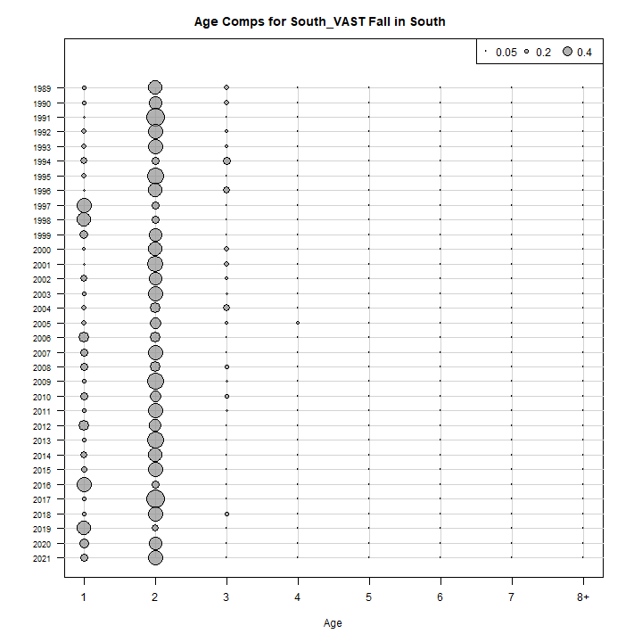
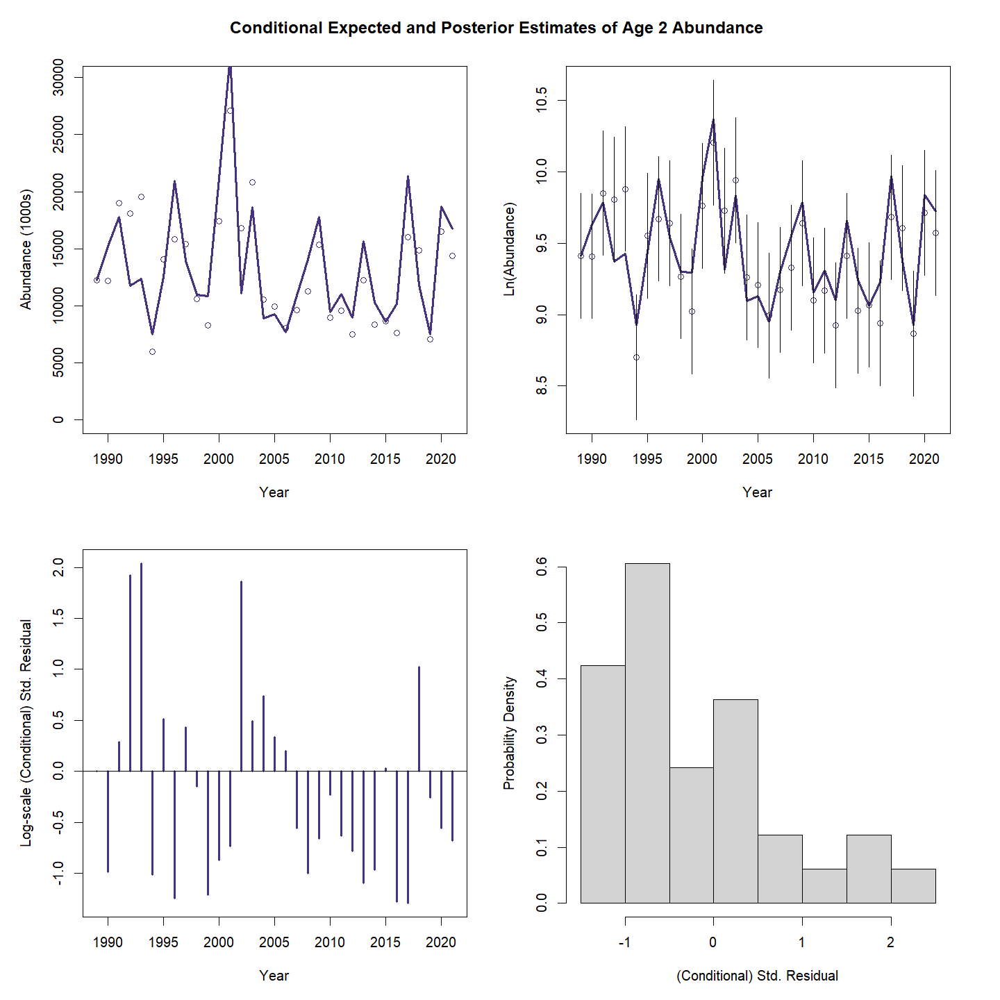
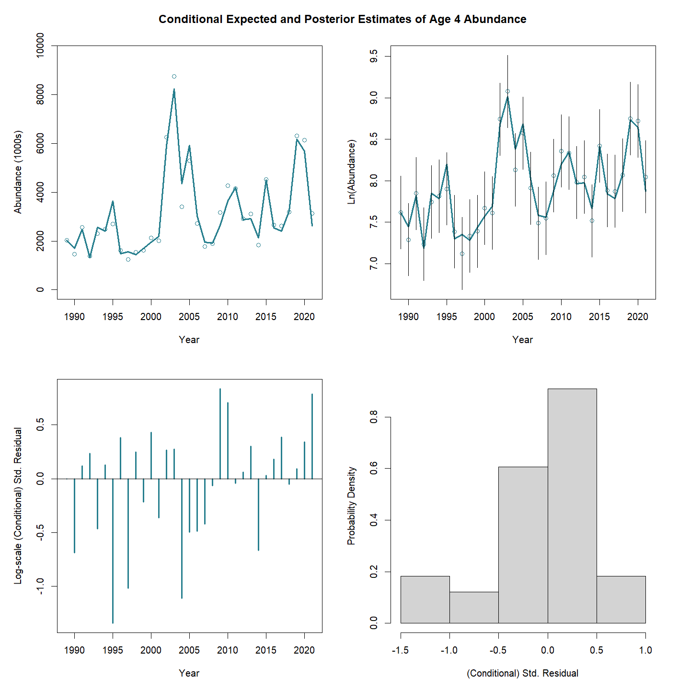
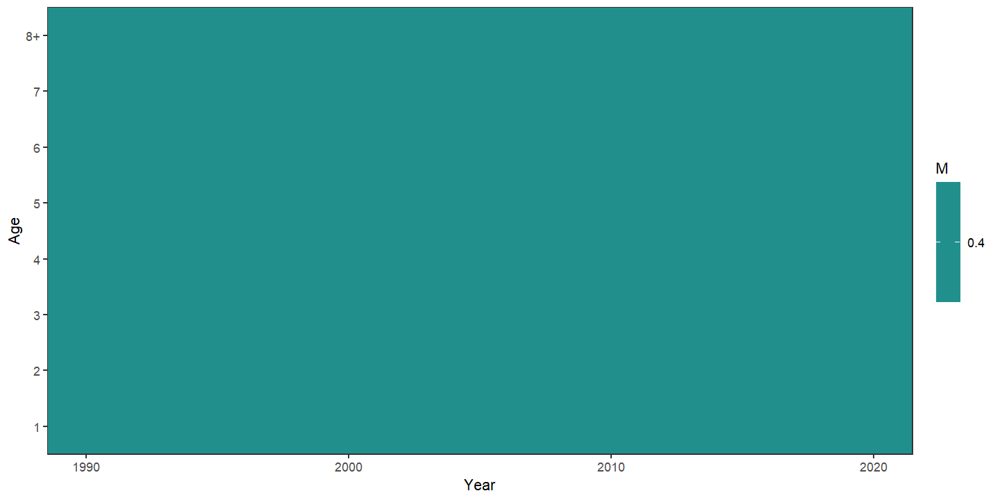
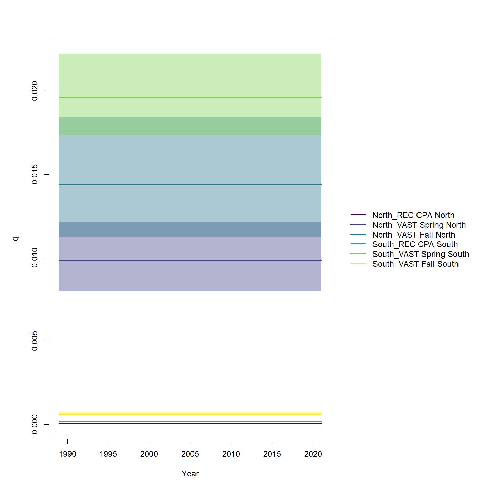
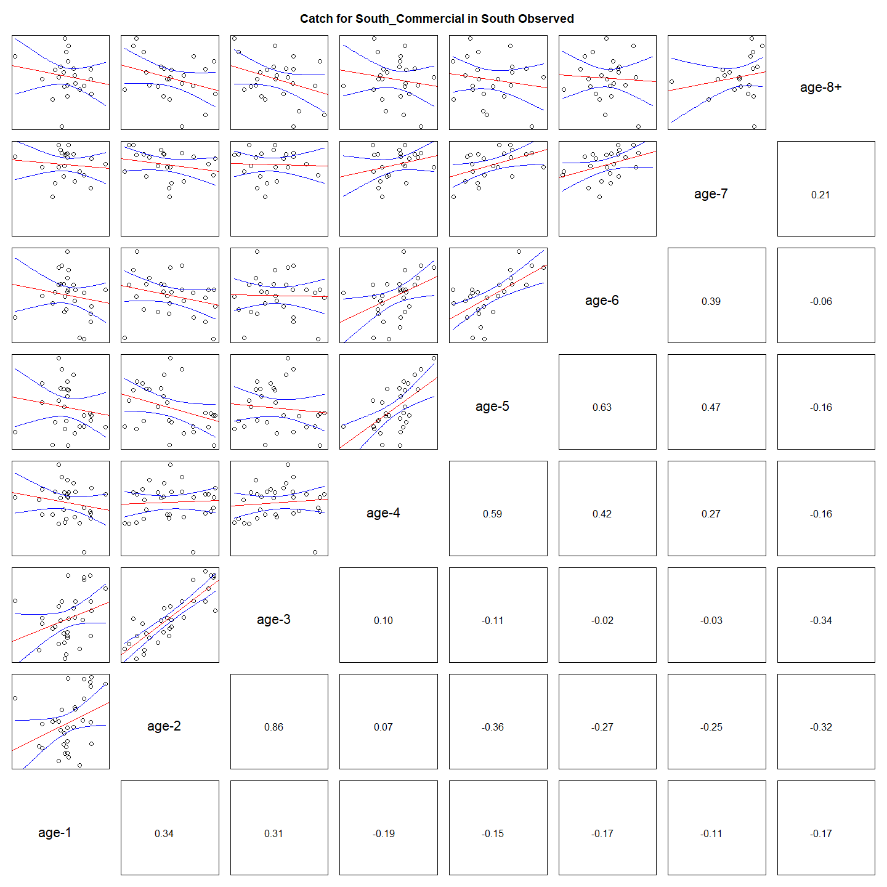
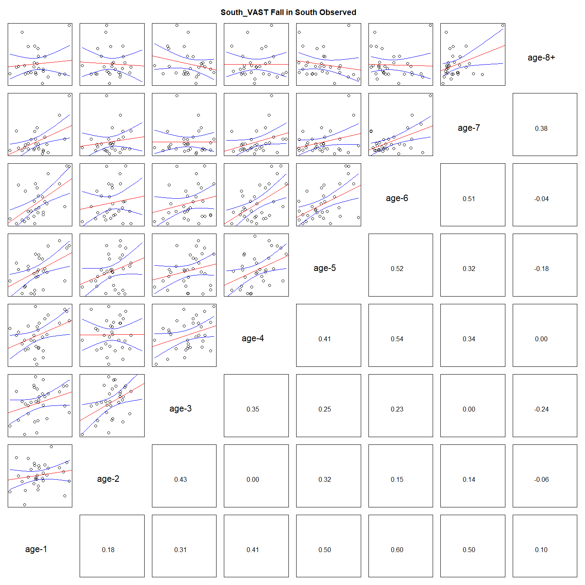

---
output:
  html_document:
    df_print: paged
    keep_md: yes
  word_document: default
  pdf_document:
    fig_caption: yes
    includes:
    keep_tex: yes
    number_sections: no
title: "WHAM figures and tables"
header-includes:
  - \usepackage{longtable}
  - \usepackage{booktabs}
  - \usepackage{caption,graphics}
  - \usepackage{makecell}
  - \usepackage{lscape}
  - \renewcommand\figurename{Fig.}
  - \captionsetup{labelsep=period, singlelinecheck=false}
  - \newcommand{\changesize}[1]{\fontsize{#1pt}{#1pt}\selectfont}
  - \renewcommand{\arraystretch}{1.5}
  - \renewcommand\theadfont{}
---

# {.tabset}

## Figures {.tabset}

### Input

### Diagnostics

### Results

### Retro

### Reference points

### Miscelaneous

## Tables {.tabset}

### Parameter estimates

<table class="table" style="margin-left: auto; margin-right: auto;">
<caption>Parameter estimates, standard errors, and confidence intervals. Rounded to 3 decimal places.</caption>
 <thead>
  <tr>
   <th style="text-align:left;">   </th>
   <th style="text-align:right;"> Estimate </th>
   <th style="text-align:right;"> Std. Error </th>
   <th style="text-align:right;"> 95\% CI lower </th>
   <th style="text-align:right;"> 95\% CI upper </th>
  </tr>
 </thead>
<tbody>
  <tr>
   <td style="text-align:left;"> BSB North Mean Recruitment </td>
   <td style="text-align:right;"> 11875.887 </td>
   <td style="text-align:right;"> 2313.926 </td>
   <td style="text-align:right;"> 8106.174 </td>
   <td style="text-align:right;"> 17398.675 </td>
  </tr>
  <tr>
   <td style="text-align:left;"> BSB North NAA $\sigma$ (age 1) </td>
   <td style="text-align:right;"> 0.894 </td>
   <td style="text-align:right;"> 0.119 </td>
   <td style="text-align:right;"> 0.690 </td>
   <td style="text-align:right;"> 1.160 </td>
  </tr>
  <tr>
   <td style="text-align:left;"> BSB North NAA $\sigma$ (age 2) </td>
   <td style="text-align:right;"> 0.390 </td>
   <td style="text-align:right;"> 0.031 </td>
   <td style="text-align:right;"> 0.334 </td>
   <td style="text-align:right;"> 0.456 </td>
  </tr>
  <tr>
   <td style="text-align:left;"> BSB South Mean Recruitment </td>
   <td style="text-align:right;"> 19860.298 </td>
   <td style="text-align:right;"> 1798.346 </td>
   <td style="text-align:right;"> 16630.666 </td>
   <td style="text-align:right;"> 23717.116 </td>
  </tr>
  <tr>
   <td style="text-align:left;"> BSB South NAA $\sigma$ (age 1) </td>
   <td style="text-align:right;"> 0.376 </td>
   <td style="text-align:right;"> 0.053 </td>
   <td style="text-align:right;"> 0.285 </td>
   <td style="text-align:right;"> 0.496 </td>
  </tr>
  <tr>
   <td style="text-align:left;"> BSB South NAA $\sigma$ (age 2) </td>
   <td style="text-align:right;"> 0.223 </td>
   <td style="text-align:right;"> 0.029 </td>
   <td style="text-align:right;"> 0.174 </td>
   <td style="text-align:right;"> 0.288 </td>
  </tr>
  <tr>
   <td style="text-align:left;"> North REC CPA fully selected q </td>
   <td style="text-align:right;"> 0.000 </td>
   <td style="text-align:right;"> 0.000 </td>
   <td style="text-align:right;"> 0.000 </td>
   <td style="text-align:right;"> 0.000 </td>
  </tr>
  <tr>
   <td style="text-align:left;"> North VAST Spring fully selected q </td>
   <td style="text-align:right;"> 0.010 </td>
   <td style="text-align:right;"> 0.001 </td>
   <td style="text-align:right;"> 0.008 </td>
   <td style="text-align:right;"> 0.012 </td>
  </tr>
  <tr>
   <td style="text-align:left;"> North VAST Fall fully selected q </td>
   <td style="text-align:right;"> 0.014 </td>
   <td style="text-align:right;"> 0.002 </td>
   <td style="text-align:right;"> 0.011 </td>
   <td style="text-align:right;"> 0.018 </td>
  </tr>
  <tr>
   <td style="text-align:left;"> South REC CPA fully selected q </td>
   <td style="text-align:right;"> 0.000 </td>
   <td style="text-align:right;"> 0.000 </td>
   <td style="text-align:right;"> 0.000 </td>
   <td style="text-align:right;"> 0.000 </td>
  </tr>
  <tr>
   <td style="text-align:left;"> South VAST Spring fully selected q </td>
   <td style="text-align:right;"> 0.020 </td>
   <td style="text-align:right;"> 0.001 </td>
   <td style="text-align:right;"> 0.017 </td>
   <td style="text-align:right;"> 0.022 </td>
  </tr>
  <tr>
   <td style="text-align:left;"> South VAST Fall fully selected q </td>
   <td style="text-align:right;"> 0.001 </td>
   <td style="text-align:right;"> 0.000 </td>
   <td style="text-align:right;"> 0.000 </td>
   <td style="text-align:right;"> 0.001 </td>
  </tr>
  <tr>
   <td style="text-align:left;"> Block 1: $a_{50}$ </td>
   <td style="text-align:right;"> 1.986 </td>
   <td style="text-align:right;"> 0.077 </td>
   <td style="text-align:right;"> 1.839 </td>
   <td style="text-align:right;"> 2.141 </td>
  </tr>
  <tr>
   <td style="text-align:left;"> Block 1: 1/slope (increasing) </td>
   <td style="text-align:right;"> 0.301 </td>
   <td style="text-align:right;"> 0.025 </td>
   <td style="text-align:right;"> 0.257 </td>
   <td style="text-align:right;"> 0.353 </td>
  </tr>
  <tr>
   <td style="text-align:left;"> Block 2: $a_{50}$ </td>
   <td style="text-align:right;"> 2.418 </td>
   <td style="text-align:right;"> 0.090 </td>
   <td style="text-align:right;"> 2.244 </td>
   <td style="text-align:right;"> 2.598 </td>
  </tr>
  <tr>
   <td style="text-align:left;"> Block 2: 1/slope (increasing) </td>
   <td style="text-align:right;"> 0.363 </td>
   <td style="text-align:right;"> 0.030 </td>
   <td style="text-align:right;"> 0.308 </td>
   <td style="text-align:right;"> 0.427 </td>
  </tr>
  <tr>
   <td style="text-align:left;"> Block 3: $a_{50}$ </td>
   <td style="text-align:right;"> 1.977 </td>
   <td style="text-align:right;"> 0.136 </td>
   <td style="text-align:right;"> 1.723 </td>
   <td style="text-align:right;"> 2.255 </td>
  </tr>
  <tr>
   <td style="text-align:left;"> Block 3: 1/slope (increasing) </td>
   <td style="text-align:right;"> 0.485 </td>
   <td style="text-align:right;"> 0.056 </td>
   <td style="text-align:right;"> 0.385 </td>
   <td style="text-align:right;"> 0.608 </td>
  </tr>
  <tr>
   <td style="text-align:left;"> Block 4: $a_{50}$ </td>
   <td style="text-align:right;"> 3.493 </td>
   <td style="text-align:right;"> 0.421 </td>
   <td style="text-align:right;"> 2.700 </td>
   <td style="text-align:right;"> 4.328 </td>
  </tr>
  <tr>
   <td style="text-align:left;"> Block 4: 1/slope (increasing) </td>
   <td style="text-align:right;"> 0.992 </td>
   <td style="text-align:right;"> 0.145 </td>
   <td style="text-align:right;"> 0.742 </td>
   <td style="text-align:right;"> 1.312 </td>
  </tr>
  <tr>
   <td style="text-align:left;"> Block 5: $a_{50}$ </td>
   <td style="text-align:right;"> 1.746 </td>
   <td style="text-align:right;"> 0.108 </td>
   <td style="text-align:right;"> 1.544 </td>
   <td style="text-align:right;"> 1.967 </td>
  </tr>
  <tr>
   <td style="text-align:left;"> Block 5: 1/slope (increasing) </td>
   <td style="text-align:right;"> 0.275 </td>
   <td style="text-align:right;"> 0.035 </td>
   <td style="text-align:right;"> 0.213 </td>
   <td style="text-align:right;"> 0.353 </td>
  </tr>
  <tr>
   <td style="text-align:left;"> Block 6: $a_{50}$ </td>
   <td style="text-align:right;"> 2.746 </td>
   <td style="text-align:right;"> 0.125 </td>
   <td style="text-align:right;"> 2.507 </td>
   <td style="text-align:right;"> 2.997 </td>
  </tr>
  <tr>
   <td style="text-align:left;"> Block 6: 1/slope (increasing) </td>
   <td style="text-align:right;"> 0.508 </td>
   <td style="text-align:right;"> 0.038 </td>
   <td style="text-align:right;"> 0.439 </td>
   <td style="text-align:right;"> 0.588 </td>
  </tr>
  <tr>
   <td style="text-align:left;"> Block 7: $a_{50}$ </td>
   <td style="text-align:right;"> 1.938 </td>
   <td style="text-align:right;"> 0.142 </td>
   <td style="text-align:right;"> 1.673 </td>
   <td style="text-align:right;"> 2.230 </td>
  </tr>
  <tr>
   <td style="text-align:left;"> Block 7: 1/slope (increasing) </td>
   <td style="text-align:right;"> 0.545 </td>
   <td style="text-align:right;"> 0.065 </td>
   <td style="text-align:right;"> 0.431 </td>
   <td style="text-align:right;"> 0.686 </td>
  </tr>
  <tr>
   <td style="text-align:left;"> Block 8: $a_{50}$ </td>
   <td style="text-align:right;"> 4.321 </td>
   <td style="text-align:right;"> 0.615 </td>
   <td style="text-align:right;"> 3.122 </td>
   <td style="text-align:right;"> 5.464 </td>
  </tr>
  <tr>
   <td style="text-align:left;"> Block 8: 1/slope (increasing) </td>
   <td style="text-align:right;"> 1.251 </td>
   <td style="text-align:right;"> 0.154 </td>
   <td style="text-align:right;"> 0.978 </td>
   <td style="text-align:right;"> 1.582 </td>
  </tr>
  <tr>
   <td style="text-align:left;"> Block 9: Selectivity for age 1 </td>
   <td style="text-align:right;"> 0.320 </td>
   <td style="text-align:right;"> 0.032 </td>
   <td style="text-align:right;"> 0.261 </td>
   <td style="text-align:right;"> 0.387 </td>
  </tr>
  <tr>
   <td style="text-align:left;"> Block 9: Selectivity for age 2 </td>
   <td style="text-align:right;"> 1.000 </td>
   <td style="text-align:right;"> -- </td>
   <td style="text-align:right;"> -- </td>
   <td style="text-align:right;"> -- </td>
  </tr>
  <tr>
   <td style="text-align:left;"> Block 9: Selectivity for age 3 </td>
   <td style="text-align:right;"> 1.000 </td>
   <td style="text-align:right;"> -- </td>
   <td style="text-align:right;"> -- </td>
   <td style="text-align:right;"> -- </td>
  </tr>
  <tr>
   <td style="text-align:left;"> Block 9: Selectivity for age 4 </td>
   <td style="text-align:right;"> 0.935 </td>
   <td style="text-align:right;"> 0.115 </td>
   <td style="text-align:right;"> 0.264 </td>
   <td style="text-align:right;"> 0.998 </td>
  </tr>
  <tr>
   <td style="text-align:left;"> Block 9: Selectivity for age 5 </td>
   <td style="text-align:right;"> 0.821 </td>
   <td style="text-align:right;"> 0.138 </td>
   <td style="text-align:right;"> 0.423 </td>
   <td style="text-align:right;"> 0.967 </td>
  </tr>
  <tr>
   <td style="text-align:left;"> Block 9: Selectivity for age 6 </td>
   <td style="text-align:right;"> 0.861 </td>
   <td style="text-align:right;"> 0.191 </td>
   <td style="text-align:right;"> 0.214 </td>
   <td style="text-align:right;"> 0.993 </td>
  </tr>
  <tr>
   <td style="text-align:left;"> Block 9: Selectivity for age 7 </td>
   <td style="text-align:right;"> 0.703 </td>
   <td style="text-align:right;"> 0.235 </td>
   <td style="text-align:right;"> 0.207 </td>
   <td style="text-align:right;"> 0.955 </td>
  </tr>
  <tr>
   <td style="text-align:left;"> Block 9: Selectivity for age 8+ </td>
   <td style="text-align:right;"> 0.709 </td>
   <td style="text-align:right;"> 0.256 </td>
   <td style="text-align:right;"> 0.177 </td>
   <td style="text-align:right;"> 0.965 </td>
  </tr>
  <tr>
   <td style="text-align:left;"> Block 10: Selectivity for age 1 </td>
   <td style="text-align:right;"> 0.120 </td>
   <td style="text-align:right;"> 0.013 </td>
   <td style="text-align:right;"> 0.096 </td>
   <td style="text-align:right;"> 0.148 </td>
  </tr>
  <tr>
   <td style="text-align:left;"> Block 10: Selectivity for age 2 </td>
   <td style="text-align:right;"> 0.416 </td>
   <td style="text-align:right;"> 0.034 </td>
   <td style="text-align:right;"> 0.352 </td>
   <td style="text-align:right;"> 0.484 </td>
  </tr>
  <tr>
   <td style="text-align:left;"> Block 10: Selectivity for age 3 </td>
   <td style="text-align:right;"> 1.000 </td>
   <td style="text-align:right;"> -- </td>
   <td style="text-align:right;"> -- </td>
   <td style="text-align:right;"> -- </td>
  </tr>
  <tr>
   <td style="text-align:left;"> Block 10: Selectivity for age 4 </td>
   <td style="text-align:right;"> 1.000 </td>
   <td style="text-align:right;"> -- </td>
   <td style="text-align:right;"> -- </td>
   <td style="text-align:right;"> -- </td>
  </tr>
  <tr>
   <td style="text-align:left;"> Block 10: Selectivity for age 5 </td>
   <td style="text-align:right;"> 0.799 </td>
   <td style="text-align:right;"> 0.094 </td>
   <td style="text-align:right;"> 0.558 </td>
   <td style="text-align:right;"> 0.926 </td>
  </tr>
  <tr>
   <td style="text-align:left;"> Block 10: Selectivity for age 6 </td>
   <td style="text-align:right;"> 0.752 </td>
   <td style="text-align:right;"> 0.123 </td>
   <td style="text-align:right;"> 0.453 </td>
   <td style="text-align:right;"> 0.917 </td>
  </tr>
  <tr>
   <td style="text-align:left;"> Block 10: Selectivity for age 7 </td>
   <td style="text-align:right;"> 0.447 </td>
   <td style="text-align:right;"> 0.123 </td>
   <td style="text-align:right;"> 0.233 </td>
   <td style="text-align:right;"> 0.682 </td>
  </tr>
  <tr>
   <td style="text-align:left;"> Block 10: Selectivity for age 8+ </td>
   <td style="text-align:right;"> 0.491 </td>
   <td style="text-align:right;"> 0.149 </td>
   <td style="text-align:right;"> 0.231 </td>
   <td style="text-align:right;"> 0.756 </td>
  </tr>
  <tr>
   <td style="text-align:left;"> Block 11: Selectivity for age 1 </td>
   <td style="text-align:right;"> 1.000 </td>
   <td style="text-align:right;"> -- </td>
   <td style="text-align:right;"> -- </td>
   <td style="text-align:right;"> -- </td>
  </tr>
  <tr>
   <td style="text-align:left;"> Block 11: Selectivity for age 2 </td>
   <td style="text-align:right;"> 0.195 </td>
   <td style="text-align:right;"> 0.022 </td>
   <td style="text-align:right;"> 0.156 </td>
   <td style="text-align:right;"> 0.241 </td>
  </tr>
  <tr>
   <td style="text-align:left;"> Block 11: Selectivity for age 3 </td>
   <td style="text-align:right;"> 0.391 </td>
   <td style="text-align:right;"> 0.048 </td>
   <td style="text-align:right;"> 0.301 </td>
   <td style="text-align:right;"> 0.489 </td>
  </tr>
  <tr>
   <td style="text-align:left;"> Block 11: Selectivity for age 4 </td>
   <td style="text-align:right;"> 0.394 </td>
   <td style="text-align:right;"> 0.061 </td>
   <td style="text-align:right;"> 0.282 </td>
   <td style="text-align:right;"> 0.518 </td>
  </tr>
  <tr>
   <td style="text-align:left;"> Block 11: Selectivity for age 5 </td>
   <td style="text-align:right;"> 0.368 </td>
   <td style="text-align:right;"> 0.074 </td>
   <td style="text-align:right;"> 0.238 </td>
   <td style="text-align:right;"> 0.521 </td>
  </tr>
  <tr>
   <td style="text-align:left;"> Block 11: Selectivity for age 6 </td>
   <td style="text-align:right;"> 0.243 </td>
   <td style="text-align:right;"> 0.073 </td>
   <td style="text-align:right;"> 0.129 </td>
   <td style="text-align:right;"> 0.410 </td>
  </tr>
  <tr>
   <td style="text-align:left;"> Block 11: Selectivity for age 7 </td>
   <td style="text-align:right;"> 0.258 </td>
   <td style="text-align:right;"> 0.113 </td>
   <td style="text-align:right;"> 0.099 </td>
   <td style="text-align:right;"> 0.525 </td>
  </tr>
  <tr>
   <td style="text-align:left;"> Block 11: Selectivity for age 8+ </td>
   <td style="text-align:right;"> 0.251 </td>
   <td style="text-align:right;"> 0.110 </td>
   <td style="text-align:right;"> 0.096 </td>
   <td style="text-align:right;"> 0.514 </td>
  </tr>
  <tr>
   <td style="text-align:left;"> Block 12: Selectivity for age 1 </td>
   <td style="text-align:right;"> 0.392 </td>
   <td style="text-align:right;"> 0.034 </td>
   <td style="text-align:right;"> 0.327 </td>
   <td style="text-align:right;"> 0.461 </td>
  </tr>
  <tr>
   <td style="text-align:left;"> Block 12: Selectivity for age 2 </td>
   <td style="text-align:right;"> 0.908 </td>
   <td style="text-align:right;"> 0.068 </td>
   <td style="text-align:right;"> 0.666 </td>
   <td style="text-align:right;"> 0.980 </td>
  </tr>
  <tr>
   <td style="text-align:left;"> Block 12: Selectivity for age 3 </td>
   <td style="text-align:right;"> 1.000 </td>
   <td style="text-align:right;"> -- </td>
   <td style="text-align:right;"> -- </td>
   <td style="text-align:right;"> -- </td>
  </tr>
  <tr>
   <td style="text-align:left;"> Block 12: Selectivity for age 4 </td>
   <td style="text-align:right;"> 0.844 </td>
   <td style="text-align:right;"> 0.094 </td>
   <td style="text-align:right;"> 0.571 </td>
   <td style="text-align:right;"> 0.956 </td>
  </tr>
  <tr>
   <td style="text-align:left;"> Block 12: Selectivity for age 5 </td>
   <td style="text-align:right;"> 0.663 </td>
   <td style="text-align:right;"> 0.115 </td>
   <td style="text-align:right;"> 0.418 </td>
   <td style="text-align:right;"> 0.843 </td>
  </tr>
  <tr>
   <td style="text-align:left;"> Block 12: Selectivity for age 6 </td>
   <td style="text-align:right;"> 0.820 </td>
   <td style="text-align:right;"> 0.194 </td>
   <td style="text-align:right;"> 0.258 </td>
   <td style="text-align:right;"> 0.983 </td>
  </tr>
  <tr>
   <td style="text-align:left;"> Block 12: Selectivity for age 7 </td>
   <td style="text-align:right;"> 0.622 </td>
   <td style="text-align:right;"> 0.256 </td>
   <td style="text-align:right;"> 0.163 </td>
   <td style="text-align:right;"> 0.933 </td>
  </tr>
  <tr>
   <td style="text-align:left;"> Block 12: Selectivity for age 8+ </td>
   <td style="text-align:right;"> 0.733 </td>
   <td style="text-align:right;"> 0.360 </td>
   <td style="text-align:right;"> 0.069 </td>
   <td style="text-align:right;"> 0.990 </td>
  </tr>
  <tr>
   <td style="text-align:left;"> Block 13: Selectivity for age 1 </td>
   <td style="text-align:right;"> 0.314 </td>
   <td style="text-align:right;"> 0.022 </td>
   <td style="text-align:right;"> 0.272 </td>
   <td style="text-align:right;"> 0.359 </td>
  </tr>
  <tr>
   <td style="text-align:left;"> Block 13: Selectivity for age 2 </td>
   <td style="text-align:right;"> 1.000 </td>
   <td style="text-align:right;"> -- </td>
   <td style="text-align:right;"> -- </td>
   <td style="text-align:right;"> -- </td>
  </tr>
  <tr>
   <td style="text-align:left;"> Block 13: Selectivity for age 3 </td>
   <td style="text-align:right;"> 1.000 </td>
   <td style="text-align:right;"> -- </td>
   <td style="text-align:right;"> -- </td>
   <td style="text-align:right;"> -- </td>
  </tr>
  <tr>
   <td style="text-align:left;"> Block 13: Selectivity for age 4 </td>
   <td style="text-align:right;"> 0.582 </td>
   <td style="text-align:right;"> 0.068 </td>
   <td style="text-align:right;"> 0.446 </td>
   <td style="text-align:right;"> 0.707 </td>
  </tr>
  <tr>
   <td style="text-align:left;"> Block 13: Selectivity for age 5 </td>
   <td style="text-align:right;"> 0.443 </td>
   <td style="text-align:right;"> 0.084 </td>
   <td style="text-align:right;"> 0.290 </td>
   <td style="text-align:right;"> 0.607 </td>
  </tr>
  <tr>
   <td style="text-align:left;"> Block 13: Selectivity for age 6 </td>
   <td style="text-align:right;"> 0.331 </td>
   <td style="text-align:right;"> 0.107 </td>
   <td style="text-align:right;"> 0.161 </td>
   <td style="text-align:right;"> 0.561 </td>
  </tr>
  <tr>
   <td style="text-align:left;"> Block 13: Selectivity for age 7 </td>
   <td style="text-align:right;"> 0.174 </td>
   <td style="text-align:right;"> 0.120 </td>
   <td style="text-align:right;"> 0.040 </td>
   <td style="text-align:right;"> 0.519 </td>
  </tr>
  <tr>
   <td style="text-align:left;"> Block 13: Selectivity for age 8+ </td>
   <td style="text-align:right;"> 0.283 </td>
   <td style="text-align:right;"> 0.191 </td>
   <td style="text-align:right;"> 0.059 </td>
   <td style="text-align:right;"> 0.715 </td>
  </tr>
  <tr>
   <td style="text-align:left;"> Block 14: Selectivity for age 1 </td>
   <td style="text-align:right;"> 0.268 </td>
   <td style="text-align:right;"> 0.019 </td>
   <td style="text-align:right;"> 0.232 </td>
   <td style="text-align:right;"> 0.306 </td>
  </tr>
  <tr>
   <td style="text-align:left;"> Block 14: Selectivity for age 2 </td>
   <td style="text-align:right;"> 1.000 </td>
   <td style="text-align:right;"> -- </td>
   <td style="text-align:right;"> -- </td>
   <td style="text-align:right;"> -- </td>
  </tr>
  <tr>
   <td style="text-align:left;"> Block 14: Selectivity for age 3 </td>
   <td style="text-align:right;"> 0.456 </td>
   <td style="text-align:right;"> 0.039 </td>
   <td style="text-align:right;"> 0.381 </td>
   <td style="text-align:right;"> 0.534 </td>
  </tr>
  <tr>
   <td style="text-align:left;"> Block 14: Selectivity for age 4 </td>
   <td style="text-align:right;"> 0.188 </td>
   <td style="text-align:right;"> 0.034 </td>
   <td style="text-align:right;"> 0.131 </td>
   <td style="text-align:right;"> 0.263 </td>
  </tr>
  <tr>
   <td style="text-align:left;"> Block 14: Selectivity for age 5 </td>
   <td style="text-align:right;"> 0.077 </td>
   <td style="text-align:right;"> 0.030 </td>
   <td style="text-align:right;"> 0.035 </td>
   <td style="text-align:right;"> 0.162 </td>
  </tr>
  <tr>
   <td style="text-align:left;"> Block 14: Selectivity for age 6 </td>
   <td style="text-align:right;"> 0.024 </td>
   <td style="text-align:right;"> 0.026 </td>
   <td style="text-align:right;"> 0.003 </td>
   <td style="text-align:right;"> 0.176 </td>
  </tr>
  <tr>
   <td style="text-align:left;"> Block 14: Selectivity for age 7 </td>
   <td style="text-align:right;"> 0.022 </td>
   <td style="text-align:right;"> 0.039 </td>
   <td style="text-align:right;"> 0.001 </td>
   <td style="text-align:right;"> 0.455 </td>
  </tr>
  <tr>
   <td style="text-align:left;"> Block 14: Selectivity for age 8+ </td>
   <td style="text-align:right;"> 0.025 </td>
   <td style="text-align:right;"> 0.053 </td>
   <td style="text-align:right;"> 0.000 </td>
   <td style="text-align:right;"> 0.634 </td>
  </tr>
  <tr>
   <td style="text-align:left;"> North REC CPA log-index observation SD scalar </td>
   <td style="text-align:right;"> 9.267 </td>
   <td style="text-align:right;"> 1.346 </td>
   <td style="text-align:right;"> 6.971 </td>
   <td style="text-align:right;"> 12.319 </td>
  </tr>
  <tr>
   <td style="text-align:left;"> South REC CPA log-index observation SD scalar </td>
   <td style="text-align:right;"> 4.566 </td>
   <td style="text-align:right;"> 0.859 </td>
   <td style="text-align:right;"> 3.159 </td>
   <td style="text-align:right;"> 6.602 </td>
  </tr>
</tbody>
</table>

### Abundance at age

<table class="table" style="margin-left: auto; margin-right: auto;">
<caption>Abundance at age (1000s) for BSB North in North.</caption>
 <thead>
  <tr>
   <th style="text-align:left;">   </th>
   <th style="text-align:right;"> 1 </th>
   <th style="text-align:right;"> 2 </th>
   <th style="text-align:right;"> 3 </th>
   <th style="text-align:right;"> 4 </th>
   <th style="text-align:right;"> 5 </th>
   <th style="text-align:right;"> 6 </th>
   <th style="text-align:right;"> 7 </th>
   <th style="text-align:right;"> 8+ </th>
  </tr>
 </thead>
<tbody>
  <tr>
   <td style="text-align:left;"> 1989 </td>
   <td style="text-align:right;"> 5185 </td>
   <td style="text-align:right;"> 2841 </td>
   <td style="text-align:right;"> 1325 </td>
   <td style="text-align:right;"> 602 </td>
   <td style="text-align:right;"> 272 </td>
   <td style="text-align:right;"> 123 </td>
   <td style="text-align:right;"> 56 </td>
   <td style="text-align:right;"> 46 </td>
  </tr>
  <tr>
   <td style="text-align:left;"> 1990 </td>
   <td style="text-align:right;"> 2206 </td>
   <td style="text-align:right;"> 1502 </td>
   <td style="text-align:right;"> 1433 </td>
   <td style="text-align:right;"> 291 </td>
   <td style="text-align:right;"> 217 </td>
   <td style="text-align:right;"> 53 </td>
   <td style="text-align:right;"> 33 </td>
   <td style="text-align:right;"> 24 </td>
  </tr>
  <tr>
   <td style="text-align:left;"> 1991 </td>
   <td style="text-align:right;"> 2824 </td>
   <td style="text-align:right;"> 1931 </td>
   <td style="text-align:right;"> 474 </td>
   <td style="text-align:right;"> 485 </td>
   <td style="text-align:right;"> 105 </td>
   <td style="text-align:right;"> 51 </td>
   <td style="text-align:right;"> 18 </td>
   <td style="text-align:right;"> 19 </td>
  </tr>
  <tr>
   <td style="text-align:left;"> 1992 </td>
   <td style="text-align:right;"> 2469 </td>
   <td style="text-align:right;"> 2497 </td>
   <td style="text-align:right;"> 759 </td>
   <td style="text-align:right;"> 130 </td>
   <td style="text-align:right;"> 187 </td>
   <td style="text-align:right;"> 28 </td>
   <td style="text-align:right;"> 15 </td>
   <td style="text-align:right;"> 16 </td>
  </tr>
  <tr>
   <td style="text-align:left;"> 1993 </td>
   <td style="text-align:right;"> 1095 </td>
   <td style="text-align:right;"> 1949 </td>
   <td style="text-align:right;"> 776 </td>
   <td style="text-align:right;"> 308 </td>
   <td style="text-align:right;"> 40 </td>
   <td style="text-align:right;"> 115 </td>
   <td style="text-align:right;"> 11 </td>
   <td style="text-align:right;"> 12 </td>
  </tr>
  <tr>
   <td style="text-align:left;"> 1994 </td>
   <td style="text-align:right;"> 4984 </td>
   <td style="text-align:right;"> 584 </td>
   <td style="text-align:right;"> 1011 </td>
   <td style="text-align:right;"> 246 </td>
   <td style="text-align:right;"> 139 </td>
   <td style="text-align:right;"> 15 </td>
   <td style="text-align:right;"> 33 </td>
   <td style="text-align:right;"> 8 </td>
  </tr>
  <tr>
   <td style="text-align:left;"> 1995 </td>
   <td style="text-align:right;"> 8233 </td>
   <td style="text-align:right;"> 1767 </td>
   <td style="text-align:right;"> 549 </td>
   <td style="text-align:right;"> 177 </td>
   <td style="text-align:right;"> 82 </td>
   <td style="text-align:right;"> 35 </td>
   <td style="text-align:right;"> 5 </td>
   <td style="text-align:right;"> 13 </td>
  </tr>
  <tr>
   <td style="text-align:left;"> 1996 </td>
   <td style="text-align:right;"> 9689 </td>
   <td style="text-align:right;"> 2901 </td>
   <td style="text-align:right;"> 830 </td>
   <td style="text-align:right;"> 213 </td>
   <td style="text-align:right;"> 63 </td>
   <td style="text-align:right;"> 41 </td>
   <td style="text-align:right;"> 14 </td>
   <td style="text-align:right;"> 8 </td>
  </tr>
  <tr>
   <td style="text-align:left;"> 1997 </td>
   <td style="text-align:right;"> 3807 </td>
   <td style="text-align:right;"> 5405 </td>
   <td style="text-align:right;"> 1270 </td>
   <td style="text-align:right;"> 235 </td>
   <td style="text-align:right;"> 83 </td>
   <td style="text-align:right;"> 21 </td>
   <td style="text-align:right;"> 17 </td>
   <td style="text-align:right;"> 9 </td>
  </tr>
  <tr>
   <td style="text-align:left;"> 1998 </td>
   <td style="text-align:right;"> 3650 </td>
   <td style="text-align:right;"> 2764 </td>
   <td style="text-align:right;"> 1089 </td>
   <td style="text-align:right;"> 565 </td>
   <td style="text-align:right;"> 119 </td>
   <td style="text-align:right;"> 57 </td>
   <td style="text-align:right;"> 9 </td>
   <td style="text-align:right;"> 15 </td>
  </tr>
  <tr>
   <td style="text-align:left;"> 1999 </td>
   <td style="text-align:right;"> 17071 </td>
   <td style="text-align:right;"> 2728 </td>
   <td style="text-align:right;"> 1734 </td>
   <td style="text-align:right;"> 676 </td>
   <td style="text-align:right;"> 240 </td>
   <td style="text-align:right;"> 58 </td>
   <td style="text-align:right;"> 22 </td>
   <td style="text-align:right;"> 10 </td>
  </tr>
  <tr>
   <td style="text-align:left;"> 2000 </td>
   <td style="text-align:right;"> 33884 </td>
   <td style="text-align:right;"> 11304 </td>
   <td style="text-align:right;"> 1758 </td>
   <td style="text-align:right;"> 1159 </td>
   <td style="text-align:right;"> 281 </td>
   <td style="text-align:right;"> 135 </td>
   <td style="text-align:right;"> 22 </td>
   <td style="text-align:right;"> 14 </td>
  </tr>
  <tr>
   <td style="text-align:left;"> 2001 </td>
   <td style="text-align:right;"> 13486 </td>
   <td style="text-align:right;"> 8954 </td>
   <td style="text-align:right;"> 5674 </td>
   <td style="text-align:right;"> 866 </td>
   <td style="text-align:right;"> 522 </td>
   <td style="text-align:right;"> 159 </td>
   <td style="text-align:right;"> 90 </td>
   <td style="text-align:right;"> 18 </td>
  </tr>
  <tr>
   <td style="text-align:left;"> 2002 </td>
   <td style="text-align:right;"> 26387 </td>
   <td style="text-align:right;"> 9562 </td>
   <td style="text-align:right;"> 6475 </td>
   <td style="text-align:right;"> 4067 </td>
   <td style="text-align:right;"> 344 </td>
   <td style="text-align:right;"> 211 </td>
   <td style="text-align:right;"> 73 </td>
   <td style="text-align:right;"> 48 </td>
  </tr>
  <tr>
   <td style="text-align:left;"> 2003 </td>
   <td style="text-align:right;"> 15733 </td>
   <td style="text-align:right;"> 10609 </td>
   <td style="text-align:right;"> 3633 </td>
   <td style="text-align:right;"> 4367 </td>
   <td style="text-align:right;"> 2154 </td>
   <td style="text-align:right;"> 161 </td>
   <td style="text-align:right;"> 106 </td>
   <td style="text-align:right;"> 55 </td>
  </tr>
  <tr>
   <td style="text-align:left;"> 2004 </td>
   <td style="text-align:right;"> 14997 </td>
   <td style="text-align:right;"> 4053 </td>
   <td style="text-align:right;"> 6182 </td>
   <td style="text-align:right;"> 1729 </td>
   <td style="text-align:right;"> 2732 </td>
   <td style="text-align:right;"> 776 </td>
   <td style="text-align:right;"> 77 </td>
   <td style="text-align:right;"> 84 </td>
  </tr>
  <tr>
   <td style="text-align:left;"> 2005 </td>
   <td style="text-align:right;"> 20501 </td>
   <td style="text-align:right;"> 4451 </td>
   <td style="text-align:right;"> 1791 </td>
   <td style="text-align:right;"> 3894 </td>
   <td style="text-align:right;"> 1366 </td>
   <td style="text-align:right;"> 1273 </td>
   <td style="text-align:right;"> 310 </td>
   <td style="text-align:right;"> 83 </td>
  </tr>
  <tr>
   <td style="text-align:left;"> 2006 </td>
   <td style="text-align:right;"> 21027 </td>
   <td style="text-align:right;"> 7464 </td>
   <td style="text-align:right;"> 1747 </td>
   <td style="text-align:right;"> 1503 </td>
   <td style="text-align:right;"> 2280 </td>
   <td style="text-align:right;"> 574 </td>
   <td style="text-align:right;"> 518 </td>
   <td style="text-align:right;"> 155 </td>
  </tr>
  <tr>
   <td style="text-align:left;"> 2007 </td>
   <td style="text-align:right;"> 13181 </td>
   <td style="text-align:right;"> 10360 </td>
   <td style="text-align:right;"> 3117 </td>
   <td style="text-align:right;"> 1019 </td>
   <td style="text-align:right;"> 719 </td>
   <td style="text-align:right;"> 912 </td>
   <td style="text-align:right;"> 363 </td>
   <td style="text-align:right;"> 260 </td>
  </tr>
  <tr>
   <td style="text-align:left;"> 2008 </td>
   <td style="text-align:right;"> 24393 </td>
   <td style="text-align:right;"> 9319 </td>
   <td style="text-align:right;"> 6769 </td>
   <td style="text-align:right;"> 1752 </td>
   <td style="text-align:right;"> 416 </td>
   <td style="text-align:right;"> 293 </td>
   <td style="text-align:right;"> 409 </td>
   <td style="text-align:right;"> 251 </td>
  </tr>
  <tr>
   <td style="text-align:left;"> 2009 </td>
   <td style="text-align:right;"> 14607 </td>
   <td style="text-align:right;"> 13863 </td>
   <td style="text-align:right;"> 5541 </td>
   <td style="text-align:right;"> 3993 </td>
   <td style="text-align:right;"> 818 </td>
   <td style="text-align:right;"> 179 </td>
   <td style="text-align:right;"> 131 </td>
   <td style="text-align:right;"> 276 </td>
  </tr>
  <tr>
   <td style="text-align:left;"> 2010 </td>
   <td style="text-align:right;"> 9909 </td>
   <td style="text-align:right;"> 9407 </td>
   <td style="text-align:right;"> 9078 </td>
   <td style="text-align:right;"> 3886 </td>
   <td style="text-align:right;"> 2212 </td>
   <td style="text-align:right;"> 356 </td>
   <td style="text-align:right;"> 72 </td>
   <td style="text-align:right;"> 152 </td>
  </tr>
  <tr>
   <td style="text-align:left;"> 2011 </td>
   <td style="text-align:right;"> 10878 </td>
   <td style="text-align:right;"> 8046 </td>
   <td style="text-align:right;"> 4884 </td>
   <td style="text-align:right;"> 5025 </td>
   <td style="text-align:right;"> 1655 </td>
   <td style="text-align:right;"> 906 </td>
   <td style="text-align:right;"> 141 </td>
   <td style="text-align:right;"> 81 </td>
  </tr>
  <tr>
   <td style="text-align:left;"> 2012 </td>
   <td style="text-align:right;"> 29569 </td>
   <td style="text-align:right;"> 19607 </td>
   <td style="text-align:right;"> 8239 </td>
   <td style="text-align:right;"> 4677 </td>
   <td style="text-align:right;"> 3549 </td>
   <td style="text-align:right;"> 1121 </td>
   <td style="text-align:right;"> 559 </td>
   <td style="text-align:right;"> 116 </td>
  </tr>
  <tr>
   <td style="text-align:left;"> 2013 </td>
   <td style="text-align:right;"> 19642 </td>
   <td style="text-align:right;"> 40758 </td>
   <td style="text-align:right;"> 7856 </td>
   <td style="text-align:right;"> 5883 </td>
   <td style="text-align:right;"> 3255 </td>
   <td style="text-align:right;"> 1895 </td>
   <td style="text-align:right;"> 541 </td>
   <td style="text-align:right;"> 331 </td>
  </tr>
  <tr>
   <td style="text-align:left;"> 2014 </td>
   <td style="text-align:right;"> 15390 </td>
   <td style="text-align:right;"> 14740 </td>
   <td style="text-align:right;"> 38853 </td>
   <td style="text-align:right;"> 6385 </td>
   <td style="text-align:right;"> 3441 </td>
   <td style="text-align:right;"> 1909 </td>
   <td style="text-align:right;"> 1083 </td>
   <td style="text-align:right;"> 465 </td>
  </tr>
  <tr>
   <td style="text-align:left;"> 2015 </td>
   <td style="text-align:right;"> 18116 </td>
   <td style="text-align:right;"> 11680 </td>
   <td style="text-align:right;"> 9604 </td>
   <td style="text-align:right;"> 24551 </td>
   <td style="text-align:right;"> 3708 </td>
   <td style="text-align:right;"> 1773 </td>
   <td style="text-align:right;"> 963 </td>
   <td style="text-align:right;"> 819 </td>
  </tr>
  <tr>
   <td style="text-align:left;"> 2016 </td>
   <td style="text-align:right;"> 37737 </td>
   <td style="text-align:right;"> 20877 </td>
   <td style="text-align:right;"> 6444 </td>
   <td style="text-align:right;"> 7538 </td>
   <td style="text-align:right;"> 26820 </td>
   <td style="text-align:right;"> 2010 </td>
   <td style="text-align:right;"> 1028 </td>
   <td style="text-align:right;"> 905 </td>
  </tr>
  <tr>
   <td style="text-align:left;"> 2017 </td>
   <td style="text-align:right;"> 31632 </td>
   <td style="text-align:right;"> 46025 </td>
   <td style="text-align:right;"> 8462 </td>
   <td style="text-align:right;"> 4374 </td>
   <td style="text-align:right;"> 4794 </td>
   <td style="text-align:right;"> 19031 </td>
   <td style="text-align:right;"> 1035 </td>
   <td style="text-align:right;"> 949 </td>
  </tr>
  <tr>
   <td style="text-align:left;"> 2018 </td>
   <td style="text-align:right;"> 22597 </td>
   <td style="text-align:right;"> 18040 </td>
   <td style="text-align:right;"> 23186 </td>
   <td style="text-align:right;"> 4908 </td>
   <td style="text-align:right;"> 2149 </td>
   <td style="text-align:right;"> 2608 </td>
   <td style="text-align:right;"> 11824 </td>
   <td style="text-align:right;"> 1005 </td>
  </tr>
  <tr>
   <td style="text-align:left;"> 2019 </td>
   <td style="text-align:right;"> 22568 </td>
   <td style="text-align:right;"> 10021 </td>
   <td style="text-align:right;"> 10630 </td>
   <td style="text-align:right;"> 22898 </td>
   <td style="text-align:right;"> 3350 </td>
   <td style="text-align:right;"> 1377 </td>
   <td style="text-align:right;"> 1472 </td>
   <td style="text-align:right;"> 9065 </td>
  </tr>
  <tr>
   <td style="text-align:left;"> 2020 </td>
   <td style="text-align:right;"> 23833 </td>
   <td style="text-align:right;"> 29066 </td>
   <td style="text-align:right;"> 3887 </td>
   <td style="text-align:right;"> 7185 </td>
   <td style="text-align:right;"> 16895 </td>
   <td style="text-align:right;"> 2028 </td>
   <td style="text-align:right;"> 848 </td>
   <td style="text-align:right;"> 6348 </td>
  </tr>
  <tr>
   <td style="text-align:left;"> 2021 </td>
   <td style="text-align:right;"> 12892 </td>
   <td style="text-align:right;"> 26926 </td>
   <td style="text-align:right;"> 19620 </td>
   <td style="text-align:right;"> 2207 </td>
   <td style="text-align:right;"> 5749 </td>
   <td style="text-align:right;"> 12306 </td>
   <td style="text-align:right;"> 1147 </td>
   <td style="text-align:right;"> 4137 </td>
  </tr>
</tbody>
</table>

<table class="table" style="margin-left: auto; margin-right: auto;">
<caption>Abundance at age (1000s) for BSB North in South.</caption>
 <thead>
  <tr>
   <th style="text-align:left;">   </th>
   <th style="text-align:right;"> 1 </th>
   <th style="text-align:right;"> 2 </th>
   <th style="text-align:right;"> 3 </th>
   <th style="text-align:right;"> 4 </th>
   <th style="text-align:right;"> 5 </th>
   <th style="text-align:right;"> 6 </th>
   <th style="text-align:right;"> 7 </th>
   <th style="text-align:right;"> 8+ </th>
  </tr>
 </thead>
<tbody>
  <tr>
   <td style="text-align:left;"> 1989 </td>
   <td style="text-align:right;"> 0 </td>
   <td style="text-align:right;"> 0 </td>
   <td style="text-align:right;"> 0 </td>
   <td style="text-align:right;"> 0 </td>
   <td style="text-align:right;"> 0 </td>
   <td style="text-align:right;"> 0 </td>
   <td style="text-align:right;"> 0 </td>
   <td style="text-align:right;"> 0 </td>
  </tr>
  <tr>
   <td style="text-align:left;"> 1990 </td>
   <td style="text-align:right;"> 0 </td>
   <td style="text-align:right;"> 0 </td>
   <td style="text-align:right;"> 0 </td>
   <td style="text-align:right;"> 0 </td>
   <td style="text-align:right;"> 0 </td>
   <td style="text-align:right;"> 0 </td>
   <td style="text-align:right;"> 0 </td>
   <td style="text-align:right;"> 0 </td>
  </tr>
  <tr>
   <td style="text-align:left;"> 1991 </td>
   <td style="text-align:right;"> 0 </td>
   <td style="text-align:right;"> 0 </td>
   <td style="text-align:right;"> 0 </td>
   <td style="text-align:right;"> 0 </td>
   <td style="text-align:right;"> 0 </td>
   <td style="text-align:right;"> 0 </td>
   <td style="text-align:right;"> 0 </td>
   <td style="text-align:right;"> 0 </td>
  </tr>
  <tr>
   <td style="text-align:left;"> 1992 </td>
   <td style="text-align:right;"> 0 </td>
   <td style="text-align:right;"> 0 </td>
   <td style="text-align:right;"> 0 </td>
   <td style="text-align:right;"> 0 </td>
   <td style="text-align:right;"> 0 </td>
   <td style="text-align:right;"> 0 </td>
   <td style="text-align:right;"> 0 </td>
   <td style="text-align:right;"> 0 </td>
  </tr>
  <tr>
   <td style="text-align:left;"> 1993 </td>
   <td style="text-align:right;"> 0 </td>
   <td style="text-align:right;"> 0 </td>
   <td style="text-align:right;"> 0 </td>
   <td style="text-align:right;"> 0 </td>
   <td style="text-align:right;"> 0 </td>
   <td style="text-align:right;"> 0 </td>
   <td style="text-align:right;"> 0 </td>
   <td style="text-align:right;"> 0 </td>
  </tr>
  <tr>
   <td style="text-align:left;"> 1994 </td>
   <td style="text-align:right;"> 0 </td>
   <td style="text-align:right;"> 0 </td>
   <td style="text-align:right;"> 0 </td>
   <td style="text-align:right;"> 0 </td>
   <td style="text-align:right;"> 0 </td>
   <td style="text-align:right;"> 0 </td>
   <td style="text-align:right;"> 0 </td>
   <td style="text-align:right;"> 0 </td>
  </tr>
  <tr>
   <td style="text-align:left;"> 1995 </td>
   <td style="text-align:right;"> 0 </td>
   <td style="text-align:right;"> 0 </td>
   <td style="text-align:right;"> 0 </td>
   <td style="text-align:right;"> 0 </td>
   <td style="text-align:right;"> 0 </td>
   <td style="text-align:right;"> 0 </td>
   <td style="text-align:right;"> 0 </td>
   <td style="text-align:right;"> 0 </td>
  </tr>
  <tr>
   <td style="text-align:left;"> 1996 </td>
   <td style="text-align:right;"> 0 </td>
   <td style="text-align:right;"> 0 </td>
   <td style="text-align:right;"> 0 </td>
   <td style="text-align:right;"> 0 </td>
   <td style="text-align:right;"> 0 </td>
   <td style="text-align:right;"> 0 </td>
   <td style="text-align:right;"> 0 </td>
   <td style="text-align:right;"> 0 </td>
  </tr>
  <tr>
   <td style="text-align:left;"> 1997 </td>
   <td style="text-align:right;"> 0 </td>
   <td style="text-align:right;"> 0 </td>
   <td style="text-align:right;"> 0 </td>
   <td style="text-align:right;"> 0 </td>
   <td style="text-align:right;"> 0 </td>
   <td style="text-align:right;"> 0 </td>
   <td style="text-align:right;"> 0 </td>
   <td style="text-align:right;"> 0 </td>
  </tr>
  <tr>
   <td style="text-align:left;"> 1998 </td>
   <td style="text-align:right;"> 0 </td>
   <td style="text-align:right;"> 0 </td>
   <td style="text-align:right;"> 0 </td>
   <td style="text-align:right;"> 0 </td>
   <td style="text-align:right;"> 0 </td>
   <td style="text-align:right;"> 0 </td>
   <td style="text-align:right;"> 0 </td>
   <td style="text-align:right;"> 0 </td>
  </tr>
  <tr>
   <td style="text-align:left;"> 1999 </td>
   <td style="text-align:right;"> 0 </td>
   <td style="text-align:right;"> 0 </td>
   <td style="text-align:right;"> 0 </td>
   <td style="text-align:right;"> 0 </td>
   <td style="text-align:right;"> 0 </td>
   <td style="text-align:right;"> 0 </td>
   <td style="text-align:right;"> 0 </td>
   <td style="text-align:right;"> 0 </td>
  </tr>
  <tr>
   <td style="text-align:left;"> 2000 </td>
   <td style="text-align:right;"> 0 </td>
   <td style="text-align:right;"> 0 </td>
   <td style="text-align:right;"> 0 </td>
   <td style="text-align:right;"> 0 </td>
   <td style="text-align:right;"> 0 </td>
   <td style="text-align:right;"> 0 </td>
   <td style="text-align:right;"> 0 </td>
   <td style="text-align:right;"> 0 </td>
  </tr>
  <tr>
   <td style="text-align:left;"> 2001 </td>
   <td style="text-align:right;"> 0 </td>
   <td style="text-align:right;"> 0 </td>
   <td style="text-align:right;"> 0 </td>
   <td style="text-align:right;"> 0 </td>
   <td style="text-align:right;"> 0 </td>
   <td style="text-align:right;"> 0 </td>
   <td style="text-align:right;"> 0 </td>
   <td style="text-align:right;"> 0 </td>
  </tr>
  <tr>
   <td style="text-align:left;"> 2002 </td>
   <td style="text-align:right;"> 0 </td>
   <td style="text-align:right;"> 0 </td>
   <td style="text-align:right;"> 0 </td>
   <td style="text-align:right;"> 0 </td>
   <td style="text-align:right;"> 0 </td>
   <td style="text-align:right;"> 0 </td>
   <td style="text-align:right;"> 0 </td>
   <td style="text-align:right;"> 0 </td>
  </tr>
  <tr>
   <td style="text-align:left;"> 2003 </td>
   <td style="text-align:right;"> 0 </td>
   <td style="text-align:right;"> 0 </td>
   <td style="text-align:right;"> 0 </td>
   <td style="text-align:right;"> 0 </td>
   <td style="text-align:right;"> 0 </td>
   <td style="text-align:right;"> 0 </td>
   <td style="text-align:right;"> 0 </td>
   <td style="text-align:right;"> 0 </td>
  </tr>
  <tr>
   <td style="text-align:left;"> 2004 </td>
   <td style="text-align:right;"> 0 </td>
   <td style="text-align:right;"> 0 </td>
   <td style="text-align:right;"> 0 </td>
   <td style="text-align:right;"> 0 </td>
   <td style="text-align:right;"> 0 </td>
   <td style="text-align:right;"> 0 </td>
   <td style="text-align:right;"> 0 </td>
   <td style="text-align:right;"> 0 </td>
  </tr>
  <tr>
   <td style="text-align:left;"> 2005 </td>
   <td style="text-align:right;"> 0 </td>
   <td style="text-align:right;"> 0 </td>
   <td style="text-align:right;"> 0 </td>
   <td style="text-align:right;"> 0 </td>
   <td style="text-align:right;"> 0 </td>
   <td style="text-align:right;"> 0 </td>
   <td style="text-align:right;"> 0 </td>
   <td style="text-align:right;"> 0 </td>
  </tr>
  <tr>
   <td style="text-align:left;"> 2006 </td>
   <td style="text-align:right;"> 0 </td>
   <td style="text-align:right;"> 0 </td>
   <td style="text-align:right;"> 0 </td>
   <td style="text-align:right;"> 0 </td>
   <td style="text-align:right;"> 0 </td>
   <td style="text-align:right;"> 0 </td>
   <td style="text-align:right;"> 0 </td>
   <td style="text-align:right;"> 0 </td>
  </tr>
  <tr>
   <td style="text-align:left;"> 2007 </td>
   <td style="text-align:right;"> 0 </td>
   <td style="text-align:right;"> 0 </td>
   <td style="text-align:right;"> 0 </td>
   <td style="text-align:right;"> 0 </td>
   <td style="text-align:right;"> 0 </td>
   <td style="text-align:right;"> 0 </td>
   <td style="text-align:right;"> 0 </td>
   <td style="text-align:right;"> 0 </td>
  </tr>
  <tr>
   <td style="text-align:left;"> 2008 </td>
   <td style="text-align:right;"> 0 </td>
   <td style="text-align:right;"> 0 </td>
   <td style="text-align:right;"> 0 </td>
   <td style="text-align:right;"> 0 </td>
   <td style="text-align:right;"> 0 </td>
   <td style="text-align:right;"> 0 </td>
   <td style="text-align:right;"> 0 </td>
   <td style="text-align:right;"> 0 </td>
  </tr>
  <tr>
   <td style="text-align:left;"> 2009 </td>
   <td style="text-align:right;"> 0 </td>
   <td style="text-align:right;"> 0 </td>
   <td style="text-align:right;"> 0 </td>
   <td style="text-align:right;"> 0 </td>
   <td style="text-align:right;"> 0 </td>
   <td style="text-align:right;"> 0 </td>
   <td style="text-align:right;"> 0 </td>
   <td style="text-align:right;"> 0 </td>
  </tr>
  <tr>
   <td style="text-align:left;"> 2010 </td>
   <td style="text-align:right;"> 0 </td>
   <td style="text-align:right;"> 0 </td>
   <td style="text-align:right;"> 0 </td>
   <td style="text-align:right;"> 0 </td>
   <td style="text-align:right;"> 0 </td>
   <td style="text-align:right;"> 0 </td>
   <td style="text-align:right;"> 0 </td>
   <td style="text-align:right;"> 0 </td>
  </tr>
  <tr>
   <td style="text-align:left;"> 2011 </td>
   <td style="text-align:right;"> 0 </td>
   <td style="text-align:right;"> 0 </td>
   <td style="text-align:right;"> 0 </td>
   <td style="text-align:right;"> 0 </td>
   <td style="text-align:right;"> 0 </td>
   <td style="text-align:right;"> 0 </td>
   <td style="text-align:right;"> 0 </td>
   <td style="text-align:right;"> 0 </td>
  </tr>
  <tr>
   <td style="text-align:left;"> 2012 </td>
   <td style="text-align:right;"> 0 </td>
   <td style="text-align:right;"> 0 </td>
   <td style="text-align:right;"> 0 </td>
   <td style="text-align:right;"> 0 </td>
   <td style="text-align:right;"> 0 </td>
   <td style="text-align:right;"> 0 </td>
   <td style="text-align:right;"> 0 </td>
   <td style="text-align:right;"> 0 </td>
  </tr>
  <tr>
   <td style="text-align:left;"> 2013 </td>
   <td style="text-align:right;"> 0 </td>
   <td style="text-align:right;"> 0 </td>
   <td style="text-align:right;"> 0 </td>
   <td style="text-align:right;"> 0 </td>
   <td style="text-align:right;"> 0 </td>
   <td style="text-align:right;"> 0 </td>
   <td style="text-align:right;"> 0 </td>
   <td style="text-align:right;"> 0 </td>
  </tr>
  <tr>
   <td style="text-align:left;"> 2014 </td>
   <td style="text-align:right;"> 0 </td>
   <td style="text-align:right;"> 0 </td>
   <td style="text-align:right;"> 0 </td>
   <td style="text-align:right;"> 0 </td>
   <td style="text-align:right;"> 0 </td>
   <td style="text-align:right;"> 0 </td>
   <td style="text-align:right;"> 0 </td>
   <td style="text-align:right;"> 0 </td>
  </tr>
  <tr>
   <td style="text-align:left;"> 2015 </td>
   <td style="text-align:right;"> 0 </td>
   <td style="text-align:right;"> 0 </td>
   <td style="text-align:right;"> 0 </td>
   <td style="text-align:right;"> 0 </td>
   <td style="text-align:right;"> 0 </td>
   <td style="text-align:right;"> 0 </td>
   <td style="text-align:right;"> 0 </td>
   <td style="text-align:right;"> 0 </td>
  </tr>
  <tr>
   <td style="text-align:left;"> 2016 </td>
   <td style="text-align:right;"> 0 </td>
   <td style="text-align:right;"> 0 </td>
   <td style="text-align:right;"> 0 </td>
   <td style="text-align:right;"> 0 </td>
   <td style="text-align:right;"> 0 </td>
   <td style="text-align:right;"> 0 </td>
   <td style="text-align:right;"> 0 </td>
   <td style="text-align:right;"> 0 </td>
  </tr>
  <tr>
   <td style="text-align:left;"> 2017 </td>
   <td style="text-align:right;"> 0 </td>
   <td style="text-align:right;"> 0 </td>
   <td style="text-align:right;"> 0 </td>
   <td style="text-align:right;"> 0 </td>
   <td style="text-align:right;"> 0 </td>
   <td style="text-align:right;"> 0 </td>
   <td style="text-align:right;"> 0 </td>
   <td style="text-align:right;"> 0 </td>
  </tr>
  <tr>
   <td style="text-align:left;"> 2018 </td>
   <td style="text-align:right;"> 0 </td>
   <td style="text-align:right;"> 0 </td>
   <td style="text-align:right;"> 0 </td>
   <td style="text-align:right;"> 0 </td>
   <td style="text-align:right;"> 0 </td>
   <td style="text-align:right;"> 0 </td>
   <td style="text-align:right;"> 0 </td>
   <td style="text-align:right;"> 0 </td>
  </tr>
  <tr>
   <td style="text-align:left;"> 2019 </td>
   <td style="text-align:right;"> 0 </td>
   <td style="text-align:right;"> 0 </td>
   <td style="text-align:right;"> 0 </td>
   <td style="text-align:right;"> 0 </td>
   <td style="text-align:right;"> 0 </td>
   <td style="text-align:right;"> 0 </td>
   <td style="text-align:right;"> 0 </td>
   <td style="text-align:right;"> 0 </td>
  </tr>
  <tr>
   <td style="text-align:left;"> 2020 </td>
   <td style="text-align:right;"> 0 </td>
   <td style="text-align:right;"> 0 </td>
   <td style="text-align:right;"> 0 </td>
   <td style="text-align:right;"> 0 </td>
   <td style="text-align:right;"> 0 </td>
   <td style="text-align:right;"> 0 </td>
   <td style="text-align:right;"> 0 </td>
   <td style="text-align:right;"> 0 </td>
  </tr>
  <tr>
   <td style="text-align:left;"> 2021 </td>
   <td style="text-align:right;"> 0 </td>
   <td style="text-align:right;"> 0 </td>
   <td style="text-align:right;"> 0 </td>
   <td style="text-align:right;"> 0 </td>
   <td style="text-align:right;"> 0 </td>
   <td style="text-align:right;"> 0 </td>
   <td style="text-align:right;"> 0 </td>
   <td style="text-align:right;"> 0 </td>
  </tr>
</tbody>
</table>

<table class="table" style="margin-left: auto; margin-right: auto;">
<caption>Abundance at age (1000s) for BSB South in North.</caption>
 <thead>
  <tr>
   <th style="text-align:left;">   </th>
   <th style="text-align:right;"> 1 </th>
   <th style="text-align:right;"> 2 </th>
   <th style="text-align:right;"> 3 </th>
   <th style="text-align:right;"> 4 </th>
   <th style="text-align:right;"> 5 </th>
   <th style="text-align:right;"> 6 </th>
   <th style="text-align:right;"> 7 </th>
   <th style="text-align:right;"> 8+ </th>
  </tr>
 </thead>
<tbody>
  <tr>
   <td style="text-align:left;"> 1989 </td>
   <td style="text-align:right;"> 0 </td>
   <td style="text-align:right;"> 0 </td>
   <td style="text-align:right;"> 0 </td>
   <td style="text-align:right;"> 0 </td>
   <td style="text-align:right;"> 0 </td>
   <td style="text-align:right;"> 0 </td>
   <td style="text-align:right;"> 0 </td>
   <td style="text-align:right;"> 0 </td>
  </tr>
  <tr>
   <td style="text-align:left;"> 1990 </td>
   <td style="text-align:right;"> 0 </td>
   <td style="text-align:right;"> 0 </td>
   <td style="text-align:right;"> 0 </td>
   <td style="text-align:right;"> 0 </td>
   <td style="text-align:right;"> 0 </td>
   <td style="text-align:right;"> 0 </td>
   <td style="text-align:right;"> 0 </td>
   <td style="text-align:right;"> 0 </td>
  </tr>
  <tr>
   <td style="text-align:left;"> 1991 </td>
   <td style="text-align:right;"> 0 </td>
   <td style="text-align:right;"> 0 </td>
   <td style="text-align:right;"> 0 </td>
   <td style="text-align:right;"> 0 </td>
   <td style="text-align:right;"> 0 </td>
   <td style="text-align:right;"> 0 </td>
   <td style="text-align:right;"> 0 </td>
   <td style="text-align:right;"> 0 </td>
  </tr>
  <tr>
   <td style="text-align:left;"> 1992 </td>
   <td style="text-align:right;"> 0 </td>
   <td style="text-align:right;"> 0 </td>
   <td style="text-align:right;"> 0 </td>
   <td style="text-align:right;"> 0 </td>
   <td style="text-align:right;"> 0 </td>
   <td style="text-align:right;"> 0 </td>
   <td style="text-align:right;"> 0 </td>
   <td style="text-align:right;"> 0 </td>
  </tr>
  <tr>
   <td style="text-align:left;"> 1993 </td>
   <td style="text-align:right;"> 0 </td>
   <td style="text-align:right;"> 0 </td>
   <td style="text-align:right;"> 0 </td>
   <td style="text-align:right;"> 0 </td>
   <td style="text-align:right;"> 0 </td>
   <td style="text-align:right;"> 0 </td>
   <td style="text-align:right;"> 0 </td>
   <td style="text-align:right;"> 0 </td>
  </tr>
  <tr>
   <td style="text-align:left;"> 1994 </td>
   <td style="text-align:right;"> 0 </td>
   <td style="text-align:right;"> 0 </td>
   <td style="text-align:right;"> 0 </td>
   <td style="text-align:right;"> 0 </td>
   <td style="text-align:right;"> 0 </td>
   <td style="text-align:right;"> 0 </td>
   <td style="text-align:right;"> 0 </td>
   <td style="text-align:right;"> 0 </td>
  </tr>
  <tr>
   <td style="text-align:left;"> 1995 </td>
   <td style="text-align:right;"> 0 </td>
   <td style="text-align:right;"> 0 </td>
   <td style="text-align:right;"> 0 </td>
   <td style="text-align:right;"> 0 </td>
   <td style="text-align:right;"> 0 </td>
   <td style="text-align:right;"> 0 </td>
   <td style="text-align:right;"> 0 </td>
   <td style="text-align:right;"> 0 </td>
  </tr>
  <tr>
   <td style="text-align:left;"> 1996 </td>
   <td style="text-align:right;"> 0 </td>
   <td style="text-align:right;"> 0 </td>
   <td style="text-align:right;"> 0 </td>
   <td style="text-align:right;"> 0 </td>
   <td style="text-align:right;"> 0 </td>
   <td style="text-align:right;"> 0 </td>
   <td style="text-align:right;"> 0 </td>
   <td style="text-align:right;"> 0 </td>
  </tr>
  <tr>
   <td style="text-align:left;"> 1997 </td>
   <td style="text-align:right;"> 0 </td>
   <td style="text-align:right;"> 0 </td>
   <td style="text-align:right;"> 0 </td>
   <td style="text-align:right;"> 0 </td>
   <td style="text-align:right;"> 0 </td>
   <td style="text-align:right;"> 0 </td>
   <td style="text-align:right;"> 0 </td>
   <td style="text-align:right;"> 0 </td>
  </tr>
  <tr>
   <td style="text-align:left;"> 1998 </td>
   <td style="text-align:right;"> 0 </td>
   <td style="text-align:right;"> 0 </td>
   <td style="text-align:right;"> 0 </td>
   <td style="text-align:right;"> 0 </td>
   <td style="text-align:right;"> 0 </td>
   <td style="text-align:right;"> 0 </td>
   <td style="text-align:right;"> 0 </td>
   <td style="text-align:right;"> 0 </td>
  </tr>
  <tr>
   <td style="text-align:left;"> 1999 </td>
   <td style="text-align:right;"> 0 </td>
   <td style="text-align:right;"> 0 </td>
   <td style="text-align:right;"> 0 </td>
   <td style="text-align:right;"> 0 </td>
   <td style="text-align:right;"> 0 </td>
   <td style="text-align:right;"> 0 </td>
   <td style="text-align:right;"> 0 </td>
   <td style="text-align:right;"> 0 </td>
  </tr>
  <tr>
   <td style="text-align:left;"> 2000 </td>
   <td style="text-align:right;"> 0 </td>
   <td style="text-align:right;"> 0 </td>
   <td style="text-align:right;"> 0 </td>
   <td style="text-align:right;"> 0 </td>
   <td style="text-align:right;"> 0 </td>
   <td style="text-align:right;"> 0 </td>
   <td style="text-align:right;"> 0 </td>
   <td style="text-align:right;"> 0 </td>
  </tr>
  <tr>
   <td style="text-align:left;"> 2001 </td>
   <td style="text-align:right;"> 0 </td>
   <td style="text-align:right;"> 0 </td>
   <td style="text-align:right;"> 0 </td>
   <td style="text-align:right;"> 0 </td>
   <td style="text-align:right;"> 0 </td>
   <td style="text-align:right;"> 0 </td>
   <td style="text-align:right;"> 0 </td>
   <td style="text-align:right;"> 0 </td>
  </tr>
  <tr>
   <td style="text-align:left;"> 2002 </td>
   <td style="text-align:right;"> 0 </td>
   <td style="text-align:right;"> 0 </td>
   <td style="text-align:right;"> 0 </td>
   <td style="text-align:right;"> 0 </td>
   <td style="text-align:right;"> 0 </td>
   <td style="text-align:right;"> 0 </td>
   <td style="text-align:right;"> 0 </td>
   <td style="text-align:right;"> 0 </td>
  </tr>
  <tr>
   <td style="text-align:left;"> 2003 </td>
   <td style="text-align:right;"> 0 </td>
   <td style="text-align:right;"> 0 </td>
   <td style="text-align:right;"> 0 </td>
   <td style="text-align:right;"> 0 </td>
   <td style="text-align:right;"> 0 </td>
   <td style="text-align:right;"> 0 </td>
   <td style="text-align:right;"> 0 </td>
   <td style="text-align:right;"> 0 </td>
  </tr>
  <tr>
   <td style="text-align:left;"> 2004 </td>
   <td style="text-align:right;"> 0 </td>
   <td style="text-align:right;"> 0 </td>
   <td style="text-align:right;"> 0 </td>
   <td style="text-align:right;"> 0 </td>
   <td style="text-align:right;"> 0 </td>
   <td style="text-align:right;"> 0 </td>
   <td style="text-align:right;"> 0 </td>
   <td style="text-align:right;"> 0 </td>
  </tr>
  <tr>
   <td style="text-align:left;"> 2005 </td>
   <td style="text-align:right;"> 0 </td>
   <td style="text-align:right;"> 0 </td>
   <td style="text-align:right;"> 0 </td>
   <td style="text-align:right;"> 0 </td>
   <td style="text-align:right;"> 0 </td>
   <td style="text-align:right;"> 0 </td>
   <td style="text-align:right;"> 0 </td>
   <td style="text-align:right;"> 0 </td>
  </tr>
  <tr>
   <td style="text-align:left;"> 2006 </td>
   <td style="text-align:right;"> 0 </td>
   <td style="text-align:right;"> 0 </td>
   <td style="text-align:right;"> 0 </td>
   <td style="text-align:right;"> 0 </td>
   <td style="text-align:right;"> 0 </td>
   <td style="text-align:right;"> 0 </td>
   <td style="text-align:right;"> 0 </td>
   <td style="text-align:right;"> 0 </td>
  </tr>
  <tr>
   <td style="text-align:left;"> 2007 </td>
   <td style="text-align:right;"> 0 </td>
   <td style="text-align:right;"> 0 </td>
   <td style="text-align:right;"> 0 </td>
   <td style="text-align:right;"> 0 </td>
   <td style="text-align:right;"> 0 </td>
   <td style="text-align:right;"> 0 </td>
   <td style="text-align:right;"> 0 </td>
   <td style="text-align:right;"> 0 </td>
  </tr>
  <tr>
   <td style="text-align:left;"> 2008 </td>
   <td style="text-align:right;"> 0 </td>
   <td style="text-align:right;"> 0 </td>
   <td style="text-align:right;"> 0 </td>
   <td style="text-align:right;"> 0 </td>
   <td style="text-align:right;"> 0 </td>
   <td style="text-align:right;"> 0 </td>
   <td style="text-align:right;"> 0 </td>
   <td style="text-align:right;"> 0 </td>
  </tr>
  <tr>
   <td style="text-align:left;"> 2009 </td>
   <td style="text-align:right;"> 0 </td>
   <td style="text-align:right;"> 0 </td>
   <td style="text-align:right;"> 0 </td>
   <td style="text-align:right;"> 0 </td>
   <td style="text-align:right;"> 0 </td>
   <td style="text-align:right;"> 0 </td>
   <td style="text-align:right;"> 0 </td>
   <td style="text-align:right;"> 0 </td>
  </tr>
  <tr>
   <td style="text-align:left;"> 2010 </td>
   <td style="text-align:right;"> 0 </td>
   <td style="text-align:right;"> 0 </td>
   <td style="text-align:right;"> 0 </td>
   <td style="text-align:right;"> 0 </td>
   <td style="text-align:right;"> 0 </td>
   <td style="text-align:right;"> 0 </td>
   <td style="text-align:right;"> 0 </td>
   <td style="text-align:right;"> 0 </td>
  </tr>
  <tr>
   <td style="text-align:left;"> 2011 </td>
   <td style="text-align:right;"> 0 </td>
   <td style="text-align:right;"> 0 </td>
   <td style="text-align:right;"> 0 </td>
   <td style="text-align:right;"> 0 </td>
   <td style="text-align:right;"> 0 </td>
   <td style="text-align:right;"> 0 </td>
   <td style="text-align:right;"> 0 </td>
   <td style="text-align:right;"> 0 </td>
  </tr>
  <tr>
   <td style="text-align:left;"> 2012 </td>
   <td style="text-align:right;"> 0 </td>
   <td style="text-align:right;"> 0 </td>
   <td style="text-align:right;"> 0 </td>
   <td style="text-align:right;"> 0 </td>
   <td style="text-align:right;"> 0 </td>
   <td style="text-align:right;"> 0 </td>
   <td style="text-align:right;"> 0 </td>
   <td style="text-align:right;"> 0 </td>
  </tr>
  <tr>
   <td style="text-align:left;"> 2013 </td>
   <td style="text-align:right;"> 0 </td>
   <td style="text-align:right;"> 0 </td>
   <td style="text-align:right;"> 0 </td>
   <td style="text-align:right;"> 0 </td>
   <td style="text-align:right;"> 0 </td>
   <td style="text-align:right;"> 0 </td>
   <td style="text-align:right;"> 0 </td>
   <td style="text-align:right;"> 0 </td>
  </tr>
  <tr>
   <td style="text-align:left;"> 2014 </td>
   <td style="text-align:right;"> 0 </td>
   <td style="text-align:right;"> 0 </td>
   <td style="text-align:right;"> 0 </td>
   <td style="text-align:right;"> 0 </td>
   <td style="text-align:right;"> 0 </td>
   <td style="text-align:right;"> 0 </td>
   <td style="text-align:right;"> 0 </td>
   <td style="text-align:right;"> 0 </td>
  </tr>
  <tr>
   <td style="text-align:left;"> 2015 </td>
   <td style="text-align:right;"> 0 </td>
   <td style="text-align:right;"> 0 </td>
   <td style="text-align:right;"> 0 </td>
   <td style="text-align:right;"> 0 </td>
   <td style="text-align:right;"> 0 </td>
   <td style="text-align:right;"> 0 </td>
   <td style="text-align:right;"> 0 </td>
   <td style="text-align:right;"> 0 </td>
  </tr>
  <tr>
   <td style="text-align:left;"> 2016 </td>
   <td style="text-align:right;"> 0 </td>
   <td style="text-align:right;"> 0 </td>
   <td style="text-align:right;"> 0 </td>
   <td style="text-align:right;"> 0 </td>
   <td style="text-align:right;"> 0 </td>
   <td style="text-align:right;"> 0 </td>
   <td style="text-align:right;"> 0 </td>
   <td style="text-align:right;"> 0 </td>
  </tr>
  <tr>
   <td style="text-align:left;"> 2017 </td>
   <td style="text-align:right;"> 0 </td>
   <td style="text-align:right;"> 0 </td>
   <td style="text-align:right;"> 0 </td>
   <td style="text-align:right;"> 0 </td>
   <td style="text-align:right;"> 0 </td>
   <td style="text-align:right;"> 0 </td>
   <td style="text-align:right;"> 0 </td>
   <td style="text-align:right;"> 0 </td>
  </tr>
  <tr>
   <td style="text-align:left;"> 2018 </td>
   <td style="text-align:right;"> 0 </td>
   <td style="text-align:right;"> 0 </td>
   <td style="text-align:right;"> 0 </td>
   <td style="text-align:right;"> 0 </td>
   <td style="text-align:right;"> 0 </td>
   <td style="text-align:right;"> 0 </td>
   <td style="text-align:right;"> 0 </td>
   <td style="text-align:right;"> 0 </td>
  </tr>
  <tr>
   <td style="text-align:left;"> 2019 </td>
   <td style="text-align:right;"> 0 </td>
   <td style="text-align:right;"> 0 </td>
   <td style="text-align:right;"> 0 </td>
   <td style="text-align:right;"> 0 </td>
   <td style="text-align:right;"> 0 </td>
   <td style="text-align:right;"> 0 </td>
   <td style="text-align:right;"> 0 </td>
   <td style="text-align:right;"> 0 </td>
  </tr>
  <tr>
   <td style="text-align:left;"> 2020 </td>
   <td style="text-align:right;"> 0 </td>
   <td style="text-align:right;"> 0 </td>
   <td style="text-align:right;"> 0 </td>
   <td style="text-align:right;"> 0 </td>
   <td style="text-align:right;"> 0 </td>
   <td style="text-align:right;"> 0 </td>
   <td style="text-align:right;"> 0 </td>
   <td style="text-align:right;"> 0 </td>
  </tr>
  <tr>
   <td style="text-align:left;"> 2021 </td>
   <td style="text-align:right;"> 0 </td>
   <td style="text-align:right;"> 0 </td>
   <td style="text-align:right;"> 0 </td>
   <td style="text-align:right;"> 0 </td>
   <td style="text-align:right;"> 0 </td>
   <td style="text-align:right;"> 0 </td>
   <td style="text-align:right;"> 0 </td>
   <td style="text-align:right;"> 0 </td>
  </tr>
</tbody>
</table>

<table class="table" style="margin-left: auto; margin-right: auto;">
<caption>Abundance at age (1000s) for BSB South in South.</caption>
 <thead>
  <tr>
   <th style="text-align:left;">   </th>
   <th style="text-align:right;"> 1 </th>
   <th style="text-align:right;"> 2 </th>
   <th style="text-align:right;"> 3 </th>
   <th style="text-align:right;"> 4 </th>
   <th style="text-align:right;"> 5 </th>
   <th style="text-align:right;"> 6 </th>
   <th style="text-align:right;"> 7 </th>
   <th style="text-align:right;"> 8+ </th>
  </tr>
 </thead>
<tbody>
  <tr>
   <td style="text-align:left;"> 1989 </td>
   <td style="text-align:right;"> 24891 </td>
   <td style="text-align:right;"> 12245 </td>
   <td style="text-align:right;"> 5084 </td>
   <td style="text-align:right;"> 2032 </td>
   <td style="text-align:right;"> 807 </td>
   <td style="text-align:right;"> 320 </td>
   <td style="text-align:right;"> 127 </td>
   <td style="text-align:right;"> 83 </td>
  </tr>
  <tr>
   <td style="text-align:left;"> 1990 </td>
   <td style="text-align:right;"> 29001 </td>
   <td style="text-align:right;"> 12197 </td>
   <td style="text-align:right;"> 7455 </td>
   <td style="text-align:right;"> 1462 </td>
   <td style="text-align:right;"> 697 </td>
   <td style="text-align:right;"> 242 </td>
   <td style="text-align:right;"> 99 </td>
   <td style="text-align:right;"> 65 </td>
  </tr>
  <tr>
   <td style="text-align:left;"> 1991 </td>
   <td style="text-align:right;"> 19630 </td>
   <td style="text-align:right;"> 18992 </td>
   <td style="text-align:right;"> 4380 </td>
   <td style="text-align:right;"> 2554 </td>
   <td style="text-align:right;"> 465 </td>
   <td style="text-align:right;"> 214 </td>
   <td style="text-align:right;"> 76 </td>
   <td style="text-align:right;"> 51 </td>
  </tr>
  <tr>
   <td style="text-align:left;"> 1992 </td>
   <td style="text-align:right;"> 20136 </td>
   <td style="text-align:right;"> 18110 </td>
   <td style="text-align:right;"> 7493 </td>
   <td style="text-align:right;"> 1386 </td>
   <td style="text-align:right;"> 719 </td>
   <td style="text-align:right;"> 126 </td>
   <td style="text-align:right;"> 59 </td>
   <td style="text-align:right;"> 36 </td>
  </tr>
  <tr>
   <td style="text-align:left;"> 1993 </td>
   <td style="text-align:right;"> 12386 </td>
   <td style="text-align:right;"> 19559 </td>
   <td style="text-align:right;"> 7425 </td>
   <td style="text-align:right;"> 2306 </td>
   <td style="text-align:right;"> 444 </td>
   <td style="text-align:right;"> 232 </td>
   <td style="text-align:right;"> 41 </td>
   <td style="text-align:right;"> 30 </td>
  </tr>
  <tr>
   <td style="text-align:left;"> 1994 </td>
   <td style="text-align:right;"> 20281 </td>
   <td style="text-align:right;"> 5996 </td>
   <td style="text-align:right;"> 9833 </td>
   <td style="text-align:right;"> 2473 </td>
   <td style="text-align:right;"> 759 </td>
   <td style="text-align:right;"> 144 </td>
   <td style="text-align:right;"> 71 </td>
   <td style="text-align:right;"> 22 </td>
  </tr>
  <tr>
   <td style="text-align:left;"> 1995 </td>
   <td style="text-align:right;"> 34238 </td>
   <td style="text-align:right;"> 14093 </td>
   <td style="text-align:right;"> 4144 </td>
   <td style="text-align:right;"> 2701 </td>
   <td style="text-align:right;"> 922 </td>
   <td style="text-align:right;"> 260 </td>
   <td style="text-align:right;"> 53 </td>
   <td style="text-align:right;"> 34 </td>
  </tr>
  <tr>
   <td style="text-align:left;"> 1996 </td>
   <td style="text-align:right;"> 24173 </td>
   <td style="text-align:right;"> 15863 </td>
   <td style="text-align:right;"> 7176 </td>
   <td style="text-align:right;"> 1612 </td>
   <td style="text-align:right;"> 838 </td>
   <td style="text-align:right;"> 356 </td>
   <td style="text-align:right;"> 87 </td>
   <td style="text-align:right;"> 32 </td>
  </tr>
  <tr>
   <td style="text-align:left;"> 1997 </td>
   <td style="text-align:right;"> 18608 </td>
   <td style="text-align:right;"> 15391 </td>
   <td style="text-align:right;"> 5255 </td>
   <td style="text-align:right;"> 1238 </td>
   <td style="text-align:right;"> 330 </td>
   <td style="text-align:right;"> 156 </td>
   <td style="text-align:right;"> 69 </td>
   <td style="text-align:right;"> 23 </td>
  </tr>
  <tr>
   <td style="text-align:left;"> 1998 </td>
   <td style="text-align:right;"> 17327 </td>
   <td style="text-align:right;"> 10590 </td>
   <td style="text-align:right;"> 4809 </td>
   <td style="text-align:right;"> 1530 </td>
   <td style="text-align:right;"> 312 </td>
   <td style="text-align:right;"> 92 </td>
   <td style="text-align:right;"> 38 </td>
   <td style="text-align:right;"> 23 </td>
  </tr>
  <tr>
   <td style="text-align:left;"> 1999 </td>
   <td style="text-align:right;"> 33120 </td>
   <td style="text-align:right;"> 8288 </td>
   <td style="text-align:right;"> 4586 </td>
   <td style="text-align:right;"> 1616 </td>
   <td style="text-align:right;"> 453 </td>
   <td style="text-align:right;"> 89 </td>
   <td style="text-align:right;"> 25 </td>
   <td style="text-align:right;"> 17 </td>
  </tr>
  <tr>
   <td style="text-align:left;"> 2000 </td>
   <td style="text-align:right;"> 50326 </td>
   <td style="text-align:right;"> 17396 </td>
   <td style="text-align:right;"> 4943 </td>
   <td style="text-align:right;"> 2138 </td>
   <td style="text-align:right;"> 593 </td>
   <td style="text-align:right;"> 164 </td>
   <td style="text-align:right;"> 32 </td>
   <td style="text-align:right;"> 15 </td>
  </tr>
  <tr>
   <td style="text-align:left;"> 2001 </td>
   <td style="text-align:right;"> 17368 </td>
   <td style="text-align:right;"> 27086 </td>
   <td style="text-align:right;"> 12331 </td>
   <td style="text-align:right;"> 2018 </td>
   <td style="text-align:right;"> 814 </td>
   <td style="text-align:right;"> 244 </td>
   <td style="text-align:right;"> 66 </td>
   <td style="text-align:right;"> 19 </td>
  </tr>
  <tr>
   <td style="text-align:left;"> 2002 </td>
   <td style="text-align:right;"> 28948 </td>
   <td style="text-align:right;"> 16812 </td>
   <td style="text-align:right;"> 16132 </td>
   <td style="text-align:right;"> 6252 </td>
   <td style="text-align:right;"> 795 </td>
   <td style="text-align:right;"> 348 </td>
   <td style="text-align:right;"> 106 </td>
   <td style="text-align:right;"> 37 </td>
  </tr>
  <tr>
   <td style="text-align:left;"> 2003 </td>
   <td style="text-align:right;"> 13956 </td>
   <td style="text-align:right;"> 20809 </td>
   <td style="text-align:right;"> 8990 </td>
   <td style="text-align:right;"> 8746 </td>
   <td style="text-align:right;"> 3176 </td>
   <td style="text-align:right;"> 356 </td>
   <td style="text-align:right;"> 167 </td>
   <td style="text-align:right;"> 67 </td>
  </tr>
  <tr>
   <td style="text-align:left;"> 2004 </td>
   <td style="text-align:right;"> 14242 </td>
   <td style="text-align:right;"> 10529 </td>
   <td style="text-align:right;"> 11478 </td>
   <td style="text-align:right;"> 3399 </td>
   <td style="text-align:right;"> 3586 </td>
   <td style="text-align:right;"> 1095 </td>
   <td style="text-align:right;"> 150 </td>
   <td style="text-align:right;"> 103 </td>
  </tr>
  <tr>
   <td style="text-align:left;"> 2005 </td>
   <td style="text-align:right;"> 11830 </td>
   <td style="text-align:right;"> 9963 </td>
   <td style="text-align:right;"> 5762 </td>
   <td style="text-align:right;"> 5294 </td>
   <td style="text-align:right;"> 1607 </td>
   <td style="text-align:right;"> 1272 </td>
   <td style="text-align:right;"> 434 </td>
   <td style="text-align:right;"> 113 </td>
  </tr>
  <tr>
   <td style="text-align:left;"> 2006 </td>
   <td style="text-align:right;"> 16765 </td>
   <td style="text-align:right;"> 8029 </td>
   <td style="text-align:right;"> 3659 </td>
   <td style="text-align:right;"> 2719 </td>
   <td style="text-align:right;"> 2376 </td>
   <td style="text-align:right;"> 727 </td>
   <td style="text-align:right;"> 489 </td>
   <td style="text-align:right;"> 233 </td>
  </tr>
  <tr>
   <td style="text-align:left;"> 2007 </td>
   <td style="text-align:right;"> 21835 </td>
   <td style="text-align:right;"> 9650 </td>
   <td style="text-align:right;"> 3797 </td>
   <td style="text-align:right;"> 1784 </td>
   <td style="text-align:right;"> 1155 </td>
   <td style="text-align:right;"> 967 </td>
   <td style="text-align:right;"> 376 </td>
   <td style="text-align:right;"> 322 </td>
  </tr>
  <tr>
   <td style="text-align:left;"> 2008 </td>
   <td style="text-align:right;"> 27805 </td>
   <td style="text-align:right;"> 11258 </td>
   <td style="text-align:right;"> 5492 </td>
   <td style="text-align:right;"> 1894 </td>
   <td style="text-align:right;"> 795 </td>
   <td style="text-align:right;"> 519 </td>
   <td style="text-align:right;"> 430 </td>
   <td style="text-align:right;"> 309 </td>
  </tr>
  <tr>
   <td style="text-align:left;"> 2009 </td>
   <td style="text-align:right;"> 14725 </td>
   <td style="text-align:right;"> 15343 </td>
   <td style="text-align:right;"> 6785 </td>
   <td style="text-align:right;"> 3170 </td>
   <td style="text-align:right;"> 832 </td>
   <td style="text-align:right;"> 342 </td>
   <td style="text-align:right;"> 229 </td>
   <td style="text-align:right;"> 330 </td>
  </tr>
  <tr>
   <td style="text-align:left;"> 2010 </td>
   <td style="text-align:right;"> 17365 </td>
   <td style="text-align:right;"> 8961 </td>
   <td style="text-align:right;"> 8056 </td>
   <td style="text-align:right;"> 4266 </td>
   <td style="text-align:right;"> 1740 </td>
   <td style="text-align:right;"> 368 </td>
   <td style="text-align:right;"> 124 </td>
   <td style="text-align:right;"> 212 </td>
  </tr>
  <tr>
   <td style="text-align:left;"> 2011 </td>
   <td style="text-align:right;"> 13629 </td>
   <td style="text-align:right;"> 9593 </td>
   <td style="text-align:right;"> 4954 </td>
   <td style="text-align:right;"> 4157 </td>
   <td style="text-align:right;"> 1935 </td>
   <td style="text-align:right;"> 758 </td>
   <td style="text-align:right;"> 118 </td>
   <td style="text-align:right;"> 102 </td>
  </tr>
  <tr>
   <td style="text-align:left;"> 2012 </td>
   <td style="text-align:right;"> 24331 </td>
   <td style="text-align:right;"> 7515 </td>
   <td style="text-align:right;"> 5362 </td>
   <td style="text-align:right;"> 2918 </td>
   <td style="text-align:right;"> 2176 </td>
   <td style="text-align:right;"> 1170 </td>
   <td style="text-align:right;"> 460 </td>
   <td style="text-align:right;"> 102 </td>
  </tr>
  <tr>
   <td style="text-align:left;"> 2013 </td>
   <td style="text-align:right;"> 15960 </td>
   <td style="text-align:right;"> 12250 </td>
   <td style="text-align:right;"> 3889 </td>
   <td style="text-align:right;"> 3113 </td>
   <td style="text-align:right;"> 1430 </td>
   <td style="text-align:right;"> 1039 </td>
   <td style="text-align:right;"> 417 </td>
   <td style="text-align:right;"> 180 </td>
  </tr>
  <tr>
   <td style="text-align:left;"> 2014 </td>
   <td style="text-align:right;"> 13254 </td>
   <td style="text-align:right;"> 8326 </td>
   <td style="text-align:right;"> 8026 </td>
   <td style="text-align:right;"> 1838 </td>
   <td style="text-align:right;"> 1326 </td>
   <td style="text-align:right;"> 624 </td>
   <td style="text-align:right;"> 382 </td>
   <td style="text-align:right;"> 202 </td>
  </tr>
  <tr>
   <td style="text-align:left;"> 2015 </td>
   <td style="text-align:right;"> 15459 </td>
   <td style="text-align:right;"> 8674 </td>
   <td style="text-align:right;"> 4270 </td>
   <td style="text-align:right;"> 4534 </td>
   <td style="text-align:right;"> 870 </td>
   <td style="text-align:right;"> 579 </td>
   <td style="text-align:right;"> 243 </td>
   <td style="text-align:right;"> 216 </td>
  </tr>
  <tr>
   <td style="text-align:left;"> 2016 </td>
   <td style="text-align:right;"> 32716 </td>
   <td style="text-align:right;"> 7635 </td>
   <td style="text-align:right;"> 4104 </td>
   <td style="text-align:right;"> 2650 </td>
   <td style="text-align:right;"> 3040 </td>
   <td style="text-align:right;"> 396 </td>
   <td style="text-align:right;"> 275 </td>
   <td style="text-align:right;"> 217 </td>
  </tr>
  <tr>
   <td style="text-align:left;"> 2017 </td>
   <td style="text-align:right;"> 18310 </td>
   <td style="text-align:right;"> 16023 </td>
   <td style="text-align:right;"> 5760 </td>
   <td style="text-align:right;"> 2623 </td>
   <td style="text-align:right;"> 1356 </td>
   <td style="text-align:right;"> 1984 </td>
   <td style="text-align:right;"> 186 </td>
   <td style="text-align:right;"> 218 </td>
  </tr>
  <tr>
   <td style="text-align:left;"> 2018 </td>
   <td style="text-align:right;"> 11529 </td>
   <td style="text-align:right;"> 14868 </td>
   <td style="text-align:right;"> 10544 </td>
   <td style="text-align:right;"> 3186 </td>
   <td style="text-align:right;"> 1199 </td>
   <td style="text-align:right;"> 585 </td>
   <td style="text-align:right;"> 879 </td>
   <td style="text-align:right;"> 156 </td>
  </tr>
  <tr>
   <td style="text-align:left;"> 2019 </td>
   <td style="text-align:right;"> 28628 </td>
   <td style="text-align:right;"> 7099 </td>
   <td style="text-align:right;"> 9769 </td>
   <td style="text-align:right;"> 6310 </td>
   <td style="text-align:right;"> 1669 </td>
   <td style="text-align:right;"> 571 </td>
   <td style="text-align:right;"> 280 </td>
   <td style="text-align:right;"> 515 </td>
  </tr>
  <tr>
   <td style="text-align:left;"> 2020 </td>
   <td style="text-align:right;"> 25694 </td>
   <td style="text-align:right;"> 16523 </td>
   <td style="text-align:right;"> 4607 </td>
   <td style="text-align:right;"> 6129 </td>
   <td style="text-align:right;"> 3864 </td>
   <td style="text-align:right;"> 801 </td>
   <td style="text-align:right;"> 274 </td>
   <td style="text-align:right;"> 407 </td>
  </tr>
  <tr>
   <td style="text-align:left;"> 2021 </td>
   <td style="text-align:right;"> 18706 </td>
   <td style="text-align:right;"> 14371 </td>
   <td style="text-align:right;"> 10728 </td>
   <td style="text-align:right;"> 3121 </td>
   <td style="text-align:right;"> 3167 </td>
   <td style="text-align:right;"> 2182 </td>
   <td style="text-align:right;"> 366 </td>
   <td style="text-align:right;"> 311 </td>
  </tr>
</tbody>
</table>

### Fishing mortality at age by region

<table class="table" style="margin-left: auto; margin-right: auto;">
<caption>Total fishing mortality at age in North.</caption>
 <thead>
  <tr>
   <th style="text-align:left;">   </th>
   <th style="text-align:right;"> 1 </th>
   <th style="text-align:right;"> 2 </th>
   <th style="text-align:right;"> 3 </th>
   <th style="text-align:right;"> 4 </th>
   <th style="text-align:right;"> 5 </th>
   <th style="text-align:right;"> 6 </th>
   <th style="text-align:right;"> 7 </th>
   <th style="text-align:right;"> 8+ </th>
  </tr>
 </thead>
<tbody>
  <tr>
   <td style="text-align:left;"> 1989 </td>
   <td style="text-align:right;"> 0.013 </td>
   <td style="text-align:right;"> 0.186 </td>
   <td style="text-align:right;"> 0.352 </td>
   <td style="text-align:right;"> 0.364 </td>
   <td style="text-align:right;"> 0.364 </td>
   <td style="text-align:right;"> 0.364 </td>
   <td style="text-align:right;"> 0.364 </td>
   <td style="text-align:right;"> 0.364 </td>
  </tr>
  <tr>
   <td style="text-align:left;"> 1990 </td>
   <td style="text-align:right;"> 0.017 </td>
   <td style="text-align:right;"> 0.243 </td>
   <td style="text-align:right;"> 0.460 </td>
   <td style="text-align:right;"> 0.475 </td>
   <td style="text-align:right;"> 0.476 </td>
   <td style="text-align:right;"> 0.476 </td>
   <td style="text-align:right;"> 0.476 </td>
   <td style="text-align:right;"> 0.476 </td>
  </tr>
  <tr>
   <td style="text-align:left;"> 1991 </td>
   <td style="text-align:right;"> 0.016 </td>
   <td style="text-align:right;"> 0.220 </td>
   <td style="text-align:right;"> 0.416 </td>
   <td style="text-align:right;"> 0.430 </td>
   <td style="text-align:right;"> 0.430 </td>
   <td style="text-align:right;"> 0.430 </td>
   <td style="text-align:right;"> 0.430 </td>
   <td style="text-align:right;"> 0.430 </td>
  </tr>
  <tr>
   <td style="text-align:left;"> 1992 </td>
   <td style="text-align:right;"> 0.016 </td>
   <td style="text-align:right;"> 0.225 </td>
   <td style="text-align:right;"> 0.425 </td>
   <td style="text-align:right;"> 0.440 </td>
   <td style="text-align:right;"> 0.440 </td>
   <td style="text-align:right;"> 0.440 </td>
   <td style="text-align:right;"> 0.440 </td>
   <td style="text-align:right;"> 0.440 </td>
  </tr>
  <tr>
   <td style="text-align:left;"> 1993 </td>
   <td style="text-align:right;"> 0.012 </td>
   <td style="text-align:right;"> 0.168 </td>
   <td style="text-align:right;"> 0.317 </td>
   <td style="text-align:right;"> 0.328 </td>
   <td style="text-align:right;"> 0.328 </td>
   <td style="text-align:right;"> 0.328 </td>
   <td style="text-align:right;"> 0.328 </td>
   <td style="text-align:right;"> 0.328 </td>
  </tr>
  <tr>
   <td style="text-align:left;"> 1994 </td>
   <td style="text-align:right;"> 0.017 </td>
   <td style="text-align:right;"> 0.235 </td>
   <td style="text-align:right;"> 0.444 </td>
   <td style="text-align:right;"> 0.459 </td>
   <td style="text-align:right;"> 0.459 </td>
   <td style="text-align:right;"> 0.459 </td>
   <td style="text-align:right;"> 0.459 </td>
   <td style="text-align:right;"> 0.459 </td>
  </tr>
  <tr>
   <td style="text-align:left;"> 1995 </td>
   <td style="text-align:right;"> 0.015 </td>
   <td style="text-align:right;"> 0.206 </td>
   <td style="text-align:right;"> 0.390 </td>
   <td style="text-align:right;"> 0.403 </td>
   <td style="text-align:right;"> 0.403 </td>
   <td style="text-align:right;"> 0.403 </td>
   <td style="text-align:right;"> 0.403 </td>
   <td style="text-align:right;"> 0.403 </td>
  </tr>
  <tr>
   <td style="text-align:left;"> 1996 </td>
   <td style="text-align:right;"> 0.019 </td>
   <td style="text-align:right;"> 0.272 </td>
   <td style="text-align:right;"> 0.514 </td>
   <td style="text-align:right;"> 0.531 </td>
   <td style="text-align:right;"> 0.531 </td>
   <td style="text-align:right;"> 0.531 </td>
   <td style="text-align:right;"> 0.531 </td>
   <td style="text-align:right;"> 0.531 </td>
  </tr>
  <tr>
   <td style="text-align:left;"> 1997 </td>
   <td style="text-align:right;"> 0.010 </td>
   <td style="text-align:right;"> 0.141 </td>
   <td style="text-align:right;"> 0.266 </td>
   <td style="text-align:right;"> 0.275 </td>
   <td style="text-align:right;"> 0.275 </td>
   <td style="text-align:right;"> 0.275 </td>
   <td style="text-align:right;"> 0.275 </td>
   <td style="text-align:right;"> 0.275 </td>
  </tr>
  <tr>
   <td style="text-align:left;"> 1998 </td>
   <td style="text-align:right;"> 0.009 </td>
   <td style="text-align:right;"> 0.105 </td>
   <td style="text-align:right;"> 0.364 </td>
   <td style="text-align:right;"> 0.432 </td>
   <td style="text-align:right;"> 0.437 </td>
   <td style="text-align:right;"> 0.437 </td>
   <td style="text-align:right;"> 0.437 </td>
   <td style="text-align:right;"> 0.437 </td>
  </tr>
  <tr>
   <td style="text-align:left;"> 1999 </td>
   <td style="text-align:right;"> 0.008 </td>
   <td style="text-align:right;"> 0.097 </td>
   <td style="text-align:right;"> 0.337 </td>
   <td style="text-align:right;"> 0.399 </td>
   <td style="text-align:right;"> 0.404 </td>
   <td style="text-align:right;"> 0.404 </td>
   <td style="text-align:right;"> 0.404 </td>
   <td style="text-align:right;"> 0.404 </td>
  </tr>
  <tr>
   <td style="text-align:left;"> 2000 </td>
   <td style="text-align:right;"> 0.003 </td>
   <td style="text-align:right;"> 0.040 </td>
   <td style="text-align:right;"> 0.140 </td>
   <td style="text-align:right;"> 0.166 </td>
   <td style="text-align:right;"> 0.168 </td>
   <td style="text-align:right;"> 0.169 </td>
   <td style="text-align:right;"> 0.169 </td>
   <td style="text-align:right;"> 0.169 </td>
  </tr>
  <tr>
   <td style="text-align:left;"> 2001 </td>
   <td style="text-align:right;"> 0.004 </td>
   <td style="text-align:right;"> 0.054 </td>
   <td style="text-align:right;"> 0.188 </td>
   <td style="text-align:right;"> 0.223 </td>
   <td style="text-align:right;"> 0.226 </td>
   <td style="text-align:right;"> 0.226 </td>
   <td style="text-align:right;"> 0.226 </td>
   <td style="text-align:right;"> 0.226 </td>
  </tr>
  <tr>
   <td style="text-align:left;"> 2002 </td>
   <td style="text-align:right;"> 0.003 </td>
   <td style="text-align:right;"> 0.037 </td>
   <td style="text-align:right;"> 0.129 </td>
   <td style="text-align:right;"> 0.153 </td>
   <td style="text-align:right;"> 0.154 </td>
   <td style="text-align:right;"> 0.155 </td>
   <td style="text-align:right;"> 0.155 </td>
   <td style="text-align:right;"> 0.155 </td>
  </tr>
  <tr>
   <td style="text-align:left;"> 2003 </td>
   <td style="text-align:right;"> 0.002 </td>
   <td style="text-align:right;"> 0.023 </td>
   <td style="text-align:right;"> 0.080 </td>
   <td style="text-align:right;"> 0.095 </td>
   <td style="text-align:right;"> 0.096 </td>
   <td style="text-align:right;"> 0.096 </td>
   <td style="text-align:right;"> 0.096 </td>
   <td style="text-align:right;"> 0.096 </td>
  </tr>
  <tr>
   <td style="text-align:left;"> 2004 </td>
   <td style="text-align:right;"> 0.003 </td>
   <td style="text-align:right;"> 0.033 </td>
   <td style="text-align:right;"> 0.113 </td>
   <td style="text-align:right;"> 0.134 </td>
   <td style="text-align:right;"> 0.135 </td>
   <td style="text-align:right;"> 0.135 </td>
   <td style="text-align:right;"> 0.135 </td>
   <td style="text-align:right;"> 0.135 </td>
  </tr>
  <tr>
   <td style="text-align:left;"> 2005 </td>
   <td style="text-align:right;"> 0.002 </td>
   <td style="text-align:right;"> 0.024 </td>
   <td style="text-align:right;"> 0.082 </td>
   <td style="text-align:right;"> 0.097 </td>
   <td style="text-align:right;"> 0.098 </td>
   <td style="text-align:right;"> 0.098 </td>
   <td style="text-align:right;"> 0.098 </td>
   <td style="text-align:right;"> 0.098 </td>
  </tr>
  <tr>
   <td style="text-align:left;"> 2006 </td>
   <td style="text-align:right;"> 0.003 </td>
   <td style="text-align:right;"> 0.031 </td>
   <td style="text-align:right;"> 0.109 </td>
   <td style="text-align:right;"> 0.129 </td>
   <td style="text-align:right;"> 0.130 </td>
   <td style="text-align:right;"> 0.131 </td>
   <td style="text-align:right;"> 0.131 </td>
   <td style="text-align:right;"> 0.131 </td>
  </tr>
  <tr>
   <td style="text-align:left;"> 2007 </td>
   <td style="text-align:right;"> 0.003 </td>
   <td style="text-align:right;"> 0.039 </td>
   <td style="text-align:right;"> 0.137 </td>
   <td style="text-align:right;"> 0.162 </td>
   <td style="text-align:right;"> 0.164 </td>
   <td style="text-align:right;"> 0.164 </td>
   <td style="text-align:right;"> 0.164 </td>
   <td style="text-align:right;"> 0.164 </td>
  </tr>
  <tr>
   <td style="text-align:left;"> 2008 </td>
   <td style="text-align:right;"> 0.002 </td>
   <td style="text-align:right;"> 0.020 </td>
   <td style="text-align:right;"> 0.071 </td>
   <td style="text-align:right;"> 0.084 </td>
   <td style="text-align:right;"> 0.085 </td>
   <td style="text-align:right;"> 0.085 </td>
   <td style="text-align:right;"> 0.085 </td>
   <td style="text-align:right;"> 0.085 </td>
  </tr>
  <tr>
   <td style="text-align:left;"> 2009 </td>
   <td style="text-align:right;"> 0.001 </td>
   <td style="text-align:right;"> 0.015 </td>
   <td style="text-align:right;"> 0.052 </td>
   <td style="text-align:right;"> 0.062 </td>
   <td style="text-align:right;"> 0.062 </td>
   <td style="text-align:right;"> 0.062 </td>
   <td style="text-align:right;"> 0.062 </td>
   <td style="text-align:right;"> 0.062 </td>
  </tr>
  <tr>
   <td style="text-align:left;"> 2010 </td>
   <td style="text-align:right;"> 0.001 </td>
   <td style="text-align:right;"> 0.015 </td>
   <td style="text-align:right;"> 0.052 </td>
   <td style="text-align:right;"> 0.061 </td>
   <td style="text-align:right;"> 0.062 </td>
   <td style="text-align:right;"> 0.062 </td>
   <td style="text-align:right;"> 0.062 </td>
   <td style="text-align:right;"> 0.062 </td>
  </tr>
  <tr>
   <td style="text-align:left;"> 2011 </td>
   <td style="text-align:right;"> 0.001 </td>
   <td style="text-align:right;"> 0.017 </td>
   <td style="text-align:right;"> 0.060 </td>
   <td style="text-align:right;"> 0.071 </td>
   <td style="text-align:right;"> 0.072 </td>
   <td style="text-align:right;"> 0.072 </td>
   <td style="text-align:right;"> 0.072 </td>
   <td style="text-align:right;"> 0.072 </td>
  </tr>
  <tr>
   <td style="text-align:left;"> 2012 </td>
   <td style="text-align:right;"> 0.001 </td>
   <td style="text-align:right;"> 0.013 </td>
   <td style="text-align:right;"> 0.046 </td>
   <td style="text-align:right;"> 0.054 </td>
   <td style="text-align:right;"> 0.055 </td>
   <td style="text-align:right;"> 0.055 </td>
   <td style="text-align:right;"> 0.055 </td>
   <td style="text-align:right;"> 0.055 </td>
  </tr>
  <tr>
   <td style="text-align:left;"> 2013 </td>
   <td style="text-align:right;"> 0.001 </td>
   <td style="text-align:right;"> 0.014 </td>
   <td style="text-align:right;"> 0.049 </td>
   <td style="text-align:right;"> 0.058 </td>
   <td style="text-align:right;"> 0.059 </td>
   <td style="text-align:right;"> 0.059 </td>
   <td style="text-align:right;"> 0.059 </td>
   <td style="text-align:right;"> 0.059 </td>
  </tr>
  <tr>
   <td style="text-align:left;"> 2014 </td>
   <td style="text-align:right;"> 0.001 </td>
   <td style="text-align:right;"> 0.012 </td>
   <td style="text-align:right;"> 0.041 </td>
   <td style="text-align:right;"> 0.049 </td>
   <td style="text-align:right;"> 0.050 </td>
   <td style="text-align:right;"> 0.050 </td>
   <td style="text-align:right;"> 0.050 </td>
   <td style="text-align:right;"> 0.050 </td>
  </tr>
  <tr>
   <td style="text-align:left;"> 2015 </td>
   <td style="text-align:right;"> 0.001 </td>
   <td style="text-align:right;"> 0.012 </td>
   <td style="text-align:right;"> 0.042 </td>
   <td style="text-align:right;"> 0.050 </td>
   <td style="text-align:right;"> 0.050 </td>
   <td style="text-align:right;"> 0.050 </td>
   <td style="text-align:right;"> 0.050 </td>
   <td style="text-align:right;"> 0.050 </td>
  </tr>
  <tr>
   <td style="text-align:left;"> 2016 </td>
   <td style="text-align:right;"> 0.001 </td>
   <td style="text-align:right;"> 0.012 </td>
   <td style="text-align:right;"> 0.040 </td>
   <td style="text-align:right;"> 0.048 </td>
   <td style="text-align:right;"> 0.049 </td>
   <td style="text-align:right;"> 0.049 </td>
   <td style="text-align:right;"> 0.049 </td>
   <td style="text-align:right;"> 0.049 </td>
  </tr>
  <tr>
   <td style="text-align:left;"> 2017 </td>
   <td style="text-align:right;"> 0.002 </td>
   <td style="text-align:right;"> 0.022 </td>
   <td style="text-align:right;"> 0.076 </td>
   <td style="text-align:right;"> 0.090 </td>
   <td style="text-align:right;"> 0.091 </td>
   <td style="text-align:right;"> 0.091 </td>
   <td style="text-align:right;"> 0.091 </td>
   <td style="text-align:right;"> 0.091 </td>
  </tr>
  <tr>
   <td style="text-align:left;"> 2018 </td>
   <td style="text-align:right;"> 0.002 </td>
   <td style="text-align:right;"> 0.020 </td>
   <td style="text-align:right;"> 0.070 </td>
   <td style="text-align:right;"> 0.084 </td>
   <td style="text-align:right;"> 0.085 </td>
   <td style="text-align:right;"> 0.085 </td>
   <td style="text-align:right;"> 0.085 </td>
   <td style="text-align:right;"> 0.085 </td>
  </tr>
  <tr>
   <td style="text-align:left;"> 2019 </td>
   <td style="text-align:right;"> 0.002 </td>
   <td style="text-align:right;"> 0.021 </td>
   <td style="text-align:right;"> 0.073 </td>
   <td style="text-align:right;"> 0.086 </td>
   <td style="text-align:right;"> 0.088 </td>
   <td style="text-align:right;"> 0.088 </td>
   <td style="text-align:right;"> 0.088 </td>
   <td style="text-align:right;"> 0.088 </td>
  </tr>
  <tr>
   <td style="text-align:left;"> 2020 </td>
   <td style="text-align:right;"> 0.002 </td>
   <td style="text-align:right;"> 0.020 </td>
   <td style="text-align:right;"> 0.071 </td>
   <td style="text-align:right;"> 0.084 </td>
   <td style="text-align:right;"> 0.085 </td>
   <td style="text-align:right;"> 0.085 </td>
   <td style="text-align:right;"> 0.085 </td>
   <td style="text-align:right;"> 0.085 </td>
  </tr>
  <tr>
   <td style="text-align:left;"> 2021 </td>
   <td style="text-align:right;"> 0.002 </td>
   <td style="text-align:right;"> 0.022 </td>
   <td style="text-align:right;"> 0.076 </td>
   <td style="text-align:right;"> 0.091 </td>
   <td style="text-align:right;"> 0.092 </td>
   <td style="text-align:right;"> 0.092 </td>
   <td style="text-align:right;"> 0.092 </td>
   <td style="text-align:right;"> 0.092 </td>
  </tr>
</tbody>
</table>

<table class="table" style="margin-left: auto; margin-right: auto;">
<caption>Total fishing mortality at age in South.</caption>
 <thead>
  <tr>
   <th style="text-align:left;">   </th>
   <th style="text-align:right;"> 1 </th>
   <th style="text-align:right;"> 2 </th>
   <th style="text-align:right;"> 3 </th>
   <th style="text-align:right;"> 4 </th>
   <th style="text-align:right;"> 5 </th>
   <th style="text-align:right;"> 6 </th>
   <th style="text-align:right;"> 7 </th>
   <th style="text-align:right;"> 8+ </th>
  </tr>
 </thead>
<tbody>
  <tr>
   <td style="text-align:left;"> 1989 </td>
   <td style="text-align:right;"> 0.066 </td>
   <td style="text-align:right;"> 0.288 </td>
   <td style="text-align:right;"> 0.502 </td>
   <td style="text-align:right;"> 0.554 </td>
   <td style="text-align:right;"> 0.561 </td>
   <td style="text-align:right;"> 0.562 </td>
   <td style="text-align:right;"> 0.562 </td>
   <td style="text-align:right;"> 0.562 </td>
  </tr>
  <tr>
   <td style="text-align:left;"> 1990 </td>
   <td style="text-align:right;"> 0.032 </td>
   <td style="text-align:right;"> 0.141 </td>
   <td style="text-align:right;"> 0.246 </td>
   <td style="text-align:right;"> 0.272 </td>
   <td style="text-align:right;"> 0.275 </td>
   <td style="text-align:right;"> 0.276 </td>
   <td style="text-align:right;"> 0.276 </td>
   <td style="text-align:right;"> 0.276 </td>
  </tr>
  <tr>
   <td style="text-align:left;"> 1991 </td>
   <td style="text-align:right;"> 0.030 </td>
   <td style="text-align:right;"> 0.132 </td>
   <td style="text-align:right;"> 0.230 </td>
   <td style="text-align:right;"> 0.254 </td>
   <td style="text-align:right;"> 0.258 </td>
   <td style="text-align:right;"> 0.258 </td>
   <td style="text-align:right;"> 0.258 </td>
   <td style="text-align:right;"> 0.258 </td>
  </tr>
  <tr>
   <td style="text-align:left;"> 1992 </td>
   <td style="text-align:right;"> 0.014 </td>
   <td style="text-align:right;"> 0.059 </td>
   <td style="text-align:right;"> 0.102 </td>
   <td style="text-align:right;"> 0.113 </td>
   <td style="text-align:right;"> 0.115 </td>
   <td style="text-align:right;"> 0.115 </td>
   <td style="text-align:right;"> 0.115 </td>
   <td style="text-align:right;"> 0.115 </td>
  </tr>
  <tr>
   <td style="text-align:left;"> 1993 </td>
   <td style="text-align:right;"> 0.031 </td>
   <td style="text-align:right;"> 0.135 </td>
   <td style="text-align:right;"> 0.234 </td>
   <td style="text-align:right;"> 0.259 </td>
   <td style="text-align:right;"> 0.262 </td>
   <td style="text-align:right;"> 0.263 </td>
   <td style="text-align:right;"> 0.263 </td>
   <td style="text-align:right;"> 0.263 </td>
  </tr>
  <tr>
   <td style="text-align:left;"> 1994 </td>
   <td style="text-align:right;"> 0.041 </td>
   <td style="text-align:right;"> 0.178 </td>
   <td style="text-align:right;"> 0.310 </td>
   <td style="text-align:right;"> 0.343 </td>
   <td style="text-align:right;"> 0.347 </td>
   <td style="text-align:right;"> 0.348 </td>
   <td style="text-align:right;"> 0.348 </td>
   <td style="text-align:right;"> 0.348 </td>
  </tr>
  <tr>
   <td style="text-align:left;"> 1995 </td>
   <td style="text-align:right;"> 0.015 </td>
   <td style="text-align:right;"> 0.066 </td>
   <td style="text-align:right;"> 0.115 </td>
   <td style="text-align:right;"> 0.127 </td>
   <td style="text-align:right;"> 0.129 </td>
   <td style="text-align:right;"> 0.129 </td>
   <td style="text-align:right;"> 0.129 </td>
   <td style="text-align:right;"> 0.129 </td>
  </tr>
  <tr>
   <td style="text-align:left;"> 1996 </td>
   <td style="text-align:right;"> 0.013 </td>
   <td style="text-align:right;"> 0.058 </td>
   <td style="text-align:right;"> 0.101 </td>
   <td style="text-align:right;"> 0.111 </td>
   <td style="text-align:right;"> 0.112 </td>
   <td style="text-align:right;"> 0.113 </td>
   <td style="text-align:right;"> 0.113 </td>
   <td style="text-align:right;"> 0.113 </td>
  </tr>
  <tr>
   <td style="text-align:left;"> 1997 </td>
   <td style="text-align:right;"> 0.017 </td>
   <td style="text-align:right;"> 0.074 </td>
   <td style="text-align:right;"> 0.129 </td>
   <td style="text-align:right;"> 0.143 </td>
   <td style="text-align:right;"> 0.145 </td>
   <td style="text-align:right;"> 0.145 </td>
   <td style="text-align:right;"> 0.145 </td>
   <td style="text-align:right;"> 0.145 </td>
  </tr>
  <tr>
   <td style="text-align:left;"> 1998 </td>
   <td style="text-align:right;"> 0.011 </td>
   <td style="text-align:right;"> 0.048 </td>
   <td style="text-align:right;"> 0.083 </td>
   <td style="text-align:right;"> 0.092 </td>
   <td style="text-align:right;"> 0.093 </td>
   <td style="text-align:right;"> 0.093 </td>
   <td style="text-align:right;"> 0.093 </td>
   <td style="text-align:right;"> 0.093 </td>
  </tr>
  <tr>
   <td style="text-align:left;"> 1999 </td>
   <td style="text-align:right;"> 0.017 </td>
   <td style="text-align:right;"> 0.072 </td>
   <td style="text-align:right;"> 0.125 </td>
   <td style="text-align:right;"> 0.138 </td>
   <td style="text-align:right;"> 0.140 </td>
   <td style="text-align:right;"> 0.140 </td>
   <td style="text-align:right;"> 0.140 </td>
   <td style="text-align:right;"> 0.140 </td>
  </tr>
  <tr>
   <td style="text-align:left;"> 2000 </td>
   <td style="text-align:right;"> 0.015 </td>
   <td style="text-align:right;"> 0.066 </td>
   <td style="text-align:right;"> 0.114 </td>
   <td style="text-align:right;"> 0.126 </td>
   <td style="text-align:right;"> 0.128 </td>
   <td style="text-align:right;"> 0.128 </td>
   <td style="text-align:right;"> 0.128 </td>
   <td style="text-align:right;"> 0.128 </td>
  </tr>
  <tr>
   <td style="text-align:left;"> 2001 </td>
   <td style="text-align:right;"> 0.017 </td>
   <td style="text-align:right;"> 0.076 </td>
   <td style="text-align:right;"> 0.132 </td>
   <td style="text-align:right;"> 0.145 </td>
   <td style="text-align:right;"> 0.147 </td>
   <td style="text-align:right;"> 0.148 </td>
   <td style="text-align:right;"> 0.148 </td>
   <td style="text-align:right;"> 0.148 </td>
  </tr>
  <tr>
   <td style="text-align:left;"> 2002 </td>
   <td style="text-align:right;"> 0.016 </td>
   <td style="text-align:right;"> 0.068 </td>
   <td style="text-align:right;"> 0.119 </td>
   <td style="text-align:right;"> 0.131 </td>
   <td style="text-align:right;"> 0.133 </td>
   <td style="text-align:right;"> 0.133 </td>
   <td style="text-align:right;"> 0.133 </td>
   <td style="text-align:right;"> 0.133 </td>
  </tr>
  <tr>
   <td style="text-align:left;"> 2003 </td>
   <td style="text-align:right;"> 0.013 </td>
   <td style="text-align:right;"> 0.056 </td>
   <td style="text-align:right;"> 0.097 </td>
   <td style="text-align:right;"> 0.108 </td>
   <td style="text-align:right;"> 0.109 </td>
   <td style="text-align:right;"> 0.109 </td>
   <td style="text-align:right;"> 0.109 </td>
   <td style="text-align:right;"> 0.109 </td>
  </tr>
  <tr>
   <td style="text-align:left;"> 2004 </td>
   <td style="text-align:right;"> 0.008 </td>
   <td style="text-align:right;"> 0.034 </td>
   <td style="text-align:right;"> 0.060 </td>
   <td style="text-align:right;"> 0.066 </td>
   <td style="text-align:right;"> 0.067 </td>
   <td style="text-align:right;"> 0.067 </td>
   <td style="text-align:right;"> 0.067 </td>
   <td style="text-align:right;"> 0.067 </td>
  </tr>
  <tr>
   <td style="text-align:left;"> 2005 </td>
   <td style="text-align:right;"> 0.012 </td>
   <td style="text-align:right;"> 0.050 </td>
   <td style="text-align:right;"> 0.087 </td>
   <td style="text-align:right;"> 0.096 </td>
   <td style="text-align:right;"> 0.098 </td>
   <td style="text-align:right;"> 0.098 </td>
   <td style="text-align:right;"> 0.098 </td>
   <td style="text-align:right;"> 0.098 </td>
  </tr>
  <tr>
   <td style="text-align:left;"> 2006 </td>
   <td style="text-align:right;"> 0.015 </td>
   <td style="text-align:right;"> 0.066 </td>
   <td style="text-align:right;"> 0.115 </td>
   <td style="text-align:right;"> 0.127 </td>
   <td style="text-align:right;"> 0.128 </td>
   <td style="text-align:right;"> 0.129 </td>
   <td style="text-align:right;"> 0.129 </td>
   <td style="text-align:right;"> 0.129 </td>
  </tr>
  <tr>
   <td style="text-align:left;"> 2007 </td>
   <td style="text-align:right;"> 0.019 </td>
   <td style="text-align:right;"> 0.085 </td>
   <td style="text-align:right;"> 0.148 </td>
   <td style="text-align:right;"> 0.163 </td>
   <td style="text-align:right;"> 0.165 </td>
   <td style="text-align:right;"> 0.165 </td>
   <td style="text-align:right;"> 0.166 </td>
   <td style="text-align:right;"> 0.166 </td>
  </tr>
  <tr>
   <td style="text-align:left;"> 2008 </td>
   <td style="text-align:right;"> 0.017 </td>
   <td style="text-align:right;"> 0.073 </td>
   <td style="text-align:right;"> 0.127 </td>
   <td style="text-align:right;"> 0.140 </td>
   <td style="text-align:right;"> 0.142 </td>
   <td style="text-align:right;"> 0.142 </td>
   <td style="text-align:right;"> 0.142 </td>
   <td style="text-align:right;"> 0.142 </td>
  </tr>
  <tr>
   <td style="text-align:left;"> 2009 </td>
   <td style="text-align:right;"> 0.031 </td>
   <td style="text-align:right;"> 0.076 </td>
   <td style="text-align:right;"> 0.159 </td>
   <td style="text-align:right;"> 0.262 </td>
   <td style="text-align:right;"> 0.344 </td>
   <td style="text-align:right;"> 0.389 </td>
   <td style="text-align:right;"> 0.408 </td>
   <td style="text-align:right;"> 0.415 </td>
  </tr>
  <tr>
   <td style="text-align:left;"> 2010 </td>
   <td style="text-align:right;"> 0.038 </td>
   <td style="text-align:right;"> 0.092 </td>
   <td style="text-align:right;"> 0.191 </td>
   <td style="text-align:right;"> 0.316 </td>
   <td style="text-align:right;"> 0.415 </td>
   <td style="text-align:right;"> 0.468 </td>
   <td style="text-align:right;"> 0.491 </td>
   <td style="text-align:right;"> 0.500 </td>
  </tr>
  <tr>
   <td style="text-align:left;"> 2011 </td>
   <td style="text-align:right;"> 0.017 </td>
   <td style="text-align:right;"> 0.041 </td>
   <td style="text-align:right;"> 0.086 </td>
   <td style="text-align:right;"> 0.142 </td>
   <td style="text-align:right;"> 0.187 </td>
   <td style="text-align:right;"> 0.211 </td>
   <td style="text-align:right;"> 0.221 </td>
   <td style="text-align:right;"> 0.226 </td>
  </tr>
  <tr>
   <td style="text-align:left;"> 2012 </td>
   <td style="text-align:right;"> 0.027 </td>
   <td style="text-align:right;"> 0.065 </td>
   <td style="text-align:right;"> 0.136 </td>
   <td style="text-align:right;"> 0.224 </td>
   <td style="text-align:right;"> 0.294 </td>
   <td style="text-align:right;"> 0.332 </td>
   <td style="text-align:right;"> 0.348 </td>
   <td style="text-align:right;"> 0.355 </td>
  </tr>
  <tr>
   <td style="text-align:left;"> 2013 </td>
   <td style="text-align:right;"> 0.018 </td>
   <td style="text-align:right;"> 0.043 </td>
   <td style="text-align:right;"> 0.090 </td>
   <td style="text-align:right;"> 0.149 </td>
   <td style="text-align:right;"> 0.196 </td>
   <td style="text-align:right;"> 0.221 </td>
   <td style="text-align:right;"> 0.232 </td>
   <td style="text-align:right;"> 0.237 </td>
  </tr>
  <tr>
   <td style="text-align:left;"> 2014 </td>
   <td style="text-align:right;"> 0.018 </td>
   <td style="text-align:right;"> 0.043 </td>
   <td style="text-align:right;"> 0.089 </td>
   <td style="text-align:right;"> 0.147 </td>
   <td style="text-align:right;"> 0.193 </td>
   <td style="text-align:right;"> 0.218 </td>
   <td style="text-align:right;"> 0.229 </td>
   <td style="text-align:right;"> 0.233 </td>
  </tr>
  <tr>
   <td style="text-align:left;"> 2015 </td>
   <td style="text-align:right;"> 0.020 </td>
   <td style="text-align:right;"> 0.049 </td>
   <td style="text-align:right;"> 0.101 </td>
   <td style="text-align:right;"> 0.168 </td>
   <td style="text-align:right;"> 0.220 </td>
   <td style="text-align:right;"> 0.248 </td>
   <td style="text-align:right;"> 0.260 </td>
   <td style="text-align:right;"> 0.265 </td>
  </tr>
  <tr>
   <td style="text-align:left;"> 2016 </td>
   <td style="text-align:right;"> 0.018 </td>
   <td style="text-align:right;"> 0.044 </td>
   <td style="text-align:right;"> 0.091 </td>
   <td style="text-align:right;"> 0.151 </td>
   <td style="text-align:right;"> 0.198 </td>
   <td style="text-align:right;"> 0.223 </td>
   <td style="text-align:right;"> 0.234 </td>
   <td style="text-align:right;"> 0.239 </td>
  </tr>
  <tr>
   <td style="text-align:left;"> 2017 </td>
   <td style="text-align:right;"> 0.016 </td>
   <td style="text-align:right;"> 0.039 </td>
   <td style="text-align:right;"> 0.082 </td>
   <td style="text-align:right;"> 0.136 </td>
   <td style="text-align:right;"> 0.178 </td>
   <td style="text-align:right;"> 0.201 </td>
   <td style="text-align:right;"> 0.211 </td>
   <td style="text-align:right;"> 0.215 </td>
  </tr>
  <tr>
   <td style="text-align:left;"> 2018 </td>
   <td style="text-align:right;"> 0.013 </td>
   <td style="text-align:right;"> 0.031 </td>
   <td style="text-align:right;"> 0.065 </td>
   <td style="text-align:right;"> 0.107 </td>
   <td style="text-align:right;"> 0.141 </td>
   <td style="text-align:right;"> 0.159 </td>
   <td style="text-align:right;"> 0.167 </td>
   <td style="text-align:right;"> 0.170 </td>
  </tr>
  <tr>
   <td style="text-align:left;"> 2019 </td>
   <td style="text-align:right;"> 0.017 </td>
   <td style="text-align:right;"> 0.040 </td>
   <td style="text-align:right;"> 0.084 </td>
   <td style="text-align:right;"> 0.138 </td>
   <td style="text-align:right;"> 0.182 </td>
   <td style="text-align:right;"> 0.205 </td>
   <td style="text-align:right;"> 0.215 </td>
   <td style="text-align:right;"> 0.219 </td>
  </tr>
  <tr>
   <td style="text-align:left;"> 2020 </td>
   <td style="text-align:right;"> 0.016 </td>
   <td style="text-align:right;"> 0.040 </td>
   <td style="text-align:right;"> 0.083 </td>
   <td style="text-align:right;"> 0.137 </td>
   <td style="text-align:right;"> 0.180 </td>
   <td style="text-align:right;"> 0.204 </td>
   <td style="text-align:right;"> 0.214 </td>
   <td style="text-align:right;"> 0.218 </td>
  </tr>
  <tr>
   <td style="text-align:left;"> 2021 </td>
   <td style="text-align:right;"> 0.019 </td>
   <td style="text-align:right;"> 0.047 </td>
   <td style="text-align:right;"> 0.098 </td>
   <td style="text-align:right;"> 0.161 </td>
   <td style="text-align:right;"> 0.211 </td>
   <td style="text-align:right;"> 0.239 </td>
   <td style="text-align:right;"> 0.250 </td>
   <td style="text-align:right;"> 0.255 </td>
  </tr>
</tbody>
</table>

### Fishing mortality at age by fleet

<table class="table" style="margin-left: auto; margin-right: auto;">
<caption>Total fishing mortality at age in North Commercial.</caption>
 <thead>
  <tr>
   <th style="text-align:left;">   </th>
   <th style="text-align:right;"> 1 </th>
   <th style="text-align:right;"> 2 </th>
   <th style="text-align:right;"> 3 </th>
   <th style="text-align:right;"> 4 </th>
   <th style="text-align:right;"> 5 </th>
   <th style="text-align:right;"> 6 </th>
   <th style="text-align:right;"> 7 </th>
   <th style="text-align:right;"> 8+ </th>
  </tr>
 </thead>
<tbody>
  <tr>
   <td style="text-align:left;"> 1989 </td>
   <td style="text-align:right;"> 0.013 </td>
   <td style="text-align:right;"> 0.186 </td>
   <td style="text-align:right;"> 0.352 </td>
   <td style="text-align:right;"> 0.364 </td>
   <td style="text-align:right;"> 0.364 </td>
   <td style="text-align:right;"> 0.364 </td>
   <td style="text-align:right;"> 0.364 </td>
   <td style="text-align:right;"> 0.364 </td>
  </tr>
  <tr>
   <td style="text-align:left;"> 1990 </td>
   <td style="text-align:right;"> 0.017 </td>
   <td style="text-align:right;"> 0.243 </td>
   <td style="text-align:right;"> 0.460 </td>
   <td style="text-align:right;"> 0.475 </td>
   <td style="text-align:right;"> 0.476 </td>
   <td style="text-align:right;"> 0.476 </td>
   <td style="text-align:right;"> 0.476 </td>
   <td style="text-align:right;"> 0.476 </td>
  </tr>
  <tr>
   <td style="text-align:left;"> 1991 </td>
   <td style="text-align:right;"> 0.016 </td>
   <td style="text-align:right;"> 0.220 </td>
   <td style="text-align:right;"> 0.416 </td>
   <td style="text-align:right;"> 0.430 </td>
   <td style="text-align:right;"> 0.430 </td>
   <td style="text-align:right;"> 0.430 </td>
   <td style="text-align:right;"> 0.430 </td>
   <td style="text-align:right;"> 0.430 </td>
  </tr>
  <tr>
   <td style="text-align:left;"> 1992 </td>
   <td style="text-align:right;"> 0.016 </td>
   <td style="text-align:right;"> 0.225 </td>
   <td style="text-align:right;"> 0.425 </td>
   <td style="text-align:right;"> 0.440 </td>
   <td style="text-align:right;"> 0.440 </td>
   <td style="text-align:right;"> 0.440 </td>
   <td style="text-align:right;"> 0.440 </td>
   <td style="text-align:right;"> 0.440 </td>
  </tr>
  <tr>
   <td style="text-align:left;"> 1993 </td>
   <td style="text-align:right;"> 0.012 </td>
   <td style="text-align:right;"> 0.168 </td>
   <td style="text-align:right;"> 0.317 </td>
   <td style="text-align:right;"> 0.328 </td>
   <td style="text-align:right;"> 0.328 </td>
   <td style="text-align:right;"> 0.328 </td>
   <td style="text-align:right;"> 0.328 </td>
   <td style="text-align:right;"> 0.328 </td>
  </tr>
  <tr>
   <td style="text-align:left;"> 1994 </td>
   <td style="text-align:right;"> 0.017 </td>
   <td style="text-align:right;"> 0.235 </td>
   <td style="text-align:right;"> 0.444 </td>
   <td style="text-align:right;"> 0.459 </td>
   <td style="text-align:right;"> 0.459 </td>
   <td style="text-align:right;"> 0.459 </td>
   <td style="text-align:right;"> 0.459 </td>
   <td style="text-align:right;"> 0.459 </td>
  </tr>
  <tr>
   <td style="text-align:left;"> 1995 </td>
   <td style="text-align:right;"> 0.015 </td>
   <td style="text-align:right;"> 0.206 </td>
   <td style="text-align:right;"> 0.390 </td>
   <td style="text-align:right;"> 0.403 </td>
   <td style="text-align:right;"> 0.403 </td>
   <td style="text-align:right;"> 0.403 </td>
   <td style="text-align:right;"> 0.403 </td>
   <td style="text-align:right;"> 0.403 </td>
  </tr>
  <tr>
   <td style="text-align:left;"> 1996 </td>
   <td style="text-align:right;"> 0.019 </td>
   <td style="text-align:right;"> 0.272 </td>
   <td style="text-align:right;"> 0.514 </td>
   <td style="text-align:right;"> 0.531 </td>
   <td style="text-align:right;"> 0.531 </td>
   <td style="text-align:right;"> 0.531 </td>
   <td style="text-align:right;"> 0.531 </td>
   <td style="text-align:right;"> 0.531 </td>
  </tr>
  <tr>
   <td style="text-align:left;"> 1997 </td>
   <td style="text-align:right;"> 0.010 </td>
   <td style="text-align:right;"> 0.141 </td>
   <td style="text-align:right;"> 0.266 </td>
   <td style="text-align:right;"> 0.275 </td>
   <td style="text-align:right;"> 0.275 </td>
   <td style="text-align:right;"> 0.275 </td>
   <td style="text-align:right;"> 0.275 </td>
   <td style="text-align:right;"> 0.275 </td>
  </tr>
  <tr>
   <td style="text-align:left;"> 1998 </td>
   <td style="text-align:right;"> 0.009 </td>
   <td style="text-align:right;"> 0.105 </td>
   <td style="text-align:right;"> 0.364 </td>
   <td style="text-align:right;"> 0.432 </td>
   <td style="text-align:right;"> 0.437 </td>
   <td style="text-align:right;"> 0.437 </td>
   <td style="text-align:right;"> 0.437 </td>
   <td style="text-align:right;"> 0.437 </td>
  </tr>
  <tr>
   <td style="text-align:left;"> 1999 </td>
   <td style="text-align:right;"> 0.008 </td>
   <td style="text-align:right;"> 0.097 </td>
   <td style="text-align:right;"> 0.337 </td>
   <td style="text-align:right;"> 0.399 </td>
   <td style="text-align:right;"> 0.404 </td>
   <td style="text-align:right;"> 0.404 </td>
   <td style="text-align:right;"> 0.404 </td>
   <td style="text-align:right;"> 0.404 </td>
  </tr>
  <tr>
   <td style="text-align:left;"> 2000 </td>
   <td style="text-align:right;"> 0.003 </td>
   <td style="text-align:right;"> 0.040 </td>
   <td style="text-align:right;"> 0.140 </td>
   <td style="text-align:right;"> 0.166 </td>
   <td style="text-align:right;"> 0.168 </td>
   <td style="text-align:right;"> 0.169 </td>
   <td style="text-align:right;"> 0.169 </td>
   <td style="text-align:right;"> 0.169 </td>
  </tr>
  <tr>
   <td style="text-align:left;"> 2001 </td>
   <td style="text-align:right;"> 0.004 </td>
   <td style="text-align:right;"> 0.054 </td>
   <td style="text-align:right;"> 0.188 </td>
   <td style="text-align:right;"> 0.223 </td>
   <td style="text-align:right;"> 0.226 </td>
   <td style="text-align:right;"> 0.226 </td>
   <td style="text-align:right;"> 0.226 </td>
   <td style="text-align:right;"> 0.226 </td>
  </tr>
  <tr>
   <td style="text-align:left;"> 2002 </td>
   <td style="text-align:right;"> 0.003 </td>
   <td style="text-align:right;"> 0.037 </td>
   <td style="text-align:right;"> 0.129 </td>
   <td style="text-align:right;"> 0.153 </td>
   <td style="text-align:right;"> 0.154 </td>
   <td style="text-align:right;"> 0.155 </td>
   <td style="text-align:right;"> 0.155 </td>
   <td style="text-align:right;"> 0.155 </td>
  </tr>
  <tr>
   <td style="text-align:left;"> 2003 </td>
   <td style="text-align:right;"> 0.002 </td>
   <td style="text-align:right;"> 0.023 </td>
   <td style="text-align:right;"> 0.080 </td>
   <td style="text-align:right;"> 0.095 </td>
   <td style="text-align:right;"> 0.096 </td>
   <td style="text-align:right;"> 0.096 </td>
   <td style="text-align:right;"> 0.096 </td>
   <td style="text-align:right;"> 0.096 </td>
  </tr>
  <tr>
   <td style="text-align:left;"> 2004 </td>
   <td style="text-align:right;"> 0.003 </td>
   <td style="text-align:right;"> 0.033 </td>
   <td style="text-align:right;"> 0.113 </td>
   <td style="text-align:right;"> 0.134 </td>
   <td style="text-align:right;"> 0.135 </td>
   <td style="text-align:right;"> 0.135 </td>
   <td style="text-align:right;"> 0.135 </td>
   <td style="text-align:right;"> 0.135 </td>
  </tr>
  <tr>
   <td style="text-align:left;"> 2005 </td>
   <td style="text-align:right;"> 0.002 </td>
   <td style="text-align:right;"> 0.024 </td>
   <td style="text-align:right;"> 0.082 </td>
   <td style="text-align:right;"> 0.097 </td>
   <td style="text-align:right;"> 0.098 </td>
   <td style="text-align:right;"> 0.098 </td>
   <td style="text-align:right;"> 0.098 </td>
   <td style="text-align:right;"> 0.098 </td>
  </tr>
  <tr>
   <td style="text-align:left;"> 2006 </td>
   <td style="text-align:right;"> 0.003 </td>
   <td style="text-align:right;"> 0.031 </td>
   <td style="text-align:right;"> 0.109 </td>
   <td style="text-align:right;"> 0.129 </td>
   <td style="text-align:right;"> 0.130 </td>
   <td style="text-align:right;"> 0.131 </td>
   <td style="text-align:right;"> 0.131 </td>
   <td style="text-align:right;"> 0.131 </td>
  </tr>
  <tr>
   <td style="text-align:left;"> 2007 </td>
   <td style="text-align:right;"> 0.003 </td>
   <td style="text-align:right;"> 0.039 </td>
   <td style="text-align:right;"> 0.137 </td>
   <td style="text-align:right;"> 0.162 </td>
   <td style="text-align:right;"> 0.164 </td>
   <td style="text-align:right;"> 0.164 </td>
   <td style="text-align:right;"> 0.164 </td>
   <td style="text-align:right;"> 0.164 </td>
  </tr>
  <tr>
   <td style="text-align:left;"> 2008 </td>
   <td style="text-align:right;"> 0.002 </td>
   <td style="text-align:right;"> 0.020 </td>
   <td style="text-align:right;"> 0.071 </td>
   <td style="text-align:right;"> 0.084 </td>
   <td style="text-align:right;"> 0.085 </td>
   <td style="text-align:right;"> 0.085 </td>
   <td style="text-align:right;"> 0.085 </td>
   <td style="text-align:right;"> 0.085 </td>
  </tr>
  <tr>
   <td style="text-align:left;"> 2009 </td>
   <td style="text-align:right;"> 0.001 </td>
   <td style="text-align:right;"> 0.015 </td>
   <td style="text-align:right;"> 0.052 </td>
   <td style="text-align:right;"> 0.062 </td>
   <td style="text-align:right;"> 0.062 </td>
   <td style="text-align:right;"> 0.062 </td>
   <td style="text-align:right;"> 0.062 </td>
   <td style="text-align:right;"> 0.062 </td>
  </tr>
  <tr>
   <td style="text-align:left;"> 2010 </td>
   <td style="text-align:right;"> 0.001 </td>
   <td style="text-align:right;"> 0.015 </td>
   <td style="text-align:right;"> 0.052 </td>
   <td style="text-align:right;"> 0.061 </td>
   <td style="text-align:right;"> 0.062 </td>
   <td style="text-align:right;"> 0.062 </td>
   <td style="text-align:right;"> 0.062 </td>
   <td style="text-align:right;"> 0.062 </td>
  </tr>
  <tr>
   <td style="text-align:left;"> 2011 </td>
   <td style="text-align:right;"> 0.001 </td>
   <td style="text-align:right;"> 0.017 </td>
   <td style="text-align:right;"> 0.060 </td>
   <td style="text-align:right;"> 0.071 </td>
   <td style="text-align:right;"> 0.072 </td>
   <td style="text-align:right;"> 0.072 </td>
   <td style="text-align:right;"> 0.072 </td>
   <td style="text-align:right;"> 0.072 </td>
  </tr>
  <tr>
   <td style="text-align:left;"> 2012 </td>
   <td style="text-align:right;"> 0.001 </td>
   <td style="text-align:right;"> 0.013 </td>
   <td style="text-align:right;"> 0.046 </td>
   <td style="text-align:right;"> 0.054 </td>
   <td style="text-align:right;"> 0.055 </td>
   <td style="text-align:right;"> 0.055 </td>
   <td style="text-align:right;"> 0.055 </td>
   <td style="text-align:right;"> 0.055 </td>
  </tr>
  <tr>
   <td style="text-align:left;"> 2013 </td>
   <td style="text-align:right;"> 0.001 </td>
   <td style="text-align:right;"> 0.014 </td>
   <td style="text-align:right;"> 0.049 </td>
   <td style="text-align:right;"> 0.058 </td>
   <td style="text-align:right;"> 0.059 </td>
   <td style="text-align:right;"> 0.059 </td>
   <td style="text-align:right;"> 0.059 </td>
   <td style="text-align:right;"> 0.059 </td>
  </tr>
  <tr>
   <td style="text-align:left;"> 2014 </td>
   <td style="text-align:right;"> 0.001 </td>
   <td style="text-align:right;"> 0.012 </td>
   <td style="text-align:right;"> 0.041 </td>
   <td style="text-align:right;"> 0.049 </td>
   <td style="text-align:right;"> 0.050 </td>
   <td style="text-align:right;"> 0.050 </td>
   <td style="text-align:right;"> 0.050 </td>
   <td style="text-align:right;"> 0.050 </td>
  </tr>
  <tr>
   <td style="text-align:left;"> 2015 </td>
   <td style="text-align:right;"> 0.001 </td>
   <td style="text-align:right;"> 0.012 </td>
   <td style="text-align:right;"> 0.042 </td>
   <td style="text-align:right;"> 0.050 </td>
   <td style="text-align:right;"> 0.050 </td>
   <td style="text-align:right;"> 0.050 </td>
   <td style="text-align:right;"> 0.050 </td>
   <td style="text-align:right;"> 0.050 </td>
  </tr>
  <tr>
   <td style="text-align:left;"> 2016 </td>
   <td style="text-align:right;"> 0.001 </td>
   <td style="text-align:right;"> 0.012 </td>
   <td style="text-align:right;"> 0.040 </td>
   <td style="text-align:right;"> 0.048 </td>
   <td style="text-align:right;"> 0.049 </td>
   <td style="text-align:right;"> 0.049 </td>
   <td style="text-align:right;"> 0.049 </td>
   <td style="text-align:right;"> 0.049 </td>
  </tr>
  <tr>
   <td style="text-align:left;"> 2017 </td>
   <td style="text-align:right;"> 0.002 </td>
   <td style="text-align:right;"> 0.022 </td>
   <td style="text-align:right;"> 0.076 </td>
   <td style="text-align:right;"> 0.090 </td>
   <td style="text-align:right;"> 0.091 </td>
   <td style="text-align:right;"> 0.091 </td>
   <td style="text-align:right;"> 0.091 </td>
   <td style="text-align:right;"> 0.091 </td>
  </tr>
  <tr>
   <td style="text-align:left;"> 2018 </td>
   <td style="text-align:right;"> 0.002 </td>
   <td style="text-align:right;"> 0.020 </td>
   <td style="text-align:right;"> 0.070 </td>
   <td style="text-align:right;"> 0.084 </td>
   <td style="text-align:right;"> 0.085 </td>
   <td style="text-align:right;"> 0.085 </td>
   <td style="text-align:right;"> 0.085 </td>
   <td style="text-align:right;"> 0.085 </td>
  </tr>
  <tr>
   <td style="text-align:left;"> 2019 </td>
   <td style="text-align:right;"> 0.002 </td>
   <td style="text-align:right;"> 0.021 </td>
   <td style="text-align:right;"> 0.073 </td>
   <td style="text-align:right;"> 0.086 </td>
   <td style="text-align:right;"> 0.088 </td>
   <td style="text-align:right;"> 0.088 </td>
   <td style="text-align:right;"> 0.088 </td>
   <td style="text-align:right;"> 0.088 </td>
  </tr>
  <tr>
   <td style="text-align:left;"> 2020 </td>
   <td style="text-align:right;"> 0.002 </td>
   <td style="text-align:right;"> 0.020 </td>
   <td style="text-align:right;"> 0.071 </td>
   <td style="text-align:right;"> 0.084 </td>
   <td style="text-align:right;"> 0.085 </td>
   <td style="text-align:right;"> 0.085 </td>
   <td style="text-align:right;"> 0.085 </td>
   <td style="text-align:right;"> 0.085 </td>
  </tr>
  <tr>
   <td style="text-align:left;"> 2021 </td>
   <td style="text-align:right;"> 0.002 </td>
   <td style="text-align:right;"> 0.022 </td>
   <td style="text-align:right;"> 0.076 </td>
   <td style="text-align:right;"> 0.091 </td>
   <td style="text-align:right;"> 0.092 </td>
   <td style="text-align:right;"> 0.092 </td>
   <td style="text-align:right;"> 0.092 </td>
   <td style="text-align:right;"> 0.092 </td>
  </tr>
</tbody>
</table>

<table class="table" style="margin-left: auto; margin-right: auto;">
<caption>Total fishing mortality at age in North Recreational.</caption>
 <thead>
  <tr>
   <th style="text-align:left;">   </th>
   <th style="text-align:right;"> 1 </th>
   <th style="text-align:right;"> 2 </th>
   <th style="text-align:right;"> 3 </th>
   <th style="text-align:right;"> 4 </th>
   <th style="text-align:right;"> 5 </th>
   <th style="text-align:right;"> 6 </th>
   <th style="text-align:right;"> 7 </th>
   <th style="text-align:right;"> 8+ </th>
  </tr>
 </thead>
<tbody>
  <tr>
   <td style="text-align:left;"> 1989 </td>
   <td style="text-align:right;"> 0.066 </td>
   <td style="text-align:right;"> 0.288 </td>
   <td style="text-align:right;"> 0.502 </td>
   <td style="text-align:right;"> 0.554 </td>
   <td style="text-align:right;"> 0.561 </td>
   <td style="text-align:right;"> 0.562 </td>
   <td style="text-align:right;"> 0.562 </td>
   <td style="text-align:right;"> 0.562 </td>
  </tr>
  <tr>
   <td style="text-align:left;"> 1990 </td>
   <td style="text-align:right;"> 0.032 </td>
   <td style="text-align:right;"> 0.141 </td>
   <td style="text-align:right;"> 0.246 </td>
   <td style="text-align:right;"> 0.272 </td>
   <td style="text-align:right;"> 0.275 </td>
   <td style="text-align:right;"> 0.276 </td>
   <td style="text-align:right;"> 0.276 </td>
   <td style="text-align:right;"> 0.276 </td>
  </tr>
  <tr>
   <td style="text-align:left;"> 1991 </td>
   <td style="text-align:right;"> 0.030 </td>
   <td style="text-align:right;"> 0.132 </td>
   <td style="text-align:right;"> 0.230 </td>
   <td style="text-align:right;"> 0.254 </td>
   <td style="text-align:right;"> 0.258 </td>
   <td style="text-align:right;"> 0.258 </td>
   <td style="text-align:right;"> 0.258 </td>
   <td style="text-align:right;"> 0.258 </td>
  </tr>
  <tr>
   <td style="text-align:left;"> 1992 </td>
   <td style="text-align:right;"> 0.014 </td>
   <td style="text-align:right;"> 0.059 </td>
   <td style="text-align:right;"> 0.102 </td>
   <td style="text-align:right;"> 0.113 </td>
   <td style="text-align:right;"> 0.115 </td>
   <td style="text-align:right;"> 0.115 </td>
   <td style="text-align:right;"> 0.115 </td>
   <td style="text-align:right;"> 0.115 </td>
  </tr>
  <tr>
   <td style="text-align:left;"> 1993 </td>
   <td style="text-align:right;"> 0.031 </td>
   <td style="text-align:right;"> 0.135 </td>
   <td style="text-align:right;"> 0.234 </td>
   <td style="text-align:right;"> 0.259 </td>
   <td style="text-align:right;"> 0.262 </td>
   <td style="text-align:right;"> 0.263 </td>
   <td style="text-align:right;"> 0.263 </td>
   <td style="text-align:right;"> 0.263 </td>
  </tr>
  <tr>
   <td style="text-align:left;"> 1994 </td>
   <td style="text-align:right;"> 0.041 </td>
   <td style="text-align:right;"> 0.178 </td>
   <td style="text-align:right;"> 0.310 </td>
   <td style="text-align:right;"> 0.343 </td>
   <td style="text-align:right;"> 0.347 </td>
   <td style="text-align:right;"> 0.348 </td>
   <td style="text-align:right;"> 0.348 </td>
   <td style="text-align:right;"> 0.348 </td>
  </tr>
  <tr>
   <td style="text-align:left;"> 1995 </td>
   <td style="text-align:right;"> 0.015 </td>
   <td style="text-align:right;"> 0.066 </td>
   <td style="text-align:right;"> 0.115 </td>
   <td style="text-align:right;"> 0.127 </td>
   <td style="text-align:right;"> 0.129 </td>
   <td style="text-align:right;"> 0.129 </td>
   <td style="text-align:right;"> 0.129 </td>
   <td style="text-align:right;"> 0.129 </td>
  </tr>
  <tr>
   <td style="text-align:left;"> 1996 </td>
   <td style="text-align:right;"> 0.013 </td>
   <td style="text-align:right;"> 0.058 </td>
   <td style="text-align:right;"> 0.101 </td>
   <td style="text-align:right;"> 0.111 </td>
   <td style="text-align:right;"> 0.112 </td>
   <td style="text-align:right;"> 0.113 </td>
   <td style="text-align:right;"> 0.113 </td>
   <td style="text-align:right;"> 0.113 </td>
  </tr>
  <tr>
   <td style="text-align:left;"> 1997 </td>
   <td style="text-align:right;"> 0.017 </td>
   <td style="text-align:right;"> 0.074 </td>
   <td style="text-align:right;"> 0.129 </td>
   <td style="text-align:right;"> 0.143 </td>
   <td style="text-align:right;"> 0.145 </td>
   <td style="text-align:right;"> 0.145 </td>
   <td style="text-align:right;"> 0.145 </td>
   <td style="text-align:right;"> 0.145 </td>
  </tr>
  <tr>
   <td style="text-align:left;"> 1998 </td>
   <td style="text-align:right;"> 0.011 </td>
   <td style="text-align:right;"> 0.048 </td>
   <td style="text-align:right;"> 0.083 </td>
   <td style="text-align:right;"> 0.092 </td>
   <td style="text-align:right;"> 0.093 </td>
   <td style="text-align:right;"> 0.093 </td>
   <td style="text-align:right;"> 0.093 </td>
   <td style="text-align:right;"> 0.093 </td>
  </tr>
  <tr>
   <td style="text-align:left;"> 1999 </td>
   <td style="text-align:right;"> 0.017 </td>
   <td style="text-align:right;"> 0.072 </td>
   <td style="text-align:right;"> 0.125 </td>
   <td style="text-align:right;"> 0.138 </td>
   <td style="text-align:right;"> 0.140 </td>
   <td style="text-align:right;"> 0.140 </td>
   <td style="text-align:right;"> 0.140 </td>
   <td style="text-align:right;"> 0.140 </td>
  </tr>
  <tr>
   <td style="text-align:left;"> 2000 </td>
   <td style="text-align:right;"> 0.015 </td>
   <td style="text-align:right;"> 0.066 </td>
   <td style="text-align:right;"> 0.114 </td>
   <td style="text-align:right;"> 0.126 </td>
   <td style="text-align:right;"> 0.128 </td>
   <td style="text-align:right;"> 0.128 </td>
   <td style="text-align:right;"> 0.128 </td>
   <td style="text-align:right;"> 0.128 </td>
  </tr>
  <tr>
   <td style="text-align:left;"> 2001 </td>
   <td style="text-align:right;"> 0.017 </td>
   <td style="text-align:right;"> 0.076 </td>
   <td style="text-align:right;"> 0.132 </td>
   <td style="text-align:right;"> 0.145 </td>
   <td style="text-align:right;"> 0.147 </td>
   <td style="text-align:right;"> 0.148 </td>
   <td style="text-align:right;"> 0.148 </td>
   <td style="text-align:right;"> 0.148 </td>
  </tr>
  <tr>
   <td style="text-align:left;"> 2002 </td>
   <td style="text-align:right;"> 0.016 </td>
   <td style="text-align:right;"> 0.068 </td>
   <td style="text-align:right;"> 0.119 </td>
   <td style="text-align:right;"> 0.131 </td>
   <td style="text-align:right;"> 0.133 </td>
   <td style="text-align:right;"> 0.133 </td>
   <td style="text-align:right;"> 0.133 </td>
   <td style="text-align:right;"> 0.133 </td>
  </tr>
  <tr>
   <td style="text-align:left;"> 2003 </td>
   <td style="text-align:right;"> 0.013 </td>
   <td style="text-align:right;"> 0.056 </td>
   <td style="text-align:right;"> 0.097 </td>
   <td style="text-align:right;"> 0.108 </td>
   <td style="text-align:right;"> 0.109 </td>
   <td style="text-align:right;"> 0.109 </td>
   <td style="text-align:right;"> 0.109 </td>
   <td style="text-align:right;"> 0.109 </td>
  </tr>
  <tr>
   <td style="text-align:left;"> 2004 </td>
   <td style="text-align:right;"> 0.008 </td>
   <td style="text-align:right;"> 0.034 </td>
   <td style="text-align:right;"> 0.060 </td>
   <td style="text-align:right;"> 0.066 </td>
   <td style="text-align:right;"> 0.067 </td>
   <td style="text-align:right;"> 0.067 </td>
   <td style="text-align:right;"> 0.067 </td>
   <td style="text-align:right;"> 0.067 </td>
  </tr>
  <tr>
   <td style="text-align:left;"> 2005 </td>
   <td style="text-align:right;"> 0.012 </td>
   <td style="text-align:right;"> 0.050 </td>
   <td style="text-align:right;"> 0.087 </td>
   <td style="text-align:right;"> 0.096 </td>
   <td style="text-align:right;"> 0.098 </td>
   <td style="text-align:right;"> 0.098 </td>
   <td style="text-align:right;"> 0.098 </td>
   <td style="text-align:right;"> 0.098 </td>
  </tr>
  <tr>
   <td style="text-align:left;"> 2006 </td>
   <td style="text-align:right;"> 0.015 </td>
   <td style="text-align:right;"> 0.066 </td>
   <td style="text-align:right;"> 0.115 </td>
   <td style="text-align:right;"> 0.127 </td>
   <td style="text-align:right;"> 0.128 </td>
   <td style="text-align:right;"> 0.129 </td>
   <td style="text-align:right;"> 0.129 </td>
   <td style="text-align:right;"> 0.129 </td>
  </tr>
  <tr>
   <td style="text-align:left;"> 2007 </td>
   <td style="text-align:right;"> 0.019 </td>
   <td style="text-align:right;"> 0.085 </td>
   <td style="text-align:right;"> 0.148 </td>
   <td style="text-align:right;"> 0.163 </td>
   <td style="text-align:right;"> 0.165 </td>
   <td style="text-align:right;"> 0.165 </td>
   <td style="text-align:right;"> 0.166 </td>
   <td style="text-align:right;"> 0.166 </td>
  </tr>
  <tr>
   <td style="text-align:left;"> 2008 </td>
   <td style="text-align:right;"> 0.017 </td>
   <td style="text-align:right;"> 0.073 </td>
   <td style="text-align:right;"> 0.127 </td>
   <td style="text-align:right;"> 0.140 </td>
   <td style="text-align:right;"> 0.142 </td>
   <td style="text-align:right;"> 0.142 </td>
   <td style="text-align:right;"> 0.142 </td>
   <td style="text-align:right;"> 0.142 </td>
  </tr>
  <tr>
   <td style="text-align:left;"> 2009 </td>
   <td style="text-align:right;"> 0.031 </td>
   <td style="text-align:right;"> 0.076 </td>
   <td style="text-align:right;"> 0.159 </td>
   <td style="text-align:right;"> 0.262 </td>
   <td style="text-align:right;"> 0.344 </td>
   <td style="text-align:right;"> 0.389 </td>
   <td style="text-align:right;"> 0.408 </td>
   <td style="text-align:right;"> 0.415 </td>
  </tr>
  <tr>
   <td style="text-align:left;"> 2010 </td>
   <td style="text-align:right;"> 0.038 </td>
   <td style="text-align:right;"> 0.092 </td>
   <td style="text-align:right;"> 0.191 </td>
   <td style="text-align:right;"> 0.316 </td>
   <td style="text-align:right;"> 0.415 </td>
   <td style="text-align:right;"> 0.468 </td>
   <td style="text-align:right;"> 0.491 </td>
   <td style="text-align:right;"> 0.500 </td>
  </tr>
  <tr>
   <td style="text-align:left;"> 2011 </td>
   <td style="text-align:right;"> 0.017 </td>
   <td style="text-align:right;"> 0.041 </td>
   <td style="text-align:right;"> 0.086 </td>
   <td style="text-align:right;"> 0.142 </td>
   <td style="text-align:right;"> 0.187 </td>
   <td style="text-align:right;"> 0.211 </td>
   <td style="text-align:right;"> 0.221 </td>
   <td style="text-align:right;"> 0.226 </td>
  </tr>
  <tr>
   <td style="text-align:left;"> 2012 </td>
   <td style="text-align:right;"> 0.027 </td>
   <td style="text-align:right;"> 0.065 </td>
   <td style="text-align:right;"> 0.136 </td>
   <td style="text-align:right;"> 0.224 </td>
   <td style="text-align:right;"> 0.294 </td>
   <td style="text-align:right;"> 0.332 </td>
   <td style="text-align:right;"> 0.348 </td>
   <td style="text-align:right;"> 0.355 </td>
  </tr>
  <tr>
   <td style="text-align:left;"> 2013 </td>
   <td style="text-align:right;"> 0.018 </td>
   <td style="text-align:right;"> 0.043 </td>
   <td style="text-align:right;"> 0.090 </td>
   <td style="text-align:right;"> 0.149 </td>
   <td style="text-align:right;"> 0.196 </td>
   <td style="text-align:right;"> 0.221 </td>
   <td style="text-align:right;"> 0.232 </td>
   <td style="text-align:right;"> 0.237 </td>
  </tr>
  <tr>
   <td style="text-align:left;"> 2014 </td>
   <td style="text-align:right;"> 0.018 </td>
   <td style="text-align:right;"> 0.043 </td>
   <td style="text-align:right;"> 0.089 </td>
   <td style="text-align:right;"> 0.147 </td>
   <td style="text-align:right;"> 0.193 </td>
   <td style="text-align:right;"> 0.218 </td>
   <td style="text-align:right;"> 0.229 </td>
   <td style="text-align:right;"> 0.233 </td>
  </tr>
  <tr>
   <td style="text-align:left;"> 2015 </td>
   <td style="text-align:right;"> 0.020 </td>
   <td style="text-align:right;"> 0.049 </td>
   <td style="text-align:right;"> 0.101 </td>
   <td style="text-align:right;"> 0.168 </td>
   <td style="text-align:right;"> 0.220 </td>
   <td style="text-align:right;"> 0.248 </td>
   <td style="text-align:right;"> 0.260 </td>
   <td style="text-align:right;"> 0.265 </td>
  </tr>
  <tr>
   <td style="text-align:left;"> 2016 </td>
   <td style="text-align:right;"> 0.018 </td>
   <td style="text-align:right;"> 0.044 </td>
   <td style="text-align:right;"> 0.091 </td>
   <td style="text-align:right;"> 0.151 </td>
   <td style="text-align:right;"> 0.198 </td>
   <td style="text-align:right;"> 0.223 </td>
   <td style="text-align:right;"> 0.234 </td>
   <td style="text-align:right;"> 0.239 </td>
  </tr>
  <tr>
   <td style="text-align:left;"> 2017 </td>
   <td style="text-align:right;"> 0.016 </td>
   <td style="text-align:right;"> 0.039 </td>
   <td style="text-align:right;"> 0.082 </td>
   <td style="text-align:right;"> 0.136 </td>
   <td style="text-align:right;"> 0.178 </td>
   <td style="text-align:right;"> 0.201 </td>
   <td style="text-align:right;"> 0.211 </td>
   <td style="text-align:right;"> 0.215 </td>
  </tr>
  <tr>
   <td style="text-align:left;"> 2018 </td>
   <td style="text-align:right;"> 0.013 </td>
   <td style="text-align:right;"> 0.031 </td>
   <td style="text-align:right;"> 0.065 </td>
   <td style="text-align:right;"> 0.107 </td>
   <td style="text-align:right;"> 0.141 </td>
   <td style="text-align:right;"> 0.159 </td>
   <td style="text-align:right;"> 0.167 </td>
   <td style="text-align:right;"> 0.170 </td>
  </tr>
  <tr>
   <td style="text-align:left;"> 2019 </td>
   <td style="text-align:right;"> 0.017 </td>
   <td style="text-align:right;"> 0.040 </td>
   <td style="text-align:right;"> 0.084 </td>
   <td style="text-align:right;"> 0.138 </td>
   <td style="text-align:right;"> 0.182 </td>
   <td style="text-align:right;"> 0.205 </td>
   <td style="text-align:right;"> 0.215 </td>
   <td style="text-align:right;"> 0.219 </td>
  </tr>
  <tr>
   <td style="text-align:left;"> 2020 </td>
   <td style="text-align:right;"> 0.016 </td>
   <td style="text-align:right;"> 0.040 </td>
   <td style="text-align:right;"> 0.083 </td>
   <td style="text-align:right;"> 0.137 </td>
   <td style="text-align:right;"> 0.180 </td>
   <td style="text-align:right;"> 0.204 </td>
   <td style="text-align:right;"> 0.214 </td>
   <td style="text-align:right;"> 0.218 </td>
  </tr>
  <tr>
   <td style="text-align:left;"> 2021 </td>
   <td style="text-align:right;"> 0.019 </td>
   <td style="text-align:right;"> 0.047 </td>
   <td style="text-align:right;"> 0.098 </td>
   <td style="text-align:right;"> 0.161 </td>
   <td style="text-align:right;"> 0.211 </td>
   <td style="text-align:right;"> 0.239 </td>
   <td style="text-align:right;"> 0.250 </td>
   <td style="text-align:right;"> 0.255 </td>
  </tr>
</tbody>
</table>

<table class="table" style="margin-left: auto; margin-right: auto;">
<caption>Total fishing mortality at age in South Commercial.</caption>
 <thead>
  <tr>
   <th style="text-align:left;">   </th>
   <th style="text-align:right;"> 1 </th>
   <th style="text-align:right;"> 2 </th>
   <th style="text-align:right;"> 3 </th>
   <th style="text-align:right;"> 4 </th>
   <th style="text-align:right;"> 5 </th>
   <th style="text-align:right;"> 6 </th>
   <th style="text-align:right;"> 7 </th>
   <th style="text-align:right;"> 8+ </th>
  </tr>
 </thead>
<tbody>
  <tr>
   <td style="text-align:left;"> 1989 </td>
   <td style="text-align:right;"> 0.015 </td>
   <td style="text-align:right;"> 0.176 </td>
   <td style="text-align:right;"> 0.244 </td>
   <td style="text-align:right;"> 0.246 </td>
   <td style="text-align:right;"> 0.246 </td>
   <td style="text-align:right;"> 0.246 </td>
   <td style="text-align:right;"> 0.246 </td>
   <td style="text-align:right;"> 0.246 </td>
  </tr>
  <tr>
   <td style="text-align:left;"> 1990 </td>
   <td style="text-align:right;"> 0.019 </td>
   <td style="text-align:right;"> 0.218 </td>
   <td style="text-align:right;"> 0.301 </td>
   <td style="text-align:right;"> 0.304 </td>
   <td style="text-align:right;"> 0.304 </td>
   <td style="text-align:right;"> 0.304 </td>
   <td style="text-align:right;"> 0.304 </td>
   <td style="text-align:right;"> 0.304 </td>
  </tr>
  <tr>
   <td style="text-align:left;"> 1991 </td>
   <td style="text-align:right;"> 0.016 </td>
   <td style="text-align:right;"> 0.188 </td>
   <td style="text-align:right;"> 0.260 </td>
   <td style="text-align:right;"> 0.262 </td>
   <td style="text-align:right;"> 0.262 </td>
   <td style="text-align:right;"> 0.262 </td>
   <td style="text-align:right;"> 0.262 </td>
   <td style="text-align:right;"> 0.262 </td>
  </tr>
  <tr>
   <td style="text-align:left;"> 1992 </td>
   <td style="text-align:right;"> 0.018 </td>
   <td style="text-align:right;"> 0.211 </td>
   <td style="text-align:right;"> 0.291 </td>
   <td style="text-align:right;"> 0.294 </td>
   <td style="text-align:right;"> 0.294 </td>
   <td style="text-align:right;"> 0.294 </td>
   <td style="text-align:right;"> 0.294 </td>
   <td style="text-align:right;"> 0.294 </td>
  </tr>
  <tr>
   <td style="text-align:left;"> 1993 </td>
   <td style="text-align:right;"> 0.016 </td>
   <td style="text-align:right;"> 0.181 </td>
   <td style="text-align:right;"> 0.250 </td>
   <td style="text-align:right;"> 0.253 </td>
   <td style="text-align:right;"> 0.253 </td>
   <td style="text-align:right;"> 0.253 </td>
   <td style="text-align:right;"> 0.253 </td>
   <td style="text-align:right;"> 0.253 </td>
  </tr>
  <tr>
   <td style="text-align:left;"> 1994 </td>
   <td style="text-align:right;"> 0.014 </td>
   <td style="text-align:right;"> 0.157 </td>
   <td style="text-align:right;"> 0.217 </td>
   <td style="text-align:right;"> 0.219 </td>
   <td style="text-align:right;"> 0.219 </td>
   <td style="text-align:right;"> 0.219 </td>
   <td style="text-align:right;"> 0.219 </td>
   <td style="text-align:right;"> 0.219 </td>
  </tr>
  <tr>
   <td style="text-align:left;"> 1995 </td>
   <td style="text-align:right;"> 0.010 </td>
   <td style="text-align:right;"> 0.119 </td>
   <td style="text-align:right;"> 0.165 </td>
   <td style="text-align:right;"> 0.166 </td>
   <td style="text-align:right;"> 0.166 </td>
   <td style="text-align:right;"> 0.166 </td>
   <td style="text-align:right;"> 0.166 </td>
   <td style="text-align:right;"> 0.166 </td>
  </tr>
  <tr>
   <td style="text-align:left;"> 1996 </td>
   <td style="text-align:right;"> 0.027 </td>
   <td style="text-align:right;"> 0.312 </td>
   <td style="text-align:right;"> 0.431 </td>
   <td style="text-align:right;"> 0.435 </td>
   <td style="text-align:right;"> 0.435 </td>
   <td style="text-align:right;"> 0.435 </td>
   <td style="text-align:right;"> 0.435 </td>
   <td style="text-align:right;"> 0.435 </td>
  </tr>
  <tr>
   <td style="text-align:left;"> 1997 </td>
   <td style="text-align:right;"> 0.013 </td>
   <td style="text-align:right;"> 0.154 </td>
   <td style="text-align:right;"> 0.213 </td>
   <td style="text-align:right;"> 0.215 </td>
   <td style="text-align:right;"> 0.216 </td>
   <td style="text-align:right;"> 0.216 </td>
   <td style="text-align:right;"> 0.216 </td>
   <td style="text-align:right;"> 0.216 </td>
  </tr>
  <tr>
   <td style="text-align:left;"> 1998 </td>
   <td style="text-align:right;"> 0.018 </td>
   <td style="text-align:right;"> 0.108 </td>
   <td style="text-align:right;"> 0.360 </td>
   <td style="text-align:right;"> 0.533 </td>
   <td style="text-align:right;"> 0.572 </td>
   <td style="text-align:right;"> 0.578 </td>
   <td style="text-align:right;"> 0.579 </td>
   <td style="text-align:right;"> 0.579 </td>
  </tr>
  <tr>
   <td style="text-align:left;"> 1999 </td>
   <td style="text-align:right;"> 0.012 </td>
   <td style="text-align:right;"> 0.073 </td>
   <td style="text-align:right;"> 0.241 </td>
   <td style="text-align:right;"> 0.357 </td>
   <td style="text-align:right;"> 0.383 </td>
   <td style="text-align:right;"> 0.387 </td>
   <td style="text-align:right;"> 0.387 </td>
   <td style="text-align:right;"> 0.387 </td>
  </tr>
  <tr>
   <td style="text-align:left;"> 2000 </td>
   <td style="text-align:right;"> 0.007 </td>
   <td style="text-align:right;"> 0.040 </td>
   <td style="text-align:right;"> 0.133 </td>
   <td style="text-align:right;"> 0.197 </td>
   <td style="text-align:right;"> 0.211 </td>
   <td style="text-align:right;"> 0.214 </td>
   <td style="text-align:right;"> 0.214 </td>
   <td style="text-align:right;"> 0.214 </td>
  </tr>
  <tr>
   <td style="text-align:left;"> 2001 </td>
   <td style="text-align:right;"> 0.004 </td>
   <td style="text-align:right;"> 0.026 </td>
   <td style="text-align:right;"> 0.085 </td>
   <td style="text-align:right;"> 0.126 </td>
   <td style="text-align:right;"> 0.135 </td>
   <td style="text-align:right;"> 0.136 </td>
   <td style="text-align:right;"> 0.137 </td>
   <td style="text-align:right;"> 0.137 </td>
  </tr>
  <tr>
   <td style="text-align:left;"> 2002 </td>
   <td style="text-align:right;"> 0.003 </td>
   <td style="text-align:right;"> 0.019 </td>
   <td style="text-align:right;"> 0.064 </td>
   <td style="text-align:right;"> 0.094 </td>
   <td style="text-align:right;"> 0.101 </td>
   <td style="text-align:right;"> 0.102 </td>
   <td style="text-align:right;"> 0.102 </td>
   <td style="text-align:right;"> 0.102 </td>
  </tr>
  <tr>
   <td style="text-align:left;"> 2003 </td>
   <td style="text-align:right;"> 0.004 </td>
   <td style="text-align:right;"> 0.024 </td>
   <td style="text-align:right;"> 0.080 </td>
   <td style="text-align:right;"> 0.119 </td>
   <td style="text-align:right;"> 0.127 </td>
   <td style="text-align:right;"> 0.128 </td>
   <td style="text-align:right;"> 0.129 </td>
   <td style="text-align:right;"> 0.129 </td>
  </tr>
  <tr>
   <td style="text-align:left;"> 2004 </td>
   <td style="text-align:right;"> 0.005 </td>
   <td style="text-align:right;"> 0.032 </td>
   <td style="text-align:right;"> 0.106 </td>
   <td style="text-align:right;"> 0.158 </td>
   <td style="text-align:right;"> 0.169 </td>
   <td style="text-align:right;"> 0.171 </td>
   <td style="text-align:right;"> 0.171 </td>
   <td style="text-align:right;"> 0.171 </td>
  </tr>
  <tr>
   <td style="text-align:left;"> 2005 </td>
   <td style="text-align:right;"> 0.004 </td>
   <td style="text-align:right;"> 0.026 </td>
   <td style="text-align:right;"> 0.088 </td>
   <td style="text-align:right;"> 0.130 </td>
   <td style="text-align:right;"> 0.139 </td>
   <td style="text-align:right;"> 0.141 </td>
   <td style="text-align:right;"> 0.141 </td>
   <td style="text-align:right;"> 0.141 </td>
  </tr>
  <tr>
   <td style="text-align:left;"> 2006 </td>
   <td style="text-align:right;"> 0.004 </td>
   <td style="text-align:right;"> 0.027 </td>
   <td style="text-align:right;"> 0.088 </td>
   <td style="text-align:right;"> 0.131 </td>
   <td style="text-align:right;"> 0.140 </td>
   <td style="text-align:right;"> 0.142 </td>
   <td style="text-align:right;"> 0.142 </td>
   <td style="text-align:right;"> 0.142 </td>
  </tr>
  <tr>
   <td style="text-align:left;"> 2007 </td>
   <td style="text-align:right;"> 0.004 </td>
   <td style="text-align:right;"> 0.025 </td>
   <td style="text-align:right;"> 0.084 </td>
   <td style="text-align:right;"> 0.125 </td>
   <td style="text-align:right;"> 0.134 </td>
   <td style="text-align:right;"> 0.135 </td>
   <td style="text-align:right;"> 0.135 </td>
   <td style="text-align:right;"> 0.135 </td>
  </tr>
  <tr>
   <td style="text-align:left;"> 2008 </td>
   <td style="text-align:right;"> 0.005 </td>
   <td style="text-align:right;"> 0.027 </td>
   <td style="text-align:right;"> 0.090 </td>
   <td style="text-align:right;"> 0.133 </td>
   <td style="text-align:right;"> 0.143 </td>
   <td style="text-align:right;"> 0.144 </td>
   <td style="text-align:right;"> 0.144 </td>
   <td style="text-align:right;"> 0.144 </td>
  </tr>
  <tr>
   <td style="text-align:left;"> 2009 </td>
   <td style="text-align:right;"> 0.003 </td>
   <td style="text-align:right;"> 0.015 </td>
   <td style="text-align:right;"> 0.051 </td>
   <td style="text-align:right;"> 0.076 </td>
   <td style="text-align:right;"> 0.081 </td>
   <td style="text-align:right;"> 0.082 </td>
   <td style="text-align:right;"> 0.082 </td>
   <td style="text-align:right;"> 0.082 </td>
  </tr>
  <tr>
   <td style="text-align:left;"> 2010 </td>
   <td style="text-align:right;"> 0.003 </td>
   <td style="text-align:right;"> 0.018 </td>
   <td style="text-align:right;"> 0.060 </td>
   <td style="text-align:right;"> 0.089 </td>
   <td style="text-align:right;"> 0.095 </td>
   <td style="text-align:right;"> 0.096 </td>
   <td style="text-align:right;"> 0.096 </td>
   <td style="text-align:right;"> 0.096 </td>
  </tr>
  <tr>
   <td style="text-align:left;"> 2011 </td>
   <td style="text-align:right;"> 0.004 </td>
   <td style="text-align:right;"> 0.024 </td>
   <td style="text-align:right;"> 0.078 </td>
   <td style="text-align:right;"> 0.116 </td>
   <td style="text-align:right;"> 0.125 </td>
   <td style="text-align:right;"> 0.126 </td>
   <td style="text-align:right;"> 0.126 </td>
   <td style="text-align:right;"> 0.126 </td>
  </tr>
  <tr>
   <td style="text-align:left;"> 2012 </td>
   <td style="text-align:right;"> 0.003 </td>
   <td style="text-align:right;"> 0.017 </td>
   <td style="text-align:right;"> 0.057 </td>
   <td style="text-align:right;"> 0.084 </td>
   <td style="text-align:right;"> 0.090 </td>
   <td style="text-align:right;"> 0.091 </td>
   <td style="text-align:right;"> 0.091 </td>
   <td style="text-align:right;"> 0.091 </td>
  </tr>
  <tr>
   <td style="text-align:left;"> 2013 </td>
   <td style="text-align:right;"> 0.004 </td>
   <td style="text-align:right;"> 0.024 </td>
   <td style="text-align:right;"> 0.080 </td>
   <td style="text-align:right;"> 0.118 </td>
   <td style="text-align:right;"> 0.127 </td>
   <td style="text-align:right;"> 0.128 </td>
   <td style="text-align:right;"> 0.128 </td>
   <td style="text-align:right;"> 0.128 </td>
  </tr>
  <tr>
   <td style="text-align:left;"> 2014 </td>
   <td style="text-align:right;"> 0.004 </td>
   <td style="text-align:right;"> 0.021 </td>
   <td style="text-align:right;"> 0.070 </td>
   <td style="text-align:right;"> 0.104 </td>
   <td style="text-align:right;"> 0.112 </td>
   <td style="text-align:right;"> 0.113 </td>
   <td style="text-align:right;"> 0.113 </td>
   <td style="text-align:right;"> 0.113 </td>
  </tr>
  <tr>
   <td style="text-align:left;"> 2015 </td>
   <td style="text-align:right;"> 0.003 </td>
   <td style="text-align:right;"> 0.015 </td>
   <td style="text-align:right;"> 0.050 </td>
   <td style="text-align:right;"> 0.075 </td>
   <td style="text-align:right;"> 0.080 </td>
   <td style="text-align:right;"> 0.081 </td>
   <td style="text-align:right;"> 0.081 </td>
   <td style="text-align:right;"> 0.081 </td>
  </tr>
  <tr>
   <td style="text-align:left;"> 2016 </td>
   <td style="text-align:right;"> 0.002 </td>
   <td style="text-align:right;"> 0.014 </td>
   <td style="text-align:right;"> 0.047 </td>
   <td style="text-align:right;"> 0.070 </td>
   <td style="text-align:right;"> 0.075 </td>
   <td style="text-align:right;"> 0.076 </td>
   <td style="text-align:right;"> 0.076 </td>
   <td style="text-align:right;"> 0.076 </td>
  </tr>
  <tr>
   <td style="text-align:left;"> 2017 </td>
   <td style="text-align:right;"> 0.002 </td>
   <td style="text-align:right;"> 0.014 </td>
   <td style="text-align:right;"> 0.048 </td>
   <td style="text-align:right;"> 0.071 </td>
   <td style="text-align:right;"> 0.076 </td>
   <td style="text-align:right;"> 0.077 </td>
   <td style="text-align:right;"> 0.077 </td>
   <td style="text-align:right;"> 0.077 </td>
  </tr>
  <tr>
   <td style="text-align:left;"> 2018 </td>
   <td style="text-align:right;"> 0.002 </td>
   <td style="text-align:right;"> 0.011 </td>
   <td style="text-align:right;"> 0.036 </td>
   <td style="text-align:right;"> 0.054 </td>
   <td style="text-align:right;"> 0.057 </td>
   <td style="text-align:right;"> 0.058 </td>
   <td style="text-align:right;"> 0.058 </td>
   <td style="text-align:right;"> 0.058 </td>
  </tr>
  <tr>
   <td style="text-align:left;"> 2019 </td>
   <td style="text-align:right;"> 0.003 </td>
   <td style="text-align:right;"> 0.017 </td>
   <td style="text-align:right;"> 0.056 </td>
   <td style="text-align:right;"> 0.084 </td>
   <td style="text-align:right;"> 0.090 </td>
   <td style="text-align:right;"> 0.091 </td>
   <td style="text-align:right;"> 0.091 </td>
   <td style="text-align:right;"> 0.091 </td>
  </tr>
  <tr>
   <td style="text-align:left;"> 2020 </td>
   <td style="text-align:right;"> 0.003 </td>
   <td style="text-align:right;"> 0.020 </td>
   <td style="text-align:right;"> 0.065 </td>
   <td style="text-align:right;"> 0.096 </td>
   <td style="text-align:right;"> 0.103 </td>
   <td style="text-align:right;"> 0.104 </td>
   <td style="text-align:right;"> 0.104 </td>
   <td style="text-align:right;"> 0.104 </td>
  </tr>
  <tr>
   <td style="text-align:left;"> 2021 </td>
   <td style="text-align:right;"> 0.004 </td>
   <td style="text-align:right;"> 0.025 </td>
   <td style="text-align:right;"> 0.083 </td>
   <td style="text-align:right;"> 0.124 </td>
   <td style="text-align:right;"> 0.133 </td>
   <td style="text-align:right;"> 0.134 </td>
   <td style="text-align:right;"> 0.134 </td>
   <td style="text-align:right;"> 0.134 </td>
  </tr>
</tbody>
</table>

<table class="table" style="margin-left: auto; margin-right: auto;">
<caption>Total fishing mortality at age in South Recreational.</caption>
 <thead>
  <tr>
   <th style="text-align:left;">   </th>
   <th style="text-align:right;"> 1 </th>
   <th style="text-align:right;"> 2 </th>
   <th style="text-align:right;"> 3 </th>
   <th style="text-align:right;"> 4 </th>
   <th style="text-align:right;"> 5 </th>
   <th style="text-align:right;"> 6 </th>
   <th style="text-align:right;"> 7 </th>
   <th style="text-align:right;"> 8+ </th>
  </tr>
 </thead>
<tbody>
  <tr>
   <td style="text-align:left;"> 1989 </td>
   <td style="text-align:right;"> 0.078 </td>
   <td style="text-align:right;"> 0.271 </td>
   <td style="text-align:right;"> 0.448 </td>
   <td style="text-align:right;"> 0.501 </td>
   <td style="text-align:right;"> 0.511 </td>
   <td style="text-align:right;"> 0.512 </td>
   <td style="text-align:right;"> 0.512 </td>
   <td style="text-align:right;"> 0.512 </td>
  </tr>
  <tr>
   <td style="text-align:left;"> 1990 </td>
   <td style="text-align:right;"> 0.069 </td>
   <td style="text-align:right;"> 0.240 </td>
   <td style="text-align:right;"> 0.397 </td>
   <td style="text-align:right;"> 0.443 </td>
   <td style="text-align:right;"> 0.452 </td>
   <td style="text-align:right;"> 0.453 </td>
   <td style="text-align:right;"> 0.453 </td>
   <td style="text-align:right;"> 0.454 </td>
  </tr>
  <tr>
   <td style="text-align:left;"> 1991 </td>
   <td style="text-align:right;"> 0.094 </td>
   <td style="text-align:right;"> 0.328 </td>
   <td style="text-align:right;"> 0.544 </td>
   <td style="text-align:right;"> 0.607 </td>
   <td style="text-align:right;"> 0.619 </td>
   <td style="text-align:right;"> 0.621 </td>
   <td style="text-align:right;"> 0.621 </td>
   <td style="text-align:right;"> 0.621 </td>
  </tr>
  <tr>
   <td style="text-align:left;"> 1992 </td>
   <td style="text-align:right;"> 0.067 </td>
   <td style="text-align:right;"> 0.232 </td>
   <td style="text-align:right;"> 0.384 </td>
   <td style="text-align:right;"> 0.429 </td>
   <td style="text-align:right;"> 0.437 </td>
   <td style="text-align:right;"> 0.438 </td>
   <td style="text-align:right;"> 0.439 </td>
   <td style="text-align:right;"> 0.439 </td>
  </tr>
  <tr>
   <td style="text-align:left;"> 1993 </td>
   <td style="text-align:right;"> 0.083 </td>
   <td style="text-align:right;"> 0.288 </td>
   <td style="text-align:right;"> 0.478 </td>
   <td style="text-align:right;"> 0.534 </td>
   <td style="text-align:right;"> 0.544 </td>
   <td style="text-align:right;"> 0.546 </td>
   <td style="text-align:right;"> 0.546 </td>
   <td style="text-align:right;"> 0.546 </td>
  </tr>
  <tr>
   <td style="text-align:left;"> 1994 </td>
   <td style="text-align:right;"> 0.065 </td>
   <td style="text-align:right;"> 0.227 </td>
   <td style="text-align:right;"> 0.375 </td>
   <td style="text-align:right;"> 0.419 </td>
   <td style="text-align:right;"> 0.427 </td>
   <td style="text-align:right;"> 0.429 </td>
   <td style="text-align:right;"> 0.429 </td>
   <td style="text-align:right;"> 0.429 </td>
  </tr>
  <tr>
   <td style="text-align:left;"> 1995 </td>
   <td style="text-align:right;"> 0.081 </td>
   <td style="text-align:right;"> 0.280 </td>
   <td style="text-align:right;"> 0.464 </td>
   <td style="text-align:right;"> 0.519 </td>
   <td style="text-align:right;"> 0.529 </td>
   <td style="text-align:right;"> 0.530 </td>
   <td style="text-align:right;"> 0.530 </td>
   <td style="text-align:right;"> 0.531 </td>
  </tr>
  <tr>
   <td style="text-align:left;"> 1996 </td>
   <td style="text-align:right;"> 0.121 </td>
   <td style="text-align:right;"> 0.422 </td>
   <td style="text-align:right;"> 0.699 </td>
   <td style="text-align:right;"> 0.781 </td>
   <td style="text-align:right;"> 0.796 </td>
   <td style="text-align:right;"> 0.798 </td>
   <td style="text-align:right;"> 0.799 </td>
   <td style="text-align:right;"> 0.799 </td>
  </tr>
  <tr>
   <td style="text-align:left;"> 1997 </td>
   <td style="text-align:right;"> 0.117 </td>
   <td style="text-align:right;"> 0.408 </td>
   <td style="text-align:right;"> 0.675 </td>
   <td style="text-align:right;"> 0.755 </td>
   <td style="text-align:right;"> 0.769 </td>
   <td style="text-align:right;"> 0.771 </td>
   <td style="text-align:right;"> 0.772 </td>
   <td style="text-align:right;"> 0.772 </td>
  </tr>
  <tr>
   <td style="text-align:left;"> 1998 </td>
   <td style="text-align:right;"> 0.049 </td>
   <td style="text-align:right;"> 0.170 </td>
   <td style="text-align:right;"> 0.282 </td>
   <td style="text-align:right;"> 0.315 </td>
   <td style="text-align:right;"> 0.321 </td>
   <td style="text-align:right;"> 0.322 </td>
   <td style="text-align:right;"> 0.322 </td>
   <td style="text-align:right;"> 0.322 </td>
  </tr>
  <tr>
   <td style="text-align:left;"> 1999 </td>
   <td style="text-align:right;"> 0.038 </td>
   <td style="text-align:right;"> 0.132 </td>
   <td style="text-align:right;"> 0.218 </td>
   <td style="text-align:right;"> 0.243 </td>
   <td style="text-align:right;"> 0.248 </td>
   <td style="text-align:right;"> 0.249 </td>
   <td style="text-align:right;"> 0.249 </td>
   <td style="text-align:right;"> 0.249 </td>
  </tr>
  <tr>
   <td style="text-align:left;"> 2000 </td>
   <td style="text-align:right;"> 0.049 </td>
   <td style="text-align:right;"> 0.170 </td>
   <td style="text-align:right;"> 0.282 </td>
   <td style="text-align:right;"> 0.315 </td>
   <td style="text-align:right;"> 0.321 </td>
   <td style="text-align:right;"> 0.322 </td>
   <td style="text-align:right;"> 0.322 </td>
   <td style="text-align:right;"> 0.322 </td>
  </tr>
  <tr>
   <td style="text-align:left;"> 2001 </td>
   <td style="text-align:right;"> 0.044 </td>
   <td style="text-align:right;"> 0.153 </td>
   <td style="text-align:right;"> 0.253 </td>
   <td style="text-align:right;"> 0.283 </td>
   <td style="text-align:right;"> 0.288 </td>
   <td style="text-align:right;"> 0.289 </td>
   <td style="text-align:right;"> 0.289 </td>
   <td style="text-align:right;"> 0.289 </td>
  </tr>
  <tr>
   <td style="text-align:left;"> 2002 </td>
   <td style="text-align:right;"> 0.036 </td>
   <td style="text-align:right;"> 0.126 </td>
   <td style="text-align:right;"> 0.209 </td>
   <td style="text-align:right;"> 0.234 </td>
   <td style="text-align:right;"> 0.238 </td>
   <td style="text-align:right;"> 0.239 </td>
   <td style="text-align:right;"> 0.239 </td>
   <td style="text-align:right;"> 0.239 </td>
  </tr>
  <tr>
   <td style="text-align:left;"> 2003 </td>
   <td style="text-align:right;"> 0.043 </td>
   <td style="text-align:right;"> 0.148 </td>
   <td style="text-align:right;"> 0.245 </td>
   <td style="text-align:right;"> 0.274 </td>
   <td style="text-align:right;"> 0.279 </td>
   <td style="text-align:right;"> 0.280 </td>
   <td style="text-align:right;"> 0.280 </td>
   <td style="text-align:right;"> 0.280 </td>
  </tr>
  <tr>
   <td style="text-align:left;"> 2004 </td>
   <td style="text-align:right;"> 0.027 </td>
   <td style="text-align:right;"> 0.094 </td>
   <td style="text-align:right;"> 0.156 </td>
   <td style="text-align:right;"> 0.175 </td>
   <td style="text-align:right;"> 0.178 </td>
   <td style="text-align:right;"> 0.179 </td>
   <td style="text-align:right;"> 0.179 </td>
   <td style="text-align:right;"> 0.179 </td>
  </tr>
  <tr>
   <td style="text-align:left;"> 2005 </td>
   <td style="text-align:right;"> 0.027 </td>
   <td style="text-align:right;"> 0.093 </td>
   <td style="text-align:right;"> 0.155 </td>
   <td style="text-align:right;"> 0.173 </td>
   <td style="text-align:right;"> 0.176 </td>
   <td style="text-align:right;"> 0.177 </td>
   <td style="text-align:right;"> 0.177 </td>
   <td style="text-align:right;"> 0.177 </td>
  </tr>
  <tr>
   <td style="text-align:left;"> 2006 </td>
   <td style="text-align:right;"> 0.024 </td>
   <td style="text-align:right;"> 0.082 </td>
   <td style="text-align:right;"> 0.136 </td>
   <td style="text-align:right;"> 0.152 </td>
   <td style="text-align:right;"> 0.155 </td>
   <td style="text-align:right;"> 0.155 </td>
   <td style="text-align:right;"> 0.155 </td>
   <td style="text-align:right;"> 0.156 </td>
  </tr>
  <tr>
   <td style="text-align:left;"> 2007 </td>
   <td style="text-align:right;"> 0.034 </td>
   <td style="text-align:right;"> 0.119 </td>
   <td style="text-align:right;"> 0.198 </td>
   <td style="text-align:right;"> 0.221 </td>
   <td style="text-align:right;"> 0.225 </td>
   <td style="text-align:right;"> 0.226 </td>
   <td style="text-align:right;"> 0.226 </td>
   <td style="text-align:right;"> 0.226 </td>
  </tr>
  <tr>
   <td style="text-align:left;"> 2008 </td>
   <td style="text-align:right;"> 0.043 </td>
   <td style="text-align:right;"> 0.149 </td>
   <td style="text-align:right;"> 0.247 </td>
   <td style="text-align:right;"> 0.275 </td>
   <td style="text-align:right;"> 0.281 </td>
   <td style="text-align:right;"> 0.282 </td>
   <td style="text-align:right;"> 0.282 </td>
   <td style="text-align:right;"> 0.282 </td>
  </tr>
  <tr>
   <td style="text-align:left;"> 2009 </td>
   <td style="text-align:right;"> 0.043 </td>
   <td style="text-align:right;"> 0.089 </td>
   <td style="text-align:right;"> 0.170 </td>
   <td style="text-align:right;"> 0.287 </td>
   <td style="text-align:right;"> 0.417 </td>
   <td style="text-align:right;"> 0.523 </td>
   <td style="text-align:right;"> 0.590 </td>
   <td style="text-align:right;"> 0.626 </td>
  </tr>
  <tr>
   <td style="text-align:left;"> 2010 </td>
   <td style="text-align:right;"> 0.049 </td>
   <td style="text-align:right;"> 0.101 </td>
   <td style="text-align:right;"> 0.193 </td>
   <td style="text-align:right;"> 0.325 </td>
   <td style="text-align:right;"> 0.472 </td>
   <td style="text-align:right;"> 0.592 </td>
   <td style="text-align:right;"> 0.668 </td>
   <td style="text-align:right;"> 0.709 </td>
  </tr>
  <tr>
   <td style="text-align:left;"> 2011 </td>
   <td style="text-align:right;"> 0.016 </td>
   <td style="text-align:right;"> 0.034 </td>
   <td style="text-align:right;"> 0.064 </td>
   <td style="text-align:right;"> 0.109 </td>
   <td style="text-align:right;"> 0.158 </td>
   <td style="text-align:right;"> 0.197 </td>
   <td style="text-align:right;"> 0.223 </td>
   <td style="text-align:right;"> 0.237 </td>
  </tr>
  <tr>
   <td style="text-align:left;"> 2012 </td>
   <td style="text-align:right;"> 0.039 </td>
   <td style="text-align:right;"> 0.081 </td>
   <td style="text-align:right;"> 0.154 </td>
   <td style="text-align:right;"> 0.260 </td>
   <td style="text-align:right;"> 0.377 </td>
   <td style="text-align:right;"> 0.473 </td>
   <td style="text-align:right;"> 0.534 </td>
   <td style="text-align:right;"> 0.567 </td>
  </tr>
  <tr>
   <td style="text-align:left;"> 2013 </td>
   <td style="text-align:right;"> 0.031 </td>
   <td style="text-align:right;"> 0.064 </td>
   <td style="text-align:right;"> 0.121 </td>
   <td style="text-align:right;"> 0.205 </td>
   <td style="text-align:right;"> 0.297 </td>
   <td style="text-align:right;"> 0.373 </td>
   <td style="text-align:right;"> 0.421 </td>
   <td style="text-align:right;"> 0.446 </td>
  </tr>
  <tr>
   <td style="text-align:left;"> 2014 </td>
   <td style="text-align:right;"> 0.027 </td>
   <td style="text-align:right;"> 0.056 </td>
   <td style="text-align:right;"> 0.107 </td>
   <td style="text-align:right;"> 0.181 </td>
   <td style="text-align:right;"> 0.262 </td>
   <td style="text-align:right;"> 0.329 </td>
   <td style="text-align:right;"> 0.371 </td>
   <td style="text-align:right;"> 0.394 </td>
  </tr>
  <tr>
   <td style="text-align:left;"> 2015 </td>
   <td style="text-align:right;"> 0.017 </td>
   <td style="text-align:right;"> 0.035 </td>
   <td style="text-align:right;"> 0.067 </td>
   <td style="text-align:right;"> 0.114 </td>
   <td style="text-align:right;"> 0.165 </td>
   <td style="text-align:right;"> 0.206 </td>
   <td style="text-align:right;"> 0.233 </td>
   <td style="text-align:right;"> 0.247 </td>
  </tr>
  <tr>
   <td style="text-align:left;"> 2016 </td>
   <td style="text-align:right;"> 0.022 </td>
   <td style="text-align:right;"> 0.045 </td>
   <td style="text-align:right;"> 0.086 </td>
   <td style="text-align:right;"> 0.145 </td>
   <td style="text-align:right;"> 0.211 </td>
   <td style="text-align:right;"> 0.264 </td>
   <td style="text-align:right;"> 0.298 </td>
   <td style="text-align:right;"> 0.316 </td>
  </tr>
  <tr>
   <td style="text-align:left;"> 2017 </td>
   <td style="text-align:right;"> 0.034 </td>
   <td style="text-align:right;"> 0.070 </td>
   <td style="text-align:right;"> 0.133 </td>
   <td style="text-align:right;"> 0.225 </td>
   <td style="text-align:right;"> 0.327 </td>
   <td style="text-align:right;"> 0.410 </td>
   <td style="text-align:right;"> 0.462 </td>
   <td style="text-align:right;"> 0.491 </td>
  </tr>
  <tr>
   <td style="text-align:left;"> 2018 </td>
   <td style="text-align:right;"> 0.025 </td>
   <td style="text-align:right;"> 0.051 </td>
   <td style="text-align:right;"> 0.098 </td>
   <td style="text-align:right;"> 0.166 </td>
   <td style="text-align:right;"> 0.240 </td>
   <td style="text-align:right;"> 0.301 </td>
   <td style="text-align:right;"> 0.340 </td>
   <td style="text-align:right;"> 0.361 </td>
  </tr>
  <tr>
   <td style="text-align:left;"> 2019 </td>
   <td style="text-align:right;"> 0.022 </td>
   <td style="text-align:right;"> 0.045 </td>
   <td style="text-align:right;"> 0.086 </td>
   <td style="text-align:right;"> 0.145 </td>
   <td style="text-align:right;"> 0.211 </td>
   <td style="text-align:right;"> 0.264 </td>
   <td style="text-align:right;"> 0.298 </td>
   <td style="text-align:right;"> 0.316 </td>
  </tr>
  <tr>
   <td style="text-align:left;"> 2020 </td>
   <td style="text-align:right;"> 0.026 </td>
   <td style="text-align:right;"> 0.053 </td>
   <td style="text-align:right;"> 0.100 </td>
   <td style="text-align:right;"> 0.170 </td>
   <td style="text-align:right;"> 0.246 </td>
   <td style="text-align:right;"> 0.308 </td>
   <td style="text-align:right;"> 0.348 </td>
   <td style="text-align:right;"> 0.369 </td>
  </tr>
  <tr>
   <td style="text-align:left;"> 2021 </td>
   <td style="text-align:right;"> 0.050 </td>
   <td style="text-align:right;"> 0.103 </td>
   <td style="text-align:right;"> 0.197 </td>
   <td style="text-align:right;"> 0.334 </td>
   <td style="text-align:right;"> 0.484 </td>
   <td style="text-align:right;"> 0.606 </td>
   <td style="text-align:right;"> 0.684 </td>
   <td style="text-align:right;"> 0.726 </td>
  </tr>
</tbody>
</table>
