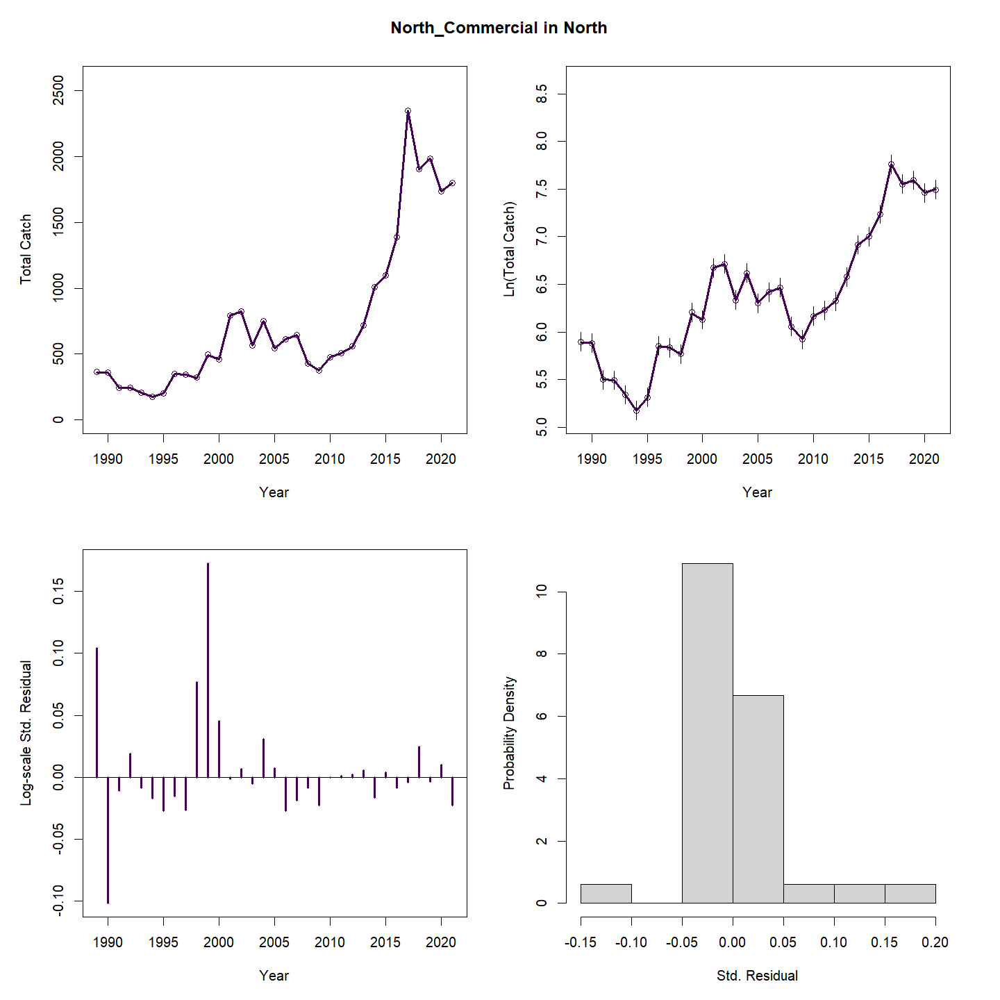
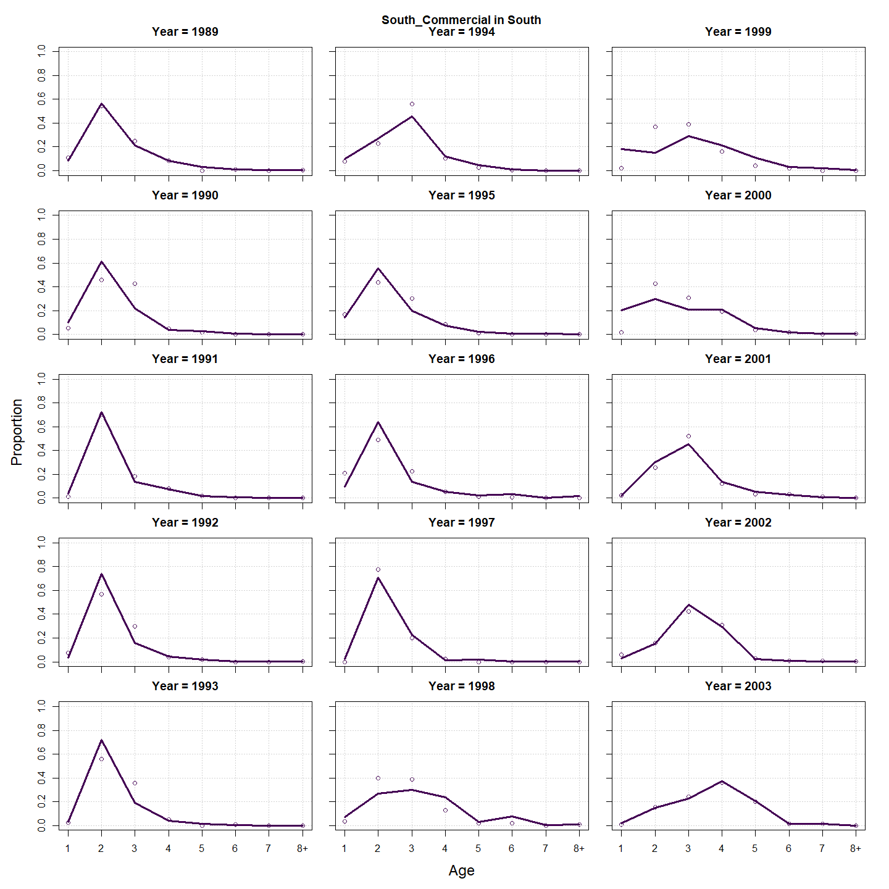
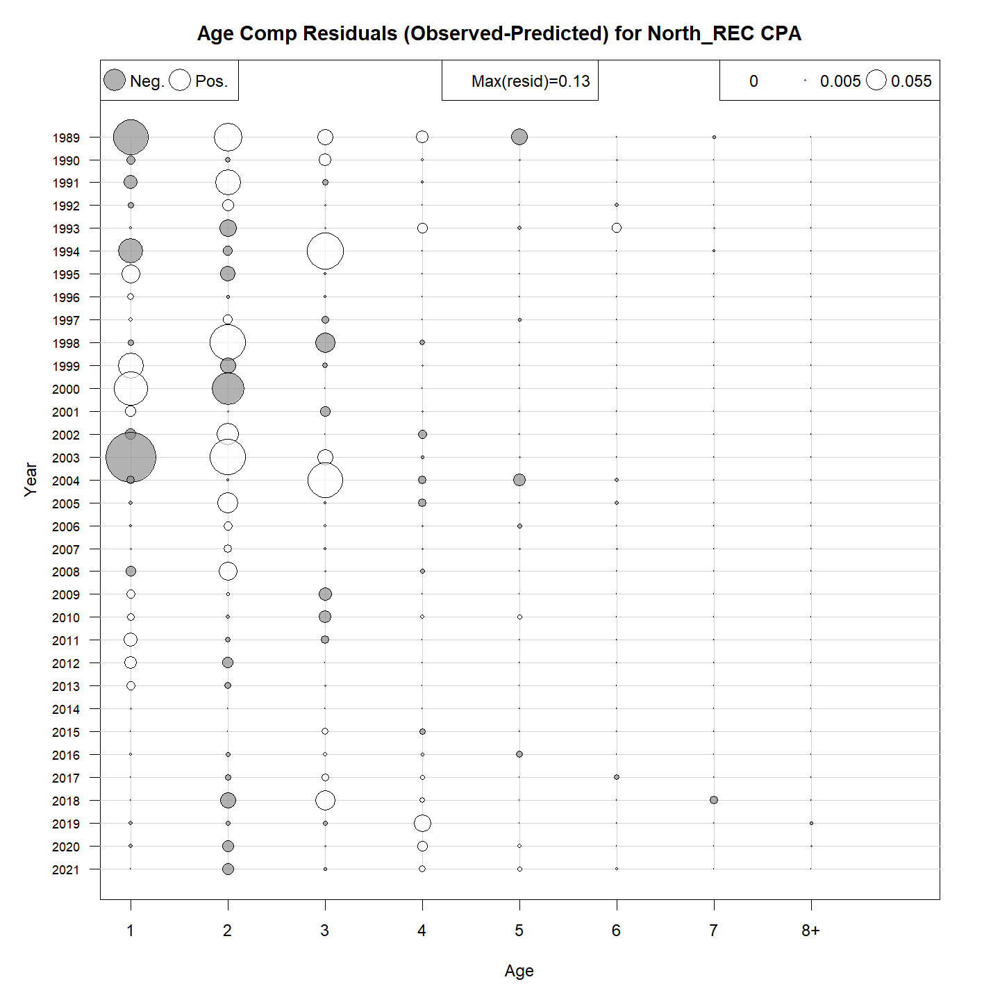
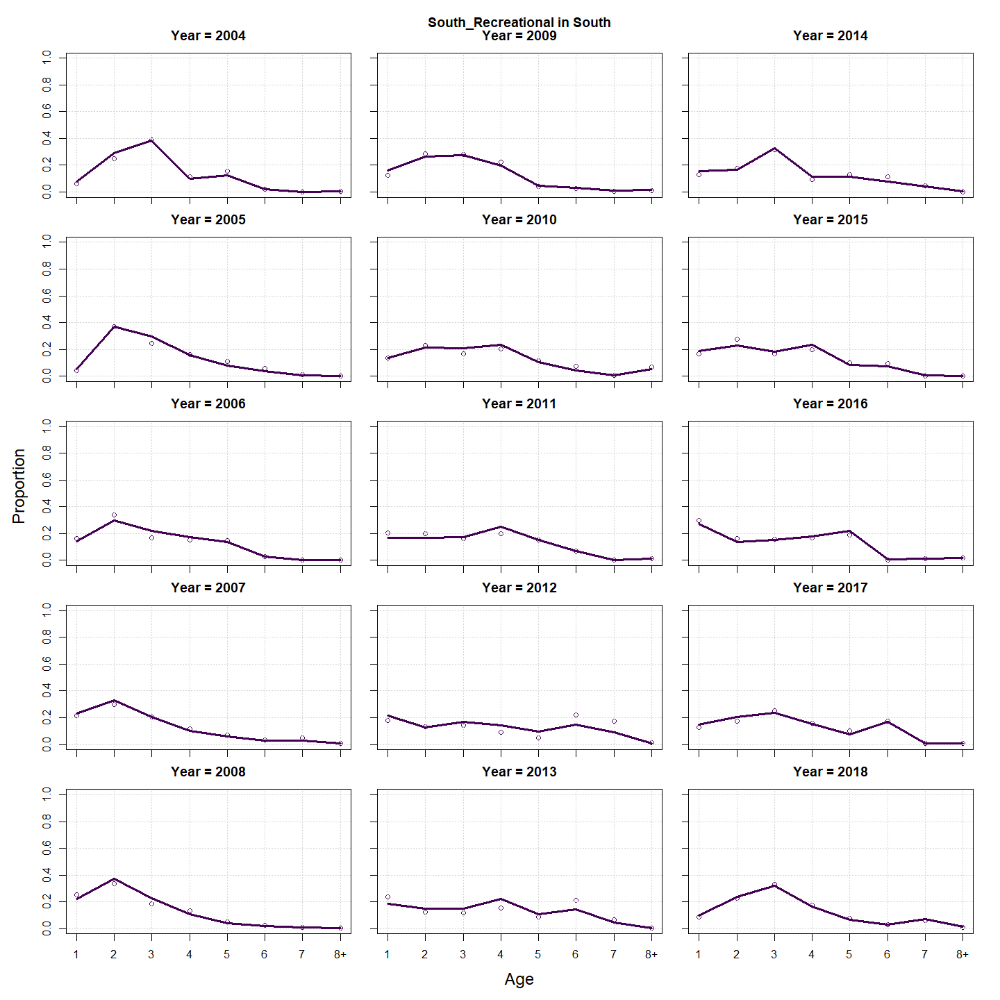
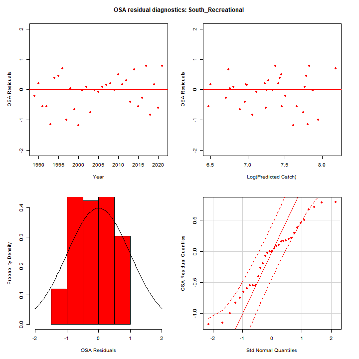
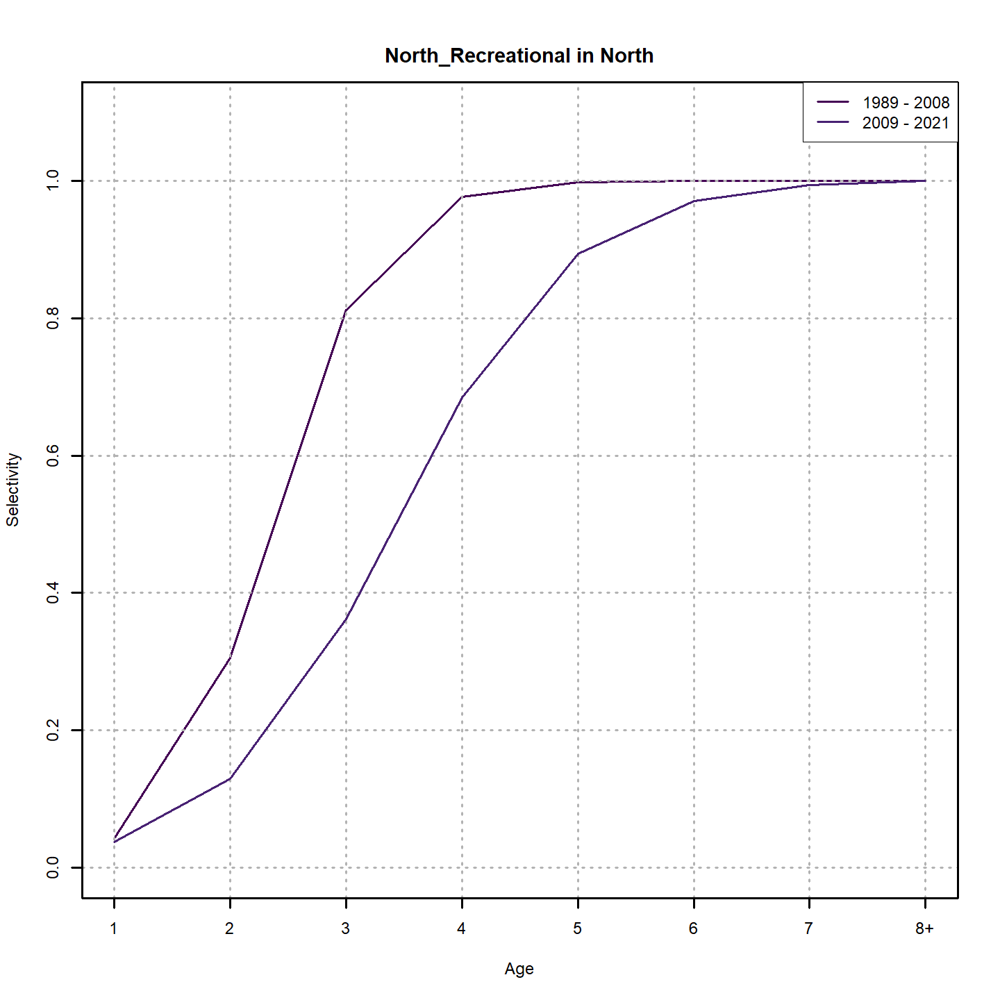
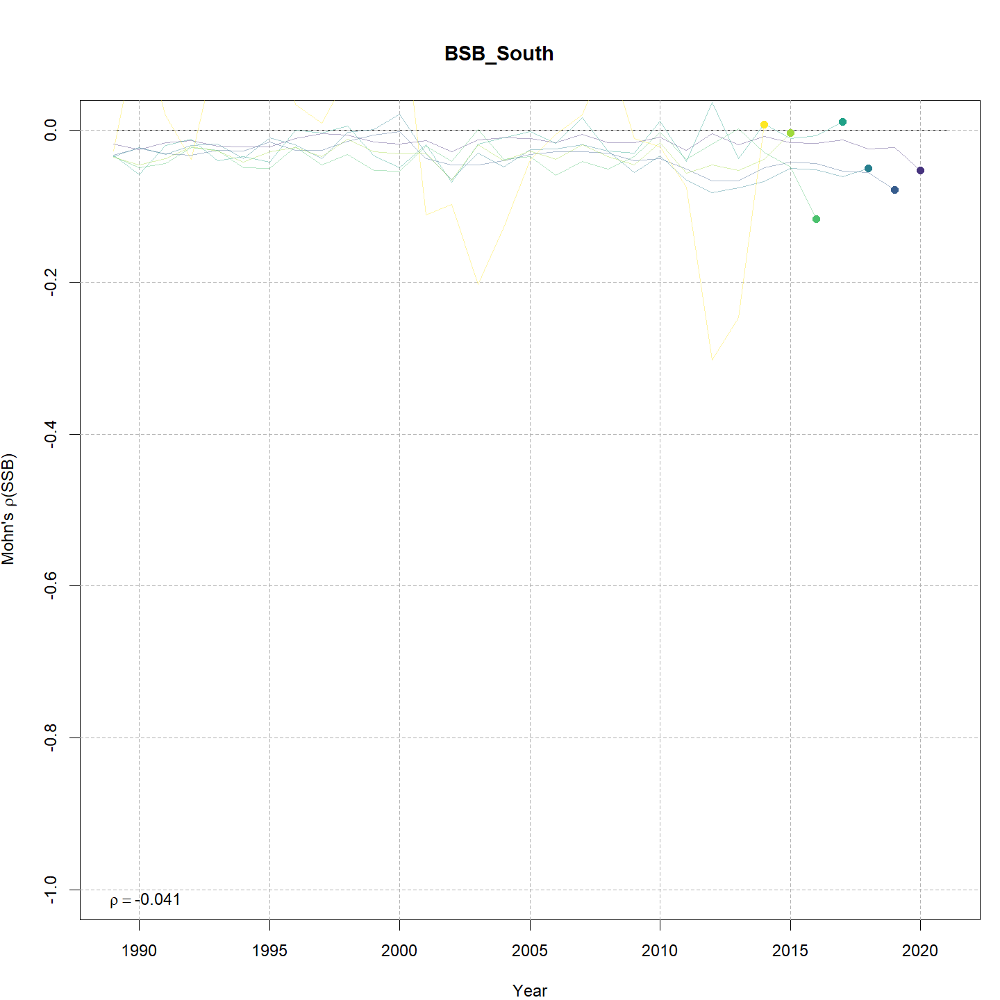
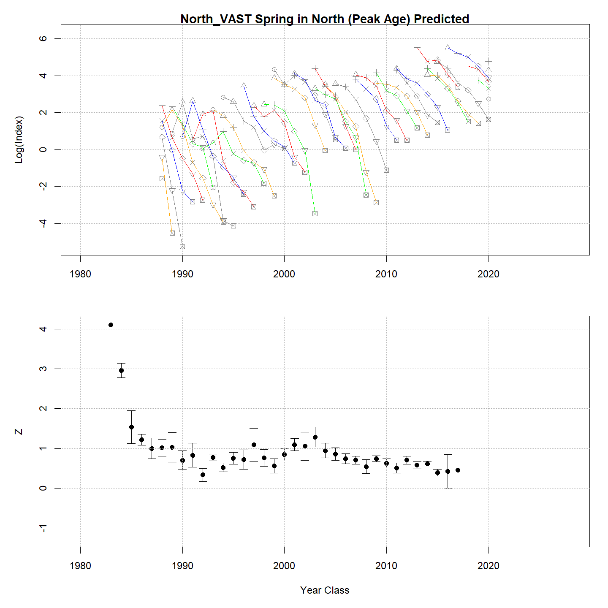

---
output:
  html_document:
    df_print: paged
    keep_md: yes
  word_document: default
  pdf_document:
    fig_caption: yes
    includes:
    keep_tex: yes
    number_sections: no
title: "WHAM figures and tables"
header-includes:
  - \usepackage{longtable}
  - \usepackage{booktabs}
  - \usepackage{caption,graphics}
  - \usepackage{makecell}
  - \usepackage{lscape}
  - \renewcommand\figurename{Fig.}
  - \captionsetup{labelsep=period, singlelinecheck=false}
  - \newcommand{\changesize}[1]{\fontsize{#1pt}{#1pt}\selectfont}
  - \renewcommand{\arraystretch}{1.5}
  - \renewcommand\theadfont{}
---

# {.tabset}

## Figures {.tabset}

### Input

### Diagnostics

### Results

### Retro

### Reference points

### Miscelaneous

## Tables {.tabset}

### Parameter estimates

<table class="table" style="margin-left: auto; margin-right: auto;">
<caption>Parameter estimates, standard errors, and confidence intervals. Rounded to 3 decimal places.</caption>
 <thead>
  <tr>
   <th style="text-align:left;">   </th>
   <th style="text-align:right;"> Estimate </th>
   <th style="text-align:right;"> Std. Error </th>
   <th style="text-align:right;"> 95\% CI lower </th>
   <th style="text-align:right;"> 95\% CI upper </th>
  </tr>
 </thead>
<tbody>
  <tr>
   <td style="text-align:left;"> BSB North Mean Recruitment </td>
   <td style="text-align:right;"> 18088.029 </td>
   <td style="text-align:right;"> 5064.893 </td>
   <td style="text-align:right;"> 10448.244 </td>
   <td style="text-align:right;"> 31314.046 </td>
  </tr>
  <tr>
   <td style="text-align:left;"> BSB North NAA $\sigma$ (age 1) </td>
   <td style="text-align:right;"> 1.101 </td>
   <td style="text-align:right;"> 0.145 </td>
   <td style="text-align:right;"> 0.851 </td>
   <td style="text-align:right;"> 1.425 </td>
  </tr>
  <tr>
   <td style="text-align:left;"> BSB North NAA $\sigma$ (age 2) </td>
   <td style="text-align:right;"> 0.837 </td>
   <td style="text-align:right;"> 0.049 </td>
   <td style="text-align:right;"> 0.745 </td>
   <td style="text-align:right;"> 0.939 </td>
  </tr>
  <tr>
   <td style="text-align:left;"> BSB South Mean Recruitment </td>
   <td style="text-align:right;"> 18335.940 </td>
   <td style="text-align:right;"> 3236.926 </td>
   <td style="text-align:right;"> 12972.890 </td>
   <td style="text-align:right;"> 25916.098 </td>
  </tr>
  <tr>
   <td style="text-align:left;"> BSB South NAA $\sigma$ (age 1) </td>
   <td style="text-align:right;"> 0.506 </td>
   <td style="text-align:right;"> 0.079 </td>
   <td style="text-align:right;"> 0.372 </td>
   <td style="text-align:right;"> 0.686 </td>
  </tr>
  <tr>
   <td style="text-align:left;"> BSB South NAA $\sigma$ (age 2) </td>
   <td style="text-align:right;"> 0.798 </td>
   <td style="text-align:right;"> 0.066 </td>
   <td style="text-align:right;"> 0.679 </td>
   <td style="text-align:right;"> 0.938 </td>
  </tr>
  <tr>
   <td style="text-align:left;"> North REC CPA fully selected q </td>
   <td style="text-align:right;"> 0.000 </td>
   <td style="text-align:right;"> 0.000 </td>
   <td style="text-align:right;"> 0.000 </td>
   <td style="text-align:right;"> 0.000 </td>
  </tr>
  <tr>
   <td style="text-align:left;"> North VAST Spring fully selected q </td>
   <td style="text-align:right;"> 0.010 </td>
   <td style="text-align:right;"> 0.002 </td>
   <td style="text-align:right;"> 0.006 </td>
   <td style="text-align:right;"> 0.016 </td>
  </tr>
  <tr>
   <td style="text-align:left;"> North VAST Fall fully selected q </td>
   <td style="text-align:right;"> 0.018 </td>
   <td style="text-align:right;"> 0.006 </td>
   <td style="text-align:right;"> 0.010 </td>
   <td style="text-align:right;"> 0.035 </td>
  </tr>
  <tr>
   <td style="text-align:left;"> South REC CPA fully selected q </td>
   <td style="text-align:right;"> 0.000 </td>
   <td style="text-align:right;"> 0.000 </td>
   <td style="text-align:right;"> 0.000 </td>
   <td style="text-align:right;"> 0.000 </td>
  </tr>
  <tr>
   <td style="text-align:left;"> South VAST Spring fully selected q </td>
   <td style="text-align:right;"> 0.024 </td>
   <td style="text-align:right;"> 0.007 </td>
   <td style="text-align:right;"> 0.013 </td>
   <td style="text-align:right;"> 0.044 </td>
  </tr>
  <tr>
   <td style="text-align:left;"> South VAST Fall fully selected q </td>
   <td style="text-align:right;"> 0.000 </td>
   <td style="text-align:right;"> 0.000 </td>
   <td style="text-align:right;"> 0.000 </td>
   <td style="text-align:right;"> 0.001 </td>
  </tr>
  <tr>
   <td style="text-align:left;"> Block 1: $a_{50}$ </td>
   <td style="text-align:right;"> 1.749 </td>
   <td style="text-align:right;"> 0.221 </td>
   <td style="text-align:right;"> 1.354 </td>
   <td style="text-align:right;"> 2.221 </td>
  </tr>
  <tr>
   <td style="text-align:left;"> Block 1: 1/slope (increasing) </td>
   <td style="text-align:right;"> 0.249 </td>
   <td style="text-align:right;"> 0.074 </td>
   <td style="text-align:right;"> 0.138 </td>
   <td style="text-align:right;"> 0.444 </td>
  </tr>
  <tr>
   <td style="text-align:left;"> Block 2: $a_{50}$ </td>
   <td style="text-align:right;"> 2.641 </td>
   <td style="text-align:right;"> 0.193 </td>
   <td style="text-align:right;"> 2.278 </td>
   <td style="text-align:right;"> 3.032 </td>
  </tr>
  <tr>
   <td style="text-align:left;"> Block 2: 1/slope (increasing) </td>
   <td style="text-align:right;"> 0.334 </td>
   <td style="text-align:right;"> 0.046 </td>
   <td style="text-align:right;"> 0.254 </td>
   <td style="text-align:right;"> 0.438 </td>
  </tr>
  <tr>
   <td style="text-align:left;"> Block 3: $a_{50}$ </td>
   <td style="text-align:right;"> 2.359 </td>
   <td style="text-align:right;"> 0.152 </td>
   <td style="text-align:right;"> 2.073 </td>
   <td style="text-align:right;"> 2.668 </td>
  </tr>
  <tr>
   <td style="text-align:left;"> Block 3: 1/slope (increasing) </td>
   <td style="text-align:right;"> 0.437 </td>
   <td style="text-align:right;"> 0.042 </td>
   <td style="text-align:right;"> 0.362 </td>
   <td style="text-align:right;"> 0.528 </td>
  </tr>
  <tr>
   <td style="text-align:left;"> Block 4: $a_{50}$ </td>
   <td style="text-align:right;"> 3.425 </td>
   <td style="text-align:right;"> 0.182 </td>
   <td style="text-align:right;"> 3.073 </td>
   <td style="text-align:right;"> 3.786 </td>
  </tr>
  <tr>
   <td style="text-align:left;"> Block 4: 1/slope (increasing) </td>
   <td style="text-align:right;"> 0.748 </td>
   <td style="text-align:right;"> 0.064 </td>
   <td style="text-align:right;"> 0.633 </td>
   <td style="text-align:right;"> 0.882 </td>
  </tr>
  <tr>
   <td style="text-align:left;"> Block 5: Selectivity for age 1 </td>
   <td style="text-align:right;"> 0.060 </td>
   <td style="text-align:right;"> 0.026 </td>
   <td style="text-align:right;"> 0.025 </td>
   <td style="text-align:right;"> 0.136 </td>
  </tr>
  <tr>
   <td style="text-align:left;"> Block 5: Selectivity for age 2 </td>
   <td style="text-align:right;"> 1.000 </td>
   <td style="text-align:right;"> -- </td>
   <td style="text-align:right;"> -- </td>
   <td style="text-align:right;"> -- </td>
  </tr>
  <tr>
   <td style="text-align:left;"> Block 5: Selectivity for age 3 </td>
   <td style="text-align:right;"> 1.000 </td>
   <td style="text-align:right;"> -- </td>
   <td style="text-align:right;"> -- </td>
   <td style="text-align:right;"> -- </td>
  </tr>
  <tr>
   <td style="text-align:left;"> Block 5: Selectivity for age 4 </td>
   <td style="text-align:right;"> 1.000 </td>
   <td style="text-align:right;"> -- </td>
   <td style="text-align:right;"> -- </td>
   <td style="text-align:right;"> -- </td>
  </tr>
  <tr>
   <td style="text-align:left;"> Block 5: Selectivity for age 5 </td>
   <td style="text-align:right;"> 1.000 </td>
   <td style="text-align:right;"> -- </td>
   <td style="text-align:right;"> -- </td>
   <td style="text-align:right;"> -- </td>
  </tr>
  <tr>
   <td style="text-align:left;"> Block 5: Selectivity for age 6 </td>
   <td style="text-align:right;"> 1.000 </td>
   <td style="text-align:right;"> -- </td>
   <td style="text-align:right;"> -- </td>
   <td style="text-align:right;"> -- </td>
  </tr>
  <tr>
   <td style="text-align:left;"> Block 5: Selectivity for age 7 </td>
   <td style="text-align:right;"> 1.000 </td>
   <td style="text-align:right;"> -- </td>
   <td style="text-align:right;"> -- </td>
   <td style="text-align:right;"> -- </td>
  </tr>
  <tr>
   <td style="text-align:left;"> Block 5: Selectivity for age 8+ </td>
   <td style="text-align:right;"> 1.000 </td>
   <td style="text-align:right;"> -- </td>
   <td style="text-align:right;"> -- </td>
   <td style="text-align:right;"> -- </td>
  </tr>
  <tr>
   <td style="text-align:left;"> Block 6: $a_{50}$ </td>
   <td style="text-align:right;"> 3.194 </td>
   <td style="text-align:right;"> 0.262 </td>
   <td style="text-align:right;"> 2.698 </td>
   <td style="text-align:right;"> 3.718 </td>
  </tr>
  <tr>
   <td style="text-align:left;"> Block 6: 1/slope (increasing) </td>
   <td style="text-align:right;"> 0.558 </td>
   <td style="text-align:right;"> 0.083 </td>
   <td style="text-align:right;"> 0.415 </td>
   <td style="text-align:right;"> 0.745 </td>
  </tr>
  <tr>
   <td style="text-align:left;"> Block 7: $a_{50}$ </td>
   <td style="text-align:right;"> 2.152 </td>
   <td style="text-align:right;"> 0.194 </td>
   <td style="text-align:right;"> 1.794 </td>
   <td style="text-align:right;"> 2.552 </td>
  </tr>
  <tr>
   <td style="text-align:left;"> Block 7: 1/slope (increasing) </td>
   <td style="text-align:right;"> 0.571 </td>
   <td style="text-align:right;"> 0.086 </td>
   <td style="text-align:right;"> 0.424 </td>
   <td style="text-align:right;"> 0.764 </td>
  </tr>
  <tr>
   <td style="text-align:left;"> Block 8: $a_{50}$ </td>
   <td style="text-align:right;"> 4.607 </td>
   <td style="text-align:right;"> 0.372 </td>
   <td style="text-align:right;"> 3.865 </td>
   <td style="text-align:right;"> 5.308 </td>
  </tr>
  <tr>
   <td style="text-align:left;"> Block 8: 1/slope (increasing) </td>
   <td style="text-align:right;"> 1.322 </td>
   <td style="text-align:right;"> 0.157 </td>
   <td style="text-align:right;"> 1.042 </td>
   <td style="text-align:right;"> 1.660 </td>
  </tr>
  <tr>
   <td style="text-align:left;"> Block 9: Selectivity for age 1 </td>
   <td style="text-align:right;"> 0.169 </td>
   <td style="text-align:right;"> 0.028 </td>
   <td style="text-align:right;"> 0.120 </td>
   <td style="text-align:right;"> 0.231 </td>
  </tr>
  <tr>
   <td style="text-align:left;"> Block 9: Selectivity for age 2 </td>
   <td style="text-align:right;"> 0.707 </td>
   <td style="text-align:right;"> 0.082 </td>
   <td style="text-align:right;"> 0.526 </td>
   <td style="text-align:right;"> 0.839 </td>
  </tr>
  <tr>
   <td style="text-align:left;"> Block 9: Selectivity for age 3 </td>
   <td style="text-align:right;"> 1.000 </td>
   <td style="text-align:right;"> -- </td>
   <td style="text-align:right;"> -- </td>
   <td style="text-align:right;"> -- </td>
  </tr>
  <tr>
   <td style="text-align:left;"> Block 9: Selectivity for age 4 </td>
   <td style="text-align:right;"> 0.971 </td>
   <td style="text-align:right;"> 0.096 </td>
   <td style="text-align:right;"> 0.038 </td>
   <td style="text-align:right;"> 1.000 </td>
  </tr>
  <tr>
   <td style="text-align:left;"> Block 9: Selectivity for age 5 </td>
   <td style="text-align:right;"> 0.937 </td>
   <td style="text-align:right;"> 0.114 </td>
   <td style="text-align:right;"> 0.251 </td>
   <td style="text-align:right;"> 0.998 </td>
  </tr>
  <tr>
   <td style="text-align:left;"> Block 9: Selectivity for age 6 </td>
   <td style="text-align:right;"> 0.953 </td>
   <td style="text-align:right;"> 0.115 </td>
   <td style="text-align:right;"> 0.115 </td>
   <td style="text-align:right;"> 1.000 </td>
  </tr>
  <tr>
   <td style="text-align:left;"> Block 9: Selectivity for age 7 </td>
   <td style="text-align:right;"> 0.899 </td>
   <td style="text-align:right;"> 0.113 </td>
   <td style="text-align:right;"> 0.439 </td>
   <td style="text-align:right;"> 0.990 </td>
  </tr>
  <tr>
   <td style="text-align:left;"> Block 9: Selectivity for age 8+ </td>
   <td style="text-align:right;"> 0.848 </td>
   <td style="text-align:right;"> 0.101 </td>
   <td style="text-align:right;"> 0.547 </td>
   <td style="text-align:right;"> 0.962 </td>
  </tr>
  <tr>
   <td style="text-align:left;"> Block 10: Selectivity for age 1 </td>
   <td style="text-align:right;"> 0.073 </td>
   <td style="text-align:right;"> 0.023 </td>
   <td style="text-align:right;"> 0.038 </td>
   <td style="text-align:right;"> 0.134 </td>
  </tr>
  <tr>
   <td style="text-align:left;"> Block 10: Selectivity for age 2 </td>
   <td style="text-align:right;"> 0.384 </td>
   <td style="text-align:right;"> 0.122 </td>
   <td style="text-align:right;"> 0.185 </td>
   <td style="text-align:right;"> 0.632 </td>
  </tr>
  <tr>
   <td style="text-align:left;"> Block 10: Selectivity for age 3 </td>
   <td style="text-align:right;"> 1.000 </td>
   <td style="text-align:right;"> -- </td>
   <td style="text-align:right;"> -- </td>
   <td style="text-align:right;"> -- </td>
  </tr>
  <tr>
   <td style="text-align:left;"> Block 10: Selectivity for age 4 </td>
   <td style="text-align:right;"> 0.947 </td>
   <td style="text-align:right;"> 0.305 </td>
   <td style="text-align:right;"> 0.000 </td>
   <td style="text-align:right;"> 1.000 </td>
  </tr>
  <tr>
   <td style="text-align:left;"> Block 10: Selectivity for age 5 </td>
   <td style="text-align:right;"> 0.823 </td>
   <td style="text-align:right;"> 0.299 </td>
   <td style="text-align:right;"> 0.077 </td>
   <td style="text-align:right;"> 0.996 </td>
  </tr>
  <tr>
   <td style="text-align:left;"> Block 10: Selectivity for age 6 </td>
   <td style="text-align:right;"> 0.603 </td>
   <td style="text-align:right;"> 0.236 </td>
   <td style="text-align:right;"> 0.181 </td>
   <td style="text-align:right;"> 0.913 </td>
  </tr>
  <tr>
   <td style="text-align:left;"> Block 10: Selectivity for age 7 </td>
   <td style="text-align:right;"> 0.402 </td>
   <td style="text-align:right;"> 0.148 </td>
   <td style="text-align:right;"> 0.168 </td>
   <td style="text-align:right;"> 0.692 </td>
  </tr>
  <tr>
   <td style="text-align:left;"> Block 10: Selectivity for age 8+ </td>
   <td style="text-align:right;"> 0.842 </td>
   <td style="text-align:right;"> 0.210 </td>
   <td style="text-align:right;"> 0.196 </td>
   <td style="text-align:right;"> 0.991 </td>
  </tr>
  <tr>
   <td style="text-align:left;"> Block 11: Selectivity for age 1 </td>
   <td style="text-align:right;"> 0.148 </td>
   <td style="text-align:right;"> 0.060 </td>
   <td style="text-align:right;"> 0.064 </td>
   <td style="text-align:right;"> 0.307 </td>
  </tr>
  <tr>
   <td style="text-align:left;"> Block 11: Selectivity for age 2 </td>
   <td style="text-align:right;"> 0.344 </td>
   <td style="text-align:right;"> 0.141 </td>
   <td style="text-align:right;"> 0.133 </td>
   <td style="text-align:right;"> 0.642 </td>
  </tr>
  <tr>
   <td style="text-align:left;"> Block 11: Selectivity for age 3 </td>
   <td style="text-align:right;"> 0.739 </td>
   <td style="text-align:right;"> 0.290 </td>
   <td style="text-align:right;"> 0.129 </td>
   <td style="text-align:right;"> 0.982 </td>
  </tr>
  <tr>
   <td style="text-align:left;"> Block 11: Selectivity for age 4 </td>
   <td style="text-align:right;"> 1.000 </td>
   <td style="text-align:right;"> -- </td>
   <td style="text-align:right;"> -- </td>
   <td style="text-align:right;"> -- </td>
  </tr>
  <tr>
   <td style="text-align:left;"> Block 11: Selectivity for age 5 </td>
   <td style="text-align:right;"> 0.743 </td>
   <td style="text-align:right;"> 0.315 </td>
   <td style="text-align:right;"> 0.102 </td>
   <td style="text-align:right;"> 0.987 </td>
  </tr>
  <tr>
   <td style="text-align:left;"> Block 11: Selectivity for age 6 </td>
   <td style="text-align:right;"> 0.672 </td>
   <td style="text-align:right;"> 0.279 </td>
   <td style="text-align:right;"> 0.147 </td>
   <td style="text-align:right;"> 0.961 </td>
  </tr>
  <tr>
   <td style="text-align:left;"> Block 11: Selectivity for age 7 </td>
   <td style="text-align:right;"> 0.419 </td>
   <td style="text-align:right;"> 0.185 </td>
   <td style="text-align:right;"> 0.140 </td>
   <td style="text-align:right;"> 0.762 </td>
  </tr>
  <tr>
   <td style="text-align:left;"> Block 11: Selectivity for age 8+ </td>
   <td style="text-align:right;"> 0.515 </td>
   <td style="text-align:right;"> 0.155 </td>
   <td style="text-align:right;"> 0.239 </td>
   <td style="text-align:right;"> 0.782 </td>
  </tr>
  <tr>
   <td style="text-align:left;"> Block 12: Selectivity for age 1 </td>
   <td style="text-align:right;"> 0.408 </td>
   <td style="text-align:right;"> 0.068 </td>
   <td style="text-align:right;"> 0.283 </td>
   <td style="text-align:right;"> 0.546 </td>
  </tr>
  <tr>
   <td style="text-align:left;"> Block 12: Selectivity for age 2 </td>
   <td style="text-align:right;"> 0.884 </td>
   <td style="text-align:right;"> 0.112 </td>
   <td style="text-align:right;"> 0.475 </td>
   <td style="text-align:right;"> 0.985 </td>
  </tr>
  <tr>
   <td style="text-align:left;"> Block 12: Selectivity for age 3 </td>
   <td style="text-align:right;"> 1.000 </td>
   <td style="text-align:right;"> -- </td>
   <td style="text-align:right;"> -- </td>
   <td style="text-align:right;"> -- </td>
  </tr>
  <tr>
   <td style="text-align:left;"> Block 12: Selectivity for age 4 </td>
   <td style="text-align:right;"> 0.828 </td>
   <td style="text-align:right;"> 0.100 </td>
   <td style="text-align:right;"> 0.547 </td>
   <td style="text-align:right;"> 0.951 </td>
  </tr>
  <tr>
   <td style="text-align:left;"> Block 12: Selectivity for age 5 </td>
   <td style="text-align:right;"> 0.791 </td>
   <td style="text-align:right;"> 0.114 </td>
   <td style="text-align:right;"> 0.496 </td>
   <td style="text-align:right;"> 0.936 </td>
  </tr>
  <tr>
   <td style="text-align:left;"> Block 12: Selectivity for age 6 </td>
   <td style="text-align:right;"> 0.833 </td>
   <td style="text-align:right;"> 0.120 </td>
   <td style="text-align:right;"> 0.477 </td>
   <td style="text-align:right;"> 0.965 </td>
  </tr>
  <tr>
   <td style="text-align:left;"> Block 12: Selectivity for age 7 </td>
   <td style="text-align:right;"> 0.797 </td>
   <td style="text-align:right;"> 0.117 </td>
   <td style="text-align:right;"> 0.489 </td>
   <td style="text-align:right;"> 0.942 </td>
  </tr>
  <tr>
   <td style="text-align:left;"> Block 12: Selectivity for age 8+ </td>
   <td style="text-align:right;"> 0.903 </td>
   <td style="text-align:right;"> 0.121 </td>
   <td style="text-align:right;"> 0.381 </td>
   <td style="text-align:right;"> 0.993 </td>
  </tr>
  <tr>
   <td style="text-align:left;"> Block 13: Selectivity for age 1 </td>
   <td style="text-align:right;"> 0.193 </td>
   <td style="text-align:right;"> 0.073 </td>
   <td style="text-align:right;"> 0.087 </td>
   <td style="text-align:right;"> 0.375 </td>
  </tr>
  <tr>
   <td style="text-align:left;"> Block 13: Selectivity for age 2 </td>
   <td style="text-align:right;"> 0.818 </td>
   <td style="text-align:right;"> 0.383 </td>
   <td style="text-align:right;"> 0.028 </td>
   <td style="text-align:right;"> 0.999 </td>
  </tr>
  <tr>
   <td style="text-align:left;"> Block 13: Selectivity for age 3 </td>
   <td style="text-align:right;"> 1.000 </td>
   <td style="text-align:right;"> -- </td>
   <td style="text-align:right;"> -- </td>
   <td style="text-align:right;"> -- </td>
  </tr>
  <tr>
   <td style="text-align:left;"> Block 13: Selectivity for age 4 </td>
   <td style="text-align:right;"> 0.596 </td>
   <td style="text-align:right;"> 0.268 </td>
   <td style="text-align:right;"> 0.143 </td>
   <td style="text-align:right;"> 0.929 </td>
  </tr>
  <tr>
   <td style="text-align:left;"> Block 13: Selectivity for age 5 </td>
   <td style="text-align:right;"> 0.199 </td>
   <td style="text-align:right;"> 0.082 </td>
   <td style="text-align:right;"> 0.083 </td>
   <td style="text-align:right;"> 0.405 </td>
  </tr>
  <tr>
   <td style="text-align:left;"> Block 13: Selectivity for age 6 </td>
   <td style="text-align:right;"> 0.190 </td>
   <td style="text-align:right;"> 0.079 </td>
   <td style="text-align:right;"> 0.079 </td>
   <td style="text-align:right;"> 0.390 </td>
  </tr>
  <tr>
   <td style="text-align:left;"> Block 13: Selectivity for age 7 </td>
   <td style="text-align:right;"> 0.141 </td>
   <td style="text-align:right;"> 0.058 </td>
   <td style="text-align:right;"> 0.060 </td>
   <td style="text-align:right;"> 0.297 </td>
  </tr>
  <tr>
   <td style="text-align:left;"> Block 13: Selectivity for age 8+ </td>
   <td style="text-align:right;"> 0.360 </td>
   <td style="text-align:right;"> 0.114 </td>
   <td style="text-align:right;"> 0.176 </td>
   <td style="text-align:right;"> 0.597 </td>
  </tr>
  <tr>
   <td style="text-align:left;"> Block 14: Selectivity for age 1 </td>
   <td style="text-align:right;"> 1.000 </td>
   <td style="text-align:right;"> -- </td>
   <td style="text-align:right;"> -- </td>
   <td style="text-align:right;"> -- </td>
  </tr>
  <tr>
   <td style="text-align:left;"> Block 14: Selectivity for age 2 </td>
   <td style="text-align:right;"> 0.862 </td>
   <td style="text-align:right;"> 0.279 </td>
   <td style="text-align:right;"> 0.059 </td>
   <td style="text-align:right;"> 0.998 </td>
  </tr>
  <tr>
   <td style="text-align:left;"> Block 14: Selectivity for age 3 </td>
   <td style="text-align:right;"> 0.569 </td>
   <td style="text-align:right;"> 0.206 </td>
   <td style="text-align:right;"> 0.202 </td>
   <td style="text-align:right;"> 0.873 </td>
  </tr>
  <tr>
   <td style="text-align:left;"> Block 14: Selectivity for age 4 </td>
   <td style="text-align:right;"> 0.324 </td>
   <td style="text-align:right;"> 0.119 </td>
   <td style="text-align:right;"> 0.142 </td>
   <td style="text-align:right;"> 0.581 </td>
  </tr>
  <tr>
   <td style="text-align:left;"> Block 14: Selectivity for age 5 </td>
   <td style="text-align:right;"> 0.233 </td>
   <td style="text-align:right;"> 0.087 </td>
   <td style="text-align:right;"> 0.105 </td>
   <td style="text-align:right;"> 0.441 </td>
  </tr>
  <tr>
   <td style="text-align:left;"> Block 14: Selectivity for age 6 </td>
   <td style="text-align:right;"> 0.158 </td>
   <td style="text-align:right;"> 0.059 </td>
   <td style="text-align:right;"> 0.073 </td>
   <td style="text-align:right;"> 0.310 </td>
  </tr>
  <tr>
   <td style="text-align:left;"> Block 14: Selectivity for age 7 </td>
   <td style="text-align:right;"> 0.100 </td>
   <td style="text-align:right;"> 0.038 </td>
   <td style="text-align:right;"> 0.046 </td>
   <td style="text-align:right;"> 0.204 </td>
  </tr>
  <tr>
   <td style="text-align:left;"> Block 14: Selectivity for age 8+ </td>
   <td style="text-align:right;"> 0.215 </td>
   <td style="text-align:right;"> 0.063 </td>
   <td style="text-align:right;"> 0.117 </td>
   <td style="text-align:right;"> 0.361 </td>
  </tr>
  <tr>
   <td style="text-align:left;"> North Commercial in North age comp, logistic-normal: $\sigma$ </td>
   <td style="text-align:right;"> 8.982 </td>
   <td style="text-align:right;"> 0.460 </td>
   <td style="text-align:right;"> 8.124 </td>
   <td style="text-align:right;"> 9.932 </td>
  </tr>
  <tr>
   <td style="text-align:left;"> North Recreational in North age comp, logistic-normal: $\sigma$ </td>
   <td style="text-align:right;"> 1.734 </td>
   <td style="text-align:right;"> 0.145 </td>
   <td style="text-align:right;"> 1.472 </td>
   <td style="text-align:right;"> 2.042 </td>
  </tr>
  <tr>
   <td style="text-align:left;"> South Commercial in South age comp, logistic-normal: $\sigma$ </td>
   <td style="text-align:right;"> 6.340 </td>
   <td style="text-align:right;"> 0.347 </td>
   <td style="text-align:right;"> 5.696 </td>
   <td style="text-align:right;"> 7.057 </td>
  </tr>
  <tr>
   <td style="text-align:left;"> South Recreational in South age comp, logistic-normal: $\sigma$ </td>
   <td style="text-align:right;"> 2.331 </td>
   <td style="text-align:right;"> 0.257 </td>
   <td style="text-align:right;"> 1.879 </td>
   <td style="text-align:right;"> 2.893 </td>
  </tr>
  <tr>
   <td style="text-align:left;"> North REC CPA in North age comp, logistic-normal: $\sigma$ </td>
   <td style="text-align:right;"> 1.397 </td>
   <td style="text-align:right;"> 0.146 </td>
   <td style="text-align:right;"> 1.139 </td>
   <td style="text-align:right;"> 1.714 </td>
  </tr>
  <tr>
   <td style="text-align:left;"> North VAST Spring in North age comp, logistic-normal: $\sigma$ </td>
   <td style="text-align:right;"> 11.027 </td>
   <td style="text-align:right;"> 0.535 </td>
   <td style="text-align:right;"> 10.026 </td>
   <td style="text-align:right;"> 12.127 </td>
  </tr>
  <tr>
   <td style="text-align:left;"> North VAST Fall in North age comp, logistic-normal: $\sigma$ </td>
   <td style="text-align:right;"> 12.330 </td>
   <td style="text-align:right;"> 0.599 </td>
   <td style="text-align:right;"> 11.211 </td>
   <td style="text-align:right;"> 13.560 </td>
  </tr>
  <tr>
   <td style="text-align:left;"> South REC CPA in South age comp, logistic-normal: $\sigma$ </td>
   <td style="text-align:right;"> 2.698 </td>
   <td style="text-align:right;"> 0.312 </td>
   <td style="text-align:right;"> 2.152 </td>
   <td style="text-align:right;"> 3.384 </td>
  </tr>
  <tr>
   <td style="text-align:left;"> South VAST Spring in South age comp, logistic-normal: $\sigma$ </td>
   <td style="text-align:right;"> 10.745 </td>
   <td style="text-align:right;"> 0.555 </td>
   <td style="text-align:right;"> 9.710 </td>
   <td style="text-align:right;"> 11.891 </td>
  </tr>
  <tr>
   <td style="text-align:left;"> South VAST Fall in South age comp, logistic-normal: $\sigma$ </td>
   <td style="text-align:right;"> 9.589 </td>
   <td style="text-align:right;"> 0.494 </td>
   <td style="text-align:right;"> 8.668 </td>
   <td style="text-align:right;"> 10.608 </td>
  </tr>
  <tr>
   <td style="text-align:left;"> North REC CPA log-index observation SD scalar </td>
   <td style="text-align:right;"> 9.538 </td>
   <td style="text-align:right;"> 1.376 </td>
   <td style="text-align:right;"> 7.188 </td>
   <td style="text-align:right;"> 12.655 </td>
  </tr>
  <tr>
   <td style="text-align:left;"> South REC CPA log-index observation SD scalar </td>
   <td style="text-align:right;"> 4.146 </td>
   <td style="text-align:right;"> 1.514 </td>
   <td style="text-align:right;"> 2.027 </td>
   <td style="text-align:right;"> 8.481 </td>
  </tr>
</tbody>
</table>

### Abundance at age

<table class="table" style="margin-left: auto; margin-right: auto;">
<caption>Abundance at age (1000s) for BSB North in North.</caption>
 <thead>
  <tr>
   <th style="text-align:left;">   </th>
   <th style="text-align:right;"> 1 </th>
   <th style="text-align:right;"> 2 </th>
   <th style="text-align:right;"> 3 </th>
   <th style="text-align:right;"> 4 </th>
   <th style="text-align:right;"> 5 </th>
   <th style="text-align:right;"> 6 </th>
   <th style="text-align:right;"> 7 </th>
   <th style="text-align:right;"> 8+ </th>
  </tr>
 </thead>
<tbody>
  <tr>
   <td style="text-align:left;"> 1989 </td>
   <td style="text-align:right;"> 5245 </td>
   <td style="text-align:right;"> 2991 </td>
   <td style="text-align:right;"> 1468 </td>
   <td style="text-align:right;"> 693 </td>
   <td style="text-align:right;"> 325 </td>
   <td style="text-align:right;"> 153 </td>
   <td style="text-align:right;"> 72 </td>
   <td style="text-align:right;"> 63 </td>
  </tr>
  <tr>
   <td style="text-align:left;"> 1990 </td>
   <td style="text-align:right;"> 3765 </td>
   <td style="text-align:right;"> 2766 </td>
   <td style="text-align:right;"> 1378 </td>
   <td style="text-align:right;"> 278 </td>
   <td style="text-align:right;"> 162 </td>
   <td style="text-align:right;"> 25 </td>
   <td style="text-align:right;"> 4 </td>
   <td style="text-align:right;"> 12 </td>
  </tr>
  <tr>
   <td style="text-align:left;"> 1991 </td>
   <td style="text-align:right;"> 3147 </td>
   <td style="text-align:right;"> 4085 </td>
   <td style="text-align:right;"> 460 </td>
   <td style="text-align:right;"> 539 </td>
   <td style="text-align:right;"> 96 </td>
   <td style="text-align:right;"> 23 </td>
   <td style="text-align:right;"> 2 </td>
   <td style="text-align:right;"> 19 </td>
  </tr>
  <tr>
   <td style="text-align:left;"> 1992 </td>
   <td style="text-align:right;"> 2704 </td>
   <td style="text-align:right;"> 4319 </td>
   <td style="text-align:right;"> 219 </td>
   <td style="text-align:right;"> 65 </td>
   <td style="text-align:right;"> 207 </td>
   <td style="text-align:right;"> 56 </td>
   <td style="text-align:right;"> 18 </td>
   <td style="text-align:right;"> 74 </td>
  </tr>
  <tr>
   <td style="text-align:left;"> 1993 </td>
   <td style="text-align:right;"> 1625 </td>
   <td style="text-align:right;"> 2128 </td>
   <td style="text-align:right;"> 376 </td>
   <td style="text-align:right;"> 280 </td>
   <td style="text-align:right;"> 33 </td>
   <td style="text-align:right;"> 246 </td>
   <td style="text-align:right;"> 21 </td>
   <td style="text-align:right;"> 14 </td>
  </tr>
  <tr>
   <td style="text-align:left;"> 1994 </td>
   <td style="text-align:right;"> 13773 </td>
   <td style="text-align:right;"> 467 </td>
   <td style="text-align:right;"> 1117 </td>
   <td style="text-align:right;"> 102 </td>
   <td style="text-align:right;"> 118 </td>
   <td style="text-align:right;"> 12 </td>
   <td style="text-align:right;"> 44 </td>
   <td style="text-align:right;"> 8 </td>
  </tr>
  <tr>
   <td style="text-align:left;"> 1995 </td>
   <td style="text-align:right;"> 26332 </td>
   <td style="text-align:right;"> 1994 </td>
   <td style="text-align:right;"> 342 </td>
   <td style="text-align:right;"> 74 </td>
   <td style="text-align:right;"> 61 </td>
   <td style="text-align:right;"> 5 </td>
   <td style="text-align:right;"> 6 </td>
   <td style="text-align:right;"> 19 </td>
  </tr>
  <tr>
   <td style="text-align:left;"> 1996 </td>
   <td style="text-align:right;"> 27939 </td>
   <td style="text-align:right;"> 4229 </td>
   <td style="text-align:right;"> 425 </td>
   <td style="text-align:right;"> 108 </td>
   <td style="text-align:right;"> 26 </td>
   <td style="text-align:right;"> 46 </td>
   <td style="text-align:right;"> 5 </td>
   <td style="text-align:right;"> 8 </td>
  </tr>
  <tr>
   <td style="text-align:left;"> 1997 </td>
   <td style="text-align:right;"> 4209 </td>
   <td style="text-align:right;"> 9512 </td>
   <td style="text-align:right;"> 584 </td>
   <td style="text-align:right;"> 123 </td>
   <td style="text-align:right;"> 85 </td>
   <td style="text-align:right;"> 21 </td>
   <td style="text-align:right;"> 28 </td>
   <td style="text-align:right;"> 12 </td>
  </tr>
  <tr>
   <td style="text-align:left;"> 1998 </td>
   <td style="text-align:right;"> 2460 </td>
   <td style="text-align:right;"> 3221 </td>
   <td style="text-align:right;"> 754 </td>
   <td style="text-align:right;"> 467 </td>
   <td style="text-align:right;"> 81 </td>
   <td style="text-align:right;"> 107 </td>
   <td style="text-align:right;"> 15 </td>
   <td style="text-align:right;"> 42 </td>
  </tr>
  <tr>
   <td style="text-align:left;"> 1999 </td>
   <td style="text-align:right;"> 65079 </td>
   <td style="text-align:right;"> 3492 </td>
   <td style="text-align:right;"> 794 </td>
   <td style="text-align:right;"> 404 </td>
   <td style="text-align:right;"> 166 </td>
   <td style="text-align:right;"> 81 </td>
   <td style="text-align:right;"> 57 </td>
   <td style="text-align:right;"> 24 </td>
  </tr>
  <tr>
   <td style="text-align:left;"> 2000 </td>
   <td style="text-align:right;"> 119522 </td>
   <td style="text-align:right;"> 14191 </td>
   <td style="text-align:right;"> 1352 </td>
   <td style="text-align:right;"> 1086 </td>
   <td style="text-align:right;"> 237 </td>
   <td style="text-align:right;"> 266 </td>
   <td style="text-align:right;"> 25 </td>
   <td style="text-align:right;"> 52 </td>
  </tr>
  <tr>
   <td style="text-align:left;"> 2001 </td>
   <td style="text-align:right;"> 28522 </td>
   <td style="text-align:right;"> 9865 </td>
   <td style="text-align:right;"> 4232 </td>
   <td style="text-align:right;"> 1062 </td>
   <td style="text-align:right;"> 650 </td>
   <td style="text-align:right;"> 240 </td>
   <td style="text-align:right;"> 326 </td>
   <td style="text-align:right;"> 11 </td>
  </tr>
  <tr>
   <td style="text-align:left;"> 2002 </td>
   <td style="text-align:right;"> 64868 </td>
   <td style="text-align:right;"> 18121 </td>
   <td style="text-align:right;"> 6680 </td>
   <td style="text-align:right;"> 3385 </td>
   <td style="text-align:right;"> 390 </td>
   <td style="text-align:right;"> 137 </td>
   <td style="text-align:right;"> 146 </td>
   <td style="text-align:right;"> 58 </td>
  </tr>
  <tr>
   <td style="text-align:left;"> 2003 </td>
   <td style="text-align:right;"> 19021 </td>
   <td style="text-align:right;"> 13240 </td>
   <td style="text-align:right;"> 5203 </td>
   <td style="text-align:right;"> 4843 </td>
   <td style="text-align:right;"> 2362 </td>
   <td style="text-align:right;"> 188 </td>
   <td style="text-align:right;"> 87 </td>
   <td style="text-align:right;"> 39 </td>
  </tr>
  <tr>
   <td style="text-align:left;"> 2004 </td>
   <td style="text-align:right;"> 11726 </td>
   <td style="text-align:right;"> 8016 </td>
   <td style="text-align:right;"> 9375 </td>
   <td style="text-align:right;"> 1768 </td>
   <td style="text-align:right;"> 2712 </td>
   <td style="text-align:right;"> 741 </td>
   <td style="text-align:right;"> 9 </td>
   <td style="text-align:right;"> 56 </td>
  </tr>
  <tr>
   <td style="text-align:left;"> 2005 </td>
   <td style="text-align:right;"> 26756 </td>
   <td style="text-align:right;"> 10015 </td>
   <td style="text-align:right;"> 2288 </td>
   <td style="text-align:right;"> 3878 </td>
   <td style="text-align:right;"> 1632 </td>
   <td style="text-align:right;"> 1316 </td>
   <td style="text-align:right;"> 280 </td>
   <td style="text-align:right;"> 101 </td>
  </tr>
  <tr>
   <td style="text-align:left;"> 2006 </td>
   <td style="text-align:right;"> 48583 </td>
   <td style="text-align:right;"> 10460 </td>
   <td style="text-align:right;"> 2150 </td>
   <td style="text-align:right;"> 1965 </td>
   <td style="text-align:right;"> 2488 </td>
   <td style="text-align:right;"> 389 </td>
   <td style="text-align:right;"> 505 </td>
   <td style="text-align:right;"> 4 </td>
  </tr>
  <tr>
   <td style="text-align:left;"> 2007 </td>
   <td style="text-align:right;"> 31503 </td>
   <td style="text-align:right;"> 11579 </td>
   <td style="text-align:right;"> 3611 </td>
   <td style="text-align:right;"> 997 </td>
   <td style="text-align:right;"> 693 </td>
   <td style="text-align:right;"> 735 </td>
   <td style="text-align:right;"> 335 </td>
   <td style="text-align:right;"> 51 </td>
  </tr>
  <tr>
   <td style="text-align:left;"> 2008 </td>
   <td style="text-align:right;"> 51353 </td>
   <td style="text-align:right;"> 17059 </td>
   <td style="text-align:right;"> 5337 </td>
   <td style="text-align:right;"> 1900 </td>
   <td style="text-align:right;"> 510 </td>
   <td style="text-align:right;"> 383 </td>
   <td style="text-align:right;"> 299 </td>
   <td style="text-align:right;"> 200 </td>
  </tr>
  <tr>
   <td style="text-align:left;"> 2009 </td>
   <td style="text-align:right;"> 22708 </td>
   <td style="text-align:right;"> 15428 </td>
   <td style="text-align:right;"> 5850 </td>
   <td style="text-align:right;"> 3464 </td>
   <td style="text-align:right;"> 841 </td>
   <td style="text-align:right;"> 63 </td>
   <td style="text-align:right;"> 28 </td>
   <td style="text-align:right;"> 145 </td>
  </tr>
  <tr>
   <td style="text-align:left;"> 2010 </td>
   <td style="text-align:right;"> 9769 </td>
   <td style="text-align:right;"> 10748 </td>
   <td style="text-align:right;"> 7603 </td>
   <td style="text-align:right;"> 4158 </td>
   <td style="text-align:right;"> 2420 </td>
   <td style="text-align:right;"> 342 </td>
   <td style="text-align:right;"> 19 </td>
   <td style="text-align:right;"> 23 </td>
  </tr>
  <tr>
   <td style="text-align:left;"> 2011 </td>
   <td style="text-align:right;"> 19281 </td>
   <td style="text-align:right;"> 8101 </td>
   <td style="text-align:right;"> 4047 </td>
   <td style="text-align:right;"> 3151 </td>
   <td style="text-align:right;"> 1242 </td>
   <td style="text-align:right;"> 755 </td>
   <td style="text-align:right;"> 103 </td>
   <td style="text-align:right;"> 17 </td>
  </tr>
  <tr>
   <td style="text-align:left;"> 2012 </td>
   <td style="text-align:right;"> 74441 </td>
   <td style="text-align:right;"> 23851 </td>
   <td style="text-align:right;"> 8862 </td>
   <td style="text-align:right;"> 3724 </td>
   <td style="text-align:right;"> 2825 </td>
   <td style="text-align:right;"> 1039 </td>
   <td style="text-align:right;"> 525 </td>
   <td style="text-align:right;"> 115 </td>
  </tr>
  <tr>
   <td style="text-align:left;"> 2013 </td>
   <td style="text-align:right;"> 37607 </td>
   <td style="text-align:right;"> 42060 </td>
   <td style="text-align:right;"> 5488 </td>
   <td style="text-align:right;"> 4704 </td>
   <td style="text-align:right;"> 2671 </td>
   <td style="text-align:right;"> 1671 </td>
   <td style="text-align:right;"> 511 </td>
   <td style="text-align:right;"> 335 </td>
  </tr>
  <tr>
   <td style="text-align:left;"> 2014 </td>
   <td style="text-align:right;"> 14541 </td>
   <td style="text-align:right;"> 17461 </td>
   <td style="text-align:right;"> 29526 </td>
   <td style="text-align:right;"> 4633 </td>
   <td style="text-align:right;"> 2699 </td>
   <td style="text-align:right;"> 1560 </td>
   <td style="text-align:right;"> 996 </td>
   <td style="text-align:right;"> 526 </td>
  </tr>
  <tr>
   <td style="text-align:left;"> 2015 </td>
   <td style="text-align:right;"> 15031 </td>
   <td style="text-align:right;"> 16970 </td>
   <td style="text-align:right;"> 9528 </td>
   <td style="text-align:right;"> 15301 </td>
   <td style="text-align:right;"> 2979 </td>
   <td style="text-align:right;"> 1366 </td>
   <td style="text-align:right;"> 691 </td>
   <td style="text-align:right;"> 683 </td>
  </tr>
  <tr>
   <td style="text-align:left;"> 2016 </td>
   <td style="text-align:right;"> 74594 </td>
   <td style="text-align:right;"> 34115 </td>
   <td style="text-align:right;"> 6413 </td>
   <td style="text-align:right;"> 5956 </td>
   <td style="text-align:right;"> 18765 </td>
   <td style="text-align:right;"> 2050 </td>
   <td style="text-align:right;"> 1340 </td>
   <td style="text-align:right;"> 1029 </td>
  </tr>
  <tr>
   <td style="text-align:left;"> 2017 </td>
   <td style="text-align:right;"> 30013 </td>
   <td style="text-align:right;"> 71975 </td>
   <td style="text-align:right;"> 9588 </td>
   <td style="text-align:right;"> 4010 </td>
   <td style="text-align:right;"> 4161 </td>
   <td style="text-align:right;"> 12029 </td>
   <td style="text-align:right;"> 894 </td>
   <td style="text-align:right;"> 795 </td>
  </tr>
  <tr>
   <td style="text-align:left;"> 2018 </td>
   <td style="text-align:right;"> 8279 </td>
   <td style="text-align:right;"> 22022 </td>
   <td style="text-align:right;"> 21498 </td>
   <td style="text-align:right;"> 4720 </td>
   <td style="text-align:right;"> 2012 </td>
   <td style="text-align:right;"> 2552 </td>
   <td style="text-align:right;"> 8798 </td>
   <td style="text-align:right;"> 952 </td>
  </tr>
  <tr>
   <td style="text-align:left;"> 2019 </td>
   <td style="text-align:right;"> 22251 </td>
   <td style="text-align:right;"> 7880 </td>
   <td style="text-align:right;"> 10921 </td>
   <td style="text-align:right;"> 19247 </td>
   <td style="text-align:right;"> 3795 </td>
   <td style="text-align:right;"> 1420 </td>
   <td style="text-align:right;"> 1404 </td>
   <td style="text-align:right;"> 5244 </td>
  </tr>
  <tr>
   <td style="text-align:left;"> 2020 </td>
   <td style="text-align:right;"> 28258 </td>
   <td style="text-align:right;"> 19545 </td>
   <td style="text-align:right;"> 5037 </td>
   <td style="text-align:right;"> 9756 </td>
   <td style="text-align:right;"> 13486 </td>
   <td style="text-align:right;"> 2514 </td>
   <td style="text-align:right;"> 1274 </td>
   <td style="text-align:right;"> 4497 </td>
  </tr>
  <tr>
   <td style="text-align:left;"> 2021 </td>
   <td style="text-align:right;"> 23755 </td>
   <td style="text-align:right;"> 21579 </td>
   <td style="text-align:right;"> 13999 </td>
   <td style="text-align:right;"> 3500 </td>
   <td style="text-align:right;"> 5910 </td>
   <td style="text-align:right;"> 10009 </td>
   <td style="text-align:right;"> 1571 </td>
   <td style="text-align:right;"> 4374 </td>
  </tr>
</tbody>
</table>

<table class="table" style="margin-left: auto; margin-right: auto;">
<caption>Abundance at age (1000s) for BSB North in South.</caption>
 <thead>
  <tr>
   <th style="text-align:left;">   </th>
   <th style="text-align:right;"> 1 </th>
   <th style="text-align:right;"> 2 </th>
   <th style="text-align:right;"> 3 </th>
   <th style="text-align:right;"> 4 </th>
   <th style="text-align:right;"> 5 </th>
   <th style="text-align:right;"> 6 </th>
   <th style="text-align:right;"> 7 </th>
   <th style="text-align:right;"> 8+ </th>
  </tr>
 </thead>
<tbody>
  <tr>
   <td style="text-align:left;"> 1989 </td>
   <td style="text-align:right;"> 0 </td>
   <td style="text-align:right;"> 0 </td>
   <td style="text-align:right;"> 0 </td>
   <td style="text-align:right;"> 0 </td>
   <td style="text-align:right;"> 0 </td>
   <td style="text-align:right;"> 0 </td>
   <td style="text-align:right;"> 0 </td>
   <td style="text-align:right;"> 0 </td>
  </tr>
  <tr>
   <td style="text-align:left;"> 1990 </td>
   <td style="text-align:right;"> 0 </td>
   <td style="text-align:right;"> 0 </td>
   <td style="text-align:right;"> 0 </td>
   <td style="text-align:right;"> 0 </td>
   <td style="text-align:right;"> 0 </td>
   <td style="text-align:right;"> 0 </td>
   <td style="text-align:right;"> 0 </td>
   <td style="text-align:right;"> 0 </td>
  </tr>
  <tr>
   <td style="text-align:left;"> 1991 </td>
   <td style="text-align:right;"> 0 </td>
   <td style="text-align:right;"> 0 </td>
   <td style="text-align:right;"> 0 </td>
   <td style="text-align:right;"> 0 </td>
   <td style="text-align:right;"> 0 </td>
   <td style="text-align:right;"> 0 </td>
   <td style="text-align:right;"> 0 </td>
   <td style="text-align:right;"> 0 </td>
  </tr>
  <tr>
   <td style="text-align:left;"> 1992 </td>
   <td style="text-align:right;"> 0 </td>
   <td style="text-align:right;"> 0 </td>
   <td style="text-align:right;"> 0 </td>
   <td style="text-align:right;"> 0 </td>
   <td style="text-align:right;"> 0 </td>
   <td style="text-align:right;"> 0 </td>
   <td style="text-align:right;"> 0 </td>
   <td style="text-align:right;"> 0 </td>
  </tr>
  <tr>
   <td style="text-align:left;"> 1993 </td>
   <td style="text-align:right;"> 0 </td>
   <td style="text-align:right;"> 0 </td>
   <td style="text-align:right;"> 0 </td>
   <td style="text-align:right;"> 0 </td>
   <td style="text-align:right;"> 0 </td>
   <td style="text-align:right;"> 0 </td>
   <td style="text-align:right;"> 0 </td>
   <td style="text-align:right;"> 0 </td>
  </tr>
  <tr>
   <td style="text-align:left;"> 1994 </td>
   <td style="text-align:right;"> 0 </td>
   <td style="text-align:right;"> 0 </td>
   <td style="text-align:right;"> 0 </td>
   <td style="text-align:right;"> 0 </td>
   <td style="text-align:right;"> 0 </td>
   <td style="text-align:right;"> 0 </td>
   <td style="text-align:right;"> 0 </td>
   <td style="text-align:right;"> 0 </td>
  </tr>
  <tr>
   <td style="text-align:left;"> 1995 </td>
   <td style="text-align:right;"> 0 </td>
   <td style="text-align:right;"> 0 </td>
   <td style="text-align:right;"> 0 </td>
   <td style="text-align:right;"> 0 </td>
   <td style="text-align:right;"> 0 </td>
   <td style="text-align:right;"> 0 </td>
   <td style="text-align:right;"> 0 </td>
   <td style="text-align:right;"> 0 </td>
  </tr>
  <tr>
   <td style="text-align:left;"> 1996 </td>
   <td style="text-align:right;"> 0 </td>
   <td style="text-align:right;"> 0 </td>
   <td style="text-align:right;"> 0 </td>
   <td style="text-align:right;"> 0 </td>
   <td style="text-align:right;"> 0 </td>
   <td style="text-align:right;"> 0 </td>
   <td style="text-align:right;"> 0 </td>
   <td style="text-align:right;"> 0 </td>
  </tr>
  <tr>
   <td style="text-align:left;"> 1997 </td>
   <td style="text-align:right;"> 0 </td>
   <td style="text-align:right;"> 0 </td>
   <td style="text-align:right;"> 0 </td>
   <td style="text-align:right;"> 0 </td>
   <td style="text-align:right;"> 0 </td>
   <td style="text-align:right;"> 0 </td>
   <td style="text-align:right;"> 0 </td>
   <td style="text-align:right;"> 0 </td>
  </tr>
  <tr>
   <td style="text-align:left;"> 1998 </td>
   <td style="text-align:right;"> 0 </td>
   <td style="text-align:right;"> 0 </td>
   <td style="text-align:right;"> 0 </td>
   <td style="text-align:right;"> 0 </td>
   <td style="text-align:right;"> 0 </td>
   <td style="text-align:right;"> 0 </td>
   <td style="text-align:right;"> 0 </td>
   <td style="text-align:right;"> 0 </td>
  </tr>
  <tr>
   <td style="text-align:left;"> 1999 </td>
   <td style="text-align:right;"> 0 </td>
   <td style="text-align:right;"> 0 </td>
   <td style="text-align:right;"> 0 </td>
   <td style="text-align:right;"> 0 </td>
   <td style="text-align:right;"> 0 </td>
   <td style="text-align:right;"> 0 </td>
   <td style="text-align:right;"> 0 </td>
   <td style="text-align:right;"> 0 </td>
  </tr>
  <tr>
   <td style="text-align:left;"> 2000 </td>
   <td style="text-align:right;"> 0 </td>
   <td style="text-align:right;"> 0 </td>
   <td style="text-align:right;"> 0 </td>
   <td style="text-align:right;"> 0 </td>
   <td style="text-align:right;"> 0 </td>
   <td style="text-align:right;"> 0 </td>
   <td style="text-align:right;"> 0 </td>
   <td style="text-align:right;"> 0 </td>
  </tr>
  <tr>
   <td style="text-align:left;"> 2001 </td>
   <td style="text-align:right;"> 0 </td>
   <td style="text-align:right;"> 0 </td>
   <td style="text-align:right;"> 0 </td>
   <td style="text-align:right;"> 0 </td>
   <td style="text-align:right;"> 0 </td>
   <td style="text-align:right;"> 0 </td>
   <td style="text-align:right;"> 0 </td>
   <td style="text-align:right;"> 0 </td>
  </tr>
  <tr>
   <td style="text-align:left;"> 2002 </td>
   <td style="text-align:right;"> 0 </td>
   <td style="text-align:right;"> 0 </td>
   <td style="text-align:right;"> 0 </td>
   <td style="text-align:right;"> 0 </td>
   <td style="text-align:right;"> 0 </td>
   <td style="text-align:right;"> 0 </td>
   <td style="text-align:right;"> 0 </td>
   <td style="text-align:right;"> 0 </td>
  </tr>
  <tr>
   <td style="text-align:left;"> 2003 </td>
   <td style="text-align:right;"> 0 </td>
   <td style="text-align:right;"> 0 </td>
   <td style="text-align:right;"> 0 </td>
   <td style="text-align:right;"> 0 </td>
   <td style="text-align:right;"> 0 </td>
   <td style="text-align:right;"> 0 </td>
   <td style="text-align:right;"> 0 </td>
   <td style="text-align:right;"> 0 </td>
  </tr>
  <tr>
   <td style="text-align:left;"> 2004 </td>
   <td style="text-align:right;"> 0 </td>
   <td style="text-align:right;"> 0 </td>
   <td style="text-align:right;"> 0 </td>
   <td style="text-align:right;"> 0 </td>
   <td style="text-align:right;"> 0 </td>
   <td style="text-align:right;"> 0 </td>
   <td style="text-align:right;"> 0 </td>
   <td style="text-align:right;"> 0 </td>
  </tr>
  <tr>
   <td style="text-align:left;"> 2005 </td>
   <td style="text-align:right;"> 0 </td>
   <td style="text-align:right;"> 0 </td>
   <td style="text-align:right;"> 0 </td>
   <td style="text-align:right;"> 0 </td>
   <td style="text-align:right;"> 0 </td>
   <td style="text-align:right;"> 0 </td>
   <td style="text-align:right;"> 0 </td>
   <td style="text-align:right;"> 0 </td>
  </tr>
  <tr>
   <td style="text-align:left;"> 2006 </td>
   <td style="text-align:right;"> 0 </td>
   <td style="text-align:right;"> 0 </td>
   <td style="text-align:right;"> 0 </td>
   <td style="text-align:right;"> 0 </td>
   <td style="text-align:right;"> 0 </td>
   <td style="text-align:right;"> 0 </td>
   <td style="text-align:right;"> 0 </td>
   <td style="text-align:right;"> 0 </td>
  </tr>
  <tr>
   <td style="text-align:left;"> 2007 </td>
   <td style="text-align:right;"> 0 </td>
   <td style="text-align:right;"> 0 </td>
   <td style="text-align:right;"> 0 </td>
   <td style="text-align:right;"> 0 </td>
   <td style="text-align:right;"> 0 </td>
   <td style="text-align:right;"> 0 </td>
   <td style="text-align:right;"> 0 </td>
   <td style="text-align:right;"> 0 </td>
  </tr>
  <tr>
   <td style="text-align:left;"> 2008 </td>
   <td style="text-align:right;"> 0 </td>
   <td style="text-align:right;"> 0 </td>
   <td style="text-align:right;"> 0 </td>
   <td style="text-align:right;"> 0 </td>
   <td style="text-align:right;"> 0 </td>
   <td style="text-align:right;"> 0 </td>
   <td style="text-align:right;"> 0 </td>
   <td style="text-align:right;"> 0 </td>
  </tr>
  <tr>
   <td style="text-align:left;"> 2009 </td>
   <td style="text-align:right;"> 0 </td>
   <td style="text-align:right;"> 0 </td>
   <td style="text-align:right;"> 0 </td>
   <td style="text-align:right;"> 0 </td>
   <td style="text-align:right;"> 0 </td>
   <td style="text-align:right;"> 0 </td>
   <td style="text-align:right;"> 0 </td>
   <td style="text-align:right;"> 0 </td>
  </tr>
  <tr>
   <td style="text-align:left;"> 2010 </td>
   <td style="text-align:right;"> 0 </td>
   <td style="text-align:right;"> 0 </td>
   <td style="text-align:right;"> 0 </td>
   <td style="text-align:right;"> 0 </td>
   <td style="text-align:right;"> 0 </td>
   <td style="text-align:right;"> 0 </td>
   <td style="text-align:right;"> 0 </td>
   <td style="text-align:right;"> 0 </td>
  </tr>
  <tr>
   <td style="text-align:left;"> 2011 </td>
   <td style="text-align:right;"> 0 </td>
   <td style="text-align:right;"> 0 </td>
   <td style="text-align:right;"> 0 </td>
   <td style="text-align:right;"> 0 </td>
   <td style="text-align:right;"> 0 </td>
   <td style="text-align:right;"> 0 </td>
   <td style="text-align:right;"> 0 </td>
   <td style="text-align:right;"> 0 </td>
  </tr>
  <tr>
   <td style="text-align:left;"> 2012 </td>
   <td style="text-align:right;"> 0 </td>
   <td style="text-align:right;"> 0 </td>
   <td style="text-align:right;"> 0 </td>
   <td style="text-align:right;"> 0 </td>
   <td style="text-align:right;"> 0 </td>
   <td style="text-align:right;"> 0 </td>
   <td style="text-align:right;"> 0 </td>
   <td style="text-align:right;"> 0 </td>
  </tr>
  <tr>
   <td style="text-align:left;"> 2013 </td>
   <td style="text-align:right;"> 0 </td>
   <td style="text-align:right;"> 0 </td>
   <td style="text-align:right;"> 0 </td>
   <td style="text-align:right;"> 0 </td>
   <td style="text-align:right;"> 0 </td>
   <td style="text-align:right;"> 0 </td>
   <td style="text-align:right;"> 0 </td>
   <td style="text-align:right;"> 0 </td>
  </tr>
  <tr>
   <td style="text-align:left;"> 2014 </td>
   <td style="text-align:right;"> 0 </td>
   <td style="text-align:right;"> 0 </td>
   <td style="text-align:right;"> 0 </td>
   <td style="text-align:right;"> 0 </td>
   <td style="text-align:right;"> 0 </td>
   <td style="text-align:right;"> 0 </td>
   <td style="text-align:right;"> 0 </td>
   <td style="text-align:right;"> 0 </td>
  </tr>
  <tr>
   <td style="text-align:left;"> 2015 </td>
   <td style="text-align:right;"> 0 </td>
   <td style="text-align:right;"> 0 </td>
   <td style="text-align:right;"> 0 </td>
   <td style="text-align:right;"> 0 </td>
   <td style="text-align:right;"> 0 </td>
   <td style="text-align:right;"> 0 </td>
   <td style="text-align:right;"> 0 </td>
   <td style="text-align:right;"> 0 </td>
  </tr>
  <tr>
   <td style="text-align:left;"> 2016 </td>
   <td style="text-align:right;"> 0 </td>
   <td style="text-align:right;"> 0 </td>
   <td style="text-align:right;"> 0 </td>
   <td style="text-align:right;"> 0 </td>
   <td style="text-align:right;"> 0 </td>
   <td style="text-align:right;"> 0 </td>
   <td style="text-align:right;"> 0 </td>
   <td style="text-align:right;"> 0 </td>
  </tr>
  <tr>
   <td style="text-align:left;"> 2017 </td>
   <td style="text-align:right;"> 0 </td>
   <td style="text-align:right;"> 0 </td>
   <td style="text-align:right;"> 0 </td>
   <td style="text-align:right;"> 0 </td>
   <td style="text-align:right;"> 0 </td>
   <td style="text-align:right;"> 0 </td>
   <td style="text-align:right;"> 0 </td>
   <td style="text-align:right;"> 0 </td>
  </tr>
  <tr>
   <td style="text-align:left;"> 2018 </td>
   <td style="text-align:right;"> 0 </td>
   <td style="text-align:right;"> 0 </td>
   <td style="text-align:right;"> 0 </td>
   <td style="text-align:right;"> 0 </td>
   <td style="text-align:right;"> 0 </td>
   <td style="text-align:right;"> 0 </td>
   <td style="text-align:right;"> 0 </td>
   <td style="text-align:right;"> 0 </td>
  </tr>
  <tr>
   <td style="text-align:left;"> 2019 </td>
   <td style="text-align:right;"> 0 </td>
   <td style="text-align:right;"> 0 </td>
   <td style="text-align:right;"> 0 </td>
   <td style="text-align:right;"> 0 </td>
   <td style="text-align:right;"> 0 </td>
   <td style="text-align:right;"> 0 </td>
   <td style="text-align:right;"> 0 </td>
   <td style="text-align:right;"> 0 </td>
  </tr>
  <tr>
   <td style="text-align:left;"> 2020 </td>
   <td style="text-align:right;"> 0 </td>
   <td style="text-align:right;"> 0 </td>
   <td style="text-align:right;"> 0 </td>
   <td style="text-align:right;"> 0 </td>
   <td style="text-align:right;"> 0 </td>
   <td style="text-align:right;"> 0 </td>
   <td style="text-align:right;"> 0 </td>
   <td style="text-align:right;"> 0 </td>
  </tr>
  <tr>
   <td style="text-align:left;"> 2021 </td>
   <td style="text-align:right;"> 0 </td>
   <td style="text-align:right;"> 0 </td>
   <td style="text-align:right;"> 0 </td>
   <td style="text-align:right;"> 0 </td>
   <td style="text-align:right;"> 0 </td>
   <td style="text-align:right;"> 0 </td>
   <td style="text-align:right;"> 0 </td>
   <td style="text-align:right;"> 0 </td>
  </tr>
</tbody>
</table>

<table class="table" style="margin-left: auto; margin-right: auto;">
<caption>Abundance at age (1000s) for BSB South in North.</caption>
 <thead>
  <tr>
   <th style="text-align:left;">   </th>
   <th style="text-align:right;"> 1 </th>
   <th style="text-align:right;"> 2 </th>
   <th style="text-align:right;"> 3 </th>
   <th style="text-align:right;"> 4 </th>
   <th style="text-align:right;"> 5 </th>
   <th style="text-align:right;"> 6 </th>
   <th style="text-align:right;"> 7 </th>
   <th style="text-align:right;"> 8+ </th>
  </tr>
 </thead>
<tbody>
  <tr>
   <td style="text-align:left;"> 1989 </td>
   <td style="text-align:right;"> 0 </td>
   <td style="text-align:right;"> 0 </td>
   <td style="text-align:right;"> 0 </td>
   <td style="text-align:right;"> 0 </td>
   <td style="text-align:right;"> 0 </td>
   <td style="text-align:right;"> 0 </td>
   <td style="text-align:right;"> 0 </td>
   <td style="text-align:right;"> 0 </td>
  </tr>
  <tr>
   <td style="text-align:left;"> 1990 </td>
   <td style="text-align:right;"> 0 </td>
   <td style="text-align:right;"> 0 </td>
   <td style="text-align:right;"> 0 </td>
   <td style="text-align:right;"> 0 </td>
   <td style="text-align:right;"> 0 </td>
   <td style="text-align:right;"> 0 </td>
   <td style="text-align:right;"> 0 </td>
   <td style="text-align:right;"> 0 </td>
  </tr>
  <tr>
   <td style="text-align:left;"> 1991 </td>
   <td style="text-align:right;"> 0 </td>
   <td style="text-align:right;"> 0 </td>
   <td style="text-align:right;"> 0 </td>
   <td style="text-align:right;"> 0 </td>
   <td style="text-align:right;"> 0 </td>
   <td style="text-align:right;"> 0 </td>
   <td style="text-align:right;"> 0 </td>
   <td style="text-align:right;"> 0 </td>
  </tr>
  <tr>
   <td style="text-align:left;"> 1992 </td>
   <td style="text-align:right;"> 0 </td>
   <td style="text-align:right;"> 0 </td>
   <td style="text-align:right;"> 0 </td>
   <td style="text-align:right;"> 0 </td>
   <td style="text-align:right;"> 0 </td>
   <td style="text-align:right;"> 0 </td>
   <td style="text-align:right;"> 0 </td>
   <td style="text-align:right;"> 0 </td>
  </tr>
  <tr>
   <td style="text-align:left;"> 1993 </td>
   <td style="text-align:right;"> 0 </td>
   <td style="text-align:right;"> 0 </td>
   <td style="text-align:right;"> 0 </td>
   <td style="text-align:right;"> 0 </td>
   <td style="text-align:right;"> 0 </td>
   <td style="text-align:right;"> 0 </td>
   <td style="text-align:right;"> 0 </td>
   <td style="text-align:right;"> 0 </td>
  </tr>
  <tr>
   <td style="text-align:left;"> 1994 </td>
   <td style="text-align:right;"> 0 </td>
   <td style="text-align:right;"> 0 </td>
   <td style="text-align:right;"> 0 </td>
   <td style="text-align:right;"> 0 </td>
   <td style="text-align:right;"> 0 </td>
   <td style="text-align:right;"> 0 </td>
   <td style="text-align:right;"> 0 </td>
   <td style="text-align:right;"> 0 </td>
  </tr>
  <tr>
   <td style="text-align:left;"> 1995 </td>
   <td style="text-align:right;"> 0 </td>
   <td style="text-align:right;"> 0 </td>
   <td style="text-align:right;"> 0 </td>
   <td style="text-align:right;"> 0 </td>
   <td style="text-align:right;"> 0 </td>
   <td style="text-align:right;"> 0 </td>
   <td style="text-align:right;"> 0 </td>
   <td style="text-align:right;"> 0 </td>
  </tr>
  <tr>
   <td style="text-align:left;"> 1996 </td>
   <td style="text-align:right;"> 0 </td>
   <td style="text-align:right;"> 0 </td>
   <td style="text-align:right;"> 0 </td>
   <td style="text-align:right;"> 0 </td>
   <td style="text-align:right;"> 0 </td>
   <td style="text-align:right;"> 0 </td>
   <td style="text-align:right;"> 0 </td>
   <td style="text-align:right;"> 0 </td>
  </tr>
  <tr>
   <td style="text-align:left;"> 1997 </td>
   <td style="text-align:right;"> 0 </td>
   <td style="text-align:right;"> 0 </td>
   <td style="text-align:right;"> 0 </td>
   <td style="text-align:right;"> 0 </td>
   <td style="text-align:right;"> 0 </td>
   <td style="text-align:right;"> 0 </td>
   <td style="text-align:right;"> 0 </td>
   <td style="text-align:right;"> 0 </td>
  </tr>
  <tr>
   <td style="text-align:left;"> 1998 </td>
   <td style="text-align:right;"> 0 </td>
   <td style="text-align:right;"> 0 </td>
   <td style="text-align:right;"> 0 </td>
   <td style="text-align:right;"> 0 </td>
   <td style="text-align:right;"> 0 </td>
   <td style="text-align:right;"> 0 </td>
   <td style="text-align:right;"> 0 </td>
   <td style="text-align:right;"> 0 </td>
  </tr>
  <tr>
   <td style="text-align:left;"> 1999 </td>
   <td style="text-align:right;"> 0 </td>
   <td style="text-align:right;"> 0 </td>
   <td style="text-align:right;"> 0 </td>
   <td style="text-align:right;"> 0 </td>
   <td style="text-align:right;"> 0 </td>
   <td style="text-align:right;"> 0 </td>
   <td style="text-align:right;"> 0 </td>
   <td style="text-align:right;"> 0 </td>
  </tr>
  <tr>
   <td style="text-align:left;"> 2000 </td>
   <td style="text-align:right;"> 0 </td>
   <td style="text-align:right;"> 0 </td>
   <td style="text-align:right;"> 0 </td>
   <td style="text-align:right;"> 0 </td>
   <td style="text-align:right;"> 0 </td>
   <td style="text-align:right;"> 0 </td>
   <td style="text-align:right;"> 0 </td>
   <td style="text-align:right;"> 0 </td>
  </tr>
  <tr>
   <td style="text-align:left;"> 2001 </td>
   <td style="text-align:right;"> 0 </td>
   <td style="text-align:right;"> 0 </td>
   <td style="text-align:right;"> 0 </td>
   <td style="text-align:right;"> 0 </td>
   <td style="text-align:right;"> 0 </td>
   <td style="text-align:right;"> 0 </td>
   <td style="text-align:right;"> 0 </td>
   <td style="text-align:right;"> 0 </td>
  </tr>
  <tr>
   <td style="text-align:left;"> 2002 </td>
   <td style="text-align:right;"> 0 </td>
   <td style="text-align:right;"> 0 </td>
   <td style="text-align:right;"> 0 </td>
   <td style="text-align:right;"> 0 </td>
   <td style="text-align:right;"> 0 </td>
   <td style="text-align:right;"> 0 </td>
   <td style="text-align:right;"> 0 </td>
   <td style="text-align:right;"> 0 </td>
  </tr>
  <tr>
   <td style="text-align:left;"> 2003 </td>
   <td style="text-align:right;"> 0 </td>
   <td style="text-align:right;"> 0 </td>
   <td style="text-align:right;"> 0 </td>
   <td style="text-align:right;"> 0 </td>
   <td style="text-align:right;"> 0 </td>
   <td style="text-align:right;"> 0 </td>
   <td style="text-align:right;"> 0 </td>
   <td style="text-align:right;"> 0 </td>
  </tr>
  <tr>
   <td style="text-align:left;"> 2004 </td>
   <td style="text-align:right;"> 0 </td>
   <td style="text-align:right;"> 0 </td>
   <td style="text-align:right;"> 0 </td>
   <td style="text-align:right;"> 0 </td>
   <td style="text-align:right;"> 0 </td>
   <td style="text-align:right;"> 0 </td>
   <td style="text-align:right;"> 0 </td>
   <td style="text-align:right;"> 0 </td>
  </tr>
  <tr>
   <td style="text-align:left;"> 2005 </td>
   <td style="text-align:right;"> 0 </td>
   <td style="text-align:right;"> 0 </td>
   <td style="text-align:right;"> 0 </td>
   <td style="text-align:right;"> 0 </td>
   <td style="text-align:right;"> 0 </td>
   <td style="text-align:right;"> 0 </td>
   <td style="text-align:right;"> 0 </td>
   <td style="text-align:right;"> 0 </td>
  </tr>
  <tr>
   <td style="text-align:left;"> 2006 </td>
   <td style="text-align:right;"> 0 </td>
   <td style="text-align:right;"> 0 </td>
   <td style="text-align:right;"> 0 </td>
   <td style="text-align:right;"> 0 </td>
   <td style="text-align:right;"> 0 </td>
   <td style="text-align:right;"> 0 </td>
   <td style="text-align:right;"> 0 </td>
   <td style="text-align:right;"> 0 </td>
  </tr>
  <tr>
   <td style="text-align:left;"> 2007 </td>
   <td style="text-align:right;"> 0 </td>
   <td style="text-align:right;"> 0 </td>
   <td style="text-align:right;"> 0 </td>
   <td style="text-align:right;"> 0 </td>
   <td style="text-align:right;"> 0 </td>
   <td style="text-align:right;"> 0 </td>
   <td style="text-align:right;"> 0 </td>
   <td style="text-align:right;"> 0 </td>
  </tr>
  <tr>
   <td style="text-align:left;"> 2008 </td>
   <td style="text-align:right;"> 0 </td>
   <td style="text-align:right;"> 0 </td>
   <td style="text-align:right;"> 0 </td>
   <td style="text-align:right;"> 0 </td>
   <td style="text-align:right;"> 0 </td>
   <td style="text-align:right;"> 0 </td>
   <td style="text-align:right;"> 0 </td>
   <td style="text-align:right;"> 0 </td>
  </tr>
  <tr>
   <td style="text-align:left;"> 2009 </td>
   <td style="text-align:right;"> 0 </td>
   <td style="text-align:right;"> 0 </td>
   <td style="text-align:right;"> 0 </td>
   <td style="text-align:right;"> 0 </td>
   <td style="text-align:right;"> 0 </td>
   <td style="text-align:right;"> 0 </td>
   <td style="text-align:right;"> 0 </td>
   <td style="text-align:right;"> 0 </td>
  </tr>
  <tr>
   <td style="text-align:left;"> 2010 </td>
   <td style="text-align:right;"> 0 </td>
   <td style="text-align:right;"> 0 </td>
   <td style="text-align:right;"> 0 </td>
   <td style="text-align:right;"> 0 </td>
   <td style="text-align:right;"> 0 </td>
   <td style="text-align:right;"> 0 </td>
   <td style="text-align:right;"> 0 </td>
   <td style="text-align:right;"> 0 </td>
  </tr>
  <tr>
   <td style="text-align:left;"> 2011 </td>
   <td style="text-align:right;"> 0 </td>
   <td style="text-align:right;"> 0 </td>
   <td style="text-align:right;"> 0 </td>
   <td style="text-align:right;"> 0 </td>
   <td style="text-align:right;"> 0 </td>
   <td style="text-align:right;"> 0 </td>
   <td style="text-align:right;"> 0 </td>
   <td style="text-align:right;"> 0 </td>
  </tr>
  <tr>
   <td style="text-align:left;"> 2012 </td>
   <td style="text-align:right;"> 0 </td>
   <td style="text-align:right;"> 0 </td>
   <td style="text-align:right;"> 0 </td>
   <td style="text-align:right;"> 0 </td>
   <td style="text-align:right;"> 0 </td>
   <td style="text-align:right;"> 0 </td>
   <td style="text-align:right;"> 0 </td>
   <td style="text-align:right;"> 0 </td>
  </tr>
  <tr>
   <td style="text-align:left;"> 2013 </td>
   <td style="text-align:right;"> 0 </td>
   <td style="text-align:right;"> 0 </td>
   <td style="text-align:right;"> 0 </td>
   <td style="text-align:right;"> 0 </td>
   <td style="text-align:right;"> 0 </td>
   <td style="text-align:right;"> 0 </td>
   <td style="text-align:right;"> 0 </td>
   <td style="text-align:right;"> 0 </td>
  </tr>
  <tr>
   <td style="text-align:left;"> 2014 </td>
   <td style="text-align:right;"> 0 </td>
   <td style="text-align:right;"> 0 </td>
   <td style="text-align:right;"> 0 </td>
   <td style="text-align:right;"> 0 </td>
   <td style="text-align:right;"> 0 </td>
   <td style="text-align:right;"> 0 </td>
   <td style="text-align:right;"> 0 </td>
   <td style="text-align:right;"> 0 </td>
  </tr>
  <tr>
   <td style="text-align:left;"> 2015 </td>
   <td style="text-align:right;"> 0 </td>
   <td style="text-align:right;"> 0 </td>
   <td style="text-align:right;"> 0 </td>
   <td style="text-align:right;"> 0 </td>
   <td style="text-align:right;"> 0 </td>
   <td style="text-align:right;"> 0 </td>
   <td style="text-align:right;"> 0 </td>
   <td style="text-align:right;"> 0 </td>
  </tr>
  <tr>
   <td style="text-align:left;"> 2016 </td>
   <td style="text-align:right;"> 0 </td>
   <td style="text-align:right;"> 0 </td>
   <td style="text-align:right;"> 0 </td>
   <td style="text-align:right;"> 0 </td>
   <td style="text-align:right;"> 0 </td>
   <td style="text-align:right;"> 0 </td>
   <td style="text-align:right;"> 0 </td>
   <td style="text-align:right;"> 0 </td>
  </tr>
  <tr>
   <td style="text-align:left;"> 2017 </td>
   <td style="text-align:right;"> 0 </td>
   <td style="text-align:right;"> 0 </td>
   <td style="text-align:right;"> 0 </td>
   <td style="text-align:right;"> 0 </td>
   <td style="text-align:right;"> 0 </td>
   <td style="text-align:right;"> 0 </td>
   <td style="text-align:right;"> 0 </td>
   <td style="text-align:right;"> 0 </td>
  </tr>
  <tr>
   <td style="text-align:left;"> 2018 </td>
   <td style="text-align:right;"> 0 </td>
   <td style="text-align:right;"> 0 </td>
   <td style="text-align:right;"> 0 </td>
   <td style="text-align:right;"> 0 </td>
   <td style="text-align:right;"> 0 </td>
   <td style="text-align:right;"> 0 </td>
   <td style="text-align:right;"> 0 </td>
   <td style="text-align:right;"> 0 </td>
  </tr>
  <tr>
   <td style="text-align:left;"> 2019 </td>
   <td style="text-align:right;"> 0 </td>
   <td style="text-align:right;"> 0 </td>
   <td style="text-align:right;"> 0 </td>
   <td style="text-align:right;"> 0 </td>
   <td style="text-align:right;"> 0 </td>
   <td style="text-align:right;"> 0 </td>
   <td style="text-align:right;"> 0 </td>
   <td style="text-align:right;"> 0 </td>
  </tr>
  <tr>
   <td style="text-align:left;"> 2020 </td>
   <td style="text-align:right;"> 0 </td>
   <td style="text-align:right;"> 0 </td>
   <td style="text-align:right;"> 0 </td>
   <td style="text-align:right;"> 0 </td>
   <td style="text-align:right;"> 0 </td>
   <td style="text-align:right;"> 0 </td>
   <td style="text-align:right;"> 0 </td>
   <td style="text-align:right;"> 0 </td>
  </tr>
  <tr>
   <td style="text-align:left;"> 2021 </td>
   <td style="text-align:right;"> 0 </td>
   <td style="text-align:right;"> 0 </td>
   <td style="text-align:right;"> 0 </td>
   <td style="text-align:right;"> 0 </td>
   <td style="text-align:right;"> 0 </td>
   <td style="text-align:right;"> 0 </td>
   <td style="text-align:right;"> 0 </td>
   <td style="text-align:right;"> 0 </td>
  </tr>
</tbody>
</table>

<table class="table" style="margin-left: auto; margin-right: auto;">
<caption>Abundance at age (1000s) for BSB South in South.</caption>
 <thead>
  <tr>
   <th style="text-align:left;">   </th>
   <th style="text-align:right;"> 1 </th>
   <th style="text-align:right;"> 2 </th>
   <th style="text-align:right;"> 3 </th>
   <th style="text-align:right;"> 4 </th>
   <th style="text-align:right;"> 5 </th>
   <th style="text-align:right;"> 6 </th>
   <th style="text-align:right;"> 7 </th>
   <th style="text-align:right;"> 8+ </th>
  </tr>
 </thead>
<tbody>
  <tr>
   <td style="text-align:left;"> 1989 </td>
   <td style="text-align:right;"> 22644 </td>
   <td style="text-align:right;"> 11090 </td>
   <td style="text-align:right;"> 4693 </td>
   <td style="text-align:right;"> 1877 </td>
   <td style="text-align:right;"> 742 </td>
   <td style="text-align:right;"> 293 </td>
   <td style="text-align:right;"> 115 </td>
   <td style="text-align:right;"> 75 </td>
  </tr>
  <tr>
   <td style="text-align:left;"> 1990 </td>
   <td style="text-align:right;"> 32564 </td>
   <td style="text-align:right;"> 14959 </td>
   <td style="text-align:right;"> 5903 </td>
   <td style="text-align:right;"> 999 </td>
   <td style="text-align:right;"> 743 </td>
   <td style="text-align:right;"> 175 </td>
   <td style="text-align:right;"> 47 </td>
   <td style="text-align:right;"> 20 </td>
  </tr>
  <tr>
   <td style="text-align:left;"> 1991 </td>
   <td style="text-align:right;"> 14323 </td>
   <td style="text-align:right;"> 19697 </td>
   <td style="text-align:right;"> 4149 </td>
   <td style="text-align:right;"> 2379 </td>
   <td style="text-align:right;"> 545 </td>
   <td style="text-align:right;"> 148 </td>
   <td style="text-align:right;"> 65 </td>
   <td style="text-align:right;"> 39 </td>
  </tr>
  <tr>
   <td style="text-align:left;"> 1992 </td>
   <td style="text-align:right;"> 15162 </td>
   <td style="text-align:right;"> 22834 </td>
   <td style="text-align:right;"> 5349 </td>
   <td style="text-align:right;"> 1467 </td>
   <td style="text-align:right;"> 618 </td>
   <td style="text-align:right;"> 145 </td>
   <td style="text-align:right;"> 49 </td>
   <td style="text-align:right;"> 55 </td>
  </tr>
  <tr>
   <td style="text-align:left;"> 1993 </td>
   <td style="text-align:right;"> 12912 </td>
   <td style="text-align:right;"> 21605 </td>
   <td style="text-align:right;"> 6342 </td>
   <td style="text-align:right;"> 1435 </td>
   <td style="text-align:right;"> 452 </td>
   <td style="text-align:right;"> 149 </td>
   <td style="text-align:right;"> 40 </td>
   <td style="text-align:right;"> 26 </td>
  </tr>
  <tr>
   <td style="text-align:left;"> 1994 </td>
   <td style="text-align:right;"> 23083 </td>
   <td style="text-align:right;"> 4461 </td>
   <td style="text-align:right;"> 8233 </td>
   <td style="text-align:right;"> 2187 </td>
   <td style="text-align:right;"> 839 </td>
   <td style="text-align:right;"> 223 </td>
   <td style="text-align:right;"> 27 </td>
   <td style="text-align:right;"> 11 </td>
  </tr>
  <tr>
   <td style="text-align:left;"> 1995 </td>
   <td style="text-align:right;"> 47863 </td>
   <td style="text-align:right;"> 13094 </td>
   <td style="text-align:right;"> 5211 </td>
   <td style="text-align:right;"> 1963 </td>
   <td style="text-align:right;"> 560 </td>
   <td style="text-align:right;"> 111 </td>
   <td style="text-align:right;"> 164 </td>
   <td style="text-align:right;"> 16 </td>
  </tr>
  <tr>
   <td style="text-align:left;"> 1996 </td>
   <td style="text-align:right;"> 29251 </td>
   <td style="text-align:right;"> 15571 </td>
   <td style="text-align:right;"> 3753 </td>
   <td style="text-align:right;"> 1615 </td>
   <td style="text-align:right;"> 611 </td>
   <td style="text-align:right;"> 919 </td>
   <td style="text-align:right;"> 97 </td>
   <td style="text-align:right;"> 486 </td>
  </tr>
  <tr>
   <td style="text-align:left;"> 1997 </td>
   <td style="text-align:right;"> 10003 </td>
   <td style="text-align:right;"> 20400 </td>
   <td style="text-align:right;"> 7214 </td>
   <td style="text-align:right;"> 464 </td>
   <td style="text-align:right;"> 616 </td>
   <td style="text-align:right;"> 122 </td>
   <td style="text-align:right;"> 142 </td>
   <td style="text-align:right;"> 48 </td>
  </tr>
  <tr>
   <td style="text-align:left;"> 1998 </td>
   <td style="text-align:right;"> 17671 </td>
   <td style="text-align:right;"> 12923 </td>
   <td style="text-align:right;"> 4159 </td>
   <td style="text-align:right;"> 1904 </td>
   <td style="text-align:right;"> 224 </td>
   <td style="text-align:right;"> 521 </td>
   <td style="text-align:right;"> 27 </td>
   <td style="text-align:right;"> 61 </td>
  </tr>
  <tr>
   <td style="text-align:left;"> 1999 </td>
   <td style="text-align:right;"> 36679 </td>
   <td style="text-align:right;"> 6023 </td>
   <td style="text-align:right;"> 3303 </td>
   <td style="text-align:right;"> 1405 </td>
   <td style="text-align:right;"> 626 </td>
   <td style="text-align:right;"> 166 </td>
   <td style="text-align:right;"> 114 </td>
   <td style="text-align:right;"> 31 </td>
  </tr>
  <tr>
   <td style="text-align:left;"> 2000 </td>
   <td style="text-align:right;"> 60688 </td>
   <td style="text-align:right;"> 17259 </td>
   <td style="text-align:right;"> 3456 </td>
   <td style="text-align:right;"> 1914 </td>
   <td style="text-align:right;"> 408 </td>
   <td style="text-align:right;"> 147 </td>
   <td style="text-align:right;"> 56 </td>
   <td style="text-align:right;"> 48 </td>
  </tr>
  <tr>
   <td style="text-align:left;"> 2001 </td>
   <td style="text-align:right;"> 7158 </td>
   <td style="text-align:right;"> 28096 </td>
   <td style="text-align:right;"> 11633 </td>
   <td style="text-align:right;"> 1903 </td>
   <td style="text-align:right;"> 626 </td>
   <td style="text-align:right;"> 321 </td>
   <td style="text-align:right;"> 72 </td>
   <td style="text-align:right;"> 42 </td>
  </tr>
  <tr>
   <td style="text-align:left;"> 2002 </td>
   <td style="text-align:right;"> 21134 </td>
   <td style="text-align:right;"> 21832 </td>
   <td style="text-align:right;"> 18386 </td>
   <td style="text-align:right;"> 5964 </td>
   <td style="text-align:right;"> 438 </td>
   <td style="text-align:right;"> 168 </td>
   <td style="text-align:right;"> 58 </td>
   <td style="text-align:right;"> 15 </td>
  </tr>
  <tr>
   <td style="text-align:left;"> 2003 </td>
   <td style="text-align:right;"> 15642 </td>
   <td style="text-align:right;"> 21709 </td>
   <td style="text-align:right;"> 9174 </td>
   <td style="text-align:right;"> 7949 </td>
   <td style="text-align:right;"> 3727 </td>
   <td style="text-align:right;"> 245 </td>
   <td style="text-align:right;"> 215 </td>
   <td style="text-align:right;"> 23 </td>
  </tr>
  <tr>
   <td style="text-align:left;"> 2004 </td>
   <td style="text-align:right;"> 13251 </td>
   <td style="text-align:right;"> 14198 </td>
   <td style="text-align:right;"> 10901 </td>
   <td style="text-align:right;"> 2555 </td>
   <td style="text-align:right;"> 3099 </td>
   <td style="text-align:right;"> 511 </td>
   <td style="text-align:right;"> 24 </td>
   <td style="text-align:right;"> 97 </td>
  </tr>
  <tr>
   <td style="text-align:left;"> 2005 </td>
   <td style="text-align:right;"> 7791 </td>
   <td style="text-align:right;"> 15034 </td>
   <td style="text-align:right;"> 6868 </td>
   <td style="text-align:right;"> 3241 </td>
   <td style="text-align:right;"> 1609 </td>
   <td style="text-align:right;"> 706 </td>
   <td style="text-align:right;"> 123 </td>
   <td style="text-align:right;"> 6 </td>
  </tr>
  <tr>
   <td style="text-align:left;"> 2006 </td>
   <td style="text-align:right;"> 17639 </td>
   <td style="text-align:right;"> 10314 </td>
   <td style="text-align:right;"> 4332 </td>
   <td style="text-align:right;"> 3034 </td>
   <td style="text-align:right;"> 2422 </td>
   <td style="text-align:right;"> 494 </td>
   <td style="text-align:right;"> 12 </td>
   <td style="text-align:right;"> 9 </td>
  </tr>
  <tr>
   <td style="text-align:left;"> 2007 </td>
   <td style="text-align:right;"> 22344 </td>
   <td style="text-align:right;"> 9225 </td>
   <td style="text-align:right;"> 3345 </td>
   <td style="text-align:right;"> 1500 </td>
   <td style="text-align:right;"> 848 </td>
   <td style="text-align:right;"> 447 </td>
   <td style="text-align:right;"> 446 </td>
   <td style="text-align:right;"> 110 </td>
  </tr>
  <tr>
   <td style="text-align:left;"> 2008 </td>
   <td style="text-align:right;"> 24543 </td>
   <td style="text-align:right;"> 11980 </td>
   <td style="text-align:right;"> 4321 </td>
   <td style="text-align:right;"> 1825 </td>
   <td style="text-align:right;"> 691 </td>
   <td style="text-align:right;"> 312 </td>
   <td style="text-align:right;"> 171 </td>
   <td style="text-align:right;"> 69 </td>
  </tr>
  <tr>
   <td style="text-align:left;"> 2009 </td>
   <td style="text-align:right;"> 15261 </td>
   <td style="text-align:right;"> 12735 </td>
   <td style="text-align:right;"> 7552 </td>
   <td style="text-align:right;"> 3439 </td>
   <td style="text-align:right;"> 611 </td>
   <td style="text-align:right;"> 306 </td>
   <td style="text-align:right;"> 86 </td>
   <td style="text-align:right;"> 118 </td>
  </tr>
  <tr>
   <td style="text-align:left;"> 2010 </td>
   <td style="text-align:right;"> 13668 </td>
   <td style="text-align:right;"> 11256 </td>
   <td style="text-align:right;"> 6201 </td>
   <td style="text-align:right;"> 4476 </td>
   <td style="text-align:right;"> 1418 </td>
   <td style="text-align:right;"> 494 </td>
   <td style="text-align:right;"> 77 </td>
   <td style="text-align:right;"> 490 </td>
  </tr>
  <tr>
   <td style="text-align:left;"> 2011 </td>
   <td style="text-align:right;"> 16400 </td>
   <td style="text-align:right;"> 8205 </td>
   <td style="text-align:right;"> 4795 </td>
   <td style="text-align:right;"> 4282 </td>
   <td style="text-align:right;"> 1845 </td>
   <td style="text-align:right;"> 667 </td>
   <td style="text-align:right;"> 12 </td>
   <td style="text-align:right;"> 108 </td>
  </tr>
  <tr>
   <td style="text-align:left;"> 2012 </td>
   <td style="text-align:right;"> 24480 </td>
   <td style="text-align:right;"> 7522 </td>
   <td style="text-align:right;"> 5543 </td>
   <td style="text-align:right;"> 2839 </td>
   <td style="text-align:right;"> 1349 </td>
   <td style="text-align:right;"> 1699 </td>
   <td style="text-align:right;"> 939 </td>
   <td style="text-align:right;"> 100 </td>
  </tr>
  <tr>
   <td style="text-align:left;"> 2013 </td>
   <td style="text-align:right;"> 20232 </td>
   <td style="text-align:right;"> 8519 </td>
   <td style="text-align:right;"> 4671 </td>
   <td style="text-align:right;"> 4282 </td>
   <td style="text-align:right;"> 1453 </td>
   <td style="text-align:right;"> 1586 </td>
   <td style="text-align:right;"> 435 </td>
   <td style="text-align:right;"> 30 </td>
  </tr>
  <tr>
   <td style="text-align:left;"> 2014 </td>
   <td style="text-align:right;"> 13058 </td>
   <td style="text-align:right;"> 7321 </td>
   <td style="text-align:right;"> 7950 </td>
   <td style="text-align:right;"> 1718 </td>
   <td style="text-align:right;"> 1211 </td>
   <td style="text-align:right;"> 695 </td>
   <td style="text-align:right;"> 329 </td>
   <td style="text-align:right;"> 32 </td>
  </tr>
  <tr>
   <td style="text-align:left;"> 2015 </td>
   <td style="text-align:right;"> 16754 </td>
   <td style="text-align:right;"> 10301 </td>
   <td style="text-align:right;"> 4510 </td>
   <td style="text-align:right;"> 3566 </td>
   <td style="text-align:right;"> 904 </td>
   <td style="text-align:right;"> 633 </td>
   <td style="text-align:right;"> 41 </td>
   <td style="text-align:right;"> 18 </td>
  </tr>
  <tr>
   <td style="text-align:left;"> 2016 </td>
   <td style="text-align:right;"> 27541 </td>
   <td style="text-align:right;"> 7147 </td>
   <td style="text-align:right;"> 4307 </td>
   <td style="text-align:right;"> 3142 </td>
   <td style="text-align:right;"> 2744 </td>
   <td style="text-align:right;"> 48 </td>
   <td style="text-align:right;"> 127 </td>
   <td style="text-align:right;"> 137 </td>
  </tr>
  <tr>
   <td style="text-align:left;"> 2017 </td>
   <td style="text-align:right;"> 16935 </td>
   <td style="text-align:right;"> 12168 </td>
   <td style="text-align:right;"> 7780 </td>
   <td style="text-align:right;"> 3155 </td>
   <td style="text-align:right;"> 1133 </td>
   <td style="text-align:right;"> 2029 </td>
   <td style="text-align:right;"> 87 </td>
   <td style="text-align:right;"> 105 </td>
  </tr>
  <tr>
   <td style="text-align:left;"> 2018 </td>
   <td style="text-align:right;"> 11524 </td>
   <td style="text-align:right;"> 14204 </td>
   <td style="text-align:right;"> 10662 </td>
   <td style="text-align:right;"> 3440 </td>
   <td style="text-align:right;"> 976 </td>
   <td style="text-align:right;"> 343 </td>
   <td style="text-align:right;"> 750 </td>
   <td style="text-align:right;"> 113 </td>
  </tr>
  <tr>
   <td style="text-align:left;"> 2019 </td>
   <td style="text-align:right;"> 24644 </td>
   <td style="text-align:right;"> 6999 </td>
   <td style="text-align:right;"> 11273 </td>
   <td style="text-align:right;"> 6180 </td>
   <td style="text-align:right;"> 1735 </td>
   <td style="text-align:right;"> 299 </td>
   <td style="text-align:right;"> 121 </td>
   <td style="text-align:right;"> 404 </td>
  </tr>
  <tr>
   <td style="text-align:left;"> 2020 </td>
   <td style="text-align:right;"> 21529 </td>
   <td style="text-align:right;"> 14271 </td>
   <td style="text-align:right;"> 6395 </td>
   <td style="text-align:right;"> 7124 </td>
   <td style="text-align:right;"> 3223 </td>
   <td style="text-align:right;"> 558 </td>
   <td style="text-align:right;"> 176 </td>
   <td style="text-align:right;"> 691 </td>
  </tr>
  <tr>
   <td style="text-align:left;"> 2021 </td>
   <td style="text-align:right;"> 14720 </td>
   <td style="text-align:right;"> 11666 </td>
   <td style="text-align:right;"> 13548 </td>
   <td style="text-align:right;"> 4447 </td>
   <td style="text-align:right;"> 3092 </td>
   <td style="text-align:right;"> 2545 </td>
   <td style="text-align:right;"> 370 </td>
   <td style="text-align:right;"> 526 </td>
  </tr>
</tbody>
</table>

### Fishing mortality at age by region

<table class="table" style="margin-left: auto; margin-right: auto;">
<caption>Total fishing mortality at age in North.</caption>
 <thead>
  <tr>
   <th style="text-align:left;">   </th>
   <th style="text-align:right;"> 1 </th>
   <th style="text-align:right;"> 2 </th>
   <th style="text-align:right;"> 3 </th>
   <th style="text-align:right;"> 4 </th>
   <th style="text-align:right;"> 5 </th>
   <th style="text-align:right;"> 6 </th>
   <th style="text-align:right;"> 7 </th>
   <th style="text-align:right;"> 8+ </th>
  </tr>
 </thead>
<tbody>
  <tr>
   <td style="text-align:left;"> 1989 </td>
   <td style="text-align:right;"> 0.013 </td>
   <td style="text-align:right;"> 0.206 </td>
   <td style="text-align:right;"> 0.280 </td>
   <td style="text-align:right;"> 0.281 </td>
   <td style="text-align:right;"> 0.281 </td>
   <td style="text-align:right;"> 0.281 </td>
   <td style="text-align:right;"> 0.281 </td>
   <td style="text-align:right;"> 0.281 </td>
  </tr>
  <tr>
   <td style="text-align:left;"> 1990 </td>
   <td style="text-align:right;"> 0.021 </td>
   <td style="text-align:right;"> 0.331 </td>
   <td style="text-align:right;"> 0.449 </td>
   <td style="text-align:right;"> 0.452 </td>
   <td style="text-align:right;"> 0.452 </td>
   <td style="text-align:right;"> 0.452 </td>
   <td style="text-align:right;"> 0.452 </td>
   <td style="text-align:right;"> 0.452 </td>
  </tr>
  <tr>
   <td style="text-align:left;"> 1991 </td>
   <td style="text-align:right;"> 0.014 </td>
   <td style="text-align:right;"> 0.215 </td>
   <td style="text-align:right;"> 0.292 </td>
   <td style="text-align:right;"> 0.293 </td>
   <td style="text-align:right;"> 0.293 </td>
   <td style="text-align:right;"> 0.293 </td>
   <td style="text-align:right;"> 0.293 </td>
   <td style="text-align:right;"> 0.293 </td>
  </tr>
  <tr>
   <td style="text-align:left;"> 1992 </td>
   <td style="text-align:right;"> 0.014 </td>
   <td style="text-align:right;"> 0.215 </td>
   <td style="text-align:right;"> 0.291 </td>
   <td style="text-align:right;"> 0.293 </td>
   <td style="text-align:right;"> 0.293 </td>
   <td style="text-align:right;"> 0.293 </td>
   <td style="text-align:right;"> 0.293 </td>
   <td style="text-align:right;"> 0.293 </td>
  </tr>
  <tr>
   <td style="text-align:left;"> 1993 </td>
   <td style="text-align:right;"> 0.012 </td>
   <td style="text-align:right;"> 0.194 </td>
   <td style="text-align:right;"> 0.263 </td>
   <td style="text-align:right;"> 0.265 </td>
   <td style="text-align:right;"> 0.265 </td>
   <td style="text-align:right;"> 0.265 </td>
   <td style="text-align:right;"> 0.265 </td>
   <td style="text-align:right;"> 0.265 </td>
  </tr>
  <tr>
   <td style="text-align:left;"> 1994 </td>
   <td style="text-align:right;"> 0.020 </td>
   <td style="text-align:right;"> 0.320 </td>
   <td style="text-align:right;"> 0.434 </td>
   <td style="text-align:right;"> 0.437 </td>
   <td style="text-align:right;"> 0.437 </td>
   <td style="text-align:right;"> 0.437 </td>
   <td style="text-align:right;"> 0.437 </td>
   <td style="text-align:right;"> 0.437 </td>
  </tr>
  <tr>
   <td style="text-align:left;"> 1995 </td>
   <td style="text-align:right;"> 0.016 </td>
   <td style="text-align:right;"> 0.252 </td>
   <td style="text-align:right;"> 0.342 </td>
   <td style="text-align:right;"> 0.344 </td>
   <td style="text-align:right;"> 0.344 </td>
   <td style="text-align:right;"> 0.344 </td>
   <td style="text-align:right;"> 0.344 </td>
   <td style="text-align:right;"> 0.344 </td>
  </tr>
  <tr>
   <td style="text-align:left;"> 1996 </td>
   <td style="text-align:right;"> 0.017 </td>
   <td style="text-align:right;"> 0.263 </td>
   <td style="text-align:right;"> 0.357 </td>
   <td style="text-align:right;"> 0.359 </td>
   <td style="text-align:right;"> 0.359 </td>
   <td style="text-align:right;"> 0.359 </td>
   <td style="text-align:right;"> 0.359 </td>
   <td style="text-align:right;"> 0.359 </td>
  </tr>
  <tr>
   <td style="text-align:left;"> 1997 </td>
   <td style="text-align:right;"> 0.010 </td>
   <td style="text-align:right;"> 0.153 </td>
   <td style="text-align:right;"> 0.207 </td>
   <td style="text-align:right;"> 0.208 </td>
   <td style="text-align:right;"> 0.208 </td>
   <td style="text-align:right;"> 0.208 </td>
   <td style="text-align:right;"> 0.208 </td>
   <td style="text-align:right;"> 0.208 </td>
  </tr>
  <tr>
   <td style="text-align:left;"> 1998 </td>
   <td style="text-align:right;"> 0.004 </td>
   <td style="text-align:right;"> 0.071 </td>
   <td style="text-align:right;"> 0.412 </td>
   <td style="text-align:right;"> 0.543 </td>
   <td style="text-align:right;"> 0.552 </td>
   <td style="text-align:right;"> 0.553 </td>
   <td style="text-align:right;"> 0.553 </td>
   <td style="text-align:right;"> 0.553 </td>
  </tr>
  <tr>
   <td style="text-align:left;"> 1999 </td>
   <td style="text-align:right;"> 0.005 </td>
   <td style="text-align:right;"> 0.087 </td>
   <td style="text-align:right;"> 0.504 </td>
   <td style="text-align:right;"> 0.664 </td>
   <td style="text-align:right;"> 0.675 </td>
   <td style="text-align:right;"> 0.676 </td>
   <td style="text-align:right;"> 0.676 </td>
   <td style="text-align:right;"> 0.676 </td>
  </tr>
  <tr>
   <td style="text-align:left;"> 2000 </td>
   <td style="text-align:right;"> 0.001 </td>
   <td style="text-align:right;"> 0.024 </td>
   <td style="text-align:right;"> 0.142 </td>
   <td style="text-align:right;"> 0.188 </td>
   <td style="text-align:right;"> 0.191 </td>
   <td style="text-align:right;"> 0.191 </td>
   <td style="text-align:right;"> 0.191 </td>
   <td style="text-align:right;"> 0.191 </td>
  </tr>
  <tr>
   <td style="text-align:left;"> 2001 </td>
   <td style="text-align:right;"> 0.002 </td>
   <td style="text-align:right;"> 0.031 </td>
   <td style="text-align:right;"> 0.180 </td>
   <td style="text-align:right;"> 0.237 </td>
   <td style="text-align:right;"> 0.241 </td>
   <td style="text-align:right;"> 0.241 </td>
   <td style="text-align:right;"> 0.241 </td>
   <td style="text-align:right;"> 0.241 </td>
  </tr>
  <tr>
   <td style="text-align:left;"> 2002 </td>
   <td style="text-align:right;"> 0.001 </td>
   <td style="text-align:right;"> 0.022 </td>
   <td style="text-align:right;"> 0.127 </td>
   <td style="text-align:right;"> 0.168 </td>
   <td style="text-align:right;"> 0.170 </td>
   <td style="text-align:right;"> 0.171 </td>
   <td style="text-align:right;"> 0.171 </td>
   <td style="text-align:right;"> 0.171 </td>
  </tr>
  <tr>
   <td style="text-align:left;"> 2003 </td>
   <td style="text-align:right;"> 0.001 </td>
   <td style="text-align:right;"> 0.011 </td>
   <td style="text-align:right;"> 0.064 </td>
   <td style="text-align:right;"> 0.085 </td>
   <td style="text-align:right;"> 0.086 </td>
   <td style="text-align:right;"> 0.086 </td>
   <td style="text-align:right;"> 0.086 </td>
   <td style="text-align:right;"> 0.086 </td>
  </tr>
  <tr>
   <td style="text-align:left;"> 2004 </td>
   <td style="text-align:right;"> 0.001 </td>
   <td style="text-align:right;"> 0.016 </td>
   <td style="text-align:right;"> 0.091 </td>
   <td style="text-align:right;"> 0.121 </td>
   <td style="text-align:right;"> 0.123 </td>
   <td style="text-align:right;"> 0.123 </td>
   <td style="text-align:right;"> 0.123 </td>
   <td style="text-align:right;"> 0.123 </td>
  </tr>
  <tr>
   <td style="text-align:left;"> 2005 </td>
   <td style="text-align:right;"> 0.001 </td>
   <td style="text-align:right;"> 0.012 </td>
   <td style="text-align:right;"> 0.069 </td>
   <td style="text-align:right;"> 0.091 </td>
   <td style="text-align:right;"> 0.092 </td>
   <td style="text-align:right;"> 0.092 </td>
   <td style="text-align:right;"> 0.092 </td>
   <td style="text-align:right;"> 0.092 </td>
  </tr>
  <tr>
   <td style="text-align:left;"> 2006 </td>
   <td style="text-align:right;"> 0.001 </td>
   <td style="text-align:right;"> 0.017 </td>
   <td style="text-align:right;"> 0.102 </td>
   <td style="text-align:right;"> 0.134 </td>
   <td style="text-align:right;"> 0.136 </td>
   <td style="text-align:right;"> 0.137 </td>
   <td style="text-align:right;"> 0.137 </td>
   <td style="text-align:right;"> 0.137 </td>
  </tr>
  <tr>
   <td style="text-align:left;"> 2007 </td>
   <td style="text-align:right;"> 0.001 </td>
   <td style="text-align:right;"> 0.026 </td>
   <td style="text-align:right;"> 0.151 </td>
   <td style="text-align:right;"> 0.199 </td>
   <td style="text-align:right;"> 0.203 </td>
   <td style="text-align:right;"> 0.203 </td>
   <td style="text-align:right;"> 0.203 </td>
   <td style="text-align:right;"> 0.203 </td>
  </tr>
  <tr>
   <td style="text-align:left;"> 2008 </td>
   <td style="text-align:right;"> 0.001 </td>
   <td style="text-align:right;"> 0.013 </td>
   <td style="text-align:right;"> 0.073 </td>
   <td style="text-align:right;"> 0.097 </td>
   <td style="text-align:right;"> 0.098 </td>
   <td style="text-align:right;"> 0.099 </td>
   <td style="text-align:right;"> 0.099 </td>
   <td style="text-align:right;"> 0.099 </td>
  </tr>
  <tr>
   <td style="text-align:left;"> 2009 </td>
   <td style="text-align:right;"> 0.001 </td>
   <td style="text-align:right;"> 0.010 </td>
   <td style="text-align:right;"> 0.058 </td>
   <td style="text-align:right;"> 0.077 </td>
   <td style="text-align:right;"> 0.078 </td>
   <td style="text-align:right;"> 0.078 </td>
   <td style="text-align:right;"> 0.078 </td>
   <td style="text-align:right;"> 0.078 </td>
  </tr>
  <tr>
   <td style="text-align:left;"> 2010 </td>
   <td style="text-align:right;"> 0.001 </td>
   <td style="text-align:right;"> 0.009 </td>
   <td style="text-align:right;"> 0.053 </td>
   <td style="text-align:right;"> 0.070 </td>
   <td style="text-align:right;"> 0.071 </td>
   <td style="text-align:right;"> 0.071 </td>
   <td style="text-align:right;"> 0.071 </td>
   <td style="text-align:right;"> 0.071 </td>
  </tr>
  <tr>
   <td style="text-align:left;"> 2011 </td>
   <td style="text-align:right;"> 0.001 </td>
   <td style="text-align:right;"> 0.014 </td>
   <td style="text-align:right;"> 0.082 </td>
   <td style="text-align:right;"> 0.108 </td>
   <td style="text-align:right;"> 0.110 </td>
   <td style="text-align:right;"> 0.110 </td>
   <td style="text-align:right;"> 0.110 </td>
   <td style="text-align:right;"> 0.110 </td>
  </tr>
  <tr>
   <td style="text-align:left;"> 2012 </td>
   <td style="text-align:right;"> 0.000 </td>
   <td style="text-align:right;"> 0.008 </td>
   <td style="text-align:right;"> 0.049 </td>
   <td style="text-align:right;"> 0.065 </td>
   <td style="text-align:right;"> 0.066 </td>
   <td style="text-align:right;"> 0.066 </td>
   <td style="text-align:right;"> 0.066 </td>
   <td style="text-align:right;"> 0.066 </td>
  </tr>
  <tr>
   <td style="text-align:left;"> 2013 </td>
   <td style="text-align:right;"> 0.001 </td>
   <td style="text-align:right;"> 0.010 </td>
   <td style="text-align:right;"> 0.060 </td>
   <td style="text-align:right;"> 0.079 </td>
   <td style="text-align:right;"> 0.080 </td>
   <td style="text-align:right;"> 0.080 </td>
   <td style="text-align:right;"> 0.080 </td>
   <td style="text-align:right;"> 0.080 </td>
  </tr>
  <tr>
   <td style="text-align:left;"> 2014 </td>
   <td style="text-align:right;"> 0.001 </td>
   <td style="text-align:right;"> 0.009 </td>
   <td style="text-align:right;"> 0.051 </td>
   <td style="text-align:right;"> 0.068 </td>
   <td style="text-align:right;"> 0.069 </td>
   <td style="text-align:right;"> 0.069 </td>
   <td style="text-align:right;"> 0.069 </td>
   <td style="text-align:right;"> 0.069 </td>
  </tr>
  <tr>
   <td style="text-align:left;"> 2015 </td>
   <td style="text-align:right;"> 0.001 </td>
   <td style="text-align:right;"> 0.010 </td>
   <td style="text-align:right;"> 0.056 </td>
   <td style="text-align:right;"> 0.073 </td>
   <td style="text-align:right;"> 0.074 </td>
   <td style="text-align:right;"> 0.075 </td>
   <td style="text-align:right;"> 0.075 </td>
   <td style="text-align:right;"> 0.075 </td>
  </tr>
  <tr>
   <td style="text-align:left;"> 2016 </td>
   <td style="text-align:right;"> 0.000 </td>
   <td style="text-align:right;"> 0.008 </td>
   <td style="text-align:right;"> 0.047 </td>
   <td style="text-align:right;"> 0.062 </td>
   <td style="text-align:right;"> 0.063 </td>
   <td style="text-align:right;"> 0.063 </td>
   <td style="text-align:right;"> 0.063 </td>
   <td style="text-align:right;"> 0.063 </td>
  </tr>
  <tr>
   <td style="text-align:left;"> 2017 </td>
   <td style="text-align:right;"> 0.001 </td>
   <td style="text-align:right;"> 0.016 </td>
   <td style="text-align:right;"> 0.095 </td>
   <td style="text-align:right;"> 0.125 </td>
   <td style="text-align:right;"> 0.127 </td>
   <td style="text-align:right;"> 0.127 </td>
   <td style="text-align:right;"> 0.127 </td>
   <td style="text-align:right;"> 0.127 </td>
  </tr>
  <tr>
   <td style="text-align:left;"> 2018 </td>
   <td style="text-align:right;"> 0.001 </td>
   <td style="text-align:right;"> 0.013 </td>
   <td style="text-align:right;"> 0.078 </td>
   <td style="text-align:right;"> 0.103 </td>
   <td style="text-align:right;"> 0.105 </td>
   <td style="text-align:right;"> 0.105 </td>
   <td style="text-align:right;"> 0.105 </td>
   <td style="text-align:right;"> 0.105 </td>
  </tr>
  <tr>
   <td style="text-align:left;"> 2019 </td>
   <td style="text-align:right;"> 0.001 </td>
   <td style="text-align:right;"> 0.015 </td>
   <td style="text-align:right;"> 0.088 </td>
   <td style="text-align:right;"> 0.116 </td>
   <td style="text-align:right;"> 0.118 </td>
   <td style="text-align:right;"> 0.118 </td>
   <td style="text-align:right;"> 0.118 </td>
   <td style="text-align:right;"> 0.118 </td>
  </tr>
  <tr>
   <td style="text-align:left;"> 2020 </td>
   <td style="text-align:right;"> 0.001 </td>
   <td style="text-align:right;"> 0.013 </td>
   <td style="text-align:right;"> 0.073 </td>
   <td style="text-align:right;"> 0.096 </td>
   <td style="text-align:right;"> 0.098 </td>
   <td style="text-align:right;"> 0.098 </td>
   <td style="text-align:right;"> 0.098 </td>
   <td style="text-align:right;"> 0.098 </td>
  </tr>
  <tr>
   <td style="text-align:left;"> 2021 </td>
   <td style="text-align:right;"> 0.001 </td>
   <td style="text-align:right;"> 0.014 </td>
   <td style="text-align:right;"> 0.079 </td>
   <td style="text-align:right;"> 0.104 </td>
   <td style="text-align:right;"> 0.106 </td>
   <td style="text-align:right;"> 0.106 </td>
   <td style="text-align:right;"> 0.106 </td>
   <td style="text-align:right;"> 0.106 </td>
  </tr>
</tbody>
</table>

<table class="table" style="margin-left: auto; margin-right: auto;">
<caption>Total fishing mortality at age in South.</caption>
 <thead>
  <tr>
   <th style="text-align:left;">   </th>
   <th style="text-align:right;"> 1 </th>
   <th style="text-align:right;"> 2 </th>
   <th style="text-align:right;"> 3 </th>
   <th style="text-align:right;"> 4 </th>
   <th style="text-align:right;"> 5 </th>
   <th style="text-align:right;"> 6 </th>
   <th style="text-align:right;"> 7 </th>
   <th style="text-align:right;"> 8+ </th>
  </tr>
 </thead>
<tbody>
  <tr>
   <td style="text-align:left;"> 1989 </td>
   <td style="text-align:right;"> 0.023 </td>
   <td style="text-align:right;"> 0.162 </td>
   <td style="text-align:right;"> 0.431 </td>
   <td style="text-align:right;"> 0.519 </td>
   <td style="text-align:right;"> 0.530 </td>
   <td style="text-align:right;"> 0.531 </td>
   <td style="text-align:right;"> 0.531 </td>
   <td style="text-align:right;"> 0.531 </td>
  </tr>
  <tr>
   <td style="text-align:left;"> 1990 </td>
   <td style="text-align:right;"> 0.015 </td>
   <td style="text-align:right;"> 0.104 </td>
   <td style="text-align:right;"> 0.277 </td>
   <td style="text-align:right;"> 0.333 </td>
   <td style="text-align:right;"> 0.340 </td>
   <td style="text-align:right;"> 0.341 </td>
   <td style="text-align:right;"> 0.341 </td>
   <td style="text-align:right;"> 0.341 </td>
  </tr>
  <tr>
   <td style="text-align:left;"> 1991 </td>
   <td style="text-align:right;"> 0.011 </td>
   <td style="text-align:right;"> 0.078 </td>
   <td style="text-align:right;"> 0.206 </td>
   <td style="text-align:right;"> 0.248 </td>
   <td style="text-align:right;"> 0.253 </td>
   <td style="text-align:right;"> 0.254 </td>
   <td style="text-align:right;"> 0.254 </td>
   <td style="text-align:right;"> 0.254 </td>
  </tr>
  <tr>
   <td style="text-align:left;"> 1992 </td>
   <td style="text-align:right;"> 0.005 </td>
   <td style="text-align:right;"> 0.036 </td>
   <td style="text-align:right;"> 0.096 </td>
   <td style="text-align:right;"> 0.115 </td>
   <td style="text-align:right;"> 0.117 </td>
   <td style="text-align:right;"> 0.118 </td>
   <td style="text-align:right;"> 0.118 </td>
   <td style="text-align:right;"> 0.118 </td>
  </tr>
  <tr>
   <td style="text-align:left;"> 1993 </td>
   <td style="text-align:right;"> 0.012 </td>
   <td style="text-align:right;"> 0.086 </td>
   <td style="text-align:right;"> 0.228 </td>
   <td style="text-align:right;"> 0.275 </td>
   <td style="text-align:right;"> 0.281 </td>
   <td style="text-align:right;"> 0.281 </td>
   <td style="text-align:right;"> 0.281 </td>
   <td style="text-align:right;"> 0.281 </td>
  </tr>
  <tr>
   <td style="text-align:left;"> 1994 </td>
   <td style="text-align:right;"> 0.018 </td>
   <td style="text-align:right;"> 0.129 </td>
   <td style="text-align:right;"> 0.343 </td>
   <td style="text-align:right;"> 0.413 </td>
   <td style="text-align:right;"> 0.421 </td>
   <td style="text-align:right;"> 0.422 </td>
   <td style="text-align:right;"> 0.422 </td>
   <td style="text-align:right;"> 0.422 </td>
  </tr>
  <tr>
   <td style="text-align:left;"> 1995 </td>
   <td style="text-align:right;"> 0.008 </td>
   <td style="text-align:right;"> 0.059 </td>
   <td style="text-align:right;"> 0.158 </td>
   <td style="text-align:right;"> 0.190 </td>
   <td style="text-align:right;"> 0.194 </td>
   <td style="text-align:right;"> 0.195 </td>
   <td style="text-align:right;"> 0.195 </td>
   <td style="text-align:right;"> 0.195 </td>
  </tr>
  <tr>
   <td style="text-align:left;"> 1996 </td>
   <td style="text-align:right;"> 0.007 </td>
   <td style="text-align:right;"> 0.047 </td>
   <td style="text-align:right;"> 0.125 </td>
   <td style="text-align:right;"> 0.150 </td>
   <td style="text-align:right;"> 0.153 </td>
   <td style="text-align:right;"> 0.154 </td>
   <td style="text-align:right;"> 0.154 </td>
   <td style="text-align:right;"> 0.154 </td>
  </tr>
  <tr>
   <td style="text-align:left;"> 1997 </td>
   <td style="text-align:right;"> 0.009 </td>
   <td style="text-align:right;"> 0.061 </td>
   <td style="text-align:right;"> 0.164 </td>
   <td style="text-align:right;"> 0.197 </td>
   <td style="text-align:right;"> 0.201 </td>
   <td style="text-align:right;"> 0.201 </td>
   <td style="text-align:right;"> 0.201 </td>
   <td style="text-align:right;"> 0.201 </td>
  </tr>
  <tr>
   <td style="text-align:left;"> 1998 </td>
   <td style="text-align:right;"> 0.005 </td>
   <td style="text-align:right;"> 0.037 </td>
   <td style="text-align:right;"> 0.099 </td>
   <td style="text-align:right;"> 0.120 </td>
   <td style="text-align:right;"> 0.122 </td>
   <td style="text-align:right;"> 0.122 </td>
   <td style="text-align:right;"> 0.122 </td>
   <td style="text-align:right;"> 0.122 </td>
  </tr>
  <tr>
   <td style="text-align:left;"> 1999 </td>
   <td style="text-align:right;"> 0.009 </td>
   <td style="text-align:right;"> 0.062 </td>
   <td style="text-align:right;"> 0.165 </td>
   <td style="text-align:right;"> 0.198 </td>
   <td style="text-align:right;"> 0.203 </td>
   <td style="text-align:right;"> 0.203 </td>
   <td style="text-align:right;"> 0.203 </td>
   <td style="text-align:right;"> 0.203 </td>
  </tr>
  <tr>
   <td style="text-align:left;"> 2000 </td>
   <td style="text-align:right;"> 0.006 </td>
   <td style="text-align:right;"> 0.044 </td>
   <td style="text-align:right;"> 0.116 </td>
   <td style="text-align:right;"> 0.140 </td>
   <td style="text-align:right;"> 0.143 </td>
   <td style="text-align:right;"> 0.143 </td>
   <td style="text-align:right;"> 0.143 </td>
   <td style="text-align:right;"> 0.143 </td>
  </tr>
  <tr>
   <td style="text-align:left;"> 2001 </td>
   <td style="text-align:right;"> 0.007 </td>
   <td style="text-align:right;"> 0.050 </td>
   <td style="text-align:right;"> 0.133 </td>
   <td style="text-align:right;"> 0.160 </td>
   <td style="text-align:right;"> 0.163 </td>
   <td style="text-align:right;"> 0.163 </td>
   <td style="text-align:right;"> 0.163 </td>
   <td style="text-align:right;"> 0.163 </td>
  </tr>
  <tr>
   <td style="text-align:left;"> 2002 </td>
   <td style="text-align:right;"> 0.006 </td>
   <td style="text-align:right;"> 0.043 </td>
   <td style="text-align:right;"> 0.115 </td>
   <td style="text-align:right;"> 0.139 </td>
   <td style="text-align:right;"> 0.141 </td>
   <td style="text-align:right;"> 0.142 </td>
   <td style="text-align:right;"> 0.142 </td>
   <td style="text-align:right;"> 0.142 </td>
  </tr>
  <tr>
   <td style="text-align:left;"> 2003 </td>
   <td style="text-align:right;"> 0.004 </td>
   <td style="text-align:right;"> 0.031 </td>
   <td style="text-align:right;"> 0.083 </td>
   <td style="text-align:right;"> 0.099 </td>
   <td style="text-align:right;"> 0.101 </td>
   <td style="text-align:right;"> 0.102 </td>
   <td style="text-align:right;"> 0.102 </td>
   <td style="text-align:right;"> 0.102 </td>
  </tr>
  <tr>
   <td style="text-align:left;"> 2004 </td>
   <td style="text-align:right;"> 0.003 </td>
   <td style="text-align:right;"> 0.019 </td>
   <td style="text-align:right;"> 0.049 </td>
   <td style="text-align:right;"> 0.059 </td>
   <td style="text-align:right;"> 0.061 </td>
   <td style="text-align:right;"> 0.061 </td>
   <td style="text-align:right;"> 0.061 </td>
   <td style="text-align:right;"> 0.061 </td>
  </tr>
  <tr>
   <td style="text-align:left;"> 2005 </td>
   <td style="text-align:right;"> 0.004 </td>
   <td style="text-align:right;"> 0.028 </td>
   <td style="text-align:right;"> 0.075 </td>
   <td style="text-align:right;"> 0.090 </td>
   <td style="text-align:right;"> 0.092 </td>
   <td style="text-align:right;"> 0.092 </td>
   <td style="text-align:right;"> 0.092 </td>
   <td style="text-align:right;"> 0.092 </td>
  </tr>
  <tr>
   <td style="text-align:left;"> 2006 </td>
   <td style="text-align:right;"> 0.006 </td>
   <td style="text-align:right;"> 0.041 </td>
   <td style="text-align:right;"> 0.109 </td>
   <td style="text-align:right;"> 0.131 </td>
   <td style="text-align:right;"> 0.133 </td>
   <td style="text-align:right;"> 0.134 </td>
   <td style="text-align:right;"> 0.134 </td>
   <td style="text-align:right;"> 0.134 </td>
  </tr>
  <tr>
   <td style="text-align:left;"> 2007 </td>
   <td style="text-align:right;"> 0.008 </td>
   <td style="text-align:right;"> 0.061 </td>
   <td style="text-align:right;"> 0.162 </td>
   <td style="text-align:right;"> 0.194 </td>
   <td style="text-align:right;"> 0.198 </td>
   <td style="text-align:right;"> 0.199 </td>
   <td style="text-align:right;"> 0.199 </td>
   <td style="text-align:right;"> 0.199 </td>
  </tr>
  <tr>
   <td style="text-align:left;"> 2008 </td>
   <td style="text-align:right;"> 0.007 </td>
   <td style="text-align:right;"> 0.048 </td>
   <td style="text-align:right;"> 0.127 </td>
   <td style="text-align:right;"> 0.153 </td>
   <td style="text-align:right;"> 0.156 </td>
   <td style="text-align:right;"> 0.157 </td>
   <td style="text-align:right;"> 0.157 </td>
   <td style="text-align:right;"> 0.157 </td>
  </tr>
  <tr>
   <td style="text-align:left;"> 2009 </td>
   <td style="text-align:right;"> 0.019 </td>
   <td style="text-align:right;"> 0.064 </td>
   <td style="text-align:right;"> 0.178 </td>
   <td style="text-align:right;"> 0.337 </td>
   <td style="text-align:right;"> 0.439 </td>
   <td style="text-align:right;"> 0.477 </td>
   <td style="text-align:right;"> 0.489 </td>
   <td style="text-align:right;"> 0.492 </td>
  </tr>
  <tr>
   <td style="text-align:left;"> 2010 </td>
   <td style="text-align:right;"> 0.020 </td>
   <td style="text-align:right;"> 0.068 </td>
   <td style="text-align:right;"> 0.190 </td>
   <td style="text-align:right;"> 0.360 </td>
   <td style="text-align:right;"> 0.469 </td>
   <td style="text-align:right;"> 0.510 </td>
   <td style="text-align:right;"> 0.522 </td>
   <td style="text-align:right;"> 0.525 </td>
  </tr>
  <tr>
   <td style="text-align:left;"> 2011 </td>
   <td style="text-align:right;"> 0.012 </td>
   <td style="text-align:right;"> 0.041 </td>
   <td style="text-align:right;"> 0.114 </td>
   <td style="text-align:right;"> 0.215 </td>
   <td style="text-align:right;"> 0.281 </td>
   <td style="text-align:right;"> 0.305 </td>
   <td style="text-align:right;"> 0.313 </td>
   <td style="text-align:right;"> 0.314 </td>
  </tr>
  <tr>
   <td style="text-align:left;"> 2012 </td>
   <td style="text-align:right;"> 0.015 </td>
   <td style="text-align:right;"> 0.052 </td>
   <td style="text-align:right;"> 0.146 </td>
   <td style="text-align:right;"> 0.275 </td>
   <td style="text-align:right;"> 0.359 </td>
   <td style="text-align:right;"> 0.390 </td>
   <td style="text-align:right;"> 0.399 </td>
   <td style="text-align:right;"> 0.401 </td>
  </tr>
  <tr>
   <td style="text-align:left;"> 2013 </td>
   <td style="text-align:right;"> 0.011 </td>
   <td style="text-align:right;"> 0.038 </td>
   <td style="text-align:right;"> 0.105 </td>
   <td style="text-align:right;"> 0.198 </td>
   <td style="text-align:right;"> 0.258 </td>
   <td style="text-align:right;"> 0.281 </td>
   <td style="text-align:right;"> 0.287 </td>
   <td style="text-align:right;"> 0.289 </td>
  </tr>
  <tr>
   <td style="text-align:left;"> 2014 </td>
   <td style="text-align:right;"> 0.011 </td>
   <td style="text-align:right;"> 0.039 </td>
   <td style="text-align:right;"> 0.109 </td>
   <td style="text-align:right;"> 0.205 </td>
   <td style="text-align:right;"> 0.268 </td>
   <td style="text-align:right;"> 0.291 </td>
   <td style="text-align:right;"> 0.298 </td>
   <td style="text-align:right;"> 0.300 </td>
  </tr>
  <tr>
   <td style="text-align:left;"> 2015 </td>
   <td style="text-align:right;"> 0.014 </td>
   <td style="text-align:right;"> 0.048 </td>
   <td style="text-align:right;"> 0.134 </td>
   <td style="text-align:right;"> 0.252 </td>
   <td style="text-align:right;"> 0.329 </td>
   <td style="text-align:right;"> 0.358 </td>
   <td style="text-align:right;"> 0.366 </td>
   <td style="text-align:right;"> 0.369 </td>
  </tr>
  <tr>
   <td style="text-align:left;"> 2016 </td>
   <td style="text-align:right;"> 0.011 </td>
   <td style="text-align:right;"> 0.038 </td>
   <td style="text-align:right;"> 0.107 </td>
   <td style="text-align:right;"> 0.201 </td>
   <td style="text-align:right;"> 0.263 </td>
   <td style="text-align:right;"> 0.286 </td>
   <td style="text-align:right;"> 0.292 </td>
   <td style="text-align:right;"> 0.294 </td>
  </tr>
  <tr>
   <td style="text-align:left;"> 2017 </td>
   <td style="text-align:right;"> 0.011 </td>
   <td style="text-align:right;"> 0.038 </td>
   <td style="text-align:right;"> 0.106 </td>
   <td style="text-align:right;"> 0.200 </td>
   <td style="text-align:right;"> 0.261 </td>
   <td style="text-align:right;"> 0.284 </td>
   <td style="text-align:right;"> 0.290 </td>
   <td style="text-align:right;"> 0.292 </td>
  </tr>
  <tr>
   <td style="text-align:left;"> 2018 </td>
   <td style="text-align:right;"> 0.008 </td>
   <td style="text-align:right;"> 0.027 </td>
   <td style="text-align:right;"> 0.075 </td>
   <td style="text-align:right;"> 0.142 </td>
   <td style="text-align:right;"> 0.186 </td>
   <td style="text-align:right;"> 0.202 </td>
   <td style="text-align:right;"> 0.206 </td>
   <td style="text-align:right;"> 0.208 </td>
  </tr>
  <tr>
   <td style="text-align:left;"> 2019 </td>
   <td style="text-align:right;"> 0.011 </td>
   <td style="text-align:right;"> 0.038 </td>
   <td style="text-align:right;"> 0.106 </td>
   <td style="text-align:right;"> 0.200 </td>
   <td style="text-align:right;"> 0.261 </td>
   <td style="text-align:right;"> 0.284 </td>
   <td style="text-align:right;"> 0.291 </td>
   <td style="text-align:right;"> 0.293 </td>
  </tr>
  <tr>
   <td style="text-align:left;"> 2020 </td>
   <td style="text-align:right;"> 0.009 </td>
   <td style="text-align:right;"> 0.032 </td>
   <td style="text-align:right;"> 0.091 </td>
   <td style="text-align:right;"> 0.171 </td>
   <td style="text-align:right;"> 0.223 </td>
   <td style="text-align:right;"> 0.243 </td>
   <td style="text-align:right;"> 0.249 </td>
   <td style="text-align:right;"> 0.250 </td>
  </tr>
  <tr>
   <td style="text-align:left;"> 2021 </td>
   <td style="text-align:right;"> 0.010 </td>
   <td style="text-align:right;"> 0.036 </td>
   <td style="text-align:right;"> 0.101 </td>
   <td style="text-align:right;"> 0.190 </td>
   <td style="text-align:right;"> 0.248 </td>
   <td style="text-align:right;"> 0.270 </td>
   <td style="text-align:right;"> 0.276 </td>
   <td style="text-align:right;"> 0.278 </td>
  </tr>
</tbody>
</table>

### Fishing mortality at age by fleet

<table class="table" style="margin-left: auto; margin-right: auto;">
<caption>Total fishing mortality at age in North Commercial.</caption>
 <thead>
  <tr>
   <th style="text-align:left;">   </th>
   <th style="text-align:right;"> 1 </th>
   <th style="text-align:right;"> 2 </th>
   <th style="text-align:right;"> 3 </th>
   <th style="text-align:right;"> 4 </th>
   <th style="text-align:right;"> 5 </th>
   <th style="text-align:right;"> 6 </th>
   <th style="text-align:right;"> 7 </th>
   <th style="text-align:right;"> 8+ </th>
  </tr>
 </thead>
<tbody>
  <tr>
   <td style="text-align:left;"> 1989 </td>
   <td style="text-align:right;"> 0.013 </td>
   <td style="text-align:right;"> 0.206 </td>
   <td style="text-align:right;"> 0.280 </td>
   <td style="text-align:right;"> 0.281 </td>
   <td style="text-align:right;"> 0.281 </td>
   <td style="text-align:right;"> 0.281 </td>
   <td style="text-align:right;"> 0.281 </td>
   <td style="text-align:right;"> 0.281 </td>
  </tr>
  <tr>
   <td style="text-align:left;"> 1990 </td>
   <td style="text-align:right;"> 0.021 </td>
   <td style="text-align:right;"> 0.331 </td>
   <td style="text-align:right;"> 0.449 </td>
   <td style="text-align:right;"> 0.452 </td>
   <td style="text-align:right;"> 0.452 </td>
   <td style="text-align:right;"> 0.452 </td>
   <td style="text-align:right;"> 0.452 </td>
   <td style="text-align:right;"> 0.452 </td>
  </tr>
  <tr>
   <td style="text-align:left;"> 1991 </td>
   <td style="text-align:right;"> 0.014 </td>
   <td style="text-align:right;"> 0.215 </td>
   <td style="text-align:right;"> 0.292 </td>
   <td style="text-align:right;"> 0.293 </td>
   <td style="text-align:right;"> 0.293 </td>
   <td style="text-align:right;"> 0.293 </td>
   <td style="text-align:right;"> 0.293 </td>
   <td style="text-align:right;"> 0.293 </td>
  </tr>
  <tr>
   <td style="text-align:left;"> 1992 </td>
   <td style="text-align:right;"> 0.014 </td>
   <td style="text-align:right;"> 0.215 </td>
   <td style="text-align:right;"> 0.291 </td>
   <td style="text-align:right;"> 0.293 </td>
   <td style="text-align:right;"> 0.293 </td>
   <td style="text-align:right;"> 0.293 </td>
   <td style="text-align:right;"> 0.293 </td>
   <td style="text-align:right;"> 0.293 </td>
  </tr>
  <tr>
   <td style="text-align:left;"> 1993 </td>
   <td style="text-align:right;"> 0.012 </td>
   <td style="text-align:right;"> 0.194 </td>
   <td style="text-align:right;"> 0.263 </td>
   <td style="text-align:right;"> 0.265 </td>
   <td style="text-align:right;"> 0.265 </td>
   <td style="text-align:right;"> 0.265 </td>
   <td style="text-align:right;"> 0.265 </td>
   <td style="text-align:right;"> 0.265 </td>
  </tr>
  <tr>
   <td style="text-align:left;"> 1994 </td>
   <td style="text-align:right;"> 0.020 </td>
   <td style="text-align:right;"> 0.320 </td>
   <td style="text-align:right;"> 0.434 </td>
   <td style="text-align:right;"> 0.437 </td>
   <td style="text-align:right;"> 0.437 </td>
   <td style="text-align:right;"> 0.437 </td>
   <td style="text-align:right;"> 0.437 </td>
   <td style="text-align:right;"> 0.437 </td>
  </tr>
  <tr>
   <td style="text-align:left;"> 1995 </td>
   <td style="text-align:right;"> 0.016 </td>
   <td style="text-align:right;"> 0.252 </td>
   <td style="text-align:right;"> 0.342 </td>
   <td style="text-align:right;"> 0.344 </td>
   <td style="text-align:right;"> 0.344 </td>
   <td style="text-align:right;"> 0.344 </td>
   <td style="text-align:right;"> 0.344 </td>
   <td style="text-align:right;"> 0.344 </td>
  </tr>
  <tr>
   <td style="text-align:left;"> 1996 </td>
   <td style="text-align:right;"> 0.017 </td>
   <td style="text-align:right;"> 0.263 </td>
   <td style="text-align:right;"> 0.357 </td>
   <td style="text-align:right;"> 0.359 </td>
   <td style="text-align:right;"> 0.359 </td>
   <td style="text-align:right;"> 0.359 </td>
   <td style="text-align:right;"> 0.359 </td>
   <td style="text-align:right;"> 0.359 </td>
  </tr>
  <tr>
   <td style="text-align:left;"> 1997 </td>
   <td style="text-align:right;"> 0.010 </td>
   <td style="text-align:right;"> 0.153 </td>
   <td style="text-align:right;"> 0.207 </td>
   <td style="text-align:right;"> 0.208 </td>
   <td style="text-align:right;"> 0.208 </td>
   <td style="text-align:right;"> 0.208 </td>
   <td style="text-align:right;"> 0.208 </td>
   <td style="text-align:right;"> 0.208 </td>
  </tr>
  <tr>
   <td style="text-align:left;"> 1998 </td>
   <td style="text-align:right;"> 0.004 </td>
   <td style="text-align:right;"> 0.071 </td>
   <td style="text-align:right;"> 0.412 </td>
   <td style="text-align:right;"> 0.543 </td>
   <td style="text-align:right;"> 0.552 </td>
   <td style="text-align:right;"> 0.553 </td>
   <td style="text-align:right;"> 0.553 </td>
   <td style="text-align:right;"> 0.553 </td>
  </tr>
  <tr>
   <td style="text-align:left;"> 1999 </td>
   <td style="text-align:right;"> 0.005 </td>
   <td style="text-align:right;"> 0.087 </td>
   <td style="text-align:right;"> 0.504 </td>
   <td style="text-align:right;"> 0.664 </td>
   <td style="text-align:right;"> 0.675 </td>
   <td style="text-align:right;"> 0.676 </td>
   <td style="text-align:right;"> 0.676 </td>
   <td style="text-align:right;"> 0.676 </td>
  </tr>
  <tr>
   <td style="text-align:left;"> 2000 </td>
   <td style="text-align:right;"> 0.001 </td>
   <td style="text-align:right;"> 0.024 </td>
   <td style="text-align:right;"> 0.142 </td>
   <td style="text-align:right;"> 0.188 </td>
   <td style="text-align:right;"> 0.191 </td>
   <td style="text-align:right;"> 0.191 </td>
   <td style="text-align:right;"> 0.191 </td>
   <td style="text-align:right;"> 0.191 </td>
  </tr>
  <tr>
   <td style="text-align:left;"> 2001 </td>
   <td style="text-align:right;"> 0.002 </td>
   <td style="text-align:right;"> 0.031 </td>
   <td style="text-align:right;"> 0.180 </td>
   <td style="text-align:right;"> 0.237 </td>
   <td style="text-align:right;"> 0.241 </td>
   <td style="text-align:right;"> 0.241 </td>
   <td style="text-align:right;"> 0.241 </td>
   <td style="text-align:right;"> 0.241 </td>
  </tr>
  <tr>
   <td style="text-align:left;"> 2002 </td>
   <td style="text-align:right;"> 0.001 </td>
   <td style="text-align:right;"> 0.022 </td>
   <td style="text-align:right;"> 0.127 </td>
   <td style="text-align:right;"> 0.168 </td>
   <td style="text-align:right;"> 0.170 </td>
   <td style="text-align:right;"> 0.171 </td>
   <td style="text-align:right;"> 0.171 </td>
   <td style="text-align:right;"> 0.171 </td>
  </tr>
  <tr>
   <td style="text-align:left;"> 2003 </td>
   <td style="text-align:right;"> 0.001 </td>
   <td style="text-align:right;"> 0.011 </td>
   <td style="text-align:right;"> 0.064 </td>
   <td style="text-align:right;"> 0.085 </td>
   <td style="text-align:right;"> 0.086 </td>
   <td style="text-align:right;"> 0.086 </td>
   <td style="text-align:right;"> 0.086 </td>
   <td style="text-align:right;"> 0.086 </td>
  </tr>
  <tr>
   <td style="text-align:left;"> 2004 </td>
   <td style="text-align:right;"> 0.001 </td>
   <td style="text-align:right;"> 0.016 </td>
   <td style="text-align:right;"> 0.091 </td>
   <td style="text-align:right;"> 0.121 </td>
   <td style="text-align:right;"> 0.123 </td>
   <td style="text-align:right;"> 0.123 </td>
   <td style="text-align:right;"> 0.123 </td>
   <td style="text-align:right;"> 0.123 </td>
  </tr>
  <tr>
   <td style="text-align:left;"> 2005 </td>
   <td style="text-align:right;"> 0.001 </td>
   <td style="text-align:right;"> 0.012 </td>
   <td style="text-align:right;"> 0.069 </td>
   <td style="text-align:right;"> 0.091 </td>
   <td style="text-align:right;"> 0.092 </td>
   <td style="text-align:right;"> 0.092 </td>
   <td style="text-align:right;"> 0.092 </td>
   <td style="text-align:right;"> 0.092 </td>
  </tr>
  <tr>
   <td style="text-align:left;"> 2006 </td>
   <td style="text-align:right;"> 0.001 </td>
   <td style="text-align:right;"> 0.017 </td>
   <td style="text-align:right;"> 0.102 </td>
   <td style="text-align:right;"> 0.134 </td>
   <td style="text-align:right;"> 0.136 </td>
   <td style="text-align:right;"> 0.137 </td>
   <td style="text-align:right;"> 0.137 </td>
   <td style="text-align:right;"> 0.137 </td>
  </tr>
  <tr>
   <td style="text-align:left;"> 2007 </td>
   <td style="text-align:right;"> 0.001 </td>
   <td style="text-align:right;"> 0.026 </td>
   <td style="text-align:right;"> 0.151 </td>
   <td style="text-align:right;"> 0.199 </td>
   <td style="text-align:right;"> 0.203 </td>
   <td style="text-align:right;"> 0.203 </td>
   <td style="text-align:right;"> 0.203 </td>
   <td style="text-align:right;"> 0.203 </td>
  </tr>
  <tr>
   <td style="text-align:left;"> 2008 </td>
   <td style="text-align:right;"> 0.001 </td>
   <td style="text-align:right;"> 0.013 </td>
   <td style="text-align:right;"> 0.073 </td>
   <td style="text-align:right;"> 0.097 </td>
   <td style="text-align:right;"> 0.098 </td>
   <td style="text-align:right;"> 0.099 </td>
   <td style="text-align:right;"> 0.099 </td>
   <td style="text-align:right;"> 0.099 </td>
  </tr>
  <tr>
   <td style="text-align:left;"> 2009 </td>
   <td style="text-align:right;"> 0.001 </td>
   <td style="text-align:right;"> 0.010 </td>
   <td style="text-align:right;"> 0.058 </td>
   <td style="text-align:right;"> 0.077 </td>
   <td style="text-align:right;"> 0.078 </td>
   <td style="text-align:right;"> 0.078 </td>
   <td style="text-align:right;"> 0.078 </td>
   <td style="text-align:right;"> 0.078 </td>
  </tr>
  <tr>
   <td style="text-align:left;"> 2010 </td>
   <td style="text-align:right;"> 0.001 </td>
   <td style="text-align:right;"> 0.009 </td>
   <td style="text-align:right;"> 0.053 </td>
   <td style="text-align:right;"> 0.070 </td>
   <td style="text-align:right;"> 0.071 </td>
   <td style="text-align:right;"> 0.071 </td>
   <td style="text-align:right;"> 0.071 </td>
   <td style="text-align:right;"> 0.071 </td>
  </tr>
  <tr>
   <td style="text-align:left;"> 2011 </td>
   <td style="text-align:right;"> 0.001 </td>
   <td style="text-align:right;"> 0.014 </td>
   <td style="text-align:right;"> 0.082 </td>
   <td style="text-align:right;"> 0.108 </td>
   <td style="text-align:right;"> 0.110 </td>
   <td style="text-align:right;"> 0.110 </td>
   <td style="text-align:right;"> 0.110 </td>
   <td style="text-align:right;"> 0.110 </td>
  </tr>
  <tr>
   <td style="text-align:left;"> 2012 </td>
   <td style="text-align:right;"> 0.000 </td>
   <td style="text-align:right;"> 0.008 </td>
   <td style="text-align:right;"> 0.049 </td>
   <td style="text-align:right;"> 0.065 </td>
   <td style="text-align:right;"> 0.066 </td>
   <td style="text-align:right;"> 0.066 </td>
   <td style="text-align:right;"> 0.066 </td>
   <td style="text-align:right;"> 0.066 </td>
  </tr>
  <tr>
   <td style="text-align:left;"> 2013 </td>
   <td style="text-align:right;"> 0.001 </td>
   <td style="text-align:right;"> 0.010 </td>
   <td style="text-align:right;"> 0.060 </td>
   <td style="text-align:right;"> 0.079 </td>
   <td style="text-align:right;"> 0.080 </td>
   <td style="text-align:right;"> 0.080 </td>
   <td style="text-align:right;"> 0.080 </td>
   <td style="text-align:right;"> 0.080 </td>
  </tr>
  <tr>
   <td style="text-align:left;"> 2014 </td>
   <td style="text-align:right;"> 0.001 </td>
   <td style="text-align:right;"> 0.009 </td>
   <td style="text-align:right;"> 0.051 </td>
   <td style="text-align:right;"> 0.068 </td>
   <td style="text-align:right;"> 0.069 </td>
   <td style="text-align:right;"> 0.069 </td>
   <td style="text-align:right;"> 0.069 </td>
   <td style="text-align:right;"> 0.069 </td>
  </tr>
  <tr>
   <td style="text-align:left;"> 2015 </td>
   <td style="text-align:right;"> 0.001 </td>
   <td style="text-align:right;"> 0.010 </td>
   <td style="text-align:right;"> 0.056 </td>
   <td style="text-align:right;"> 0.073 </td>
   <td style="text-align:right;"> 0.074 </td>
   <td style="text-align:right;"> 0.075 </td>
   <td style="text-align:right;"> 0.075 </td>
   <td style="text-align:right;"> 0.075 </td>
  </tr>
  <tr>
   <td style="text-align:left;"> 2016 </td>
   <td style="text-align:right;"> 0.000 </td>
   <td style="text-align:right;"> 0.008 </td>
   <td style="text-align:right;"> 0.047 </td>
   <td style="text-align:right;"> 0.062 </td>
   <td style="text-align:right;"> 0.063 </td>
   <td style="text-align:right;"> 0.063 </td>
   <td style="text-align:right;"> 0.063 </td>
   <td style="text-align:right;"> 0.063 </td>
  </tr>
  <tr>
   <td style="text-align:left;"> 2017 </td>
   <td style="text-align:right;"> 0.001 </td>
   <td style="text-align:right;"> 0.016 </td>
   <td style="text-align:right;"> 0.095 </td>
   <td style="text-align:right;"> 0.125 </td>
   <td style="text-align:right;"> 0.127 </td>
   <td style="text-align:right;"> 0.127 </td>
   <td style="text-align:right;"> 0.127 </td>
   <td style="text-align:right;"> 0.127 </td>
  </tr>
  <tr>
   <td style="text-align:left;"> 2018 </td>
   <td style="text-align:right;"> 0.001 </td>
   <td style="text-align:right;"> 0.013 </td>
   <td style="text-align:right;"> 0.078 </td>
   <td style="text-align:right;"> 0.103 </td>
   <td style="text-align:right;"> 0.105 </td>
   <td style="text-align:right;"> 0.105 </td>
   <td style="text-align:right;"> 0.105 </td>
   <td style="text-align:right;"> 0.105 </td>
  </tr>
  <tr>
   <td style="text-align:left;"> 2019 </td>
   <td style="text-align:right;"> 0.001 </td>
   <td style="text-align:right;"> 0.015 </td>
   <td style="text-align:right;"> 0.088 </td>
   <td style="text-align:right;"> 0.116 </td>
   <td style="text-align:right;"> 0.118 </td>
   <td style="text-align:right;"> 0.118 </td>
   <td style="text-align:right;"> 0.118 </td>
   <td style="text-align:right;"> 0.118 </td>
  </tr>
  <tr>
   <td style="text-align:left;"> 2020 </td>
   <td style="text-align:right;"> 0.001 </td>
   <td style="text-align:right;"> 0.013 </td>
   <td style="text-align:right;"> 0.073 </td>
   <td style="text-align:right;"> 0.096 </td>
   <td style="text-align:right;"> 0.098 </td>
   <td style="text-align:right;"> 0.098 </td>
   <td style="text-align:right;"> 0.098 </td>
   <td style="text-align:right;"> 0.098 </td>
  </tr>
  <tr>
   <td style="text-align:left;"> 2021 </td>
   <td style="text-align:right;"> 0.001 </td>
   <td style="text-align:right;"> 0.014 </td>
   <td style="text-align:right;"> 0.079 </td>
   <td style="text-align:right;"> 0.104 </td>
   <td style="text-align:right;"> 0.106 </td>
   <td style="text-align:right;"> 0.106 </td>
   <td style="text-align:right;"> 0.106 </td>
   <td style="text-align:right;"> 0.106 </td>
  </tr>
</tbody>
</table>

<table class="table" style="margin-left: auto; margin-right: auto;">
<caption>Total fishing mortality at age in North Recreational.</caption>
 <thead>
  <tr>
   <th style="text-align:left;">   </th>
   <th style="text-align:right;"> 1 </th>
   <th style="text-align:right;"> 2 </th>
   <th style="text-align:right;"> 3 </th>
   <th style="text-align:right;"> 4 </th>
   <th style="text-align:right;"> 5 </th>
   <th style="text-align:right;"> 6 </th>
   <th style="text-align:right;"> 7 </th>
   <th style="text-align:right;"> 8+ </th>
  </tr>
 </thead>
<tbody>
  <tr>
   <td style="text-align:left;"> 1989 </td>
   <td style="text-align:right;"> 0.023 </td>
   <td style="text-align:right;"> 0.162 </td>
   <td style="text-align:right;"> 0.431 </td>
   <td style="text-align:right;"> 0.519 </td>
   <td style="text-align:right;"> 0.530 </td>
   <td style="text-align:right;"> 0.531 </td>
   <td style="text-align:right;"> 0.531 </td>
   <td style="text-align:right;"> 0.531 </td>
  </tr>
  <tr>
   <td style="text-align:left;"> 1990 </td>
   <td style="text-align:right;"> 0.015 </td>
   <td style="text-align:right;"> 0.104 </td>
   <td style="text-align:right;"> 0.277 </td>
   <td style="text-align:right;"> 0.333 </td>
   <td style="text-align:right;"> 0.340 </td>
   <td style="text-align:right;"> 0.341 </td>
   <td style="text-align:right;"> 0.341 </td>
   <td style="text-align:right;"> 0.341 </td>
  </tr>
  <tr>
   <td style="text-align:left;"> 1991 </td>
   <td style="text-align:right;"> 0.011 </td>
   <td style="text-align:right;"> 0.078 </td>
   <td style="text-align:right;"> 0.206 </td>
   <td style="text-align:right;"> 0.248 </td>
   <td style="text-align:right;"> 0.253 </td>
   <td style="text-align:right;"> 0.254 </td>
   <td style="text-align:right;"> 0.254 </td>
   <td style="text-align:right;"> 0.254 </td>
  </tr>
  <tr>
   <td style="text-align:left;"> 1992 </td>
   <td style="text-align:right;"> 0.005 </td>
   <td style="text-align:right;"> 0.036 </td>
   <td style="text-align:right;"> 0.096 </td>
   <td style="text-align:right;"> 0.115 </td>
   <td style="text-align:right;"> 0.117 </td>
   <td style="text-align:right;"> 0.118 </td>
   <td style="text-align:right;"> 0.118 </td>
   <td style="text-align:right;"> 0.118 </td>
  </tr>
  <tr>
   <td style="text-align:left;"> 1993 </td>
   <td style="text-align:right;"> 0.012 </td>
   <td style="text-align:right;"> 0.086 </td>
   <td style="text-align:right;"> 0.228 </td>
   <td style="text-align:right;"> 0.275 </td>
   <td style="text-align:right;"> 0.281 </td>
   <td style="text-align:right;"> 0.281 </td>
   <td style="text-align:right;"> 0.281 </td>
   <td style="text-align:right;"> 0.281 </td>
  </tr>
  <tr>
   <td style="text-align:left;"> 1994 </td>
   <td style="text-align:right;"> 0.018 </td>
   <td style="text-align:right;"> 0.129 </td>
   <td style="text-align:right;"> 0.343 </td>
   <td style="text-align:right;"> 0.413 </td>
   <td style="text-align:right;"> 0.421 </td>
   <td style="text-align:right;"> 0.422 </td>
   <td style="text-align:right;"> 0.422 </td>
   <td style="text-align:right;"> 0.422 </td>
  </tr>
  <tr>
   <td style="text-align:left;"> 1995 </td>
   <td style="text-align:right;"> 0.008 </td>
   <td style="text-align:right;"> 0.059 </td>
   <td style="text-align:right;"> 0.158 </td>
   <td style="text-align:right;"> 0.190 </td>
   <td style="text-align:right;"> 0.194 </td>
   <td style="text-align:right;"> 0.195 </td>
   <td style="text-align:right;"> 0.195 </td>
   <td style="text-align:right;"> 0.195 </td>
  </tr>
  <tr>
   <td style="text-align:left;"> 1996 </td>
   <td style="text-align:right;"> 0.007 </td>
   <td style="text-align:right;"> 0.047 </td>
   <td style="text-align:right;"> 0.125 </td>
   <td style="text-align:right;"> 0.150 </td>
   <td style="text-align:right;"> 0.153 </td>
   <td style="text-align:right;"> 0.154 </td>
   <td style="text-align:right;"> 0.154 </td>
   <td style="text-align:right;"> 0.154 </td>
  </tr>
  <tr>
   <td style="text-align:left;"> 1997 </td>
   <td style="text-align:right;"> 0.009 </td>
   <td style="text-align:right;"> 0.061 </td>
   <td style="text-align:right;"> 0.164 </td>
   <td style="text-align:right;"> 0.197 </td>
   <td style="text-align:right;"> 0.201 </td>
   <td style="text-align:right;"> 0.201 </td>
   <td style="text-align:right;"> 0.201 </td>
   <td style="text-align:right;"> 0.201 </td>
  </tr>
  <tr>
   <td style="text-align:left;"> 1998 </td>
   <td style="text-align:right;"> 0.005 </td>
   <td style="text-align:right;"> 0.037 </td>
   <td style="text-align:right;"> 0.099 </td>
   <td style="text-align:right;"> 0.120 </td>
   <td style="text-align:right;"> 0.122 </td>
   <td style="text-align:right;"> 0.122 </td>
   <td style="text-align:right;"> 0.122 </td>
   <td style="text-align:right;"> 0.122 </td>
  </tr>
  <tr>
   <td style="text-align:left;"> 1999 </td>
   <td style="text-align:right;"> 0.009 </td>
   <td style="text-align:right;"> 0.062 </td>
   <td style="text-align:right;"> 0.165 </td>
   <td style="text-align:right;"> 0.198 </td>
   <td style="text-align:right;"> 0.203 </td>
   <td style="text-align:right;"> 0.203 </td>
   <td style="text-align:right;"> 0.203 </td>
   <td style="text-align:right;"> 0.203 </td>
  </tr>
  <tr>
   <td style="text-align:left;"> 2000 </td>
   <td style="text-align:right;"> 0.006 </td>
   <td style="text-align:right;"> 0.044 </td>
   <td style="text-align:right;"> 0.116 </td>
   <td style="text-align:right;"> 0.140 </td>
   <td style="text-align:right;"> 0.143 </td>
   <td style="text-align:right;"> 0.143 </td>
   <td style="text-align:right;"> 0.143 </td>
   <td style="text-align:right;"> 0.143 </td>
  </tr>
  <tr>
   <td style="text-align:left;"> 2001 </td>
   <td style="text-align:right;"> 0.007 </td>
   <td style="text-align:right;"> 0.050 </td>
   <td style="text-align:right;"> 0.133 </td>
   <td style="text-align:right;"> 0.160 </td>
   <td style="text-align:right;"> 0.163 </td>
   <td style="text-align:right;"> 0.163 </td>
   <td style="text-align:right;"> 0.163 </td>
   <td style="text-align:right;"> 0.163 </td>
  </tr>
  <tr>
   <td style="text-align:left;"> 2002 </td>
   <td style="text-align:right;"> 0.006 </td>
   <td style="text-align:right;"> 0.043 </td>
   <td style="text-align:right;"> 0.115 </td>
   <td style="text-align:right;"> 0.139 </td>
   <td style="text-align:right;"> 0.141 </td>
   <td style="text-align:right;"> 0.142 </td>
   <td style="text-align:right;"> 0.142 </td>
   <td style="text-align:right;"> 0.142 </td>
  </tr>
  <tr>
   <td style="text-align:left;"> 2003 </td>
   <td style="text-align:right;"> 0.004 </td>
   <td style="text-align:right;"> 0.031 </td>
   <td style="text-align:right;"> 0.083 </td>
   <td style="text-align:right;"> 0.099 </td>
   <td style="text-align:right;"> 0.101 </td>
   <td style="text-align:right;"> 0.102 </td>
   <td style="text-align:right;"> 0.102 </td>
   <td style="text-align:right;"> 0.102 </td>
  </tr>
  <tr>
   <td style="text-align:left;"> 2004 </td>
   <td style="text-align:right;"> 0.003 </td>
   <td style="text-align:right;"> 0.019 </td>
   <td style="text-align:right;"> 0.049 </td>
   <td style="text-align:right;"> 0.059 </td>
   <td style="text-align:right;"> 0.061 </td>
   <td style="text-align:right;"> 0.061 </td>
   <td style="text-align:right;"> 0.061 </td>
   <td style="text-align:right;"> 0.061 </td>
  </tr>
  <tr>
   <td style="text-align:left;"> 2005 </td>
   <td style="text-align:right;"> 0.004 </td>
   <td style="text-align:right;"> 0.028 </td>
   <td style="text-align:right;"> 0.075 </td>
   <td style="text-align:right;"> 0.090 </td>
   <td style="text-align:right;"> 0.092 </td>
   <td style="text-align:right;"> 0.092 </td>
   <td style="text-align:right;"> 0.092 </td>
   <td style="text-align:right;"> 0.092 </td>
  </tr>
  <tr>
   <td style="text-align:left;"> 2006 </td>
   <td style="text-align:right;"> 0.006 </td>
   <td style="text-align:right;"> 0.041 </td>
   <td style="text-align:right;"> 0.109 </td>
   <td style="text-align:right;"> 0.131 </td>
   <td style="text-align:right;"> 0.133 </td>
   <td style="text-align:right;"> 0.134 </td>
   <td style="text-align:right;"> 0.134 </td>
   <td style="text-align:right;"> 0.134 </td>
  </tr>
  <tr>
   <td style="text-align:left;"> 2007 </td>
   <td style="text-align:right;"> 0.008 </td>
   <td style="text-align:right;"> 0.061 </td>
   <td style="text-align:right;"> 0.162 </td>
   <td style="text-align:right;"> 0.194 </td>
   <td style="text-align:right;"> 0.198 </td>
   <td style="text-align:right;"> 0.199 </td>
   <td style="text-align:right;"> 0.199 </td>
   <td style="text-align:right;"> 0.199 </td>
  </tr>
  <tr>
   <td style="text-align:left;"> 2008 </td>
   <td style="text-align:right;"> 0.007 </td>
   <td style="text-align:right;"> 0.048 </td>
   <td style="text-align:right;"> 0.127 </td>
   <td style="text-align:right;"> 0.153 </td>
   <td style="text-align:right;"> 0.156 </td>
   <td style="text-align:right;"> 0.157 </td>
   <td style="text-align:right;"> 0.157 </td>
   <td style="text-align:right;"> 0.157 </td>
  </tr>
  <tr>
   <td style="text-align:left;"> 2009 </td>
   <td style="text-align:right;"> 0.019 </td>
   <td style="text-align:right;"> 0.064 </td>
   <td style="text-align:right;"> 0.178 </td>
   <td style="text-align:right;"> 0.337 </td>
   <td style="text-align:right;"> 0.439 </td>
   <td style="text-align:right;"> 0.477 </td>
   <td style="text-align:right;"> 0.489 </td>
   <td style="text-align:right;"> 0.492 </td>
  </tr>
  <tr>
   <td style="text-align:left;"> 2010 </td>
   <td style="text-align:right;"> 0.020 </td>
   <td style="text-align:right;"> 0.068 </td>
   <td style="text-align:right;"> 0.190 </td>
   <td style="text-align:right;"> 0.360 </td>
   <td style="text-align:right;"> 0.469 </td>
   <td style="text-align:right;"> 0.510 </td>
   <td style="text-align:right;"> 0.522 </td>
   <td style="text-align:right;"> 0.525 </td>
  </tr>
  <tr>
   <td style="text-align:left;"> 2011 </td>
   <td style="text-align:right;"> 0.012 </td>
   <td style="text-align:right;"> 0.041 </td>
   <td style="text-align:right;"> 0.114 </td>
   <td style="text-align:right;"> 0.215 </td>
   <td style="text-align:right;"> 0.281 </td>
   <td style="text-align:right;"> 0.305 </td>
   <td style="text-align:right;"> 0.313 </td>
   <td style="text-align:right;"> 0.314 </td>
  </tr>
  <tr>
   <td style="text-align:left;"> 2012 </td>
   <td style="text-align:right;"> 0.015 </td>
   <td style="text-align:right;"> 0.052 </td>
   <td style="text-align:right;"> 0.146 </td>
   <td style="text-align:right;"> 0.275 </td>
   <td style="text-align:right;"> 0.359 </td>
   <td style="text-align:right;"> 0.390 </td>
   <td style="text-align:right;"> 0.399 </td>
   <td style="text-align:right;"> 0.401 </td>
  </tr>
  <tr>
   <td style="text-align:left;"> 2013 </td>
   <td style="text-align:right;"> 0.011 </td>
   <td style="text-align:right;"> 0.038 </td>
   <td style="text-align:right;"> 0.105 </td>
   <td style="text-align:right;"> 0.198 </td>
   <td style="text-align:right;"> 0.258 </td>
   <td style="text-align:right;"> 0.281 </td>
   <td style="text-align:right;"> 0.287 </td>
   <td style="text-align:right;"> 0.289 </td>
  </tr>
  <tr>
   <td style="text-align:left;"> 2014 </td>
   <td style="text-align:right;"> 0.011 </td>
   <td style="text-align:right;"> 0.039 </td>
   <td style="text-align:right;"> 0.109 </td>
   <td style="text-align:right;"> 0.205 </td>
   <td style="text-align:right;"> 0.268 </td>
   <td style="text-align:right;"> 0.291 </td>
   <td style="text-align:right;"> 0.298 </td>
   <td style="text-align:right;"> 0.300 </td>
  </tr>
  <tr>
   <td style="text-align:left;"> 2015 </td>
   <td style="text-align:right;"> 0.014 </td>
   <td style="text-align:right;"> 0.048 </td>
   <td style="text-align:right;"> 0.134 </td>
   <td style="text-align:right;"> 0.252 </td>
   <td style="text-align:right;"> 0.329 </td>
   <td style="text-align:right;"> 0.358 </td>
   <td style="text-align:right;"> 0.366 </td>
   <td style="text-align:right;"> 0.369 </td>
  </tr>
  <tr>
   <td style="text-align:left;"> 2016 </td>
   <td style="text-align:right;"> 0.011 </td>
   <td style="text-align:right;"> 0.038 </td>
   <td style="text-align:right;"> 0.107 </td>
   <td style="text-align:right;"> 0.201 </td>
   <td style="text-align:right;"> 0.263 </td>
   <td style="text-align:right;"> 0.286 </td>
   <td style="text-align:right;"> 0.292 </td>
   <td style="text-align:right;"> 0.294 </td>
  </tr>
  <tr>
   <td style="text-align:left;"> 2017 </td>
   <td style="text-align:right;"> 0.011 </td>
   <td style="text-align:right;"> 0.038 </td>
   <td style="text-align:right;"> 0.106 </td>
   <td style="text-align:right;"> 0.200 </td>
   <td style="text-align:right;"> 0.261 </td>
   <td style="text-align:right;"> 0.284 </td>
   <td style="text-align:right;"> 0.290 </td>
   <td style="text-align:right;"> 0.292 </td>
  </tr>
  <tr>
   <td style="text-align:left;"> 2018 </td>
   <td style="text-align:right;"> 0.008 </td>
   <td style="text-align:right;"> 0.027 </td>
   <td style="text-align:right;"> 0.075 </td>
   <td style="text-align:right;"> 0.142 </td>
   <td style="text-align:right;"> 0.186 </td>
   <td style="text-align:right;"> 0.202 </td>
   <td style="text-align:right;"> 0.206 </td>
   <td style="text-align:right;"> 0.208 </td>
  </tr>
  <tr>
   <td style="text-align:left;"> 2019 </td>
   <td style="text-align:right;"> 0.011 </td>
   <td style="text-align:right;"> 0.038 </td>
   <td style="text-align:right;"> 0.106 </td>
   <td style="text-align:right;"> 0.200 </td>
   <td style="text-align:right;"> 0.261 </td>
   <td style="text-align:right;"> 0.284 </td>
   <td style="text-align:right;"> 0.291 </td>
   <td style="text-align:right;"> 0.293 </td>
  </tr>
  <tr>
   <td style="text-align:left;"> 2020 </td>
   <td style="text-align:right;"> 0.009 </td>
   <td style="text-align:right;"> 0.032 </td>
   <td style="text-align:right;"> 0.091 </td>
   <td style="text-align:right;"> 0.171 </td>
   <td style="text-align:right;"> 0.223 </td>
   <td style="text-align:right;"> 0.243 </td>
   <td style="text-align:right;"> 0.249 </td>
   <td style="text-align:right;"> 0.250 </td>
  </tr>
  <tr>
   <td style="text-align:left;"> 2021 </td>
   <td style="text-align:right;"> 0.010 </td>
   <td style="text-align:right;"> 0.036 </td>
   <td style="text-align:right;"> 0.101 </td>
   <td style="text-align:right;"> 0.190 </td>
   <td style="text-align:right;"> 0.248 </td>
   <td style="text-align:right;"> 0.270 </td>
   <td style="text-align:right;"> 0.276 </td>
   <td style="text-align:right;"> 0.278 </td>
  </tr>
</tbody>
</table>

<table class="table" style="margin-left: auto; margin-right: auto;">
<caption>Total fishing mortality at age in South Commercial.</caption>
 <thead>
  <tr>
   <th style="text-align:left;">   </th>
   <th style="text-align:right;"> 1 </th>
   <th style="text-align:right;"> 2 </th>
   <th style="text-align:right;"> 3 </th>
   <th style="text-align:right;"> 4 </th>
   <th style="text-align:right;"> 5 </th>
   <th style="text-align:right;"> 6 </th>
   <th style="text-align:right;"> 7 </th>
   <th style="text-align:right;"> 8+ </th>
  </tr>
 </thead>
<tbody>
  <tr>
   <td style="text-align:left;"> 1989 </td>
   <td style="text-align:right;"> 0.015 </td>
   <td style="text-align:right;"> 0.255 </td>
   <td style="text-align:right;"> 0.255 </td>
   <td style="text-align:right;"> 0.255 </td>
   <td style="text-align:right;"> 0.255 </td>
   <td style="text-align:right;"> 0.255 </td>
   <td style="text-align:right;"> 0.255 </td>
   <td style="text-align:right;"> 0.255 </td>
  </tr>
  <tr>
   <td style="text-align:left;"> 1990 </td>
   <td style="text-align:right;"> 0.018 </td>
   <td style="text-align:right;"> 0.298 </td>
   <td style="text-align:right;"> 0.298 </td>
   <td style="text-align:right;"> 0.298 </td>
   <td style="text-align:right;"> 0.298 </td>
   <td style="text-align:right;"> 0.298 </td>
   <td style="text-align:right;"> 0.298 </td>
   <td style="text-align:right;"> 0.298 </td>
  </tr>
  <tr>
   <td style="text-align:left;"> 1991 </td>
   <td style="text-align:right;"> 0.014 </td>
   <td style="text-align:right;"> 0.235 </td>
   <td style="text-align:right;"> 0.235 </td>
   <td style="text-align:right;"> 0.235 </td>
   <td style="text-align:right;"> 0.235 </td>
   <td style="text-align:right;"> 0.235 </td>
   <td style="text-align:right;"> 0.235 </td>
   <td style="text-align:right;"> 0.235 </td>
  </tr>
  <tr>
   <td style="text-align:left;"> 1992 </td>
   <td style="text-align:right;"> 0.015 </td>
   <td style="text-align:right;"> 0.247 </td>
   <td style="text-align:right;"> 0.247 </td>
   <td style="text-align:right;"> 0.247 </td>
   <td style="text-align:right;"> 0.247 </td>
   <td style="text-align:right;"> 0.247 </td>
   <td style="text-align:right;"> 0.247 </td>
   <td style="text-align:right;"> 0.247 </td>
  </tr>
  <tr>
   <td style="text-align:left;"> 1993 </td>
   <td style="text-align:right;"> 0.014 </td>
   <td style="text-align:right;"> 0.237 </td>
   <td style="text-align:right;"> 0.237 </td>
   <td style="text-align:right;"> 0.237 </td>
   <td style="text-align:right;"> 0.237 </td>
   <td style="text-align:right;"> 0.237 </td>
   <td style="text-align:right;"> 0.237 </td>
   <td style="text-align:right;"> 0.237 </td>
  </tr>
  <tr>
   <td style="text-align:left;"> 1994 </td>
   <td style="text-align:right;"> 0.015 </td>
   <td style="text-align:right;"> 0.246 </td>
   <td style="text-align:right;"> 0.246 </td>
   <td style="text-align:right;"> 0.246 </td>
   <td style="text-align:right;"> 0.246 </td>
   <td style="text-align:right;"> 0.246 </td>
   <td style="text-align:right;"> 0.246 </td>
   <td style="text-align:right;"> 0.246 </td>
  </tr>
  <tr>
   <td style="text-align:left;"> 1995 </td>
   <td style="text-align:right;"> 0.010 </td>
   <td style="text-align:right;"> 0.158 </td>
   <td style="text-align:right;"> 0.158 </td>
   <td style="text-align:right;"> 0.158 </td>
   <td style="text-align:right;"> 0.158 </td>
   <td style="text-align:right;"> 0.158 </td>
   <td style="text-align:right;"> 0.158 </td>
   <td style="text-align:right;"> 0.158 </td>
  </tr>
  <tr>
   <td style="text-align:left;"> 1996 </td>
   <td style="text-align:right;"> 0.023 </td>
   <td style="text-align:right;"> 0.381 </td>
   <td style="text-align:right;"> 0.381 </td>
   <td style="text-align:right;"> 0.381 </td>
   <td style="text-align:right;"> 0.381 </td>
   <td style="text-align:right;"> 0.381 </td>
   <td style="text-align:right;"> 0.381 </td>
   <td style="text-align:right;"> 0.381 </td>
  </tr>
  <tr>
   <td style="text-align:left;"> 1997 </td>
   <td style="text-align:right;"> 0.009 </td>
   <td style="text-align:right;"> 0.149 </td>
   <td style="text-align:right;"> 0.149 </td>
   <td style="text-align:right;"> 0.149 </td>
   <td style="text-align:right;"> 0.149 </td>
   <td style="text-align:right;"> 0.149 </td>
   <td style="text-align:right;"> 0.149 </td>
   <td style="text-align:right;"> 0.149 </td>
  </tr>
  <tr>
   <td style="text-align:left;"> 1998 </td>
   <td style="text-align:right;"> 0.012 </td>
   <td style="text-align:right;"> 0.064 </td>
   <td style="text-align:right;"> 0.251 </td>
   <td style="text-align:right;"> 0.492 </td>
   <td style="text-align:right;"> 0.585 </td>
   <td style="text-align:right;"> 0.604 </td>
   <td style="text-align:right;"> 0.607 </td>
   <td style="text-align:right;"> 0.608 </td>
  </tr>
  <tr>
   <td style="text-align:left;"> 1999 </td>
   <td style="text-align:right;"> 0.011 </td>
   <td style="text-align:right;"> 0.058 </td>
   <td style="text-align:right;"> 0.229 </td>
   <td style="text-align:right;"> 0.447 </td>
   <td style="text-align:right;"> 0.531 </td>
   <td style="text-align:right;"> 0.549 </td>
   <td style="text-align:right;"> 0.552 </td>
   <td style="text-align:right;"> 0.552 </td>
  </tr>
  <tr>
   <td style="text-align:left;"> 2000 </td>
   <td style="text-align:right;"> 0.007 </td>
   <td style="text-align:right;"> 0.036 </td>
   <td style="text-align:right;"> 0.143 </td>
   <td style="text-align:right;"> 0.279 </td>
   <td style="text-align:right;"> 0.332 </td>
   <td style="text-align:right;"> 0.343 </td>
   <td style="text-align:right;"> 0.344 </td>
   <td style="text-align:right;"> 0.345 </td>
  </tr>
  <tr>
   <td style="text-align:left;"> 2001 </td>
   <td style="text-align:right;"> 0.004 </td>
   <td style="text-align:right;"> 0.021 </td>
   <td style="text-align:right;"> 0.083 </td>
   <td style="text-align:right;"> 0.162 </td>
   <td style="text-align:right;"> 0.192 </td>
   <td style="text-align:right;"> 0.198 </td>
   <td style="text-align:right;"> 0.199 </td>
   <td style="text-align:right;"> 0.200 </td>
  </tr>
  <tr>
   <td style="text-align:left;"> 2002 </td>
   <td style="text-align:right;"> 0.003 </td>
   <td style="text-align:right;"> 0.014 </td>
   <td style="text-align:right;"> 0.056 </td>
   <td style="text-align:right;"> 0.110 </td>
   <td style="text-align:right;"> 0.131 </td>
   <td style="text-align:right;"> 0.135 </td>
   <td style="text-align:right;"> 0.136 </td>
   <td style="text-align:right;"> 0.136 </td>
  </tr>
  <tr>
   <td style="text-align:left;"> 2003 </td>
   <td style="text-align:right;"> 0.003 </td>
   <td style="text-align:right;"> 0.016 </td>
   <td style="text-align:right;"> 0.063 </td>
   <td style="text-align:right;"> 0.124 </td>
   <td style="text-align:right;"> 0.147 </td>
   <td style="text-align:right;"> 0.152 </td>
   <td style="text-align:right;"> 0.152 </td>
   <td style="text-align:right;"> 0.153 </td>
  </tr>
  <tr>
   <td style="text-align:left;"> 2004 </td>
   <td style="text-align:right;"> 0.005 </td>
   <td style="text-align:right;"> 0.028 </td>
   <td style="text-align:right;"> 0.109 </td>
   <td style="text-align:right;"> 0.214 </td>
   <td style="text-align:right;"> 0.254 </td>
   <td style="text-align:right;"> 0.262 </td>
   <td style="text-align:right;"> 0.264 </td>
   <td style="text-align:right;"> 0.264 </td>
  </tr>
  <tr>
   <td style="text-align:left;"> 2005 </td>
   <td style="text-align:right;"> 0.004 </td>
   <td style="text-align:right;"> 0.024 </td>
   <td style="text-align:right;"> 0.094 </td>
   <td style="text-align:right;"> 0.185 </td>
   <td style="text-align:right;"> 0.220 </td>
   <td style="text-align:right;"> 0.227 </td>
   <td style="text-align:right;"> 0.228 </td>
   <td style="text-align:right;"> 0.228 </td>
  </tr>
  <tr>
   <td style="text-align:left;"> 2006 </td>
   <td style="text-align:right;"> 0.004 </td>
   <td style="text-align:right;"> 0.023 </td>
   <td style="text-align:right;"> 0.092 </td>
   <td style="text-align:right;"> 0.180 </td>
   <td style="text-align:right;"> 0.213 </td>
   <td style="text-align:right;"> 0.220 </td>
   <td style="text-align:right;"> 0.222 </td>
   <td style="text-align:right;"> 0.222 </td>
  </tr>
  <tr>
   <td style="text-align:left;"> 2007 </td>
   <td style="text-align:right;"> 0.004 </td>
   <td style="text-align:right;"> 0.024 </td>
   <td style="text-align:right;"> 0.093 </td>
   <td style="text-align:right;"> 0.183 </td>
   <td style="text-align:right;"> 0.217 </td>
   <td style="text-align:right;"> 0.224 </td>
   <td style="text-align:right;"> 0.226 </td>
   <td style="text-align:right;"> 0.226 </td>
  </tr>
  <tr>
   <td style="text-align:left;"> 2008 </td>
   <td style="text-align:right;"> 0.005 </td>
   <td style="text-align:right;"> 0.027 </td>
   <td style="text-align:right;"> 0.108 </td>
   <td style="text-align:right;"> 0.211 </td>
   <td style="text-align:right;"> 0.251 </td>
   <td style="text-align:right;"> 0.259 </td>
   <td style="text-align:right;"> 0.261 </td>
   <td style="text-align:right;"> 0.261 </td>
  </tr>
  <tr>
   <td style="text-align:left;"> 2009 </td>
   <td style="text-align:right;"> 0.002 </td>
   <td style="text-align:right;"> 0.012 </td>
   <td style="text-align:right;"> 0.048 </td>
   <td style="text-align:right;"> 0.094 </td>
   <td style="text-align:right;"> 0.112 </td>
   <td style="text-align:right;"> 0.115 </td>
   <td style="text-align:right;"> 0.116 </td>
   <td style="text-align:right;"> 0.116 </td>
  </tr>
  <tr>
   <td style="text-align:left;"> 2010 </td>
   <td style="text-align:right;"> 0.002 </td>
   <td style="text-align:right;"> 0.012 </td>
   <td style="text-align:right;"> 0.048 </td>
   <td style="text-align:right;"> 0.095 </td>
   <td style="text-align:right;"> 0.113 </td>
   <td style="text-align:right;"> 0.116 </td>
   <td style="text-align:right;"> 0.117 </td>
   <td style="text-align:right;"> 0.117 </td>
  </tr>
  <tr>
   <td style="text-align:left;"> 2011 </td>
   <td style="text-align:right;"> 0.003 </td>
   <td style="text-align:right;"> 0.016 </td>
   <td style="text-align:right;"> 0.065 </td>
   <td style="text-align:right;"> 0.126 </td>
   <td style="text-align:right;"> 0.150 </td>
   <td style="text-align:right;"> 0.155 </td>
   <td style="text-align:right;"> 0.156 </td>
   <td style="text-align:right;"> 0.156 </td>
  </tr>
  <tr>
   <td style="text-align:left;"> 2012 </td>
   <td style="text-align:right;"> 0.002 </td>
   <td style="text-align:right;"> 0.010 </td>
   <td style="text-align:right;"> 0.038 </td>
   <td style="text-align:right;"> 0.075 </td>
   <td style="text-align:right;"> 0.089 </td>
   <td style="text-align:right;"> 0.092 </td>
   <td style="text-align:right;"> 0.092 </td>
   <td style="text-align:right;"> 0.092 </td>
  </tr>
  <tr>
   <td style="text-align:left;"> 2013 </td>
   <td style="text-align:right;"> 0.002 </td>
   <td style="text-align:right;"> 0.013 </td>
   <td style="text-align:right;"> 0.051 </td>
   <td style="text-align:right;"> 0.101 </td>
   <td style="text-align:right;"> 0.120 </td>
   <td style="text-align:right;"> 0.123 </td>
   <td style="text-align:right;"> 0.124 </td>
   <td style="text-align:right;"> 0.124 </td>
  </tr>
  <tr>
   <td style="text-align:left;"> 2014 </td>
   <td style="text-align:right;"> 0.003 </td>
   <td style="text-align:right;"> 0.016 </td>
   <td style="text-align:right;"> 0.064 </td>
   <td style="text-align:right;"> 0.124 </td>
   <td style="text-align:right;"> 0.148 </td>
   <td style="text-align:right;"> 0.153 </td>
   <td style="text-align:right;"> 0.153 </td>
   <td style="text-align:right;"> 0.154 </td>
  </tr>
  <tr>
   <td style="text-align:left;"> 2015 </td>
   <td style="text-align:right;"> 0.002 </td>
   <td style="text-align:right;"> 0.012 </td>
   <td style="text-align:right;"> 0.049 </td>
   <td style="text-align:right;"> 0.096 </td>
   <td style="text-align:right;"> 0.114 </td>
   <td style="text-align:right;"> 0.117 </td>
   <td style="text-align:right;"> 0.118 </td>
   <td style="text-align:right;"> 0.118 </td>
  </tr>
  <tr>
   <td style="text-align:left;"> 2016 </td>
   <td style="text-align:right;"> 0.002 </td>
   <td style="text-align:right;"> 0.011 </td>
   <td style="text-align:right;"> 0.042 </td>
   <td style="text-align:right;"> 0.082 </td>
   <td style="text-align:right;"> 0.098 </td>
   <td style="text-align:right;"> 0.101 </td>
   <td style="text-align:right;"> 0.102 </td>
   <td style="text-align:right;"> 0.102 </td>
  </tr>
  <tr>
   <td style="text-align:left;"> 2017 </td>
   <td style="text-align:right;"> 0.002 </td>
   <td style="text-align:right;"> 0.009 </td>
   <td style="text-align:right;"> 0.037 </td>
   <td style="text-align:right;"> 0.072 </td>
   <td style="text-align:right;"> 0.085 </td>
   <td style="text-align:right;"> 0.088 </td>
   <td style="text-align:right;"> 0.089 </td>
   <td style="text-align:right;"> 0.089 </td>
  </tr>
  <tr>
   <td style="text-align:left;"> 2018 </td>
   <td style="text-align:right;"> 0.002 </td>
   <td style="text-align:right;"> 0.008 </td>
   <td style="text-align:right;"> 0.033 </td>
   <td style="text-align:right;"> 0.064 </td>
   <td style="text-align:right;"> 0.076 </td>
   <td style="text-align:right;"> 0.079 </td>
   <td style="text-align:right;"> 0.079 </td>
   <td style="text-align:right;"> 0.079 </td>
  </tr>
  <tr>
   <td style="text-align:left;"> 2019 </td>
   <td style="text-align:right;"> 0.002 </td>
   <td style="text-align:right;"> 0.012 </td>
   <td style="text-align:right;"> 0.048 </td>
   <td style="text-align:right;"> 0.093 </td>
   <td style="text-align:right;"> 0.110 </td>
   <td style="text-align:right;"> 0.114 </td>
   <td style="text-align:right;"> 0.115 </td>
   <td style="text-align:right;"> 0.115 </td>
  </tr>
  <tr>
   <td style="text-align:left;"> 2020 </td>
   <td style="text-align:right;"> 0.002 </td>
   <td style="text-align:right;"> 0.012 </td>
   <td style="text-align:right;"> 0.047 </td>
   <td style="text-align:right;"> 0.092 </td>
   <td style="text-align:right;"> 0.110 </td>
   <td style="text-align:right;"> 0.113 </td>
   <td style="text-align:right;"> 0.114 </td>
   <td style="text-align:right;"> 0.114 </td>
  </tr>
  <tr>
   <td style="text-align:left;"> 2021 </td>
   <td style="text-align:right;"> 0.002 </td>
   <td style="text-align:right;"> 0.014 </td>
   <td style="text-align:right;"> 0.053 </td>
   <td style="text-align:right;"> 0.104 </td>
   <td style="text-align:right;"> 0.124 </td>
   <td style="text-align:right;"> 0.128 </td>
   <td style="text-align:right;"> 0.129 </td>
   <td style="text-align:right;"> 0.129 </td>
  </tr>
</tbody>
</table>

<table class="table" style="margin-left: auto; margin-right: auto;">
<caption>Total fishing mortality at age in South Recreational.</caption>
 <thead>
  <tr>
   <th style="text-align:left;">   </th>
   <th style="text-align:right;"> 1 </th>
   <th style="text-align:right;"> 2 </th>
   <th style="text-align:right;"> 3 </th>
   <th style="text-align:right;"> 4 </th>
   <th style="text-align:right;"> 5 </th>
   <th style="text-align:right;"> 6 </th>
   <th style="text-align:right;"> 7 </th>
   <th style="text-align:right;"> 8+ </th>
  </tr>
 </thead>
<tbody>
  <tr>
   <td style="text-align:left;"> 1989 </td>
   <td style="text-align:right;"> 0.078 </td>
   <td style="text-align:right;"> 0.287 </td>
   <td style="text-align:right;"> 0.540 </td>
   <td style="text-align:right;"> 0.637 </td>
   <td style="text-align:right;"> 0.658 </td>
   <td style="text-align:right;"> 0.661 </td>
   <td style="text-align:right;"> 0.662 </td>
   <td style="text-align:right;"> 0.662 </td>
  </tr>
  <tr>
   <td style="text-align:left;"> 1990 </td>
   <td style="text-align:right;"> 0.068 </td>
   <td style="text-align:right;"> 0.250 </td>
   <td style="text-align:right;"> 0.470 </td>
   <td style="text-align:right;"> 0.555 </td>
   <td style="text-align:right;"> 0.573 </td>
   <td style="text-align:right;"> 0.576 </td>
   <td style="text-align:right;"> 0.577 </td>
   <td style="text-align:right;"> 0.577 </td>
  </tr>
  <tr>
   <td style="text-align:left;"> 1991 </td>
   <td style="text-align:right;"> 0.086 </td>
   <td style="text-align:right;"> 0.317 </td>
   <td style="text-align:right;"> 0.595 </td>
   <td style="text-align:right;"> 0.702 </td>
   <td style="text-align:right;"> 0.725 </td>
   <td style="text-align:right;"> 0.729 </td>
   <td style="text-align:right;"> 0.730 </td>
   <td style="text-align:right;"> 0.730 </td>
  </tr>
  <tr>
   <td style="text-align:left;"> 1992 </td>
   <td style="text-align:right;"> 0.060 </td>
   <td style="text-align:right;"> 0.220 </td>
   <td style="text-align:right;"> 0.413 </td>
   <td style="text-align:right;"> 0.488 </td>
   <td style="text-align:right;"> 0.503 </td>
   <td style="text-align:right;"> 0.506 </td>
   <td style="text-align:right;"> 0.507 </td>
   <td style="text-align:right;"> 0.507 </td>
  </tr>
  <tr>
   <td style="text-align:left;"> 1993 </td>
   <td style="text-align:right;"> 0.084 </td>
   <td style="text-align:right;"> 0.308 </td>
   <td style="text-align:right;"> 0.579 </td>
   <td style="text-align:right;"> 0.683 </td>
   <td style="text-align:right;"> 0.705 </td>
   <td style="text-align:right;"> 0.709 </td>
   <td style="text-align:right;"> 0.710 </td>
   <td style="text-align:right;"> 0.710 </td>
  </tr>
  <tr>
   <td style="text-align:left;"> 1994 </td>
   <td style="text-align:right;"> 0.065 </td>
   <td style="text-align:right;"> 0.240 </td>
   <td style="text-align:right;"> 0.451 </td>
   <td style="text-align:right;"> 0.533 </td>
   <td style="text-align:right;"> 0.550 </td>
   <td style="text-align:right;"> 0.553 </td>
   <td style="text-align:right;"> 0.554 </td>
   <td style="text-align:right;"> 0.554 </td>
  </tr>
  <tr>
   <td style="text-align:left;"> 1995 </td>
   <td style="text-align:right;"> 0.074 </td>
   <td style="text-align:right;"> 0.274 </td>
   <td style="text-align:right;"> 0.515 </td>
   <td style="text-align:right;"> 0.608 </td>
   <td style="text-align:right;"> 0.628 </td>
   <td style="text-align:right;"> 0.632 </td>
   <td style="text-align:right;"> 0.632 </td>
   <td style="text-align:right;"> 0.632 </td>
  </tr>
  <tr>
   <td style="text-align:left;"> 1996 </td>
   <td style="text-align:right;"> 0.103 </td>
   <td style="text-align:right;"> 0.379 </td>
   <td style="text-align:right;"> 0.712 </td>
   <td style="text-align:right;"> 0.840 </td>
   <td style="text-align:right;"> 0.867 </td>
   <td style="text-align:right;"> 0.872 </td>
   <td style="text-align:right;"> 0.873 </td>
   <td style="text-align:right;"> 0.873 </td>
  </tr>
  <tr>
   <td style="text-align:left;"> 1997 </td>
   <td style="text-align:right;"> 0.081 </td>
   <td style="text-align:right;"> 0.297 </td>
   <td style="text-align:right;"> 0.559 </td>
   <td style="text-align:right;"> 0.659 </td>
   <td style="text-align:right;"> 0.681 </td>
   <td style="text-align:right;"> 0.684 </td>
   <td style="text-align:right;"> 0.685 </td>
   <td style="text-align:right;"> 0.685 </td>
  </tr>
  <tr>
   <td style="text-align:left;"> 1998 </td>
   <td style="text-align:right;"> 0.035 </td>
   <td style="text-align:right;"> 0.128 </td>
   <td style="text-align:right;"> 0.240 </td>
   <td style="text-align:right;"> 0.283 </td>
   <td style="text-align:right;"> 0.292 </td>
   <td style="text-align:right;"> 0.294 </td>
   <td style="text-align:right;"> 0.294 </td>
   <td style="text-align:right;"> 0.294 </td>
  </tr>
  <tr>
   <td style="text-align:left;"> 1999 </td>
   <td style="text-align:right;"> 0.038 </td>
   <td style="text-align:right;"> 0.140 </td>
   <td style="text-align:right;"> 0.263 </td>
   <td style="text-align:right;"> 0.310 </td>
   <td style="text-align:right;"> 0.320 </td>
   <td style="text-align:right;"> 0.322 </td>
   <td style="text-align:right;"> 0.323 </td>
   <td style="text-align:right;"> 0.323 </td>
  </tr>
  <tr>
   <td style="text-align:left;"> 2000 </td>
   <td style="text-align:right;"> 0.049 </td>
   <td style="text-align:right;"> 0.181 </td>
   <td style="text-align:right;"> 0.340 </td>
   <td style="text-align:right;"> 0.401 </td>
   <td style="text-align:right;"> 0.414 </td>
   <td style="text-align:right;"> 0.416 </td>
   <td style="text-align:right;"> 0.417 </td>
   <td style="text-align:right;"> 0.417 </td>
  </tr>
  <tr>
   <td style="text-align:left;"> 2001 </td>
   <td style="text-align:right;"> 0.040 </td>
   <td style="text-align:right;"> 0.148 </td>
   <td style="text-align:right;"> 0.278 </td>
   <td style="text-align:right;"> 0.329 </td>
   <td style="text-align:right;"> 0.339 </td>
   <td style="text-align:right;"> 0.341 </td>
   <td style="text-align:right;"> 0.342 </td>
   <td style="text-align:right;"> 0.342 </td>
  </tr>
  <tr>
   <td style="text-align:left;"> 2002 </td>
   <td style="text-align:right;"> 0.029 </td>
   <td style="text-align:right;"> 0.108 </td>
   <td style="text-align:right;"> 0.203 </td>
   <td style="text-align:right;"> 0.240 </td>
   <td style="text-align:right;"> 0.248 </td>
   <td style="text-align:right;"> 0.249 </td>
   <td style="text-align:right;"> 0.250 </td>
   <td style="text-align:right;"> 0.250 </td>
  </tr>
  <tr>
   <td style="text-align:left;"> 2003 </td>
   <td style="text-align:right;"> 0.034 </td>
   <td style="text-align:right;"> 0.126 </td>
   <td style="text-align:right;"> 0.236 </td>
   <td style="text-align:right;"> 0.279 </td>
   <td style="text-align:right;"> 0.288 </td>
   <td style="text-align:right;"> 0.290 </td>
   <td style="text-align:right;"> 0.290 </td>
   <td style="text-align:right;"> 0.290 </td>
  </tr>
  <tr>
   <td style="text-align:left;"> 2004 </td>
   <td style="text-align:right;"> 0.026 </td>
   <td style="text-align:right;"> 0.094 </td>
   <td style="text-align:right;"> 0.177 </td>
   <td style="text-align:right;"> 0.209 </td>
   <td style="text-align:right;"> 0.216 </td>
   <td style="text-align:right;"> 0.217 </td>
   <td style="text-align:right;"> 0.217 </td>
   <td style="text-align:right;"> 0.217 </td>
  </tr>
  <tr>
   <td style="text-align:left;"> 2005 </td>
   <td style="text-align:right;"> 0.026 </td>
   <td style="text-align:right;"> 0.096 </td>
   <td style="text-align:right;"> 0.181 </td>
   <td style="text-align:right;"> 0.214 </td>
   <td style="text-align:right;"> 0.221 </td>
   <td style="text-align:right;"> 0.222 </td>
   <td style="text-align:right;"> 0.222 </td>
   <td style="text-align:right;"> 0.222 </td>
  </tr>
  <tr>
   <td style="text-align:left;"> 2006 </td>
   <td style="text-align:right;"> 0.024 </td>
   <td style="text-align:right;"> 0.087 </td>
   <td style="text-align:right;"> 0.163 </td>
   <td style="text-align:right;"> 0.192 </td>
   <td style="text-align:right;"> 0.199 </td>
   <td style="text-align:right;"> 0.200 </td>
   <td style="text-align:right;"> 0.200 </td>
   <td style="text-align:right;"> 0.200 </td>
  </tr>
  <tr>
   <td style="text-align:left;"> 2007 </td>
   <td style="text-align:right;"> 0.036 </td>
   <td style="text-align:right;"> 0.132 </td>
   <td style="text-align:right;"> 0.248 </td>
   <td style="text-align:right;"> 0.293 </td>
   <td style="text-align:right;"> 0.302 </td>
   <td style="text-align:right;"> 0.304 </td>
   <td style="text-align:right;"> 0.304 </td>
   <td style="text-align:right;"> 0.304 </td>
  </tr>
  <tr>
   <td style="text-align:left;"> 2008 </td>
   <td style="text-align:right;"> 0.048 </td>
   <td style="text-align:right;"> 0.176 </td>
   <td style="text-align:right;"> 0.330 </td>
   <td style="text-align:right;"> 0.389 </td>
   <td style="text-align:right;"> 0.402 </td>
   <td style="text-align:right;"> 0.404 </td>
   <td style="text-align:right;"> 0.405 </td>
   <td style="text-align:right;"> 0.405 </td>
  </tr>
  <tr>
   <td style="text-align:left;"> 2009 </td>
   <td style="text-align:right;"> 0.052 </td>
   <td style="text-align:right;"> 0.104 </td>
   <td style="text-align:right;"> 0.195 </td>
   <td style="text-align:right;"> 0.330 </td>
   <td style="text-align:right;"> 0.489 </td>
   <td style="text-align:right;"> 0.632 </td>
   <td style="text-align:right;"> 0.732 </td>
   <td style="text-align:right;"> 0.791 </td>
  </tr>
  <tr>
   <td style="text-align:left;"> 2010 </td>
   <td style="text-align:right;"> 0.049 </td>
   <td style="text-align:right;"> 0.098 </td>
   <td style="text-align:right;"> 0.183 </td>
   <td style="text-align:right;"> 0.310 </td>
   <td style="text-align:right;"> 0.459 </td>
   <td style="text-align:right;"> 0.593 </td>
   <td style="text-align:right;"> 0.688 </td>
   <td style="text-align:right;"> 0.743 </td>
  </tr>
  <tr>
   <td style="text-align:left;"> 2011 </td>
   <td style="text-align:right;"> 0.018 </td>
   <td style="text-align:right;"> 0.036 </td>
   <td style="text-align:right;"> 0.068 </td>
   <td style="text-align:right;"> 0.114 </td>
   <td style="text-align:right;"> 0.169 </td>
   <td style="text-align:right;"> 0.219 </td>
   <td style="text-align:right;"> 0.254 </td>
   <td style="text-align:right;"> 0.274 </td>
  </tr>
  <tr>
   <td style="text-align:left;"> 2012 </td>
   <td style="text-align:right;"> 0.033 </td>
   <td style="text-align:right;"> 0.067 </td>
   <td style="text-align:right;"> 0.125 </td>
   <td style="text-align:right;"> 0.211 </td>
   <td style="text-align:right;"> 0.313 </td>
   <td style="text-align:right;"> 0.405 </td>
   <td style="text-align:right;"> 0.469 </td>
   <td style="text-align:right;"> 0.507 </td>
  </tr>
  <tr>
   <td style="text-align:left;"> 2013 </td>
   <td style="text-align:right;"> 0.027 </td>
   <td style="text-align:right;"> 0.054 </td>
   <td style="text-align:right;"> 0.101 </td>
   <td style="text-align:right;"> 0.171 </td>
   <td style="text-align:right;"> 0.254 </td>
   <td style="text-align:right;"> 0.328 </td>
   <td style="text-align:right;"> 0.380 </td>
   <td style="text-align:right;"> 0.410 </td>
  </tr>
  <tr>
   <td style="text-align:left;"> 2014 </td>
   <td style="text-align:right;"> 0.030 </td>
   <td style="text-align:right;"> 0.059 </td>
   <td style="text-align:right;"> 0.110 </td>
   <td style="text-align:right;"> 0.186 </td>
   <td style="text-align:right;"> 0.276 </td>
   <td style="text-align:right;"> 0.357 </td>
   <td style="text-align:right;"> 0.413 </td>
   <td style="text-align:right;"> 0.447 </td>
  </tr>
  <tr>
   <td style="text-align:left;"> 2015 </td>
   <td style="text-align:right;"> 0.022 </td>
   <td style="text-align:right;"> 0.044 </td>
   <td style="text-align:right;"> 0.081 </td>
   <td style="text-align:right;"> 0.138 </td>
   <td style="text-align:right;"> 0.204 </td>
   <td style="text-align:right;"> 0.264 </td>
   <td style="text-align:right;"> 0.306 </td>
   <td style="text-align:right;"> 0.331 </td>
  </tr>
  <tr>
   <td style="text-align:left;"> 2016 </td>
   <td style="text-align:right;"> 0.027 </td>
   <td style="text-align:right;"> 0.053 </td>
   <td style="text-align:right;"> 0.100 </td>
   <td style="text-align:right;"> 0.169 </td>
   <td style="text-align:right;"> 0.251 </td>
   <td style="text-align:right;"> 0.324 </td>
   <td style="text-align:right;"> 0.376 </td>
   <td style="text-align:right;"> 0.406 </td>
  </tr>
  <tr>
   <td style="text-align:left;"> 2017 </td>
   <td style="text-align:right;"> 0.037 </td>
   <td style="text-align:right;"> 0.074 </td>
   <td style="text-align:right;"> 0.139 </td>
   <td style="text-align:right;"> 0.234 </td>
   <td style="text-align:right;"> 0.347 </td>
   <td style="text-align:right;"> 0.449 </td>
   <td style="text-align:right;"> 0.520 </td>
   <td style="text-align:right;"> 0.562 </td>
  </tr>
  <tr>
   <td style="text-align:left;"> 2018 </td>
   <td style="text-align:right;"> 0.029 </td>
   <td style="text-align:right;"> 0.057 </td>
   <td style="text-align:right;"> 0.108 </td>
   <td style="text-align:right;"> 0.182 </td>
   <td style="text-align:right;"> 0.270 </td>
   <td style="text-align:right;"> 0.349 </td>
   <td style="text-align:right;"> 0.404 </td>
   <td style="text-align:right;"> 0.437 </td>
  </tr>
  <tr>
   <td style="text-align:left;"> 2019 </td>
   <td style="text-align:right;"> 0.025 </td>
   <td style="text-align:right;"> 0.049 </td>
   <td style="text-align:right;"> 0.092 </td>
   <td style="text-align:right;"> 0.156 </td>
   <td style="text-align:right;"> 0.231 </td>
   <td style="text-align:right;"> 0.298 </td>
   <td style="text-align:right;"> 0.345 </td>
   <td style="text-align:right;"> 0.373 </td>
  </tr>
  <tr>
   <td style="text-align:left;"> 2020 </td>
   <td style="text-align:right;"> 0.025 </td>
   <td style="text-align:right;"> 0.050 </td>
   <td style="text-align:right;"> 0.094 </td>
   <td style="text-align:right;"> 0.159 </td>
   <td style="text-align:right;"> 0.236 </td>
   <td style="text-align:right;"> 0.304 </td>
   <td style="text-align:right;"> 0.353 </td>
   <td style="text-align:right;"> 0.381 </td>
  </tr>
  <tr>
   <td style="text-align:left;"> 2021 </td>
   <td style="text-align:right;"> 0.043 </td>
   <td style="text-align:right;"> 0.086 </td>
   <td style="text-align:right;"> 0.161 </td>
   <td style="text-align:right;"> 0.272 </td>
   <td style="text-align:right;"> 0.404 </td>
   <td style="text-align:right;"> 0.522 </td>
   <td style="text-align:right;"> 0.605 </td>
   <td style="text-align:right;"> 0.653 </td>
  </tr>
</tbody>
</table>
