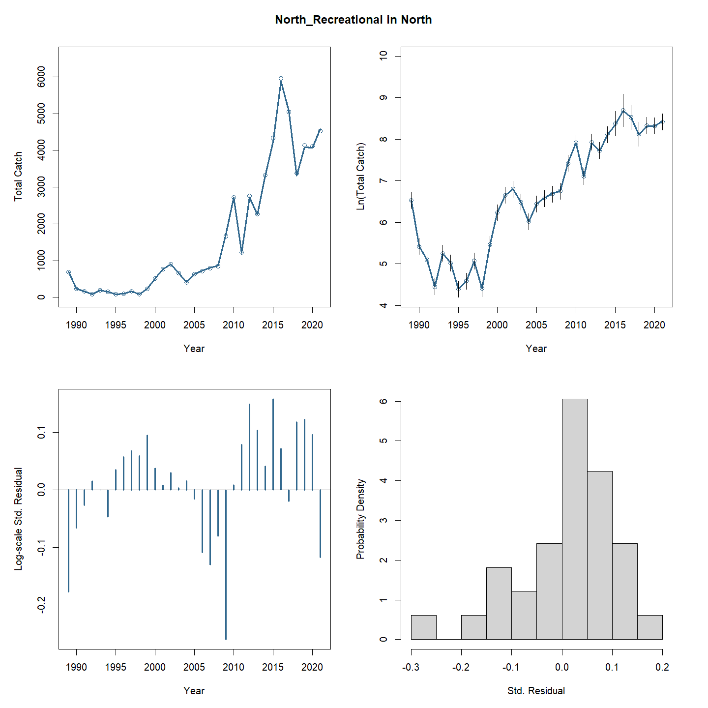
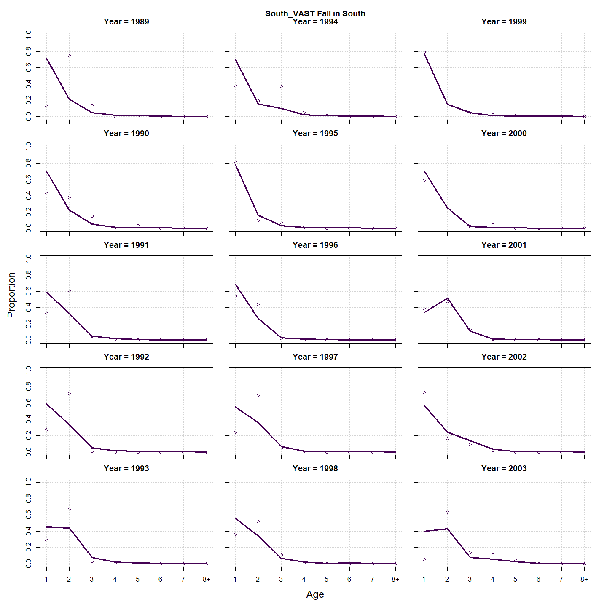
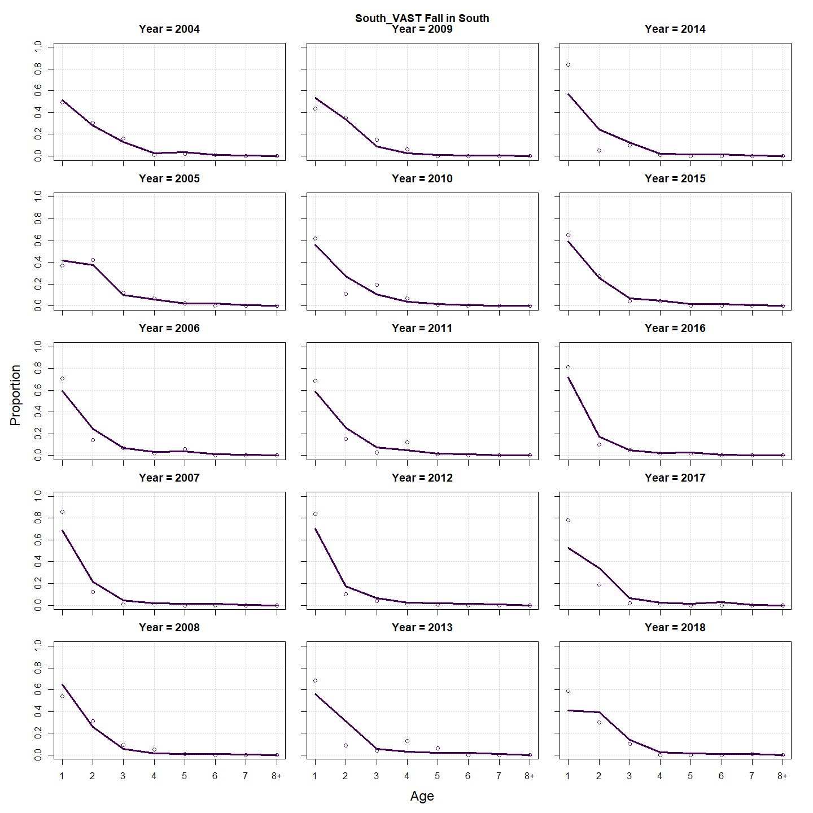
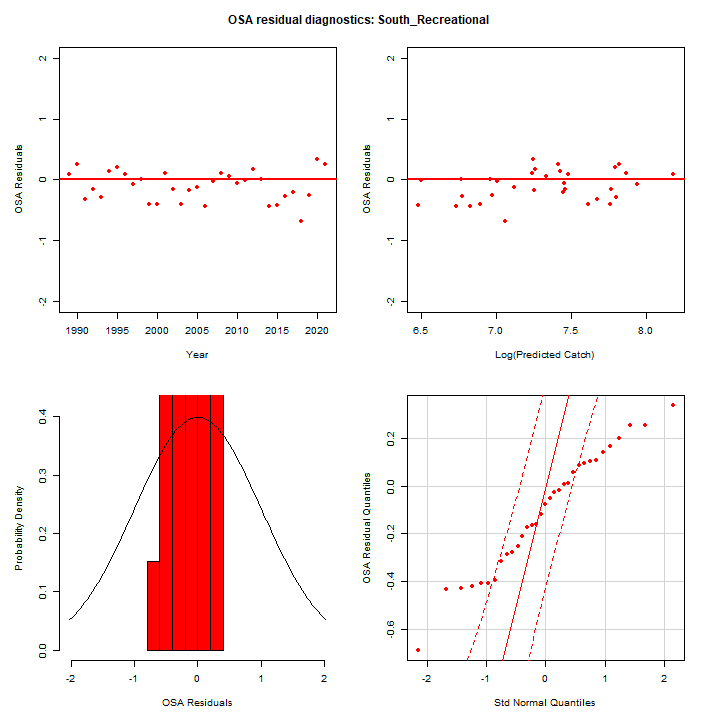
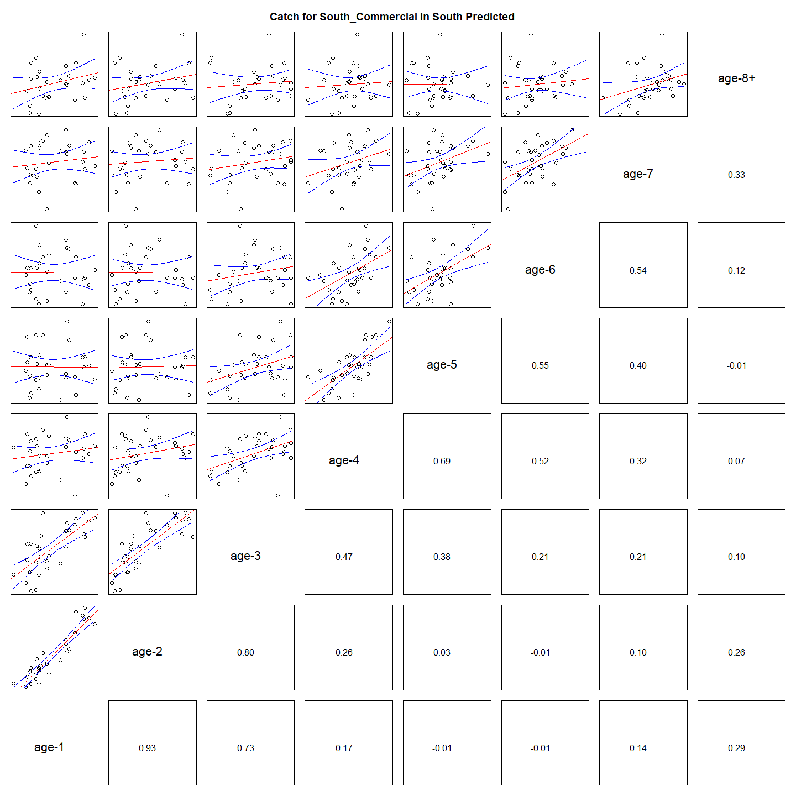

---
output:
  html_document:
    df_print: paged
    keep_md: yes
  word_document: default
  pdf_document:
    fig_caption: yes
    includes:
    keep_tex: yes
    number_sections: no
title: "WHAM figures and tables"
header-includes:
  - \usepackage{longtable}
  - \usepackage{booktabs}
  - \usepackage{caption,graphics}
  - \usepackage{makecell}
  - \usepackage{lscape}
  - \renewcommand\figurename{Fig.}
  - \captionsetup{labelsep=period, singlelinecheck=false}
  - \newcommand{\changesize}[1]{\fontsize{#1pt}{#1pt}\selectfont}
  - \renewcommand{\arraystretch}{1.5}
  - \renewcommand\theadfont{}
---

# {.tabset}

## Figures {.tabset}

### Input

### Diagnostics

### Results

### Retro

### Reference points

### Miscelaneous

## Tables {.tabset}

### Parameter estimates

<table class="table" style="margin-left: auto; margin-right: auto;">
<caption>Parameter estimates, standard errors, and confidence intervals. Rounded to 3 decimal places.</caption>
 <thead>
  <tr>
   <th style="text-align:left;">   </th>
   <th style="text-align:right;"> Estimate </th>
   <th style="text-align:right;"> Std. Error </th>
   <th style="text-align:right;"> 95\% CI lower </th>
   <th style="text-align:right;"> 95\% CI upper </th>
  </tr>
 </thead>
<tbody>
  <tr>
   <td style="text-align:left;"> BSB North Mean Recruitment </td>
   <td style="text-align:right;"> 13884.260 </td>
   <td style="text-align:right;"> 2984.082 </td>
   <td style="text-align:right;"> 9111.246 </td>
   <td style="text-align:right;"> 21157.663 </td>
  </tr>
  <tr>
   <td style="text-align:left;"> BSB North NAA $\sigma$ (age 1) </td>
   <td style="text-align:right;"> 0.985 </td>
   <td style="text-align:right;"> 0.133 </td>
   <td style="text-align:right;"> 0.757 </td>
   <td style="text-align:right;"> 1.282 </td>
  </tr>
  <tr>
   <td style="text-align:left;"> BSB North NAA $\sigma$ (age 2) </td>
   <td style="text-align:right;"> 0.381 </td>
   <td style="text-align:right;"> 0.034 </td>
   <td style="text-align:right;"> 0.320 </td>
   <td style="text-align:right;"> 0.453 </td>
  </tr>
  <tr>
   <td style="text-align:left;"> BSB South Mean Recruitment </td>
   <td style="text-align:right;"> 21915.978 </td>
   <td style="text-align:right;"> 2413.193 </td>
   <td style="text-align:right;"> 17661.764 </td>
   <td style="text-align:right;"> 27194.910 </td>
  </tr>
  <tr>
   <td style="text-align:left;"> BSB South NAA $\sigma$ (age 1) </td>
   <td style="text-align:right;"> 0.364 </td>
   <td style="text-align:right;"> 0.060 </td>
   <td style="text-align:right;"> 0.264 </td>
   <td style="text-align:right;"> 0.503 </td>
  </tr>
  <tr>
   <td style="text-align:left;"> BSB South NAA $\sigma$ (age 2) </td>
   <td style="text-align:right;"> 0.340 </td>
   <td style="text-align:right;"> 0.035 </td>
   <td style="text-align:right;"> 0.278 </td>
   <td style="text-align:right;"> 0.417 </td>
  </tr>
  <tr>
   <td style="text-align:left;"> North REC CPA fully selected q </td>
   <td style="text-align:right;"> 0.000 </td>
   <td style="text-align:right;"> 0.000 </td>
   <td style="text-align:right;"> 0.000 </td>
   <td style="text-align:right;"> 0.000 </td>
  </tr>
  <tr>
   <td style="text-align:left;"> North VAST Spring fully selected q </td>
   <td style="text-align:right;"> 0.007 </td>
   <td style="text-align:right;"> 0.001 </td>
   <td style="text-align:right;"> 0.006 </td>
   <td style="text-align:right;"> 0.009 </td>
  </tr>
  <tr>
   <td style="text-align:left;"> North VAST Fall fully selected q </td>
   <td style="text-align:right;"> 0.024 </td>
   <td style="text-align:right;"> 0.005 </td>
   <td style="text-align:right;"> 0.016 </td>
   <td style="text-align:right;"> 0.037 </td>
  </tr>
  <tr>
   <td style="text-align:left;"> South REC CPA fully selected q </td>
   <td style="text-align:right;"> 0.000 </td>
   <td style="text-align:right;"> 0.000 </td>
   <td style="text-align:right;"> 0.000 </td>
   <td style="text-align:right;"> 0.000 </td>
  </tr>
  <tr>
   <td style="text-align:left;"> South VAST Spring fully selected q </td>
   <td style="text-align:right;"> 0.018 </td>
   <td style="text-align:right;"> 0.002 </td>
   <td style="text-align:right;"> 0.015 </td>
   <td style="text-align:right;"> 0.021 </td>
  </tr>
  <tr>
   <td style="text-align:left;"> South VAST Fall fully selected q </td>
   <td style="text-align:right;"> 0.000 </td>
   <td style="text-align:right;"> 0.000 </td>
   <td style="text-align:right;"> 0.000 </td>
   <td style="text-align:right;"> 0.000 </td>
  </tr>
  <tr>
   <td style="text-align:left;"> Block 1: $a_{50}$ </td>
   <td style="text-align:right;"> 1.620 </td>
   <td style="text-align:right;"> 0.173 </td>
   <td style="text-align:right;"> 1.307 </td>
   <td style="text-align:right;"> 1.986 </td>
  </tr>
  <tr>
   <td style="text-align:left;"> Block 1: 1/slope (increasing) </td>
   <td style="text-align:right;"> 0.237 </td>
   <td style="text-align:right;"> 0.062 </td>
   <td style="text-align:right;"> 0.142 </td>
   <td style="text-align:right;"> 0.393 </td>
  </tr>
  <tr>
   <td style="text-align:left;"> Block 2: $a_{50}$ </td>
   <td style="text-align:right;"> 2.577 </td>
   <td style="text-align:right;"> 0.129 </td>
   <td style="text-align:right;"> 2.331 </td>
   <td style="text-align:right;"> 2.836 </td>
  </tr>
  <tr>
   <td style="text-align:left;"> Block 2: 1/slope (increasing) </td>
   <td style="text-align:right;"> 0.400 </td>
   <td style="text-align:right;"> 0.034 </td>
   <td style="text-align:right;"> 0.338 </td>
   <td style="text-align:right;"> 0.473 </td>
  </tr>
  <tr>
   <td style="text-align:left;"> Block 3: $a_{50}$ </td>
   <td style="text-align:right;"> 2.737 </td>
   <td style="text-align:right;"> 0.267 </td>
   <td style="text-align:right;"> 2.240 </td>
   <td style="text-align:right;"> 3.282 </td>
  </tr>
  <tr>
   <td style="text-align:left;"> Block 3: 1/slope (increasing) </td>
   <td style="text-align:right;"> 0.759 </td>
   <td style="text-align:right;"> 0.120 </td>
   <td style="text-align:right;"> 0.554 </td>
   <td style="text-align:right;"> 1.029 </td>
  </tr>
  <tr>
   <td style="text-align:left;"> Block 4: $a_{50}$ </td>
   <td style="text-align:right;"> 3.672 </td>
   <td style="text-align:right;"> 0.235 </td>
   <td style="text-align:right;"> 3.217 </td>
   <td style="text-align:right;"> 4.135 </td>
  </tr>
  <tr>
   <td style="text-align:left;"> Block 4: 1/slope (increasing) </td>
   <td style="text-align:right;"> 0.861 </td>
   <td style="text-align:right;"> 0.090 </td>
   <td style="text-align:right;"> 0.700 </td>
   <td style="text-align:right;"> 1.053 </td>
  </tr>
  <tr>
   <td style="text-align:left;"> Block 5: Selectivity for age 1 </td>
   <td style="text-align:right;"> 0.086 </td>
   <td style="text-align:right;"> 0.022 </td>
   <td style="text-align:right;"> 0.051 </td>
   <td style="text-align:right;"> 0.140 </td>
  </tr>
  <tr>
   <td style="text-align:left;"> Block 5: Selectivity for age 2 </td>
   <td style="text-align:right;"> 1.000 </td>
   <td style="text-align:right;"> -- </td>
   <td style="text-align:right;"> -- </td>
   <td style="text-align:right;"> -- </td>
  </tr>
  <tr>
   <td style="text-align:left;"> Block 5: Selectivity for age 3 </td>
   <td style="text-align:right;"> 1.000 </td>
   <td style="text-align:right;"> -- </td>
   <td style="text-align:right;"> -- </td>
   <td style="text-align:right;"> -- </td>
  </tr>
  <tr>
   <td style="text-align:left;"> Block 5: Selectivity for age 4 </td>
   <td style="text-align:right;"> 1.000 </td>
   <td style="text-align:right;"> -- </td>
   <td style="text-align:right;"> -- </td>
   <td style="text-align:right;"> -- </td>
  </tr>
  <tr>
   <td style="text-align:left;"> Block 5: Selectivity for age 5 </td>
   <td style="text-align:right;"> 1.000 </td>
   <td style="text-align:right;"> -- </td>
   <td style="text-align:right;"> -- </td>
   <td style="text-align:right;"> -- </td>
  </tr>
  <tr>
   <td style="text-align:left;"> Block 5: Selectivity for age 6 </td>
   <td style="text-align:right;"> 1.000 </td>
   <td style="text-align:right;"> -- </td>
   <td style="text-align:right;"> -- </td>
   <td style="text-align:right;"> -- </td>
  </tr>
  <tr>
   <td style="text-align:left;"> Block 5: Selectivity for age 7 </td>
   <td style="text-align:right;"> 1.000 </td>
   <td style="text-align:right;"> -- </td>
   <td style="text-align:right;"> -- </td>
   <td style="text-align:right;"> -- </td>
  </tr>
  <tr>
   <td style="text-align:left;"> Block 5: Selectivity for age 8+ </td>
   <td style="text-align:right;"> 1.000 </td>
   <td style="text-align:right;"> -- </td>
   <td style="text-align:right;"> -- </td>
   <td style="text-align:right;"> -- </td>
  </tr>
  <tr>
   <td style="text-align:left;"> Block 6: $a_{50}$ </td>
   <td style="text-align:right;"> 2.628 </td>
   <td style="text-align:right;"> 0.130 </td>
   <td style="text-align:right;"> 2.380 </td>
   <td style="text-align:right;"> 2.888 </td>
  </tr>
  <tr>
   <td style="text-align:left;"> Block 6: 1/slope (increasing) </td>
   <td style="text-align:right;"> 0.469 </td>
   <td style="text-align:right;"> 0.039 </td>
   <td style="text-align:right;"> 0.398 </td>
   <td style="text-align:right;"> 0.552 </td>
  </tr>
  <tr>
   <td style="text-align:left;"> Block 7: $a_{50}$ </td>
   <td style="text-align:right;"> 1.708 </td>
   <td style="text-align:right;"> 0.137 </td>
   <td style="text-align:right;"> 1.454 </td>
   <td style="text-align:right;"> 1.992 </td>
  </tr>
  <tr>
   <td style="text-align:left;"> Block 7: 1/slope (increasing) </td>
   <td style="text-align:right;"> 0.424 </td>
   <td style="text-align:right;"> 0.072 </td>
   <td style="text-align:right;"> 0.302 </td>
   <td style="text-align:right;"> 0.590 </td>
  </tr>
  <tr>
   <td style="text-align:left;"> Block 8: $a_{50}$ </td>
   <td style="text-align:right;"> 4.366 </td>
   <td style="text-align:right;"> 0.367 </td>
   <td style="text-align:right;"> 3.643 </td>
   <td style="text-align:right;"> 5.066 </td>
  </tr>
  <tr>
   <td style="text-align:left;"> Block 8: 1/slope (increasing) </td>
   <td style="text-align:right;"> 1.235 </td>
   <td style="text-align:right;"> 0.145 </td>
   <td style="text-align:right;"> 0.977 </td>
   <td style="text-align:right;"> 1.546 </td>
  </tr>
  <tr>
   <td style="text-align:left;"> Block 9: Selectivity for age 1 </td>
   <td style="text-align:right;"> 0.251 </td>
   <td style="text-align:right;"> 0.038 </td>
   <td style="text-align:right;"> 0.184 </td>
   <td style="text-align:right;"> 0.333 </td>
  </tr>
  <tr>
   <td style="text-align:left;"> Block 9: Selectivity for age 2 </td>
   <td style="text-align:right;"> 0.779 </td>
   <td style="text-align:right;"> 0.112 </td>
   <td style="text-align:right;"> 0.496 </td>
   <td style="text-align:right;"> 0.927 </td>
  </tr>
  <tr>
   <td style="text-align:left;"> Block 9: Selectivity for age 3 </td>
   <td style="text-align:right;"> 0.719 </td>
   <td style="text-align:right;"> 0.090 </td>
   <td style="text-align:right;"> 0.516 </td>
   <td style="text-align:right;"> 0.860 </td>
  </tr>
  <tr>
   <td style="text-align:left;"> Block 9: Selectivity for age 4 </td>
   <td style="text-align:right;"> 0.500 </td>
   <td style="text-align:right;"> -- </td>
   <td style="text-align:right;"> -- </td>
   <td style="text-align:right;"> -- </td>
  </tr>
  <tr>
   <td style="text-align:left;"> Block 9: Selectivity for age 5 </td>
   <td style="text-align:right;"> 1.000 </td>
   <td style="text-align:right;"> -- </td>
   <td style="text-align:right;"> -- </td>
   <td style="text-align:right;"> -- </td>
  </tr>
  <tr>
   <td style="text-align:left;"> Block 9: Selectivity for age 6 </td>
   <td style="text-align:right;"> 1.000 </td>
   <td style="text-align:right;"> -- </td>
   <td style="text-align:right;"> -- </td>
   <td style="text-align:right;"> -- </td>
  </tr>
  <tr>
   <td style="text-align:left;"> Block 9: Selectivity for age 7 </td>
   <td style="text-align:right;"> 1.000 </td>
   <td style="text-align:right;"> -- </td>
   <td style="text-align:right;"> -- </td>
   <td style="text-align:right;"> -- </td>
  </tr>
  <tr>
   <td style="text-align:left;"> Block 9: Selectivity for age 8+ </td>
   <td style="text-align:right;"> 1.000 </td>
   <td style="text-align:right;"> -- </td>
   <td style="text-align:right;"> -- </td>
   <td style="text-align:right;"> -- </td>
  </tr>
  <tr>
   <td style="text-align:left;"> Block 10: Selectivity for age 1 </td>
   <td style="text-align:right;"> 0.140 </td>
   <td style="text-align:right;"> 0.023 </td>
   <td style="text-align:right;"> 0.101 </td>
   <td style="text-align:right;"> 0.192 </td>
  </tr>
  <tr>
   <td style="text-align:left;"> Block 10: Selectivity for age 2 </td>
   <td style="text-align:right;"> 0.457 </td>
   <td style="text-align:right;"> 0.070 </td>
   <td style="text-align:right;"> 0.326 </td>
   <td style="text-align:right;"> 0.594 </td>
  </tr>
  <tr>
   <td style="text-align:left;"> Block 10: Selectivity for age 3 </td>
   <td style="text-align:right;"> 1.000 </td>
   <td style="text-align:right;"> -- </td>
   <td style="text-align:right;"> -- </td>
   <td style="text-align:right;"> -- </td>
  </tr>
  <tr>
   <td style="text-align:left;"> Block 10: Selectivity for age 4 </td>
   <td style="text-align:right;"> 1.000 </td>
   <td style="text-align:right;"> -- </td>
   <td style="text-align:right;"> -- </td>
   <td style="text-align:right;"> -- </td>
  </tr>
  <tr>
   <td style="text-align:left;"> Block 10: Selectivity for age 5 </td>
   <td style="text-align:right;"> 1.000 </td>
   <td style="text-align:right;"> -- </td>
   <td style="text-align:right;"> -- </td>
   <td style="text-align:right;"> -- </td>
  </tr>
  <tr>
   <td style="text-align:left;"> Block 10: Selectivity for age 6 </td>
   <td style="text-align:right;"> 0.773 </td>
   <td style="text-align:right;"> 0.101 </td>
   <td style="text-align:right;"> 0.523 </td>
   <td style="text-align:right;"> 0.913 </td>
  </tr>
  <tr>
   <td style="text-align:left;"> Block 10: Selectivity for age 7 </td>
   <td style="text-align:right;"> 0.922 </td>
   <td style="text-align:right;"> 0.148 </td>
   <td style="text-align:right;"> 0.176 </td>
   <td style="text-align:right;"> 0.998 </td>
  </tr>
  <tr>
   <td style="text-align:left;"> Block 10: Selectivity for age 8+ </td>
   <td style="text-align:right;"> 0.877 </td>
   <td style="text-align:right;"> 0.097 </td>
   <td style="text-align:right;"> 0.551 </td>
   <td style="text-align:right;"> 0.976 </td>
  </tr>
  <tr>
   <td style="text-align:left;"> Block 11: Selectivity for age 1 </td>
   <td style="text-align:right;"> 0.107 </td>
   <td style="text-align:right;"> 0.027 </td>
   <td style="text-align:right;"> 0.064 </td>
   <td style="text-align:right;"> 0.171 </td>
  </tr>
  <tr>
   <td style="text-align:left;"> Block 11: Selectivity for age 2 </td>
   <td style="text-align:right;"> 0.348 </td>
   <td style="text-align:right;"> 0.085 </td>
   <td style="text-align:right;"> 0.204 </td>
   <td style="text-align:right;"> 0.528 </td>
  </tr>
  <tr>
   <td style="text-align:left;"> Block 11: Selectivity for age 3 </td>
   <td style="text-align:right;"> 0.364 </td>
   <td style="text-align:right;"> 0.085 </td>
   <td style="text-align:right;"> 0.218 </td>
   <td style="text-align:right;"> 0.541 </td>
  </tr>
  <tr>
   <td style="text-align:left;"> Block 11: Selectivity for age 4 </td>
   <td style="text-align:right;"> 0.484 </td>
   <td style="text-align:right;"> 0.109 </td>
   <td style="text-align:right;"> 0.286 </td>
   <td style="text-align:right;"> 0.688 </td>
  </tr>
  <tr>
   <td style="text-align:left;"> Block 11: Selectivity for age 5 </td>
   <td style="text-align:right;"> 0.532 </td>
   <td style="text-align:right;"> 0.113 </td>
   <td style="text-align:right;"> 0.319 </td>
   <td style="text-align:right;"> 0.734 </td>
  </tr>
  <tr>
   <td style="text-align:left;"> Block 11: Selectivity for age 6 </td>
   <td style="text-align:right;"> 0.782 </td>
   <td style="text-align:right;"> 0.154 </td>
   <td style="text-align:right;"> 0.378 </td>
   <td style="text-align:right;"> 0.955 </td>
  </tr>
  <tr>
   <td style="text-align:left;"> Block 11: Selectivity for age 7 </td>
   <td style="text-align:right;"> 1.000 </td>
   <td style="text-align:right;"> -- </td>
   <td style="text-align:right;"> -- </td>
   <td style="text-align:right;"> -- </td>
  </tr>
  <tr>
   <td style="text-align:left;"> Block 11: Selectivity for age 8+ </td>
   <td style="text-align:right;"> 0.716 </td>
   <td style="text-align:right;"> 0.165 </td>
   <td style="text-align:right;"> 0.339 </td>
   <td style="text-align:right;"> 0.925 </td>
  </tr>
  <tr>
   <td style="text-align:left;"> Block 12: Selectivity for age 1 </td>
   <td style="text-align:right;"> 0.300 </td>
   <td style="text-align:right;"> 0.041 </td>
   <td style="text-align:right;"> 0.226 </td>
   <td style="text-align:right;"> 0.386 </td>
  </tr>
  <tr>
   <td style="text-align:left;"> Block 12: Selectivity for age 2 </td>
   <td style="text-align:right;"> 0.632 </td>
   <td style="text-align:right;"> 0.079 </td>
   <td style="text-align:right;"> 0.470 </td>
   <td style="text-align:right;"> 0.769 </td>
  </tr>
  <tr>
   <td style="text-align:left;"> Block 12: Selectivity for age 3 </td>
   <td style="text-align:right;"> 0.708 </td>
   <td style="text-align:right;"> 0.081 </td>
   <td style="text-align:right;"> 0.530 </td>
   <td style="text-align:right;"> 0.840 </td>
  </tr>
  <tr>
   <td style="text-align:left;"> Block 12: Selectivity for age 4 </td>
   <td style="text-align:right;"> 0.496 </td>
   <td style="text-align:right;"> 0.049 </td>
   <td style="text-align:right;"> 0.400 </td>
   <td style="text-align:right;"> 0.592 </td>
  </tr>
  <tr>
   <td style="text-align:left;"> Block 12: Selectivity for age 5 </td>
   <td style="text-align:right;"> 0.500 </td>
   <td style="text-align:right;"> -- </td>
   <td style="text-align:right;"> -- </td>
   <td style="text-align:right;"> -- </td>
  </tr>
  <tr>
   <td style="text-align:left;"> Block 12: Selectivity for age 6 </td>
   <td style="text-align:right;"> 0.500 </td>
   <td style="text-align:right;"> -- </td>
   <td style="text-align:right;"> -- </td>
   <td style="text-align:right;"> -- </td>
  </tr>
  <tr>
   <td style="text-align:left;"> Block 12: Selectivity for age 7 </td>
   <td style="text-align:right;"> 1.000 </td>
   <td style="text-align:right;"> -- </td>
   <td style="text-align:right;"> -- </td>
   <td style="text-align:right;"> -- </td>
  </tr>
  <tr>
   <td style="text-align:left;"> Block 12: Selectivity for age 8+ </td>
   <td style="text-align:right;"> 1.000 </td>
   <td style="text-align:right;"> -- </td>
   <td style="text-align:right;"> -- </td>
   <td style="text-align:right;"> -- </td>
  </tr>
  <tr>
   <td style="text-align:left;"> Block 13: Selectivity for age 1 </td>
   <td style="text-align:right;"> 0.269 </td>
   <td style="text-align:right;"> 0.042 </td>
   <td style="text-align:right;"> 0.195 </td>
   <td style="text-align:right;"> 0.358 </td>
  </tr>
  <tr>
   <td style="text-align:left;"> Block 13: Selectivity for age 2 </td>
   <td style="text-align:right;"> 1.000 </td>
   <td style="text-align:right;"> -- </td>
   <td style="text-align:right;"> -- </td>
   <td style="text-align:right;"> -- </td>
  </tr>
  <tr>
   <td style="text-align:left;"> Block 13: Selectivity for age 3 </td>
   <td style="text-align:right;"> 1.000 </td>
   <td style="text-align:right;"> -- </td>
   <td style="text-align:right;"> -- </td>
   <td style="text-align:right;"> -- </td>
  </tr>
  <tr>
   <td style="text-align:left;"> Block 13: Selectivity for age 4 </td>
   <td style="text-align:right;"> 0.475 </td>
   <td style="text-align:right;"> 0.062 </td>
   <td style="text-align:right;"> 0.358 </td>
   <td style="text-align:right;"> 0.594 </td>
  </tr>
  <tr>
   <td style="text-align:left;"> Block 13: Selectivity for age 5 </td>
   <td style="text-align:right;"> 0.481 </td>
   <td style="text-align:right;"> 0.065 </td>
   <td style="text-align:right;"> 0.357 </td>
   <td style="text-align:right;"> 0.607 </td>
  </tr>
  <tr>
   <td style="text-align:left;"> Block 13: Selectivity for age 6 </td>
   <td style="text-align:right;"> 0.664 </td>
   <td style="text-align:right;"> 0.109 </td>
   <td style="text-align:right;"> 0.432 </td>
   <td style="text-align:right;"> 0.837 </td>
  </tr>
  <tr>
   <td style="text-align:left;"> Block 13: Selectivity for age 7 </td>
   <td style="text-align:right;"> 0.925 </td>
   <td style="text-align:right;"> 0.241 </td>
   <td style="text-align:right;"> 0.014 </td>
   <td style="text-align:right;"> 1.000 </td>
  </tr>
  <tr>
   <td style="text-align:left;"> Block 13: Selectivity for age 8+ </td>
   <td style="text-align:right;"> 0.971 </td>
   <td style="text-align:right;"> 0.341 </td>
   <td style="text-align:right;"> 0.000 </td>
   <td style="text-align:right;"> 1.000 </td>
  </tr>
  <tr>
   <td style="text-align:left;"> Block 14: Selectivity for age 1 </td>
   <td style="text-align:right;"> 1.000 </td>
   <td style="text-align:right;"> -- </td>
   <td style="text-align:right;"> -- </td>
   <td style="text-align:right;"> -- </td>
  </tr>
  <tr>
   <td style="text-align:left;"> Block 14: Selectivity for age 2 </td>
   <td style="text-align:right;"> 0.835 </td>
   <td style="text-align:right;"> 0.184 </td>
   <td style="text-align:right;"> 0.271 </td>
   <td style="text-align:right;"> 0.986 </td>
  </tr>
  <tr>
   <td style="text-align:left;"> Block 14: Selectivity for age 3 </td>
   <td style="text-align:right;"> 0.444 </td>
   <td style="text-align:right;"> 0.096 </td>
   <td style="text-align:right;"> 0.272 </td>
   <td style="text-align:right;"> 0.631 </td>
  </tr>
  <tr>
   <td style="text-align:left;"> Block 14: Selectivity for age 4 </td>
   <td style="text-align:right;"> 0.342 </td>
   <td style="text-align:right;"> 0.068 </td>
   <td style="text-align:right;"> 0.223 </td>
   <td style="text-align:right;"> 0.484 </td>
  </tr>
  <tr>
   <td style="text-align:left;"> Block 14: Selectivity for age 5 </td>
   <td style="text-align:right;"> 0.485 </td>
   <td style="text-align:right;"> 0.101 </td>
   <td style="text-align:right;"> 0.298 </td>
   <td style="text-align:right;"> 0.676 </td>
  </tr>
  <tr>
   <td style="text-align:left;"> Block 14: Selectivity for age 6 </td>
   <td style="text-align:right;"> 0.728 </td>
   <td style="text-align:right;"> 0.334 </td>
   <td style="text-align:right;"> 0.090 </td>
   <td style="text-align:right;"> 0.986 </td>
  </tr>
  <tr>
   <td style="text-align:left;"> Block 14: Selectivity for age 7 </td>
   <td style="text-align:right;"> 0.724 </td>
   <td style="text-align:right;"> 0.413 </td>
   <td style="text-align:right;"> 0.044 </td>
   <td style="text-align:right;"> 0.993 </td>
  </tr>
  <tr>
   <td style="text-align:left;"> Block 14: Selectivity for age 8+ </td>
   <td style="text-align:right;"> 0.000 </td>
   <td style="text-align:right;"> -- </td>
   <td style="text-align:right;"> -- </td>
   <td style="text-align:right;"> -- </td>
  </tr>
  <tr>
   <td style="text-align:left;"> North Commercial in North age comp, logistic-normal: $\sigma$ </td>
   <td style="text-align:right;"> 3.880 </td>
   <td style="text-align:right;"> 0.261 </td>
   <td style="text-align:right;"> 3.401 </td>
   <td style="text-align:right;"> 4.426 </td>
  </tr>
  <tr>
   <td style="text-align:left;"> North Recreational in North age comp, logistic-normal: $\sigma$ </td>
   <td style="text-align:right;"> 3.356 </td>
   <td style="text-align:right;"> 0.241 </td>
   <td style="text-align:right;"> 2.915 </td>
   <td style="text-align:right;"> 3.864 </td>
  </tr>
  <tr>
   <td style="text-align:left;"> South Commercial in South age comp, logistic-normal: $\sigma$ </td>
   <td style="text-align:right;"> 3.456 </td>
   <td style="text-align:right;"> 0.226 </td>
   <td style="text-align:right;"> 3.041 </td>
   <td style="text-align:right;"> 3.928 </td>
  </tr>
  <tr>
   <td style="text-align:left;"> South Recreational in South age comp, logistic-normal: $\sigma$ </td>
   <td style="text-align:right;"> 3.462 </td>
   <td style="text-align:right;"> 0.281 </td>
   <td style="text-align:right;"> 2.953 </td>
   <td style="text-align:right;"> 4.059 </td>
  </tr>
  <tr>
   <td style="text-align:left;"> North REC CPA in North age comp, logistic-normal: $\sigma$ </td>
   <td style="text-align:right;"> 3.238 </td>
   <td style="text-align:right;"> 0.243 </td>
   <td style="text-align:right;"> 2.796 </td>
   <td style="text-align:right;"> 3.750 </td>
  </tr>
  <tr>
   <td style="text-align:left;"> North VAST Spring in North age comp, logistic-normal: $\sigma$ </td>
   <td style="text-align:right;"> 4.877 </td>
   <td style="text-align:right;"> 0.312 </td>
   <td style="text-align:right;"> 4.301 </td>
   <td style="text-align:right;"> 5.530 </td>
  </tr>
  <tr>
   <td style="text-align:left;"> North VAST Fall in North age comp, logistic-normal: $\sigma$ </td>
   <td style="text-align:right;"> 5.899 </td>
   <td style="text-align:right;"> 0.372 </td>
   <td style="text-align:right;"> 5.213 </td>
   <td style="text-align:right;"> 6.675 </td>
  </tr>
  <tr>
   <td style="text-align:left;"> South REC CPA in South age comp, logistic-normal: $\sigma$ </td>
   <td style="text-align:right;"> 3.539 </td>
   <td style="text-align:right;"> 0.276 </td>
   <td style="text-align:right;"> 3.037 </td>
   <td style="text-align:right;"> 4.124 </td>
  </tr>
  <tr>
   <td style="text-align:left;"> South VAST Spring in South age comp, logistic-normal: $\sigma$ </td>
   <td style="text-align:right;"> 4.911 </td>
   <td style="text-align:right;"> 0.387 </td>
   <td style="text-align:right;"> 4.208 </td>
   <td style="text-align:right;"> 5.731 </td>
  </tr>
  <tr>
   <td style="text-align:left;"> South VAST Fall in South age comp, logistic-normal: $\sigma$ </td>
   <td style="text-align:right;"> 6.292 </td>
   <td style="text-align:right;"> 0.471 </td>
   <td style="text-align:right;"> 5.434 </td>
   <td style="text-align:right;"> 7.285 </td>
  </tr>
  <tr>
   <td style="text-align:left;"> North REC CPA log-index observation SD scalar </td>
   <td style="text-align:right;"> 9.465 </td>
   <td style="text-align:right;"> 1.341 </td>
   <td style="text-align:right;"> 7.171 </td>
   <td style="text-align:right;"> 12.494 </td>
  </tr>
  <tr>
   <td style="text-align:left;"> South REC CPA log-index observation SD scalar </td>
   <td style="text-align:right;"> 3.848 </td>
   <td style="text-align:right;"> 0.955 </td>
   <td style="text-align:right;"> 2.366 </td>
   <td style="text-align:right;"> 6.258 </td>
  </tr>
</tbody>
</table>

### Abundance at age

<table class="table" style="margin-left: auto; margin-right: auto;">
<caption>Abundance at age (1000s) for BSB North in North.</caption>
 <thead>
  <tr>
   <th style="text-align:left;">   </th>
   <th style="text-align:right;"> 1 </th>
   <th style="text-align:right;"> 2 </th>
   <th style="text-align:right;"> 3 </th>
   <th style="text-align:right;"> 4 </th>
   <th style="text-align:right;"> 5 </th>
   <th style="text-align:right;"> 6 </th>
   <th style="text-align:right;"> 7 </th>
   <th style="text-align:right;"> 8+ </th>
  </tr>
 </thead>
<tbody>
  <tr>
   <td style="text-align:left;"> 1989 </td>
   <td style="text-align:right;"> 4906 </td>
   <td style="text-align:right;"> 2839 </td>
   <td style="text-align:right;"> 1506 </td>
   <td style="text-align:right;"> 754 </td>
   <td style="text-align:right;"> 369 </td>
   <td style="text-align:right;"> 179 </td>
   <td style="text-align:right;"> 86 </td>
   <td style="text-align:right;"> 81 </td>
  </tr>
  <tr>
   <td style="text-align:left;"> 1990 </td>
   <td style="text-align:right;"> 2514 </td>
   <td style="text-align:right;"> 2029 </td>
   <td style="text-align:right;"> 1693 </td>
   <td style="text-align:right;"> 417 </td>
   <td style="text-align:right;"> 169 </td>
   <td style="text-align:right;"> 94 </td>
   <td style="text-align:right;"> 61 </td>
   <td style="text-align:right;"> 49 </td>
  </tr>
  <tr>
   <td style="text-align:left;"> 1991 </td>
   <td style="text-align:right;"> 3198 </td>
   <td style="text-align:right;"> 2453 </td>
   <td style="text-align:right;"> 734 </td>
   <td style="text-align:right;"> 673 </td>
   <td style="text-align:right;"> 135 </td>
   <td style="text-align:right;"> 40 </td>
   <td style="text-align:right;"> 49 </td>
   <td style="text-align:right;"> 40 </td>
  </tr>
  <tr>
   <td style="text-align:left;"> 1992 </td>
   <td style="text-align:right;"> 2432 </td>
   <td style="text-align:right;"> 3218 </td>
   <td style="text-align:right;"> 824 </td>
   <td style="text-align:right;"> 194 </td>
   <td style="text-align:right;"> 192 </td>
   <td style="text-align:right;"> 66 </td>
   <td style="text-align:right;"> 17 </td>
   <td style="text-align:right;"> 82 </td>
  </tr>
  <tr>
   <td style="text-align:left;"> 1993 </td>
   <td style="text-align:right;"> 1478 </td>
   <td style="text-align:right;"> 2205 </td>
   <td style="text-align:right;"> 837 </td>
   <td style="text-align:right;"> 371 </td>
   <td style="text-align:right;"> 84 </td>
   <td style="text-align:right;"> 137 </td>
   <td style="text-align:right;"> 34 </td>
   <td style="text-align:right;"> 40 </td>
  </tr>
  <tr>
   <td style="text-align:left;"> 1994 </td>
   <td style="text-align:right;"> 6635 </td>
   <td style="text-align:right;"> 868 </td>
   <td style="text-align:right;"> 1327 </td>
   <td style="text-align:right;"> 290 </td>
   <td style="text-align:right;"> 154 </td>
   <td style="text-align:right;"> 34 </td>
   <td style="text-align:right;"> 65 </td>
   <td style="text-align:right;"> 35 </td>
  </tr>
  <tr>
   <td style="text-align:left;"> 1995 </td>
   <td style="text-align:right;"> 14174 </td>
   <td style="text-align:right;"> 2876 </td>
   <td style="text-align:right;"> 702 </td>
   <td style="text-align:right;"> 272 </td>
   <td style="text-align:right;"> 86 </td>
   <td style="text-align:right;"> 68 </td>
   <td style="text-align:right;"> 15 </td>
   <td style="text-align:right;"> 46 </td>
  </tr>
  <tr>
   <td style="text-align:left;"> 1996 </td>
   <td style="text-align:right;"> 13889 </td>
   <td style="text-align:right;"> 5028 </td>
   <td style="text-align:right;"> 1000 </td>
   <td style="text-align:right;"> 270 </td>
   <td style="text-align:right;"> 118 </td>
   <td style="text-align:right;"> 71 </td>
   <td style="text-align:right;"> 41 </td>
   <td style="text-align:right;"> 54 </td>
  </tr>
  <tr>
   <td style="text-align:left;"> 1997 </td>
   <td style="text-align:right;"> 4628 </td>
   <td style="text-align:right;"> 6970 </td>
   <td style="text-align:right;"> 1907 </td>
   <td style="text-align:right;"> 297 </td>
   <td style="text-align:right;"> 149 </td>
   <td style="text-align:right;"> 77 </td>
   <td style="text-align:right;"> 39 </td>
   <td style="text-align:right;"> 71 </td>
  </tr>
  <tr>
   <td style="text-align:left;"> 1998 </td>
   <td style="text-align:right;"> 3328 </td>
   <td style="text-align:right;"> 3657 </td>
   <td style="text-align:right;"> 1816 </td>
   <td style="text-align:right;"> 825 </td>
   <td style="text-align:right;"> 145 </td>
   <td style="text-align:right;"> 169 </td>
   <td style="text-align:right;"> 53 </td>
   <td style="text-align:right;"> 79 </td>
  </tr>
  <tr>
   <td style="text-align:left;"> 1999 </td>
   <td style="text-align:right;"> 32574 </td>
   <td style="text-align:right;"> 4326 </td>
   <td style="text-align:right;"> 2340 </td>
   <td style="text-align:right;"> 852 </td>
   <td style="text-align:right;"> 376 </td>
   <td style="text-align:right;"> 119 </td>
   <td style="text-align:right;"> 93 </td>
   <td style="text-align:right;"> 101 </td>
  </tr>
  <tr>
   <td style="text-align:left;"> 2000 </td>
   <td style="text-align:right;"> 43430 </td>
   <td style="text-align:right;"> 24284 </td>
   <td style="text-align:right;"> 2308 </td>
   <td style="text-align:right;"> 1599 </td>
   <td style="text-align:right;"> 388 </td>
   <td style="text-align:right;"> 308 </td>
   <td style="text-align:right;"> 56 </td>
   <td style="text-align:right;"> 108 </td>
  </tr>
  <tr>
   <td style="text-align:left;"> 2001 </td>
   <td style="text-align:right;"> 15892 </td>
   <td style="text-align:right;"> 13512 </td>
   <td style="text-align:right;"> 8398 </td>
   <td style="text-align:right;"> 1173 </td>
   <td style="text-align:right;"> 627 </td>
   <td style="text-align:right;"> 272 </td>
   <td style="text-align:right;"> 242 </td>
   <td style="text-align:right;"> 88 </td>
  </tr>
  <tr>
   <td style="text-align:left;"> 2002 </td>
   <td style="text-align:right;"> 38274 </td>
   <td style="text-align:right;"> 13658 </td>
   <td style="text-align:right;"> 9703 </td>
   <td style="text-align:right;"> 6088 </td>
   <td style="text-align:right;"> 457 </td>
   <td style="text-align:right;"> 254 </td>
   <td style="text-align:right;"> 188 </td>
   <td style="text-align:right;"> 162 </td>
  </tr>
  <tr>
   <td style="text-align:left;"> 2003 </td>
   <td style="text-align:right;"> 9256 </td>
   <td style="text-align:right;"> 17699 </td>
   <td style="text-align:right;"> 5873 </td>
   <td style="text-align:right;"> 6116 </td>
   <td style="text-align:right;"> 2564 </td>
   <td style="text-align:right;"> 254 </td>
   <td style="text-align:right;"> 156 </td>
   <td style="text-align:right;"> 175 </td>
  </tr>
  <tr>
   <td style="text-align:left;"> 2004 </td>
   <td style="text-align:right;"> 8877 </td>
   <td style="text-align:right;"> 6866 </td>
   <td style="text-align:right;"> 10000 </td>
   <td style="text-align:right;"> 2713 </td>
   <td style="text-align:right;"> 3356 </td>
   <td style="text-align:right;"> 898 </td>
   <td style="text-align:right;"> 143 </td>
   <td style="text-align:right;"> 162 </td>
  </tr>
  <tr>
   <td style="text-align:left;"> 2005 </td>
   <td style="text-align:right;"> 19166 </td>
   <td style="text-align:right;"> 7043 </td>
   <td style="text-align:right;"> 3407 </td>
   <td style="text-align:right;"> 6362 </td>
   <td style="text-align:right;"> 1712 </td>
   <td style="text-align:right;"> 1659 </td>
   <td style="text-align:right;"> 309 </td>
   <td style="text-align:right;"> 162 </td>
  </tr>
  <tr>
   <td style="text-align:left;"> 2006 </td>
   <td style="text-align:right;"> 24090 </td>
   <td style="text-align:right;"> 11281 </td>
   <td style="text-align:right;"> 3097 </td>
   <td style="text-align:right;"> 2204 </td>
   <td style="text-align:right;"> 2794 </td>
   <td style="text-align:right;"> 551 </td>
   <td style="text-align:right;"> 540 </td>
   <td style="text-align:right;"> 269 </td>
  </tr>
  <tr>
   <td style="text-align:left;"> 2007 </td>
   <td style="text-align:right;"> 17850 </td>
   <td style="text-align:right;"> 13538 </td>
   <td style="text-align:right;"> 4616 </td>
   <td style="text-align:right;"> 1407 </td>
   <td style="text-align:right;"> 873 </td>
   <td style="text-align:right;"> 902 </td>
   <td style="text-align:right;"> 350 </td>
   <td style="text-align:right;"> 283 </td>
  </tr>
  <tr>
   <td style="text-align:left;"> 2008 </td>
   <td style="text-align:right;"> 29466 </td>
   <td style="text-align:right;"> 15556 </td>
   <td style="text-align:right;"> 9231 </td>
   <td style="text-align:right;"> 2503 </td>
   <td style="text-align:right;"> 520 </td>
   <td style="text-align:right;"> 370 </td>
   <td style="text-align:right;"> 354 </td>
   <td style="text-align:right;"> 245 </td>
  </tr>
  <tr>
   <td style="text-align:left;"> 2009 </td>
   <td style="text-align:right;"> 24245 </td>
   <td style="text-align:right;"> 14996 </td>
   <td style="text-align:right;"> 7788 </td>
   <td style="text-align:right;"> 4486 </td>
   <td style="text-align:right;"> 846 </td>
   <td style="text-align:right;"> 237 </td>
   <td style="text-align:right;"> 214 </td>
   <td style="text-align:right;"> 171 </td>
  </tr>
  <tr>
   <td style="text-align:left;"> 2010 </td>
   <td style="text-align:right;"> 11042 </td>
   <td style="text-align:right;"> 12301 </td>
   <td style="text-align:right;"> 9787 </td>
   <td style="text-align:right;"> 4525 </td>
   <td style="text-align:right;"> 1733 </td>
   <td style="text-align:right;"> 322 </td>
   <td style="text-align:right;"> 115 </td>
   <td style="text-align:right;"> 194 </td>
  </tr>
  <tr>
   <td style="text-align:left;"> 2011 </td>
   <td style="text-align:right;"> 17494 </td>
   <td style="text-align:right;"> 8791 </td>
   <td style="text-align:right;"> 6029 </td>
   <td style="text-align:right;"> 4951 </td>
   <td style="text-align:right;"> 1632 </td>
   <td style="text-align:right;"> 592 </td>
   <td style="text-align:right;"> 111 </td>
   <td style="text-align:right;"> 160 </td>
  </tr>
  <tr>
   <td style="text-align:left;"> 2012 </td>
   <td style="text-align:right;"> 77804 </td>
   <td style="text-align:right;"> 15792 </td>
   <td style="text-align:right;"> 9787 </td>
   <td style="text-align:right;"> 4955 </td>
   <td style="text-align:right;"> 2990 </td>
   <td style="text-align:right;"> 950 </td>
   <td style="text-align:right;"> 474 </td>
   <td style="text-align:right;"> 178 </td>
  </tr>
  <tr>
   <td style="text-align:left;"> 2013 </td>
   <td style="text-align:right;"> 27693 </td>
   <td style="text-align:right;"> 42625 </td>
   <td style="text-align:right;"> 7932 </td>
   <td style="text-align:right;"> 6203 </td>
   <td style="text-align:right;"> 2770 </td>
   <td style="text-align:right;"> 1208 </td>
   <td style="text-align:right;"> 496 </td>
   <td style="text-align:right;"> 365 </td>
  </tr>
  <tr>
   <td style="text-align:left;"> 2014 </td>
   <td style="text-align:right;"> 12893 </td>
   <td style="text-align:right;"> 16374 </td>
   <td style="text-align:right;"> 40899 </td>
   <td style="text-align:right;"> 5897 </td>
   <td style="text-align:right;"> 2938 </td>
   <td style="text-align:right;"> 1342 </td>
   <td style="text-align:right;"> 860 </td>
   <td style="text-align:right;"> 467 </td>
  </tr>
  <tr>
   <td style="text-align:left;"> 2015 </td>
   <td style="text-align:right;"> 17270 </td>
   <td style="text-align:right;"> 11861 </td>
   <td style="text-align:right;"> 11055 </td>
   <td style="text-align:right;"> 25980 </td>
   <td style="text-align:right;"> 3032 </td>
   <td style="text-align:right;"> 1590 </td>
   <td style="text-align:right;"> 719 </td>
   <td style="text-align:right;"> 733 </td>
  </tr>
  <tr>
   <td style="text-align:left;"> 2016 </td>
   <td style="text-align:right;"> 54766 </td>
   <td style="text-align:right;"> 18522 </td>
   <td style="text-align:right;"> 7056 </td>
   <td style="text-align:right;"> 7550 </td>
   <td style="text-align:right;"> 28053 </td>
   <td style="text-align:right;"> 1867 </td>
   <td style="text-align:right;"> 1050 </td>
   <td style="text-align:right;"> 822 </td>
  </tr>
  <tr>
   <td style="text-align:left;"> 2017 </td>
   <td style="text-align:right;"> 23501 </td>
   <td style="text-align:right;"> 51422 </td>
   <td style="text-align:right;"> 9369 </td>
   <td style="text-align:right;"> 4691 </td>
   <td style="text-align:right;"> 5146 </td>
   <td style="text-align:right;"> 16894 </td>
   <td style="text-align:right;"> 1003 </td>
   <td style="text-align:right;"> 882 </td>
  </tr>
  <tr>
   <td style="text-align:left;"> 2018 </td>
   <td style="text-align:right;"> 8673 </td>
   <td style="text-align:right;"> 20339 </td>
   <td style="text-align:right;"> 25772 </td>
   <td style="text-align:right;"> 5432 </td>
   <td style="text-align:right;"> 2419 </td>
   <td style="text-align:right;"> 2850 </td>
   <td style="text-align:right;"> 8283 </td>
   <td style="text-align:right;"> 997 </td>
  </tr>
  <tr>
   <td style="text-align:left;"> 2019 </td>
   <td style="text-align:right;"> 31229 </td>
   <td style="text-align:right;"> 6854 </td>
   <td style="text-align:right;"> 13488 </td>
   <td style="text-align:right;"> 22808 </td>
   <td style="text-align:right;"> 3221 </td>
   <td style="text-align:right;"> 1694 </td>
   <td style="text-align:right;"> 1487 </td>
   <td style="text-align:right;"> 5402 </td>
  </tr>
  <tr>
   <td style="text-align:left;"> 2020 </td>
   <td style="text-align:right;"> 38081 </td>
   <td style="text-align:right;"> 24553 </td>
   <td style="text-align:right;"> 3813 </td>
   <td style="text-align:right;"> 8207 </td>
   <td style="text-align:right;"> 13803 </td>
   <td style="text-align:right;"> 2030 </td>
   <td style="text-align:right;"> 991 </td>
   <td style="text-align:right;"> 3775 </td>
  </tr>
  <tr>
   <td style="text-align:left;"> 2021 </td>
   <td style="text-align:right;"> 18998 </td>
   <td style="text-align:right;"> 25554 </td>
   <td style="text-align:right;"> 21243 </td>
   <td style="text-align:right;"> 2646 </td>
   <td style="text-align:right;"> 4067 </td>
   <td style="text-align:right;"> 7866 </td>
   <td style="text-align:right;"> 990 </td>
   <td style="text-align:right;"> 2300 </td>
  </tr>
</tbody>
</table>

<table class="table" style="margin-left: auto; margin-right: auto;">
<caption>Abundance at age (1000s) for BSB North in South.</caption>
 <thead>
  <tr>
   <th style="text-align:left;">   </th>
   <th style="text-align:right;"> 1 </th>
   <th style="text-align:right;"> 2 </th>
   <th style="text-align:right;"> 3 </th>
   <th style="text-align:right;"> 4 </th>
   <th style="text-align:right;"> 5 </th>
   <th style="text-align:right;"> 6 </th>
   <th style="text-align:right;"> 7 </th>
   <th style="text-align:right;"> 8+ </th>
  </tr>
 </thead>
<tbody>
  <tr>
   <td style="text-align:left;"> 1989 </td>
   <td style="text-align:right;"> 0 </td>
   <td style="text-align:right;"> 0 </td>
   <td style="text-align:right;"> 0 </td>
   <td style="text-align:right;"> 0 </td>
   <td style="text-align:right;"> 0 </td>
   <td style="text-align:right;"> 0 </td>
   <td style="text-align:right;"> 0 </td>
   <td style="text-align:right;"> 0 </td>
  </tr>
  <tr>
   <td style="text-align:left;"> 1990 </td>
   <td style="text-align:right;"> 0 </td>
   <td style="text-align:right;"> 0 </td>
   <td style="text-align:right;"> 0 </td>
   <td style="text-align:right;"> 0 </td>
   <td style="text-align:right;"> 0 </td>
   <td style="text-align:right;"> 0 </td>
   <td style="text-align:right;"> 0 </td>
   <td style="text-align:right;"> 0 </td>
  </tr>
  <tr>
   <td style="text-align:left;"> 1991 </td>
   <td style="text-align:right;"> 0 </td>
   <td style="text-align:right;"> 0 </td>
   <td style="text-align:right;"> 0 </td>
   <td style="text-align:right;"> 0 </td>
   <td style="text-align:right;"> 0 </td>
   <td style="text-align:right;"> 0 </td>
   <td style="text-align:right;"> 0 </td>
   <td style="text-align:right;"> 0 </td>
  </tr>
  <tr>
   <td style="text-align:left;"> 1992 </td>
   <td style="text-align:right;"> 0 </td>
   <td style="text-align:right;"> 0 </td>
   <td style="text-align:right;"> 0 </td>
   <td style="text-align:right;"> 0 </td>
   <td style="text-align:right;"> 0 </td>
   <td style="text-align:right;"> 0 </td>
   <td style="text-align:right;"> 0 </td>
   <td style="text-align:right;"> 0 </td>
  </tr>
  <tr>
   <td style="text-align:left;"> 1993 </td>
   <td style="text-align:right;"> 0 </td>
   <td style="text-align:right;"> 0 </td>
   <td style="text-align:right;"> 0 </td>
   <td style="text-align:right;"> 0 </td>
   <td style="text-align:right;"> 0 </td>
   <td style="text-align:right;"> 0 </td>
   <td style="text-align:right;"> 0 </td>
   <td style="text-align:right;"> 0 </td>
  </tr>
  <tr>
   <td style="text-align:left;"> 1994 </td>
   <td style="text-align:right;"> 0 </td>
   <td style="text-align:right;"> 0 </td>
   <td style="text-align:right;"> 0 </td>
   <td style="text-align:right;"> 0 </td>
   <td style="text-align:right;"> 0 </td>
   <td style="text-align:right;"> 0 </td>
   <td style="text-align:right;"> 0 </td>
   <td style="text-align:right;"> 0 </td>
  </tr>
  <tr>
   <td style="text-align:left;"> 1995 </td>
   <td style="text-align:right;"> 0 </td>
   <td style="text-align:right;"> 0 </td>
   <td style="text-align:right;"> 0 </td>
   <td style="text-align:right;"> 0 </td>
   <td style="text-align:right;"> 0 </td>
   <td style="text-align:right;"> 0 </td>
   <td style="text-align:right;"> 0 </td>
   <td style="text-align:right;"> 0 </td>
  </tr>
  <tr>
   <td style="text-align:left;"> 1996 </td>
   <td style="text-align:right;"> 0 </td>
   <td style="text-align:right;"> 0 </td>
   <td style="text-align:right;"> 0 </td>
   <td style="text-align:right;"> 0 </td>
   <td style="text-align:right;"> 0 </td>
   <td style="text-align:right;"> 0 </td>
   <td style="text-align:right;"> 0 </td>
   <td style="text-align:right;"> 0 </td>
  </tr>
  <tr>
   <td style="text-align:left;"> 1997 </td>
   <td style="text-align:right;"> 0 </td>
   <td style="text-align:right;"> 0 </td>
   <td style="text-align:right;"> 0 </td>
   <td style="text-align:right;"> 0 </td>
   <td style="text-align:right;"> 0 </td>
   <td style="text-align:right;"> 0 </td>
   <td style="text-align:right;"> 0 </td>
   <td style="text-align:right;"> 0 </td>
  </tr>
  <tr>
   <td style="text-align:left;"> 1998 </td>
   <td style="text-align:right;"> 0 </td>
   <td style="text-align:right;"> 0 </td>
   <td style="text-align:right;"> 0 </td>
   <td style="text-align:right;"> 0 </td>
   <td style="text-align:right;"> 0 </td>
   <td style="text-align:right;"> 0 </td>
   <td style="text-align:right;"> 0 </td>
   <td style="text-align:right;"> 0 </td>
  </tr>
  <tr>
   <td style="text-align:left;"> 1999 </td>
   <td style="text-align:right;"> 0 </td>
   <td style="text-align:right;"> 0 </td>
   <td style="text-align:right;"> 0 </td>
   <td style="text-align:right;"> 0 </td>
   <td style="text-align:right;"> 0 </td>
   <td style="text-align:right;"> 0 </td>
   <td style="text-align:right;"> 0 </td>
   <td style="text-align:right;"> 0 </td>
  </tr>
  <tr>
   <td style="text-align:left;"> 2000 </td>
   <td style="text-align:right;"> 0 </td>
   <td style="text-align:right;"> 0 </td>
   <td style="text-align:right;"> 0 </td>
   <td style="text-align:right;"> 0 </td>
   <td style="text-align:right;"> 0 </td>
   <td style="text-align:right;"> 0 </td>
   <td style="text-align:right;"> 0 </td>
   <td style="text-align:right;"> 0 </td>
  </tr>
  <tr>
   <td style="text-align:left;"> 2001 </td>
   <td style="text-align:right;"> 0 </td>
   <td style="text-align:right;"> 0 </td>
   <td style="text-align:right;"> 0 </td>
   <td style="text-align:right;"> 0 </td>
   <td style="text-align:right;"> 0 </td>
   <td style="text-align:right;"> 0 </td>
   <td style="text-align:right;"> 0 </td>
   <td style="text-align:right;"> 0 </td>
  </tr>
  <tr>
   <td style="text-align:left;"> 2002 </td>
   <td style="text-align:right;"> 0 </td>
   <td style="text-align:right;"> 0 </td>
   <td style="text-align:right;"> 0 </td>
   <td style="text-align:right;"> 0 </td>
   <td style="text-align:right;"> 0 </td>
   <td style="text-align:right;"> 0 </td>
   <td style="text-align:right;"> 0 </td>
   <td style="text-align:right;"> 0 </td>
  </tr>
  <tr>
   <td style="text-align:left;"> 2003 </td>
   <td style="text-align:right;"> 0 </td>
   <td style="text-align:right;"> 0 </td>
   <td style="text-align:right;"> 0 </td>
   <td style="text-align:right;"> 0 </td>
   <td style="text-align:right;"> 0 </td>
   <td style="text-align:right;"> 0 </td>
   <td style="text-align:right;"> 0 </td>
   <td style="text-align:right;"> 0 </td>
  </tr>
  <tr>
   <td style="text-align:left;"> 2004 </td>
   <td style="text-align:right;"> 0 </td>
   <td style="text-align:right;"> 0 </td>
   <td style="text-align:right;"> 0 </td>
   <td style="text-align:right;"> 0 </td>
   <td style="text-align:right;"> 0 </td>
   <td style="text-align:right;"> 0 </td>
   <td style="text-align:right;"> 0 </td>
   <td style="text-align:right;"> 0 </td>
  </tr>
  <tr>
   <td style="text-align:left;"> 2005 </td>
   <td style="text-align:right;"> 0 </td>
   <td style="text-align:right;"> 0 </td>
   <td style="text-align:right;"> 0 </td>
   <td style="text-align:right;"> 0 </td>
   <td style="text-align:right;"> 0 </td>
   <td style="text-align:right;"> 0 </td>
   <td style="text-align:right;"> 0 </td>
   <td style="text-align:right;"> 0 </td>
  </tr>
  <tr>
   <td style="text-align:left;"> 2006 </td>
   <td style="text-align:right;"> 0 </td>
   <td style="text-align:right;"> 0 </td>
   <td style="text-align:right;"> 0 </td>
   <td style="text-align:right;"> 0 </td>
   <td style="text-align:right;"> 0 </td>
   <td style="text-align:right;"> 0 </td>
   <td style="text-align:right;"> 0 </td>
   <td style="text-align:right;"> 0 </td>
  </tr>
  <tr>
   <td style="text-align:left;"> 2007 </td>
   <td style="text-align:right;"> 0 </td>
   <td style="text-align:right;"> 0 </td>
   <td style="text-align:right;"> 0 </td>
   <td style="text-align:right;"> 0 </td>
   <td style="text-align:right;"> 0 </td>
   <td style="text-align:right;"> 0 </td>
   <td style="text-align:right;"> 0 </td>
   <td style="text-align:right;"> 0 </td>
  </tr>
  <tr>
   <td style="text-align:left;"> 2008 </td>
   <td style="text-align:right;"> 0 </td>
   <td style="text-align:right;"> 0 </td>
   <td style="text-align:right;"> 0 </td>
   <td style="text-align:right;"> 0 </td>
   <td style="text-align:right;"> 0 </td>
   <td style="text-align:right;"> 0 </td>
   <td style="text-align:right;"> 0 </td>
   <td style="text-align:right;"> 0 </td>
  </tr>
  <tr>
   <td style="text-align:left;"> 2009 </td>
   <td style="text-align:right;"> 0 </td>
   <td style="text-align:right;"> 0 </td>
   <td style="text-align:right;"> 0 </td>
   <td style="text-align:right;"> 0 </td>
   <td style="text-align:right;"> 0 </td>
   <td style="text-align:right;"> 0 </td>
   <td style="text-align:right;"> 0 </td>
   <td style="text-align:right;"> 0 </td>
  </tr>
  <tr>
   <td style="text-align:left;"> 2010 </td>
   <td style="text-align:right;"> 0 </td>
   <td style="text-align:right;"> 0 </td>
   <td style="text-align:right;"> 0 </td>
   <td style="text-align:right;"> 0 </td>
   <td style="text-align:right;"> 0 </td>
   <td style="text-align:right;"> 0 </td>
   <td style="text-align:right;"> 0 </td>
   <td style="text-align:right;"> 0 </td>
  </tr>
  <tr>
   <td style="text-align:left;"> 2011 </td>
   <td style="text-align:right;"> 0 </td>
   <td style="text-align:right;"> 0 </td>
   <td style="text-align:right;"> 0 </td>
   <td style="text-align:right;"> 0 </td>
   <td style="text-align:right;"> 0 </td>
   <td style="text-align:right;"> 0 </td>
   <td style="text-align:right;"> 0 </td>
   <td style="text-align:right;"> 0 </td>
  </tr>
  <tr>
   <td style="text-align:left;"> 2012 </td>
   <td style="text-align:right;"> 0 </td>
   <td style="text-align:right;"> 0 </td>
   <td style="text-align:right;"> 0 </td>
   <td style="text-align:right;"> 0 </td>
   <td style="text-align:right;"> 0 </td>
   <td style="text-align:right;"> 0 </td>
   <td style="text-align:right;"> 0 </td>
   <td style="text-align:right;"> 0 </td>
  </tr>
  <tr>
   <td style="text-align:left;"> 2013 </td>
   <td style="text-align:right;"> 0 </td>
   <td style="text-align:right;"> 0 </td>
   <td style="text-align:right;"> 0 </td>
   <td style="text-align:right;"> 0 </td>
   <td style="text-align:right;"> 0 </td>
   <td style="text-align:right;"> 0 </td>
   <td style="text-align:right;"> 0 </td>
   <td style="text-align:right;"> 0 </td>
  </tr>
  <tr>
   <td style="text-align:left;"> 2014 </td>
   <td style="text-align:right;"> 0 </td>
   <td style="text-align:right;"> 0 </td>
   <td style="text-align:right;"> 0 </td>
   <td style="text-align:right;"> 0 </td>
   <td style="text-align:right;"> 0 </td>
   <td style="text-align:right;"> 0 </td>
   <td style="text-align:right;"> 0 </td>
   <td style="text-align:right;"> 0 </td>
  </tr>
  <tr>
   <td style="text-align:left;"> 2015 </td>
   <td style="text-align:right;"> 0 </td>
   <td style="text-align:right;"> 0 </td>
   <td style="text-align:right;"> 0 </td>
   <td style="text-align:right;"> 0 </td>
   <td style="text-align:right;"> 0 </td>
   <td style="text-align:right;"> 0 </td>
   <td style="text-align:right;"> 0 </td>
   <td style="text-align:right;"> 0 </td>
  </tr>
  <tr>
   <td style="text-align:left;"> 2016 </td>
   <td style="text-align:right;"> 0 </td>
   <td style="text-align:right;"> 0 </td>
   <td style="text-align:right;"> 0 </td>
   <td style="text-align:right;"> 0 </td>
   <td style="text-align:right;"> 0 </td>
   <td style="text-align:right;"> 0 </td>
   <td style="text-align:right;"> 0 </td>
   <td style="text-align:right;"> 0 </td>
  </tr>
  <tr>
   <td style="text-align:left;"> 2017 </td>
   <td style="text-align:right;"> 0 </td>
   <td style="text-align:right;"> 0 </td>
   <td style="text-align:right;"> 0 </td>
   <td style="text-align:right;"> 0 </td>
   <td style="text-align:right;"> 0 </td>
   <td style="text-align:right;"> 0 </td>
   <td style="text-align:right;"> 0 </td>
   <td style="text-align:right;"> 0 </td>
  </tr>
  <tr>
   <td style="text-align:left;"> 2018 </td>
   <td style="text-align:right;"> 0 </td>
   <td style="text-align:right;"> 0 </td>
   <td style="text-align:right;"> 0 </td>
   <td style="text-align:right;"> 0 </td>
   <td style="text-align:right;"> 0 </td>
   <td style="text-align:right;"> 0 </td>
   <td style="text-align:right;"> 0 </td>
   <td style="text-align:right;"> 0 </td>
  </tr>
  <tr>
   <td style="text-align:left;"> 2019 </td>
   <td style="text-align:right;"> 0 </td>
   <td style="text-align:right;"> 0 </td>
   <td style="text-align:right;"> 0 </td>
   <td style="text-align:right;"> 0 </td>
   <td style="text-align:right;"> 0 </td>
   <td style="text-align:right;"> 0 </td>
   <td style="text-align:right;"> 0 </td>
   <td style="text-align:right;"> 0 </td>
  </tr>
  <tr>
   <td style="text-align:left;"> 2020 </td>
   <td style="text-align:right;"> 0 </td>
   <td style="text-align:right;"> 0 </td>
   <td style="text-align:right;"> 0 </td>
   <td style="text-align:right;"> 0 </td>
   <td style="text-align:right;"> 0 </td>
   <td style="text-align:right;"> 0 </td>
   <td style="text-align:right;"> 0 </td>
   <td style="text-align:right;"> 0 </td>
  </tr>
  <tr>
   <td style="text-align:left;"> 2021 </td>
   <td style="text-align:right;"> 0 </td>
   <td style="text-align:right;"> 0 </td>
   <td style="text-align:right;"> 0 </td>
   <td style="text-align:right;"> 0 </td>
   <td style="text-align:right;"> 0 </td>
   <td style="text-align:right;"> 0 </td>
   <td style="text-align:right;"> 0 </td>
   <td style="text-align:right;"> 0 </td>
  </tr>
</tbody>
</table>

<table class="table" style="margin-left: auto; margin-right: auto;">
<caption>Abundance at age (1000s) for BSB South in North.</caption>
 <thead>
  <tr>
   <th style="text-align:left;">   </th>
   <th style="text-align:right;"> 1 </th>
   <th style="text-align:right;"> 2 </th>
   <th style="text-align:right;"> 3 </th>
   <th style="text-align:right;"> 4 </th>
   <th style="text-align:right;"> 5 </th>
   <th style="text-align:right;"> 6 </th>
   <th style="text-align:right;"> 7 </th>
   <th style="text-align:right;"> 8+ </th>
  </tr>
 </thead>
<tbody>
  <tr>
   <td style="text-align:left;"> 1989 </td>
   <td style="text-align:right;"> 0 </td>
   <td style="text-align:right;"> 0 </td>
   <td style="text-align:right;"> 0 </td>
   <td style="text-align:right;"> 0 </td>
   <td style="text-align:right;"> 0 </td>
   <td style="text-align:right;"> 0 </td>
   <td style="text-align:right;"> 0 </td>
   <td style="text-align:right;"> 0 </td>
  </tr>
  <tr>
   <td style="text-align:left;"> 1990 </td>
   <td style="text-align:right;"> 0 </td>
   <td style="text-align:right;"> 0 </td>
   <td style="text-align:right;"> 0 </td>
   <td style="text-align:right;"> 0 </td>
   <td style="text-align:right;"> 0 </td>
   <td style="text-align:right;"> 0 </td>
   <td style="text-align:right;"> 0 </td>
   <td style="text-align:right;"> 0 </td>
  </tr>
  <tr>
   <td style="text-align:left;"> 1991 </td>
   <td style="text-align:right;"> 0 </td>
   <td style="text-align:right;"> 0 </td>
   <td style="text-align:right;"> 0 </td>
   <td style="text-align:right;"> 0 </td>
   <td style="text-align:right;"> 0 </td>
   <td style="text-align:right;"> 0 </td>
   <td style="text-align:right;"> 0 </td>
   <td style="text-align:right;"> 0 </td>
  </tr>
  <tr>
   <td style="text-align:left;"> 1992 </td>
   <td style="text-align:right;"> 0 </td>
   <td style="text-align:right;"> 0 </td>
   <td style="text-align:right;"> 0 </td>
   <td style="text-align:right;"> 0 </td>
   <td style="text-align:right;"> 0 </td>
   <td style="text-align:right;"> 0 </td>
   <td style="text-align:right;"> 0 </td>
   <td style="text-align:right;"> 0 </td>
  </tr>
  <tr>
   <td style="text-align:left;"> 1993 </td>
   <td style="text-align:right;"> 0 </td>
   <td style="text-align:right;"> 0 </td>
   <td style="text-align:right;"> 0 </td>
   <td style="text-align:right;"> 0 </td>
   <td style="text-align:right;"> 0 </td>
   <td style="text-align:right;"> 0 </td>
   <td style="text-align:right;"> 0 </td>
   <td style="text-align:right;"> 0 </td>
  </tr>
  <tr>
   <td style="text-align:left;"> 1994 </td>
   <td style="text-align:right;"> 0 </td>
   <td style="text-align:right;"> 0 </td>
   <td style="text-align:right;"> 0 </td>
   <td style="text-align:right;"> 0 </td>
   <td style="text-align:right;"> 0 </td>
   <td style="text-align:right;"> 0 </td>
   <td style="text-align:right;"> 0 </td>
   <td style="text-align:right;"> 0 </td>
  </tr>
  <tr>
   <td style="text-align:left;"> 1995 </td>
   <td style="text-align:right;"> 0 </td>
   <td style="text-align:right;"> 0 </td>
   <td style="text-align:right;"> 0 </td>
   <td style="text-align:right;"> 0 </td>
   <td style="text-align:right;"> 0 </td>
   <td style="text-align:right;"> 0 </td>
   <td style="text-align:right;"> 0 </td>
   <td style="text-align:right;"> 0 </td>
  </tr>
  <tr>
   <td style="text-align:left;"> 1996 </td>
   <td style="text-align:right;"> 0 </td>
   <td style="text-align:right;"> 0 </td>
   <td style="text-align:right;"> 0 </td>
   <td style="text-align:right;"> 0 </td>
   <td style="text-align:right;"> 0 </td>
   <td style="text-align:right;"> 0 </td>
   <td style="text-align:right;"> 0 </td>
   <td style="text-align:right;"> 0 </td>
  </tr>
  <tr>
   <td style="text-align:left;"> 1997 </td>
   <td style="text-align:right;"> 0 </td>
   <td style="text-align:right;"> 0 </td>
   <td style="text-align:right;"> 0 </td>
   <td style="text-align:right;"> 0 </td>
   <td style="text-align:right;"> 0 </td>
   <td style="text-align:right;"> 0 </td>
   <td style="text-align:right;"> 0 </td>
   <td style="text-align:right;"> 0 </td>
  </tr>
  <tr>
   <td style="text-align:left;"> 1998 </td>
   <td style="text-align:right;"> 0 </td>
   <td style="text-align:right;"> 0 </td>
   <td style="text-align:right;"> 0 </td>
   <td style="text-align:right;"> 0 </td>
   <td style="text-align:right;"> 0 </td>
   <td style="text-align:right;"> 0 </td>
   <td style="text-align:right;"> 0 </td>
   <td style="text-align:right;"> 0 </td>
  </tr>
  <tr>
   <td style="text-align:left;"> 1999 </td>
   <td style="text-align:right;"> 0 </td>
   <td style="text-align:right;"> 0 </td>
   <td style="text-align:right;"> 0 </td>
   <td style="text-align:right;"> 0 </td>
   <td style="text-align:right;"> 0 </td>
   <td style="text-align:right;"> 0 </td>
   <td style="text-align:right;"> 0 </td>
   <td style="text-align:right;"> 0 </td>
  </tr>
  <tr>
   <td style="text-align:left;"> 2000 </td>
   <td style="text-align:right;"> 0 </td>
   <td style="text-align:right;"> 0 </td>
   <td style="text-align:right;"> 0 </td>
   <td style="text-align:right;"> 0 </td>
   <td style="text-align:right;"> 0 </td>
   <td style="text-align:right;"> 0 </td>
   <td style="text-align:right;"> 0 </td>
   <td style="text-align:right;"> 0 </td>
  </tr>
  <tr>
   <td style="text-align:left;"> 2001 </td>
   <td style="text-align:right;"> 0 </td>
   <td style="text-align:right;"> 0 </td>
   <td style="text-align:right;"> 0 </td>
   <td style="text-align:right;"> 0 </td>
   <td style="text-align:right;"> 0 </td>
   <td style="text-align:right;"> 0 </td>
   <td style="text-align:right;"> 0 </td>
   <td style="text-align:right;"> 0 </td>
  </tr>
  <tr>
   <td style="text-align:left;"> 2002 </td>
   <td style="text-align:right;"> 0 </td>
   <td style="text-align:right;"> 0 </td>
   <td style="text-align:right;"> 0 </td>
   <td style="text-align:right;"> 0 </td>
   <td style="text-align:right;"> 0 </td>
   <td style="text-align:right;"> 0 </td>
   <td style="text-align:right;"> 0 </td>
   <td style="text-align:right;"> 0 </td>
  </tr>
  <tr>
   <td style="text-align:left;"> 2003 </td>
   <td style="text-align:right;"> 0 </td>
   <td style="text-align:right;"> 0 </td>
   <td style="text-align:right;"> 0 </td>
   <td style="text-align:right;"> 0 </td>
   <td style="text-align:right;"> 0 </td>
   <td style="text-align:right;"> 0 </td>
   <td style="text-align:right;"> 0 </td>
   <td style="text-align:right;"> 0 </td>
  </tr>
  <tr>
   <td style="text-align:left;"> 2004 </td>
   <td style="text-align:right;"> 0 </td>
   <td style="text-align:right;"> 0 </td>
   <td style="text-align:right;"> 0 </td>
   <td style="text-align:right;"> 0 </td>
   <td style="text-align:right;"> 0 </td>
   <td style="text-align:right;"> 0 </td>
   <td style="text-align:right;"> 0 </td>
   <td style="text-align:right;"> 0 </td>
  </tr>
  <tr>
   <td style="text-align:left;"> 2005 </td>
   <td style="text-align:right;"> 0 </td>
   <td style="text-align:right;"> 0 </td>
   <td style="text-align:right;"> 0 </td>
   <td style="text-align:right;"> 0 </td>
   <td style="text-align:right;"> 0 </td>
   <td style="text-align:right;"> 0 </td>
   <td style="text-align:right;"> 0 </td>
   <td style="text-align:right;"> 0 </td>
  </tr>
  <tr>
   <td style="text-align:left;"> 2006 </td>
   <td style="text-align:right;"> 0 </td>
   <td style="text-align:right;"> 0 </td>
   <td style="text-align:right;"> 0 </td>
   <td style="text-align:right;"> 0 </td>
   <td style="text-align:right;"> 0 </td>
   <td style="text-align:right;"> 0 </td>
   <td style="text-align:right;"> 0 </td>
   <td style="text-align:right;"> 0 </td>
  </tr>
  <tr>
   <td style="text-align:left;"> 2007 </td>
   <td style="text-align:right;"> 0 </td>
   <td style="text-align:right;"> 0 </td>
   <td style="text-align:right;"> 0 </td>
   <td style="text-align:right;"> 0 </td>
   <td style="text-align:right;"> 0 </td>
   <td style="text-align:right;"> 0 </td>
   <td style="text-align:right;"> 0 </td>
   <td style="text-align:right;"> 0 </td>
  </tr>
  <tr>
   <td style="text-align:left;"> 2008 </td>
   <td style="text-align:right;"> 0 </td>
   <td style="text-align:right;"> 0 </td>
   <td style="text-align:right;"> 0 </td>
   <td style="text-align:right;"> 0 </td>
   <td style="text-align:right;"> 0 </td>
   <td style="text-align:right;"> 0 </td>
   <td style="text-align:right;"> 0 </td>
   <td style="text-align:right;"> 0 </td>
  </tr>
  <tr>
   <td style="text-align:left;"> 2009 </td>
   <td style="text-align:right;"> 0 </td>
   <td style="text-align:right;"> 0 </td>
   <td style="text-align:right;"> 0 </td>
   <td style="text-align:right;"> 0 </td>
   <td style="text-align:right;"> 0 </td>
   <td style="text-align:right;"> 0 </td>
   <td style="text-align:right;"> 0 </td>
   <td style="text-align:right;"> 0 </td>
  </tr>
  <tr>
   <td style="text-align:left;"> 2010 </td>
   <td style="text-align:right;"> 0 </td>
   <td style="text-align:right;"> 0 </td>
   <td style="text-align:right;"> 0 </td>
   <td style="text-align:right;"> 0 </td>
   <td style="text-align:right;"> 0 </td>
   <td style="text-align:right;"> 0 </td>
   <td style="text-align:right;"> 0 </td>
   <td style="text-align:right;"> 0 </td>
  </tr>
  <tr>
   <td style="text-align:left;"> 2011 </td>
   <td style="text-align:right;"> 0 </td>
   <td style="text-align:right;"> 0 </td>
   <td style="text-align:right;"> 0 </td>
   <td style="text-align:right;"> 0 </td>
   <td style="text-align:right;"> 0 </td>
   <td style="text-align:right;"> 0 </td>
   <td style="text-align:right;"> 0 </td>
   <td style="text-align:right;"> 0 </td>
  </tr>
  <tr>
   <td style="text-align:left;"> 2012 </td>
   <td style="text-align:right;"> 0 </td>
   <td style="text-align:right;"> 0 </td>
   <td style="text-align:right;"> 0 </td>
   <td style="text-align:right;"> 0 </td>
   <td style="text-align:right;"> 0 </td>
   <td style="text-align:right;"> 0 </td>
   <td style="text-align:right;"> 0 </td>
   <td style="text-align:right;"> 0 </td>
  </tr>
  <tr>
   <td style="text-align:left;"> 2013 </td>
   <td style="text-align:right;"> 0 </td>
   <td style="text-align:right;"> 0 </td>
   <td style="text-align:right;"> 0 </td>
   <td style="text-align:right;"> 0 </td>
   <td style="text-align:right;"> 0 </td>
   <td style="text-align:right;"> 0 </td>
   <td style="text-align:right;"> 0 </td>
   <td style="text-align:right;"> 0 </td>
  </tr>
  <tr>
   <td style="text-align:left;"> 2014 </td>
   <td style="text-align:right;"> 0 </td>
   <td style="text-align:right;"> 0 </td>
   <td style="text-align:right;"> 0 </td>
   <td style="text-align:right;"> 0 </td>
   <td style="text-align:right;"> 0 </td>
   <td style="text-align:right;"> 0 </td>
   <td style="text-align:right;"> 0 </td>
   <td style="text-align:right;"> 0 </td>
  </tr>
  <tr>
   <td style="text-align:left;"> 2015 </td>
   <td style="text-align:right;"> 0 </td>
   <td style="text-align:right;"> 0 </td>
   <td style="text-align:right;"> 0 </td>
   <td style="text-align:right;"> 0 </td>
   <td style="text-align:right;"> 0 </td>
   <td style="text-align:right;"> 0 </td>
   <td style="text-align:right;"> 0 </td>
   <td style="text-align:right;"> 0 </td>
  </tr>
  <tr>
   <td style="text-align:left;"> 2016 </td>
   <td style="text-align:right;"> 0 </td>
   <td style="text-align:right;"> 0 </td>
   <td style="text-align:right;"> 0 </td>
   <td style="text-align:right;"> 0 </td>
   <td style="text-align:right;"> 0 </td>
   <td style="text-align:right;"> 0 </td>
   <td style="text-align:right;"> 0 </td>
   <td style="text-align:right;"> 0 </td>
  </tr>
  <tr>
   <td style="text-align:left;"> 2017 </td>
   <td style="text-align:right;"> 0 </td>
   <td style="text-align:right;"> 0 </td>
   <td style="text-align:right;"> 0 </td>
   <td style="text-align:right;"> 0 </td>
   <td style="text-align:right;"> 0 </td>
   <td style="text-align:right;"> 0 </td>
   <td style="text-align:right;"> 0 </td>
   <td style="text-align:right;"> 0 </td>
  </tr>
  <tr>
   <td style="text-align:left;"> 2018 </td>
   <td style="text-align:right;"> 0 </td>
   <td style="text-align:right;"> 0 </td>
   <td style="text-align:right;"> 0 </td>
   <td style="text-align:right;"> 0 </td>
   <td style="text-align:right;"> 0 </td>
   <td style="text-align:right;"> 0 </td>
   <td style="text-align:right;"> 0 </td>
   <td style="text-align:right;"> 0 </td>
  </tr>
  <tr>
   <td style="text-align:left;"> 2019 </td>
   <td style="text-align:right;"> 0 </td>
   <td style="text-align:right;"> 0 </td>
   <td style="text-align:right;"> 0 </td>
   <td style="text-align:right;"> 0 </td>
   <td style="text-align:right;"> 0 </td>
   <td style="text-align:right;"> 0 </td>
   <td style="text-align:right;"> 0 </td>
   <td style="text-align:right;"> 0 </td>
  </tr>
  <tr>
   <td style="text-align:left;"> 2020 </td>
   <td style="text-align:right;"> 0 </td>
   <td style="text-align:right;"> 0 </td>
   <td style="text-align:right;"> 0 </td>
   <td style="text-align:right;"> 0 </td>
   <td style="text-align:right;"> 0 </td>
   <td style="text-align:right;"> 0 </td>
   <td style="text-align:right;"> 0 </td>
   <td style="text-align:right;"> 0 </td>
  </tr>
  <tr>
   <td style="text-align:left;"> 2021 </td>
   <td style="text-align:right;"> 0 </td>
   <td style="text-align:right;"> 0 </td>
   <td style="text-align:right;"> 0 </td>
   <td style="text-align:right;"> 0 </td>
   <td style="text-align:right;"> 0 </td>
   <td style="text-align:right;"> 0 </td>
   <td style="text-align:right;"> 0 </td>
   <td style="text-align:right;"> 0 </td>
  </tr>
</tbody>
</table>

<table class="table" style="margin-left: auto; margin-right: auto;">
<caption>Abundance at age (1000s) for BSB South in South.</caption>
 <thead>
  <tr>
   <th style="text-align:left;">   </th>
   <th style="text-align:right;"> 1 </th>
   <th style="text-align:right;"> 2 </th>
   <th style="text-align:right;"> 3 </th>
   <th style="text-align:right;"> 4 </th>
   <th style="text-align:right;"> 5 </th>
   <th style="text-align:right;"> 6 </th>
   <th style="text-align:right;"> 7 </th>
   <th style="text-align:right;"> 8+ </th>
  </tr>
 </thead>
<tbody>
  <tr>
   <td style="text-align:left;"> 1989 </td>
   <td style="text-align:right;"> 26887 </td>
   <td style="text-align:right;"> 12640 </td>
   <td style="text-align:right;"> 5429 </td>
   <td style="text-align:right;"> 2302 </td>
   <td style="text-align:right;"> 975 </td>
   <td style="text-align:right;"> 413 </td>
   <td style="text-align:right;"> 175 </td>
   <td style="text-align:right;"> 128 </td>
  </tr>
  <tr>
   <td style="text-align:left;"> 1990 </td>
   <td style="text-align:right;"> 29801 </td>
   <td style="text-align:right;"> 14918 </td>
   <td style="text-align:right;"> 7300 </td>
   <td style="text-align:right;"> 1609 </td>
   <td style="text-align:right;"> 993 </td>
   <td style="text-align:right;"> 372 </td>
   <td style="text-align:right;"> 154 </td>
   <td style="text-align:right;"> 113 </td>
  </tr>
  <tr>
   <td style="text-align:left;"> 1991 </td>
   <td style="text-align:right;"> 20348 </td>
   <td style="text-align:right;"> 18454 </td>
   <td style="text-align:right;"> 5449 </td>
   <td style="text-align:right;"> 2941 </td>
   <td style="text-align:right;"> 762 </td>
   <td style="text-align:right;"> 320 </td>
   <td style="text-align:right;"> 145 </td>
   <td style="text-align:right;"> 104 </td>
  </tr>
  <tr>
   <td style="text-align:left;"> 1992 </td>
   <td style="text-align:right;"> 24236 </td>
   <td style="text-align:right;"> 21469 </td>
   <td style="text-align:right;"> 6483 </td>
   <td style="text-align:right;"> 2233 </td>
   <td style="text-align:right;"> 810 </td>
   <td style="text-align:right;"> 294 </td>
   <td style="text-align:right;"> 117 </td>
   <td style="text-align:right;"> 90 </td>
  </tr>
  <tr>
   <td style="text-align:left;"> 1993 </td>
   <td style="text-align:right;"> 14156 </td>
   <td style="text-align:right;"> 21720 </td>
   <td style="text-align:right;"> 7960 </td>
   <td style="text-align:right;"> 2271 </td>
   <td style="text-align:right;"> 945 </td>
   <td style="text-align:right;"> 376 </td>
   <td style="text-align:right;"> 126 </td>
   <td style="text-align:right;"> 87 </td>
  </tr>
  <tr>
   <td style="text-align:left;"> 1994 </td>
   <td style="text-align:right;"> 21932 </td>
   <td style="text-align:right;"> 7302 </td>
   <td style="text-align:right;"> 9631 </td>
   <td style="text-align:right;"> 2531 </td>
   <td style="text-align:right;"> 1036 </td>
   <td style="text-align:right;"> 377 </td>
   <td style="text-align:right;"> 182 </td>
   <td style="text-align:right;"> 92 </td>
  </tr>
  <tr>
   <td style="text-align:left;"> 1995 </td>
   <td style="text-align:right;"> 44285 </td>
   <td style="text-align:right;"> 13678 </td>
   <td style="text-align:right;"> 5929 </td>
   <td style="text-align:right;"> 2857 </td>
   <td style="text-align:right;"> 595 </td>
   <td style="text-align:right;"> 438 </td>
   <td style="text-align:right;"> 296 </td>
   <td style="text-align:right;"> 160 </td>
  </tr>
  <tr>
   <td style="text-align:left;"> 1996 </td>
   <td style="text-align:right;"> 28494 </td>
   <td style="text-align:right;"> 20082 </td>
   <td style="text-align:right;"> 4569 </td>
   <td style="text-align:right;"> 2373 </td>
   <td style="text-align:right;"> 837 </td>
   <td style="text-align:right;"> 439 </td>
   <td style="text-align:right;"> 173 </td>
   <td style="text-align:right;"> 475 </td>
  </tr>
  <tr>
   <td style="text-align:left;"> 1997 </td>
   <td style="text-align:right;"> 18540 </td>
   <td style="text-align:right;"> 18866 </td>
   <td style="text-align:right;"> 6999 </td>
   <td style="text-align:right;"> 942 </td>
   <td style="text-align:right;"> 1028 </td>
   <td style="text-align:right;"> 239 </td>
   <td style="text-align:right;"> 131 </td>
   <td style="text-align:right;"> 201 </td>
  </tr>
  <tr>
   <td style="text-align:left;"> 1998 </td>
   <td style="text-align:right;"> 17038 </td>
   <td style="text-align:right;"> 13836 </td>
   <td style="text-align:right;"> 5939 </td>
   <td style="text-align:right;"> 2149 </td>
   <td style="text-align:right;"> 374 </td>
   <td style="text-align:right;"> 568 </td>
   <td style="text-align:right;"> 88 </td>
   <td style="text-align:right;"> 140 </td>
  </tr>
  <tr>
   <td style="text-align:left;"> 1999 </td>
   <td style="text-align:right;"> 32091 </td>
   <td style="text-align:right;"> 8376 </td>
   <td style="text-align:right;"> 5724 </td>
   <td style="text-align:right;"> 2008 </td>
   <td style="text-align:right;"> 844 </td>
   <td style="text-align:right;"> 252 </td>
   <td style="text-align:right;"> 230 </td>
   <td style="text-align:right;"> 92 </td>
  </tr>
  <tr>
   <td style="text-align:left;"> 2000 </td>
   <td style="text-align:right;"> 49030 </td>
   <td style="text-align:right;"> 23326 </td>
   <td style="text-align:right;"> 4559 </td>
   <td style="text-align:right;"> 3175 </td>
   <td style="text-align:right;"> 730 </td>
   <td style="text-align:right;"> 409 </td>
   <td style="text-align:right;"> 112 </td>
   <td style="text-align:right;"> 143 </td>
  </tr>
  <tr>
   <td style="text-align:left;"> 2001 </td>
   <td style="text-align:right;"> 15125 </td>
   <td style="text-align:right;"> 30068 </td>
   <td style="text-align:right;"> 13458 </td>
   <td style="text-align:right;"> 1754 </td>
   <td style="text-align:right;"> 1043 </td>
   <td style="text-align:right;"> 702 </td>
   <td style="text-align:right;"> 213 </td>
   <td style="text-align:right;"> 118 </td>
  </tr>
  <tr>
   <td style="text-align:left;"> 2002 </td>
   <td style="text-align:right;"> 32569 </td>
   <td style="text-align:right;"> 17851 </td>
   <td style="text-align:right;"> 20225 </td>
   <td style="text-align:right;"> 6681 </td>
   <td style="text-align:right;"> 704 </td>
   <td style="text-align:right;"> 494 </td>
   <td style="text-align:right;"> 290 </td>
   <td style="text-align:right;"> 160 </td>
  </tr>
  <tr>
   <td style="text-align:left;"> 2003 </td>
   <td style="text-align:right;"> 17740 </td>
   <td style="text-align:right;"> 25356 </td>
   <td style="text-align:right;"> 9217 </td>
   <td style="text-align:right;"> 9327 </td>
   <td style="text-align:right;"> 2901 </td>
   <td style="text-align:right;"> 481 </td>
   <td style="text-align:right;"> 290 </td>
   <td style="text-align:right;"> 230 </td>
  </tr>
  <tr>
   <td style="text-align:left;"> 2004 </td>
   <td style="text-align:right;"> 19108 </td>
   <td style="text-align:right;"> 13488 </td>
   <td style="text-align:right;"> 12692 </td>
   <td style="text-align:right;"> 3338 </td>
   <td style="text-align:right;"> 3528 </td>
   <td style="text-align:right;"> 815 </td>
   <td style="text-align:right;"> 209 </td>
   <td style="text-align:right;"> 242 </td>
  </tr>
  <tr>
   <td style="text-align:left;"> 2005 </td>
   <td style="text-align:right;"> 12001 </td>
   <td style="text-align:right;"> 13906 </td>
   <td style="text-align:right;"> 7653 </td>
   <td style="text-align:right;"> 5747 </td>
   <td style="text-align:right;"> 1556 </td>
   <td style="text-align:right;"> 1040 </td>
   <td style="text-align:right;"> 298 </td>
   <td style="text-align:right;"> 185 </td>
  </tr>
  <tr>
   <td style="text-align:left;"> 2006 </td>
   <td style="text-align:right;"> 17524 </td>
   <td style="text-align:right;"> 9275 </td>
   <td style="text-align:right;"> 5267 </td>
   <td style="text-align:right;"> 3510 </td>
   <td style="text-align:right;"> 2847 </td>
   <td style="text-align:right;"> 582 </td>
   <td style="text-align:right;"> 238 </td>
   <td style="text-align:right;"> 207 </td>
  </tr>
  <tr>
   <td style="text-align:left;"> 2007 </td>
   <td style="text-align:right;"> 25442 </td>
   <td style="text-align:right;"> 10505 </td>
   <td style="text-align:right;"> 4394 </td>
   <td style="text-align:right;"> 2373 </td>
   <td style="text-align:right;"> 1323 </td>
   <td style="text-align:right;"> 841 </td>
   <td style="text-align:right;"> 304 </td>
   <td style="text-align:right;"> 164 </td>
  </tr>
  <tr>
   <td style="text-align:left;"> 2008 </td>
   <td style="text-align:right;"> 25732 </td>
   <td style="text-align:right;"> 13749 </td>
   <td style="text-align:right;"> 5939 </td>
   <td style="text-align:right;"> 2099 </td>
   <td style="text-align:right;"> 936 </td>
   <td style="text-align:right;"> 608 </td>
   <td style="text-align:right;"> 333 </td>
   <td style="text-align:right;"> 197 </td>
  </tr>
  <tr>
   <td style="text-align:left;"> 2009 </td>
   <td style="text-align:right;"> 18938 </td>
   <td style="text-align:right;"> 14851 </td>
   <td style="text-align:right;"> 7911 </td>
   <td style="text-align:right;"> 3224 </td>
   <td style="text-align:right;"> 909 </td>
   <td style="text-align:right;"> 478 </td>
   <td style="text-align:right;"> 295 </td>
   <td style="text-align:right;"> 224 </td>
  </tr>
  <tr>
   <td style="text-align:left;"> 2010 </td>
   <td style="text-align:right;"> 17997 </td>
   <td style="text-align:right;"> 10953 </td>
   <td style="text-align:right;"> 8795 </td>
   <td style="text-align:right;"> 4226 </td>
   <td style="text-align:right;"> 1393 </td>
   <td style="text-align:right;"> 533 </td>
   <td style="text-align:right;"> 123 </td>
   <td style="text-align:right;"> 370 </td>
  </tr>
  <tr>
   <td style="text-align:left;"> 2011 </td>
   <td style="text-align:right;"> 18624 </td>
   <td style="text-align:right;"> 10015 </td>
   <td style="text-align:right;"> 5692 </td>
   <td style="text-align:right;"> 5015 </td>
   <td style="text-align:right;"> 1318 </td>
   <td style="text-align:right;"> 746 </td>
   <td style="text-align:right;"> 168 </td>
   <td style="text-align:right;"> 112 </td>
  </tr>
  <tr>
   <td style="text-align:left;"> 2012 </td>
   <td style="text-align:right;"> 28947 </td>
   <td style="text-align:right;"> 8810 </td>
   <td style="text-align:right;"> 6671 </td>
   <td style="text-align:right;"> 3462 </td>
   <td style="text-align:right;"> 2132 </td>
   <td style="text-align:right;"> 960 </td>
   <td style="text-align:right;"> 575 </td>
   <td style="text-align:right;"> 112 </td>
  </tr>
  <tr>
   <td style="text-align:left;"> 2013 </td>
   <td style="text-align:right;"> 18445 </td>
   <td style="text-align:right;"> 12673 </td>
   <td style="text-align:right;"> 4576 </td>
   <td style="text-align:right;"> 3723 </td>
   <td style="text-align:right;"> 1624 </td>
   <td style="text-align:right;"> 1097 </td>
   <td style="text-align:right;"> 482 </td>
   <td style="text-align:right;"> 178 </td>
  </tr>
  <tr>
   <td style="text-align:left;"> 2014 </td>
   <td style="text-align:right;"> 17070 </td>
   <td style="text-align:right;"> 8888 </td>
   <td style="text-align:right;"> 9282 </td>
   <td style="text-align:right;"> 2321 </td>
   <td style="text-align:right;"> 1253 </td>
   <td style="text-align:right;"> 847 </td>
   <td style="text-align:right;"> 286 </td>
   <td style="text-align:right;"> 248 </td>
  </tr>
  <tr>
   <td style="text-align:left;"> 2015 </td>
   <td style="text-align:right;"> 18285 </td>
   <td style="text-align:right;"> 9586 </td>
   <td style="text-align:right;"> 4908 </td>
   <td style="text-align:right;"> 4889 </td>
   <td style="text-align:right;"> 1099 </td>
   <td style="text-align:right;"> 706 </td>
   <td style="text-align:right;"> 324 </td>
   <td style="text-align:right;"> 192 </td>
  </tr>
  <tr>
   <td style="text-align:left;"> 2016 </td>
   <td style="text-align:right;"> 29776 </td>
   <td style="text-align:right;"> 8786 </td>
   <td style="text-align:right;"> 4996 </td>
   <td style="text-align:right;"> 3309 </td>
   <td style="text-align:right;"> 3128 </td>
   <td style="text-align:right;"> 428 </td>
   <td style="text-align:right;"> 246 </td>
   <td style="text-align:right;"> 254 </td>
  </tr>
  <tr>
   <td style="text-align:left;"> 2017 </td>
   <td style="text-align:right;"> 20381 </td>
   <td style="text-align:right;"> 16407 </td>
   <td style="text-align:right;"> 6158 </td>
   <td style="text-align:right;"> 3027 </td>
   <td style="text-align:right;"> 1610 </td>
   <td style="text-align:right;"> 2326 </td>
   <td style="text-align:right;"> 217 </td>
   <td style="text-align:right;"> 165 </td>
  </tr>
  <tr>
   <td style="text-align:left;"> 2018 </td>
   <td style="text-align:right;"> 14458 </td>
   <td style="text-align:right;"> 17162 </td>
   <td style="text-align:right;"> 11985 </td>
   <td style="text-align:right;"> 2954 </td>
   <td style="text-align:right;"> 1312 </td>
   <td style="text-align:right;"> 627 </td>
   <td style="text-align:right;"> 702 </td>
   <td style="text-align:right;"> 150 </td>
  </tr>
  <tr>
   <td style="text-align:left;"> 2019 </td>
   <td style="text-align:right;"> 30221 </td>
   <td style="text-align:right;"> 8614 </td>
   <td style="text-align:right;"> 12300 </td>
   <td style="text-align:right;"> 6870 </td>
   <td style="text-align:right;"> 1697 </td>
   <td style="text-align:right;"> 540 </td>
   <td style="text-align:right;"> 293 </td>
   <td style="text-align:right;"> 420 </td>
  </tr>
  <tr>
   <td style="text-align:left;"> 2020 </td>
   <td style="text-align:right;"> 25763 </td>
   <td style="text-align:right;"> 17687 </td>
   <td style="text-align:right;"> 5631 </td>
   <td style="text-align:right;"> 7318 </td>
   <td style="text-align:right;"> 4377 </td>
   <td style="text-align:right;"> 755 </td>
   <td style="text-align:right;"> 230 </td>
   <td style="text-align:right;"> 622 </td>
  </tr>
  <tr>
   <td style="text-align:left;"> 2021 </td>
   <td style="text-align:right;"> 23495 </td>
   <td style="text-align:right;"> 13807 </td>
   <td style="text-align:right;"> 11637 </td>
   <td style="text-align:right;"> 4413 </td>
   <td style="text-align:right;"> 3751 </td>
   <td style="text-align:right;"> 2685 </td>
   <td style="text-align:right;"> 380 </td>
   <td style="text-align:right;"> 490 </td>
  </tr>
</tbody>
</table>

### Fishing mortality at age by region

<table class="table" style="margin-left: auto; margin-right: auto;">
<caption>Total fishing mortality at age in North.</caption>
 <thead>
  <tr>
   <th style="text-align:left;">   </th>
   <th style="text-align:right;"> 1 </th>
   <th style="text-align:right;"> 2 </th>
   <th style="text-align:right;"> 3 </th>
   <th style="text-align:right;"> 4 </th>
   <th style="text-align:right;"> 5 </th>
   <th style="text-align:right;"> 6 </th>
   <th style="text-align:right;"> 7 </th>
   <th style="text-align:right;"> 8+ </th>
  </tr>
 </thead>
<tbody>
  <tr>
   <td style="text-align:left;"> 1989 </td>
   <td style="text-align:right;"> 0.017 </td>
   <td style="text-align:right;"> 0.206 </td>
   <td style="text-align:right;"> 0.247 </td>
   <td style="text-align:right;"> 0.248 </td>
   <td style="text-align:right;"> 0.248 </td>
   <td style="text-align:right;"> 0.248 </td>
   <td style="text-align:right;"> 0.248 </td>
   <td style="text-align:right;"> 0.248 </td>
  </tr>
  <tr>
   <td style="text-align:left;"> 1990 </td>
   <td style="text-align:right;"> 0.021 </td>
   <td style="text-align:right;"> 0.263 </td>
   <td style="text-align:right;"> 0.315 </td>
   <td style="text-align:right;"> 0.316 </td>
   <td style="text-align:right;"> 0.316 </td>
   <td style="text-align:right;"> 0.316 </td>
   <td style="text-align:right;"> 0.316 </td>
   <td style="text-align:right;"> 0.316 </td>
  </tr>
  <tr>
   <td style="text-align:left;"> 1991 </td>
   <td style="text-align:right;"> 0.017 </td>
   <td style="text-align:right;"> 0.204 </td>
   <td style="text-align:right;"> 0.245 </td>
   <td style="text-align:right;"> 0.245 </td>
   <td style="text-align:right;"> 0.245 </td>
   <td style="text-align:right;"> 0.245 </td>
   <td style="text-align:right;"> 0.245 </td>
   <td style="text-align:right;"> 0.245 </td>
  </tr>
  <tr>
   <td style="text-align:left;"> 1992 </td>
   <td style="text-align:right;"> 0.017 </td>
   <td style="text-align:right;"> 0.212 </td>
   <td style="text-align:right;"> 0.253 </td>
   <td style="text-align:right;"> 0.254 </td>
   <td style="text-align:right;"> 0.254 </td>
   <td style="text-align:right;"> 0.254 </td>
   <td style="text-align:right;"> 0.254 </td>
   <td style="text-align:right;"> 0.254 </td>
  </tr>
  <tr>
   <td style="text-align:left;"> 1993 </td>
   <td style="text-align:right;"> 0.014 </td>
   <td style="text-align:right;"> 0.176 </td>
   <td style="text-align:right;"> 0.210 </td>
   <td style="text-align:right;"> 0.211 </td>
   <td style="text-align:right;"> 0.211 </td>
   <td style="text-align:right;"> 0.211 </td>
   <td style="text-align:right;"> 0.211 </td>
   <td style="text-align:right;"> 0.211 </td>
  </tr>
  <tr>
   <td style="text-align:left;"> 1994 </td>
   <td style="text-align:right;"> 0.018 </td>
   <td style="text-align:right;"> 0.216 </td>
   <td style="text-align:right;"> 0.259 </td>
   <td style="text-align:right;"> 0.260 </td>
   <td style="text-align:right;"> 0.260 </td>
   <td style="text-align:right;"> 0.260 </td>
   <td style="text-align:right;"> 0.260 </td>
   <td style="text-align:right;"> 0.260 </td>
  </tr>
  <tr>
   <td style="text-align:left;"> 1995 </td>
   <td style="text-align:right;"> 0.013 </td>
   <td style="text-align:right;"> 0.158 </td>
   <td style="text-align:right;"> 0.189 </td>
   <td style="text-align:right;"> 0.190 </td>
   <td style="text-align:right;"> 0.190 </td>
   <td style="text-align:right;"> 0.190 </td>
   <td style="text-align:right;"> 0.190 </td>
   <td style="text-align:right;"> 0.190 </td>
  </tr>
  <tr>
   <td style="text-align:left;"> 1996 </td>
   <td style="text-align:right;"> 0.015 </td>
   <td style="text-align:right;"> 0.189 </td>
   <td style="text-align:right;"> 0.227 </td>
   <td style="text-align:right;"> 0.228 </td>
   <td style="text-align:right;"> 0.228 </td>
   <td style="text-align:right;"> 0.228 </td>
   <td style="text-align:right;"> 0.228 </td>
   <td style="text-align:right;"> 0.228 </td>
  </tr>
  <tr>
   <td style="text-align:left;"> 1997 </td>
   <td style="text-align:right;"> 0.010 </td>
   <td style="text-align:right;"> 0.120 </td>
   <td style="text-align:right;"> 0.143 </td>
   <td style="text-align:right;"> 0.144 </td>
   <td style="text-align:right;"> 0.144 </td>
   <td style="text-align:right;"> 0.144 </td>
   <td style="text-align:right;"> 0.144 </td>
   <td style="text-align:right;"> 0.144 </td>
  </tr>
  <tr>
   <td style="text-align:left;"> 1998 </td>
   <td style="text-align:right;"> 0.005 </td>
   <td style="text-align:right;"> 0.047 </td>
   <td style="text-align:right;"> 0.183 </td>
   <td style="text-align:right;"> 0.239 </td>
   <td style="text-align:right;"> 0.246 </td>
   <td style="text-align:right;"> 0.246 </td>
   <td style="text-align:right;"> 0.246 </td>
   <td style="text-align:right;"> 0.246 </td>
  </tr>
  <tr>
   <td style="text-align:left;"> 1999 </td>
   <td style="text-align:right;"> 0.005 </td>
   <td style="text-align:right;"> 0.049 </td>
   <td style="text-align:right;"> 0.191 </td>
   <td style="text-align:right;"> 0.250 </td>
   <td style="text-align:right;"> 0.257 </td>
   <td style="text-align:right;"> 0.257 </td>
   <td style="text-align:right;"> 0.257 </td>
   <td style="text-align:right;"> 0.257 </td>
  </tr>
  <tr>
   <td style="text-align:left;"> 2000 </td>
   <td style="text-align:right;"> 0.002 </td>
   <td style="text-align:right;"> 0.020 </td>
   <td style="text-align:right;"> 0.079 </td>
   <td style="text-align:right;"> 0.104 </td>
   <td style="text-align:right;"> 0.107 </td>
   <td style="text-align:right;"> 0.107 </td>
   <td style="text-align:right;"> 0.107 </td>
   <td style="text-align:right;"> 0.107 </td>
  </tr>
  <tr>
   <td style="text-align:left;"> 2001 </td>
   <td style="text-align:right;"> 0.003 </td>
   <td style="text-align:right;"> 0.030 </td>
   <td style="text-align:right;"> 0.116 </td>
   <td style="text-align:right;"> 0.153 </td>
   <td style="text-align:right;"> 0.157 </td>
   <td style="text-align:right;"> 0.157 </td>
   <td style="text-align:right;"> 0.157 </td>
   <td style="text-align:right;"> 0.157 </td>
  </tr>
  <tr>
   <td style="text-align:left;"> 2002 </td>
   <td style="text-align:right;"> 0.002 </td>
   <td style="text-align:right;"> 0.020 </td>
   <td style="text-align:right;"> 0.078 </td>
   <td style="text-align:right;"> 0.102 </td>
   <td style="text-align:right;"> 0.105 </td>
   <td style="text-align:right;"> 0.105 </td>
   <td style="text-align:right;"> 0.105 </td>
   <td style="text-align:right;"> 0.105 </td>
  </tr>
  <tr>
   <td style="text-align:left;"> 2003 </td>
   <td style="text-align:right;"> 0.001 </td>
   <td style="text-align:right;"> 0.013 </td>
   <td style="text-align:right;"> 0.052 </td>
   <td style="text-align:right;"> 0.068 </td>
   <td style="text-align:right;"> 0.069 </td>
   <td style="text-align:right;"> 0.070 </td>
   <td style="text-align:right;"> 0.070 </td>
   <td style="text-align:right;"> 0.070 </td>
  </tr>
  <tr>
   <td style="text-align:left;"> 2004 </td>
   <td style="text-align:right;"> 0.002 </td>
   <td style="text-align:right;"> 0.019 </td>
   <td style="text-align:right;"> 0.072 </td>
   <td style="text-align:right;"> 0.095 </td>
   <td style="text-align:right;"> 0.097 </td>
   <td style="text-align:right;"> 0.098 </td>
   <td style="text-align:right;"> 0.098 </td>
   <td style="text-align:right;"> 0.098 </td>
  </tr>
  <tr>
   <td style="text-align:left;"> 2005 </td>
   <td style="text-align:right;"> 0.001 </td>
   <td style="text-align:right;"> 0.013 </td>
   <td style="text-align:right;"> 0.050 </td>
   <td style="text-align:right;"> 0.065 </td>
   <td style="text-align:right;"> 0.067 </td>
   <td style="text-align:right;"> 0.067 </td>
   <td style="text-align:right;"> 0.067 </td>
   <td style="text-align:right;"> 0.067 </td>
  </tr>
  <tr>
   <td style="text-align:left;"> 2006 </td>
   <td style="text-align:right;"> 0.002 </td>
   <td style="text-align:right;"> 0.019 </td>
   <td style="text-align:right;"> 0.074 </td>
   <td style="text-align:right;"> 0.098 </td>
   <td style="text-align:right;"> 0.100 </td>
   <td style="text-align:right;"> 0.100 </td>
   <td style="text-align:right;"> 0.100 </td>
   <td style="text-align:right;"> 0.100 </td>
  </tr>
  <tr>
   <td style="text-align:left;"> 2007 </td>
   <td style="text-align:right;"> 0.003 </td>
   <td style="text-align:right;"> 0.027 </td>
   <td style="text-align:right;"> 0.103 </td>
   <td style="text-align:right;"> 0.135 </td>
   <td style="text-align:right;"> 0.139 </td>
   <td style="text-align:right;"> 0.139 </td>
   <td style="text-align:right;"> 0.139 </td>
   <td style="text-align:right;"> 0.139 </td>
  </tr>
  <tr>
   <td style="text-align:left;"> 2008 </td>
   <td style="text-align:right;"> 0.001 </td>
   <td style="text-align:right;"> 0.013 </td>
   <td style="text-align:right;"> 0.051 </td>
   <td style="text-align:right;"> 0.067 </td>
   <td style="text-align:right;"> 0.069 </td>
   <td style="text-align:right;"> 0.069 </td>
   <td style="text-align:right;"> 0.069 </td>
   <td style="text-align:right;"> 0.069 </td>
  </tr>
  <tr>
   <td style="text-align:left;"> 2009 </td>
   <td style="text-align:right;"> 0.001 </td>
   <td style="text-align:right;"> 0.011 </td>
   <td style="text-align:right;"> 0.042 </td>
   <td style="text-align:right;"> 0.054 </td>
   <td style="text-align:right;"> 0.056 </td>
   <td style="text-align:right;"> 0.056 </td>
   <td style="text-align:right;"> 0.056 </td>
   <td style="text-align:right;"> 0.056 </td>
  </tr>
  <tr>
   <td style="text-align:left;"> 2010 </td>
   <td style="text-align:right;"> 0.001 </td>
   <td style="text-align:right;"> 0.012 </td>
   <td style="text-align:right;"> 0.046 </td>
   <td style="text-align:right;"> 0.061 </td>
   <td style="text-align:right;"> 0.062 </td>
   <td style="text-align:right;"> 0.062 </td>
   <td style="text-align:right;"> 0.062 </td>
   <td style="text-align:right;"> 0.062 </td>
  </tr>
  <tr>
   <td style="text-align:left;"> 2011 </td>
   <td style="text-align:right;"> 0.001 </td>
   <td style="text-align:right;"> 0.014 </td>
   <td style="text-align:right;"> 0.056 </td>
   <td style="text-align:right;"> 0.073 </td>
   <td style="text-align:right;"> 0.075 </td>
   <td style="text-align:right;"> 0.075 </td>
   <td style="text-align:right;"> 0.075 </td>
   <td style="text-align:right;"> 0.075 </td>
  </tr>
  <tr>
   <td style="text-align:left;"> 2012 </td>
   <td style="text-align:right;"> 0.001 </td>
   <td style="text-align:right;"> 0.011 </td>
   <td style="text-align:right;"> 0.044 </td>
   <td style="text-align:right;"> 0.057 </td>
   <td style="text-align:right;"> 0.059 </td>
   <td style="text-align:right;"> 0.059 </td>
   <td style="text-align:right;"> 0.059 </td>
   <td style="text-align:right;"> 0.059 </td>
  </tr>
  <tr>
   <td style="text-align:left;"> 2013 </td>
   <td style="text-align:right;"> 0.001 </td>
   <td style="text-align:right;"> 0.013 </td>
   <td style="text-align:right;"> 0.050 </td>
   <td style="text-align:right;"> 0.066 </td>
   <td style="text-align:right;"> 0.067 </td>
   <td style="text-align:right;"> 0.067 </td>
   <td style="text-align:right;"> 0.067 </td>
   <td style="text-align:right;"> 0.067 </td>
  </tr>
  <tr>
   <td style="text-align:left;"> 2014 </td>
   <td style="text-align:right;"> 0.001 </td>
   <td style="text-align:right;"> 0.011 </td>
   <td style="text-align:right;"> 0.042 </td>
   <td style="text-align:right;"> 0.055 </td>
   <td style="text-align:right;"> 0.056 </td>
   <td style="text-align:right;"> 0.056 </td>
   <td style="text-align:right;"> 0.056 </td>
   <td style="text-align:right;"> 0.056 </td>
  </tr>
  <tr>
   <td style="text-align:left;"> 2015 </td>
   <td style="text-align:right;"> 0.001 </td>
   <td style="text-align:right;"> 0.010 </td>
   <td style="text-align:right;"> 0.038 </td>
   <td style="text-align:right;"> 0.050 </td>
   <td style="text-align:right;"> 0.052 </td>
   <td style="text-align:right;"> 0.052 </td>
   <td style="text-align:right;"> 0.052 </td>
   <td style="text-align:right;"> 0.052 </td>
  </tr>
  <tr>
   <td style="text-align:left;"> 2016 </td>
   <td style="text-align:right;"> 0.001 </td>
   <td style="text-align:right;"> 0.009 </td>
   <td style="text-align:right;"> 0.036 </td>
   <td style="text-align:right;"> 0.047 </td>
   <td style="text-align:right;"> 0.048 </td>
   <td style="text-align:right;"> 0.048 </td>
   <td style="text-align:right;"> 0.048 </td>
   <td style="text-align:right;"> 0.048 </td>
  </tr>
  <tr>
   <td style="text-align:left;"> 2017 </td>
   <td style="text-align:right;"> 0.002 </td>
   <td style="text-align:right;"> 0.019 </td>
   <td style="text-align:right;"> 0.073 </td>
   <td style="text-align:right;"> 0.095 </td>
   <td style="text-align:right;"> 0.098 </td>
   <td style="text-align:right;"> 0.098 </td>
   <td style="text-align:right;"> 0.098 </td>
   <td style="text-align:right;"> 0.098 </td>
  </tr>
  <tr>
   <td style="text-align:left;"> 2018 </td>
   <td style="text-align:right;"> 0.002 </td>
   <td style="text-align:right;"> 0.019 </td>
   <td style="text-align:right;"> 0.072 </td>
   <td style="text-align:right;"> 0.095 </td>
   <td style="text-align:right;"> 0.097 </td>
   <td style="text-align:right;"> 0.097 </td>
   <td style="text-align:right;"> 0.097 </td>
   <td style="text-align:right;"> 0.097 </td>
  </tr>
  <tr>
   <td style="text-align:left;"> 2019 </td>
   <td style="text-align:right;"> 0.002 </td>
   <td style="text-align:right;"> 0.020 </td>
   <td style="text-align:right;"> 0.078 </td>
   <td style="text-align:right;"> 0.102 </td>
   <td style="text-align:right;"> 0.105 </td>
   <td style="text-align:right;"> 0.105 </td>
   <td style="text-align:right;"> 0.105 </td>
   <td style="text-align:right;"> 0.105 </td>
  </tr>
  <tr>
   <td style="text-align:left;"> 2020 </td>
   <td style="text-align:right;"> 0.002 </td>
   <td style="text-align:right;"> 0.021 </td>
   <td style="text-align:right;"> 0.081 </td>
   <td style="text-align:right;"> 0.106 </td>
   <td style="text-align:right;"> 0.109 </td>
   <td style="text-align:right;"> 0.109 </td>
   <td style="text-align:right;"> 0.109 </td>
   <td style="text-align:right;"> 0.109 </td>
  </tr>
  <tr>
   <td style="text-align:left;"> 2021 </td>
   <td style="text-align:right;"> 0.003 </td>
   <td style="text-align:right;"> 0.025 </td>
   <td style="text-align:right;"> 0.098 </td>
   <td style="text-align:right;"> 0.129 </td>
   <td style="text-align:right;"> 0.132 </td>
   <td style="text-align:right;"> 0.133 </td>
   <td style="text-align:right;"> 0.133 </td>
   <td style="text-align:right;"> 0.133 </td>
  </tr>
</tbody>
</table>

<table class="table" style="margin-left: auto; margin-right: auto;">
<caption>Total fishing mortality at age in South.</caption>
 <thead>
  <tr>
   <th style="text-align:left;">   </th>
   <th style="text-align:right;"> 1 </th>
   <th style="text-align:right;"> 2 </th>
   <th style="text-align:right;"> 3 </th>
   <th style="text-align:right;"> 4 </th>
   <th style="text-align:right;"> 5 </th>
   <th style="text-align:right;"> 6 </th>
   <th style="text-align:right;"> 7 </th>
   <th style="text-align:right;"> 8+ </th>
  </tr>
 </thead>
<tbody>
  <tr>
   <td style="text-align:left;"> 1989 </td>
   <td style="text-align:right;"> 0.050 </td>
   <td style="text-align:right;"> 0.148 </td>
   <td style="text-align:right;"> 0.316 </td>
   <td style="text-align:right;"> 0.454 </td>
   <td style="text-align:right;"> 0.514 </td>
   <td style="text-align:right;"> 0.533 </td>
   <td style="text-align:right;"> 0.538 </td>
   <td style="text-align:right;"> 0.539 </td>
  </tr>
  <tr>
   <td style="text-align:left;"> 1990 </td>
   <td style="text-align:right;"> 0.024 </td>
   <td style="text-align:right;"> 0.071 </td>
   <td style="text-align:right;"> 0.151 </td>
   <td style="text-align:right;"> 0.217 </td>
   <td style="text-align:right;"> 0.245 </td>
   <td style="text-align:right;"> 0.254 </td>
   <td style="text-align:right;"> 0.257 </td>
   <td style="text-align:right;"> 0.257 </td>
  </tr>
  <tr>
   <td style="text-align:left;"> 1991 </td>
   <td style="text-align:right;"> 0.019 </td>
   <td style="text-align:right;"> 0.057 </td>
   <td style="text-align:right;"> 0.123 </td>
   <td style="text-align:right;"> 0.176 </td>
   <td style="text-align:right;"> 0.199 </td>
   <td style="text-align:right;"> 0.206 </td>
   <td style="text-align:right;"> 0.209 </td>
   <td style="text-align:right;"> 0.209 </td>
  </tr>
  <tr>
   <td style="text-align:left;"> 1992 </td>
   <td style="text-align:right;"> 0.010 </td>
   <td style="text-align:right;"> 0.028 </td>
   <td style="text-align:right;"> 0.061 </td>
   <td style="text-align:right;"> 0.087 </td>
   <td style="text-align:right;"> 0.098 </td>
   <td style="text-align:right;"> 0.102 </td>
   <td style="text-align:right;"> 0.103 </td>
   <td style="text-align:right;"> 0.103 </td>
  </tr>
  <tr>
   <td style="text-align:left;"> 1993 </td>
   <td style="text-align:right;"> 0.023 </td>
   <td style="text-align:right;"> 0.069 </td>
   <td style="text-align:right;"> 0.147 </td>
   <td style="text-align:right;"> 0.211 </td>
   <td style="text-align:right;"> 0.239 </td>
   <td style="text-align:right;"> 0.248 </td>
   <td style="text-align:right;"> 0.250 </td>
   <td style="text-align:right;"> 0.251 </td>
  </tr>
  <tr>
   <td style="text-align:left;"> 1994 </td>
   <td style="text-align:right;"> 0.026 </td>
   <td style="text-align:right;"> 0.079 </td>
   <td style="text-align:right;"> 0.168 </td>
   <td style="text-align:right;"> 0.240 </td>
   <td style="text-align:right;"> 0.272 </td>
   <td style="text-align:right;"> 0.282 </td>
   <td style="text-align:right;"> 0.285 </td>
   <td style="text-align:right;"> 0.286 </td>
  </tr>
  <tr>
   <td style="text-align:left;"> 1995 </td>
   <td style="text-align:right;"> 0.010 </td>
   <td style="text-align:right;"> 0.029 </td>
   <td style="text-align:right;"> 0.062 </td>
   <td style="text-align:right;"> 0.089 </td>
   <td style="text-align:right;"> 0.100 </td>
   <td style="text-align:right;"> 0.104 </td>
   <td style="text-align:right;"> 0.105 </td>
   <td style="text-align:right;"> 0.105 </td>
  </tr>
  <tr>
   <td style="text-align:left;"> 1996 </td>
   <td style="text-align:right;"> 0.009 </td>
   <td style="text-align:right;"> 0.026 </td>
   <td style="text-align:right;"> 0.056 </td>
   <td style="text-align:right;"> 0.080 </td>
   <td style="text-align:right;"> 0.091 </td>
   <td style="text-align:right;"> 0.094 </td>
   <td style="text-align:right;"> 0.095 </td>
   <td style="text-align:right;"> 0.095 </td>
  </tr>
  <tr>
   <td style="text-align:left;"> 1997 </td>
   <td style="text-align:right;"> 0.012 </td>
   <td style="text-align:right;"> 0.035 </td>
   <td style="text-align:right;"> 0.076 </td>
   <td style="text-align:right;"> 0.108 </td>
   <td style="text-align:right;"> 0.123 </td>
   <td style="text-align:right;"> 0.127 </td>
   <td style="text-align:right;"> 0.128 </td>
   <td style="text-align:right;"> 0.129 </td>
  </tr>
  <tr>
   <td style="text-align:left;"> 1998 </td>
   <td style="text-align:right;"> 0.006 </td>
   <td style="text-align:right;"> 0.019 </td>
   <td style="text-align:right;"> 0.040 </td>
   <td style="text-align:right;"> 0.058 </td>
   <td style="text-align:right;"> 0.065 </td>
   <td style="text-align:right;"> 0.067 </td>
   <td style="text-align:right;"> 0.068 </td>
   <td style="text-align:right;"> 0.068 </td>
  </tr>
  <tr>
   <td style="text-align:left;"> 1999 </td>
   <td style="text-align:right;"> 0.010 </td>
   <td style="text-align:right;"> 0.030 </td>
   <td style="text-align:right;"> 0.065 </td>
   <td style="text-align:right;"> 0.093 </td>
   <td style="text-align:right;"> 0.105 </td>
   <td style="text-align:right;"> 0.109 </td>
   <td style="text-align:right;"> 0.110 </td>
   <td style="text-align:right;"> 0.110 </td>
  </tr>
  <tr>
   <td style="text-align:left;"> 2000 </td>
   <td style="text-align:right;"> 0.010 </td>
   <td style="text-align:right;"> 0.029 </td>
   <td style="text-align:right;"> 0.062 </td>
   <td style="text-align:right;"> 0.088 </td>
   <td style="text-align:right;"> 0.100 </td>
   <td style="text-align:right;"> 0.104 </td>
   <td style="text-align:right;"> 0.105 </td>
   <td style="text-align:right;"> 0.105 </td>
  </tr>
  <tr>
   <td style="text-align:left;"> 2001 </td>
   <td style="text-align:right;"> 0.012 </td>
   <td style="text-align:right;"> 0.036 </td>
   <td style="text-align:right;"> 0.078 </td>
   <td style="text-align:right;"> 0.112 </td>
   <td style="text-align:right;"> 0.126 </td>
   <td style="text-align:right;"> 0.131 </td>
   <td style="text-align:right;"> 0.132 </td>
   <td style="text-align:right;"> 0.133 </td>
  </tr>
  <tr>
   <td style="text-align:left;"> 2002 </td>
   <td style="text-align:right;"> 0.010 </td>
   <td style="text-align:right;"> 0.031 </td>
   <td style="text-align:right;"> 0.066 </td>
   <td style="text-align:right;"> 0.095 </td>
   <td style="text-align:right;"> 0.108 </td>
   <td style="text-align:right;"> 0.112 </td>
   <td style="text-align:right;"> 0.113 </td>
   <td style="text-align:right;"> 0.113 </td>
  </tr>
  <tr>
   <td style="text-align:left;"> 2003 </td>
   <td style="text-align:right;"> 0.009 </td>
   <td style="text-align:right;"> 0.026 </td>
   <td style="text-align:right;"> 0.056 </td>
   <td style="text-align:right;"> 0.080 </td>
   <td style="text-align:right;"> 0.090 </td>
   <td style="text-align:right;"> 0.094 </td>
   <td style="text-align:right;"> 0.095 </td>
   <td style="text-align:right;"> 0.095 </td>
  </tr>
  <tr>
   <td style="text-align:left;"> 2004 </td>
   <td style="text-align:right;"> 0.005 </td>
   <td style="text-align:right;"> 0.016 </td>
   <td style="text-align:right;"> 0.034 </td>
   <td style="text-align:right;"> 0.049 </td>
   <td style="text-align:right;"> 0.055 </td>
   <td style="text-align:right;"> 0.057 </td>
   <td style="text-align:right;"> 0.058 </td>
   <td style="text-align:right;"> 0.058 </td>
  </tr>
  <tr>
   <td style="text-align:left;"> 2005 </td>
   <td style="text-align:right;"> 0.007 </td>
   <td style="text-align:right;"> 0.021 </td>
   <td style="text-align:right;"> 0.044 </td>
   <td style="text-align:right;"> 0.064 </td>
   <td style="text-align:right;"> 0.072 </td>
   <td style="text-align:right;"> 0.075 </td>
   <td style="text-align:right;"> 0.076 </td>
   <td style="text-align:right;"> 0.076 </td>
  </tr>
  <tr>
   <td style="text-align:left;"> 2006 </td>
   <td style="text-align:right;"> 0.011 </td>
   <td style="text-align:right;"> 0.032 </td>
   <td style="text-align:right;"> 0.068 </td>
   <td style="text-align:right;"> 0.097 </td>
   <td style="text-align:right;"> 0.110 </td>
   <td style="text-align:right;"> 0.114 </td>
   <td style="text-align:right;"> 0.115 </td>
   <td style="text-align:right;"> 0.115 </td>
  </tr>
  <tr>
   <td style="text-align:left;"> 2007 </td>
   <td style="text-align:right;"> 0.016 </td>
   <td style="text-align:right;"> 0.047 </td>
   <td style="text-align:right;"> 0.099 </td>
   <td style="text-align:right;"> 0.143 </td>
   <td style="text-align:right;"> 0.162 </td>
   <td style="text-align:right;"> 0.168 </td>
   <td style="text-align:right;"> 0.169 </td>
   <td style="text-align:right;"> 0.170 </td>
  </tr>
  <tr>
   <td style="text-align:left;"> 2008 </td>
   <td style="text-align:right;"> 0.013 </td>
   <td style="text-align:right;"> 0.039 </td>
   <td style="text-align:right;"> 0.083 </td>
   <td style="text-align:right;"> 0.118 </td>
   <td style="text-align:right;"> 0.134 </td>
   <td style="text-align:right;"> 0.139 </td>
   <td style="text-align:right;"> 0.140 </td>
   <td style="text-align:right;"> 0.141 </td>
  </tr>
  <tr>
   <td style="text-align:left;"> 2009 </td>
   <td style="text-align:right;"> 0.018 </td>
   <td style="text-align:right;"> 0.052 </td>
   <td style="text-align:right;"> 0.129 </td>
   <td style="text-align:right;"> 0.244 </td>
   <td style="text-align:right;"> 0.338 </td>
   <td style="text-align:right;"> 0.385 </td>
   <td style="text-align:right;"> 0.402 </td>
   <td style="text-align:right;"> 0.408 </td>
  </tr>
  <tr>
   <td style="text-align:left;"> 2010 </td>
   <td style="text-align:right;"> 0.023 </td>
   <td style="text-align:right;"> 0.068 </td>
   <td style="text-align:right;"> 0.169 </td>
   <td style="text-align:right;"> 0.320 </td>
   <td style="text-align:right;"> 0.444 </td>
   <td style="text-align:right;"> 0.505 </td>
   <td style="text-align:right;"> 0.528 </td>
   <td style="text-align:right;"> 0.536 </td>
  </tr>
  <tr>
   <td style="text-align:left;"> 2011 </td>
   <td style="text-align:right;"> 0.011 </td>
   <td style="text-align:right;"> 0.031 </td>
   <td style="text-align:right;"> 0.079 </td>
   <td style="text-align:right;"> 0.149 </td>
   <td style="text-align:right;"> 0.206 </td>
   <td style="text-align:right;"> 0.234 </td>
   <td style="text-align:right;"> 0.245 </td>
   <td style="text-align:right;"> 0.248 </td>
  </tr>
  <tr>
   <td style="text-align:left;"> 2012 </td>
   <td style="text-align:right;"> 0.017 </td>
   <td style="text-align:right;"> 0.050 </td>
   <td style="text-align:right;"> 0.126 </td>
   <td style="text-align:right;"> 0.238 </td>
   <td style="text-align:right;"> 0.330 </td>
   <td style="text-align:right;"> 0.375 </td>
   <td style="text-align:right;"> 0.392 </td>
   <td style="text-align:right;"> 0.398 </td>
  </tr>
  <tr>
   <td style="text-align:left;"> 2013 </td>
   <td style="text-align:right;"> 0.012 </td>
   <td style="text-align:right;"> 0.036 </td>
   <td style="text-align:right;"> 0.090 </td>
   <td style="text-align:right;"> 0.171 </td>
   <td style="text-align:right;"> 0.237 </td>
   <td style="text-align:right;"> 0.270 </td>
   <td style="text-align:right;"> 0.282 </td>
   <td style="text-align:right;"> 0.286 </td>
  </tr>
  <tr>
   <td style="text-align:left;"> 2014 </td>
   <td style="text-align:right;"> 0.012 </td>
   <td style="text-align:right;"> 0.035 </td>
   <td style="text-align:right;"> 0.089 </td>
   <td style="text-align:right;"> 0.168 </td>
   <td style="text-align:right;"> 0.233 </td>
   <td style="text-align:right;"> 0.265 </td>
   <td style="text-align:right;"> 0.277 </td>
   <td style="text-align:right;"> 0.281 </td>
  </tr>
  <tr>
   <td style="text-align:left;"> 2015 </td>
   <td style="text-align:right;"> 0.012 </td>
   <td style="text-align:right;"> 0.036 </td>
   <td style="text-align:right;"> 0.090 </td>
   <td style="text-align:right;"> 0.171 </td>
   <td style="text-align:right;"> 0.237 </td>
   <td style="text-align:right;"> 0.269 </td>
   <td style="text-align:right;"> 0.281 </td>
   <td style="text-align:right;"> 0.285 </td>
  </tr>
  <tr>
   <td style="text-align:left;"> 2016 </td>
   <td style="text-align:right;"> 0.010 </td>
   <td style="text-align:right;"> 0.030 </td>
   <td style="text-align:right;"> 0.075 </td>
   <td style="text-align:right;"> 0.142 </td>
   <td style="text-align:right;"> 0.197 </td>
   <td style="text-align:right;"> 0.224 </td>
   <td style="text-align:right;"> 0.234 </td>
   <td style="text-align:right;"> 0.238 </td>
  </tr>
  <tr>
   <td style="text-align:left;"> 2017 </td>
   <td style="text-align:right;"> 0.010 </td>
   <td style="text-align:right;"> 0.030 </td>
   <td style="text-align:right;"> 0.075 </td>
   <td style="text-align:right;"> 0.142 </td>
   <td style="text-align:right;"> 0.197 </td>
   <td style="text-align:right;"> 0.224 </td>
   <td style="text-align:right;"> 0.234 </td>
   <td style="text-align:right;"> 0.237 </td>
  </tr>
  <tr>
   <td style="text-align:left;"> 2018 </td>
   <td style="text-align:right;"> 0.009 </td>
   <td style="text-align:right;"> 0.026 </td>
   <td style="text-align:right;"> 0.066 </td>
   <td style="text-align:right;"> 0.124 </td>
   <td style="text-align:right;"> 0.172 </td>
   <td style="text-align:right;"> 0.196 </td>
   <td style="text-align:right;"> 0.205 </td>
   <td style="text-align:right;"> 0.208 </td>
  </tr>
  <tr>
   <td style="text-align:left;"> 2019 </td>
   <td style="text-align:right;"> 0.012 </td>
   <td style="text-align:right;"> 0.035 </td>
   <td style="text-align:right;"> 0.089 </td>
   <td style="text-align:right;"> 0.168 </td>
   <td style="text-align:right;"> 0.233 </td>
   <td style="text-align:right;"> 0.265 </td>
   <td style="text-align:right;"> 0.277 </td>
   <td style="text-align:right;"> 0.281 </td>
  </tr>
  <tr>
   <td style="text-align:left;"> 2020 </td>
   <td style="text-align:right;"> 0.013 </td>
   <td style="text-align:right;"> 0.037 </td>
   <td style="text-align:right;"> 0.093 </td>
   <td style="text-align:right;"> 0.175 </td>
   <td style="text-align:right;"> 0.243 </td>
   <td style="text-align:right;"> 0.276 </td>
   <td style="text-align:right;"> 0.288 </td>
   <td style="text-align:right;"> 0.293 </td>
  </tr>
  <tr>
   <td style="text-align:left;"> 2021 </td>
   <td style="text-align:right;"> 0.018 </td>
   <td style="text-align:right;"> 0.051 </td>
   <td style="text-align:right;"> 0.129 </td>
   <td style="text-align:right;"> 0.243 </td>
   <td style="text-align:right;"> 0.337 </td>
   <td style="text-align:right;"> 0.383 </td>
   <td style="text-align:right;"> 0.401 </td>
   <td style="text-align:right;"> 0.406 </td>
  </tr>
</tbody>
</table>

### Fishing mortality at age by fleet

<table class="table" style="margin-left: auto; margin-right: auto;">
<caption>Total fishing mortality at age in North Commercial.</caption>
 <thead>
  <tr>
   <th style="text-align:left;">   </th>
   <th style="text-align:right;"> 1 </th>
   <th style="text-align:right;"> 2 </th>
   <th style="text-align:right;"> 3 </th>
   <th style="text-align:right;"> 4 </th>
   <th style="text-align:right;"> 5 </th>
   <th style="text-align:right;"> 6 </th>
   <th style="text-align:right;"> 7 </th>
   <th style="text-align:right;"> 8+ </th>
  </tr>
 </thead>
<tbody>
  <tr>
   <td style="text-align:left;"> 1989 </td>
   <td style="text-align:right;"> 0.017 </td>
   <td style="text-align:right;"> 0.206 </td>
   <td style="text-align:right;"> 0.247 </td>
   <td style="text-align:right;"> 0.248 </td>
   <td style="text-align:right;"> 0.248 </td>
   <td style="text-align:right;"> 0.248 </td>
   <td style="text-align:right;"> 0.248 </td>
   <td style="text-align:right;"> 0.248 </td>
  </tr>
  <tr>
   <td style="text-align:left;"> 1990 </td>
   <td style="text-align:right;"> 0.021 </td>
   <td style="text-align:right;"> 0.263 </td>
   <td style="text-align:right;"> 0.315 </td>
   <td style="text-align:right;"> 0.316 </td>
   <td style="text-align:right;"> 0.316 </td>
   <td style="text-align:right;"> 0.316 </td>
   <td style="text-align:right;"> 0.316 </td>
   <td style="text-align:right;"> 0.316 </td>
  </tr>
  <tr>
   <td style="text-align:left;"> 1991 </td>
   <td style="text-align:right;"> 0.017 </td>
   <td style="text-align:right;"> 0.204 </td>
   <td style="text-align:right;"> 0.245 </td>
   <td style="text-align:right;"> 0.245 </td>
   <td style="text-align:right;"> 0.245 </td>
   <td style="text-align:right;"> 0.245 </td>
   <td style="text-align:right;"> 0.245 </td>
   <td style="text-align:right;"> 0.245 </td>
  </tr>
  <tr>
   <td style="text-align:left;"> 1992 </td>
   <td style="text-align:right;"> 0.017 </td>
   <td style="text-align:right;"> 0.212 </td>
   <td style="text-align:right;"> 0.253 </td>
   <td style="text-align:right;"> 0.254 </td>
   <td style="text-align:right;"> 0.254 </td>
   <td style="text-align:right;"> 0.254 </td>
   <td style="text-align:right;"> 0.254 </td>
   <td style="text-align:right;"> 0.254 </td>
  </tr>
  <tr>
   <td style="text-align:left;"> 1993 </td>
   <td style="text-align:right;"> 0.014 </td>
   <td style="text-align:right;"> 0.176 </td>
   <td style="text-align:right;"> 0.210 </td>
   <td style="text-align:right;"> 0.211 </td>
   <td style="text-align:right;"> 0.211 </td>
   <td style="text-align:right;"> 0.211 </td>
   <td style="text-align:right;"> 0.211 </td>
   <td style="text-align:right;"> 0.211 </td>
  </tr>
  <tr>
   <td style="text-align:left;"> 1994 </td>
   <td style="text-align:right;"> 0.018 </td>
   <td style="text-align:right;"> 0.216 </td>
   <td style="text-align:right;"> 0.259 </td>
   <td style="text-align:right;"> 0.260 </td>
   <td style="text-align:right;"> 0.260 </td>
   <td style="text-align:right;"> 0.260 </td>
   <td style="text-align:right;"> 0.260 </td>
   <td style="text-align:right;"> 0.260 </td>
  </tr>
  <tr>
   <td style="text-align:left;"> 1995 </td>
   <td style="text-align:right;"> 0.013 </td>
   <td style="text-align:right;"> 0.158 </td>
   <td style="text-align:right;"> 0.189 </td>
   <td style="text-align:right;"> 0.190 </td>
   <td style="text-align:right;"> 0.190 </td>
   <td style="text-align:right;"> 0.190 </td>
   <td style="text-align:right;"> 0.190 </td>
   <td style="text-align:right;"> 0.190 </td>
  </tr>
  <tr>
   <td style="text-align:left;"> 1996 </td>
   <td style="text-align:right;"> 0.015 </td>
   <td style="text-align:right;"> 0.189 </td>
   <td style="text-align:right;"> 0.227 </td>
   <td style="text-align:right;"> 0.228 </td>
   <td style="text-align:right;"> 0.228 </td>
   <td style="text-align:right;"> 0.228 </td>
   <td style="text-align:right;"> 0.228 </td>
   <td style="text-align:right;"> 0.228 </td>
  </tr>
  <tr>
   <td style="text-align:left;"> 1997 </td>
   <td style="text-align:right;"> 0.010 </td>
   <td style="text-align:right;"> 0.120 </td>
   <td style="text-align:right;"> 0.143 </td>
   <td style="text-align:right;"> 0.144 </td>
   <td style="text-align:right;"> 0.144 </td>
   <td style="text-align:right;"> 0.144 </td>
   <td style="text-align:right;"> 0.144 </td>
   <td style="text-align:right;"> 0.144 </td>
  </tr>
  <tr>
   <td style="text-align:left;"> 1998 </td>
   <td style="text-align:right;"> 0.005 </td>
   <td style="text-align:right;"> 0.047 </td>
   <td style="text-align:right;"> 0.183 </td>
   <td style="text-align:right;"> 0.239 </td>
   <td style="text-align:right;"> 0.246 </td>
   <td style="text-align:right;"> 0.246 </td>
   <td style="text-align:right;"> 0.246 </td>
   <td style="text-align:right;"> 0.246 </td>
  </tr>
  <tr>
   <td style="text-align:left;"> 1999 </td>
   <td style="text-align:right;"> 0.005 </td>
   <td style="text-align:right;"> 0.049 </td>
   <td style="text-align:right;"> 0.191 </td>
   <td style="text-align:right;"> 0.250 </td>
   <td style="text-align:right;"> 0.257 </td>
   <td style="text-align:right;"> 0.257 </td>
   <td style="text-align:right;"> 0.257 </td>
   <td style="text-align:right;"> 0.257 </td>
  </tr>
  <tr>
   <td style="text-align:left;"> 2000 </td>
   <td style="text-align:right;"> 0.002 </td>
   <td style="text-align:right;"> 0.020 </td>
   <td style="text-align:right;"> 0.079 </td>
   <td style="text-align:right;"> 0.104 </td>
   <td style="text-align:right;"> 0.107 </td>
   <td style="text-align:right;"> 0.107 </td>
   <td style="text-align:right;"> 0.107 </td>
   <td style="text-align:right;"> 0.107 </td>
  </tr>
  <tr>
   <td style="text-align:left;"> 2001 </td>
   <td style="text-align:right;"> 0.003 </td>
   <td style="text-align:right;"> 0.030 </td>
   <td style="text-align:right;"> 0.116 </td>
   <td style="text-align:right;"> 0.153 </td>
   <td style="text-align:right;"> 0.157 </td>
   <td style="text-align:right;"> 0.157 </td>
   <td style="text-align:right;"> 0.157 </td>
   <td style="text-align:right;"> 0.157 </td>
  </tr>
  <tr>
   <td style="text-align:left;"> 2002 </td>
   <td style="text-align:right;"> 0.002 </td>
   <td style="text-align:right;"> 0.020 </td>
   <td style="text-align:right;"> 0.078 </td>
   <td style="text-align:right;"> 0.102 </td>
   <td style="text-align:right;"> 0.105 </td>
   <td style="text-align:right;"> 0.105 </td>
   <td style="text-align:right;"> 0.105 </td>
   <td style="text-align:right;"> 0.105 </td>
  </tr>
  <tr>
   <td style="text-align:left;"> 2003 </td>
   <td style="text-align:right;"> 0.001 </td>
   <td style="text-align:right;"> 0.013 </td>
   <td style="text-align:right;"> 0.052 </td>
   <td style="text-align:right;"> 0.068 </td>
   <td style="text-align:right;"> 0.069 </td>
   <td style="text-align:right;"> 0.070 </td>
   <td style="text-align:right;"> 0.070 </td>
   <td style="text-align:right;"> 0.070 </td>
  </tr>
  <tr>
   <td style="text-align:left;"> 2004 </td>
   <td style="text-align:right;"> 0.002 </td>
   <td style="text-align:right;"> 0.019 </td>
   <td style="text-align:right;"> 0.072 </td>
   <td style="text-align:right;"> 0.095 </td>
   <td style="text-align:right;"> 0.097 </td>
   <td style="text-align:right;"> 0.098 </td>
   <td style="text-align:right;"> 0.098 </td>
   <td style="text-align:right;"> 0.098 </td>
  </tr>
  <tr>
   <td style="text-align:left;"> 2005 </td>
   <td style="text-align:right;"> 0.001 </td>
   <td style="text-align:right;"> 0.013 </td>
   <td style="text-align:right;"> 0.050 </td>
   <td style="text-align:right;"> 0.065 </td>
   <td style="text-align:right;"> 0.067 </td>
   <td style="text-align:right;"> 0.067 </td>
   <td style="text-align:right;"> 0.067 </td>
   <td style="text-align:right;"> 0.067 </td>
  </tr>
  <tr>
   <td style="text-align:left;"> 2006 </td>
   <td style="text-align:right;"> 0.002 </td>
   <td style="text-align:right;"> 0.019 </td>
   <td style="text-align:right;"> 0.074 </td>
   <td style="text-align:right;"> 0.098 </td>
   <td style="text-align:right;"> 0.100 </td>
   <td style="text-align:right;"> 0.100 </td>
   <td style="text-align:right;"> 0.100 </td>
   <td style="text-align:right;"> 0.100 </td>
  </tr>
  <tr>
   <td style="text-align:left;"> 2007 </td>
   <td style="text-align:right;"> 0.003 </td>
   <td style="text-align:right;"> 0.027 </td>
   <td style="text-align:right;"> 0.103 </td>
   <td style="text-align:right;"> 0.135 </td>
   <td style="text-align:right;"> 0.139 </td>
   <td style="text-align:right;"> 0.139 </td>
   <td style="text-align:right;"> 0.139 </td>
   <td style="text-align:right;"> 0.139 </td>
  </tr>
  <tr>
   <td style="text-align:left;"> 2008 </td>
   <td style="text-align:right;"> 0.001 </td>
   <td style="text-align:right;"> 0.013 </td>
   <td style="text-align:right;"> 0.051 </td>
   <td style="text-align:right;"> 0.067 </td>
   <td style="text-align:right;"> 0.069 </td>
   <td style="text-align:right;"> 0.069 </td>
   <td style="text-align:right;"> 0.069 </td>
   <td style="text-align:right;"> 0.069 </td>
  </tr>
  <tr>
   <td style="text-align:left;"> 2009 </td>
   <td style="text-align:right;"> 0.001 </td>
   <td style="text-align:right;"> 0.011 </td>
   <td style="text-align:right;"> 0.042 </td>
   <td style="text-align:right;"> 0.054 </td>
   <td style="text-align:right;"> 0.056 </td>
   <td style="text-align:right;"> 0.056 </td>
   <td style="text-align:right;"> 0.056 </td>
   <td style="text-align:right;"> 0.056 </td>
  </tr>
  <tr>
   <td style="text-align:left;"> 2010 </td>
   <td style="text-align:right;"> 0.001 </td>
   <td style="text-align:right;"> 0.012 </td>
   <td style="text-align:right;"> 0.046 </td>
   <td style="text-align:right;"> 0.061 </td>
   <td style="text-align:right;"> 0.062 </td>
   <td style="text-align:right;"> 0.062 </td>
   <td style="text-align:right;"> 0.062 </td>
   <td style="text-align:right;"> 0.062 </td>
  </tr>
  <tr>
   <td style="text-align:left;"> 2011 </td>
   <td style="text-align:right;"> 0.001 </td>
   <td style="text-align:right;"> 0.014 </td>
   <td style="text-align:right;"> 0.056 </td>
   <td style="text-align:right;"> 0.073 </td>
   <td style="text-align:right;"> 0.075 </td>
   <td style="text-align:right;"> 0.075 </td>
   <td style="text-align:right;"> 0.075 </td>
   <td style="text-align:right;"> 0.075 </td>
  </tr>
  <tr>
   <td style="text-align:left;"> 2012 </td>
   <td style="text-align:right;"> 0.001 </td>
   <td style="text-align:right;"> 0.011 </td>
   <td style="text-align:right;"> 0.044 </td>
   <td style="text-align:right;"> 0.057 </td>
   <td style="text-align:right;"> 0.059 </td>
   <td style="text-align:right;"> 0.059 </td>
   <td style="text-align:right;"> 0.059 </td>
   <td style="text-align:right;"> 0.059 </td>
  </tr>
  <tr>
   <td style="text-align:left;"> 2013 </td>
   <td style="text-align:right;"> 0.001 </td>
   <td style="text-align:right;"> 0.013 </td>
   <td style="text-align:right;"> 0.050 </td>
   <td style="text-align:right;"> 0.066 </td>
   <td style="text-align:right;"> 0.067 </td>
   <td style="text-align:right;"> 0.067 </td>
   <td style="text-align:right;"> 0.067 </td>
   <td style="text-align:right;"> 0.067 </td>
  </tr>
  <tr>
   <td style="text-align:left;"> 2014 </td>
   <td style="text-align:right;"> 0.001 </td>
   <td style="text-align:right;"> 0.011 </td>
   <td style="text-align:right;"> 0.042 </td>
   <td style="text-align:right;"> 0.055 </td>
   <td style="text-align:right;"> 0.056 </td>
   <td style="text-align:right;"> 0.056 </td>
   <td style="text-align:right;"> 0.056 </td>
   <td style="text-align:right;"> 0.056 </td>
  </tr>
  <tr>
   <td style="text-align:left;"> 2015 </td>
   <td style="text-align:right;"> 0.001 </td>
   <td style="text-align:right;"> 0.010 </td>
   <td style="text-align:right;"> 0.038 </td>
   <td style="text-align:right;"> 0.050 </td>
   <td style="text-align:right;"> 0.052 </td>
   <td style="text-align:right;"> 0.052 </td>
   <td style="text-align:right;"> 0.052 </td>
   <td style="text-align:right;"> 0.052 </td>
  </tr>
  <tr>
   <td style="text-align:left;"> 2016 </td>
   <td style="text-align:right;"> 0.001 </td>
   <td style="text-align:right;"> 0.009 </td>
   <td style="text-align:right;"> 0.036 </td>
   <td style="text-align:right;"> 0.047 </td>
   <td style="text-align:right;"> 0.048 </td>
   <td style="text-align:right;"> 0.048 </td>
   <td style="text-align:right;"> 0.048 </td>
   <td style="text-align:right;"> 0.048 </td>
  </tr>
  <tr>
   <td style="text-align:left;"> 2017 </td>
   <td style="text-align:right;"> 0.002 </td>
   <td style="text-align:right;"> 0.019 </td>
   <td style="text-align:right;"> 0.073 </td>
   <td style="text-align:right;"> 0.095 </td>
   <td style="text-align:right;"> 0.098 </td>
   <td style="text-align:right;"> 0.098 </td>
   <td style="text-align:right;"> 0.098 </td>
   <td style="text-align:right;"> 0.098 </td>
  </tr>
  <tr>
   <td style="text-align:left;"> 2018 </td>
   <td style="text-align:right;"> 0.002 </td>
   <td style="text-align:right;"> 0.019 </td>
   <td style="text-align:right;"> 0.072 </td>
   <td style="text-align:right;"> 0.095 </td>
   <td style="text-align:right;"> 0.097 </td>
   <td style="text-align:right;"> 0.097 </td>
   <td style="text-align:right;"> 0.097 </td>
   <td style="text-align:right;"> 0.097 </td>
  </tr>
  <tr>
   <td style="text-align:left;"> 2019 </td>
   <td style="text-align:right;"> 0.002 </td>
   <td style="text-align:right;"> 0.020 </td>
   <td style="text-align:right;"> 0.078 </td>
   <td style="text-align:right;"> 0.102 </td>
   <td style="text-align:right;"> 0.105 </td>
   <td style="text-align:right;"> 0.105 </td>
   <td style="text-align:right;"> 0.105 </td>
   <td style="text-align:right;"> 0.105 </td>
  </tr>
  <tr>
   <td style="text-align:left;"> 2020 </td>
   <td style="text-align:right;"> 0.002 </td>
   <td style="text-align:right;"> 0.021 </td>
   <td style="text-align:right;"> 0.081 </td>
   <td style="text-align:right;"> 0.106 </td>
   <td style="text-align:right;"> 0.109 </td>
   <td style="text-align:right;"> 0.109 </td>
   <td style="text-align:right;"> 0.109 </td>
   <td style="text-align:right;"> 0.109 </td>
  </tr>
  <tr>
   <td style="text-align:left;"> 2021 </td>
   <td style="text-align:right;"> 0.003 </td>
   <td style="text-align:right;"> 0.025 </td>
   <td style="text-align:right;"> 0.098 </td>
   <td style="text-align:right;"> 0.129 </td>
   <td style="text-align:right;"> 0.132 </td>
   <td style="text-align:right;"> 0.133 </td>
   <td style="text-align:right;"> 0.133 </td>
   <td style="text-align:right;"> 0.133 </td>
  </tr>
</tbody>
</table>

<table class="table" style="margin-left: auto; margin-right: auto;">
<caption>Total fishing mortality at age in North Recreational.</caption>
 <thead>
  <tr>
   <th style="text-align:left;">   </th>
   <th style="text-align:right;"> 1 </th>
   <th style="text-align:right;"> 2 </th>
   <th style="text-align:right;"> 3 </th>
   <th style="text-align:right;"> 4 </th>
   <th style="text-align:right;"> 5 </th>
   <th style="text-align:right;"> 6 </th>
   <th style="text-align:right;"> 7 </th>
   <th style="text-align:right;"> 8+ </th>
  </tr>
 </thead>
<tbody>
  <tr>
   <td style="text-align:left;"> 1989 </td>
   <td style="text-align:right;"> 0.050 </td>
   <td style="text-align:right;"> 0.148 </td>
   <td style="text-align:right;"> 0.316 </td>
   <td style="text-align:right;"> 0.454 </td>
   <td style="text-align:right;"> 0.514 </td>
   <td style="text-align:right;"> 0.533 </td>
   <td style="text-align:right;"> 0.538 </td>
   <td style="text-align:right;"> 0.539 </td>
  </tr>
  <tr>
   <td style="text-align:left;"> 1990 </td>
   <td style="text-align:right;"> 0.024 </td>
   <td style="text-align:right;"> 0.071 </td>
   <td style="text-align:right;"> 0.151 </td>
   <td style="text-align:right;"> 0.217 </td>
   <td style="text-align:right;"> 0.245 </td>
   <td style="text-align:right;"> 0.254 </td>
   <td style="text-align:right;"> 0.257 </td>
   <td style="text-align:right;"> 0.257 </td>
  </tr>
  <tr>
   <td style="text-align:left;"> 1991 </td>
   <td style="text-align:right;"> 0.019 </td>
   <td style="text-align:right;"> 0.057 </td>
   <td style="text-align:right;"> 0.123 </td>
   <td style="text-align:right;"> 0.176 </td>
   <td style="text-align:right;"> 0.199 </td>
   <td style="text-align:right;"> 0.206 </td>
   <td style="text-align:right;"> 0.209 </td>
   <td style="text-align:right;"> 0.209 </td>
  </tr>
  <tr>
   <td style="text-align:left;"> 1992 </td>
   <td style="text-align:right;"> 0.010 </td>
   <td style="text-align:right;"> 0.028 </td>
   <td style="text-align:right;"> 0.061 </td>
   <td style="text-align:right;"> 0.087 </td>
   <td style="text-align:right;"> 0.098 </td>
   <td style="text-align:right;"> 0.102 </td>
   <td style="text-align:right;"> 0.103 </td>
   <td style="text-align:right;"> 0.103 </td>
  </tr>
  <tr>
   <td style="text-align:left;"> 1993 </td>
   <td style="text-align:right;"> 0.023 </td>
   <td style="text-align:right;"> 0.069 </td>
   <td style="text-align:right;"> 0.147 </td>
   <td style="text-align:right;"> 0.211 </td>
   <td style="text-align:right;"> 0.239 </td>
   <td style="text-align:right;"> 0.248 </td>
   <td style="text-align:right;"> 0.250 </td>
   <td style="text-align:right;"> 0.251 </td>
  </tr>
  <tr>
   <td style="text-align:left;"> 1994 </td>
   <td style="text-align:right;"> 0.026 </td>
   <td style="text-align:right;"> 0.079 </td>
   <td style="text-align:right;"> 0.168 </td>
   <td style="text-align:right;"> 0.240 </td>
   <td style="text-align:right;"> 0.272 </td>
   <td style="text-align:right;"> 0.282 </td>
   <td style="text-align:right;"> 0.285 </td>
   <td style="text-align:right;"> 0.286 </td>
  </tr>
  <tr>
   <td style="text-align:left;"> 1995 </td>
   <td style="text-align:right;"> 0.010 </td>
   <td style="text-align:right;"> 0.029 </td>
   <td style="text-align:right;"> 0.062 </td>
   <td style="text-align:right;"> 0.089 </td>
   <td style="text-align:right;"> 0.100 </td>
   <td style="text-align:right;"> 0.104 </td>
   <td style="text-align:right;"> 0.105 </td>
   <td style="text-align:right;"> 0.105 </td>
  </tr>
  <tr>
   <td style="text-align:left;"> 1996 </td>
   <td style="text-align:right;"> 0.009 </td>
   <td style="text-align:right;"> 0.026 </td>
   <td style="text-align:right;"> 0.056 </td>
   <td style="text-align:right;"> 0.080 </td>
   <td style="text-align:right;"> 0.091 </td>
   <td style="text-align:right;"> 0.094 </td>
   <td style="text-align:right;"> 0.095 </td>
   <td style="text-align:right;"> 0.095 </td>
  </tr>
  <tr>
   <td style="text-align:left;"> 1997 </td>
   <td style="text-align:right;"> 0.012 </td>
   <td style="text-align:right;"> 0.035 </td>
   <td style="text-align:right;"> 0.076 </td>
   <td style="text-align:right;"> 0.108 </td>
   <td style="text-align:right;"> 0.123 </td>
   <td style="text-align:right;"> 0.127 </td>
   <td style="text-align:right;"> 0.128 </td>
   <td style="text-align:right;"> 0.129 </td>
  </tr>
  <tr>
   <td style="text-align:left;"> 1998 </td>
   <td style="text-align:right;"> 0.006 </td>
   <td style="text-align:right;"> 0.019 </td>
   <td style="text-align:right;"> 0.040 </td>
   <td style="text-align:right;"> 0.058 </td>
   <td style="text-align:right;"> 0.065 </td>
   <td style="text-align:right;"> 0.067 </td>
   <td style="text-align:right;"> 0.068 </td>
   <td style="text-align:right;"> 0.068 </td>
  </tr>
  <tr>
   <td style="text-align:left;"> 1999 </td>
   <td style="text-align:right;"> 0.010 </td>
   <td style="text-align:right;"> 0.030 </td>
   <td style="text-align:right;"> 0.065 </td>
   <td style="text-align:right;"> 0.093 </td>
   <td style="text-align:right;"> 0.105 </td>
   <td style="text-align:right;"> 0.109 </td>
   <td style="text-align:right;"> 0.110 </td>
   <td style="text-align:right;"> 0.110 </td>
  </tr>
  <tr>
   <td style="text-align:left;"> 2000 </td>
   <td style="text-align:right;"> 0.010 </td>
   <td style="text-align:right;"> 0.029 </td>
   <td style="text-align:right;"> 0.062 </td>
   <td style="text-align:right;"> 0.088 </td>
   <td style="text-align:right;"> 0.100 </td>
   <td style="text-align:right;"> 0.104 </td>
   <td style="text-align:right;"> 0.105 </td>
   <td style="text-align:right;"> 0.105 </td>
  </tr>
  <tr>
   <td style="text-align:left;"> 2001 </td>
   <td style="text-align:right;"> 0.012 </td>
   <td style="text-align:right;"> 0.036 </td>
   <td style="text-align:right;"> 0.078 </td>
   <td style="text-align:right;"> 0.112 </td>
   <td style="text-align:right;"> 0.126 </td>
   <td style="text-align:right;"> 0.131 </td>
   <td style="text-align:right;"> 0.132 </td>
   <td style="text-align:right;"> 0.133 </td>
  </tr>
  <tr>
   <td style="text-align:left;"> 2002 </td>
   <td style="text-align:right;"> 0.010 </td>
   <td style="text-align:right;"> 0.031 </td>
   <td style="text-align:right;"> 0.066 </td>
   <td style="text-align:right;"> 0.095 </td>
   <td style="text-align:right;"> 0.108 </td>
   <td style="text-align:right;"> 0.112 </td>
   <td style="text-align:right;"> 0.113 </td>
   <td style="text-align:right;"> 0.113 </td>
  </tr>
  <tr>
   <td style="text-align:left;"> 2003 </td>
   <td style="text-align:right;"> 0.009 </td>
   <td style="text-align:right;"> 0.026 </td>
   <td style="text-align:right;"> 0.056 </td>
   <td style="text-align:right;"> 0.080 </td>
   <td style="text-align:right;"> 0.090 </td>
   <td style="text-align:right;"> 0.094 </td>
   <td style="text-align:right;"> 0.095 </td>
   <td style="text-align:right;"> 0.095 </td>
  </tr>
  <tr>
   <td style="text-align:left;"> 2004 </td>
   <td style="text-align:right;"> 0.005 </td>
   <td style="text-align:right;"> 0.016 </td>
   <td style="text-align:right;"> 0.034 </td>
   <td style="text-align:right;"> 0.049 </td>
   <td style="text-align:right;"> 0.055 </td>
   <td style="text-align:right;"> 0.057 </td>
   <td style="text-align:right;"> 0.058 </td>
   <td style="text-align:right;"> 0.058 </td>
  </tr>
  <tr>
   <td style="text-align:left;"> 2005 </td>
   <td style="text-align:right;"> 0.007 </td>
   <td style="text-align:right;"> 0.021 </td>
   <td style="text-align:right;"> 0.044 </td>
   <td style="text-align:right;"> 0.064 </td>
   <td style="text-align:right;"> 0.072 </td>
   <td style="text-align:right;"> 0.075 </td>
   <td style="text-align:right;"> 0.076 </td>
   <td style="text-align:right;"> 0.076 </td>
  </tr>
  <tr>
   <td style="text-align:left;"> 2006 </td>
   <td style="text-align:right;"> 0.011 </td>
   <td style="text-align:right;"> 0.032 </td>
   <td style="text-align:right;"> 0.068 </td>
   <td style="text-align:right;"> 0.097 </td>
   <td style="text-align:right;"> 0.110 </td>
   <td style="text-align:right;"> 0.114 </td>
   <td style="text-align:right;"> 0.115 </td>
   <td style="text-align:right;"> 0.115 </td>
  </tr>
  <tr>
   <td style="text-align:left;"> 2007 </td>
   <td style="text-align:right;"> 0.016 </td>
   <td style="text-align:right;"> 0.047 </td>
   <td style="text-align:right;"> 0.099 </td>
   <td style="text-align:right;"> 0.143 </td>
   <td style="text-align:right;"> 0.162 </td>
   <td style="text-align:right;"> 0.168 </td>
   <td style="text-align:right;"> 0.169 </td>
   <td style="text-align:right;"> 0.170 </td>
  </tr>
  <tr>
   <td style="text-align:left;"> 2008 </td>
   <td style="text-align:right;"> 0.013 </td>
   <td style="text-align:right;"> 0.039 </td>
   <td style="text-align:right;"> 0.083 </td>
   <td style="text-align:right;"> 0.118 </td>
   <td style="text-align:right;"> 0.134 </td>
   <td style="text-align:right;"> 0.139 </td>
   <td style="text-align:right;"> 0.140 </td>
   <td style="text-align:right;"> 0.141 </td>
  </tr>
  <tr>
   <td style="text-align:left;"> 2009 </td>
   <td style="text-align:right;"> 0.018 </td>
   <td style="text-align:right;"> 0.052 </td>
   <td style="text-align:right;"> 0.129 </td>
   <td style="text-align:right;"> 0.244 </td>
   <td style="text-align:right;"> 0.338 </td>
   <td style="text-align:right;"> 0.385 </td>
   <td style="text-align:right;"> 0.402 </td>
   <td style="text-align:right;"> 0.408 </td>
  </tr>
  <tr>
   <td style="text-align:left;"> 2010 </td>
   <td style="text-align:right;"> 0.023 </td>
   <td style="text-align:right;"> 0.068 </td>
   <td style="text-align:right;"> 0.169 </td>
   <td style="text-align:right;"> 0.320 </td>
   <td style="text-align:right;"> 0.444 </td>
   <td style="text-align:right;"> 0.505 </td>
   <td style="text-align:right;"> 0.528 </td>
   <td style="text-align:right;"> 0.536 </td>
  </tr>
  <tr>
   <td style="text-align:left;"> 2011 </td>
   <td style="text-align:right;"> 0.011 </td>
   <td style="text-align:right;"> 0.031 </td>
   <td style="text-align:right;"> 0.079 </td>
   <td style="text-align:right;"> 0.149 </td>
   <td style="text-align:right;"> 0.206 </td>
   <td style="text-align:right;"> 0.234 </td>
   <td style="text-align:right;"> 0.245 </td>
   <td style="text-align:right;"> 0.248 </td>
  </tr>
  <tr>
   <td style="text-align:left;"> 2012 </td>
   <td style="text-align:right;"> 0.017 </td>
   <td style="text-align:right;"> 0.050 </td>
   <td style="text-align:right;"> 0.126 </td>
   <td style="text-align:right;"> 0.238 </td>
   <td style="text-align:right;"> 0.330 </td>
   <td style="text-align:right;"> 0.375 </td>
   <td style="text-align:right;"> 0.392 </td>
   <td style="text-align:right;"> 0.398 </td>
  </tr>
  <tr>
   <td style="text-align:left;"> 2013 </td>
   <td style="text-align:right;"> 0.012 </td>
   <td style="text-align:right;"> 0.036 </td>
   <td style="text-align:right;"> 0.090 </td>
   <td style="text-align:right;"> 0.171 </td>
   <td style="text-align:right;"> 0.237 </td>
   <td style="text-align:right;"> 0.270 </td>
   <td style="text-align:right;"> 0.282 </td>
   <td style="text-align:right;"> 0.286 </td>
  </tr>
  <tr>
   <td style="text-align:left;"> 2014 </td>
   <td style="text-align:right;"> 0.012 </td>
   <td style="text-align:right;"> 0.035 </td>
   <td style="text-align:right;"> 0.089 </td>
   <td style="text-align:right;"> 0.168 </td>
   <td style="text-align:right;"> 0.233 </td>
   <td style="text-align:right;"> 0.265 </td>
   <td style="text-align:right;"> 0.277 </td>
   <td style="text-align:right;"> 0.281 </td>
  </tr>
  <tr>
   <td style="text-align:left;"> 2015 </td>
   <td style="text-align:right;"> 0.012 </td>
   <td style="text-align:right;"> 0.036 </td>
   <td style="text-align:right;"> 0.090 </td>
   <td style="text-align:right;"> 0.171 </td>
   <td style="text-align:right;"> 0.237 </td>
   <td style="text-align:right;"> 0.269 </td>
   <td style="text-align:right;"> 0.281 </td>
   <td style="text-align:right;"> 0.285 </td>
  </tr>
  <tr>
   <td style="text-align:left;"> 2016 </td>
   <td style="text-align:right;"> 0.010 </td>
   <td style="text-align:right;"> 0.030 </td>
   <td style="text-align:right;"> 0.075 </td>
   <td style="text-align:right;"> 0.142 </td>
   <td style="text-align:right;"> 0.197 </td>
   <td style="text-align:right;"> 0.224 </td>
   <td style="text-align:right;"> 0.234 </td>
   <td style="text-align:right;"> 0.238 </td>
  </tr>
  <tr>
   <td style="text-align:left;"> 2017 </td>
   <td style="text-align:right;"> 0.010 </td>
   <td style="text-align:right;"> 0.030 </td>
   <td style="text-align:right;"> 0.075 </td>
   <td style="text-align:right;"> 0.142 </td>
   <td style="text-align:right;"> 0.197 </td>
   <td style="text-align:right;"> 0.224 </td>
   <td style="text-align:right;"> 0.234 </td>
   <td style="text-align:right;"> 0.237 </td>
  </tr>
  <tr>
   <td style="text-align:left;"> 2018 </td>
   <td style="text-align:right;"> 0.009 </td>
   <td style="text-align:right;"> 0.026 </td>
   <td style="text-align:right;"> 0.066 </td>
   <td style="text-align:right;"> 0.124 </td>
   <td style="text-align:right;"> 0.172 </td>
   <td style="text-align:right;"> 0.196 </td>
   <td style="text-align:right;"> 0.205 </td>
   <td style="text-align:right;"> 0.208 </td>
  </tr>
  <tr>
   <td style="text-align:left;"> 2019 </td>
   <td style="text-align:right;"> 0.012 </td>
   <td style="text-align:right;"> 0.035 </td>
   <td style="text-align:right;"> 0.089 </td>
   <td style="text-align:right;"> 0.168 </td>
   <td style="text-align:right;"> 0.233 </td>
   <td style="text-align:right;"> 0.265 </td>
   <td style="text-align:right;"> 0.277 </td>
   <td style="text-align:right;"> 0.281 </td>
  </tr>
  <tr>
   <td style="text-align:left;"> 2020 </td>
   <td style="text-align:right;"> 0.013 </td>
   <td style="text-align:right;"> 0.037 </td>
   <td style="text-align:right;"> 0.093 </td>
   <td style="text-align:right;"> 0.175 </td>
   <td style="text-align:right;"> 0.243 </td>
   <td style="text-align:right;"> 0.276 </td>
   <td style="text-align:right;"> 0.288 </td>
   <td style="text-align:right;"> 0.293 </td>
  </tr>
  <tr>
   <td style="text-align:left;"> 2021 </td>
   <td style="text-align:right;"> 0.018 </td>
   <td style="text-align:right;"> 0.051 </td>
   <td style="text-align:right;"> 0.129 </td>
   <td style="text-align:right;"> 0.243 </td>
   <td style="text-align:right;"> 0.337 </td>
   <td style="text-align:right;"> 0.383 </td>
   <td style="text-align:right;"> 0.401 </td>
   <td style="text-align:right;"> 0.406 </td>
  </tr>
</tbody>
</table>

<table class="table" style="margin-left: auto; margin-right: auto;">
<caption>Total fishing mortality at age in South Commercial.</caption>
 <thead>
  <tr>
   <th style="text-align:left;">   </th>
   <th style="text-align:right;"> 1 </th>
   <th style="text-align:right;"> 2 </th>
   <th style="text-align:right;"> 3 </th>
   <th style="text-align:right;"> 4 </th>
   <th style="text-align:right;"> 5 </th>
   <th style="text-align:right;"> 6 </th>
   <th style="text-align:right;"> 7 </th>
   <th style="text-align:right;"> 8+ </th>
  </tr>
 </thead>
<tbody>
  <tr>
   <td style="text-align:left;"> 1989 </td>
   <td style="text-align:right;"> 0.016 </td>
   <td style="text-align:right;"> 0.192 </td>
   <td style="text-align:right;"> 0.192 </td>
   <td style="text-align:right;"> 0.192 </td>
   <td style="text-align:right;"> 0.192 </td>
   <td style="text-align:right;"> 0.192 </td>
   <td style="text-align:right;"> 0.192 </td>
   <td style="text-align:right;"> 0.192 </td>
  </tr>
  <tr>
   <td style="text-align:left;"> 1990 </td>
   <td style="text-align:right;"> 0.019 </td>
   <td style="text-align:right;"> 0.220 </td>
   <td style="text-align:right;"> 0.220 </td>
   <td style="text-align:right;"> 0.220 </td>
   <td style="text-align:right;"> 0.220 </td>
   <td style="text-align:right;"> 0.220 </td>
   <td style="text-align:right;"> 0.220 </td>
   <td style="text-align:right;"> 0.220 </td>
  </tr>
  <tr>
   <td style="text-align:left;"> 1991 </td>
   <td style="text-align:right;"> 0.016 </td>
   <td style="text-align:right;"> 0.187 </td>
   <td style="text-align:right;"> 0.187 </td>
   <td style="text-align:right;"> 0.187 </td>
   <td style="text-align:right;"> 0.187 </td>
   <td style="text-align:right;"> 0.187 </td>
   <td style="text-align:right;"> 0.187 </td>
   <td style="text-align:right;"> 0.187 </td>
  </tr>
  <tr>
   <td style="text-align:left;"> 1992 </td>
   <td style="text-align:right;"> 0.017 </td>
   <td style="text-align:right;"> 0.203 </td>
   <td style="text-align:right;"> 0.203 </td>
   <td style="text-align:right;"> 0.203 </td>
   <td style="text-align:right;"> 0.203 </td>
   <td style="text-align:right;"> 0.203 </td>
   <td style="text-align:right;"> 0.203 </td>
   <td style="text-align:right;"> 0.203 </td>
  </tr>
  <tr>
   <td style="text-align:left;"> 1993 </td>
   <td style="text-align:right;"> 0.015 </td>
   <td style="text-align:right;"> 0.174 </td>
   <td style="text-align:right;"> 0.174 </td>
   <td style="text-align:right;"> 0.174 </td>
   <td style="text-align:right;"> 0.174 </td>
   <td style="text-align:right;"> 0.174 </td>
   <td style="text-align:right;"> 0.174 </td>
   <td style="text-align:right;"> 0.174 </td>
  </tr>
  <tr>
   <td style="text-align:left;"> 1994 </td>
   <td style="text-align:right;"> 0.014 </td>
   <td style="text-align:right;"> 0.161 </td>
   <td style="text-align:right;"> 0.161 </td>
   <td style="text-align:right;"> 0.161 </td>
   <td style="text-align:right;"> 0.161 </td>
   <td style="text-align:right;"> 0.161 </td>
   <td style="text-align:right;"> 0.161 </td>
   <td style="text-align:right;"> 0.161 </td>
  </tr>
  <tr>
   <td style="text-align:left;"> 1995 </td>
   <td style="text-align:right;"> 0.010 </td>
   <td style="text-align:right;"> 0.121 </td>
   <td style="text-align:right;"> 0.121 </td>
   <td style="text-align:right;"> 0.121 </td>
   <td style="text-align:right;"> 0.121 </td>
   <td style="text-align:right;"> 0.121 </td>
   <td style="text-align:right;"> 0.121 </td>
   <td style="text-align:right;"> 0.121 </td>
  </tr>
  <tr>
   <td style="text-align:left;"> 1996 </td>
   <td style="text-align:right;"> 0.025 </td>
   <td style="text-align:right;"> 0.296 </td>
   <td style="text-align:right;"> 0.296 </td>
   <td style="text-align:right;"> 0.296 </td>
   <td style="text-align:right;"> 0.296 </td>
   <td style="text-align:right;"> 0.296 </td>
   <td style="text-align:right;"> 0.296 </td>
   <td style="text-align:right;"> 0.296 </td>
  </tr>
  <tr>
   <td style="text-align:left;"> 1997 </td>
   <td style="text-align:right;"> 0.012 </td>
   <td style="text-align:right;"> 0.134 </td>
   <td style="text-align:right;"> 0.134 </td>
   <td style="text-align:right;"> 0.134 </td>
   <td style="text-align:right;"> 0.134 </td>
   <td style="text-align:right;"> 0.134 </td>
   <td style="text-align:right;"> 0.134 </td>
   <td style="text-align:right;"> 0.134 </td>
  </tr>
  <tr>
   <td style="text-align:left;"> 1998 </td>
   <td style="text-align:right;"> 0.010 </td>
   <td style="text-align:right;"> 0.067 </td>
   <td style="text-align:right;"> 0.222 </td>
   <td style="text-align:right;"> 0.307 </td>
   <td style="text-align:right;"> 0.321 </td>
   <td style="text-align:right;"> 0.323 </td>
   <td style="text-align:right;"> 0.323 </td>
   <td style="text-align:right;"> 0.323 </td>
  </tr>
  <tr>
   <td style="text-align:left;"> 1999 </td>
   <td style="text-align:right;"> 0.007 </td>
   <td style="text-align:right;"> 0.051 </td>
   <td style="text-align:right;"> 0.168 </td>
   <td style="text-align:right;"> 0.231 </td>
   <td style="text-align:right;"> 0.242 </td>
   <td style="text-align:right;"> 0.243 </td>
   <td style="text-align:right;"> 0.244 </td>
   <td style="text-align:right;"> 0.244 </td>
  </tr>
  <tr>
   <td style="text-align:left;"> 2000 </td>
   <td style="text-align:right;"> 0.004 </td>
   <td style="text-align:right;"> 0.030 </td>
   <td style="text-align:right;"> 0.101 </td>
   <td style="text-align:right;"> 0.139 </td>
   <td style="text-align:right;"> 0.146 </td>
   <td style="text-align:right;"> 0.146 </td>
   <td style="text-align:right;"> 0.147 </td>
   <td style="text-align:right;"> 0.147 </td>
  </tr>
  <tr>
   <td style="text-align:left;"> 2001 </td>
   <td style="text-align:right;"> 0.003 </td>
   <td style="text-align:right;"> 0.022 </td>
   <td style="text-align:right;"> 0.072 </td>
   <td style="text-align:right;"> 0.099 </td>
   <td style="text-align:right;"> 0.103 </td>
   <td style="text-align:right;"> 0.104 </td>
   <td style="text-align:right;"> 0.104 </td>
   <td style="text-align:right;"> 0.104 </td>
  </tr>
  <tr>
   <td style="text-align:left;"> 2002 </td>
   <td style="text-align:right;"> 0.002 </td>
   <td style="text-align:right;"> 0.016 </td>
   <td style="text-align:right;"> 0.055 </td>
   <td style="text-align:right;"> 0.075 </td>
   <td style="text-align:right;"> 0.079 </td>
   <td style="text-align:right;"> 0.079 </td>
   <td style="text-align:right;"> 0.079 </td>
   <td style="text-align:right;"> 0.079 </td>
  </tr>
  <tr>
   <td style="text-align:left;"> 2003 </td>
   <td style="text-align:right;"> 0.003 </td>
   <td style="text-align:right;"> 0.024 </td>
   <td style="text-align:right;"> 0.078 </td>
   <td style="text-align:right;"> 0.107 </td>
   <td style="text-align:right;"> 0.112 </td>
   <td style="text-align:right;"> 0.113 </td>
   <td style="text-align:right;"> 0.113 </td>
   <td style="text-align:right;"> 0.113 </td>
  </tr>
  <tr>
   <td style="text-align:left;"> 2004 </td>
   <td style="text-align:right;"> 0.005 </td>
   <td style="text-align:right;"> 0.033 </td>
   <td style="text-align:right;"> 0.109 </td>
   <td style="text-align:right;"> 0.151 </td>
   <td style="text-align:right;"> 0.158 </td>
   <td style="text-align:right;"> 0.159 </td>
   <td style="text-align:right;"> 0.159 </td>
   <td style="text-align:right;"> 0.159 </td>
  </tr>
  <tr>
   <td style="text-align:left;"> 2005 </td>
   <td style="text-align:right;"> 0.004 </td>
   <td style="text-align:right;"> 0.026 </td>
   <td style="text-align:right;"> 0.086 </td>
   <td style="text-align:right;"> 0.118 </td>
   <td style="text-align:right;"> 0.124 </td>
   <td style="text-align:right;"> 0.125 </td>
   <td style="text-align:right;"> 0.125 </td>
   <td style="text-align:right;"> 0.125 </td>
  </tr>
  <tr>
   <td style="text-align:left;"> 2006 </td>
   <td style="text-align:right;"> 0.004 </td>
   <td style="text-align:right;"> 0.027 </td>
   <td style="text-align:right;"> 0.088 </td>
   <td style="text-align:right;"> 0.121 </td>
   <td style="text-align:right;"> 0.127 </td>
   <td style="text-align:right;"> 0.127 </td>
   <td style="text-align:right;"> 0.128 </td>
   <td style="text-align:right;"> 0.128 </td>
  </tr>
  <tr>
   <td style="text-align:left;"> 2007 </td>
   <td style="text-align:right;"> 0.004 </td>
   <td style="text-align:right;"> 0.025 </td>
   <td style="text-align:right;"> 0.084 </td>
   <td style="text-align:right;"> 0.116 </td>
   <td style="text-align:right;"> 0.122 </td>
   <td style="text-align:right;"> 0.122 </td>
   <td style="text-align:right;"> 0.122 </td>
   <td style="text-align:right;"> 0.122 </td>
  </tr>
  <tr>
   <td style="text-align:left;"> 2008 </td>
   <td style="text-align:right;"> 0.004 </td>
   <td style="text-align:right;"> 0.027 </td>
   <td style="text-align:right;"> 0.090 </td>
   <td style="text-align:right;"> 0.124 </td>
   <td style="text-align:right;"> 0.129 </td>
   <td style="text-align:right;"> 0.130 </td>
   <td style="text-align:right;"> 0.130 </td>
   <td style="text-align:right;"> 0.130 </td>
  </tr>
  <tr>
   <td style="text-align:left;"> 2009 </td>
   <td style="text-align:right;"> 0.002 </td>
   <td style="text-align:right;"> 0.015 </td>
   <td style="text-align:right;"> 0.050 </td>
   <td style="text-align:right;"> 0.069 </td>
   <td style="text-align:right;"> 0.072 </td>
   <td style="text-align:right;"> 0.072 </td>
   <td style="text-align:right;"> 0.072 </td>
   <td style="text-align:right;"> 0.072 </td>
  </tr>
  <tr>
   <td style="text-align:left;"> 2010 </td>
   <td style="text-align:right;"> 0.003 </td>
   <td style="text-align:right;"> 0.018 </td>
   <td style="text-align:right;"> 0.059 </td>
   <td style="text-align:right;"> 0.081 </td>
   <td style="text-align:right;"> 0.085 </td>
   <td style="text-align:right;"> 0.086 </td>
   <td style="text-align:right;"> 0.086 </td>
   <td style="text-align:right;"> 0.086 </td>
  </tr>
  <tr>
   <td style="text-align:left;"> 2011 </td>
   <td style="text-align:right;"> 0.004 </td>
   <td style="text-align:right;"> 0.024 </td>
   <td style="text-align:right;"> 0.081 </td>
   <td style="text-align:right;"> 0.111 </td>
   <td style="text-align:right;"> 0.116 </td>
   <td style="text-align:right;"> 0.117 </td>
   <td style="text-align:right;"> 0.117 </td>
   <td style="text-align:right;"> 0.117 </td>
  </tr>
  <tr>
   <td style="text-align:left;"> 2012 </td>
   <td style="text-align:right;"> 0.002 </td>
   <td style="text-align:right;"> 0.016 </td>
   <td style="text-align:right;"> 0.054 </td>
   <td style="text-align:right;"> 0.074 </td>
   <td style="text-align:right;"> 0.078 </td>
   <td style="text-align:right;"> 0.078 </td>
   <td style="text-align:right;"> 0.078 </td>
   <td style="text-align:right;"> 0.078 </td>
  </tr>
  <tr>
   <td style="text-align:left;"> 2013 </td>
   <td style="text-align:right;"> 0.003 </td>
   <td style="text-align:right;"> 0.022 </td>
   <td style="text-align:right;"> 0.074 </td>
   <td style="text-align:right;"> 0.102 </td>
   <td style="text-align:right;"> 0.106 </td>
   <td style="text-align:right;"> 0.107 </td>
   <td style="text-align:right;"> 0.107 </td>
   <td style="text-align:right;"> 0.107 </td>
  </tr>
  <tr>
   <td style="text-align:left;"> 2014 </td>
   <td style="text-align:right;"> 0.003 </td>
   <td style="text-align:right;"> 0.019 </td>
   <td style="text-align:right;"> 0.064 </td>
   <td style="text-align:right;"> 0.089 </td>
   <td style="text-align:right;"> 0.093 </td>
   <td style="text-align:right;"> 0.094 </td>
   <td style="text-align:right;"> 0.094 </td>
   <td style="text-align:right;"> 0.094 </td>
  </tr>
  <tr>
   <td style="text-align:left;"> 2015 </td>
   <td style="text-align:right;"> 0.002 </td>
   <td style="text-align:right;"> 0.014 </td>
   <td style="text-align:right;"> 0.047 </td>
   <td style="text-align:right;"> 0.065 </td>
   <td style="text-align:right;"> 0.068 </td>
   <td style="text-align:right;"> 0.068 </td>
   <td style="text-align:right;"> 0.068 </td>
   <td style="text-align:right;"> 0.068 </td>
  </tr>
  <tr>
   <td style="text-align:left;"> 2016 </td>
   <td style="text-align:right;"> 0.002 </td>
   <td style="text-align:right;"> 0.014 </td>
   <td style="text-align:right;"> 0.045 </td>
   <td style="text-align:right;"> 0.063 </td>
   <td style="text-align:right;"> 0.065 </td>
   <td style="text-align:right;"> 0.066 </td>
   <td style="text-align:right;"> 0.066 </td>
   <td style="text-align:right;"> 0.066 </td>
  </tr>
  <tr>
   <td style="text-align:left;"> 2017 </td>
   <td style="text-align:right;"> 0.002 </td>
   <td style="text-align:right;"> 0.014 </td>
   <td style="text-align:right;"> 0.046 </td>
   <td style="text-align:right;"> 0.063 </td>
   <td style="text-align:right;"> 0.066 </td>
   <td style="text-align:right;"> 0.066 </td>
   <td style="text-align:right;"> 0.066 </td>
   <td style="text-align:right;"> 0.066 </td>
  </tr>
  <tr>
   <td style="text-align:left;"> 2018 </td>
   <td style="text-align:right;"> 0.002 </td>
   <td style="text-align:right;"> 0.011 </td>
   <td style="text-align:right;"> 0.036 </td>
   <td style="text-align:right;"> 0.050 </td>
   <td style="text-align:right;"> 0.053 </td>
   <td style="text-align:right;"> 0.053 </td>
   <td style="text-align:right;"> 0.053 </td>
   <td style="text-align:right;"> 0.053 </td>
  </tr>
  <tr>
   <td style="text-align:left;"> 2019 </td>
   <td style="text-align:right;"> 0.002 </td>
   <td style="text-align:right;"> 0.016 </td>
   <td style="text-align:right;"> 0.054 </td>
   <td style="text-align:right;"> 0.074 </td>
   <td style="text-align:right;"> 0.077 </td>
   <td style="text-align:right;"> 0.078 </td>
   <td style="text-align:right;"> 0.078 </td>
   <td style="text-align:right;"> 0.078 </td>
  </tr>
  <tr>
   <td style="text-align:left;"> 2020 </td>
   <td style="text-align:right;"> 0.003 </td>
   <td style="text-align:right;"> 0.018 </td>
   <td style="text-align:right;"> 0.059 </td>
   <td style="text-align:right;"> 0.081 </td>
   <td style="text-align:right;"> 0.085 </td>
   <td style="text-align:right;"> 0.085 </td>
   <td style="text-align:right;"> 0.085 </td>
   <td style="text-align:right;"> 0.085 </td>
  </tr>
  <tr>
   <td style="text-align:left;"> 2021 </td>
   <td style="text-align:right;"> 0.003 </td>
   <td style="text-align:right;"> 0.021 </td>
   <td style="text-align:right;"> 0.071 </td>
   <td style="text-align:right;"> 0.098 </td>
   <td style="text-align:right;"> 0.102 </td>
   <td style="text-align:right;"> 0.103 </td>
   <td style="text-align:right;"> 0.103 </td>
   <td style="text-align:right;"> 0.103 </td>
  </tr>
</tbody>
</table>

<table class="table" style="margin-left: auto; margin-right: auto;">
<caption>Total fishing mortality at age in South Recreational.</caption>
 <thead>
  <tr>
   <th style="text-align:left;">   </th>
   <th style="text-align:right;"> 1 </th>
   <th style="text-align:right;"> 2 </th>
   <th style="text-align:right;"> 3 </th>
   <th style="text-align:right;"> 4 </th>
   <th style="text-align:right;"> 5 </th>
   <th style="text-align:right;"> 6 </th>
   <th style="text-align:right;"> 7 </th>
   <th style="text-align:right;"> 8+ </th>
  </tr>
 </thead>
<tbody>
  <tr>
   <td style="text-align:left;"> 1989 </td>
   <td style="text-align:right;"> 0.065 </td>
   <td style="text-align:right;"> 0.272 </td>
   <td style="text-align:right;"> 0.390 </td>
   <td style="text-align:right;"> 0.407 </td>
   <td style="text-align:right;"> 0.408 </td>
   <td style="text-align:right;"> 0.408 </td>
   <td style="text-align:right;"> 0.408 </td>
   <td style="text-align:right;"> 0.408 </td>
  </tr>
  <tr>
   <td style="text-align:left;"> 1990 </td>
   <td style="text-align:right;"> 0.054 </td>
   <td style="text-align:right;"> 0.228 </td>
   <td style="text-align:right;"> 0.326 </td>
   <td style="text-align:right;"> 0.340 </td>
   <td style="text-align:right;"> 0.342 </td>
   <td style="text-align:right;"> 0.342 </td>
   <td style="text-align:right;"> 0.342 </td>
   <td style="text-align:right;"> 0.342 </td>
  </tr>
  <tr>
   <td style="text-align:left;"> 1991 </td>
   <td style="text-align:right;"> 0.072 </td>
   <td style="text-align:right;"> 0.301 </td>
   <td style="text-align:right;"> 0.431 </td>
   <td style="text-align:right;"> 0.450 </td>
   <td style="text-align:right;"> 0.452 </td>
   <td style="text-align:right;"> 0.452 </td>
   <td style="text-align:right;"> 0.452 </td>
   <td style="text-align:right;"> 0.452 </td>
  </tr>
  <tr>
   <td style="text-align:left;"> 1992 </td>
   <td style="text-align:right;"> 0.050 </td>
   <td style="text-align:right;"> 0.210 </td>
   <td style="text-align:right;"> 0.302 </td>
   <td style="text-align:right;"> 0.315 </td>
   <td style="text-align:right;"> 0.316 </td>
   <td style="text-align:right;"> 0.316 </td>
   <td style="text-align:right;"> 0.316 </td>
   <td style="text-align:right;"> 0.316 </td>
  </tr>
  <tr>
   <td style="text-align:left;"> 1993 </td>
   <td style="text-align:right;"> 0.062 </td>
   <td style="text-align:right;"> 0.260 </td>
   <td style="text-align:right;"> 0.373 </td>
   <td style="text-align:right;"> 0.389 </td>
   <td style="text-align:right;"> 0.390 </td>
   <td style="text-align:right;"> 0.390 </td>
   <td style="text-align:right;"> 0.390 </td>
   <td style="text-align:right;"> 0.390 </td>
  </tr>
  <tr>
   <td style="text-align:left;"> 1994 </td>
   <td style="text-align:right;"> 0.052 </td>
   <td style="text-align:right;"> 0.217 </td>
   <td style="text-align:right;"> 0.312 </td>
   <td style="text-align:right;"> 0.325 </td>
   <td style="text-align:right;"> 0.326 </td>
   <td style="text-align:right;"> 0.327 </td>
   <td style="text-align:right;"> 0.327 </td>
   <td style="text-align:right;"> 0.327 </td>
  </tr>
  <tr>
   <td style="text-align:left;"> 1995 </td>
   <td style="text-align:right;"> 0.064 </td>
   <td style="text-align:right;"> 0.267 </td>
   <td style="text-align:right;"> 0.383 </td>
   <td style="text-align:right;"> 0.400 </td>
   <td style="text-align:right;"> 0.401 </td>
   <td style="text-align:right;"> 0.402 </td>
   <td style="text-align:right;"> 0.402 </td>
   <td style="text-align:right;"> 0.402 </td>
  </tr>
  <tr>
   <td style="text-align:left;"> 1996 </td>
   <td style="text-align:right;"> 0.091 </td>
   <td style="text-align:right;"> 0.381 </td>
   <td style="text-align:right;"> 0.547 </td>
   <td style="text-align:right;"> 0.570 </td>
   <td style="text-align:right;"> 0.573 </td>
   <td style="text-align:right;"> 0.573 </td>
   <td style="text-align:right;"> 0.573 </td>
   <td style="text-align:right;"> 0.573 </td>
  </tr>
  <tr>
   <td style="text-align:left;"> 1997 </td>
   <td style="text-align:right;"> 0.074 </td>
   <td style="text-align:right;"> 0.311 </td>
   <td style="text-align:right;"> 0.446 </td>
   <td style="text-align:right;"> 0.465 </td>
   <td style="text-align:right;"> 0.467 </td>
   <td style="text-align:right;"> 0.467 </td>
   <td style="text-align:right;"> 0.467 </td>
   <td style="text-align:right;"> 0.467 </td>
  </tr>
  <tr>
   <td style="text-align:left;"> 1998 </td>
   <td style="text-align:right;"> 0.030 </td>
   <td style="text-align:right;"> 0.125 </td>
   <td style="text-align:right;"> 0.179 </td>
   <td style="text-align:right;"> 0.186 </td>
   <td style="text-align:right;"> 0.187 </td>
   <td style="text-align:right;"> 0.187 </td>
   <td style="text-align:right;"> 0.187 </td>
   <td style="text-align:right;"> 0.187 </td>
  </tr>
  <tr>
   <td style="text-align:left;"> 1999 </td>
   <td style="text-align:right;"> 0.027 </td>
   <td style="text-align:right;"> 0.114 </td>
   <td style="text-align:right;"> 0.163 </td>
   <td style="text-align:right;"> 0.170 </td>
   <td style="text-align:right;"> 0.171 </td>
   <td style="text-align:right;"> 0.171 </td>
   <td style="text-align:right;"> 0.171 </td>
   <td style="text-align:right;"> 0.171 </td>
  </tr>
  <tr>
   <td style="text-align:left;"> 2000 </td>
   <td style="text-align:right;"> 0.035 </td>
   <td style="text-align:right;"> 0.148 </td>
   <td style="text-align:right;"> 0.213 </td>
   <td style="text-align:right;"> 0.222 </td>
   <td style="text-align:right;"> 0.223 </td>
   <td style="text-align:right;"> 0.223 </td>
   <td style="text-align:right;"> 0.223 </td>
   <td style="text-align:right;"> 0.223 </td>
  </tr>
  <tr>
   <td style="text-align:left;"> 2001 </td>
   <td style="text-align:right;"> 0.035 </td>
   <td style="text-align:right;"> 0.148 </td>
   <td style="text-align:right;"> 0.212 </td>
   <td style="text-align:right;"> 0.221 </td>
   <td style="text-align:right;"> 0.222 </td>
   <td style="text-align:right;"> 0.222 </td>
   <td style="text-align:right;"> 0.222 </td>
   <td style="text-align:right;"> 0.222 </td>
  </tr>
  <tr>
   <td style="text-align:left;"> 2002 </td>
   <td style="text-align:right;"> 0.029 </td>
   <td style="text-align:right;"> 0.122 </td>
   <td style="text-align:right;"> 0.175 </td>
   <td style="text-align:right;"> 0.183 </td>
   <td style="text-align:right;"> 0.183 </td>
   <td style="text-align:right;"> 0.183 </td>
   <td style="text-align:right;"> 0.183 </td>
   <td style="text-align:right;"> 0.183 </td>
  </tr>
  <tr>
   <td style="text-align:left;"> 2003 </td>
   <td style="text-align:right;"> 0.037 </td>
   <td style="text-align:right;"> 0.157 </td>
   <td style="text-align:right;"> 0.225 </td>
   <td style="text-align:right;"> 0.235 </td>
   <td style="text-align:right;"> 0.236 </td>
   <td style="text-align:right;"> 0.236 </td>
   <td style="text-align:right;"> 0.236 </td>
   <td style="text-align:right;"> 0.236 </td>
  </tr>
  <tr>
   <td style="text-align:left;"> 2004 </td>
   <td style="text-align:right;"> 0.024 </td>
   <td style="text-align:right;"> 0.102 </td>
   <td style="text-align:right;"> 0.146 </td>
   <td style="text-align:right;"> 0.152 </td>
   <td style="text-align:right;"> 0.153 </td>
   <td style="text-align:right;"> 0.153 </td>
   <td style="text-align:right;"> 0.153 </td>
   <td style="text-align:right;"> 0.153 </td>
  </tr>
  <tr>
   <td style="text-align:left;"> 2005 </td>
   <td style="text-align:right;"> 0.023 </td>
   <td style="text-align:right;"> 0.096 </td>
   <td style="text-align:right;"> 0.137 </td>
   <td style="text-align:right;"> 0.143 </td>
   <td style="text-align:right;"> 0.143 </td>
   <td style="text-align:right;"> 0.143 </td>
   <td style="text-align:right;"> 0.143 </td>
   <td style="text-align:right;"> 0.143 </td>
  </tr>
  <tr>
   <td style="text-align:left;"> 2006 </td>
   <td style="text-align:right;"> 0.021 </td>
   <td style="text-align:right;"> 0.089 </td>
   <td style="text-align:right;"> 0.127 </td>
   <td style="text-align:right;"> 0.132 </td>
   <td style="text-align:right;"> 0.133 </td>
   <td style="text-align:right;"> 0.133 </td>
   <td style="text-align:right;"> 0.133 </td>
   <td style="text-align:right;"> 0.133 </td>
  </tr>
  <tr>
   <td style="text-align:left;"> 2007 </td>
   <td style="text-align:right;"> 0.030 </td>
   <td style="text-align:right;"> 0.126 </td>
   <td style="text-align:right;"> 0.181 </td>
   <td style="text-align:right;"> 0.189 </td>
   <td style="text-align:right;"> 0.190 </td>
   <td style="text-align:right;"> 0.190 </td>
   <td style="text-align:right;"> 0.190 </td>
   <td style="text-align:right;"> 0.190 </td>
  </tr>
  <tr>
   <td style="text-align:left;"> 2008 </td>
   <td style="text-align:right;"> 0.038 </td>
   <td style="text-align:right;"> 0.160 </td>
   <td style="text-align:right;"> 0.230 </td>
   <td style="text-align:right;"> 0.240 </td>
   <td style="text-align:right;"> 0.241 </td>
   <td style="text-align:right;"> 0.241 </td>
   <td style="text-align:right;"> 0.241 </td>
   <td style="text-align:right;"> 0.241 </td>
  </tr>
  <tr>
   <td style="text-align:left;"> 2009 </td>
   <td style="text-align:right;"> 0.039 </td>
   <td style="text-align:right;"> 0.081 </td>
   <td style="text-align:right;"> 0.156 </td>
   <td style="text-align:right;"> 0.268 </td>
   <td style="text-align:right;"> 0.393 </td>
   <td style="text-align:right;"> 0.496 </td>
   <td style="text-align:right;"> 0.561 </td>
   <td style="text-align:right;"> 0.596 </td>
  </tr>
  <tr>
   <td style="text-align:left;"> 2010 </td>
   <td style="text-align:right;"> 0.044 </td>
   <td style="text-align:right;"> 0.091 </td>
   <td style="text-align:right;"> 0.177 </td>
   <td style="text-align:right;"> 0.303 </td>
   <td style="text-align:right;"> 0.445 </td>
   <td style="text-align:right;"> 0.562 </td>
   <td style="text-align:right;"> 0.636 </td>
   <td style="text-align:right;"> 0.676 </td>
  </tr>
  <tr>
   <td style="text-align:left;"> 2011 </td>
   <td style="text-align:right;"> 0.015 </td>
   <td style="text-align:right;"> 0.032 </td>
   <td style="text-align:right;"> 0.062 </td>
   <td style="text-align:right;"> 0.107 </td>
   <td style="text-align:right;"> 0.157 </td>
   <td style="text-align:right;"> 0.198 </td>
   <td style="text-align:right;"> 0.225 </td>
   <td style="text-align:right;"> 0.239 </td>
  </tr>
  <tr>
   <td style="text-align:left;"> 2012 </td>
   <td style="text-align:right;"> 0.034 </td>
   <td style="text-align:right;"> 0.071 </td>
   <td style="text-align:right;"> 0.138 </td>
   <td style="text-align:right;"> 0.236 </td>
   <td style="text-align:right;"> 0.347 </td>
   <td style="text-align:right;"> 0.438 </td>
   <td style="text-align:right;"> 0.495 </td>
   <td style="text-align:right;"> 0.526 </td>
  </tr>
  <tr>
   <td style="text-align:left;"> 2013 </td>
   <td style="text-align:right;"> 0.026 </td>
   <td style="text-align:right;"> 0.053 </td>
   <td style="text-align:right;"> 0.103 </td>
   <td style="text-align:right;"> 0.177 </td>
   <td style="text-align:right;"> 0.260 </td>
   <td style="text-align:right;"> 0.328 </td>
   <td style="text-align:right;"> 0.371 </td>
   <td style="text-align:right;"> 0.394 </td>
  </tr>
  <tr>
   <td style="text-align:left;"> 2014 </td>
   <td style="text-align:right;"> 0.023 </td>
   <td style="text-align:right;"> 0.048 </td>
   <td style="text-align:right;"> 0.092 </td>
   <td style="text-align:right;"> 0.158 </td>
   <td style="text-align:right;"> 0.232 </td>
   <td style="text-align:right;"> 0.292 </td>
   <td style="text-align:right;"> 0.331 </td>
   <td style="text-align:right;"> 0.352 </td>
  </tr>
  <tr>
   <td style="text-align:left;"> 2015 </td>
   <td style="text-align:right;"> 0.014 </td>
   <td style="text-align:right;"> 0.030 </td>
   <td style="text-align:right;"> 0.058 </td>
   <td style="text-align:right;"> 0.099 </td>
   <td style="text-align:right;"> 0.145 </td>
   <td style="text-align:right;"> 0.183 </td>
   <td style="text-align:right;"> 0.207 </td>
   <td style="text-align:right;"> 0.220 </td>
  </tr>
  <tr>
   <td style="text-align:left;"> 2016 </td>
   <td style="text-align:right;"> 0.020 </td>
   <td style="text-align:right;"> 0.042 </td>
   <td style="text-align:right;"> 0.081 </td>
   <td style="text-align:right;"> 0.139 </td>
   <td style="text-align:right;"> 0.204 </td>
   <td style="text-align:right;"> 0.258 </td>
   <td style="text-align:right;"> 0.292 </td>
   <td style="text-align:right;"> 0.310 </td>
  </tr>
  <tr>
   <td style="text-align:left;"> 2017 </td>
   <td style="text-align:right;"> 0.033 </td>
   <td style="text-align:right;"> 0.068 </td>
   <td style="text-align:right;"> 0.132 </td>
   <td style="text-align:right;"> 0.227 </td>
   <td style="text-align:right;"> 0.333 </td>
   <td style="text-align:right;"> 0.420 </td>
   <td style="text-align:right;"> 0.476 </td>
   <td style="text-align:right;"> 0.506 </td>
  </tr>
  <tr>
   <td style="text-align:left;"> 2018 </td>
   <td style="text-align:right;"> 0.024 </td>
   <td style="text-align:right;"> 0.049 </td>
   <td style="text-align:right;"> 0.095 </td>
   <td style="text-align:right;"> 0.163 </td>
   <td style="text-align:right;"> 0.239 </td>
   <td style="text-align:right;"> 0.302 </td>
   <td style="text-align:right;"> 0.342 </td>
   <td style="text-align:right;"> 0.364 </td>
  </tr>
  <tr>
   <td style="text-align:left;"> 2019 </td>
   <td style="text-align:right;"> 0.019 </td>
   <td style="text-align:right;"> 0.041 </td>
   <td style="text-align:right;"> 0.079 </td>
   <td style="text-align:right;"> 0.135 </td>
   <td style="text-align:right;"> 0.198 </td>
   <td style="text-align:right;"> 0.250 </td>
   <td style="text-align:right;"> 0.283 </td>
   <td style="text-align:right;"> 0.301 </td>
  </tr>
  <tr>
   <td style="text-align:left;"> 2020 </td>
   <td style="text-align:right;"> 0.021 </td>
   <td style="text-align:right;"> 0.043 </td>
   <td style="text-align:right;"> 0.084 </td>
   <td style="text-align:right;"> 0.144 </td>
   <td style="text-align:right;"> 0.211 </td>
   <td style="text-align:right;"> 0.267 </td>
   <td style="text-align:right;"> 0.302 </td>
   <td style="text-align:right;"> 0.321 </td>
  </tr>
  <tr>
   <td style="text-align:left;"> 2021 </td>
   <td style="text-align:right;"> 0.038 </td>
   <td style="text-align:right;"> 0.080 </td>
   <td style="text-align:right;"> 0.155 </td>
   <td style="text-align:right;"> 0.265 </td>
   <td style="text-align:right;"> 0.389 </td>
   <td style="text-align:right;"> 0.491 </td>
   <td style="text-align:right;"> 0.556 </td>
   <td style="text-align:right;"> 0.590 </td>
  </tr>
</tbody>
</table>
