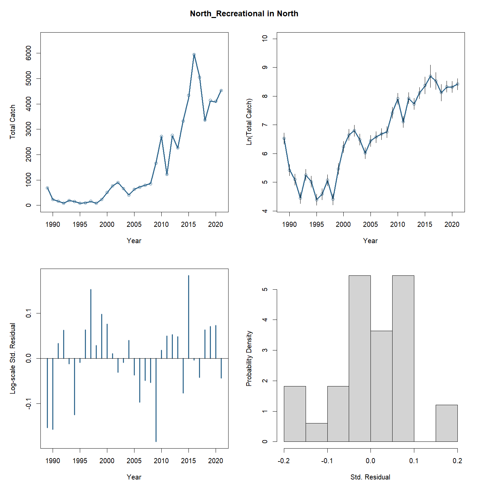
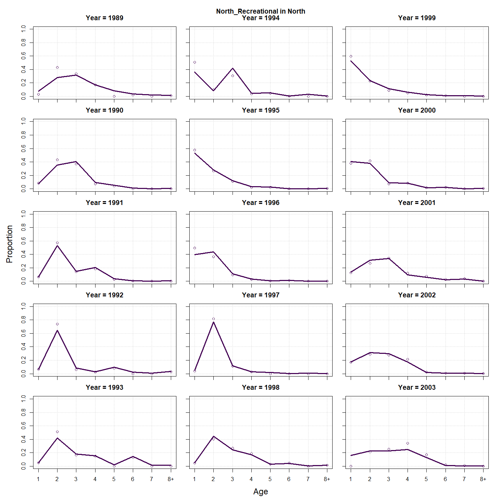
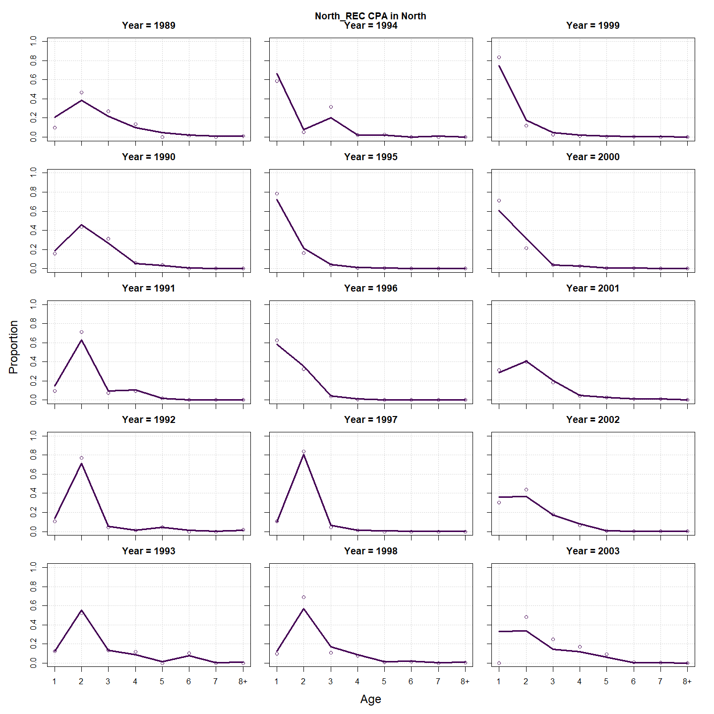
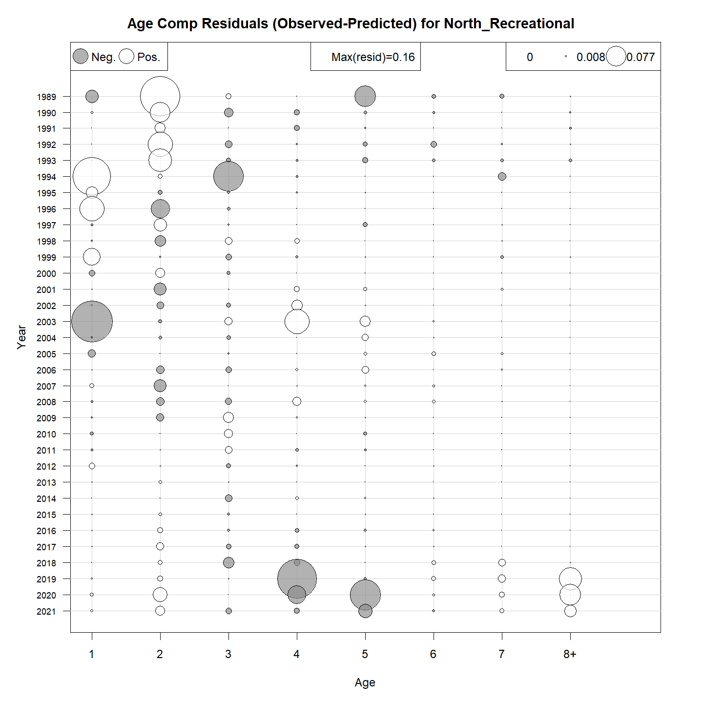
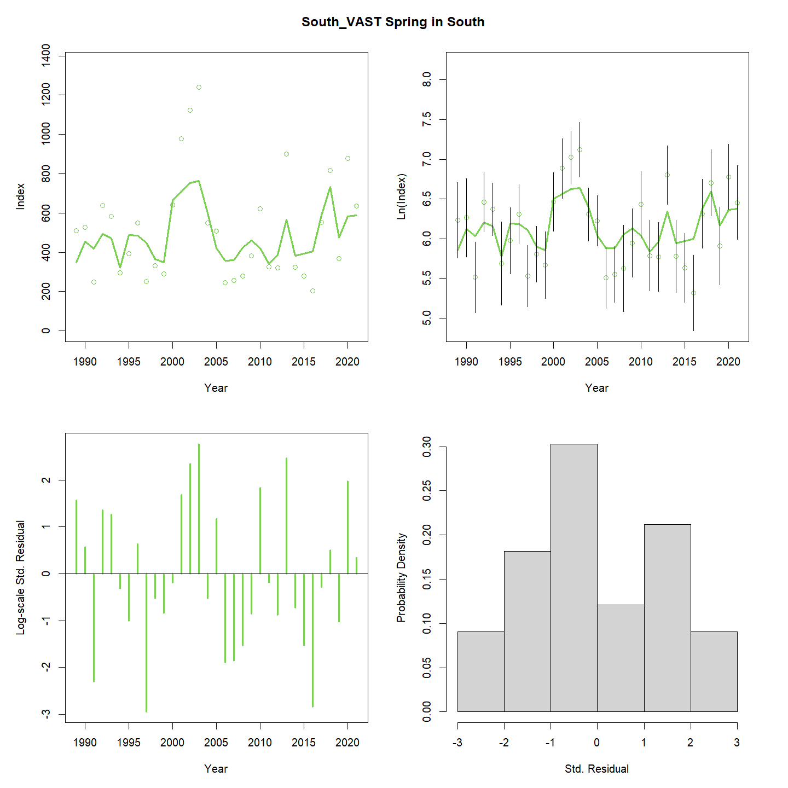
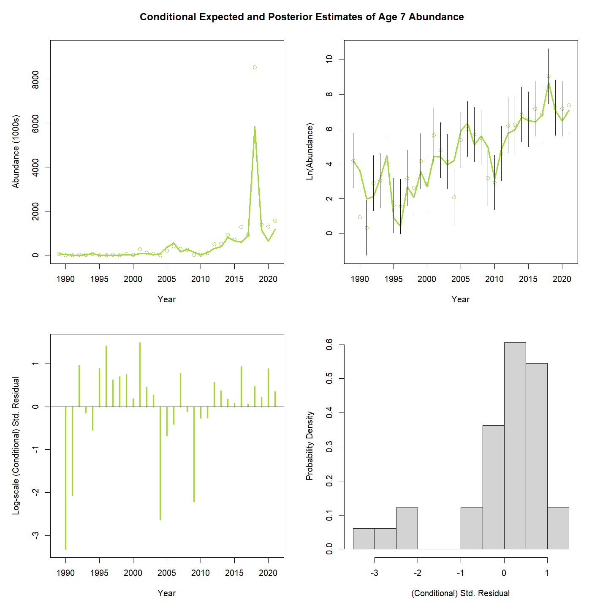
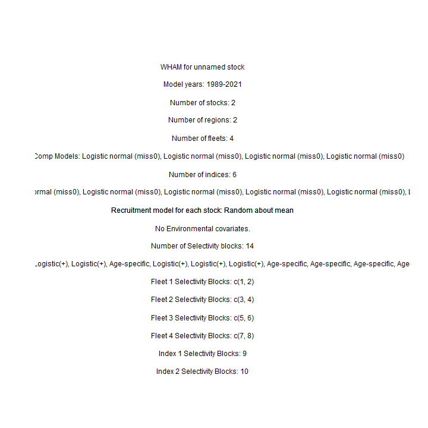
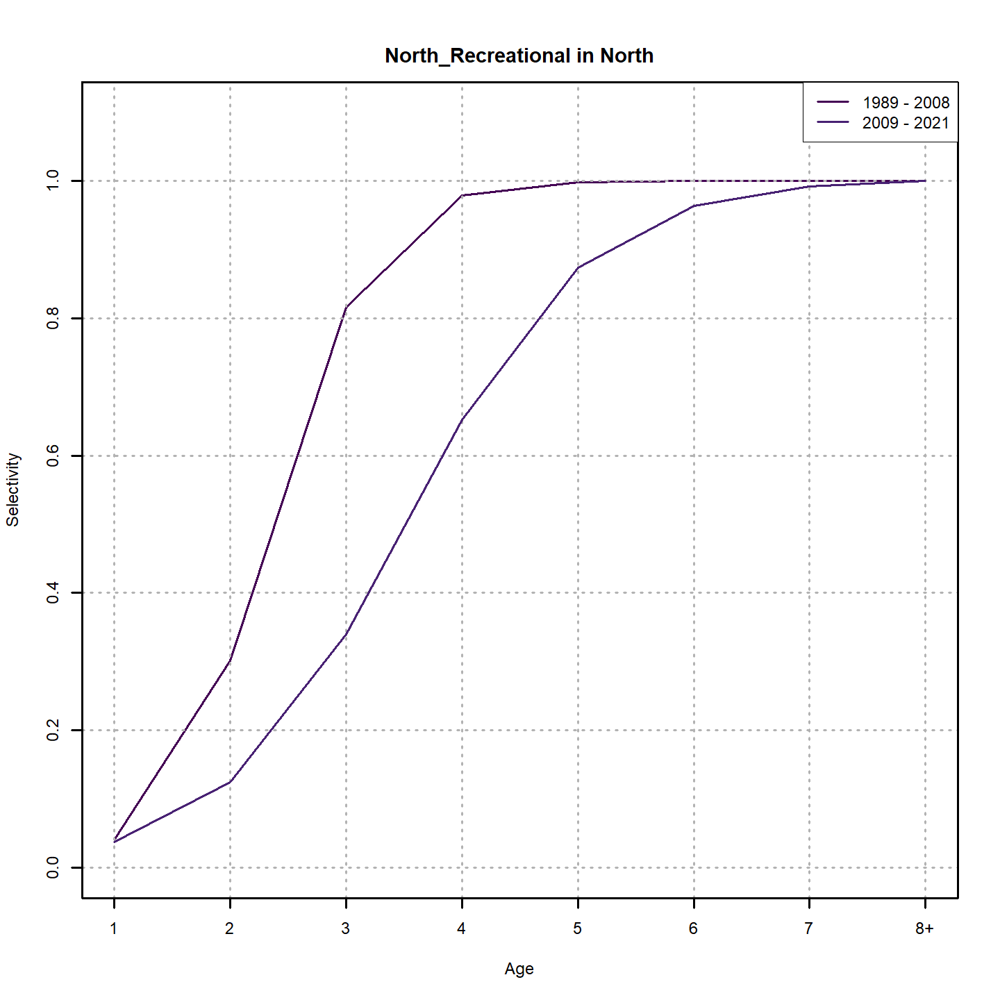
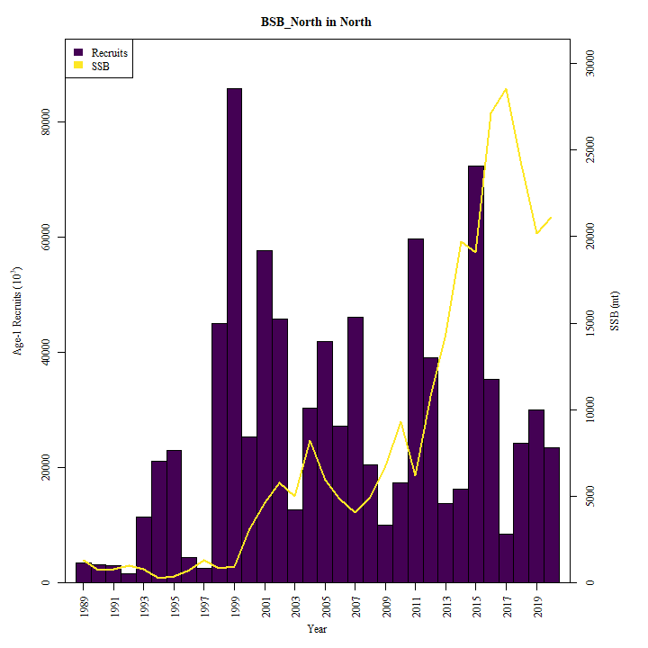
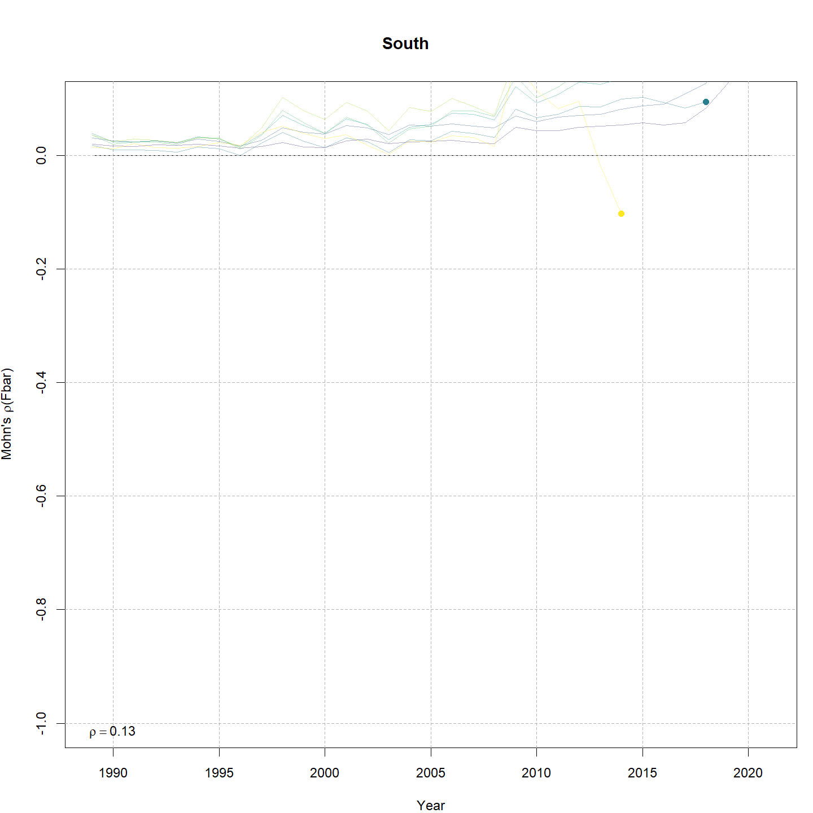

---
output:
  html_document:
    df_print: paged
    keep_md: yes
  word_document: default
  pdf_document:
    fig_caption: yes
    includes:
    keep_tex: yes
    number_sections: no
title: "WHAM figures and tables"
header-includes:
  - \usepackage{longtable}
  - \usepackage{booktabs}
  - \usepackage{caption,graphics}
  - \usepackage{makecell}
  - \usepackage{lscape}
  - \renewcommand\figurename{Fig.}
  - \captionsetup{labelsep=period, singlelinecheck=false}
  - \newcommand{\changesize}[1]{\fontsize{#1pt}{#1pt}\selectfont}
  - \renewcommand{\arraystretch}{1.5}
  - \renewcommand\theadfont{}
---

# {.tabset}

## Figures {.tabset}

### Input

### Diagnostics

### Results

### Retro

### Reference points

### Miscelaneous

## Tables {.tabset}

### Parameter estimates

<table class="table" style="margin-left: auto; margin-right: auto;">
<caption>Parameter estimates, standard errors, and confidence intervals. Rounded to 3 decimal places.</caption>
 <thead>
  <tr>
   <th style="text-align:left;">   </th>
   <th style="text-align:right;"> Estimate </th>
   <th style="text-align:right;"> Std. Error </th>
   <th style="text-align:right;"> 95\% CI lower </th>
   <th style="text-align:right;"> 95\% CI upper </th>
  </tr>
 </thead>
<tbody>
  <tr>
   <td style="text-align:left;"> BSB North Mean Recruitment </td>
   <td style="text-align:right;"> 17809.315 </td>
   <td style="text-align:right;"> 4710.129 </td>
   <td style="text-align:right;"> 10605.354 </td>
   <td style="text-align:right;"> 29906.751 </td>
  </tr>
  <tr>
   <td style="text-align:left;"> BSB North NAA $\sigma$ (age 1) </td>
   <td style="text-align:right;"> 1.045 </td>
   <td style="text-align:right;"> 0.137 </td>
   <td style="text-align:right;"> 0.808 </td>
   <td style="text-align:right;"> 1.352 </td>
  </tr>
  <tr>
   <td style="text-align:left;"> BSB North NAA $\sigma$ (age NA-) </td>
   <td style="text-align:right;"> -- </td>
   <td style="text-align:right;"> -- </td>
   <td style="text-align:right;"> -- </td>
   <td style="text-align:right;"> -- </td>
  </tr>
  <tr>
   <td style="text-align:left;"> BSB South Mean Recruitment </td>
   <td style="text-align:right;"> 16991.759 </td>
   <td style="text-align:right;"> 1925.823 </td>
   <td style="text-align:right;"> 13607.060 </td>
   <td style="text-align:right;"> 21218.388 </td>
  </tr>
  <tr>
   <td style="text-align:left;"> BSB South NAA $\sigma$ (age 1) </td>
   <td style="text-align:right;"> 0.277 </td>
   <td style="text-align:right;"> 0.075 </td>
   <td style="text-align:right;"> 0.163 </td>
   <td style="text-align:right;"> 0.471 </td>
  </tr>
  <tr>
   <td style="text-align:left;"> BSB South NAA $\sigma$ (age 2) </td>
   <td style="text-align:right;"> 0.435 </td>
   <td style="text-align:right;"> 0.051 </td>
   <td style="text-align:right;"> 0.345 </td>
   <td style="text-align:right;"> 0.547 </td>
  </tr>
  <tr>
   <td style="text-align:left;"> North REC CPA fully selected q </td>
   <td style="text-align:right;"> 0.000 </td>
   <td style="text-align:right;"> 0.000 </td>
   <td style="text-align:right;"> 0.000 </td>
   <td style="text-align:right;"> 0.000 </td>
  </tr>
  <tr>
   <td style="text-align:left;"> North VAST Spring fully selected q </td>
   <td style="text-align:right;"> 0.012 </td>
   <td style="text-align:right;"> 0.002 </td>
   <td style="text-align:right;"> 0.008 </td>
   <td style="text-align:right;"> 0.017 </td>
  </tr>
  <tr>
   <td style="text-align:left;"> North VAST Fall fully selected q </td>
   <td style="text-align:right;"> 0.015 </td>
   <td style="text-align:right;"> 0.003 </td>
   <td style="text-align:right;"> 0.010 </td>
   <td style="text-align:right;"> 0.023 </td>
  </tr>
  <tr>
   <td style="text-align:left;"> South REC CPA fully selected q </td>
   <td style="text-align:right;"> 0.000 </td>
   <td style="text-align:right;"> 0.000 </td>
   <td style="text-align:right;"> 0.000 </td>
   <td style="text-align:right;"> 0.000 </td>
  </tr>
  <tr>
   <td style="text-align:left;"> South VAST Spring fully selected q </td>
   <td style="text-align:right;"> 0.024 </td>
   <td style="text-align:right;"> 0.003 </td>
   <td style="text-align:right;"> 0.019 </td>
   <td style="text-align:right;"> 0.031 </td>
  </tr>
  <tr>
   <td style="text-align:left;"> South VAST Fall fully selected q </td>
   <td style="text-align:right;"> 0.001 </td>
   <td style="text-align:right;"> 0.000 </td>
   <td style="text-align:right;"> 0.000 </td>
   <td style="text-align:right;"> 0.001 </td>
  </tr>
  <tr>
   <td style="text-align:left;"> Block 1: $a_{50}$ </td>
   <td style="text-align:right;"> 1.731 </td>
   <td style="text-align:right;"> 0.214 </td>
   <td style="text-align:right;"> 1.348 </td>
   <td style="text-align:right;"> 2.188 </td>
  </tr>
  <tr>
   <td style="text-align:left;"> Block 1: 1/slope (increasing) </td>
   <td style="text-align:right;"> 0.241 </td>
   <td style="text-align:right;"> 0.074 </td>
   <td style="text-align:right;"> 0.131 </td>
   <td style="text-align:right;"> 0.437 </td>
  </tr>
  <tr>
   <td style="text-align:left;"> Block 2: $a_{50}$ </td>
   <td style="text-align:right;"> 2.613 </td>
   <td style="text-align:right;"> 0.168 </td>
   <td style="text-align:right;"> 2.296 </td>
   <td style="text-align:right;"> 2.952 </td>
  </tr>
  <tr>
   <td style="text-align:left;"> Block 2: 1/slope (increasing) </td>
   <td style="text-align:right;"> 0.323 </td>
   <td style="text-align:right;"> 0.043 </td>
   <td style="text-align:right;"> 0.248 </td>
   <td style="text-align:right;"> 0.418 </td>
  </tr>
  <tr>
   <td style="text-align:left;"> Block 3: $a_{50}$ </td>
   <td style="text-align:right;"> 2.361 </td>
   <td style="text-align:right;"> 0.091 </td>
   <td style="text-align:right;"> 2.187 </td>
   <td style="text-align:right;"> 2.543 </td>
  </tr>
  <tr>
   <td style="text-align:left;"> Block 3: 1/slope (increasing) </td>
   <td style="text-align:right;"> 0.429 </td>
   <td style="text-align:right;"> 0.031 </td>
   <td style="text-align:right;"> 0.372 </td>
   <td style="text-align:right;"> 0.494 </td>
  </tr>
  <tr>
   <td style="text-align:left;"> Block 4: $a_{50}$ </td>
   <td style="text-align:right;"> 3.520 </td>
   <td style="text-align:right;"> 0.142 </td>
   <td style="text-align:right;"> 3.245 </td>
   <td style="text-align:right;"> 3.800 </td>
  </tr>
  <tr>
   <td style="text-align:left;"> Block 4: 1/slope (increasing) </td>
   <td style="text-align:right;"> 0.776 </td>
   <td style="text-align:right;"> 0.062 </td>
   <td style="text-align:right;"> 0.662 </td>
   <td style="text-align:right;"> 0.908 </td>
  </tr>
  <tr>
   <td style="text-align:left;"> Block 5: Selectivity for age 1 </td>
   <td style="text-align:right;"> 0.069 </td>
   <td style="text-align:right;"> 0.024 </td>
   <td style="text-align:right;"> 0.035 </td>
   <td style="text-align:right;"> 0.132 </td>
  </tr>
  <tr>
   <td style="text-align:left;"> Block 5: Selectivity for age 2 </td>
   <td style="text-align:right;"> 1.000 </td>
   <td style="text-align:right;"> -- </td>
   <td style="text-align:right;"> -- </td>
   <td style="text-align:right;"> -- </td>
  </tr>
  <tr>
   <td style="text-align:left;"> Block 5: Selectivity for age 3 </td>
   <td style="text-align:right;"> 1.000 </td>
   <td style="text-align:right;"> -- </td>
   <td style="text-align:right;"> -- </td>
   <td style="text-align:right;"> -- </td>
  </tr>
  <tr>
   <td style="text-align:left;"> Block 5: Selectivity for age 4 </td>
   <td style="text-align:right;"> 1.000 </td>
   <td style="text-align:right;"> -- </td>
   <td style="text-align:right;"> -- </td>
   <td style="text-align:right;"> -- </td>
  </tr>
  <tr>
   <td style="text-align:left;"> Block 5: Selectivity for age 5 </td>
   <td style="text-align:right;"> 1.000 </td>
   <td style="text-align:right;"> -- </td>
   <td style="text-align:right;"> -- </td>
   <td style="text-align:right;"> -- </td>
  </tr>
  <tr>
   <td style="text-align:left;"> Block 5: Selectivity for age 6 </td>
   <td style="text-align:right;"> 1.000 </td>
   <td style="text-align:right;"> -- </td>
   <td style="text-align:right;"> -- </td>
   <td style="text-align:right;"> -- </td>
  </tr>
  <tr>
   <td style="text-align:left;"> Block 5: Selectivity for age 7 </td>
   <td style="text-align:right;"> 1.000 </td>
   <td style="text-align:right;"> -- </td>
   <td style="text-align:right;"> -- </td>
   <td style="text-align:right;"> -- </td>
  </tr>
  <tr>
   <td style="text-align:left;"> Block 5: Selectivity for age 8+ </td>
   <td style="text-align:right;"> 1.000 </td>
   <td style="text-align:right;"> -- </td>
   <td style="text-align:right;"> -- </td>
   <td style="text-align:right;"> -- </td>
  </tr>
  <tr>
   <td style="text-align:left;"> Block 6: $a_{50}$ </td>
   <td style="text-align:right;"> 3.220 </td>
   <td style="text-align:right;"> 0.183 </td>
   <td style="text-align:right;"> 2.869 </td>
   <td style="text-align:right;"> 3.584 </td>
  </tr>
  <tr>
   <td style="text-align:left;"> Block 6: 1/slope (increasing) </td>
   <td style="text-align:right;"> 0.549 </td>
   <td style="text-align:right;"> 0.057 </td>
   <td style="text-align:right;"> 0.447 </td>
   <td style="text-align:right;"> 0.672 </td>
  </tr>
  <tr>
   <td style="text-align:left;"> Block 7: $a_{50}$ </td>
   <td style="text-align:right;"> 2.139 </td>
   <td style="text-align:right;"> 0.216 </td>
   <td style="text-align:right;"> 1.743 </td>
   <td style="text-align:right;"> 2.588 </td>
  </tr>
  <tr>
   <td style="text-align:left;"> Block 7: 1/slope (increasing) </td>
   <td style="text-align:right;"> 0.618 </td>
   <td style="text-align:right;"> 0.137 </td>
   <td style="text-align:right;"> 0.397 </td>
   <td style="text-align:right;"> 0.947 </td>
  </tr>
  <tr>
   <td style="text-align:left;"> Block 8: $a_{50}$ </td>
   <td style="text-align:right;"> 4.324 </td>
   <td style="text-align:right;"> 0.381 </td>
   <td style="text-align:right;"> 3.575 </td>
   <td style="text-align:right;"> 5.051 </td>
  </tr>
  <tr>
   <td style="text-align:left;"> Block 8: 1/slope (increasing) </td>
   <td style="text-align:right;"> 1.126 </td>
   <td style="text-align:right;"> 0.160 </td>
   <td style="text-align:right;"> 0.848 </td>
   <td style="text-align:right;"> 1.476 </td>
  </tr>
  <tr>
   <td style="text-align:left;"> Block 9: Selectivity for age 1 </td>
   <td style="text-align:right;"> 0.181 </td>
   <td style="text-align:right;"> 0.028 </td>
   <td style="text-align:right;"> 0.132 </td>
   <td style="text-align:right;"> 0.243 </td>
  </tr>
  <tr>
   <td style="text-align:left;"> Block 9: Selectivity for age 2 </td>
   <td style="text-align:right;"> 0.712 </td>
   <td style="text-align:right;"> 0.076 </td>
   <td style="text-align:right;"> 0.545 </td>
   <td style="text-align:right;"> 0.836 </td>
  </tr>
  <tr>
   <td style="text-align:left;"> Block 9: Selectivity for age 3 </td>
   <td style="text-align:right;"> 1.000 </td>
   <td style="text-align:right;"> -- </td>
   <td style="text-align:right;"> -- </td>
   <td style="text-align:right;"> -- </td>
  </tr>
  <tr>
   <td style="text-align:left;"> Block 9: Selectivity for age 4 </td>
   <td style="text-align:right;"> 1.000 </td>
   <td style="text-align:right;"> -- </td>
   <td style="text-align:right;"> -- </td>
   <td style="text-align:right;"> -- </td>
  </tr>
  <tr>
   <td style="text-align:left;"> Block 9: Selectivity for age 5 </td>
   <td style="text-align:right;"> 1.000 </td>
   <td style="text-align:right;"> -- </td>
   <td style="text-align:right;"> -- </td>
   <td style="text-align:right;"> -- </td>
  </tr>
  <tr>
   <td style="text-align:left;"> Block 9: Selectivity for age 6 </td>
   <td style="text-align:right;"> 1.000 </td>
   <td style="text-align:right;"> -- </td>
   <td style="text-align:right;"> -- </td>
   <td style="text-align:right;"> -- </td>
  </tr>
  <tr>
   <td style="text-align:left;"> Block 9: Selectivity for age 7 </td>
   <td style="text-align:right;"> 0.925 </td>
   <td style="text-align:right;"> 0.062 </td>
   <td style="text-align:right;"> 0.683 </td>
   <td style="text-align:right;"> 0.986 </td>
  </tr>
  <tr>
   <td style="text-align:left;"> Block 9: Selectivity for age 8+ </td>
   <td style="text-align:right;"> 0.895 </td>
   <td style="text-align:right;"> 0.040 </td>
   <td style="text-align:right;"> 0.789 </td>
   <td style="text-align:right;"> 0.951 </td>
  </tr>
  <tr>
   <td style="text-align:left;"> Block 10: Selectivity for age 1 </td>
   <td style="text-align:right;"> 0.074 </td>
   <td style="text-align:right;"> 0.021 </td>
   <td style="text-align:right;"> 0.042 </td>
   <td style="text-align:right;"> 0.127 </td>
  </tr>
  <tr>
   <td style="text-align:left;"> Block 10: Selectivity for age 2 </td>
   <td style="text-align:right;"> 0.342 </td>
   <td style="text-align:right;"> 0.099 </td>
   <td style="text-align:right;"> 0.180 </td>
   <td style="text-align:right;"> 0.551 </td>
  </tr>
  <tr>
   <td style="text-align:left;"> Block 10: Selectivity for age 3 </td>
   <td style="text-align:right;"> 1.000 </td>
   <td style="text-align:right;"> -- </td>
   <td style="text-align:right;"> -- </td>
   <td style="text-align:right;"> -- </td>
  </tr>
  <tr>
   <td style="text-align:left;"> Block 10: Selectivity for age 4 </td>
   <td style="text-align:right;"> 1.000 </td>
   <td style="text-align:right;"> -- </td>
   <td style="text-align:right;"> -- </td>
   <td style="text-align:right;"> -- </td>
  </tr>
  <tr>
   <td style="text-align:left;"> Block 10: Selectivity for age 5 </td>
   <td style="text-align:right;"> 0.644 </td>
   <td style="text-align:right;"> 0.202 </td>
   <td style="text-align:right;"> 0.244 </td>
   <td style="text-align:right;"> 0.910 </td>
  </tr>
  <tr>
   <td style="text-align:left;"> Block 10: Selectivity for age 6 </td>
   <td style="text-align:right;"> 0.502 </td>
   <td style="text-align:right;"> 0.164 </td>
   <td style="text-align:right;"> 0.217 </td>
   <td style="text-align:right;"> 0.785 </td>
  </tr>
  <tr>
   <td style="text-align:left;"> Block 10: Selectivity for age 7 </td>
   <td style="text-align:right;"> 0.367 </td>
   <td style="text-align:right;"> 0.118 </td>
   <td style="text-align:right;"> 0.176 </td>
   <td style="text-align:right;"> 0.611 </td>
  </tr>
  <tr>
   <td style="text-align:left;"> Block 10: Selectivity for age 8+ </td>
   <td style="text-align:right;"> 0.728 </td>
   <td style="text-align:right;"> 0.131 </td>
   <td style="text-align:right;"> 0.424 </td>
   <td style="text-align:right;"> 0.907 </td>
  </tr>
  <tr>
   <td style="text-align:left;"> Block 11: Selectivity for age 1 </td>
   <td style="text-align:right;"> 0.408 </td>
   <td style="text-align:right;"> 0.110 </td>
   <td style="text-align:right;"> 0.220 </td>
   <td style="text-align:right;"> 0.627 </td>
  </tr>
  <tr>
   <td style="text-align:left;"> Block 11: Selectivity for age 2 </td>
   <td style="text-align:right;"> 0.166 </td>
   <td style="text-align:right;"> 0.060 </td>
   <td style="text-align:right;"> 0.079 </td>
   <td style="text-align:right;"> 0.318 </td>
  </tr>
  <tr>
   <td style="text-align:left;"> Block 11: Selectivity for age 3 </td>
   <td style="text-align:right;"> 1.000 </td>
   <td style="text-align:right;"> -- </td>
   <td style="text-align:right;"> -- </td>
   <td style="text-align:right;"> -- </td>
  </tr>
  <tr>
   <td style="text-align:left;"> Block 11: Selectivity for age 4 </td>
   <td style="text-align:right;"> 0.652 </td>
   <td style="text-align:right;"> 0.241 </td>
   <td style="text-align:right;"> 0.189 </td>
   <td style="text-align:right;"> 0.938 </td>
  </tr>
  <tr>
   <td style="text-align:left;"> Block 11: Selectivity for age 5 </td>
   <td style="text-align:right;"> 0.409 </td>
   <td style="text-align:right;"> 0.158 </td>
   <td style="text-align:right;"> 0.161 </td>
   <td style="text-align:right;"> 0.713 </td>
  </tr>
  <tr>
   <td style="text-align:left;"> Block 11: Selectivity for age 6 </td>
   <td style="text-align:right;"> 0.353 </td>
   <td style="text-align:right;"> 0.138 </td>
   <td style="text-align:right;"> 0.143 </td>
   <td style="text-align:right;"> 0.641 </td>
  </tr>
  <tr>
   <td style="text-align:left;"> Block 11: Selectivity for age 7 </td>
   <td style="text-align:right;"> 0.258 </td>
   <td style="text-align:right;"> 0.105 </td>
   <td style="text-align:right;"> 0.107 </td>
   <td style="text-align:right;"> 0.504 </td>
  </tr>
  <tr>
   <td style="text-align:left;"> Block 11: Selectivity for age 8+ </td>
   <td style="text-align:right;"> 0.343 </td>
   <td style="text-align:right;"> 0.085 </td>
   <td style="text-align:right;"> 0.199 </td>
   <td style="text-align:right;"> 0.523 </td>
  </tr>
  <tr>
   <td style="text-align:left;"> Block 12: Selectivity for age 1 </td>
   <td style="text-align:right;"> 0.395 </td>
   <td style="text-align:right;"> 0.072 </td>
   <td style="text-align:right;"> 0.265 </td>
   <td style="text-align:right;"> 0.541 </td>
  </tr>
  <tr>
   <td style="text-align:left;"> Block 12: Selectivity for age 2 </td>
   <td style="text-align:right;"> 0.763 </td>
   <td style="text-align:right;"> 0.126 </td>
   <td style="text-align:right;"> 0.450 </td>
   <td style="text-align:right;"> 0.927 </td>
  </tr>
  <tr>
   <td style="text-align:left;"> Block 12: Selectivity for age 3 </td>
   <td style="text-align:right;"> 1.000 </td>
   <td style="text-align:right;"> -- </td>
   <td style="text-align:right;"> -- </td>
   <td style="text-align:right;"> -- </td>
  </tr>
  <tr>
   <td style="text-align:left;"> Block 12: Selectivity for age 4 </td>
   <td style="text-align:right;"> 0.755 </td>
   <td style="text-align:right;"> 0.121 </td>
   <td style="text-align:right;"> 0.462 </td>
   <td style="text-align:right;"> 0.917 </td>
  </tr>
  <tr>
   <td style="text-align:left;"> Block 12: Selectivity for age 5 </td>
   <td style="text-align:right;"> 0.812 </td>
   <td style="text-align:right;"> 0.138 </td>
   <td style="text-align:right;"> 0.425 </td>
   <td style="text-align:right;"> 0.962 </td>
  </tr>
  <tr>
   <td style="text-align:left;"> Block 12: Selectivity for age 6 </td>
   <td style="text-align:right;"> 0.908 </td>
   <td style="text-align:right;"> 0.138 </td>
   <td style="text-align:right;"> 0.279 </td>
   <td style="text-align:right;"> 0.996 </td>
  </tr>
  <tr>
   <td style="text-align:left;"> Block 12: Selectivity for age 7 </td>
   <td style="text-align:right;"> 0.864 </td>
   <td style="text-align:right;"> 0.129 </td>
   <td style="text-align:right;"> 0.425 </td>
   <td style="text-align:right;"> 0.982 </td>
  </tr>
  <tr>
   <td style="text-align:left;"> Block 12: Selectivity for age 8+ </td>
   <td style="text-align:right;"> 1.000 </td>
   <td style="text-align:right;"> -- </td>
   <td style="text-align:right;"> -- </td>
   <td style="text-align:right;"> -- </td>
  </tr>
  <tr>
   <td style="text-align:left;"> Block 13: Selectivity for age 1 </td>
   <td style="text-align:right;"> 0.193 </td>
   <td style="text-align:right;"> 0.056 </td>
   <td style="text-align:right;"> 0.106 </td>
   <td style="text-align:right;"> 0.326 </td>
  </tr>
  <tr>
   <td style="text-align:left;"> Block 13: Selectivity for age 2 </td>
   <td style="text-align:right;"> 1.000 </td>
   <td style="text-align:right;"> -- </td>
   <td style="text-align:right;"> -- </td>
   <td style="text-align:right;"> -- </td>
  </tr>
  <tr>
   <td style="text-align:left;"> Block 13: Selectivity for age 3 </td>
   <td style="text-align:right;"> 0.675 </td>
   <td style="text-align:right;"> 0.210 </td>
   <td style="text-align:right;"> 0.242 </td>
   <td style="text-align:right;"> 0.931 </td>
  </tr>
  <tr>
   <td style="text-align:left;"> Block 13: Selectivity for age 4 </td>
   <td style="text-align:right;"> 0.418 </td>
   <td style="text-align:right;"> 0.133 </td>
   <td style="text-align:right;"> 0.198 </td>
   <td style="text-align:right;"> 0.677 </td>
  </tr>
  <tr>
   <td style="text-align:left;"> Block 13: Selectivity for age 5 </td>
   <td style="text-align:right;"> 0.177 </td>
   <td style="text-align:right;"> 0.056 </td>
   <td style="text-align:right;"> 0.093 </td>
   <td style="text-align:right;"> 0.312 </td>
  </tr>
  <tr>
   <td style="text-align:left;"> Block 13: Selectivity for age 6 </td>
   <td style="text-align:right;"> 0.174 </td>
   <td style="text-align:right;"> 0.055 </td>
   <td style="text-align:right;"> 0.091 </td>
   <td style="text-align:right;"> 0.309 </td>
  </tr>
  <tr>
   <td style="text-align:left;"> Block 13: Selectivity for age 7 </td>
   <td style="text-align:right;"> 0.110 </td>
   <td style="text-align:right;"> 0.035 </td>
   <td style="text-align:right;"> 0.058 </td>
   <td style="text-align:right;"> 0.199 </td>
  </tr>
  <tr>
   <td style="text-align:left;"> Block 13: Selectivity for age 8+ </td>
   <td style="text-align:right;"> 0.281 </td>
   <td style="text-align:right;"> 0.065 </td>
   <td style="text-align:right;"> 0.173 </td>
   <td style="text-align:right;"> 0.422 </td>
  </tr>
  <tr>
   <td style="text-align:left;"> Block 14: Selectivity for age 1 </td>
   <td style="text-align:right;"> 0.297 </td>
   <td style="text-align:right;"> 0.081 </td>
   <td style="text-align:right;"> 0.165 </td>
   <td style="text-align:right;"> 0.476 </td>
  </tr>
  <tr>
   <td style="text-align:left;"> Block 14: Selectivity for age 2 </td>
   <td style="text-align:right;"> 1.000 </td>
   <td style="text-align:right;"> -- </td>
   <td style="text-align:right;"> -- </td>
   <td style="text-align:right;"> -- </td>
  </tr>
  <tr>
   <td style="text-align:left;"> Block 14: Selectivity for age 3 </td>
   <td style="text-align:right;"> 0.435 </td>
   <td style="text-align:right;"> 0.119 </td>
   <td style="text-align:right;"> 0.230 </td>
   <td style="text-align:right;"> 0.665 </td>
  </tr>
  <tr>
   <td style="text-align:left;"> Block 14: Selectivity for age 4 </td>
   <td style="text-align:right;"> 0.155 </td>
   <td style="text-align:right;"> 0.043 </td>
   <td style="text-align:right;"> 0.088 </td>
   <td style="text-align:right;"> 0.258 </td>
  </tr>
  <tr>
   <td style="text-align:left;"> Block 14: Selectivity for age 5 </td>
   <td style="text-align:right;"> 0.058 </td>
   <td style="text-align:right;"> 0.016 </td>
   <td style="text-align:right;"> 0.033 </td>
   <td style="text-align:right;"> 0.100 </td>
  </tr>
  <tr>
   <td style="text-align:left;"> Block 14: Selectivity for age 6 </td>
   <td style="text-align:right;"> 0.025 </td>
   <td style="text-align:right;"> 0.007 </td>
   <td style="text-align:right;"> 0.014 </td>
   <td style="text-align:right;"> 0.043 </td>
  </tr>
  <tr>
   <td style="text-align:left;"> Block 14: Selectivity for age 7 </td>
   <td style="text-align:right;"> 0.023 </td>
   <td style="text-align:right;"> 0.007 </td>
   <td style="text-align:right;"> 0.013 </td>
   <td style="text-align:right;"> 0.040 </td>
  </tr>
  <tr>
   <td style="text-align:left;"> Block 14: Selectivity for age 8+ </td>
   <td style="text-align:right;"> 0.046 </td>
   <td style="text-align:right;"> 0.010 </td>
   <td style="text-align:right;"> 0.030 </td>
   <td style="text-align:right;"> 0.071 </td>
  </tr>
  <tr>
   <td style="text-align:left;"> North Commercial in North age comp, logistic-normal: $\sigma$ </td>
   <td style="text-align:right;"> 9.087 </td>
   <td style="text-align:right;"> 0.467 </td>
   <td style="text-align:right;"> 8.217 </td>
   <td style="text-align:right;"> 10.049 </td>
  </tr>
  <tr>
   <td style="text-align:left;"> North Recreational in North age comp, logistic-normal: $\sigma$ </td>
   <td style="text-align:right;"> 1.706 </td>
   <td style="text-align:right;"> 0.142 </td>
   <td style="text-align:right;"> 1.450 </td>
   <td style="text-align:right;"> 2.007 </td>
  </tr>
  <tr>
   <td style="text-align:left;"> South Commercial in South age comp, logistic-normal: $\sigma$ </td>
   <td style="text-align:right;"> 5.020 </td>
   <td style="text-align:right;"> 0.304 </td>
   <td style="text-align:right;"> 4.458 </td>
   <td style="text-align:right;"> 5.652 </td>
  </tr>
  <tr>
   <td style="text-align:left;"> South Recreational in South age comp, logistic-normal: $\sigma$ </td>
   <td style="text-align:right;"> 5.040 </td>
   <td style="text-align:right;"> 0.396 </td>
   <td style="text-align:right;"> 4.321 </td>
   <td style="text-align:right;"> 5.878 </td>
  </tr>
  <tr>
   <td style="text-align:left;"> North REC CPA in North age comp, logistic-normal: $\sigma$ </td>
   <td style="text-align:right;"> 1.447 </td>
   <td style="text-align:right;"> 0.137 </td>
   <td style="text-align:right;"> 1.203 </td>
   <td style="text-align:right;"> 1.742 </td>
  </tr>
  <tr>
   <td style="text-align:left;"> North VAST Spring in North age comp, logistic-normal: $\sigma$ </td>
   <td style="text-align:right;"> 11.041 </td>
   <td style="text-align:right;"> 0.534 </td>
   <td style="text-align:right;"> 10.042 </td>
   <td style="text-align:right;"> 12.140 </td>
  </tr>
  <tr>
   <td style="text-align:left;"> North VAST Fall in North age comp, logistic-normal: $\sigma$ </td>
   <td style="text-align:right;"> 11.969 </td>
   <td style="text-align:right;"> 0.579 </td>
   <td style="text-align:right;"> 10.887 </td>
   <td style="text-align:right;"> 13.159 </td>
  </tr>
  <tr>
   <td style="text-align:left;"> South REC CPA in South age comp, logistic-normal: $\sigma$ </td>
   <td style="text-align:right;"> 5.469 </td>
   <td style="text-align:right;"> 0.555 </td>
   <td style="text-align:right;"> 4.482 </td>
   <td style="text-align:right;"> 6.673 </td>
  </tr>
  <tr>
   <td style="text-align:left;"> South VAST Spring in South age comp, logistic-normal: $\sigma$ </td>
   <td style="text-align:right;"> 8.805 </td>
   <td style="text-align:right;"> 0.474 </td>
   <td style="text-align:right;"> 7.923 </td>
   <td style="text-align:right;"> 9.786 </td>
  </tr>
  <tr>
   <td style="text-align:left;"> South VAST Fall in South age comp, logistic-normal: $\sigma$ </td>
   <td style="text-align:right;"> 7.577 </td>
   <td style="text-align:right;"> 0.451 </td>
   <td style="text-align:right;"> 6.743 </td>
   <td style="text-align:right;"> 8.513 </td>
  </tr>
</tbody>
</table>

### Abundance at age

<table class="table" style="margin-left: auto; margin-right: auto;">
<caption>Abundance at age (1000s) for BSB North in North.</caption>
 <thead>
  <tr>
   <th style="text-align:left;">   </th>
   <th style="text-align:right;"> 1 </th>
   <th style="text-align:right;"> 2 </th>
   <th style="text-align:right;"> 3 </th>
   <th style="text-align:right;"> 4 </th>
   <th style="text-align:right;"> 5 </th>
   <th style="text-align:right;"> 6 </th>
   <th style="text-align:right;"> 7 </th>
   <th style="text-align:right;"> 8+ </th>
  </tr>
 </thead>
<tbody>
  <tr>
   <td style="text-align:left;"> 1989 </td>
   <td style="text-align:right;"> 5031 </td>
   <td style="text-align:right;"> 2701 </td>
   <td style="text-align:right;"> 1326 </td>
   <td style="text-align:right;"> 627 </td>
   <td style="text-align:right;"> 295 </td>
   <td style="text-align:right;"> 139 </td>
   <td style="text-align:right;"> 65 </td>
   <td style="text-align:right;"> 58 </td>
  </tr>
  <tr>
   <td style="text-align:left;"> 1990 </td>
   <td style="text-align:right;"> 3550 </td>
   <td style="text-align:right;"> 2586 </td>
   <td style="text-align:right;"> 1252 </td>
   <td style="text-align:right;"> 245 </td>
   <td style="text-align:right;"> 143 </td>
   <td style="text-align:right;"> 24 </td>
   <td style="text-align:right;"> 2 </td>
   <td style="text-align:right;"> 18 </td>
  </tr>
  <tr>
   <td style="text-align:left;"> 1991 </td>
   <td style="text-align:right;"> 3181 </td>
   <td style="text-align:right;"> 3923 </td>
   <td style="text-align:right;"> 422 </td>
   <td style="text-align:right;"> 520 </td>
   <td style="text-align:right;"> 92 </td>
   <td style="text-align:right;"> 21 </td>
   <td style="text-align:right;"> 1 </td>
   <td style="text-align:right;"> 23 </td>
  </tr>
  <tr>
   <td style="text-align:left;"> 1992 </td>
   <td style="text-align:right;"> 3075 </td>
   <td style="text-align:right;"> 4391 </td>
   <td style="text-align:right;"> 209 </td>
   <td style="text-align:right;"> 66 </td>
   <td style="text-align:right;"> 213 </td>
   <td style="text-align:right;"> 54 </td>
   <td style="text-align:right;"> 18 </td>
   <td style="text-align:right;"> 78 </td>
  </tr>
  <tr>
   <td style="text-align:left;"> 1993 </td>
   <td style="text-align:right;"> 1658 </td>
   <td style="text-align:right;"> 2047 </td>
   <td style="text-align:right;"> 331 </td>
   <td style="text-align:right;"> 267 </td>
   <td style="text-align:right;"> 37 </td>
   <td style="text-align:right;"> 237 </td>
   <td style="text-align:right;"> 21 </td>
   <td style="text-align:right;"> 21 </td>
  </tr>
  <tr>
   <td style="text-align:left;"> 1994 </td>
   <td style="text-align:right;"> 11447 </td>
   <td style="text-align:right;"> 398 </td>
   <td style="text-align:right;"> 913 </td>
   <td style="text-align:right;"> 85 </td>
   <td style="text-align:right;"> 97 </td>
   <td style="text-align:right;"> 10 </td>
   <td style="text-align:right;"> 56 </td>
   <td style="text-align:right;"> 7 </td>
  </tr>
  <tr>
   <td style="text-align:left;"> 1995 </td>
   <td style="text-align:right;"> 21179 </td>
   <td style="text-align:right;"> 1628 </td>
   <td style="text-align:right;"> 298 </td>
   <td style="text-align:right;"> 59 </td>
   <td style="text-align:right;"> 53 </td>
   <td style="text-align:right;"> 4 </td>
   <td style="text-align:right;"> 5 </td>
   <td style="text-align:right;"> 15 </td>
  </tr>
  <tr>
   <td style="text-align:left;"> 1996 </td>
   <td style="text-align:right;"> 22935 </td>
   <td style="text-align:right;"> 3623 </td>
   <td style="text-align:right;"> 372 </td>
   <td style="text-align:right;"> 95 </td>
   <td style="text-align:right;"> 23 </td>
   <td style="text-align:right;"> 41 </td>
   <td style="text-align:right;"> 5 </td>
   <td style="text-align:right;"> 7 </td>
  </tr>
  <tr>
   <td style="text-align:left;"> 1997 </td>
   <td style="text-align:right;"> 4466 </td>
   <td style="text-align:right;"> 9592 </td>
   <td style="text-align:right;"> 561 </td>
   <td style="text-align:right;"> 123 </td>
   <td style="text-align:right;"> 78 </td>
   <td style="text-align:right;"> 19 </td>
   <td style="text-align:right;"> 24 </td>
   <td style="text-align:right;"> 16 </td>
  </tr>
  <tr>
   <td style="text-align:left;"> 1998 </td>
   <td style="text-align:right;"> 2602 </td>
   <td style="text-align:right;"> 3066 </td>
   <td style="text-align:right;"> 665 </td>
   <td style="text-align:right;"> 463 </td>
   <td style="text-align:right;"> 80 </td>
   <td style="text-align:right;"> 108 </td>
   <td style="text-align:right;"> 14 </td>
   <td style="text-align:right;"> 43 </td>
  </tr>
  <tr>
   <td style="text-align:left;"> 1999 </td>
   <td style="text-align:right;"> 45081 </td>
   <td style="text-align:right;"> 2834 </td>
   <td style="text-align:right;"> 630 </td>
   <td style="text-align:right;"> 339 </td>
   <td style="text-align:right;"> 135 </td>
   <td style="text-align:right;"> 67 </td>
   <td style="text-align:right;"> 64 </td>
   <td style="text-align:right;"> 29 </td>
  </tr>
  <tr>
   <td style="text-align:left;"> 2000 </td>
   <td style="text-align:right;"> 85765 </td>
   <td style="text-align:right;"> 10518 </td>
   <td style="text-align:right;"> 1046 </td>
   <td style="text-align:right;"> 864 </td>
   <td style="text-align:right;"> 184 </td>
   <td style="text-align:right;"> 209 </td>
   <td style="text-align:right;"> 17 </td>
   <td style="text-align:right;"> 39 </td>
  </tr>
  <tr>
   <td style="text-align:left;"> 2001 </td>
   <td style="text-align:right;"> 25351 </td>
   <td style="text-align:right;"> 6641 </td>
   <td style="text-align:right;"> 3539 </td>
   <td style="text-align:right;"> 917 </td>
   <td style="text-align:right;"> 550 </td>
   <td style="text-align:right;"> 208 </td>
   <td style="text-align:right;"> 284 </td>
   <td style="text-align:right;"> 9 </td>
  </tr>
  <tr>
   <td style="text-align:left;"> 2002 </td>
   <td style="text-align:right;"> 57605 </td>
   <td style="text-align:right;"> 13488 </td>
   <td style="text-align:right;"> 5333 </td>
   <td style="text-align:right;"> 2758 </td>
   <td style="text-align:right;"> 313 </td>
   <td style="text-align:right;"> 109 </td>
   <td style="text-align:right;"> 119 </td>
   <td style="text-align:right;"> 45 </td>
  </tr>
  <tr>
   <td style="text-align:left;"> 2003 </td>
   <td style="text-align:right;"> 45714 </td>
   <td style="text-align:right;"> 5222 </td>
   <td style="text-align:right;"> 3140 </td>
   <td style="text-align:right;"> 3252 </td>
   <td style="text-align:right;"> 1660 </td>
   <td style="text-align:right;"> 132 </td>
   <td style="text-align:right;"> 63 </td>
   <td style="text-align:right;"> 30 </td>
  </tr>
  <tr>
   <td style="text-align:left;"> 2004 </td>
   <td style="text-align:right;"> 12693 </td>
   <td style="text-align:right;"> 6118 </td>
   <td style="text-align:right;"> 2314 </td>
   <td style="text-align:right;"> 1576 </td>
   <td style="text-align:right;"> 2490 </td>
   <td style="text-align:right;"> 686 </td>
   <td style="text-align:right;"> 8 </td>
   <td style="text-align:right;"> 54 </td>
  </tr>
  <tr>
   <td style="text-align:left;"> 2005 </td>
   <td style="text-align:right;"> 30327 </td>
   <td style="text-align:right;"> 7413 </td>
   <td style="text-align:right;"> 1735 </td>
   <td style="text-align:right;"> 2785 </td>
   <td style="text-align:right;"> 1332 </td>
   <td style="text-align:right;"> 1068 </td>
   <td style="text-align:right;"> 214 </td>
   <td style="text-align:right;"> 86 </td>
  </tr>
  <tr>
   <td style="text-align:left;"> 2006 </td>
   <td style="text-align:right;"> 41919 </td>
   <td style="text-align:right;"> 8101 </td>
   <td style="text-align:right;"> 1538 </td>
   <td style="text-align:right;"> 1651 </td>
   <td style="text-align:right;"> 2059 </td>
   <td style="text-align:right;"> 316 </td>
   <td style="text-align:right;"> 410 </td>
   <td style="text-align:right;"> 3 </td>
  </tr>
  <tr>
   <td style="text-align:left;"> 2007 </td>
   <td style="text-align:right;"> 27249 </td>
   <td style="text-align:right;"> 9809 </td>
   <td style="text-align:right;"> 3085 </td>
   <td style="text-align:right;"> 870 </td>
   <td style="text-align:right;"> 592 </td>
   <td style="text-align:right;"> 630 </td>
   <td style="text-align:right;"> 299 </td>
   <td style="text-align:right;"> 42 </td>
  </tr>
  <tr>
   <td style="text-align:left;"> 2008 </td>
   <td style="text-align:right;"> 46146 </td>
   <td style="text-align:right;"> 12601 </td>
   <td style="text-align:right;"> 4180 </td>
   <td style="text-align:right;"> 1524 </td>
   <td style="text-align:right;"> 404 </td>
   <td style="text-align:right;"> 306 </td>
   <td style="text-align:right;"> 247 </td>
   <td style="text-align:right;"> 162 </td>
  </tr>
  <tr>
   <td style="text-align:left;"> 2009 </td>
   <td style="text-align:right;"> 20587 </td>
   <td style="text-align:right;"> 15586 </td>
   <td style="text-align:right;"> 5606 </td>
   <td style="text-align:right;"> 3476 </td>
   <td style="text-align:right;"> 798 </td>
   <td style="text-align:right;"> 56 </td>
   <td style="text-align:right;"> 24 </td>
   <td style="text-align:right;"> 131 </td>
  </tr>
  <tr>
   <td style="text-align:left;"> 2010 </td>
   <td style="text-align:right;"> 10069 </td>
   <td style="text-align:right;"> 10469 </td>
   <td style="text-align:right;"> 7672 </td>
   <td style="text-align:right;"> 4144 </td>
   <td style="text-align:right;"> 2403 </td>
   <td style="text-align:right;"> 335 </td>
   <td style="text-align:right;"> 18 </td>
   <td style="text-align:right;"> 21 </td>
  </tr>
  <tr>
   <td style="text-align:left;"> 2011 </td>
   <td style="text-align:right;"> 17331 </td>
   <td style="text-align:right;"> 8204 </td>
   <td style="text-align:right;"> 3847 </td>
   <td style="text-align:right;"> 3100 </td>
   <td style="text-align:right;"> 1173 </td>
   <td style="text-align:right;"> 722 </td>
   <td style="text-align:right;"> 100 </td>
   <td style="text-align:right;"> 16 </td>
  </tr>
  <tr>
   <td style="text-align:left;"> 2012 </td>
   <td style="text-align:right;"> 59692 </td>
   <td style="text-align:right;"> 24938 </td>
   <td style="text-align:right;"> 8368 </td>
   <td style="text-align:right;"> 3628 </td>
   <td style="text-align:right;"> 2673 </td>
   <td style="text-align:right;"> 988 </td>
   <td style="text-align:right;"> 501 </td>
   <td style="text-align:right;"> 105 </td>
  </tr>
  <tr>
   <td style="text-align:left;"> 2013 </td>
   <td style="text-align:right;"> 39052 </td>
   <td style="text-align:right;"> 40030 </td>
   <td style="text-align:right;"> 5703 </td>
   <td style="text-align:right;"> 4987 </td>
   <td style="text-align:right;"> 2806 </td>
   <td style="text-align:right;"> 1765 </td>
   <td style="text-align:right;"> 524 </td>
   <td style="text-align:right;"> 352 </td>
  </tr>
  <tr>
   <td style="text-align:left;"> 2014 </td>
   <td style="text-align:right;"> 13789 </td>
   <td style="text-align:right;"> 17208 </td>
   <td style="text-align:right;"> 28826 </td>
   <td style="text-align:right;"> 4665 </td>
   <td style="text-align:right;"> 2572 </td>
   <td style="text-align:right;"> 1481 </td>
   <td style="text-align:right;"> 935 </td>
   <td style="text-align:right;"> 497 </td>
  </tr>
  <tr>
   <td style="text-align:left;"> 2015 </td>
   <td style="text-align:right;"> 16364 </td>
   <td style="text-align:right;"> 18078 </td>
   <td style="text-align:right;"> 9998 </td>
   <td style="text-align:right;"> 16162 </td>
   <td style="text-align:right;"> 3018 </td>
   <td style="text-align:right;"> 1389 </td>
   <td style="text-align:right;"> 712 </td>
   <td style="text-align:right;"> 705 </td>
  </tr>
  <tr>
   <td style="text-align:left;"> 2016 </td>
   <td style="text-align:right;"> 72233 </td>
   <td style="text-align:right;"> 35449 </td>
   <td style="text-align:right;"> 6313 </td>
   <td style="text-align:right;"> 5979 </td>
   <td style="text-align:right;"> 18791 </td>
   <td style="text-align:right;"> 1974 </td>
   <td style="text-align:right;"> 1300 </td>
   <td style="text-align:right;"> 952 </td>
  </tr>
  <tr>
   <td style="text-align:left;"> 2017 </td>
   <td style="text-align:right;"> 35409 </td>
   <td style="text-align:right;"> 82676 </td>
   <td style="text-align:right;"> 10147 </td>
   <td style="text-align:right;"> 4253 </td>
   <td style="text-align:right;"> 4351 </td>
   <td style="text-align:right;"> 13047 </td>
   <td style="text-align:right;"> 936 </td>
   <td style="text-align:right;"> 838 </td>
  </tr>
  <tr>
   <td style="text-align:left;"> 2018 </td>
   <td style="text-align:right;"> 8448 </td>
   <td style="text-align:right;"> 20641 </td>
   <td style="text-align:right;"> 12004 </td>
   <td style="text-align:right;"> 4331 </td>
   <td style="text-align:right;"> 1868 </td>
   <td style="text-align:right;"> 2431 </td>
   <td style="text-align:right;"> 8580 </td>
   <td style="text-align:right;"> 922 </td>
  </tr>
  <tr>
   <td style="text-align:left;"> 2019 </td>
   <td style="text-align:right;"> 24207 </td>
   <td style="text-align:right;"> 8706 </td>
   <td style="text-align:right;"> 11000 </td>
   <td style="text-align:right;"> 20935 </td>
   <td style="text-align:right;"> 3856 </td>
   <td style="text-align:right;"> 1443 </td>
   <td style="text-align:right;"> 1384 </td>
   <td style="text-align:right;"> 5487 </td>
  </tr>
  <tr>
   <td style="text-align:left;"> 2020 </td>
   <td style="text-align:right;"> 30095 </td>
   <td style="text-align:right;"> 20655 </td>
   <td style="text-align:right;"> 5136 </td>
   <td style="text-align:right;"> 9993 </td>
   <td style="text-align:right;"> 13806 </td>
   <td style="text-align:right;"> 2525 </td>
   <td style="text-align:right;"> 1314 </td>
   <td style="text-align:right;"> 4643 </td>
  </tr>
  <tr>
   <td style="text-align:left;"> 2021 </td>
   <td style="text-align:right;"> 23553 </td>
   <td style="text-align:right;"> 24033 </td>
   <td style="text-align:right;"> 14488 </td>
   <td style="text-align:right;"> 3509 </td>
   <td style="text-align:right;"> 6065 </td>
   <td style="text-align:right;"> 10730 </td>
   <td style="text-align:right;"> 1580 </td>
   <td style="text-align:right;"> 4423 </td>
  </tr>
</tbody>
</table>

<table class="table" style="margin-left: auto; margin-right: auto;">
<caption>Abundance at age (1000s) for BSB North in South.</caption>
 <thead>
  <tr>
   <th style="text-align:left;">   </th>
   <th style="text-align:right;"> 1 </th>
   <th style="text-align:right;"> 2 </th>
   <th style="text-align:right;"> 3 </th>
   <th style="text-align:right;"> 4 </th>
   <th style="text-align:right;"> 5 </th>
   <th style="text-align:right;"> 6 </th>
   <th style="text-align:right;"> 7 </th>
   <th style="text-align:right;"> 8+ </th>
  </tr>
 </thead>
<tbody>
  <tr>
   <td style="text-align:left;"> 1989 </td>
   <td style="text-align:right;"> 0 </td>
   <td style="text-align:right;"> 165 </td>
   <td style="text-align:right;"> 82 </td>
   <td style="text-align:right;"> 39 </td>
   <td style="text-align:right;"> 18 </td>
   <td style="text-align:right;"> 9 </td>
   <td style="text-align:right;"> 4 </td>
   <td style="text-align:right;"> 4 </td>
  </tr>
  <tr>
   <td style="text-align:left;"> 1990 </td>
   <td style="text-align:right;"> 0 </td>
   <td style="text-align:right;"> 174 </td>
   <td style="text-align:right;"> 73 </td>
   <td style="text-align:right;"> 25 </td>
   <td style="text-align:right;"> 10 </td>
   <td style="text-align:right;"> 4 </td>
   <td style="text-align:right;"> 1 </td>
   <td style="text-align:right;"> 2 </td>
  </tr>
  <tr>
   <td style="text-align:left;"> 1991 </td>
   <td style="text-align:right;"> 0 </td>
   <td style="text-align:right;"> 132 </td>
   <td style="text-align:right;"> 55 </td>
   <td style="text-align:right;"> 24 </td>
   <td style="text-align:right;"> 5 </td>
   <td style="text-align:right;"> 2 </td>
   <td style="text-align:right;"> 0 </td>
   <td style="text-align:right;"> 0 </td>
  </tr>
  <tr>
   <td style="text-align:left;"> 1992 </td>
   <td style="text-align:right;"> 0 </td>
   <td style="text-align:right;"> 121 </td>
   <td style="text-align:right;"> 60 </td>
   <td style="text-align:right;"> 9 </td>
   <td style="text-align:right;"> 11 </td>
   <td style="text-align:right;"> 2 </td>
   <td style="text-align:right;"> 0 </td>
   <td style="text-align:right;"> 1 </td>
  </tr>
  <tr>
   <td style="text-align:left;"> 1993 </td>
   <td style="text-align:right;"> 0 </td>
   <td style="text-align:right;"> 115 </td>
   <td style="text-align:right;"> 83 </td>
   <td style="text-align:right;"> 7 </td>
   <td style="text-align:right;"> 2 </td>
   <td style="text-align:right;"> 6 </td>
   <td style="text-align:right;"> 1 </td>
   <td style="text-align:right;"> 2 </td>
  </tr>
  <tr>
   <td style="text-align:left;"> 1994 </td>
   <td style="text-align:right;"> 0 </td>
   <td style="text-align:right;"> 45 </td>
   <td style="text-align:right;"> 65 </td>
   <td style="text-align:right;"> 9 </td>
   <td style="text-align:right;"> 6 </td>
   <td style="text-align:right;"> 1 </td>
   <td style="text-align:right;"> 5 </td>
   <td style="text-align:right;"> 1 </td>
  </tr>
  <tr>
   <td style="text-align:left;"> 1995 </td>
   <td style="text-align:right;"> 0 </td>
   <td style="text-align:right;"> 273 </td>
   <td style="text-align:right;"> 10 </td>
   <td style="text-align:right;"> 11 </td>
   <td style="text-align:right;"> 1 </td>
   <td style="text-align:right;"> 1 </td>
   <td style="text-align:right;"> 0 </td>
   <td style="text-align:right;"> 3 </td>
  </tr>
  <tr>
   <td style="text-align:left;"> 1996 </td>
   <td style="text-align:right;"> 0 </td>
   <td style="text-align:right;"> 618 </td>
   <td style="text-align:right;"> 44 </td>
   <td style="text-align:right;"> 6 </td>
   <td style="text-align:right;"> 1 </td>
   <td style="text-align:right;"> 1 </td>
   <td style="text-align:right;"> 0 </td>
   <td style="text-align:right;"> 0 </td>
  </tr>
  <tr>
   <td style="text-align:left;"> 1997 </td>
   <td style="text-align:right;"> 0 </td>
   <td style="text-align:right;"> 687 </td>
   <td style="text-align:right;"> 86 </td>
   <td style="text-align:right;"> 8 </td>
   <td style="text-align:right;"> 2 </td>
   <td style="text-align:right;"> 0 </td>
   <td style="text-align:right;"> 1 </td>
   <td style="text-align:right;"> 0 </td>
  </tr>
  <tr>
   <td style="text-align:left;"> 1998 </td>
   <td style="text-align:right;"> 0 </td>
   <td style="text-align:right;"> 192 </td>
   <td style="text-align:right;"> 187 </td>
   <td style="text-align:right;"> 17 </td>
   <td style="text-align:right;"> 3 </td>
   <td style="text-align:right;"> 2 </td>
   <td style="text-align:right;"> 0 </td>
   <td style="text-align:right;"> 1 </td>
  </tr>
  <tr>
   <td style="text-align:left;"> 1999 </td>
   <td style="text-align:right;"> 0 </td>
   <td style="text-align:right;"> 99 </td>
   <td style="text-align:right;"> 94 </td>
   <td style="text-align:right;"> 20 </td>
   <td style="text-align:right;"> 10 </td>
   <td style="text-align:right;"> 2 </td>
   <td style="text-align:right;"> 2 </td>
   <td style="text-align:right;"> 1 </td>
  </tr>
  <tr>
   <td style="text-align:left;"> 2000 </td>
   <td style="text-align:right;"> 0 </td>
   <td style="text-align:right;"> 1153 </td>
   <td style="text-align:right;"> 91 </td>
   <td style="text-align:right;"> 13 </td>
   <td style="text-align:right;"> 5 </td>
   <td style="text-align:right;"> 2 </td>
   <td style="text-align:right;"> 1 </td>
   <td style="text-align:right;"> 2 </td>
  </tr>
  <tr>
   <td style="text-align:left;"> 2001 </td>
   <td style="text-align:right;"> 0 </td>
   <td style="text-align:right;"> 3054 </td>
   <td style="text-align:right;"> 401 </td>
   <td style="text-align:right;"> 31 </td>
   <td style="text-align:right;"> 21 </td>
   <td style="text-align:right;"> 5 </td>
   <td style="text-align:right;"> 6 </td>
   <td style="text-align:right;"> 1 </td>
  </tr>
  <tr>
   <td style="text-align:left;"> 2002 </td>
   <td style="text-align:right;"> 0 </td>
   <td style="text-align:right;"> 1801 </td>
   <td style="text-align:right;"> 409 </td>
   <td style="text-align:right;"> 106 </td>
   <td style="text-align:right;"> 21 </td>
   <td style="text-align:right;"> 12 </td>
   <td style="text-align:right;"> 5 </td>
   <td style="text-align:right;"> 6 </td>
  </tr>
  <tr>
   <td style="text-align:left;"> 2003 </td>
   <td style="text-align:right;"> 0 </td>
   <td style="text-align:right;"> 7237 </td>
   <td style="text-align:right;"> 859 </td>
   <td style="text-align:right;"> 179 </td>
   <td style="text-align:right;"> 80 </td>
   <td style="text-align:right;"> 8 </td>
   <td style="text-align:right;"> 3 </td>
   <td style="text-align:right;"> 3 </td>
  </tr>
  <tr>
   <td style="text-align:left;"> 2004 </td>
   <td style="text-align:right;"> 0 </td>
   <td style="text-align:right;"> 2125 </td>
   <td style="text-align:right;"> 11226 </td>
   <td style="text-align:right;"> 126 </td>
   <td style="text-align:right;"> 102 </td>
   <td style="text-align:right;"> 48 </td>
   <td style="text-align:right;"> 2 </td>
   <td style="text-align:right;"> 3 </td>
  </tr>
  <tr>
   <td style="text-align:left;"> 2005 </td>
   <td style="text-align:right;"> 0 </td>
   <td style="text-align:right;"> 704 </td>
   <td style="text-align:right;"> 387 </td>
   <td style="text-align:right;"> 501 </td>
   <td style="text-align:right;"> 53 </td>
   <td style="text-align:right;"> 79 </td>
   <td style="text-align:right;"> 20 </td>
   <td style="text-align:right;"> 3 </td>
  </tr>
  <tr>
   <td style="text-align:left;"> 2006 </td>
   <td style="text-align:right;"> 0 </td>
   <td style="text-align:right;"> 1165 </td>
   <td style="text-align:right;"> 414 </td>
   <td style="text-align:right;"> 73 </td>
   <td style="text-align:right;"> 107 </td>
   <td style="text-align:right;"> 42 </td>
   <td style="text-align:right;"> 28 </td>
   <td style="text-align:right;"> 1 </td>
  </tr>
  <tr>
   <td style="text-align:left;"> 2007 </td>
   <td style="text-align:right;"> 0 </td>
   <td style="text-align:right;"> 1121 </td>
   <td style="text-align:right;"> 319 </td>
   <td style="text-align:right;"> 59 </td>
   <td style="text-align:right;"> 47 </td>
   <td style="text-align:right;"> 56 </td>
   <td style="text-align:right;"> 10 </td>
   <td style="text-align:right;"> 6 </td>
  </tr>
  <tr>
   <td style="text-align:left;"> 2008 </td>
   <td style="text-align:right;"> 0 </td>
   <td style="text-align:right;"> 1022 </td>
   <td style="text-align:right;"> 407 </td>
   <td style="text-align:right;"> 92 </td>
   <td style="text-align:right;"> 22 </td>
   <td style="text-align:right;"> 15 </td>
   <td style="text-align:right;"> 16 </td>
   <td style="text-align:right;"> 9 </td>
  </tr>
  <tr>
   <td style="text-align:left;"> 2009 </td>
   <td style="text-align:right;"> 0 </td>
   <td style="text-align:right;"> 1426 </td>
   <td style="text-align:right;"> 401 </td>
   <td style="text-align:right;"> 130 </td>
   <td style="text-align:right;"> 42 </td>
   <td style="text-align:right;"> 9 </td>
   <td style="text-align:right;"> 6 </td>
   <td style="text-align:right;"> 18 </td>
  </tr>
  <tr>
   <td style="text-align:left;"> 2010 </td>
   <td style="text-align:right;"> 0 </td>
   <td style="text-align:right;"> 1024 </td>
   <td style="text-align:right;"> 736 </td>
   <td style="text-align:right;"> 199 </td>
   <td style="text-align:right;"> 100 </td>
   <td style="text-align:right;"> 22 </td>
   <td style="text-align:right;"> 1 </td>
   <td style="text-align:right;"> 4 </td>
  </tr>
  <tr>
   <td style="text-align:left;"> 2011 </td>
   <td style="text-align:right;"> 0 </td>
   <td style="text-align:right;"> 385 </td>
   <td style="text-align:right;"> 365 </td>
   <td style="text-align:right;"> 247 </td>
   <td style="text-align:right;"> 104 </td>
   <td style="text-align:right;"> 54 </td>
   <td style="text-align:right;"> 6 </td>
   <td style="text-align:right;"> 1 </td>
  </tr>
  <tr>
   <td style="text-align:left;"> 2012 </td>
   <td style="text-align:right;"> 0 </td>
   <td style="text-align:right;"> 550 </td>
   <td style="text-align:right;"> 274 </td>
   <td style="text-align:right;"> 124 </td>
   <td style="text-align:right;"> 88 </td>
   <td style="text-align:right;"> 33 </td>
   <td style="text-align:right;"> 20 </td>
   <td style="text-align:right;"> 4 </td>
  </tr>
  <tr>
   <td style="text-align:left;"> 2013 </td>
   <td style="text-align:right;"> 0 </td>
   <td style="text-align:right;"> 10517 </td>
   <td style="text-align:right;"> 791 </td>
   <td style="text-align:right;"> 260 </td>
   <td style="text-align:right;"> 99 </td>
   <td style="text-align:right;"> 65 </td>
   <td style="text-align:right;"> 23 </td>
   <td style="text-align:right;"> 14 </td>
  </tr>
  <tr>
   <td style="text-align:left;"> 2014 </td>
   <td style="text-align:right;"> 0 </td>
   <td style="text-align:right;"> 1171 </td>
   <td style="text-align:right;"> 1289 </td>
   <td style="text-align:right;"> 195 </td>
   <td style="text-align:right;"> 141 </td>
   <td style="text-align:right;"> 81 </td>
   <td style="text-align:right;"> 57 </td>
   <td style="text-align:right;"> 13 </td>
  </tr>
  <tr>
   <td style="text-align:left;"> 2015 </td>
   <td style="text-align:right;"> 0 </td>
   <td style="text-align:right;"> 489 </td>
   <td style="text-align:right;"> 655 </td>
   <td style="text-align:right;"> 935 </td>
   <td style="text-align:right;"> 170 </td>
   <td style="text-align:right;"> 76 </td>
   <td style="text-align:right;"> 30 </td>
   <td style="text-align:right;"> 18 </td>
  </tr>
  <tr>
   <td style="text-align:left;"> 2016 </td>
   <td style="text-align:right;"> 0 </td>
   <td style="text-align:right;"> 503 </td>
   <td style="text-align:right;"> 527 </td>
   <td style="text-align:right;"> 317 </td>
   <td style="text-align:right;"> 440 </td>
   <td style="text-align:right;"> 57 </td>
   <td style="text-align:right;"> 37 </td>
   <td style="text-align:right;"> 93 </td>
  </tr>
  <tr>
   <td style="text-align:left;"> 2017 </td>
   <td style="text-align:right;"> 0 </td>
   <td style="text-align:right;"> 2527 </td>
   <td style="text-align:right;"> 1542 </td>
   <td style="text-align:right;"> 268 </td>
   <td style="text-align:right;"> 184 </td>
   <td style="text-align:right;"> 612 </td>
   <td style="text-align:right;"> 50 </td>
   <td style="text-align:right;"> 51 </td>
  </tr>
  <tr>
   <td style="text-align:left;"> 2018 </td>
   <td style="text-align:right;"> 0 </td>
   <td style="text-align:right;"> 1671 </td>
   <td style="text-align:right;"> 17563 </td>
   <td style="text-align:right;"> 495 </td>
   <td style="text-align:right;"> 146 </td>
   <td style="text-align:right;"> 127 </td>
   <td style="text-align:right;"> 382 </td>
   <td style="text-align:right;"> 25 </td>
  </tr>
  <tr>
   <td style="text-align:left;"> 2019 </td>
   <td style="text-align:right;"> 0 </td>
   <td style="text-align:right;"> 322 </td>
   <td style="text-align:right;"> 852 </td>
   <td style="text-align:right;"> 1042 </td>
   <td style="text-align:right;"> 153 </td>
   <td style="text-align:right;"> 58 </td>
   <td style="text-align:right;"> 67 </td>
   <td style="text-align:right;"> 186 </td>
  </tr>
  <tr>
   <td style="text-align:left;"> 2020 </td>
   <td style="text-align:right;"> 0 </td>
   <td style="text-align:right;"> 1253 </td>
   <td style="text-align:right;"> 387 </td>
   <td style="text-align:right;"> 458 </td>
   <td style="text-align:right;"> 830 </td>
   <td style="text-align:right;"> 113 </td>
   <td style="text-align:right;"> 42 </td>
   <td style="text-align:right;"> 97 </td>
  </tr>
  <tr>
   <td style="text-align:left;"> 2021 </td>
   <td style="text-align:right;"> 0 </td>
   <td style="text-align:right;"> 1113 </td>
   <td style="text-align:right;"> 772 </td>
   <td style="text-align:right;"> 196 </td>
   <td style="text-align:right;"> 337 </td>
   <td style="text-align:right;"> 474 </td>
   <td style="text-align:right;"> 79 </td>
   <td style="text-align:right;"> 130 </td>
  </tr>
</tbody>
</table>

<table class="table" style="margin-left: auto; margin-right: auto;">
<caption>Abundance at age (1000s) for BSB South in North.</caption>
 <thead>
  <tr>
   <th style="text-align:left;">   </th>
   <th style="text-align:right;"> 1 </th>
   <th style="text-align:right;"> 2 </th>
   <th style="text-align:right;"> 3 </th>
   <th style="text-align:right;"> 4 </th>
   <th style="text-align:right;"> 5 </th>
   <th style="text-align:right;"> 6 </th>
   <th style="text-align:right;"> 7 </th>
   <th style="text-align:right;"> 8+ </th>
  </tr>
 </thead>
<tbody>
  <tr>
   <td style="text-align:left;"> 1989 </td>
   <td style="text-align:right;"> 0 </td>
   <td style="text-align:right;"> 0 </td>
   <td style="text-align:right;"> 0 </td>
   <td style="text-align:right;"> 0 </td>
   <td style="text-align:right;"> 0 </td>
   <td style="text-align:right;"> 0 </td>
   <td style="text-align:right;"> 0 </td>
   <td style="text-align:right;"> 0 </td>
  </tr>
  <tr>
   <td style="text-align:left;"> 1990 </td>
   <td style="text-align:right;"> 0 </td>
   <td style="text-align:right;"> 0 </td>
   <td style="text-align:right;"> 0 </td>
   <td style="text-align:right;"> 0 </td>
   <td style="text-align:right;"> 0 </td>
   <td style="text-align:right;"> 0 </td>
   <td style="text-align:right;"> 0 </td>
   <td style="text-align:right;"> 0 </td>
  </tr>
  <tr>
   <td style="text-align:left;"> 1991 </td>
   <td style="text-align:right;"> 0 </td>
   <td style="text-align:right;"> 0 </td>
   <td style="text-align:right;"> 0 </td>
   <td style="text-align:right;"> 0 </td>
   <td style="text-align:right;"> 0 </td>
   <td style="text-align:right;"> 0 </td>
   <td style="text-align:right;"> 0 </td>
   <td style="text-align:right;"> 0 </td>
  </tr>
  <tr>
   <td style="text-align:left;"> 1992 </td>
   <td style="text-align:right;"> 0 </td>
   <td style="text-align:right;"> 0 </td>
   <td style="text-align:right;"> 0 </td>
   <td style="text-align:right;"> 0 </td>
   <td style="text-align:right;"> 0 </td>
   <td style="text-align:right;"> 0 </td>
   <td style="text-align:right;"> 0 </td>
   <td style="text-align:right;"> 0 </td>
  </tr>
  <tr>
   <td style="text-align:left;"> 1993 </td>
   <td style="text-align:right;"> 0 </td>
   <td style="text-align:right;"> 0 </td>
   <td style="text-align:right;"> 0 </td>
   <td style="text-align:right;"> 0 </td>
   <td style="text-align:right;"> 0 </td>
   <td style="text-align:right;"> 0 </td>
   <td style="text-align:right;"> 0 </td>
   <td style="text-align:right;"> 0 </td>
  </tr>
  <tr>
   <td style="text-align:left;"> 1994 </td>
   <td style="text-align:right;"> 0 </td>
   <td style="text-align:right;"> 0 </td>
   <td style="text-align:right;"> 0 </td>
   <td style="text-align:right;"> 0 </td>
   <td style="text-align:right;"> 0 </td>
   <td style="text-align:right;"> 0 </td>
   <td style="text-align:right;"> 0 </td>
   <td style="text-align:right;"> 0 </td>
  </tr>
  <tr>
   <td style="text-align:left;"> 1995 </td>
   <td style="text-align:right;"> 0 </td>
   <td style="text-align:right;"> 0 </td>
   <td style="text-align:right;"> 0 </td>
   <td style="text-align:right;"> 0 </td>
   <td style="text-align:right;"> 0 </td>
   <td style="text-align:right;"> 0 </td>
   <td style="text-align:right;"> 0 </td>
   <td style="text-align:right;"> 0 </td>
  </tr>
  <tr>
   <td style="text-align:left;"> 1996 </td>
   <td style="text-align:right;"> 0 </td>
   <td style="text-align:right;"> 0 </td>
   <td style="text-align:right;"> 0 </td>
   <td style="text-align:right;"> 0 </td>
   <td style="text-align:right;"> 0 </td>
   <td style="text-align:right;"> 0 </td>
   <td style="text-align:right;"> 0 </td>
   <td style="text-align:right;"> 0 </td>
  </tr>
  <tr>
   <td style="text-align:left;"> 1997 </td>
   <td style="text-align:right;"> 0 </td>
   <td style="text-align:right;"> 0 </td>
   <td style="text-align:right;"> 0 </td>
   <td style="text-align:right;"> 0 </td>
   <td style="text-align:right;"> 0 </td>
   <td style="text-align:right;"> 0 </td>
   <td style="text-align:right;"> 0 </td>
   <td style="text-align:right;"> 0 </td>
  </tr>
  <tr>
   <td style="text-align:left;"> 1998 </td>
   <td style="text-align:right;"> 0 </td>
   <td style="text-align:right;"> 0 </td>
   <td style="text-align:right;"> 0 </td>
   <td style="text-align:right;"> 0 </td>
   <td style="text-align:right;"> 0 </td>
   <td style="text-align:right;"> 0 </td>
   <td style="text-align:right;"> 0 </td>
   <td style="text-align:right;"> 0 </td>
  </tr>
  <tr>
   <td style="text-align:left;"> 1999 </td>
   <td style="text-align:right;"> 0 </td>
   <td style="text-align:right;"> 0 </td>
   <td style="text-align:right;"> 0 </td>
   <td style="text-align:right;"> 0 </td>
   <td style="text-align:right;"> 0 </td>
   <td style="text-align:right;"> 0 </td>
   <td style="text-align:right;"> 0 </td>
   <td style="text-align:right;"> 0 </td>
  </tr>
  <tr>
   <td style="text-align:left;"> 2000 </td>
   <td style="text-align:right;"> 0 </td>
   <td style="text-align:right;"> 0 </td>
   <td style="text-align:right;"> 0 </td>
   <td style="text-align:right;"> 0 </td>
   <td style="text-align:right;"> 0 </td>
   <td style="text-align:right;"> 0 </td>
   <td style="text-align:right;"> 0 </td>
   <td style="text-align:right;"> 0 </td>
  </tr>
  <tr>
   <td style="text-align:left;"> 2001 </td>
   <td style="text-align:right;"> 0 </td>
   <td style="text-align:right;"> 0 </td>
   <td style="text-align:right;"> 0 </td>
   <td style="text-align:right;"> 0 </td>
   <td style="text-align:right;"> 0 </td>
   <td style="text-align:right;"> 0 </td>
   <td style="text-align:right;"> 0 </td>
   <td style="text-align:right;"> 0 </td>
  </tr>
  <tr>
   <td style="text-align:left;"> 2002 </td>
   <td style="text-align:right;"> 0 </td>
   <td style="text-align:right;"> 0 </td>
   <td style="text-align:right;"> 0 </td>
   <td style="text-align:right;"> 0 </td>
   <td style="text-align:right;"> 0 </td>
   <td style="text-align:right;"> 0 </td>
   <td style="text-align:right;"> 0 </td>
   <td style="text-align:right;"> 0 </td>
  </tr>
  <tr>
   <td style="text-align:left;"> 2003 </td>
   <td style="text-align:right;"> 0 </td>
   <td style="text-align:right;"> 0 </td>
   <td style="text-align:right;"> 0 </td>
   <td style="text-align:right;"> 0 </td>
   <td style="text-align:right;"> 0 </td>
   <td style="text-align:right;"> 0 </td>
   <td style="text-align:right;"> 0 </td>
   <td style="text-align:right;"> 0 </td>
  </tr>
  <tr>
   <td style="text-align:left;"> 2004 </td>
   <td style="text-align:right;"> 0 </td>
   <td style="text-align:right;"> 0 </td>
   <td style="text-align:right;"> 0 </td>
   <td style="text-align:right;"> 0 </td>
   <td style="text-align:right;"> 0 </td>
   <td style="text-align:right;"> 0 </td>
   <td style="text-align:right;"> 0 </td>
   <td style="text-align:right;"> 0 </td>
  </tr>
  <tr>
   <td style="text-align:left;"> 2005 </td>
   <td style="text-align:right;"> 0 </td>
   <td style="text-align:right;"> 0 </td>
   <td style="text-align:right;"> 0 </td>
   <td style="text-align:right;"> 0 </td>
   <td style="text-align:right;"> 0 </td>
   <td style="text-align:right;"> 0 </td>
   <td style="text-align:right;"> 0 </td>
   <td style="text-align:right;"> 0 </td>
  </tr>
  <tr>
   <td style="text-align:left;"> 2006 </td>
   <td style="text-align:right;"> 0 </td>
   <td style="text-align:right;"> 0 </td>
   <td style="text-align:right;"> 0 </td>
   <td style="text-align:right;"> 0 </td>
   <td style="text-align:right;"> 0 </td>
   <td style="text-align:right;"> 0 </td>
   <td style="text-align:right;"> 0 </td>
   <td style="text-align:right;"> 0 </td>
  </tr>
  <tr>
   <td style="text-align:left;"> 2007 </td>
   <td style="text-align:right;"> 0 </td>
   <td style="text-align:right;"> 0 </td>
   <td style="text-align:right;"> 0 </td>
   <td style="text-align:right;"> 0 </td>
   <td style="text-align:right;"> 0 </td>
   <td style="text-align:right;"> 0 </td>
   <td style="text-align:right;"> 0 </td>
   <td style="text-align:right;"> 0 </td>
  </tr>
  <tr>
   <td style="text-align:left;"> 2008 </td>
   <td style="text-align:right;"> 0 </td>
   <td style="text-align:right;"> 0 </td>
   <td style="text-align:right;"> 0 </td>
   <td style="text-align:right;"> 0 </td>
   <td style="text-align:right;"> 0 </td>
   <td style="text-align:right;"> 0 </td>
   <td style="text-align:right;"> 0 </td>
   <td style="text-align:right;"> 0 </td>
  </tr>
  <tr>
   <td style="text-align:left;"> 2009 </td>
   <td style="text-align:right;"> 0 </td>
   <td style="text-align:right;"> 0 </td>
   <td style="text-align:right;"> 0 </td>
   <td style="text-align:right;"> 0 </td>
   <td style="text-align:right;"> 0 </td>
   <td style="text-align:right;"> 0 </td>
   <td style="text-align:right;"> 0 </td>
   <td style="text-align:right;"> 0 </td>
  </tr>
  <tr>
   <td style="text-align:left;"> 2010 </td>
   <td style="text-align:right;"> 0 </td>
   <td style="text-align:right;"> 0 </td>
   <td style="text-align:right;"> 0 </td>
   <td style="text-align:right;"> 0 </td>
   <td style="text-align:right;"> 0 </td>
   <td style="text-align:right;"> 0 </td>
   <td style="text-align:right;"> 0 </td>
   <td style="text-align:right;"> 0 </td>
  </tr>
  <tr>
   <td style="text-align:left;"> 2011 </td>
   <td style="text-align:right;"> 0 </td>
   <td style="text-align:right;"> 0 </td>
   <td style="text-align:right;"> 0 </td>
   <td style="text-align:right;"> 0 </td>
   <td style="text-align:right;"> 0 </td>
   <td style="text-align:right;"> 0 </td>
   <td style="text-align:right;"> 0 </td>
   <td style="text-align:right;"> 0 </td>
  </tr>
  <tr>
   <td style="text-align:left;"> 2012 </td>
   <td style="text-align:right;"> 0 </td>
   <td style="text-align:right;"> 0 </td>
   <td style="text-align:right;"> 0 </td>
   <td style="text-align:right;"> 0 </td>
   <td style="text-align:right;"> 0 </td>
   <td style="text-align:right;"> 0 </td>
   <td style="text-align:right;"> 0 </td>
   <td style="text-align:right;"> 0 </td>
  </tr>
  <tr>
   <td style="text-align:left;"> 2013 </td>
   <td style="text-align:right;"> 0 </td>
   <td style="text-align:right;"> 0 </td>
   <td style="text-align:right;"> 0 </td>
   <td style="text-align:right;"> 0 </td>
   <td style="text-align:right;"> 0 </td>
   <td style="text-align:right;"> 0 </td>
   <td style="text-align:right;"> 0 </td>
   <td style="text-align:right;"> 0 </td>
  </tr>
  <tr>
   <td style="text-align:left;"> 2014 </td>
   <td style="text-align:right;"> 0 </td>
   <td style="text-align:right;"> 0 </td>
   <td style="text-align:right;"> 0 </td>
   <td style="text-align:right;"> 0 </td>
   <td style="text-align:right;"> 0 </td>
   <td style="text-align:right;"> 0 </td>
   <td style="text-align:right;"> 0 </td>
   <td style="text-align:right;"> 0 </td>
  </tr>
  <tr>
   <td style="text-align:left;"> 2015 </td>
   <td style="text-align:right;"> 0 </td>
   <td style="text-align:right;"> 0 </td>
   <td style="text-align:right;"> 0 </td>
   <td style="text-align:right;"> 0 </td>
   <td style="text-align:right;"> 0 </td>
   <td style="text-align:right;"> 0 </td>
   <td style="text-align:right;"> 0 </td>
   <td style="text-align:right;"> 0 </td>
  </tr>
  <tr>
   <td style="text-align:left;"> 2016 </td>
   <td style="text-align:right;"> 0 </td>
   <td style="text-align:right;"> 0 </td>
   <td style="text-align:right;"> 0 </td>
   <td style="text-align:right;"> 0 </td>
   <td style="text-align:right;"> 0 </td>
   <td style="text-align:right;"> 0 </td>
   <td style="text-align:right;"> 0 </td>
   <td style="text-align:right;"> 0 </td>
  </tr>
  <tr>
   <td style="text-align:left;"> 2017 </td>
   <td style="text-align:right;"> 0 </td>
   <td style="text-align:right;"> 0 </td>
   <td style="text-align:right;"> 0 </td>
   <td style="text-align:right;"> 0 </td>
   <td style="text-align:right;"> 0 </td>
   <td style="text-align:right;"> 0 </td>
   <td style="text-align:right;"> 0 </td>
   <td style="text-align:right;"> 0 </td>
  </tr>
  <tr>
   <td style="text-align:left;"> 2018 </td>
   <td style="text-align:right;"> 0 </td>
   <td style="text-align:right;"> 0 </td>
   <td style="text-align:right;"> 0 </td>
   <td style="text-align:right;"> 0 </td>
   <td style="text-align:right;"> 0 </td>
   <td style="text-align:right;"> 0 </td>
   <td style="text-align:right;"> 0 </td>
   <td style="text-align:right;"> 0 </td>
  </tr>
  <tr>
   <td style="text-align:left;"> 2019 </td>
   <td style="text-align:right;"> 0 </td>
   <td style="text-align:right;"> 0 </td>
   <td style="text-align:right;"> 0 </td>
   <td style="text-align:right;"> 0 </td>
   <td style="text-align:right;"> 0 </td>
   <td style="text-align:right;"> 0 </td>
   <td style="text-align:right;"> 0 </td>
   <td style="text-align:right;"> 0 </td>
  </tr>
  <tr>
   <td style="text-align:left;"> 2020 </td>
   <td style="text-align:right;"> 0 </td>
   <td style="text-align:right;"> 0 </td>
   <td style="text-align:right;"> 0 </td>
   <td style="text-align:right;"> 0 </td>
   <td style="text-align:right;"> 0 </td>
   <td style="text-align:right;"> 0 </td>
   <td style="text-align:right;"> 0 </td>
   <td style="text-align:right;"> 0 </td>
  </tr>
  <tr>
   <td style="text-align:left;"> 2021 </td>
   <td style="text-align:right;"> 0 </td>
   <td style="text-align:right;"> 0 </td>
   <td style="text-align:right;"> 0 </td>
   <td style="text-align:right;"> 0 </td>
   <td style="text-align:right;"> 0 </td>
   <td style="text-align:right;"> 0 </td>
   <td style="text-align:right;"> 0 </td>
   <td style="text-align:right;"> 0 </td>
  </tr>
</tbody>
</table>

<table class="table" style="margin-left: auto; margin-right: auto;">
<caption>Abundance at age (1000s) for BSB South in South.</caption>
 <thead>
  <tr>
   <th style="text-align:left;">   </th>
   <th style="text-align:right;"> 1 </th>
   <th style="text-align:right;"> 2 </th>
   <th style="text-align:right;"> 3 </th>
   <th style="text-align:right;"> 4 </th>
   <th style="text-align:right;"> 5 </th>
   <th style="text-align:right;"> 6 </th>
   <th style="text-align:right;"> 7 </th>
   <th style="text-align:right;"> 8+ </th>
  </tr>
 </thead>
<tbody>
  <tr>
   <td style="text-align:left;"> 1989 </td>
   <td style="text-align:right;"> 20550 </td>
   <td style="text-align:right;"> 10078 </td>
   <td style="text-align:right;"> 4323 </td>
   <td style="text-align:right;"> 1752 </td>
   <td style="text-align:right;"> 700 </td>
   <td style="text-align:right;"> 279 </td>
   <td style="text-align:right;"> 111 </td>
   <td style="text-align:right;"> 73 </td>
  </tr>
  <tr>
   <td style="text-align:left;"> 1990 </td>
   <td style="text-align:right;"> 20291 </td>
   <td style="text-align:right;"> 14167 </td>
   <td style="text-align:right;"> 6596 </td>
   <td style="text-align:right;"> 1363 </td>
   <td style="text-align:right;"> 735 </td>
   <td style="text-align:right;"> 147 </td>
   <td style="text-align:right;"> 55 </td>
   <td style="text-align:right;"> 27 </td>
  </tr>
  <tr>
   <td style="text-align:left;"> 1991 </td>
   <td style="text-align:right;"> 16951 </td>
   <td style="text-align:right;"> 13476 </td>
   <td style="text-align:right;"> 5308 </td>
   <td style="text-align:right;"> 2725 </td>
   <td style="text-align:right;"> 596 </td>
   <td style="text-align:right;"> 184 </td>
   <td style="text-align:right;"> 40 </td>
   <td style="text-align:right;"> 30 </td>
  </tr>
  <tr>
   <td style="text-align:left;"> 1992 </td>
   <td style="text-align:right;"> 17098 </td>
   <td style="text-align:right;"> 17202 </td>
   <td style="text-align:right;"> 5881 </td>
   <td style="text-align:right;"> 1617 </td>
   <td style="text-align:right;"> 598 </td>
   <td style="text-align:right;"> 146 </td>
   <td style="text-align:right;"> 52 </td>
   <td style="text-align:right;"> 39 </td>
  </tr>
  <tr>
   <td style="text-align:left;"> 1993 </td>
   <td style="text-align:right;"> 13388 </td>
   <td style="text-align:right;"> 16089 </td>
   <td style="text-align:right;"> 7340 </td>
   <td style="text-align:right;"> 2020 </td>
   <td style="text-align:right;"> 560 </td>
   <td style="text-align:right;"> 165 </td>
   <td style="text-align:right;"> 43 </td>
   <td style="text-align:right;"> 29 </td>
  </tr>
  <tr>
   <td style="text-align:left;"> 1994 </td>
   <td style="text-align:right;"> 17022 </td>
   <td style="text-align:right;"> 6832 </td>
   <td style="text-align:right;"> 7239 </td>
   <td style="text-align:right;"> 2545 </td>
   <td style="text-align:right;"> 726 </td>
   <td style="text-align:right;"> 241 </td>
   <td style="text-align:right;"> 38 </td>
   <td style="text-align:right;"> 17 </td>
  </tr>
  <tr>
   <td style="text-align:left;"> 1995 </td>
   <td style="text-align:right;"> 27318 </td>
   <td style="text-align:right;"> 13749 </td>
   <td style="text-align:right;"> 5443 </td>
   <td style="text-align:right;"> 2454 </td>
   <td style="text-align:right;"> 897 </td>
   <td style="text-align:right;"> 168 </td>
   <td style="text-align:right;"> 153 </td>
   <td style="text-align:right;"> 21 </td>
  </tr>
  <tr>
   <td style="text-align:left;"> 1996 </td>
   <td style="text-align:right;"> 18762 </td>
   <td style="text-align:right;"> 17307 </td>
   <td style="text-align:right;"> 5350 </td>
   <td style="text-align:right;"> 2099 </td>
   <td style="text-align:right;"> 631 </td>
   <td style="text-align:right;"> 450 </td>
   <td style="text-align:right;"> 64 </td>
   <td style="text-align:right;"> 191 </td>
  </tr>
  <tr>
   <td style="text-align:left;"> 1997 </td>
   <td style="text-align:right;"> 14211 </td>
   <td style="text-align:right;"> 13561 </td>
   <td style="text-align:right;"> 7629 </td>
   <td style="text-align:right;"> 955 </td>
   <td style="text-align:right;"> 620 </td>
   <td style="text-align:right;"> 128 </td>
   <td style="text-align:right;"> 114 </td>
   <td style="text-align:right;"> 51 </td>
  </tr>
  <tr>
   <td style="text-align:left;"> 1998 </td>
   <td style="text-align:right;"> 16399 </td>
   <td style="text-align:right;"> 9794 </td>
   <td style="text-align:right;"> 5073 </td>
   <td style="text-align:right;"> 2024 </td>
   <td style="text-align:right;"> 316 </td>
   <td style="text-align:right;"> 314 </td>
   <td style="text-align:right;"> 35 </td>
   <td style="text-align:right;"> 71 </td>
  </tr>
  <tr>
   <td style="text-align:left;"> 1999 </td>
   <td style="text-align:right;"> 21990 </td>
   <td style="text-align:right;"> 7986 </td>
   <td style="text-align:right;"> 4439 </td>
   <td style="text-align:right;"> 1689 </td>
   <td style="text-align:right;"> 523 </td>
   <td style="text-align:right;"> 153 </td>
   <td style="text-align:right;"> 85 </td>
   <td style="text-align:right;"> 34 </td>
  </tr>
  <tr>
   <td style="text-align:left;"> 2000 </td>
   <td style="text-align:right;"> 27498 </td>
   <td style="text-align:right;"> 20477 </td>
   <td style="text-align:right;"> 4258 </td>
   <td style="text-align:right;"> 2069 </td>
   <td style="text-align:right;"> 533 </td>
   <td style="text-align:right;"> 145 </td>
   <td style="text-align:right;"> 53 </td>
   <td style="text-align:right;"> 41 </td>
  </tr>
  <tr>
   <td style="text-align:left;"> 2001 </td>
   <td style="text-align:right;"> 14093 </td>
   <td style="text-align:right;"> 20807 </td>
   <td style="text-align:right;"> 10089 </td>
   <td style="text-align:right;"> 1318 </td>
   <td style="text-align:right;"> 579 </td>
   <td style="text-align:right;"> 229 </td>
   <td style="text-align:right;"> 50 </td>
   <td style="text-align:right;"> 39 </td>
  </tr>
  <tr>
   <td style="text-align:left;"> 2002 </td>
   <td style="text-align:right;"> 20924 </td>
   <td style="text-align:right;"> 17901 </td>
   <td style="text-align:right;"> 13443 </td>
   <td style="text-align:right;"> 4804 </td>
   <td style="text-align:right;"> 332 </td>
   <td style="text-align:right;"> 200 </td>
   <td style="text-align:right;"> 60 </td>
   <td style="text-align:right;"> 16 </td>
  </tr>
  <tr>
   <td style="text-align:left;"> 2003 </td>
   <td style="text-align:right;"> 15491 </td>
   <td style="text-align:right;"> 19020 </td>
   <td style="text-align:right;"> 6981 </td>
   <td style="text-align:right;"> 5678 </td>
   <td style="text-align:right;"> 1883 </td>
   <td style="text-align:right;"> 106 </td>
   <td style="text-align:right;"> 131 </td>
   <td style="text-align:right;"> 22 </td>
  </tr>
  <tr>
   <td style="text-align:left;"> 2004 </td>
   <td style="text-align:right;"> 15782 </td>
   <td style="text-align:right;"> 9407 </td>
   <td style="text-align:right;"> 8632 </td>
   <td style="text-align:right;"> 2411 </td>
   <td style="text-align:right;"> 1880 </td>
   <td style="text-align:right;"> 408 </td>
   <td style="text-align:right;"> 22 </td>
   <td style="text-align:right;"> 53 </td>
  </tr>
  <tr>
   <td style="text-align:left;"> 2005 </td>
   <td style="text-align:right;"> 12168 </td>
   <td style="text-align:right;"> 10230 </td>
   <td style="text-align:right;"> 5572 </td>
   <td style="text-align:right;"> 4067 </td>
   <td style="text-align:right;"> 1206 </td>
   <td style="text-align:right;"> 519 </td>
   <td style="text-align:right;"> 88 </td>
   <td style="text-align:right;"> 10 </td>
  </tr>
  <tr>
   <td style="text-align:left;"> 2006 </td>
   <td style="text-align:right;"> 15740 </td>
   <td style="text-align:right;"> 7369 </td>
   <td style="text-align:right;"> 4146 </td>
   <td style="text-align:right;"> 2769 </td>
   <td style="text-align:right;"> 2166 </td>
   <td style="text-align:right;"> 493 </td>
   <td style="text-align:right;"> 88 </td>
   <td style="text-align:right;"> 15 </td>
  </tr>
  <tr>
   <td style="text-align:left;"> 2007 </td>
   <td style="text-align:right;"> 18230 </td>
   <td style="text-align:right;"> 8380 </td>
   <td style="text-align:right;"> 3408 </td>
   <td style="text-align:right;"> 1571 </td>
   <td style="text-align:right;"> 848 </td>
   <td style="text-align:right;"> 609 </td>
   <td style="text-align:right;"> 229 </td>
   <td style="text-align:right;"> 66 </td>
  </tr>
  <tr>
   <td style="text-align:left;"> 2008 </td>
   <td style="text-align:right;"> 18291 </td>
   <td style="text-align:right;"> 10266 </td>
   <td style="text-align:right;"> 5268 </td>
   <td style="text-align:right;"> 1653 </td>
   <td style="text-align:right;"> 580 </td>
   <td style="text-align:right;"> 317 </td>
   <td style="text-align:right;"> 226 </td>
   <td style="text-align:right;"> 65 </td>
  </tr>
  <tr>
   <td style="text-align:left;"> 2009 </td>
   <td style="text-align:right;"> 15767 </td>
   <td style="text-align:right;"> 10626 </td>
   <td style="text-align:right;"> 6228 </td>
   <td style="text-align:right;"> 2941 </td>
   <td style="text-align:right;"> 535 </td>
   <td style="text-align:right;"> 211 </td>
   <td style="text-align:right;"> 130 </td>
   <td style="text-align:right;"> 101 </td>
  </tr>
  <tr>
   <td style="text-align:left;"> 2010 </td>
   <td style="text-align:right;"> 14570 </td>
   <td style="text-align:right;"> 9269 </td>
   <td style="text-align:right;"> 6123 </td>
   <td style="text-align:right;"> 3299 </td>
   <td style="text-align:right;"> 1200 </td>
   <td style="text-align:right;"> 167 </td>
   <td style="text-align:right;"> 53 </td>
   <td style="text-align:right;"> 200 </td>
  </tr>
  <tr>
   <td style="text-align:left;"> 2011 </td>
   <td style="text-align:right;"> 14657 </td>
   <td style="text-align:right;"> 7415 </td>
   <td style="text-align:right;"> 4109 </td>
   <td style="text-align:right;"> 3169 </td>
   <td style="text-align:right;"> 1284 </td>
   <td style="text-align:right;"> 421 </td>
   <td style="text-align:right;"> 22 </td>
   <td style="text-align:right;"> 63 </td>
  </tr>
  <tr>
   <td style="text-align:left;"> 2012 </td>
   <td style="text-align:right;"> 20798 </td>
   <td style="text-align:right;"> 7543 </td>
   <td style="text-align:right;"> 4534 </td>
   <td style="text-align:right;"> 2065 </td>
   <td style="text-align:right;"> 1365 </td>
   <td style="text-align:right;"> 597 </td>
   <td style="text-align:right;"> 197 </td>
   <td style="text-align:right;"> 48 </td>
  </tr>
  <tr>
   <td style="text-align:left;"> 2013 </td>
   <td style="text-align:right;"> 13927 </td>
   <td style="text-align:right;"> 8524 </td>
   <td style="text-align:right;"> 2960 </td>
   <td style="text-align:right;"> 2088 </td>
   <td style="text-align:right;"> 901 </td>
   <td style="text-align:right;"> 569 </td>
   <td style="text-align:right;"> 118 </td>
   <td style="text-align:right;"> 21 </td>
  </tr>
  <tr>
   <td style="text-align:left;"> 2014 </td>
   <td style="text-align:right;"> 14728 </td>
   <td style="text-align:right;"> 6772 </td>
   <td style="text-align:right;"> 5727 </td>
   <td style="text-align:right;"> 1242 </td>
   <td style="text-align:right;"> 768 </td>
   <td style="text-align:right;"> 332 </td>
   <td style="text-align:right;"> 166 </td>
   <td style="text-align:right;"> 17 </td>
  </tr>
  <tr>
   <td style="text-align:left;"> 2015 </td>
   <td style="text-align:right;"> 16234 </td>
   <td style="text-align:right;"> 8068 </td>
   <td style="text-align:right;"> 3879 </td>
   <td style="text-align:right;"> 3714 </td>
   <td style="text-align:right;"> 502 </td>
   <td style="text-align:right;"> 310 </td>
   <td style="text-align:right;"> 88 </td>
   <td style="text-align:right;"> 18 </td>
  </tr>
  <tr>
   <td style="text-align:left;"> 2016 </td>
   <td style="text-align:right;"> 20852 </td>
   <td style="text-align:right;"> 7297 </td>
   <td style="text-align:right;"> 3700 </td>
   <td style="text-align:right;"> 1924 </td>
   <td style="text-align:right;"> 2458 </td>
   <td style="text-align:right;"> 114 </td>
   <td style="text-align:right;"> 107 </td>
   <td style="text-align:right;"> 87 </td>
  </tr>
  <tr>
   <td style="text-align:left;"> 2017 </td>
   <td style="text-align:right;"> 16548 </td>
   <td style="text-align:right;"> 11591 </td>
   <td style="text-align:right;"> 5116 </td>
   <td style="text-align:right;"> 1969 </td>
   <td style="text-align:right;"> 733 </td>
   <td style="text-align:right;"> 1574 </td>
   <td style="text-align:right;"> 61 </td>
   <td style="text-align:right;"> 68 </td>
  </tr>
  <tr>
   <td style="text-align:left;"> 2018 </td>
   <td style="text-align:right;"> 13137 </td>
   <td style="text-align:right;"> 11960 </td>
   <td style="text-align:right;"> 6771 </td>
   <td style="text-align:right;"> 2591 </td>
   <td style="text-align:right;"> 663 </td>
   <td style="text-align:right;"> 238 </td>
   <td style="text-align:right;"> 614 </td>
   <td style="text-align:right;"> 61 </td>
  </tr>
  <tr>
   <td style="text-align:left;"> 2019 </td>
   <td style="text-align:right;"> 22043 </td>
   <td style="text-align:right;"> 7099 </td>
   <td style="text-align:right;"> 8577 </td>
   <td style="text-align:right;"> 5009 </td>
   <td style="text-align:right;"> 1172 </td>
   <td style="text-align:right;"> 262 </td>
   <td style="text-align:right;"> 104 </td>
   <td style="text-align:right;"> 320 </td>
  </tr>
  <tr>
   <td style="text-align:left;"> 2020 </td>
   <td style="text-align:right;"> 19158 </td>
   <td style="text-align:right;"> 14912 </td>
   <td style="text-align:right;"> 3700 </td>
   <td style="text-align:right;"> 5107 </td>
   <td style="text-align:right;"> 2814 </td>
   <td style="text-align:right;"> 421 </td>
   <td style="text-align:right;"> 121 </td>
   <td style="text-align:right;"> 335 </td>
  </tr>
  <tr>
   <td style="text-align:left;"> 2021 </td>
   <td style="text-align:right;"> 14793 </td>
   <td style="text-align:right;"> 13521 </td>
   <td style="text-align:right;"> 9548 </td>
   <td style="text-align:right;"> 2056 </td>
   <td style="text-align:right;"> 2511 </td>
   <td style="text-align:right;"> 1531 </td>
   <td style="text-align:right;"> 182 </td>
   <td style="text-align:right;"> 281 </td>
  </tr>
</tbody>
</table>

### Fishing mortality at age by region

<table class="table" style="margin-left: auto; margin-right: auto;">
<caption>Total fishing mortality at age in North.</caption>
 <thead>
  <tr>
   <th style="text-align:left;">   </th>
   <th style="text-align:right;"> 1 </th>
   <th style="text-align:right;"> 2 </th>
   <th style="text-align:right;"> 3 </th>
   <th style="text-align:right;"> 4 </th>
   <th style="text-align:right;"> 5 </th>
   <th style="text-align:right;"> 6 </th>
   <th style="text-align:right;"> 7 </th>
   <th style="text-align:right;"> 8+ </th>
  </tr>
 </thead>
<tbody>
  <tr>
   <td style="text-align:left;"> 1989 </td>
   <td style="text-align:right;"> 0.015 </td>
   <td style="text-align:right;"> 0.241 </td>
   <td style="text-align:right;"> 0.318 </td>
   <td style="text-align:right;"> 0.320 </td>
   <td style="text-align:right;"> 0.320 </td>
   <td style="text-align:right;"> 0.320 </td>
   <td style="text-align:right;"> 0.320 </td>
   <td style="text-align:right;"> 0.320 </td>
  </tr>
  <tr>
   <td style="text-align:left;"> 1990 </td>
   <td style="text-align:right;"> 0.023 </td>
   <td style="text-align:right;"> 0.372 </td>
   <td style="text-align:right;"> 0.491 </td>
   <td style="text-align:right;"> 0.493 </td>
   <td style="text-align:right;"> 0.493 </td>
   <td style="text-align:right;"> 0.493 </td>
   <td style="text-align:right;"> 0.493 </td>
   <td style="text-align:right;"> 0.493 </td>
  </tr>
  <tr>
   <td style="text-align:left;"> 1991 </td>
   <td style="text-align:right;"> 0.014 </td>
   <td style="text-align:right;"> 0.228 </td>
   <td style="text-align:right;"> 0.302 </td>
   <td style="text-align:right;"> 0.303 </td>
   <td style="text-align:right;"> 0.303 </td>
   <td style="text-align:right;"> 0.303 </td>
   <td style="text-align:right;"> 0.303 </td>
   <td style="text-align:right;"> 0.303 </td>
  </tr>
  <tr>
   <td style="text-align:left;"> 1992 </td>
   <td style="text-align:right;"> 0.013 </td>
   <td style="text-align:right;"> 0.214 </td>
   <td style="text-align:right;"> 0.283 </td>
   <td style="text-align:right;"> 0.284 </td>
   <td style="text-align:right;"> 0.284 </td>
   <td style="text-align:right;"> 0.284 </td>
   <td style="text-align:right;"> 0.284 </td>
   <td style="text-align:right;"> 0.284 </td>
  </tr>
  <tr>
   <td style="text-align:left;"> 1993 </td>
   <td style="text-align:right;"> 0.012 </td>
   <td style="text-align:right;"> 0.203 </td>
   <td style="text-align:right;"> 0.269 </td>
   <td style="text-align:right;"> 0.270 </td>
   <td style="text-align:right;"> 0.270 </td>
   <td style="text-align:right;"> 0.270 </td>
   <td style="text-align:right;"> 0.270 </td>
   <td style="text-align:right;"> 0.270 </td>
  </tr>
  <tr>
   <td style="text-align:left;"> 1994 </td>
   <td style="text-align:right;"> 0.024 </td>
   <td style="text-align:right;"> 0.388 </td>
   <td style="text-align:right;"> 0.513 </td>
   <td style="text-align:right;"> 0.515 </td>
   <td style="text-align:right;"> 0.515 </td>
   <td style="text-align:right;"> 0.515 </td>
   <td style="text-align:right;"> 0.515 </td>
   <td style="text-align:right;"> 0.515 </td>
  </tr>
  <tr>
   <td style="text-align:left;"> 1995 </td>
   <td style="text-align:right;"> 0.019 </td>
   <td style="text-align:right;"> 0.313 </td>
   <td style="text-align:right;"> 0.414 </td>
   <td style="text-align:right;"> 0.416 </td>
   <td style="text-align:right;"> 0.416 </td>
   <td style="text-align:right;"> 0.416 </td>
   <td style="text-align:right;"> 0.416 </td>
   <td style="text-align:right;"> 0.416 </td>
  </tr>
  <tr>
   <td style="text-align:left;"> 1996 </td>
   <td style="text-align:right;"> 0.019 </td>
   <td style="text-align:right;"> 0.309 </td>
   <td style="text-align:right;"> 0.408 </td>
   <td style="text-align:right;"> 0.410 </td>
   <td style="text-align:right;"> 0.410 </td>
   <td style="text-align:right;"> 0.410 </td>
   <td style="text-align:right;"> 0.410 </td>
   <td style="text-align:right;"> 0.410 </td>
  </tr>
  <tr>
   <td style="text-align:left;"> 1997 </td>
   <td style="text-align:right;"> 0.009 </td>
   <td style="text-align:right;"> 0.151 </td>
   <td style="text-align:right;"> 0.200 </td>
   <td style="text-align:right;"> 0.201 </td>
   <td style="text-align:right;"> 0.201 </td>
   <td style="text-align:right;"> 0.201 </td>
   <td style="text-align:right;"> 0.201 </td>
   <td style="text-align:right;"> 0.201 </td>
  </tr>
  <tr>
   <td style="text-align:left;"> 1998 </td>
   <td style="text-align:right;"> 0.004 </td>
   <td style="text-align:right;"> 0.072 </td>
   <td style="text-align:right;"> 0.426 </td>
   <td style="text-align:right;"> 0.547 </td>
   <td style="text-align:right;"> 0.555 </td>
   <td style="text-align:right;"> 0.555 </td>
   <td style="text-align:right;"> 0.555 </td>
   <td style="text-align:right;"> 0.555 </td>
  </tr>
  <tr>
   <td style="text-align:left;"> 1999 </td>
   <td style="text-align:right;"> 0.006 </td>
   <td style="text-align:right;"> 0.110 </td>
   <td style="text-align:right;"> 0.648 </td>
   <td style="text-align:right;"> 0.832 </td>
   <td style="text-align:right;"> 0.843 </td>
   <td style="text-align:right;"> 0.843 </td>
   <td style="text-align:right;"> 0.843 </td>
   <td style="text-align:right;"> 0.843 </td>
  </tr>
  <tr>
   <td style="text-align:left;"> 2000 </td>
   <td style="text-align:right;"> 0.002 </td>
   <td style="text-align:right;"> 0.033 </td>
   <td style="text-align:right;"> 0.196 </td>
   <td style="text-align:right;"> 0.251 </td>
   <td style="text-align:right;"> 0.255 </td>
   <td style="text-align:right;"> 0.255 </td>
   <td style="text-align:right;"> 0.255 </td>
   <td style="text-align:right;"> 0.255 </td>
  </tr>
  <tr>
   <td style="text-align:left;"> 2001 </td>
   <td style="text-align:right;"> 0.002 </td>
   <td style="text-align:right;"> 0.037 </td>
   <td style="text-align:right;"> 0.220 </td>
   <td style="text-align:right;"> 0.282 </td>
   <td style="text-align:right;"> 0.286 </td>
   <td style="text-align:right;"> 0.286 </td>
   <td style="text-align:right;"> 0.286 </td>
   <td style="text-align:right;"> 0.286 </td>
  </tr>
  <tr>
   <td style="text-align:left;"> 2002 </td>
   <td style="text-align:right;"> 0.001 </td>
   <td style="text-align:right;"> 0.028 </td>
   <td style="text-align:right;"> 0.164 </td>
   <td style="text-align:right;"> 0.211 </td>
   <td style="text-align:right;"> 0.214 </td>
   <td style="text-align:right;"> 0.214 </td>
   <td style="text-align:right;"> 0.214 </td>
   <td style="text-align:right;"> 0.214 </td>
  </tr>
  <tr>
   <td style="text-align:left;"> 2003 </td>
   <td style="text-align:right;"> 0.001 </td>
   <td style="text-align:right;"> 0.017 </td>
   <td style="text-align:right;"> 0.100 </td>
   <td style="text-align:right;"> 0.128 </td>
   <td style="text-align:right;"> 0.130 </td>
   <td style="text-align:right;"> 0.130 </td>
   <td style="text-align:right;"> 0.130 </td>
   <td style="text-align:right;"> 0.130 </td>
  </tr>
  <tr>
   <td style="text-align:left;"> 2004 </td>
   <td style="text-align:right;"> 0.001 </td>
   <td style="text-align:right;"> 0.018 </td>
   <td style="text-align:right;"> 0.106 </td>
   <td style="text-align:right;"> 0.136 </td>
   <td style="text-align:right;"> 0.137 </td>
   <td style="text-align:right;"> 0.137 </td>
   <td style="text-align:right;"> 0.137 </td>
   <td style="text-align:right;"> 0.137 </td>
  </tr>
  <tr>
   <td style="text-align:left;"> 2005 </td>
   <td style="text-align:right;"> 0.001 </td>
   <td style="text-align:right;"> 0.015 </td>
   <td style="text-align:right;"> 0.090 </td>
   <td style="text-align:right;"> 0.116 </td>
   <td style="text-align:right;"> 0.117 </td>
   <td style="text-align:right;"> 0.117 </td>
   <td style="text-align:right;"> 0.117 </td>
   <td style="text-align:right;"> 0.117 </td>
  </tr>
  <tr>
   <td style="text-align:left;"> 2006 </td>
   <td style="text-align:right;"> 0.001 </td>
   <td style="text-align:right;"> 0.022 </td>
   <td style="text-align:right;"> 0.129 </td>
   <td style="text-align:right;"> 0.166 </td>
   <td style="text-align:right;"> 0.168 </td>
   <td style="text-align:right;"> 0.168 </td>
   <td style="text-align:right;"> 0.168 </td>
   <td style="text-align:right;"> 0.168 </td>
  </tr>
  <tr>
   <td style="text-align:left;"> 2007 </td>
   <td style="text-align:right;"> 0.002 </td>
   <td style="text-align:right;"> 0.030 </td>
   <td style="text-align:right;"> 0.180 </td>
   <td style="text-align:right;"> 0.231 </td>
   <td style="text-align:right;"> 0.234 </td>
   <td style="text-align:right;"> 0.234 </td>
   <td style="text-align:right;"> 0.234 </td>
   <td style="text-align:right;"> 0.234 </td>
  </tr>
  <tr>
   <td style="text-align:left;"> 2008 </td>
   <td style="text-align:right;"> 0.001 </td>
   <td style="text-align:right;"> 0.016 </td>
   <td style="text-align:right;"> 0.096 </td>
   <td style="text-align:right;"> 0.123 </td>
   <td style="text-align:right;"> 0.125 </td>
   <td style="text-align:right;"> 0.125 </td>
   <td style="text-align:right;"> 0.125 </td>
   <td style="text-align:right;"> 0.125 </td>
  </tr>
  <tr>
   <td style="text-align:left;"> 2009 </td>
   <td style="text-align:right;"> 0.001 </td>
   <td style="text-align:right;"> 0.010 </td>
   <td style="text-align:right;"> 0.060 </td>
   <td style="text-align:right;"> 0.077 </td>
   <td style="text-align:right;"> 0.078 </td>
   <td style="text-align:right;"> 0.078 </td>
   <td style="text-align:right;"> 0.078 </td>
   <td style="text-align:right;"> 0.078 </td>
  </tr>
  <tr>
   <td style="text-align:left;"> 2010 </td>
   <td style="text-align:right;"> 0.000 </td>
   <td style="text-align:right;"> 0.009 </td>
   <td style="text-align:right;"> 0.054 </td>
   <td style="text-align:right;"> 0.069 </td>
   <td style="text-align:right;"> 0.070 </td>
   <td style="text-align:right;"> 0.070 </td>
   <td style="text-align:right;"> 0.070 </td>
   <td style="text-align:right;"> 0.070 </td>
  </tr>
  <tr>
   <td style="text-align:left;"> 2011 </td>
   <td style="text-align:right;"> 0.001 </td>
   <td style="text-align:right;"> 0.014 </td>
   <td style="text-align:right;"> 0.085 </td>
   <td style="text-align:right;"> 0.109 </td>
   <td style="text-align:right;"> 0.110 </td>
   <td style="text-align:right;"> 0.110 </td>
   <td style="text-align:right;"> 0.110 </td>
   <td style="text-align:right;"> 0.110 </td>
  </tr>
  <tr>
   <td style="text-align:left;"> 2012 </td>
   <td style="text-align:right;"> 0.000 </td>
   <td style="text-align:right;"> 0.009 </td>
   <td style="text-align:right;"> 0.053 </td>
   <td style="text-align:right;"> 0.068 </td>
   <td style="text-align:right;"> 0.069 </td>
   <td style="text-align:right;"> 0.069 </td>
   <td style="text-align:right;"> 0.069 </td>
   <td style="text-align:right;"> 0.069 </td>
  </tr>
  <tr>
   <td style="text-align:left;"> 2013 </td>
   <td style="text-align:right;"> 0.000 </td>
   <td style="text-align:right;"> 0.010 </td>
   <td style="text-align:right;"> 0.057 </td>
   <td style="text-align:right;"> 0.073 </td>
   <td style="text-align:right;"> 0.074 </td>
   <td style="text-align:right;"> 0.074 </td>
   <td style="text-align:right;"> 0.074 </td>
   <td style="text-align:right;"> 0.074 </td>
  </tr>
  <tr>
   <td style="text-align:left;"> 2014 </td>
   <td style="text-align:right;"> 0.000 </td>
   <td style="text-align:right;"> 0.009 </td>
   <td style="text-align:right;"> 0.054 </td>
   <td style="text-align:right;"> 0.069 </td>
   <td style="text-align:right;"> 0.070 </td>
   <td style="text-align:right;"> 0.070 </td>
   <td style="text-align:right;"> 0.070 </td>
   <td style="text-align:right;"> 0.070 </td>
  </tr>
  <tr>
   <td style="text-align:left;"> 2015 </td>
   <td style="text-align:right;"> 0.000 </td>
   <td style="text-align:right;"> 0.009 </td>
   <td style="text-align:right;"> 0.054 </td>
   <td style="text-align:right;"> 0.069 </td>
   <td style="text-align:right;"> 0.070 </td>
   <td style="text-align:right;"> 0.070 </td>
   <td style="text-align:right;"> 0.070 </td>
   <td style="text-align:right;"> 0.070 </td>
  </tr>
  <tr>
   <td style="text-align:left;"> 2016 </td>
   <td style="text-align:right;"> 0.000 </td>
   <td style="text-align:right;"> 0.008 </td>
   <td style="text-align:right;"> 0.049 </td>
   <td style="text-align:right;"> 0.063 </td>
   <td style="text-align:right;"> 0.064 </td>
   <td style="text-align:right;"> 0.064 </td>
   <td style="text-align:right;"> 0.064 </td>
   <td style="text-align:right;"> 0.064 </td>
  </tr>
  <tr>
   <td style="text-align:left;"> 2017 </td>
   <td style="text-align:right;"> 0.001 </td>
   <td style="text-align:right;"> 0.015 </td>
   <td style="text-align:right;"> 0.088 </td>
   <td style="text-align:right;"> 0.113 </td>
   <td style="text-align:right;"> 0.115 </td>
   <td style="text-align:right;"> 0.115 </td>
   <td style="text-align:right;"> 0.115 </td>
   <td style="text-align:right;"> 0.115 </td>
  </tr>
  <tr>
   <td style="text-align:left;"> 2018 </td>
   <td style="text-align:right;"> 0.001 </td>
   <td style="text-align:right;"> 0.014 </td>
   <td style="text-align:right;"> 0.083 </td>
   <td style="text-align:right;"> 0.106 </td>
   <td style="text-align:right;"> 0.108 </td>
   <td style="text-align:right;"> 0.108 </td>
   <td style="text-align:right;"> 0.108 </td>
   <td style="text-align:right;"> 0.108 </td>
  </tr>
  <tr>
   <td style="text-align:left;"> 2019 </td>
   <td style="text-align:right;"> 0.001 </td>
   <td style="text-align:right;"> 0.014 </td>
   <td style="text-align:right;"> 0.085 </td>
   <td style="text-align:right;"> 0.109 </td>
   <td style="text-align:right;"> 0.110 </td>
   <td style="text-align:right;"> 0.110 </td>
   <td style="text-align:right;"> 0.110 </td>
   <td style="text-align:right;"> 0.110 </td>
  </tr>
  <tr>
   <td style="text-align:left;"> 2020 </td>
   <td style="text-align:right;"> 0.001 </td>
   <td style="text-align:right;"> 0.012 </td>
   <td style="text-align:right;"> 0.073 </td>
   <td style="text-align:right;"> 0.093 </td>
   <td style="text-align:right;"> 0.094 </td>
   <td style="text-align:right;"> 0.095 </td>
   <td style="text-align:right;"> 0.095 </td>
   <td style="text-align:right;"> 0.095 </td>
  </tr>
  <tr>
   <td style="text-align:left;"> 2021 </td>
   <td style="text-align:right;"> 0.001 </td>
   <td style="text-align:right;"> 0.013 </td>
   <td style="text-align:right;"> 0.077 </td>
   <td style="text-align:right;"> 0.099 </td>
   <td style="text-align:right;"> 0.101 </td>
   <td style="text-align:right;"> 0.101 </td>
   <td style="text-align:right;"> 0.101 </td>
   <td style="text-align:right;"> 0.101 </td>
  </tr>
</tbody>
</table>

<table class="table" style="margin-left: auto; margin-right: auto;">
<caption>Total fishing mortality at age in South.</caption>
 <thead>
  <tr>
   <th style="text-align:left;">   </th>
   <th style="text-align:right;"> 1 </th>
   <th style="text-align:right;"> 2 </th>
   <th style="text-align:right;"> 3 </th>
   <th style="text-align:right;"> 4 </th>
   <th style="text-align:right;"> 5 </th>
   <th style="text-align:right;"> 6 </th>
   <th style="text-align:right;"> 7 </th>
   <th style="text-align:right;"> 8+ </th>
  </tr>
 </thead>
<tbody>
  <tr>
   <td style="text-align:left;"> 1989 </td>
   <td style="text-align:right;"> 0.025 </td>
   <td style="text-align:right;"> 0.184 </td>
   <td style="text-align:right;"> 0.498 </td>
   <td style="text-align:right;"> 0.597 </td>
   <td style="text-align:right;"> 0.609 </td>
   <td style="text-align:right;"> 0.610 </td>
   <td style="text-align:right;"> 0.610 </td>
   <td style="text-align:right;"> 0.610 </td>
  </tr>
  <tr>
   <td style="text-align:left;"> 1990 </td>
   <td style="text-align:right;"> 0.015 </td>
   <td style="text-align:right;"> 0.114 </td>
   <td style="text-align:right;"> 0.309 </td>
   <td style="text-align:right;"> 0.370 </td>
   <td style="text-align:right;"> 0.378 </td>
   <td style="text-align:right;"> 0.378 </td>
   <td style="text-align:right;"> 0.378 </td>
   <td style="text-align:right;"> 0.378 </td>
  </tr>
  <tr>
   <td style="text-align:left;"> 1991 </td>
   <td style="text-align:right;"> 0.011 </td>
   <td style="text-align:right;"> 0.080 </td>
   <td style="text-align:right;"> 0.217 </td>
   <td style="text-align:right;"> 0.260 </td>
   <td style="text-align:right;"> 0.265 </td>
   <td style="text-align:right;"> 0.265 </td>
   <td style="text-align:right;"> 0.265 </td>
   <td style="text-align:right;"> 0.265 </td>
  </tr>
  <tr>
   <td style="text-align:left;"> 1992 </td>
   <td style="text-align:right;"> 0.005 </td>
   <td style="text-align:right;"> 0.035 </td>
   <td style="text-align:right;"> 0.094 </td>
   <td style="text-align:right;"> 0.113 </td>
   <td style="text-align:right;"> 0.115 </td>
   <td style="text-align:right;"> 0.115 </td>
   <td style="text-align:right;"> 0.115 </td>
   <td style="text-align:right;"> 0.115 </td>
  </tr>
  <tr>
   <td style="text-align:left;"> 1993 </td>
   <td style="text-align:right;"> 0.012 </td>
   <td style="text-align:right;"> 0.088 </td>
   <td style="text-align:right;"> 0.237 </td>
   <td style="text-align:right;"> 0.284 </td>
   <td style="text-align:right;"> 0.290 </td>
   <td style="text-align:right;"> 0.290 </td>
   <td style="text-align:right;"> 0.290 </td>
   <td style="text-align:right;"> 0.290 </td>
  </tr>
  <tr>
   <td style="text-align:left;"> 1994 </td>
   <td style="text-align:right;"> 0.021 </td>
   <td style="text-align:right;"> 0.155 </td>
   <td style="text-align:right;"> 0.419 </td>
   <td style="text-align:right;"> 0.502 </td>
   <td style="text-align:right;"> 0.512 </td>
   <td style="text-align:right;"> 0.513 </td>
   <td style="text-align:right;"> 0.513 </td>
   <td style="text-align:right;"> 0.513 </td>
  </tr>
  <tr>
   <td style="text-align:left;"> 1995 </td>
   <td style="text-align:right;"> 0.010 </td>
   <td style="text-align:right;"> 0.073 </td>
   <td style="text-align:right;"> 0.198 </td>
   <td style="text-align:right;"> 0.238 </td>
   <td style="text-align:right;"> 0.243 </td>
   <td style="text-align:right;"> 0.243 </td>
   <td style="text-align:right;"> 0.243 </td>
   <td style="text-align:right;"> 0.243 </td>
  </tr>
  <tr>
   <td style="text-align:left;"> 1996 </td>
   <td style="text-align:right;"> 0.007 </td>
   <td style="text-align:right;"> 0.055 </td>
   <td style="text-align:right;"> 0.149 </td>
   <td style="text-align:right;"> 0.178 </td>
   <td style="text-align:right;"> 0.182 </td>
   <td style="text-align:right;"> 0.182 </td>
   <td style="text-align:right;"> 0.182 </td>
   <td style="text-align:right;"> 0.182 </td>
  </tr>
  <tr>
   <td style="text-align:left;"> 1997 </td>
   <td style="text-align:right;"> 0.008 </td>
   <td style="text-align:right;"> 0.060 </td>
   <td style="text-align:right;"> 0.163 </td>
   <td style="text-align:right;"> 0.195 </td>
   <td style="text-align:right;"> 0.199 </td>
   <td style="text-align:right;"> 0.200 </td>
   <td style="text-align:right;"> 0.200 </td>
   <td style="text-align:right;"> 0.200 </td>
  </tr>
  <tr>
   <td style="text-align:left;"> 1998 </td>
   <td style="text-align:right;"> 0.005 </td>
   <td style="text-align:right;"> 0.038 </td>
   <td style="text-align:right;"> 0.102 </td>
   <td style="text-align:right;"> 0.122 </td>
   <td style="text-align:right;"> 0.125 </td>
   <td style="text-align:right;"> 0.125 </td>
   <td style="text-align:right;"> 0.125 </td>
   <td style="text-align:right;"> 0.125 </td>
  </tr>
  <tr>
   <td style="text-align:left;"> 1999 </td>
   <td style="text-align:right;"> 0.011 </td>
   <td style="text-align:right;"> 0.080 </td>
   <td style="text-align:right;"> 0.218 </td>
   <td style="text-align:right;"> 0.261 </td>
   <td style="text-align:right;"> 0.267 </td>
   <td style="text-align:right;"> 0.267 </td>
   <td style="text-align:right;"> 0.267 </td>
   <td style="text-align:right;"> 0.267 </td>
  </tr>
  <tr>
   <td style="text-align:left;"> 2000 </td>
   <td style="text-align:right;"> 0.008 </td>
   <td style="text-align:right;"> 0.058 </td>
   <td style="text-align:right;"> 0.158 </td>
   <td style="text-align:right;"> 0.190 </td>
   <td style="text-align:right;"> 0.194 </td>
   <td style="text-align:right;"> 0.194 </td>
   <td style="text-align:right;"> 0.194 </td>
   <td style="text-align:right;"> 0.194 </td>
  </tr>
  <tr>
   <td style="text-align:left;"> 2001 </td>
   <td style="text-align:right;"> 0.008 </td>
   <td style="text-align:right;"> 0.059 </td>
   <td style="text-align:right;"> 0.160 </td>
   <td style="text-align:right;"> 0.192 </td>
   <td style="text-align:right;"> 0.196 </td>
   <td style="text-align:right;"> 0.197 </td>
   <td style="text-align:right;"> 0.197 </td>
   <td style="text-align:right;"> 0.197 </td>
  </tr>
  <tr>
   <td style="text-align:left;"> 2002 </td>
   <td style="text-align:right;"> 0.007 </td>
   <td style="text-align:right;"> 0.055 </td>
   <td style="text-align:right;"> 0.148 </td>
   <td style="text-align:right;"> 0.178 </td>
   <td style="text-align:right;"> 0.181 </td>
   <td style="text-align:right;"> 0.181 </td>
   <td style="text-align:right;"> 0.181 </td>
   <td style="text-align:right;"> 0.181 </td>
  </tr>
  <tr>
   <td style="text-align:left;"> 2003 </td>
   <td style="text-align:right;"> 0.006 </td>
   <td style="text-align:right;"> 0.045 </td>
   <td style="text-align:right;"> 0.123 </td>
   <td style="text-align:right;"> 0.147 </td>
   <td style="text-align:right;"> 0.150 </td>
   <td style="text-align:right;"> 0.150 </td>
   <td style="text-align:right;"> 0.150 </td>
   <td style="text-align:right;"> 0.150 </td>
  </tr>
  <tr>
   <td style="text-align:left;"> 2004 </td>
   <td style="text-align:right;"> 0.003 </td>
   <td style="text-align:right;"> 0.021 </td>
   <td style="text-align:right;"> 0.056 </td>
   <td style="text-align:right;"> 0.067 </td>
   <td style="text-align:right;"> 0.069 </td>
   <td style="text-align:right;"> 0.069 </td>
   <td style="text-align:right;"> 0.069 </td>
   <td style="text-align:right;"> 0.069 </td>
  </tr>
  <tr>
   <td style="text-align:left;"> 2005 </td>
   <td style="text-align:right;"> 0.005 </td>
   <td style="text-align:right;"> 0.036 </td>
   <td style="text-align:right;"> 0.096 </td>
   <td style="text-align:right;"> 0.115 </td>
   <td style="text-align:right;"> 0.118 </td>
   <td style="text-align:right;"> 0.118 </td>
   <td style="text-align:right;"> 0.118 </td>
   <td style="text-align:right;"> 0.118 </td>
  </tr>
  <tr>
   <td style="text-align:left;"> 2006 </td>
   <td style="text-align:right;"> 0.007 </td>
   <td style="text-align:right;"> 0.050 </td>
   <td style="text-align:right;"> 0.136 </td>
   <td style="text-align:right;"> 0.163 </td>
   <td style="text-align:right;"> 0.166 </td>
   <td style="text-align:right;"> 0.167 </td>
   <td style="text-align:right;"> 0.167 </td>
   <td style="text-align:right;"> 0.167 </td>
  </tr>
  <tr>
   <td style="text-align:left;"> 2007 </td>
   <td style="text-align:right;"> 0.009 </td>
   <td style="text-align:right;"> 0.070 </td>
   <td style="text-align:right;"> 0.189 </td>
   <td style="text-align:right;"> 0.227 </td>
   <td style="text-align:right;"> 0.232 </td>
   <td style="text-align:right;"> 0.232 </td>
   <td style="text-align:right;"> 0.232 </td>
   <td style="text-align:right;"> 0.232 </td>
  </tr>
  <tr>
   <td style="text-align:left;"> 2008 </td>
   <td style="text-align:right;"> 0.008 </td>
   <td style="text-align:right;"> 0.061 </td>
   <td style="text-align:right;"> 0.165 </td>
   <td style="text-align:right;"> 0.198 </td>
   <td style="text-align:right;"> 0.202 </td>
   <td style="text-align:right;"> 0.202 </td>
   <td style="text-align:right;"> 0.202 </td>
   <td style="text-align:right;"> 0.202 </td>
  </tr>
  <tr>
   <td style="text-align:left;"> 2009 </td>
   <td style="text-align:right;"> 0.020 </td>
   <td style="text-align:right;"> 0.065 </td>
   <td style="text-align:right;"> 0.177 </td>
   <td style="text-align:right;"> 0.339 </td>
   <td style="text-align:right;"> 0.455 </td>
   <td style="text-align:right;"> 0.502 </td>
   <td style="text-align:right;"> 0.516 </td>
   <td style="text-align:right;"> 0.521 </td>
  </tr>
  <tr>
   <td style="text-align:left;"> 2010 </td>
   <td style="text-align:right;"> 0.020 </td>
   <td style="text-align:right;"> 0.067 </td>
   <td style="text-align:right;"> 0.185 </td>
   <td style="text-align:right;"> 0.354 </td>
   <td style="text-align:right;"> 0.475 </td>
   <td style="text-align:right;"> 0.524 </td>
   <td style="text-align:right;"> 0.539 </td>
   <td style="text-align:right;"> 0.544 </td>
  </tr>
  <tr>
   <td style="text-align:left;"> 2011 </td>
   <td style="text-align:right;"> 0.012 </td>
   <td style="text-align:right;"> 0.041 </td>
   <td style="text-align:right;"> 0.112 </td>
   <td style="text-align:right;"> 0.216 </td>
   <td style="text-align:right;"> 0.289 </td>
   <td style="text-align:right;"> 0.319 </td>
   <td style="text-align:right;"> 0.328 </td>
   <td style="text-align:right;"> 0.331 </td>
  </tr>
  <tr>
   <td style="text-align:left;"> 2012 </td>
   <td style="text-align:right;"> 0.016 </td>
   <td style="text-align:right;"> 0.054 </td>
   <td style="text-align:right;"> 0.149 </td>
   <td style="text-align:right;"> 0.286 </td>
   <td style="text-align:right;"> 0.383 </td>
   <td style="text-align:right;"> 0.423 </td>
   <td style="text-align:right;"> 0.435 </td>
   <td style="text-align:right;"> 0.439 </td>
  </tr>
  <tr>
   <td style="text-align:left;"> 2013 </td>
   <td style="text-align:right;"> 0.011 </td>
   <td style="text-align:right;"> 0.035 </td>
   <td style="text-align:right;"> 0.095 </td>
   <td style="text-align:right;"> 0.182 </td>
   <td style="text-align:right;"> 0.244 </td>
   <td style="text-align:right;"> 0.269 </td>
   <td style="text-align:right;"> 0.277 </td>
   <td style="text-align:right;"> 0.280 </td>
  </tr>
  <tr>
   <td style="text-align:left;"> 2014 </td>
   <td style="text-align:right;"> 0.012 </td>
   <td style="text-align:right;"> 0.040 </td>
   <td style="text-align:right;"> 0.109 </td>
   <td style="text-align:right;"> 0.210 </td>
   <td style="text-align:right;"> 0.281 </td>
   <td style="text-align:right;"> 0.310 </td>
   <td style="text-align:right;"> 0.319 </td>
   <td style="text-align:right;"> 0.322 </td>
  </tr>
  <tr>
   <td style="text-align:left;"> 2015 </td>
   <td style="text-align:right;"> 0.013 </td>
   <td style="text-align:right;"> 0.044 </td>
   <td style="text-align:right;"> 0.121 </td>
   <td style="text-align:right;"> 0.231 </td>
   <td style="text-align:right;"> 0.310 </td>
   <td style="text-align:right;"> 0.342 </td>
   <td style="text-align:right;"> 0.352 </td>
   <td style="text-align:right;"> 0.355 </td>
  </tr>
  <tr>
   <td style="text-align:left;"> 2016 </td>
   <td style="text-align:right;"> 0.011 </td>
   <td style="text-align:right;"> 0.037 </td>
   <td style="text-align:right;"> 0.103 </td>
   <td style="text-align:right;"> 0.197 </td>
   <td style="text-align:right;"> 0.264 </td>
   <td style="text-align:right;"> 0.291 </td>
   <td style="text-align:right;"> 0.299 </td>
   <td style="text-align:right;"> 0.302 </td>
  </tr>
  <tr>
   <td style="text-align:left;"> 2017 </td>
   <td style="text-align:right;"> 0.010 </td>
   <td style="text-align:right;"> 0.034 </td>
   <td style="text-align:right;"> 0.092 </td>
   <td style="text-align:right;"> 0.176 </td>
   <td style="text-align:right;"> 0.236 </td>
   <td style="text-align:right;"> 0.261 </td>
   <td style="text-align:right;"> 0.268 </td>
   <td style="text-align:right;"> 0.270 </td>
  </tr>
  <tr>
   <td style="text-align:left;"> 2018 </td>
   <td style="text-align:right;"> 0.008 </td>
   <td style="text-align:right;"> 0.027 </td>
   <td style="text-align:right;"> 0.075 </td>
   <td style="text-align:right;"> 0.144 </td>
   <td style="text-align:right;"> 0.193 </td>
   <td style="text-align:right;"> 0.212 </td>
   <td style="text-align:right;"> 0.219 </td>
   <td style="text-align:right;"> 0.220 </td>
  </tr>
  <tr>
   <td style="text-align:left;"> 2019 </td>
   <td style="text-align:right;"> 0.011 </td>
   <td style="text-align:right;"> 0.035 </td>
   <td style="text-align:right;"> 0.095 </td>
   <td style="text-align:right;"> 0.183 </td>
   <td style="text-align:right;"> 0.245 </td>
   <td style="text-align:right;"> 0.271 </td>
   <td style="text-align:right;"> 0.279 </td>
   <td style="text-align:right;"> 0.281 </td>
  </tr>
  <tr>
   <td style="text-align:left;"> 2020 </td>
   <td style="text-align:right;"> 0.009 </td>
   <td style="text-align:right;"> 0.031 </td>
   <td style="text-align:right;"> 0.084 </td>
   <td style="text-align:right;"> 0.161 </td>
   <td style="text-align:right;"> 0.215 </td>
   <td style="text-align:right;"> 0.237 </td>
   <td style="text-align:right;"> 0.244 </td>
   <td style="text-align:right;"> 0.246 </td>
  </tr>
  <tr>
   <td style="text-align:left;"> 2021 </td>
   <td style="text-align:right;"> 0.010 </td>
   <td style="text-align:right;"> 0.033 </td>
   <td style="text-align:right;"> 0.091 </td>
   <td style="text-align:right;"> 0.175 </td>
   <td style="text-align:right;"> 0.235 </td>
   <td style="text-align:right;"> 0.259 </td>
   <td style="text-align:right;"> 0.267 </td>
   <td style="text-align:right;"> 0.269 </td>
  </tr>
</tbody>
</table>

### Fishing mortality at age by fleet

<table class="table" style="margin-left: auto; margin-right: auto;">
<caption>Total fishing mortality at age in North Commercial.</caption>
 <thead>
  <tr>
   <th style="text-align:left;">   </th>
   <th style="text-align:right;"> 1 </th>
   <th style="text-align:right;"> 2 </th>
   <th style="text-align:right;"> 3 </th>
   <th style="text-align:right;"> 4 </th>
   <th style="text-align:right;"> 5 </th>
   <th style="text-align:right;"> 6 </th>
   <th style="text-align:right;"> 7 </th>
   <th style="text-align:right;"> 8+ </th>
  </tr>
 </thead>
<tbody>
  <tr>
   <td style="text-align:left;"> 1989 </td>
   <td style="text-align:right;"> 0.015 </td>
   <td style="text-align:right;"> 0.241 </td>
   <td style="text-align:right;"> 0.318 </td>
   <td style="text-align:right;"> 0.320 </td>
   <td style="text-align:right;"> 0.320 </td>
   <td style="text-align:right;"> 0.320 </td>
   <td style="text-align:right;"> 0.320 </td>
   <td style="text-align:right;"> 0.320 </td>
  </tr>
  <tr>
   <td style="text-align:left;"> 1990 </td>
   <td style="text-align:right;"> 0.023 </td>
   <td style="text-align:right;"> 0.372 </td>
   <td style="text-align:right;"> 0.491 </td>
   <td style="text-align:right;"> 0.493 </td>
   <td style="text-align:right;"> 0.493 </td>
   <td style="text-align:right;"> 0.493 </td>
   <td style="text-align:right;"> 0.493 </td>
   <td style="text-align:right;"> 0.493 </td>
  </tr>
  <tr>
   <td style="text-align:left;"> 1991 </td>
   <td style="text-align:right;"> 0.014 </td>
   <td style="text-align:right;"> 0.228 </td>
   <td style="text-align:right;"> 0.302 </td>
   <td style="text-align:right;"> 0.303 </td>
   <td style="text-align:right;"> 0.303 </td>
   <td style="text-align:right;"> 0.303 </td>
   <td style="text-align:right;"> 0.303 </td>
   <td style="text-align:right;"> 0.303 </td>
  </tr>
  <tr>
   <td style="text-align:left;"> 1992 </td>
   <td style="text-align:right;"> 0.013 </td>
   <td style="text-align:right;"> 0.214 </td>
   <td style="text-align:right;"> 0.283 </td>
   <td style="text-align:right;"> 0.284 </td>
   <td style="text-align:right;"> 0.284 </td>
   <td style="text-align:right;"> 0.284 </td>
   <td style="text-align:right;"> 0.284 </td>
   <td style="text-align:right;"> 0.284 </td>
  </tr>
  <tr>
   <td style="text-align:left;"> 1993 </td>
   <td style="text-align:right;"> 0.012 </td>
   <td style="text-align:right;"> 0.203 </td>
   <td style="text-align:right;"> 0.269 </td>
   <td style="text-align:right;"> 0.270 </td>
   <td style="text-align:right;"> 0.270 </td>
   <td style="text-align:right;"> 0.270 </td>
   <td style="text-align:right;"> 0.270 </td>
   <td style="text-align:right;"> 0.270 </td>
  </tr>
  <tr>
   <td style="text-align:left;"> 1994 </td>
   <td style="text-align:right;"> 0.024 </td>
   <td style="text-align:right;"> 0.388 </td>
   <td style="text-align:right;"> 0.513 </td>
   <td style="text-align:right;"> 0.515 </td>
   <td style="text-align:right;"> 0.515 </td>
   <td style="text-align:right;"> 0.515 </td>
   <td style="text-align:right;"> 0.515 </td>
   <td style="text-align:right;"> 0.515 </td>
  </tr>
  <tr>
   <td style="text-align:left;"> 1995 </td>
   <td style="text-align:right;"> 0.019 </td>
   <td style="text-align:right;"> 0.313 </td>
   <td style="text-align:right;"> 0.414 </td>
   <td style="text-align:right;"> 0.416 </td>
   <td style="text-align:right;"> 0.416 </td>
   <td style="text-align:right;"> 0.416 </td>
   <td style="text-align:right;"> 0.416 </td>
   <td style="text-align:right;"> 0.416 </td>
  </tr>
  <tr>
   <td style="text-align:left;"> 1996 </td>
   <td style="text-align:right;"> 0.019 </td>
   <td style="text-align:right;"> 0.309 </td>
   <td style="text-align:right;"> 0.408 </td>
   <td style="text-align:right;"> 0.410 </td>
   <td style="text-align:right;"> 0.410 </td>
   <td style="text-align:right;"> 0.410 </td>
   <td style="text-align:right;"> 0.410 </td>
   <td style="text-align:right;"> 0.410 </td>
  </tr>
  <tr>
   <td style="text-align:left;"> 1997 </td>
   <td style="text-align:right;"> 0.009 </td>
   <td style="text-align:right;"> 0.151 </td>
   <td style="text-align:right;"> 0.200 </td>
   <td style="text-align:right;"> 0.201 </td>
   <td style="text-align:right;"> 0.201 </td>
   <td style="text-align:right;"> 0.201 </td>
   <td style="text-align:right;"> 0.201 </td>
   <td style="text-align:right;"> 0.201 </td>
  </tr>
  <tr>
   <td style="text-align:left;"> 1998 </td>
   <td style="text-align:right;"> 0.004 </td>
   <td style="text-align:right;"> 0.072 </td>
   <td style="text-align:right;"> 0.426 </td>
   <td style="text-align:right;"> 0.547 </td>
   <td style="text-align:right;"> 0.555 </td>
   <td style="text-align:right;"> 0.555 </td>
   <td style="text-align:right;"> 0.555 </td>
   <td style="text-align:right;"> 0.555 </td>
  </tr>
  <tr>
   <td style="text-align:left;"> 1999 </td>
   <td style="text-align:right;"> 0.006 </td>
   <td style="text-align:right;"> 0.110 </td>
   <td style="text-align:right;"> 0.648 </td>
   <td style="text-align:right;"> 0.832 </td>
   <td style="text-align:right;"> 0.843 </td>
   <td style="text-align:right;"> 0.843 </td>
   <td style="text-align:right;"> 0.843 </td>
   <td style="text-align:right;"> 0.843 </td>
  </tr>
  <tr>
   <td style="text-align:left;"> 2000 </td>
   <td style="text-align:right;"> 0.002 </td>
   <td style="text-align:right;"> 0.033 </td>
   <td style="text-align:right;"> 0.196 </td>
   <td style="text-align:right;"> 0.251 </td>
   <td style="text-align:right;"> 0.255 </td>
   <td style="text-align:right;"> 0.255 </td>
   <td style="text-align:right;"> 0.255 </td>
   <td style="text-align:right;"> 0.255 </td>
  </tr>
  <tr>
   <td style="text-align:left;"> 2001 </td>
   <td style="text-align:right;"> 0.002 </td>
   <td style="text-align:right;"> 0.037 </td>
   <td style="text-align:right;"> 0.220 </td>
   <td style="text-align:right;"> 0.282 </td>
   <td style="text-align:right;"> 0.286 </td>
   <td style="text-align:right;"> 0.286 </td>
   <td style="text-align:right;"> 0.286 </td>
   <td style="text-align:right;"> 0.286 </td>
  </tr>
  <tr>
   <td style="text-align:left;"> 2002 </td>
   <td style="text-align:right;"> 0.001 </td>
   <td style="text-align:right;"> 0.028 </td>
   <td style="text-align:right;"> 0.164 </td>
   <td style="text-align:right;"> 0.211 </td>
   <td style="text-align:right;"> 0.214 </td>
   <td style="text-align:right;"> 0.214 </td>
   <td style="text-align:right;"> 0.214 </td>
   <td style="text-align:right;"> 0.214 </td>
  </tr>
  <tr>
   <td style="text-align:left;"> 2003 </td>
   <td style="text-align:right;"> 0.001 </td>
   <td style="text-align:right;"> 0.017 </td>
   <td style="text-align:right;"> 0.100 </td>
   <td style="text-align:right;"> 0.128 </td>
   <td style="text-align:right;"> 0.130 </td>
   <td style="text-align:right;"> 0.130 </td>
   <td style="text-align:right;"> 0.130 </td>
   <td style="text-align:right;"> 0.130 </td>
  </tr>
  <tr>
   <td style="text-align:left;"> 2004 </td>
   <td style="text-align:right;"> 0.001 </td>
   <td style="text-align:right;"> 0.018 </td>
   <td style="text-align:right;"> 0.106 </td>
   <td style="text-align:right;"> 0.136 </td>
   <td style="text-align:right;"> 0.137 </td>
   <td style="text-align:right;"> 0.137 </td>
   <td style="text-align:right;"> 0.137 </td>
   <td style="text-align:right;"> 0.137 </td>
  </tr>
  <tr>
   <td style="text-align:left;"> 2005 </td>
   <td style="text-align:right;"> 0.001 </td>
   <td style="text-align:right;"> 0.015 </td>
   <td style="text-align:right;"> 0.090 </td>
   <td style="text-align:right;"> 0.116 </td>
   <td style="text-align:right;"> 0.117 </td>
   <td style="text-align:right;"> 0.117 </td>
   <td style="text-align:right;"> 0.117 </td>
   <td style="text-align:right;"> 0.117 </td>
  </tr>
  <tr>
   <td style="text-align:left;"> 2006 </td>
   <td style="text-align:right;"> 0.001 </td>
   <td style="text-align:right;"> 0.022 </td>
   <td style="text-align:right;"> 0.129 </td>
   <td style="text-align:right;"> 0.166 </td>
   <td style="text-align:right;"> 0.168 </td>
   <td style="text-align:right;"> 0.168 </td>
   <td style="text-align:right;"> 0.168 </td>
   <td style="text-align:right;"> 0.168 </td>
  </tr>
  <tr>
   <td style="text-align:left;"> 2007 </td>
   <td style="text-align:right;"> 0.002 </td>
   <td style="text-align:right;"> 0.030 </td>
   <td style="text-align:right;"> 0.180 </td>
   <td style="text-align:right;"> 0.231 </td>
   <td style="text-align:right;"> 0.234 </td>
   <td style="text-align:right;"> 0.234 </td>
   <td style="text-align:right;"> 0.234 </td>
   <td style="text-align:right;"> 0.234 </td>
  </tr>
  <tr>
   <td style="text-align:left;"> 2008 </td>
   <td style="text-align:right;"> 0.001 </td>
   <td style="text-align:right;"> 0.016 </td>
   <td style="text-align:right;"> 0.096 </td>
   <td style="text-align:right;"> 0.123 </td>
   <td style="text-align:right;"> 0.125 </td>
   <td style="text-align:right;"> 0.125 </td>
   <td style="text-align:right;"> 0.125 </td>
   <td style="text-align:right;"> 0.125 </td>
  </tr>
  <tr>
   <td style="text-align:left;"> 2009 </td>
   <td style="text-align:right;"> 0.001 </td>
   <td style="text-align:right;"> 0.010 </td>
   <td style="text-align:right;"> 0.060 </td>
   <td style="text-align:right;"> 0.077 </td>
   <td style="text-align:right;"> 0.078 </td>
   <td style="text-align:right;"> 0.078 </td>
   <td style="text-align:right;"> 0.078 </td>
   <td style="text-align:right;"> 0.078 </td>
  </tr>
  <tr>
   <td style="text-align:left;"> 2010 </td>
   <td style="text-align:right;"> 0.000 </td>
   <td style="text-align:right;"> 0.009 </td>
   <td style="text-align:right;"> 0.054 </td>
   <td style="text-align:right;"> 0.069 </td>
   <td style="text-align:right;"> 0.070 </td>
   <td style="text-align:right;"> 0.070 </td>
   <td style="text-align:right;"> 0.070 </td>
   <td style="text-align:right;"> 0.070 </td>
  </tr>
  <tr>
   <td style="text-align:left;"> 2011 </td>
   <td style="text-align:right;"> 0.001 </td>
   <td style="text-align:right;"> 0.014 </td>
   <td style="text-align:right;"> 0.085 </td>
   <td style="text-align:right;"> 0.109 </td>
   <td style="text-align:right;"> 0.110 </td>
   <td style="text-align:right;"> 0.110 </td>
   <td style="text-align:right;"> 0.110 </td>
   <td style="text-align:right;"> 0.110 </td>
  </tr>
  <tr>
   <td style="text-align:left;"> 2012 </td>
   <td style="text-align:right;"> 0.000 </td>
   <td style="text-align:right;"> 0.009 </td>
   <td style="text-align:right;"> 0.053 </td>
   <td style="text-align:right;"> 0.068 </td>
   <td style="text-align:right;"> 0.069 </td>
   <td style="text-align:right;"> 0.069 </td>
   <td style="text-align:right;"> 0.069 </td>
   <td style="text-align:right;"> 0.069 </td>
  </tr>
  <tr>
   <td style="text-align:left;"> 2013 </td>
   <td style="text-align:right;"> 0.000 </td>
   <td style="text-align:right;"> 0.010 </td>
   <td style="text-align:right;"> 0.057 </td>
   <td style="text-align:right;"> 0.073 </td>
   <td style="text-align:right;"> 0.074 </td>
   <td style="text-align:right;"> 0.074 </td>
   <td style="text-align:right;"> 0.074 </td>
   <td style="text-align:right;"> 0.074 </td>
  </tr>
  <tr>
   <td style="text-align:left;"> 2014 </td>
   <td style="text-align:right;"> 0.000 </td>
   <td style="text-align:right;"> 0.009 </td>
   <td style="text-align:right;"> 0.054 </td>
   <td style="text-align:right;"> 0.069 </td>
   <td style="text-align:right;"> 0.070 </td>
   <td style="text-align:right;"> 0.070 </td>
   <td style="text-align:right;"> 0.070 </td>
   <td style="text-align:right;"> 0.070 </td>
  </tr>
  <tr>
   <td style="text-align:left;"> 2015 </td>
   <td style="text-align:right;"> 0.000 </td>
   <td style="text-align:right;"> 0.009 </td>
   <td style="text-align:right;"> 0.054 </td>
   <td style="text-align:right;"> 0.069 </td>
   <td style="text-align:right;"> 0.070 </td>
   <td style="text-align:right;"> 0.070 </td>
   <td style="text-align:right;"> 0.070 </td>
   <td style="text-align:right;"> 0.070 </td>
  </tr>
  <tr>
   <td style="text-align:left;"> 2016 </td>
   <td style="text-align:right;"> 0.000 </td>
   <td style="text-align:right;"> 0.008 </td>
   <td style="text-align:right;"> 0.049 </td>
   <td style="text-align:right;"> 0.063 </td>
   <td style="text-align:right;"> 0.064 </td>
   <td style="text-align:right;"> 0.064 </td>
   <td style="text-align:right;"> 0.064 </td>
   <td style="text-align:right;"> 0.064 </td>
  </tr>
  <tr>
   <td style="text-align:left;"> 2017 </td>
   <td style="text-align:right;"> 0.001 </td>
   <td style="text-align:right;"> 0.015 </td>
   <td style="text-align:right;"> 0.088 </td>
   <td style="text-align:right;"> 0.113 </td>
   <td style="text-align:right;"> 0.115 </td>
   <td style="text-align:right;"> 0.115 </td>
   <td style="text-align:right;"> 0.115 </td>
   <td style="text-align:right;"> 0.115 </td>
  </tr>
  <tr>
   <td style="text-align:left;"> 2018 </td>
   <td style="text-align:right;"> 0.001 </td>
   <td style="text-align:right;"> 0.014 </td>
   <td style="text-align:right;"> 0.083 </td>
   <td style="text-align:right;"> 0.106 </td>
   <td style="text-align:right;"> 0.108 </td>
   <td style="text-align:right;"> 0.108 </td>
   <td style="text-align:right;"> 0.108 </td>
   <td style="text-align:right;"> 0.108 </td>
  </tr>
  <tr>
   <td style="text-align:left;"> 2019 </td>
   <td style="text-align:right;"> 0.001 </td>
   <td style="text-align:right;"> 0.014 </td>
   <td style="text-align:right;"> 0.085 </td>
   <td style="text-align:right;"> 0.109 </td>
   <td style="text-align:right;"> 0.110 </td>
   <td style="text-align:right;"> 0.110 </td>
   <td style="text-align:right;"> 0.110 </td>
   <td style="text-align:right;"> 0.110 </td>
  </tr>
  <tr>
   <td style="text-align:left;"> 2020 </td>
   <td style="text-align:right;"> 0.001 </td>
   <td style="text-align:right;"> 0.012 </td>
   <td style="text-align:right;"> 0.073 </td>
   <td style="text-align:right;"> 0.093 </td>
   <td style="text-align:right;"> 0.094 </td>
   <td style="text-align:right;"> 0.095 </td>
   <td style="text-align:right;"> 0.095 </td>
   <td style="text-align:right;"> 0.095 </td>
  </tr>
  <tr>
   <td style="text-align:left;"> 2021 </td>
   <td style="text-align:right;"> 0.001 </td>
   <td style="text-align:right;"> 0.013 </td>
   <td style="text-align:right;"> 0.077 </td>
   <td style="text-align:right;"> 0.099 </td>
   <td style="text-align:right;"> 0.101 </td>
   <td style="text-align:right;"> 0.101 </td>
   <td style="text-align:right;"> 0.101 </td>
   <td style="text-align:right;"> 0.101 </td>
  </tr>
</tbody>
</table>

<table class="table" style="margin-left: auto; margin-right: auto;">
<caption>Total fishing mortality at age in North Recreational.</caption>
 <thead>
  <tr>
   <th style="text-align:left;">   </th>
   <th style="text-align:right;"> 1 </th>
   <th style="text-align:right;"> 2 </th>
   <th style="text-align:right;"> 3 </th>
   <th style="text-align:right;"> 4 </th>
   <th style="text-align:right;"> 5 </th>
   <th style="text-align:right;"> 6 </th>
   <th style="text-align:right;"> 7 </th>
   <th style="text-align:right;"> 8+ </th>
  </tr>
 </thead>
<tbody>
  <tr>
   <td style="text-align:left;"> 1989 </td>
   <td style="text-align:right;"> 0.025 </td>
   <td style="text-align:right;"> 0.184 </td>
   <td style="text-align:right;"> 0.498 </td>
   <td style="text-align:right;"> 0.597 </td>
   <td style="text-align:right;"> 0.609 </td>
   <td style="text-align:right;"> 0.610 </td>
   <td style="text-align:right;"> 0.610 </td>
   <td style="text-align:right;"> 0.610 </td>
  </tr>
  <tr>
   <td style="text-align:left;"> 1990 </td>
   <td style="text-align:right;"> 0.015 </td>
   <td style="text-align:right;"> 0.114 </td>
   <td style="text-align:right;"> 0.309 </td>
   <td style="text-align:right;"> 0.370 </td>
   <td style="text-align:right;"> 0.378 </td>
   <td style="text-align:right;"> 0.378 </td>
   <td style="text-align:right;"> 0.378 </td>
   <td style="text-align:right;"> 0.378 </td>
  </tr>
  <tr>
   <td style="text-align:left;"> 1991 </td>
   <td style="text-align:right;"> 0.011 </td>
   <td style="text-align:right;"> 0.080 </td>
   <td style="text-align:right;"> 0.217 </td>
   <td style="text-align:right;"> 0.260 </td>
   <td style="text-align:right;"> 0.265 </td>
   <td style="text-align:right;"> 0.265 </td>
   <td style="text-align:right;"> 0.265 </td>
   <td style="text-align:right;"> 0.265 </td>
  </tr>
  <tr>
   <td style="text-align:left;"> 1992 </td>
   <td style="text-align:right;"> 0.005 </td>
   <td style="text-align:right;"> 0.035 </td>
   <td style="text-align:right;"> 0.094 </td>
   <td style="text-align:right;"> 0.113 </td>
   <td style="text-align:right;"> 0.115 </td>
   <td style="text-align:right;"> 0.115 </td>
   <td style="text-align:right;"> 0.115 </td>
   <td style="text-align:right;"> 0.115 </td>
  </tr>
  <tr>
   <td style="text-align:left;"> 1993 </td>
   <td style="text-align:right;"> 0.012 </td>
   <td style="text-align:right;"> 0.088 </td>
   <td style="text-align:right;"> 0.237 </td>
   <td style="text-align:right;"> 0.284 </td>
   <td style="text-align:right;"> 0.290 </td>
   <td style="text-align:right;"> 0.290 </td>
   <td style="text-align:right;"> 0.290 </td>
   <td style="text-align:right;"> 0.290 </td>
  </tr>
  <tr>
   <td style="text-align:left;"> 1994 </td>
   <td style="text-align:right;"> 0.021 </td>
   <td style="text-align:right;"> 0.155 </td>
   <td style="text-align:right;"> 0.419 </td>
   <td style="text-align:right;"> 0.502 </td>
   <td style="text-align:right;"> 0.512 </td>
   <td style="text-align:right;"> 0.513 </td>
   <td style="text-align:right;"> 0.513 </td>
   <td style="text-align:right;"> 0.513 </td>
  </tr>
  <tr>
   <td style="text-align:left;"> 1995 </td>
   <td style="text-align:right;"> 0.010 </td>
   <td style="text-align:right;"> 0.073 </td>
   <td style="text-align:right;"> 0.198 </td>
   <td style="text-align:right;"> 0.238 </td>
   <td style="text-align:right;"> 0.243 </td>
   <td style="text-align:right;"> 0.243 </td>
   <td style="text-align:right;"> 0.243 </td>
   <td style="text-align:right;"> 0.243 </td>
  </tr>
  <tr>
   <td style="text-align:left;"> 1996 </td>
   <td style="text-align:right;"> 0.007 </td>
   <td style="text-align:right;"> 0.055 </td>
   <td style="text-align:right;"> 0.149 </td>
   <td style="text-align:right;"> 0.178 </td>
   <td style="text-align:right;"> 0.182 </td>
   <td style="text-align:right;"> 0.182 </td>
   <td style="text-align:right;"> 0.182 </td>
   <td style="text-align:right;"> 0.182 </td>
  </tr>
  <tr>
   <td style="text-align:left;"> 1997 </td>
   <td style="text-align:right;"> 0.008 </td>
   <td style="text-align:right;"> 0.060 </td>
   <td style="text-align:right;"> 0.163 </td>
   <td style="text-align:right;"> 0.195 </td>
   <td style="text-align:right;"> 0.199 </td>
   <td style="text-align:right;"> 0.200 </td>
   <td style="text-align:right;"> 0.200 </td>
   <td style="text-align:right;"> 0.200 </td>
  </tr>
  <tr>
   <td style="text-align:left;"> 1998 </td>
   <td style="text-align:right;"> 0.005 </td>
   <td style="text-align:right;"> 0.038 </td>
   <td style="text-align:right;"> 0.102 </td>
   <td style="text-align:right;"> 0.122 </td>
   <td style="text-align:right;"> 0.125 </td>
   <td style="text-align:right;"> 0.125 </td>
   <td style="text-align:right;"> 0.125 </td>
   <td style="text-align:right;"> 0.125 </td>
  </tr>
  <tr>
   <td style="text-align:left;"> 1999 </td>
   <td style="text-align:right;"> 0.011 </td>
   <td style="text-align:right;"> 0.080 </td>
   <td style="text-align:right;"> 0.218 </td>
   <td style="text-align:right;"> 0.261 </td>
   <td style="text-align:right;"> 0.267 </td>
   <td style="text-align:right;"> 0.267 </td>
   <td style="text-align:right;"> 0.267 </td>
   <td style="text-align:right;"> 0.267 </td>
  </tr>
  <tr>
   <td style="text-align:left;"> 2000 </td>
   <td style="text-align:right;"> 0.008 </td>
   <td style="text-align:right;"> 0.058 </td>
   <td style="text-align:right;"> 0.158 </td>
   <td style="text-align:right;"> 0.190 </td>
   <td style="text-align:right;"> 0.194 </td>
   <td style="text-align:right;"> 0.194 </td>
   <td style="text-align:right;"> 0.194 </td>
   <td style="text-align:right;"> 0.194 </td>
  </tr>
  <tr>
   <td style="text-align:left;"> 2001 </td>
   <td style="text-align:right;"> 0.008 </td>
   <td style="text-align:right;"> 0.059 </td>
   <td style="text-align:right;"> 0.160 </td>
   <td style="text-align:right;"> 0.192 </td>
   <td style="text-align:right;"> 0.196 </td>
   <td style="text-align:right;"> 0.197 </td>
   <td style="text-align:right;"> 0.197 </td>
   <td style="text-align:right;"> 0.197 </td>
  </tr>
  <tr>
   <td style="text-align:left;"> 2002 </td>
   <td style="text-align:right;"> 0.007 </td>
   <td style="text-align:right;"> 0.055 </td>
   <td style="text-align:right;"> 0.148 </td>
   <td style="text-align:right;"> 0.178 </td>
   <td style="text-align:right;"> 0.181 </td>
   <td style="text-align:right;"> 0.181 </td>
   <td style="text-align:right;"> 0.181 </td>
   <td style="text-align:right;"> 0.181 </td>
  </tr>
  <tr>
   <td style="text-align:left;"> 2003 </td>
   <td style="text-align:right;"> 0.006 </td>
   <td style="text-align:right;"> 0.045 </td>
   <td style="text-align:right;"> 0.123 </td>
   <td style="text-align:right;"> 0.147 </td>
   <td style="text-align:right;"> 0.150 </td>
   <td style="text-align:right;"> 0.150 </td>
   <td style="text-align:right;"> 0.150 </td>
   <td style="text-align:right;"> 0.150 </td>
  </tr>
  <tr>
   <td style="text-align:left;"> 2004 </td>
   <td style="text-align:right;"> 0.003 </td>
   <td style="text-align:right;"> 0.021 </td>
   <td style="text-align:right;"> 0.056 </td>
   <td style="text-align:right;"> 0.067 </td>
   <td style="text-align:right;"> 0.069 </td>
   <td style="text-align:right;"> 0.069 </td>
   <td style="text-align:right;"> 0.069 </td>
   <td style="text-align:right;"> 0.069 </td>
  </tr>
  <tr>
   <td style="text-align:left;"> 2005 </td>
   <td style="text-align:right;"> 0.005 </td>
   <td style="text-align:right;"> 0.036 </td>
   <td style="text-align:right;"> 0.096 </td>
   <td style="text-align:right;"> 0.115 </td>
   <td style="text-align:right;"> 0.118 </td>
   <td style="text-align:right;"> 0.118 </td>
   <td style="text-align:right;"> 0.118 </td>
   <td style="text-align:right;"> 0.118 </td>
  </tr>
  <tr>
   <td style="text-align:left;"> 2006 </td>
   <td style="text-align:right;"> 0.007 </td>
   <td style="text-align:right;"> 0.050 </td>
   <td style="text-align:right;"> 0.136 </td>
   <td style="text-align:right;"> 0.163 </td>
   <td style="text-align:right;"> 0.166 </td>
   <td style="text-align:right;"> 0.167 </td>
   <td style="text-align:right;"> 0.167 </td>
   <td style="text-align:right;"> 0.167 </td>
  </tr>
  <tr>
   <td style="text-align:left;"> 2007 </td>
   <td style="text-align:right;"> 0.009 </td>
   <td style="text-align:right;"> 0.070 </td>
   <td style="text-align:right;"> 0.189 </td>
   <td style="text-align:right;"> 0.227 </td>
   <td style="text-align:right;"> 0.232 </td>
   <td style="text-align:right;"> 0.232 </td>
   <td style="text-align:right;"> 0.232 </td>
   <td style="text-align:right;"> 0.232 </td>
  </tr>
  <tr>
   <td style="text-align:left;"> 2008 </td>
   <td style="text-align:right;"> 0.008 </td>
   <td style="text-align:right;"> 0.061 </td>
   <td style="text-align:right;"> 0.165 </td>
   <td style="text-align:right;"> 0.198 </td>
   <td style="text-align:right;"> 0.202 </td>
   <td style="text-align:right;"> 0.202 </td>
   <td style="text-align:right;"> 0.202 </td>
   <td style="text-align:right;"> 0.202 </td>
  </tr>
  <tr>
   <td style="text-align:left;"> 2009 </td>
   <td style="text-align:right;"> 0.020 </td>
   <td style="text-align:right;"> 0.065 </td>
   <td style="text-align:right;"> 0.177 </td>
   <td style="text-align:right;"> 0.339 </td>
   <td style="text-align:right;"> 0.455 </td>
   <td style="text-align:right;"> 0.502 </td>
   <td style="text-align:right;"> 0.516 </td>
   <td style="text-align:right;"> 0.521 </td>
  </tr>
  <tr>
   <td style="text-align:left;"> 2010 </td>
   <td style="text-align:right;"> 0.020 </td>
   <td style="text-align:right;"> 0.067 </td>
   <td style="text-align:right;"> 0.185 </td>
   <td style="text-align:right;"> 0.354 </td>
   <td style="text-align:right;"> 0.475 </td>
   <td style="text-align:right;"> 0.524 </td>
   <td style="text-align:right;"> 0.539 </td>
   <td style="text-align:right;"> 0.544 </td>
  </tr>
  <tr>
   <td style="text-align:left;"> 2011 </td>
   <td style="text-align:right;"> 0.012 </td>
   <td style="text-align:right;"> 0.041 </td>
   <td style="text-align:right;"> 0.112 </td>
   <td style="text-align:right;"> 0.216 </td>
   <td style="text-align:right;"> 0.289 </td>
   <td style="text-align:right;"> 0.319 </td>
   <td style="text-align:right;"> 0.328 </td>
   <td style="text-align:right;"> 0.331 </td>
  </tr>
  <tr>
   <td style="text-align:left;"> 2012 </td>
   <td style="text-align:right;"> 0.016 </td>
   <td style="text-align:right;"> 0.054 </td>
   <td style="text-align:right;"> 0.149 </td>
   <td style="text-align:right;"> 0.286 </td>
   <td style="text-align:right;"> 0.383 </td>
   <td style="text-align:right;"> 0.423 </td>
   <td style="text-align:right;"> 0.435 </td>
   <td style="text-align:right;"> 0.439 </td>
  </tr>
  <tr>
   <td style="text-align:left;"> 2013 </td>
   <td style="text-align:right;"> 0.011 </td>
   <td style="text-align:right;"> 0.035 </td>
   <td style="text-align:right;"> 0.095 </td>
   <td style="text-align:right;"> 0.182 </td>
   <td style="text-align:right;"> 0.244 </td>
   <td style="text-align:right;"> 0.269 </td>
   <td style="text-align:right;"> 0.277 </td>
   <td style="text-align:right;"> 0.280 </td>
  </tr>
  <tr>
   <td style="text-align:left;"> 2014 </td>
   <td style="text-align:right;"> 0.012 </td>
   <td style="text-align:right;"> 0.040 </td>
   <td style="text-align:right;"> 0.109 </td>
   <td style="text-align:right;"> 0.210 </td>
   <td style="text-align:right;"> 0.281 </td>
   <td style="text-align:right;"> 0.310 </td>
   <td style="text-align:right;"> 0.319 </td>
   <td style="text-align:right;"> 0.322 </td>
  </tr>
  <tr>
   <td style="text-align:left;"> 2015 </td>
   <td style="text-align:right;"> 0.013 </td>
   <td style="text-align:right;"> 0.044 </td>
   <td style="text-align:right;"> 0.121 </td>
   <td style="text-align:right;"> 0.231 </td>
   <td style="text-align:right;"> 0.310 </td>
   <td style="text-align:right;"> 0.342 </td>
   <td style="text-align:right;"> 0.352 </td>
   <td style="text-align:right;"> 0.355 </td>
  </tr>
  <tr>
   <td style="text-align:left;"> 2016 </td>
   <td style="text-align:right;"> 0.011 </td>
   <td style="text-align:right;"> 0.037 </td>
   <td style="text-align:right;"> 0.103 </td>
   <td style="text-align:right;"> 0.197 </td>
   <td style="text-align:right;"> 0.264 </td>
   <td style="text-align:right;"> 0.291 </td>
   <td style="text-align:right;"> 0.299 </td>
   <td style="text-align:right;"> 0.302 </td>
  </tr>
  <tr>
   <td style="text-align:left;"> 2017 </td>
   <td style="text-align:right;"> 0.010 </td>
   <td style="text-align:right;"> 0.034 </td>
   <td style="text-align:right;"> 0.092 </td>
   <td style="text-align:right;"> 0.176 </td>
   <td style="text-align:right;"> 0.236 </td>
   <td style="text-align:right;"> 0.261 </td>
   <td style="text-align:right;"> 0.268 </td>
   <td style="text-align:right;"> 0.270 </td>
  </tr>
  <tr>
   <td style="text-align:left;"> 2018 </td>
   <td style="text-align:right;"> 0.008 </td>
   <td style="text-align:right;"> 0.027 </td>
   <td style="text-align:right;"> 0.075 </td>
   <td style="text-align:right;"> 0.144 </td>
   <td style="text-align:right;"> 0.193 </td>
   <td style="text-align:right;"> 0.212 </td>
   <td style="text-align:right;"> 0.219 </td>
   <td style="text-align:right;"> 0.220 </td>
  </tr>
  <tr>
   <td style="text-align:left;"> 2019 </td>
   <td style="text-align:right;"> 0.011 </td>
   <td style="text-align:right;"> 0.035 </td>
   <td style="text-align:right;"> 0.095 </td>
   <td style="text-align:right;"> 0.183 </td>
   <td style="text-align:right;"> 0.245 </td>
   <td style="text-align:right;"> 0.271 </td>
   <td style="text-align:right;"> 0.279 </td>
   <td style="text-align:right;"> 0.281 </td>
  </tr>
  <tr>
   <td style="text-align:left;"> 2020 </td>
   <td style="text-align:right;"> 0.009 </td>
   <td style="text-align:right;"> 0.031 </td>
   <td style="text-align:right;"> 0.084 </td>
   <td style="text-align:right;"> 0.161 </td>
   <td style="text-align:right;"> 0.215 </td>
   <td style="text-align:right;"> 0.237 </td>
   <td style="text-align:right;"> 0.244 </td>
   <td style="text-align:right;"> 0.246 </td>
  </tr>
  <tr>
   <td style="text-align:left;"> 2021 </td>
   <td style="text-align:right;"> 0.010 </td>
   <td style="text-align:right;"> 0.033 </td>
   <td style="text-align:right;"> 0.091 </td>
   <td style="text-align:right;"> 0.175 </td>
   <td style="text-align:right;"> 0.235 </td>
   <td style="text-align:right;"> 0.259 </td>
   <td style="text-align:right;"> 0.267 </td>
   <td style="text-align:right;"> 0.269 </td>
  </tr>
</tbody>
</table>

<table class="table" style="margin-left: auto; margin-right: auto;">
<caption>Total fishing mortality at age in South Commercial.</caption>
 <thead>
  <tr>
   <th style="text-align:left;">   </th>
   <th style="text-align:right;"> 1 </th>
   <th style="text-align:right;"> 2 </th>
   <th style="text-align:right;"> 3 </th>
   <th style="text-align:right;"> 4 </th>
   <th style="text-align:right;"> 5 </th>
   <th style="text-align:right;"> 6 </th>
   <th style="text-align:right;"> 7 </th>
   <th style="text-align:right;"> 8+ </th>
  </tr>
 </thead>
<tbody>
  <tr>
   <td style="text-align:left;"> 1989 </td>
   <td style="text-align:right;"> 0.019 </td>
   <td style="text-align:right;"> 0.276 </td>
   <td style="text-align:right;"> 0.276 </td>
   <td style="text-align:right;"> 0.276 </td>
   <td style="text-align:right;"> 0.276 </td>
   <td style="text-align:right;"> 0.276 </td>
   <td style="text-align:right;"> 0.276 </td>
   <td style="text-align:right;"> 0.276 </td>
  </tr>
  <tr>
   <td style="text-align:left;"> 1990 </td>
   <td style="text-align:right;"> 0.020 </td>
   <td style="text-align:right;"> 0.283 </td>
   <td style="text-align:right;"> 0.283 </td>
   <td style="text-align:right;"> 0.283 </td>
   <td style="text-align:right;"> 0.283 </td>
   <td style="text-align:right;"> 0.283 </td>
   <td style="text-align:right;"> 0.283 </td>
   <td style="text-align:right;"> 0.283 </td>
  </tr>
  <tr>
   <td style="text-align:left;"> 1991 </td>
   <td style="text-align:right;"> 0.018 </td>
   <td style="text-align:right;"> 0.253 </td>
   <td style="text-align:right;"> 0.253 </td>
   <td style="text-align:right;"> 0.253 </td>
   <td style="text-align:right;"> 0.253 </td>
   <td style="text-align:right;"> 0.253 </td>
   <td style="text-align:right;"> 0.253 </td>
   <td style="text-align:right;"> 0.253 </td>
  </tr>
  <tr>
   <td style="text-align:left;"> 1992 </td>
   <td style="text-align:right;"> 0.019 </td>
   <td style="text-align:right;"> 0.281 </td>
   <td style="text-align:right;"> 0.281 </td>
   <td style="text-align:right;"> 0.281 </td>
   <td style="text-align:right;"> 0.281 </td>
   <td style="text-align:right;"> 0.281 </td>
   <td style="text-align:right;"> 0.281 </td>
   <td style="text-align:right;"> 0.281 </td>
  </tr>
  <tr>
   <td style="text-align:left;"> 1993 </td>
   <td style="text-align:right;"> 0.017 </td>
   <td style="text-align:right;"> 0.249 </td>
   <td style="text-align:right;"> 0.249 </td>
   <td style="text-align:right;"> 0.249 </td>
   <td style="text-align:right;"> 0.249 </td>
   <td style="text-align:right;"> 0.249 </td>
   <td style="text-align:right;"> 0.249 </td>
   <td style="text-align:right;"> 0.249 </td>
  </tr>
  <tr>
   <td style="text-align:left;"> 1994 </td>
   <td style="text-align:right;"> 0.016 </td>
   <td style="text-align:right;"> 0.224 </td>
   <td style="text-align:right;"> 0.224 </td>
   <td style="text-align:right;"> 0.224 </td>
   <td style="text-align:right;"> 0.224 </td>
   <td style="text-align:right;"> 0.224 </td>
   <td style="text-align:right;"> 0.224 </td>
   <td style="text-align:right;"> 0.224 </td>
  </tr>
  <tr>
   <td style="text-align:left;"> 1995 </td>
   <td style="text-align:right;"> 0.010 </td>
   <td style="text-align:right;"> 0.140 </td>
   <td style="text-align:right;"> 0.140 </td>
   <td style="text-align:right;"> 0.140 </td>
   <td style="text-align:right;"> 0.140 </td>
   <td style="text-align:right;"> 0.140 </td>
   <td style="text-align:right;"> 0.140 </td>
   <td style="text-align:right;"> 0.140 </td>
  </tr>
  <tr>
   <td style="text-align:left;"> 1996 </td>
   <td style="text-align:right;"> 0.025 </td>
   <td style="text-align:right;"> 0.365 </td>
   <td style="text-align:right;"> 0.365 </td>
   <td style="text-align:right;"> 0.365 </td>
   <td style="text-align:right;"> 0.365 </td>
   <td style="text-align:right;"> 0.365 </td>
   <td style="text-align:right;"> 0.365 </td>
   <td style="text-align:right;"> 0.365 </td>
  </tr>
  <tr>
   <td style="text-align:left;"> 1997 </td>
   <td style="text-align:right;"> 0.011 </td>
   <td style="text-align:right;"> 0.162 </td>
   <td style="text-align:right;"> 0.162 </td>
   <td style="text-align:right;"> 0.162 </td>
   <td style="text-align:right;"> 0.162 </td>
   <td style="text-align:right;"> 0.162 </td>
   <td style="text-align:right;"> 0.162 </td>
   <td style="text-align:right;"> 0.162 </td>
  </tr>
  <tr>
   <td style="text-align:left;"> 1998 </td>
   <td style="text-align:right;"> 0.011 </td>
   <td style="text-align:right;"> 0.060 </td>
   <td style="text-align:right;"> 0.248 </td>
   <td style="text-align:right;"> 0.497 </td>
   <td style="text-align:right;"> 0.594 </td>
   <td style="text-align:right;"> 0.613 </td>
   <td style="text-align:right;"> 0.617 </td>
   <td style="text-align:right;"> 0.617 </td>
  </tr>
  <tr>
   <td style="text-align:left;"> 1999 </td>
   <td style="text-align:right;"> 0.009 </td>
   <td style="text-align:right;"> 0.049 </td>
   <td style="text-align:right;"> 0.199 </td>
   <td style="text-align:right;"> 0.401 </td>
   <td style="text-align:right;"> 0.479 </td>
   <td style="text-align:right;"> 0.494 </td>
   <td style="text-align:right;"> 0.497 </td>
   <td style="text-align:right;"> 0.497 </td>
  </tr>
  <tr>
   <td style="text-align:left;"> 2000 </td>
   <td style="text-align:right;"> 0.005 </td>
   <td style="text-align:right;"> 0.030 </td>
   <td style="text-align:right;"> 0.123 </td>
   <td style="text-align:right;"> 0.247 </td>
   <td style="text-align:right;"> 0.295 </td>
   <td style="text-align:right;"> 0.305 </td>
   <td style="text-align:right;"> 0.307 </td>
   <td style="text-align:right;"> 0.307 </td>
  </tr>
  <tr>
   <td style="text-align:left;"> 2001 </td>
   <td style="text-align:right;"> 0.004 </td>
   <td style="text-align:right;"> 0.025 </td>
   <td style="text-align:right;"> 0.102 </td>
   <td style="text-align:right;"> 0.205 </td>
   <td style="text-align:right;"> 0.245 </td>
   <td style="text-align:right;"> 0.253 </td>
   <td style="text-align:right;"> 0.254 </td>
   <td style="text-align:right;"> 0.255 </td>
  </tr>
  <tr>
   <td style="text-align:left;"> 2002 </td>
   <td style="text-align:right;"> 0.003 </td>
   <td style="text-align:right;"> 0.017 </td>
   <td style="text-align:right;"> 0.071 </td>
   <td style="text-align:right;"> 0.143 </td>
   <td style="text-align:right;"> 0.171 </td>
   <td style="text-align:right;"> 0.177 </td>
   <td style="text-align:right;"> 0.178 </td>
   <td style="text-align:right;"> 0.178 </td>
  </tr>
  <tr>
   <td style="text-align:left;"> 2003 </td>
   <td style="text-align:right;"> 0.004 </td>
   <td style="text-align:right;"> 0.024 </td>
   <td style="text-align:right;"> 0.098 </td>
   <td style="text-align:right;"> 0.197 </td>
   <td style="text-align:right;"> 0.235 </td>
   <td style="text-align:right;"> 0.242 </td>
   <td style="text-align:right;"> 0.244 </td>
   <td style="text-align:right;"> 0.244 </td>
  </tr>
  <tr>
   <td style="text-align:left;"> 2004 </td>
   <td style="text-align:right;"> 0.005 </td>
   <td style="text-align:right;"> 0.029 </td>
   <td style="text-align:right;"> 0.119 </td>
   <td style="text-align:right;"> 0.239 </td>
   <td style="text-align:right;"> 0.286 </td>
   <td style="text-align:right;"> 0.295 </td>
   <td style="text-align:right;"> 0.297 </td>
   <td style="text-align:right;"> 0.297 </td>
  </tr>
  <tr>
   <td style="text-align:left;"> 2005 </td>
   <td style="text-align:right;"> 0.004 </td>
   <td style="text-align:right;"> 0.024 </td>
   <td style="text-align:right;"> 0.099 </td>
   <td style="text-align:right;"> 0.199 </td>
   <td style="text-align:right;"> 0.237 </td>
   <td style="text-align:right;"> 0.245 </td>
   <td style="text-align:right;"> 0.246 </td>
   <td style="text-align:right;"> 0.247 </td>
  </tr>
  <tr>
   <td style="text-align:left;"> 2006 </td>
   <td style="text-align:right;"> 0.004 </td>
   <td style="text-align:right;"> 0.022 </td>
   <td style="text-align:right;"> 0.091 </td>
   <td style="text-align:right;"> 0.183 </td>
   <td style="text-align:right;"> 0.218 </td>
   <td style="text-align:right;"> 0.225 </td>
   <td style="text-align:right;"> 0.227 </td>
   <td style="text-align:right;"> 0.227 </td>
  </tr>
  <tr>
   <td style="text-align:left;"> 2007 </td>
   <td style="text-align:right;"> 0.004 </td>
   <td style="text-align:right;"> 0.022 </td>
   <td style="text-align:right;"> 0.092 </td>
   <td style="text-align:right;"> 0.185 </td>
   <td style="text-align:right;"> 0.221 </td>
   <td style="text-align:right;"> 0.229 </td>
   <td style="text-align:right;"> 0.230 </td>
   <td style="text-align:right;"> 0.230 </td>
  </tr>
  <tr>
   <td style="text-align:left;"> 2008 </td>
   <td style="text-align:right;"> 0.004 </td>
   <td style="text-align:right;"> 0.025 </td>
   <td style="text-align:right;"> 0.101 </td>
   <td style="text-align:right;"> 0.203 </td>
   <td style="text-align:right;"> 0.242 </td>
   <td style="text-align:right;"> 0.250 </td>
   <td style="text-align:right;"> 0.252 </td>
   <td style="text-align:right;"> 0.252 </td>
  </tr>
  <tr>
   <td style="text-align:left;"> 2009 </td>
   <td style="text-align:right;"> 0.002 </td>
   <td style="text-align:right;"> 0.013 </td>
   <td style="text-align:right;"> 0.054 </td>
   <td style="text-align:right;"> 0.109 </td>
   <td style="text-align:right;"> 0.130 </td>
   <td style="text-align:right;"> 0.135 </td>
   <td style="text-align:right;"> 0.135 </td>
   <td style="text-align:right;"> 0.136 </td>
  </tr>
  <tr>
   <td style="text-align:left;"> 2010 </td>
   <td style="text-align:right;"> 0.003 </td>
   <td style="text-align:right;"> 0.016 </td>
   <td style="text-align:right;"> 0.064 </td>
   <td style="text-align:right;"> 0.129 </td>
   <td style="text-align:right;"> 0.154 </td>
   <td style="text-align:right;"> 0.159 </td>
   <td style="text-align:right;"> 0.159 </td>
   <td style="text-align:right;"> 0.160 </td>
  </tr>
  <tr>
   <td style="text-align:left;"> 2011 </td>
   <td style="text-align:right;"> 0.004 </td>
   <td style="text-align:right;"> 0.021 </td>
   <td style="text-align:right;"> 0.085 </td>
   <td style="text-align:right;"> 0.170 </td>
   <td style="text-align:right;"> 0.204 </td>
   <td style="text-align:right;"> 0.210 </td>
   <td style="text-align:right;"> 0.211 </td>
   <td style="text-align:right;"> 0.212 </td>
  </tr>
  <tr>
   <td style="text-align:left;"> 2012 </td>
   <td style="text-align:right;"> 0.003 </td>
   <td style="text-align:right;"> 0.017 </td>
   <td style="text-align:right;"> 0.069 </td>
   <td style="text-align:right;"> 0.139 </td>
   <td style="text-align:right;"> 0.166 </td>
   <td style="text-align:right;"> 0.171 </td>
   <td style="text-align:right;"> 0.172 </td>
   <td style="text-align:right;"> 0.172 </td>
  </tr>
  <tr>
   <td style="text-align:left;"> 2013 </td>
   <td style="text-align:right;"> 0.004 </td>
   <td style="text-align:right;"> 0.024 </td>
   <td style="text-align:right;"> 0.099 </td>
   <td style="text-align:right;"> 0.198 </td>
   <td style="text-align:right;"> 0.237 </td>
   <td style="text-align:right;"> 0.244 </td>
   <td style="text-align:right;"> 0.246 </td>
   <td style="text-align:right;"> 0.246 </td>
  </tr>
  <tr>
   <td style="text-align:left;"> 2014 </td>
   <td style="text-align:right;"> 0.004 </td>
   <td style="text-align:right;"> 0.020 </td>
   <td style="text-align:right;"> 0.084 </td>
   <td style="text-align:right;"> 0.168 </td>
   <td style="text-align:right;"> 0.201 </td>
   <td style="text-align:right;"> 0.208 </td>
   <td style="text-align:right;"> 0.209 </td>
   <td style="text-align:right;"> 0.209 </td>
  </tr>
  <tr>
   <td style="text-align:left;"> 2015 </td>
   <td style="text-align:right;"> 0.002 </td>
   <td style="text-align:right;"> 0.012 </td>
   <td style="text-align:right;"> 0.048 </td>
   <td style="text-align:right;"> 0.096 </td>
   <td style="text-align:right;"> 0.115 </td>
   <td style="text-align:right;"> 0.119 </td>
   <td style="text-align:right;"> 0.119 </td>
   <td style="text-align:right;"> 0.119 </td>
  </tr>
  <tr>
   <td style="text-align:left;"> 2016 </td>
   <td style="text-align:right;"> 0.002 </td>
   <td style="text-align:right;"> 0.010 </td>
   <td style="text-align:right;"> 0.042 </td>
   <td style="text-align:right;"> 0.083 </td>
   <td style="text-align:right;"> 0.100 </td>
   <td style="text-align:right;"> 0.103 </td>
   <td style="text-align:right;"> 0.103 </td>
   <td style="text-align:right;"> 0.104 </td>
  </tr>
  <tr>
   <td style="text-align:left;"> 2017 </td>
   <td style="text-align:right;"> 0.002 </td>
   <td style="text-align:right;"> 0.010 </td>
   <td style="text-align:right;"> 0.042 </td>
   <td style="text-align:right;"> 0.083 </td>
   <td style="text-align:right;"> 0.100 </td>
   <td style="text-align:right;"> 0.103 </td>
   <td style="text-align:right;"> 0.103 </td>
   <td style="text-align:right;"> 0.104 </td>
  </tr>
  <tr>
   <td style="text-align:left;"> 2018 </td>
   <td style="text-align:right;"> 0.001 </td>
   <td style="text-align:right;"> 0.007 </td>
   <td style="text-align:right;"> 0.029 </td>
   <td style="text-align:right;"> 0.058 </td>
   <td style="text-align:right;"> 0.069 </td>
   <td style="text-align:right;"> 0.071 </td>
   <td style="text-align:right;"> 0.071 </td>
   <td style="text-align:right;"> 0.072 </td>
  </tr>
  <tr>
   <td style="text-align:left;"> 2019 </td>
   <td style="text-align:right;"> 0.002 </td>
   <td style="text-align:right;"> 0.012 </td>
   <td style="text-align:right;"> 0.051 </td>
   <td style="text-align:right;"> 0.103 </td>
   <td style="text-align:right;"> 0.123 </td>
   <td style="text-align:right;"> 0.127 </td>
   <td style="text-align:right;"> 0.127 </td>
   <td style="text-align:right;"> 0.128 </td>
  </tr>
  <tr>
   <td style="text-align:left;"> 2020 </td>
   <td style="text-align:right;"> 0.002 </td>
   <td style="text-align:right;"> 0.013 </td>
   <td style="text-align:right;"> 0.055 </td>
   <td style="text-align:right;"> 0.111 </td>
   <td style="text-align:right;"> 0.133 </td>
   <td style="text-align:right;"> 0.137 </td>
   <td style="text-align:right;"> 0.138 </td>
   <td style="text-align:right;"> 0.138 </td>
  </tr>
  <tr>
   <td style="text-align:left;"> 2021 </td>
   <td style="text-align:right;"> 0.003 </td>
   <td style="text-align:right;"> 0.018 </td>
   <td style="text-align:right;"> 0.074 </td>
   <td style="text-align:right;"> 0.149 </td>
   <td style="text-align:right;"> 0.177 </td>
   <td style="text-align:right;"> 0.183 </td>
   <td style="text-align:right;"> 0.184 </td>
   <td style="text-align:right;"> 0.184 </td>
  </tr>
</tbody>
</table>

<table class="table" style="margin-left: auto; margin-right: auto;">
<caption>Total fishing mortality at age in South Recreational.</caption>
 <thead>
  <tr>
   <th style="text-align:left;">   </th>
   <th style="text-align:right;"> 1 </th>
   <th style="text-align:right;"> 2 </th>
   <th style="text-align:right;"> 3 </th>
   <th style="text-align:right;"> 4 </th>
   <th style="text-align:right;"> 5 </th>
   <th style="text-align:right;"> 6 </th>
   <th style="text-align:right;"> 7 </th>
   <th style="text-align:right;"> 8+ </th>
  </tr>
 </thead>
<tbody>
  <tr>
   <td style="text-align:left;"> 1989 </td>
   <td style="text-align:right;"> 0.097 </td>
   <td style="text-align:right;"> 0.314 </td>
   <td style="text-align:right;"> 0.567 </td>
   <td style="text-align:right;"> 0.674 </td>
   <td style="text-align:right;"> 0.701 </td>
   <td style="text-align:right;"> 0.706 </td>
   <td style="text-align:right;"> 0.707 </td>
   <td style="text-align:right;"> 0.708 </td>
  </tr>
  <tr>
   <td style="text-align:left;"> 1990 </td>
   <td style="text-align:right;"> 0.074 </td>
   <td style="text-align:right;"> 0.239 </td>
   <td style="text-align:right;"> 0.431 </td>
   <td style="text-align:right;"> 0.512 </td>
   <td style="text-align:right;"> 0.533 </td>
   <td style="text-align:right;"> 0.537 </td>
   <td style="text-align:right;"> 0.538 </td>
   <td style="text-align:right;"> 0.538 </td>
  </tr>
  <tr>
   <td style="text-align:left;"> 1991 </td>
   <td style="text-align:right;"> 0.095 </td>
   <td style="text-align:right;"> 0.310 </td>
   <td style="text-align:right;"> 0.558 </td>
   <td style="text-align:right;"> 0.665 </td>
   <td style="text-align:right;"> 0.691 </td>
   <td style="text-align:right;"> 0.696 </td>
   <td style="text-align:right;"> 0.697 </td>
   <td style="text-align:right;"> 0.697 </td>
  </tr>
  <tr>
   <td style="text-align:left;"> 1992 </td>
   <td style="text-align:right;"> 0.073 </td>
   <td style="text-align:right;"> 0.236 </td>
   <td style="text-align:right;"> 0.426 </td>
   <td style="text-align:right;"> 0.507 </td>
   <td style="text-align:right;"> 0.527 </td>
   <td style="text-align:right;"> 0.531 </td>
   <td style="text-align:right;"> 0.532 </td>
   <td style="text-align:right;"> 0.532 </td>
  </tr>
  <tr>
   <td style="text-align:left;"> 1993 </td>
   <td style="text-align:right;"> 0.092 </td>
   <td style="text-align:right;"> 0.297 </td>
   <td style="text-align:right;"> 0.536 </td>
   <td style="text-align:right;"> 0.638 </td>
   <td style="text-align:right;"> 0.663 </td>
   <td style="text-align:right;"> 0.668 </td>
   <td style="text-align:right;"> 0.669 </td>
   <td style="text-align:right;"> 0.669 </td>
  </tr>
  <tr>
   <td style="text-align:left;"> 1994 </td>
   <td style="text-align:right;"> 0.071 </td>
   <td style="text-align:right;"> 0.231 </td>
   <td style="text-align:right;"> 0.417 </td>
   <td style="text-align:right;"> 0.496 </td>
   <td style="text-align:right;"> 0.515 </td>
   <td style="text-align:right;"> 0.519 </td>
   <td style="text-align:right;"> 0.520 </td>
   <td style="text-align:right;"> 0.520 </td>
  </tr>
  <tr>
   <td style="text-align:left;"> 1995 </td>
   <td style="text-align:right;"> 0.075 </td>
   <td style="text-align:right;"> 0.245 </td>
   <td style="text-align:right;"> 0.442 </td>
   <td style="text-align:right;"> 0.526 </td>
   <td style="text-align:right;"> 0.547 </td>
   <td style="text-align:right;"> 0.551 </td>
   <td style="text-align:right;"> 0.552 </td>
   <td style="text-align:right;"> 0.552 </td>
  </tr>
  <tr>
   <td style="text-align:left;"> 1996 </td>
   <td style="text-align:right;"> 0.116 </td>
   <td style="text-align:right;"> 0.376 </td>
   <td style="text-align:right;"> 0.679 </td>
   <td style="text-align:right;"> 0.808 </td>
   <td style="text-align:right;"> 0.840 </td>
   <td style="text-align:right;"> 0.846 </td>
   <td style="text-align:right;"> 0.848 </td>
   <td style="text-align:right;"> 0.848 </td>
  </tr>
  <tr>
   <td style="text-align:left;"> 1997 </td>
   <td style="text-align:right;"> 0.092 </td>
   <td style="text-align:right;"> 0.300 </td>
   <td style="text-align:right;"> 0.541 </td>
   <td style="text-align:right;"> 0.644 </td>
   <td style="text-align:right;"> 0.669 </td>
   <td style="text-align:right;"> 0.674 </td>
   <td style="text-align:right;"> 0.676 </td>
   <td style="text-align:right;"> 0.676 </td>
  </tr>
  <tr>
   <td style="text-align:left;"> 1998 </td>
   <td style="text-align:right;"> 0.040 </td>
   <td style="text-align:right;"> 0.129 </td>
   <td style="text-align:right;"> 0.233 </td>
   <td style="text-align:right;"> 0.278 </td>
   <td style="text-align:right;"> 0.289 </td>
   <td style="text-align:right;"> 0.291 </td>
   <td style="text-align:right;"> 0.291 </td>
   <td style="text-align:right;"> 0.291 </td>
  </tr>
  <tr>
   <td style="text-align:left;"> 1999 </td>
   <td style="text-align:right;"> 0.037 </td>
   <td style="text-align:right;"> 0.121 </td>
   <td style="text-align:right;"> 0.219 </td>
   <td style="text-align:right;"> 0.260 </td>
   <td style="text-align:right;"> 0.270 </td>
   <td style="text-align:right;"> 0.272 </td>
   <td style="text-align:right;"> 0.273 </td>
   <td style="text-align:right;"> 0.273 </td>
  </tr>
  <tr>
   <td style="text-align:left;"> 2000 </td>
   <td style="text-align:right;"> 0.051 </td>
   <td style="text-align:right;"> 0.164 </td>
   <td style="text-align:right;"> 0.296 </td>
   <td style="text-align:right;"> 0.353 </td>
   <td style="text-align:right;"> 0.366 </td>
   <td style="text-align:right;"> 0.369 </td>
   <td style="text-align:right;"> 0.370 </td>
   <td style="text-align:right;"> 0.370 </td>
  </tr>
  <tr>
   <td style="text-align:left;"> 2001 </td>
   <td style="text-align:right;"> 0.058 </td>
   <td style="text-align:right;"> 0.187 </td>
   <td style="text-align:right;"> 0.337 </td>
   <td style="text-align:right;"> 0.401 </td>
   <td style="text-align:right;"> 0.417 </td>
   <td style="text-align:right;"> 0.420 </td>
   <td style="text-align:right;"> 0.421 </td>
   <td style="text-align:right;"> 0.421 </td>
  </tr>
  <tr>
   <td style="text-align:left;"> 2002 </td>
   <td style="text-align:right;"> 0.043 </td>
   <td style="text-align:right;"> 0.141 </td>
   <td style="text-align:right;"> 0.255 </td>
   <td style="text-align:right;"> 0.303 </td>
   <td style="text-align:right;"> 0.315 </td>
   <td style="text-align:right;"> 0.317 </td>
   <td style="text-align:right;"> 0.318 </td>
   <td style="text-align:right;"> 0.318 </td>
  </tr>
  <tr>
   <td style="text-align:left;"> 2003 </td>
   <td style="text-align:right;"> 0.057 </td>
   <td style="text-align:right;"> 0.187 </td>
   <td style="text-align:right;"> 0.337 </td>
   <td style="text-align:right;"> 0.401 </td>
   <td style="text-align:right;"> 0.416 </td>
   <td style="text-align:right;"> 0.420 </td>
   <td style="text-align:right;"> 0.420 </td>
   <td style="text-align:right;"> 0.420 </td>
  </tr>
  <tr>
   <td style="text-align:left;"> 2004 </td>
   <td style="text-align:right;"> 0.031 </td>
   <td style="text-align:right;"> 0.100 </td>
   <td style="text-align:right;"> 0.180 </td>
   <td style="text-align:right;"> 0.214 </td>
   <td style="text-align:right;"> 0.222 </td>
   <td style="text-align:right;"> 0.224 </td>
   <td style="text-align:right;"> 0.225 </td>
   <td style="text-align:right;"> 0.225 </td>
  </tr>
  <tr>
   <td style="text-align:left;"> 2005 </td>
   <td style="text-align:right;"> 0.033 </td>
   <td style="text-align:right;"> 0.108 </td>
   <td style="text-align:right;"> 0.194 </td>
   <td style="text-align:right;"> 0.231 </td>
   <td style="text-align:right;"> 0.240 </td>
   <td style="text-align:right;"> 0.242 </td>
   <td style="text-align:right;"> 0.243 </td>
   <td style="text-align:right;"> 0.243 </td>
  </tr>
  <tr>
   <td style="text-align:left;"> 2006 </td>
   <td style="text-align:right;"> 0.029 </td>
   <td style="text-align:right;"> 0.093 </td>
   <td style="text-align:right;"> 0.168 </td>
   <td style="text-align:right;"> 0.199 </td>
   <td style="text-align:right;"> 0.207 </td>
   <td style="text-align:right;"> 0.209 </td>
   <td style="text-align:right;"> 0.209 </td>
   <td style="text-align:right;"> 0.209 </td>
  </tr>
  <tr>
   <td style="text-align:left;"> 2007 </td>
   <td style="text-align:right;"> 0.041 </td>
   <td style="text-align:right;"> 0.135 </td>
   <td style="text-align:right;"> 0.243 </td>
   <td style="text-align:right;"> 0.289 </td>
   <td style="text-align:right;"> 0.300 </td>
   <td style="text-align:right;"> 0.303 </td>
   <td style="text-align:right;"> 0.303 </td>
   <td style="text-align:right;"> 0.303 </td>
  </tr>
  <tr>
   <td style="text-align:left;"> 2008 </td>
   <td style="text-align:right;"> 0.053 </td>
   <td style="text-align:right;"> 0.172 </td>
   <td style="text-align:right;"> 0.310 </td>
   <td style="text-align:right;"> 0.368 </td>
   <td style="text-align:right;"> 0.383 </td>
   <td style="text-align:right;"> 0.386 </td>
   <td style="text-align:right;"> 0.386 </td>
   <td style="text-align:right;"> 0.387 </td>
  </tr>
  <tr>
   <td style="text-align:left;"> 2009 </td>
   <td style="text-align:right;"> 0.045 </td>
   <td style="text-align:right;"> 0.103 </td>
   <td style="text-align:right;"> 0.216 </td>
   <td style="text-align:right;"> 0.393 </td>
   <td style="text-align:right;"> 0.592 </td>
   <td style="text-align:right;"> 0.747 </td>
   <td style="text-align:right;"> 0.838 </td>
   <td style="text-align:right;"> 0.882 </td>
  </tr>
  <tr>
   <td style="text-align:left;"> 2010 </td>
   <td style="text-align:right;"> 0.050 </td>
   <td style="text-align:right;"> 0.114 </td>
   <td style="text-align:right;"> 0.239 </td>
   <td style="text-align:right;"> 0.435 </td>
   <td style="text-align:right;"> 0.656 </td>
   <td style="text-align:right;"> 0.829 </td>
   <td style="text-align:right;"> 0.929 </td>
   <td style="text-align:right;"> 0.978 </td>
  </tr>
  <tr>
   <td style="text-align:left;"> 2011 </td>
   <td style="text-align:right;"> 0.018 </td>
   <td style="text-align:right;"> 0.042 </td>
   <td style="text-align:right;"> 0.087 </td>
   <td style="text-align:right;"> 0.158 </td>
   <td style="text-align:right;"> 0.239 </td>
   <td style="text-align:right;"> 0.302 </td>
   <td style="text-align:right;"> 0.338 </td>
   <td style="text-align:right;"> 0.356 </td>
  </tr>
  <tr>
   <td style="text-align:left;"> 2012 </td>
   <td style="text-align:right;"> 0.051 </td>
   <td style="text-align:right;"> 0.117 </td>
   <td style="text-align:right;"> 0.244 </td>
   <td style="text-align:right;"> 0.444 </td>
   <td style="text-align:right;"> 0.669 </td>
   <td style="text-align:right;"> 0.845 </td>
   <td style="text-align:right;"> 0.948 </td>
   <td style="text-align:right;"> 0.997 </td>
  </tr>
  <tr>
   <td style="text-align:left;"> 2013 </td>
   <td style="text-align:right;"> 0.040 </td>
   <td style="text-align:right;"> 0.091 </td>
   <td style="text-align:right;"> 0.191 </td>
   <td style="text-align:right;"> 0.348 </td>
   <td style="text-align:right;"> 0.524 </td>
   <td style="text-align:right;"> 0.662 </td>
   <td style="text-align:right;"> 0.742 </td>
   <td style="text-align:right;"> 0.781 </td>
  </tr>
  <tr>
   <td style="text-align:left;"> 2014 </td>
   <td style="text-align:right;"> 0.030 </td>
   <td style="text-align:right;"> 0.068 </td>
   <td style="text-align:right;"> 0.142 </td>
   <td style="text-align:right;"> 0.259 </td>
   <td style="text-align:right;"> 0.390 </td>
   <td style="text-align:right;"> 0.492 </td>
   <td style="text-align:right;"> 0.552 </td>
   <td style="text-align:right;"> 0.581 </td>
  </tr>
  <tr>
   <td style="text-align:left;"> 2015 </td>
   <td style="text-align:right;"> 0.017 </td>
   <td style="text-align:right;"> 0.040 </td>
   <td style="text-align:right;"> 0.083 </td>
   <td style="text-align:right;"> 0.151 </td>
   <td style="text-align:right;"> 0.227 </td>
   <td style="text-align:right;"> 0.287 </td>
   <td style="text-align:right;"> 0.322 </td>
   <td style="text-align:right;"> 0.339 </td>
  </tr>
  <tr>
   <td style="text-align:left;"> 2016 </td>
   <td style="text-align:right;"> 0.021 </td>
   <td style="text-align:right;"> 0.047 </td>
   <td style="text-align:right;"> 0.099 </td>
   <td style="text-align:right;"> 0.179 </td>
   <td style="text-align:right;"> 0.270 </td>
   <td style="text-align:right;"> 0.341 </td>
   <td style="text-align:right;"> 0.383 </td>
   <td style="text-align:right;"> 0.403 </td>
  </tr>
  <tr>
   <td style="text-align:left;"> 2017 </td>
   <td style="text-align:right;"> 0.032 </td>
   <td style="text-align:right;"> 0.072 </td>
   <td style="text-align:right;"> 0.150 </td>
   <td style="text-align:right;"> 0.273 </td>
   <td style="text-align:right;"> 0.411 </td>
   <td style="text-align:right;"> 0.520 </td>
   <td style="text-align:right;"> 0.583 </td>
   <td style="text-align:right;"> 0.614 </td>
  </tr>
  <tr>
   <td style="text-align:left;"> 2018 </td>
   <td style="text-align:right;"> 0.020 </td>
   <td style="text-align:right;"> 0.045 </td>
   <td style="text-align:right;"> 0.095 </td>
   <td style="text-align:right;"> 0.172 </td>
   <td style="text-align:right;"> 0.260 </td>
   <td style="text-align:right;"> 0.328 </td>
   <td style="text-align:right;"> 0.368 </td>
   <td style="text-align:right;"> 0.387 </td>
  </tr>
  <tr>
   <td style="text-align:left;"> 2019 </td>
   <td style="text-align:right;"> 0.020 </td>
   <td style="text-align:right;"> 0.045 </td>
   <td style="text-align:right;"> 0.095 </td>
   <td style="text-align:right;"> 0.172 </td>
   <td style="text-align:right;"> 0.260 </td>
   <td style="text-align:right;"> 0.328 </td>
   <td style="text-align:right;"> 0.368 </td>
   <td style="text-align:right;"> 0.387 </td>
  </tr>
  <tr>
   <td style="text-align:left;"> 2020 </td>
   <td style="text-align:right;"> 0.023 </td>
   <td style="text-align:right;"> 0.051 </td>
   <td style="text-align:right;"> 0.107 </td>
   <td style="text-align:right;"> 0.195 </td>
   <td style="text-align:right;"> 0.293 </td>
   <td style="text-align:right;"> 0.371 </td>
   <td style="text-align:right;"> 0.416 </td>
   <td style="text-align:right;"> 0.438 </td>
  </tr>
  <tr>
   <td style="text-align:left;"> 2021 </td>
   <td style="text-align:right;"> 0.044 </td>
   <td style="text-align:right;"> 0.100 </td>
   <td style="text-align:right;"> 0.210 </td>
   <td style="text-align:right;"> 0.382 </td>
   <td style="text-align:right;"> 0.575 </td>
   <td style="text-align:right;"> 0.727 </td>
   <td style="text-align:right;"> 0.815 </td>
   <td style="text-align:right;"> 0.858 </td>
  </tr>
</tbody>
</table>
