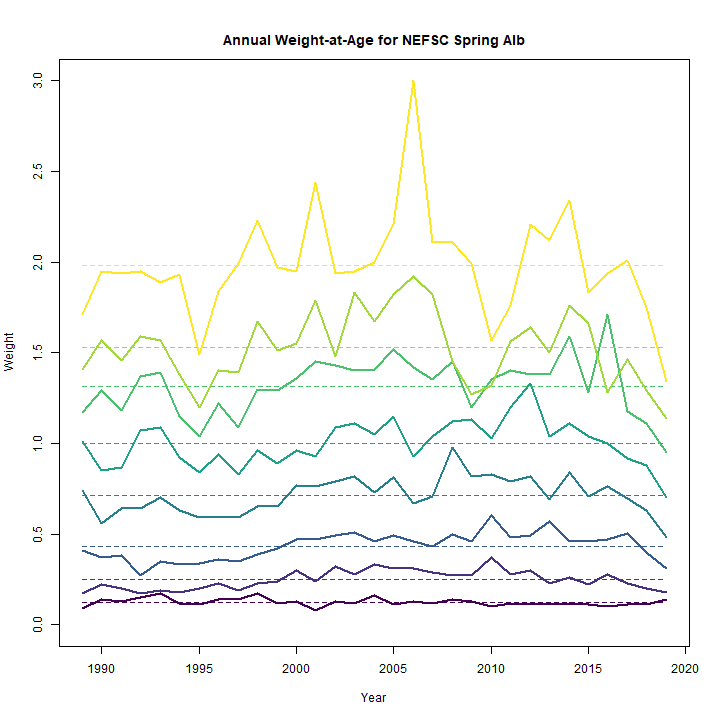
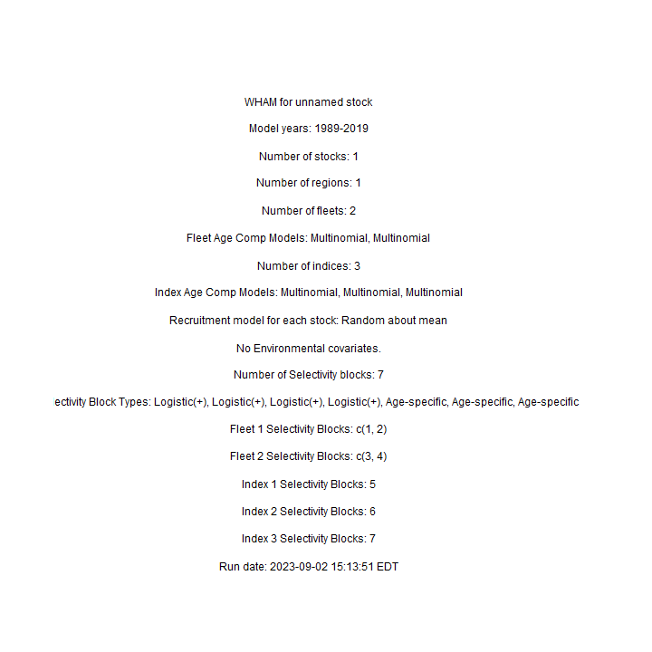
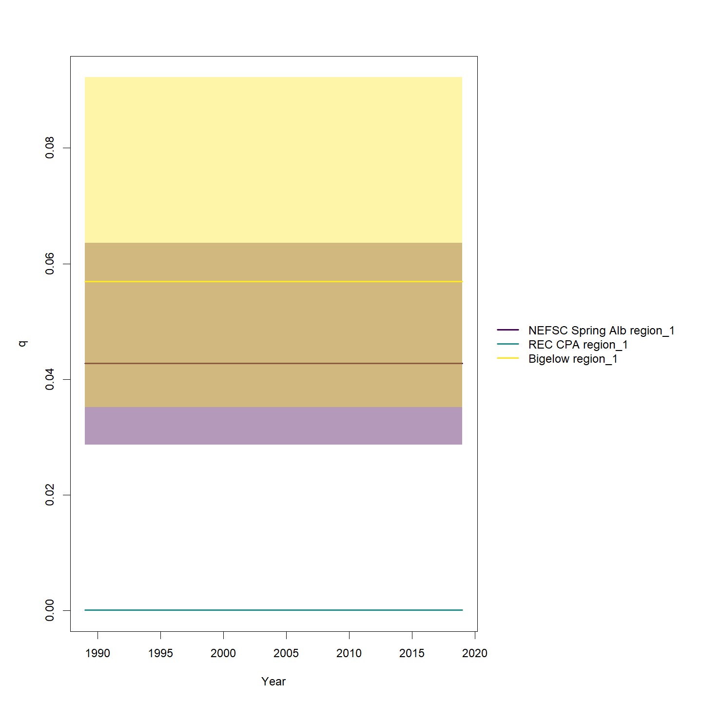
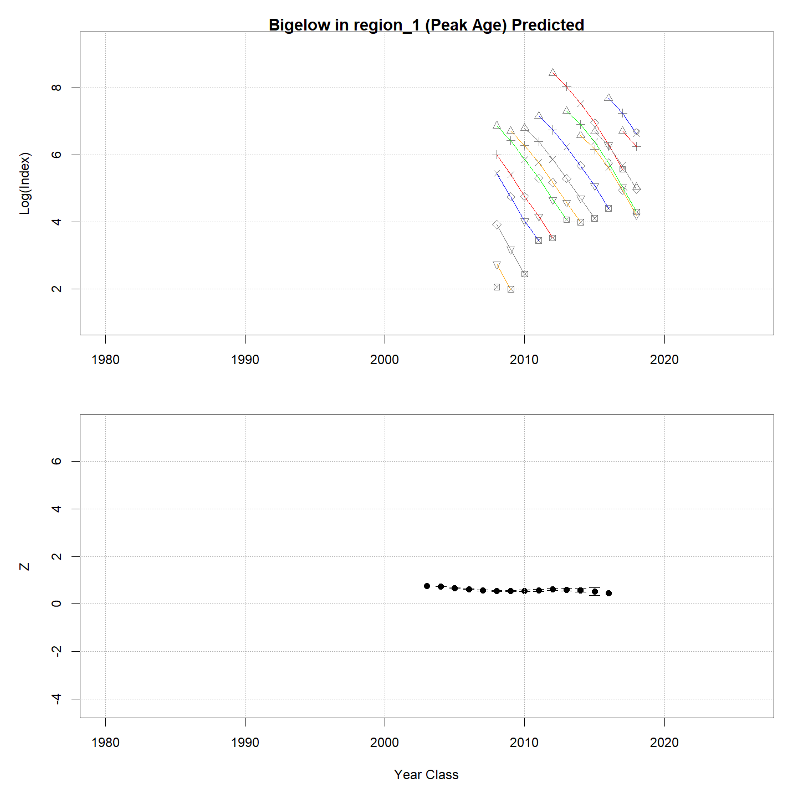
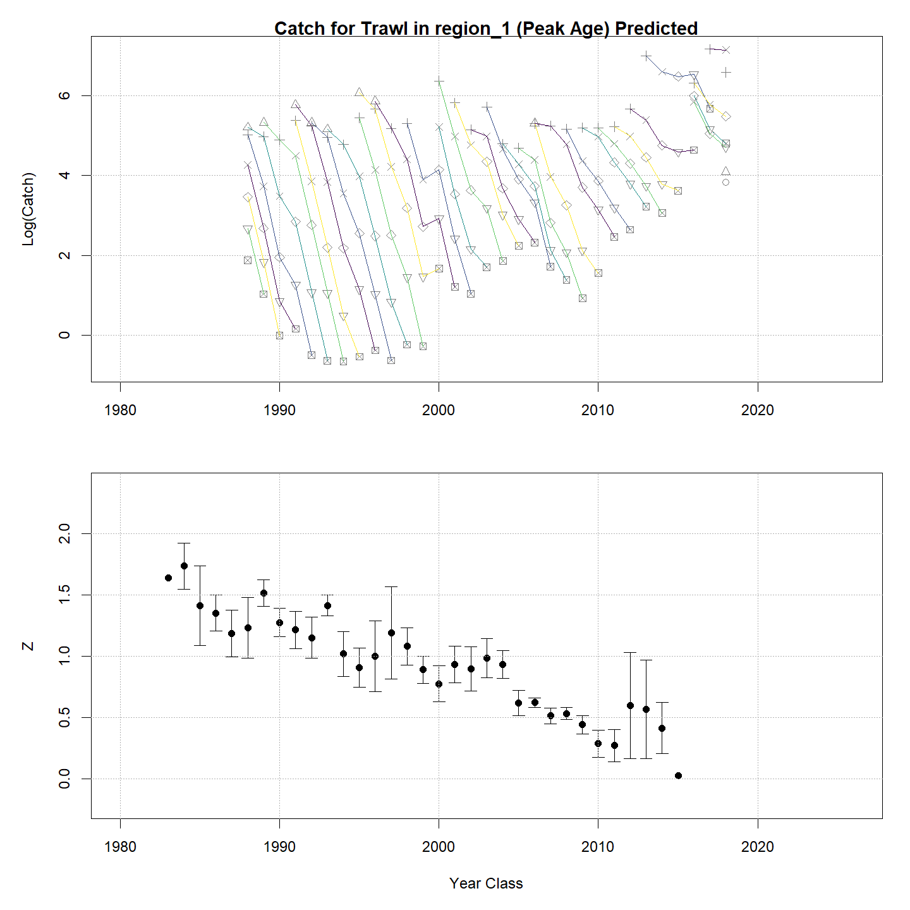

---
output:
  html_document:
    df_print: paged
    keep_md: yes
  word_document: default
  pdf_document:
    fig_caption: yes
    includes:
    keep_tex: yes
    number_sections: no
title: "WHAM figures and tables"
header-includes:
  - \usepackage{longtable}
  - \usepackage{booktabs}
  - \usepackage{caption,graphics}
  - \usepackage{makecell}
  - \usepackage{lscape}
  - \renewcommand\figurename{Fig.}
  - \captionsetup{labelsep=period, singlelinecheck=false}
  - \newcommand{\changesize}[1]{\fontsize{#1pt}{#1pt}\selectfont}
  - \renewcommand{\arraystretch}{1.5}
  - \renewcommand\theadfont{}
---

# {.tabset}

## Figures {.tabset}

### Input

### Diagnostics

### Results

### Retro

### Reference points

### Miscelaneous

## Tables {.tabset}

### Parameter estimates

<table class="table" style="margin-left: auto; margin-right: auto;">
<caption>Parameter estimates, standard errors, and confidence intervals. Rounded to 3 decimal places.</caption>
 <thead>
  <tr>
   <th style="text-align:left;">   </th>
   <th style="text-align:right;"> Estimate </th>
   <th style="text-align:right;"> Std. Error </th>
   <th style="text-align:right;"> 95\% CI lower </th>
   <th style="text-align:right;"> 95\% CI upper </th>
  </tr>
 </thead>
<tbody>
  <tr>
   <td style="text-align:left;"> NEFSC Spring Alb fully selected q </td>
   <td style="text-align:right;"> 0.043 </td>
   <td style="text-align:right;"> 0.009 </td>
   <td style="text-align:right;"> 0.029 </td>
   <td style="text-align:right;"> 0.064 </td>
  </tr>
  <tr>
   <td style="text-align:left;"> REC CPA fully selected q </td>
   <td style="text-align:right;"> 0.000 </td>
   <td style="text-align:right;"> 0.000 </td>
   <td style="text-align:right;"> 0.000 </td>
   <td style="text-align:right;"> 0.000 </td>
  </tr>
  <tr>
   <td style="text-align:left;"> Bigelow fully selected q </td>
   <td style="text-align:right;"> 0.057 </td>
   <td style="text-align:right;"> 0.014 </td>
   <td style="text-align:right;"> 0.035 </td>
   <td style="text-align:right;"> 0.092 </td>
  </tr>
  <tr>
   <td style="text-align:left;"> Block 1: $a_{50}$ </td>
   <td style="text-align:right;"> 2.124 </td>
   <td style="text-align:right;"> 0.098 </td>
   <td style="text-align:right;"> 1.938 </td>
   <td style="text-align:right;"> 2.322 </td>
  </tr>
  <tr>
   <td style="text-align:left;"> Block 1: 1/slope (increasing) </td>
   <td style="text-align:right;"> 0.419 </td>
   <td style="text-align:right;"> 0.035 </td>
   <td style="text-align:right;"> 0.356 </td>
   <td style="text-align:right;"> 0.492 </td>
  </tr>
  <tr>
   <td style="text-align:left;"> Block 2: $a_{50}$ </td>
   <td style="text-align:right;"> 2.492 </td>
   <td style="text-align:right;"> 0.065 </td>
   <td style="text-align:right;"> 2.366 </td>
   <td style="text-align:right;"> 2.622 </td>
  </tr>
  <tr>
   <td style="text-align:left;"> Block 2: 1/slope (increasing) </td>
   <td style="text-align:right;"> 0.366 </td>
   <td style="text-align:right;"> 0.023 </td>
   <td style="text-align:right;"> 0.323 </td>
   <td style="text-align:right;"> 0.414 </td>
  </tr>
  <tr>
   <td style="text-align:left;"> Block 3: $a_{50}$ </td>
   <td style="text-align:right;"> 2.535 </td>
   <td style="text-align:right;"> 0.114 </td>
   <td style="text-align:right;"> 2.317 </td>
   <td style="text-align:right;"> 2.763 </td>
  </tr>
  <tr>
   <td style="text-align:left;"> Block 3: 1/slope (increasing) </td>
   <td style="text-align:right;"> 0.570 </td>
   <td style="text-align:right;"> 0.038 </td>
   <td style="text-align:right;"> 0.500 </td>
   <td style="text-align:right;"> 0.650 </td>
  </tr>
  <tr>
   <td style="text-align:left;"> Block 4: $a_{50}$ </td>
   <td style="text-align:right;"> 3.254 </td>
   <td style="text-align:right;"> 0.256 </td>
   <td style="text-align:right;"> 2.767 </td>
   <td style="text-align:right;"> 3.766 </td>
  </tr>
  <tr>
   <td style="text-align:left;"> Block 4: 1/slope (increasing) </td>
   <td style="text-align:right;"> 0.708 </td>
   <td style="text-align:right;"> 0.079 </td>
   <td style="text-align:right;"> 0.567 </td>
   <td style="text-align:right;"> 0.880 </td>
  </tr>
  <tr>
   <td style="text-align:left;"> Block 5: Selectivity for age 1 </td>
   <td style="text-align:right;"> 0.400 </td>
   <td style="text-align:right;"> 0.085 </td>
   <td style="text-align:right;"> 0.250 </td>
   <td style="text-align:right;"> 0.572 </td>
  </tr>
  <tr>
   <td style="text-align:left;"> Block 5: Selectivity for age 2 </td>
   <td style="text-align:right;"> 0.763 </td>
   <td style="text-align:right;"> 0.162 </td>
   <td style="text-align:right;"> 0.357 </td>
   <td style="text-align:right;"> 0.949 </td>
  </tr>
  <tr>
   <td style="text-align:left;"> Block 5: Selectivity for age 3 </td>
   <td style="text-align:right;"> 1.000 </td>
   <td style="text-align:right;"> -- </td>
   <td style="text-align:right;"> -- </td>
   <td style="text-align:right;"> -- </td>
  </tr>
  <tr>
   <td style="text-align:left;"> Block 5: Selectivity for age 4 </td>
   <td style="text-align:right;"> 1.000 </td>
   <td style="text-align:right;"> -- </td>
   <td style="text-align:right;"> -- </td>
   <td style="text-align:right;"> -- </td>
  </tr>
  <tr>
   <td style="text-align:left;"> Block 5: Selectivity for age 5 </td>
   <td style="text-align:right;"> 1.000 </td>
   <td style="text-align:right;"> -- </td>
   <td style="text-align:right;"> -- </td>
   <td style="text-align:right;"> -- </td>
  </tr>
  <tr>
   <td style="text-align:left;"> Block 5: Selectivity for age 6 </td>
   <td style="text-align:right;"> 1.000 </td>
   <td style="text-align:right;"> -- </td>
   <td style="text-align:right;"> -- </td>
   <td style="text-align:right;"> -- </td>
  </tr>
  <tr>
   <td style="text-align:left;"> Block 5: Selectivity for age 7 </td>
   <td style="text-align:right;"> 1.000 </td>
   <td style="text-align:right;"> -- </td>
   <td style="text-align:right;"> -- </td>
   <td style="text-align:right;"> -- </td>
  </tr>
  <tr>
   <td style="text-align:left;"> Block 5: Selectivity for age 8+ </td>
   <td style="text-align:right;"> 1.000 </td>
   <td style="text-align:right;"> -- </td>
   <td style="text-align:right;"> -- </td>
   <td style="text-align:right;"> -- </td>
  </tr>
  <tr>
   <td style="text-align:left;"> Block 6: Selectivity for age 1 </td>
   <td style="text-align:right;"> 0.252 </td>
   <td style="text-align:right;"> 0.020 </td>
   <td style="text-align:right;"> 0.215 </td>
   <td style="text-align:right;"> 0.293 </td>
  </tr>
  <tr>
   <td style="text-align:left;"> Block 6: Selectivity for age 2 </td>
   <td style="text-align:right;"> 1.000 </td>
   <td style="text-align:right;"> -- </td>
   <td style="text-align:right;"> -- </td>
   <td style="text-align:right;"> -- </td>
  </tr>
  <tr>
   <td style="text-align:left;"> Block 6: Selectivity for age 3 </td>
   <td style="text-align:right;"> 1.000 </td>
   <td style="text-align:right;"> -- </td>
   <td style="text-align:right;"> -- </td>
   <td style="text-align:right;"> -- </td>
  </tr>
  <tr>
   <td style="text-align:left;"> Block 6: Selectivity for age 4 </td>
   <td style="text-align:right;"> 1.000 </td>
   <td style="text-align:right;"> -- </td>
   <td style="text-align:right;"> -- </td>
   <td style="text-align:right;"> -- </td>
  </tr>
  <tr>
   <td style="text-align:left;"> Block 6: Selectivity for age 5 </td>
   <td style="text-align:right;"> 1.000 </td>
   <td style="text-align:right;"> -- </td>
   <td style="text-align:right;"> -- </td>
   <td style="text-align:right;"> -- </td>
  </tr>
  <tr>
   <td style="text-align:left;"> Block 6: Selectivity for age 6 </td>
   <td style="text-align:right;"> 1.000 </td>
   <td style="text-align:right;"> -- </td>
   <td style="text-align:right;"> -- </td>
   <td style="text-align:right;"> -- </td>
  </tr>
  <tr>
   <td style="text-align:left;"> Block 6: Selectivity for age 7 </td>
   <td style="text-align:right;"> 1.000 </td>
   <td style="text-align:right;"> -- </td>
   <td style="text-align:right;"> -- </td>
   <td style="text-align:right;"> -- </td>
  </tr>
  <tr>
   <td style="text-align:left;"> Block 6: Selectivity for age 8+ </td>
   <td style="text-align:right;"> 1.000 </td>
   <td style="text-align:right;"> -- </td>
   <td style="text-align:right;"> -- </td>
   <td style="text-align:right;"> -- </td>
  </tr>
  <tr>
   <td style="text-align:left;"> Block 7: Selectivity for age 1 </td>
   <td style="text-align:right;"> 0.536 </td>
   <td style="text-align:right;"> 0.104 </td>
   <td style="text-align:right;"> 0.337 </td>
   <td style="text-align:right;"> 0.725 </td>
  </tr>
  <tr>
   <td style="text-align:left;"> Block 7: Selectivity for age 2 </td>
   <td style="text-align:right;"> 0.959 </td>
   <td style="text-align:right;"> 0.169 </td>
   <td style="text-align:right;"> 0.005 </td>
   <td style="text-align:right;"> 1.000 </td>
  </tr>
  <tr>
   <td style="text-align:left;"> Block 7: Selectivity for age 3 </td>
   <td style="text-align:right;"> 1.000 </td>
   <td style="text-align:right;"> -- </td>
   <td style="text-align:right;"> -- </td>
   <td style="text-align:right;"> -- </td>
  </tr>
  <tr>
   <td style="text-align:left;"> Block 7: Selectivity for age 4 </td>
   <td style="text-align:right;"> 1.000 </td>
   <td style="text-align:right;"> -- </td>
   <td style="text-align:right;"> -- </td>
   <td style="text-align:right;"> -- </td>
  </tr>
  <tr>
   <td style="text-align:left;"> Block 7: Selectivity for age 5 </td>
   <td style="text-align:right;"> 1.000 </td>
   <td style="text-align:right;"> -- </td>
   <td style="text-align:right;"> -- </td>
   <td style="text-align:right;"> -- </td>
  </tr>
  <tr>
   <td style="text-align:left;"> Block 7: Selectivity for age 6 </td>
   <td style="text-align:right;"> 1.000 </td>
   <td style="text-align:right;"> -- </td>
   <td style="text-align:right;"> -- </td>
   <td style="text-align:right;"> -- </td>
  </tr>
  <tr>
   <td style="text-align:left;"> Block 7: Selectivity for age 7 </td>
   <td style="text-align:right;"> 1.000 </td>
   <td style="text-align:right;"> -- </td>
   <td style="text-align:right;"> -- </td>
   <td style="text-align:right;"> -- </td>
  </tr>
  <tr>
   <td style="text-align:left;"> Block 7: Selectivity for age 8+ </td>
   <td style="text-align:right;"> 1.000 </td>
   <td style="text-align:right;"> -- </td>
   <td style="text-align:right;"> -- </td>
   <td style="text-align:right;"> -- </td>
  </tr>
</tbody>
</table>

### Abundance at age

<table class="table" style="margin-left: auto; margin-right: auto;">
<caption>Abundance at age (1000s) for stock 1 in region 1.</caption>
 <thead>
  <tr>
   <th style="text-align:left;">   </th>
   <th style="text-align:right;"> 1 </th>
   <th style="text-align:right;"> 2 </th>
   <th style="text-align:right;"> 3 </th>
   <th style="text-align:right;"> 4 </th>
   <th style="text-align:right;"> 5 </th>
   <th style="text-align:right;"> 6 </th>
   <th style="text-align:right;"> 7 </th>
   <th style="text-align:right;"> 8+ </th>
  </tr>
 </thead>
<tbody>
  <tr>
   <td style="text-align:left;"> 1989 </td>
   <td style="text-align:right;"> 3550 </td>
   <td style="text-align:right;"> 2107 </td>
   <td style="text-align:right;"> 1061 </td>
   <td style="text-align:right;"> 494 </td>
   <td style="text-align:right;"> 225 </td>
   <td style="text-align:right;"> 103 </td>
   <td style="text-align:right;"> 47 </td>
   <td style="text-align:right;"> 39 </td>
  </tr>
  <tr>
   <td style="text-align:left;"> 1990 </td>
   <td style="text-align:right;"> 2443 </td>
   <td style="text-align:right;"> 2188 </td>
   <td style="text-align:right;"> 933 </td>
   <td style="text-align:right;"> 268 </td>
   <td style="text-align:right;"> 95 </td>
   <td style="text-align:right;"> 41 </td>
   <td style="text-align:right;"> 18 </td>
   <td style="text-align:right;"> 15 </td>
  </tr>
  <tr>
   <td style="text-align:left;"> 1991 </td>
   <td style="text-align:right;"> 2904 </td>
   <td style="text-align:right;"> 1503 </td>
   <td style="text-align:right;"> 958 </td>
   <td style="text-align:right;"> 231 </td>
   <td style="text-align:right;"> 51 </td>
   <td style="text-align:right;"> 17 </td>
   <td style="text-align:right;"> 7 </td>
   <td style="text-align:right;"> 6 </td>
  </tr>
  <tr>
   <td style="text-align:left;"> 1992 </td>
   <td style="text-align:right;"> 2410 </td>
   <td style="text-align:right;"> 1814 </td>
   <td style="text-align:right;"> 710 </td>
   <td style="text-align:right;"> 283 </td>
   <td style="text-align:right;"> 55 </td>
   <td style="text-align:right;"> 11 </td>
   <td style="text-align:right;"> 4 </td>
   <td style="text-align:right;"> 3 </td>
  </tr>
  <tr>
   <td style="text-align:left;"> 1993 </td>
   <td style="text-align:right;"> 2227 </td>
   <td style="text-align:right;"> 1510 </td>
   <td style="text-align:right;"> 829 </td>
   <td style="text-align:right;"> 204 </td>
   <td style="text-align:right;"> 69 </td>
   <td style="text-align:right;"> 13 </td>
   <td style="text-align:right;"> 3 </td>
   <td style="text-align:right;"> 2 </td>
  </tr>
  <tr>
   <td style="text-align:left;"> 1994 </td>
   <td style="text-align:right;"> 3012 </td>
   <td style="text-align:right;"> 1381 </td>
   <td style="text-align:right;"> 671 </td>
   <td style="text-align:right;"> 217 </td>
   <td style="text-align:right;"> 43 </td>
   <td style="text-align:right;"> 14 </td>
   <td style="text-align:right;"> 3 </td>
   <td style="text-align:right;"> 1 </td>
  </tr>
  <tr>
   <td style="text-align:left;"> 1995 </td>
   <td style="text-align:right;"> 4814 </td>
   <td style="text-align:right;"> 1864 </td>
   <td style="text-align:right;"> 611 </td>
   <td style="text-align:right;"> 173 </td>
   <td style="text-align:right;"> 44 </td>
   <td style="text-align:right;"> 8 </td>
   <td style="text-align:right;"> 3 </td>
   <td style="text-align:right;"> 1 </td>
  </tr>
  <tr>
   <td style="text-align:left;"> 1996 </td>
   <td style="text-align:right;"> 5137 </td>
   <td style="text-align:right;"> 3047 </td>
   <td style="text-align:right;"> 920 </td>
   <td style="text-align:right;"> 204 </td>
   <td style="text-align:right;"> 49 </td>
   <td style="text-align:right;"> 12 </td>
   <td style="text-align:right;"> 2 </td>
   <td style="text-align:right;"> 1 </td>
  </tr>
  <tr>
   <td style="text-align:left;"> 1997 </td>
   <td style="text-align:right;"> 5934 </td>
   <td style="text-align:right;"> 3258 </td>
   <td style="text-align:right;"> 1496 </td>
   <td style="text-align:right;"> 309 </td>
   <td style="text-align:right;"> 59 </td>
   <td style="text-align:right;"> 14 </td>
   <td style="text-align:right;"> 3 </td>
   <td style="text-align:right;"> 1 </td>
  </tr>
  <tr>
   <td style="text-align:left;"> 1998 </td>
   <td style="text-align:right;"> 6814 </td>
   <td style="text-align:right;"> 3784 </td>
   <td style="text-align:right;"> 1667 </td>
   <td style="text-align:right;"> 545 </td>
   <td style="text-align:right;"> 98 </td>
   <td style="text-align:right;"> 18 </td>
   <td style="text-align:right;"> 4 </td>
   <td style="text-align:right;"> 1 </td>
  </tr>
  <tr>
   <td style="text-align:left;"> 1999 </td>
   <td style="text-align:right;"> 11475 </td>
   <td style="text-align:right;"> 4471 </td>
   <td style="text-align:right;"> 2250 </td>
   <td style="text-align:right;"> 787 </td>
   <td style="text-align:right;"> 232 </td>
   <td style="text-align:right;"> 41 </td>
   <td style="text-align:right;"> 8 </td>
   <td style="text-align:right;"> 2 </td>
  </tr>
  <tr>
   <td style="text-align:left;"> 2000 </td>
   <td style="text-align:right;"> 12911 </td>
   <td style="text-align:right;"> 7460 </td>
   <td style="text-align:right;"> 2559 </td>
   <td style="text-align:right;"> 974 </td>
   <td style="text-align:right;"> 298 </td>
   <td style="text-align:right;"> 85 </td>
   <td style="text-align:right;"> 15 </td>
   <td style="text-align:right;"> 4 </td>
  </tr>
  <tr>
   <td style="text-align:left;"> 2001 </td>
   <td style="text-align:right;"> 9213 </td>
   <td style="text-align:right;"> 8416 </td>
   <td style="text-align:right;"> 4372 </td>
   <td style="text-align:right;"> 1205 </td>
   <td style="text-align:right;"> 409 </td>
   <td style="text-align:right;"> 122 </td>
   <td style="text-align:right;"> 35 </td>
   <td style="text-align:right;"> 8 </td>
  </tr>
  <tr>
   <td style="text-align:left;"> 2002 </td>
   <td style="text-align:right;"> 10496 </td>
   <td style="text-align:right;"> 5985 </td>
   <td style="text-align:right;"> 4747 </td>
   <td style="text-align:right;"> 1781 </td>
   <td style="text-align:right;"> 424 </td>
   <td style="text-align:right;"> 140 </td>
   <td style="text-align:right;"> 41 </td>
   <td style="text-align:right;"> 14 </td>
  </tr>
  <tr>
   <td style="text-align:left;"> 2003 </td>
   <td style="text-align:right;"> 7118 </td>
   <td style="text-align:right;"> 6769 </td>
   <td style="text-align:right;"> 3321 </td>
   <td style="text-align:right;"> 1921 </td>
   <td style="text-align:right;"> 615 </td>
   <td style="text-align:right;"> 141 </td>
   <td style="text-align:right;"> 46 </td>
   <td style="text-align:right;"> 18 </td>
  </tr>
  <tr>
   <td style="text-align:left;"> 2004 </td>
   <td style="text-align:right;"> 6574 </td>
   <td style="text-align:right;"> 4663 </td>
   <td style="text-align:right;"> 4051 </td>
   <td style="text-align:right;"> 1640 </td>
   <td style="text-align:right;"> 862 </td>
   <td style="text-align:right;"> 270 </td>
   <td style="text-align:right;"> 62 </td>
   <td style="text-align:right;"> 28 </td>
  </tr>
  <tr>
   <td style="text-align:left;"> 2005 </td>
   <td style="text-align:right;"> 9796 </td>
   <td style="text-align:right;"> 4334 </td>
   <td style="text-align:right;"> 2855 </td>
   <td style="text-align:right;"> 2094 </td>
   <td style="text-align:right;"> 785 </td>
   <td style="text-align:right;"> 406 </td>
   <td style="text-align:right;"> 127 </td>
   <td style="text-align:right;"> 42 </td>
  </tr>
  <tr>
   <td style="text-align:left;"> 2006 </td>
   <td style="text-align:right;"> 21209 </td>
   <td style="text-align:right;"> 6449 </td>
   <td style="text-align:right;"> 2656 </td>
   <td style="text-align:right;"> 1503 </td>
   <td style="text-align:right;"> 1022 </td>
   <td style="text-align:right;"> 377 </td>
   <td style="text-align:right;"> 194 </td>
   <td style="text-align:right;"> 81 </td>
  </tr>
  <tr>
   <td style="text-align:left;"> 2007 </td>
   <td style="text-align:right;"> 19828 </td>
   <td style="text-align:right;"> 13891 </td>
   <td style="text-align:right;"> 3863 </td>
   <td style="text-align:right;"> 1322 </td>
   <td style="text-align:right;"> 681 </td>
   <td style="text-align:right;"> 453 </td>
   <td style="text-align:right;"> 166 </td>
   <td style="text-align:right;"> 122 </td>
  </tr>
  <tr>
   <td style="text-align:left;"> 2008 </td>
   <td style="text-align:right;"> 29717 </td>
   <td style="text-align:right;"> 13012 </td>
   <td style="text-align:right;"> 8376 </td>
   <td style="text-align:right;"> 1944 </td>
   <td style="text-align:right;"> 608 </td>
   <td style="text-align:right;"> 307 </td>
   <td style="text-align:right;"> 204 </td>
   <td style="text-align:right;"> 129 </td>
  </tr>
  <tr>
   <td style="text-align:left;"> 2009 </td>
   <td style="text-align:right;"> 25457 </td>
   <td style="text-align:right;"> 19674 </td>
   <td style="text-align:right;"> 8214 </td>
   <td style="text-align:right;"> 4790 </td>
   <td style="text-align:right;"> 1057 </td>
   <td style="text-align:right;"> 327 </td>
   <td style="text-align:right;"> 165 </td>
   <td style="text-align:right;"> 179 </td>
  </tr>
  <tr>
   <td style="text-align:left;"> 2010 </td>
   <td style="text-align:right;"> 27698 </td>
   <td style="text-align:right;"> 16845 </td>
   <td style="text-align:right;"> 12515 </td>
   <td style="text-align:right;"> 4713 </td>
   <td style="text-align:right;"> 2465 </td>
   <td style="text-align:right;"> 514 </td>
   <td style="text-align:right;"> 156 </td>
   <td style="text-align:right;"> 163 </td>
  </tr>
  <tr>
   <td style="text-align:left;"> 2011 </td>
   <td style="text-align:right;"> 39413 </td>
   <td style="text-align:right;"> 18289 </td>
   <td style="text-align:right;"> 10651 </td>
   <td style="text-align:right;"> 7076 </td>
   <td style="text-align:right;"> 2350 </td>
   <td style="text-align:right;"> 1150 </td>
   <td style="text-align:right;"> 235 </td>
   <td style="text-align:right;"> 145 </td>
  </tr>
  <tr>
   <td style="text-align:left;"> 2012 </td>
   <td style="text-align:right;"> 142742 </td>
   <td style="text-align:right;"> 26249 </td>
   <td style="text-align:right;"> 11928 </td>
   <td style="text-align:right;"> 6569 </td>
   <td style="text-align:right;"> 4133 </td>
   <td style="text-align:right;"> 1335 </td>
   <td style="text-align:right;"> 647 </td>
   <td style="text-align:right;"> 213 </td>
  </tr>
  <tr>
   <td style="text-align:left;"> 2013 </td>
   <td style="text-align:right;"> 45837 </td>
   <td style="text-align:right;"> 94747 </td>
   <td style="text-align:right;"> 16914 </td>
   <td style="text-align:right;"> 7112 </td>
   <td style="text-align:right;"> 3607 </td>
   <td style="text-align:right;"> 2174 </td>
   <td style="text-align:right;"> 693 </td>
   <td style="text-align:right;"> 445 </td>
  </tr>
  <tr>
   <td style="text-align:left;"> 2014 </td>
   <td style="text-align:right;"> 22069 </td>
   <td style="text-align:right;"> 30491 </td>
   <td style="text-align:right;"> 61518 </td>
   <td style="text-align:right;"> 10300 </td>
   <td style="text-align:right;"> 4060 </td>
   <td style="text-align:right;"> 1992 </td>
   <td style="text-align:right;"> 1188 </td>
   <td style="text-align:right;"> 620 </td>
  </tr>
  <tr>
   <td style="text-align:left;"> 2015 </td>
   <td style="text-align:right;"> 24829 </td>
   <td style="text-align:right;"> 14690 </td>
   <td style="text-align:right;"> 19844 </td>
   <td style="text-align:right;"> 37704 </td>
   <td style="text-align:right;"> 5951 </td>
   <td style="text-align:right;"> 2277 </td>
   <td style="text-align:right;"> 1107 </td>
   <td style="text-align:right;"> 1001 </td>
  </tr>
  <tr>
   <td style="text-align:left;"> 2016 </td>
   <td style="text-align:right;"> 67259 </td>
   <td style="text-align:right;"> 16522 </td>
   <td style="text-align:right;"> 9551 </td>
   <td style="text-align:right;"> 12135 </td>
   <td style="text-align:right;"> 21674 </td>
   <td style="text-align:right;"> 3314 </td>
   <td style="text-align:right;"> 1255 </td>
   <td style="text-align:right;"> 1159 </td>
  </tr>
  <tr>
   <td style="text-align:left;"> 2017 </td>
   <td style="text-align:right;"> 25430 </td>
   <td style="text-align:right;"> 44673 </td>
   <td style="text-align:right;"> 10647 </td>
   <td style="text-align:right;"> 5677 </td>
   <td style="text-align:right;"> 6671 </td>
   <td style="text-align:right;"> 11458 </td>
   <td style="text-align:right;"> 1730 </td>
   <td style="text-align:right;"> 1256 </td>
  </tr>
  <tr>
   <td style="text-align:left;"> 2018 </td>
   <td style="text-align:right;"> 4803 </td>
   <td style="text-align:right;"> 16851 </td>
   <td style="text-align:right;"> 28363 </td>
   <td style="text-align:right;"> 6011 </td>
   <td style="text-align:right;"> 2903 </td>
   <td style="text-align:right;"> 3255 </td>
   <td style="text-align:right;"> 5508 </td>
   <td style="text-align:right;"> 1429 </td>
  </tr>
  <tr>
   <td style="text-align:left;"> 2019 </td>
   <td style="text-align:right;"> 29567 </td>
   <td style="text-align:right;"> 3187 </td>
   <td style="text-align:right;"> 10764 </td>
   <td style="text-align:right;"> 16330 </td>
   <td style="text-align:right;"> 3168 </td>
   <td style="text-align:right;"> 1467 </td>
   <td style="text-align:right;"> 1623 </td>
   <td style="text-align:right;"> 3447 </td>
  </tr>
</tbody>
</table>

### Fishing mortality at age by region

<table class="table" style="margin-left: auto; margin-right: auto;">
<caption>Total fishing mortality at age in region 1.</caption>
 <thead>
  <tr>
   <th style="text-align:left;">   </th>
   <th style="text-align:right;"> 1 </th>
   <th style="text-align:right;"> 2 </th>
   <th style="text-align:right;"> 3 </th>
   <th style="text-align:right;"> 4 </th>
   <th style="text-align:right;"> 5 </th>
   <th style="text-align:right;"> 6 </th>
   <th style="text-align:right;"> 7 </th>
   <th style="text-align:right;"> 8+ </th>
  </tr>
 </thead>
<tbody>
  <tr>
   <td style="text-align:left;"> 1989 </td>
   <td style="text-align:right;"> 0.019 </td>
   <td style="text-align:right;"> 0.126 </td>
   <td style="text-align:right;"> 0.263 </td>
   <td style="text-align:right;"> 0.292 </td>
   <td style="text-align:right;"> 0.295 </td>
   <td style="text-align:right;"> 0.295 </td>
   <td style="text-align:right;"> 0.295 </td>
   <td style="text-align:right;"> 0.295 </td>
  </tr>
  <tr>
   <td style="text-align:left;"> 1990 </td>
   <td style="text-align:right;"> 0.021 </td>
   <td style="text-align:right;"> 0.138 </td>
   <td style="text-align:right;"> 0.288 </td>
   <td style="text-align:right;"> 0.320 </td>
   <td style="text-align:right;"> 0.323 </td>
   <td style="text-align:right;"> 0.324 </td>
   <td style="text-align:right;"> 0.324 </td>
   <td style="text-align:right;"> 0.324 </td>
  </tr>
  <tr>
   <td style="text-align:left;"> 1991 </td>
   <td style="text-align:right;"> 0.017 </td>
   <td style="text-align:right;"> 0.115 </td>
   <td style="text-align:right;"> 0.240 </td>
   <td style="text-align:right;"> 0.266 </td>
   <td style="text-align:right;"> 0.269 </td>
   <td style="text-align:right;"> 0.269 </td>
   <td style="text-align:right;"> 0.269 </td>
   <td style="text-align:right;"> 0.269 </td>
  </tr>
  <tr>
   <td style="text-align:left;"> 1992 </td>
   <td style="text-align:right;"> 0.038 </td>
   <td style="text-align:right;"> 0.254 </td>
   <td style="text-align:right;"> 0.531 </td>
   <td style="text-align:right;"> 0.589 </td>
   <td style="text-align:right;"> 0.596 </td>
   <td style="text-align:right;"> 0.596 </td>
   <td style="text-align:right;"> 0.596 </td>
   <td style="text-align:right;"> 0.596 </td>
  </tr>
  <tr>
   <td style="text-align:left;"> 1993 </td>
   <td style="text-align:right;"> 0.030 </td>
   <td style="text-align:right;"> 0.197 </td>
   <td style="text-align:right;"> 0.412 </td>
   <td style="text-align:right;"> 0.458 </td>
   <td style="text-align:right;"> 0.462 </td>
   <td style="text-align:right;"> 0.463 </td>
   <td style="text-align:right;"> 0.463 </td>
   <td style="text-align:right;"> 0.463 </td>
  </tr>
  <tr>
   <td style="text-align:left;"> 1994 </td>
   <td style="text-align:right;"> 0.028 </td>
   <td style="text-align:right;"> 0.184 </td>
   <td style="text-align:right;"> 0.384 </td>
   <td style="text-align:right;"> 0.426 </td>
   <td style="text-align:right;"> 0.431 </td>
   <td style="text-align:right;"> 0.431 </td>
   <td style="text-align:right;"> 0.431 </td>
   <td style="text-align:right;"> 0.431 </td>
  </tr>
  <tr>
   <td style="text-align:left;"> 1995 </td>
   <td style="text-align:right;"> 0.023 </td>
   <td style="text-align:right;"> 0.153 </td>
   <td style="text-align:right;"> 0.319 </td>
   <td style="text-align:right;"> 0.354 </td>
   <td style="text-align:right;"> 0.358 </td>
   <td style="text-align:right;"> 0.358 </td>
   <td style="text-align:right;"> 0.359 </td>
   <td style="text-align:right;"> 0.359 </td>
  </tr>
  <tr>
   <td style="text-align:left;"> 1996 </td>
   <td style="text-align:right;"> 0.030 </td>
   <td style="text-align:right;"> 0.198 </td>
   <td style="text-align:right;"> 0.413 </td>
   <td style="text-align:right;"> 0.459 </td>
   <td style="text-align:right;"> 0.463 </td>
   <td style="text-align:right;"> 0.464 </td>
   <td style="text-align:right;"> 0.464 </td>
   <td style="text-align:right;"> 0.464 </td>
  </tr>
  <tr>
   <td style="text-align:left;"> 1997 </td>
   <td style="text-align:right;"> 0.022 </td>
   <td style="text-align:right;"> 0.147 </td>
   <td style="text-align:right;"> 0.307 </td>
   <td style="text-align:right;"> 0.341 </td>
   <td style="text-align:right;"> 0.344 </td>
   <td style="text-align:right;"> 0.345 </td>
   <td style="text-align:right;"> 0.345 </td>
   <td style="text-align:right;"> 0.345 </td>
  </tr>
  <tr>
   <td style="text-align:left;"> 1998 </td>
   <td style="text-align:right;"> 0.003 </td>
   <td style="text-align:right;"> 0.039 </td>
   <td style="text-align:right;"> 0.151 </td>
   <td style="text-align:right;"> 0.186 </td>
   <td style="text-align:right;"> 0.188 </td>
   <td style="text-align:right;"> 0.189 </td>
   <td style="text-align:right;"> 0.189 </td>
   <td style="text-align:right;"> 0.189 </td>
  </tr>
  <tr>
   <td style="text-align:left;"> 1999 </td>
   <td style="text-align:right;"> 0.003 </td>
   <td style="text-align:right;"> 0.034 </td>
   <td style="text-align:right;"> 0.132 </td>
   <td style="text-align:right;"> 0.163 </td>
   <td style="text-align:right;"> 0.165 </td>
   <td style="text-align:right;"> 0.165 </td>
   <td style="text-align:right;"> 0.165 </td>
   <td style="text-align:right;"> 0.165 </td>
  </tr>
  <tr>
   <td style="text-align:left;"> 2000 </td>
   <td style="text-align:right;"> 0.001 </td>
   <td style="text-align:right;"> 0.016 </td>
   <td style="text-align:right;"> 0.062 </td>
   <td style="text-align:right;"> 0.076 </td>
   <td style="text-align:right;"> 0.077 </td>
   <td style="text-align:right;"> 0.077 </td>
   <td style="text-align:right;"> 0.077 </td>
   <td style="text-align:right;"> 0.077 </td>
  </tr>
  <tr>
   <td style="text-align:left;"> 2001 </td>
   <td style="text-align:right;"> 0.004 </td>
   <td style="text-align:right;"> 0.052 </td>
   <td style="text-align:right;"> 0.200 </td>
   <td style="text-align:right;"> 0.246 </td>
   <td style="text-align:right;"> 0.250 </td>
   <td style="text-align:right;"> 0.250 </td>
   <td style="text-align:right;"> 0.250 </td>
   <td style="text-align:right;"> 0.250 </td>
  </tr>
  <tr>
   <td style="text-align:left;"> 2002 </td>
   <td style="text-align:right;"> 0.002 </td>
   <td style="text-align:right;"> 0.028 </td>
   <td style="text-align:right;"> 0.107 </td>
   <td style="text-align:right;"> 0.132 </td>
   <td style="text-align:right;"> 0.134 </td>
   <td style="text-align:right;"> 0.134 </td>
   <td style="text-align:right;"> 0.134 </td>
   <td style="text-align:right;"> 0.134 </td>
  </tr>
  <tr>
   <td style="text-align:left;"> 2003 </td>
   <td style="text-align:right;"> 0.001 </td>
   <td style="text-align:right;"> 0.019 </td>
   <td style="text-align:right;"> 0.072 </td>
   <td style="text-align:right;"> 0.089 </td>
   <td style="text-align:right;"> 0.090 </td>
   <td style="text-align:right;"> 0.090 </td>
   <td style="text-align:right;"> 0.090 </td>
   <td style="text-align:right;"> 0.090 </td>
  </tr>
  <tr>
   <td style="text-align:left;"> 2004 </td>
   <td style="text-align:right;"> 0.002 </td>
   <td style="text-align:right;"> 0.026 </td>
   <td style="text-align:right;"> 0.102 </td>
   <td style="text-align:right;"> 0.126 </td>
   <td style="text-align:right;"> 0.127 </td>
   <td style="text-align:right;"> 0.128 </td>
   <td style="text-align:right;"> 0.128 </td>
   <td style="text-align:right;"> 0.128 </td>
  </tr>
  <tr>
   <td style="text-align:left;"> 2005 </td>
   <td style="text-align:right;"> 0.001 </td>
   <td style="text-align:right;"> 0.015 </td>
   <td style="text-align:right;"> 0.057 </td>
   <td style="text-align:right;"> 0.070 </td>
   <td style="text-align:right;"> 0.071 </td>
   <td style="text-align:right;"> 0.071 </td>
   <td style="text-align:right;"> 0.071 </td>
   <td style="text-align:right;"> 0.071 </td>
  </tr>
  <tr>
   <td style="text-align:left;"> 2006 </td>
   <td style="text-align:right;"> 0.001 </td>
   <td style="text-align:right;"> 0.015 </td>
   <td style="text-align:right;"> 0.057 </td>
   <td style="text-align:right;"> 0.070 </td>
   <td style="text-align:right;"> 0.071 </td>
   <td style="text-align:right;"> 0.071 </td>
   <td style="text-align:right;"> 0.071 </td>
   <td style="text-align:right;"> 0.071 </td>
  </tr>
  <tr>
   <td style="text-align:left;"> 2007 </td>
   <td style="text-align:right;"> 0.001 </td>
   <td style="text-align:right;"> 0.018 </td>
   <td style="text-align:right;"> 0.071 </td>
   <td style="text-align:right;"> 0.088 </td>
   <td style="text-align:right;"> 0.089 </td>
   <td style="text-align:right;"> 0.089 </td>
   <td style="text-align:right;"> 0.089 </td>
   <td style="text-align:right;"> 0.089 </td>
  </tr>
  <tr>
   <td style="text-align:left;"> 2008 </td>
   <td style="text-align:right;"> 0.001 </td>
   <td style="text-align:right;"> 0.008 </td>
   <td style="text-align:right;"> 0.029 </td>
   <td style="text-align:right;"> 0.036 </td>
   <td style="text-align:right;"> 0.037 </td>
   <td style="text-align:right;"> 0.037 </td>
   <td style="text-align:right;"> 0.037 </td>
   <td style="text-align:right;"> 0.037 </td>
  </tr>
  <tr>
   <td style="text-align:left;"> 2009 </td>
   <td style="text-align:right;"> 0.001 </td>
   <td style="text-align:right;"> 0.007 </td>
   <td style="text-align:right;"> 0.028 </td>
   <td style="text-align:right;"> 0.034 </td>
   <td style="text-align:right;"> 0.034 </td>
   <td style="text-align:right;"> 0.035 </td>
   <td style="text-align:right;"> 0.035 </td>
   <td style="text-align:right;"> 0.035 </td>
  </tr>
  <tr>
   <td style="text-align:left;"> 2010 </td>
   <td style="text-align:right;"> 0.000 </td>
   <td style="text-align:right;"> 0.005 </td>
   <td style="text-align:right;"> 0.019 </td>
   <td style="text-align:right;"> 0.023 </td>
   <td style="text-align:right;"> 0.024 </td>
   <td style="text-align:right;"> 0.024 </td>
   <td style="text-align:right;"> 0.024 </td>
   <td style="text-align:right;"> 0.024 </td>
  </tr>
  <tr>
   <td style="text-align:left;"> 2011 </td>
   <td style="text-align:right;"> 0.000 </td>
   <td style="text-align:right;"> 0.006 </td>
   <td style="text-align:right;"> 0.021 </td>
   <td style="text-align:right;"> 0.026 </td>
   <td style="text-align:right;"> 0.027 </td>
   <td style="text-align:right;"> 0.027 </td>
   <td style="text-align:right;"> 0.027 </td>
   <td style="text-align:right;"> 0.027 </td>
  </tr>
  <tr>
   <td style="text-align:left;"> 2012 </td>
   <td style="text-align:right;"> 0.000 </td>
   <td style="text-align:right;"> 0.005 </td>
   <td style="text-align:right;"> 0.020 </td>
   <td style="text-align:right;"> 0.024 </td>
   <td style="text-align:right;"> 0.025 </td>
   <td style="text-align:right;"> 0.025 </td>
   <td style="text-align:right;"> 0.025 </td>
   <td style="text-align:right;"> 0.025 </td>
  </tr>
  <tr>
   <td style="text-align:left;"> 2013 </td>
   <td style="text-align:right;"> 0.000 </td>
   <td style="text-align:right;"> 0.006 </td>
   <td style="text-align:right;"> 0.022 </td>
   <td style="text-align:right;"> 0.027 </td>
   <td style="text-align:right;"> 0.027 </td>
   <td style="text-align:right;"> 0.027 </td>
   <td style="text-align:right;"> 0.027 </td>
   <td style="text-align:right;"> 0.027 </td>
  </tr>
  <tr>
   <td style="text-align:left;"> 2014 </td>
   <td style="text-align:right;"> 0.000 </td>
   <td style="text-align:right;"> 0.006 </td>
   <td style="text-align:right;"> 0.022 </td>
   <td style="text-align:right;"> 0.027 </td>
   <td style="text-align:right;"> 0.028 </td>
   <td style="text-align:right;"> 0.028 </td>
   <td style="text-align:right;"> 0.028 </td>
   <td style="text-align:right;"> 0.028 </td>
  </tr>
  <tr>
   <td style="text-align:left;"> 2015 </td>
   <td style="text-align:right;"> 0.000 </td>
   <td style="text-align:right;"> 0.005 </td>
   <td style="text-align:right;"> 0.021 </td>
   <td style="text-align:right;"> 0.025 </td>
   <td style="text-align:right;"> 0.026 </td>
   <td style="text-align:right;"> 0.026 </td>
   <td style="text-align:right;"> 0.026 </td>
   <td style="text-align:right;"> 0.026 </td>
  </tr>
  <tr>
   <td style="text-align:left;"> 2016 </td>
   <td style="text-align:right;"> 0.001 </td>
   <td style="text-align:right;"> 0.008 </td>
   <td style="text-align:right;"> 0.032 </td>
   <td style="text-align:right;"> 0.040 </td>
   <td style="text-align:right;"> 0.040 </td>
   <td style="text-align:right;"> 0.041 </td>
   <td style="text-align:right;"> 0.041 </td>
   <td style="text-align:right;"> 0.041 </td>
  </tr>
  <tr>
   <td style="text-align:left;"> 2017 </td>
   <td style="text-align:right;"> 0.001 </td>
   <td style="text-align:right;"> 0.017 </td>
   <td style="text-align:right;"> 0.067 </td>
   <td style="text-align:right;"> 0.083 </td>
   <td style="text-align:right;"> 0.084 </td>
   <td style="text-align:right;"> 0.084 </td>
   <td style="text-align:right;"> 0.084 </td>
   <td style="text-align:right;"> 0.084 </td>
  </tr>
  <tr>
   <td style="text-align:left;"> 2018 </td>
   <td style="text-align:right;"> 0.001 </td>
   <td style="text-align:right;"> 0.015 </td>
   <td style="text-align:right;"> 0.059 </td>
   <td style="text-align:right;"> 0.072 </td>
   <td style="text-align:right;"> 0.074 </td>
   <td style="text-align:right;"> 0.074 </td>
   <td style="text-align:right;"> 0.074 </td>
   <td style="text-align:right;"> 0.074 </td>
  </tr>
  <tr>
   <td style="text-align:left;"> 2019 </td>
   <td style="text-align:right;"> 0.002 </td>
   <td style="text-align:right;"> 0.024 </td>
   <td style="text-align:right;"> 0.091 </td>
   <td style="text-align:right;"> 0.112 </td>
   <td style="text-align:right;"> 0.114 </td>
   <td style="text-align:right;"> 0.114 </td>
   <td style="text-align:right;"> 0.114 </td>
   <td style="text-align:right;"> 0.114 </td>
  </tr>
</tbody>
</table>

### Fishing mortality at age by fleet

<table class="table" style="margin-left: auto; margin-right: auto;">
<caption>Total fishing mortality at age in Trawl.</caption>
 <thead>
  <tr>
   <th style="text-align:left;">   </th>
   <th style="text-align:right;"> 1 </th>
   <th style="text-align:right;"> 2 </th>
   <th style="text-align:right;"> 3 </th>
   <th style="text-align:right;"> 4 </th>
   <th style="text-align:right;"> 5 </th>
   <th style="text-align:right;"> 6 </th>
   <th style="text-align:right;"> 7 </th>
   <th style="text-align:right;"> 8+ </th>
  </tr>
 </thead>
<tbody>
  <tr>
   <td style="text-align:left;"> 1989 </td>
   <td style="text-align:right;"> 0.019 </td>
   <td style="text-align:right;"> 0.126 </td>
   <td style="text-align:right;"> 0.263 </td>
   <td style="text-align:right;"> 0.292 </td>
   <td style="text-align:right;"> 0.295 </td>
   <td style="text-align:right;"> 0.295 </td>
   <td style="text-align:right;"> 0.295 </td>
   <td style="text-align:right;"> 0.295 </td>
  </tr>
  <tr>
   <td style="text-align:left;"> 1990 </td>
   <td style="text-align:right;"> 0.021 </td>
   <td style="text-align:right;"> 0.138 </td>
   <td style="text-align:right;"> 0.288 </td>
   <td style="text-align:right;"> 0.320 </td>
   <td style="text-align:right;"> 0.323 </td>
   <td style="text-align:right;"> 0.324 </td>
   <td style="text-align:right;"> 0.324 </td>
   <td style="text-align:right;"> 0.324 </td>
  </tr>
  <tr>
   <td style="text-align:left;"> 1991 </td>
   <td style="text-align:right;"> 0.017 </td>
   <td style="text-align:right;"> 0.115 </td>
   <td style="text-align:right;"> 0.240 </td>
   <td style="text-align:right;"> 0.266 </td>
   <td style="text-align:right;"> 0.269 </td>
   <td style="text-align:right;"> 0.269 </td>
   <td style="text-align:right;"> 0.269 </td>
   <td style="text-align:right;"> 0.269 </td>
  </tr>
  <tr>
   <td style="text-align:left;"> 1992 </td>
   <td style="text-align:right;"> 0.038 </td>
   <td style="text-align:right;"> 0.254 </td>
   <td style="text-align:right;"> 0.531 </td>
   <td style="text-align:right;"> 0.589 </td>
   <td style="text-align:right;"> 0.596 </td>
   <td style="text-align:right;"> 0.596 </td>
   <td style="text-align:right;"> 0.596 </td>
   <td style="text-align:right;"> 0.596 </td>
  </tr>
  <tr>
   <td style="text-align:left;"> 1993 </td>
   <td style="text-align:right;"> 0.030 </td>
   <td style="text-align:right;"> 0.197 </td>
   <td style="text-align:right;"> 0.412 </td>
   <td style="text-align:right;"> 0.458 </td>
   <td style="text-align:right;"> 0.462 </td>
   <td style="text-align:right;"> 0.463 </td>
   <td style="text-align:right;"> 0.463 </td>
   <td style="text-align:right;"> 0.463 </td>
  </tr>
  <tr>
   <td style="text-align:left;"> 1994 </td>
   <td style="text-align:right;"> 0.028 </td>
   <td style="text-align:right;"> 0.184 </td>
   <td style="text-align:right;"> 0.384 </td>
   <td style="text-align:right;"> 0.426 </td>
   <td style="text-align:right;"> 0.431 </td>
   <td style="text-align:right;"> 0.431 </td>
   <td style="text-align:right;"> 0.431 </td>
   <td style="text-align:right;"> 0.431 </td>
  </tr>
  <tr>
   <td style="text-align:left;"> 1995 </td>
   <td style="text-align:right;"> 0.023 </td>
   <td style="text-align:right;"> 0.153 </td>
   <td style="text-align:right;"> 0.319 </td>
   <td style="text-align:right;"> 0.354 </td>
   <td style="text-align:right;"> 0.358 </td>
   <td style="text-align:right;"> 0.358 </td>
   <td style="text-align:right;"> 0.359 </td>
   <td style="text-align:right;"> 0.359 </td>
  </tr>
  <tr>
   <td style="text-align:left;"> 1996 </td>
   <td style="text-align:right;"> 0.030 </td>
   <td style="text-align:right;"> 0.198 </td>
   <td style="text-align:right;"> 0.413 </td>
   <td style="text-align:right;"> 0.459 </td>
   <td style="text-align:right;"> 0.463 </td>
   <td style="text-align:right;"> 0.464 </td>
   <td style="text-align:right;"> 0.464 </td>
   <td style="text-align:right;"> 0.464 </td>
  </tr>
  <tr>
   <td style="text-align:left;"> 1997 </td>
   <td style="text-align:right;"> 0.022 </td>
   <td style="text-align:right;"> 0.147 </td>
   <td style="text-align:right;"> 0.307 </td>
   <td style="text-align:right;"> 0.341 </td>
   <td style="text-align:right;"> 0.344 </td>
   <td style="text-align:right;"> 0.345 </td>
   <td style="text-align:right;"> 0.345 </td>
   <td style="text-align:right;"> 0.345 </td>
  </tr>
  <tr>
   <td style="text-align:left;"> 1998 </td>
   <td style="text-align:right;"> 0.003 </td>
   <td style="text-align:right;"> 0.039 </td>
   <td style="text-align:right;"> 0.151 </td>
   <td style="text-align:right;"> 0.186 </td>
   <td style="text-align:right;"> 0.188 </td>
   <td style="text-align:right;"> 0.189 </td>
   <td style="text-align:right;"> 0.189 </td>
   <td style="text-align:right;"> 0.189 </td>
  </tr>
  <tr>
   <td style="text-align:left;"> 1999 </td>
   <td style="text-align:right;"> 0.003 </td>
   <td style="text-align:right;"> 0.034 </td>
   <td style="text-align:right;"> 0.132 </td>
   <td style="text-align:right;"> 0.163 </td>
   <td style="text-align:right;"> 0.165 </td>
   <td style="text-align:right;"> 0.165 </td>
   <td style="text-align:right;"> 0.165 </td>
   <td style="text-align:right;"> 0.165 </td>
  </tr>
  <tr>
   <td style="text-align:left;"> 2000 </td>
   <td style="text-align:right;"> 0.001 </td>
   <td style="text-align:right;"> 0.016 </td>
   <td style="text-align:right;"> 0.062 </td>
   <td style="text-align:right;"> 0.076 </td>
   <td style="text-align:right;"> 0.077 </td>
   <td style="text-align:right;"> 0.077 </td>
   <td style="text-align:right;"> 0.077 </td>
   <td style="text-align:right;"> 0.077 </td>
  </tr>
  <tr>
   <td style="text-align:left;"> 2001 </td>
   <td style="text-align:right;"> 0.004 </td>
   <td style="text-align:right;"> 0.052 </td>
   <td style="text-align:right;"> 0.200 </td>
   <td style="text-align:right;"> 0.246 </td>
   <td style="text-align:right;"> 0.250 </td>
   <td style="text-align:right;"> 0.250 </td>
   <td style="text-align:right;"> 0.250 </td>
   <td style="text-align:right;"> 0.250 </td>
  </tr>
  <tr>
   <td style="text-align:left;"> 2002 </td>
   <td style="text-align:right;"> 0.002 </td>
   <td style="text-align:right;"> 0.028 </td>
   <td style="text-align:right;"> 0.107 </td>
   <td style="text-align:right;"> 0.132 </td>
   <td style="text-align:right;"> 0.134 </td>
   <td style="text-align:right;"> 0.134 </td>
   <td style="text-align:right;"> 0.134 </td>
   <td style="text-align:right;"> 0.134 </td>
  </tr>
  <tr>
   <td style="text-align:left;"> 2003 </td>
   <td style="text-align:right;"> 0.001 </td>
   <td style="text-align:right;"> 0.019 </td>
   <td style="text-align:right;"> 0.072 </td>
   <td style="text-align:right;"> 0.089 </td>
   <td style="text-align:right;"> 0.090 </td>
   <td style="text-align:right;"> 0.090 </td>
   <td style="text-align:right;"> 0.090 </td>
   <td style="text-align:right;"> 0.090 </td>
  </tr>
  <tr>
   <td style="text-align:left;"> 2004 </td>
   <td style="text-align:right;"> 0.002 </td>
   <td style="text-align:right;"> 0.026 </td>
   <td style="text-align:right;"> 0.102 </td>
   <td style="text-align:right;"> 0.126 </td>
   <td style="text-align:right;"> 0.127 </td>
   <td style="text-align:right;"> 0.128 </td>
   <td style="text-align:right;"> 0.128 </td>
   <td style="text-align:right;"> 0.128 </td>
  </tr>
  <tr>
   <td style="text-align:left;"> 2005 </td>
   <td style="text-align:right;"> 0.001 </td>
   <td style="text-align:right;"> 0.015 </td>
   <td style="text-align:right;"> 0.057 </td>
   <td style="text-align:right;"> 0.070 </td>
   <td style="text-align:right;"> 0.071 </td>
   <td style="text-align:right;"> 0.071 </td>
   <td style="text-align:right;"> 0.071 </td>
   <td style="text-align:right;"> 0.071 </td>
  </tr>
  <tr>
   <td style="text-align:left;"> 2006 </td>
   <td style="text-align:right;"> 0.001 </td>
   <td style="text-align:right;"> 0.015 </td>
   <td style="text-align:right;"> 0.057 </td>
   <td style="text-align:right;"> 0.070 </td>
   <td style="text-align:right;"> 0.071 </td>
   <td style="text-align:right;"> 0.071 </td>
   <td style="text-align:right;"> 0.071 </td>
   <td style="text-align:right;"> 0.071 </td>
  </tr>
  <tr>
   <td style="text-align:left;"> 2007 </td>
   <td style="text-align:right;"> 0.001 </td>
   <td style="text-align:right;"> 0.018 </td>
   <td style="text-align:right;"> 0.071 </td>
   <td style="text-align:right;"> 0.088 </td>
   <td style="text-align:right;"> 0.089 </td>
   <td style="text-align:right;"> 0.089 </td>
   <td style="text-align:right;"> 0.089 </td>
   <td style="text-align:right;"> 0.089 </td>
  </tr>
  <tr>
   <td style="text-align:left;"> 2008 </td>
   <td style="text-align:right;"> 0.001 </td>
   <td style="text-align:right;"> 0.008 </td>
   <td style="text-align:right;"> 0.029 </td>
   <td style="text-align:right;"> 0.036 </td>
   <td style="text-align:right;"> 0.037 </td>
   <td style="text-align:right;"> 0.037 </td>
   <td style="text-align:right;"> 0.037 </td>
   <td style="text-align:right;"> 0.037 </td>
  </tr>
  <tr>
   <td style="text-align:left;"> 2009 </td>
   <td style="text-align:right;"> 0.001 </td>
   <td style="text-align:right;"> 0.007 </td>
   <td style="text-align:right;"> 0.028 </td>
   <td style="text-align:right;"> 0.034 </td>
   <td style="text-align:right;"> 0.034 </td>
   <td style="text-align:right;"> 0.035 </td>
   <td style="text-align:right;"> 0.035 </td>
   <td style="text-align:right;"> 0.035 </td>
  </tr>
  <tr>
   <td style="text-align:left;"> 2010 </td>
   <td style="text-align:right;"> 0.000 </td>
   <td style="text-align:right;"> 0.005 </td>
   <td style="text-align:right;"> 0.019 </td>
   <td style="text-align:right;"> 0.023 </td>
   <td style="text-align:right;"> 0.024 </td>
   <td style="text-align:right;"> 0.024 </td>
   <td style="text-align:right;"> 0.024 </td>
   <td style="text-align:right;"> 0.024 </td>
  </tr>
  <tr>
   <td style="text-align:left;"> 2011 </td>
   <td style="text-align:right;"> 0.000 </td>
   <td style="text-align:right;"> 0.006 </td>
   <td style="text-align:right;"> 0.021 </td>
   <td style="text-align:right;"> 0.026 </td>
   <td style="text-align:right;"> 0.027 </td>
   <td style="text-align:right;"> 0.027 </td>
   <td style="text-align:right;"> 0.027 </td>
   <td style="text-align:right;"> 0.027 </td>
  </tr>
  <tr>
   <td style="text-align:left;"> 2012 </td>
   <td style="text-align:right;"> 0.000 </td>
   <td style="text-align:right;"> 0.005 </td>
   <td style="text-align:right;"> 0.020 </td>
   <td style="text-align:right;"> 0.024 </td>
   <td style="text-align:right;"> 0.025 </td>
   <td style="text-align:right;"> 0.025 </td>
   <td style="text-align:right;"> 0.025 </td>
   <td style="text-align:right;"> 0.025 </td>
  </tr>
  <tr>
   <td style="text-align:left;"> 2013 </td>
   <td style="text-align:right;"> 0.000 </td>
   <td style="text-align:right;"> 0.006 </td>
   <td style="text-align:right;"> 0.022 </td>
   <td style="text-align:right;"> 0.027 </td>
   <td style="text-align:right;"> 0.027 </td>
   <td style="text-align:right;"> 0.027 </td>
   <td style="text-align:right;"> 0.027 </td>
   <td style="text-align:right;"> 0.027 </td>
  </tr>
  <tr>
   <td style="text-align:left;"> 2014 </td>
   <td style="text-align:right;"> 0.000 </td>
   <td style="text-align:right;"> 0.006 </td>
   <td style="text-align:right;"> 0.022 </td>
   <td style="text-align:right;"> 0.027 </td>
   <td style="text-align:right;"> 0.028 </td>
   <td style="text-align:right;"> 0.028 </td>
   <td style="text-align:right;"> 0.028 </td>
   <td style="text-align:right;"> 0.028 </td>
  </tr>
  <tr>
   <td style="text-align:left;"> 2015 </td>
   <td style="text-align:right;"> 0.000 </td>
   <td style="text-align:right;"> 0.005 </td>
   <td style="text-align:right;"> 0.021 </td>
   <td style="text-align:right;"> 0.025 </td>
   <td style="text-align:right;"> 0.026 </td>
   <td style="text-align:right;"> 0.026 </td>
   <td style="text-align:right;"> 0.026 </td>
   <td style="text-align:right;"> 0.026 </td>
  </tr>
  <tr>
   <td style="text-align:left;"> 2016 </td>
   <td style="text-align:right;"> 0.001 </td>
   <td style="text-align:right;"> 0.008 </td>
   <td style="text-align:right;"> 0.032 </td>
   <td style="text-align:right;"> 0.040 </td>
   <td style="text-align:right;"> 0.040 </td>
   <td style="text-align:right;"> 0.041 </td>
   <td style="text-align:right;"> 0.041 </td>
   <td style="text-align:right;"> 0.041 </td>
  </tr>
  <tr>
   <td style="text-align:left;"> 2017 </td>
   <td style="text-align:right;"> 0.001 </td>
   <td style="text-align:right;"> 0.017 </td>
   <td style="text-align:right;"> 0.067 </td>
   <td style="text-align:right;"> 0.083 </td>
   <td style="text-align:right;"> 0.084 </td>
   <td style="text-align:right;"> 0.084 </td>
   <td style="text-align:right;"> 0.084 </td>
   <td style="text-align:right;"> 0.084 </td>
  </tr>
  <tr>
   <td style="text-align:left;"> 2018 </td>
   <td style="text-align:right;"> 0.001 </td>
   <td style="text-align:right;"> 0.015 </td>
   <td style="text-align:right;"> 0.059 </td>
   <td style="text-align:right;"> 0.072 </td>
   <td style="text-align:right;"> 0.074 </td>
   <td style="text-align:right;"> 0.074 </td>
   <td style="text-align:right;"> 0.074 </td>
   <td style="text-align:right;"> 0.074 </td>
  </tr>
  <tr>
   <td style="text-align:left;"> 2019 </td>
   <td style="text-align:right;"> 0.002 </td>
   <td style="text-align:right;"> 0.024 </td>
   <td style="text-align:right;"> 0.091 </td>
   <td style="text-align:right;"> 0.112 </td>
   <td style="text-align:right;"> 0.114 </td>
   <td style="text-align:right;"> 0.114 </td>
   <td style="text-align:right;"> 0.114 </td>
   <td style="text-align:right;"> 0.114 </td>
  </tr>
</tbody>
</table>

<table class="table" style="margin-left: auto; margin-right: auto;">
<caption>Total fishing mortality at age in Non-Trawl.</caption>
 <thead>
  <tr>
   <th style="text-align:left;">   </th>
   <th style="text-align:right;"> 1 </th>
   <th style="text-align:right;"> 2 </th>
   <th style="text-align:right;"> 3 </th>
   <th style="text-align:right;"> 4 </th>
   <th style="text-align:right;"> 5 </th>
   <th style="text-align:right;"> 6 </th>
   <th style="text-align:right;"> 7 </th>
   <th style="text-align:right;"> 8+ </th>
  </tr>
 </thead>
<tbody>
  <tr>
   <td style="text-align:left;"> 1989 </td>
   <td style="text-align:right;"> 0.065 </td>
   <td style="text-align:right;"> 0.289 </td>
   <td style="text-align:right;"> 0.711 </td>
   <td style="text-align:right;"> 0.953 </td>
   <td style="text-align:right;"> 1.013 </td>
   <td style="text-align:right;"> 1.024 </td>
   <td style="text-align:right;"> 1.026 </td>
   <td style="text-align:right;"> 1.026 </td>
  </tr>
  <tr>
   <td style="text-align:left;"> 1990 </td>
   <td style="text-align:right;"> 0.065 </td>
   <td style="text-align:right;"> 0.288 </td>
   <td style="text-align:right;"> 0.709 </td>
   <td style="text-align:right;"> 0.950 </td>
   <td style="text-align:right;"> 1.009 </td>
   <td style="text-align:right;"> 1.020 </td>
   <td style="text-align:right;"> 1.022 </td>
   <td style="text-align:right;"> 1.022 </td>
  </tr>
  <tr>
   <td style="text-align:left;"> 1991 </td>
   <td style="text-align:right;"> 0.053 </td>
   <td style="text-align:right;"> 0.235 </td>
   <td style="text-align:right;"> 0.579 </td>
   <td style="text-align:right;"> 0.775 </td>
   <td style="text-align:right;"> 0.824 </td>
   <td style="text-align:right;"> 0.833 </td>
   <td style="text-align:right;"> 0.834 </td>
   <td style="text-align:right;"> 0.834 </td>
  </tr>
  <tr>
   <td style="text-align:left;"> 1992 </td>
   <td style="text-align:right;"> 0.029 </td>
   <td style="text-align:right;"> 0.129 </td>
   <td style="text-align:right;"> 0.318 </td>
   <td style="text-align:right;"> 0.425 </td>
   <td style="text-align:right;"> 0.452 </td>
   <td style="text-align:right;"> 0.457 </td>
   <td style="text-align:right;"> 0.458 </td>
   <td style="text-align:right;"> 0.458 </td>
  </tr>
  <tr>
   <td style="text-align:left;"> 1993 </td>
   <td style="text-align:right;"> 0.048 </td>
   <td style="text-align:right;"> 0.214 </td>
   <td style="text-align:right;"> 0.528 </td>
   <td style="text-align:right;"> 0.707 </td>
   <td style="text-align:right;"> 0.751 </td>
   <td style="text-align:right;"> 0.760 </td>
   <td style="text-align:right;"> 0.761 </td>
   <td style="text-align:right;"> 0.761 </td>
  </tr>
  <tr>
   <td style="text-align:left;"> 1994 </td>
   <td style="text-align:right;"> 0.052 </td>
   <td style="text-align:right;"> 0.232 </td>
   <td style="text-align:right;"> 0.572 </td>
   <td style="text-align:right;"> 0.767 </td>
   <td style="text-align:right;"> 0.815 </td>
   <td style="text-align:right;"> 0.824 </td>
   <td style="text-align:right;"> 0.825 </td>
   <td style="text-align:right;"> 0.825 </td>
  </tr>
  <tr>
   <td style="text-align:left;"> 1995 </td>
   <td style="text-align:right;"> 0.035 </td>
   <td style="text-align:right;"> 0.154 </td>
   <td style="text-align:right;"> 0.378 </td>
   <td style="text-align:right;"> 0.507 </td>
   <td style="text-align:right;"> 0.539 </td>
   <td style="text-align:right;"> 0.545 </td>
   <td style="text-align:right;"> 0.546 </td>
   <td style="text-align:right;"> 0.546 </td>
  </tr>
  <tr>
   <td style="text-align:left;"> 1996 </td>
   <td style="text-align:right;"> 0.026 </td>
   <td style="text-align:right;"> 0.113 </td>
   <td style="text-align:right;"> 0.279 </td>
   <td style="text-align:right;"> 0.374 </td>
   <td style="text-align:right;"> 0.397 </td>
   <td style="text-align:right;"> 0.402 </td>
   <td style="text-align:right;"> 0.402 </td>
   <td style="text-align:right;"> 0.403 </td>
  </tr>
  <tr>
   <td style="text-align:left;"> 1997 </td>
   <td style="text-align:right;"> 0.028 </td>
   <td style="text-align:right;"> 0.123 </td>
   <td style="text-align:right;"> 0.304 </td>
   <td style="text-align:right;"> 0.407 </td>
   <td style="text-align:right;"> 0.432 </td>
   <td style="text-align:right;"> 0.437 </td>
   <td style="text-align:right;"> 0.438 </td>
   <td style="text-align:right;"> 0.438 </td>
  </tr>
  <tr>
   <td style="text-align:left;"> 1998 </td>
   <td style="text-align:right;"> 0.018 </td>
   <td style="text-align:right;"> 0.081 </td>
   <td style="text-align:right;"> 0.200 </td>
   <td style="text-align:right;"> 0.268 </td>
   <td style="text-align:right;"> 0.285 </td>
   <td style="text-align:right;"> 0.288 </td>
   <td style="text-align:right;"> 0.288 </td>
   <td style="text-align:right;"> 0.288 </td>
  </tr>
  <tr>
   <td style="text-align:left;"> 1999 </td>
   <td style="text-align:right;"> 0.028 </td>
   <td style="text-align:right;"> 0.124 </td>
   <td style="text-align:right;"> 0.305 </td>
   <td style="text-align:right;"> 0.409 </td>
   <td style="text-align:right;"> 0.435 </td>
   <td style="text-align:right;"> 0.439 </td>
   <td style="text-align:right;"> 0.440 </td>
   <td style="text-align:right;"> 0.440 </td>
  </tr>
  <tr>
   <td style="text-align:left;"> 2000 </td>
   <td style="text-align:right;"> 0.027 </td>
   <td style="text-align:right;"> 0.118 </td>
   <td style="text-align:right;"> 0.292 </td>
   <td style="text-align:right;"> 0.391 </td>
   <td style="text-align:right;"> 0.415 </td>
   <td style="text-align:right;"> 0.420 </td>
   <td style="text-align:right;"> 0.421 </td>
   <td style="text-align:right;"> 0.421 </td>
  </tr>
  <tr>
   <td style="text-align:left;"> 2001 </td>
   <td style="text-align:right;"> 0.027 </td>
   <td style="text-align:right;"> 0.121 </td>
   <td style="text-align:right;"> 0.298 </td>
   <td style="text-align:right;"> 0.399 </td>
   <td style="text-align:right;"> 0.424 </td>
   <td style="text-align:right;"> 0.429 </td>
   <td style="text-align:right;"> 0.429 </td>
   <td style="text-align:right;"> 0.429 </td>
  </tr>
  <tr>
   <td style="text-align:left;"> 2002 </td>
   <td style="text-align:right;"> 0.036 </td>
   <td style="text-align:right;"> 0.161 </td>
   <td style="text-align:right;"> 0.397 </td>
   <td style="text-align:right;"> 0.532 </td>
   <td style="text-align:right;"> 0.566 </td>
   <td style="text-align:right;"> 0.572 </td>
   <td style="text-align:right;"> 0.573 </td>
   <td style="text-align:right;"> 0.573 </td>
  </tr>
  <tr>
   <td style="text-align:left;"> 2003 </td>
   <td style="text-align:right;"> 0.021 </td>
   <td style="text-align:right;"> 0.095 </td>
   <td style="text-align:right;"> 0.233 </td>
   <td style="text-align:right;"> 0.313 </td>
   <td style="text-align:right;"> 0.332 </td>
   <td style="text-align:right;"> 0.336 </td>
   <td style="text-align:right;"> 0.337 </td>
   <td style="text-align:right;"> 0.337 </td>
  </tr>
  <tr>
   <td style="text-align:left;"> 2004 </td>
   <td style="text-align:right;"> 0.014 </td>
   <td style="text-align:right;"> 0.064 </td>
   <td style="text-align:right;"> 0.158 </td>
   <td style="text-align:right;"> 0.212 </td>
   <td style="text-align:right;"> 0.225 </td>
   <td style="text-align:right;"> 0.228 </td>
   <td style="text-align:right;"> 0.228 </td>
   <td style="text-align:right;"> 0.228 </td>
  </tr>
  <tr>
   <td style="text-align:left;"> 2005 </td>
   <td style="text-align:right;"> 0.017 </td>
   <td style="text-align:right;"> 0.075 </td>
   <td style="text-align:right;"> 0.184 </td>
   <td style="text-align:right;"> 0.247 </td>
   <td style="text-align:right;"> 0.263 </td>
   <td style="text-align:right;"> 0.265 </td>
   <td style="text-align:right;"> 0.266 </td>
   <td style="text-align:right;"> 0.266 </td>
  </tr>
  <tr>
   <td style="text-align:left;"> 2006 </td>
   <td style="text-align:right;"> 0.022 </td>
   <td style="text-align:right;"> 0.098 </td>
   <td style="text-align:right;"> 0.241 </td>
   <td style="text-align:right;"> 0.322 </td>
   <td style="text-align:right;"> 0.343 </td>
   <td style="text-align:right;"> 0.346 </td>
   <td style="text-align:right;"> 0.347 </td>
   <td style="text-align:right;"> 0.347 </td>
  </tr>
  <tr>
   <td style="text-align:left;"> 2007 </td>
   <td style="text-align:right;"> 0.020 </td>
   <td style="text-align:right;"> 0.088 </td>
   <td style="text-align:right;"> 0.216 </td>
   <td style="text-align:right;"> 0.289 </td>
   <td style="text-align:right;"> 0.307 </td>
   <td style="text-align:right;"> 0.310 </td>
   <td style="text-align:right;"> 0.311 </td>
   <td style="text-align:right;"> 0.311 </td>
  </tr>
  <tr>
   <td style="text-align:left;"> 2008 </td>
   <td style="text-align:right;"> 0.012 </td>
   <td style="text-align:right;"> 0.052 </td>
   <td style="text-align:right;"> 0.129 </td>
   <td style="text-align:right;"> 0.173 </td>
   <td style="text-align:right;"> 0.184 </td>
   <td style="text-align:right;"> 0.186 </td>
   <td style="text-align:right;"> 0.186 </td>
   <td style="text-align:right;"> 0.186 </td>
  </tr>
  <tr>
   <td style="text-align:left;"> 2009 </td>
   <td style="text-align:right;"> 0.012 </td>
   <td style="text-align:right;"> 0.045 </td>
   <td style="text-align:right;"> 0.128 </td>
   <td style="text-align:right;"> 0.231 </td>
   <td style="text-align:right;"> 0.287 </td>
   <td style="text-align:right;"> 0.305 </td>
   <td style="text-align:right;"> 0.309 </td>
   <td style="text-align:right;"> 0.311 </td>
  </tr>
  <tr>
   <td style="text-align:left;"> 2010 </td>
   <td style="text-align:right;"> 0.015 </td>
   <td style="text-align:right;"> 0.054 </td>
   <td style="text-align:right;"> 0.151 </td>
   <td style="text-align:right;"> 0.273 </td>
   <td style="text-align:right;"> 0.339 </td>
   <td style="text-align:right;"> 0.360 </td>
   <td style="text-align:right;"> 0.366 </td>
   <td style="text-align:right;"> 0.367 </td>
  </tr>
  <tr>
   <td style="text-align:left;"> 2011 </td>
   <td style="text-align:right;"> 0.006 </td>
   <td style="text-align:right;"> 0.022 </td>
   <td style="text-align:right;"> 0.062 </td>
   <td style="text-align:right;"> 0.112 </td>
   <td style="text-align:right;"> 0.139 </td>
   <td style="text-align:right;"> 0.148 </td>
   <td style="text-align:right;"> 0.150 </td>
   <td style="text-align:right;"> 0.150 </td>
  </tr>
  <tr>
   <td style="text-align:left;"> 2012 </td>
   <td style="text-align:right;"> 0.009 </td>
   <td style="text-align:right;"> 0.034 </td>
   <td style="text-align:right;"> 0.097 </td>
   <td style="text-align:right;"> 0.175 </td>
   <td style="text-align:right;"> 0.218 </td>
   <td style="text-align:right;"> 0.231 </td>
   <td style="text-align:right;"> 0.235 </td>
   <td style="text-align:right;"> 0.236 </td>
  </tr>
  <tr>
   <td style="text-align:left;"> 2013 </td>
   <td style="text-align:right;"> 0.007 </td>
   <td style="text-align:right;"> 0.026 </td>
   <td style="text-align:right;"> 0.074 </td>
   <td style="text-align:right;"> 0.134 </td>
   <td style="text-align:right;"> 0.166 </td>
   <td style="text-align:right;"> 0.177 </td>
   <td style="text-align:right;"> 0.180 </td>
   <td style="text-align:right;"> 0.180 </td>
  </tr>
  <tr>
   <td style="text-align:left;"> 2014 </td>
   <td style="text-align:right;"> 0.007 </td>
   <td style="text-align:right;"> 0.024 </td>
   <td style="text-align:right;"> 0.067 </td>
   <td style="text-align:right;"> 0.121 </td>
   <td style="text-align:right;"> 0.151 </td>
   <td style="text-align:right;"> 0.160 </td>
   <td style="text-align:right;"> 0.163 </td>
   <td style="text-align:right;"> 0.163 </td>
  </tr>
  <tr>
   <td style="text-align:left;"> 2015 </td>
   <td style="text-align:right;"> 0.007 </td>
   <td style="text-align:right;"> 0.025 </td>
   <td style="text-align:right;"> 0.071 </td>
   <td style="text-align:right;"> 0.128 </td>
   <td style="text-align:right;"> 0.160 </td>
   <td style="text-align:right;"> 0.170 </td>
   <td style="text-align:right;"> 0.172 </td>
   <td style="text-align:right;"> 0.173 </td>
  </tr>
  <tr>
   <td style="text-align:left;"> 2016 </td>
   <td style="text-align:right;"> 0.009 </td>
   <td style="text-align:right;"> 0.031 </td>
   <td style="text-align:right;"> 0.088 </td>
   <td style="text-align:right;"> 0.158 </td>
   <td style="text-align:right;"> 0.197 </td>
   <td style="text-align:right;"> 0.209 </td>
   <td style="text-align:right;"> 0.213 </td>
   <td style="text-align:right;"> 0.213 </td>
  </tr>
  <tr>
   <td style="text-align:left;"> 2017 </td>
   <td style="text-align:right;"> 0.010 </td>
   <td style="text-align:right;"> 0.037 </td>
   <td style="text-align:right;"> 0.104 </td>
   <td style="text-align:right;"> 0.188 </td>
   <td style="text-align:right;"> 0.234 </td>
   <td style="text-align:right;"> 0.248 </td>
   <td style="text-align:right;"> 0.252 </td>
   <td style="text-align:right;"> 0.253 </td>
  </tr>
  <tr>
   <td style="text-align:left;"> 2018 </td>
   <td style="text-align:right;"> 0.009 </td>
   <td style="text-align:right;"> 0.033 </td>
   <td style="text-align:right;"> 0.093 </td>
   <td style="text-align:right;"> 0.168 </td>
   <td style="text-align:right;"> 0.209 </td>
   <td style="text-align:right;"> 0.222 </td>
   <td style="text-align:right;"> 0.225 </td>
   <td style="text-align:right;"> 0.226 </td>
  </tr>
  <tr>
   <td style="text-align:left;"> 2019 </td>
   <td style="text-align:right;"> 0.016 </td>
   <td style="text-align:right;"> 0.058 </td>
   <td style="text-align:right;"> 0.163 </td>
   <td style="text-align:right;"> 0.294 </td>
   <td style="text-align:right;"> 0.366 </td>
   <td style="text-align:right;"> 0.389 </td>
   <td style="text-align:right;"> 0.395 </td>
   <td style="text-align:right;"> 0.396 </td>
  </tr>
</tbody>
</table>
