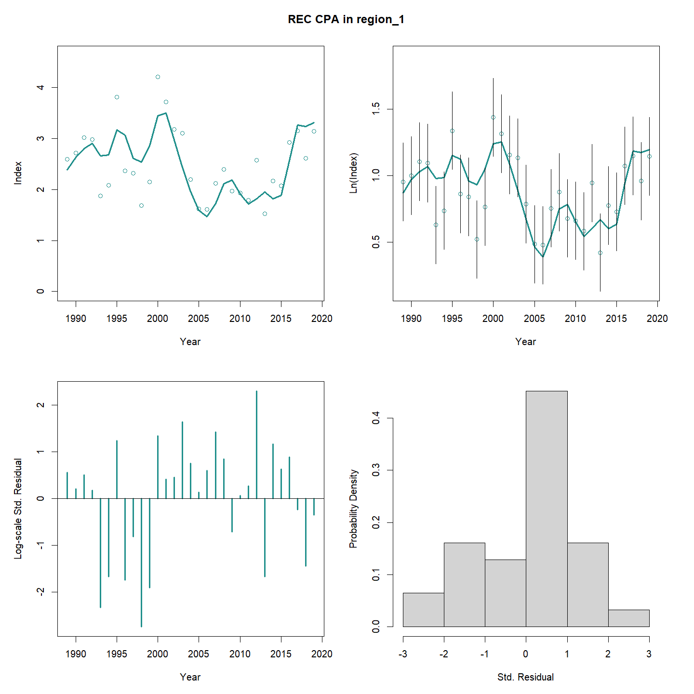
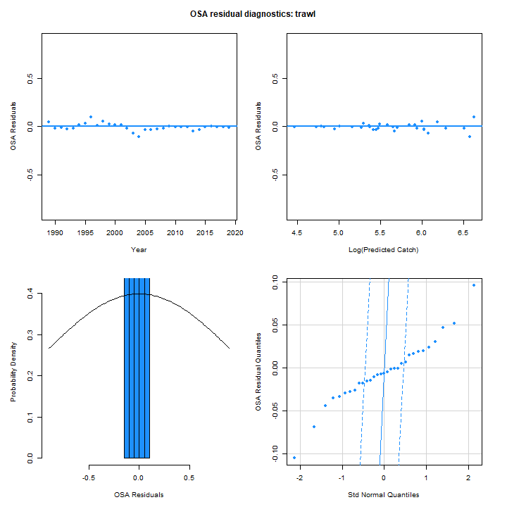
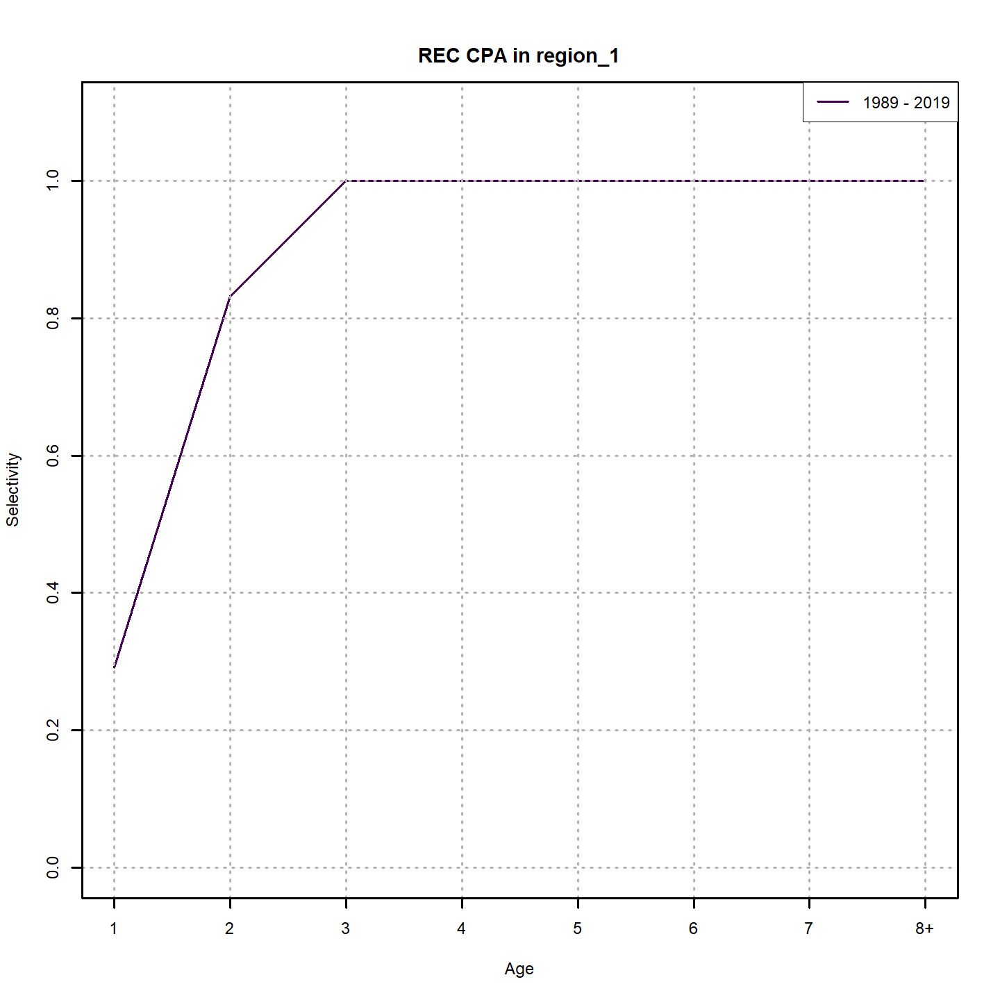
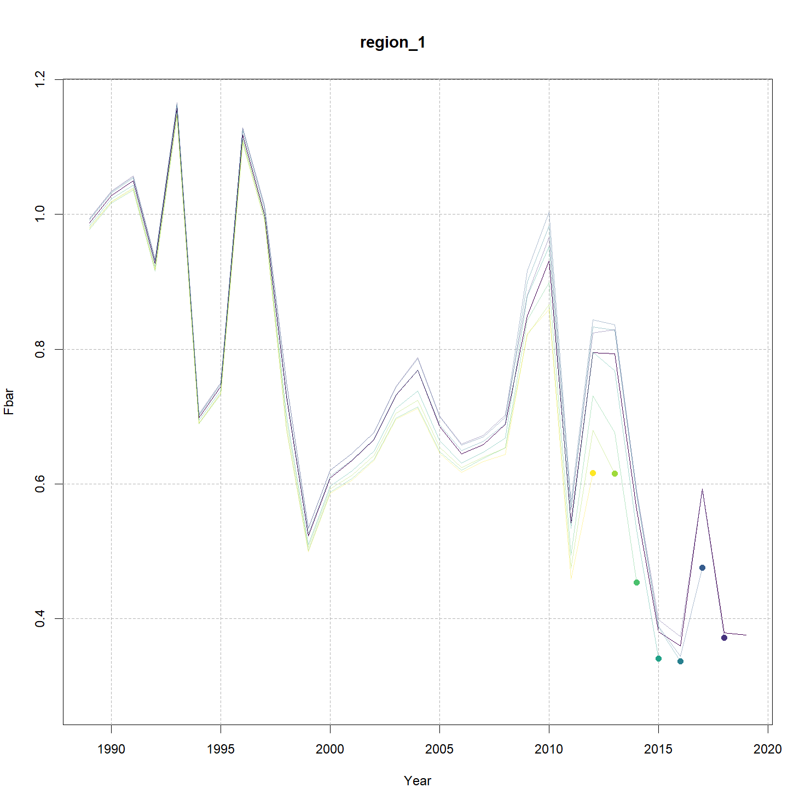
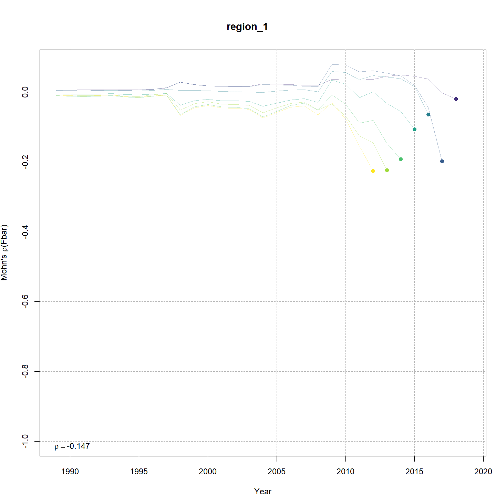

---
output:
  html_document:
    df_print: paged
    keep_md: yes
  word_document: default
  pdf_document:
    fig_caption: yes
    includes:
    keep_tex: yes
    number_sections: no
title: "WHAM figures and tables"
header-includes:
  - \usepackage{longtable}
  - \usepackage{booktabs}
  - \usepackage{caption,graphics}
  - \usepackage{makecell}
  - \usepackage{lscape}
  - \renewcommand\figurename{Fig.}
  - \captionsetup{labelsep=period, singlelinecheck=false}
  - \newcommand{\changesize}[1]{\fontsize{#1pt}{#1pt}\selectfont}
  - \renewcommand{\arraystretch}{1.5}
  - \renewcommand\theadfont{}
---

# {.tabset}

## Figures {.tabset}

### Input

### Diagnostics

### Results

### Retro

### Reference points

### Miscelaneous

## Tables {.tabset}

### Parameter estimates

<table class="table" style="margin-left: auto; margin-right: auto;">
<caption>Parameter estimates, standard errors, and confidence intervals. Rounded to 3 decimal places.</caption>
 <thead>
  <tr>
   <th style="text-align:left;">   </th>
   <th style="text-align:right;"> Estimate </th>
   <th style="text-align:right;"> Std. Error </th>
   <th style="text-align:right;"> 95\% CI lower </th>
   <th style="text-align:right;"> 95\% CI upper </th>
  </tr>
 </thead>
<tbody>
  <tr>
   <td style="text-align:left;"> NEFSC spring Alb fully selected q </td>
   <td style="text-align:right;"> 0.176 </td>
   <td style="text-align:right;"> 0.034 </td>
   <td style="text-align:right;"> 0.120 </td>
   <td style="text-align:right;"> 0.257 </td>
  </tr>
  <tr>
   <td style="text-align:left;"> REC CPA fully selected q </td>
   <td style="text-align:right;"> 0.000 </td>
   <td style="text-align:right;"> 0.000 </td>
   <td style="text-align:right;"> 0.000 </td>
   <td style="text-align:right;"> 0.000 </td>
  </tr>
  <tr>
   <td style="text-align:left;"> BIGELOW fully selected q </td>
   <td style="text-align:right;"> 0.000 </td>
   <td style="text-align:right;"> 0.000 </td>
   <td style="text-align:right;"> 0.000 </td>
   <td style="text-align:right;"> 0.000 </td>
  </tr>
  <tr>
   <td style="text-align:left;"> Block 1: $a_{50}$ </td>
   <td style="text-align:right;"> 2.086 </td>
   <td style="text-align:right;"> 0.093 </td>
   <td style="text-align:right;"> 1.908 </td>
   <td style="text-align:right;"> 2.274 </td>
  </tr>
  <tr>
   <td style="text-align:left;"> Block 1: 1/slope (increasing) </td>
   <td style="text-align:right;"> 0.322 </td>
   <td style="text-align:right;"> 0.035 </td>
   <td style="text-align:right;"> 0.259 </td>
   <td style="text-align:right;"> 0.398 </td>
  </tr>
  <tr>
   <td style="text-align:left;"> Block 2: $a_{50}$ </td>
   <td style="text-align:right;"> 3.946 </td>
   <td style="text-align:right;"> 0.198 </td>
   <td style="text-align:right;"> 3.560 </td>
   <td style="text-align:right;"> 4.333 </td>
  </tr>
  <tr>
   <td style="text-align:left;"> Block 2: 1/slope (increasing) </td>
   <td style="text-align:right;"> 0.679 </td>
   <td style="text-align:right;"> 0.043 </td>
   <td style="text-align:right;"> 0.600 </td>
   <td style="text-align:right;"> 0.768 </td>
  </tr>
  <tr>
   <td style="text-align:left;"> Block 3: $a_{50}$ </td>
   <td style="text-align:right;"> 2.434 </td>
   <td style="text-align:right;"> 0.112 </td>
   <td style="text-align:right;"> 2.220 </td>
   <td style="text-align:right;"> 2.659 </td>
  </tr>
  <tr>
   <td style="text-align:left;"> Block 3: 1/slope (increasing) </td>
   <td style="text-align:right;"> 0.579 </td>
   <td style="text-align:right;"> 0.044 </td>
   <td style="text-align:right;"> 0.498 </td>
   <td style="text-align:right;"> 0.672 </td>
  </tr>
  <tr>
   <td style="text-align:left;"> Block 4: $a_{50}$ </td>
   <td style="text-align:right;"> 3.160 </td>
   <td style="text-align:right;"> 0.275 </td>
   <td style="text-align:right;"> 2.639 </td>
   <td style="text-align:right;"> 3.712 </td>
  </tr>
  <tr>
   <td style="text-align:left;"> Block 4: 1/slope (increasing) </td>
   <td style="text-align:right;"> 0.898 </td>
   <td style="text-align:right;"> 0.094 </td>
   <td style="text-align:right;"> 0.730 </td>
   <td style="text-align:right;"> 1.100 </td>
  </tr>
  <tr>
   <td style="text-align:left;"> Block 5: Selectivity for age 1 </td>
   <td style="text-align:right;"> 0.176 </td>
   <td style="text-align:right;"> 0.034 </td>
   <td style="text-align:right;"> 0.118 </td>
   <td style="text-align:right;"> 0.253 </td>
  </tr>
  <tr>
   <td style="text-align:left;"> Block 5: Selectivity for age 2 </td>
   <td style="text-align:right;"> 0.532 </td>
   <td style="text-align:right;"> 0.093 </td>
   <td style="text-align:right;"> 0.354 </td>
   <td style="text-align:right;"> 0.702 </td>
  </tr>
  <tr>
   <td style="text-align:left;"> Block 5: Selectivity for age 3 </td>
   <td style="text-align:right;"> 0.748 </td>
   <td style="text-align:right;"> 0.137 </td>
   <td style="text-align:right;"> 0.417 </td>
   <td style="text-align:right;"> 0.925 </td>
  </tr>
  <tr>
   <td style="text-align:left;"> Block 5: Selectivity for age 4 </td>
   <td style="text-align:right;"> 1.000 </td>
   <td style="text-align:right;"> -- </td>
   <td style="text-align:right;"> -- </td>
   <td style="text-align:right;"> -- </td>
  </tr>
  <tr>
   <td style="text-align:left;"> Block 5: Selectivity for age 5 </td>
   <td style="text-align:right;"> 1.000 </td>
   <td style="text-align:right;"> -- </td>
   <td style="text-align:right;"> -- </td>
   <td style="text-align:right;"> -- </td>
  </tr>
  <tr>
   <td style="text-align:left;"> Block 5: Selectivity for age 6 </td>
   <td style="text-align:right;"> 1.000 </td>
   <td style="text-align:right;"> -- </td>
   <td style="text-align:right;"> -- </td>
   <td style="text-align:right;"> -- </td>
  </tr>
  <tr>
   <td style="text-align:left;"> Block 5: Selectivity for age 7 </td>
   <td style="text-align:right;"> 1.000 </td>
   <td style="text-align:right;"> -- </td>
   <td style="text-align:right;"> -- </td>
   <td style="text-align:right;"> -- </td>
  </tr>
  <tr>
   <td style="text-align:left;"> Block 5: Selectivity for age 8+ </td>
   <td style="text-align:right;"> 1.000 </td>
   <td style="text-align:right;"> -- </td>
   <td style="text-align:right;"> -- </td>
   <td style="text-align:right;"> -- </td>
  </tr>
  <tr>
   <td style="text-align:left;"> Block 6: Selectivity for age 1 </td>
   <td style="text-align:right;"> 0.291 </td>
   <td style="text-align:right;"> 0.021 </td>
   <td style="text-align:right;"> 0.251 </td>
   <td style="text-align:right;"> 0.334 </td>
  </tr>
  <tr>
   <td style="text-align:left;"> Block 6: Selectivity for age 2 </td>
   <td style="text-align:right;"> 0.832 </td>
   <td style="text-align:right;"> 0.052 </td>
   <td style="text-align:right;"> 0.705 </td>
   <td style="text-align:right;"> 0.911 </td>
  </tr>
  <tr>
   <td style="text-align:left;"> Block 6: Selectivity for age 3 </td>
   <td style="text-align:right;"> 1.000 </td>
   <td style="text-align:right;"> -- </td>
   <td style="text-align:right;"> -- </td>
   <td style="text-align:right;"> -- </td>
  </tr>
  <tr>
   <td style="text-align:left;"> Block 6: Selectivity for age 4 </td>
   <td style="text-align:right;"> 1.000 </td>
   <td style="text-align:right;"> -- </td>
   <td style="text-align:right;"> -- </td>
   <td style="text-align:right;"> -- </td>
  </tr>
  <tr>
   <td style="text-align:left;"> Block 6: Selectivity for age 5 </td>
   <td style="text-align:right;"> 1.000 </td>
   <td style="text-align:right;"> -- </td>
   <td style="text-align:right;"> -- </td>
   <td style="text-align:right;"> -- </td>
  </tr>
  <tr>
   <td style="text-align:left;"> Block 6: Selectivity for age 6 </td>
   <td style="text-align:right;"> 1.000 </td>
   <td style="text-align:right;"> -- </td>
   <td style="text-align:right;"> -- </td>
   <td style="text-align:right;"> -- </td>
  </tr>
  <tr>
   <td style="text-align:left;"> Block 6: Selectivity for age 7 </td>
   <td style="text-align:right;"> 1.000 </td>
   <td style="text-align:right;"> -- </td>
   <td style="text-align:right;"> -- </td>
   <td style="text-align:right;"> -- </td>
  </tr>
  <tr>
   <td style="text-align:left;"> Block 6: Selectivity for age 8+ </td>
   <td style="text-align:right;"> 1.000 </td>
   <td style="text-align:right;"> -- </td>
   <td style="text-align:right;"> -- </td>
   <td style="text-align:right;"> -- </td>
  </tr>
  <tr>
   <td style="text-align:left;"> Block 7: Selectivity for age 1 </td>
   <td style="text-align:right;"> 0.191 </td>
   <td style="text-align:right;"> 0.038 </td>
   <td style="text-align:right;"> 0.128 </td>
   <td style="text-align:right;"> 0.277 </td>
  </tr>
  <tr>
   <td style="text-align:left;"> Block 7: Selectivity for age 2 </td>
   <td style="text-align:right;"> 1.000 </td>
   <td style="text-align:right;"> -- </td>
   <td style="text-align:right;"> -- </td>
   <td style="text-align:right;"> -- </td>
  </tr>
  <tr>
   <td style="text-align:left;"> Block 7: Selectivity for age 3 </td>
   <td style="text-align:right;"> 1.000 </td>
   <td style="text-align:right;"> -- </td>
   <td style="text-align:right;"> -- </td>
   <td style="text-align:right;"> -- </td>
  </tr>
  <tr>
   <td style="text-align:left;"> Block 7: Selectivity for age 4 </td>
   <td style="text-align:right;"> 1.000 </td>
   <td style="text-align:right;"> -- </td>
   <td style="text-align:right;"> -- </td>
   <td style="text-align:right;"> -- </td>
  </tr>
  <tr>
   <td style="text-align:left;"> Block 7: Selectivity for age 5 </td>
   <td style="text-align:right;"> 1.000 </td>
   <td style="text-align:right;"> -- </td>
   <td style="text-align:right;"> -- </td>
   <td style="text-align:right;"> -- </td>
  </tr>
  <tr>
   <td style="text-align:left;"> Block 7: Selectivity for age 6 </td>
   <td style="text-align:right;"> 1.000 </td>
   <td style="text-align:right;"> -- </td>
   <td style="text-align:right;"> -- </td>
   <td style="text-align:right;"> -- </td>
  </tr>
  <tr>
   <td style="text-align:left;"> Block 7: Selectivity for age 7 </td>
   <td style="text-align:right;"> 1.000 </td>
   <td style="text-align:right;"> -- </td>
   <td style="text-align:right;"> -- </td>
   <td style="text-align:right;"> -- </td>
  </tr>
  <tr>
   <td style="text-align:left;"> Block 7: Selectivity for age 8+ </td>
   <td style="text-align:right;"> 1.000 </td>
   <td style="text-align:right;"> -- </td>
   <td style="text-align:right;"> -- </td>
   <td style="text-align:right;"> -- </td>
  </tr>
</tbody>
</table>

### Abundance at age

<table class="table" style="margin-left: auto; margin-right: auto;">
<caption>Abundance at age (1000s) for stock 1 in region 1.</caption>
 <thead>
  <tr>
   <th style="text-align:left;">   </th>
   <th style="text-align:right;"> 1 </th>
   <th style="text-align:right;"> 2 </th>
   <th style="text-align:right;"> 3 </th>
   <th style="text-align:right;"> 4 </th>
   <th style="text-align:right;"> 5 </th>
   <th style="text-align:right;"> 6 </th>
   <th style="text-align:right;"> 7 </th>
   <th style="text-align:right;"> 8+ </th>
  </tr>
 </thead>
<tbody>
  <tr>
   <td style="text-align:left;"> 1989 </td>
   <td style="text-align:right;"> 26467 </td>
   <td style="text-align:right;"> 13947 </td>
   <td style="text-align:right;"> 5448 </td>
   <td style="text-align:right;"> 1874 </td>
   <td style="text-align:right;"> 626 </td>
   <td style="text-align:right;"> 208 </td>
   <td style="text-align:right;"> 69 </td>
   <td style="text-align:right;"> 34 </td>
  </tr>
  <tr>
   <td style="text-align:left;"> 1990 </td>
   <td style="text-align:right;"> 26761 </td>
   <td style="text-align:right;"> 16571 </td>
   <td style="text-align:right;"> 6667 </td>
   <td style="text-align:right;"> 1709 </td>
   <td style="text-align:right;"> 492 </td>
   <td style="text-align:right;"> 158 </td>
   <td style="text-align:right;"> 52 </td>
   <td style="text-align:right;"> 26 </td>
  </tr>
  <tr>
   <td style="text-align:left;"> 1991 </td>
   <td style="text-align:right;"> 28599 </td>
   <td style="text-align:right;"> 16708 </td>
   <td style="text-align:right;"> 7812 </td>
   <td style="text-align:right;"> 2028 </td>
   <td style="text-align:right;"> 432 </td>
   <td style="text-align:right;"> 119 </td>
   <td style="text-align:right;"> 38 </td>
   <td style="text-align:right;"> 19 </td>
  </tr>
  <tr>
   <td style="text-align:left;"> 1992 </td>
   <td style="text-align:right;"> 26805 </td>
   <td style="text-align:right;"> 17722 </td>
   <td style="text-align:right;"> 7940 </td>
   <td style="text-align:right;"> 2408 </td>
   <td style="text-align:right;"> 506 </td>
   <td style="text-align:right;"> 102 </td>
   <td style="text-align:right;"> 28 </td>
   <td style="text-align:right;"> 13 </td>
  </tr>
  <tr>
   <td style="text-align:left;"> 1993 </td>
   <td style="text-align:right;"> 21380 </td>
   <td style="text-align:right;"> 16817 </td>
   <td style="text-align:right;"> 8697 </td>
   <td style="text-align:right;"> 2638 </td>
   <td style="text-align:right;"> 671 </td>
   <td style="text-align:right;"> 135 </td>
   <td style="text-align:right;"> 27 </td>
   <td style="text-align:right;"> 11 </td>
  </tr>
  <tr>
   <td style="text-align:left;"> 1994 </td>
   <td style="text-align:right;"> 27514 </td>
   <td style="text-align:right;"> 13226 </td>
   <td style="text-align:right;"> 7592 </td>
   <td style="text-align:right;"> 2400 </td>
   <td style="text-align:right;"> 590 </td>
   <td style="text-align:right;"> 143 </td>
   <td style="text-align:right;"> 29 </td>
   <td style="text-align:right;"> 8 </td>
  </tr>
  <tr>
   <td style="text-align:left;"> 1995 </td>
   <td style="text-align:right;"> 32785 </td>
   <td style="text-align:right;"> 17550 </td>
   <td style="text-align:right;"> 7005 </td>
   <td style="text-align:right;"> 2996 </td>
   <td style="text-align:right;"> 830 </td>
   <td style="text-align:right;"> 198 </td>
   <td style="text-align:right;"> 48 </td>
   <td style="text-align:right;"> 12 </td>
  </tr>
  <tr>
   <td style="text-align:left;"> 1996 </td>
   <td style="text-align:right;"> 22449 </td>
   <td style="text-align:right;"> 20788 </td>
   <td style="text-align:right;"> 9213 </td>
   <td style="text-align:right;"> 2704 </td>
   <td style="text-align:right;"> 996 </td>
   <td style="text-align:right;"> 266 </td>
   <td style="text-align:right;"> 63 </td>
   <td style="text-align:right;"> 19 </td>
  </tr>
  <tr>
   <td style="text-align:left;"> 1997 </td>
   <td style="text-align:right;"> 21858 </td>
   <td style="text-align:right;"> 13907 </td>
   <td style="text-align:right;"> 9539 </td>
   <td style="text-align:right;"> 2634 </td>
   <td style="text-align:right;"> 628 </td>
   <td style="text-align:right;"> 220 </td>
   <td style="text-align:right;"> 58 </td>
   <td style="text-align:right;"> 18 </td>
  </tr>
  <tr>
   <td style="text-align:left;"> 1998 </td>
   <td style="text-align:right;"> 18941 </td>
   <td style="text-align:right;"> 13592 </td>
   <td style="text-align:right;"> 6721 </td>
   <td style="text-align:right;"> 3053 </td>
   <td style="text-align:right;"> 689 </td>
   <td style="text-align:right;"> 156 </td>
   <td style="text-align:right;"> 54 </td>
   <td style="text-align:right;"> 19 </td>
  </tr>
  <tr>
   <td style="text-align:left;"> 1999 </td>
   <td style="text-align:right;"> 27104 </td>
   <td style="text-align:right;"> 12233 </td>
   <td style="text-align:right;"> 7810 </td>
   <td style="text-align:right;"> 3103 </td>
   <td style="text-align:right;"> 1166 </td>
   <td style="text-align:right;"> 234 </td>
   <td style="text-align:right;"> 51 </td>
   <td style="text-align:right;"> 24 </td>
  </tr>
  <tr>
   <td style="text-align:left;"> 2000 </td>
   <td style="text-align:right;"> 33141 </td>
   <td style="text-align:right;"> 17595 </td>
   <td style="text-align:right;"> 7180 </td>
   <td style="text-align:right;"> 3834 </td>
   <td style="text-align:right;"> 1343 </td>
   <td style="text-align:right;"> 475 </td>
   <td style="text-align:right;"> 93 </td>
   <td style="text-align:right;"> 29 </td>
  </tr>
  <tr>
   <td style="text-align:left;"> 2001 </td>
   <td style="text-align:right;"> 17319 </td>
   <td style="text-align:right;"> 21347 </td>
   <td style="text-align:right;"> 9997 </td>
   <td style="text-align:right;"> 3280 </td>
   <td style="text-align:right;"> 1520 </td>
   <td style="text-align:right;"> 501 </td>
   <td style="text-align:right;"> 173 </td>
   <td style="text-align:right;"> 45 </td>
  </tr>
  <tr>
   <td style="text-align:left;"> 2002 </td>
   <td style="text-align:right;"> 18208 </td>
   <td style="text-align:right;"> 11149 </td>
   <td style="text-align:right;"> 12101 </td>
   <td style="text-align:right;"> 4535 </td>
   <td style="text-align:right;"> 1280 </td>
   <td style="text-align:right;"> 554 </td>
   <td style="text-align:right;"> 178 </td>
   <td style="text-align:right;"> 77 </td>
  </tr>
  <tr>
   <td style="text-align:left;"> 2003 </td>
   <td style="text-align:right;"> 13255 </td>
   <td style="text-align:right;"> 11688 </td>
   <td style="text-align:right;"> 6246 </td>
   <td style="text-align:right;"> 5347 </td>
   <td style="text-align:right;"> 1715 </td>
   <td style="text-align:right;"> 452 </td>
   <td style="text-align:right;"> 191 </td>
   <td style="text-align:right;"> 88 </td>
  </tr>
  <tr>
   <td style="text-align:left;"> 2004 </td>
   <td style="text-align:right;"> 10664 </td>
   <td style="text-align:right;"> 8479 </td>
   <td style="text-align:right;"> 6455 </td>
   <td style="text-align:right;"> 2666 </td>
   <td style="text-align:right;"> 1920 </td>
   <td style="text-align:right;"> 570 </td>
   <td style="text-align:right;"> 146 </td>
   <td style="text-align:right;"> 90 </td>
  </tr>
  <tr>
   <td style="text-align:left;"> 2005 </td>
   <td style="text-align:right;"> 8323 </td>
   <td style="text-align:right;"> 6879 </td>
   <td style="text-align:right;"> 4848 </td>
   <td style="text-align:right;"> 2940 </td>
   <td style="text-align:right;"> 993 </td>
   <td style="text-align:right;"> 630 </td>
   <td style="text-align:right;"> 178 </td>
   <td style="text-align:right;"> 73 </td>
  </tr>
  <tr>
   <td style="text-align:left;"> 2006 </td>
   <td style="text-align:right;"> 13415 </td>
   <td style="text-align:right;"> 5364 </td>
   <td style="text-align:right;"> 3920 </td>
   <td style="text-align:right;"> 2211 </td>
   <td style="text-align:right;"> 1131 </td>
   <td style="text-align:right;"> 348 </td>
   <td style="text-align:right;"> 214 </td>
   <td style="text-align:right;"> 84 </td>
  </tr>
  <tr>
   <td style="text-align:left;"> 2007 </td>
   <td style="text-align:right;"> 18060 </td>
   <td style="text-align:right;"> 8634 </td>
   <td style="text-align:right;"> 3037 </td>
   <td style="text-align:right;"> 1772 </td>
   <td style="text-align:right;"> 857 </td>
   <td style="text-align:right;"> 409 </td>
   <td style="text-align:right;"> 123 </td>
   <td style="text-align:right;"> 105 </td>
  </tr>
  <tr>
   <td style="text-align:left;"> 2008 </td>
   <td style="text-align:right;"> 20284 </td>
   <td style="text-align:right;"> 11581 </td>
   <td style="text-align:right;"> 4815 </td>
   <td style="text-align:right;"> 1331 </td>
   <td style="text-align:right;"> 668 </td>
   <td style="text-align:right;"> 304 </td>
   <td style="text-align:right;"> 142 </td>
   <td style="text-align:right;"> 79 </td>
  </tr>
  <tr>
   <td style="text-align:left;"> 2009 </td>
   <td style="text-align:right;"> 12312 </td>
   <td style="text-align:right;"> 13036 </td>
   <td style="text-align:right;"> 6520 </td>
   <td style="text-align:right;"> 2144 </td>
   <td style="text-align:right;"> 502 </td>
   <td style="text-align:right;"> 232 </td>
   <td style="text-align:right;"> 103 </td>
   <td style="text-align:right;"> 74 </td>
  </tr>
  <tr>
   <td style="text-align:left;"> 2010 </td>
   <td style="text-align:right;"> 12567 </td>
   <td style="text-align:right;"> 7739 </td>
   <td style="text-align:right;"> 7374 </td>
   <td style="text-align:right;"> 3024 </td>
   <td style="text-align:right;"> 785 </td>
   <td style="text-align:right;"> 156 </td>
   <td style="text-align:right;"> 67 </td>
   <td style="text-align:right;"> 50 </td>
  </tr>
  <tr>
   <td style="text-align:left;"> 2011 </td>
   <td style="text-align:right;"> 9175 </td>
   <td style="text-align:right;"> 7869 </td>
   <td style="text-align:right;"> 4331 </td>
   <td style="text-align:right;"> 3330 </td>
   <td style="text-align:right;"> 1052 </td>
   <td style="text-align:right;"> 228 </td>
   <td style="text-align:right;"> 42 </td>
   <td style="text-align:right;"> 30 </td>
  </tr>
  <tr>
   <td style="text-align:left;"> 2012 </td>
   <td style="text-align:right;"> 20084 </td>
   <td style="text-align:right;"> 5953 </td>
   <td style="text-align:right;"> 4827 </td>
   <td style="text-align:right;"> 2367 </td>
   <td style="text-align:right;"> 1554 </td>
   <td style="text-align:right;"> 435 </td>
   <td style="text-align:right;"> 90 </td>
   <td style="text-align:right;"> 28 </td>
  </tr>
  <tr>
   <td style="text-align:left;"> 2013 </td>
   <td style="text-align:right;"> 11709 </td>
   <td style="text-align:right;"> 12654 </td>
   <td style="text-align:right;"> 3390 </td>
   <td style="text-align:right;"> 2277 </td>
   <td style="text-align:right;"> 897 </td>
   <td style="text-align:right;"> 508 </td>
   <td style="text-align:right;"> 133 </td>
   <td style="text-align:right;"> 35 </td>
  </tr>
  <tr>
   <td style="text-align:left;"> 2014 </td>
   <td style="text-align:right;"> 9554 </td>
   <td style="text-align:right;"> 7445 </td>
   <td style="text-align:right;"> 7360 </td>
   <td style="text-align:right;"> 1654 </td>
   <td style="text-align:right;"> 886 </td>
   <td style="text-align:right;"> 296 </td>
   <td style="text-align:right;"> 156 </td>
   <td style="text-align:right;"> 50 </td>
  </tr>
  <tr>
   <td style="text-align:left;"> 2015 </td>
   <td style="text-align:right;"> 16259 </td>
   <td style="text-align:right;"> 6170 </td>
   <td style="text-align:right;"> 4515 </td>
   <td style="text-align:right;"> 3942 </td>
   <td style="text-align:right;"> 755 </td>
   <td style="text-align:right;"> 359 </td>
   <td style="text-align:right;"> 114 </td>
   <td style="text-align:right;"> 78 </td>
  </tr>
  <tr>
   <td style="text-align:left;"> 2016 </td>
   <td style="text-align:right;"> 29363 </td>
   <td style="text-align:right;"> 10584 </td>
   <td style="text-align:right;"> 3829 </td>
   <td style="text-align:right;"> 2562 </td>
   <td style="text-align:right;"> 2013 </td>
   <td style="text-align:right;"> 359 </td>
   <td style="text-align:right;"> 165 </td>
   <td style="text-align:right;"> 87 </td>
  </tr>
  <tr>
   <td style="text-align:left;"> 2017 </td>
   <td style="text-align:right;"> 24903 </td>
   <td style="text-align:right;"> 19156 </td>
   <td style="text-align:right;"> 6605 </td>
   <td style="text-align:right;"> 2197 </td>
   <td style="text-align:right;"> 1330 </td>
   <td style="text-align:right;"> 975 </td>
   <td style="text-align:right;"> 169 </td>
   <td style="text-align:right;"> 118 </td>
  </tr>
  <tr>
   <td style="text-align:left;"> 2018 </td>
   <td style="text-align:right;"> 12369 </td>
   <td style="text-align:right;"> 15949 </td>
   <td style="text-align:right;"> 11387 </td>
   <td style="text-align:right;"> 3415 </td>
   <td style="text-align:right;"> 964 </td>
   <td style="text-align:right;"> 522 </td>
   <td style="text-align:right;"> 365 </td>
   <td style="text-align:right;"> 105 </td>
  </tr>
  <tr>
   <td style="text-align:left;"> 2019 </td>
   <td style="text-align:right;"> 29777 </td>
   <td style="text-align:right;"> 8053 </td>
   <td style="text-align:right;"> 9900 </td>
   <td style="text-align:right;"> 6465 </td>
   <td style="text-align:right;"> 1746 </td>
   <td style="text-align:right;"> 459 </td>
   <td style="text-align:right;"> 241 </td>
   <td style="text-align:right;"> 214 </td>
  </tr>
</tbody>
</table>

### Fishing mortality at age by region

<table class="table" style="margin-left: auto; margin-right: auto;">
<caption>Total fishing mortality at age in region 1.</caption>
 <thead>
  <tr>
   <th style="text-align:left;">   </th>
   <th style="text-align:right;"> 1 </th>
   <th style="text-align:right;"> 2 </th>
   <th style="text-align:right;"> 3 </th>
   <th style="text-align:right;"> 4 </th>
   <th style="text-align:right;"> 5 </th>
   <th style="text-align:right;"> 6 </th>
   <th style="text-align:right;"> 7 </th>
   <th style="text-align:right;"> 8+ </th>
  </tr>
 </thead>
<tbody>
  <tr>
   <td style="text-align:left;"> 1989 </td>
   <td style="text-align:right;"> 0.006 </td>
   <td style="text-align:right;"> 0.081 </td>
   <td style="text-align:right;"> 0.177 </td>
   <td style="text-align:right;"> 0.187 </td>
   <td style="text-align:right;"> 0.187 </td>
   <td style="text-align:right;"> 0.187 </td>
   <td style="text-align:right;"> 0.187 </td>
   <td style="text-align:right;"> 0.187 </td>
  </tr>
  <tr>
   <td style="text-align:left;"> 1990 </td>
   <td style="text-align:right;"> 0.006 </td>
   <td style="text-align:right;"> 0.084 </td>
   <td style="text-align:right;"> 0.184 </td>
   <td style="text-align:right;"> 0.194 </td>
   <td style="text-align:right;"> 0.195 </td>
   <td style="text-align:right;"> 0.195 </td>
   <td style="text-align:right;"> 0.195 </td>
   <td style="text-align:right;"> 0.195 </td>
  </tr>
  <tr>
   <td style="text-align:left;"> 1991 </td>
   <td style="text-align:right;"> 0.002 </td>
   <td style="text-align:right;"> 0.027 </td>
   <td style="text-align:right;"> 0.059 </td>
   <td style="text-align:right;"> 0.062 </td>
   <td style="text-align:right;"> 0.062 </td>
   <td style="text-align:right;"> 0.062 </td>
   <td style="text-align:right;"> 0.062 </td>
   <td style="text-align:right;"> 0.062 </td>
  </tr>
  <tr>
   <td style="text-align:left;"> 1992 </td>
   <td style="text-align:right;"> 0.004 </td>
   <td style="text-align:right;"> 0.055 </td>
   <td style="text-align:right;"> 0.120 </td>
   <td style="text-align:right;"> 0.126 </td>
   <td style="text-align:right;"> 0.127 </td>
   <td style="text-align:right;"> 0.127 </td>
   <td style="text-align:right;"> 0.127 </td>
   <td style="text-align:right;"> 0.127 </td>
  </tr>
  <tr>
   <td style="text-align:left;"> 1993 </td>
   <td style="text-align:right;"> 0.007 </td>
   <td style="text-align:right;"> 0.092 </td>
   <td style="text-align:right;"> 0.200 </td>
   <td style="text-align:right;"> 0.211 </td>
   <td style="text-align:right;"> 0.212 </td>
   <td style="text-align:right;"> 0.212 </td>
   <td style="text-align:right;"> 0.212 </td>
   <td style="text-align:right;"> 0.212 </td>
  </tr>
  <tr>
   <td style="text-align:left;"> 1994 </td>
   <td style="text-align:right;"> 0.003 </td>
   <td style="text-align:right;"> 0.044 </td>
   <td style="text-align:right;"> 0.095 </td>
   <td style="text-align:right;"> 0.100 </td>
   <td style="text-align:right;"> 0.101 </td>
   <td style="text-align:right;"> 0.101 </td>
   <td style="text-align:right;"> 0.101 </td>
   <td style="text-align:right;"> 0.101 </td>
  </tr>
  <tr>
   <td style="text-align:left;"> 1995 </td>
   <td style="text-align:right;"> 0.002 </td>
   <td style="text-align:right;"> 0.021 </td>
   <td style="text-align:right;"> 0.045 </td>
   <td style="text-align:right;"> 0.048 </td>
   <td style="text-align:right;"> 0.048 </td>
   <td style="text-align:right;"> 0.048 </td>
   <td style="text-align:right;"> 0.048 </td>
   <td style="text-align:right;"> 0.048 </td>
  </tr>
  <tr>
   <td style="text-align:left;"> 1996 </td>
   <td style="text-align:right;"> 0.006 </td>
   <td style="text-align:right;"> 0.076 </td>
   <td style="text-align:right;"> 0.167 </td>
   <td style="text-align:right;"> 0.176 </td>
   <td style="text-align:right;"> 0.176 </td>
   <td style="text-align:right;"> 0.176 </td>
   <td style="text-align:right;"> 0.176 </td>
   <td style="text-align:right;"> 0.176 </td>
  </tr>
  <tr>
   <td style="text-align:left;"> 1997 </td>
   <td style="text-align:right;"> 0.002 </td>
   <td style="text-align:right;"> 0.024 </td>
   <td style="text-align:right;"> 0.051 </td>
   <td style="text-align:right;"> 0.054 </td>
   <td style="text-align:right;"> 0.054 </td>
   <td style="text-align:right;"> 0.054 </td>
   <td style="text-align:right;"> 0.054 </td>
   <td style="text-align:right;"> 0.054 </td>
  </tr>
  <tr>
   <td style="text-align:left;"> 1998 </td>
   <td style="text-align:right;"> 0.004 </td>
   <td style="text-align:right;"> 0.017 </td>
   <td style="text-align:right;"> 0.062 </td>
   <td style="text-align:right;"> 0.162 </td>
   <td style="text-align:right;"> 0.256 </td>
   <td style="text-align:right;"> 0.296 </td>
   <td style="text-align:right;"> 0.307 </td>
   <td style="text-align:right;"> 0.310 </td>
  </tr>
  <tr>
   <td style="text-align:left;"> 1999 </td>
   <td style="text-align:right;"> 0.002 </td>
   <td style="text-align:right;"> 0.007 </td>
   <td style="text-align:right;"> 0.027 </td>
   <td style="text-align:right;"> 0.071 </td>
   <td style="text-align:right;"> 0.112 </td>
   <td style="text-align:right;"> 0.129 </td>
   <td style="text-align:right;"> 0.134 </td>
   <td style="text-align:right;"> 0.135 </td>
  </tr>
  <tr>
   <td style="text-align:left;"> 2000 </td>
   <td style="text-align:right;"> 0.002 </td>
   <td style="text-align:right;"> 0.006 </td>
   <td style="text-align:right;"> 0.023 </td>
   <td style="text-align:right;"> 0.061 </td>
   <td style="text-align:right;"> 0.097 </td>
   <td style="text-align:right;"> 0.112 </td>
   <td style="text-align:right;"> 0.116 </td>
   <td style="text-align:right;"> 0.117 </td>
  </tr>
  <tr>
   <td style="text-align:left;"> 2001 </td>
   <td style="text-align:right;"> 0.002 </td>
   <td style="text-align:right;"> 0.008 </td>
   <td style="text-align:right;"> 0.028 </td>
   <td style="text-align:right;"> 0.073 </td>
   <td style="text-align:right;"> 0.116 </td>
   <td style="text-align:right;"> 0.134 </td>
   <td style="text-align:right;"> 0.138 </td>
   <td style="text-align:right;"> 0.140 </td>
  </tr>
  <tr>
   <td style="text-align:left;"> 2002 </td>
   <td style="text-align:right;"> 0.002 </td>
   <td style="text-align:right;"> 0.007 </td>
   <td style="text-align:right;"> 0.026 </td>
   <td style="text-align:right;"> 0.069 </td>
   <td style="text-align:right;"> 0.110 </td>
   <td style="text-align:right;"> 0.127 </td>
   <td style="text-align:right;"> 0.131 </td>
   <td style="text-align:right;"> 0.132 </td>
  </tr>
  <tr>
   <td style="text-align:left;"> 2003 </td>
   <td style="text-align:right;"> 0.002 </td>
   <td style="text-align:right;"> 0.009 </td>
   <td style="text-align:right;"> 0.032 </td>
   <td style="text-align:right;"> 0.083 </td>
   <td style="text-align:right;"> 0.132 </td>
   <td style="text-align:right;"> 0.152 </td>
   <td style="text-align:right;"> 0.158 </td>
   <td style="text-align:right;"> 0.159 </td>
  </tr>
  <tr>
   <td style="text-align:left;"> 2004 </td>
   <td style="text-align:right;"> 0.004 </td>
   <td style="text-align:right;"> 0.018 </td>
   <td style="text-align:right;"> 0.068 </td>
   <td style="text-align:right;"> 0.177 </td>
   <td style="text-align:right;"> 0.281 </td>
   <td style="text-align:right;"> 0.325 </td>
   <td style="text-align:right;"> 0.337 </td>
   <td style="text-align:right;"> 0.340 </td>
  </tr>
  <tr>
   <td style="text-align:left;"> 2005 </td>
   <td style="text-align:right;"> 0.003 </td>
   <td style="text-align:right;"> 0.012 </td>
   <td style="text-align:right;"> 0.044 </td>
   <td style="text-align:right;"> 0.116 </td>
   <td style="text-align:right;"> 0.184 </td>
   <td style="text-align:right;"> 0.212 </td>
   <td style="text-align:right;"> 0.220 </td>
   <td style="text-align:right;"> 0.222 </td>
  </tr>
  <tr>
   <td style="text-align:left;"> 2006 </td>
   <td style="text-align:right;"> 0.002 </td>
   <td style="text-align:right;"> 0.008 </td>
   <td style="text-align:right;"> 0.029 </td>
   <td style="text-align:right;"> 0.077 </td>
   <td style="text-align:right;"> 0.122 </td>
   <td style="text-align:right;"> 0.141 </td>
   <td style="text-align:right;"> 0.146 </td>
   <td style="text-align:right;"> 0.148 </td>
  </tr>
  <tr>
   <td style="text-align:left;"> 2007 </td>
   <td style="text-align:right;"> 0.001 </td>
   <td style="text-align:right;"> 0.006 </td>
   <td style="text-align:right;"> 0.021 </td>
   <td style="text-align:right;"> 0.056 </td>
   <td style="text-align:right;"> 0.088 </td>
   <td style="text-align:right;"> 0.102 </td>
   <td style="text-align:right;"> 0.106 </td>
   <td style="text-align:right;"> 0.107 </td>
  </tr>
  <tr>
   <td style="text-align:left;"> 2008 </td>
   <td style="text-align:right;"> 0.002 </td>
   <td style="text-align:right;"> 0.010 </td>
   <td style="text-align:right;"> 0.036 </td>
   <td style="text-align:right;"> 0.094 </td>
   <td style="text-align:right;"> 0.149 </td>
   <td style="text-align:right;"> 0.172 </td>
   <td style="text-align:right;"> 0.178 </td>
   <td style="text-align:right;"> 0.180 </td>
  </tr>
  <tr>
   <td style="text-align:left;"> 2009 </td>
   <td style="text-align:right;"> 0.001 </td>
   <td style="text-align:right;"> 0.006 </td>
   <td style="text-align:right;"> 0.023 </td>
   <td style="text-align:right;"> 0.059 </td>
   <td style="text-align:right;"> 0.094 </td>
   <td style="text-align:right;"> 0.109 </td>
   <td style="text-align:right;"> 0.113 </td>
   <td style="text-align:right;"> 0.114 </td>
  </tr>
  <tr>
   <td style="text-align:left;"> 2010 </td>
   <td style="text-align:right;"> 0.002 </td>
   <td style="text-align:right;"> 0.009 </td>
   <td style="text-align:right;"> 0.032 </td>
   <td style="text-align:right;"> 0.083 </td>
   <td style="text-align:right;"> 0.132 </td>
   <td style="text-align:right;"> 0.153 </td>
   <td style="text-align:right;"> 0.158 </td>
   <td style="text-align:right;"> 0.160 </td>
  </tr>
  <tr>
   <td style="text-align:left;"> 2011 </td>
   <td style="text-align:right;"> 0.003 </td>
   <td style="text-align:right;"> 0.010 </td>
   <td style="text-align:right;"> 0.039 </td>
   <td style="text-align:right;"> 0.101 </td>
   <td style="text-align:right;"> 0.161 </td>
   <td style="text-align:right;"> 0.186 </td>
   <td style="text-align:right;"> 0.192 </td>
   <td style="text-align:right;"> 0.194 </td>
  </tr>
  <tr>
   <td style="text-align:left;"> 2012 </td>
   <td style="text-align:right;"> 0.001 </td>
   <td style="text-align:right;"> 0.004 </td>
   <td style="text-align:right;"> 0.016 </td>
   <td style="text-align:right;"> 0.043 </td>
   <td style="text-align:right;"> 0.067 </td>
   <td style="text-align:right;"> 0.078 </td>
   <td style="text-align:right;"> 0.081 </td>
   <td style="text-align:right;"> 0.082 </td>
  </tr>
  <tr>
   <td style="text-align:left;"> 2013 </td>
   <td style="text-align:right;"> 0.003 </td>
   <td style="text-align:right;"> 0.011 </td>
   <td style="text-align:right;"> 0.042 </td>
   <td style="text-align:right;"> 0.109 </td>
   <td style="text-align:right;"> 0.173 </td>
   <td style="text-align:right;"> 0.200 </td>
   <td style="text-align:right;"> 0.208 </td>
   <td style="text-align:right;"> 0.210 </td>
  </tr>
  <tr>
   <td style="text-align:left;"> 2014 </td>
   <td style="text-align:right;"> 0.002 </td>
   <td style="text-align:right;"> 0.008 </td>
   <td style="text-align:right;"> 0.030 </td>
   <td style="text-align:right;"> 0.078 </td>
   <td style="text-align:right;"> 0.124 </td>
   <td style="text-align:right;"> 0.144 </td>
   <td style="text-align:right;"> 0.149 </td>
   <td style="text-align:right;"> 0.150 </td>
  </tr>
  <tr>
   <td style="text-align:left;"> 2015 </td>
   <td style="text-align:right;"> 0.001 </td>
   <td style="text-align:right;"> 0.002 </td>
   <td style="text-align:right;"> 0.009 </td>
   <td style="text-align:right;"> 0.024 </td>
   <td style="text-align:right;"> 0.038 </td>
   <td style="text-align:right;"> 0.044 </td>
   <td style="text-align:right;"> 0.045 </td>
   <td style="text-align:right;"> 0.046 </td>
  </tr>
  <tr>
   <td style="text-align:left;"> 2016 </td>
   <td style="text-align:right;"> 0.001 </td>
   <td style="text-align:right;"> 0.003 </td>
   <td style="text-align:right;"> 0.010 </td>
   <td style="text-align:right;"> 0.026 </td>
   <td style="text-align:right;"> 0.042 </td>
   <td style="text-align:right;"> 0.048 </td>
   <td style="text-align:right;"> 0.050 </td>
   <td style="text-align:right;"> 0.050 </td>
  </tr>
  <tr>
   <td style="text-align:left;"> 2017 </td>
   <td style="text-align:right;"> 0.001 </td>
   <td style="text-align:right;"> 0.004 </td>
   <td style="text-align:right;"> 0.014 </td>
   <td style="text-align:right;"> 0.036 </td>
   <td style="text-align:right;"> 0.057 </td>
   <td style="text-align:right;"> 0.066 </td>
   <td style="text-align:right;"> 0.068 </td>
   <td style="text-align:right;"> 0.069 </td>
  </tr>
  <tr>
   <td style="text-align:left;"> 2018 </td>
   <td style="text-align:right;"> 0.001 </td>
   <td style="text-align:right;"> 0.002 </td>
   <td style="text-align:right;"> 0.009 </td>
   <td style="text-align:right;"> 0.023 </td>
   <td style="text-align:right;"> 0.037 </td>
   <td style="text-align:right;"> 0.043 </td>
   <td style="text-align:right;"> 0.044 </td>
   <td style="text-align:right;"> 0.045 </td>
  </tr>
  <tr>
   <td style="text-align:left;"> 2019 </td>
   <td style="text-align:right;"> 0.001 </td>
   <td style="text-align:right;"> 0.006 </td>
   <td style="text-align:right;"> 0.021 </td>
   <td style="text-align:right;"> 0.055 </td>
   <td style="text-align:right;"> 0.088 </td>
   <td style="text-align:right;"> 0.102 </td>
   <td style="text-align:right;"> 0.105 </td>
   <td style="text-align:right;"> 0.106 </td>
  </tr>
</tbody>
</table>

### Fishing mortality at age by fleet

<table class="table" style="margin-left: auto; margin-right: auto;">
<caption>Total fishing mortality at age in trawl.</caption>
 <thead>
  <tr>
   <th style="text-align:left;">   </th>
   <th style="text-align:right;"> 1 </th>
   <th style="text-align:right;"> 2 </th>
   <th style="text-align:right;"> 3 </th>
   <th style="text-align:right;"> 4 </th>
   <th style="text-align:right;"> 5 </th>
   <th style="text-align:right;"> 6 </th>
   <th style="text-align:right;"> 7 </th>
   <th style="text-align:right;"> 8+ </th>
  </tr>
 </thead>
<tbody>
  <tr>
   <td style="text-align:left;"> 1989 </td>
   <td style="text-align:right;"> 0.006 </td>
   <td style="text-align:right;"> 0.081 </td>
   <td style="text-align:right;"> 0.177 </td>
   <td style="text-align:right;"> 0.187 </td>
   <td style="text-align:right;"> 0.187 </td>
   <td style="text-align:right;"> 0.187 </td>
   <td style="text-align:right;"> 0.187 </td>
   <td style="text-align:right;"> 0.187 </td>
  </tr>
  <tr>
   <td style="text-align:left;"> 1990 </td>
   <td style="text-align:right;"> 0.006 </td>
   <td style="text-align:right;"> 0.084 </td>
   <td style="text-align:right;"> 0.184 </td>
   <td style="text-align:right;"> 0.194 </td>
   <td style="text-align:right;"> 0.195 </td>
   <td style="text-align:right;"> 0.195 </td>
   <td style="text-align:right;"> 0.195 </td>
   <td style="text-align:right;"> 0.195 </td>
  </tr>
  <tr>
   <td style="text-align:left;"> 1991 </td>
   <td style="text-align:right;"> 0.002 </td>
   <td style="text-align:right;"> 0.027 </td>
   <td style="text-align:right;"> 0.059 </td>
   <td style="text-align:right;"> 0.062 </td>
   <td style="text-align:right;"> 0.062 </td>
   <td style="text-align:right;"> 0.062 </td>
   <td style="text-align:right;"> 0.062 </td>
   <td style="text-align:right;"> 0.062 </td>
  </tr>
  <tr>
   <td style="text-align:left;"> 1992 </td>
   <td style="text-align:right;"> 0.004 </td>
   <td style="text-align:right;"> 0.055 </td>
   <td style="text-align:right;"> 0.120 </td>
   <td style="text-align:right;"> 0.126 </td>
   <td style="text-align:right;"> 0.127 </td>
   <td style="text-align:right;"> 0.127 </td>
   <td style="text-align:right;"> 0.127 </td>
   <td style="text-align:right;"> 0.127 </td>
  </tr>
  <tr>
   <td style="text-align:left;"> 1993 </td>
   <td style="text-align:right;"> 0.007 </td>
   <td style="text-align:right;"> 0.092 </td>
   <td style="text-align:right;"> 0.200 </td>
   <td style="text-align:right;"> 0.211 </td>
   <td style="text-align:right;"> 0.212 </td>
   <td style="text-align:right;"> 0.212 </td>
   <td style="text-align:right;"> 0.212 </td>
   <td style="text-align:right;"> 0.212 </td>
  </tr>
  <tr>
   <td style="text-align:left;"> 1994 </td>
   <td style="text-align:right;"> 0.003 </td>
   <td style="text-align:right;"> 0.044 </td>
   <td style="text-align:right;"> 0.095 </td>
   <td style="text-align:right;"> 0.100 </td>
   <td style="text-align:right;"> 0.101 </td>
   <td style="text-align:right;"> 0.101 </td>
   <td style="text-align:right;"> 0.101 </td>
   <td style="text-align:right;"> 0.101 </td>
  </tr>
  <tr>
   <td style="text-align:left;"> 1995 </td>
   <td style="text-align:right;"> 0.002 </td>
   <td style="text-align:right;"> 0.021 </td>
   <td style="text-align:right;"> 0.045 </td>
   <td style="text-align:right;"> 0.048 </td>
   <td style="text-align:right;"> 0.048 </td>
   <td style="text-align:right;"> 0.048 </td>
   <td style="text-align:right;"> 0.048 </td>
   <td style="text-align:right;"> 0.048 </td>
  </tr>
  <tr>
   <td style="text-align:left;"> 1996 </td>
   <td style="text-align:right;"> 0.006 </td>
   <td style="text-align:right;"> 0.076 </td>
   <td style="text-align:right;"> 0.167 </td>
   <td style="text-align:right;"> 0.176 </td>
   <td style="text-align:right;"> 0.176 </td>
   <td style="text-align:right;"> 0.176 </td>
   <td style="text-align:right;"> 0.176 </td>
   <td style="text-align:right;"> 0.176 </td>
  </tr>
  <tr>
   <td style="text-align:left;"> 1997 </td>
   <td style="text-align:right;"> 0.002 </td>
   <td style="text-align:right;"> 0.024 </td>
   <td style="text-align:right;"> 0.051 </td>
   <td style="text-align:right;"> 0.054 </td>
   <td style="text-align:right;"> 0.054 </td>
   <td style="text-align:right;"> 0.054 </td>
   <td style="text-align:right;"> 0.054 </td>
   <td style="text-align:right;"> 0.054 </td>
  </tr>
  <tr>
   <td style="text-align:left;"> 1998 </td>
   <td style="text-align:right;"> 0.004 </td>
   <td style="text-align:right;"> 0.017 </td>
   <td style="text-align:right;"> 0.062 </td>
   <td style="text-align:right;"> 0.162 </td>
   <td style="text-align:right;"> 0.256 </td>
   <td style="text-align:right;"> 0.296 </td>
   <td style="text-align:right;"> 0.307 </td>
   <td style="text-align:right;"> 0.310 </td>
  </tr>
  <tr>
   <td style="text-align:left;"> 1999 </td>
   <td style="text-align:right;"> 0.002 </td>
   <td style="text-align:right;"> 0.007 </td>
   <td style="text-align:right;"> 0.027 </td>
   <td style="text-align:right;"> 0.071 </td>
   <td style="text-align:right;"> 0.112 </td>
   <td style="text-align:right;"> 0.129 </td>
   <td style="text-align:right;"> 0.134 </td>
   <td style="text-align:right;"> 0.135 </td>
  </tr>
  <tr>
   <td style="text-align:left;"> 2000 </td>
   <td style="text-align:right;"> 0.002 </td>
   <td style="text-align:right;"> 0.006 </td>
   <td style="text-align:right;"> 0.023 </td>
   <td style="text-align:right;"> 0.061 </td>
   <td style="text-align:right;"> 0.097 </td>
   <td style="text-align:right;"> 0.112 </td>
   <td style="text-align:right;"> 0.116 </td>
   <td style="text-align:right;"> 0.117 </td>
  </tr>
  <tr>
   <td style="text-align:left;"> 2001 </td>
   <td style="text-align:right;"> 0.002 </td>
   <td style="text-align:right;"> 0.008 </td>
   <td style="text-align:right;"> 0.028 </td>
   <td style="text-align:right;"> 0.073 </td>
   <td style="text-align:right;"> 0.116 </td>
   <td style="text-align:right;"> 0.134 </td>
   <td style="text-align:right;"> 0.138 </td>
   <td style="text-align:right;"> 0.140 </td>
  </tr>
  <tr>
   <td style="text-align:left;"> 2002 </td>
   <td style="text-align:right;"> 0.002 </td>
   <td style="text-align:right;"> 0.007 </td>
   <td style="text-align:right;"> 0.026 </td>
   <td style="text-align:right;"> 0.069 </td>
   <td style="text-align:right;"> 0.110 </td>
   <td style="text-align:right;"> 0.127 </td>
   <td style="text-align:right;"> 0.131 </td>
   <td style="text-align:right;"> 0.132 </td>
  </tr>
  <tr>
   <td style="text-align:left;"> 2003 </td>
   <td style="text-align:right;"> 0.002 </td>
   <td style="text-align:right;"> 0.009 </td>
   <td style="text-align:right;"> 0.032 </td>
   <td style="text-align:right;"> 0.083 </td>
   <td style="text-align:right;"> 0.132 </td>
   <td style="text-align:right;"> 0.152 </td>
   <td style="text-align:right;"> 0.158 </td>
   <td style="text-align:right;"> 0.159 </td>
  </tr>
  <tr>
   <td style="text-align:left;"> 2004 </td>
   <td style="text-align:right;"> 0.004 </td>
   <td style="text-align:right;"> 0.018 </td>
   <td style="text-align:right;"> 0.068 </td>
   <td style="text-align:right;"> 0.177 </td>
   <td style="text-align:right;"> 0.281 </td>
   <td style="text-align:right;"> 0.325 </td>
   <td style="text-align:right;"> 0.337 </td>
   <td style="text-align:right;"> 0.340 </td>
  </tr>
  <tr>
   <td style="text-align:left;"> 2005 </td>
   <td style="text-align:right;"> 0.003 </td>
   <td style="text-align:right;"> 0.012 </td>
   <td style="text-align:right;"> 0.044 </td>
   <td style="text-align:right;"> 0.116 </td>
   <td style="text-align:right;"> 0.184 </td>
   <td style="text-align:right;"> 0.212 </td>
   <td style="text-align:right;"> 0.220 </td>
   <td style="text-align:right;"> 0.222 </td>
  </tr>
  <tr>
   <td style="text-align:left;"> 2006 </td>
   <td style="text-align:right;"> 0.002 </td>
   <td style="text-align:right;"> 0.008 </td>
   <td style="text-align:right;"> 0.029 </td>
   <td style="text-align:right;"> 0.077 </td>
   <td style="text-align:right;"> 0.122 </td>
   <td style="text-align:right;"> 0.141 </td>
   <td style="text-align:right;"> 0.146 </td>
   <td style="text-align:right;"> 0.148 </td>
  </tr>
  <tr>
   <td style="text-align:left;"> 2007 </td>
   <td style="text-align:right;"> 0.001 </td>
   <td style="text-align:right;"> 0.006 </td>
   <td style="text-align:right;"> 0.021 </td>
   <td style="text-align:right;"> 0.056 </td>
   <td style="text-align:right;"> 0.088 </td>
   <td style="text-align:right;"> 0.102 </td>
   <td style="text-align:right;"> 0.106 </td>
   <td style="text-align:right;"> 0.107 </td>
  </tr>
  <tr>
   <td style="text-align:left;"> 2008 </td>
   <td style="text-align:right;"> 0.002 </td>
   <td style="text-align:right;"> 0.010 </td>
   <td style="text-align:right;"> 0.036 </td>
   <td style="text-align:right;"> 0.094 </td>
   <td style="text-align:right;"> 0.149 </td>
   <td style="text-align:right;"> 0.172 </td>
   <td style="text-align:right;"> 0.178 </td>
   <td style="text-align:right;"> 0.180 </td>
  </tr>
  <tr>
   <td style="text-align:left;"> 2009 </td>
   <td style="text-align:right;"> 0.001 </td>
   <td style="text-align:right;"> 0.006 </td>
   <td style="text-align:right;"> 0.023 </td>
   <td style="text-align:right;"> 0.059 </td>
   <td style="text-align:right;"> 0.094 </td>
   <td style="text-align:right;"> 0.109 </td>
   <td style="text-align:right;"> 0.113 </td>
   <td style="text-align:right;"> 0.114 </td>
  </tr>
  <tr>
   <td style="text-align:left;"> 2010 </td>
   <td style="text-align:right;"> 0.002 </td>
   <td style="text-align:right;"> 0.009 </td>
   <td style="text-align:right;"> 0.032 </td>
   <td style="text-align:right;"> 0.083 </td>
   <td style="text-align:right;"> 0.132 </td>
   <td style="text-align:right;"> 0.153 </td>
   <td style="text-align:right;"> 0.158 </td>
   <td style="text-align:right;"> 0.160 </td>
  </tr>
  <tr>
   <td style="text-align:left;"> 2011 </td>
   <td style="text-align:right;"> 0.003 </td>
   <td style="text-align:right;"> 0.010 </td>
   <td style="text-align:right;"> 0.039 </td>
   <td style="text-align:right;"> 0.101 </td>
   <td style="text-align:right;"> 0.161 </td>
   <td style="text-align:right;"> 0.186 </td>
   <td style="text-align:right;"> 0.192 </td>
   <td style="text-align:right;"> 0.194 </td>
  </tr>
  <tr>
   <td style="text-align:left;"> 2012 </td>
   <td style="text-align:right;"> 0.001 </td>
   <td style="text-align:right;"> 0.004 </td>
   <td style="text-align:right;"> 0.016 </td>
   <td style="text-align:right;"> 0.043 </td>
   <td style="text-align:right;"> 0.067 </td>
   <td style="text-align:right;"> 0.078 </td>
   <td style="text-align:right;"> 0.081 </td>
   <td style="text-align:right;"> 0.082 </td>
  </tr>
  <tr>
   <td style="text-align:left;"> 2013 </td>
   <td style="text-align:right;"> 0.003 </td>
   <td style="text-align:right;"> 0.011 </td>
   <td style="text-align:right;"> 0.042 </td>
   <td style="text-align:right;"> 0.109 </td>
   <td style="text-align:right;"> 0.173 </td>
   <td style="text-align:right;"> 0.200 </td>
   <td style="text-align:right;"> 0.208 </td>
   <td style="text-align:right;"> 0.210 </td>
  </tr>
  <tr>
   <td style="text-align:left;"> 2014 </td>
   <td style="text-align:right;"> 0.002 </td>
   <td style="text-align:right;"> 0.008 </td>
   <td style="text-align:right;"> 0.030 </td>
   <td style="text-align:right;"> 0.078 </td>
   <td style="text-align:right;"> 0.124 </td>
   <td style="text-align:right;"> 0.144 </td>
   <td style="text-align:right;"> 0.149 </td>
   <td style="text-align:right;"> 0.150 </td>
  </tr>
  <tr>
   <td style="text-align:left;"> 2015 </td>
   <td style="text-align:right;"> 0.001 </td>
   <td style="text-align:right;"> 0.002 </td>
   <td style="text-align:right;"> 0.009 </td>
   <td style="text-align:right;"> 0.024 </td>
   <td style="text-align:right;"> 0.038 </td>
   <td style="text-align:right;"> 0.044 </td>
   <td style="text-align:right;"> 0.045 </td>
   <td style="text-align:right;"> 0.046 </td>
  </tr>
  <tr>
   <td style="text-align:left;"> 2016 </td>
   <td style="text-align:right;"> 0.001 </td>
   <td style="text-align:right;"> 0.003 </td>
   <td style="text-align:right;"> 0.010 </td>
   <td style="text-align:right;"> 0.026 </td>
   <td style="text-align:right;"> 0.042 </td>
   <td style="text-align:right;"> 0.048 </td>
   <td style="text-align:right;"> 0.050 </td>
   <td style="text-align:right;"> 0.050 </td>
  </tr>
  <tr>
   <td style="text-align:left;"> 2017 </td>
   <td style="text-align:right;"> 0.001 </td>
   <td style="text-align:right;"> 0.004 </td>
   <td style="text-align:right;"> 0.014 </td>
   <td style="text-align:right;"> 0.036 </td>
   <td style="text-align:right;"> 0.057 </td>
   <td style="text-align:right;"> 0.066 </td>
   <td style="text-align:right;"> 0.068 </td>
   <td style="text-align:right;"> 0.069 </td>
  </tr>
  <tr>
   <td style="text-align:left;"> 2018 </td>
   <td style="text-align:right;"> 0.001 </td>
   <td style="text-align:right;"> 0.002 </td>
   <td style="text-align:right;"> 0.009 </td>
   <td style="text-align:right;"> 0.023 </td>
   <td style="text-align:right;"> 0.037 </td>
   <td style="text-align:right;"> 0.043 </td>
   <td style="text-align:right;"> 0.044 </td>
   <td style="text-align:right;"> 0.045 </td>
  </tr>
  <tr>
   <td style="text-align:left;"> 2019 </td>
   <td style="text-align:right;"> 0.001 </td>
   <td style="text-align:right;"> 0.006 </td>
   <td style="text-align:right;"> 0.021 </td>
   <td style="text-align:right;"> 0.055 </td>
   <td style="text-align:right;"> 0.088 </td>
   <td style="text-align:right;"> 0.102 </td>
   <td style="text-align:right;"> 0.105 </td>
   <td style="text-align:right;"> 0.106 </td>
  </tr>
</tbody>
</table>

<table class="table" style="margin-left: auto; margin-right: auto;">
<caption>Total fishing mortality at age in non-trawl.</caption>
 <thead>
  <tr>
   <th style="text-align:left;">   </th>
   <th style="text-align:right;"> 1 </th>
   <th style="text-align:right;"> 2 </th>
   <th style="text-align:right;"> 3 </th>
   <th style="text-align:right;"> 4 </th>
   <th style="text-align:right;"> 5 </th>
   <th style="text-align:right;"> 6 </th>
   <th style="text-align:right;"> 7 </th>
   <th style="text-align:right;"> 8+ </th>
  </tr>
 </thead>
<tbody>
  <tr>
   <td style="text-align:left;"> 1989 </td>
   <td style="text-align:right;"> 0.062 </td>
   <td style="text-align:right;"> 0.257 </td>
   <td style="text-align:right;"> 0.582 </td>
   <td style="text-align:right;"> 0.751 </td>
   <td style="text-align:right;"> 0.792 </td>
   <td style="text-align:right;"> 0.800 </td>
   <td style="text-align:right;"> 0.801 </td>
   <td style="text-align:right;"> 0.801 </td>
  </tr>
  <tr>
   <td style="text-align:left;"> 1990 </td>
   <td style="text-align:right;"> 0.065 </td>
   <td style="text-align:right;"> 0.268 </td>
   <td style="text-align:right;"> 0.606 </td>
   <td style="text-align:right;"> 0.782 </td>
   <td style="text-align:right;"> 0.824 </td>
   <td style="text-align:right;"> 0.833 </td>
   <td style="text-align:right;"> 0.834 </td>
   <td style="text-align:right;"> 0.834 </td>
  </tr>
  <tr>
   <td style="text-align:left;"> 1991 </td>
   <td style="text-align:right;"> 0.077 </td>
   <td style="text-align:right;"> 0.317 </td>
   <td style="text-align:right;"> 0.718 </td>
   <td style="text-align:right;"> 0.926 </td>
   <td style="text-align:right;"> 0.977 </td>
   <td style="text-align:right;"> 0.986 </td>
   <td style="text-align:right;"> 0.988 </td>
   <td style="text-align:right;"> 0.988 </td>
  </tr>
  <tr>
   <td style="text-align:left;"> 1992 </td>
   <td style="text-align:right;"> 0.062 </td>
   <td style="text-align:right;"> 0.257 </td>
   <td style="text-align:right;"> 0.582 </td>
   <td style="text-align:right;"> 0.751 </td>
   <td style="text-align:right;"> 0.792 </td>
   <td style="text-align:right;"> 0.800 </td>
   <td style="text-align:right;"> 0.801 </td>
   <td style="text-align:right;"> 0.801 </td>
  </tr>
  <tr>
   <td style="text-align:left;"> 1993 </td>
   <td style="text-align:right;"> 0.073 </td>
   <td style="text-align:right;"> 0.304 </td>
   <td style="text-align:right;"> 0.688 </td>
   <td style="text-align:right;"> 0.887 </td>
   <td style="text-align:right;"> 0.935 </td>
   <td style="text-align:right;"> 0.944 </td>
   <td style="text-align:right;"> 0.946 </td>
   <td style="text-align:right;"> 0.946 </td>
  </tr>
  <tr>
   <td style="text-align:left;"> 1994 </td>
   <td style="text-align:right;"> 0.046 </td>
   <td style="text-align:right;"> 0.192 </td>
   <td style="text-align:right;"> 0.435 </td>
   <td style="text-align:right;"> 0.561 </td>
   <td style="text-align:right;"> 0.591 </td>
   <td style="text-align:right;"> 0.597 </td>
   <td style="text-align:right;"> 0.598 </td>
   <td style="text-align:right;"> 0.598 </td>
  </tr>
  <tr>
   <td style="text-align:left;"> 1995 </td>
   <td style="text-align:right;"> 0.054 </td>
   <td style="text-align:right;"> 0.224 </td>
   <td style="text-align:right;"> 0.507 </td>
   <td style="text-align:right;"> 0.654 </td>
   <td style="text-align:right;"> 0.689 </td>
   <td style="text-align:right;"> 0.696 </td>
   <td style="text-align:right;"> 0.697 </td>
   <td style="text-align:right;"> 0.697 </td>
  </tr>
  <tr>
   <td style="text-align:left;"> 1996 </td>
   <td style="text-align:right;"> 0.073 </td>
   <td style="text-align:right;"> 0.303 </td>
   <td style="text-align:right;"> 0.685 </td>
   <td style="text-align:right;"> 0.884 </td>
   <td style="text-align:right;"> 0.932 </td>
   <td style="text-align:right;"> 0.941 </td>
   <td style="text-align:right;"> 0.943 </td>
   <td style="text-align:right;"> 0.943 </td>
  </tr>
  <tr>
   <td style="text-align:left;"> 1997 </td>
   <td style="text-align:right;"> 0.073 </td>
   <td style="text-align:right;"> 0.304 </td>
   <td style="text-align:right;"> 0.688 </td>
   <td style="text-align:right;"> 0.887 </td>
   <td style="text-align:right;"> 0.936 </td>
   <td style="text-align:right;"> 0.945 </td>
   <td style="text-align:right;"> 0.946 </td>
   <td style="text-align:right;"> 0.947 </td>
  </tr>
  <tr>
   <td style="text-align:left;"> 1998 </td>
   <td style="text-align:right;"> 0.033 </td>
   <td style="text-align:right;"> 0.137 </td>
   <td style="text-align:right;"> 0.311 </td>
   <td style="text-align:right;"> 0.401 </td>
   <td style="text-align:right;"> 0.423 </td>
   <td style="text-align:right;"> 0.427 </td>
   <td style="text-align:right;"> 0.428 </td>
   <td style="text-align:right;"> 0.428 </td>
  </tr>
  <tr>
   <td style="text-align:left;"> 1999 </td>
   <td style="text-align:right;"> 0.030 </td>
   <td style="text-align:right;"> 0.126 </td>
   <td style="text-align:right;"> 0.284 </td>
   <td style="text-align:right;"> 0.367 </td>
   <td style="text-align:right;"> 0.387 </td>
   <td style="text-align:right;"> 0.391 </td>
   <td style="text-align:right;"> 0.391 </td>
   <td style="text-align:right;"> 0.391 </td>
  </tr>
  <tr>
   <td style="text-align:left;"> 2000 </td>
   <td style="text-align:right;"> 0.038 </td>
   <td style="text-align:right;"> 0.159 </td>
   <td style="text-align:right;"> 0.360 </td>
   <td style="text-align:right;"> 0.465 </td>
   <td style="text-align:right;"> 0.490 </td>
   <td style="text-align:right;"> 0.495 </td>
   <td style="text-align:right;"> 0.496 </td>
   <td style="text-align:right;"> 0.496 </td>
  </tr>
  <tr>
   <td style="text-align:left;"> 2001 </td>
   <td style="text-align:right;"> 0.039 </td>
   <td style="text-align:right;"> 0.160 </td>
   <td style="text-align:right;"> 0.363 </td>
   <td style="text-align:right;"> 0.468 </td>
   <td style="text-align:right;"> 0.493 </td>
   <td style="text-align:right;"> 0.498 </td>
   <td style="text-align:right;"> 0.499 </td>
   <td style="text-align:right;"> 0.499 </td>
  </tr>
  <tr>
   <td style="text-align:left;"> 2002 </td>
   <td style="text-align:right;"> 0.042 </td>
   <td style="text-align:right;"> 0.172 </td>
   <td style="text-align:right;"> 0.390 </td>
   <td style="text-align:right;"> 0.503 </td>
   <td style="text-align:right;"> 0.531 </td>
   <td style="text-align:right;"> 0.536 </td>
   <td style="text-align:right;"> 0.537 </td>
   <td style="text-align:right;"> 0.537 </td>
  </tr>
  <tr>
   <td style="text-align:left;"> 2003 </td>
   <td style="text-align:right;"> 0.045 </td>
   <td style="text-align:right;"> 0.185 </td>
   <td style="text-align:right;"> 0.419 </td>
   <td style="text-align:right;"> 0.541 </td>
   <td style="text-align:right;"> 0.570 </td>
   <td style="text-align:right;"> 0.576 </td>
   <td style="text-align:right;"> 0.577 </td>
   <td style="text-align:right;"> 0.577 </td>
  </tr>
  <tr>
   <td style="text-align:left;"> 2004 </td>
   <td style="text-align:right;"> 0.034 </td>
   <td style="text-align:right;"> 0.141 </td>
   <td style="text-align:right;"> 0.319 </td>
   <td style="text-align:right;"> 0.411 </td>
   <td style="text-align:right;"> 0.433 </td>
   <td style="text-align:right;"> 0.438 </td>
   <td style="text-align:right;"> 0.438 </td>
   <td style="text-align:right;"> 0.439 </td>
  </tr>
  <tr>
   <td style="text-align:left;"> 2005 </td>
   <td style="text-align:right;"> 0.036 </td>
   <td style="text-align:right;"> 0.151 </td>
   <td style="text-align:right;"> 0.341 </td>
   <td style="text-align:right;"> 0.440 </td>
   <td style="text-align:right;"> 0.464 </td>
   <td style="text-align:right;"> 0.468 </td>
   <td style="text-align:right;"> 0.469 </td>
   <td style="text-align:right;"> 0.469 </td>
  </tr>
  <tr>
   <td style="text-align:left;"> 2006 </td>
   <td style="text-align:right;"> 0.039 </td>
   <td style="text-align:right;"> 0.161 </td>
   <td style="text-align:right;"> 0.364 </td>
   <td style="text-align:right;"> 0.470 </td>
   <td style="text-align:right;"> 0.496 </td>
   <td style="text-align:right;"> 0.501 </td>
   <td style="text-align:right;"> 0.501 </td>
   <td style="text-align:right;"> 0.502 </td>
  </tr>
  <tr>
   <td style="text-align:left;"> 2007 </td>
   <td style="text-align:right;"> 0.043 </td>
   <td style="text-align:right;"> 0.178 </td>
   <td style="text-align:right;"> 0.403 </td>
   <td style="text-align:right;"> 0.520 </td>
   <td style="text-align:right;"> 0.549 </td>
   <td style="text-align:right;"> 0.554 </td>
   <td style="text-align:right;"> 0.555 </td>
   <td style="text-align:right;"> 0.555 </td>
  </tr>
  <tr>
   <td style="text-align:left;"> 2008 </td>
   <td style="text-align:right;"> 0.040 </td>
   <td style="text-align:right;"> 0.165 </td>
   <td style="text-align:right;"> 0.373 </td>
   <td style="text-align:right;"> 0.482 </td>
   <td style="text-align:right;"> 0.508 </td>
   <td style="text-align:right;"> 0.513 </td>
   <td style="text-align:right;"> 0.514 </td>
   <td style="text-align:right;"> 0.514 </td>
  </tr>
  <tr>
   <td style="text-align:left;"> 2009 </td>
   <td style="text-align:right;"> 0.063 </td>
   <td style="text-align:right;"> 0.164 </td>
   <td style="text-align:right;"> 0.346 </td>
   <td style="text-align:right;"> 0.545 </td>
   <td style="text-align:right;"> 0.672 </td>
   <td style="text-align:right;"> 0.728 </td>
   <td style="text-align:right;"> 0.748 </td>
   <td style="text-align:right;"> 0.755 </td>
  </tr>
  <tr>
   <td style="text-align:left;"> 2010 </td>
   <td style="text-align:right;"> 0.066 </td>
   <td style="text-align:right;"> 0.172 </td>
   <td style="text-align:right;"> 0.363 </td>
   <td style="text-align:right;"> 0.572 </td>
   <td style="text-align:right;"> 0.706 </td>
   <td style="text-align:right;"> 0.764 </td>
   <td style="text-align:right;"> 0.786 </td>
   <td style="text-align:right;"> 0.793 </td>
  </tr>
  <tr>
   <td style="text-align:left;"> 2011 </td>
   <td style="text-align:right;"> 0.030 </td>
   <td style="text-align:right;"> 0.078 </td>
   <td style="text-align:right;"> 0.165 </td>
   <td style="text-align:right;"> 0.261 </td>
   <td style="text-align:right;"> 0.322 </td>
   <td style="text-align:right;"> 0.348 </td>
   <td style="text-align:right;"> 0.358 </td>
   <td style="text-align:right;"> 0.361 </td>
  </tr>
  <tr>
   <td style="text-align:left;"> 2012 </td>
   <td style="text-align:right;"> 0.061 </td>
   <td style="text-align:right;"> 0.159 </td>
   <td style="text-align:right;"> 0.335 </td>
   <td style="text-align:right;"> 0.528 </td>
   <td style="text-align:right;"> 0.651 </td>
   <td style="text-align:right;"> 0.705 </td>
   <td style="text-align:right;"> 0.725 </td>
   <td style="text-align:right;"> 0.732 </td>
  </tr>
  <tr>
   <td style="text-align:left;"> 2013 </td>
   <td style="text-align:right;"> 0.050 </td>
   <td style="text-align:right;"> 0.131 </td>
   <td style="text-align:right;"> 0.276 </td>
   <td style="text-align:right;"> 0.435 </td>
   <td style="text-align:right;"> 0.536 </td>
   <td style="text-align:right;"> 0.581 </td>
   <td style="text-align:right;"> 0.597 </td>
   <td style="text-align:right;"> 0.603 </td>
  </tr>
  <tr>
   <td style="text-align:left;"> 2014 </td>
   <td style="text-align:right;"> 0.035 </td>
   <td style="text-align:right;"> 0.092 </td>
   <td style="text-align:right;"> 0.194 </td>
   <td style="text-align:right;"> 0.306 </td>
   <td style="text-align:right;"> 0.378 </td>
   <td style="text-align:right;"> 0.409 </td>
   <td style="text-align:right;"> 0.421 </td>
   <td style="text-align:right;"> 0.425 </td>
  </tr>
  <tr>
   <td style="text-align:left;"> 2015 </td>
   <td style="text-align:right;"> 0.029 </td>
   <td style="text-align:right;"> 0.075 </td>
   <td style="text-align:right;"> 0.157 </td>
   <td style="text-align:right;"> 0.248 </td>
   <td style="text-align:right;"> 0.306 </td>
   <td style="text-align:right;"> 0.332 </td>
   <td style="text-align:right;"> 0.341 </td>
   <td style="text-align:right;"> 0.344 </td>
  </tr>
  <tr>
   <td style="text-align:left;"> 2016 </td>
   <td style="text-align:right;"> 0.026 </td>
   <td style="text-align:right;"> 0.069 </td>
   <td style="text-align:right;"> 0.146 </td>
   <td style="text-align:right;"> 0.229 </td>
   <td style="text-align:right;"> 0.283 </td>
   <td style="text-align:right;"> 0.306 </td>
   <td style="text-align:right;"> 0.315 </td>
   <td style="text-align:right;"> 0.318 </td>
  </tr>
  <tr>
   <td style="text-align:left;"> 2017 </td>
   <td style="text-align:right;"> 0.045 </td>
   <td style="text-align:right;"> 0.116 </td>
   <td style="text-align:right;"> 0.246 </td>
   <td style="text-align:right;"> 0.388 </td>
   <td style="text-align:right;"> 0.478 </td>
   <td style="text-align:right;"> 0.518 </td>
   <td style="text-align:right;"> 0.532 </td>
   <td style="text-align:right;"> 0.537 </td>
  </tr>
  <tr>
   <td style="text-align:left;"> 2018 </td>
   <td style="text-align:right;"> 0.029 </td>
   <td style="text-align:right;"> 0.074 </td>
   <td style="text-align:right;"> 0.157 </td>
   <td style="text-align:right;"> 0.248 </td>
   <td style="text-align:right;"> 0.305 </td>
   <td style="text-align:right;"> 0.331 </td>
   <td style="text-align:right;"> 0.340 </td>
   <td style="text-align:right;"> 0.343 </td>
  </tr>
  <tr>
   <td style="text-align:left;"> 2019 </td>
   <td style="text-align:right;"> 0.023 </td>
   <td style="text-align:right;"> 0.060 </td>
   <td style="text-align:right;"> 0.128 </td>
   <td style="text-align:right;"> 0.201 </td>
   <td style="text-align:right;"> 0.248 </td>
   <td style="text-align:right;"> 0.269 </td>
   <td style="text-align:right;"> 0.276 </td>
   <td style="text-align:right;"> 0.279 </td>
  </tr>
</tbody>
</table>
