---
output:
  html_document:
    df_print: paged
    keep_md: yes
  word_document: default
  pdf_document:
    fig_caption: yes
    includes:
    keep_tex: yes
    number_sections: no
title: "WHAM figures and tables"
header-includes:
  - \usepackage{longtable}
  - \usepackage{booktabs}
  - \usepackage{caption,graphics}
  - \usepackage{makecell}
  - \usepackage{lscape}
  - \renewcommand\figurename{Fig.}
  - \captionsetup{labelsep=period, singlelinecheck=false}
  - \newcommand{\changesize}[1]{\fontsize{#1pt}{#1pt}\selectfont}
  - \renewcommand{\arraystretch}{1.5}
  - \renewcommand\theadfont{}
---

# {.tabset}

## Figures {.tabset}

### Input

### Diagnostics

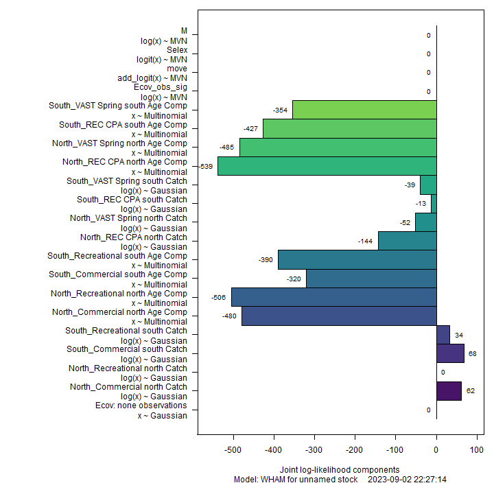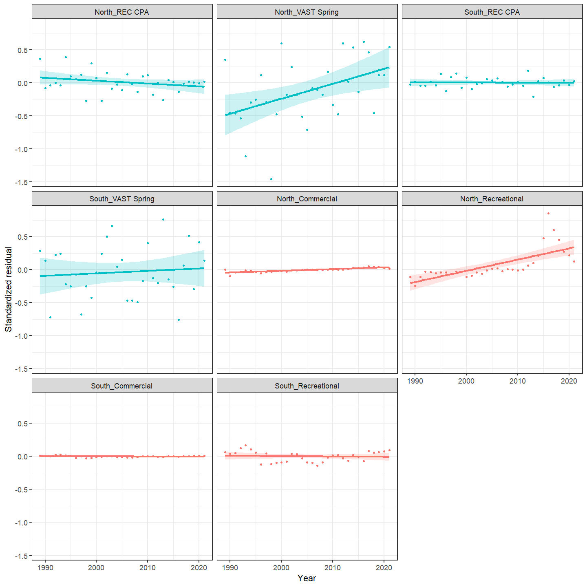

### Results

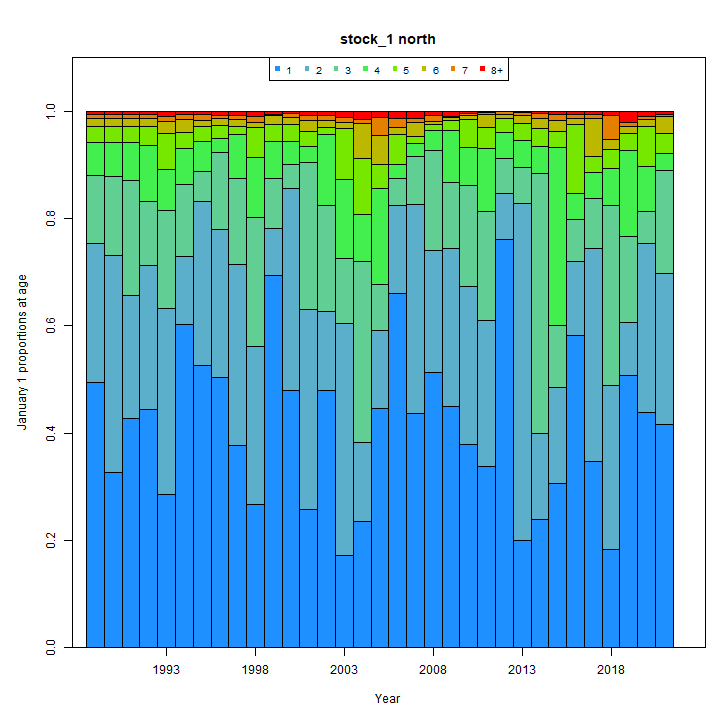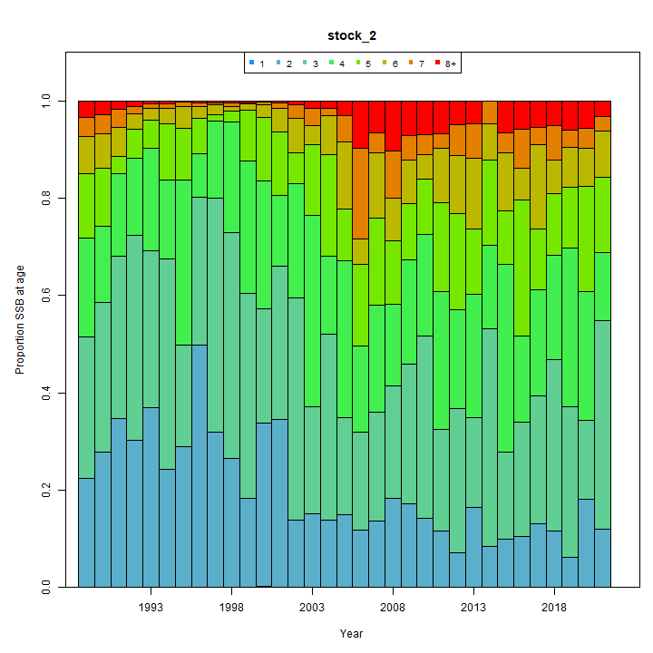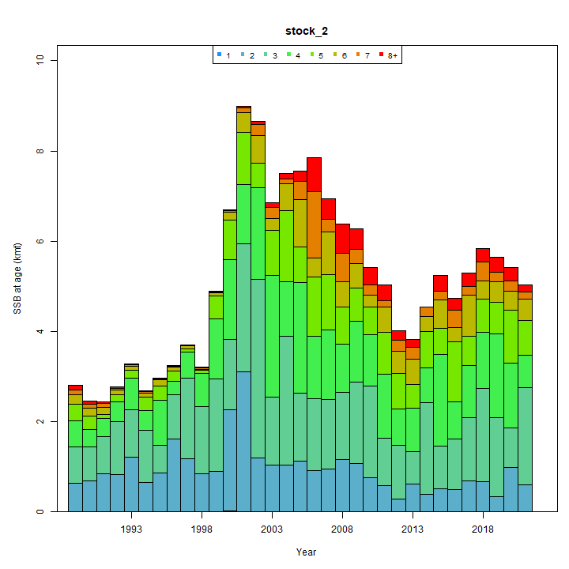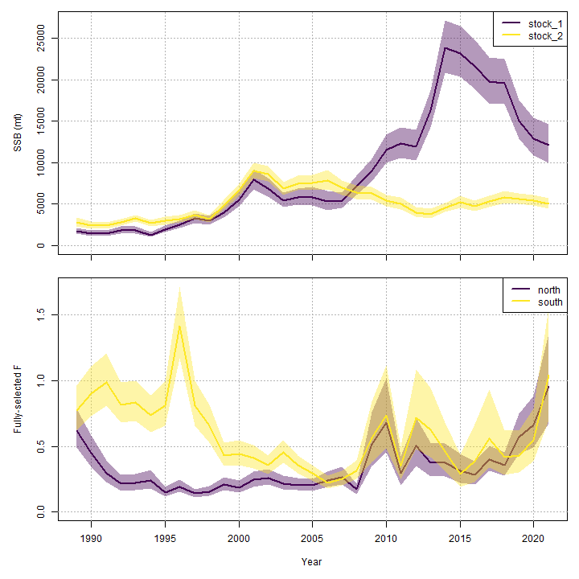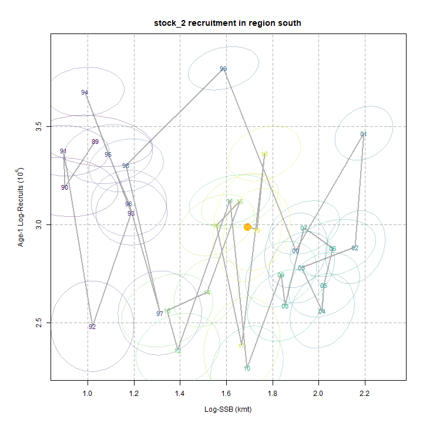

### Retro

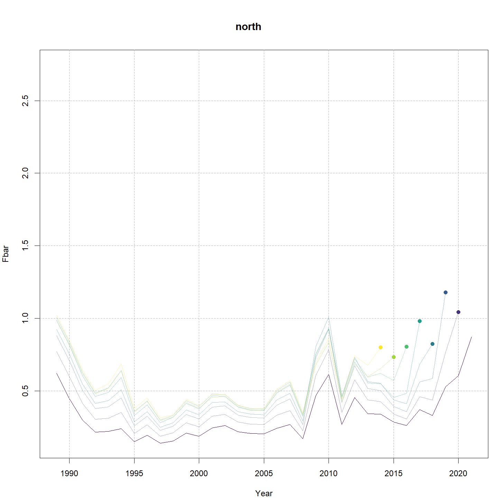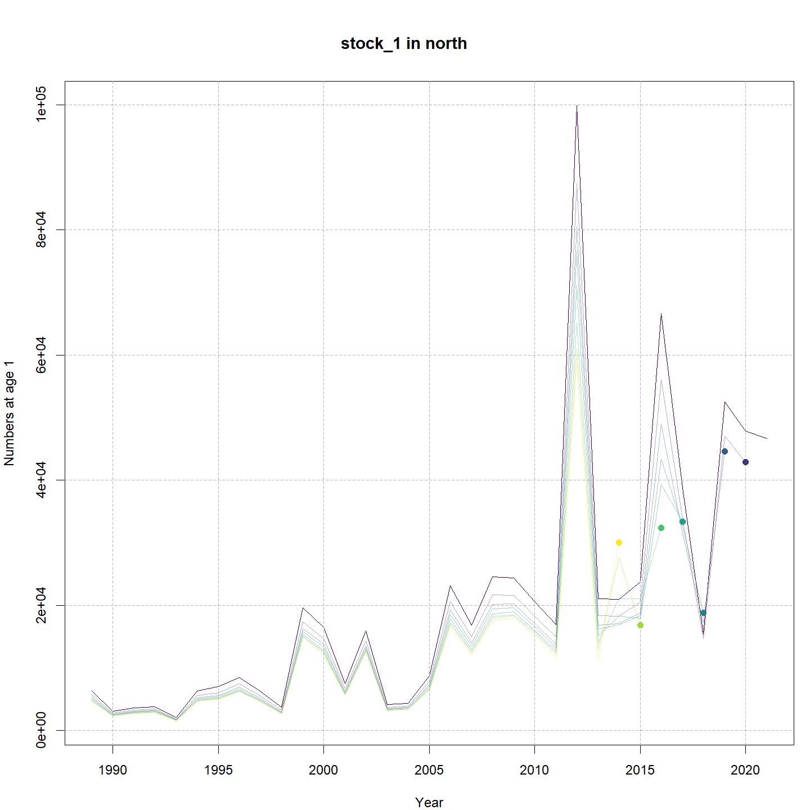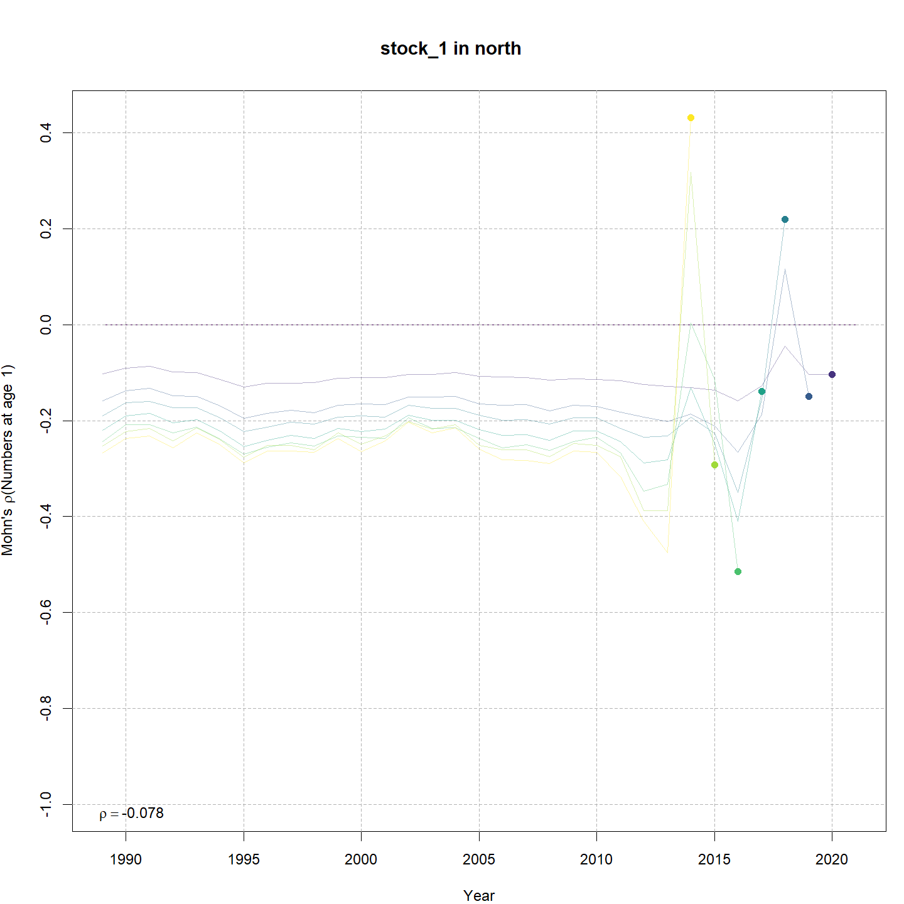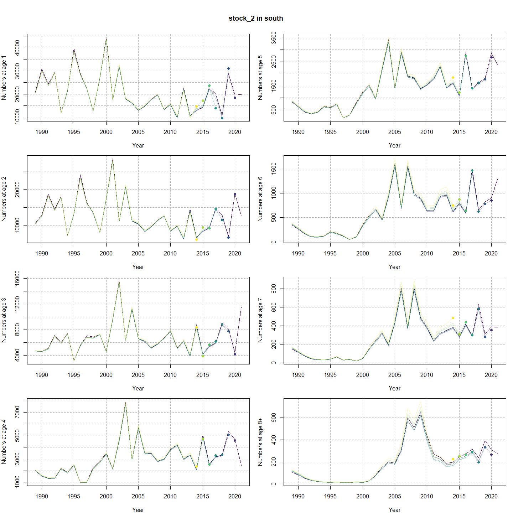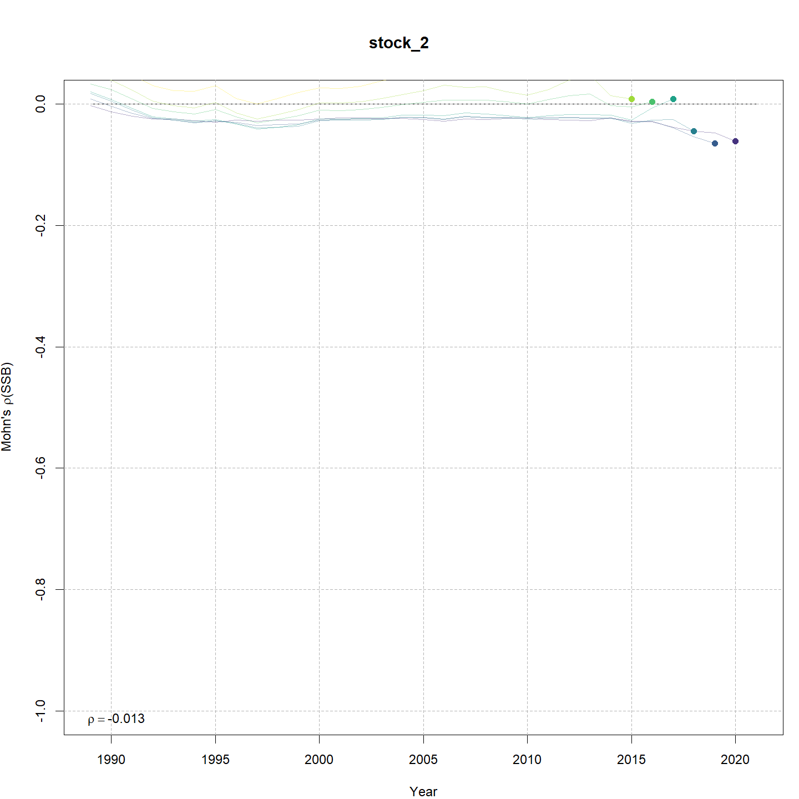

### Reference points

### Miscelaneous

## Tables {.tabset}

### Parameter estimates

<table class="table" style="margin-left: auto; margin-right: auto;">
<caption>Parameter estimates, standard errors, and confidence intervals. Rounded to 3 decimal places.</caption>
 <thead>
  <tr>
   <th style="text-align:left;">   </th>
   <th style="text-align:right;"> Estimate </th>
   <th style="text-align:right;"> Std. Error </th>
   <th style="text-align:right;"> 95\% CI lower </th>
   <th style="text-align:right;"> 95\% CI upper </th>
  </tr>
 </thead>
<tbody>
  <tr>
   <td style="text-align:left;"> REC CPA fully selected q </td>
   <td style="text-align:right;"> 0.000 </td>
   <td style="text-align:right;"> 0.000 </td>
   <td style="text-align:right;"> 0.000 </td>
   <td style="text-align:right;"> 0.000 </td>
  </tr>
  <tr>
   <td style="text-align:left;"> VAST Spring fully selected q </td>
   <td style="text-align:right;"> 0.007 </td>
   <td style="text-align:right;"> 0.000 </td>
   <td style="text-align:right;"> 0.006 </td>
   <td style="text-align:right;"> 0.008 </td>
  </tr>
  <tr>
   <td style="text-align:left;"> REC CPA fully selected q </td>
   <td style="text-align:right;"> 0.000 </td>
   <td style="text-align:right;"> 0.000 </td>
   <td style="text-align:right;"> 0.000 </td>
   <td style="text-align:right;"> 0.000 </td>
  </tr>
  <tr>
   <td style="text-align:left;"> VAST Spring fully selected q </td>
   <td style="text-align:right;"> 0.019 </td>
   <td style="text-align:right;"> 0.001 </td>
   <td style="text-align:right;"> 0.017 </td>
   <td style="text-align:right;"> 0.020 </td>
  </tr>
  <tr>
   <td style="text-align:left;"> Block 1: Selectivity for age 1 </td>
   <td style="text-align:right;"> 0.094 </td>
   <td style="text-align:right;"> 0.017 </td>
   <td style="text-align:right;"> 0.066 </td>
   <td style="text-align:right;"> 0.132 </td>
  </tr>
  <tr>
   <td style="text-align:left;"> Block 1: Selectivity for age 2 </td>
   <td style="text-align:right;"> 1.000 </td>
   <td style="text-align:right;"> -- </td>
   <td style="text-align:right;"> -- </td>
   <td style="text-align:right;"> -- </td>
  </tr>
  <tr>
   <td style="text-align:left;"> Block 1: Selectivity for age 3 </td>
   <td style="text-align:right;"> 1.000 </td>
   <td style="text-align:right;"> -- </td>
   <td style="text-align:right;"> -- </td>
   <td style="text-align:right;"> -- </td>
  </tr>
  <tr>
   <td style="text-align:left;"> Block 1: Selectivity for age 4 </td>
   <td style="text-align:right;"> 1.000 </td>
   <td style="text-align:right;"> -- </td>
   <td style="text-align:right;"> -- </td>
   <td style="text-align:right;"> -- </td>
  </tr>
  <tr>
   <td style="text-align:left;"> Block 1: Selectivity for age 5 </td>
   <td style="text-align:right;"> 1.000 </td>
   <td style="text-align:right;"> -- </td>
   <td style="text-align:right;"> -- </td>
   <td style="text-align:right;"> -- </td>
  </tr>
  <tr>
   <td style="text-align:left;"> Block 1: Selectivity for age 6 </td>
   <td style="text-align:right;"> 1.000 </td>
   <td style="text-align:right;"> -- </td>
   <td style="text-align:right;"> -- </td>
   <td style="text-align:right;"> -- </td>
  </tr>
  <tr>
   <td style="text-align:left;"> Block 1: Selectivity for age 7 </td>
   <td style="text-align:right;"> 1.000 </td>
   <td style="text-align:right;"> -- </td>
   <td style="text-align:right;"> -- </td>
   <td style="text-align:right;"> -- </td>
  </tr>
  <tr>
   <td style="text-align:left;"> Block 1: Selectivity for age 8+ </td>
   <td style="text-align:right;"> 1.000 </td>
   <td style="text-align:right;"> -- </td>
   <td style="text-align:right;"> -- </td>
   <td style="text-align:right;"> -- </td>
  </tr>
  <tr>
   <td style="text-align:left;"> Block 2: $a_{50}$ </td>
   <td style="text-align:right;"> 2.535 </td>
   <td style="text-align:right;"> 0.088 </td>
   <td style="text-align:right;"> 2.365 </td>
   <td style="text-align:right;"> 2.711 </td>
  </tr>
  <tr>
   <td style="text-align:left;"> Block 2: 1/slope (increasing) </td>
   <td style="text-align:right;"> 0.422 </td>
   <td style="text-align:right;"> 0.032 </td>
   <td style="text-align:right;"> 0.363 </td>
   <td style="text-align:right;"> 0.490 </td>
  </tr>
  <tr>
   <td style="text-align:left;"> Block 3: $a_{50}$ </td>
   <td style="text-align:right;"> 1.489 </td>
   <td style="text-align:right;"> 0.102 </td>
   <td style="text-align:right;"> 1.299 </td>
   <td style="text-align:right;"> 1.698 </td>
  </tr>
  <tr>
   <td style="text-align:left;"> Block 3: 1/slope (increasing) </td>
   <td style="text-align:right;"> 0.450 </td>
   <td style="text-align:right;"> 0.068 </td>
   <td style="text-align:right;"> 0.333 </td>
   <td style="text-align:right;"> 0.604 </td>
  </tr>
  <tr>
   <td style="text-align:left;"> Block 4: $a_{50}$ </td>
   <td style="text-align:right;"> 4.605 </td>
   <td style="text-align:right;"> 0.393 </td>
   <td style="text-align:right;"> 3.822 </td>
   <td style="text-align:right;"> 5.343 </td>
  </tr>
  <tr>
   <td style="text-align:left;"> Block 4: 1/slope (increasing) </td>
   <td style="text-align:right;"> 1.052 </td>
   <td style="text-align:right;"> 0.091 </td>
   <td style="text-align:right;"> 0.886 </td>
   <td style="text-align:right;"> 1.244 </td>
  </tr>
  <tr>
   <td style="text-align:left;"> Block 5: $a_{50}$ </td>
   <td style="text-align:right;"> 1.861 </td>
   <td style="text-align:right;"> 0.089 </td>
   <td style="text-align:right;"> 1.692 </td>
   <td style="text-align:right;"> 2.042 </td>
  </tr>
  <tr>
   <td style="text-align:left;"> Block 5: 1/slope (increasing) </td>
   <td style="text-align:right;"> 0.285 </td>
   <td style="text-align:right;"> 0.029 </td>
   <td style="text-align:right;"> 0.234 </td>
   <td style="text-align:right;"> 0.346 </td>
  </tr>
  <tr>
   <td style="text-align:left;"> Block 6: $a_{50}$ </td>
   <td style="text-align:right;"> 2.628 </td>
   <td style="text-align:right;"> 0.107 </td>
   <td style="text-align:right;"> 2.422 </td>
   <td style="text-align:right;"> 2.842 </td>
  </tr>
  <tr>
   <td style="text-align:left;"> Block 6: 1/slope (increasing) </td>
   <td style="text-align:right;"> 0.519 </td>
   <td style="text-align:right;"> 0.039 </td>
   <td style="text-align:right;"> 0.448 </td>
   <td style="text-align:right;"> 0.600 </td>
  </tr>
  <tr>
   <td style="text-align:left;"> Block 7: $a_{50}$ </td>
   <td style="text-align:right;"> 1.867 </td>
   <td style="text-align:right;"> 0.107 </td>
   <td style="text-align:right;"> 1.666 </td>
   <td style="text-align:right;"> 2.085 </td>
  </tr>
  <tr>
   <td style="text-align:left;"> Block 7: 1/slope (increasing) </td>
   <td style="text-align:right;"> 0.518 </td>
   <td style="text-align:right;"> 0.051 </td>
   <td style="text-align:right;"> 0.426 </td>
   <td style="text-align:right;"> 0.628 </td>
  </tr>
  <tr>
   <td style="text-align:left;"> Block 8: $a_{50}$ </td>
   <td style="text-align:right;"> 4.503 </td>
   <td style="text-align:right;"> 0.651 </td>
   <td style="text-align:right;"> 3.218 </td>
   <td style="text-align:right;"> 5.690 </td>
  </tr>
  <tr>
   <td style="text-align:left;"> Block 8: 1/slope (increasing) </td>
   <td style="text-align:right;"> 1.392 </td>
   <td style="text-align:right;"> 0.168 </td>
   <td style="text-align:right;"> 1.093 </td>
   <td style="text-align:right;"> 1.753 </td>
  </tr>
  <tr>
   <td style="text-align:left;"> Block 9: Selectivity for age 1 </td>
   <td style="text-align:right;"> 0.500 </td>
   <td style="text-align:right;"> -- </td>
   <td style="text-align:right;"> -- </td>
   <td style="text-align:right;"> -- </td>
  </tr>
  <tr>
   <td style="text-align:left;"> Block 9: Selectivity for age 2 </td>
   <td style="text-align:right;"> 0.500 </td>
   <td style="text-align:right;"> -- </td>
   <td style="text-align:right;"> -- </td>
   <td style="text-align:right;"> -- </td>
  </tr>
  <tr>
   <td style="text-align:left;"> Block 9: Selectivity for age 3 </td>
   <td style="text-align:right;"> 0.500 </td>
   <td style="text-align:right;"> -- </td>
   <td style="text-align:right;"> -- </td>
   <td style="text-align:right;"> -- </td>
  </tr>
  <tr>
   <td style="text-align:left;"> Block 9: Selectivity for age 4 </td>
   <td style="text-align:right;"> 0.500 </td>
   <td style="text-align:right;"> -- </td>
   <td style="text-align:right;"> -- </td>
   <td style="text-align:right;"> -- </td>
  </tr>
  <tr>
   <td style="text-align:left;"> Block 9: Selectivity for age 5 </td>
   <td style="text-align:right;"> 0.500 </td>
   <td style="text-align:right;"> -- </td>
   <td style="text-align:right;"> -- </td>
   <td style="text-align:right;"> -- </td>
  </tr>
  <tr>
   <td style="text-align:left;"> Block 9: Selectivity for age 6 </td>
   <td style="text-align:right;"> 0.500 </td>
   <td style="text-align:right;"> -- </td>
   <td style="text-align:right;"> -- </td>
   <td style="text-align:right;"> -- </td>
  </tr>
  <tr>
   <td style="text-align:left;"> Block 9: Selectivity for age 7 </td>
   <td style="text-align:right;"> 0.500 </td>
   <td style="text-align:right;"> -- </td>
   <td style="text-align:right;"> -- </td>
   <td style="text-align:right;"> -- </td>
  </tr>
  <tr>
   <td style="text-align:left;"> Block 9: Selectivity for age 8+ </td>
   <td style="text-align:right;"> 1.000 </td>
   <td style="text-align:right;"> -- </td>
   <td style="text-align:right;"> -- </td>
   <td style="text-align:right;"> -- </td>
  </tr>
  <tr>
   <td style="text-align:left;"> Block 10: Selectivity for age 1 </td>
   <td style="text-align:right;"> 0.164 </td>
   <td style="text-align:right;"> 0.012 </td>
   <td style="text-align:right;"> 0.141 </td>
   <td style="text-align:right;"> 0.190 </td>
  </tr>
  <tr>
   <td style="text-align:left;"> Block 10: Selectivity for age 2 </td>
   <td style="text-align:right;"> 0.494 </td>
   <td style="text-align:right;"> 0.031 </td>
   <td style="text-align:right;"> 0.434 </td>
   <td style="text-align:right;"> 0.553 </td>
  </tr>
  <tr>
   <td style="text-align:left;"> Block 10: Selectivity for age 3 </td>
   <td style="text-align:right;"> 1.000 </td>
   <td style="text-align:right;"> 0.000 </td>
   <td style="text-align:right;"> 0.000 </td>
   <td style="text-align:right;"> 1.000 </td>
  </tr>
  <tr>
   <td style="text-align:left;"> Block 10: Selectivity for age 4 </td>
   <td style="text-align:right;"> 1.000 </td>
   <td style="text-align:right;"> 0.000 </td>
   <td style="text-align:right;"> 0.000 </td>
   <td style="text-align:right;"> 1.000 </td>
  </tr>
  <tr>
   <td style="text-align:left;"> Block 10: Selectivity for age 5 </td>
   <td style="text-align:right;"> 0.904 </td>
   <td style="text-align:right;"> 0.091 </td>
   <td style="text-align:right;"> 0.546 </td>
   <td style="text-align:right;"> 0.987 </td>
  </tr>
  <tr>
   <td style="text-align:left;"> Block 10: Selectivity for age 6 </td>
   <td style="text-align:right;"> 1.000 </td>
   <td style="text-align:right;"> -- </td>
   <td style="text-align:right;"> -- </td>
   <td style="text-align:right;"> -- </td>
  </tr>
  <tr>
   <td style="text-align:left;"> Block 10: Selectivity for age 7 </td>
   <td style="text-align:right;"> 0.512 </td>
   <td style="text-align:right;"> 0.130 </td>
   <td style="text-align:right;"> 0.274 </td>
   <td style="text-align:right;"> 0.745 </td>
  </tr>
  <tr>
   <td style="text-align:left;"> Block 10: Selectivity for age 8+ </td>
   <td style="text-align:right;"> 0.548 </td>
   <td style="text-align:right;"> 0.148 </td>
   <td style="text-align:right;"> 0.273 </td>
   <td style="text-align:right;"> 0.796 </td>
  </tr>
  <tr>
   <td style="text-align:left;"> Block 11: Selectivity for age 1 </td>
   <td style="text-align:right;"> 0.500 </td>
   <td style="text-align:right;"> -- </td>
   <td style="text-align:right;"> -- </td>
   <td style="text-align:right;"> -- </td>
  </tr>
  <tr>
   <td style="text-align:left;"> Block 11: Selectivity for age 2 </td>
   <td style="text-align:right;"> 0.500 </td>
   <td style="text-align:right;"> -- </td>
   <td style="text-align:right;"> -- </td>
   <td style="text-align:right;"> -- </td>
  </tr>
  <tr>
   <td style="text-align:left;"> Block 11: Selectivity for age 3 </td>
   <td style="text-align:right;"> 1.000 </td>
   <td style="text-align:right;"> -- </td>
   <td style="text-align:right;"> -- </td>
   <td style="text-align:right;"> -- </td>
  </tr>
  <tr>
   <td style="text-align:left;"> Block 11: Selectivity for age 4 </td>
   <td style="text-align:right;"> 0.500 </td>
   <td style="text-align:right;"> -- </td>
   <td style="text-align:right;"> -- </td>
   <td style="text-align:right;"> -- </td>
  </tr>
  <tr>
   <td style="text-align:left;"> Block 11: Selectivity for age 5 </td>
   <td style="text-align:right;"> 0.500 </td>
   <td style="text-align:right;"> -- </td>
   <td style="text-align:right;"> -- </td>
   <td style="text-align:right;"> -- </td>
  </tr>
  <tr>
   <td style="text-align:left;"> Block 11: Selectivity for age 6 </td>
   <td style="text-align:right;"> 0.500 </td>
   <td style="text-align:right;"> -- </td>
   <td style="text-align:right;"> -- </td>
   <td style="text-align:right;"> -- </td>
  </tr>
  <tr>
   <td style="text-align:left;"> Block 11: Selectivity for age 7 </td>
   <td style="text-align:right;"> 0.500 </td>
   <td style="text-align:right;"> -- </td>
   <td style="text-align:right;"> -- </td>
   <td style="text-align:right;"> -- </td>
  </tr>
  <tr>
   <td style="text-align:left;"> Block 11: Selectivity for age 8+ </td>
   <td style="text-align:right;"> 0.500 </td>
   <td style="text-align:right;"> -- </td>
   <td style="text-align:right;"> -- </td>
   <td style="text-align:right;"> -- </td>
  </tr>
  <tr>
   <td style="text-align:left;"> Block 12: Selectivity for age 1 </td>
   <td style="text-align:right;"> 0.341 </td>
   <td style="text-align:right;"> 0.020 </td>
   <td style="text-align:right;"> 0.303 </td>
   <td style="text-align:right;"> 0.381 </td>
  </tr>
  <tr>
   <td style="text-align:left;"> Block 12: Selectivity for age 2 </td>
   <td style="text-align:right;"> 1.000 </td>
   <td style="text-align:right;"> 0.000 </td>
   <td style="text-align:right;"> 0.000 </td>
   <td style="text-align:right;"> 1.000 </td>
  </tr>
  <tr>
   <td style="text-align:left;"> Block 12: Selectivity for age 3 </td>
   <td style="text-align:right;"> 1.000 </td>
   <td style="text-align:right;"> -- </td>
   <td style="text-align:right;"> -- </td>
   <td style="text-align:right;"> -- </td>
  </tr>
  <tr>
   <td style="text-align:left;"> Block 12: Selectivity for age 4 </td>
   <td style="text-align:right;"> 0.542 </td>
   <td style="text-align:right;"> 0.059 </td>
   <td style="text-align:right;"> 0.427 </td>
   <td style="text-align:right;"> 0.652 </td>
  </tr>
  <tr>
   <td style="text-align:left;"> Block 12: Selectivity for age 5 </td>
   <td style="text-align:right;"> 0.389 </td>
   <td style="text-align:right;"> 0.069 </td>
   <td style="text-align:right;"> 0.265 </td>
   <td style="text-align:right;"> 0.529 </td>
  </tr>
  <tr>
   <td style="text-align:left;"> Block 12: Selectivity for age 6 </td>
   <td style="text-align:right;"> 0.271 </td>
   <td style="text-align:right;"> 0.084 </td>
   <td style="text-align:right;"> 0.138 </td>
   <td style="text-align:right;"> 0.462 </td>
  </tr>
  <tr>
   <td style="text-align:left;"> Block 12: Selectivity for age 7 </td>
   <td style="text-align:right;"> 0.122 </td>
   <td style="text-align:right;"> 0.083 </td>
   <td style="text-align:right;"> 0.030 </td>
   <td style="text-align:right;"> 0.387 </td>
  </tr>
  <tr>
   <td style="text-align:left;"> Block 12: Selectivity for age 8+ </td>
   <td style="text-align:right;"> 0.165 </td>
   <td style="text-align:right;"> 0.108 </td>
   <td style="text-align:right;"> 0.041 </td>
   <td style="text-align:right;"> 0.477 </td>
  </tr>
</tbody>
</table>

### Abundance at age

<table class="table" style="margin-left: auto; margin-right: auto;">
<caption>Abundance at age (1000s) for stock 1 in north.</caption>
 <thead>
  <tr>
   <th style="text-align:left;">   </th>
   <th style="text-align:right;"> 1 </th>
   <th style="text-align:right;"> 2 </th>
   <th style="text-align:right;"> 3 </th>
   <th style="text-align:right;"> 4 </th>
   <th style="text-align:right;"> 5 </th>
   <th style="text-align:right;"> 6 </th>
   <th style="text-align:right;"> 7 </th>
   <th style="text-align:right;"> 8+ </th>
  </tr>
 </thead>
<tbody>
  <tr>
   <td style="text-align:left;"> 1989 </td>
   <td style="text-align:right;"> 6577 </td>
   <td style="text-align:right;"> 3387 </td>
   <td style="text-align:right;"> 1672 </td>
   <td style="text-align:right;"> 821 </td>
   <td style="text-align:right;"> 403 </td>
   <td style="text-align:right;"> 198 </td>
   <td style="text-align:right;"> 97 </td>
   <td style="text-align:right;"> 93 </td>
  </tr>
  <tr>
   <td style="text-align:left;"> 1990 </td>
   <td style="text-align:right;"> 3167 </td>
   <td style="text-align:right;"> 3943 </td>
   <td style="text-align:right;"> 1401 </td>
   <td style="text-align:right;"> 641 </td>
   <td style="text-align:right;"> 311 </td>
   <td style="text-align:right;"> 152 </td>
   <td style="text-align:right;"> 75 </td>
   <td style="text-align:right;"> 72 </td>
  </tr>
  <tr>
   <td style="text-align:left;"> 1991 </td>
   <td style="text-align:right;"> 3719 </td>
   <td style="text-align:right;"> 1996 </td>
   <td style="text-align:right;"> 1858 </td>
   <td style="text-align:right;"> 639 </td>
   <td style="text-align:right;"> 291 </td>
   <td style="text-align:right;"> 141 </td>
   <td style="text-align:right;"> 69 </td>
   <td style="text-align:right;"> 67 </td>
  </tr>
  <tr>
   <td style="text-align:left;"> 1992 </td>
   <td style="text-align:right;"> 3848 </td>
   <td style="text-align:right;"> 2393 </td>
   <td style="text-align:right;"> 1056 </td>
   <td style="text-align:right;"> 962 </td>
   <td style="text-align:right;"> 330 </td>
   <td style="text-align:right;"> 150 </td>
   <td style="text-align:right;"> 73 </td>
   <td style="text-align:right;"> 70 </td>
  </tr>
  <tr>
   <td style="text-align:left;"> 1993 </td>
   <td style="text-align:right;"> 2116 </td>
   <td style="text-align:right;"> 2518 </td>
   <td style="text-align:right;"> 1343 </td>
   <td style="text-align:right;"> 587 </td>
   <td style="text-align:right;"> 535 </td>
   <td style="text-align:right;"> 183 </td>
   <td style="text-align:right;"> 83 </td>
   <td style="text-align:right;"> 79 </td>
  </tr>
  <tr>
   <td style="text-align:left;"> 1994 </td>
   <td style="text-align:right;"> 6484 </td>
   <td style="text-align:right;"> 1372 </td>
   <td style="text-align:right;"> 1418 </td>
   <td style="text-align:right;"> 742 </td>
   <td style="text-align:right;"> 324 </td>
   <td style="text-align:right;"> 294 </td>
   <td style="text-align:right;"> 101 </td>
   <td style="text-align:right;"> 90 </td>
  </tr>
  <tr>
   <td style="text-align:left;"> 1995 </td>
   <td style="text-align:right;"> 7215 </td>
   <td style="text-align:right;"> 4194 </td>
   <td style="text-align:right;"> 760 </td>
   <td style="text-align:right;"> 769 </td>
   <td style="text-align:right;"> 401 </td>
   <td style="text-align:right;"> 175 </td>
   <td style="text-align:right;"> 159 </td>
   <td style="text-align:right;"> 103 </td>
  </tr>
  <tr>
   <td style="text-align:left;"> 1996 </td>
   <td style="text-align:right;"> 8856 </td>
   <td style="text-align:right;"> 4751 </td>
   <td style="text-align:right;"> 2489 </td>
   <td style="text-align:right;"> 448 </td>
   <td style="text-align:right;"> 452 </td>
   <td style="text-align:right;"> 236 </td>
   <td style="text-align:right;"> 103 </td>
   <td style="text-align:right;"> 154 </td>
  </tr>
  <tr>
   <td style="text-align:left;"> 1997 </td>
   <td style="text-align:right;"> 6342 </td>
   <td style="text-align:right;"> 5812 </td>
   <td style="text-align:right;"> 2708 </td>
   <td style="text-align:right;"> 1409 </td>
   <td style="text-align:right;"> 253 </td>
   <td style="text-align:right;"> 256 </td>
   <td style="text-align:right;"> 133 </td>
   <td style="text-align:right;"> 145 </td>
  </tr>
  <tr>
   <td style="text-align:left;"> 1998 </td>
   <td style="text-align:right;"> 3830 </td>
   <td style="text-align:right;"> 4170 </td>
   <td style="text-align:right;"> 3469 </td>
   <td style="text-align:right;"> 1601 </td>
   <td style="text-align:right;"> 832 </td>
   <td style="text-align:right;"> 149 </td>
   <td style="text-align:right;"> 151 </td>
   <td style="text-align:right;"> 165 </td>
  </tr>
  <tr>
   <td style="text-align:left;"> 1999 </td>
   <td style="text-align:right;"> 20474 </td>
   <td style="text-align:right;"> 2543 </td>
   <td style="text-align:right;"> 2673 </td>
   <td style="text-align:right;"> 2076 </td>
   <td style="text-align:right;"> 933 </td>
   <td style="text-align:right;"> 483 </td>
   <td style="text-align:right;"> 87 </td>
   <td style="text-align:right;"> 183 </td>
  </tr>
  <tr>
   <td style="text-align:left;"> 2000 </td>
   <td style="text-align:right;"> 16596 </td>
   <td style="text-align:right;"> 13500 </td>
   <td style="text-align:right;"> 1589 </td>
   <td style="text-align:right;"> 1529 </td>
   <td style="text-align:right;"> 1149 </td>
   <td style="text-align:right;"> 514 </td>
   <td style="text-align:right;"> 266 </td>
   <td style="text-align:right;"> 149 </td>
  </tr>
  <tr>
   <td style="text-align:left;"> 2001 </td>
   <td style="text-align:right;"> 7918 </td>
   <td style="text-align:right;"> 10885 </td>
   <td style="text-align:right;"> 8361 </td>
   <td style="text-align:right;"> 920 </td>
   <td style="text-align:right;"> 864 </td>
   <td style="text-align:right;"> 647 </td>
   <td style="text-align:right;"> 289 </td>
   <td style="text-align:right;"> 234 </td>
  </tr>
  <tr>
   <td style="text-align:left;"> 2002 </td>
   <td style="text-align:right;"> 17210 </td>
   <td style="text-align:right;"> 5173 </td>
   <td style="text-align:right;"> 6624 </td>
   <td style="text-align:right;"> 4639 </td>
   <td style="text-align:right;"> 494 </td>
   <td style="text-align:right;"> 462 </td>
   <td style="text-align:right;"> 346 </td>
   <td style="text-align:right;"> 279 </td>
  </tr>
  <tr>
   <td style="text-align:left;"> 2003 </td>
   <td style="text-align:right;"> 4316 </td>
   <td style="text-align:right;"> 11178 </td>
   <td style="text-align:right;"> 3095 </td>
   <td style="text-align:right;"> 3608 </td>
   <td style="text-align:right;"> 2446 </td>
   <td style="text-align:right;"> 259 </td>
   <td style="text-align:right;"> 242 </td>
   <td style="text-align:right;"> 328 </td>
  </tr>
  <tr>
   <td style="text-align:left;"> 2004 </td>
   <td style="text-align:right;"> 4564 </td>
   <td style="text-align:right;"> 2810 </td>
   <td style="text-align:right;"> 6768 </td>
   <td style="text-align:right;"> 1741 </td>
   <td style="text-align:right;"> 1981 </td>
   <td style="text-align:right;"> 1339 </td>
   <td style="text-align:right;"> 142 </td>
   <td style="text-align:right;"> 312 </td>
  </tr>
  <tr>
   <td style="text-align:left;"> 2005 </td>
   <td style="text-align:right;"> 8925 </td>
   <td style="text-align:right;"> 3003 </td>
   <td style="text-align:right;"> 1749 </td>
   <td style="text-align:right;"> 3886 </td>
   <td style="text-align:right;"> 970 </td>
   <td style="text-align:right;"> 1099 </td>
   <td style="text-align:right;"> 743 </td>
   <td style="text-align:right;"> 252 </td>
  </tr>
  <tr>
   <td style="text-align:left;"> 2006 </td>
   <td style="text-align:right;"> 22961 </td>
   <td style="text-align:right;"> 5833 </td>
   <td style="text-align:right;"> 1841 </td>
   <td style="text-align:right;"> 1000 </td>
   <td style="text-align:right;"> 2169 </td>
   <td style="text-align:right;"> 540 </td>
   <td style="text-align:right;"> 612 </td>
   <td style="text-align:right;"> 554 </td>
  </tr>
  <tr>
   <td style="text-align:left;"> 2007 </td>
   <td style="text-align:right;"> 16748 </td>
   <td style="text-align:right;"> 14948 </td>
   <td style="text-align:right;"> 3523 </td>
   <td style="text-align:right;"> 1023 </td>
   <td style="text-align:right;"> 540 </td>
   <td style="text-align:right;"> 1167 </td>
   <td style="text-align:right;"> 290 </td>
   <td style="text-align:right;"> 627 </td>
  </tr>
  <tr>
   <td style="text-align:left;"> 2008 </td>
   <td style="text-align:right;"> 25366 </td>
   <td style="text-align:right;"> 10875 </td>
   <td style="text-align:right;"> 8938 </td>
   <td style="text-align:right;"> 1918 </td>
   <td style="text-align:right;"> 539 </td>
   <td style="text-align:right;"> 283 </td>
   <td style="text-align:right;"> 612 </td>
   <td style="text-align:right;"> 481 </td>
  </tr>
  <tr>
   <td style="text-align:left;"> 2009 </td>
   <td style="text-align:right;"> 25882 </td>
   <td style="text-align:right;"> 16576 </td>
   <td style="text-align:right;"> 6690 </td>
   <td style="text-align:right;"> 5203 </td>
   <td style="text-align:right;"> 1097 </td>
   <td style="text-align:right;"> 308 </td>
   <td style="text-align:right;"> 162 </td>
   <td style="text-align:right;"> 624 </td>
  </tr>
  <tr>
   <td style="text-align:left;"> 2010 </td>
   <td style="text-align:right;"> 21906 </td>
   <td style="text-align:right;"> 17071 </td>
   <td style="text-align:right;"> 10600 </td>
   <td style="text-align:right;"> 3977 </td>
   <td style="text-align:right;"> 2809 </td>
   <td style="text-align:right;"> 529 </td>
   <td style="text-align:right;"> 135 </td>
   <td style="text-align:right;"> 320 </td>
  </tr>
  <tr>
   <td style="text-align:left;"> 2011 </td>
   <td style="text-align:right;"> 17980 </td>
   <td style="text-align:right;"> 14374 </td>
   <td style="text-align:right;"> 10772 </td>
   <td style="text-align:right;"> 6107 </td>
   <td style="text-align:right;"> 2019 </td>
   <td style="text-align:right;"> 1228 </td>
   <td style="text-align:right;"> 204 </td>
   <td style="text-align:right;"> 159 </td>
  </tr>
  <tr>
   <td style="text-align:left;"> 2012 </td>
   <td style="text-align:right;"> 100089 </td>
   <td style="text-align:right;"> 11944 </td>
   <td style="text-align:right;"> 9352 </td>
   <td style="text-align:right;"> 6661 </td>
   <td style="text-align:right;"> 3573 </td>
   <td style="text-align:right;"> 1115 </td>
   <td style="text-align:right;"> 646 </td>
   <td style="text-align:right;"> 184 </td>
  </tr>
  <tr>
   <td style="text-align:left;"> 2013 </td>
   <td style="text-align:right;"> 22313 </td>
   <td style="text-align:right;"> 66056 </td>
   <td style="text-align:right;"> 7646 </td>
   <td style="text-align:right;"> 5570 </td>
   <td style="text-align:right;"> 3614 </td>
   <td style="text-align:right;"> 1742 </td>
   <td style="text-align:right;"> 497 </td>
   <td style="text-align:right;"> 349 </td>
  </tr>
  <tr>
   <td style="text-align:left;"> 2014 </td>
   <td style="text-align:right;"> 27642 </td>
   <td style="text-align:right;"> 14788 </td>
   <td style="text-align:right;"> 42685 </td>
   <td style="text-align:right;"> 4647 </td>
   <td style="text-align:right;"> 3158 </td>
   <td style="text-align:right;"> 1902 </td>
   <td style="text-align:right;"> 861 </td>
   <td style="text-align:right;"> 400 </td>
  </tr>
  <tr>
   <td style="text-align:left;"> 2015 </td>
   <td style="text-align:right;"> 25378 </td>
   <td style="text-align:right;"> 18319 </td>
   <td style="text-align:right;"> 9559 </td>
   <td style="text-align:right;"> 25980 </td>
   <td style="text-align:right;"> 2638 </td>
   <td style="text-align:right;"> 1662 </td>
   <td style="text-align:right;"> 939 </td>
   <td style="text-align:right;"> 597 </td>
  </tr>
  <tr>
   <td style="text-align:left;"> 2016 </td>
   <td style="text-align:right;"> 64335 </td>
   <td style="text-align:right;"> 16845 </td>
   <td style="text-align:right;"> 11894 </td>
   <td style="text-align:right;"> 5882 </td>
   <td style="text-align:right;"> 15053 </td>
   <td style="text-align:right;"> 1433 </td>
   <td style="text-align:right;"> 856 </td>
   <td style="text-align:right;"> 762 </td>
  </tr>
  <tr>
   <td style="text-align:left;"> 2017 </td>
   <td style="text-align:right;"> 42068 </td>
   <td style="text-align:right;"> 42746 </td>
   <td style="text-align:right;"> 10935 </td>
   <td style="text-align:right;"> 7285 </td>
   <td style="text-align:right;"> 3408 </td>
   <td style="text-align:right;"> 8259 </td>
   <td style="text-align:right;"> 752 </td>
   <td style="text-align:right;"> 822 </td>
  </tr>
  <tr>
   <td style="text-align:left;"> 2018 </td>
   <td style="text-align:right;"> 20443 </td>
   <td style="text-align:right;"> 27874 </td>
   <td style="text-align:right;"> 27298 </td>
   <td style="text-align:right;"> 6354 </td>
   <td style="text-align:right;"> 3924 </td>
   <td style="text-align:right;"> 1720 </td>
   <td style="text-align:right;"> 3956 </td>
   <td style="text-align:right;"> 725 </td>
  </tr>
  <tr>
   <td style="text-align:left;"> 2019 </td>
   <td style="text-align:right;"> 52857 </td>
   <td style="text-align:right;"> 13563 </td>
   <td style="text-align:right;"> 17908 </td>
   <td style="text-align:right;"> 16156 </td>
   <td style="text-align:right;"> 3516 </td>
   <td style="text-align:right;"> 2048 </td>
   <td style="text-align:right;"> 856 </td>
   <td style="text-align:right;"> 2262 </td>
  </tr>
  <tr>
   <td style="text-align:left;"> 2020 </td>
   <td style="text-align:right;"> 45147 </td>
   <td style="text-align:right;"> 34835 </td>
   <td style="text-align:right;"> 8539 </td>
   <td style="text-align:right;"> 10057 </td>
   <td style="text-align:right;"> 8150 </td>
   <td style="text-align:right;"> 1599 </td>
   <td style="text-align:right;"> 855 </td>
   <td style="text-align:right;"> 1217 </td>
  </tr>
  <tr>
   <td style="text-align:left;"> 2021 </td>
   <td style="text-align:right;"> 49713 </td>
   <td style="text-align:right;"> 29685 </td>
   <td style="text-align:right;"> 21792 </td>
   <td style="text-align:right;"> 4720 </td>
   <td style="text-align:right;"> 4926 </td>
   <td style="text-align:right;"> 3540 </td>
   <td style="text-align:right;"> 629 </td>
   <td style="text-align:right;"> 757 </td>
  </tr>
</tbody>
</table>

<table class="table" style="margin-left: auto; margin-right: auto;">
<caption>Abundance at age (1000s) for stock 1 in south.</caption>
 <thead>
  <tr>
   <th style="text-align:left;">   </th>
   <th style="text-align:right;"> 1 </th>
   <th style="text-align:right;"> 2 </th>
   <th style="text-align:right;"> 3 </th>
   <th style="text-align:right;"> 4 </th>
   <th style="text-align:right;"> 5 </th>
   <th style="text-align:right;"> 6 </th>
   <th style="text-align:right;"> 7 </th>
   <th style="text-align:right;"> 8+ </th>
  </tr>
 </thead>
<tbody>
  <tr>
   <td style="text-align:left;"> 1989 </td>
   <td style="text-align:right;"> 0 </td>
   <td style="text-align:right;"> 0 </td>
   <td style="text-align:right;"> 0 </td>
   <td style="text-align:right;"> 0 </td>
   <td style="text-align:right;"> 0 </td>
   <td style="text-align:right;"> 0 </td>
   <td style="text-align:right;"> 0 </td>
   <td style="text-align:right;"> 0 </td>
  </tr>
  <tr>
   <td style="text-align:left;"> 1990 </td>
   <td style="text-align:right;"> 0 </td>
   <td style="text-align:right;"> 0 </td>
   <td style="text-align:right;"> 0 </td>
   <td style="text-align:right;"> 0 </td>
   <td style="text-align:right;"> 0 </td>
   <td style="text-align:right;"> 0 </td>
   <td style="text-align:right;"> 0 </td>
   <td style="text-align:right;"> 0 </td>
  </tr>
  <tr>
   <td style="text-align:left;"> 1991 </td>
   <td style="text-align:right;"> 0 </td>
   <td style="text-align:right;"> 0 </td>
   <td style="text-align:right;"> 0 </td>
   <td style="text-align:right;"> 0 </td>
   <td style="text-align:right;"> 0 </td>
   <td style="text-align:right;"> 0 </td>
   <td style="text-align:right;"> 0 </td>
   <td style="text-align:right;"> 0 </td>
  </tr>
  <tr>
   <td style="text-align:left;"> 1992 </td>
   <td style="text-align:right;"> 0 </td>
   <td style="text-align:right;"> 0 </td>
   <td style="text-align:right;"> 0 </td>
   <td style="text-align:right;"> 0 </td>
   <td style="text-align:right;"> 0 </td>
   <td style="text-align:right;"> 0 </td>
   <td style="text-align:right;"> 0 </td>
   <td style="text-align:right;"> 0 </td>
  </tr>
  <tr>
   <td style="text-align:left;"> 1993 </td>
   <td style="text-align:right;"> 0 </td>
   <td style="text-align:right;"> 0 </td>
   <td style="text-align:right;"> 0 </td>
   <td style="text-align:right;"> 0 </td>
   <td style="text-align:right;"> 0 </td>
   <td style="text-align:right;"> 0 </td>
   <td style="text-align:right;"> 0 </td>
   <td style="text-align:right;"> 0 </td>
  </tr>
  <tr>
   <td style="text-align:left;"> 1994 </td>
   <td style="text-align:right;"> 0 </td>
   <td style="text-align:right;"> 0 </td>
   <td style="text-align:right;"> 0 </td>
   <td style="text-align:right;"> 0 </td>
   <td style="text-align:right;"> 0 </td>
   <td style="text-align:right;"> 0 </td>
   <td style="text-align:right;"> 0 </td>
   <td style="text-align:right;"> 0 </td>
  </tr>
  <tr>
   <td style="text-align:left;"> 1995 </td>
   <td style="text-align:right;"> 0 </td>
   <td style="text-align:right;"> 0 </td>
   <td style="text-align:right;"> 0 </td>
   <td style="text-align:right;"> 0 </td>
   <td style="text-align:right;"> 0 </td>
   <td style="text-align:right;"> 0 </td>
   <td style="text-align:right;"> 0 </td>
   <td style="text-align:right;"> 0 </td>
  </tr>
  <tr>
   <td style="text-align:left;"> 1996 </td>
   <td style="text-align:right;"> 0 </td>
   <td style="text-align:right;"> 0 </td>
   <td style="text-align:right;"> 0 </td>
   <td style="text-align:right;"> 0 </td>
   <td style="text-align:right;"> 0 </td>
   <td style="text-align:right;"> 0 </td>
   <td style="text-align:right;"> 0 </td>
   <td style="text-align:right;"> 0 </td>
  </tr>
  <tr>
   <td style="text-align:left;"> 1997 </td>
   <td style="text-align:right;"> 0 </td>
   <td style="text-align:right;"> 0 </td>
   <td style="text-align:right;"> 0 </td>
   <td style="text-align:right;"> 0 </td>
   <td style="text-align:right;"> 0 </td>
   <td style="text-align:right;"> 0 </td>
   <td style="text-align:right;"> 0 </td>
   <td style="text-align:right;"> 0 </td>
  </tr>
  <tr>
   <td style="text-align:left;"> 1998 </td>
   <td style="text-align:right;"> 0 </td>
   <td style="text-align:right;"> 0 </td>
   <td style="text-align:right;"> 0 </td>
   <td style="text-align:right;"> 0 </td>
   <td style="text-align:right;"> 0 </td>
   <td style="text-align:right;"> 0 </td>
   <td style="text-align:right;"> 0 </td>
   <td style="text-align:right;"> 0 </td>
  </tr>
  <tr>
   <td style="text-align:left;"> 1999 </td>
   <td style="text-align:right;"> 0 </td>
   <td style="text-align:right;"> 0 </td>
   <td style="text-align:right;"> 0 </td>
   <td style="text-align:right;"> 0 </td>
   <td style="text-align:right;"> 0 </td>
   <td style="text-align:right;"> 0 </td>
   <td style="text-align:right;"> 0 </td>
   <td style="text-align:right;"> 0 </td>
  </tr>
  <tr>
   <td style="text-align:left;"> 2000 </td>
   <td style="text-align:right;"> 0 </td>
   <td style="text-align:right;"> 0 </td>
   <td style="text-align:right;"> 0 </td>
   <td style="text-align:right;"> 0 </td>
   <td style="text-align:right;"> 0 </td>
   <td style="text-align:right;"> 0 </td>
   <td style="text-align:right;"> 0 </td>
   <td style="text-align:right;"> 0 </td>
  </tr>
  <tr>
   <td style="text-align:left;"> 2001 </td>
   <td style="text-align:right;"> 0 </td>
   <td style="text-align:right;"> 0 </td>
   <td style="text-align:right;"> 0 </td>
   <td style="text-align:right;"> 0 </td>
   <td style="text-align:right;"> 0 </td>
   <td style="text-align:right;"> 0 </td>
   <td style="text-align:right;"> 0 </td>
   <td style="text-align:right;"> 0 </td>
  </tr>
  <tr>
   <td style="text-align:left;"> 2002 </td>
   <td style="text-align:right;"> 0 </td>
   <td style="text-align:right;"> 0 </td>
   <td style="text-align:right;"> 0 </td>
   <td style="text-align:right;"> 0 </td>
   <td style="text-align:right;"> 0 </td>
   <td style="text-align:right;"> 0 </td>
   <td style="text-align:right;"> 0 </td>
   <td style="text-align:right;"> 0 </td>
  </tr>
  <tr>
   <td style="text-align:left;"> 2003 </td>
   <td style="text-align:right;"> 0 </td>
   <td style="text-align:right;"> 0 </td>
   <td style="text-align:right;"> 0 </td>
   <td style="text-align:right;"> 0 </td>
   <td style="text-align:right;"> 0 </td>
   <td style="text-align:right;"> 0 </td>
   <td style="text-align:right;"> 0 </td>
   <td style="text-align:right;"> 0 </td>
  </tr>
  <tr>
   <td style="text-align:left;"> 2004 </td>
   <td style="text-align:right;"> 0 </td>
   <td style="text-align:right;"> 0 </td>
   <td style="text-align:right;"> 0 </td>
   <td style="text-align:right;"> 0 </td>
   <td style="text-align:right;"> 0 </td>
   <td style="text-align:right;"> 0 </td>
   <td style="text-align:right;"> 0 </td>
   <td style="text-align:right;"> 0 </td>
  </tr>
  <tr>
   <td style="text-align:left;"> 2005 </td>
   <td style="text-align:right;"> 0 </td>
   <td style="text-align:right;"> 0 </td>
   <td style="text-align:right;"> 0 </td>
   <td style="text-align:right;"> 0 </td>
   <td style="text-align:right;"> 0 </td>
   <td style="text-align:right;"> 0 </td>
   <td style="text-align:right;"> 0 </td>
   <td style="text-align:right;"> 0 </td>
  </tr>
  <tr>
   <td style="text-align:left;"> 2006 </td>
   <td style="text-align:right;"> 0 </td>
   <td style="text-align:right;"> 0 </td>
   <td style="text-align:right;"> 0 </td>
   <td style="text-align:right;"> 0 </td>
   <td style="text-align:right;"> 0 </td>
   <td style="text-align:right;"> 0 </td>
   <td style="text-align:right;"> 0 </td>
   <td style="text-align:right;"> 0 </td>
  </tr>
  <tr>
   <td style="text-align:left;"> 2007 </td>
   <td style="text-align:right;"> 0 </td>
   <td style="text-align:right;"> 0 </td>
   <td style="text-align:right;"> 0 </td>
   <td style="text-align:right;"> 0 </td>
   <td style="text-align:right;"> 0 </td>
   <td style="text-align:right;"> 0 </td>
   <td style="text-align:right;"> 0 </td>
   <td style="text-align:right;"> 0 </td>
  </tr>
  <tr>
   <td style="text-align:left;"> 2008 </td>
   <td style="text-align:right;"> 0 </td>
   <td style="text-align:right;"> 0 </td>
   <td style="text-align:right;"> 0 </td>
   <td style="text-align:right;"> 0 </td>
   <td style="text-align:right;"> 0 </td>
   <td style="text-align:right;"> 0 </td>
   <td style="text-align:right;"> 0 </td>
   <td style="text-align:right;"> 0 </td>
  </tr>
  <tr>
   <td style="text-align:left;"> 2009 </td>
   <td style="text-align:right;"> 0 </td>
   <td style="text-align:right;"> 0 </td>
   <td style="text-align:right;"> 0 </td>
   <td style="text-align:right;"> 0 </td>
   <td style="text-align:right;"> 0 </td>
   <td style="text-align:right;"> 0 </td>
   <td style="text-align:right;"> 0 </td>
   <td style="text-align:right;"> 0 </td>
  </tr>
  <tr>
   <td style="text-align:left;"> 2010 </td>
   <td style="text-align:right;"> 0 </td>
   <td style="text-align:right;"> 0 </td>
   <td style="text-align:right;"> 0 </td>
   <td style="text-align:right;"> 0 </td>
   <td style="text-align:right;"> 0 </td>
   <td style="text-align:right;"> 0 </td>
   <td style="text-align:right;"> 0 </td>
   <td style="text-align:right;"> 0 </td>
  </tr>
  <tr>
   <td style="text-align:left;"> 2011 </td>
   <td style="text-align:right;"> 0 </td>
   <td style="text-align:right;"> 0 </td>
   <td style="text-align:right;"> 0 </td>
   <td style="text-align:right;"> 0 </td>
   <td style="text-align:right;"> 0 </td>
   <td style="text-align:right;"> 0 </td>
   <td style="text-align:right;"> 0 </td>
   <td style="text-align:right;"> 0 </td>
  </tr>
  <tr>
   <td style="text-align:left;"> 2012 </td>
   <td style="text-align:right;"> 0 </td>
   <td style="text-align:right;"> 0 </td>
   <td style="text-align:right;"> 0 </td>
   <td style="text-align:right;"> 0 </td>
   <td style="text-align:right;"> 0 </td>
   <td style="text-align:right;"> 0 </td>
   <td style="text-align:right;"> 0 </td>
   <td style="text-align:right;"> 0 </td>
  </tr>
  <tr>
   <td style="text-align:left;"> 2013 </td>
   <td style="text-align:right;"> 0 </td>
   <td style="text-align:right;"> 0 </td>
   <td style="text-align:right;"> 0 </td>
   <td style="text-align:right;"> 0 </td>
   <td style="text-align:right;"> 0 </td>
   <td style="text-align:right;"> 0 </td>
   <td style="text-align:right;"> 0 </td>
   <td style="text-align:right;"> 0 </td>
  </tr>
  <tr>
   <td style="text-align:left;"> 2014 </td>
   <td style="text-align:right;"> 0 </td>
   <td style="text-align:right;"> 0 </td>
   <td style="text-align:right;"> 0 </td>
   <td style="text-align:right;"> 0 </td>
   <td style="text-align:right;"> 0 </td>
   <td style="text-align:right;"> 0 </td>
   <td style="text-align:right;"> 0 </td>
   <td style="text-align:right;"> 0 </td>
  </tr>
  <tr>
   <td style="text-align:left;"> 2015 </td>
   <td style="text-align:right;"> 0 </td>
   <td style="text-align:right;"> 0 </td>
   <td style="text-align:right;"> 0 </td>
   <td style="text-align:right;"> 0 </td>
   <td style="text-align:right;"> 0 </td>
   <td style="text-align:right;"> 0 </td>
   <td style="text-align:right;"> 0 </td>
   <td style="text-align:right;"> 0 </td>
  </tr>
  <tr>
   <td style="text-align:left;"> 2016 </td>
   <td style="text-align:right;"> 0 </td>
   <td style="text-align:right;"> 0 </td>
   <td style="text-align:right;"> 0 </td>
   <td style="text-align:right;"> 0 </td>
   <td style="text-align:right;"> 0 </td>
   <td style="text-align:right;"> 0 </td>
   <td style="text-align:right;"> 0 </td>
   <td style="text-align:right;"> 0 </td>
  </tr>
  <tr>
   <td style="text-align:left;"> 2017 </td>
   <td style="text-align:right;"> 0 </td>
   <td style="text-align:right;"> 0 </td>
   <td style="text-align:right;"> 0 </td>
   <td style="text-align:right;"> 0 </td>
   <td style="text-align:right;"> 0 </td>
   <td style="text-align:right;"> 0 </td>
   <td style="text-align:right;"> 0 </td>
   <td style="text-align:right;"> 0 </td>
  </tr>
  <tr>
   <td style="text-align:left;"> 2018 </td>
   <td style="text-align:right;"> 0 </td>
   <td style="text-align:right;"> 0 </td>
   <td style="text-align:right;"> 0 </td>
   <td style="text-align:right;"> 0 </td>
   <td style="text-align:right;"> 0 </td>
   <td style="text-align:right;"> 0 </td>
   <td style="text-align:right;"> 0 </td>
   <td style="text-align:right;"> 0 </td>
  </tr>
  <tr>
   <td style="text-align:left;"> 2019 </td>
   <td style="text-align:right;"> 0 </td>
   <td style="text-align:right;"> 0 </td>
   <td style="text-align:right;"> 0 </td>
   <td style="text-align:right;"> 0 </td>
   <td style="text-align:right;"> 0 </td>
   <td style="text-align:right;"> 0 </td>
   <td style="text-align:right;"> 0 </td>
   <td style="text-align:right;"> 0 </td>
  </tr>
  <tr>
   <td style="text-align:left;"> 2020 </td>
   <td style="text-align:right;"> 0 </td>
   <td style="text-align:right;"> 0 </td>
   <td style="text-align:right;"> 0 </td>
   <td style="text-align:right;"> 0 </td>
   <td style="text-align:right;"> 0 </td>
   <td style="text-align:right;"> 0 </td>
   <td style="text-align:right;"> 0 </td>
   <td style="text-align:right;"> 0 </td>
  </tr>
  <tr>
   <td style="text-align:left;"> 2021 </td>
   <td style="text-align:right;"> 0 </td>
   <td style="text-align:right;"> 0 </td>
   <td style="text-align:right;"> 0 </td>
   <td style="text-align:right;"> 0 </td>
   <td style="text-align:right;"> 0 </td>
   <td style="text-align:right;"> 0 </td>
   <td style="text-align:right;"> 0 </td>
   <td style="text-align:right;"> 0 </td>
  </tr>
</tbody>
</table>

<table class="table" style="margin-left: auto; margin-right: auto;">
<caption>Abundance at age (1000s) for stock 2 in north.</caption>
 <thead>
  <tr>
   <th style="text-align:left;">   </th>
   <th style="text-align:right;"> 1 </th>
   <th style="text-align:right;"> 2 </th>
   <th style="text-align:right;"> 3 </th>
   <th style="text-align:right;"> 4 </th>
   <th style="text-align:right;"> 5 </th>
   <th style="text-align:right;"> 6 </th>
   <th style="text-align:right;"> 7 </th>
   <th style="text-align:right;"> 8+ </th>
  </tr>
 </thead>
<tbody>
  <tr>
   <td style="text-align:left;"> 1989 </td>
   <td style="text-align:right;"> 0 </td>
   <td style="text-align:right;"> 0 </td>
   <td style="text-align:right;"> 0 </td>
   <td style="text-align:right;"> 0 </td>
   <td style="text-align:right;"> 0 </td>
   <td style="text-align:right;"> 0 </td>
   <td style="text-align:right;"> 0 </td>
   <td style="text-align:right;"> 0 </td>
  </tr>
  <tr>
   <td style="text-align:left;"> 1990 </td>
   <td style="text-align:right;"> 0 </td>
   <td style="text-align:right;"> 0 </td>
   <td style="text-align:right;"> 0 </td>
   <td style="text-align:right;"> 0 </td>
   <td style="text-align:right;"> 0 </td>
   <td style="text-align:right;"> 0 </td>
   <td style="text-align:right;"> 0 </td>
   <td style="text-align:right;"> 0 </td>
  </tr>
  <tr>
   <td style="text-align:left;"> 1991 </td>
   <td style="text-align:right;"> 0 </td>
   <td style="text-align:right;"> 0 </td>
   <td style="text-align:right;"> 0 </td>
   <td style="text-align:right;"> 0 </td>
   <td style="text-align:right;"> 0 </td>
   <td style="text-align:right;"> 0 </td>
   <td style="text-align:right;"> 0 </td>
   <td style="text-align:right;"> 0 </td>
  </tr>
  <tr>
   <td style="text-align:left;"> 1992 </td>
   <td style="text-align:right;"> 0 </td>
   <td style="text-align:right;"> 0 </td>
   <td style="text-align:right;"> 0 </td>
   <td style="text-align:right;"> 0 </td>
   <td style="text-align:right;"> 0 </td>
   <td style="text-align:right;"> 0 </td>
   <td style="text-align:right;"> 0 </td>
   <td style="text-align:right;"> 0 </td>
  </tr>
  <tr>
   <td style="text-align:left;"> 1993 </td>
   <td style="text-align:right;"> 0 </td>
   <td style="text-align:right;"> 0 </td>
   <td style="text-align:right;"> 0 </td>
   <td style="text-align:right;"> 0 </td>
   <td style="text-align:right;"> 0 </td>
   <td style="text-align:right;"> 0 </td>
   <td style="text-align:right;"> 0 </td>
   <td style="text-align:right;"> 0 </td>
  </tr>
  <tr>
   <td style="text-align:left;"> 1994 </td>
   <td style="text-align:right;"> 0 </td>
   <td style="text-align:right;"> 0 </td>
   <td style="text-align:right;"> 0 </td>
   <td style="text-align:right;"> 0 </td>
   <td style="text-align:right;"> 0 </td>
   <td style="text-align:right;"> 0 </td>
   <td style="text-align:right;"> 0 </td>
   <td style="text-align:right;"> 0 </td>
  </tr>
  <tr>
   <td style="text-align:left;"> 1995 </td>
   <td style="text-align:right;"> 0 </td>
   <td style="text-align:right;"> 0 </td>
   <td style="text-align:right;"> 0 </td>
   <td style="text-align:right;"> 0 </td>
   <td style="text-align:right;"> 0 </td>
   <td style="text-align:right;"> 0 </td>
   <td style="text-align:right;"> 0 </td>
   <td style="text-align:right;"> 0 </td>
  </tr>
  <tr>
   <td style="text-align:left;"> 1996 </td>
   <td style="text-align:right;"> 0 </td>
   <td style="text-align:right;"> 0 </td>
   <td style="text-align:right;"> 0 </td>
   <td style="text-align:right;"> 0 </td>
   <td style="text-align:right;"> 0 </td>
   <td style="text-align:right;"> 0 </td>
   <td style="text-align:right;"> 0 </td>
   <td style="text-align:right;"> 0 </td>
  </tr>
  <tr>
   <td style="text-align:left;"> 1997 </td>
   <td style="text-align:right;"> 0 </td>
   <td style="text-align:right;"> 0 </td>
   <td style="text-align:right;"> 0 </td>
   <td style="text-align:right;"> 0 </td>
   <td style="text-align:right;"> 0 </td>
   <td style="text-align:right;"> 0 </td>
   <td style="text-align:right;"> 0 </td>
   <td style="text-align:right;"> 0 </td>
  </tr>
  <tr>
   <td style="text-align:left;"> 1998 </td>
   <td style="text-align:right;"> 0 </td>
   <td style="text-align:right;"> 0 </td>
   <td style="text-align:right;"> 0 </td>
   <td style="text-align:right;"> 0 </td>
   <td style="text-align:right;"> 0 </td>
   <td style="text-align:right;"> 0 </td>
   <td style="text-align:right;"> 0 </td>
   <td style="text-align:right;"> 0 </td>
  </tr>
  <tr>
   <td style="text-align:left;"> 1999 </td>
   <td style="text-align:right;"> 0 </td>
   <td style="text-align:right;"> 0 </td>
   <td style="text-align:right;"> 0 </td>
   <td style="text-align:right;"> 0 </td>
   <td style="text-align:right;"> 0 </td>
   <td style="text-align:right;"> 0 </td>
   <td style="text-align:right;"> 0 </td>
   <td style="text-align:right;"> 0 </td>
  </tr>
  <tr>
   <td style="text-align:left;"> 2000 </td>
   <td style="text-align:right;"> 0 </td>
   <td style="text-align:right;"> 0 </td>
   <td style="text-align:right;"> 0 </td>
   <td style="text-align:right;"> 0 </td>
   <td style="text-align:right;"> 0 </td>
   <td style="text-align:right;"> 0 </td>
   <td style="text-align:right;"> 0 </td>
   <td style="text-align:right;"> 0 </td>
  </tr>
  <tr>
   <td style="text-align:left;"> 2001 </td>
   <td style="text-align:right;"> 0 </td>
   <td style="text-align:right;"> 0 </td>
   <td style="text-align:right;"> 0 </td>
   <td style="text-align:right;"> 0 </td>
   <td style="text-align:right;"> 0 </td>
   <td style="text-align:right;"> 0 </td>
   <td style="text-align:right;"> 0 </td>
   <td style="text-align:right;"> 0 </td>
  </tr>
  <tr>
   <td style="text-align:left;"> 2002 </td>
   <td style="text-align:right;"> 0 </td>
   <td style="text-align:right;"> 0 </td>
   <td style="text-align:right;"> 0 </td>
   <td style="text-align:right;"> 0 </td>
   <td style="text-align:right;"> 0 </td>
   <td style="text-align:right;"> 0 </td>
   <td style="text-align:right;"> 0 </td>
   <td style="text-align:right;"> 0 </td>
  </tr>
  <tr>
   <td style="text-align:left;"> 2003 </td>
   <td style="text-align:right;"> 0 </td>
   <td style="text-align:right;"> 0 </td>
   <td style="text-align:right;"> 0 </td>
   <td style="text-align:right;"> 0 </td>
   <td style="text-align:right;"> 0 </td>
   <td style="text-align:right;"> 0 </td>
   <td style="text-align:right;"> 0 </td>
   <td style="text-align:right;"> 0 </td>
  </tr>
  <tr>
   <td style="text-align:left;"> 2004 </td>
   <td style="text-align:right;"> 0 </td>
   <td style="text-align:right;"> 0 </td>
   <td style="text-align:right;"> 0 </td>
   <td style="text-align:right;"> 0 </td>
   <td style="text-align:right;"> 0 </td>
   <td style="text-align:right;"> 0 </td>
   <td style="text-align:right;"> 0 </td>
   <td style="text-align:right;"> 0 </td>
  </tr>
  <tr>
   <td style="text-align:left;"> 2005 </td>
   <td style="text-align:right;"> 0 </td>
   <td style="text-align:right;"> 0 </td>
   <td style="text-align:right;"> 0 </td>
   <td style="text-align:right;"> 0 </td>
   <td style="text-align:right;"> 0 </td>
   <td style="text-align:right;"> 0 </td>
   <td style="text-align:right;"> 0 </td>
   <td style="text-align:right;"> 0 </td>
  </tr>
  <tr>
   <td style="text-align:left;"> 2006 </td>
   <td style="text-align:right;"> 0 </td>
   <td style="text-align:right;"> 0 </td>
   <td style="text-align:right;"> 0 </td>
   <td style="text-align:right;"> 0 </td>
   <td style="text-align:right;"> 0 </td>
   <td style="text-align:right;"> 0 </td>
   <td style="text-align:right;"> 0 </td>
   <td style="text-align:right;"> 0 </td>
  </tr>
  <tr>
   <td style="text-align:left;"> 2007 </td>
   <td style="text-align:right;"> 0 </td>
   <td style="text-align:right;"> 0 </td>
   <td style="text-align:right;"> 0 </td>
   <td style="text-align:right;"> 0 </td>
   <td style="text-align:right;"> 0 </td>
   <td style="text-align:right;"> 0 </td>
   <td style="text-align:right;"> 0 </td>
   <td style="text-align:right;"> 0 </td>
  </tr>
  <tr>
   <td style="text-align:left;"> 2008 </td>
   <td style="text-align:right;"> 0 </td>
   <td style="text-align:right;"> 0 </td>
   <td style="text-align:right;"> 0 </td>
   <td style="text-align:right;"> 0 </td>
   <td style="text-align:right;"> 0 </td>
   <td style="text-align:right;"> 0 </td>
   <td style="text-align:right;"> 0 </td>
   <td style="text-align:right;"> 0 </td>
  </tr>
  <tr>
   <td style="text-align:left;"> 2009 </td>
   <td style="text-align:right;"> 0 </td>
   <td style="text-align:right;"> 0 </td>
   <td style="text-align:right;"> 0 </td>
   <td style="text-align:right;"> 0 </td>
   <td style="text-align:right;"> 0 </td>
   <td style="text-align:right;"> 0 </td>
   <td style="text-align:right;"> 0 </td>
   <td style="text-align:right;"> 0 </td>
  </tr>
  <tr>
   <td style="text-align:left;"> 2010 </td>
   <td style="text-align:right;"> 0 </td>
   <td style="text-align:right;"> 0 </td>
   <td style="text-align:right;"> 0 </td>
   <td style="text-align:right;"> 0 </td>
   <td style="text-align:right;"> 0 </td>
   <td style="text-align:right;"> 0 </td>
   <td style="text-align:right;"> 0 </td>
   <td style="text-align:right;"> 0 </td>
  </tr>
  <tr>
   <td style="text-align:left;"> 2011 </td>
   <td style="text-align:right;"> 0 </td>
   <td style="text-align:right;"> 0 </td>
   <td style="text-align:right;"> 0 </td>
   <td style="text-align:right;"> 0 </td>
   <td style="text-align:right;"> 0 </td>
   <td style="text-align:right;"> 0 </td>
   <td style="text-align:right;"> 0 </td>
   <td style="text-align:right;"> 0 </td>
  </tr>
  <tr>
   <td style="text-align:left;"> 2012 </td>
   <td style="text-align:right;"> 0 </td>
   <td style="text-align:right;"> 0 </td>
   <td style="text-align:right;"> 0 </td>
   <td style="text-align:right;"> 0 </td>
   <td style="text-align:right;"> 0 </td>
   <td style="text-align:right;"> 0 </td>
   <td style="text-align:right;"> 0 </td>
   <td style="text-align:right;"> 0 </td>
  </tr>
  <tr>
   <td style="text-align:left;"> 2013 </td>
   <td style="text-align:right;"> 0 </td>
   <td style="text-align:right;"> 0 </td>
   <td style="text-align:right;"> 0 </td>
   <td style="text-align:right;"> 0 </td>
   <td style="text-align:right;"> 0 </td>
   <td style="text-align:right;"> 0 </td>
   <td style="text-align:right;"> 0 </td>
   <td style="text-align:right;"> 0 </td>
  </tr>
  <tr>
   <td style="text-align:left;"> 2014 </td>
   <td style="text-align:right;"> 0 </td>
   <td style="text-align:right;"> 0 </td>
   <td style="text-align:right;"> 0 </td>
   <td style="text-align:right;"> 0 </td>
   <td style="text-align:right;"> 0 </td>
   <td style="text-align:right;"> 0 </td>
   <td style="text-align:right;"> 0 </td>
   <td style="text-align:right;"> 0 </td>
  </tr>
  <tr>
   <td style="text-align:left;"> 2015 </td>
   <td style="text-align:right;"> 0 </td>
   <td style="text-align:right;"> 0 </td>
   <td style="text-align:right;"> 0 </td>
   <td style="text-align:right;"> 0 </td>
   <td style="text-align:right;"> 0 </td>
   <td style="text-align:right;"> 0 </td>
   <td style="text-align:right;"> 0 </td>
   <td style="text-align:right;"> 0 </td>
  </tr>
  <tr>
   <td style="text-align:left;"> 2016 </td>
   <td style="text-align:right;"> 0 </td>
   <td style="text-align:right;"> 0 </td>
   <td style="text-align:right;"> 0 </td>
   <td style="text-align:right;"> 0 </td>
   <td style="text-align:right;"> 0 </td>
   <td style="text-align:right;"> 0 </td>
   <td style="text-align:right;"> 0 </td>
   <td style="text-align:right;"> 0 </td>
  </tr>
  <tr>
   <td style="text-align:left;"> 2017 </td>
   <td style="text-align:right;"> 0 </td>
   <td style="text-align:right;"> 0 </td>
   <td style="text-align:right;"> 0 </td>
   <td style="text-align:right;"> 0 </td>
   <td style="text-align:right;"> 0 </td>
   <td style="text-align:right;"> 0 </td>
   <td style="text-align:right;"> 0 </td>
   <td style="text-align:right;"> 0 </td>
  </tr>
  <tr>
   <td style="text-align:left;"> 2018 </td>
   <td style="text-align:right;"> 0 </td>
   <td style="text-align:right;"> 0 </td>
   <td style="text-align:right;"> 0 </td>
   <td style="text-align:right;"> 0 </td>
   <td style="text-align:right;"> 0 </td>
   <td style="text-align:right;"> 0 </td>
   <td style="text-align:right;"> 0 </td>
   <td style="text-align:right;"> 0 </td>
  </tr>
  <tr>
   <td style="text-align:left;"> 2019 </td>
   <td style="text-align:right;"> 0 </td>
   <td style="text-align:right;"> 0 </td>
   <td style="text-align:right;"> 0 </td>
   <td style="text-align:right;"> 0 </td>
   <td style="text-align:right;"> 0 </td>
   <td style="text-align:right;"> 0 </td>
   <td style="text-align:right;"> 0 </td>
   <td style="text-align:right;"> 0 </td>
  </tr>
  <tr>
   <td style="text-align:left;"> 2020 </td>
   <td style="text-align:right;"> 0 </td>
   <td style="text-align:right;"> 0 </td>
   <td style="text-align:right;"> 0 </td>
   <td style="text-align:right;"> 0 </td>
   <td style="text-align:right;"> 0 </td>
   <td style="text-align:right;"> 0 </td>
   <td style="text-align:right;"> 0 </td>
   <td style="text-align:right;"> 0 </td>
  </tr>
  <tr>
   <td style="text-align:left;"> 2021 </td>
   <td style="text-align:right;"> 0 </td>
   <td style="text-align:right;"> 0 </td>
   <td style="text-align:right;"> 0 </td>
   <td style="text-align:right;"> 0 </td>
   <td style="text-align:right;"> 0 </td>
   <td style="text-align:right;"> 0 </td>
   <td style="text-align:right;"> 0 </td>
   <td style="text-align:right;"> 0 </td>
  </tr>
</tbody>
</table>

<table class="table" style="margin-left: auto; margin-right: auto;">
<caption>Abundance at age (1000s) for stock 2 in south.</caption>
 <thead>
  <tr>
   <th style="text-align:left;">   </th>
   <th style="text-align:right;"> 1 </th>
   <th style="text-align:right;"> 2 </th>
   <th style="text-align:right;"> 3 </th>
   <th style="text-align:right;"> 4 </th>
   <th style="text-align:right;"> 5 </th>
   <th style="text-align:right;"> 6 </th>
   <th style="text-align:right;"> 7 </th>
   <th style="text-align:right;"> 8+ </th>
  </tr>
 </thead>
<tbody>
  <tr>
   <td style="text-align:left;"> 1989 </td>
   <td style="text-align:right;"> 20577 </td>
   <td style="text-align:right;"> 10723 </td>
   <td style="text-align:right;"> 4815 </td>
   <td style="text-align:right;"> 2105 </td>
   <td style="text-align:right;"> 917 </td>
   <td style="text-align:right;"> 399 </td>
   <td style="text-align:right;"> 174 </td>
   <td style="text-align:right;"> 134 </td>
  </tr>
  <tr>
   <td style="text-align:left;"> 1990 </td>
   <td style="text-align:right;"> 30029 </td>
   <td style="text-align:right;"> 12654 </td>
   <td style="text-align:right;"> 4716 </td>
   <td style="text-align:right;"> 1651 </td>
   <td style="text-align:right;"> 690 </td>
   <td style="text-align:right;"> 299 </td>
   <td style="text-align:right;"> 130 </td>
   <td style="text-align:right;"> 100 </td>
  </tr>
  <tr>
   <td style="text-align:left;"> 1991 </td>
   <td style="text-align:right;"> 25090 </td>
   <td style="text-align:right;"> 18343 </td>
   <td style="text-align:right;"> 5170 </td>
   <td style="text-align:right;"> 1438 </td>
   <td style="text-align:right;"> 480 </td>
   <td style="text-align:right;"> 199 </td>
   <td style="text-align:right;"> 86 </td>
   <td style="text-align:right;"> 66 </td>
  </tr>
  <tr>
   <td style="text-align:left;"> 1992 </td>
   <td style="text-align:right;"> 28148 </td>
   <td style="text-align:right;"> 15051 </td>
   <td style="text-align:right;"> 7207 </td>
   <td style="text-align:right;"> 1481 </td>
   <td style="text-align:right;"> 389 </td>
   <td style="text-align:right;"> 129 </td>
   <td style="text-align:right;"> 53 </td>
   <td style="text-align:right;"> 41 </td>
  </tr>
  <tr>
   <td style="text-align:left;"> 1993 </td>
   <td style="text-align:right;"> 13510 </td>
   <td style="text-align:right;"> 17404 </td>
   <td style="text-align:right;"> 6459 </td>
   <td style="text-align:right;"> 2377 </td>
   <td style="text-align:right;"> 469 </td>
   <td style="text-align:right;"> 122 </td>
   <td style="text-align:right;"> 41 </td>
   <td style="text-align:right;"> 30 </td>
  </tr>
  <tr>
   <td style="text-align:left;"> 1994 </td>
   <td style="text-align:right;"> 18769 </td>
   <td style="text-align:right;"> 8267 </td>
   <td style="text-align:right;"> 7387 </td>
   <td style="text-align:right;"> 2092 </td>
   <td style="text-align:right;"> 735 </td>
   <td style="text-align:right;"> 144 </td>
   <td style="text-align:right;"> 38 </td>
   <td style="text-align:right;"> 22 </td>
  </tr>
  <tr>
   <td style="text-align:left;"> 1995 </td>
   <td style="text-align:right;"> 40290 </td>
   <td style="text-align:right;"> 11594 </td>
   <td style="text-align:right;"> 3685 </td>
   <td style="text-align:right;"> 2588 </td>
   <td style="text-align:right;"> 703 </td>
   <td style="text-align:right;"> 245 </td>
   <td style="text-align:right;"> 48 </td>
   <td style="text-align:right;"> 20 </td>
  </tr>
  <tr>
   <td style="text-align:left;"> 1996 </td>
   <td style="text-align:right;"> 28631 </td>
   <td style="text-align:right;"> 24442 </td>
   <td style="text-align:right;"> 4953 </td>
   <td style="text-align:right;"> 1206 </td>
   <td style="text-align:right;"> 803 </td>
   <td style="text-align:right;"> 217 </td>
   <td style="text-align:right;"> 75 </td>
   <td style="text-align:right;"> 21 </td>
  </tr>
  <tr>
   <td style="text-align:left;"> 1997 </td>
   <td style="text-align:right;"> 21895 </td>
   <td style="text-align:right;"> 16458 </td>
   <td style="text-align:right;"> 7632 </td>
   <td style="text-align:right;"> 985 </td>
   <td style="text-align:right;"> 221 </td>
   <td style="text-align:right;"> 146 </td>
   <td style="text-align:right;"> 39 </td>
   <td style="text-align:right;"> 17 </td>
  </tr>
  <tr>
   <td style="text-align:left;"> 1998 </td>
   <td style="text-align:right;"> 14658 </td>
   <td style="text-align:right;"> 13278 </td>
   <td style="text-align:right;"> 7081 </td>
   <td style="text-align:right;"> 2525 </td>
   <td style="text-align:right;"> 309 </td>
   <td style="text-align:right;"> 69 </td>
   <td style="text-align:right;"> 45 </td>
   <td style="text-align:right;"> 18 </td>
  </tr>
  <tr>
   <td style="text-align:left;"> 1999 </td>
   <td style="text-align:right;"> 25607 </td>
   <td style="text-align:right;"> 9324 </td>
   <td style="text-align:right;"> 7166 </td>
   <td style="text-align:right;"> 3006 </td>
   <td style="text-align:right;"> 955 </td>
   <td style="text-align:right;"> 114 </td>
   <td style="text-align:right;"> 25 </td>
   <td style="text-align:right;"> 23 </td>
  </tr>
  <tr>
   <td style="text-align:left;"> 2000 </td>
   <td style="text-align:right;"> 46648 </td>
   <td style="text-align:right;"> 16546 </td>
   <td style="text-align:right;"> 5383 </td>
   <td style="text-align:right;"> 3536 </td>
   <td style="text-align:right;"> 1378 </td>
   <td style="text-align:right;"> 432 </td>
   <td style="text-align:right;"> 51 </td>
   <td style="text-align:right;"> 22 </td>
  </tr>
  <tr>
   <td style="text-align:left;"> 2001 </td>
   <td style="text-align:right;"> 19612 </td>
   <td style="text-align:right;"> 29814 </td>
   <td style="text-align:right;"> 9250 </td>
   <td style="text-align:right;"> 2590 </td>
   <td style="text-align:right;"> 1604 </td>
   <td style="text-align:right;"> 618 </td>
   <td style="text-align:right;"> 193 </td>
   <td style="text-align:right;"> 33 </td>
  </tr>
  <tr>
   <td style="text-align:left;"> 2002 </td>
   <td style="text-align:right;"> 31237 </td>
   <td style="text-align:right;"> 12548 </td>
   <td style="text-align:right;"> 16768 </td>
   <td style="text-align:right;"> 4530 </td>
   <td style="text-align:right;"> 1204 </td>
   <td style="text-align:right;"> 739 </td>
   <td style="text-align:right;"> 284 </td>
   <td style="text-align:right;"> 104 </td>
  </tr>
  <tr>
   <td style="text-align:left;"> 2003 </td>
   <td style="text-align:right;"> 20428 </td>
   <td style="text-align:right;"> 20109 </td>
   <td style="text-align:right;"> 7223 </td>
   <td style="text-align:right;"> 8559 </td>
   <td style="text-align:right;"> 2211 </td>
   <td style="text-align:right;"> 583 </td>
   <td style="text-align:right;"> 357 </td>
   <td style="text-align:right;"> 188 </td>
  </tr>
  <tr>
   <td style="text-align:left;"> 2004 </td>
   <td style="text-align:right;"> 16679 </td>
   <td style="text-align:right;"> 13041 </td>
   <td style="text-align:right;"> 11198 </td>
   <td style="text-align:right;"> 3458 </td>
   <td style="text-align:right;"> 3866 </td>
   <td style="text-align:right;"> 987 </td>
   <td style="text-align:right;"> 260 </td>
   <td style="text-align:right;"> 243 </td>
  </tr>
  <tr>
   <td style="text-align:left;"> 2005 </td>
   <td style="text-align:right;"> 13613 </td>
   <td style="text-align:right;"> 10817 </td>
   <td style="text-align:right;"> 7671 </td>
   <td style="text-align:right;"> 5809 </td>
   <td style="text-align:right;"> 1697 </td>
   <td style="text-align:right;"> 1876 </td>
   <td style="text-align:right;"> 478 </td>
   <td style="text-align:right;"> 243 </td>
  </tr>
  <tr>
   <td style="text-align:left;"> 2006 </td>
   <td style="text-align:right;"> 15060 </td>
   <td style="text-align:right;"> 8870 </td>
   <td style="text-align:right;"> 6493 </td>
   <td style="text-align:right;"> 4169 </td>
   <td style="text-align:right;"> 3028 </td>
   <td style="text-align:right;"> 877 </td>
   <td style="text-align:right;"> 969 </td>
   <td style="text-align:right;"> 373 </td>
  </tr>
  <tr>
   <td style="text-align:left;"> 2007 </td>
   <td style="text-align:right;"> 18607 </td>
   <td style="text-align:right;"> 9890 </td>
   <td style="text-align:right;"> 5486 </td>
   <td style="text-align:right;"> 3725 </td>
   <td style="text-align:right;"> 2316 </td>
   <td style="text-align:right;"> 1671 </td>
   <td style="text-align:right;"> 484 </td>
   <td style="text-align:right;"> 740 </td>
  </tr>
  <tr>
   <td style="text-align:left;"> 2008 </td>
   <td style="text-align:right;"> 20098 </td>
   <td style="text-align:right;"> 12142 </td>
   <td style="text-align:right;"> 5988 </td>
   <td style="text-align:right;"> 3056 </td>
   <td style="text-align:right;"> 2010 </td>
   <td style="text-align:right;"> 1242 </td>
   <td style="text-align:right;"> 895 </td>
   <td style="text-align:right;"> 655 </td>
  </tr>
  <tr>
   <td style="text-align:left;"> 2009 </td>
   <td style="text-align:right;"> 13976 </td>
   <td style="text-align:right;"> 13016 </td>
   <td style="text-align:right;"> 7150 </td>
   <td style="text-align:right;"> 3185 </td>
   <td style="text-align:right;"> 1565 </td>
   <td style="text-align:right;"> 1022 </td>
   <td style="text-align:right;"> 631 </td>
   <td style="text-align:right;"> 788 </td>
  </tr>
  <tr>
   <td style="text-align:left;"> 2010 </td>
   <td style="text-align:right;"> 16566 </td>
   <td style="text-align:right;"> 9028 </td>
   <td style="text-align:right;"> 8067 </td>
   <td style="text-align:right;"> 4108 </td>
   <td style="text-align:right;"> 1677 </td>
   <td style="text-align:right;"> 757 </td>
   <td style="text-align:right;"> 459 </td>
   <td style="text-align:right;"> 595 </td>
  </tr>
  <tr>
   <td style="text-align:left;"> 2011 </td>
   <td style="text-align:right;"> 9605 </td>
   <td style="text-align:right;"> 10590 </td>
   <td style="text-align:right;"> 5467 </td>
   <td style="text-align:right;"> 4421 </td>
   <td style="text-align:right;"> 2011 </td>
   <td style="text-align:right;"> 736 </td>
   <td style="text-align:right;"> 302 </td>
   <td style="text-align:right;"> 385 </td>
  </tr>
  <tr>
   <td style="text-align:left;"> 2012 </td>
   <td style="text-align:right;"> 24254 </td>
   <td style="text-align:right;"> 6310 </td>
   <td style="text-align:right;"> 6729 </td>
   <td style="text-align:right;"> 3243 </td>
   <td style="text-align:right;"> 2470 </td>
   <td style="text-align:right;"> 1076 </td>
   <td style="text-align:right;"> 380 </td>
   <td style="text-align:right;"> 344 </td>
  </tr>
  <tr>
   <td style="text-align:left;"> 2013 </td>
   <td style="text-align:right;"> 11063 </td>
   <td style="text-align:right;"> 15521 </td>
   <td style="text-align:right;"> 3828 </td>
   <td style="text-align:right;"> 3699 </td>
   <td style="text-align:right;"> 1596 </td>
   <td style="text-align:right;"> 1092 </td>
   <td style="text-align:right;"> 434 </td>
   <td style="text-align:right;"> 269 </td>
  </tr>
  <tr>
   <td style="text-align:left;"> 2014 </td>
   <td style="text-align:right;"> 12470 </td>
   <td style="text-align:right;"> 7142 </td>
   <td style="text-align:right;"> 9529 </td>
   <td style="text-align:right;"> 2132 </td>
   <td style="text-align:right;"> 1868 </td>
   <td style="text-align:right;"> 740 </td>
   <td style="text-align:right;"> 472 </td>
   <td style="text-align:right;"> 286 </td>
  </tr>
  <tr>
   <td style="text-align:left;"> 2015 </td>
   <td style="text-align:right;"> 15644 </td>
   <td style="text-align:right;"> 8121 </td>
   <td style="text-align:right;"> 4473 </td>
   <td style="text-align:right;"> 5532 </td>
   <td style="text-align:right;"> 1148 </td>
   <td style="text-align:right;"> 942 </td>
   <td style="text-align:right;"> 354 </td>
   <td style="text-align:right;"> 346 </td>
  </tr>
  <tr>
   <td style="text-align:left;"> 2016 </td>
   <td style="text-align:right;"> 23466 </td>
   <td style="text-align:right;"> 10304 </td>
   <td style="text-align:right;"> 5217 </td>
   <td style="text-align:right;"> 2735 </td>
   <td style="text-align:right;"> 3226 </td>
   <td style="text-align:right;"> 644 </td>
   <td style="text-align:right;"> 512 </td>
   <td style="text-align:right;"> 369 </td>
  </tr>
  <tr>
   <td style="text-align:left;"> 2017 </td>
   <td style="text-align:right;"> 20738 </td>
   <td style="text-align:right;"> 15346 </td>
   <td style="text-align:right;"> 6532 </td>
   <td style="text-align:right;"> 3116 </td>
   <td style="text-align:right;"> 1535 </td>
   <td style="text-align:right;"> 1712 </td>
   <td style="text-align:right;"> 326 </td>
   <td style="text-align:right;"> 428 </td>
  </tr>
  <tr>
   <td style="text-align:left;"> 2018 </td>
   <td style="text-align:right;"> 11363 </td>
   <td style="text-align:right;"> 13427 </td>
   <td style="text-align:right;"> 9537 </td>
   <td style="text-align:right;"> 3761 </td>
   <td style="text-align:right;"> 1650 </td>
   <td style="text-align:right;"> 751 </td>
   <td style="text-align:right;"> 782 </td>
   <td style="text-align:right;"> 323 </td>
  </tr>
  <tr>
   <td style="text-align:left;"> 2019 </td>
   <td style="text-align:right;"> 29169 </td>
   <td style="text-align:right;"> 7415 </td>
   <td style="text-align:right;"> 8487 </td>
   <td style="text-align:right;"> 5680 </td>
   <td style="text-align:right;"> 2098 </td>
   <td style="text-align:right;"> 865 </td>
   <td style="text-align:right;"> 374 </td>
   <td style="text-align:right;"> 526 </td>
  </tr>
  <tr>
   <td style="text-align:left;"> 2020 </td>
   <td style="text-align:right;"> 22423 </td>
   <td style="text-align:right;"> 19033 </td>
   <td style="text-align:right;"> 4662 </td>
   <td style="text-align:right;"> 4961 </td>
   <td style="text-align:right;"> 3091 </td>
   <td style="text-align:right;"> 1075 </td>
   <td style="text-align:right;"> 422 </td>
   <td style="text-align:right;"> 418 </td>
  </tr>
  <tr>
   <td style="text-align:left;"> 2021 </td>
   <td style="text-align:right;"> 18448 </td>
   <td style="text-align:right;"> 14530 </td>
   <td style="text-align:right;"> 11771 </td>
   <td style="text-align:right;"> 2632 </td>
   <td style="text-align:right;"> 2560 </td>
   <td style="text-align:right;"> 1479 </td>
   <td style="text-align:right;"> 483 </td>
   <td style="text-align:right;"> 356 </td>
  </tr>
</tbody>
</table>

### Fishing mortality at age by region

<table class="table" style="margin-left: auto; margin-right: auto;">
<caption>Total fishing mortality at age in north.</caption>
 <thead>
  <tr>
   <th style="text-align:left;">   </th>
   <th style="text-align:right;"> 1 </th>
   <th style="text-align:right;"> 2 </th>
   <th style="text-align:right;"> 3 </th>
   <th style="text-align:right;"> 4 </th>
   <th style="text-align:right;"> 5 </th>
   <th style="text-align:right;"> 6 </th>
   <th style="text-align:right;"> 7 </th>
   <th style="text-align:right;"> 8+ </th>
  </tr>
 </thead>
<tbody>
  <tr>
   <td style="text-align:left;"> 1989 </td>
   <td style="text-align:right;"> 0.019 </td>
   <td style="text-align:right;"> 0.205 </td>
   <td style="text-align:right;"> 0.205 </td>
   <td style="text-align:right;"> 0.205 </td>
   <td style="text-align:right;"> 0.205 </td>
   <td style="text-align:right;"> 0.205 </td>
   <td style="text-align:right;"> 0.205 </td>
   <td style="text-align:right;"> 0.205 </td>
  </tr>
  <tr>
   <td style="text-align:left;"> 1990 </td>
   <td style="text-align:right;"> 0.022 </td>
   <td style="text-align:right;"> 0.233 </td>
   <td style="text-align:right;"> 0.233 </td>
   <td style="text-align:right;"> 0.233 </td>
   <td style="text-align:right;"> 0.233 </td>
   <td style="text-align:right;"> 0.233 </td>
   <td style="text-align:right;"> 0.233 </td>
   <td style="text-align:right;"> 0.233 </td>
  </tr>
  <tr>
   <td style="text-align:left;"> 1991 </td>
   <td style="text-align:right;"> 0.015 </td>
   <td style="text-align:right;"> 0.159 </td>
   <td style="text-align:right;"> 0.159 </td>
   <td style="text-align:right;"> 0.159 </td>
   <td style="text-align:right;"> 0.159 </td>
   <td style="text-align:right;"> 0.159 </td>
   <td style="text-align:right;"> 0.159 </td>
   <td style="text-align:right;"> 0.159 </td>
  </tr>
  <tr>
   <td style="text-align:left;"> 1992 </td>
   <td style="text-align:right;"> 0.014 </td>
   <td style="text-align:right;"> 0.147 </td>
   <td style="text-align:right;"> 0.147 </td>
   <td style="text-align:right;"> 0.147 </td>
   <td style="text-align:right;"> 0.147 </td>
   <td style="text-align:right;"> 0.147 </td>
   <td style="text-align:right;"> 0.147 </td>
   <td style="text-align:right;"> 0.147 </td>
  </tr>
  <tr>
   <td style="text-align:left;"> 1993 </td>
   <td style="text-align:right;"> 0.010 </td>
   <td style="text-align:right;"> 0.105 </td>
   <td style="text-align:right;"> 0.105 </td>
   <td style="text-align:right;"> 0.105 </td>
   <td style="text-align:right;"> 0.105 </td>
   <td style="text-align:right;"> 0.105 </td>
   <td style="text-align:right;"> 0.105 </td>
   <td style="text-align:right;"> 0.105 </td>
  </tr>
  <tr>
   <td style="text-align:left;"> 1994 </td>
   <td style="text-align:right;"> 0.011 </td>
   <td style="text-align:right;"> 0.117 </td>
   <td style="text-align:right;"> 0.117 </td>
   <td style="text-align:right;"> 0.117 </td>
   <td style="text-align:right;"> 0.117 </td>
   <td style="text-align:right;"> 0.117 </td>
   <td style="text-align:right;"> 0.117 </td>
   <td style="text-align:right;"> 0.117 </td>
  </tr>
  <tr>
   <td style="text-align:left;"> 1995 </td>
   <td style="text-align:right;"> 0.009 </td>
   <td style="text-align:right;"> 0.095 </td>
   <td style="text-align:right;"> 0.095 </td>
   <td style="text-align:right;"> 0.095 </td>
   <td style="text-align:right;"> 0.095 </td>
   <td style="text-align:right;"> 0.095 </td>
   <td style="text-align:right;"> 0.095 </td>
   <td style="text-align:right;"> 0.095 </td>
  </tr>
  <tr>
   <td style="text-align:left;"> 1996 </td>
   <td style="text-align:right;"> 0.013 </td>
   <td style="text-align:right;"> 0.138 </td>
   <td style="text-align:right;"> 0.138 </td>
   <td style="text-align:right;"> 0.138 </td>
   <td style="text-align:right;"> 0.138 </td>
   <td style="text-align:right;"> 0.138 </td>
   <td style="text-align:right;"> 0.138 </td>
   <td style="text-align:right;"> 0.138 </td>
  </tr>
  <tr>
   <td style="text-align:left;"> 1997 </td>
   <td style="text-align:right;"> 0.008 </td>
   <td style="text-align:right;"> 0.081 </td>
   <td style="text-align:right;"> 0.081 </td>
   <td style="text-align:right;"> 0.081 </td>
   <td style="text-align:right;"> 0.081 </td>
   <td style="text-align:right;"> 0.081 </td>
   <td style="text-align:right;"> 0.081 </td>
   <td style="text-align:right;"> 0.081 </td>
  </tr>
  <tr>
   <td style="text-align:left;"> 1998 </td>
   <td style="text-align:right;"> 0.003 </td>
   <td style="text-align:right;"> 0.026 </td>
   <td style="text-align:right;"> 0.090 </td>
   <td style="text-align:right;"> 0.116 </td>
   <td style="text-align:right;"> 0.119 </td>
   <td style="text-align:right;"> 0.119 </td>
   <td style="text-align:right;"> 0.119 </td>
   <td style="text-align:right;"> 0.119 </td>
  </tr>
  <tr>
   <td style="text-align:left;"> 1999 </td>
   <td style="text-align:right;"> 0.004 </td>
   <td style="text-align:right;"> 0.032 </td>
   <td style="text-align:right;"> 0.110 </td>
   <td style="text-align:right;"> 0.142 </td>
   <td style="text-align:right;"> 0.146 </td>
   <td style="text-align:right;"> 0.146 </td>
   <td style="text-align:right;"> 0.146 </td>
   <td style="text-align:right;"> 0.146 </td>
  </tr>
  <tr>
   <td style="text-align:left;"> 2000 </td>
   <td style="text-align:right;"> 0.003 </td>
   <td style="text-align:right;"> 0.021 </td>
   <td style="text-align:right;"> 0.073 </td>
   <td style="text-align:right;"> 0.095 </td>
   <td style="text-align:right;"> 0.097 </td>
   <td style="text-align:right;"> 0.098 </td>
   <td style="text-align:right;"> 0.098 </td>
   <td style="text-align:right;"> 0.098 </td>
  </tr>
  <tr>
   <td style="text-align:left;"> 2001 </td>
   <td style="text-align:right;"> 0.004 </td>
   <td style="text-align:right;"> 0.031 </td>
   <td style="text-align:right;"> 0.105 </td>
   <td style="text-align:right;"> 0.135 </td>
   <td style="text-align:right;"> 0.139 </td>
   <td style="text-align:right;"> 0.140 </td>
   <td style="text-align:right;"> 0.140 </td>
   <td style="text-align:right;"> 0.140 </td>
  </tr>
  <tr>
   <td style="text-align:left;"> 2002 </td>
   <td style="text-align:right;"> 0.003 </td>
   <td style="text-align:right;"> 0.029 </td>
   <td style="text-align:right;"> 0.100 </td>
   <td style="text-align:right;"> 0.129 </td>
   <td style="text-align:right;"> 0.133 </td>
   <td style="text-align:right;"> 0.133 </td>
   <td style="text-align:right;"> 0.133 </td>
   <td style="text-align:right;"> 0.133 </td>
  </tr>
  <tr>
   <td style="text-align:left;"> 2003 </td>
   <td style="text-align:right;"> 0.002 </td>
   <td style="text-align:right;"> 0.021 </td>
   <td style="text-align:right;"> 0.073 </td>
   <td style="text-align:right;"> 0.094 </td>
   <td style="text-align:right;"> 0.096 </td>
   <td style="text-align:right;"> 0.097 </td>
   <td style="text-align:right;"> 0.097 </td>
   <td style="text-align:right;"> 0.097 </td>
  </tr>
  <tr>
   <td style="text-align:left;"> 2004 </td>
   <td style="text-align:right;"> 0.003 </td>
   <td style="text-align:right;"> 0.028 </td>
   <td style="text-align:right;"> 0.097 </td>
   <td style="text-align:right;"> 0.125 </td>
   <td style="text-align:right;"> 0.128 </td>
   <td style="text-align:right;"> 0.129 </td>
   <td style="text-align:right;"> 0.129 </td>
   <td style="text-align:right;"> 0.129 </td>
  </tr>
  <tr>
   <td style="text-align:left;"> 2005 </td>
   <td style="text-align:right;"> 0.002 </td>
   <td style="text-align:right;"> 0.021 </td>
   <td style="text-align:right;"> 0.072 </td>
   <td style="text-align:right;"> 0.093 </td>
   <td style="text-align:right;"> 0.096 </td>
   <td style="text-align:right;"> 0.096 </td>
   <td style="text-align:right;"> 0.096 </td>
   <td style="text-align:right;"> 0.096 </td>
  </tr>
  <tr>
   <td style="text-align:left;"> 2006 </td>
   <td style="text-align:right;"> 0.003 </td>
   <td style="text-align:right;"> 0.026 </td>
   <td style="text-align:right;"> 0.088 </td>
   <td style="text-align:right;"> 0.113 </td>
   <td style="text-align:right;"> 0.116 </td>
   <td style="text-align:right;"> 0.117 </td>
   <td style="text-align:right;"> 0.117 </td>
   <td style="text-align:right;"> 0.117 </td>
  </tr>
  <tr>
   <td style="text-align:left;"> 2007 </td>
   <td style="text-align:right;"> 0.003 </td>
   <td style="text-align:right;"> 0.029 </td>
   <td style="text-align:right;"> 0.100 </td>
   <td style="text-align:right;"> 0.129 </td>
   <td style="text-align:right;"> 0.133 </td>
   <td style="text-align:right;"> 0.133 </td>
   <td style="text-align:right;"> 0.133 </td>
   <td style="text-align:right;"> 0.133 </td>
  </tr>
  <tr>
   <td style="text-align:left;"> 2008 </td>
   <td style="text-align:right;"> 0.002 </td>
   <td style="text-align:right;"> 0.015 </td>
   <td style="text-align:right;"> 0.050 </td>
   <td style="text-align:right;"> 0.065 </td>
   <td style="text-align:right;"> 0.067 </td>
   <td style="text-align:right;"> 0.067 </td>
   <td style="text-align:right;"> 0.067 </td>
   <td style="text-align:right;"> 0.067 </td>
  </tr>
  <tr>
   <td style="text-align:left;"> 2009 </td>
   <td style="text-align:right;"> 0.001 </td>
   <td style="text-align:right;"> 0.010 </td>
   <td style="text-align:right;"> 0.035 </td>
   <td style="text-align:right;"> 0.045 </td>
   <td style="text-align:right;"> 0.047 </td>
   <td style="text-align:right;"> 0.047 </td>
   <td style="text-align:right;"> 0.047 </td>
   <td style="text-align:right;"> 0.047 </td>
  </tr>
  <tr>
   <td style="text-align:left;"> 2010 </td>
   <td style="text-align:right;"> 0.001 </td>
   <td style="text-align:right;"> 0.011 </td>
   <td style="text-align:right;"> 0.038 </td>
   <td style="text-align:right;"> 0.049 </td>
   <td style="text-align:right;"> 0.050 </td>
   <td style="text-align:right;"> 0.050 </td>
   <td style="text-align:right;"> 0.050 </td>
   <td style="text-align:right;"> 0.050 </td>
  </tr>
  <tr>
   <td style="text-align:left;"> 2011 </td>
   <td style="text-align:right;"> 0.001 </td>
   <td style="text-align:right;"> 0.011 </td>
   <td style="text-align:right;"> 0.037 </td>
   <td style="text-align:right;"> 0.048 </td>
   <td style="text-align:right;"> 0.049 </td>
   <td style="text-align:right;"> 0.049 </td>
   <td style="text-align:right;"> 0.049 </td>
   <td style="text-align:right;"> 0.049 </td>
  </tr>
  <tr>
   <td style="text-align:left;"> 2012 </td>
   <td style="text-align:right;"> 0.001 </td>
   <td style="text-align:right;"> 0.011 </td>
   <td style="text-align:right;"> 0.037 </td>
   <td style="text-align:right;"> 0.048 </td>
   <td style="text-align:right;"> 0.049 </td>
   <td style="text-align:right;"> 0.049 </td>
   <td style="text-align:right;"> 0.049 </td>
   <td style="text-align:right;"> 0.049 </td>
  </tr>
  <tr>
   <td style="text-align:left;"> 2013 </td>
   <td style="text-align:right;"> 0.001 </td>
   <td style="text-align:right;"> 0.012 </td>
   <td style="text-align:right;"> 0.042 </td>
   <td style="text-align:right;"> 0.054 </td>
   <td style="text-align:right;"> 0.056 </td>
   <td style="text-align:right;"> 0.056 </td>
   <td style="text-align:right;"> 0.056 </td>
   <td style="text-align:right;"> 0.056 </td>
  </tr>
  <tr>
   <td style="text-align:left;"> 2014 </td>
   <td style="text-align:right;"> 0.001 </td>
   <td style="text-align:right;"> 0.012 </td>
   <td style="text-align:right;"> 0.039 </td>
   <td style="text-align:right;"> 0.051 </td>
   <td style="text-align:right;"> 0.052 </td>
   <td style="text-align:right;"> 0.052 </td>
   <td style="text-align:right;"> 0.052 </td>
   <td style="text-align:right;"> 0.052 </td>
  </tr>
  <tr>
   <td style="text-align:left;"> 2015 </td>
   <td style="text-align:right;"> 0.001 </td>
   <td style="text-align:right;"> 0.011 </td>
   <td style="text-align:right;"> 0.037 </td>
   <td style="text-align:right;"> 0.048 </td>
   <td style="text-align:right;"> 0.049 </td>
   <td style="text-align:right;"> 0.050 </td>
   <td style="text-align:right;"> 0.050 </td>
   <td style="text-align:right;"> 0.050 </td>
  </tr>
  <tr>
   <td style="text-align:left;"> 2016 </td>
   <td style="text-align:right;"> 0.002 </td>
   <td style="text-align:right;"> 0.015 </td>
   <td style="text-align:right;"> 0.050 </td>
   <td style="text-align:right;"> 0.064 </td>
   <td style="text-align:right;"> 0.066 </td>
   <td style="text-align:right;"> 0.066 </td>
   <td style="text-align:right;"> 0.066 </td>
   <td style="text-align:right;"> 0.066 </td>
  </tr>
  <tr>
   <td style="text-align:left;"> 2017 </td>
   <td style="text-align:right;"> 0.003 </td>
   <td style="text-align:right;"> 0.028 </td>
   <td style="text-align:right;"> 0.096 </td>
   <td style="text-align:right;"> 0.123 </td>
   <td style="text-align:right;"> 0.127 </td>
   <td style="text-align:right;"> 0.127 </td>
   <td style="text-align:right;"> 0.127 </td>
   <td style="text-align:right;"> 0.127 </td>
  </tr>
  <tr>
   <td style="text-align:left;"> 2018 </td>
   <td style="text-align:right;"> 0.003 </td>
   <td style="text-align:right;"> 0.024 </td>
   <td style="text-align:right;"> 0.082 </td>
   <td style="text-align:right;"> 0.106 </td>
   <td style="text-align:right;"> 0.109 </td>
   <td style="text-align:right;"> 0.109 </td>
   <td style="text-align:right;"> 0.109 </td>
   <td style="text-align:right;"> 0.109 </td>
  </tr>
  <tr>
   <td style="text-align:left;"> 2019 </td>
   <td style="text-align:right;"> 0.003 </td>
   <td style="text-align:right;"> 0.029 </td>
   <td style="text-align:right;"> 0.100 </td>
   <td style="text-align:right;"> 0.129 </td>
   <td style="text-align:right;"> 0.133 </td>
   <td style="text-align:right;"> 0.133 </td>
   <td style="text-align:right;"> 0.133 </td>
   <td style="text-align:right;"> 0.133 </td>
  </tr>
  <tr>
   <td style="text-align:left;"> 2020 </td>
   <td style="text-align:right;"> 0.004 </td>
   <td style="text-align:right;"> 0.030 </td>
   <td style="text-align:right;"> 0.104 </td>
   <td style="text-align:right;"> 0.134 </td>
   <td style="text-align:right;"> 0.138 </td>
   <td style="text-align:right;"> 0.138 </td>
   <td style="text-align:right;"> 0.138 </td>
   <td style="text-align:right;"> 0.138 </td>
  </tr>
  <tr>
   <td style="text-align:left;"> 2021 </td>
   <td style="text-align:right;"> 0.004 </td>
   <td style="text-align:right;"> 0.036 </td>
   <td style="text-align:right;"> 0.125 </td>
   <td style="text-align:right;"> 0.161 </td>
   <td style="text-align:right;"> 0.165 </td>
   <td style="text-align:right;"> 0.166 </td>
   <td style="text-align:right;"> 0.166 </td>
   <td style="text-align:right;"> 0.166 </td>
  </tr>
</tbody>
</table>

<table class="table" style="margin-left: auto; margin-right: auto;">
<caption>Total fishing mortality at age in south.</caption>
 <thead>
  <tr>
   <th style="text-align:left;">   </th>
   <th style="text-align:right;"> 1 </th>
   <th style="text-align:right;"> 2 </th>
   <th style="text-align:right;"> 3 </th>
   <th style="text-align:right;"> 4 </th>
   <th style="text-align:right;"> 5 </th>
   <th style="text-align:right;"> 6 </th>
   <th style="text-align:right;"> 7 </th>
   <th style="text-align:right;"> 8+ </th>
  </tr>
 </thead>
<tbody>
  <tr>
   <td style="text-align:left;"> 1989 </td>
   <td style="text-align:right;"> 0.092 </td>
   <td style="text-align:right;"> 0.277 </td>
   <td style="text-align:right;"> 0.354 </td>
   <td style="text-align:right;"> 0.365 </td>
   <td style="text-align:right;"> 0.366 </td>
   <td style="text-align:right;"> 0.366 </td>
   <td style="text-align:right;"> 0.366 </td>
   <td style="text-align:right;"> 0.366 </td>
  </tr>
  <tr>
   <td style="text-align:left;"> 1990 </td>
   <td style="text-align:right;"> 0.040 </td>
   <td style="text-align:right;"> 0.120 </td>
   <td style="text-align:right;"> 0.153 </td>
   <td style="text-align:right;"> 0.157 </td>
   <td style="text-align:right;"> 0.158 </td>
   <td style="text-align:right;"> 0.158 </td>
   <td style="text-align:right;"> 0.158 </td>
   <td style="text-align:right;"> 0.158 </td>
  </tr>
  <tr>
   <td style="text-align:left;"> 1991 </td>
   <td style="text-align:right;"> 0.026 </td>
   <td style="text-align:right;"> 0.078 </td>
   <td style="text-align:right;"> 0.100 </td>
   <td style="text-align:right;"> 0.103 </td>
   <td style="text-align:right;"> 0.103 </td>
   <td style="text-align:right;"> 0.103 </td>
   <td style="text-align:right;"> 0.103 </td>
   <td style="text-align:right;"> 0.103 </td>
  </tr>
  <tr>
   <td style="text-align:left;"> 1992 </td>
   <td style="text-align:right;"> 0.010 </td>
   <td style="text-align:right;"> 0.031 </td>
   <td style="text-align:right;"> 0.039 </td>
   <td style="text-align:right;"> 0.041 </td>
   <td style="text-align:right;"> 0.041 </td>
   <td style="text-align:right;"> 0.041 </td>
   <td style="text-align:right;"> 0.041 </td>
   <td style="text-align:right;"> 0.041 </td>
  </tr>
  <tr>
   <td style="text-align:left;"> 1993 </td>
   <td style="text-align:right;"> 0.023 </td>
   <td style="text-align:right;"> 0.070 </td>
   <td style="text-align:right;"> 0.089 </td>
   <td style="text-align:right;"> 0.092 </td>
   <td style="text-align:right;"> 0.092 </td>
   <td style="text-align:right;"> 0.092 </td>
   <td style="text-align:right;"> 0.092 </td>
   <td style="text-align:right;"> 0.092 </td>
  </tr>
  <tr>
   <td style="text-align:left;"> 1994 </td>
   <td style="text-align:right;"> 0.025 </td>
   <td style="text-align:right;"> 0.074 </td>
   <td style="text-align:right;"> 0.095 </td>
   <td style="text-align:right;"> 0.098 </td>
   <td style="text-align:right;"> 0.098 </td>
   <td style="text-align:right;"> 0.098 </td>
   <td style="text-align:right;"> 0.098 </td>
   <td style="text-align:right;"> 0.098 </td>
  </tr>
  <tr>
   <td style="text-align:left;"> 1995 </td>
   <td style="text-align:right;"> 0.009 </td>
   <td style="text-align:right;"> 0.027 </td>
   <td style="text-align:right;"> 0.034 </td>
   <td style="text-align:right;"> 0.035 </td>
   <td style="text-align:right;"> 0.035 </td>
   <td style="text-align:right;"> 0.035 </td>
   <td style="text-align:right;"> 0.035 </td>
   <td style="text-align:right;"> 0.035 </td>
  </tr>
  <tr>
   <td style="text-align:left;"> 1996 </td>
   <td style="text-align:right;"> 0.008 </td>
   <td style="text-align:right;"> 0.025 </td>
   <td style="text-align:right;"> 0.031 </td>
   <td style="text-align:right;"> 0.032 </td>
   <td style="text-align:right;"> 0.032 </td>
   <td style="text-align:right;"> 0.033 </td>
   <td style="text-align:right;"> 0.033 </td>
   <td style="text-align:right;"> 0.033 </td>
  </tr>
  <tr>
   <td style="text-align:left;"> 1997 </td>
   <td style="text-align:right;"> 0.012 </td>
   <td style="text-align:right;"> 0.035 </td>
   <td style="text-align:right;"> 0.044 </td>
   <td style="text-align:right;"> 0.046 </td>
   <td style="text-align:right;"> 0.046 </td>
   <td style="text-align:right;"> 0.046 </td>
   <td style="text-align:right;"> 0.046 </td>
   <td style="text-align:right;"> 0.046 </td>
  </tr>
  <tr>
   <td style="text-align:left;"> 1998 </td>
   <td style="text-align:right;"> 0.006 </td>
   <td style="text-align:right;"> 0.019 </td>
   <td style="text-align:right;"> 0.024 </td>
   <td style="text-align:right;"> 0.025 </td>
   <td style="text-align:right;"> 0.025 </td>
   <td style="text-align:right;"> 0.025 </td>
   <td style="text-align:right;"> 0.025 </td>
   <td style="text-align:right;"> 0.025 </td>
  </tr>
  <tr>
   <td style="text-align:left;"> 1999 </td>
   <td style="text-align:right;"> 0.013 </td>
   <td style="text-align:right;"> 0.038 </td>
   <td style="text-align:right;"> 0.049 </td>
   <td style="text-align:right;"> 0.050 </td>
   <td style="text-align:right;"> 0.050 </td>
   <td style="text-align:right;"> 0.050 </td>
   <td style="text-align:right;"> 0.050 </td>
   <td style="text-align:right;"> 0.050 </td>
  </tr>
  <tr>
   <td style="text-align:left;"> 2000 </td>
   <td style="text-align:right;"> 0.019 </td>
   <td style="text-align:right;"> 0.058 </td>
   <td style="text-align:right;"> 0.074 </td>
   <td style="text-align:right;"> 0.076 </td>
   <td style="text-align:right;"> 0.076 </td>
   <td style="text-align:right;"> 0.076 </td>
   <td style="text-align:right;"> 0.076 </td>
   <td style="text-align:right;"> 0.076 </td>
  </tr>
  <tr>
   <td style="text-align:left;"> 2001 </td>
   <td style="text-align:right;"> 0.022 </td>
   <td style="text-align:right;"> 0.066 </td>
   <td style="text-align:right;"> 0.084 </td>
   <td style="text-align:right;"> 0.087 </td>
   <td style="text-align:right;"> 0.087 </td>
   <td style="text-align:right;"> 0.087 </td>
   <td style="text-align:right;"> 0.087 </td>
   <td style="text-align:right;"> 0.087 </td>
  </tr>
  <tr>
   <td style="text-align:left;"> 2002 </td>
   <td style="text-align:right;"> 0.028 </td>
   <td style="text-align:right;"> 0.084 </td>
   <td style="text-align:right;"> 0.108 </td>
   <td style="text-align:right;"> 0.111 </td>
   <td style="text-align:right;"> 0.111 </td>
   <td style="text-align:right;"> 0.111 </td>
   <td style="text-align:right;"> 0.111 </td>
   <td style="text-align:right;"> 0.111 </td>
  </tr>
  <tr>
   <td style="text-align:left;"> 2003 </td>
   <td style="text-align:right;"> 0.027 </td>
   <td style="text-align:right;"> 0.081 </td>
   <td style="text-align:right;"> 0.103 </td>
   <td style="text-align:right;"> 0.106 </td>
   <td style="text-align:right;"> 0.106 </td>
   <td style="text-align:right;"> 0.106 </td>
   <td style="text-align:right;"> 0.106 </td>
   <td style="text-align:right;"> 0.106 </td>
  </tr>
  <tr>
   <td style="text-align:left;"> 2004 </td>
   <td style="text-align:right;"> 0.015 </td>
   <td style="text-align:right;"> 0.046 </td>
   <td style="text-align:right;"> 0.058 </td>
   <td style="text-align:right;"> 0.060 </td>
   <td style="text-align:right;"> 0.060 </td>
   <td style="text-align:right;"> 0.060 </td>
   <td style="text-align:right;"> 0.060 </td>
   <td style="text-align:right;"> 0.060 </td>
  </tr>
  <tr>
   <td style="text-align:left;"> 2005 </td>
   <td style="text-align:right;"> 0.023 </td>
   <td style="text-align:right;"> 0.068 </td>
   <td style="text-align:right;"> 0.087 </td>
   <td style="text-align:right;"> 0.090 </td>
   <td style="text-align:right;"> 0.090 </td>
   <td style="text-align:right;"> 0.090 </td>
   <td style="text-align:right;"> 0.090 </td>
   <td style="text-align:right;"> 0.090 </td>
  </tr>
  <tr>
   <td style="text-align:left;"> 2006 </td>
   <td style="text-align:right;"> 0.026 </td>
   <td style="text-align:right;"> 0.079 </td>
   <td style="text-align:right;"> 0.100 </td>
   <td style="text-align:right;"> 0.103 </td>
   <td style="text-align:right;"> 0.104 </td>
   <td style="text-align:right;"> 0.104 </td>
   <td style="text-align:right;"> 0.104 </td>
   <td style="text-align:right;"> 0.104 </td>
  </tr>
  <tr>
   <td style="text-align:left;"> 2007 </td>
   <td style="text-align:right;"> 0.028 </td>
   <td style="text-align:right;"> 0.085 </td>
   <td style="text-align:right;"> 0.109 </td>
   <td style="text-align:right;"> 0.112 </td>
   <td style="text-align:right;"> 0.112 </td>
   <td style="text-align:right;"> 0.112 </td>
   <td style="text-align:right;"> 0.112 </td>
   <td style="text-align:right;"> 0.112 </td>
  </tr>
  <tr>
   <td style="text-align:left;"> 2008 </td>
   <td style="text-align:right;"> 0.024 </td>
   <td style="text-align:right;"> 0.071 </td>
   <td style="text-align:right;"> 0.091 </td>
   <td style="text-align:right;"> 0.094 </td>
   <td style="text-align:right;"> 0.094 </td>
   <td style="text-align:right;"> 0.094 </td>
   <td style="text-align:right;"> 0.094 </td>
   <td style="text-align:right;"> 0.094 </td>
  </tr>
  <tr>
   <td style="text-align:left;"> 2009 </td>
   <td style="text-align:right;"> 0.015 </td>
   <td style="text-align:right;"> 0.037 </td>
   <td style="text-align:right;"> 0.085 </td>
   <td style="text-align:right;"> 0.171 </td>
   <td style="text-align:right;"> 0.282 </td>
   <td style="text-align:right;"> 0.376 </td>
   <td style="text-align:right;"> 0.431 </td>
   <td style="text-align:right;"> 0.457 </td>
  </tr>
  <tr>
   <td style="text-align:left;"> 2010 </td>
   <td style="text-align:right;"> 0.020 </td>
   <td style="text-align:right;"> 0.049 </td>
   <td style="text-align:right;"> 0.114 </td>
   <td style="text-align:right;"> 0.229 </td>
   <td style="text-align:right;"> 0.377 </td>
   <td style="text-align:right;"> 0.503 </td>
   <td style="text-align:right;"> 0.577 </td>
   <td style="text-align:right;"> 0.612 </td>
  </tr>
  <tr>
   <td style="text-align:left;"> 2011 </td>
   <td style="text-align:right;"> 0.008 </td>
   <td style="text-align:right;"> 0.019 </td>
   <td style="text-align:right;"> 0.044 </td>
   <td style="text-align:right;"> 0.088 </td>
   <td style="text-align:right;"> 0.145 </td>
   <td style="text-align:right;"> 0.194 </td>
   <td style="text-align:right;"> 0.222 </td>
   <td style="text-align:right;"> 0.236 </td>
  </tr>
  <tr>
   <td style="text-align:left;"> 2012 </td>
   <td style="text-align:right;"> 0.014 </td>
   <td style="text-align:right;"> 0.035 </td>
   <td style="text-align:right;"> 0.081 </td>
   <td style="text-align:right;"> 0.163 </td>
   <td style="text-align:right;"> 0.269 </td>
   <td style="text-align:right;"> 0.359 </td>
   <td style="text-align:right;"> 0.412 </td>
   <td style="text-align:right;"> 0.436 </td>
  </tr>
  <tr>
   <td style="text-align:left;"> 2013 </td>
   <td style="text-align:right;"> 0.010 </td>
   <td style="text-align:right;"> 0.024 </td>
   <td style="text-align:right;"> 0.056 </td>
   <td style="text-align:right;"> 0.113 </td>
   <td style="text-align:right;"> 0.187 </td>
   <td style="text-align:right;"> 0.249 </td>
   <td style="text-align:right;"> 0.285 </td>
   <td style="text-align:right;"> 0.303 </td>
  </tr>
  <tr>
   <td style="text-align:left;"> 2014 </td>
   <td style="text-align:right;"> 0.010 </td>
   <td style="text-align:right;"> 0.025 </td>
   <td style="text-align:right;"> 0.057 </td>
   <td style="text-align:right;"> 0.115 </td>
   <td style="text-align:right;"> 0.190 </td>
   <td style="text-align:right;"> 0.253 </td>
   <td style="text-align:right;"> 0.290 </td>
   <td style="text-align:right;"> 0.308 </td>
  </tr>
  <tr>
   <td style="text-align:left;"> 2015 </td>
   <td style="text-align:right;"> 0.009 </td>
   <td style="text-align:right;"> 0.021 </td>
   <td style="text-align:right;"> 0.048 </td>
   <td style="text-align:right;"> 0.098 </td>
   <td style="text-align:right;"> 0.161 </td>
   <td style="text-align:right;"> 0.214 </td>
   <td style="text-align:right;"> 0.246 </td>
   <td style="text-align:right;"> 0.261 </td>
  </tr>
  <tr>
   <td style="text-align:left;"> 2016 </td>
   <td style="text-align:right;"> 0.007 </td>
   <td style="text-align:right;"> 0.018 </td>
   <td style="text-align:right;"> 0.040 </td>
   <td style="text-align:right;"> 0.081 </td>
   <td style="text-align:right;"> 0.134 </td>
   <td style="text-align:right;"> 0.179 </td>
   <td style="text-align:right;"> 0.205 </td>
   <td style="text-align:right;"> 0.218 </td>
  </tr>
  <tr>
   <td style="text-align:left;"> 2017 </td>
   <td style="text-align:right;"> 0.008 </td>
   <td style="text-align:right;"> 0.021 </td>
   <td style="text-align:right;"> 0.047 </td>
   <td style="text-align:right;"> 0.095 </td>
   <td style="text-align:right;"> 0.157 </td>
   <td style="text-align:right;"> 0.209 </td>
   <td style="text-align:right;"> 0.240 </td>
   <td style="text-align:right;"> 0.254 </td>
  </tr>
  <tr>
   <td style="text-align:left;"> 2018 </td>
   <td style="text-align:right;"> 0.008 </td>
   <td style="text-align:right;"> 0.018 </td>
   <td style="text-align:right;"> 0.043 </td>
   <td style="text-align:right;"> 0.086 </td>
   <td style="text-align:right;"> 0.141 </td>
   <td style="text-align:right;"> 0.188 </td>
   <td style="text-align:right;"> 0.216 </td>
   <td style="text-align:right;"> 0.229 </td>
  </tr>
  <tr>
   <td style="text-align:left;"> 2019 </td>
   <td style="text-align:right;"> 0.014 </td>
   <td style="text-align:right;"> 0.033 </td>
   <td style="text-align:right;"> 0.077 </td>
   <td style="text-align:right;"> 0.155 </td>
   <td style="text-align:right;"> 0.255 </td>
   <td style="text-align:right;"> 0.340 </td>
   <td style="text-align:right;"> 0.390 </td>
   <td style="text-align:right;"> 0.414 </td>
  </tr>
  <tr>
   <td style="text-align:left;"> 2020 </td>
   <td style="text-align:right;"> 0.016 </td>
   <td style="text-align:right;"> 0.039 </td>
   <td style="text-align:right;"> 0.089 </td>
   <td style="text-align:right;"> 0.180 </td>
   <td style="text-align:right;"> 0.296 </td>
   <td style="text-align:right;"> 0.395 </td>
   <td style="text-align:right;"> 0.453 </td>
   <td style="text-align:right;"> 0.480 </td>
  </tr>
  <tr>
   <td style="text-align:left;"> 2021 </td>
   <td style="text-align:right;"> 0.023 </td>
   <td style="text-align:right;"> 0.057 </td>
   <td style="text-align:right;"> 0.131 </td>
   <td style="text-align:right;"> 0.265 </td>
   <td style="text-align:right;"> 0.436 </td>
   <td style="text-align:right;"> 0.581 </td>
   <td style="text-align:right;"> 0.667 </td>
   <td style="text-align:right;"> 0.707 </td>
  </tr>
</tbody>
</table>

### Fishing mortality at age by fleet

<table class="table" style="margin-left: auto; margin-right: auto;">
<caption>Total fishing mortality at age in Commercial.</caption>
 <thead>
  <tr>
   <th style="text-align:left;">   </th>
   <th style="text-align:right;"> 1 </th>
   <th style="text-align:right;"> 2 </th>
   <th style="text-align:right;"> 3 </th>
   <th style="text-align:right;"> 4 </th>
   <th style="text-align:right;"> 5 </th>
   <th style="text-align:right;"> 6 </th>
   <th style="text-align:right;"> 7 </th>
   <th style="text-align:right;"> 8+ </th>
  </tr>
 </thead>
<tbody>
  <tr>
   <td style="text-align:left;"> 1989 </td>
   <td style="text-align:right;"> 0.012 </td>
   <td style="text-align:right;"> 0.155 </td>
   <td style="text-align:right;"> 0.245 </td>
   <td style="text-align:right;"> 0.249 </td>
   <td style="text-align:right;"> 0.249 </td>
   <td style="text-align:right;"> 0.249 </td>
   <td style="text-align:right;"> 0.249 </td>
   <td style="text-align:right;"> 0.249 </td>
  </tr>
  <tr>
   <td style="text-align:left;"> 1990 </td>
   <td style="text-align:right;"> 0.017 </td>
   <td style="text-align:right;"> 0.222 </td>
   <td style="text-align:right;"> 0.352 </td>
   <td style="text-align:right;"> 0.359 </td>
   <td style="text-align:right;"> 0.359 </td>
   <td style="text-align:right;"> 0.359 </td>
   <td style="text-align:right;"> 0.359 </td>
   <td style="text-align:right;"> 0.359 </td>
  </tr>
  <tr>
   <td style="text-align:left;"> 1991 </td>
   <td style="text-align:right;"> 0.014 </td>
   <td style="text-align:right;"> 0.187 </td>
   <td style="text-align:right;"> 0.297 </td>
   <td style="text-align:right;"> 0.302 </td>
   <td style="text-align:right;"> 0.302 </td>
   <td style="text-align:right;"> 0.302 </td>
   <td style="text-align:right;"> 0.302 </td>
   <td style="text-align:right;"> 0.302 </td>
  </tr>
  <tr>
   <td style="text-align:left;"> 1992 </td>
   <td style="text-align:right;"> 0.016 </td>
   <td style="text-align:right;"> 0.214 </td>
   <td style="text-align:right;"> 0.340 </td>
   <td style="text-align:right;"> 0.346 </td>
   <td style="text-align:right;"> 0.346 </td>
   <td style="text-align:right;"> 0.346 </td>
   <td style="text-align:right;"> 0.346 </td>
   <td style="text-align:right;"> 0.346 </td>
  </tr>
  <tr>
   <td style="text-align:left;"> 1993 </td>
   <td style="text-align:right;"> 0.013 </td>
   <td style="text-align:right;"> 0.179 </td>
   <td style="text-align:right;"> 0.284 </td>
   <td style="text-align:right;"> 0.289 </td>
   <td style="text-align:right;"> 0.289 </td>
   <td style="text-align:right;"> 0.289 </td>
   <td style="text-align:right;"> 0.289 </td>
   <td style="text-align:right;"> 0.289 </td>
  </tr>
  <tr>
   <td style="text-align:left;"> 1994 </td>
   <td style="text-align:right;"> 0.012 </td>
   <td style="text-align:right;"> 0.158 </td>
   <td style="text-align:right;"> 0.251 </td>
   <td style="text-align:right;"> 0.255 </td>
   <td style="text-align:right;"> 0.255 </td>
   <td style="text-align:right;"> 0.255 </td>
   <td style="text-align:right;"> 0.255 </td>
   <td style="text-align:right;"> 0.255 </td>
  </tr>
  <tr>
   <td style="text-align:left;"> 1995 </td>
   <td style="text-align:right;"> 0.010 </td>
   <td style="text-align:right;"> 0.128 </td>
   <td style="text-align:right;"> 0.203 </td>
   <td style="text-align:right;"> 0.207 </td>
   <td style="text-align:right;"> 0.207 </td>
   <td style="text-align:right;"> 0.207 </td>
   <td style="text-align:right;"> 0.207 </td>
   <td style="text-align:right;"> 0.207 </td>
  </tr>
  <tr>
   <td style="text-align:left;"> 1996 </td>
   <td style="text-align:right;"> 0.022 </td>
   <td style="text-align:right;"> 0.293 </td>
   <td style="text-align:right;"> 0.464 </td>
   <td style="text-align:right;"> 0.472 </td>
   <td style="text-align:right;"> 0.472 </td>
   <td style="text-align:right;"> 0.472 </td>
   <td style="text-align:right;"> 0.472 </td>
   <td style="text-align:right;"> 0.472 </td>
  </tr>
  <tr>
   <td style="text-align:left;"> 1997 </td>
   <td style="text-align:right;"> 0.009 </td>
   <td style="text-align:right;"> 0.117 </td>
   <td style="text-align:right;"> 0.185 </td>
   <td style="text-align:right;"> 0.188 </td>
   <td style="text-align:right;"> 0.188 </td>
   <td style="text-align:right;"> 0.188 </td>
   <td style="text-align:right;"> 0.188 </td>
   <td style="text-align:right;"> 0.188 </td>
  </tr>
  <tr>
   <td style="text-align:left;"> 1998 </td>
   <td style="text-align:right;"> 0.015 </td>
   <td style="text-align:right;"> 0.083 </td>
   <td style="text-align:right;"> 0.244 </td>
   <td style="text-align:right;"> 0.339 </td>
   <td style="text-align:right;"> 0.359 </td>
   <td style="text-align:right;"> 0.363 </td>
   <td style="text-align:right;"> 0.363 </td>
   <td style="text-align:right;"> 0.363 </td>
  </tr>
  <tr>
   <td style="text-align:left;"> 1999 </td>
   <td style="text-align:right;"> 0.009 </td>
   <td style="text-align:right;"> 0.051 </td>
   <td style="text-align:right;"> 0.150 </td>
   <td style="text-align:right;"> 0.208 </td>
   <td style="text-align:right;"> 0.221 </td>
   <td style="text-align:right;"> 0.223 </td>
   <td style="text-align:right;"> 0.223 </td>
   <td style="text-align:right;"> 0.223 </td>
  </tr>
  <tr>
   <td style="text-align:left;"> 2000 </td>
   <td style="text-align:right;"> 0.006 </td>
   <td style="text-align:right;"> 0.032 </td>
   <td style="text-align:right;"> 0.093 </td>
   <td style="text-align:right;"> 0.129 </td>
   <td style="text-align:right;"> 0.136 </td>
   <td style="text-align:right;"> 0.137 </td>
   <td style="text-align:right;"> 0.138 </td>
   <td style="text-align:right;"> 0.138 </td>
  </tr>
  <tr>
   <td style="text-align:left;"> 2001 </td>
   <td style="text-align:right;"> 0.005 </td>
   <td style="text-align:right;"> 0.025 </td>
   <td style="text-align:right;"> 0.075 </td>
   <td style="text-align:right;"> 0.104 </td>
   <td style="text-align:right;"> 0.110 </td>
   <td style="text-align:right;"> 0.111 </td>
   <td style="text-align:right;"> 0.111 </td>
   <td style="text-align:right;"> 0.111 </td>
  </tr>
  <tr>
   <td style="text-align:left;"> 2002 </td>
   <td style="text-align:right;"> 0.004 </td>
   <td style="text-align:right;"> 0.022 </td>
   <td style="text-align:right;"> 0.065 </td>
   <td style="text-align:right;"> 0.090 </td>
   <td style="text-align:right;"> 0.096 </td>
   <td style="text-align:right;"> 0.096 </td>
   <td style="text-align:right;"> 0.097 </td>
   <td style="text-align:right;"> 0.097 </td>
  </tr>
  <tr>
   <td style="text-align:left;"> 2003 </td>
   <td style="text-align:right;"> 0.006 </td>
   <td style="text-align:right;"> 0.031 </td>
   <td style="text-align:right;"> 0.090 </td>
   <td style="text-align:right;"> 0.125 </td>
   <td style="text-align:right;"> 0.132 </td>
   <td style="text-align:right;"> 0.133 </td>
   <td style="text-align:right;"> 0.134 </td>
   <td style="text-align:right;"> 0.134 </td>
  </tr>
  <tr>
   <td style="text-align:left;"> 2004 </td>
   <td style="text-align:right;"> 0.007 </td>
   <td style="text-align:right;"> 0.036 </td>
   <td style="text-align:right;"> 0.106 </td>
   <td style="text-align:right;"> 0.147 </td>
   <td style="text-align:right;"> 0.155 </td>
   <td style="text-align:right;"> 0.157 </td>
   <td style="text-align:right;"> 0.157 </td>
   <td style="text-align:right;"> 0.157 </td>
  </tr>
  <tr>
   <td style="text-align:left;"> 2005 </td>
   <td style="text-align:right;"> 0.005 </td>
   <td style="text-align:right;"> 0.025 </td>
   <td style="text-align:right;"> 0.074 </td>
   <td style="text-align:right;"> 0.103 </td>
   <td style="text-align:right;"> 0.109 </td>
   <td style="text-align:right;"> 0.110 </td>
   <td style="text-align:right;"> 0.110 </td>
   <td style="text-align:right;"> 0.110 </td>
  </tr>
  <tr>
   <td style="text-align:left;"> 2006 </td>
   <td style="text-align:right;"> 0.004 </td>
   <td style="text-align:right;"> 0.020 </td>
   <td style="text-align:right;"> 0.060 </td>
   <td style="text-align:right;"> 0.083 </td>
   <td style="text-align:right;"> 0.088 </td>
   <td style="text-align:right;"> 0.089 </td>
   <td style="text-align:right;"> 0.089 </td>
   <td style="text-align:right;"> 0.089 </td>
  </tr>
  <tr>
   <td style="text-align:left;"> 2007 </td>
   <td style="text-align:right;"> 0.003 </td>
   <td style="text-align:right;"> 0.017 </td>
   <td style="text-align:right;"> 0.050 </td>
   <td style="text-align:right;"> 0.069 </td>
   <td style="text-align:right;"> 0.073 </td>
   <td style="text-align:right;"> 0.074 </td>
   <td style="text-align:right;"> 0.074 </td>
   <td style="text-align:right;"> 0.074 </td>
  </tr>
  <tr>
   <td style="text-align:left;"> 2008 </td>
   <td style="text-align:right;"> 0.003 </td>
   <td style="text-align:right;"> 0.018 </td>
   <td style="text-align:right;"> 0.054 </td>
   <td style="text-align:right;"> 0.075 </td>
   <td style="text-align:right;"> 0.079 </td>
   <td style="text-align:right;"> 0.080 </td>
   <td style="text-align:right;"> 0.080 </td>
   <td style="text-align:right;"> 0.080 </td>
  </tr>
  <tr>
   <td style="text-align:left;"> 2009 </td>
   <td style="text-align:right;"> 0.002 </td>
   <td style="text-align:right;"> 0.012 </td>
   <td style="text-align:right;"> 0.036 </td>
   <td style="text-align:right;"> 0.051 </td>
   <td style="text-align:right;"> 0.054 </td>
   <td style="text-align:right;"> 0.054 </td>
   <td style="text-align:right;"> 0.054 </td>
   <td style="text-align:right;"> 0.054 </td>
  </tr>
  <tr>
   <td style="text-align:left;"> 2010 </td>
   <td style="text-align:right;"> 0.003 </td>
   <td style="text-align:right;"> 0.017 </td>
   <td style="text-align:right;"> 0.051 </td>
   <td style="text-align:right;"> 0.071 </td>
   <td style="text-align:right;"> 0.075 </td>
   <td style="text-align:right;"> 0.076 </td>
   <td style="text-align:right;"> 0.076 </td>
   <td style="text-align:right;"> 0.076 </td>
  </tr>
  <tr>
   <td style="text-align:left;"> 2011 </td>
   <td style="text-align:right;"> 0.004 </td>
   <td style="text-align:right;"> 0.023 </td>
   <td style="text-align:right;"> 0.069 </td>
   <td style="text-align:right;"> 0.095 </td>
   <td style="text-align:right;"> 0.101 </td>
   <td style="text-align:right;"> 0.102 </td>
   <td style="text-align:right;"> 0.102 </td>
   <td style="text-align:right;"> 0.102 </td>
  </tr>
  <tr>
   <td style="text-align:left;"> 2012 </td>
   <td style="text-align:right;"> 0.003 </td>
   <td style="text-align:right;"> 0.018 </td>
   <td style="text-align:right;"> 0.052 </td>
   <td style="text-align:right;"> 0.072 </td>
   <td style="text-align:right;"> 0.076 </td>
   <td style="text-align:right;"> 0.077 </td>
   <td style="text-align:right;"> 0.077 </td>
   <td style="text-align:right;"> 0.077 </td>
  </tr>
  <tr>
   <td style="text-align:left;"> 2013 </td>
   <td style="text-align:right;"> 0.005 </td>
   <td style="text-align:right;"> 0.025 </td>
   <td style="text-align:right;"> 0.073 </td>
   <td style="text-align:right;"> 0.101 </td>
   <td style="text-align:right;"> 0.107 </td>
   <td style="text-align:right;"> 0.108 </td>
   <td style="text-align:right;"> 0.109 </td>
   <td style="text-align:right;"> 0.109 </td>
  </tr>
  <tr>
   <td style="text-align:left;"> 2014 </td>
   <td style="text-align:right;"> 0.004 </td>
   <td style="text-align:right;"> 0.020 </td>
   <td style="text-align:right;"> 0.058 </td>
   <td style="text-align:right;"> 0.080 </td>
   <td style="text-align:right;"> 0.085 </td>
   <td style="text-align:right;"> 0.086 </td>
   <td style="text-align:right;"> 0.086 </td>
   <td style="text-align:right;"> 0.086 </td>
  </tr>
  <tr>
   <td style="text-align:left;"> 2015 </td>
   <td style="text-align:right;"> 0.003 </td>
   <td style="text-align:right;"> 0.014 </td>
   <td style="text-align:right;"> 0.041 </td>
   <td style="text-align:right;"> 0.057 </td>
   <td style="text-align:right;"> 0.060 </td>
   <td style="text-align:right;"> 0.061 </td>
   <td style="text-align:right;"> 0.061 </td>
   <td style="text-align:right;"> 0.061 </td>
  </tr>
  <tr>
   <td style="text-align:left;"> 2016 </td>
   <td style="text-align:right;"> 0.002 </td>
   <td style="text-align:right;"> 0.014 </td>
   <td style="text-align:right;"> 0.040 </td>
   <td style="text-align:right;"> 0.055 </td>
   <td style="text-align:right;"> 0.059 </td>
   <td style="text-align:right;"> 0.059 </td>
   <td style="text-align:right;"> 0.059 </td>
   <td style="text-align:right;"> 0.059 </td>
  </tr>
  <tr>
   <td style="text-align:left;"> 2017 </td>
   <td style="text-align:right;"> 0.003 </td>
   <td style="text-align:right;"> 0.015 </td>
   <td style="text-align:right;"> 0.043 </td>
   <td style="text-align:right;"> 0.060 </td>
   <td style="text-align:right;"> 0.064 </td>
   <td style="text-align:right;"> 0.064 </td>
   <td style="text-align:right;"> 0.064 </td>
   <td style="text-align:right;"> 0.064 </td>
  </tr>
  <tr>
   <td style="text-align:left;"> 2018 </td>
   <td style="text-align:right;"> 0.002 </td>
   <td style="text-align:right;"> 0.012 </td>
   <td style="text-align:right;"> 0.034 </td>
   <td style="text-align:right;"> 0.048 </td>
   <td style="text-align:right;"> 0.050 </td>
   <td style="text-align:right;"> 0.051 </td>
   <td style="text-align:right;"> 0.051 </td>
   <td style="text-align:right;"> 0.051 </td>
  </tr>
  <tr>
   <td style="text-align:left;"> 2019 </td>
   <td style="text-align:right;"> 0.004 </td>
   <td style="text-align:right;"> 0.020 </td>
   <td style="text-align:right;"> 0.058 </td>
   <td style="text-align:right;"> 0.080 </td>
   <td style="text-align:right;"> 0.085 </td>
   <td style="text-align:right;"> 0.086 </td>
   <td style="text-align:right;"> 0.086 </td>
   <td style="text-align:right;"> 0.086 </td>
  </tr>
  <tr>
   <td style="text-align:left;"> 2020 </td>
   <td style="text-align:right;"> 0.004 </td>
   <td style="text-align:right;"> 0.025 </td>
   <td style="text-align:right;"> 0.072 </td>
   <td style="text-align:right;"> 0.100 </td>
   <td style="text-align:right;"> 0.106 </td>
   <td style="text-align:right;"> 0.107 </td>
   <td style="text-align:right;"> 0.107 </td>
   <td style="text-align:right;"> 0.107 </td>
  </tr>
  <tr>
   <td style="text-align:left;"> 2021 </td>
   <td style="text-align:right;"> 0.006 </td>
   <td style="text-align:right;"> 0.032 </td>
   <td style="text-align:right;"> 0.094 </td>
   <td style="text-align:right;"> 0.130 </td>
   <td style="text-align:right;"> 0.138 </td>
   <td style="text-align:right;"> 0.139 </td>
   <td style="text-align:right;"> 0.139 </td>
   <td style="text-align:right;"> 0.139 </td>
  </tr>
</tbody>
</table>

<table class="table" style="margin-left: auto; margin-right: auto;">
<caption>Total fishing mortality at age in Recreational.</caption>
 <thead>
  <tr>
   <th style="text-align:left;">   </th>
   <th style="text-align:right;"> 1 </th>
   <th style="text-align:right;"> 2 </th>
   <th style="text-align:right;"> 3 </th>
   <th style="text-align:right;"> 4 </th>
   <th style="text-align:right;"> 5 </th>
   <th style="text-align:right;"> 6 </th>
   <th style="text-align:right;"> 7 </th>
   <th style="text-align:right;"> 8+ </th>
  </tr>
 </thead>
<tbody>
  <tr>
   <td style="text-align:left;"> 1989 </td>
   <td style="text-align:right;"> 0.075 </td>
   <td style="text-align:right;"> 0.267 </td>
   <td style="text-align:right;"> 0.426 </td>
   <td style="text-align:right;"> 0.466 </td>
   <td style="text-align:right;"> 0.472 </td>
   <td style="text-align:right;"> 0.473 </td>
   <td style="text-align:right;"> 0.473 </td>
   <td style="text-align:right;"> 0.473 </td>
  </tr>
  <tr>
   <td style="text-align:left;"> 1990 </td>
   <td style="text-align:right;"> 0.076 </td>
   <td style="text-align:right;"> 0.273 </td>
   <td style="text-align:right;"> 0.435 </td>
   <td style="text-align:right;"> 0.476 </td>
   <td style="text-align:right;"> 0.483 </td>
   <td style="text-align:right;"> 0.484 </td>
   <td style="text-align:right;"> 0.484 </td>
   <td style="text-align:right;"> 0.484 </td>
  </tr>
  <tr>
   <td style="text-align:left;"> 1991 </td>
   <td style="text-align:right;"> 0.097 </td>
   <td style="text-align:right;"> 0.347 </td>
   <td style="text-align:right;"> 0.553 </td>
   <td style="text-align:right;"> 0.605 </td>
   <td style="text-align:right;"> 0.614 </td>
   <td style="text-align:right;"> 0.615 </td>
   <td style="text-align:right;"> 0.615 </td>
   <td style="text-align:right;"> 0.615 </td>
  </tr>
  <tr>
   <td style="text-align:left;"> 1992 </td>
   <td style="text-align:right;"> 0.065 </td>
   <td style="text-align:right;"> 0.232 </td>
   <td style="text-align:right;"> 0.369 </td>
   <td style="text-align:right;"> 0.404 </td>
   <td style="text-align:right;"> 0.410 </td>
   <td style="text-align:right;"> 0.410 </td>
   <td style="text-align:right;"> 0.411 </td>
   <td style="text-align:right;"> 0.411 </td>
  </tr>
  <tr>
   <td style="text-align:left;"> 1993 </td>
   <td style="text-align:right;"> 0.078 </td>
   <td style="text-align:right;"> 0.278 </td>
   <td style="text-align:right;"> 0.444 </td>
   <td style="text-align:right;"> 0.485 </td>
   <td style="text-align:right;"> 0.492 </td>
   <td style="text-align:right;"> 0.493 </td>
   <td style="text-align:right;"> 0.493 </td>
   <td style="text-align:right;"> 0.493 </td>
  </tr>
  <tr>
   <td style="text-align:left;"> 1994 </td>
   <td style="text-align:right;"> 0.070 </td>
   <td style="text-align:right;"> 0.250 </td>
   <td style="text-align:right;"> 0.398 </td>
   <td style="text-align:right;"> 0.436 </td>
   <td style="text-align:right;"> 0.442 </td>
   <td style="text-align:right;"> 0.443 </td>
   <td style="text-align:right;"> 0.443 </td>
   <td style="text-align:right;"> 0.443 </td>
  </tr>
  <tr>
   <td style="text-align:left;"> 1995 </td>
   <td style="text-align:right;"> 0.090 </td>
   <td style="text-align:right;"> 0.323 </td>
   <td style="text-align:right;"> 0.514 </td>
   <td style="text-align:right;"> 0.563 </td>
   <td style="text-align:right;"> 0.571 </td>
   <td style="text-align:right;"> 0.572 </td>
   <td style="text-align:right;"> 0.572 </td>
   <td style="text-align:right;"> 0.572 </td>
  </tr>
  <tr>
   <td style="text-align:left;"> 1996 </td>
   <td style="text-align:right;"> 0.132 </td>
   <td style="text-align:right;"> 0.471 </td>
   <td style="text-align:right;"> 0.751 </td>
   <td style="text-align:right;"> 0.822 </td>
   <td style="text-align:right;"> 0.834 </td>
   <td style="text-align:right;"> 0.835 </td>
   <td style="text-align:right;"> 0.836 </td>
   <td style="text-align:right;"> 0.836 </td>
  </tr>
  <tr>
   <td style="text-align:left;"> 1997 </td>
   <td style="text-align:right;"> 0.091 </td>
   <td style="text-align:right;"> 0.327 </td>
   <td style="text-align:right;"> 0.521 </td>
   <td style="text-align:right;"> 0.570 </td>
   <td style="text-align:right;"> 0.578 </td>
   <td style="text-align:right;"> 0.580 </td>
   <td style="text-align:right;"> 0.580 </td>
   <td style="text-align:right;"> 0.580 </td>
  </tr>
  <tr>
   <td style="text-align:left;"> 1998 </td>
   <td style="text-align:right;"> 0.037 </td>
   <td style="text-align:right;"> 0.133 </td>
   <td style="text-align:right;"> 0.213 </td>
   <td style="text-align:right;"> 0.233 </td>
   <td style="text-align:right;"> 0.236 </td>
   <td style="text-align:right;"> 0.237 </td>
   <td style="text-align:right;"> 0.237 </td>
   <td style="text-align:right;"> 0.237 </td>
  </tr>
  <tr>
   <td style="text-align:left;"> 1999 </td>
   <td style="text-align:right;"> 0.027 </td>
   <td style="text-align:right;"> 0.098 </td>
   <td style="text-align:right;"> 0.157 </td>
   <td style="text-align:right;"> 0.171 </td>
   <td style="text-align:right;"> 0.174 </td>
   <td style="text-align:right;"> 0.174 </td>
   <td style="text-align:right;"> 0.174 </td>
   <td style="text-align:right;"> 0.174 </td>
  </tr>
  <tr>
   <td style="text-align:left;"> 2000 </td>
   <td style="text-align:right;"> 0.042 </td>
   <td style="text-align:right;"> 0.150 </td>
   <td style="text-align:right;"> 0.239 </td>
   <td style="text-align:right;"> 0.262 </td>
   <td style="text-align:right;"> 0.265 </td>
   <td style="text-align:right;"> 0.266 </td>
   <td style="text-align:right;"> 0.266 </td>
   <td style="text-align:right;"> 0.266 </td>
  </tr>
  <tr>
   <td style="text-align:left;"> 2001 </td>
   <td style="text-align:right;"> 0.042 </td>
   <td style="text-align:right;"> 0.150 </td>
   <td style="text-align:right;"> 0.239 </td>
   <td style="text-align:right;"> 0.262 </td>
   <td style="text-align:right;"> 0.265 </td>
   <td style="text-align:right;"> 0.266 </td>
   <td style="text-align:right;"> 0.266 </td>
   <td style="text-align:right;"> 0.266 </td>
  </tr>
  <tr>
   <td style="text-align:left;"> 2002 </td>
   <td style="text-align:right;"> 0.036 </td>
   <td style="text-align:right;"> 0.130 </td>
   <td style="text-align:right;"> 0.208 </td>
   <td style="text-align:right;"> 0.227 </td>
   <td style="text-align:right;"> 0.230 </td>
   <td style="text-align:right;"> 0.231 </td>
   <td style="text-align:right;"> 0.231 </td>
   <td style="text-align:right;"> 0.231 </td>
  </tr>
  <tr>
   <td style="text-align:left;"> 2003 </td>
   <td style="text-align:right;"> 0.043 </td>
   <td style="text-align:right;"> 0.155 </td>
   <td style="text-align:right;"> 0.247 </td>
   <td style="text-align:right;"> 0.270 </td>
   <td style="text-align:right;"> 0.274 </td>
   <td style="text-align:right;"> 0.274 </td>
   <td style="text-align:right;"> 0.274 </td>
   <td style="text-align:right;"> 0.274 </td>
  </tr>
  <tr>
   <td style="text-align:left;"> 2004 </td>
   <td style="text-align:right;"> 0.026 </td>
   <td style="text-align:right;"> 0.095 </td>
   <td style="text-align:right;"> 0.151 </td>
   <td style="text-align:right;"> 0.165 </td>
   <td style="text-align:right;"> 0.167 </td>
   <td style="text-align:right;"> 0.168 </td>
   <td style="text-align:right;"> 0.168 </td>
   <td style="text-align:right;"> 0.168 </td>
  </tr>
  <tr>
   <td style="text-align:left;"> 2005 </td>
   <td style="text-align:right;"> 0.024 </td>
   <td style="text-align:right;"> 0.085 </td>
   <td style="text-align:right;"> 0.136 </td>
   <td style="text-align:right;"> 0.149 </td>
   <td style="text-align:right;"> 0.151 </td>
   <td style="text-align:right;"> 0.151 </td>
   <td style="text-align:right;"> 0.151 </td>
   <td style="text-align:right;"> 0.151 </td>
  </tr>
  <tr>
   <td style="text-align:left;"> 2006 </td>
   <td style="text-align:right;"> 0.017 </td>
   <td style="text-align:right;"> 0.060 </td>
   <td style="text-align:right;"> 0.096 </td>
   <td style="text-align:right;"> 0.105 </td>
   <td style="text-align:right;"> 0.106 </td>
   <td style="text-align:right;"> 0.107 </td>
   <td style="text-align:right;"> 0.107 </td>
   <td style="text-align:right;"> 0.107 </td>
  </tr>
  <tr>
   <td style="text-align:left;"> 2007 </td>
   <td style="text-align:right;"> 0.024 </td>
   <td style="text-align:right;"> 0.085 </td>
   <td style="text-align:right;"> 0.135 </td>
   <td style="text-align:right;"> 0.148 </td>
   <td style="text-align:right;"> 0.150 </td>
   <td style="text-align:right;"> 0.150 </td>
   <td style="text-align:right;"> 0.151 </td>
   <td style="text-align:right;"> 0.151 </td>
  </tr>
  <tr>
   <td style="text-align:left;"> 2008 </td>
   <td style="text-align:right;"> 0.031 </td>
   <td style="text-align:right;"> 0.111 </td>
   <td style="text-align:right;"> 0.178 </td>
   <td style="text-align:right;"> 0.194 </td>
   <td style="text-align:right;"> 0.197 </td>
   <td style="text-align:right;"> 0.197 </td>
   <td style="text-align:right;"> 0.197 </td>
   <td style="text-align:right;"> 0.197 </td>
  </tr>
  <tr>
   <td style="text-align:left;"> 2009 </td>
   <td style="text-align:right;"> 0.035 </td>
   <td style="text-align:right;"> 0.066 </td>
   <td style="text-align:right;"> 0.118 </td>
   <td style="text-align:right;"> 0.191 </td>
   <td style="text-align:right;"> 0.273 </td>
   <td style="text-align:right;"> 0.346 </td>
   <td style="text-align:right;"> 0.398 </td>
   <td style="text-align:right;"> 0.429 </td>
  </tr>
  <tr>
   <td style="text-align:left;"> 2010 </td>
   <td style="text-align:right;"> 0.044 </td>
   <td style="text-align:right;"> 0.084 </td>
   <td style="text-align:right;"> 0.150 </td>
   <td style="text-align:right;"> 0.243 </td>
   <td style="text-align:right;"> 0.349 </td>
   <td style="text-align:right;"> 0.442 </td>
   <td style="text-align:right;"> 0.508 </td>
   <td style="text-align:right;"> 0.548 </td>
  </tr>
  <tr>
   <td style="text-align:left;"> 2011 </td>
   <td style="text-align:right;"> 0.016 </td>
   <td style="text-align:right;"> 0.030 </td>
   <td style="text-align:right;"> 0.054 </td>
   <td style="text-align:right;"> 0.087 </td>
   <td style="text-align:right;"> 0.125 </td>
   <td style="text-align:right;"> 0.158 </td>
   <td style="text-align:right;"> 0.182 </td>
   <td style="text-align:right;"> 0.196 </td>
  </tr>
  <tr>
   <td style="text-align:left;"> 2012 </td>
   <td style="text-align:right;"> 0.043 </td>
   <td style="text-align:right;"> 0.082 </td>
   <td style="text-align:right;"> 0.147 </td>
   <td style="text-align:right;"> 0.237 </td>
   <td style="text-align:right;"> 0.340 </td>
   <td style="text-align:right;"> 0.431 </td>
   <td style="text-align:right;"> 0.496 </td>
   <td style="text-align:right;"> 0.535 </td>
  </tr>
  <tr>
   <td style="text-align:left;"> 2013 </td>
   <td style="text-align:right;"> 0.033 </td>
   <td style="text-align:right;"> 0.063 </td>
   <td style="text-align:right;"> 0.112 </td>
   <td style="text-align:right;"> 0.182 </td>
   <td style="text-align:right;"> 0.260 </td>
   <td style="text-align:right;"> 0.330 </td>
   <td style="text-align:right;"> 0.379 </td>
   <td style="text-align:right;"> 0.409 </td>
  </tr>
  <tr>
   <td style="text-align:left;"> 2014 </td>
   <td style="text-align:right;"> 0.025 </td>
   <td style="text-align:right;"> 0.048 </td>
   <td style="text-align:right;"> 0.086 </td>
   <td style="text-align:right;"> 0.139 </td>
   <td style="text-align:right;"> 0.199 </td>
   <td style="text-align:right;"> 0.252 </td>
   <td style="text-align:right;"> 0.290 </td>
   <td style="text-align:right;"> 0.313 </td>
  </tr>
  <tr>
   <td style="text-align:left;"> 2015 </td>
   <td style="text-align:right;"> 0.015 </td>
   <td style="text-align:right;"> 0.029 </td>
   <td style="text-align:right;"> 0.051 </td>
   <td style="text-align:right;"> 0.083 </td>
   <td style="text-align:right;"> 0.118 </td>
   <td style="text-align:right;"> 0.150 </td>
   <td style="text-align:right;"> 0.172 </td>
   <td style="text-align:right;"> 0.186 </td>
  </tr>
  <tr>
   <td style="text-align:left;"> 2016 </td>
   <td style="text-align:right;"> 0.022 </td>
   <td style="text-align:right;"> 0.042 </td>
   <td style="text-align:right;"> 0.075 </td>
   <td style="text-align:right;"> 0.122 </td>
   <td style="text-align:right;"> 0.175 </td>
   <td style="text-align:right;"> 0.222 </td>
   <td style="text-align:right;"> 0.255 </td>
   <td style="text-align:right;"> 0.275 </td>
  </tr>
  <tr>
   <td style="text-align:left;"> 2017 </td>
   <td style="text-align:right;"> 0.032 </td>
   <td style="text-align:right;"> 0.061 </td>
   <td style="text-align:right;"> 0.109 </td>
   <td style="text-align:right;"> 0.176 </td>
   <td style="text-align:right;"> 0.252 </td>
   <td style="text-align:right;"> 0.319 </td>
   <td style="text-align:right;"> 0.367 </td>
   <td style="text-align:right;"> 0.396 </td>
  </tr>
  <tr>
   <td style="text-align:left;"> 2018 </td>
   <td style="text-align:right;"> 0.025 </td>
   <td style="text-align:right;"> 0.047 </td>
   <td style="text-align:right;"> 0.084 </td>
   <td style="text-align:right;"> 0.136 </td>
   <td style="text-align:right;"> 0.195 </td>
   <td style="text-align:right;"> 0.247 </td>
   <td style="text-align:right;"> 0.284 </td>
   <td style="text-align:right;"> 0.306 </td>
  </tr>
  <tr>
   <td style="text-align:left;"> 2019 </td>
   <td style="text-align:right;"> 0.023 </td>
   <td style="text-align:right;"> 0.044 </td>
   <td style="text-align:right;"> 0.079 </td>
   <td style="text-align:right;"> 0.128 </td>
   <td style="text-align:right;"> 0.184 </td>
   <td style="text-align:right;"> 0.233 </td>
   <td style="text-align:right;"> 0.268 </td>
   <td style="text-align:right;"> 0.289 </td>
  </tr>
  <tr>
   <td style="text-align:left;"> 2020 </td>
   <td style="text-align:right;"> 0.029 </td>
   <td style="text-align:right;"> 0.056 </td>
   <td style="text-align:right;"> 0.100 </td>
   <td style="text-align:right;"> 0.162 </td>
   <td style="text-align:right;"> 0.232 </td>
   <td style="text-align:right;"> 0.294 </td>
   <td style="text-align:right;"> 0.338 </td>
   <td style="text-align:right;"> 0.364 </td>
  </tr>
  <tr>
   <td style="text-align:left;"> 2021 </td>
   <td style="text-align:right;"> 0.062 </td>
   <td style="text-align:right;"> 0.117 </td>
   <td style="text-align:right;"> 0.209 </td>
   <td style="text-align:right;"> 0.339 </td>
   <td style="text-align:right;"> 0.486 </td>
   <td style="text-align:right;"> 0.615 </td>
   <td style="text-align:right;"> 0.708 </td>
   <td style="text-align:right;"> 0.763 </td>
  </tr>
</tbody>
</table>

<table class="table" style="margin-left: auto; margin-right: auto;">
<caption>Total fishing mortality at age in Commercial.</caption>
 <thead>
  <tr>
   <th style="text-align:left;">   </th>
   <th style="text-align:right;"> 1 </th>
   <th style="text-align:right;"> 2 </th>
   <th style="text-align:right;"> 3 </th>
   <th style="text-align:right;"> 4 </th>
   <th style="text-align:right;"> 5 </th>
   <th style="text-align:right;"> 6 </th>
   <th style="text-align:right;"> 7 </th>
   <th style="text-align:right;"> 8+ </th>
  </tr>
 </thead>
<tbody>
  <tr>
   <td style="text-align:left;"> 1989 </td>
   <td style="text-align:right;"> 0.012 </td>
   <td style="text-align:right;"> 0.155 </td>
   <td style="text-align:right;"> 0.245 </td>
   <td style="text-align:right;"> 0.249 </td>
   <td style="text-align:right;"> 0.249 </td>
   <td style="text-align:right;"> 0.249 </td>
   <td style="text-align:right;"> 0.249 </td>
   <td style="text-align:right;"> 0.249 </td>
  </tr>
  <tr>
   <td style="text-align:left;"> 1990 </td>
   <td style="text-align:right;"> 0.017 </td>
   <td style="text-align:right;"> 0.222 </td>
   <td style="text-align:right;"> 0.352 </td>
   <td style="text-align:right;"> 0.359 </td>
   <td style="text-align:right;"> 0.359 </td>
   <td style="text-align:right;"> 0.359 </td>
   <td style="text-align:right;"> 0.359 </td>
   <td style="text-align:right;"> 0.359 </td>
  </tr>
  <tr>
   <td style="text-align:left;"> 1991 </td>
   <td style="text-align:right;"> 0.014 </td>
   <td style="text-align:right;"> 0.187 </td>
   <td style="text-align:right;"> 0.297 </td>
   <td style="text-align:right;"> 0.302 </td>
   <td style="text-align:right;"> 0.302 </td>
   <td style="text-align:right;"> 0.302 </td>
   <td style="text-align:right;"> 0.302 </td>
   <td style="text-align:right;"> 0.302 </td>
  </tr>
  <tr>
   <td style="text-align:left;"> 1992 </td>
   <td style="text-align:right;"> 0.016 </td>
   <td style="text-align:right;"> 0.214 </td>
   <td style="text-align:right;"> 0.340 </td>
   <td style="text-align:right;"> 0.346 </td>
   <td style="text-align:right;"> 0.346 </td>
   <td style="text-align:right;"> 0.346 </td>
   <td style="text-align:right;"> 0.346 </td>
   <td style="text-align:right;"> 0.346 </td>
  </tr>
  <tr>
   <td style="text-align:left;"> 1993 </td>
   <td style="text-align:right;"> 0.013 </td>
   <td style="text-align:right;"> 0.179 </td>
   <td style="text-align:right;"> 0.284 </td>
   <td style="text-align:right;"> 0.289 </td>
   <td style="text-align:right;"> 0.289 </td>
   <td style="text-align:right;"> 0.289 </td>
   <td style="text-align:right;"> 0.289 </td>
   <td style="text-align:right;"> 0.289 </td>
  </tr>
  <tr>
   <td style="text-align:left;"> 1994 </td>
   <td style="text-align:right;"> 0.012 </td>
   <td style="text-align:right;"> 0.158 </td>
   <td style="text-align:right;"> 0.251 </td>
   <td style="text-align:right;"> 0.255 </td>
   <td style="text-align:right;"> 0.255 </td>
   <td style="text-align:right;"> 0.255 </td>
   <td style="text-align:right;"> 0.255 </td>
   <td style="text-align:right;"> 0.255 </td>
  </tr>
  <tr>
   <td style="text-align:left;"> 1995 </td>
   <td style="text-align:right;"> 0.010 </td>
   <td style="text-align:right;"> 0.128 </td>
   <td style="text-align:right;"> 0.203 </td>
   <td style="text-align:right;"> 0.207 </td>
   <td style="text-align:right;"> 0.207 </td>
   <td style="text-align:right;"> 0.207 </td>
   <td style="text-align:right;"> 0.207 </td>
   <td style="text-align:right;"> 0.207 </td>
  </tr>
  <tr>
   <td style="text-align:left;"> 1996 </td>
   <td style="text-align:right;"> 0.022 </td>
   <td style="text-align:right;"> 0.293 </td>
   <td style="text-align:right;"> 0.464 </td>
   <td style="text-align:right;"> 0.472 </td>
   <td style="text-align:right;"> 0.472 </td>
   <td style="text-align:right;"> 0.472 </td>
   <td style="text-align:right;"> 0.472 </td>
   <td style="text-align:right;"> 0.472 </td>
  </tr>
  <tr>
   <td style="text-align:left;"> 1997 </td>
   <td style="text-align:right;"> 0.009 </td>
   <td style="text-align:right;"> 0.117 </td>
   <td style="text-align:right;"> 0.185 </td>
   <td style="text-align:right;"> 0.188 </td>
   <td style="text-align:right;"> 0.188 </td>
   <td style="text-align:right;"> 0.188 </td>
   <td style="text-align:right;"> 0.188 </td>
   <td style="text-align:right;"> 0.188 </td>
  </tr>
  <tr>
   <td style="text-align:left;"> 1998 </td>
   <td style="text-align:right;"> 0.015 </td>
   <td style="text-align:right;"> 0.083 </td>
   <td style="text-align:right;"> 0.244 </td>
   <td style="text-align:right;"> 0.339 </td>
   <td style="text-align:right;"> 0.359 </td>
   <td style="text-align:right;"> 0.363 </td>
   <td style="text-align:right;"> 0.363 </td>
   <td style="text-align:right;"> 0.363 </td>
  </tr>
  <tr>
   <td style="text-align:left;"> 1999 </td>
   <td style="text-align:right;"> 0.009 </td>
   <td style="text-align:right;"> 0.051 </td>
   <td style="text-align:right;"> 0.150 </td>
   <td style="text-align:right;"> 0.208 </td>
   <td style="text-align:right;"> 0.221 </td>
   <td style="text-align:right;"> 0.223 </td>
   <td style="text-align:right;"> 0.223 </td>
   <td style="text-align:right;"> 0.223 </td>
  </tr>
  <tr>
   <td style="text-align:left;"> 2000 </td>
   <td style="text-align:right;"> 0.006 </td>
   <td style="text-align:right;"> 0.032 </td>
   <td style="text-align:right;"> 0.093 </td>
   <td style="text-align:right;"> 0.129 </td>
   <td style="text-align:right;"> 0.136 </td>
   <td style="text-align:right;"> 0.137 </td>
   <td style="text-align:right;"> 0.138 </td>
   <td style="text-align:right;"> 0.138 </td>
  </tr>
  <tr>
   <td style="text-align:left;"> 2001 </td>
   <td style="text-align:right;"> 0.005 </td>
   <td style="text-align:right;"> 0.025 </td>
   <td style="text-align:right;"> 0.075 </td>
   <td style="text-align:right;"> 0.104 </td>
   <td style="text-align:right;"> 0.110 </td>
   <td style="text-align:right;"> 0.111 </td>
   <td style="text-align:right;"> 0.111 </td>
   <td style="text-align:right;"> 0.111 </td>
  </tr>
  <tr>
   <td style="text-align:left;"> 2002 </td>
   <td style="text-align:right;"> 0.004 </td>
   <td style="text-align:right;"> 0.022 </td>
   <td style="text-align:right;"> 0.065 </td>
   <td style="text-align:right;"> 0.090 </td>
   <td style="text-align:right;"> 0.096 </td>
   <td style="text-align:right;"> 0.096 </td>
   <td style="text-align:right;"> 0.097 </td>
   <td style="text-align:right;"> 0.097 </td>
  </tr>
  <tr>
   <td style="text-align:left;"> 2003 </td>
   <td style="text-align:right;"> 0.006 </td>
   <td style="text-align:right;"> 0.031 </td>
   <td style="text-align:right;"> 0.090 </td>
   <td style="text-align:right;"> 0.125 </td>
   <td style="text-align:right;"> 0.132 </td>
   <td style="text-align:right;"> 0.133 </td>
   <td style="text-align:right;"> 0.134 </td>
   <td style="text-align:right;"> 0.134 </td>
  </tr>
  <tr>
   <td style="text-align:left;"> 2004 </td>
   <td style="text-align:right;"> 0.007 </td>
   <td style="text-align:right;"> 0.036 </td>
   <td style="text-align:right;"> 0.106 </td>
   <td style="text-align:right;"> 0.147 </td>
   <td style="text-align:right;"> 0.155 </td>
   <td style="text-align:right;"> 0.157 </td>
   <td style="text-align:right;"> 0.157 </td>
   <td style="text-align:right;"> 0.157 </td>
  </tr>
  <tr>
   <td style="text-align:left;"> 2005 </td>
   <td style="text-align:right;"> 0.005 </td>
   <td style="text-align:right;"> 0.025 </td>
   <td style="text-align:right;"> 0.074 </td>
   <td style="text-align:right;"> 0.103 </td>
   <td style="text-align:right;"> 0.109 </td>
   <td style="text-align:right;"> 0.110 </td>
   <td style="text-align:right;"> 0.110 </td>
   <td style="text-align:right;"> 0.110 </td>
  </tr>
  <tr>
   <td style="text-align:left;"> 2006 </td>
   <td style="text-align:right;"> 0.004 </td>
   <td style="text-align:right;"> 0.020 </td>
   <td style="text-align:right;"> 0.060 </td>
   <td style="text-align:right;"> 0.083 </td>
   <td style="text-align:right;"> 0.088 </td>
   <td style="text-align:right;"> 0.089 </td>
   <td style="text-align:right;"> 0.089 </td>
   <td style="text-align:right;"> 0.089 </td>
  </tr>
  <tr>
   <td style="text-align:left;"> 2007 </td>
   <td style="text-align:right;"> 0.003 </td>
   <td style="text-align:right;"> 0.017 </td>
   <td style="text-align:right;"> 0.050 </td>
   <td style="text-align:right;"> 0.069 </td>
   <td style="text-align:right;"> 0.073 </td>
   <td style="text-align:right;"> 0.074 </td>
   <td style="text-align:right;"> 0.074 </td>
   <td style="text-align:right;"> 0.074 </td>
  </tr>
  <tr>
   <td style="text-align:left;"> 2008 </td>
   <td style="text-align:right;"> 0.003 </td>
   <td style="text-align:right;"> 0.018 </td>
   <td style="text-align:right;"> 0.054 </td>
   <td style="text-align:right;"> 0.075 </td>
   <td style="text-align:right;"> 0.079 </td>
   <td style="text-align:right;"> 0.080 </td>
   <td style="text-align:right;"> 0.080 </td>
   <td style="text-align:right;"> 0.080 </td>
  </tr>
  <tr>
   <td style="text-align:left;"> 2009 </td>
   <td style="text-align:right;"> 0.002 </td>
   <td style="text-align:right;"> 0.012 </td>
   <td style="text-align:right;"> 0.036 </td>
   <td style="text-align:right;"> 0.051 </td>
   <td style="text-align:right;"> 0.054 </td>
   <td style="text-align:right;"> 0.054 </td>
   <td style="text-align:right;"> 0.054 </td>
   <td style="text-align:right;"> 0.054 </td>
  </tr>
  <tr>
   <td style="text-align:left;"> 2010 </td>
   <td style="text-align:right;"> 0.003 </td>
   <td style="text-align:right;"> 0.017 </td>
   <td style="text-align:right;"> 0.051 </td>
   <td style="text-align:right;"> 0.071 </td>
   <td style="text-align:right;"> 0.075 </td>
   <td style="text-align:right;"> 0.076 </td>
   <td style="text-align:right;"> 0.076 </td>
   <td style="text-align:right;"> 0.076 </td>
  </tr>
  <tr>
   <td style="text-align:left;"> 2011 </td>
   <td style="text-align:right;"> 0.004 </td>
   <td style="text-align:right;"> 0.023 </td>
   <td style="text-align:right;"> 0.069 </td>
   <td style="text-align:right;"> 0.095 </td>
   <td style="text-align:right;"> 0.101 </td>
   <td style="text-align:right;"> 0.102 </td>
   <td style="text-align:right;"> 0.102 </td>
   <td style="text-align:right;"> 0.102 </td>
  </tr>
  <tr>
   <td style="text-align:left;"> 2012 </td>
   <td style="text-align:right;"> 0.003 </td>
   <td style="text-align:right;"> 0.018 </td>
   <td style="text-align:right;"> 0.052 </td>
   <td style="text-align:right;"> 0.072 </td>
   <td style="text-align:right;"> 0.076 </td>
   <td style="text-align:right;"> 0.077 </td>
   <td style="text-align:right;"> 0.077 </td>
   <td style="text-align:right;"> 0.077 </td>
  </tr>
  <tr>
   <td style="text-align:left;"> 2013 </td>
   <td style="text-align:right;"> 0.005 </td>
   <td style="text-align:right;"> 0.025 </td>
   <td style="text-align:right;"> 0.073 </td>
   <td style="text-align:right;"> 0.101 </td>
   <td style="text-align:right;"> 0.107 </td>
   <td style="text-align:right;"> 0.108 </td>
   <td style="text-align:right;"> 0.109 </td>
   <td style="text-align:right;"> 0.109 </td>
  </tr>
  <tr>
   <td style="text-align:left;"> 2014 </td>
   <td style="text-align:right;"> 0.004 </td>
   <td style="text-align:right;"> 0.020 </td>
   <td style="text-align:right;"> 0.058 </td>
   <td style="text-align:right;"> 0.080 </td>
   <td style="text-align:right;"> 0.085 </td>
   <td style="text-align:right;"> 0.086 </td>
   <td style="text-align:right;"> 0.086 </td>
   <td style="text-align:right;"> 0.086 </td>
  </tr>
  <tr>
   <td style="text-align:left;"> 2015 </td>
   <td style="text-align:right;"> 0.003 </td>
   <td style="text-align:right;"> 0.014 </td>
   <td style="text-align:right;"> 0.041 </td>
   <td style="text-align:right;"> 0.057 </td>
   <td style="text-align:right;"> 0.060 </td>
   <td style="text-align:right;"> 0.061 </td>
   <td style="text-align:right;"> 0.061 </td>
   <td style="text-align:right;"> 0.061 </td>
  </tr>
  <tr>
   <td style="text-align:left;"> 2016 </td>
   <td style="text-align:right;"> 0.002 </td>
   <td style="text-align:right;"> 0.014 </td>
   <td style="text-align:right;"> 0.040 </td>
   <td style="text-align:right;"> 0.055 </td>
   <td style="text-align:right;"> 0.059 </td>
   <td style="text-align:right;"> 0.059 </td>
   <td style="text-align:right;"> 0.059 </td>
   <td style="text-align:right;"> 0.059 </td>
  </tr>
  <tr>
   <td style="text-align:left;"> 2017 </td>
   <td style="text-align:right;"> 0.003 </td>
   <td style="text-align:right;"> 0.015 </td>
   <td style="text-align:right;"> 0.043 </td>
   <td style="text-align:right;"> 0.060 </td>
   <td style="text-align:right;"> 0.064 </td>
   <td style="text-align:right;"> 0.064 </td>
   <td style="text-align:right;"> 0.064 </td>
   <td style="text-align:right;"> 0.064 </td>
  </tr>
  <tr>
   <td style="text-align:left;"> 2018 </td>
   <td style="text-align:right;"> 0.002 </td>
   <td style="text-align:right;"> 0.012 </td>
   <td style="text-align:right;"> 0.034 </td>
   <td style="text-align:right;"> 0.048 </td>
   <td style="text-align:right;"> 0.050 </td>
   <td style="text-align:right;"> 0.051 </td>
   <td style="text-align:right;"> 0.051 </td>
   <td style="text-align:right;"> 0.051 </td>
  </tr>
  <tr>
   <td style="text-align:left;"> 2019 </td>
   <td style="text-align:right;"> 0.004 </td>
   <td style="text-align:right;"> 0.020 </td>
   <td style="text-align:right;"> 0.058 </td>
   <td style="text-align:right;"> 0.080 </td>
   <td style="text-align:right;"> 0.085 </td>
   <td style="text-align:right;"> 0.086 </td>
   <td style="text-align:right;"> 0.086 </td>
   <td style="text-align:right;"> 0.086 </td>
  </tr>
  <tr>
   <td style="text-align:left;"> 2020 </td>
   <td style="text-align:right;"> 0.004 </td>
   <td style="text-align:right;"> 0.025 </td>
   <td style="text-align:right;"> 0.072 </td>
   <td style="text-align:right;"> 0.100 </td>
   <td style="text-align:right;"> 0.106 </td>
   <td style="text-align:right;"> 0.107 </td>
   <td style="text-align:right;"> 0.107 </td>
   <td style="text-align:right;"> 0.107 </td>
  </tr>
  <tr>
   <td style="text-align:left;"> 2021 </td>
   <td style="text-align:right;"> 0.006 </td>
   <td style="text-align:right;"> 0.032 </td>
   <td style="text-align:right;"> 0.094 </td>
   <td style="text-align:right;"> 0.130 </td>
   <td style="text-align:right;"> 0.138 </td>
   <td style="text-align:right;"> 0.139 </td>
   <td style="text-align:right;"> 0.139 </td>
   <td style="text-align:right;"> 0.139 </td>
  </tr>
</tbody>
</table>

<table class="table" style="margin-left: auto; margin-right: auto;">
<caption>Total fishing mortality at age in Recreational.</caption>
 <thead>
  <tr>
   <th style="text-align:left;">   </th>
   <th style="text-align:right;"> 1 </th>
   <th style="text-align:right;"> 2 </th>
   <th style="text-align:right;"> 3 </th>
   <th style="text-align:right;"> 4 </th>
   <th style="text-align:right;"> 5 </th>
   <th style="text-align:right;"> 6 </th>
   <th style="text-align:right;"> 7 </th>
   <th style="text-align:right;"> 8+ </th>
  </tr>
 </thead>
<tbody>
  <tr>
   <td style="text-align:left;"> 1989 </td>
   <td style="text-align:right;"> 0.075 </td>
   <td style="text-align:right;"> 0.267 </td>
   <td style="text-align:right;"> 0.426 </td>
   <td style="text-align:right;"> 0.466 </td>
   <td style="text-align:right;"> 0.472 </td>
   <td style="text-align:right;"> 0.473 </td>
   <td style="text-align:right;"> 0.473 </td>
   <td style="text-align:right;"> 0.473 </td>
  </tr>
  <tr>
   <td style="text-align:left;"> 1990 </td>
   <td style="text-align:right;"> 0.076 </td>
   <td style="text-align:right;"> 0.273 </td>
   <td style="text-align:right;"> 0.435 </td>
   <td style="text-align:right;"> 0.476 </td>
   <td style="text-align:right;"> 0.483 </td>
   <td style="text-align:right;"> 0.484 </td>
   <td style="text-align:right;"> 0.484 </td>
   <td style="text-align:right;"> 0.484 </td>
  </tr>
  <tr>
   <td style="text-align:left;"> 1991 </td>
   <td style="text-align:right;"> 0.097 </td>
   <td style="text-align:right;"> 0.347 </td>
   <td style="text-align:right;"> 0.553 </td>
   <td style="text-align:right;"> 0.605 </td>
   <td style="text-align:right;"> 0.614 </td>
   <td style="text-align:right;"> 0.615 </td>
   <td style="text-align:right;"> 0.615 </td>
   <td style="text-align:right;"> 0.615 </td>
  </tr>
  <tr>
   <td style="text-align:left;"> 1992 </td>
   <td style="text-align:right;"> 0.065 </td>
   <td style="text-align:right;"> 0.232 </td>
   <td style="text-align:right;"> 0.369 </td>
   <td style="text-align:right;"> 0.404 </td>
   <td style="text-align:right;"> 0.410 </td>
   <td style="text-align:right;"> 0.410 </td>
   <td style="text-align:right;"> 0.411 </td>
   <td style="text-align:right;"> 0.411 </td>
  </tr>
  <tr>
   <td style="text-align:left;"> 1993 </td>
   <td style="text-align:right;"> 0.078 </td>
   <td style="text-align:right;"> 0.278 </td>
   <td style="text-align:right;"> 0.444 </td>
   <td style="text-align:right;"> 0.485 </td>
   <td style="text-align:right;"> 0.492 </td>
   <td style="text-align:right;"> 0.493 </td>
   <td style="text-align:right;"> 0.493 </td>
   <td style="text-align:right;"> 0.493 </td>
  </tr>
  <tr>
   <td style="text-align:left;"> 1994 </td>
   <td style="text-align:right;"> 0.070 </td>
   <td style="text-align:right;"> 0.250 </td>
   <td style="text-align:right;"> 0.398 </td>
   <td style="text-align:right;"> 0.436 </td>
   <td style="text-align:right;"> 0.442 </td>
   <td style="text-align:right;"> 0.443 </td>
   <td style="text-align:right;"> 0.443 </td>
   <td style="text-align:right;"> 0.443 </td>
  </tr>
  <tr>
   <td style="text-align:left;"> 1995 </td>
   <td style="text-align:right;"> 0.090 </td>
   <td style="text-align:right;"> 0.323 </td>
   <td style="text-align:right;"> 0.514 </td>
   <td style="text-align:right;"> 0.563 </td>
   <td style="text-align:right;"> 0.571 </td>
   <td style="text-align:right;"> 0.572 </td>
   <td style="text-align:right;"> 0.572 </td>
   <td style="text-align:right;"> 0.572 </td>
  </tr>
  <tr>
   <td style="text-align:left;"> 1996 </td>
   <td style="text-align:right;"> 0.132 </td>
   <td style="text-align:right;"> 0.471 </td>
   <td style="text-align:right;"> 0.751 </td>
   <td style="text-align:right;"> 0.822 </td>
   <td style="text-align:right;"> 0.834 </td>
   <td style="text-align:right;"> 0.835 </td>
   <td style="text-align:right;"> 0.836 </td>
   <td style="text-align:right;"> 0.836 </td>
  </tr>
  <tr>
   <td style="text-align:left;"> 1997 </td>
   <td style="text-align:right;"> 0.091 </td>
   <td style="text-align:right;"> 0.327 </td>
   <td style="text-align:right;"> 0.521 </td>
   <td style="text-align:right;"> 0.570 </td>
   <td style="text-align:right;"> 0.578 </td>
   <td style="text-align:right;"> 0.580 </td>
   <td style="text-align:right;"> 0.580 </td>
   <td style="text-align:right;"> 0.580 </td>
  </tr>
  <tr>
   <td style="text-align:left;"> 1998 </td>
   <td style="text-align:right;"> 0.037 </td>
   <td style="text-align:right;"> 0.133 </td>
   <td style="text-align:right;"> 0.213 </td>
   <td style="text-align:right;"> 0.233 </td>
   <td style="text-align:right;"> 0.236 </td>
   <td style="text-align:right;"> 0.237 </td>
   <td style="text-align:right;"> 0.237 </td>
   <td style="text-align:right;"> 0.237 </td>
  </tr>
  <tr>
   <td style="text-align:left;"> 1999 </td>
   <td style="text-align:right;"> 0.027 </td>
   <td style="text-align:right;"> 0.098 </td>
   <td style="text-align:right;"> 0.157 </td>
   <td style="text-align:right;"> 0.171 </td>
   <td style="text-align:right;"> 0.174 </td>
   <td style="text-align:right;"> 0.174 </td>
   <td style="text-align:right;"> 0.174 </td>
   <td style="text-align:right;"> 0.174 </td>
  </tr>
  <tr>
   <td style="text-align:left;"> 2000 </td>
   <td style="text-align:right;"> 0.042 </td>
   <td style="text-align:right;"> 0.150 </td>
   <td style="text-align:right;"> 0.239 </td>
   <td style="text-align:right;"> 0.262 </td>
   <td style="text-align:right;"> 0.265 </td>
   <td style="text-align:right;"> 0.266 </td>
   <td style="text-align:right;"> 0.266 </td>
   <td style="text-align:right;"> 0.266 </td>
  </tr>
  <tr>
   <td style="text-align:left;"> 2001 </td>
   <td style="text-align:right;"> 0.042 </td>
   <td style="text-align:right;"> 0.150 </td>
   <td style="text-align:right;"> 0.239 </td>
   <td style="text-align:right;"> 0.262 </td>
   <td style="text-align:right;"> 0.265 </td>
   <td style="text-align:right;"> 0.266 </td>
   <td style="text-align:right;"> 0.266 </td>
   <td style="text-align:right;"> 0.266 </td>
  </tr>
  <tr>
   <td style="text-align:left;"> 2002 </td>
   <td style="text-align:right;"> 0.036 </td>
   <td style="text-align:right;"> 0.130 </td>
   <td style="text-align:right;"> 0.208 </td>
   <td style="text-align:right;"> 0.227 </td>
   <td style="text-align:right;"> 0.230 </td>
   <td style="text-align:right;"> 0.231 </td>
   <td style="text-align:right;"> 0.231 </td>
   <td style="text-align:right;"> 0.231 </td>
  </tr>
  <tr>
   <td style="text-align:left;"> 2003 </td>
   <td style="text-align:right;"> 0.043 </td>
   <td style="text-align:right;"> 0.155 </td>
   <td style="text-align:right;"> 0.247 </td>
   <td style="text-align:right;"> 0.270 </td>
   <td style="text-align:right;"> 0.274 </td>
   <td style="text-align:right;"> 0.274 </td>
   <td style="text-align:right;"> 0.274 </td>
   <td style="text-align:right;"> 0.274 </td>
  </tr>
  <tr>
   <td style="text-align:left;"> 2004 </td>
   <td style="text-align:right;"> 0.026 </td>
   <td style="text-align:right;"> 0.095 </td>
   <td style="text-align:right;"> 0.151 </td>
   <td style="text-align:right;"> 0.165 </td>
   <td style="text-align:right;"> 0.167 </td>
   <td style="text-align:right;"> 0.168 </td>
   <td style="text-align:right;"> 0.168 </td>
   <td style="text-align:right;"> 0.168 </td>
  </tr>
  <tr>
   <td style="text-align:left;"> 2005 </td>
   <td style="text-align:right;"> 0.024 </td>
   <td style="text-align:right;"> 0.085 </td>
   <td style="text-align:right;"> 0.136 </td>
   <td style="text-align:right;"> 0.149 </td>
   <td style="text-align:right;"> 0.151 </td>
   <td style="text-align:right;"> 0.151 </td>
   <td style="text-align:right;"> 0.151 </td>
   <td style="text-align:right;"> 0.151 </td>
  </tr>
  <tr>
   <td style="text-align:left;"> 2006 </td>
   <td style="text-align:right;"> 0.017 </td>
   <td style="text-align:right;"> 0.060 </td>
   <td style="text-align:right;"> 0.096 </td>
   <td style="text-align:right;"> 0.105 </td>
   <td style="text-align:right;"> 0.106 </td>
   <td style="text-align:right;"> 0.107 </td>
   <td style="text-align:right;"> 0.107 </td>
   <td style="text-align:right;"> 0.107 </td>
  </tr>
  <tr>
   <td style="text-align:left;"> 2007 </td>
   <td style="text-align:right;"> 0.024 </td>
   <td style="text-align:right;"> 0.085 </td>
   <td style="text-align:right;"> 0.135 </td>
   <td style="text-align:right;"> 0.148 </td>
   <td style="text-align:right;"> 0.150 </td>
   <td style="text-align:right;"> 0.150 </td>
   <td style="text-align:right;"> 0.151 </td>
   <td style="text-align:right;"> 0.151 </td>
  </tr>
  <tr>
   <td style="text-align:left;"> 2008 </td>
   <td style="text-align:right;"> 0.031 </td>
   <td style="text-align:right;"> 0.111 </td>
   <td style="text-align:right;"> 0.178 </td>
   <td style="text-align:right;"> 0.194 </td>
   <td style="text-align:right;"> 0.197 </td>
   <td style="text-align:right;"> 0.197 </td>
   <td style="text-align:right;"> 0.197 </td>
   <td style="text-align:right;"> 0.197 </td>
  </tr>
  <tr>
   <td style="text-align:left;"> 2009 </td>
   <td style="text-align:right;"> 0.035 </td>
   <td style="text-align:right;"> 0.066 </td>
   <td style="text-align:right;"> 0.118 </td>
   <td style="text-align:right;"> 0.191 </td>
   <td style="text-align:right;"> 0.273 </td>
   <td style="text-align:right;"> 0.346 </td>
   <td style="text-align:right;"> 0.398 </td>
   <td style="text-align:right;"> 0.429 </td>
  </tr>
  <tr>
   <td style="text-align:left;"> 2010 </td>
   <td style="text-align:right;"> 0.044 </td>
   <td style="text-align:right;"> 0.084 </td>
   <td style="text-align:right;"> 0.150 </td>
   <td style="text-align:right;"> 0.243 </td>
   <td style="text-align:right;"> 0.349 </td>
   <td style="text-align:right;"> 0.442 </td>
   <td style="text-align:right;"> 0.508 </td>
   <td style="text-align:right;"> 0.548 </td>
  </tr>
  <tr>
   <td style="text-align:left;"> 2011 </td>
   <td style="text-align:right;"> 0.016 </td>
   <td style="text-align:right;"> 0.030 </td>
   <td style="text-align:right;"> 0.054 </td>
   <td style="text-align:right;"> 0.087 </td>
   <td style="text-align:right;"> 0.125 </td>
   <td style="text-align:right;"> 0.158 </td>
   <td style="text-align:right;"> 0.182 </td>
   <td style="text-align:right;"> 0.196 </td>
  </tr>
  <tr>
   <td style="text-align:left;"> 2012 </td>
   <td style="text-align:right;"> 0.043 </td>
   <td style="text-align:right;"> 0.082 </td>
   <td style="text-align:right;"> 0.147 </td>
   <td style="text-align:right;"> 0.237 </td>
   <td style="text-align:right;"> 0.340 </td>
   <td style="text-align:right;"> 0.431 </td>
   <td style="text-align:right;"> 0.496 </td>
   <td style="text-align:right;"> 0.535 </td>
  </tr>
  <tr>
   <td style="text-align:left;"> 2013 </td>
   <td style="text-align:right;"> 0.033 </td>
   <td style="text-align:right;"> 0.063 </td>
   <td style="text-align:right;"> 0.112 </td>
   <td style="text-align:right;"> 0.182 </td>
   <td style="text-align:right;"> 0.260 </td>
   <td style="text-align:right;"> 0.330 </td>
   <td style="text-align:right;"> 0.379 </td>
   <td style="text-align:right;"> 0.409 </td>
  </tr>
  <tr>
   <td style="text-align:left;"> 2014 </td>
   <td style="text-align:right;"> 0.025 </td>
   <td style="text-align:right;"> 0.048 </td>
   <td style="text-align:right;"> 0.086 </td>
   <td style="text-align:right;"> 0.139 </td>
   <td style="text-align:right;"> 0.199 </td>
   <td style="text-align:right;"> 0.252 </td>
   <td style="text-align:right;"> 0.290 </td>
   <td style="text-align:right;"> 0.313 </td>
  </tr>
  <tr>
   <td style="text-align:left;"> 2015 </td>
   <td style="text-align:right;"> 0.015 </td>
   <td style="text-align:right;"> 0.029 </td>
   <td style="text-align:right;"> 0.051 </td>
   <td style="text-align:right;"> 0.083 </td>
   <td style="text-align:right;"> 0.118 </td>
   <td style="text-align:right;"> 0.150 </td>
   <td style="text-align:right;"> 0.172 </td>
   <td style="text-align:right;"> 0.186 </td>
  </tr>
  <tr>
   <td style="text-align:left;"> 2016 </td>
   <td style="text-align:right;"> 0.022 </td>
   <td style="text-align:right;"> 0.042 </td>
   <td style="text-align:right;"> 0.075 </td>
   <td style="text-align:right;"> 0.122 </td>
   <td style="text-align:right;"> 0.175 </td>
   <td style="text-align:right;"> 0.222 </td>
   <td style="text-align:right;"> 0.255 </td>
   <td style="text-align:right;"> 0.275 </td>
  </tr>
  <tr>
   <td style="text-align:left;"> 2017 </td>
   <td style="text-align:right;"> 0.032 </td>
   <td style="text-align:right;"> 0.061 </td>
   <td style="text-align:right;"> 0.109 </td>
   <td style="text-align:right;"> 0.176 </td>
   <td style="text-align:right;"> 0.252 </td>
   <td style="text-align:right;"> 0.319 </td>
   <td style="text-align:right;"> 0.367 </td>
   <td style="text-align:right;"> 0.396 </td>
  </tr>
  <tr>
   <td style="text-align:left;"> 2018 </td>
   <td style="text-align:right;"> 0.025 </td>
   <td style="text-align:right;"> 0.047 </td>
   <td style="text-align:right;"> 0.084 </td>
   <td style="text-align:right;"> 0.136 </td>
   <td style="text-align:right;"> 0.195 </td>
   <td style="text-align:right;"> 0.247 </td>
   <td style="text-align:right;"> 0.284 </td>
   <td style="text-align:right;"> 0.306 </td>
  </tr>
  <tr>
   <td style="text-align:left;"> 2019 </td>
   <td style="text-align:right;"> 0.023 </td>
   <td style="text-align:right;"> 0.044 </td>
   <td style="text-align:right;"> 0.079 </td>
   <td style="text-align:right;"> 0.128 </td>
   <td style="text-align:right;"> 0.184 </td>
   <td style="text-align:right;"> 0.233 </td>
   <td style="text-align:right;"> 0.268 </td>
   <td style="text-align:right;"> 0.289 </td>
  </tr>
  <tr>
   <td style="text-align:left;"> 2020 </td>
   <td style="text-align:right;"> 0.029 </td>
   <td style="text-align:right;"> 0.056 </td>
   <td style="text-align:right;"> 0.100 </td>
   <td style="text-align:right;"> 0.162 </td>
   <td style="text-align:right;"> 0.232 </td>
   <td style="text-align:right;"> 0.294 </td>
   <td style="text-align:right;"> 0.338 </td>
   <td style="text-align:right;"> 0.364 </td>
  </tr>
  <tr>
   <td style="text-align:left;"> 2021 </td>
   <td style="text-align:right;"> 0.062 </td>
   <td style="text-align:right;"> 0.117 </td>
   <td style="text-align:right;"> 0.209 </td>
   <td style="text-align:right;"> 0.339 </td>
   <td style="text-align:right;"> 0.486 </td>
   <td style="text-align:right;"> 0.615 </td>
   <td style="text-align:right;"> 0.708 </td>
   <td style="text-align:right;"> 0.763 </td>
  </tr>
</tbody>
</table>
