---
output:
  html_document:
    df_print: paged
    keep_md: yes
  word_document: default
  pdf_document:
    fig_caption: yes
    includes:
    keep_tex: yes
    number_sections: no
title: "WHAM figures and tables"
header-includes:
  - \usepackage{longtable}
  - \usepackage{booktabs}
  - \usepackage{caption,graphics}
  - \usepackage{makecell}
  - \usepackage{lscape}
  - \renewcommand\figurename{Fig.}
  - \captionsetup{labelsep=period, singlelinecheck=false}
  - \newcommand{\changesize}[1]{\fontsize{#1pt}{#1pt}\selectfont}
  - \renewcommand{\arraystretch}{1.5}
  - \renewcommand\theadfont{}
---

# {.tabset}

## Figures {.tabset}

### Input

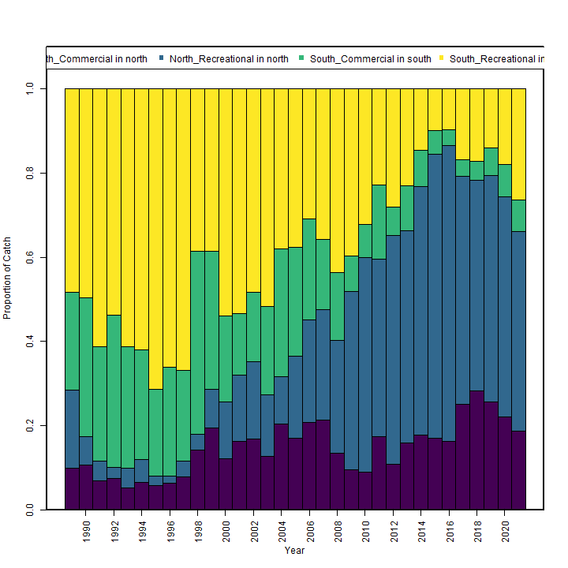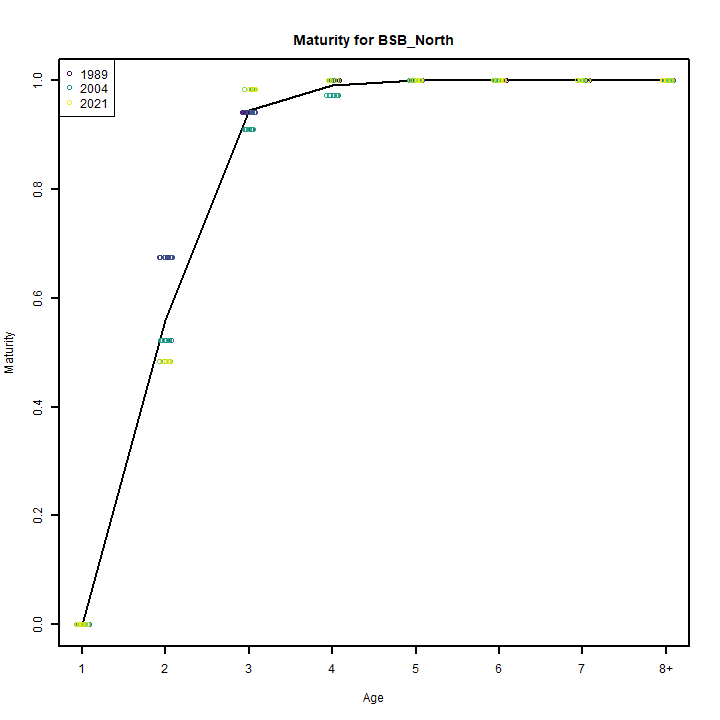

### Diagnostics

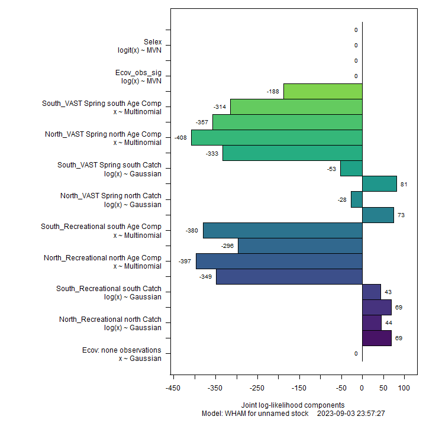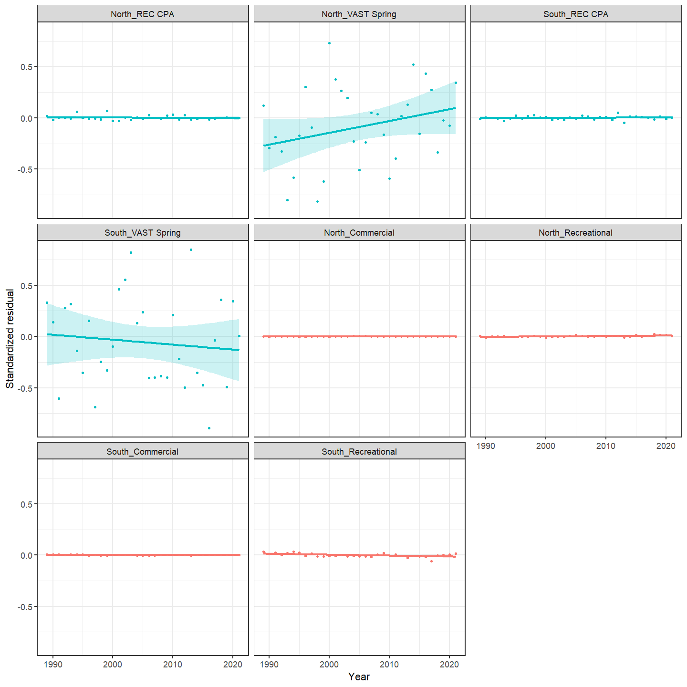

### Results

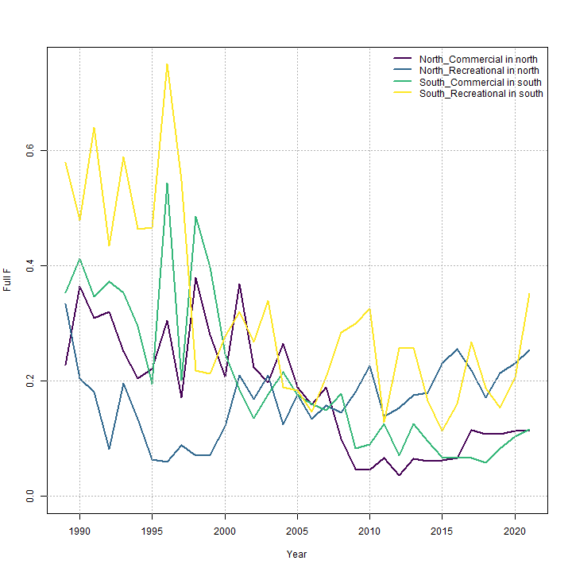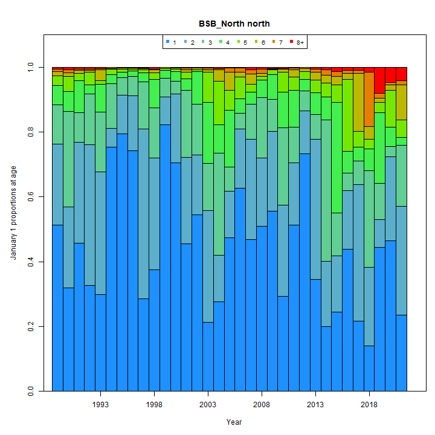

### Retro

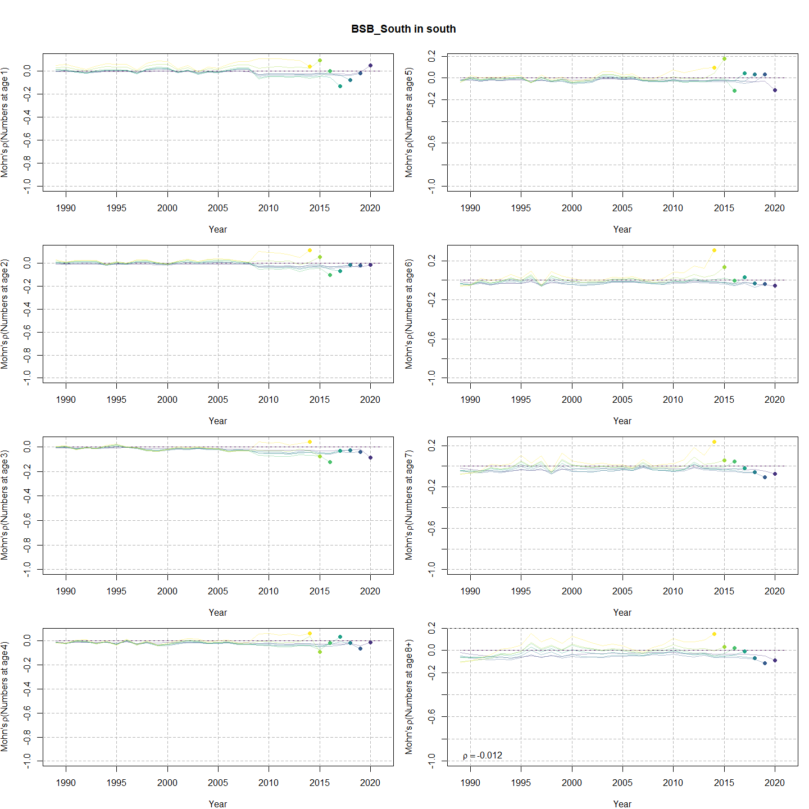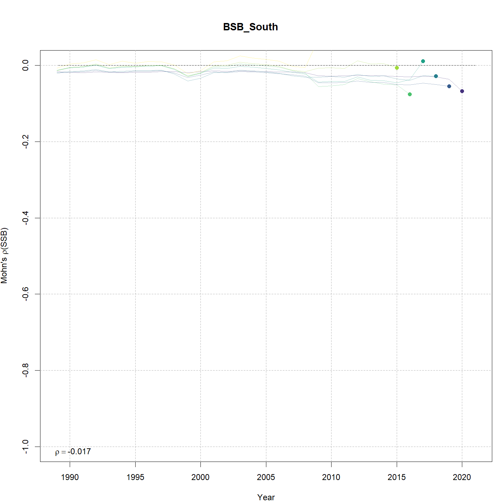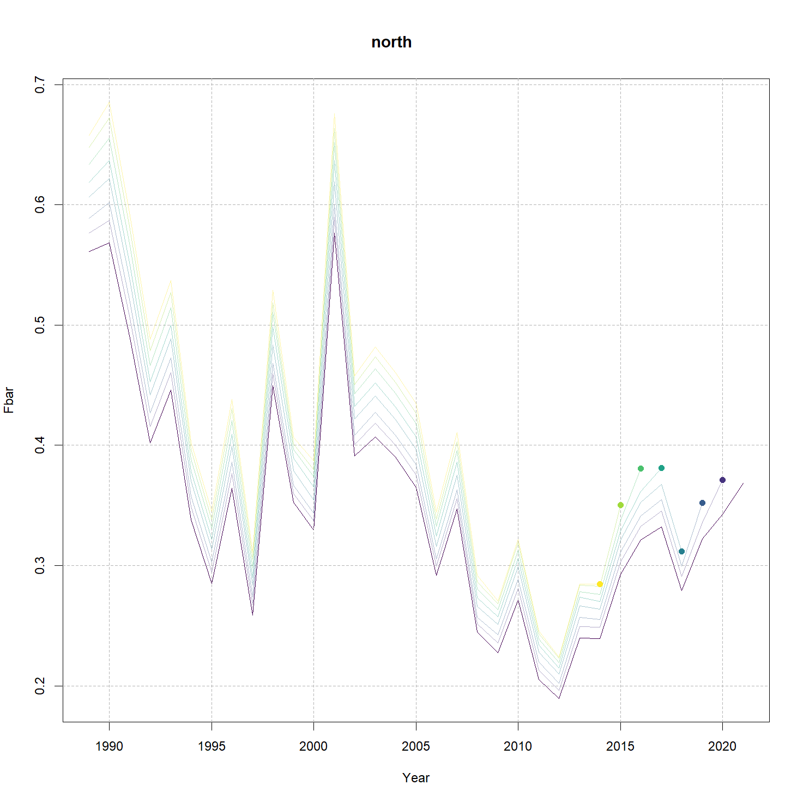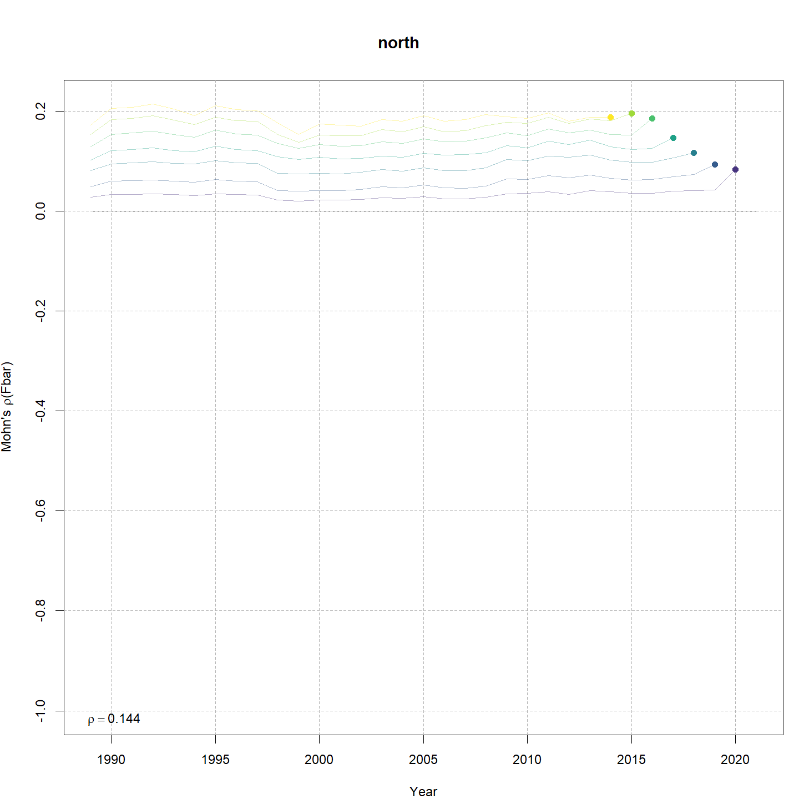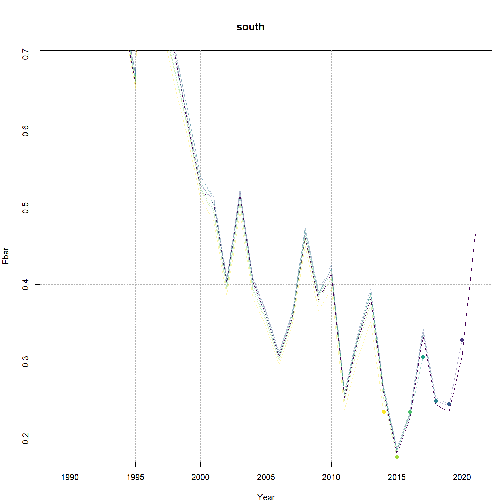

### Reference points

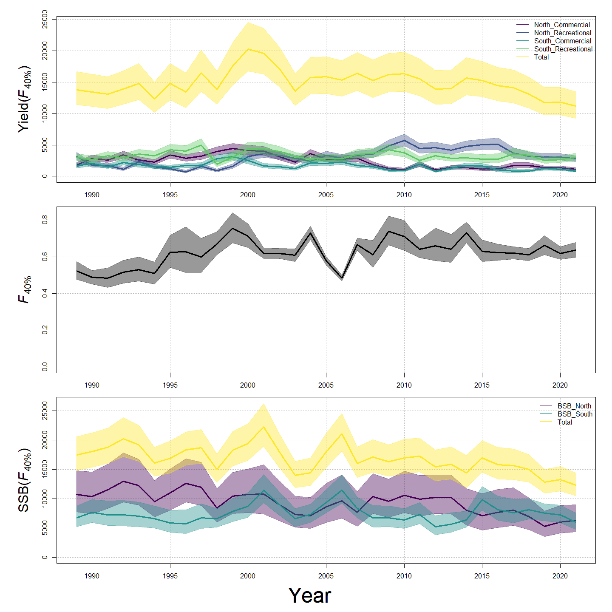

### Miscelaneous

## Tables {.tabset}

### Parameter estimates

<table class="table" style="margin-left: auto; margin-right: auto;">
<caption>Parameter estimates, standard errors, and confidence intervals. Rounded to 3 decimal places.</caption>
 <thead>
  <tr>
   <th style="text-align:left;">   </th>
   <th style="text-align:right;"> Estimate </th>
   <th style="text-align:right;"> Std. Error </th>
   <th style="text-align:right;"> 95\% CI lower </th>
   <th style="text-align:right;"> 95\% CI upper </th>
  </tr>
 </thead>
<tbody>
  <tr>
   <td style="text-align:left;"> BSB North Mean Recruitment </td>
   <td style="text-align:right;"> 10908.945 </td>
   <td style="text-align:right;"> 2634.947 </td>
   <td style="text-align:right;"> 6794.906 </td>
   <td style="text-align:right;"> 17513.866 </td>
  </tr>
  <tr>
   <td style="text-align:left;"> BSB North NAA $\sigma$ (age 1) </td>
   <td style="text-align:right;"> 1.125 </td>
   <td style="text-align:right;"> 0.148 </td>
   <td style="text-align:right;"> 0.870 </td>
   <td style="text-align:right;"> 1.456 </td>
  </tr>
  <tr>
   <td style="text-align:left;"> BSB North NAA $\sigma$ (age 2) </td>
   <td style="text-align:right;"> 0.506 </td>
   <td style="text-align:right;"> 0.034 </td>
   <td style="text-align:right;"> 0.444 </td>
   <td style="text-align:right;"> 0.578 </td>
  </tr>
  <tr>
   <td style="text-align:left;"> BSB South Mean Recruitment </td>
   <td style="text-align:right;"> 21452.765 </td>
   <td style="text-align:right;"> 2408.726 </td>
   <td style="text-align:right;"> 17215.118 </td>
   <td style="text-align:right;"> 26733.546 </td>
  </tr>
  <tr>
   <td style="text-align:left;"> BSB South NAA $\sigma$ (age 1) </td>
   <td style="text-align:right;"> 0.469 </td>
   <td style="text-align:right;"> 0.064 </td>
   <td style="text-align:right;"> 0.359 </td>
   <td style="text-align:right;"> 0.613 </td>
  </tr>
  <tr>
   <td style="text-align:left;"> BSB South NAA $\sigma$ (age 2) </td>
   <td style="text-align:right;"> 0.312 </td>
   <td style="text-align:right;"> 0.029 </td>
   <td style="text-align:right;"> 0.260 </td>
   <td style="text-align:right;"> 0.375 </td>
  </tr>
  <tr>
   <td style="text-align:left;"> REC CPA fully selected q </td>
   <td style="text-align:right;"> 0.000 </td>
   <td style="text-align:right;"> 0.000 </td>
   <td style="text-align:right;"> 0.000 </td>
   <td style="text-align:right;"> 0.000 </td>
  </tr>
  <tr>
   <td style="text-align:left;"> VAST Spring fully selected q </td>
   <td style="text-align:right;"> 0.011 </td>
   <td style="text-align:right;"> 0.001 </td>
   <td style="text-align:right;"> 0.008 </td>
   <td style="text-align:right;"> 0.013 </td>
  </tr>
  <tr>
   <td style="text-align:left;"> REC CPA fully selected q </td>
   <td style="text-align:right;"> 0.000 </td>
   <td style="text-align:right;"> 0.000 </td>
   <td style="text-align:right;"> 0.000 </td>
   <td style="text-align:right;"> 0.000 </td>
  </tr>
  <tr>
   <td style="text-align:left;"> VAST Spring fully selected q </td>
   <td style="text-align:right;"> 0.021 </td>
   <td style="text-align:right;"> 0.002 </td>
   <td style="text-align:right;"> 0.018 </td>
   <td style="text-align:right;"> 0.025 </td>
  </tr>
  <tr>
   <td style="text-align:left;"> Block 1: Selectivity for age 1 </td>
   <td style="text-align:right;"> 0.051 </td>
   <td style="text-align:right;"> 0.011 </td>
   <td style="text-align:right;"> 0.034 </td>
   <td style="text-align:right;"> 0.077 </td>
  </tr>
  <tr>
   <td style="text-align:left;"> Block 1: Selectivity for age 2 </td>
   <td style="text-align:right;"> 1.000 </td>
   <td style="text-align:right;"> -- </td>
   <td style="text-align:right;"> -- </td>
   <td style="text-align:right;"> -- </td>
  </tr>
  <tr>
   <td style="text-align:left;"> Block 1: Selectivity for age 3 </td>
   <td style="text-align:right;"> 1.000 </td>
   <td style="text-align:right;"> -- </td>
   <td style="text-align:right;"> -- </td>
   <td style="text-align:right;"> -- </td>
  </tr>
  <tr>
   <td style="text-align:left;"> Block 1: Selectivity for age 4 </td>
   <td style="text-align:right;"> 1.000 </td>
   <td style="text-align:right;"> -- </td>
   <td style="text-align:right;"> -- </td>
   <td style="text-align:right;"> -- </td>
  </tr>
  <tr>
   <td style="text-align:left;"> Block 1: Selectivity for age 5 </td>
   <td style="text-align:right;"> 1.000 </td>
   <td style="text-align:right;"> -- </td>
   <td style="text-align:right;"> -- </td>
   <td style="text-align:right;"> -- </td>
  </tr>
  <tr>
   <td style="text-align:left;"> Block 1: Selectivity for age 6 </td>
   <td style="text-align:right;"> 1.000 </td>
   <td style="text-align:right;"> -- </td>
   <td style="text-align:right;"> -- </td>
   <td style="text-align:right;"> -- </td>
  </tr>
  <tr>
   <td style="text-align:left;"> Block 1: Selectivity for age 7 </td>
   <td style="text-align:right;"> 1.000 </td>
   <td style="text-align:right;"> -- </td>
   <td style="text-align:right;"> -- </td>
   <td style="text-align:right;"> -- </td>
  </tr>
  <tr>
   <td style="text-align:left;"> Block 1: Selectivity for age 8+ </td>
   <td style="text-align:right;"> 1.000 </td>
   <td style="text-align:right;"> -- </td>
   <td style="text-align:right;"> -- </td>
   <td style="text-align:right;"> -- </td>
  </tr>
  <tr>
   <td style="text-align:left;"> Block 2: $a_{50}$ </td>
   <td style="text-align:right;"> 2.294 </td>
   <td style="text-align:right;"> 0.065 </td>
   <td style="text-align:right;"> 2.168 </td>
   <td style="text-align:right;"> 2.424 </td>
  </tr>
  <tr>
   <td style="text-align:left;"> Block 2: 1/slope (increasing) </td>
   <td style="text-align:right;"> 0.322 </td>
   <td style="text-align:right;"> 0.025 </td>
   <td style="text-align:right;"> 0.276 </td>
   <td style="text-align:right;"> 0.375 </td>
  </tr>
  <tr>
   <td style="text-align:left;"> Block 3: Selectivity for age 1 </td>
   <td style="text-align:right;"> 0.249 </td>
   <td style="text-align:right;"> 0.029 </td>
   <td style="text-align:right;"> 0.197 </td>
   <td style="text-align:right;"> 0.309 </td>
  </tr>
  <tr>
   <td style="text-align:left;"> Block 3: Selectivity for age 2 </td>
   <td style="text-align:right;"> 1.000 </td>
   <td style="text-align:right;"> -- </td>
   <td style="text-align:right;"> -- </td>
   <td style="text-align:right;"> -- </td>
  </tr>
  <tr>
   <td style="text-align:left;"> Block 3: Selectivity for age 3 </td>
   <td style="text-align:right;"> 1.000 </td>
   <td style="text-align:right;"> -- </td>
   <td style="text-align:right;"> -- </td>
   <td style="text-align:right;"> -- </td>
  </tr>
  <tr>
   <td style="text-align:left;"> Block 3: Selectivity for age 4 </td>
   <td style="text-align:right;"> 1.000 </td>
   <td style="text-align:right;"> -- </td>
   <td style="text-align:right;"> -- </td>
   <td style="text-align:right;"> -- </td>
  </tr>
  <tr>
   <td style="text-align:left;"> Block 3: Selectivity for age 5 </td>
   <td style="text-align:right;"> 1.000 </td>
   <td style="text-align:right;"> -- </td>
   <td style="text-align:right;"> -- </td>
   <td style="text-align:right;"> -- </td>
  </tr>
  <tr>
   <td style="text-align:left;"> Block 3: Selectivity for age 6 </td>
   <td style="text-align:right;"> 1.000 </td>
   <td style="text-align:right;"> -- </td>
   <td style="text-align:right;"> -- </td>
   <td style="text-align:right;"> -- </td>
  </tr>
  <tr>
   <td style="text-align:left;"> Block 3: Selectivity for age 7 </td>
   <td style="text-align:right;"> 1.000 </td>
   <td style="text-align:right;"> -- </td>
   <td style="text-align:right;"> -- </td>
   <td style="text-align:right;"> -- </td>
  </tr>
  <tr>
   <td style="text-align:left;"> Block 3: Selectivity for age 8+ </td>
   <td style="text-align:right;"> 1.000 </td>
   <td style="text-align:right;"> -- </td>
   <td style="text-align:right;"> -- </td>
   <td style="text-align:right;"> -- </td>
  </tr>
  <tr>
   <td style="text-align:left;"> Block 4: $a_{50}$ </td>
   <td style="text-align:right;"> 2.028 </td>
   <td style="text-align:right;"> 0.116 </td>
   <td style="text-align:right;"> 1.810 </td>
   <td style="text-align:right;"> 2.263 </td>
  </tr>
  <tr>
   <td style="text-align:left;"> Block 4: 1/slope (increasing) </td>
   <td style="text-align:right;"> 0.495 </td>
   <td style="text-align:right;"> 0.064 </td>
   <td style="text-align:right;"> 0.384 </td>
   <td style="text-align:right;"> 0.636 </td>
  </tr>
  <tr>
   <td style="text-align:left;"> Block 5: $a_{50}$ </td>
   <td style="text-align:right;"> 1.826 </td>
   <td style="text-align:right;"> 0.100 </td>
   <td style="text-align:right;"> 1.637 </td>
   <td style="text-align:right;"> 2.030 </td>
  </tr>
  <tr>
   <td style="text-align:left;"> Block 5: 1/slope (increasing) </td>
   <td style="text-align:right;"> 0.269 </td>
   <td style="text-align:right;"> 0.030 </td>
   <td style="text-align:right;"> 0.216 </td>
   <td style="text-align:right;"> 0.335 </td>
  </tr>
  <tr>
   <td style="text-align:left;"> Block 6: $a_{50}$ </td>
   <td style="text-align:right;"> 2.739 </td>
   <td style="text-align:right;"> 0.117 </td>
   <td style="text-align:right;"> 2.514 </td>
   <td style="text-align:right;"> 2.974 </td>
  </tr>
  <tr>
   <td style="text-align:left;"> Block 6: 1/slope (increasing) </td>
   <td style="text-align:right;"> 0.486 </td>
   <td style="text-align:right;"> 0.035 </td>
   <td style="text-align:right;"> 0.422 </td>
   <td style="text-align:right;"> 0.560 </td>
  </tr>
  <tr>
   <td style="text-align:left;"> Block 7: $a_{50}$ </td>
   <td style="text-align:right;"> 1.482 </td>
   <td style="text-align:right;"> 0.112 </td>
   <td style="text-align:right;"> 1.274 </td>
   <td style="text-align:right;"> 1.714 </td>
  </tr>
  <tr>
   <td style="text-align:left;"> Block 7: 1/slope (increasing) </td>
   <td style="text-align:right;"> 0.417 </td>
   <td style="text-align:right;"> 0.065 </td>
   <td style="text-align:right;"> 0.307 </td>
   <td style="text-align:right;"> 0.563 </td>
  </tr>
  <tr>
   <td style="text-align:left;"> Block 8: $a_{50}$ </td>
   <td style="text-align:right;"> 2.190 </td>
   <td style="text-align:right;"> 0.162 </td>
   <td style="text-align:right;"> 1.887 </td>
   <td style="text-align:right;"> 2.521 </td>
  </tr>
  <tr>
   <td style="text-align:left;"> Block 8: 1/slope (increasing) </td>
   <td style="text-align:right;"> 0.839 </td>
   <td style="text-align:right;"> 0.090 </td>
   <td style="text-align:right;"> 0.679 </td>
   <td style="text-align:right;"> 1.032 </td>
  </tr>
  <tr>
   <td style="text-align:left;"> Block 9: Selectivity for age 1 </td>
   <td style="text-align:right;"> 0.500 </td>
   <td style="text-align:right;"> -- </td>
   <td style="text-align:right;"> -- </td>
   <td style="text-align:right;"> -- </td>
  </tr>
  <tr>
   <td style="text-align:left;"> Block 9: Selectivity for age 2 </td>
   <td style="text-align:right;"> 0.500 </td>
   <td style="text-align:right;"> -- </td>
   <td style="text-align:right;"> -- </td>
   <td style="text-align:right;"> -- </td>
  </tr>
  <tr>
   <td style="text-align:left;"> Block 9: Selectivity for age 3 </td>
   <td style="text-align:right;"> 0.500 </td>
   <td style="text-align:right;"> -- </td>
   <td style="text-align:right;"> -- </td>
   <td style="text-align:right;"> -- </td>
  </tr>
  <tr>
   <td style="text-align:left;"> Block 9: Selectivity for age 4 </td>
   <td style="text-align:right;"> 0.500 </td>
   <td style="text-align:right;"> -- </td>
   <td style="text-align:right;"> -- </td>
   <td style="text-align:right;"> -- </td>
  </tr>
  <tr>
   <td style="text-align:left;"> Block 9: Selectivity for age 5 </td>
   <td style="text-align:right;"> 0.500 </td>
   <td style="text-align:right;"> -- </td>
   <td style="text-align:right;"> -- </td>
   <td style="text-align:right;"> -- </td>
  </tr>
  <tr>
   <td style="text-align:left;"> Block 9: Selectivity for age 6 </td>
   <td style="text-align:right;"> 0.500 </td>
   <td style="text-align:right;"> -- </td>
   <td style="text-align:right;"> -- </td>
   <td style="text-align:right;"> -- </td>
  </tr>
  <tr>
   <td style="text-align:left;"> Block 9: Selectivity for age 7 </td>
   <td style="text-align:right;"> 0.500 </td>
   <td style="text-align:right;"> -- </td>
   <td style="text-align:right;"> -- </td>
   <td style="text-align:right;"> -- </td>
  </tr>
  <tr>
   <td style="text-align:left;"> Block 9: Selectivity for age 8+ </td>
   <td style="text-align:right;"> 1.000 </td>
   <td style="text-align:right;"> -- </td>
   <td style="text-align:right;"> -- </td>
   <td style="text-align:right;"> -- </td>
  </tr>
  <tr>
   <td style="text-align:left;"> Block 10: Selectivity for age 1 </td>
   <td style="text-align:right;"> 0.117 </td>
   <td style="text-align:right;"> 0.014 </td>
   <td style="text-align:right;"> 0.092 </td>
   <td style="text-align:right;"> 0.148 </td>
  </tr>
  <tr>
   <td style="text-align:left;"> Block 10: Selectivity for age 2 </td>
   <td style="text-align:right;"> 0.496 </td>
   <td style="text-align:right;"> 0.036 </td>
   <td style="text-align:right;"> 0.425 </td>
   <td style="text-align:right;"> 0.567 </td>
  </tr>
  <tr>
   <td style="text-align:left;"> Block 10: Selectivity for age 3 </td>
   <td style="text-align:right;"> 1.000 </td>
   <td style="text-align:right;"> -- </td>
   <td style="text-align:right;"> -- </td>
   <td style="text-align:right;"> -- </td>
  </tr>
  <tr>
   <td style="text-align:left;"> Block 10: Selectivity for age 4 </td>
   <td style="text-align:right;"> 1.000 </td>
   <td style="text-align:right;"> -- </td>
   <td style="text-align:right;"> -- </td>
   <td style="text-align:right;"> -- </td>
  </tr>
  <tr>
   <td style="text-align:left;"> Block 10: Selectivity for age 5 </td>
   <td style="text-align:right;"> 1.000 </td>
   <td style="text-align:right;"> -- </td>
   <td style="text-align:right;"> -- </td>
   <td style="text-align:right;"> -- </td>
  </tr>
  <tr>
   <td style="text-align:left;"> Block 10: Selectivity for age 6 </td>
   <td style="text-align:right;"> 1.000 </td>
   <td style="text-align:right;"> -- </td>
   <td style="text-align:right;"> -- </td>
   <td style="text-align:right;"> -- </td>
  </tr>
  <tr>
   <td style="text-align:left;"> Block 10: Selectivity for age 7 </td>
   <td style="text-align:right;"> 0.450 </td>
   <td style="text-align:right;"> 0.119 </td>
   <td style="text-align:right;"> 0.242 </td>
   <td style="text-align:right;"> 0.677 </td>
  </tr>
  <tr>
   <td style="text-align:left;"> Block 10: Selectivity for age 8+ </td>
   <td style="text-align:right;"> 0.519 </td>
   <td style="text-align:right;"> 0.146 </td>
   <td style="text-align:right;"> 0.254 </td>
   <td style="text-align:right;"> 0.773 </td>
  </tr>
  <tr>
   <td style="text-align:left;"> Block 11: Selectivity for age 1 </td>
   <td style="text-align:right;"> 0.500 </td>
   <td style="text-align:right;"> -- </td>
   <td style="text-align:right;"> -- </td>
   <td style="text-align:right;"> -- </td>
  </tr>
  <tr>
   <td style="text-align:left;"> Block 11: Selectivity for age 2 </td>
   <td style="text-align:right;"> 0.500 </td>
   <td style="text-align:right;"> -- </td>
   <td style="text-align:right;"> -- </td>
   <td style="text-align:right;"> -- </td>
  </tr>
  <tr>
   <td style="text-align:left;"> Block 11: Selectivity for age 3 </td>
   <td style="text-align:right;"> 1.000 </td>
   <td style="text-align:right;"> -- </td>
   <td style="text-align:right;"> -- </td>
   <td style="text-align:right;"> -- </td>
  </tr>
  <tr>
   <td style="text-align:left;"> Block 11: Selectivity for age 4 </td>
   <td style="text-align:right;"> 0.500 </td>
   <td style="text-align:right;"> -- </td>
   <td style="text-align:right;"> -- </td>
   <td style="text-align:right;"> -- </td>
  </tr>
  <tr>
   <td style="text-align:left;"> Block 11: Selectivity for age 5 </td>
   <td style="text-align:right;"> 0.500 </td>
   <td style="text-align:right;"> -- </td>
   <td style="text-align:right;"> -- </td>
   <td style="text-align:right;"> -- </td>
  </tr>
  <tr>
   <td style="text-align:left;"> Block 11: Selectivity for age 6 </td>
   <td style="text-align:right;"> 0.500 </td>
   <td style="text-align:right;"> -- </td>
   <td style="text-align:right;"> -- </td>
   <td style="text-align:right;"> -- </td>
  </tr>
  <tr>
   <td style="text-align:left;"> Block 11: Selectivity for age 7 </td>
   <td style="text-align:right;"> 0.500 </td>
   <td style="text-align:right;"> -- </td>
   <td style="text-align:right;"> -- </td>
   <td style="text-align:right;"> -- </td>
  </tr>
  <tr>
   <td style="text-align:left;"> Block 11: Selectivity for age 8+ </td>
   <td style="text-align:right;"> 0.500 </td>
   <td style="text-align:right;"> -- </td>
   <td style="text-align:right;"> -- </td>
   <td style="text-align:right;"> -- </td>
  </tr>
  <tr>
   <td style="text-align:left;"> Block 12: Selectivity for age 1 </td>
   <td style="text-align:right;"> 0.266 </td>
   <td style="text-align:right;"> 0.027 </td>
   <td style="text-align:right;"> 0.216 </td>
   <td style="text-align:right;"> 0.322 </td>
  </tr>
  <tr>
   <td style="text-align:left;"> Block 12: Selectivity for age 2 </td>
   <td style="text-align:right;"> 0.958 </td>
   <td style="text-align:right;"> 0.077 </td>
   <td style="text-align:right;"> 0.349 </td>
   <td style="text-align:right;"> 0.999 </td>
  </tr>
  <tr>
   <td style="text-align:left;"> Block 12: Selectivity for age 3 </td>
   <td style="text-align:right;"> 1.000 </td>
   <td style="text-align:right;"> -- </td>
   <td style="text-align:right;"> -- </td>
   <td style="text-align:right;"> -- </td>
  </tr>
  <tr>
   <td style="text-align:left;"> Block 12: Selectivity for age 4 </td>
   <td style="text-align:right;"> 0.612 </td>
   <td style="text-align:right;"> 0.076 </td>
   <td style="text-align:right;"> 0.458 </td>
   <td style="text-align:right;"> 0.747 </td>
  </tr>
  <tr>
   <td style="text-align:left;"> Block 12: Selectivity for age 5 </td>
   <td style="text-align:right;"> 0.464 </td>
   <td style="text-align:right;"> 0.089 </td>
   <td style="text-align:right;"> 0.300 </td>
   <td style="text-align:right;"> 0.636 </td>
  </tr>
  <tr>
   <td style="text-align:left;"> Block 12: Selectivity for age 6 </td>
   <td style="text-align:right;"> 0.328 </td>
   <td style="text-align:right;"> 0.106 </td>
   <td style="text-align:right;"> 0.160 </td>
   <td style="text-align:right;"> 0.556 </td>
  </tr>
  <tr>
   <td style="text-align:left;"> Block 12: Selectivity for age 7 </td>
   <td style="text-align:right;"> 0.170 </td>
   <td style="text-align:right;"> 0.116 </td>
   <td style="text-align:right;"> 0.039 </td>
   <td style="text-align:right;"> 0.507 </td>
  </tr>
  <tr>
   <td style="text-align:left;"> Block 12: Selectivity for age 8+ </td>
   <td style="text-align:right;"> 0.248 </td>
   <td style="text-align:right;"> 0.163 </td>
   <td style="text-align:right;"> 0.056 </td>
   <td style="text-align:right;"> 0.648 </td>
  </tr>
</tbody>
</table>

### Abundance at age

<table class="table" style="margin-left: auto; margin-right: auto;">
<caption>Abundance at age (1000s) for BSB North in North.</caption>
 <thead>
  <tr>
   <th style="text-align:left;">   </th>
   <th style="text-align:right;"> 1 </th>
   <th style="text-align:right;"> 2 </th>
   <th style="text-align:right;"> 3 </th>
   <th style="text-align:right;"> 4 </th>
   <th style="text-align:right;"> 5 </th>
   <th style="text-align:right;"> 6 </th>
   <th style="text-align:right;"> 7 </th>
   <th style="text-align:right;"> 8+ </th>
  </tr>
 </thead>
<tbody>
  <tr>
   <td style="text-align:left;"> 1989 </td>
   <td style="text-align:right;"> 6520 </td>
   <td style="text-align:right;"> 3172 </td>
   <td style="text-align:right;"> 1544 </td>
   <td style="text-align:right;"> 751 </td>
   <td style="text-align:right;"> 365 </td>
   <td style="text-align:right;"> 178 </td>
   <td style="text-align:right;"> 87 </td>
   <td style="text-align:right;"> 82 </td>
  </tr>
  <tr>
   <td style="text-align:left;"> 1990 </td>
   <td style="text-align:right;"> 1711 </td>
   <td style="text-align:right;"> 1331 </td>
   <td style="text-align:right;"> 1576 </td>
   <td style="text-align:right;"> 320 </td>
   <td style="text-align:right;"> 252 </td>
   <td style="text-align:right;"> 63 </td>
   <td style="text-align:right;"> 48 </td>
   <td style="text-align:right;"> 40 </td>
  </tr>
  <tr>
   <td style="text-align:left;"> 1991 </td>
   <td style="text-align:right;"> 2649 </td>
   <td style="text-align:right;"> 1804 </td>
   <td style="text-align:right;"> 520 </td>
   <td style="text-align:right;"> 581 </td>
   <td style="text-align:right;"> 124 </td>
   <td style="text-align:right;"> 56 </td>
   <td style="text-align:right;"> 24 </td>
   <td style="text-align:right;"> 31 </td>
  </tr>
  <tr>
   <td style="text-align:left;"> 1992 </td>
   <td style="text-align:right;"> 1729 </td>
   <td style="text-align:right;"> 2288 </td>
   <td style="text-align:right;"> 833 </td>
   <td style="text-align:right;"> 142 </td>
   <td style="text-align:right;"> 211 </td>
   <td style="text-align:right;"> 33 </td>
   <td style="text-align:right;"> 19 </td>
   <td style="text-align:right;"> 28 </td>
  </tr>
  <tr>
   <td style="text-align:left;"> 1993 </td>
   <td style="text-align:right;"> 1274 </td>
   <td style="text-align:right;"> 1614 </td>
   <td style="text-align:right;"> 793 </td>
   <td style="text-align:right;"> 366 </td>
   <td style="text-align:right;"> 43 </td>
   <td style="text-align:right;"> 146 </td>
   <td style="text-align:right;"> 13 </td>
   <td style="text-align:right;"> 18 </td>
  </tr>
  <tr>
   <td style="text-align:left;"> 1994 </td>
   <td style="text-align:right;"> 10795 </td>
   <td style="text-align:right;"> 831 </td>
   <td style="text-align:right;"> 1981 </td>
   <td style="text-align:right;"> 400 </td>
   <td style="text-align:right;"> 237 </td>
   <td style="text-align:right;"> 20 </td>
   <td style="text-align:right;"> 45 </td>
   <td style="text-align:right;"> 14 </td>
  </tr>
  <tr>
   <td style="text-align:left;"> 1995 </td>
   <td style="text-align:right;"> 11989 </td>
   <td style="text-align:right;"> 1817 </td>
   <td style="text-align:right;"> 804 </td>
   <td style="text-align:right;"> 260 </td>
   <td style="text-align:right;"> 128 </td>
   <td style="text-align:right;"> 61 </td>
   <td style="text-align:right;"> 9 </td>
   <td style="text-align:right;"> 26 </td>
  </tr>
  <tr>
   <td style="text-align:left;"> 1996 </td>
   <td style="text-align:right;"> 12931 </td>
   <td style="text-align:right;"> 2953 </td>
   <td style="text-align:right;"> 1043 </td>
   <td style="text-align:right;"> 282 </td>
   <td style="text-align:right;"> 88 </td>
   <td style="text-align:right;"> 67 </td>
   <td style="text-align:right;"> 28 </td>
   <td style="text-align:right;"> 18 </td>
  </tr>
  <tr>
   <td style="text-align:left;"> 1997 </td>
   <td style="text-align:right;"> 3061 </td>
   <td style="text-align:right;"> 5604 </td>
   <td style="text-align:right;"> 1567 </td>
   <td style="text-align:right;"> 286 </td>
   <td style="text-align:right;"> 103 </td>
   <td style="text-align:right;"> 32 </td>
   <td style="text-align:right;"> 31 </td>
   <td style="text-align:right;"> 23 </td>
  </tr>
  <tr>
   <td style="text-align:left;"> 1998 </td>
   <td style="text-align:right;"> 2628 </td>
   <td style="text-align:right;"> 2410 </td>
   <td style="text-align:right;"> 1080 </td>
   <td style="text-align:right;"> 619 </td>
   <td style="text-align:right;"> 135 </td>
   <td style="text-align:right;"> 76 </td>
   <td style="text-align:right;"> 15 </td>
   <td style="text-align:right;"> 36 </td>
  </tr>
  <tr>
   <td style="text-align:left;"> 1999 </td>
   <td style="text-align:right;"> 31678 </td>
   <td style="text-align:right;"> 3286 </td>
   <td style="text-align:right;"> 2248 </td>
   <td style="text-align:right;"> 897 </td>
   <td style="text-align:right;"> 267 </td>
   <td style="text-align:right;"> 74 </td>
   <td style="text-align:right;"> 30 </td>
   <td style="text-align:right;"> 22 </td>
  </tr>
  <tr>
   <td style="text-align:left;"> 2000 </td>
   <td style="text-align:right;"> 23316 </td>
   <td style="text-align:right;"> 7058 </td>
   <td style="text-align:right;"> 1260 </td>
   <td style="text-align:right;"> 991 </td>
   <td style="text-align:right;"> 270 </td>
   <td style="text-align:right;"> 145 </td>
   <td style="text-align:right;"> 30 </td>
   <td style="text-align:right;"> 25 </td>
  </tr>
  <tr>
   <td style="text-align:left;"> 2001 </td>
   <td style="text-align:right;"> 7530 </td>
   <td style="text-align:right;"> 4402 </td>
   <td style="text-align:right;"> 3399 </td>
   <td style="text-align:right;"> 585 </td>
   <td style="text-align:right;"> 358 </td>
   <td style="text-align:right;"> 129 </td>
   <td style="text-align:right;"> 94 </td>
   <td style="text-align:right;"> 25 </td>
  </tr>
  <tr>
   <td style="text-align:left;"> 2002 </td>
   <td style="text-align:right;"> 16147 </td>
   <td style="text-align:right;"> 5431 </td>
   <td style="text-align:right;"> 4662 </td>
   <td style="text-align:right;"> 2946 </td>
   <td style="text-align:right;"> 211 </td>
   <td style="text-align:right;"> 122 </td>
   <td style="text-align:right;"> 49 </td>
   <td style="text-align:right;"> 40 </td>
  </tr>
  <tr>
   <td style="text-align:left;"> 2003 </td>
   <td style="text-align:right;"> 2635 </td>
   <td style="text-align:right;"> 4232 </td>
   <td style="text-align:right;"> 1796 </td>
   <td style="text-align:right;"> 2311 </td>
   <td style="text-align:right;"> 1161 </td>
   <td style="text-align:right;"> 88 </td>
   <td style="text-align:right;"> 58 </td>
   <td style="text-align:right;"> 35 </td>
  </tr>
  <tr>
   <td style="text-align:left;"> 2004 </td>
   <td style="text-align:right;"> 3039 </td>
   <td style="text-align:right;"> 1575 </td>
   <td style="text-align:right;"> 3469 </td>
   <td style="text-align:right;"> 957 </td>
   <td style="text-align:right;"> 1476 </td>
   <td style="text-align:right;"> 398 </td>
   <td style="text-align:right;"> 35 </td>
   <td style="text-align:right;"> 42 </td>
  </tr>
  <tr>
   <td style="text-align:left;"> 2005 </td>
   <td style="text-align:right;"> 6048 </td>
   <td style="text-align:right;"> 1838 </td>
   <td style="text-align:right;"> 947 </td>
   <td style="text-align:right;"> 2231 </td>
   <td style="text-align:right;"> 799 </td>
   <td style="text-align:right;"> 708 </td>
   <td style="text-align:right;"> 158 </td>
   <td style="text-align:right;"> 36 </td>
  </tr>
  <tr>
   <td style="text-align:left;"> 2006 </td>
   <td style="text-align:right;"> 18955 </td>
   <td style="text-align:right;"> 5553 </td>
   <td style="text-align:right;"> 1440 </td>
   <td style="text-align:right;"> 1392 </td>
   <td style="text-align:right;"> 2038 </td>
   <td style="text-align:right;"> 420 </td>
   <td style="text-align:right;"> 397 </td>
   <td style="text-align:right;"> 75 </td>
  </tr>
  <tr>
   <td style="text-align:left;"> 2007 </td>
   <td style="text-align:right;"> 11695 </td>
   <td style="text-align:right;"> 7727 </td>
   <td style="text-align:right;"> 2688 </td>
   <td style="text-align:right;"> 919 </td>
   <td style="text-align:right;"> 636 </td>
   <td style="text-align:right;"> 785 </td>
   <td style="text-align:right;"> 317 </td>
   <td style="text-align:right;"> 190 </td>
  </tr>
  <tr>
   <td style="text-align:left;"> 2008 </td>
   <td style="text-align:right;"> 15084 </td>
   <td style="text-align:right;"> 6241 </td>
   <td style="text-align:right;"> 5540 </td>
   <td style="text-align:right;"> 1569 </td>
   <td style="text-align:right;"> 364 </td>
   <td style="text-align:right;"> 251 </td>
   <td style="text-align:right;"> 368 </td>
   <td style="text-align:right;"> 205 </td>
  </tr>
  <tr>
   <td style="text-align:left;"> 2009 </td>
   <td style="text-align:right;"> 37919 </td>
   <td style="text-align:right;"> 16737 </td>
   <td style="text-align:right;"> 6744 </td>
   <td style="text-align:right;"> 5240 </td>
   <td style="text-align:right;"> 956 </td>
   <td style="text-align:right;"> 162 </td>
   <td style="text-align:right;"> 115 </td>
   <td style="text-align:right;"> 269 </td>
  </tr>
  <tr>
   <td style="text-align:left;"> 2010 </td>
   <td style="text-align:right;"> 13481 </td>
   <td style="text-align:right;"> 12906 </td>
   <td style="text-align:right;"> 10918 </td>
   <td style="text-align:right;"> 5081 </td>
   <td style="text-align:right;"> 2784 </td>
   <td style="text-align:right;"> 452 </td>
   <td style="text-align:right;"> 79 </td>
   <td style="text-align:right;"> 169 </td>
  </tr>
  <tr>
   <td style="text-align:left;"> 2011 </td>
   <td style="text-align:right;"> 22364 </td>
   <td style="text-align:right;"> 8422 </td>
   <td style="text-align:right;"> 4776 </td>
   <td style="text-align:right;"> 4973 </td>
   <td style="text-align:right;"> 1765 </td>
   <td style="text-align:right;"> 1018 </td>
   <td style="text-align:right;"> 207 </td>
   <td style="text-align:right;"> 107 </td>
  </tr>
  <tr>
   <td style="text-align:left;"> 2012 </td>
   <td style="text-align:right;"> 139248 </td>
   <td style="text-align:right;"> 25208 </td>
   <td style="text-align:right;"> 11676 </td>
   <td style="text-align:right;"> 6740 </td>
   <td style="text-align:right;"> 4828 </td>
   <td style="text-align:right;"> 1498 </td>
   <td style="text-align:right;"> 722 </td>
   <td style="text-align:right;"> 180 </td>
  </tr>
  <tr>
   <td style="text-align:left;"> 2013 </td>
   <td style="text-align:right;"> 25937 </td>
   <td style="text-align:right;"> 32532 </td>
   <td style="text-align:right;"> 5653 </td>
   <td style="text-align:right;"> 5135 </td>
   <td style="text-align:right;"> 2916 </td>
   <td style="text-align:right;"> 1847 </td>
   <td style="text-align:right;"> 658 </td>
   <td style="text-align:right;"> 426 </td>
  </tr>
  <tr>
   <td style="text-align:left;"> 2014 </td>
   <td style="text-align:right;"> 13374 </td>
   <td style="text-align:right;"> 13404 </td>
   <td style="text-align:right;"> 29009 </td>
   <td style="text-align:right;"> 4809 </td>
   <td style="text-align:right;"> 2849 </td>
   <td style="text-align:right;"> 1628 </td>
   <td style="text-align:right;"> 1038 </td>
   <td style="text-align:right;"> 546 </td>
  </tr>
  <tr>
   <td style="text-align:left;"> 2015 </td>
   <td style="text-align:right;"> 13871 </td>
   <td style="text-align:right;"> 9767 </td>
   <td style="text-align:right;"> 7540 </td>
   <td style="text-align:right;"> 19271 </td>
   <td style="text-align:right;"> 2991 </td>
   <td style="text-align:right;"> 1457 </td>
   <td style="text-align:right;"> 837 </td>
   <td style="text-align:right;"> 799 </td>
  </tr>
  <tr>
   <td style="text-align:left;"> 2016 </td>
   <td style="text-align:right;"> 38421 </td>
   <td style="text-align:right;"> 15688 </td>
   <td style="text-align:right;"> 4784 </td>
   <td style="text-align:right;"> 5899 </td>
   <td style="text-align:right;"> 19361 </td>
   <td style="text-align:right;"> 1619 </td>
   <td style="text-align:right;"> 886 </td>
   <td style="text-align:right;"> 796 </td>
  </tr>
  <tr>
   <td style="text-align:left;"> 2017 </td>
   <td style="text-align:right;"> 18381 </td>
   <td style="text-align:right;"> 35498 </td>
   <td style="text-align:right;"> 6244 </td>
   <td style="text-align:right;"> 3609 </td>
   <td style="text-align:right;"> 3992 </td>
   <td style="text-align:right;"> 15140 </td>
   <td style="text-align:right;"> 853 </td>
   <td style="text-align:right;"> 808 </td>
  </tr>
  <tr>
   <td style="text-align:left;"> 2018 </td>
   <td style="text-align:right;"> 8007 </td>
   <td style="text-align:right;"> 13704 </td>
   <td style="text-align:right;"> 16924 </td>
   <td style="text-align:right;"> 3805 </td>
   <td style="text-align:right;"> 1685 </td>
   <td style="text-align:right;"> 2167 </td>
   <td style="text-align:right;"> 9551 </td>
   <td style="text-align:right;"> 853 </td>
  </tr>
  <tr>
   <td style="text-align:left;"> 2019 </td>
   <td style="text-align:right;"> 38705 </td>
   <td style="text-align:right;"> 7529 </td>
   <td style="text-align:right;"> 9690 </td>
   <td style="text-align:right;"> 18899 </td>
   <td style="text-align:right;"> 2805 </td>
   <td style="text-align:right;"> 1155 </td>
   <td style="text-align:right;"> 1294 </td>
   <td style="text-align:right;"> 7020 </td>
  </tr>
  <tr>
   <td style="text-align:left;"> 2020 </td>
   <td style="text-align:right;"> 48023 </td>
   <td style="text-align:right;"> 26688 </td>
   <td style="text-align:right;"> 3256 </td>
   <td style="text-align:right;"> 6145 </td>
   <td style="text-align:right;"> 11762 </td>
   <td style="text-align:right;"> 1701 </td>
   <td style="text-align:right;"> 770 </td>
   <td style="text-align:right;"> 4851 </td>
  </tr>
  <tr>
   <td style="text-align:left;"> 2021 </td>
   <td style="text-align:right;"> 19686 </td>
   <td style="text-align:right;"> 27914 </td>
   <td style="text-align:right;"> 15795 </td>
   <td style="text-align:right;"> 1948 </td>
   <td style="text-align:right;"> 4587 </td>
   <td style="text-align:right;"> 9059 </td>
   <td style="text-align:right;"> 1006 </td>
   <td style="text-align:right;"> 3465 </td>
  </tr>
</tbody>
</table>

<table class="table" style="margin-left: auto; margin-right: auto;">
<caption>Abundance at age (1000s) for BSB North in South.</caption>
 <thead>
  <tr>
   <th style="text-align:left;">   </th>
   <th style="text-align:right;"> 1 </th>
   <th style="text-align:right;"> 2 </th>
   <th style="text-align:right;"> 3 </th>
   <th style="text-align:right;"> 4 </th>
   <th style="text-align:right;"> 5 </th>
   <th style="text-align:right;"> 6 </th>
   <th style="text-align:right;"> 7 </th>
   <th style="text-align:right;"> 8+ </th>
  </tr>
 </thead>
<tbody>
  <tr>
   <td style="text-align:left;"> 1989 </td>
   <td style="text-align:right;"> 0 </td>
   <td style="text-align:right;"> 0 </td>
   <td style="text-align:right;"> 0 </td>
   <td style="text-align:right;"> 0 </td>
   <td style="text-align:right;"> 0 </td>
   <td style="text-align:right;"> 0 </td>
   <td style="text-align:right;"> 0 </td>
   <td style="text-align:right;"> 0 </td>
  </tr>
  <tr>
   <td style="text-align:left;"> 1990 </td>
   <td style="text-align:right;"> 0 </td>
   <td style="text-align:right;"> 0 </td>
   <td style="text-align:right;"> 0 </td>
   <td style="text-align:right;"> 0 </td>
   <td style="text-align:right;"> 0 </td>
   <td style="text-align:right;"> 0 </td>
   <td style="text-align:right;"> 0 </td>
   <td style="text-align:right;"> 0 </td>
  </tr>
  <tr>
   <td style="text-align:left;"> 1991 </td>
   <td style="text-align:right;"> 0 </td>
   <td style="text-align:right;"> 0 </td>
   <td style="text-align:right;"> 0 </td>
   <td style="text-align:right;"> 0 </td>
   <td style="text-align:right;"> 0 </td>
   <td style="text-align:right;"> 0 </td>
   <td style="text-align:right;"> 0 </td>
   <td style="text-align:right;"> 0 </td>
  </tr>
  <tr>
   <td style="text-align:left;"> 1992 </td>
   <td style="text-align:right;"> 0 </td>
   <td style="text-align:right;"> 0 </td>
   <td style="text-align:right;"> 0 </td>
   <td style="text-align:right;"> 0 </td>
   <td style="text-align:right;"> 0 </td>
   <td style="text-align:right;"> 0 </td>
   <td style="text-align:right;"> 0 </td>
   <td style="text-align:right;"> 0 </td>
  </tr>
  <tr>
   <td style="text-align:left;"> 1993 </td>
   <td style="text-align:right;"> 0 </td>
   <td style="text-align:right;"> 0 </td>
   <td style="text-align:right;"> 0 </td>
   <td style="text-align:right;"> 0 </td>
   <td style="text-align:right;"> 0 </td>
   <td style="text-align:right;"> 0 </td>
   <td style="text-align:right;"> 0 </td>
   <td style="text-align:right;"> 0 </td>
  </tr>
  <tr>
   <td style="text-align:left;"> 1994 </td>
   <td style="text-align:right;"> 0 </td>
   <td style="text-align:right;"> 0 </td>
   <td style="text-align:right;"> 0 </td>
   <td style="text-align:right;"> 0 </td>
   <td style="text-align:right;"> 0 </td>
   <td style="text-align:right;"> 0 </td>
   <td style="text-align:right;"> 0 </td>
   <td style="text-align:right;"> 0 </td>
  </tr>
  <tr>
   <td style="text-align:left;"> 1995 </td>
   <td style="text-align:right;"> 0 </td>
   <td style="text-align:right;"> 0 </td>
   <td style="text-align:right;"> 0 </td>
   <td style="text-align:right;"> 0 </td>
   <td style="text-align:right;"> 0 </td>
   <td style="text-align:right;"> 0 </td>
   <td style="text-align:right;"> 0 </td>
   <td style="text-align:right;"> 0 </td>
  </tr>
  <tr>
   <td style="text-align:left;"> 1996 </td>
   <td style="text-align:right;"> 0 </td>
   <td style="text-align:right;"> 0 </td>
   <td style="text-align:right;"> 0 </td>
   <td style="text-align:right;"> 0 </td>
   <td style="text-align:right;"> 0 </td>
   <td style="text-align:right;"> 0 </td>
   <td style="text-align:right;"> 0 </td>
   <td style="text-align:right;"> 0 </td>
  </tr>
  <tr>
   <td style="text-align:left;"> 1997 </td>
   <td style="text-align:right;"> 0 </td>
   <td style="text-align:right;"> 0 </td>
   <td style="text-align:right;"> 0 </td>
   <td style="text-align:right;"> 0 </td>
   <td style="text-align:right;"> 0 </td>
   <td style="text-align:right;"> 0 </td>
   <td style="text-align:right;"> 0 </td>
   <td style="text-align:right;"> 0 </td>
  </tr>
  <tr>
   <td style="text-align:left;"> 1998 </td>
   <td style="text-align:right;"> 0 </td>
   <td style="text-align:right;"> 0 </td>
   <td style="text-align:right;"> 0 </td>
   <td style="text-align:right;"> 0 </td>
   <td style="text-align:right;"> 0 </td>
   <td style="text-align:right;"> 0 </td>
   <td style="text-align:right;"> 0 </td>
   <td style="text-align:right;"> 0 </td>
  </tr>
  <tr>
   <td style="text-align:left;"> 1999 </td>
   <td style="text-align:right;"> 0 </td>
   <td style="text-align:right;"> 0 </td>
   <td style="text-align:right;"> 0 </td>
   <td style="text-align:right;"> 0 </td>
   <td style="text-align:right;"> 0 </td>
   <td style="text-align:right;"> 0 </td>
   <td style="text-align:right;"> 0 </td>
   <td style="text-align:right;"> 0 </td>
  </tr>
  <tr>
   <td style="text-align:left;"> 2000 </td>
   <td style="text-align:right;"> 0 </td>
   <td style="text-align:right;"> 0 </td>
   <td style="text-align:right;"> 0 </td>
   <td style="text-align:right;"> 0 </td>
   <td style="text-align:right;"> 0 </td>
   <td style="text-align:right;"> 0 </td>
   <td style="text-align:right;"> 0 </td>
   <td style="text-align:right;"> 0 </td>
  </tr>
  <tr>
   <td style="text-align:left;"> 2001 </td>
   <td style="text-align:right;"> 0 </td>
   <td style="text-align:right;"> 0 </td>
   <td style="text-align:right;"> 0 </td>
   <td style="text-align:right;"> 0 </td>
   <td style="text-align:right;"> 0 </td>
   <td style="text-align:right;"> 0 </td>
   <td style="text-align:right;"> 0 </td>
   <td style="text-align:right;"> 0 </td>
  </tr>
  <tr>
   <td style="text-align:left;"> 2002 </td>
   <td style="text-align:right;"> 0 </td>
   <td style="text-align:right;"> 0 </td>
   <td style="text-align:right;"> 0 </td>
   <td style="text-align:right;"> 0 </td>
   <td style="text-align:right;"> 0 </td>
   <td style="text-align:right;"> 0 </td>
   <td style="text-align:right;"> 0 </td>
   <td style="text-align:right;"> 0 </td>
  </tr>
  <tr>
   <td style="text-align:left;"> 2003 </td>
   <td style="text-align:right;"> 0 </td>
   <td style="text-align:right;"> 0 </td>
   <td style="text-align:right;"> 0 </td>
   <td style="text-align:right;"> 0 </td>
   <td style="text-align:right;"> 0 </td>
   <td style="text-align:right;"> 0 </td>
   <td style="text-align:right;"> 0 </td>
   <td style="text-align:right;"> 0 </td>
  </tr>
  <tr>
   <td style="text-align:left;"> 2004 </td>
   <td style="text-align:right;"> 0 </td>
   <td style="text-align:right;"> 0 </td>
   <td style="text-align:right;"> 0 </td>
   <td style="text-align:right;"> 0 </td>
   <td style="text-align:right;"> 0 </td>
   <td style="text-align:right;"> 0 </td>
   <td style="text-align:right;"> 0 </td>
   <td style="text-align:right;"> 0 </td>
  </tr>
  <tr>
   <td style="text-align:left;"> 2005 </td>
   <td style="text-align:right;"> 0 </td>
   <td style="text-align:right;"> 0 </td>
   <td style="text-align:right;"> 0 </td>
   <td style="text-align:right;"> 0 </td>
   <td style="text-align:right;"> 0 </td>
   <td style="text-align:right;"> 0 </td>
   <td style="text-align:right;"> 0 </td>
   <td style="text-align:right;"> 0 </td>
  </tr>
  <tr>
   <td style="text-align:left;"> 2006 </td>
   <td style="text-align:right;"> 0 </td>
   <td style="text-align:right;"> 0 </td>
   <td style="text-align:right;"> 0 </td>
   <td style="text-align:right;"> 0 </td>
   <td style="text-align:right;"> 0 </td>
   <td style="text-align:right;"> 0 </td>
   <td style="text-align:right;"> 0 </td>
   <td style="text-align:right;"> 0 </td>
  </tr>
  <tr>
   <td style="text-align:left;"> 2007 </td>
   <td style="text-align:right;"> 0 </td>
   <td style="text-align:right;"> 0 </td>
   <td style="text-align:right;"> 0 </td>
   <td style="text-align:right;"> 0 </td>
   <td style="text-align:right;"> 0 </td>
   <td style="text-align:right;"> 0 </td>
   <td style="text-align:right;"> 0 </td>
   <td style="text-align:right;"> 0 </td>
  </tr>
  <tr>
   <td style="text-align:left;"> 2008 </td>
   <td style="text-align:right;"> 0 </td>
   <td style="text-align:right;"> 0 </td>
   <td style="text-align:right;"> 0 </td>
   <td style="text-align:right;"> 0 </td>
   <td style="text-align:right;"> 0 </td>
   <td style="text-align:right;"> 0 </td>
   <td style="text-align:right;"> 0 </td>
   <td style="text-align:right;"> 0 </td>
  </tr>
  <tr>
   <td style="text-align:left;"> 2009 </td>
   <td style="text-align:right;"> 0 </td>
   <td style="text-align:right;"> 0 </td>
   <td style="text-align:right;"> 0 </td>
   <td style="text-align:right;"> 0 </td>
   <td style="text-align:right;"> 0 </td>
   <td style="text-align:right;"> 0 </td>
   <td style="text-align:right;"> 0 </td>
   <td style="text-align:right;"> 0 </td>
  </tr>
  <tr>
   <td style="text-align:left;"> 2010 </td>
   <td style="text-align:right;"> 0 </td>
   <td style="text-align:right;"> 0 </td>
   <td style="text-align:right;"> 0 </td>
   <td style="text-align:right;"> 0 </td>
   <td style="text-align:right;"> 0 </td>
   <td style="text-align:right;"> 0 </td>
   <td style="text-align:right;"> 0 </td>
   <td style="text-align:right;"> 0 </td>
  </tr>
  <tr>
   <td style="text-align:left;"> 2011 </td>
   <td style="text-align:right;"> 0 </td>
   <td style="text-align:right;"> 0 </td>
   <td style="text-align:right;"> 0 </td>
   <td style="text-align:right;"> 0 </td>
   <td style="text-align:right;"> 0 </td>
   <td style="text-align:right;"> 0 </td>
   <td style="text-align:right;"> 0 </td>
   <td style="text-align:right;"> 0 </td>
  </tr>
  <tr>
   <td style="text-align:left;"> 2012 </td>
   <td style="text-align:right;"> 0 </td>
   <td style="text-align:right;"> 0 </td>
   <td style="text-align:right;"> 0 </td>
   <td style="text-align:right;"> 0 </td>
   <td style="text-align:right;"> 0 </td>
   <td style="text-align:right;"> 0 </td>
   <td style="text-align:right;"> 0 </td>
   <td style="text-align:right;"> 0 </td>
  </tr>
  <tr>
   <td style="text-align:left;"> 2013 </td>
   <td style="text-align:right;"> 0 </td>
   <td style="text-align:right;"> 0 </td>
   <td style="text-align:right;"> 0 </td>
   <td style="text-align:right;"> 0 </td>
   <td style="text-align:right;"> 0 </td>
   <td style="text-align:right;"> 0 </td>
   <td style="text-align:right;"> 0 </td>
   <td style="text-align:right;"> 0 </td>
  </tr>
  <tr>
   <td style="text-align:left;"> 2014 </td>
   <td style="text-align:right;"> 0 </td>
   <td style="text-align:right;"> 0 </td>
   <td style="text-align:right;"> 0 </td>
   <td style="text-align:right;"> 0 </td>
   <td style="text-align:right;"> 0 </td>
   <td style="text-align:right;"> 0 </td>
   <td style="text-align:right;"> 0 </td>
   <td style="text-align:right;"> 0 </td>
  </tr>
  <tr>
   <td style="text-align:left;"> 2015 </td>
   <td style="text-align:right;"> 0 </td>
   <td style="text-align:right;"> 0 </td>
   <td style="text-align:right;"> 0 </td>
   <td style="text-align:right;"> 0 </td>
   <td style="text-align:right;"> 0 </td>
   <td style="text-align:right;"> 0 </td>
   <td style="text-align:right;"> 0 </td>
   <td style="text-align:right;"> 0 </td>
  </tr>
  <tr>
   <td style="text-align:left;"> 2016 </td>
   <td style="text-align:right;"> 0 </td>
   <td style="text-align:right;"> 0 </td>
   <td style="text-align:right;"> 0 </td>
   <td style="text-align:right;"> 0 </td>
   <td style="text-align:right;"> 0 </td>
   <td style="text-align:right;"> 0 </td>
   <td style="text-align:right;"> 0 </td>
   <td style="text-align:right;"> 0 </td>
  </tr>
  <tr>
   <td style="text-align:left;"> 2017 </td>
   <td style="text-align:right;"> 0 </td>
   <td style="text-align:right;"> 0 </td>
   <td style="text-align:right;"> 0 </td>
   <td style="text-align:right;"> 0 </td>
   <td style="text-align:right;"> 0 </td>
   <td style="text-align:right;"> 0 </td>
   <td style="text-align:right;"> 0 </td>
   <td style="text-align:right;"> 0 </td>
  </tr>
  <tr>
   <td style="text-align:left;"> 2018 </td>
   <td style="text-align:right;"> 0 </td>
   <td style="text-align:right;"> 0 </td>
   <td style="text-align:right;"> 0 </td>
   <td style="text-align:right;"> 0 </td>
   <td style="text-align:right;"> 0 </td>
   <td style="text-align:right;"> 0 </td>
   <td style="text-align:right;"> 0 </td>
   <td style="text-align:right;"> 0 </td>
  </tr>
  <tr>
   <td style="text-align:left;"> 2019 </td>
   <td style="text-align:right;"> 0 </td>
   <td style="text-align:right;"> 0 </td>
   <td style="text-align:right;"> 0 </td>
   <td style="text-align:right;"> 0 </td>
   <td style="text-align:right;"> 0 </td>
   <td style="text-align:right;"> 0 </td>
   <td style="text-align:right;"> 0 </td>
   <td style="text-align:right;"> 0 </td>
  </tr>
  <tr>
   <td style="text-align:left;"> 2020 </td>
   <td style="text-align:right;"> 0 </td>
   <td style="text-align:right;"> 0 </td>
   <td style="text-align:right;"> 0 </td>
   <td style="text-align:right;"> 0 </td>
   <td style="text-align:right;"> 0 </td>
   <td style="text-align:right;"> 0 </td>
   <td style="text-align:right;"> 0 </td>
   <td style="text-align:right;"> 0 </td>
  </tr>
  <tr>
   <td style="text-align:left;"> 2021 </td>
   <td style="text-align:right;"> 0 </td>
   <td style="text-align:right;"> 0 </td>
   <td style="text-align:right;"> 0 </td>
   <td style="text-align:right;"> 0 </td>
   <td style="text-align:right;"> 0 </td>
   <td style="text-align:right;"> 0 </td>
   <td style="text-align:right;"> 0 </td>
   <td style="text-align:right;"> 0 </td>
  </tr>
</tbody>
</table>

<table class="table" style="margin-left: auto; margin-right: auto;">
<caption>Abundance at age (1000s) for BSB South in North.</caption>
 <thead>
  <tr>
   <th style="text-align:left;">   </th>
   <th style="text-align:right;"> 1 </th>
   <th style="text-align:right;"> 2 </th>
   <th style="text-align:right;"> 3 </th>
   <th style="text-align:right;"> 4 </th>
   <th style="text-align:right;"> 5 </th>
   <th style="text-align:right;"> 6 </th>
   <th style="text-align:right;"> 7 </th>
   <th style="text-align:right;"> 8+ </th>
  </tr>
 </thead>
<tbody>
  <tr>
   <td style="text-align:left;"> 1989 </td>
   <td style="text-align:right;"> 0 </td>
   <td style="text-align:right;"> 0 </td>
   <td style="text-align:right;"> 0 </td>
   <td style="text-align:right;"> 0 </td>
   <td style="text-align:right;"> 0 </td>
   <td style="text-align:right;"> 0 </td>
   <td style="text-align:right;"> 0 </td>
   <td style="text-align:right;"> 0 </td>
  </tr>
  <tr>
   <td style="text-align:left;"> 1990 </td>
   <td style="text-align:right;"> 0 </td>
   <td style="text-align:right;"> 0 </td>
   <td style="text-align:right;"> 0 </td>
   <td style="text-align:right;"> 0 </td>
   <td style="text-align:right;"> 0 </td>
   <td style="text-align:right;"> 0 </td>
   <td style="text-align:right;"> 0 </td>
   <td style="text-align:right;"> 0 </td>
  </tr>
  <tr>
   <td style="text-align:left;"> 1991 </td>
   <td style="text-align:right;"> 0 </td>
   <td style="text-align:right;"> 0 </td>
   <td style="text-align:right;"> 0 </td>
   <td style="text-align:right;"> 0 </td>
   <td style="text-align:right;"> 0 </td>
   <td style="text-align:right;"> 0 </td>
   <td style="text-align:right;"> 0 </td>
   <td style="text-align:right;"> 0 </td>
  </tr>
  <tr>
   <td style="text-align:left;"> 1992 </td>
   <td style="text-align:right;"> 0 </td>
   <td style="text-align:right;"> 0 </td>
   <td style="text-align:right;"> 0 </td>
   <td style="text-align:right;"> 0 </td>
   <td style="text-align:right;"> 0 </td>
   <td style="text-align:right;"> 0 </td>
   <td style="text-align:right;"> 0 </td>
   <td style="text-align:right;"> 0 </td>
  </tr>
  <tr>
   <td style="text-align:left;"> 1993 </td>
   <td style="text-align:right;"> 0 </td>
   <td style="text-align:right;"> 0 </td>
   <td style="text-align:right;"> 0 </td>
   <td style="text-align:right;"> 0 </td>
   <td style="text-align:right;"> 0 </td>
   <td style="text-align:right;"> 0 </td>
   <td style="text-align:right;"> 0 </td>
   <td style="text-align:right;"> 0 </td>
  </tr>
  <tr>
   <td style="text-align:left;"> 1994 </td>
   <td style="text-align:right;"> 0 </td>
   <td style="text-align:right;"> 0 </td>
   <td style="text-align:right;"> 0 </td>
   <td style="text-align:right;"> 0 </td>
   <td style="text-align:right;"> 0 </td>
   <td style="text-align:right;"> 0 </td>
   <td style="text-align:right;"> 0 </td>
   <td style="text-align:right;"> 0 </td>
  </tr>
  <tr>
   <td style="text-align:left;"> 1995 </td>
   <td style="text-align:right;"> 0 </td>
   <td style="text-align:right;"> 0 </td>
   <td style="text-align:right;"> 0 </td>
   <td style="text-align:right;"> 0 </td>
   <td style="text-align:right;"> 0 </td>
   <td style="text-align:right;"> 0 </td>
   <td style="text-align:right;"> 0 </td>
   <td style="text-align:right;"> 0 </td>
  </tr>
  <tr>
   <td style="text-align:left;"> 1996 </td>
   <td style="text-align:right;"> 0 </td>
   <td style="text-align:right;"> 0 </td>
   <td style="text-align:right;"> 0 </td>
   <td style="text-align:right;"> 0 </td>
   <td style="text-align:right;"> 0 </td>
   <td style="text-align:right;"> 0 </td>
   <td style="text-align:right;"> 0 </td>
   <td style="text-align:right;"> 0 </td>
  </tr>
  <tr>
   <td style="text-align:left;"> 1997 </td>
   <td style="text-align:right;"> 0 </td>
   <td style="text-align:right;"> 0 </td>
   <td style="text-align:right;"> 0 </td>
   <td style="text-align:right;"> 0 </td>
   <td style="text-align:right;"> 0 </td>
   <td style="text-align:right;"> 0 </td>
   <td style="text-align:right;"> 0 </td>
   <td style="text-align:right;"> 0 </td>
  </tr>
  <tr>
   <td style="text-align:left;"> 1998 </td>
   <td style="text-align:right;"> 0 </td>
   <td style="text-align:right;"> 0 </td>
   <td style="text-align:right;"> 0 </td>
   <td style="text-align:right;"> 0 </td>
   <td style="text-align:right;"> 0 </td>
   <td style="text-align:right;"> 0 </td>
   <td style="text-align:right;"> 0 </td>
   <td style="text-align:right;"> 0 </td>
  </tr>
  <tr>
   <td style="text-align:left;"> 1999 </td>
   <td style="text-align:right;"> 0 </td>
   <td style="text-align:right;"> 0 </td>
   <td style="text-align:right;"> 0 </td>
   <td style="text-align:right;"> 0 </td>
   <td style="text-align:right;"> 0 </td>
   <td style="text-align:right;"> 0 </td>
   <td style="text-align:right;"> 0 </td>
   <td style="text-align:right;"> 0 </td>
  </tr>
  <tr>
   <td style="text-align:left;"> 2000 </td>
   <td style="text-align:right;"> 0 </td>
   <td style="text-align:right;"> 0 </td>
   <td style="text-align:right;"> 0 </td>
   <td style="text-align:right;"> 0 </td>
   <td style="text-align:right;"> 0 </td>
   <td style="text-align:right;"> 0 </td>
   <td style="text-align:right;"> 0 </td>
   <td style="text-align:right;"> 0 </td>
  </tr>
  <tr>
   <td style="text-align:left;"> 2001 </td>
   <td style="text-align:right;"> 0 </td>
   <td style="text-align:right;"> 0 </td>
   <td style="text-align:right;"> 0 </td>
   <td style="text-align:right;"> 0 </td>
   <td style="text-align:right;"> 0 </td>
   <td style="text-align:right;"> 0 </td>
   <td style="text-align:right;"> 0 </td>
   <td style="text-align:right;"> 0 </td>
  </tr>
  <tr>
   <td style="text-align:left;"> 2002 </td>
   <td style="text-align:right;"> 0 </td>
   <td style="text-align:right;"> 0 </td>
   <td style="text-align:right;"> 0 </td>
   <td style="text-align:right;"> 0 </td>
   <td style="text-align:right;"> 0 </td>
   <td style="text-align:right;"> 0 </td>
   <td style="text-align:right;"> 0 </td>
   <td style="text-align:right;"> 0 </td>
  </tr>
  <tr>
   <td style="text-align:left;"> 2003 </td>
   <td style="text-align:right;"> 0 </td>
   <td style="text-align:right;"> 0 </td>
   <td style="text-align:right;"> 0 </td>
   <td style="text-align:right;"> 0 </td>
   <td style="text-align:right;"> 0 </td>
   <td style="text-align:right;"> 0 </td>
   <td style="text-align:right;"> 0 </td>
   <td style="text-align:right;"> 0 </td>
  </tr>
  <tr>
   <td style="text-align:left;"> 2004 </td>
   <td style="text-align:right;"> 0 </td>
   <td style="text-align:right;"> 0 </td>
   <td style="text-align:right;"> 0 </td>
   <td style="text-align:right;"> 0 </td>
   <td style="text-align:right;"> 0 </td>
   <td style="text-align:right;"> 0 </td>
   <td style="text-align:right;"> 0 </td>
   <td style="text-align:right;"> 0 </td>
  </tr>
  <tr>
   <td style="text-align:left;"> 2005 </td>
   <td style="text-align:right;"> 0 </td>
   <td style="text-align:right;"> 0 </td>
   <td style="text-align:right;"> 0 </td>
   <td style="text-align:right;"> 0 </td>
   <td style="text-align:right;"> 0 </td>
   <td style="text-align:right;"> 0 </td>
   <td style="text-align:right;"> 0 </td>
   <td style="text-align:right;"> 0 </td>
  </tr>
  <tr>
   <td style="text-align:left;"> 2006 </td>
   <td style="text-align:right;"> 0 </td>
   <td style="text-align:right;"> 0 </td>
   <td style="text-align:right;"> 0 </td>
   <td style="text-align:right;"> 0 </td>
   <td style="text-align:right;"> 0 </td>
   <td style="text-align:right;"> 0 </td>
   <td style="text-align:right;"> 0 </td>
   <td style="text-align:right;"> 0 </td>
  </tr>
  <tr>
   <td style="text-align:left;"> 2007 </td>
   <td style="text-align:right;"> 0 </td>
   <td style="text-align:right;"> 0 </td>
   <td style="text-align:right;"> 0 </td>
   <td style="text-align:right;"> 0 </td>
   <td style="text-align:right;"> 0 </td>
   <td style="text-align:right;"> 0 </td>
   <td style="text-align:right;"> 0 </td>
   <td style="text-align:right;"> 0 </td>
  </tr>
  <tr>
   <td style="text-align:left;"> 2008 </td>
   <td style="text-align:right;"> 0 </td>
   <td style="text-align:right;"> 0 </td>
   <td style="text-align:right;"> 0 </td>
   <td style="text-align:right;"> 0 </td>
   <td style="text-align:right;"> 0 </td>
   <td style="text-align:right;"> 0 </td>
   <td style="text-align:right;"> 0 </td>
   <td style="text-align:right;"> 0 </td>
  </tr>
  <tr>
   <td style="text-align:left;"> 2009 </td>
   <td style="text-align:right;"> 0 </td>
   <td style="text-align:right;"> 0 </td>
   <td style="text-align:right;"> 0 </td>
   <td style="text-align:right;"> 0 </td>
   <td style="text-align:right;"> 0 </td>
   <td style="text-align:right;"> 0 </td>
   <td style="text-align:right;"> 0 </td>
   <td style="text-align:right;"> 0 </td>
  </tr>
  <tr>
   <td style="text-align:left;"> 2010 </td>
   <td style="text-align:right;"> 0 </td>
   <td style="text-align:right;"> 0 </td>
   <td style="text-align:right;"> 0 </td>
   <td style="text-align:right;"> 0 </td>
   <td style="text-align:right;"> 0 </td>
   <td style="text-align:right;"> 0 </td>
   <td style="text-align:right;"> 0 </td>
   <td style="text-align:right;"> 0 </td>
  </tr>
  <tr>
   <td style="text-align:left;"> 2011 </td>
   <td style="text-align:right;"> 0 </td>
   <td style="text-align:right;"> 0 </td>
   <td style="text-align:right;"> 0 </td>
   <td style="text-align:right;"> 0 </td>
   <td style="text-align:right;"> 0 </td>
   <td style="text-align:right;"> 0 </td>
   <td style="text-align:right;"> 0 </td>
   <td style="text-align:right;"> 0 </td>
  </tr>
  <tr>
   <td style="text-align:left;"> 2012 </td>
   <td style="text-align:right;"> 0 </td>
   <td style="text-align:right;"> 0 </td>
   <td style="text-align:right;"> 0 </td>
   <td style="text-align:right;"> 0 </td>
   <td style="text-align:right;"> 0 </td>
   <td style="text-align:right;"> 0 </td>
   <td style="text-align:right;"> 0 </td>
   <td style="text-align:right;"> 0 </td>
  </tr>
  <tr>
   <td style="text-align:left;"> 2013 </td>
   <td style="text-align:right;"> 0 </td>
   <td style="text-align:right;"> 0 </td>
   <td style="text-align:right;"> 0 </td>
   <td style="text-align:right;"> 0 </td>
   <td style="text-align:right;"> 0 </td>
   <td style="text-align:right;"> 0 </td>
   <td style="text-align:right;"> 0 </td>
   <td style="text-align:right;"> 0 </td>
  </tr>
  <tr>
   <td style="text-align:left;"> 2014 </td>
   <td style="text-align:right;"> 0 </td>
   <td style="text-align:right;"> 0 </td>
   <td style="text-align:right;"> 0 </td>
   <td style="text-align:right;"> 0 </td>
   <td style="text-align:right;"> 0 </td>
   <td style="text-align:right;"> 0 </td>
   <td style="text-align:right;"> 0 </td>
   <td style="text-align:right;"> 0 </td>
  </tr>
  <tr>
   <td style="text-align:left;"> 2015 </td>
   <td style="text-align:right;"> 0 </td>
   <td style="text-align:right;"> 0 </td>
   <td style="text-align:right;"> 0 </td>
   <td style="text-align:right;"> 0 </td>
   <td style="text-align:right;"> 0 </td>
   <td style="text-align:right;"> 0 </td>
   <td style="text-align:right;"> 0 </td>
   <td style="text-align:right;"> 0 </td>
  </tr>
  <tr>
   <td style="text-align:left;"> 2016 </td>
   <td style="text-align:right;"> 0 </td>
   <td style="text-align:right;"> 0 </td>
   <td style="text-align:right;"> 0 </td>
   <td style="text-align:right;"> 0 </td>
   <td style="text-align:right;"> 0 </td>
   <td style="text-align:right;"> 0 </td>
   <td style="text-align:right;"> 0 </td>
   <td style="text-align:right;"> 0 </td>
  </tr>
  <tr>
   <td style="text-align:left;"> 2017 </td>
   <td style="text-align:right;"> 0 </td>
   <td style="text-align:right;"> 0 </td>
   <td style="text-align:right;"> 0 </td>
   <td style="text-align:right;"> 0 </td>
   <td style="text-align:right;"> 0 </td>
   <td style="text-align:right;"> 0 </td>
   <td style="text-align:right;"> 0 </td>
   <td style="text-align:right;"> 0 </td>
  </tr>
  <tr>
   <td style="text-align:left;"> 2018 </td>
   <td style="text-align:right;"> 0 </td>
   <td style="text-align:right;"> 0 </td>
   <td style="text-align:right;"> 0 </td>
   <td style="text-align:right;"> 0 </td>
   <td style="text-align:right;"> 0 </td>
   <td style="text-align:right;"> 0 </td>
   <td style="text-align:right;"> 0 </td>
   <td style="text-align:right;"> 0 </td>
  </tr>
  <tr>
   <td style="text-align:left;"> 2019 </td>
   <td style="text-align:right;"> 0 </td>
   <td style="text-align:right;"> 0 </td>
   <td style="text-align:right;"> 0 </td>
   <td style="text-align:right;"> 0 </td>
   <td style="text-align:right;"> 0 </td>
   <td style="text-align:right;"> 0 </td>
   <td style="text-align:right;"> 0 </td>
   <td style="text-align:right;"> 0 </td>
  </tr>
  <tr>
   <td style="text-align:left;"> 2020 </td>
   <td style="text-align:right;"> 0 </td>
   <td style="text-align:right;"> 0 </td>
   <td style="text-align:right;"> 0 </td>
   <td style="text-align:right;"> 0 </td>
   <td style="text-align:right;"> 0 </td>
   <td style="text-align:right;"> 0 </td>
   <td style="text-align:right;"> 0 </td>
   <td style="text-align:right;"> 0 </td>
  </tr>
  <tr>
   <td style="text-align:left;"> 2021 </td>
   <td style="text-align:right;"> 0 </td>
   <td style="text-align:right;"> 0 </td>
   <td style="text-align:right;"> 0 </td>
   <td style="text-align:right;"> 0 </td>
   <td style="text-align:right;"> 0 </td>
   <td style="text-align:right;"> 0 </td>
   <td style="text-align:right;"> 0 </td>
   <td style="text-align:right;"> 0 </td>
  </tr>
</tbody>
</table>

<table class="table" style="margin-left: auto; margin-right: auto;">
<caption>Abundance at age (1000s) for BSB South in South.</caption>
 <thead>
  <tr>
   <th style="text-align:left;">   </th>
   <th style="text-align:right;"> 1 </th>
   <th style="text-align:right;"> 2 </th>
   <th style="text-align:right;"> 3 </th>
   <th style="text-align:right;"> 4 </th>
   <th style="text-align:right;"> 5 </th>
   <th style="text-align:right;"> 6 </th>
   <th style="text-align:right;"> 7 </th>
   <th style="text-align:right;"> 8+ </th>
  </tr>
 </thead>
<tbody>
  <tr>
   <td style="text-align:left;"> 1989 </td>
   <td style="text-align:right;"> 24532 </td>
   <td style="text-align:right;"> 10747 </td>
   <td style="text-align:right;"> 4073 </td>
   <td style="text-align:right;"> 1527 </td>
   <td style="text-align:right;"> 572 </td>
   <td style="text-align:right;"> 214 </td>
   <td style="text-align:right;"> 80 </td>
   <td style="text-align:right;"> 48 </td>
  </tr>
  <tr>
   <td style="text-align:left;"> 1990 </td>
   <td style="text-align:right;"> 36043 </td>
   <td style="text-align:right;"> 10879 </td>
   <td style="text-align:right;"> 6466 </td>
   <td style="text-align:right;"> 1027 </td>
   <td style="text-align:right;"> 481 </td>
   <td style="text-align:right;"> 145 </td>
   <td style="text-align:right;"> 56 </td>
   <td style="text-align:right;"> 33 </td>
  </tr>
  <tr>
   <td style="text-align:left;"> 1991 </td>
   <td style="text-align:right;"> 21823 </td>
   <td style="text-align:right;"> 18002 </td>
   <td style="text-align:right;"> 3608 </td>
   <td style="text-align:right;"> 2074 </td>
   <td style="text-align:right;"> 298 </td>
   <td style="text-align:right;"> 131 </td>
   <td style="text-align:right;"> 41 </td>
   <td style="text-align:right;"> 25 </td>
  </tr>
  <tr>
   <td style="text-align:left;"> 1992 </td>
   <td style="text-align:right;"> 18726 </td>
   <td style="text-align:right;"> 17651 </td>
   <td style="text-align:right;"> 6377 </td>
   <td style="text-align:right;"> 1082 </td>
   <td style="text-align:right;"> 540 </td>
   <td style="text-align:right;"> 73 </td>
   <td style="text-align:right;"> 32 </td>
   <td style="text-align:right;"> 17 </td>
  </tr>
  <tr>
   <td style="text-align:left;"> 1993 </td>
   <td style="text-align:right;"> 10703 </td>
   <td style="text-align:right;"> 17410 </td>
   <td style="text-align:right;"> 5833 </td>
   <td style="text-align:right;"> 1701 </td>
   <td style="text-align:right;"> 322 </td>
   <td style="text-align:right;"> 164 </td>
   <td style="text-align:right;"> 22 </td>
   <td style="text-align:right;"> 15 </td>
  </tr>
  <tr>
   <td style="text-align:left;"> 1994 </td>
   <td style="text-align:right;"> 21644 </td>
   <td style="text-align:right;"> 4949 </td>
   <td style="text-align:right;"> 8330 </td>
   <td style="text-align:right;"> 1872 </td>
   <td style="text-align:right;"> 548 </td>
   <td style="text-align:right;"> 100 </td>
   <td style="text-align:right;"> 44 </td>
   <td style="text-align:right;"> 10 </td>
  </tr>
  <tr>
   <td style="text-align:left;"> 1995 </td>
   <td style="text-align:right;"> 51499 </td>
   <td style="text-align:right;"> 13155 </td>
   <td style="text-align:right;"> 4240 </td>
   <td style="text-align:right;"> 2108 </td>
   <td style="text-align:right;"> 702 </td>
   <td style="text-align:right;"> 170 </td>
   <td style="text-align:right;"> 35 </td>
   <td style="text-align:right;"> 18 </td>
  </tr>
  <tr>
   <td style="text-align:left;"> 1996 </td>
   <td style="text-align:right;"> 31999 </td>
   <td style="text-align:right;"> 15401 </td>
   <td style="text-align:right;"> 5540 </td>
   <td style="text-align:right;"> 1573 </td>
   <td style="text-align:right;"> 643 </td>
   <td style="text-align:right;"> 318 </td>
   <td style="text-align:right;"> 60 </td>
   <td style="text-align:right;"> 22 </td>
  </tr>
  <tr>
   <td style="text-align:left;"> 1997 </td>
   <td style="text-align:right;"> 16406 </td>
   <td style="text-align:right;"> 20439 </td>
   <td style="text-align:right;"> 5487 </td>
   <td style="text-align:right;"> 897 </td>
   <td style="text-align:right;"> 307 </td>
   <td style="text-align:right;"> 111 </td>
   <td style="text-align:right;"> 59 </td>
   <td style="text-align:right;"> 15 </td>
  </tr>
  <tr>
   <td style="text-align:left;"> 1998 </td>
   <td style="text-align:right;"> 15961 </td>
   <td style="text-align:right;"> 13791 </td>
   <td style="text-align:right;"> 5443 </td>
   <td style="text-align:right;"> 1729 </td>
   <td style="text-align:right;"> 285 </td>
   <td style="text-align:right;"> 118 </td>
   <td style="text-align:right;"> 34 </td>
   <td style="text-align:right;"> 24 </td>
  </tr>
  <tr>
   <td style="text-align:left;"> 1999 </td>
   <td style="text-align:right;"> 39825 </td>
   <td style="text-align:right;"> 6439 </td>
   <td style="text-align:right;"> 4371 </td>
   <td style="text-align:right;"> 1602 </td>
   <td style="text-align:right;"> 532 </td>
   <td style="text-align:right;"> 100 </td>
   <td style="text-align:right;"> 38 </td>
   <td style="text-align:right;"> 19 </td>
  </tr>
  <tr>
   <td style="text-align:left;"> 2000 </td>
   <td style="text-align:right;"> 71005 </td>
   <td style="text-align:right;"> 15741 </td>
   <td style="text-align:right;"> 3617 </td>
   <td style="text-align:right;"> 1805 </td>
   <td style="text-align:right;"> 556 </td>
   <td style="text-align:right;"> 192 </td>
   <td style="text-align:right;"> 36 </td>
   <td style="text-align:right;"> 21 </td>
  </tr>
  <tr>
   <td style="text-align:left;"> 2001 </td>
   <td style="text-align:right;"> 13917 </td>
   <td style="text-align:right;"> 21867 </td>
   <td style="text-align:right;"> 9079 </td>
   <td style="text-align:right;"> 1452 </td>
   <td style="text-align:right;"> 633 </td>
   <td style="text-align:right;"> 229 </td>
   <td style="text-align:right;"> 77 </td>
   <td style="text-align:right;"> 23 </td>
  </tr>
  <tr>
   <td style="text-align:left;"> 2002 </td>
   <td style="text-align:right;"> 25007 </td>
   <td style="text-align:right;"> 13769 </td>
   <td style="text-align:right;"> 13050 </td>
   <td style="text-align:right;"> 4746 </td>
   <td style="text-align:right;"> 520 </td>
   <td style="text-align:right;"> 250 </td>
   <td style="text-align:right;"> 91 </td>
   <td style="text-align:right;"> 40 </td>
  </tr>
  <tr>
   <td style="text-align:left;"> 2003 </td>
   <td style="text-align:right;"> 11124 </td>
   <td style="text-align:right;"> 16835 </td>
   <td style="text-align:right;"> 6987 </td>
   <td style="text-align:right;"> 6499 </td>
   <td style="text-align:right;"> 2494 </td>
   <td style="text-align:right;"> 223 </td>
   <td style="text-align:right;"> 116 </td>
   <td style="text-align:right;"> 57 </td>
  </tr>
  <tr>
   <td style="text-align:left;"> 2004 </td>
   <td style="text-align:right;"> 14566 </td>
   <td style="text-align:right;"> 10377 </td>
   <td style="text-align:right;"> 9795 </td>
   <td style="text-align:right;"> 2640 </td>
   <td style="text-align:right;"> 2977 </td>
   <td style="text-align:right;"> 785 </td>
   <td style="text-align:right;"> 84 </td>
   <td style="text-align:right;"> 69 </td>
  </tr>
  <tr>
   <td style="text-align:left;"> 2005 </td>
   <td style="text-align:right;"> 11660 </td>
   <td style="text-align:right;"> 10786 </td>
   <td style="text-align:right;"> 5196 </td>
   <td style="text-align:right;"> 4148 </td>
   <td style="text-align:right;"> 1308 </td>
   <td style="text-align:right;"> 983 </td>
   <td style="text-align:right;"> 290 </td>
   <td style="text-align:right;"> 66 </td>
  </tr>
  <tr>
   <td style="text-align:left;"> 2006 </td>
   <td style="text-align:right;"> 17309 </td>
   <td style="text-align:right;"> 9405 </td>
   <td style="text-align:right;"> 3793 </td>
   <td style="text-align:right;"> 2633 </td>
   <td style="text-align:right;"> 2116 </td>
   <td style="text-align:right;"> 615 </td>
   <td style="text-align:right;"> 353 </td>
   <td style="text-align:right;"> 146 </td>
  </tr>
  <tr>
   <td style="text-align:left;"> 2007 </td>
   <td style="text-align:right;"> 25546 </td>
   <td style="text-align:right;"> 8963 </td>
   <td style="text-align:right;"> 3873 </td>
   <td style="text-align:right;"> 1714 </td>
   <td style="text-align:right;"> 1018 </td>
   <td style="text-align:right;"> 803 </td>
   <td style="text-align:right;"> 336 </td>
   <td style="text-align:right;"> 218 </td>
  </tr>
  <tr>
   <td style="text-align:left;"> 2008 </td>
   <td style="text-align:right;"> 28500 </td>
   <td style="text-align:right;"> 9847 </td>
   <td style="text-align:right;"> 4198 </td>
   <td style="text-align:right;"> 1651 </td>
   <td style="text-align:right;"> 693 </td>
   <td style="text-align:right;"> 437 </td>
   <td style="text-align:right;"> 342 </td>
   <td style="text-align:right;"> 238 </td>
  </tr>
  <tr>
   <td style="text-align:left;"> 2009 </td>
   <td style="text-align:right;"> 18685 </td>
   <td style="text-align:right;"> 17716 </td>
   <td style="text-align:right;"> 7056 </td>
   <td style="text-align:right;"> 2988 </td>
   <td style="text-align:right;"> 732 </td>
   <td style="text-align:right;"> 294 </td>
   <td style="text-align:right;"> 190 </td>
   <td style="text-align:right;"> 264 </td>
  </tr>
  <tr>
   <td style="text-align:left;"> 2010 </td>
   <td style="text-align:right;"> 20433 </td>
   <td style="text-align:right;"> 10911 </td>
   <td style="text-align:right;"> 8273 </td>
   <td style="text-align:right;"> 4405 </td>
   <td style="text-align:right;"> 1706 </td>
   <td style="text-align:right;"> 385 </td>
   <td style="text-align:right;"> 129 </td>
   <td style="text-align:right;"> 251 </td>
  </tr>
  <tr>
   <td style="text-align:left;"> 2011 </td>
   <td style="text-align:right;"> 15888 </td>
   <td style="text-align:right;"> 9910 </td>
   <td style="text-align:right;"> 4821 </td>
   <td style="text-align:right;"> 3719 </td>
   <td style="text-align:right;"> 1853 </td>
   <td style="text-align:right;"> 839 </td>
   <td style="text-align:right;"> 149 </td>
   <td style="text-align:right;"> 157 </td>
  </tr>
  <tr>
   <td style="text-align:left;"> 2012 </td>
   <td style="text-align:right;"> 35804 </td>
   <td style="text-align:right;"> 8934 </td>
   <td style="text-align:right;"> 6951 </td>
   <td style="text-align:right;"> 3427 </td>
   <td style="text-align:right;"> 2312 </td>
   <td style="text-align:right;"> 1428 </td>
   <td style="text-align:right;"> 636 </td>
   <td style="text-align:right;"> 151 </td>
  </tr>
  <tr>
   <td style="text-align:left;"> 2013 </td>
   <td style="text-align:right;"> 16376 </td>
   <td style="text-align:right;"> 11016 </td>
   <td style="text-align:right;"> 3398 </td>
   <td style="text-align:right;"> 2868 </td>
   <td style="text-align:right;"> 1373 </td>
   <td style="text-align:right;"> 1111 </td>
   <td style="text-align:right;"> 502 </td>
   <td style="text-align:right;"> 267 </td>
  </tr>
  <tr>
   <td style="text-align:left;"> 2014 </td>
   <td style="text-align:right;"> 15254 </td>
   <td style="text-align:right;"> 9502 </td>
   <td style="text-align:right;"> 9719 </td>
   <td style="text-align:right;"> 1840 </td>
   <td style="text-align:right;"> 1360 </td>
   <td style="text-align:right;"> 703 </td>
   <td style="text-align:right;"> 446 </td>
   <td style="text-align:right;"> 274 </td>
  </tr>
  <tr>
   <td style="text-align:left;"> 2015 </td>
   <td style="text-align:right;"> 21181 </td>
   <td style="text-align:right;"> 10193 </td>
   <td style="text-align:right;"> 4887 </td>
   <td style="text-align:right;"> 5106 </td>
   <td style="text-align:right;"> 950 </td>
   <td style="text-align:right;"> 673 </td>
   <td style="text-align:right;"> 299 </td>
   <td style="text-align:right;"> 300 </td>
  </tr>
  <tr>
   <td style="text-align:left;"> 2016 </td>
   <td style="text-align:right;"> 37655 </td>
   <td style="text-align:right;"> 9048 </td>
   <td style="text-align:right;"> 4498 </td>
   <td style="text-align:right;"> 2949 </td>
   <td style="text-align:right;"> 3300 </td>
   <td style="text-align:right;"> 410 </td>
   <td style="text-align:right;"> 328 </td>
   <td style="text-align:right;"> 302 </td>
  </tr>
  <tr>
   <td style="text-align:left;"> 2017 </td>
   <td style="text-align:right;"> 21494 </td>
   <td style="text-align:right;"> 16353 </td>
   <td style="text-align:right;"> 6767 </td>
   <td style="text-align:right;"> 2833 </td>
   <td style="text-align:right;"> 1385 </td>
   <td style="text-align:right;"> 2271 </td>
   <td style="text-align:right;"> 208 </td>
   <td style="text-align:right;"> 297 </td>
  </tr>
  <tr>
   <td style="text-align:left;"> 2018 </td>
   <td style="text-align:right;"> 11623 </td>
   <td style="text-align:right;"> 15926 </td>
   <td style="text-align:right;"> 9761 </td>
   <td style="text-align:right;"> 3043 </td>
   <td style="text-align:right;"> 1125 </td>
   <td style="text-align:right;"> 583 </td>
   <td style="text-align:right;"> 994 </td>
   <td style="text-align:right;"> 228 </td>
  </tr>
  <tr>
   <td style="text-align:left;"> 2019 </td>
   <td style="text-align:right;"> 31092 </td>
   <td style="text-align:right;"> 8375 </td>
   <td style="text-align:right;"> 11384 </td>
   <td style="text-align:right;"> 6223 </td>
   <td style="text-align:right;"> 1666 </td>
   <td style="text-align:right;"> 555 </td>
   <td style="text-align:right;"> 308 </td>
   <td style="text-align:right;"> 705 </td>
  </tr>
  <tr>
   <td style="text-align:left;"> 2020 </td>
   <td style="text-align:right;"> 24609 </td>
   <td style="text-align:right;"> 17767 </td>
   <td style="text-align:right;"> 4788 </td>
   <td style="text-align:right;"> 5741 </td>
   <td style="text-align:right;"> 3536 </td>
   <td style="text-align:right;"> 795 </td>
   <td style="text-align:right;"> 289 </td>
   <td style="text-align:right;"> 595 </td>
  </tr>
  <tr>
   <td style="text-align:left;"> 2021 </td>
   <td style="text-align:right;"> 18080 </td>
   <td style="text-align:right;"> 14454 </td>
   <td style="text-align:right;"> 12351 </td>
   <td style="text-align:right;"> 3435 </td>
   <td style="text-align:right;"> 3088 </td>
   <td style="text-align:right;"> 2421 </td>
   <td style="text-align:right;"> 411 </td>
   <td style="text-align:right;"> 481 </td>
  </tr>
</tbody>
</table>

### Fishing mortality at age by region

<table class="table" style="margin-left: auto; margin-right: auto;">
<caption>Total fishing mortality at age in North.</caption>
 <thead>
  <tr>
   <th style="text-align:left;">   </th>
   <th style="text-align:right;"> 1 </th>
   <th style="text-align:right;"> 2 </th>
   <th style="text-align:right;"> 3 </th>
   <th style="text-align:right;"> 4 </th>
   <th style="text-align:right;"> 5 </th>
   <th style="text-align:right;"> 6 </th>
   <th style="text-align:right;"> 7 </th>
   <th style="text-align:right;"> 8+ </th>
  </tr>
 </thead>
<tbody>
  <tr>
   <td style="text-align:left;"> 1989 </td>
   <td style="text-align:right;"> 0.012 </td>
   <td style="text-align:right;"> 0.228 </td>
   <td style="text-align:right;"> 0.228 </td>
   <td style="text-align:right;"> 0.228 </td>
   <td style="text-align:right;"> 0.228 </td>
   <td style="text-align:right;"> 0.228 </td>
   <td style="text-align:right;"> 0.228 </td>
   <td style="text-align:right;"> 0.228 </td>
  </tr>
  <tr>
   <td style="text-align:left;"> 1990 </td>
   <td style="text-align:right;"> 0.019 </td>
   <td style="text-align:right;"> 0.365 </td>
   <td style="text-align:right;"> 0.365 </td>
   <td style="text-align:right;"> 0.365 </td>
   <td style="text-align:right;"> 0.365 </td>
   <td style="text-align:right;"> 0.365 </td>
   <td style="text-align:right;"> 0.365 </td>
   <td style="text-align:right;"> 0.365 </td>
  </tr>
  <tr>
   <td style="text-align:left;"> 1991 </td>
   <td style="text-align:right;"> 0.016 </td>
   <td style="text-align:right;"> 0.309 </td>
   <td style="text-align:right;"> 0.309 </td>
   <td style="text-align:right;"> 0.309 </td>
   <td style="text-align:right;"> 0.309 </td>
   <td style="text-align:right;"> 0.309 </td>
   <td style="text-align:right;"> 0.309 </td>
   <td style="text-align:right;"> 0.309 </td>
  </tr>
  <tr>
   <td style="text-align:left;"> 1992 </td>
   <td style="text-align:right;"> 0.016 </td>
   <td style="text-align:right;"> 0.320 </td>
   <td style="text-align:right;"> 0.320 </td>
   <td style="text-align:right;"> 0.320 </td>
   <td style="text-align:right;"> 0.320 </td>
   <td style="text-align:right;"> 0.320 </td>
   <td style="text-align:right;"> 0.320 </td>
   <td style="text-align:right;"> 0.320 </td>
  </tr>
  <tr>
   <td style="text-align:left;"> 1993 </td>
   <td style="text-align:right;"> 0.013 </td>
   <td style="text-align:right;"> 0.250 </td>
   <td style="text-align:right;"> 0.250 </td>
   <td style="text-align:right;"> 0.250 </td>
   <td style="text-align:right;"> 0.250 </td>
   <td style="text-align:right;"> 0.250 </td>
   <td style="text-align:right;"> 0.250 </td>
   <td style="text-align:right;"> 0.250 </td>
  </tr>
  <tr>
   <td style="text-align:left;"> 1994 </td>
   <td style="text-align:right;"> 0.010 </td>
   <td style="text-align:right;"> 0.204 </td>
   <td style="text-align:right;"> 0.204 </td>
   <td style="text-align:right;"> 0.204 </td>
   <td style="text-align:right;"> 0.204 </td>
   <td style="text-align:right;"> 0.204 </td>
   <td style="text-align:right;"> 0.204 </td>
   <td style="text-align:right;"> 0.204 </td>
  </tr>
  <tr>
   <td style="text-align:left;"> 1995 </td>
   <td style="text-align:right;"> 0.011 </td>
   <td style="text-align:right;"> 0.221 </td>
   <td style="text-align:right;"> 0.221 </td>
   <td style="text-align:right;"> 0.221 </td>
   <td style="text-align:right;"> 0.221 </td>
   <td style="text-align:right;"> 0.221 </td>
   <td style="text-align:right;"> 0.221 </td>
   <td style="text-align:right;"> 0.221 </td>
  </tr>
  <tr>
   <td style="text-align:left;"> 1996 </td>
   <td style="text-align:right;"> 0.016 </td>
   <td style="text-align:right;"> 0.305 </td>
   <td style="text-align:right;"> 0.305 </td>
   <td style="text-align:right;"> 0.305 </td>
   <td style="text-align:right;"> 0.305 </td>
   <td style="text-align:right;"> 0.305 </td>
   <td style="text-align:right;"> 0.305 </td>
   <td style="text-align:right;"> 0.305 </td>
  </tr>
  <tr>
   <td style="text-align:left;"> 1997 </td>
   <td style="text-align:right;"> 0.009 </td>
   <td style="text-align:right;"> 0.171 </td>
   <td style="text-align:right;"> 0.171 </td>
   <td style="text-align:right;"> 0.171 </td>
   <td style="text-align:right;"> 0.171 </td>
   <td style="text-align:right;"> 0.171 </td>
   <td style="text-align:right;"> 0.171 </td>
   <td style="text-align:right;"> 0.171 </td>
  </tr>
  <tr>
   <td style="text-align:left;"> 1998 </td>
   <td style="text-align:right;"> 0.007 </td>
   <td style="text-align:right;"> 0.109 </td>
   <td style="text-align:right;"> 0.341 </td>
   <td style="text-align:right;"> 0.377 </td>
   <td style="text-align:right;"> 0.379 </td>
   <td style="text-align:right;"> 0.379 </td>
   <td style="text-align:right;"> 0.379 </td>
   <td style="text-align:right;"> 0.379 </td>
  </tr>
  <tr>
   <td style="text-align:left;"> 1999 </td>
   <td style="text-align:right;"> 0.005 </td>
   <td style="text-align:right;"> 0.080 </td>
   <td style="text-align:right;"> 0.252 </td>
   <td style="text-align:right;"> 0.279 </td>
   <td style="text-align:right;"> 0.280 </td>
   <td style="text-align:right;"> 0.280 </td>
   <td style="text-align:right;"> 0.280 </td>
   <td style="text-align:right;"> 0.280 </td>
  </tr>
  <tr>
   <td style="text-align:left;"> 2000 </td>
   <td style="text-align:right;"> 0.004 </td>
   <td style="text-align:right;"> 0.059 </td>
   <td style="text-align:right;"> 0.187 </td>
   <td style="text-align:right;"> 0.206 </td>
   <td style="text-align:right;"> 0.207 </td>
   <td style="text-align:right;"> 0.207 </td>
   <td style="text-align:right;"> 0.207 </td>
   <td style="text-align:right;"> 0.207 </td>
  </tr>
  <tr>
   <td style="text-align:left;"> 2001 </td>
   <td style="text-align:right;"> 0.006 </td>
   <td style="text-align:right;"> 0.105 </td>
   <td style="text-align:right;"> 0.331 </td>
   <td style="text-align:right;"> 0.366 </td>
   <td style="text-align:right;"> 0.367 </td>
   <td style="text-align:right;"> 0.367 </td>
   <td style="text-align:right;"> 0.367 </td>
   <td style="text-align:right;"> 0.367 </td>
  </tr>
  <tr>
   <td style="text-align:left;"> 2002 </td>
   <td style="text-align:right;"> 0.004 </td>
   <td style="text-align:right;"> 0.064 </td>
   <td style="text-align:right;"> 0.201 </td>
   <td style="text-align:right;"> 0.222 </td>
   <td style="text-align:right;"> 0.223 </td>
   <td style="text-align:right;"> 0.223 </td>
   <td style="text-align:right;"> 0.223 </td>
   <td style="text-align:right;"> 0.223 </td>
  </tr>
  <tr>
   <td style="text-align:left;"> 2003 </td>
   <td style="text-align:right;"> 0.003 </td>
   <td style="text-align:right;"> 0.056 </td>
   <td style="text-align:right;"> 0.177 </td>
   <td style="text-align:right;"> 0.196 </td>
   <td style="text-align:right;"> 0.197 </td>
   <td style="text-align:right;"> 0.197 </td>
   <td style="text-align:right;"> 0.197 </td>
   <td style="text-align:right;"> 0.197 </td>
  </tr>
  <tr>
   <td style="text-align:left;"> 2004 </td>
   <td style="text-align:right;"> 0.005 </td>
   <td style="text-align:right;"> 0.076 </td>
   <td style="text-align:right;"> 0.239 </td>
   <td style="text-align:right;"> 0.264 </td>
   <td style="text-align:right;"> 0.265 </td>
   <td style="text-align:right;"> 0.265 </td>
   <td style="text-align:right;"> 0.265 </td>
   <td style="text-align:right;"> 0.265 </td>
  </tr>
  <tr>
   <td style="text-align:left;"> 2005 </td>
   <td style="text-align:right;"> 0.003 </td>
   <td style="text-align:right;"> 0.054 </td>
   <td style="text-align:right;"> 0.170 </td>
   <td style="text-align:right;"> 0.188 </td>
   <td style="text-align:right;"> 0.188 </td>
   <td style="text-align:right;"> 0.188 </td>
   <td style="text-align:right;"> 0.188 </td>
   <td style="text-align:right;"> 0.188 </td>
  </tr>
  <tr>
   <td style="text-align:left;"> 2006 </td>
   <td style="text-align:right;"> 0.003 </td>
   <td style="text-align:right;"> 0.045 </td>
   <td style="text-align:right;"> 0.143 </td>
   <td style="text-align:right;"> 0.158 </td>
   <td style="text-align:right;"> 0.159 </td>
   <td style="text-align:right;"> 0.159 </td>
   <td style="text-align:right;"> 0.159 </td>
   <td style="text-align:right;"> 0.159 </td>
  </tr>
  <tr>
   <td style="text-align:left;"> 2007 </td>
   <td style="text-align:right;"> 0.003 </td>
   <td style="text-align:right;"> 0.054 </td>
   <td style="text-align:right;"> 0.171 </td>
   <td style="text-align:right;"> 0.189 </td>
   <td style="text-align:right;"> 0.190 </td>
   <td style="text-align:right;"> 0.190 </td>
   <td style="text-align:right;"> 0.190 </td>
   <td style="text-align:right;"> 0.190 </td>
  </tr>
  <tr>
   <td style="text-align:left;"> 2008 </td>
   <td style="text-align:right;"> 0.002 </td>
   <td style="text-align:right;"> 0.029 </td>
   <td style="text-align:right;"> 0.090 </td>
   <td style="text-align:right;"> 0.099 </td>
   <td style="text-align:right;"> 0.100 </td>
   <td style="text-align:right;"> 0.100 </td>
   <td style="text-align:right;"> 0.100 </td>
   <td style="text-align:right;"> 0.100 </td>
  </tr>
  <tr>
   <td style="text-align:left;"> 2009 </td>
   <td style="text-align:right;"> 0.001 </td>
   <td style="text-align:right;"> 0.014 </td>
   <td style="text-align:right;"> 0.042 </td>
   <td style="text-align:right;"> 0.047 </td>
   <td style="text-align:right;"> 0.047 </td>
   <td style="text-align:right;"> 0.047 </td>
   <td style="text-align:right;"> 0.047 </td>
   <td style="text-align:right;"> 0.047 </td>
  </tr>
  <tr>
   <td style="text-align:left;"> 2010 </td>
   <td style="text-align:right;"> 0.001 </td>
   <td style="text-align:right;"> 0.013 </td>
   <td style="text-align:right;"> 0.041 </td>
   <td style="text-align:right;"> 0.045 </td>
   <td style="text-align:right;"> 0.045 </td>
   <td style="text-align:right;"> 0.045 </td>
   <td style="text-align:right;"> 0.045 </td>
   <td style="text-align:right;"> 0.045 </td>
  </tr>
  <tr>
   <td style="text-align:left;"> 2011 </td>
   <td style="text-align:right;"> 0.001 </td>
   <td style="text-align:right;"> 0.019 </td>
   <td style="text-align:right;"> 0.060 </td>
   <td style="text-align:right;"> 0.066 </td>
   <td style="text-align:right;"> 0.066 </td>
   <td style="text-align:right;"> 0.066 </td>
   <td style="text-align:right;"> 0.066 </td>
   <td style="text-align:right;"> 0.066 </td>
  </tr>
  <tr>
   <td style="text-align:left;"> 2012 </td>
   <td style="text-align:right;"> 0.001 </td>
   <td style="text-align:right;"> 0.010 </td>
   <td style="text-align:right;"> 0.033 </td>
   <td style="text-align:right;"> 0.036 </td>
   <td style="text-align:right;"> 0.036 </td>
   <td style="text-align:right;"> 0.036 </td>
   <td style="text-align:right;"> 0.036 </td>
   <td style="text-align:right;"> 0.036 </td>
  </tr>
  <tr>
   <td style="text-align:left;"> 2013 </td>
   <td style="text-align:right;"> 0.001 </td>
   <td style="text-align:right;"> 0.018 </td>
   <td style="text-align:right;"> 0.058 </td>
   <td style="text-align:right;"> 0.064 </td>
   <td style="text-align:right;"> 0.064 </td>
   <td style="text-align:right;"> 0.065 </td>
   <td style="text-align:right;"> 0.065 </td>
   <td style="text-align:right;"> 0.065 </td>
  </tr>
  <tr>
   <td style="text-align:left;"> 2014 </td>
   <td style="text-align:right;"> 0.001 </td>
   <td style="text-align:right;"> 0.017 </td>
   <td style="text-align:right;"> 0.055 </td>
   <td style="text-align:right;"> 0.060 </td>
   <td style="text-align:right;"> 0.061 </td>
   <td style="text-align:right;"> 0.061 </td>
   <td style="text-align:right;"> 0.061 </td>
   <td style="text-align:right;"> 0.061 </td>
  </tr>
  <tr>
   <td style="text-align:left;"> 2015 </td>
   <td style="text-align:right;"> 0.001 </td>
   <td style="text-align:right;"> 0.018 </td>
   <td style="text-align:right;"> 0.056 </td>
   <td style="text-align:right;"> 0.062 </td>
   <td style="text-align:right;"> 0.063 </td>
   <td style="text-align:right;"> 0.063 </td>
   <td style="text-align:right;"> 0.063 </td>
   <td style="text-align:right;"> 0.063 </td>
  </tr>
  <tr>
   <td style="text-align:left;"> 2016 </td>
   <td style="text-align:right;"> 0.001 </td>
   <td style="text-align:right;"> 0.019 </td>
   <td style="text-align:right;"> 0.060 </td>
   <td style="text-align:right;"> 0.066 </td>
   <td style="text-align:right;"> 0.066 </td>
   <td style="text-align:right;"> 0.066 </td>
   <td style="text-align:right;"> 0.066 </td>
   <td style="text-align:right;"> 0.066 </td>
  </tr>
  <tr>
   <td style="text-align:left;"> 2017 </td>
   <td style="text-align:right;"> 0.002 </td>
   <td style="text-align:right;"> 0.033 </td>
   <td style="text-align:right;"> 0.103 </td>
   <td style="text-align:right;"> 0.114 </td>
   <td style="text-align:right;"> 0.115 </td>
   <td style="text-align:right;"> 0.115 </td>
   <td style="text-align:right;"> 0.115 </td>
   <td style="text-align:right;"> 0.115 </td>
  </tr>
  <tr>
   <td style="text-align:left;"> 2018 </td>
   <td style="text-align:right;"> 0.002 </td>
   <td style="text-align:right;"> 0.031 </td>
   <td style="text-align:right;"> 0.097 </td>
   <td style="text-align:right;"> 0.107 </td>
   <td style="text-align:right;"> 0.108 </td>
   <td style="text-align:right;"> 0.108 </td>
   <td style="text-align:right;"> 0.108 </td>
   <td style="text-align:right;"> 0.108 </td>
  </tr>
  <tr>
   <td style="text-align:left;"> 2019 </td>
   <td style="text-align:right;"> 0.002 </td>
   <td style="text-align:right;"> 0.031 </td>
   <td style="text-align:right;"> 0.098 </td>
   <td style="text-align:right;"> 0.108 </td>
   <td style="text-align:right;"> 0.108 </td>
   <td style="text-align:right;"> 0.109 </td>
   <td style="text-align:right;"> 0.109 </td>
   <td style="text-align:right;"> 0.109 </td>
  </tr>
  <tr>
   <td style="text-align:left;"> 2020 </td>
   <td style="text-align:right;"> 0.002 </td>
   <td style="text-align:right;"> 0.032 </td>
   <td style="text-align:right;"> 0.101 </td>
   <td style="text-align:right;"> 0.112 </td>
   <td style="text-align:right;"> 0.113 </td>
   <td style="text-align:right;"> 0.113 </td>
   <td style="text-align:right;"> 0.113 </td>
   <td style="text-align:right;"> 0.113 </td>
  </tr>
  <tr>
   <td style="text-align:left;"> 2021 </td>
   <td style="text-align:right;"> 0.002 </td>
   <td style="text-align:right;"> 0.033 </td>
   <td style="text-align:right;"> 0.103 </td>
   <td style="text-align:right;"> 0.114 </td>
   <td style="text-align:right;"> 0.114 </td>
   <td style="text-align:right;"> 0.114 </td>
   <td style="text-align:right;"> 0.114 </td>
   <td style="text-align:right;"> 0.114 </td>
  </tr>
</tbody>
</table>

<table class="table" style="margin-left: auto; margin-right: auto;">
<caption>Total fishing mortality at age in South.</caption>
 <thead>
  <tr>
   <th style="text-align:left;">   </th>
   <th style="text-align:right;"> 1 </th>
   <th style="text-align:right;"> 2 </th>
   <th style="text-align:right;"> 3 </th>
   <th style="text-align:right;"> 4 </th>
   <th style="text-align:right;"> 5 </th>
   <th style="text-align:right;"> 6 </th>
   <th style="text-align:right;"> 7 </th>
   <th style="text-align:right;"> 8+ </th>
  </tr>
 </thead>
<tbody>
  <tr>
   <td style="text-align:left;"> 1989 </td>
   <td style="text-align:right;"> 0.083 </td>
   <td style="text-align:right;"> 0.333 </td>
   <td style="text-align:right;"> 0.333 </td>
   <td style="text-align:right;"> 0.333 </td>
   <td style="text-align:right;"> 0.333 </td>
   <td style="text-align:right;"> 0.333 </td>
   <td style="text-align:right;"> 0.333 </td>
   <td style="text-align:right;"> 0.333 </td>
  </tr>
  <tr>
   <td style="text-align:left;"> 1990 </td>
   <td style="text-align:right;"> 0.051 </td>
   <td style="text-align:right;"> 0.204 </td>
   <td style="text-align:right;"> 0.204 </td>
   <td style="text-align:right;"> 0.204 </td>
   <td style="text-align:right;"> 0.204 </td>
   <td style="text-align:right;"> 0.204 </td>
   <td style="text-align:right;"> 0.204 </td>
   <td style="text-align:right;"> 0.204 </td>
  </tr>
  <tr>
   <td style="text-align:left;"> 1991 </td>
   <td style="text-align:right;"> 0.045 </td>
   <td style="text-align:right;"> 0.181 </td>
   <td style="text-align:right;"> 0.181 </td>
   <td style="text-align:right;"> 0.181 </td>
   <td style="text-align:right;"> 0.181 </td>
   <td style="text-align:right;"> 0.181 </td>
   <td style="text-align:right;"> 0.181 </td>
   <td style="text-align:right;"> 0.181 </td>
  </tr>
  <tr>
   <td style="text-align:left;"> 1992 </td>
   <td style="text-align:right;"> 0.020 </td>
   <td style="text-align:right;"> 0.082 </td>
   <td style="text-align:right;"> 0.082 </td>
   <td style="text-align:right;"> 0.082 </td>
   <td style="text-align:right;"> 0.082 </td>
   <td style="text-align:right;"> 0.082 </td>
   <td style="text-align:right;"> 0.082 </td>
   <td style="text-align:right;"> 0.082 </td>
  </tr>
  <tr>
   <td style="text-align:left;"> 1993 </td>
   <td style="text-align:right;"> 0.049 </td>
   <td style="text-align:right;"> 0.195 </td>
   <td style="text-align:right;"> 0.195 </td>
   <td style="text-align:right;"> 0.195 </td>
   <td style="text-align:right;"> 0.195 </td>
   <td style="text-align:right;"> 0.195 </td>
   <td style="text-align:right;"> 0.195 </td>
   <td style="text-align:right;"> 0.195 </td>
  </tr>
  <tr>
   <td style="text-align:left;"> 1994 </td>
   <td style="text-align:right;"> 0.033 </td>
   <td style="text-align:right;"> 0.134 </td>
   <td style="text-align:right;"> 0.134 </td>
   <td style="text-align:right;"> 0.134 </td>
   <td style="text-align:right;"> 0.134 </td>
   <td style="text-align:right;"> 0.134 </td>
   <td style="text-align:right;"> 0.134 </td>
   <td style="text-align:right;"> 0.134 </td>
  </tr>
  <tr>
   <td style="text-align:left;"> 1995 </td>
   <td style="text-align:right;"> 0.016 </td>
   <td style="text-align:right;"> 0.064 </td>
   <td style="text-align:right;"> 0.064 </td>
   <td style="text-align:right;"> 0.064 </td>
   <td style="text-align:right;"> 0.064 </td>
   <td style="text-align:right;"> 0.064 </td>
   <td style="text-align:right;"> 0.064 </td>
   <td style="text-align:right;"> 0.064 </td>
  </tr>
  <tr>
   <td style="text-align:left;"> 1996 </td>
   <td style="text-align:right;"> 0.015 </td>
   <td style="text-align:right;"> 0.059 </td>
   <td style="text-align:right;"> 0.059 </td>
   <td style="text-align:right;"> 0.059 </td>
   <td style="text-align:right;"> 0.059 </td>
   <td style="text-align:right;"> 0.059 </td>
   <td style="text-align:right;"> 0.059 </td>
   <td style="text-align:right;"> 0.059 </td>
  </tr>
  <tr>
   <td style="text-align:left;"> 1997 </td>
   <td style="text-align:right;"> 0.022 </td>
   <td style="text-align:right;"> 0.088 </td>
   <td style="text-align:right;"> 0.088 </td>
   <td style="text-align:right;"> 0.088 </td>
   <td style="text-align:right;"> 0.088 </td>
   <td style="text-align:right;"> 0.088 </td>
   <td style="text-align:right;"> 0.088 </td>
   <td style="text-align:right;"> 0.088 </td>
  </tr>
  <tr>
   <td style="text-align:left;"> 1998 </td>
   <td style="text-align:right;"> 0.018 </td>
   <td style="text-align:right;"> 0.071 </td>
   <td style="text-align:right;"> 0.071 </td>
   <td style="text-align:right;"> 0.071 </td>
   <td style="text-align:right;"> 0.071 </td>
   <td style="text-align:right;"> 0.071 </td>
   <td style="text-align:right;"> 0.071 </td>
   <td style="text-align:right;"> 0.071 </td>
  </tr>
  <tr>
   <td style="text-align:left;"> 1999 </td>
   <td style="text-align:right;"> 0.018 </td>
   <td style="text-align:right;"> 0.073 </td>
   <td style="text-align:right;"> 0.073 </td>
   <td style="text-align:right;"> 0.073 </td>
   <td style="text-align:right;"> 0.073 </td>
   <td style="text-align:right;"> 0.073 </td>
   <td style="text-align:right;"> 0.073 </td>
   <td style="text-align:right;"> 0.073 </td>
  </tr>
  <tr>
   <td style="text-align:left;"> 2000 </td>
   <td style="text-align:right;"> 0.030 </td>
   <td style="text-align:right;"> 0.122 </td>
   <td style="text-align:right;"> 0.122 </td>
   <td style="text-align:right;"> 0.122 </td>
   <td style="text-align:right;"> 0.122 </td>
   <td style="text-align:right;"> 0.122 </td>
   <td style="text-align:right;"> 0.122 </td>
   <td style="text-align:right;"> 0.122 </td>
  </tr>
  <tr>
   <td style="text-align:left;"> 2001 </td>
   <td style="text-align:right;"> 0.052 </td>
   <td style="text-align:right;"> 0.209 </td>
   <td style="text-align:right;"> 0.209 </td>
   <td style="text-align:right;"> 0.209 </td>
   <td style="text-align:right;"> 0.209 </td>
   <td style="text-align:right;"> 0.209 </td>
   <td style="text-align:right;"> 0.209 </td>
   <td style="text-align:right;"> 0.209 </td>
  </tr>
  <tr>
   <td style="text-align:left;"> 2002 </td>
   <td style="text-align:right;"> 0.042 </td>
   <td style="text-align:right;"> 0.168 </td>
   <td style="text-align:right;"> 0.168 </td>
   <td style="text-align:right;"> 0.168 </td>
   <td style="text-align:right;"> 0.168 </td>
   <td style="text-align:right;"> 0.168 </td>
   <td style="text-align:right;"> 0.168 </td>
   <td style="text-align:right;"> 0.168 </td>
  </tr>
  <tr>
   <td style="text-align:left;"> 2003 </td>
   <td style="text-align:right;"> 0.052 </td>
   <td style="text-align:right;"> 0.210 </td>
   <td style="text-align:right;"> 0.210 </td>
   <td style="text-align:right;"> 0.210 </td>
   <td style="text-align:right;"> 0.210 </td>
   <td style="text-align:right;"> 0.210 </td>
   <td style="text-align:right;"> 0.210 </td>
   <td style="text-align:right;"> 0.210 </td>
  </tr>
  <tr>
   <td style="text-align:left;"> 2004 </td>
   <td style="text-align:right;"> 0.031 </td>
   <td style="text-align:right;"> 0.125 </td>
   <td style="text-align:right;"> 0.125 </td>
   <td style="text-align:right;"> 0.125 </td>
   <td style="text-align:right;"> 0.125 </td>
   <td style="text-align:right;"> 0.125 </td>
   <td style="text-align:right;"> 0.125 </td>
   <td style="text-align:right;"> 0.125 </td>
  </tr>
  <tr>
   <td style="text-align:left;"> 2005 </td>
   <td style="text-align:right;"> 0.044 </td>
   <td style="text-align:right;"> 0.176 </td>
   <td style="text-align:right;"> 0.176 </td>
   <td style="text-align:right;"> 0.176 </td>
   <td style="text-align:right;"> 0.176 </td>
   <td style="text-align:right;"> 0.176 </td>
   <td style="text-align:right;"> 0.176 </td>
   <td style="text-align:right;"> 0.176 </td>
  </tr>
  <tr>
   <td style="text-align:left;"> 2006 </td>
   <td style="text-align:right;"> 0.033 </td>
   <td style="text-align:right;"> 0.133 </td>
   <td style="text-align:right;"> 0.133 </td>
   <td style="text-align:right;"> 0.133 </td>
   <td style="text-align:right;"> 0.133 </td>
   <td style="text-align:right;"> 0.133 </td>
   <td style="text-align:right;"> 0.133 </td>
   <td style="text-align:right;"> 0.133 </td>
  </tr>
  <tr>
   <td style="text-align:left;"> 2007 </td>
   <td style="text-align:right;"> 0.039 </td>
   <td style="text-align:right;"> 0.158 </td>
   <td style="text-align:right;"> 0.158 </td>
   <td style="text-align:right;"> 0.158 </td>
   <td style="text-align:right;"> 0.158 </td>
   <td style="text-align:right;"> 0.158 </td>
   <td style="text-align:right;"> 0.158 </td>
   <td style="text-align:right;"> 0.158 </td>
  </tr>
  <tr>
   <td style="text-align:left;"> 2008 </td>
   <td style="text-align:right;"> 0.036 </td>
   <td style="text-align:right;"> 0.145 </td>
   <td style="text-align:right;"> 0.145 </td>
   <td style="text-align:right;"> 0.145 </td>
   <td style="text-align:right;"> 0.145 </td>
   <td style="text-align:right;"> 0.145 </td>
   <td style="text-align:right;"> 0.145 </td>
   <td style="text-align:right;"> 0.145 </td>
  </tr>
  <tr>
   <td style="text-align:left;"> 2009 </td>
   <td style="text-align:right;"> 0.020 </td>
   <td style="text-align:right;"> 0.088 </td>
   <td style="text-align:right;"> 0.158 </td>
   <td style="text-align:right;"> 0.177 </td>
   <td style="text-align:right;"> 0.180 </td>
   <td style="text-align:right;"> 0.180 </td>
   <td style="text-align:right;"> 0.180 </td>
   <td style="text-align:right;"> 0.180 </td>
  </tr>
  <tr>
   <td style="text-align:left;"> 2010 </td>
   <td style="text-align:right;"> 0.025 </td>
   <td style="text-align:right;"> 0.110 </td>
   <td style="text-align:right;"> 0.198 </td>
   <td style="text-align:right;"> 0.222 </td>
   <td style="text-align:right;"> 0.226 </td>
   <td style="text-align:right;"> 0.226 </td>
   <td style="text-align:right;"> 0.226 </td>
   <td style="text-align:right;"> 0.226 </td>
  </tr>
  <tr>
   <td style="text-align:left;"> 2011 </td>
   <td style="text-align:right;"> 0.015 </td>
   <td style="text-align:right;"> 0.067 </td>
   <td style="text-align:right;"> 0.122 </td>
   <td style="text-align:right;"> 0.136 </td>
   <td style="text-align:right;"> 0.138 </td>
   <td style="text-align:right;"> 0.139 </td>
   <td style="text-align:right;"> 0.139 </td>
   <td style="text-align:right;"> 0.139 </td>
  </tr>
  <tr>
   <td style="text-align:left;"> 2012 </td>
   <td style="text-align:right;"> 0.017 </td>
   <td style="text-align:right;"> 0.074 </td>
   <td style="text-align:right;"> 0.134 </td>
   <td style="text-align:right;"> 0.150 </td>
   <td style="text-align:right;"> 0.153 </td>
   <td style="text-align:right;"> 0.153 </td>
   <td style="text-align:right;"> 0.153 </td>
   <td style="text-align:right;"> 0.153 </td>
  </tr>
  <tr>
   <td style="text-align:left;"> 2013 </td>
   <td style="text-align:right;"> 0.019 </td>
   <td style="text-align:right;"> 0.085 </td>
   <td style="text-align:right;"> 0.154 </td>
   <td style="text-align:right;"> 0.172 </td>
   <td style="text-align:right;"> 0.175 </td>
   <td style="text-align:right;"> 0.175 </td>
   <td style="text-align:right;"> 0.175 </td>
   <td style="text-align:right;"> 0.175 </td>
  </tr>
  <tr>
   <td style="text-align:left;"> 2014 </td>
   <td style="text-align:right;"> 0.020 </td>
   <td style="text-align:right;"> 0.087 </td>
   <td style="text-align:right;"> 0.157 </td>
   <td style="text-align:right;"> 0.175 </td>
   <td style="text-align:right;"> 0.178 </td>
   <td style="text-align:right;"> 0.179 </td>
   <td style="text-align:right;"> 0.179 </td>
   <td style="text-align:right;"> 0.179 </td>
  </tr>
  <tr>
   <td style="text-align:left;"> 2015 </td>
   <td style="text-align:right;"> 0.026 </td>
   <td style="text-align:right;"> 0.112 </td>
   <td style="text-align:right;"> 0.202 </td>
   <td style="text-align:right;"> 0.226 </td>
   <td style="text-align:right;"> 0.230 </td>
   <td style="text-align:right;"> 0.230 </td>
   <td style="text-align:right;"> 0.230 </td>
   <td style="text-align:right;"> 0.230 </td>
  </tr>
  <tr>
   <td style="text-align:left;"> 2016 </td>
   <td style="text-align:right;"> 0.028 </td>
   <td style="text-align:right;"> 0.124 </td>
   <td style="text-align:right;"> 0.224 </td>
   <td style="text-align:right;"> 0.250 </td>
   <td style="text-align:right;"> 0.254 </td>
   <td style="text-align:right;"> 0.255 </td>
   <td style="text-align:right;"> 0.255 </td>
   <td style="text-align:right;"> 0.255 </td>
  </tr>
  <tr>
   <td style="text-align:left;"> 2017 </td>
   <td style="text-align:right;"> 0.024 </td>
   <td style="text-align:right;"> 0.106 </td>
   <td style="text-align:right;"> 0.191 </td>
   <td style="text-align:right;"> 0.214 </td>
   <td style="text-align:right;"> 0.217 </td>
   <td style="text-align:right;"> 0.218 </td>
   <td style="text-align:right;"> 0.218 </td>
   <td style="text-align:right;"> 0.218 </td>
  </tr>
  <tr>
   <td style="text-align:left;"> 2018 </td>
   <td style="text-align:right;"> 0.019 </td>
   <td style="text-align:right;"> 0.083 </td>
   <td style="text-align:right;"> 0.151 </td>
   <td style="text-align:right;"> 0.169 </td>
   <td style="text-align:right;"> 0.171 </td>
   <td style="text-align:right;"> 0.172 </td>
   <td style="text-align:right;"> 0.172 </td>
   <td style="text-align:right;"> 0.172 </td>
  </tr>
  <tr>
   <td style="text-align:left;"> 2019 </td>
   <td style="text-align:right;"> 0.024 </td>
   <td style="text-align:right;"> 0.104 </td>
   <td style="text-align:right;"> 0.187 </td>
   <td style="text-align:right;"> 0.210 </td>
   <td style="text-align:right;"> 0.213 </td>
   <td style="text-align:right;"> 0.214 </td>
   <td style="text-align:right;"> 0.214 </td>
   <td style="text-align:right;"> 0.214 </td>
  </tr>
  <tr>
   <td style="text-align:left;"> 2020 </td>
   <td style="text-align:right;"> 0.026 </td>
   <td style="text-align:right;"> 0.112 </td>
   <td style="text-align:right;"> 0.202 </td>
   <td style="text-align:right;"> 0.226 </td>
   <td style="text-align:right;"> 0.229 </td>
   <td style="text-align:right;"> 0.230 </td>
   <td style="text-align:right;"> 0.230 </td>
   <td style="text-align:right;"> 0.230 </td>
  </tr>
  <tr>
   <td style="text-align:left;"> 2021 </td>
   <td style="text-align:right;"> 0.028 </td>
   <td style="text-align:right;"> 0.123 </td>
   <td style="text-align:right;"> 0.223 </td>
   <td style="text-align:right;"> 0.249 </td>
   <td style="text-align:right;"> 0.253 </td>
   <td style="text-align:right;"> 0.254 </td>
   <td style="text-align:right;"> 0.254 </td>
   <td style="text-align:right;"> 0.254 </td>
  </tr>
</tbody>
</table>

### Fishing mortality at age by fleet

<table class="table" style="margin-left: auto; margin-right: auto;">
<caption>Total fishing mortality at age in Commercial.</caption>
 <thead>
  <tr>
   <th style="text-align:left;">   </th>
   <th style="text-align:right;"> 1 </th>
   <th style="text-align:right;"> 2 </th>
   <th style="text-align:right;"> 3 </th>
   <th style="text-align:right;"> 4 </th>
   <th style="text-align:right;"> 5 </th>
   <th style="text-align:right;"> 6 </th>
   <th style="text-align:right;"> 7 </th>
   <th style="text-align:right;"> 8+ </th>
  </tr>
 </thead>
<tbody>
  <tr>
   <td style="text-align:left;"> 1989 </td>
   <td style="text-align:right;"> 0.016 </td>
   <td style="text-align:right;"> 0.232 </td>
   <td style="text-align:right;"> 0.349 </td>
   <td style="text-align:right;"> 0.353 </td>
   <td style="text-align:right;"> 0.354 </td>
   <td style="text-align:right;"> 0.354 </td>
   <td style="text-align:right;"> 0.354 </td>
   <td style="text-align:right;"> 0.354 </td>
  </tr>
  <tr>
   <td style="text-align:left;"> 1990 </td>
   <td style="text-align:right;"> 0.018 </td>
   <td style="text-align:right;"> 0.270 </td>
   <td style="text-align:right;"> 0.407 </td>
   <td style="text-align:right;"> 0.412 </td>
   <td style="text-align:right;"> 0.412 </td>
   <td style="text-align:right;"> 0.412 </td>
   <td style="text-align:right;"> 0.412 </td>
   <td style="text-align:right;"> 0.412 </td>
  </tr>
  <tr>
   <td style="text-align:left;"> 1991 </td>
   <td style="text-align:right;"> 0.015 </td>
   <td style="text-align:right;"> 0.227 </td>
   <td style="text-align:right;"> 0.342 </td>
   <td style="text-align:right;"> 0.346 </td>
   <td style="text-align:right;"> 0.346 </td>
   <td style="text-align:right;"> 0.346 </td>
   <td style="text-align:right;"> 0.346 </td>
   <td style="text-align:right;"> 0.346 </td>
  </tr>
  <tr>
   <td style="text-align:left;"> 1992 </td>
   <td style="text-align:right;"> 0.017 </td>
   <td style="text-align:right;"> 0.244 </td>
   <td style="text-align:right;"> 0.368 </td>
   <td style="text-align:right;"> 0.372 </td>
   <td style="text-align:right;"> 0.372 </td>
   <td style="text-align:right;"> 0.372 </td>
   <td style="text-align:right;"> 0.372 </td>
   <td style="text-align:right;"> 0.372 </td>
  </tr>
  <tr>
   <td style="text-align:left;"> 1993 </td>
   <td style="text-align:right;"> 0.016 </td>
   <td style="text-align:right;"> 0.231 </td>
   <td style="text-align:right;"> 0.348 </td>
   <td style="text-align:right;"> 0.352 </td>
   <td style="text-align:right;"> 0.352 </td>
   <td style="text-align:right;"> 0.352 </td>
   <td style="text-align:right;"> 0.352 </td>
   <td style="text-align:right;"> 0.352 </td>
  </tr>
  <tr>
   <td style="text-align:left;"> 1994 </td>
   <td style="text-align:right;"> 0.013 </td>
   <td style="text-align:right;"> 0.193 </td>
   <td style="text-align:right;"> 0.291 </td>
   <td style="text-align:right;"> 0.295 </td>
   <td style="text-align:right;"> 0.295 </td>
   <td style="text-align:right;"> 0.295 </td>
   <td style="text-align:right;"> 0.295 </td>
   <td style="text-align:right;"> 0.295 </td>
  </tr>
  <tr>
   <td style="text-align:left;"> 1995 </td>
   <td style="text-align:right;"> 0.009 </td>
   <td style="text-align:right;"> 0.128 </td>
   <td style="text-align:right;"> 0.192 </td>
   <td style="text-align:right;"> 0.195 </td>
   <td style="text-align:right;"> 0.195 </td>
   <td style="text-align:right;"> 0.195 </td>
   <td style="text-align:right;"> 0.195 </td>
   <td style="text-align:right;"> 0.195 </td>
  </tr>
  <tr>
   <td style="text-align:left;"> 1996 </td>
   <td style="text-align:right;"> 0.024 </td>
   <td style="text-align:right;"> 0.356 </td>
   <td style="text-align:right;"> 0.536 </td>
   <td style="text-align:right;"> 0.543 </td>
   <td style="text-align:right;"> 0.543 </td>
   <td style="text-align:right;"> 0.543 </td>
   <td style="text-align:right;"> 0.543 </td>
   <td style="text-align:right;"> 0.543 </td>
  </tr>
  <tr>
   <td style="text-align:left;"> 1997 </td>
   <td style="text-align:right;"> 0.009 </td>
   <td style="text-align:right;"> 0.132 </td>
   <td style="text-align:right;"> 0.198 </td>
   <td style="text-align:right;"> 0.201 </td>
   <td style="text-align:right;"> 0.201 </td>
   <td style="text-align:right;"> 0.201 </td>
   <td style="text-align:right;"> 0.201 </td>
   <td style="text-align:right;"> 0.201 </td>
  </tr>
  <tr>
   <td style="text-align:left;"> 1998 </td>
   <td style="text-align:right;"> 0.013 </td>
   <td style="text-align:right;"> 0.087 </td>
   <td style="text-align:right;"> 0.306 </td>
   <td style="text-align:right;"> 0.451 </td>
   <td style="text-align:right;"> 0.480 </td>
   <td style="text-align:right;"> 0.484 </td>
   <td style="text-align:right;"> 0.485 </td>
   <td style="text-align:right;"> 0.485 </td>
  </tr>
  <tr>
   <td style="text-align:left;"> 1999 </td>
   <td style="text-align:right;"> 0.011 </td>
   <td style="text-align:right;"> 0.071 </td>
   <td style="text-align:right;"> 0.250 </td>
   <td style="text-align:right;"> 0.369 </td>
   <td style="text-align:right;"> 0.393 </td>
   <td style="text-align:right;"> 0.396 </td>
   <td style="text-align:right;"> 0.397 </td>
   <td style="text-align:right;"> 0.397 </td>
  </tr>
  <tr>
   <td style="text-align:left;"> 2000 </td>
   <td style="text-align:right;"> 0.007 </td>
   <td style="text-align:right;"> 0.044 </td>
   <td style="text-align:right;"> 0.156 </td>
   <td style="text-align:right;"> 0.230 </td>
   <td style="text-align:right;"> 0.245 </td>
   <td style="text-align:right;"> 0.247 </td>
   <td style="text-align:right;"> 0.247 </td>
   <td style="text-align:right;"> 0.248 </td>
  </tr>
  <tr>
   <td style="text-align:left;"> 2001 </td>
   <td style="text-align:right;"> 0.005 </td>
   <td style="text-align:right;"> 0.033 </td>
   <td style="text-align:right;"> 0.117 </td>
   <td style="text-align:right;"> 0.172 </td>
   <td style="text-align:right;"> 0.184 </td>
   <td style="text-align:right;"> 0.185 </td>
   <td style="text-align:right;"> 0.185 </td>
   <td style="text-align:right;"> 0.185 </td>
  </tr>
  <tr>
   <td style="text-align:left;"> 2002 </td>
   <td style="text-align:right;"> 0.004 </td>
   <td style="text-align:right;"> 0.024 </td>
   <td style="text-align:right;"> 0.085 </td>
   <td style="text-align:right;"> 0.125 </td>
   <td style="text-align:right;"> 0.134 </td>
   <td style="text-align:right;"> 0.135 </td>
   <td style="text-align:right;"> 0.135 </td>
   <td style="text-align:right;"> 0.135 </td>
  </tr>
  <tr>
   <td style="text-align:left;"> 2003 </td>
   <td style="text-align:right;"> 0.005 </td>
   <td style="text-align:right;"> 0.032 </td>
   <td style="text-align:right;"> 0.111 </td>
   <td style="text-align:right;"> 0.164 </td>
   <td style="text-align:right;"> 0.174 </td>
   <td style="text-align:right;"> 0.176 </td>
   <td style="text-align:right;"> 0.176 </td>
   <td style="text-align:right;"> 0.176 </td>
  </tr>
  <tr>
   <td style="text-align:left;"> 2004 </td>
   <td style="text-align:right;"> 0.006 </td>
   <td style="text-align:right;"> 0.039 </td>
   <td style="text-align:right;"> 0.136 </td>
   <td style="text-align:right;"> 0.200 </td>
   <td style="text-align:right;"> 0.213 </td>
   <td style="text-align:right;"> 0.215 </td>
   <td style="text-align:right;"> 0.215 </td>
   <td style="text-align:right;"> 0.215 </td>
  </tr>
  <tr>
   <td style="text-align:left;"> 2005 </td>
   <td style="text-align:right;"> 0.005 </td>
   <td style="text-align:right;"> 0.032 </td>
   <td style="text-align:right;"> 0.111 </td>
   <td style="text-align:right;"> 0.164 </td>
   <td style="text-align:right;"> 0.174 </td>
   <td style="text-align:right;"> 0.176 </td>
   <td style="text-align:right;"> 0.176 </td>
   <td style="text-align:right;"> 0.176 </td>
  </tr>
  <tr>
   <td style="text-align:left;"> 2006 </td>
   <td style="text-align:right;"> 0.004 </td>
   <td style="text-align:right;"> 0.029 </td>
   <td style="text-align:right;"> 0.101 </td>
   <td style="text-align:right;"> 0.149 </td>
   <td style="text-align:right;"> 0.158 </td>
   <td style="text-align:right;"> 0.160 </td>
   <td style="text-align:right;"> 0.160 </td>
   <td style="text-align:right;"> 0.160 </td>
  </tr>
  <tr>
   <td style="text-align:left;"> 2007 </td>
   <td style="text-align:right;"> 0.004 </td>
   <td style="text-align:right;"> 0.027 </td>
   <td style="text-align:right;"> 0.094 </td>
   <td style="text-align:right;"> 0.139 </td>
   <td style="text-align:right;"> 0.148 </td>
   <td style="text-align:right;"> 0.150 </td>
   <td style="text-align:right;"> 0.150 </td>
   <td style="text-align:right;"> 0.150 </td>
  </tr>
  <tr>
   <td style="text-align:left;"> 2008 </td>
   <td style="text-align:right;"> 0.005 </td>
   <td style="text-align:right;"> 0.032 </td>
   <td style="text-align:right;"> 0.113 </td>
   <td style="text-align:right;"> 0.166 </td>
   <td style="text-align:right;"> 0.177 </td>
   <td style="text-align:right;"> 0.178 </td>
   <td style="text-align:right;"> 0.179 </td>
   <td style="text-align:right;"> 0.179 </td>
  </tr>
  <tr>
   <td style="text-align:left;"> 2009 </td>
   <td style="text-align:right;"> 0.002 </td>
   <td style="text-align:right;"> 0.015 </td>
   <td style="text-align:right;"> 0.052 </td>
   <td style="text-align:right;"> 0.077 </td>
   <td style="text-align:right;"> 0.082 </td>
   <td style="text-align:right;"> 0.083 </td>
   <td style="text-align:right;"> 0.083 </td>
   <td style="text-align:right;"> 0.083 </td>
  </tr>
  <tr>
   <td style="text-align:left;"> 2010 </td>
   <td style="text-align:right;"> 0.002 </td>
   <td style="text-align:right;"> 0.016 </td>
   <td style="text-align:right;"> 0.057 </td>
   <td style="text-align:right;"> 0.083 </td>
   <td style="text-align:right;"> 0.089 </td>
   <td style="text-align:right;"> 0.089 </td>
   <td style="text-align:right;"> 0.090 </td>
   <td style="text-align:right;"> 0.090 </td>
  </tr>
  <tr>
   <td style="text-align:left;"> 2011 </td>
   <td style="text-align:right;"> 0.003 </td>
   <td style="text-align:right;"> 0.022 </td>
   <td style="text-align:right;"> 0.079 </td>
   <td style="text-align:right;"> 0.116 </td>
   <td style="text-align:right;"> 0.124 </td>
   <td style="text-align:right;"> 0.125 </td>
   <td style="text-align:right;"> 0.125 </td>
   <td style="text-align:right;"> 0.125 </td>
  </tr>
  <tr>
   <td style="text-align:left;"> 2012 </td>
   <td style="text-align:right;"> 0.002 </td>
   <td style="text-align:right;"> 0.013 </td>
   <td style="text-align:right;"> 0.045 </td>
   <td style="text-align:right;"> 0.066 </td>
   <td style="text-align:right;"> 0.070 </td>
   <td style="text-align:right;"> 0.071 </td>
   <td style="text-align:right;"> 0.071 </td>
   <td style="text-align:right;"> 0.071 </td>
  </tr>
  <tr>
   <td style="text-align:left;"> 2013 </td>
   <td style="text-align:right;"> 0.003 </td>
   <td style="text-align:right;"> 0.023 </td>
   <td style="text-align:right;"> 0.079 </td>
   <td style="text-align:right;"> 0.117 </td>
   <td style="text-align:right;"> 0.124 </td>
   <td style="text-align:right;"> 0.125 </td>
   <td style="text-align:right;"> 0.125 </td>
   <td style="text-align:right;"> 0.125 </td>
  </tr>
  <tr>
   <td style="text-align:left;"> 2014 </td>
   <td style="text-align:right;"> 0.003 </td>
   <td style="text-align:right;"> 0.017 </td>
   <td style="text-align:right;"> 0.060 </td>
   <td style="text-align:right;"> 0.089 </td>
   <td style="text-align:right;"> 0.094 </td>
   <td style="text-align:right;"> 0.095 </td>
   <td style="text-align:right;"> 0.095 </td>
   <td style="text-align:right;"> 0.095 </td>
  </tr>
  <tr>
   <td style="text-align:left;"> 2015 </td>
   <td style="text-align:right;"> 0.002 </td>
   <td style="text-align:right;"> 0.012 </td>
   <td style="text-align:right;"> 0.043 </td>
   <td style="text-align:right;"> 0.064 </td>
   <td style="text-align:right;"> 0.068 </td>
   <td style="text-align:right;"> 0.068 </td>
   <td style="text-align:right;"> 0.068 </td>
   <td style="text-align:right;"> 0.068 </td>
  </tr>
  <tr>
   <td style="text-align:left;"> 2016 </td>
   <td style="text-align:right;"> 0.002 </td>
   <td style="text-align:right;"> 0.012 </td>
   <td style="text-align:right;"> 0.042 </td>
   <td style="text-align:right;"> 0.062 </td>
   <td style="text-align:right;"> 0.066 </td>
   <td style="text-align:right;"> 0.066 </td>
   <td style="text-align:right;"> 0.067 </td>
   <td style="text-align:right;"> 0.067 </td>
  </tr>
  <tr>
   <td style="text-align:left;"> 2017 </td>
   <td style="text-align:right;"> 0.002 </td>
   <td style="text-align:right;"> 0.012 </td>
   <td style="text-align:right;"> 0.042 </td>
   <td style="text-align:right;"> 0.062 </td>
   <td style="text-align:right;"> 0.066 </td>
   <td style="text-align:right;"> 0.067 </td>
   <td style="text-align:right;"> 0.067 </td>
   <td style="text-align:right;"> 0.067 </td>
  </tr>
  <tr>
   <td style="text-align:left;"> 2018 </td>
   <td style="text-align:right;"> 0.002 </td>
   <td style="text-align:right;"> 0.010 </td>
   <td style="text-align:right;"> 0.036 </td>
   <td style="text-align:right;"> 0.054 </td>
   <td style="text-align:right;"> 0.057 </td>
   <td style="text-align:right;"> 0.058 </td>
   <td style="text-align:right;"> 0.058 </td>
   <td style="text-align:right;"> 0.058 </td>
  </tr>
  <tr>
   <td style="text-align:left;"> 2019 </td>
   <td style="text-align:right;"> 0.002 </td>
   <td style="text-align:right;"> 0.015 </td>
   <td style="text-align:right;"> 0.052 </td>
   <td style="text-align:right;"> 0.077 </td>
   <td style="text-align:right;"> 0.082 </td>
   <td style="text-align:right;"> 0.083 </td>
   <td style="text-align:right;"> 0.083 </td>
   <td style="text-align:right;"> 0.083 </td>
  </tr>
  <tr>
   <td style="text-align:left;"> 2020 </td>
   <td style="text-align:right;"> 0.003 </td>
   <td style="text-align:right;"> 0.019 </td>
   <td style="text-align:right;"> 0.065 </td>
   <td style="text-align:right;"> 0.096 </td>
   <td style="text-align:right;"> 0.103 </td>
   <td style="text-align:right;"> 0.103 </td>
   <td style="text-align:right;"> 0.103 </td>
   <td style="text-align:right;"> 0.104 </td>
  </tr>
  <tr>
   <td style="text-align:left;"> 2021 </td>
   <td style="text-align:right;"> 0.003 </td>
   <td style="text-align:right;"> 0.021 </td>
   <td style="text-align:right;"> 0.073 </td>
   <td style="text-align:right;"> 0.108 </td>
   <td style="text-align:right;"> 0.115 </td>
   <td style="text-align:right;"> 0.116 </td>
   <td style="text-align:right;"> 0.116 </td>
   <td style="text-align:right;"> 0.116 </td>
  </tr>
</tbody>
</table>

<table class="table" style="margin-left: auto; margin-right: auto;">
<caption>Total fishing mortality at age in Recreational.</caption>
 <thead>
  <tr>
   <th style="text-align:left;">   </th>
   <th style="text-align:right;"> 1 </th>
   <th style="text-align:right;"> 2 </th>
   <th style="text-align:right;"> 3 </th>
   <th style="text-align:right;"> 4 </th>
   <th style="text-align:right;"> 5 </th>
   <th style="text-align:right;"> 6 </th>
   <th style="text-align:right;"> 7 </th>
   <th style="text-align:right;"> 8+ </th>
  </tr>
 </thead>
<tbody>
  <tr>
   <td style="text-align:left;"> 1989 </td>
   <td style="text-align:right;"> 0.139 </td>
   <td style="text-align:right;"> 0.449 </td>
   <td style="text-align:right;"> 0.564 </td>
   <td style="text-align:right;"> 0.577 </td>
   <td style="text-align:right;"> 0.579 </td>
   <td style="text-align:right;"> 0.579 </td>
   <td style="text-align:right;"> 0.579 </td>
   <td style="text-align:right;"> 0.579 </td>
  </tr>
  <tr>
   <td style="text-align:left;"> 1990 </td>
   <td style="text-align:right;"> 0.115 </td>
   <td style="text-align:right;"> 0.372 </td>
   <td style="text-align:right;"> 0.467 </td>
   <td style="text-align:right;"> 0.478 </td>
   <td style="text-align:right;"> 0.479 </td>
   <td style="text-align:right;"> 0.479 </td>
   <td style="text-align:right;"> 0.479 </td>
   <td style="text-align:right;"> 0.479 </td>
  </tr>
  <tr>
   <td style="text-align:left;"> 1991 </td>
   <td style="text-align:right;"> 0.153 </td>
   <td style="text-align:right;"> 0.497 </td>
   <td style="text-align:right;"> 0.623 </td>
   <td style="text-align:right;"> 0.638 </td>
   <td style="text-align:right;"> 0.640 </td>
   <td style="text-align:right;"> 0.640 </td>
   <td style="text-align:right;"> 0.640 </td>
   <td style="text-align:right;"> 0.640 </td>
  </tr>
  <tr>
   <td style="text-align:left;"> 1992 </td>
   <td style="text-align:right;"> 0.104 </td>
   <td style="text-align:right;"> 0.337 </td>
   <td style="text-align:right;"> 0.423 </td>
   <td style="text-align:right;"> 0.433 </td>
   <td style="text-align:right;"> 0.434 </td>
   <td style="text-align:right;"> 0.434 </td>
   <td style="text-align:right;"> 0.434 </td>
   <td style="text-align:right;"> 0.434 </td>
  </tr>
  <tr>
   <td style="text-align:left;"> 1993 </td>
   <td style="text-align:right;"> 0.141 </td>
   <td style="text-align:right;"> 0.457 </td>
   <td style="text-align:right;"> 0.573 </td>
   <td style="text-align:right;"> 0.587 </td>
   <td style="text-align:right;"> 0.588 </td>
   <td style="text-align:right;"> 0.588 </td>
   <td style="text-align:right;"> 0.588 </td>
   <td style="text-align:right;"> 0.588 </td>
  </tr>
  <tr>
   <td style="text-align:left;"> 1994 </td>
   <td style="text-align:right;"> 0.111 </td>
   <td style="text-align:right;"> 0.360 </td>
   <td style="text-align:right;"> 0.452 </td>
   <td style="text-align:right;"> 0.462 </td>
   <td style="text-align:right;"> 0.463 </td>
   <td style="text-align:right;"> 0.463 </td>
   <td style="text-align:right;"> 0.463 </td>
   <td style="text-align:right;"> 0.463 </td>
  </tr>
  <tr>
   <td style="text-align:left;"> 1995 </td>
   <td style="text-align:right;"> 0.112 </td>
   <td style="text-align:right;"> 0.362 </td>
   <td style="text-align:right;"> 0.454 </td>
   <td style="text-align:right;"> 0.465 </td>
   <td style="text-align:right;"> 0.466 </td>
   <td style="text-align:right;"> 0.466 </td>
   <td style="text-align:right;"> 0.466 </td>
   <td style="text-align:right;"> 0.466 </td>
  </tr>
  <tr>
   <td style="text-align:left;"> 1996 </td>
   <td style="text-align:right;"> 0.179 </td>
   <td style="text-align:right;"> 0.582 </td>
   <td style="text-align:right;"> 0.730 </td>
   <td style="text-align:right;"> 0.747 </td>
   <td style="text-align:right;"> 0.749 </td>
   <td style="text-align:right;"> 0.749 </td>
   <td style="text-align:right;"> 0.749 </td>
   <td style="text-align:right;"> 0.749 </td>
  </tr>
  <tr>
   <td style="text-align:left;"> 1997 </td>
   <td style="text-align:right;"> 0.131 </td>
   <td style="text-align:right;"> 0.424 </td>
   <td style="text-align:right;"> 0.533 </td>
   <td style="text-align:right;"> 0.545 </td>
   <td style="text-align:right;"> 0.546 </td>
   <td style="text-align:right;"> 0.547 </td>
   <td style="text-align:right;"> 0.547 </td>
   <td style="text-align:right;"> 0.547 </td>
  </tr>
  <tr>
   <td style="text-align:left;"> 1998 </td>
   <td style="text-align:right;"> 0.052 </td>
   <td style="text-align:right;"> 0.169 </td>
   <td style="text-align:right;"> 0.212 </td>
   <td style="text-align:right;"> 0.217 </td>
   <td style="text-align:right;"> 0.218 </td>
   <td style="text-align:right;"> 0.218 </td>
   <td style="text-align:right;"> 0.218 </td>
   <td style="text-align:right;"> 0.218 </td>
  </tr>
  <tr>
   <td style="text-align:left;"> 1999 </td>
   <td style="text-align:right;"> 0.051 </td>
   <td style="text-align:right;"> 0.165 </td>
   <td style="text-align:right;"> 0.207 </td>
   <td style="text-align:right;"> 0.212 </td>
   <td style="text-align:right;"> 0.213 </td>
   <td style="text-align:right;"> 0.213 </td>
   <td style="text-align:right;"> 0.213 </td>
   <td style="text-align:right;"> 0.213 </td>
  </tr>
  <tr>
   <td style="text-align:left;"> 2000 </td>
   <td style="text-align:right;"> 0.066 </td>
   <td style="text-align:right;"> 0.215 </td>
   <td style="text-align:right;"> 0.271 </td>
   <td style="text-align:right;"> 0.277 </td>
   <td style="text-align:right;"> 0.278 </td>
   <td style="text-align:right;"> 0.278 </td>
   <td style="text-align:right;"> 0.278 </td>
   <td style="text-align:right;"> 0.278 </td>
  </tr>
  <tr>
   <td style="text-align:left;"> 2001 </td>
   <td style="text-align:right;"> 0.077 </td>
   <td style="text-align:right;"> 0.248 </td>
   <td style="text-align:right;"> 0.312 </td>
   <td style="text-align:right;"> 0.319 </td>
   <td style="text-align:right;"> 0.320 </td>
   <td style="text-align:right;"> 0.320 </td>
   <td style="text-align:right;"> 0.320 </td>
   <td style="text-align:right;"> 0.320 </td>
  </tr>
  <tr>
   <td style="text-align:left;"> 2002 </td>
   <td style="text-align:right;"> 0.064 </td>
   <td style="text-align:right;"> 0.207 </td>
   <td style="text-align:right;"> 0.260 </td>
   <td style="text-align:right;"> 0.266 </td>
   <td style="text-align:right;"> 0.267 </td>
   <td style="text-align:right;"> 0.267 </td>
   <td style="text-align:right;"> 0.267 </td>
   <td style="text-align:right;"> 0.267 </td>
  </tr>
  <tr>
   <td style="text-align:left;"> 2003 </td>
   <td style="text-align:right;"> 0.081 </td>
   <td style="text-align:right;"> 0.263 </td>
   <td style="text-align:right;"> 0.331 </td>
   <td style="text-align:right;"> 0.338 </td>
   <td style="text-align:right;"> 0.339 </td>
   <td style="text-align:right;"> 0.339 </td>
   <td style="text-align:right;"> 0.339 </td>
   <td style="text-align:right;"> 0.339 </td>
  </tr>
  <tr>
   <td style="text-align:left;"> 2004 </td>
   <td style="text-align:right;"> 0.045 </td>
   <td style="text-align:right;"> 0.147 </td>
   <td style="text-align:right;"> 0.185 </td>
   <td style="text-align:right;"> 0.189 </td>
   <td style="text-align:right;"> 0.189 </td>
   <td style="text-align:right;"> 0.189 </td>
   <td style="text-align:right;"> 0.189 </td>
   <td style="text-align:right;"> 0.189 </td>
  </tr>
  <tr>
   <td style="text-align:left;"> 2005 </td>
   <td style="text-align:right;"> 0.044 </td>
   <td style="text-align:right;"> 0.143 </td>
   <td style="text-align:right;"> 0.179 </td>
   <td style="text-align:right;"> 0.183 </td>
   <td style="text-align:right;"> 0.184 </td>
   <td style="text-align:right;"> 0.184 </td>
   <td style="text-align:right;"> 0.184 </td>
   <td style="text-align:right;"> 0.184 </td>
  </tr>
  <tr>
   <td style="text-align:left;"> 2006 </td>
   <td style="text-align:right;"> 0.035 </td>
   <td style="text-align:right;"> 0.114 </td>
   <td style="text-align:right;"> 0.143 </td>
   <td style="text-align:right;"> 0.146 </td>
   <td style="text-align:right;"> 0.147 </td>
   <td style="text-align:right;"> 0.147 </td>
   <td style="text-align:right;"> 0.147 </td>
   <td style="text-align:right;"> 0.147 </td>
  </tr>
  <tr>
   <td style="text-align:left;"> 2007 </td>
   <td style="text-align:right;"> 0.049 </td>
   <td style="text-align:right;"> 0.160 </td>
   <td style="text-align:right;"> 0.201 </td>
   <td style="text-align:right;"> 0.206 </td>
   <td style="text-align:right;"> 0.206 </td>
   <td style="text-align:right;"> 0.206 </td>
   <td style="text-align:right;"> 0.206 </td>
   <td style="text-align:right;"> 0.206 </td>
  </tr>
  <tr>
   <td style="text-align:left;"> 2008 </td>
   <td style="text-align:right;"> 0.068 </td>
   <td style="text-align:right;"> 0.220 </td>
   <td style="text-align:right;"> 0.276 </td>
   <td style="text-align:right;"> 0.283 </td>
   <td style="text-align:right;"> 0.283 </td>
   <td style="text-align:right;"> 0.283 </td>
   <td style="text-align:right;"> 0.283 </td>
   <td style="text-align:right;"> 0.283 </td>
  </tr>
  <tr>
   <td style="text-align:left;"> 2009 </td>
   <td style="text-align:right;"> 0.058 </td>
   <td style="text-align:right;"> 0.133 </td>
   <td style="text-align:right;"> 0.217 </td>
   <td style="text-align:right;"> 0.268 </td>
   <td style="text-align:right;"> 0.289 </td>
   <td style="text-align:right;"> 0.296 </td>
   <td style="text-align:right;"> 0.298 </td>
   <td style="text-align:right;"> 0.299 </td>
  </tr>
  <tr>
   <td style="text-align:left;"> 2010 </td>
   <td style="text-align:right;"> 0.064 </td>
   <td style="text-align:right;"> 0.145 </td>
   <td style="text-align:right;"> 0.236 </td>
   <td style="text-align:right;"> 0.292 </td>
   <td style="text-align:right;"> 0.315 </td>
   <td style="text-align:right;"> 0.323 </td>
   <td style="text-align:right;"> 0.325 </td>
   <td style="text-align:right;"> 0.326 </td>
  </tr>
  <tr>
   <td style="text-align:left;"> 2011 </td>
   <td style="text-align:right;"> 0.025 </td>
   <td style="text-align:right;"> 0.057 </td>
   <td style="text-align:right;"> 0.093 </td>
   <td style="text-align:right;"> 0.115 </td>
   <td style="text-align:right;"> 0.124 </td>
   <td style="text-align:right;"> 0.127 </td>
   <td style="text-align:right;"> 0.128 </td>
   <td style="text-align:right;"> 0.128 </td>
  </tr>
  <tr>
   <td style="text-align:left;"> 2012 </td>
   <td style="text-align:right;"> 0.050 </td>
   <td style="text-align:right;"> 0.114 </td>
   <td style="text-align:right;"> 0.186 </td>
   <td style="text-align:right;"> 0.231 </td>
   <td style="text-align:right;"> 0.249 </td>
   <td style="text-align:right;"> 0.255 </td>
   <td style="text-align:right;"> 0.257 </td>
   <td style="text-align:right;"> 0.257 </td>
  </tr>
  <tr>
   <td style="text-align:left;"> 2013 </td>
   <td style="text-align:right;"> 0.050 </td>
   <td style="text-align:right;"> 0.115 </td>
   <td style="text-align:right;"> 0.187 </td>
   <td style="text-align:right;"> 0.232 </td>
   <td style="text-align:right;"> 0.250 </td>
   <td style="text-align:right;"> 0.256 </td>
   <td style="text-align:right;"> 0.258 </td>
   <td style="text-align:right;"> 0.258 </td>
  </tr>
  <tr>
   <td style="text-align:left;"> 2014 </td>
   <td style="text-align:right;"> 0.032 </td>
   <td style="text-align:right;"> 0.074 </td>
   <td style="text-align:right;"> 0.120 </td>
   <td style="text-align:right;"> 0.149 </td>
   <td style="text-align:right;"> 0.160 </td>
   <td style="text-align:right;"> 0.164 </td>
   <td style="text-align:right;"> 0.165 </td>
   <td style="text-align:right;"> 0.166 </td>
  </tr>
  <tr>
   <td style="text-align:left;"> 2015 </td>
   <td style="text-align:right;"> 0.022 </td>
   <td style="text-align:right;"> 0.050 </td>
   <td style="text-align:right;"> 0.082 </td>
   <td style="text-align:right;"> 0.101 </td>
   <td style="text-align:right;"> 0.109 </td>
   <td style="text-align:right;"> 0.112 </td>
   <td style="text-align:right;"> 0.112 </td>
   <td style="text-align:right;"> 0.113 </td>
  </tr>
  <tr>
   <td style="text-align:left;"> 2016 </td>
   <td style="text-align:right;"> 0.031 </td>
   <td style="text-align:right;"> 0.071 </td>
   <td style="text-align:right;"> 0.116 </td>
   <td style="text-align:right;"> 0.144 </td>
   <td style="text-align:right;"> 0.155 </td>
   <td style="text-align:right;"> 0.159 </td>
   <td style="text-align:right;"> 0.160 </td>
   <td style="text-align:right;"> 0.160 </td>
  </tr>
  <tr>
   <td style="text-align:left;"> 2017 </td>
   <td style="text-align:right;"> 0.052 </td>
   <td style="text-align:right;"> 0.119 </td>
   <td style="text-align:right;"> 0.194 </td>
   <td style="text-align:right;"> 0.240 </td>
   <td style="text-align:right;"> 0.259 </td>
   <td style="text-align:right;"> 0.265 </td>
   <td style="text-align:right;"> 0.267 </td>
   <td style="text-align:right;"> 0.268 </td>
  </tr>
  <tr>
   <td style="text-align:left;"> 2018 </td>
   <td style="text-align:right;"> 0.037 </td>
   <td style="text-align:right;"> 0.083 </td>
   <td style="text-align:right;"> 0.136 </td>
   <td style="text-align:right;"> 0.168 </td>
   <td style="text-align:right;"> 0.181 </td>
   <td style="text-align:right;"> 0.185 </td>
   <td style="text-align:right;"> 0.187 </td>
   <td style="text-align:right;"> 0.187 </td>
  </tr>
  <tr>
   <td style="text-align:left;"> 2019 </td>
   <td style="text-align:right;"> 0.030 </td>
   <td style="text-align:right;"> 0.068 </td>
   <td style="text-align:right;"> 0.111 </td>
   <td style="text-align:right;"> 0.138 </td>
   <td style="text-align:right;"> 0.149 </td>
   <td style="text-align:right;"> 0.152 </td>
   <td style="text-align:right;"> 0.153 </td>
   <td style="text-align:right;"> 0.154 </td>
  </tr>
  <tr>
   <td style="text-align:left;"> 2020 </td>
   <td style="text-align:right;"> 0.040 </td>
   <td style="text-align:right;"> 0.091 </td>
   <td style="text-align:right;"> 0.149 </td>
   <td style="text-align:right;"> 0.184 </td>
   <td style="text-align:right;"> 0.198 </td>
   <td style="text-align:right;"> 0.203 </td>
   <td style="text-align:right;"> 0.205 </td>
   <td style="text-align:right;"> 0.205 </td>
  </tr>
  <tr>
   <td style="text-align:left;"> 2021 </td>
   <td style="text-align:right;"> 0.069 </td>
   <td style="text-align:right;"> 0.156 </td>
   <td style="text-align:right;"> 0.255 </td>
   <td style="text-align:right;"> 0.316 </td>
   <td style="text-align:right;"> 0.340 </td>
   <td style="text-align:right;"> 0.348 </td>
   <td style="text-align:right;"> 0.351 </td>
   <td style="text-align:right;"> 0.352 </td>
  </tr>
</tbody>
</table>

<table class="table" style="margin-left: auto; margin-right: auto;">
<caption>Total fishing mortality at age in Commercial.</caption>
 <thead>
  <tr>
   <th style="text-align:left;">   </th>
   <th style="text-align:right;"> 1 </th>
   <th style="text-align:right;"> 2 </th>
   <th style="text-align:right;"> 3 </th>
   <th style="text-align:right;"> 4 </th>
   <th style="text-align:right;"> 5 </th>
   <th style="text-align:right;"> 6 </th>
   <th style="text-align:right;"> 7 </th>
   <th style="text-align:right;"> 8+ </th>
  </tr>
 </thead>
<tbody>
  <tr>
   <td style="text-align:left;"> 1989 </td>
   <td style="text-align:right;"> 0.016 </td>
   <td style="text-align:right;"> 0.232 </td>
   <td style="text-align:right;"> 0.349 </td>
   <td style="text-align:right;"> 0.353 </td>
   <td style="text-align:right;"> 0.354 </td>
   <td style="text-align:right;"> 0.354 </td>
   <td style="text-align:right;"> 0.354 </td>
   <td style="text-align:right;"> 0.354 </td>
  </tr>
  <tr>
   <td style="text-align:left;"> 1990 </td>
   <td style="text-align:right;"> 0.018 </td>
   <td style="text-align:right;"> 0.270 </td>
   <td style="text-align:right;"> 0.407 </td>
   <td style="text-align:right;"> 0.412 </td>
   <td style="text-align:right;"> 0.412 </td>
   <td style="text-align:right;"> 0.412 </td>
   <td style="text-align:right;"> 0.412 </td>
   <td style="text-align:right;"> 0.412 </td>
  </tr>
  <tr>
   <td style="text-align:left;"> 1991 </td>
   <td style="text-align:right;"> 0.015 </td>
   <td style="text-align:right;"> 0.227 </td>
   <td style="text-align:right;"> 0.342 </td>
   <td style="text-align:right;"> 0.346 </td>
   <td style="text-align:right;"> 0.346 </td>
   <td style="text-align:right;"> 0.346 </td>
   <td style="text-align:right;"> 0.346 </td>
   <td style="text-align:right;"> 0.346 </td>
  </tr>
  <tr>
   <td style="text-align:left;"> 1992 </td>
   <td style="text-align:right;"> 0.017 </td>
   <td style="text-align:right;"> 0.244 </td>
   <td style="text-align:right;"> 0.368 </td>
   <td style="text-align:right;"> 0.372 </td>
   <td style="text-align:right;"> 0.372 </td>
   <td style="text-align:right;"> 0.372 </td>
   <td style="text-align:right;"> 0.372 </td>
   <td style="text-align:right;"> 0.372 </td>
  </tr>
  <tr>
   <td style="text-align:left;"> 1993 </td>
   <td style="text-align:right;"> 0.016 </td>
   <td style="text-align:right;"> 0.231 </td>
   <td style="text-align:right;"> 0.348 </td>
   <td style="text-align:right;"> 0.352 </td>
   <td style="text-align:right;"> 0.352 </td>
   <td style="text-align:right;"> 0.352 </td>
   <td style="text-align:right;"> 0.352 </td>
   <td style="text-align:right;"> 0.352 </td>
  </tr>
  <tr>
   <td style="text-align:left;"> 1994 </td>
   <td style="text-align:right;"> 0.013 </td>
   <td style="text-align:right;"> 0.193 </td>
   <td style="text-align:right;"> 0.291 </td>
   <td style="text-align:right;"> 0.295 </td>
   <td style="text-align:right;"> 0.295 </td>
   <td style="text-align:right;"> 0.295 </td>
   <td style="text-align:right;"> 0.295 </td>
   <td style="text-align:right;"> 0.295 </td>
  </tr>
  <tr>
   <td style="text-align:left;"> 1995 </td>
   <td style="text-align:right;"> 0.009 </td>
   <td style="text-align:right;"> 0.128 </td>
   <td style="text-align:right;"> 0.192 </td>
   <td style="text-align:right;"> 0.195 </td>
   <td style="text-align:right;"> 0.195 </td>
   <td style="text-align:right;"> 0.195 </td>
   <td style="text-align:right;"> 0.195 </td>
   <td style="text-align:right;"> 0.195 </td>
  </tr>
  <tr>
   <td style="text-align:left;"> 1996 </td>
   <td style="text-align:right;"> 0.024 </td>
   <td style="text-align:right;"> 0.356 </td>
   <td style="text-align:right;"> 0.536 </td>
   <td style="text-align:right;"> 0.543 </td>
   <td style="text-align:right;"> 0.543 </td>
   <td style="text-align:right;"> 0.543 </td>
   <td style="text-align:right;"> 0.543 </td>
   <td style="text-align:right;"> 0.543 </td>
  </tr>
  <tr>
   <td style="text-align:left;"> 1997 </td>
   <td style="text-align:right;"> 0.009 </td>
   <td style="text-align:right;"> 0.132 </td>
   <td style="text-align:right;"> 0.198 </td>
   <td style="text-align:right;"> 0.201 </td>
   <td style="text-align:right;"> 0.201 </td>
   <td style="text-align:right;"> 0.201 </td>
   <td style="text-align:right;"> 0.201 </td>
   <td style="text-align:right;"> 0.201 </td>
  </tr>
  <tr>
   <td style="text-align:left;"> 1998 </td>
   <td style="text-align:right;"> 0.013 </td>
   <td style="text-align:right;"> 0.087 </td>
   <td style="text-align:right;"> 0.306 </td>
   <td style="text-align:right;"> 0.451 </td>
   <td style="text-align:right;"> 0.480 </td>
   <td style="text-align:right;"> 0.484 </td>
   <td style="text-align:right;"> 0.485 </td>
   <td style="text-align:right;"> 0.485 </td>
  </tr>
  <tr>
   <td style="text-align:left;"> 1999 </td>
   <td style="text-align:right;"> 0.011 </td>
   <td style="text-align:right;"> 0.071 </td>
   <td style="text-align:right;"> 0.250 </td>
   <td style="text-align:right;"> 0.369 </td>
   <td style="text-align:right;"> 0.393 </td>
   <td style="text-align:right;"> 0.396 </td>
   <td style="text-align:right;"> 0.397 </td>
   <td style="text-align:right;"> 0.397 </td>
  </tr>
  <tr>
   <td style="text-align:left;"> 2000 </td>
   <td style="text-align:right;"> 0.007 </td>
   <td style="text-align:right;"> 0.044 </td>
   <td style="text-align:right;"> 0.156 </td>
   <td style="text-align:right;"> 0.230 </td>
   <td style="text-align:right;"> 0.245 </td>
   <td style="text-align:right;"> 0.247 </td>
   <td style="text-align:right;"> 0.247 </td>
   <td style="text-align:right;"> 0.248 </td>
  </tr>
  <tr>
   <td style="text-align:left;"> 2001 </td>
   <td style="text-align:right;"> 0.005 </td>
   <td style="text-align:right;"> 0.033 </td>
   <td style="text-align:right;"> 0.117 </td>
   <td style="text-align:right;"> 0.172 </td>
   <td style="text-align:right;"> 0.184 </td>
   <td style="text-align:right;"> 0.185 </td>
   <td style="text-align:right;"> 0.185 </td>
   <td style="text-align:right;"> 0.185 </td>
  </tr>
  <tr>
   <td style="text-align:left;"> 2002 </td>
   <td style="text-align:right;"> 0.004 </td>
   <td style="text-align:right;"> 0.024 </td>
   <td style="text-align:right;"> 0.085 </td>
   <td style="text-align:right;"> 0.125 </td>
   <td style="text-align:right;"> 0.134 </td>
   <td style="text-align:right;"> 0.135 </td>
   <td style="text-align:right;"> 0.135 </td>
   <td style="text-align:right;"> 0.135 </td>
  </tr>
  <tr>
   <td style="text-align:left;"> 2003 </td>
   <td style="text-align:right;"> 0.005 </td>
   <td style="text-align:right;"> 0.032 </td>
   <td style="text-align:right;"> 0.111 </td>
   <td style="text-align:right;"> 0.164 </td>
   <td style="text-align:right;"> 0.174 </td>
   <td style="text-align:right;"> 0.176 </td>
   <td style="text-align:right;"> 0.176 </td>
   <td style="text-align:right;"> 0.176 </td>
  </tr>
  <tr>
   <td style="text-align:left;"> 2004 </td>
   <td style="text-align:right;"> 0.006 </td>
   <td style="text-align:right;"> 0.039 </td>
   <td style="text-align:right;"> 0.136 </td>
   <td style="text-align:right;"> 0.200 </td>
   <td style="text-align:right;"> 0.213 </td>
   <td style="text-align:right;"> 0.215 </td>
   <td style="text-align:right;"> 0.215 </td>
   <td style="text-align:right;"> 0.215 </td>
  </tr>
  <tr>
   <td style="text-align:left;"> 2005 </td>
   <td style="text-align:right;"> 0.005 </td>
   <td style="text-align:right;"> 0.032 </td>
   <td style="text-align:right;"> 0.111 </td>
   <td style="text-align:right;"> 0.164 </td>
   <td style="text-align:right;"> 0.174 </td>
   <td style="text-align:right;"> 0.176 </td>
   <td style="text-align:right;"> 0.176 </td>
   <td style="text-align:right;"> 0.176 </td>
  </tr>
  <tr>
   <td style="text-align:left;"> 2006 </td>
   <td style="text-align:right;"> 0.004 </td>
   <td style="text-align:right;"> 0.029 </td>
   <td style="text-align:right;"> 0.101 </td>
   <td style="text-align:right;"> 0.149 </td>
   <td style="text-align:right;"> 0.158 </td>
   <td style="text-align:right;"> 0.160 </td>
   <td style="text-align:right;"> 0.160 </td>
   <td style="text-align:right;"> 0.160 </td>
  </tr>
  <tr>
   <td style="text-align:left;"> 2007 </td>
   <td style="text-align:right;"> 0.004 </td>
   <td style="text-align:right;"> 0.027 </td>
   <td style="text-align:right;"> 0.094 </td>
   <td style="text-align:right;"> 0.139 </td>
   <td style="text-align:right;"> 0.148 </td>
   <td style="text-align:right;"> 0.150 </td>
   <td style="text-align:right;"> 0.150 </td>
   <td style="text-align:right;"> 0.150 </td>
  </tr>
  <tr>
   <td style="text-align:left;"> 2008 </td>
   <td style="text-align:right;"> 0.005 </td>
   <td style="text-align:right;"> 0.032 </td>
   <td style="text-align:right;"> 0.113 </td>
   <td style="text-align:right;"> 0.166 </td>
   <td style="text-align:right;"> 0.177 </td>
   <td style="text-align:right;"> 0.178 </td>
   <td style="text-align:right;"> 0.179 </td>
   <td style="text-align:right;"> 0.179 </td>
  </tr>
  <tr>
   <td style="text-align:left;"> 2009 </td>
   <td style="text-align:right;"> 0.002 </td>
   <td style="text-align:right;"> 0.015 </td>
   <td style="text-align:right;"> 0.052 </td>
   <td style="text-align:right;"> 0.077 </td>
   <td style="text-align:right;"> 0.082 </td>
   <td style="text-align:right;"> 0.083 </td>
   <td style="text-align:right;"> 0.083 </td>
   <td style="text-align:right;"> 0.083 </td>
  </tr>
  <tr>
   <td style="text-align:left;"> 2010 </td>
   <td style="text-align:right;"> 0.002 </td>
   <td style="text-align:right;"> 0.016 </td>
   <td style="text-align:right;"> 0.057 </td>
   <td style="text-align:right;"> 0.083 </td>
   <td style="text-align:right;"> 0.089 </td>
   <td style="text-align:right;"> 0.089 </td>
   <td style="text-align:right;"> 0.090 </td>
   <td style="text-align:right;"> 0.090 </td>
  </tr>
  <tr>
   <td style="text-align:left;"> 2011 </td>
   <td style="text-align:right;"> 0.003 </td>
   <td style="text-align:right;"> 0.022 </td>
   <td style="text-align:right;"> 0.079 </td>
   <td style="text-align:right;"> 0.116 </td>
   <td style="text-align:right;"> 0.124 </td>
   <td style="text-align:right;"> 0.125 </td>
   <td style="text-align:right;"> 0.125 </td>
   <td style="text-align:right;"> 0.125 </td>
  </tr>
  <tr>
   <td style="text-align:left;"> 2012 </td>
   <td style="text-align:right;"> 0.002 </td>
   <td style="text-align:right;"> 0.013 </td>
   <td style="text-align:right;"> 0.045 </td>
   <td style="text-align:right;"> 0.066 </td>
   <td style="text-align:right;"> 0.070 </td>
   <td style="text-align:right;"> 0.071 </td>
   <td style="text-align:right;"> 0.071 </td>
   <td style="text-align:right;"> 0.071 </td>
  </tr>
  <tr>
   <td style="text-align:left;"> 2013 </td>
   <td style="text-align:right;"> 0.003 </td>
   <td style="text-align:right;"> 0.023 </td>
   <td style="text-align:right;"> 0.079 </td>
   <td style="text-align:right;"> 0.117 </td>
   <td style="text-align:right;"> 0.124 </td>
   <td style="text-align:right;"> 0.125 </td>
   <td style="text-align:right;"> 0.125 </td>
   <td style="text-align:right;"> 0.125 </td>
  </tr>
  <tr>
   <td style="text-align:left;"> 2014 </td>
   <td style="text-align:right;"> 0.003 </td>
   <td style="text-align:right;"> 0.017 </td>
   <td style="text-align:right;"> 0.060 </td>
   <td style="text-align:right;"> 0.089 </td>
   <td style="text-align:right;"> 0.094 </td>
   <td style="text-align:right;"> 0.095 </td>
   <td style="text-align:right;"> 0.095 </td>
   <td style="text-align:right;"> 0.095 </td>
  </tr>
  <tr>
   <td style="text-align:left;"> 2015 </td>
   <td style="text-align:right;"> 0.002 </td>
   <td style="text-align:right;"> 0.012 </td>
   <td style="text-align:right;"> 0.043 </td>
   <td style="text-align:right;"> 0.064 </td>
   <td style="text-align:right;"> 0.068 </td>
   <td style="text-align:right;"> 0.068 </td>
   <td style="text-align:right;"> 0.068 </td>
   <td style="text-align:right;"> 0.068 </td>
  </tr>
  <tr>
   <td style="text-align:left;"> 2016 </td>
   <td style="text-align:right;"> 0.002 </td>
   <td style="text-align:right;"> 0.012 </td>
   <td style="text-align:right;"> 0.042 </td>
   <td style="text-align:right;"> 0.062 </td>
   <td style="text-align:right;"> 0.066 </td>
   <td style="text-align:right;"> 0.066 </td>
   <td style="text-align:right;"> 0.067 </td>
   <td style="text-align:right;"> 0.067 </td>
  </tr>
  <tr>
   <td style="text-align:left;"> 2017 </td>
   <td style="text-align:right;"> 0.002 </td>
   <td style="text-align:right;"> 0.012 </td>
   <td style="text-align:right;"> 0.042 </td>
   <td style="text-align:right;"> 0.062 </td>
   <td style="text-align:right;"> 0.066 </td>
   <td style="text-align:right;"> 0.067 </td>
   <td style="text-align:right;"> 0.067 </td>
   <td style="text-align:right;"> 0.067 </td>
  </tr>
  <tr>
   <td style="text-align:left;"> 2018 </td>
   <td style="text-align:right;"> 0.002 </td>
   <td style="text-align:right;"> 0.010 </td>
   <td style="text-align:right;"> 0.036 </td>
   <td style="text-align:right;"> 0.054 </td>
   <td style="text-align:right;"> 0.057 </td>
   <td style="text-align:right;"> 0.058 </td>
   <td style="text-align:right;"> 0.058 </td>
   <td style="text-align:right;"> 0.058 </td>
  </tr>
  <tr>
   <td style="text-align:left;"> 2019 </td>
   <td style="text-align:right;"> 0.002 </td>
   <td style="text-align:right;"> 0.015 </td>
   <td style="text-align:right;"> 0.052 </td>
   <td style="text-align:right;"> 0.077 </td>
   <td style="text-align:right;"> 0.082 </td>
   <td style="text-align:right;"> 0.083 </td>
   <td style="text-align:right;"> 0.083 </td>
   <td style="text-align:right;"> 0.083 </td>
  </tr>
  <tr>
   <td style="text-align:left;"> 2020 </td>
   <td style="text-align:right;"> 0.003 </td>
   <td style="text-align:right;"> 0.019 </td>
   <td style="text-align:right;"> 0.065 </td>
   <td style="text-align:right;"> 0.096 </td>
   <td style="text-align:right;"> 0.103 </td>
   <td style="text-align:right;"> 0.103 </td>
   <td style="text-align:right;"> 0.103 </td>
   <td style="text-align:right;"> 0.104 </td>
  </tr>
  <tr>
   <td style="text-align:left;"> 2021 </td>
   <td style="text-align:right;"> 0.003 </td>
   <td style="text-align:right;"> 0.021 </td>
   <td style="text-align:right;"> 0.073 </td>
   <td style="text-align:right;"> 0.108 </td>
   <td style="text-align:right;"> 0.115 </td>
   <td style="text-align:right;"> 0.116 </td>
   <td style="text-align:right;"> 0.116 </td>
   <td style="text-align:right;"> 0.116 </td>
  </tr>
</tbody>
</table>

<table class="table" style="margin-left: auto; margin-right: auto;">
<caption>Total fishing mortality at age in Recreational.</caption>
 <thead>
  <tr>
   <th style="text-align:left;">   </th>
   <th style="text-align:right;"> 1 </th>
   <th style="text-align:right;"> 2 </th>
   <th style="text-align:right;"> 3 </th>
   <th style="text-align:right;"> 4 </th>
   <th style="text-align:right;"> 5 </th>
   <th style="text-align:right;"> 6 </th>
   <th style="text-align:right;"> 7 </th>
   <th style="text-align:right;"> 8+ </th>
  </tr>
 </thead>
<tbody>
  <tr>
   <td style="text-align:left;"> 1989 </td>
   <td style="text-align:right;"> 0.139 </td>
   <td style="text-align:right;"> 0.449 </td>
   <td style="text-align:right;"> 0.564 </td>
   <td style="text-align:right;"> 0.577 </td>
   <td style="text-align:right;"> 0.579 </td>
   <td style="text-align:right;"> 0.579 </td>
   <td style="text-align:right;"> 0.579 </td>
   <td style="text-align:right;"> 0.579 </td>
  </tr>
  <tr>
   <td style="text-align:left;"> 1990 </td>
   <td style="text-align:right;"> 0.115 </td>
   <td style="text-align:right;"> 0.372 </td>
   <td style="text-align:right;"> 0.467 </td>
   <td style="text-align:right;"> 0.478 </td>
   <td style="text-align:right;"> 0.479 </td>
   <td style="text-align:right;"> 0.479 </td>
   <td style="text-align:right;"> 0.479 </td>
   <td style="text-align:right;"> 0.479 </td>
  </tr>
  <tr>
   <td style="text-align:left;"> 1991 </td>
   <td style="text-align:right;"> 0.153 </td>
   <td style="text-align:right;"> 0.497 </td>
   <td style="text-align:right;"> 0.623 </td>
   <td style="text-align:right;"> 0.638 </td>
   <td style="text-align:right;"> 0.640 </td>
   <td style="text-align:right;"> 0.640 </td>
   <td style="text-align:right;"> 0.640 </td>
   <td style="text-align:right;"> 0.640 </td>
  </tr>
  <tr>
   <td style="text-align:left;"> 1992 </td>
   <td style="text-align:right;"> 0.104 </td>
   <td style="text-align:right;"> 0.337 </td>
   <td style="text-align:right;"> 0.423 </td>
   <td style="text-align:right;"> 0.433 </td>
   <td style="text-align:right;"> 0.434 </td>
   <td style="text-align:right;"> 0.434 </td>
   <td style="text-align:right;"> 0.434 </td>
   <td style="text-align:right;"> 0.434 </td>
  </tr>
  <tr>
   <td style="text-align:left;"> 1993 </td>
   <td style="text-align:right;"> 0.141 </td>
   <td style="text-align:right;"> 0.457 </td>
   <td style="text-align:right;"> 0.573 </td>
   <td style="text-align:right;"> 0.587 </td>
   <td style="text-align:right;"> 0.588 </td>
   <td style="text-align:right;"> 0.588 </td>
   <td style="text-align:right;"> 0.588 </td>
   <td style="text-align:right;"> 0.588 </td>
  </tr>
  <tr>
   <td style="text-align:left;"> 1994 </td>
   <td style="text-align:right;"> 0.111 </td>
   <td style="text-align:right;"> 0.360 </td>
   <td style="text-align:right;"> 0.452 </td>
   <td style="text-align:right;"> 0.462 </td>
   <td style="text-align:right;"> 0.463 </td>
   <td style="text-align:right;"> 0.463 </td>
   <td style="text-align:right;"> 0.463 </td>
   <td style="text-align:right;"> 0.463 </td>
  </tr>
  <tr>
   <td style="text-align:left;"> 1995 </td>
   <td style="text-align:right;"> 0.112 </td>
   <td style="text-align:right;"> 0.362 </td>
   <td style="text-align:right;"> 0.454 </td>
   <td style="text-align:right;"> 0.465 </td>
   <td style="text-align:right;"> 0.466 </td>
   <td style="text-align:right;"> 0.466 </td>
   <td style="text-align:right;"> 0.466 </td>
   <td style="text-align:right;"> 0.466 </td>
  </tr>
  <tr>
   <td style="text-align:left;"> 1996 </td>
   <td style="text-align:right;"> 0.179 </td>
   <td style="text-align:right;"> 0.582 </td>
   <td style="text-align:right;"> 0.730 </td>
   <td style="text-align:right;"> 0.747 </td>
   <td style="text-align:right;"> 0.749 </td>
   <td style="text-align:right;"> 0.749 </td>
   <td style="text-align:right;"> 0.749 </td>
   <td style="text-align:right;"> 0.749 </td>
  </tr>
  <tr>
   <td style="text-align:left;"> 1997 </td>
   <td style="text-align:right;"> 0.131 </td>
   <td style="text-align:right;"> 0.424 </td>
   <td style="text-align:right;"> 0.533 </td>
   <td style="text-align:right;"> 0.545 </td>
   <td style="text-align:right;"> 0.546 </td>
   <td style="text-align:right;"> 0.547 </td>
   <td style="text-align:right;"> 0.547 </td>
   <td style="text-align:right;"> 0.547 </td>
  </tr>
  <tr>
   <td style="text-align:left;"> 1998 </td>
   <td style="text-align:right;"> 0.052 </td>
   <td style="text-align:right;"> 0.169 </td>
   <td style="text-align:right;"> 0.212 </td>
   <td style="text-align:right;"> 0.217 </td>
   <td style="text-align:right;"> 0.218 </td>
   <td style="text-align:right;"> 0.218 </td>
   <td style="text-align:right;"> 0.218 </td>
   <td style="text-align:right;"> 0.218 </td>
  </tr>
  <tr>
   <td style="text-align:left;"> 1999 </td>
   <td style="text-align:right;"> 0.051 </td>
   <td style="text-align:right;"> 0.165 </td>
   <td style="text-align:right;"> 0.207 </td>
   <td style="text-align:right;"> 0.212 </td>
   <td style="text-align:right;"> 0.213 </td>
   <td style="text-align:right;"> 0.213 </td>
   <td style="text-align:right;"> 0.213 </td>
   <td style="text-align:right;"> 0.213 </td>
  </tr>
  <tr>
   <td style="text-align:left;"> 2000 </td>
   <td style="text-align:right;"> 0.066 </td>
   <td style="text-align:right;"> 0.215 </td>
   <td style="text-align:right;"> 0.271 </td>
   <td style="text-align:right;"> 0.277 </td>
   <td style="text-align:right;"> 0.278 </td>
   <td style="text-align:right;"> 0.278 </td>
   <td style="text-align:right;"> 0.278 </td>
   <td style="text-align:right;"> 0.278 </td>
  </tr>
  <tr>
   <td style="text-align:left;"> 2001 </td>
   <td style="text-align:right;"> 0.077 </td>
   <td style="text-align:right;"> 0.248 </td>
   <td style="text-align:right;"> 0.312 </td>
   <td style="text-align:right;"> 0.319 </td>
   <td style="text-align:right;"> 0.320 </td>
   <td style="text-align:right;"> 0.320 </td>
   <td style="text-align:right;"> 0.320 </td>
   <td style="text-align:right;"> 0.320 </td>
  </tr>
  <tr>
   <td style="text-align:left;"> 2002 </td>
   <td style="text-align:right;"> 0.064 </td>
   <td style="text-align:right;"> 0.207 </td>
   <td style="text-align:right;"> 0.260 </td>
   <td style="text-align:right;"> 0.266 </td>
   <td style="text-align:right;"> 0.267 </td>
   <td style="text-align:right;"> 0.267 </td>
   <td style="text-align:right;"> 0.267 </td>
   <td style="text-align:right;"> 0.267 </td>
  </tr>
  <tr>
   <td style="text-align:left;"> 2003 </td>
   <td style="text-align:right;"> 0.081 </td>
   <td style="text-align:right;"> 0.263 </td>
   <td style="text-align:right;"> 0.331 </td>
   <td style="text-align:right;"> 0.338 </td>
   <td style="text-align:right;"> 0.339 </td>
   <td style="text-align:right;"> 0.339 </td>
   <td style="text-align:right;"> 0.339 </td>
   <td style="text-align:right;"> 0.339 </td>
  </tr>
  <tr>
   <td style="text-align:left;"> 2004 </td>
   <td style="text-align:right;"> 0.045 </td>
   <td style="text-align:right;"> 0.147 </td>
   <td style="text-align:right;"> 0.185 </td>
   <td style="text-align:right;"> 0.189 </td>
   <td style="text-align:right;"> 0.189 </td>
   <td style="text-align:right;"> 0.189 </td>
   <td style="text-align:right;"> 0.189 </td>
   <td style="text-align:right;"> 0.189 </td>
  </tr>
  <tr>
   <td style="text-align:left;"> 2005 </td>
   <td style="text-align:right;"> 0.044 </td>
   <td style="text-align:right;"> 0.143 </td>
   <td style="text-align:right;"> 0.179 </td>
   <td style="text-align:right;"> 0.183 </td>
   <td style="text-align:right;"> 0.184 </td>
   <td style="text-align:right;"> 0.184 </td>
   <td style="text-align:right;"> 0.184 </td>
   <td style="text-align:right;"> 0.184 </td>
  </tr>
  <tr>
   <td style="text-align:left;"> 2006 </td>
   <td style="text-align:right;"> 0.035 </td>
   <td style="text-align:right;"> 0.114 </td>
   <td style="text-align:right;"> 0.143 </td>
   <td style="text-align:right;"> 0.146 </td>
   <td style="text-align:right;"> 0.147 </td>
   <td style="text-align:right;"> 0.147 </td>
   <td style="text-align:right;"> 0.147 </td>
   <td style="text-align:right;"> 0.147 </td>
  </tr>
  <tr>
   <td style="text-align:left;"> 2007 </td>
   <td style="text-align:right;"> 0.049 </td>
   <td style="text-align:right;"> 0.160 </td>
   <td style="text-align:right;"> 0.201 </td>
   <td style="text-align:right;"> 0.206 </td>
   <td style="text-align:right;"> 0.206 </td>
   <td style="text-align:right;"> 0.206 </td>
   <td style="text-align:right;"> 0.206 </td>
   <td style="text-align:right;"> 0.206 </td>
  </tr>
  <tr>
   <td style="text-align:left;"> 2008 </td>
   <td style="text-align:right;"> 0.068 </td>
   <td style="text-align:right;"> 0.220 </td>
   <td style="text-align:right;"> 0.276 </td>
   <td style="text-align:right;"> 0.283 </td>
   <td style="text-align:right;"> 0.283 </td>
   <td style="text-align:right;"> 0.283 </td>
   <td style="text-align:right;"> 0.283 </td>
   <td style="text-align:right;"> 0.283 </td>
  </tr>
  <tr>
   <td style="text-align:left;"> 2009 </td>
   <td style="text-align:right;"> 0.058 </td>
   <td style="text-align:right;"> 0.133 </td>
   <td style="text-align:right;"> 0.217 </td>
   <td style="text-align:right;"> 0.268 </td>
   <td style="text-align:right;"> 0.289 </td>
   <td style="text-align:right;"> 0.296 </td>
   <td style="text-align:right;"> 0.298 </td>
   <td style="text-align:right;"> 0.299 </td>
  </tr>
  <tr>
   <td style="text-align:left;"> 2010 </td>
   <td style="text-align:right;"> 0.064 </td>
   <td style="text-align:right;"> 0.145 </td>
   <td style="text-align:right;"> 0.236 </td>
   <td style="text-align:right;"> 0.292 </td>
   <td style="text-align:right;"> 0.315 </td>
   <td style="text-align:right;"> 0.323 </td>
   <td style="text-align:right;"> 0.325 </td>
   <td style="text-align:right;"> 0.326 </td>
  </tr>
  <tr>
   <td style="text-align:left;"> 2011 </td>
   <td style="text-align:right;"> 0.025 </td>
   <td style="text-align:right;"> 0.057 </td>
   <td style="text-align:right;"> 0.093 </td>
   <td style="text-align:right;"> 0.115 </td>
   <td style="text-align:right;"> 0.124 </td>
   <td style="text-align:right;"> 0.127 </td>
   <td style="text-align:right;"> 0.128 </td>
   <td style="text-align:right;"> 0.128 </td>
  </tr>
  <tr>
   <td style="text-align:left;"> 2012 </td>
   <td style="text-align:right;"> 0.050 </td>
   <td style="text-align:right;"> 0.114 </td>
   <td style="text-align:right;"> 0.186 </td>
   <td style="text-align:right;"> 0.231 </td>
   <td style="text-align:right;"> 0.249 </td>
   <td style="text-align:right;"> 0.255 </td>
   <td style="text-align:right;"> 0.257 </td>
   <td style="text-align:right;"> 0.257 </td>
  </tr>
  <tr>
   <td style="text-align:left;"> 2013 </td>
   <td style="text-align:right;"> 0.050 </td>
   <td style="text-align:right;"> 0.115 </td>
   <td style="text-align:right;"> 0.187 </td>
   <td style="text-align:right;"> 0.232 </td>
   <td style="text-align:right;"> 0.250 </td>
   <td style="text-align:right;"> 0.256 </td>
   <td style="text-align:right;"> 0.258 </td>
   <td style="text-align:right;"> 0.258 </td>
  </tr>
  <tr>
   <td style="text-align:left;"> 2014 </td>
   <td style="text-align:right;"> 0.032 </td>
   <td style="text-align:right;"> 0.074 </td>
   <td style="text-align:right;"> 0.120 </td>
   <td style="text-align:right;"> 0.149 </td>
   <td style="text-align:right;"> 0.160 </td>
   <td style="text-align:right;"> 0.164 </td>
   <td style="text-align:right;"> 0.165 </td>
   <td style="text-align:right;"> 0.166 </td>
  </tr>
  <tr>
   <td style="text-align:left;"> 2015 </td>
   <td style="text-align:right;"> 0.022 </td>
   <td style="text-align:right;"> 0.050 </td>
   <td style="text-align:right;"> 0.082 </td>
   <td style="text-align:right;"> 0.101 </td>
   <td style="text-align:right;"> 0.109 </td>
   <td style="text-align:right;"> 0.112 </td>
   <td style="text-align:right;"> 0.112 </td>
   <td style="text-align:right;"> 0.113 </td>
  </tr>
  <tr>
   <td style="text-align:left;"> 2016 </td>
   <td style="text-align:right;"> 0.031 </td>
   <td style="text-align:right;"> 0.071 </td>
   <td style="text-align:right;"> 0.116 </td>
   <td style="text-align:right;"> 0.144 </td>
   <td style="text-align:right;"> 0.155 </td>
   <td style="text-align:right;"> 0.159 </td>
   <td style="text-align:right;"> 0.160 </td>
   <td style="text-align:right;"> 0.160 </td>
  </tr>
  <tr>
   <td style="text-align:left;"> 2017 </td>
   <td style="text-align:right;"> 0.052 </td>
   <td style="text-align:right;"> 0.119 </td>
   <td style="text-align:right;"> 0.194 </td>
   <td style="text-align:right;"> 0.240 </td>
   <td style="text-align:right;"> 0.259 </td>
   <td style="text-align:right;"> 0.265 </td>
   <td style="text-align:right;"> 0.267 </td>
   <td style="text-align:right;"> 0.268 </td>
  </tr>
  <tr>
   <td style="text-align:left;"> 2018 </td>
   <td style="text-align:right;"> 0.037 </td>
   <td style="text-align:right;"> 0.083 </td>
   <td style="text-align:right;"> 0.136 </td>
   <td style="text-align:right;"> 0.168 </td>
   <td style="text-align:right;"> 0.181 </td>
   <td style="text-align:right;"> 0.185 </td>
   <td style="text-align:right;"> 0.187 </td>
   <td style="text-align:right;"> 0.187 </td>
  </tr>
  <tr>
   <td style="text-align:left;"> 2019 </td>
   <td style="text-align:right;"> 0.030 </td>
   <td style="text-align:right;"> 0.068 </td>
   <td style="text-align:right;"> 0.111 </td>
   <td style="text-align:right;"> 0.138 </td>
   <td style="text-align:right;"> 0.149 </td>
   <td style="text-align:right;"> 0.152 </td>
   <td style="text-align:right;"> 0.153 </td>
   <td style="text-align:right;"> 0.154 </td>
  </tr>
  <tr>
   <td style="text-align:left;"> 2020 </td>
   <td style="text-align:right;"> 0.040 </td>
   <td style="text-align:right;"> 0.091 </td>
   <td style="text-align:right;"> 0.149 </td>
   <td style="text-align:right;"> 0.184 </td>
   <td style="text-align:right;"> 0.198 </td>
   <td style="text-align:right;"> 0.203 </td>
   <td style="text-align:right;"> 0.205 </td>
   <td style="text-align:right;"> 0.205 </td>
  </tr>
  <tr>
   <td style="text-align:left;"> 2021 </td>
   <td style="text-align:right;"> 0.069 </td>
   <td style="text-align:right;"> 0.156 </td>
   <td style="text-align:right;"> 0.255 </td>
   <td style="text-align:right;"> 0.316 </td>
   <td style="text-align:right;"> 0.340 </td>
   <td style="text-align:right;"> 0.348 </td>
   <td style="text-align:right;"> 0.351 </td>
   <td style="text-align:right;"> 0.352 </td>
  </tr>
</tbody>
</table>
