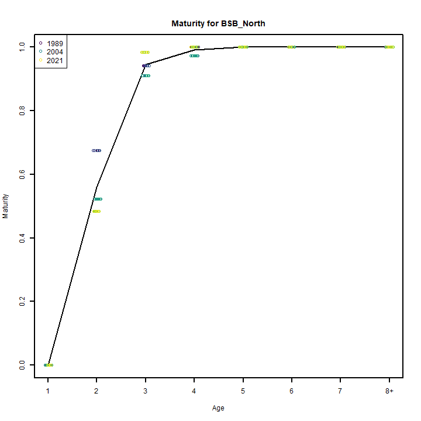
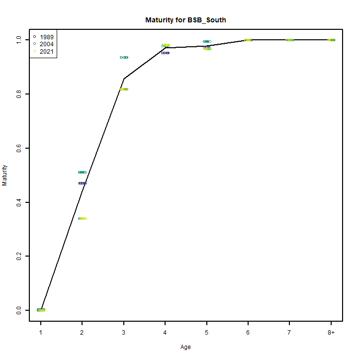
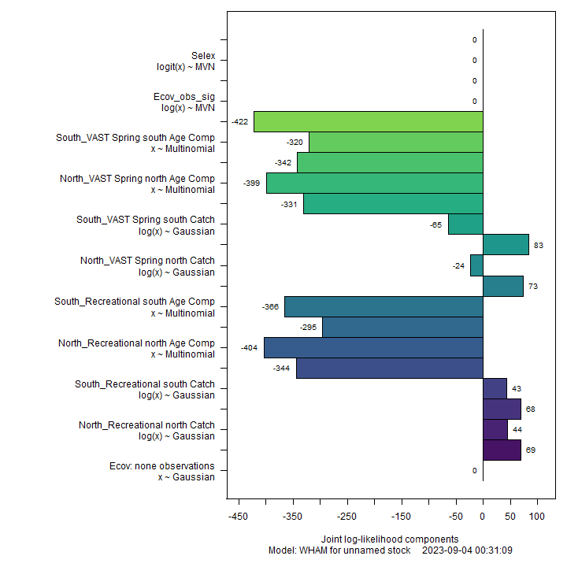
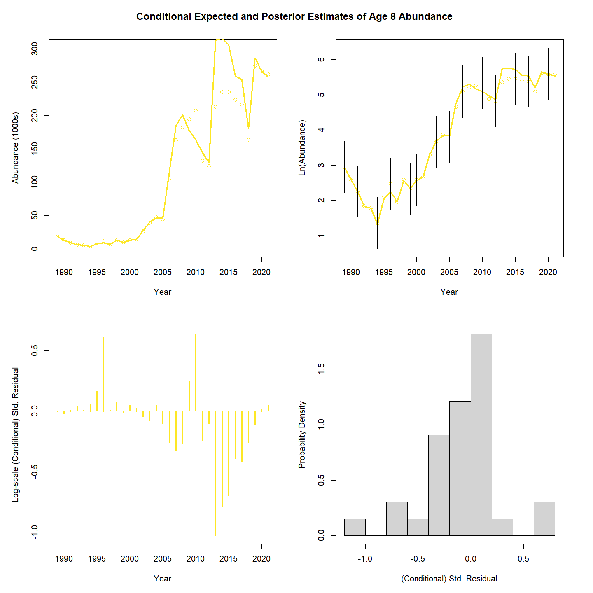
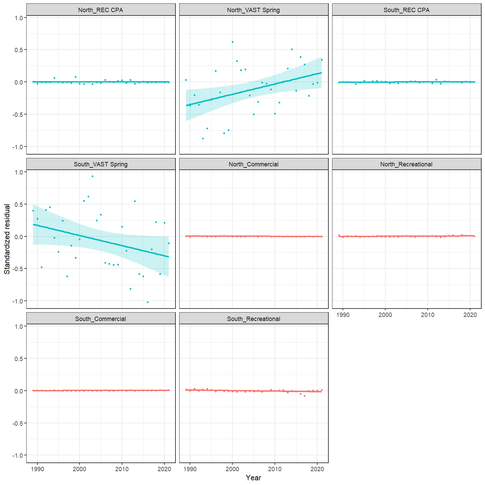
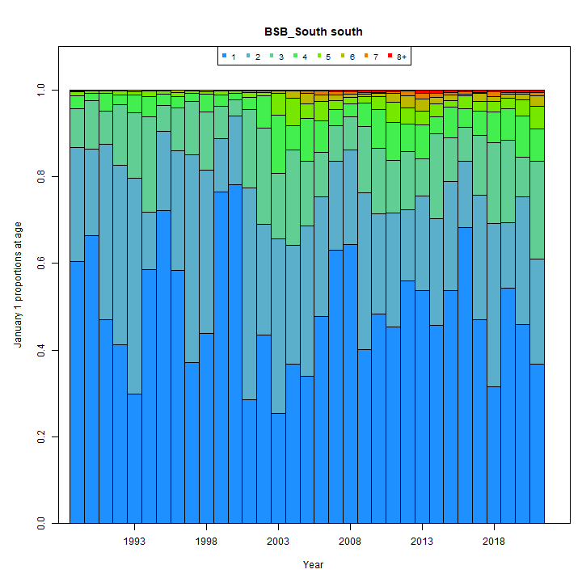
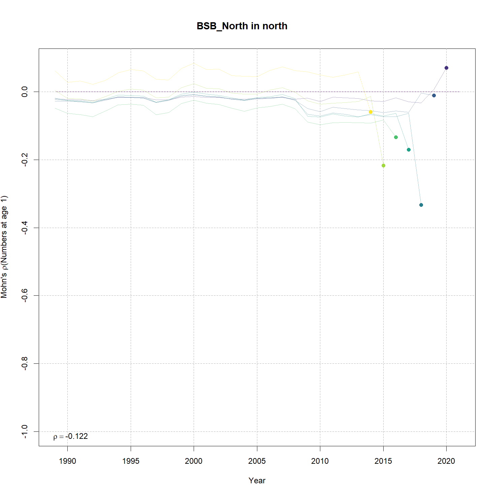
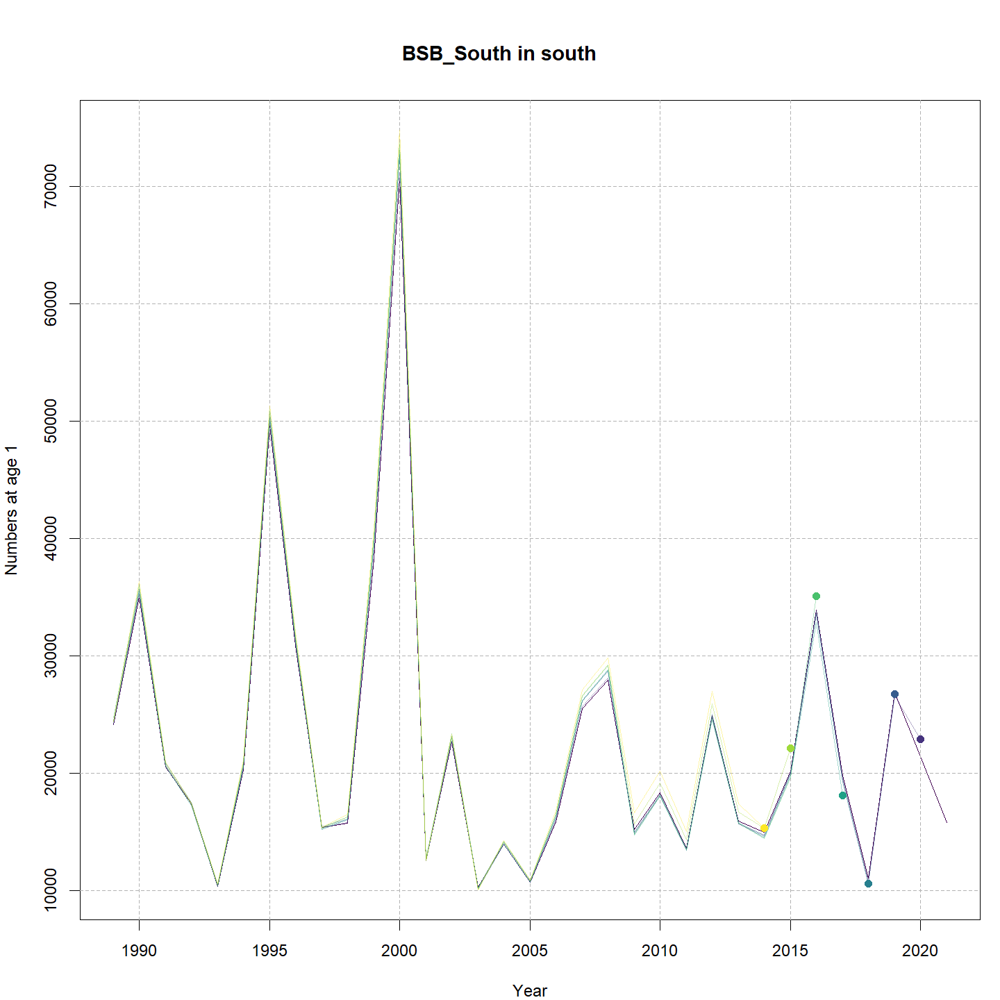

---
output:
  html_document:
    df_print: paged
    keep_md: yes
  word_document: default
  pdf_document:
    fig_caption: yes
    includes:
    keep_tex: yes
    number_sections: no
title: "WHAM figures and tables"
header-includes:
  - \usepackage{longtable}
  - \usepackage{booktabs}
  - \usepackage{caption,graphics}
  - \usepackage{makecell}
  - \usepackage{lscape}
  - \renewcommand\figurename{Fig.}
  - \captionsetup{labelsep=period, singlelinecheck=false}
  - \newcommand{\changesize}[1]{\fontsize{#1pt}{#1pt}\selectfont}
  - \renewcommand{\arraystretch}{1.5}
  - \renewcommand\theadfont{}
---

# {.tabset}

## Figures {.tabset}

### Input

### Diagnostics

### Results

### Retro

### Reference points

### Miscelaneous

## Tables {.tabset}

### Parameter estimates

<table class="table" style="margin-left: auto; margin-right: auto;">
<caption>Parameter estimates, standard errors, and confidence intervals. Rounded to 3 decimal places.</caption>
 <thead>
  <tr>
   <th style="text-align:left;">   </th>
   <th style="text-align:right;"> Estimate </th>
   <th style="text-align:right;"> Std. Error </th>
   <th style="text-align:right;"> 95\% CI lower </th>
   <th style="text-align:right;"> 95\% CI upper </th>
  </tr>
 </thead>
<tbody>
  <tr>
   <td style="text-align:left;"> BSB North Mean Recruitment </td>
   <td style="text-align:right;"> 9650.266 </td>
   <td style="text-align:right;"> 2174.709 </td>
   <td style="text-align:right;"> 6204.676 </td>
   <td style="text-align:right;"> 15009.266 </td>
  </tr>
  <tr>
   <td style="text-align:left;"> BSB North NAA $\sigma$ (age 1) </td>
   <td style="text-align:right;"> 1.094 </td>
   <td style="text-align:right;"> 0.144 </td>
   <td style="text-align:right;"> 0.845 </td>
   <td style="text-align:right;"> 1.415 </td>
  </tr>
  <tr>
   <td style="text-align:left;"> BSB North NAA $\sigma$ (age 2) </td>
   <td style="text-align:right;"> 0.674 </td>
   <td style="text-align:right;"> 0.044 </td>
   <td style="text-align:right;"> 0.593 </td>
   <td style="text-align:right;"> 0.766 </td>
  </tr>
  <tr>
   <td style="text-align:left;"> BSB South Mean Recruitment </td>
   <td style="text-align:right;"> 19965.777 </td>
   <td style="text-align:right;"> 2554.547 </td>
   <td style="text-align:right;"> 15537.393 </td>
   <td style="text-align:right;"> 25656.314 </td>
  </tr>
  <tr>
   <td style="text-align:left;"> BSB South NAA $\sigma$ (age 1) </td>
   <td style="text-align:right;"> 0.478 </td>
   <td style="text-align:right;"> 0.066 </td>
   <td style="text-align:right;"> 0.364 </td>
   <td style="text-align:right;"> 0.627 </td>
  </tr>
  <tr>
   <td style="text-align:left;"> BSB South NAA $\sigma$ (age 2) </td>
   <td style="text-align:right;"> 0.374 </td>
   <td style="text-align:right;"> 0.038 </td>
   <td style="text-align:right;"> 0.306 </td>
   <td style="text-align:right;"> 0.457 </td>
  </tr>
  <tr>
   <td style="text-align:left;"> REC CPA fully selected q </td>
   <td style="text-align:right;"> 0.000 </td>
   <td style="text-align:right;"> 0.000 </td>
   <td style="text-align:right;"> 0.000 </td>
   <td style="text-align:right;"> 0.000 </td>
  </tr>
  <tr>
   <td style="text-align:left;"> VAST Spring fully selected q </td>
   <td style="text-align:right;"> 0.018 </td>
   <td style="text-align:right;"> 0.002 </td>
   <td style="text-align:right;"> 0.015 </td>
   <td style="text-align:right;"> 0.023 </td>
  </tr>
  <tr>
   <td style="text-align:left;"> REC CPA fully selected q </td>
   <td style="text-align:right;"> 0.000 </td>
   <td style="text-align:right;"> 0.000 </td>
   <td style="text-align:right;"> 0.000 </td>
   <td style="text-align:right;"> 0.000 </td>
  </tr>
  <tr>
   <td style="text-align:left;"> VAST Spring fully selected q </td>
   <td style="text-align:right;"> 0.019 </td>
   <td style="text-align:right;"> 0.002 </td>
   <td style="text-align:right;"> 0.016 </td>
   <td style="text-align:right;"> 0.022 </td>
  </tr>
  <tr>
   <td style="text-align:left;"> Block 1: Selectivity for age 1 </td>
   <td style="text-align:right;"> 0.048 </td>
   <td style="text-align:right;"> 0.010 </td>
   <td style="text-align:right;"> 0.032 </td>
   <td style="text-align:right;"> 0.072 </td>
  </tr>
  <tr>
   <td style="text-align:left;"> Block 1: Selectivity for age 2 </td>
   <td style="text-align:right;"> 1.000 </td>
   <td style="text-align:right;"> -- </td>
   <td style="text-align:right;"> -- </td>
   <td style="text-align:right;"> -- </td>
  </tr>
  <tr>
   <td style="text-align:left;"> Block 1: Selectivity for age 3 </td>
   <td style="text-align:right;"> 1.000 </td>
   <td style="text-align:right;"> -- </td>
   <td style="text-align:right;"> -- </td>
   <td style="text-align:right;"> -- </td>
  </tr>
  <tr>
   <td style="text-align:left;"> Block 1: Selectivity for age 4 </td>
   <td style="text-align:right;"> 1.000 </td>
   <td style="text-align:right;"> -- </td>
   <td style="text-align:right;"> -- </td>
   <td style="text-align:right;"> -- </td>
  </tr>
  <tr>
   <td style="text-align:left;"> Block 1: Selectivity for age 5 </td>
   <td style="text-align:right;"> 1.000 </td>
   <td style="text-align:right;"> -- </td>
   <td style="text-align:right;"> -- </td>
   <td style="text-align:right;"> -- </td>
  </tr>
  <tr>
   <td style="text-align:left;"> Block 1: Selectivity for age 6 </td>
   <td style="text-align:right;"> 1.000 </td>
   <td style="text-align:right;"> -- </td>
   <td style="text-align:right;"> -- </td>
   <td style="text-align:right;"> -- </td>
  </tr>
  <tr>
   <td style="text-align:left;"> Block 1: Selectivity for age 7 </td>
   <td style="text-align:right;"> 1.000 </td>
   <td style="text-align:right;"> -- </td>
   <td style="text-align:right;"> -- </td>
   <td style="text-align:right;"> -- </td>
  </tr>
  <tr>
   <td style="text-align:left;"> Block 1: Selectivity for age 8+ </td>
   <td style="text-align:right;"> 1.000 </td>
   <td style="text-align:right;"> -- </td>
   <td style="text-align:right;"> -- </td>
   <td style="text-align:right;"> -- </td>
  </tr>
  <tr>
   <td style="text-align:left;"> Block 2: $a_{50}$ </td>
   <td style="text-align:right;"> 2.213 </td>
   <td style="text-align:right;"> 0.058 </td>
   <td style="text-align:right;"> 2.101 </td>
   <td style="text-align:right;"> 2.328 </td>
  </tr>
  <tr>
   <td style="text-align:left;"> Block 2: 1/slope (increasing) </td>
   <td style="text-align:right;"> 0.301 </td>
   <td style="text-align:right;"> 0.022 </td>
   <td style="text-align:right;"> 0.261 </td>
   <td style="text-align:right;"> 0.348 </td>
  </tr>
  <tr>
   <td style="text-align:left;"> Block 3: Selectivity for age 1 </td>
   <td style="text-align:right;"> 0.247 </td>
   <td style="text-align:right;"> 0.028 </td>
   <td style="text-align:right;"> 0.197 </td>
   <td style="text-align:right;"> 0.304 </td>
  </tr>
  <tr>
   <td style="text-align:left;"> Block 3: Selectivity for age 2 </td>
   <td style="text-align:right;"> 1.000 </td>
   <td style="text-align:right;"> -- </td>
   <td style="text-align:right;"> -- </td>
   <td style="text-align:right;"> -- </td>
  </tr>
  <tr>
   <td style="text-align:left;"> Block 3: Selectivity for age 3 </td>
   <td style="text-align:right;"> 1.000 </td>
   <td style="text-align:right;"> -- </td>
   <td style="text-align:right;"> -- </td>
   <td style="text-align:right;"> -- </td>
  </tr>
  <tr>
   <td style="text-align:left;"> Block 3: Selectivity for age 4 </td>
   <td style="text-align:right;"> 1.000 </td>
   <td style="text-align:right;"> -- </td>
   <td style="text-align:right;"> -- </td>
   <td style="text-align:right;"> -- </td>
  </tr>
  <tr>
   <td style="text-align:left;"> Block 3: Selectivity for age 5 </td>
   <td style="text-align:right;"> 1.000 </td>
   <td style="text-align:right;"> -- </td>
   <td style="text-align:right;"> -- </td>
   <td style="text-align:right;"> -- </td>
  </tr>
  <tr>
   <td style="text-align:left;"> Block 3: Selectivity for age 6 </td>
   <td style="text-align:right;"> 1.000 </td>
   <td style="text-align:right;"> -- </td>
   <td style="text-align:right;"> -- </td>
   <td style="text-align:right;"> -- </td>
  </tr>
  <tr>
   <td style="text-align:left;"> Block 3: Selectivity for age 7 </td>
   <td style="text-align:right;"> 1.000 </td>
   <td style="text-align:right;"> -- </td>
   <td style="text-align:right;"> -- </td>
   <td style="text-align:right;"> -- </td>
  </tr>
  <tr>
   <td style="text-align:left;"> Block 3: Selectivity for age 8+ </td>
   <td style="text-align:right;"> 1.000 </td>
   <td style="text-align:right;"> -- </td>
   <td style="text-align:right;"> -- </td>
   <td style="text-align:right;"> -- </td>
  </tr>
  <tr>
   <td style="text-align:left;"> Block 4: $a_{50}$ </td>
   <td style="text-align:right;"> 1.849 </td>
   <td style="text-align:right;"> 0.103 </td>
   <td style="text-align:right;"> 1.654 </td>
   <td style="text-align:right;"> 2.059 </td>
  </tr>
  <tr>
   <td style="text-align:left;"> Block 4: 1/slope (increasing) </td>
   <td style="text-align:right;"> 0.442 </td>
   <td style="text-align:right;"> 0.056 </td>
   <td style="text-align:right;"> 0.344 </td>
   <td style="text-align:right;"> 0.566 </td>
  </tr>
  <tr>
   <td style="text-align:left;"> Block 5: $a_{50}$ </td>
   <td style="text-align:right;"> 1.918 </td>
   <td style="text-align:right;"> 0.099 </td>
   <td style="text-align:right;"> 1.730 </td>
   <td style="text-align:right;"> 2.120 </td>
  </tr>
  <tr>
   <td style="text-align:left;"> Block 5: 1/slope (increasing) </td>
   <td style="text-align:right;"> 0.289 </td>
   <td style="text-align:right;"> 0.030 </td>
   <td style="text-align:right;"> 0.235 </td>
   <td style="text-align:right;"> 0.355 </td>
  </tr>
  <tr>
   <td style="text-align:left;"> Block 6: $a_{50}$ </td>
   <td style="text-align:right;"> 2.696 </td>
   <td style="text-align:right;"> 0.109 </td>
   <td style="text-align:right;"> 2.486 </td>
   <td style="text-align:right;"> 2.913 </td>
  </tr>
  <tr>
   <td style="text-align:left;"> Block 6: 1/slope (increasing) </td>
   <td style="text-align:right;"> 0.470 </td>
   <td style="text-align:right;"> 0.033 </td>
   <td style="text-align:right;"> 0.409 </td>
   <td style="text-align:right;"> 0.539 </td>
  </tr>
  <tr>
   <td style="text-align:left;"> Block 7: $a_{50}$ </td>
   <td style="text-align:right;"> 1.774 </td>
   <td style="text-align:right;"> 0.177 </td>
   <td style="text-align:right;"> 1.450 </td>
   <td style="text-align:right;"> 2.146 </td>
  </tr>
  <tr>
   <td style="text-align:left;"> Block 7: 1/slope (increasing) </td>
   <td style="text-align:right;"> 0.550 </td>
   <td style="text-align:right;"> 0.084 </td>
   <td style="text-align:right;"> 0.407 </td>
   <td style="text-align:right;"> 0.739 </td>
  </tr>
  <tr>
   <td style="text-align:left;"> Block 8: $a_{50}$ </td>
   <td style="text-align:right;"> 2.162 </td>
   <td style="text-align:right;"> 0.188 </td>
   <td style="text-align:right;"> 1.814 </td>
   <td style="text-align:right;"> 2.549 </td>
  </tr>
  <tr>
   <td style="text-align:left;"> Block 8: 1/slope (increasing) </td>
   <td style="text-align:right;"> 0.780 </td>
   <td style="text-align:right;"> 0.085 </td>
   <td style="text-align:right;"> 0.629 </td>
   <td style="text-align:right;"> 0.964 </td>
  </tr>
  <tr>
   <td style="text-align:left;"> Block 9: Selectivity for age 1 </td>
   <td style="text-align:right;"> 0.500 </td>
   <td style="text-align:right;"> -- </td>
   <td style="text-align:right;"> -- </td>
   <td style="text-align:right;"> -- </td>
  </tr>
  <tr>
   <td style="text-align:left;"> Block 9: Selectivity for age 2 </td>
   <td style="text-align:right;"> 0.500 </td>
   <td style="text-align:right;"> -- </td>
   <td style="text-align:right;"> -- </td>
   <td style="text-align:right;"> -- </td>
  </tr>
  <tr>
   <td style="text-align:left;"> Block 9: Selectivity for age 3 </td>
   <td style="text-align:right;"> 0.500 </td>
   <td style="text-align:right;"> -- </td>
   <td style="text-align:right;"> -- </td>
   <td style="text-align:right;"> -- </td>
  </tr>
  <tr>
   <td style="text-align:left;"> Block 9: Selectivity for age 4 </td>
   <td style="text-align:right;"> 0.500 </td>
   <td style="text-align:right;"> -- </td>
   <td style="text-align:right;"> -- </td>
   <td style="text-align:right;"> -- </td>
  </tr>
  <tr>
   <td style="text-align:left;"> Block 9: Selectivity for age 5 </td>
   <td style="text-align:right;"> 0.500 </td>
   <td style="text-align:right;"> -- </td>
   <td style="text-align:right;"> -- </td>
   <td style="text-align:right;"> -- </td>
  </tr>
  <tr>
   <td style="text-align:left;"> Block 9: Selectivity for age 6 </td>
   <td style="text-align:right;"> 0.500 </td>
   <td style="text-align:right;"> -- </td>
   <td style="text-align:right;"> -- </td>
   <td style="text-align:right;"> -- </td>
  </tr>
  <tr>
   <td style="text-align:left;"> Block 9: Selectivity for age 7 </td>
   <td style="text-align:right;"> 0.500 </td>
   <td style="text-align:right;"> -- </td>
   <td style="text-align:right;"> -- </td>
   <td style="text-align:right;"> -- </td>
  </tr>
  <tr>
   <td style="text-align:left;"> Block 9: Selectivity for age 8+ </td>
   <td style="text-align:right;"> 1.000 </td>
   <td style="text-align:right;"> -- </td>
   <td style="text-align:right;"> -- </td>
   <td style="text-align:right;"> -- </td>
  </tr>
  <tr>
   <td style="text-align:left;"> Block 10: Selectivity for age 1 </td>
   <td style="text-align:right;"> 0.109 </td>
   <td style="text-align:right;"> 0.013 </td>
   <td style="text-align:right;"> 0.086 </td>
   <td style="text-align:right;"> 0.137 </td>
  </tr>
  <tr>
   <td style="text-align:left;"> Block 10: Selectivity for age 2 </td>
   <td style="text-align:right;"> 0.561 </td>
   <td style="text-align:right;"> 0.043 </td>
   <td style="text-align:right;"> 0.475 </td>
   <td style="text-align:right;"> 0.643 </td>
  </tr>
  <tr>
   <td style="text-align:left;"> Block 10: Selectivity for age 3 </td>
   <td style="text-align:right;"> 1.000 </td>
   <td style="text-align:right;"> -- </td>
   <td style="text-align:right;"> -- </td>
   <td style="text-align:right;"> -- </td>
  </tr>
  <tr>
   <td style="text-align:left;"> Block 10: Selectivity for age 4 </td>
   <td style="text-align:right;"> 1.000 </td>
   <td style="text-align:right;"> -- </td>
   <td style="text-align:right;"> -- </td>
   <td style="text-align:right;"> -- </td>
  </tr>
  <tr>
   <td style="text-align:left;"> Block 10: Selectivity for age 5 </td>
   <td style="text-align:right;"> 1.000 </td>
   <td style="text-align:right;"> -- </td>
   <td style="text-align:right;"> -- </td>
   <td style="text-align:right;"> -- </td>
  </tr>
  <tr>
   <td style="text-align:left;"> Block 10: Selectivity for age 6 </td>
   <td style="text-align:right;"> 1.000 </td>
   <td style="text-align:right;"> -- </td>
   <td style="text-align:right;"> -- </td>
   <td style="text-align:right;"> -- </td>
  </tr>
  <tr>
   <td style="text-align:left;"> Block 10: Selectivity for age 7 </td>
   <td style="text-align:right;"> 0.454 </td>
   <td style="text-align:right;"> 0.121 </td>
   <td style="text-align:right;"> 0.242 </td>
   <td style="text-align:right;"> 0.684 </td>
  </tr>
  <tr>
   <td style="text-align:left;"> Block 10: Selectivity for age 8+ </td>
   <td style="text-align:right;"> 0.537 </td>
   <td style="text-align:right;"> 0.153 </td>
   <td style="text-align:right;"> 0.258 </td>
   <td style="text-align:right;"> 0.795 </td>
  </tr>
  <tr>
   <td style="text-align:left;"> Block 11: Selectivity for age 1 </td>
   <td style="text-align:right;"> 0.500 </td>
   <td style="text-align:right;"> -- </td>
   <td style="text-align:right;"> -- </td>
   <td style="text-align:right;"> -- </td>
  </tr>
  <tr>
   <td style="text-align:left;"> Block 11: Selectivity for age 2 </td>
   <td style="text-align:right;"> 0.500 </td>
   <td style="text-align:right;"> -- </td>
   <td style="text-align:right;"> -- </td>
   <td style="text-align:right;"> -- </td>
  </tr>
  <tr>
   <td style="text-align:left;"> Block 11: Selectivity for age 3 </td>
   <td style="text-align:right;"> 1.000 </td>
   <td style="text-align:right;"> -- </td>
   <td style="text-align:right;"> -- </td>
   <td style="text-align:right;"> -- </td>
  </tr>
  <tr>
   <td style="text-align:left;"> Block 11: Selectivity for age 4 </td>
   <td style="text-align:right;"> 0.500 </td>
   <td style="text-align:right;"> -- </td>
   <td style="text-align:right;"> -- </td>
   <td style="text-align:right;"> -- </td>
  </tr>
  <tr>
   <td style="text-align:left;"> Block 11: Selectivity for age 5 </td>
   <td style="text-align:right;"> 0.500 </td>
   <td style="text-align:right;"> -- </td>
   <td style="text-align:right;"> -- </td>
   <td style="text-align:right;"> -- </td>
  </tr>
  <tr>
   <td style="text-align:left;"> Block 11: Selectivity for age 6 </td>
   <td style="text-align:right;"> 0.500 </td>
   <td style="text-align:right;"> -- </td>
   <td style="text-align:right;"> -- </td>
   <td style="text-align:right;"> -- </td>
  </tr>
  <tr>
   <td style="text-align:left;"> Block 11: Selectivity for age 7 </td>
   <td style="text-align:right;"> 0.500 </td>
   <td style="text-align:right;"> -- </td>
   <td style="text-align:right;"> -- </td>
   <td style="text-align:right;"> -- </td>
  </tr>
  <tr>
   <td style="text-align:left;"> Block 11: Selectivity for age 8+ </td>
   <td style="text-align:right;"> 0.500 </td>
   <td style="text-align:right;"> -- </td>
   <td style="text-align:right;"> -- </td>
   <td style="text-align:right;"> -- </td>
  </tr>
  <tr>
   <td style="text-align:left;"> Block 12: Selectivity for age 1 </td>
   <td style="text-align:right;"> 0.268 </td>
   <td style="text-align:right;"> 0.028 </td>
   <td style="text-align:right;"> 0.216 </td>
   <td style="text-align:right;"> 0.326 </td>
  </tr>
  <tr>
   <td style="text-align:left;"> Block 12: Selectivity for age 2 </td>
   <td style="text-align:right;"> 0.918 </td>
   <td style="text-align:right;"> 0.076 </td>
   <td style="text-align:right;"> 0.611 </td>
   <td style="text-align:right;"> 0.987 </td>
  </tr>
  <tr>
   <td style="text-align:left;"> Block 12: Selectivity for age 3 </td>
   <td style="text-align:right;"> 1.000 </td>
   <td style="text-align:right;"> -- </td>
   <td style="text-align:right;"> -- </td>
   <td style="text-align:right;"> -- </td>
  </tr>
  <tr>
   <td style="text-align:left;"> Block 12: Selectivity for age 4 </td>
   <td style="text-align:right;"> 0.567 </td>
   <td style="text-align:right;"> 0.070 </td>
   <td style="text-align:right;"> 0.429 </td>
   <td style="text-align:right;"> 0.696 </td>
  </tr>
  <tr>
   <td style="text-align:left;"> Block 12: Selectivity for age 5 </td>
   <td style="text-align:right;"> 0.379 </td>
   <td style="text-align:right;"> 0.072 </td>
   <td style="text-align:right;"> 0.252 </td>
   <td style="text-align:right;"> 0.526 </td>
  </tr>
  <tr>
   <td style="text-align:left;"> Block 12: Selectivity for age 6 </td>
   <td style="text-align:right;"> 0.251 </td>
   <td style="text-align:right;"> 0.080 </td>
   <td style="text-align:right;"> 0.127 </td>
   <td style="text-align:right;"> 0.435 </td>
  </tr>
  <tr>
   <td style="text-align:left;"> Block 12: Selectivity for age 7 </td>
   <td style="text-align:right;"> 0.122 </td>
   <td style="text-align:right;"> 0.083 </td>
   <td style="text-align:right;"> 0.030 </td>
   <td style="text-align:right;"> 0.389 </td>
  </tr>
  <tr>
   <td style="text-align:left;"> Block 12: Selectivity for age 8+ </td>
   <td style="text-align:right;"> 0.149 </td>
   <td style="text-align:right;"> 0.097 </td>
   <td style="text-align:right;"> 0.038 </td>
   <td style="text-align:right;"> 0.441 </td>
  </tr>
</tbody>
</table>

### Abundance at age

<table class="table" style="margin-left: auto; margin-right: auto;">
<caption>Abundance at age (1000s) for BSB North in North.</caption>
 <thead>
  <tr>
   <th style="text-align:left;">   </th>
   <th style="text-align:right;"> 1 </th>
   <th style="text-align:right;"> 2 </th>
   <th style="text-align:right;"> 3 </th>
   <th style="text-align:right;"> 4 </th>
   <th style="text-align:right;"> 5 </th>
   <th style="text-align:right;"> 6 </th>
   <th style="text-align:right;"> 7 </th>
   <th style="text-align:right;"> 8+ </th>
  </tr>
 </thead>
<tbody>
  <tr>
   <td style="text-align:left;"> 1989 </td>
   <td style="text-align:right;"> 6388 </td>
   <td style="text-align:right;"> 2211 </td>
   <td style="text-align:right;"> 1131 </td>
   <td style="text-align:right;"> 572 </td>
   <td style="text-align:right;"> 289 </td>
   <td style="text-align:right;"> 146 </td>
   <td style="text-align:right;"> 74 </td>
   <td style="text-align:right;"> 75 </td>
  </tr>
  <tr>
   <td style="text-align:left;"> 1990 </td>
   <td style="text-align:right;"> 1682 </td>
   <td style="text-align:right;"> 727 </td>
   <td style="text-align:right;"> 1317 </td>
   <td style="text-align:right;"> 220 </td>
   <td style="text-align:right;"> 210 </td>
   <td style="text-align:right;"> 40 </td>
   <td style="text-align:right;"> 34 </td>
   <td style="text-align:right;"> 27 </td>
  </tr>
  <tr>
   <td style="text-align:left;"> 1991 </td>
   <td style="text-align:right;"> 2472 </td>
   <td style="text-align:right;"> 733 </td>
   <td style="text-align:right;"> 406 </td>
   <td style="text-align:right;"> 455 </td>
   <td style="text-align:right;"> 99 </td>
   <td style="text-align:right;"> 37 </td>
   <td style="text-align:right;"> 16 </td>
   <td style="text-align:right;"> 21 </td>
  </tr>
  <tr>
   <td style="text-align:left;"> 1992 </td>
   <td style="text-align:right;"> 1623 </td>
   <td style="text-align:right;"> 1104 </td>
   <td style="text-align:right;"> 674 </td>
   <td style="text-align:right;"> 103 </td>
   <td style="text-align:right;"> 151 </td>
   <td style="text-align:right;"> 20 </td>
   <td style="text-align:right;"> 11 </td>
   <td style="text-align:right;"> 20 </td>
  </tr>
  <tr>
   <td style="text-align:left;"> 1993 </td>
   <td style="text-align:right;"> 1243 </td>
   <td style="text-align:right;"> 1043 </td>
   <td style="text-align:right;"> 613 </td>
   <td style="text-align:right;"> 277 </td>
   <td style="text-align:right;"> 28 </td>
   <td style="text-align:right;"> 128 </td>
   <td style="text-align:right;"> 7 </td>
   <td style="text-align:right;"> 10 </td>
  </tr>
  <tr>
   <td style="text-align:left;"> 1994 </td>
   <td style="text-align:right;"> 10496 </td>
   <td style="text-align:right;"> 564 </td>
   <td style="text-align:right;"> 1836 </td>
   <td style="text-align:right;"> 348 </td>
   <td style="text-align:right;"> 219 </td>
   <td style="text-align:right;"> 13 </td>
   <td style="text-align:right;"> 29 </td>
   <td style="text-align:right;"> 7 </td>
  </tr>
  <tr>
   <td style="text-align:left;"> 1995 </td>
   <td style="text-align:right;"> 11429 </td>
   <td style="text-align:right;"> 1174 </td>
   <td style="text-align:right;"> 734 </td>
   <td style="text-align:right;"> 169 </td>
   <td style="text-align:right;"> 92 </td>
   <td style="text-align:right;"> 39 </td>
   <td style="text-align:right;"> 5 </td>
   <td style="text-align:right;"> 17 </td>
  </tr>
  <tr>
   <td style="text-align:left;"> 1996 </td>
   <td style="text-align:right;"> 12555 </td>
   <td style="text-align:right;"> 2076 </td>
   <td style="text-align:right;"> 922 </td>
   <td style="text-align:right;"> 220 </td>
   <td style="text-align:right;"> 64 </td>
   <td style="text-align:right;"> 54 </td>
   <td style="text-align:right;"> 19 </td>
   <td style="text-align:right;"> 11 </td>
  </tr>
  <tr>
   <td style="text-align:left;"> 1997 </td>
   <td style="text-align:right;"> 2955 </td>
   <td style="text-align:right;"> 3352 </td>
   <td style="text-align:right;"> 1284 </td>
   <td style="text-align:right;"> 200 </td>
   <td style="text-align:right;"> 69 </td>
   <td style="text-align:right;"> 20 </td>
   <td style="text-align:right;"> 21 </td>
   <td style="text-align:right;"> 12 </td>
  </tr>
  <tr>
   <td style="text-align:left;"> 1998 </td>
   <td style="text-align:right;"> 2312 </td>
   <td style="text-align:right;"> 1158 </td>
   <td style="text-align:right;"> 630 </td>
   <td style="text-align:right;"> 444 </td>
   <td style="text-align:right;"> 95 </td>
   <td style="text-align:right;"> 61 </td>
   <td style="text-align:right;"> 8 </td>
   <td style="text-align:right;"> 24 </td>
  </tr>
  <tr>
   <td style="text-align:left;"> 1999 </td>
   <td style="text-align:right;"> 30546 </td>
   <td style="text-align:right;"> 2599 </td>
   <td style="text-align:right;"> 1932 </td>
   <td style="text-align:right;"> 821 </td>
   <td style="text-align:right;"> 196 </td>
   <td style="text-align:right;"> 58 </td>
   <td style="text-align:right;"> 18 </td>
   <td style="text-align:right;"> 11 </td>
  </tr>
  <tr>
   <td style="text-align:left;"> 2000 </td>
   <td style="text-align:right;"> 22272 </td>
   <td style="text-align:right;"> 5086 </td>
   <td style="text-align:right;"> 937 </td>
   <td style="text-align:right;"> 800 </td>
   <td style="text-align:right;"> 186 </td>
   <td style="text-align:right;"> 108 </td>
   <td style="text-align:right;"> 19 </td>
   <td style="text-align:right;"> 14 </td>
  </tr>
  <tr>
   <td style="text-align:left;"> 2001 </td>
   <td style="text-align:right;"> 7201 </td>
   <td style="text-align:right;"> 2675 </td>
   <td style="text-align:right;"> 2610 </td>
   <td style="text-align:right;"> 426 </td>
   <td style="text-align:right;"> 251 </td>
   <td style="text-align:right;"> 93 </td>
   <td style="text-align:right;"> 74 </td>
   <td style="text-align:right;"> 14 </td>
  </tr>
  <tr>
   <td style="text-align:left;"> 2002 </td>
   <td style="text-align:right;"> 15504 </td>
   <td style="text-align:right;"> 3042 </td>
   <td style="text-align:right;"> 3866 </td>
   <td style="text-align:right;"> 2578 </td>
   <td style="text-align:right;"> 145 </td>
   <td style="text-align:right;"> 82 </td>
   <td style="text-align:right;"> 33 </td>
   <td style="text-align:right;"> 24 </td>
  </tr>
  <tr>
   <td style="text-align:left;"> 2003 </td>
   <td style="text-align:right;"> 2486 </td>
   <td style="text-align:right;"> 2370 </td>
   <td style="text-align:right;"> 1007 </td>
   <td style="text-align:right;"> 1682 </td>
   <td style="text-align:right;"> 811 </td>
   <td style="text-align:right;"> 59 </td>
   <td style="text-align:right;"> 40 </td>
   <td style="text-align:right;"> 20 </td>
  </tr>
  <tr>
   <td style="text-align:left;"> 2004 </td>
   <td style="text-align:right;"> 2797 </td>
   <td style="text-align:right;"> 850 </td>
   <td style="text-align:right;"> 2032 </td>
   <td style="text-align:right;"> 646 </td>
   <td style="text-align:right;"> 1121 </td>
   <td style="text-align:right;"> 265 </td>
   <td style="text-align:right;"> 21 </td>
   <td style="text-align:right;"> 25 </td>
  </tr>
  <tr>
   <td style="text-align:left;"> 2005 </td>
   <td style="text-align:right;"> 5497 </td>
   <td style="text-align:right;"> 741 </td>
   <td style="text-align:right;"> 540 </td>
   <td style="text-align:right;"> 1588 </td>
   <td style="text-align:right;"> 640 </td>
   <td style="text-align:right;"> 491 </td>
   <td style="text-align:right;"> 103 </td>
   <td style="text-align:right;"> 21 </td>
  </tr>
  <tr>
   <td style="text-align:left;"> 2006 </td>
   <td style="text-align:right;"> 17489 </td>
   <td style="text-align:right;"> 3906 </td>
   <td style="text-align:right;"> 1040 </td>
   <td style="text-align:right;"> 1258 </td>
   <td style="text-align:right;"> 1329 </td>
   <td style="text-align:right;"> 284 </td>
   <td style="text-align:right;"> 288 </td>
   <td style="text-align:right;"> 42 </td>
  </tr>
  <tr>
   <td style="text-align:left;"> 2007 </td>
   <td style="text-align:right;"> 11336 </td>
   <td style="text-align:right;"> 5286 </td>
   <td style="text-align:right;"> 1815 </td>
   <td style="text-align:right;"> 720 </td>
   <td style="text-align:right;"> 461 </td>
   <td style="text-align:right;"> 553 </td>
   <td style="text-align:right;"> 271 </td>
   <td style="text-align:right;"> 121 </td>
  </tr>
  <tr>
   <td style="text-align:left;"> 2008 </td>
   <td style="text-align:right;"> 14987 </td>
   <td style="text-align:right;"> 3638 </td>
   <td style="text-align:right;"> 4494 </td>
   <td style="text-align:right;"> 1180 </td>
   <td style="text-align:right;"> 253 </td>
   <td style="text-align:right;"> 170 </td>
   <td style="text-align:right;"> 278 </td>
   <td style="text-align:right;"> 137 </td>
  </tr>
  <tr>
   <td style="text-align:left;"> 2009 </td>
   <td style="text-align:right;"> 29674 </td>
   <td style="text-align:right;"> 8286 </td>
   <td style="text-align:right;"> 4858 </td>
   <td style="text-align:right;"> 3872 </td>
   <td style="text-align:right;"> 682 </td>
   <td style="text-align:right;"> 104 </td>
   <td style="text-align:right;"> 74 </td>
   <td style="text-align:right;"> 183 </td>
  </tr>
  <tr>
   <td style="text-align:left;"> 2010 </td>
   <td style="text-align:right;"> 11709 </td>
   <td style="text-align:right;"> 6049 </td>
   <td style="text-align:right;"> 6704 </td>
   <td style="text-align:right;"> 3095 </td>
   <td style="text-align:right;"> 1580 </td>
   <td style="text-align:right;"> 284 </td>
   <td style="text-align:right;"> 48 </td>
   <td style="text-align:right;"> 107 </td>
  </tr>
  <tr>
   <td style="text-align:left;"> 2011 </td>
   <td style="text-align:right;"> 17686 </td>
   <td style="text-align:right;"> 4173 </td>
   <td style="text-align:right;"> 2847 </td>
   <td style="text-align:right;"> 3458 </td>
   <td style="text-align:right;"> 1085 </td>
   <td style="text-align:right;"> 649 </td>
   <td style="text-align:right;"> 128 </td>
   <td style="text-align:right;"> 63 </td>
  </tr>
  <tr>
   <td style="text-align:left;"> 2012 </td>
   <td style="text-align:right;"> 116283 </td>
   <td style="text-align:right;"> 16871 </td>
   <td style="text-align:right;"> 9299 </td>
   <td style="text-align:right;"> 5744 </td>
   <td style="text-align:right;"> 3967 </td>
   <td style="text-align:right;"> 1180 </td>
   <td style="text-align:right;"> 547 </td>
   <td style="text-align:right;"> 108 </td>
  </tr>
  <tr>
   <td style="text-align:left;"> 2013 </td>
   <td style="text-align:right;"> 21006 </td>
   <td style="text-align:right;"> 17572 </td>
   <td style="text-align:right;"> 3190 </td>
   <td style="text-align:right;"> 3414 </td>
   <td style="text-align:right;"> 1879 </td>
   <td style="text-align:right;"> 1070 </td>
   <td style="text-align:right;"> 422 </td>
   <td style="text-align:right;"> 272 </td>
  </tr>
  <tr>
   <td style="text-align:left;"> 2014 </td>
   <td style="text-align:right;"> 10874 </td>
   <td style="text-align:right;"> 7715 </td>
   <td style="text-align:right;"> 23260 </td>
   <td style="text-align:right;"> 3830 </td>
   <td style="text-align:right;"> 2007 </td>
   <td style="text-align:right;"> 1087 </td>
   <td style="text-align:right;"> 732 </td>
   <td style="text-align:right;"> 336 </td>
  </tr>
  <tr>
   <td style="text-align:left;"> 2015 </td>
   <td style="text-align:right;"> 11498 </td>
   <td style="text-align:right;"> 5255 </td>
   <td style="text-align:right;"> 4850 </td>
   <td style="text-align:right;"> 14959 </td>
   <td style="text-align:right;"> 1978 </td>
   <td style="text-align:right;"> 920 </td>
   <td style="text-align:right;"> 565 </td>
   <td style="text-align:right;"> 511 </td>
  </tr>
  <tr>
   <td style="text-align:left;"> 2016 </td>
   <td style="text-align:right;"> 34159 </td>
   <td style="text-align:right;"> 10811 </td>
   <td style="text-align:right;"> 3172 </td>
   <td style="text-align:right;"> 4716 </td>
   <td style="text-align:right;"> 16740 </td>
   <td style="text-align:right;"> 1117 </td>
   <td style="text-align:right;"> 641 </td>
   <td style="text-align:right;"> 521 </td>
  </tr>
  <tr>
   <td style="text-align:left;"> 2017 </td>
   <td style="text-align:right;"> 16422 </td>
   <td style="text-align:right;"> 22782 </td>
   <td style="text-align:right;"> 3841 </td>
   <td style="text-align:right;"> 2772 </td>
   <td style="text-align:right;"> 2834 </td>
   <td style="text-align:right;"> 12042 </td>
   <td style="text-align:right;"> 558 </td>
   <td style="text-align:right;"> 523 </td>
  </tr>
  <tr>
   <td style="text-align:left;"> 2018 </td>
   <td style="text-align:right;"> 6280 </td>
   <td style="text-align:right;"> 5697 </td>
   <td style="text-align:right;"> 8989 </td>
   <td style="text-align:right;"> 2308 </td>
   <td style="text-align:right;"> 964 </td>
   <td style="text-align:right;"> 1341 </td>
   <td style="text-align:right;"> 6748 </td>
   <td style="text-align:right;"> 517 </td>
  </tr>
  <tr>
   <td style="text-align:left;"> 2019 </td>
   <td style="text-align:right;"> 32835 </td>
   <td style="text-align:right;"> 5089 </td>
   <td style="text-align:right;"> 6446 </td>
   <td style="text-align:right;"> 14711 </td>
   <td style="text-align:right;"> 1932 </td>
   <td style="text-align:right;"> 756 </td>
   <td style="text-align:right;"> 816 </td>
   <td style="text-align:right;"> 5083 </td>
  </tr>
  <tr>
   <td style="text-align:left;"> 2020 </td>
   <td style="text-align:right;"> 38747 </td>
   <td style="text-align:right;"> 16242 </td>
   <td style="text-align:right;"> 1719 </td>
   <td style="text-align:right;"> 2988 </td>
   <td style="text-align:right;"> 7724 </td>
   <td style="text-align:right;"> 1098 </td>
   <td style="text-align:right;"> 516 </td>
   <td style="text-align:right;"> 3244 </td>
  </tr>
  <tr>
   <td style="text-align:left;"> 2021 </td>
   <td style="text-align:right;"> 17655 </td>
   <td style="text-align:right;"> 17863 </td>
   <td style="text-align:right;"> 11551 </td>
   <td style="text-align:right;"> 1188 </td>
   <td style="text-align:right;"> 3432 </td>
   <td style="text-align:right;"> 6465 </td>
   <td style="text-align:right;"> 673 </td>
   <td style="text-align:right;"> 2404 </td>
  </tr>
</tbody>
</table>

<table class="table" style="margin-left: auto; margin-right: auto;">
<caption>Abundance at age (1000s) for BSB North in South.</caption>
 <thead>
  <tr>
   <th style="text-align:left;">   </th>
   <th style="text-align:right;"> 1 </th>
   <th style="text-align:right;"> 2 </th>
   <th style="text-align:right;"> 3 </th>
   <th style="text-align:right;"> 4 </th>
   <th style="text-align:right;"> 5 </th>
   <th style="text-align:right;"> 6 </th>
   <th style="text-align:right;"> 7 </th>
   <th style="text-align:right;"> 8+ </th>
  </tr>
 </thead>
<tbody>
  <tr>
   <td style="text-align:left;"> 1989 </td>
   <td style="text-align:right;"> 0 </td>
   <td style="text-align:right;"> 1124 </td>
   <td style="text-align:right;"> 564 </td>
   <td style="text-align:right;"> 284 </td>
   <td style="text-align:right;"> 144 </td>
   <td style="text-align:right;"> 73 </td>
   <td style="text-align:right;"> 37 </td>
   <td style="text-align:right;"> 37 </td>
  </tr>
  <tr>
   <td style="text-align:left;"> 1990 </td>
   <td style="text-align:right;"> 0 </td>
   <td style="text-align:right;"> 755 </td>
   <td style="text-align:right;"> 367 </td>
   <td style="text-align:right;"> 143 </td>
   <td style="text-align:right;"> 76 </td>
   <td style="text-align:right;"> 30 </td>
   <td style="text-align:right;"> 19 </td>
   <td style="text-align:right;"> 18 </td>
  </tr>
  <tr>
   <td style="text-align:left;"> 1991 </td>
   <td style="text-align:right;"> 0 </td>
   <td style="text-align:right;"> 1368 </td>
   <td style="text-align:right;"> 156 </td>
   <td style="text-align:right;"> 184 </td>
   <td style="text-align:right;"> 35 </td>
   <td style="text-align:right;"> 23 </td>
   <td style="text-align:right;"> 7 </td>
   <td style="text-align:right;"> 10 </td>
  </tr>
  <tr>
   <td style="text-align:left;"> 1992 </td>
   <td style="text-align:right;"> 0 </td>
   <td style="text-align:right;"> 1446 </td>
   <td style="text-align:right;"> 203 </td>
   <td style="text-align:right;"> 50 </td>
   <td style="text-align:right;"> 79 </td>
   <td style="text-align:right;"> 12 </td>
   <td style="text-align:right;"> 6 </td>
   <td style="text-align:right;"> 6 </td>
  </tr>
  <tr>
   <td style="text-align:left;"> 1993 </td>
   <td style="text-align:right;"> 0 </td>
   <td style="text-align:right;"> 715 </td>
   <td style="text-align:right;"> 284 </td>
   <td style="text-align:right;"> 128 </td>
   <td style="text-align:right;"> 16 </td>
   <td style="text-align:right;"> 31 </td>
   <td style="text-align:right;"> 4 </td>
   <td style="text-align:right;"> 5 </td>
  </tr>
  <tr>
   <td style="text-align:left;"> 1994 </td>
   <td style="text-align:right;"> 0 </td>
   <td style="text-align:right;"> 320 </td>
   <td style="text-align:right;"> 285 </td>
   <td style="text-align:right;"> 99 </td>
   <td style="text-align:right;"> 46 </td>
   <td style="text-align:right;"> 5 </td>
   <td style="text-align:right;"> 16 </td>
   <td style="text-align:right;"> 3 </td>
  </tr>
  <tr>
   <td style="text-align:left;"> 1995 </td>
   <td style="text-align:right;"> 0 </td>
   <td style="text-align:right;"> 844 </td>
   <td style="text-align:right;"> 126 </td>
   <td style="text-align:right;"> 142 </td>
   <td style="text-align:right;"> 53 </td>
   <td style="text-align:right;"> 27 </td>
   <td style="text-align:right;"> 2 </td>
   <td style="text-align:right;"> 7 </td>
  </tr>
  <tr>
   <td style="text-align:left;"> 1996 </td>
   <td style="text-align:right;"> 0 </td>
   <td style="text-align:right;"> 1296 </td>
   <td style="text-align:right;"> 295 </td>
   <td style="text-align:right;"> 115 </td>
   <td style="text-align:right;"> 37 </td>
   <td style="text-align:right;"> 22 </td>
   <td style="text-align:right;"> 9 </td>
   <td style="text-align:right;"> 5 </td>
  </tr>
  <tr>
   <td style="text-align:left;"> 1997 </td>
   <td style="text-align:right;"> 0 </td>
   <td style="text-align:right;"> 2653 </td>
   <td style="text-align:right;"> 350 </td>
   <td style="text-align:right;"> 112 </td>
   <td style="text-align:right;"> 36 </td>
   <td style="text-align:right;"> 10 </td>
   <td style="text-align:right;"> 8 </td>
   <td style="text-align:right;"> 5 </td>
  </tr>
  <tr>
   <td style="text-align:left;"> 1998 </td>
   <td style="text-align:right;"> 0 </td>
   <td style="text-align:right;"> 1320 </td>
   <td style="text-align:right;"> 587 </td>
   <td style="text-align:right;"> 230 </td>
   <td style="text-align:right;"> 45 </td>
   <td style="text-align:right;"> 17 </td>
   <td style="text-align:right;"> 4 </td>
   <td style="text-align:right;"> 7 </td>
  </tr>
  <tr>
   <td style="text-align:left;"> 1999 </td>
   <td style="text-align:right;"> 0 </td>
   <td style="text-align:right;"> 620 </td>
   <td style="text-align:right;"> 485 </td>
   <td style="text-align:right;"> 166 </td>
   <td style="text-align:right;"> 91 </td>
   <td style="text-align:right;"> 18 </td>
   <td style="text-align:right;"> 9 </td>
   <td style="text-align:right;"> 5 </td>
  </tr>
  <tr>
   <td style="text-align:left;"> 2000 </td>
   <td style="text-align:right;"> 0 </td>
   <td style="text-align:right;"> 2018 </td>
   <td style="text-align:right;"> 457 </td>
   <td style="text-align:right;"> 315 </td>
   <td style="text-align:right;"> 115 </td>
   <td style="text-align:right;"> 45 </td>
   <td style="text-align:right;"> 10 </td>
   <td style="text-align:right;"> 6 </td>
  </tr>
  <tr>
   <td style="text-align:left;"> 2001 </td>
   <td style="text-align:right;"> 0 </td>
   <td style="text-align:right;"> 1790 </td>
   <td style="text-align:right;"> 909 </td>
   <td style="text-align:right;"> 214 </td>
   <td style="text-align:right;"> 140 </td>
   <td style="text-align:right;"> 45 </td>
   <td style="text-align:right;"> 24 </td>
   <td style="text-align:right;"> 7 </td>
  </tr>
  <tr>
   <td style="text-align:left;"> 2002 </td>
   <td style="text-align:right;"> 0 </td>
   <td style="text-align:right;"> 2548 </td>
   <td style="text-align:right;"> 853 </td>
   <td style="text-align:right;"> 462 </td>
   <td style="text-align:right;"> 74 </td>
   <td style="text-align:right;"> 45 </td>
   <td style="text-align:right;"> 16 </td>
   <td style="text-align:right;"> 13 </td>
  </tr>
  <tr>
   <td style="text-align:left;"> 2003 </td>
   <td style="text-align:right;"> 0 </td>
   <td style="text-align:right;"> 1926 </td>
   <td style="text-align:right;"> 985 </td>
   <td style="text-align:right;"> 724 </td>
   <td style="text-align:right;"> 434 </td>
   <td style="text-align:right;"> 30 </td>
   <td style="text-align:right;"> 19 </td>
   <td style="text-align:right;"> 11 </td>
  </tr>
  <tr>
   <td style="text-align:left;"> 2004 </td>
   <td style="text-align:right;"> 0 </td>
   <td style="text-align:right;"> 700 </td>
   <td style="text-align:right;"> 1674 </td>
   <td style="text-align:right;"> 332 </td>
   <td style="text-align:right;"> 396 </td>
   <td style="text-align:right;"> 146 </td>
   <td style="text-align:right;"> 11 </td>
   <td style="text-align:right;"> 12 </td>
  </tr>
  <tr>
   <td style="text-align:left;"> 2005 </td>
   <td style="text-align:right;"> 0 </td>
   <td style="text-align:right;"> 1178 </td>
   <td style="text-align:right;"> 420 </td>
   <td style="text-align:right;"> 791 </td>
   <td style="text-align:right;"> 166 </td>
   <td style="text-align:right;"> 226 </td>
   <td style="text-align:right;"> 51 </td>
   <td style="text-align:right;"> 10 </td>
  </tr>
  <tr>
   <td style="text-align:left;"> 2006 </td>
   <td style="text-align:right;"> 0 </td>
   <td style="text-align:right;"> 1438 </td>
   <td style="text-align:right;"> 441 </td>
   <td style="text-align:right;"> 192 </td>
   <td style="text-align:right;"> 1044 </td>
   <td style="text-align:right;"> 148 </td>
   <td style="text-align:right;"> 105 </td>
   <td style="text-align:right;"> 24 </td>
  </tr>
  <tr>
   <td style="text-align:left;"> 2007 </td>
   <td style="text-align:right;"> 0 </td>
   <td style="text-align:right;"> 2040 </td>
   <td style="text-align:right;"> 1016 </td>
   <td style="text-align:right;"> 267 </td>
   <td style="text-align:right;"> 218 </td>
   <td style="text-align:right;"> 316 </td>
   <td style="text-align:right;"> 79 </td>
   <td style="text-align:right;"> 65 </td>
  </tr>
  <tr>
   <td style="text-align:left;"> 2008 </td>
   <td style="text-align:right;"> 0 </td>
   <td style="text-align:right;"> 2586 </td>
   <td style="text-align:right;"> 1011 </td>
   <td style="text-align:right;"> 503 </td>
   <td style="text-align:right;"> 138 </td>
   <td style="text-align:right;"> 94 </td>
   <td style="text-align:right;"> 118 </td>
   <td style="text-align:right;"> 73 </td>
  </tr>
  <tr>
   <td style="text-align:left;"> 2009 </td>
   <td style="text-align:right;"> 0 </td>
   <td style="text-align:right;"> 6903 </td>
   <td style="text-align:right;"> 1376 </td>
   <td style="text-align:right;"> 1344 </td>
   <td style="text-align:right;"> 292 </td>
   <td style="text-align:right;"> 58 </td>
   <td style="text-align:right;"> 39 </td>
   <td style="text-align:right;"> 92 </td>
  </tr>
  <tr>
   <td style="text-align:left;"> 2010 </td>
   <td style="text-align:right;"> 0 </td>
   <td style="text-align:right;"> 4730 </td>
   <td style="text-align:right;"> 3823 </td>
   <td style="text-align:right;"> 2013 </td>
   <td style="text-align:right;"> 1405 </td>
   <td style="text-align:right;"> 186 </td>
   <td style="text-align:right;"> 26 </td>
   <td style="text-align:right;"> 64 </td>
  </tr>
  <tr>
   <td style="text-align:left;"> 2011 </td>
   <td style="text-align:right;"> 0 </td>
   <td style="text-align:right;"> 3153 </td>
   <td style="text-align:right;"> 1633 </td>
   <td style="text-align:right;"> 1381 </td>
   <td style="text-align:right;"> 742 </td>
   <td style="text-align:right;"> 442 </td>
   <td style="text-align:right;"> 67 </td>
   <td style="text-align:right;"> 35 </td>
  </tr>
  <tr>
   <td style="text-align:left;"> 2012 </td>
   <td style="text-align:right;"> 0 </td>
   <td style="text-align:right;"> 3356 </td>
   <td style="text-align:right;"> 1537 </td>
   <td style="text-align:right;"> 908 </td>
   <td style="text-align:right;"> 1102 </td>
   <td style="text-align:right;"> 530 </td>
   <td style="text-align:right;"> 329 </td>
   <td style="text-align:right;"> 52 </td>
  </tr>
  <tr>
   <td style="text-align:left;"> 2013 </td>
   <td style="text-align:right;"> 0 </td>
   <td style="text-align:right;"> 10040 </td>
   <td style="text-align:right;"> 2131 </td>
   <td style="text-align:right;"> 1628 </td>
   <td style="text-align:right;"> 1139 </td>
   <td style="text-align:right;"> 1016 </td>
   <td style="text-align:right;"> 257 </td>
   <td style="text-align:right;"> 144 </td>
  </tr>
  <tr>
   <td style="text-align:left;"> 2014 </td>
   <td style="text-align:right;"> 0 </td>
   <td style="text-align:right;"> 3905 </td>
   <td style="text-align:right;"> 3187 </td>
   <td style="text-align:right;"> 1000 </td>
   <td style="text-align:right;"> 972 </td>
   <td style="text-align:right;"> 698 </td>
   <td style="text-align:right;"> 349 </td>
   <td style="text-align:right;"> 160 </td>
  </tr>
  <tr>
   <td style="text-align:left;"> 2015 </td>
   <td style="text-align:right;"> 0 </td>
   <td style="text-align:right;"> 2881 </td>
   <td style="text-align:right;"> 2097 </td>
   <td style="text-align:right;"> 3531 </td>
   <td style="text-align:right;"> 1141 </td>
   <td style="text-align:right;"> 609 </td>
   <td style="text-align:right;"> 266 </td>
   <td style="text-align:right;"> 238 </td>
  </tr>
  <tr>
   <td style="text-align:left;"> 2016 </td>
   <td style="text-align:right;"> 0 </td>
   <td style="text-align:right;"> 2037 </td>
   <td style="text-align:right;"> 1203 </td>
   <td style="text-align:right;"> 1211 </td>
   <td style="text-align:right;"> 2081 </td>
   <td style="text-align:right;"> 427 </td>
   <td style="text-align:right;"> 257 </td>
   <td style="text-align:right;"> 255 </td>
  </tr>
  <tr>
   <td style="text-align:left;"> 2017 </td>
   <td style="text-align:right;"> 0 </td>
   <td style="text-align:right;"> 6846 </td>
   <td style="text-align:right;"> 2218 </td>
   <td style="text-align:right;"> 925 </td>
   <td style="text-align:right;"> 1152 </td>
   <td style="text-align:right;"> 2831 </td>
   <td style="text-align:right;"> 251 </td>
   <td style="text-align:right;"> 249 </td>
  </tr>
  <tr>
   <td style="text-align:left;"> 2018 </td>
   <td style="text-align:right;"> 0 </td>
   <td style="text-align:right;"> 7352 </td>
   <td style="text-align:right;"> 7430 </td>
   <td style="text-align:right;"> 1437 </td>
   <td style="text-align:right;"> 703 </td>
   <td style="text-align:right;"> 668 </td>
   <td style="text-align:right;"> 1689 </td>
   <td style="text-align:right;"> 238 </td>
  </tr>
  <tr>
   <td style="text-align:left;"> 2019 </td>
   <td style="text-align:right;"> 0 </td>
   <td style="text-align:right;"> 1532 </td>
   <td style="text-align:right;"> 3311 </td>
   <td style="text-align:right;"> 3780 </td>
   <td style="text-align:right;"> 900 </td>
   <td style="text-align:right;"> 340 </td>
   <td style="text-align:right;"> 352 </td>
   <td style="text-align:right;"> 1372 </td>
  </tr>
  <tr>
   <td style="text-align:left;"> 2020 </td>
   <td style="text-align:right;"> 0 </td>
   <td style="text-align:right;"> 6859 </td>
   <td style="text-align:right;"> 1197 </td>
   <td style="text-align:right;"> 3613 </td>
   <td style="text-align:right;"> 4087 </td>
   <td style="text-align:right;"> 545 </td>
   <td style="text-align:right;"> 196 </td>
   <td style="text-align:right;"> 1205 </td>
  </tr>
  <tr>
   <td style="text-align:left;"> 2021 </td>
   <td style="text-align:right;"> 0 </td>
   <td style="text-align:right;"> 5600 </td>
   <td style="text-align:right;"> 3190 </td>
   <td style="text-align:right;"> 621 </td>
   <td style="text-align:right;"> 1472 </td>
   <td style="text-align:right;"> 3260 </td>
   <td style="text-align:right;"> 295 </td>
   <td style="text-align:right;"> 892 </td>
  </tr>
</tbody>
</table>

<table class="table" style="margin-left: auto; margin-right: auto;">
<caption>Abundance at age (1000s) for BSB South in North.</caption>
 <thead>
  <tr>
   <th style="text-align:left;">   </th>
   <th style="text-align:right;"> 1 </th>
   <th style="text-align:right;"> 2 </th>
   <th style="text-align:right;"> 3 </th>
   <th style="text-align:right;"> 4 </th>
   <th style="text-align:right;"> 5 </th>
   <th style="text-align:right;"> 6 </th>
   <th style="text-align:right;"> 7 </th>
   <th style="text-align:right;"> 8+ </th>
  </tr>
 </thead>
<tbody>
  <tr>
   <td style="text-align:left;"> 1989 </td>
   <td style="text-align:right;"> 0 </td>
   <td style="text-align:right;"> 0 </td>
   <td style="text-align:right;"> 0 </td>
   <td style="text-align:right;"> 0 </td>
   <td style="text-align:right;"> 0 </td>
   <td style="text-align:right;"> 0 </td>
   <td style="text-align:right;"> 0 </td>
   <td style="text-align:right;"> 0 </td>
  </tr>
  <tr>
   <td style="text-align:left;"> 1990 </td>
   <td style="text-align:right;"> 0 </td>
   <td style="text-align:right;"> 0 </td>
   <td style="text-align:right;"> 0 </td>
   <td style="text-align:right;"> 0 </td>
   <td style="text-align:right;"> 0 </td>
   <td style="text-align:right;"> 0 </td>
   <td style="text-align:right;"> 0 </td>
   <td style="text-align:right;"> 0 </td>
  </tr>
  <tr>
   <td style="text-align:left;"> 1991 </td>
   <td style="text-align:right;"> 0 </td>
   <td style="text-align:right;"> 0 </td>
   <td style="text-align:right;"> 0 </td>
   <td style="text-align:right;"> 0 </td>
   <td style="text-align:right;"> 0 </td>
   <td style="text-align:right;"> 0 </td>
   <td style="text-align:right;"> 0 </td>
   <td style="text-align:right;"> 0 </td>
  </tr>
  <tr>
   <td style="text-align:left;"> 1992 </td>
   <td style="text-align:right;"> 0 </td>
   <td style="text-align:right;"> 0 </td>
   <td style="text-align:right;"> 0 </td>
   <td style="text-align:right;"> 0 </td>
   <td style="text-align:right;"> 0 </td>
   <td style="text-align:right;"> 0 </td>
   <td style="text-align:right;"> 0 </td>
   <td style="text-align:right;"> 0 </td>
  </tr>
  <tr>
   <td style="text-align:left;"> 1993 </td>
   <td style="text-align:right;"> 0 </td>
   <td style="text-align:right;"> 0 </td>
   <td style="text-align:right;"> 0 </td>
   <td style="text-align:right;"> 0 </td>
   <td style="text-align:right;"> 0 </td>
   <td style="text-align:right;"> 0 </td>
   <td style="text-align:right;"> 0 </td>
   <td style="text-align:right;"> 0 </td>
  </tr>
  <tr>
   <td style="text-align:left;"> 1994 </td>
   <td style="text-align:right;"> 0 </td>
   <td style="text-align:right;"> 0 </td>
   <td style="text-align:right;"> 0 </td>
   <td style="text-align:right;"> 0 </td>
   <td style="text-align:right;"> 0 </td>
   <td style="text-align:right;"> 0 </td>
   <td style="text-align:right;"> 0 </td>
   <td style="text-align:right;"> 0 </td>
  </tr>
  <tr>
   <td style="text-align:left;"> 1995 </td>
   <td style="text-align:right;"> 0 </td>
   <td style="text-align:right;"> 0 </td>
   <td style="text-align:right;"> 0 </td>
   <td style="text-align:right;"> 0 </td>
   <td style="text-align:right;"> 0 </td>
   <td style="text-align:right;"> 0 </td>
   <td style="text-align:right;"> 0 </td>
   <td style="text-align:right;"> 0 </td>
  </tr>
  <tr>
   <td style="text-align:left;"> 1996 </td>
   <td style="text-align:right;"> 0 </td>
   <td style="text-align:right;"> 0 </td>
   <td style="text-align:right;"> 0 </td>
   <td style="text-align:right;"> 0 </td>
   <td style="text-align:right;"> 0 </td>
   <td style="text-align:right;"> 0 </td>
   <td style="text-align:right;"> 0 </td>
   <td style="text-align:right;"> 0 </td>
  </tr>
  <tr>
   <td style="text-align:left;"> 1997 </td>
   <td style="text-align:right;"> 0 </td>
   <td style="text-align:right;"> 0 </td>
   <td style="text-align:right;"> 0 </td>
   <td style="text-align:right;"> 0 </td>
   <td style="text-align:right;"> 0 </td>
   <td style="text-align:right;"> 0 </td>
   <td style="text-align:right;"> 0 </td>
   <td style="text-align:right;"> 0 </td>
  </tr>
  <tr>
   <td style="text-align:left;"> 1998 </td>
   <td style="text-align:right;"> 0 </td>
   <td style="text-align:right;"> 0 </td>
   <td style="text-align:right;"> 0 </td>
   <td style="text-align:right;"> 0 </td>
   <td style="text-align:right;"> 0 </td>
   <td style="text-align:right;"> 0 </td>
   <td style="text-align:right;"> 0 </td>
   <td style="text-align:right;"> 0 </td>
  </tr>
  <tr>
   <td style="text-align:left;"> 1999 </td>
   <td style="text-align:right;"> 0 </td>
   <td style="text-align:right;"> 0 </td>
   <td style="text-align:right;"> 0 </td>
   <td style="text-align:right;"> 0 </td>
   <td style="text-align:right;"> 0 </td>
   <td style="text-align:right;"> 0 </td>
   <td style="text-align:right;"> 0 </td>
   <td style="text-align:right;"> 0 </td>
  </tr>
  <tr>
   <td style="text-align:left;"> 2000 </td>
   <td style="text-align:right;"> 0 </td>
   <td style="text-align:right;"> 0 </td>
   <td style="text-align:right;"> 0 </td>
   <td style="text-align:right;"> 0 </td>
   <td style="text-align:right;"> 0 </td>
   <td style="text-align:right;"> 0 </td>
   <td style="text-align:right;"> 0 </td>
   <td style="text-align:right;"> 0 </td>
  </tr>
  <tr>
   <td style="text-align:left;"> 2001 </td>
   <td style="text-align:right;"> 0 </td>
   <td style="text-align:right;"> 0 </td>
   <td style="text-align:right;"> 0 </td>
   <td style="text-align:right;"> 0 </td>
   <td style="text-align:right;"> 0 </td>
   <td style="text-align:right;"> 0 </td>
   <td style="text-align:right;"> 0 </td>
   <td style="text-align:right;"> 0 </td>
  </tr>
  <tr>
   <td style="text-align:left;"> 2002 </td>
   <td style="text-align:right;"> 0 </td>
   <td style="text-align:right;"> 0 </td>
   <td style="text-align:right;"> 0 </td>
   <td style="text-align:right;"> 0 </td>
   <td style="text-align:right;"> 0 </td>
   <td style="text-align:right;"> 0 </td>
   <td style="text-align:right;"> 0 </td>
   <td style="text-align:right;"> 0 </td>
  </tr>
  <tr>
   <td style="text-align:left;"> 2003 </td>
   <td style="text-align:right;"> 0 </td>
   <td style="text-align:right;"> 0 </td>
   <td style="text-align:right;"> 0 </td>
   <td style="text-align:right;"> 0 </td>
   <td style="text-align:right;"> 0 </td>
   <td style="text-align:right;"> 0 </td>
   <td style="text-align:right;"> 0 </td>
   <td style="text-align:right;"> 0 </td>
  </tr>
  <tr>
   <td style="text-align:left;"> 2004 </td>
   <td style="text-align:right;"> 0 </td>
   <td style="text-align:right;"> 0 </td>
   <td style="text-align:right;"> 0 </td>
   <td style="text-align:right;"> 0 </td>
   <td style="text-align:right;"> 0 </td>
   <td style="text-align:right;"> 0 </td>
   <td style="text-align:right;"> 0 </td>
   <td style="text-align:right;"> 0 </td>
  </tr>
  <tr>
   <td style="text-align:left;"> 2005 </td>
   <td style="text-align:right;"> 0 </td>
   <td style="text-align:right;"> 0 </td>
   <td style="text-align:right;"> 0 </td>
   <td style="text-align:right;"> 0 </td>
   <td style="text-align:right;"> 0 </td>
   <td style="text-align:right;"> 0 </td>
   <td style="text-align:right;"> 0 </td>
   <td style="text-align:right;"> 0 </td>
  </tr>
  <tr>
   <td style="text-align:left;"> 2006 </td>
   <td style="text-align:right;"> 0 </td>
   <td style="text-align:right;"> 0 </td>
   <td style="text-align:right;"> 0 </td>
   <td style="text-align:right;"> 0 </td>
   <td style="text-align:right;"> 0 </td>
   <td style="text-align:right;"> 0 </td>
   <td style="text-align:right;"> 0 </td>
   <td style="text-align:right;"> 0 </td>
  </tr>
  <tr>
   <td style="text-align:left;"> 2007 </td>
   <td style="text-align:right;"> 0 </td>
   <td style="text-align:right;"> 0 </td>
   <td style="text-align:right;"> 0 </td>
   <td style="text-align:right;"> 0 </td>
   <td style="text-align:right;"> 0 </td>
   <td style="text-align:right;"> 0 </td>
   <td style="text-align:right;"> 0 </td>
   <td style="text-align:right;"> 0 </td>
  </tr>
  <tr>
   <td style="text-align:left;"> 2008 </td>
   <td style="text-align:right;"> 0 </td>
   <td style="text-align:right;"> 0 </td>
   <td style="text-align:right;"> 0 </td>
   <td style="text-align:right;"> 0 </td>
   <td style="text-align:right;"> 0 </td>
   <td style="text-align:right;"> 0 </td>
   <td style="text-align:right;"> 0 </td>
   <td style="text-align:right;"> 0 </td>
  </tr>
  <tr>
   <td style="text-align:left;"> 2009 </td>
   <td style="text-align:right;"> 0 </td>
   <td style="text-align:right;"> 0 </td>
   <td style="text-align:right;"> 0 </td>
   <td style="text-align:right;"> 0 </td>
   <td style="text-align:right;"> 0 </td>
   <td style="text-align:right;"> 0 </td>
   <td style="text-align:right;"> 0 </td>
   <td style="text-align:right;"> 0 </td>
  </tr>
  <tr>
   <td style="text-align:left;"> 2010 </td>
   <td style="text-align:right;"> 0 </td>
   <td style="text-align:right;"> 0 </td>
   <td style="text-align:right;"> 0 </td>
   <td style="text-align:right;"> 0 </td>
   <td style="text-align:right;"> 0 </td>
   <td style="text-align:right;"> 0 </td>
   <td style="text-align:right;"> 0 </td>
   <td style="text-align:right;"> 0 </td>
  </tr>
  <tr>
   <td style="text-align:left;"> 2011 </td>
   <td style="text-align:right;"> 0 </td>
   <td style="text-align:right;"> 0 </td>
   <td style="text-align:right;"> 0 </td>
   <td style="text-align:right;"> 0 </td>
   <td style="text-align:right;"> 0 </td>
   <td style="text-align:right;"> 0 </td>
   <td style="text-align:right;"> 0 </td>
   <td style="text-align:right;"> 0 </td>
  </tr>
  <tr>
   <td style="text-align:left;"> 2012 </td>
   <td style="text-align:right;"> 0 </td>
   <td style="text-align:right;"> 0 </td>
   <td style="text-align:right;"> 0 </td>
   <td style="text-align:right;"> 0 </td>
   <td style="text-align:right;"> 0 </td>
   <td style="text-align:right;"> 0 </td>
   <td style="text-align:right;"> 0 </td>
   <td style="text-align:right;"> 0 </td>
  </tr>
  <tr>
   <td style="text-align:left;"> 2013 </td>
   <td style="text-align:right;"> 0 </td>
   <td style="text-align:right;"> 0 </td>
   <td style="text-align:right;"> 0 </td>
   <td style="text-align:right;"> 0 </td>
   <td style="text-align:right;"> 0 </td>
   <td style="text-align:right;"> 0 </td>
   <td style="text-align:right;"> 0 </td>
   <td style="text-align:right;"> 0 </td>
  </tr>
  <tr>
   <td style="text-align:left;"> 2014 </td>
   <td style="text-align:right;"> 0 </td>
   <td style="text-align:right;"> 0 </td>
   <td style="text-align:right;"> 0 </td>
   <td style="text-align:right;"> 0 </td>
   <td style="text-align:right;"> 0 </td>
   <td style="text-align:right;"> 0 </td>
   <td style="text-align:right;"> 0 </td>
   <td style="text-align:right;"> 0 </td>
  </tr>
  <tr>
   <td style="text-align:left;"> 2015 </td>
   <td style="text-align:right;"> 0 </td>
   <td style="text-align:right;"> 0 </td>
   <td style="text-align:right;"> 0 </td>
   <td style="text-align:right;"> 0 </td>
   <td style="text-align:right;"> 0 </td>
   <td style="text-align:right;"> 0 </td>
   <td style="text-align:right;"> 0 </td>
   <td style="text-align:right;"> 0 </td>
  </tr>
  <tr>
   <td style="text-align:left;"> 2016 </td>
   <td style="text-align:right;"> 0 </td>
   <td style="text-align:right;"> 0 </td>
   <td style="text-align:right;"> 0 </td>
   <td style="text-align:right;"> 0 </td>
   <td style="text-align:right;"> 0 </td>
   <td style="text-align:right;"> 0 </td>
   <td style="text-align:right;"> 0 </td>
   <td style="text-align:right;"> 0 </td>
  </tr>
  <tr>
   <td style="text-align:left;"> 2017 </td>
   <td style="text-align:right;"> 0 </td>
   <td style="text-align:right;"> 0 </td>
   <td style="text-align:right;"> 0 </td>
   <td style="text-align:right;"> 0 </td>
   <td style="text-align:right;"> 0 </td>
   <td style="text-align:right;"> 0 </td>
   <td style="text-align:right;"> 0 </td>
   <td style="text-align:right;"> 0 </td>
  </tr>
  <tr>
   <td style="text-align:left;"> 2018 </td>
   <td style="text-align:right;"> 0 </td>
   <td style="text-align:right;"> 0 </td>
   <td style="text-align:right;"> 0 </td>
   <td style="text-align:right;"> 0 </td>
   <td style="text-align:right;"> 0 </td>
   <td style="text-align:right;"> 0 </td>
   <td style="text-align:right;"> 0 </td>
   <td style="text-align:right;"> 0 </td>
  </tr>
  <tr>
   <td style="text-align:left;"> 2019 </td>
   <td style="text-align:right;"> 0 </td>
   <td style="text-align:right;"> 0 </td>
   <td style="text-align:right;"> 0 </td>
   <td style="text-align:right;"> 0 </td>
   <td style="text-align:right;"> 0 </td>
   <td style="text-align:right;"> 0 </td>
   <td style="text-align:right;"> 0 </td>
   <td style="text-align:right;"> 0 </td>
  </tr>
  <tr>
   <td style="text-align:left;"> 2020 </td>
   <td style="text-align:right;"> 0 </td>
   <td style="text-align:right;"> 0 </td>
   <td style="text-align:right;"> 0 </td>
   <td style="text-align:right;"> 0 </td>
   <td style="text-align:right;"> 0 </td>
   <td style="text-align:right;"> 0 </td>
   <td style="text-align:right;"> 0 </td>
   <td style="text-align:right;"> 0 </td>
  </tr>
  <tr>
   <td style="text-align:left;"> 2021 </td>
   <td style="text-align:right;"> 0 </td>
   <td style="text-align:right;"> 0 </td>
   <td style="text-align:right;"> 0 </td>
   <td style="text-align:right;"> 0 </td>
   <td style="text-align:right;"> 0 </td>
   <td style="text-align:right;"> 0 </td>
   <td style="text-align:right;"> 0 </td>
   <td style="text-align:right;"> 0 </td>
  </tr>
</tbody>
</table>

<table class="table" style="margin-left: auto; margin-right: auto;">
<caption>Abundance at age (1000s) for BSB South in South.</caption>
 <thead>
  <tr>
   <th style="text-align:left;">   </th>
   <th style="text-align:right;"> 1 </th>
   <th style="text-align:right;"> 2 </th>
   <th style="text-align:right;"> 3 </th>
   <th style="text-align:right;"> 4 </th>
   <th style="text-align:right;"> 5 </th>
   <th style="text-align:right;"> 6 </th>
   <th style="text-align:right;"> 7 </th>
   <th style="text-align:right;"> 8+ </th>
  </tr>
 </thead>
<tbody>
  <tr>
   <td style="text-align:left;"> 1989 </td>
   <td style="text-align:right;"> 24155 </td>
   <td style="text-align:right;"> 10532 </td>
   <td style="text-align:right;"> 3585 </td>
   <td style="text-align:right;"> 1169 </td>
   <td style="text-align:right;"> 379 </td>
   <td style="text-align:right;"> 122 </td>
   <td style="text-align:right;"> 40 </td>
   <td style="text-align:right;"> 19 </td>
  </tr>
  <tr>
   <td style="text-align:left;"> 1990 </td>
   <td style="text-align:right;"> 35056 </td>
   <td style="text-align:right;"> 10524 </td>
   <td style="text-align:right;"> 5928 </td>
   <td style="text-align:right;"> 832 </td>
   <td style="text-align:right;"> 337 </td>
   <td style="text-align:right;"> 84 </td>
   <td style="text-align:right;"> 28 </td>
   <td style="text-align:right;"> 13 </td>
  </tr>
  <tr>
   <td style="text-align:left;"> 1991 </td>
   <td style="text-align:right;"> 20569 </td>
   <td style="text-align:right;"> 17703 </td>
   <td style="text-align:right;"> 3374 </td>
   <td style="text-align:right;"> 1799 </td>
   <td style="text-align:right;"> 217 </td>
   <td style="text-align:right;"> 79 </td>
   <td style="text-align:right;"> 20 </td>
   <td style="text-align:right;"> 10 </td>
  </tr>
  <tr>
   <td style="text-align:left;"> 1992 </td>
   <td style="text-align:right;"> 17422 </td>
   <td style="text-align:right;"> 17412 </td>
   <td style="text-align:right;"> 5884 </td>
   <td style="text-align:right;"> 961 </td>
   <td style="text-align:right;"> 407 </td>
   <td style="text-align:right;"> 44 </td>
   <td style="text-align:right;"> 16 </td>
   <td style="text-align:right;"> 6 </td>
  </tr>
  <tr>
   <td style="text-align:left;"> 1993 </td>
   <td style="text-align:right;"> 10363 </td>
   <td style="text-align:right;"> 17294 </td>
   <td style="text-align:right;"> 5305 </td>
   <td style="text-align:right;"> 1416 </td>
   <td style="text-align:right;"> 257 </td>
   <td style="text-align:right;"> 108 </td>
   <td style="text-align:right;"> 12 </td>
   <td style="text-align:right;"> 6 </td>
  </tr>
  <tr>
   <td style="text-align:left;"> 1994 </td>
   <td style="text-align:right;"> 20301 </td>
   <td style="text-align:right;"> 4538 </td>
   <td style="text-align:right;"> 7640 </td>
   <td style="text-align:right;"> 1622 </td>
   <td style="text-align:right;"> 421 </td>
   <td style="text-align:right;"> 72 </td>
   <td style="text-align:right;"> 24 </td>
   <td style="text-align:right;"> 4 </td>
  </tr>
  <tr>
   <td style="text-align:left;"> 1995 </td>
   <td style="text-align:right;"> 49625 </td>
   <td style="text-align:right;"> 12563 </td>
   <td style="text-align:right;"> 4072 </td>
   <td style="text-align:right;"> 1765 </td>
   <td style="text-align:right;"> 578 </td>
   <td style="text-align:right;"> 115 </td>
   <td style="text-align:right;"> 23 </td>
   <td style="text-align:right;"> 8 </td>
  </tr>
  <tr>
   <td style="text-align:left;"> 1996 </td>
   <td style="text-align:right;"> 30905 </td>
   <td style="text-align:right;"> 14580 </td>
   <td style="text-align:right;"> 5168 </td>
   <td style="text-align:right;"> 1422 </td>
   <td style="text-align:right;"> 498 </td>
   <td style="text-align:right;"> 260 </td>
   <td style="text-align:right;"> 36 </td>
   <td style="text-align:right;"> 12 </td>
  </tr>
  <tr>
   <td style="text-align:left;"> 1997 </td>
   <td style="text-align:right;"> 15383 </td>
   <td style="text-align:right;"> 19913 </td>
   <td style="text-align:right;"> 5104 </td>
   <td style="text-align:right;"> 720 </td>
   <td style="text-align:right;"> 234 </td>
   <td style="text-align:right;"> 70 </td>
   <td style="text-align:right;"> 39 </td>
   <td style="text-align:right;"> 7 </td>
  </tr>
  <tr>
   <td style="text-align:left;"> 1998 </td>
   <td style="text-align:right;"> 15766 </td>
   <td style="text-align:right;"> 13534 </td>
   <td style="text-align:right;"> 4802 </td>
   <td style="text-align:right;"> 1484 </td>
   <td style="text-align:right;"> 212 </td>
   <td style="text-align:right;"> 86 </td>
   <td style="text-align:right;"> 19 </td>
   <td style="text-align:right;"> 13 </td>
  </tr>
  <tr>
   <td style="text-align:left;"> 1999 </td>
   <td style="text-align:right;"> 38276 </td>
   <td style="text-align:right;"> 6103 </td>
   <td style="text-align:right;"> 3761 </td>
   <td style="text-align:right;"> 1332 </td>
   <td style="text-align:right;"> 433 </td>
   <td style="text-align:right;"> 72 </td>
   <td style="text-align:right;"> 27 </td>
   <td style="text-align:right;"> 10 </td>
  </tr>
  <tr>
   <td style="text-align:left;"> 2000 </td>
   <td style="text-align:right;"> 70716 </td>
   <td style="text-align:right;"> 14338 </td>
   <td style="text-align:right;"> 3235 </td>
   <td style="text-align:right;"> 1488 </td>
   <td style="text-align:right;"> 445 </td>
   <td style="text-align:right;"> 149 </td>
   <td style="text-align:right;"> 25 </td>
   <td style="text-align:right;"> 13 </td>
  </tr>
  <tr>
   <td style="text-align:left;"> 2001 </td>
   <td style="text-align:right;"> 12586 </td>
   <td style="text-align:right;"> 21476 </td>
   <td style="text-align:right;"> 7987 </td>
   <td style="text-align:right;"> 1243 </td>
   <td style="text-align:right;"> 495 </td>
   <td style="text-align:right;"> 178 </td>
   <td style="text-align:right;"> 57 </td>
   <td style="text-align:right;"> 15 </td>
  </tr>
  <tr>
   <td style="text-align:left;"> 2002 </td>
   <td style="text-align:right;"> 22669 </td>
   <td style="text-align:right;"> 13368 </td>
   <td style="text-align:right;"> 11520 </td>
   <td style="text-align:right;"> 3904 </td>
   <td style="text-align:right;"> 416 </td>
   <td style="text-align:right;"> 187 </td>
   <td style="text-align:right;"> 67 </td>
   <td style="text-align:right;"> 27 </td>
  </tr>
  <tr>
   <td style="text-align:left;"> 2003 </td>
   <td style="text-align:right;"> 10278 </td>
   <td style="text-align:right;"> 16267 </td>
   <td style="text-align:right;"> 6138 </td>
   <td style="text-align:right;"> 5404 </td>
   <td style="text-align:right;"> 2060 </td>
   <td style="text-align:right;"> 172 </td>
   <td style="text-align:right;"> 85 </td>
   <td style="text-align:right;"> 39 </td>
  </tr>
  <tr>
   <td style="text-align:left;"> 2004 </td>
   <td style="text-align:right;"> 13964 </td>
   <td style="text-align:right;"> 10445 </td>
   <td style="text-align:right;"> 8294 </td>
   <td style="text-align:right;"> 2155 </td>
   <td style="text-align:right;"> 2408 </td>
   <td style="text-align:right;"> 604 </td>
   <td style="text-align:right;"> 61 </td>
   <td style="text-align:right;"> 48 </td>
  </tr>
  <tr>
   <td style="text-align:left;"> 2005 </td>
   <td style="text-align:right;"> 10721 </td>
   <td style="text-align:right;"> 10930 </td>
   <td style="text-align:right;"> 4702 </td>
   <td style="text-align:right;"> 3112 </td>
   <td style="text-align:right;"> 1054 </td>
   <td style="text-align:right;"> 752 </td>
   <td style="text-align:right;"> 215 </td>
   <td style="text-align:right;"> 45 </td>
  </tr>
  <tr>
   <td style="text-align:left;"> 2006 </td>
   <td style="text-align:right;"> 15885 </td>
   <td style="text-align:right;"> 9145 </td>
   <td style="text-align:right;"> 3451 </td>
   <td style="text-align:right;"> 2367 </td>
   <td style="text-align:right;"> 1518 </td>
   <td style="text-align:right;"> 493 </td>
   <td style="text-align:right;"> 269 </td>
   <td style="text-align:right;"> 106 </td>
  </tr>
  <tr>
   <td style="text-align:left;"> 2007 </td>
   <td style="text-align:right;"> 25514 </td>
   <td style="text-align:right;"> 8293 </td>
   <td style="text-align:right;"> 3268 </td>
   <td style="text-align:right;"> 1484 </td>
   <td style="text-align:right;"> 859 </td>
   <td style="text-align:right;"> 568 </td>
   <td style="text-align:right;"> 269 </td>
   <td style="text-align:right;"> 163 </td>
  </tr>
  <tr>
   <td style="text-align:left;"> 2008 </td>
   <td style="text-align:right;"> 27910 </td>
   <td style="text-align:right;"> 9468 </td>
   <td style="text-align:right;"> 3328 </td>
   <td style="text-align:right;"> 1301 </td>
   <td style="text-align:right;"> 583 </td>
   <td style="text-align:right;"> 362 </td>
   <td style="text-align:right;"> 241 </td>
   <td style="text-align:right;"> 182 </td>
  </tr>
  <tr>
   <td style="text-align:left;"> 2009 </td>
   <td style="text-align:right;"> 15205 </td>
   <td style="text-align:right;"> 13624 </td>
   <td style="text-align:right;"> 5807 </td>
   <td style="text-align:right;"> 2043 </td>
   <td style="text-align:right;"> 553 </td>
   <td style="text-align:right;"> 244 </td>
   <td style="text-align:right;"> 158 </td>
   <td style="text-align:right;"> 194 </td>
  </tr>
  <tr>
   <td style="text-align:left;"> 2010 </td>
   <td style="text-align:right;"> 18336 </td>
   <td style="text-align:right;"> 8814 </td>
   <td style="text-align:right;"> 5731 </td>
   <td style="text-align:right;"> 3384 </td>
   <td style="text-align:right;"> 1109 </td>
   <td style="text-align:right;"> 295 </td>
   <td style="text-align:right;"> 108 </td>
   <td style="text-align:right;"> 207 </td>
  </tr>
  <tr>
   <td style="text-align:left;"> 2011 </td>
   <td style="text-align:right;"> 13633 </td>
   <td style="text-align:right;"> 7924 </td>
   <td style="text-align:right;"> 3637 </td>
   <td style="text-align:right;"> 2655 </td>
   <td style="text-align:right;"> 1410 </td>
   <td style="text-align:right;"> 583 </td>
   <td style="text-align:right;"> 115 </td>
   <td style="text-align:right;"> 132 </td>
  </tr>
  <tr>
   <td style="text-align:left;"> 2012 </td>
   <td style="text-align:right;"> 24892 </td>
   <td style="text-align:right;"> 7306 </td>
   <td style="text-align:right;"> 6009 </td>
   <td style="text-align:right;"> 2774 </td>
   <td style="text-align:right;"> 1668 </td>
   <td style="text-align:right;"> 1228 </td>
   <td style="text-align:right;"> 489 </td>
   <td style="text-align:right;"> 124 </td>
  </tr>
  <tr>
   <td style="text-align:left;"> 2013 </td>
   <td style="text-align:right;"> 15926 </td>
   <td style="text-align:right;"> 6495 </td>
   <td style="text-align:right;"> 2549 </td>
   <td style="text-align:right;"> 2276 </td>
   <td style="text-align:right;"> 982 </td>
   <td style="text-align:right;"> 787 </td>
   <td style="text-align:right;"> 424 </td>
   <td style="text-align:right;"> 213 </td>
  </tr>
  <tr>
   <td style="text-align:left;"> 2014 </td>
   <td style="text-align:right;"> 14964 </td>
   <td style="text-align:right;"> 8085 </td>
   <td style="text-align:right;"> 6409 </td>
   <td style="text-align:right;"> 1258 </td>
   <td style="text-align:right;"> 1005 </td>
   <td style="text-align:right;"> 488 </td>
   <td style="text-align:right;"> 328 </td>
   <td style="text-align:right;"> 235 </td>
  </tr>
  <tr>
   <td style="text-align:left;"> 2015 </td>
   <td style="text-align:right;"> 20188 </td>
   <td style="text-align:right;"> 9450 </td>
   <td style="text-align:right;"> 3826 </td>
   <td style="text-align:right;"> 2627 </td>
   <td style="text-align:right;"> 580 </td>
   <td style="text-align:right;"> 478 </td>
   <td style="text-align:right;"> 212 </td>
   <td style="text-align:right;"> 235 </td>
  </tr>
  <tr>
   <td style="text-align:left;"> 2016 </td>
   <td style="text-align:right;"> 33924 </td>
   <td style="text-align:right;"> 7637 </td>
   <td style="text-align:right;"> 3826 </td>
   <td style="text-align:right;"> 2170 </td>
   <td style="text-align:right;"> 1419 </td>
   <td style="text-align:right;"> 256 </td>
   <td style="text-align:right;"> 232 </td>
   <td style="text-align:right;"> 224 </td>
  </tr>
  <tr>
   <td style="text-align:left;"> 2017 </td>
   <td style="text-align:right;"> 19777 </td>
   <td style="text-align:right;"> 12051 </td>
   <td style="text-align:right;"> 5864 </td>
   <td style="text-align:right;"> 2323 </td>
   <td style="text-align:right;"> 924 </td>
   <td style="text-align:right;"> 778 </td>
   <td style="text-align:right;"> 132 </td>
   <td style="text-align:right;"> 217 </td>
  </tr>
  <tr>
   <td style="text-align:left;"> 2018 </td>
   <td style="text-align:right;"> 11050 </td>
   <td style="text-align:right;"> 13186 </td>
   <td style="text-align:right;"> 6539 </td>
   <td style="text-align:right;"> 2448 </td>
   <td style="text-align:right;"> 876 </td>
   <td style="text-align:right;"> 385 </td>
   <td style="text-align:right;"> 351 </td>
   <td style="text-align:right;"> 163 </td>
  </tr>
  <tr>
   <td style="text-align:left;"> 2019 </td>
   <td style="text-align:right;"> 26889 </td>
   <td style="text-align:right;"> 7482 </td>
   <td style="text-align:right;"> 9329 </td>
   <td style="text-align:right;"> 3596 </td>
   <td style="text-align:right;"> 1279 </td>
   <td style="text-align:right;"> 424 </td>
   <td style="text-align:right;"> 204 </td>
   <td style="text-align:right;"> 274 </td>
  </tr>
  <tr>
   <td style="text-align:left;"> 2020 </td>
   <td style="text-align:right;"> 21401 </td>
   <td style="text-align:right;"> 13788 </td>
   <td style="text-align:right;"> 4276 </td>
   <td style="text-align:right;"> 4363 </td>
   <td style="text-align:right;"> 1757 </td>
   <td style="text-align:right;"> 592 </td>
   <td style="text-align:right;"> 221 </td>
   <td style="text-align:right;"> 267 </td>
  </tr>
  <tr>
   <td style="text-align:left;"> 2021 </td>
   <td style="text-align:right;"> 15817 </td>
   <td style="text-align:right;"> 10499 </td>
   <td style="text-align:right;"> 9709 </td>
   <td style="text-align:right;"> 3152 </td>
   <td style="text-align:right;"> 2260 </td>
   <td style="text-align:right;"> 1068 </td>
   <td style="text-align:right;"> 314 </td>
   <td style="text-align:right;"> 262 </td>
  </tr>
</tbody>
</table>

### Fishing mortality at age by region

<table class="table" style="margin-left: auto; margin-right: auto;">
<caption>Total fishing mortality at age in North.</caption>
 <thead>
  <tr>
   <th style="text-align:left;">   </th>
   <th style="text-align:right;"> 1 </th>
   <th style="text-align:right;"> 2 </th>
   <th style="text-align:right;"> 3 </th>
   <th style="text-align:right;"> 4 </th>
   <th style="text-align:right;"> 5 </th>
   <th style="text-align:right;"> 6 </th>
   <th style="text-align:right;"> 7 </th>
   <th style="text-align:right;"> 8+ </th>
  </tr>
 </thead>
<tbody>
  <tr>
   <td style="text-align:left;"> 1989 </td>
   <td style="text-align:right;"> 0.014 </td>
   <td style="text-align:right;"> 0.290 </td>
   <td style="text-align:right;"> 0.290 </td>
   <td style="text-align:right;"> 0.290 </td>
   <td style="text-align:right;"> 0.290 </td>
   <td style="text-align:right;"> 0.290 </td>
   <td style="text-align:right;"> 0.290 </td>
   <td style="text-align:right;"> 0.290 </td>
  </tr>
  <tr>
   <td style="text-align:left;"> 1990 </td>
   <td style="text-align:right;"> 0.023 </td>
   <td style="text-align:right;"> 0.486 </td>
   <td style="text-align:right;"> 0.486 </td>
   <td style="text-align:right;"> 0.486 </td>
   <td style="text-align:right;"> 0.486 </td>
   <td style="text-align:right;"> 0.486 </td>
   <td style="text-align:right;"> 0.486 </td>
   <td style="text-align:right;"> 0.486 </td>
  </tr>
  <tr>
   <td style="text-align:left;"> 1991 </td>
   <td style="text-align:right;"> 0.021 </td>
   <td style="text-align:right;"> 0.431 </td>
   <td style="text-align:right;"> 0.431 </td>
   <td style="text-align:right;"> 0.431 </td>
   <td style="text-align:right;"> 0.431 </td>
   <td style="text-align:right;"> 0.431 </td>
   <td style="text-align:right;"> 0.431 </td>
   <td style="text-align:right;"> 0.431 </td>
  </tr>
  <tr>
   <td style="text-align:left;"> 1992 </td>
   <td style="text-align:right;"> 0.022 </td>
   <td style="text-align:right;"> 0.450 </td>
   <td style="text-align:right;"> 0.450 </td>
   <td style="text-align:right;"> 0.450 </td>
   <td style="text-align:right;"> 0.450 </td>
   <td style="text-align:right;"> 0.450 </td>
   <td style="text-align:right;"> 0.450 </td>
   <td style="text-align:right;"> 0.450 </td>
  </tr>
  <tr>
   <td style="text-align:left;"> 1993 </td>
   <td style="text-align:right;"> 0.016 </td>
   <td style="text-align:right;"> 0.337 </td>
   <td style="text-align:right;"> 0.337 </td>
   <td style="text-align:right;"> 0.337 </td>
   <td style="text-align:right;"> 0.337 </td>
   <td style="text-align:right;"> 0.337 </td>
   <td style="text-align:right;"> 0.337 </td>
   <td style="text-align:right;"> 0.337 </td>
  </tr>
  <tr>
   <td style="text-align:left;"> 1994 </td>
   <td style="text-align:right;"> 0.012 </td>
   <td style="text-align:right;"> 0.256 </td>
   <td style="text-align:right;"> 0.256 </td>
   <td style="text-align:right;"> 0.256 </td>
   <td style="text-align:right;"> 0.256 </td>
   <td style="text-align:right;"> 0.256 </td>
   <td style="text-align:right;"> 0.256 </td>
   <td style="text-align:right;"> 0.256 </td>
  </tr>
  <tr>
   <td style="text-align:left;"> 1995 </td>
   <td style="text-align:right;"> 0.014 </td>
   <td style="text-align:right;"> 0.283 </td>
   <td style="text-align:right;"> 0.283 </td>
   <td style="text-align:right;"> 0.283 </td>
   <td style="text-align:right;"> 0.283 </td>
   <td style="text-align:right;"> 0.283 </td>
   <td style="text-align:right;"> 0.283 </td>
   <td style="text-align:right;"> 0.283 </td>
  </tr>
  <tr>
   <td style="text-align:left;"> 1996 </td>
   <td style="text-align:right;"> 0.019 </td>
   <td style="text-align:right;"> 0.394 </td>
   <td style="text-align:right;"> 0.394 </td>
   <td style="text-align:right;"> 0.394 </td>
   <td style="text-align:right;"> 0.394 </td>
   <td style="text-align:right;"> 0.394 </td>
   <td style="text-align:right;"> 0.394 </td>
   <td style="text-align:right;"> 0.394 </td>
  </tr>
  <tr>
   <td style="text-align:left;"> 1997 </td>
   <td style="text-align:right;"> 0.011 </td>
   <td style="text-align:right;"> 0.232 </td>
   <td style="text-align:right;"> 0.232 </td>
   <td style="text-align:right;"> 0.232 </td>
   <td style="text-align:right;"> 0.232 </td>
   <td style="text-align:right;"> 0.232 </td>
   <td style="text-align:right;"> 0.232 </td>
   <td style="text-align:right;"> 0.232 </td>
  </tr>
  <tr>
   <td style="text-align:left;"> 1998 </td>
   <td style="text-align:right;"> 0.009 </td>
   <td style="text-align:right;"> 0.167 </td>
   <td style="text-align:right;"> 0.471 </td>
   <td style="text-align:right;"> 0.504 </td>
   <td style="text-align:right;"> 0.505 </td>
   <td style="text-align:right;"> 0.505 </td>
   <td style="text-align:right;"> 0.505 </td>
   <td style="text-align:right;"> 0.505 </td>
  </tr>
  <tr>
   <td style="text-align:left;"> 1999 </td>
   <td style="text-align:right;"> 0.006 </td>
   <td style="text-align:right;"> 0.110 </td>
   <td style="text-align:right;"> 0.311 </td>
   <td style="text-align:right;"> 0.333 </td>
   <td style="text-align:right;"> 0.334 </td>
   <td style="text-align:right;"> 0.334 </td>
   <td style="text-align:right;"> 0.334 </td>
   <td style="text-align:right;"> 0.334 </td>
  </tr>
  <tr>
   <td style="text-align:left;"> 2000 </td>
   <td style="text-align:right;"> 0.004 </td>
   <td style="text-align:right;"> 0.083 </td>
   <td style="text-align:right;"> 0.234 </td>
   <td style="text-align:right;"> 0.251 </td>
   <td style="text-align:right;"> 0.252 </td>
   <td style="text-align:right;"> 0.252 </td>
   <td style="text-align:right;"> 0.252 </td>
   <td style="text-align:right;"> 0.252 </td>
  </tr>
  <tr>
   <td style="text-align:left;"> 2001 </td>
   <td style="text-align:right;"> 0.008 </td>
   <td style="text-align:right;"> 0.156 </td>
   <td style="text-align:right;"> 0.439 </td>
   <td style="text-align:right;"> 0.470 </td>
   <td style="text-align:right;"> 0.471 </td>
   <td style="text-align:right;"> 0.471 </td>
   <td style="text-align:right;"> 0.471 </td>
   <td style="text-align:right;"> 0.471 </td>
  </tr>
  <tr>
   <td style="text-align:left;"> 2002 </td>
   <td style="text-align:right;"> 0.005 </td>
   <td style="text-align:right;"> 0.092 </td>
   <td style="text-align:right;"> 0.259 </td>
   <td style="text-align:right;"> 0.277 </td>
   <td style="text-align:right;"> 0.278 </td>
   <td style="text-align:right;"> 0.278 </td>
   <td style="text-align:right;"> 0.278 </td>
   <td style="text-align:right;"> 0.278 </td>
  </tr>
  <tr>
   <td style="text-align:left;"> 2003 </td>
   <td style="text-align:right;"> 0.005 </td>
   <td style="text-align:right;"> 0.087 </td>
   <td style="text-align:right;"> 0.246 </td>
   <td style="text-align:right;"> 0.263 </td>
   <td style="text-align:right;"> 0.264 </td>
   <td style="text-align:right;"> 0.264 </td>
   <td style="text-align:right;"> 0.264 </td>
   <td style="text-align:right;"> 0.264 </td>
  </tr>
  <tr>
   <td style="text-align:left;"> 2004 </td>
   <td style="text-align:right;"> 0.006 </td>
   <td style="text-align:right;"> 0.118 </td>
   <td style="text-align:right;"> 0.332 </td>
   <td style="text-align:right;"> 0.355 </td>
   <td style="text-align:right;"> 0.356 </td>
   <td style="text-align:right;"> 0.356 </td>
   <td style="text-align:right;"> 0.356 </td>
   <td style="text-align:right;"> 0.356 </td>
  </tr>
  <tr>
   <td style="text-align:left;"> 2005 </td>
   <td style="text-align:right;"> 0.004 </td>
   <td style="text-align:right;"> 0.083 </td>
   <td style="text-align:right;"> 0.235 </td>
   <td style="text-align:right;"> 0.252 </td>
   <td style="text-align:right;"> 0.252 </td>
   <td style="text-align:right;"> 0.252 </td>
   <td style="text-align:right;"> 0.252 </td>
   <td style="text-align:right;"> 0.252 </td>
  </tr>
  <tr>
   <td style="text-align:left;"> 2006 </td>
   <td style="text-align:right;"> 0.004 </td>
   <td style="text-align:right;"> 0.066 </td>
   <td style="text-align:right;"> 0.186 </td>
   <td style="text-align:right;"> 0.200 </td>
   <td style="text-align:right;"> 0.200 </td>
   <td style="text-align:right;"> 0.200 </td>
   <td style="text-align:right;"> 0.200 </td>
   <td style="text-align:right;"> 0.200 </td>
  </tr>
  <tr>
   <td style="text-align:left;"> 2007 </td>
   <td style="text-align:right;"> 0.004 </td>
   <td style="text-align:right;"> 0.079 </td>
   <td style="text-align:right;"> 0.223 </td>
   <td style="text-align:right;"> 0.238 </td>
   <td style="text-align:right;"> 0.239 </td>
   <td style="text-align:right;"> 0.239 </td>
   <td style="text-align:right;"> 0.239 </td>
   <td style="text-align:right;"> 0.239 </td>
  </tr>
  <tr>
   <td style="text-align:left;"> 2008 </td>
   <td style="text-align:right;"> 0.002 </td>
   <td style="text-align:right;"> 0.042 </td>
   <td style="text-align:right;"> 0.118 </td>
   <td style="text-align:right;"> 0.126 </td>
   <td style="text-align:right;"> 0.126 </td>
   <td style="text-align:right;"> 0.126 </td>
   <td style="text-align:right;"> 0.126 </td>
   <td style="text-align:right;"> 0.126 </td>
  </tr>
  <tr>
   <td style="text-align:left;"> 2009 </td>
   <td style="text-align:right;"> 0.001 </td>
   <td style="text-align:right;"> 0.021 </td>
   <td style="text-align:right;"> 0.059 </td>
   <td style="text-align:right;"> 0.064 </td>
   <td style="text-align:right;"> 0.064 </td>
   <td style="text-align:right;"> 0.064 </td>
   <td style="text-align:right;"> 0.064 </td>
   <td style="text-align:right;"> 0.064 </td>
  </tr>
  <tr>
   <td style="text-align:left;"> 2010 </td>
   <td style="text-align:right;"> 0.001 </td>
   <td style="text-align:right;"> 0.021 </td>
   <td style="text-align:right;"> 0.060 </td>
   <td style="text-align:right;"> 0.064 </td>
   <td style="text-align:right;"> 0.064 </td>
   <td style="text-align:right;"> 0.064 </td>
   <td style="text-align:right;"> 0.064 </td>
   <td style="text-align:right;"> 0.064 </td>
  </tr>
  <tr>
   <td style="text-align:left;"> 2011 </td>
   <td style="text-align:right;"> 0.002 </td>
   <td style="text-align:right;"> 0.030 </td>
   <td style="text-align:right;"> 0.085 </td>
   <td style="text-align:right;"> 0.091 </td>
   <td style="text-align:right;"> 0.091 </td>
   <td style="text-align:right;"> 0.091 </td>
   <td style="text-align:right;"> 0.091 </td>
   <td style="text-align:right;"> 0.091 </td>
  </tr>
  <tr>
   <td style="text-align:left;"> 2012 </td>
   <td style="text-align:right;"> 0.001 </td>
   <td style="text-align:right;"> 0.015 </td>
   <td style="text-align:right;"> 0.043 </td>
   <td style="text-align:right;"> 0.046 </td>
   <td style="text-align:right;"> 0.046 </td>
   <td style="text-align:right;"> 0.046 </td>
   <td style="text-align:right;"> 0.046 </td>
   <td style="text-align:right;"> 0.046 </td>
  </tr>
  <tr>
   <td style="text-align:left;"> 2013 </td>
   <td style="text-align:right;"> 0.002 </td>
   <td style="text-align:right;"> 0.029 </td>
   <td style="text-align:right;"> 0.083 </td>
   <td style="text-align:right;"> 0.089 </td>
   <td style="text-align:right;"> 0.089 </td>
   <td style="text-align:right;"> 0.089 </td>
   <td style="text-align:right;"> 0.089 </td>
   <td style="text-align:right;"> 0.089 </td>
  </tr>
  <tr>
   <td style="text-align:left;"> 2014 </td>
   <td style="text-align:right;"> 0.001 </td>
   <td style="text-align:right;"> 0.026 </td>
   <td style="text-align:right;"> 0.074 </td>
   <td style="text-align:right;"> 0.079 </td>
   <td style="text-align:right;"> 0.079 </td>
   <td style="text-align:right;"> 0.079 </td>
   <td style="text-align:right;"> 0.079 </td>
   <td style="text-align:right;"> 0.079 </td>
  </tr>
  <tr>
   <td style="text-align:left;"> 2015 </td>
   <td style="text-align:right;"> 0.001 </td>
   <td style="text-align:right;"> 0.028 </td>
   <td style="text-align:right;"> 0.079 </td>
   <td style="text-align:right;"> 0.084 </td>
   <td style="text-align:right;"> 0.084 </td>
   <td style="text-align:right;"> 0.084 </td>
   <td style="text-align:right;"> 0.084 </td>
   <td style="text-align:right;"> 0.084 </td>
  </tr>
  <tr>
   <td style="text-align:left;"> 2016 </td>
   <td style="text-align:right;"> 0.002 </td>
   <td style="text-align:right;"> 0.028 </td>
   <td style="text-align:right;"> 0.080 </td>
   <td style="text-align:right;"> 0.086 </td>
   <td style="text-align:right;"> 0.086 </td>
   <td style="text-align:right;"> 0.086 </td>
   <td style="text-align:right;"> 0.086 </td>
   <td style="text-align:right;"> 0.086 </td>
  </tr>
  <tr>
   <td style="text-align:left;"> 2017 </td>
   <td style="text-align:right;"> 0.003 </td>
   <td style="text-align:right;"> 0.051 </td>
   <td style="text-align:right;"> 0.143 </td>
   <td style="text-align:right;"> 0.153 </td>
   <td style="text-align:right;"> 0.153 </td>
   <td style="text-align:right;"> 0.153 </td>
   <td style="text-align:right;"> 0.153 </td>
   <td style="text-align:right;"> 0.153 </td>
  </tr>
  <tr>
   <td style="text-align:left;"> 2018 </td>
   <td style="text-align:right;"> 0.003 </td>
   <td style="text-align:right;"> 0.052 </td>
   <td style="text-align:right;"> 0.146 </td>
   <td style="text-align:right;"> 0.156 </td>
   <td style="text-align:right;"> 0.157 </td>
   <td style="text-align:right;"> 0.157 </td>
   <td style="text-align:right;"> 0.157 </td>
   <td style="text-align:right;"> 0.157 </td>
  </tr>
  <tr>
   <td style="text-align:left;"> 2019 </td>
   <td style="text-align:right;"> 0.003 </td>
   <td style="text-align:right;"> 0.049 </td>
   <td style="text-align:right;"> 0.138 </td>
   <td style="text-align:right;"> 0.148 </td>
   <td style="text-align:right;"> 0.148 </td>
   <td style="text-align:right;"> 0.148 </td>
   <td style="text-align:right;"> 0.148 </td>
   <td style="text-align:right;"> 0.148 </td>
  </tr>
  <tr>
   <td style="text-align:left;"> 2020 </td>
   <td style="text-align:right;"> 0.003 </td>
   <td style="text-align:right;"> 0.053 </td>
   <td style="text-align:right;"> 0.149 </td>
   <td style="text-align:right;"> 0.160 </td>
   <td style="text-align:right;"> 0.160 </td>
   <td style="text-align:right;"> 0.160 </td>
   <td style="text-align:right;"> 0.160 </td>
   <td style="text-align:right;"> 0.160 </td>
  </tr>
  <tr>
   <td style="text-align:left;"> 2021 </td>
   <td style="text-align:right;"> 0.003 </td>
   <td style="text-align:right;"> 0.051 </td>
   <td style="text-align:right;"> 0.144 </td>
   <td style="text-align:right;"> 0.154 </td>
   <td style="text-align:right;"> 0.155 </td>
   <td style="text-align:right;"> 0.155 </td>
   <td style="text-align:right;"> 0.155 </td>
   <td style="text-align:right;"> 0.155 </td>
  </tr>
</tbody>
</table>

<table class="table" style="margin-left: auto; margin-right: auto;">
<caption>Total fishing mortality at age in South.</caption>
 <thead>
  <tr>
   <th style="text-align:left;">   </th>
   <th style="text-align:right;"> 1 </th>
   <th style="text-align:right;"> 2 </th>
   <th style="text-align:right;"> 3 </th>
   <th style="text-align:right;"> 4 </th>
   <th style="text-align:right;"> 5 </th>
   <th style="text-align:right;"> 6 </th>
   <th style="text-align:right;"> 7 </th>
   <th style="text-align:right;"> 8+ </th>
  </tr>
 </thead>
<tbody>
  <tr>
   <td style="text-align:left;"> 1989 </td>
   <td style="text-align:right;"> 0.104 </td>
   <td style="text-align:right;"> 0.422 </td>
   <td style="text-align:right;"> 0.422 </td>
   <td style="text-align:right;"> 0.422 </td>
   <td style="text-align:right;"> 0.422 </td>
   <td style="text-align:right;"> 0.422 </td>
   <td style="text-align:right;"> 0.422 </td>
   <td style="text-align:right;"> 0.422 </td>
  </tr>
  <tr>
   <td style="text-align:left;"> 1990 </td>
   <td style="text-align:right;"> 0.067 </td>
   <td style="text-align:right;"> 0.270 </td>
   <td style="text-align:right;"> 0.270 </td>
   <td style="text-align:right;"> 0.270 </td>
   <td style="text-align:right;"> 0.270 </td>
   <td style="text-align:right;"> 0.270 </td>
   <td style="text-align:right;"> 0.270 </td>
   <td style="text-align:right;"> 0.270 </td>
  </tr>
  <tr>
   <td style="text-align:left;"> 1991 </td>
   <td style="text-align:right;"> 0.062 </td>
   <td style="text-align:right;"> 0.250 </td>
   <td style="text-align:right;"> 0.250 </td>
   <td style="text-align:right;"> 0.250 </td>
   <td style="text-align:right;"> 0.250 </td>
   <td style="text-align:right;"> 0.250 </td>
   <td style="text-align:right;"> 0.250 </td>
   <td style="text-align:right;"> 0.250 </td>
  </tr>
  <tr>
   <td style="text-align:left;"> 1992 </td>
   <td style="text-align:right;"> 0.028 </td>
   <td style="text-align:right;"> 0.114 </td>
   <td style="text-align:right;"> 0.114 </td>
   <td style="text-align:right;"> 0.114 </td>
   <td style="text-align:right;"> 0.114 </td>
   <td style="text-align:right;"> 0.114 </td>
   <td style="text-align:right;"> 0.114 </td>
   <td style="text-align:right;"> 0.114 </td>
  </tr>
  <tr>
   <td style="text-align:left;"> 1993 </td>
   <td style="text-align:right;"> 0.064 </td>
   <td style="text-align:right;"> 0.261 </td>
   <td style="text-align:right;"> 0.261 </td>
   <td style="text-align:right;"> 0.261 </td>
   <td style="text-align:right;"> 0.261 </td>
   <td style="text-align:right;"> 0.261 </td>
   <td style="text-align:right;"> 0.261 </td>
   <td style="text-align:right;"> 0.261 </td>
  </tr>
  <tr>
   <td style="text-align:left;"> 1994 </td>
   <td style="text-align:right;"> 0.041 </td>
   <td style="text-align:right;"> 0.166 </td>
   <td style="text-align:right;"> 0.166 </td>
   <td style="text-align:right;"> 0.166 </td>
   <td style="text-align:right;"> 0.166 </td>
   <td style="text-align:right;"> 0.166 </td>
   <td style="text-align:right;"> 0.166 </td>
   <td style="text-align:right;"> 0.166 </td>
  </tr>
  <tr>
   <td style="text-align:left;"> 1995 </td>
   <td style="text-align:right;"> 0.020 </td>
   <td style="text-align:right;"> 0.081 </td>
   <td style="text-align:right;"> 0.081 </td>
   <td style="text-align:right;"> 0.081 </td>
   <td style="text-align:right;"> 0.081 </td>
   <td style="text-align:right;"> 0.081 </td>
   <td style="text-align:right;"> 0.081 </td>
   <td style="text-align:right;"> 0.081 </td>
  </tr>
  <tr>
   <td style="text-align:left;"> 1996 </td>
   <td style="text-align:right;"> 0.019 </td>
   <td style="text-align:right;"> 0.075 </td>
   <td style="text-align:right;"> 0.075 </td>
   <td style="text-align:right;"> 0.075 </td>
   <td style="text-align:right;"> 0.075 </td>
   <td style="text-align:right;"> 0.075 </td>
   <td style="text-align:right;"> 0.075 </td>
   <td style="text-align:right;"> 0.075 </td>
  </tr>
  <tr>
   <td style="text-align:left;"> 1997 </td>
   <td style="text-align:right;"> 0.029 </td>
   <td style="text-align:right;"> 0.119 </td>
   <td style="text-align:right;"> 0.119 </td>
   <td style="text-align:right;"> 0.119 </td>
   <td style="text-align:right;"> 0.119 </td>
   <td style="text-align:right;"> 0.119 </td>
   <td style="text-align:right;"> 0.119 </td>
   <td style="text-align:right;"> 0.119 </td>
  </tr>
  <tr>
   <td style="text-align:left;"> 1998 </td>
   <td style="text-align:right;"> 0.024 </td>
   <td style="text-align:right;"> 0.098 </td>
   <td style="text-align:right;"> 0.098 </td>
   <td style="text-align:right;"> 0.098 </td>
   <td style="text-align:right;"> 0.098 </td>
   <td style="text-align:right;"> 0.098 </td>
   <td style="text-align:right;"> 0.098 </td>
   <td style="text-align:right;"> 0.098 </td>
  </tr>
  <tr>
   <td style="text-align:left;"> 1999 </td>
   <td style="text-align:right;"> 0.022 </td>
   <td style="text-align:right;"> 0.090 </td>
   <td style="text-align:right;"> 0.090 </td>
   <td style="text-align:right;"> 0.090 </td>
   <td style="text-align:right;"> 0.090 </td>
   <td style="text-align:right;"> 0.090 </td>
   <td style="text-align:right;"> 0.090 </td>
   <td style="text-align:right;"> 0.090 </td>
  </tr>
  <tr>
   <td style="text-align:left;"> 2000 </td>
   <td style="text-align:right;"> 0.039 </td>
   <td style="text-align:right;"> 0.157 </td>
   <td style="text-align:right;"> 0.157 </td>
   <td style="text-align:right;"> 0.157 </td>
   <td style="text-align:right;"> 0.157 </td>
   <td style="text-align:right;"> 0.157 </td>
   <td style="text-align:right;"> 0.157 </td>
   <td style="text-align:right;"> 0.157 </td>
  </tr>
  <tr>
   <td style="text-align:left;"> 2001 </td>
   <td style="text-align:right;"> 0.069 </td>
   <td style="text-align:right;"> 0.279 </td>
   <td style="text-align:right;"> 0.279 </td>
   <td style="text-align:right;"> 0.279 </td>
   <td style="text-align:right;"> 0.279 </td>
   <td style="text-align:right;"> 0.279 </td>
   <td style="text-align:right;"> 0.279 </td>
   <td style="text-align:right;"> 0.279 </td>
  </tr>
  <tr>
   <td style="text-align:left;"> 2002 </td>
   <td style="text-align:right;"> 0.054 </td>
   <td style="text-align:right;"> 0.217 </td>
   <td style="text-align:right;"> 0.217 </td>
   <td style="text-align:right;"> 0.217 </td>
   <td style="text-align:right;"> 0.217 </td>
   <td style="text-align:right;"> 0.217 </td>
   <td style="text-align:right;"> 0.217 </td>
   <td style="text-align:right;"> 0.217 </td>
  </tr>
  <tr>
   <td style="text-align:left;"> 2003 </td>
   <td style="text-align:right;"> 0.071 </td>
   <td style="text-align:right;"> 0.288 </td>
   <td style="text-align:right;"> 0.288 </td>
   <td style="text-align:right;"> 0.288 </td>
   <td style="text-align:right;"> 0.288 </td>
   <td style="text-align:right;"> 0.288 </td>
   <td style="text-align:right;"> 0.288 </td>
   <td style="text-align:right;"> 0.288 </td>
  </tr>
  <tr>
   <td style="text-align:left;"> 2004 </td>
   <td style="text-align:right;"> 0.042 </td>
   <td style="text-align:right;"> 0.171 </td>
   <td style="text-align:right;"> 0.171 </td>
   <td style="text-align:right;"> 0.171 </td>
   <td style="text-align:right;"> 0.171 </td>
   <td style="text-align:right;"> 0.171 </td>
   <td style="text-align:right;"> 0.171 </td>
   <td style="text-align:right;"> 0.171 </td>
  </tr>
  <tr>
   <td style="text-align:left;"> 2005 </td>
   <td style="text-align:right;"> 0.059 </td>
   <td style="text-align:right;"> 0.240 </td>
   <td style="text-align:right;"> 0.240 </td>
   <td style="text-align:right;"> 0.240 </td>
   <td style="text-align:right;"> 0.240 </td>
   <td style="text-align:right;"> 0.240 </td>
   <td style="text-align:right;"> 0.240 </td>
   <td style="text-align:right;"> 0.240 </td>
  </tr>
  <tr>
   <td style="text-align:left;"> 2006 </td>
   <td style="text-align:right;"> 0.043 </td>
   <td style="text-align:right;"> 0.175 </td>
   <td style="text-align:right;"> 0.175 </td>
   <td style="text-align:right;"> 0.175 </td>
   <td style="text-align:right;"> 0.175 </td>
   <td style="text-align:right;"> 0.175 </td>
   <td style="text-align:right;"> 0.175 </td>
   <td style="text-align:right;"> 0.175 </td>
  </tr>
  <tr>
   <td style="text-align:left;"> 2007 </td>
   <td style="text-align:right;"> 0.051 </td>
   <td style="text-align:right;"> 0.207 </td>
   <td style="text-align:right;"> 0.207 </td>
   <td style="text-align:right;"> 0.207 </td>
   <td style="text-align:right;"> 0.207 </td>
   <td style="text-align:right;"> 0.207 </td>
   <td style="text-align:right;"> 0.207 </td>
   <td style="text-align:right;"> 0.207 </td>
  </tr>
  <tr>
   <td style="text-align:left;"> 2008 </td>
   <td style="text-align:right;"> 0.047 </td>
   <td style="text-align:right;"> 0.190 </td>
   <td style="text-align:right;"> 0.190 </td>
   <td style="text-align:right;"> 0.190 </td>
   <td style="text-align:right;"> 0.190 </td>
   <td style="text-align:right;"> 0.190 </td>
   <td style="text-align:right;"> 0.190 </td>
   <td style="text-align:right;"> 0.190 </td>
  </tr>
  <tr>
   <td style="text-align:left;"> 2009 </td>
   <td style="text-align:right;"> 0.031 </td>
   <td style="text-align:right;"> 0.140 </td>
   <td style="text-align:right;"> 0.223 </td>
   <td style="text-align:right;"> 0.237 </td>
   <td style="text-align:right;"> 0.239 </td>
   <td style="text-align:right;"> 0.239 </td>
   <td style="text-align:right;"> 0.239 </td>
   <td style="text-align:right;"> 0.239 </td>
  </tr>
  <tr>
   <td style="text-align:left;"> 2010 </td>
   <td style="text-align:right;"> 0.040 </td>
   <td style="text-align:right;"> 0.184 </td>
   <td style="text-align:right;"> 0.294 </td>
   <td style="text-align:right;"> 0.313 </td>
   <td style="text-align:right;"> 0.315 </td>
   <td style="text-align:right;"> 0.315 </td>
   <td style="text-align:right;"> 0.315 </td>
   <td style="text-align:right;"> 0.315 </td>
  </tr>
  <tr>
   <td style="text-align:left;"> 2011 </td>
   <td style="text-align:right;"> 0.024 </td>
   <td style="text-align:right;"> 0.110 </td>
   <td style="text-align:right;"> 0.175 </td>
   <td style="text-align:right;"> 0.186 </td>
   <td style="text-align:right;"> 0.187 </td>
   <td style="text-align:right;"> 0.188 </td>
   <td style="text-align:right;"> 0.188 </td>
   <td style="text-align:right;"> 0.188 </td>
  </tr>
  <tr>
   <td style="text-align:left;"> 2012 </td>
   <td style="text-align:right;"> 0.024 </td>
   <td style="text-align:right;"> 0.112 </td>
   <td style="text-align:right;"> 0.178 </td>
   <td style="text-align:right;"> 0.189 </td>
   <td style="text-align:right;"> 0.191 </td>
   <td style="text-align:right;"> 0.191 </td>
   <td style="text-align:right;"> 0.191 </td>
   <td style="text-align:right;"> 0.191 </td>
  </tr>
  <tr>
   <td style="text-align:left;"> 2013 </td>
   <td style="text-align:right;"> 0.030 </td>
   <td style="text-align:right;"> 0.139 </td>
   <td style="text-align:right;"> 0.222 </td>
   <td style="text-align:right;"> 0.237 </td>
   <td style="text-align:right;"> 0.238 </td>
   <td style="text-align:right;"> 0.238 </td>
   <td style="text-align:right;"> 0.238 </td>
   <td style="text-align:right;"> 0.238 </td>
  </tr>
  <tr>
   <td style="text-align:left;"> 2014 </td>
   <td style="text-align:right;"> 0.029 </td>
   <td style="text-align:right;"> 0.135 </td>
   <td style="text-align:right;"> 0.215 </td>
   <td style="text-align:right;"> 0.229 </td>
   <td style="text-align:right;"> 0.230 </td>
   <td style="text-align:right;"> 0.230 </td>
   <td style="text-align:right;"> 0.230 </td>
   <td style="text-align:right;"> 0.230 </td>
  </tr>
  <tr>
   <td style="text-align:left;"> 2015 </td>
   <td style="text-align:right;"> 0.039 </td>
   <td style="text-align:right;"> 0.179 </td>
   <td style="text-align:right;"> 0.285 </td>
   <td style="text-align:right;"> 0.303 </td>
   <td style="text-align:right;"> 0.306 </td>
   <td style="text-align:right;"> 0.306 </td>
   <td style="text-align:right;"> 0.306 </td>
   <td style="text-align:right;"> 0.306 </td>
  </tr>
  <tr>
   <td style="text-align:left;"> 2016 </td>
   <td style="text-align:right;"> 0.041 </td>
   <td style="text-align:right;"> 0.187 </td>
   <td style="text-align:right;"> 0.298 </td>
   <td style="text-align:right;"> 0.317 </td>
   <td style="text-align:right;"> 0.320 </td>
   <td style="text-align:right;"> 0.320 </td>
   <td style="text-align:right;"> 0.320 </td>
   <td style="text-align:right;"> 0.320 </td>
  </tr>
  <tr>
   <td style="text-align:left;"> 2017 </td>
   <td style="text-align:right;"> 0.037 </td>
   <td style="text-align:right;"> 0.169 </td>
   <td style="text-align:right;"> 0.268 </td>
   <td style="text-align:right;"> 0.286 </td>
   <td style="text-align:right;"> 0.288 </td>
   <td style="text-align:right;"> 0.288 </td>
   <td style="text-align:right;"> 0.288 </td>
   <td style="text-align:right;"> 0.288 </td>
  </tr>
  <tr>
   <td style="text-align:left;"> 2018 </td>
   <td style="text-align:right;"> 0.032 </td>
   <td style="text-align:right;"> 0.145 </td>
   <td style="text-align:right;"> 0.231 </td>
   <td style="text-align:right;"> 0.246 </td>
   <td style="text-align:right;"> 0.248 </td>
   <td style="text-align:right;"> 0.248 </td>
   <td style="text-align:right;"> 0.248 </td>
   <td style="text-align:right;"> 0.248 </td>
  </tr>
  <tr>
   <td style="text-align:left;"> 2019 </td>
   <td style="text-align:right;"> 0.037 </td>
   <td style="text-align:right;"> 0.169 </td>
   <td style="text-align:right;"> 0.269 </td>
   <td style="text-align:right;"> 0.286 </td>
   <td style="text-align:right;"> 0.288 </td>
   <td style="text-align:right;"> 0.288 </td>
   <td style="text-align:right;"> 0.288 </td>
   <td style="text-align:right;"> 0.288 </td>
  </tr>
  <tr>
   <td style="text-align:left;"> 2020 </td>
   <td style="text-align:right;"> 0.041 </td>
   <td style="text-align:right;"> 0.188 </td>
   <td style="text-align:right;"> 0.300 </td>
   <td style="text-align:right;"> 0.320 </td>
   <td style="text-align:right;"> 0.322 </td>
   <td style="text-align:right;"> 0.322 </td>
   <td style="text-align:right;"> 0.322 </td>
   <td style="text-align:right;"> 0.322 </td>
  </tr>
  <tr>
   <td style="text-align:left;"> 2021 </td>
   <td style="text-align:right;"> 0.043 </td>
   <td style="text-align:right;"> 0.198 </td>
   <td style="text-align:right;"> 0.316 </td>
   <td style="text-align:right;"> 0.336 </td>
   <td style="text-align:right;"> 0.339 </td>
   <td style="text-align:right;"> 0.339 </td>
   <td style="text-align:right;"> 0.339 </td>
   <td style="text-align:right;"> 0.339 </td>
  </tr>
</tbody>
</table>

### Fishing mortality at age by fleet

<table class="table" style="margin-left: auto; margin-right: auto;">
<caption>Total fishing mortality at age in Commercial.</caption>
 <thead>
  <tr>
   <th style="text-align:left;">   </th>
   <th style="text-align:right;"> 1 </th>
   <th style="text-align:right;"> 2 </th>
   <th style="text-align:right;"> 3 </th>
   <th style="text-align:right;"> 4 </th>
   <th style="text-align:right;"> 5 </th>
   <th style="text-align:right;"> 6 </th>
   <th style="text-align:right;"> 7 </th>
   <th style="text-align:right;"> 8+ </th>
  </tr>
 </thead>
<tbody>
  <tr>
   <td style="text-align:left;"> 1989 </td>
   <td style="text-align:right;"> 0.016 </td>
   <td style="text-align:right;"> 0.223 </td>
   <td style="text-align:right;"> 0.382 </td>
   <td style="text-align:right;"> 0.390 </td>
   <td style="text-align:right;"> 0.391 </td>
   <td style="text-align:right;"> 0.391 </td>
   <td style="text-align:right;"> 0.391 </td>
   <td style="text-align:right;"> 0.391 </td>
  </tr>
  <tr>
   <td style="text-align:left;"> 1990 </td>
   <td style="text-align:right;"> 0.019 </td>
   <td style="text-align:right;"> 0.268 </td>
   <td style="text-align:right;"> 0.460 </td>
   <td style="text-align:right;"> 0.470 </td>
   <td style="text-align:right;"> 0.471 </td>
   <td style="text-align:right;"> 0.471 </td>
   <td style="text-align:right;"> 0.471 </td>
   <td style="text-align:right;"> 0.471 </td>
  </tr>
  <tr>
   <td style="text-align:left;"> 1991 </td>
   <td style="text-align:right;"> 0.016 </td>
   <td style="text-align:right;"> 0.222 </td>
   <td style="text-align:right;"> 0.381 </td>
   <td style="text-align:right;"> 0.390 </td>
   <td style="text-align:right;"> 0.390 </td>
   <td style="text-align:right;"> 0.390 </td>
   <td style="text-align:right;"> 0.390 </td>
   <td style="text-align:right;"> 0.390 </td>
  </tr>
  <tr>
   <td style="text-align:left;"> 1992 </td>
   <td style="text-align:right;"> 0.017 </td>
   <td style="text-align:right;"> 0.239 </td>
   <td style="text-align:right;"> 0.410 </td>
   <td style="text-align:right;"> 0.420 </td>
   <td style="text-align:right;"> 0.420 </td>
   <td style="text-align:right;"> 0.420 </td>
   <td style="text-align:right;"> 0.420 </td>
   <td style="text-align:right;"> 0.420 </td>
  </tr>
  <tr>
   <td style="text-align:left;"> 1993 </td>
   <td style="text-align:right;"> 0.016 </td>
   <td style="text-align:right;"> 0.230 </td>
   <td style="text-align:right;"> 0.393 </td>
   <td style="text-align:right;"> 0.402 </td>
   <td style="text-align:right;"> 0.403 </td>
   <td style="text-align:right;"> 0.403 </td>
   <td style="text-align:right;"> 0.403 </td>
   <td style="text-align:right;"> 0.403 </td>
  </tr>
  <tr>
   <td style="text-align:left;"> 1994 </td>
   <td style="text-align:right;"> 0.013 </td>
   <td style="text-align:right;"> 0.190 </td>
   <td style="text-align:right;"> 0.326 </td>
   <td style="text-align:right;"> 0.334 </td>
   <td style="text-align:right;"> 0.334 </td>
   <td style="text-align:right;"> 0.334 </td>
   <td style="text-align:right;"> 0.334 </td>
   <td style="text-align:right;"> 0.334 </td>
  </tr>
  <tr>
   <td style="text-align:left;"> 1995 </td>
   <td style="text-align:right;"> 0.009 </td>
   <td style="text-align:right;"> 0.126 </td>
   <td style="text-align:right;"> 0.216 </td>
   <td style="text-align:right;"> 0.221 </td>
   <td style="text-align:right;"> 0.222 </td>
   <td style="text-align:right;"> 0.222 </td>
   <td style="text-align:right;"> 0.222 </td>
   <td style="text-align:right;"> 0.222 </td>
  </tr>
  <tr>
   <td style="text-align:left;"> 1996 </td>
   <td style="text-align:right;"> 0.024 </td>
   <td style="text-align:right;"> 0.346 </td>
   <td style="text-align:right;"> 0.594 </td>
   <td style="text-align:right;"> 0.607 </td>
   <td style="text-align:right;"> 0.608 </td>
   <td style="text-align:right;"> 0.608 </td>
   <td style="text-align:right;"> 0.608 </td>
   <td style="text-align:right;"> 0.608 </td>
  </tr>
  <tr>
   <td style="text-align:left;"> 1997 </td>
   <td style="text-align:right;"> 0.009 </td>
   <td style="text-align:right;"> 0.123 </td>
   <td style="text-align:right;"> 0.211 </td>
   <td style="text-align:right;"> 0.216 </td>
   <td style="text-align:right;"> 0.216 </td>
   <td style="text-align:right;"> 0.216 </td>
   <td style="text-align:right;"> 0.216 </td>
   <td style="text-align:right;"> 0.216 </td>
  </tr>
  <tr>
   <td style="text-align:left;"> 1998 </td>
   <td style="text-align:right;"> 0.013 </td>
   <td style="text-align:right;"> 0.092 </td>
   <td style="text-align:right;"> 0.327 </td>
   <td style="text-align:right;"> 0.469 </td>
   <td style="text-align:right;"> 0.494 </td>
   <td style="text-align:right;"> 0.497 </td>
   <td style="text-align:right;"> 0.498 </td>
   <td style="text-align:right;"> 0.498 </td>
  </tr>
  <tr>
   <td style="text-align:left;"> 1999 </td>
   <td style="text-align:right;"> 0.011 </td>
   <td style="text-align:right;"> 0.074 </td>
   <td style="text-align:right;"> 0.263 </td>
   <td style="text-align:right;"> 0.377 </td>
   <td style="text-align:right;"> 0.398 </td>
   <td style="text-align:right;"> 0.400 </td>
   <td style="text-align:right;"> 0.401 </td>
   <td style="text-align:right;"> 0.401 </td>
  </tr>
  <tr>
   <td style="text-align:left;"> 2000 </td>
   <td style="text-align:right;"> 0.007 </td>
   <td style="text-align:right;"> 0.046 </td>
   <td style="text-align:right;"> 0.164 </td>
   <td style="text-align:right;"> 0.235 </td>
   <td style="text-align:right;"> 0.248 </td>
   <td style="text-align:right;"> 0.249 </td>
   <td style="text-align:right;"> 0.249 </td>
   <td style="text-align:right;"> 0.249 </td>
  </tr>
  <tr>
   <td style="text-align:left;"> 2001 </td>
   <td style="text-align:right;"> 0.005 </td>
   <td style="text-align:right;"> 0.035 </td>
   <td style="text-align:right;"> 0.123 </td>
   <td style="text-align:right;"> 0.176 </td>
   <td style="text-align:right;"> 0.186 </td>
   <td style="text-align:right;"> 0.187 </td>
   <td style="text-align:right;"> 0.187 </td>
   <td style="text-align:right;"> 0.187 </td>
  </tr>
  <tr>
   <td style="text-align:left;"> 2002 </td>
   <td style="text-align:right;"> 0.004 </td>
   <td style="text-align:right;"> 0.026 </td>
   <td style="text-align:right;"> 0.092 </td>
   <td style="text-align:right;"> 0.132 </td>
   <td style="text-align:right;"> 0.139 </td>
   <td style="text-align:right;"> 0.140 </td>
   <td style="text-align:right;"> 0.140 </td>
   <td style="text-align:right;"> 0.140 </td>
  </tr>
  <tr>
   <td style="text-align:left;"> 2003 </td>
   <td style="text-align:right;"> 0.005 </td>
   <td style="text-align:right;"> 0.035 </td>
   <td style="text-align:right;"> 0.123 </td>
   <td style="text-align:right;"> 0.176 </td>
   <td style="text-align:right;"> 0.186 </td>
   <td style="text-align:right;"> 0.187 </td>
   <td style="text-align:right;"> 0.187 </td>
   <td style="text-align:right;"> 0.187 </td>
  </tr>
  <tr>
   <td style="text-align:left;"> 2004 </td>
   <td style="text-align:right;"> 0.006 </td>
   <td style="text-align:right;"> 0.043 </td>
   <td style="text-align:right;"> 0.151 </td>
   <td style="text-align:right;"> 0.217 </td>
   <td style="text-align:right;"> 0.229 </td>
   <td style="text-align:right;"> 0.230 </td>
   <td style="text-align:right;"> 0.230 </td>
   <td style="text-align:right;"> 0.230 </td>
  </tr>
  <tr>
   <td style="text-align:left;"> 2005 </td>
   <td style="text-align:right;"> 0.005 </td>
   <td style="text-align:right;"> 0.035 </td>
   <td style="text-align:right;"> 0.124 </td>
   <td style="text-align:right;"> 0.178 </td>
   <td style="text-align:right;"> 0.187 </td>
   <td style="text-align:right;"> 0.189 </td>
   <td style="text-align:right;"> 0.189 </td>
   <td style="text-align:right;"> 0.189 </td>
  </tr>
  <tr>
   <td style="text-align:left;"> 2006 </td>
   <td style="text-align:right;"> 0.004 </td>
   <td style="text-align:right;"> 0.029 </td>
   <td style="text-align:right;"> 0.102 </td>
   <td style="text-align:right;"> 0.146 </td>
   <td style="text-align:right;"> 0.154 </td>
   <td style="text-align:right;"> 0.155 </td>
   <td style="text-align:right;"> 0.155 </td>
   <td style="text-align:right;"> 0.155 </td>
  </tr>
  <tr>
   <td style="text-align:left;"> 2007 </td>
   <td style="text-align:right;"> 0.004 </td>
   <td style="text-align:right;"> 0.027 </td>
   <td style="text-align:right;"> 0.095 </td>
   <td style="text-align:right;"> 0.137 </td>
   <td style="text-align:right;"> 0.144 </td>
   <td style="text-align:right;"> 0.145 </td>
   <td style="text-align:right;"> 0.145 </td>
   <td style="text-align:right;"> 0.145 </td>
  </tr>
  <tr>
   <td style="text-align:left;"> 2008 </td>
   <td style="text-align:right;"> 0.004 </td>
   <td style="text-align:right;"> 0.032 </td>
   <td style="text-align:right;"> 0.112 </td>
   <td style="text-align:right;"> 0.160 </td>
   <td style="text-align:right;"> 0.169 </td>
   <td style="text-align:right;"> 0.170 </td>
   <td style="text-align:right;"> 0.170 </td>
   <td style="text-align:right;"> 0.170 </td>
  </tr>
  <tr>
   <td style="text-align:left;"> 2009 </td>
   <td style="text-align:right;"> 0.002 </td>
   <td style="text-align:right;"> 0.015 </td>
   <td style="text-align:right;"> 0.052 </td>
   <td style="text-align:right;"> 0.074 </td>
   <td style="text-align:right;"> 0.078 </td>
   <td style="text-align:right;"> 0.079 </td>
   <td style="text-align:right;"> 0.079 </td>
   <td style="text-align:right;"> 0.079 </td>
  </tr>
  <tr>
   <td style="text-align:left;"> 2010 </td>
   <td style="text-align:right;"> 0.002 </td>
   <td style="text-align:right;"> 0.015 </td>
   <td style="text-align:right;"> 0.053 </td>
   <td style="text-align:right;"> 0.076 </td>
   <td style="text-align:right;"> 0.081 </td>
   <td style="text-align:right;"> 0.081 </td>
   <td style="text-align:right;"> 0.081 </td>
   <td style="text-align:right;"> 0.081 </td>
  </tr>
  <tr>
   <td style="text-align:left;"> 2011 </td>
   <td style="text-align:right;"> 0.003 </td>
   <td style="text-align:right;"> 0.023 </td>
   <td style="text-align:right;"> 0.080 </td>
   <td style="text-align:right;"> 0.115 </td>
   <td style="text-align:right;"> 0.121 </td>
   <td style="text-align:right;"> 0.122 </td>
   <td style="text-align:right;"> 0.122 </td>
   <td style="text-align:right;"> 0.122 </td>
  </tr>
  <tr>
   <td style="text-align:left;"> 2012 </td>
   <td style="text-align:right;"> 0.002 </td>
   <td style="text-align:right;"> 0.011 </td>
   <td style="text-align:right;"> 0.039 </td>
   <td style="text-align:right;"> 0.055 </td>
   <td style="text-align:right;"> 0.058 </td>
   <td style="text-align:right;"> 0.059 </td>
   <td style="text-align:right;"> 0.059 </td>
   <td style="text-align:right;"> 0.059 </td>
  </tr>
  <tr>
   <td style="text-align:left;"> 2013 </td>
   <td style="text-align:right;"> 0.003 </td>
   <td style="text-align:right;"> 0.018 </td>
   <td style="text-align:right;"> 0.065 </td>
   <td style="text-align:right;"> 0.093 </td>
   <td style="text-align:right;"> 0.098 </td>
   <td style="text-align:right;"> 0.098 </td>
   <td style="text-align:right;"> 0.099 </td>
   <td style="text-align:right;"> 0.099 </td>
  </tr>
  <tr>
   <td style="text-align:left;"> 2014 </td>
   <td style="text-align:right;"> 0.002 </td>
   <td style="text-align:right;"> 0.014 </td>
   <td style="text-align:right;"> 0.050 </td>
   <td style="text-align:right;"> 0.072 </td>
   <td style="text-align:right;"> 0.075 </td>
   <td style="text-align:right;"> 0.076 </td>
   <td style="text-align:right;"> 0.076 </td>
   <td style="text-align:right;"> 0.076 </td>
  </tr>
  <tr>
   <td style="text-align:left;"> 2015 </td>
   <td style="text-align:right;"> 0.001 </td>
   <td style="text-align:right;"> 0.010 </td>
   <td style="text-align:right;"> 0.036 </td>
   <td style="text-align:right;"> 0.051 </td>
   <td style="text-align:right;"> 0.054 </td>
   <td style="text-align:right;"> 0.054 </td>
   <td style="text-align:right;"> 0.054 </td>
   <td style="text-align:right;"> 0.054 </td>
  </tr>
  <tr>
   <td style="text-align:left;"> 2016 </td>
   <td style="text-align:right;"> 0.001 </td>
   <td style="text-align:right;"> 0.010 </td>
   <td style="text-align:right;"> 0.034 </td>
   <td style="text-align:right;"> 0.049 </td>
   <td style="text-align:right;"> 0.052 </td>
   <td style="text-align:right;"> 0.052 </td>
   <td style="text-align:right;"> 0.052 </td>
   <td style="text-align:right;"> 0.052 </td>
  </tr>
  <tr>
   <td style="text-align:left;"> 2017 </td>
   <td style="text-align:right;"> 0.001 </td>
   <td style="text-align:right;"> 0.009 </td>
   <td style="text-align:right;"> 0.032 </td>
   <td style="text-align:right;"> 0.047 </td>
   <td style="text-align:right;"> 0.049 </td>
   <td style="text-align:right;"> 0.049 </td>
   <td style="text-align:right;"> 0.049 </td>
   <td style="text-align:right;"> 0.049 </td>
  </tr>
  <tr>
   <td style="text-align:left;"> 2018 </td>
   <td style="text-align:right;"> 0.001 </td>
   <td style="text-align:right;"> 0.008 </td>
   <td style="text-align:right;"> 0.028 </td>
   <td style="text-align:right;"> 0.040 </td>
   <td style="text-align:right;"> 0.042 </td>
   <td style="text-align:right;"> 0.042 </td>
   <td style="text-align:right;"> 0.043 </td>
   <td style="text-align:right;"> 0.043 </td>
  </tr>
  <tr>
   <td style="text-align:left;"> 2019 </td>
   <td style="text-align:right;"> 0.002 </td>
   <td style="text-align:right;"> 0.012 </td>
   <td style="text-align:right;"> 0.043 </td>
   <td style="text-align:right;"> 0.062 </td>
   <td style="text-align:right;"> 0.065 </td>
   <td style="text-align:right;"> 0.066 </td>
   <td style="text-align:right;"> 0.066 </td>
   <td style="text-align:right;"> 0.066 </td>
  </tr>
  <tr>
   <td style="text-align:left;"> 2020 </td>
   <td style="text-align:right;"> 0.002 </td>
   <td style="text-align:right;"> 0.015 </td>
   <td style="text-align:right;"> 0.052 </td>
   <td style="text-align:right;"> 0.074 </td>
   <td style="text-align:right;"> 0.079 </td>
   <td style="text-align:right;"> 0.079 </td>
   <td style="text-align:right;"> 0.079 </td>
   <td style="text-align:right;"> 0.079 </td>
  </tr>
  <tr>
   <td style="text-align:left;"> 2021 </td>
   <td style="text-align:right;"> 0.002 </td>
   <td style="text-align:right;"> 0.017 </td>
   <td style="text-align:right;"> 0.061 </td>
   <td style="text-align:right;"> 0.087 </td>
   <td style="text-align:right;"> 0.092 </td>
   <td style="text-align:right;"> 0.093 </td>
   <td style="text-align:right;"> 0.093 </td>
   <td style="text-align:right;"> 0.093 </td>
  </tr>
</tbody>
</table>

<table class="table" style="margin-left: auto; margin-right: auto;">
<caption>Total fishing mortality at age in Recreational.</caption>
 <thead>
  <tr>
   <th style="text-align:left;">   </th>
   <th style="text-align:right;"> 1 </th>
   <th style="text-align:right;"> 2 </th>
   <th style="text-align:right;"> 3 </th>
   <th style="text-align:right;"> 4 </th>
   <th style="text-align:right;"> 5 </th>
   <th style="text-align:right;"> 6 </th>
   <th style="text-align:right;"> 7 </th>
   <th style="text-align:right;"> 8+ </th>
  </tr>
 </thead>
<tbody>
  <tr>
   <td style="text-align:left;"> 1989 </td>
   <td style="text-align:right;"> 0.136 </td>
   <td style="text-align:right;"> 0.415 </td>
   <td style="text-align:right;"> 0.624 </td>
   <td style="text-align:right;"> 0.679 </td>
   <td style="text-align:right;"> 0.689 </td>
   <td style="text-align:right;"> 0.691 </td>
   <td style="text-align:right;"> 0.691 </td>
   <td style="text-align:right;"> 0.691 </td>
  </tr>
  <tr>
   <td style="text-align:left;"> 1990 </td>
   <td style="text-align:right;"> 0.116 </td>
   <td style="text-align:right;"> 0.355 </td>
   <td style="text-align:right;"> 0.532 </td>
   <td style="text-align:right;"> 0.580 </td>
   <td style="text-align:right;"> 0.588 </td>
   <td style="text-align:right;"> 0.589 </td>
   <td style="text-align:right;"> 0.590 </td>
   <td style="text-align:right;"> 0.590 </td>
  </tr>
  <tr>
   <td style="text-align:left;"> 1991 </td>
   <td style="text-align:right;"> 0.152 </td>
   <td style="text-align:right;"> 0.465 </td>
   <td style="text-align:right;"> 0.698 </td>
   <td style="text-align:right;"> 0.760 </td>
   <td style="text-align:right;"> 0.771 </td>
   <td style="text-align:right;"> 0.773 </td>
   <td style="text-align:right;"> 0.773 </td>
   <td style="text-align:right;"> 0.773 </td>
  </tr>
  <tr>
   <td style="text-align:left;"> 1992 </td>
   <td style="text-align:right;"> 0.104 </td>
   <td style="text-align:right;"> 0.318 </td>
   <td style="text-align:right;"> 0.477 </td>
   <td style="text-align:right;"> 0.520 </td>
   <td style="text-align:right;"> 0.527 </td>
   <td style="text-align:right;"> 0.529 </td>
   <td style="text-align:right;"> 0.529 </td>
   <td style="text-align:right;"> 0.529 </td>
  </tr>
  <tr>
   <td style="text-align:left;"> 1993 </td>
   <td style="text-align:right;"> 0.142 </td>
   <td style="text-align:right;"> 0.436 </td>
   <td style="text-align:right;"> 0.654 </td>
   <td style="text-align:right;"> 0.712 </td>
   <td style="text-align:right;"> 0.722 </td>
   <td style="text-align:right;"> 0.724 </td>
   <td style="text-align:right;"> 0.724 </td>
   <td style="text-align:right;"> 0.724 </td>
  </tr>
  <tr>
   <td style="text-align:left;"> 1994 </td>
   <td style="text-align:right;"> 0.110 </td>
   <td style="text-align:right;"> 0.337 </td>
   <td style="text-align:right;"> 0.506 </td>
   <td style="text-align:right;"> 0.551 </td>
   <td style="text-align:right;"> 0.559 </td>
   <td style="text-align:right;"> 0.560 </td>
   <td style="text-align:right;"> 0.560 </td>
   <td style="text-align:right;"> 0.560 </td>
  </tr>
  <tr>
   <td style="text-align:left;"> 1995 </td>
   <td style="text-align:right;"> 0.112 </td>
   <td style="text-align:right;"> 0.344 </td>
   <td style="text-align:right;"> 0.516 </td>
   <td style="text-align:right;"> 0.561 </td>
   <td style="text-align:right;"> 0.570 </td>
   <td style="text-align:right;"> 0.571 </td>
   <td style="text-align:right;"> 0.571 </td>
   <td style="text-align:right;"> 0.571 </td>
  </tr>
  <tr>
   <td style="text-align:left;"> 1996 </td>
   <td style="text-align:right;"> 0.178 </td>
   <td style="text-align:right;"> 0.543 </td>
   <td style="text-align:right;"> 0.815 </td>
   <td style="text-align:right;"> 0.888 </td>
   <td style="text-align:right;"> 0.901 </td>
   <td style="text-align:right;"> 0.903 </td>
   <td style="text-align:right;"> 0.903 </td>
   <td style="text-align:right;"> 0.903 </td>
  </tr>
  <tr>
   <td style="text-align:left;"> 1997 </td>
   <td style="text-align:right;"> 0.126 </td>
   <td style="text-align:right;"> 0.386 </td>
   <td style="text-align:right;"> 0.580 </td>
   <td style="text-align:right;"> 0.631 </td>
   <td style="text-align:right;"> 0.640 </td>
   <td style="text-align:right;"> 0.642 </td>
   <td style="text-align:right;"> 0.642 </td>
   <td style="text-align:right;"> 0.642 </td>
  </tr>
  <tr>
   <td style="text-align:left;"> 1998 </td>
   <td style="text-align:right;"> 0.050 </td>
   <td style="text-align:right;"> 0.154 </td>
   <td style="text-align:right;"> 0.231 </td>
   <td style="text-align:right;"> 0.251 </td>
   <td style="text-align:right;"> 0.255 </td>
   <td style="text-align:right;"> 0.256 </td>
   <td style="text-align:right;"> 0.256 </td>
   <td style="text-align:right;"> 0.256 </td>
  </tr>
  <tr>
   <td style="text-align:left;"> 1999 </td>
   <td style="text-align:right;"> 0.047 </td>
   <td style="text-align:right;"> 0.145 </td>
   <td style="text-align:right;"> 0.217 </td>
   <td style="text-align:right;"> 0.237 </td>
   <td style="text-align:right;"> 0.240 </td>
   <td style="text-align:right;"> 0.241 </td>
   <td style="text-align:right;"> 0.241 </td>
   <td style="text-align:right;"> 0.241 </td>
  </tr>
  <tr>
   <td style="text-align:left;"> 2000 </td>
   <td style="text-align:right;"> 0.064 </td>
   <td style="text-align:right;"> 0.197 </td>
   <td style="text-align:right;"> 0.296 </td>
   <td style="text-align:right;"> 0.322 </td>
   <td style="text-align:right;"> 0.327 </td>
   <td style="text-align:right;"> 0.328 </td>
   <td style="text-align:right;"> 0.328 </td>
   <td style="text-align:right;"> 0.328 </td>
  </tr>
  <tr>
   <td style="text-align:left;"> 2001 </td>
   <td style="text-align:right;"> 0.074 </td>
   <td style="text-align:right;"> 0.227 </td>
   <td style="text-align:right;"> 0.340 </td>
   <td style="text-align:right;"> 0.370 </td>
   <td style="text-align:right;"> 0.376 </td>
   <td style="text-align:right;"> 0.376 </td>
   <td style="text-align:right;"> 0.377 </td>
   <td style="text-align:right;"> 0.377 </td>
  </tr>
  <tr>
   <td style="text-align:left;"> 2002 </td>
   <td style="text-align:right;"> 0.060 </td>
   <td style="text-align:right;"> 0.184 </td>
   <td style="text-align:right;"> 0.277 </td>
   <td style="text-align:right;"> 0.302 </td>
   <td style="text-align:right;"> 0.306 </td>
   <td style="text-align:right;"> 0.307 </td>
   <td style="text-align:right;"> 0.307 </td>
   <td style="text-align:right;"> 0.307 </td>
  </tr>
  <tr>
   <td style="text-align:left;"> 2003 </td>
   <td style="text-align:right;"> 0.077 </td>
   <td style="text-align:right;"> 0.235 </td>
   <td style="text-align:right;"> 0.352 </td>
   <td style="text-align:right;"> 0.384 </td>
   <td style="text-align:right;"> 0.389 </td>
   <td style="text-align:right;"> 0.390 </td>
   <td style="text-align:right;"> 0.390 </td>
   <td style="text-align:right;"> 0.390 </td>
  </tr>
  <tr>
   <td style="text-align:left;"> 2004 </td>
   <td style="text-align:right;"> 0.043 </td>
   <td style="text-align:right;"> 0.132 </td>
   <td style="text-align:right;"> 0.198 </td>
   <td style="text-align:right;"> 0.215 </td>
   <td style="text-align:right;"> 0.218 </td>
   <td style="text-align:right;"> 0.219 </td>
   <td style="text-align:right;"> 0.219 </td>
   <td style="text-align:right;"> 0.219 </td>
  </tr>
  <tr>
   <td style="text-align:left;"> 2005 </td>
   <td style="text-align:right;"> 0.042 </td>
   <td style="text-align:right;"> 0.127 </td>
   <td style="text-align:right;"> 0.191 </td>
   <td style="text-align:right;"> 0.208 </td>
   <td style="text-align:right;"> 0.211 </td>
   <td style="text-align:right;"> 0.212 </td>
   <td style="text-align:right;"> 0.212 </td>
   <td style="text-align:right;"> 0.212 </td>
  </tr>
  <tr>
   <td style="text-align:left;"> 2006 </td>
   <td style="text-align:right;"> 0.030 </td>
   <td style="text-align:right;"> 0.093 </td>
   <td style="text-align:right;"> 0.139 </td>
   <td style="text-align:right;"> 0.152 </td>
   <td style="text-align:right;"> 0.154 </td>
   <td style="text-align:right;"> 0.154 </td>
   <td style="text-align:right;"> 0.154 </td>
   <td style="text-align:right;"> 0.154 </td>
  </tr>
  <tr>
   <td style="text-align:left;"> 2007 </td>
   <td style="text-align:right;"> 0.043 </td>
   <td style="text-align:right;"> 0.132 </td>
   <td style="text-align:right;"> 0.199 </td>
   <td style="text-align:right;"> 0.216 </td>
   <td style="text-align:right;"> 0.219 </td>
   <td style="text-align:right;"> 0.220 </td>
   <td style="text-align:right;"> 0.220 </td>
   <td style="text-align:right;"> 0.220 </td>
  </tr>
  <tr>
   <td style="text-align:left;"> 2008 </td>
   <td style="text-align:right;"> 0.060 </td>
   <td style="text-align:right;"> 0.182 </td>
   <td style="text-align:right;"> 0.273 </td>
   <td style="text-align:right;"> 0.298 </td>
   <td style="text-align:right;"> 0.302 </td>
   <td style="text-align:right;"> 0.303 </td>
   <td style="text-align:right;"> 0.303 </td>
   <td style="text-align:right;"> 0.303 </td>
  </tr>
  <tr>
   <td style="text-align:left;"> 2009 </td>
   <td style="text-align:right;"> 0.053 </td>
   <td style="text-align:right;"> 0.130 </td>
   <td style="text-align:right;"> 0.216 </td>
   <td style="text-align:right;"> 0.264 </td>
   <td style="text-align:right;"> 0.282 </td>
   <td style="text-align:right;"> 0.287 </td>
   <td style="text-align:right;"> 0.289 </td>
   <td style="text-align:right;"> 0.289 </td>
  </tr>
  <tr>
   <td style="text-align:left;"> 2010 </td>
   <td style="text-align:right;"> 0.055 </td>
   <td style="text-align:right;"> 0.135 </td>
   <td style="text-align:right;"> 0.224 </td>
   <td style="text-align:right;"> 0.274 </td>
   <td style="text-align:right;"> 0.293 </td>
   <td style="text-align:right;"> 0.298 </td>
   <td style="text-align:right;"> 0.300 </td>
   <td style="text-align:right;"> 0.300 </td>
  </tr>
  <tr>
   <td style="text-align:left;"> 2011 </td>
   <td style="text-align:right;"> 0.023 </td>
   <td style="text-align:right;"> 0.056 </td>
   <td style="text-align:right;"> 0.094 </td>
   <td style="text-align:right;"> 0.115 </td>
   <td style="text-align:right;"> 0.123 </td>
   <td style="text-align:right;"> 0.125 </td>
   <td style="text-align:right;"> 0.126 </td>
   <td style="text-align:right;"> 0.126 </td>
  </tr>
  <tr>
   <td style="text-align:left;"> 2012 </td>
   <td style="text-align:right;"> 0.040 </td>
   <td style="text-align:right;"> 0.096 </td>
   <td style="text-align:right;"> 0.160 </td>
   <td style="text-align:right;"> 0.196 </td>
   <td style="text-align:right;"> 0.209 </td>
   <td style="text-align:right;"> 0.213 </td>
   <td style="text-align:right;"> 0.214 </td>
   <td style="text-align:right;"> 0.214 </td>
  </tr>
  <tr>
   <td style="text-align:left;"> 2013 </td>
   <td style="text-align:right;"> 0.038 </td>
   <td style="text-align:right;"> 0.092 </td>
   <td style="text-align:right;"> 0.152 </td>
   <td style="text-align:right;"> 0.187 </td>
   <td style="text-align:right;"> 0.199 </td>
   <td style="text-align:right;"> 0.203 </td>
   <td style="text-align:right;"> 0.204 </td>
   <td style="text-align:right;"> 0.204 </td>
  </tr>
  <tr>
   <td style="text-align:left;"> 2014 </td>
   <td style="text-align:right;"> 0.025 </td>
   <td style="text-align:right;"> 0.061 </td>
   <td style="text-align:right;"> 0.102 </td>
   <td style="text-align:right;"> 0.125 </td>
   <td style="text-align:right;"> 0.133 </td>
   <td style="text-align:right;"> 0.136 </td>
   <td style="text-align:right;"> 0.137 </td>
   <td style="text-align:right;"> 0.137 </td>
  </tr>
  <tr>
   <td style="text-align:left;"> 2015 </td>
   <td style="text-align:right;"> 0.017 </td>
   <td style="text-align:right;"> 0.041 </td>
   <td style="text-align:right;"> 0.068 </td>
   <td style="text-align:right;"> 0.084 </td>
   <td style="text-align:right;"> 0.089 </td>
   <td style="text-align:right;"> 0.091 </td>
   <td style="text-align:right;"> 0.091 </td>
   <td style="text-align:right;"> 0.092 </td>
  </tr>
  <tr>
   <td style="text-align:left;"> 2016 </td>
   <td style="text-align:right;"> 0.025 </td>
   <td style="text-align:right;"> 0.061 </td>
   <td style="text-align:right;"> 0.101 </td>
   <td style="text-align:right;"> 0.124 </td>
   <td style="text-align:right;"> 0.132 </td>
   <td style="text-align:right;"> 0.134 </td>
   <td style="text-align:right;"> 0.135 </td>
   <td style="text-align:right;"> 0.135 </td>
  </tr>
  <tr>
   <td style="text-align:left;"> 2017 </td>
   <td style="text-align:right;"> 0.039 </td>
   <td style="text-align:right;"> 0.095 </td>
   <td style="text-align:right;"> 0.157 </td>
   <td style="text-align:right;"> 0.193 </td>
   <td style="text-align:right;"> 0.206 </td>
   <td style="text-align:right;"> 0.210 </td>
   <td style="text-align:right;"> 0.211 </td>
   <td style="text-align:right;"> 0.211 </td>
  </tr>
  <tr>
   <td style="text-align:left;"> 2018 </td>
   <td style="text-align:right;"> 0.027 </td>
   <td style="text-align:right;"> 0.065 </td>
   <td style="text-align:right;"> 0.108 </td>
   <td style="text-align:right;"> 0.132 </td>
   <td style="text-align:right;"> 0.141 </td>
   <td style="text-align:right;"> 0.144 </td>
   <td style="text-align:right;"> 0.145 </td>
   <td style="text-align:right;"> 0.145 </td>
  </tr>
  <tr>
   <td style="text-align:left;"> 2019 </td>
   <td style="text-align:right;"> 0.023 </td>
   <td style="text-align:right;"> 0.055 </td>
   <td style="text-align:right;"> 0.092 </td>
   <td style="text-align:right;"> 0.113 </td>
   <td style="text-align:right;"> 0.121 </td>
   <td style="text-align:right;"> 0.123 </td>
   <td style="text-align:right;"> 0.124 </td>
   <td style="text-align:right;"> 0.124 </td>
  </tr>
  <tr>
   <td style="text-align:left;"> 2020 </td>
   <td style="text-align:right;"> 0.030 </td>
   <td style="text-align:right;"> 0.072 </td>
   <td style="text-align:right;"> 0.120 </td>
   <td style="text-align:right;"> 0.147 </td>
   <td style="text-align:right;"> 0.156 </td>
   <td style="text-align:right;"> 0.159 </td>
   <td style="text-align:right;"> 0.160 </td>
   <td style="text-align:right;"> 0.161 </td>
  </tr>
  <tr>
   <td style="text-align:left;"> 2021 </td>
   <td style="text-align:right;"> 0.053 </td>
   <td style="text-align:right;"> 0.130 </td>
   <td style="text-align:right;"> 0.216 </td>
   <td style="text-align:right;"> 0.264 </td>
   <td style="text-align:right;"> 0.282 </td>
   <td style="text-align:right;"> 0.287 </td>
   <td style="text-align:right;"> 0.289 </td>
   <td style="text-align:right;"> 0.289 </td>
  </tr>
</tbody>
</table>

<table class="table" style="margin-left: auto; margin-right: auto;">
<caption>Total fishing mortality at age in Commercial.</caption>
 <thead>
  <tr>
   <th style="text-align:left;">   </th>
   <th style="text-align:right;"> 1 </th>
   <th style="text-align:right;"> 2 </th>
   <th style="text-align:right;"> 3 </th>
   <th style="text-align:right;"> 4 </th>
   <th style="text-align:right;"> 5 </th>
   <th style="text-align:right;"> 6 </th>
   <th style="text-align:right;"> 7 </th>
   <th style="text-align:right;"> 8+ </th>
  </tr>
 </thead>
<tbody>
  <tr>
   <td style="text-align:left;"> 1989 </td>
   <td style="text-align:right;"> 0.016 </td>
   <td style="text-align:right;"> 0.223 </td>
   <td style="text-align:right;"> 0.382 </td>
   <td style="text-align:right;"> 0.390 </td>
   <td style="text-align:right;"> 0.391 </td>
   <td style="text-align:right;"> 0.391 </td>
   <td style="text-align:right;"> 0.391 </td>
   <td style="text-align:right;"> 0.391 </td>
  </tr>
  <tr>
   <td style="text-align:left;"> 1990 </td>
   <td style="text-align:right;"> 0.019 </td>
   <td style="text-align:right;"> 0.268 </td>
   <td style="text-align:right;"> 0.460 </td>
   <td style="text-align:right;"> 0.470 </td>
   <td style="text-align:right;"> 0.471 </td>
   <td style="text-align:right;"> 0.471 </td>
   <td style="text-align:right;"> 0.471 </td>
   <td style="text-align:right;"> 0.471 </td>
  </tr>
  <tr>
   <td style="text-align:left;"> 1991 </td>
   <td style="text-align:right;"> 0.016 </td>
   <td style="text-align:right;"> 0.222 </td>
   <td style="text-align:right;"> 0.381 </td>
   <td style="text-align:right;"> 0.390 </td>
   <td style="text-align:right;"> 0.390 </td>
   <td style="text-align:right;"> 0.390 </td>
   <td style="text-align:right;"> 0.390 </td>
   <td style="text-align:right;"> 0.390 </td>
  </tr>
  <tr>
   <td style="text-align:left;"> 1992 </td>
   <td style="text-align:right;"> 0.017 </td>
   <td style="text-align:right;"> 0.239 </td>
   <td style="text-align:right;"> 0.410 </td>
   <td style="text-align:right;"> 0.420 </td>
   <td style="text-align:right;"> 0.420 </td>
   <td style="text-align:right;"> 0.420 </td>
   <td style="text-align:right;"> 0.420 </td>
   <td style="text-align:right;"> 0.420 </td>
  </tr>
  <tr>
   <td style="text-align:left;"> 1993 </td>
   <td style="text-align:right;"> 0.016 </td>
   <td style="text-align:right;"> 0.230 </td>
   <td style="text-align:right;"> 0.393 </td>
   <td style="text-align:right;"> 0.402 </td>
   <td style="text-align:right;"> 0.403 </td>
   <td style="text-align:right;"> 0.403 </td>
   <td style="text-align:right;"> 0.403 </td>
   <td style="text-align:right;"> 0.403 </td>
  </tr>
  <tr>
   <td style="text-align:left;"> 1994 </td>
   <td style="text-align:right;"> 0.013 </td>
   <td style="text-align:right;"> 0.190 </td>
   <td style="text-align:right;"> 0.326 </td>
   <td style="text-align:right;"> 0.334 </td>
   <td style="text-align:right;"> 0.334 </td>
   <td style="text-align:right;"> 0.334 </td>
   <td style="text-align:right;"> 0.334 </td>
   <td style="text-align:right;"> 0.334 </td>
  </tr>
  <tr>
   <td style="text-align:left;"> 1995 </td>
   <td style="text-align:right;"> 0.009 </td>
   <td style="text-align:right;"> 0.126 </td>
   <td style="text-align:right;"> 0.216 </td>
   <td style="text-align:right;"> 0.221 </td>
   <td style="text-align:right;"> 0.222 </td>
   <td style="text-align:right;"> 0.222 </td>
   <td style="text-align:right;"> 0.222 </td>
   <td style="text-align:right;"> 0.222 </td>
  </tr>
  <tr>
   <td style="text-align:left;"> 1996 </td>
   <td style="text-align:right;"> 0.024 </td>
   <td style="text-align:right;"> 0.346 </td>
   <td style="text-align:right;"> 0.594 </td>
   <td style="text-align:right;"> 0.607 </td>
   <td style="text-align:right;"> 0.608 </td>
   <td style="text-align:right;"> 0.608 </td>
   <td style="text-align:right;"> 0.608 </td>
   <td style="text-align:right;"> 0.608 </td>
  </tr>
  <tr>
   <td style="text-align:left;"> 1997 </td>
   <td style="text-align:right;"> 0.009 </td>
   <td style="text-align:right;"> 0.123 </td>
   <td style="text-align:right;"> 0.211 </td>
   <td style="text-align:right;"> 0.216 </td>
   <td style="text-align:right;"> 0.216 </td>
   <td style="text-align:right;"> 0.216 </td>
   <td style="text-align:right;"> 0.216 </td>
   <td style="text-align:right;"> 0.216 </td>
  </tr>
  <tr>
   <td style="text-align:left;"> 1998 </td>
   <td style="text-align:right;"> 0.013 </td>
   <td style="text-align:right;"> 0.092 </td>
   <td style="text-align:right;"> 0.327 </td>
   <td style="text-align:right;"> 0.469 </td>
   <td style="text-align:right;"> 0.494 </td>
   <td style="text-align:right;"> 0.497 </td>
   <td style="text-align:right;"> 0.498 </td>
   <td style="text-align:right;"> 0.498 </td>
  </tr>
  <tr>
   <td style="text-align:left;"> 1999 </td>
   <td style="text-align:right;"> 0.011 </td>
   <td style="text-align:right;"> 0.074 </td>
   <td style="text-align:right;"> 0.263 </td>
   <td style="text-align:right;"> 0.377 </td>
   <td style="text-align:right;"> 0.398 </td>
   <td style="text-align:right;"> 0.400 </td>
   <td style="text-align:right;"> 0.401 </td>
   <td style="text-align:right;"> 0.401 </td>
  </tr>
  <tr>
   <td style="text-align:left;"> 2000 </td>
   <td style="text-align:right;"> 0.007 </td>
   <td style="text-align:right;"> 0.046 </td>
   <td style="text-align:right;"> 0.164 </td>
   <td style="text-align:right;"> 0.235 </td>
   <td style="text-align:right;"> 0.248 </td>
   <td style="text-align:right;"> 0.249 </td>
   <td style="text-align:right;"> 0.249 </td>
   <td style="text-align:right;"> 0.249 </td>
  </tr>
  <tr>
   <td style="text-align:left;"> 2001 </td>
   <td style="text-align:right;"> 0.005 </td>
   <td style="text-align:right;"> 0.035 </td>
   <td style="text-align:right;"> 0.123 </td>
   <td style="text-align:right;"> 0.176 </td>
   <td style="text-align:right;"> 0.186 </td>
   <td style="text-align:right;"> 0.187 </td>
   <td style="text-align:right;"> 0.187 </td>
   <td style="text-align:right;"> 0.187 </td>
  </tr>
  <tr>
   <td style="text-align:left;"> 2002 </td>
   <td style="text-align:right;"> 0.004 </td>
   <td style="text-align:right;"> 0.026 </td>
   <td style="text-align:right;"> 0.092 </td>
   <td style="text-align:right;"> 0.132 </td>
   <td style="text-align:right;"> 0.139 </td>
   <td style="text-align:right;"> 0.140 </td>
   <td style="text-align:right;"> 0.140 </td>
   <td style="text-align:right;"> 0.140 </td>
  </tr>
  <tr>
   <td style="text-align:left;"> 2003 </td>
   <td style="text-align:right;"> 0.005 </td>
   <td style="text-align:right;"> 0.035 </td>
   <td style="text-align:right;"> 0.123 </td>
   <td style="text-align:right;"> 0.176 </td>
   <td style="text-align:right;"> 0.186 </td>
   <td style="text-align:right;"> 0.187 </td>
   <td style="text-align:right;"> 0.187 </td>
   <td style="text-align:right;"> 0.187 </td>
  </tr>
  <tr>
   <td style="text-align:left;"> 2004 </td>
   <td style="text-align:right;"> 0.006 </td>
   <td style="text-align:right;"> 0.043 </td>
   <td style="text-align:right;"> 0.151 </td>
   <td style="text-align:right;"> 0.217 </td>
   <td style="text-align:right;"> 0.229 </td>
   <td style="text-align:right;"> 0.230 </td>
   <td style="text-align:right;"> 0.230 </td>
   <td style="text-align:right;"> 0.230 </td>
  </tr>
  <tr>
   <td style="text-align:left;"> 2005 </td>
   <td style="text-align:right;"> 0.005 </td>
   <td style="text-align:right;"> 0.035 </td>
   <td style="text-align:right;"> 0.124 </td>
   <td style="text-align:right;"> 0.178 </td>
   <td style="text-align:right;"> 0.187 </td>
   <td style="text-align:right;"> 0.189 </td>
   <td style="text-align:right;"> 0.189 </td>
   <td style="text-align:right;"> 0.189 </td>
  </tr>
  <tr>
   <td style="text-align:left;"> 2006 </td>
   <td style="text-align:right;"> 0.004 </td>
   <td style="text-align:right;"> 0.029 </td>
   <td style="text-align:right;"> 0.102 </td>
   <td style="text-align:right;"> 0.146 </td>
   <td style="text-align:right;"> 0.154 </td>
   <td style="text-align:right;"> 0.155 </td>
   <td style="text-align:right;"> 0.155 </td>
   <td style="text-align:right;"> 0.155 </td>
  </tr>
  <tr>
   <td style="text-align:left;"> 2007 </td>
   <td style="text-align:right;"> 0.004 </td>
   <td style="text-align:right;"> 0.027 </td>
   <td style="text-align:right;"> 0.095 </td>
   <td style="text-align:right;"> 0.137 </td>
   <td style="text-align:right;"> 0.144 </td>
   <td style="text-align:right;"> 0.145 </td>
   <td style="text-align:right;"> 0.145 </td>
   <td style="text-align:right;"> 0.145 </td>
  </tr>
  <tr>
   <td style="text-align:left;"> 2008 </td>
   <td style="text-align:right;"> 0.004 </td>
   <td style="text-align:right;"> 0.032 </td>
   <td style="text-align:right;"> 0.112 </td>
   <td style="text-align:right;"> 0.160 </td>
   <td style="text-align:right;"> 0.169 </td>
   <td style="text-align:right;"> 0.170 </td>
   <td style="text-align:right;"> 0.170 </td>
   <td style="text-align:right;"> 0.170 </td>
  </tr>
  <tr>
   <td style="text-align:left;"> 2009 </td>
   <td style="text-align:right;"> 0.002 </td>
   <td style="text-align:right;"> 0.015 </td>
   <td style="text-align:right;"> 0.052 </td>
   <td style="text-align:right;"> 0.074 </td>
   <td style="text-align:right;"> 0.078 </td>
   <td style="text-align:right;"> 0.079 </td>
   <td style="text-align:right;"> 0.079 </td>
   <td style="text-align:right;"> 0.079 </td>
  </tr>
  <tr>
   <td style="text-align:left;"> 2010 </td>
   <td style="text-align:right;"> 0.002 </td>
   <td style="text-align:right;"> 0.015 </td>
   <td style="text-align:right;"> 0.053 </td>
   <td style="text-align:right;"> 0.076 </td>
   <td style="text-align:right;"> 0.081 </td>
   <td style="text-align:right;"> 0.081 </td>
   <td style="text-align:right;"> 0.081 </td>
   <td style="text-align:right;"> 0.081 </td>
  </tr>
  <tr>
   <td style="text-align:left;"> 2011 </td>
   <td style="text-align:right;"> 0.003 </td>
   <td style="text-align:right;"> 0.023 </td>
   <td style="text-align:right;"> 0.080 </td>
   <td style="text-align:right;"> 0.115 </td>
   <td style="text-align:right;"> 0.121 </td>
   <td style="text-align:right;"> 0.122 </td>
   <td style="text-align:right;"> 0.122 </td>
   <td style="text-align:right;"> 0.122 </td>
  </tr>
  <tr>
   <td style="text-align:left;"> 2012 </td>
   <td style="text-align:right;"> 0.002 </td>
   <td style="text-align:right;"> 0.011 </td>
   <td style="text-align:right;"> 0.039 </td>
   <td style="text-align:right;"> 0.055 </td>
   <td style="text-align:right;"> 0.058 </td>
   <td style="text-align:right;"> 0.059 </td>
   <td style="text-align:right;"> 0.059 </td>
   <td style="text-align:right;"> 0.059 </td>
  </tr>
  <tr>
   <td style="text-align:left;"> 2013 </td>
   <td style="text-align:right;"> 0.003 </td>
   <td style="text-align:right;"> 0.018 </td>
   <td style="text-align:right;"> 0.065 </td>
   <td style="text-align:right;"> 0.093 </td>
   <td style="text-align:right;"> 0.098 </td>
   <td style="text-align:right;"> 0.098 </td>
   <td style="text-align:right;"> 0.099 </td>
   <td style="text-align:right;"> 0.099 </td>
  </tr>
  <tr>
   <td style="text-align:left;"> 2014 </td>
   <td style="text-align:right;"> 0.002 </td>
   <td style="text-align:right;"> 0.014 </td>
   <td style="text-align:right;"> 0.050 </td>
   <td style="text-align:right;"> 0.072 </td>
   <td style="text-align:right;"> 0.075 </td>
   <td style="text-align:right;"> 0.076 </td>
   <td style="text-align:right;"> 0.076 </td>
   <td style="text-align:right;"> 0.076 </td>
  </tr>
  <tr>
   <td style="text-align:left;"> 2015 </td>
   <td style="text-align:right;"> 0.001 </td>
   <td style="text-align:right;"> 0.010 </td>
   <td style="text-align:right;"> 0.036 </td>
   <td style="text-align:right;"> 0.051 </td>
   <td style="text-align:right;"> 0.054 </td>
   <td style="text-align:right;"> 0.054 </td>
   <td style="text-align:right;"> 0.054 </td>
   <td style="text-align:right;"> 0.054 </td>
  </tr>
  <tr>
   <td style="text-align:left;"> 2016 </td>
   <td style="text-align:right;"> 0.001 </td>
   <td style="text-align:right;"> 0.010 </td>
   <td style="text-align:right;"> 0.034 </td>
   <td style="text-align:right;"> 0.049 </td>
   <td style="text-align:right;"> 0.052 </td>
   <td style="text-align:right;"> 0.052 </td>
   <td style="text-align:right;"> 0.052 </td>
   <td style="text-align:right;"> 0.052 </td>
  </tr>
  <tr>
   <td style="text-align:left;"> 2017 </td>
   <td style="text-align:right;"> 0.001 </td>
   <td style="text-align:right;"> 0.009 </td>
   <td style="text-align:right;"> 0.032 </td>
   <td style="text-align:right;"> 0.047 </td>
   <td style="text-align:right;"> 0.049 </td>
   <td style="text-align:right;"> 0.049 </td>
   <td style="text-align:right;"> 0.049 </td>
   <td style="text-align:right;"> 0.049 </td>
  </tr>
  <tr>
   <td style="text-align:left;"> 2018 </td>
   <td style="text-align:right;"> 0.001 </td>
   <td style="text-align:right;"> 0.008 </td>
   <td style="text-align:right;"> 0.028 </td>
   <td style="text-align:right;"> 0.040 </td>
   <td style="text-align:right;"> 0.042 </td>
   <td style="text-align:right;"> 0.042 </td>
   <td style="text-align:right;"> 0.043 </td>
   <td style="text-align:right;"> 0.043 </td>
  </tr>
  <tr>
   <td style="text-align:left;"> 2019 </td>
   <td style="text-align:right;"> 0.002 </td>
   <td style="text-align:right;"> 0.012 </td>
   <td style="text-align:right;"> 0.043 </td>
   <td style="text-align:right;"> 0.062 </td>
   <td style="text-align:right;"> 0.065 </td>
   <td style="text-align:right;"> 0.066 </td>
   <td style="text-align:right;"> 0.066 </td>
   <td style="text-align:right;"> 0.066 </td>
  </tr>
  <tr>
   <td style="text-align:left;"> 2020 </td>
   <td style="text-align:right;"> 0.002 </td>
   <td style="text-align:right;"> 0.015 </td>
   <td style="text-align:right;"> 0.052 </td>
   <td style="text-align:right;"> 0.074 </td>
   <td style="text-align:right;"> 0.079 </td>
   <td style="text-align:right;"> 0.079 </td>
   <td style="text-align:right;"> 0.079 </td>
   <td style="text-align:right;"> 0.079 </td>
  </tr>
  <tr>
   <td style="text-align:left;"> 2021 </td>
   <td style="text-align:right;"> 0.002 </td>
   <td style="text-align:right;"> 0.017 </td>
   <td style="text-align:right;"> 0.061 </td>
   <td style="text-align:right;"> 0.087 </td>
   <td style="text-align:right;"> 0.092 </td>
   <td style="text-align:right;"> 0.093 </td>
   <td style="text-align:right;"> 0.093 </td>
   <td style="text-align:right;"> 0.093 </td>
  </tr>
</tbody>
</table>

<table class="table" style="margin-left: auto; margin-right: auto;">
<caption>Total fishing mortality at age in Recreational.</caption>
 <thead>
  <tr>
   <th style="text-align:left;">   </th>
   <th style="text-align:right;"> 1 </th>
   <th style="text-align:right;"> 2 </th>
   <th style="text-align:right;"> 3 </th>
   <th style="text-align:right;"> 4 </th>
   <th style="text-align:right;"> 5 </th>
   <th style="text-align:right;"> 6 </th>
   <th style="text-align:right;"> 7 </th>
   <th style="text-align:right;"> 8+ </th>
  </tr>
 </thead>
<tbody>
  <tr>
   <td style="text-align:left;"> 1989 </td>
   <td style="text-align:right;"> 0.136 </td>
   <td style="text-align:right;"> 0.415 </td>
   <td style="text-align:right;"> 0.624 </td>
   <td style="text-align:right;"> 0.679 </td>
   <td style="text-align:right;"> 0.689 </td>
   <td style="text-align:right;"> 0.691 </td>
   <td style="text-align:right;"> 0.691 </td>
   <td style="text-align:right;"> 0.691 </td>
  </tr>
  <tr>
   <td style="text-align:left;"> 1990 </td>
   <td style="text-align:right;"> 0.116 </td>
   <td style="text-align:right;"> 0.355 </td>
   <td style="text-align:right;"> 0.532 </td>
   <td style="text-align:right;"> 0.580 </td>
   <td style="text-align:right;"> 0.588 </td>
   <td style="text-align:right;"> 0.589 </td>
   <td style="text-align:right;"> 0.590 </td>
   <td style="text-align:right;"> 0.590 </td>
  </tr>
  <tr>
   <td style="text-align:left;"> 1991 </td>
   <td style="text-align:right;"> 0.152 </td>
   <td style="text-align:right;"> 0.465 </td>
   <td style="text-align:right;"> 0.698 </td>
   <td style="text-align:right;"> 0.760 </td>
   <td style="text-align:right;"> 0.771 </td>
   <td style="text-align:right;"> 0.773 </td>
   <td style="text-align:right;"> 0.773 </td>
   <td style="text-align:right;"> 0.773 </td>
  </tr>
  <tr>
   <td style="text-align:left;"> 1992 </td>
   <td style="text-align:right;"> 0.104 </td>
   <td style="text-align:right;"> 0.318 </td>
   <td style="text-align:right;"> 0.477 </td>
   <td style="text-align:right;"> 0.520 </td>
   <td style="text-align:right;"> 0.527 </td>
   <td style="text-align:right;"> 0.529 </td>
   <td style="text-align:right;"> 0.529 </td>
   <td style="text-align:right;"> 0.529 </td>
  </tr>
  <tr>
   <td style="text-align:left;"> 1993 </td>
   <td style="text-align:right;"> 0.142 </td>
   <td style="text-align:right;"> 0.436 </td>
   <td style="text-align:right;"> 0.654 </td>
   <td style="text-align:right;"> 0.712 </td>
   <td style="text-align:right;"> 0.722 </td>
   <td style="text-align:right;"> 0.724 </td>
   <td style="text-align:right;"> 0.724 </td>
   <td style="text-align:right;"> 0.724 </td>
  </tr>
  <tr>
   <td style="text-align:left;"> 1994 </td>
   <td style="text-align:right;"> 0.110 </td>
   <td style="text-align:right;"> 0.337 </td>
   <td style="text-align:right;"> 0.506 </td>
   <td style="text-align:right;"> 0.551 </td>
   <td style="text-align:right;"> 0.559 </td>
   <td style="text-align:right;"> 0.560 </td>
   <td style="text-align:right;"> 0.560 </td>
   <td style="text-align:right;"> 0.560 </td>
  </tr>
  <tr>
   <td style="text-align:left;"> 1995 </td>
   <td style="text-align:right;"> 0.112 </td>
   <td style="text-align:right;"> 0.344 </td>
   <td style="text-align:right;"> 0.516 </td>
   <td style="text-align:right;"> 0.561 </td>
   <td style="text-align:right;"> 0.570 </td>
   <td style="text-align:right;"> 0.571 </td>
   <td style="text-align:right;"> 0.571 </td>
   <td style="text-align:right;"> 0.571 </td>
  </tr>
  <tr>
   <td style="text-align:left;"> 1996 </td>
   <td style="text-align:right;"> 0.178 </td>
   <td style="text-align:right;"> 0.543 </td>
   <td style="text-align:right;"> 0.815 </td>
   <td style="text-align:right;"> 0.888 </td>
   <td style="text-align:right;"> 0.901 </td>
   <td style="text-align:right;"> 0.903 </td>
   <td style="text-align:right;"> 0.903 </td>
   <td style="text-align:right;"> 0.903 </td>
  </tr>
  <tr>
   <td style="text-align:left;"> 1997 </td>
   <td style="text-align:right;"> 0.126 </td>
   <td style="text-align:right;"> 0.386 </td>
   <td style="text-align:right;"> 0.580 </td>
   <td style="text-align:right;"> 0.631 </td>
   <td style="text-align:right;"> 0.640 </td>
   <td style="text-align:right;"> 0.642 </td>
   <td style="text-align:right;"> 0.642 </td>
   <td style="text-align:right;"> 0.642 </td>
  </tr>
  <tr>
   <td style="text-align:left;"> 1998 </td>
   <td style="text-align:right;"> 0.050 </td>
   <td style="text-align:right;"> 0.154 </td>
   <td style="text-align:right;"> 0.231 </td>
   <td style="text-align:right;"> 0.251 </td>
   <td style="text-align:right;"> 0.255 </td>
   <td style="text-align:right;"> 0.256 </td>
   <td style="text-align:right;"> 0.256 </td>
   <td style="text-align:right;"> 0.256 </td>
  </tr>
  <tr>
   <td style="text-align:left;"> 1999 </td>
   <td style="text-align:right;"> 0.047 </td>
   <td style="text-align:right;"> 0.145 </td>
   <td style="text-align:right;"> 0.217 </td>
   <td style="text-align:right;"> 0.237 </td>
   <td style="text-align:right;"> 0.240 </td>
   <td style="text-align:right;"> 0.241 </td>
   <td style="text-align:right;"> 0.241 </td>
   <td style="text-align:right;"> 0.241 </td>
  </tr>
  <tr>
   <td style="text-align:left;"> 2000 </td>
   <td style="text-align:right;"> 0.064 </td>
   <td style="text-align:right;"> 0.197 </td>
   <td style="text-align:right;"> 0.296 </td>
   <td style="text-align:right;"> 0.322 </td>
   <td style="text-align:right;"> 0.327 </td>
   <td style="text-align:right;"> 0.328 </td>
   <td style="text-align:right;"> 0.328 </td>
   <td style="text-align:right;"> 0.328 </td>
  </tr>
  <tr>
   <td style="text-align:left;"> 2001 </td>
   <td style="text-align:right;"> 0.074 </td>
   <td style="text-align:right;"> 0.227 </td>
   <td style="text-align:right;"> 0.340 </td>
   <td style="text-align:right;"> 0.370 </td>
   <td style="text-align:right;"> 0.376 </td>
   <td style="text-align:right;"> 0.376 </td>
   <td style="text-align:right;"> 0.377 </td>
   <td style="text-align:right;"> 0.377 </td>
  </tr>
  <tr>
   <td style="text-align:left;"> 2002 </td>
   <td style="text-align:right;"> 0.060 </td>
   <td style="text-align:right;"> 0.184 </td>
   <td style="text-align:right;"> 0.277 </td>
   <td style="text-align:right;"> 0.302 </td>
   <td style="text-align:right;"> 0.306 </td>
   <td style="text-align:right;"> 0.307 </td>
   <td style="text-align:right;"> 0.307 </td>
   <td style="text-align:right;"> 0.307 </td>
  </tr>
  <tr>
   <td style="text-align:left;"> 2003 </td>
   <td style="text-align:right;"> 0.077 </td>
   <td style="text-align:right;"> 0.235 </td>
   <td style="text-align:right;"> 0.352 </td>
   <td style="text-align:right;"> 0.384 </td>
   <td style="text-align:right;"> 0.389 </td>
   <td style="text-align:right;"> 0.390 </td>
   <td style="text-align:right;"> 0.390 </td>
   <td style="text-align:right;"> 0.390 </td>
  </tr>
  <tr>
   <td style="text-align:left;"> 2004 </td>
   <td style="text-align:right;"> 0.043 </td>
   <td style="text-align:right;"> 0.132 </td>
   <td style="text-align:right;"> 0.198 </td>
   <td style="text-align:right;"> 0.215 </td>
   <td style="text-align:right;"> 0.218 </td>
   <td style="text-align:right;"> 0.219 </td>
   <td style="text-align:right;"> 0.219 </td>
   <td style="text-align:right;"> 0.219 </td>
  </tr>
  <tr>
   <td style="text-align:left;"> 2005 </td>
   <td style="text-align:right;"> 0.042 </td>
   <td style="text-align:right;"> 0.127 </td>
   <td style="text-align:right;"> 0.191 </td>
   <td style="text-align:right;"> 0.208 </td>
   <td style="text-align:right;"> 0.211 </td>
   <td style="text-align:right;"> 0.212 </td>
   <td style="text-align:right;"> 0.212 </td>
   <td style="text-align:right;"> 0.212 </td>
  </tr>
  <tr>
   <td style="text-align:left;"> 2006 </td>
   <td style="text-align:right;"> 0.030 </td>
   <td style="text-align:right;"> 0.093 </td>
   <td style="text-align:right;"> 0.139 </td>
   <td style="text-align:right;"> 0.152 </td>
   <td style="text-align:right;"> 0.154 </td>
   <td style="text-align:right;"> 0.154 </td>
   <td style="text-align:right;"> 0.154 </td>
   <td style="text-align:right;"> 0.154 </td>
  </tr>
  <tr>
   <td style="text-align:left;"> 2007 </td>
   <td style="text-align:right;"> 0.043 </td>
   <td style="text-align:right;"> 0.132 </td>
   <td style="text-align:right;"> 0.199 </td>
   <td style="text-align:right;"> 0.216 </td>
   <td style="text-align:right;"> 0.219 </td>
   <td style="text-align:right;"> 0.220 </td>
   <td style="text-align:right;"> 0.220 </td>
   <td style="text-align:right;"> 0.220 </td>
  </tr>
  <tr>
   <td style="text-align:left;"> 2008 </td>
   <td style="text-align:right;"> 0.060 </td>
   <td style="text-align:right;"> 0.182 </td>
   <td style="text-align:right;"> 0.273 </td>
   <td style="text-align:right;"> 0.298 </td>
   <td style="text-align:right;"> 0.302 </td>
   <td style="text-align:right;"> 0.303 </td>
   <td style="text-align:right;"> 0.303 </td>
   <td style="text-align:right;"> 0.303 </td>
  </tr>
  <tr>
   <td style="text-align:left;"> 2009 </td>
   <td style="text-align:right;"> 0.053 </td>
   <td style="text-align:right;"> 0.130 </td>
   <td style="text-align:right;"> 0.216 </td>
   <td style="text-align:right;"> 0.264 </td>
   <td style="text-align:right;"> 0.282 </td>
   <td style="text-align:right;"> 0.287 </td>
   <td style="text-align:right;"> 0.289 </td>
   <td style="text-align:right;"> 0.289 </td>
  </tr>
  <tr>
   <td style="text-align:left;"> 2010 </td>
   <td style="text-align:right;"> 0.055 </td>
   <td style="text-align:right;"> 0.135 </td>
   <td style="text-align:right;"> 0.224 </td>
   <td style="text-align:right;"> 0.274 </td>
   <td style="text-align:right;"> 0.293 </td>
   <td style="text-align:right;"> 0.298 </td>
   <td style="text-align:right;"> 0.300 </td>
   <td style="text-align:right;"> 0.300 </td>
  </tr>
  <tr>
   <td style="text-align:left;"> 2011 </td>
   <td style="text-align:right;"> 0.023 </td>
   <td style="text-align:right;"> 0.056 </td>
   <td style="text-align:right;"> 0.094 </td>
   <td style="text-align:right;"> 0.115 </td>
   <td style="text-align:right;"> 0.123 </td>
   <td style="text-align:right;"> 0.125 </td>
   <td style="text-align:right;"> 0.126 </td>
   <td style="text-align:right;"> 0.126 </td>
  </tr>
  <tr>
   <td style="text-align:left;"> 2012 </td>
   <td style="text-align:right;"> 0.040 </td>
   <td style="text-align:right;"> 0.096 </td>
   <td style="text-align:right;"> 0.160 </td>
   <td style="text-align:right;"> 0.196 </td>
   <td style="text-align:right;"> 0.209 </td>
   <td style="text-align:right;"> 0.213 </td>
   <td style="text-align:right;"> 0.214 </td>
   <td style="text-align:right;"> 0.214 </td>
  </tr>
  <tr>
   <td style="text-align:left;"> 2013 </td>
   <td style="text-align:right;"> 0.038 </td>
   <td style="text-align:right;"> 0.092 </td>
   <td style="text-align:right;"> 0.152 </td>
   <td style="text-align:right;"> 0.187 </td>
   <td style="text-align:right;"> 0.199 </td>
   <td style="text-align:right;"> 0.203 </td>
   <td style="text-align:right;"> 0.204 </td>
   <td style="text-align:right;"> 0.204 </td>
  </tr>
  <tr>
   <td style="text-align:left;"> 2014 </td>
   <td style="text-align:right;"> 0.025 </td>
   <td style="text-align:right;"> 0.061 </td>
   <td style="text-align:right;"> 0.102 </td>
   <td style="text-align:right;"> 0.125 </td>
   <td style="text-align:right;"> 0.133 </td>
   <td style="text-align:right;"> 0.136 </td>
   <td style="text-align:right;"> 0.137 </td>
   <td style="text-align:right;"> 0.137 </td>
  </tr>
  <tr>
   <td style="text-align:left;"> 2015 </td>
   <td style="text-align:right;"> 0.017 </td>
   <td style="text-align:right;"> 0.041 </td>
   <td style="text-align:right;"> 0.068 </td>
   <td style="text-align:right;"> 0.084 </td>
   <td style="text-align:right;"> 0.089 </td>
   <td style="text-align:right;"> 0.091 </td>
   <td style="text-align:right;"> 0.091 </td>
   <td style="text-align:right;"> 0.092 </td>
  </tr>
  <tr>
   <td style="text-align:left;"> 2016 </td>
   <td style="text-align:right;"> 0.025 </td>
   <td style="text-align:right;"> 0.061 </td>
   <td style="text-align:right;"> 0.101 </td>
   <td style="text-align:right;"> 0.124 </td>
   <td style="text-align:right;"> 0.132 </td>
   <td style="text-align:right;"> 0.134 </td>
   <td style="text-align:right;"> 0.135 </td>
   <td style="text-align:right;"> 0.135 </td>
  </tr>
  <tr>
   <td style="text-align:left;"> 2017 </td>
   <td style="text-align:right;"> 0.039 </td>
   <td style="text-align:right;"> 0.095 </td>
   <td style="text-align:right;"> 0.157 </td>
   <td style="text-align:right;"> 0.193 </td>
   <td style="text-align:right;"> 0.206 </td>
   <td style="text-align:right;"> 0.210 </td>
   <td style="text-align:right;"> 0.211 </td>
   <td style="text-align:right;"> 0.211 </td>
  </tr>
  <tr>
   <td style="text-align:left;"> 2018 </td>
   <td style="text-align:right;"> 0.027 </td>
   <td style="text-align:right;"> 0.065 </td>
   <td style="text-align:right;"> 0.108 </td>
   <td style="text-align:right;"> 0.132 </td>
   <td style="text-align:right;"> 0.141 </td>
   <td style="text-align:right;"> 0.144 </td>
   <td style="text-align:right;"> 0.145 </td>
   <td style="text-align:right;"> 0.145 </td>
  </tr>
  <tr>
   <td style="text-align:left;"> 2019 </td>
   <td style="text-align:right;"> 0.023 </td>
   <td style="text-align:right;"> 0.055 </td>
   <td style="text-align:right;"> 0.092 </td>
   <td style="text-align:right;"> 0.113 </td>
   <td style="text-align:right;"> 0.121 </td>
   <td style="text-align:right;"> 0.123 </td>
   <td style="text-align:right;"> 0.124 </td>
   <td style="text-align:right;"> 0.124 </td>
  </tr>
  <tr>
   <td style="text-align:left;"> 2020 </td>
   <td style="text-align:right;"> 0.030 </td>
   <td style="text-align:right;"> 0.072 </td>
   <td style="text-align:right;"> 0.120 </td>
   <td style="text-align:right;"> 0.147 </td>
   <td style="text-align:right;"> 0.156 </td>
   <td style="text-align:right;"> 0.159 </td>
   <td style="text-align:right;"> 0.160 </td>
   <td style="text-align:right;"> 0.161 </td>
  </tr>
  <tr>
   <td style="text-align:left;"> 2021 </td>
   <td style="text-align:right;"> 0.053 </td>
   <td style="text-align:right;"> 0.130 </td>
   <td style="text-align:right;"> 0.216 </td>
   <td style="text-align:right;"> 0.264 </td>
   <td style="text-align:right;"> 0.282 </td>
   <td style="text-align:right;"> 0.287 </td>
   <td style="text-align:right;"> 0.289 </td>
   <td style="text-align:right;"> 0.289 </td>
  </tr>
</tbody>
</table>
