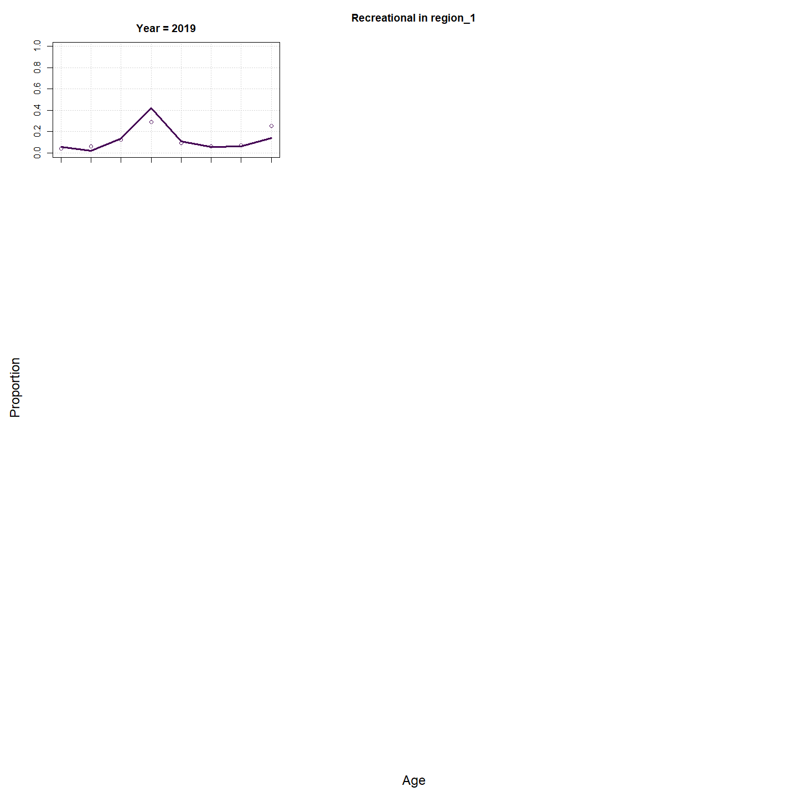
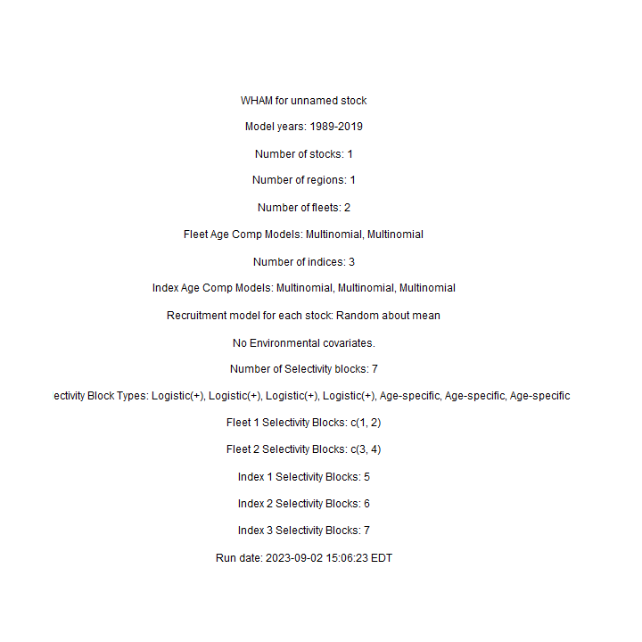
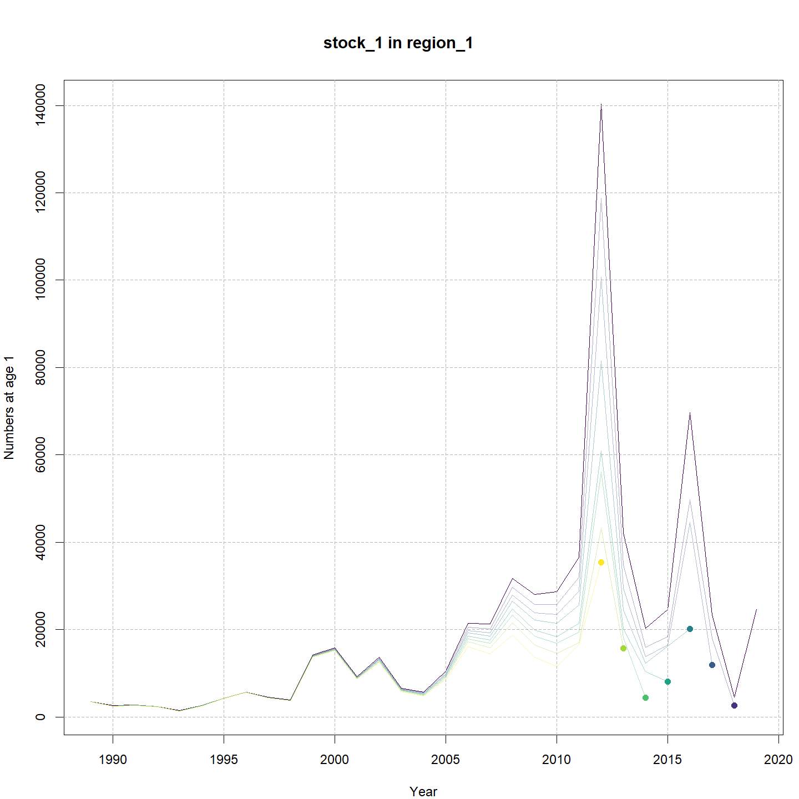

---
output:
  html_document:
    df_print: paged
    keep_md: yes
  word_document: default
  pdf_document:
    fig_caption: yes
    includes:
    keep_tex: yes
    number_sections: no
title: "WHAM figures and tables"
header-includes:
  - \usepackage{longtable}
  - \usepackage{booktabs}
  - \usepackage{caption,graphics}
  - \usepackage{makecell}
  - \usepackage{lscape}
  - \renewcommand\figurename{Fig.}
  - \captionsetup{labelsep=period, singlelinecheck=false}
  - \newcommand{\changesize}[1]{\fontsize{#1pt}{#1pt}\selectfont}
  - \renewcommand{\arraystretch}{1.5}
  - \renewcommand\theadfont{}
---

# {.tabset}

## Figures {.tabset}

### Input

### Diagnostics

### Results

### Retro

### Reference points

### Miscelaneous

## Tables {.tabset}

### Parameter estimates

<table class="table" style="margin-left: auto; margin-right: auto;">
<caption>Parameter estimates, standard errors, and confidence intervals. Rounded to 3 decimal places.</caption>
 <thead>
  <tr>
   <th style="text-align:left;">   </th>
   <th style="text-align:right;"> Estimate </th>
   <th style="text-align:right;"> Std. Error </th>
   <th style="text-align:right;"> 95\% CI lower </th>
   <th style="text-align:right;"> 95\% CI upper </th>
  </tr>
 </thead>
<tbody>
  <tr>
   <td style="text-align:left;"> NEFSC Spring Alb fully selected q </td>
   <td style="text-align:right;"> 0.040 </td>
   <td style="text-align:right;"> 0.008 </td>
   <td style="text-align:right;"> 0.027 </td>
   <td style="text-align:right;"> 0.060 </td>
  </tr>
  <tr>
   <td style="text-align:left;"> REC CPA fully selected q </td>
   <td style="text-align:right;"> 0.000 </td>
   <td style="text-align:right;"> 0.000 </td>
   <td style="text-align:right;"> 0.000 </td>
   <td style="text-align:right;"> 0.000 </td>
  </tr>
  <tr>
   <td style="text-align:left;"> Bigelow fully selected q </td>
   <td style="text-align:right;"> 0.055 </td>
   <td style="text-align:right;"> 0.013 </td>
   <td style="text-align:right;"> 0.035 </td>
   <td style="text-align:right;"> 0.088 </td>
  </tr>
  <tr>
   <td style="text-align:left;"> Block 1: $a_{50}$ </td>
   <td style="text-align:right;"> 2.028 </td>
   <td style="text-align:right;"> 0.068 </td>
   <td style="text-align:right;"> 1.899 </td>
   <td style="text-align:right;"> 2.164 </td>
  </tr>
  <tr>
   <td style="text-align:left;"> Block 1: 1/slope (increasing) </td>
   <td style="text-align:right;"> 0.325 </td>
   <td style="text-align:right;"> 0.025 </td>
   <td style="text-align:right;"> 0.280 </td>
   <td style="text-align:right;"> 0.377 </td>
  </tr>
  <tr>
   <td style="text-align:left;"> Block 2: $a_{50}$ </td>
   <td style="text-align:right;"> 2.690 </td>
   <td style="text-align:right;"> 0.104 </td>
   <td style="text-align:right;"> 2.489 </td>
   <td style="text-align:right;"> 2.898 </td>
  </tr>
  <tr>
   <td style="text-align:left;"> Block 2: 1/slope (increasing) </td>
   <td style="text-align:right;"> 0.443 </td>
   <td style="text-align:right;"> 0.033 </td>
   <td style="text-align:right;"> 0.384 </td>
   <td style="text-align:right;"> 0.512 </td>
  </tr>
  <tr>
   <td style="text-align:left;"> Block 3: $a_{50}$ </td>
   <td style="text-align:right;"> 2.800 </td>
   <td style="text-align:right;"> 0.301 </td>
   <td style="text-align:right;"> 2.242 </td>
   <td style="text-align:right;"> 3.414 </td>
  </tr>
  <tr>
   <td style="text-align:left;"> Block 3: 1/slope (increasing) </td>
   <td style="text-align:right;"> 0.828 </td>
   <td style="text-align:right;"> 0.096 </td>
   <td style="text-align:right;"> 0.657 </td>
   <td style="text-align:right;"> 1.036 </td>
  </tr>
  <tr>
   <td style="text-align:left;"> Block 4: $a_{50}$ </td>
   <td style="text-align:right;"> 3.845 </td>
   <td style="text-align:right;"> 0.359 </td>
   <td style="text-align:right;"> 3.154 </td>
   <td style="text-align:right;"> 4.546 </td>
  </tr>
  <tr>
   <td style="text-align:left;"> Block 4: 1/slope (increasing) </td>
   <td style="text-align:right;"> 0.939 </td>
   <td style="text-align:right;"> 0.099 </td>
   <td style="text-align:right;"> 0.763 </td>
   <td style="text-align:right;"> 1.150 </td>
  </tr>
  <tr>
   <td style="text-align:left;"> Block 5: Selectivity for age 1 </td>
   <td style="text-align:right;"> 0.407 </td>
   <td style="text-align:right;"> 0.088 </td>
   <td style="text-align:right;"> 0.252 </td>
   <td style="text-align:right;"> 0.584 </td>
  </tr>
  <tr>
   <td style="text-align:left;"> Block 5: Selectivity for age 2 </td>
   <td style="text-align:right;"> 0.826 </td>
   <td style="text-align:right;"> 0.177 </td>
   <td style="text-align:right;"> 0.297 </td>
   <td style="text-align:right;"> 0.982 </td>
  </tr>
  <tr>
   <td style="text-align:left;"> Block 5: Selectivity for age 3 </td>
   <td style="text-align:right;"> 1.000 </td>
   <td style="text-align:right;"> -- </td>
   <td style="text-align:right;"> -- </td>
   <td style="text-align:right;"> -- </td>
  </tr>
  <tr>
   <td style="text-align:left;"> Block 5: Selectivity for age 4 </td>
   <td style="text-align:right;"> 1.000 </td>
   <td style="text-align:right;"> -- </td>
   <td style="text-align:right;"> -- </td>
   <td style="text-align:right;"> -- </td>
  </tr>
  <tr>
   <td style="text-align:left;"> Block 5: Selectivity for age 5 </td>
   <td style="text-align:right;"> 1.000 </td>
   <td style="text-align:right;"> -- </td>
   <td style="text-align:right;"> -- </td>
   <td style="text-align:right;"> -- </td>
  </tr>
  <tr>
   <td style="text-align:left;"> Block 5: Selectivity for age 6 </td>
   <td style="text-align:right;"> 1.000 </td>
   <td style="text-align:right;"> -- </td>
   <td style="text-align:right;"> -- </td>
   <td style="text-align:right;"> -- </td>
  </tr>
  <tr>
   <td style="text-align:left;"> Block 5: Selectivity for age 7 </td>
   <td style="text-align:right;"> 1.000 </td>
   <td style="text-align:right;"> -- </td>
   <td style="text-align:right;"> -- </td>
   <td style="text-align:right;"> -- </td>
  </tr>
  <tr>
   <td style="text-align:left;"> Block 5: Selectivity for age 8+ </td>
   <td style="text-align:right;"> 1.000 </td>
   <td style="text-align:right;"> -- </td>
   <td style="text-align:right;"> -- </td>
   <td style="text-align:right;"> -- </td>
  </tr>
  <tr>
   <td style="text-align:left;"> Block 6: Selectivity for age 1 </td>
   <td style="text-align:right;"> 0.259 </td>
   <td style="text-align:right;"> 0.021 </td>
   <td style="text-align:right;"> 0.221 </td>
   <td style="text-align:right;"> 0.302 </td>
  </tr>
  <tr>
   <td style="text-align:left;"> Block 6: Selectivity for age 2 </td>
   <td style="text-align:right;"> 1.000 </td>
   <td style="text-align:right;"> -- </td>
   <td style="text-align:right;"> -- </td>
   <td style="text-align:right;"> -- </td>
  </tr>
  <tr>
   <td style="text-align:left;"> Block 6: Selectivity for age 3 </td>
   <td style="text-align:right;"> 1.000 </td>
   <td style="text-align:right;"> -- </td>
   <td style="text-align:right;"> -- </td>
   <td style="text-align:right;"> -- </td>
  </tr>
  <tr>
   <td style="text-align:left;"> Block 6: Selectivity for age 4 </td>
   <td style="text-align:right;"> 1.000 </td>
   <td style="text-align:right;"> -- </td>
   <td style="text-align:right;"> -- </td>
   <td style="text-align:right;"> -- </td>
  </tr>
  <tr>
   <td style="text-align:left;"> Block 6: Selectivity for age 5 </td>
   <td style="text-align:right;"> 1.000 </td>
   <td style="text-align:right;"> -- </td>
   <td style="text-align:right;"> -- </td>
   <td style="text-align:right;"> -- </td>
  </tr>
  <tr>
   <td style="text-align:left;"> Block 6: Selectivity for age 6 </td>
   <td style="text-align:right;"> 1.000 </td>
   <td style="text-align:right;"> -- </td>
   <td style="text-align:right;"> -- </td>
   <td style="text-align:right;"> -- </td>
  </tr>
  <tr>
   <td style="text-align:left;"> Block 6: Selectivity for age 7 </td>
   <td style="text-align:right;"> 1.000 </td>
   <td style="text-align:right;"> -- </td>
   <td style="text-align:right;"> -- </td>
   <td style="text-align:right;"> -- </td>
  </tr>
  <tr>
   <td style="text-align:left;"> Block 6: Selectivity for age 8+ </td>
   <td style="text-align:right;"> 1.000 </td>
   <td style="text-align:right;"> -- </td>
   <td style="text-align:right;"> -- </td>
   <td style="text-align:right;"> -- </td>
  </tr>
  <tr>
   <td style="text-align:left;"> Block 7: Selectivity for age 1 </td>
   <td style="text-align:right;"> 0.568 </td>
   <td style="text-align:right;"> 0.100 </td>
   <td style="text-align:right;"> 0.371 </td>
   <td style="text-align:right;"> 0.745 </td>
  </tr>
  <tr>
   <td style="text-align:left;"> Block 7: Selectivity for age 2 </td>
   <td style="text-align:right;"> 1.000 </td>
   <td style="text-align:right;"> -- </td>
   <td style="text-align:right;"> -- </td>
   <td style="text-align:right;"> -- </td>
  </tr>
  <tr>
   <td style="text-align:left;"> Block 7: Selectivity for age 3 </td>
   <td style="text-align:right;"> 1.000 </td>
   <td style="text-align:right;"> -- </td>
   <td style="text-align:right;"> -- </td>
   <td style="text-align:right;"> -- </td>
  </tr>
  <tr>
   <td style="text-align:left;"> Block 7: Selectivity for age 4 </td>
   <td style="text-align:right;"> 1.000 </td>
   <td style="text-align:right;"> -- </td>
   <td style="text-align:right;"> -- </td>
   <td style="text-align:right;"> -- </td>
  </tr>
  <tr>
   <td style="text-align:left;"> Block 7: Selectivity for age 5 </td>
   <td style="text-align:right;"> 1.000 </td>
   <td style="text-align:right;"> -- </td>
   <td style="text-align:right;"> -- </td>
   <td style="text-align:right;"> -- </td>
  </tr>
  <tr>
   <td style="text-align:left;"> Block 7: Selectivity for age 6 </td>
   <td style="text-align:right;"> 1.000 </td>
   <td style="text-align:right;"> -- </td>
   <td style="text-align:right;"> -- </td>
   <td style="text-align:right;"> -- </td>
  </tr>
  <tr>
   <td style="text-align:left;"> Block 7: Selectivity for age 7 </td>
   <td style="text-align:right;"> 1.000 </td>
   <td style="text-align:right;"> -- </td>
   <td style="text-align:right;"> -- </td>
   <td style="text-align:right;"> -- </td>
  </tr>
  <tr>
   <td style="text-align:left;"> Block 7: Selectivity for age 8+ </td>
   <td style="text-align:right;"> 1.000 </td>
   <td style="text-align:right;"> -- </td>
   <td style="text-align:right;"> -- </td>
   <td style="text-align:right;"> -- </td>
  </tr>
</tbody>
</table>

### Abundance at age

<table class="table" style="margin-left: auto; margin-right: auto;">
<caption>Abundance at age (1000s) for stock 1 in region 1.</caption>
 <thead>
  <tr>
   <th style="text-align:left;">   </th>
   <th style="text-align:right;"> 1 </th>
   <th style="text-align:right;"> 2 </th>
   <th style="text-align:right;"> 3 </th>
   <th style="text-align:right;"> 4 </th>
   <th style="text-align:right;"> 5 </th>
   <th style="text-align:right;"> 6 </th>
   <th style="text-align:right;"> 7 </th>
   <th style="text-align:right;"> 8+ </th>
  </tr>
 </thead>
<tbody>
  <tr>
   <td style="text-align:left;"> 1989 </td>
   <td style="text-align:right;"> 3569 </td>
   <td style="text-align:right;"> 2112 </td>
   <td style="text-align:right;"> 1102 </td>
   <td style="text-align:right;"> 538 </td>
   <td style="text-align:right;"> 255 </td>
   <td style="text-align:right;"> 120 </td>
   <td style="text-align:right;"> 56 </td>
   <td style="text-align:right;"> 49 </td>
  </tr>
  <tr>
   <td style="text-align:left;"> 1990 </td>
   <td style="text-align:right;"> 2593 </td>
   <td style="text-align:right;"> 2149 </td>
   <td style="text-align:right;"> 901 </td>
   <td style="text-align:right;"> 298 </td>
   <td style="text-align:right;"> 114 </td>
   <td style="text-align:right;"> 49 </td>
   <td style="text-align:right;"> 22 </td>
   <td style="text-align:right;"> 19 </td>
  </tr>
  <tr>
   <td style="text-align:left;"> 1991 </td>
   <td style="text-align:right;"> 2734 </td>
   <td style="text-align:right;"> 1605 </td>
   <td style="text-align:right;"> 906 </td>
   <td style="text-align:right;"> 239 </td>
   <td style="text-align:right;"> 67 </td>
   <td style="text-align:right;"> 24 </td>
   <td style="text-align:right;"> 10 </td>
   <td style="text-align:right;"> 8 </td>
  </tr>
  <tr>
   <td style="text-align:left;"> 1992 </td>
   <td style="text-align:right;"> 2450 </td>
   <td style="text-align:right;"> 1705 </td>
   <td style="text-align:right;"> 719 </td>
   <td style="text-align:right;"> 271 </td>
   <td style="text-align:right;"> 62 </td>
   <td style="text-align:right;"> 16 </td>
   <td style="text-align:right;"> 6 </td>
   <td style="text-align:right;"> 4 </td>
  </tr>
  <tr>
   <td style="text-align:left;"> 1993 </td>
   <td style="text-align:right;"> 1450 </td>
   <td style="text-align:right;"> 1564 </td>
   <td style="text-align:right;"> 792 </td>
   <td style="text-align:right;"> 232 </td>
   <td style="text-align:right;"> 80 </td>
   <td style="text-align:right;"> 18 </td>
   <td style="text-align:right;"> 5 </td>
   <td style="text-align:right;"> 3 </td>
  </tr>
  <tr>
   <td style="text-align:left;"> 1994 </td>
   <td style="text-align:right;"> 2609 </td>
   <td style="text-align:right;"> 903 </td>
   <td style="text-align:right;"> 721 </td>
   <td style="text-align:right;"> 250 </td>
   <td style="text-align:right;"> 63 </td>
   <td style="text-align:right;"> 20 </td>
   <td style="text-align:right;"> 4 </td>
   <td style="text-align:right;"> 2 </td>
  </tr>
  <tr>
   <td style="text-align:left;"> 1995 </td>
   <td style="text-align:right;"> 4333 </td>
   <td style="text-align:right;"> 1575 </td>
   <td style="text-align:right;"> 347 </td>
   <td style="text-align:right;"> 158 </td>
   <td style="text-align:right;"> 44 </td>
   <td style="text-align:right;"> 10 </td>
   <td style="text-align:right;"> 3 </td>
   <td style="text-align:right;"> 1 </td>
  </tr>
  <tr>
   <td style="text-align:left;"> 1996 </td>
   <td style="text-align:right;"> 5721 </td>
   <td style="text-align:right;"> 2749 </td>
   <td style="text-align:right;"> 721 </td>
   <td style="text-align:right;"> 109 </td>
   <td style="text-align:right;"> 45 </td>
   <td style="text-align:right;"> 12 </td>
   <td style="text-align:right;"> 3 </td>
   <td style="text-align:right;"> 1 </td>
  </tr>
  <tr>
   <td style="text-align:left;"> 1997 </td>
   <td style="text-align:right;"> 4528 </td>
   <td style="text-align:right;"> 3634 </td>
   <td style="text-align:right;"> 1217 </td>
   <td style="text-align:right;"> 211 </td>
   <td style="text-align:right;"> 29 </td>
   <td style="text-align:right;"> 12 </td>
   <td style="text-align:right;"> 3 </td>
   <td style="text-align:right;"> 1 </td>
  </tr>
  <tr>
   <td style="text-align:left;"> 1998 </td>
   <td style="text-align:right;"> 3881 </td>
   <td style="text-align:right;"> 2902 </td>
   <td style="text-align:right;"> 1881 </td>
   <td style="text-align:right;"> 486 </td>
   <td style="text-align:right;"> 77 </td>
   <td style="text-align:right;"> 10 </td>
   <td style="text-align:right;"> 4 </td>
   <td style="text-align:right;"> 1 </td>
  </tr>
  <tr>
   <td style="text-align:left;"> 1999 </td>
   <td style="text-align:right;"> 14169 </td>
   <td style="text-align:right;"> 2545 </td>
   <td style="text-align:right;"> 1739 </td>
   <td style="text-align:right;"> 871 </td>
   <td style="text-align:right;"> 192 </td>
   <td style="text-align:right;"> 29 </td>
   <td style="text-align:right;"> 4 </td>
   <td style="text-align:right;"> 2 </td>
  </tr>
  <tr>
   <td style="text-align:left;"> 2000 </td>
   <td style="text-align:right;"> 15884 </td>
   <td style="text-align:right;"> 9207 </td>
   <td style="text-align:right;"> 1484 </td>
   <td style="text-align:right;"> 756 </td>
   <td style="text-align:right;"> 314 </td>
   <td style="text-align:right;"> 66 </td>
   <td style="text-align:right;"> 10 </td>
   <td style="text-align:right;"> 2 </td>
  </tr>
  <tr>
   <td style="text-align:left;"> 2001 </td>
   <td style="text-align:right;"> 9304 </td>
   <td style="text-align:right;"> 10304 </td>
   <td style="text-align:right;"> 5476 </td>
   <td style="text-align:right;"> 717 </td>
   <td style="text-align:right;"> 317 </td>
   <td style="text-align:right;"> 126 </td>
   <td style="text-align:right;"> 26 </td>
   <td style="text-align:right;"> 5 </td>
  </tr>
  <tr>
   <td style="text-align:left;"> 2002 </td>
   <td style="text-align:right;"> 13709 </td>
   <td style="text-align:right;"> 6039 </td>
   <td style="text-align:right;"> 6106 </td>
   <td style="text-align:right;"> 2589 </td>
   <td style="text-align:right;"> 291 </td>
   <td style="text-align:right;"> 123 </td>
   <td style="text-align:right;"> 48 </td>
   <td style="text-align:right;"> 12 </td>
  </tr>
  <tr>
   <td style="text-align:left;"> 2003 </td>
   <td style="text-align:right;"> 6587 </td>
   <td style="text-align:right;"> 8891 </td>
   <td style="text-align:right;"> 3597 </td>
   <td style="text-align:right;"> 2976 </td>
   <td style="text-align:right;"> 1099 </td>
   <td style="text-align:right;"> 118 </td>
   <td style="text-align:right;"> 49 </td>
   <td style="text-align:right;"> 24 </td>
  </tr>
  <tr>
   <td style="text-align:left;"> 2004 </td>
   <td style="text-align:right;"> 5691 </td>
   <td style="text-align:right;"> 4304 </td>
   <td style="text-align:right;"> 5459 </td>
   <td style="text-align:right;"> 1917 </td>
   <td style="text-align:right;"> 1436 </td>
   <td style="text-align:right;"> 512 </td>
   <td style="text-align:right;"> 55 </td>
   <td style="text-align:right;"> 34 </td>
  </tr>
  <tr>
   <td style="text-align:left;"> 2005 </td>
   <td style="text-align:right;"> 10573 </td>
   <td style="text-align:right;"> 3754 </td>
   <td style="text-align:right;"> 2699 </td>
   <td style="text-align:right;"> 3002 </td>
   <td style="text-align:right;"> 968 </td>
   <td style="text-align:right;"> 709 </td>
   <td style="text-align:right;"> 251 </td>
   <td style="text-align:right;"> 43 </td>
  </tr>
  <tr>
   <td style="text-align:left;"> 2006 </td>
   <td style="text-align:right;"> 21418 </td>
   <td style="text-align:right;"> 6955 </td>
   <td style="text-align:right;"> 2354 </td>
   <td style="text-align:right;"> 1514 </td>
   <td style="text-align:right;"> 1558 </td>
   <td style="text-align:right;"> 490 </td>
   <td style="text-align:right;"> 356 </td>
   <td style="text-align:right;"> 148 </td>
  </tr>
  <tr>
   <td style="text-align:left;"> 2007 </td>
   <td style="text-align:right;"> 21298 </td>
   <td style="text-align:right;"> 14036 </td>
   <td style="text-align:right;"> 4302 </td>
   <td style="text-align:right;"> 1272 </td>
   <td style="text-align:right;"> 745 </td>
   <td style="text-align:right;"> 744 </td>
   <td style="text-align:right;"> 232 </td>
   <td style="text-align:right;"> 237 </td>
  </tr>
  <tr>
   <td style="text-align:left;"> 2008 </td>
   <td style="text-align:right;"> 31775 </td>
   <td style="text-align:right;"> 13950 </td>
   <td style="text-align:right;"> 8670 </td>
   <td style="text-align:right;"> 2318 </td>
   <td style="text-align:right;"> 624 </td>
   <td style="text-align:right;"> 354 </td>
   <td style="text-align:right;"> 350 </td>
   <td style="text-align:right;"> 220 </td>
  </tr>
  <tr>
   <td style="text-align:left;"> 2009 </td>
   <td style="text-align:right;"> 28080 </td>
   <td style="text-align:right;"> 20939 </td>
   <td style="text-align:right;"> 8850 </td>
   <td style="text-align:right;"> 5072 </td>
   <td style="text-align:right;"> 1278 </td>
   <td style="text-align:right;"> 336 </td>
   <td style="text-align:right;"> 189 </td>
   <td style="text-align:right;"> 304 </td>
  </tr>
  <tr>
   <td style="text-align:left;"> 2010 </td>
   <td style="text-align:right;"> 28712 </td>
   <td style="text-align:right;"> 18515 </td>
   <td style="text-align:right;"> 13360 </td>
   <td style="text-align:right;"> 5218 </td>
   <td style="text-align:right;"> 2712 </td>
   <td style="text-align:right;"> 631 </td>
   <td style="text-align:right;"> 159 </td>
   <td style="text-align:right;"> 227 </td>
  </tr>
  <tr>
   <td style="text-align:left;"> 2011 </td>
   <td style="text-align:right;"> 36608 </td>
   <td style="text-align:right;"> 18885 </td>
   <td style="text-align:right;"> 11737 </td>
   <td style="text-align:right;"> 7761 </td>
   <td style="text-align:right;"> 2713 </td>
   <td style="text-align:right;"> 1285 </td>
   <td style="text-align:right;"> 284 </td>
   <td style="text-align:right;"> 169 </td>
  </tr>
  <tr>
   <td style="text-align:left;"> 2012 </td>
   <td style="text-align:right;"> 140291 </td>
   <td style="text-align:right;"> 24354 </td>
   <td style="text-align:right;"> 12346 </td>
   <td style="text-align:right;"> 7337 </td>
   <td style="text-align:right;"> 4623 </td>
   <td style="text-align:right;"> 1560 </td>
   <td style="text-align:right;"> 725 </td>
   <td style="text-align:right;"> 253 </td>
  </tr>
  <tr>
   <td style="text-align:left;"> 2013 </td>
   <td style="text-align:right;"> 42122 </td>
   <td style="text-align:right;"> 92814 </td>
   <td style="text-align:right;"> 15691 </td>
   <td style="text-align:right;"> 7462 </td>
   <td style="text-align:right;"> 4101 </td>
   <td style="text-align:right;"> 2425 </td>
   <td style="text-align:right;"> 789 </td>
   <td style="text-align:right;"> 486 </td>
  </tr>
  <tr>
   <td style="text-align:left;"> 2014 </td>
   <td style="text-align:right;"> 20279 </td>
   <td style="text-align:right;"> 27980 </td>
   <td style="text-align:right;"> 60439 </td>
   <td style="text-align:right;"> 9722 </td>
   <td style="text-align:right;"> 4370 </td>
   <td style="text-align:right;"> 2300 </td>
   <td style="text-align:right;"> 1328 </td>
   <td style="text-align:right;"> 690 </td>
  </tr>
  <tr>
   <td style="text-align:left;"> 2015 </td>
   <td style="text-align:right;"> 24599 </td>
   <td style="text-align:right;"> 13466 </td>
   <td style="text-align:right;"> 18212 </td>
   <td style="text-align:right;"> 37443 </td>
   <td style="text-align:right;"> 5687 </td>
   <td style="text-align:right;"> 2444 </td>
   <td style="text-align:right;"> 1254 </td>
   <td style="text-align:right;"> 1087 </td>
  </tr>
  <tr>
   <td style="text-align:left;"> 2016 </td>
   <td style="text-align:right;"> 69731 </td>
   <td style="text-align:right;"> 16336 </td>
   <td style="text-align:right;"> 8770 </td>
   <td style="text-align:right;"> 11310 </td>
   <td style="text-align:right;"> 21973 </td>
   <td style="text-align:right;"> 3190 </td>
   <td style="text-align:right;"> 1337 </td>
   <td style="text-align:right;"> 1264 </td>
  </tr>
  <tr>
   <td style="text-align:left;"> 2017 </td>
   <td style="text-align:right;"> 23412 </td>
   <td style="text-align:right;"> 46214 </td>
   <td style="text-align:right;"> 10564 </td>
   <td style="text-align:right;"> 5336 </td>
   <td style="text-align:right;"> 6417 </td>
   <td style="text-align:right;"> 11809 </td>
   <td style="text-align:right;"> 1663 </td>
   <td style="text-align:right;"> 1335 </td>
  </tr>
  <tr>
   <td style="text-align:left;"> 2018 </td>
   <td style="text-align:right;"> 4537 </td>
   <td style="text-align:right;"> 15478 </td>
   <td style="text-align:right;"> 29490 </td>
   <td style="text-align:right;"> 6136 </td>
   <td style="text-align:right;"> 2825 </td>
   <td style="text-align:right;"> 3190 </td>
   <td style="text-align:right;"> 5673 </td>
   <td style="text-align:right;"> 1416 </td>
  </tr>
  <tr>
   <td style="text-align:left;"> 2019 </td>
   <td style="text-align:right;"> 24677 </td>
   <td style="text-align:right;"> 3003 </td>
   <td style="text-align:right;"> 9913 </td>
   <td style="text-align:right;"> 17293 </td>
   <td style="text-align:right;"> 3303 </td>
   <td style="text-align:right;"> 1437 </td>
   <td style="text-align:right;"> 1573 </td>
   <td style="text-align:right;"> 3448 </td>
  </tr>
</tbody>
</table>

### Fishing mortality at age by region

<table class="table" style="margin-left: auto; margin-right: auto;">
<caption>Total fishing mortality at age in region 1.</caption>
 <thead>
  <tr>
   <th style="text-align:left;">   </th>
   <th style="text-align:right;"> 1 </th>
   <th style="text-align:right;"> 2 </th>
   <th style="text-align:right;"> 3 </th>
   <th style="text-align:right;"> 4 </th>
   <th style="text-align:right;"> 5 </th>
   <th style="text-align:right;"> 6 </th>
   <th style="text-align:right;"> 7 </th>
   <th style="text-align:right;"> 8+ </th>
  </tr>
 </thead>
<tbody>
  <tr>
   <td style="text-align:left;"> 1989 </td>
   <td style="text-align:right;"> 0.018 </td>
   <td style="text-align:right;"> 0.210 </td>
   <td style="text-align:right;"> 0.419 </td>
   <td style="text-align:right;"> 0.439 </td>
   <td style="text-align:right;"> 0.440 </td>
   <td style="text-align:right;"> 0.440 </td>
   <td style="text-align:right;"> 0.440 </td>
   <td style="text-align:right;"> 0.440 </td>
  </tr>
  <tr>
   <td style="text-align:left;"> 1990 </td>
   <td style="text-align:right;"> 0.027 </td>
   <td style="text-align:right;"> 0.322 </td>
   <td style="text-align:right;"> 0.642 </td>
   <td style="text-align:right;"> 0.673 </td>
   <td style="text-align:right;"> 0.674 </td>
   <td style="text-align:right;"> 0.674 </td>
   <td style="text-align:right;"> 0.674 </td>
   <td style="text-align:right;"> 0.674 </td>
  </tr>
  <tr>
   <td style="text-align:left;"> 1991 </td>
   <td style="text-align:right;"> 0.023 </td>
   <td style="text-align:right;"> 0.271 </td>
   <td style="text-align:right;"> 0.540 </td>
   <td style="text-align:right;"> 0.566 </td>
   <td style="text-align:right;"> 0.567 </td>
   <td style="text-align:right;"> 0.567 </td>
   <td style="text-align:right;"> 0.567 </td>
   <td style="text-align:right;"> 0.567 </td>
  </tr>
  <tr>
   <td style="text-align:left;"> 1992 </td>
   <td style="text-align:right;"> 0.026 </td>
   <td style="text-align:right;"> 0.306 </td>
   <td style="text-align:right;"> 0.610 </td>
   <td style="text-align:right;"> 0.639 </td>
   <td style="text-align:right;"> 0.640 </td>
   <td style="text-align:right;"> 0.640 </td>
   <td style="text-align:right;"> 0.640 </td>
   <td style="text-align:right;"> 0.640 </td>
  </tr>
  <tr>
   <td style="text-align:left;"> 1993 </td>
   <td style="text-align:right;"> 0.020 </td>
   <td style="text-align:right;"> 0.232 </td>
   <td style="text-align:right;"> 0.461 </td>
   <td style="text-align:right;"> 0.483 </td>
   <td style="text-align:right;"> 0.484 </td>
   <td style="text-align:right;"> 0.484 </td>
   <td style="text-align:right;"> 0.484 </td>
   <td style="text-align:right;"> 0.484 </td>
  </tr>
  <tr>
   <td style="text-align:left;"> 1994 </td>
   <td style="text-align:right;"> 0.030 </td>
   <td style="text-align:right;"> 0.356 </td>
   <td style="text-align:right;"> 0.709 </td>
   <td style="text-align:right;"> 0.743 </td>
   <td style="text-align:right;"> 0.745 </td>
   <td style="text-align:right;"> 0.745 </td>
   <td style="text-align:right;"> 0.745 </td>
   <td style="text-align:right;"> 0.745 </td>
  </tr>
  <tr>
   <td style="text-align:left;"> 1995 </td>
   <td style="text-align:right;"> 0.026 </td>
   <td style="text-align:right;"> 0.302 </td>
   <td style="text-align:right;"> 0.601 </td>
   <td style="text-align:right;"> 0.629 </td>
   <td style="text-align:right;"> 0.631 </td>
   <td style="text-align:right;"> 0.631 </td>
   <td style="text-align:right;"> 0.631 </td>
   <td style="text-align:right;"> 0.631 </td>
  </tr>
  <tr>
   <td style="text-align:left;"> 1996 </td>
   <td style="text-align:right;"> 0.030 </td>
   <td style="text-align:right;"> 0.349 </td>
   <td style="text-align:right;"> 0.695 </td>
   <td style="text-align:right;"> 0.728 </td>
   <td style="text-align:right;"> 0.730 </td>
   <td style="text-align:right;"> 0.730 </td>
   <td style="text-align:right;"> 0.730 </td>
   <td style="text-align:right;"> 0.730 </td>
  </tr>
  <tr>
   <td style="text-align:left;"> 1997 </td>
   <td style="text-align:right;"> 0.015 </td>
   <td style="text-align:right;"> 0.178 </td>
   <td style="text-align:right;"> 0.355 </td>
   <td style="text-align:right;"> 0.372 </td>
   <td style="text-align:right;"> 0.373 </td>
   <td style="text-align:right;"> 0.373 </td>
   <td style="text-align:right;"> 0.373 </td>
   <td style="text-align:right;"> 0.373 </td>
  </tr>
  <tr>
   <td style="text-align:left;"> 1998 </td>
   <td style="text-align:right;"> 0.010 </td>
   <td style="text-align:right;"> 0.079 </td>
   <td style="text-align:right;"> 0.303 </td>
   <td style="text-align:right;"> 0.431 </td>
   <td style="text-align:right;"> 0.451 </td>
   <td style="text-align:right;"> 0.453 </td>
   <td style="text-align:right;"> 0.453 </td>
   <td style="text-align:right;"> 0.453 </td>
  </tr>
  <tr>
   <td style="text-align:left;"> 1999 </td>
   <td style="text-align:right;"> 0.010 </td>
   <td style="text-align:right;"> 0.083 </td>
   <td style="text-align:right;"> 0.319 </td>
   <td style="text-align:right;"> 0.454 </td>
   <td style="text-align:right;"> 0.475 </td>
   <td style="text-align:right;"> 0.478 </td>
   <td style="text-align:right;"> 0.478 </td>
   <td style="text-align:right;"> 0.478 </td>
  </tr>
  <tr>
   <td style="text-align:left;"> 2000 </td>
   <td style="text-align:right;"> 0.006 </td>
   <td style="text-align:right;"> 0.047 </td>
   <td style="text-align:right;"> 0.180 </td>
   <td style="text-align:right;"> 0.256 </td>
   <td style="text-align:right;"> 0.267 </td>
   <td style="text-align:right;"> 0.269 </td>
   <td style="text-align:right;"> 0.269 </td>
   <td style="text-align:right;"> 0.269 </td>
  </tr>
  <tr>
   <td style="text-align:left;"> 2001 </td>
   <td style="text-align:right;"> 0.007 </td>
   <td style="text-align:right;"> 0.055 </td>
   <td style="text-align:right;"> 0.210 </td>
   <td style="text-align:right;"> 0.298 </td>
   <td style="text-align:right;"> 0.312 </td>
   <td style="text-align:right;"> 0.313 </td>
   <td style="text-align:right;"> 0.314 </td>
   <td style="text-align:right;"> 0.314 </td>
  </tr>
  <tr>
   <td style="text-align:left;"> 2002 </td>
   <td style="text-align:right;"> 0.005 </td>
   <td style="text-align:right;"> 0.044 </td>
   <td style="text-align:right;"> 0.167 </td>
   <td style="text-align:right;"> 0.237 </td>
   <td style="text-align:right;"> 0.248 </td>
   <td style="text-align:right;"> 0.249 </td>
   <td style="text-align:right;"> 0.250 </td>
   <td style="text-align:right;"> 0.250 </td>
  </tr>
  <tr>
   <td style="text-align:left;"> 2003 </td>
   <td style="text-align:right;"> 0.004 </td>
   <td style="text-align:right;"> 0.028 </td>
   <td style="text-align:right;"> 0.108 </td>
   <td style="text-align:right;"> 0.154 </td>
   <td style="text-align:right;"> 0.161 </td>
   <td style="text-align:right;"> 0.162 </td>
   <td style="text-align:right;"> 0.162 </td>
   <td style="text-align:right;"> 0.162 </td>
  </tr>
  <tr>
   <td style="text-align:left;"> 2004 </td>
   <td style="text-align:right;"> 0.004 </td>
   <td style="text-align:right;"> 0.035 </td>
   <td style="text-align:right;"> 0.133 </td>
   <td style="text-align:right;"> 0.189 </td>
   <td style="text-align:right;"> 0.198 </td>
   <td style="text-align:right;"> 0.199 </td>
   <td style="text-align:right;"> 0.199 </td>
   <td style="text-align:right;"> 0.199 </td>
  </tr>
  <tr>
   <td style="text-align:left;"> 2005 </td>
   <td style="text-align:right;"> 0.003 </td>
   <td style="text-align:right;"> 0.024 </td>
   <td style="text-align:right;"> 0.091 </td>
   <td style="text-align:right;"> 0.130 </td>
   <td style="text-align:right;"> 0.136 </td>
   <td style="text-align:right;"> 0.137 </td>
   <td style="text-align:right;"> 0.137 </td>
   <td style="text-align:right;"> 0.137 </td>
  </tr>
  <tr>
   <td style="text-align:left;"> 2006 </td>
   <td style="text-align:right;"> 0.004 </td>
   <td style="text-align:right;"> 0.029 </td>
   <td style="text-align:right;"> 0.111 </td>
   <td style="text-align:right;"> 0.158 </td>
   <td style="text-align:right;"> 0.165 </td>
   <td style="text-align:right;"> 0.166 </td>
   <td style="text-align:right;"> 0.166 </td>
   <td style="text-align:right;"> 0.166 </td>
  </tr>
  <tr>
   <td style="text-align:left;"> 2007 </td>
   <td style="text-align:right;"> 0.004 </td>
   <td style="text-align:right;"> 0.029 </td>
   <td style="text-align:right;"> 0.111 </td>
   <td style="text-align:right;"> 0.158 </td>
   <td style="text-align:right;"> 0.165 </td>
   <td style="text-align:right;"> 0.166 </td>
   <td style="text-align:right;"> 0.166 </td>
   <td style="text-align:right;"> 0.166 </td>
  </tr>
  <tr>
   <td style="text-align:left;"> 2008 </td>
   <td style="text-align:right;"> 0.002 </td>
   <td style="text-align:right;"> 0.013 </td>
   <td style="text-align:right;"> 0.052 </td>
   <td style="text-align:right;"> 0.074 </td>
   <td style="text-align:right;"> 0.077 </td>
   <td style="text-align:right;"> 0.077 </td>
   <td style="text-align:right;"> 0.077 </td>
   <td style="text-align:right;"> 0.077 </td>
  </tr>
  <tr>
   <td style="text-align:left;"> 2009 </td>
   <td style="text-align:right;"> 0.001 </td>
   <td style="text-align:right;"> 0.008 </td>
   <td style="text-align:right;"> 0.031 </td>
   <td style="text-align:right;"> 0.045 </td>
   <td style="text-align:right;"> 0.047 </td>
   <td style="text-align:right;"> 0.047 </td>
   <td style="text-align:right;"> 0.047 </td>
   <td style="text-align:right;"> 0.047 </td>
  </tr>
  <tr>
   <td style="text-align:left;"> 2010 </td>
   <td style="text-align:right;"> 0.001 </td>
   <td style="text-align:right;"> 0.008 </td>
   <td style="text-align:right;"> 0.031 </td>
   <td style="text-align:right;"> 0.044 </td>
   <td style="text-align:right;"> 0.046 </td>
   <td style="text-align:right;"> 0.046 </td>
   <td style="text-align:right;"> 0.046 </td>
   <td style="text-align:right;"> 0.046 </td>
  </tr>
  <tr>
   <td style="text-align:left;"> 2011 </td>
   <td style="text-align:right;"> 0.001 </td>
   <td style="text-align:right;"> 0.007 </td>
   <td style="text-align:right;"> 0.028 </td>
   <td style="text-align:right;"> 0.040 </td>
   <td style="text-align:right;"> 0.042 </td>
   <td style="text-align:right;"> 0.042 </td>
   <td style="text-align:right;"> 0.042 </td>
   <td style="text-align:right;"> 0.042 </td>
  </tr>
  <tr>
   <td style="text-align:left;"> 2012 </td>
   <td style="text-align:right;"> 0.001 </td>
   <td style="text-align:right;"> 0.007 </td>
   <td style="text-align:right;"> 0.027 </td>
   <td style="text-align:right;"> 0.038 </td>
   <td style="text-align:right;"> 0.040 </td>
   <td style="text-align:right;"> 0.040 </td>
   <td style="text-align:right;"> 0.040 </td>
   <td style="text-align:right;"> 0.040 </td>
  </tr>
  <tr>
   <td style="text-align:left;"> 2013 </td>
   <td style="text-align:right;"> 0.001 </td>
   <td style="text-align:right;"> 0.007 </td>
   <td style="text-align:right;"> 0.027 </td>
   <td style="text-align:right;"> 0.039 </td>
   <td style="text-align:right;"> 0.041 </td>
   <td style="text-align:right;"> 0.041 </td>
   <td style="text-align:right;"> 0.041 </td>
   <td style="text-align:right;"> 0.041 </td>
  </tr>
  <tr>
   <td style="text-align:left;"> 2014 </td>
   <td style="text-align:right;"> 0.001 </td>
   <td style="text-align:right;"> 0.007 </td>
   <td style="text-align:right;"> 0.025 </td>
   <td style="text-align:right;"> 0.036 </td>
   <td style="text-align:right;"> 0.037 </td>
   <td style="text-align:right;"> 0.037 </td>
   <td style="text-align:right;"> 0.037 </td>
   <td style="text-align:right;"> 0.037 </td>
  </tr>
  <tr>
   <td style="text-align:left;"> 2015 </td>
   <td style="text-align:right;"> 0.001 </td>
   <td style="text-align:right;"> 0.006 </td>
   <td style="text-align:right;"> 0.022 </td>
   <td style="text-align:right;"> 0.032 </td>
   <td style="text-align:right;"> 0.033 </td>
   <td style="text-align:right;"> 0.033 </td>
   <td style="text-align:right;"> 0.033 </td>
   <td style="text-align:right;"> 0.033 </td>
  </tr>
  <tr>
   <td style="text-align:left;"> 2016 </td>
   <td style="text-align:right;"> 0.001 </td>
   <td style="text-align:right;"> 0.008 </td>
   <td style="text-align:right;"> 0.032 </td>
   <td style="text-align:right;"> 0.046 </td>
   <td style="text-align:right;"> 0.048 </td>
   <td style="text-align:right;"> 0.048 </td>
   <td style="text-align:right;"> 0.048 </td>
   <td style="text-align:right;"> 0.048 </td>
  </tr>
  <tr>
   <td style="text-align:left;"> 2017 </td>
   <td style="text-align:right;"> 0.002 </td>
   <td style="text-align:right;"> 0.019 </td>
   <td style="text-align:right;"> 0.071 </td>
   <td style="text-align:right;"> 0.101 </td>
   <td style="text-align:right;"> 0.106 </td>
   <td style="text-align:right;"> 0.106 </td>
   <td style="text-align:right;"> 0.106 </td>
   <td style="text-align:right;"> 0.106 </td>
  </tr>
  <tr>
   <td style="text-align:left;"> 2018 </td>
   <td style="text-align:right;"> 0.002 </td>
   <td style="text-align:right;"> 0.018 </td>
   <td style="text-align:right;"> 0.069 </td>
   <td style="text-align:right;"> 0.098 </td>
   <td style="text-align:right;"> 0.103 </td>
   <td style="text-align:right;"> 0.103 </td>
   <td style="text-align:right;"> 0.103 </td>
   <td style="text-align:right;"> 0.103 </td>
  </tr>
  <tr>
   <td style="text-align:left;"> 2019 </td>
   <td style="text-align:right;"> 0.003 </td>
   <td style="text-align:right;"> 0.026 </td>
   <td style="text-align:right;"> 0.099 </td>
   <td style="text-align:right;"> 0.140 </td>
   <td style="text-align:right;"> 0.147 </td>
   <td style="text-align:right;"> 0.148 </td>
   <td style="text-align:right;"> 0.148 </td>
   <td style="text-align:right;"> 0.148 </td>
  </tr>
</tbody>
</table>

### Fishing mortality at age by fleet

<table class="table" style="margin-left: auto; margin-right: auto;">
<caption>Total fishing mortality at age in Commercial.</caption>
 <thead>
  <tr>
   <th style="text-align:left;">   </th>
   <th style="text-align:right;"> 1 </th>
   <th style="text-align:right;"> 2 </th>
   <th style="text-align:right;"> 3 </th>
   <th style="text-align:right;"> 4 </th>
   <th style="text-align:right;"> 5 </th>
   <th style="text-align:right;"> 6 </th>
   <th style="text-align:right;"> 7 </th>
   <th style="text-align:right;"> 8+ </th>
  </tr>
 </thead>
<tbody>
  <tr>
   <td style="text-align:left;"> 1989 </td>
   <td style="text-align:right;"> 0.018 </td>
   <td style="text-align:right;"> 0.210 </td>
   <td style="text-align:right;"> 0.419 </td>
   <td style="text-align:right;"> 0.439 </td>
   <td style="text-align:right;"> 0.440 </td>
   <td style="text-align:right;"> 0.440 </td>
   <td style="text-align:right;"> 0.440 </td>
   <td style="text-align:right;"> 0.440 </td>
  </tr>
  <tr>
   <td style="text-align:left;"> 1990 </td>
   <td style="text-align:right;"> 0.027 </td>
   <td style="text-align:right;"> 0.322 </td>
   <td style="text-align:right;"> 0.642 </td>
   <td style="text-align:right;"> 0.673 </td>
   <td style="text-align:right;"> 0.674 </td>
   <td style="text-align:right;"> 0.674 </td>
   <td style="text-align:right;"> 0.674 </td>
   <td style="text-align:right;"> 0.674 </td>
  </tr>
  <tr>
   <td style="text-align:left;"> 1991 </td>
   <td style="text-align:right;"> 0.023 </td>
   <td style="text-align:right;"> 0.271 </td>
   <td style="text-align:right;"> 0.540 </td>
   <td style="text-align:right;"> 0.566 </td>
   <td style="text-align:right;"> 0.567 </td>
   <td style="text-align:right;"> 0.567 </td>
   <td style="text-align:right;"> 0.567 </td>
   <td style="text-align:right;"> 0.567 </td>
  </tr>
  <tr>
   <td style="text-align:left;"> 1992 </td>
   <td style="text-align:right;"> 0.026 </td>
   <td style="text-align:right;"> 0.306 </td>
   <td style="text-align:right;"> 0.610 </td>
   <td style="text-align:right;"> 0.639 </td>
   <td style="text-align:right;"> 0.640 </td>
   <td style="text-align:right;"> 0.640 </td>
   <td style="text-align:right;"> 0.640 </td>
   <td style="text-align:right;"> 0.640 </td>
  </tr>
  <tr>
   <td style="text-align:left;"> 1993 </td>
   <td style="text-align:right;"> 0.020 </td>
   <td style="text-align:right;"> 0.232 </td>
   <td style="text-align:right;"> 0.461 </td>
   <td style="text-align:right;"> 0.483 </td>
   <td style="text-align:right;"> 0.484 </td>
   <td style="text-align:right;"> 0.484 </td>
   <td style="text-align:right;"> 0.484 </td>
   <td style="text-align:right;"> 0.484 </td>
  </tr>
  <tr>
   <td style="text-align:left;"> 1994 </td>
   <td style="text-align:right;"> 0.030 </td>
   <td style="text-align:right;"> 0.356 </td>
   <td style="text-align:right;"> 0.709 </td>
   <td style="text-align:right;"> 0.743 </td>
   <td style="text-align:right;"> 0.745 </td>
   <td style="text-align:right;"> 0.745 </td>
   <td style="text-align:right;"> 0.745 </td>
   <td style="text-align:right;"> 0.745 </td>
  </tr>
  <tr>
   <td style="text-align:left;"> 1995 </td>
   <td style="text-align:right;"> 0.026 </td>
   <td style="text-align:right;"> 0.302 </td>
   <td style="text-align:right;"> 0.601 </td>
   <td style="text-align:right;"> 0.629 </td>
   <td style="text-align:right;"> 0.631 </td>
   <td style="text-align:right;"> 0.631 </td>
   <td style="text-align:right;"> 0.631 </td>
   <td style="text-align:right;"> 0.631 </td>
  </tr>
  <tr>
   <td style="text-align:left;"> 1996 </td>
   <td style="text-align:right;"> 0.030 </td>
   <td style="text-align:right;"> 0.349 </td>
   <td style="text-align:right;"> 0.695 </td>
   <td style="text-align:right;"> 0.728 </td>
   <td style="text-align:right;"> 0.730 </td>
   <td style="text-align:right;"> 0.730 </td>
   <td style="text-align:right;"> 0.730 </td>
   <td style="text-align:right;"> 0.730 </td>
  </tr>
  <tr>
   <td style="text-align:left;"> 1997 </td>
   <td style="text-align:right;"> 0.015 </td>
   <td style="text-align:right;"> 0.178 </td>
   <td style="text-align:right;"> 0.355 </td>
   <td style="text-align:right;"> 0.372 </td>
   <td style="text-align:right;"> 0.373 </td>
   <td style="text-align:right;"> 0.373 </td>
   <td style="text-align:right;"> 0.373 </td>
   <td style="text-align:right;"> 0.373 </td>
  </tr>
  <tr>
   <td style="text-align:left;"> 1998 </td>
   <td style="text-align:right;"> 0.010 </td>
   <td style="text-align:right;"> 0.079 </td>
   <td style="text-align:right;"> 0.303 </td>
   <td style="text-align:right;"> 0.431 </td>
   <td style="text-align:right;"> 0.451 </td>
   <td style="text-align:right;"> 0.453 </td>
   <td style="text-align:right;"> 0.453 </td>
   <td style="text-align:right;"> 0.453 </td>
  </tr>
  <tr>
   <td style="text-align:left;"> 1999 </td>
   <td style="text-align:right;"> 0.010 </td>
   <td style="text-align:right;"> 0.083 </td>
   <td style="text-align:right;"> 0.319 </td>
   <td style="text-align:right;"> 0.454 </td>
   <td style="text-align:right;"> 0.475 </td>
   <td style="text-align:right;"> 0.478 </td>
   <td style="text-align:right;"> 0.478 </td>
   <td style="text-align:right;"> 0.478 </td>
  </tr>
  <tr>
   <td style="text-align:left;"> 2000 </td>
   <td style="text-align:right;"> 0.006 </td>
   <td style="text-align:right;"> 0.047 </td>
   <td style="text-align:right;"> 0.180 </td>
   <td style="text-align:right;"> 0.256 </td>
   <td style="text-align:right;"> 0.267 </td>
   <td style="text-align:right;"> 0.269 </td>
   <td style="text-align:right;"> 0.269 </td>
   <td style="text-align:right;"> 0.269 </td>
  </tr>
  <tr>
   <td style="text-align:left;"> 2001 </td>
   <td style="text-align:right;"> 0.007 </td>
   <td style="text-align:right;"> 0.055 </td>
   <td style="text-align:right;"> 0.210 </td>
   <td style="text-align:right;"> 0.298 </td>
   <td style="text-align:right;"> 0.312 </td>
   <td style="text-align:right;"> 0.313 </td>
   <td style="text-align:right;"> 0.314 </td>
   <td style="text-align:right;"> 0.314 </td>
  </tr>
  <tr>
   <td style="text-align:left;"> 2002 </td>
   <td style="text-align:right;"> 0.005 </td>
   <td style="text-align:right;"> 0.044 </td>
   <td style="text-align:right;"> 0.167 </td>
   <td style="text-align:right;"> 0.237 </td>
   <td style="text-align:right;"> 0.248 </td>
   <td style="text-align:right;"> 0.249 </td>
   <td style="text-align:right;"> 0.250 </td>
   <td style="text-align:right;"> 0.250 </td>
  </tr>
  <tr>
   <td style="text-align:left;"> 2003 </td>
   <td style="text-align:right;"> 0.004 </td>
   <td style="text-align:right;"> 0.028 </td>
   <td style="text-align:right;"> 0.108 </td>
   <td style="text-align:right;"> 0.154 </td>
   <td style="text-align:right;"> 0.161 </td>
   <td style="text-align:right;"> 0.162 </td>
   <td style="text-align:right;"> 0.162 </td>
   <td style="text-align:right;"> 0.162 </td>
  </tr>
  <tr>
   <td style="text-align:left;"> 2004 </td>
   <td style="text-align:right;"> 0.004 </td>
   <td style="text-align:right;"> 0.035 </td>
   <td style="text-align:right;"> 0.133 </td>
   <td style="text-align:right;"> 0.189 </td>
   <td style="text-align:right;"> 0.198 </td>
   <td style="text-align:right;"> 0.199 </td>
   <td style="text-align:right;"> 0.199 </td>
   <td style="text-align:right;"> 0.199 </td>
  </tr>
  <tr>
   <td style="text-align:left;"> 2005 </td>
   <td style="text-align:right;"> 0.003 </td>
   <td style="text-align:right;"> 0.024 </td>
   <td style="text-align:right;"> 0.091 </td>
   <td style="text-align:right;"> 0.130 </td>
   <td style="text-align:right;"> 0.136 </td>
   <td style="text-align:right;"> 0.137 </td>
   <td style="text-align:right;"> 0.137 </td>
   <td style="text-align:right;"> 0.137 </td>
  </tr>
  <tr>
   <td style="text-align:left;"> 2006 </td>
   <td style="text-align:right;"> 0.004 </td>
   <td style="text-align:right;"> 0.029 </td>
   <td style="text-align:right;"> 0.111 </td>
   <td style="text-align:right;"> 0.158 </td>
   <td style="text-align:right;"> 0.165 </td>
   <td style="text-align:right;"> 0.166 </td>
   <td style="text-align:right;"> 0.166 </td>
   <td style="text-align:right;"> 0.166 </td>
  </tr>
  <tr>
   <td style="text-align:left;"> 2007 </td>
   <td style="text-align:right;"> 0.004 </td>
   <td style="text-align:right;"> 0.029 </td>
   <td style="text-align:right;"> 0.111 </td>
   <td style="text-align:right;"> 0.158 </td>
   <td style="text-align:right;"> 0.165 </td>
   <td style="text-align:right;"> 0.166 </td>
   <td style="text-align:right;"> 0.166 </td>
   <td style="text-align:right;"> 0.166 </td>
  </tr>
  <tr>
   <td style="text-align:left;"> 2008 </td>
   <td style="text-align:right;"> 0.002 </td>
   <td style="text-align:right;"> 0.013 </td>
   <td style="text-align:right;"> 0.052 </td>
   <td style="text-align:right;"> 0.074 </td>
   <td style="text-align:right;"> 0.077 </td>
   <td style="text-align:right;"> 0.077 </td>
   <td style="text-align:right;"> 0.077 </td>
   <td style="text-align:right;"> 0.077 </td>
  </tr>
  <tr>
   <td style="text-align:left;"> 2009 </td>
   <td style="text-align:right;"> 0.001 </td>
   <td style="text-align:right;"> 0.008 </td>
   <td style="text-align:right;"> 0.031 </td>
   <td style="text-align:right;"> 0.045 </td>
   <td style="text-align:right;"> 0.047 </td>
   <td style="text-align:right;"> 0.047 </td>
   <td style="text-align:right;"> 0.047 </td>
   <td style="text-align:right;"> 0.047 </td>
  </tr>
  <tr>
   <td style="text-align:left;"> 2010 </td>
   <td style="text-align:right;"> 0.001 </td>
   <td style="text-align:right;"> 0.008 </td>
   <td style="text-align:right;"> 0.031 </td>
   <td style="text-align:right;"> 0.044 </td>
   <td style="text-align:right;"> 0.046 </td>
   <td style="text-align:right;"> 0.046 </td>
   <td style="text-align:right;"> 0.046 </td>
   <td style="text-align:right;"> 0.046 </td>
  </tr>
  <tr>
   <td style="text-align:left;"> 2011 </td>
   <td style="text-align:right;"> 0.001 </td>
   <td style="text-align:right;"> 0.007 </td>
   <td style="text-align:right;"> 0.028 </td>
   <td style="text-align:right;"> 0.040 </td>
   <td style="text-align:right;"> 0.042 </td>
   <td style="text-align:right;"> 0.042 </td>
   <td style="text-align:right;"> 0.042 </td>
   <td style="text-align:right;"> 0.042 </td>
  </tr>
  <tr>
   <td style="text-align:left;"> 2012 </td>
   <td style="text-align:right;"> 0.001 </td>
   <td style="text-align:right;"> 0.007 </td>
   <td style="text-align:right;"> 0.027 </td>
   <td style="text-align:right;"> 0.038 </td>
   <td style="text-align:right;"> 0.040 </td>
   <td style="text-align:right;"> 0.040 </td>
   <td style="text-align:right;"> 0.040 </td>
   <td style="text-align:right;"> 0.040 </td>
  </tr>
  <tr>
   <td style="text-align:left;"> 2013 </td>
   <td style="text-align:right;"> 0.001 </td>
   <td style="text-align:right;"> 0.007 </td>
   <td style="text-align:right;"> 0.027 </td>
   <td style="text-align:right;"> 0.039 </td>
   <td style="text-align:right;"> 0.041 </td>
   <td style="text-align:right;"> 0.041 </td>
   <td style="text-align:right;"> 0.041 </td>
   <td style="text-align:right;"> 0.041 </td>
  </tr>
  <tr>
   <td style="text-align:left;"> 2014 </td>
   <td style="text-align:right;"> 0.001 </td>
   <td style="text-align:right;"> 0.007 </td>
   <td style="text-align:right;"> 0.025 </td>
   <td style="text-align:right;"> 0.036 </td>
   <td style="text-align:right;"> 0.037 </td>
   <td style="text-align:right;"> 0.037 </td>
   <td style="text-align:right;"> 0.037 </td>
   <td style="text-align:right;"> 0.037 </td>
  </tr>
  <tr>
   <td style="text-align:left;"> 2015 </td>
   <td style="text-align:right;"> 0.001 </td>
   <td style="text-align:right;"> 0.006 </td>
   <td style="text-align:right;"> 0.022 </td>
   <td style="text-align:right;"> 0.032 </td>
   <td style="text-align:right;"> 0.033 </td>
   <td style="text-align:right;"> 0.033 </td>
   <td style="text-align:right;"> 0.033 </td>
   <td style="text-align:right;"> 0.033 </td>
  </tr>
  <tr>
   <td style="text-align:left;"> 2016 </td>
   <td style="text-align:right;"> 0.001 </td>
   <td style="text-align:right;"> 0.008 </td>
   <td style="text-align:right;"> 0.032 </td>
   <td style="text-align:right;"> 0.046 </td>
   <td style="text-align:right;"> 0.048 </td>
   <td style="text-align:right;"> 0.048 </td>
   <td style="text-align:right;"> 0.048 </td>
   <td style="text-align:right;"> 0.048 </td>
  </tr>
  <tr>
   <td style="text-align:left;"> 2017 </td>
   <td style="text-align:right;"> 0.002 </td>
   <td style="text-align:right;"> 0.019 </td>
   <td style="text-align:right;"> 0.071 </td>
   <td style="text-align:right;"> 0.101 </td>
   <td style="text-align:right;"> 0.106 </td>
   <td style="text-align:right;"> 0.106 </td>
   <td style="text-align:right;"> 0.106 </td>
   <td style="text-align:right;"> 0.106 </td>
  </tr>
  <tr>
   <td style="text-align:left;"> 2018 </td>
   <td style="text-align:right;"> 0.002 </td>
   <td style="text-align:right;"> 0.018 </td>
   <td style="text-align:right;"> 0.069 </td>
   <td style="text-align:right;"> 0.098 </td>
   <td style="text-align:right;"> 0.103 </td>
   <td style="text-align:right;"> 0.103 </td>
   <td style="text-align:right;"> 0.103 </td>
   <td style="text-align:right;"> 0.103 </td>
  </tr>
  <tr>
   <td style="text-align:left;"> 2019 </td>
   <td style="text-align:right;"> 0.003 </td>
   <td style="text-align:right;"> 0.026 </td>
   <td style="text-align:right;"> 0.099 </td>
   <td style="text-align:right;"> 0.140 </td>
   <td style="text-align:right;"> 0.147 </td>
   <td style="text-align:right;"> 0.148 </td>
   <td style="text-align:right;"> 0.148 </td>
   <td style="text-align:right;"> 0.148 </td>
  </tr>
</tbody>
</table>

<table class="table" style="margin-left: auto; margin-right: auto;">
<caption>Total fishing mortality at age in Recreational.</caption>
 <thead>
  <tr>
   <th style="text-align:left;">   </th>
   <th style="text-align:right;"> 1 </th>
   <th style="text-align:right;"> 2 </th>
   <th style="text-align:right;"> 3 </th>
   <th style="text-align:right;"> 4 </th>
   <th style="text-align:right;"> 5 </th>
   <th style="text-align:right;"> 6 </th>
   <th style="text-align:right;"> 7 </th>
   <th style="text-align:right;"> 8+ </th>
  </tr>
 </thead>
<tbody>
  <tr>
   <td style="text-align:left;"> 1989 </td>
   <td style="text-align:right;"> 0.089 </td>
   <td style="text-align:right;"> 0.241 </td>
   <td style="text-align:right;"> 0.490 </td>
   <td style="text-align:right;"> 0.709 </td>
   <td style="text-align:right;"> 0.818 </td>
   <td style="text-align:right;"> 0.858 </td>
   <td style="text-align:right;"> 0.870 </td>
   <td style="text-align:right;"> 0.874 </td>
  </tr>
  <tr>
   <td style="text-align:left;"> 1990 </td>
   <td style="text-align:right;"> 0.052 </td>
   <td style="text-align:right;"> 0.141 </td>
   <td style="text-align:right;"> 0.286 </td>
   <td style="text-align:right;"> 0.414 </td>
   <td style="text-align:right;"> 0.477 </td>
   <td style="text-align:right;"> 0.500 </td>
   <td style="text-align:right;"> 0.508 </td>
   <td style="text-align:right;"> 0.510 </td>
  </tr>
  <tr>
   <td style="text-align:left;"> 1991 </td>
   <td style="text-align:right;"> 0.049 </td>
   <td style="text-align:right;"> 0.132 </td>
   <td style="text-align:right;"> 0.268 </td>
   <td style="text-align:right;"> 0.388 </td>
   <td style="text-align:right;"> 0.447 </td>
   <td style="text-align:right;"> 0.469 </td>
   <td style="text-align:right;"> 0.476 </td>
   <td style="text-align:right;"> 0.478 </td>
  </tr>
  <tr>
   <td style="text-align:left;"> 1992 </td>
   <td style="text-align:right;"> 0.023 </td>
   <td style="text-align:right;"> 0.061 </td>
   <td style="text-align:right;"> 0.124 </td>
   <td style="text-align:right;"> 0.179 </td>
   <td style="text-align:right;"> 0.207 </td>
   <td style="text-align:right;"> 0.217 </td>
   <td style="text-align:right;"> 0.220 </td>
   <td style="text-align:right;"> 0.221 </td>
  </tr>
  <tr>
   <td style="text-align:left;"> 1993 </td>
   <td style="text-align:right;"> 0.053 </td>
   <td style="text-align:right;"> 0.143 </td>
   <td style="text-align:right;"> 0.292 </td>
   <td style="text-align:right;"> 0.422 </td>
   <td style="text-align:right;"> 0.487 </td>
   <td style="text-align:right;"> 0.510 </td>
   <td style="text-align:right;"> 0.517 </td>
   <td style="text-align:right;"> 0.520 </td>
  </tr>
  <tr>
   <td style="text-align:left;"> 1994 </td>
   <td style="text-align:right;"> 0.074 </td>
   <td style="text-align:right;"> 0.200 </td>
   <td style="text-align:right;"> 0.408 </td>
   <td style="text-align:right;"> 0.589 </td>
   <td style="text-align:right;"> 0.680 </td>
   <td style="text-align:right;"> 0.713 </td>
   <td style="text-align:right;"> 0.723 </td>
   <td style="text-align:right;"> 0.726 </td>
  </tr>
  <tr>
   <td style="text-align:left;"> 1995 </td>
   <td style="text-align:right;"> 0.029 </td>
   <td style="text-align:right;"> 0.079 </td>
   <td style="text-align:right;"> 0.161 </td>
   <td style="text-align:right;"> 0.233 </td>
   <td style="text-align:right;"> 0.269 </td>
   <td style="text-align:right;"> 0.282 </td>
   <td style="text-align:right;"> 0.286 </td>
   <td style="text-align:right;"> 0.287 </td>
  </tr>
  <tr>
   <td style="text-align:left;"> 1996 </td>
   <td style="text-align:right;"> 0.024 </td>
   <td style="text-align:right;"> 0.066 </td>
   <td style="text-align:right;"> 0.133 </td>
   <td style="text-align:right;"> 0.193 </td>
   <td style="text-align:right;"> 0.222 </td>
   <td style="text-align:right;"> 0.233 </td>
   <td style="text-align:right;"> 0.236 </td>
   <td style="text-align:right;"> 0.238 </td>
  </tr>
  <tr>
   <td style="text-align:left;"> 1997 </td>
   <td style="text-align:right;"> 0.030 </td>
   <td style="text-align:right;"> 0.080 </td>
   <td style="text-align:right;"> 0.163 </td>
   <td style="text-align:right;"> 0.236 </td>
   <td style="text-align:right;"> 0.272 </td>
   <td style="text-align:right;"> 0.285 </td>
   <td style="text-align:right;"> 0.289 </td>
   <td style="text-align:right;"> 0.291 </td>
  </tr>
  <tr>
   <td style="text-align:left;"> 1998 </td>
   <td style="text-align:right;"> 0.012 </td>
   <td style="text-align:right;"> 0.033 </td>
   <td style="text-align:right;"> 0.068 </td>
   <td style="text-align:right;"> 0.098 </td>
   <td style="text-align:right;"> 0.113 </td>
   <td style="text-align:right;"> 0.118 </td>
   <td style="text-align:right;"> 0.120 </td>
   <td style="text-align:right;"> 0.120 </td>
  </tr>
  <tr>
   <td style="text-align:left;"> 1999 </td>
   <td style="text-align:right;"> 0.021 </td>
   <td style="text-align:right;"> 0.056 </td>
   <td style="text-align:right;"> 0.114 </td>
   <td style="text-align:right;"> 0.164 </td>
   <td style="text-align:right;"> 0.190 </td>
   <td style="text-align:right;"> 0.199 </td>
   <td style="text-align:right;"> 0.202 </td>
   <td style="text-align:right;"> 0.203 </td>
  </tr>
  <tr>
   <td style="text-align:left;"> 2000 </td>
   <td style="text-align:right;"> 0.027 </td>
   <td style="text-align:right;"> 0.073 </td>
   <td style="text-align:right;"> 0.148 </td>
   <td style="text-align:right;"> 0.214 </td>
   <td style="text-align:right;"> 0.247 </td>
   <td style="text-align:right;"> 0.259 </td>
   <td style="text-align:right;"> 0.263 </td>
   <td style="text-align:right;"> 0.264 </td>
  </tr>
  <tr>
   <td style="text-align:left;"> 2001 </td>
   <td style="text-align:right;"> 0.025 </td>
   <td style="text-align:right;"> 0.069 </td>
   <td style="text-align:right;"> 0.140 </td>
   <td style="text-align:right;"> 0.202 </td>
   <td style="text-align:right;"> 0.233 </td>
   <td style="text-align:right;"> 0.244 </td>
   <td style="text-align:right;"> 0.248 </td>
   <td style="text-align:right;"> 0.249 </td>
  </tr>
  <tr>
   <td style="text-align:left;"> 2002 </td>
   <td style="text-align:right;"> 0.028 </td>
   <td style="text-align:right;"> 0.075 </td>
   <td style="text-align:right;"> 0.152 </td>
   <td style="text-align:right;"> 0.220 </td>
   <td style="text-align:right;"> 0.253 </td>
   <td style="text-align:right;"> 0.266 </td>
   <td style="text-align:right;"> 0.269 </td>
   <td style="text-align:right;"> 0.271 </td>
  </tr>
  <tr>
   <td style="text-align:left;"> 2003 </td>
   <td style="text-align:right;"> 0.022 </td>
   <td style="text-align:right;"> 0.060 </td>
   <td style="text-align:right;"> 0.121 </td>
   <td style="text-align:right;"> 0.175 </td>
   <td style="text-align:right;"> 0.202 </td>
   <td style="text-align:right;"> 0.212 </td>
   <td style="text-align:right;"> 0.215 </td>
   <td style="text-align:right;"> 0.216 </td>
  </tr>
  <tr>
   <td style="text-align:left;"> 2004 </td>
   <td style="text-align:right;"> 0.012 </td>
   <td style="text-align:right;"> 0.032 </td>
   <td style="text-align:right;"> 0.065 </td>
   <td style="text-align:right;"> 0.094 </td>
   <td style="text-align:right;"> 0.108 </td>
   <td style="text-align:right;"> 0.113 </td>
   <td style="text-align:right;"> 0.115 </td>
   <td style="text-align:right;"> 0.115 </td>
  </tr>
  <tr>
   <td style="text-align:left;"> 2005 </td>
   <td style="text-align:right;"> 0.016 </td>
   <td style="text-align:right;"> 0.043 </td>
   <td style="text-align:right;"> 0.087 </td>
   <td style="text-align:right;"> 0.126 </td>
   <td style="text-align:right;"> 0.145 </td>
   <td style="text-align:right;"> 0.152 </td>
   <td style="text-align:right;"> 0.154 </td>
   <td style="text-align:right;"> 0.155 </td>
  </tr>
  <tr>
   <td style="text-align:left;"> 2006 </td>
   <td style="text-align:right;"> 0.019 </td>
   <td style="text-align:right;"> 0.051 </td>
   <td style="text-align:right;"> 0.104 </td>
   <td style="text-align:right;"> 0.151 </td>
   <td style="text-align:right;"> 0.174 </td>
   <td style="text-align:right;"> 0.183 </td>
   <td style="text-align:right;"> 0.185 </td>
   <td style="text-align:right;"> 0.186 </td>
  </tr>
  <tr>
   <td style="text-align:left;"> 2007 </td>
   <td style="text-align:right;"> 0.020 </td>
   <td style="text-align:right;"> 0.053 </td>
   <td style="text-align:right;"> 0.107 </td>
   <td style="text-align:right;"> 0.155 </td>
   <td style="text-align:right;"> 0.179 </td>
   <td style="text-align:right;"> 0.187 </td>
   <td style="text-align:right;"> 0.190 </td>
   <td style="text-align:right;"> 0.191 </td>
  </tr>
  <tr>
   <td style="text-align:left;"> 2008 </td>
   <td style="text-align:right;"> 0.015 </td>
   <td style="text-align:right;"> 0.042 </td>
   <td style="text-align:right;"> 0.084 </td>
   <td style="text-align:right;"> 0.122 </td>
   <td style="text-align:right;"> 0.141 </td>
   <td style="text-align:right;"> 0.148 </td>
   <td style="text-align:right;"> 0.150 </td>
   <td style="text-align:right;"> 0.151 </td>
  </tr>
  <tr>
   <td style="text-align:left;"> 2009 </td>
   <td style="text-align:right;"> 0.015 </td>
   <td style="text-align:right;"> 0.041 </td>
   <td style="text-align:right;"> 0.097 </td>
   <td style="text-align:right;"> 0.181 </td>
   <td style="text-align:right;"> 0.259 </td>
   <td style="text-align:right;"> 0.304 </td>
   <td style="text-align:right;"> 0.324 </td>
   <td style="text-align:right;"> 0.331 </td>
  </tr>
  <tr>
   <td style="text-align:left;"> 2010 </td>
   <td style="text-align:right;"> 0.018 </td>
   <td style="text-align:right;"> 0.048 </td>
   <td style="text-align:right;"> 0.113 </td>
   <td style="text-align:right;"> 0.211 </td>
   <td style="text-align:right;"> 0.301 </td>
   <td style="text-align:right;"> 0.354 </td>
   <td style="text-align:right;"> 0.376 </td>
   <td style="text-align:right;"> 0.385 </td>
  </tr>
  <tr>
   <td style="text-align:left;"> 2011 </td>
   <td style="text-align:right;"> 0.007 </td>
   <td style="text-align:right;"> 0.018 </td>
   <td style="text-align:right;"> 0.042 </td>
   <td style="text-align:right;"> 0.078 </td>
   <td style="text-align:right;"> 0.111 </td>
   <td style="text-align:right;"> 0.131 </td>
   <td style="text-align:right;"> 0.139 </td>
   <td style="text-align:right;"> 0.142 </td>
  </tr>
  <tr>
   <td style="text-align:left;"> 2012 </td>
   <td style="text-align:right;"> 0.012 </td>
   <td style="text-align:right;"> 0.033 </td>
   <td style="text-align:right;"> 0.077 </td>
   <td style="text-align:right;"> 0.144 </td>
   <td style="text-align:right;"> 0.206 </td>
   <td style="text-align:right;"> 0.241 </td>
   <td style="text-align:right;"> 0.257 </td>
   <td style="text-align:right;"> 0.263 </td>
  </tr>
  <tr>
   <td style="text-align:left;"> 2013 </td>
   <td style="text-align:right;"> 0.008 </td>
   <td style="text-align:right;"> 0.022 </td>
   <td style="text-align:right;"> 0.051 </td>
   <td style="text-align:right;"> 0.096 </td>
   <td style="text-align:right;"> 0.137 </td>
   <td style="text-align:right;"> 0.161 </td>
   <td style="text-align:right;"> 0.172 </td>
   <td style="text-align:right;"> 0.176 </td>
  </tr>
  <tr>
   <td style="text-align:left;"> 2014 </td>
   <td style="text-align:right;"> 0.009 </td>
   <td style="text-align:right;"> 0.023 </td>
   <td style="text-align:right;"> 0.054 </td>
   <td style="text-align:right;"> 0.101 </td>
   <td style="text-align:right;"> 0.144 </td>
   <td style="text-align:right;"> 0.169 </td>
   <td style="text-align:right;"> 0.180 </td>
   <td style="text-align:right;"> 0.184 </td>
  </tr>
  <tr>
   <td style="text-align:left;"> 2015 </td>
   <td style="text-align:right;"> 0.009 </td>
   <td style="text-align:right;"> 0.023 </td>
   <td style="text-align:right;"> 0.054 </td>
   <td style="text-align:right;"> 0.101 </td>
   <td style="text-align:right;"> 0.145 </td>
   <td style="text-align:right;"> 0.170 </td>
   <td style="text-align:right;"> 0.181 </td>
   <td style="text-align:right;"> 0.185 </td>
  </tr>
  <tr>
   <td style="text-align:left;"> 2016 </td>
   <td style="text-align:right;"> 0.010 </td>
   <td style="text-align:right;"> 0.028 </td>
   <td style="text-align:right;"> 0.065 </td>
   <td style="text-align:right;"> 0.121 </td>
   <td style="text-align:right;"> 0.173 </td>
   <td style="text-align:right;"> 0.203 </td>
   <td style="text-align:right;"> 0.216 </td>
   <td style="text-align:right;"> 0.221 </td>
  </tr>
  <tr>
   <td style="text-align:left;"> 2017 </td>
   <td style="text-align:right;"> 0.012 </td>
   <td style="text-align:right;"> 0.031 </td>
   <td style="text-align:right;"> 0.072 </td>
   <td style="text-align:right;"> 0.135 </td>
   <td style="text-align:right;"> 0.193 </td>
   <td style="text-align:right;"> 0.227 </td>
   <td style="text-align:right;"> 0.241 </td>
   <td style="text-align:right;"> 0.247 </td>
  </tr>
  <tr>
   <td style="text-align:left;"> 2018 </td>
   <td style="text-align:right;"> 0.010 </td>
   <td style="text-align:right;"> 0.028 </td>
   <td style="text-align:right;"> 0.065 </td>
   <td style="text-align:right;"> 0.121 </td>
   <td style="text-align:right;"> 0.173 </td>
   <td style="text-align:right;"> 0.204 </td>
   <td style="text-align:right;"> 0.217 </td>
   <td style="text-align:right;"> 0.222 </td>
  </tr>
  <tr>
   <td style="text-align:left;"> 2019 </td>
   <td style="text-align:right;"> 0.019 </td>
   <td style="text-align:right;"> 0.050 </td>
   <td style="text-align:right;"> 0.117 </td>
   <td style="text-align:right;"> 0.220 </td>
   <td style="text-align:right;"> 0.314 </td>
   <td style="text-align:right;"> 0.369 </td>
   <td style="text-align:right;"> 0.393 </td>
   <td style="text-align:right;"> 0.402 </td>
  </tr>
</tbody>
</table>
