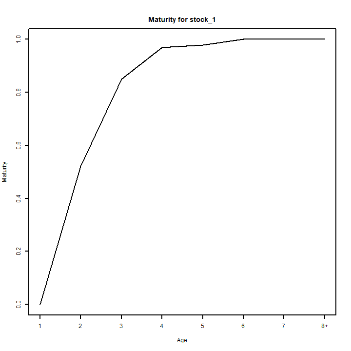
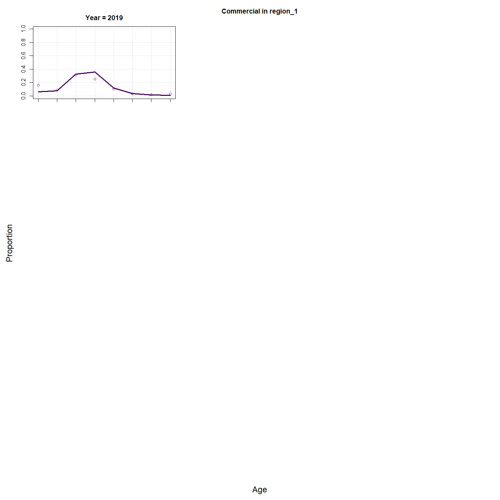
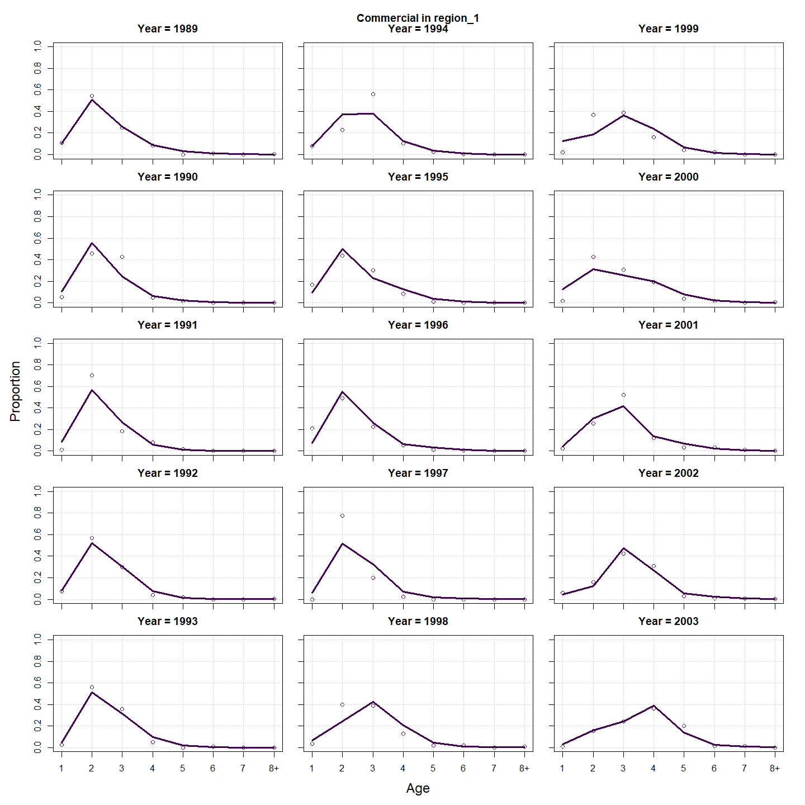
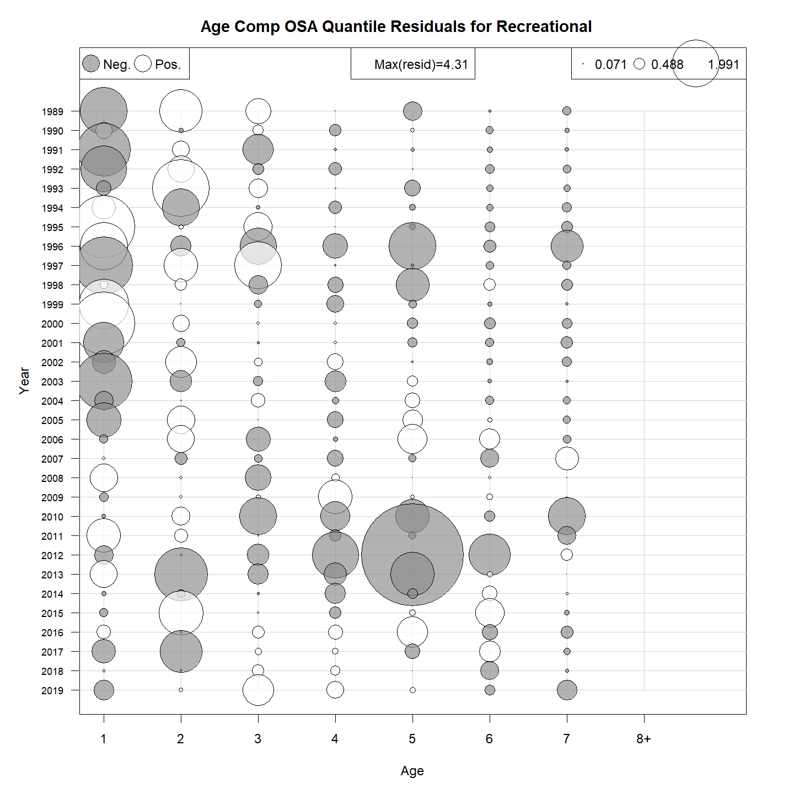
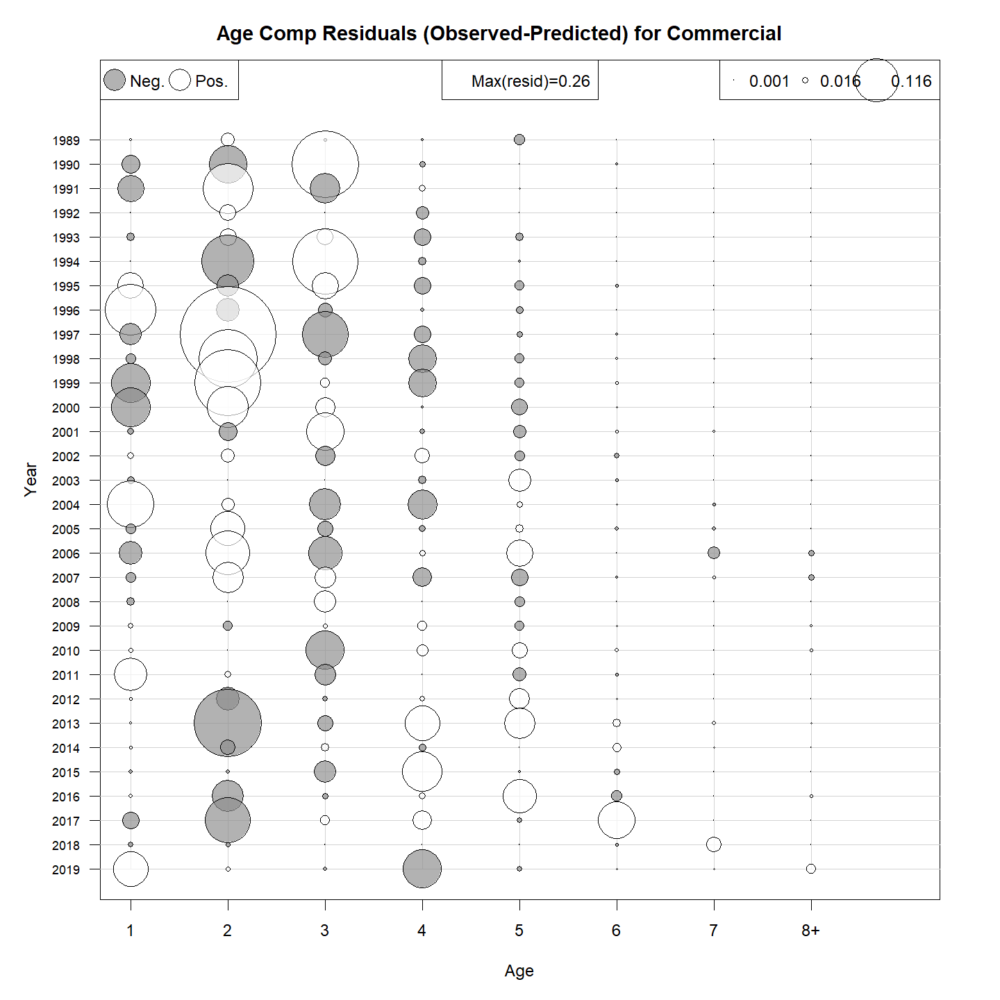
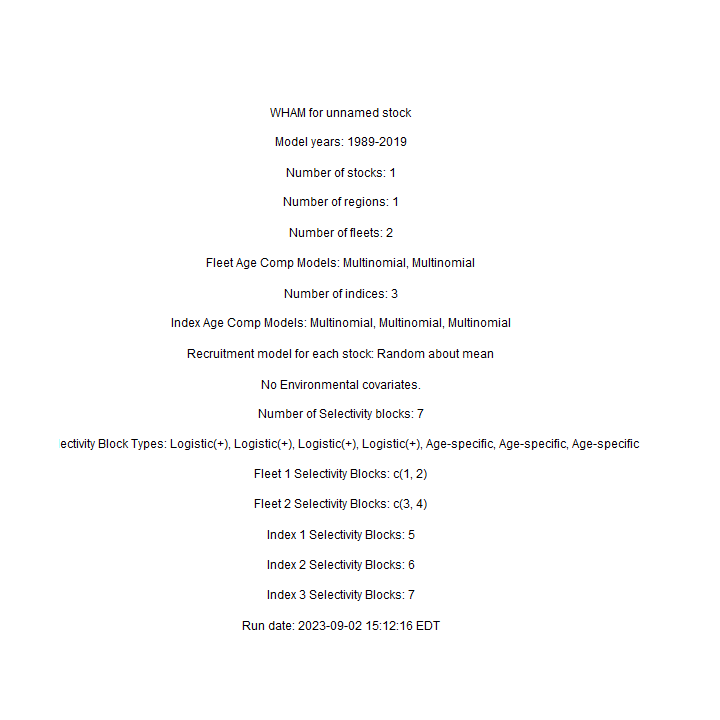
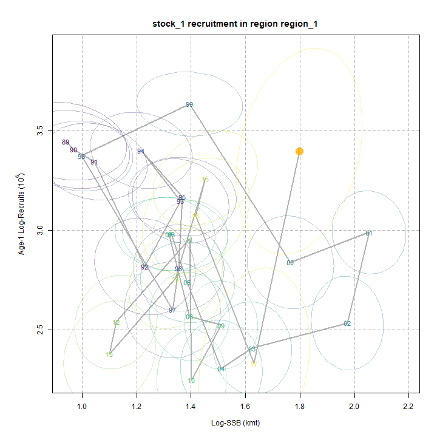
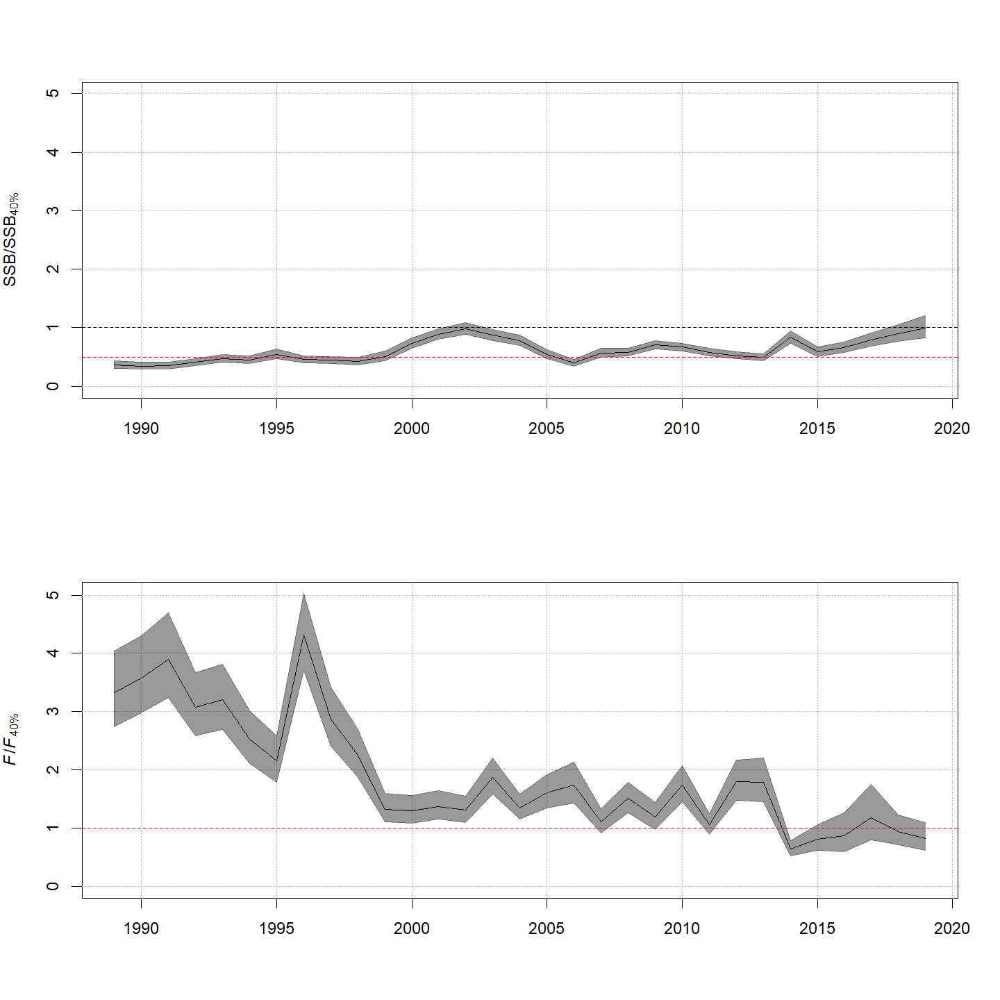
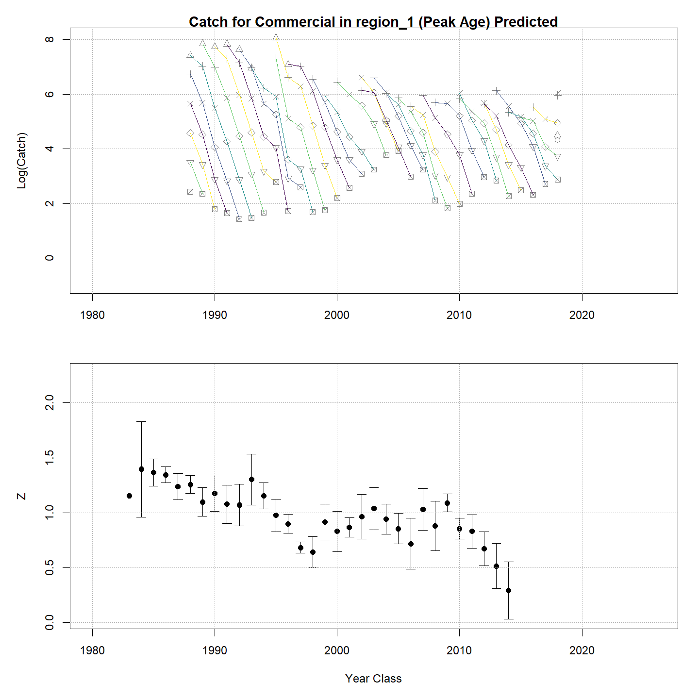

---
output:
  html_document:
    df_print: paged
    keep_md: yes
  word_document: default
  pdf_document:
    fig_caption: yes
    includes:
    keep_tex: yes
    number_sections: no
title: "WHAM figures and tables"
header-includes:
  - \usepackage{longtable}
  - \usepackage{booktabs}
  - \usepackage{caption,graphics}
  - \usepackage{makecell}
  - \usepackage{lscape}
  - \renewcommand\figurename{Fig.}
  - \captionsetup{labelsep=period, singlelinecheck=false}
  - \newcommand{\changesize}[1]{\fontsize{#1pt}{#1pt}\selectfont}
  - \renewcommand{\arraystretch}{1.5}
  - \renewcommand\theadfont{}
---

# {.tabset}

## Figures {.tabset}

### Input

### Diagnostics

### Results

### Retro

### Reference points

### Miscelaneous

## Tables {.tabset}

### Parameter estimates

<table class="table" style="margin-left: auto; margin-right: auto;">
<caption>Parameter estimates, standard errors, and confidence intervals. Rounded to 3 decimal places.</caption>
 <thead>
  <tr>
   <th style="text-align:left;">   </th>
   <th style="text-align:right;"> Estimate </th>
   <th style="text-align:right;"> Std. Error </th>
   <th style="text-align:right;"> 95\% CI lower </th>
   <th style="text-align:right;"> 95\% CI upper </th>
  </tr>
 </thead>
<tbody>
  <tr>
   <td style="text-align:left;"> NEFSC spring Alb fully selected q </td>
   <td style="text-align:right;"> 0.193 </td>
   <td style="text-align:right;"> 0.038 </td>
   <td style="text-align:right;"> 0.131 </td>
   <td style="text-align:right;"> 0.283 </td>
  </tr>
  <tr>
   <td style="text-align:left;"> REC CPA fully selected q </td>
   <td style="text-align:right;"> 0.000 </td>
   <td style="text-align:right;"> 0.000 </td>
   <td style="text-align:right;"> 0.000 </td>
   <td style="text-align:right;"> 0.000 </td>
  </tr>
  <tr>
   <td style="text-align:left;"> BIGELOW fully selected q </td>
   <td style="text-align:right;"> 0.000 </td>
   <td style="text-align:right;"> 0.000 </td>
   <td style="text-align:right;"> 0.000 </td>
   <td style="text-align:right;"> 0.000 </td>
  </tr>
  <tr>
   <td style="text-align:left;"> Block 1: $a_{50}$ </td>
   <td style="text-align:right;"> 1.844 </td>
   <td style="text-align:right;"> 0.093 </td>
   <td style="text-align:right;"> 1.668 </td>
   <td style="text-align:right;"> 2.034 </td>
  </tr>
  <tr>
   <td style="text-align:left;"> Block 1: 1/slope (increasing) </td>
   <td style="text-align:right;"> 0.290 </td>
   <td style="text-align:right;"> 0.031 </td>
   <td style="text-align:right;"> 0.235 </td>
   <td style="text-align:right;"> 0.356 </td>
  </tr>
  <tr>
   <td style="text-align:left;"> Block 2: $a_{50}$ </td>
   <td style="text-align:right;"> 2.911 </td>
   <td style="text-align:right;"> 0.125 </td>
   <td style="text-align:right;"> 2.671 </td>
   <td style="text-align:right;"> 3.161 </td>
  </tr>
  <tr>
   <td style="text-align:left;"> Block 2: 1/slope (increasing) </td>
   <td style="text-align:right;"> 0.544 </td>
   <td style="text-align:right;"> 0.039 </td>
   <td style="text-align:right;"> 0.471 </td>
   <td style="text-align:right;"> 0.626 </td>
  </tr>
  <tr>
   <td style="text-align:left;"> Block 3: $a_{50}$ </td>
   <td style="text-align:right;"> 2.121 </td>
   <td style="text-align:right;"> 0.145 </td>
   <td style="text-align:right;"> 1.849 </td>
   <td style="text-align:right;"> 2.416 </td>
  </tr>
  <tr>
   <td style="text-align:left;"> Block 3: 1/slope (increasing) </td>
   <td style="text-align:right;"> 0.609 </td>
   <td style="text-align:right;"> 0.065 </td>
   <td style="text-align:right;"> 0.494 </td>
   <td style="text-align:right;"> 0.748 </td>
  </tr>
  <tr>
   <td style="text-align:left;"> Block 4: $a_{50}$ </td>
   <td style="text-align:right;"> 6.349 </td>
   <td style="text-align:right;"> 1.176 </td>
   <td style="text-align:right;"> 3.187 </td>
   <td style="text-align:right;"> 7.657 </td>
  </tr>
  <tr>
   <td style="text-align:left;"> Block 4: 1/slope (increasing) </td>
   <td style="text-align:right;"> 1.576 </td>
   <td style="text-align:right;"> 0.172 </td>
   <td style="text-align:right;"> 1.266 </td>
   <td style="text-align:right;"> 1.941 </td>
  </tr>
  <tr>
   <td style="text-align:left;"> Block 5: Selectivity for age 1 </td>
   <td style="text-align:right;"> 0.159 </td>
   <td style="text-align:right;"> 0.031 </td>
   <td style="text-align:right;"> 0.107 </td>
   <td style="text-align:right;"> 0.231 </td>
  </tr>
  <tr>
   <td style="text-align:left;"> Block 5: Selectivity for age 2 </td>
   <td style="text-align:right;"> 0.504 </td>
   <td style="text-align:right;"> 0.089 </td>
   <td style="text-align:right;"> 0.336 </td>
   <td style="text-align:right;"> 0.671 </td>
  </tr>
  <tr>
   <td style="text-align:left;"> Block 5: Selectivity for age 3 </td>
   <td style="text-align:right;"> 0.754 </td>
   <td style="text-align:right;"> 0.139 </td>
   <td style="text-align:right;"> 0.413 </td>
   <td style="text-align:right;"> 0.931 </td>
  </tr>
  <tr>
   <td style="text-align:left;"> Block 5: Selectivity for age 4 </td>
   <td style="text-align:right;"> 1.000 </td>
   <td style="text-align:right;"> -- </td>
   <td style="text-align:right;"> -- </td>
   <td style="text-align:right;"> -- </td>
  </tr>
  <tr>
   <td style="text-align:left;"> Block 5: Selectivity for age 5 </td>
   <td style="text-align:right;"> 1.000 </td>
   <td style="text-align:right;"> -- </td>
   <td style="text-align:right;"> -- </td>
   <td style="text-align:right;"> -- </td>
  </tr>
  <tr>
   <td style="text-align:left;"> Block 5: Selectivity for age 6 </td>
   <td style="text-align:right;"> 1.000 </td>
   <td style="text-align:right;"> -- </td>
   <td style="text-align:right;"> -- </td>
   <td style="text-align:right;"> -- </td>
  </tr>
  <tr>
   <td style="text-align:left;"> Block 5: Selectivity for age 7 </td>
   <td style="text-align:right;"> 1.000 </td>
   <td style="text-align:right;"> -- </td>
   <td style="text-align:right;"> -- </td>
   <td style="text-align:right;"> -- </td>
  </tr>
  <tr>
   <td style="text-align:left;"> Block 5: Selectivity for age 8+ </td>
   <td style="text-align:right;"> 1.000 </td>
   <td style="text-align:right;"> -- </td>
   <td style="text-align:right;"> -- </td>
   <td style="text-align:right;"> -- </td>
  </tr>
  <tr>
   <td style="text-align:left;"> Block 6: Selectivity for age 1 </td>
   <td style="text-align:right;"> 0.291 </td>
   <td style="text-align:right;"> 0.021 </td>
   <td style="text-align:right;"> 0.251 </td>
   <td style="text-align:right;"> 0.333 </td>
  </tr>
  <tr>
   <td style="text-align:left;"> Block 6: Selectivity for age 2 </td>
   <td style="text-align:right;"> 0.859 </td>
   <td style="text-align:right;"> 0.053 </td>
   <td style="text-align:right;"> 0.720 </td>
   <td style="text-align:right;"> 0.935 </td>
  </tr>
  <tr>
   <td style="text-align:left;"> Block 6: Selectivity for age 3 </td>
   <td style="text-align:right;"> 1.000 </td>
   <td style="text-align:right;"> -- </td>
   <td style="text-align:right;"> -- </td>
   <td style="text-align:right;"> -- </td>
  </tr>
  <tr>
   <td style="text-align:left;"> Block 6: Selectivity for age 4 </td>
   <td style="text-align:right;"> 1.000 </td>
   <td style="text-align:right;"> -- </td>
   <td style="text-align:right;"> -- </td>
   <td style="text-align:right;"> -- </td>
  </tr>
  <tr>
   <td style="text-align:left;"> Block 6: Selectivity for age 5 </td>
   <td style="text-align:right;"> 1.000 </td>
   <td style="text-align:right;"> -- </td>
   <td style="text-align:right;"> -- </td>
   <td style="text-align:right;"> -- </td>
  </tr>
  <tr>
   <td style="text-align:left;"> Block 6: Selectivity for age 6 </td>
   <td style="text-align:right;"> 1.000 </td>
   <td style="text-align:right;"> -- </td>
   <td style="text-align:right;"> -- </td>
   <td style="text-align:right;"> -- </td>
  </tr>
  <tr>
   <td style="text-align:left;"> Block 6: Selectivity for age 7 </td>
   <td style="text-align:right;"> 1.000 </td>
   <td style="text-align:right;"> -- </td>
   <td style="text-align:right;"> -- </td>
   <td style="text-align:right;"> -- </td>
  </tr>
  <tr>
   <td style="text-align:left;"> Block 6: Selectivity for age 8+ </td>
   <td style="text-align:right;"> 1.000 </td>
   <td style="text-align:right;"> -- </td>
   <td style="text-align:right;"> -- </td>
   <td style="text-align:right;"> -- </td>
  </tr>
  <tr>
   <td style="text-align:left;"> Block 7: Selectivity for age 1 </td>
   <td style="text-align:right;"> 0.203 </td>
   <td style="text-align:right;"> 0.040 </td>
   <td style="text-align:right;"> 0.136 </td>
   <td style="text-align:right;"> 0.294 </td>
  </tr>
  <tr>
   <td style="text-align:left;"> Block 7: Selectivity for age 2 </td>
   <td style="text-align:right;"> 1.000 </td>
   <td style="text-align:right;"> -- </td>
   <td style="text-align:right;"> -- </td>
   <td style="text-align:right;"> -- </td>
  </tr>
  <tr>
   <td style="text-align:left;"> Block 7: Selectivity for age 3 </td>
   <td style="text-align:right;"> 1.000 </td>
   <td style="text-align:right;"> -- </td>
   <td style="text-align:right;"> -- </td>
   <td style="text-align:right;"> -- </td>
  </tr>
  <tr>
   <td style="text-align:left;"> Block 7: Selectivity for age 4 </td>
   <td style="text-align:right;"> 1.000 </td>
   <td style="text-align:right;"> -- </td>
   <td style="text-align:right;"> -- </td>
   <td style="text-align:right;"> -- </td>
  </tr>
  <tr>
   <td style="text-align:left;"> Block 7: Selectivity for age 5 </td>
   <td style="text-align:right;"> 1.000 </td>
   <td style="text-align:right;"> -- </td>
   <td style="text-align:right;"> -- </td>
   <td style="text-align:right;"> -- </td>
  </tr>
  <tr>
   <td style="text-align:left;"> Block 7: Selectivity for age 6 </td>
   <td style="text-align:right;"> 1.000 </td>
   <td style="text-align:right;"> -- </td>
   <td style="text-align:right;"> -- </td>
   <td style="text-align:right;"> -- </td>
  </tr>
  <tr>
   <td style="text-align:left;"> Block 7: Selectivity for age 7 </td>
   <td style="text-align:right;"> 1.000 </td>
   <td style="text-align:right;"> -- </td>
   <td style="text-align:right;"> -- </td>
   <td style="text-align:right;"> -- </td>
  </tr>
  <tr>
   <td style="text-align:left;"> Block 7: Selectivity for age 8+ </td>
   <td style="text-align:right;"> 1.000 </td>
   <td style="text-align:right;"> -- </td>
   <td style="text-align:right;"> -- </td>
   <td style="text-align:right;"> -- </td>
  </tr>
</tbody>
</table>

### Abundance at age

<table class="table" style="margin-left: auto; margin-right: auto;">
<caption>Abundance at age (1000s) for stock 1 in region 1.</caption>
 <thead>
  <tr>
   <th style="text-align:left;">   </th>
   <th style="text-align:right;"> 1 </th>
   <th style="text-align:right;"> 2 </th>
   <th style="text-align:right;"> 3 </th>
   <th style="text-align:right;"> 4 </th>
   <th style="text-align:right;"> 5 </th>
   <th style="text-align:right;"> 6 </th>
   <th style="text-align:right;"> 7 </th>
   <th style="text-align:right;"> 8+ </th>
  </tr>
 </thead>
<tbody>
  <tr>
   <td style="text-align:left;"> 1989 </td>
   <td style="text-align:right;"> 27509 </td>
   <td style="text-align:right;"> 13106 </td>
   <td style="text-align:right;"> 4915 </td>
   <td style="text-align:right;"> 1716 </td>
   <td style="text-align:right;"> 589 </td>
   <td style="text-align:right;"> 202 </td>
   <td style="text-align:right;"> 69 </td>
   <td style="text-align:right;"> 36 </td>
  </tr>
  <tr>
   <td style="text-align:left;"> 1990 </td>
   <td style="text-align:right;"> 31448 </td>
   <td style="text-align:right;"> 16597 </td>
   <td style="text-align:right;"> 5406 </td>
   <td style="text-align:right;"> 1442 </td>
   <td style="text-align:right;"> 455 </td>
   <td style="text-align:right;"> 153 </td>
   <td style="text-align:right;"> 52 </td>
   <td style="text-align:right;"> 27 </td>
  </tr>
  <tr>
   <td style="text-align:left;"> 1991 </td>
   <td style="text-align:right;"> 30165 </td>
   <td style="text-align:right;"> 19049 </td>
   <td style="text-align:right;"> 6715 </td>
   <td style="text-align:right;"> 1549 </td>
   <td style="text-align:right;"> 376 </td>
   <td style="text-align:right;"> 116 </td>
   <td style="text-align:right;"> 39 </td>
   <td style="text-align:right;"> 20 </td>
  </tr>
  <tr>
   <td style="text-align:left;"> 1992 </td>
   <td style="text-align:right;"> 28378 </td>
   <td style="text-align:right;"> 18007 </td>
   <td style="text-align:right;"> 7626 </td>
   <td style="text-align:right;"> 1865 </td>
   <td style="text-align:right;"> 384 </td>
   <td style="text-align:right;"> 91 </td>
   <td style="text-align:right;"> 28 </td>
   <td style="text-align:right;"> 14 </td>
  </tr>
  <tr>
   <td style="text-align:left;"> 1993 </td>
   <td style="text-align:right;"> 16736 </td>
   <td style="text-align:right;"> 17468 </td>
   <td style="text-align:right;"> 7850 </td>
   <td style="text-align:right;"> 2480 </td>
   <td style="text-align:right;"> 560 </td>
   <td style="text-align:right;"> 113 </td>
   <td style="text-align:right;"> 27 </td>
   <td style="text-align:right;"> 12 </td>
  </tr>
  <tr>
   <td style="text-align:left;"> 1994 </td>
   <td style="text-align:right;"> 23284 </td>
   <td style="text-align:right;"> 10170 </td>
   <td style="text-align:right;"> 7455 </td>
   <td style="text-align:right;"> 2440 </td>
   <td style="text-align:right;"> 701 </td>
   <td style="text-align:right;"> 155 </td>
   <td style="text-align:right;"> 31 </td>
   <td style="text-align:right;"> 11 </td>
  </tr>
  <tr>
   <td style="text-align:left;"> 1995 </td>
   <td style="text-align:right;"> 30005 </td>
   <td style="text-align:right;"> 14465 </td>
   <td style="text-align:right;"> 4769 </td>
   <td style="text-align:right;"> 2726 </td>
   <td style="text-align:right;"> 829 </td>
   <td style="text-align:right;"> 234 </td>
   <td style="text-align:right;"> 52 </td>
   <td style="text-align:right;"> 14 </td>
  </tr>
  <tr>
   <td style="text-align:left;"> 1996 </td>
   <td style="text-align:right;"> 23789 </td>
   <td style="text-align:right;"> 18460 </td>
   <td style="text-align:right;"> 6754 </td>
   <td style="text-align:right;"> 1715 </td>
   <td style="text-align:right;"> 899 </td>
   <td style="text-align:right;"> 268 </td>
   <td style="text-align:right;"> 76 </td>
   <td style="text-align:right;"> 21 </td>
  </tr>
  <tr>
   <td style="text-align:left;"> 1997 </td>
   <td style="text-align:right;"> 16615 </td>
   <td style="text-align:right;"> 13880 </td>
   <td style="text-align:right;"> 6388 </td>
   <td style="text-align:right;"> 1477 </td>
   <td style="text-align:right;"> 328 </td>
   <td style="text-align:right;"> 167 </td>
   <td style="text-align:right;"> 50 </td>
   <td style="text-align:right;"> 18 </td>
  </tr>
  <tr>
   <td style="text-align:left;"> 1998 </td>
   <td style="text-align:right;"> 13468 </td>
   <td style="text-align:right;"> 9940 </td>
   <td style="text-align:right;"> 5822 </td>
   <td style="text-align:right;"> 1904 </td>
   <td style="text-align:right;"> 393 </td>
   <td style="text-align:right;"> 85 </td>
   <td style="text-align:right;"> 43 </td>
   <td style="text-align:right;"> 17 </td>
  </tr>
  <tr>
   <td style="text-align:left;"> 1999 </td>
   <td style="text-align:right;"> 29193 </td>
   <td style="text-align:right;"> 8518 </td>
   <td style="text-align:right;"> 5318 </td>
   <td style="text-align:right;"> 2261 </td>
   <td style="text-align:right;"> 586 </td>
   <td style="text-align:right;"> 113 </td>
   <td style="text-align:right;"> 24 </td>
   <td style="text-align:right;"> 17 </td>
  </tr>
  <tr>
   <td style="text-align:left;"> 2000 </td>
   <td style="text-align:right;"> 37915 </td>
   <td style="text-align:right;"> 18773 </td>
   <td style="text-align:right;"> 4874 </td>
   <td style="text-align:right;"> 2453 </td>
   <td style="text-align:right;"> 896 </td>
   <td style="text-align:right;"> 223 </td>
   <td style="text-align:right;"> 43 </td>
   <td style="text-align:right;"> 16 </td>
  </tr>
  <tr>
   <td style="text-align:left;"> 2001 </td>
   <td style="text-align:right;"> 17096 </td>
   <td style="text-align:right;"> 24134 </td>
   <td style="text-align:right;"> 10478 </td>
   <td style="text-align:right;"> 2229 </td>
   <td style="text-align:right;"> 995 </td>
   <td style="text-align:right;"> 352 </td>
   <td style="text-align:right;"> 87 </td>
   <td style="text-align:right;"> 23 </td>
  </tr>
  <tr>
   <td style="text-align:left;"> 2002 </td>
   <td style="text-align:right;"> 19878 </td>
   <td style="text-align:right;"> 10886 </td>
   <td style="text-align:right;"> 13525 </td>
   <td style="text-align:right;"> 4888 </td>
   <td style="text-align:right;"> 937 </td>
   <td style="text-align:right;"> 407 </td>
   <td style="text-align:right;"> 143 </td>
   <td style="text-align:right;"> 45 </td>
  </tr>
  <tr>
   <td style="text-align:left;"> 2003 </td>
   <td style="text-align:right;"> 12591 </td>
   <td style="text-align:right;"> 12677 </td>
   <td style="text-align:right;"> 6141 </td>
   <td style="text-align:right;"> 6420 </td>
   <td style="text-align:right;"> 2108 </td>
   <td style="text-align:right;"> 394 </td>
   <td style="text-align:right;"> 170 </td>
   <td style="text-align:right;"> 78 </td>
  </tr>
  <tr>
   <td style="text-align:left;"> 2004 </td>
   <td style="text-align:right;"> 11100 </td>
   <td style="text-align:right;"> 7882 </td>
   <td style="text-align:right;"> 6698 </td>
   <td style="text-align:right;"> 2545 </td>
   <td style="text-align:right;"> 2318 </td>
   <td style="text-align:right;"> 734 </td>
   <td style="text-align:right;"> 136 </td>
   <td style="text-align:right;"> 86 </td>
  </tr>
  <tr>
   <td style="text-align:left;"> 2005 </td>
   <td style="text-align:right;"> 10023 </td>
   <td style="text-align:right;"> 7076 </td>
   <td style="text-align:right;"> 4396 </td>
   <td style="text-align:right;"> 2990 </td>
   <td style="text-align:right;"> 982 </td>
   <td style="text-align:right;"> 860 </td>
   <td style="text-align:right;"> 270 </td>
   <td style="text-align:right;"> 82 </td>
  </tr>
  <tr>
   <td style="text-align:left;"> 2006 </td>
   <td style="text-align:right;"> 15468 </td>
   <td style="text-align:right;"> 6401 </td>
   <td style="text-align:right;"> 3982 </td>
   <td style="text-align:right;"> 2018 </td>
   <td style="text-align:right;"> 1206 </td>
   <td style="text-align:right;"> 383 </td>
   <td style="text-align:right;"> 333 </td>
   <td style="text-align:right;"> 136 </td>
  </tr>
  <tr>
   <td style="text-align:left;"> 2007 </td>
   <td style="text-align:right;"> 19698 </td>
   <td style="text-align:right;"> 9977 </td>
   <td style="text-align:right;"> 3728 </td>
   <td style="text-align:right;"> 1955 </td>
   <td style="text-align:right;"> 886 </td>
   <td style="text-align:right;"> 514 </td>
   <td style="text-align:right;"> 162 </td>
   <td style="text-align:right;"> 198 </td>
  </tr>
  <tr>
   <td style="text-align:left;"> 2008 </td>
   <td style="text-align:right;"> 19719 </td>
   <td style="text-align:right;"> 12646 </td>
   <td style="text-align:right;"> 5738 </td>
   <td style="text-align:right;"> 1811 </td>
   <td style="text-align:right;"> 858 </td>
   <td style="text-align:right;"> 378 </td>
   <td style="text-align:right;"> 218 </td>
   <td style="text-align:right;"> 153 </td>
  </tr>
  <tr>
   <td style="text-align:left;"> 2009 </td>
   <td style="text-align:right;"> 13021 </td>
   <td style="text-align:right;"> 12577 </td>
   <td style="text-align:right;"> 7120 </td>
   <td style="text-align:right;"> 2686 </td>
   <td style="text-align:right;"> 761 </td>
   <td style="text-align:right;"> 350 </td>
   <td style="text-align:right;"> 154 </td>
   <td style="text-align:right;"> 150 </td>
  </tr>
  <tr>
   <td style="text-align:left;"> 2010 </td>
   <td style="text-align:right;"> 12470 </td>
   <td style="text-align:right;"> 8250 </td>
   <td style="text-align:right;"> 7522 </td>
   <td style="text-align:right;"> 3787 </td>
   <td style="text-align:right;"> 1215 </td>
   <td style="text-align:right;"> 282 </td>
   <td style="text-align:right;"> 102 </td>
   <td style="text-align:right;"> 62 </td>
  </tr>
  <tr>
   <td style="text-align:left;"> 2011 </td>
   <td style="text-align:right;"> 9460 </td>
   <td style="text-align:right;"> 7792 </td>
   <td style="text-align:right;"> 4797 </td>
   <td style="text-align:right;"> 3778 </td>
   <td style="text-align:right;"> 1554 </td>
   <td style="text-align:right;"> 390 </td>
   <td style="text-align:right;"> 67 </td>
   <td style="text-align:right;"> 26 </td>
  </tr>
  <tr>
   <td style="text-align:left;"> 2012 </td>
   <td style="text-align:right;"> 19241 </td>
   <td style="text-align:right;"> 6164 </td>
   <td style="text-align:right;"> 4869 </td>
   <td style="text-align:right;"> 2712 </td>
   <td style="text-align:right;"> 1905 </td>
   <td style="text-align:right;"> 710 </td>
   <td style="text-align:right;"> 160 </td>
   <td style="text-align:right;"> 33 </td>
  </tr>
  <tr>
   <td style="text-align:left;"> 2013 </td>
   <td style="text-align:right;"> 12672 </td>
   <td style="text-align:right;"> 12127 </td>
   <td style="text-align:right;"> 3640 </td>
   <td style="text-align:right;"> 2513 </td>
   <td style="text-align:right;"> 1166 </td>
   <td style="text-align:right;"> 660 </td>
   <td style="text-align:right;"> 189 </td>
   <td style="text-align:right;"> 37 </td>
  </tr>
  <tr>
   <td style="text-align:left;"> 2014 </td>
   <td style="text-align:right;"> 10775 </td>
   <td style="text-align:right;"> 8054 </td>
   <td style="text-align:right;"> 7224 </td>
   <td style="text-align:right;"> 1877 </td>
   <td style="text-align:right;"> 1083 </td>
   <td style="text-align:right;"> 417 </td>
   <td style="text-align:right;"> 190 </td>
   <td style="text-align:right;"> 50 </td>
  </tr>
  <tr>
   <td style="text-align:left;"> 2015 </td>
   <td style="text-align:right;"> 15761 </td>
   <td style="text-align:right;"> 6938 </td>
   <td style="text-align:right;"> 4934 </td>
   <td style="text-align:right;"> 3958 </td>
   <td style="text-align:right;"> 896 </td>
   <td style="text-align:right;"> 449 </td>
   <td style="text-align:right;"> 147 </td>
   <td style="text-align:right;"> 69 </td>
  </tr>
  <tr>
   <td style="text-align:left;"> 2016 </td>
   <td style="text-align:right;"> 26103 </td>
   <td style="text-align:right;"> 10308 </td>
   <td style="text-align:right;"> 4399 </td>
   <td style="text-align:right;"> 2917 </td>
   <td style="text-align:right;"> 2148 </td>
   <td style="text-align:right;"> 446 </td>
   <td style="text-align:right;"> 202 </td>
   <td style="text-align:right;"> 85 </td>
  </tr>
  <tr>
   <td style="text-align:left;"> 2017 </td>
   <td style="text-align:right;"> 21621 </td>
   <td style="text-align:right;"> 16998 </td>
   <td style="text-align:right;"> 6489 </td>
   <td style="text-align:right;"> 2573 </td>
   <td style="text-align:right;"> 1554 </td>
   <td style="text-align:right;"> 1034 </td>
   <td style="text-align:right;"> 190 </td>
   <td style="text-align:right;"> 105 </td>
  </tr>
  <tr>
   <td style="text-align:left;"> 2018 </td>
   <td style="text-align:right;"> 10280 </td>
   <td style="text-align:right;"> 13841 </td>
   <td style="text-align:right;"> 10368 </td>
   <td style="text-align:right;"> 3584 </td>
   <td style="text-align:right;"> 1242 </td>
   <td style="text-align:right;"> 638 </td>
   <td style="text-align:right;"> 348 </td>
   <td style="text-align:right;"> 76 </td>
  </tr>
  <tr>
   <td style="text-align:left;"> 2019 </td>
   <td style="text-align:right;"> 29878 </td>
   <td style="text-align:right;"> 6670 </td>
   <td style="text-align:right;"> 8678 </td>
   <td style="text-align:right;"> 6056 </td>
   <td style="text-align:right;"> 1902 </td>
   <td style="text-align:right;"> 588 </td>
   <td style="text-align:right;"> 263 </td>
   <td style="text-align:right;"> 148 </td>
  </tr>
</tbody>
</table>

### Fishing mortality at age by region

<table class="table" style="margin-left: auto; margin-right: auto;">
<caption>Total fishing mortality at age in region 1.</caption>
 <thead>
  <tr>
   <th style="text-align:left;">   </th>
   <th style="text-align:right;"> 1 </th>
   <th style="text-align:right;"> 2 </th>
   <th style="text-align:right;"> 3 </th>
   <th style="text-align:right;"> 4 </th>
   <th style="text-align:right;"> 5 </th>
   <th style="text-align:right;"> 6 </th>
   <th style="text-align:right;"> 7 </th>
   <th style="text-align:right;"> 8+ </th>
  </tr>
 </thead>
<tbody>
  <tr>
   <td style="text-align:left;"> 1989 </td>
   <td style="text-align:right;"> 0.016 </td>
   <td style="text-align:right;"> 0.190 </td>
   <td style="text-align:right;"> 0.296 </td>
   <td style="text-align:right;"> 0.301 </td>
   <td style="text-align:right;"> 0.302 </td>
   <td style="text-align:right;"> 0.302 </td>
   <td style="text-align:right;"> 0.302 </td>
   <td style="text-align:right;"> 0.302 </td>
  </tr>
  <tr>
   <td style="text-align:left;"> 1990 </td>
   <td style="text-align:right;"> 0.019 </td>
   <td style="text-align:right;"> 0.234 </td>
   <td style="text-align:right;"> 0.365 </td>
   <td style="text-align:right;"> 0.371 </td>
   <td style="text-align:right;"> 0.371 </td>
   <td style="text-align:right;"> 0.371 </td>
   <td style="text-align:right;"> 0.371 </td>
   <td style="text-align:right;"> 0.371 </td>
  </tr>
  <tr>
   <td style="text-align:left;"> 1991 </td>
   <td style="text-align:right;"> 0.015 </td>
   <td style="text-align:right;"> 0.183 </td>
   <td style="text-align:right;"> 0.285 </td>
   <td style="text-align:right;"> 0.290 </td>
   <td style="text-align:right;"> 0.290 </td>
   <td style="text-align:right;"> 0.290 </td>
   <td style="text-align:right;"> 0.290 </td>
   <td style="text-align:right;"> 0.290 </td>
  </tr>
  <tr>
   <td style="text-align:left;"> 1992 </td>
   <td style="text-align:right;"> 0.017 </td>
   <td style="text-align:right;"> 0.205 </td>
   <td style="text-align:right;"> 0.318 </td>
   <td style="text-align:right;"> 0.324 </td>
   <td style="text-align:right;"> 0.324 </td>
   <td style="text-align:right;"> 0.324 </td>
   <td style="text-align:right;"> 0.324 </td>
   <td style="text-align:right;"> 0.324 </td>
  </tr>
  <tr>
   <td style="text-align:left;"> 1993 </td>
   <td style="text-align:right;"> 0.014 </td>
   <td style="text-align:right;"> 0.176 </td>
   <td style="text-align:right;"> 0.273 </td>
   <td style="text-align:right;"> 0.278 </td>
   <td style="text-align:right;"> 0.278 </td>
   <td style="text-align:right;"> 0.278 </td>
   <td style="text-align:right;"> 0.278 </td>
   <td style="text-align:right;"> 0.278 </td>
  </tr>
  <tr>
   <td style="text-align:left;"> 1994 </td>
   <td style="text-align:right;"> 0.012 </td>
   <td style="text-align:right;"> 0.146 </td>
   <td style="text-align:right;"> 0.228 </td>
   <td style="text-align:right;"> 0.232 </td>
   <td style="text-align:right;"> 0.232 </td>
   <td style="text-align:right;"> 0.232 </td>
   <td style="text-align:right;"> 0.232 </td>
   <td style="text-align:right;"> 0.232 </td>
  </tr>
  <tr>
   <td style="text-align:left;"> 1995 </td>
   <td style="text-align:right;"> 0.009 </td>
   <td style="text-align:right;"> 0.109 </td>
   <td style="text-align:right;"> 0.169 </td>
   <td style="text-align:right;"> 0.172 </td>
   <td style="text-align:right;"> 0.172 </td>
   <td style="text-align:right;"> 0.172 </td>
   <td style="text-align:right;"> 0.172 </td>
   <td style="text-align:right;"> 0.172 </td>
  </tr>
  <tr>
   <td style="text-align:left;"> 1996 </td>
   <td style="text-align:right;"> 0.023 </td>
   <td style="text-align:right;"> 0.280 </td>
   <td style="text-align:right;"> 0.435 </td>
   <td style="text-align:right;"> 0.443 </td>
   <td style="text-align:right;"> 0.443 </td>
   <td style="text-align:right;"> 0.443 </td>
   <td style="text-align:right;"> 0.443 </td>
   <td style="text-align:right;"> 0.443 </td>
  </tr>
  <tr>
   <td style="text-align:left;"> 1997 </td>
   <td style="text-align:right;"> 0.011 </td>
   <td style="text-align:right;"> 0.129 </td>
   <td style="text-align:right;"> 0.201 </td>
   <td style="text-align:right;"> 0.205 </td>
   <td style="text-align:right;"> 0.205 </td>
   <td style="text-align:right;"> 0.205 </td>
   <td style="text-align:right;"> 0.205 </td>
   <td style="text-align:right;"> 0.205 </td>
  </tr>
  <tr>
   <td style="text-align:left;"> 1998 </td>
   <td style="text-align:right;"> 0.016 </td>
   <td style="text-align:right;"> 0.086 </td>
   <td style="text-align:right;"> 0.296 </td>
   <td style="text-align:right;"> 0.483 </td>
   <td style="text-align:right;"> 0.537 </td>
   <td style="text-align:right;"> 0.546 </td>
   <td style="text-align:right;"> 0.548 </td>
   <td style="text-align:right;"> 0.548 </td>
  </tr>
  <tr>
   <td style="text-align:left;"> 1999 </td>
   <td style="text-align:right;"> 0.010 </td>
   <td style="text-align:right;"> 0.055 </td>
   <td style="text-align:right;"> 0.188 </td>
   <td style="text-align:right;"> 0.306 </td>
   <td style="text-align:right;"> 0.341 </td>
   <td style="text-align:right;"> 0.347 </td>
   <td style="text-align:right;"> 0.348 </td>
   <td style="text-align:right;"> 0.348 </td>
  </tr>
  <tr>
   <td style="text-align:left;"> 2000 </td>
   <td style="text-align:right;"> 0.006 </td>
   <td style="text-align:right;"> 0.033 </td>
   <td style="text-align:right;"> 0.113 </td>
   <td style="text-align:right;"> 0.184 </td>
   <td style="text-align:right;"> 0.204 </td>
   <td style="text-align:right;"> 0.208 </td>
   <td style="text-align:right;"> 0.209 </td>
   <td style="text-align:right;"> 0.209 </td>
  </tr>
  <tr>
   <td style="text-align:left;"> 2001 </td>
   <td style="text-align:right;"> 0.005 </td>
   <td style="text-align:right;"> 0.025 </td>
   <td style="text-align:right;"> 0.086 </td>
   <td style="text-align:right;"> 0.140 </td>
   <td style="text-align:right;"> 0.155 </td>
   <td style="text-align:right;"> 0.158 </td>
   <td style="text-align:right;"> 0.159 </td>
   <td style="text-align:right;"> 0.159 </td>
  </tr>
  <tr>
   <td style="text-align:left;"> 2002 </td>
   <td style="text-align:right;"> 0.004 </td>
   <td style="text-align:right;"> 0.022 </td>
   <td style="text-align:right;"> 0.074 </td>
   <td style="text-align:right;"> 0.121 </td>
   <td style="text-align:right;"> 0.135 </td>
   <td style="text-align:right;"> 0.137 </td>
   <td style="text-align:right;"> 0.137 </td>
   <td style="text-align:right;"> 0.138 </td>
  </tr>
  <tr>
   <td style="text-align:left;"> 2003 </td>
   <td style="text-align:right;"> 0.006 </td>
   <td style="text-align:right;"> 0.033 </td>
   <td style="text-align:right;"> 0.113 </td>
   <td style="text-align:right;"> 0.184 </td>
   <td style="text-align:right;"> 0.204 </td>
   <td style="text-align:right;"> 0.208 </td>
   <td style="text-align:right;"> 0.208 </td>
   <td style="text-align:right;"> 0.208 </td>
  </tr>
  <tr>
   <td style="text-align:left;"> 2004 </td>
   <td style="text-align:right;"> 0.009 </td>
   <td style="text-align:right;"> 0.047 </td>
   <td style="text-align:right;"> 0.160 </td>
   <td style="text-align:right;"> 0.262 </td>
   <td style="text-align:right;"> 0.291 </td>
   <td style="text-align:right;"> 0.296 </td>
   <td style="text-align:right;"> 0.297 </td>
   <td style="text-align:right;"> 0.297 </td>
  </tr>
  <tr>
   <td style="text-align:left;"> 2005 </td>
   <td style="text-align:right;"> 0.007 </td>
   <td style="text-align:right;"> 0.039 </td>
   <td style="text-align:right;"> 0.135 </td>
   <td style="text-align:right;"> 0.220 </td>
   <td style="text-align:right;"> 0.244 </td>
   <td style="text-align:right;"> 0.249 </td>
   <td style="text-align:right;"> 0.249 </td>
   <td style="text-align:right;"> 0.250 </td>
  </tr>
  <tr>
   <td style="text-align:left;"> 2006 </td>
   <td style="text-align:right;"> 0.007 </td>
   <td style="text-align:right;"> 0.036 </td>
   <td style="text-align:right;"> 0.123 </td>
   <td style="text-align:right;"> 0.201 </td>
   <td style="text-align:right;"> 0.223 </td>
   <td style="text-align:right;"> 0.227 </td>
   <td style="text-align:right;"> 0.228 </td>
   <td style="text-align:right;"> 0.228 </td>
  </tr>
  <tr>
   <td style="text-align:left;"> 2007 </td>
   <td style="text-align:right;"> 0.005 </td>
   <td style="text-align:right;"> 0.028 </td>
   <td style="text-align:right;"> 0.098 </td>
   <td style="text-align:right;"> 0.159 </td>
   <td style="text-align:right;"> 0.177 </td>
   <td style="text-align:right;"> 0.180 </td>
   <td style="text-align:right;"> 0.180 </td>
   <td style="text-align:right;"> 0.180 </td>
  </tr>
  <tr>
   <td style="text-align:left;"> 2008 </td>
   <td style="text-align:right;"> 0.005 </td>
   <td style="text-align:right;"> 0.028 </td>
   <td style="text-align:right;"> 0.096 </td>
   <td style="text-align:right;"> 0.156 </td>
   <td style="text-align:right;"> 0.174 </td>
   <td style="text-align:right;"> 0.177 </td>
   <td style="text-align:right;"> 0.178 </td>
   <td style="text-align:right;"> 0.178 </td>
  </tr>
  <tr>
   <td style="text-align:left;"> 2009 </td>
   <td style="text-align:right;"> 0.003 </td>
   <td style="text-align:right;"> 0.016 </td>
   <td style="text-align:right;"> 0.056 </td>
   <td style="text-align:right;"> 0.092 </td>
   <td style="text-align:right;"> 0.102 </td>
   <td style="text-align:right;"> 0.104 </td>
   <td style="text-align:right;"> 0.104 </td>
   <td style="text-align:right;"> 0.104 </td>
  </tr>
  <tr>
   <td style="text-align:left;"> 2010 </td>
   <td style="text-align:right;"> 0.004 </td>
   <td style="text-align:right;"> 0.021 </td>
   <td style="text-align:right;"> 0.070 </td>
   <td style="text-align:right;"> 0.115 </td>
   <td style="text-align:right;"> 0.128 </td>
   <td style="text-align:right;"> 0.130 </td>
   <td style="text-align:right;"> 0.130 </td>
   <td style="text-align:right;"> 0.130 </td>
  </tr>
  <tr>
   <td style="text-align:left;"> 2011 </td>
   <td style="text-align:right;"> 0.005 </td>
   <td style="text-align:right;"> 0.027 </td>
   <td style="text-align:right;"> 0.094 </td>
   <td style="text-align:right;"> 0.152 </td>
   <td style="text-align:right;"> 0.169 </td>
   <td style="text-align:right;"> 0.172 </td>
   <td style="text-align:right;"> 0.173 </td>
   <td style="text-align:right;"> 0.173 </td>
  </tr>
  <tr>
   <td style="text-align:left;"> 2012 </td>
   <td style="text-align:right;"> 0.004 </td>
   <td style="text-align:right;"> 0.021 </td>
   <td style="text-align:right;"> 0.072 </td>
   <td style="text-align:right;"> 0.117 </td>
   <td style="text-align:right;"> 0.130 </td>
   <td style="text-align:right;"> 0.132 </td>
   <td style="text-align:right;"> 0.132 </td>
   <td style="text-align:right;"> 0.132 </td>
  </tr>
  <tr>
   <td style="text-align:left;"> 2013 </td>
   <td style="text-align:right;"> 0.006 </td>
   <td style="text-align:right;"> 0.031 </td>
   <td style="text-align:right;"> 0.106 </td>
   <td style="text-align:right;"> 0.173 </td>
   <td style="text-align:right;"> 0.192 </td>
   <td style="text-align:right;"> 0.196 </td>
   <td style="text-align:right;"> 0.196 </td>
   <td style="text-align:right;"> 0.196 </td>
  </tr>
  <tr>
   <td style="text-align:left;"> 2014 </td>
   <td style="text-align:right;"> 0.005 </td>
   <td style="text-align:right;"> 0.025 </td>
   <td style="text-align:right;"> 0.084 </td>
   <td style="text-align:right;"> 0.138 </td>
   <td style="text-align:right;"> 0.153 </td>
   <td style="text-align:right;"> 0.156 </td>
   <td style="text-align:right;"> 0.156 </td>
   <td style="text-align:right;"> 0.156 </td>
  </tr>
  <tr>
   <td style="text-align:left;"> 2015 </td>
   <td style="text-align:right;"> 0.003 </td>
   <td style="text-align:right;"> 0.016 </td>
   <td style="text-align:right;"> 0.054 </td>
   <td style="text-align:right;"> 0.088 </td>
   <td style="text-align:right;"> 0.098 </td>
   <td style="text-align:right;"> 0.100 </td>
   <td style="text-align:right;"> 0.100 </td>
   <td style="text-align:right;"> 0.100 </td>
  </tr>
  <tr>
   <td style="text-align:left;"> 2016 </td>
   <td style="text-align:right;"> 0.003 </td>
   <td style="text-align:right;"> 0.015 </td>
   <td style="text-align:right;"> 0.050 </td>
   <td style="text-align:right;"> 0.081 </td>
   <td style="text-align:right;"> 0.090 </td>
   <td style="text-align:right;"> 0.092 </td>
   <td style="text-align:right;"> 0.092 </td>
   <td style="text-align:right;"> 0.092 </td>
  </tr>
  <tr>
   <td style="text-align:left;"> 2017 </td>
   <td style="text-align:right;"> 0.003 </td>
   <td style="text-align:right;"> 0.015 </td>
   <td style="text-align:right;"> 0.051 </td>
   <td style="text-align:right;"> 0.084 </td>
   <td style="text-align:right;"> 0.093 </td>
   <td style="text-align:right;"> 0.095 </td>
   <td style="text-align:right;"> 0.095 </td>
   <td style="text-align:right;"> 0.095 </td>
  </tr>
  <tr>
   <td style="text-align:left;"> 2018 </td>
   <td style="text-align:right;"> 0.002 </td>
   <td style="text-align:right;"> 0.011 </td>
   <td style="text-align:right;"> 0.037 </td>
   <td style="text-align:right;"> 0.061 </td>
   <td style="text-align:right;"> 0.068 </td>
   <td style="text-align:right;"> 0.069 </td>
   <td style="text-align:right;"> 0.069 </td>
   <td style="text-align:right;"> 0.069 </td>
  </tr>
  <tr>
   <td style="text-align:left;"> 2019 </td>
   <td style="text-align:right;"> 0.003 </td>
   <td style="text-align:right;"> 0.017 </td>
   <td style="text-align:right;"> 0.058 </td>
   <td style="text-align:right;"> 0.094 </td>
   <td style="text-align:right;"> 0.105 </td>
   <td style="text-align:right;"> 0.107 </td>
   <td style="text-align:right;"> 0.107 </td>
   <td style="text-align:right;"> 0.107 </td>
  </tr>
</tbody>
</table>

### Fishing mortality at age by fleet

<table class="table" style="margin-left: auto; margin-right: auto;">
<caption>Total fishing mortality at age in Commercial.</caption>
 <thead>
  <tr>
   <th style="text-align:left;">   </th>
   <th style="text-align:right;"> 1 </th>
   <th style="text-align:right;"> 2 </th>
   <th style="text-align:right;"> 3 </th>
   <th style="text-align:right;"> 4 </th>
   <th style="text-align:right;"> 5 </th>
   <th style="text-align:right;"> 6 </th>
   <th style="text-align:right;"> 7 </th>
   <th style="text-align:right;"> 8+ </th>
  </tr>
 </thead>
<tbody>
  <tr>
   <td style="text-align:left;"> 1989 </td>
   <td style="text-align:right;"> 0.016 </td>
   <td style="text-align:right;"> 0.190 </td>
   <td style="text-align:right;"> 0.296 </td>
   <td style="text-align:right;"> 0.301 </td>
   <td style="text-align:right;"> 0.302 </td>
   <td style="text-align:right;"> 0.302 </td>
   <td style="text-align:right;"> 0.302 </td>
   <td style="text-align:right;"> 0.302 </td>
  </tr>
  <tr>
   <td style="text-align:left;"> 1990 </td>
   <td style="text-align:right;"> 0.019 </td>
   <td style="text-align:right;"> 0.234 </td>
   <td style="text-align:right;"> 0.365 </td>
   <td style="text-align:right;"> 0.371 </td>
   <td style="text-align:right;"> 0.371 </td>
   <td style="text-align:right;"> 0.371 </td>
   <td style="text-align:right;"> 0.371 </td>
   <td style="text-align:right;"> 0.371 </td>
  </tr>
  <tr>
   <td style="text-align:left;"> 1991 </td>
   <td style="text-align:right;"> 0.015 </td>
   <td style="text-align:right;"> 0.183 </td>
   <td style="text-align:right;"> 0.285 </td>
   <td style="text-align:right;"> 0.290 </td>
   <td style="text-align:right;"> 0.290 </td>
   <td style="text-align:right;"> 0.290 </td>
   <td style="text-align:right;"> 0.290 </td>
   <td style="text-align:right;"> 0.290 </td>
  </tr>
  <tr>
   <td style="text-align:left;"> 1992 </td>
   <td style="text-align:right;"> 0.017 </td>
   <td style="text-align:right;"> 0.205 </td>
   <td style="text-align:right;"> 0.318 </td>
   <td style="text-align:right;"> 0.324 </td>
   <td style="text-align:right;"> 0.324 </td>
   <td style="text-align:right;"> 0.324 </td>
   <td style="text-align:right;"> 0.324 </td>
   <td style="text-align:right;"> 0.324 </td>
  </tr>
  <tr>
   <td style="text-align:left;"> 1993 </td>
   <td style="text-align:right;"> 0.014 </td>
   <td style="text-align:right;"> 0.176 </td>
   <td style="text-align:right;"> 0.273 </td>
   <td style="text-align:right;"> 0.278 </td>
   <td style="text-align:right;"> 0.278 </td>
   <td style="text-align:right;"> 0.278 </td>
   <td style="text-align:right;"> 0.278 </td>
   <td style="text-align:right;"> 0.278 </td>
  </tr>
  <tr>
   <td style="text-align:left;"> 1994 </td>
   <td style="text-align:right;"> 0.012 </td>
   <td style="text-align:right;"> 0.146 </td>
   <td style="text-align:right;"> 0.228 </td>
   <td style="text-align:right;"> 0.232 </td>
   <td style="text-align:right;"> 0.232 </td>
   <td style="text-align:right;"> 0.232 </td>
   <td style="text-align:right;"> 0.232 </td>
   <td style="text-align:right;"> 0.232 </td>
  </tr>
  <tr>
   <td style="text-align:left;"> 1995 </td>
   <td style="text-align:right;"> 0.009 </td>
   <td style="text-align:right;"> 0.109 </td>
   <td style="text-align:right;"> 0.169 </td>
   <td style="text-align:right;"> 0.172 </td>
   <td style="text-align:right;"> 0.172 </td>
   <td style="text-align:right;"> 0.172 </td>
   <td style="text-align:right;"> 0.172 </td>
   <td style="text-align:right;"> 0.172 </td>
  </tr>
  <tr>
   <td style="text-align:left;"> 1996 </td>
   <td style="text-align:right;"> 0.023 </td>
   <td style="text-align:right;"> 0.280 </td>
   <td style="text-align:right;"> 0.435 </td>
   <td style="text-align:right;"> 0.443 </td>
   <td style="text-align:right;"> 0.443 </td>
   <td style="text-align:right;"> 0.443 </td>
   <td style="text-align:right;"> 0.443 </td>
   <td style="text-align:right;"> 0.443 </td>
  </tr>
  <tr>
   <td style="text-align:left;"> 1997 </td>
   <td style="text-align:right;"> 0.011 </td>
   <td style="text-align:right;"> 0.129 </td>
   <td style="text-align:right;"> 0.201 </td>
   <td style="text-align:right;"> 0.205 </td>
   <td style="text-align:right;"> 0.205 </td>
   <td style="text-align:right;"> 0.205 </td>
   <td style="text-align:right;"> 0.205 </td>
   <td style="text-align:right;"> 0.205 </td>
  </tr>
  <tr>
   <td style="text-align:left;"> 1998 </td>
   <td style="text-align:right;"> 0.016 </td>
   <td style="text-align:right;"> 0.086 </td>
   <td style="text-align:right;"> 0.296 </td>
   <td style="text-align:right;"> 0.483 </td>
   <td style="text-align:right;"> 0.537 </td>
   <td style="text-align:right;"> 0.546 </td>
   <td style="text-align:right;"> 0.548 </td>
   <td style="text-align:right;"> 0.548 </td>
  </tr>
  <tr>
   <td style="text-align:left;"> 1999 </td>
   <td style="text-align:right;"> 0.010 </td>
   <td style="text-align:right;"> 0.055 </td>
   <td style="text-align:right;"> 0.188 </td>
   <td style="text-align:right;"> 0.306 </td>
   <td style="text-align:right;"> 0.341 </td>
   <td style="text-align:right;"> 0.347 </td>
   <td style="text-align:right;"> 0.348 </td>
   <td style="text-align:right;"> 0.348 </td>
  </tr>
  <tr>
   <td style="text-align:left;"> 2000 </td>
   <td style="text-align:right;"> 0.006 </td>
   <td style="text-align:right;"> 0.033 </td>
   <td style="text-align:right;"> 0.113 </td>
   <td style="text-align:right;"> 0.184 </td>
   <td style="text-align:right;"> 0.204 </td>
   <td style="text-align:right;"> 0.208 </td>
   <td style="text-align:right;"> 0.209 </td>
   <td style="text-align:right;"> 0.209 </td>
  </tr>
  <tr>
   <td style="text-align:left;"> 2001 </td>
   <td style="text-align:right;"> 0.005 </td>
   <td style="text-align:right;"> 0.025 </td>
   <td style="text-align:right;"> 0.086 </td>
   <td style="text-align:right;"> 0.140 </td>
   <td style="text-align:right;"> 0.155 </td>
   <td style="text-align:right;"> 0.158 </td>
   <td style="text-align:right;"> 0.159 </td>
   <td style="text-align:right;"> 0.159 </td>
  </tr>
  <tr>
   <td style="text-align:left;"> 2002 </td>
   <td style="text-align:right;"> 0.004 </td>
   <td style="text-align:right;"> 0.022 </td>
   <td style="text-align:right;"> 0.074 </td>
   <td style="text-align:right;"> 0.121 </td>
   <td style="text-align:right;"> 0.135 </td>
   <td style="text-align:right;"> 0.137 </td>
   <td style="text-align:right;"> 0.137 </td>
   <td style="text-align:right;"> 0.138 </td>
  </tr>
  <tr>
   <td style="text-align:left;"> 2003 </td>
   <td style="text-align:right;"> 0.006 </td>
   <td style="text-align:right;"> 0.033 </td>
   <td style="text-align:right;"> 0.113 </td>
   <td style="text-align:right;"> 0.184 </td>
   <td style="text-align:right;"> 0.204 </td>
   <td style="text-align:right;"> 0.208 </td>
   <td style="text-align:right;"> 0.208 </td>
   <td style="text-align:right;"> 0.208 </td>
  </tr>
  <tr>
   <td style="text-align:left;"> 2004 </td>
   <td style="text-align:right;"> 0.009 </td>
   <td style="text-align:right;"> 0.047 </td>
   <td style="text-align:right;"> 0.160 </td>
   <td style="text-align:right;"> 0.262 </td>
   <td style="text-align:right;"> 0.291 </td>
   <td style="text-align:right;"> 0.296 </td>
   <td style="text-align:right;"> 0.297 </td>
   <td style="text-align:right;"> 0.297 </td>
  </tr>
  <tr>
   <td style="text-align:left;"> 2005 </td>
   <td style="text-align:right;"> 0.007 </td>
   <td style="text-align:right;"> 0.039 </td>
   <td style="text-align:right;"> 0.135 </td>
   <td style="text-align:right;"> 0.220 </td>
   <td style="text-align:right;"> 0.244 </td>
   <td style="text-align:right;"> 0.249 </td>
   <td style="text-align:right;"> 0.249 </td>
   <td style="text-align:right;"> 0.250 </td>
  </tr>
  <tr>
   <td style="text-align:left;"> 2006 </td>
   <td style="text-align:right;"> 0.007 </td>
   <td style="text-align:right;"> 0.036 </td>
   <td style="text-align:right;"> 0.123 </td>
   <td style="text-align:right;"> 0.201 </td>
   <td style="text-align:right;"> 0.223 </td>
   <td style="text-align:right;"> 0.227 </td>
   <td style="text-align:right;"> 0.228 </td>
   <td style="text-align:right;"> 0.228 </td>
  </tr>
  <tr>
   <td style="text-align:left;"> 2007 </td>
   <td style="text-align:right;"> 0.005 </td>
   <td style="text-align:right;"> 0.028 </td>
   <td style="text-align:right;"> 0.098 </td>
   <td style="text-align:right;"> 0.159 </td>
   <td style="text-align:right;"> 0.177 </td>
   <td style="text-align:right;"> 0.180 </td>
   <td style="text-align:right;"> 0.180 </td>
   <td style="text-align:right;"> 0.180 </td>
  </tr>
  <tr>
   <td style="text-align:left;"> 2008 </td>
   <td style="text-align:right;"> 0.005 </td>
   <td style="text-align:right;"> 0.028 </td>
   <td style="text-align:right;"> 0.096 </td>
   <td style="text-align:right;"> 0.156 </td>
   <td style="text-align:right;"> 0.174 </td>
   <td style="text-align:right;"> 0.177 </td>
   <td style="text-align:right;"> 0.178 </td>
   <td style="text-align:right;"> 0.178 </td>
  </tr>
  <tr>
   <td style="text-align:left;"> 2009 </td>
   <td style="text-align:right;"> 0.003 </td>
   <td style="text-align:right;"> 0.016 </td>
   <td style="text-align:right;"> 0.056 </td>
   <td style="text-align:right;"> 0.092 </td>
   <td style="text-align:right;"> 0.102 </td>
   <td style="text-align:right;"> 0.104 </td>
   <td style="text-align:right;"> 0.104 </td>
   <td style="text-align:right;"> 0.104 </td>
  </tr>
  <tr>
   <td style="text-align:left;"> 2010 </td>
   <td style="text-align:right;"> 0.004 </td>
   <td style="text-align:right;"> 0.021 </td>
   <td style="text-align:right;"> 0.070 </td>
   <td style="text-align:right;"> 0.115 </td>
   <td style="text-align:right;"> 0.128 </td>
   <td style="text-align:right;"> 0.130 </td>
   <td style="text-align:right;"> 0.130 </td>
   <td style="text-align:right;"> 0.130 </td>
  </tr>
  <tr>
   <td style="text-align:left;"> 2011 </td>
   <td style="text-align:right;"> 0.005 </td>
   <td style="text-align:right;"> 0.027 </td>
   <td style="text-align:right;"> 0.094 </td>
   <td style="text-align:right;"> 0.152 </td>
   <td style="text-align:right;"> 0.169 </td>
   <td style="text-align:right;"> 0.172 </td>
   <td style="text-align:right;"> 0.173 </td>
   <td style="text-align:right;"> 0.173 </td>
  </tr>
  <tr>
   <td style="text-align:left;"> 2012 </td>
   <td style="text-align:right;"> 0.004 </td>
   <td style="text-align:right;"> 0.021 </td>
   <td style="text-align:right;"> 0.072 </td>
   <td style="text-align:right;"> 0.117 </td>
   <td style="text-align:right;"> 0.130 </td>
   <td style="text-align:right;"> 0.132 </td>
   <td style="text-align:right;"> 0.132 </td>
   <td style="text-align:right;"> 0.132 </td>
  </tr>
  <tr>
   <td style="text-align:left;"> 2013 </td>
   <td style="text-align:right;"> 0.006 </td>
   <td style="text-align:right;"> 0.031 </td>
   <td style="text-align:right;"> 0.106 </td>
   <td style="text-align:right;"> 0.173 </td>
   <td style="text-align:right;"> 0.192 </td>
   <td style="text-align:right;"> 0.196 </td>
   <td style="text-align:right;"> 0.196 </td>
   <td style="text-align:right;"> 0.196 </td>
  </tr>
  <tr>
   <td style="text-align:left;"> 2014 </td>
   <td style="text-align:right;"> 0.005 </td>
   <td style="text-align:right;"> 0.025 </td>
   <td style="text-align:right;"> 0.084 </td>
   <td style="text-align:right;"> 0.138 </td>
   <td style="text-align:right;"> 0.153 </td>
   <td style="text-align:right;"> 0.156 </td>
   <td style="text-align:right;"> 0.156 </td>
   <td style="text-align:right;"> 0.156 </td>
  </tr>
  <tr>
   <td style="text-align:left;"> 2015 </td>
   <td style="text-align:right;"> 0.003 </td>
   <td style="text-align:right;"> 0.016 </td>
   <td style="text-align:right;"> 0.054 </td>
   <td style="text-align:right;"> 0.088 </td>
   <td style="text-align:right;"> 0.098 </td>
   <td style="text-align:right;"> 0.100 </td>
   <td style="text-align:right;"> 0.100 </td>
   <td style="text-align:right;"> 0.100 </td>
  </tr>
  <tr>
   <td style="text-align:left;"> 2016 </td>
   <td style="text-align:right;"> 0.003 </td>
   <td style="text-align:right;"> 0.015 </td>
   <td style="text-align:right;"> 0.050 </td>
   <td style="text-align:right;"> 0.081 </td>
   <td style="text-align:right;"> 0.090 </td>
   <td style="text-align:right;"> 0.092 </td>
   <td style="text-align:right;"> 0.092 </td>
   <td style="text-align:right;"> 0.092 </td>
  </tr>
  <tr>
   <td style="text-align:left;"> 2017 </td>
   <td style="text-align:right;"> 0.003 </td>
   <td style="text-align:right;"> 0.015 </td>
   <td style="text-align:right;"> 0.051 </td>
   <td style="text-align:right;"> 0.084 </td>
   <td style="text-align:right;"> 0.093 </td>
   <td style="text-align:right;"> 0.095 </td>
   <td style="text-align:right;"> 0.095 </td>
   <td style="text-align:right;"> 0.095 </td>
  </tr>
  <tr>
   <td style="text-align:left;"> 2018 </td>
   <td style="text-align:right;"> 0.002 </td>
   <td style="text-align:right;"> 0.011 </td>
   <td style="text-align:right;"> 0.037 </td>
   <td style="text-align:right;"> 0.061 </td>
   <td style="text-align:right;"> 0.068 </td>
   <td style="text-align:right;"> 0.069 </td>
   <td style="text-align:right;"> 0.069 </td>
   <td style="text-align:right;"> 0.069 </td>
  </tr>
  <tr>
   <td style="text-align:left;"> 2019 </td>
   <td style="text-align:right;"> 0.003 </td>
   <td style="text-align:right;"> 0.017 </td>
   <td style="text-align:right;"> 0.058 </td>
   <td style="text-align:right;"> 0.094 </td>
   <td style="text-align:right;"> 0.105 </td>
   <td style="text-align:right;"> 0.107 </td>
   <td style="text-align:right;"> 0.107 </td>
   <td style="text-align:right;"> 0.107 </td>
  </tr>
</tbody>
</table>

<table class="table" style="margin-left: auto; margin-right: auto;">
<caption>Total fishing mortality at age in Recreational.</caption>
 <thead>
  <tr>
   <th style="text-align:left;">   </th>
   <th style="text-align:right;"> 1 </th>
   <th style="text-align:right;"> 2 </th>
   <th style="text-align:right;"> 3 </th>
   <th style="text-align:right;"> 4 </th>
   <th style="text-align:right;"> 5 </th>
   <th style="text-align:right;"> 6 </th>
   <th style="text-align:right;"> 7 </th>
   <th style="text-align:right;"> 8+ </th>
  </tr>
 </thead>
<tbody>
  <tr>
   <td style="text-align:left;"> 1989 </td>
   <td style="text-align:right;"> 0.090 </td>
   <td style="text-align:right;"> 0.295 </td>
   <td style="text-align:right;"> 0.530 </td>
   <td style="text-align:right;"> 0.626 </td>
   <td style="text-align:right;"> 0.649 </td>
   <td style="text-align:right;"> 0.654 </td>
   <td style="text-align:right;"> 0.655 </td>
   <td style="text-align:right;"> 0.655 </td>
  </tr>
  <tr>
   <td style="text-align:left;"> 1990 </td>
   <td style="text-align:right;"> 0.082 </td>
   <td style="text-align:right;"> 0.270 </td>
   <td style="text-align:right;"> 0.485 </td>
   <td style="text-align:right;"> 0.574 </td>
   <td style="text-align:right;"> 0.595 </td>
   <td style="text-align:right;"> 0.599 </td>
   <td style="text-align:right;"> 0.600 </td>
   <td style="text-align:right;"> 0.600 </td>
  </tr>
  <tr>
   <td style="text-align:left;"> 1991 </td>
   <td style="text-align:right;"> 0.101 </td>
   <td style="text-align:right;"> 0.332 </td>
   <td style="text-align:right;"> 0.596 </td>
   <td style="text-align:right;"> 0.705 </td>
   <td style="text-align:right;"> 0.731 </td>
   <td style="text-align:right;"> 0.736 </td>
   <td style="text-align:right;"> 0.737 </td>
   <td style="text-align:right;"> 0.737 </td>
  </tr>
  <tr>
   <td style="text-align:left;"> 1992 </td>
   <td style="text-align:right;"> 0.069 </td>
   <td style="text-align:right;"> 0.226 </td>
   <td style="text-align:right;"> 0.405 </td>
   <td style="text-align:right;"> 0.479 </td>
   <td style="text-align:right;"> 0.496 </td>
   <td style="text-align:right;"> 0.500 </td>
   <td style="text-align:right;"> 0.500 </td>
   <td style="text-align:right;"> 0.501 </td>
  </tr>
  <tr>
   <td style="text-align:left;"> 1993 </td>
   <td style="text-align:right;"> 0.084 </td>
   <td style="text-align:right;"> 0.276 </td>
   <td style="text-align:right;"> 0.495 </td>
   <td style="text-align:right;"> 0.585 </td>
   <td style="text-align:right;"> 0.607 </td>
   <td style="text-align:right;"> 0.611 </td>
   <td style="text-align:right;"> 0.612 </td>
   <td style="text-align:right;"> 0.612 </td>
  </tr>
  <tr>
   <td style="text-align:left;"> 1994 </td>
   <td style="text-align:right;"> 0.064 </td>
   <td style="text-align:right;"> 0.211 </td>
   <td style="text-align:right;"> 0.378 </td>
   <td style="text-align:right;"> 0.447 </td>
   <td style="text-align:right;"> 0.463 </td>
   <td style="text-align:right;"> 0.467 </td>
   <td style="text-align:right;"> 0.467 </td>
   <td style="text-align:right;"> 0.468 </td>
  </tr>
  <tr>
   <td style="text-align:left;"> 1995 </td>
   <td style="text-align:right;"> 0.077 </td>
   <td style="text-align:right;"> 0.253 </td>
   <td style="text-align:right;"> 0.454 </td>
   <td style="text-align:right;"> 0.537 </td>
   <td style="text-align:right;"> 0.556 </td>
   <td style="text-align:right;"> 0.560 </td>
   <td style="text-align:right;"> 0.561 </td>
   <td style="text-align:right;"> 0.561 </td>
  </tr>
  <tr>
   <td style="text-align:left;"> 1996 </td>
   <td style="text-align:right;"> 0.116 </td>
   <td style="text-align:right;"> 0.381 </td>
   <td style="text-align:right;"> 0.685 </td>
   <td style="text-align:right;"> 0.810 </td>
   <td style="text-align:right;"> 0.839 </td>
   <td style="text-align:right;"> 0.845 </td>
   <td style="text-align:right;"> 0.846 </td>
   <td style="text-align:right;"> 0.846 </td>
  </tr>
  <tr>
   <td style="text-align:left;"> 1997 </td>
   <td style="text-align:right;"> 0.103 </td>
   <td style="text-align:right;"> 0.340 </td>
   <td style="text-align:right;"> 0.610 </td>
   <td style="text-align:right;"> 0.721 </td>
   <td style="text-align:right;"> 0.747 </td>
   <td style="text-align:right;"> 0.752 </td>
   <td style="text-align:right;"> 0.753 </td>
   <td style="text-align:right;"> 0.753 </td>
  </tr>
  <tr>
   <td style="text-align:left;"> 1998 </td>
   <td style="text-align:right;"> 0.042 </td>
   <td style="text-align:right;"> 0.139 </td>
   <td style="text-align:right;"> 0.249 </td>
   <td style="text-align:right;"> 0.295 </td>
   <td style="text-align:right;"> 0.306 </td>
   <td style="text-align:right;"> 0.308 </td>
   <td style="text-align:right;"> 0.308 </td>
   <td style="text-align:right;"> 0.308 </td>
  </tr>
  <tr>
   <td style="text-align:left;"> 1999 </td>
   <td style="text-align:right;"> 0.031 </td>
   <td style="text-align:right;"> 0.103 </td>
   <td style="text-align:right;"> 0.186 </td>
   <td style="text-align:right;"> 0.220 </td>
   <td style="text-align:right;"> 0.228 </td>
   <td style="text-align:right;"> 0.229 </td>
   <td style="text-align:right;"> 0.229 </td>
   <td style="text-align:right;"> 0.230 </td>
  </tr>
  <tr>
   <td style="text-align:left;"> 2000 </td>
   <td style="text-align:right;"> 0.046 </td>
   <td style="text-align:right;"> 0.150 </td>
   <td style="text-align:right;"> 0.270 </td>
   <td style="text-align:right;"> 0.319 </td>
   <td style="text-align:right;"> 0.330 </td>
   <td style="text-align:right;"> 0.333 </td>
   <td style="text-align:right;"> 0.333 </td>
   <td style="text-align:right;"> 0.333 </td>
  </tr>
  <tr>
   <td style="text-align:left;"> 2001 </td>
   <td style="text-align:right;"> 0.047 </td>
   <td style="text-align:right;"> 0.154 </td>
   <td style="text-align:right;"> 0.277 </td>
   <td style="text-align:right;"> 0.327 </td>
   <td style="text-align:right;"> 0.339 </td>
   <td style="text-align:right;"> 0.341 </td>
   <td style="text-align:right;"> 0.342 </td>
   <td style="text-align:right;"> 0.342 </td>
  </tr>
  <tr>
   <td style="text-align:left;"> 2002 </td>
   <td style="text-align:right;"> 0.046 </td>
   <td style="text-align:right;"> 0.151 </td>
   <td style="text-align:right;"> 0.271 </td>
   <td style="text-align:right;"> 0.320 </td>
   <td style="text-align:right;"> 0.332 </td>
   <td style="text-align:right;"> 0.334 </td>
   <td style="text-align:right;"> 0.334 </td>
   <td style="text-align:right;"> 0.335 </td>
  </tr>
  <tr>
   <td style="text-align:left;"> 2003 </td>
   <td style="text-align:right;"> 0.062 </td>
   <td style="text-align:right;"> 0.205 </td>
   <td style="text-align:right;"> 0.368 </td>
   <td style="text-align:right;"> 0.435 </td>
   <td style="text-align:right;"> 0.451 </td>
   <td style="text-align:right;"> 0.454 </td>
   <td style="text-align:right;"> 0.455 </td>
   <td style="text-align:right;"> 0.455 </td>
  </tr>
  <tr>
   <td style="text-align:left;"> 2004 </td>
   <td style="text-align:right;"> 0.042 </td>
   <td style="text-align:right;"> 0.137 </td>
   <td style="text-align:right;"> 0.246 </td>
   <td style="text-align:right;"> 0.291 </td>
   <td style="text-align:right;"> 0.301 </td>
   <td style="text-align:right;"> 0.303 </td>
   <td style="text-align:right;"> 0.304 </td>
   <td style="text-align:right;"> 0.304 </td>
  </tr>
  <tr>
   <td style="text-align:left;"> 2005 </td>
   <td style="text-align:right;"> 0.041 </td>
   <td style="text-align:right;"> 0.136 </td>
   <td style="text-align:right;"> 0.244 </td>
   <td style="text-align:right;"> 0.288 </td>
   <td style="text-align:right;"> 0.298 </td>
   <td style="text-align:right;"> 0.300 </td>
   <td style="text-align:right;"> 0.301 </td>
   <td style="text-align:right;"> 0.301 </td>
  </tr>
  <tr>
   <td style="text-align:left;"> 2006 </td>
   <td style="text-align:right;"> 0.032 </td>
   <td style="text-align:right;"> 0.105 </td>
   <td style="text-align:right;"> 0.188 </td>
   <td style="text-align:right;"> 0.222 </td>
   <td style="text-align:right;"> 0.230 </td>
   <td style="text-align:right;"> 0.232 </td>
   <td style="text-align:right;"> 0.232 </td>
   <td style="text-align:right;"> 0.232 </td>
  </tr>
  <tr>
   <td style="text-align:left;"> 2007 </td>
   <td style="text-align:right;"> 0.038 </td>
   <td style="text-align:right;"> 0.125 </td>
   <td style="text-align:right;"> 0.224 </td>
   <td style="text-align:right;"> 0.265 </td>
   <td style="text-align:right;"> 0.275 </td>
   <td style="text-align:right;"> 0.277 </td>
   <td style="text-align:right;"> 0.277 </td>
   <td style="text-align:right;"> 0.277 </td>
  </tr>
  <tr>
   <td style="text-align:left;"> 2008 </td>
   <td style="text-align:right;"> 0.045 </td>
   <td style="text-align:right;"> 0.146 </td>
   <td style="text-align:right;"> 0.263 </td>
   <td style="text-align:right;"> 0.311 </td>
   <td style="text-align:right;"> 0.322 </td>
   <td style="text-align:right;"> 0.324 </td>
   <td style="text-align:right;"> 0.325 </td>
   <td style="text-align:right;"> 0.325 </td>
  </tr>
  <tr>
   <td style="text-align:left;"> 2009 </td>
   <td style="text-align:right;"> 0.053 </td>
   <td style="text-align:right;"> 0.098 </td>
   <td style="text-align:right;"> 0.175 </td>
   <td style="text-align:right;"> 0.301 </td>
   <td style="text-align:right;"> 0.489 </td>
   <td style="text-align:right;"> 0.729 </td>
   <td style="text-align:right;"> 0.986 </td>
   <td style="text-align:right;"> 1.213 </td>
  </tr>
  <tr>
   <td style="text-align:left;"> 2010 </td>
   <td style="text-align:right;"> 0.066 </td>
   <td style="text-align:right;"> 0.122 </td>
   <td style="text-align:right;"> 0.218 </td>
   <td style="text-align:right;"> 0.376 </td>
   <td style="text-align:right;"> 0.609 </td>
   <td style="text-align:right;"> 0.909 </td>
   <td style="text-align:right;"> 1.230 </td>
   <td style="text-align:right;"> 1.512 </td>
  </tr>
  <tr>
   <td style="text-align:left;"> 2011 </td>
   <td style="text-align:right;"> 0.023 </td>
   <td style="text-align:right;"> 0.043 </td>
   <td style="text-align:right;"> 0.077 </td>
   <td style="text-align:right;"> 0.132 </td>
   <td style="text-align:right;"> 0.215 </td>
   <td style="text-align:right;"> 0.320 </td>
   <td style="text-align:right;"> 0.433 </td>
   <td style="text-align:right;"> 0.533 </td>
  </tr>
  <tr>
   <td style="text-align:left;"> 2012 </td>
   <td style="text-align:right;"> 0.058 </td>
   <td style="text-align:right;"> 0.106 </td>
   <td style="text-align:right;"> 0.190 </td>
   <td style="text-align:right;"> 0.327 </td>
   <td style="text-align:right;"> 0.530 </td>
   <td style="text-align:right;"> 0.791 </td>
   <td style="text-align:right;"> 1.070 </td>
   <td style="text-align:right;"> 1.316 </td>
  </tr>
  <tr>
   <td style="text-align:left;"> 2013 </td>
   <td style="text-align:right;"> 0.048 </td>
   <td style="text-align:right;"> 0.087 </td>
   <td style="text-align:right;"> 0.156 </td>
   <td style="text-align:right;"> 0.269 </td>
   <td style="text-align:right;"> 0.436 </td>
   <td style="text-align:right;"> 0.650 </td>
   <td style="text-align:right;"> 0.879 </td>
   <td style="text-align:right;"> 1.081 </td>
  </tr>
  <tr>
   <td style="text-align:left;"> 2014 </td>
   <td style="text-align:right;"> 0.036 </td>
   <td style="text-align:right;"> 0.065 </td>
   <td style="text-align:right;"> 0.117 </td>
   <td style="text-align:right;"> 0.202 </td>
   <td style="text-align:right;"> 0.327 </td>
   <td style="text-align:right;"> 0.488 </td>
   <td style="text-align:right;"> 0.661 </td>
   <td style="text-align:right;"> 0.813 </td>
  </tr>
  <tr>
   <td style="text-align:left;"> 2015 </td>
   <td style="text-align:right;"> 0.022 </td>
   <td style="text-align:right;"> 0.040 </td>
   <td style="text-align:right;"> 0.071 </td>
   <td style="text-align:right;"> 0.123 </td>
   <td style="text-align:right;"> 0.199 </td>
   <td style="text-align:right;"> 0.297 </td>
   <td style="text-align:right;"> 0.402 </td>
   <td style="text-align:right;"> 0.495 </td>
  </tr>
  <tr>
   <td style="text-align:left;"> 2016 </td>
   <td style="text-align:right;"> 0.026 </td>
   <td style="text-align:right;"> 0.048 </td>
   <td style="text-align:right;"> 0.086 </td>
   <td style="text-align:right;"> 0.149 </td>
   <td style="text-align:right;"> 0.241 </td>
   <td style="text-align:right;"> 0.360 </td>
   <td style="text-align:right;"> 0.487 </td>
   <td style="text-align:right;"> 0.599 </td>
  </tr>
  <tr>
   <td style="text-align:left;"> 2017 </td>
   <td style="text-align:right;"> 0.043 </td>
   <td style="text-align:right;"> 0.079 </td>
   <td style="text-align:right;"> 0.142 </td>
   <td style="text-align:right;"> 0.245 </td>
   <td style="text-align:right;"> 0.397 </td>
   <td style="text-align:right;"> 0.593 </td>
   <td style="text-align:right;"> 0.801 </td>
   <td style="text-align:right;"> 0.986 </td>
  </tr>
  <tr>
   <td style="text-align:left;"> 2018 </td>
   <td style="text-align:right;"> 0.031 </td>
   <td style="text-align:right;"> 0.056 </td>
   <td style="text-align:right;"> 0.100 </td>
   <td style="text-align:right;"> 0.173 </td>
   <td style="text-align:right;"> 0.280 </td>
   <td style="text-align:right;"> 0.418 </td>
   <td style="text-align:right;"> 0.565 </td>
   <td style="text-align:right;"> 0.695 </td>
  </tr>
  <tr>
   <td style="text-align:left;"> 2019 </td>
   <td style="text-align:right;"> 0.027 </td>
   <td style="text-align:right;"> 0.049 </td>
   <td style="text-align:right;"> 0.088 </td>
   <td style="text-align:right;"> 0.152 </td>
   <td style="text-align:right;"> 0.247 </td>
   <td style="text-align:right;"> 0.368 </td>
   <td style="text-align:right;"> 0.498 </td>
   <td style="text-align:right;"> 0.613 </td>
  </tr>
</tbody>
</table>
