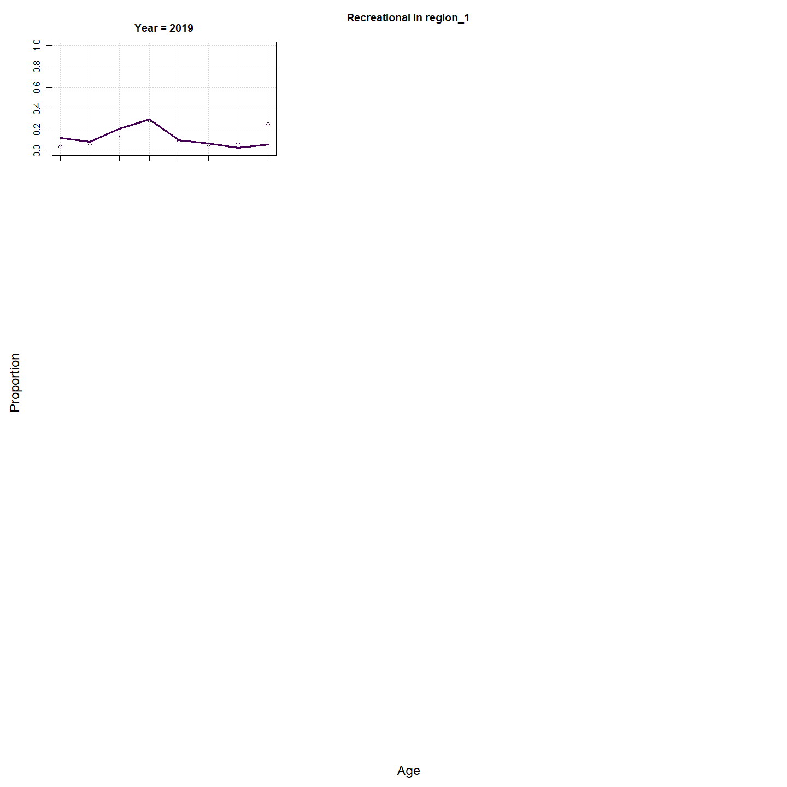
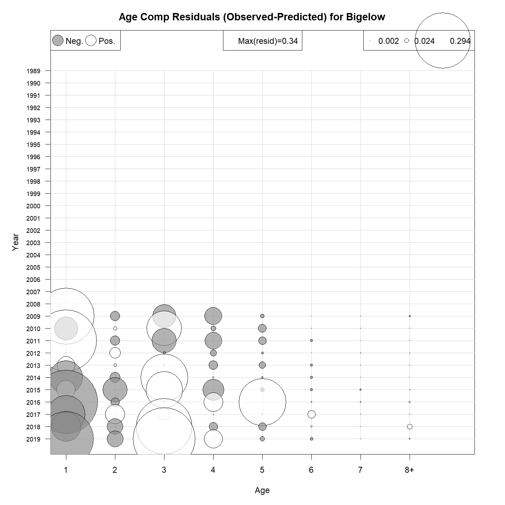
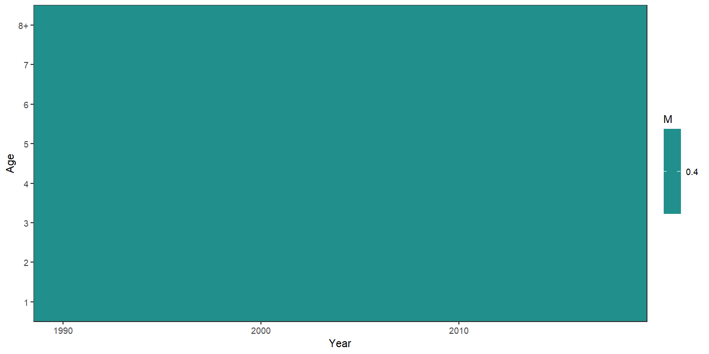

---
output:
  html_document:
    df_print: paged
    keep_md: yes
  word_document: default
  pdf_document:
    fig_caption: yes
    includes:
    keep_tex: yes
    number_sections: no
title: "WHAM figures and tables"
header-includes:
  - \usepackage{longtable}
  - \usepackage{booktabs}
  - \usepackage{caption,graphics}
  - \usepackage{makecell}
  - \usepackage{lscape}
  - \renewcommand\figurename{Fig.}
  - \captionsetup{labelsep=period, singlelinecheck=false}
  - \newcommand{\changesize}[1]{\fontsize{#1pt}{#1pt}\selectfont}
  - \renewcommand{\arraystretch}{1.5}
  - \renewcommand\theadfont{}
---

# {.tabset}

## Figures {.tabset}

### Input

### Diagnostics

### Results

### Retro

### Reference points

### Miscelaneous

## Tables {.tabset}

### Parameter estimates

<table class="table" style="margin-left: auto; margin-right: auto;">
<caption>Parameter estimates, standard errors, and confidence intervals. Rounded to 3 decimal places.</caption>
 <thead>
  <tr>
   <th style="text-align:left;">   </th>
   <th style="text-align:right;"> Estimate </th>
   <th style="text-align:right;"> Std. Error </th>
   <th style="text-align:right;"> 95\% CI lower </th>
   <th style="text-align:right;"> 95\% CI upper </th>
  </tr>
 </thead>
<tbody>
  <tr>
   <td style="text-align:left;"> NEFSC Spring Alb fully selected q </td>
   <td style="text-align:right;"> 0.000 </td>
   <td style="text-align:right;"> 0.000 </td>
   <td style="text-align:right;"> 0.000 </td>
   <td style="text-align:right;"> 0.000 </td>
  </tr>
  <tr>
   <td style="text-align:left;"> REC CPA fully selected q </td>
   <td style="text-align:right;"> 0.000 </td>
   <td style="text-align:right;"> 0.000 </td>
   <td style="text-align:right;"> 0.000 </td>
   <td style="text-align:right;"> 0.000 </td>
  </tr>
  <tr>
   <td style="text-align:left;"> Bigelow fully selected q </td>
   <td style="text-align:right;"> 0.000 </td>
   <td style="text-align:right;"> 0.000 </td>
   <td style="text-align:right;"> 0.000 </td>
   <td style="text-align:right;"> 0.000 </td>
  </tr>
  <tr>
   <td style="text-align:left;"> Block 1: $a_{50}$ </td>
   <td style="text-align:right;"> 1.730 </td>
   <td style="text-align:right;"> 0.085 </td>
   <td style="text-align:right;"> 1.570 </td>
   <td style="text-align:right;"> 1.901 </td>
  </tr>
  <tr>
   <td style="text-align:left;"> Block 1: 1/slope (increasing) </td>
   <td style="text-align:right;"> 0.285 </td>
   <td style="text-align:right;"> 0.029 </td>
   <td style="text-align:right;"> 0.234 </td>
   <td style="text-align:right;"> 0.348 </td>
  </tr>
  <tr>
   <td style="text-align:left;"> Block 2: $a_{50}$ </td>
   <td style="text-align:right;"> 2.555 </td>
   <td style="text-align:right;"> 0.095 </td>
   <td style="text-align:right;"> 2.372 </td>
   <td style="text-align:right;"> 2.746 </td>
  </tr>
  <tr>
   <td style="text-align:left;"> Block 2: 1/slope (increasing) </td>
   <td style="text-align:right;"> 0.420 </td>
   <td style="text-align:right;"> 0.034 </td>
   <td style="text-align:right;"> 0.358 </td>
   <td style="text-align:right;"> 0.491 </td>
  </tr>
  <tr>
   <td style="text-align:left;"> Block 3: $a_{50}$ </td>
   <td style="text-align:right;"> 1.654 </td>
   <td style="text-align:right;"> 0.128 </td>
   <td style="text-align:right;"> 1.416 </td>
   <td style="text-align:right;"> 1.920 </td>
  </tr>
  <tr>
   <td style="text-align:left;"> Block 3: 1/slope (increasing) </td>
   <td style="text-align:right;"> 0.526 </td>
   <td style="text-align:right;"> 0.077 </td>
   <td style="text-align:right;"> 0.393 </td>
   <td style="text-align:right;"> 0.699 </td>
  </tr>
  <tr>
   <td style="text-align:left;"> Block 4: $a_{50}$ </td>
   <td style="text-align:right;"> 4.595 </td>
   <td style="text-align:right;"> 0.414 </td>
   <td style="text-align:right;"> 3.769 </td>
   <td style="text-align:right;"> 5.372 </td>
  </tr>
  <tr>
   <td style="text-align:left;"> Block 4: 1/slope (increasing) </td>
   <td style="text-align:right;"> 1.026 </td>
   <td style="text-align:right;"> 0.092 </td>
   <td style="text-align:right;"> 0.859 </td>
   <td style="text-align:right;"> 1.220 </td>
  </tr>
  <tr>
   <td style="text-align:left;"> Block 5: Selectivity for age 1 </td>
   <td style="text-align:right;"> 0.459 </td>
   <td style="text-align:right;"> 0.096 </td>
   <td style="text-align:right;"> 0.285 </td>
   <td style="text-align:right;"> 0.644 </td>
  </tr>
  <tr>
   <td style="text-align:left;"> Block 5: Selectivity for age 2 </td>
   <td style="text-align:right;"> 1.000 </td>
   <td style="text-align:right;"> -- </td>
   <td style="text-align:right;"> -- </td>
   <td style="text-align:right;"> -- </td>
  </tr>
  <tr>
   <td style="text-align:left;"> Block 5: Selectivity for age 3 </td>
   <td style="text-align:right;"> 1.000 </td>
   <td style="text-align:right;"> -- </td>
   <td style="text-align:right;"> -- </td>
   <td style="text-align:right;"> -- </td>
  </tr>
  <tr>
   <td style="text-align:left;"> Block 5: Selectivity for age 4 </td>
   <td style="text-align:right;"> 1.000 </td>
   <td style="text-align:right;"> -- </td>
   <td style="text-align:right;"> -- </td>
   <td style="text-align:right;"> -- </td>
  </tr>
  <tr>
   <td style="text-align:left;"> Block 5: Selectivity for age 5 </td>
   <td style="text-align:right;"> 1.000 </td>
   <td style="text-align:right;"> -- </td>
   <td style="text-align:right;"> -- </td>
   <td style="text-align:right;"> -- </td>
  </tr>
  <tr>
   <td style="text-align:left;"> Block 5: Selectivity for age 6 </td>
   <td style="text-align:right;"> 1.000 </td>
   <td style="text-align:right;"> -- </td>
   <td style="text-align:right;"> -- </td>
   <td style="text-align:right;"> -- </td>
  </tr>
  <tr>
   <td style="text-align:left;"> Block 5: Selectivity for age 7 </td>
   <td style="text-align:right;"> 1.000 </td>
   <td style="text-align:right;"> -- </td>
   <td style="text-align:right;"> -- </td>
   <td style="text-align:right;"> -- </td>
  </tr>
  <tr>
   <td style="text-align:left;"> Block 5: Selectivity for age 8+ </td>
   <td style="text-align:right;"> 1.000 </td>
   <td style="text-align:right;"> -- </td>
   <td style="text-align:right;"> -- </td>
   <td style="text-align:right;"> -- </td>
  </tr>
  <tr>
   <td style="text-align:left;"> Block 6: Selectivity for age 1 </td>
   <td style="text-align:right;"> 0.955 </td>
   <td style="text-align:right;"> 0.045 </td>
   <td style="text-align:right;"> 0.737 </td>
   <td style="text-align:right;"> 0.994 </td>
  </tr>
  <tr>
   <td style="text-align:left;"> Block 6: Selectivity for age 2 </td>
   <td style="text-align:right;"> 1.000 </td>
   <td style="text-align:right;"> -- </td>
   <td style="text-align:right;"> -- </td>
   <td style="text-align:right;"> -- </td>
  </tr>
  <tr>
   <td style="text-align:left;"> Block 6: Selectivity for age 3 </td>
   <td style="text-align:right;"> 1.000 </td>
   <td style="text-align:right;"> -- </td>
   <td style="text-align:right;"> -- </td>
   <td style="text-align:right;"> -- </td>
  </tr>
  <tr>
   <td style="text-align:left;"> Block 6: Selectivity for age 4 </td>
   <td style="text-align:right;"> 1.000 </td>
   <td style="text-align:right;"> -- </td>
   <td style="text-align:right;"> -- </td>
   <td style="text-align:right;"> -- </td>
  </tr>
  <tr>
   <td style="text-align:left;"> Block 6: Selectivity for age 5 </td>
   <td style="text-align:right;"> 1.000 </td>
   <td style="text-align:right;"> -- </td>
   <td style="text-align:right;"> -- </td>
   <td style="text-align:right;"> -- </td>
  </tr>
  <tr>
   <td style="text-align:left;"> Block 6: Selectivity for age 6 </td>
   <td style="text-align:right;"> 1.000 </td>
   <td style="text-align:right;"> -- </td>
   <td style="text-align:right;"> -- </td>
   <td style="text-align:right;"> -- </td>
  </tr>
  <tr>
   <td style="text-align:left;"> Block 6: Selectivity for age 7 </td>
   <td style="text-align:right;"> 1.000 </td>
   <td style="text-align:right;"> -- </td>
   <td style="text-align:right;"> -- </td>
   <td style="text-align:right;"> -- </td>
  </tr>
  <tr>
   <td style="text-align:left;"> Block 6: Selectivity for age 8+ </td>
   <td style="text-align:right;"> 1.000 </td>
   <td style="text-align:right;"> -- </td>
   <td style="text-align:right;"> -- </td>
   <td style="text-align:right;"> -- </td>
  </tr>
  <tr>
   <td style="text-align:left;"> Block 7: Selectivity for age 1 </td>
   <td style="text-align:right;"> 0.523 </td>
   <td style="text-align:right;"> 0.086 </td>
   <td style="text-align:right;"> 0.358 </td>
   <td style="text-align:right;"> 0.683 </td>
  </tr>
  <tr>
   <td style="text-align:left;"> Block 7: Selectivity for age 2 </td>
   <td style="text-align:right;"> 1.000 </td>
   <td style="text-align:right;"> -- </td>
   <td style="text-align:right;"> -- </td>
   <td style="text-align:right;"> -- </td>
  </tr>
  <tr>
   <td style="text-align:left;"> Block 7: Selectivity for age 3 </td>
   <td style="text-align:right;"> 1.000 </td>
   <td style="text-align:right;"> -- </td>
   <td style="text-align:right;"> -- </td>
   <td style="text-align:right;"> -- </td>
  </tr>
  <tr>
   <td style="text-align:left;"> Block 7: Selectivity for age 4 </td>
   <td style="text-align:right;"> 1.000 </td>
   <td style="text-align:right;"> -- </td>
   <td style="text-align:right;"> -- </td>
   <td style="text-align:right;"> -- </td>
  </tr>
  <tr>
   <td style="text-align:left;"> Block 7: Selectivity for age 5 </td>
   <td style="text-align:right;"> 1.000 </td>
   <td style="text-align:right;"> -- </td>
   <td style="text-align:right;"> -- </td>
   <td style="text-align:right;"> -- </td>
  </tr>
  <tr>
   <td style="text-align:left;"> Block 7: Selectivity for age 6 </td>
   <td style="text-align:right;"> 1.000 </td>
   <td style="text-align:right;"> -- </td>
   <td style="text-align:right;"> -- </td>
   <td style="text-align:right;"> -- </td>
  </tr>
  <tr>
   <td style="text-align:left;"> Block 7: Selectivity for age 7 </td>
   <td style="text-align:right;"> 1.000 </td>
   <td style="text-align:right;"> -- </td>
   <td style="text-align:right;"> -- </td>
   <td style="text-align:right;"> -- </td>
  </tr>
  <tr>
   <td style="text-align:left;"> Block 7: Selectivity for age 8+ </td>
   <td style="text-align:right;"> 1.000 </td>
   <td style="text-align:right;"> -- </td>
   <td style="text-align:right;"> -- </td>
   <td style="text-align:right;"> -- </td>
  </tr>
</tbody>
</table>

### Abundance at age

<table class="table" style="margin-left: auto; margin-right: auto;">
<caption>Abundance at age (1000s) for stock 1 in region 1.</caption>
 <thead>
  <tr>
   <th style="text-align:left;">   </th>
   <th style="text-align:right;"> 1 </th>
   <th style="text-align:right;"> 2 </th>
   <th style="text-align:right;"> 3 </th>
   <th style="text-align:right;"> 4 </th>
   <th style="text-align:right;"> 5 </th>
   <th style="text-align:right;"> 6 </th>
   <th style="text-align:right;"> 7 </th>
   <th style="text-align:right;"> 8+ </th>
  </tr>
 </thead>
<tbody>
  <tr>
   <td style="text-align:left;"> 1989 </td>
   <td style="text-align:right;"> 6529 </td>
   <td style="text-align:right;"> 3293 </td>
   <td style="text-align:right;"> 1485 </td>
   <td style="text-align:right;"> 658 </td>
   <td style="text-align:right;"> 291 </td>
   <td style="text-align:right;"> 128 </td>
   <td style="text-align:right;"> 57 </td>
   <td style="text-align:right;"> 45 </td>
  </tr>
  <tr>
   <td style="text-align:left;"> 1990 </td>
   <td style="text-align:right;"> 2813 </td>
   <td style="text-align:right;"> 3830 </td>
   <td style="text-align:right;"> 1279 </td>
   <td style="text-align:right;"> 465 </td>
   <td style="text-align:right;"> 199 </td>
   <td style="text-align:right;"> 88 </td>
   <td style="text-align:right;"> 39 </td>
   <td style="text-align:right;"> 31 </td>
  </tr>
  <tr>
   <td style="text-align:left;"> 1991 </td>
   <td style="text-align:right;"> 3277 </td>
   <td style="text-align:right;"> 1750 </td>
   <td style="text-align:right;"> 1730 </td>
   <td style="text-align:right;"> 496 </td>
   <td style="text-align:right;"> 177 </td>
   <td style="text-align:right;"> 76 </td>
   <td style="text-align:right;"> 33 </td>
   <td style="text-align:right;"> 26 </td>
  </tr>
  <tr>
   <td style="text-align:left;"> 1992 </td>
   <td style="text-align:right;"> 3468 </td>
   <td style="text-align:right;"> 2091 </td>
   <td style="text-align:right;"> 903 </td>
   <td style="text-align:right;"> 806 </td>
   <td style="text-align:right;"> 229 </td>
   <td style="text-align:right;"> 82 </td>
   <td style="text-align:right;"> 35 </td>
   <td style="text-align:right;"> 27 </td>
  </tr>
  <tr>
   <td style="text-align:left;"> 1993 </td>
   <td style="text-align:right;"> 1903 </td>
   <td style="text-align:right;"> 2260 </td>
   <td style="text-align:right;"> 1154 </td>
   <td style="text-align:right;"> 462 </td>
   <td style="text-align:right;"> 411 </td>
   <td style="text-align:right;"> 116 </td>
   <td style="text-align:right;"> 42 </td>
   <td style="text-align:right;"> 32 </td>
  </tr>
  <tr>
   <td style="text-align:left;"> 1994 </td>
   <td style="text-align:right;"> 6406 </td>
   <td style="text-align:right;"> 1226 </td>
   <td style="text-align:right;"> 1246 </td>
   <td style="text-align:right;"> 590 </td>
   <td style="text-align:right;"> 234 </td>
   <td style="text-align:right;"> 208 </td>
   <td style="text-align:right;"> 59 </td>
   <td style="text-align:right;"> 37 </td>
  </tr>
  <tr>
   <td style="text-align:left;"> 1995 </td>
   <td style="text-align:right;"> 6247 </td>
   <td style="text-align:right;"> 4113 </td>
   <td style="text-align:right;"> 663 </td>
   <td style="text-align:right;"> 621 </td>
   <td style="text-align:right;"> 291 </td>
   <td style="text-align:right;"> 115 </td>
   <td style="text-align:right;"> 102 </td>
   <td style="text-align:right;"> 47 </td>
  </tr>
  <tr>
   <td style="text-align:left;"> 1996 </td>
   <td style="text-align:right;"> 8360 </td>
   <td style="text-align:right;"> 4105 </td>
   <td style="text-align:right;"> 2430 </td>
   <td style="text-align:right;"> 373 </td>
   <td style="text-align:right;"> 348 </td>
   <td style="text-align:right;"> 163 </td>
   <td style="text-align:right;"> 65 </td>
   <td style="text-align:right;"> 84 </td>
  </tr>
  <tr>
   <td style="text-align:left;"> 1997 </td>
   <td style="text-align:right;"> 5455 </td>
   <td style="text-align:right;"> 5479 </td>
   <td style="text-align:right;"> 2341 </td>
   <td style="text-align:right;"> 1303 </td>
   <td style="text-align:right;"> 199 </td>
   <td style="text-align:right;"> 186 </td>
   <td style="text-align:right;"> 87 </td>
   <td style="text-align:right;"> 79 </td>
  </tr>
  <tr>
   <td style="text-align:left;"> 1998 </td>
   <td style="text-align:right;"> 2925 </td>
   <td style="text-align:right;"> 3585 </td>
   <td style="text-align:right;"> 3290 </td>
   <td style="text-align:right;"> 1347 </td>
   <td style="text-align:right;"> 747 </td>
   <td style="text-align:right;"> 114 </td>
   <td style="text-align:right;"> 106 </td>
   <td style="text-align:right;"> 95 </td>
  </tr>
  <tr>
   <td style="text-align:left;"> 1999 </td>
   <td style="text-align:right;"> 18518 </td>
   <td style="text-align:right;"> 1941 </td>
   <td style="text-align:right;"> 2286 </td>
   <td style="text-align:right;"> 1929 </td>
   <td style="text-align:right;"> 764 </td>
   <td style="text-align:right;"> 421 </td>
   <td style="text-align:right;"> 64 </td>
   <td style="text-align:right;"> 114 </td>
  </tr>
  <tr>
   <td style="text-align:left;"> 2000 </td>
   <td style="text-align:right;"> 14083 </td>
   <td style="text-align:right;"> 12192 </td>
   <td style="text-align:right;"> 1204 </td>
   <td style="text-align:right;"> 1270 </td>
   <td style="text-align:right;"> 1027 </td>
   <td style="text-align:right;"> 404 </td>
   <td style="text-align:right;"> 223 </td>
   <td style="text-align:right;"> 94 </td>
  </tr>
  <tr>
   <td style="text-align:left;"> 2001 </td>
   <td style="text-align:right;"> 7080 </td>
   <td style="text-align:right;"> 9213 </td>
   <td style="text-align:right;"> 7482 </td>
   <td style="text-align:right;"> 676 </td>
   <td style="text-align:right;"> 690 </td>
   <td style="text-align:right;"> 555 </td>
   <td style="text-align:right;"> 218 </td>
   <td style="text-align:right;"> 171 </td>
  </tr>
  <tr>
   <td style="text-align:left;"> 2002 </td>
   <td style="text-align:right;"> 15678 </td>
   <td style="text-align:right;"> 4613 </td>
   <td style="text-align:right;"> 5547 </td>
   <td style="text-align:right;"> 3995 </td>
   <td style="text-align:right;"> 345 </td>
   <td style="text-align:right;"> 350 </td>
   <td style="text-align:right;"> 282 </td>
   <td style="text-align:right;"> 198 </td>
  </tr>
  <tr>
   <td style="text-align:left;"> 2003 </td>
   <td style="text-align:right;"> 4134 </td>
   <td style="text-align:right;"> 10154 </td>
   <td style="text-align:right;"> 2732 </td>
   <td style="text-align:right;"> 2902 </td>
   <td style="text-align:right;"> 1998 </td>
   <td style="text-align:right;"> 171 </td>
   <td style="text-align:right;"> 174 </td>
   <td style="text-align:right;"> 238 </td>
  </tr>
  <tr>
   <td style="text-align:left;"> 2004 </td>
   <td style="text-align:right;"> 4484 </td>
   <td style="text-align:right;"> 2683 </td>
   <td style="text-align:right;"> 6085 </td>
   <td style="text-align:right;"> 1481 </td>
   <td style="text-align:right;"> 1518 </td>
   <td style="text-align:right;"> 1040 </td>
   <td style="text-align:right;"> 89 </td>
   <td style="text-align:right;"> 214 </td>
  </tr>
  <tr>
   <td style="text-align:left;"> 2005 </td>
   <td style="text-align:right;"> 8151 </td>
   <td style="text-align:right;"> 2945 </td>
   <td style="text-align:right;"> 1656 </td>
   <td style="text-align:right;"> 3382 </td>
   <td style="text-align:right;"> 790 </td>
   <td style="text-align:right;"> 806 </td>
   <td style="text-align:right;"> 552 </td>
   <td style="text-align:right;"> 161 </td>
  </tr>
  <tr>
   <td style="text-align:left;"> 2006 </td>
   <td style="text-align:right;"> 20396 </td>
   <td style="text-align:right;"> 5315 </td>
   <td style="text-align:right;"> 1790 </td>
   <td style="text-align:right;"> 917 </td>
   <td style="text-align:right;"> 1810 </td>
   <td style="text-align:right;"> 421 </td>
   <td style="text-align:right;"> 429 </td>
   <td style="text-align:right;"> 380 </td>
  </tr>
  <tr>
   <td style="text-align:left;"> 2007 </td>
   <td style="text-align:right;"> 15207 </td>
   <td style="text-align:right;"> 13227 </td>
   <td style="text-align:right;"> 3165 </td>
   <td style="text-align:right;"> 950 </td>
   <td style="text-align:right;"> 467 </td>
   <td style="text-align:right;"> 916 </td>
   <td style="text-align:right;"> 213 </td>
   <td style="text-align:right;"> 409 </td>
  </tr>
  <tr>
   <td style="text-align:left;"> 2008 </td>
   <td style="text-align:right;"> 21367 </td>
   <td style="text-align:right;"> 9839 </td>
   <td style="text-align:right;"> 7802 </td>
   <td style="text-align:right;"> 1644 </td>
   <td style="text-align:right;"> 471 </td>
   <td style="text-align:right;"> 230 </td>
   <td style="text-align:right;"> 451 </td>
   <td style="text-align:right;"> 306 </td>
  </tr>
  <tr>
   <td style="text-align:left;"> 2009 </td>
   <td style="text-align:right;"> 24315 </td>
   <td style="text-align:right;"> 13927 </td>
   <td style="text-align:right;"> 6003 </td>
   <td style="text-align:right;"> 4414 </td>
   <td style="text-align:right;"> 906 </td>
   <td style="text-align:right;"> 259 </td>
   <td style="text-align:right;"> 126 </td>
   <td style="text-align:right;"> 416 </td>
  </tr>
  <tr>
   <td style="text-align:left;"> 2010 </td>
   <td style="text-align:right;"> 18491 </td>
   <td style="text-align:right;"> 16006 </td>
   <td style="text-align:right;"> 8842 </td>
   <td style="text-align:right;"> 3490 </td>
   <td style="text-align:right;"> 2279 </td>
   <td style="text-align:right;"> 407 </td>
   <td style="text-align:right;"> 104 </td>
   <td style="text-align:right;"> 199 </td>
  </tr>
  <tr>
   <td style="text-align:left;"> 2011 </td>
   <td style="text-align:right;"> 16148 </td>
   <td style="text-align:right;"> 12108 </td>
   <td style="text-align:right;"> 10019 </td>
   <td style="text-align:right;"> 4966 </td>
   <td style="text-align:right;"> 1683 </td>
   <td style="text-align:right;"> 917 </td>
   <td style="text-align:right;"> 141 </td>
   <td style="text-align:right;"> 94 </td>
  </tr>
  <tr>
   <td style="text-align:left;"> 2012 </td>
   <td style="text-align:right;"> 81793 </td>
   <td style="text-align:right;"> 10714 </td>
   <td style="text-align:right;"> 7838 </td>
   <td style="text-align:right;"> 6094 </td>
   <td style="text-align:right;"> 2818 </td>
   <td style="text-align:right;"> 887 </td>
   <td style="text-align:right;"> 455 </td>
   <td style="text-align:right;"> 112 </td>
  </tr>
  <tr>
   <td style="text-align:left;"> 2013 </td>
   <td style="text-align:right;"> 20367 </td>
   <td style="text-align:right;"> 53884 </td>
   <td style="text-align:right;"> 6811 </td>
   <td style="text-align:right;"> 4567 </td>
   <td style="text-align:right;"> 3168 </td>
   <td style="text-align:right;"> 1285 </td>
   <td style="text-align:right;"> 363 </td>
   <td style="text-align:right;"> 217 </td>
  </tr>
  <tr>
   <td style="text-align:left;"> 2014 </td>
   <td style="text-align:right;"> 25091 </td>
   <td style="text-align:right;"> 13475 </td>
   <td style="text-align:right;"> 34581 </td>
   <td style="text-align:right;"> 4050 </td>
   <td style="text-align:right;"> 2487 </td>
   <td style="text-align:right;"> 1569 </td>
   <td style="text-align:right;"> 588 </td>
   <td style="text-align:right;"> 252 </td>
  </tr>
  <tr>
   <td style="text-align:left;"> 2015 </td>
   <td style="text-align:right;"> 22721 </td>
   <td style="text-align:right;"> 16596 </td>
   <td style="text-align:right;"> 8647 </td>
   <td style="text-align:right;"> 20569 </td>
   <td style="text-align:right;"> 2203 </td>
   <td style="text-align:right;"> 1227 </td>
   <td style="text-align:right;"> 714 </td>
   <td style="text-align:right;"> 363 </td>
  </tr>
  <tr>
   <td style="text-align:left;"> 2016 </td>
   <td style="text-align:right;"> 50670 </td>
   <td style="text-align:right;"> 15055 </td>
   <td style="text-align:right;"> 10702 </td>
   <td style="text-align:right;"> 5207 </td>
   <td style="text-align:right;"> 11461 </td>
   <td style="text-align:right;"> 1129 </td>
   <td style="text-align:right;"> 587 </td>
   <td style="text-align:right;"> 492 </td>
  </tr>
  <tr>
   <td style="text-align:left;"> 2017 </td>
   <td style="text-align:right;"> 38103 </td>
   <td style="text-align:right;"> 33600 </td>
   <td style="text-align:right;"> 9695 </td>
   <td style="text-align:right;"> 6389 </td>
   <td style="text-align:right;"> 2885 </td>
   <td style="text-align:right;"> 5898 </td>
   <td style="text-align:right;"> 547 </td>
   <td style="text-align:right;"> 502 </td>
  </tr>
  <tr>
   <td style="text-align:left;"> 2018 </td>
   <td style="text-align:right;"> 21828 </td>
   <td style="text-align:right;"> 25155 </td>
   <td style="text-align:right;"> 21122 </td>
   <td style="text-align:right;"> 5354 </td>
   <td style="text-align:right;"> 3163 </td>
   <td style="text-align:right;"> 1298 </td>
   <td style="text-align:right;"> 2457 </td>
   <td style="text-align:right;"> 414 </td>
  </tr>
  <tr>
   <td style="text-align:left;"> 2019 </td>
   <td style="text-align:right;"> 49284 </td>
   <td style="text-align:right;"> 14412 </td>
   <td style="text-align:right;"> 15857 </td>
   <td style="text-align:right;"> 11788 </td>
   <td style="text-align:right;"> 2685 </td>
   <td style="text-align:right;"> 1439 </td>
   <td style="text-align:right;"> 546 </td>
   <td style="text-align:right;"> 1152 </td>
  </tr>
</tbody>
</table>

### Fishing mortality at age by region

<table class="table" style="margin-left: auto; margin-right: auto;">
<caption>Total fishing mortality at age in region 1.</caption>
 <thead>
  <tr>
   <th style="text-align:left;">   </th>
   <th style="text-align:right;"> 1 </th>
   <th style="text-align:right;"> 2 </th>
   <th style="text-align:right;"> 3 </th>
   <th style="text-align:right;"> 4 </th>
   <th style="text-align:right;"> 5 </th>
   <th style="text-align:right;"> 6 </th>
   <th style="text-align:right;"> 7 </th>
   <th style="text-align:right;"> 8+ </th>
  </tr>
 </thead>
<tbody>
  <tr>
   <td style="text-align:left;"> 1989 </td>
   <td style="text-align:right;"> 0.022 </td>
   <td style="text-align:right;"> 0.217 </td>
   <td style="text-align:right;"> 0.298 </td>
   <td style="text-align:right;"> 0.301 </td>
   <td style="text-align:right;"> 0.301 </td>
   <td style="text-align:right;"> 0.301 </td>
   <td style="text-align:right;"> 0.301 </td>
   <td style="text-align:right;"> 0.301 </td>
  </tr>
  <tr>
   <td style="text-align:left;"> 1990 </td>
   <td style="text-align:right;"> 0.025 </td>
   <td style="text-align:right;"> 0.249 </td>
   <td style="text-align:right;"> 0.341 </td>
   <td style="text-align:right;"> 0.345 </td>
   <td style="text-align:right;"> 0.345 </td>
   <td style="text-align:right;"> 0.345 </td>
   <td style="text-align:right;"> 0.345 </td>
   <td style="text-align:right;"> 0.345 </td>
  </tr>
  <tr>
   <td style="text-align:left;"> 1991 </td>
   <td style="text-align:right;"> 0.017 </td>
   <td style="text-align:right;"> 0.166 </td>
   <td style="text-align:right;"> 0.228 </td>
   <td style="text-align:right;"> 0.230 </td>
   <td style="text-align:right;"> 0.231 </td>
   <td style="text-align:right;"> 0.231 </td>
   <td style="text-align:right;"> 0.231 </td>
   <td style="text-align:right;"> 0.231 </td>
  </tr>
  <tr>
   <td style="text-align:left;"> 1992 </td>
   <td style="text-align:right;"> 0.016 </td>
   <td style="text-align:right;"> 0.157 </td>
   <td style="text-align:right;"> 0.215 </td>
   <td style="text-align:right;"> 0.218 </td>
   <td style="text-align:right;"> 0.218 </td>
   <td style="text-align:right;"> 0.218 </td>
   <td style="text-align:right;"> 0.218 </td>
   <td style="text-align:right;"> 0.218 </td>
  </tr>
  <tr>
   <td style="text-align:left;"> 1993 </td>
   <td style="text-align:right;"> 0.011 </td>
   <td style="text-align:right;"> 0.110 </td>
   <td style="text-align:right;"> 0.151 </td>
   <td style="text-align:right;"> 0.153 </td>
   <td style="text-align:right;"> 0.153 </td>
   <td style="text-align:right;"> 0.153 </td>
   <td style="text-align:right;"> 0.153 </td>
   <td style="text-align:right;"> 0.153 </td>
  </tr>
  <tr>
   <td style="text-align:left;"> 1994 </td>
   <td style="text-align:right;"> 0.012 </td>
   <td style="text-align:right;"> 0.125 </td>
   <td style="text-align:right;"> 0.171 </td>
   <td style="text-align:right;"> 0.173 </td>
   <td style="text-align:right;"> 0.173 </td>
   <td style="text-align:right;"> 0.173 </td>
   <td style="text-align:right;"> 0.173 </td>
   <td style="text-align:right;"> 0.173 </td>
  </tr>
  <tr>
   <td style="text-align:left;"> 1995 </td>
   <td style="text-align:right;"> 0.010 </td>
   <td style="text-align:right;"> 0.096 </td>
   <td style="text-align:right;"> 0.132 </td>
   <td style="text-align:right;"> 0.133 </td>
   <td style="text-align:right;"> 0.133 </td>
   <td style="text-align:right;"> 0.133 </td>
   <td style="text-align:right;"> 0.133 </td>
   <td style="text-align:right;"> 0.133 </td>
  </tr>
  <tr>
   <td style="text-align:left;"> 1996 </td>
   <td style="text-align:right;"> 0.013 </td>
   <td style="text-align:right;"> 0.135 </td>
   <td style="text-align:right;"> 0.185 </td>
   <td style="text-align:right;"> 0.187 </td>
   <td style="text-align:right;"> 0.187 </td>
   <td style="text-align:right;"> 0.187 </td>
   <td style="text-align:right;"> 0.187 </td>
   <td style="text-align:right;"> 0.187 </td>
  </tr>
  <tr>
   <td style="text-align:left;"> 1997 </td>
   <td style="text-align:right;"> 0.007 </td>
   <td style="text-align:right;"> 0.073 </td>
   <td style="text-align:right;"> 0.100 </td>
   <td style="text-align:right;"> 0.101 </td>
   <td style="text-align:right;"> 0.101 </td>
   <td style="text-align:right;"> 0.101 </td>
   <td style="text-align:right;"> 0.101 </td>
   <td style="text-align:right;"> 0.101 </td>
  </tr>
  <tr>
   <td style="text-align:left;"> 1998 </td>
   <td style="text-align:right;"> 0.003 </td>
   <td style="text-align:right;"> 0.030 </td>
   <td style="text-align:right;"> 0.106 </td>
   <td style="text-align:right;"> 0.138 </td>
   <td style="text-align:right;"> 0.142 </td>
   <td style="text-align:right;"> 0.142 </td>
   <td style="text-align:right;"> 0.142 </td>
   <td style="text-align:right;"> 0.142 </td>
  </tr>
  <tr>
   <td style="text-align:left;"> 1999 </td>
   <td style="text-align:right;"> 0.004 </td>
   <td style="text-align:right;"> 0.037 </td>
   <td style="text-align:right;"> 0.130 </td>
   <td style="text-align:right;"> 0.170 </td>
   <td style="text-align:right;"> 0.175 </td>
   <td style="text-align:right;"> 0.175 </td>
   <td style="text-align:right;"> 0.175 </td>
   <td style="text-align:right;"> 0.176 </td>
  </tr>
  <tr>
   <td style="text-align:left;"> 2000 </td>
   <td style="text-align:right;"> 0.003 </td>
   <td style="text-align:right;"> 0.025 </td>
   <td style="text-align:right;"> 0.089 </td>
   <td style="text-align:right;"> 0.116 </td>
   <td style="text-align:right;"> 0.119 </td>
   <td style="text-align:right;"> 0.119 </td>
   <td style="text-align:right;"> 0.119 </td>
   <td style="text-align:right;"> 0.119 </td>
  </tr>
  <tr>
   <td style="text-align:left;"> 2001 </td>
   <td style="text-align:right;"> 0.004 </td>
   <td style="text-align:right;"> 0.036 </td>
   <td style="text-align:right;"> 0.127 </td>
   <td style="text-align:right;"> 0.165 </td>
   <td style="text-align:right;"> 0.170 </td>
   <td style="text-align:right;"> 0.170 </td>
   <td style="text-align:right;"> 0.170 </td>
   <td style="text-align:right;"> 0.170 </td>
  </tr>
  <tr>
   <td style="text-align:left;"> 2002 </td>
   <td style="text-align:right;"> 0.004 </td>
   <td style="text-align:right;"> 0.034 </td>
   <td style="text-align:right;"> 0.122 </td>
   <td style="text-align:right;"> 0.159 </td>
   <td style="text-align:right;"> 0.163 </td>
   <td style="text-align:right;"> 0.164 </td>
   <td style="text-align:right;"> 0.164 </td>
   <td style="text-align:right;"> 0.164 </td>
  </tr>
  <tr>
   <td style="text-align:left;"> 2003 </td>
   <td style="text-align:right;"> 0.003 </td>
   <td style="text-align:right;"> 0.026 </td>
   <td style="text-align:right;"> 0.090 </td>
   <td style="text-align:right;"> 0.118 </td>
   <td style="text-align:right;"> 0.121 </td>
   <td style="text-align:right;"> 0.122 </td>
   <td style="text-align:right;"> 0.122 </td>
   <td style="text-align:right;"> 0.122 </td>
  </tr>
  <tr>
   <td style="text-align:left;"> 2004 </td>
   <td style="text-align:right;"> 0.004 </td>
   <td style="text-align:right;"> 0.033 </td>
   <td style="text-align:right;"> 0.118 </td>
   <td style="text-align:right;"> 0.154 </td>
   <td style="text-align:right;"> 0.159 </td>
   <td style="text-align:right;"> 0.159 </td>
   <td style="text-align:right;"> 0.159 </td>
   <td style="text-align:right;"> 0.159 </td>
  </tr>
  <tr>
   <td style="text-align:left;"> 2005 </td>
   <td style="text-align:right;"> 0.003 </td>
   <td style="text-align:right;"> 0.025 </td>
   <td style="text-align:right;"> 0.089 </td>
   <td style="text-align:right;"> 0.116 </td>
   <td style="text-align:right;"> 0.119 </td>
   <td style="text-align:right;"> 0.120 </td>
   <td style="text-align:right;"> 0.120 </td>
   <td style="text-align:right;"> 0.120 </td>
  </tr>
  <tr>
   <td style="text-align:left;"> 2006 </td>
   <td style="text-align:right;"> 0.004 </td>
   <td style="text-align:right;"> 0.031 </td>
   <td style="text-align:right;"> 0.111 </td>
   <td style="text-align:right;"> 0.145 </td>
   <td style="text-align:right;"> 0.149 </td>
   <td style="text-align:right;"> 0.149 </td>
   <td style="text-align:right;"> 0.149 </td>
   <td style="text-align:right;"> 0.149 </td>
  </tr>
  <tr>
   <td style="text-align:left;"> 2007 </td>
   <td style="text-align:right;"> 0.004 </td>
   <td style="text-align:right;"> 0.035 </td>
   <td style="text-align:right;"> 0.125 </td>
   <td style="text-align:right;"> 0.163 </td>
   <td style="text-align:right;"> 0.168 </td>
   <td style="text-align:right;"> 0.168 </td>
   <td style="text-align:right;"> 0.168 </td>
   <td style="text-align:right;"> 0.168 </td>
  </tr>
  <tr>
   <td style="text-align:left;"> 2008 </td>
   <td style="text-align:right;"> 0.002 </td>
   <td style="text-align:right;"> 0.017 </td>
   <td style="text-align:right;"> 0.062 </td>
   <td style="text-align:right;"> 0.080 </td>
   <td style="text-align:right;"> 0.083 </td>
   <td style="text-align:right;"> 0.083 </td>
   <td style="text-align:right;"> 0.083 </td>
   <td style="text-align:right;"> 0.083 </td>
  </tr>
  <tr>
   <td style="text-align:left;"> 2009 </td>
   <td style="text-align:right;"> 0.001 </td>
   <td style="text-align:right;"> 0.012 </td>
   <td style="text-align:right;"> 0.043 </td>
   <td style="text-align:right;"> 0.055 </td>
   <td style="text-align:right;"> 0.057 </td>
   <td style="text-align:right;"> 0.057 </td>
   <td style="text-align:right;"> 0.057 </td>
   <td style="text-align:right;"> 0.057 </td>
  </tr>
  <tr>
   <td style="text-align:left;"> 2010 </td>
   <td style="text-align:right;"> 0.001 </td>
   <td style="text-align:right;"> 0.013 </td>
   <td style="text-align:right;"> 0.046 </td>
   <td style="text-align:right;"> 0.060 </td>
   <td style="text-align:right;"> 0.062 </td>
   <td style="text-align:right;"> 0.062 </td>
   <td style="text-align:right;"> 0.062 </td>
   <td style="text-align:right;"> 0.062 </td>
  </tr>
  <tr>
   <td style="text-align:left;"> 2011 </td>
   <td style="text-align:right;"> 0.001 </td>
   <td style="text-align:right;"> 0.013 </td>
   <td style="text-align:right;"> 0.045 </td>
   <td style="text-align:right;"> 0.058 </td>
   <td style="text-align:right;"> 0.060 </td>
   <td style="text-align:right;"> 0.060 </td>
   <td style="text-align:right;"> 0.060 </td>
   <td style="text-align:right;"> 0.060 </td>
  </tr>
  <tr>
   <td style="text-align:left;"> 2012 </td>
   <td style="text-align:right;"> 0.001 </td>
   <td style="text-align:right;"> 0.013 </td>
   <td style="text-align:right;"> 0.045 </td>
   <td style="text-align:right;"> 0.059 </td>
   <td style="text-align:right;"> 0.061 </td>
   <td style="text-align:right;"> 0.061 </td>
   <td style="text-align:right;"> 0.061 </td>
   <td style="text-align:right;"> 0.061 </td>
  </tr>
  <tr>
   <td style="text-align:left;"> 2013 </td>
   <td style="text-align:right;"> 0.002 </td>
   <td style="text-align:right;"> 0.015 </td>
   <td style="text-align:right;"> 0.052 </td>
   <td style="text-align:right;"> 0.068 </td>
   <td style="text-align:right;"> 0.070 </td>
   <td style="text-align:right;"> 0.070 </td>
   <td style="text-align:right;"> 0.070 </td>
   <td style="text-align:right;"> 0.070 </td>
  </tr>
  <tr>
   <td style="text-align:left;"> 2014 </td>
   <td style="text-align:right;"> 0.002 </td>
   <td style="text-align:right;"> 0.014 </td>
   <td style="text-align:right;"> 0.049 </td>
   <td style="text-align:right;"> 0.064 </td>
   <td style="text-align:right;"> 0.066 </td>
   <td style="text-align:right;"> 0.066 </td>
   <td style="text-align:right;"> 0.066 </td>
   <td style="text-align:right;"> 0.066 </td>
  </tr>
  <tr>
   <td style="text-align:left;"> 2015 </td>
   <td style="text-align:right;"> 0.002 </td>
   <td style="text-align:right;"> 0.013 </td>
   <td style="text-align:right;"> 0.047 </td>
   <td style="text-align:right;"> 0.061 </td>
   <td style="text-align:right;"> 0.063 </td>
   <td style="text-align:right;"> 0.063 </td>
   <td style="text-align:right;"> 0.063 </td>
   <td style="text-align:right;"> 0.063 </td>
  </tr>
  <tr>
   <td style="text-align:left;"> 2016 </td>
   <td style="text-align:right;"> 0.002 </td>
   <td style="text-align:right;"> 0.018 </td>
   <td style="text-align:right;"> 0.064 </td>
   <td style="text-align:right;"> 0.083 </td>
   <td style="text-align:right;"> 0.085 </td>
   <td style="text-align:right;"> 0.086 </td>
   <td style="text-align:right;"> 0.086 </td>
   <td style="text-align:right;"> 0.086 </td>
  </tr>
  <tr>
   <td style="text-align:left;"> 2017 </td>
   <td style="text-align:right;"> 0.004 </td>
   <td style="text-align:right;"> 0.036 </td>
   <td style="text-align:right;"> 0.127 </td>
   <td style="text-align:right;"> 0.166 </td>
   <td style="text-align:right;"> 0.171 </td>
   <td style="text-align:right;"> 0.171 </td>
   <td style="text-align:right;"> 0.171 </td>
   <td style="text-align:right;"> 0.171 </td>
  </tr>
  <tr>
   <td style="text-align:left;"> 2018 </td>
   <td style="text-align:right;"> 0.004 </td>
   <td style="text-align:right;"> 0.033 </td>
   <td style="text-align:right;"> 0.115 </td>
   <td style="text-align:right;"> 0.150 </td>
   <td style="text-align:right;"> 0.155 </td>
   <td style="text-align:right;"> 0.155 </td>
   <td style="text-align:right;"> 0.155 </td>
   <td style="text-align:right;"> 0.155 </td>
  </tr>
  <tr>
   <td style="text-align:left;"> 2019 </td>
   <td style="text-align:right;"> 0.005 </td>
   <td style="text-align:right;"> 0.043 </td>
   <td style="text-align:right;"> 0.151 </td>
   <td style="text-align:right;"> 0.197 </td>
   <td style="text-align:right;"> 0.202 </td>
   <td style="text-align:right;"> 0.203 </td>
   <td style="text-align:right;"> 0.203 </td>
   <td style="text-align:right;"> 0.203 </td>
  </tr>
</tbody>
</table>

### Fishing mortality at age by fleet

<table class="table" style="margin-left: auto; margin-right: auto;">
<caption>Total fishing mortality at age in Commercial.</caption>
 <thead>
  <tr>
   <th style="text-align:left;">   </th>
   <th style="text-align:right;"> 1 </th>
   <th style="text-align:right;"> 2 </th>
   <th style="text-align:right;"> 3 </th>
   <th style="text-align:right;"> 4 </th>
   <th style="text-align:right;"> 5 </th>
   <th style="text-align:right;"> 6 </th>
   <th style="text-align:right;"> 7 </th>
   <th style="text-align:right;"> 8+ </th>
  </tr>
 </thead>
<tbody>
  <tr>
   <td style="text-align:left;"> 1989 </td>
   <td style="text-align:right;"> 0.022 </td>
   <td style="text-align:right;"> 0.217 </td>
   <td style="text-align:right;"> 0.298 </td>
   <td style="text-align:right;"> 0.301 </td>
   <td style="text-align:right;"> 0.301 </td>
   <td style="text-align:right;"> 0.301 </td>
   <td style="text-align:right;"> 0.301 </td>
   <td style="text-align:right;"> 0.301 </td>
  </tr>
  <tr>
   <td style="text-align:left;"> 1990 </td>
   <td style="text-align:right;"> 0.025 </td>
   <td style="text-align:right;"> 0.249 </td>
   <td style="text-align:right;"> 0.341 </td>
   <td style="text-align:right;"> 0.345 </td>
   <td style="text-align:right;"> 0.345 </td>
   <td style="text-align:right;"> 0.345 </td>
   <td style="text-align:right;"> 0.345 </td>
   <td style="text-align:right;"> 0.345 </td>
  </tr>
  <tr>
   <td style="text-align:left;"> 1991 </td>
   <td style="text-align:right;"> 0.017 </td>
   <td style="text-align:right;"> 0.166 </td>
   <td style="text-align:right;"> 0.228 </td>
   <td style="text-align:right;"> 0.230 </td>
   <td style="text-align:right;"> 0.231 </td>
   <td style="text-align:right;"> 0.231 </td>
   <td style="text-align:right;"> 0.231 </td>
   <td style="text-align:right;"> 0.231 </td>
  </tr>
  <tr>
   <td style="text-align:left;"> 1992 </td>
   <td style="text-align:right;"> 0.016 </td>
   <td style="text-align:right;"> 0.157 </td>
   <td style="text-align:right;"> 0.215 </td>
   <td style="text-align:right;"> 0.218 </td>
   <td style="text-align:right;"> 0.218 </td>
   <td style="text-align:right;"> 0.218 </td>
   <td style="text-align:right;"> 0.218 </td>
   <td style="text-align:right;"> 0.218 </td>
  </tr>
  <tr>
   <td style="text-align:left;"> 1993 </td>
   <td style="text-align:right;"> 0.011 </td>
   <td style="text-align:right;"> 0.110 </td>
   <td style="text-align:right;"> 0.151 </td>
   <td style="text-align:right;"> 0.153 </td>
   <td style="text-align:right;"> 0.153 </td>
   <td style="text-align:right;"> 0.153 </td>
   <td style="text-align:right;"> 0.153 </td>
   <td style="text-align:right;"> 0.153 </td>
  </tr>
  <tr>
   <td style="text-align:left;"> 1994 </td>
   <td style="text-align:right;"> 0.012 </td>
   <td style="text-align:right;"> 0.125 </td>
   <td style="text-align:right;"> 0.171 </td>
   <td style="text-align:right;"> 0.173 </td>
   <td style="text-align:right;"> 0.173 </td>
   <td style="text-align:right;"> 0.173 </td>
   <td style="text-align:right;"> 0.173 </td>
   <td style="text-align:right;"> 0.173 </td>
  </tr>
  <tr>
   <td style="text-align:left;"> 1995 </td>
   <td style="text-align:right;"> 0.010 </td>
   <td style="text-align:right;"> 0.096 </td>
   <td style="text-align:right;"> 0.132 </td>
   <td style="text-align:right;"> 0.133 </td>
   <td style="text-align:right;"> 0.133 </td>
   <td style="text-align:right;"> 0.133 </td>
   <td style="text-align:right;"> 0.133 </td>
   <td style="text-align:right;"> 0.133 </td>
  </tr>
  <tr>
   <td style="text-align:left;"> 1996 </td>
   <td style="text-align:right;"> 0.013 </td>
   <td style="text-align:right;"> 0.135 </td>
   <td style="text-align:right;"> 0.185 </td>
   <td style="text-align:right;"> 0.187 </td>
   <td style="text-align:right;"> 0.187 </td>
   <td style="text-align:right;"> 0.187 </td>
   <td style="text-align:right;"> 0.187 </td>
   <td style="text-align:right;"> 0.187 </td>
  </tr>
  <tr>
   <td style="text-align:left;"> 1997 </td>
   <td style="text-align:right;"> 0.007 </td>
   <td style="text-align:right;"> 0.073 </td>
   <td style="text-align:right;"> 0.100 </td>
   <td style="text-align:right;"> 0.101 </td>
   <td style="text-align:right;"> 0.101 </td>
   <td style="text-align:right;"> 0.101 </td>
   <td style="text-align:right;"> 0.101 </td>
   <td style="text-align:right;"> 0.101 </td>
  </tr>
  <tr>
   <td style="text-align:left;"> 1998 </td>
   <td style="text-align:right;"> 0.003 </td>
   <td style="text-align:right;"> 0.030 </td>
   <td style="text-align:right;"> 0.106 </td>
   <td style="text-align:right;"> 0.138 </td>
   <td style="text-align:right;"> 0.142 </td>
   <td style="text-align:right;"> 0.142 </td>
   <td style="text-align:right;"> 0.142 </td>
   <td style="text-align:right;"> 0.142 </td>
  </tr>
  <tr>
   <td style="text-align:left;"> 1999 </td>
   <td style="text-align:right;"> 0.004 </td>
   <td style="text-align:right;"> 0.037 </td>
   <td style="text-align:right;"> 0.130 </td>
   <td style="text-align:right;"> 0.170 </td>
   <td style="text-align:right;"> 0.175 </td>
   <td style="text-align:right;"> 0.175 </td>
   <td style="text-align:right;"> 0.175 </td>
   <td style="text-align:right;"> 0.176 </td>
  </tr>
  <tr>
   <td style="text-align:left;"> 2000 </td>
   <td style="text-align:right;"> 0.003 </td>
   <td style="text-align:right;"> 0.025 </td>
   <td style="text-align:right;"> 0.089 </td>
   <td style="text-align:right;"> 0.116 </td>
   <td style="text-align:right;"> 0.119 </td>
   <td style="text-align:right;"> 0.119 </td>
   <td style="text-align:right;"> 0.119 </td>
   <td style="text-align:right;"> 0.119 </td>
  </tr>
  <tr>
   <td style="text-align:left;"> 2001 </td>
   <td style="text-align:right;"> 0.004 </td>
   <td style="text-align:right;"> 0.036 </td>
   <td style="text-align:right;"> 0.127 </td>
   <td style="text-align:right;"> 0.165 </td>
   <td style="text-align:right;"> 0.170 </td>
   <td style="text-align:right;"> 0.170 </td>
   <td style="text-align:right;"> 0.170 </td>
   <td style="text-align:right;"> 0.170 </td>
  </tr>
  <tr>
   <td style="text-align:left;"> 2002 </td>
   <td style="text-align:right;"> 0.004 </td>
   <td style="text-align:right;"> 0.034 </td>
   <td style="text-align:right;"> 0.122 </td>
   <td style="text-align:right;"> 0.159 </td>
   <td style="text-align:right;"> 0.163 </td>
   <td style="text-align:right;"> 0.164 </td>
   <td style="text-align:right;"> 0.164 </td>
   <td style="text-align:right;"> 0.164 </td>
  </tr>
  <tr>
   <td style="text-align:left;"> 2003 </td>
   <td style="text-align:right;"> 0.003 </td>
   <td style="text-align:right;"> 0.026 </td>
   <td style="text-align:right;"> 0.090 </td>
   <td style="text-align:right;"> 0.118 </td>
   <td style="text-align:right;"> 0.121 </td>
   <td style="text-align:right;"> 0.122 </td>
   <td style="text-align:right;"> 0.122 </td>
   <td style="text-align:right;"> 0.122 </td>
  </tr>
  <tr>
   <td style="text-align:left;"> 2004 </td>
   <td style="text-align:right;"> 0.004 </td>
   <td style="text-align:right;"> 0.033 </td>
   <td style="text-align:right;"> 0.118 </td>
   <td style="text-align:right;"> 0.154 </td>
   <td style="text-align:right;"> 0.159 </td>
   <td style="text-align:right;"> 0.159 </td>
   <td style="text-align:right;"> 0.159 </td>
   <td style="text-align:right;"> 0.159 </td>
  </tr>
  <tr>
   <td style="text-align:left;"> 2005 </td>
   <td style="text-align:right;"> 0.003 </td>
   <td style="text-align:right;"> 0.025 </td>
   <td style="text-align:right;"> 0.089 </td>
   <td style="text-align:right;"> 0.116 </td>
   <td style="text-align:right;"> 0.119 </td>
   <td style="text-align:right;"> 0.120 </td>
   <td style="text-align:right;"> 0.120 </td>
   <td style="text-align:right;"> 0.120 </td>
  </tr>
  <tr>
   <td style="text-align:left;"> 2006 </td>
   <td style="text-align:right;"> 0.004 </td>
   <td style="text-align:right;"> 0.031 </td>
   <td style="text-align:right;"> 0.111 </td>
   <td style="text-align:right;"> 0.145 </td>
   <td style="text-align:right;"> 0.149 </td>
   <td style="text-align:right;"> 0.149 </td>
   <td style="text-align:right;"> 0.149 </td>
   <td style="text-align:right;"> 0.149 </td>
  </tr>
  <tr>
   <td style="text-align:left;"> 2007 </td>
   <td style="text-align:right;"> 0.004 </td>
   <td style="text-align:right;"> 0.035 </td>
   <td style="text-align:right;"> 0.125 </td>
   <td style="text-align:right;"> 0.163 </td>
   <td style="text-align:right;"> 0.168 </td>
   <td style="text-align:right;"> 0.168 </td>
   <td style="text-align:right;"> 0.168 </td>
   <td style="text-align:right;"> 0.168 </td>
  </tr>
  <tr>
   <td style="text-align:left;"> 2008 </td>
   <td style="text-align:right;"> 0.002 </td>
   <td style="text-align:right;"> 0.017 </td>
   <td style="text-align:right;"> 0.062 </td>
   <td style="text-align:right;"> 0.080 </td>
   <td style="text-align:right;"> 0.083 </td>
   <td style="text-align:right;"> 0.083 </td>
   <td style="text-align:right;"> 0.083 </td>
   <td style="text-align:right;"> 0.083 </td>
  </tr>
  <tr>
   <td style="text-align:left;"> 2009 </td>
   <td style="text-align:right;"> 0.001 </td>
   <td style="text-align:right;"> 0.012 </td>
   <td style="text-align:right;"> 0.043 </td>
   <td style="text-align:right;"> 0.055 </td>
   <td style="text-align:right;"> 0.057 </td>
   <td style="text-align:right;"> 0.057 </td>
   <td style="text-align:right;"> 0.057 </td>
   <td style="text-align:right;"> 0.057 </td>
  </tr>
  <tr>
   <td style="text-align:left;"> 2010 </td>
   <td style="text-align:right;"> 0.001 </td>
   <td style="text-align:right;"> 0.013 </td>
   <td style="text-align:right;"> 0.046 </td>
   <td style="text-align:right;"> 0.060 </td>
   <td style="text-align:right;"> 0.062 </td>
   <td style="text-align:right;"> 0.062 </td>
   <td style="text-align:right;"> 0.062 </td>
   <td style="text-align:right;"> 0.062 </td>
  </tr>
  <tr>
   <td style="text-align:left;"> 2011 </td>
   <td style="text-align:right;"> 0.001 </td>
   <td style="text-align:right;"> 0.013 </td>
   <td style="text-align:right;"> 0.045 </td>
   <td style="text-align:right;"> 0.058 </td>
   <td style="text-align:right;"> 0.060 </td>
   <td style="text-align:right;"> 0.060 </td>
   <td style="text-align:right;"> 0.060 </td>
   <td style="text-align:right;"> 0.060 </td>
  </tr>
  <tr>
   <td style="text-align:left;"> 2012 </td>
   <td style="text-align:right;"> 0.001 </td>
   <td style="text-align:right;"> 0.013 </td>
   <td style="text-align:right;"> 0.045 </td>
   <td style="text-align:right;"> 0.059 </td>
   <td style="text-align:right;"> 0.061 </td>
   <td style="text-align:right;"> 0.061 </td>
   <td style="text-align:right;"> 0.061 </td>
   <td style="text-align:right;"> 0.061 </td>
  </tr>
  <tr>
   <td style="text-align:left;"> 2013 </td>
   <td style="text-align:right;"> 0.002 </td>
   <td style="text-align:right;"> 0.015 </td>
   <td style="text-align:right;"> 0.052 </td>
   <td style="text-align:right;"> 0.068 </td>
   <td style="text-align:right;"> 0.070 </td>
   <td style="text-align:right;"> 0.070 </td>
   <td style="text-align:right;"> 0.070 </td>
   <td style="text-align:right;"> 0.070 </td>
  </tr>
  <tr>
   <td style="text-align:left;"> 2014 </td>
   <td style="text-align:right;"> 0.002 </td>
   <td style="text-align:right;"> 0.014 </td>
   <td style="text-align:right;"> 0.049 </td>
   <td style="text-align:right;"> 0.064 </td>
   <td style="text-align:right;"> 0.066 </td>
   <td style="text-align:right;"> 0.066 </td>
   <td style="text-align:right;"> 0.066 </td>
   <td style="text-align:right;"> 0.066 </td>
  </tr>
  <tr>
   <td style="text-align:left;"> 2015 </td>
   <td style="text-align:right;"> 0.002 </td>
   <td style="text-align:right;"> 0.013 </td>
   <td style="text-align:right;"> 0.047 </td>
   <td style="text-align:right;"> 0.061 </td>
   <td style="text-align:right;"> 0.063 </td>
   <td style="text-align:right;"> 0.063 </td>
   <td style="text-align:right;"> 0.063 </td>
   <td style="text-align:right;"> 0.063 </td>
  </tr>
  <tr>
   <td style="text-align:left;"> 2016 </td>
   <td style="text-align:right;"> 0.002 </td>
   <td style="text-align:right;"> 0.018 </td>
   <td style="text-align:right;"> 0.064 </td>
   <td style="text-align:right;"> 0.083 </td>
   <td style="text-align:right;"> 0.085 </td>
   <td style="text-align:right;"> 0.086 </td>
   <td style="text-align:right;"> 0.086 </td>
   <td style="text-align:right;"> 0.086 </td>
  </tr>
  <tr>
   <td style="text-align:left;"> 2017 </td>
   <td style="text-align:right;"> 0.004 </td>
   <td style="text-align:right;"> 0.036 </td>
   <td style="text-align:right;"> 0.127 </td>
   <td style="text-align:right;"> 0.166 </td>
   <td style="text-align:right;"> 0.171 </td>
   <td style="text-align:right;"> 0.171 </td>
   <td style="text-align:right;"> 0.171 </td>
   <td style="text-align:right;"> 0.171 </td>
  </tr>
  <tr>
   <td style="text-align:left;"> 2018 </td>
   <td style="text-align:right;"> 0.004 </td>
   <td style="text-align:right;"> 0.033 </td>
   <td style="text-align:right;"> 0.115 </td>
   <td style="text-align:right;"> 0.150 </td>
   <td style="text-align:right;"> 0.155 </td>
   <td style="text-align:right;"> 0.155 </td>
   <td style="text-align:right;"> 0.155 </td>
   <td style="text-align:right;"> 0.155 </td>
  </tr>
  <tr>
   <td style="text-align:left;"> 2019 </td>
   <td style="text-align:right;"> 0.005 </td>
   <td style="text-align:right;"> 0.043 </td>
   <td style="text-align:right;"> 0.151 </td>
   <td style="text-align:right;"> 0.197 </td>
   <td style="text-align:right;"> 0.202 </td>
   <td style="text-align:right;"> 0.203 </td>
   <td style="text-align:right;"> 0.203 </td>
   <td style="text-align:right;"> 0.203 </td>
  </tr>
</tbody>
</table>

<table class="table" style="margin-left: auto; margin-right: auto;">
<caption>Total fishing mortality at age in Recreational.</caption>
 <thead>
  <tr>
   <th style="text-align:left;">   </th>
   <th style="text-align:right;"> 1 </th>
   <th style="text-align:right;"> 2 </th>
   <th style="text-align:right;"> 3 </th>
   <th style="text-align:right;"> 4 </th>
   <th style="text-align:right;"> 5 </th>
   <th style="text-align:right;"> 6 </th>
   <th style="text-align:right;"> 7 </th>
   <th style="text-align:right;"> 8+ </th>
  </tr>
 </thead>
<tbody>
  <tr>
   <td style="text-align:left;"> 1989 </td>
   <td style="text-align:right;"> 0.112 </td>
   <td style="text-align:right;"> 0.329 </td>
   <td style="text-align:right;"> 0.463 </td>
   <td style="text-align:right;"> 0.493 </td>
   <td style="text-align:right;"> 0.498 </td>
   <td style="text-align:right;"> 0.499 </td>
   <td style="text-align:right;"> 0.499 </td>
   <td style="text-align:right;"> 0.499 </td>
  </tr>
  <tr>
   <td style="text-align:left;"> 1990 </td>
   <td style="text-align:right;"> 0.050 </td>
   <td style="text-align:right;"> 0.146 </td>
   <td style="text-align:right;"> 0.206 </td>
   <td style="text-align:right;"> 0.220 </td>
   <td style="text-align:right;"> 0.222 </td>
   <td style="text-align:right;"> 0.222 </td>
   <td style="text-align:right;"> 0.222 </td>
   <td style="text-align:right;"> 0.222 </td>
  </tr>
  <tr>
   <td style="text-align:left;"> 1991 </td>
   <td style="text-align:right;"> 0.033 </td>
   <td style="text-align:right;"> 0.096 </td>
   <td style="text-align:right;"> 0.135 </td>
   <td style="text-align:right;"> 0.144 </td>
   <td style="text-align:right;"> 0.146 </td>
   <td style="text-align:right;"> 0.146 </td>
   <td style="text-align:right;"> 0.146 </td>
   <td style="text-align:right;"> 0.146 </td>
  </tr>
  <tr>
   <td style="text-align:left;"> 1992 </td>
   <td style="text-align:right;"> 0.013 </td>
   <td style="text-align:right;"> 0.038 </td>
   <td style="text-align:right;"> 0.053 </td>
   <td style="text-align:right;"> 0.057 </td>
   <td style="text-align:right;"> 0.057 </td>
   <td style="text-align:right;"> 0.058 </td>
   <td style="text-align:right;"> 0.058 </td>
   <td style="text-align:right;"> 0.058 </td>
  </tr>
  <tr>
   <td style="text-align:left;"> 1993 </td>
   <td style="text-align:right;"> 0.029 </td>
   <td style="text-align:right;"> 0.084 </td>
   <td style="text-align:right;"> 0.119 </td>
   <td style="text-align:right;"> 0.127 </td>
   <td style="text-align:right;"> 0.128 </td>
   <td style="text-align:right;"> 0.128 </td>
   <td style="text-align:right;"> 0.128 </td>
   <td style="text-align:right;"> 0.128 </td>
  </tr>
  <tr>
   <td style="text-align:left;"> 1994 </td>
   <td style="text-align:right;"> 0.031 </td>
   <td style="text-align:right;"> 0.090 </td>
   <td style="text-align:right;"> 0.126 </td>
   <td style="text-align:right;"> 0.135 </td>
   <td style="text-align:right;"> 0.136 </td>
   <td style="text-align:right;"> 0.136 </td>
   <td style="text-align:right;"> 0.136 </td>
   <td style="text-align:right;"> 0.136 </td>
  </tr>
  <tr>
   <td style="text-align:left;"> 1995 </td>
   <td style="text-align:right;"> 0.010 </td>
   <td style="text-align:right;"> 0.030 </td>
   <td style="text-align:right;"> 0.043 </td>
   <td style="text-align:right;"> 0.046 </td>
   <td style="text-align:right;"> 0.046 </td>
   <td style="text-align:right;"> 0.046 </td>
   <td style="text-align:right;"> 0.046 </td>
   <td style="text-align:right;"> 0.046 </td>
  </tr>
  <tr>
   <td style="text-align:left;"> 1996 </td>
   <td style="text-align:right;"> 0.009 </td>
   <td style="text-align:right;"> 0.027 </td>
   <td style="text-align:right;"> 0.038 </td>
   <td style="text-align:right;"> 0.040 </td>
   <td style="text-align:right;"> 0.041 </td>
   <td style="text-align:right;"> 0.041 </td>
   <td style="text-align:right;"> 0.041 </td>
   <td style="text-align:right;"> 0.041 </td>
  </tr>
  <tr>
   <td style="text-align:left;"> 1997 </td>
   <td style="text-align:right;"> 0.013 </td>
   <td style="text-align:right;"> 0.037 </td>
   <td style="text-align:right;"> 0.052 </td>
   <td style="text-align:right;"> 0.055 </td>
   <td style="text-align:right;"> 0.056 </td>
   <td style="text-align:right;"> 0.056 </td>
   <td style="text-align:right;"> 0.056 </td>
   <td style="text-align:right;"> 0.056 </td>
  </tr>
  <tr>
   <td style="text-align:left;"> 1998 </td>
   <td style="text-align:right;"> 0.007 </td>
   <td style="text-align:right;"> 0.020 </td>
   <td style="text-align:right;"> 0.028 </td>
   <td style="text-align:right;"> 0.030 </td>
   <td style="text-align:right;"> 0.030 </td>
   <td style="text-align:right;"> 0.030 </td>
   <td style="text-align:right;"> 0.030 </td>
   <td style="text-align:right;"> 0.030 </td>
  </tr>
  <tr>
   <td style="text-align:left;"> 1999 </td>
   <td style="text-align:right;"> 0.014 </td>
   <td style="text-align:right;"> 0.041 </td>
   <td style="text-align:right;"> 0.057 </td>
   <td style="text-align:right;"> 0.061 </td>
   <td style="text-align:right;"> 0.061 </td>
   <td style="text-align:right;"> 0.062 </td>
   <td style="text-align:right;"> 0.062 </td>
   <td style="text-align:right;"> 0.062 </td>
  </tr>
  <tr>
   <td style="text-align:left;"> 2000 </td>
   <td style="text-align:right;"> 0.021 </td>
   <td style="text-align:right;"> 0.063 </td>
   <td style="text-align:right;"> 0.089 </td>
   <td style="text-align:right;"> 0.095 </td>
   <td style="text-align:right;"> 0.096 </td>
   <td style="text-align:right;"> 0.096 </td>
   <td style="text-align:right;"> 0.096 </td>
   <td style="text-align:right;"> 0.096 </td>
  </tr>
  <tr>
   <td style="text-align:left;"> 2001 </td>
   <td style="text-align:right;"> 0.024 </td>
   <td style="text-align:right;"> 0.072 </td>
   <td style="text-align:right;"> 0.101 </td>
   <td style="text-align:right;"> 0.107 </td>
   <td style="text-align:right;"> 0.109 </td>
   <td style="text-align:right;"> 0.109 </td>
   <td style="text-align:right;"> 0.109 </td>
   <td style="text-align:right;"> 0.109 </td>
  </tr>
  <tr>
   <td style="text-align:left;"> 2002 </td>
   <td style="text-align:right;"> 0.030 </td>
   <td style="text-align:right;"> 0.090 </td>
   <td style="text-align:right;"> 0.126 </td>
   <td style="text-align:right;"> 0.134 </td>
   <td style="text-align:right;"> 0.136 </td>
   <td style="text-align:right;"> 0.136 </td>
   <td style="text-align:right;"> 0.136 </td>
   <td style="text-align:right;"> 0.136 </td>
  </tr>
  <tr>
   <td style="text-align:left;"> 2003 </td>
   <td style="text-align:right;"> 0.029 </td>
   <td style="text-align:right;"> 0.087 </td>
   <td style="text-align:right;"> 0.122 </td>
   <td style="text-align:right;"> 0.130 </td>
   <td style="text-align:right;"> 0.131 </td>
   <td style="text-align:right;"> 0.131 </td>
   <td style="text-align:right;"> 0.131 </td>
   <td style="text-align:right;"> 0.131 </td>
  </tr>
  <tr>
   <td style="text-align:left;"> 2004 </td>
   <td style="text-align:right;"> 0.017 </td>
   <td style="text-align:right;"> 0.049 </td>
   <td style="text-align:right;"> 0.069 </td>
   <td style="text-align:right;"> 0.073 </td>
   <td style="text-align:right;"> 0.074 </td>
   <td style="text-align:right;"> 0.074 </td>
   <td style="text-align:right;"> 0.074 </td>
   <td style="text-align:right;"> 0.074 </td>
  </tr>
  <tr>
   <td style="text-align:left;"> 2005 </td>
   <td style="text-align:right;"> 0.025 </td>
   <td style="text-align:right;"> 0.073 </td>
   <td style="text-align:right;"> 0.103 </td>
   <td style="text-align:right;"> 0.109 </td>
   <td style="text-align:right;"> 0.110 </td>
   <td style="text-align:right;"> 0.111 </td>
   <td style="text-align:right;"> 0.111 </td>
   <td style="text-align:right;"> 0.111 </td>
  </tr>
  <tr>
   <td style="text-align:left;"> 2006 </td>
   <td style="text-align:right;"> 0.030 </td>
   <td style="text-align:right;"> 0.087 </td>
   <td style="text-align:right;"> 0.122 </td>
   <td style="text-align:right;"> 0.130 </td>
   <td style="text-align:right;"> 0.132 </td>
   <td style="text-align:right;"> 0.132 </td>
   <td style="text-align:right;"> 0.132 </td>
   <td style="text-align:right;"> 0.132 </td>
  </tr>
  <tr>
   <td style="text-align:left;"> 2007 </td>
   <td style="text-align:right;"> 0.031 </td>
   <td style="text-align:right;"> 0.092 </td>
   <td style="text-align:right;"> 0.130 </td>
   <td style="text-align:right;"> 0.139 </td>
   <td style="text-align:right;"> 0.140 </td>
   <td style="text-align:right;"> 0.140 </td>
   <td style="text-align:right;"> 0.140 </td>
   <td style="text-align:right;"> 0.140 </td>
  </tr>
  <tr>
   <td style="text-align:left;"> 2008 </td>
   <td style="text-align:right;"> 0.026 </td>
   <td style="text-align:right;"> 0.077 </td>
   <td style="text-align:right;"> 0.108 </td>
   <td style="text-align:right;"> 0.115 </td>
   <td style="text-align:right;"> 0.116 </td>
   <td style="text-align:right;"> 0.116 </td>
   <td style="text-align:right;"> 0.116 </td>
   <td style="text-align:right;"> 0.116 </td>
  </tr>
  <tr>
   <td style="text-align:left;"> 2009 </td>
   <td style="text-align:right;"> 0.017 </td>
   <td style="text-align:right;"> 0.042 </td>
   <td style="text-align:right;"> 0.100 </td>
   <td style="text-align:right;"> 0.206 </td>
   <td style="text-align:right;"> 0.342 </td>
   <td style="text-align:right;"> 0.457 </td>
   <td style="text-align:right;"> 0.523 </td>
   <td style="text-align:right;"> 0.553 </td>
  </tr>
  <tr>
   <td style="text-align:left;"> 2010 </td>
   <td style="text-align:right;"> 0.022 </td>
   <td style="text-align:right;"> 0.055 </td>
   <td style="text-align:right;"> 0.131 </td>
   <td style="text-align:right;"> 0.269 </td>
   <td style="text-align:right;"> 0.448 </td>
   <td style="text-align:right;"> 0.598 </td>
   <td style="text-align:right;"> 0.684 </td>
   <td style="text-align:right;"> 0.724 </td>
  </tr>
  <tr>
   <td style="text-align:left;"> 2011 </td>
   <td style="text-align:right;"> 0.009 </td>
   <td style="text-align:right;"> 0.022 </td>
   <td style="text-align:right;"> 0.053 </td>
   <td style="text-align:right;"> 0.108 </td>
   <td style="text-align:right;"> 0.180 </td>
   <td style="text-align:right;"> 0.241 </td>
   <td style="text-align:right;"> 0.275 </td>
   <td style="text-align:right;"> 0.291 </td>
  </tr>
  <tr>
   <td style="text-align:left;"> 2012 </td>
   <td style="text-align:right;"> 0.016 </td>
   <td style="text-align:right;"> 0.040 </td>
   <td style="text-align:right;"> 0.095 </td>
   <td style="text-align:right;"> 0.195 </td>
   <td style="text-align:right;"> 0.325 </td>
   <td style="text-align:right;"> 0.434 </td>
   <td style="text-align:right;"> 0.496 </td>
   <td style="text-align:right;"> 0.525 </td>
  </tr>
  <tr>
   <td style="text-align:left;"> 2013 </td>
   <td style="text-align:right;"> 0.011 </td>
   <td style="text-align:right;"> 0.029 </td>
   <td style="text-align:right;"> 0.068 </td>
   <td style="text-align:right;"> 0.140 </td>
   <td style="text-align:right;"> 0.233 </td>
   <td style="text-align:right;"> 0.312 </td>
   <td style="text-align:right;"> 0.357 </td>
   <td style="text-align:right;"> 0.377 </td>
  </tr>
  <tr>
   <td style="text-align:left;"> 2014 </td>
   <td style="text-align:right;"> 0.012 </td>
   <td style="text-align:right;"> 0.030 </td>
   <td style="text-align:right;"> 0.070 </td>
   <td style="text-align:right;"> 0.144 </td>
   <td style="text-align:right;"> 0.240 </td>
   <td style="text-align:right;"> 0.321 </td>
   <td style="text-align:right;"> 0.367 </td>
   <td style="text-align:right;"> 0.388 </td>
  </tr>
  <tr>
   <td style="text-align:left;"> 2015 </td>
   <td style="text-align:right;"> 0.010 </td>
   <td style="text-align:right;"> 0.025 </td>
   <td style="text-align:right;"> 0.060 </td>
   <td style="text-align:right;"> 0.123 </td>
   <td style="text-align:right;"> 0.205 </td>
   <td style="text-align:right;"> 0.274 </td>
   <td style="text-align:right;"> 0.313 </td>
   <td style="text-align:right;"> 0.332 </td>
  </tr>
  <tr>
   <td style="text-align:left;"> 2016 </td>
   <td style="text-align:right;"> 0.009 </td>
   <td style="text-align:right;"> 0.022 </td>
   <td style="text-align:right;"> 0.052 </td>
   <td style="text-align:right;"> 0.108 </td>
   <td style="text-align:right;"> 0.179 </td>
   <td style="text-align:right;"> 0.239 </td>
   <td style="text-align:right;"> 0.273 </td>
   <td style="text-align:right;"> 0.289 </td>
  </tr>
  <tr>
   <td style="text-align:left;"> 2017 </td>
   <td style="text-align:right;"> 0.011 </td>
   <td style="text-align:right;"> 0.028 </td>
   <td style="text-align:right;"> 0.067 </td>
   <td style="text-align:right;"> 0.137 </td>
   <td style="text-align:right;"> 0.228 </td>
   <td style="text-align:right;"> 0.304 </td>
   <td style="text-align:right;"> 0.348 </td>
   <td style="text-align:right;"> 0.368 </td>
  </tr>
  <tr>
   <td style="text-align:left;"> 2018 </td>
   <td style="text-align:right;"> 0.011 </td>
   <td style="text-align:right;"> 0.029 </td>
   <td style="text-align:right;"> 0.068 </td>
   <td style="text-align:right;"> 0.140 </td>
   <td style="text-align:right;"> 0.233 </td>
   <td style="text-align:right;"> 0.311 </td>
   <td style="text-align:right;"> 0.356 </td>
   <td style="text-align:right;"> 0.376 </td>
  </tr>
  <tr>
   <td style="text-align:left;"> 2019 </td>
   <td style="text-align:right;"> 0.024 </td>
   <td style="text-align:right;"> 0.060 </td>
   <td style="text-align:right;"> 0.141 </td>
   <td style="text-align:right;"> 0.289 </td>
   <td style="text-align:right;"> 0.481 </td>
   <td style="text-align:right;"> 0.642 </td>
   <td style="text-align:right;"> 0.735 </td>
   <td style="text-align:right;"> 0.778 </td>
  </tr>
</tbody>
</table>
