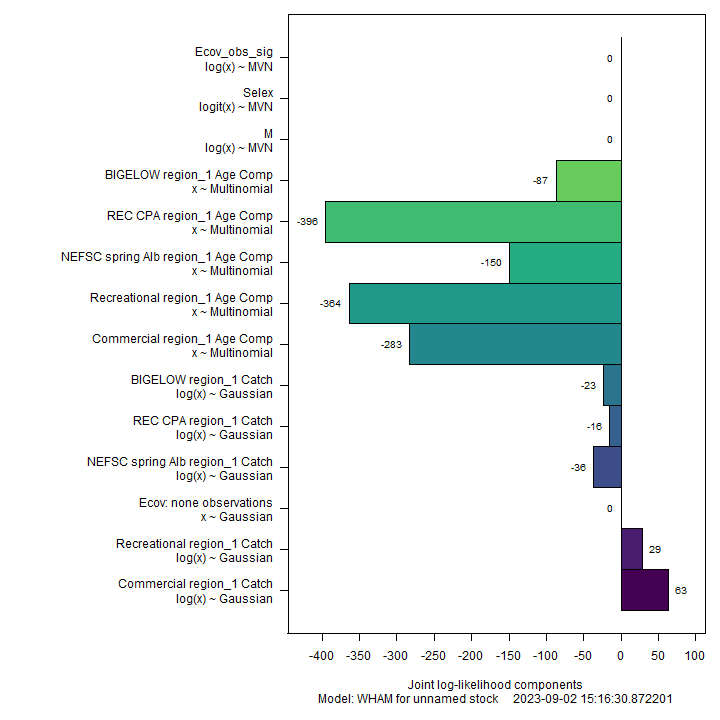
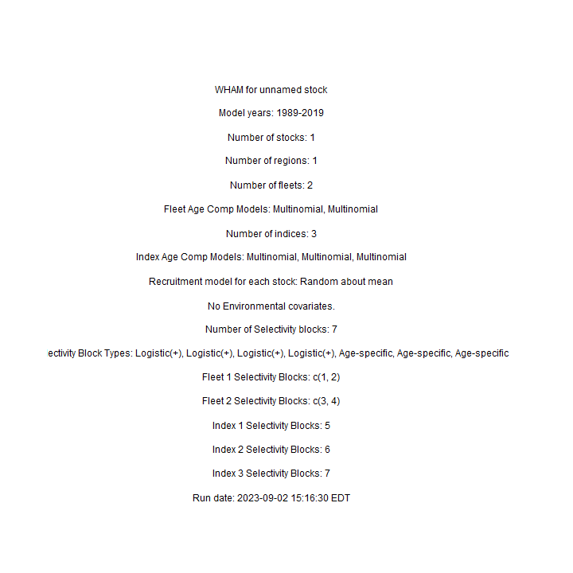

---
output:
  html_document:
    df_print: paged
    keep_md: yes
  word_document: default
  pdf_document:
    fig_caption: yes
    includes:
    keep_tex: yes
    number_sections: no
title: "WHAM figures and tables"
header-includes:
  - \usepackage{longtable}
  - \usepackage{booktabs}
  - \usepackage{caption,graphics}
  - \usepackage{makecell}
  - \usepackage{lscape}
  - \renewcommand\figurename{Fig.}
  - \captionsetup{labelsep=period, singlelinecheck=false}
  - \newcommand{\changesize}[1]{\fontsize{#1pt}{#1pt}\selectfont}
  - \renewcommand{\arraystretch}{1.5}
  - \renewcommand\theadfont{}
---

# {.tabset}

## Figures {.tabset}

### Input

### Diagnostics

### Results

### Retro

### Reference points

### Miscelaneous

## Tables {.tabset}

### Parameter estimates

<table class="table" style="margin-left: auto; margin-right: auto;">
<caption>Parameter estimates, standard errors, and confidence intervals. Rounded to 3 decimal places.</caption>
 <thead>
  <tr>
   <th style="text-align:left;">   </th>
   <th style="text-align:right;"> Estimate </th>
   <th style="text-align:right;"> Std. Error </th>
   <th style="text-align:right;"> 95\% CI lower </th>
   <th style="text-align:right;"> 95\% CI upper </th>
  </tr>
 </thead>
<tbody>
  <tr>
   <td style="text-align:left;"> NEFSC spring Alb fully selected q </td>
   <td style="text-align:right;"> 0.000 </td>
   <td style="text-align:right;"> 0.000 </td>
   <td style="text-align:right;"> 0.000 </td>
   <td style="text-align:right;"> 0.000 </td>
  </tr>
  <tr>
   <td style="text-align:left;"> REC CPA fully selected q </td>
   <td style="text-align:right;"> 0.000 </td>
   <td style="text-align:right;"> 0.000 </td>
   <td style="text-align:right;"> 0.000 </td>
   <td style="text-align:right;"> 0.000 </td>
  </tr>
  <tr>
   <td style="text-align:left;"> BIGELOW fully selected q </td>
   <td style="text-align:right;"> 0.000 </td>
   <td style="text-align:right;"> 0.000 </td>
   <td style="text-align:right;"> 0.000 </td>
   <td style="text-align:right;"> 0.000 </td>
  </tr>
  <tr>
   <td style="text-align:left;"> Block 1: $a_{50}$ </td>
   <td style="text-align:right;"> 1.904 </td>
   <td style="text-align:right;"> 0.086 </td>
   <td style="text-align:right;"> 1.740 </td>
   <td style="text-align:right;"> 2.078 </td>
  </tr>
  <tr>
   <td style="text-align:left;"> Block 1: 1/slope (increasing) </td>
   <td style="text-align:right;"> 0.286 </td>
   <td style="text-align:right;"> 0.027 </td>
   <td style="text-align:right;"> 0.237 </td>
   <td style="text-align:right;"> 0.344 </td>
  </tr>
  <tr>
   <td style="text-align:left;"> Block 2: $a_{50}$ </td>
   <td style="text-align:right;"> 2.762 </td>
   <td style="text-align:right;"> 0.116 </td>
   <td style="text-align:right;"> 2.539 </td>
   <td style="text-align:right;"> 2.993 </td>
  </tr>
  <tr>
   <td style="text-align:left;"> Block 2: 1/slope (increasing) </td>
   <td style="text-align:right;"> 0.519 </td>
   <td style="text-align:right;"> 0.039 </td>
   <td style="text-align:right;"> 0.448 </td>
   <td style="text-align:right;"> 0.600 </td>
  </tr>
  <tr>
   <td style="text-align:left;"> Block 3: $a_{50}$ </td>
   <td style="text-align:right;"> 1.970 </td>
   <td style="text-align:right;"> 0.113 </td>
   <td style="text-align:right;"> 1.758 </td>
   <td style="text-align:right;"> 2.200 </td>
  </tr>
  <tr>
   <td style="text-align:left;"> Block 3: 1/slope (increasing) </td>
   <td style="text-align:right;"> 0.533 </td>
   <td style="text-align:right;"> 0.051 </td>
   <td style="text-align:right;"> 0.441 </td>
   <td style="text-align:right;"> 0.642 </td>
  </tr>
  <tr>
   <td style="text-align:left;"> Block 4: $a_{50}$ </td>
   <td style="text-align:right;"> 5.960 </td>
   <td style="text-align:right;"> 1.097 </td>
   <td style="text-align:right;"> 3.322 </td>
   <td style="text-align:right;"> 7.386 </td>
  </tr>
  <tr>
   <td style="text-align:left;"> Block 4: 1/slope (increasing) </td>
   <td style="text-align:right;"> 1.582 </td>
   <td style="text-align:right;"> 0.185 </td>
   <td style="text-align:right;"> 1.250 </td>
   <td style="text-align:right;"> 1.977 </td>
  </tr>
  <tr>
   <td style="text-align:left;"> Block 5: Selectivity for age 1 </td>
   <td style="text-align:right;"> 0.144 </td>
   <td style="text-align:right;"> 0.029 </td>
   <td style="text-align:right;"> 0.095 </td>
   <td style="text-align:right;"> 0.211 </td>
  </tr>
  <tr>
   <td style="text-align:left;"> Block 5: Selectivity for age 2 </td>
   <td style="text-align:right;"> 0.522 </td>
   <td style="text-align:right;"> 0.093 </td>
   <td style="text-align:right;"> 0.345 </td>
   <td style="text-align:right;"> 0.693 </td>
  </tr>
  <tr>
   <td style="text-align:left;"> Block 5: Selectivity for age 3 </td>
   <td style="text-align:right;"> 0.873 </td>
   <td style="text-align:right;"> 0.163 </td>
   <td style="text-align:right;"> 0.278 </td>
   <td style="text-align:right;"> 0.992 </td>
  </tr>
  <tr>
   <td style="text-align:left;"> Block 5: Selectivity for age 4 </td>
   <td style="text-align:right;"> 1.000 </td>
   <td style="text-align:right;"> -- </td>
   <td style="text-align:right;"> -- </td>
   <td style="text-align:right;"> -- </td>
  </tr>
  <tr>
   <td style="text-align:left;"> Block 5: Selectivity for age 5 </td>
   <td style="text-align:right;"> 1.000 </td>
   <td style="text-align:right;"> -- </td>
   <td style="text-align:right;"> -- </td>
   <td style="text-align:right;"> -- </td>
  </tr>
  <tr>
   <td style="text-align:left;"> Block 5: Selectivity for age 6 </td>
   <td style="text-align:right;"> 1.000 </td>
   <td style="text-align:right;"> -- </td>
   <td style="text-align:right;"> -- </td>
   <td style="text-align:right;"> -- </td>
  </tr>
  <tr>
   <td style="text-align:left;"> Block 5: Selectivity for age 7 </td>
   <td style="text-align:right;"> 1.000 </td>
   <td style="text-align:right;"> -- </td>
   <td style="text-align:right;"> -- </td>
   <td style="text-align:right;"> -- </td>
  </tr>
  <tr>
   <td style="text-align:left;"> Block 5: Selectivity for age 8+ </td>
   <td style="text-align:right;"> 1.000 </td>
   <td style="text-align:right;"> -- </td>
   <td style="text-align:right;"> -- </td>
   <td style="text-align:right;"> -- </td>
  </tr>
  <tr>
   <td style="text-align:left;"> Block 6: Selectivity for age 1 </td>
   <td style="text-align:right;"> 0.450 </td>
   <td style="text-align:right;"> 0.029 </td>
   <td style="text-align:right;"> 0.393 </td>
   <td style="text-align:right;"> 0.507 </td>
  </tr>
  <tr>
   <td style="text-align:left;"> Block 6: Selectivity for age 2 </td>
   <td style="text-align:right;"> 0.800 </td>
   <td style="text-align:right;"> 0.052 </td>
   <td style="text-align:right;"> 0.679 </td>
   <td style="text-align:right;"> 0.883 </td>
  </tr>
  <tr>
   <td style="text-align:left;"> Block 6: Selectivity for age 3 </td>
   <td style="text-align:right;"> 1.000 </td>
   <td style="text-align:right;"> -- </td>
   <td style="text-align:right;"> -- </td>
   <td style="text-align:right;"> -- </td>
  </tr>
  <tr>
   <td style="text-align:left;"> Block 6: Selectivity for age 4 </td>
   <td style="text-align:right;"> 1.000 </td>
   <td style="text-align:right;"> -- </td>
   <td style="text-align:right;"> -- </td>
   <td style="text-align:right;"> -- </td>
  </tr>
  <tr>
   <td style="text-align:left;"> Block 6: Selectivity for age 5 </td>
   <td style="text-align:right;"> 1.000 </td>
   <td style="text-align:right;"> -- </td>
   <td style="text-align:right;"> -- </td>
   <td style="text-align:right;"> -- </td>
  </tr>
  <tr>
   <td style="text-align:left;"> Block 6: Selectivity for age 6 </td>
   <td style="text-align:right;"> 1.000 </td>
   <td style="text-align:right;"> -- </td>
   <td style="text-align:right;"> -- </td>
   <td style="text-align:right;"> -- </td>
  </tr>
  <tr>
   <td style="text-align:left;"> Block 6: Selectivity for age 7 </td>
   <td style="text-align:right;"> 1.000 </td>
   <td style="text-align:right;"> -- </td>
   <td style="text-align:right;"> -- </td>
   <td style="text-align:right;"> -- </td>
  </tr>
  <tr>
   <td style="text-align:left;"> Block 6: Selectivity for age 8+ </td>
   <td style="text-align:right;"> 1.000 </td>
   <td style="text-align:right;"> -- </td>
   <td style="text-align:right;"> -- </td>
   <td style="text-align:right;"> -- </td>
  </tr>
  <tr>
   <td style="text-align:left;"> Block 7: Selectivity for age 1 </td>
   <td style="text-align:right;"> 0.215 </td>
   <td style="text-align:right;"> 0.041 </td>
   <td style="text-align:right;"> 0.145 </td>
   <td style="text-align:right;"> 0.307 </td>
  </tr>
  <tr>
   <td style="text-align:left;"> Block 7: Selectivity for age 2 </td>
   <td style="text-align:right;"> 1.000 </td>
   <td style="text-align:right;"> -- </td>
   <td style="text-align:right;"> -- </td>
   <td style="text-align:right;"> -- </td>
  </tr>
  <tr>
   <td style="text-align:left;"> Block 7: Selectivity for age 3 </td>
   <td style="text-align:right;"> 1.000 </td>
   <td style="text-align:right;"> -- </td>
   <td style="text-align:right;"> -- </td>
   <td style="text-align:right;"> -- </td>
  </tr>
  <tr>
   <td style="text-align:left;"> Block 7: Selectivity for age 4 </td>
   <td style="text-align:right;"> 1.000 </td>
   <td style="text-align:right;"> -- </td>
   <td style="text-align:right;"> -- </td>
   <td style="text-align:right;"> -- </td>
  </tr>
  <tr>
   <td style="text-align:left;"> Block 7: Selectivity for age 5 </td>
   <td style="text-align:right;"> 1.000 </td>
   <td style="text-align:right;"> -- </td>
   <td style="text-align:right;"> -- </td>
   <td style="text-align:right;"> -- </td>
  </tr>
  <tr>
   <td style="text-align:left;"> Block 7: Selectivity for age 6 </td>
   <td style="text-align:right;"> 1.000 </td>
   <td style="text-align:right;"> -- </td>
   <td style="text-align:right;"> -- </td>
   <td style="text-align:right;"> -- </td>
  </tr>
  <tr>
   <td style="text-align:left;"> Block 7: Selectivity for age 7 </td>
   <td style="text-align:right;"> 1.000 </td>
   <td style="text-align:right;"> -- </td>
   <td style="text-align:right;"> -- </td>
   <td style="text-align:right;"> -- </td>
  </tr>
  <tr>
   <td style="text-align:left;"> Block 7: Selectivity for age 8+ </td>
   <td style="text-align:right;"> 1.000 </td>
   <td style="text-align:right;"> -- </td>
   <td style="text-align:right;"> -- </td>
   <td style="text-align:right;"> -- </td>
  </tr>
</tbody>
</table>

### Abundance at age

<table class="table" style="margin-left: auto; margin-right: auto;">
<caption>Abundance at age (1000s) for stock 1 in region 1.</caption>
 <thead>
  <tr>
   <th style="text-align:left;">   </th>
   <th style="text-align:right;"> 1 </th>
   <th style="text-align:right;"> 2 </th>
   <th style="text-align:right;"> 3 </th>
   <th style="text-align:right;"> 4 </th>
   <th style="text-align:right;"> 5 </th>
   <th style="text-align:right;"> 6 </th>
   <th style="text-align:right;"> 7 </th>
   <th style="text-align:right;"> 8+ </th>
  </tr>
 </thead>
<tbody>
  <tr>
   <td style="text-align:left;"> 1989 </td>
   <td style="text-align:right;"> 21511 </td>
   <td style="text-align:right;"> 10672 </td>
   <td style="text-align:right;"> 4300 </td>
   <td style="text-align:right;"> 1661 </td>
   <td style="text-align:right;"> 637 </td>
   <td style="text-align:right;"> 244 </td>
   <td style="text-align:right;"> 94 </td>
   <td style="text-align:right;"> 58 </td>
  </tr>
  <tr>
   <td style="text-align:left;"> 1990 </td>
   <td style="text-align:right;"> 30824 </td>
   <td style="text-align:right;"> 13021 </td>
   <td style="text-align:right;"> 4240 </td>
   <td style="text-align:right;"> 1190 </td>
   <td style="text-align:right;"> 427 </td>
   <td style="text-align:right;"> 162 </td>
   <td style="text-align:right;"> 62 </td>
   <td style="text-align:right;"> 38 </td>
  </tr>
  <tr>
   <td style="text-align:left;"> 1991 </td>
   <td style="text-align:right;"> 24325 </td>
   <td style="text-align:right;"> 18555 </td>
   <td style="text-align:right;"> 4767 </td>
   <td style="text-align:right;"> 1023 </td>
   <td style="text-align:right;"> 266 </td>
   <td style="text-align:right;"> 94 </td>
   <td style="text-align:right;"> 36 </td>
   <td style="text-align:right;"> 22 </td>
  </tr>
  <tr>
   <td style="text-align:left;"> 1992 </td>
   <td style="text-align:right;"> 28336 </td>
   <td style="text-align:right;"> 14372 </td>
   <td style="text-align:right;"> 6602 </td>
   <td style="text-align:right;"> 1094 </td>
   <td style="text-align:right;"> 214 </td>
   <td style="text-align:right;"> 55 </td>
   <td style="text-align:right;"> 19 </td>
   <td style="text-align:right;"> 12 </td>
  </tr>
  <tr>
   <td style="text-align:left;"> 1993 </td>
   <td style="text-align:right;"> 12363 </td>
   <td style="text-align:right;"> 17348 </td>
   <td style="text-align:right;"> 5689 </td>
   <td style="text-align:right;"> 1818 </td>
   <td style="text-align:right;"> 283 </td>
   <td style="text-align:right;"> 55 </td>
   <td style="text-align:right;"> 14 </td>
   <td style="text-align:right;"> 8 </td>
  </tr>
  <tr>
   <td style="text-align:left;"> 1994 </td>
   <td style="text-align:right;"> 21510 </td>
   <td style="text-align:right;"> 7487 </td>
   <td style="text-align:right;"> 6830 </td>
   <td style="text-align:right;"> 1550 </td>
   <td style="text-align:right;"> 461 </td>
   <td style="text-align:right;"> 71 </td>
   <td style="text-align:right;"> 14 </td>
   <td style="text-align:right;"> 6 </td>
  </tr>
  <tr>
   <td style="text-align:left;"> 1995 </td>
   <td style="text-align:right;"> 38299 </td>
   <td style="text-align:right;"> 13197 </td>
   <td style="text-align:right;"> 3140 </td>
   <td style="text-align:right;"> 2072 </td>
   <td style="text-align:right;"> 441 </td>
   <td style="text-align:right;"> 130 </td>
   <td style="text-align:right;"> 20 </td>
   <td style="text-align:right;"> 5 </td>
  </tr>
  <tr>
   <td style="text-align:left;"> 1996 </td>
   <td style="text-align:right;"> 28147 </td>
   <td style="text-align:right;"> 23035 </td>
   <td style="text-align:right;"> 5320 </td>
   <td style="text-align:right;"> 890 </td>
   <td style="text-align:right;"> 542 </td>
   <td style="text-align:right;"> 114 </td>
   <td style="text-align:right;"> 33 </td>
   <td style="text-align:right;"> 7 </td>
  </tr>
  <tr>
   <td style="text-align:left;"> 1997 </td>
   <td style="text-align:right;"> 23058 </td>
   <td style="text-align:right;"> 15900 </td>
   <td style="text-align:right;"> 6403 </td>
   <td style="text-align:right;"> 805 </td>
   <td style="text-align:right;"> 119 </td>
   <td style="text-align:right;"> 71 </td>
   <td style="text-align:right;"> 15 </td>
   <td style="text-align:right;"> 5 </td>
  </tr>
  <tr>
   <td style="text-align:left;"> 1998 </td>
   <td style="text-align:right;"> 12561 </td>
   <td style="text-align:right;"> 13810 </td>
   <td style="text-align:right;"> 6351 </td>
   <td style="text-align:right;"> 1785 </td>
   <td style="text-align:right;"> 207 </td>
   <td style="text-align:right;"> 30 </td>
   <td style="text-align:right;"> 18 </td>
   <td style="text-align:right;"> 5 </td>
  </tr>
  <tr>
   <td style="text-align:left;"> 1999 </td>
   <td style="text-align:right;"> 27411 </td>
   <td style="text-align:right;"> 7940 </td>
   <td style="text-align:right;"> 7205 </td>
   <td style="text-align:right;"> 2398 </td>
   <td style="text-align:right;"> 561 </td>
   <td style="text-align:right;"> 62 </td>
   <td style="text-align:right;"> 9 </td>
   <td style="text-align:right;"> 7 </td>
  </tr>
  <tr>
   <td style="text-align:left;"> 2000 </td>
   <td style="text-align:right;"> 40471 </td>
   <td style="text-align:right;"> 17657 </td>
   <td style="text-align:right;"> 4504 </td>
   <td style="text-align:right;"> 3334 </td>
   <td style="text-align:right;"> 992 </td>
   <td style="text-align:right;"> 226 </td>
   <td style="text-align:right;"> 25 </td>
   <td style="text-align:right;"> 6 </td>
  </tr>
  <tr>
   <td style="text-align:left;"> 2001 </td>
   <td style="text-align:right;"> 17075 </td>
   <td style="text-align:right;"> 25754 </td>
   <td style="text-align:right;"> 9653 </td>
   <td style="text-align:right;"> 2026 </td>
   <td style="text-align:right;"> 1372 </td>
   <td style="text-align:right;"> 401 </td>
   <td style="text-align:right;"> 91 </td>
   <td style="text-align:right;"> 13 </td>
  </tr>
  <tr>
   <td style="text-align:left;"> 2002 </td>
   <td style="text-align:right;"> 29493 </td>
   <td style="text-align:right;"> 10885 </td>
   <td style="text-align:right;"> 14206 </td>
   <td style="text-align:right;"> 4454 </td>
   <td style="text-align:right;"> 865 </td>
   <td style="text-align:right;"> 577 </td>
   <td style="text-align:right;"> 168 </td>
   <td style="text-align:right;"> 43 </td>
  </tr>
  <tr>
   <td style="text-align:left;"> 2003 </td>
   <td style="text-align:right;"> 16906 </td>
   <td style="text-align:right;"> 18928 </td>
   <td style="text-align:right;"> 6163 </td>
   <td style="text-align:right;"> 6891 </td>
   <td style="text-align:right;"> 2021 </td>
   <td style="text-align:right;"> 387 </td>
   <td style="text-align:right;"> 257 </td>
   <td style="text-align:right;"> 94 </td>
  </tr>
  <tr>
   <td style="text-align:left;"> 2004 </td>
   <td style="text-align:right;"> 16019 </td>
   <td style="text-align:right;"> 10711 </td>
   <td style="text-align:right;"> 10179 </td>
   <td style="text-align:right;"> 2696 </td>
   <td style="text-align:right;"> 2749 </td>
   <td style="text-align:right;"> 791 </td>
   <td style="text-align:right;"> 151 </td>
   <td style="text-align:right;"> 137 </td>
  </tr>
  <tr>
   <td style="text-align:left;"> 2005 </td>
   <td style="text-align:right;"> 11666 </td>
   <td style="text-align:right;"> 10342 </td>
   <td style="text-align:right;"> 6160 </td>
   <td style="text-align:right;"> 4935 </td>
   <td style="text-align:right;"> 1196 </td>
   <td style="text-align:right;"> 1197 </td>
   <td style="text-align:right;"> 343 </td>
   <td style="text-align:right;"> 125 </td>
  </tr>
  <tr>
   <td style="text-align:left;"> 2006 </td>
   <td style="text-align:right;"> 14863 </td>
   <td style="text-align:right;"> 7558 </td>
   <td style="text-align:right;"> 6049 </td>
   <td style="text-align:right;"> 3126 </td>
   <td style="text-align:right;"> 2337 </td>
   <td style="text-align:right;"> 558 </td>
   <td style="text-align:right;"> 557 </td>
   <td style="text-align:right;"> 218 </td>
  </tr>
  <tr>
   <td style="text-align:left;"> 2007 </td>
   <td style="text-align:right;"> 16872 </td>
   <td style="text-align:right;"> 9707 </td>
   <td style="text-align:right;"> 4563 </td>
   <td style="text-align:right;"> 3265 </td>
   <td style="text-align:right;"> 1595 </td>
   <td style="text-align:right;"> 1178 </td>
   <td style="text-align:right;"> 281 </td>
   <td style="text-align:right;"> 390 </td>
  </tr>
  <tr>
   <td style="text-align:left;"> 2008 </td>
   <td style="text-align:right;"> 17419 </td>
   <td style="text-align:right;"> 10955 </td>
   <td style="text-align:right;"> 5743 </td>
   <td style="text-align:right;"> 2397 </td>
   <td style="text-align:right;"> 1626 </td>
   <td style="text-align:right;"> 786 </td>
   <td style="text-align:right;"> 579 </td>
   <td style="text-align:right;"> 329 </td>
  </tr>
  <tr>
   <td style="text-align:left;"> 2009 </td>
   <td style="text-align:right;"> 13580 </td>
   <td style="text-align:right;"> 11220 </td>
   <td style="text-align:right;"> 6291 </td>
   <td style="text-align:right;"> 2861 </td>
   <td style="text-align:right;"> 1123 </td>
   <td style="text-align:right;"> 752 </td>
   <td style="text-align:right;"> 362 </td>
   <td style="text-align:right;"> 419 </td>
  </tr>
  <tr>
   <td style="text-align:left;"> 2010 </td>
   <td style="text-align:right;"> 14157 </td>
   <td style="text-align:right;"> 8714 </td>
   <td style="text-align:right;"> 6879 </td>
   <td style="text-align:right;"> 3526 </td>
   <td style="text-align:right;"> 1432 </td>
   <td style="text-align:right;"> 492 </td>
   <td style="text-align:right;"> 283 </td>
   <td style="text-align:right;"> 237 </td>
  </tr>
  <tr>
   <td style="text-align:left;"> 2011 </td>
   <td style="text-align:right;"> 9517 </td>
   <td style="text-align:right;"> 8955 </td>
   <td style="text-align:right;"> 5186 </td>
   <td style="text-align:right;"> 3628 </td>
   <td style="text-align:right;"> 1598 </td>
   <td style="text-align:right;"> 545 </td>
   <td style="text-align:right;"> 153 </td>
   <td style="text-align:right;"> 123 </td>
  </tr>
  <tr>
   <td style="text-align:left;"> 2012 </td>
   <td style="text-align:right;"> 20286 </td>
   <td style="text-align:right;"> 6224 </td>
   <td style="text-align:right;"> 5636 </td>
   <td style="text-align:right;"> 2987 </td>
   <td style="text-align:right;"> 1915 </td>
   <td style="text-align:right;"> 785 </td>
   <td style="text-align:right;"> 248 </td>
   <td style="text-align:right;"> 114 </td>
  </tr>
  <tr>
   <td style="text-align:left;"> 2013 </td>
   <td style="text-align:right;"> 10005 </td>
   <td style="text-align:right;"> 12844 </td>
   <td style="text-align:right;"> 3710 </td>
   <td style="text-align:right;"> 2979 </td>
   <td style="text-align:right;"> 1360 </td>
   <td style="text-align:right;"> 734 </td>
   <td style="text-align:right;"> 247 </td>
   <td style="text-align:right;"> 89 </td>
  </tr>
  <tr>
   <td style="text-align:left;"> 2014 </td>
   <td style="text-align:right;"> 13024 </td>
   <td style="text-align:right;"> 6374 </td>
   <td style="text-align:right;"> 7691 </td>
   <td style="text-align:right;"> 1948 </td>
   <td style="text-align:right;"> 1349 </td>
   <td style="text-align:right;"> 529 </td>
   <td style="text-align:right;"> 241 </td>
   <td style="text-align:right;"> 90 </td>
  </tr>
  <tr>
   <td style="text-align:left;"> 2015 </td>
   <td style="text-align:right;"> 14271 </td>
   <td style="text-align:right;"> 8418 </td>
   <td style="text-align:right;"> 3935 </td>
   <td style="text-align:right;"> 4301 </td>
   <td style="text-align:right;"> 977 </td>
   <td style="text-align:right;"> 607 </td>
   <td style="text-align:right;"> 211 </td>
   <td style="text-align:right;"> 114 </td>
  </tr>
  <tr>
   <td style="text-align:left;"> 2016 </td>
   <td style="text-align:right;"> 19696 </td>
   <td style="text-align:right;"> 9346 </td>
   <td style="text-align:right;"> 5349 </td>
   <td style="text-align:right;"> 2342 </td>
   <td style="text-align:right;"> 2385 </td>
   <td style="text-align:right;"> 506 </td>
   <td style="text-align:right;"> 291 </td>
   <td style="text-align:right;"> 142 </td>
  </tr>
  <tr>
   <td style="text-align:left;"> 2017 </td>
   <td style="text-align:right;"> 18612 </td>
   <td style="text-align:right;"> 12769 </td>
   <td style="text-align:right;"> 5834 </td>
   <td style="text-align:right;"> 3089 </td>
   <td style="text-align:right;"> 1233 </td>
   <td style="text-align:right;"> 1136 </td>
   <td style="text-align:right;"> 215 </td>
   <td style="text-align:right;"> 160 </td>
  </tr>
  <tr>
   <td style="text-align:left;"> 2018 </td>
   <td style="text-align:right;"> 10270 </td>
   <td style="text-align:right;"> 11865 </td>
   <td style="text-align:right;"> 7723 </td>
   <td style="text-align:right;"> 3179 </td>
   <td style="text-align:right;"> 1477 </td>
   <td style="text-align:right;"> 507 </td>
   <td style="text-align:right;"> 392 </td>
   <td style="text-align:right;"> 103 </td>
  </tr>
  <tr>
   <td style="text-align:left;"> 2019 </td>
   <td style="text-align:right;"> 30441 </td>
   <td style="text-align:right;"> 6636 </td>
   <td style="text-align:right;"> 7371 </td>
   <td style="text-align:right;"> 4434 </td>
   <td style="text-align:right;"> 1656 </td>
   <td style="text-align:right;"> 689 </td>
   <td style="text-align:right;"> 208 </td>
   <td style="text-align:right;"> 175 </td>
  </tr>
</tbody>
</table>

### Fishing mortality at age by region

<table class="table" style="margin-left: auto; margin-right: auto;">
<caption>Total fishing mortality at age in region 1.</caption>
 <thead>
  <tr>
   <th style="text-align:left;">   </th>
   <th style="text-align:right;"> 1 </th>
   <th style="text-align:right;"> 2 </th>
   <th style="text-align:right;"> 3 </th>
   <th style="text-align:right;"> 4 </th>
   <th style="text-align:right;"> 5 </th>
   <th style="text-align:right;"> 6 </th>
   <th style="text-align:right;"> 7 </th>
   <th style="text-align:right;"> 8+ </th>
  </tr>
 </thead>
<tbody>
  <tr>
   <td style="text-align:left;"> 1989 </td>
   <td style="text-align:right;"> 0.014 </td>
   <td style="text-align:right;"> 0.197 </td>
   <td style="text-align:right;"> 0.331 </td>
   <td style="text-align:right;"> 0.338 </td>
   <td style="text-align:right;"> 0.338 </td>
   <td style="text-align:right;"> 0.338 </td>
   <td style="text-align:right;"> 0.338 </td>
   <td style="text-align:right;"> 0.338 </td>
  </tr>
  <tr>
   <td style="text-align:left;"> 1990 </td>
   <td style="text-align:right;"> 0.020 </td>
   <td style="text-align:right;"> 0.280 </td>
   <td style="text-align:right;"> 0.469 </td>
   <td style="text-align:right;"> 0.479 </td>
   <td style="text-align:right;"> 0.480 </td>
   <td style="text-align:right;"> 0.480 </td>
   <td style="text-align:right;"> 0.480 </td>
   <td style="text-align:right;"> 0.480 </td>
  </tr>
  <tr>
   <td style="text-align:left;"> 1991 </td>
   <td style="text-align:right;"> 0.016 </td>
   <td style="text-align:right;"> 0.225 </td>
   <td style="text-align:right;"> 0.378 </td>
   <td style="text-align:right;"> 0.386 </td>
   <td style="text-align:right;"> 0.386 </td>
   <td style="text-align:right;"> 0.386 </td>
   <td style="text-align:right;"> 0.386 </td>
   <td style="text-align:right;"> 0.386 </td>
  </tr>
  <tr>
   <td style="text-align:left;"> 1992 </td>
   <td style="text-align:right;"> 0.018 </td>
   <td style="text-align:right;"> 0.259 </td>
   <td style="text-align:right;"> 0.434 </td>
   <td style="text-align:right;"> 0.443 </td>
   <td style="text-align:right;"> 0.444 </td>
   <td style="text-align:right;"> 0.444 </td>
   <td style="text-align:right;"> 0.444 </td>
   <td style="text-align:right;"> 0.444 </td>
  </tr>
  <tr>
   <td style="text-align:left;"> 1993 </td>
   <td style="text-align:right;"> 0.015 </td>
   <td style="text-align:right;"> 0.212 </td>
   <td style="text-align:right;"> 0.356 </td>
   <td style="text-align:right;"> 0.364 </td>
   <td style="text-align:right;"> 0.364 </td>
   <td style="text-align:right;"> 0.364 </td>
   <td style="text-align:right;"> 0.364 </td>
   <td style="text-align:right;"> 0.364 </td>
  </tr>
  <tr>
   <td style="text-align:left;"> 1994 </td>
   <td style="text-align:right;"> 0.013 </td>
   <td style="text-align:right;"> 0.191 </td>
   <td style="text-align:right;"> 0.321 </td>
   <td style="text-align:right;"> 0.328 </td>
   <td style="text-align:right;"> 0.328 </td>
   <td style="text-align:right;"> 0.328 </td>
   <td style="text-align:right;"> 0.328 </td>
   <td style="text-align:right;"> 0.328 </td>
  </tr>
  <tr>
   <td style="text-align:left;"> 1995 </td>
   <td style="text-align:right;"> 0.010 </td>
   <td style="text-align:right;"> 0.146 </td>
   <td style="text-align:right;"> 0.245 </td>
   <td style="text-align:right;"> 0.250 </td>
   <td style="text-align:right;"> 0.250 </td>
   <td style="text-align:right;"> 0.250 </td>
   <td style="text-align:right;"> 0.250 </td>
   <td style="text-align:right;"> 0.250 </td>
  </tr>
  <tr>
   <td style="text-align:left;"> 1996 </td>
   <td style="text-align:right;"> 0.023 </td>
   <td style="text-align:right;"> 0.335 </td>
   <td style="text-align:right;"> 0.562 </td>
   <td style="text-align:right;"> 0.573 </td>
   <td style="text-align:right;"> 0.574 </td>
   <td style="text-align:right;"> 0.574 </td>
   <td style="text-align:right;"> 0.574 </td>
   <td style="text-align:right;"> 0.574 </td>
  </tr>
  <tr>
   <td style="text-align:left;"> 1997 </td>
   <td style="text-align:right;"> 0.010 </td>
   <td style="text-align:right;"> 0.137 </td>
   <td style="text-align:right;"> 0.231 </td>
   <td style="text-align:right;"> 0.235 </td>
   <td style="text-align:right;"> 0.236 </td>
   <td style="text-align:right;"> 0.236 </td>
   <td style="text-align:right;"> 0.236 </td>
   <td style="text-align:right;"> 0.236 </td>
  </tr>
  <tr>
   <td style="text-align:left;"> 1998 </td>
   <td style="text-align:right;"> 0.016 </td>
   <td style="text-align:right;"> 0.094 </td>
   <td style="text-align:right;"> 0.308 </td>
   <td style="text-align:right;"> 0.460 </td>
   <td style="text-align:right;"> 0.496 </td>
   <td style="text-align:right;"> 0.502 </td>
   <td style="text-align:right;"> 0.503 </td>
   <td style="text-align:right;"> 0.503 </td>
  </tr>
  <tr>
   <td style="text-align:left;"> 1999 </td>
   <td style="text-align:right;"> 0.010 </td>
   <td style="text-align:right;"> 0.055 </td>
   <td style="text-align:right;"> 0.181 </td>
   <td style="text-align:right;"> 0.270 </td>
   <td style="text-align:right;"> 0.291 </td>
   <td style="text-align:right;"> 0.295 </td>
   <td style="text-align:right;"> 0.295 </td>
   <td style="text-align:right;"> 0.295 </td>
  </tr>
  <tr>
   <td style="text-align:left;"> 2000 </td>
   <td style="text-align:right;"> 0.006 </td>
   <td style="text-align:right;"> 0.033 </td>
   <td style="text-align:right;"> 0.109 </td>
   <td style="text-align:right;"> 0.163 </td>
   <td style="text-align:right;"> 0.176 </td>
   <td style="text-align:right;"> 0.178 </td>
   <td style="text-align:right;"> 0.178 </td>
   <td style="text-align:right;"> 0.178 </td>
  </tr>
  <tr>
   <td style="text-align:left;"> 2001 </td>
   <td style="text-align:right;"> 0.005 </td>
   <td style="text-align:right;"> 0.027 </td>
   <td style="text-align:right;"> 0.087 </td>
   <td style="text-align:right;"> 0.131 </td>
   <td style="text-align:right;"> 0.141 </td>
   <td style="text-align:right;"> 0.142 </td>
   <td style="text-align:right;"> 0.143 </td>
   <td style="text-align:right;"> 0.143 </td>
  </tr>
  <tr>
   <td style="text-align:left;"> 2002 </td>
   <td style="text-align:right;"> 0.004 </td>
   <td style="text-align:right;"> 0.023 </td>
   <td style="text-align:right;"> 0.076 </td>
   <td style="text-align:right;"> 0.113 </td>
   <td style="text-align:right;"> 0.122 </td>
   <td style="text-align:right;"> 0.123 </td>
   <td style="text-align:right;"> 0.124 </td>
   <td style="text-align:right;"> 0.124 </td>
  </tr>
  <tr>
   <td style="text-align:left;"> 2003 </td>
   <td style="text-align:right;"> 0.006 </td>
   <td style="text-align:right;"> 0.033 </td>
   <td style="text-align:right;"> 0.109 </td>
   <td style="text-align:right;"> 0.163 </td>
   <td style="text-align:right;"> 0.176 </td>
   <td style="text-align:right;"> 0.178 </td>
   <td style="text-align:right;"> 0.178 </td>
   <td style="text-align:right;"> 0.178 </td>
  </tr>
  <tr>
   <td style="text-align:left;"> 2004 </td>
   <td style="text-align:right;"> 0.007 </td>
   <td style="text-align:right;"> 0.040 </td>
   <td style="text-align:right;"> 0.133 </td>
   <td style="text-align:right;"> 0.198 </td>
   <td style="text-align:right;"> 0.213 </td>
   <td style="text-align:right;"> 0.216 </td>
   <td style="text-align:right;"> 0.216 </td>
   <td style="text-align:right;"> 0.216 </td>
  </tr>
  <tr>
   <td style="text-align:left;"> 2005 </td>
   <td style="text-align:right;"> 0.005 </td>
   <td style="text-align:right;"> 0.029 </td>
   <td style="text-align:right;"> 0.096 </td>
   <td style="text-align:right;"> 0.144 </td>
   <td style="text-align:right;"> 0.155 </td>
   <td style="text-align:right;"> 0.157 </td>
   <td style="text-align:right;"> 0.157 </td>
   <td style="text-align:right;"> 0.157 </td>
  </tr>
  <tr>
   <td style="text-align:left;"> 2006 </td>
   <td style="text-align:right;"> 0.004 </td>
   <td style="text-align:right;"> 0.025 </td>
   <td style="text-align:right;"> 0.080 </td>
   <td style="text-align:right;"> 0.120 </td>
   <td style="text-align:right;"> 0.130 </td>
   <td style="text-align:right;"> 0.131 </td>
   <td style="text-align:right;"> 0.131 </td>
   <td style="text-align:right;"> 0.131 </td>
  </tr>
  <tr>
   <td style="text-align:left;"> 2007 </td>
   <td style="text-align:right;"> 0.003 </td>
   <td style="text-align:right;"> 0.020 </td>
   <td style="text-align:right;"> 0.065 </td>
   <td style="text-align:right;"> 0.097 </td>
   <td style="text-align:right;"> 0.105 </td>
   <td style="text-align:right;"> 0.106 </td>
   <td style="text-align:right;"> 0.106 </td>
   <td style="text-align:right;"> 0.106 </td>
  </tr>
  <tr>
   <td style="text-align:left;"> 2008 </td>
   <td style="text-align:right;"> 0.004 </td>
   <td style="text-align:right;"> 0.021 </td>
   <td style="text-align:right;"> 0.070 </td>
   <td style="text-align:right;"> 0.105 </td>
   <td style="text-align:right;"> 0.113 </td>
   <td style="text-align:right;"> 0.114 </td>
   <td style="text-align:right;"> 0.115 </td>
   <td style="text-align:right;"> 0.115 </td>
  </tr>
  <tr>
   <td style="text-align:left;"> 2009 </td>
   <td style="text-align:right;"> 0.002 </td>
   <td style="text-align:right;"> 0.014 </td>
   <td style="text-align:right;"> 0.047 </td>
   <td style="text-align:right;"> 0.070 </td>
   <td style="text-align:right;"> 0.076 </td>
   <td style="text-align:right;"> 0.077 </td>
   <td style="text-align:right;"> 0.077 </td>
   <td style="text-align:right;"> 0.077 </td>
  </tr>
  <tr>
   <td style="text-align:left;"> 2010 </td>
   <td style="text-align:right;"> 0.003 </td>
   <td style="text-align:right;"> 0.020 </td>
   <td style="text-align:right;"> 0.066 </td>
   <td style="text-align:right;"> 0.098 </td>
   <td style="text-align:right;"> 0.105 </td>
   <td style="text-align:right;"> 0.107 </td>
   <td style="text-align:right;"> 0.107 </td>
   <td style="text-align:right;"> 0.107 </td>
  </tr>
  <tr>
   <td style="text-align:left;"> 2011 </td>
   <td style="text-align:right;"> 0.005 </td>
   <td style="text-align:right;"> 0.027 </td>
   <td style="text-align:right;"> 0.087 </td>
   <td style="text-align:right;"> 0.131 </td>
   <td style="text-align:right;"> 0.141 </td>
   <td style="text-align:right;"> 0.142 </td>
   <td style="text-align:right;"> 0.143 </td>
   <td style="text-align:right;"> 0.143 </td>
  </tr>
  <tr>
   <td style="text-align:left;"> 2012 </td>
   <td style="text-align:right;"> 0.004 </td>
   <td style="text-align:right;"> 0.020 </td>
   <td style="text-align:right;"> 0.066 </td>
   <td style="text-align:right;"> 0.099 </td>
   <td style="text-align:right;"> 0.106 </td>
   <td style="text-align:right;"> 0.108 </td>
   <td style="text-align:right;"> 0.108 </td>
   <td style="text-align:right;"> 0.108 </td>
  </tr>
  <tr>
   <td style="text-align:left;"> 2013 </td>
   <td style="text-align:right;"> 0.005 </td>
   <td style="text-align:right;"> 0.030 </td>
   <td style="text-align:right;"> 0.098 </td>
   <td style="text-align:right;"> 0.146 </td>
   <td style="text-align:right;"> 0.157 </td>
   <td style="text-align:right;"> 0.159 </td>
   <td style="text-align:right;"> 0.159 </td>
   <td style="text-align:right;"> 0.159 </td>
  </tr>
  <tr>
   <td style="text-align:left;"> 2014 </td>
   <td style="text-align:right;"> 0.004 </td>
   <td style="text-align:right;"> 0.024 </td>
   <td style="text-align:right;"> 0.078 </td>
   <td style="text-align:right;"> 0.116 </td>
   <td style="text-align:right;"> 0.125 </td>
   <td style="text-align:right;"> 0.127 </td>
   <td style="text-align:right;"> 0.127 </td>
   <td style="text-align:right;"> 0.127 </td>
  </tr>
  <tr>
   <td style="text-align:left;"> 2015 </td>
   <td style="text-align:right;"> 0.003 </td>
   <td style="text-align:right;"> 0.016 </td>
   <td style="text-align:right;"> 0.053 </td>
   <td style="text-align:right;"> 0.079 </td>
   <td style="text-align:right;"> 0.086 </td>
   <td style="text-align:right;"> 0.087 </td>
   <td style="text-align:right;"> 0.087 </td>
   <td style="text-align:right;"> 0.087 </td>
  </tr>
  <tr>
   <td style="text-align:left;"> 2016 </td>
   <td style="text-align:right;"> 0.003 </td>
   <td style="text-align:right;"> 0.015 </td>
   <td style="text-align:right;"> 0.051 </td>
   <td style="text-align:right;"> 0.076 </td>
   <td style="text-align:right;"> 0.082 </td>
   <td style="text-align:right;"> 0.083 </td>
   <td style="text-align:right;"> 0.083 </td>
   <td style="text-align:right;"> 0.083 </td>
  </tr>
  <tr>
   <td style="text-align:left;"> 2017 </td>
   <td style="text-align:right;"> 0.003 </td>
   <td style="text-align:right;"> 0.017 </td>
   <td style="text-align:right;"> 0.056 </td>
   <td style="text-align:right;"> 0.083 </td>
   <td style="text-align:right;"> 0.090 </td>
   <td style="text-align:right;"> 0.091 </td>
   <td style="text-align:right;"> 0.091 </td>
   <td style="text-align:right;"> 0.091 </td>
  </tr>
  <tr>
   <td style="text-align:left;"> 2018 </td>
   <td style="text-align:right;"> 0.002 </td>
   <td style="text-align:right;"> 0.014 </td>
   <td style="text-align:right;"> 0.045 </td>
   <td style="text-align:right;"> 0.067 </td>
   <td style="text-align:right;"> 0.073 </td>
   <td style="text-align:right;"> 0.073 </td>
   <td style="text-align:right;"> 0.074 </td>
   <td style="text-align:right;"> 0.074 </td>
  </tr>
  <tr>
   <td style="text-align:left;"> 2019 </td>
   <td style="text-align:right;"> 0.004 </td>
   <td style="text-align:right;"> 0.023 </td>
   <td style="text-align:right;"> 0.075 </td>
   <td style="text-align:right;"> 0.112 </td>
   <td style="text-align:right;"> 0.120 </td>
   <td style="text-align:right;"> 0.122 </td>
   <td style="text-align:right;"> 0.122 </td>
   <td style="text-align:right;"> 0.122 </td>
  </tr>
</tbody>
</table>

### Fishing mortality at age by fleet

<table class="table" style="margin-left: auto; margin-right: auto;">
<caption>Total fishing mortality at age in Commercial.</caption>
 <thead>
  <tr>
   <th style="text-align:left;">   </th>
   <th style="text-align:right;"> 1 </th>
   <th style="text-align:right;"> 2 </th>
   <th style="text-align:right;"> 3 </th>
   <th style="text-align:right;"> 4 </th>
   <th style="text-align:right;"> 5 </th>
   <th style="text-align:right;"> 6 </th>
   <th style="text-align:right;"> 7 </th>
   <th style="text-align:right;"> 8+ </th>
  </tr>
 </thead>
<tbody>
  <tr>
   <td style="text-align:left;"> 1989 </td>
   <td style="text-align:right;"> 0.014 </td>
   <td style="text-align:right;"> 0.197 </td>
   <td style="text-align:right;"> 0.331 </td>
   <td style="text-align:right;"> 0.338 </td>
   <td style="text-align:right;"> 0.338 </td>
   <td style="text-align:right;"> 0.338 </td>
   <td style="text-align:right;"> 0.338 </td>
   <td style="text-align:right;"> 0.338 </td>
  </tr>
  <tr>
   <td style="text-align:left;"> 1990 </td>
   <td style="text-align:right;"> 0.020 </td>
   <td style="text-align:right;"> 0.280 </td>
   <td style="text-align:right;"> 0.469 </td>
   <td style="text-align:right;"> 0.479 </td>
   <td style="text-align:right;"> 0.480 </td>
   <td style="text-align:right;"> 0.480 </td>
   <td style="text-align:right;"> 0.480 </td>
   <td style="text-align:right;"> 0.480 </td>
  </tr>
  <tr>
   <td style="text-align:left;"> 1991 </td>
   <td style="text-align:right;"> 0.016 </td>
   <td style="text-align:right;"> 0.225 </td>
   <td style="text-align:right;"> 0.378 </td>
   <td style="text-align:right;"> 0.386 </td>
   <td style="text-align:right;"> 0.386 </td>
   <td style="text-align:right;"> 0.386 </td>
   <td style="text-align:right;"> 0.386 </td>
   <td style="text-align:right;"> 0.386 </td>
  </tr>
  <tr>
   <td style="text-align:left;"> 1992 </td>
   <td style="text-align:right;"> 0.018 </td>
   <td style="text-align:right;"> 0.259 </td>
   <td style="text-align:right;"> 0.434 </td>
   <td style="text-align:right;"> 0.443 </td>
   <td style="text-align:right;"> 0.444 </td>
   <td style="text-align:right;"> 0.444 </td>
   <td style="text-align:right;"> 0.444 </td>
   <td style="text-align:right;"> 0.444 </td>
  </tr>
  <tr>
   <td style="text-align:left;"> 1993 </td>
   <td style="text-align:right;"> 0.015 </td>
   <td style="text-align:right;"> 0.212 </td>
   <td style="text-align:right;"> 0.356 </td>
   <td style="text-align:right;"> 0.364 </td>
   <td style="text-align:right;"> 0.364 </td>
   <td style="text-align:right;"> 0.364 </td>
   <td style="text-align:right;"> 0.364 </td>
   <td style="text-align:right;"> 0.364 </td>
  </tr>
  <tr>
   <td style="text-align:left;"> 1994 </td>
   <td style="text-align:right;"> 0.013 </td>
   <td style="text-align:right;"> 0.191 </td>
   <td style="text-align:right;"> 0.321 </td>
   <td style="text-align:right;"> 0.328 </td>
   <td style="text-align:right;"> 0.328 </td>
   <td style="text-align:right;"> 0.328 </td>
   <td style="text-align:right;"> 0.328 </td>
   <td style="text-align:right;"> 0.328 </td>
  </tr>
  <tr>
   <td style="text-align:left;"> 1995 </td>
   <td style="text-align:right;"> 0.010 </td>
   <td style="text-align:right;"> 0.146 </td>
   <td style="text-align:right;"> 0.245 </td>
   <td style="text-align:right;"> 0.250 </td>
   <td style="text-align:right;"> 0.250 </td>
   <td style="text-align:right;"> 0.250 </td>
   <td style="text-align:right;"> 0.250 </td>
   <td style="text-align:right;"> 0.250 </td>
  </tr>
  <tr>
   <td style="text-align:left;"> 1996 </td>
   <td style="text-align:right;"> 0.023 </td>
   <td style="text-align:right;"> 0.335 </td>
   <td style="text-align:right;"> 0.562 </td>
   <td style="text-align:right;"> 0.573 </td>
   <td style="text-align:right;"> 0.574 </td>
   <td style="text-align:right;"> 0.574 </td>
   <td style="text-align:right;"> 0.574 </td>
   <td style="text-align:right;"> 0.574 </td>
  </tr>
  <tr>
   <td style="text-align:left;"> 1997 </td>
   <td style="text-align:right;"> 0.010 </td>
   <td style="text-align:right;"> 0.137 </td>
   <td style="text-align:right;"> 0.231 </td>
   <td style="text-align:right;"> 0.235 </td>
   <td style="text-align:right;"> 0.236 </td>
   <td style="text-align:right;"> 0.236 </td>
   <td style="text-align:right;"> 0.236 </td>
   <td style="text-align:right;"> 0.236 </td>
  </tr>
  <tr>
   <td style="text-align:left;"> 1998 </td>
   <td style="text-align:right;"> 0.016 </td>
   <td style="text-align:right;"> 0.094 </td>
   <td style="text-align:right;"> 0.308 </td>
   <td style="text-align:right;"> 0.460 </td>
   <td style="text-align:right;"> 0.496 </td>
   <td style="text-align:right;"> 0.502 </td>
   <td style="text-align:right;"> 0.503 </td>
   <td style="text-align:right;"> 0.503 </td>
  </tr>
  <tr>
   <td style="text-align:left;"> 1999 </td>
   <td style="text-align:right;"> 0.010 </td>
   <td style="text-align:right;"> 0.055 </td>
   <td style="text-align:right;"> 0.181 </td>
   <td style="text-align:right;"> 0.270 </td>
   <td style="text-align:right;"> 0.291 </td>
   <td style="text-align:right;"> 0.295 </td>
   <td style="text-align:right;"> 0.295 </td>
   <td style="text-align:right;"> 0.295 </td>
  </tr>
  <tr>
   <td style="text-align:left;"> 2000 </td>
   <td style="text-align:right;"> 0.006 </td>
   <td style="text-align:right;"> 0.033 </td>
   <td style="text-align:right;"> 0.109 </td>
   <td style="text-align:right;"> 0.163 </td>
   <td style="text-align:right;"> 0.176 </td>
   <td style="text-align:right;"> 0.178 </td>
   <td style="text-align:right;"> 0.178 </td>
   <td style="text-align:right;"> 0.178 </td>
  </tr>
  <tr>
   <td style="text-align:left;"> 2001 </td>
   <td style="text-align:right;"> 0.005 </td>
   <td style="text-align:right;"> 0.027 </td>
   <td style="text-align:right;"> 0.087 </td>
   <td style="text-align:right;"> 0.131 </td>
   <td style="text-align:right;"> 0.141 </td>
   <td style="text-align:right;"> 0.142 </td>
   <td style="text-align:right;"> 0.143 </td>
   <td style="text-align:right;"> 0.143 </td>
  </tr>
  <tr>
   <td style="text-align:left;"> 2002 </td>
   <td style="text-align:right;"> 0.004 </td>
   <td style="text-align:right;"> 0.023 </td>
   <td style="text-align:right;"> 0.076 </td>
   <td style="text-align:right;"> 0.113 </td>
   <td style="text-align:right;"> 0.122 </td>
   <td style="text-align:right;"> 0.123 </td>
   <td style="text-align:right;"> 0.124 </td>
   <td style="text-align:right;"> 0.124 </td>
  </tr>
  <tr>
   <td style="text-align:left;"> 2003 </td>
   <td style="text-align:right;"> 0.006 </td>
   <td style="text-align:right;"> 0.033 </td>
   <td style="text-align:right;"> 0.109 </td>
   <td style="text-align:right;"> 0.163 </td>
   <td style="text-align:right;"> 0.176 </td>
   <td style="text-align:right;"> 0.178 </td>
   <td style="text-align:right;"> 0.178 </td>
   <td style="text-align:right;"> 0.178 </td>
  </tr>
  <tr>
   <td style="text-align:left;"> 2004 </td>
   <td style="text-align:right;"> 0.007 </td>
   <td style="text-align:right;"> 0.040 </td>
   <td style="text-align:right;"> 0.133 </td>
   <td style="text-align:right;"> 0.198 </td>
   <td style="text-align:right;"> 0.213 </td>
   <td style="text-align:right;"> 0.216 </td>
   <td style="text-align:right;"> 0.216 </td>
   <td style="text-align:right;"> 0.216 </td>
  </tr>
  <tr>
   <td style="text-align:left;"> 2005 </td>
   <td style="text-align:right;"> 0.005 </td>
   <td style="text-align:right;"> 0.029 </td>
   <td style="text-align:right;"> 0.096 </td>
   <td style="text-align:right;"> 0.144 </td>
   <td style="text-align:right;"> 0.155 </td>
   <td style="text-align:right;"> 0.157 </td>
   <td style="text-align:right;"> 0.157 </td>
   <td style="text-align:right;"> 0.157 </td>
  </tr>
  <tr>
   <td style="text-align:left;"> 2006 </td>
   <td style="text-align:right;"> 0.004 </td>
   <td style="text-align:right;"> 0.025 </td>
   <td style="text-align:right;"> 0.080 </td>
   <td style="text-align:right;"> 0.120 </td>
   <td style="text-align:right;"> 0.130 </td>
   <td style="text-align:right;"> 0.131 </td>
   <td style="text-align:right;"> 0.131 </td>
   <td style="text-align:right;"> 0.131 </td>
  </tr>
  <tr>
   <td style="text-align:left;"> 2007 </td>
   <td style="text-align:right;"> 0.003 </td>
   <td style="text-align:right;"> 0.020 </td>
   <td style="text-align:right;"> 0.065 </td>
   <td style="text-align:right;"> 0.097 </td>
   <td style="text-align:right;"> 0.105 </td>
   <td style="text-align:right;"> 0.106 </td>
   <td style="text-align:right;"> 0.106 </td>
   <td style="text-align:right;"> 0.106 </td>
  </tr>
  <tr>
   <td style="text-align:left;"> 2008 </td>
   <td style="text-align:right;"> 0.004 </td>
   <td style="text-align:right;"> 0.021 </td>
   <td style="text-align:right;"> 0.070 </td>
   <td style="text-align:right;"> 0.105 </td>
   <td style="text-align:right;"> 0.113 </td>
   <td style="text-align:right;"> 0.114 </td>
   <td style="text-align:right;"> 0.115 </td>
   <td style="text-align:right;"> 0.115 </td>
  </tr>
  <tr>
   <td style="text-align:left;"> 2009 </td>
   <td style="text-align:right;"> 0.002 </td>
   <td style="text-align:right;"> 0.014 </td>
   <td style="text-align:right;"> 0.047 </td>
   <td style="text-align:right;"> 0.070 </td>
   <td style="text-align:right;"> 0.076 </td>
   <td style="text-align:right;"> 0.077 </td>
   <td style="text-align:right;"> 0.077 </td>
   <td style="text-align:right;"> 0.077 </td>
  </tr>
  <tr>
   <td style="text-align:left;"> 2010 </td>
   <td style="text-align:right;"> 0.003 </td>
   <td style="text-align:right;"> 0.020 </td>
   <td style="text-align:right;"> 0.066 </td>
   <td style="text-align:right;"> 0.098 </td>
   <td style="text-align:right;"> 0.105 </td>
   <td style="text-align:right;"> 0.107 </td>
   <td style="text-align:right;"> 0.107 </td>
   <td style="text-align:right;"> 0.107 </td>
  </tr>
  <tr>
   <td style="text-align:left;"> 2011 </td>
   <td style="text-align:right;"> 0.005 </td>
   <td style="text-align:right;"> 0.027 </td>
   <td style="text-align:right;"> 0.087 </td>
   <td style="text-align:right;"> 0.131 </td>
   <td style="text-align:right;"> 0.141 </td>
   <td style="text-align:right;"> 0.142 </td>
   <td style="text-align:right;"> 0.143 </td>
   <td style="text-align:right;"> 0.143 </td>
  </tr>
  <tr>
   <td style="text-align:left;"> 2012 </td>
   <td style="text-align:right;"> 0.004 </td>
   <td style="text-align:right;"> 0.020 </td>
   <td style="text-align:right;"> 0.066 </td>
   <td style="text-align:right;"> 0.099 </td>
   <td style="text-align:right;"> 0.106 </td>
   <td style="text-align:right;"> 0.108 </td>
   <td style="text-align:right;"> 0.108 </td>
   <td style="text-align:right;"> 0.108 </td>
  </tr>
  <tr>
   <td style="text-align:left;"> 2013 </td>
   <td style="text-align:right;"> 0.005 </td>
   <td style="text-align:right;"> 0.030 </td>
   <td style="text-align:right;"> 0.098 </td>
   <td style="text-align:right;"> 0.146 </td>
   <td style="text-align:right;"> 0.157 </td>
   <td style="text-align:right;"> 0.159 </td>
   <td style="text-align:right;"> 0.159 </td>
   <td style="text-align:right;"> 0.159 </td>
  </tr>
  <tr>
   <td style="text-align:left;"> 2014 </td>
   <td style="text-align:right;"> 0.004 </td>
   <td style="text-align:right;"> 0.024 </td>
   <td style="text-align:right;"> 0.078 </td>
   <td style="text-align:right;"> 0.116 </td>
   <td style="text-align:right;"> 0.125 </td>
   <td style="text-align:right;"> 0.127 </td>
   <td style="text-align:right;"> 0.127 </td>
   <td style="text-align:right;"> 0.127 </td>
  </tr>
  <tr>
   <td style="text-align:left;"> 2015 </td>
   <td style="text-align:right;"> 0.003 </td>
   <td style="text-align:right;"> 0.016 </td>
   <td style="text-align:right;"> 0.053 </td>
   <td style="text-align:right;"> 0.079 </td>
   <td style="text-align:right;"> 0.086 </td>
   <td style="text-align:right;"> 0.087 </td>
   <td style="text-align:right;"> 0.087 </td>
   <td style="text-align:right;"> 0.087 </td>
  </tr>
  <tr>
   <td style="text-align:left;"> 2016 </td>
   <td style="text-align:right;"> 0.003 </td>
   <td style="text-align:right;"> 0.015 </td>
   <td style="text-align:right;"> 0.051 </td>
   <td style="text-align:right;"> 0.076 </td>
   <td style="text-align:right;"> 0.082 </td>
   <td style="text-align:right;"> 0.083 </td>
   <td style="text-align:right;"> 0.083 </td>
   <td style="text-align:right;"> 0.083 </td>
  </tr>
  <tr>
   <td style="text-align:left;"> 2017 </td>
   <td style="text-align:right;"> 0.003 </td>
   <td style="text-align:right;"> 0.017 </td>
   <td style="text-align:right;"> 0.056 </td>
   <td style="text-align:right;"> 0.083 </td>
   <td style="text-align:right;"> 0.090 </td>
   <td style="text-align:right;"> 0.091 </td>
   <td style="text-align:right;"> 0.091 </td>
   <td style="text-align:right;"> 0.091 </td>
  </tr>
  <tr>
   <td style="text-align:left;"> 2018 </td>
   <td style="text-align:right;"> 0.002 </td>
   <td style="text-align:right;"> 0.014 </td>
   <td style="text-align:right;"> 0.045 </td>
   <td style="text-align:right;"> 0.067 </td>
   <td style="text-align:right;"> 0.073 </td>
   <td style="text-align:right;"> 0.073 </td>
   <td style="text-align:right;"> 0.074 </td>
   <td style="text-align:right;"> 0.074 </td>
  </tr>
  <tr>
   <td style="text-align:left;"> 2019 </td>
   <td style="text-align:right;"> 0.004 </td>
   <td style="text-align:right;"> 0.023 </td>
   <td style="text-align:right;"> 0.075 </td>
   <td style="text-align:right;"> 0.112 </td>
   <td style="text-align:right;"> 0.120 </td>
   <td style="text-align:right;"> 0.122 </td>
   <td style="text-align:right;"> 0.122 </td>
   <td style="text-align:right;"> 0.122 </td>
  </tr>
</tbody>
</table>

<table class="table" style="margin-left: auto; margin-right: auto;">
<caption>Total fishing mortality at age in Recreational.</caption>
 <thead>
  <tr>
   <th style="text-align:left;">   </th>
   <th style="text-align:right;"> 1 </th>
   <th style="text-align:right;"> 2 </th>
   <th style="text-align:right;"> 3 </th>
   <th style="text-align:right;"> 4 </th>
   <th style="text-align:right;"> 5 </th>
   <th style="text-align:right;"> 6 </th>
   <th style="text-align:right;"> 7 </th>
   <th style="text-align:right;"> 8+ </th>
  </tr>
 </thead>
<tbody>
  <tr>
   <td style="text-align:left;"> 1989 </td>
   <td style="text-align:right;"> 0.088 </td>
   <td style="text-align:right;"> 0.326 </td>
   <td style="text-align:right;"> 0.554 </td>
   <td style="text-align:right;"> 0.620 </td>
   <td style="text-align:right;"> 0.632 </td>
   <td style="text-align:right;"> 0.634 </td>
   <td style="text-align:right;"> 0.634 </td>
   <td style="text-align:right;"> 0.634 </td>
  </tr>
  <tr>
   <td style="text-align:left;"> 1990 </td>
   <td style="text-align:right;"> 0.088 </td>
   <td style="text-align:right;"> 0.325 </td>
   <td style="text-align:right;"> 0.553 </td>
   <td style="text-align:right;"> 0.619 </td>
   <td style="text-align:right;"> 0.631 </td>
   <td style="text-align:right;"> 0.632 </td>
   <td style="text-align:right;"> 0.633 </td>
   <td style="text-align:right;"> 0.633 </td>
  </tr>
  <tr>
   <td style="text-align:left;"> 1991 </td>
   <td style="text-align:right;"> 0.111 </td>
   <td style="text-align:right;"> 0.408 </td>
   <td style="text-align:right;"> 0.694 </td>
   <td style="text-align:right;"> 0.777 </td>
   <td style="text-align:right;"> 0.791 </td>
   <td style="text-align:right;"> 0.794 </td>
   <td style="text-align:right;"> 0.794 </td>
   <td style="text-align:right;"> 0.794 </td>
  </tr>
  <tr>
   <td style="text-align:left;"> 1992 </td>
   <td style="text-align:right;"> 0.073 </td>
   <td style="text-align:right;"> 0.268 </td>
   <td style="text-align:right;"> 0.455 </td>
   <td style="text-align:right;"> 0.510 </td>
   <td style="text-align:right;"> 0.520 </td>
   <td style="text-align:right;"> 0.521 </td>
   <td style="text-align:right;"> 0.521 </td>
   <td style="text-align:right;"> 0.521 </td>
  </tr>
  <tr>
   <td style="text-align:left;"> 1993 </td>
   <td style="text-align:right;"> 0.087 </td>
   <td style="text-align:right;"> 0.320 </td>
   <td style="text-align:right;"> 0.544 </td>
   <td style="text-align:right;"> 0.609 </td>
   <td style="text-align:right;"> 0.620 </td>
   <td style="text-align:right;"> 0.622 </td>
   <td style="text-align:right;"> 0.622 </td>
   <td style="text-align:right;"> 0.622 </td>
  </tr>
  <tr>
   <td style="text-align:left;"> 1994 </td>
   <td style="text-align:right;"> 0.075 </td>
   <td style="text-align:right;"> 0.278 </td>
   <td style="text-align:right;"> 0.472 </td>
   <td style="text-align:right;"> 0.529 </td>
   <td style="text-align:right;"> 0.538 </td>
   <td style="text-align:right;"> 0.540 </td>
   <td style="text-align:right;"> 0.540 </td>
   <td style="text-align:right;"> 0.540 </td>
  </tr>
  <tr>
   <td style="text-align:left;"> 1995 </td>
   <td style="text-align:right;"> 0.098 </td>
   <td style="text-align:right;"> 0.363 </td>
   <td style="text-align:right;"> 0.616 </td>
   <td style="text-align:right;"> 0.690 </td>
   <td style="text-align:right;"> 0.703 </td>
   <td style="text-align:right;"> 0.705 </td>
   <td style="text-align:right;"> 0.706 </td>
   <td style="text-align:right;"> 0.706 </td>
  </tr>
  <tr>
   <td style="text-align:left;"> 1996 </td>
   <td style="text-align:right;"> 0.148 </td>
   <td style="text-align:right;"> 0.545 </td>
   <td style="text-align:right;"> 0.927 </td>
   <td style="text-align:right;"> 1.038 </td>
   <td style="text-align:right;"> 1.058 </td>
   <td style="text-align:right;"> 1.061 </td>
   <td style="text-align:right;"> 1.061 </td>
   <td style="text-align:right;"> 1.061 </td>
  </tr>
  <tr>
   <td style="text-align:left;"> 1997 </td>
   <td style="text-align:right;"> 0.103 </td>
   <td style="text-align:right;"> 0.380 </td>
   <td style="text-align:right;"> 0.647 </td>
   <td style="text-align:right;"> 0.724 </td>
   <td style="text-align:right;"> 0.738 </td>
   <td style="text-align:right;"> 0.740 </td>
   <td style="text-align:right;"> 0.740 </td>
   <td style="text-align:right;"> 0.740 </td>
  </tr>
  <tr>
   <td style="text-align:left;"> 1998 </td>
   <td style="text-align:right;"> 0.042 </td>
   <td style="text-align:right;"> 0.156 </td>
   <td style="text-align:right;"> 0.266 </td>
   <td style="text-align:right;"> 0.298 </td>
   <td style="text-align:right;"> 0.303 </td>
   <td style="text-align:right;"> 0.304 </td>
   <td style="text-align:right;"> 0.304 </td>
   <td style="text-align:right;"> 0.304 </td>
  </tr>
  <tr>
   <td style="text-align:left;"> 1999 </td>
   <td style="text-align:right;"> 0.030 </td>
   <td style="text-align:right;"> 0.112 </td>
   <td style="text-align:right;"> 0.190 </td>
   <td style="text-align:right;"> 0.212 </td>
   <td style="text-align:right;"> 0.216 </td>
   <td style="text-align:right;"> 0.217 </td>
   <td style="text-align:right;"> 0.217 </td>
   <td style="text-align:right;"> 0.217 </td>
  </tr>
  <tr>
   <td style="text-align:left;"> 2000 </td>
   <td style="text-align:right;"> 0.046 </td>
   <td style="text-align:right;"> 0.171 </td>
   <td style="text-align:right;"> 0.290 </td>
   <td style="text-align:right;"> 0.325 </td>
   <td style="text-align:right;"> 0.331 </td>
   <td style="text-align:right;"> 0.332 </td>
   <td style="text-align:right;"> 0.332 </td>
   <td style="text-align:right;"> 0.332 </td>
  </tr>
  <tr>
   <td style="text-align:left;"> 2001 </td>
   <td style="text-align:right;"> 0.046 </td>
   <td style="text-align:right;"> 0.168 </td>
   <td style="text-align:right;"> 0.286 </td>
   <td style="text-align:right;"> 0.320 </td>
   <td style="text-align:right;"> 0.326 </td>
   <td style="text-align:right;"> 0.327 </td>
   <td style="text-align:right;"> 0.327 </td>
   <td style="text-align:right;"> 0.327 </td>
  </tr>
  <tr>
   <td style="text-align:left;"> 2002 </td>
   <td style="text-align:right;"> 0.039 </td>
   <td style="text-align:right;"> 0.146 </td>
   <td style="text-align:right;"> 0.248 </td>
   <td style="text-align:right;"> 0.277 </td>
   <td style="text-align:right;"> 0.283 </td>
   <td style="text-align:right;"> 0.283 </td>
   <td style="text-align:right;"> 0.283 </td>
   <td style="text-align:right;"> 0.283 </td>
  </tr>
  <tr>
   <td style="text-align:left;"> 2003 </td>
   <td style="text-align:right;"> 0.051 </td>
   <td style="text-align:right;"> 0.187 </td>
   <td style="text-align:right;"> 0.318 </td>
   <td style="text-align:right;"> 0.356 </td>
   <td style="text-align:right;"> 0.363 </td>
   <td style="text-align:right;"> 0.364 </td>
   <td style="text-align:right;"> 0.364 </td>
   <td style="text-align:right;"> 0.364 </td>
  </tr>
  <tr>
   <td style="text-align:left;"> 2004 </td>
   <td style="text-align:right;"> 0.031 </td>
   <td style="text-align:right;"> 0.113 </td>
   <td style="text-align:right;"> 0.192 </td>
   <td style="text-align:right;"> 0.214 </td>
   <td style="text-align:right;"> 0.218 </td>
   <td style="text-align:right;"> 0.219 </td>
   <td style="text-align:right;"> 0.219 </td>
   <td style="text-align:right;"> 0.219 </td>
  </tr>
  <tr>
   <td style="text-align:left;"> 2005 </td>
   <td style="text-align:right;"> 0.029 </td>
   <td style="text-align:right;"> 0.107 </td>
   <td style="text-align:right;"> 0.182 </td>
   <td style="text-align:right;"> 0.204 </td>
   <td style="text-align:right;"> 0.207 </td>
   <td style="text-align:right;"> 0.208 </td>
   <td style="text-align:right;"> 0.208 </td>
   <td style="text-align:right;"> 0.208 </td>
  </tr>
  <tr>
   <td style="text-align:left;"> 2006 </td>
   <td style="text-align:right;"> 0.022 </td>
   <td style="text-align:right;"> 0.080 </td>
   <td style="text-align:right;"> 0.136 </td>
   <td style="text-align:right;"> 0.152 </td>
   <td style="text-align:right;"> 0.155 </td>
   <td style="text-align:right;"> 0.156 </td>
   <td style="text-align:right;"> 0.156 </td>
   <td style="text-align:right;"> 0.156 </td>
  </tr>
  <tr>
   <td style="text-align:left;"> 2007 </td>
   <td style="text-align:right;"> 0.028 </td>
   <td style="text-align:right;"> 0.105 </td>
   <td style="text-align:right;"> 0.178 </td>
   <td style="text-align:right;"> 0.200 </td>
   <td style="text-align:right;"> 0.204 </td>
   <td style="text-align:right;"> 0.204 </td>
   <td style="text-align:right;"> 0.204 </td>
   <td style="text-align:right;"> 0.204 </td>
  </tr>
  <tr>
   <td style="text-align:left;"> 2008 </td>
   <td style="text-align:right;"> 0.036 </td>
   <td style="text-align:right;"> 0.133 </td>
   <td style="text-align:right;"> 0.227 </td>
   <td style="text-align:right;"> 0.254 </td>
   <td style="text-align:right;"> 0.258 </td>
   <td style="text-align:right;"> 0.259 </td>
   <td style="text-align:right;"> 0.259 </td>
   <td style="text-align:right;"> 0.259 </td>
  </tr>
  <tr>
   <td style="text-align:left;"> 2009 </td>
   <td style="text-align:right;"> 0.041 </td>
   <td style="text-align:right;"> 0.075 </td>
   <td style="text-align:right;"> 0.132 </td>
   <td style="text-align:right;"> 0.222 </td>
   <td style="text-align:right;"> 0.349 </td>
   <td style="text-align:right;"> 0.500 </td>
   <td style="text-align:right;"> 0.651 </td>
   <td style="text-align:right;"> 0.775 </td>
  </tr>
  <tr>
   <td style="text-align:left;"> 2010 </td>
   <td style="text-align:right;"> 0.054 </td>
   <td style="text-align:right;"> 0.099 </td>
   <td style="text-align:right;"> 0.174 </td>
   <td style="text-align:right;"> 0.293 </td>
   <td style="text-align:right;"> 0.461 </td>
   <td style="text-align:right;"> 0.661 </td>
   <td style="text-align:right;"> 0.860 </td>
   <td style="text-align:right;"> 1.024 </td>
  </tr>
  <tr>
   <td style="text-align:left;"> 2011 </td>
   <td style="text-align:right;"> 0.020 </td>
   <td style="text-align:right;"> 0.036 </td>
   <td style="text-align:right;"> 0.064 </td>
   <td style="text-align:right;"> 0.108 </td>
   <td style="text-align:right;"> 0.170 </td>
   <td style="text-align:right;"> 0.244 </td>
   <td style="text-align:right;"> 0.317 </td>
   <td style="text-align:right;"> 0.377 </td>
  </tr>
  <tr>
   <td style="text-align:left;"> 2012 </td>
   <td style="text-align:right;"> 0.054 </td>
   <td style="text-align:right;"> 0.097 </td>
   <td style="text-align:right;"> 0.171 </td>
   <td style="text-align:right;"> 0.289 </td>
   <td style="text-align:right;"> 0.453 </td>
   <td style="text-align:right;"> 0.650 </td>
   <td style="text-align:right;"> 0.846 </td>
   <td style="text-align:right;"> 1.007 </td>
  </tr>
  <tr>
   <td style="text-align:left;"> 2013 </td>
   <td style="text-align:right;"> 0.046 </td>
   <td style="text-align:right;"> 0.083 </td>
   <td style="text-align:right;"> 0.146 </td>
   <td style="text-align:right;"> 0.246 </td>
   <td style="text-align:right;"> 0.387 </td>
   <td style="text-align:right;"> 0.555 </td>
   <td style="text-align:right;"> 0.723 </td>
   <td style="text-align:right;"> 0.860 </td>
  </tr>
  <tr>
   <td style="text-align:left;"> 2014 </td>
   <td style="text-align:right;"> 0.032 </td>
   <td style="text-align:right;"> 0.059 </td>
   <td style="text-align:right;"> 0.103 </td>
   <td style="text-align:right;"> 0.174 </td>
   <td style="text-align:right;"> 0.273 </td>
   <td style="text-align:right;"> 0.392 </td>
   <td style="text-align:right;"> 0.510 </td>
   <td style="text-align:right;"> 0.607 </td>
  </tr>
  <tr>
   <td style="text-align:left;"> 2015 </td>
   <td style="text-align:right;"> 0.020 </td>
   <td style="text-align:right;"> 0.037 </td>
   <td style="text-align:right;"> 0.066 </td>
   <td style="text-align:right;"> 0.110 </td>
   <td style="text-align:right;"> 0.173 </td>
   <td style="text-align:right;"> 0.249 </td>
   <td style="text-align:right;"> 0.323 </td>
   <td style="text-align:right;"> 0.385 </td>
  </tr>
  <tr>
   <td style="text-align:left;"> 2016 </td>
   <td style="text-align:right;"> 0.031 </td>
   <td style="text-align:right;"> 0.056 </td>
   <td style="text-align:right;"> 0.098 </td>
   <td style="text-align:right;"> 0.166 </td>
   <td style="text-align:right;"> 0.260 </td>
   <td style="text-align:right;"> 0.373 </td>
   <td style="text-align:right;"> 0.486 </td>
   <td style="text-align:right;"> 0.578 </td>
  </tr>
  <tr>
   <td style="text-align:left;"> 2017 </td>
   <td style="text-align:right;"> 0.047 </td>
   <td style="text-align:right;"> 0.086 </td>
   <td style="text-align:right;"> 0.151 </td>
   <td style="text-align:right;"> 0.254 </td>
   <td style="text-align:right;"> 0.400 </td>
   <td style="text-align:right;"> 0.574 </td>
   <td style="text-align:right;"> 0.746 </td>
   <td style="text-align:right;"> 0.888 </td>
  </tr>
  <tr>
   <td style="text-align:left;"> 2018 </td>
   <td style="text-align:right;"> 0.034 </td>
   <td style="text-align:right;"> 0.062 </td>
   <td style="text-align:right;"> 0.110 </td>
   <td style="text-align:right;"> 0.185 </td>
   <td style="text-align:right;"> 0.290 </td>
   <td style="text-align:right;"> 0.417 </td>
   <td style="text-align:right;"> 0.542 </td>
   <td style="text-align:right;"> 0.645 </td>
  </tr>
  <tr>
   <td style="text-align:left;"> 2019 </td>
   <td style="text-align:right;"> 0.033 </td>
   <td style="text-align:right;"> 0.059 </td>
   <td style="text-align:right;"> 0.104 </td>
   <td style="text-align:right;"> 0.176 </td>
   <td style="text-align:right;"> 0.276 </td>
   <td style="text-align:right;"> 0.396 </td>
   <td style="text-align:right;"> 0.515 </td>
   <td style="text-align:right;"> 0.613 </td>
  </tr>
</tbody>
</table>
