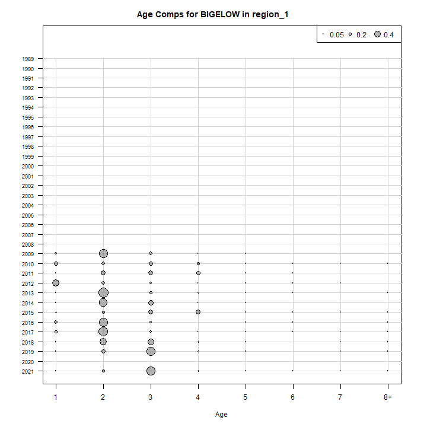
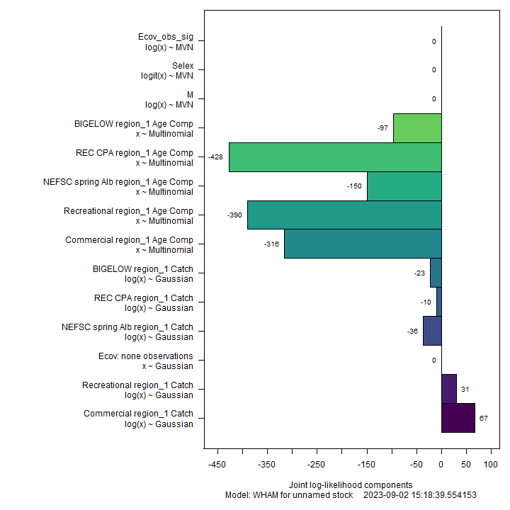
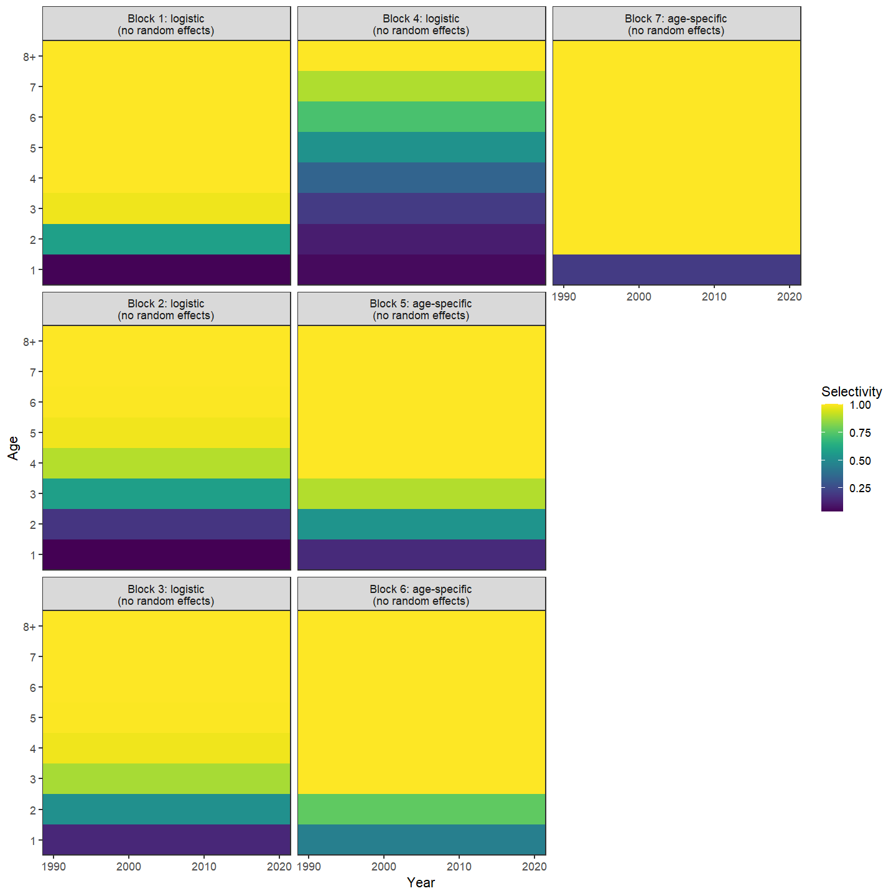
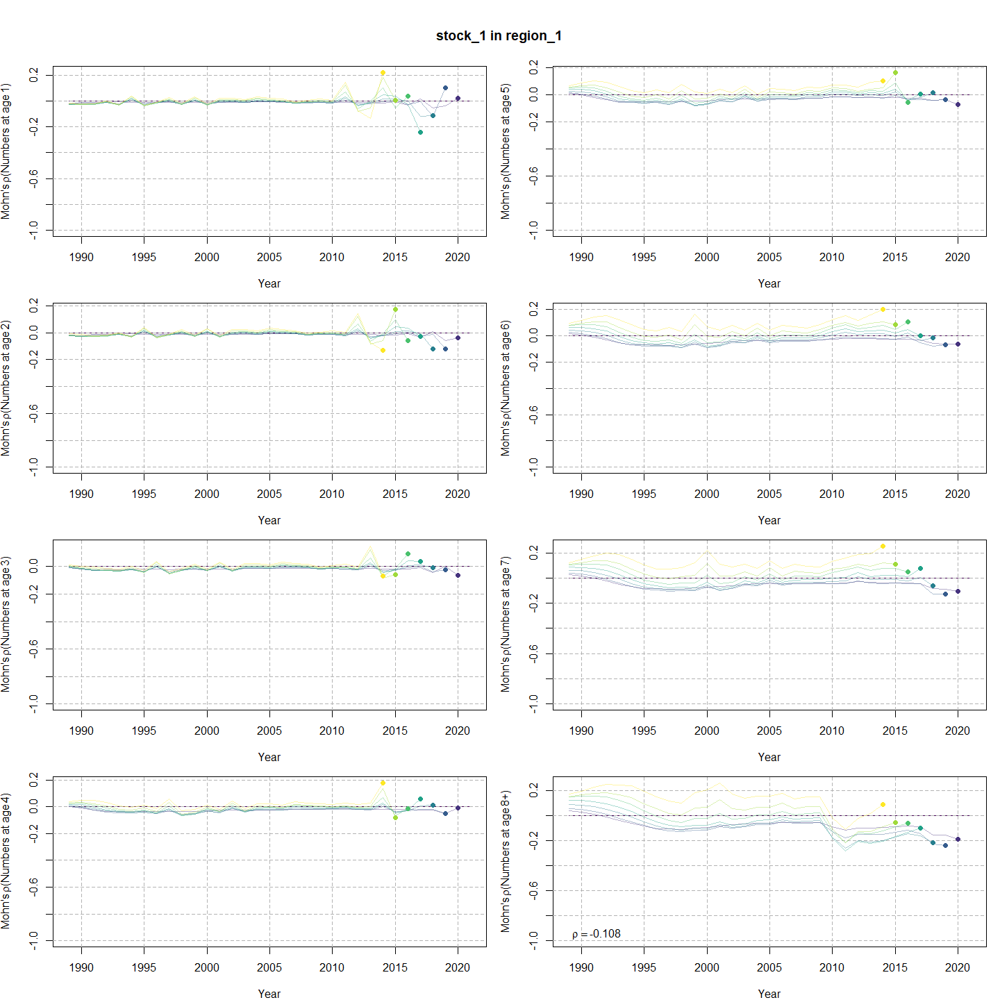
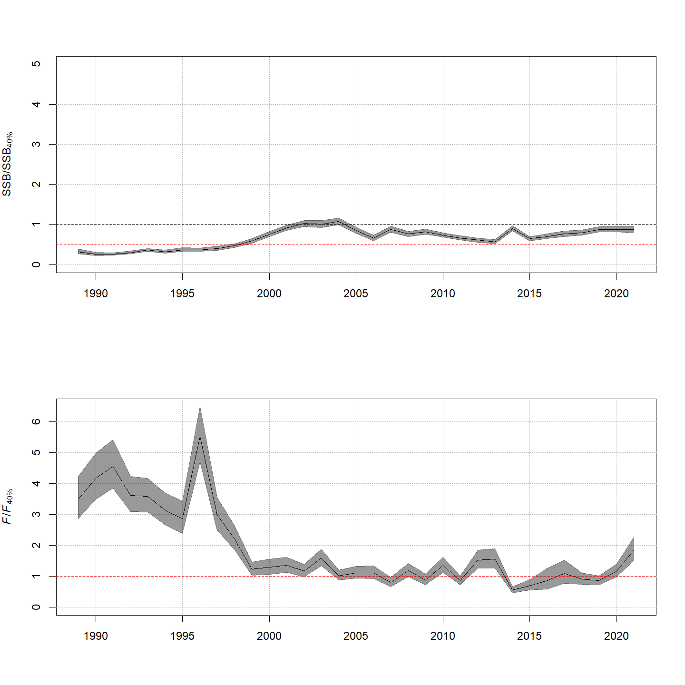
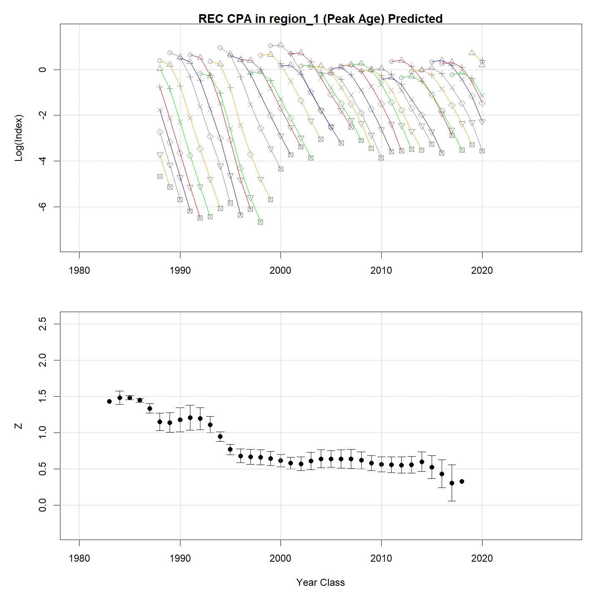

---
output:
  html_document:
    df_print: paged
    keep_md: yes
  word_document: default
  pdf_document:
    fig_caption: yes
    includes:
    keep_tex: yes
    number_sections: no
title: "WHAM figures and tables"
header-includes:
  - \usepackage{longtable}
  - \usepackage{booktabs}
  - \usepackage{caption,graphics}
  - \usepackage{makecell}
  - \usepackage{lscape}
  - \renewcommand\figurename{Fig.}
  - \captionsetup{labelsep=period, singlelinecheck=false}
  - \newcommand{\changesize}[1]{\fontsize{#1pt}{#1pt}\selectfont}
  - \renewcommand{\arraystretch}{1.5}
  - \renewcommand\theadfont{}
---

# {.tabset}

## Figures {.tabset}

### Input

### Diagnostics

### Results

### Retro

### Reference points

### Miscelaneous

## Tables {.tabset}

### Parameter estimates

<table class="table" style="margin-left: auto; margin-right: auto;">
<caption>Parameter estimates, standard errors, and confidence intervals. Rounded to 3 decimal places.</caption>
 <thead>
  <tr>
   <th style="text-align:left;">   </th>
   <th style="text-align:right;"> Estimate </th>
   <th style="text-align:right;"> Std. Error </th>
   <th style="text-align:right;"> 95\% CI lower </th>
   <th style="text-align:right;"> 95\% CI upper </th>
  </tr>
 </thead>
<tbody>
  <tr>
   <td style="text-align:left;"> NEFSC spring Alb fully selected q </td>
   <td style="text-align:right;"> 0.000 </td>
   <td style="text-align:right;"> 0.000 </td>
   <td style="text-align:right;"> 0.000 </td>
   <td style="text-align:right;"> 0.000 </td>
  </tr>
  <tr>
   <td style="text-align:left;"> REC CPA fully selected q </td>
   <td style="text-align:right;"> 0.000 </td>
   <td style="text-align:right;"> 0.000 </td>
   <td style="text-align:right;"> 0.000 </td>
   <td style="text-align:right;"> 0.000 </td>
  </tr>
  <tr>
   <td style="text-align:left;"> BIGELOW fully selected q </td>
   <td style="text-align:right;"> 0.000 </td>
   <td style="text-align:right;"> 0.000 </td>
   <td style="text-align:right;"> 0.000 </td>
   <td style="text-align:right;"> 0.000 </td>
  </tr>
  <tr>
   <td style="text-align:left;"> Block 1: $a_{50}$ </td>
   <td style="text-align:right;"> 1.908 </td>
   <td style="text-align:right;"> 0.086 </td>
   <td style="text-align:right;"> 1.744 </td>
   <td style="text-align:right;"> 2.082 </td>
  </tr>
  <tr>
   <td style="text-align:left;"> Block 1: 1/slope (increasing) </td>
   <td style="text-align:right;"> 0.287 </td>
   <td style="text-align:right;"> 0.027 </td>
   <td style="text-align:right;"> 0.238 </td>
   <td style="text-align:right;"> 0.346 </td>
  </tr>
  <tr>
   <td style="text-align:left;"> Block 2: $a_{50}$ </td>
   <td style="text-align:right;"> 2.827 </td>
   <td style="text-align:right;"> 0.118 </td>
   <td style="text-align:right;"> 2.601 </td>
   <td style="text-align:right;"> 3.062 </td>
  </tr>
  <tr>
   <td style="text-align:left;"> Block 2: 1/slope (increasing) </td>
   <td style="text-align:right;"> 0.553 </td>
   <td style="text-align:right;"> 0.039 </td>
   <td style="text-align:right;"> 0.481 </td>
   <td style="text-align:right;"> 0.635 </td>
  </tr>
  <tr>
   <td style="text-align:left;"> Block 3: $a_{50}$ </td>
   <td style="text-align:right;"> 1.970 </td>
   <td style="text-align:right;"> 0.113 </td>
   <td style="text-align:right;"> 1.757 </td>
   <td style="text-align:right;"> 2.199 </td>
  </tr>
  <tr>
   <td style="text-align:left;"> Block 3: 1/slope (increasing) </td>
   <td style="text-align:right;"> 0.533 </td>
   <td style="text-align:right;"> 0.051 </td>
   <td style="text-align:right;"> 0.441 </td>
   <td style="text-align:right;"> 0.643 </td>
  </tr>
  <tr>
   <td style="text-align:left;"> Block 4: $a_{50}$ </td>
   <td style="text-align:right;"> 5.242 </td>
   <td style="text-align:right;"> 0.744 </td>
   <td style="text-align:right;"> 3.672 </td>
   <td style="text-align:right;"> 6.478 </td>
  </tr>
  <tr>
   <td style="text-align:left;"> Block 4: 1/slope (increasing) </td>
   <td style="text-align:right;"> 1.445 </td>
   <td style="text-align:right;"> 0.155 </td>
   <td style="text-align:right;"> 1.166 </td>
   <td style="text-align:right;"> 1.773 </td>
  </tr>
  <tr>
   <td style="text-align:left;"> Block 5: Selectivity for age 1 </td>
   <td style="text-align:right;"> 0.147 </td>
   <td style="text-align:right;"> 0.030 </td>
   <td style="text-align:right;"> 0.098 </td>
   <td style="text-align:right;"> 0.217 </td>
  </tr>
  <tr>
   <td style="text-align:left;"> Block 5: Selectivity for age 2 </td>
   <td style="text-align:right;"> 0.534 </td>
   <td style="text-align:right;"> 0.095 </td>
   <td style="text-align:right;"> 0.352 </td>
   <td style="text-align:right;"> 0.708 </td>
  </tr>
  <tr>
   <td style="text-align:left;"> Block 5: Selectivity for age 3 </td>
   <td style="text-align:right;"> 0.890 </td>
   <td style="text-align:right;"> 0.166 </td>
   <td style="text-align:right;"> 0.225 </td>
   <td style="text-align:right;"> 0.996 </td>
  </tr>
  <tr>
   <td style="text-align:left;"> Block 5: Selectivity for age 4 </td>
   <td style="text-align:right;"> 1.000 </td>
   <td style="text-align:right;"> -- </td>
   <td style="text-align:right;"> -- </td>
   <td style="text-align:right;"> -- </td>
  </tr>
  <tr>
   <td style="text-align:left;"> Block 5: Selectivity for age 5 </td>
   <td style="text-align:right;"> 1.000 </td>
   <td style="text-align:right;"> -- </td>
   <td style="text-align:right;"> -- </td>
   <td style="text-align:right;"> -- </td>
  </tr>
  <tr>
   <td style="text-align:left;"> Block 5: Selectivity for age 6 </td>
   <td style="text-align:right;"> 1.000 </td>
   <td style="text-align:right;"> -- </td>
   <td style="text-align:right;"> -- </td>
   <td style="text-align:right;"> -- </td>
  </tr>
  <tr>
   <td style="text-align:left;"> Block 5: Selectivity for age 7 </td>
   <td style="text-align:right;"> 1.000 </td>
   <td style="text-align:right;"> -- </td>
   <td style="text-align:right;"> -- </td>
   <td style="text-align:right;"> -- </td>
  </tr>
  <tr>
   <td style="text-align:left;"> Block 5: Selectivity for age 8+ </td>
   <td style="text-align:right;"> 1.000 </td>
   <td style="text-align:right;"> -- </td>
   <td style="text-align:right;"> -- </td>
   <td style="text-align:right;"> -- </td>
  </tr>
  <tr>
   <td style="text-align:left;"> Block 6: Selectivity for age 1 </td>
   <td style="text-align:right;"> 0.448 </td>
   <td style="text-align:right;"> 0.028 </td>
   <td style="text-align:right;"> 0.394 </td>
   <td style="text-align:right;"> 0.503 </td>
  </tr>
  <tr>
   <td style="text-align:left;"> Block 6: Selectivity for age 2 </td>
   <td style="text-align:right;"> 0.763 </td>
   <td style="text-align:right;"> 0.047 </td>
   <td style="text-align:right;"> 0.660 </td>
   <td style="text-align:right;"> 0.842 </td>
  </tr>
  <tr>
   <td style="text-align:left;"> Block 6: Selectivity for age 3 </td>
   <td style="text-align:right;"> 1.000 </td>
   <td style="text-align:right;"> -- </td>
   <td style="text-align:right;"> -- </td>
   <td style="text-align:right;"> -- </td>
  </tr>
  <tr>
   <td style="text-align:left;"> Block 6: Selectivity for age 4 </td>
   <td style="text-align:right;"> 1.000 </td>
   <td style="text-align:right;"> -- </td>
   <td style="text-align:right;"> -- </td>
   <td style="text-align:right;"> -- </td>
  </tr>
  <tr>
   <td style="text-align:left;"> Block 6: Selectivity for age 5 </td>
   <td style="text-align:right;"> 1.000 </td>
   <td style="text-align:right;"> -- </td>
   <td style="text-align:right;"> -- </td>
   <td style="text-align:right;"> -- </td>
  </tr>
  <tr>
   <td style="text-align:left;"> Block 6: Selectivity for age 6 </td>
   <td style="text-align:right;"> 1.000 </td>
   <td style="text-align:right;"> -- </td>
   <td style="text-align:right;"> -- </td>
   <td style="text-align:right;"> -- </td>
  </tr>
  <tr>
   <td style="text-align:left;"> Block 6: Selectivity for age 7 </td>
   <td style="text-align:right;"> 1.000 </td>
   <td style="text-align:right;"> -- </td>
   <td style="text-align:right;"> -- </td>
   <td style="text-align:right;"> -- </td>
  </tr>
  <tr>
   <td style="text-align:left;"> Block 6: Selectivity for age 8+ </td>
   <td style="text-align:right;"> 1.000 </td>
   <td style="text-align:right;"> -- </td>
   <td style="text-align:right;"> -- </td>
   <td style="text-align:right;"> -- </td>
  </tr>
  <tr>
   <td style="text-align:left;"> Block 7: Selectivity for age 1 </td>
   <td style="text-align:right;"> 0.200 </td>
   <td style="text-align:right;"> 0.038 </td>
   <td style="text-align:right;"> 0.136 </td>
   <td style="text-align:right;"> 0.285 </td>
  </tr>
  <tr>
   <td style="text-align:left;"> Block 7: Selectivity for age 2 </td>
   <td style="text-align:right;"> 1.000 </td>
   <td style="text-align:right;"> -- </td>
   <td style="text-align:right;"> -- </td>
   <td style="text-align:right;"> -- </td>
  </tr>
  <tr>
   <td style="text-align:left;"> Block 7: Selectivity for age 3 </td>
   <td style="text-align:right;"> 1.000 </td>
   <td style="text-align:right;"> -- </td>
   <td style="text-align:right;"> -- </td>
   <td style="text-align:right;"> -- </td>
  </tr>
  <tr>
   <td style="text-align:left;"> Block 7: Selectivity for age 4 </td>
   <td style="text-align:right;"> 1.000 </td>
   <td style="text-align:right;"> -- </td>
   <td style="text-align:right;"> -- </td>
   <td style="text-align:right;"> -- </td>
  </tr>
  <tr>
   <td style="text-align:left;"> Block 7: Selectivity for age 5 </td>
   <td style="text-align:right;"> 1.000 </td>
   <td style="text-align:right;"> -- </td>
   <td style="text-align:right;"> -- </td>
   <td style="text-align:right;"> -- </td>
  </tr>
  <tr>
   <td style="text-align:left;"> Block 7: Selectivity for age 6 </td>
   <td style="text-align:right;"> 1.000 </td>
   <td style="text-align:right;"> -- </td>
   <td style="text-align:right;"> -- </td>
   <td style="text-align:right;"> -- </td>
  </tr>
  <tr>
   <td style="text-align:left;"> Block 7: Selectivity for age 7 </td>
   <td style="text-align:right;"> 1.000 </td>
   <td style="text-align:right;"> -- </td>
   <td style="text-align:right;"> -- </td>
   <td style="text-align:right;"> -- </td>
  </tr>
  <tr>
   <td style="text-align:left;"> Block 7: Selectivity for age 8+ </td>
   <td style="text-align:right;"> 1.000 </td>
   <td style="text-align:right;"> -- </td>
   <td style="text-align:right;"> -- </td>
   <td style="text-align:right;"> -- </td>
  </tr>
</tbody>
</table>

### Abundance at age

<table class="table" style="margin-left: auto; margin-right: auto;">
<caption>Abundance at age (1000s) for stock 1 in region 1.</caption>
 <thead>
  <tr>
   <th style="text-align:left;">   </th>
   <th style="text-align:right;"> 1 </th>
   <th style="text-align:right;"> 2 </th>
   <th style="text-align:right;"> 3 </th>
   <th style="text-align:right;"> 4 </th>
   <th style="text-align:right;"> 5 </th>
   <th style="text-align:right;"> 6 </th>
   <th style="text-align:right;"> 7 </th>
   <th style="text-align:right;"> 8+ </th>
  </tr>
 </thead>
<tbody>
  <tr>
   <td style="text-align:left;"> 1989 </td>
   <td style="text-align:right;"> 22041 </td>
   <td style="text-align:right;"> 10874 </td>
   <td style="text-align:right;"> 4335 </td>
   <td style="text-align:right;"> 1655 </td>
   <td style="text-align:right;"> 628 </td>
   <td style="text-align:right;"> 238 </td>
   <td style="text-align:right;"> 90 </td>
   <td style="text-align:right;"> 55 </td>
  </tr>
  <tr>
   <td style="text-align:left;"> 1990 </td>
   <td style="text-align:right;"> 31429 </td>
   <td style="text-align:right;"> 13335 </td>
   <td style="text-align:right;"> 4319 </td>
   <td style="text-align:right;"> 1197 </td>
   <td style="text-align:right;"> 424 </td>
   <td style="text-align:right;"> 159 </td>
   <td style="text-align:right;"> 60 </td>
   <td style="text-align:right;"> 37 </td>
  </tr>
  <tr>
   <td style="text-align:left;"> 1991 </td>
   <td style="text-align:right;"> 24789 </td>
   <td style="text-align:right;"> 18921 </td>
   <td style="text-align:right;"> 4904 </td>
   <td style="text-align:right;"> 1047 </td>
   <td style="text-align:right;"> 269 </td>
   <td style="text-align:right;"> 94 </td>
   <td style="text-align:right;"> 35 </td>
   <td style="text-align:right;"> 21 </td>
  </tr>
  <tr>
   <td style="text-align:left;"> 1992 </td>
   <td style="text-align:right;"> 28622 </td>
   <td style="text-align:right;"> 14656 </td>
   <td style="text-align:right;"> 6784 </td>
   <td style="text-align:right;"> 1138 </td>
   <td style="text-align:right;"> 222 </td>
   <td style="text-align:right;"> 56 </td>
   <td style="text-align:right;"> 20 </td>
   <td style="text-align:right;"> 12 </td>
  </tr>
  <tr>
   <td style="text-align:left;"> 1993 </td>
   <td style="text-align:right;"> 12624 </td>
   <td style="text-align:right;"> 17546 </td>
   <td style="text-align:right;"> 5868 </td>
   <td style="text-align:right;"> 1900 </td>
   <td style="text-align:right;"> 299 </td>
   <td style="text-align:right;"> 58 </td>
   <td style="text-align:right;"> 15 </td>
   <td style="text-align:right;"> 8 </td>
  </tr>
  <tr>
   <td style="text-align:left;"> 1994 </td>
   <td style="text-align:right;"> 21367 </td>
   <td style="text-align:right;"> 7655 </td>
   <td style="text-align:right;"> 6981 </td>
   <td style="text-align:right;"> 1625 </td>
   <td style="text-align:right;"> 489 </td>
   <td style="text-align:right;"> 76 </td>
   <td style="text-align:right;"> 15 </td>
   <td style="text-align:right;"> 6 </td>
  </tr>
  <tr>
   <td style="text-align:left;"> 1995 </td>
   <td style="text-align:right;"> 39147 </td>
   <td style="text-align:right;"> 13130 </td>
   <td style="text-align:right;"> 3249 </td>
   <td style="text-align:right;"> 2157 </td>
   <td style="text-align:right;"> 472 </td>
   <td style="text-align:right;"> 141 </td>
   <td style="text-align:right;"> 22 </td>
   <td style="text-align:right;"> 6 </td>
  </tr>
  <tr>
   <td style="text-align:left;"> 1996 </td>
   <td style="text-align:right;"> 28488 </td>
   <td style="text-align:right;"> 23585 </td>
   <td style="text-align:right;"> 5348 </td>
   <td style="text-align:right;"> 936 </td>
   <td style="text-align:right;"> 575 </td>
   <td style="text-align:right;"> 124 </td>
   <td style="text-align:right;"> 37 </td>
   <td style="text-align:right;"> 7 </td>
  </tr>
  <tr>
   <td style="text-align:left;"> 1997 </td>
   <td style="text-align:right;"> 23232 </td>
   <td style="text-align:right;"> 16127 </td>
   <td style="text-align:right;"> 6666 </td>
   <td style="text-align:right;"> 829 </td>
   <td style="text-align:right;"> 128 </td>
   <td style="text-align:right;"> 77 </td>
   <td style="text-align:right;"> 17 </td>
   <td style="text-align:right;"> 6 </td>
  </tr>
  <tr>
   <td style="text-align:left;"> 1998 </td>
   <td style="text-align:right;"> 12851 </td>
   <td style="text-align:right;"> 13940 </td>
   <td style="text-align:right;"> 6516 </td>
   <td style="text-align:right;"> 1893 </td>
   <td style="text-align:right;"> 217 </td>
   <td style="text-align:right;"> 33 </td>
   <td style="text-align:right;"> 20 </td>
   <td style="text-align:right;"> 6 </td>
  </tr>
  <tr>
   <td style="text-align:left;"> 1999 </td>
   <td style="text-align:right;"> 27420 </td>
   <td style="text-align:right;"> 8121 </td>
   <td style="text-align:right;"> 7324 </td>
   <td style="text-align:right;"> 2526 </td>
   <td style="text-align:right;"> 608 </td>
   <td style="text-align:right;"> 66 </td>
   <td style="text-align:right;"> 10 </td>
   <td style="text-align:right;"> 8 </td>
  </tr>
  <tr>
   <td style="text-align:left;"> 2000 </td>
   <td style="text-align:right;"> 41499 </td>
   <td style="text-align:right;"> 17665 </td>
   <td style="text-align:right;"> 4631 </td>
   <td style="text-align:right;"> 3451 </td>
   <td style="text-align:right;"> 1062 </td>
   <td style="text-align:right;"> 248 </td>
   <td style="text-align:right;"> 27 </td>
   <td style="text-align:right;"> 7 </td>
  </tr>
  <tr>
   <td style="text-align:left;"> 2001 </td>
   <td style="text-align:right;"> 17252 </td>
   <td style="text-align:right;"> 26422 </td>
   <td style="text-align:right;"> 9706 </td>
   <td style="text-align:right;"> 2114 </td>
   <td style="text-align:right;"> 1440 </td>
   <td style="text-align:right;"> 434 </td>
   <td style="text-align:right;"> 101 </td>
   <td style="text-align:right;"> 14 </td>
  </tr>
  <tr>
   <td style="text-align:left;"> 2002 </td>
   <td style="text-align:right;"> 29743 </td>
   <td style="text-align:right;"> 11001 </td>
   <td style="text-align:right;"> 14622 </td>
   <td style="text-align:right;"> 4523 </td>
   <td style="text-align:right;"> 910 </td>
   <td style="text-align:right;"> 609 </td>
   <td style="text-align:right;"> 183 </td>
   <td style="text-align:right;"> 48 </td>
  </tr>
  <tr>
   <td style="text-align:left;"> 2003 </td>
   <td style="text-align:right;"> 17117 </td>
   <td style="text-align:right;"> 19091 </td>
   <td style="text-align:right;"> 6244 </td>
   <td style="text-align:right;"> 7148 </td>
   <td style="text-align:right;"> 2065 </td>
   <td style="text-align:right;"> 409 </td>
   <td style="text-align:right;"> 273 </td>
   <td style="text-align:right;"> 104 </td>
  </tr>
  <tr>
   <td style="text-align:left;"> 2004 </td>
   <td style="text-align:right;"> 16110 </td>
   <td style="text-align:right;"> 10847 </td>
   <td style="text-align:right;"> 10307 </td>
   <td style="text-align:right;"> 2764 </td>
   <td style="text-align:right;"> 2883 </td>
   <td style="text-align:right;"> 815 </td>
   <td style="text-align:right;"> 161 </td>
   <td style="text-align:right;"> 148 </td>
  </tr>
  <tr>
   <td style="text-align:left;"> 2005 </td>
   <td style="text-align:right;"> 11749 </td>
   <td style="text-align:right;"> 10400 </td>
   <td style="text-align:right;"> 6258 </td>
   <td style="text-align:right;"> 5056 </td>
   <td style="text-align:right;"> 1239 </td>
   <td style="text-align:right;"> 1263 </td>
   <td style="text-align:right;"> 355 </td>
   <td style="text-align:right;"> 135 </td>
  </tr>
  <tr>
   <td style="text-align:left;"> 2006 </td>
   <td style="text-align:right;"> 14984 </td>
   <td style="text-align:right;"> 7613 </td>
   <td style="text-align:right;"> 6102 </td>
   <td style="text-align:right;"> 3209 </td>
   <td style="text-align:right;"> 2417 </td>
   <td style="text-align:right;"> 582 </td>
   <td style="text-align:right;"> 591 </td>
   <td style="text-align:right;"> 229 </td>
  </tr>
  <tr>
   <td style="text-align:left;"> 2007 </td>
   <td style="text-align:right;"> 17149 </td>
   <td style="text-align:right;"> 9789 </td>
   <td style="text-align:right;"> 4610 </td>
   <td style="text-align:right;"> 3325 </td>
   <td style="text-align:right;"> 1653 </td>
   <td style="text-align:right;"> 1227 </td>
   <td style="text-align:right;"> 295 </td>
   <td style="text-align:right;"> 415 </td>
  </tr>
  <tr>
   <td style="text-align:left;"> 2008 </td>
   <td style="text-align:right;"> 17674 </td>
   <td style="text-align:right;"> 11137 </td>
   <td style="text-align:right;"> 5807 </td>
   <td style="text-align:right;"> 2442 </td>
   <td style="text-align:right;"> 1668 </td>
   <td style="text-align:right;"> 819 </td>
   <td style="text-align:right;"> 606 </td>
   <td style="text-align:right;"> 351 </td>
  </tr>
  <tr>
   <td style="text-align:left;"> 2009 </td>
   <td style="text-align:right;"> 13742 </td>
   <td style="text-align:right;"> 11387 </td>
   <td style="text-align:right;"> 6413 </td>
   <td style="text-align:right;"> 2917 </td>
   <td style="text-align:right;"> 1152 </td>
   <td style="text-align:right;"> 776 </td>
   <td style="text-align:right;"> 380 </td>
   <td style="text-align:right;"> 444 </td>
  </tr>
  <tr>
   <td style="text-align:left;"> 2010 </td>
   <td style="text-align:right;"> 14407 </td>
   <td style="text-align:right;"> 8836 </td>
   <td style="text-align:right;"> 6990 </td>
   <td style="text-align:right;"> 3594 </td>
   <td style="text-align:right;"> 1452 </td>
   <td style="text-align:right;"> 503 </td>
   <td style="text-align:right;"> 297 </td>
   <td style="text-align:right;"> 271 </td>
  </tr>
  <tr>
   <td style="text-align:left;"> 2011 </td>
   <td style="text-align:right;"> 9448 </td>
   <td style="text-align:right;"> 9143 </td>
   <td style="text-align:right;"> 5272 </td>
   <td style="text-align:right;"> 3692 </td>
   <td style="text-align:right;"> 1622 </td>
   <td style="text-align:right;"> 552 </td>
   <td style="text-align:right;"> 161 </td>
   <td style="text-align:right;"> 150 </td>
  </tr>
  <tr>
   <td style="text-align:left;"> 2012 </td>
   <td style="text-align:right;"> 20801 </td>
   <td style="text-align:right;"> 6186 </td>
   <td style="text-align:right;"> 5764 </td>
   <td style="text-align:right;"> 3053 </td>
   <td style="text-align:right;"> 1954 </td>
   <td style="text-align:right;"> 799 </td>
   <td style="text-align:right;"> 255 </td>
   <td style="text-align:right;"> 134 </td>
  </tr>
  <tr>
   <td style="text-align:left;"> 2013 </td>
   <td style="text-align:right;"> 10216 </td>
   <td style="text-align:right;"> 13210 </td>
   <td style="text-align:right;"> 3695 </td>
   <td style="text-align:right;"> 3051 </td>
   <td style="text-align:right;"> 1383 </td>
   <td style="text-align:right;"> 747 </td>
   <td style="text-align:right;"> 257 </td>
   <td style="text-align:right;"> 105 </td>
  </tr>
  <tr>
   <td style="text-align:left;"> 2014 </td>
   <td style="text-align:right;"> 13103 </td>
   <td style="text-align:right;"> 6527 </td>
   <td style="text-align:right;"> 7934 </td>
   <td style="text-align:right;"> 1951 </td>
   <td style="text-align:right;"> 1382 </td>
   <td style="text-align:right;"> 539 </td>
   <td style="text-align:right;"> 252 </td>
   <td style="text-align:right;"> 106 </td>
  </tr>
  <tr>
   <td style="text-align:left;"> 2015 </td>
   <td style="text-align:right;"> 14185 </td>
   <td style="text-align:right;"> 8488 </td>
   <td style="text-align:right;"> 4040 </td>
   <td style="text-align:right;"> 4461 </td>
   <td style="text-align:right;"> 981 </td>
   <td style="text-align:right;"> 625 </td>
   <td style="text-align:right;"> 220 </td>
   <td style="text-align:right;"> 132 </td>
  </tr>
  <tr>
   <td style="text-align:left;"> 2016 </td>
   <td style="text-align:right;"> 20238 </td>
   <td style="text-align:right;"> 9304 </td>
   <td style="text-align:right;"> 5406 </td>
   <td style="text-align:right;"> 2416 </td>
   <td style="text-align:right;"> 2481 </td>
   <td style="text-align:right;"> 510 </td>
   <td style="text-align:right;"> 305 </td>
   <td style="text-align:right;"> 161 </td>
  </tr>
  <tr>
   <td style="text-align:left;"> 2017 </td>
   <td style="text-align:right;"> 18738 </td>
   <td style="text-align:right;"> 13163 </td>
   <td style="text-align:right;"> 5834 </td>
   <td style="text-align:right;"> 3146 </td>
   <td style="text-align:right;"> 1282 </td>
   <td style="text-align:right;"> 1199 </td>
   <td style="text-align:right;"> 224 </td>
   <td style="text-align:right;"> 186 </td>
  </tr>
  <tr>
   <td style="text-align:left;"> 2018 </td>
   <td style="text-align:right;"> 11640 </td>
   <td style="text-align:right;"> 12035 </td>
   <td style="text-align:right;"> 8052 </td>
   <td style="text-align:right;"> 3239 </td>
   <td style="text-align:right;"> 1542 </td>
   <td style="text-align:right;"> 550 </td>
   <td style="text-align:right;"> 449 </td>
   <td style="text-align:right;"> 133 </td>
  </tr>
  <tr>
   <td style="text-align:left;"> 2019 </td>
   <td style="text-align:right;"> 27625 </td>
   <td style="text-align:right;"> 7559 </td>
   <td style="text-align:right;"> 7533 </td>
   <td style="text-align:right;"> 4682 </td>
   <td style="text-align:right;"> 1716 </td>
   <td style="text-align:right;"> 740 </td>
   <td style="text-align:right;"> 239 </td>
   <td style="text-align:right;"> 229 </td>
  </tr>
  <tr>
   <td style="text-align:left;"> 2020 </td>
   <td style="text-align:right;"> 17021 </td>
   <td style="text-align:right;"> 17952 </td>
   <td style="text-align:right;"> 4713 </td>
   <td style="text-align:right;"> 4302 </td>
   <td style="text-align:right;"> 2414 </td>
   <td style="text-align:right;"> 804 </td>
   <td style="text-align:right;"> 316 </td>
   <td style="text-align:right;"> 180 </td>
  </tr>
  <tr>
   <td style="text-align:left;"> 2021 </td>
   <td style="text-align:right;"> 20862 </td>
   <td style="text-align:right;"> 10975 </td>
   <td style="text-align:right;"> 10992 </td>
   <td style="text-align:right;"> 2586 </td>
   <td style="text-align:right;"> 2078 </td>
   <td style="text-align:right;"> 1034 </td>
   <td style="text-align:right;"> 306 </td>
   <td style="text-align:right;"> 168 </td>
  </tr>
</tbody>
</table>

### Fishing mortality at age by region

<table class="table" style="margin-left: auto; margin-right: auto;">
<caption>Total fishing mortality at age in region 1.</caption>
 <thead>
  <tr>
   <th style="text-align:left;">   </th>
   <th style="text-align:right;"> 1 </th>
   <th style="text-align:right;"> 2 </th>
   <th style="text-align:right;"> 3 </th>
   <th style="text-align:right;"> 4 </th>
   <th style="text-align:right;"> 5 </th>
   <th style="text-align:right;"> 6 </th>
   <th style="text-align:right;"> 7 </th>
   <th style="text-align:right;"> 8+ </th>
  </tr>
 </thead>
<tbody>
  <tr>
   <td style="text-align:left;"> 1989 </td>
   <td style="text-align:right;"> 0.014 </td>
   <td style="text-align:right;"> 0.196 </td>
   <td style="text-align:right;"> 0.331 </td>
   <td style="text-align:right;"> 0.339 </td>
   <td style="text-align:right;"> 0.339 </td>
   <td style="text-align:right;"> 0.339 </td>
   <td style="text-align:right;"> 0.339 </td>
   <td style="text-align:right;"> 0.339 </td>
  </tr>
  <tr>
   <td style="text-align:left;"> 1990 </td>
   <td style="text-align:right;"> 0.019 </td>
   <td style="text-align:right;"> 0.275 </td>
   <td style="text-align:right;"> 0.465 </td>
   <td style="text-align:right;"> 0.475 </td>
   <td style="text-align:right;"> 0.475 </td>
   <td style="text-align:right;"> 0.475 </td>
   <td style="text-align:right;"> 0.475 </td>
   <td style="text-align:right;"> 0.475 </td>
  </tr>
  <tr>
   <td style="text-align:left;"> 1991 </td>
   <td style="text-align:right;"> 0.015 </td>
   <td style="text-align:right;"> 0.220 </td>
   <td style="text-align:right;"> 0.371 </td>
   <td style="text-align:right;"> 0.379 </td>
   <td style="text-align:right;"> 0.379 </td>
   <td style="text-align:right;"> 0.379 </td>
   <td style="text-align:right;"> 0.379 </td>
   <td style="text-align:right;"> 0.379 </td>
  </tr>
  <tr>
   <td style="text-align:left;"> 1992 </td>
   <td style="text-align:right;"> 0.018 </td>
   <td style="text-align:right;"> 0.251 </td>
   <td style="text-align:right;"> 0.424 </td>
   <td style="text-align:right;"> 0.433 </td>
   <td style="text-align:right;"> 0.433 </td>
   <td style="text-align:right;"> 0.433 </td>
   <td style="text-align:right;"> 0.433 </td>
   <td style="text-align:right;"> 0.433 </td>
  </tr>
  <tr>
   <td style="text-align:left;"> 1993 </td>
   <td style="text-align:right;"> 0.014 </td>
   <td style="text-align:right;"> 0.206 </td>
   <td style="text-align:right;"> 0.347 </td>
   <td style="text-align:right;"> 0.355 </td>
   <td style="text-align:right;"> 0.355 </td>
   <td style="text-align:right;"> 0.355 </td>
   <td style="text-align:right;"> 0.355 </td>
   <td style="text-align:right;"> 0.355 </td>
  </tr>
  <tr>
   <td style="text-align:left;"> 1994 </td>
   <td style="text-align:right;"> 0.013 </td>
   <td style="text-align:right;"> 0.184 </td>
   <td style="text-align:right;"> 0.311 </td>
   <td style="text-align:right;"> 0.317 </td>
   <td style="text-align:right;"> 0.318 </td>
   <td style="text-align:right;"> 0.318 </td>
   <td style="text-align:right;"> 0.318 </td>
   <td style="text-align:right;"> 0.318 </td>
  </tr>
  <tr>
   <td style="text-align:left;"> 1995 </td>
   <td style="text-align:right;"> 0.010 </td>
   <td style="text-align:right;"> 0.141 </td>
   <td style="text-align:right;"> 0.239 </td>
   <td style="text-align:right;"> 0.244 </td>
   <td style="text-align:right;"> 0.244 </td>
   <td style="text-align:right;"> 0.244 </td>
   <td style="text-align:right;"> 0.244 </td>
   <td style="text-align:right;"> 0.244 </td>
  </tr>
  <tr>
   <td style="text-align:left;"> 1996 </td>
   <td style="text-align:right;"> 0.023 </td>
   <td style="text-align:right;"> 0.325 </td>
   <td style="text-align:right;"> 0.548 </td>
   <td style="text-align:right;"> 0.560 </td>
   <td style="text-align:right;"> 0.560 </td>
   <td style="text-align:right;"> 0.560 </td>
   <td style="text-align:right;"> 0.560 </td>
   <td style="text-align:right;"> 0.560 </td>
  </tr>
  <tr>
   <td style="text-align:left;"> 1997 </td>
   <td style="text-align:right;"> 0.009 </td>
   <td style="text-align:right;"> 0.132 </td>
   <td style="text-align:right;"> 0.223 </td>
   <td style="text-align:right;"> 0.228 </td>
   <td style="text-align:right;"> 0.228 </td>
   <td style="text-align:right;"> 0.228 </td>
   <td style="text-align:right;"> 0.228 </td>
   <td style="text-align:right;"> 0.228 </td>
  </tr>
  <tr>
   <td style="text-align:left;"> 1998 </td>
   <td style="text-align:right;"> 0.018 </td>
   <td style="text-align:right;"> 0.092 </td>
   <td style="text-align:right;"> 0.289 </td>
   <td style="text-align:right;"> 0.447 </td>
   <td style="text-align:right;"> 0.491 </td>
   <td style="text-align:right;"> 0.499 </td>
   <td style="text-align:right;"> 0.500 </td>
   <td style="text-align:right;"> 0.501 </td>
  </tr>
  <tr>
   <td style="text-align:left;"> 1999 </td>
   <td style="text-align:right;"> 0.010 </td>
   <td style="text-align:right;"> 0.054 </td>
   <td style="text-align:right;"> 0.169 </td>
   <td style="text-align:right;"> 0.261 </td>
   <td style="text-align:right;"> 0.287 </td>
   <td style="text-align:right;"> 0.292 </td>
   <td style="text-align:right;"> 0.292 </td>
   <td style="text-align:right;"> 0.292 </td>
  </tr>
  <tr>
   <td style="text-align:left;"> 2000 </td>
   <td style="text-align:right;"> 0.006 </td>
   <td style="text-align:right;"> 0.032 </td>
   <td style="text-align:right;"> 0.101 </td>
   <td style="text-align:right;"> 0.157 </td>
   <td style="text-align:right;"> 0.172 </td>
   <td style="text-align:right;"> 0.175 </td>
   <td style="text-align:right;"> 0.175 </td>
   <td style="text-align:right;"> 0.175 </td>
  </tr>
  <tr>
   <td style="text-align:left;"> 2001 </td>
   <td style="text-align:right;"> 0.005 </td>
   <td style="text-align:right;"> 0.026 </td>
   <td style="text-align:right;"> 0.082 </td>
   <td style="text-align:right;"> 0.127 </td>
   <td style="text-align:right;"> 0.140 </td>
   <td style="text-align:right;"> 0.142 </td>
   <td style="text-align:right;"> 0.142 </td>
   <td style="text-align:right;"> 0.142 </td>
  </tr>
  <tr>
   <td style="text-align:left;"> 2002 </td>
   <td style="text-align:right;"> 0.004 </td>
   <td style="text-align:right;"> 0.023 </td>
   <td style="text-align:right;"> 0.072 </td>
   <td style="text-align:right;"> 0.111 </td>
   <td style="text-align:right;"> 0.121 </td>
   <td style="text-align:right;"> 0.123 </td>
   <td style="text-align:right;"> 0.124 </td>
   <td style="text-align:right;"> 0.124 </td>
  </tr>
  <tr>
   <td style="text-align:left;"> 2003 </td>
   <td style="text-align:right;"> 0.006 </td>
   <td style="text-align:right;"> 0.032 </td>
   <td style="text-align:right;"> 0.102 </td>
   <td style="text-align:right;"> 0.158 </td>
   <td style="text-align:right;"> 0.173 </td>
   <td style="text-align:right;"> 0.176 </td>
   <td style="text-align:right;"> 0.177 </td>
   <td style="text-align:right;"> 0.177 </td>
  </tr>
  <tr>
   <td style="text-align:left;"> 2004 </td>
   <td style="text-align:right;"> 0.008 </td>
   <td style="text-align:right;"> 0.039 </td>
   <td style="text-align:right;"> 0.124 </td>
   <td style="text-align:right;"> 0.192 </td>
   <td style="text-align:right;"> 0.211 </td>
   <td style="text-align:right;"> 0.214 </td>
   <td style="text-align:right;"> 0.215 </td>
   <td style="text-align:right;"> 0.215 </td>
  </tr>
  <tr>
   <td style="text-align:left;"> 2005 </td>
   <td style="text-align:right;"> 0.006 </td>
   <td style="text-align:right;"> 0.028 </td>
   <td style="text-align:right;"> 0.090 </td>
   <td style="text-align:right;"> 0.139 </td>
   <td style="text-align:right;"> 0.153 </td>
   <td style="text-align:right;"> 0.155 </td>
   <td style="text-align:right;"> 0.155 </td>
   <td style="text-align:right;"> 0.155 </td>
  </tr>
  <tr>
   <td style="text-align:left;"> 2006 </td>
   <td style="text-align:right;"> 0.005 </td>
   <td style="text-align:right;"> 0.024 </td>
   <td style="text-align:right;"> 0.075 </td>
   <td style="text-align:right;"> 0.115 </td>
   <td style="text-align:right;"> 0.127 </td>
   <td style="text-align:right;"> 0.129 </td>
   <td style="text-align:right;"> 0.129 </td>
   <td style="text-align:right;"> 0.129 </td>
  </tr>
  <tr>
   <td style="text-align:left;"> 2007 </td>
   <td style="text-align:right;"> 0.004 </td>
   <td style="text-align:right;"> 0.019 </td>
   <td style="text-align:right;"> 0.061 </td>
   <td style="text-align:right;"> 0.094 </td>
   <td style="text-align:right;"> 0.103 </td>
   <td style="text-align:right;"> 0.105 </td>
   <td style="text-align:right;"> 0.105 </td>
   <td style="text-align:right;"> 0.105 </td>
  </tr>
  <tr>
   <td style="text-align:left;"> 2008 </td>
   <td style="text-align:right;"> 0.004 </td>
   <td style="text-align:right;"> 0.021 </td>
   <td style="text-align:right;"> 0.066 </td>
   <td style="text-align:right;"> 0.101 </td>
   <td style="text-align:right;"> 0.111 </td>
   <td style="text-align:right;"> 0.113 </td>
   <td style="text-align:right;"> 0.113 </td>
   <td style="text-align:right;"> 0.113 </td>
  </tr>
  <tr>
   <td style="text-align:left;"> 2009 </td>
   <td style="text-align:right;"> 0.003 </td>
   <td style="text-align:right;"> 0.014 </td>
   <td style="text-align:right;"> 0.044 </td>
   <td style="text-align:right;"> 0.068 </td>
   <td style="text-align:right;"> 0.075 </td>
   <td style="text-align:right;"> 0.076 </td>
   <td style="text-align:right;"> 0.076 </td>
   <td style="text-align:right;"> 0.076 </td>
  </tr>
  <tr>
   <td style="text-align:left;"> 2010 </td>
   <td style="text-align:right;"> 0.004 </td>
   <td style="text-align:right;"> 0.020 </td>
   <td style="text-align:right;"> 0.062 </td>
   <td style="text-align:right;"> 0.095 </td>
   <td style="text-align:right;"> 0.105 </td>
   <td style="text-align:right;"> 0.106 </td>
   <td style="text-align:right;"> 0.107 </td>
   <td style="text-align:right;"> 0.107 </td>
  </tr>
  <tr>
   <td style="text-align:left;"> 2011 </td>
   <td style="text-align:right;"> 0.005 </td>
   <td style="text-align:right;"> 0.026 </td>
   <td style="text-align:right;"> 0.082 </td>
   <td style="text-align:right;"> 0.127 </td>
   <td style="text-align:right;"> 0.139 </td>
   <td style="text-align:right;"> 0.142 </td>
   <td style="text-align:right;"> 0.142 </td>
   <td style="text-align:right;"> 0.142 </td>
  </tr>
  <tr>
   <td style="text-align:left;"> 2012 </td>
   <td style="text-align:right;"> 0.004 </td>
   <td style="text-align:right;"> 0.020 </td>
   <td style="text-align:right;"> 0.062 </td>
   <td style="text-align:right;"> 0.096 </td>
   <td style="text-align:right;"> 0.105 </td>
   <td style="text-align:right;"> 0.107 </td>
   <td style="text-align:right;"> 0.107 </td>
   <td style="text-align:right;"> 0.107 </td>
  </tr>
  <tr>
   <td style="text-align:left;"> 2013 </td>
   <td style="text-align:right;"> 0.006 </td>
   <td style="text-align:right;"> 0.029 </td>
   <td style="text-align:right;"> 0.091 </td>
   <td style="text-align:right;"> 0.141 </td>
   <td style="text-align:right;"> 0.155 </td>
   <td style="text-align:right;"> 0.158 </td>
   <td style="text-align:right;"> 0.158 </td>
   <td style="text-align:right;"> 0.158 </td>
  </tr>
  <tr>
   <td style="text-align:left;"> 2014 </td>
   <td style="text-align:right;"> 0.004 </td>
   <td style="text-align:right;"> 0.023 </td>
   <td style="text-align:right;"> 0.073 </td>
   <td style="text-align:right;"> 0.113 </td>
   <td style="text-align:right;"> 0.124 </td>
   <td style="text-align:right;"> 0.126 </td>
   <td style="text-align:right;"> 0.126 </td>
   <td style="text-align:right;"> 0.126 </td>
  </tr>
  <tr>
   <td style="text-align:left;"> 2015 </td>
   <td style="text-align:right;"> 0.003 </td>
   <td style="text-align:right;"> 0.016 </td>
   <td style="text-align:right;"> 0.049 </td>
   <td style="text-align:right;"> 0.076 </td>
   <td style="text-align:right;"> 0.084 </td>
   <td style="text-align:right;"> 0.085 </td>
   <td style="text-align:right;"> 0.086 </td>
   <td style="text-align:right;"> 0.086 </td>
  </tr>
  <tr>
   <td style="text-align:left;"> 2016 </td>
   <td style="text-align:right;"> 0.003 </td>
   <td style="text-align:right;"> 0.015 </td>
   <td style="text-align:right;"> 0.047 </td>
   <td style="text-align:right;"> 0.073 </td>
   <td style="text-align:right;"> 0.080 </td>
   <td style="text-align:right;"> 0.081 </td>
   <td style="text-align:right;"> 0.081 </td>
   <td style="text-align:right;"> 0.081 </td>
  </tr>
  <tr>
   <td style="text-align:left;"> 2017 </td>
   <td style="text-align:right;"> 0.003 </td>
   <td style="text-align:right;"> 0.016 </td>
   <td style="text-align:right;"> 0.051 </td>
   <td style="text-align:right;"> 0.079 </td>
   <td style="text-align:right;"> 0.087 </td>
   <td style="text-align:right;"> 0.088 </td>
   <td style="text-align:right;"> 0.088 </td>
   <td style="text-align:right;"> 0.088 </td>
  </tr>
  <tr>
   <td style="text-align:left;"> 2018 </td>
   <td style="text-align:right;"> 0.003 </td>
   <td style="text-align:right;"> 0.013 </td>
   <td style="text-align:right;"> 0.041 </td>
   <td style="text-align:right;"> 0.063 </td>
   <td style="text-align:right;"> 0.070 </td>
   <td style="text-align:right;"> 0.071 </td>
   <td style="text-align:right;"> 0.071 </td>
   <td style="text-align:right;"> 0.071 </td>
  </tr>
  <tr>
   <td style="text-align:left;"> 2019 </td>
   <td style="text-align:right;"> 0.004 </td>
   <td style="text-align:right;"> 0.021 </td>
   <td style="text-align:right;"> 0.067 </td>
   <td style="text-align:right;"> 0.103 </td>
   <td style="text-align:right;"> 0.114 </td>
   <td style="text-align:right;"> 0.115 </td>
   <td style="text-align:right;"> 0.116 </td>
   <td style="text-align:right;"> 0.116 </td>
  </tr>
  <tr>
   <td style="text-align:left;"> 2020 </td>
   <td style="text-align:right;"> 0.005 </td>
   <td style="text-align:right;"> 0.026 </td>
   <td style="text-align:right;"> 0.083 </td>
   <td style="text-align:right;"> 0.128 </td>
   <td style="text-align:right;"> 0.141 </td>
   <td style="text-align:right;"> 0.143 </td>
   <td style="text-align:right;"> 0.144 </td>
   <td style="text-align:right;"> 0.144 </td>
  </tr>
  <tr>
   <td style="text-align:left;"> 2021 </td>
   <td style="text-align:right;"> 0.007 </td>
   <td style="text-align:right;"> 0.034 </td>
   <td style="text-align:right;"> 0.109 </td>
   <td style="text-align:right;"> 0.168 </td>
   <td style="text-align:right;"> 0.185 </td>
   <td style="text-align:right;"> 0.188 </td>
   <td style="text-align:right;"> 0.188 </td>
   <td style="text-align:right;"> 0.188 </td>
  </tr>
</tbody>
</table>

### Fishing mortality at age by fleet

<table class="table" style="margin-left: auto; margin-right: auto;">
<caption>Total fishing mortality at age in Commercial.</caption>
 <thead>
  <tr>
   <th style="text-align:left;">   </th>
   <th style="text-align:right;"> 1 </th>
   <th style="text-align:right;"> 2 </th>
   <th style="text-align:right;"> 3 </th>
   <th style="text-align:right;"> 4 </th>
   <th style="text-align:right;"> 5 </th>
   <th style="text-align:right;"> 6 </th>
   <th style="text-align:right;"> 7 </th>
   <th style="text-align:right;"> 8+ </th>
  </tr>
 </thead>
<tbody>
  <tr>
   <td style="text-align:left;"> 1989 </td>
   <td style="text-align:right;"> 0.014 </td>
   <td style="text-align:right;"> 0.196 </td>
   <td style="text-align:right;"> 0.331 </td>
   <td style="text-align:right;"> 0.339 </td>
   <td style="text-align:right;"> 0.339 </td>
   <td style="text-align:right;"> 0.339 </td>
   <td style="text-align:right;"> 0.339 </td>
   <td style="text-align:right;"> 0.339 </td>
  </tr>
  <tr>
   <td style="text-align:left;"> 1990 </td>
   <td style="text-align:right;"> 0.019 </td>
   <td style="text-align:right;"> 0.275 </td>
   <td style="text-align:right;"> 0.465 </td>
   <td style="text-align:right;"> 0.475 </td>
   <td style="text-align:right;"> 0.475 </td>
   <td style="text-align:right;"> 0.475 </td>
   <td style="text-align:right;"> 0.475 </td>
   <td style="text-align:right;"> 0.475 </td>
  </tr>
  <tr>
   <td style="text-align:left;"> 1991 </td>
   <td style="text-align:right;"> 0.015 </td>
   <td style="text-align:right;"> 0.220 </td>
   <td style="text-align:right;"> 0.371 </td>
   <td style="text-align:right;"> 0.379 </td>
   <td style="text-align:right;"> 0.379 </td>
   <td style="text-align:right;"> 0.379 </td>
   <td style="text-align:right;"> 0.379 </td>
   <td style="text-align:right;"> 0.379 </td>
  </tr>
  <tr>
   <td style="text-align:left;"> 1992 </td>
   <td style="text-align:right;"> 0.018 </td>
   <td style="text-align:right;"> 0.251 </td>
   <td style="text-align:right;"> 0.424 </td>
   <td style="text-align:right;"> 0.433 </td>
   <td style="text-align:right;"> 0.433 </td>
   <td style="text-align:right;"> 0.433 </td>
   <td style="text-align:right;"> 0.433 </td>
   <td style="text-align:right;"> 0.433 </td>
  </tr>
  <tr>
   <td style="text-align:left;"> 1993 </td>
   <td style="text-align:right;"> 0.014 </td>
   <td style="text-align:right;"> 0.206 </td>
   <td style="text-align:right;"> 0.347 </td>
   <td style="text-align:right;"> 0.355 </td>
   <td style="text-align:right;"> 0.355 </td>
   <td style="text-align:right;"> 0.355 </td>
   <td style="text-align:right;"> 0.355 </td>
   <td style="text-align:right;"> 0.355 </td>
  </tr>
  <tr>
   <td style="text-align:left;"> 1994 </td>
   <td style="text-align:right;"> 0.013 </td>
   <td style="text-align:right;"> 0.184 </td>
   <td style="text-align:right;"> 0.311 </td>
   <td style="text-align:right;"> 0.317 </td>
   <td style="text-align:right;"> 0.318 </td>
   <td style="text-align:right;"> 0.318 </td>
   <td style="text-align:right;"> 0.318 </td>
   <td style="text-align:right;"> 0.318 </td>
  </tr>
  <tr>
   <td style="text-align:left;"> 1995 </td>
   <td style="text-align:right;"> 0.010 </td>
   <td style="text-align:right;"> 0.141 </td>
   <td style="text-align:right;"> 0.239 </td>
   <td style="text-align:right;"> 0.244 </td>
   <td style="text-align:right;"> 0.244 </td>
   <td style="text-align:right;"> 0.244 </td>
   <td style="text-align:right;"> 0.244 </td>
   <td style="text-align:right;"> 0.244 </td>
  </tr>
  <tr>
   <td style="text-align:left;"> 1996 </td>
   <td style="text-align:right;"> 0.023 </td>
   <td style="text-align:right;"> 0.325 </td>
   <td style="text-align:right;"> 0.548 </td>
   <td style="text-align:right;"> 0.560 </td>
   <td style="text-align:right;"> 0.560 </td>
   <td style="text-align:right;"> 0.560 </td>
   <td style="text-align:right;"> 0.560 </td>
   <td style="text-align:right;"> 0.560 </td>
  </tr>
  <tr>
   <td style="text-align:left;"> 1997 </td>
   <td style="text-align:right;"> 0.009 </td>
   <td style="text-align:right;"> 0.132 </td>
   <td style="text-align:right;"> 0.223 </td>
   <td style="text-align:right;"> 0.228 </td>
   <td style="text-align:right;"> 0.228 </td>
   <td style="text-align:right;"> 0.228 </td>
   <td style="text-align:right;"> 0.228 </td>
   <td style="text-align:right;"> 0.228 </td>
  </tr>
  <tr>
   <td style="text-align:left;"> 1998 </td>
   <td style="text-align:right;"> 0.018 </td>
   <td style="text-align:right;"> 0.092 </td>
   <td style="text-align:right;"> 0.289 </td>
   <td style="text-align:right;"> 0.447 </td>
   <td style="text-align:right;"> 0.491 </td>
   <td style="text-align:right;"> 0.499 </td>
   <td style="text-align:right;"> 0.500 </td>
   <td style="text-align:right;"> 0.501 </td>
  </tr>
  <tr>
   <td style="text-align:left;"> 1999 </td>
   <td style="text-align:right;"> 0.010 </td>
   <td style="text-align:right;"> 0.054 </td>
   <td style="text-align:right;"> 0.169 </td>
   <td style="text-align:right;"> 0.261 </td>
   <td style="text-align:right;"> 0.287 </td>
   <td style="text-align:right;"> 0.292 </td>
   <td style="text-align:right;"> 0.292 </td>
   <td style="text-align:right;"> 0.292 </td>
  </tr>
  <tr>
   <td style="text-align:left;"> 2000 </td>
   <td style="text-align:right;"> 0.006 </td>
   <td style="text-align:right;"> 0.032 </td>
   <td style="text-align:right;"> 0.101 </td>
   <td style="text-align:right;"> 0.157 </td>
   <td style="text-align:right;"> 0.172 </td>
   <td style="text-align:right;"> 0.175 </td>
   <td style="text-align:right;"> 0.175 </td>
   <td style="text-align:right;"> 0.175 </td>
  </tr>
  <tr>
   <td style="text-align:left;"> 2001 </td>
   <td style="text-align:right;"> 0.005 </td>
   <td style="text-align:right;"> 0.026 </td>
   <td style="text-align:right;"> 0.082 </td>
   <td style="text-align:right;"> 0.127 </td>
   <td style="text-align:right;"> 0.140 </td>
   <td style="text-align:right;"> 0.142 </td>
   <td style="text-align:right;"> 0.142 </td>
   <td style="text-align:right;"> 0.142 </td>
  </tr>
  <tr>
   <td style="text-align:left;"> 2002 </td>
   <td style="text-align:right;"> 0.004 </td>
   <td style="text-align:right;"> 0.023 </td>
   <td style="text-align:right;"> 0.072 </td>
   <td style="text-align:right;"> 0.111 </td>
   <td style="text-align:right;"> 0.121 </td>
   <td style="text-align:right;"> 0.123 </td>
   <td style="text-align:right;"> 0.124 </td>
   <td style="text-align:right;"> 0.124 </td>
  </tr>
  <tr>
   <td style="text-align:left;"> 2003 </td>
   <td style="text-align:right;"> 0.006 </td>
   <td style="text-align:right;"> 0.032 </td>
   <td style="text-align:right;"> 0.102 </td>
   <td style="text-align:right;"> 0.158 </td>
   <td style="text-align:right;"> 0.173 </td>
   <td style="text-align:right;"> 0.176 </td>
   <td style="text-align:right;"> 0.177 </td>
   <td style="text-align:right;"> 0.177 </td>
  </tr>
  <tr>
   <td style="text-align:left;"> 2004 </td>
   <td style="text-align:right;"> 0.008 </td>
   <td style="text-align:right;"> 0.039 </td>
   <td style="text-align:right;"> 0.124 </td>
   <td style="text-align:right;"> 0.192 </td>
   <td style="text-align:right;"> 0.211 </td>
   <td style="text-align:right;"> 0.214 </td>
   <td style="text-align:right;"> 0.215 </td>
   <td style="text-align:right;"> 0.215 </td>
  </tr>
  <tr>
   <td style="text-align:left;"> 2005 </td>
   <td style="text-align:right;"> 0.006 </td>
   <td style="text-align:right;"> 0.028 </td>
   <td style="text-align:right;"> 0.090 </td>
   <td style="text-align:right;"> 0.139 </td>
   <td style="text-align:right;"> 0.153 </td>
   <td style="text-align:right;"> 0.155 </td>
   <td style="text-align:right;"> 0.155 </td>
   <td style="text-align:right;"> 0.155 </td>
  </tr>
  <tr>
   <td style="text-align:left;"> 2006 </td>
   <td style="text-align:right;"> 0.005 </td>
   <td style="text-align:right;"> 0.024 </td>
   <td style="text-align:right;"> 0.075 </td>
   <td style="text-align:right;"> 0.115 </td>
   <td style="text-align:right;"> 0.127 </td>
   <td style="text-align:right;"> 0.129 </td>
   <td style="text-align:right;"> 0.129 </td>
   <td style="text-align:right;"> 0.129 </td>
  </tr>
  <tr>
   <td style="text-align:left;"> 2007 </td>
   <td style="text-align:right;"> 0.004 </td>
   <td style="text-align:right;"> 0.019 </td>
   <td style="text-align:right;"> 0.061 </td>
   <td style="text-align:right;"> 0.094 </td>
   <td style="text-align:right;"> 0.103 </td>
   <td style="text-align:right;"> 0.105 </td>
   <td style="text-align:right;"> 0.105 </td>
   <td style="text-align:right;"> 0.105 </td>
  </tr>
  <tr>
   <td style="text-align:left;"> 2008 </td>
   <td style="text-align:right;"> 0.004 </td>
   <td style="text-align:right;"> 0.021 </td>
   <td style="text-align:right;"> 0.066 </td>
   <td style="text-align:right;"> 0.101 </td>
   <td style="text-align:right;"> 0.111 </td>
   <td style="text-align:right;"> 0.113 </td>
   <td style="text-align:right;"> 0.113 </td>
   <td style="text-align:right;"> 0.113 </td>
  </tr>
  <tr>
   <td style="text-align:left;"> 2009 </td>
   <td style="text-align:right;"> 0.003 </td>
   <td style="text-align:right;"> 0.014 </td>
   <td style="text-align:right;"> 0.044 </td>
   <td style="text-align:right;"> 0.068 </td>
   <td style="text-align:right;"> 0.075 </td>
   <td style="text-align:right;"> 0.076 </td>
   <td style="text-align:right;"> 0.076 </td>
   <td style="text-align:right;"> 0.076 </td>
  </tr>
  <tr>
   <td style="text-align:left;"> 2010 </td>
   <td style="text-align:right;"> 0.004 </td>
   <td style="text-align:right;"> 0.020 </td>
   <td style="text-align:right;"> 0.062 </td>
   <td style="text-align:right;"> 0.095 </td>
   <td style="text-align:right;"> 0.105 </td>
   <td style="text-align:right;"> 0.106 </td>
   <td style="text-align:right;"> 0.107 </td>
   <td style="text-align:right;"> 0.107 </td>
  </tr>
  <tr>
   <td style="text-align:left;"> 2011 </td>
   <td style="text-align:right;"> 0.005 </td>
   <td style="text-align:right;"> 0.026 </td>
   <td style="text-align:right;"> 0.082 </td>
   <td style="text-align:right;"> 0.127 </td>
   <td style="text-align:right;"> 0.139 </td>
   <td style="text-align:right;"> 0.142 </td>
   <td style="text-align:right;"> 0.142 </td>
   <td style="text-align:right;"> 0.142 </td>
  </tr>
  <tr>
   <td style="text-align:left;"> 2012 </td>
   <td style="text-align:right;"> 0.004 </td>
   <td style="text-align:right;"> 0.020 </td>
   <td style="text-align:right;"> 0.062 </td>
   <td style="text-align:right;"> 0.096 </td>
   <td style="text-align:right;"> 0.105 </td>
   <td style="text-align:right;"> 0.107 </td>
   <td style="text-align:right;"> 0.107 </td>
   <td style="text-align:right;"> 0.107 </td>
  </tr>
  <tr>
   <td style="text-align:left;"> 2013 </td>
   <td style="text-align:right;"> 0.006 </td>
   <td style="text-align:right;"> 0.029 </td>
   <td style="text-align:right;"> 0.091 </td>
   <td style="text-align:right;"> 0.141 </td>
   <td style="text-align:right;"> 0.155 </td>
   <td style="text-align:right;"> 0.158 </td>
   <td style="text-align:right;"> 0.158 </td>
   <td style="text-align:right;"> 0.158 </td>
  </tr>
  <tr>
   <td style="text-align:left;"> 2014 </td>
   <td style="text-align:right;"> 0.004 </td>
   <td style="text-align:right;"> 0.023 </td>
   <td style="text-align:right;"> 0.073 </td>
   <td style="text-align:right;"> 0.113 </td>
   <td style="text-align:right;"> 0.124 </td>
   <td style="text-align:right;"> 0.126 </td>
   <td style="text-align:right;"> 0.126 </td>
   <td style="text-align:right;"> 0.126 </td>
  </tr>
  <tr>
   <td style="text-align:left;"> 2015 </td>
   <td style="text-align:right;"> 0.003 </td>
   <td style="text-align:right;"> 0.016 </td>
   <td style="text-align:right;"> 0.049 </td>
   <td style="text-align:right;"> 0.076 </td>
   <td style="text-align:right;"> 0.084 </td>
   <td style="text-align:right;"> 0.085 </td>
   <td style="text-align:right;"> 0.086 </td>
   <td style="text-align:right;"> 0.086 </td>
  </tr>
  <tr>
   <td style="text-align:left;"> 2016 </td>
   <td style="text-align:right;"> 0.003 </td>
   <td style="text-align:right;"> 0.015 </td>
   <td style="text-align:right;"> 0.047 </td>
   <td style="text-align:right;"> 0.073 </td>
   <td style="text-align:right;"> 0.080 </td>
   <td style="text-align:right;"> 0.081 </td>
   <td style="text-align:right;"> 0.081 </td>
   <td style="text-align:right;"> 0.081 </td>
  </tr>
  <tr>
   <td style="text-align:left;"> 2017 </td>
   <td style="text-align:right;"> 0.003 </td>
   <td style="text-align:right;"> 0.016 </td>
   <td style="text-align:right;"> 0.051 </td>
   <td style="text-align:right;"> 0.079 </td>
   <td style="text-align:right;"> 0.087 </td>
   <td style="text-align:right;"> 0.088 </td>
   <td style="text-align:right;"> 0.088 </td>
   <td style="text-align:right;"> 0.088 </td>
  </tr>
  <tr>
   <td style="text-align:left;"> 2018 </td>
   <td style="text-align:right;"> 0.003 </td>
   <td style="text-align:right;"> 0.013 </td>
   <td style="text-align:right;"> 0.041 </td>
   <td style="text-align:right;"> 0.063 </td>
   <td style="text-align:right;"> 0.070 </td>
   <td style="text-align:right;"> 0.071 </td>
   <td style="text-align:right;"> 0.071 </td>
   <td style="text-align:right;"> 0.071 </td>
  </tr>
  <tr>
   <td style="text-align:left;"> 2019 </td>
   <td style="text-align:right;"> 0.004 </td>
   <td style="text-align:right;"> 0.021 </td>
   <td style="text-align:right;"> 0.067 </td>
   <td style="text-align:right;"> 0.103 </td>
   <td style="text-align:right;"> 0.114 </td>
   <td style="text-align:right;"> 0.115 </td>
   <td style="text-align:right;"> 0.116 </td>
   <td style="text-align:right;"> 0.116 </td>
  </tr>
  <tr>
   <td style="text-align:left;"> 2020 </td>
   <td style="text-align:right;"> 0.005 </td>
   <td style="text-align:right;"> 0.026 </td>
   <td style="text-align:right;"> 0.083 </td>
   <td style="text-align:right;"> 0.128 </td>
   <td style="text-align:right;"> 0.141 </td>
   <td style="text-align:right;"> 0.143 </td>
   <td style="text-align:right;"> 0.144 </td>
   <td style="text-align:right;"> 0.144 </td>
  </tr>
  <tr>
   <td style="text-align:left;"> 2021 </td>
   <td style="text-align:right;"> 0.007 </td>
   <td style="text-align:right;"> 0.034 </td>
   <td style="text-align:right;"> 0.109 </td>
   <td style="text-align:right;"> 0.168 </td>
   <td style="text-align:right;"> 0.185 </td>
   <td style="text-align:right;"> 0.188 </td>
   <td style="text-align:right;"> 0.188 </td>
   <td style="text-align:right;"> 0.188 </td>
  </tr>
</tbody>
</table>

<table class="table" style="margin-left: auto; margin-right: auto;">
<caption>Total fishing mortality at age in Recreational.</caption>
 <thead>
  <tr>
   <th style="text-align:left;">   </th>
   <th style="text-align:right;"> 1 </th>
   <th style="text-align:right;"> 2 </th>
   <th style="text-align:right;"> 3 </th>
   <th style="text-align:right;"> 4 </th>
   <th style="text-align:right;"> 5 </th>
   <th style="text-align:right;"> 6 </th>
   <th style="text-align:right;"> 7 </th>
   <th style="text-align:right;"> 8+ </th>
  </tr>
 </thead>
<tbody>
  <tr>
   <td style="text-align:left;"> 1989 </td>
   <td style="text-align:right;"> 0.089 </td>
   <td style="text-align:right;"> 0.327 </td>
   <td style="text-align:right;"> 0.556 </td>
   <td style="text-align:right;"> 0.623 </td>
   <td style="text-align:right;"> 0.634 </td>
   <td style="text-align:right;"> 0.636 </td>
   <td style="text-align:right;"> 0.636 </td>
   <td style="text-align:right;"> 0.636 </td>
  </tr>
  <tr>
   <td style="text-align:left;"> 1990 </td>
   <td style="text-align:right;"> 0.088 </td>
   <td style="text-align:right;"> 0.325 </td>
   <td style="text-align:right;"> 0.552 </td>
   <td style="text-align:right;"> 0.619 </td>
   <td style="text-align:right;"> 0.630 </td>
   <td style="text-align:right;"> 0.632 </td>
   <td style="text-align:right;"> 0.632 </td>
   <td style="text-align:right;"> 0.632 </td>
  </tr>
  <tr>
   <td style="text-align:left;"> 1991 </td>
   <td style="text-align:right;"> 0.110 </td>
   <td style="text-align:right;"> 0.406 </td>
   <td style="text-align:right;"> 0.690 </td>
   <td style="text-align:right;"> 0.773 </td>
   <td style="text-align:right;"> 0.787 </td>
   <td style="text-align:right;"> 0.789 </td>
   <td style="text-align:right;"> 0.790 </td>
   <td style="text-align:right;"> 0.790 </td>
  </tr>
  <tr>
   <td style="text-align:left;"> 1992 </td>
   <td style="text-align:right;"> 0.072 </td>
   <td style="text-align:right;"> 0.264 </td>
   <td style="text-align:right;"> 0.449 </td>
   <td style="text-align:right;"> 0.503 </td>
   <td style="text-align:right;"> 0.513 </td>
   <td style="text-align:right;"> 0.514 </td>
   <td style="text-align:right;"> 0.514 </td>
   <td style="text-align:right;"> 0.515 </td>
  </tr>
  <tr>
   <td style="text-align:left;"> 1993 </td>
   <td style="text-align:right;"> 0.086 </td>
   <td style="text-align:right;"> 0.316 </td>
   <td style="text-align:right;"> 0.537 </td>
   <td style="text-align:right;"> 0.601 </td>
   <td style="text-align:right;"> 0.613 </td>
   <td style="text-align:right;"> 0.614 </td>
   <td style="text-align:right;"> 0.615 </td>
   <td style="text-align:right;"> 0.615 </td>
  </tr>
  <tr>
   <td style="text-align:left;"> 1994 </td>
   <td style="text-align:right;"> 0.074 </td>
   <td style="text-align:right;"> 0.273 </td>
   <td style="text-align:right;"> 0.464 </td>
   <td style="text-align:right;"> 0.519 </td>
   <td style="text-align:right;"> 0.529 </td>
   <td style="text-align:right;"> 0.531 </td>
   <td style="text-align:right;"> 0.531 </td>
   <td style="text-align:right;"> 0.531 </td>
  </tr>
  <tr>
   <td style="text-align:left;"> 1995 </td>
   <td style="text-align:right;"> 0.097 </td>
   <td style="text-align:right;"> 0.357 </td>
   <td style="text-align:right;"> 0.606 </td>
   <td style="text-align:right;"> 0.679 </td>
   <td style="text-align:right;"> 0.692 </td>
   <td style="text-align:right;"> 0.694 </td>
   <td style="text-align:right;"> 0.694 </td>
   <td style="text-align:right;"> 0.694 </td>
  </tr>
  <tr>
   <td style="text-align:left;"> 1996 </td>
   <td style="text-align:right;"> 0.146 </td>
   <td style="text-align:right;"> 0.539 </td>
   <td style="text-align:right;"> 0.916 </td>
   <td style="text-align:right;"> 1.026 </td>
   <td style="text-align:right;"> 1.045 </td>
   <td style="text-align:right;"> 1.048 </td>
   <td style="text-align:right;"> 1.049 </td>
   <td style="text-align:right;"> 1.049 </td>
  </tr>
  <tr>
   <td style="text-align:left;"> 1997 </td>
   <td style="text-align:right;"> 0.102 </td>
   <td style="text-align:right;"> 0.374 </td>
   <td style="text-align:right;"> 0.635 </td>
   <td style="text-align:right;"> 0.712 </td>
   <td style="text-align:right;"> 0.725 </td>
   <td style="text-align:right;"> 0.727 </td>
   <td style="text-align:right;"> 0.728 </td>
   <td style="text-align:right;"> 0.728 </td>
  </tr>
  <tr>
   <td style="text-align:left;"> 1998 </td>
   <td style="text-align:right;"> 0.041 </td>
   <td style="text-align:right;"> 0.152 </td>
   <td style="text-align:right;"> 0.258 </td>
   <td style="text-align:right;"> 0.289 </td>
   <td style="text-align:right;"> 0.295 </td>
   <td style="text-align:right;"> 0.296 </td>
   <td style="text-align:right;"> 0.296 </td>
   <td style="text-align:right;"> 0.296 </td>
  </tr>
  <tr>
   <td style="text-align:left;"> 1999 </td>
   <td style="text-align:right;"> 0.029 </td>
   <td style="text-align:right;"> 0.108 </td>
   <td style="text-align:right;"> 0.184 </td>
   <td style="text-align:right;"> 0.206 </td>
   <td style="text-align:right;"> 0.209 </td>
   <td style="text-align:right;"> 0.210 </td>
   <td style="text-align:right;"> 0.210 </td>
   <td style="text-align:right;"> 0.210 </td>
  </tr>
  <tr>
   <td style="text-align:left;"> 2000 </td>
   <td style="text-align:right;"> 0.045 </td>
   <td style="text-align:right;"> 0.167 </td>
   <td style="text-align:right;"> 0.283 </td>
   <td style="text-align:right;"> 0.317 </td>
   <td style="text-align:right;"> 0.323 </td>
   <td style="text-align:right;"> 0.324 </td>
   <td style="text-align:right;"> 0.324 </td>
   <td style="text-align:right;"> 0.324 </td>
  </tr>
  <tr>
   <td style="text-align:left;"> 2001 </td>
   <td style="text-align:right;"> 0.045 </td>
   <td style="text-align:right;"> 0.166 </td>
   <td style="text-align:right;"> 0.281 </td>
   <td style="text-align:right;"> 0.315 </td>
   <td style="text-align:right;"> 0.321 </td>
   <td style="text-align:right;"> 0.322 </td>
   <td style="text-align:right;"> 0.322 </td>
   <td style="text-align:right;"> 0.322 </td>
  </tr>
  <tr>
   <td style="text-align:left;"> 2002 </td>
   <td style="text-align:right;"> 0.039 </td>
   <td style="text-align:right;"> 0.144 </td>
   <td style="text-align:right;"> 0.244 </td>
   <td style="text-align:right;"> 0.273 </td>
   <td style="text-align:right;"> 0.279 </td>
   <td style="text-align:right;"> 0.279 </td>
   <td style="text-align:right;"> 0.280 </td>
   <td style="text-align:right;"> 0.280 </td>
  </tr>
  <tr>
   <td style="text-align:left;"> 2003 </td>
   <td style="text-align:right;"> 0.050 </td>
   <td style="text-align:right;"> 0.184 </td>
   <td style="text-align:right;"> 0.313 </td>
   <td style="text-align:right;"> 0.350 </td>
   <td style="text-align:right;"> 0.357 </td>
   <td style="text-align:right;"> 0.358 </td>
   <td style="text-align:right;"> 0.358 </td>
   <td style="text-align:right;"> 0.358 </td>
  </tr>
  <tr>
   <td style="text-align:left;"> 2004 </td>
   <td style="text-align:right;"> 0.030 </td>
   <td style="text-align:right;"> 0.111 </td>
   <td style="text-align:right;"> 0.188 </td>
   <td style="text-align:right;"> 0.211 </td>
   <td style="text-align:right;"> 0.215 </td>
   <td style="text-align:right;"> 0.215 </td>
   <td style="text-align:right;"> 0.215 </td>
   <td style="text-align:right;"> 0.215 </td>
  </tr>
  <tr>
   <td style="text-align:left;"> 2005 </td>
   <td style="text-align:right;"> 0.028 </td>
   <td style="text-align:right;"> 0.105 </td>
   <td style="text-align:right;"> 0.178 </td>
   <td style="text-align:right;"> 0.199 </td>
   <td style="text-align:right;"> 0.203 </td>
   <td style="text-align:right;"> 0.204 </td>
   <td style="text-align:right;"> 0.204 </td>
   <td style="text-align:right;"> 0.204 </td>
  </tr>
  <tr>
   <td style="text-align:left;"> 2006 </td>
   <td style="text-align:right;"> 0.021 </td>
   <td style="text-align:right;"> 0.078 </td>
   <td style="text-align:right;"> 0.132 </td>
   <td style="text-align:right;"> 0.148 </td>
   <td style="text-align:right;"> 0.151 </td>
   <td style="text-align:right;"> 0.151 </td>
   <td style="text-align:right;"> 0.152 </td>
   <td style="text-align:right;"> 0.152 </td>
  </tr>
  <tr>
   <td style="text-align:left;"> 2007 </td>
   <td style="text-align:right;"> 0.028 </td>
   <td style="text-align:right;"> 0.103 </td>
   <td style="text-align:right;"> 0.175 </td>
   <td style="text-align:right;"> 0.196 </td>
   <td style="text-align:right;"> 0.200 </td>
   <td style="text-align:right;"> 0.200 </td>
   <td style="text-align:right;"> 0.200 </td>
   <td style="text-align:right;"> 0.200 </td>
  </tr>
  <tr>
   <td style="text-align:left;"> 2008 </td>
   <td style="text-align:right;"> 0.036 </td>
   <td style="text-align:right;"> 0.131 </td>
   <td style="text-align:right;"> 0.223 </td>
   <td style="text-align:right;"> 0.250 </td>
   <td style="text-align:right;"> 0.254 </td>
   <td style="text-align:right;"> 0.255 </td>
   <td style="text-align:right;"> 0.255 </td>
   <td style="text-align:right;"> 0.255 </td>
  </tr>
  <tr>
   <td style="text-align:left;"> 2009 </td>
   <td style="text-align:right;"> 0.039 </td>
   <td style="text-align:right;"> 0.074 </td>
   <td style="text-align:right;"> 0.135 </td>
   <td style="text-align:right;"> 0.230 </td>
   <td style="text-align:right;"> 0.354 </td>
   <td style="text-align:right;"> 0.485 </td>
   <td style="text-align:right;"> 0.596 </td>
   <td style="text-align:right;"> 0.672 </td>
  </tr>
  <tr>
   <td style="text-align:left;"> 2010 </td>
   <td style="text-align:right;"> 0.051 </td>
   <td style="text-align:right;"> 0.097 </td>
   <td style="text-align:right;"> 0.177 </td>
   <td style="text-align:right;"> 0.301 </td>
   <td style="text-align:right;"> 0.463 </td>
   <td style="text-align:right;"> 0.635 </td>
   <td style="text-align:right;"> 0.780 </td>
   <td style="text-align:right;"> 0.880 </td>
  </tr>
  <tr>
   <td style="text-align:left;"> 2011 </td>
   <td style="text-align:right;"> 0.019 </td>
   <td style="text-align:right;"> 0.035 </td>
   <td style="text-align:right;"> 0.064 </td>
   <td style="text-align:right;"> 0.110 </td>
   <td style="text-align:right;"> 0.169 </td>
   <td style="text-align:right;"> 0.231 </td>
   <td style="text-align:right;"> 0.284 </td>
   <td style="text-align:right;"> 0.321 </td>
  </tr>
  <tr>
   <td style="text-align:left;"> 2012 </td>
   <td style="text-align:right;"> 0.050 </td>
   <td style="text-align:right;"> 0.095 </td>
   <td style="text-align:right;"> 0.174 </td>
   <td style="text-align:right;"> 0.296 </td>
   <td style="text-align:right;"> 0.456 </td>
   <td style="text-align:right;"> 0.626 </td>
   <td style="text-align:right;"> 0.768 </td>
   <td style="text-align:right;"> 0.867 </td>
  </tr>
  <tr>
   <td style="text-align:left;"> 2013 </td>
   <td style="text-align:right;"> 0.042 </td>
   <td style="text-align:right;"> 0.081 </td>
   <td style="text-align:right;"> 0.147 </td>
   <td style="text-align:right;"> 0.251 </td>
   <td style="text-align:right;"> 0.386 </td>
   <td style="text-align:right;"> 0.529 </td>
   <td style="text-align:right;"> 0.650 </td>
   <td style="text-align:right;"> 0.734 </td>
  </tr>
  <tr>
   <td style="text-align:left;"> 2014 </td>
   <td style="text-align:right;"> 0.030 </td>
   <td style="text-align:right;"> 0.056 </td>
   <td style="text-align:right;"> 0.103 </td>
   <td style="text-align:right;"> 0.175 </td>
   <td style="text-align:right;"> 0.270 </td>
   <td style="text-align:right;"> 0.370 </td>
   <td style="text-align:right;"> 0.454 </td>
   <td style="text-align:right;"> 0.513 </td>
  </tr>
  <tr>
   <td style="text-align:left;"> 2015 </td>
   <td style="text-align:right;"> 0.019 </td>
   <td style="text-align:right;"> 0.035 </td>
   <td style="text-align:right;"> 0.065 </td>
   <td style="text-align:right;"> 0.110 </td>
   <td style="text-align:right;"> 0.170 </td>
   <td style="text-align:right;"> 0.233 </td>
   <td style="text-align:right;"> 0.286 </td>
   <td style="text-align:right;"> 0.322 </td>
  </tr>
  <tr>
   <td style="text-align:left;"> 2016 </td>
   <td style="text-align:right;"> 0.027 </td>
   <td style="text-align:right;"> 0.052 </td>
   <td style="text-align:right;"> 0.095 </td>
   <td style="text-align:right;"> 0.161 </td>
   <td style="text-align:right;"> 0.248 </td>
   <td style="text-align:right;"> 0.340 </td>
   <td style="text-align:right;"> 0.417 </td>
   <td style="text-align:right;"> 0.471 </td>
  </tr>
  <tr>
   <td style="text-align:left;"> 2017 </td>
   <td style="text-align:right;"> 0.040 </td>
   <td style="text-align:right;"> 0.075 </td>
   <td style="text-align:right;"> 0.137 </td>
   <td style="text-align:right;"> 0.234 </td>
   <td style="text-align:right;"> 0.360 </td>
   <td style="text-align:right;"> 0.494 </td>
   <td style="text-align:right;"> 0.606 </td>
   <td style="text-align:right;"> 0.684 </td>
  </tr>
  <tr>
   <td style="text-align:left;"> 2018 </td>
   <td style="text-align:right;"> 0.029 </td>
   <td style="text-align:right;"> 0.055 </td>
   <td style="text-align:right;"> 0.101 </td>
   <td style="text-align:right;"> 0.172 </td>
   <td style="text-align:right;"> 0.265 </td>
   <td style="text-align:right;"> 0.364 </td>
   <td style="text-align:right;"> 0.446 </td>
   <td style="text-align:right;"> 0.504 </td>
  </tr>
  <tr>
   <td style="text-align:left;"> 2019 </td>
   <td style="text-align:right;"> 0.027 </td>
   <td style="text-align:right;"> 0.051 </td>
   <td style="text-align:right;"> 0.093 </td>
   <td style="text-align:right;"> 0.159 </td>
   <td style="text-align:right;"> 0.245 </td>
   <td style="text-align:right;"> 0.336 </td>
   <td style="text-align:right;"> 0.412 </td>
   <td style="text-align:right;"> 0.465 </td>
  </tr>
  <tr>
   <td style="text-align:left;"> 2020 </td>
   <td style="text-align:right;"> 0.034 </td>
   <td style="text-align:right;"> 0.064 </td>
   <td style="text-align:right;"> 0.117 </td>
   <td style="text-align:right;"> 0.199 </td>
   <td style="text-align:right;"> 0.307 </td>
   <td style="text-align:right;"> 0.421 </td>
   <td style="text-align:right;"> 0.517 </td>
   <td style="text-align:right;"> 0.583 </td>
  </tr>
  <tr>
   <td style="text-align:left;"> 2021 </td>
   <td style="text-align:right;"> 0.069 </td>
   <td style="text-align:right;"> 0.132 </td>
   <td style="text-align:right;"> 0.240 </td>
   <td style="text-align:right;"> 0.409 </td>
   <td style="text-align:right;"> 0.629 </td>
   <td style="text-align:right;"> 0.863 </td>
   <td style="text-align:right;"> 1.060 </td>
   <td style="text-align:right;"> 1.196 </td>
  </tr>
</tbody>
</table>
