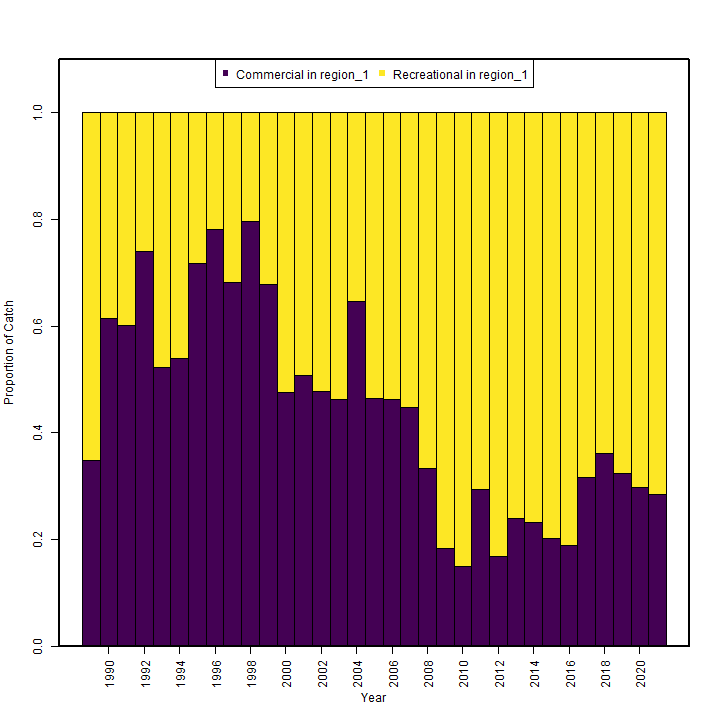
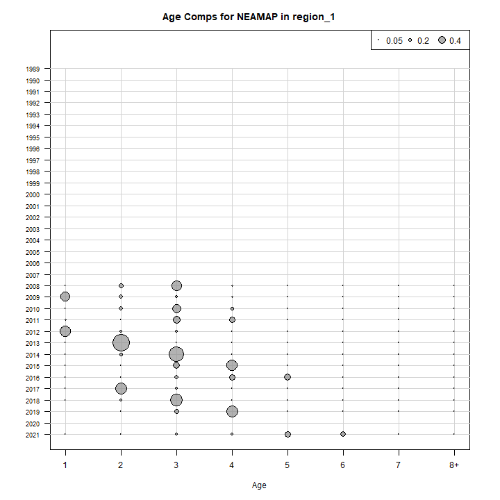
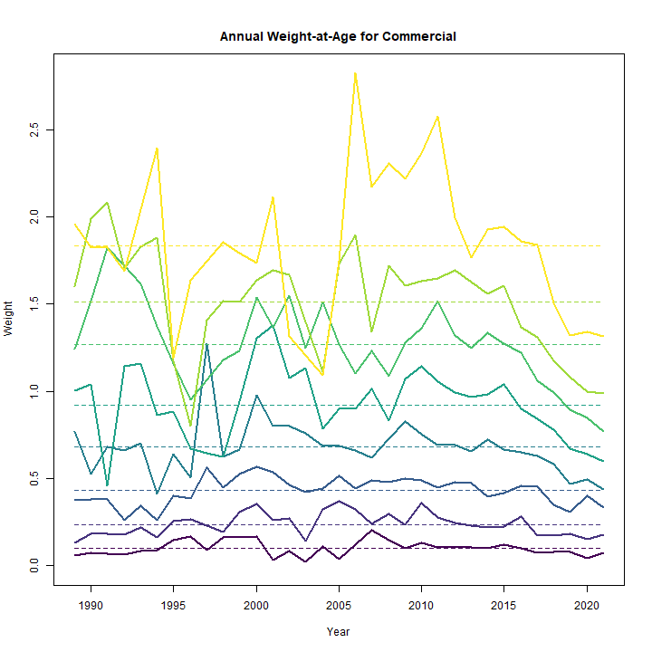
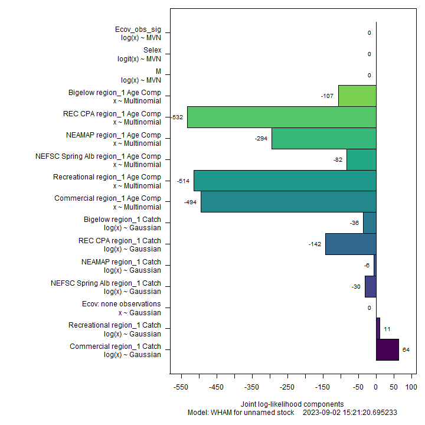
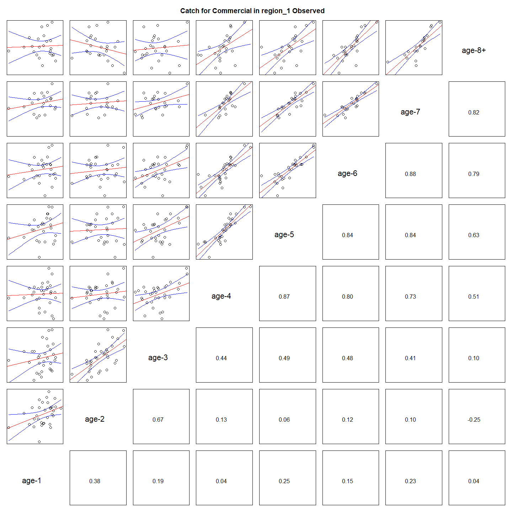
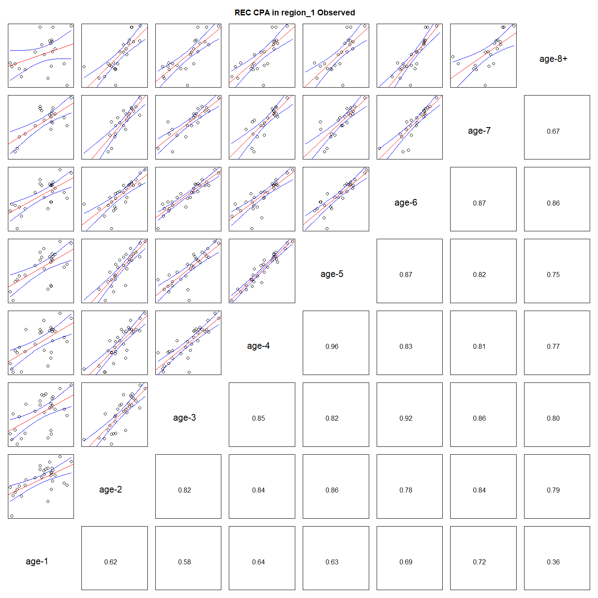

---
output:
  html_document:
    df_print: paged
    keep_md: yes
  word_document: default
  pdf_document:
    fig_caption: yes
    includes:
    keep_tex: yes
    number_sections: no
title: "WHAM figures and tables"
header-includes:
  - \usepackage{longtable}
  - \usepackage{booktabs}
  - \usepackage{caption,graphics}
  - \usepackage{makecell}
  - \usepackage{lscape}
  - \renewcommand\figurename{Fig.}
  - \captionsetup{labelsep=period, singlelinecheck=false}
  - \newcommand{\changesize}[1]{\fontsize{#1pt}{#1pt}\selectfont}
  - \renewcommand{\arraystretch}{1.5}
  - \renewcommand\theadfont{}
---

# {.tabset}

## Figures {.tabset}

### Input

### Diagnostics

### Results

### Retro

### Reference points

### Miscelaneous

## Tables {.tabset}

### Parameter estimates

<table class="table" style="margin-left: auto; margin-right: auto;">
<caption>Parameter estimates, standard errors, and confidence intervals. Rounded to 3 decimal places.</caption>
 <thead>
  <tr>
   <th style="text-align:left;">   </th>
   <th style="text-align:right;"> Estimate </th>
   <th style="text-align:right;"> Std. Error </th>
   <th style="text-align:right;"> 95\% CI lower </th>
   <th style="text-align:right;"> 95\% CI upper </th>
  </tr>
 </thead>
<tbody>
  <tr>
   <td style="text-align:left;"> NEFSC Spring Alb fully selected q </td>
   <td style="text-align:right;"> 0.000 </td>
   <td style="text-align:right;"> 0.000 </td>
   <td style="text-align:right;"> 0.000 </td>
   <td style="text-align:right;"> 0.000 </td>
  </tr>
  <tr>
   <td style="text-align:left;"> NEAMAP fully selected q </td>
   <td style="text-align:right;"> 0.000 </td>
   <td style="text-align:right;"> 0.000 </td>
   <td style="text-align:right;"> 0.000 </td>
   <td style="text-align:right;"> 0.000 </td>
  </tr>
  <tr>
   <td style="text-align:left;"> REC CPA fully selected q </td>
   <td style="text-align:right;"> 0.000 </td>
   <td style="text-align:right;"> 0.000 </td>
   <td style="text-align:right;"> 0.000 </td>
   <td style="text-align:right;"> 0.000 </td>
  </tr>
  <tr>
   <td style="text-align:left;"> Bigelow fully selected q </td>
   <td style="text-align:right;"> 0.000 </td>
   <td style="text-align:right;"> 0.000 </td>
   <td style="text-align:right;"> 0.000 </td>
   <td style="text-align:right;"> 0.000 </td>
  </tr>
  <tr>
   <td style="text-align:left;"> Block 1: $a_{50}$ </td>
   <td style="text-align:right;"> 1.624 </td>
   <td style="text-align:right;"> 0.094 </td>
   <td style="text-align:right;"> 1.447 </td>
   <td style="text-align:right;"> 1.817 </td>
  </tr>
  <tr>
   <td style="text-align:left;"> Block 1: 1/slope (increasing) </td>
   <td style="text-align:right;"> 0.261 </td>
   <td style="text-align:right;"> 0.034 </td>
   <td style="text-align:right;"> 0.202 </td>
   <td style="text-align:right;"> 0.336 </td>
  </tr>
  <tr>
   <td style="text-align:left;"> Block 2: $a_{50}$ </td>
   <td style="text-align:right;"> 2.520 </td>
   <td style="text-align:right;"> 0.087 </td>
   <td style="text-align:right;"> 2.353 </td>
   <td style="text-align:right;"> 2.693 </td>
  </tr>
  <tr>
   <td style="text-align:left;"> Block 2: 1/slope (increasing) </td>
   <td style="text-align:right;"> 0.419 </td>
   <td style="text-align:right;"> 0.032 </td>
   <td style="text-align:right;"> 0.360 </td>
   <td style="text-align:right;"> 0.486 </td>
  </tr>
  <tr>
   <td style="text-align:left;"> Block 3: $a_{50}$ </td>
   <td style="text-align:right;"> 1.460 </td>
   <td style="text-align:right;"> 0.100 </td>
   <td style="text-align:right;"> 1.273 </td>
   <td style="text-align:right;"> 1.667 </td>
  </tr>
  <tr>
   <td style="text-align:left;"> Block 3: 1/slope (increasing) </td>
   <td style="text-align:right;"> 0.433 </td>
   <td style="text-align:right;"> 0.069 </td>
   <td style="text-align:right;"> 0.316 </td>
   <td style="text-align:right;"> 0.590 </td>
  </tr>
  <tr>
   <td style="text-align:left;"> Block 4: $a_{50}$ </td>
   <td style="text-align:right;"> 4.790 </td>
   <td style="text-align:right;"> 0.425 </td>
   <td style="text-align:right;"> 3.935 </td>
   <td style="text-align:right;"> 5.577 </td>
  </tr>
  <tr>
   <td style="text-align:left;"> Block 4: 1/slope (increasing) </td>
   <td style="text-align:right;"> 1.083 </td>
   <td style="text-align:right;"> 0.094 </td>
   <td style="text-align:right;"> 0.912 </td>
   <td style="text-align:right;"> 1.280 </td>
  </tr>
  <tr>
   <td style="text-align:left;"> Block 5: Selectivity for age 1 </td>
   <td style="text-align:right;"> 0.483 </td>
   <td style="text-align:right;"> 0.101 </td>
   <td style="text-align:right;"> 0.298 </td>
   <td style="text-align:right;"> 0.673 </td>
  </tr>
  <tr>
   <td style="text-align:left;"> Block 5: Selectivity for age 2 </td>
   <td style="text-align:right;"> 1.000 </td>
   <td style="text-align:right;"> -- </td>
   <td style="text-align:right;"> -- </td>
   <td style="text-align:right;"> -- </td>
  </tr>
  <tr>
   <td style="text-align:left;"> Block 5: Selectivity for age 3 </td>
   <td style="text-align:right;"> 1.000 </td>
   <td style="text-align:right;"> -- </td>
   <td style="text-align:right;"> -- </td>
   <td style="text-align:right;"> -- </td>
  </tr>
  <tr>
   <td style="text-align:left;"> Block 5: Selectivity for age 4 </td>
   <td style="text-align:right;"> 1.000 </td>
   <td style="text-align:right;"> -- </td>
   <td style="text-align:right;"> -- </td>
   <td style="text-align:right;"> -- </td>
  </tr>
  <tr>
   <td style="text-align:left;"> Block 5: Selectivity for age 5 </td>
   <td style="text-align:right;"> 1.000 </td>
   <td style="text-align:right;"> -- </td>
   <td style="text-align:right;"> -- </td>
   <td style="text-align:right;"> -- </td>
  </tr>
  <tr>
   <td style="text-align:left;"> Block 5: Selectivity for age 6 </td>
   <td style="text-align:right;"> 1.000 </td>
   <td style="text-align:right;"> -- </td>
   <td style="text-align:right;"> -- </td>
   <td style="text-align:right;"> -- </td>
  </tr>
  <tr>
   <td style="text-align:left;"> Block 5: Selectivity for age 7 </td>
   <td style="text-align:right;"> 1.000 </td>
   <td style="text-align:right;"> -- </td>
   <td style="text-align:right;"> -- </td>
   <td style="text-align:right;"> -- </td>
  </tr>
  <tr>
   <td style="text-align:left;"> Block 5: Selectivity for age 8+ </td>
   <td style="text-align:right;"> 1.000 </td>
   <td style="text-align:right;"> -- </td>
   <td style="text-align:right;"> -- </td>
   <td style="text-align:right;"> -- </td>
  </tr>
  <tr>
   <td style="text-align:left;"> Block 6: Selectivity for age 1 </td>
   <td style="text-align:right;"> 0.096 </td>
   <td style="text-align:right;"> 0.013 </td>
   <td style="text-align:right;"> 0.074 </td>
   <td style="text-align:right;"> 0.125 </td>
  </tr>
  <tr>
   <td style="text-align:left;"> Block 6: Selectivity for age 2 </td>
   <td style="text-align:right;"> 0.398 </td>
   <td style="text-align:right;"> 0.042 </td>
   <td style="text-align:right;"> 0.320 </td>
   <td style="text-align:right;"> 0.482 </td>
  </tr>
  <tr>
   <td style="text-align:left;"> Block 6: Selectivity for age 3 </td>
   <td style="text-align:right;"> 0.942 </td>
   <td style="text-align:right;"> 0.089 </td>
   <td style="text-align:right;"> 0.403 </td>
   <td style="text-align:right;"> 0.997 </td>
  </tr>
  <tr>
   <td style="text-align:left;"> Block 6: Selectivity for age 4 </td>
   <td style="text-align:right;"> 1.000 </td>
   <td style="text-align:right;"> -- </td>
   <td style="text-align:right;"> -- </td>
   <td style="text-align:right;"> -- </td>
  </tr>
  <tr>
   <td style="text-align:left;"> Block 6: Selectivity for age 5 </td>
   <td style="text-align:right;"> 1.000 </td>
   <td style="text-align:right;"> -- </td>
   <td style="text-align:right;"> -- </td>
   <td style="text-align:right;"> -- </td>
  </tr>
  <tr>
   <td style="text-align:left;"> Block 6: Selectivity for age 6 </td>
   <td style="text-align:right;"> 1.000 </td>
   <td style="text-align:right;"> -- </td>
   <td style="text-align:right;"> -- </td>
   <td style="text-align:right;"> -- </td>
  </tr>
  <tr>
   <td style="text-align:left;"> Block 6: Selectivity for age 7 </td>
   <td style="text-align:right;"> 1.000 </td>
   <td style="text-align:right;"> -- </td>
   <td style="text-align:right;"> -- </td>
   <td style="text-align:right;"> -- </td>
  </tr>
  <tr>
   <td style="text-align:left;"> Block 6: Selectivity for age 8+ </td>
   <td style="text-align:right;"> 1.000 </td>
   <td style="text-align:right;"> -- </td>
   <td style="text-align:right;"> -- </td>
   <td style="text-align:right;"> -- </td>
  </tr>
  <tr>
   <td style="text-align:left;"> Block 7: Selectivity for age 1 </td>
   <td style="text-align:right;"> 0.909 </td>
   <td style="text-align:right;"> 0.039 </td>
   <td style="text-align:right;"> 0.797 </td>
   <td style="text-align:right;"> 0.962 </td>
  </tr>
  <tr>
   <td style="text-align:left;"> Block 7: Selectivity for age 2 </td>
   <td style="text-align:right;"> 1.000 </td>
   <td style="text-align:right;"> -- </td>
   <td style="text-align:right;"> -- </td>
   <td style="text-align:right;"> -- </td>
  </tr>
  <tr>
   <td style="text-align:left;"> Block 7: Selectivity for age 3 </td>
   <td style="text-align:right;"> 1.000 </td>
   <td style="text-align:right;"> -- </td>
   <td style="text-align:right;"> -- </td>
   <td style="text-align:right;"> -- </td>
  </tr>
  <tr>
   <td style="text-align:left;"> Block 7: Selectivity for age 4 </td>
   <td style="text-align:right;"> 1.000 </td>
   <td style="text-align:right;"> -- </td>
   <td style="text-align:right;"> -- </td>
   <td style="text-align:right;"> -- </td>
  </tr>
  <tr>
   <td style="text-align:left;"> Block 7: Selectivity for age 5 </td>
   <td style="text-align:right;"> 1.000 </td>
   <td style="text-align:right;"> -- </td>
   <td style="text-align:right;"> -- </td>
   <td style="text-align:right;"> -- </td>
  </tr>
  <tr>
   <td style="text-align:left;"> Block 7: Selectivity for age 6 </td>
   <td style="text-align:right;"> 1.000 </td>
   <td style="text-align:right;"> -- </td>
   <td style="text-align:right;"> -- </td>
   <td style="text-align:right;"> -- </td>
  </tr>
  <tr>
   <td style="text-align:left;"> Block 7: Selectivity for age 7 </td>
   <td style="text-align:right;"> 1.000 </td>
   <td style="text-align:right;"> -- </td>
   <td style="text-align:right;"> -- </td>
   <td style="text-align:right;"> -- </td>
  </tr>
  <tr>
   <td style="text-align:left;"> Block 7: Selectivity for age 8+ </td>
   <td style="text-align:right;"> 1.000 </td>
   <td style="text-align:right;"> -- </td>
   <td style="text-align:right;"> -- </td>
   <td style="text-align:right;"> -- </td>
  </tr>
  <tr>
   <td style="text-align:left;"> Block 8: Selectivity for age 1 </td>
   <td style="text-align:right;"> 0.488 </td>
   <td style="text-align:right;"> 0.079 </td>
   <td style="text-align:right;"> 0.338 </td>
   <td style="text-align:right;"> 0.639 </td>
  </tr>
  <tr>
   <td style="text-align:left;"> Block 8: Selectivity for age 2 </td>
   <td style="text-align:right;"> 1.000 </td>
   <td style="text-align:right;"> -- </td>
   <td style="text-align:right;"> -- </td>
   <td style="text-align:right;"> -- </td>
  </tr>
  <tr>
   <td style="text-align:left;"> Block 8: Selectivity for age 3 </td>
   <td style="text-align:right;"> 1.000 </td>
   <td style="text-align:right;"> -- </td>
   <td style="text-align:right;"> -- </td>
   <td style="text-align:right;"> -- </td>
  </tr>
  <tr>
   <td style="text-align:left;"> Block 8: Selectivity for age 4 </td>
   <td style="text-align:right;"> 1.000 </td>
   <td style="text-align:right;"> -- </td>
   <td style="text-align:right;"> -- </td>
   <td style="text-align:right;"> -- </td>
  </tr>
  <tr>
   <td style="text-align:left;"> Block 8: Selectivity for age 5 </td>
   <td style="text-align:right;"> 1.000 </td>
   <td style="text-align:right;"> -- </td>
   <td style="text-align:right;"> -- </td>
   <td style="text-align:right;"> -- </td>
  </tr>
  <tr>
   <td style="text-align:left;"> Block 8: Selectivity for age 6 </td>
   <td style="text-align:right;"> 1.000 </td>
   <td style="text-align:right;"> -- </td>
   <td style="text-align:right;"> -- </td>
   <td style="text-align:right;"> -- </td>
  </tr>
  <tr>
   <td style="text-align:left;"> Block 8: Selectivity for age 7 </td>
   <td style="text-align:right;"> 1.000 </td>
   <td style="text-align:right;"> -- </td>
   <td style="text-align:right;"> -- </td>
   <td style="text-align:right;"> -- </td>
  </tr>
  <tr>
   <td style="text-align:left;"> Block 8: Selectivity for age 8+ </td>
   <td style="text-align:right;"> 1.000 </td>
   <td style="text-align:right;"> -- </td>
   <td style="text-align:right;"> -- </td>
   <td style="text-align:right;"> -- </td>
  </tr>
</tbody>
</table>

### Abundance at age

<table class="table" style="margin-left: auto; margin-right: auto;">
<caption>Abundance at age (1000s) for stock 1 in region 1.</caption>
 <thead>
  <tr>
   <th style="text-align:left;">   </th>
   <th style="text-align:right;"> 1 </th>
   <th style="text-align:right;"> 2 </th>
   <th style="text-align:right;"> 3 </th>
   <th style="text-align:right;"> 4 </th>
   <th style="text-align:right;"> 5 </th>
   <th style="text-align:right;"> 6 </th>
   <th style="text-align:right;"> 7 </th>
   <th style="text-align:right;"> 8+ </th>
  </tr>
 </thead>
<tbody>
  <tr>
   <td style="text-align:left;"> 1989 </td>
   <td style="text-align:right;"> 7486 </td>
   <td style="text-align:right;"> 3665 </td>
   <td style="text-align:right;"> 1662 </td>
   <td style="text-align:right;"> 749 </td>
   <td style="text-align:right;"> 337 </td>
   <td style="text-align:right;"> 152 </td>
   <td style="text-align:right;"> 68 </td>
   <td style="text-align:right;"> 56 </td>
  </tr>
  <tr>
   <td style="text-align:left;"> 1990 </td>
   <td style="text-align:right;"> 3174 </td>
   <td style="text-align:right;"> 4443 </td>
   <td style="text-align:right;"> 1484 </td>
   <td style="text-align:right;"> 595 </td>
   <td style="text-align:right;"> 265 </td>
   <td style="text-align:right;"> 119 </td>
   <td style="text-align:right;"> 54 </td>
   <td style="text-align:right;"> 44 </td>
  </tr>
  <tr>
   <td style="text-align:left;"> 1991 </td>
   <td style="text-align:right;"> 3677 </td>
   <td style="text-align:right;"> 1998 </td>
   <td style="text-align:right;"> 2137 </td>
   <td style="text-align:right;"> 659 </td>
   <td style="text-align:right;"> 263 </td>
   <td style="text-align:right;"> 117 </td>
   <td style="text-align:right;"> 53 </td>
   <td style="text-align:right;"> 43 </td>
  </tr>
  <tr>
   <td style="text-align:left;"> 1992 </td>
   <td style="text-align:right;"> 3920 </td>
   <td style="text-align:right;"> 2368 </td>
   <td style="text-align:right;"> 1083 </td>
   <td style="text-align:right;"> 1101 </td>
   <td style="text-align:right;"> 338 </td>
   <td style="text-align:right;"> 135 </td>
   <td style="text-align:right;"> 60 </td>
   <td style="text-align:right;"> 49 </td>
  </tr>
  <tr>
   <td style="text-align:left;"> 1993 </td>
   <td style="text-align:right;"> 2156 </td>
   <td style="text-align:right;"> 2568 </td>
   <td style="text-align:right;"> 1363 </td>
   <td style="text-align:right;"> 601 </td>
   <td style="text-align:right;"> 610 </td>
   <td style="text-align:right;"> 188 </td>
   <td style="text-align:right;"> 75 </td>
   <td style="text-align:right;"> 61 </td>
  </tr>
  <tr>
   <td style="text-align:left;"> 1994 </td>
   <td style="text-align:right;"> 7410 </td>
   <td style="text-align:right;"> 1400 </td>
   <td style="text-align:right;"> 1475 </td>
   <td style="text-align:right;"> 755 </td>
   <td style="text-align:right;"> 332 </td>
   <td style="text-align:right;"> 337 </td>
   <td style="text-align:right;"> 104 </td>
   <td style="text-align:right;"> 75 </td>
  </tr>
  <tr>
   <td style="text-align:left;"> 1995 </td>
   <td style="text-align:right;"> 7316 </td>
   <td style="text-align:right;"> 4805 </td>
   <td style="text-align:right;"> 796 </td>
   <td style="text-align:right;"> 806 </td>
   <td style="text-align:right;"> 411 </td>
   <td style="text-align:right;"> 181 </td>
   <td style="text-align:right;"> 184 </td>
   <td style="text-align:right;"> 97 </td>
  </tr>
  <tr>
   <td style="text-align:left;"> 1996 </td>
   <td style="text-align:right;"> 9735 </td>
   <td style="text-align:right;"> 4825 </td>
   <td style="text-align:right;"> 2910 </td>
   <td style="text-align:right;"> 471 </td>
   <td style="text-align:right;"> 476 </td>
   <td style="text-align:right;"> 243 </td>
   <td style="text-align:right;"> 107 </td>
   <td style="text-align:right;"> 166 </td>
  </tr>
  <tr>
   <td style="text-align:left;"> 1997 </td>
   <td style="text-align:right;"> 6269 </td>
   <td style="text-align:right;"> 6403 </td>
   <td style="text-align:right;"> 2832 </td>
   <td style="text-align:right;"> 1656 </td>
   <td style="text-align:right;"> 267 </td>
   <td style="text-align:right;"> 271 </td>
   <td style="text-align:right;"> 138 </td>
   <td style="text-align:right;"> 155 </td>
  </tr>
  <tr>
   <td style="text-align:left;"> 1998 </td>
   <td style="text-align:right;"> 3420 </td>
   <td style="text-align:right;"> 4132 </td>
   <td style="text-align:right;"> 3909 </td>
   <td style="text-align:right;"> 1691 </td>
   <td style="text-align:right;"> 987 </td>
   <td style="text-align:right;"> 159 </td>
   <td style="text-align:right;"> 161 </td>
   <td style="text-align:right;"> 175 </td>
  </tr>
  <tr>
   <td style="text-align:left;"> 1999 </td>
   <td style="text-align:right;"> 21318 </td>
   <td style="text-align:right;"> 2273 </td>
   <td style="text-align:right;"> 2657 </td>
   <td style="text-align:right;"> 2364 </td>
   <td style="text-align:right;"> 999 </td>
   <td style="text-align:right;"> 582 </td>
   <td style="text-align:right;"> 94 </td>
   <td style="text-align:right;"> 198 </td>
  </tr>
  <tr>
   <td style="text-align:left;"> 2000 </td>
   <td style="text-align:right;"> 16059 </td>
   <td style="text-align:right;"> 14072 </td>
   <td style="text-align:right;"> 1427 </td>
   <td style="text-align:right;"> 1539 </td>
   <td style="text-align:right;"> 1330 </td>
   <td style="text-align:right;"> 560 </td>
   <td style="text-align:right;"> 326 </td>
   <td style="text-align:right;"> 163 </td>
  </tr>
  <tr>
   <td style="text-align:left;"> 2001 </td>
   <td style="text-align:right;"> 8150 </td>
   <td style="text-align:right;"> 10546 </td>
   <td style="text-align:right;"> 8750 </td>
   <td style="text-align:right;"> 834 </td>
   <td style="text-align:right;"> 881 </td>
   <td style="text-align:right;"> 759 </td>
   <td style="text-align:right;"> 319 </td>
   <td style="text-align:right;"> 279 </td>
  </tr>
  <tr>
   <td style="text-align:left;"> 2002 </td>
   <td style="text-align:right;"> 17554 </td>
   <td style="text-align:right;"> 5330 </td>
   <td style="text-align:right;"> 6436 </td>
   <td style="text-align:right;"> 4898 </td>
   <td style="text-align:right;"> 453 </td>
   <td style="text-align:right;"> 477 </td>
   <td style="text-align:right;"> 411 </td>
   <td style="text-align:right;"> 324 </td>
  </tr>
  <tr>
   <td style="text-align:left;"> 2003 </td>
   <td style="text-align:right;"> 4631 </td>
   <td style="text-align:right;"> 11410 </td>
   <td style="text-align:right;"> 3195 </td>
   <td style="text-align:right;"> 3529 </td>
   <td style="text-align:right;"> 2607 </td>
   <td style="text-align:right;"> 240 </td>
   <td style="text-align:right;"> 253 </td>
   <td style="text-align:right;"> 389 </td>
  </tr>
  <tr>
   <td style="text-align:left;"> 2004 </td>
   <td style="text-align:right;"> 4997 </td>
   <td style="text-align:right;"> 3016 </td>
   <td style="text-align:right;"> 6914 </td>
   <td style="text-align:right;"> 1805 </td>
   <td style="text-align:right;"> 1949 </td>
   <td style="text-align:right;"> 1436 </td>
   <td style="text-align:right;"> 132 </td>
   <td style="text-align:right;"> 354 </td>
  </tr>
  <tr>
   <td style="text-align:left;"> 2005 </td>
   <td style="text-align:right;"> 9361 </td>
   <td style="text-align:right;"> 3289 </td>
   <td style="text-align:right;"> 1880 </td>
   <td style="text-align:right;"> 3988 </td>
   <td style="text-align:right;"> 1012 </td>
   <td style="text-align:right;"> 1090 </td>
   <td style="text-align:right;"> 803 </td>
   <td style="text-align:right;"> 272 </td>
  </tr>
  <tr>
   <td style="text-align:left;"> 2006 </td>
   <td style="text-align:right;"> 23296 </td>
   <td style="text-align:right;"> 6123 </td>
   <td style="text-align:right;"> 2020 </td>
   <td style="text-align:right;"> 1081 </td>
   <td style="text-align:right;"> 2244 </td>
   <td style="text-align:right;"> 568 </td>
   <td style="text-align:right;"> 611 </td>
   <td style="text-align:right;"> 603 </td>
  </tr>
  <tr>
   <td style="text-align:left;"> 2007 </td>
   <td style="text-align:right;"> 17068 </td>
   <td style="text-align:right;"> 15179 </td>
   <td style="text-align:right;"> 3707 </td>
   <td style="text-align:right;"> 1131 </td>
   <td style="text-align:right;"> 590 </td>
   <td style="text-align:right;"> 1220 </td>
   <td style="text-align:right;"> 309 </td>
   <td style="text-align:right;"> 660 </td>
  </tr>
  <tr>
   <td style="text-align:left;"> 2008 </td>
   <td style="text-align:right;"> 24826 </td>
   <td style="text-align:right;"> 11091 </td>
   <td style="text-align:right;"> 9094 </td>
   <td style="text-align:right;"> 2033 </td>
   <td style="text-align:right;"> 602 </td>
   <td style="text-align:right;"> 313 </td>
   <td style="text-align:right;"> 647 </td>
   <td style="text-align:right;"> 514 </td>
  </tr>
  <tr>
   <td style="text-align:left;"> 2009 </td>
   <td style="text-align:right;"> 29067 </td>
   <td style="text-align:right;"> 16223 </td>
   <td style="text-align:right;"> 6820 </td>
   <td style="text-align:right;"> 5308 </td>
   <td style="text-align:right;"> 1168 </td>
   <td style="text-align:right;"> 345 </td>
   <td style="text-align:right;"> 179 </td>
   <td style="text-align:right;"> 666 </td>
  </tr>
  <tr>
   <td style="text-align:left;"> 2010 </td>
   <td style="text-align:right;"> 18845 </td>
   <td style="text-align:right;"> 19173 </td>
   <td style="text-align:right;"> 10384 </td>
   <td style="text-align:right;"> 4070 </td>
   <td style="text-align:right;"> 2885 </td>
   <td style="text-align:right;"> 566 </td>
   <td style="text-align:right;"> 151 </td>
   <td style="text-align:right;"> 336 </td>
  </tr>
  <tr>
   <td style="text-align:left;"> 2011 </td>
   <td style="text-align:right;"> 17996 </td>
   <td style="text-align:right;"> 12358 </td>
   <td style="text-align:right;"> 12094 </td>
   <td style="text-align:right;"> 5988 </td>
   <td style="text-align:right;"> 2068 </td>
   <td style="text-align:right;"> 1251 </td>
   <td style="text-align:right;"> 212 </td>
   <td style="text-align:right;"> 161 </td>
  </tr>
  <tr>
   <td style="text-align:left;"> 2012 </td>
   <td style="text-align:right;"> 101117 </td>
   <td style="text-align:right;"> 11953 </td>
   <td style="text-align:right;"> 8041 </td>
   <td style="text-align:right;"> 7485 </td>
   <td style="text-align:right;"> 3509 </td>
   <td style="text-align:right;"> 1140 </td>
   <td style="text-align:right;"> 652 </td>
   <td style="text-align:right;"> 186 </td>
  </tr>
  <tr>
   <td style="text-align:left;"> 2013 </td>
   <td style="text-align:right;"> 27051 </td>
   <td style="text-align:right;"> 66664 </td>
   <td style="text-align:right;"> 7636 </td>
   <td style="text-align:right;"> 4772 </td>
   <td style="text-align:right;"> 4033 </td>
   <td style="text-align:right;"> 1680 </td>
   <td style="text-align:right;"> 490 </td>
   <td style="text-align:right;"> 334 </td>
  </tr>
  <tr>
   <td style="text-align:left;"> 2014 </td>
   <td style="text-align:right;"> 25044 </td>
   <td style="text-align:right;"> 17918 </td>
   <td style="text-align:right;"> 43027 </td>
   <td style="text-align:right;"> 4631 </td>
   <td style="text-align:right;"> 2696 </td>
   <td style="text-align:right;"> 2102 </td>
   <td style="text-align:right;"> 814 </td>
   <td style="text-align:right;"> 377 </td>
  </tr>
  <tr>
   <td style="text-align:left;"> 2015 </td>
   <td style="text-align:right;"> 24602 </td>
   <td style="text-align:right;"> 16588 </td>
   <td style="text-align:right;"> 11572 </td>
   <td style="text-align:right;"> 26153 </td>
   <td style="text-align:right;"> 2623 </td>
   <td style="text-align:right;"> 1407 </td>
   <td style="text-align:right;"> 1019 </td>
   <td style="text-align:right;"> 546 </td>
  </tr>
  <tr>
   <td style="text-align:left;"> 2016 </td>
   <td style="text-align:right;"> 71586 </td>
   <td style="text-align:right;"> 16317 </td>
   <td style="text-align:right;"> 10752 </td>
   <td style="text-align:right;"> 7099 </td>
   <td style="text-align:right;"> 15064 </td>
   <td style="text-align:right;"> 1405 </td>
   <td style="text-align:right;"> 706 </td>
   <td style="text-align:right;"> 747 </td>
  </tr>
  <tr>
   <td style="text-align:left;"> 2017 </td>
   <td style="text-align:right;"> 43201 </td>
   <td style="text-align:right;"> 47518 </td>
   <td style="text-align:right;"> 10567 </td>
   <td style="text-align:right;"> 6555 </td>
   <td style="text-align:right;"> 4077 </td>
   <td style="text-align:right;"> 8123 </td>
   <td style="text-align:right;"> 716 </td>
   <td style="text-align:right;"> 708 </td>
  </tr>
  <tr>
   <td style="text-align:left;"> 2018 </td>
   <td style="text-align:right;"> 19906 </td>
   <td style="text-align:right;"> 28615 </td>
   <td style="text-align:right;"> 30310 </td>
   <td style="text-align:right;"> 6127 </td>
   <td style="text-align:right;"> 3523 </td>
   <td style="text-align:right;"> 2046 </td>
   <td style="text-align:right;"> 3835 </td>
   <td style="text-align:right;"> 641 </td>
  </tr>
  <tr>
   <td style="text-align:left;"> 2019 </td>
   <td style="text-align:right;"> 53577 </td>
   <td style="text-align:right;"> 13211 </td>
   <td style="text-align:right;"> 18409 </td>
   <td style="text-align:right;"> 18023 </td>
   <td style="text-align:right;"> 3421 </td>
   <td style="text-align:right;"> 1856 </td>
   <td style="text-align:right;"> 1024 </td>
   <td style="text-align:right;"> 2164 </td>
  </tr>
  <tr>
   <td style="text-align:left;"> 2020 </td>
   <td style="text-align:right;"> 44337 </td>
   <td style="text-align:right;"> 35357 </td>
   <td style="text-align:right;"> 8358 </td>
   <td style="text-align:right;"> 10486 </td>
   <td style="text-align:right;"> 9325 </td>
   <td style="text-align:right;"> 1605 </td>
   <td style="text-align:right;"> 798 </td>
   <td style="text-align:right;"> 1273 </td>
  </tr>
  <tr>
   <td style="text-align:left;"> 2021 </td>
   <td style="text-align:right;"> 50183 </td>
   <td style="text-align:right;"> 29214 </td>
   <td style="text-align:right;"> 22276 </td>
   <td style="text-align:right;"> 4713 </td>
   <td style="text-align:right;"> 5324 </td>
   <td style="text-align:right;"> 4246 </td>
   <td style="text-align:right;"> 663 </td>
   <td style="text-align:right;"> 789 </td>
  </tr>
</tbody>
</table>

### Fishing mortality at age by region

<table class="table" style="margin-left: auto; margin-right: auto;">
<caption>Total fishing mortality at age in region 1.</caption>
 <thead>
  <tr>
   <th style="text-align:left;">   </th>
   <th style="text-align:right;"> 1 </th>
   <th style="text-align:right;"> 2 </th>
   <th style="text-align:right;"> 3 </th>
   <th style="text-align:right;"> 4 </th>
   <th style="text-align:right;"> 5 </th>
   <th style="text-align:right;"> 6 </th>
   <th style="text-align:right;"> 7 </th>
   <th style="text-align:right;"> 8+ </th>
  </tr>
 </thead>
<tbody>
  <tr>
   <td style="text-align:left;"> 1989 </td>
   <td style="text-align:right;"> 0.020 </td>
   <td style="text-align:right;"> 0.198 </td>
   <td style="text-align:right;"> 0.244 </td>
   <td style="text-align:right;"> 0.245 </td>
   <td style="text-align:right;"> 0.245 </td>
   <td style="text-align:right;"> 0.245 </td>
   <td style="text-align:right;"> 0.245 </td>
   <td style="text-align:right;"> 0.245 </td>
  </tr>
  <tr>
   <td style="text-align:left;"> 1990 </td>
   <td style="text-align:right;"> 0.021 </td>
   <td style="text-align:right;"> 0.207 </td>
   <td style="text-align:right;"> 0.255 </td>
   <td style="text-align:right;"> 0.256 </td>
   <td style="text-align:right;"> 0.256 </td>
   <td style="text-align:right;"> 0.256 </td>
   <td style="text-align:right;"> 0.256 </td>
   <td style="text-align:right;"> 0.256 </td>
  </tr>
  <tr>
   <td style="text-align:left;"> 1991 </td>
   <td style="text-align:right;"> 0.014 </td>
   <td style="text-align:right;"> 0.134 </td>
   <td style="text-align:right;"> 0.164 </td>
   <td style="text-align:right;"> 0.165 </td>
   <td style="text-align:right;"> 0.165 </td>
   <td style="text-align:right;"> 0.165 </td>
   <td style="text-align:right;"> 0.165 </td>
   <td style="text-align:right;"> 0.165 </td>
  </tr>
  <tr>
   <td style="text-align:left;"> 1992 </td>
   <td style="text-align:right;"> 0.013 </td>
   <td style="text-align:right;"> 0.122 </td>
   <td style="text-align:right;"> 0.150 </td>
   <td style="text-align:right;"> 0.150 </td>
   <td style="text-align:right;"> 0.150 </td>
   <td style="text-align:right;"> 0.150 </td>
   <td style="text-align:right;"> 0.150 </td>
   <td style="text-align:right;"> 0.150 </td>
  </tr>
  <tr>
   <td style="text-align:left;"> 1993 </td>
   <td style="text-align:right;"> 0.009 </td>
   <td style="text-align:right;"> 0.086 </td>
   <td style="text-align:right;"> 0.106 </td>
   <td style="text-align:right;"> 0.106 </td>
   <td style="text-align:right;"> 0.106 </td>
   <td style="text-align:right;"> 0.106 </td>
   <td style="text-align:right;"> 0.106 </td>
   <td style="text-align:right;"> 0.106 </td>
  </tr>
  <tr>
   <td style="text-align:left;"> 1994 </td>
   <td style="text-align:right;"> 0.010 </td>
   <td style="text-align:right;"> 0.093 </td>
   <td style="text-align:right;"> 0.115 </td>
   <td style="text-align:right;"> 0.116 </td>
   <td style="text-align:right;"> 0.116 </td>
   <td style="text-align:right;"> 0.116 </td>
   <td style="text-align:right;"> 0.116 </td>
   <td style="text-align:right;"> 0.116 </td>
  </tr>
  <tr>
   <td style="text-align:left;"> 1995 </td>
   <td style="text-align:right;"> 0.008 </td>
   <td style="text-align:right;"> 0.076 </td>
   <td style="text-align:right;"> 0.094 </td>
   <td style="text-align:right;"> 0.095 </td>
   <td style="text-align:right;"> 0.095 </td>
   <td style="text-align:right;"> 0.095 </td>
   <td style="text-align:right;"> 0.095 </td>
   <td style="text-align:right;"> 0.095 </td>
  </tr>
  <tr>
   <td style="text-align:left;"> 1996 </td>
   <td style="text-align:right;"> 0.011 </td>
   <td style="text-align:right;"> 0.110 </td>
   <td style="text-align:right;"> 0.136 </td>
   <td style="text-align:right;"> 0.136 </td>
   <td style="text-align:right;"> 0.136 </td>
   <td style="text-align:right;"> 0.136 </td>
   <td style="text-align:right;"> 0.136 </td>
   <td style="text-align:right;"> 0.136 </td>
  </tr>
  <tr>
   <td style="text-align:left;"> 1997 </td>
   <td style="text-align:right;"> 0.006 </td>
   <td style="text-align:right;"> 0.062 </td>
   <td style="text-align:right;"> 0.076 </td>
   <td style="text-align:right;"> 0.076 </td>
   <td style="text-align:right;"> 0.076 </td>
   <td style="text-align:right;"> 0.076 </td>
   <td style="text-align:right;"> 0.076 </td>
   <td style="text-align:right;"> 0.076 </td>
  </tr>
  <tr>
   <td style="text-align:left;"> 1998 </td>
   <td style="text-align:right;"> 0.003 </td>
   <td style="text-align:right;"> 0.024 </td>
   <td style="text-align:right;"> 0.081 </td>
   <td style="text-align:right;"> 0.104 </td>
   <td style="text-align:right;"> 0.107 </td>
   <td style="text-align:right;"> 0.107 </td>
   <td style="text-align:right;"> 0.107 </td>
   <td style="text-align:right;"> 0.107 </td>
  </tr>
  <tr>
   <td style="text-align:left;"> 1999 </td>
   <td style="text-align:right;"> 0.003 </td>
   <td style="text-align:right;"> 0.030 </td>
   <td style="text-align:right;"> 0.101 </td>
   <td style="text-align:right;"> 0.129 </td>
   <td style="text-align:right;"> 0.133 </td>
   <td style="text-align:right;"> 0.133 </td>
   <td style="text-align:right;"> 0.133 </td>
   <td style="text-align:right;"> 0.133 </td>
  </tr>
  <tr>
   <td style="text-align:left;"> 2000 </td>
   <td style="text-align:right;"> 0.002 </td>
   <td style="text-align:right;"> 0.020 </td>
   <td style="text-align:right;"> 0.069 </td>
   <td style="text-align:right;"> 0.088 </td>
   <td style="text-align:right;"> 0.090 </td>
   <td style="text-align:right;"> 0.091 </td>
   <td style="text-align:right;"> 0.091 </td>
   <td style="text-align:right;"> 0.091 </td>
  </tr>
  <tr>
   <td style="text-align:left;"> 2001 </td>
   <td style="text-align:right;"> 0.003 </td>
   <td style="text-align:right;"> 0.029 </td>
   <td style="text-align:right;"> 0.100 </td>
   <td style="text-align:right;"> 0.127 </td>
   <td style="text-align:right;"> 0.131 </td>
   <td style="text-align:right;"> 0.131 </td>
   <td style="text-align:right;"> 0.131 </td>
   <td style="text-align:right;"> 0.131 </td>
  </tr>
  <tr>
   <td style="text-align:left;"> 2002 </td>
   <td style="text-align:right;"> 0.003 </td>
   <td style="text-align:right;"> 0.029 </td>
   <td style="text-align:right;"> 0.097 </td>
   <td style="text-align:right;"> 0.124 </td>
   <td style="text-align:right;"> 0.127 </td>
   <td style="text-align:right;"> 0.128 </td>
   <td style="text-align:right;"> 0.128 </td>
   <td style="text-align:right;"> 0.128 </td>
  </tr>
  <tr>
   <td style="text-align:left;"> 2003 </td>
   <td style="text-align:right;"> 0.002 </td>
   <td style="text-align:right;"> 0.021 </td>
   <td style="text-align:right;"> 0.071 </td>
   <td style="text-align:right;"> 0.091 </td>
   <td style="text-align:right;"> 0.093 </td>
   <td style="text-align:right;"> 0.094 </td>
   <td style="text-align:right;"> 0.094 </td>
   <td style="text-align:right;"> 0.094 </td>
  </tr>
  <tr>
   <td style="text-align:left;"> 2004 </td>
   <td style="text-align:right;"> 0.003 </td>
   <td style="text-align:right;"> 0.028 </td>
   <td style="text-align:right;"> 0.094 </td>
   <td style="text-align:right;"> 0.120 </td>
   <td style="text-align:right;"> 0.123 </td>
   <td style="text-align:right;"> 0.124 </td>
   <td style="text-align:right;"> 0.124 </td>
   <td style="text-align:right;"> 0.124 </td>
  </tr>
  <tr>
   <td style="text-align:left;"> 2005 </td>
   <td style="text-align:right;"> 0.002 </td>
   <td style="text-align:right;"> 0.021 </td>
   <td style="text-align:right;"> 0.070 </td>
   <td style="text-align:right;"> 0.089 </td>
   <td style="text-align:right;"> 0.091 </td>
   <td style="text-align:right;"> 0.092 </td>
   <td style="text-align:right;"> 0.092 </td>
   <td style="text-align:right;"> 0.092 </td>
  </tr>
  <tr>
   <td style="text-align:left;"> 2006 </td>
   <td style="text-align:right;"> 0.003 </td>
   <td style="text-align:right;"> 0.025 </td>
   <td style="text-align:right;"> 0.084 </td>
   <td style="text-align:right;"> 0.107 </td>
   <td style="text-align:right;"> 0.110 </td>
   <td style="text-align:right;"> 0.110 </td>
   <td style="text-align:right;"> 0.110 </td>
   <td style="text-align:right;"> 0.110 </td>
  </tr>
  <tr>
   <td style="text-align:left;"> 2007 </td>
   <td style="text-align:right;"> 0.003 </td>
   <td style="text-align:right;"> 0.028 </td>
   <td style="text-align:right;"> 0.095 </td>
   <td style="text-align:right;"> 0.122 </td>
   <td style="text-align:right;"> 0.125 </td>
   <td style="text-align:right;"> 0.125 </td>
   <td style="text-align:right;"> 0.125 </td>
   <td style="text-align:right;"> 0.125 </td>
  </tr>
  <tr>
   <td style="text-align:left;"> 2008 </td>
   <td style="text-align:right;"> 0.002 </td>
   <td style="text-align:right;"> 0.014 </td>
   <td style="text-align:right;"> 0.048 </td>
   <td style="text-align:right;"> 0.062 </td>
   <td style="text-align:right;"> 0.064 </td>
   <td style="text-align:right;"> 0.064 </td>
   <td style="text-align:right;"> 0.064 </td>
   <td style="text-align:right;"> 0.064 </td>
  </tr>
  <tr>
   <td style="text-align:left;"> 2009 </td>
   <td style="text-align:right;"> 0.001 </td>
   <td style="text-align:right;"> 0.010 </td>
   <td style="text-align:right;"> 0.034 </td>
   <td style="text-align:right;"> 0.044 </td>
   <td style="text-align:right;"> 0.045 </td>
   <td style="text-align:right;"> 0.045 </td>
   <td style="text-align:right;"> 0.045 </td>
   <td style="text-align:right;"> 0.045 </td>
  </tr>
  <tr>
   <td style="text-align:left;"> 2010 </td>
   <td style="text-align:right;"> 0.001 </td>
   <td style="text-align:right;"> 0.011 </td>
   <td style="text-align:right;"> 0.037 </td>
   <td style="text-align:right;"> 0.048 </td>
   <td style="text-align:right;"> 0.049 </td>
   <td style="text-align:right;"> 0.049 </td>
   <td style="text-align:right;"> 0.049 </td>
   <td style="text-align:right;"> 0.049 </td>
  </tr>
  <tr>
   <td style="text-align:left;"> 2011 </td>
   <td style="text-align:right;"> 0.001 </td>
   <td style="text-align:right;"> 0.011 </td>
   <td style="text-align:right;"> 0.036 </td>
   <td style="text-align:right;"> 0.047 </td>
   <td style="text-align:right;"> 0.048 </td>
   <td style="text-align:right;"> 0.048 </td>
   <td style="text-align:right;"> 0.048 </td>
   <td style="text-align:right;"> 0.048 </td>
  </tr>
  <tr>
   <td style="text-align:left;"> 2012 </td>
   <td style="text-align:right;"> 0.001 </td>
   <td style="text-align:right;"> 0.011 </td>
   <td style="text-align:right;"> 0.038 </td>
   <td style="text-align:right;"> 0.048 </td>
   <td style="text-align:right;"> 0.050 </td>
   <td style="text-align:right;"> 0.050 </td>
   <td style="text-align:right;"> 0.050 </td>
   <td style="text-align:right;"> 0.050 </td>
  </tr>
  <tr>
   <td style="text-align:left;"> 2013 </td>
   <td style="text-align:right;"> 0.001 </td>
   <td style="text-align:right;"> 0.013 </td>
   <td style="text-align:right;"> 0.043 </td>
   <td style="text-align:right;"> 0.055 </td>
   <td style="text-align:right;"> 0.056 </td>
   <td style="text-align:right;"> 0.056 </td>
   <td style="text-align:right;"> 0.056 </td>
   <td style="text-align:right;"> 0.056 </td>
  </tr>
  <tr>
   <td style="text-align:left;"> 2014 </td>
   <td style="text-align:right;"> 0.001 </td>
   <td style="text-align:right;"> 0.012 </td>
   <td style="text-align:right;"> 0.040 </td>
   <td style="text-align:right;"> 0.051 </td>
   <td style="text-align:right;"> 0.052 </td>
   <td style="text-align:right;"> 0.053 </td>
   <td style="text-align:right;"> 0.053 </td>
   <td style="text-align:right;"> 0.053 </td>
  </tr>
  <tr>
   <td style="text-align:left;"> 2015 </td>
   <td style="text-align:right;"> 0.001 </td>
   <td style="text-align:right;"> 0.011 </td>
   <td style="text-align:right;"> 0.037 </td>
   <td style="text-align:right;"> 0.048 </td>
   <td style="text-align:right;"> 0.049 </td>
   <td style="text-align:right;"> 0.049 </td>
   <td style="text-align:right;"> 0.049 </td>
   <td style="text-align:right;"> 0.049 </td>
  </tr>
  <tr>
   <td style="text-align:left;"> 2016 </td>
   <td style="text-align:right;"> 0.002 </td>
   <td style="text-align:right;"> 0.015 </td>
   <td style="text-align:right;"> 0.051 </td>
   <td style="text-align:right;"> 0.065 </td>
   <td style="text-align:right;"> 0.067 </td>
   <td style="text-align:right;"> 0.067 </td>
   <td style="text-align:right;"> 0.067 </td>
   <td style="text-align:right;"> 0.067 </td>
  </tr>
  <tr>
   <td style="text-align:left;"> 2017 </td>
   <td style="text-align:right;"> 0.003 </td>
   <td style="text-align:right;"> 0.029 </td>
   <td style="text-align:right;"> 0.098 </td>
   <td style="text-align:right;"> 0.125 </td>
   <td style="text-align:right;"> 0.128 </td>
   <td style="text-align:right;"> 0.129 </td>
   <td style="text-align:right;"> 0.129 </td>
   <td style="text-align:right;"> 0.129 </td>
  </tr>
  <tr>
   <td style="text-align:left;"> 2018 </td>
   <td style="text-align:right;"> 0.003 </td>
   <td style="text-align:right;"> 0.024 </td>
   <td style="text-align:right;"> 0.080 </td>
   <td style="text-align:right;"> 0.103 </td>
   <td style="text-align:right;"> 0.105 </td>
   <td style="text-align:right;"> 0.105 </td>
   <td style="text-align:right;"> 0.106 </td>
   <td style="text-align:right;"> 0.106 </td>
  </tr>
  <tr>
   <td style="text-align:left;"> 2019 </td>
   <td style="text-align:right;"> 0.003 </td>
   <td style="text-align:right;"> 0.028 </td>
   <td style="text-align:right;"> 0.095 </td>
   <td style="text-align:right;"> 0.121 </td>
   <td style="text-align:right;"> 0.125 </td>
   <td style="text-align:right;"> 0.125 </td>
   <td style="text-align:right;"> 0.125 </td>
   <td style="text-align:right;"> 0.125 </td>
  </tr>
  <tr>
   <td style="text-align:left;"> 2020 </td>
   <td style="text-align:right;"> 0.003 </td>
   <td style="text-align:right;"> 0.029 </td>
   <td style="text-align:right;"> 0.097 </td>
   <td style="text-align:right;"> 0.124 </td>
   <td style="text-align:right;"> 0.127 </td>
   <td style="text-align:right;"> 0.127 </td>
   <td style="text-align:right;"> 0.128 </td>
   <td style="text-align:right;"> 0.128 </td>
  </tr>
  <tr>
   <td style="text-align:left;"> 2021 </td>
   <td style="text-align:right;"> 0.004 </td>
   <td style="text-align:right;"> 0.034 </td>
   <td style="text-align:right;"> 0.116 </td>
   <td style="text-align:right;"> 0.149 </td>
   <td style="text-align:right;"> 0.153 </td>
   <td style="text-align:right;"> 0.153 </td>
   <td style="text-align:right;"> 0.153 </td>
   <td style="text-align:right;"> 0.153 </td>
  </tr>
</tbody>
</table>

### Fishing mortality at age by fleet

<table class="table" style="margin-left: auto; margin-right: auto;">
<caption>Total fishing mortality at age in Commercial.</caption>
 <thead>
  <tr>
   <th style="text-align:left;">   </th>
   <th style="text-align:right;"> 1 </th>
   <th style="text-align:right;"> 2 </th>
   <th style="text-align:right;"> 3 </th>
   <th style="text-align:right;"> 4 </th>
   <th style="text-align:right;"> 5 </th>
   <th style="text-align:right;"> 6 </th>
   <th style="text-align:right;"> 7 </th>
   <th style="text-align:right;"> 8+ </th>
  </tr>
 </thead>
<tbody>
  <tr>
   <td style="text-align:left;"> 1989 </td>
   <td style="text-align:right;"> 0.020 </td>
   <td style="text-align:right;"> 0.198 </td>
   <td style="text-align:right;"> 0.244 </td>
   <td style="text-align:right;"> 0.245 </td>
   <td style="text-align:right;"> 0.245 </td>
   <td style="text-align:right;"> 0.245 </td>
   <td style="text-align:right;"> 0.245 </td>
   <td style="text-align:right;"> 0.245 </td>
  </tr>
  <tr>
   <td style="text-align:left;"> 1990 </td>
   <td style="text-align:right;"> 0.021 </td>
   <td style="text-align:right;"> 0.207 </td>
   <td style="text-align:right;"> 0.255 </td>
   <td style="text-align:right;"> 0.256 </td>
   <td style="text-align:right;"> 0.256 </td>
   <td style="text-align:right;"> 0.256 </td>
   <td style="text-align:right;"> 0.256 </td>
   <td style="text-align:right;"> 0.256 </td>
  </tr>
  <tr>
   <td style="text-align:left;"> 1991 </td>
   <td style="text-align:right;"> 0.014 </td>
   <td style="text-align:right;"> 0.134 </td>
   <td style="text-align:right;"> 0.164 </td>
   <td style="text-align:right;"> 0.165 </td>
   <td style="text-align:right;"> 0.165 </td>
   <td style="text-align:right;"> 0.165 </td>
   <td style="text-align:right;"> 0.165 </td>
   <td style="text-align:right;"> 0.165 </td>
  </tr>
  <tr>
   <td style="text-align:left;"> 1992 </td>
   <td style="text-align:right;"> 0.013 </td>
   <td style="text-align:right;"> 0.122 </td>
   <td style="text-align:right;"> 0.150 </td>
   <td style="text-align:right;"> 0.150 </td>
   <td style="text-align:right;"> 0.150 </td>
   <td style="text-align:right;"> 0.150 </td>
   <td style="text-align:right;"> 0.150 </td>
   <td style="text-align:right;"> 0.150 </td>
  </tr>
  <tr>
   <td style="text-align:left;"> 1993 </td>
   <td style="text-align:right;"> 0.009 </td>
   <td style="text-align:right;"> 0.086 </td>
   <td style="text-align:right;"> 0.106 </td>
   <td style="text-align:right;"> 0.106 </td>
   <td style="text-align:right;"> 0.106 </td>
   <td style="text-align:right;"> 0.106 </td>
   <td style="text-align:right;"> 0.106 </td>
   <td style="text-align:right;"> 0.106 </td>
  </tr>
  <tr>
   <td style="text-align:left;"> 1994 </td>
   <td style="text-align:right;"> 0.010 </td>
   <td style="text-align:right;"> 0.093 </td>
   <td style="text-align:right;"> 0.115 </td>
   <td style="text-align:right;"> 0.116 </td>
   <td style="text-align:right;"> 0.116 </td>
   <td style="text-align:right;"> 0.116 </td>
   <td style="text-align:right;"> 0.116 </td>
   <td style="text-align:right;"> 0.116 </td>
  </tr>
  <tr>
   <td style="text-align:left;"> 1995 </td>
   <td style="text-align:right;"> 0.008 </td>
   <td style="text-align:right;"> 0.076 </td>
   <td style="text-align:right;"> 0.094 </td>
   <td style="text-align:right;"> 0.095 </td>
   <td style="text-align:right;"> 0.095 </td>
   <td style="text-align:right;"> 0.095 </td>
   <td style="text-align:right;"> 0.095 </td>
   <td style="text-align:right;"> 0.095 </td>
  </tr>
  <tr>
   <td style="text-align:left;"> 1996 </td>
   <td style="text-align:right;"> 0.011 </td>
   <td style="text-align:right;"> 0.110 </td>
   <td style="text-align:right;"> 0.136 </td>
   <td style="text-align:right;"> 0.136 </td>
   <td style="text-align:right;"> 0.136 </td>
   <td style="text-align:right;"> 0.136 </td>
   <td style="text-align:right;"> 0.136 </td>
   <td style="text-align:right;"> 0.136 </td>
  </tr>
  <tr>
   <td style="text-align:left;"> 1997 </td>
   <td style="text-align:right;"> 0.006 </td>
   <td style="text-align:right;"> 0.062 </td>
   <td style="text-align:right;"> 0.076 </td>
   <td style="text-align:right;"> 0.076 </td>
   <td style="text-align:right;"> 0.076 </td>
   <td style="text-align:right;"> 0.076 </td>
   <td style="text-align:right;"> 0.076 </td>
   <td style="text-align:right;"> 0.076 </td>
  </tr>
  <tr>
   <td style="text-align:left;"> 1998 </td>
   <td style="text-align:right;"> 0.003 </td>
   <td style="text-align:right;"> 0.024 </td>
   <td style="text-align:right;"> 0.081 </td>
   <td style="text-align:right;"> 0.104 </td>
   <td style="text-align:right;"> 0.107 </td>
   <td style="text-align:right;"> 0.107 </td>
   <td style="text-align:right;"> 0.107 </td>
   <td style="text-align:right;"> 0.107 </td>
  </tr>
  <tr>
   <td style="text-align:left;"> 1999 </td>
   <td style="text-align:right;"> 0.003 </td>
   <td style="text-align:right;"> 0.030 </td>
   <td style="text-align:right;"> 0.101 </td>
   <td style="text-align:right;"> 0.129 </td>
   <td style="text-align:right;"> 0.133 </td>
   <td style="text-align:right;"> 0.133 </td>
   <td style="text-align:right;"> 0.133 </td>
   <td style="text-align:right;"> 0.133 </td>
  </tr>
  <tr>
   <td style="text-align:left;"> 2000 </td>
   <td style="text-align:right;"> 0.002 </td>
   <td style="text-align:right;"> 0.020 </td>
   <td style="text-align:right;"> 0.069 </td>
   <td style="text-align:right;"> 0.088 </td>
   <td style="text-align:right;"> 0.090 </td>
   <td style="text-align:right;"> 0.091 </td>
   <td style="text-align:right;"> 0.091 </td>
   <td style="text-align:right;"> 0.091 </td>
  </tr>
  <tr>
   <td style="text-align:left;"> 2001 </td>
   <td style="text-align:right;"> 0.003 </td>
   <td style="text-align:right;"> 0.029 </td>
   <td style="text-align:right;"> 0.100 </td>
   <td style="text-align:right;"> 0.127 </td>
   <td style="text-align:right;"> 0.131 </td>
   <td style="text-align:right;"> 0.131 </td>
   <td style="text-align:right;"> 0.131 </td>
   <td style="text-align:right;"> 0.131 </td>
  </tr>
  <tr>
   <td style="text-align:left;"> 2002 </td>
   <td style="text-align:right;"> 0.003 </td>
   <td style="text-align:right;"> 0.029 </td>
   <td style="text-align:right;"> 0.097 </td>
   <td style="text-align:right;"> 0.124 </td>
   <td style="text-align:right;"> 0.127 </td>
   <td style="text-align:right;"> 0.128 </td>
   <td style="text-align:right;"> 0.128 </td>
   <td style="text-align:right;"> 0.128 </td>
  </tr>
  <tr>
   <td style="text-align:left;"> 2003 </td>
   <td style="text-align:right;"> 0.002 </td>
   <td style="text-align:right;"> 0.021 </td>
   <td style="text-align:right;"> 0.071 </td>
   <td style="text-align:right;"> 0.091 </td>
   <td style="text-align:right;"> 0.093 </td>
   <td style="text-align:right;"> 0.094 </td>
   <td style="text-align:right;"> 0.094 </td>
   <td style="text-align:right;"> 0.094 </td>
  </tr>
  <tr>
   <td style="text-align:left;"> 2004 </td>
   <td style="text-align:right;"> 0.003 </td>
   <td style="text-align:right;"> 0.028 </td>
   <td style="text-align:right;"> 0.094 </td>
   <td style="text-align:right;"> 0.120 </td>
   <td style="text-align:right;"> 0.123 </td>
   <td style="text-align:right;"> 0.124 </td>
   <td style="text-align:right;"> 0.124 </td>
   <td style="text-align:right;"> 0.124 </td>
  </tr>
  <tr>
   <td style="text-align:left;"> 2005 </td>
   <td style="text-align:right;"> 0.002 </td>
   <td style="text-align:right;"> 0.021 </td>
   <td style="text-align:right;"> 0.070 </td>
   <td style="text-align:right;"> 0.089 </td>
   <td style="text-align:right;"> 0.091 </td>
   <td style="text-align:right;"> 0.092 </td>
   <td style="text-align:right;"> 0.092 </td>
   <td style="text-align:right;"> 0.092 </td>
  </tr>
  <tr>
   <td style="text-align:left;"> 2006 </td>
   <td style="text-align:right;"> 0.003 </td>
   <td style="text-align:right;"> 0.025 </td>
   <td style="text-align:right;"> 0.084 </td>
   <td style="text-align:right;"> 0.107 </td>
   <td style="text-align:right;"> 0.110 </td>
   <td style="text-align:right;"> 0.110 </td>
   <td style="text-align:right;"> 0.110 </td>
   <td style="text-align:right;"> 0.110 </td>
  </tr>
  <tr>
   <td style="text-align:left;"> 2007 </td>
   <td style="text-align:right;"> 0.003 </td>
   <td style="text-align:right;"> 0.028 </td>
   <td style="text-align:right;"> 0.095 </td>
   <td style="text-align:right;"> 0.122 </td>
   <td style="text-align:right;"> 0.125 </td>
   <td style="text-align:right;"> 0.125 </td>
   <td style="text-align:right;"> 0.125 </td>
   <td style="text-align:right;"> 0.125 </td>
  </tr>
  <tr>
   <td style="text-align:left;"> 2008 </td>
   <td style="text-align:right;"> 0.002 </td>
   <td style="text-align:right;"> 0.014 </td>
   <td style="text-align:right;"> 0.048 </td>
   <td style="text-align:right;"> 0.062 </td>
   <td style="text-align:right;"> 0.064 </td>
   <td style="text-align:right;"> 0.064 </td>
   <td style="text-align:right;"> 0.064 </td>
   <td style="text-align:right;"> 0.064 </td>
  </tr>
  <tr>
   <td style="text-align:left;"> 2009 </td>
   <td style="text-align:right;"> 0.001 </td>
   <td style="text-align:right;"> 0.010 </td>
   <td style="text-align:right;"> 0.034 </td>
   <td style="text-align:right;"> 0.044 </td>
   <td style="text-align:right;"> 0.045 </td>
   <td style="text-align:right;"> 0.045 </td>
   <td style="text-align:right;"> 0.045 </td>
   <td style="text-align:right;"> 0.045 </td>
  </tr>
  <tr>
   <td style="text-align:left;"> 2010 </td>
   <td style="text-align:right;"> 0.001 </td>
   <td style="text-align:right;"> 0.011 </td>
   <td style="text-align:right;"> 0.037 </td>
   <td style="text-align:right;"> 0.048 </td>
   <td style="text-align:right;"> 0.049 </td>
   <td style="text-align:right;"> 0.049 </td>
   <td style="text-align:right;"> 0.049 </td>
   <td style="text-align:right;"> 0.049 </td>
  </tr>
  <tr>
   <td style="text-align:left;"> 2011 </td>
   <td style="text-align:right;"> 0.001 </td>
   <td style="text-align:right;"> 0.011 </td>
   <td style="text-align:right;"> 0.036 </td>
   <td style="text-align:right;"> 0.047 </td>
   <td style="text-align:right;"> 0.048 </td>
   <td style="text-align:right;"> 0.048 </td>
   <td style="text-align:right;"> 0.048 </td>
   <td style="text-align:right;"> 0.048 </td>
  </tr>
  <tr>
   <td style="text-align:left;"> 2012 </td>
   <td style="text-align:right;"> 0.001 </td>
   <td style="text-align:right;"> 0.011 </td>
   <td style="text-align:right;"> 0.038 </td>
   <td style="text-align:right;"> 0.048 </td>
   <td style="text-align:right;"> 0.050 </td>
   <td style="text-align:right;"> 0.050 </td>
   <td style="text-align:right;"> 0.050 </td>
   <td style="text-align:right;"> 0.050 </td>
  </tr>
  <tr>
   <td style="text-align:left;"> 2013 </td>
   <td style="text-align:right;"> 0.001 </td>
   <td style="text-align:right;"> 0.013 </td>
   <td style="text-align:right;"> 0.043 </td>
   <td style="text-align:right;"> 0.055 </td>
   <td style="text-align:right;"> 0.056 </td>
   <td style="text-align:right;"> 0.056 </td>
   <td style="text-align:right;"> 0.056 </td>
   <td style="text-align:right;"> 0.056 </td>
  </tr>
  <tr>
   <td style="text-align:left;"> 2014 </td>
   <td style="text-align:right;"> 0.001 </td>
   <td style="text-align:right;"> 0.012 </td>
   <td style="text-align:right;"> 0.040 </td>
   <td style="text-align:right;"> 0.051 </td>
   <td style="text-align:right;"> 0.052 </td>
   <td style="text-align:right;"> 0.053 </td>
   <td style="text-align:right;"> 0.053 </td>
   <td style="text-align:right;"> 0.053 </td>
  </tr>
  <tr>
   <td style="text-align:left;"> 2015 </td>
   <td style="text-align:right;"> 0.001 </td>
   <td style="text-align:right;"> 0.011 </td>
   <td style="text-align:right;"> 0.037 </td>
   <td style="text-align:right;"> 0.048 </td>
   <td style="text-align:right;"> 0.049 </td>
   <td style="text-align:right;"> 0.049 </td>
   <td style="text-align:right;"> 0.049 </td>
   <td style="text-align:right;"> 0.049 </td>
  </tr>
  <tr>
   <td style="text-align:left;"> 2016 </td>
   <td style="text-align:right;"> 0.002 </td>
   <td style="text-align:right;"> 0.015 </td>
   <td style="text-align:right;"> 0.051 </td>
   <td style="text-align:right;"> 0.065 </td>
   <td style="text-align:right;"> 0.067 </td>
   <td style="text-align:right;"> 0.067 </td>
   <td style="text-align:right;"> 0.067 </td>
   <td style="text-align:right;"> 0.067 </td>
  </tr>
  <tr>
   <td style="text-align:left;"> 2017 </td>
   <td style="text-align:right;"> 0.003 </td>
   <td style="text-align:right;"> 0.029 </td>
   <td style="text-align:right;"> 0.098 </td>
   <td style="text-align:right;"> 0.125 </td>
   <td style="text-align:right;"> 0.128 </td>
   <td style="text-align:right;"> 0.129 </td>
   <td style="text-align:right;"> 0.129 </td>
   <td style="text-align:right;"> 0.129 </td>
  </tr>
  <tr>
   <td style="text-align:left;"> 2018 </td>
   <td style="text-align:right;"> 0.003 </td>
   <td style="text-align:right;"> 0.024 </td>
   <td style="text-align:right;"> 0.080 </td>
   <td style="text-align:right;"> 0.103 </td>
   <td style="text-align:right;"> 0.105 </td>
   <td style="text-align:right;"> 0.105 </td>
   <td style="text-align:right;"> 0.106 </td>
   <td style="text-align:right;"> 0.106 </td>
  </tr>
  <tr>
   <td style="text-align:left;"> 2019 </td>
   <td style="text-align:right;"> 0.003 </td>
   <td style="text-align:right;"> 0.028 </td>
   <td style="text-align:right;"> 0.095 </td>
   <td style="text-align:right;"> 0.121 </td>
   <td style="text-align:right;"> 0.125 </td>
   <td style="text-align:right;"> 0.125 </td>
   <td style="text-align:right;"> 0.125 </td>
   <td style="text-align:right;"> 0.125 </td>
  </tr>
  <tr>
   <td style="text-align:left;"> 2020 </td>
   <td style="text-align:right;"> 0.003 </td>
   <td style="text-align:right;"> 0.029 </td>
   <td style="text-align:right;"> 0.097 </td>
   <td style="text-align:right;"> 0.124 </td>
   <td style="text-align:right;"> 0.127 </td>
   <td style="text-align:right;"> 0.127 </td>
   <td style="text-align:right;"> 0.128 </td>
   <td style="text-align:right;"> 0.128 </td>
  </tr>
  <tr>
   <td style="text-align:left;"> 2021 </td>
   <td style="text-align:right;"> 0.004 </td>
   <td style="text-align:right;"> 0.034 </td>
   <td style="text-align:right;"> 0.116 </td>
   <td style="text-align:right;"> 0.149 </td>
   <td style="text-align:right;"> 0.153 </td>
   <td style="text-align:right;"> 0.153 </td>
   <td style="text-align:right;"> 0.153 </td>
   <td style="text-align:right;"> 0.153 </td>
  </tr>
</tbody>
</table>

<table class="table" style="margin-left: auto; margin-right: auto;">
<caption>Total fishing mortality at age in Recreational.</caption>
 <thead>
  <tr>
   <th style="text-align:left;">   </th>
   <th style="text-align:right;"> 1 </th>
   <th style="text-align:right;"> 2 </th>
   <th style="text-align:right;"> 3 </th>
   <th style="text-align:right;"> 4 </th>
   <th style="text-align:right;"> 5 </th>
   <th style="text-align:right;"> 6 </th>
   <th style="text-align:right;"> 7 </th>
   <th style="text-align:right;"> 8+ </th>
  </tr>
 </thead>
<tbody>
  <tr>
   <td style="text-align:left;"> 1989 </td>
   <td style="text-align:right;"> 0.101 </td>
   <td style="text-align:right;"> 0.306 </td>
   <td style="text-align:right;"> 0.383 </td>
   <td style="text-align:right;"> 0.393 </td>
   <td style="text-align:right;"> 0.394 </td>
   <td style="text-align:right;"> 0.394 </td>
   <td style="text-align:right;"> 0.394 </td>
   <td style="text-align:right;"> 0.394 </td>
  </tr>
  <tr>
   <td style="text-align:left;"> 1990 </td>
   <td style="text-align:right;"> 0.041 </td>
   <td style="text-align:right;"> 0.125 </td>
   <td style="text-align:right;"> 0.156 </td>
   <td style="text-align:right;"> 0.160 </td>
   <td style="text-align:right;"> 0.161 </td>
   <td style="text-align:right;"> 0.161 </td>
   <td style="text-align:right;"> 0.161 </td>
   <td style="text-align:right;"> 0.161 </td>
  </tr>
  <tr>
   <td style="text-align:left;"> 1991 </td>
   <td style="text-align:right;"> 0.026 </td>
   <td style="text-align:right;"> 0.079 </td>
   <td style="text-align:right;"> 0.099 </td>
   <td style="text-align:right;"> 0.102 </td>
   <td style="text-align:right;"> 0.102 </td>
   <td style="text-align:right;"> 0.102 </td>
   <td style="text-align:right;"> 0.102 </td>
   <td style="text-align:right;"> 0.102 </td>
  </tr>
  <tr>
   <td style="text-align:left;"> 1992 </td>
   <td style="text-align:right;"> 0.010 </td>
   <td style="text-align:right;"> 0.031 </td>
   <td style="text-align:right;"> 0.038 </td>
   <td style="text-align:right;"> 0.039 </td>
   <td style="text-align:right;"> 0.040 </td>
   <td style="text-align:right;"> 0.040 </td>
   <td style="text-align:right;"> 0.040 </td>
   <td style="text-align:right;"> 0.040 </td>
  </tr>
  <tr>
   <td style="text-align:left;"> 1993 </td>
   <td style="text-align:right;"> 0.023 </td>
   <td style="text-align:right;"> 0.068 </td>
   <td style="text-align:right;"> 0.086 </td>
   <td style="text-align:right;"> 0.088 </td>
   <td style="text-align:right;"> 0.088 </td>
   <td style="text-align:right;"> 0.088 </td>
   <td style="text-align:right;"> 0.088 </td>
   <td style="text-align:right;"> 0.088 </td>
  </tr>
  <tr>
   <td style="text-align:left;"> 1994 </td>
   <td style="text-align:right;"> 0.024 </td>
   <td style="text-align:right;"> 0.071 </td>
   <td style="text-align:right;"> 0.089 </td>
   <td style="text-align:right;"> 0.091 </td>
   <td style="text-align:right;"> 0.092 </td>
   <td style="text-align:right;"> 0.092 </td>
   <td style="text-align:right;"> 0.092 </td>
   <td style="text-align:right;"> 0.092 </td>
  </tr>
  <tr>
   <td style="text-align:left;"> 1995 </td>
   <td style="text-align:right;"> 0.008 </td>
   <td style="text-align:right;"> 0.025 </td>
   <td style="text-align:right;"> 0.031 </td>
   <td style="text-align:right;"> 0.032 </td>
   <td style="text-align:right;"> 0.032 </td>
   <td style="text-align:right;"> 0.032 </td>
   <td style="text-align:right;"> 0.032 </td>
   <td style="text-align:right;"> 0.032 </td>
  </tr>
  <tr>
   <td style="text-align:left;"> 1996 </td>
   <td style="text-align:right;"> 0.008 </td>
   <td style="text-align:right;"> 0.023 </td>
   <td style="text-align:right;"> 0.028 </td>
   <td style="text-align:right;"> 0.029 </td>
   <td style="text-align:right;"> 0.029 </td>
   <td style="text-align:right;"> 0.029 </td>
   <td style="text-align:right;"> 0.029 </td>
   <td style="text-align:right;"> 0.029 </td>
  </tr>
  <tr>
   <td style="text-align:left;"> 1997 </td>
   <td style="text-align:right;"> 0.011 </td>
   <td style="text-align:right;"> 0.032 </td>
   <td style="text-align:right;"> 0.040 </td>
   <td style="text-align:right;"> 0.041 </td>
   <td style="text-align:right;"> 0.041 </td>
   <td style="text-align:right;"> 0.041 </td>
   <td style="text-align:right;"> 0.041 </td>
   <td style="text-align:right;"> 0.041 </td>
  </tr>
  <tr>
   <td style="text-align:left;"> 1998 </td>
   <td style="text-align:right;"> 0.006 </td>
   <td style="text-align:right;"> 0.017 </td>
   <td style="text-align:right;"> 0.022 </td>
   <td style="text-align:right;"> 0.022 </td>
   <td style="text-align:right;"> 0.022 </td>
   <td style="text-align:right;"> 0.022 </td>
   <td style="text-align:right;"> 0.022 </td>
   <td style="text-align:right;"> 0.022 </td>
  </tr>
  <tr>
   <td style="text-align:left;"> 1999 </td>
   <td style="text-align:right;"> 0.012 </td>
   <td style="text-align:right;"> 0.036 </td>
   <td style="text-align:right;"> 0.045 </td>
   <td style="text-align:right;"> 0.046 </td>
   <td style="text-align:right;"> 0.046 </td>
   <td style="text-align:right;"> 0.046 </td>
   <td style="text-align:right;"> 0.046 </td>
   <td style="text-align:right;"> 0.046 </td>
  </tr>
  <tr>
   <td style="text-align:left;"> 2000 </td>
   <td style="text-align:right;"> 0.018 </td>
   <td style="text-align:right;"> 0.055 </td>
   <td style="text-align:right;"> 0.069 </td>
   <td style="text-align:right;"> 0.071 </td>
   <td style="text-align:right;"> 0.071 </td>
   <td style="text-align:right;"> 0.071 </td>
   <td style="text-align:right;"> 0.071 </td>
   <td style="text-align:right;"> 0.071 </td>
  </tr>
  <tr>
   <td style="text-align:left;"> 2001 </td>
   <td style="text-align:right;"> 0.021 </td>
   <td style="text-align:right;"> 0.065 </td>
   <td style="text-align:right;"> 0.081 </td>
   <td style="text-align:right;"> 0.083 </td>
   <td style="text-align:right;"> 0.083 </td>
   <td style="text-align:right;"> 0.083 </td>
   <td style="text-align:right;"> 0.083 </td>
   <td style="text-align:right;"> 0.083 </td>
  </tr>
  <tr>
   <td style="text-align:left;"> 2002 </td>
   <td style="text-align:right;"> 0.027 </td>
   <td style="text-align:right;"> 0.083 </td>
   <td style="text-align:right;"> 0.104 </td>
   <td style="text-align:right;"> 0.107 </td>
   <td style="text-align:right;"> 0.107 </td>
   <td style="text-align:right;"> 0.107 </td>
   <td style="text-align:right;"> 0.107 </td>
   <td style="text-align:right;"> 0.107 </td>
  </tr>
  <tr>
   <td style="text-align:left;"> 2003 </td>
   <td style="text-align:right;"> 0.026 </td>
   <td style="text-align:right;"> 0.080 </td>
   <td style="text-align:right;"> 0.100 </td>
   <td style="text-align:right;"> 0.103 </td>
   <td style="text-align:right;"> 0.103 </td>
   <td style="text-align:right;"> 0.103 </td>
   <td style="text-align:right;"> 0.103 </td>
   <td style="text-align:right;"> 0.103 </td>
  </tr>
  <tr>
   <td style="text-align:left;"> 2004 </td>
   <td style="text-align:right;"> 0.015 </td>
   <td style="text-align:right;"> 0.045 </td>
   <td style="text-align:right;"> 0.056 </td>
   <td style="text-align:right;"> 0.058 </td>
   <td style="text-align:right;"> 0.058 </td>
   <td style="text-align:right;"> 0.058 </td>
   <td style="text-align:right;"> 0.058 </td>
   <td style="text-align:right;"> 0.058 </td>
  </tr>
  <tr>
   <td style="text-align:left;"> 2005 </td>
   <td style="text-align:right;"> 0.022 </td>
   <td style="text-align:right;"> 0.067 </td>
   <td style="text-align:right;"> 0.084 </td>
   <td style="text-align:right;"> 0.086 </td>
   <td style="text-align:right;"> 0.086 </td>
   <td style="text-align:right;"> 0.086 </td>
   <td style="text-align:right;"> 0.086 </td>
   <td style="text-align:right;"> 0.086 </td>
  </tr>
  <tr>
   <td style="text-align:left;"> 2006 </td>
   <td style="text-align:right;"> 0.025 </td>
   <td style="text-align:right;"> 0.077 </td>
   <td style="text-align:right;"> 0.096 </td>
   <td style="text-align:right;"> 0.099 </td>
   <td style="text-align:right;"> 0.099 </td>
   <td style="text-align:right;"> 0.099 </td>
   <td style="text-align:right;"> 0.099 </td>
   <td style="text-align:right;"> 0.099 </td>
  </tr>
  <tr>
   <td style="text-align:left;"> 2007 </td>
   <td style="text-align:right;"> 0.028 </td>
   <td style="text-align:right;"> 0.084 </td>
   <td style="text-align:right;"> 0.105 </td>
   <td style="text-align:right;"> 0.108 </td>
   <td style="text-align:right;"> 0.108 </td>
   <td style="text-align:right;"> 0.108 </td>
   <td style="text-align:right;"> 0.108 </td>
   <td style="text-align:right;"> 0.108 </td>
  </tr>
  <tr>
   <td style="text-align:left;"> 2008 </td>
   <td style="text-align:right;"> 0.024 </td>
   <td style="text-align:right;"> 0.072 </td>
   <td style="text-align:right;"> 0.090 </td>
   <td style="text-align:right;"> 0.092 </td>
   <td style="text-align:right;"> 0.093 </td>
   <td style="text-align:right;"> 0.093 </td>
   <td style="text-align:right;"> 0.093 </td>
   <td style="text-align:right;"> 0.093 </td>
  </tr>
  <tr>
   <td style="text-align:left;"> 2009 </td>
   <td style="text-align:right;"> 0.015 </td>
   <td style="text-align:right;"> 0.036 </td>
   <td style="text-align:right;"> 0.082 </td>
   <td style="text-align:right;"> 0.166 </td>
   <td style="text-align:right;"> 0.280 </td>
   <td style="text-align:right;"> 0.385 </td>
   <td style="text-align:right;"> 0.452 </td>
   <td style="text-align:right;"> 0.486 </td>
  </tr>
  <tr>
   <td style="text-align:left;"> 2010 </td>
   <td style="text-align:right;"> 0.021 </td>
   <td style="text-align:right;"> 0.050 </td>
   <td style="text-align:right;"> 0.113 </td>
   <td style="text-align:right;"> 0.229 </td>
   <td style="text-align:right;"> 0.387 </td>
   <td style="text-align:right;"> 0.532 </td>
   <td style="text-align:right;"> 0.624 </td>
   <td style="text-align:right;"> 0.671 </td>
  </tr>
  <tr>
   <td style="text-align:left;"> 2011 </td>
   <td style="text-align:right;"> 0.008 </td>
   <td style="text-align:right;"> 0.019 </td>
   <td style="text-align:right;"> 0.043 </td>
   <td style="text-align:right;"> 0.088 </td>
   <td style="text-align:right;"> 0.148 </td>
   <td style="text-align:right;"> 0.204 </td>
   <td style="text-align:right;"> 0.239 </td>
   <td style="text-align:right;"> 0.257 </td>
  </tr>
  <tr>
   <td style="text-align:left;"> 2012 </td>
   <td style="text-align:right;"> 0.015 </td>
   <td style="text-align:right;"> 0.037 </td>
   <td style="text-align:right;"> 0.084 </td>
   <td style="text-align:right;"> 0.170 </td>
   <td style="text-align:right;"> 0.287 </td>
   <td style="text-align:right;"> 0.394 </td>
   <td style="text-align:right;"> 0.463 </td>
   <td style="text-align:right;"> 0.497 </td>
  </tr>
  <tr>
   <td style="text-align:left;"> 2013 </td>
   <td style="text-align:right;"> 0.010 </td>
   <td style="text-align:right;"> 0.025 </td>
   <td style="text-align:right;"> 0.057 </td>
   <td style="text-align:right;"> 0.116 </td>
   <td style="text-align:right;"> 0.196 </td>
   <td style="text-align:right;"> 0.269 </td>
   <td style="text-align:right;"> 0.316 </td>
   <td style="text-align:right;"> 0.339 </td>
  </tr>
  <tr>
   <td style="text-align:left;"> 2014 </td>
   <td style="text-align:right;"> 0.011 </td>
   <td style="text-align:right;"> 0.025 </td>
   <td style="text-align:right;"> 0.058 </td>
   <td style="text-align:right;"> 0.117 </td>
   <td style="text-align:right;"> 0.198 </td>
   <td style="text-align:right;"> 0.272 </td>
   <td style="text-align:right;"> 0.319 </td>
   <td style="text-align:right;"> 0.343 </td>
  </tr>
  <tr>
   <td style="text-align:left;"> 2015 </td>
   <td style="text-align:right;"> 0.009 </td>
   <td style="text-align:right;"> 0.023 </td>
   <td style="text-align:right;"> 0.051 </td>
   <td style="text-align:right;"> 0.104 </td>
   <td style="text-align:right;"> 0.175 </td>
   <td style="text-align:right;"> 0.240 </td>
   <td style="text-align:right;"> 0.282 </td>
   <td style="text-align:right;"> 0.303 </td>
  </tr>
  <tr>
   <td style="text-align:left;"> 2016 </td>
   <td style="text-align:right;"> 0.008 </td>
   <td style="text-align:right;"> 0.019 </td>
   <td style="text-align:right;"> 0.044 </td>
   <td style="text-align:right;"> 0.090 </td>
   <td style="text-align:right;"> 0.151 </td>
   <td style="text-align:right;"> 0.207 </td>
   <td style="text-align:right;"> 0.244 </td>
   <td style="text-align:right;"> 0.262 </td>
  </tr>
  <tr>
   <td style="text-align:left;"> 2017 </td>
   <td style="text-align:right;"> 0.009 </td>
   <td style="text-align:right;"> 0.021 </td>
   <td style="text-align:right;"> 0.047 </td>
   <td style="text-align:right;"> 0.096 </td>
   <td style="text-align:right;"> 0.161 </td>
   <td style="text-align:right;"> 0.222 </td>
   <td style="text-align:right;"> 0.260 </td>
   <td style="text-align:right;"> 0.280 </td>
  </tr>
  <tr>
   <td style="text-align:left;"> 2018 </td>
   <td style="text-align:right;"> 0.007 </td>
   <td style="text-align:right;"> 0.017 </td>
   <td style="text-align:right;"> 0.040 </td>
   <td style="text-align:right;"> 0.080 </td>
   <td style="text-align:right;"> 0.136 </td>
   <td style="text-align:right;"> 0.186 </td>
   <td style="text-align:right;"> 0.219 </td>
   <td style="text-align:right;"> 0.235 </td>
  </tr>
  <tr>
   <td style="text-align:left;"> 2019 </td>
   <td style="text-align:right;"> 0.012 </td>
   <td style="text-align:right;"> 0.030 </td>
   <td style="text-align:right;"> 0.068 </td>
   <td style="text-align:right;"> 0.138 </td>
   <td style="text-align:right;"> 0.232 </td>
   <td style="text-align:right;"> 0.319 </td>
   <td style="text-align:right;"> 0.375 </td>
   <td style="text-align:right;"> 0.402 </td>
  </tr>
  <tr>
   <td style="text-align:left;"> 2020 </td>
   <td style="text-align:right;"> 0.014 </td>
   <td style="text-align:right;"> 0.033 </td>
   <td style="text-align:right;"> 0.076 </td>
   <td style="text-align:right;"> 0.154 </td>
   <td style="text-align:right;"> 0.260 </td>
   <td style="text-align:right;"> 0.357 </td>
   <td style="text-align:right;"> 0.419 </td>
   <td style="text-align:right;"> 0.450 </td>
  </tr>
  <tr>
   <td style="text-align:left;"> 2021 </td>
   <td style="text-align:right;"> 0.020 </td>
   <td style="text-align:right;"> 0.049 </td>
   <td style="text-align:right;"> 0.112 </td>
   <td style="text-align:right;"> 0.226 </td>
   <td style="text-align:right;"> 0.381 </td>
   <td style="text-align:right;"> 0.523 </td>
   <td style="text-align:right;"> 0.615 </td>
   <td style="text-align:right;"> 0.660 </td>
  </tr>
</tbody>
</table>
