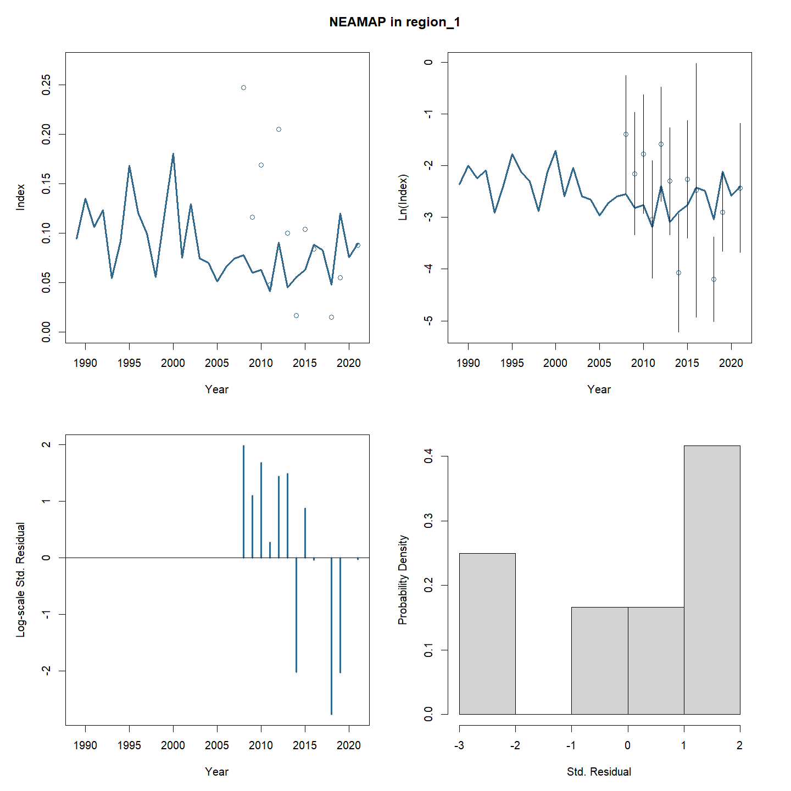
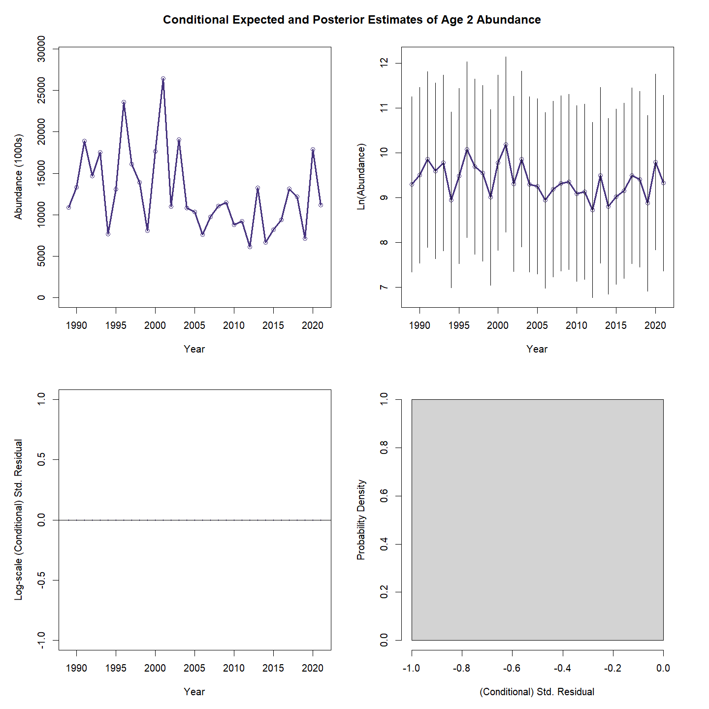
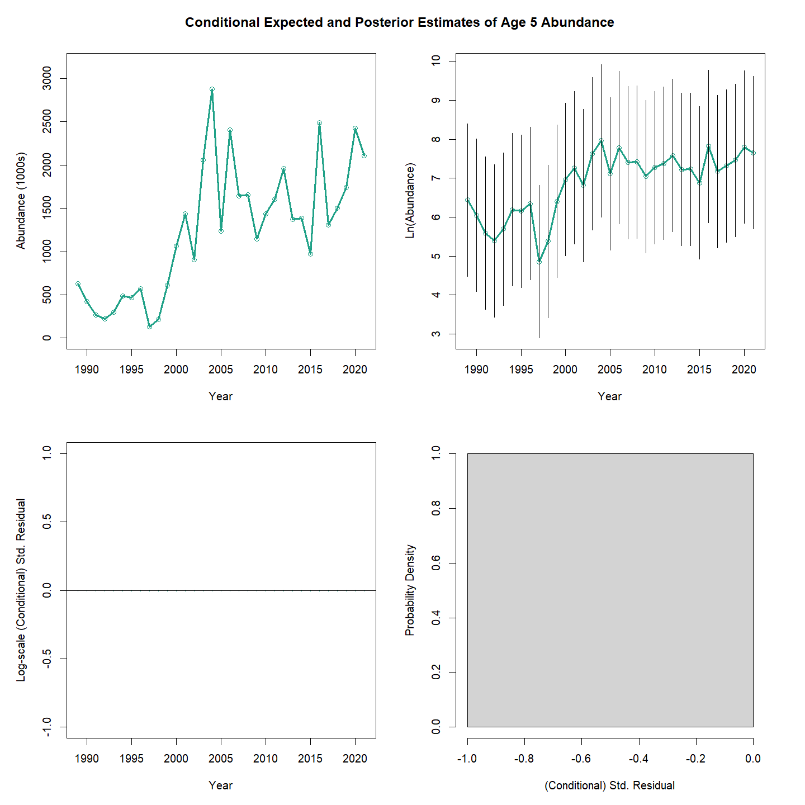
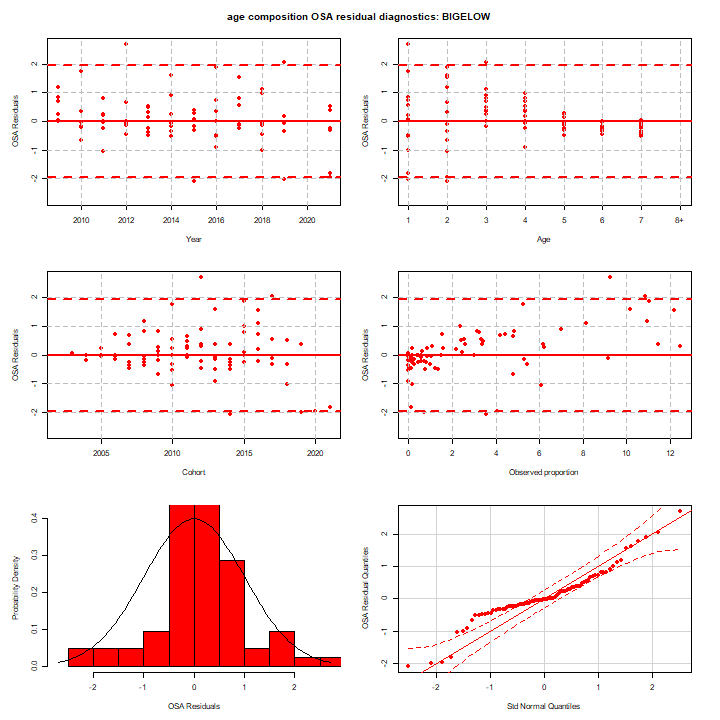
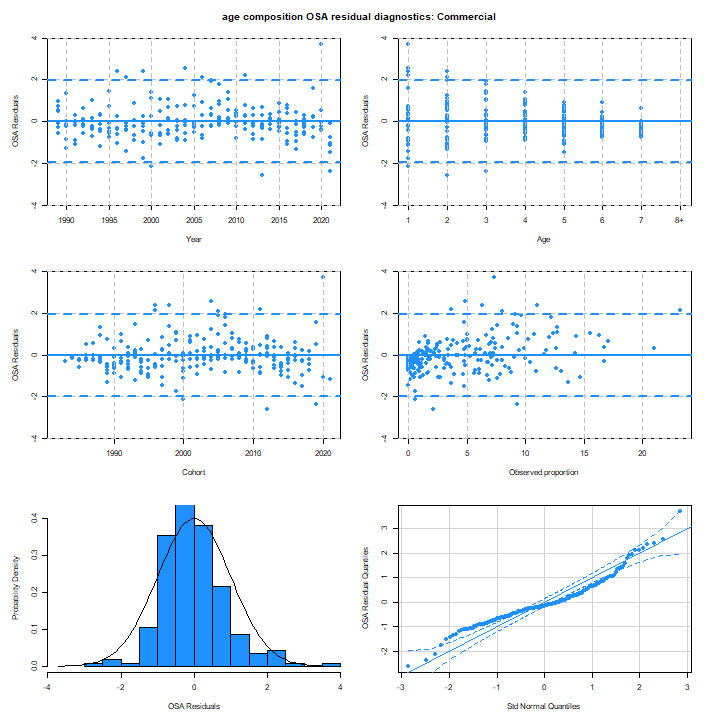
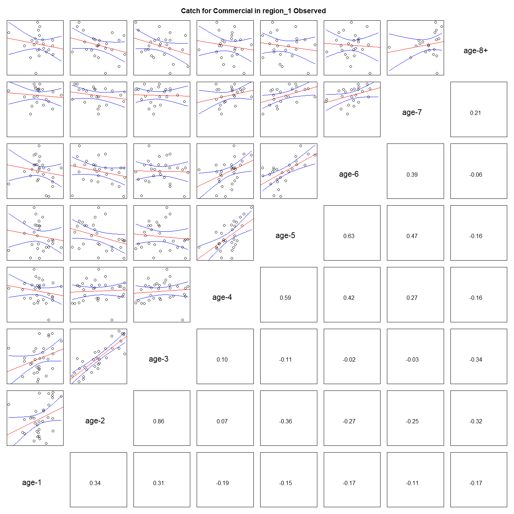
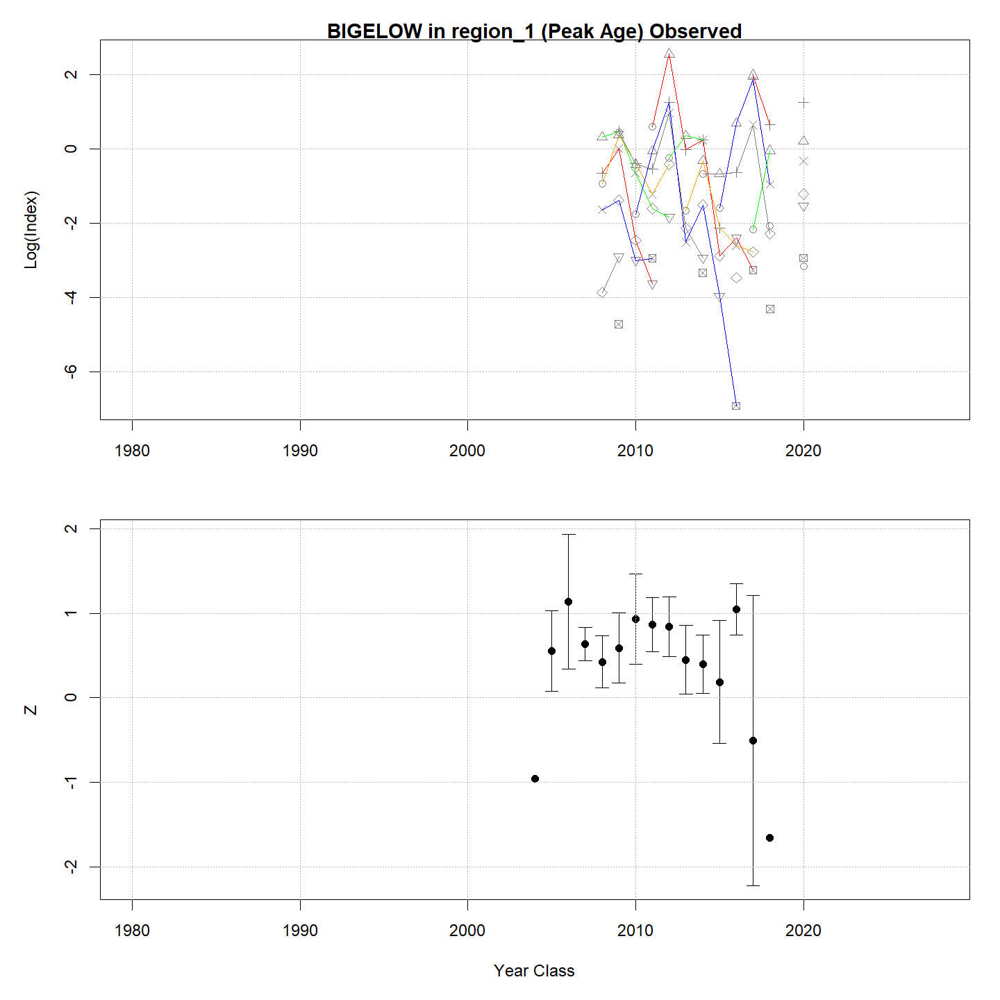
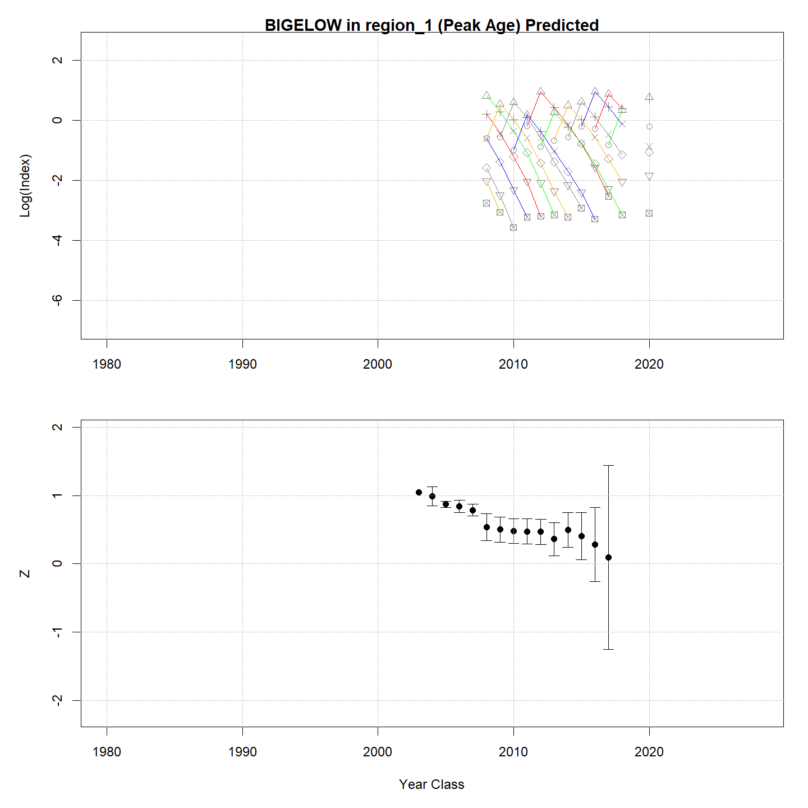
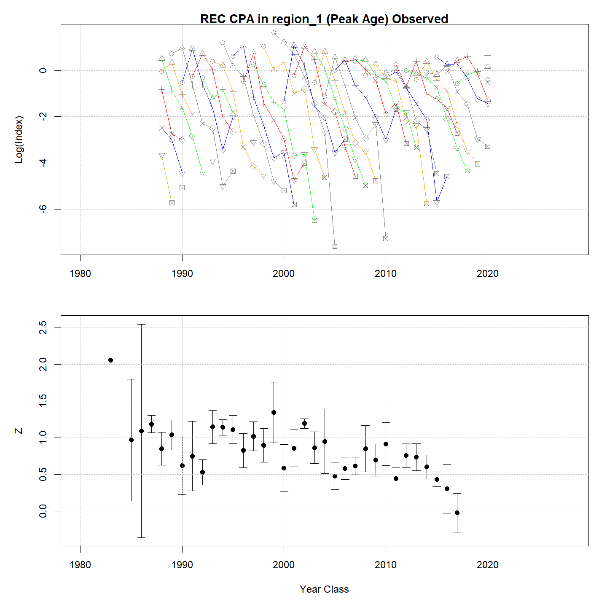

---
output:
  html_document:
    df_print: paged
    keep_md: yes
  word_document: default
  pdf_document:
    fig_caption: yes
    includes:
    keep_tex: yes
    number_sections: no
title: "WHAM figures and tables"
header-includes:
  - \usepackage{longtable}
  - \usepackage{booktabs}
  - \usepackage{caption,graphics}
  - \usepackage{makecell}
  - \usepackage{lscape}
  - \renewcommand\figurename{Fig.}
  - \captionsetup{labelsep=period, singlelinecheck=false}
  - \newcommand{\changesize}[1]{\fontsize{#1pt}{#1pt}\selectfont}
  - \renewcommand{\arraystretch}{1.5}
  - \renewcommand\theadfont{}
---

# {.tabset}

## Figures {.tabset}

### Input

### Diagnostics

### Results

### Retro

### Reference points

### Miscelaneous

## Tables {.tabset}

### Parameter estimates

<table class="table" style="margin-left: auto; margin-right: auto;">
<caption>Parameter estimates, standard errors, and confidence intervals. Rounded to 3 decimal places.</caption>
 <thead>
  <tr>
   <th style="text-align:left;">   </th>
   <th style="text-align:right;"> Estimate </th>
   <th style="text-align:right;"> Std. Error </th>
   <th style="text-align:right;"> 95\% CI lower </th>
   <th style="text-align:right;"> 95\% CI upper </th>
  </tr>
 </thead>
<tbody>
  <tr>
   <td style="text-align:left;"> NEFSC spring Alb fully selected q </td>
   <td style="text-align:right;"> 0.000 </td>
   <td style="text-align:right;"> 0.000 </td>
   <td style="text-align:right;"> 0.000 </td>
   <td style="text-align:right;"> 0.000 </td>
  </tr>
  <tr>
   <td style="text-align:left;"> NEAMAP fully selected q </td>
   <td style="text-align:right;"> 0.000 </td>
   <td style="text-align:right;"> 0.000 </td>
   <td style="text-align:right;"> 0.000 </td>
   <td style="text-align:right;"> 0.000 </td>
  </tr>
  <tr>
   <td style="text-align:left;"> REC CPA fully selected q </td>
   <td style="text-align:right;"> 0.000 </td>
   <td style="text-align:right;"> 0.000 </td>
   <td style="text-align:right;"> 0.000 </td>
   <td style="text-align:right;"> 0.000 </td>
  </tr>
  <tr>
   <td style="text-align:left;"> BIGELOW fully selected q </td>
   <td style="text-align:right;"> 0.000 </td>
   <td style="text-align:right;"> 0.000 </td>
   <td style="text-align:right;"> 0.000 </td>
   <td style="text-align:right;"> 0.000 </td>
  </tr>
  <tr>
   <td style="text-align:left;"> Block 1: $a_{50}$ </td>
   <td style="text-align:right;"> 1.909 </td>
   <td style="text-align:right;"> 0.086 </td>
   <td style="text-align:right;"> 1.745 </td>
   <td style="text-align:right;"> 2.083 </td>
  </tr>
  <tr>
   <td style="text-align:left;"> Block 1: 1/slope (increasing) </td>
   <td style="text-align:right;"> 0.287 </td>
   <td style="text-align:right;"> 0.027 </td>
   <td style="text-align:right;"> 0.238 </td>
   <td style="text-align:right;"> 0.346 </td>
  </tr>
  <tr>
   <td style="text-align:left;"> Block 2: $a_{50}$ </td>
   <td style="text-align:right;"> 2.828 </td>
   <td style="text-align:right;"> 0.118 </td>
   <td style="text-align:right;"> 2.602 </td>
   <td style="text-align:right;"> 3.063 </td>
  </tr>
  <tr>
   <td style="text-align:left;"> Block 2: 1/slope (increasing) </td>
   <td style="text-align:right;"> 0.553 </td>
   <td style="text-align:right;"> 0.039 </td>
   <td style="text-align:right;"> 0.481 </td>
   <td style="text-align:right;"> 0.635 </td>
  </tr>
  <tr>
   <td style="text-align:left;"> Block 3: $a_{50}$ </td>
   <td style="text-align:right;"> 1.971 </td>
   <td style="text-align:right;"> 0.113 </td>
   <td style="text-align:right;"> 1.759 </td>
   <td style="text-align:right;"> 2.200 </td>
  </tr>
  <tr>
   <td style="text-align:left;"> Block 3: 1/slope (increasing) </td>
   <td style="text-align:right;"> 0.533 </td>
   <td style="text-align:right;"> 0.051 </td>
   <td style="text-align:right;"> 0.441 </td>
   <td style="text-align:right;"> 0.643 </td>
  </tr>
  <tr>
   <td style="text-align:left;"> Block 4: $a_{50}$ </td>
   <td style="text-align:right;"> 5.252 </td>
   <td style="text-align:right;"> 0.746 </td>
   <td style="text-align:right;"> 3.675 </td>
   <td style="text-align:right;"> 6.490 </td>
  </tr>
  <tr>
   <td style="text-align:left;"> Block 4: 1/slope (increasing) </td>
   <td style="text-align:right;"> 1.447 </td>
   <td style="text-align:right;"> 0.155 </td>
   <td style="text-align:right;"> 1.168 </td>
   <td style="text-align:right;"> 1.775 </td>
  </tr>
  <tr>
   <td style="text-align:left;"> Block 5: Selectivity for age 1 </td>
   <td style="text-align:right;"> 0.147 </td>
   <td style="text-align:right;"> 0.030 </td>
   <td style="text-align:right;"> 0.097 </td>
   <td style="text-align:right;"> 0.216 </td>
  </tr>
  <tr>
   <td style="text-align:left;"> Block 5: Selectivity for age 2 </td>
   <td style="text-align:right;"> 0.533 </td>
   <td style="text-align:right;"> 0.095 </td>
   <td style="text-align:right;"> 0.351 </td>
   <td style="text-align:right;"> 0.706 </td>
  </tr>
  <tr>
   <td style="text-align:left;"> Block 5: Selectivity for age 3 </td>
   <td style="text-align:right;"> 0.889 </td>
   <td style="text-align:right;"> 0.166 </td>
   <td style="text-align:right;"> 0.231 </td>
   <td style="text-align:right;"> 0.995 </td>
  </tr>
  <tr>
   <td style="text-align:left;"> Block 5: Selectivity for age 4 </td>
   <td style="text-align:right;"> 1.000 </td>
   <td style="text-align:right;"> -- </td>
   <td style="text-align:right;"> -- </td>
   <td style="text-align:right;"> -- </td>
  </tr>
  <tr>
   <td style="text-align:left;"> Block 5: Selectivity for age 5 </td>
   <td style="text-align:right;"> 1.000 </td>
   <td style="text-align:right;"> -- </td>
   <td style="text-align:right;"> -- </td>
   <td style="text-align:right;"> -- </td>
  </tr>
  <tr>
   <td style="text-align:left;"> Block 5: Selectivity for age 6 </td>
   <td style="text-align:right;"> 1.000 </td>
   <td style="text-align:right;"> -- </td>
   <td style="text-align:right;"> -- </td>
   <td style="text-align:right;"> -- </td>
  </tr>
  <tr>
   <td style="text-align:left;"> Block 5: Selectivity for age 7 </td>
   <td style="text-align:right;"> 1.000 </td>
   <td style="text-align:right;"> -- </td>
   <td style="text-align:right;"> -- </td>
   <td style="text-align:right;"> -- </td>
  </tr>
  <tr>
   <td style="text-align:left;"> Block 5: Selectivity for age 8+ </td>
   <td style="text-align:right;"> 1.000 </td>
   <td style="text-align:right;"> -- </td>
   <td style="text-align:right;"> -- </td>
   <td style="text-align:right;"> -- </td>
  </tr>
  <tr>
   <td style="text-align:left;"> Block 6: Selectivity for age 1 </td>
   <td style="text-align:right;"> 1.000 </td>
   <td style="text-align:right;"> -- </td>
   <td style="text-align:right;"> -- </td>
   <td style="text-align:right;"> -- </td>
  </tr>
  <tr>
   <td style="text-align:left;"> Block 6: Selectivity for age 2 </td>
   <td style="text-align:right;"> 0.000 </td>
   <td style="text-align:right;"> -- </td>
   <td style="text-align:right;"> -- </td>
   <td style="text-align:right;"> -- </td>
  </tr>
  <tr>
   <td style="text-align:left;"> Block 6: Selectivity for age 3 </td>
   <td style="text-align:right;"> 0.000 </td>
   <td style="text-align:right;"> -- </td>
   <td style="text-align:right;"> -- </td>
   <td style="text-align:right;"> -- </td>
  </tr>
  <tr>
   <td style="text-align:left;"> Block 6: Selectivity for age 4 </td>
   <td style="text-align:right;"> 0.000 </td>
   <td style="text-align:right;"> -- </td>
   <td style="text-align:right;"> -- </td>
   <td style="text-align:right;"> -- </td>
  </tr>
  <tr>
   <td style="text-align:left;"> Block 6: Selectivity for age 5 </td>
   <td style="text-align:right;"> 0.000 </td>
   <td style="text-align:right;"> -- </td>
   <td style="text-align:right;"> -- </td>
   <td style="text-align:right;"> -- </td>
  </tr>
  <tr>
   <td style="text-align:left;"> Block 6: Selectivity for age 6 </td>
   <td style="text-align:right;"> 0.000 </td>
   <td style="text-align:right;"> -- </td>
   <td style="text-align:right;"> -- </td>
   <td style="text-align:right;"> -- </td>
  </tr>
  <tr>
   <td style="text-align:left;"> Block 6: Selectivity for age 7 </td>
   <td style="text-align:right;"> 0.000 </td>
   <td style="text-align:right;"> -- </td>
   <td style="text-align:right;"> -- </td>
   <td style="text-align:right;"> -- </td>
  </tr>
  <tr>
   <td style="text-align:left;"> Block 6: Selectivity for age 8+ </td>
   <td style="text-align:right;"> 0.000 </td>
   <td style="text-align:right;"> -- </td>
   <td style="text-align:right;"> -- </td>
   <td style="text-align:right;"> -- </td>
  </tr>
  <tr>
   <td style="text-align:left;"> Block 7: Selectivity for age 1 </td>
   <td style="text-align:right;"> 0.445 </td>
   <td style="text-align:right;"> 0.028 </td>
   <td style="text-align:right;"> 0.392 </td>
   <td style="text-align:right;"> 0.500 </td>
  </tr>
  <tr>
   <td style="text-align:left;"> Block 7: Selectivity for age 2 </td>
   <td style="text-align:right;"> 0.756 </td>
   <td style="text-align:right;"> 0.046 </td>
   <td style="text-align:right;"> 0.656 </td>
   <td style="text-align:right;"> 0.835 </td>
  </tr>
  <tr>
   <td style="text-align:left;"> Block 7: Selectivity for age 3 </td>
   <td style="text-align:right;"> 1.000 </td>
   <td style="text-align:right;"> -- </td>
   <td style="text-align:right;"> -- </td>
   <td style="text-align:right;"> -- </td>
  </tr>
  <tr>
   <td style="text-align:left;"> Block 7: Selectivity for age 4 </td>
   <td style="text-align:right;"> 1.000 </td>
   <td style="text-align:right;"> -- </td>
   <td style="text-align:right;"> -- </td>
   <td style="text-align:right;"> -- </td>
  </tr>
  <tr>
   <td style="text-align:left;"> Block 7: Selectivity for age 5 </td>
   <td style="text-align:right;"> 1.000 </td>
   <td style="text-align:right;"> -- </td>
   <td style="text-align:right;"> -- </td>
   <td style="text-align:right;"> -- </td>
  </tr>
  <tr>
   <td style="text-align:left;"> Block 7: Selectivity for age 6 </td>
   <td style="text-align:right;"> 1.000 </td>
   <td style="text-align:right;"> -- </td>
   <td style="text-align:right;"> -- </td>
   <td style="text-align:right;"> -- </td>
  </tr>
  <tr>
   <td style="text-align:left;"> Block 7: Selectivity for age 7 </td>
   <td style="text-align:right;"> 1.000 </td>
   <td style="text-align:right;"> -- </td>
   <td style="text-align:right;"> -- </td>
   <td style="text-align:right;"> -- </td>
  </tr>
  <tr>
   <td style="text-align:left;"> Block 7: Selectivity for age 8+ </td>
   <td style="text-align:right;"> 1.000 </td>
   <td style="text-align:right;"> -- </td>
   <td style="text-align:right;"> -- </td>
   <td style="text-align:right;"> -- </td>
  </tr>
  <tr>
   <td style="text-align:left;"> Block 8: Selectivity for age 1 </td>
   <td style="text-align:right;"> 0.200 </td>
   <td style="text-align:right;"> 0.038 </td>
   <td style="text-align:right;"> 0.136 </td>
   <td style="text-align:right;"> 0.285 </td>
  </tr>
  <tr>
   <td style="text-align:left;"> Block 8: Selectivity for age 2 </td>
   <td style="text-align:right;"> 1.000 </td>
   <td style="text-align:right;"> -- </td>
   <td style="text-align:right;"> -- </td>
   <td style="text-align:right;"> -- </td>
  </tr>
  <tr>
   <td style="text-align:left;"> Block 8: Selectivity for age 3 </td>
   <td style="text-align:right;"> 1.000 </td>
   <td style="text-align:right;"> -- </td>
   <td style="text-align:right;"> -- </td>
   <td style="text-align:right;"> -- </td>
  </tr>
  <tr>
   <td style="text-align:left;"> Block 8: Selectivity for age 4 </td>
   <td style="text-align:right;"> 1.000 </td>
   <td style="text-align:right;"> -- </td>
   <td style="text-align:right;"> -- </td>
   <td style="text-align:right;"> -- </td>
  </tr>
  <tr>
   <td style="text-align:left;"> Block 8: Selectivity for age 5 </td>
   <td style="text-align:right;"> 1.000 </td>
   <td style="text-align:right;"> -- </td>
   <td style="text-align:right;"> -- </td>
   <td style="text-align:right;"> -- </td>
  </tr>
  <tr>
   <td style="text-align:left;"> Block 8: Selectivity for age 6 </td>
   <td style="text-align:right;"> 1.000 </td>
   <td style="text-align:right;"> -- </td>
   <td style="text-align:right;"> -- </td>
   <td style="text-align:right;"> -- </td>
  </tr>
  <tr>
   <td style="text-align:left;"> Block 8: Selectivity for age 7 </td>
   <td style="text-align:right;"> 1.000 </td>
   <td style="text-align:right;"> -- </td>
   <td style="text-align:right;"> -- </td>
   <td style="text-align:right;"> -- </td>
  </tr>
  <tr>
   <td style="text-align:left;"> Block 8: Selectivity for age 8+ </td>
   <td style="text-align:right;"> 1.000 </td>
   <td style="text-align:right;"> -- </td>
   <td style="text-align:right;"> -- </td>
   <td style="text-align:right;"> -- </td>
  </tr>
</tbody>
</table>

### Abundance at age

<table class="table" style="margin-left: auto; margin-right: auto;">
<caption>Abundance at age (1000s) for stock 1 in region 1.</caption>
 <thead>
  <tr>
   <th style="text-align:left;">   </th>
   <th style="text-align:right;"> 1 </th>
   <th style="text-align:right;"> 2 </th>
   <th style="text-align:right;"> 3 </th>
   <th style="text-align:right;"> 4 </th>
   <th style="text-align:right;"> 5 </th>
   <th style="text-align:right;"> 6 </th>
   <th style="text-align:right;"> 7 </th>
   <th style="text-align:right;"> 8+ </th>
  </tr>
 </thead>
<tbody>
  <tr>
   <td style="text-align:left;"> 1989 </td>
   <td style="text-align:right;"> 22035 </td>
   <td style="text-align:right;"> 10870 </td>
   <td style="text-align:right;"> 4331 </td>
   <td style="text-align:right;"> 1652 </td>
   <td style="text-align:right;"> 626 </td>
   <td style="text-align:right;"> 237 </td>
   <td style="text-align:right;"> 90 </td>
   <td style="text-align:right;"> 55 </td>
  </tr>
  <tr>
   <td style="text-align:left;"> 1990 </td>
   <td style="text-align:right;"> 31446 </td>
   <td style="text-align:right;"> 13330 </td>
   <td style="text-align:right;"> 4314 </td>
   <td style="text-align:right;"> 1193 </td>
   <td style="text-align:right;"> 423 </td>
   <td style="text-align:right;"> 158 </td>
   <td style="text-align:right;"> 60 </td>
   <td style="text-align:right;"> 36 </td>
  </tr>
  <tr>
   <td style="text-align:left;"> 1991 </td>
   <td style="text-align:right;"> 24802 </td>
   <td style="text-align:right;"> 18929 </td>
   <td style="text-align:right;"> 4897 </td>
   <td style="text-align:right;"> 1043 </td>
   <td style="text-align:right;"> 267 </td>
   <td style="text-align:right;"> 93 </td>
   <td style="text-align:right;"> 35 </td>
   <td style="text-align:right;"> 21 </td>
  </tr>
  <tr>
   <td style="text-align:left;"> 1992 </td>
   <td style="text-align:right;"> 28605 </td>
   <td style="text-align:right;"> 14661 </td>
   <td style="text-align:right;"> 6781 </td>
   <td style="text-align:right;"> 1134 </td>
   <td style="text-align:right;"> 220 </td>
   <td style="text-align:right;"> 56 </td>
   <td style="text-align:right;"> 19 </td>
   <td style="text-align:right;"> 12 </td>
  </tr>
  <tr>
   <td style="text-align:left;"> 1993 </td>
   <td style="text-align:right;"> 12636 </td>
   <td style="text-align:right;"> 17535 </td>
   <td style="text-align:right;"> 5867 </td>
   <td style="text-align:right;"> 1895 </td>
   <td style="text-align:right;"> 297 </td>
   <td style="text-align:right;"> 57 </td>
   <td style="text-align:right;"> 14 </td>
   <td style="text-align:right;"> 8 </td>
  </tr>
  <tr>
   <td style="text-align:left;"> 1994 </td>
   <td style="text-align:right;"> 21316 </td>
   <td style="text-align:right;"> 7663 </td>
   <td style="text-align:right;"> 6973 </td>
   <td style="text-align:right;"> 1622 </td>
   <td style="text-align:right;"> 487 </td>
   <td style="text-align:right;"> 76 </td>
   <td style="text-align:right;"> 15 </td>
   <td style="text-align:right;"> 6 </td>
  </tr>
  <tr>
   <td style="text-align:left;"> 1995 </td>
   <td style="text-align:right;"> 39195 </td>
   <td style="text-align:right;"> 13098 </td>
   <td style="text-align:right;"> 3251 </td>
   <td style="text-align:right;"> 2151 </td>
   <td style="text-align:right;"> 470 </td>
   <td style="text-align:right;"> 140 </td>
   <td style="text-align:right;"> 22 </td>
   <td style="text-align:right;"> 6 </td>
  </tr>
  <tr>
   <td style="text-align:left;"> 1996 </td>
   <td style="text-align:right;"> 28485 </td>
   <td style="text-align:right;"> 23612 </td>
   <td style="text-align:right;"> 5332 </td>
   <td style="text-align:right;"> 935 </td>
   <td style="text-align:right;"> 572 </td>
   <td style="text-align:right;"> 123 </td>
   <td style="text-align:right;"> 37 </td>
   <td style="text-align:right;"> 7 </td>
  </tr>
  <tr>
   <td style="text-align:left;"> 1997 </td>
   <td style="text-align:right;"> 23180 </td>
   <td style="text-align:right;"> 16126 </td>
   <td style="text-align:right;"> 6673 </td>
   <td style="text-align:right;"> 826 </td>
   <td style="text-align:right;"> 128 </td>
   <td style="text-align:right;"> 77 </td>
   <td style="text-align:right;"> 17 </td>
   <td style="text-align:right;"> 6 </td>
  </tr>
  <tr>
   <td style="text-align:left;"> 1998 </td>
   <td style="text-align:right;"> 12855 </td>
   <td style="text-align:right;"> 13910 </td>
   <td style="text-align:right;"> 6516 </td>
   <td style="text-align:right;"> 1894 </td>
   <td style="text-align:right;"> 216 </td>
   <td style="text-align:right;"> 33 </td>
   <td style="text-align:right;"> 20 </td>
   <td style="text-align:right;"> 6 </td>
  </tr>
  <tr>
   <td style="text-align:left;"> 1999 </td>
   <td style="text-align:right;"> 27365 </td>
   <td style="text-align:right;"> 8123 </td>
   <td style="text-align:right;"> 7306 </td>
   <td style="text-align:right;"> 2524 </td>
   <td style="text-align:right;"> 607 </td>
   <td style="text-align:right;"> 66 </td>
   <td style="text-align:right;"> 10 </td>
   <td style="text-align:right;"> 8 </td>
  </tr>
  <tr>
   <td style="text-align:left;"> 2000 </td>
   <td style="text-align:right;"> 41515 </td>
   <td style="text-align:right;"> 17629 </td>
   <td style="text-align:right;"> 4631 </td>
   <td style="text-align:right;"> 3439 </td>
   <td style="text-align:right;"> 1059 </td>
   <td style="text-align:right;"> 247 </td>
   <td style="text-align:right;"> 27 </td>
   <td style="text-align:right;"> 7 </td>
  </tr>
  <tr>
   <td style="text-align:left;"> 2001 </td>
   <td style="text-align:right;"> 17228 </td>
   <td style="text-align:right;"> 26430 </td>
   <td style="text-align:right;"> 9682 </td>
   <td style="text-align:right;"> 2111 </td>
   <td style="text-align:right;"> 1433 </td>
   <td style="text-align:right;"> 432 </td>
   <td style="text-align:right;"> 100 </td>
   <td style="text-align:right;"> 14 </td>
  </tr>
  <tr>
   <td style="text-align:left;"> 2002 </td>
   <td style="text-align:right;"> 29685 </td>
   <td style="text-align:right;"> 10984 </td>
   <td style="text-align:right;"> 14620 </td>
   <td style="text-align:right;"> 4507 </td>
   <td style="text-align:right;"> 908 </td>
   <td style="text-align:right;"> 605 </td>
   <td style="text-align:right;"> 182 </td>
   <td style="text-align:right;"> 48 </td>
  </tr>
  <tr>
   <td style="text-align:left;"> 2003 </td>
   <td style="text-align:right;"> 17099 </td>
   <td style="text-align:right;"> 19052 </td>
   <td style="text-align:right;"> 6232 </td>
   <td style="text-align:right;"> 7141 </td>
   <td style="text-align:right;"> 2055 </td>
   <td style="text-align:right;"> 407 </td>
   <td style="text-align:right;"> 271 </td>
   <td style="text-align:right;"> 103 </td>
  </tr>
  <tr>
   <td style="text-align:left;"> 2004 </td>
   <td style="text-align:right;"> 16076 </td>
   <td style="text-align:right;"> 10835 </td>
   <td style="text-align:right;"> 10283 </td>
   <td style="text-align:right;"> 2757 </td>
   <td style="text-align:right;"> 2876 </td>
   <td style="text-align:right;"> 810 </td>
   <td style="text-align:right;"> 160 </td>
   <td style="text-align:right;"> 147 </td>
  </tr>
  <tr>
   <td style="text-align:left;"> 2005 </td>
   <td style="text-align:right;"> 11733 </td>
   <td style="text-align:right;"> 10377 </td>
   <td style="text-align:right;"> 6248 </td>
   <td style="text-align:right;"> 5039 </td>
   <td style="text-align:right;"> 1234 </td>
   <td style="text-align:right;"> 1258 </td>
   <td style="text-align:right;"> 353 </td>
   <td style="text-align:right;"> 133 </td>
  </tr>
  <tr>
   <td style="text-align:left;"> 2006 </td>
   <td style="text-align:right;"> 14954 </td>
   <td style="text-align:right;"> 7602 </td>
   <td style="text-align:right;"> 6086 </td>
   <td style="text-align:right;"> 3201 </td>
   <td style="text-align:right;"> 2405 </td>
   <td style="text-align:right;"> 579 </td>
   <td style="text-align:right;"> 588 </td>
   <td style="text-align:right;"> 227 </td>
  </tr>
  <tr>
   <td style="text-align:left;"> 2007 </td>
   <td style="text-align:right;"> 17079 </td>
   <td style="text-align:right;"> 9768 </td>
   <td style="text-align:right;"> 4601 </td>
   <td style="text-align:right;"> 3313 </td>
   <td style="text-align:right;"> 1646 </td>
   <td style="text-align:right;"> 1219 </td>
   <td style="text-align:right;"> 293 </td>
   <td style="text-align:right;"> 412 </td>
  </tr>
  <tr>
   <td style="text-align:left;"> 2008 </td>
   <td style="text-align:right;"> 17814 </td>
   <td style="text-align:right;"> 11090 </td>
   <td style="text-align:right;"> 5791 </td>
   <td style="text-align:right;"> 2433 </td>
   <td style="text-align:right;"> 1659 </td>
   <td style="text-align:right;"> 814 </td>
   <td style="text-align:right;"> 601 </td>
   <td style="text-align:right;"> 347 </td>
  </tr>
  <tr>
   <td style="text-align:left;"> 2009 </td>
   <td style="text-align:right;"> 13737 </td>
   <td style="text-align:right;"> 11473 </td>
   <td style="text-align:right;"> 6377 </td>
   <td style="text-align:right;"> 2901 </td>
   <td style="text-align:right;"> 1145 </td>
   <td style="text-align:right;"> 769 </td>
   <td style="text-align:right;"> 376 </td>
   <td style="text-align:right;"> 438 </td>
  </tr>
  <tr>
   <td style="text-align:left;"> 2010 </td>
   <td style="text-align:right;"> 14516 </td>
   <td style="text-align:right;"> 8828 </td>
   <td style="text-align:right;"> 7036 </td>
   <td style="text-align:right;"> 3567 </td>
   <td style="text-align:right;"> 1439 </td>
   <td style="text-align:right;"> 497 </td>
   <td style="text-align:right;"> 292 </td>
   <td style="text-align:right;"> 265 </td>
  </tr>
  <tr>
   <td style="text-align:left;"> 2011 </td>
   <td style="text-align:right;"> 9361 </td>
   <td style="text-align:right;"> 9206 </td>
   <td style="text-align:right;"> 5261 </td>
   <td style="text-align:right;"> 3708 </td>
   <td style="text-align:right;"> 1603 </td>
   <td style="text-align:right;"> 544 </td>
   <td style="text-align:right;"> 158 </td>
   <td style="text-align:right;"> 145 </td>
  </tr>
  <tr>
   <td style="text-align:left;"> 2012 </td>
   <td style="text-align:right;"> 20902 </td>
   <td style="text-align:right;"> 6127 </td>
   <td style="text-align:right;"> 5801 </td>
   <td style="text-align:right;"> 3043 </td>
   <td style="text-align:right;"> 1959 </td>
   <td style="text-align:right;"> 788 </td>
   <td style="text-align:right;"> 250 </td>
   <td style="text-align:right;"> 130 </td>
  </tr>
  <tr>
   <td style="text-align:left;"> 2013 </td>
   <td style="text-align:right;"> 10409 </td>
   <td style="text-align:right;"> 13268 </td>
   <td style="text-align:right;"> 3657 </td>
   <td style="text-align:right;"> 3065 </td>
   <td style="text-align:right;"> 1374 </td>
   <td style="text-align:right;"> 745 </td>
   <td style="text-align:right;"> 252 </td>
   <td style="text-align:right;"> 102 </td>
  </tr>
  <tr>
   <td style="text-align:left;"> 2014 </td>
   <td style="text-align:right;"> 12701 </td>
   <td style="text-align:right;"> 6648 </td>
   <td style="text-align:right;"> 7964 </td>
   <td style="text-align:right;"> 1928 </td>
   <td style="text-align:right;"> 1385 </td>
   <td style="text-align:right;"> 534 </td>
   <td style="text-align:right;"> 250 </td>
   <td style="text-align:right;"> 102 </td>
  </tr>
  <tr>
   <td style="text-align:left;"> 2015 </td>
   <td style="text-align:right;"> 14319 </td>
   <td style="text-align:right;"> 8227 </td>
   <td style="text-align:right;"> 4115 </td>
   <td style="text-align:right;"> 4476 </td>
   <td style="text-align:right;"> 969 </td>
   <td style="text-align:right;"> 626 </td>
   <td style="text-align:right;"> 218 </td>
   <td style="text-align:right;"> 130 </td>
  </tr>
  <tr>
   <td style="text-align:left;"> 2016 </td>
   <td style="text-align:right;"> 20251 </td>
   <td style="text-align:right;"> 9392 </td>
   <td style="text-align:right;"> 5239 </td>
   <td style="text-align:right;"> 2460 </td>
   <td style="text-align:right;"> 2489 </td>
   <td style="text-align:right;"> 504 </td>
   <td style="text-align:right;"> 305 </td>
   <td style="text-align:right;"> 158 </td>
  </tr>
  <tr>
   <td style="text-align:left;"> 2017 </td>
   <td style="text-align:right;"> 18941 </td>
   <td style="text-align:right;"> 13170 </td>
   <td style="text-align:right;"> 5888 </td>
   <td style="text-align:right;"> 3047 </td>
   <td style="text-align:right;"> 1305 </td>
   <td style="text-align:right;"> 1201 </td>
   <td style="text-align:right;"> 221 </td>
   <td style="text-align:right;"> 185 </td>
  </tr>
  <tr>
   <td style="text-align:left;"> 2018 </td>
   <td style="text-align:right;"> 10952 </td>
   <td style="text-align:right;"> 12177 </td>
   <td style="text-align:right;"> 8071 </td>
   <td style="text-align:right;"> 3280 </td>
   <td style="text-align:right;"> 1503 </td>
   <td style="text-align:right;"> 564 </td>
   <td style="text-align:right;"> 455 </td>
   <td style="text-align:right;"> 133 </td>
  </tr>
  <tr>
   <td style="text-align:left;"> 2019 </td>
   <td style="text-align:right;"> 27487 </td>
   <td style="text-align:right;"> 7115 </td>
   <td style="text-align:right;"> 7627 </td>
   <td style="text-align:right;"> 4700 </td>
   <td style="text-align:right;"> 1741 </td>
   <td style="text-align:right;"> 723 </td>
   <td style="text-align:right;"> 246 </td>
   <td style="text-align:right;"> 233 </td>
  </tr>
  <tr>
   <td style="text-align:left;"> 2020 </td>
   <td style="text-align:right;"> 17320 </td>
   <td style="text-align:right;"> 17866 </td>
   <td style="text-align:right;"> 4438 </td>
   <td style="text-align:right;"> 4361 </td>
   <td style="text-align:right;"> 2428 </td>
   <td style="text-align:right;"> 818 </td>
   <td style="text-align:right;"> 310 </td>
   <td style="text-align:right;"> 185 </td>
  </tr>
  <tr>
   <td style="text-align:left;"> 2021 </td>
   <td style="text-align:right;"> 20722 </td>
   <td style="text-align:right;"> 11169 </td>
   <td style="text-align:right;"> 10942 </td>
   <td style="text-align:right;"> 2436 </td>
   <td style="text-align:right;"> 2108 </td>
   <td style="text-align:right;"> 1041 </td>
   <td style="text-align:right;"> 312 </td>
   <td style="text-align:right;"> 167 </td>
  </tr>
</tbody>
</table>

### Fishing mortality at age by region

<table class="table" style="margin-left: auto; margin-right: auto;">
<caption>Total fishing mortality at age in region 1.</caption>
 <thead>
  <tr>
   <th style="text-align:left;">   </th>
   <th style="text-align:right;"> 1 </th>
   <th style="text-align:right;"> 2 </th>
   <th style="text-align:right;"> 3 </th>
   <th style="text-align:right;"> 4 </th>
   <th style="text-align:right;"> 5 </th>
   <th style="text-align:right;"> 6 </th>
   <th style="text-align:right;"> 7 </th>
   <th style="text-align:right;"> 8+ </th>
  </tr>
 </thead>
<tbody>
  <tr>
   <td style="text-align:left;"> 1989 </td>
   <td style="text-align:right;"> 0.014 </td>
   <td style="text-align:right;"> 0.197 </td>
   <td style="text-align:right;"> 0.332 </td>
   <td style="text-align:right;"> 0.339 </td>
   <td style="text-align:right;"> 0.340 </td>
   <td style="text-align:right;"> 0.340 </td>
   <td style="text-align:right;"> 0.340 </td>
   <td style="text-align:right;"> 0.340 </td>
  </tr>
  <tr>
   <td style="text-align:left;"> 1990 </td>
   <td style="text-align:right;"> 0.019 </td>
   <td style="text-align:right;"> 0.276 </td>
   <td style="text-align:right;"> 0.466 </td>
   <td style="text-align:right;"> 0.476 </td>
   <td style="text-align:right;"> 0.477 </td>
   <td style="text-align:right;"> 0.477 </td>
   <td style="text-align:right;"> 0.477 </td>
   <td style="text-align:right;"> 0.477 </td>
  </tr>
  <tr>
   <td style="text-align:left;"> 1991 </td>
   <td style="text-align:right;"> 0.015 </td>
   <td style="text-align:right;"> 0.220 </td>
   <td style="text-align:right;"> 0.372 </td>
   <td style="text-align:right;"> 0.380 </td>
   <td style="text-align:right;"> 0.380 </td>
   <td style="text-align:right;"> 0.380 </td>
   <td style="text-align:right;"> 0.380 </td>
   <td style="text-align:right;"> 0.380 </td>
  </tr>
  <tr>
   <td style="text-align:left;"> 1992 </td>
   <td style="text-align:right;"> 0.018 </td>
   <td style="text-align:right;"> 0.251 </td>
   <td style="text-align:right;"> 0.424 </td>
   <td style="text-align:right;"> 0.434 </td>
   <td style="text-align:right;"> 0.434 </td>
   <td style="text-align:right;"> 0.434 </td>
   <td style="text-align:right;"> 0.434 </td>
   <td style="text-align:right;"> 0.434 </td>
  </tr>
  <tr>
   <td style="text-align:left;"> 1993 </td>
   <td style="text-align:right;"> 0.014 </td>
   <td style="text-align:right;"> 0.206 </td>
   <td style="text-align:right;"> 0.348 </td>
   <td style="text-align:right;"> 0.356 </td>
   <td style="text-align:right;"> 0.356 </td>
   <td style="text-align:right;"> 0.356 </td>
   <td style="text-align:right;"> 0.356 </td>
   <td style="text-align:right;"> 0.356 </td>
  </tr>
  <tr>
   <td style="text-align:left;"> 1994 </td>
   <td style="text-align:right;"> 0.013 </td>
   <td style="text-align:right;"> 0.184 </td>
   <td style="text-align:right;"> 0.311 </td>
   <td style="text-align:right;"> 0.318 </td>
   <td style="text-align:right;"> 0.318 </td>
   <td style="text-align:right;"> 0.318 </td>
   <td style="text-align:right;"> 0.318 </td>
   <td style="text-align:right;"> 0.318 </td>
  </tr>
  <tr>
   <td style="text-align:left;"> 1995 </td>
   <td style="text-align:right;"> 0.010 </td>
   <td style="text-align:right;"> 0.142 </td>
   <td style="text-align:right;"> 0.239 </td>
   <td style="text-align:right;"> 0.245 </td>
   <td style="text-align:right;"> 0.245 </td>
   <td style="text-align:right;"> 0.245 </td>
   <td style="text-align:right;"> 0.245 </td>
   <td style="text-align:right;"> 0.245 </td>
  </tr>
  <tr>
   <td style="text-align:left;"> 1996 </td>
   <td style="text-align:right;"> 0.023 </td>
   <td style="text-align:right;"> 0.325 </td>
   <td style="text-align:right;"> 0.549 </td>
   <td style="text-align:right;"> 0.561 </td>
   <td style="text-align:right;"> 0.561 </td>
   <td style="text-align:right;"> 0.561 </td>
   <td style="text-align:right;"> 0.561 </td>
   <td style="text-align:right;"> 0.561 </td>
  </tr>
  <tr>
   <td style="text-align:left;"> 1997 </td>
   <td style="text-align:right;"> 0.009 </td>
   <td style="text-align:right;"> 0.132 </td>
   <td style="text-align:right;"> 0.223 </td>
   <td style="text-align:right;"> 0.228 </td>
   <td style="text-align:right;"> 0.228 </td>
   <td style="text-align:right;"> 0.228 </td>
   <td style="text-align:right;"> 0.228 </td>
   <td style="text-align:right;"> 0.228 </td>
  </tr>
  <tr>
   <td style="text-align:left;"> 1998 </td>
   <td style="text-align:right;"> 0.018 </td>
   <td style="text-align:right;"> 0.092 </td>
   <td style="text-align:right;"> 0.290 </td>
   <td style="text-align:right;"> 0.448 </td>
   <td style="text-align:right;"> 0.492 </td>
   <td style="text-align:right;"> 0.500 </td>
   <td style="text-align:right;"> 0.502 </td>
   <td style="text-align:right;"> 0.502 </td>
  </tr>
  <tr>
   <td style="text-align:left;"> 1999 </td>
   <td style="text-align:right;"> 0.010 </td>
   <td style="text-align:right;"> 0.054 </td>
   <td style="text-align:right;"> 0.169 </td>
   <td style="text-align:right;"> 0.262 </td>
   <td style="text-align:right;"> 0.288 </td>
   <td style="text-align:right;"> 0.292 </td>
   <td style="text-align:right;"> 0.293 </td>
   <td style="text-align:right;"> 0.293 </td>
  </tr>
  <tr>
   <td style="text-align:left;"> 2000 </td>
   <td style="text-align:right;"> 0.006 </td>
   <td style="text-align:right;"> 0.032 </td>
   <td style="text-align:right;"> 0.101 </td>
   <td style="text-align:right;"> 0.157 </td>
   <td style="text-align:right;"> 0.172 </td>
   <td style="text-align:right;"> 0.175 </td>
   <td style="text-align:right;"> 0.176 </td>
   <td style="text-align:right;"> 0.176 </td>
  </tr>
  <tr>
   <td style="text-align:left;"> 2001 </td>
   <td style="text-align:right;"> 0.005 </td>
   <td style="text-align:right;"> 0.026 </td>
   <td style="text-align:right;"> 0.082 </td>
   <td style="text-align:right;"> 0.128 </td>
   <td style="text-align:right;"> 0.140 </td>
   <td style="text-align:right;"> 0.142 </td>
   <td style="text-align:right;"> 0.143 </td>
   <td style="text-align:right;"> 0.143 </td>
  </tr>
  <tr>
   <td style="text-align:left;"> 2002 </td>
   <td style="text-align:right;"> 0.004 </td>
   <td style="text-align:right;"> 0.023 </td>
   <td style="text-align:right;"> 0.072 </td>
   <td style="text-align:right;"> 0.111 </td>
   <td style="text-align:right;"> 0.122 </td>
   <td style="text-align:right;"> 0.124 </td>
   <td style="text-align:right;"> 0.124 </td>
   <td style="text-align:right;"> 0.124 </td>
  </tr>
  <tr>
   <td style="text-align:left;"> 2003 </td>
   <td style="text-align:right;"> 0.006 </td>
   <td style="text-align:right;"> 0.032 </td>
   <td style="text-align:right;"> 0.102 </td>
   <td style="text-align:right;"> 0.158 </td>
   <td style="text-align:right;"> 0.174 </td>
   <td style="text-align:right;"> 0.177 </td>
   <td style="text-align:right;"> 0.177 </td>
   <td style="text-align:right;"> 0.177 </td>
  </tr>
  <tr>
   <td style="text-align:left;"> 2004 </td>
   <td style="text-align:right;"> 0.008 </td>
   <td style="text-align:right;"> 0.039 </td>
   <td style="text-align:right;"> 0.125 </td>
   <td style="text-align:right;"> 0.193 </td>
   <td style="text-align:right;"> 0.212 </td>
   <td style="text-align:right;"> 0.215 </td>
   <td style="text-align:right;"> 0.216 </td>
   <td style="text-align:right;"> 0.216 </td>
  </tr>
  <tr>
   <td style="text-align:left;"> 2005 </td>
   <td style="text-align:right;"> 0.006 </td>
   <td style="text-align:right;"> 0.029 </td>
   <td style="text-align:right;"> 0.090 </td>
   <td style="text-align:right;"> 0.139 </td>
   <td style="text-align:right;"> 0.153 </td>
   <td style="text-align:right;"> 0.156 </td>
   <td style="text-align:right;"> 0.156 </td>
   <td style="text-align:right;"> 0.156 </td>
  </tr>
  <tr>
   <td style="text-align:left;"> 2006 </td>
   <td style="text-align:right;"> 0.005 </td>
   <td style="text-align:right;"> 0.024 </td>
   <td style="text-align:right;"> 0.075 </td>
   <td style="text-align:right;"> 0.116 </td>
   <td style="text-align:right;"> 0.127 </td>
   <td style="text-align:right;"> 0.130 </td>
   <td style="text-align:right;"> 0.130 </td>
   <td style="text-align:right;"> 0.130 </td>
  </tr>
  <tr>
   <td style="text-align:left;"> 2007 </td>
   <td style="text-align:right;"> 0.004 </td>
   <td style="text-align:right;"> 0.019 </td>
   <td style="text-align:right;"> 0.061 </td>
   <td style="text-align:right;"> 0.094 </td>
   <td style="text-align:right;"> 0.104 </td>
   <td style="text-align:right;"> 0.105 </td>
   <td style="text-align:right;"> 0.106 </td>
   <td style="text-align:right;"> 0.106 </td>
  </tr>
  <tr>
   <td style="text-align:left;"> 2008 </td>
   <td style="text-align:right;"> 0.004 </td>
   <td style="text-align:right;"> 0.021 </td>
   <td style="text-align:right;"> 0.066 </td>
   <td style="text-align:right;"> 0.102 </td>
   <td style="text-align:right;"> 0.112 </td>
   <td style="text-align:right;"> 0.114 </td>
   <td style="text-align:right;"> 0.114 </td>
   <td style="text-align:right;"> 0.114 </td>
  </tr>
  <tr>
   <td style="text-align:left;"> 2009 </td>
   <td style="text-align:right;"> 0.003 </td>
   <td style="text-align:right;"> 0.014 </td>
   <td style="text-align:right;"> 0.044 </td>
   <td style="text-align:right;"> 0.069 </td>
   <td style="text-align:right;"> 0.075 </td>
   <td style="text-align:right;"> 0.077 </td>
   <td style="text-align:right;"> 0.077 </td>
   <td style="text-align:right;"> 0.077 </td>
  </tr>
  <tr>
   <td style="text-align:left;"> 2010 </td>
   <td style="text-align:right;"> 0.004 </td>
   <td style="text-align:right;"> 0.020 </td>
   <td style="text-align:right;"> 0.062 </td>
   <td style="text-align:right;"> 0.096 </td>
   <td style="text-align:right;"> 0.105 </td>
   <td style="text-align:right;"> 0.107 </td>
   <td style="text-align:right;"> 0.107 </td>
   <td style="text-align:right;"> 0.107 </td>
  </tr>
  <tr>
   <td style="text-align:left;"> 2011 </td>
   <td style="text-align:right;"> 0.005 </td>
   <td style="text-align:right;"> 0.026 </td>
   <td style="text-align:right;"> 0.082 </td>
   <td style="text-align:right;"> 0.128 </td>
   <td style="text-align:right;"> 0.140 </td>
   <td style="text-align:right;"> 0.142 </td>
   <td style="text-align:right;"> 0.143 </td>
   <td style="text-align:right;"> 0.143 </td>
  </tr>
  <tr>
   <td style="text-align:left;"> 2012 </td>
   <td style="text-align:right;"> 0.004 </td>
   <td style="text-align:right;"> 0.020 </td>
   <td style="text-align:right;"> 0.062 </td>
   <td style="text-align:right;"> 0.096 </td>
   <td style="text-align:right;"> 0.106 </td>
   <td style="text-align:right;"> 0.108 </td>
   <td style="text-align:right;"> 0.108 </td>
   <td style="text-align:right;"> 0.108 </td>
  </tr>
  <tr>
   <td style="text-align:left;"> 2013 </td>
   <td style="text-align:right;"> 0.006 </td>
   <td style="text-align:right;"> 0.029 </td>
   <td style="text-align:right;"> 0.092 </td>
   <td style="text-align:right;"> 0.142 </td>
   <td style="text-align:right;"> 0.156 </td>
   <td style="text-align:right;"> 0.159 </td>
   <td style="text-align:right;"> 0.159 </td>
   <td style="text-align:right;"> 0.159 </td>
  </tr>
  <tr>
   <td style="text-align:left;"> 2014 </td>
   <td style="text-align:right;"> 0.004 </td>
   <td style="text-align:right;"> 0.023 </td>
   <td style="text-align:right;"> 0.073 </td>
   <td style="text-align:right;"> 0.113 </td>
   <td style="text-align:right;"> 0.124 </td>
   <td style="text-align:right;"> 0.126 </td>
   <td style="text-align:right;"> 0.127 </td>
   <td style="text-align:right;"> 0.127 </td>
  </tr>
  <tr>
   <td style="text-align:left;"> 2015 </td>
   <td style="text-align:right;"> 0.003 </td>
   <td style="text-align:right;"> 0.016 </td>
   <td style="text-align:right;"> 0.049 </td>
   <td style="text-align:right;"> 0.077 </td>
   <td style="text-align:right;"> 0.084 </td>
   <td style="text-align:right;"> 0.085 </td>
   <td style="text-align:right;"> 0.086 </td>
   <td style="text-align:right;"> 0.086 </td>
  </tr>
  <tr>
   <td style="text-align:left;"> 2016 </td>
   <td style="text-align:right;"> 0.003 </td>
   <td style="text-align:right;"> 0.015 </td>
   <td style="text-align:right;"> 0.047 </td>
   <td style="text-align:right;"> 0.073 </td>
   <td style="text-align:right;"> 0.080 </td>
   <td style="text-align:right;"> 0.081 </td>
   <td style="text-align:right;"> 0.082 </td>
   <td style="text-align:right;"> 0.082 </td>
  </tr>
  <tr>
   <td style="text-align:left;"> 2017 </td>
   <td style="text-align:right;"> 0.003 </td>
   <td style="text-align:right;"> 0.016 </td>
   <td style="text-align:right;"> 0.051 </td>
   <td style="text-align:right;"> 0.079 </td>
   <td style="text-align:right;"> 0.087 </td>
   <td style="text-align:right;"> 0.088 </td>
   <td style="text-align:right;"> 0.088 </td>
   <td style="text-align:right;"> 0.089 </td>
  </tr>
  <tr>
   <td style="text-align:left;"> 2018 </td>
   <td style="text-align:right;"> 0.002 </td>
   <td style="text-align:right;"> 0.013 </td>
   <td style="text-align:right;"> 0.041 </td>
   <td style="text-align:right;"> 0.063 </td>
   <td style="text-align:right;"> 0.069 </td>
   <td style="text-align:right;"> 0.070 </td>
   <td style="text-align:right;"> 0.071 </td>
   <td style="text-align:right;"> 0.071 </td>
  </tr>
  <tr>
   <td style="text-align:left;"> 2019 </td>
   <td style="text-align:right;"> 0.004 </td>
   <td style="text-align:right;"> 0.021 </td>
   <td style="text-align:right;"> 0.066 </td>
   <td style="text-align:right;"> 0.103 </td>
   <td style="text-align:right;"> 0.113 </td>
   <td style="text-align:right;"> 0.115 </td>
   <td style="text-align:right;"> 0.115 </td>
   <td style="text-align:right;"> 0.115 </td>
  </tr>
  <tr>
   <td style="text-align:left;"> 2020 </td>
   <td style="text-align:right;"> 0.005 </td>
   <td style="text-align:right;"> 0.026 </td>
   <td style="text-align:right;"> 0.083 </td>
   <td style="text-align:right;"> 0.129 </td>
   <td style="text-align:right;"> 0.141 </td>
   <td style="text-align:right;"> 0.144 </td>
   <td style="text-align:right;"> 0.144 </td>
   <td style="text-align:right;"> 0.144 </td>
  </tr>
  <tr>
   <td style="text-align:left;"> 2021 </td>
   <td style="text-align:right;"> 0.007 </td>
   <td style="text-align:right;"> 0.035 </td>
   <td style="text-align:right;"> 0.110 </td>
   <td style="text-align:right;"> 0.170 </td>
   <td style="text-align:right;"> 0.186 </td>
   <td style="text-align:right;"> 0.189 </td>
   <td style="text-align:right;"> 0.190 </td>
   <td style="text-align:right;"> 0.190 </td>
  </tr>
</tbody>
</table>

### Fishing mortality at age by fleet

<table class="table" style="margin-left: auto; margin-right: auto;">
<caption>Total fishing mortality at age in Commercial.</caption>
 <thead>
  <tr>
   <th style="text-align:left;">   </th>
   <th style="text-align:right;"> 1 </th>
   <th style="text-align:right;"> 2 </th>
   <th style="text-align:right;"> 3 </th>
   <th style="text-align:right;"> 4 </th>
   <th style="text-align:right;"> 5 </th>
   <th style="text-align:right;"> 6 </th>
   <th style="text-align:right;"> 7 </th>
   <th style="text-align:right;"> 8+ </th>
  </tr>
 </thead>
<tbody>
  <tr>
   <td style="text-align:left;"> 1989 </td>
   <td style="text-align:right;"> 0.014 </td>
   <td style="text-align:right;"> 0.197 </td>
   <td style="text-align:right;"> 0.332 </td>
   <td style="text-align:right;"> 0.339 </td>
   <td style="text-align:right;"> 0.340 </td>
   <td style="text-align:right;"> 0.340 </td>
   <td style="text-align:right;"> 0.340 </td>
   <td style="text-align:right;"> 0.340 </td>
  </tr>
  <tr>
   <td style="text-align:left;"> 1990 </td>
   <td style="text-align:right;"> 0.019 </td>
   <td style="text-align:right;"> 0.276 </td>
   <td style="text-align:right;"> 0.466 </td>
   <td style="text-align:right;"> 0.476 </td>
   <td style="text-align:right;"> 0.477 </td>
   <td style="text-align:right;"> 0.477 </td>
   <td style="text-align:right;"> 0.477 </td>
   <td style="text-align:right;"> 0.477 </td>
  </tr>
  <tr>
   <td style="text-align:left;"> 1991 </td>
   <td style="text-align:right;"> 0.015 </td>
   <td style="text-align:right;"> 0.220 </td>
   <td style="text-align:right;"> 0.372 </td>
   <td style="text-align:right;"> 0.380 </td>
   <td style="text-align:right;"> 0.380 </td>
   <td style="text-align:right;"> 0.380 </td>
   <td style="text-align:right;"> 0.380 </td>
   <td style="text-align:right;"> 0.380 </td>
  </tr>
  <tr>
   <td style="text-align:left;"> 1992 </td>
   <td style="text-align:right;"> 0.018 </td>
   <td style="text-align:right;"> 0.251 </td>
   <td style="text-align:right;"> 0.424 </td>
   <td style="text-align:right;"> 0.434 </td>
   <td style="text-align:right;"> 0.434 </td>
   <td style="text-align:right;"> 0.434 </td>
   <td style="text-align:right;"> 0.434 </td>
   <td style="text-align:right;"> 0.434 </td>
  </tr>
  <tr>
   <td style="text-align:left;"> 1993 </td>
   <td style="text-align:right;"> 0.014 </td>
   <td style="text-align:right;"> 0.206 </td>
   <td style="text-align:right;"> 0.348 </td>
   <td style="text-align:right;"> 0.356 </td>
   <td style="text-align:right;"> 0.356 </td>
   <td style="text-align:right;"> 0.356 </td>
   <td style="text-align:right;"> 0.356 </td>
   <td style="text-align:right;"> 0.356 </td>
  </tr>
  <tr>
   <td style="text-align:left;"> 1994 </td>
   <td style="text-align:right;"> 0.013 </td>
   <td style="text-align:right;"> 0.184 </td>
   <td style="text-align:right;"> 0.311 </td>
   <td style="text-align:right;"> 0.318 </td>
   <td style="text-align:right;"> 0.318 </td>
   <td style="text-align:right;"> 0.318 </td>
   <td style="text-align:right;"> 0.318 </td>
   <td style="text-align:right;"> 0.318 </td>
  </tr>
  <tr>
   <td style="text-align:left;"> 1995 </td>
   <td style="text-align:right;"> 0.010 </td>
   <td style="text-align:right;"> 0.142 </td>
   <td style="text-align:right;"> 0.239 </td>
   <td style="text-align:right;"> 0.245 </td>
   <td style="text-align:right;"> 0.245 </td>
   <td style="text-align:right;"> 0.245 </td>
   <td style="text-align:right;"> 0.245 </td>
   <td style="text-align:right;"> 0.245 </td>
  </tr>
  <tr>
   <td style="text-align:left;"> 1996 </td>
   <td style="text-align:right;"> 0.023 </td>
   <td style="text-align:right;"> 0.325 </td>
   <td style="text-align:right;"> 0.549 </td>
   <td style="text-align:right;"> 0.561 </td>
   <td style="text-align:right;"> 0.561 </td>
   <td style="text-align:right;"> 0.561 </td>
   <td style="text-align:right;"> 0.561 </td>
   <td style="text-align:right;"> 0.561 </td>
  </tr>
  <tr>
   <td style="text-align:left;"> 1997 </td>
   <td style="text-align:right;"> 0.009 </td>
   <td style="text-align:right;"> 0.132 </td>
   <td style="text-align:right;"> 0.223 </td>
   <td style="text-align:right;"> 0.228 </td>
   <td style="text-align:right;"> 0.228 </td>
   <td style="text-align:right;"> 0.228 </td>
   <td style="text-align:right;"> 0.228 </td>
   <td style="text-align:right;"> 0.228 </td>
  </tr>
  <tr>
   <td style="text-align:left;"> 1998 </td>
   <td style="text-align:right;"> 0.018 </td>
   <td style="text-align:right;"> 0.092 </td>
   <td style="text-align:right;"> 0.290 </td>
   <td style="text-align:right;"> 0.448 </td>
   <td style="text-align:right;"> 0.492 </td>
   <td style="text-align:right;"> 0.500 </td>
   <td style="text-align:right;"> 0.502 </td>
   <td style="text-align:right;"> 0.502 </td>
  </tr>
  <tr>
   <td style="text-align:left;"> 1999 </td>
   <td style="text-align:right;"> 0.010 </td>
   <td style="text-align:right;"> 0.054 </td>
   <td style="text-align:right;"> 0.169 </td>
   <td style="text-align:right;"> 0.262 </td>
   <td style="text-align:right;"> 0.288 </td>
   <td style="text-align:right;"> 0.292 </td>
   <td style="text-align:right;"> 0.293 </td>
   <td style="text-align:right;"> 0.293 </td>
  </tr>
  <tr>
   <td style="text-align:left;"> 2000 </td>
   <td style="text-align:right;"> 0.006 </td>
   <td style="text-align:right;"> 0.032 </td>
   <td style="text-align:right;"> 0.101 </td>
   <td style="text-align:right;"> 0.157 </td>
   <td style="text-align:right;"> 0.172 </td>
   <td style="text-align:right;"> 0.175 </td>
   <td style="text-align:right;"> 0.176 </td>
   <td style="text-align:right;"> 0.176 </td>
  </tr>
  <tr>
   <td style="text-align:left;"> 2001 </td>
   <td style="text-align:right;"> 0.005 </td>
   <td style="text-align:right;"> 0.026 </td>
   <td style="text-align:right;"> 0.082 </td>
   <td style="text-align:right;"> 0.128 </td>
   <td style="text-align:right;"> 0.140 </td>
   <td style="text-align:right;"> 0.142 </td>
   <td style="text-align:right;"> 0.143 </td>
   <td style="text-align:right;"> 0.143 </td>
  </tr>
  <tr>
   <td style="text-align:left;"> 2002 </td>
   <td style="text-align:right;"> 0.004 </td>
   <td style="text-align:right;"> 0.023 </td>
   <td style="text-align:right;"> 0.072 </td>
   <td style="text-align:right;"> 0.111 </td>
   <td style="text-align:right;"> 0.122 </td>
   <td style="text-align:right;"> 0.124 </td>
   <td style="text-align:right;"> 0.124 </td>
   <td style="text-align:right;"> 0.124 </td>
  </tr>
  <tr>
   <td style="text-align:left;"> 2003 </td>
   <td style="text-align:right;"> 0.006 </td>
   <td style="text-align:right;"> 0.032 </td>
   <td style="text-align:right;"> 0.102 </td>
   <td style="text-align:right;"> 0.158 </td>
   <td style="text-align:right;"> 0.174 </td>
   <td style="text-align:right;"> 0.177 </td>
   <td style="text-align:right;"> 0.177 </td>
   <td style="text-align:right;"> 0.177 </td>
  </tr>
  <tr>
   <td style="text-align:left;"> 2004 </td>
   <td style="text-align:right;"> 0.008 </td>
   <td style="text-align:right;"> 0.039 </td>
   <td style="text-align:right;"> 0.125 </td>
   <td style="text-align:right;"> 0.193 </td>
   <td style="text-align:right;"> 0.212 </td>
   <td style="text-align:right;"> 0.215 </td>
   <td style="text-align:right;"> 0.216 </td>
   <td style="text-align:right;"> 0.216 </td>
  </tr>
  <tr>
   <td style="text-align:left;"> 2005 </td>
   <td style="text-align:right;"> 0.006 </td>
   <td style="text-align:right;"> 0.029 </td>
   <td style="text-align:right;"> 0.090 </td>
   <td style="text-align:right;"> 0.139 </td>
   <td style="text-align:right;"> 0.153 </td>
   <td style="text-align:right;"> 0.156 </td>
   <td style="text-align:right;"> 0.156 </td>
   <td style="text-align:right;"> 0.156 </td>
  </tr>
  <tr>
   <td style="text-align:left;"> 2006 </td>
   <td style="text-align:right;"> 0.005 </td>
   <td style="text-align:right;"> 0.024 </td>
   <td style="text-align:right;"> 0.075 </td>
   <td style="text-align:right;"> 0.116 </td>
   <td style="text-align:right;"> 0.127 </td>
   <td style="text-align:right;"> 0.130 </td>
   <td style="text-align:right;"> 0.130 </td>
   <td style="text-align:right;"> 0.130 </td>
  </tr>
  <tr>
   <td style="text-align:left;"> 2007 </td>
   <td style="text-align:right;"> 0.004 </td>
   <td style="text-align:right;"> 0.019 </td>
   <td style="text-align:right;"> 0.061 </td>
   <td style="text-align:right;"> 0.094 </td>
   <td style="text-align:right;"> 0.104 </td>
   <td style="text-align:right;"> 0.105 </td>
   <td style="text-align:right;"> 0.106 </td>
   <td style="text-align:right;"> 0.106 </td>
  </tr>
  <tr>
   <td style="text-align:left;"> 2008 </td>
   <td style="text-align:right;"> 0.004 </td>
   <td style="text-align:right;"> 0.021 </td>
   <td style="text-align:right;"> 0.066 </td>
   <td style="text-align:right;"> 0.102 </td>
   <td style="text-align:right;"> 0.112 </td>
   <td style="text-align:right;"> 0.114 </td>
   <td style="text-align:right;"> 0.114 </td>
   <td style="text-align:right;"> 0.114 </td>
  </tr>
  <tr>
   <td style="text-align:left;"> 2009 </td>
   <td style="text-align:right;"> 0.003 </td>
   <td style="text-align:right;"> 0.014 </td>
   <td style="text-align:right;"> 0.044 </td>
   <td style="text-align:right;"> 0.069 </td>
   <td style="text-align:right;"> 0.075 </td>
   <td style="text-align:right;"> 0.077 </td>
   <td style="text-align:right;"> 0.077 </td>
   <td style="text-align:right;"> 0.077 </td>
  </tr>
  <tr>
   <td style="text-align:left;"> 2010 </td>
   <td style="text-align:right;"> 0.004 </td>
   <td style="text-align:right;"> 0.020 </td>
   <td style="text-align:right;"> 0.062 </td>
   <td style="text-align:right;"> 0.096 </td>
   <td style="text-align:right;"> 0.105 </td>
   <td style="text-align:right;"> 0.107 </td>
   <td style="text-align:right;"> 0.107 </td>
   <td style="text-align:right;"> 0.107 </td>
  </tr>
  <tr>
   <td style="text-align:left;"> 2011 </td>
   <td style="text-align:right;"> 0.005 </td>
   <td style="text-align:right;"> 0.026 </td>
   <td style="text-align:right;"> 0.082 </td>
   <td style="text-align:right;"> 0.128 </td>
   <td style="text-align:right;"> 0.140 </td>
   <td style="text-align:right;"> 0.142 </td>
   <td style="text-align:right;"> 0.143 </td>
   <td style="text-align:right;"> 0.143 </td>
  </tr>
  <tr>
   <td style="text-align:left;"> 2012 </td>
   <td style="text-align:right;"> 0.004 </td>
   <td style="text-align:right;"> 0.020 </td>
   <td style="text-align:right;"> 0.062 </td>
   <td style="text-align:right;"> 0.096 </td>
   <td style="text-align:right;"> 0.106 </td>
   <td style="text-align:right;"> 0.108 </td>
   <td style="text-align:right;"> 0.108 </td>
   <td style="text-align:right;"> 0.108 </td>
  </tr>
  <tr>
   <td style="text-align:left;"> 2013 </td>
   <td style="text-align:right;"> 0.006 </td>
   <td style="text-align:right;"> 0.029 </td>
   <td style="text-align:right;"> 0.092 </td>
   <td style="text-align:right;"> 0.142 </td>
   <td style="text-align:right;"> 0.156 </td>
   <td style="text-align:right;"> 0.159 </td>
   <td style="text-align:right;"> 0.159 </td>
   <td style="text-align:right;"> 0.159 </td>
  </tr>
  <tr>
   <td style="text-align:left;"> 2014 </td>
   <td style="text-align:right;"> 0.004 </td>
   <td style="text-align:right;"> 0.023 </td>
   <td style="text-align:right;"> 0.073 </td>
   <td style="text-align:right;"> 0.113 </td>
   <td style="text-align:right;"> 0.124 </td>
   <td style="text-align:right;"> 0.126 </td>
   <td style="text-align:right;"> 0.127 </td>
   <td style="text-align:right;"> 0.127 </td>
  </tr>
  <tr>
   <td style="text-align:left;"> 2015 </td>
   <td style="text-align:right;"> 0.003 </td>
   <td style="text-align:right;"> 0.016 </td>
   <td style="text-align:right;"> 0.049 </td>
   <td style="text-align:right;"> 0.077 </td>
   <td style="text-align:right;"> 0.084 </td>
   <td style="text-align:right;"> 0.085 </td>
   <td style="text-align:right;"> 0.086 </td>
   <td style="text-align:right;"> 0.086 </td>
  </tr>
  <tr>
   <td style="text-align:left;"> 2016 </td>
   <td style="text-align:right;"> 0.003 </td>
   <td style="text-align:right;"> 0.015 </td>
   <td style="text-align:right;"> 0.047 </td>
   <td style="text-align:right;"> 0.073 </td>
   <td style="text-align:right;"> 0.080 </td>
   <td style="text-align:right;"> 0.081 </td>
   <td style="text-align:right;"> 0.082 </td>
   <td style="text-align:right;"> 0.082 </td>
  </tr>
  <tr>
   <td style="text-align:left;"> 2017 </td>
   <td style="text-align:right;"> 0.003 </td>
   <td style="text-align:right;"> 0.016 </td>
   <td style="text-align:right;"> 0.051 </td>
   <td style="text-align:right;"> 0.079 </td>
   <td style="text-align:right;"> 0.087 </td>
   <td style="text-align:right;"> 0.088 </td>
   <td style="text-align:right;"> 0.088 </td>
   <td style="text-align:right;"> 0.089 </td>
  </tr>
  <tr>
   <td style="text-align:left;"> 2018 </td>
   <td style="text-align:right;"> 0.002 </td>
   <td style="text-align:right;"> 0.013 </td>
   <td style="text-align:right;"> 0.041 </td>
   <td style="text-align:right;"> 0.063 </td>
   <td style="text-align:right;"> 0.069 </td>
   <td style="text-align:right;"> 0.070 </td>
   <td style="text-align:right;"> 0.071 </td>
   <td style="text-align:right;"> 0.071 </td>
  </tr>
  <tr>
   <td style="text-align:left;"> 2019 </td>
   <td style="text-align:right;"> 0.004 </td>
   <td style="text-align:right;"> 0.021 </td>
   <td style="text-align:right;"> 0.066 </td>
   <td style="text-align:right;"> 0.103 </td>
   <td style="text-align:right;"> 0.113 </td>
   <td style="text-align:right;"> 0.115 </td>
   <td style="text-align:right;"> 0.115 </td>
   <td style="text-align:right;"> 0.115 </td>
  </tr>
  <tr>
   <td style="text-align:left;"> 2020 </td>
   <td style="text-align:right;"> 0.005 </td>
   <td style="text-align:right;"> 0.026 </td>
   <td style="text-align:right;"> 0.083 </td>
   <td style="text-align:right;"> 0.129 </td>
   <td style="text-align:right;"> 0.141 </td>
   <td style="text-align:right;"> 0.144 </td>
   <td style="text-align:right;"> 0.144 </td>
   <td style="text-align:right;"> 0.144 </td>
  </tr>
  <tr>
   <td style="text-align:left;"> 2021 </td>
   <td style="text-align:right;"> 0.007 </td>
   <td style="text-align:right;"> 0.035 </td>
   <td style="text-align:right;"> 0.110 </td>
   <td style="text-align:right;"> 0.170 </td>
   <td style="text-align:right;"> 0.186 </td>
   <td style="text-align:right;"> 0.189 </td>
   <td style="text-align:right;"> 0.190 </td>
   <td style="text-align:right;"> 0.190 </td>
  </tr>
</tbody>
</table>

<table class="table" style="margin-left: auto; margin-right: auto;">
<caption>Total fishing mortality at age in Recreational.</caption>
 <thead>
  <tr>
   <th style="text-align:left;">   </th>
   <th style="text-align:right;"> 1 </th>
   <th style="text-align:right;"> 2 </th>
   <th style="text-align:right;"> 3 </th>
   <th style="text-align:right;"> 4 </th>
   <th style="text-align:right;"> 5 </th>
   <th style="text-align:right;"> 6 </th>
   <th style="text-align:right;"> 7 </th>
   <th style="text-align:right;"> 8+ </th>
  </tr>
 </thead>
<tbody>
  <tr>
   <td style="text-align:left;"> 1989 </td>
   <td style="text-align:right;"> 0.089 </td>
   <td style="text-align:right;"> 0.328 </td>
   <td style="text-align:right;"> 0.557 </td>
   <td style="text-align:right;"> 0.624 </td>
   <td style="text-align:right;"> 0.636 </td>
   <td style="text-align:right;"> 0.638 </td>
   <td style="text-align:right;"> 0.638 </td>
   <td style="text-align:right;"> 0.638 </td>
  </tr>
  <tr>
   <td style="text-align:left;"> 1990 </td>
   <td style="text-align:right;"> 0.088 </td>
   <td style="text-align:right;"> 0.326 </td>
   <td style="text-align:right;"> 0.554 </td>
   <td style="text-align:right;"> 0.620 </td>
   <td style="text-align:right;"> 0.632 </td>
   <td style="text-align:right;"> 0.634 </td>
   <td style="text-align:right;"> 0.634 </td>
   <td style="text-align:right;"> 0.634 </td>
  </tr>
  <tr>
   <td style="text-align:left;"> 1991 </td>
   <td style="text-align:right;"> 0.110 </td>
   <td style="text-align:right;"> 0.407 </td>
   <td style="text-align:right;"> 0.691 </td>
   <td style="text-align:right;"> 0.775 </td>
   <td style="text-align:right;"> 0.789 </td>
   <td style="text-align:right;"> 0.792 </td>
   <td style="text-align:right;"> 0.792 </td>
   <td style="text-align:right;"> 0.792 </td>
  </tr>
  <tr>
   <td style="text-align:left;"> 1992 </td>
   <td style="text-align:right;"> 0.072 </td>
   <td style="text-align:right;"> 0.265 </td>
   <td style="text-align:right;"> 0.450 </td>
   <td style="text-align:right;"> 0.504 </td>
   <td style="text-align:right;"> 0.514 </td>
   <td style="text-align:right;"> 0.515 </td>
   <td style="text-align:right;"> 0.516 </td>
   <td style="text-align:right;"> 0.516 </td>
  </tr>
  <tr>
   <td style="text-align:left;"> 1993 </td>
   <td style="text-align:right;"> 0.086 </td>
   <td style="text-align:right;"> 0.316 </td>
   <td style="text-align:right;"> 0.538 </td>
   <td style="text-align:right;"> 0.603 </td>
   <td style="text-align:right;"> 0.614 </td>
   <td style="text-align:right;"> 0.616 </td>
   <td style="text-align:right;"> 0.616 </td>
   <td style="text-align:right;"> 0.616 </td>
  </tr>
  <tr>
   <td style="text-align:left;"> 1994 </td>
   <td style="text-align:right;"> 0.074 </td>
   <td style="text-align:right;"> 0.273 </td>
   <td style="text-align:right;"> 0.464 </td>
   <td style="text-align:right;"> 0.520 </td>
   <td style="text-align:right;"> 0.530 </td>
   <td style="text-align:right;"> 0.532 </td>
   <td style="text-align:right;"> 0.532 </td>
   <td style="text-align:right;"> 0.532 </td>
  </tr>
  <tr>
   <td style="text-align:left;"> 1995 </td>
   <td style="text-align:right;"> 0.097 </td>
   <td style="text-align:right;"> 0.357 </td>
   <td style="text-align:right;"> 0.607 </td>
   <td style="text-align:right;"> 0.680 </td>
   <td style="text-align:right;"> 0.693 </td>
   <td style="text-align:right;"> 0.695 </td>
   <td style="text-align:right;"> 0.695 </td>
   <td style="text-align:right;"> 0.695 </td>
  </tr>
  <tr>
   <td style="text-align:left;"> 1996 </td>
   <td style="text-align:right;"> 0.146 </td>
   <td style="text-align:right;"> 0.539 </td>
   <td style="text-align:right;"> 0.917 </td>
   <td style="text-align:right;"> 1.027 </td>
   <td style="text-align:right;"> 1.046 </td>
   <td style="text-align:right;"> 1.049 </td>
   <td style="text-align:right;"> 1.050 </td>
   <td style="text-align:right;"> 1.050 </td>
  </tr>
  <tr>
   <td style="text-align:left;"> 1997 </td>
   <td style="text-align:right;"> 0.101 </td>
   <td style="text-align:right;"> 0.374 </td>
   <td style="text-align:right;"> 0.636 </td>
   <td style="text-align:right;"> 0.713 </td>
   <td style="text-align:right;"> 0.726 </td>
   <td style="text-align:right;"> 0.728 </td>
   <td style="text-align:right;"> 0.728 </td>
   <td style="text-align:right;"> 0.729 </td>
  </tr>
  <tr>
   <td style="text-align:left;"> 1998 </td>
   <td style="text-align:right;"> 0.041 </td>
   <td style="text-align:right;"> 0.152 </td>
   <td style="text-align:right;"> 0.259 </td>
   <td style="text-align:right;"> 0.290 </td>
   <td style="text-align:right;"> 0.295 </td>
   <td style="text-align:right;"> 0.296 </td>
   <td style="text-align:right;"> 0.296 </td>
   <td style="text-align:right;"> 0.296 </td>
  </tr>
  <tr>
   <td style="text-align:left;"> 1999 </td>
   <td style="text-align:right;"> 0.029 </td>
   <td style="text-align:right;"> 0.108 </td>
   <td style="text-align:right;"> 0.184 </td>
   <td style="text-align:right;"> 0.206 </td>
   <td style="text-align:right;"> 0.210 </td>
   <td style="text-align:right;"> 0.211 </td>
   <td style="text-align:right;"> 0.211 </td>
   <td style="text-align:right;"> 0.211 </td>
  </tr>
  <tr>
   <td style="text-align:left;"> 2000 </td>
   <td style="text-align:right;"> 0.045 </td>
   <td style="text-align:right;"> 0.167 </td>
   <td style="text-align:right;"> 0.284 </td>
   <td style="text-align:right;"> 0.318 </td>
   <td style="text-align:right;"> 0.324 </td>
   <td style="text-align:right;"> 0.325 </td>
   <td style="text-align:right;"> 0.325 </td>
   <td style="text-align:right;"> 0.325 </td>
  </tr>
  <tr>
   <td style="text-align:left;"> 2001 </td>
   <td style="text-align:right;"> 0.045 </td>
   <td style="text-align:right;"> 0.166 </td>
   <td style="text-align:right;"> 0.282 </td>
   <td style="text-align:right;"> 0.316 </td>
   <td style="text-align:right;"> 0.322 </td>
   <td style="text-align:right;"> 0.323 </td>
   <td style="text-align:right;"> 0.323 </td>
   <td style="text-align:right;"> 0.323 </td>
  </tr>
  <tr>
   <td style="text-align:left;"> 2002 </td>
   <td style="text-align:right;"> 0.039 </td>
   <td style="text-align:right;"> 0.144 </td>
   <td style="text-align:right;"> 0.245 </td>
   <td style="text-align:right;"> 0.274 </td>
   <td style="text-align:right;"> 0.279 </td>
   <td style="text-align:right;"> 0.280 </td>
   <td style="text-align:right;"> 0.280 </td>
   <td style="text-align:right;"> 0.280 </td>
  </tr>
  <tr>
   <td style="text-align:left;"> 2003 </td>
   <td style="text-align:right;"> 0.050 </td>
   <td style="text-align:right;"> 0.184 </td>
   <td style="text-align:right;"> 0.313 </td>
   <td style="text-align:right;"> 0.351 </td>
   <td style="text-align:right;"> 0.358 </td>
   <td style="text-align:right;"> 0.359 </td>
   <td style="text-align:right;"> 0.359 </td>
   <td style="text-align:right;"> 0.359 </td>
  </tr>
  <tr>
   <td style="text-align:left;"> 2004 </td>
   <td style="text-align:right;"> 0.030 </td>
   <td style="text-align:right;"> 0.111 </td>
   <td style="text-align:right;"> 0.189 </td>
   <td style="text-align:right;"> 0.211 </td>
   <td style="text-align:right;"> 0.215 </td>
   <td style="text-align:right;"> 0.216 </td>
   <td style="text-align:right;"> 0.216 </td>
   <td style="text-align:right;"> 0.216 </td>
  </tr>
  <tr>
   <td style="text-align:left;"> 2005 </td>
   <td style="text-align:right;"> 0.029 </td>
   <td style="text-align:right;"> 0.105 </td>
   <td style="text-align:right;"> 0.179 </td>
   <td style="text-align:right;"> 0.200 </td>
   <td style="text-align:right;"> 0.204 </td>
   <td style="text-align:right;"> 0.205 </td>
   <td style="text-align:right;"> 0.205 </td>
   <td style="text-align:right;"> 0.205 </td>
  </tr>
  <tr>
   <td style="text-align:left;"> 2006 </td>
   <td style="text-align:right;"> 0.021 </td>
   <td style="text-align:right;"> 0.078 </td>
   <td style="text-align:right;"> 0.133 </td>
   <td style="text-align:right;"> 0.149 </td>
   <td style="text-align:right;"> 0.152 </td>
   <td style="text-align:right;"> 0.152 </td>
   <td style="text-align:right;"> 0.152 </td>
   <td style="text-align:right;"> 0.152 </td>
  </tr>
  <tr>
   <td style="text-align:left;"> 2007 </td>
   <td style="text-align:right;"> 0.028 </td>
   <td style="text-align:right;"> 0.104 </td>
   <td style="text-align:right;"> 0.176 </td>
   <td style="text-align:right;"> 0.197 </td>
   <td style="text-align:right;"> 0.201 </td>
   <td style="text-align:right;"> 0.202 </td>
   <td style="text-align:right;"> 0.202 </td>
   <td style="text-align:right;"> 0.202 </td>
  </tr>
  <tr>
   <td style="text-align:left;"> 2008 </td>
   <td style="text-align:right;"> 0.036 </td>
   <td style="text-align:right;"> 0.132 </td>
   <td style="text-align:right;"> 0.225 </td>
   <td style="text-align:right;"> 0.252 </td>
   <td style="text-align:right;"> 0.257 </td>
   <td style="text-align:right;"> 0.258 </td>
   <td style="text-align:right;"> 0.258 </td>
   <td style="text-align:right;"> 0.258 </td>
  </tr>
  <tr>
   <td style="text-align:left;"> 2009 </td>
   <td style="text-align:right;"> 0.039 </td>
   <td style="text-align:right;"> 0.075 </td>
   <td style="text-align:right;"> 0.137 </td>
   <td style="text-align:right;"> 0.232 </td>
   <td style="text-align:right;"> 0.358 </td>
   <td style="text-align:right;"> 0.491 </td>
   <td style="text-align:right;"> 0.603 </td>
   <td style="text-align:right;"> 0.682 </td>
  </tr>
  <tr>
   <td style="text-align:left;"> 2010 </td>
   <td style="text-align:right;"> 0.052 </td>
   <td style="text-align:right;"> 0.098 </td>
   <td style="text-align:right;"> 0.179 </td>
   <td style="text-align:right;"> 0.304 </td>
   <td style="text-align:right;"> 0.468 </td>
   <td style="text-align:right;"> 0.643 </td>
   <td style="text-align:right;"> 0.790 </td>
   <td style="text-align:right;"> 0.892 </td>
  </tr>
  <tr>
   <td style="text-align:left;"> 2011 </td>
   <td style="text-align:right;"> 0.019 </td>
   <td style="text-align:right;"> 0.036 </td>
   <td style="text-align:right;"> 0.065 </td>
   <td style="text-align:right;"> 0.111 </td>
   <td style="text-align:right;"> 0.170 </td>
   <td style="text-align:right;"> 0.234 </td>
   <td style="text-align:right;"> 0.287 </td>
   <td style="text-align:right;"> 0.325 </td>
  </tr>
  <tr>
   <td style="text-align:left;"> 2012 </td>
   <td style="text-align:right;"> 0.051 </td>
   <td style="text-align:right;"> 0.096 </td>
   <td style="text-align:right;"> 0.176 </td>
   <td style="text-align:right;"> 0.299 </td>
   <td style="text-align:right;"> 0.461 </td>
   <td style="text-align:right;"> 0.632 </td>
   <td style="text-align:right;"> 0.777 </td>
   <td style="text-align:right;"> 0.878 </td>
  </tr>
  <tr>
   <td style="text-align:left;"> 2013 </td>
   <td style="text-align:right;"> 0.043 </td>
   <td style="text-align:right;"> 0.081 </td>
   <td style="text-align:right;"> 0.148 </td>
   <td style="text-align:right;"> 0.252 </td>
   <td style="text-align:right;"> 0.389 </td>
   <td style="text-align:right;"> 0.533 </td>
   <td style="text-align:right;"> 0.656 </td>
   <td style="text-align:right;"> 0.741 </td>
  </tr>
  <tr>
   <td style="text-align:left;"> 2014 </td>
   <td style="text-align:right;"> 0.030 </td>
   <td style="text-align:right;"> 0.057 </td>
   <td style="text-align:right;"> 0.103 </td>
   <td style="text-align:right;"> 0.175 </td>
   <td style="text-align:right;"> 0.270 </td>
   <td style="text-align:right;"> 0.371 </td>
   <td style="text-align:right;"> 0.455 </td>
   <td style="text-align:right;"> 0.514 </td>
  </tr>
  <tr>
   <td style="text-align:left;"> 2015 </td>
   <td style="text-align:right;"> 0.019 </td>
   <td style="text-align:right;"> 0.036 </td>
   <td style="text-align:right;"> 0.065 </td>
   <td style="text-align:right;"> 0.110 </td>
   <td style="text-align:right;"> 0.170 </td>
   <td style="text-align:right;"> 0.233 </td>
   <td style="text-align:right;"> 0.287 </td>
   <td style="text-align:right;"> 0.324 </td>
  </tr>
  <tr>
   <td style="text-align:left;"> 2016 </td>
   <td style="text-align:right;"> 0.027 </td>
   <td style="text-align:right;"> 0.052 </td>
   <td style="text-align:right;"> 0.095 </td>
   <td style="text-align:right;"> 0.161 </td>
   <td style="text-align:right;"> 0.249 </td>
   <td style="text-align:right;"> 0.341 </td>
   <td style="text-align:right;"> 0.419 </td>
   <td style="text-align:right;"> 0.474 </td>
  </tr>
  <tr>
   <td style="text-align:left;"> 2017 </td>
   <td style="text-align:right;"> 0.039 </td>
   <td style="text-align:right;"> 0.073 </td>
   <td style="text-align:right;"> 0.134 </td>
   <td style="text-align:right;"> 0.228 </td>
   <td style="text-align:right;"> 0.351 </td>
   <td style="text-align:right;"> 0.482 </td>
   <td style="text-align:right;"> 0.592 </td>
   <td style="text-align:right;"> 0.669 </td>
  </tr>
  <tr>
   <td style="text-align:left;"> 2018 </td>
   <td style="text-align:right;"> 0.029 </td>
   <td style="text-align:right;"> 0.055 </td>
   <td style="text-align:right;"> 0.100 </td>
   <td style="text-align:right;"> 0.170 </td>
   <td style="text-align:right;"> 0.262 </td>
   <td style="text-align:right;"> 0.360 </td>
   <td style="text-align:right;"> 0.442 </td>
   <td style="text-align:right;"> 0.500 </td>
  </tr>
  <tr>
   <td style="text-align:left;"> 2019 </td>
   <td style="text-align:right;"> 0.027 </td>
   <td style="text-align:right;"> 0.051 </td>
   <td style="text-align:right;"> 0.093 </td>
   <td style="text-align:right;"> 0.158 </td>
   <td style="text-align:right;"> 0.243 </td>
   <td style="text-align:right;"> 0.333 </td>
   <td style="text-align:right;"> 0.409 </td>
   <td style="text-align:right;"> 0.462 </td>
  </tr>
  <tr>
   <td style="text-align:left;"> 2020 </td>
   <td style="text-align:right;"> 0.034 </td>
   <td style="text-align:right;"> 0.064 </td>
   <td style="text-align:right;"> 0.117 </td>
   <td style="text-align:right;"> 0.198 </td>
   <td style="text-align:right;"> 0.306 </td>
   <td style="text-align:right;"> 0.420 </td>
   <td style="text-align:right;"> 0.516 </td>
   <td style="text-align:right;"> 0.583 </td>
  </tr>
  <tr>
   <td style="text-align:left;"> 2021 </td>
   <td style="text-align:right;"> 0.070 </td>
   <td style="text-align:right;"> 0.132 </td>
   <td style="text-align:right;"> 0.241 </td>
   <td style="text-align:right;"> 0.410 </td>
   <td style="text-align:right;"> 0.632 </td>
   <td style="text-align:right;"> 0.867 </td>
   <td style="text-align:right;"> 1.065 </td>
   <td style="text-align:right;"> 1.203 </td>
  </tr>
</tbody>
</table>
