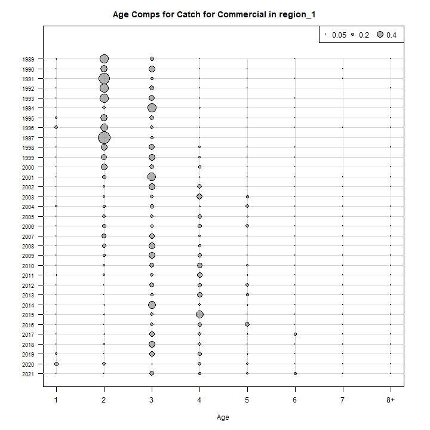
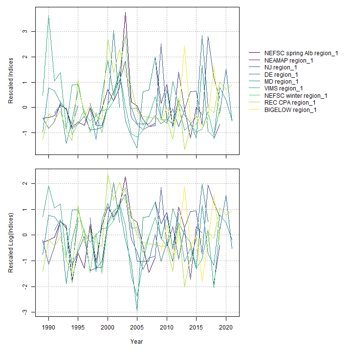
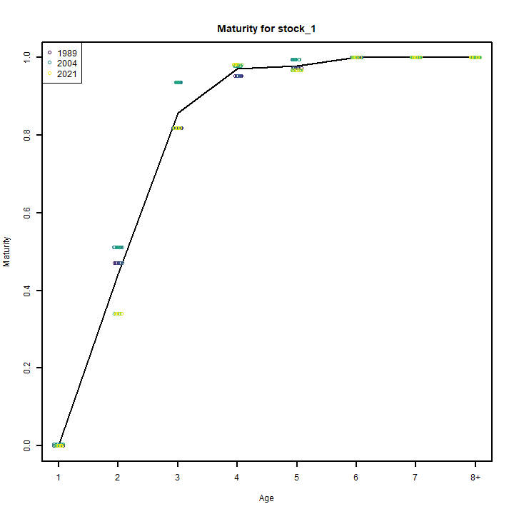
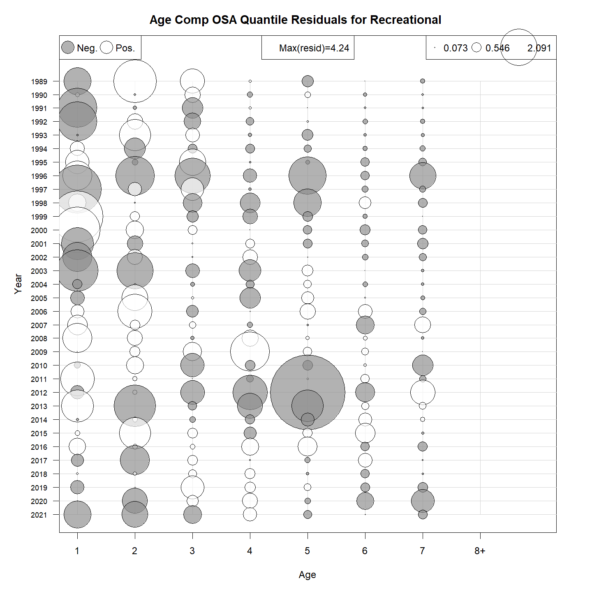
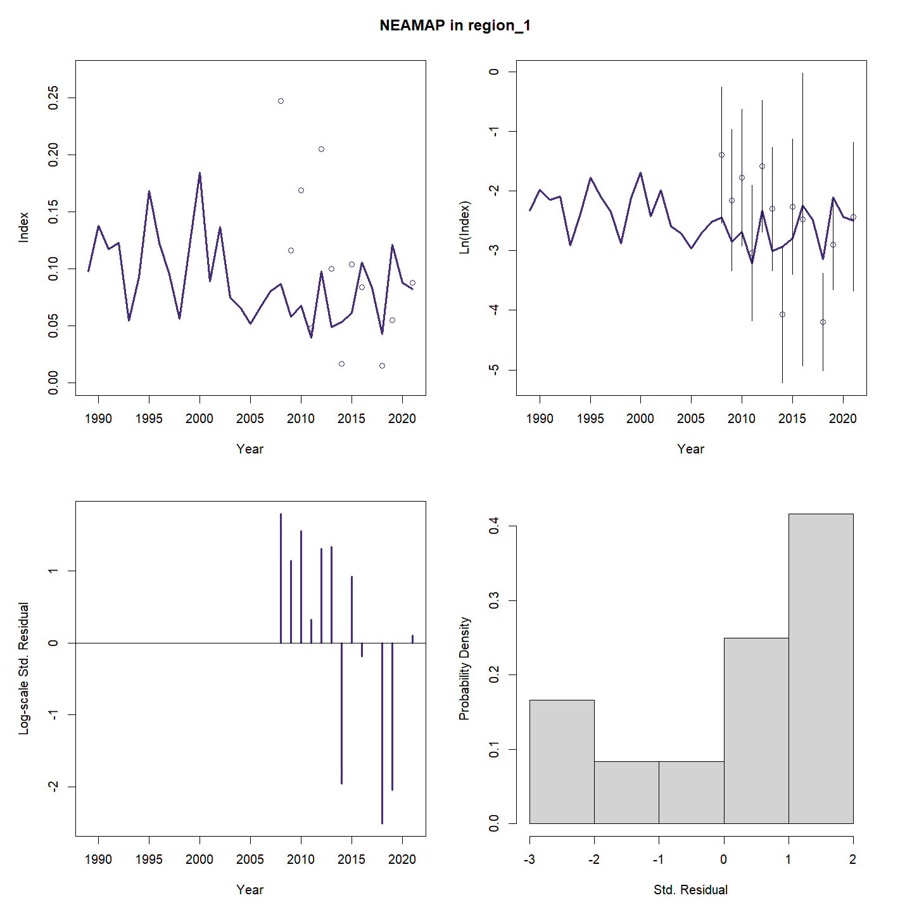
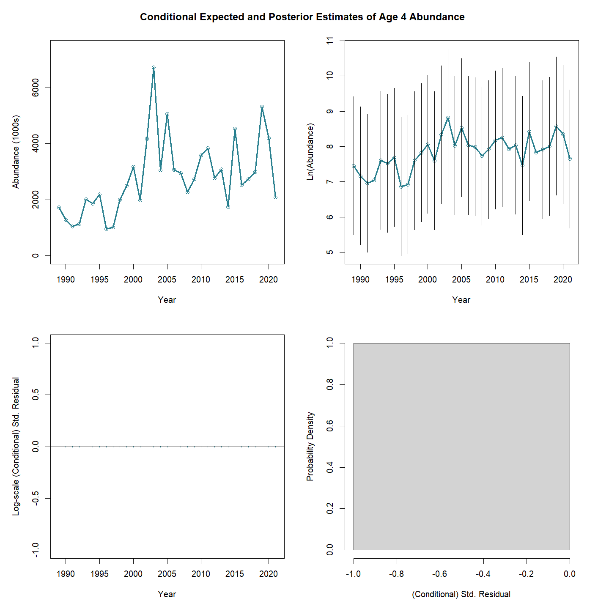
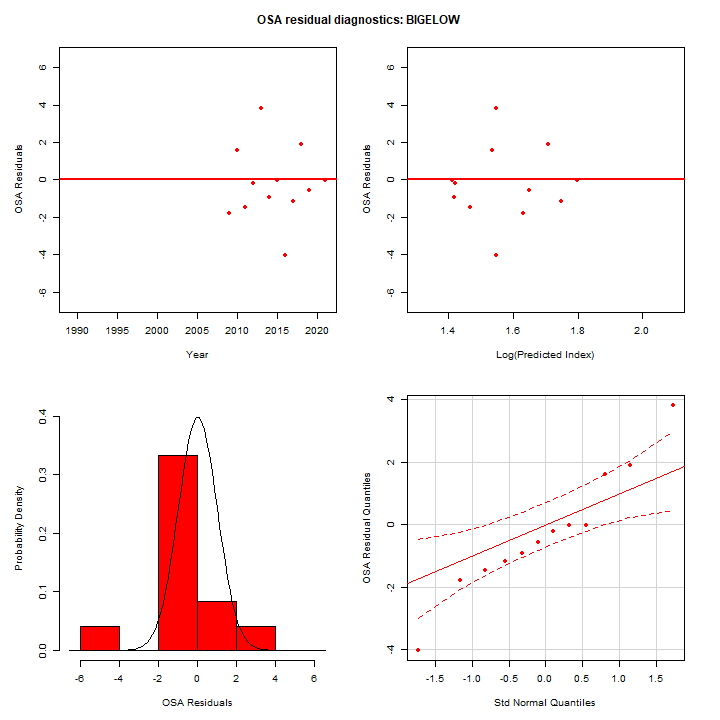
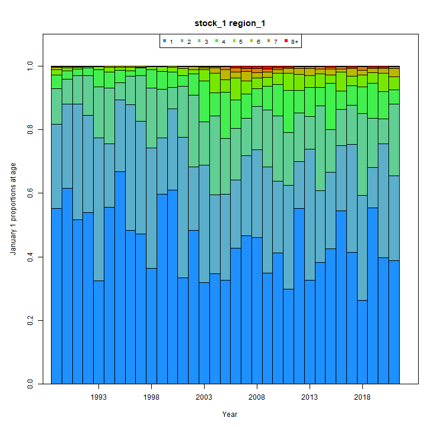
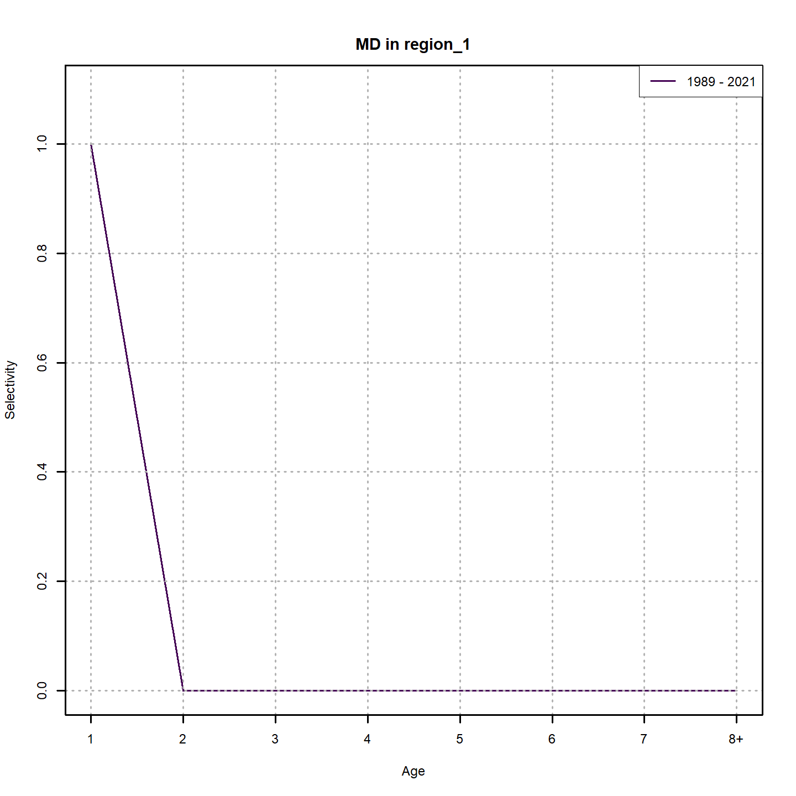
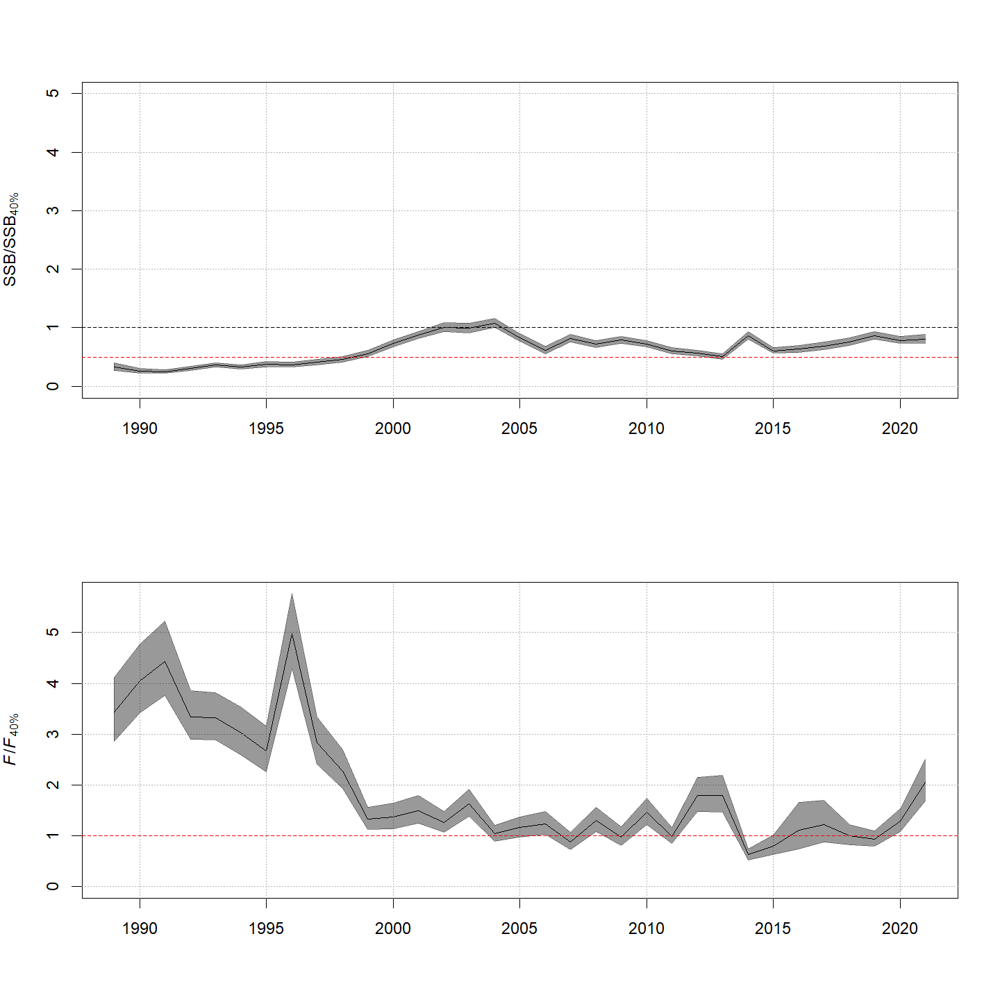

---
output:
  html_document:
    df_print: paged
    keep_md: yes
  word_document: default
  pdf_document:
    fig_caption: yes
    includes:
    keep_tex: yes
    number_sections: no
title: "WHAM figures and tables"
header-includes:
  - \usepackage{longtable}
  - \usepackage{booktabs}
  - \usepackage{caption,graphics}
  - \usepackage{makecell}
  - \usepackage{lscape}
  - \renewcommand\figurename{Fig.}
  - \captionsetup{labelsep=period, singlelinecheck=false}
  - \newcommand{\changesize}[1]{\fontsize{#1pt}{#1pt}\selectfont}
  - \renewcommand{\arraystretch}{1.5}
  - \renewcommand\theadfont{}
---

# {.tabset}

## Figures {.tabset}

### Input

### Diagnostics

### Results

### Retro

### Reference points

### Miscelaneous

## Tables {.tabset}

### Parameter estimates

<table class="table" style="margin-left: auto; margin-right: auto;">
<caption>Parameter estimates, standard errors, and confidence intervals. Rounded to 3 decimal places.</caption>
 <thead>
  <tr>
   <th style="text-align:left;">   </th>
   <th style="text-align:right;"> Estimate </th>
   <th style="text-align:right;"> Std. Error </th>
   <th style="text-align:right;"> 95\% CI lower </th>
   <th style="text-align:right;"> 95\% CI upper </th>
  </tr>
 </thead>
<tbody>
  <tr>
   <td style="text-align:left;"> NEFSC spring Alb fully selected q </td>
   <td style="text-align:right;"> 0.000 </td>
   <td style="text-align:right;"> 0.000 </td>
   <td style="text-align:right;"> 0.000 </td>
   <td style="text-align:right;"> 0.000 </td>
  </tr>
  <tr>
   <td style="text-align:left;"> NEAMAP fully selected q </td>
   <td style="text-align:right;"> 0.000 </td>
   <td style="text-align:right;"> 0.000 </td>
   <td style="text-align:right;"> 0.000 </td>
   <td style="text-align:right;"> 0.000 </td>
  </tr>
  <tr>
   <td style="text-align:left;"> NJ fully selected q </td>
   <td style="text-align:right;"> 0.000 </td>
   <td style="text-align:right;"> 0.000 </td>
   <td style="text-align:right;"> 0.000 </td>
   <td style="text-align:right;"> 0.000 </td>
  </tr>
  <tr>
   <td style="text-align:left;"> DE fully selected q </td>
   <td style="text-align:right;"> 0.000 </td>
   <td style="text-align:right;"> 0.000 </td>
   <td style="text-align:right;"> 0.000 </td>
   <td style="text-align:right;"> 0.000 </td>
  </tr>
  <tr>
   <td style="text-align:left;"> MD fully selected q </td>
   <td style="text-align:right;"> 0.000 </td>
   <td style="text-align:right;"> 0.000 </td>
   <td style="text-align:right;"> 0.000 </td>
   <td style="text-align:right;"> 0.000 </td>
  </tr>
  <tr>
   <td style="text-align:left;"> VIMS fully selected q </td>
   <td style="text-align:right;"> 0.000 </td>
   <td style="text-align:right;"> 0.000 </td>
   <td style="text-align:right;"> 0.000 </td>
   <td style="text-align:right;"> 0.000 </td>
  </tr>
  <tr>
   <td style="text-align:left;"> NEFSC winter fully selected q </td>
   <td style="text-align:right;"> 0.268 </td>
   <td style="text-align:right;"> 0.049 </td>
   <td style="text-align:right;"> 0.187 </td>
   <td style="text-align:right;"> 0.384 </td>
  </tr>
  <tr>
   <td style="text-align:left;"> REC CPA fully selected q </td>
   <td style="text-align:right;"> 0.000 </td>
   <td style="text-align:right;"> 0.000 </td>
   <td style="text-align:right;"> 0.000 </td>
   <td style="text-align:right;"> 0.000 </td>
  </tr>
  <tr>
   <td style="text-align:left;"> BIGELOW fully selected q </td>
   <td style="text-align:right;"> 0.000 </td>
   <td style="text-align:right;"> 0.000 </td>
   <td style="text-align:right;"> 0.000 </td>
   <td style="text-align:right;"> 0.000 </td>
  </tr>
  <tr>
   <td style="text-align:left;"> Block 1: Selectivity for age 1 </td>
   <td style="text-align:right;"> 0.059 </td>
   <td style="text-align:right;"> 0.013 </td>
   <td style="text-align:right;"> 0.038 </td>
   <td style="text-align:right;"> 0.091 </td>
  </tr>
  <tr>
   <td style="text-align:left;"> Block 1: Selectivity for age 2 </td>
   <td style="text-align:right;"> 1.000 </td>
   <td style="text-align:right;"> -- </td>
   <td style="text-align:right;"> -- </td>
   <td style="text-align:right;"> -- </td>
  </tr>
  <tr>
   <td style="text-align:left;"> Block 1: Selectivity for age 3 </td>
   <td style="text-align:right;"> 1.000 </td>
   <td style="text-align:right;"> -- </td>
   <td style="text-align:right;"> -- </td>
   <td style="text-align:right;"> -- </td>
  </tr>
  <tr>
   <td style="text-align:left;"> Block 1: Selectivity for age 4 </td>
   <td style="text-align:right;"> 1.000 </td>
   <td style="text-align:right;"> -- </td>
   <td style="text-align:right;"> -- </td>
   <td style="text-align:right;"> -- </td>
  </tr>
  <tr>
   <td style="text-align:left;"> Block 1: Selectivity for age 5 </td>
   <td style="text-align:right;"> 1.000 </td>
   <td style="text-align:right;"> -- </td>
   <td style="text-align:right;"> -- </td>
   <td style="text-align:right;"> -- </td>
  </tr>
  <tr>
   <td style="text-align:left;"> Block 1: Selectivity for age 6 </td>
   <td style="text-align:right;"> 1.000 </td>
   <td style="text-align:right;"> -- </td>
   <td style="text-align:right;"> -- </td>
   <td style="text-align:right;"> -- </td>
  </tr>
  <tr>
   <td style="text-align:left;"> Block 1: Selectivity for age 7 </td>
   <td style="text-align:right;"> 1.000 </td>
   <td style="text-align:right;"> -- </td>
   <td style="text-align:right;"> -- </td>
   <td style="text-align:right;"> -- </td>
  </tr>
  <tr>
   <td style="text-align:left;"> Block 1: Selectivity for age 8+ </td>
   <td style="text-align:right;"> 1.000 </td>
   <td style="text-align:right;"> -- </td>
   <td style="text-align:right;"> -- </td>
   <td style="text-align:right;"> -- </td>
  </tr>
  <tr>
   <td style="text-align:left;"> Block 2: $a_{50}$ </td>
   <td style="text-align:right;"> 2.876 </td>
   <td style="text-align:right;"> 0.119 </td>
   <td style="text-align:right;"> 2.648 </td>
   <td style="text-align:right;"> 3.113 </td>
  </tr>
  <tr>
   <td style="text-align:left;"> Block 2: 1/slope (increasing) </td>
   <td style="text-align:right;"> 0.557 </td>
   <td style="text-align:right;"> 0.039 </td>
   <td style="text-align:right;"> 0.485 </td>
   <td style="text-align:right;"> 0.638 </td>
  </tr>
  <tr>
   <td style="text-align:left;"> Block 3: $a_{50}$ </td>
   <td style="text-align:right;"> 2.059 </td>
   <td style="text-align:right;"> 0.118 </td>
   <td style="text-align:right;"> 1.836 </td>
   <td style="text-align:right;"> 2.298 </td>
  </tr>
  <tr>
   <td style="text-align:left;"> Block 3: 1/slope (increasing) </td>
   <td style="text-align:right;"> 0.560 </td>
   <td style="text-align:right;"> 0.053 </td>
   <td style="text-align:right;"> 0.465 </td>
   <td style="text-align:right;"> 0.672 </td>
  </tr>
  <tr>
   <td style="text-align:left;"> Block 4: $a_{50}$ </td>
   <td style="text-align:right;"> 5.197 </td>
   <td style="text-align:right;"> 0.710 </td>
   <td style="text-align:right;"> 3.707 </td>
   <td style="text-align:right;"> 6.394 </td>
  </tr>
  <tr>
   <td style="text-align:left;"> Block 4: 1/slope (increasing) </td>
   <td style="text-align:right;"> 1.420 </td>
   <td style="text-align:right;"> 0.149 </td>
   <td style="text-align:right;"> 1.152 </td>
   <td style="text-align:right;"> 1.736 </td>
  </tr>
  <tr>
   <td style="text-align:left;"> Block 5: Selectivity for age 1 </td>
   <td style="text-align:right;"> 0.146 </td>
   <td style="text-align:right;"> 0.030 </td>
   <td style="text-align:right;"> 0.097 </td>
   <td style="text-align:right;"> 0.215 </td>
  </tr>
  <tr>
   <td style="text-align:left;"> Block 5: Selectivity for age 2 </td>
   <td style="text-align:right;"> 0.543 </td>
   <td style="text-align:right;"> 0.096 </td>
   <td style="text-align:right;"> 0.359 </td>
   <td style="text-align:right;"> 0.717 </td>
  </tr>
  <tr>
   <td style="text-align:left;"> Block 5: Selectivity for age 3 </td>
   <td style="text-align:right;"> 0.900 </td>
   <td style="text-align:right;"> 0.166 </td>
   <td style="text-align:right;"> 0.194 </td>
   <td style="text-align:right;"> 0.997 </td>
  </tr>
  <tr>
   <td style="text-align:left;"> Block 5: Selectivity for age 4 </td>
   <td style="text-align:right;"> 1.000 </td>
   <td style="text-align:right;"> -- </td>
   <td style="text-align:right;"> -- </td>
   <td style="text-align:right;"> -- </td>
  </tr>
  <tr>
   <td style="text-align:left;"> Block 5: Selectivity for age 5 </td>
   <td style="text-align:right;"> 1.000 </td>
   <td style="text-align:right;"> -- </td>
   <td style="text-align:right;"> -- </td>
   <td style="text-align:right;"> -- </td>
  </tr>
  <tr>
   <td style="text-align:left;"> Block 5: Selectivity for age 6 </td>
   <td style="text-align:right;"> 1.000 </td>
   <td style="text-align:right;"> -- </td>
   <td style="text-align:right;"> -- </td>
   <td style="text-align:right;"> -- </td>
  </tr>
  <tr>
   <td style="text-align:left;"> Block 5: Selectivity for age 7 </td>
   <td style="text-align:right;"> 1.000 </td>
   <td style="text-align:right;"> -- </td>
   <td style="text-align:right;"> -- </td>
   <td style="text-align:right;"> -- </td>
  </tr>
  <tr>
   <td style="text-align:left;"> Block 5: Selectivity for age 8+ </td>
   <td style="text-align:right;"> 1.000 </td>
   <td style="text-align:right;"> -- </td>
   <td style="text-align:right;"> -- </td>
   <td style="text-align:right;"> -- </td>
  </tr>
  <tr>
   <td style="text-align:left;"> Block 6: Selectivity for age 1 </td>
   <td style="text-align:right;"> 1.000 </td>
   <td style="text-align:right;"> -- </td>
   <td style="text-align:right;"> -- </td>
   <td style="text-align:right;"> -- </td>
  </tr>
  <tr>
   <td style="text-align:left;"> Block 6: Selectivity for age 2 </td>
   <td style="text-align:right;"> 0.000 </td>
   <td style="text-align:right;"> -- </td>
   <td style="text-align:right;"> -- </td>
   <td style="text-align:right;"> -- </td>
  </tr>
  <tr>
   <td style="text-align:left;"> Block 6: Selectivity for age 3 </td>
   <td style="text-align:right;"> 0.000 </td>
   <td style="text-align:right;"> -- </td>
   <td style="text-align:right;"> -- </td>
   <td style="text-align:right;"> -- </td>
  </tr>
  <tr>
   <td style="text-align:left;"> Block 6: Selectivity for age 4 </td>
   <td style="text-align:right;"> 0.000 </td>
   <td style="text-align:right;"> -- </td>
   <td style="text-align:right;"> -- </td>
   <td style="text-align:right;"> -- </td>
  </tr>
  <tr>
   <td style="text-align:left;"> Block 6: Selectivity for age 5 </td>
   <td style="text-align:right;"> 0.000 </td>
   <td style="text-align:right;"> -- </td>
   <td style="text-align:right;"> -- </td>
   <td style="text-align:right;"> -- </td>
  </tr>
  <tr>
   <td style="text-align:left;"> Block 6: Selectivity for age 6 </td>
   <td style="text-align:right;"> 0.000 </td>
   <td style="text-align:right;"> -- </td>
   <td style="text-align:right;"> -- </td>
   <td style="text-align:right;"> -- </td>
  </tr>
  <tr>
   <td style="text-align:left;"> Block 6: Selectivity for age 7 </td>
   <td style="text-align:right;"> 0.000 </td>
   <td style="text-align:right;"> -- </td>
   <td style="text-align:right;"> -- </td>
   <td style="text-align:right;"> -- </td>
  </tr>
  <tr>
   <td style="text-align:left;"> Block 6: Selectivity for age 8+ </td>
   <td style="text-align:right;"> 0.000 </td>
   <td style="text-align:right;"> -- </td>
   <td style="text-align:right;"> -- </td>
   <td style="text-align:right;"> -- </td>
  </tr>
  <tr>
   <td style="text-align:left;"> Block 7: Selectivity for age 1 </td>
   <td style="text-align:right;"> 0.135 </td>
   <td style="text-align:right;"> 0.017 </td>
   <td style="text-align:right;"> 0.106 </td>
   <td style="text-align:right;"> 0.171 </td>
  </tr>
  <tr>
   <td style="text-align:left;"> Block 7: Selectivity for age 2 </td>
   <td style="text-align:right;"> 1.000 </td>
   <td style="text-align:right;"> -- </td>
   <td style="text-align:right;"> -- </td>
   <td style="text-align:right;"> -- </td>
  </tr>
  <tr>
   <td style="text-align:left;"> Block 7: Selectivity for age 3 </td>
   <td style="text-align:right;"> 1.000 </td>
   <td style="text-align:right;"> -- </td>
   <td style="text-align:right;"> -- </td>
   <td style="text-align:right;"> -- </td>
  </tr>
  <tr>
   <td style="text-align:left;"> Block 7: Selectivity for age 4 </td>
   <td style="text-align:right;"> 1.000 </td>
   <td style="text-align:right;"> -- </td>
   <td style="text-align:right;"> -- </td>
   <td style="text-align:right;"> -- </td>
  </tr>
  <tr>
   <td style="text-align:left;"> Block 7: Selectivity for age 5 </td>
   <td style="text-align:right;"> 1.000 </td>
   <td style="text-align:right;"> -- </td>
   <td style="text-align:right;"> -- </td>
   <td style="text-align:right;"> -- </td>
  </tr>
  <tr>
   <td style="text-align:left;"> Block 7: Selectivity for age 6 </td>
   <td style="text-align:right;"> 1.000 </td>
   <td style="text-align:right;"> -- </td>
   <td style="text-align:right;"> -- </td>
   <td style="text-align:right;"> -- </td>
  </tr>
  <tr>
   <td style="text-align:left;"> Block 7: Selectivity for age 7 </td>
   <td style="text-align:right;"> 1.000 </td>
   <td style="text-align:right;"> -- </td>
   <td style="text-align:right;"> -- </td>
   <td style="text-align:right;"> -- </td>
  </tr>
  <tr>
   <td style="text-align:left;"> Block 7: Selectivity for age 8+ </td>
   <td style="text-align:right;"> 1.000 </td>
   <td style="text-align:right;"> -- </td>
   <td style="text-align:right;"> -- </td>
   <td style="text-align:right;"> -- </td>
  </tr>
  <tr>
   <td style="text-align:left;"> Block 8: Selectivity for age 1 </td>
   <td style="text-align:right;"> 1.000 </td>
   <td style="text-align:right;"> -- </td>
   <td style="text-align:right;"> -- </td>
   <td style="text-align:right;"> -- </td>
  </tr>
  <tr>
   <td style="text-align:left;"> Block 8: Selectivity for age 2 </td>
   <td style="text-align:right;"> 0.000 </td>
   <td style="text-align:right;"> -- </td>
   <td style="text-align:right;"> -- </td>
   <td style="text-align:right;"> -- </td>
  </tr>
  <tr>
   <td style="text-align:left;"> Block 8: Selectivity for age 3 </td>
   <td style="text-align:right;"> 0.000 </td>
   <td style="text-align:right;"> -- </td>
   <td style="text-align:right;"> -- </td>
   <td style="text-align:right;"> -- </td>
  </tr>
  <tr>
   <td style="text-align:left;"> Block 8: Selectivity for age 4 </td>
   <td style="text-align:right;"> 0.000 </td>
   <td style="text-align:right;"> -- </td>
   <td style="text-align:right;"> -- </td>
   <td style="text-align:right;"> -- </td>
  </tr>
  <tr>
   <td style="text-align:left;"> Block 8: Selectivity for age 5 </td>
   <td style="text-align:right;"> 0.000 </td>
   <td style="text-align:right;"> -- </td>
   <td style="text-align:right;"> -- </td>
   <td style="text-align:right;"> -- </td>
  </tr>
  <tr>
   <td style="text-align:left;"> Block 8: Selectivity for age 6 </td>
   <td style="text-align:right;"> 0.000 </td>
   <td style="text-align:right;"> -- </td>
   <td style="text-align:right;"> -- </td>
   <td style="text-align:right;"> -- </td>
  </tr>
  <tr>
   <td style="text-align:left;"> Block 8: Selectivity for age 7 </td>
   <td style="text-align:right;"> 0.000 </td>
   <td style="text-align:right;"> -- </td>
   <td style="text-align:right;"> -- </td>
   <td style="text-align:right;"> -- </td>
  </tr>
  <tr>
   <td style="text-align:left;"> Block 8: Selectivity for age 8+ </td>
   <td style="text-align:right;"> 0.000 </td>
   <td style="text-align:right;"> -- </td>
   <td style="text-align:right;"> -- </td>
   <td style="text-align:right;"> -- </td>
  </tr>
  <tr>
   <td style="text-align:left;"> Block 9: Selectivity for age 1 </td>
   <td style="text-align:right;"> 1.000 </td>
   <td style="text-align:right;"> -- </td>
   <td style="text-align:right;"> -- </td>
   <td style="text-align:right;"> -- </td>
  </tr>
  <tr>
   <td style="text-align:left;"> Block 9: Selectivity for age 2 </td>
   <td style="text-align:right;"> 0.000 </td>
   <td style="text-align:right;"> -- </td>
   <td style="text-align:right;"> -- </td>
   <td style="text-align:right;"> -- </td>
  </tr>
  <tr>
   <td style="text-align:left;"> Block 9: Selectivity for age 3 </td>
   <td style="text-align:right;"> 0.000 </td>
   <td style="text-align:right;"> -- </td>
   <td style="text-align:right;"> -- </td>
   <td style="text-align:right;"> -- </td>
  </tr>
  <tr>
   <td style="text-align:left;"> Block 9: Selectivity for age 4 </td>
   <td style="text-align:right;"> 0.000 </td>
   <td style="text-align:right;"> -- </td>
   <td style="text-align:right;"> -- </td>
   <td style="text-align:right;"> -- </td>
  </tr>
  <tr>
   <td style="text-align:left;"> Block 9: Selectivity for age 5 </td>
   <td style="text-align:right;"> 0.000 </td>
   <td style="text-align:right;"> -- </td>
   <td style="text-align:right;"> -- </td>
   <td style="text-align:right;"> -- </td>
  </tr>
  <tr>
   <td style="text-align:left;"> Block 9: Selectivity for age 6 </td>
   <td style="text-align:right;"> 0.000 </td>
   <td style="text-align:right;"> -- </td>
   <td style="text-align:right;"> -- </td>
   <td style="text-align:right;"> -- </td>
  </tr>
  <tr>
   <td style="text-align:left;"> Block 9: Selectivity for age 7 </td>
   <td style="text-align:right;"> 0.000 </td>
   <td style="text-align:right;"> -- </td>
   <td style="text-align:right;"> -- </td>
   <td style="text-align:right;"> -- </td>
  </tr>
  <tr>
   <td style="text-align:left;"> Block 9: Selectivity for age 8+ </td>
   <td style="text-align:right;"> 0.000 </td>
   <td style="text-align:right;"> -- </td>
   <td style="text-align:right;"> -- </td>
   <td style="text-align:right;"> -- </td>
  </tr>
  <tr>
   <td style="text-align:left;"> Block 10: Selectivity for age 1 </td>
   <td style="text-align:right;"> 1.000 </td>
   <td style="text-align:right;"> -- </td>
   <td style="text-align:right;"> -- </td>
   <td style="text-align:right;"> -- </td>
  </tr>
  <tr>
   <td style="text-align:left;"> Block 10: Selectivity for age 2 </td>
   <td style="text-align:right;"> 0.000 </td>
   <td style="text-align:right;"> -- </td>
   <td style="text-align:right;"> -- </td>
   <td style="text-align:right;"> -- </td>
  </tr>
  <tr>
   <td style="text-align:left;"> Block 10: Selectivity for age 3 </td>
   <td style="text-align:right;"> 0.000 </td>
   <td style="text-align:right;"> -- </td>
   <td style="text-align:right;"> -- </td>
   <td style="text-align:right;"> -- </td>
  </tr>
  <tr>
   <td style="text-align:left;"> Block 10: Selectivity for age 4 </td>
   <td style="text-align:right;"> 0.000 </td>
   <td style="text-align:right;"> -- </td>
   <td style="text-align:right;"> -- </td>
   <td style="text-align:right;"> -- </td>
  </tr>
  <tr>
   <td style="text-align:left;"> Block 10: Selectivity for age 5 </td>
   <td style="text-align:right;"> 0.000 </td>
   <td style="text-align:right;"> -- </td>
   <td style="text-align:right;"> -- </td>
   <td style="text-align:right;"> -- </td>
  </tr>
  <tr>
   <td style="text-align:left;"> Block 10: Selectivity for age 6 </td>
   <td style="text-align:right;"> 0.000 </td>
   <td style="text-align:right;"> -- </td>
   <td style="text-align:right;"> -- </td>
   <td style="text-align:right;"> -- </td>
  </tr>
  <tr>
   <td style="text-align:left;"> Block 10: Selectivity for age 7 </td>
   <td style="text-align:right;"> 0.000 </td>
   <td style="text-align:right;"> -- </td>
   <td style="text-align:right;"> -- </td>
   <td style="text-align:right;"> -- </td>
  </tr>
  <tr>
   <td style="text-align:left;"> Block 10: Selectivity for age 8+ </td>
   <td style="text-align:right;"> 0.000 </td>
   <td style="text-align:right;"> -- </td>
   <td style="text-align:right;"> -- </td>
   <td style="text-align:right;"> -- </td>
  </tr>
  <tr>
   <td style="text-align:left;"> Block 11: Selectivity for age 1 </td>
   <td style="text-align:right;"> 0.349 </td>
   <td style="text-align:right;"> 0.060 </td>
   <td style="text-align:right;"> 0.242 </td>
   <td style="text-align:right;"> 0.474 </td>
  </tr>
  <tr>
   <td style="text-align:left;"> Block 11: Selectivity for age 2 </td>
   <td style="text-align:right;"> 0.877 </td>
   <td style="text-align:right;"> 0.136 </td>
   <td style="text-align:right;"> 0.375 </td>
   <td style="text-align:right;"> 0.988 </td>
  </tr>
  <tr>
   <td style="text-align:left;"> Block 11: Selectivity for age 3 </td>
   <td style="text-align:right;"> 1.000 </td>
   <td style="text-align:right;"> -- </td>
   <td style="text-align:right;"> -- </td>
   <td style="text-align:right;"> -- </td>
  </tr>
  <tr>
   <td style="text-align:left;"> Block 11: Selectivity for age 4 </td>
   <td style="text-align:right;"> 1.000 </td>
   <td style="text-align:right;"> -- </td>
   <td style="text-align:right;"> -- </td>
   <td style="text-align:right;"> -- </td>
  </tr>
  <tr>
   <td style="text-align:left;"> Block 11: Selectivity for age 5 </td>
   <td style="text-align:right;"> 1.000 </td>
   <td style="text-align:right;"> -- </td>
   <td style="text-align:right;"> -- </td>
   <td style="text-align:right;"> -- </td>
  </tr>
  <tr>
   <td style="text-align:left;"> Block 11: Selectivity for age 6 </td>
   <td style="text-align:right;"> 1.000 </td>
   <td style="text-align:right;"> -- </td>
   <td style="text-align:right;"> -- </td>
   <td style="text-align:right;"> -- </td>
  </tr>
  <tr>
   <td style="text-align:left;"> Block 11: Selectivity for age 7 </td>
   <td style="text-align:right;"> 1.000 </td>
   <td style="text-align:right;"> -- </td>
   <td style="text-align:right;"> -- </td>
   <td style="text-align:right;"> -- </td>
  </tr>
  <tr>
   <td style="text-align:left;"> Block 11: Selectivity for age 8+ </td>
   <td style="text-align:right;"> 1.000 </td>
   <td style="text-align:right;"> -- </td>
   <td style="text-align:right;"> -- </td>
   <td style="text-align:right;"> -- </td>
  </tr>
  <tr>
   <td style="text-align:left;"> Block 12: Selectivity for age 1 </td>
   <td style="text-align:right;"> 0.426 </td>
   <td style="text-align:right;"> 0.025 </td>
   <td style="text-align:right;"> 0.377 </td>
   <td style="text-align:right;"> 0.475 </td>
  </tr>
  <tr>
   <td style="text-align:left;"> Block 12: Selectivity for age 2 </td>
   <td style="text-align:right;"> 0.709 </td>
   <td style="text-align:right;"> 0.041 </td>
   <td style="text-align:right;"> 0.623 </td>
   <td style="text-align:right;"> 0.783 </td>
  </tr>
  <tr>
   <td style="text-align:left;"> Block 12: Selectivity for age 3 </td>
   <td style="text-align:right;"> 1.000 </td>
   <td style="text-align:right;"> -- </td>
   <td style="text-align:right;"> -- </td>
   <td style="text-align:right;"> -- </td>
  </tr>
  <tr>
   <td style="text-align:left;"> Block 12: Selectivity for age 4 </td>
   <td style="text-align:right;"> 1.000 </td>
   <td style="text-align:right;"> -- </td>
   <td style="text-align:right;"> -- </td>
   <td style="text-align:right;"> -- </td>
  </tr>
  <tr>
   <td style="text-align:left;"> Block 12: Selectivity for age 5 </td>
   <td style="text-align:right;"> 1.000 </td>
   <td style="text-align:right;"> -- </td>
   <td style="text-align:right;"> -- </td>
   <td style="text-align:right;"> -- </td>
  </tr>
  <tr>
   <td style="text-align:left;"> Block 12: Selectivity for age 6 </td>
   <td style="text-align:right;"> 1.000 </td>
   <td style="text-align:right;"> -- </td>
   <td style="text-align:right;"> -- </td>
   <td style="text-align:right;"> -- </td>
  </tr>
  <tr>
   <td style="text-align:left;"> Block 12: Selectivity for age 7 </td>
   <td style="text-align:right;"> 1.000 </td>
   <td style="text-align:right;"> -- </td>
   <td style="text-align:right;"> -- </td>
   <td style="text-align:right;"> -- </td>
  </tr>
  <tr>
   <td style="text-align:left;"> Block 12: Selectivity for age 8+ </td>
   <td style="text-align:right;"> 1.000 </td>
   <td style="text-align:right;"> -- </td>
   <td style="text-align:right;"> -- </td>
   <td style="text-align:right;"> -- </td>
  </tr>
  <tr>
   <td style="text-align:left;"> Block 13: Selectivity for age 1 </td>
   <td style="text-align:right;"> 0.200 </td>
   <td style="text-align:right;"> 0.038 </td>
   <td style="text-align:right;"> 0.136 </td>
   <td style="text-align:right;"> 0.285 </td>
  </tr>
  <tr>
   <td style="text-align:left;"> Block 13: Selectivity for age 2 </td>
   <td style="text-align:right;"> 1.000 </td>
   <td style="text-align:right;"> -- </td>
   <td style="text-align:right;"> -- </td>
   <td style="text-align:right;"> -- </td>
  </tr>
  <tr>
   <td style="text-align:left;"> Block 13: Selectivity for age 3 </td>
   <td style="text-align:right;"> 1.000 </td>
   <td style="text-align:right;"> -- </td>
   <td style="text-align:right;"> -- </td>
   <td style="text-align:right;"> -- </td>
  </tr>
  <tr>
   <td style="text-align:left;"> Block 13: Selectivity for age 4 </td>
   <td style="text-align:right;"> 1.000 </td>
   <td style="text-align:right;"> -- </td>
   <td style="text-align:right;"> -- </td>
   <td style="text-align:right;"> -- </td>
  </tr>
  <tr>
   <td style="text-align:left;"> Block 13: Selectivity for age 5 </td>
   <td style="text-align:right;"> 1.000 </td>
   <td style="text-align:right;"> -- </td>
   <td style="text-align:right;"> -- </td>
   <td style="text-align:right;"> -- </td>
  </tr>
  <tr>
   <td style="text-align:left;"> Block 13: Selectivity for age 6 </td>
   <td style="text-align:right;"> 1.000 </td>
   <td style="text-align:right;"> -- </td>
   <td style="text-align:right;"> -- </td>
   <td style="text-align:right;"> -- </td>
  </tr>
  <tr>
   <td style="text-align:left;"> Block 13: Selectivity for age 7 </td>
   <td style="text-align:right;"> 1.000 </td>
   <td style="text-align:right;"> -- </td>
   <td style="text-align:right;"> -- </td>
   <td style="text-align:right;"> -- </td>
  </tr>
  <tr>
   <td style="text-align:left;"> Block 13: Selectivity for age 8+ </td>
   <td style="text-align:right;"> 1.000 </td>
   <td style="text-align:right;"> -- </td>
   <td style="text-align:right;"> -- </td>
   <td style="text-align:right;"> -- </td>
  </tr>
</tbody>
</table>

### Abundance at age

<table class="table" style="margin-left: auto; margin-right: auto;">
<caption>Abundance at age (1000s) for stock 1 in region 1.</caption>
 <thead>
  <tr>
   <th style="text-align:left;">   </th>
   <th style="text-align:right;"> 1 </th>
   <th style="text-align:right;"> 2 </th>
   <th style="text-align:right;"> 3 </th>
   <th style="text-align:right;"> 4 </th>
   <th style="text-align:right;"> 5 </th>
   <th style="text-align:right;"> 6 </th>
   <th style="text-align:right;"> 7 </th>
   <th style="text-align:right;"> 8+ </th>
  </tr>
 </thead>
<tbody>
  <tr>
   <td style="text-align:left;"> 1989 </td>
   <td style="text-align:right;"> 21832 </td>
   <td style="text-align:right;"> 10448 </td>
   <td style="text-align:right;"> 4349 </td>
   <td style="text-align:right;"> 1725 </td>
   <td style="text-align:right;"> 678 </td>
   <td style="text-align:right;"> 266 </td>
   <td style="text-align:right;"> 104 </td>
   <td style="text-align:right;"> 67 </td>
  </tr>
  <tr>
   <td style="text-align:left;"> 1990 </td>
   <td style="text-align:right;"> 30834 </td>
   <td style="text-align:right;"> 13227 </td>
   <td style="text-align:right;"> 3930 </td>
   <td style="text-align:right;"> 1287 </td>
   <td style="text-align:right;"> 470 </td>
   <td style="text-align:right;"> 182 </td>
   <td style="text-align:right;"> 71 </td>
   <td style="text-align:right;"> 46 </td>
  </tr>
  <tr>
   <td style="text-align:left;"> 1991 </td>
   <td style="text-align:right;"> 26348 </td>
   <td style="text-align:right;"> 18564 </td>
   <td style="text-align:right;"> 4499 </td>
   <td style="text-align:right;"> 1051 </td>
   <td style="text-align:right;"> 317 </td>
   <td style="text-align:right;"> 114 </td>
   <td style="text-align:right;"> 44 </td>
   <td style="text-align:right;"> 28 </td>
  </tr>
  <tr>
   <td style="text-align:left;"> 1992 </td>
   <td style="text-align:right;"> 27372 </td>
   <td style="text-align:right;"> 15598 </td>
   <td style="text-align:right;"> 6359 </td>
   <td style="text-align:right;"> 1139 </td>
   <td style="text-align:right;"> 240 </td>
   <td style="text-align:right;"> 71 </td>
   <td style="text-align:right;"> 25 </td>
   <td style="text-align:right;"> 16 </td>
  </tr>
  <tr>
   <td style="text-align:left;"> 1993 </td>
   <td style="text-align:right;"> 12123 </td>
   <td style="text-align:right;"> 16837 </td>
   <td style="text-align:right;"> 5955 </td>
   <td style="text-align:right;"> 2011 </td>
   <td style="text-align:right;"> 338 </td>
   <td style="text-align:right;"> 70 </td>
   <td style="text-align:right;"> 21 </td>
   <td style="text-align:right;"> 12 </td>
  </tr>
  <tr>
   <td style="text-align:left;"> 1994 </td>
   <td style="text-align:right;"> 20645 </td>
   <td style="text-align:right;"> 7396 </td>
   <td style="text-align:right;"> 6540 </td>
   <td style="text-align:right;"> 1854 </td>
   <td style="text-align:right;"> 580 </td>
   <td style="text-align:right;"> 96 </td>
   <td style="text-align:right;"> 20 </td>
   <td style="text-align:right;"> 9 </td>
  </tr>
  <tr>
   <td style="text-align:left;"> 1995 </td>
   <td style="text-align:right;"> 37600 </td>
   <td style="text-align:right;"> 12730 </td>
   <td style="text-align:right;"> 3000 </td>
   <td style="text-align:right;"> 2188 </td>
   <td style="text-align:right;"> 581 </td>
   <td style="text-align:right;"> 179 </td>
   <td style="text-align:right;"> 30 </td>
   <td style="text-align:right;"> 9 </td>
  </tr>
  <tr>
   <td style="text-align:left;"> 1996 </td>
   <td style="text-align:right;"> 27846 </td>
   <td style="text-align:right;"> 22849 </td>
   <td style="text-align:right;"> 5182 </td>
   <td style="text-align:right;"> 955 </td>
   <td style="text-align:right;"> 641 </td>
   <td style="text-align:right;"> 167 </td>
   <td style="text-align:right;"> 52 </td>
   <td style="text-align:right;"> 11 </td>
  </tr>
  <tr>
   <td style="text-align:left;"> 1997 </td>
   <td style="text-align:right;"> 21320 </td>
   <td style="text-align:right;"> 16006 </td>
   <td style="text-align:right;"> 6468 </td>
   <td style="text-align:right;"> 1016 </td>
   <td style="text-align:right;"> 165 </td>
   <td style="text-align:right;"> 108 </td>
   <td style="text-align:right;"> 28 </td>
   <td style="text-align:right;"> 11 </td>
  </tr>
  <tr>
   <td style="text-align:left;"> 1998 </td>
   <td style="text-align:right;"> 12448 </td>
   <td style="text-align:right;"> 12884 </td>
   <td style="text-align:right;"> 6444 </td>
   <td style="text-align:right;"> 2002 </td>
   <td style="text-align:right;"> 287 </td>
   <td style="text-align:right;"> 46 </td>
   <td style="text-align:right;"> 30 </td>
   <td style="text-align:right;"> 11 </td>
  </tr>
  <tr>
   <td style="text-align:left;"> 1999 </td>
   <td style="text-align:right;"> 26566 </td>
   <td style="text-align:right;"> 7875 </td>
   <td style="text-align:right;"> 6824 </td>
   <td style="text-align:right;"> 2499 </td>
   <td style="text-align:right;"> 631 </td>
   <td style="text-align:right;"> 86 </td>
   <td style="text-align:right;"> 14 </td>
   <td style="text-align:right;"> 12 </td>
  </tr>
  <tr>
   <td style="text-align:left;"> 2000 </td>
   <td style="text-align:right;"> 40710 </td>
   <td style="text-align:right;"> 17102 </td>
   <td style="text-align:right;"> 4488 </td>
   <td style="text-align:right;"> 3171 </td>
   <td style="text-align:right;"> 1018 </td>
   <td style="text-align:right;"> 248 </td>
   <td style="text-align:right;"> 33 </td>
   <td style="text-align:right;"> 10 </td>
  </tr>
  <tr>
   <td style="text-align:left;"> 2001 </td>
   <td style="text-align:right;"> 19614 </td>
   <td style="text-align:right;"> 25845 </td>
   <td style="text-align:right;"> 9328 </td>
   <td style="text-align:right;"> 1987 </td>
   <td style="text-align:right;"> 1259 </td>
   <td style="text-align:right;"> 393 </td>
   <td style="text-align:right;"> 95 </td>
   <td style="text-align:right;"> 17 </td>
  </tr>
  <tr>
   <td style="text-align:left;"> 2002 </td>
   <td style="text-align:right;"> 30122 </td>
   <td style="text-align:right;"> 12447 </td>
   <td style="text-align:right;"> 14102 </td>
   <td style="text-align:right;"> 4167 </td>
   <td style="text-align:right;"> 804 </td>
   <td style="text-align:right;"> 496 </td>
   <td style="text-align:right;"> 154 </td>
   <td style="text-align:right;"> 44 </td>
  </tr>
  <tr>
   <td style="text-align:left;"> 2003 </td>
   <td style="text-align:right;"> 16601 </td>
   <td style="text-align:right;"> 19285 </td>
   <td style="text-align:right;"> 7020 </td>
   <td style="text-align:right;"> 6717 </td>
   <td style="text-align:right;"> 1823 </td>
   <td style="text-align:right;"> 344 </td>
   <td style="text-align:right;"> 212 </td>
   <td style="text-align:right;"> 85 </td>
  </tr>
  <tr>
   <td style="text-align:left;"> 2004 </td>
   <td style="text-align:right;"> 14601 </td>
   <td style="text-align:right;"> 10509 </td>
   <td style="text-align:right;"> 10412 </td>
   <td style="text-align:right;"> 3053 </td>
   <td style="text-align:right;"> 2612 </td>
   <td style="text-align:right;"> 689 </td>
   <td style="text-align:right;"> 130 </td>
   <td style="text-align:right;"> 111 </td>
  </tr>
  <tr>
   <td style="text-align:left;"> 2005 </td>
   <td style="text-align:right;"> 11336 </td>
   <td style="text-align:right;"> 9424 </td>
   <td style="text-align:right;"> 6073 </td>
   <td style="text-align:right;"> 5061 </td>
   <td style="text-align:right;"> 1337 </td>
   <td style="text-align:right;"> 1112 </td>
   <td style="text-align:right;"> 292 </td>
   <td style="text-align:right;"> 102 </td>
  </tr>
  <tr>
   <td style="text-align:left;"> 2006 </td>
   <td style="text-align:right;"> 14661 </td>
   <td style="text-align:right;"> 7339 </td>
   <td style="text-align:right;"> 5524 </td>
   <td style="text-align:right;"> 3075 </td>
   <td style="text-align:right;"> 2358 </td>
   <td style="text-align:right;"> 609 </td>
   <td style="text-align:right;"> 505 </td>
   <td style="text-align:right;"> 179 </td>
  </tr>
  <tr>
   <td style="text-align:left;"> 2007 </td>
   <td style="text-align:right;"> 17732 </td>
   <td style="text-align:right;"> 9558 </td>
   <td style="text-align:right;"> 4417 </td>
   <td style="text-align:right;"> 2948 </td>
   <td style="text-align:right;"> 1531 </td>
   <td style="text-align:right;"> 1153 </td>
   <td style="text-align:right;"> 297 </td>
   <td style="text-align:right;"> 333 </td>
  </tr>
  <tr>
   <td style="text-align:left;"> 2008 </td>
   <td style="text-align:right;"> 19112 </td>
   <td style="text-align:right;"> 11481 </td>
   <td style="text-align:right;"> 5618 </td>
   <td style="text-align:right;"> 2275 </td>
   <td style="text-align:right;"> 1418 </td>
   <td style="text-align:right;"> 724 </td>
   <td style="text-align:right;"> 543 </td>
   <td style="text-align:right;"> 297 </td>
  </tr>
  <tr>
   <td style="text-align:left;"> 2009 </td>
   <td style="text-align:right;"> 12814 </td>
   <td style="text-align:right;"> 12270 </td>
   <td style="text-align:right;"> 6541 </td>
   <td style="text-align:right;"> 2731 </td>
   <td style="text-align:right;"> 1021 </td>
   <td style="text-align:right;"> 624 </td>
   <td style="text-align:right;"> 317 </td>
   <td style="text-align:right;"> 368 </td>
  </tr>
  <tr>
   <td style="text-align:left;"> 2010 </td>
   <td style="text-align:right;"> 15024 </td>
   <td style="text-align:right;"> 8202 </td>
   <td style="text-align:right;"> 7456 </td>
   <td style="text-align:right;"> 3586 </td>
   <td style="text-align:right;"> 1304 </td>
   <td style="text-align:right;"> 419 </td>
   <td style="text-align:right;"> 220 </td>
   <td style="text-align:right;"> 204 </td>
  </tr>
  <tr>
   <td style="text-align:left;"> 2011 </td>
   <td style="text-align:right;"> 8715 </td>
   <td style="text-align:right;"> 9487 </td>
   <td style="text-align:right;"> 4840 </td>
   <td style="text-align:right;"> 3843 </td>
   <td style="text-align:right;"> 1544 </td>
   <td style="text-align:right;"> 462 </td>
   <td style="text-align:right;"> 122 </td>
   <td style="text-align:right;"> 100 </td>
  </tr>
  <tr>
   <td style="text-align:left;"> 2012 </td>
   <td style="text-align:right;"> 21602 </td>
   <td style="text-align:right;"> 5696 </td>
   <td style="text-align:right;"> 5958 </td>
   <td style="text-align:right;"> 2772 </td>
   <td style="text-align:right;"> 1989 </td>
   <td style="text-align:right;"> 737 </td>
   <td style="text-align:right;"> 205 </td>
   <td style="text-align:right;"> 91 </td>
  </tr>
  <tr>
   <td style="text-align:left;"> 2013 </td>
   <td style="text-align:right;"> 10850 </td>
   <td style="text-align:right;"> 13661 </td>
   <td style="text-align:right;"> 3371 </td>
   <td style="text-align:right;"> 3087 </td>
   <td style="text-align:right;"> 1205 </td>
   <td style="text-align:right;"> 714 </td>
   <td style="text-align:right;"> 218 </td>
   <td style="text-align:right;"> 73 </td>
  </tr>
  <tr>
   <td style="text-align:left;"> 2014 </td>
   <td style="text-align:right;"> 11719 </td>
   <td style="text-align:right;"> 6908 </td>
   <td style="text-align:right;"> 8139 </td>
   <td style="text-align:right;"> 1744 </td>
   <td style="text-align:right;"> 1344 </td>
   <td style="text-align:right;"> 443 </td>
   <td style="text-align:right;"> 223 </td>
   <td style="text-align:right;"> 78 </td>
  </tr>
  <tr>
   <td style="text-align:left;"> 2015 </td>
   <td style="text-align:right;"> 13390 </td>
   <td style="text-align:right;"> 7584 </td>
   <td style="text-align:right;"> 4264 </td>
   <td style="text-align:right;"> 4536 </td>
   <td style="text-align:right;"> 860 </td>
   <td style="text-align:right;"> 591 </td>
   <td style="text-align:right;"> 175 </td>
   <td style="text-align:right;"> 107 </td>
  </tr>
  <tr>
   <td style="text-align:left;"> 2016 </td>
   <td style="text-align:right;"> 23272 </td>
   <td style="text-align:right;"> 8772 </td>
   <td style="text-align:right;"> 4817 </td>
   <td style="text-align:right;"> 2532 </td>
   <td style="text-align:right;"> 2486 </td>
   <td style="text-align:right;"> 437 </td>
   <td style="text-align:right;"> 280 </td>
   <td style="text-align:right;"> 124 </td>
  </tr>
  <tr>
   <td style="text-align:left;"> 2017 </td>
   <td style="text-align:right;"> 18395 </td>
   <td style="text-align:right;"> 15047 </td>
   <td style="text-align:right;"> 5433 </td>
   <td style="text-align:right;"> 2733 </td>
   <td style="text-align:right;"> 1283 </td>
   <td style="text-align:right;"> 1119 </td>
   <td style="text-align:right;"> 175 </td>
   <td style="text-align:right;"> 144 </td>
  </tr>
  <tr>
   <td style="text-align:left;"> 2018 </td>
   <td style="text-align:right;"> 9445 </td>
   <td style="text-align:right;"> 11801 </td>
   <td style="text-align:right;"> 9172 </td>
   <td style="text-align:right;"> 2986 </td>
   <td style="text-align:right;"> 1312 </td>
   <td style="text-align:right;"> 533 </td>
   <td style="text-align:right;"> 403 </td>
   <td style="text-align:right;"> 99 </td>
  </tr>
  <tr>
   <td style="text-align:left;"> 2019 </td>
   <td style="text-align:right;"> 26623 </td>
   <td style="text-align:right;"> 6131 </td>
   <td style="text-align:right;"> 7376 </td>
   <td style="text-align:right;"> 5310 </td>
   <td style="text-align:right;"> 1565 </td>
   <td style="text-align:right;"> 619 </td>
   <td style="text-align:right;"> 227 </td>
   <td style="text-align:right;"> 193 </td>
  </tr>
  <tr>
   <td style="text-align:left;"> 2020 </td>
   <td style="text-align:right;"> 19329 </td>
   <td style="text-align:right;"> 17302 </td>
   <td style="text-align:right;"> 3823 </td>
   <td style="text-align:right;"> 4206 </td>
   <td style="text-align:right;"> 2720 </td>
   <td style="text-align:right;"> 725 </td>
   <td style="text-align:right;"> 260 </td>
   <td style="text-align:right;"> 159 </td>
  </tr>
  <tr>
   <td style="text-align:left;"> 2021 </td>
   <td style="text-align:right;"> 18301 </td>
   <td style="text-align:right;"> 12464 </td>
   <td style="text-align:right;"> 10591 </td>
   <td style="text-align:right;"> 2091 </td>
   <td style="text-align:right;"> 2011 </td>
   <td style="text-align:right;"> 1146 </td>
   <td style="text-align:right;"> 271 </td>
   <td style="text-align:right;"> 139 </td>
  </tr>
</tbody>
</table>

### Fishing mortality at age by region

<table class="table" style="margin-left: auto; margin-right: auto;">
<caption>Total fishing mortality at age in region 1.</caption>
 <thead>
  <tr>
   <th style="text-align:left;">   </th>
   <th style="text-align:right;"> 1 </th>
   <th style="text-align:right;"> 2 </th>
   <th style="text-align:right;"> 3 </th>
   <th style="text-align:right;"> 4 </th>
   <th style="text-align:right;"> 5 </th>
   <th style="text-align:right;"> 6 </th>
   <th style="text-align:right;"> 7 </th>
   <th style="text-align:right;"> 8+ </th>
  </tr>
 </thead>
<tbody>
  <tr>
   <td style="text-align:left;"> 1989 </td>
   <td style="text-align:right;"> 0.016 </td>
   <td style="text-align:right;"> 0.271 </td>
   <td style="text-align:right;"> 0.271 </td>
   <td style="text-align:right;"> 0.271 </td>
   <td style="text-align:right;"> 0.271 </td>
   <td style="text-align:right;"> 0.271 </td>
   <td style="text-align:right;"> 0.271 </td>
   <td style="text-align:right;"> 0.271 </td>
  </tr>
  <tr>
   <td style="text-align:left;"> 1990 </td>
   <td style="text-align:right;"> 0.022 </td>
   <td style="text-align:right;"> 0.370 </td>
   <td style="text-align:right;"> 0.370 </td>
   <td style="text-align:right;"> 0.370 </td>
   <td style="text-align:right;"> 0.370 </td>
   <td style="text-align:right;"> 0.370 </td>
   <td style="text-align:right;"> 0.370 </td>
   <td style="text-align:right;"> 0.370 </td>
  </tr>
  <tr>
   <td style="text-align:left;"> 1991 </td>
   <td style="text-align:right;"> 0.017 </td>
   <td style="text-align:right;"> 0.283 </td>
   <td style="text-align:right;"> 0.283 </td>
   <td style="text-align:right;"> 0.283 </td>
   <td style="text-align:right;"> 0.283 </td>
   <td style="text-align:right;"> 0.283 </td>
   <td style="text-align:right;"> 0.283 </td>
   <td style="text-align:right;"> 0.283 </td>
  </tr>
  <tr>
   <td style="text-align:left;"> 1992 </td>
   <td style="text-align:right;"> 0.019 </td>
   <td style="text-align:right;"> 0.321 </td>
   <td style="text-align:right;"> 0.321 </td>
   <td style="text-align:right;"> 0.321 </td>
   <td style="text-align:right;"> 0.321 </td>
   <td style="text-align:right;"> 0.321 </td>
   <td style="text-align:right;"> 0.321 </td>
   <td style="text-align:right;"> 0.321 </td>
  </tr>
  <tr>
   <td style="text-align:left;"> 1993 </td>
   <td style="text-align:right;"> 0.015 </td>
   <td style="text-align:right;"> 0.261 </td>
   <td style="text-align:right;"> 0.261 </td>
   <td style="text-align:right;"> 0.261 </td>
   <td style="text-align:right;"> 0.261 </td>
   <td style="text-align:right;"> 0.261 </td>
   <td style="text-align:right;"> 0.261 </td>
   <td style="text-align:right;"> 0.261 </td>
  </tr>
  <tr>
   <td style="text-align:left;"> 1994 </td>
   <td style="text-align:right;"> 0.015 </td>
   <td style="text-align:right;"> 0.256 </td>
   <td style="text-align:right;"> 0.256 </td>
   <td style="text-align:right;"> 0.256 </td>
   <td style="text-align:right;"> 0.256 </td>
   <td style="text-align:right;"> 0.256 </td>
   <td style="text-align:right;"> 0.256 </td>
   <td style="text-align:right;"> 0.256 </td>
  </tr>
  <tr>
   <td style="text-align:left;"> 1995 </td>
   <td style="text-align:right;"> 0.011 </td>
   <td style="text-align:right;"> 0.184 </td>
   <td style="text-align:right;"> 0.184 </td>
   <td style="text-align:right;"> 0.184 </td>
   <td style="text-align:right;"> 0.184 </td>
   <td style="text-align:right;"> 0.184 </td>
   <td style="text-align:right;"> 0.184 </td>
   <td style="text-align:right;"> 0.184 </td>
  </tr>
  <tr>
   <td style="text-align:left;"> 1996 </td>
   <td style="text-align:right;"> 0.023 </td>
   <td style="text-align:right;"> 0.391 </td>
   <td style="text-align:right;"> 0.391 </td>
   <td style="text-align:right;"> 0.391 </td>
   <td style="text-align:right;"> 0.391 </td>
   <td style="text-align:right;"> 0.391 </td>
   <td style="text-align:right;"> 0.391 </td>
   <td style="text-align:right;"> 0.391 </td>
  </tr>
  <tr>
   <td style="text-align:left;"> 1997 </td>
   <td style="text-align:right;"> 0.010 </td>
   <td style="text-align:right;"> 0.172 </td>
   <td style="text-align:right;"> 0.172 </td>
   <td style="text-align:right;"> 0.172 </td>
   <td style="text-align:right;"> 0.172 </td>
   <td style="text-align:right;"> 0.172 </td>
   <td style="text-align:right;"> 0.172 </td>
   <td style="text-align:right;"> 0.172 </td>
  </tr>
  <tr>
   <td style="text-align:left;"> 1998 </td>
   <td style="text-align:right;"> 0.017 </td>
   <td style="text-align:right;"> 0.088 </td>
   <td style="text-align:right;"> 0.285 </td>
   <td style="text-align:right;"> 0.453 </td>
   <td style="text-align:right;"> 0.502 </td>
   <td style="text-align:right;"> 0.511 </td>
   <td style="text-align:right;"> 0.513 </td>
   <td style="text-align:right;"> 0.513 </td>
  </tr>
  <tr>
   <td style="text-align:left;"> 1999 </td>
   <td style="text-align:right;"> 0.010 </td>
   <td style="text-align:right;"> 0.054 </td>
   <td style="text-align:right;"> 0.173 </td>
   <td style="text-align:right;"> 0.276 </td>
   <td style="text-align:right;"> 0.306 </td>
   <td style="text-align:right;"> 0.311 </td>
   <td style="text-align:right;"> 0.312 </td>
   <td style="text-align:right;"> 0.312 </td>
  </tr>
  <tr>
   <td style="text-align:left;"> 2000 </td>
   <td style="text-align:right;"> 0.006 </td>
   <td style="text-align:right;"> 0.033 </td>
   <td style="text-align:right;"> 0.107 </td>
   <td style="text-align:right;"> 0.170 </td>
   <td style="text-align:right;"> 0.188 </td>
   <td style="text-align:right;"> 0.192 </td>
   <td style="text-align:right;"> 0.192 </td>
   <td style="text-align:right;"> 0.192 </td>
  </tr>
  <tr>
   <td style="text-align:left;"> 2001 </td>
   <td style="text-align:right;"> 0.005 </td>
   <td style="text-align:right;"> 0.027 </td>
   <td style="text-align:right;"> 0.088 </td>
   <td style="text-align:right;"> 0.140 </td>
   <td style="text-align:right;"> 0.156 </td>
   <td style="text-align:right;"> 0.158 </td>
   <td style="text-align:right;"> 0.159 </td>
   <td style="text-align:right;"> 0.159 </td>
  </tr>
  <tr>
   <td style="text-align:left;"> 2002 </td>
   <td style="text-align:right;"> 0.005 </td>
   <td style="text-align:right;"> 0.024 </td>
   <td style="text-align:right;"> 0.076 </td>
   <td style="text-align:right;"> 0.122 </td>
   <td style="text-align:right;"> 0.135 </td>
   <td style="text-align:right;"> 0.137 </td>
   <td style="text-align:right;"> 0.138 </td>
   <td style="text-align:right;"> 0.138 </td>
  </tr>
  <tr>
   <td style="text-align:left;"> 2003 </td>
   <td style="text-align:right;"> 0.006 </td>
   <td style="text-align:right;"> 0.033 </td>
   <td style="text-align:right;"> 0.106 </td>
   <td style="text-align:right;"> 0.169 </td>
   <td style="text-align:right;"> 0.187 </td>
   <td style="text-align:right;"> 0.190 </td>
   <td style="text-align:right;"> 0.191 </td>
   <td style="text-align:right;"> 0.191 </td>
  </tr>
  <tr>
   <td style="text-align:left;"> 2004 </td>
   <td style="text-align:right;"> 0.008 </td>
   <td style="text-align:right;"> 0.040 </td>
   <td style="text-align:right;"> 0.128 </td>
   <td style="text-align:right;"> 0.203 </td>
   <td style="text-align:right;"> 0.225 </td>
   <td style="text-align:right;"> 0.229 </td>
   <td style="text-align:right;"> 0.230 </td>
   <td style="text-align:right;"> 0.230 </td>
  </tr>
  <tr>
   <td style="text-align:left;"> 2005 </td>
   <td style="text-align:right;"> 0.006 </td>
   <td style="text-align:right;"> 0.029 </td>
   <td style="text-align:right;"> 0.093 </td>
   <td style="text-align:right;"> 0.148 </td>
   <td style="text-align:right;"> 0.164 </td>
   <td style="text-align:right;"> 0.167 </td>
   <td style="text-align:right;"> 0.168 </td>
   <td style="text-align:right;"> 0.168 </td>
  </tr>
  <tr>
   <td style="text-align:left;"> 2006 </td>
   <td style="text-align:right;"> 0.005 </td>
   <td style="text-align:right;"> 0.025 </td>
   <td style="text-align:right;"> 0.080 </td>
   <td style="text-align:right;"> 0.127 </td>
   <td style="text-align:right;"> 0.141 </td>
   <td style="text-align:right;"> 0.144 </td>
   <td style="text-align:right;"> 0.144 </td>
   <td style="text-align:right;"> 0.144 </td>
  </tr>
  <tr>
   <td style="text-align:left;"> 2007 </td>
   <td style="text-align:right;"> 0.004 </td>
   <td style="text-align:right;"> 0.020 </td>
   <td style="text-align:right;"> 0.066 </td>
   <td style="text-align:right;"> 0.104 </td>
   <td style="text-align:right;"> 0.116 </td>
   <td style="text-align:right;"> 0.118 </td>
   <td style="text-align:right;"> 0.118 </td>
   <td style="text-align:right;"> 0.118 </td>
  </tr>
  <tr>
   <td style="text-align:left;"> 2008 </td>
   <td style="text-align:right;"> 0.004 </td>
   <td style="text-align:right;"> 0.022 </td>
   <td style="text-align:right;"> 0.071 </td>
   <td style="text-align:right;"> 0.114 </td>
   <td style="text-align:right;"> 0.126 </td>
   <td style="text-align:right;"> 0.128 </td>
   <td style="text-align:right;"> 0.129 </td>
   <td style="text-align:right;"> 0.129 </td>
  </tr>
  <tr>
   <td style="text-align:left;"> 2009 </td>
   <td style="text-align:right;"> 0.003 </td>
   <td style="text-align:right;"> 0.015 </td>
   <td style="text-align:right;"> 0.048 </td>
   <td style="text-align:right;"> 0.076 </td>
   <td style="text-align:right;"> 0.084 </td>
   <td style="text-align:right;"> 0.085 </td>
   <td style="text-align:right;"> 0.086 </td>
   <td style="text-align:right;"> 0.086 </td>
  </tr>
  <tr>
   <td style="text-align:left;"> 2010 </td>
   <td style="text-align:right;"> 0.004 </td>
   <td style="text-align:right;"> 0.020 </td>
   <td style="text-align:right;"> 0.065 </td>
   <td style="text-align:right;"> 0.103 </td>
   <td style="text-align:right;"> 0.114 </td>
   <td style="text-align:right;"> 0.116 </td>
   <td style="text-align:right;"> 0.117 </td>
   <td style="text-align:right;"> 0.117 </td>
  </tr>
  <tr>
   <td style="text-align:left;"> 2011 </td>
   <td style="text-align:right;"> 0.005 </td>
   <td style="text-align:right;"> 0.027 </td>
   <td style="text-align:right;"> 0.086 </td>
   <td style="text-align:right;"> 0.137 </td>
   <td style="text-align:right;"> 0.152 </td>
   <td style="text-align:right;"> 0.155 </td>
   <td style="text-align:right;"> 0.155 </td>
   <td style="text-align:right;"> 0.155 </td>
  </tr>
  <tr>
   <td style="text-align:left;"> 2012 </td>
   <td style="text-align:right;"> 0.004 </td>
   <td style="text-align:right;"> 0.020 </td>
   <td style="text-align:right;"> 0.065 </td>
   <td style="text-align:right;"> 0.103 </td>
   <td style="text-align:right;"> 0.114 </td>
   <td style="text-align:right;"> 0.116 </td>
   <td style="text-align:right;"> 0.117 </td>
   <td style="text-align:right;"> 0.117 </td>
  </tr>
  <tr>
   <td style="text-align:left;"> 2013 </td>
   <td style="text-align:right;"> 0.006 </td>
   <td style="text-align:right;"> 0.030 </td>
   <td style="text-align:right;"> 0.097 </td>
   <td style="text-align:right;"> 0.154 </td>
   <td style="text-align:right;"> 0.171 </td>
   <td style="text-align:right;"> 0.174 </td>
   <td style="text-align:right;"> 0.175 </td>
   <td style="text-align:right;"> 0.175 </td>
  </tr>
  <tr>
   <td style="text-align:left;"> 2014 </td>
   <td style="text-align:right;"> 0.005 </td>
   <td style="text-align:right;"> 0.024 </td>
   <td style="text-align:right;"> 0.076 </td>
   <td style="text-align:right;"> 0.121 </td>
   <td style="text-align:right;"> 0.134 </td>
   <td style="text-align:right;"> 0.136 </td>
   <td style="text-align:right;"> 0.137 </td>
   <td style="text-align:right;"> 0.137 </td>
  </tr>
  <tr>
   <td style="text-align:left;"> 2015 </td>
   <td style="text-align:right;"> 0.003 </td>
   <td style="text-align:right;"> 0.016 </td>
   <td style="text-align:right;"> 0.051 </td>
   <td style="text-align:right;"> 0.080 </td>
   <td style="text-align:right;"> 0.089 </td>
   <td style="text-align:right;"> 0.091 </td>
   <td style="text-align:right;"> 0.091 </td>
   <td style="text-align:right;"> 0.091 </td>
  </tr>
  <tr>
   <td style="text-align:left;"> 2016 </td>
   <td style="text-align:right;"> 0.003 </td>
   <td style="text-align:right;"> 0.015 </td>
   <td style="text-align:right;"> 0.049 </td>
   <td style="text-align:right;"> 0.078 </td>
   <td style="text-align:right;"> 0.087 </td>
   <td style="text-align:right;"> 0.089 </td>
   <td style="text-align:right;"> 0.089 </td>
   <td style="text-align:right;"> 0.089 </td>
  </tr>
  <tr>
   <td style="text-align:left;"> 2017 </td>
   <td style="text-align:right;"> 0.003 </td>
   <td style="text-align:right;"> 0.017 </td>
   <td style="text-align:right;"> 0.054 </td>
   <td style="text-align:right;"> 0.087 </td>
   <td style="text-align:right;"> 0.096 </td>
   <td style="text-align:right;"> 0.098 </td>
   <td style="text-align:right;"> 0.098 </td>
   <td style="text-align:right;"> 0.098 </td>
  </tr>
  <tr>
   <td style="text-align:left;"> 2018 </td>
   <td style="text-align:right;"> 0.002 </td>
   <td style="text-align:right;"> 0.013 </td>
   <td style="text-align:right;"> 0.041 </td>
   <td style="text-align:right;"> 0.066 </td>
   <td style="text-align:right;"> 0.073 </td>
   <td style="text-align:right;"> 0.074 </td>
   <td style="text-align:right;"> 0.074 </td>
   <td style="text-align:right;"> 0.074 </td>
  </tr>
  <tr>
   <td style="text-align:left;"> 2019 </td>
   <td style="text-align:right;"> 0.004 </td>
   <td style="text-align:right;"> 0.020 </td>
   <td style="text-align:right;"> 0.066 </td>
   <td style="text-align:right;"> 0.105 </td>
   <td style="text-align:right;"> 0.117 </td>
   <td style="text-align:right;"> 0.119 </td>
   <td style="text-align:right;"> 0.119 </td>
   <td style="text-align:right;"> 0.119 </td>
  </tr>
  <tr>
   <td style="text-align:left;"> 2020 </td>
   <td style="text-align:right;"> 0.005 </td>
   <td style="text-align:right;"> 0.026 </td>
   <td style="text-align:right;"> 0.084 </td>
   <td style="text-align:right;"> 0.133 </td>
   <td style="text-align:right;"> 0.148 </td>
   <td style="text-align:right;"> 0.150 </td>
   <td style="text-align:right;"> 0.151 </td>
   <td style="text-align:right;"> 0.151 </td>
  </tr>
  <tr>
   <td style="text-align:left;"> 2021 </td>
   <td style="text-align:right;"> 0.007 </td>
   <td style="text-align:right;"> 0.035 </td>
   <td style="text-align:right;"> 0.113 </td>
   <td style="text-align:right;"> 0.180 </td>
   <td style="text-align:right;"> 0.200 </td>
   <td style="text-align:right;"> 0.203 </td>
   <td style="text-align:right;"> 0.204 </td>
   <td style="text-align:right;"> 0.204 </td>
  </tr>
</tbody>
</table>

### Fishing mortality at age by fleet

<table class="table" style="margin-left: auto; margin-right: auto;">
<caption>Total fishing mortality at age in Commercial.</caption>
 <thead>
  <tr>
   <th style="text-align:left;">   </th>
   <th style="text-align:right;"> 1 </th>
   <th style="text-align:right;"> 2 </th>
   <th style="text-align:right;"> 3 </th>
   <th style="text-align:right;"> 4 </th>
   <th style="text-align:right;"> 5 </th>
   <th style="text-align:right;"> 6 </th>
   <th style="text-align:right;"> 7 </th>
   <th style="text-align:right;"> 8+ </th>
  </tr>
 </thead>
<tbody>
  <tr>
   <td style="text-align:left;"> 1989 </td>
   <td style="text-align:right;"> 0.016 </td>
   <td style="text-align:right;"> 0.271 </td>
   <td style="text-align:right;"> 0.271 </td>
   <td style="text-align:right;"> 0.271 </td>
   <td style="text-align:right;"> 0.271 </td>
   <td style="text-align:right;"> 0.271 </td>
   <td style="text-align:right;"> 0.271 </td>
   <td style="text-align:right;"> 0.271 </td>
  </tr>
  <tr>
   <td style="text-align:left;"> 1990 </td>
   <td style="text-align:right;"> 0.022 </td>
   <td style="text-align:right;"> 0.370 </td>
   <td style="text-align:right;"> 0.370 </td>
   <td style="text-align:right;"> 0.370 </td>
   <td style="text-align:right;"> 0.370 </td>
   <td style="text-align:right;"> 0.370 </td>
   <td style="text-align:right;"> 0.370 </td>
   <td style="text-align:right;"> 0.370 </td>
  </tr>
  <tr>
   <td style="text-align:left;"> 1991 </td>
   <td style="text-align:right;"> 0.017 </td>
   <td style="text-align:right;"> 0.283 </td>
   <td style="text-align:right;"> 0.283 </td>
   <td style="text-align:right;"> 0.283 </td>
   <td style="text-align:right;"> 0.283 </td>
   <td style="text-align:right;"> 0.283 </td>
   <td style="text-align:right;"> 0.283 </td>
   <td style="text-align:right;"> 0.283 </td>
  </tr>
  <tr>
   <td style="text-align:left;"> 1992 </td>
   <td style="text-align:right;"> 0.019 </td>
   <td style="text-align:right;"> 0.321 </td>
   <td style="text-align:right;"> 0.321 </td>
   <td style="text-align:right;"> 0.321 </td>
   <td style="text-align:right;"> 0.321 </td>
   <td style="text-align:right;"> 0.321 </td>
   <td style="text-align:right;"> 0.321 </td>
   <td style="text-align:right;"> 0.321 </td>
  </tr>
  <tr>
   <td style="text-align:left;"> 1993 </td>
   <td style="text-align:right;"> 0.015 </td>
   <td style="text-align:right;"> 0.261 </td>
   <td style="text-align:right;"> 0.261 </td>
   <td style="text-align:right;"> 0.261 </td>
   <td style="text-align:right;"> 0.261 </td>
   <td style="text-align:right;"> 0.261 </td>
   <td style="text-align:right;"> 0.261 </td>
   <td style="text-align:right;"> 0.261 </td>
  </tr>
  <tr>
   <td style="text-align:left;"> 1994 </td>
   <td style="text-align:right;"> 0.015 </td>
   <td style="text-align:right;"> 0.256 </td>
   <td style="text-align:right;"> 0.256 </td>
   <td style="text-align:right;"> 0.256 </td>
   <td style="text-align:right;"> 0.256 </td>
   <td style="text-align:right;"> 0.256 </td>
   <td style="text-align:right;"> 0.256 </td>
   <td style="text-align:right;"> 0.256 </td>
  </tr>
  <tr>
   <td style="text-align:left;"> 1995 </td>
   <td style="text-align:right;"> 0.011 </td>
   <td style="text-align:right;"> 0.184 </td>
   <td style="text-align:right;"> 0.184 </td>
   <td style="text-align:right;"> 0.184 </td>
   <td style="text-align:right;"> 0.184 </td>
   <td style="text-align:right;"> 0.184 </td>
   <td style="text-align:right;"> 0.184 </td>
   <td style="text-align:right;"> 0.184 </td>
  </tr>
  <tr>
   <td style="text-align:left;"> 1996 </td>
   <td style="text-align:right;"> 0.023 </td>
   <td style="text-align:right;"> 0.391 </td>
   <td style="text-align:right;"> 0.391 </td>
   <td style="text-align:right;"> 0.391 </td>
   <td style="text-align:right;"> 0.391 </td>
   <td style="text-align:right;"> 0.391 </td>
   <td style="text-align:right;"> 0.391 </td>
   <td style="text-align:right;"> 0.391 </td>
  </tr>
  <tr>
   <td style="text-align:left;"> 1997 </td>
   <td style="text-align:right;"> 0.010 </td>
   <td style="text-align:right;"> 0.172 </td>
   <td style="text-align:right;"> 0.172 </td>
   <td style="text-align:right;"> 0.172 </td>
   <td style="text-align:right;"> 0.172 </td>
   <td style="text-align:right;"> 0.172 </td>
   <td style="text-align:right;"> 0.172 </td>
   <td style="text-align:right;"> 0.172 </td>
  </tr>
  <tr>
   <td style="text-align:left;"> 1998 </td>
   <td style="text-align:right;"> 0.017 </td>
   <td style="text-align:right;"> 0.088 </td>
   <td style="text-align:right;"> 0.285 </td>
   <td style="text-align:right;"> 0.453 </td>
   <td style="text-align:right;"> 0.502 </td>
   <td style="text-align:right;"> 0.511 </td>
   <td style="text-align:right;"> 0.513 </td>
   <td style="text-align:right;"> 0.513 </td>
  </tr>
  <tr>
   <td style="text-align:left;"> 1999 </td>
   <td style="text-align:right;"> 0.010 </td>
   <td style="text-align:right;"> 0.054 </td>
   <td style="text-align:right;"> 0.173 </td>
   <td style="text-align:right;"> 0.276 </td>
   <td style="text-align:right;"> 0.306 </td>
   <td style="text-align:right;"> 0.311 </td>
   <td style="text-align:right;"> 0.312 </td>
   <td style="text-align:right;"> 0.312 </td>
  </tr>
  <tr>
   <td style="text-align:left;"> 2000 </td>
   <td style="text-align:right;"> 0.006 </td>
   <td style="text-align:right;"> 0.033 </td>
   <td style="text-align:right;"> 0.107 </td>
   <td style="text-align:right;"> 0.170 </td>
   <td style="text-align:right;"> 0.188 </td>
   <td style="text-align:right;"> 0.192 </td>
   <td style="text-align:right;"> 0.192 </td>
   <td style="text-align:right;"> 0.192 </td>
  </tr>
  <tr>
   <td style="text-align:left;"> 2001 </td>
   <td style="text-align:right;"> 0.005 </td>
   <td style="text-align:right;"> 0.027 </td>
   <td style="text-align:right;"> 0.088 </td>
   <td style="text-align:right;"> 0.140 </td>
   <td style="text-align:right;"> 0.156 </td>
   <td style="text-align:right;"> 0.158 </td>
   <td style="text-align:right;"> 0.159 </td>
   <td style="text-align:right;"> 0.159 </td>
  </tr>
  <tr>
   <td style="text-align:left;"> 2002 </td>
   <td style="text-align:right;"> 0.005 </td>
   <td style="text-align:right;"> 0.024 </td>
   <td style="text-align:right;"> 0.076 </td>
   <td style="text-align:right;"> 0.122 </td>
   <td style="text-align:right;"> 0.135 </td>
   <td style="text-align:right;"> 0.137 </td>
   <td style="text-align:right;"> 0.138 </td>
   <td style="text-align:right;"> 0.138 </td>
  </tr>
  <tr>
   <td style="text-align:left;"> 2003 </td>
   <td style="text-align:right;"> 0.006 </td>
   <td style="text-align:right;"> 0.033 </td>
   <td style="text-align:right;"> 0.106 </td>
   <td style="text-align:right;"> 0.169 </td>
   <td style="text-align:right;"> 0.187 </td>
   <td style="text-align:right;"> 0.190 </td>
   <td style="text-align:right;"> 0.191 </td>
   <td style="text-align:right;"> 0.191 </td>
  </tr>
  <tr>
   <td style="text-align:left;"> 2004 </td>
   <td style="text-align:right;"> 0.008 </td>
   <td style="text-align:right;"> 0.040 </td>
   <td style="text-align:right;"> 0.128 </td>
   <td style="text-align:right;"> 0.203 </td>
   <td style="text-align:right;"> 0.225 </td>
   <td style="text-align:right;"> 0.229 </td>
   <td style="text-align:right;"> 0.230 </td>
   <td style="text-align:right;"> 0.230 </td>
  </tr>
  <tr>
   <td style="text-align:left;"> 2005 </td>
   <td style="text-align:right;"> 0.006 </td>
   <td style="text-align:right;"> 0.029 </td>
   <td style="text-align:right;"> 0.093 </td>
   <td style="text-align:right;"> 0.148 </td>
   <td style="text-align:right;"> 0.164 </td>
   <td style="text-align:right;"> 0.167 </td>
   <td style="text-align:right;"> 0.168 </td>
   <td style="text-align:right;"> 0.168 </td>
  </tr>
  <tr>
   <td style="text-align:left;"> 2006 </td>
   <td style="text-align:right;"> 0.005 </td>
   <td style="text-align:right;"> 0.025 </td>
   <td style="text-align:right;"> 0.080 </td>
   <td style="text-align:right;"> 0.127 </td>
   <td style="text-align:right;"> 0.141 </td>
   <td style="text-align:right;"> 0.144 </td>
   <td style="text-align:right;"> 0.144 </td>
   <td style="text-align:right;"> 0.144 </td>
  </tr>
  <tr>
   <td style="text-align:left;"> 2007 </td>
   <td style="text-align:right;"> 0.004 </td>
   <td style="text-align:right;"> 0.020 </td>
   <td style="text-align:right;"> 0.066 </td>
   <td style="text-align:right;"> 0.104 </td>
   <td style="text-align:right;"> 0.116 </td>
   <td style="text-align:right;"> 0.118 </td>
   <td style="text-align:right;"> 0.118 </td>
   <td style="text-align:right;"> 0.118 </td>
  </tr>
  <tr>
   <td style="text-align:left;"> 2008 </td>
   <td style="text-align:right;"> 0.004 </td>
   <td style="text-align:right;"> 0.022 </td>
   <td style="text-align:right;"> 0.071 </td>
   <td style="text-align:right;"> 0.114 </td>
   <td style="text-align:right;"> 0.126 </td>
   <td style="text-align:right;"> 0.128 </td>
   <td style="text-align:right;"> 0.129 </td>
   <td style="text-align:right;"> 0.129 </td>
  </tr>
  <tr>
   <td style="text-align:left;"> 2009 </td>
   <td style="text-align:right;"> 0.003 </td>
   <td style="text-align:right;"> 0.015 </td>
   <td style="text-align:right;"> 0.048 </td>
   <td style="text-align:right;"> 0.076 </td>
   <td style="text-align:right;"> 0.084 </td>
   <td style="text-align:right;"> 0.085 </td>
   <td style="text-align:right;"> 0.086 </td>
   <td style="text-align:right;"> 0.086 </td>
  </tr>
  <tr>
   <td style="text-align:left;"> 2010 </td>
   <td style="text-align:right;"> 0.004 </td>
   <td style="text-align:right;"> 0.020 </td>
   <td style="text-align:right;"> 0.065 </td>
   <td style="text-align:right;"> 0.103 </td>
   <td style="text-align:right;"> 0.114 </td>
   <td style="text-align:right;"> 0.116 </td>
   <td style="text-align:right;"> 0.117 </td>
   <td style="text-align:right;"> 0.117 </td>
  </tr>
  <tr>
   <td style="text-align:left;"> 2011 </td>
   <td style="text-align:right;"> 0.005 </td>
   <td style="text-align:right;"> 0.027 </td>
   <td style="text-align:right;"> 0.086 </td>
   <td style="text-align:right;"> 0.137 </td>
   <td style="text-align:right;"> 0.152 </td>
   <td style="text-align:right;"> 0.155 </td>
   <td style="text-align:right;"> 0.155 </td>
   <td style="text-align:right;"> 0.155 </td>
  </tr>
  <tr>
   <td style="text-align:left;"> 2012 </td>
   <td style="text-align:right;"> 0.004 </td>
   <td style="text-align:right;"> 0.020 </td>
   <td style="text-align:right;"> 0.065 </td>
   <td style="text-align:right;"> 0.103 </td>
   <td style="text-align:right;"> 0.114 </td>
   <td style="text-align:right;"> 0.116 </td>
   <td style="text-align:right;"> 0.117 </td>
   <td style="text-align:right;"> 0.117 </td>
  </tr>
  <tr>
   <td style="text-align:left;"> 2013 </td>
   <td style="text-align:right;"> 0.006 </td>
   <td style="text-align:right;"> 0.030 </td>
   <td style="text-align:right;"> 0.097 </td>
   <td style="text-align:right;"> 0.154 </td>
   <td style="text-align:right;"> 0.171 </td>
   <td style="text-align:right;"> 0.174 </td>
   <td style="text-align:right;"> 0.175 </td>
   <td style="text-align:right;"> 0.175 </td>
  </tr>
  <tr>
   <td style="text-align:left;"> 2014 </td>
   <td style="text-align:right;"> 0.005 </td>
   <td style="text-align:right;"> 0.024 </td>
   <td style="text-align:right;"> 0.076 </td>
   <td style="text-align:right;"> 0.121 </td>
   <td style="text-align:right;"> 0.134 </td>
   <td style="text-align:right;"> 0.136 </td>
   <td style="text-align:right;"> 0.137 </td>
   <td style="text-align:right;"> 0.137 </td>
  </tr>
  <tr>
   <td style="text-align:left;"> 2015 </td>
   <td style="text-align:right;"> 0.003 </td>
   <td style="text-align:right;"> 0.016 </td>
   <td style="text-align:right;"> 0.051 </td>
   <td style="text-align:right;"> 0.080 </td>
   <td style="text-align:right;"> 0.089 </td>
   <td style="text-align:right;"> 0.091 </td>
   <td style="text-align:right;"> 0.091 </td>
   <td style="text-align:right;"> 0.091 </td>
  </tr>
  <tr>
   <td style="text-align:left;"> 2016 </td>
   <td style="text-align:right;"> 0.003 </td>
   <td style="text-align:right;"> 0.015 </td>
   <td style="text-align:right;"> 0.049 </td>
   <td style="text-align:right;"> 0.078 </td>
   <td style="text-align:right;"> 0.087 </td>
   <td style="text-align:right;"> 0.089 </td>
   <td style="text-align:right;"> 0.089 </td>
   <td style="text-align:right;"> 0.089 </td>
  </tr>
  <tr>
   <td style="text-align:left;"> 2017 </td>
   <td style="text-align:right;"> 0.003 </td>
   <td style="text-align:right;"> 0.017 </td>
   <td style="text-align:right;"> 0.054 </td>
   <td style="text-align:right;"> 0.087 </td>
   <td style="text-align:right;"> 0.096 </td>
   <td style="text-align:right;"> 0.098 </td>
   <td style="text-align:right;"> 0.098 </td>
   <td style="text-align:right;"> 0.098 </td>
  </tr>
  <tr>
   <td style="text-align:left;"> 2018 </td>
   <td style="text-align:right;"> 0.002 </td>
   <td style="text-align:right;"> 0.013 </td>
   <td style="text-align:right;"> 0.041 </td>
   <td style="text-align:right;"> 0.066 </td>
   <td style="text-align:right;"> 0.073 </td>
   <td style="text-align:right;"> 0.074 </td>
   <td style="text-align:right;"> 0.074 </td>
   <td style="text-align:right;"> 0.074 </td>
  </tr>
  <tr>
   <td style="text-align:left;"> 2019 </td>
   <td style="text-align:right;"> 0.004 </td>
   <td style="text-align:right;"> 0.020 </td>
   <td style="text-align:right;"> 0.066 </td>
   <td style="text-align:right;"> 0.105 </td>
   <td style="text-align:right;"> 0.117 </td>
   <td style="text-align:right;"> 0.119 </td>
   <td style="text-align:right;"> 0.119 </td>
   <td style="text-align:right;"> 0.119 </td>
  </tr>
  <tr>
   <td style="text-align:left;"> 2020 </td>
   <td style="text-align:right;"> 0.005 </td>
   <td style="text-align:right;"> 0.026 </td>
   <td style="text-align:right;"> 0.084 </td>
   <td style="text-align:right;"> 0.133 </td>
   <td style="text-align:right;"> 0.148 </td>
   <td style="text-align:right;"> 0.150 </td>
   <td style="text-align:right;"> 0.151 </td>
   <td style="text-align:right;"> 0.151 </td>
  </tr>
  <tr>
   <td style="text-align:left;"> 2021 </td>
   <td style="text-align:right;"> 0.007 </td>
   <td style="text-align:right;"> 0.035 </td>
   <td style="text-align:right;"> 0.113 </td>
   <td style="text-align:right;"> 0.180 </td>
   <td style="text-align:right;"> 0.200 </td>
   <td style="text-align:right;"> 0.203 </td>
   <td style="text-align:right;"> 0.204 </td>
   <td style="text-align:right;"> 0.204 </td>
  </tr>
</tbody>
</table>

<table class="table" style="margin-left: auto; margin-right: auto;">
<caption>Total fishing mortality at age in Recreational.</caption>
 <thead>
  <tr>
   <th style="text-align:left;">   </th>
   <th style="text-align:right;"> 1 </th>
   <th style="text-align:right;"> 2 </th>
   <th style="text-align:right;"> 3 </th>
   <th style="text-align:right;"> 4 </th>
   <th style="text-align:right;"> 5 </th>
   <th style="text-align:right;"> 6 </th>
   <th style="text-align:right;"> 7 </th>
   <th style="text-align:right;"> 8+ </th>
  </tr>
 </thead>
<tbody>
  <tr>
   <td style="text-align:left;"> 1989 </td>
   <td style="text-align:right;"> 0.085 </td>
   <td style="text-align:right;"> 0.307 </td>
   <td style="text-align:right;"> 0.547 </td>
   <td style="text-align:right;"> 0.629 </td>
   <td style="text-align:right;"> 0.645 </td>
   <td style="text-align:right;"> 0.648 </td>
   <td style="text-align:right;"> 0.649 </td>
   <td style="text-align:right;"> 0.649 </td>
  </tr>
  <tr>
   <td style="text-align:left;"> 1990 </td>
   <td style="text-align:right;"> 0.085 </td>
   <td style="text-align:right;"> 0.309 </td>
   <td style="text-align:right;"> 0.549 </td>
   <td style="text-align:right;"> 0.632 </td>
   <td style="text-align:right;"> 0.648 </td>
   <td style="text-align:right;"> 0.651 </td>
   <td style="text-align:right;"> 0.651 </td>
   <td style="text-align:right;"> 0.651 </td>
  </tr>
  <tr>
   <td style="text-align:left;"> 1991 </td>
   <td style="text-align:right;"> 0.107 </td>
   <td style="text-align:right;"> 0.388 </td>
   <td style="text-align:right;"> 0.690 </td>
   <td style="text-align:right;"> 0.794 </td>
   <td style="text-align:right;"> 0.815 </td>
   <td style="text-align:right;"> 0.818 </td>
   <td style="text-align:right;"> 0.819 </td>
   <td style="text-align:right;"> 0.819 </td>
  </tr>
  <tr>
   <td style="text-align:left;"> 1992 </td>
   <td style="text-align:right;"> 0.067 </td>
   <td style="text-align:right;"> 0.242 </td>
   <td style="text-align:right;"> 0.430 </td>
   <td style="text-align:right;"> 0.494 </td>
   <td style="text-align:right;"> 0.507 </td>
   <td style="text-align:right;"> 0.509 </td>
   <td style="text-align:right;"> 0.510 </td>
   <td style="text-align:right;"> 0.510 </td>
  </tr>
  <tr>
   <td style="text-align:left;"> 1993 </td>
   <td style="text-align:right;"> 0.079 </td>
   <td style="text-align:right;"> 0.284 </td>
   <td style="text-align:right;"> 0.506 </td>
   <td style="text-align:right;"> 0.582 </td>
   <td style="text-align:right;"> 0.597 </td>
   <td style="text-align:right;"> 0.599 </td>
   <td style="text-align:right;"> 0.600 </td>
   <td style="text-align:right;"> 0.600 </td>
  </tr>
  <tr>
   <td style="text-align:left;"> 1994 </td>
   <td style="text-align:right;"> 0.068 </td>
   <td style="text-align:right;"> 0.247 </td>
   <td style="text-align:right;"> 0.439 </td>
   <td style="text-align:right;"> 0.505 </td>
   <td style="text-align:right;"> 0.518 </td>
   <td style="text-align:right;"> 0.520 </td>
   <td style="text-align:right;"> 0.521 </td>
   <td style="text-align:right;"> 0.521 </td>
  </tr>
  <tr>
   <td style="text-align:left;"> 1995 </td>
   <td style="text-align:right;"> 0.087 </td>
   <td style="text-align:right;"> 0.315 </td>
   <td style="text-align:right;"> 0.560 </td>
   <td style="text-align:right;"> 0.644 </td>
   <td style="text-align:right;"> 0.661 </td>
   <td style="text-align:right;"> 0.664 </td>
   <td style="text-align:right;"> 0.664 </td>
   <td style="text-align:right;"> 0.664 </td>
  </tr>
  <tr>
   <td style="text-align:left;"> 1996 </td>
   <td style="text-align:right;"> 0.131 </td>
   <td style="text-align:right;"> 0.471 </td>
   <td style="text-align:right;"> 0.839 </td>
   <td style="text-align:right;"> 0.965 </td>
   <td style="text-align:right;"> 0.990 </td>
   <td style="text-align:right;"> 0.994 </td>
   <td style="text-align:right;"> 0.995 </td>
   <td style="text-align:right;"> 0.995 </td>
  </tr>
  <tr>
   <td style="text-align:left;"> 1997 </td>
   <td style="text-align:right;"> 0.093 </td>
   <td style="text-align:right;"> 0.337 </td>
   <td style="text-align:right;"> 0.600 </td>
   <td style="text-align:right;"> 0.690 </td>
   <td style="text-align:right;"> 0.708 </td>
   <td style="text-align:right;"> 0.711 </td>
   <td style="text-align:right;"> 0.712 </td>
   <td style="text-align:right;"> 0.712 </td>
  </tr>
  <tr>
   <td style="text-align:left;"> 1998 </td>
   <td style="text-align:right;"> 0.041 </td>
   <td style="text-align:right;"> 0.147 </td>
   <td style="text-align:right;"> 0.262 </td>
   <td style="text-align:right;"> 0.302 </td>
   <td style="text-align:right;"> 0.309 </td>
   <td style="text-align:right;"> 0.311 </td>
   <td style="text-align:right;"> 0.311 </td>
   <td style="text-align:right;"> 0.311 </td>
  </tr>
  <tr>
   <td style="text-align:left;"> 1999 </td>
   <td style="text-align:right;"> 0.030 </td>
   <td style="text-align:right;"> 0.109 </td>
   <td style="text-align:right;"> 0.193 </td>
   <td style="text-align:right;"> 0.222 </td>
   <td style="text-align:right;"> 0.228 </td>
   <td style="text-align:right;"> 0.229 </td>
   <td style="text-align:right;"> 0.229 </td>
   <td style="text-align:right;"> 0.229 </td>
  </tr>
  <tr>
   <td style="text-align:left;"> 2000 </td>
   <td style="text-align:right;"> 0.048 </td>
   <td style="text-align:right;"> 0.173 </td>
   <td style="text-align:right;"> 0.308 </td>
   <td style="text-align:right;"> 0.354 </td>
   <td style="text-align:right;"> 0.363 </td>
   <td style="text-align:right;"> 0.365 </td>
   <td style="text-align:right;"> 0.365 </td>
   <td style="text-align:right;"> 0.365 </td>
  </tr>
  <tr>
   <td style="text-align:left;"> 2001 </td>
   <td style="text-align:right;"> 0.049 </td>
   <td style="text-align:right;"> 0.178 </td>
   <td style="text-align:right;"> 0.317 </td>
   <td style="text-align:right;"> 0.365 </td>
   <td style="text-align:right;"> 0.375 </td>
   <td style="text-align:right;"> 0.376 </td>
   <td style="text-align:right;"> 0.377 </td>
   <td style="text-align:right;"> 0.377 </td>
  </tr>
  <tr>
   <td style="text-align:left;"> 2002 </td>
   <td style="text-align:right;"> 0.041 </td>
   <td style="text-align:right;"> 0.149 </td>
   <td style="text-align:right;"> 0.265 </td>
   <td style="text-align:right;"> 0.305 </td>
   <td style="text-align:right;"> 0.313 </td>
   <td style="text-align:right;"> 0.314 </td>
   <td style="text-align:right;"> 0.315 </td>
   <td style="text-align:right;"> 0.315 </td>
  </tr>
  <tr>
   <td style="text-align:left;"> 2003 </td>
   <td style="text-align:right;"> 0.051 </td>
   <td style="text-align:right;"> 0.184 </td>
   <td style="text-align:right;"> 0.327 </td>
   <td style="text-align:right;"> 0.376 </td>
   <td style="text-align:right;"> 0.385 </td>
   <td style="text-align:right;"> 0.387 </td>
   <td style="text-align:right;"> 0.387 </td>
   <td style="text-align:right;"> 0.387 </td>
  </tr>
  <tr>
   <td style="text-align:left;"> 2004 </td>
   <td style="text-align:right;"> 0.030 </td>
   <td style="text-align:right;"> 0.109 </td>
   <td style="text-align:right;"> 0.194 </td>
   <td style="text-align:right;"> 0.223 </td>
   <td style="text-align:right;"> 0.228 </td>
   <td style="text-align:right;"> 0.229 </td>
   <td style="text-align:right;"> 0.230 </td>
   <td style="text-align:right;"> 0.230 </td>
  </tr>
  <tr>
   <td style="text-align:left;"> 2005 </td>
   <td style="text-align:right;"> 0.029 </td>
   <td style="text-align:right;"> 0.105 </td>
   <td style="text-align:right;"> 0.187 </td>
   <td style="text-align:right;"> 0.216 </td>
   <td style="text-align:right;"> 0.221 </td>
   <td style="text-align:right;"> 0.222 </td>
   <td style="text-align:right;"> 0.222 </td>
   <td style="text-align:right;"> 0.222 </td>
  </tr>
  <tr>
   <td style="text-align:left;"> 2006 </td>
   <td style="text-align:right;"> 0.023 </td>
   <td style="text-align:right;"> 0.083 </td>
   <td style="text-align:right;"> 0.148 </td>
   <td style="text-align:right;"> 0.170 </td>
   <td style="text-align:right;"> 0.174 </td>
   <td style="text-align:right;"> 0.175 </td>
   <td style="text-align:right;"> 0.175 </td>
   <td style="text-align:right;"> 0.175 </td>
  </tr>
  <tr>
   <td style="text-align:left;"> 2007 </td>
   <td style="text-align:right;"> 0.031 </td>
   <td style="text-align:right;"> 0.111 </td>
   <td style="text-align:right;"> 0.198 </td>
   <td style="text-align:right;"> 0.227 </td>
   <td style="text-align:right;"> 0.233 </td>
   <td style="text-align:right;"> 0.234 </td>
   <td style="text-align:right;"> 0.235 </td>
   <td style="text-align:right;"> 0.235 </td>
  </tr>
  <tr>
   <td style="text-align:left;"> 2008 </td>
   <td style="text-align:right;"> 0.039 </td>
   <td style="text-align:right;"> 0.140 </td>
   <td style="text-align:right;"> 0.250 </td>
   <td style="text-align:right;"> 0.287 </td>
   <td style="text-align:right;"> 0.295 </td>
   <td style="text-align:right;"> 0.296 </td>
   <td style="text-align:right;"> 0.296 </td>
   <td style="text-align:right;"> 0.296 </td>
  </tr>
  <tr>
   <td style="text-align:left;"> 2009 </td>
   <td style="text-align:right;"> 0.043 </td>
   <td style="text-align:right;"> 0.083 </td>
   <td style="text-align:right;"> 0.154 </td>
   <td style="text-align:right;"> 0.263 </td>
   <td style="text-align:right;"> 0.407 </td>
   <td style="text-align:right;"> 0.558 </td>
   <td style="text-align:right;"> 0.683 </td>
   <td style="text-align:right;"> 0.768 </td>
  </tr>
  <tr>
   <td style="text-align:left;"> 2010 </td>
   <td style="text-align:right;"> 0.056 </td>
   <td style="text-align:right;"> 0.107 </td>
   <td style="text-align:right;"> 0.198 </td>
   <td style="text-align:right;"> 0.339 </td>
   <td style="text-align:right;"> 0.525 </td>
   <td style="text-align:right;"> 0.719 </td>
   <td style="text-align:right;"> 0.880 </td>
   <td style="text-align:right;"> 0.990 </td>
  </tr>
  <tr>
   <td style="text-align:left;"> 2011 </td>
   <td style="text-align:right;"> 0.020 </td>
   <td style="text-align:right;"> 0.038 </td>
   <td style="text-align:right;"> 0.071 </td>
   <td style="text-align:right;"> 0.122 </td>
   <td style="text-align:right;"> 0.188 </td>
   <td style="text-align:right;"> 0.258 </td>
   <td style="text-align:right;"> 0.315 </td>
   <td style="text-align:right;"> 0.355 </td>
  </tr>
  <tr>
   <td style="text-align:left;"> 2012 </td>
   <td style="text-align:right;"> 0.054 </td>
   <td style="text-align:right;"> 0.105 </td>
   <td style="text-align:right;"> 0.193 </td>
   <td style="text-align:right;"> 0.330 </td>
   <td style="text-align:right;"> 0.511 </td>
   <td style="text-align:right;"> 0.700 </td>
   <td style="text-align:right;"> 0.857 </td>
   <td style="text-align:right;"> 0.964 </td>
  </tr>
  <tr>
   <td style="text-align:left;"> 2013 </td>
   <td style="text-align:right;"> 0.046 </td>
   <td style="text-align:right;"> 0.088 </td>
   <td style="text-align:right;"> 0.162 </td>
   <td style="text-align:right;"> 0.277 </td>
   <td style="text-align:right;"> 0.429 </td>
   <td style="text-align:right;"> 0.588 </td>
   <td style="text-align:right;"> 0.719 </td>
   <td style="text-align:right;"> 0.809 </td>
  </tr>
  <tr>
   <td style="text-align:left;"> 2014 </td>
   <td style="text-align:right;"> 0.031 </td>
   <td style="text-align:right;"> 0.059 </td>
   <td style="text-align:right;"> 0.109 </td>
   <td style="text-align:right;"> 0.186 </td>
   <td style="text-align:right;"> 0.288 </td>
   <td style="text-align:right;"> 0.395 </td>
   <td style="text-align:right;"> 0.483 </td>
   <td style="text-align:right;"> 0.543 </td>
  </tr>
  <tr>
   <td style="text-align:left;"> 2015 </td>
   <td style="text-align:right;"> 0.020 </td>
   <td style="text-align:right;"> 0.038 </td>
   <td style="text-align:right;"> 0.071 </td>
   <td style="text-align:right;"> 0.121 </td>
   <td style="text-align:right;"> 0.187 </td>
   <td style="text-align:right;"> 0.257 </td>
   <td style="text-align:right;"> 0.314 </td>
   <td style="text-align:right;"> 0.353 </td>
  </tr>
  <tr>
   <td style="text-align:left;"> 2016 </td>
   <td style="text-align:right;"> 0.033 </td>
   <td style="text-align:right;"> 0.064 </td>
   <td style="text-align:right;"> 0.117 </td>
   <td style="text-align:right;"> 0.201 </td>
   <td style="text-align:right;"> 0.311 </td>
   <td style="text-align:right;"> 0.427 </td>
   <td style="text-align:right;"> 0.522 </td>
   <td style="text-align:right;"> 0.588 </td>
  </tr>
  <tr>
   <td style="text-align:left;"> 2017 </td>
   <td style="text-align:right;"> 0.041 </td>
   <td style="text-align:right;"> 0.078 </td>
   <td style="text-align:right;"> 0.144 </td>
   <td style="text-align:right;"> 0.247 </td>
   <td style="text-align:right;"> 0.382 </td>
   <td style="text-align:right;"> 0.523 </td>
   <td style="text-align:right;"> 0.641 </td>
   <td style="text-align:right;"> 0.720 </td>
  </tr>
  <tr>
   <td style="text-align:left;"> 2018 </td>
   <td style="text-align:right;"> 0.030 </td>
   <td style="text-align:right;"> 0.057 </td>
   <td style="text-align:right;"> 0.105 </td>
   <td style="text-align:right;"> 0.180 </td>
   <td style="text-align:right;"> 0.279 </td>
   <td style="text-align:right;"> 0.382 </td>
   <td style="text-align:right;"> 0.468 </td>
   <td style="text-align:right;"> 0.526 </td>
  </tr>
  <tr>
   <td style="text-align:left;"> 2019 </td>
   <td style="text-align:right;"> 0.027 </td>
   <td style="text-align:right;"> 0.052 </td>
   <td style="text-align:right;"> 0.096 </td>
   <td style="text-align:right;"> 0.164 </td>
   <td style="text-align:right;"> 0.253 </td>
   <td style="text-align:right;"> 0.347 </td>
   <td style="text-align:right;"> 0.425 </td>
   <td style="text-align:right;"> 0.478 </td>
  </tr>
  <tr>
   <td style="text-align:left;"> 2020 </td>
   <td style="text-align:right;"> 0.034 </td>
   <td style="text-align:right;"> 0.065 </td>
   <td style="text-align:right;"> 0.120 </td>
   <td style="text-align:right;"> 0.205 </td>
   <td style="text-align:right;"> 0.317 </td>
   <td style="text-align:right;"> 0.434 </td>
   <td style="text-align:right;"> 0.531 </td>
   <td style="text-align:right;"> 0.598 </td>
  </tr>
  <tr>
   <td style="text-align:left;"> 2021 </td>
   <td style="text-align:right;"> 0.069 </td>
   <td style="text-align:right;"> 0.134 </td>
   <td style="text-align:right;"> 0.246 </td>
   <td style="text-align:right;"> 0.422 </td>
   <td style="text-align:right;"> 0.653 </td>
   <td style="text-align:right;"> 0.895 </td>
   <td style="text-align:right;"> 1.095 </td>
   <td style="text-align:right;"> 1.232 </td>
  </tr>
</tbody>
</table>
