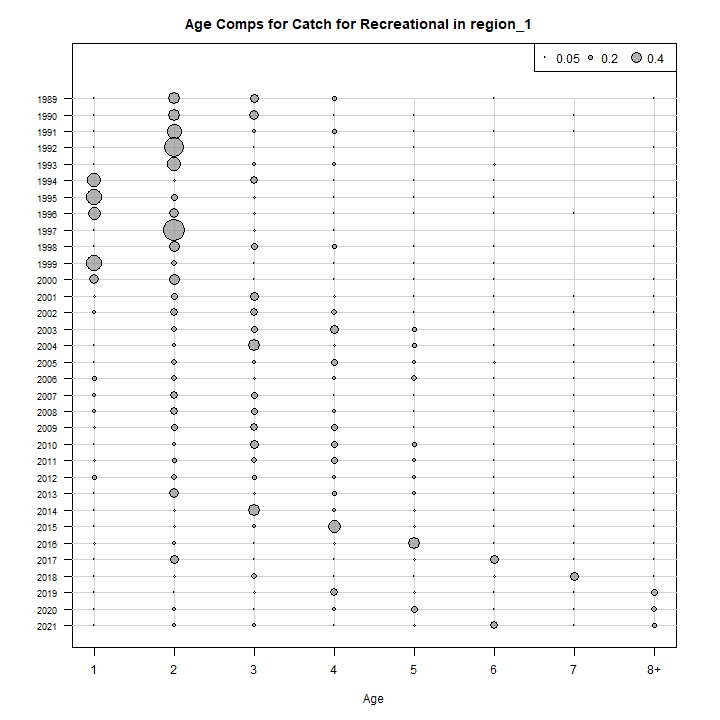
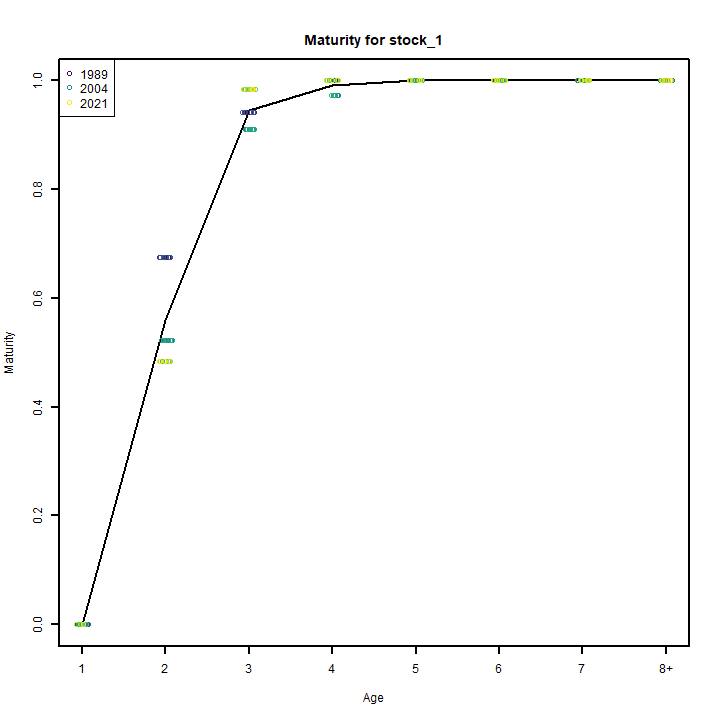
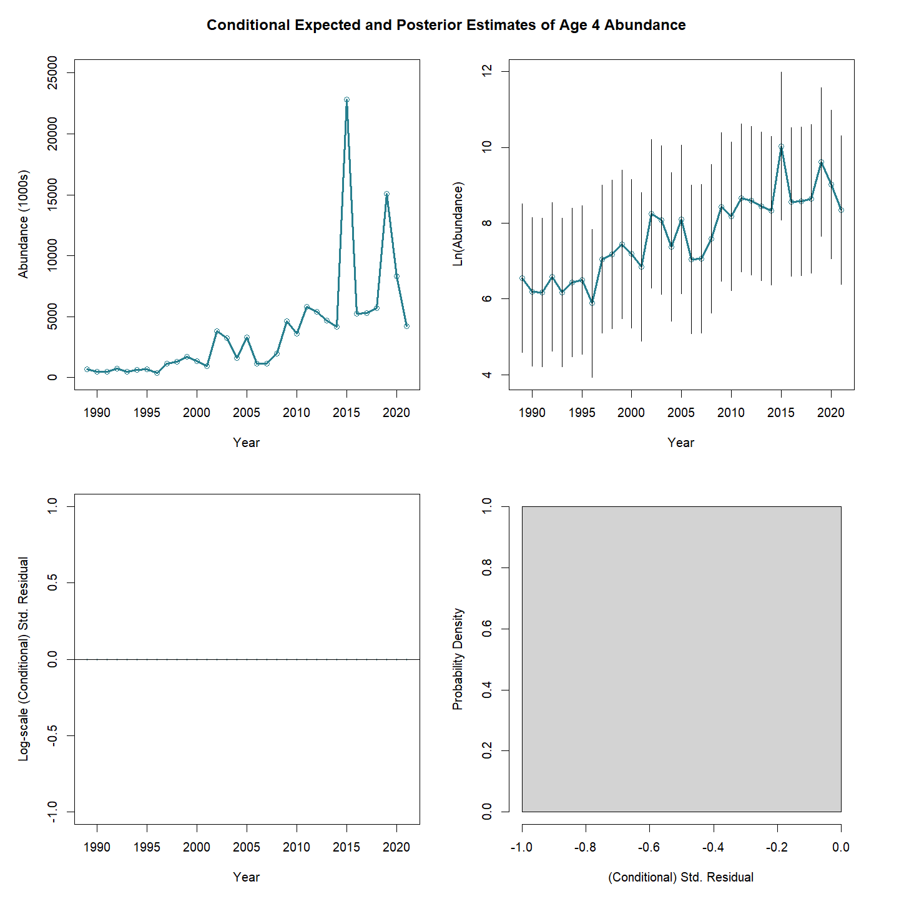
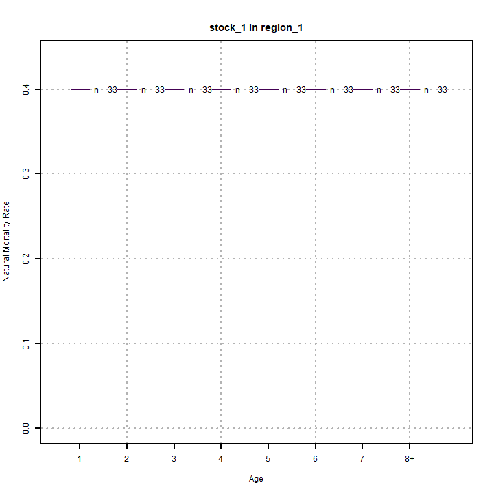
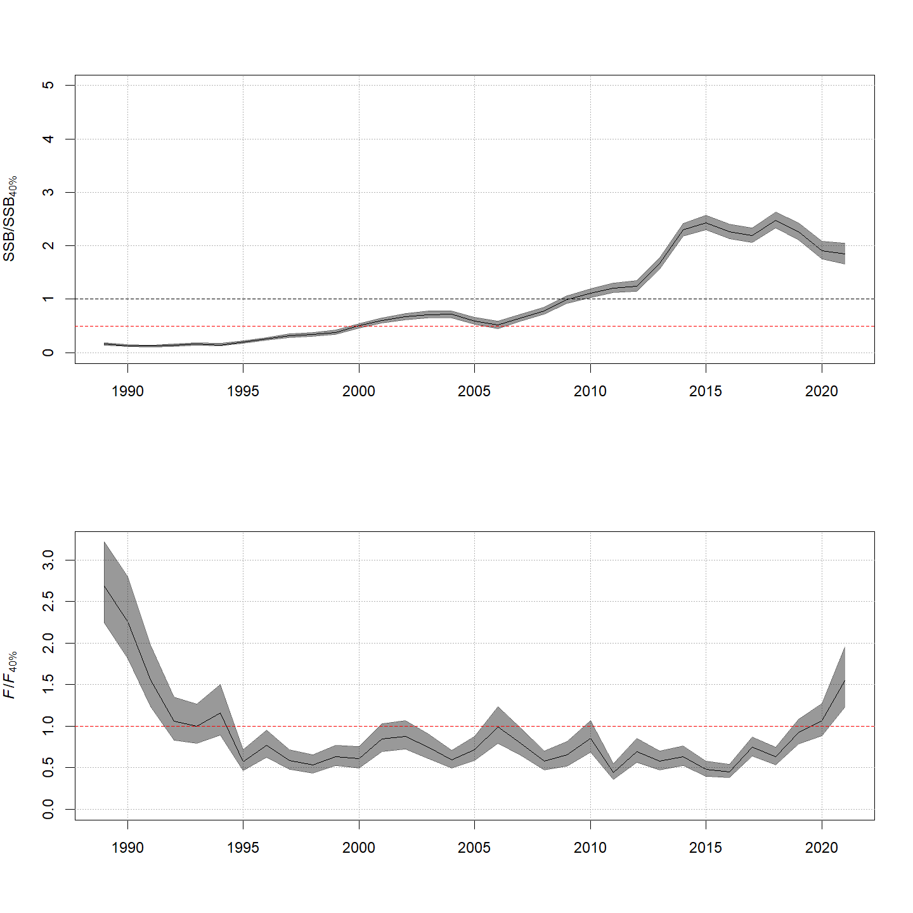

---
output:
  html_document:
    df_print: paged
    keep_md: yes
  word_document: default
  pdf_document:
    fig_caption: yes
    includes:
    keep_tex: yes
    number_sections: no
title: "WHAM figures and tables"
header-includes:
  - \usepackage{longtable}
  - \usepackage{booktabs}
  - \usepackage{caption,graphics}
  - \usepackage{makecell}
  - \usepackage{lscape}
  - \renewcommand\figurename{Fig.}
  - \captionsetup{labelsep=period, singlelinecheck=false}
  - \newcommand{\changesize}[1]{\fontsize{#1pt}{#1pt}\selectfont}
  - \renewcommand{\arraystretch}{1.5}
  - \renewcommand\theadfont{}
---

# {.tabset}

## Figures {.tabset}

### Input

### Diagnostics

### Results

### Retro

### Reference points

### Miscelaneous

## Tables {.tabset}

### Parameter estimates

<table class="table" style="margin-left: auto; margin-right: auto;">
<caption>Parameter estimates, standard errors, and confidence intervals. Rounded to 3 decimal places.</caption>
 <thead>
  <tr>
   <th style="text-align:left;">   </th>
   <th style="text-align:right;"> Estimate </th>
   <th style="text-align:right;"> Std. Error </th>
   <th style="text-align:right;"> 95\% CI lower </th>
   <th style="text-align:right;"> 95\% CI upper </th>
  </tr>
 </thead>
<tbody>
  <tr>
   <td style="text-align:left;"> REC CPA fully selected q </td>
   <td style="text-align:right;"> 0.000 </td>
   <td style="text-align:right;"> 0.000 </td>
   <td style="text-align:right;"> 0.000 </td>
   <td style="text-align:right;"> 0.000 </td>
  </tr>
  <tr>
   <td style="text-align:left;"> VAST Spring fully selected q </td>
   <td style="text-align:right;"> 0.009 </td>
   <td style="text-align:right;"> 0.001 </td>
   <td style="text-align:right;"> 0.007 </td>
   <td style="text-align:right;"> 0.010 </td>
  </tr>
  <tr>
   <td style="text-align:left;"> VAST Fall fully selected q </td>
   <td style="text-align:right;"> 0.013 </td>
   <td style="text-align:right;"> 0.001 </td>
   <td style="text-align:right;"> 0.012 </td>
   <td style="text-align:right;"> 0.014 </td>
  </tr>
  <tr>
   <td style="text-align:left;"> Block 1: $a_{50}$ </td>
   <td style="text-align:right;"> 1.707 </td>
   <td style="text-align:right;"> 0.088 </td>
   <td style="text-align:right;"> 1.541 </td>
   <td style="text-align:right;"> 1.885 </td>
  </tr>
  <tr>
   <td style="text-align:left;"> Block 1: 1/slope (increasing) </td>
   <td style="text-align:right;"> 0.278 </td>
   <td style="text-align:right;"> 0.029 </td>
   <td style="text-align:right;"> 0.226 </td>
   <td style="text-align:right;"> 0.341 </td>
  </tr>
  <tr>
   <td style="text-align:left;"> Block 2: $a_{50}$ </td>
   <td style="text-align:right;"> 2.632 </td>
   <td style="text-align:right;"> 0.102 </td>
   <td style="text-align:right;"> 2.437 </td>
   <td style="text-align:right;"> 2.836 </td>
  </tr>
  <tr>
   <td style="text-align:left;"> Block 2: 1/slope (increasing) </td>
   <td style="text-align:right;"> 0.445 </td>
   <td style="text-align:right;"> 0.034 </td>
   <td style="text-align:right;"> 0.383 </td>
   <td style="text-align:right;"> 0.517 </td>
  </tr>
  <tr>
   <td style="text-align:left;"> Block 3: $a_{50}$ </td>
   <td style="text-align:right;"> 1.658 </td>
   <td style="text-align:right;"> 0.134 </td>
   <td style="text-align:right;"> 1.410 </td>
   <td style="text-align:right;"> 1.936 </td>
  </tr>
  <tr>
   <td style="text-align:left;"> Block 3: 1/slope (increasing) </td>
   <td style="text-align:right;"> 0.523 </td>
   <td style="text-align:right;"> 0.077 </td>
   <td style="text-align:right;"> 0.391 </td>
   <td style="text-align:right;"> 0.696 </td>
  </tr>
  <tr>
   <td style="text-align:left;"> Block 4: $a_{50}$ </td>
   <td style="text-align:right;"> 4.729 </td>
   <td style="text-align:right;"> 0.385 </td>
   <td style="text-align:right;"> 3.956 </td>
   <td style="text-align:right;"> 5.450 </td>
  </tr>
  <tr>
   <td style="text-align:left;"> Block 4: 1/slope (increasing) </td>
   <td style="text-align:right;"> 1.063 </td>
   <td style="text-align:right;"> 0.088 </td>
   <td style="text-align:right;"> 0.902 </td>
   <td style="text-align:right;"> 1.247 </td>
  </tr>
  <tr>
   <td style="text-align:left;"> Block 5: Selectivity for age 1 </td>
   <td style="text-align:right;"> 0.584 </td>
   <td style="text-align:right;"> 0.202 </td>
   <td style="text-align:right;"> 0.216 </td>
   <td style="text-align:right;"> 0.877 </td>
  </tr>
  <tr>
   <td style="text-align:left;"> Block 5: Selectivity for age 2 </td>
   <td style="text-align:right;"> 0.602 </td>
   <td style="text-align:right;"> 0.208 </td>
   <td style="text-align:right;"> 0.217 </td>
   <td style="text-align:right;"> 0.892 </td>
  </tr>
  <tr>
   <td style="text-align:left;"> Block 5: Selectivity for age 3 </td>
   <td style="text-align:right;"> 0.778 </td>
   <td style="text-align:right;"> 0.269 </td>
   <td style="text-align:right;"> 0.142 </td>
   <td style="text-align:right;"> 0.987 </td>
  </tr>
  <tr>
   <td style="text-align:left;"> Block 5: Selectivity for age 4 </td>
   <td style="text-align:right;"> 0.763 </td>
   <td style="text-align:right;"> 0.266 </td>
   <td style="text-align:right;"> 0.153 </td>
   <td style="text-align:right;"> 0.983 </td>
  </tr>
  <tr>
   <td style="text-align:left;"> Block 5: Selectivity for age 5 </td>
   <td style="text-align:right;"> 0.563 </td>
   <td style="text-align:right;"> 0.199 </td>
   <td style="text-align:right;"> 0.208 </td>
   <td style="text-align:right;"> 0.863 </td>
  </tr>
  <tr>
   <td style="text-align:left;"> Block 5: Selectivity for age 6 </td>
   <td style="text-align:right;"> 0.827 </td>
   <td style="text-align:right;"> 0.303 </td>
   <td style="text-align:right;"> 0.070 </td>
   <td style="text-align:right;"> 0.997 </td>
  </tr>
  <tr>
   <td style="text-align:left;"> Block 5: Selectivity for age 7 </td>
   <td style="text-align:right;"> 0.656 </td>
   <td style="text-align:right;"> 0.280 </td>
   <td style="text-align:right;"> 0.144 </td>
   <td style="text-align:right;"> 0.956 </td>
  </tr>
  <tr>
   <td style="text-align:left;"> Block 5: Selectivity for age 8+ </td>
   <td style="text-align:right;"> 1.000 </td>
   <td style="text-align:right;"> -- </td>
   <td style="text-align:right;"> -- </td>
   <td style="text-align:right;"> -- </td>
  </tr>
  <tr>
   <td style="text-align:left;"> Block 6: Selectivity for age 1 </td>
   <td style="text-align:right;"> 0.152 </td>
   <td style="text-align:right;"> 0.014 </td>
   <td style="text-align:right;"> 0.126 </td>
   <td style="text-align:right;"> 0.182 </td>
  </tr>
  <tr>
   <td style="text-align:left;"> Block 6: Selectivity for age 2 </td>
   <td style="text-align:right;"> 0.456 </td>
   <td style="text-align:right;"> 0.038 </td>
   <td style="text-align:right;"> 0.383 </td>
   <td style="text-align:right;"> 0.531 </td>
  </tr>
  <tr>
   <td style="text-align:left;"> Block 6: Selectivity for age 3 </td>
   <td style="text-align:right;"> 0.959 </td>
   <td style="text-align:right;"> 0.076 </td>
   <td style="text-align:right;"> 0.343 </td>
   <td style="text-align:right;"> 0.999 </td>
  </tr>
  <tr>
   <td style="text-align:left;"> Block 6: Selectivity for age 4 </td>
   <td style="text-align:right;"> 1.000 </td>
   <td style="text-align:right;"> -- </td>
   <td style="text-align:right;"> -- </td>
   <td style="text-align:right;"> -- </td>
  </tr>
  <tr>
   <td style="text-align:left;"> Block 6: Selectivity for age 5 </td>
   <td style="text-align:right;"> 0.958 </td>
   <td style="text-align:right;"> 0.109 </td>
   <td style="text-align:right;"> 0.102 </td>
   <td style="text-align:right;"> 1.000 </td>
  </tr>
  <tr>
   <td style="text-align:left;"> Block 6: Selectivity for age 6 </td>
   <td style="text-align:right;"> 0.950 </td>
   <td style="text-align:right;"> 0.150 </td>
   <td style="text-align:right;"> 0.038 </td>
   <td style="text-align:right;"> 1.000 </td>
  </tr>
  <tr>
   <td style="text-align:left;"> Block 6: Selectivity for age 7 </td>
   <td style="text-align:right;"> 0.621 </td>
   <td style="text-align:right;"> 0.165 </td>
   <td style="text-align:right;"> 0.293 </td>
   <td style="text-align:right;"> 0.867 </td>
  </tr>
  <tr>
   <td style="text-align:left;"> Block 6: Selectivity for age 8+ </td>
   <td style="text-align:right;"> 0.760 </td>
   <td style="text-align:right;"> 0.222 </td>
   <td style="text-align:right;"> 0.225 </td>
   <td style="text-align:right;"> 0.972 </td>
  </tr>
  <tr>
   <td style="text-align:left;"> Block 7: Selectivity for age 1 </td>
   <td style="text-align:right;"> 1.000 </td>
   <td style="text-align:right;"> -- </td>
   <td style="text-align:right;"> -- </td>
   <td style="text-align:right;"> -- </td>
  </tr>
  <tr>
   <td style="text-align:left;"> Block 7: Selectivity for age 2 </td>
   <td style="text-align:right;"> 0.207 </td>
   <td style="text-align:right;"> 0.018 </td>
   <td style="text-align:right;"> 0.174 </td>
   <td style="text-align:right;"> 0.245 </td>
  </tr>
  <tr>
   <td style="text-align:left;"> Block 7: Selectivity for age 3 </td>
   <td style="text-align:right;"> 0.370 </td>
   <td style="text-align:right;"> 0.034 </td>
   <td style="text-align:right;"> 0.307 </td>
   <td style="text-align:right;"> 0.439 </td>
  </tr>
  <tr>
   <td style="text-align:left;"> Block 7: Selectivity for age 4 </td>
   <td style="text-align:right;"> 0.422 </td>
   <td style="text-align:right;"> 0.053 </td>
   <td style="text-align:right;"> 0.324 </td>
   <td style="text-align:right;"> 0.527 </td>
  </tr>
  <tr>
   <td style="text-align:left;"> Block 7: Selectivity for age 5 </td>
   <td style="text-align:right;"> 0.493 </td>
   <td style="text-align:right;"> 0.086 </td>
   <td style="text-align:right;"> 0.330 </td>
   <td style="text-align:right;"> 0.657 </td>
  </tr>
  <tr>
   <td style="text-align:left;"> Block 7: Selectivity for age 6 </td>
   <td style="text-align:right;"> 0.417 </td>
   <td style="text-align:right;"> 0.116 </td>
   <td style="text-align:right;"> 0.219 </td>
   <td style="text-align:right;"> 0.647 </td>
  </tr>
  <tr>
   <td style="text-align:left;"> Block 7: Selectivity for age 7 </td>
   <td style="text-align:right;"> 0.420 </td>
   <td style="text-align:right;"> 0.179 </td>
   <td style="text-align:right;"> 0.147 </td>
   <td style="text-align:right;"> 0.753 </td>
  </tr>
  <tr>
   <td style="text-align:left;"> Block 7: Selectivity for age 8+ </td>
   <td style="text-align:right;"> 0.575 </td>
   <td style="text-align:right;"> 0.244 </td>
   <td style="text-align:right;"> 0.161 </td>
   <td style="text-align:right;"> 0.906 </td>
  </tr>
</tbody>
</table>

### Abundance at age

<table class="table" style="margin-left: auto; margin-right: auto;">
<caption>Abundance at age (1000s) for stock 1 in region 1.</caption>
 <thead>
  <tr>
   <th style="text-align:left;">   </th>
   <th style="text-align:right;"> 1 </th>
   <th style="text-align:right;"> 2 </th>
   <th style="text-align:right;"> 3 </th>
   <th style="text-align:right;"> 4 </th>
   <th style="text-align:right;"> 5 </th>
   <th style="text-align:right;"> 6 </th>
   <th style="text-align:right;"> 7 </th>
   <th style="text-align:right;"> 8+ </th>
  </tr>
 </thead>
<tbody>
  <tr>
   <td style="text-align:left;"> 1989 </td>
   <td style="text-align:right;"> 6045 </td>
   <td style="text-align:right;"> 3160 </td>
   <td style="text-align:right;"> 1502 </td>
   <td style="text-align:right;"> 704 </td>
   <td style="text-align:right;"> 329 </td>
   <td style="text-align:right;"> 154 </td>
   <td style="text-align:right;"> 72 </td>
   <td style="text-align:right;"> 63 </td>
  </tr>
  <tr>
   <td style="text-align:left;"> 1990 </td>
   <td style="text-align:right;"> 2984 </td>
   <td style="text-align:right;"> 3567 </td>
   <td style="text-align:right;"> 1254 </td>
   <td style="text-align:right;"> 488 </td>
   <td style="text-align:right;"> 221 </td>
   <td style="text-align:right;"> 103 </td>
   <td style="text-align:right;"> 48 </td>
   <td style="text-align:right;"> 42 </td>
  </tr>
  <tr>
   <td style="text-align:left;"> 1991 </td>
   <td style="text-align:right;"> 3519 </td>
   <td style="text-align:right;"> 1849 </td>
   <td style="text-align:right;"> 1577 </td>
   <td style="text-align:right;"> 476 </td>
   <td style="text-align:right;"> 182 </td>
   <td style="text-align:right;"> 82 </td>
   <td style="text-align:right;"> 38 </td>
   <td style="text-align:right;"> 34 </td>
  </tr>
  <tr>
   <td style="text-align:left;"> 1992 </td>
   <td style="text-align:right;"> 3743 </td>
   <td style="text-align:right;"> 2239 </td>
   <td style="text-align:right;"> 937 </td>
   <td style="text-align:right;"> 721 </td>
   <td style="text-align:right;"> 215 </td>
   <td style="text-align:right;"> 82 </td>
   <td style="text-align:right;"> 37 </td>
   <td style="text-align:right;"> 32 </td>
  </tr>
  <tr>
   <td style="text-align:left;"> 1993 </td>
   <td style="text-align:right;"> 1858 </td>
   <td style="text-align:right;"> 2436 </td>
   <td style="text-align:right;"> 1222 </td>
   <td style="text-align:right;"> 476 </td>
   <td style="text-align:right;"> 364 </td>
   <td style="text-align:right;"> 109 </td>
   <td style="text-align:right;"> 42 </td>
   <td style="text-align:right;"> 35 </td>
  </tr>
  <tr>
   <td style="text-align:left;"> 1994 </td>
   <td style="text-align:right;"> 5815 </td>
   <td style="text-align:right;"> 1196 </td>
   <td style="text-align:right;"> 1338 </td>
   <td style="text-align:right;"> 624 </td>
   <td style="text-align:right;"> 241 </td>
   <td style="text-align:right;"> 184 </td>
   <td style="text-align:right;"> 55 </td>
   <td style="text-align:right;"> 39 </td>
  </tr>
  <tr>
   <td style="text-align:left;"> 1995 </td>
   <td style="text-align:right;"> 6235 </td>
   <td style="text-align:right;"> 3730 </td>
   <td style="text-align:right;"> 642 </td>
   <td style="text-align:right;"> 662 </td>
   <td style="text-align:right;"> 305 </td>
   <td style="text-align:right;"> 118 </td>
   <td style="text-align:right;"> 90 </td>
   <td style="text-align:right;"> 46 </td>
  </tr>
  <tr>
   <td style="text-align:left;"> 1996 </td>
   <td style="text-align:right;"> 7534 </td>
   <td style="text-align:right;"> 4095 </td>
   <td style="text-align:right;"> 2188 </td>
   <td style="text-align:right;"> 359 </td>
   <td style="text-align:right;"> 369 </td>
   <td style="text-align:right;"> 170 </td>
   <td style="text-align:right;"> 66 </td>
   <td style="text-align:right;"> 76 </td>
  </tr>
  <tr>
   <td style="text-align:left;"> 1997 </td>
   <td style="text-align:right;"> 5763 </td>
   <td style="text-align:right;"> 4930 </td>
   <td style="text-align:right;"> 2300 </td>
   <td style="text-align:right;"> 1156 </td>
   <td style="text-align:right;"> 189 </td>
   <td style="text-align:right;"> 194 </td>
   <td style="text-align:right;"> 89 </td>
   <td style="text-align:right;"> 74 </td>
  </tr>
  <tr>
   <td style="text-align:left;"> 1998 </td>
   <td style="text-align:right;"> 4100 </td>
   <td style="text-align:right;"> 3780 </td>
   <td style="text-align:right;"> 2922 </td>
   <td style="text-align:right;"> 1304 </td>
   <td style="text-align:right;"> 652 </td>
   <td style="text-align:right;"> 107 </td>
   <td style="text-align:right;"> 109 </td>
   <td style="text-align:right;"> 92 </td>
  </tr>
  <tr>
   <td style="text-align:left;"> 1999 </td>
   <td style="text-align:right;"> 17777 </td>
   <td style="text-align:right;"> 2717 </td>
   <td style="text-align:right;"> 2404 </td>
   <td style="text-align:right;"> 1699 </td>
   <td style="text-align:right;"> 726 </td>
   <td style="text-align:right;"> 361 </td>
   <td style="text-align:right;"> 59 </td>
   <td style="text-align:right;"> 111 </td>
  </tr>
  <tr>
   <td style="text-align:left;"> 2000 </td>
   <td style="text-align:right;"> 15866 </td>
   <td style="text-align:right;"> 11692 </td>
   <td style="text-align:right;"> 1682 </td>
   <td style="text-align:right;"> 1329 </td>
   <td style="text-align:right;"> 891 </td>
   <td style="text-align:right;"> 377 </td>
   <td style="text-align:right;"> 187 </td>
   <td style="text-align:right;"> 88 </td>
  </tr>
  <tr>
   <td style="text-align:left;"> 2001 </td>
   <td style="text-align:right;"> 7634 </td>
   <td style="text-align:right;"> 10369 </td>
   <td style="text-align:right;"> 7159 </td>
   <td style="text-align:right;"> 941 </td>
   <td style="text-align:right;"> 716 </td>
   <td style="text-align:right;"> 477 </td>
   <td style="text-align:right;"> 202 </td>
   <td style="text-align:right;"> 147 </td>
  </tr>
  <tr>
   <td style="text-align:left;"> 2002 </td>
   <td style="text-align:right;"> 15174 </td>
   <td style="text-align:right;"> 4968 </td>
   <td style="text-align:right;"> 6229 </td>
   <td style="text-align:right;"> 3811 </td>
   <td style="text-align:right;"> 475 </td>
   <td style="text-align:right;"> 358 </td>
   <td style="text-align:right;"> 238 </td>
   <td style="text-align:right;"> 175 </td>
  </tr>
  <tr>
   <td style="text-align:left;"> 2003 </td>
   <td style="text-align:right;"> 5102 </td>
   <td style="text-align:right;"> 9817 </td>
   <td style="text-align:right;"> 2937 </td>
   <td style="text-align:right;"> 3259 </td>
   <td style="text-align:right;"> 1893 </td>
   <td style="text-align:right;"> 234 </td>
   <td style="text-align:right;"> 176 </td>
   <td style="text-align:right;"> 203 </td>
  </tr>
  <tr>
   <td style="text-align:left;"> 2004 </td>
   <td style="text-align:right;"> 5389 </td>
   <td style="text-align:right;"> 3308 </td>
   <td style="text-align:right;"> 5872 </td>
   <td style="text-align:right;"> 1593 </td>
   <td style="text-align:right;"> 1699 </td>
   <td style="text-align:right;"> 981 </td>
   <td style="text-align:right;"> 121 </td>
   <td style="text-align:right;"> 196 </td>
  </tr>
  <tr>
   <td style="text-align:left;"> 2005 </td>
   <td style="text-align:right;"> 9542 </td>
   <td style="text-align:right;"> 3539 </td>
   <td style="text-align:right;"> 2044 </td>
   <td style="text-align:right;"> 3277 </td>
   <td style="text-align:right;"> 848 </td>
   <td style="text-align:right;"> 898 </td>
   <td style="text-align:right;"> 518 </td>
   <td style="text-align:right;"> 168 </td>
  </tr>
  <tr>
   <td style="text-align:left;"> 2006 </td>
   <td style="text-align:right;"> 20811 </td>
   <td style="text-align:right;"> 6223 </td>
   <td style="text-align:right;"> 2156 </td>
   <td style="text-align:right;"> 1139 </td>
   <td style="text-align:right;"> 1760 </td>
   <td style="text-align:right;"> 453 </td>
   <td style="text-align:right;"> 479 </td>
   <td style="text-align:right;"> 366 </td>
  </tr>
  <tr>
   <td style="text-align:left;"> 2007 </td>
   <td style="text-align:right;"> 15302 </td>
   <td style="text-align:right;"> 13515 </td>
   <td style="text-align:right;"> 3732 </td>
   <td style="text-align:right;"> 1163 </td>
   <td style="text-align:right;"> 588 </td>
   <td style="text-align:right;"> 902 </td>
   <td style="text-align:right;"> 232 </td>
   <td style="text-align:right;"> 433 </td>
  </tr>
  <tr>
   <td style="text-align:left;"> 2008 </td>
   <td style="text-align:right;"> 24603 </td>
   <td style="text-align:right;"> 9917 </td>
   <td style="text-align:right;"> 8041 </td>
   <td style="text-align:right;"> 1979 </td>
   <td style="text-align:right;"> 587 </td>
   <td style="text-align:right;"> 295 </td>
   <td style="text-align:right;"> 451 </td>
   <td style="text-align:right;"> 333 </td>
  </tr>
  <tr>
   <td style="text-align:left;"> 2009 </td>
   <td style="text-align:right;"> 21311 </td>
   <td style="text-align:right;"> 16065 </td>
   <td style="text-align:right;"> 6091 </td>
   <td style="text-align:right;"> 4608 </td>
   <td style="text-align:right;"> 1103 </td>
   <td style="text-align:right;"> 326 </td>
   <td style="text-align:right;"> 163 </td>
   <td style="text-align:right;"> 435 </td>
  </tr>
  <tr>
   <td style="text-align:left;"> 2010 </td>
   <td style="text-align:right;"> 18611 </td>
   <td style="text-align:right;"> 14031 </td>
   <td style="text-align:right;"> 10230 </td>
   <td style="text-align:right;"> 3579 </td>
   <td style="text-align:right;"> 2422 </td>
   <td style="text-align:right;"> 508 </td>
   <td style="text-align:right;"> 134 </td>
   <td style="text-align:right;"> 222 </td>
  </tr>
  <tr>
   <td style="text-align:left;"> 2011 </td>
   <td style="text-align:right;"> 16373 </td>
   <td style="text-align:right;"> 12186 </td>
   <td style="text-align:right;"> 8810 </td>
   <td style="text-align:right;"> 5812 </td>
   <td style="text-align:right;"> 1760 </td>
   <td style="text-align:right;"> 1000 </td>
   <td style="text-align:right;"> 180 </td>
   <td style="text-align:right;"> 111 </td>
  </tr>
  <tr>
   <td style="text-align:left;"> 2012 </td>
   <td style="text-align:right;"> 89404 </td>
   <td style="text-align:right;"> 10864 </td>
   <td style="text-align:right;"> 7905 </td>
   <td style="text-align:right;"> 5397 </td>
   <td style="text-align:right;"> 3332 </td>
   <td style="text-align:right;"> 940 </td>
   <td style="text-align:right;"> 502 </td>
   <td style="text-align:right;"> 140 </td>
  </tr>
  <tr>
   <td style="text-align:left;"> 2013 </td>
   <td style="text-align:right;"> 20037 </td>
   <td style="text-align:right;"> 58915 </td>
   <td style="text-align:right;"> 6928 </td>
   <td style="text-align:right;"> 4654 </td>
   <td style="text-align:right;"> 2854 </td>
   <td style="text-align:right;"> 1556 </td>
   <td style="text-align:right;"> 393 </td>
   <td style="text-align:right;"> 249 </td>
  </tr>
  <tr>
   <td style="text-align:left;"> 2014 </td>
   <td style="text-align:right;"> 20204 </td>
   <td style="text-align:right;"> 13260 </td>
   <td style="text-align:right;"> 37916 </td>
   <td style="text-align:right;"> 4157 </td>
   <td style="text-align:right;"> 2569 </td>
   <td style="text-align:right;"> 1440 </td>
   <td style="text-align:right;"> 725 </td>
   <td style="text-align:right;"> 283 </td>
  </tr>
  <tr>
   <td style="text-align:left;"> 2015 </td>
   <td style="text-align:right;"> 23088 </td>
   <td style="text-align:right;"> 13370 </td>
   <td style="text-align:right;"> 8539 </td>
   <td style="text-align:right;"> 22809 </td>
   <td style="text-align:right;"> 2302 </td>
   <td style="text-align:right;"> 1299 </td>
   <td style="text-align:right;"> 672 </td>
   <td style="text-align:right;"> 445 </td>
  </tr>
  <tr>
   <td style="text-align:left;"> 2016 </td>
   <td style="text-align:right;"> 60862 </td>
   <td style="text-align:right;"> 15317 </td>
   <td style="text-align:right;"> 8669 </td>
   <td style="text-align:right;"> 5225 </td>
   <td style="text-align:right;"> 13047 </td>
   <td style="text-align:right;"> 1225 </td>
   <td style="text-align:right;"> 650 </td>
   <td style="text-align:right;"> 534 </td>
  </tr>
  <tr>
   <td style="text-align:left;"> 2017 </td>
   <td style="text-align:right;"> 35294 </td>
   <td style="text-align:right;"> 40435 </td>
   <td style="text-align:right;"> 9938 </td>
   <td style="text-align:right;"> 5285 </td>
   <td style="text-align:right;"> 2995 </td>
   <td style="text-align:right;"> 7061 </td>
   <td style="text-align:right;"> 631 </td>
   <td style="text-align:right;"> 588 </td>
  </tr>
  <tr>
   <td style="text-align:left;"> 2018 </td>
   <td style="text-align:right;"> 18670 </td>
   <td style="text-align:right;"> 23367 </td>
   <td style="text-align:right;"> 25755 </td>
   <td style="text-align:right;"> 5700 </td>
   <td style="text-align:right;"> 2769 </td>
   <td style="text-align:right;"> 1459 </td>
   <td style="text-align:right;"> 3237 </td>
   <td style="text-align:right;"> 534 </td>
  </tr>
  <tr>
   <td style="text-align:left;"> 2019 </td>
   <td style="text-align:right;"> 47037 </td>
   <td style="text-align:right;"> 12377 </td>
   <td style="text-align:right;"> 14980 </td>
   <td style="text-align:right;"> 15080 </td>
   <td style="text-align:right;"> 3081 </td>
   <td style="text-align:right;"> 1401 </td>
   <td style="text-align:right;"> 698 </td>
   <td style="text-align:right;"> 1741 </td>
  </tr>
  <tr>
   <td style="text-align:left;"> 2020 </td>
   <td style="text-align:right;"> 44309 </td>
   <td style="text-align:right;"> 30966 </td>
   <td style="text-align:right;"> 7772 </td>
   <td style="text-align:right;"> 8306 </td>
   <td style="text-align:right;"> 7387 </td>
   <td style="text-align:right;"> 1343 </td>
   <td style="text-align:right;"> 552 </td>
   <td style="text-align:right;"> 886 </td>
  </tr>
  <tr>
   <td style="text-align:left;"> 2021 </td>
   <td style="text-align:right;"> 39621 </td>
   <td style="text-align:right;"> 29095 </td>
   <td style="text-align:right;"> 19301 </td>
   <td style="text-align:right;"> 4228 </td>
   <td style="text-align:right;"> 3929 </td>
   <td style="text-align:right;"> 3050 </td>
   <td style="text-align:right;"> 493 </td>
   <td style="text-align:right;"> 481 </td>
  </tr>
</tbody>
</table>

### Fishing mortality at age by region

<table class="table" style="margin-left: auto; margin-right: auto;">
<caption>Total fishing mortality at age in region 1.</caption>
 <thead>
  <tr>
   <th style="text-align:left;">   </th>
   <th style="text-align:right;"> 1 </th>
   <th style="text-align:right;"> 2 </th>
   <th style="text-align:right;"> 3 </th>
   <th style="text-align:right;"> 4 </th>
   <th style="text-align:right;"> 5 </th>
   <th style="text-align:right;"> 6 </th>
   <th style="text-align:right;"> 7 </th>
   <th style="text-align:right;"> 8+ </th>
  </tr>
 </thead>
<tbody>
  <tr>
   <td style="text-align:left;"> 1989 </td>
   <td style="text-align:right;"> 0.020 </td>
   <td style="text-align:right;"> 0.204 </td>
   <td style="text-align:right;"> 0.273 </td>
   <td style="text-align:right;"> 0.276 </td>
   <td style="text-align:right;"> 0.276 </td>
   <td style="text-align:right;"> 0.276 </td>
   <td style="text-align:right;"> 0.276 </td>
   <td style="text-align:right;"> 0.276 </td>
  </tr>
  <tr>
   <td style="text-align:left;"> 1990 </td>
   <td style="text-align:right;"> 0.025 </td>
   <td style="text-align:right;"> 0.258 </td>
   <td style="text-align:right;"> 0.344 </td>
   <td style="text-align:right;"> 0.347 </td>
   <td style="text-align:right;"> 0.347 </td>
   <td style="text-align:right;"> 0.347 </td>
   <td style="text-align:right;"> 0.347 </td>
   <td style="text-align:right;"> 0.347 </td>
  </tr>
  <tr>
   <td style="text-align:left;"> 1991 </td>
   <td style="text-align:right;"> 0.017 </td>
   <td style="text-align:right;"> 0.177 </td>
   <td style="text-align:right;"> 0.236 </td>
   <td style="text-align:right;"> 0.238 </td>
   <td style="text-align:right;"> 0.238 </td>
   <td style="text-align:right;"> 0.238 </td>
   <td style="text-align:right;"> 0.238 </td>
   <td style="text-align:right;"> 0.238 </td>
  </tr>
  <tr>
   <td style="text-align:left;"> 1992 </td>
   <td style="text-align:right;"> 0.016 </td>
   <td style="text-align:right;"> 0.166 </td>
   <td style="text-align:right;"> 0.222 </td>
   <td style="text-align:right;"> 0.224 </td>
   <td style="text-align:right;"> 0.224 </td>
   <td style="text-align:right;"> 0.224 </td>
   <td style="text-align:right;"> 0.224 </td>
   <td style="text-align:right;"> 0.224 </td>
  </tr>
  <tr>
   <td style="text-align:left;"> 1993 </td>
   <td style="text-align:right;"> 0.011 </td>
   <td style="text-align:right;"> 0.113 </td>
   <td style="text-align:right;"> 0.151 </td>
   <td style="text-align:right;"> 0.153 </td>
   <td style="text-align:right;"> 0.153 </td>
   <td style="text-align:right;"> 0.153 </td>
   <td style="text-align:right;"> 0.153 </td>
   <td style="text-align:right;"> 0.153 </td>
  </tr>
  <tr>
   <td style="text-align:left;"> 1994 </td>
   <td style="text-align:right;"> 0.013 </td>
   <td style="text-align:right;"> 0.129 </td>
   <td style="text-align:right;"> 0.173 </td>
   <td style="text-align:right;"> 0.174 </td>
   <td style="text-align:right;"> 0.174 </td>
   <td style="text-align:right;"> 0.174 </td>
   <td style="text-align:right;"> 0.174 </td>
   <td style="text-align:right;"> 0.174 </td>
  </tr>
  <tr>
   <td style="text-align:left;"> 1995 </td>
   <td style="text-align:right;"> 0.010 </td>
   <td style="text-align:right;"> 0.102 </td>
   <td style="text-align:right;"> 0.136 </td>
   <td style="text-align:right;"> 0.138 </td>
   <td style="text-align:right;"> 0.138 </td>
   <td style="text-align:right;"> 0.138 </td>
   <td style="text-align:right;"> 0.138 </td>
   <td style="text-align:right;"> 0.138 </td>
  </tr>
  <tr>
   <td style="text-align:left;"> 1996 </td>
   <td style="text-align:right;"> 0.014 </td>
   <td style="text-align:right;"> 0.148 </td>
   <td style="text-align:right;"> 0.197 </td>
   <td style="text-align:right;"> 0.199 </td>
   <td style="text-align:right;"> 0.199 </td>
   <td style="text-align:right;"> 0.199 </td>
   <td style="text-align:right;"> 0.199 </td>
   <td style="text-align:right;"> 0.199 </td>
  </tr>
  <tr>
   <td style="text-align:left;"> 1997 </td>
   <td style="text-align:right;"> 0.008 </td>
   <td style="text-align:right;"> 0.082 </td>
   <td style="text-align:right;"> 0.110 </td>
   <td style="text-align:right;"> 0.111 </td>
   <td style="text-align:right;"> 0.111 </td>
   <td style="text-align:right;"> 0.111 </td>
   <td style="text-align:right;"> 0.111 </td>
   <td style="text-align:right;"> 0.111 </td>
  </tr>
  <tr>
   <td style="text-align:left;"> 1998 </td>
   <td style="text-align:right;"> 0.004 </td>
   <td style="text-align:right;"> 0.031 </td>
   <td style="text-align:right;"> 0.112 </td>
   <td style="text-align:right;"> 0.154 </td>
   <td style="text-align:right;"> 0.160 </td>
   <td style="text-align:right;"> 0.161 </td>
   <td style="text-align:right;"> 0.161 </td>
   <td style="text-align:right;"> 0.161 </td>
  </tr>
  <tr>
   <td style="text-align:left;"> 1999 </td>
   <td style="text-align:right;"> 0.005 </td>
   <td style="text-align:right;"> 0.037 </td>
   <td style="text-align:right;"> 0.133 </td>
   <td style="text-align:right;"> 0.182 </td>
   <td style="text-align:right;"> 0.190 </td>
   <td style="text-align:right;"> 0.191 </td>
   <td style="text-align:right;"> 0.191 </td>
   <td style="text-align:right;"> 0.191 </td>
  </tr>
  <tr>
   <td style="text-align:left;"> 2000 </td>
   <td style="text-align:right;"> 0.003 </td>
   <td style="text-align:right;"> 0.024 </td>
   <td style="text-align:right;"> 0.087 </td>
   <td style="text-align:right;"> 0.120 </td>
   <td style="text-align:right;"> 0.125 </td>
   <td style="text-align:right;"> 0.125 </td>
   <td style="text-align:right;"> 0.125 </td>
   <td style="text-align:right;"> 0.125 </td>
  </tr>
  <tr>
   <td style="text-align:left;"> 2001 </td>
   <td style="text-align:right;"> 0.005 </td>
   <td style="text-align:right;"> 0.035 </td>
   <td style="text-align:right;"> 0.126 </td>
   <td style="text-align:right;"> 0.173 </td>
   <td style="text-align:right;"> 0.180 </td>
   <td style="text-align:right;"> 0.180 </td>
   <td style="text-align:right;"> 0.181 </td>
   <td style="text-align:right;"> 0.181 </td>
  </tr>
  <tr>
   <td style="text-align:left;"> 2002 </td>
   <td style="text-align:right;"> 0.004 </td>
   <td style="text-align:right;"> 0.033 </td>
   <td style="text-align:right;"> 0.116 </td>
   <td style="text-align:right;"> 0.160 </td>
   <td style="text-align:right;"> 0.167 </td>
   <td style="text-align:right;"> 0.167 </td>
   <td style="text-align:right;"> 0.167 </td>
   <td style="text-align:right;"> 0.167 </td>
  </tr>
  <tr>
   <td style="text-align:left;"> 2003 </td>
   <td style="text-align:right;"> 0.003 </td>
   <td style="text-align:right;"> 0.024 </td>
   <td style="text-align:right;"> 0.084 </td>
   <td style="text-align:right;"> 0.116 </td>
   <td style="text-align:right;"> 0.121 </td>
   <td style="text-align:right;"> 0.121 </td>
   <td style="text-align:right;"> 0.121 </td>
   <td style="text-align:right;"> 0.121 </td>
  </tr>
  <tr>
   <td style="text-align:left;"> 2004 </td>
   <td style="text-align:right;"> 0.004 </td>
   <td style="text-align:right;"> 0.032 </td>
   <td style="text-align:right;"> 0.113 </td>
   <td style="text-align:right;"> 0.156 </td>
   <td style="text-align:right;"> 0.162 </td>
   <td style="text-align:right;"> 0.163 </td>
   <td style="text-align:right;"> 0.163 </td>
   <td style="text-align:right;"> 0.163 </td>
  </tr>
  <tr>
   <td style="text-align:left;"> 2005 </td>
   <td style="text-align:right;"> 0.003 </td>
   <td style="text-align:right;"> 0.023 </td>
   <td style="text-align:right;"> 0.082 </td>
   <td style="text-align:right;"> 0.113 </td>
   <td style="text-align:right;"> 0.117 </td>
   <td style="text-align:right;"> 0.118 </td>
   <td style="text-align:right;"> 0.118 </td>
   <td style="text-align:right;"> 0.118 </td>
  </tr>
  <tr>
   <td style="text-align:left;"> 2006 </td>
   <td style="text-align:right;"> 0.004 </td>
   <td style="text-align:right;"> 0.028 </td>
   <td style="text-align:right;"> 0.099 </td>
   <td style="text-align:right;"> 0.136 </td>
   <td style="text-align:right;"> 0.142 </td>
   <td style="text-align:right;"> 0.143 </td>
   <td style="text-align:right;"> 0.143 </td>
   <td style="text-align:right;"> 0.143 </td>
  </tr>
  <tr>
   <td style="text-align:left;"> 2007 </td>
   <td style="text-align:right;"> 0.004 </td>
   <td style="text-align:right;"> 0.031 </td>
   <td style="text-align:right;"> 0.109 </td>
   <td style="text-align:right;"> 0.150 </td>
   <td style="text-align:right;"> 0.157 </td>
   <td style="text-align:right;"> 0.157 </td>
   <td style="text-align:right;"> 0.157 </td>
   <td style="text-align:right;"> 0.157 </td>
  </tr>
  <tr>
   <td style="text-align:left;"> 2008 </td>
   <td style="text-align:right;"> 0.002 </td>
   <td style="text-align:right;"> 0.015 </td>
   <td style="text-align:right;"> 0.055 </td>
   <td style="text-align:right;"> 0.076 </td>
   <td style="text-align:right;"> 0.079 </td>
   <td style="text-align:right;"> 0.079 </td>
   <td style="text-align:right;"> 0.079 </td>
   <td style="text-align:right;"> 0.079 </td>
  </tr>
  <tr>
   <td style="text-align:left;"> 2009 </td>
   <td style="text-align:right;"> 0.001 </td>
   <td style="text-align:right;"> 0.011 </td>
   <td style="text-align:right;"> 0.038 </td>
   <td style="text-align:right;"> 0.052 </td>
   <td style="text-align:right;"> 0.054 </td>
   <td style="text-align:right;"> 0.055 </td>
   <td style="text-align:right;"> 0.055 </td>
   <td style="text-align:right;"> 0.055 </td>
  </tr>
  <tr>
   <td style="text-align:left;"> 2010 </td>
   <td style="text-align:right;"> 0.001 </td>
   <td style="text-align:right;"> 0.012 </td>
   <td style="text-align:right;"> 0.041 </td>
   <td style="text-align:right;"> 0.057 </td>
   <td style="text-align:right;"> 0.059 </td>
   <td style="text-align:right;"> 0.059 </td>
   <td style="text-align:right;"> 0.059 </td>
   <td style="text-align:right;"> 0.059 </td>
  </tr>
  <tr>
   <td style="text-align:left;"> 2011 </td>
   <td style="text-align:right;"> 0.001 </td>
   <td style="text-align:right;"> 0.011 </td>
   <td style="text-align:right;"> 0.041 </td>
   <td style="text-align:right;"> 0.056 </td>
   <td style="text-align:right;"> 0.059 </td>
   <td style="text-align:right;"> 0.059 </td>
   <td style="text-align:right;"> 0.059 </td>
   <td style="text-align:right;"> 0.059 </td>
  </tr>
  <tr>
   <td style="text-align:left;"> 2012 </td>
   <td style="text-align:right;"> 0.002 </td>
   <td style="text-align:right;"> 0.012 </td>
   <td style="text-align:right;"> 0.042 </td>
   <td style="text-align:right;"> 0.058 </td>
   <td style="text-align:right;"> 0.060 </td>
   <td style="text-align:right;"> 0.060 </td>
   <td style="text-align:right;"> 0.060 </td>
   <td style="text-align:right;"> 0.060 </td>
  </tr>
  <tr>
   <td style="text-align:left;"> 2013 </td>
   <td style="text-align:right;"> 0.002 </td>
   <td style="text-align:right;"> 0.013 </td>
   <td style="text-align:right;"> 0.048 </td>
   <td style="text-align:right;"> 0.066 </td>
   <td style="text-align:right;"> 0.069 </td>
   <td style="text-align:right;"> 0.069 </td>
   <td style="text-align:right;"> 0.069 </td>
   <td style="text-align:right;"> 0.069 </td>
  </tr>
  <tr>
   <td style="text-align:left;"> 2014 </td>
   <td style="text-align:right;"> 0.002 </td>
   <td style="text-align:right;"> 0.012 </td>
   <td style="text-align:right;"> 0.045 </td>
   <td style="text-align:right;"> 0.061 </td>
   <td style="text-align:right;"> 0.064 </td>
   <td style="text-align:right;"> 0.064 </td>
   <td style="text-align:right;"> 0.064 </td>
   <td style="text-align:right;"> 0.064 </td>
  </tr>
  <tr>
   <td style="text-align:left;"> 2015 </td>
   <td style="text-align:right;"> 0.001 </td>
   <td style="text-align:right;"> 0.012 </td>
   <td style="text-align:right;"> 0.041 </td>
   <td style="text-align:right;"> 0.057 </td>
   <td style="text-align:right;"> 0.059 </td>
   <td style="text-align:right;"> 0.059 </td>
   <td style="text-align:right;"> 0.059 </td>
   <td style="text-align:right;"> 0.059 </td>
  </tr>
  <tr>
   <td style="text-align:left;"> 2016 </td>
   <td style="text-align:right;"> 0.002 </td>
   <td style="text-align:right;"> 0.016 </td>
   <td style="text-align:right;"> 0.056 </td>
   <td style="text-align:right;"> 0.077 </td>
   <td style="text-align:right;"> 0.080 </td>
   <td style="text-align:right;"> 0.080 </td>
   <td style="text-align:right;"> 0.080 </td>
   <td style="text-align:right;"> 0.080 </td>
  </tr>
  <tr>
   <td style="text-align:left;"> 2017 </td>
   <td style="text-align:right;"> 0.004 </td>
   <td style="text-align:right;"> 0.030 </td>
   <td style="text-align:right;"> 0.108 </td>
   <td style="text-align:right;"> 0.148 </td>
   <td style="text-align:right;"> 0.154 </td>
   <td style="text-align:right;"> 0.155 </td>
   <td style="text-align:right;"> 0.155 </td>
   <td style="text-align:right;"> 0.155 </td>
  </tr>
  <tr>
   <td style="text-align:left;"> 2018 </td>
   <td style="text-align:right;"> 0.003 </td>
   <td style="text-align:right;"> 0.026 </td>
   <td style="text-align:right;"> 0.091 </td>
   <td style="text-align:right;"> 0.126 </td>
   <td style="text-align:right;"> 0.131 </td>
   <td style="text-align:right;"> 0.131 </td>
   <td style="text-align:right;"> 0.131 </td>
   <td style="text-align:right;"> 0.131 </td>
  </tr>
  <tr>
   <td style="text-align:left;"> 2019 </td>
   <td style="text-align:right;"> 0.004 </td>
   <td style="text-align:right;"> 0.031 </td>
   <td style="text-align:right;"> 0.110 </td>
   <td style="text-align:right;"> 0.151 </td>
   <td style="text-align:right;"> 0.157 </td>
   <td style="text-align:right;"> 0.158 </td>
   <td style="text-align:right;"> 0.158 </td>
   <td style="text-align:right;"> 0.158 </td>
  </tr>
  <tr>
   <td style="text-align:left;"> 2020 </td>
   <td style="text-align:right;"> 0.004 </td>
   <td style="text-align:right;"> 0.032 </td>
   <td style="text-align:right;"> 0.116 </td>
   <td style="text-align:right;"> 0.159 </td>
   <td style="text-align:right;"> 0.165 </td>
   <td style="text-align:right;"> 0.166 </td>
   <td style="text-align:right;"> 0.166 </td>
   <td style="text-align:right;"> 0.166 </td>
  </tr>
  <tr>
   <td style="text-align:left;"> 2021 </td>
   <td style="text-align:right;"> 0.005 </td>
   <td style="text-align:right;"> 0.040 </td>
   <td style="text-align:right;"> 0.142 </td>
   <td style="text-align:right;"> 0.195 </td>
   <td style="text-align:right;"> 0.203 </td>
   <td style="text-align:right;"> 0.204 </td>
   <td style="text-align:right;"> 0.204 </td>
   <td style="text-align:right;"> 0.204 </td>
  </tr>
</tbody>
</table>

### Fishing mortality at age by fleet

<table class="table" style="margin-left: auto; margin-right: auto;">
<caption>Total fishing mortality at age in Commercial.</caption>
 <thead>
  <tr>
   <th style="text-align:left;">   </th>
   <th style="text-align:right;"> 1 </th>
   <th style="text-align:right;"> 2 </th>
   <th style="text-align:right;"> 3 </th>
   <th style="text-align:right;"> 4 </th>
   <th style="text-align:right;"> 5 </th>
   <th style="text-align:right;"> 6 </th>
   <th style="text-align:right;"> 7 </th>
   <th style="text-align:right;"> 8+ </th>
  </tr>
 </thead>
<tbody>
  <tr>
   <td style="text-align:left;"> 1989 </td>
   <td style="text-align:right;"> 0.020 </td>
   <td style="text-align:right;"> 0.204 </td>
   <td style="text-align:right;"> 0.273 </td>
   <td style="text-align:right;"> 0.276 </td>
   <td style="text-align:right;"> 0.276 </td>
   <td style="text-align:right;"> 0.276 </td>
   <td style="text-align:right;"> 0.276 </td>
   <td style="text-align:right;"> 0.276 </td>
  </tr>
  <tr>
   <td style="text-align:left;"> 1990 </td>
   <td style="text-align:right;"> 0.025 </td>
   <td style="text-align:right;"> 0.258 </td>
   <td style="text-align:right;"> 0.344 </td>
   <td style="text-align:right;"> 0.347 </td>
   <td style="text-align:right;"> 0.347 </td>
   <td style="text-align:right;"> 0.347 </td>
   <td style="text-align:right;"> 0.347 </td>
   <td style="text-align:right;"> 0.347 </td>
  </tr>
  <tr>
   <td style="text-align:left;"> 1991 </td>
   <td style="text-align:right;"> 0.017 </td>
   <td style="text-align:right;"> 0.177 </td>
   <td style="text-align:right;"> 0.236 </td>
   <td style="text-align:right;"> 0.238 </td>
   <td style="text-align:right;"> 0.238 </td>
   <td style="text-align:right;"> 0.238 </td>
   <td style="text-align:right;"> 0.238 </td>
   <td style="text-align:right;"> 0.238 </td>
  </tr>
  <tr>
   <td style="text-align:left;"> 1992 </td>
   <td style="text-align:right;"> 0.016 </td>
   <td style="text-align:right;"> 0.166 </td>
   <td style="text-align:right;"> 0.222 </td>
   <td style="text-align:right;"> 0.224 </td>
   <td style="text-align:right;"> 0.224 </td>
   <td style="text-align:right;"> 0.224 </td>
   <td style="text-align:right;"> 0.224 </td>
   <td style="text-align:right;"> 0.224 </td>
  </tr>
  <tr>
   <td style="text-align:left;"> 1993 </td>
   <td style="text-align:right;"> 0.011 </td>
   <td style="text-align:right;"> 0.113 </td>
   <td style="text-align:right;"> 0.151 </td>
   <td style="text-align:right;"> 0.153 </td>
   <td style="text-align:right;"> 0.153 </td>
   <td style="text-align:right;"> 0.153 </td>
   <td style="text-align:right;"> 0.153 </td>
   <td style="text-align:right;"> 0.153 </td>
  </tr>
  <tr>
   <td style="text-align:left;"> 1994 </td>
   <td style="text-align:right;"> 0.013 </td>
   <td style="text-align:right;"> 0.129 </td>
   <td style="text-align:right;"> 0.173 </td>
   <td style="text-align:right;"> 0.174 </td>
   <td style="text-align:right;"> 0.174 </td>
   <td style="text-align:right;"> 0.174 </td>
   <td style="text-align:right;"> 0.174 </td>
   <td style="text-align:right;"> 0.174 </td>
  </tr>
  <tr>
   <td style="text-align:left;"> 1995 </td>
   <td style="text-align:right;"> 0.010 </td>
   <td style="text-align:right;"> 0.102 </td>
   <td style="text-align:right;"> 0.136 </td>
   <td style="text-align:right;"> 0.138 </td>
   <td style="text-align:right;"> 0.138 </td>
   <td style="text-align:right;"> 0.138 </td>
   <td style="text-align:right;"> 0.138 </td>
   <td style="text-align:right;"> 0.138 </td>
  </tr>
  <tr>
   <td style="text-align:left;"> 1996 </td>
   <td style="text-align:right;"> 0.014 </td>
   <td style="text-align:right;"> 0.148 </td>
   <td style="text-align:right;"> 0.197 </td>
   <td style="text-align:right;"> 0.199 </td>
   <td style="text-align:right;"> 0.199 </td>
   <td style="text-align:right;"> 0.199 </td>
   <td style="text-align:right;"> 0.199 </td>
   <td style="text-align:right;"> 0.199 </td>
  </tr>
  <tr>
   <td style="text-align:left;"> 1997 </td>
   <td style="text-align:right;"> 0.008 </td>
   <td style="text-align:right;"> 0.082 </td>
   <td style="text-align:right;"> 0.110 </td>
   <td style="text-align:right;"> 0.111 </td>
   <td style="text-align:right;"> 0.111 </td>
   <td style="text-align:right;"> 0.111 </td>
   <td style="text-align:right;"> 0.111 </td>
   <td style="text-align:right;"> 0.111 </td>
  </tr>
  <tr>
   <td style="text-align:left;"> 1998 </td>
   <td style="text-align:right;"> 0.004 </td>
   <td style="text-align:right;"> 0.031 </td>
   <td style="text-align:right;"> 0.112 </td>
   <td style="text-align:right;"> 0.154 </td>
   <td style="text-align:right;"> 0.160 </td>
   <td style="text-align:right;"> 0.161 </td>
   <td style="text-align:right;"> 0.161 </td>
   <td style="text-align:right;"> 0.161 </td>
  </tr>
  <tr>
   <td style="text-align:left;"> 1999 </td>
   <td style="text-align:right;"> 0.005 </td>
   <td style="text-align:right;"> 0.037 </td>
   <td style="text-align:right;"> 0.133 </td>
   <td style="text-align:right;"> 0.182 </td>
   <td style="text-align:right;"> 0.190 </td>
   <td style="text-align:right;"> 0.191 </td>
   <td style="text-align:right;"> 0.191 </td>
   <td style="text-align:right;"> 0.191 </td>
  </tr>
  <tr>
   <td style="text-align:left;"> 2000 </td>
   <td style="text-align:right;"> 0.003 </td>
   <td style="text-align:right;"> 0.024 </td>
   <td style="text-align:right;"> 0.087 </td>
   <td style="text-align:right;"> 0.120 </td>
   <td style="text-align:right;"> 0.125 </td>
   <td style="text-align:right;"> 0.125 </td>
   <td style="text-align:right;"> 0.125 </td>
   <td style="text-align:right;"> 0.125 </td>
  </tr>
  <tr>
   <td style="text-align:left;"> 2001 </td>
   <td style="text-align:right;"> 0.005 </td>
   <td style="text-align:right;"> 0.035 </td>
   <td style="text-align:right;"> 0.126 </td>
   <td style="text-align:right;"> 0.173 </td>
   <td style="text-align:right;"> 0.180 </td>
   <td style="text-align:right;"> 0.180 </td>
   <td style="text-align:right;"> 0.181 </td>
   <td style="text-align:right;"> 0.181 </td>
  </tr>
  <tr>
   <td style="text-align:left;"> 2002 </td>
   <td style="text-align:right;"> 0.004 </td>
   <td style="text-align:right;"> 0.033 </td>
   <td style="text-align:right;"> 0.116 </td>
   <td style="text-align:right;"> 0.160 </td>
   <td style="text-align:right;"> 0.167 </td>
   <td style="text-align:right;"> 0.167 </td>
   <td style="text-align:right;"> 0.167 </td>
   <td style="text-align:right;"> 0.167 </td>
  </tr>
  <tr>
   <td style="text-align:left;"> 2003 </td>
   <td style="text-align:right;"> 0.003 </td>
   <td style="text-align:right;"> 0.024 </td>
   <td style="text-align:right;"> 0.084 </td>
   <td style="text-align:right;"> 0.116 </td>
   <td style="text-align:right;"> 0.121 </td>
   <td style="text-align:right;"> 0.121 </td>
   <td style="text-align:right;"> 0.121 </td>
   <td style="text-align:right;"> 0.121 </td>
  </tr>
  <tr>
   <td style="text-align:left;"> 2004 </td>
   <td style="text-align:right;"> 0.004 </td>
   <td style="text-align:right;"> 0.032 </td>
   <td style="text-align:right;"> 0.113 </td>
   <td style="text-align:right;"> 0.156 </td>
   <td style="text-align:right;"> 0.162 </td>
   <td style="text-align:right;"> 0.163 </td>
   <td style="text-align:right;"> 0.163 </td>
   <td style="text-align:right;"> 0.163 </td>
  </tr>
  <tr>
   <td style="text-align:left;"> 2005 </td>
   <td style="text-align:right;"> 0.003 </td>
   <td style="text-align:right;"> 0.023 </td>
   <td style="text-align:right;"> 0.082 </td>
   <td style="text-align:right;"> 0.113 </td>
   <td style="text-align:right;"> 0.117 </td>
   <td style="text-align:right;"> 0.118 </td>
   <td style="text-align:right;"> 0.118 </td>
   <td style="text-align:right;"> 0.118 </td>
  </tr>
  <tr>
   <td style="text-align:left;"> 2006 </td>
   <td style="text-align:right;"> 0.004 </td>
   <td style="text-align:right;"> 0.028 </td>
   <td style="text-align:right;"> 0.099 </td>
   <td style="text-align:right;"> 0.136 </td>
   <td style="text-align:right;"> 0.142 </td>
   <td style="text-align:right;"> 0.143 </td>
   <td style="text-align:right;"> 0.143 </td>
   <td style="text-align:right;"> 0.143 </td>
  </tr>
  <tr>
   <td style="text-align:left;"> 2007 </td>
   <td style="text-align:right;"> 0.004 </td>
   <td style="text-align:right;"> 0.031 </td>
   <td style="text-align:right;"> 0.109 </td>
   <td style="text-align:right;"> 0.150 </td>
   <td style="text-align:right;"> 0.157 </td>
   <td style="text-align:right;"> 0.157 </td>
   <td style="text-align:right;"> 0.157 </td>
   <td style="text-align:right;"> 0.157 </td>
  </tr>
  <tr>
   <td style="text-align:left;"> 2008 </td>
   <td style="text-align:right;"> 0.002 </td>
   <td style="text-align:right;"> 0.015 </td>
   <td style="text-align:right;"> 0.055 </td>
   <td style="text-align:right;"> 0.076 </td>
   <td style="text-align:right;"> 0.079 </td>
   <td style="text-align:right;"> 0.079 </td>
   <td style="text-align:right;"> 0.079 </td>
   <td style="text-align:right;"> 0.079 </td>
  </tr>
  <tr>
   <td style="text-align:left;"> 2009 </td>
   <td style="text-align:right;"> 0.001 </td>
   <td style="text-align:right;"> 0.011 </td>
   <td style="text-align:right;"> 0.038 </td>
   <td style="text-align:right;"> 0.052 </td>
   <td style="text-align:right;"> 0.054 </td>
   <td style="text-align:right;"> 0.055 </td>
   <td style="text-align:right;"> 0.055 </td>
   <td style="text-align:right;"> 0.055 </td>
  </tr>
  <tr>
   <td style="text-align:left;"> 2010 </td>
   <td style="text-align:right;"> 0.001 </td>
   <td style="text-align:right;"> 0.012 </td>
   <td style="text-align:right;"> 0.041 </td>
   <td style="text-align:right;"> 0.057 </td>
   <td style="text-align:right;"> 0.059 </td>
   <td style="text-align:right;"> 0.059 </td>
   <td style="text-align:right;"> 0.059 </td>
   <td style="text-align:right;"> 0.059 </td>
  </tr>
  <tr>
   <td style="text-align:left;"> 2011 </td>
   <td style="text-align:right;"> 0.001 </td>
   <td style="text-align:right;"> 0.011 </td>
   <td style="text-align:right;"> 0.041 </td>
   <td style="text-align:right;"> 0.056 </td>
   <td style="text-align:right;"> 0.059 </td>
   <td style="text-align:right;"> 0.059 </td>
   <td style="text-align:right;"> 0.059 </td>
   <td style="text-align:right;"> 0.059 </td>
  </tr>
  <tr>
   <td style="text-align:left;"> 2012 </td>
   <td style="text-align:right;"> 0.002 </td>
   <td style="text-align:right;"> 0.012 </td>
   <td style="text-align:right;"> 0.042 </td>
   <td style="text-align:right;"> 0.058 </td>
   <td style="text-align:right;"> 0.060 </td>
   <td style="text-align:right;"> 0.060 </td>
   <td style="text-align:right;"> 0.060 </td>
   <td style="text-align:right;"> 0.060 </td>
  </tr>
  <tr>
   <td style="text-align:left;"> 2013 </td>
   <td style="text-align:right;"> 0.002 </td>
   <td style="text-align:right;"> 0.013 </td>
   <td style="text-align:right;"> 0.048 </td>
   <td style="text-align:right;"> 0.066 </td>
   <td style="text-align:right;"> 0.069 </td>
   <td style="text-align:right;"> 0.069 </td>
   <td style="text-align:right;"> 0.069 </td>
   <td style="text-align:right;"> 0.069 </td>
  </tr>
  <tr>
   <td style="text-align:left;"> 2014 </td>
   <td style="text-align:right;"> 0.002 </td>
   <td style="text-align:right;"> 0.012 </td>
   <td style="text-align:right;"> 0.045 </td>
   <td style="text-align:right;"> 0.061 </td>
   <td style="text-align:right;"> 0.064 </td>
   <td style="text-align:right;"> 0.064 </td>
   <td style="text-align:right;"> 0.064 </td>
   <td style="text-align:right;"> 0.064 </td>
  </tr>
  <tr>
   <td style="text-align:left;"> 2015 </td>
   <td style="text-align:right;"> 0.001 </td>
   <td style="text-align:right;"> 0.012 </td>
   <td style="text-align:right;"> 0.041 </td>
   <td style="text-align:right;"> 0.057 </td>
   <td style="text-align:right;"> 0.059 </td>
   <td style="text-align:right;"> 0.059 </td>
   <td style="text-align:right;"> 0.059 </td>
   <td style="text-align:right;"> 0.059 </td>
  </tr>
  <tr>
   <td style="text-align:left;"> 2016 </td>
   <td style="text-align:right;"> 0.002 </td>
   <td style="text-align:right;"> 0.016 </td>
   <td style="text-align:right;"> 0.056 </td>
   <td style="text-align:right;"> 0.077 </td>
   <td style="text-align:right;"> 0.080 </td>
   <td style="text-align:right;"> 0.080 </td>
   <td style="text-align:right;"> 0.080 </td>
   <td style="text-align:right;"> 0.080 </td>
  </tr>
  <tr>
   <td style="text-align:left;"> 2017 </td>
   <td style="text-align:right;"> 0.004 </td>
   <td style="text-align:right;"> 0.030 </td>
   <td style="text-align:right;"> 0.108 </td>
   <td style="text-align:right;"> 0.148 </td>
   <td style="text-align:right;"> 0.154 </td>
   <td style="text-align:right;"> 0.155 </td>
   <td style="text-align:right;"> 0.155 </td>
   <td style="text-align:right;"> 0.155 </td>
  </tr>
  <tr>
   <td style="text-align:left;"> 2018 </td>
   <td style="text-align:right;"> 0.003 </td>
   <td style="text-align:right;"> 0.026 </td>
   <td style="text-align:right;"> 0.091 </td>
   <td style="text-align:right;"> 0.126 </td>
   <td style="text-align:right;"> 0.131 </td>
   <td style="text-align:right;"> 0.131 </td>
   <td style="text-align:right;"> 0.131 </td>
   <td style="text-align:right;"> 0.131 </td>
  </tr>
  <tr>
   <td style="text-align:left;"> 2019 </td>
   <td style="text-align:right;"> 0.004 </td>
   <td style="text-align:right;"> 0.031 </td>
   <td style="text-align:right;"> 0.110 </td>
   <td style="text-align:right;"> 0.151 </td>
   <td style="text-align:right;"> 0.157 </td>
   <td style="text-align:right;"> 0.158 </td>
   <td style="text-align:right;"> 0.158 </td>
   <td style="text-align:right;"> 0.158 </td>
  </tr>
  <tr>
   <td style="text-align:left;"> 2020 </td>
   <td style="text-align:right;"> 0.004 </td>
   <td style="text-align:right;"> 0.032 </td>
   <td style="text-align:right;"> 0.116 </td>
   <td style="text-align:right;"> 0.159 </td>
   <td style="text-align:right;"> 0.165 </td>
   <td style="text-align:right;"> 0.166 </td>
   <td style="text-align:right;"> 0.166 </td>
   <td style="text-align:right;"> 0.166 </td>
  </tr>
  <tr>
   <td style="text-align:left;"> 2021 </td>
   <td style="text-align:right;"> 0.005 </td>
   <td style="text-align:right;"> 0.040 </td>
   <td style="text-align:right;"> 0.142 </td>
   <td style="text-align:right;"> 0.195 </td>
   <td style="text-align:right;"> 0.203 </td>
   <td style="text-align:right;"> 0.204 </td>
   <td style="text-align:right;"> 0.204 </td>
   <td style="text-align:right;"> 0.204 </td>
  </tr>
</tbody>
</table>

<table class="table" style="margin-left: auto; margin-right: auto;">
<caption>Total fishing mortality at age in Recreational.</caption>
 <thead>
  <tr>
   <th style="text-align:left;">   </th>
   <th style="text-align:right;"> 1 </th>
   <th style="text-align:right;"> 2 </th>
   <th style="text-align:right;"> 3 </th>
   <th style="text-align:right;"> 4 </th>
   <th style="text-align:right;"> 5 </th>
   <th style="text-align:right;"> 6 </th>
   <th style="text-align:right;"> 7 </th>
   <th style="text-align:right;"> 8+ </th>
  </tr>
 </thead>
<tbody>
  <tr>
   <td style="text-align:left;"> 1989 </td>
   <td style="text-align:right;"> 0.108 </td>
   <td style="text-align:right;"> 0.320 </td>
   <td style="text-align:right;"> 0.451 </td>
   <td style="text-align:right;"> 0.481 </td>
   <td style="text-align:right;"> 0.485 </td>
   <td style="text-align:right;"> 0.486 </td>
   <td style="text-align:right;"> 0.486 </td>
   <td style="text-align:right;"> 0.486 </td>
  </tr>
  <tr>
   <td style="text-align:left;"> 1990 </td>
   <td style="text-align:right;"> 0.053 </td>
   <td style="text-align:right;"> 0.159 </td>
   <td style="text-align:right;"> 0.224 </td>
   <td style="text-align:right;"> 0.238 </td>
   <td style="text-align:right;"> 0.241 </td>
   <td style="text-align:right;"> 0.241 </td>
   <td style="text-align:right;"> 0.241 </td>
   <td style="text-align:right;"> 0.241 </td>
  </tr>
  <tr>
   <td style="text-align:left;"> 1991 </td>
   <td style="text-align:right;"> 0.035 </td>
   <td style="text-align:right;"> 0.103 </td>
   <td style="text-align:right;"> 0.146 </td>
   <td style="text-align:right;"> 0.155 </td>
   <td style="text-align:right;"> 0.157 </td>
   <td style="text-align:right;"> 0.157 </td>
   <td style="text-align:right;"> 0.157 </td>
   <td style="text-align:right;"> 0.157 </td>
  </tr>
  <tr>
   <td style="text-align:left;"> 1992 </td>
   <td style="text-align:right;"> 0.013 </td>
   <td style="text-align:right;"> 0.039 </td>
   <td style="text-align:right;"> 0.055 </td>
   <td style="text-align:right;"> 0.059 </td>
   <td style="text-align:right;"> 0.060 </td>
   <td style="text-align:right;"> 0.060 </td>
   <td style="text-align:right;"> 0.060 </td>
   <td style="text-align:right;"> 0.060 </td>
  </tr>
  <tr>
   <td style="text-align:left;"> 1993 </td>
   <td style="text-align:right;"> 0.029 </td>
   <td style="text-align:right;"> 0.086 </td>
   <td style="text-align:right;"> 0.121 </td>
   <td style="text-align:right;"> 0.129 </td>
   <td style="text-align:right;"> 0.130 </td>
   <td style="text-align:right;"> 0.130 </td>
   <td style="text-align:right;"> 0.130 </td>
   <td style="text-align:right;"> 0.130 </td>
  </tr>
  <tr>
   <td style="text-align:left;"> 1994 </td>
   <td style="text-align:right;"> 0.031 </td>
   <td style="text-align:right;"> 0.093 </td>
   <td style="text-align:right;"> 0.132 </td>
   <td style="text-align:right;"> 0.140 </td>
   <td style="text-align:right;"> 0.141 </td>
   <td style="text-align:right;"> 0.142 </td>
   <td style="text-align:right;"> 0.142 </td>
   <td style="text-align:right;"> 0.142 </td>
  </tr>
  <tr>
   <td style="text-align:left;"> 1995 </td>
   <td style="text-align:right;"> 0.011 </td>
   <td style="text-align:right;"> 0.031 </td>
   <td style="text-align:right;"> 0.044 </td>
   <td style="text-align:right;"> 0.047 </td>
   <td style="text-align:right;"> 0.048 </td>
   <td style="text-align:right;"> 0.048 </td>
   <td style="text-align:right;"> 0.048 </td>
   <td style="text-align:right;"> 0.048 </td>
  </tr>
  <tr>
   <td style="text-align:left;"> 1996 </td>
   <td style="text-align:right;"> 0.010 </td>
   <td style="text-align:right;"> 0.029 </td>
   <td style="text-align:right;"> 0.041 </td>
   <td style="text-align:right;"> 0.043 </td>
   <td style="text-align:right;"> 0.044 </td>
   <td style="text-align:right;"> 0.044 </td>
   <td style="text-align:right;"> 0.044 </td>
   <td style="text-align:right;"> 0.044 </td>
  </tr>
  <tr>
   <td style="text-align:left;"> 1997 </td>
   <td style="text-align:right;"> 0.014 </td>
   <td style="text-align:right;"> 0.041 </td>
   <td style="text-align:right;"> 0.058 </td>
   <td style="text-align:right;"> 0.062 </td>
   <td style="text-align:right;"> 0.062 </td>
   <td style="text-align:right;"> 0.062 </td>
   <td style="text-align:right;"> 0.062 </td>
   <td style="text-align:right;"> 0.062 </td>
  </tr>
  <tr>
   <td style="text-align:left;"> 1998 </td>
   <td style="text-align:right;"> 0.007 </td>
   <td style="text-align:right;"> 0.021 </td>
   <td style="text-align:right;"> 0.030 </td>
   <td style="text-align:right;"> 0.032 </td>
   <td style="text-align:right;"> 0.032 </td>
   <td style="text-align:right;"> 0.032 </td>
   <td style="text-align:right;"> 0.032 </td>
   <td style="text-align:right;"> 0.032 </td>
  </tr>
  <tr>
   <td style="text-align:left;"> 1999 </td>
   <td style="text-align:right;"> 0.014 </td>
   <td style="text-align:right;"> 0.042 </td>
   <td style="text-align:right;"> 0.060 </td>
   <td style="text-align:right;"> 0.064 </td>
   <td style="text-align:right;"> 0.064 </td>
   <td style="text-align:right;"> 0.064 </td>
   <td style="text-align:right;"> 0.064 </td>
   <td style="text-align:right;"> 0.064 </td>
  </tr>
  <tr>
   <td style="text-align:left;"> 2000 </td>
   <td style="text-align:right;"> 0.022 </td>
   <td style="text-align:right;"> 0.066 </td>
   <td style="text-align:right;"> 0.093 </td>
   <td style="text-align:right;"> 0.099 </td>
   <td style="text-align:right;"> 0.100 </td>
   <td style="text-align:right;"> 0.100 </td>
   <td style="text-align:right;"> 0.101 </td>
   <td style="text-align:right;"> 0.101 </td>
  </tr>
  <tr>
   <td style="text-align:left;"> 2001 </td>
   <td style="text-align:right;"> 0.025 </td>
   <td style="text-align:right;"> 0.074 </td>
   <td style="text-align:right;"> 0.105 </td>
   <td style="text-align:right;"> 0.112 </td>
   <td style="text-align:right;"> 0.113 </td>
   <td style="text-align:right;"> 0.113 </td>
   <td style="text-align:right;"> 0.113 </td>
   <td style="text-align:right;"> 0.113 </td>
  </tr>
  <tr>
   <td style="text-align:left;"> 2002 </td>
   <td style="text-align:right;"> 0.031 </td>
   <td style="text-align:right;"> 0.093 </td>
   <td style="text-align:right;"> 0.131 </td>
   <td style="text-align:right;"> 0.140 </td>
   <td style="text-align:right;"> 0.141 </td>
   <td style="text-align:right;"> 0.141 </td>
   <td style="text-align:right;"> 0.141 </td>
   <td style="text-align:right;"> 0.141 </td>
  </tr>
  <tr>
   <td style="text-align:left;"> 2003 </td>
   <td style="text-align:right;"> 0.030 </td>
   <td style="text-align:right;"> 0.090 </td>
   <td style="text-align:right;"> 0.128 </td>
   <td style="text-align:right;"> 0.136 </td>
   <td style="text-align:right;"> 0.137 </td>
   <td style="text-align:right;"> 0.137 </td>
   <td style="text-align:right;"> 0.137 </td>
   <td style="text-align:right;"> 0.137 </td>
  </tr>
  <tr>
   <td style="text-align:left;"> 2004 </td>
   <td style="text-align:right;"> 0.017 </td>
   <td style="text-align:right;"> 0.049 </td>
   <td style="text-align:right;"> 0.070 </td>
   <td style="text-align:right;"> 0.074 </td>
   <td style="text-align:right;"> 0.075 </td>
   <td style="text-align:right;"> 0.075 </td>
   <td style="text-align:right;"> 0.075 </td>
   <td style="text-align:right;"> 0.075 </td>
  </tr>
  <tr>
   <td style="text-align:left;"> 2005 </td>
   <td style="text-align:right;"> 0.024 </td>
   <td style="text-align:right;"> 0.073 </td>
   <td style="text-align:right;"> 0.103 </td>
   <td style="text-align:right;"> 0.109 </td>
   <td style="text-align:right;"> 0.110 </td>
   <td style="text-align:right;"> 0.111 </td>
   <td style="text-align:right;"> 0.111 </td>
   <td style="text-align:right;"> 0.111 </td>
  </tr>
  <tr>
   <td style="text-align:left;"> 2006 </td>
   <td style="text-align:right;"> 0.028 </td>
   <td style="text-align:right;"> 0.084 </td>
   <td style="text-align:right;"> 0.118 </td>
   <td style="text-align:right;"> 0.126 </td>
   <td style="text-align:right;"> 0.127 </td>
   <td style="text-align:right;"> 0.127 </td>
   <td style="text-align:right;"> 0.127 </td>
   <td style="text-align:right;"> 0.127 </td>
  </tr>
  <tr>
   <td style="text-align:left;"> 2007 </td>
   <td style="text-align:right;"> 0.030 </td>
   <td style="text-align:right;"> 0.089 </td>
   <td style="text-align:right;"> 0.125 </td>
   <td style="text-align:right;"> 0.133 </td>
   <td style="text-align:right;"> 0.134 </td>
   <td style="text-align:right;"> 0.135 </td>
   <td style="text-align:right;"> 0.135 </td>
   <td style="text-align:right;"> 0.135 </td>
  </tr>
  <tr>
   <td style="text-align:left;"> 2008 </td>
   <td style="text-align:right;"> 0.024 </td>
   <td style="text-align:right;"> 0.072 </td>
   <td style="text-align:right;"> 0.102 </td>
   <td style="text-align:right;"> 0.108 </td>
   <td style="text-align:right;"> 0.109 </td>
   <td style="text-align:right;"> 0.110 </td>
   <td style="text-align:right;"> 0.110 </td>
   <td style="text-align:right;"> 0.110 </td>
  </tr>
  <tr>
   <td style="text-align:left;"> 2009 </td>
   <td style="text-align:right;"> 0.017 </td>
   <td style="text-align:right;"> 0.041 </td>
   <td style="text-align:right;"> 0.094 </td>
   <td style="text-align:right;"> 0.191 </td>
   <td style="text-align:right;"> 0.322 </td>
   <td style="text-align:right;"> 0.438 </td>
   <td style="text-align:right;"> 0.510 </td>
   <td style="text-align:right;"> 0.546 </td>
  </tr>
  <tr>
   <td style="text-align:left;"> 2010 </td>
   <td style="text-align:right;"> 0.022 </td>
   <td style="text-align:right;"> 0.054 </td>
   <td style="text-align:right;"> 0.124 </td>
   <td style="text-align:right;"> 0.253 </td>
   <td style="text-align:right;"> 0.426 </td>
   <td style="text-align:right;"> 0.580 </td>
   <td style="text-align:right;"> 0.676 </td>
   <td style="text-align:right;"> 0.723 </td>
  </tr>
  <tr>
   <td style="text-align:left;"> 2011 </td>
   <td style="text-align:right;"> 0.009 </td>
   <td style="text-align:right;"> 0.021 </td>
   <td style="text-align:right;"> 0.049 </td>
   <td style="text-align:right;"> 0.100 </td>
   <td style="text-align:right;"> 0.168 </td>
   <td style="text-align:right;"> 0.229 </td>
   <td style="text-align:right;"> 0.267 </td>
   <td style="text-align:right;"> 0.285 </td>
  </tr>
  <tr>
   <td style="text-align:left;"> 2012 </td>
   <td style="text-align:right;"> 0.016 </td>
   <td style="text-align:right;"> 0.038 </td>
   <td style="text-align:right;"> 0.088 </td>
   <td style="text-align:right;"> 0.179 </td>
   <td style="text-align:right;"> 0.302 </td>
   <td style="text-align:right;"> 0.411 </td>
   <td style="text-align:right;"> 0.479 </td>
   <td style="text-align:right;"> 0.512 </td>
  </tr>
  <tr>
   <td style="text-align:left;"> 2013 </td>
   <td style="text-align:right;"> 0.011 </td>
   <td style="text-align:right;"> 0.027 </td>
   <td style="text-align:right;"> 0.063 </td>
   <td style="text-align:right;"> 0.128 </td>
   <td style="text-align:right;"> 0.216 </td>
   <td style="text-align:right;"> 0.294 </td>
   <td style="text-align:right;"> 0.343 </td>
   <td style="text-align:right;"> 0.366 </td>
  </tr>
  <tr>
   <td style="text-align:left;"> 2014 </td>
   <td style="text-align:right;"> 0.011 </td>
   <td style="text-align:right;"> 0.028 </td>
   <td style="text-align:right;"> 0.064 </td>
   <td style="text-align:right;"> 0.130 </td>
   <td style="text-align:right;"> 0.218 </td>
   <td style="text-align:right;"> 0.297 </td>
   <td style="text-align:right;"> 0.346 </td>
   <td style="text-align:right;"> 0.370 </td>
  </tr>
  <tr>
   <td style="text-align:left;"> 2015 </td>
   <td style="text-align:right;"> 0.009 </td>
   <td style="text-align:right;"> 0.022 </td>
   <td style="text-align:right;"> 0.050 </td>
   <td style="text-align:right;"> 0.102 </td>
   <td style="text-align:right;"> 0.172 </td>
   <td style="text-align:right;"> 0.234 </td>
   <td style="text-align:right;"> 0.272 </td>
   <td style="text-align:right;"> 0.291 </td>
  </tr>
  <tr>
   <td style="text-align:left;"> 2016 </td>
   <td style="text-align:right;"> 0.007 </td>
   <td style="text-align:right;"> 0.017 </td>
   <td style="text-align:right;"> 0.039 </td>
   <td style="text-align:right;"> 0.080 </td>
   <td style="text-align:right;"> 0.134 </td>
   <td style="text-align:right;"> 0.183 </td>
   <td style="text-align:right;"> 0.213 </td>
   <td style="text-align:right;"> 0.228 </td>
  </tr>
  <tr>
   <td style="text-align:left;"> 2017 </td>
   <td style="text-align:right;"> 0.009 </td>
   <td style="text-align:right;"> 0.021 </td>
   <td style="text-align:right;"> 0.048 </td>
   <td style="text-align:right;"> 0.098 </td>
   <td style="text-align:right;"> 0.165 </td>
   <td style="text-align:right;"> 0.225 </td>
   <td style="text-align:right;"> 0.262 </td>
   <td style="text-align:right;"> 0.280 </td>
  </tr>
  <tr>
   <td style="text-align:left;"> 2018 </td>
   <td style="text-align:right;"> 0.008 </td>
   <td style="text-align:right;"> 0.019 </td>
   <td style="text-align:right;"> 0.044 </td>
   <td style="text-align:right;"> 0.090 </td>
   <td style="text-align:right;"> 0.151 </td>
   <td style="text-align:right;"> 0.205 </td>
   <td style="text-align:right;"> 0.239 </td>
   <td style="text-align:right;"> 0.256 </td>
  </tr>
  <tr>
   <td style="text-align:left;"> 2019 </td>
   <td style="text-align:right;"> 0.014 </td>
   <td style="text-align:right;"> 0.035 </td>
   <td style="text-align:right;"> 0.080 </td>
   <td style="text-align:right;"> 0.162 </td>
   <td style="text-align:right;"> 0.273 </td>
   <td style="text-align:right;"> 0.372 </td>
   <td style="text-align:right;"> 0.434 </td>
   <td style="text-align:right;"> 0.464 </td>
  </tr>
  <tr>
   <td style="text-align:left;"> 2020 </td>
   <td style="text-align:right;"> 0.016 </td>
   <td style="text-align:right;"> 0.040 </td>
   <td style="text-align:right;"> 0.093 </td>
   <td style="text-align:right;"> 0.190 </td>
   <td style="text-align:right;"> 0.319 </td>
   <td style="text-align:right;"> 0.435 </td>
   <td style="text-align:right;"> 0.507 </td>
   <td style="text-align:right;"> 0.541 </td>
  </tr>
  <tr>
   <td style="text-align:left;"> 2021 </td>
   <td style="text-align:right;"> 0.025 </td>
   <td style="text-align:right;"> 0.062 </td>
   <td style="text-align:right;"> 0.143 </td>
   <td style="text-align:right;"> 0.291 </td>
   <td style="text-align:right;"> 0.489 </td>
   <td style="text-align:right;"> 0.667 </td>
   <td style="text-align:right;"> 0.777 </td>
   <td style="text-align:right;"> 0.830 </td>
  </tr>
</tbody>
</table>
