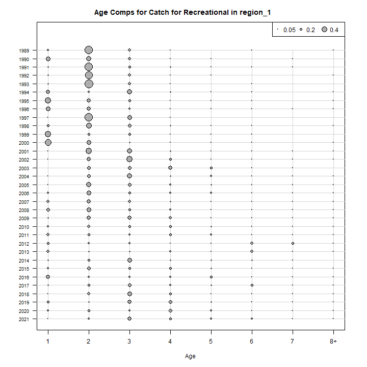
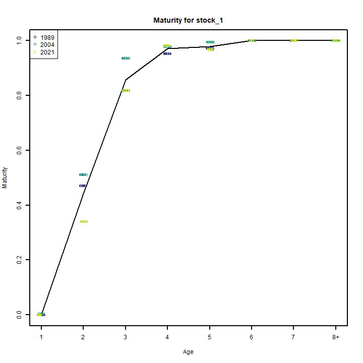
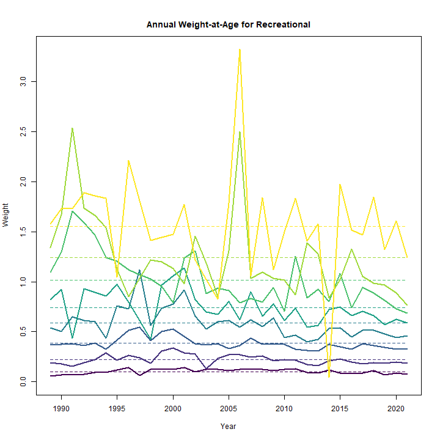
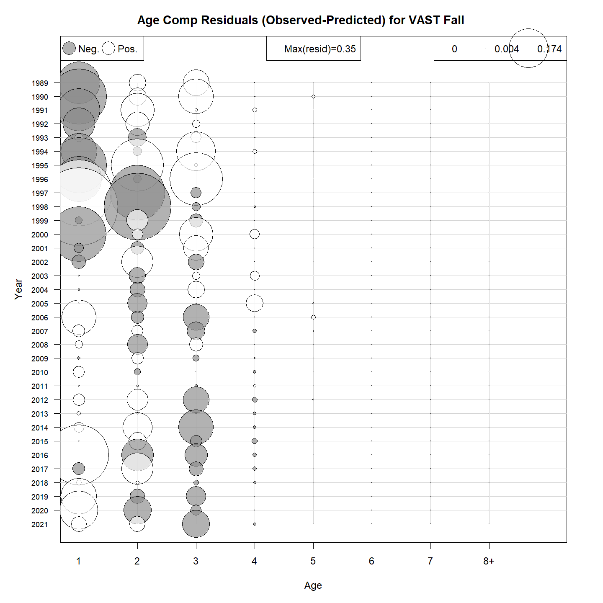
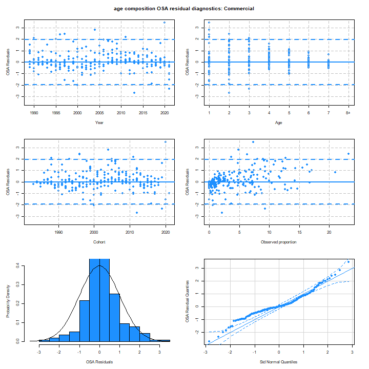
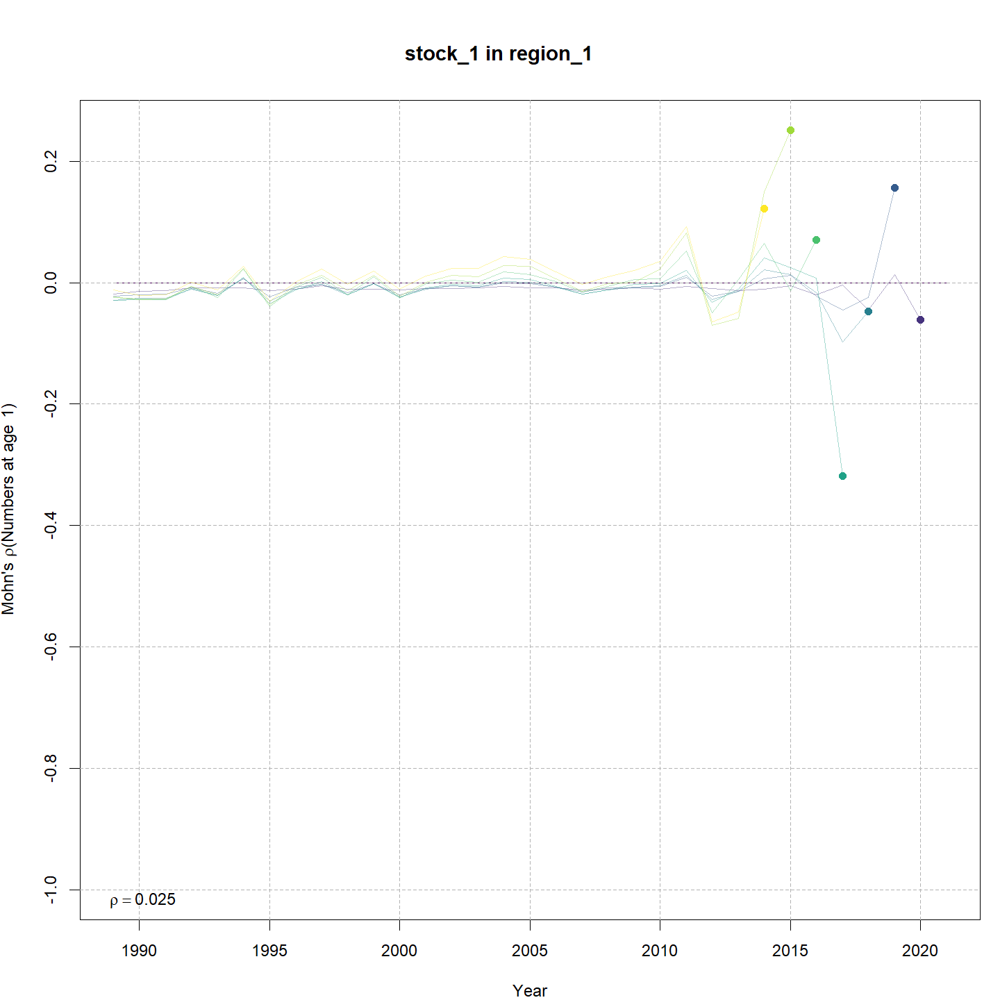
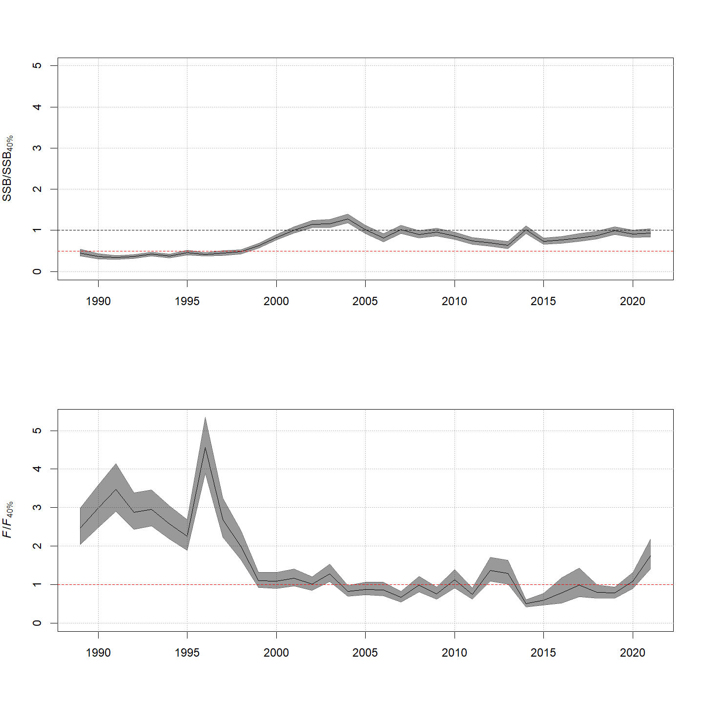
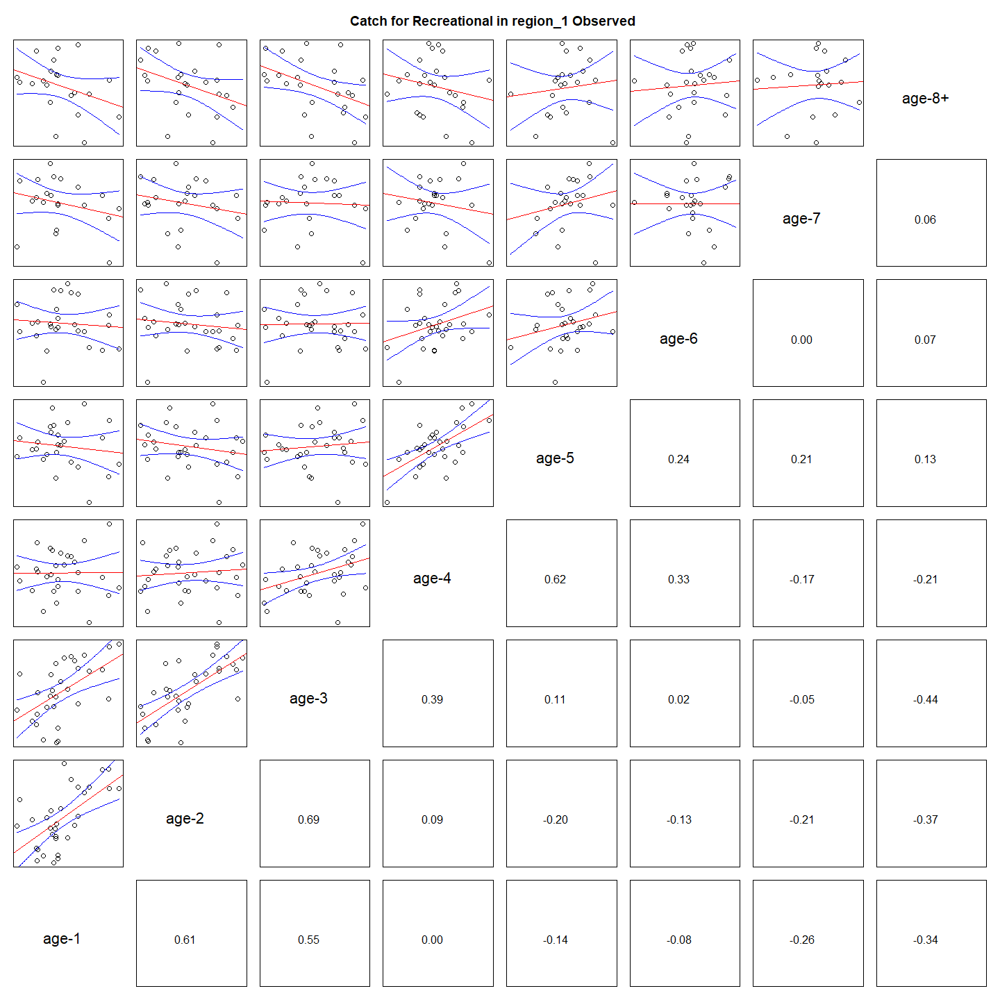
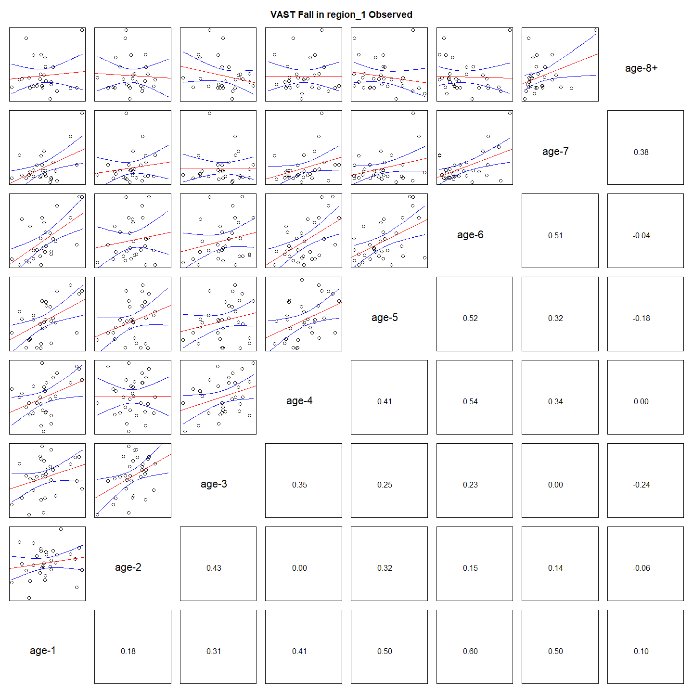

---
output:
  html_document:
    df_print: paged
    keep_md: yes
  word_document: default
  pdf_document:
    fig_caption: yes
    includes:
    keep_tex: yes
    number_sections: no
title: "WHAM figures and tables"
header-includes:
  - \usepackage{longtable}
  - \usepackage{booktabs}
  - \usepackage{caption,graphics}
  - \usepackage{makecell}
  - \usepackage{lscape}
  - \renewcommand\figurename{Fig.}
  - \captionsetup{labelsep=period, singlelinecheck=false}
  - \newcommand{\changesize}[1]{\fontsize{#1pt}{#1pt}\selectfont}
  - \renewcommand{\arraystretch}{1.5}
  - \renewcommand\theadfont{}
---

# {.tabset}

## Figures {.tabset}

### Input

### Diagnostics

### Results

### Retro

### Reference points

### Miscelaneous

## Tables {.tabset}

### Parameter estimates

<table class="table" style="margin-left: auto; margin-right: auto;">
<caption>Parameter estimates, standard errors, and confidence intervals. Rounded to 3 decimal places.</caption>
 <thead>
  <tr>
   <th style="text-align:left;">   </th>
   <th style="text-align:right;"> Estimate </th>
   <th style="text-align:right;"> Std. Error </th>
   <th style="text-align:right;"> 95\% CI lower </th>
   <th style="text-align:right;"> 95\% CI upper </th>
  </tr>
 </thead>
<tbody>
  <tr>
   <td style="text-align:left;"> REC CPA fully selected q </td>
   <td style="text-align:right;"> 0.000 </td>
   <td style="text-align:right;"> 0.000 </td>
   <td style="text-align:right;"> 0.000 </td>
   <td style="text-align:right;"> 0.000 </td>
  </tr>
  <tr>
   <td style="text-align:left;"> VAST Spring fully selected q </td>
   <td style="text-align:right;"> 0.019 </td>
   <td style="text-align:right;"> 0.001 </td>
   <td style="text-align:right;"> 0.018 </td>
   <td style="text-align:right;"> 0.021 </td>
  </tr>
  <tr>
   <td style="text-align:left;"> VAST Fall fully selected q </td>
   <td style="text-align:right;"> 0.001 </td>
   <td style="text-align:right;"> 0.000 </td>
   <td style="text-align:right;"> 0.001 </td>
   <td style="text-align:right;"> 0.001 </td>
  </tr>
  <tr>
   <td style="text-align:left;"> Block 1: $a_{50}$ </td>
   <td style="text-align:right;"> 1.822 </td>
   <td style="text-align:right;"> 0.093 </td>
   <td style="text-align:right;"> 1.647 </td>
   <td style="text-align:right;"> 2.011 </td>
  </tr>
  <tr>
   <td style="text-align:left;"> Block 1: 1/slope (increasing) </td>
   <td style="text-align:right;"> 0.283 </td>
   <td style="text-align:right;"> 0.030 </td>
   <td style="text-align:right;"> 0.229 </td>
   <td style="text-align:right;"> 0.348 </td>
  </tr>
  <tr>
   <td style="text-align:left;"> Block 2: $a_{50}$ </td>
   <td style="text-align:right;"> 2.653 </td>
   <td style="text-align:right;"> 0.112 </td>
   <td style="text-align:right;"> 2.438 </td>
   <td style="text-align:right;"> 2.876 </td>
  </tr>
  <tr>
   <td style="text-align:left;"> Block 2: 1/slope (increasing) </td>
   <td style="text-align:right;"> 0.520 </td>
   <td style="text-align:right;"> 0.039 </td>
   <td style="text-align:right;"> 0.449 </td>
   <td style="text-align:right;"> 0.601 </td>
  </tr>
  <tr>
   <td style="text-align:left;"> Block 3: $a_{50}$ </td>
   <td style="text-align:right;"> 1.874 </td>
   <td style="text-align:right;"> 0.118 </td>
   <td style="text-align:right;"> 1.652 </td>
   <td style="text-align:right;"> 2.116 </td>
  </tr>
  <tr>
   <td style="text-align:left;"> Block 3: 1/slope (increasing) </td>
   <td style="text-align:right;"> 0.539 </td>
   <td style="text-align:right;"> 0.058 </td>
   <td style="text-align:right;"> 0.437 </td>
   <td style="text-align:right;"> 0.664 </td>
  </tr>
  <tr>
   <td style="text-align:left;"> Block 4: $a_{50}$ </td>
   <td style="text-align:right;"> 4.331 </td>
   <td style="text-align:right;"> 0.639 </td>
   <td style="text-align:right;"> 3.087 </td>
   <td style="text-align:right;"> 5.514 </td>
  </tr>
  <tr>
   <td style="text-align:left;"> Block 4: 1/slope (increasing) </td>
   <td style="text-align:right;"> 1.345 </td>
   <td style="text-align:right;"> 0.167 </td>
   <td style="text-align:right;"> 1.049 </td>
   <td style="text-align:right;"> 1.704 </td>
  </tr>
  <tr>
   <td style="text-align:left;"> Block 5: Selectivity for age 1 </td>
   <td style="text-align:right;"> 0.452 </td>
   <td style="text-align:right;"> 0.029 </td>
   <td style="text-align:right;"> 0.396 </td>
   <td style="text-align:right;"> 0.509 </td>
  </tr>
  <tr>
   <td style="text-align:left;"> Block 5: Selectivity for age 2 </td>
   <td style="text-align:right;"> 0.740 </td>
   <td style="text-align:right;"> 0.046 </td>
   <td style="text-align:right;"> 0.641 </td>
   <td style="text-align:right;"> 0.820 </td>
  </tr>
  <tr>
   <td style="text-align:left;"> Block 5: Selectivity for age 3 </td>
   <td style="text-align:right;"> 1.000 </td>
   <td style="text-align:right;"> -- </td>
   <td style="text-align:right;"> -- </td>
   <td style="text-align:right;"> -- </td>
  </tr>
  <tr>
   <td style="text-align:left;"> Block 5: Selectivity for age 4 </td>
   <td style="text-align:right;"> 0.861 </td>
   <td style="text-align:right;"> 0.085 </td>
   <td style="text-align:right;"> 0.608 </td>
   <td style="text-align:right;"> 0.961 </td>
  </tr>
  <tr>
   <td style="text-align:left;"> Block 5: Selectivity for age 5 </td>
   <td style="text-align:right;"> 0.642 </td>
   <td style="text-align:right;"> 0.103 </td>
   <td style="text-align:right;"> 0.427 </td>
   <td style="text-align:right;"> 0.812 </td>
  </tr>
  <tr>
   <td style="text-align:left;"> Block 5: Selectivity for age 6 </td>
   <td style="text-align:right;"> 0.690 </td>
   <td style="text-align:right;"> 0.154 </td>
   <td style="text-align:right;"> 0.353 </td>
   <td style="text-align:right;"> 0.901 </td>
  </tr>
  <tr>
   <td style="text-align:left;"> Block 5: Selectivity for age 7 </td>
   <td style="text-align:right;"> 0.442 </td>
   <td style="text-align:right;"> 0.176 </td>
   <td style="text-align:right;"> 0.164 </td>
   <td style="text-align:right;"> 0.762 </td>
  </tr>
  <tr>
   <td style="text-align:left;"> Block 5: Selectivity for age 8+ </td>
   <td style="text-align:right;"> 0.449 </td>
   <td style="text-align:right;"> 0.211 </td>
   <td style="text-align:right;"> 0.133 </td>
   <td style="text-align:right;"> 0.813 </td>
  </tr>
  <tr>
   <td style="text-align:left;"> Block 6: Selectivity for age 1 </td>
   <td style="text-align:right;"> 0.333 </td>
   <td style="text-align:right;"> 0.021 </td>
   <td style="text-align:right;"> 0.294 </td>
   <td style="text-align:right;"> 0.375 </td>
  </tr>
  <tr>
   <td style="text-align:left;"> Block 6: Selectivity for age 2 </td>
   <td style="text-align:right;"> 1.000 </td>
   <td style="text-align:right;"> -- </td>
   <td style="text-align:right;"> -- </td>
   <td style="text-align:right;"> -- </td>
  </tr>
  <tr>
   <td style="text-align:left;"> Block 6: Selectivity for age 3 </td>
   <td style="text-align:right;"> 0.958 </td>
   <td style="text-align:right;"> 0.063 </td>
   <td style="text-align:right;"> 0.513 </td>
   <td style="text-align:right;"> 0.998 </td>
  </tr>
  <tr>
   <td style="text-align:left;"> Block 6: Selectivity for age 4 </td>
   <td style="text-align:right;"> 0.540 </td>
   <td style="text-align:right;"> 0.060 </td>
   <td style="text-align:right;"> 0.422 </td>
   <td style="text-align:right;"> 0.654 </td>
  </tr>
  <tr>
   <td style="text-align:left;"> Block 6: Selectivity for age 5 </td>
   <td style="text-align:right;"> 0.395 </td>
   <td style="text-align:right;"> 0.072 </td>
   <td style="text-align:right;"> 0.266 </td>
   <td style="text-align:right;"> 0.541 </td>
  </tr>
  <tr>
   <td style="text-align:left;"> Block 6: Selectivity for age 6 </td>
   <td style="text-align:right;"> 0.279 </td>
   <td style="text-align:right;"> 0.088 </td>
   <td style="text-align:right;"> 0.141 </td>
   <td style="text-align:right;"> 0.478 </td>
  </tr>
  <tr>
   <td style="text-align:left;"> Block 6: Selectivity for age 7 </td>
   <td style="text-align:right;"> 0.129 </td>
   <td style="text-align:right;"> 0.088 </td>
   <td style="text-align:right;"> 0.031 </td>
   <td style="text-align:right;"> 0.407 </td>
  </tr>
  <tr>
   <td style="text-align:left;"> Block 6: Selectivity for age 8+ </td>
   <td style="text-align:right;"> 0.179 </td>
   <td style="text-align:right;"> 0.119 </td>
   <td style="text-align:right;"> 0.043 </td>
   <td style="text-align:right;"> 0.516 </td>
  </tr>
  <tr>
   <td style="text-align:left;"> Block 7: Selectivity for age 1 </td>
   <td style="text-align:right;"> 0.283 </td>
   <td style="text-align:right;"> 0.016 </td>
   <td style="text-align:right;"> 0.252 </td>
   <td style="text-align:right;"> 0.317 </td>
  </tr>
  <tr>
   <td style="text-align:left;"> Block 7: Selectivity for age 2 </td>
   <td style="text-align:right;"> 1.000 </td>
   <td style="text-align:right;"> -- </td>
   <td style="text-align:right;"> -- </td>
   <td style="text-align:right;"> -- </td>
  </tr>
  <tr>
   <td style="text-align:left;"> Block 7: Selectivity for age 3 </td>
   <td style="text-align:right;"> 0.439 </td>
   <td style="text-align:right;"> 0.035 </td>
   <td style="text-align:right;"> 0.372 </td>
   <td style="text-align:right;"> 0.508 </td>
  </tr>
  <tr>
   <td style="text-align:left;"> Block 7: Selectivity for age 4 </td>
   <td style="text-align:right;"> 0.174 </td>
   <td style="text-align:right;"> 0.030 </td>
   <td style="text-align:right;"> 0.124 </td>
   <td style="text-align:right;"> 0.240 </td>
  </tr>
  <tr>
   <td style="text-align:left;"> Block 7: Selectivity for age 5 </td>
   <td style="text-align:right;"> 0.069 </td>
   <td style="text-align:right;"> 0.027 </td>
   <td style="text-align:right;"> 0.032 </td>
   <td style="text-align:right;"> 0.143 </td>
  </tr>
  <tr>
   <td style="text-align:left;"> Block 7: Selectivity for age 6 </td>
   <td style="text-align:right;"> 0.019 </td>
   <td style="text-align:right;"> 0.021 </td>
   <td style="text-align:right;"> 0.002 </td>
   <td style="text-align:right;"> 0.147 </td>
  </tr>
  <tr>
   <td style="text-align:left;"> Block 7: Selectivity for age 7 </td>
   <td style="text-align:right;"> 0.016 </td>
   <td style="text-align:right;"> 0.028 </td>
   <td style="text-align:right;"> 0.000 </td>
   <td style="text-align:right;"> 0.368 </td>
  </tr>
  <tr>
   <td style="text-align:left;"> Block 7: Selectivity for age 8+ </td>
   <td style="text-align:right;"> 0.016 </td>
   <td style="text-align:right;"> 0.032 </td>
   <td style="text-align:right;"> 0.000 </td>
   <td style="text-align:right;"> 0.498 </td>
  </tr>
</tbody>
</table>

### Abundance at age

<table class="table" style="margin-left: auto; margin-right: auto;">
<caption>Abundance at age (1000s) for stock 1 in region 1.</caption>
 <thead>
  <tr>
   <th style="text-align:left;">   </th>
   <th style="text-align:right;"> 1 </th>
   <th style="text-align:right;"> 2 </th>
   <th style="text-align:right;"> 3 </th>
   <th style="text-align:right;"> 4 </th>
   <th style="text-align:right;"> 5 </th>
   <th style="text-align:right;"> 6 </th>
   <th style="text-align:right;"> 7 </th>
   <th style="text-align:right;"> 8+ </th>
  </tr>
 </thead>
<tbody>
  <tr>
   <td style="text-align:left;"> 1989 </td>
   <td style="text-align:right;"> 20334 </td>
   <td style="text-align:right;"> 10735 </td>
   <td style="text-align:right;"> 4955 </td>
   <td style="text-align:right;"> 2228 </td>
   <td style="text-align:right;"> 998 </td>
   <td style="text-align:right;"> 446 </td>
   <td style="text-align:right;"> 200 </td>
   <td style="text-align:right;"> 162 </td>
  </tr>
  <tr>
   <td style="text-align:left;"> 1990 </td>
   <td style="text-align:right;"> 29638 </td>
   <td style="text-align:right;"> 12541 </td>
   <td style="text-align:right;"> 4872 </td>
   <td style="text-align:right;"> 1806 </td>
   <td style="text-align:right;"> 778 </td>
   <td style="text-align:right;"> 346 </td>
   <td style="text-align:right;"> 155 </td>
   <td style="text-align:right;"> 125 </td>
  </tr>
  <tr>
   <td style="text-align:left;"> 1991 </td>
   <td style="text-align:right;"> 23669 </td>
   <td style="text-align:right;"> 18172 </td>
   <td style="text-align:right;"> 5333 </td>
   <td style="text-align:right;"> 1609 </td>
   <td style="text-align:right;"> 570 </td>
   <td style="text-align:right;"> 244 </td>
   <td style="text-align:right;"> 108 </td>
   <td style="text-align:right;"> 88 </td>
  </tr>
  <tr>
   <td style="text-align:left;"> 1992 </td>
   <td style="text-align:right;"> 28389 </td>
   <td style="text-align:right;"> 14214 </td>
   <td style="text-align:right;"> 7366 </td>
   <td style="text-align:right;"> 1628 </td>
   <td style="text-align:right;"> 464 </td>
   <td style="text-align:right;"> 163 </td>
   <td style="text-align:right;"> 70 </td>
   <td style="text-align:right;"> 56 </td>
  </tr>
  <tr>
   <td style="text-align:left;"> 1993 </td>
   <td style="text-align:right;"> 11685 </td>
   <td style="text-align:right;"> 17524 </td>
   <td style="text-align:right;"> 6177 </td>
   <td style="text-align:right;"> 2519 </td>
   <td style="text-align:right;"> 534 </td>
   <td style="text-align:right;"> 151 </td>
   <td style="text-align:right;"> 53 </td>
   <td style="text-align:right;"> 41 </td>
  </tr>
  <tr>
   <td style="text-align:left;"> 1994 </td>
   <td style="text-align:right;"> 22637 </td>
   <td style="text-align:right;"> 7122 </td>
   <td style="text-align:right;"> 7469 </td>
   <td style="text-align:right;"> 2042 </td>
   <td style="text-align:right;"> 793 </td>
   <td style="text-align:right;"> 167 </td>
   <td style="text-align:right;"> 47 </td>
   <td style="text-align:right;"> 29 </td>
  </tr>
  <tr>
   <td style="text-align:left;"> 1995 </td>
   <td style="text-align:right;"> 37305 </td>
   <td style="text-align:right;"> 13987 </td>
   <td style="text-align:right;"> 3221 </td>
   <td style="text-align:right;"> 2711 </td>
   <td style="text-align:right;"> 711 </td>
   <td style="text-align:right;"> 274 </td>
   <td style="text-align:right;"> 58 </td>
   <td style="text-align:right;"> 26 </td>
  </tr>
  <tr>
   <td style="text-align:left;"> 1996 </td>
   <td style="text-align:right;"> 26623 </td>
   <td style="text-align:right;"> 22746 </td>
   <td style="text-align:right;"> 6229 </td>
   <td style="text-align:right;"> 1137 </td>
   <td style="text-align:right;"> 910 </td>
   <td style="text-align:right;"> 237 </td>
   <td style="text-align:right;"> 91 </td>
   <td style="text-align:right;"> 28 </td>
  </tr>
  <tr>
   <td style="text-align:left;"> 1997 </td>
   <td style="text-align:right;"> 22708 </td>
   <td style="text-align:right;"> 15231 </td>
   <td style="text-align:right;"> 7238 </td>
   <td style="text-align:right;"> 1304 </td>
   <td style="text-align:right;"> 219 </td>
   <td style="text-align:right;"> 173 </td>
   <td style="text-align:right;"> 45 </td>
   <td style="text-align:right;"> 23 </td>
  </tr>
  <tr>
   <td style="text-align:left;"> 1998 </td>
   <td style="text-align:right;"> 15658 </td>
   <td style="text-align:right;"> 13582 </td>
   <td style="text-align:right;"> 6350 </td>
   <td style="text-align:right;"> 2299 </td>
   <td style="text-align:right;"> 390 </td>
   <td style="text-align:right;"> 65 </td>
   <td style="text-align:right;"> 51 </td>
   <td style="text-align:right;"> 20 </td>
  </tr>
  <tr>
   <td style="text-align:left;"> 1999 </td>
   <td style="text-align:right;"> 27663 </td>
   <td style="text-align:right;"> 9891 </td>
   <td style="text-align:right;"> 7196 </td>
   <td style="text-align:right;"> 2588 </td>
   <td style="text-align:right;"> 822 </td>
   <td style="text-align:right;"> 136 </td>
   <td style="text-align:right;"> 22 </td>
   <td style="text-align:right;"> 25 </td>
  </tr>
  <tr>
   <td style="text-align:left;"> 2000 </td>
   <td style="text-align:right;"> 42701 </td>
   <td style="text-align:right;"> 17835 </td>
   <td style="text-align:right;"> 5695 </td>
   <td style="text-align:right;"> 3520 </td>
   <td style="text-align:right;"> 1169 </td>
   <td style="text-align:right;"> 365 </td>
   <td style="text-align:right;"> 60 </td>
   <td style="text-align:right;"> 21 </td>
  </tr>
  <tr>
   <td style="text-align:left;"> 2001 </td>
   <td style="text-align:right;"> 18780 </td>
   <td style="text-align:right;"> 27229 </td>
   <td style="text-align:right;"> 9974 </td>
   <td style="text-align:right;"> 2738 </td>
   <td style="text-align:right;"> 1589 </td>
   <td style="text-align:right;"> 521 </td>
   <td style="text-align:right;"> 162 </td>
   <td style="text-align:right;"> 36 </td>
  </tr>
  <tr>
   <td style="text-align:left;"> 2002 </td>
   <td style="text-align:right;"> 32877 </td>
   <td style="text-align:right;"> 11975 </td>
   <td style="text-align:right;"> 15264 </td>
   <td style="text-align:right;"> 4855 </td>
   <td style="text-align:right;"> 1261 </td>
   <td style="text-align:right;"> 724 </td>
   <td style="text-align:right;"> 237 </td>
   <td style="text-align:right;"> 90 </td>
  </tr>
  <tr>
   <td style="text-align:left;"> 2003 </td>
   <td style="text-align:right;"> 17840 </td>
   <td style="text-align:right;"> 21108 </td>
   <td style="text-align:right;"> 6878 </td>
   <td style="text-align:right;"> 7754 </td>
   <td style="text-align:right;"> 2349 </td>
   <td style="text-align:right;"> 604 </td>
   <td style="text-align:right;"> 346 </td>
   <td style="text-align:right;"> 156 </td>
  </tr>
  <tr>
   <td style="text-align:left;"> 2004 </td>
   <td style="text-align:right;"> 15393 </td>
   <td style="text-align:right;"> 11348 </td>
   <td style="text-align:right;"> 11707 </td>
   <td style="text-align:right;"> 3264 </td>
   <td style="text-align:right;"> 3452 </td>
   <td style="text-align:right;"> 1033 </td>
   <td style="text-align:right;"> 265 </td>
   <td style="text-align:right;"> 220 </td>
  </tr>
  <tr>
   <td style="text-align:left;"> 2005 </td>
   <td style="text-align:right;"> 12663 </td>
   <td style="text-align:right;"> 9969 </td>
   <td style="text-align:right;"> 6675 </td>
   <td style="text-align:right;"> 6060 </td>
   <td style="text-align:right;"> 1592 </td>
   <td style="text-align:right;"> 1664 </td>
   <td style="text-align:right;"> 497 </td>
   <td style="text-align:right;"> 233 </td>
  </tr>
  <tr>
   <td style="text-align:left;"> 2006 </td>
   <td style="text-align:right;"> 16040 </td>
   <td style="text-align:right;"> 8230 </td>
   <td style="text-align:right;"> 5959 </td>
   <td style="text-align:right;"> 3595 </td>
   <td style="text-align:right;"> 3118 </td>
   <td style="text-align:right;"> 811 </td>
   <td style="text-align:right;"> 847 </td>
   <td style="text-align:right;"> 371 </td>
  </tr>
  <tr>
   <td style="text-align:left;"> 2007 </td>
   <td style="text-align:right;"> 17645 </td>
   <td style="text-align:right;"> 10507 </td>
   <td style="text-align:right;"> 5060 </td>
   <td style="text-align:right;"> 3378 </td>
   <td style="text-align:right;"> 1965 </td>
   <td style="text-align:right;"> 1691 </td>
   <td style="text-align:right;"> 440 </td>
   <td style="text-align:right;"> 660 </td>
  </tr>
  <tr>
   <td style="text-align:left;"> 2008 </td>
   <td style="text-align:right;"> 20429 </td>
   <td style="text-align:right;"> 11473 </td>
   <td style="text-align:right;"> 6308 </td>
   <td style="text-align:right;"> 2775 </td>
   <td style="text-align:right;"> 1785 </td>
   <td style="text-align:right;"> 1031 </td>
   <td style="text-align:right;"> 886 </td>
   <td style="text-align:right;"> 576 </td>
  </tr>
  <tr>
   <td style="text-align:left;"> 2009 </td>
   <td style="text-align:right;"> 13308 </td>
   <td style="text-align:right;"> 13171 </td>
   <td style="text-align:right;"> 6691 </td>
   <td style="text-align:right;"> 3297 </td>
   <td style="text-align:right;"> 1389 </td>
   <td style="text-align:right;"> 886 </td>
   <td style="text-align:right;"> 511 </td>
   <td style="text-align:right;"> 725 </td>
  </tr>
  <tr>
   <td style="text-align:left;"> 2010 </td>
   <td style="text-align:right;"> 15558 </td>
   <td style="text-align:right;"> 8577 </td>
   <td style="text-align:right;"> 8112 </td>
   <td style="text-align:right;"> 3791 </td>
   <td style="text-align:right;"> 1697 </td>
   <td style="text-align:right;"> 653 </td>
   <td style="text-align:right;"> 387 </td>
   <td style="text-align:right;"> 505 </td>
  </tr>
  <tr>
   <td style="text-align:left;"> 2011 </td>
   <td style="text-align:right;"> 10408 </td>
   <td style="text-align:right;"> 9913 </td>
   <td style="text-align:right;"> 5149 </td>
   <td style="text-align:right;"> 4363 </td>
   <td style="text-align:right;"> 1800 </td>
   <td style="text-align:right;"> 717 </td>
   <td style="text-align:right;"> 251 </td>
   <td style="text-align:right;"> 315 </td>
  </tr>
  <tr>
   <td style="text-align:left;"> 2012 </td>
   <td style="text-align:right;"> 22652 </td>
   <td style="text-align:right;"> 6829 </td>
   <td style="text-align:right;"> 6274 </td>
   <td style="text-align:right;"> 3024 </td>
   <td style="text-align:right;"> 2397 </td>
   <td style="text-align:right;"> 944 </td>
   <td style="text-align:right;"> 363 </td>
   <td style="text-align:right;"> 278 </td>
  </tr>
  <tr>
   <td style="text-align:left;"> 2013 </td>
   <td style="text-align:right;"> 11014 </td>
   <td style="text-align:right;"> 14441 </td>
   <td style="text-align:right;"> 4103 </td>
   <td style="text-align:right;"> 3377 </td>
   <td style="text-align:right;"> 1438 </td>
   <td style="text-align:right;"> 1015 </td>
   <td style="text-align:right;"> 364 </td>
   <td style="text-align:right;"> 229 </td>
  </tr>
  <tr>
   <td style="text-align:left;"> 2014 </td>
   <td style="text-align:right;"> 13426 </td>
   <td style="text-align:right;"> 7081 </td>
   <td style="text-align:right;"> 8775 </td>
   <td style="text-align:right;"> 2233 </td>
   <td style="text-align:right;"> 1643 </td>
   <td style="text-align:right;"> 637 </td>
   <td style="text-align:right;"> 417 </td>
   <td style="text-align:right;"> 229 </td>
  </tr>
  <tr>
   <td style="text-align:left;"> 2015 </td>
   <td style="text-align:right;"> 13580 </td>
   <td style="text-align:right;"> 8729 </td>
   <td style="text-align:right;"> 4413 </td>
   <td style="text-align:right;"> 5031 </td>
   <td style="text-align:right;"> 1178 </td>
   <td style="text-align:right;"> 809 </td>
   <td style="text-align:right;"> 297 </td>
   <td style="text-align:right;"> 289 </td>
  </tr>
  <tr>
   <td style="text-align:left;"> 2016 </td>
   <td style="text-align:right;"> 24634 </td>
   <td style="text-align:right;"> 8932 </td>
   <td style="text-align:right;"> 5587 </td>
   <td style="text-align:right;"> 2675 </td>
   <td style="text-align:right;"> 2891 </td>
   <td style="text-align:right;"> 649 </td>
   <td style="text-align:right;"> 431 </td>
   <td style="text-align:right;"> 304 </td>
  </tr>
  <tr>
   <td style="text-align:left;"> 2017 </td>
   <td style="text-align:right;"> 19970 </td>
   <td style="text-align:right;"> 16056 </td>
   <td style="text-align:right;"> 5618 </td>
   <td style="text-align:right;"> 3283 </td>
   <td style="text-align:right;"> 1462 </td>
   <td style="text-align:right;"> 1482 </td>
   <td style="text-align:right;"> 316 </td>
   <td style="text-align:right;"> 343 </td>
  </tr>
  <tr>
   <td style="text-align:left;"> 2018 </td>
   <td style="text-align:right;"> 10712 </td>
   <td style="text-align:right;"> 12864 </td>
   <td style="text-align:right;"> 9862 </td>
   <td style="text-align:right;"> 3157 </td>
   <td style="text-align:right;"> 1671 </td>
   <td style="text-align:right;"> 679 </td>
   <td style="text-align:right;"> 639 </td>
   <td style="text-align:right;"> 267 </td>
  </tr>
  <tr>
   <td style="text-align:left;"> 2019 </td>
   <td style="text-align:right;"> 28580 </td>
   <td style="text-align:right;"> 6977 </td>
   <td style="text-align:right;"> 8091 </td>
   <td style="text-align:right;"> 5809 </td>
   <td style="text-align:right;"> 1730 </td>
   <td style="text-align:right;"> 857 </td>
   <td style="text-align:right;"> 330 </td>
   <td style="text-align:right;"> 423 </td>
  </tr>
  <tr>
   <td style="text-align:left;"> 2020 </td>
   <td style="text-align:right;"> 21545 </td>
   <td style="text-align:right;"> 18614 </td>
   <td style="text-align:right;"> 4365 </td>
   <td style="text-align:right;"> 4674 </td>
   <td style="text-align:right;"> 3100 </td>
   <td style="text-align:right;"> 865 </td>
   <td style="text-align:right;"> 407 </td>
   <td style="text-align:right;"> 342 </td>
  </tr>
  <tr>
   <td style="text-align:left;"> 2021 </td>
   <td style="text-align:right;"> 20461 </td>
   <td style="text-align:right;"> 13917 </td>
   <td style="text-align:right;"> 11420 </td>
   <td style="text-align:right;"> 2419 </td>
   <td style="text-align:right;"> 2340 </td>
   <td style="text-align:right;"> 1428 </td>
   <td style="text-align:right;"> 373 </td>
   <td style="text-align:right;"> 306 </td>
  </tr>
</tbody>
</table>

### Fishing mortality at age by region

<table class="table" style="margin-left: auto; margin-right: auto;">
<caption>Total fishing mortality at age in region 1.</caption>
 <thead>
  <tr>
   <th style="text-align:left;">   </th>
   <th style="text-align:right;"> 1 </th>
   <th style="text-align:right;"> 2 </th>
   <th style="text-align:right;"> 3 </th>
   <th style="text-align:right;"> 4 </th>
   <th style="text-align:right;"> 5 </th>
   <th style="text-align:right;"> 6 </th>
   <th style="text-align:right;"> 7 </th>
   <th style="text-align:right;"> 8+ </th>
  </tr>
 </thead>
<tbody>
  <tr>
   <td style="text-align:left;"> 1989 </td>
   <td style="text-align:right;"> 0.012 </td>
   <td style="text-align:right;"> 0.148 </td>
   <td style="text-align:right;"> 0.224 </td>
   <td style="text-align:right;"> 0.227 </td>
   <td style="text-align:right;"> 0.227 </td>
   <td style="text-align:right;"> 0.227 </td>
   <td style="text-align:right;"> 0.227 </td>
   <td style="text-align:right;"> 0.227 </td>
  </tr>
  <tr>
   <td style="text-align:left;"> 1990 </td>
   <td style="text-align:right;"> 0.017 </td>
   <td style="text-align:right;"> 0.210 </td>
   <td style="text-align:right;"> 0.317 </td>
   <td style="text-align:right;"> 0.322 </td>
   <td style="text-align:right;"> 0.322 </td>
   <td style="text-align:right;"> 0.322 </td>
   <td style="text-align:right;"> 0.322 </td>
   <td style="text-align:right;"> 0.322 </td>
  </tr>
  <tr>
   <td style="text-align:left;"> 1991 </td>
   <td style="text-align:right;"> 0.014 </td>
   <td style="text-align:right;"> 0.179 </td>
   <td style="text-align:right;"> 0.271 </td>
   <td style="text-align:right;"> 0.275 </td>
   <td style="text-align:right;"> 0.275 </td>
   <td style="text-align:right;"> 0.275 </td>
   <td style="text-align:right;"> 0.275 </td>
   <td style="text-align:right;"> 0.275 </td>
  </tr>
  <tr>
   <td style="text-align:left;"> 1992 </td>
   <td style="text-align:right;"> 0.017 </td>
   <td style="text-align:right;"> 0.211 </td>
   <td style="text-align:right;"> 0.319 </td>
   <td style="text-align:right;"> 0.324 </td>
   <td style="text-align:right;"> 0.324 </td>
   <td style="text-align:right;"> 0.324 </td>
   <td style="text-align:right;"> 0.324 </td>
   <td style="text-align:right;"> 0.324 </td>
  </tr>
  <tr>
   <td style="text-align:left;"> 1993 </td>
   <td style="text-align:right;"> 0.014 </td>
   <td style="text-align:right;"> 0.179 </td>
   <td style="text-align:right;"> 0.271 </td>
   <td style="text-align:right;"> 0.275 </td>
   <td style="text-align:right;"> 0.275 </td>
   <td style="text-align:right;"> 0.275 </td>
   <td style="text-align:right;"> 0.275 </td>
   <td style="text-align:right;"> 0.275 </td>
  </tr>
  <tr>
   <td style="text-align:left;"> 1994 </td>
   <td style="text-align:right;"> 0.013 </td>
   <td style="text-align:right;"> 0.161 </td>
   <td style="text-align:right;"> 0.243 </td>
   <td style="text-align:right;"> 0.247 </td>
   <td style="text-align:right;"> 0.247 </td>
   <td style="text-align:right;"> 0.247 </td>
   <td style="text-align:right;"> 0.247 </td>
   <td style="text-align:right;"> 0.247 </td>
  </tr>
  <tr>
   <td style="text-align:left;"> 1995 </td>
   <td style="text-align:right;"> 0.010 </td>
   <td style="text-align:right;"> 0.121 </td>
   <td style="text-align:right;"> 0.183 </td>
   <td style="text-align:right;"> 0.186 </td>
   <td style="text-align:right;"> 0.186 </td>
   <td style="text-align:right;"> 0.186 </td>
   <td style="text-align:right;"> 0.186 </td>
   <td style="text-align:right;"> 0.186 </td>
  </tr>
  <tr>
   <td style="text-align:left;"> 1996 </td>
   <td style="text-align:right;"> 0.023 </td>
   <td style="text-align:right;"> 0.286 </td>
   <td style="text-align:right;"> 0.432 </td>
   <td style="text-align:right;"> 0.439 </td>
   <td style="text-align:right;"> 0.439 </td>
   <td style="text-align:right;"> 0.439 </td>
   <td style="text-align:right;"> 0.439 </td>
   <td style="text-align:right;"> 0.439 </td>
  </tr>
  <tr>
   <td style="text-align:left;"> 1997 </td>
   <td style="text-align:right;"> 0.010 </td>
   <td style="text-align:right;"> 0.122 </td>
   <td style="text-align:right;"> 0.185 </td>
   <td style="text-align:right;"> 0.188 </td>
   <td style="text-align:right;"> 0.188 </td>
   <td style="text-align:right;"> 0.188 </td>
   <td style="text-align:right;"> 0.188 </td>
   <td style="text-align:right;"> 0.188 </td>
  </tr>
  <tr>
   <td style="text-align:left;"> 1998 </td>
   <td style="text-align:right;"> 0.016 </td>
   <td style="text-align:right;"> 0.088 </td>
   <td style="text-align:right;"> 0.264 </td>
   <td style="text-align:right;"> 0.371 </td>
   <td style="text-align:right;"> 0.394 </td>
   <td style="text-align:right;"> 0.398 </td>
   <td style="text-align:right;"> 0.399 </td>
   <td style="text-align:right;"> 0.399 </td>
  </tr>
  <tr>
   <td style="text-align:left;"> 1999 </td>
   <td style="text-align:right;"> 0.009 </td>
   <td style="text-align:right;"> 0.052 </td>
   <td style="text-align:right;"> 0.156 </td>
   <td style="text-align:right;"> 0.220 </td>
   <td style="text-align:right;"> 0.234 </td>
   <td style="text-align:right;"> 0.236 </td>
   <td style="text-align:right;"> 0.236 </td>
   <td style="text-align:right;"> 0.236 </td>
  </tr>
  <tr>
   <td style="text-align:left;"> 2000 </td>
   <td style="text-align:right;"> 0.006 </td>
   <td style="text-align:right;"> 0.031 </td>
   <td style="text-align:right;"> 0.094 </td>
   <td style="text-align:right;"> 0.132 </td>
   <td style="text-align:right;"> 0.140 </td>
   <td style="text-align:right;"> 0.142 </td>
   <td style="text-align:right;"> 0.142 </td>
   <td style="text-align:right;"> 0.142 </td>
  </tr>
  <tr>
   <td style="text-align:left;"> 2001 </td>
   <td style="text-align:right;"> 0.005 </td>
   <td style="text-align:right;"> 0.025 </td>
   <td style="text-align:right;"> 0.075 </td>
   <td style="text-align:right;"> 0.106 </td>
   <td style="text-align:right;"> 0.112 </td>
   <td style="text-align:right;"> 0.113 </td>
   <td style="text-align:right;"> 0.114 </td>
   <td style="text-align:right;"> 0.114 </td>
  </tr>
  <tr>
   <td style="text-align:left;"> 2002 </td>
   <td style="text-align:right;"> 0.004 </td>
   <td style="text-align:right;"> 0.022 </td>
   <td style="text-align:right;"> 0.066 </td>
   <td style="text-align:right;"> 0.094 </td>
   <td style="text-align:right;"> 0.099 </td>
   <td style="text-align:right;"> 0.100 </td>
   <td style="text-align:right;"> 0.101 </td>
   <td style="text-align:right;"> 0.101 </td>
  </tr>
  <tr>
   <td style="text-align:left;"> 2003 </td>
   <td style="text-align:right;"> 0.006 </td>
   <td style="text-align:right;"> 0.031 </td>
   <td style="text-align:right;"> 0.093 </td>
   <td style="text-align:right;"> 0.131 </td>
   <td style="text-align:right;"> 0.139 </td>
   <td style="text-align:right;"> 0.141 </td>
   <td style="text-align:right;"> 0.141 </td>
   <td style="text-align:right;"> 0.141 </td>
  </tr>
  <tr>
   <td style="text-align:left;"> 2004 </td>
   <td style="text-align:right;"> 0.007 </td>
   <td style="text-align:right;"> 0.036 </td>
   <td style="text-align:right;"> 0.108 </td>
   <td style="text-align:right;"> 0.152 </td>
   <td style="text-align:right;"> 0.161 </td>
   <td style="text-align:right;"> 0.163 </td>
   <td style="text-align:right;"> 0.163 </td>
   <td style="text-align:right;"> 0.163 </td>
  </tr>
  <tr>
   <td style="text-align:left;"> 2005 </td>
   <td style="text-align:right;"> 0.005 </td>
   <td style="text-align:right;"> 0.026 </td>
   <td style="text-align:right;"> 0.077 </td>
   <td style="text-align:right;"> 0.109 </td>
   <td style="text-align:right;"> 0.116 </td>
   <td style="text-align:right;"> 0.117 </td>
   <td style="text-align:right;"> 0.117 </td>
   <td style="text-align:right;"> 0.117 </td>
  </tr>
  <tr>
   <td style="text-align:left;"> 2006 </td>
   <td style="text-align:right;"> 0.004 </td>
   <td style="text-align:right;"> 0.021 </td>
   <td style="text-align:right;"> 0.064 </td>
   <td style="text-align:right;"> 0.090 </td>
   <td style="text-align:right;"> 0.096 </td>
   <td style="text-align:right;"> 0.097 </td>
   <td style="text-align:right;"> 0.097 </td>
   <td style="text-align:right;"> 0.097 </td>
  </tr>
  <tr>
   <td style="text-align:left;"> 2007 </td>
   <td style="text-align:right;"> 0.003 </td>
   <td style="text-align:right;"> 0.018 </td>
   <td style="text-align:right;"> 0.054 </td>
   <td style="text-align:right;"> 0.076 </td>
   <td style="text-align:right;"> 0.080 </td>
   <td style="text-align:right;"> 0.081 </td>
   <td style="text-align:right;"> 0.081 </td>
   <td style="text-align:right;"> 0.081 </td>
  </tr>
  <tr>
   <td style="text-align:left;"> 2008 </td>
   <td style="text-align:right;"> 0.003 </td>
   <td style="text-align:right;"> 0.019 </td>
   <td style="text-align:right;"> 0.058 </td>
   <td style="text-align:right;"> 0.081 </td>
   <td style="text-align:right;"> 0.087 </td>
   <td style="text-align:right;"> 0.087 </td>
   <td style="text-align:right;"> 0.087 </td>
   <td style="text-align:right;"> 0.087 </td>
  </tr>
  <tr>
   <td style="text-align:left;"> 2009 </td>
   <td style="text-align:right;"> 0.002 </td>
   <td style="text-align:right;"> 0.013 </td>
   <td style="text-align:right;"> 0.039 </td>
   <td style="text-align:right;"> 0.055 </td>
   <td style="text-align:right;"> 0.058 </td>
   <td style="text-align:right;"> 0.059 </td>
   <td style="text-align:right;"> 0.059 </td>
   <td style="text-align:right;"> 0.059 </td>
  </tr>
  <tr>
   <td style="text-align:left;"> 2010 </td>
   <td style="text-align:right;"> 0.003 </td>
   <td style="text-align:right;"> 0.018 </td>
   <td style="text-align:right;"> 0.054 </td>
   <td style="text-align:right;"> 0.077 </td>
   <td style="text-align:right;"> 0.081 </td>
   <td style="text-align:right;"> 0.082 </td>
   <td style="text-align:right;"> 0.082 </td>
   <td style="text-align:right;"> 0.082 </td>
  </tr>
  <tr>
   <td style="text-align:left;"> 2011 </td>
   <td style="text-align:right;"> 0.004 </td>
   <td style="text-align:right;"> 0.025 </td>
   <td style="text-align:right;"> 0.073 </td>
   <td style="text-align:right;"> 0.103 </td>
   <td style="text-align:right;"> 0.110 </td>
   <td style="text-align:right;"> 0.111 </td>
   <td style="text-align:right;"> 0.111 </td>
   <td style="text-align:right;"> 0.111 </td>
  </tr>
  <tr>
   <td style="text-align:left;"> 2012 </td>
   <td style="text-align:right;"> 0.003 </td>
   <td style="text-align:right;"> 0.019 </td>
   <td style="text-align:right;"> 0.056 </td>
   <td style="text-align:right;"> 0.078 </td>
   <td style="text-align:right;"> 0.083 </td>
   <td style="text-align:right;"> 0.084 </td>
   <td style="text-align:right;"> 0.084 </td>
   <td style="text-align:right;"> 0.084 </td>
  </tr>
  <tr>
   <td style="text-align:left;"> 2013 </td>
   <td style="text-align:right;"> 0.005 </td>
   <td style="text-align:right;"> 0.027 </td>
   <td style="text-align:right;"> 0.079 </td>
   <td style="text-align:right;"> 0.112 </td>
   <td style="text-align:right;"> 0.119 </td>
   <td style="text-align:right;"> 0.120 </td>
   <td style="text-align:right;"> 0.120 </td>
   <td style="text-align:right;"> 0.120 </td>
  </tr>
  <tr>
   <td style="text-align:left;"> 2014 </td>
   <td style="text-align:right;"> 0.004 </td>
   <td style="text-align:right;"> 0.021 </td>
   <td style="text-align:right;"> 0.063 </td>
   <td style="text-align:right;"> 0.089 </td>
   <td style="text-align:right;"> 0.094 </td>
   <td style="text-align:right;"> 0.095 </td>
   <td style="text-align:right;"> 0.095 </td>
   <td style="text-align:right;"> 0.095 </td>
  </tr>
  <tr>
   <td style="text-align:left;"> 2015 </td>
   <td style="text-align:right;"> 0.003 </td>
   <td style="text-align:right;"> 0.015 </td>
   <td style="text-align:right;"> 0.044 </td>
   <td style="text-align:right;"> 0.062 </td>
   <td style="text-align:right;"> 0.066 </td>
   <td style="text-align:right;"> 0.066 </td>
   <td style="text-align:right;"> 0.066 </td>
   <td style="text-align:right;"> 0.066 </td>
  </tr>
  <tr>
   <td style="text-align:left;"> 2016 </td>
   <td style="text-align:right;"> 0.003 </td>
   <td style="text-align:right;"> 0.014 </td>
   <td style="text-align:right;"> 0.043 </td>
   <td style="text-align:right;"> 0.060 </td>
   <td style="text-align:right;"> 0.064 </td>
   <td style="text-align:right;"> 0.064 </td>
   <td style="text-align:right;"> 0.064 </td>
   <td style="text-align:right;"> 0.064 </td>
  </tr>
  <tr>
   <td style="text-align:left;"> 2017 </td>
   <td style="text-align:right;"> 0.003 </td>
   <td style="text-align:right;"> 0.016 </td>
   <td style="text-align:right;"> 0.047 </td>
   <td style="text-align:right;"> 0.066 </td>
   <td style="text-align:right;"> 0.070 </td>
   <td style="text-align:right;"> 0.071 </td>
   <td style="text-align:right;"> 0.071 </td>
   <td style="text-align:right;"> 0.071 </td>
  </tr>
  <tr>
   <td style="text-align:left;"> 2018 </td>
   <td style="text-align:right;"> 0.002 </td>
   <td style="text-align:right;"> 0.012 </td>
   <td style="text-align:right;"> 0.037 </td>
   <td style="text-align:right;"> 0.051 </td>
   <td style="text-align:right;"> 0.055 </td>
   <td style="text-align:right;"> 0.055 </td>
   <td style="text-align:right;"> 0.055 </td>
   <td style="text-align:right;"> 0.055 </td>
  </tr>
  <tr>
   <td style="text-align:left;"> 2019 </td>
   <td style="text-align:right;"> 0.004 </td>
   <td style="text-align:right;"> 0.020 </td>
   <td style="text-align:right;"> 0.061 </td>
   <td style="text-align:right;"> 0.086 </td>
   <td style="text-align:right;"> 0.091 </td>
   <td style="text-align:right;"> 0.092 </td>
   <td style="text-align:right;"> 0.092 </td>
   <td style="text-align:right;"> 0.092 </td>
  </tr>
  <tr>
   <td style="text-align:left;"> 2020 </td>
   <td style="text-align:right;"> 0.005 </td>
   <td style="text-align:right;"> 0.026 </td>
   <td style="text-align:right;"> 0.077 </td>
   <td style="text-align:right;"> 0.108 </td>
   <td style="text-align:right;"> 0.115 </td>
   <td style="text-align:right;"> 0.116 </td>
   <td style="text-align:right;"> 0.116 </td>
   <td style="text-align:right;"> 0.116 </td>
  </tr>
  <tr>
   <td style="text-align:left;"> 2021 </td>
   <td style="text-align:right;"> 0.006 </td>
   <td style="text-align:right;"> 0.034 </td>
   <td style="text-align:right;"> 0.101 </td>
   <td style="text-align:right;"> 0.142 </td>
   <td style="text-align:right;"> 0.151 </td>
   <td style="text-align:right;"> 0.153 </td>
   <td style="text-align:right;"> 0.153 </td>
   <td style="text-align:right;"> 0.153 </td>
  </tr>
</tbody>
</table>

### Fishing mortality at age by fleet

<table class="table" style="margin-left: auto; margin-right: auto;">
<caption>Total fishing mortality at age in Commercial.</caption>
 <thead>
  <tr>
   <th style="text-align:left;">   </th>
   <th style="text-align:right;"> 1 </th>
   <th style="text-align:right;"> 2 </th>
   <th style="text-align:right;"> 3 </th>
   <th style="text-align:right;"> 4 </th>
   <th style="text-align:right;"> 5 </th>
   <th style="text-align:right;"> 6 </th>
   <th style="text-align:right;"> 7 </th>
   <th style="text-align:right;"> 8+ </th>
  </tr>
 </thead>
<tbody>
  <tr>
   <td style="text-align:left;"> 1989 </td>
   <td style="text-align:right;"> 0.012 </td>
   <td style="text-align:right;"> 0.148 </td>
   <td style="text-align:right;"> 0.224 </td>
   <td style="text-align:right;"> 0.227 </td>
   <td style="text-align:right;"> 0.227 </td>
   <td style="text-align:right;"> 0.227 </td>
   <td style="text-align:right;"> 0.227 </td>
   <td style="text-align:right;"> 0.227 </td>
  </tr>
  <tr>
   <td style="text-align:left;"> 1990 </td>
   <td style="text-align:right;"> 0.017 </td>
   <td style="text-align:right;"> 0.210 </td>
   <td style="text-align:right;"> 0.317 </td>
   <td style="text-align:right;"> 0.322 </td>
   <td style="text-align:right;"> 0.322 </td>
   <td style="text-align:right;"> 0.322 </td>
   <td style="text-align:right;"> 0.322 </td>
   <td style="text-align:right;"> 0.322 </td>
  </tr>
  <tr>
   <td style="text-align:left;"> 1991 </td>
   <td style="text-align:right;"> 0.014 </td>
   <td style="text-align:right;"> 0.179 </td>
   <td style="text-align:right;"> 0.271 </td>
   <td style="text-align:right;"> 0.275 </td>
   <td style="text-align:right;"> 0.275 </td>
   <td style="text-align:right;"> 0.275 </td>
   <td style="text-align:right;"> 0.275 </td>
   <td style="text-align:right;"> 0.275 </td>
  </tr>
  <tr>
   <td style="text-align:left;"> 1992 </td>
   <td style="text-align:right;"> 0.017 </td>
   <td style="text-align:right;"> 0.211 </td>
   <td style="text-align:right;"> 0.319 </td>
   <td style="text-align:right;"> 0.324 </td>
   <td style="text-align:right;"> 0.324 </td>
   <td style="text-align:right;"> 0.324 </td>
   <td style="text-align:right;"> 0.324 </td>
   <td style="text-align:right;"> 0.324 </td>
  </tr>
  <tr>
   <td style="text-align:left;"> 1993 </td>
   <td style="text-align:right;"> 0.014 </td>
   <td style="text-align:right;"> 0.179 </td>
   <td style="text-align:right;"> 0.271 </td>
   <td style="text-align:right;"> 0.275 </td>
   <td style="text-align:right;"> 0.275 </td>
   <td style="text-align:right;"> 0.275 </td>
   <td style="text-align:right;"> 0.275 </td>
   <td style="text-align:right;"> 0.275 </td>
  </tr>
  <tr>
   <td style="text-align:left;"> 1994 </td>
   <td style="text-align:right;"> 0.013 </td>
   <td style="text-align:right;"> 0.161 </td>
   <td style="text-align:right;"> 0.243 </td>
   <td style="text-align:right;"> 0.247 </td>
   <td style="text-align:right;"> 0.247 </td>
   <td style="text-align:right;"> 0.247 </td>
   <td style="text-align:right;"> 0.247 </td>
   <td style="text-align:right;"> 0.247 </td>
  </tr>
  <tr>
   <td style="text-align:left;"> 1995 </td>
   <td style="text-align:right;"> 0.010 </td>
   <td style="text-align:right;"> 0.121 </td>
   <td style="text-align:right;"> 0.183 </td>
   <td style="text-align:right;"> 0.186 </td>
   <td style="text-align:right;"> 0.186 </td>
   <td style="text-align:right;"> 0.186 </td>
   <td style="text-align:right;"> 0.186 </td>
   <td style="text-align:right;"> 0.186 </td>
  </tr>
  <tr>
   <td style="text-align:left;"> 1996 </td>
   <td style="text-align:right;"> 0.023 </td>
   <td style="text-align:right;"> 0.286 </td>
   <td style="text-align:right;"> 0.432 </td>
   <td style="text-align:right;"> 0.439 </td>
   <td style="text-align:right;"> 0.439 </td>
   <td style="text-align:right;"> 0.439 </td>
   <td style="text-align:right;"> 0.439 </td>
   <td style="text-align:right;"> 0.439 </td>
  </tr>
  <tr>
   <td style="text-align:left;"> 1997 </td>
   <td style="text-align:right;"> 0.010 </td>
   <td style="text-align:right;"> 0.122 </td>
   <td style="text-align:right;"> 0.185 </td>
   <td style="text-align:right;"> 0.188 </td>
   <td style="text-align:right;"> 0.188 </td>
   <td style="text-align:right;"> 0.188 </td>
   <td style="text-align:right;"> 0.188 </td>
   <td style="text-align:right;"> 0.188 </td>
  </tr>
  <tr>
   <td style="text-align:left;"> 1998 </td>
   <td style="text-align:right;"> 0.016 </td>
   <td style="text-align:right;"> 0.088 </td>
   <td style="text-align:right;"> 0.264 </td>
   <td style="text-align:right;"> 0.371 </td>
   <td style="text-align:right;"> 0.394 </td>
   <td style="text-align:right;"> 0.398 </td>
   <td style="text-align:right;"> 0.399 </td>
   <td style="text-align:right;"> 0.399 </td>
  </tr>
  <tr>
   <td style="text-align:left;"> 1999 </td>
   <td style="text-align:right;"> 0.009 </td>
   <td style="text-align:right;"> 0.052 </td>
   <td style="text-align:right;"> 0.156 </td>
   <td style="text-align:right;"> 0.220 </td>
   <td style="text-align:right;"> 0.234 </td>
   <td style="text-align:right;"> 0.236 </td>
   <td style="text-align:right;"> 0.236 </td>
   <td style="text-align:right;"> 0.236 </td>
  </tr>
  <tr>
   <td style="text-align:left;"> 2000 </td>
   <td style="text-align:right;"> 0.006 </td>
   <td style="text-align:right;"> 0.031 </td>
   <td style="text-align:right;"> 0.094 </td>
   <td style="text-align:right;"> 0.132 </td>
   <td style="text-align:right;"> 0.140 </td>
   <td style="text-align:right;"> 0.142 </td>
   <td style="text-align:right;"> 0.142 </td>
   <td style="text-align:right;"> 0.142 </td>
  </tr>
  <tr>
   <td style="text-align:left;"> 2001 </td>
   <td style="text-align:right;"> 0.005 </td>
   <td style="text-align:right;"> 0.025 </td>
   <td style="text-align:right;"> 0.075 </td>
   <td style="text-align:right;"> 0.106 </td>
   <td style="text-align:right;"> 0.112 </td>
   <td style="text-align:right;"> 0.113 </td>
   <td style="text-align:right;"> 0.114 </td>
   <td style="text-align:right;"> 0.114 </td>
  </tr>
  <tr>
   <td style="text-align:left;"> 2002 </td>
   <td style="text-align:right;"> 0.004 </td>
   <td style="text-align:right;"> 0.022 </td>
   <td style="text-align:right;"> 0.066 </td>
   <td style="text-align:right;"> 0.094 </td>
   <td style="text-align:right;"> 0.099 </td>
   <td style="text-align:right;"> 0.100 </td>
   <td style="text-align:right;"> 0.101 </td>
   <td style="text-align:right;"> 0.101 </td>
  </tr>
  <tr>
   <td style="text-align:left;"> 2003 </td>
   <td style="text-align:right;"> 0.006 </td>
   <td style="text-align:right;"> 0.031 </td>
   <td style="text-align:right;"> 0.093 </td>
   <td style="text-align:right;"> 0.131 </td>
   <td style="text-align:right;"> 0.139 </td>
   <td style="text-align:right;"> 0.141 </td>
   <td style="text-align:right;"> 0.141 </td>
   <td style="text-align:right;"> 0.141 </td>
  </tr>
  <tr>
   <td style="text-align:left;"> 2004 </td>
   <td style="text-align:right;"> 0.007 </td>
   <td style="text-align:right;"> 0.036 </td>
   <td style="text-align:right;"> 0.108 </td>
   <td style="text-align:right;"> 0.152 </td>
   <td style="text-align:right;"> 0.161 </td>
   <td style="text-align:right;"> 0.163 </td>
   <td style="text-align:right;"> 0.163 </td>
   <td style="text-align:right;"> 0.163 </td>
  </tr>
  <tr>
   <td style="text-align:left;"> 2005 </td>
   <td style="text-align:right;"> 0.005 </td>
   <td style="text-align:right;"> 0.026 </td>
   <td style="text-align:right;"> 0.077 </td>
   <td style="text-align:right;"> 0.109 </td>
   <td style="text-align:right;"> 0.116 </td>
   <td style="text-align:right;"> 0.117 </td>
   <td style="text-align:right;"> 0.117 </td>
   <td style="text-align:right;"> 0.117 </td>
  </tr>
  <tr>
   <td style="text-align:left;"> 2006 </td>
   <td style="text-align:right;"> 0.004 </td>
   <td style="text-align:right;"> 0.021 </td>
   <td style="text-align:right;"> 0.064 </td>
   <td style="text-align:right;"> 0.090 </td>
   <td style="text-align:right;"> 0.096 </td>
   <td style="text-align:right;"> 0.097 </td>
   <td style="text-align:right;"> 0.097 </td>
   <td style="text-align:right;"> 0.097 </td>
  </tr>
  <tr>
   <td style="text-align:left;"> 2007 </td>
   <td style="text-align:right;"> 0.003 </td>
   <td style="text-align:right;"> 0.018 </td>
   <td style="text-align:right;"> 0.054 </td>
   <td style="text-align:right;"> 0.076 </td>
   <td style="text-align:right;"> 0.080 </td>
   <td style="text-align:right;"> 0.081 </td>
   <td style="text-align:right;"> 0.081 </td>
   <td style="text-align:right;"> 0.081 </td>
  </tr>
  <tr>
   <td style="text-align:left;"> 2008 </td>
   <td style="text-align:right;"> 0.003 </td>
   <td style="text-align:right;"> 0.019 </td>
   <td style="text-align:right;"> 0.058 </td>
   <td style="text-align:right;"> 0.081 </td>
   <td style="text-align:right;"> 0.087 </td>
   <td style="text-align:right;"> 0.087 </td>
   <td style="text-align:right;"> 0.087 </td>
   <td style="text-align:right;"> 0.087 </td>
  </tr>
  <tr>
   <td style="text-align:left;"> 2009 </td>
   <td style="text-align:right;"> 0.002 </td>
   <td style="text-align:right;"> 0.013 </td>
   <td style="text-align:right;"> 0.039 </td>
   <td style="text-align:right;"> 0.055 </td>
   <td style="text-align:right;"> 0.058 </td>
   <td style="text-align:right;"> 0.059 </td>
   <td style="text-align:right;"> 0.059 </td>
   <td style="text-align:right;"> 0.059 </td>
  </tr>
  <tr>
   <td style="text-align:left;"> 2010 </td>
   <td style="text-align:right;"> 0.003 </td>
   <td style="text-align:right;"> 0.018 </td>
   <td style="text-align:right;"> 0.054 </td>
   <td style="text-align:right;"> 0.077 </td>
   <td style="text-align:right;"> 0.081 </td>
   <td style="text-align:right;"> 0.082 </td>
   <td style="text-align:right;"> 0.082 </td>
   <td style="text-align:right;"> 0.082 </td>
  </tr>
  <tr>
   <td style="text-align:left;"> 2011 </td>
   <td style="text-align:right;"> 0.004 </td>
   <td style="text-align:right;"> 0.025 </td>
   <td style="text-align:right;"> 0.073 </td>
   <td style="text-align:right;"> 0.103 </td>
   <td style="text-align:right;"> 0.110 </td>
   <td style="text-align:right;"> 0.111 </td>
   <td style="text-align:right;"> 0.111 </td>
   <td style="text-align:right;"> 0.111 </td>
  </tr>
  <tr>
   <td style="text-align:left;"> 2012 </td>
   <td style="text-align:right;"> 0.003 </td>
   <td style="text-align:right;"> 0.019 </td>
   <td style="text-align:right;"> 0.056 </td>
   <td style="text-align:right;"> 0.078 </td>
   <td style="text-align:right;"> 0.083 </td>
   <td style="text-align:right;"> 0.084 </td>
   <td style="text-align:right;"> 0.084 </td>
   <td style="text-align:right;"> 0.084 </td>
  </tr>
  <tr>
   <td style="text-align:left;"> 2013 </td>
   <td style="text-align:right;"> 0.005 </td>
   <td style="text-align:right;"> 0.027 </td>
   <td style="text-align:right;"> 0.079 </td>
   <td style="text-align:right;"> 0.112 </td>
   <td style="text-align:right;"> 0.119 </td>
   <td style="text-align:right;"> 0.120 </td>
   <td style="text-align:right;"> 0.120 </td>
   <td style="text-align:right;"> 0.120 </td>
  </tr>
  <tr>
   <td style="text-align:left;"> 2014 </td>
   <td style="text-align:right;"> 0.004 </td>
   <td style="text-align:right;"> 0.021 </td>
   <td style="text-align:right;"> 0.063 </td>
   <td style="text-align:right;"> 0.089 </td>
   <td style="text-align:right;"> 0.094 </td>
   <td style="text-align:right;"> 0.095 </td>
   <td style="text-align:right;"> 0.095 </td>
   <td style="text-align:right;"> 0.095 </td>
  </tr>
  <tr>
   <td style="text-align:left;"> 2015 </td>
   <td style="text-align:right;"> 0.003 </td>
   <td style="text-align:right;"> 0.015 </td>
   <td style="text-align:right;"> 0.044 </td>
   <td style="text-align:right;"> 0.062 </td>
   <td style="text-align:right;"> 0.066 </td>
   <td style="text-align:right;"> 0.066 </td>
   <td style="text-align:right;"> 0.066 </td>
   <td style="text-align:right;"> 0.066 </td>
  </tr>
  <tr>
   <td style="text-align:left;"> 2016 </td>
   <td style="text-align:right;"> 0.003 </td>
   <td style="text-align:right;"> 0.014 </td>
   <td style="text-align:right;"> 0.043 </td>
   <td style="text-align:right;"> 0.060 </td>
   <td style="text-align:right;"> 0.064 </td>
   <td style="text-align:right;"> 0.064 </td>
   <td style="text-align:right;"> 0.064 </td>
   <td style="text-align:right;"> 0.064 </td>
  </tr>
  <tr>
   <td style="text-align:left;"> 2017 </td>
   <td style="text-align:right;"> 0.003 </td>
   <td style="text-align:right;"> 0.016 </td>
   <td style="text-align:right;"> 0.047 </td>
   <td style="text-align:right;"> 0.066 </td>
   <td style="text-align:right;"> 0.070 </td>
   <td style="text-align:right;"> 0.071 </td>
   <td style="text-align:right;"> 0.071 </td>
   <td style="text-align:right;"> 0.071 </td>
  </tr>
  <tr>
   <td style="text-align:left;"> 2018 </td>
   <td style="text-align:right;"> 0.002 </td>
   <td style="text-align:right;"> 0.012 </td>
   <td style="text-align:right;"> 0.037 </td>
   <td style="text-align:right;"> 0.051 </td>
   <td style="text-align:right;"> 0.055 </td>
   <td style="text-align:right;"> 0.055 </td>
   <td style="text-align:right;"> 0.055 </td>
   <td style="text-align:right;"> 0.055 </td>
  </tr>
  <tr>
   <td style="text-align:left;"> 2019 </td>
   <td style="text-align:right;"> 0.004 </td>
   <td style="text-align:right;"> 0.020 </td>
   <td style="text-align:right;"> 0.061 </td>
   <td style="text-align:right;"> 0.086 </td>
   <td style="text-align:right;"> 0.091 </td>
   <td style="text-align:right;"> 0.092 </td>
   <td style="text-align:right;"> 0.092 </td>
   <td style="text-align:right;"> 0.092 </td>
  </tr>
  <tr>
   <td style="text-align:left;"> 2020 </td>
   <td style="text-align:right;"> 0.005 </td>
   <td style="text-align:right;"> 0.026 </td>
   <td style="text-align:right;"> 0.077 </td>
   <td style="text-align:right;"> 0.108 </td>
   <td style="text-align:right;"> 0.115 </td>
   <td style="text-align:right;"> 0.116 </td>
   <td style="text-align:right;"> 0.116 </td>
   <td style="text-align:right;"> 0.116 </td>
  </tr>
  <tr>
   <td style="text-align:left;"> 2021 </td>
   <td style="text-align:right;"> 0.006 </td>
   <td style="text-align:right;"> 0.034 </td>
   <td style="text-align:right;"> 0.101 </td>
   <td style="text-align:right;"> 0.142 </td>
   <td style="text-align:right;"> 0.151 </td>
   <td style="text-align:right;"> 0.153 </td>
   <td style="text-align:right;"> 0.153 </td>
   <td style="text-align:right;"> 0.153 </td>
  </tr>
</tbody>
</table>

<table class="table" style="margin-left: auto; margin-right: auto;">
<caption>Total fishing mortality at age in Recreational.</caption>
 <thead>
  <tr>
   <th style="text-align:left;">   </th>
   <th style="text-align:right;"> 1 </th>
   <th style="text-align:right;"> 2 </th>
   <th style="text-align:right;"> 3 </th>
   <th style="text-align:right;"> 4 </th>
   <th style="text-align:right;"> 5 </th>
   <th style="text-align:right;"> 6 </th>
   <th style="text-align:right;"> 7 </th>
   <th style="text-align:right;"> 8+ </th>
  </tr>
 </thead>
<tbody>
  <tr>
   <td style="text-align:left;"> 1989 </td>
   <td style="text-align:right;"> 0.072 </td>
   <td style="text-align:right;"> 0.242 </td>
   <td style="text-align:right;"> 0.386 </td>
   <td style="text-align:right;"> 0.425 </td>
   <td style="text-align:right;"> 0.432 </td>
   <td style="text-align:right;"> 0.433 </td>
   <td style="text-align:right;"> 0.433 </td>
   <td style="text-align:right;"> 0.433 </td>
  </tr>
  <tr>
   <td style="text-align:left;"> 1990 </td>
   <td style="text-align:right;"> 0.073 </td>
   <td style="text-align:right;"> 0.245 </td>
   <td style="text-align:right;"> 0.391 </td>
   <td style="text-align:right;"> 0.431 </td>
   <td style="text-align:right;"> 0.438 </td>
   <td style="text-align:right;"> 0.439 </td>
   <td style="text-align:right;"> 0.439 </td>
   <td style="text-align:right;"> 0.439 </td>
  </tr>
  <tr>
   <td style="text-align:left;"> 1991 </td>
   <td style="text-align:right;"> 0.096 </td>
   <td style="text-align:right;"> 0.324 </td>
   <td style="text-align:right;"> 0.516 </td>
   <td style="text-align:right;"> 0.569 </td>
   <td style="text-align:right;"> 0.578 </td>
   <td style="text-align:right;"> 0.580 </td>
   <td style="text-align:right;"> 0.580 </td>
   <td style="text-align:right;"> 0.580 </td>
  </tr>
  <tr>
   <td style="text-align:left;"> 1992 </td>
   <td style="text-align:right;"> 0.066 </td>
   <td style="text-align:right;"> 0.222 </td>
   <td style="text-align:right;"> 0.354 </td>
   <td style="text-align:right;"> 0.390 </td>
   <td style="text-align:right;"> 0.397 </td>
   <td style="text-align:right;"> 0.398 </td>
   <td style="text-align:right;"> 0.398 </td>
   <td style="text-align:right;"> 0.398 </td>
  </tr>
  <tr>
   <td style="text-align:left;"> 1993 </td>
   <td style="text-align:right;"> 0.081 </td>
   <td style="text-align:right;"> 0.274 </td>
   <td style="text-align:right;"> 0.436 </td>
   <td style="text-align:right;"> 0.481 </td>
   <td style="text-align:right;"> 0.489 </td>
   <td style="text-align:right;"> 0.490 </td>
   <td style="text-align:right;"> 0.490 </td>
   <td style="text-align:right;"> 0.490 </td>
  </tr>
  <tr>
   <td style="text-align:left;"> 1994 </td>
   <td style="text-align:right;"> 0.069 </td>
   <td style="text-align:right;"> 0.232 </td>
   <td style="text-align:right;"> 0.371 </td>
   <td style="text-align:right;"> 0.409 </td>
   <td style="text-align:right;"> 0.415 </td>
   <td style="text-align:right;"> 0.416 </td>
   <td style="text-align:right;"> 0.416 </td>
   <td style="text-align:right;"> 0.416 </td>
  </tr>
  <tr>
   <td style="text-align:left;"> 1995 </td>
   <td style="text-align:right;"> 0.085 </td>
   <td style="text-align:right;"> 0.288 </td>
   <td style="text-align:right;"> 0.459 </td>
   <td style="text-align:right;"> 0.506 </td>
   <td style="text-align:right;"> 0.514 </td>
   <td style="text-align:right;"> 0.515 </td>
   <td style="text-align:right;"> 0.516 </td>
   <td style="text-align:right;"> 0.516 </td>
  </tr>
  <tr>
   <td style="text-align:left;"> 1996 </td>
   <td style="text-align:right;"> 0.136 </td>
   <td style="text-align:right;"> 0.459 </td>
   <td style="text-align:right;"> 0.732 </td>
   <td style="text-align:right;"> 0.807 </td>
   <td style="text-align:right;"> 0.820 </td>
   <td style="text-align:right;"> 0.822 </td>
   <td style="text-align:right;"> 0.822 </td>
   <td style="text-align:right;"> 0.822 </td>
  </tr>
  <tr>
   <td style="text-align:left;"> 1997 </td>
   <td style="text-align:right;"> 0.104 </td>
   <td style="text-align:right;"> 0.353 </td>
   <td style="text-align:right;"> 0.562 </td>
   <td style="text-align:right;"> 0.620 </td>
   <td style="text-align:right;"> 0.630 </td>
   <td style="text-align:right;"> 0.631 </td>
   <td style="text-align:right;"> 0.632 </td>
   <td style="text-align:right;"> 0.632 </td>
  </tr>
  <tr>
   <td style="text-align:left;"> 1998 </td>
   <td style="text-align:right;"> 0.043 </td>
   <td style="text-align:right;"> 0.147 </td>
   <td style="text-align:right;"> 0.234 </td>
   <td style="text-align:right;"> 0.258 </td>
   <td style="text-align:right;"> 0.262 </td>
   <td style="text-align:right;"> 0.263 </td>
   <td style="text-align:right;"> 0.263 </td>
   <td style="text-align:right;"> 0.263 </td>
  </tr>
  <tr>
   <td style="text-align:left;"> 1999 </td>
   <td style="text-align:right;"> 0.029 </td>
   <td style="text-align:right;"> 0.100 </td>
   <td style="text-align:right;"> 0.159 </td>
   <td style="text-align:right;"> 0.175 </td>
   <td style="text-align:right;"> 0.178 </td>
   <td style="text-align:right;"> 0.179 </td>
   <td style="text-align:right;"> 0.179 </td>
   <td style="text-align:right;"> 0.179 </td>
  </tr>
  <tr>
   <td style="text-align:left;"> 2000 </td>
   <td style="text-align:right;"> 0.044 </td>
   <td style="text-align:right;"> 0.150 </td>
   <td style="text-align:right;"> 0.239 </td>
   <td style="text-align:right;"> 0.263 </td>
   <td style="text-align:right;"> 0.267 </td>
   <td style="text-align:right;"> 0.268 </td>
   <td style="text-align:right;"> 0.268 </td>
   <td style="text-align:right;"> 0.268 </td>
  </tr>
  <tr>
   <td style="text-align:left;"> 2001 </td>
   <td style="text-align:right;"> 0.045 </td>
   <td style="text-align:right;"> 0.154 </td>
   <td style="text-align:right;"> 0.245 </td>
   <td style="text-align:right;"> 0.270 </td>
   <td style="text-align:right;"> 0.274 </td>
   <td style="text-align:right;"> 0.275 </td>
   <td style="text-align:right;"> 0.275 </td>
   <td style="text-align:right;"> 0.275 </td>
  </tr>
  <tr>
   <td style="text-align:left;"> 2002 </td>
   <td style="text-align:right;"> 0.039 </td>
   <td style="text-align:right;"> 0.132 </td>
   <td style="text-align:right;"> 0.211 </td>
   <td style="text-align:right;"> 0.232 </td>
   <td style="text-align:right;"> 0.236 </td>
   <td style="text-align:right;"> 0.237 </td>
   <td style="text-align:right;"> 0.237 </td>
   <td style="text-align:right;"> 0.237 </td>
  </tr>
  <tr>
   <td style="text-align:left;"> 2003 </td>
   <td style="text-align:right;"> 0.047 </td>
   <td style="text-align:right;"> 0.158 </td>
   <td style="text-align:right;"> 0.252 </td>
   <td style="text-align:right;"> 0.278 </td>
   <td style="text-align:right;"> 0.283 </td>
   <td style="text-align:right;"> 0.283 </td>
   <td style="text-align:right;"> 0.283 </td>
   <td style="text-align:right;"> 0.283 </td>
  </tr>
  <tr>
   <td style="text-align:left;"> 2004 </td>
   <td style="text-align:right;"> 0.028 </td>
   <td style="text-align:right;"> 0.095 </td>
   <td style="text-align:right;"> 0.151 </td>
   <td style="text-align:right;"> 0.166 </td>
   <td style="text-align:right;"> 0.169 </td>
   <td style="text-align:right;"> 0.169 </td>
   <td style="text-align:right;"> 0.169 </td>
   <td style="text-align:right;"> 0.169 </td>
  </tr>
  <tr>
   <td style="text-align:left;"> 2005 </td>
   <td style="text-align:right;"> 0.026 </td>
   <td style="text-align:right;"> 0.089 </td>
   <td style="text-align:right;"> 0.141 </td>
   <td style="text-align:right;"> 0.156 </td>
   <td style="text-align:right;"> 0.158 </td>
   <td style="text-align:right;"> 0.159 </td>
   <td style="text-align:right;"> 0.159 </td>
   <td style="text-align:right;"> 0.159 </td>
  </tr>
  <tr>
   <td style="text-align:left;"> 2006 </td>
   <td style="text-align:right;"> 0.019 </td>
   <td style="text-align:right;"> 0.065 </td>
   <td style="text-align:right;"> 0.104 </td>
   <td style="text-align:right;"> 0.114 </td>
   <td style="text-align:right;"> 0.116 </td>
   <td style="text-align:right;"> 0.116 </td>
   <td style="text-align:right;"> 0.116 </td>
   <td style="text-align:right;"> 0.116 </td>
  </tr>
  <tr>
   <td style="text-align:left;"> 2007 </td>
   <td style="text-align:right;"> 0.027 </td>
   <td style="text-align:right;"> 0.092 </td>
   <td style="text-align:right;"> 0.147 </td>
   <td style="text-align:right;"> 0.162 </td>
   <td style="text-align:right;"> 0.165 </td>
   <td style="text-align:right;"> 0.165 </td>
   <td style="text-align:right;"> 0.165 </td>
   <td style="text-align:right;"> 0.165 </td>
  </tr>
  <tr>
   <td style="text-align:left;"> 2008 </td>
   <td style="text-align:right;"> 0.035 </td>
   <td style="text-align:right;"> 0.120 </td>
   <td style="text-align:right;"> 0.191 </td>
   <td style="text-align:right;"> 0.211 </td>
   <td style="text-align:right;"> 0.214 </td>
   <td style="text-align:right;"> 0.215 </td>
   <td style="text-align:right;"> 0.215 </td>
   <td style="text-align:right;"> 0.215 </td>
  </tr>
  <tr>
   <td style="text-align:left;"> 2009 </td>
   <td style="text-align:right;"> 0.037 </td>
   <td style="text-align:right;"> 0.072 </td>
   <td style="text-align:right;"> 0.129 </td>
   <td style="text-align:right;"> 0.209 </td>
   <td style="text-align:right;"> 0.297 </td>
   <td style="text-align:right;"> 0.370 </td>
   <td style="text-align:right;"> 0.419 </td>
   <td style="text-align:right;"> 0.448 </td>
  </tr>
  <tr>
   <td style="text-align:left;"> 2010 </td>
   <td style="text-align:right;"> 0.047 </td>
   <td style="text-align:right;"> 0.092 </td>
   <td style="text-align:right;"> 0.166 </td>
   <td style="text-align:right;"> 0.269 </td>
   <td style="text-align:right;"> 0.381 </td>
   <td style="text-align:right;"> 0.475 </td>
   <td style="text-align:right;"> 0.538 </td>
   <td style="text-align:right;"> 0.575 </td>
  </tr>
  <tr>
   <td style="text-align:left;"> 2011 </td>
   <td style="text-align:right;"> 0.017 </td>
   <td style="text-align:right;"> 0.033 </td>
   <td style="text-align:right;"> 0.059 </td>
   <td style="text-align:right;"> 0.096 </td>
   <td style="text-align:right;"> 0.136 </td>
   <td style="text-align:right;"> 0.169 </td>
   <td style="text-align:right;"> 0.192 </td>
   <td style="text-align:right;"> 0.205 </td>
  </tr>
  <tr>
   <td style="text-align:left;"> 2012 </td>
   <td style="text-align:right;"> 0.047 </td>
   <td style="text-align:right;"> 0.091 </td>
   <td style="text-align:right;"> 0.164 </td>
   <td style="text-align:right;"> 0.265 </td>
   <td style="text-align:right;"> 0.376 </td>
   <td style="text-align:right;"> 0.469 </td>
   <td style="text-align:right;"> 0.531 </td>
   <td style="text-align:right;"> 0.567 </td>
  </tr>
  <tr>
   <td style="text-align:left;"> 2013 </td>
   <td style="text-align:right;"> 0.037 </td>
   <td style="text-align:right;"> 0.071 </td>
   <td style="text-align:right;"> 0.129 </td>
   <td style="text-align:right;"> 0.209 </td>
   <td style="text-align:right;"> 0.296 </td>
   <td style="text-align:right;"> 0.369 </td>
   <td style="text-align:right;"> 0.419 </td>
   <td style="text-align:right;"> 0.447 </td>
  </tr>
  <tr>
   <td style="text-align:left;"> 2014 </td>
   <td style="text-align:right;"> 0.027 </td>
   <td style="text-align:right;"> 0.052 </td>
   <td style="text-align:right;"> 0.093 </td>
   <td style="text-align:right;"> 0.151 </td>
   <td style="text-align:right;"> 0.214 </td>
   <td style="text-align:right;"> 0.267 </td>
   <td style="text-align:right;"> 0.303 </td>
   <td style="text-align:right;"> 0.323 </td>
  </tr>
  <tr>
   <td style="text-align:left;"> 2015 </td>
   <td style="text-align:right;"> 0.016 </td>
   <td style="text-align:right;"> 0.032 </td>
   <td style="text-align:right;"> 0.057 </td>
   <td style="text-align:right;"> 0.092 </td>
   <td style="text-align:right;"> 0.131 </td>
   <td style="text-align:right;"> 0.163 </td>
   <td style="text-align:right;"> 0.185 </td>
   <td style="text-align:right;"> 0.197 </td>
  </tr>
  <tr>
   <td style="text-align:left;"> 2016 </td>
   <td style="text-align:right;"> 0.025 </td>
   <td style="text-align:right;"> 0.049 </td>
   <td style="text-align:right;"> 0.089 </td>
   <td style="text-align:right;"> 0.144 </td>
   <td style="text-align:right;"> 0.205 </td>
   <td style="text-align:right;"> 0.255 </td>
   <td style="text-align:right;"> 0.289 </td>
   <td style="text-align:right;"> 0.309 </td>
  </tr>
  <tr>
   <td style="text-align:left;"> 2017 </td>
   <td style="text-align:right;"> 0.037 </td>
   <td style="text-align:right;"> 0.072 </td>
   <td style="text-align:right;"> 0.129 </td>
   <td style="text-align:right;"> 0.209 </td>
   <td style="text-align:right;"> 0.297 </td>
   <td style="text-align:right;"> 0.370 </td>
   <td style="text-align:right;"> 0.419 </td>
   <td style="text-align:right;"> 0.448 </td>
  </tr>
  <tr>
   <td style="text-align:left;"> 2018 </td>
   <td style="text-align:right;"> 0.027 </td>
   <td style="text-align:right;"> 0.051 </td>
   <td style="text-align:right;"> 0.093 </td>
   <td style="text-align:right;"> 0.150 </td>
   <td style="text-align:right;"> 0.213 </td>
   <td style="text-align:right;"> 0.266 </td>
   <td style="text-align:right;"> 0.301 </td>
   <td style="text-align:right;"> 0.322 </td>
  </tr>
  <tr>
   <td style="text-align:left;"> 2019 </td>
   <td style="text-align:right;"> 0.025 </td>
   <td style="text-align:right;"> 0.049 </td>
   <td style="text-align:right;"> 0.088 </td>
   <td style="text-align:right;"> 0.142 </td>
   <td style="text-align:right;"> 0.201 </td>
   <td style="text-align:right;"> 0.251 </td>
   <td style="text-align:right;"> 0.285 </td>
   <td style="text-align:right;"> 0.304 </td>
  </tr>
  <tr>
   <td style="text-align:left;"> 2020 </td>
   <td style="text-align:right;"> 0.032 </td>
   <td style="text-align:right;"> 0.063 </td>
   <td style="text-align:right;"> 0.113 </td>
   <td style="text-align:right;"> 0.183 </td>
   <td style="text-align:right;"> 0.260 </td>
   <td style="text-align:right;"> 0.324 </td>
   <td style="text-align:right;"> 0.367 </td>
   <td style="text-align:right;"> 0.392 </td>
  </tr>
  <tr>
   <td style="text-align:left;"> 2021 </td>
   <td style="text-align:right;"> 0.066 </td>
   <td style="text-align:right;"> 0.129 </td>
   <td style="text-align:right;"> 0.232 </td>
   <td style="text-align:right;"> 0.376 </td>
   <td style="text-align:right;"> 0.533 </td>
   <td style="text-align:right;"> 0.665 </td>
   <td style="text-align:right;"> 0.754 </td>
   <td style="text-align:right;"> 0.805 </td>
  </tr>
</tbody>
</table>
